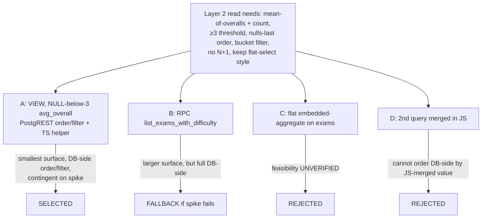

# ADR-0008 Exam Difficulty Rating: On-Read Aggregation and Cross-Table Authorization

## Status

Accepted — 2026-07-23. Core direction locked with the product owner (2026-07-23). Records the architecture for the difficulty-rating feature ahead of the Backend Design Doc.

- PRD: `docs/prd/rating-system-prd.md` (v1.1) — R1–R8 (rating capture, eligibility, upsert, on-read difficulty, sort/filter, no cache/trigger/backfill).
- Sibling ADRs: ADR-0001 (UGC lifecycle + RLS enforcement — the `exam_reports` / cross-table-RLS precedents this ADR builds on), ADR-0005 (the three fixed national-format parts a rating scores).
- Scope note: this ADR records **decisions, rationale, and principle-level guidance only**. Exact DDL, column names, and query code belong in the Backend Design Doc that follows.

## Context

MS-MOLAR is a Next.js (App Router) + Supabase (Postgres + RLS + Auth) exam-practice site. `SOURCE/supabase/schema.sql` is applied by hand in the Supabase SQL Editor as a **single idempotent file** — no migration framework (same constraint as ADR-0001).

The rating feature (PRD v1.1) lets a user who has **submitted** an exam rate the difficulty of its three fixed parts (ADR-0005: `mcq` / `true_false` / `short_answer`), each an integer 1–10. A user's *overall* is the mean of their three part scores; an exam's *community difficulty* is the mean of all raters' overalls, surfaced as a bucket + mean once the exam reaches ≥ 3 ratings. This drives the exam browser's currently-inert `Hardest` sort and `Level` filter, and replaces the `"—"` placeholders on `ExamCard` and the detail page.

### Why an ADR is required

Three ADR triggers from the documentation-criteria skill are met:

1. **Read-model contract change** — the `Exam` read model gains a derived community-difficulty value consumed in ≥ 3 sites (`ExamCard`, exam detail page, `ExamFilters`/`listExams`).
2. **New derived data-flow** — a per-exam aggregate (mean-of-means + count + threshold + bucket) feeds difficulty display, a real `Hardest` sort, and a `Level` filter.
3. **New cross-table authorization rule** — rating writes are gated by an existing submitted `exam_attempts` row for the same user/exam.

### The existing read style (the shape any mechanism must fit)

`listExams` today is a single flat query — `supabase.from("exams").select(EXAM_COLUMNS).eq("status","published").order(...)` (`SOURCE/app/(layer2)/queries.ts:64-89`) — mapped by `toExam` (`:33-47`) from the shared `EXAM_COLUMNS` (`:30-31`). `ExamSort` is `"newest" | "oldest"` (`:52`); `hardest` is explicitly deferred ("`hardest` TẠM BỎ QUA (chờ rating)"). `getExam` is the same flat select for one id (`:128-138`). All reads keep the explicit `.eq("status","published")` catalog guard.

### CRITICAL UNVERIFIED CONSTRAINT (flagged for the spike)

It is **not verified** that PostgREST, on this Postgres/Supabase version, can express — through a single flat embedded-aggregate select on `exams` — the full combination the browser list needs simultaneously: per-exam mean-of-rater-overalls, a rating COUNT, a `HAVING`-style ≥ 3 threshold, ordering by the aggregate DESC with unrated/below-threshold rows **last** (nulls-last), and a computed-bucket filter. The mechanism decision (Decision 2) must not assume this works; it commits to a pre-implementation verification spike with a defined fallback.

### Grounding facts (treated as ground truth)

- `exam_attempts.status` is `'in_progress' | 'submitted'`, `user_id default auth.uid()` (`schema.sql:99-106`) — the eligibility source of truth.
- Cross-table `EXISTS` with-check precedent: `answers_insert_own` (`schema.sql:182-189`).
- Published-only with-check precedent, AND-ed into an insert policy: `reports_insert_own` (`schema.sql:331-335`) — but `exam_reports` has **insert-own and select-own but no update-own** (`schema.sql:330-340`), because reports are not editable.
- `exam_reports` table shape the ratings table is modeled on: `unique(exam_id, reporter_id)`, `reporter_id default auth.uid()`, non-empty CHECK, appended idempotently (`schema.sql:247-258`).
- `exams.created_at` exists (`schema.sql:81, 89`) — available as the deterministic tie-break key alongside `id`.
- Vitest collects only `lib/**` and `components/**` — a pure display helper under `SOURCE/lib/rating/` is unit-testable; SQL and PostgREST wiring are not covered by vitest.

## Decision

### Decision 1 — On-read aggregation, no denormalization (records the product decision)

Community difficulty is computed **on read**. There is **no** denormalized cache column on `exams`, **no** trigger, and **no** backfill (PRD R8 / AC-022 / AC-023). The aggregate over `exam_difficulty_ratings` is evaluated at query time inside the Layer 2 reads.

Rationale: at local-only pre-launch scale the aggregate is cheap; on-read is **correct by construction** (a new/edited/deleted rating is reflected on the next read with no invalidation logic); it avoids the entire write-path/trigger/cache-coherence surface that a denormalized column would add. Accepted consequence: the aggregate cost is paid on every catalog read rather than amortized into writes — acceptable at this scale and revisitable if the catalog grows (see Consequences).

### Decision 2 — On-read mechanism: a Postgres VIEW with a NULL-below-threshold aggregate column, plus a pure TS display helper (selected)

Express the on-read aggregate as a **Postgres view** (working name `exams_with_difficulty`) that left-joins the per-exam rating aggregate onto `exams` and exposes every existing `EXAM_COLUMNS` field **plus** `status`, `rating_count`, and `avg_overall`. The view's defining move: **`avg_overall` is the mean of rater overalls only when `rating_count >= 3`, and `NULL` otherwise.** Encoding the ≥ 3 threshold as a NULL cutoff inside the view lets the three hard requirements be met through ordinary PostgREST operators on the existing flat-select style, with no `HAVING` clause and no RPC:

- **Hardest sort** — `.order("avg_overall", { ascending: false, nullsFirst: false }).order("created_at").order("id")`: rated exams descend by difficulty; below-threshold/unrated exams (NULL) sink to the bottom in deterministic `created_at`→`id` order (AC-019/AC-020).
- **Level filter** — range predicates on `avg_overall` (`Easy` `[1,4)` → `.gte(1).lt(4)`; `Medium` `[4,7)` → `.gte(4).lt(7)`; `Hard` `[7,10]` → `.gte(7)`). Because SQL comparisons against NULL are never true, below-threshold exams are excluded from any selected bucket **for free** (AC-021).
- **Published guard preserved** — the view exposes `status`, so the existing `.eq("status","published")` guard still applies unchanged.
- **Detail page** — `getExam` selects `avg_overall` + `rating_count` for one exam from the same view (AC-016).
- **No N+1** — one aggregate is computed inside one view query; there is no per-card round-trip.

The **bucket labelling, mean rounding (e.g. `"7.2"`), and the `"—"` empty state** stay in a pure, unit-tested helper under `SOURCE/lib/rating/` (vitest-covered), fed `avg_overall` + `rating_count` after fetch. Display logic stays testable in TS; only the ordering/threshold/filtering that **must** run DB-side lives in SQL. The `N = 3` threshold is therefore expressed in two coordinated places — the view (as the NULL cutoff, because ordering/filtering are DB-side) and the helper (as the `"—"` cutoff, for display) — and the Design Doc must keep them a single named constant referenced from both.

`ExamSort` gains a `hardest` value; `listExams`/`getExam` read from the view instead of the base table; `EXAM_COLUMNS`/`toExam` extend by two fields. No write path, trigger, or cache is introduced.

**This selection is contingent on the verification spike** (below) confirming PostgREST honours `nullsFirst:false` plus chained secondary `.order()` and the range predicates on a **view** column against the live database. If the spike fails, fall back to Decision 2 option (B), an RPC, with all other decisions unchanged.

### Decision 3 — Rating-write eligibility enforced in BOTH layers

A new table `exam_difficulty_ratings`, modeled on `exam_reports` and appended idempotently to the single `schema.sql`. Eligibility — an `exam_attempts` row with `user_id = auth.uid()` **and** `status = 'submitted'` for that exam — is enforced in two layers:

1. **Authoritative (DB / RLS)** — RLS `with check` on the ratings table using a cross-table `EXISTS` on `exam_attempts` (pattern precedent `answers_insert_own`, `schema.sql:182-189`), **AND-ed** with a published-only clause (precedent `reports_insert_own`, `schema.sql:331-335`) and `user_id = auth.uid()`. This survives a direct Supabase-client bypass, including a direct `POST` to `/exams/[id]/rate` (AC-008, PRD metric 1).
2. **UX (server action)** — an early eligibility check in the `rateExam` server action returning a clean `ineligible` error before attempting the write (AC-011 messaging support), so the common case fails fast with a friendly message rather than a raw RLS rejection.

Because the rating is an **upsert** keyed by `unique(exam_id, user_id)` (R5), the table requires **both** an insert-own **and** an update-own RLS policy — each independently carrying the `user_id = auth.uid()` + eligibility + published clauses. This is a deliberate deviation from the `exam_reports` precedent, which has insert-own only (reports are not editable). A **select-own** policy is also required for the "already rated" prefill (AC-013). A **CHECK constraint restricts each of the three part scores to an integer in `[1, 10]`** (AC-002). The three part scores are stored; whether an `overall` is additionally persisted is a Design Doc decision (PRD I001) — the aggregate can derive it either way.

### Decision Details

| Item | Content |
|------|---------|
| **Decision** | (1) On-read aggregate, no cache/trigger/backfill. (2) A Postgres view `exams_with_difficulty` exposing `avg_overall` (NULL when `rating_count < 3`) + `rating_count`, read by `listExams`/`getExam`; DB-side order/threshold/bucket via PostgREST operators on the view; bucket/mean/`"—"` in a pure `SOURCE/lib/rating/` helper. (3) `exam_difficulty_ratings` with eligibility enforced in BOTH RLS (cross-table `EXISTS` + published, insert-own AND update-own AND select-own) and the `rateExam` server action; per-part `[1,10]` CHECK; `unique(exam_id, user_id)`. |
| **Why now** | The feature adds a read-model field consumed in 3+ sites, a new derived data-flow, and a cross-table auth rule — all must land together in the single idempotent schema file and the Layer 2 reads. |
| **Why this** | The NULL-below-threshold view makes nulls-last ordering and bucket filtering expressible through the **existing flat-select style** with no HAVING/RPC — the lowest-surface fit. Keeping bucket/display in TS keeps the vitest-testable logic testable. Two-layer auth mirrors the DB-is-the-gate discipline of ADR-0001 while giving a clean UX error. |
| **Known unknowns (spike / Design Doc)** | Whether PostgREST honours `nullsFirst:false` + chained `.order()` + range predicates on a **view** column on this version (spike, below). Exact table/column names, three-parts-vs-stored-overall, mean rounding precision — Design Doc. |
| **Kill criterion** | If the spike shows the view + PostgREST cannot express nulls-last ordering **and** the bucket filter without an RPC, and the RPC fallback (option B) also cannot express the sort/filter/threshold server-side, the on-read mechanism is invalid and must be re-designed before UI work. |

### Pre-implementation verification spike (BLOCKING, before any UI/query build)

Before building on Decision 2, run the actual chosen query against the **live** Supabase/PostgREST:

1. Create the view (or a throwaway equivalent) with the NULL-below-threshold `avg_overall`.
2. Confirm `.select(...).eq("status","published").order("avg_overall",{ascending:false,nullsFirst:false}).order("created_at").order("id")` returns rated-first, NULLs-last, deterministically tie-broken rows.
3. Confirm the range predicates (`.gte/.lt` on `avg_overall`) exclude below-threshold (NULL) rows from a selected bucket.
4. Confirm `getExam` can read `avg_overall` + `rating_count` for a single id from the view.

Success = all four hold with a single flat select (no client-side reordering). **Failure response**: adopt Decision 2 option (B) — an RPC `list_exams_with_difficulty` encapsulating join/aggregate/threshold/order/filter server-side — leaving Decisions 1 and 3 and the TS display helper unchanged.

## Rationale

### Decision 1 — Options Considered (on-read vs. denormalized)

1. **On-read aggregate (Selected).** Pros: correct-by-construction, no invalidation logic, zero write-path surface, cheap at pre-launch scale; matches PRD R8 (a locked product decision). Cons: aggregate cost paid per catalog read.
2. **Denormalized `exams.community_difficulty` + trigger + backfill.** Cons: **rejected** by product decision (R8) and on merit — adds a write path, trigger maintenance, cache-coherence risk (stale on rating edit/delete), and a backfill in the idempotent file, for no benefit at this scale.

### Decision 2 — Options Considered (on-read mechanism)

| # | Option | Sort/filter/threshold DB-side? | Fits existing flat-select? | New DB surface | Verdict |
|---|--------|-------------------------------|----------------------------|----------------|---------|
| A | **Postgres VIEW `exams_with_difficulty`** (NULL-below-threshold `avg_overall`) + PostgREST order/filter + TS bucket helper | Yes — via `nullsFirst:false` + range predicates | Yes — `from(view).select().eq(...).order(...)` is the same shape | 1 view | **Selected** (contingent on spike) |
| B | **Postgres RPC** `list_exams_with_difficulty(...)` encapsulating join/aggregate/threshold/order/filter | Yes — fully in SQL function | Partial — replaces `.select()` chain with `.rpc()`; filters become args | 1 function | **Fallback** if spike fails |
| C | **Flat embedded-aggregate select on `exams`** | Only if PostgREST can express avg-desc-nulls-last + HAVING-style ≥3 + computed-bucket through the embedded aggregate | Yes | 0 | **Rejected** — feasibility unverified (the CRITICAL constraint); do not build on an unproven capability |
| D | **Second aggregate query keyed by `exam_id`, merged in JS** in `toExam`/`listExams` | **No** — the merge happens after fetch | No | 0 | **Rejected** — you cannot order the `exams` query DB-side by a value merged in JS afterward; breaks `Hardest` (AC-019) and the `Level` filter (AC-021) |

Selection rationale: A is the **smallest surface that keeps ordering, threshold, and filtering DB-side** (required by AC-019/020/021 and NFR "no N+1 / no client-side aggregation") while preserving the existing flat-select read style. The NULL-below-threshold encoding is what collapses "threshold + nulls-last + bucket filter" into ordinary PostgREST operators, avoiding B's heavier RPC ergonomics (opaque to PostgREST filter chaining, harder to compose with the existing `subject`/`grade`/etc. filters). B is a genuine, ready fallback because it can also express everything server-side; it is not selected first only because it is a larger surface and diverges from the flat-select convention. C is rejected as **unverified** — adopting it would violate "do not build on unproven capability." D is rejected on correctness: DB-side ordering by a JS-merged value is impossible.

### Decision 3 — Options Considered (eligibility enforcement placement)

1. **UI-only gating.** Cons: **rejected** — clients talk to Supabase directly; a direct `POST` to `/exams/[id]/rate` bypasses the UI (AC-008 fails by construction). Same reasoning as ADR-0001's app-layer-only rejection.
2. **RLS-only (no server-action check).** Pros: authoritative. Cons: the ineligible user gets a raw RLS rejection with no clean, localizable message; worse UX for the common "haven't finished yet" case.
3. **Both layers — RLS authoritative + server-action early check (Selected).** Pros: DB is the real gate (survives bypass, PRD metric 1); the server action returns a clean `ineligible` error for UX. Cons: the eligibility predicate is expressed in two places and must stay in sync — accepted, and the RLS copy is authoritative if they ever diverge.

## Consequences

### Positive

- One aggregate view feeds display, `Hardest` sort, and `Level` filter with no per-card query (no N+1); the browser read keeps its existing flat-select shape.
- Correct-by-construction difficulty: an inserted/edited/deleted rating is reflected on the next read with zero invalidation code; no denormalized `exams` write and no trigger (AC-022/023, PRD metric 7).
- Bucket/mean/`"—"` logic is a pure, vitest-covered helper (`SOURCE/lib/rating/`), satisfying PRD metrics 3/4 without touching SQL.
- Eligibility survives a direct-client bypass (RLS `EXISTS` + published), while the server action gives a friendly `ineligible` message — the ADR-0001 "DB is the gate" discipline extended to a new cross-table rule.

### Negative

- The `N = 3` threshold lives in two coordinated places (the view's NULL cutoff and the TS helper's `"—"` cutoff); they must be kept consistent via a single named constant referenced from both.
- Decision 2 depends on a PostgREST capability that is **unverified until the spike**; if the spike fails, the RPC fallback is a larger surface and diverges from the flat-select convention.
- On-read aggregate cost is paid on every catalog read; at much larger catalog scale this could warrant a materialized view or denormalization — explicitly out of scope now and revisitable then.
- The eligibility predicate is duplicated across the RLS policy and the server action (mitigated: RLS is authoritative).

### Neutral

- `Exam` read model and `EXAM_COLUMNS`/`toExam` grow by two fields (`avg_overall`, `rating_count`); `ExamSort` gains `hardest`. Existing `newest`/`oldest` sorts and the subject/grade/school/year/semester filters are unaffected.
- The ratings table adds RLS surface (insert-own + update-own + select-own) beyond the `exam_reports` insert-own precedent — a direct consequence of ratings being editable (upsert), not a new pattern.
- Attempt/result tables are untouched; eligibility only reads `exam_attempts.status`.

## Architecture Impact

- **New DB**: `public.exam_difficulty_ratings` (three part-score columns with per-part `[1,10]` CHECK, `unique(exam_id, user_id)`, `user_id default auth.uid()`), its insert-own/update-own/select-own RLS policies (each carrying `auth.uid()` + submitted-attempt `EXISTS` + published clauses), and the `exams_with_difficulty` view — all appended idempotently to the single `SOURCE/supabase/schema.sql` (`create table if not exists`, `drop policy if exists`, `create or replace view`).
- **Changes**: `SOURCE/app/(layer2)/queries.ts` — `listExams`/`getExam` read the view; `EXAM_COLUMNS`/`toExam` extend by `avg_overall`/`rating_count`; `ExamSort` gains `hardest`; `ExamFilters` gains a `level` dimension. `SOURCE/types/exam.ts` — `Exam` gains the derived community-difficulty field. `SOURCE/app/(layer2)/_components/ExamCard.tsx` and `SOURCE/app/(layer2)/exams/[id]/page.tsx` — replace `"—"` via the display helper. `SOURCE/app/(layer2)/_components/ExamFilters.tsx` and `SOURCE/app/(layer2)/exams/page.tsx` — real `Level` filter + `Hardest` wired to `listExams`.
- **New app code**: a `rateExam` server action (write, following the `reportExam`/`ReportExam.tsx` precedent) and `SOURCE/lib/rating/` (bucket/mean/`"—"` helper).
- **Constraints added**: rating writes are a hard RLS gate on submitted-attempt existence + published; one rating per `(exam_id, user_id)`; each part score integer `[1,10]`.
- **No ripple**: attempt/result read/write paths, scoring (`SOURCE/lib/scoring/`), UGC upload/extraction (Layer 4), and Storage are untouched.

## Implementation Guidance

- Run the **verification spike first**; do not build the browser query or UI on Decision 2 until nulls-last ordering + bucket filtering are confirmed against live PostgREST, or the RPC fallback is adopted.
- Keep the difficulty aggregate DB-side (view or RPC). Never merge a per-exam aggregate in JS and then try to order/filter by it — that path (option D) cannot satisfy `Hardest`/`Level`.
- Express `N = 3` once as a named constant; reference it from both the view definition and the TS display helper so the ordering/filter threshold and the `"—"` display threshold cannot drift.
- Enforce eligibility in RLS as the authoritative gate (cross-table `EXISTS` on submitted `exam_attempts`, AND-ed with published and `user_id = auth.uid()`); treat the `rateExam` server-action check as UX ergonomics over the DB invariant, not the gate.
- The ratings table needs insert-own **and** update-own **and** select-own policies (upsert + prefill) — do not copy `exam_reports`' insert-own-only shape.
- Every table, constraint, policy, and view must be idempotent (`if not exists` / `drop policy if exists` / `create or replace view`), consistent with the existing file's conventions.
- Keep bucket boundaries and mean rounding in `SOURCE/lib/rating/` with boundary-fixture unit tests (3.9/4.0, 6.9/7.0, 1.0, 10.0) per PRD metric 4; SQL owns only ordering/threshold/filtering.
- Extend the RLS verification suite with an ineligible-write case (direct write attempt asserting zero rows) and a duplicate-submission case (assert one row, latest scores) per PRD metrics 1 and 2.

## Related Information

- PRD `docs/prd/rating-system-prd.md` (v1.1) — R1–R8, NFR Performance/Security, Success metrics 1–7, Undetermined Items (table shape + on-read mechanism owned here / by the Design Doc).
- ADR-0001 (UGC lifecycle + RLS enforcement) — `exam_reports` model, cross-table RLS, DB-is-the-gate discipline.
- ADR-0005 (multi-part national format) — the three fixed parts (`mcq`/`true_false`/`short_answer`) a rating scores.
- Code touchpoints: `SOURCE/supabase/schema.sql:99-106` (`exam_attempts.status`), `:182-189` (`answers_insert_own` cross-table `EXISTS`), `:247-258` (`exam_reports` shape), `:330-340` (`reports_insert_own` published clause, insert-own only); `SOURCE/app/(layer2)/queries.ts:30-31,33-47,52,64-89,128-138` (`EXAM_COLUMNS`/`toExam`/`ExamSort`/`listExams`/`getExam`).
</content>
</invoke>
