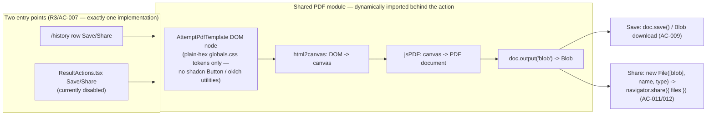

# ADR-0009 PDF-Generation Library Choice for the History Feature

## Status

Accepted — 2026-07-27. Locked with the product owner (2026-07-27) ahead of the History Design Doc.

- PRD: `docs/prd/history-prd.md` (v1.2, Draft — product decisions locked with the product owner (2026-07-27), ready for downstream chain) — R3/R4/R5, AC-006–AC-013, NFR Performance.
- Scope note: this ADR records **decision, rationale, option comparison, and principle-level implementation guidance only**. Exact module boundaries, file naming, and code go in the History Design Doc that follows.

## Context

The History feature (PRD v1.2) needs a **client-side**, custom-branded, **summary-only** PDF (score, completion time, exam metadata — explicitly no per-question detail, R3/AC-006) generated from one shared module, triggered from two entry points:

1. The new `/history` list page, each row's Save/Share action.
2. The existing per-attempt Result page's `ResultActions.tsx` (`SOURCE/features/exams/components/ResultActions.tsx:19-36`), whose Save/Share buttons currently render `disabled` with a "coming soon" tooltip (`:26-27`).

Save downloads the PDF directly; Share hands the browser/OS a real file via `navigator.share({ files: [pdfFile] })` (R5) — no new public/unauthenticated link is created (AC-013).

### Why an ADR is required

Introducing a new runtime dependency in `SOURCE/package.json` is an ADR-triggering condition under the documentation-criteria skill ("External Dependency Changes") regardless of how settled the choice already is. The PRD (Technical Considerations > Dependencies) states the choice was already locked with the product owner and explicitly defers the justification to "a short ADR" — this document supplies that justification with a genuine, independently-verified option comparison rather than a one-sided write-up.

### Existing-code investigation (similar functionality check)

`SOURCE/package.json` already depends on `mupdf` (`^1.28.0`), used in `SOURCE/lib/ugc/pdf.ts:8-32`, `SOURCE/features/authoring/actions.ts`, `SOURCE/lib/ugc/cropImages.ts`, and `SOURCE/lib/ugc/extractMeta.ts` (imports `renderPdfPage` from `pdf.ts`, per the file's own docblock and a grep confirming the import). This is a **different responsibility**: it is a **server-only WASM PDF parser/rasterizer** (`getPdfPageCount`, `renderPdfPage`) that reads a user-**uploaded** PDF during Layer 4 UGC exam extraction and renders its pages to PNG for the AI pipeline — it reads existing PDF bytes, does not author new ones, and runs server-side, not in the browser. It does not satisfy this feature's need (client-side **generation** of a new, branded PDF) and pulling a server-only WASM PDF parser into a client bundle for an unrelated purpose would be architecturally inappropriate. Conclusion: **no reusable existing implementation; new dependency is warranted**, subject to the option comparison below.

### Verified constraints (independently re-checked, not taken as given)

1. **`@react-pdf/renderer` + Next.js App Router + React 19 — active, documented risk.** WebSearch confirms open GitHub issues on `diegomura/react-pdf`: [#3020](https://github.com/diegomura/react-pdf/issues/3020) ("Getting Example to work with Next.js & React 19+", reported against Next.js 15.1.2 / React 19.0.0 / react-pdf 4.1.6) and [#3285](https://github.com/diegomura/react-pdf/issues/3285) (`@react-pdf/renderer` crashes via an external package under Next.js App Router — `TypeError: Cannot read properties of undefined (reading 'S')` during `renderToStream`, reported against Next.js 15 App Router / React 19 / react-pdf 4.3.2). Related open issues ([#2964](https://github.com/diegomura/react-pdf/issues/2964), [#2756](https://github.com/diegomura/react-pdf/issues/2756), [#2912](https://github.com/diegomura/react-pdf/issues/2912)) track React 19 support more broadly; react-pdf documents React 19 support only since v4.1.0, with the App Router combination still reporting breakage. This repo runs **Next.js 16.2.7 + React 19.2.4** (`SOURCE/package.json:24-26`) — a newer combination than any of the reported (and still-open) issue threads, so there is no positive evidence this exact combination works, only evidence the adjacent, older combination does not reliably.
2. **`oklch()` / `color-mix(in oklch, ...)` vs. html2canvas — active, documented constraint.** WebSearch confirms `html2canvas` throws `Error: Attempting to parse an unsupported color function "oklch"` when it encounters CSS colors expressed via `oklch()` or Tailwind v4's `color-mix(in oklab, ...)` opacity utilities ([niklasvh/html2canvas#3148](https://github.com/niklasvh/html2canvas/issues/3148), [#3150](https://github.com/niklasvh/html2canvas/issues/3150), [#3269](https://github.com/niklasvh/html2canvas/issues/3269); a fork, `html2canvas-pro`, exists specifically to add this support but is not the library the product decision names). Direct read of this repo's files confirms both halves of the constraint:
   - `SOURCE/app/globals.css:59-95` — every root token resolves to a plain hex or `rgb()` value (none use `oklch()`/`color-mix()`): `--background`, `--foreground`, `--brand`, `--primary`, `--border`, `--ring`, etc. (lines 59-92, 94-95) are plain hex; `--sidebar-border` (line 93) is `rgb(237 225 200 / 0.12)` — both forms parse correctly in html2canvas, unlike `oklch()`/`color-mix()`. Safe.
   - `SOURCE/components/ui/button.tsx:15` — the shadcn `Button`'s `secondary` variant hover state is `hover:bg-[color-mix(in_oklch,var(--secondary),var(--foreground)_5%)]`. **Unsafe** if rasterized by html2canvas.
   - **Resulting constraint**: the custom PDF template DOM node must use only plain-hex-resolving styles (the root `globals.css` tokens read directly, per `PROJECT_OVERVIEW.md §2` "Ink & Lacquer"), and must **not** compose the shadcn `Button` component or any Tailwind-default-palette utility that resolves through `color-mix(in oklab/oklch, ...)`. This is carried into Implementation Guidance below.
3. **`jsPDF` output is a `Blob`, which satisfies `navigator.share({ files })`'s `File` requirement via one conversion step.** `jsPDF`'s `doc.output("blob")` returns a `Blob`; the [Web Share API](https://developer.mozilla.org/docs/Web/API/Web_Share_API) requires a `File` (not a bare `Blob`) for `navigator.share({ files })`, obtained with `new File([blob], filename, { type: "application/pdf" })`. This closes the loop from rasterized canvas → PDF bytes → shareable file with one well-documented step (Design Doc detail; not re-litigated here).
4. **`window.print()` / `@media print` does not yield a `File`/`Blob` at all.** The browser print pipeline hands the rendering to the OS/browser print dialog; there is no documented JS API that returns the resulting PDF bytes to the page. This is a **hard functional gap** against R5/AC-011 (`navigator.share({ files })`), not a styling preference — Option 3 below is rejected on this basis, independent of any UI opinion.

## Decision

### Decision Details

| Item | Content |
|------|---------|
| **Decision** | Use `jsPDF` + `html2canvas` — render the custom-branded, summary-only PDF template as a plain-hex-styled DOM node client-side, rasterize it with `html2canvas`, and assemble the resulting image into a PDF with `jsPDF`, dynamically imported behind the Save/Share action. |
| **Why now** | The History feature (PRD v1.2, Draft — product decisions locked with the product owner (2026-07-27), ready for downstream chain) needs this module for its MVP scope (R3–R6); the dependency choice is a prerequisite for the Design Doc. |
| **Why this** | Mature, independently-maintained libraries with no coupling to React's internal reconciler (avoiding the documented, currently-active React 19 / App Router risk that affects the vector-PDF alternative); `jsPDF`'s `Blob` output satisfies the `navigator.share({ files })` requirement directly; the only option (of four compared) that meets every locked product requirement (custom branding, downloadable file, shareable file) without a hard functional gap or an infrastructure gap. |
| **Known unknowns** | (1) Real-device rasterization latency on the mid-range Android / 3G baseline (`PROJECT_OVERVIEW.md` §8) is not yet measured — deferred to the Design Doc's early verification point and the project's Pha 0 manual-testing checklist (`PROJECT_OVERVIEW.md` §6). (2) Whether future template styling changes accidentally reintroduce an `oklch()`/`color-mix` dependency is not statically enforced by tooling today — a discipline, not a guarantee. |
| **Kill criteria** | If a future requirement mandates per-question or multi-page **vector, selectable-text** PDF content (out of scope today per R3/PRD "Won't Have"), or if real-device rasterization proves unacceptably slow/heavy on the mid-range Android baseline despite the summary-only DOM constraint, revisit — candidates at that point are `@react-pdf/renderer` (once its React 19 / App Router breakage is confirmed resolved upstream) or `html2canvas-pro` (drop-in html2canvas fork with native `oklch` support, removing the styling constraint but not addressed by this decision). |

## Rationale

### Options Considered

1. **`jsPDF` + `html2canvas` (Selected)** — client-side, screenshot-based rasterization of a styled DOM node into a PDF.
   - Pros: mature, widely used, no React-version coupling (renders a plain DOM node, not through a custom React reconciler); `Blob` output is a one-step conversion away from `navigator.share({ files })`; both libraries are dynamically importable, keeping them out of the main bundle (NFR: Lighthouse ≥85 mobile, FCP ≤2.5s on 3G, `PROJECT_OVERVIEW.md` §8).
   - Cons: output is a **raster image** embedded in a PDF — no selectable/searchable text, larger file size than a vector PDF, and text can look soft if the user zooms; `html2canvas` cannot parse `oklch()`/`color-mix(in oklch, ...)`, which hard-constrains the template DOM to plain-hex-resolving styles (verified above) — an ongoing discipline requirement, not a one-time fix.

2. **`@react-pdf/renderer`** — JSX-based PDF generation (vector, real selectable text, smaller files).
   - Pros: vector output, selectable/searchable text, typically smaller file size, declarative JSX authoring closer to the rest of the React codebase.
   - Cons: **documented, currently-active compatibility risk** with Next.js App Router + React 19 (verified above: open issues #3020, #3285, #2964, #2756, #2912) — this repo's Next.js 16.2.7 + React 19.2.4 is a newer combination than any reported-working configuration, so adopting it means being the first to find out whether the newer combination is fixed or newly broken, on a feature with no schedule slack for that discovery. This is the deciding factor against an otherwise-attractive option.

3. **Browser print CSS (`@media print` + `window.print()`)** — zero new dependency, OS/browser print-to-PDF dialog.
   - Pros: no new dependency at all; browsers already render print styles reliably.
   - Cons: **hard functional gap, not a style preference** (verified above) — `window.print()` hands control to the OS dialog and never returns a `File`/`Blob` to the page, so `navigator.share({ files: [pdfFile] })` (R5, AC-011) cannot be implemented at all with this option; it also cannot produce a single deterministic downloadable artifact for "Save" without the user choosing "Save as PDF" manually in the OS dialog, which is not equivalent to a scripted download (AC-009). Rejected on functional grounds before any comparison of visual quality.

4. **Server-side / headless-browser rendering** (e.g., Puppeteer or `@sparticuz/chromium` in a Vercel serverless function) — considered as a fourth option since `PROJECT_OVERVIEW.md`'s intended deployment target is Vercel.
   - Pros: full vector/print-quality rendering fidelity, no client-side rasterization cost, sidesteps both the React-19 risk (server-rendered HTML, not JSX-to-PDF) and the `oklch` limitation (a real browser engine renders any CSS correctly).
   - Cons: **rejected** — this project is currently local-only/pre-launch with no hosting platform or CI/CD yet (`docs/project-context/external-resources.md`, "Deployment Trigger: not applicable"), so there is no server infrastructure to host this on today; even once Vercel is adopted, headless Chromium in serverless functions carries well-known cold-start latency and deployment binary-size constraints; and a server round trip to generate the PDF would violate AC-009 ("using only data already available to that page/row... no extra round trip"). Rejected on both infrastructure-availability and requirement grounds, not merely preference.

```mermaid
flowchart TD
    Q["Need: client-side, custom-branded,<br/>summary-only PDF; must yield a File/Blob<br/>for navigator.share; mid-range-Android perf budget"]
    Q --> A["A: jsPDF + html2canvas<br/>(DOM rasterization)"]
    Q --> B["B: @react-pdf/renderer<br/>(JSX -> vector PDF)"]
    Q --> C["C: Browser print CSS<br/>(@media print + window.print())"]
    Q --> D["D: Server-side headless browser<br/>(Vercel serverless + Chromium)"]
    A -->|mature, no React-reconciler coupling,<br/>Blob output, dynamically importable| SEL["SELECTED"]
    B -->|documented React 19 / App Router breakage,<br/>no evidence this newer combo works| REJ1["REJECTED — risk"]
    C -->|no File/Blob returned to the page -><br/>navigator.share({files}) impossible| REJ2["REJECTED — hard functional gap"]
    D -->|no server hosting infra exists yet;<br/>serverless cold-start/binary size;<br/>violates 'no extra round trip' AC-009| REJ3["REJECTED — infra & requirement"]
```

Selection rationale: Option A is the only option that satisfies every locked product requirement (R3 custom branding, R4 Save/download, R5 Share-as-file) with no hard functional gap and no unproven-compatibility risk on this exact stack. Its accepted cost — a raster-only PDF and a real styling constraint on the template DOM — is a bounded, documented, and testable trade-off; Options B and D carry risks (unproven newer-stack compatibility; no infrastructure to run on) that are not something this feature can absorb, and Option C fails a hard requirement outright.

## Consequences

### Positive Consequences

- No React-version-coupling risk: rendering goes through a plain DOM node and a screenshot library, not through `@react-pdf/renderer`'s custom reconciler — avoiding the currently-open, unresolved React 19 / App Router issue class entirely.
- `jsPDF`'s `Blob` output is a one-step conversion (`new File([blob], name, { type })`) away from satisfying `navigator.share({ files })`, directly enabling R5 without any additional format-conversion library.
- Both libraries are dynamically importable; loaded only inside the Save/Share handler, they add zero weight to the initial bundle and do not affect FCP/Lighthouse (`PROJECT_OVERVIEW.md` §8 NFR).
- The template DOM can reuse the app's existing `globals.css` root design tokens and Tailwind layout utilities (as long as they resolve to plain hex) — no separate low-level PDF layout/positioning API to learn, unlike `@react-pdf/renderer`'s primitive-based layout model.

### Negative Consequences

- Output is a rasterized image inside the PDF: no selectable/searchable text, generally larger file size than a vector PDF, and text can look soft when the user zooms in.
- `html2canvas`'s `oklch()`/`color-mix(in oklch, ...)` limitation (verified above) hard-constrains the template DOM to plain-hex-resolving styles — it must not compose the shadcn `Button` component or Tailwind-default-palette utilities that resolve through `color-mix`. This is an ongoing discipline for anyone touching the template, not a one-time setup cost, and is not statically enforced by any linter today.
- Two new runtime dependencies (`jsPDF`, `html2canvas`) are added to `SOURCE/package.json`, increasing supply-chain surface; mitigated by dynamic import (no bundle-size regression) but not eliminated as a maintenance/security-patching surface.

### Neutral Consequences

- Bundle-size cost is deferred to the first Save/Share click rather than page load (dynamic import): this avoids any FCP/Lighthouse regression but does add first-click latency the first time a user triggers generation, which AC-010's required busy-state already covers.
- `navigator.share`'s file-sharing support gap on some desktop browsers (notably desktop Firefox) is a Web Share API platform limitation independent of this library choice; it drives the Share button's required fallback behavior (R5/AC-012), which is a UI Spec/Design Doc concern, not a PDF-library concern.

## Architecture Impact



- **New dependencies**: `jsPDF` and `html2canvas` added to `SOURCE/package.json` (client-side only, dynamically imported — never a top-level import of a page or layout module).
- **New client-side module** (naming owned by the Design Doc, PRD working names: `generateAttemptPdf.ts` + `AttemptPdfTemplate.tsx`) — the single PDF-generation implementation consumed by both `/history` row actions and `SOURCE/features/exams/components/ResultActions.tsx` (R3/AC-007: exactly one implementation, not two parallel ones).
- **No server, database, or RLS impact** — generation is entirely client-side; no new route, endpoint, or backend service is introduced (consistent with the PRD's "no schema/RLS changes" constraint).
- **No change to `mupdf`'s server-side PDF-parsing path** (`SOURCE/lib/ugc/pdf.ts`, Layer 4 UGC extraction) — that dependency and this one serve unrelated responsibilities and do not interact.
- **New styling constraint on one DOM subtree**: the PDF template component's styles must resolve only to plain hex (root `globals.css` tokens); it may not import the shadcn `Button` component or rely on Tailwind-default-palette utilities that resolve through `color-mix(in oklch, ...)`.

## Implementation Guidance

- Dynamically `import()` `jsPDF` and `html2canvas` only inside the Save/Share handler (or a lazily-loaded module they live in) — never at the top level of `/history`, the Result page, or any layout that renders on initial load, so the added dependencies never affect FCP/Lighthouse.
- Build the branded PDF template as a DOM node whose styles resolve exclusively to plain hex/rgb values (the root `globals.css` design tokens, read directly or via Tailwind utilities that compile to those tokens) — do not compose the shadcn `Button` component or any Tailwind-default-palette utility inside this template; re-verify with a visual smoke check whenever the template is modified, since no automated check currently guards this constraint.
- Treat `jsPDF`'s `Blob` output as the single source for both code paths: both Save and Share must derive from one Blob-producing call, not two separate generation paths, so they generate byte-identical output. Converting that `Blob` to a `File` object for `navigator.share({ files })` is a Design Doc implementation detail, not decided here.
- Keep the `navigator.share` unsupported-browser fallback (R5/AC-012) as a UI-level concern owned by the Design Doc/UI Spec; this ADR's scope ends at "the library choice produces a `File`/`Blob` usable by either Save or Share."
- Enforce the single-implementation requirement (AC-007) structurally: both call sites import the same module; do not let a second, parallel PDF-generation path form under either entry point.

## Related Information

- PRD `docs/prd/history-prd.md` (v1.2) — R3/R4/R5, AC-006–AC-013, NFR Performance, Risks and Mitigation.
- Code touchpoints: `SOURCE/features/exams/components/ResultActions.tsx:19-36` (disabled Save/Share placeholder this feature wires up), `SOURCE/app/globals.css:59-95` (plain-hex root tokens, confirmed safe), `SOURCE/components/ui/button.tsx:15` (`color-mix(in_oklch, ...)` hover state, confirmed unsafe for the template DOM), `SOURCE/lib/ugc/pdf.ts:8-32` + `SOURCE/features/authoring/actions.ts` (existing `mupdf` server-side PDF parsing — unrelated responsibility, not reusable here), `SOURCE/package.json` (current dependency list; no existing PDF-generation library).
- Diegomura/react-pdf issues (React 19 / Next.js App Router risk): [#3020](https://github.com/diegomura/react-pdf/issues/3020), [#3285](https://github.com/diegomura/react-pdf/issues/3285), [#2964](https://github.com/diegomura/react-pdf/issues/2964), [#2756](https://github.com/diegomura/react-pdf/issues/2756), [#2912](https://github.com/diegomura/react-pdf/issues/2912).
- niklasvh/html2canvas issues (`oklch`/`color-mix` unsupported): [#3148](https://github.com/niklasvh/html2canvas/issues/3148), [#3150](https://github.com/niklasvh/html2canvas/issues/3150), [#3269](https://github.com/niklasvh/html2canvas/issues/3269).
- [MDN — Web Share API](https://developer.mozilla.org/docs/Web/API/Web_Share_API) — `navigator.share({ files })` requires `File` objects; feature-detected via `navigator.canShare`.
- `docs/project-context/external-resources.md` — confirms no hosting platform/CI-CD exists yet (basis for rejecting Option 4 on infrastructure grounds).
- `PROJECT_OVERVIEW.md` §8 (Non-Functional Requirements — Performance) — Lighthouse ≥85 mobile, FCP ≤2.5s on 3G, the basis for the dynamic-import requirement.

---

Updated 2026-07-27: fixed citation/precision issues from document-reviewer pass (R6→R3/AC-007 diagram label; PRD status corrected from "approved" to "Draft — product decisions locked with the product owner (2026-07-27), ready for downstream chain" in two places; removed literal code expression from Implementation Guidance; precision fix on globals.css token claim to include `rgb()`; added `SOURCE/lib/ugc/extractMeta.ts` to the mupdf-consumer citation).
