# ADR-0012 Support System Email Transport and Admin Allowlist Convention

## Status

Accepted — 2026-08-10 (engineer approval; account-category open check below confirmed personal/consumer Gmail, not Workspace). Resolves the blocking part of PRD `docs/prd/support-system-prd.md` (v1.2) D9 ("Email transport" Undetermined Item) and UI Spec `docs/ui-spec/support-system-ui-spec.md` (v1.1) TBD-04. Also resolves the non-blocking UI Spec TBD-06 by documenting an existing, already-implemented convention (`ADMIN_USER_IDS`) that has never had an ADR of its own. The transport decision is a hard prerequisite for the User Support System v1 Design Doc; the allowlist documentation is not.

- PRD: `docs/prd/support-system-prd.md` (v1.2) — D5 (fire-and-forget email, send failure logged + admin-visible flag), D6 (`SUPPORT_NOTIFY_EMAIL` recipient, locked, out of scope here), D9 (Gmail is the provider, locked; SMTP-vs-API transport deferred to this ADR), D10 (`[report-ms]` subject prefix, applies identically to whichever transport this ADR selects), R10 (fire-and-forget notification), R16/AC-043–AC-046 (subject-token contract), Undetermined Items "Email transport" (blocking) and "The `ADMIN_USER_IDS` allowlist model is an undocumented convention" (non-blocking).
- UI Spec: `docs/ui-spec/support-system-ui-spec.md` (v1.1) — Open Items TBD-04 (blocking) and TBD-06 (non-blocking).
- Tech-debt precedent: `TECH-DEBT.md` TD-017 ("Đã trả") — `instrumentation.ts` statically importing a Node-only module (`node:crypto` via `checkSchemaVersion`) polluted the Edge bundle because `instrumentation.ts` loads for every runtime including Edge; fixed by moving the import to a runtime-guarded `await import(...)`. This ADR's runtime-boundary analysis follows that precedent directly. TD-014 (open) — `ADMIN_USER_IDS` currently has Production scope only on Vercel, so `/admin` (and the new `/admin/tickets`) 404 on every Preview deploy.
- Existing convention referenced but not redecided: `SOURCE/lib/auth/admin.ts` (module header, lines 1–17), applied at `SOURCE/app/(admin)/admin/page.tsx:24-25`; `docs/adr/ADR-0001-ugc-content-lifecycle-and-rls-enforcement.md` (establishes "no database admin role", does **not** establish the env allowlist).

## Context

The requirement-analyzer flagged two independent conditions that each, on their own, meet the ADR Creation Conditions in the documentation-criteria skill:

1. **External dependency introduction (Condition 4).** `SOURCE/package.json` (`dependencies`, lines 16–42; `devDependencies`, lines 43–61) has no mail package of any kind today — no `nodemailer`, no `@google-cloud/*` mail client, no third-party transactional-email SDK. Whichever transport this ADR selects is the **first** mail dependency in this repository, not a swap between two already-configured options. PRD D9 locks Gmail as the *provider* but explicitly defers the *transport* (SMTP + App Password vs. Gmail API + OAuth2 refresh token) to this ADR, naming credential lifetime, revocation behavior, Edge/Node runtime constraints, and dependency weight as the required inputs (PRD D9, Undetermined Items).
2. **Data-flow / architecture documentation gap.** The internal-notes authorization shape (a separate table rather than a column on the ticket row, so Postgres RLS can filter it — PRD D4) is already resolved in the PRD itself and needs no further ADR-level decision here. What remains undocumented is a **different** decision: the `ADMIN_USER_IDS` env-allowlist authorization model that the new `/admin/tickets` page (PRD R7) depends on. The PRD's own v1.2 review found that this PRD's earlier drafts and `PROJECT_OVERVIEW.md:55` both cited `docs/adr/ADR-0001-ugc-content-lifecycle-and-rls-enforcement.md` as the source of that model. Reading ADR-0001 directly shows it does not: ADR-0001 states "without any admin role, admin RLS branch, `is_admin()` helper" (`:24`), "No admin anything" (`:30`), "No product-level admin surface is built" (`:70`), and "Do **not** add an admin role" (`:141`) — a *negative* constraint (no DB role), not the *positive* env-allowlist design. The allowlist itself is defined and justified in `SOURCE/lib/auth/admin.ts`'s module header (lines 1–17) and has never had its own ADR. UI Spec TBD-06 asks for this gap to be closed, non-blocking, "can ride along with the D9 transport ADR" (PRD Undetermined Items).

### Decision 1 — Email transport (blocking)

PRD D9 and UI Spec TBD-04 both name the same two options and the same required inputs. This ADR gathers those inputs directly against this repository rather than assuming them:

- **Repository has no mail dependency today** — confirmed by reading `SOURCE/package.json:16-42` in full; neither `nodemailer` nor any Gmail/mail SDK appears in `dependencies` or `devDependencies`.
- **Edge-bundle boundary** — `SOURCE/proxy.ts` is this repository's only Edge middleware (Next.js `matcher` at `SOURCE/proxy.ts:46-48` covers nearly every route except static assets); it imports only `next/server`, `@/lib/supabase/middleware`, and `@/lib/security/csp` — no mail-related import today. `SOURCE/instrumentation.ts` is the other Edge-reachable file: its own header comment states "Next nạp `instrumentation.ts` cho MỌI runtime, kể cả Edge (proxy.ts)" (`SOURCE/instrumentation.ts:11-17`), and TD-017 is the recorded incident where a *static* import in this exact file (`checkSchemaVersion` → `schemaFingerprint` → `node:crypto`) pulled a Node-only dependency tree into the Edge bundle at build time even though the code path never executed on Edge. The fix, still in place, is a runtime-guarded dynamic import: `if (process.env.NEXT_RUNTIME !== "nodejs") return;` before any `await import(...)` of Node-only modules (`SOURCE/instrumentation.ts:22-29`).
- **No route in this repository opts into the Edge runtime** — a repository-wide search for `runtime = "edge"` / `runtime = 'edge'` across `SOURCE/**/*.ts(x)` (excluding `node_modules`) returns zero matches. Server Actions and Route Handlers in this codebase all run on the Node.js runtime by default; only `proxy.ts` (Next.js middleware, which is Edge-only by the framework's own design) and `instrumentation.ts` (loaded into every runtime including Edge) are Edge-reachable.
- **Nodemailer is Node-only.** Current tooling documentation and community reports (2026) confirm `nodemailer` depends on Node's `stream` module and does not run on Vercel's Edge runtime; the documented workaround is to keep the Server Action that calls it on the Node.js runtime (no `export const runtime = "edge"` override) [oneuptime.com, 2026-01-24]. Server Actions inherit the runtime of their parent route/layout, which in this repository is Node.js by default (confirmed above).
- **2FA is confirmed enabled** on the sending Gmail account (engineer-confirmed), which is a hard precondition for Gmail App Passwords.

## Decision

**Adopt Option A: Gmail SMTP with an App Password, sent via `nodemailer`, from a Node.js-runtime Server Action.** The mail module (`SOURCE/lib/mail/sendSupportNotification.ts`, proposed path — final naming is Design Doc scope alongside the rest of PRD Undetermined Item "table and column naming") is a plain Node.js module with no `"use client"` / Edge markers; it is invoked only from the ticket-creation Server Action, which by construction runs on the Node.js runtime (no repository-wide or route-level Edge opt-in exists today, confirmed above). It is never imported, directly or transitively, from `SOURCE/proxy.ts` or from the top-level (unguarded) scope of `SOURCE/instrumentation.ts`.

### Decision Details

| Item | Content |
|------|---------|
| **Decision** | Gmail SMTP transport, authenticated with an App Password (2FA already enabled on the account), sent via `nodemailer` from a Node.js-runtime Server Action. |
| **Why now** | PRD D9 defers this exact choice to this ADR and names it a blocking dependency for the Design Doc; UI Spec TBD-04 repeats the same block. The Design Doc cannot specify the mail module's interface, error handling, or `checkEnv.ts` entries until the transport — and therefore its credential shape and runtime constraint — is fixed. |
| **Why this** | Lowest setup cost for a solo engineer (no Google Cloud project, no OAuth consent screen, no token-refresh plumbing) while satisfying every hard constraint PRD D9/D5 impose: 2FA is already on, so the App Password path is immediately viable; `nodemailer` needs only the Node.js runtime, which every Server Action in this repository already uses by default; and D5's fire-and-forget contract (ticket committed first, any send failure caught, logged with full context, and flagged via AC-032) already absorbs the App Password's main structural weakness — an unnoticed auth failure — because *every* send failure, whatever its cause, is caught by the same try/catch and surfaced identically on the ticket. |
| **Known unknowns** | Whether Google tightens App Password issuance/retention policy for this account category during this project's lifetime; whether an SMTP handshake plus send from a Vercel `sin1` Node function stays comfortably inside the 20s submit-path ceiling (PRD NFR) under real network conditions — not yet measured, must be checked during Design Doc / early implementation verification. **Account category — engineer-confirmed 2026-08-10: the sending Gmail account (the App Password holder — distinct from `SUPPORT_NOTIFY_EMAIL`, which is only the notification recipient, D6) is a personal/consumer `@gmail.com` account, not Google Workspace.** As of 2025, Google Workspace disabled Basic Authentication (including App Password issuance/use for third-party SMTP/IMAP/POP clients) workspace-wide, while App Passwords with 2FA remain available for standard consumer/personal Gmail accounts [support.google.com/a/answer/14114704] — with the account category now confirmed personal, that restriction does not apply and Option A is viable as decided. |
| **Kill criteria** | If Google deprecates or restricts App Passwords for this account, or if the AC-032 failure flag starts firing repeatedly with an authentication-class error (as opposed to isolated transient network failures), migrate to Option B (Gmail API + OAuth2 refresh token). The migration is confined to the mail module's internals — `SUPPORT_NOTIFY_EMAIL` (D6), the D5 fire-and-forget contract, and the D10 subject-prefix contract are all transport-independent and need no change. |

```mermaid
flowchart TB
    subgraph EDGE["Edge-reachable (must stay Node-dependency-free)"]
        PX["SOURCE/proxy.ts — Next.js middleware<br/>matcher covers ~all routes"]
        IN["SOURCE/instrumentation.ts — loads on EVERY runtime<br/>incl. Edge (own header comment)"]
    end
    subgraph NODE["Node.js runtime (default; no route opts into Edge)"]
        SA["Ticket-creation Server Action<br/>(new, Design Doc names the file)"]
        MAIL["SOURCE/lib/mail/sendSupportNotification.ts<br/>nodemailer + Gmail SMTP + App Password"]
    end
    PX -. "no mail import today; must stay that way" .-> MAIL
    IN -. "TD-017 precedent: any Node-only import here\nMUST be guarded (NEXT_RUNTIME check + await import)" .-> MAIL
    SA -->|"direct static import — safe, both Node.js"| MAIL
    MAIL -->|"SMTP over TCP — Node-only, cannot run on Edge"| GMAIL[("Gmail SMTP<br/>smtp.gmail.com:465")]

    style EDGE fill:#3a1f1f,stroke:#A62C2B
    style NODE fill:#1f2a1f,stroke:#2f7a2f
```

## Rationale

### Options Considered

1. **Gmail SMTP with an App Password (`nodemailer`) — Selected.**
   - Pros: Lowest setup cost (no Google Cloud project, no OAuth consent screen); 2FA already enabled so the App Password path is available today; well-documented, widely used pattern; failure mode (bad/revoked credential) is caught by the same generic try/catch that D5 already mandates for *any* send failure, so it adds no new class of unhandled error.
   - Cons: The App Password is a long-lived shared secret with no per-use audit trail and no automatic expiry — a leak or accidental logging of it is not self-limiting the way a short-lived OAuth2 access token would be. Node.js-only (`nodemailer` does not run on Edge), so the sending Server Action must never opt into the Edge runtime.

2. **Gmail API with OAuth2 and a stored refresh token.**
   - Pros: Runs over plain HTTPS, so it can run on either Edge or Node; no long-lived static credential sent over the wire on every send (short-lived access tokens, refreshed automatically); scoped API access rather than full mailbox SMTP access. This is the direct converse of Option A's Cons: the OAuth2 grant is individually, manually revocable by the account owner via Google Account security settings, without rotating the primary account password — unlike an App Password leak, which this ADR's own Negative Consequences section already states "requires manual rotation to remediate." Gmail API access is also scoped and distinguishable in Google's audit-facing tooling from a full-mailbox SMTP AUTH session, giving a leaked or misused OAuth2 grant a narrower, more diagnosable blast radius than a leaked App Password.
   - Cons: Meaningfully higher setup cost for a solo engineer — a Google Cloud project, OAuth consent-screen configuration, and a refresh-token storage/rotation policy, none of which this repository has any precedent for. Google can revoke a refresh token on security-relevant account changes (password reset, suspicious-activity flag, app review changes), producing a silent notification outage whose failure signature (auth error surfacing only on the next send attempt, with no prior warning) differs from Option A's and is harder to anticipate. Current guidance (2026) confirms OAuth2-authenticated SMTP/API sessions still require proactive refresh-token handling for long-running or intermittent server use [nodemailer.com/smtp/oauth2, 2026].

3. **A third-party transactional email API (e.g., Resend, SendGrid), bypassing Gmail entirely.**
   - Pros: Purpose-built for transactional mail; typically HTTPS-based (Edge-compatible); often includes deliverability tooling this project has no equivalent for today.
   - Cons: **Rejected without further evaluation** — PRD D9 already locks Gmail as the provider ("The email provider is Gmail... not subject to re-litigation in this document"). Introducing a different provider would reopen a decision this ADR is not authorized to revisit; it is listed here only to satisfy option-comparison completeness, not as a live alternative.

### Trade-off Summary

| Axis | Option A: Gmail SMTP + App Password | Option B: Gmail API + OAuth2 | Option C: Third-party API |
|---|---|---|---|
| Setup cost (solo engineer) | Low — enable App Password, done | High — Cloud project, consent screen, refresh-token storage | Medium — new account, new provider integration; out of scope (D9) |
| Ongoing maintenance burden | Low — no rotation required by Google; manual rotation only if leaked | Medium — must handle/monitor token refresh and possible silent revocation | N/A (rejected) |
| Runtime constraint | Node.js only (`nodemailer`) | Either (HTTPS) | Typically either |
| Failure-visibility fit (PRD D5 / AC-032) | Good — one failure class (any thrown error), already fully covered by the mandated try/catch + log + flag | Good but with a distinct failure signature (silent revocation surfaces only on next send) — same catch/log/flag mechanism still covers it, but the *cause* is less immediately diagnosable from the logged error alone | N/A (rejected) |
| Credential exposure shape | Long-lived shared secret, no per-use audit trail, no auto-expiry; a leak requires manual rotation of the App Password to remediate | Short-lived access tokens from a stored refresh token; narrower blast radius per-token but a new secret class (refresh token) to protect. Converse advantage over Option A: the grant is individually, manually revocable via Google Account security settings without rotating the primary account password, and is scoped/distinguishable from a full-mailbox SMTP AUTH session in Google's audit-facing tooling | N/A (rejected) |
| Consistent with D9 (Gmail as provider) | Yes | Yes | No — rejected on this basis alone |

## Consequences

### Positive Consequences

- Unblocks the User Support System v1 Design Doc (PRD D9, UI Spec TBD-04) with a decision a solo engineer can implement today, without new infrastructure (no Google Cloud project).
- D5's fire-and-forget contract and AC-032's failure flag mean the App Password's main structural risk (a silent, unaudited credential) is bounded: any resulting send failure is caught, logged with context, and surfaced on the ticket by the same mechanism that already covers network timeouts and Gmail-side outages — no separate monitoring path is needed for v1.
- Confines the repository's first mail dependency and its Node-only requirement to one new module, leaving every existing Edge-reachable file (`proxy.ts`, `instrumentation.ts`) untouched.

### Negative Consequences

- The App Password is a long-lived shared secret with no automatic expiry and no per-use audit trail; a leak (accidental log, committed `.env`, etc.) is not self-limiting and requires manual rotation to remediate. Accepted for v1 given the kill criteria above.
- Migrating to Option B later (if the kill criteria trigger) is new work, not a configuration flip — it requires standing up a Google Cloud project and OAuth flow that do not exist today.

### Neutral Consequences

- The D10 `[report-ms]` subject-prefix contract and the D6 `SUPPORT_NOTIFY_EMAIL` recipient are unaffected by this decision either way — both were already transport-independent per the PRD's own framing.
- `nodemailer` (or an equivalent Node-only SMTP client) becomes the repository's first mail dependency; the exact package/version pin is Design Doc / implementation scope, subject to the coding-principles skill's Reference Representativeness check (verify the chosen package's current maintenance status before pinning).

## Architecture Impact

- **New dependency**: a Node-only SMTP client (e.g. `nodemailer`) added to `SOURCE/package.json` `dependencies` — the first mail dependency in this repository.
- **New module**: `SOURCE/lib/mail/` (Node.js-only), following this repository's existing domain-folder convention under `SOURCE/lib/` (`auth/`, `security/`, `i18n/`, etc.). Final file name(s) are Design Doc scope.
- **New environment variables**: SMTP credentials (account + App Password) registered in `SOURCE/lib/env/checkEnv.ts` as optional/`warn`-level entries, following the existing `GEMINI_API_KEY` precedent (`checkEnv.ts:77-83`) and the same precedent already locked for `SUPPORT_NOTIFY_EMAIL` (D6) — missing credentials disable notification only, never break ticket submission (D5). Exact variable names are Design Doc scope.
- **New architectural constraint**: the mail module must never be statically imported from `SOURCE/proxy.ts` or from the unguarded top-level scope of `SOURCE/instrumentation.ts`. If a future change ever needs to reference it from `instrumentation.ts`, it must follow the TD-017 pattern exactly — a runtime check (`process.env.NEXT_RUNTIME !== "nodejs"`) guarding a dynamic `await import(...)`, never a static top-level import.
- **No new architectural layer**: the mail send remains a single, in-request, fire-and-forget side effect inside the ticket-creation Server Action (D5) — no queue, worker, or retry daemon is introduced, consistent with the PRD's Scalability NFR ("Solo-maintained, low volume. No queue, worker, retry daemon... is introduced").
- **Option B is deferred, not foreclosed**: selecting Option A for v1 is not a statement that Option B (Gmail API + OAuth2) is technically unviable — it is viable, per the Options Considered comparison above, and remains the named migration target under this ADR's own Kill Criteria (e.g., App Password deprecation or restriction). A future reader should not treat Option B as permanently ruled out; it is deferred pending those named trigger conditions.

## Implementation Guidance

- Call the mail send exactly once, from inside the ticket-creation Server Action, after the ticket row commit succeeds — never before (D5).
- Wrap the entire send in a single try/catch; on any failure (auth, timeout, network, malformed response), log full context (ticket id, recipient, failure reason/error — never the credential itself) and set the AC-032 notification-failure flag. Do not distinguish failure causes in the student-facing path — the student always sees success (D5, AC-031).
- Compose the D10 `[report-ms]` subject prefix from a single non-localized constant inside the mail module, applied identically regardless of transport (R16) — do not route it through `SOURCE/lib/i18n/dictionaries/{vi,en}.ts`.
- Register the new SMTP credential variables in `checkEnv.ts` as optional/`warn`, mirroring the `GEMINI_API_KEY` and `SUPPORT_NOTIFY_EMAIL` precedents — a missing credential must be announced at startup, never fail silently, and never block ticket submission.
- Keep the mail module's only caller the ticket-creation Server Action; do not give `proxy.ts` or `instrumentation.ts` any reason to import it.
- Do not introduce a Google Cloud project, OAuth consent screen, or refresh-token storage for v1 — that work is deferred until the kill criteria above trigger a migration to Option B.

## Documented Existing Decision — `ADMIN_USER_IDS` Allowlist Model

This section documents an existing, already-implemented convention that the new `/admin/tickets` page (PRD R7) depends on. It is **not** a new decision and does not reopen or modify the model — it exists solely because no ADR currently records it, and PRD v1.2's own review found (and corrected) two places that falsely attributed it to ADR-0001 (this PRD's earlier drafts, and `PROJECT_OVERVIEW.md:55`).

- **What it is**: Admin authorization is an allowlist of Supabase user ids in the `ADMIN_USER_IDS` environment variable, parsed and checked by `isAdminUserId()` / `hasAdminsConfigured()` in `SOURCE/lib/auth/admin.ts`, applied exactly as `SOURCE/app/(admin)/admin/page.tsx:24-25` already applies it (`notFound()` on failure — fail-closed, not a "forbidden" page). There is no database `role` column, no `is_admin()` helper, and no admin RLS branch.
- **Why an env allowlist rather than a database role**: `SOURCE/lib/auth/admin.ts`'s own module header (lines 1–17) states the rationale directly — no new shared secret is created to leak (a common password would end up in a password manager, a chat log, a screenshot); it reuses the existing Supabase auth session (same login flow, same httpOnly cookie, same future-MFA path a shared password would not have); and revocation is "remove the id from env, redeploy" rather than rotating a password for an entire team. ADR-0001's rationale for avoiding a database admin role — smaller trust surface, no `is_admin()` recursion concern in RLS policies, no admin-branch policies to keep in sync (`docs/adr/ADR-0001-ugc-content-lifecycle-and-rls-enforcement.md:88-89`) — is a complementary, still-applicable reason this feature inherits unchanged: the internal-notes table (PRD D4) has no RLS policy that can recognize "admin" at all, precisely because no such database concept exists; admin reads/writes go through the service role instead.
- **Known limitation**: TD-014 (`TECH-DEBT.md`) — `ADMIN_USER_IDS` currently has Production scope only on Vercel (a `vercel env rm` followed by `add` silently dropped the Preview scope). `/admin` today, and `/admin/tickets` once shipped, 404 for everyone on every Preview deployment, indistinguishable from a wrong-account login. This is a recorded launch dependency for the support-system feature (PRD Use Case 13), not a defect introduced by this feature.
- **Scope boundary**: this ADR does not evaluate whether the allowlist model should change, does not propose a database admin role, and does not modify `SOURCE/lib/auth/admin.ts`. It exists only to close the documentation gap UI Spec TBD-06 identified.
- **Follow-up recommendation (not executed by this ADR)**: `docs/adr/ADR-0001-ugc-content-lifecycle-and-rls-enforcement.md` and `PROJECT_OVERVIEW.md:55` both currently read as if ADR-0001 establishes the `ADMIN_USER_IDS` model. Neither file is edited by this ADR (out of this ADR's scope, per the task boundary). A future small documentation change should update `PROJECT_OVERVIEW.md:55` to cite this ADR (ADR-0012) instead of ADR-0001 for the allowlist model specifically, while continuing to cite ADR-0001 for "no database admin role."

## Related Information

- PRD: `docs/prd/support-system-prd.md` (v1.2) — D4, D5, D6, D9, D10, R7, R10, R16, Undetermined Items.
- UI Spec: `docs/ui-spec/support-system-ui-spec.md` (v1.1) — TBD-04, TBD-06.
- `docs/adr/ADR-0001-ugc-content-lifecycle-and-rls-enforcement.md` — establishes "no database admin role"; does not establish the `ADMIN_USER_IDS` env allowlist (see Documented Existing Decision above).
- `TECH-DEBT.md` — TD-017 ("Đã trả", the Edge-bundle runtime-guard precedent this ADR's runtime-boundary analysis follows) and TD-014 (open, `ADMIN_USER_IDS` Preview-scope gap).
- `SOURCE/lib/auth/admin.ts`, `SOURCE/app/(admin)/admin/page.tsx:24-25` — the allowlist model's implementation and application point.
- `SOURCE/instrumentation.ts`, `SOURCE/proxy.ts` — the two Edge-reachable files this ADR's runtime-boundary constraint protects.
- `SOURCE/lib/env/checkEnv.ts:77-83` — the `GEMINI_API_KEY` optional-variable precedent the new SMTP credential variables follow.
- Downstream: the User Support System v1 Design Doc consumes this ADR's transport decision to specify the mail module's interface, `checkEnv.ts` entries, and error-handling detail; it consumes the Documented Existing Decision section only as background for `/admin/tickets`' authorization, not as a design input.

## References

- [How to Fix "Edge Runtime" Limitations in Next.js (oneuptime.com, 2026-01-24)](https://oneuptime.com/blog/post/2026-01-24-fix-nextjs-edge-runtime-limitations/view) — confirms `nodemailer`'s Node-only `stream` dependency is incompatible with Vercel Edge Runtime and that the workaround is keeping the calling Server Action on the Node.js runtime.
- [Using Node.js Modules in Edge Runtime (Next.js docs)](https://nextjs.org/docs/messages/node-module-in-edge-runtime) — Next.js's own documentation of the Edge Runtime's Node-API restriction this ADR relies on.
- [OAuth2 (nodemailer.com)](https://nodemailer.com/smtp/oauth2) — documents Gmail OAuth2 refresh-token handling and proactive token-refresh requirements for Option B.
- [Using Gmail (nodemailer.com)](https://nodemailer.com/guides/using-gmail) — documents both the App Password and OAuth2 setup paths for Gmail via `nodemailer`.
- [Transition from less secure apps to OAuth (Google Workspace Admin Help)](https://support.google.com/a/answer/14114704?hl=en) — confirms Google Workspace disabled Basic Authentication (including password-based third-party SMTP/IMAP/POP access) workspace-wide in 2025, the basis for the Known Unknowns account-category check above.
