# ADR-0013 Payment Provider Choice (payOS) and the Prepaid-Period Model

## Status

Accepted — 2026-08-16. Formalises PRD decision D3 (`docs/prd/subscription-prd.md` v1.2) and records the **prepaid-period model** that D3 forces, as a repository-level architectural constraint rather than as prose inside one PRD.

Written during the **UI phase**, ahead of the backend Design Doc, deliberately. The reason is not sequencing convenience: the single largest consequence of this decision — *there is no auto-renewal, ever* — is a statement the **user interface** has to make, in words, on the pricing page and in the refund policy (PRD R11/AC-040). A UI Spec cannot be written without knowing whether the product it describes renews itself. The complementary decision this ADR does **not** make — the trust boundary of the public webhook write path — is deferred to **ADR-0014**, which belongs with the backend Design Doc.

- PRD: `docs/prd/subscription-prd.md` (v1.2) — D3 (provider), D2 (two plans, one price), D8/R4 (grace period), R2 (entitlement computed at read), R3 (extend, never overwrite), R8 (purchase flow), R10 (active reconciliation), R11 (Terms/Refund pages), §"Ràng buộc định hình toàn bộ sản phẩm: KHÔNG có tự động gia hạn", U1 (sandbox — open), U4 (entitlement data model — resolved outside this ADR, see below).
- Handoff decision (Notion row `3be78ba6-ae12-8145-909d-d2f2a3947745`, §"U4 ĐÃ CHỐT"): entitlement lives in a **separate `subscriptions` table**, not a column on `user_profiles`. That resolves PRD U4 in favour of the PRD's own stated default; this ADR consumes it as an input and does not re-litigate it.
- Deferred to ADR-0014: webhook signature verification, replay defence, and the trust boundary of the project's first unauthenticated **write** path (PRD R9, risk R-a).
- Precedent for "record the negative constraint too": `docs/adr/ADR-0012-support-system-email-transport-and-admin-allowlist.md` §"Documented Existing Decision".

## Context

This is the **first payment layer in the repository**. `SOURCE/package.json` contains no payment dependency of any kind, and `SOURCE/supabase/schema.sql` has no `orders`/`subscriptions`/`plans` table (PRD §Background, verified 2026-08-16). Two ADR Creation Conditions from the `documentation-criteria` skill are met independently:

1. **External dependency introduction.** Whichever provider is selected becomes the repository's first payment integration — a new external service, new credentials, and a new public surface.
2. **Architecture-shaping constraint.** The selected provider's capability set determines the **data model of entitlement** for every gated screen in the product. This is not an implementation detail that a Design Doc can absorb quietly; it decides whether the system has a subscription lifecycle at all.

### The constraint that does the deciding

Vietnamese A2A ("account-to-account") / VietQR gateways settle by **bank transfer initiated inside the payer's own banking app**. No card is tokenised, no mandate is stored, and the merchant never holds an instrument it can debit later. The direct consequence: **there is no auto-renewal primitive to build on, from any provider in this category.**

This was verified against payOS's own API specification rather than assumed. Reading `https://payos.vn/docs/api/` (fetched 2026-08-16) confirms:

- The published v2 surface covers **payment requests (collection)** and **payouts (disbursement)** only. There is **no** recurring-payment, subscription, saved-instrument, mandate, or auto-debit endpoint anywhere in the specification.
- `POST /v2/payment-requests` takes `orderCode` (integer, required), `amount` (integer, required), `description` (required), `returnUrl` / `cancelUrl` (required), `signature` (required), and an optional **`expiredAt`** (Unix timestamp).
- `GET /v2/payment-requests/{id}` returns a `status` (`PENDING` / `SUCCEEDED` / `CANCELLED`), keyed by `orderCode`.
- The specification documents exactly one base URL, `https://api-merchant.payos.vn`. **No sandbox host and no test credentials appear in the documentation** — direct evidence for PRD U1, and it points toward U1's stated default ("assume no sandbox") rather than away from it. U1 stays open because absence from a doc page is not the same as a supplier's confirmation; the escalation condition in the PRD still governs.
- Webhook payloads are signed with HMAC-SHA256 over the alphabetically key-sorted `key=value&…` serialisation, using a rotatable per-integration **checksum key**; SDKs expose it as `webhooks.verify()`.

Two of these facts do real design work beyond provider selection, and are the reason this ADR quotes them:

- **`expiredAt` is a native provider field.** PRD AC-027's 30-minute pending-order window therefore does not need a bespoke expiry mechanism invented on our side; the provider already models it. The two clocks must agree, which becomes an implementation constraint below.
- **`GET /v2/payment-requests/{id}` exists and is keyed by `orderCode`.** Active reconciliation (PRD R10/D9) is a first-class supported query, not a workaround. This matters because R10 is the *primary* recovery path for a missed webhook, not a fallback (PRD §Reliability) — building it on an undocumented or scraped surface would have been unacceptable.

## Decision

**Two decisions, taken together because neither stands without the other.**

**Decision 1 — Provider: payOS** (A2A/VietQR), overriding the Vercel Marketplace `payments` category, whose only entry is Stripe.

**Decision 2 — Model: a prepaid period, not a subscription.** The product sells a 30-day access period paid in advance. Entitlement is **derived at read time** by comparing a stored `expires_at` timestamp (plus the 3-day grace period, PRD D8/R4) against `now()`. No boolean, no status enum, no provider-pushed lifecycle events, and therefore **no scheduled job of any kind** in the repository.

### Decision Details

| Item | Content |
|------|---------|
| **Decision** | payOS as the payment provider; entitlement modelled as a prepaid period whose only stored state is one timestamp in a dedicated `subscriptions` table, evaluated at every read. |
| **Why now** | The UI phase ships the pricing page and the refund policy (PRD R11). Both must state, in user-facing words, that the plan does not renew itself (AC-040). That sentence is only correct because of this decision — writing the screens before recording the decision would leave the product's most load-bearing claim sourced to nothing. |
| **Why this** | payOS is the only evaluated option that clears all four hard constraints simultaneously: (a) onboards a Vietnamese **individual** with a CCCD, no company entity required; (b) charges no per-transaction fee for individuals/HKD as of 2026-01-23; (c) exposes a signed webhook **and** a status-query endpoint, so the missed-webhook path has a real recovery mechanism; (d) requires the buyer to have only a Vietnamese bank app — which the target user (a secondary-school student, or a parent standing next to them) has, and an international card, which they do not. |
| **Known unknowns** | **U1 — sandbox.** Not documented; unresolved with the supplier. If confirmed absent, end-to-end verification requires a small **real-money** transaction on the production domain, pre-approved by the engineer. **Fee stability.** The zero-fee tier is a 2026 promotional position, not a contract; PRD's own margin table (10.9% at worst-case usage) is where a reintroduced fee lands first. **eKYC.** The merchant account is not yet activated — this is the stated reason the backend is deferred and the UI is being built first. |
| **Kill criteria** | Migrate off payOS if (1) eKYC for an individual holder is refused or stalls past the launch date; (2) per-transaction fees are introduced at a level the PRD margin table cannot absorb; or (3) webhook delivery proves unreliable *beyond* what active reconciliation covers. The migration target is **SePay** (see options below) — reachable because Decision 2 keeps every provider-specific concept behind one boundary (see Architecture Impact). |
| **Not decided here** | Webhook trust boundary, signature verification placement, replay defence, and `PUBLIC_PATHS` changes — **ADR-0014**. Table/column names and DDL — backend Design Doc. |

```mermaid
flowchart TB
    subgraph PROV["Provider capability — verified against payos.vn/docs/api (2026-08-16)"]
        P1["POST /v2/payment-requests<br/>orderCode · amount · description · expiredAt"]
        P2["GET /v2/payment-requests/{id}<br/>status: PENDING | SUCCEEDED | CANCELLED"]
        P3["Webhook, HMAC-SHA256 over sorted key=value<br/>rotatable checksum key"]
        P4["✗ NO recurring / mandate / saved-instrument<br/>endpoint anywhere in the v2 surface"]
    end
    subgraph MODEL["Forced model — prepaid period"]
        M1["ONE stored timestamp: expires_at"]
        M2["entitlement = f(expires_at, grace, now())<br/>computed at EVERY read"]
        M3["extend = max(expires_at, now()) + 30d<br/>never overwrite"]
        M4["✗ NO cron · NO worker · NO lifecycle events<br/>nothing to schedule, because nothing expires by event"]
    end
    subgraph UI["Consequences the UI must carry"]
        U1S["Pricing page states: does NOT auto-renew"]
        U2S["Refund policy states the same (AC-040)"]
        U3S["Expiry is a recurring user journey,<br/>not an edge case — everyone passes it monthly"]
    end
    P4 -->|"no mandate to debit ⇒ no renewal event"| M1
    P2 -->|"makes active reconciliation (R10) a supported query"| M2
    P1 -->|"expiredAt backs the 30-min pending window (AC-027)"| M3
    M4 --> U3S
    M1 --> U1S
    M1 --> U2S

    style PROV fill:#1f2733,stroke:#4a6fa5
    style MODEL fill:#1f2a1f,stroke:#2f7a2f
    style UI fill:#332a1f,stroke:#a57a4a
```

## Rationale

### Options Considered

1. **payOS — Selected.**
   - Pros: individual registration with a CCCD, no company entity, no contract negotiation; no per-transaction fee for individuals/HKD from 2026-01-23; signed webhook **plus** an `orderCode`-keyed status endpoint, which is what makes PRD R10 buildable as a primary recovery path; native `expiredAt` on payment requests; funds settle straight into the holder's own bank account.
   - Cons: domestic VND only — no international cards, no cross-border; no documented sandbox (U1); the zero-fee position is promotional and revocable; a single supplier with a short public track record relative to a card processor.

2. **SePay** — the named migration target.
   - Pros: same A2A/VietQR category, so the same prepaid-period model applies unchanged; also serves individual merchants; publishes a VietQR payment-gateway product with webhook-style transaction notification.
   - Cons: no advantage over payOS on any of the four hard constraints, and switching now would cost the eKYC progress already underway. Recorded as the fallback specifically **because** it is model-compatible: a migration would replace an adapter, not the data model.

3. **Casso** — rejected as an independent fallback, for a reason worth writing down.
   - Casso is not a separate supplier for risk purposes: **payOS is Casso's own product**, launched by Casso as its "payment operating system". Listing Casso as a hedge against payOS failing would be a hedge against a company with the company that owns it. Named here so a future reader does not rediscover this the hard way while under pressure.

4. **Stripe** — rejected, and the rejection deliberately overrides tooling guidance.
   - Pros: mature subscription primitives — the *only* option evaluated that could have made "subscription" literally true (stored mandates, automatic renewal, dunning, provider-pushed lifecycle events).
   - Cons: does not onboard Vietnamese merchants, which ends the evaluation on its own; and the buyer side fails independently — the target user is a secondary-school student without an international card. **The Vercel Marketplace `payments` category contains only Stripe**; the `marketplace` skill's default "take the category's provider" behaviour is therefore **overridden on purpose here**, and this ADR is the record of that override so it is not re-proposed at each future touch of the payment code.

5. **Plain bank transfer with manual entitlement granting (no gateway).**
   - Pros: zero integration, zero dependency, available immediately, no eKYC blocker.
   - Cons: every purchase becomes a manual human step with no idempotency key, on the account of a solo engineer who is not available at the hours students buy; it converts PRD success metric #1 (100% of paid orders entitled within 15 minutes) from a testable property into a promise about someone's response time. Rejected — but noted as the only option that is *available today*, should eKYC stall past a launch deadline and a stopgap be needed.

### Trade-off Summary

| Axis | payOS (selected) | SePay | Casso | Stripe | Manual transfer |
|---|---|---|---|---|---|
| Onboards a VN individual (CCCD) | Yes | Yes | Yes (same company as payOS) | **No — disqualifying** | N/A |
| Buyer needs an international card | No | No | No | **Yes — disqualifying** | No |
| Per-transaction fee | None for individuals/HKD from 2026-01-23 | Tiered | Tiered | N/A | None |
| Signed webhook | Yes (HMAC-SHA256, checksum key) | Yes | Yes | Yes | None |
| Status query by order id | **Yes** — `GET /v2/payment-requests/{id}` | Yes | Yes | Yes | N/A |
| Auto-renewal possible | **No** | No | No | Yes | No |
| Independent of payOS for risk purposes | — | Yes | **No** | Yes | Yes |
| Documented sandbox | Not documented (U1) | Not verified | Not verified | Yes | N/A |

### Why the model decision is not separable from the provider decision

Every non-Stripe option in the table shares one row: **auto-renewal is impossible.** So the model is not a choice made *after* picking a provider — it is the same choice. Recording them as one ADR prevents the failure mode this project is specifically exposed to: a downstream document copying a Stripe-shaped lifecycle (`active` → `past_due` → `canceled`, driven by provider events) into a system where **no such events will ever arrive**, producing states that can only be reached by a code path that does not exist.

Two design rules follow directly, and both are load-bearing rather than stylistic:

- **A stored boolean would rot silently.** `is_premium = true` is correct at the instant it is written and wrong thirty days later, with nothing in the system to notice. A timestamp cannot fail that way: the comparison against `now()` is re-evaluated on every read and is right at every instant. This is why PRD R2 forbids the boolean outright, and why success metric #4 counts them (target: zero).
- **Buying early must add days, never replace them.** With no renewal event, the only moment a user can top up is one they choose — often before expiry. Overwriting `expires_at` with `now() + 30d` would silently confiscate the remaining days of someone who paid early. `max(expires_at, now()) + 30d` (PRD R3) is the arithmetic that makes early purchase safe, and a money complaint is the most expensive class of complaint available to a product with no admin billing UI (PRD D10).

## Consequences

### Positive Consequences

- Unblocks the UI phase: the pricing page and refund policy can now make the "does not auto-renew" statement (PRD AC-040) with a recorded basis.
- **No scheduled infrastructure is introduced.** Because downgrade is a read-time comparison rather than an event, there is nothing for a cron or worker to do — consistent with `docs/project-context/external-resources.md` §"Background Job Infrastructure" (*not applicable*), which stays true after this feature ships. Success metric #5 pins it (zero cron/worker in the repo).
- Manual remediation stays tractable despite the absence of an admin billing UI (D10): a refund or goodwill extension touches **one timestamp in one row**, which is inspectable and hard to get subtly wrong — a direct mitigation of risk R-g.
- Active reconciliation rests on a documented, supported endpoint rather than on hoping the webhook arrives.

### Negative Consequences

- **Every user passes through an expiry gate every 30 days, by design.** Renewal is a recurring UX problem, not an edge case — the product must earn the re-purchase monthly. The 3-day grace period (D8) and the in-app reminder (R15, P2) exist to soften this; they do not remove it.
- **Domestic VND only.** A user outside Vietnam, or without a Vietnamese bank account, cannot buy. Accepted: they are not the target user (PRD §Primary Users).
- **Supplier concentration.** Collection, settlement, and reconciliation all depend on one supplier whose fee position is promotional. SePay is the named exit, and Decision 2's boundary is what keeps that exit affordable.
- **No sandbox is the working assumption** until U1 is answered, which means end-to-end verification likely costs a real transaction on production.

### Neutral Consequences

- The word "subscription" survives as a *product* label and as the table name (`subscriptions`, per the resolved U4) while being technically inaccurate as a *billing* term. Accepted deliberately: it is the word users understand. The glossary in PRD §Appendix carries the precise term ("kỳ hạn trả trước" / prepaid period) for anyone reading the design documents.
- This ADR does not change `PUBLIC_PATHS`, add any dependency, or touch any file. It records a decision; ADR-0014 and the backend Design Doc act on it.

## Architecture Impact

- **New external dependency (deferred):** a payOS client — official SDK or a thin hand-rolled HTTP client — to be added to `SOURCE/package.json` by the backend Design Doc, not by the UI phase. The UI phase adds **no** payment dependency.
- **New table (deferred):** `subscriptions`, separate from `user_profiles` (resolved U4). Its only lifecycle-bearing column is the `expires_at` timestamp. Consequences already recorded in the PRD: one extra read on the hot path (NFR Performance) and explicit `on delete` on every new foreign key (TD-011 / `parseForeignKeys.test.ts`).
- **One provider boundary, and everything provider-specific behind it.** `orderCode`, `checksum key`, signature format, `expiredAt`, and the `PENDING`/`SUCCEEDED`/`CANCELLED` vocabulary belong inside a single payOS adapter module. Nothing above that line — not the entitlement calculation, not `useEntitlement()`, not any screen — may reference a payOS type. This is what makes the SePay kill criterion an adapter swap instead of a rewrite, and it is the concrete reason Decision 1 and Decision 2 were taken together.
- **One entitlement calculation, used by everything.** The rule `entitlement = f(expires_at, grace, now())` is defined once and consumed through the frozen-contract `useEntitlement()` hook fixed by the handoff. Two independent implementations of a money-adjacent predicate is the shortest path to two different answers on the same account.
- **The stub is fail-closed, and that is an architectural statement, not a placeholder detail.** Until the backend exists, `useEntitlement()` returns Free for everyone. A half-built feature must never grant Premium by accident — the same principle as PRD AC-024 (Redis unreachable ⇒ refuse) and AC-054 (env var absent ⇒ do not sell).
- **No new architectural layer.** Purchase and reconciliation are Server Actions, per the existing precedent; the webhook route handler is the sole exception (its caller is an external system) and is ADR-0014's subject.

## Implementation Guidance

- Store **one** timestamp. Do not add `is_premium`, `is_active`, `status`, `plan_active`, or any other cached restatement of what the timestamp already says (PRD R2/AC-004).
- Compute entitlement at read; never persist the result of the comparison.
- Extend with `max(expires_at, now()) + 30 days` (PRD R3). Write it once, in one function, and test all three cases: still valid, inside grace, past grace.
- Do not model, name, or leave room for a provider-pushed lifecycle. There is no `past_due` and no `canceled` — those states cannot occur because no event can produce them.
- Keep the pending-order window and the provider's `expiredAt` **the same number**, set from one shared constant. Two clocks that disagree produce a QR code that one side considers live and the other considers dead — precisely the money-losing shape AC-027 chose the "reuse the pending order" branch to avoid.
- Every user-facing surface that names the plan must state that it does not renew automatically (AC-040). Treat that as a content requirement of the UI Spec, not as fine print.
- The UI phase writes **no** payment code, adds **no** payment dependency, and stores **no** credentials. It consumes the frozen `useEntitlement()` contract and nothing else from this ADR.
- Do not re-propose Stripe or the Vercel Marketplace `payments` category. The override is recorded above with its reason; reopening it needs a new fact, not a fresh reading of the tooling default.

## Related Information

- PRD: `docs/prd/subscription-prd.md` (v1.2) — D2, D3, D8, D10, R2, R3, R4, R8, R10, R11, R14; risks R-a/R-e/R-f/R-g; U1 (open), U4 (resolved in the handoff).
- Handoff record: Notion row `3be78ba6-ae12-8145-909d-d2f2a3947745` — §"Đổi chiến lược: UI-TRƯỚC", §"U4 ĐÃ CHỐT", §"HAI RÀNG BUỘC AN TOÀN cho pha UI".
- `docs/adr/ADR-0014-payment-webhook-trust-boundary.md` (**written 2026-08-18, Accepted**) — webhook trust boundary, signature verification, replay defence, `PUBLIC_PATHS`. Its thesis: the webhook is an untrusted *notification*, never an instruction — every grant re-verifies against `GET /v2/payment-requests/{id}`, so the checksum key stops being sufficient to mint entitlement. Also records that U1 resolved (no sandbox), which strengthens rather than weakens that choice.
- `docs/adr/ADR-0010-score-write-trust-boundary.md`, `docs/adr/ADR-0011-mastery-write-trust-boundary.md` — precedent for keeping a value-bearing write path outside the reach of a user's own JWT (PRD AC-033); the entitlement write path follows them.
- `docs/adr/ADR-0001-ugc-content-lifecycle-and-rls-enforcement.md` — no database role model; the technical basis for D10 (no admin billing UI).
- `docs/project-context/external-resources.md` — §"Background Job Infrastructure" (stays *not applicable* after this feature), §"Rate Limit Store" (Upstash, where the quota counters land), §"Deployment Trigger" (Preview URLs change per build — the reason a webhook can only be registered against the production domain).
- `TECH-DEBT.md` — TD-005 (manual DDL on two databases; failure shape for a money table becomes "payment taken, nothing written"), TD-011 (explicit `on delete`), TD-013 (no rate limit on unauthenticated traffic — why the webhook must defend itself entirely on its own).

## References

- [payOS API (payos.vn/docs/api)](https://payos.vn/docs/api/) — fetched 2026-08-16. Source for: the absence of any recurring/subscription/saved-instrument endpoint; `POST /v2/payment-requests` field list including `expiredAt`; `GET /v2/payment-requests/{id}` returning `PENDING`/`SUCCEEDED`/`CANCELLED`; the single production base URL `https://api-merchant.payos.vn` and the absence of a documented sandbox.
- [Webhook thông tin thanh toán (payos.vn/docs)](https://payos.vn/docs/du-lieu-tra-ve/webhook/) — webhook payload contract.
- [Kiểm tra dữ liệu với signature (payos.vn/docs)](https://payos.vn/docs/tich-hop-webhook/kiem-tra-du-lieu-voi-signature/) — HMAC-SHA256 over the alphabetically key-sorted `key=value&…` serialisation, keyed by the rotatable per-integration checksum key. Consumed by ADR-0014, not by this ADR.
- [payOS ra mắt gói miễn phí không giới hạn cho cá nhân, HKD từ 23/01/2026](https://payos.vn/cong-thanh-toan-mien-phi-2026/) — the zero-fee position for individuals/household businesses, and its start date.
- [Giải pháp thanh toán dành cho Developer (payos.vn)](https://payos.vn/solutions/giai-phap-thanh-toan-danh-cho-developer/) — individual registration via CCCD; developer integration surface.
- [Casso ra mắt hệ điều hành thanh toán payOS (casso.vn)](https://casso.vn/casso-ra-mat-he-dieu-hanh-thanh-toan-payos/) — establishes that payOS is Casso's product, the basis for rejecting Casso as an *independent* fallback.
- [Cổng thanh toán VietQR (sepay.vn)](https://sepay.vn/cong-thanh-toan-vietqr.html) — SePay's A2A/VietQR gateway, the named migration target.
- [Cổng thanh toán trực tuyến: So sánh & hướng dẫn 2026 (airwallex.com)](https://www.airwallex.com/en-vn/blog/cong-thanh-toan-truc-tuyen-so-sanh-va-huong-dan-2026) — third-party comparison of the Vietnamese gateway landscape; corroborates that the A2A category (payOS/SePay/Casso) is domestic-VND-only and does not support international cards.
