# ADR-0014 Payment Webhook Trust Boundary (Notification, Not Instruction)

## Status

Accepted — 2026-08-18. Closes the decision ADR-0013 explicitly deferred: signature verification, replay defence, and the trust boundary of the project's first unauthenticated **write** path (PRD R9, risk R-a).

- PRD: `docs/prd/subscription-prd.md` (v1.5) — R8 (purchase flow), **R9** (webhook, AC-030…AC-034), R10 (active reconciliation, AC-035…AC-037), D9; U1 (**resolved 2026-08-18: payOS has no sandbox**).
- Predecessor: `docs/adr/ADR-0013-payment-provider-and-prepaid-period-model.md` — provider choice and the prepaid-period model. This ADR consumes both as settled inputs and does not re-open either.
- Precedent this ADR follows rather than invents: `ADR-0010` (score write) and `ADR-0011` (mastery write) — a value-bearing write is removed from the reach of the user's own JWT and routed through `service_role` with the identity **derived in SQL**, never supplied by the caller.
- Precedent that changed how the `PUBLIC_PATHS` claim must be phrased: `ADR-0017` — the number to guard is *unauthenticated **write** paths* (today: **0**), not total entries.

## Context

The purchase flow needs to learn that money arrived. payOS offers two mechanisms, and ADR-0013 already verified both against the provider's specification:

- a **webhook** — an unauthenticated `POST` from payOS to a URL we register, signed HMAC-SHA256 over the alphabetically key-sorted `key=value&…` serialisation of the payload's `data` object, using a rotatable per-integration **checksum key**;
- **`GET /v2/payment-requests/{id}`** — an authenticated, `orderCode`-keyed status query returning `PENDING` / `SUCCEEDED` / `CANCELLED`.

Three facts about *this* repository make the webhook a heavier decision than it looks:

1. **It is the first unauthenticated write path in the project.** `PUBLIC_PATHS` today is `["/", "/login", "/auth/callback", …]` — every entry is a read, or (for `/auth/callback`) an exchange of a single-use code the caller must already hold. ADR-0017 states the invariant plainly: the count of unauthenticated write paths is **0**, and a webhook would be the first. There is no existing pattern here to copy.
2. **There is no rate limit on unauthenticated traffic** (TD-013, open, blocked on a Vercel Pro cost decision). Whatever the endpoint does per request, it does for anyone on the internet, at their chosen rate.
3. **What it grants is money-equivalent.** A successful write extends `expires_at` — the single value the entire entitlement model reads (ADR-0013 Decision 2). There is no admin billing UI to correct it with (PRD D10); remediation is hand-written SQL on a table containing money.

### The failure mode this ADR exists to prevent

The obvious implementation is: verify the signature, read `data.orderCode` and `data.amount` from the payload, and grant. That design makes **the checksum key the only thing standing between the internet and unlimited free Premium.** If the key leaks — from an env dump, a log line, a misconfigured preview deployment, a rotation that leaves the old value live — an attacker does not need to pay; they mint entitlement by POSTing correctly-signed JSON. Nothing downstream would notice, because from the database's point of view a forged grant is indistinguishable from a real one.

That is a single-secret trust model for a value-bearing write, in a repository whose two nearest precedents (ADR-0010, ADR-0011) both exist specifically to *stop* trusting the caller's claims about value.

### The asset that makes a stronger model cheap

`GET /v2/payment-requests/{id}` already has to be built. PRD R10/D9 requires active reconciliation as the **primary** recovery path for a missed webhook, not a fallback — a user-triggered "check this order again" button. So an authoritative, provider-side answer to "was `orderCode` actually paid?" is a function this feature ships regardless of what the webhook does.

Once that exists, treating the webhook's payload as authoritative is not a simplification — it is a second, weaker source of truth built alongside a stronger one that is already paid for.

## Decision

**Four decisions, one thesis: the webhook is an untrusted notification that *something may have changed*, never an instruction to grant value.**

**Decision 1 — One settlement function, two triggers.** A single server-side operation `settleOrder(orderCode)` is the only code path in the repository that can extend entitlement. It is invoked from exactly two places: the webhook route handler (unauthenticated, external) and the "check this order again" Server Action (authenticated, PRD R10). It always re-verifies against `GET /v2/payment-requests/{id}` before writing, regardless of which trigger called it. **No caller can pass a payment amount, a status, or a user id into it — only an `orderCode`.**

**Decision 2 — Signature verification is a cheap pre-filter, not the trust boundary.** The webhook route verifies the HMAC before doing anything else, and its purpose is stated precisely: to stop unauthenticated internet traffic from causing an outbound API call. It is a **denial-of-service and cost control**, not the reason we believe the payment happened.

**Decision 3 — The entitlement write mirrors ADR-0010/ADR-0011 exactly.** `service_role`-only, `INVOKER`, revoked by name from `public, anon, authenticated`, with `user_id` **derived in SQL from the order row**, never accepted as a parameter and never read from the webhook payload.

**Decision 4 — Replay defence is state-based, not time-based.** Settlement is idempotent on the order's own status transition (`pending → paid`, guarded in SQL). Replaying a captured payload `n` times produces one grant and `n − 1` no-ops, with no nonce table, no timestamp window, and no clock to skew.

### Decision Details

| Item | Content |
|------|---------|
| **Decision** | The webhook payload is treated as a *hint that `orderCode` may have settled*. Every grant is preceded by an authoritative provider-side status query and gated on our own stored order row. Entitlement is written only by `service_role`, through one SQL function that derives the user from the order. |
| **Why now** | The backend Design Doc is about to specify the route handler, and PRD AC-030…AC-034 are unimplementable without a recorded position on what the endpoint is allowed to believe. |
| **Why this** | It converts "the checksum key is secret" from a **sufficient** condition for granting entitlement into merely a **necessary** one for being listened to. Key compromise then costs an attacker the ability to make us call payOS — not the ability to mint Premium, because payOS will answer `PENDING` for an order nobody paid. |
| **Why not payload-authoritative** | One leaked secret ⇒ unlimited free entitlement, silently, with forged rows indistinguishable from real ones on a table with no admin UI to audit it (D10). |
| **Cost accepted** | One outbound HTTPS call per *signature-valid* webhook. Not on any user-facing path; bounded by the signature pre-filter; and the client it uses is the same one R10 already requires. |
| **Known unknowns** | payOS's retry policy on non-2xx is not documented in the specification ADR-0013 read; the response-code decision below is therefore made to be safe under *any* retry policy. Checksum-key rotation procedure is likewise undocumented — see Implementation Guidance. |
| **Kill criteria** | If payOS's status endpoint proves unavailable often enough that settlement lags behind PRD success metric #1 (paid orders entitled within 15 minutes), revisit — but revisit toward *queueing the verification*, not toward trusting the payload. |
| **Not decided here** | Table and column names, the DDL itself, the exact adapter module layout, and retry/backoff numbers — backend Design Doc. |

```mermaid
flowchart TB
    subgraph UNTRUSTED["Untrusted — anyone on the internet"]
        W["POST /api/payments/payos/webhook<br/>unauthenticated, no rate limit (TD-013)"]
    end
    subgraph FILTER["Layer 1 — cheap rejection, no I/O"]
        S1["HMAC-SHA256 over sorted key=value<br/>checksum key"]
        S2["✗ invalid ⇒ stop.<br/>0 DB reads · 0 outbound calls"]
    end
    subgraph OWN["Layer 2 — our own state"]
        O1["orders row for orderCode must EXIST"]
        O2["...and still be 'pending'"]
        O3["✗ unknown / already paid ⇒ no-op, 200"]
    end
    subgraph AUTHORITY["Layer 3 — the actual trust boundary"]
        A1["GET /v2/payment-requests/{orderCode}"]
        A2["SUCCEEDED + amount matches our row?"]
        A3["✗ anything else ⇒ no grant"]
    end
    subgraph WRITE["Layer 4 — privileged write, ADR-0010/0011 shape"]
        D1["record_payment_settlement()<br/>service_role only · INVOKER · revoked by name"]
        D2["user_id DERIVED from orders row<br/>never a parameter, never from payload"]
        D3["pending → paid guarded in SQL<br/>⇒ replay is a no-op"]
    end
    R10["'Check this order again'<br/>authenticated Server Action (R10)"]

    W --> S1 --> S2
    S1 -->|valid| O1 --> O2 --> O3
    O2 -->|pending| A1 --> A2 --> A3
    A2 -->|SUCCEEDED| D1 --> D2 --> D3
    R10 -->|"same function, same re-verification"| O1

    style UNTRUSTED fill:#33201f,stroke:#a54a4a
    style FILTER fill:#332a1f,stroke:#a57a4a
    style OWN fill:#1f2733,stroke:#4a6fa5
    style AUTHORITY fill:#1f2a1f,stroke:#2f7a2f
    style WRITE fill:#2a1f33,stroke:#7a4aa5
```

## Rationale

### Options Considered

1. **Payload-authoritative webhook** (verify signature, grant from `data`).
   - Pros: one HTTP hop; the shape most webhook tutorials show; lowest latency to entitlement.
   - Cons: the checksum key becomes a bearer token for minting money-equivalent value. Rejected on that alone. Secondary: it requires a *separate* implementation for R10's reconciliation path, so the two ways an order can settle would be two different code paths with two chances to disagree about `max(expires_at, now()) + 30d`.

2. **Verify-on-settle — Selected.**
   - Pros: the provider, not our secret, is the authority. Key compromise degrades to nuisance. One implementation serves webhook and reconciliation, so PRD R10 stops being extra work and becomes the same work. Idempotency falls out of the order's own state machine. **And it is testable without a sandbox** — see below, which is why U1's resolution strengthened rather than weakened this choice.
   - Cons: one outbound call per valid webhook; a payOS outage delays settlement (mitigated: the user-triggered R10 path retries, and the 3-day grace period (D8) absorbs far more than any plausible outage).

3. **Webhook ignored entirely; poll on user action only.**
   - Pros: zero unauthenticated surface — `PUBLIC_PATHS` keeps its write count at 0, and TD-013 stops mattering for this feature.
   - Cons: a user who pays and closes the tab is never entitled until they return and press a button. That breaks PRD success metric #1 as a *system* property and converts it into a claim about user behaviour. Rejected — but recorded because it is the correct fallback posture if the webhook endpoint ever has to be taken down in an incident: **the product still works, more slowly.** That property is a deliberate consequence of Decision 1, not an accident.

4. **Nonce/timestamp replay window** (reject payloads older than N minutes, store seen nonces).
   - Pros: the textbook answer to replay.
   - Cons: solves a problem Decision 4 already dissolves, and adds a table, a cleanup concern, and a clock-skew failure mode — against a provider whose retry timing is undocumented, so any window is a guess. A legitimate slow retry landing outside the window would be *dropped*, turning a defensive measure into lost settlements. Rejected as strictly worse than state-based idempotency for this shape.

### Why the response code is 200 for everything we decline

payOS's retry policy on non-2xx is not documented. The endpoint therefore answers **200 to every request it successfully processes a decision about** — including invalid signatures, unknown `orderCode`s, and replays — and reserves non-2xx for genuine internal failures where a retry could actually help.

The reasoning has two halves, and the second is the one that matters:

- **Under an aggressive retry policy**, non-2xx on a permanently-invalid payload produces a retry storm against an endpoint that has no rate limit (TD-013). 200 ends it.
- **A silently-misconfigured checksum key would then look exactly like silence** — every delivery accepted, nothing ever settling. That is a real cost, and it is survivable *only* because R10 exists as the primary recovery path by design (PRD §Reliability): the user presses "check again" and settles through the authenticated path. Webhook silence is a degradation, never a dead end. The misconfiguration is surfaced server-side by an operational log line, not by the HTTP status.

### Why this is the same trust boundary as ADR-0010 and ADR-0011, restated

Each of the three answers the same question — *may the party requesting a valuable write name the beneficiary and the amount?* — with the same answer: **no; both are derived server-side from a row the requester cannot forge.**

| | ADR-0010 (score) | ADR-0011 (mastery) | ADR-0014 (payment) |
|---|---|---|---|
| Untrusted claim | "my score is 10/10" | "I mastered this skill" | "order 123 was paid" |
| Identity derived from | `exam_attempts` row | `exam_attempts` row | **`orders` row** |
| Caller may name a user | No | No | **No** |
| Authority for the value | `computeScore()`, server-side | submitted attempt's own answers | **payOS status endpoint** |
| Write executes as | `service_role` | `service_role` | `service_role` |
| Reachable with a user's JWT | No (revoked) | No (revoked) | **No (revoked)** |

The one genuinely new element is the fourth row: for scores and mastery the authority is *our own computation*; for payment it is **an external system**, because only the provider knows whether money moved. That is precisely why the payload cannot be the authority — the payload is not the provider speaking, it is something claiming to be the provider.

### What U1's resolution changed

U1 resolved on 2026-08-18: **payOS has no sandbox.** End-to-end verification therefore costs a real transaction on the production domain, and the webhook can only be registered against production (Preview URLs change per build — `docs/project-context/external-resources.md` §"Deployment Trigger").

This makes Decision 1 more valuable than it was when ADR-0013 deferred it. Because both triggers converge on `settleOrder()`, the expensive-to-test path (webhook, production-only, real money) and the cheap-to-test path (authenticated Server Action, any environment) exercise **the same settlement logic**. What remains genuinely untestable without real money shrinks to the thin route-handler shell: signature verification and payload parsing. Everything of consequence below that line is reachable from a test that costs nothing.

## Consequences

### Positive Consequences

- Checksum-key compromise is contained: an attacker gains the ability to make the server ask payOS a question, and nothing else.
- PRD AC-031 (replay ⇒ one grant) is satisfied by the order state machine rather than by a mechanism that could itself fail open.
- PRD R10 stops being a parallel implementation and becomes the same function with a different trigger — one place where `max(expires_at, now()) + 30d` (ADR-0013 / PRD R3) is written.
- The system degrades gracefully to option 3 above: if the webhook is disabled or broken, purchases still settle through the authenticated path.
- No new table for replay defence, no cleanup job — consistent with ADR-0013's "no scheduled infrastructure" property, which stays true after this feature ships.

### Negative Consequences

- **One unauthenticated write path now exists.** ADR-0017's guarded number goes from **0 to 1**, and that is the number future reviews must hold. This ADR is the recorded decision that makes 1 acceptable; a second such path needs its own.
- Settlement latency includes a provider round trip, and a payOS outage stalls it. Accepted: the 3-day grace period and the user-triggered retry both absorb far more than a plausible outage.
- The endpoint can be made to emit outbound API calls by anyone holding the checksum key. Bounded, but not zero — and with TD-013 open, there is no rate limit behind it.
- A misconfigured checksum key produces silence rather than an error, by deliberate choice (see above). The compensating control is an operational log line and R10, not the HTTP response.

### Neutral Consequences

- The webhook route handler is the second route handler in the repository (after `/auth/callback`) and the first that an external system calls. It remains a thin shell by design; nothing of consequence lives in it.
- No dependency decision is made here. Whether the payOS SDK or a hand-rolled HMAC verification is used is a Design Doc question — the boundary above holds either way.

## Architecture Impact

- **One new unauthenticated route handler**, admitted to `PUBLIC_PATHS` with a reason comment at the entry, per the convention `lib/supabase/middleware.ts` already documents. Write-path count: 0 → 1.
- **One new privileged SQL function**, sibling to `record_exam_result()` (§11b) and `record_skill_mastery()` (§18), with the same revoke-by-name discipline that Supabase's default grants otherwise undo.
- **The provider boundary from ADR-0013 is where signature format, `orderCode`, and the `PENDING`/`SUCCEEDED`/`CANCELLED` vocabulary stay.** `settleOrder()` sits *above* that adapter and speaks only in our own terms; the SePay kill criterion in ADR-0013 stays an adapter swap.
- **No new architectural layer, no scheduled job, no queue.**

## Implementation Guidance

- Verify the signature **before** touching the database or the network. A request that fails it must cost one HMAC and nothing else.
- Never read `amount`, `status`, or any user identifier from the webhook payload for decision-making. Read `orderCode`, and nothing else. Treat the rest of the body as diagnostic material that must not reach a log (PRD AC-034 forbids raw payloads and bank identifiers in `telemetry_log` and every other log).
- Compare the provider-reported amount against **our stored order row**, not against a constant and not against the payload. A price change must never retroactively invalidate an in-flight order.
- Make the `pending → paid` transition the idempotency point, in SQL, in the same statement that extends `expires_at`. Two statements is a window.
- `revoke all on function … from public, anon, authenticated` **by name**, every time, on the new function — the Supabase default-privileges pitfall ADR-0011's Implementation Guidance already names, restated here because it has to be done again and forgetting it is silent.
- Return 200 for every decision the endpoint reaches, including refusals. Reserve non-2xx for "we failed and a retry might work."
- Log refusals server-side with a structured reason code (the `telemetry_log.error_code` closed-enum precedent), never free text and never the payload.
- Register the webhook against the **production domain only**; Preview deployments verify through the authenticated R10 path instead. This is a consequence of U1 and of Preview URL instability, not a preference.
- Assume the checksum key will be rotated with the old value briefly live; read it from configuration, never inline it, and make sure a rotation cannot be mistaken for an attack in the logs.

## Related Information

- PRD: `docs/prd/subscription-prd.md` (v1.5) — R8/R9/R10, AC-026…AC-037, D9, U1 (resolved), risk R-a.
- `docs/adr/ADR-0013-payment-provider-and-prepaid-period-model.md` — provider, prepaid-period model, the adapter boundary this ADR sits above, and the payOS specification facts quoted here.
- `docs/adr/ADR-0010-score-write-trust-boundary.md`, `docs/adr/ADR-0011-mastery-write-trust-boundary.md` — the privileged-write pattern reused verbatim, including the revoke-by-name discipline and derived identity.
- `docs/adr/ADR-0017-about-page-public-path-admission.md` — why the guarded number is unauthenticated **write** paths (0 today), not total `PUBLIC_PATHS` entries; this ADR is what moves it to 1.
- `docs/adr/ADR-0001-ugc-content-lifecycle-and-rls-enforcement.md` — no database role model; the basis for D10 and therefore for how expensive a wrong grant is to correct.
- `SOURCE/lib/supabase/middleware.ts` — `PUBLIC_PATHS`, its per-entry reason convention, and the segment-wise matching rule.
- `SOURCE/supabase/schema.sql` §11a/§11b (score write), §18 (mastery write) — the two functions the new one is modelled on.
- `TECH-DEBT.md` — **TD-013** (no rate limit on unauthenticated traffic — the reason the signature pre-filter is load-bearing), TD-005 (manual DDL on two databases — for a money table the failure shape is "payment taken, nothing written"), TD-011 (explicit `on delete` on every new FK).

## References

- [Kiểm tra dữ liệu với signature (payos.vn/docs)](https://payos.vn/docs/tich-hop-webhook/kiem-tra-du-lieu-voi-signature/) — HMAC-SHA256 over the alphabetically key-sorted `key=value&…` serialisation of `data`, keyed by the rotatable per-integration checksum key.
- [Webhook thông tin thanh toán (payos.vn/docs)](https://payos.vn/docs/du-lieu-tra-ve/webhook/) — webhook payload contract; the source for "the payload carries `orderCode`, not a user identifier."
- [payOS API (payos.vn/docs/api)](https://payos.vn/docs/api/) — `GET /v2/payment-requests/{id}` returning `PENDING`/`SUCCEEDED`/`CANCELLED`, the authority this ADR moves trust onto; single production base URL and the absence of a documented sandbox (U1, resolved by the engineer 2026-08-18).

## Update History

| Date | Version | Change | Author |
|---|---|---|---|
| 2026-08-18 | 1.0 | Initial. Closes the webhook trust boundary deferred by ADR-0013. Written after U1 resolved (no sandbox), which is why the "one function, two triggers" property is argued partly on testability and not on security alone. | Backend design phase (Claude) |
