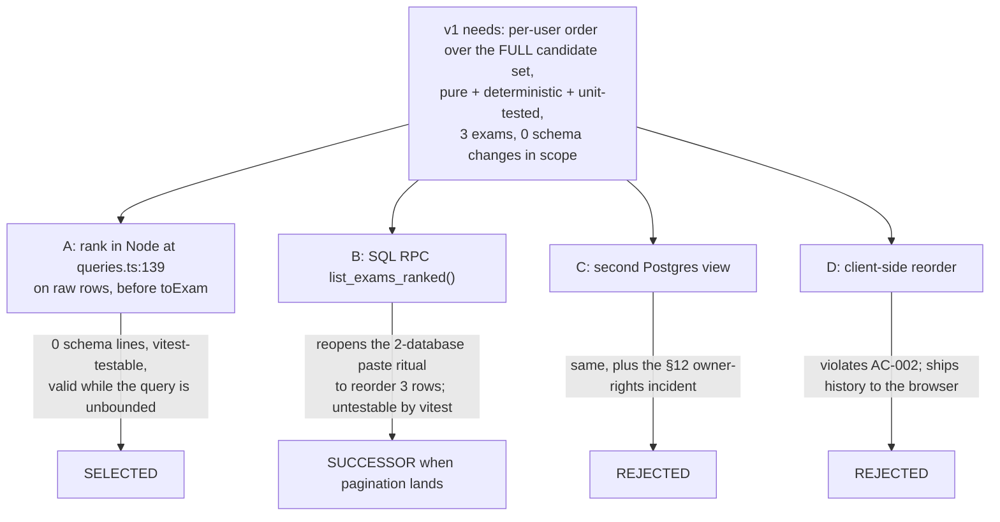
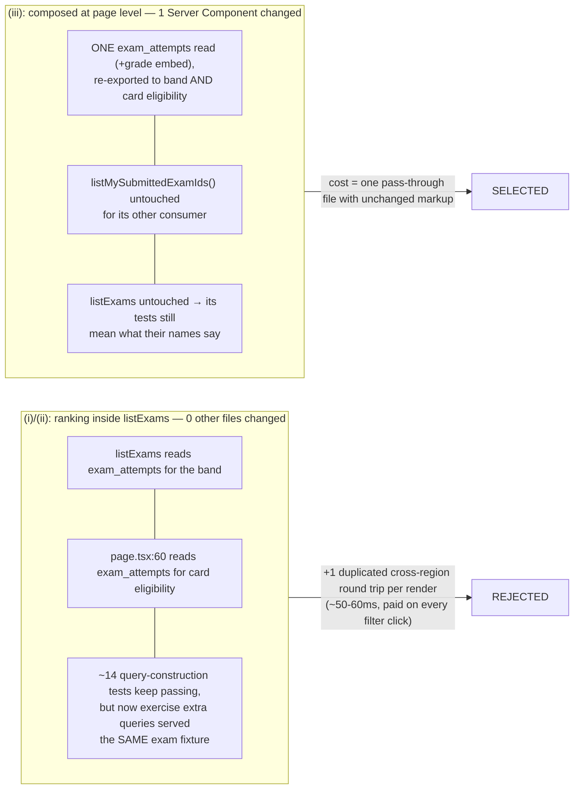

# ADR-0015 Personalised Exam Ranking v1: Execution Placement and Attempt-History Composition (telemetry deferred)

## Status

Proposed — 2026-08-16. Records the architecture for the v1 Layer 2 browse ranking ahead of its Design Doc.

- PRD: `docs/prd/exam-recommendation-prd.md` — **now v1.2, which adopted this ADR's scope**. The escalation below is therefore **resolved**: PRD v1.2's "Release partition" section supersedes D2 and D8 for v1 and records D10 as moot, on the engineer's direction rather than on this ADR's authority. The section is retained as written so the sequence stays checkable — an ADR could not retire those decisions itself, and did not.
- Numbering: `docs/adr/` holds ADR-0001…ADR-0013; ADR-0014 is reserved for the payOS webhook, a reservation written into the code it will change (`SOURCE/lib/supabase/middleware.ts:21`). ADR-0015 is the next free number.
- Filename note: the `-and-telemetry` slug is retained deliberately so existing references resolve. Telemetry is **deferred, not decided** — see "Deferred, and why".
- Precedent: **ADR-0008** (on-read aggregation; owns `exams_with_difficulty` and the "keep ordering DB-side" ruling whose scope boundary Decision 1 restates).
- Scope note: decisions, rationale and principle-level guidance only. Weight values, the grade-match function's exact form, band offsets, the per-exam prior-score rule and all naming belong to the Design Doc (PRD U1).

## Context

### What v1 ships

A deterministic per-student ordering of the published exam list, replacing `.order("id")` in the `else` branch at `SOURCE/app/(layer2)/queries.ts:136-138`. Built from the three signals that discriminate on today's data, plus a tie-break:

1. **Band** — never-taken above already-submitted; inside the demoted band, worse prior score ranks higher.
2. **Grade match** — inferred from the student's own attempt history via `exam_attempts` → `exams.grade`. No profile column, no collection surface.
3. **Recency** — `exams.created_at`.
4. **Tie-break** — exam id ascending. No randomness, no exploration term.

Unchanged: an explicit `?sort=` overrides personalisation entirely (the `if (filters?.sort)` branch at `:126-135` is untouched); filters narrow the candidate set and ranking still applies to the narrowed set; **zero visual change, zero frontend files, and — new under this scope — zero `schema.sql` change**.

### The measurement that set this scope

Production (`pebjdlbgbmizgfpuptjl` = MS-MOLAR-prod), queried 2026-08-16:

| Fact | Value | Consequence for the design |
|---|---|---|
| Published exams | **3** | The entire rankable catalogue. Any mechanism whose benefit appears at scale is unjustifiable today. |
| Subject spread | **All 3 are `Math`** | Subject preference is **constant across every candidate** — the PRD's dominant term cannot change any ordering. |
| Grade spread | 2 × grade 12, 1 × grade 9 | Grade **does** discriminate. This is why grade survives the cut and subject does not. |
| `exam_difficulty_ratings` | 2 exams with 1 rating each; **0 exams clear `rating_count >= 3`** | `avg_overall` is NULL for every exam, so community difficulty (PRD S5) is **inert**, not merely sparse. |
| `user_skill_mastery` | **0 rows, 0 distinct users** | The skill-weakness tier has no input at all. Empty, not sparse. |
| Users / attempts | 8 profiles, 4 users with attempts, 20 attempts, 4 submitted | **Half the user base is cold-start.** |
| Tagged questions per published exam | 22/22, 4/4, 0/2 | Tagging is healthy; the mastery side of the join is what is missing. |

The operative consequence: **the full hybrid design and a three-signal heuristic produce byte-identical output on today's data.** Building the hybrid now would pay its entire maintenance surface for an output nobody can distinguish from the cheap one.

### Where this ADR departed from PRD v1.1 — escalation **resolved by PRD v1.2**

PRD v1.1 records D1–D6 and D8–D10 as **locked**. The scope cut supersedes two of them and the requirements built on them. Recorded so a reader holding the PRD is not misled, and so the PRD can be revised deliberately:

| PRD item | Status under this ADR | Ground |
|---|---|---|
| **D2** (subject preference selects the subject; weakness orders within it) | **Superseded for v1** — both tiers deferred | Subject is constant across all 3 candidates; `user_skill_mastery` has 0 rows |
| **D8** (telemetry: new `event_type` + `exam_id` column + dedup rule) | **Superseded for v1** — no telemetry, no `schema.sql` change at all | See "Deferred, and why" |
| R2, R8; AC-005, AC-007, AC-008, AC-025–AC-029, AC-031 | Not implementable in v1; they belong to the deferred tiers | Same |
| **D10** (this change's schema edit lands before the payOS branch) | **Moot for v1** | With `schema.sql` untouched, the two branches no longer contend for the same hand-applied fingerprint |
| D1, D3, D4, D5, D6, D9; R1, R3, R4, R5, R6, R9–R11 | **Unchanged and binding** | — |
| AC-001–AC-004, AC-012–AC-024, AC-030, AC-032–AC-036 | **Unchanged and binding** | — |

An earlier instruction in this feature's history was "do not propose cutting telemetry." That stood on the pre-measurement picture; the cut is **engineer-directed on new evidence**, not proposed here.

### Is an ADR still warranted at 3–5 files? Yes — but on fewer grounds than before

The change is now **3–4 production files plus 1–3 test/benchmark files, and no DDL**:

| Path | Change | Category |
|---|---|---|
| `SOURCE/lib/adaptive/<ranking module>.ts` | new — the pure scoring function | production |
| `SOURCE/lib/adaptive/constants.ts` | changed — named weights/offsets (PRD R11) | production |
| `SOURCE/app/(layer2)/queries.ts` | changed — `EXAM_COLUMNS` + composition function | production |
| `SOURCE/app/(layer2)/exams/page.tsx` | changed — one call swapped (Decision 1b) | production |
| `SOURCE/lib/adaptive/__tests__/<ranking>.test.ts` | new | test |
| `SOURCE/app/(layer2)/__tests__/rating.int.test.ts` | changed — new assertions for the new function | test |
| `SOURCE/scripts/perf-layers.ts` | changed — the hand-copied `EXAM_COLUMNS` (`:122-123`) | benchmark |

Under the documentation-criteria matrix, 3–5 files require a Design Doc and Work Plan but **do not by themselves require an ADR**. Of the three ADR triggers claimed before the cut, being straight about which survive:

- **Data-flow change — SURVIVES.** The browse surface's default ordering moves from a DB-side `ORDER BY id` to a per-user score computed in the application from the student's own attempt history. That is a change in where ordering is decided and what it depends on, on the site's primary catalogue surface.
- **Architecture change — SURVIVES.** This creates the **first dependency from Layer 2 into `SOURCE/lib/adaptive/`**. Today the directory has three importers and only one is application code — `SOURCE/app/(layer3)/queries.ts:9-10`; the other two are `tsx` scripts outside the Next.js bundle (`SOURCE/supabase/seedManualPassEngine1.ts:42-43`, `SOURCE/supabase/tagQuestionSkills.ts:25`). The PRD records Layer 2's current zero coupling. A second **application** consumer turns a Layer-3-private helper directory into a shared engine — a layering decision worth recording once rather than discovering later.
- **Contract-system change — DOES NOT SURVIVE.** It rested entirely on the `telemetry_log` shape change. With telemetry deferred nothing changes contract: `types/exam.ts` gains 0 fields, `SOURCE/lib/tutor/telemetry.ts` is untouched, `schema.sql` is untouched.

### The read path today — the shape any mechanism must fit

`listExams` (`queries.ts:99-142`) is one flat select against the ADR-0008 view: `.from("exams_with_difficulty").select(EXAM_COLUMNS).eq("status","published")` (`:105`), six optional DB-side filters (`:106-120`), then either the explicit `?sort` branch (`:126-135`) or `query.order("id")` (`:136-138`), then `await query` (`:139`), `if (error) throw error` (`:140`), `return (data as unknown as ExamRow[]).map(toExam)` (`:141`).

Two facts carry most of this ADR:

- **All filtering is DB-side**, so `data` at `:139` **is** the narrowed candidate set. PRD D3's "filters narrow, ranking still applies" is already true by construction.
- **There is no `.limit()` and no `.range()`**, so `data` at `:139` is the *complete* candidate set. This is what makes an in-process reorder correct rather than merely convenient, and it is the one assumption whose removal invalidates Decision 1.

The rendered order is literally the array order of the return value: `ExamBrowser.tsx` and `ExamCard.tsx` are async Server Components with no `'use client'`, `ExamBrowser.tsx:33` maps with no sorting, and `ExamBrowserProps` / `ExamCardProps` need zero new fields. **No frontend file changes.**

### Grounding facts (verified against the files)

- `exams.grade` is `int **not null**` (`schema.sql:76`) and `exams.created_at` is `timestamptz **not null** default now()` (`:81`, with the idempotent `alter` at `:89`). **Both v1 signals are total** — no null branch is needed for grade match or recency.
- `EXAM_COLUMNS` (`queries.ts:37-38`) omits `created_at`; the view exposes it via `e.*` (`schema.sql:1018`). `toExam` (`:40-55`) maps only named fields, so widening the column string does not change the `Exam` contract — confirmed by the exact-equality assertion at `rating.int.test.ts:463-486`, which asserts on the **mapped** object. The hand-copied duplicate at `scripts/perf-layers.ts:122-123` sits under a header warning that it drifts silently (`:10-12`).
- `listMySubmittedExamIds()` (`queries.ts:198-206`) selects only `exam_id` from `exam_attempts` filtered `.eq("status","submitted")`, is **already awaited by the page** in the same `Promise.all` as `listExams` (`exams/page.tsx:57-62`), feeds `ExamBrowser`'s per-card eligibility (`ExamBrowser.tsx:16, :37, :46-50`), and has a **second consumer on another route** (`exams/[id]/rate/page.tsx:56`).
- `exam_attempts.exam_id` is a real FK (`schema.sql:105`), so PostgREST embeds through it — proven in production code at `SOURCE/app/(layer3)/queries.ts:31-34`: `.select("correct, total, exam_attempts!inner(submitted_at, status, exams!inner(subject))")`.
- Per-exam score lives only in `exam_results` (`total_score numeric(4,2)`, `correct`, `total`; `schema.sql:121-131`), joined by `attempt_id` (`unique`, `:123`), with rows only for submitted attempts (`queries.ts:316-318`). A submitted attempt whose `record_exam_result()` failed has **no** result row — the two sets are not provably identical.
- Reads are scoped by RLS with **no** explicit `user_id` predicate, a convention stated in code in both layers (`(layer3)/queries.ts:3-5, :90-99`; `(layer2)/queries.ts:314-318`); `attempts_select_own` (`schema.sql:165-166`) and `results_select_own` (`:206-207`) do the scoping.
- `/exams` is not public: `PUBLIC_PATHS` (`middleware.ts:26-39`) excludes it, `publicPaths.test.ts:71` asserts `isPublic("/exams") === false`, and `middleware.ts:115-119` redirects. A session always exists. (The `'logged-out'` branch at `ExamBrowser.tsx:49` and the `isLoggedIn` prop at `exams/page.tsx:115` are dead code; PRD U6 owns their removal — **not this feature**.)
- Functions run in `sin1`, Supabase prod in `ap-south-1`; `SOURCE/lib/security/rateLimitStore.ts:7-13` records a **measured ~50–60 ms per cross-region round trip**.
- Every filter click is a full server re-render (`ExamFilters.tsx:124-142` pushes a URL), so ranking cost is paid **per filter interaction**, not per page visit.
- Engine 1 conventions the new module inherits: all state injected, no `Date.now()`, no module reads, no I/O (`lib/adaptive/route.ts:5-8`); the threshold passed by the caller from `constants.ts` (`(layer3)/queries.ts:131`); the sort-key sequence written out with the id tie-break justified in prose (`route.ts:87-89`); sorting on a copy (`:107`); a zero denominator yielding 0 rather than NaN, because NaN comparisons are all false and would make order depend on initial array position (`:67-74`); uncertainty falling to an explicit null rather than a guess (`:60-63`). Named constants with recorded retune history (`constants.ts:1-5, :18, :29-44`). Placement is `lib/` because vitest collects only `lib/**`, `components/**`, `app/**` (`vitest.config.ts:19`).

## Decision

### Decision 1 — The ranking executes in Node, in-process, over the complete fetched candidate set, on the raw rows

The order is produced by a pure function in `SOURCE/lib/adaptive/` applied to the array returned at `queries.ts:139`, **before** `toExam` maps it at `:141`. No RPC, no view, no `ORDER BY` expression.

**The scope cut collapsed this comparison, and saying so is more useful than preserving the old weighing.** Before the cut, SQL had a real argument: the change was already paying the hand-applied DDL ritual for the telemetry column, so a function or view was marginal cost on a bill already incurred. That bill is now zero — v1 touches **no** `schema.sql` line. Choosing SQL today would mean reopening the two-database paste ritual (the §17 fingerprint literal at `schema.sql:1574`, `SCHEMA_FINGERPRINT` at `SOURCE/lib/schema/schemaFingerprint.ts:41`, a paste into dev, a paste into prod, `npm run verify:schema` against each) **solely** to reorder three rows.

Two structural refinements are part of the decision, not implementation detail:

1. **Rank the rows, not the mapped `Exam` objects.** Recency needs `exams.created_at`, which `EXAM_COLUMNS` omits. Widening the column string and consuming the value *before* `toExam` keeps the `Exam` contract at **zero** new fields and keeps ranking metadata out of the presentation boundary — the same containment `getSkillRecommendation` applies when it strips `nodeId` before returning (`(layer3)/queries.ts:144-146`). `status` is not added; the published guard is already applied DB-side at `:105`.
2. **Split fetch from mapping; do not change `listExams`' behaviour.** Extract the query construction and fetch of `:100-140` into an internal rows-returning helper, leaving `listExams = helper(filters).map(toExam)` observably identical, and build the ranked path as a **new exported composition function** consuming the same helper. `listExams` keeps `.order("id")`, which also gives the ranker a deterministic input array independent of Postgres row order.

**What it costs.** ADR-0008 rejected its option D ("second query merged in JS") because *you cannot order a query DB-side by a value merged in JS afterwards*. That ruling stands and is not contradicted here, because the situations differ in one verifiable respect: ADR-0008 needed the merged value to interact with a DB-side threshold, a bucket filter and an `ORDER BY` over a set Postgres was still narrowing. Here Postgres has finished narrowing at `:139` and returns the whole set, so replacing its order in Node is not "ordering by a merged value" — it is discarding a total order and computing another over the same complete set. **The moment `listExams` gains `.limit()` or `.range()`, that equivalence breaks and this decision is invalid** — kill criterion (a).

### Decision 1b — Composition happens at page level; the attempt-history read is fetched once and shared

`exams/page.tsx` calls the new composition function instead of `listExams`, and **drops its own `listMySubmittedExamIds()` member** from the `Promise.all`, reading the submitted-id set from the composition result and passing it to `ExamBrowser` unchanged (`ExamBrowserProps.submittedExamIds: Set<string>`, `ExamBrowser.tsx:16`, consumed at `:37, :46-50` — prop type and rendered markup do not change).

The composition function fans out concurrently: the exam rows; one attempt read rooted at `exam_attempts` filtered to `submitted`, **widened with `exams!inner(grade)`** so the band and the grade signal come from a single round trip; and one `exam_results` read for prior score. It ranks, then returns the ranked list **plus** the submitted-id set derived from the attempt read.

`listMySubmittedExamIds()` itself is **not modified** — its second consumer (`exams/[id]/rate/page.tsx:56`) keeps its `Set<string>` contract untouched. The composition derives the same set from its own richer read, so the demotion band and the card's "đã làm" affordance are the **same value** and cannot disagree.

| Option | Files changed outside `queries.ts` + `lib/adaptive/` | `exam_attempts` reads per render | Existing `listExams` tests | Verdict |
|---|---|---|---|---|
| (i) Ranking **inside `listExams`**, page untouched | 0 | **2** — once inside `listExams`, once at `page.tsx:60` for card eligibility | Silently degraded (below) | Rejected |
| (ii) Option (i) **+ `React.cache()`** memoisation | 0 | 1 | Silently degraded | Rejected |
| (iii) **Composed at page level, attempt read owned and re-exported** | 1 (`exams/page.tsx`) | **1** | **Untouched** | **Selected** |

Option (i) is the shape PRD U10 hoped for ("if both live inside `listExams`, this file changes by 0 lines"), and it is rejected because the zero-diff is paid in latency: a duplicated cross-region round trip (~50–60 ms, `rateLimitStore.ts:7-13`) on every filter click, which the PRD's own Performance NFR forbids ("must join the same batch, not add a round trip of its own"). A zero-line diff that buys a duplicated round trip is not the cheaper option; it is the same cost relocated where a diff cannot show it.

**A correction to an earlier claim about (i)'s test blast radius, which the pre-cut draft of this ADR overstated.** Under the pre-cut scope the extra reads needed `.not(...)`, which `createQueryBuilder` (`rating.int.test.ts:39-54`) does not stub — that would have thrown `TypeError` across the `listExams` suite. **Under v1's scope that is no longer true**: the extra reads need only `.select` and `.eq`, both stubbed, and `fromMock.mockReturnValue(builder)` (`:324`, `:343`, `:366`, and throughout) serves *every* `from()` call the same builder. Option (i) would therefore not turn the suite red. It would do something worse — the ~14 query-construction cases would keep passing while `listExams` silently issued extra queries served the **same exam-shaped fixture**, feeding rows like `{id:"exam-1", title:"Đề kiểm tra", …}` (`:449-461`) into the ranker as though they were attempt history. Green tests whose names no longer describe what ran. The negative assertions at `:371`, `:381`, `:391` and `:439-440` (`.some(...) === false` over a `calls` array that would now aggregate several queries) survive only until an added read calls `order`/`gte`/`lt`, at which point they fail for a reason unrelated to what they test.

Option (ii) removes the duplication with the wrong instrument. `SOURCE/lib/billing/entitlement.tsx:11` records in code that **this repo uses `React.cache()` nowhere**, so it would introduce a first-of-its-kind implicit dedup whose correctness is invisible at both call sites — and with a second consumer on another route, the wrapper's blast radius exceeds the page that needs it. Request memoisation is the right tool when call sites cannot share a value; here they render in the same function and trivially can.

The price of (iii): `exams/page.tsx` changes. PRD AC-002 permits this — it constrains rendered markup, `SOURCE/app/(layer2)/_components/` and the i18n dictionaries, none of which move; the page passes `exams` straight through (`:112-116`) and its output is byte-identical for a given list. **PRD U10 is answered: `page.tsx` changes, `ExamBrowser.tsx` does not, and the reason is a measured round trip rather than convenience.**

**Definitional consequence, stated rather than discovered.** Band membership and the grade histogram come from `exam_attempts`; prior score comes from `exam_results`. A submitted attempt whose result write failed therefore counts as *taken* for the band and *does* contribute to grade, but has no prior score to order by inside the demoted band. That precedence is deliberate — the band must match what the card badge shows the student — and the Design Doc owns the tie-break for a band-B exam with no score row.

### Decision 3 — v1 resolves no identity anywhere, because nothing needs one

With telemetry deferred, the feature's only consumer of the caller's id is gone. Every ranking input is RLS-scoped and the house convention adds no `user_id` predicate (`(layer3)/queries.ts:3-5, :90-99`; `(layer2)/queries.ts:314-318`), and the ranking function is pure and receives rows, not a principal — matching `recommendNextSkill`, whose `mastery` field is documented as "CHỈ các dòng của một người dùng — trách nhiệm của caller (fetch có RLS)" (`route.ts:32-33`).

So: **`supabase.auth.getUser()` appears nowhere in this feature**, `listExams` gains no `auth` dependency, and the mocked client at `rating.int.test.ts:29-31` having no `auth` property is a non-issue in either composition shape. `getCurrentUser()` stays in the page solely for the dead `isLoggedIn` prop.

This makes the identity argument for page-level composition **forward-looking rather than current**, and it should not be oversold: it is not a reason to choose that shape today. It is a reason the shape chosen today will still be right when telemetry returns, because the write will need an id the page already holds and the composition function does not.

### Decision 6 — `/exams` latency is protected by a structural round-trip budget asserted in CI, not by a latency benchmark

**Honest recount: the page's network-call total moves from 6 to 7.**

Today: the route-group layout's `getCurrentUserProfile()` = 1 GoTrue + 1 PostgREST (`layout.tsx:18` → `getCurrentUser.ts:29-38`), plus the page's fan-out = `listExams` + `listExamFacets` + `listMySubmittedExamIds` (3 PostgREST) + `getCurrentUser` (1 GoTrue) = **6**.

Under v1: layout unchanged (2); page keeps `listExamFacets` and `getCurrentUser` (2); the composition function issues 3 concurrent PostgREST reads — exam rows, the attempt read, the `exam_results` read = **7 total, and no write**.

The `exam_attempts` read **replaces** the page's existing `listMySubmittedExamIds()` call rather than adding to it, and it carries the grade signal for free via the `exams!inner(grade)` embed, so grade costs **zero** additional round trips. The one genuinely new call is the `exam_results` read, and it exists solely to order the demoted band. The budget is therefore:

> The feature adds **1 net PostgREST read**, **0 writes**, and **0 new serialization points**. All ranking-input reads resolve in the same `Promise.all` as the exams fetch, so added wall-clock is bounded by the slowest of three concurrent reads, not their sum.

An optional consolidation back to 6 exists and is **not** adopted: rooting one read at `exam_attempts` and embedding `exam_results` in reverse through its `unique` FK (`schema.sql:123`) would fold prior score into the attempt read. PostgREST should treat a unique FK as to-one, but that is **unverified on this deployment**, and ADR-0008's discipline is not to build on unproven capability. If the Design Doc wants net-zero reads, this is the single check to run first; if it is not run, take the 7.

Enforcement is a CI-runnable assertion over the mocked Supabase boundary, which already records every call (`fromMock`, and the per-builder `calls` array at `rating.int.test.ts:39-54`): assert the number of `from()` invocations, and assert that all are issued before any settles — a deferred-resolution mock makes "these ran concurrently" a deterministic, offline, sub-100 ms test. This catches the regression that actually happens (someone adds an `await` between two reads) without credentials, a region, or a live database.

`scripts/perf-layers.ts` is **not** promoted into CI: it needs `.env.local` credentials and a real signed-in account, it measures a Singapore→Mumbai round trip whose variance makes any threshold flaky or meaningless, it excludes Next.js render time by construction (`:14-17`), and it has no assertions to promote (`printReport`, `:83-118`). It **is** updated in the same change, because its header (`:10-12`) states that its hand-copied `EXAM_COLUMNS` (`:122-123`) and `listExams` chain (`:125-133`) drift silently — and widening `EXAM_COLUMNS` is exactly that drift. Its role stays a manual, recorded measurement, not a gate.

### Defined degradation — cold start is half the production user base

**4 of 8 profiles have no attempts.** For them: never-taken is universal, so the band is constant and contributes nothing; grade is **absent, not guessed**; prior score does not exist. The order is therefore **recency, then id** — complete, deterministic, and identical on repeated renders over the same data.

This is a defined output, not a failure, and the discipline is inherited rather than invented: `recommendNextSkill` returns an explicit `null` rather than fabricating a starting node (`route.ts:60-63`), and `normalizeSubject` returns null rather than guessing. The browse-list analogue of "return null" is not an empty state — the student must still get a catalogue — so it is "return the complete list in the impersonal order". What must never happen is a *guessed* grade: defaulting a new student to lớp 12 would be the confidently-wrong failure this project has already recorded once (PRD, Engine 1 R-a). Absent signals stay absent, the remaining signals decide, and nothing on screen claims otherwise because nothing on screen claims anything (PRD AC-024).

The same rule governs every thin-data input: a zero denominator yields 0 rather than NaN, following `route.ts:67-74` and for the reason stated there — NaN comparisons are all false, which would make the order depend on initial array position and destroy the determinism AC-012 requires.

### Decision Details

| Item | Content |
|------|---------|
| **Decision** | (1) Rank in Node over the complete candidate set, on raw rows before `toExam`; widen `EXAM_COLUMNS` by `created_at`; split fetch from mapping so `listExams` stays observably identical. (1b) Compose at page level; the composition owns the `exam_attempts` read (widened with `exams!inner(grade)`) and re-exports the submitted-id set; `listMySubmittedExamIds()` is left unmodified for its other consumer. (3) Resolve no identity anywhere. (6) Budget = +1 net read, 0 writes, 0 new serialization points, asserted over the mocked client in CI. Cold start degrades to recency → id with grade absent rather than guessed. |
| **Why now** | The ordering placement determines which files change, which the Design Doc and Work Plan both need; and the cut removed every reason to wait for a schema window. |
| **Why this** | Every selected option is the smallest surface covering a current requirement: no DB object, no `schema.sql` line, no dependency, no persistent state, no privileged path, no frontend file, no change to `listExams`' observable behaviour, no change to the `Exam` contract, and one net concurrent read. |
| **Known unknowns** | Whether the grade term should be a histogram share or a binary most-frequent-grade match (Design Doc, PRD U1) — the measured spread (2×g12, 1×g9) cannot distinguish them. Whether one attempt is enough to infer a grade (PRD A2/A5 circularity, R-g). Whether the reverse `exam_results` embed works, if net-zero reads are wanted. |
| **Kill criteria** | (a) **`listExams` gains `.limit()`/`.range()`** → Decision 1 is invalid; ranking must move DB-side or server-side of the limit. (b) **A second consumer of the ranked order appears** → an in-process reorder inside one composition function is not reusable across processes. (c) **The catalogue spans more than one subject, or `user_skill_mastery` gains rows** → the deferred tiers return, and the telemetry decision returns with them. |

### Pre-implementation verification: none is blocking for v1

The pre-cut draft listed three blocking checks — Next's `after()` behaviour, the tagged-questions read under RLS, and a post-paste insert of the new `event_type`. **All three belonged to the deferred half and are withdrawn**, along with the `after()` dependency itself. v1 introduces no new DB object, no new column, no new grant, no new event type and no capability this codebase has not already exercised in production, so there is **nothing to spike before building**. The single optional (non-blocking) check is the reverse `exam_results` embed in Decision 6, and only if net-zero reads are wanted.

### Forward constraints (binding on whoever ships second)

- **P3 / pagination.** The ranking must score the **full** candidate set before any limit (PRD AC-004). If pagination ships first, ranking must run server-side of the limit rather than sorting a page; if ranking ships first, pagination must not be a post-ranking slice without re-checking this invariant. The coupling is symmetric: **whichever ships second pays it.**
- **`EXAM_COLUMNS` has two copies** (`queries.ts:37-38`, `scripts/perf-layers.ts:122-123`). This feature must not add a third.
- **`DEFAULT_ASCENDING` already has two copies** (`queries.ts:71-75`, `ExamFilters.tsx:63-67`). This feature adds nothing to that family and, under PRD AC-002, must not edit `ExamFilters.tsx` at all.

## Rationale

### Decision 1 — Options Considered (where the ranking executes)

| # | Option | `schema.sql` lines changed | Two-database paste ritual | Unit-testable by vitest | Verdict |
|---|--------|---------------------------|---------------------------|-------------------------|---------|
| A | **In-process in Node**, over the complete fetched set, on raw rows | **0** | No | Yes — `lib/adaptive/**` (`vitest.config.ts:19`) | **Selected** |
| B | SQL RPC `list_exams_ranked(filters…)` | ~30 + fingerprint | **Yes** | No | Rejected — successor if kill criterion (a) fires |
| C | Second Postgres view with the score as a column | ~20 + fingerprint | **Yes** | No | Rejected |
| D | Client-side reorder in a new client component | 0 | No | Partially | Rejected outright |

A is selected on two independently sufficient grounds. First, **testability**: the PRD requires one pure function in `SOURCE/lib/adaptive/` (D9) whose determinism, purity and named-constant properties are proven by unit tests (AC-012, AC-014, AC-036), and vitest collects only `lib/**`, `components/**`, `app/**` — a scoring rule expressed in SQL is untestable by every gate this project runs. Second, and decisive *because of the cut*: **v1 otherwise touches no SQL at all**, so B and C would reopen the hand-applied two-database ritual — which TD-005 records as having detonated four times, most recently a three-day dev/prod divergence every automated gate reported green — in order to reorder a three-row catalogue.

C carries an additional specific hazard: `schema.sql` §12 (`:939-951`) records a **measured** incident where `exams_with_difficulty` ran with owner rights and served unpublished drafts to `anon`. A new view re-opens that class and would need `security_invoker` plus its own re-verification. D is rejected outright: it contradicts PRD AC-002 (zero changed presentation files) and would ship one student's history to their browser.

Trade-off accepted with A: the browse order is conceptually produced in two places — Postgres supplies a stable base order, Node the final one — so a reader of `queries.ts:136-138` alone would draw the wrong conclusion about the default. The mitigation is structural rather than a comment: `listExams` becomes a genuinely internal building block whose order *is* id order, and the composition function is the only thing the page calls.

### Decision 1b — the coupling, drawn

### Decision 6 — Options Considered (latency protection)

1. **Structural budget asserted over the mocked client, plus the updated manual benchmark (Selected).** Catches the real regression shape, runs offline in CI in milliseconds, needs no credentials.
2. **Promote `perf-layers.ts` into CI with thresholds.** Rejected: needs `.env.local` and a live account; measures a cross-region round trip whose variance makes thresholds flaky or meaningless; excludes render time by construction, so it cannot see what users feel.
3. **Do nothing; rely on the Lighthouse baseline.** Rejected: a periodic manual mobile score will not attribute a ~50–60 ms step change to an accidental sequential `await`.
4. **Add `loading.tsx` to `/exams`.** Rejected on scope: a new rendered surface, which AC-002 forbids, and it masks latency rather than preventing it. Recorded as a legitimate separate improvement.

## Deferred, and why

Recorded reasoning, **not decisions**. Kept so re-adoption is a deliberate act rather than a rediscovery, each with the production number that defers it.

### The subject-preference tier (PRD D2 Level 1, S3)

Deferred until the catalogue spans more than one subject. All **3** published exams are `Math`, so the term is constant across every candidate and cannot change any ordering — including the ordering PRD AC-005 was written to pin, which is untestable against production data because no two candidates differ on that axis. Re-adopt when a second subject is published.

### The skill-weakness tier (PRD D2 Level 2, S2) — and with it the exam→skill join

Deferred until `user_skill_mastery` has rows: it has **0 rows across 0 distinct users**, an empty input rather than a sparse one, and tagging health (22/22, 4/4, 0/2 — 26 of 28 published-exam questions tagged) is not the blocker.

**The intended approach, recorded so the analysis is not lost:** resolve coverage through one *independent, parallel* read of `questions` filtered to `skill_node_id is not null`, joined in Node against each candidate's `question_ids` — rather than a sequential `.in("id", collectedIds)` round trip (which cannot parallelise, because it needs `question_ids` from the exams result, and whose URL length and row count scale with the whole published catalogue since nothing upstream limits it), and rather than a SQL-side `unnest` view (a hand-applied object, re-opening the §12 owner-rights hazard, invisible to vitest). Its recorded kill criterion: when tagged rows reach the hundreds or the catalogue reaches the hundreds, the unindexed correlated RLS predicate at `schema.sql:287-294` becomes dominant — `schema.sql` has exactly three indexes (`:1089`, `:1429`, `:1513`), none on `exams` or `questions` — and the remedy is a GIN index on `exams.question_ids` or a DB-side coverage projection.

**This is not a decision.** When mastery has rows the comparison must be made fresh, because its inputs — catalogue size, tagged-question count, and whether an index exists by then — will all have moved. §10c already grants `skill_node_id` to `authenticated` (`schema.sql:797-800`), so no new grant will be needed.

### Community difficulty (PRD S5)

Not in the v1 signal list and inert regardless: **0 of 3 exams clear the `rating_count >= 3` gate**, so ADR-0008's `avg_overall` is NULL for every candidate and the term cannot discriminate. `avg_overall`/`rating_count` stay in `EXAM_COLUMNS` because `toExam` already maps them for display (`queries.ts:53`); they are simply not ranking inputs in v1. Re-adopt when any exam clears the gate.

### All telemetry (PRD D8, R8, AC-025–AC-029) — and with it the entire `schema.sql` change

No new `event_type`, no `exam_id` column, **no `schema.sql` change at all** — therefore no fingerprint update (`schema.sql:1574`, `schemaFingerprint.ts:41`), no two-database paste, no `verify:schema` cycle, no dedup substrate, no trust-boundary question about what a student's own JWT can forge into an operational log, and no dependency on Next's `after()`.

**Why deferring is legitimate rather than a corner cut:** a ranking over three same-subject exams driven by never-taken, grade and recency is **fully derivable from the database by query**. All three inputs are persisted (`exam_attempts`, `exam_results`, `exams`), the ranking function is pure and deterministic, and at 3 exams × 8 users the entire output space can be enumerated from current state. An event log would record nothing a `select` cannot already answer — and the app could not read it back anyway (`SELECT` is revoked from `authenticated`, `schema.sql:1385`; proven by `test-rls.ts:1539-1546`), so its only reader is the engineer with `service_role`, who can equally run the derivation.

**Why it returns with the weakness tier, not before:** once a mutating per-user model drives the order, the ranking stops being reconstructible after the fact — mastery changes on every submission, so "what did we rank first for this student, and why" is no longer answerable from present state. That is the condition under which an event log earns its cost. The deferred telemetry question therefore returns **together with** the deferred tier, as one change, and the trust-boundary analysis (a student's own JWT can forge arbitrary well-formed rows into an unreadable log; that is tolerable for a counter and intolerable the moment the data carries a payoff — ADR-0010's shape being the remedy) is recorded here to be picked up then.

## Consequences

### Positive

- **Zero schema surface.** No `schema.sql` line, no fingerprint update, no two-database paste, no `verify:schema` cycle — the failure mode TD-005 has produced four times is not on this change's path at all, and **PRD D10's sequencing constraint against the payOS branch is moot**.
- **Zero frontend surface.** No component, dictionary, `Exam` field, view, function or index. Presentation files are untouched, so PRD AC-002 holds by construction rather than by testing.
- **No blocking pre-build verification.** v1 uses no capability this codebase has not already exercised in production.
- **The existing `listExams` suite keeps meaning what it says.** `listExams` retains its behaviour and its `.order("id")` default, so the ~14 query-construction cases pass unmodified *and* continue to exercise only the query they describe. The new default contract gets its **own** assertion on the composition function rather than replacing an old one under deadline pressure — the failure PRD risk R-d predicts.
- **One `exam_attempts` read per render**, shared by the demotion band and the card affordance, so the two cannot disagree; grade rides along on that read at zero extra cost.
- **Cold start — half the production user base — is a defined state** with a complete, deterministic, non-fabricated order.

### Negative

- **Decision 1 is invalidated by pagination.** In-process reordering is correct only while `listExams` returns the complete candidate set; whoever ships P3 inherits the obligation, and the successor (a SQL RPC) is named rather than left to be rediscovered.
- **The ranking is unobservable in production.** With no label (PRD D7 withdrawn), no click-through (D8 deferred) and now no telemetry, nothing in the running system reports what was ranked first. The compensating control is that the output is *derivable* at this scale — a property of 3 exams, not of the design, and it expires as the catalogue grows.
- **Two of three signals are thin on today's data.** Grade discriminates 2-vs-1 across three exams; recency orders three rows. The ranking is honest but slight, and its quality cannot be demonstrated by a test — only by the recorded manual pass (PRD Success Criteria #18).
- **The grade term is circular** (PRD R-g): it is inferred from what the student already chose, so it reinforces rather than broadens. Accepted because the alternatives are guessing or collecting; PRD U7 owns the real fix.
- **`EXAM_COLUMNS` is hand-duplicated** in `scripts/perf-layers.ts:122-123`; widening it without updating the copy leaves the benchmark measuring a query that no longer exists.
- ~~**This ADR departs from two locked PRD decisions.**~~ **Closed 2026-08-16**: PRD v1.2 adopted the partition, so the documents no longer disagree on D2, D8 or D10. What remains true is the underlying cost — a reader holding **v1.1** would still expect telemetry and a subject tier, which is why v1.2 keeps the full model in place and marks it `[v2]` rather than deleting it.

### Neutral

- `exams/page.tsx` changes; `ExamBrowser.tsx`, `ExamCard.tsx`, `ExamFilters.tsx`, `RateButton.tsx`, `types/exam.ts` and both i18n dictionaries do not.
- `EXAM_COLUMNS` grows by one field that never reaches the `Exam` contract; `toExam` is unchanged.
- Layer 2 gains its first import from `SOURCE/lib/adaptive/`, making that directory a shared engine rather than a Layer 3 private helper.
- `listMySubmittedExamIds()` keeps its contract and its other consumer; only the exams page stops calling it.
- The dead `isLoggedIn` prop (`exams/page.tsx:115`) and the unreachable `'logged-out'` branch (`ExamBrowser.tsx:49`) are **observed and left alone** (PRD U6).

## Architecture Impact

- **New — `SOURCE/lib/adaptive/<ranking module>.ts`**: one pure function (state injected, no clock, no I/O, no module reads, sorted on a copy, sort-key sequence written out with the id tie-break justified, zero denominators yielding 0) plus its unit tests.
- **Changed — `SOURCE/lib/adaptive/constants.ts`**: named weights and the band offset, each with a one-line rationale (PRD R11/AC-036).
- **Changed — `SOURCE/app/(layer2)/queries.ts`**: `EXAM_COLUMNS` gains `created_at`; `listExams`' query construction and fetch are extracted into an internal rows-returning helper (behaviour unchanged); a new exported composition function fans out the exam rows, the `exam_attempts` read widened with `exams!inner(grade)`, and the `exam_results` read, then ranks and returns the ranked list plus the submitted-id set.
- **Changed — `SOURCE/app/(layer2)/exams/page.tsx`**: one call swapped; `listMySubmittedExamIds()` removed from the `Promise.all` and its set read from the composition result. No rendered output change.
- **Changed — `SOURCE/scripts/perf-layers.ts`**: the hand-copied `EXAM_COLUMNS`, in the same commit as the widening.
- **Changed — `SOURCE/app/(layer2)/__tests__/rating.int.test.ts`**: new assertions for the composition function's default-order contract and round-trip budget. Existing `listExams` cases untouched.
- **No ripple**: `SOURCE/supabase/schema.sql`, `SOURCE/lib/schema/schemaFingerprint.ts`, `SOURCE/supabase/test-rls.ts`, `SOURCE/lib/tutor/telemetry.ts` and its tests, `SOURCE/lib/supabase/service-role.ts`, every file under `SOURCE/app/(layer2)/_components/`, `SOURCE/lib/i18n/`, `SOURCE/types/exam.ts`, `exams_with_difficulty`'s frozen column list (`schema.sql:1009-1015`), `SOURCE/package.json`, and the `?sort`/`?dir` semantics (`queries.ts:126-135`).

## Implementation Guidance

- **Keep the ranking function pure and fully injected**, including every threshold and any notion of "now" — `recommendNextSkill`'s rule (`route.ts:5-8`), with the caller passing constants rather than the module importing them (`(layer3)/queries.ts:131`).
- **Write the sort-key sequence out as a comment** in `route.ts:87-89`'s style, and justify the id tie-break in prose as the property that makes the order absolutely deterministic. Sort a copy.
- **Resolve every thin-data path to a defined value, never NaN and never a guess.** Absent grade stays absent; a zero denominator yields 0 with the reason stated; cold start returns the complete list in recency → id order.
- **No unnamed numeric weight** in the scoring code; every constant lives in `lib/adaptive/constants.ts` with a one-line rationale, following the `SKILL_TAG_CONFIDENCE_THRESHOLD` precedent of recording *why* a value is what it is (`constants.ts:29-44`). With no visible affordance and no telemetry, those comments are the only human-readable explanation of the ranking anywhere in the running system.
- **Re-scope, do not delete, the `.order("id")` assertion** (`rating.int.test.ts:384-392`). It stays true and useful as the base-fetch contract; update its comment so it no longer reads as the statement of the browse default, and add a separate assertion pinning the new default contract on the composition function.
- **Preserve `.eq("status","published")` on every read path that touches exams** (PRD AC-030) — the reason is the measured §12 incident at `schema.sql:939-951`, not caution.
- **Add no explicit `user_id` predicate** to either history read; RLS is the scoping mechanism and the convention is documented in code in both layers.
- **Update `scripts/perf-layers.ts` in the same commit** as the `EXAM_COLUMNS` widening, and record a manual before/after run as the measured (non-gating) datapoint.
- **Do not design the exam→skill join, the subject tier, or the telemetry column** while implementing v1, even if they look easy from inside the code. They are deferred on measured grounds recorded above; re-opening them belongs to the change that also re-measures.

## Related Information

- PRD `docs/prd/exam-recommendation-prd.md` (v1.1) — binding: D1, D3, D4, D5, D6, D9; R1, R3–R6, R9–R11; AC-001–AC-004, AC-012–AC-024, AC-030, AC-032–AC-036. Superseded for v1: D2, D8, R2, R8, AC-005, AC-007, AC-008, AC-025–AC-029, AC-031. Moot for v1: D10. Resolves U2(a) in part (the read path; the join is deferred) and U10 (page.tsx changes, ExamBrowser does not). U2(b), U4, U5 and U8 lapse with telemetry; U1 (weights), U6 (stale logged-out artefacts), U7 (a real preference/grade signal) and U9 (deadline) remain with their existing owners.
- ADR-0008 — `exams_with_difficulty`, the frozen view shape, the §12 owner-rights incident, and the "keep ordering DB-side" ruling whose scope boundary Decision 1 restates.
- ADR-0010 / ADR-0011 — the trust-boundary precedents this scope no longer touches, because no write is introduced. They become relevant again with the deferred telemetry.
- ADR-0013 / ADR-0014 (reserved) — the payOS work. With no `schema.sql` edit in v1, the fingerprint contention PRD D10 was written to prevent cannot occur.
- Code touchpoints: `SOURCE/app/(layer2)/queries.ts:37-38, :40-55, :53, :71-75, :99-142, :105, :126-138, :139-141, :198-206, :314-318, :316-318`; `SOURCE/app/(layer2)/exams/page.tsx:57-62, :112-116, :115`; `SOURCE/app/(layer2)/_components/ExamBrowser.tsx:16, :33, :37, :46-50`; `SOURCE/app/(layer2)/exams/[id]/rate/page.tsx:56`; `SOURCE/app/(layer3)/queries.ts:3-5, :10, :31-34, :90-99, :131, :144-146`; `SOURCE/lib/adaptive/route.ts:5-8, :32-33, :60-63, :67-74, :87-89, :107`, `constants.ts:1-5, :18, :29-44`; `SOURCE/lib/billing/entitlement.tsx:11`; `SOURCE/lib/supabase/middleware.ts:21, :26-39, :115-119`; `SOURCE/lib/auth/getCurrentUser.ts:29-38`; `SOURCE/lib/security/rateLimitStore.ts:7-13`; `SOURCE/supabase/schema.sql:73, :76, :81, :89, :99-109, :105, :121-131, :123, :165-166, :206-207, :287-294, :797-800, :939-951, :1009-1015, :1018, :1089, :1385, :1429, :1513, :1574`; `SOURCE/lib/schema/schemaFingerprint.ts:41`; `SOURCE/supabase/test-rls.ts:1539-1546`; `SOURCE/app/(layer2)/__tests__/rating.int.test.ts:29-31, :39-54, :317-441, :449-461, :463-486`; `SOURCE/scripts/perf-layers.ts:10-19, :83-118, :122-133`; `SOURCE/vitest.config.ts:19`.

### References

No external research was required for v1 and none is cited. PRD D9 forbids a new dependency and a new algorithm family, and the PRD's prior-art survey (still current, with its URLs) already records why every heavier recommender family was rejected at this data scale — a conclusion the 2026-08-16 measurement strengthens rather than weakens. An earlier draft of this ADR cited Next's `after()` API and Vercel's `waitUntil` semantics for the deferred telemetry write; those citations move with the telemetry question and must be re-verified against the installed version when it returns, per `SOURCE/AGENTS.md`.
