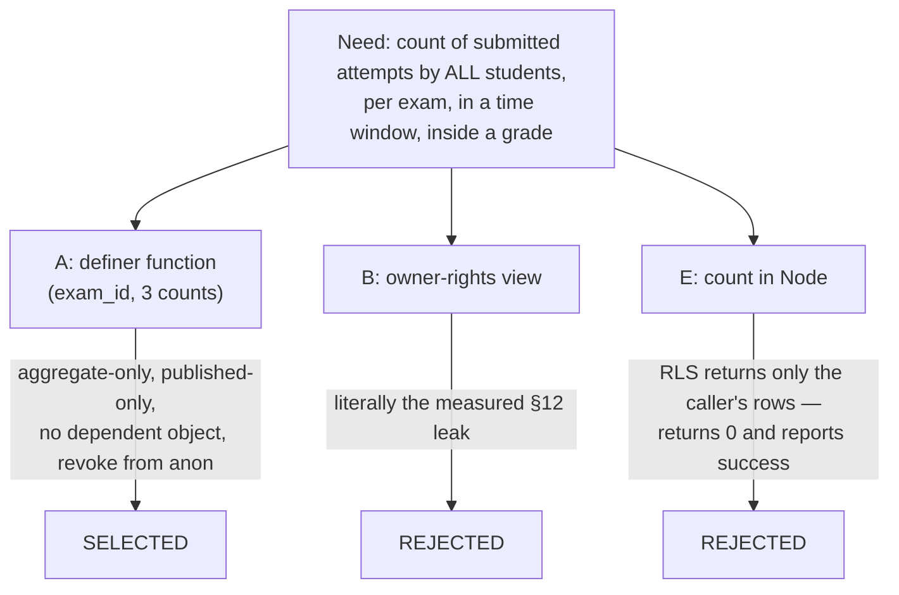

# ADR-0021 Cross-User Hot Aggregate and Attempt Source

## Status

Proposed — 2026-09-18. PRD: `docs/prd/exam-shelves-prd.md` v1.1 (its Scale row names this ADR). Design Doc: `docs/design/exam-shelves-backend-design.md`.
Precedents: **ADR-0008** (on-read aggregation, `exams_with_difficulty`), **ADR-0015** (ranking placement, the round-trip budget), **ADR-0011** (a definer function as the only path to a fact the caller may not read directly).

## Context

Three measured facts force a decision; none of them is an assumption:

- `attempts_select_own` is `for select using (user_id = auth.uid())` (`schema.sql:257-259`). Every client read of `exam_attempts` — including the ranking read at `ranking.ts:117-123` — returns **only the caller's rows**. "How many students did this exam" is not merely hard to read today; it is unreadable, and a JS count of it returns the caller's own history (0 for most students) with no error anywhere.
- `schema.sql` §12 (`:1500-1526`) records a **measured** incident: `exams_with_difficulty` was created through the SQL Editor, so it ran with owner rights, and `GET /rest/v1/exams_with_difficulty` with the **anon key and no login** returned every row including other people's unpublished drafts with `title`, `author_id` and `question_file_path`. The fix split the boundary: a `security definer` **function** returning aggregate columns only, consumed by a `security_invoker` view.
- ADR-0015 Decision 6 records `/exams` at **7 page-level network calls** — a documented figure, asserted nowhere. What CI actually asserts is the **composition's 3 PostgREST reads** (`rating.int.test.ts:663-674`) and that all three are issued before any settles (`:676-706`). Decision 1 placed all ranking in Node partly because v1 touched **no** `schema.sql` line at all.

PRD D4 needs a cross-user count and D10 needs a persisted attempt-source datum, so ADR-0015's "zero schema surface" premise has expired for this feature. What survives of it is decided below rather than left to be inferred.

## Decision

### D1 — One `security definer` SQL function, no new view, aggregate-only projection

`public.exam_hot_counts(p_since_recent timestamptz, p_since_wide timestamptz, p_max_rows int)` returning `table (exam_id text, recent_count bigint, wide_count bigint, total_count bigint)`; `language sql`, `stable`, `security definer`, `set search_path = public, pg_temp`; predicates `a.status = 'submitted'`, `e.status = 'published'` and `not public.is_author_banned(e.author_id)`; a hard `limit` on its own result set.

- The projection carries **no user id, no timestamp, no score** (PRD AC-027). The three counts are three windows of one kind of fact, not three kinds of data — and returning them together is what lets **one** call serve all four ladder rungs, which is what keeps D3's budget fixed. This is a deliberate, recorded widening of AC-027's literal "(exam_id, count) pairs"; the alternative is a variable 1–4 calls per render.
- Grants follow the **`search_exams`** idiom (`:185-186`), not the `exam_rating_aggregate` one: `revoke all … from public, anon;` then `grant execute … to authenticated, service_role;`. `anon` is granted on `exam_rating_aggregate()` only because a `security_invoker` view calls it *on anon's behalf* and would otherwise raise 42501 instead of returning empty. Nothing anonymous calls this function, and `/exams` is not in `PUBLIC_PATHS`.
- `create or replace`, and it deliberately has **no dependent object**, so the 2BP01 trap §12a records (a view depending on the function, making `drop function` fail on the second apply) cannot apply to it — its `returns table` can be changed later without dropping anything.
- A definer function bypasses RLS entirely, so it re-asserts the visibility predicate the policy would have applied — the same reasoning §18c gives for copying the ban predicate into `questions_select_visible`. Its row set is therefore exactly the catalogue's.

| # | Option | Gets a cross-user count | Reopens the §12 owner-rights class | schema.sql surface | Verdict |
|---|---|---|---|---|---|
| A | Definer **function**, aggregate-only projection | yes | no — no view, no identity column, published-only re-asserted | 1 function + 2 grant lines | **Selected** |
| B | Owner-rights (definer) **view** over `exam_attempts` | yes | **yes — this is the §12 incident itself**: a REST-readable table-shaped object that ignores the caller's RLS, one careless `grant` away from anon | 1 view + grants | Rejected |
| C | `security_invoker` view **over** the function | yes | no | function **+** view | Rejected — the ladder needs parameters (two window boundaries, a cap); a view takes none, so the function is needed anyway and the view adds a second frozen-shape object that buys nothing |
| D | Widen `exams_with_difficulty` with a count column | yes | no | drop+recreate the view on 2 databases, widen `EXAM_COLUMNS` **and** its hand-copy | Rejected — the view's shape is frozen at creation and embedded through by `getResult()`; ADR-0015 forbids a third `EXAM_COLUMNS` copy |
| E | Count in Node from `exam_attempts` | **no** — RLS returns the caller's rows | n/a | 0 | Rejected: silently wrong rather than merely limited, which is the failure shape this repo keeps paying for |

### D2 — What of ADR-0015 Decision 1 is superseded, and what still binds

**Superseded, narrowly.** Decision 1's clause "No RPC, no view, no `ORDER BY` expression" and its premise that every ordering input is computed in Node over the fetched rows **no longer hold for the whole page**: one ordering input — the cross-user hot count — is now produced by the database. Decision 1's ground was "Postgres has finished narrowing at `:139` and returns the whole set"; that ground was never true of this input, because the set the application can see is the wrong set, not a narrowed one.

**Still binding, unchanged:**

- **Rank-then-cut.** `fetchExamRows` keeps no `.limit()`/`.range()`; every shelf is cut to 10 in Node **after** ordering (ADR-0015 kill criterion (a), PRD AC-006). A DB-side `LIMIT` for a shelf is still forbidden.
- **One personalised ranking.** `rankExamIds` stays pure and in-process and is **reused** for the Cần luyện shelf rather than re-implemented (PRD AC-016/AC-017); the hot order is a *separate* order over a *different* input, not a second copy of the personalised one.
- **Decision 1b.** One composition per page; the caller's `exam_attempts` read is owned once per render and its submitted-id set re-exported, so the demotion band and the "đã làm" badge cannot disagree.
- **Decision 3.** No identity is resolved anywhere. The function takes window boundaries and a cap — never a user id — and the caller's grade comes from their own RLS-scoped attempt read.

**Kill criterion (b) of ADR-0015 fires and is answered.** Home and `/exams` both consume the hot order, which is exactly "a second consumer of the ranked order appears → an in-process reorder inside one composition function is not reusable". It is answered the way the criterion intends: the hot ordering and the ladder move into a **pure helper in `lib/adaptive/`** with two callers, not into a shared composition function.

### D3 — The new round-trip budget, and the CI assertion that moves with it

| Surface | Today | After | Delta |
|---|---|---|---|
| `/exams`, 0 query parameters (shelves) | 7 | **8** | +1 — the `exam_hot_counts` call, issued inside the same `Promise.all` as the three existing reads |
| `/exams` with any listed parameter, `?sort=` ≠ `hot` | 7 | **7** | 0 — the call is not issued on this path |
| `/exams?sort=hot` | — | **8** | +1, the same call |
| `/` home, signed in | 3 PostgREST | **3** | 0 — the call replaces the `exam_results` read the home block stops needing |
| `/` home, **signed out** | 3 PostgREST (RLS-scoped, all empty) | **0 reads, 0 rpc** | The fetch is guarded by the same `user` the render gate uses, so the anonymous path never reaches a function that revokes `anon`. `/` is a public route and its only earlier `redirect` fires for *signed-in* users, so an unguarded call would 42501 on the landing page — and it would put the hot count on an unauthenticated surface, which is kill criterion (a). The guard is what keeps (a) untripped |
| Any attempt start | 2 | **2** | 0 — the source rides on the insert that already happens |

**+1 net PostgREST call, 0 new writes, 0 new serialization points.** Added wall clock stays bounded by the slowest of four concurrent reads, not their sum.

**Two units, and only one of them is a gate.** The 7 → 8 figures above are **page-level** totals (layout + page fan-out + composition) and are asserted nowhere — they exist to be reasoned about, as in ADR-0015. What CI measures is the **composition**: `listExamsRanked` stays at **3** boundary calls on every path except `?sort=hot`, and the shelves composition is **4** (`rating.int.test.ts:663-674`, extended per the paragraph below).

`rating.int.test.ts` mocks `createClient` as `{ from: fromMock }` only (`:29-31`) and counts `from()` invocations (`:663-674`), so a call issued through `supabase.rpc()` throws there today and would be **invisible to the budget** if the mock were widened naively. In the same change: the mock gains `rpc` (the `{ from, rpc }` shape `submitExam.int.test.ts:78` already uses), and the budget assertion counts **`from()` + `rpc()` together**, with one case per row of the table above and the number and its reason in the test name. The next person who adds a read argues with a failing test, not with prose.

### D4 — The ladder is evaluated in Node; the database is told only where the windows start

`lib/adaptive/*` is pure by stated contract (`rankExams.ts:32-34`: all state injected, no `Date.now()`, no module reads, no I/O), and PRD AC-012/AC-014 rest on that. The ladder needs "now". Resolution: the **query layer** — already impure, already the place that calls `createClient()` — reads the clock once per render and passes `p_since_recent` and `p_since_wide` as parameters; the function returns all three counts per exam in one row; a **pure** helper then walks the rungs against `HOT_SHELF_MIN_CARDS`. Window lengths and thresholds are named constants in `lib/adaptive/constants.ts` with a one-line rationale each, per ADR-0015's "no unnamed numeric weight" rule.

Rejected: (i) the ladder in SQL — invisible to every gate this repo runs, since vitest collects `lib/**`, `components/**`, `app/**`, `features/**`; (ii) one call per rung — 1 to 4 round trips, a budget that cannot be asserted; (iii) reading the clock inside `lib/adaptive` — breaks the purity contract that the determinism tests depend on.

### D5 — The attempt source is a column on `exam_attempts`, normalised on write

`source text not null default 'none'`, with the named constraint `exam_attempts_source_check check (source in ('practice','hot','explore','none'))`. `startAttempt` maps anything not on that list — missing, empty, unknown or forged — to `'none'` (PRD AC-041); the CHECK is the second wall, not the first.

| # | Option | Answers AC-042 with one `select` | New DDL / edit surface | Verdict |
|---|---|---|---|---|
| A | Column on `exam_attempts` | yes — `group by source` on the row that already exists | 1 column + 1 CHECK (+ 1 index, D6) | **Selected** |
| B | `telemetry_log` | **no** — the table has no `exam_id`/`attempt_id` column, `select` is revoked from `authenticated`, and `event_type` is a closed enum declared twice and pinned byte-for-byte by a CI test | 1 column + 2 enum sites + 1 TS constant, in one commit | Rejected |
| C | New `attempt_sources` table | yes, with a join | table + RLS + grants + a second write on every attempt start | Rejected — more surface for the same datum |
| D | Vercel Analytics `track()` | **no** — the number leaves the database, and no custom `track()` call exists anywhere in `SOURCE` | 0 | Rejected |

`not null default 'none'` makes PRD Success Criteria #2 (100% attribution) true **by construction** rather than by discipline. The value is student-influenced — it arrives on a URL and rides a bound server-action argument, both of which a determined student controls — so it is recorded as a **usage hint, not a trusted fact**, and nothing in the running system reads it to make a decision.

### D6 — What the DDL deliberately does not change

`exam_attempts.status` gains **no** CHECK: it is an existing column holding real rows, its domain is a separate decision, and the aggregate's `status = 'submitted'` predicate fails in the conservative direction (a stray status value is excluded, never counted). One index is added — `exam_attempts (status, submitted_at desc)`, filter column first and sort column second per §19's stated convention — because neither existing index (`(user_id, submitted_at desc)`, `(exam_id)`) is shaped for a status-plus-time-window scan across all users. **`exam_attempts` RLS is not weakened**: no policy is added, altered or dropped, and every application read of the table stays own-row-only.

### Decision Details

| Item | Content |
|---|---|
| **Decision** | (D1) One `security definer` SQL function returning `(exam_id, recent_count, wide_count, total_count)`, submitted-only, published-only, banned-author-excluded, self-capped, granted to `authenticated` + `service_role` after `revoke all … from public, anon`; no new view. (D2) ADR-0015 Decision 1 is superseded only in "every ordering input comes from Node"; rank-then-cut, one ranking implementation, page-level composition and no-identity still bind. (D3) Page-level (asserted nowhere): `/exams` bare = 8, filtered = 7, `?sort=hot` = 8, home = 3. Composition (the CI gate at `rating.int.test.ts:663-674`): 3 → 4, counting `from()` + `rpc()`, updated in the same change. (D4) The ladder runs in a pure `lib/adaptive` helper; the clock is read in the query layer and the boundaries are parameters. (D5) `exam_attempts.source text not null default 'none'` + named CHECK, normalised to `none` on write. |
| **Why now** | The count is obtainable no other way, and the two-database schema ritual (fingerprint, migration file, dev apply, prod apply) has to be sequenced before any code that depends on it exists. |
| **Why this** | Each selected option is the smallest surface covering a current AC: one function instead of function-plus-view, three counts in one call instead of one call per rung, one column instead of a table or a two-site enum edit, zero RLS changes, zero new dependencies. |
| **Known unknowns** | Two residues of the same shape. (i) **Parameter-driven timing inference**: the caller chooses the window boundaries, so a student with a JWT can call the RPC directly and bisect the time axis until a count increments, localising another student's submission time. **Mitigated** by snapping both boundaries to the hour inside the function (`date_trunc('hour', …)`), which bounds the inference to a one-hour bucket and costs a 7/30-day ladder nothing; the Design Doc's Data Contract states the snap as a guarantee. (ii) At pre-launch volumes a count of 1 in a 7-day window remains close to an individual observation — no identity is exposed and the count is not attributable, but the aggregate is **not k-anonymous** and this ADR deliberately adds no minimum-count floor; revisit if the shelf ever shows anything alongside the count. **Amended 2026-09-19:** the engineer chose to render the count itself on Nổi nhất cards (UI Spec Amendment 4) — signed-in students only, aggregate only (the projection still carries no user id, timestamp or score), still no minimum-count floor, so a "1 lượt làm" is visible at low volume by decision. Kill criterion (a) is unchanged: no anonymous surface may show it (the home block renders no count). Also unknown: whether a single `group by` still serves once the published catalogue approaches the 500-row cap. |
| **Kill criteria** | (a) **The hot count is wanted on an unauthenticated page** → the grant set is wrong and the §12 anon question reopens; redesign before granting `anon`. (b) **A shelf needs any per-user fact about another student** (who, when, what score) → the aggregate-only projection no longer covers the requirement and this decision must be re-taken, not extended. (c) **`fetchExamRows` gains `.limit()`/`.range()`** → inherited from ADR-0015 kill criterion (a): a shelf cut after ordering becomes a shelf cut from an arbitrary page, invisibly. (d) **The ladder needs more than one round trip** → D3's fixed budget is void and the `/exams` latency argument has to be re-made from scratch. |

## Consequences

**Positive** — the product can state a true cross-user fact for the first time, with no other student's row crossing the application boundary; the aggregate is one object with one grant line and no dependents; the attribution datum is complete by construction; `exam_attempts` RLS, the `Exam` contract, the `exams_with_difficulty` shape and `EXAM_COLUMNS` are all untouched.

**Negative** — this feature re-enters the hand-applied two-database ritual that TD-005 records as having detonated four times, and it does so on a table holding real user data, so the production step needs the engineer's explicit confirmation rather than a deploy script. `/exams` costs one more round trip on its default path. A student's JWT can now ask "how popular is exam X", which is a new (aggregate, bounded) read surface. The shelves view has a code path the flat grid does not, so `/exams` has two composition functions to keep honest instead of one.

**Neutral** — `ExamSort` gains a fourth value, `hot`, in its three existing declaration sites; `listExamsRanked` keeps its contract for every path except the new axis; `listMySubmittedExamIds` is untouched and keeps its other consumer.

## Architecture Impact

- **New DB objects**: `public.exam_hot_counts(...)` + its revoke/grant pair; `exam_attempts.source` + `exam_attempts_source_check`; `exam_attempts_status_submitted_idx`. Fingerprint, one migration file, `verify:schema` probes and `test-rls.ts` cases move with them in the same change.
- **New Node surface**: one pure module under `SOURCE/lib/adaptive/` (weakest subject, dominant grade, the ladder, the explore order, the flat hot order) and one composition module under `SOURCE/features/exams/queries/`. `lib/adaptive` gains its second application consumer, deepening the "shared engine" status ADR-0015 recorded.
- **Changed contract**: `buildSubjectWeakness` becomes exported and its return widens from `Map<string, number>` to a per-subject record carrying the scored-attempt count AC-015 needs — one implementation, a wider return, no parallel copy.
- **No ripple**: `exams_with_difficulty`, `EXAM_COLUMNS` and its hand-copy in `scripts/perf-layers.ts`, `types/exam.ts`, `listMySubmittedExamIds`, `telemetry_log`, `lib/supabase/service-role.ts`, every `?sort=newest|oldest|hardest` order chain, and `SOURCE/package.json` (0 new dependencies).

## Implementation Guidance

- **Re-assert visibility inside every definer object.** A definer function has no RLS; it states its own `status = 'published'` and ban predicate for the reason §12 and §18c record, not out of caution.
- **Keep the aggregate's projection minimal and prove it.** The RLS harness asserts the returned row's key set, not just its values — that assertion is what makes "no identity crosses the boundary" checkable rather than claimed.
- **Inject the clock and every threshold.** Nothing in `lib/adaptive` reads `Date.now()`; window boundaries and card counts arrive as arguments from named constants.
- **Reuse the ranker, never re-derive it.** The Cần luyện shelf orders its candidates by calling the shipped ranking function on a filtered candidate set.
- **Move the budget assertion with the budget.** A change to the number of boundary calls and the assertion that pins it belong in the same commit, with the reason in the test name.
- **Treat the source value as untrusted input at the only place it enters.** One exported whitelist, one normalising function, used by the server action; the SQL CHECK exists to catch a future second writer, not this one.

## Related Information

- PRD `docs/prd/exam-shelves-prd.md` v1.1 — D4, D7, D10, D12; AC-006, AC-015–AC-028, AC-034, AC-037, AC-040–AC-042; Success Criteria #1, #2, #7. Design Doc `docs/design/exam-shelves-backend-design.md` owns signatures, the migration procedure and test placement.
- ADR-0015 — Decision 1 (narrowed by D2), Decision 1b and Decision 3 (unchanged), Decision 6 (its mechanism unchanged, its number superseded by D3), kill criteria (a) (inherited) and (b) (fired and answered).
- ADR-0008 — the on-read aggregation precedent and the `exams_with_difficulty` shape this ADR refuses to widen.
- Code and schema touchpoints: `SOURCE/supabase/schema.sql:157-186, :192-202, :199, :257-267, :1500-1526, :1529-1567, :1581-1592, :2406-2411, :2464-2481, :2510-2554, :2587-2599`; `SOURCE/features/exams/queries/ranking.ts:105-186`; `SOURCE/features/exams/queries/catalogue.ts:21-36, :71-122`; `SOURCE/lib/adaptive/rankExams.ts:32-34, :140-248, :261-314`; `SOURCE/lib/adaptive/constants.ts:66-167`; `SOURCE/lib/supabase/boundedRead.ts:55-131`; `SOURCE/features/exams/actions.ts:21-50`; `SOURCE/features/exams/__tests__/rating.int.test.ts:29-31, :319-457, :663-706`; `SOURCE/app/page.tsx:34, :52-53`; `SOURCE/app/(exams)/exams/page.tsx:46-47, :61-68`.
