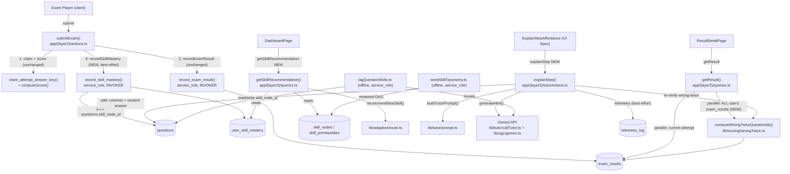
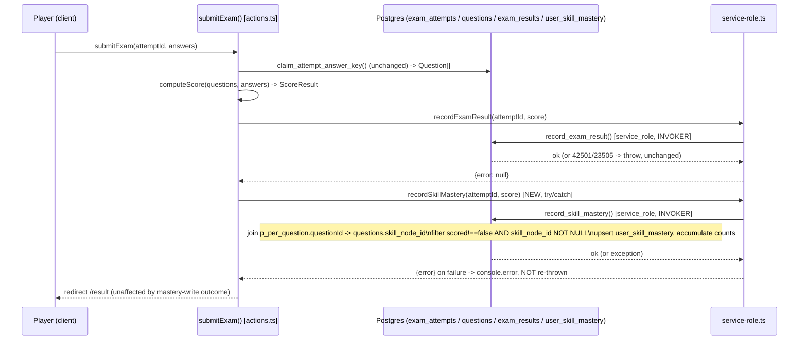

# Engine 1: Adaptive AI & Feedback (Sprint 1) — Backend Design Document

| | |
|---|---|
| **Version** | 1.0 |
| **Date** | 2026-08-08 |
| **Status** | Draft — backend design for the PRD/UI Spec chain below. Resolves U2 (mastery write trust boundary, via `docs/adr/ADR-0011-mastery-write-trust-boundary.md`), U3 (confidence threshold placeholder), U5 (mastery-cleared threshold constant). Does not re-litigate D1–D6 (locked) or U1/U4 (resolved by the UI Spec). **Frontend component implementation is out of scope** — covered by a companion frontend Design Doc, which this document's Data Contracts and Server Action signatures feed directly. |
| **PRD** | `docs/prd/engine1-adaptive-ai-prd.md` (v1.0, 2026-08-08) |
| **UI Spec** | `docs/ui-spec/engine1-adaptive-ai-ui-spec.md` (v1.0, 2026-08-08) — this document implements the mechanism behind its `hasBeenWrongTwice` field (D1/TBD-02) and `SkillRecommendation` contract (D6/TBD-03), and produces the `explainStep()` Server Action signature its `useTutorAction` hook consumes (not itself a numbered TBD in the UI Spec — TBD-04 there covers the U2/ADR prerequisite, resolved by `ADR-0011` below, not the Server Action's name/shape). |
| **ADR** | `docs/adr/ADR-0011-mastery-write-trust-boundary.md` (Accepted, 2026-08-08) — resolves U2, following `docs/adr/ADR-0010-score-write-trust-boundary.md`'s reasoning shape. New file, created alongside this Design Doc per the PRD's explicit "ADR required before Design Doc" instruction for U2. |
| **Codebase analysis** | Backend codebase-analyzer findings delivered as prose in the task brief (no structured `focusAreas`/`fact_id` JSON was provided this run). Treated as the primary source for "Existing Codebase Analysis" below; each discrete factual claim is re-verified independently via Grep/Read (see Code Inspection Evidence) and given a synthetic Fact ID so the Fact Disposition Table can still serve its binding function. No discrepancy found between the prose findings and direct inspection, except where noted in the table. |

## Overview

Engine 1 gives the product a per-skill model of a Math student instead of a per-subject score, a heuristic "what to practise next" recommendation, and a Socratic tutor that appears after a student gets the same question wrong twice. This document specifies the backend: four new tables plus one nullable FK column (`schema.sql`), the mastery-write trust boundary and its integration point inside `submitExam()`, the cross-attempt mechanism behind `hasBeenWrongTwice`, the `lib/adaptive/` DAG-routing heuristic, the `lib/tutor/` Socratic-tutor module (with structural answer-key containment), and the offline batch skill-tagging script. Frontend components (`ExplainStepAffordance`, `SkillRecommendationCard`) are already specified by the UI Spec and are not re-designed here; this document produces exactly the data contracts and Server Action signatures they consume.

### Referenced UI Spec

- UI Spec path: `docs/ui-spec/engine1-adaptive-ai-ui-spec.md`
- Component structure, state machines, and visual design are inherited from the UI Spec and are out of this document's scope. This document owns everything the UI Spec explicitly deferred: TBD-02 (`hasBeenWrongTwice` mechanism), TBD-03 (`SkillRecommendation` mechanism), and the Server Action name/signature TBD-04's `useTutorAction` hook depends on.

## Design Summary (Meta)

```yaml
design_type: "extension"
risk_level: "high"
complexity_level: "high"
complexity_rationale: >
  (1) R3/AC-011 and PRD Risk R-d require a new client-forgeable write surface
      (mastery) to be closed with the same rigor as ADR-0010 closed the score
      write — this is a genuine security-boundary design, not a CRUD table.
  (2) R5/AC-014-017/AC-028 require a deterministic DAG-traversal heuristic
      (lowest-mastery node, prerequisite-gated, recently-wrong tie-break,
      defined cold-start behavior) — a small but real graph algorithm with
      several interacting edge cases, not a simple query.
  (3) D3/AC-018/019 require STRUCTURAL (type-level + unit-tested) exclusion of
      three specific DB columns from an LLM prompt — a security property that
      must be provably true, not merely reviewed.
  (4) The mastery write and the score write must NOT be atomic (PRD
      Reliability NFR), which rules out the simplest mechanism (extend
      record_exam_result()) and requires a second, independently-erroring
      privileged write — see ADR-0011.
main_constraints:
  - "Math only (D1) — four new tables, one nullable FK column, no change to any other subject's data path."
  - "Server Actions only, no REST tier (D4) — new entry points live in app/(layer2)/ following the existing actions.ts/queries.ts convention."
  - "Tutor context is limited to the §10c safe-column set plus the student's own recorded answer (D3) — a hard constraint on lib/tutor/'s input type, not a preference."
  - "A failed mastery update must not break exam submission (PRD Reliability NFR) — drives the ADR-0011 decision to keep the mastery write out of record_exam_result()'s transaction."
  - "schema.sql is applied by hand on two databases (TD-005) — every new DDL block must be idempotent-by-convention and the §17 fingerprint updated in the same change."
  - "Every new FK must declare on delete explicitly (TD-011, CI-enforced by parseForeignKeys.test.ts)."
  - "questions.skill_node_id must be explicitly classified in §10c's grant list or verify-schema.ts fails by design (TD-001)."
biggest_risks:
  - "A forged mastery write re-opens exactly the hole ADR-0010 closed for scores, if the trust boundary is even slightly wrong (see ADR-0011)."
  - "The answer key (correct_answer/sub_answers/essay_answer) reaching the tutor prompt — the single most important gate per PRD Success Criteria #8."
  - "A silent no-op: landing the schema DDL without updating the §17 fingerprint (TD-005's exact, three-times-repeated failure shape), or landing lib/adaptive/lib/tutor code that reads a column/table not yet applied to the DB in use."
  - "The parseGrantedColumns() single-match parser (verify-schema.ts:115-122) reading only the FIRST `grant select (...) on public.questions` statement in the file — a second, separately-appended grant statement for skill_node_id would silently fail to register, producing a false 'orphan column' failure. Must edit the existing §10c statement in place, not append a second one (see Existing Interface Investigation)."
unknowns:
  - "U3 — the real confidence-score distribution Gemini will produce for the ~47-question Math corpus is unmeasured before the first batch run. This document sets a placeholder threshold (0.75) and specifies a re-tunable, single-constant design so it can be adjusted after the first dry run without a code-shape change."
  - "U5 — the mastery-cleared threshold (0.7) is similarly a placeholder pending real usage data, named as a single constant per the PRD's own instruction."
  - "Whether Vercel's Hobby-plan function duration limit is compatible with the tutor's chosen 30s deadline — flagged as an unverified Assumed Behavior below, with a Risks and Mitigation row."
```

## Background and Context

### Prerequisite ADRs

- `docs/adr/ADR-0010-score-write-trust-boundary.md` (Accepted) — the mastery write mirrors this ADR's mechanism (privileged `service_role` identity, INVOKER function, identity derived from the attempt row). Its "Containment of the privileged identity" and "Defence in depth on the DB side" sections apply verbatim to the new `record_skill_mastery()` function.
- `docs/adr/ADR-0011-mastery-write-trust-boundary.md` (Accepted, new — created alongside this document) — resolves U2. See "Architectural Decision — Mastery Write Trust Boundary (U2)" below for the summary; the ADR file holds the full option comparison.
- `docs/adr/ADR-0001-ugc-content-lifecycle-and-rls-enforcement.md` — governs the "no admin role in the database, no `is_admin()`" convention this design's RLS policies continue (no admin bypass is introduced for `skill_nodes`/`skill_prerequisites`/`user_skill_mastery`/`telemetry_log`).

**Common ADR Process check**: searched `docs/adr/ADR-COMMON-*` — none exist in this repository. The one genuinely cross-cutting technical area this design touches (the "privileged `service_role` write, identity derived from a trusted row, INVOKER, revoke-by-name" pattern) is already the subject of ADR-0010, which this document's ADR-0011 explicitly extends rather than duplicating into a new common ADR. No new `ADR-COMMON-*` file is created — if a **third** unrelated feature needs this exact pattern, that is the trigger to extract it into a common ADR (not before, per YAGNI).

### External Resources Used

Project-tier facts are recorded in `docs/project-context/external-resources.md` (last updated 2026-08-08, same day as this design — no environment change occurred beyond what that file already anticipates for Engine 1, so hearing was not re-run).

| Resource (project-tier label) | Feature-specific identifier | Notes |
|-------------------------------|-----------------------------|-------|
| Database Schema Source | `SOURCE/supabase/schema.sql` — new §9b (skill taxonomy + `questions.skill_node_id`), edited §10c (grant list), new §18 (mastery write), new §19 (telemetry log) | Project-tier file already lists this as the canonical schema source; this document adds the exact sections. |
| Migration History | None (manual apply, two DBs) | Project-tier file already documents TD-005; this document's §17 fingerprint procedure follows the existing convention. |
| Third-party AI service (Gemini) | `SOURCE/lib/ugc/gemini.ts` — `getGeminiClient()`, `QUESTION_MODEL`, `ANSWER_MODEL`, `makeDeadlineSignal()`, `sdkErrorDetail()` reused by both the batch tagger and the tutor; the module-private `RETRY_ATTEMPTS` constant is not itself imported (it has no `export` keyword and is used only internally by `getGeminiClient()`) — retry behavior is inherited automatically through that client, not re-imported directly | Project-tier file already states this file "is the integration Engine 1 reuses for skill auto-tagging and the Socratic tutor" — this document specifies exactly which exports are reused vs. newly introduced (see Existing Code Investigation). |
| Rate Limit Store (Upstash Redis) | `SOURCE/lib/security/rateLimit.ts` — new `RATE_LIMITS.explainStep` entry | Tutor's cost guard, per D4/AC-022. |
| Background Job Infrastructure | Batch skill-tagging script (`SOURCE/supabase/tagQuestionSkills.ts`) is a manually-triggered `npx tsx` run, matching the project-tier file's explicit statement that "Batch scripts (e.g. seeding, skill tagging) are manually-triggered one-off runs" | No queue/cron introduced. |

No other project-tier resource (Design Origin/System, Visual Verification, Mock Environment, IaC) is used by this backend-only document.

### Agreement Checklist

#### Scope

- [x] Four new tables (`skill_nodes`, `skill_prerequisites`, `user_skill_mastery`, `telemetry_log`) and one new nullable column (`questions.skill_node_id`) in `SOURCE/supabase/schema.sql`, with RLS, explicit `on delete` on every new FK, and the §10c grant-list edit.
- [x] `docs/adr/ADR-0011-mastery-write-trust-boundary.md` (new) resolving U2.
- [x] `record_skill_mastery()` SQL function + `SOURCE/lib/supabase/service-role.ts` export `recordSkillMastery()`, called from `submitExam()` as a second, best-effort step after `recordExamResult()`.
- [x] The `hasBeenWrongTwice` cross-attempt mechanism: `SOURCE/lib/scoring/wrongTwice.ts` (pure function) + `getResult()`'s new parallel query (`SOURCE/app/(layer2)/queries.ts`) + `PerQuestionResult.hasBeenWrongTwice?: boolean` (`SOURCE/types/result.ts`).
- [x] `SOURCE/lib/adaptive/` — `skillTaxonomy.ts` (reviewed DAG data + `validateDag()`), `constants.ts` (`MASTERY_CLEARED_THRESHOLD`, `SKILL_TAG_CONFIDENCE_THRESHOLD`), `route.ts` (`recommendNextSkill()`), with unit tests.
- [x] `SOURCE/lib/tutor/` — `prompt.ts` (`buildTutorPrompt()`, structurally answer-key-free input type), `constants.ts` (`TUTOR_CALL_DEADLINE_MS`), `callTutor.ts` (`generateHint()`, reusing `getGeminiClient()`/retry/deadline), with unit tests.
- [x] `SOURCE/app/(layer2)/tutorActions.ts` — `explainStep()` Server Action (typed-result convention), server-side re-verification of wrong-twice eligibility, rate-limited via a new `RATE_LIMITS.explainStep` entry.
- [x] `SOURCE/app/(layer3)/queries.ts` — `getSkillRecommendation()`, parallel to the existing `getAnalyticsByRange()`.
- [x] `SOURCE/supabase/seedSkillTaxonomy.ts` — idempotent upsert of the reviewed DAG, mirroring `seed.ts`'s conventions.
- [x] `SOURCE/supabase/tagQuestionSkills.ts` — re-runnable, confidence-gated, dry-run-by-default batch skill-tagging script producing a human-reviewable report.
- [x] `docs/prd/engine1-adaptive-ai-prd.md` U3 (confidence threshold, placeholder `0.75`) and U5 (mastery-cleared threshold, placeholder `0.7`), each a single named constant.

#### Non-Scope (Explicitly not changing)

- [ ] The Math skill taxonomy's actual curriculum content (which 15-25 nodes, their labels, their edges) — that is A2's engineer-review deliverable, not a backend design decision. This document specifies the **storage shape** and the **review/seeding mechanism** only.
- [ ] `computeScore.ts`'s scoring logic (mcq/true_false/short_answer/essay) — untouched; its output (`ScoreResult.perQuestion`) is consumed as-is by the new mastery-derivation SQL.
- [ ] Any subject other than Math (D1) — `skill_node_id` is nullable and only ever populated for Math questions; no other subject's data path changes.
- [ ] A stored-solution column on `questions` (D5) — the tutor derives its explanation at call time from question content + the student's wrong answer, never from a stored solution.
- [ ] Frontend components (`ExplainStepAffordance`, `SkillRecommendationCard`, `useTutorAction`) — UI Spec-owned; covered by a companion frontend Design Doc.
- [ ] R9 (normalizing the 10 `subject = 'Toán'` rows) and R10's exact placement styling — R9 is Should-Have and tracked separately (TD-016); R10's placement is UI Spec D3's job. This document's batch tagger corpus query includes the `'Toán'` rows regardless of whether R9 ships (R2).
- [ ] R11 (multi-turn tutor) and R12 (surfacing error-pattern labels to students) — PRD Won't-Have.
- [ ] Marketing KPIs (retention, latency <1.5s) — explicitly out of Sprint 1 acceptance per PRD.

#### Constraints

- [ ] Parallel operation: **No** — pre-launch, single dev DB during the sprint (A3), applied to prod at ship time as one batch.
- [ ] Backward compatibility: **Required** — `getResult()`'s existing fields (`ExamResult`, `ScoreResult`, pre-existing `PerQuestionResult` fields) stay byte-identical; `hasBeenWrongTwice` is additive-optional. `submitExam()`'s existing redirect/error behavior is unchanged; the mastery write is a new, non-blocking step.
- [ ] Performance measurement: **Not required** — PRD explicitly excludes tutor latency as an acceptance gate ("Tutor latency is a UX problem, not a number to hit"); no PRD KPI governs `getResult()`'s or the dashboard's added query.

#### Applicable Standards

- [x] TypeScript strict mode `[explicit]` - Source: `SOURCE/tsconfig.json`.
- [x] ESLint (`eslint --max-warnings 0`, CI-blocking) `[explicit]` - Source: `SOURCE/eslint.config.mjs`, `.github/workflows/ci.yml`.
- [x] Vitest unit tests for business logic `[explicit]` - Source: `PROJECT_OVERVIEW.md` §6.
- [x] `schema.sql` idempotent-authoring convention (`create table if not exists` for new tables; separate `alter table ... add column if not exists` for columns on pre-existing tables) `[explicit]` - Source: `SOURCE/supabase/schema.sql:84-89` self-documents this exact rule via the `exams` table precedent.
- [x] Every RLS policy: `drop policy if exists ... ; create policy ...`, naming `<subject>_<op>_<scope>` `[explicit]` - Evidence: every policy in `schema.sql` follows this; `questions_select_authenticated`-shape is the closest precedent for engineer-curated, non-per-user reference data. Confirmed: Yes.
- [x] Every new FK declares `on delete` explicitly, CI-enforced `[explicit]` - Source: `SOURCE/lib/schema/__tests__/parseForeignKeys.test.ts`, TD-011.
- [x] New column on an existing table requires explicit §10c grant-list classification or `verify-schema.ts` fails by design `[explicit]` - Source: `schema.sql:594-599` self-documents this (TD-001).
- [x] Any new `SECURITY DEFINER`/privileged function needs `revoke all on function ... from public, anon[, authenticated]` by name `[explicit]` - Source: `schema.sql:732-739` (2026-08-03 incident note).
- [x] `lib/<domain>/` pure-logic module shape: single primary exported function, Vietnamese header comment stating rationale, purely functional (no ambient clock/random reads — inject state), private unexported helpers, co-located `__tests__/` `[implicit]` - Evidence: `SOURCE/lib/scoring/computeScore.ts`, `SOURCE/lib/analytics/aggregateAttempts.ts` (`now: Date` injected explicitly for test determinism). Confirmed: Yes.
- [x] Typed-result Server Action convention (`{error?: "code"}`, no throw, no redirect) for actions whose UI needs to react without losing state `[implicit]` - Evidence: `rateExam()`/`getMyRating()` (`SOURCE/app/(layer2)/actions.ts:177-249`) vs. throw-based `submitExam()`/`startAttempt()`. Confirmed: Yes — this design states explicitly (see Implementation Approach) which convention `explainStep()` follows and why.
- [x] `snake_case` DB column → `camelCase` TS field via `(r.column as T | null) ?? undefined` `[implicit]` - Evidence: `SOURCE/app/(layer2)/actions.ts:130`, `SOURCE/lib/ugc/fromRows.ts:79`. Confirmed: Yes.
- [x] Diagnostic-log helper pattern: safe-metadata-only, try/catch-wrapped, one fixed log-site prefix per module `[implicit]` - Evidence: `logExtractorExit()`/`sdkErrorDetail()` (`SOURCE/lib/ugc/gemini.ts:60-78`). Confirmed: Yes — but `logExtractorExit()`'s prefix is hardcoded `"[ugc-extract]"` (`gemini.ts:62`), so the tutor module defines its own analogous helper rather than reusing that one verbatim (see Existing Interface Investigation).

#### Assumed Behaviors

- [x] **`service_role` bypasses RLS and retains full table/function privileges by Supabase platform default**, without any explicit `grant` statement in `schema.sql` for that role on ordinary tables. Evidence: `record_exam_result()` (`schema.sql:820-885`) inserts into `exam_results` under `service_role` with no `grant insert ... to service_role` anywhere in the file; ADR-0010 states this explicitly ("service_role already bypasses RLS and retains its table grants"). Confirmed: Yes.
- [x] **`submitExam()`'s idempotency short-circuit (`attempt.status === 'submitted'` → immediate redirect) runs before any scoring/recording code**, so any new post-score-write step must be inserted after that check or it will never fire on a re-visit. Evidence: `SOURCE/app/(layer2)/actions.ts:82-84`. Confirmed: Yes.
- [x] **`claim_attempt_answer_key()`'s `RETURNS TABLE` does not currently include `skill_node_id`.** Evidence: `schema.sql:682-696`. Confirmed: Yes — this design deliberately does not add it there (see Minimal Surface Alternatives, Element 3).
- [x] **`verify-schema.ts`'s `parseGrantedColumns()` reads only the first `grant select (...) on public.questions` statement in the file** (non-global regex `.exec()`). Evidence: `SOURCE/supabase/verify-schema.ts:115-122` uses `/grant\s+select\s*\(([\s\S]*?)\)\s*on\s+public\.questions/i.exec(sql)` with no `g` flag. Confirmed: Yes — this is why the design edits the existing §10c statement in place rather than appending a second grant statement (see Existing Interface Investigation).
- [x] **`vitest.config.ts`'s `include` glob covers `lib/**`, `components/**`, `app/**` but not `supabase/**`.** Evidence: `SOURCE/vitest.config.ts:19`. Confirmed: Yes — this is why the reviewed skill-taxonomy data and its DAG-validity test live under `lib/adaptive/`, not `supabase/`.
- [ ] **Vercel's Hobby-plan Serverless Function duration limit comfortably accommodates a single Gemini tutor call within the chosen `TUTOR_CALL_DEADLINE_MS = 30_000` budget.** No file in this repository states the project's configured `maxDuration`, and this was not independently verified against Vercel's platform documentation during this design. Confirmed: No — see the matching Risks and Mitigation row ("Tutor deadline vs. Vercel function timeout").

#### Quality Assurance Mechanisms

- [x] ESLint — Enforces: lint rules — Config: `SOURCE/eslint.config.mjs` — Covers: project-wide — Status: `adopted`.
- [x] `tsc --noEmit` (strict) — Enforces: static typing — Config: `SOURCE/tsconfig.json` — Covers: project-wide — Status: `adopted`.
- [x] `vitest run` — Enforces: unit/integration-test correctness — Config: `SOURCE/vitest.config.ts` — Covers: `lib/adaptive/`, `lib/tutor/`, `lib/scoring/wrongTwice.ts`, `app/(layer2)/__tests__/`, `app/(layer3)/__tests__/` — Status: `adopted` (primary correctness-proof mechanism, see Verification Strategy).
- [x] `next build` — Enforces: production build succeeds — Config: `SOURCE/package.json` — Covers: project-wide — Status: `adopted`.
- [x] `npm run verify:schema` — Enforces: DB-vs-`schema.sql` behavioral parity, including the §10c column classification and every FK's `on delete` — Config: `SOURCE/supabase/verify-schema.ts` — Covers: `public.questions`, all FKs, §17 fingerprint — Status: `adopted` (mandatory after every manual apply, per TD-005).
- [x] `SOURCE/lib/schema/__tests__/parseForeignKeys.test.ts` — Enforces: every new `references` clause declares `on delete` — Config: reads the real `schema.sql` — Covers: `skill_prerequisites`, `questions.skill_node_id`, `user_skill_mastery`, `telemetry_log` FKs — Status: `adopted`, CI-blocking (TD-011).
- [x] `SOURCE/lib/schema/__tests__/schemaFingerprint.test.ts` — Enforces: §17 fingerprint constant/declared-value/computed-value three-way agreement — Config: `SOURCE/lib/schema/schemaFingerprint.ts` — Covers: `schema.sql` in full — Status: `adopted`, CI-blocking (TD-005).
- [x] `check-ai-key-bundle.mjs` — Enforces: no server-only secret (Gemini key, service-role key) reaches the client bundle — Config: `SOURCE/scripts/check-ai-key-bundle.mjs` — Covers: `.next` build output — Status: `adopted` — relevant here because `lib/tutor/`/`lib/adaptive/` and `tagQuestionSkills.ts` all touch `GEMINI_API_KEY`/`SUPABASE_SERVICE_ROLE_KEY`.
- [ ] `SOURCE/supabase/test-rls.ts` (hand-rolled, not CI, run manually) — Status: `noted` initially, becomes `adopted` for implementation — this design's RLS additions (`user_skill_mastery`, `telemetry_log`) require new manually-run regression cases before ship, following the file's existing fixture-ID-prefix + phased-comment-block pattern (see Test Boundaries). Not CI-blocking today (same limitation as every other RLS surface in this project), but required by this document's own scope.
- [ ] Playwright E2E — Status: `noted` (reason: project has not reached "Pha 2" per `PROJECT_OVERVIEW.md` §6; this document is backend-only, no UI to drive).

### Problem to Solve

Three concrete gaps, per the PRD: (1) `questions.topic` cannot carry a real skill taxonomy (3 distinct values, one literally `"Math"`); (2) no help exists at the moment a student is stuck; (3) no route exists from a wrong answer back to the prerequisite that caused it. This document specifies the backend mechanisms that close all three without introducing IRT/CAT, spaced repetition, or a vector-retrieval pipeline — all explicitly cut per the PRD's Out-of-Scope section.

### Current Challenges

- `submitExam()` already carries a security-critical trust boundary (score writes, ADR-0010) that any new write into this same request must respect without weakening it or coupling to it in a way that violates the PRD's Reliability NFR.
- `getResult()` (`SOURCE/app/(layer2)/queries.ts:315-389`) is scoped to a single attempt today and has zero visibility into a student's other attempts — the exact gap the UI Spec's D1 flagged and deferred to this document.
- The tutor's context assembly is a genuine security boundary, not a formatting concern: the same `questions` row that legitimately contains `correct_answer`/`sub_answers`/`essay_answer` (already revoked from `anon`/`authenticated` at the column-grant level, §10c) must never have those three values reach a Gemini prompt, even though the tutor Server Action itself runs authenticated (i.e., it is not blocked by the column revoke the way a naive REST read would be — the tutor's own code must not choose to route around that boundary via `claim_attempt_answer_key`/`exam_answer_key`).

### Requirements

#### Functional Requirements

- R1-R8 as defined in the PRD (Math taxonomy, batch tagging, mastery write, telemetry, heuristic routing, Socratic tutor, "Explain this step" affordance backing data, defined cold-start/untagged behavior). R9 (Should-Have, `subject = 'Toán'` normalization) is out of this document's required scope. **R10's backend data provision (`getSkillRecommendation()`, the `SkillRecommendation` contract) IS in scope and required** — the already-approved UI Spec depends on it; only R10's UI placement/styling is out of scope (UI Spec D3's job, not this document's).

#### Non-Functional Requirements

- **Performance**: no latency budget for the tutor (PRD, explicit). The added query in `getResult()` and the dashboard's new parallel fetch must not regress the existing baseline (Lighthouse mobile ≥ 85, FCP ≤ 2.5s) — both are added as parallel (`Promise.all`), not serial, round-trips.
- **Scalability**: pre-launch scale; no queue, cache tier, or background worker (PRD, explicit).
- **Reliability**: a failed mastery update must not break exam submission (PRD, explicit — drives ADR-0011). A failed tutor call must not break the result page the student is reading (AC-021).
- **Maintainability**: `lib/adaptive/` and `lib/tutor/` follow the established `lib/<domain>/` pure-function shape so routing and prompt-construction logic are unit-testable independently of the Server Action/transport layer (D4).

## Acceptance Criteria (AC) — EARS Format

This document reuses the PRD's own AC IDs (AC-001 through AC-031) where the PRD's AC is backend-owned or has a backend-owned half; it does not renumber them. The subset this document is directly responsible for implementing:

### Schema and Taxonomy (R1, R2)

- [ ] **AC-001/002/003/004** — DAG validity (0 cycles, 0 dangling prerequisites), node count in the 15-25 range, Vietnamese labels — verified by `SOURCE/lib/adaptive/__tests__/skillTaxonomy.test.ts` over the reviewed data in `SOURCE/lib/adaptive/skillTaxonomy.ts`.
- [ ] **AC-005/006/007/008** — Confidence-gated tagging, NULL instead of a guess, re-runnable, every considered row in exactly one of two states, 100% human review before ship — verified by `SOURCE/supabase/tagQuestionSkills.ts`'s dry-run report + a manual double-run + the engineer's review pass (see Verification Strategy).

### Mastery Write (R3)

- [ ] **AC-009** — **When** a student submits a Math exam containing skill-tagged questions, **the system shall** update `user_skill_mastery` for each touched skill node from that attempt's per-question correctness.
- [ ] **AC-010** — **Given** a submitted exam contains questions with a NULL `skill_node_id`, **when** mastery is updated, **then** those questions contribute nothing and cause no error.
- [ ] **AC-011** — **Given** the mastery write path, **it shall** respect the same trust boundary as score writing — resolved by ADR-0011.

### Telemetry (R4)

- [ ] **AC-012** — **Given** a tutor invocation, **when** it completes or fails, **the system shall** record an event sufficient to answer "how many tutor calls happened, for whom, and how many failed" via a `telemetry_log` query — asserted by an integration test (`tutorActions.int.test.ts`) seeding success/failure calls and querying the count/outcome split; the routing half of R4 (`adaptive_route` events) is covered equivalently by `getSkillRecommendation.int.test.ts`.
- [ ] **AC-013** — **Given** any `telemetry_log` row, **it shall** contain no answer-key material — asserted by a unit test on the telemetry-write payload builder (`lib/tutor/__tests__/telemetry.test.ts`), not by the schema's column-shape exclusion alone (the schema's absence of a capable column is the structural backstop; the unit test is the same "assert 0 occurrences on a fixture battery" mechanism AC-018 already uses for the prompt payload).

### Heuristic Routing (R5)

- [ ] **AC-014** — **Given** a test user with seeded mastery, **when** routing runs, **then** the returned node is DAG-valid (all prerequisites at/above threshold).
- [ ] **AC-015** — **Given** two candidate nodes with comparable mastery, **when** one was answered incorrectly more recently, **then** that node is preferred.
- [ ] **AC-016** — **Given** the same input state, **when** routing runs twice, **then** it returns the same node (deterministic, pure function).
- [ ] **AC-017** — **Given** a user whose weakest node is blocked by an unmet prerequisite, **when** routing runs, **then** it returns the prerequisite, not the blocked node.
- [ ] **AC-028** — **Given** a user with zero mastery rows, **when** routing runs, **then** it returns a defined result (`null`, mapped to the UI's explicit cold-start state per UI Spec D6) — 0 crashes, 0 fabricated recommendations.

### Socratic Tutor (R6, R7)

- [ ] **AC-018** — **Given** any tutor invocation, **when** the assembled prompt payload is inspected, **then** it contains 0 occurrences of any `correct_answer`/`sub_answers`/`essay_answer` value — asserted by a unit test on `buildTutorPrompt()`, not by review alone.
- [ ] **AC-019** — **Given** the tutor's context assembly, **it shall** read only columns from the §10c safe set plus the student's own recorded answer.
- [ ] **AC-020** — (Backend half) **Given** a wrong-answer case, **the assembled prompt shall** instruct the model to respond in Vietnamese, in Socratic form, without stating the final answer — the model's actual compliance is judged manually against the fixed evaluation set (PRD Success Criteria #9), not asserted by this document's unit tests.
- [ ] **AC-021** — **Given** a tutor call that fails (503/429/timeout), **the Server Action shall** return a typed, actionable error; the caller (Server Component page) is unaffected.
- [ ] **AC-022** — **Given** the tutor entry point, **it shall** be a Server Action behind the existing session pipeline, rate-limited per user via `guard()`.
- [ ] **AC-029** — **Given** a question with `skill_node_id` NULL, **when** the student answers it wrong twice, **the tutor shall** still function (needs question content, not a skill tag).

### Backend half of the UI Spec's D1/D6 contracts

- [ ] **AC (D1)** — `hasBeenWrongTwice` is computed server-side in `getResult()`, `true` only when the current row is itself `scored !== false && isCorrect === false` **and** the question has been scored incorrect on ≥2 distinct submitted attempts by the same user (across exams).
- [ ] **AC (D6)** — `SkillRecommendation`'s `reasonCode` is derived deterministically from `recommendNextSkill()`'s own traversal path (`"prerequisite-gate"` when the returned node differs from the raw weakest node; `"recently-wrong"` when a mastery tie was broken by recency; `"lowest-mastery"` otherwise).

## Existing Codebase Analysis

### Implementation Path Mapping

| Type | Path | Description |
|------|------|-------------|
| Existing (modified) | `SOURCE/supabase/schema.sql` | New §9b, edited §10c, new §18, new §19; §17 fingerprint updated in the same change. |
| Existing (modified) | `SOURCE/lib/schema/schemaFingerprint.ts` | `SCHEMA_FINGERPRINT` constant updated to match the new file content (exact value computed at implementation time via `computeSchemaFingerprint()`, not fabricated here — see Verification Strategy). |
| Existing (modified) | `SOURCE/types/result.ts` | `PerQuestionResult` gains `hasBeenWrongTwice?: boolean` (UI Spec D1's exact contract). |
| Existing (modified) | `SOURCE/app/(layer2)/queries.ts` | `getResult()` gains a parallel query + `computeWrongTwiceQuestionIds()` call to populate the new field. |
| Existing (modified) | `SOURCE/app/(layer2)/actions.ts` | `submitExam()` gains a non-throwing `recordSkillMastery()` call after `recordExamResult()` succeeds. |
| Existing (modified) | `SOURCE/lib/supabase/service-role.ts` | New export `recordSkillMastery()`, mirroring `recordExamResult()`'s shape. |
| Existing (modified) | `SOURCE/lib/security/rateLimit.ts` | `RATE_LIMITS` gains `explainStep`. |
| Existing (modified) | `SOURCE/app/(layer3)/queries.ts` | New export `getSkillRecommendation()`, parallel to `getAnalyticsByRange()`. |
| Existing (reused, untouched) | `SOURCE/lib/scoring/computeScore.ts` | `ScoreResult`/`PerQuestionResult` shape consumed as-is; no change. |
| Existing (reused, untouched) | `SOURCE/lib/ugc/gemini.ts` | `getGeminiClient()`, `QUESTION_MODEL`, `ANSWER_MODEL`, `makeDeadlineSignal()`, `sdkErrorDetail()` reused by both the tutor and the batch tagger. `logExtractorExit()` is **not** reused verbatim (hardcoded `"[ugc-extract]"` prefix — see Fact Disposition). |
| Existing (reused, untouched) | `SOURCE/lib/security/rateLimit.ts`'s `guard()` | Reused unmodified for `explainStep`. |
| Existing (reused, untouched) | `SOURCE/supabase/seed.ts` | Pattern precedent only (env-loading, service-role client, idempotent upsert) — not imported. |
| New | `SOURCE/lib/adaptive/skillTaxonomy.ts` | Reviewed DAG data + `validateDag()`. |
| New | `SOURCE/lib/adaptive/constants.ts` | `MASTERY_CLEARED_THRESHOLD` (U5), `SKILL_TAG_CONFIDENCE_THRESHOLD` (U3). |
| New | `SOURCE/lib/adaptive/route.ts` | `recommendNextSkill()`. |
| New | `SOURCE/lib/adaptive/__tests__/skillTaxonomy.test.ts`, `route.test.ts` | AC-001-003, AC-014-017, AC-028. |
| New | `SOURCE/lib/scoring/wrongTwice.ts` | `computeWrongTwiceQuestionIds()`. |
| New | `SOURCE/lib/scoring/__tests__/wrongTwice.test.ts` | Cross-attempt aggregation correctness. |
| New | `SOURCE/lib/tutor/prompt.ts` | `buildTutorPrompt()`, `TutorPromptInput` (structurally answer-key-free). |
| New | `SOURCE/lib/tutor/constants.ts` | `TUTOR_CALL_DEADLINE_MS`. |
| New | `SOURCE/lib/tutor/callTutor.ts` | `generateHint()`, `logTutorExit()`. |
| New | `SOURCE/lib/tutor/__tests__/prompt.test.ts` | AC-018/019. |
| New | `SOURCE/types/adaptive.ts` | `SkillRecommendation` type (UI Spec D6's exact contract). |
| New | `SOURCE/app/(layer2)/tutorActions.ts` | `explainStep()` Server Action. |
| New | `SOURCE/app/(layer2)/__tests__/tutorActions.int.test.ts` | AC-021/022/029, server-side re-verification, **AC-012/013** (seeds ≥1 success + ≥1 failed `explainStep()` call, then asserts a `telemetry_log` query — filtered by `user_id`/`event_type='tutor_invoke'` — returns exactly the expected count/outcome split, proving the "how many calls, for whom, how many failed" question is answerable; separately asserts every inserted row's columns cannot structurally hold `correct_answer`/`sub_answers`/`essay_answer`, mirroring AC-018's fixture-based approach). |
| New | `SOURCE/lib/tutor/__tests__/telemetry.test.ts` | **AC-013** (unit test on the telemetry-write payload builder itself — asserts, over a battery of fixture inputs including ones that historically would have leaked answer-key material through `buildTutorPrompt()`, that the constructed insert payload has 0 occurrences of any `correct_answer`/`sub_answers`/`essay_answer` value; complements the integration test above by testing the payload-construction step in isolation, matching AC-018's own "unit test on the builder, not just an integration check" precedent). |
| New | `SOURCE/app/(layer3)/__tests__/getSkillRecommendation.int.test.ts` | AC-014-017/028/031, **AC-012** (asserts the new `adaptive_route` telemetry insert fires on invocation, mirroring `tutorActions.int.test.ts`'s query-based proof for the routing half of R4). |
| New | `SOURCE/app/(layer2)/__tests__/recordSkillMastery.int.test.ts` | AC-009/010 against the real `submitExam` path. |
| New | `SOURCE/supabase/seedSkillTaxonomy.ts` | Idempotent DAG seeding. |
| New | `SOURCE/supabase/tagQuestionSkills.ts` | Batch skill tagger (dry-run default). |

### Existing Interface Investigation

Two existing interfaces are directly integrated with, not merely referenced:

- **`submitExam(attemptId, answers)`** (`SOURCE/app/(layer2)/actions.ts:54-165`) — public signature unchanged. Internal step 6 (`recordExamResult`) is followed by a new step 7 (`recordSkillMastery`), inserted after the existing idempotency short-circuit (line 82-84) and after the score write succeeds, per ADR-0011.
- **`getResult(attemptId): Promise<ExamResult | null>`** (`SOURCE/app/(layer2)/queries.ts:315-412`) — public signature unchanged. Internally gains one new parallel Supabase query (cross-attempt `exam_results` read) whose result feeds `computeWrongTwiceQuestionIds()`, applied to `result.perQuestion` before return.

Call sites for both: `submitExam` has exactly one call site (the exam player's submit action, unchanged); `getResult` has exactly one call site (`ResultDetailPage`, `SOURCE/app/(layer2)/exams/[id]/attempt/[attemptId]/result/detail/page.tsx:25`) plus the `/result` summary page (not read during this design's investigation, out of scope — it does not render per-question detail and is unaffected by the additive field).

### Similar Functionality Search and Decision

- **Privileged, identity-derived, `service_role`-only write**: `record_exam_result()` (§11b) is the exact precedent. **Decision: reuse the pattern, new function** (ADR-0011) — not "use the existing implementation" (extending it would violate the Reliability NFR) and not "new implementation from scratch" (the trust-boundary shape is proven and must be mirrored, not reinvented).
- **Cross-attempt aggregation over `exam_results.per_question`**: no existing code performs this (`aggregateAttemptsByRange`, `SOURCE/lib/analytics/aggregateAttempts.ts`, aggregates by subject/time-range from a flattened `AttemptRow`, not by per-question correctness across attempts). **Decision: new implementation** (`lib/scoring/wrongTwice.ts`), following `aggregateAttemptsByRange`'s established shape (pure reducer, injected input, no ambient reads) rather than the `analytics` domain (different bounded context — scoring/tutor-trigger, not subject-level dashboard stats).
- **Gemini-backed classification with a confidence gate, NULL-not-a-guess**: `normalizeSubject()`/`ALIASES` (`SOURCE/lib/ugc/subjects.ts:101-106`) is the exact convention precedent D2 names. **Decision: use the existing convention** (never returns a low-confidence guess), implemented fresh for the skill-tagging domain (different input/output shape — a Gemini classification call with a numeric confidence score, not a static alias table).
- **DAG/graph traversal**: no existing code in this repository performs graph traversal. **Decision: new implementation**, `lib/adaptive/route.ts`.
- **Typed-result vs. throw-based Server Action**: both conventions coexist (`rateExam()` typed-result vs. `submitExam()` throw-based, both `SOURCE/app/(layer2)/actions.ts`). **Decision: `explainStep()` follows the typed-result convention** — the UI Spec's `useTutorAction` hook (mirroring `usePdfAction`'s `phase` state machine) needs `idle`/`busy`/`error`/`hint-shown` states without losing the affordance's mounted state on failure, exactly the case `rateExam()`'s own doc comment states the typed-result convention exists for ("giữ nguyên 3 điểm đã nhập khi lỗi").

### Dependency Existence Verification

| Dependency | Status | Evidence |
|---|---|---|
| `getGeminiClient()`, `QUESTION_MODEL`, `ANSWER_MODEL`, `makeDeadlineSignal()`, `sdkErrorDetail()` | Verified existing | `SOURCE/lib/ugc/gemini.ts:18-20,33-45,69-78,101-110`. (`RETRY_ATTEMPTS` at line 30 is module-private, not exported — reused indirectly via `getGeminiClient()`, not imported directly.) |
| `guard()`, `RATE_LIMITS` | Verified existing | `SOURCE/lib/security/rateLimit.ts:102-151`. |
| `computeScore()`, `ScoreResult`, `PerQuestionResult` | Verified existing | `SOURCE/lib/scoring/computeScore.ts`, `SOURCE/types/result.ts`. |
| `recordExamResult()`, `serviceRoleClient()` | Verified existing | `SOURCE/lib/supabase/service-role.ts:29-69`. |
| `record_exam_result()` SQL function, `claim_attempt_answer_key()`, `exam_answer_key()` | Verified existing | `schema.sql:616-664,682-728,836-885`. |
| `schema_foreign_keys()` RPC, `parseForeignKeys.ts`, `schemaFingerprint.ts` | Verified existing | `schema.sql:1120-1182`; `SOURCE/lib/schema/parseForeignKeys.ts`; `SOURCE/lib/schema/schemaFingerprint.ts`. |
| `skill_nodes`, `skill_prerequisites`, `user_skill_mastery`, `telemetry_log` tables | Requires new creation | This document, §Schema. |
| `questions.skill_node_id` column | Requires new creation | This document, §Schema. |
| `record_skill_mastery()` SQL function | Requires new creation | This document, §Schema; ADR-0011. |
| `recommendNextSkill()`, `computeWrongTwiceQuestionIds()`, `buildTutorPrompt()`, `generateHint()`, `explainStep()`, `getSkillRecommendation()` | Requires new creation | This document, §Main Components. |
| Vercel Hobby-plan function duration limit (relevant to `TUTOR_CALL_DEADLINE_MS`) | External dependency, unverified | See Assumed Behaviors / Risks. |

### Code Inspection Evidence

| File/Function | Relevance |
|---|---|
| `schema.sql:1-10, 84-89` | Idempotent-authoring convention — new-column-on-existing-table pattern. |
| `schema.sql:594-599` | TD-001 self-documentation — the exact rule `questions.skill_node_id` must satisfy. |
| `schema.sql:732-739` | The `revoke ... from public` incident — applies to `record_skill_mastery()`. |
| `schema.sql:754-757` (§10c) | Integration point — grant list must be edited in place to add `skill_node_id` (10th column). |
| `schema.sql:789-805` (§11a) | RLS pattern precedent for `user_skill_mastery` (revoke client writes, keep a select-own policy shape). |
| `schema.sql:820-885` (§11b, `record_exam_result`) | Direct mechanism precedent for `record_skill_mastery()` — INVOKER, user_id derived from attempt, revoke-by-name. |
| `schema.sql:1035-1050` (`exam_moderation_log`) | RLS pattern precedent for `telemetry_log` — RLS enabled, no policy for `authenticated`/`anon`, operational/log-only table. |
| `schema.sql:1184-1214` (§16b) | `on delete set null` precedent for FKs to `auth.users` from operational/log tables — applied to `telemetry_log.user_id`. |
| `verify-schema.ts:115-122` | `parseGrantedColumns()`'s single-match behavior — the exact reason the §10c edit must be in-place, not a second statement. |
| `verify-schema.ts:1-40` (header) | 7-check structure this design's DDL must keep passing. |
| `SOURCE/app/(layer2)/actions.ts:54-165` (`submitExam`) | Integration point — insertion point for `recordSkillMastery()` (after line 158's `recordExamResult` block). |
| `SOURCE/app/(layer2)/queries.ts:315-412` (`getResult`) | Integration point — insertion point for the cross-attempt query and `hasBeenWrongTwice` mapping. |
| `SOURCE/lib/scoring/computeScore.ts:36-42` (`isScored`) | Data contract reference — `scored !== false` is the exact predicate the mastery-write SQL and `wrongTwice.ts` must both mirror. |
| `SOURCE/lib/analytics/aggregateAttempts.ts` | Pattern reference — pure reducer shape, injected `now: Date`, for `lib/adaptive/route.ts` and `lib/scoring/wrongTwice.ts`. |
| `SOURCE/lib/ugc/subjects.ts:101-106` (`normalizeSubject`) | Pattern reference — "NULL instead of a guess," D2's precedent for the batch tagger's confidence gate. |
| `SOURCE/lib/ugc/quotaTracker.ts` | Pattern reference (optional reuse, not required scope) — dev-only Gemini usage visibility; `QuotaRole` is a closed union that would need extending (`"tutor"`/`"tagging"`) if adopted. Not adopted in this document's required scope (no AC requires it). |
| `SOURCE/app/(layer2)/actions.ts:177-229` (`rateExam`) | Pattern reference — typed-result Server Action convention `explainStep()` follows. |
| `SOURCE/components/history/usePdfAction.ts` | Referenced only to confirm the shape `explainStep()`'s return type must support (UI Spec's own territory; cited here for interface-matching, not re-designed). |
| `SOURCE/app/(layer3)/queries.ts` (`getAnalyticsByRange`) | Pattern reference — server-only, snake_case→camelCase mapping, RLS-scoped-implicit read; `getSkillRecommendation()` mirrors its shape. |
| `SOURCE/supabase/seed.ts` | Pattern reference — env-loading, service-role client, idempotent upsert; `seedSkillTaxonomy.ts` mirrors it. |
| `SOURCE/vitest.config.ts:19` | Constraint reference — `include` glob excludes `supabase/**`, driving the `lib/adaptive/skillTaxonomy.ts` placement decision. |
| `docs/ui-spec/engine1-adaptive-ai-ui-spec.md` D1, D6, TBD-01/02/03/04 | Contract source for `hasBeenWrongTwice` and `SkillRecommendation`. |
| `docs/prd/engine1-adaptive-ai-prd.md` Cold-Start section | Source for the "say less when it knows less" cold-start decision (`recommendNextSkill()` returns `null` on zero mastery rows, not an arbitrary entry node). |

### Fact Disposition Table

No structured `Codebase Analysis.focusAreas` array was provided for this run; the following table treats each discrete factual claim from the task brief's prose "Backend codebase-analyzer findings" as one focus area, with a synthetic Fact ID, so the table still serves its binding function for later sections.

| Fact ID | Focus Area | Disposition | Rationale | Evidence |
|---|---|---|---|---|
| `FA-01` | `schema.sql` idempotent-authoring convention (new table vs. new column on existing table) | preserve | This design follows it exactly for every new table/column. | `schema.sql:1-10,84-89` |
| `FA-02` | RLS policy naming/shape convention | preserve | New policies (`skill_nodes_select_authenticated`, `mastery_select_own`, `telemetry_insert_own`, etc.) follow `<subject>_<op>_<scope>`. | `schema.sql` policy blocks throughout |
| `FA-03` | Every new FK needs explicit `on delete` (TD-011, CI-enforced) | preserve | Every new FK below declares it explicitly. | `parseForeignKeys.test.ts`, TD-011 |
| `FA-04` | `questions.skill_node_id` must be classified in §10c or answered-key-columns, per TD-001 | transform | New outcome: classified into §10c's safe-column grant list (10th column) — see Minimal Surface Alternatives, Element 3, for why not the answer-key path. | `schema.sql:594-599,754-757` |
| `FA-05` | `submitExam`'s idempotency short-circuit runs before scoring/recording | preserve | The mastery write is inserted after this point, confirmed as a design statement (see Mastery Write Integration), not an accidental side effect. | `actions.ts:82-84` |
| `FA-06` | `claim_attempt_answer_key` RPC's `RETURNS TABLE` lacks `skill_node_id` | transform | New outcome: deliberately NOT added — mastery derivation moved entirely into SQL (`record_skill_mastery`), so the TS layer never needs it. | `schema.sql:682-696`; this document's Minimal Surface Alternatives |
| `FA-07` | `computeScore` output contract (`PerQuestionResult.scored`/`isCorrect`) is the exact input a mastery-update function must consume, filtering `scored !== false` and non-null `skill_node_id` | transform | New outcome: `record_skill_mastery()`'s `WHERE` clause implements exactly this filter in SQL over `p_per_question`. | `computeScore.ts:36-42`; this document's Data Contracts |
| `FA-08` | `gemini.ts` reusable client/retry/deadline infra | transform | New outcome: `getGeminiClient`/`QUESTION_MODEL`/`ANSWER_MODEL`/`makeDeadlineSignal`/`sdkErrorDetail` reused verbatim; `logExtractorExit` NOT reused verbatim (hardcoded `"[ugc-extract]"` prefix would mislabel tutor logs) — a small analogous helper is added in `lib/tutor/` instead. | `gemini.ts:60-66` |
| `FA-13` | `guard()`/`RATE_LIMITS` closed-object convention | transform | New outcome: `RATE_LIMITS` gains an `explainStep` key; `guard()` itself is called unmodified. | `rateLimit.ts:102-151` |
| `FA-09` | Auth/error-shape convention split (throw-based vs. typed-result) | transform | New outcome: `explainStep()` adopts typed-result, stated as a deliberate choice (see Existing Code Investigation). | `actions.ts:54-165` vs. `:177-229` |
| `FA-10` | Real corpus data (57 questions, 37 canonical Math + 10 `'Toán'`, grade/type distribution) | preserve | Informs the batch tagger's corpus query (includes `'Toán'` rows per R2) and the taxonomy's expected node-count range (15-25, A2); no schema decision changes because of it beyond what's already stated. | Task brief corpus measurement, 2026-08-08 |
| `FA-11` | House style for `lib/<domain>/` pure-logic modules | preserve | `lib/adaptive/`, `lib/tutor/`, `lib/scoring/wrongTwice.ts` all follow it (single exported function, Vietnamese header, pure, co-located tests). | `computeScore.ts`, `aggregateAttempts.ts` |
| `FA-12` | Seed/test conventions (`seed.ts`, `test-rls.ts`) | transform | New outcome: `seedSkillTaxonomy.ts` mirrors `seed.ts`'s shape (new file, not an edit); `test-rls.ts` gains new manually-run cases for the two new RLS-bearing tables (see Test Boundaries), following its existing fixture-prefix pattern — file itself not restructured. | `seed.ts`, `test-rls.ts` |

### Data Representation Decision (When Introducing New Structures)

Applied to the largest new structure, `user_skill_mastery`:

| Criterion | Assessment | Reason |
|-----------|-----------|--------|
| Semantic Fit | No existing structure fits | `exam_results`/`attempt_answers` are per-attempt, not per-user-per-skill aggregates; `Question`/`PerQuestionResult` carry no skill dimension. |
| Responsibility Fit | No existing structure fits | Mastery is a cross-attempt, per-skill derived signal — a distinct bounded context from "one exam attempt's result." |
| Lifecycle Fit | No existing structure fits | Mastery rows accumulate across the student's entire history and update on every submission; no existing table has this lifecycle. |
| Boundary/Interop Cost | N/A (no candidate to compare against) | — |

**Decision**: new structure justified (all criteria fail to fit any existing table) — `user_skill_mastery`, one row per `(user_id, skill_node_id)`, counters only (`correct_count`, `total_count`, `last_wrong_at`) rather than a normalized error-event log — see Minimal Surface Alternatives, Element 3, for the surface-size reasoning behind that specific shape.

### Minimal Surface Alternatives

Four in-scope elements are analyzed below. The four new tables' and one new column's **existence** is PRD-locked scope (D1-D6, the Scope Boundary Diagram) and is not re-litigated; this gate applies to the **shape** decisions this document still owns within that locked scope.

#### Element 1: `hasBeenWrongTwice` computation mechanism

**Step 1 — Fixed Requirements**
- AC-023/024 (UI Spec, backend-facing half): the affordance must render exactly when the question is currently wrong **and** has been wrong on ≥2 distinct scored attempts.
- PRD A4/D1: "twice" means two separate scored attempts, not twice within one attempt.
- PRD Reliability: must not add a persistent-state maintenance burden the mastery-write trust boundary would also need to defend.

**Steps 2-3 — Alternatives Compared**

| Alternative | Current requirements covered | New persistent state (count) | New concept/mode/flag (count) | Crosses component boundary | Breaking change/migration | Subjective cost notes |
|---|---|---|---|---|---|---|
| Computed on read, inside `getResult()`, via a parallel cross-attempt query (**selected**) | AC-023/024, A4/D1 | 0 | 0 | No (stays inside the existing `getResult()` boundary) | No | One extra parallel query per `getResult()` call; negligible at current scale (113 attempts). |
| Persisted counter column (`attempt_answers.wrong_streak_count` or similar), incremented at submit time | AC-023/024, A4/D1 | 1 (new column) | 1 (a new "streak" concept requiring its own increment/reset rules) | No | Yes (backfill question for existing rows) | Requires defining reset semantics (does a later correct answer reset it? PRD doesn't say) — invents a rule the PRD never asked for. |
| Persisted flag table (`question_wrong_events`, one row per wrong-scored answer) | AC-023/024, A4/D1 | 1 (new table) | 0 | No | No (additive) | Strictly more state than the read-time query needs to answer the one question this feature asks ("has this been wrong ≥2 times") — a full event log is scope beyond what's required. |

**Step 4 — Selected Alternative and Rationale**
- **Selected**: computed on read.
- **Rationale**: smallest alternative considered (0 new persistent state); no further reduction available while still satisfying AC-023/024's cross-attempt requirement.

**Step 5 — Rejected Alternatives Log**
- Persisted streak counter: rejected — invents reset semantics the PRD never specifies, and duplicates information already derivable from `exam_results.per_question` (which must be kept anyway).
- Persisted wrong-event table: rejected — a full event log is unrequired state; the read-time query answers the one question this feature needs without it.

#### Element 2: Mastery write mechanism (function shape)

Covered in full in ADR-0011 (three options compared: extend `record_exam_result()`, new `SECURITY DEFINER` function, new `INVOKER` function called as a separate step — selected). Not repeated here to avoid the two documents drifting; see `docs/adr/ADR-0011-mastery-write-trust-boundary.md` §Rationale.

#### Element 3: `user_skill_mastery`'s "error pattern" representation, and whether `skill_node_id` crosses into the TS layer

**Step 1 — Fixed Requirements**
- R3: "per-user, per-skill mastery record plus observed error patterns."
- AC-015: recently-wrong tie-break in routing.
- R12 (Won't-Have): surfacing human-readable error diagnoses to students is explicitly deferred — no AC requires classifying *what kind* of error occurred.
- U2/ADR-0011: `skill_node_id` must not become a second TS-side trust boundary if it can be avoided.

**Steps 2-3 — Alternatives Compared**

| Alternative | Current requirements covered | New persistent state (count) | New concept/mode/flag (count) | Crosses component boundary | Breaking change/migration | Subjective cost notes |
|---|---|---|---|---|---|---|
| Counters + `last_wrong_at` only, derived entirely inside `record_skill_mastery()` SQL from `p_per_question` (**selected**) | R3, AC-015 | 1 (the `user_skill_mastery` table itself, already PRD-locked) | 0 | `skill_node_id` never crosses into TS (`Question`/`PerQuestionResult` types unchanged) | No | Cannot answer "what kind of error" — acceptable, R12 defers exactly that. |
| Add `skill_node_id` to `Question`/`claim_attempt_answer_key`, compute skill-deltas in a new TS module, pass as a `p_skill_deltas` param | R3, AC-015 | 1 (same table) + 1 new field on an existing type (`Question.skillNodeId`) | 1 (a second, parallel skill-aggregation algorithm in TS that must stay consistent with anything SQL does) | Yes — `skill_node_id` crosses DB→TS for the first time, for no consumer that needs it there | No | Duplicates the "which skill does this question belong to" join in two places (TS type + SQL); doubles the surface a future maintainer must keep in sync for zero behavioral gain this sprint. |
| Full normalized error-pattern table (per-wrong-answer row, choice selected, timestamp) | R3 ("error patterns"), speculative future R12 | 1 new table (beyond the locked four) | 1 (a new "error pattern taxonomy" concept, undefined by any current AC) | No | No | Directly contradicts R12 (Won't-Have this sprint) and YAGNI — no AC asks for this level of detail. |

**Step 4 — Selected Alternative and Rationale**
- **Selected**: counters + `last_wrong_at`, SQL-only skill lookup.
- **Rationale**: smallest alternative considered that still satisfies AC-015 (recency signal present) and R3 (a mastery record with an observed-error dimension, satisfied minimally by `last_wrong_at`); the second alternative is rejected specifically because it adds a cross-boundary field (`skill_node_id` on `Question`) with zero current consumer, which coding-principles' "Minimum Surface for Required Coverage" explicitly disallows absent a named requirement it uniquely covers.

**Step 5 — Rejected Alternatives Log**
- TS-side skill-delta computation with a new `Question.skillNodeId` field: rejected — no current requirement needs `skill_node_id` in the TS layer; adding it would duplicate the skill-lookup join in two places for no behavioral benefit.
- Full normalized error-pattern table: rejected — directly contradicts R12 (Won't-Have) and invents an error taxonomy no AC requires.

#### Element 4: `SkillRecommendation.reasonCode` computation timing

**Step 1 — Fixed Requirements**
- UI Spec D6/AC-031: dashboard shows a skill label + reason, computed for "a student with mastery data" at page-view time.
- AC-016: routing must be deterministic given the same input state.

**Steps 2-3 — Alternatives Compared**

| Alternative | Current requirements covered | New persistent state | New concept/mode/flag | Crosses component boundary | Breaking change/migration | Subjective cost notes |
|---|---|---|---|---|---|---|
| Computed at read time, inside `getSkillRecommendation()`, via `recommendNextSkill()` (**selected**) | AC-031, AC-016 | 0 | 0 | No | No | Recomputed on every dashboard view; cheap at this scale (small DAG, small mastery table per user). |
| Cached/persisted per-user recommendation, recomputed on a schedule or on submit | AC-031, AC-016 | 1 (new column or table) | 1 (a "recommendation is stale" concept, undefined by any AC) | No | No | Invents a staleness/invalidation concern (when is a cached recommendation recomputed?) with no PRD requirement asking for it — pre-launch scale explicitly rules out background jobs (PRD Scalability NFR). |

**Step 4 — Selected Alternative and Rationale**
- **Selected**: computed at read time.
- **Rationale**: smallest alternative considered; PRD's own Scalability NFR ("No queue, no cache tier, no background worker") directly rules out the caching alternative for this sprint.

**Step 5 — Rejected Alternatives Log**
- Cached/persisted recommendation: rejected — invents a staleness-invalidation concept with no current requirement, and directly contradicts the PRD's explicit "no cache tier" constraint.

## Architectural Decision — Mastery Write Trust Boundary (U2)

This section states the decision this Design Doc is responsible for surfacing inline, per the PRD's own routing of U2 to "ADR required before Design Doc." The full option comparison, Decision Details table, and Consequences live in `docs/adr/ADR-0011-mastery-write-trust-boundary.md` (Accepted, created alongside this document) — this section is a summary, not a duplicate, kept in sync by construction (both authored in the same change).

**Decision**: mastery is written by a new function, `public.record_skill_mastery(p_attempt_id uuid, p_per_question jsonb) returns void` — `EXECUTE` revoked from `public`/`anon`/`authenticated`, granted only to `service_role`; `INVOKER` (not `SECURITY DEFINER`), mirroring `record_exam_result()`'s exact reasoning (`service_role` already bypasses RLS and retains table grants, so two independent misconfigurations are required to reopen the hole). `user_id` is derived from the attempt row (never a parameter) and the attempt must be `status = 'submitted'`.

**Where this diverges from ADR-0010's mechanism, and why**: `record_exam_result()` and `record_skill_mastery()` are **separate** functions, called as two separate steps from `submitExam()`, rather than one function doing both. This is because the PRD's own Reliability NFR ("A failed mastery update must not break exam submission") rules out making the two writes atomic — extending `record_exam_result()` would roll back the score insert if the mastery-side `GROUP BY`/join ever raised. `submitExam()` calls `recordExamResult()` first (unchanged); only if that succeeds does it call `recordSkillMastery()`, in a `try/catch` that logs and does not re-throw. See "Mastery Write Integration into `submitExam`" below for the exact insertion point.

**Note per the task's own instruction**: decisions of this class (security-critical trust boundary, cited by the PRD as requiring an ADR) are normally split into a standalone ADR file rather than only living inline in a Design Doc. That standalone file (`ADR-0011`) has been produced alongside this document, following `ADR-0010`'s structure exactly (Status/Context/Decision/Decision Details/Rationale/Options Considered/Consequences/Architecture Impact/Implementation Guidance).

## Design

### Schema

All DDL below follows `schema.sql`'s established idempotent-authoring convention (`FA-01`): `create table if not exists` for new tables, `alter table ... add column if not exists` for a column on the pre-existing `questions` table, `drop policy if exists ... ; create policy ...` for every RLS policy, `drop function if exists ... ; create function ...` for the new privileged function, and every new FK declares `on delete` explicitly (`FA-03`).

**Placement**: §9b is inserted physically **between** the existing §9 (BACKFILL, `schema.sql:468-478`) and §10's "ANSWER-KEY COLUMN LOCKDOWN" banner (`schema.sql:578`), for one concrete reason confirmed by direct inspection: the existing §10c grant statement must be edited **in place** to add `skill_node_id` (see below), and that edit requires the column to already exist earlier in the file's top-to-bottom execution order. §18 and §19 are appended after the existing §16 and **before** §17 — §17's own self-documented invariant ("PHẢI là câu lệnh CUỐI CÙNG của file") must be preserved.

#### §9b — Skill Taxonomy (Engine 1 Adaptive AI)

```sql
-- ----------------------------------------------------------------------------
-- 9b. Skill Taxonomy (Engine 1 Adaptive AI & Feedback, PRD R1/R2, D1) — Math
--     only. Nodes + prerequisite edges (DAG); reviewed by the engineer before
--     ship (A2), not authored here. questions.skill_node_id is nullable —
--     a question may legitimately have no skill (D2: NULL instead of a
--     guess). Placed HERE (before §10, not appended at the end) because §10c
--     below is edited in place to grant skill_node_id, and that edit needs
--     the column to already exist earlier in the file's execution order.
-- ----------------------------------------------------------------------------
create table if not exists public.skill_nodes (
  id         text primary key,           -- slug, vd 'luy-thua', 'logarit'
  label_vi   text not null,               -- nhãn tiếng Việt hiển thị (AC-004)
  created_at timestamptz not null default now()
);

create table if not exists public.skill_prerequisites (
  skill_node_id        text not null references public.skill_nodes(id) on delete cascade,
  prerequisite_node_id text not null references public.skill_nodes(id) on delete cascade,
  primary key (skill_node_id, prerequisite_node_id)
);
alter table public.skill_prerequisites drop constraint if exists skill_prerequisites_no_self_check;
alter table public.skill_prerequisites add constraint skill_prerequisites_no_self_check
  check (skill_node_id <> prerequisite_node_id);

alter table public.questions add column if not exists skill_node_id text
  references public.skill_nodes(id) on delete set null;
-- `set null`: xoá một skill node không được kéo xoá câu hỏi theo — câu hỏi vẫn
-- hợp lệ, chỉ mất tag (giống questions.correct_answer nullable đã xử lý case
-- "chưa đủ dữ liệu" bằng nullable thay vì xoá dòng).

alter table public.skill_nodes enable row level security;
drop policy if exists "skill_nodes_select_authenticated" on public.skill_nodes;
create policy "skill_nodes_select_authenticated" on public.skill_nodes
  for select to authenticated using (true);

alter table public.skill_prerequisites enable row level security;
drop policy if exists "skill_prerequisites_select_authenticated" on public.skill_prerequisites;
create policy "skill_prerequisites_select_authenticated" on public.skill_prerequisites
  for select to authenticated using (true);
-- Không có policy ghi cho client — tiền lệ "Seeded content" (§5 comment cũ):
-- taxonomy do kỹ sư duyệt rồi seed qua service_role (seedSkillTaxonomy.ts),
-- không phải nội dung người dùng ghi qua app.
```

**Edited in place — §10c grant list** (existing statement, `schema.sql:754-757`, edited to add the 10th column):

```sql
revoke select on public.questions from anon, authenticated;
grant select (
  id, content, choices, subject, grade, topic, question_type, part_number, image_url, skill_node_id
) on public.questions to anon, authenticated;
```

This is a one-line textual edit to an **existing** statement, not a new append, and it is required to be exactly that (not a second, separately-appended `grant select (skill_node_id) ...` statement) because `verify-schema.ts`'s `parseGrantedColumns()` (`verify-schema.ts:115-122`) uses a non-global regex `.exec()` that reads only the **first** `grant select (...) on public.questions` statement in the file — a second statement would be silently invisible to that check, and `skill_node_id` would incorrectly report as an "orphan column" (no read path) even though the DB itself would have granted it correctly. See Assumed Behaviors and Code Inspection Evidence for the exact citation.

`skill_node_id` is classified into the safe-column grant (not the answer-key `RETURNS TABLE` path) because it is not answer-key material — it reveals which curriculum skill a question belongs to, nothing about correctness.

#### §18 — Mastery Write (Engine 1 Adaptive AI, ADR-0011)

```sql
-- ============================================================================
-- MASTERY WRITE (Engine 1 Adaptive AI, ADR-0011, PRD R3/AC-011)
--
-- Mirrors §11's SCORE WRITE LOCKDOWN shape exactly: client loses all write
-- access, a privileged service_role-only INVOKER function derives user_id
-- from the attempt row (never a parameter), requires status='submitted'.
--
-- DELIBERATELY a SEPARATE function from record_exam_result(), not an
-- extension of it: PRD Reliability NFR requires a failed mastery update to
-- NOT break exam submission. Extending record_exam_result() would make the
-- two writes atomic (one statement, one implicit transaction) — a mastery-
-- side failure would roll back the score insert too. See ADR-0011.
-- ============================================================================

create table if not exists public.user_skill_mastery (
  user_id       uuid not null references auth.users(id) on delete cascade,
  skill_node_id text not null references public.skill_nodes(id) on delete cascade,
  correct_count int not null default 0,
  total_count   int not null default 0,
  last_wrong_at timestamptz,             -- null = chưa từng sai trên skill này
  updated_at    timestamptz not null default now(),
  primary key (user_id, skill_node_id)
);

alter table public.user_skill_mastery enable row level security;

-- Không có insert/update policy cho authenticated: KHÔNG có trường hợp hợp lệ
-- nào client tự ghi mastery — mọi ghi đi qua record_skill_mastery() dưới đây
-- (service_role, bypass RLS). Revoke tường minh dù RLS không có policy nào
-- cho các thao tác ghi (defense-in-depth, tiền lệ §11a).
revoke insert, update, delete on public.user_skill_mastery from anon, authenticated;

drop policy if exists "mastery_select_own" on public.user_skill_mastery;
create policy "mastery_select_own" on public.user_skill_mastery
  for select using (user_id = auth.uid());

drop function if exists public.record_skill_mastery(uuid, jsonb);
create function public.record_skill_mastery(
  p_attempt_id   uuid,
  p_per_question jsonb
)
returns void
language plpgsql
volatile
set search_path = public, pg_temp
as $$
declare
  v_user_id uuid;
begin
  -- Cùng cưỡng chế với record_exam_result(): user_id suy ra từ attempt, đòi
  -- status='submitted' — người gọi không tự khai được user_id hay attempt
  -- chưa nộp.
  select a.user_id into v_user_id
    from public.exam_attempts a
   where a.id = p_attempt_id
     and a.status = 'submitted';

  if v_user_id is null then
    raise exception 'record_skill_mastery: attempt % không tồn tại hoặc chưa submitted', p_attempt_id
      using errcode = 'check_violation';
  end if;

  -- Gộp theo skill_node_id: câu scored=false hoặc skill_node_id null KHÔNG
  -- đóng góp gì (AC-010/AC-029) — WHERE lọc cả hai điều kiện, join là INNER
  -- nên câu không khớp questions (hiếm, xem Data Contracts) cũng tự loại.
  -- scored thiếu (undefined ở TS, JSON.stringify bỏ key) → coalesce về true,
  -- khớp đúng quy ước "undefined = true" của computeScore.ts.
  insert into public.user_skill_mastery
    (user_id, skill_node_id, correct_count, total_count, last_wrong_at, updated_at)
  select
    v_user_id,
    q.skill_node_id,
    count(*) filter (where (pq->>'isCorrect')::boolean),
    count(*),
    max(now()) filter (where not (pq->>'isCorrect')::boolean),
    now()
  from jsonb_array_elements(p_per_question) as pq
  join public.questions q on q.id = pq->>'questionId'
  where coalesce((pq->>'scored')::boolean, true)
    and q.skill_node_id is not null
  group by q.skill_node_id
  on conflict (user_id, skill_node_id) do update
  set correct_count = public.user_skill_mastery.correct_count + excluded.correct_count,
      total_count   = public.user_skill_mastery.total_count + excluded.total_count,
      last_wrong_at = coalesce(excluded.last_wrong_at, public.user_skill_mastery.last_wrong_at),
      updated_at    = now();
end;
$$;

-- Revoke ĐÍCH DANH — xem ghi chú §10b về default privileges của Supabase.
revoke all on function public.record_skill_mastery(uuid, jsonb) from public, anon, authenticated;
grant execute on function public.record_skill_mastery(uuid, jsonb) to service_role;
```

#### §19 — Telemetry Log (Engine 1 Adaptive AI, R4)

```sql
-- ============================================================================
-- TELEMETRY LOG (Engine 1 Adaptive AI, PRD R4/AC-012/AC-013)
--
-- Ghi lại lời gọi tutor/adaptive để quan sát được sau khi ship (AC-012), KHÔNG
-- BAO GIỜ chứa answer-key material (AC-013 — schema không có cột nào để chứa
-- correct_answer/sub_answers/essay_answer, đúng bằng thiết kế). Bảng vận hành,
-- không phải dữ liệu người dùng tự xem — tiền lệ exam_moderation_log: RLS bật
-- + không policy đọc nào cho authenticated/anon.
-- ============================================================================
create table if not exists public.telemetry_log (
  id            uuid primary key default gen_random_uuid(),
  -- `set null`: nhật ký vận hành không nên biến mất theo tài khoản (tiền lệ
  -- §16b, TD-012) — mất DANH TÍNH chấp nhận được, mất DÒNG thì không.
  user_id       uuid references auth.users(id) on delete set null,
  event_type    text not null check (event_type in ('adaptive_route', 'tutor_invoke')),
  question_id   text references public.questions(id) on delete set null,
  skill_node_id text references public.skill_nodes(id) on delete set null,
  success       boolean not null,
  -- Mã có cấu trúc, KHÔNG BAO GIỜ free-text/exception message — chặn một
  -- con đường vô tình nhét nội dung câu hỏi (UGC, attacker-influenced) vào
  -- log qua err.message.
  error_code    text check (
    error_code is null or error_code in ('gemini_unavailable', 'rate_limited', 'server', 'not_eligible')
  ),
  created_at    timestamptz not null default now()
);

alter table public.telemetry_log enable row level security;

-- Chỉ GHI được (lúc invoke), KHÔNG đọc được — quan sát vận hành (AC-012) đi
-- qua service_role/SQL Editor, không qua app. Revoke tường minh SELECT/UPDATE/
-- DELETE dù RLS không có policy nào cho các thao tác đó (defense-in-depth,
-- tiền lệ §11a).
revoke select, update, delete on public.telemetry_log from anon, authenticated;
revoke insert on public.telemetry_log from anon;

drop policy if exists "telemetry_insert_own" on public.telemetry_log;
create policy "telemetry_insert_own" on public.telemetry_log
  for insert to authenticated with check (user_id = auth.uid());
```

#### §17 — Fingerprint update procedure

§17 (the existing `schema_version` block, `schema.sql:1216-1259`) stays physically last in the file, unchanged in structure. Its **value** must change because the file's content changed. Procedure (do not fabricate the hash — compute it):

1. Apply the three edits above (§9b insertion, §10c in-place edit, §18/§19 appended before §17) to the real `schema.sql`.
2. Run `computeSchemaFingerprint(sql)` (`SOURCE/lib/schema/schemaFingerprint.ts:61-64`) against the edited file's full text.
3. Update **both** `SCHEMA_FINGERPRINT` in `schemaFingerprint.ts:41` and the literal value inside `schema.sql`'s `@schema-fingerprint-begin`/`@schema-fingerprint-end` block (`schema.sql:1253-1259`) to the computed value, in the same commit.
4. `npx vitest run lib/schema` (`schemaFingerprint.test.ts`) must pass before this change is considered complete at the L2 verification level (see Verification Strategy) — it fails with the exact expected value if steps 2-3 are missed, by design.
5. After manual apply to a real DB, `npm run verify:schema` item 7 confirms the DB's own `schema_version.fingerprint` matches.

### Change Impact Map

```yaml
Change Target: submitExam() mastery-write integration + Layer 2/3 read paths for Engine 1
Direct Impact:
  - SOURCE/supabase/schema.sql (new §9b, edited §10c, new §18, new §19, §17 fingerprint value)
  - SOURCE/lib/schema/schemaFingerprint.ts (SCHEMA_FINGERPRINT constant)
  - SOURCE/app/(layer2)/actions.ts (submitExam gains a non-throwing recordSkillMastery() step after recordExamResult())
  - SOURCE/lib/supabase/service-role.ts (new export recordSkillMastery())
  - SOURCE/app/(layer2)/queries.ts (getResult() gains a parallel query + hasBeenWrongTwice mapping)
  - SOURCE/types/result.ts (PerQuestionResult.hasBeenWrongTwice?: boolean)
  - SOURCE/lib/security/rateLimit.ts (RATE_LIMITS.explainStep)
  - SOURCE/app/(layer3)/queries.ts (new export getSkillRecommendation())
  - SOURCE/lib/adaptive/**, SOURCE/lib/tutor/**, SOURCE/lib/scoring/wrongTwice.ts, SOURCE/types/adaptive.ts (all new)
  - SOURCE/app/(layer2)/tutorActions.ts (new)
  - SOURCE/supabase/seedSkillTaxonomy.ts, SOURCE/supabase/tagQuestionSkills.ts (new)
Indirect Impact:
  - public.exam_results.per_question (jsonb) — unchanged shape, but now read a SECOND time (cross-attempt) by getResult() for the wrong-twice computation, and read a second time (by record_skill_mastery) at write time
  - SOURCE/app/(layer2)/exams/[id]/attempt/[attemptId]/result/detail/page.tsx — will start receiving hasBeenWrongTwice on scored, incorrect rows; UI Spec's own territory to render it (ExplainStepAffordance mount)
  - SOURCE/app/(layer3)/me/dashboard/page.tsx — will start receiving a SkillRecommendation from a new parallel fetch; UI Spec's own territory to render it (SkillRecommendationCard mount)
  - npm run verify:schema — gains new checks implicitly (column classification, FK on-delete, fingerprint) covering the new DDL; no change to verify-schema.ts's own code
No Ripple Effect:
  - computeScore.ts and its existing mcq/true_false/short_answer/essay branches (untouched)
  - record_exam_result() itself (untouched — record_skill_mastery is a sibling, not a modification)
  - Any subject other than Math (skill_node_id stays NULL; D1)
  - Rating system, History feature, UGC upload pipeline (layer4) — except the batch tagger, which runs offline/out-of-band against the same questions table
  - Existing RLS policies on questions/exams/exam_attempts/attempt_answers/exam_results (unchanged; only the §10c grant LIST gains one column)
```

### Interface Change Matrix

| Existing Operation | New Operation | Conversion Required | Adapter Required | Compatibility Method |
|----------|-----|--------------------|------|--------------------|
| `submitExam(attemptId, answers)` | (unchanged signature) | No | No | Additive internal step (non-throwing), no caller-visible change |
| `recordExamResult(attemptId, score)` | (unchanged) | No | No | Called first, unmodified; new sibling `recordSkillMastery()` called after |
| (none) | `recordSkillMastery(attemptId, score)` | N/A (new) | No | New export, `SOURCE/lib/supabase/service-role.ts` |
| `getResult(attemptId): Promise<ExamResult \| null>` | (unchanged signature; `perQuestion[].hasBeenWrongTwice` additive) | No | No | Additive optional field; existing consumers unaffected |
| (none) | `getSkillRecommendation(): Promise<SkillRecommendation>` | N/A | No | New export, `SOURCE/app/(layer3)/queries.ts` |
| (none) | `explainStep(attemptId, questionId): Promise<ExplainStepResult>` | N/A | No | New Server Action, `SOURCE/app/(layer2)/tutorActions.ts` |
| `RATE_LIMITS` (4 keys) | `RATE_LIMITS` (5 keys, +`explainStep`) | Yes (TS literal widens) | No | Additive key; `guard()`'s call sites elsewhere unaffected (structural typing) |
| `schema.sql` §10c grant (9 columns) | §10c grant (10 columns, +`skill_node_id`) | Yes (in-place text edit of one existing statement — see Existing Interface Investigation) | No | Verified by `verify-schema.ts` check #1 after apply |

### Architecture Overview

Engine 1's backend sits entirely within the existing Layer 2 (Core Loop) and Layer 3 (Analytics) route groups, plus two new pure-logic domains (`lib/adaptive/`, `lib/tutor/`) and one new cross-attempt read (`lib/scoring/wrongTwice.ts`). No new layer, service, or REST tier is introduced (D4).



### Data Flow



### Integration Points List

| Integration Point | Location | Old Implementation | New Implementation | Switching Method | Verification Method |
|---|---|---|---|---|---|
| `submitExam()` post-score-write step | `actions.ts` (after existing line 158-162 block) | Function returns/redirects after `recordExamResult()` | New non-throwing `recordSkillMastery()` call inserted before the final `redirect()` | Direct code edit (no flag) | `SOURCE/app/(layer2)/__tests__/recordSkillMastery.int.test.ts` — AC-009/010 |
| `getResult()` cross-attempt read | `queries.ts` (parallel with the existing Vòng 1 query) | Single-attempt read only | `Promise.all([existingQuery, wrongTwiceQuery])`, mapped into `result.perQuestion[].hasBeenWrongTwice` | Direct code edit (no flag) | `SOURCE/lib/scoring/__tests__/wrongTwice.test.ts` (pure logic) + a `getResult` integration test extension |
| §10c grant statement | `schema.sql:754-757` | 9-column grant | 10-column grant (+`skill_node_id`) | In-place text edit | `npm run verify:schema` check #1 |
| `RATE_LIMITS` | `rateLimit.ts:102-107` | 4 keys | 5 keys (+`explainStep`) | Direct code edit | `tsc --noEmit` (closed-object type would reject an unregistered `guard("explainStep", ...)` call otherwise) |

### Main Components

#### `record_skill_mastery()` (SQL function, `service_role`-only)

- **Responsibility**: derive per-skill correct/total counters and last-wrong timestamp from an attempt's already-computed `per_question` JSON, joined against `questions.skill_node_id`, and upsert into `user_skill_mastery`. Never re-derives correctness itself (reads `isCorrect`/`scored` as already-trusted booleans).
- **Interface**: `record_skill_mastery(p_attempt_id uuid, p_per_question jsonb) returns void`.
- **Dependencies**: `exam_attempts` (identity/status check), `questions.skill_node_id` (join), `user_skill_mastery` (write target).

#### `recordSkillMastery()` (TS, `SOURCE/lib/supabase/service-role.ts`)

- **Responsibility**: thin RPC wrapper, exact shape of `recordExamResult()`. Never throws on RPC failure — returns `{error}` for the caller to handle (mirrors `recordExamResult`'s own return-not-throw convention).
- **Interface**: `recordSkillMastery(attemptId: string, score: ScoreResult): Promise<{error: {code?: string; message: string} | null}>`.
- **Dependencies**: `serviceRoleClient()` (private, unexported, existing).

#### `recommendNextSkill()` (pure, `SOURCE/lib/adaptive/route.ts`)

- **Responsibility**: deterministically select the next skill node to practise (or `null` for true cold start), per R5/AC-014-017/AC-028.
- **Interface**: see Data Contracts below.
- **Dependencies**: none (pure; all state injected — nodes, edges, mastery rows, threshold).

#### `buildTutorPrompt()` (pure, `SOURCE/lib/tutor/prompt.ts`)

- **Responsibility**: assemble the Gemini prompt string from a structurally answer-key-free input type. The single point AC-018 is asserted against.
- **Interface**: see Data Contracts below.
- **Dependencies**: none (pure string construction).

#### `generateHint()` (`SOURCE/lib/tutor/callTutor.ts`)

- **Responsibility**: call Gemini with the built prompt, applying the shared deadline/retry infrastructure; classify failures into the typed error shape `explainStep()` returns.
- **Interface**: `generateHint(input: TutorPromptInput): Promise<string>` (throws a typed error on failure, caught by `explainStep()`).
- **Dependencies**: `getGeminiClient()`, `QUESTION_MODEL`, `makeDeadlineSignal()`, `sdkErrorDetail()` (all reused from `lib/ugc/gemini.ts`); `buildTutorPrompt()`.

#### `explainStep()` (Server Action, `SOURCE/app/(layer2)/tutorActions.ts`)

- **Responsibility**: auth + ownership check, server-side re-verification of wrong-twice eligibility (defense-in-depth per UI Spec D1's security note), rate limiting, safe-column question fetch, prompt build, Gemini call, best-effort telemetry write.
- **Interface**: see Data Contracts below.
- **Dependencies**: `createClient()` (JWT-scoped), `guard()`, `computeWrongTwiceQuestionIds()`, `generateHint()`.

#### `computeWrongTwiceQuestionIds()` (pure, `SOURCE/lib/scoring/wrongTwice.ts`)

- **Responsibility**: given a user's full set of submitted attempts' `per_question` arrays, return the set of `questionId`s scored incorrect on ≥2 distinct attempts. Shared by `getResult()` (display) and `explainStep()` (server-side re-verification — both call sites must agree, so this is the single source of truth for the definition of "wrong twice," not duplicated logic).
- **Interface**: see Data Contracts below.
- **Dependencies**: none (pure).

#### `getSkillRecommendation()` (`SOURCE/app/(layer3)/queries.ts`)

- **Responsibility**: fetch this user's DAG (nodes/edges, reference data) + mastery rows (RLS-scoped), call `recommendNextSkill()`, map to the UI Spec's `SkillRecommendation` contract, and attempt a best-effort `telemetry_log` insert (`event_type='adaptive_route'`) — the schema's §19 `event_type` CHECK constraint already names this value, and R4 ("Adaptive-routing and tutor events are recorded") covers routing invocations equally with tutor invocations, not tutor-only. Mirrors `explainStep()`'s telemetry-write shape: fire-and-forget, a write failure never blocks or alters the returned `SkillRecommendation` (same reasoning as `submitExam`'s `recordExamResult` failure handling — an observability write must not become a second point of failure for the user-facing read).
- **Interface**: `getSkillRecommendation(): Promise<SkillRecommendation>`.
- **Dependencies**: `createClient()`, `recommendNextSkill()`, `MASTERY_CLEARED_THRESHOLD`.

#### Batch Skill-Tagging Script (`SOURCE/supabase/tagQuestionSkills.ts`, R2/AC-005-008)

- **Responsibility**: for every Math question in the corpus (canonical `subject = 'Math'` **and** the 10 non-canonical `subject = 'Toán'` rows, R2 — the corpus query is `subject in ('Math', 'Toán')`, independent of whether R9 ships), ask Gemini to classify it against the reviewed `skill_nodes` set with a confidence score, and write `questions.skill_node_id` only for classifications at or above `SKILL_TAG_CONFIDENCE_THRESHOLD` (D2 — NULL instead of a guess, mirroring `normalizeSubject()`'s precedent).
- **Interface**: CLI script, `npx tsx supabase/tagQuestionSkills.ts [--apply]`. **Dry-run is the default** (no DB write) — matches this codebase's secure-default posture and directly serves AC-008's 100%-human-review requirement: the engineer reads the dry-run report before anything is written. `--apply` performs the actual `update questions set skill_node_id = ... where id = ...` for every classification at/above threshold (re-running the classification at apply time, not replaying a stale report — see Risks and Mitigation).
- **Dependencies**: `getGeminiClient()`, `ANSWER_MODEL` (reused — a bulk classification task, same cost/complexity profile as the existing "read file đáp án, rẻ hơn" usage this model is already pinned for; deliberately **not** a new pinned model constant, per Minimal Surface), `SKILL_TAG_CONFIDENCE_THRESHOLD` (`lib/adaptive/constants.ts`), a direct `@supabase/supabase-js` service-role client (mirrors `seed.ts`'s pattern — bypasses RLS/column-grants entirely, so §10c's `skill_node_id` grant is irrelevant to this script's own operation).

**Data Contract**:

```yaml
Contract: tagQuestionSkills.ts (CLI script, not an importable function)
Input:
  Type: public.questions rows where subject in ('Math', 'Toán') (service-role read, all columns visible)
  Preconditions: skill_nodes/skill_prerequisites already seeded and reviewed (seedSkillTaxonomy.ts has run) — the script does not invent skill node ids, it only classifies against the existing set
  Validation: none beyond the confidence gate itself
Output:
  Type: |
    (1) A JSON report file (SOURCE/supabase/skill-tagging-report-<ISO timestamp>.json, gitignored),
        one entry per considered question:
        { questionId, subject, proposedSkillNodeId, confidence, decision: "tagged" | "left-null", reason }
        — every considered row appears exactly once, satisfying AC-007's "0 rows left in an undefined
        state" (the REPORT is the record of that; the DB only ever reflects "tagged" decisions).
    (2) (--apply only) questions.skill_node_id updated for every "tagged" decision; "left-null" decisions
        write nothing (column already defaults NULL — no explicit null-write needed, idempotent by
        construction).
  Guarantees:
    - A question's confidence never determines a WRITE below SKILL_TAG_CONFIDENCE_THRESHOLD (AC-005)
    - Re-running (dry-run or --apply) against an unchanged corpus produces the same "tagged"/"left-null"
      partition and the same final skill_node_id values — idempotent (AC-006) BY CONSTRUCTION, because
      the script only ever performs a column UPDATE (never an INSERT into a separate tags table), so a
      second run cannot create a duplicate record; it can only re-write the same column to the same value
  On Error: a single question's Gemini call failing is recorded as decision "left-null", reason
    "classification-error" (treated the same as low-confidence — never a guess, never a script crash)
Invariants:
  - --apply never lowers an existing skill_node_id to NULL for a question this run did not consider
    (UPDATE only touches rows the corpus query returned)
```

### Data Contracts

#### `recommendNextSkill()`

```yaml
Contract: recommendNextSkill(input: RouteInput): RouteResult | null
Input:
  Type: |
    interface RouteInput {
      nodes: { id: string; labelVi: string }[];
      edges: { skillNodeId: string; prerequisiteNodeId: string }[]; // skillNodeId requires prerequisiteNodeId
      mastery: { skillNodeId: string; correctCount: number; totalCount: number; lastWrongAt: string | null }[]; // THIS user's rows only
      threshold: number; // MASTERY_CLEARED_THRESHOLD
    }
  Preconditions: nodes/edges form a DAG (AC-001/002, enforced upstream by validateDag() over the seed data, not re-validated per call for performance); mastery rows belong to exactly one user (caller's responsibility, RLS-scoped fetch)
  Validation: none performed internally (pure function; injected state is trusted, per AC-016's "inject state, no ambient reads" requirement)
Output:
  Type: "{ nodeId: string; labelVi: string; reasonCode: 'prerequisite-gate' | 'lowest-mastery' | 'recently-wrong' } | null"
  Guarantees:
    - mastery.length === 0 -> returns null (AC-028, true cold start — never a fabricated entry-node guess, per PRD's own "say less when it knows less" framing)
    - Non-null result: every prerequisite of the returned node has ratio >= threshold (AC-014); vacuously true for a node with no prerequisites
    - Same input (by value) -> same output, always (AC-016)
    - reasonCode "prerequisite-gate" only when the returned node differs from the raw weakest-overall node (a substitution occurred); "recently-wrong" only when a mastery-ratio tie at the top level was broken by lastWrongAt; "lowest-mastery" otherwise
  On Error: never throws — a node absent from `mastery` is treated as ratio 0 (untouched = weakest, encourages first attempts); a defensive visited-set guards against re-visiting a node during the prerequisite-substitution walk (should be unreachable given AC-001's DAG-validity gate, but the pure function does not trust that gate blindly)
Invariants:
  - No Date.now()/Math.random()/ambient read of any kind (AC-016)
  - Node absent from `mastery` never causes a crash or an undefined ratio (defaults to 0)
```

**Algorithm** (clarifying the prerequisite-substitution walk, which prose alone under-specifies):

```
1. if mastery.length === 0: return null
2. ratio(nodeId) = mastery row exists ? correctCount/totalCount : 0
3. isCleared(nodeId) = every edge (nodeId -> prereq) has ratio(prereq) >= threshold (vacuous true if none)
4. sortKey(node) = [ratio(node) ASC, lastWrongAt(node) DESC NULLS LAST, node.id ASC]  // AC-015 + AC-016 determinism
5. weakest = nodes sorted by sortKey, first element
6. tieBrokenByRecency = true if >=2 nodes shared weakest's ratio AND weakest was selected ahead of another
   same-ratio node specifically because of a non-null lastWrongAt
7. candidate = weakest; substituted = false; visited = {}
8. while not isCleared(candidate):
     visited.add(candidate)
     unmetPrereqs = edges from candidate where ratio(prereq) < threshold
     next = unmetPrereqs' target nodes, sorted by sortKey, first element
     if next is undefined or next in visited: break  // defensive; unreachable given AC-001
     candidate = next; substituted = true
9. reasonCode = substituted ? "prerequisite-gate" : (tieBrokenByRecency ? "recently-wrong" : "lowest-mastery")
10. return { nodeId: candidate.id, labelVi: candidate.labelVi, reasonCode }
```

#### `buildTutorPrompt()`

```yaml
Contract: buildTutorPrompt(input: TutorPromptInput): string
Input:
  Type: |
    interface TutorPromptInput {
      questionContent: string;
      questionType: "mcq" | "true_false" | "short_answer"; // essay excluded — never scored, never wrong-twice-eligible
      choices?: { id: string; text: string }[];   // mcq only
      subItems?: { id: string; text: string }[];  // true_false only (content, no Đ/S)
      studentAnswer: string;                       // raw stored answer text/tfCodec string, exactly as attempt_answers stores it
    }
  Preconditions: none — the TYPE ITSELF structurally cannot carry correct_answer/sub_answers/essay_answer (no field exists to hold them), which is the AC-018/019 containment mechanism, not a runtime check
  Validation: none (pure string construction)
Output:
  Type: string (the full prompt sent to Gemini, Vietnamese instruction + question context + student's wrong answer, explicitly instructing Socratic, answer-withholding style)
  Guarantees:
    - 0 occurrences of any value that could only have come from correct_answer/sub_answers/essay_answer (impossible by the input type's shape, additionally unit-tested per AC-018)
    - Deterministic given the same input (no ambient reads)
  On Error: never throws (pure string template)
Invariants:
  - TutorPromptInput has no field named or shaped like an answer-key field — a future maintainer adding one would need to consciously widen this type, a visible diff a reviewer catches, not a silent leak
```

#### `computeWrongTwiceQuestionIds()`

```yaml
Contract: computeWrongTwiceQuestionIds(attempts: { attemptId: string; perQuestion: PerQuestionResult[] }[]): Set<string>
Input:
  Type: all of one user's submitted attempts' perQuestion arrays (caller fetches via RLS-scoped results_select_own, no explicit user_id filter needed)
  Preconditions: none
  Validation: none (pure)
Output:
  Type: Set<string> of questionIds scored incorrect (scored !== false && isCorrect === false) on >=2 DISTINCT attemptIds, across all attempts including the current one being viewed
  Guarantees: a questionId appearing wrong on only 1 attempt (or 0) is never in the returned set
  On Error: never throws
Invariants:
  - "scored !== false" mirrors computeScore.ts's own isScored() convention exactly (undefined = scored)
  - Cross-EXAM: a question shared by two different exams' question_ids still counts toward the same threshold (question identity is global, per PRD A4's own framing)
```

**Consumer-side gating** (applied by both `getResult()` and `explainStep()`, not inside this function itself — matches UI Spec D1's own rule that the flag is "only meaningful when `r.scored !== false && r.isCorrect === false`"): `hasBeenWrongTwice = (row.scored !== false && !row.isCorrect) ? wrongTwiceSet.has(row.questionId) : undefined`.

#### `explainStep()`

```yaml
Contract: explainStep(attemptId: string, questionId: string): Promise<ExplainStepResult>
Input:
  Type: "attemptId: string; questionId: string" (matches ExplainStepAffordanceProps exactly, UI Spec)
  Preconditions: caller is an authenticated session (D4); attempt belongs to the caller (RLS-scoped read)
  Validation: |
    1. Fetch attempt (RLS-scoped) -> 404-equivalent error if not found/not owned
    2. Fetch this user's full attempt history, recompute computeWrongTwiceQuestionIds() -> re-verify
       (attemptId's row for questionId is scored, incorrect, AND questionId in the wrong-twice set) —
       independent of whatever the client's UI state claims (UI Spec's own security note: client-side
       gating is a display convenience only)
    3. guard("explainStep", userId)
    4. Fetch question via the plain authenticated client (NOT claim_attempt_answer_key/exam_answer_key) —
       structurally cannot receive correct_answer/sub_answers/essay_answer, since those remain revoked
       at the column-grant level (§10c) for this role
Output:
  Type: "{ hint: string } | { error: 'not_eligible' | 'rate_limited' | 'gemini_unavailable' | 'server' }"
  Guarantees:
    - error is always one of the four listed codes, never a raw exception message (no internal detail leaks to the client)
    - success case never includes any field derived from correct_answer/sub_answers/essay_answer (AC-018/019, by construction — TutorPromptInput cannot carry them, and the fetch itself cannot retrieve them)
  On Error: typed-result convention (no throw, no redirect) — mirrors rateExam()
Invariants:
  - Every invocation (success or failure) attempts a best-effort telemetry_log insert (event_type='tutor_invoke'); a telemetry-write failure never changes the returned ExplainStepResult
```

### Field Propagation Map

| Field | Boundary | Status | Serialized Format | Consumer Parse Rule | Detail |
|---|---|---|---|---|---|
| `ScoreResult.perQuestion` (`p_per_question`) | `submitExam()` (TS) → `record_exam_result()` / `record_skill_mastery()` (SQL, via PostgREST RPC) | preserved (same object, passed to both RPCs unmodified) | JSON array, each element `{questionId, selected?, correct?, isCorrect, scored?}` per `PerQuestionResult` | SQL: `jsonb_array_elements(p_per_question) as pq`, fields via `pq->>'questionId'` / `(pq->>'isCorrect')::boolean` / `coalesce((pq->>'scored')::boolean, true)` | The exact same in-memory `ScoreResult` object crosses this boundary twice (once per RPC call) — both SQL functions must agree on this JSON shape; a shape change to `PerQuestionResult` requires updating both. |
| `hasBeenWrongTwice` | `getResult()` (server) → `ResultDetailPage` (RSC prop) → `ExplainStepAffordance` (UI Spec territory) | transformed (computed, not stored — added to the existing `PerQuestionResult` object read from `exam_results`) | — (in-memory RSC prop passing, not a manually-encoded serialized format) | — | Producer: this document. Consumer beyond the RSC boundary: UI Spec/frontend Design Doc. |
| `SkillRecommendation` | `recommendNextSkill()` (pure) → `getSkillRecommendation()` (server query) → `DashboardPage` (RSC prop) → `SkillRecommendationCard` (UI Spec territory) | transformed (`{nodeId, labelVi, reasonCode}` → `{skillLabel: labelVi, reasonCode}`, `null` passthrough) | — (in-memory) | — | `nodeId` itself is NOT propagated to the UI Spec's `SkillRecommendation` type (UI Spec D6 has no `nodeId` field) — dropped at the `getSkillRecommendation()` boundary; the DAG-internal identifier stays a backend concern. |
| `skill_node_id` | `public.questions` (DB) → *(does not propagate to TS)* | dropped (deliberately, see Minimal Surface Alternatives Element 3) | — | — | Never crosses into `Question`/`PerQuestionResult`/any TS type this sprint — read only inside `record_skill_mastery()`'s SQL body. |
| Tutor's Gemini response text | `generateHint()` (TS) → `explainStep()` return value → (UI Spec territory: `RichText`) | preserved (passed through as-is) | Plain text string over the Gemini SDK's own HTTP transport (not this document's format to define — `@google/genai` internal) | N/A (SDK-handled) | Output-side sanitization (rendering the returned string safely in the DOM) is UI Spec D4's responsibility, not this document's. |

### State Transitions and Invariants

No new state machine is introduced. `exam_attempts.status` (`'in_progress' | 'submitted'`) is unchanged and unread by any new code except as a precondition check (`record_skill_mastery()` requires `'submitted'`, mirroring `record_exam_result()`). `user_skill_mastery` rows have a trivial lifecycle (absent → present, monotonically accumulating counters; never deleted except via `on delete cascade` from the parent user/skill row) — not a designed FSM, listed here only for completeness:

```yaml
State Definition:
  - Initial State: no row for (user_id, skill_node_id)
  - Possible States: [no row, row with correct_count/total_count/last_wrong_at]

State Transitions:
  no row --submitExam touches this skill--> row (correct_count, total_count set from this attempt)
  row --submitExam touches this skill again--> row (counts accumulate; last_wrong_at updated only if this attempt had a wrong answer for the skill)

System Invariants:
  - total_count is monotonically non-decreasing
  - correct_count <= total_count always
  - A row exists only for skills the user has actually been scored on at least once (no speculative/empty rows)
```

## Implementation Plan

### Implementation Approach

**Selected Approach**: Hybrid — vertical slices per PRD requirement group (schema+mastery-write first, since everything else depends on the DB shape existing; then adaptive routing; then tutor; then batch tagger), each slice horizontally complete (schema → pure lib function → integration point → tests) before the next starts.

**Selection Reason** (Phase 1-4 per implementation-approach skill):

- **Phase 1 (Current State)**: `submitExam`/`getResult` are stable, tested, security-hardened (ADR-0010) code paths. `computeScore.ts`/`lib/analytics/` establish a proven `lib/<domain>/` pure-function shape. No existing DAG/routing/prompt-construction code exists to build on — these are genuinely new domains.
- **Phase 2 (Strategy Exploration)**: A pure Horizontal Slice (all schema first, then all lib/ modules, then all integration points, then all tests) would leave the mastery-write trust boundary — this design's highest-risk element — unverified until very late. A pure Vertical Slice per PRD requirement (R1 alone, then R2 alone, ...) would repeatedly touch `schema.sql` in small increments, multiplying the TD-005 manual-apply risk (four separate SQL Editor pastes instead of one). **Selected**: Hybrid — one schema apply covering all four tables + the column (§9b/§18/§19 together, since they're additive and independent of each other's *content*), then vertical slices through the lib/integration layer in dependency order (mastery write is both the highest-risk element and the one everything else's data depends on, so it goes first).
- **Phase 3 (Risk Assessment)**: Technical — a forged mastery write (mitigated by ADR-0011, verified by `test-rls.ts` new cases before ship); the answer key reaching the tutor prompt (mitigated by `TutorPromptInput`'s structural exclusion + AC-018 unit test); a schema/DB version mismatch (mitigated by the §17 fingerprint procedure, run immediately after each manual apply). Operational — none (pre-launch, no live users). Project — solo engineer, large scope for one Sprint; mitigated by the Hybrid ordering (mastery write, the riskiest and most foundational piece, ships and is verified first, not last).
- **Phase 4 (Constraint Compatibility)**: TypeScript strict mode requires `RouteInput`/`TutorPromptInput` to be fully typed with no `any`. `schema.sql`'s manual-apply constraint (TD-005) is why all new DDL is designed to apply in ONE paste (§9b + edited §10c + §18 + §19 together), not four separate applies. Server Actions only (D4) — confirmed no route handler is introduced anywhere in this design.

**Verification Level**: L2 (test operation verification) is the primary achievable level for the schema/mastery-write/adaptive-routing/tutor-prompt slices — new Vitest unit/integration tests passing, plus `npm run verify:schema` for the DB-level checks. L1 (functional, end-user-visible operation) is reachable for the mastery write and the tutor Server Action independently of the frontend (an integration test can drive `submitExam()` end-to-end and inspect `user_skill_mastery`; `explainStep()` can be invoked directly in a test without the UI), but the full user-visible flow (a student actually seeing the affordance/recommendation) is blocked on the companion frontend Design Doc landing, per this document's own explicit scope boundary.

**Integration Point** (the task that first makes this slice operational end-to-end): the schema apply (§9b/§18/§19) landing on the dev DB, immediately followed by `npm run verify:schema` passing all 7 checks — this is the first point at which any subsequent lib/integration code can be tested against a real DB shape.

### Technical Dependencies and Implementation Order

#### Required Implementation Order (in dependency order)

1. **`schema.sql` — §9b, edited §10c, §18, §19 + §17 fingerprint update**
   - Technical Reason: every other piece of this design reads or writes one of these tables/columns/functions; nothing else can be integration-tested against a real DB until this lands and is applied.
   - Prerequisites / Dependent Elements: none upstream; everything downstream depends on this.

2. **`ADR-0011` (already produced alongside this Design Doc) + `record_skill_mastery()` / `recordSkillMastery()` / `submitExam()` integration**
   - Technical Reason: closes the highest-risk trust-boundary gap (PRD Risk R-d) before any other Engine 1 code writes user-facing data; also the first point real mastery data starts accumulating, which every later slice (routing, dashboard) needs to be meaningfully testable against.
   - Prerequisites / Dependent Elements: depends on step 1 (`user_skill_mastery` table, `questions.skill_node_id`).

3. **`lib/scoring/wrongTwice.ts` + `getResult()` integration**
   - Technical Reason: independent of the taxonomy/mastery work (reads only `exam_results`, not `skill_nodes`), so it can land in parallel with steps 4-6; unblocks the frontend's `hasBeenWrongTwice` contract early.
   - Prerequisites / Dependent Elements: none beyond existing `exam_results`.

4. **`lib/adaptive/skillTaxonomy.ts` (+ `validateDag()`, AC-001-003) + `seedSkillTaxonomy.ts`**
   - Technical Reason: the DAG must exist and be validated before `route.ts` has anything meaningful to traverse; the curriculum content itself (A2, engineer review) is a prerequisite for this step's data, not this step's code.
   - Prerequisites / Dependent Elements: depends on step 1 (`skill_nodes`/`skill_prerequisites` tables); the actual reviewed node/edge content is an external input to this step, not produced by it.

5. **`lib/adaptive/route.ts` (`recommendNextSkill()`, AC-014-017/028) + `lib/adaptive/constants.ts` (U5) + `getSkillRecommendation()`**
   - Technical Reason: depends on step 4's DAG data existing (even a minimal placeholder DAG suffices for unit testing the algorithm itself, per AC-016's determinism requirement — real curriculum content is not a blocker for testing the algorithm).
   - Prerequisites / Dependent Elements: depends on step 4 for integration testing; the pure function itself (`route.ts`) can be unit-tested against synthetic fixtures independently.

6. **`lib/tutor/` (`prompt.ts`, `constants.ts`, `callTutor.ts`) + `tutorActions.ts` (`explainStep()`) + `RATE_LIMITS.explainStep`**
   - Technical Reason: depends on step 3 (`computeWrongTwiceQuestionIds()`, reused for server-side re-verification) and step 1 (§10c's `skill_node_id` grant is irrelevant here, but the tutor's safe-column read depends on §10c's existing 9-column grant, unchanged).
   - Prerequisites / Dependent Elements: depends on step 3.

7. **`tagQuestionSkills.ts` (batch skill tagger, U3, AC-005-008)**
   - Technical Reason: last, because it writes `questions.skill_node_id` for real content, and running it before the taxonomy (step 4) is reviewed/seeded would have nothing valid to tag against.
   - Prerequisites / Dependent Elements: depends on step 4 (a shipped, reviewed `skill_nodes` table to tag against).

### Migration Strategy

No feature flag, no dual-write/parallel-operation period (single dev DB during the sprint, per A3; pre-launch, no live users to migrate). `questions.skill_node_id` defaults to `NULL` for every existing row (AC-010/AC-029 already define this as a normal, not exceptional, state) — no backfill required or performed. The batch tagger (step 7 above) is the only mechanism that ever populates it, run manually and reviewed per AC-008.

## Security Considerations

- **Authentication & Authorization**: `explainStep()` is a Server Action inheriting the existing session/CSP-nonce pipeline (D4, AC-022) — no new unauthenticated entry point. `getSkillRecommendation()` runs behind `DashboardPage`'s existing `getCurrentUser()` redirect guard (`SOURCE/app/(layer3)/me/dashboard/page.tsx:18-19`), unchanged. `record_skill_mastery()`/`recordSkillMastery()` are reachable only via `service_role`, never a student's own JWT (ADR-0011).
- **Input Validation**: `explainStep(attemptId, questionId)` re-verifies ownership (attempt belongs to caller, RLS-scoped) and eligibility (server-side `computeWrongTwiceQuestionIds()` recomputation) before any Gemini call — the UI's `hasBeenWrongTwice`-gated rendering is explicitly a display convenience only, not a security boundary (UI Spec D1's own stated position, honored here).
- **Sensitive Data Handling**: `correct_answer`/`sub_answers`/`essay_answer` never enter `TutorPromptInput` (structural exclusion, AC-018/019) and never enter `telemetry_log` (schema has no column capable of holding them, AC-013). `telemetry_log.error_code` is a constrained enum, not free text, specifically to prevent a future maintainer from routing an exception message (which could echo attacker-influenced UGC question content) into a stored log row.

## Test Boundaries

### Mock Boundary Decisions

| Component/Dependency | Mock? | Rationale |
|---|---|---|
| `recommendNextSkill()`, `buildTutorPrompt()`, `computeWrongTwiceQuestionIds()` | No — real implementation, direct pure-function unit tests | Subjects under test; no I/O to mock. |
| Supabase client inside `getResult()`'s new parallel query, `getSkillRecommendation()`, `explainStep()` | Yes, for integration tests | Matches the project's sanctioned boundary (`getResult.int.test.ts`/`rating.int.test.ts` precedent) — proves query shape and mapping correctness without a live Postgres instance. |
| `getGeminiClient()`/Gemini API call | Yes, for `callTutor.ts`'s unit tests | External I/O boundary; `generateHint()`'s success/failure classification logic is tested against mocked SDK responses (matching the retry/deadline behavior `gemini.ts` already documents), not a live API call. |
| `record_skill_mastery()` SQL logic itself | No — cannot be meaningfully mocked; requires a real Postgres instance | Per testing-principles' "Mock Limitations for Data Layer" — JSON path extraction, the `GROUP BY`/`FILTER`/`ON CONFLICT` logic, and the FK join against `questions.skill_node_id` are exactly the kind of query correctness a mock cannot verify. |

### Data Layer Testing Strategy

- **Schema dependencies**: `public.skill_nodes`, `public.skill_prerequisites`, `public.questions.skill_node_id`, `public.user_skill_mastery`, `public.telemetry_log` (all defined above); `public.record_skill_mastery()` (SQL function).
- **Test data approach**: `SOURCE/app/(layer2)/__tests__/recordSkillMastery.int.test.ts` runs against a real dev Supabase instance (mirroring the project's existing convention that RLS/SQL-function-level correctness is only provable against real Postgres, not mocks) — seeds a minimal exam/questions/skill_nodes fixture, submits via the real `submitExam()` path, asserts the resulting `user_skill_mastery` rows match the attempt's per-question correctness for tagged questions and that untagged/unscored questions contributed nothing (AC-009/010). `lib/adaptive/__tests__/skillTaxonomy.test.ts` and `route.test.ts` use literal, independently-authored fixture DAGs (not the real curriculum content, which is a content-authoring deliverable, not a test-authoring one).
- **Mock limitations acknowledged**: unit tests on `record_skill_mastery`'s TS wrapper (`recordSkillMastery()`) can verify the RPC is called with the right shape, but cannot verify the SQL's `GROUP BY`/`FILTER`/join correctness — that is exactly what the required real-DB integration test (above) closes, matching testing-principles' explicit guidance that schema/query-shape mismatches "pass through undetected with mock-only testing."

### Integration Verification Points

- `npm run verify:schema` after every manual apply of the new DDL — the 7-check gate this design's schema additions must keep green (column classification, FK `on delete`, §17 fingerprint), per TD-005/TD-001/TD-011.
- New `SOURCE/supabase/test-rls.ts` cases (manually run, not CI-blocking, following the file's existing fixture-ID-prefix pattern) for `user_skill_mastery` (a second user cannot read/write another user's mastery rows) and `telemetry_log` (an authenticated user cannot read ANY row, including their own, via REST; `anon` cannot insert).
- `SOURCE/app/(layer2)/__tests__/recordSkillMastery.int.test.ts` — the real-DB proof for AC-009/010 (see above).
- `SOURCE/app/(layer2)/__tests__/tutorActions.int.test.ts` — asserts `explainStep()` returns `not_eligible` when the server-side wrong-twice re-verification fails even if a caller passes an arbitrary `questionId` (the exact abuse case the UI Spec's D1 security note flags).

## Verification Strategy

### Correctness Proof Method

- **Correctness definition**: (1) the schema DDL applies clean and stays classified/fingerprinted per TD-001/TD-005/TD-011's existing gates; (2) `recommendNextSkill()` produces DAG-valid, deterministic output on literal fixtures matching the engineer-confirmed algorithm semantics (Data Contracts pseudocode above); (3) `buildTutorPrompt()`'s output contains zero occurrences of literal answer-key fixture values across a battery of crafted inputs; (4) `user_skill_mastery` rows, after a real `submitExam()` call, arithmetically match the submitted attempt's per-question correctness for tagged/scored questions and are unaffected by untagged/unscored ones.
- **Verification method**: Vitest unit tests with literal, independently-computed expected values (per testing-principles) for (2)/(3); a real-DB integration test for (4); `npm run verify:schema` + `parseForeignKeys.test.ts` + `schemaFingerprint.test.ts` for (1).
- **Verification timing**: after each implementation-order step (see Technical Dependencies and Implementation Order) — this is a Hybrid-approach design, so each step's own tests must be green before the next step begins, not deferred to one final pass.
- **Full PRD Success Criteria cross-reference** (the four points above are the highest-risk subset; every PRD-numbered item this document is responsible for is listed here so this section is a complete map, not a partial one):

  | PRD Success Criteria | Proving mechanism | Where |
  |---|---|---|
  | #1 Schema applies clean | `npm run verify:schema` (7 checks) + `parseForeignKeys.test.ts` | Early Verification Point, above |
  | #2 Schema fingerprint stays honest | `schemaFingerprint.test.ts` + §17 update procedure | Schema section, §17 |
  | #3 Taxonomy is DAG-valid | `lib/adaptive/__tests__/skillTaxonomy.test.ts` (AC-001-003) | Test Boundaries |
  | #4 Tag coverage and honesty | `tagQuestionSkills.ts`'s dry-run report + AC-005/007/008 (100% human review before `--apply`) | Main Components, Batch Skill-Tagging Script |
  | #5 Batch is re-runnable | `tagQuestionSkills.ts`'s idempotent-by-construction design (plain column `UPDATE`, no separate tags table) — proven by actually running it twice, per the PRD's own "a script that claims idempotence and has never been re-run is a claim, not a property" standard | Main Components, Batch Skill-Tagging Script |
  | #6 Routing is DAG-valid and deterministic | Correctness definition (2) above | This section |
  | #7 Cold start is defined | `route.test.ts` (AC-028) | Test Boundaries |
  | #8 Answer key never reaches the model | Correctness definition (3) above | This section |
  | #12 Mastery reflects real submissions | Correctness definition (4) above | This section |
  | #13 Telemetry never carries answer-key material | `lib/tutor/__tests__/telemetry.test.ts` (AC-013) | Test Boundaries |
  | #14 Untagged questions still support the tutor | `tutorActions.int.test.ts` (AC-029) | Test Boundaries |
  | #15 Tutor telemetry is queryable | `tutorActions.int.test.ts` + `getSkillRecommendation.int.test.ts` (AC-012) | Test Boundaries |

### Early Verification Point

- **First verification target**: `npm run verify:schema` passing all 7 checks immediately after the first manual apply of the new DDL (§9b/§18/§19 + edited §10c) to the dev database — the smallest unit that proves the highest-risk, most foundational piece of this design (the schema shape and the mastery-write trust boundary's DB-side prerequisites) is correct before any TS-layer code is written against it.
- **Success criteria**: all 7 `verify:schema` checks green, specifically including check #1 (no orphan `questions` column — confirms the §10c in-place edit worked) and check #6 (every new FK's `on delete` matches this document's declared values) and check #7 (fingerprint agreement).
- **Failure response**: if check #1 fails with `skill_node_id` listed as an orphan, re-confirm the §10c edit was applied to the FIRST `grant select (...) on public.questions` statement in the file (not appended as a second statement) before re-applying — this is the single most likely failure mode this document's own investigation identified (see Assumed Behaviors). Do not proceed to any lib/integration-layer implementation until this passes.

### Output Comparison

- **Comparison input**: `getResult()`'s and `submitExam()`'s pre-existing output fields, exercised against the same fixture attempts used by their existing test suites (unmodified).
- **Expected output fields**: `ExamResult`/`ScoreResult`/`PerQuestionResult`'s pre-existing fields (`totalScore`, `correct`, `total`, `topicBreakdown`, `perQuestion[].{questionId,selected,correct,isCorrect,scored}`) must remain byte-identical before/after this change; only the new, additive `hasBeenWrongTwice` field is new output.
- **Diff method**: existing Vitest `toEqual`/`toMatchObject` assertions in `computeScore.test.ts` and any `getResult` test suite must continue passing unmodified (regression) — no existing assertion is edited by this design.
- **Transformation pipeline coverage**: this design introduces no `dataTransformationPipelines` input from a codebase-analysis phase; the two genuinely new pipelines it adds (`p_per_question` → `record_skill_mastery()`'s SQL aggregation, and `exam_results` history → `computeWrongTwiceQuestionIds()`) are each covered by their own dedicated test per Test Boundaries above, not by a shared comparison mechanism.

## Future Extensibility

- **Deferred possibilities**:
  - **Cached/persisted `SkillRecommendation`**: considered in Minimal Surface Alternatives Element 4, rejected — would serve a performance requirement no PRD KPI currently states, and directly contradicts the PRD's explicit "no cache tier" Scalability NFR. Revisit only if a future measured bottleneck justifies it.
  - **`skill_node_id` on the TS `Question` type**: considered in Minimal Surface Alternatives Element 3, rejected for this sprint — if a future feature (e.g., an author-facing skill-tag editor UI) needs to read/write it through the app rather than SQL Editor/service-role scripts, add it then, with a fresh Minimal Surface Alternatives pass at that time.
  - **`telemetry_log.event_type` extension to cover mastery-write failures**: currently handled by `console.error` only (matching `submitExam`'s existing `recordExamResult` failure-logging convention) — named as a known unknown in ADR-0011; revisit if silent-log-only observability proves insufficient once real usage exists.
  - **`lib/ugc/quotaTracker.ts` reuse for tutor/tagging Gemini-call visibility**: optional, not adopted in this document's required scope (no AC requires it); would need `QuotaRole`'s closed union extended (`"tutor"`/`"tagging"`).
- **Intentional limitations**: no partial-credit/near-miss signal is added anywhere in this design (mirrors `computeScore`'s own existing boolean-only `isCorrect`); no multi-turn tutor state is introduced (R11, Won't-Have); no error-pattern taxonomy beyond `last_wrong_at` (R12, Won't-Have — see Minimal Surface Alternatives Element 3).
- **Extension points (existing, with current consumers)**: `isScored()`'s per-type dispatch convention (`computeScore.ts:36-42`) is the pattern `record_skill_mastery()`'s `WHERE` clause mirrors — current consumer: `computeScore()` itself, now also mirrored (not literally called) by the new SQL function. `lib/<domain>/` pure-function shape (current consumers: `lib/scoring/`, `lib/analytics/`) is now also the shape of `lib/adaptive/` and `lib/tutor/`.

## Alternative Solutions

| Alternative | Overview | Advantages | Disadvantages | Reason for Rejection |
|---|---|---|---|---|
| Extend `record_exam_result()` to also write mastery (atomic) | One function, one call, one transaction | Simplicity; guaranteed consistency between score and mastery | Violates the PRD's explicit Reliability NFR (mastery failure would roll back the score write) | Rejected — see ADR-0011. |
| `SECURITY DEFINER` mastery-write function, callable directly by the student's own JWT with an internal entitlement check | No `service-role.ts` involvement | Avoids growing `service-role.ts`'s surface | Single point of failure (one over-broad `EXECUTE` grant reopens the hole) vs. the two independent misconfigurations the INVOKER approach requires; inconsistent with the project's established privileged-write shape | Rejected — see ADR-0011. |
| Mastery-write as a background job / queue | Decouples from the request path entirely | Cleanest separation of "load-bearing" vs. "adaptive model" concerns | Directly contradicts the PRD's explicit Scalability NFR ("No queue, no cache tier, no background worker") and D6 ("written on real submitExam") | Rejected — PRD-locked constraint. |
| `hasBeenWrongTwice` as a persisted, incrementally-maintained counter | Avoids a read-time cross-attempt query | Cheaper reads at very large scale | Invents reset semantics no AC specifies; larger persistent-state surface for no current requirement | Rejected — see Minimal Surface Alternatives, Element 1. |

## Risks and Mitigation

| Risk | Impact | Probability | Mitigation |
|------|--------|-------------|------------|
| A forged/incorrect mastery write re-opens the §11-shaped trust boundary (PRD Risk R-d) | High | Low | ADR-0011's mirrored mechanism (INVOKER, `service_role`-only, identity derived from attempt); `test-rls.ts` new cases before ship. |
| Answer-key material reaches the tutor prompt | High (this document's own top risk, PRD Success Criteria #8) | Low | `TutorPromptInput`'s structural exclusion (no field can hold it) + `buildTutorPrompt()` unit test asserting 0 occurrences of literal fixture answer values (AC-018). |
| §10c's grant-list edit is appended as a second statement instead of edited in place, silently defeating `parseGrantedColumns()` | Medium | Medium (a genuinely non-obvious parser limitation, easy to get wrong without having read `verify-schema.ts`'s source) | Explicitly documented in this design's Assumed Behaviors, Schema section, and Early Verification Point — `npm run verify:schema` check #1 catches it immediately if it happens anyway. |
| §17 fingerprint not updated in the same change as the DDL (TD-005's exact, three-times-repeated failure shape) | High | Medium (this project's single most-repeated failure mode) | Fingerprint update procedure specified as an explicit step (§17 subsection) with the exact test (`schemaFingerprint.test.ts`) that fails with the correct expected value if missed. |
| Mastery write and score write diverge (score recorded, mastery not) due to the narrow non-atomic window between the two calls | Low | Low | Accepted explicitly in ADR-0011 (Option 3 cons) — the alternative (atomic) directly violates the Reliability NFR; `submitExam`'s idempotency guard means this gap is not self-healing on retry, but is bounded to the rare case of a crash between two sequential awaited calls. |
| `TUTOR_CALL_DEADLINE_MS` (30s) may exceed or fall outside Vercel's actual configured function duration for this Server Action | Medium | Unverified | Flagged as an unconfirmed Assumed Behavior; resolved during implementation by explicitly setting `export const maxDuration` on the Server Action's route segment (or confirming the platform default already accommodates it) before shipping the tutor slice — named as a concrete implementation-time verification point (Technical Dependencies step 6), not left silent. |
| `SKILL_TAG_CONFIDENCE_THRESHOLD`/`MASTERY_CLEARED_THRESHOLD` placeholders (U3/U5) are wrong for the real corpus/usage distribution | Medium | Medium (explicitly expected — both PRD-flagged as needing real data) | Both are single named constants (`lib/adaptive/constants.ts`), never scattered literals — changing either after the first real batch run/usage period is a one-line diff, per U3/U5's own PRD framing. |
| Batch tagger's dry-run report and the actual DB write drift (engineer approves a report, but a re-run before `--apply` produces different tags due to Gemini non-determinism) | Low | Low | `--apply` re-runs the same classification logic against the corpus at apply time rather than replaying a stale report verbatim — documented as an accepted characteristic of the two-phase design (see Batch Skill-Tagging Script section) with a mitigation (engineer re-reviews the `--apply` run's own output, not only the earlier dry run, before trusting it). |

## References

- `docs/prd/engine1-adaptive-ai-prd.md` (v1.0) — requirements, locked decisions D1-D6, Undetermined Items U1-U5, Success Criteria.
- `docs/ui-spec/engine1-adaptive-ai-ui-spec.md` (v1.0) — `hasBeenWrongTwice`/`SkillRecommendation` UI-facing contracts (D1/D6), TBD-01 through TBD-06.
- `docs/adr/ADR-0010-score-write-trust-boundary.md` — direct mechanism precedent for the mastery write.
- `docs/adr/ADR-0011-mastery-write-trust-boundary.md` (new, this change) — full U2 resolution.
- `TECH-DEBT.md` — TD-001 (column grants), TD-005 (manual DDL/fingerprint), TD-011 (FK `on delete`), TD-013 (unauthenticated rate limiting), TD-016 (`'Toán'` rows).
- `docs/project-context/external-resources.md` — environment-stable facts (Gemini, Upstash, schema apply process).
- `SOURCE/supabase/schema.sql`, `SOURCE/supabase/verify-schema.ts`, `SOURCE/lib/schema/parseForeignKeys.ts`, `SOURCE/lib/schema/schemaFingerprint.ts` — the schema-integrity tooling every DDL change in this document must keep green.

## Update History

| Date | Version | Changes | Author |
|------|---------|---------|--------|
| 2026-08-08 | 1.0 | Initial version. Backend design for Engine 1 Sprint 1: schema (skill taxonomy, mastery, telemetry), the mastery-write trust boundary (U2, resolved via new ADR-0011), the `hasBeenWrongTwice` cross-attempt mechanism, `lib/adaptive/` heuristic routing, `lib/tutor/` Socratic tutor with structural answer-key containment, and the batch skill-tagging script. U3/U5 resolved as placeholder named constants. | Design Doc (Claude) |
