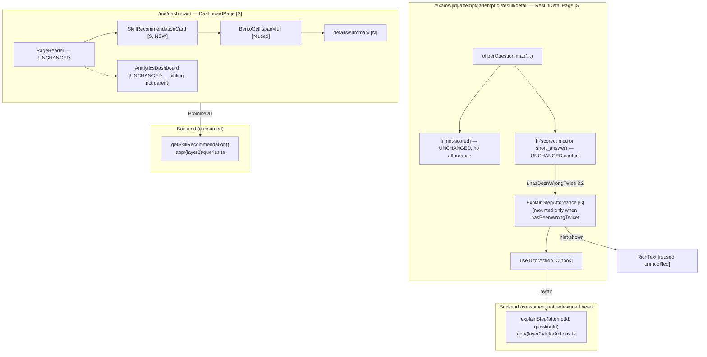

# Engine 1: Adaptive AI & Feedback (Sprint 1) — Frontend Design Document

| | |
|---|---|
| **Version** | 1.0 |
| **Date** | 2026-08-08 |
| **Status** | Draft — frontend design for the "Explain this step" tutor affordance (R7) and the "what to practise next" recommendation card (R10). **Consumes** the backend Design Doc's exact Server Action signature and data contracts (does not redefine schema/RLS/routing/prompt internals). Scope: two new components, one new hook, two additive mount points in already-shipped Server Component pages, and the i18n dictionary keys they need. |
| **PRD** | `docs/prd/engine1-adaptive-ai-prd.md` (v1.0) |
| **UI Spec** | `docs/ui-spec/engine1-adaptive-ai-ui-spec.md` (v1.0, all review conditions fixed) — authoritative for component decomposition, state × display matrices, visual tokens, a11y requirements, and the resolution of U1 (wrong-twice trigger) and U4 (recommendation placement). This document builds on it and does not contradict it. |
| **Backend Design Doc** | `docs/design/engine1-adaptive-ai-backend-design.md` (v1.0) — the contracts consumed here: `PerQuestionResult.hasBeenWrongTwice?: boolean`, `SkillRecommendation`, `explainStep(attemptId, questionId)`, `getSkillRecommendation()`. |
| **ADR** | `docs/adr/ADR-0011-mastery-write-trust-boundary.md` (Accepted) — backend-owned; referenced here only because it is what makes the mastery-derived data this UI reads trustworthy. No new ADR is introduced by this document (see Common ADR Process below). |
| **Prior-layer verification** | code-verifier ran on the backend Design Doc — status: `mostly_consistent` (score 82), 3 discrepancies, all already fixed in the committed backend document (a citation correction in `getResult()`'s line range; a clarification that `RETRY_ATTEMPTS` is inherited through `getGeminiClient()`, not directly imported — backend/tagger code only; a cross-document TBD misattribution in the backend doc's front matter). None of the three affect this frontend layer or the data contracts consumed here. Per the task's own instruction, the backend Design Doc's `PerQuestionResult.hasBeenWrongTwice`, `SkillRecommendation`, and `explainStep()` contracts are treated as verified-correct as currently written; this document does not re-derive them. |

## Overview

This Design Doc turns the UI Spec into an implementable frontend: `ExplainStepAffordance` (a new client island, backed by a new `useTutorAction` hook that mirrors `usePdfAction`'s busy/error state-machine shape) mounted inside the existing per-question review list on `ResultDetailPage`, and `SkillRecommendationCard` (a new, zero-JS Server Component reusing `BentoCell`) mounted as a new standalone section on the Layer 3 dashboard. Both are additive extensions of two already-shipped, pure Server Component pages — this document specifies exactly where each mounts, the exact props/state each new piece carries, the exact ARIA/focus/i18n implementation, and how each consumes the backend's typed contracts without inventing a competing shape.

### Referenced UI Spec

- UI Spec path: `docs/ui-spec/engine1-adaptive-ai-ui-spec.md`
- Component structure (`ExplainStepAffordance`/`useTutorAction`/`SkillRecommendationCard`), state × display matrices, visual tokens, and accessibility requirements are inherited verbatim from the UI Spec. This document does not reopen U1 (wrong-twice trigger), U4 (recommendation placement), or the UI Spec's D1–D6 decisions; it implements them.

## Design Summary (Meta)

```yaml
design_type: "extension"          # two new components + one new hook, mounted into two already-shipped pages; no new route
risk_level: "medium"              # no DB/security-surface design here (backend owns the trust boundary); risk is concentrated in the new client state machine + reusing RichText for model output
complexity_level: "medium"
complexity_rationale: >
  (1) useTutorAction is a 4-phase client state machine (idle/busy/hint-shown/error) with a synchronous
      busyRef double-click guard and an sr-only announcement span — the same shape class as usePdfAction,
      but this is only its 2nd occurrence as a standalone hook (Rule of Three not yet met, see Common ADR
      Process below); (2) ExplainStepAffordance is the FIRST client-interactive element ResultDetailPage
      has ever hosted — the smallest-possible "use client" boundary must be proven correct without
      regressing the page's otherwise all-server rendering; (3) the tutor's Gemini-generated hint text
      must render through RichText's hardened sanitize pipeline and never a competing path (ADR-0002,
      UI Spec D4) — an output-side security property, not just a display choice; (4) explainStep(attemptId,
      questionId)'s backend argument order differs from ExplainStepAffordanceProps' UI-Spec-fixed
      declaration order (questionId, attemptId) — both plain strings, so a swap compiles silently.
main_constraints:
  - "Server/Client boundary: ResultDetailPage and DashboardPage stay Server Components; only ExplainStepAffordance (+ useTutorAction) is client. SkillRecommendationCard stays a Server Component (UI Spec D2/component tree — zero JS beyond native <details>/<summary>)."
  - "Consume backend contracts verbatim — hasBeenWrongTwice, SkillRecommendation, explainStep()'s typed-result union — never re-derive wrong-twice eligibility or re-bucket a recommendation on the client."
  - "The tutor hint renders ONLY through RichText (D4) — no competing unsanitized render path, ever."
  - "Never native `disabled` on the affordance's button (breaks keyboard focus/tab order — the exact bug already fixed twice in this codebase, RateButton then ActionButton); aria-disabled + aria-busy + aria-describedby + a synchronous busyRef guard instead."
  - "44px minimum touch target (min-h-11) on the affordance's button — no existing Button size variant meets this."
  - "No new Card/Badge/Alert/Dialog primitive — reuse BentoCell with explicit span=\"full\" (UI Spec D2, Rule-of-Three-respecting decision already made; not reopened here)."
  - "Vitest collects lib/**, components/**, and app/**/*.test.{ts,tsx} — both new components' tests are collected regardless of which directory they live in."
early_verification_point:
  first_target: "ExplainStepAffordance's idle -> busy -> hint-shown cycle against the REAL explainStep() Server Action (not mocked) on a dev-seeded wrong-twice question — the higher-risk of the two slices."
  success_criteria: "Clicking the button shows the busy spinner, then either the hint panel (RichText-rendered Vietnamese text) replaces the button, or the error paragraph + relabeled retry button appears on a forced failure; a second rapid click while busy does not fire a second explainStep() call."
  failure_response: "If the real round trip's shape differs from what this document's Data Contracts section assumes, treat it as a discrepancy against the backend Design Doc and escalate rather than silently adapting the frontend to a mismatched shape."
correctness_proof_method:
  definition: "Correct = (1) the affordance renders iff hasBeenWrongTwice===true (AC-023/024); (2) the busyRef guard makes a second click while busy a no-op (AC-025); (3) explainStep is called with the exact (attemptId, questionId) argument order regardless of prop declaration order; (4) the hint renders only through RichText (D4); (5) SkillRecommendationCard renders the honest cold-start state for null and the populated state otherwise, never a blank/broken card (AC-028/031); (6) every new interactive element is keyboard-reachable with a visible focus indicator and no color-only state signal (AC-026)."
  method: "vitest(jsdom) component tests mocking the Server Action / query import boundary (ExplainStepAffordance.test.tsx mirrors ActionButton.test.tsx; SkillRecommendationCard.test.tsx mirrors DifficultyBadge.test.tsx's render-assertion style, adapted for an async Server Component); Playwright/manual for the real round trip, keyboard pass, and axe pass (no CI, per PROJECT_OVERVIEW's testing strategy)."
biggest_risks:
  - "explainStep(attemptId, questionId) vs. ExplainStepAffordanceProps' (questionId, attemptId) declaration order — a silent argument swap since both are strings."
  - "D5's ephemeral hint (no persistence) means a reload after a hint is shown resets to idle and a second click re-invokes the tutor — UI Spec's own open item (TBD-01), not resolved by this document."
  - "SkillRecommendationCard's async-Server-Component test technique (render(await Component(props))) has no prior precedent in this repository's test suite."
unknowns:
  - "None carried over from the UI Spec block this document's scope (TBD-02/03/04 are resolved by the backend Design Doc's Data Contracts, already treated as verified-correct per Prior-layer verification above). TBD-01 (repeated-cost on reload) and TBD-05/06 (recommendation CTA; automated axe tooling) remain open and are explicitly out of this document's scope — see Risks and Mitigation and Future Extensibility."
```

## Background and Context

### Prerequisite ADRs

- **ADR-0002** (Published-Content Rendering and Sanitization, Proposed) — the hardened `RichText` pipeline (`remark-gfm`/`remark-math` → `rehype-katex` → `rehype-sanitize`, sanitize last) this document reuses **unmodified** for the tutor's hint text. The hint is Gemini output derived from UGC question content (attacker-influenced, PRD risk R-h), so it is rendered through the identical hardened path ADR-0002 already established for question/choice content — no new render path, no exception.
- **ADR-0010** (Score Write Trust Boundary, Accepted) / **ADR-0011** (Mastery Write Trust Boundary, Accepted, backend-owned) — this document does not touch either write path; they are cited only because they are what makes `hasBeenWrongTwice` and `SkillRecommendation` trustworthy data by the time this frontend reads them.
- **ADR-0001** (UGC Content Lifecycle and RLS Enforcement, **Proposed** — not yet Accepted, per `docs/adr/ADR-0001-ugc-content-lifecycle-and-rls-enforcement.md:5`) — the "no admin bypass, RLS is the real boundary" convention this design's own client-side `hasBeenWrongTwice` gate explicitly does **not** try to substitute for (UI Spec D1's own stated position: display convenience only, carried forward verbatim in Security Considerations below). Cited here as background reasoning only, not as a gating prerequisite for this design — its Proposed status does not block this document.

**Common ADR Process check**: searched `docs/adr/ADR-COMMON-*.md` (Glob) — none exist. The one candidate cross-cutting pattern this document touches — the "phase state machine + synchronous `busyRef` guard + aria-disabled/aria-busy/aria-describedby, never native `disabled`" shape — is not extracted into a common ADR here. It has now occurred as a **standalone reusable hook** exactly twice (`usePdfAction`, then this document's `useTutorAction`); per frontend-ai-guide's Rule of Three, commonalization happens on the **3rd** occurrence, not the 2nd. `useTutorAction` deliberately copies the *shape*, not the *code* (different domain, different payload — see Existing Codebase Analysis). If a 3rd feature needs this exact shape, that is the trigger to extract a shared hook/ADR-COMMON, mirroring the backend Design Doc's own stated reasoning for its analogous privileged-write pattern.

### External Resources Used

Inherits the UI Spec's External Resources Used table (unchanged — no environment change occurred for this document) and adds the backend contract source this frontend consumes.

| Resource (project-tier label) | Feature-specific identifier | Notes |
|-------------------------------|-----------------------------|-------|
| Design Origin | `SOURCE/app/globals.css` — `--radius` vs `--radius-card`; `--brand` vs `--brand-on-dark` | Inherited from UI Spec; confirmed neither new component renders on a dark surface, so no brand-red token risk applies here. |
| Design System | `SOURCE/components/ui/button.tsx`, `SOURCE/components/history/usePdfAction.ts` + `ActionButton.tsx` (state-machine precedent), `SOURCE/components/shared/RichText.tsx`, `SOURCE/components/layout/BentoGrid.tsx` (`BentoCell`) | Inherited from UI Spec; this document is the first to actually wire `useTutorAction` against these primitives. |
| API / contract source | Backend Design Doc `docs/design/engine1-adaptive-ai-backend-design.md` § Data Contracts + Field Propagation Map | The typed interface this frontend binds to: `PerQuestionResult.hasBeenWrongTwice`, `SkillRecommendation`, `explainStep(attemptId, questionId): Promise<ExplainStepResult>`, `getSkillRecommendation(): Promise<SkillRecommendation>`. |
| Visual Verification Environment | Routes `/exams/[id]/attempt/[attemptId]/result/detail` (requires a seeded attempt with `hasBeenWrongTwice: true` on at least one question) and `/me/dashboard`; Playwright MCP `playwright`; `npm run dev` | Inherited from UI Spec. Test-data seeding for the wrong-twice case is a Work Plan task, not designed here. |

### Agreement Checklist

#### Scope

- [x] Add `SOURCE/components/tutor/useTutorAction.ts` — the 4-phase (`idle`/`busy`/`hint-shown`/`error`) client state machine calling `explainStep()`.
- [x] Add `SOURCE/components/tutor/ExplainStepAffordance.tsx` — the client island consuming the hook, rendering the button / hint panel / error text per UI Spec state × display matrix.
- [x] Add `SOURCE/app/(layer3)/_components/SkillRecommendationCard.tsx` — a zero-JS Server Component rendering the populated or cold-start state.
- [x] Mount `ExplainStepAffordance` inside `ResultDetailPage`'s existing per-question `<li>` (both the `mcq` and `short_answer` scored sub-branches), gated by `r.hasBeenWrongTwice`.
- [x] Mount `SkillRecommendationCard` inside `DashboardPage`, between `PageHeader` and the existing `AnalyticsDashboard` block, fed by a new parallel `getSkillRecommendation()` fetch.
- [x] Add the i18n keys the UI Spec names (`tutor.*` × 4, `analytics.recommend*` × 6, reuse `common.retry`) to both `en.ts` and `vi.ts`, with exact placement (see i18n section).
- [x] Add `SOURCE/components/tutor/ExplainStepAffordance.test.tsx` and `SOURCE/app/(layer3)/_components/SkillRecommendationCard.test.tsx`.

#### Non-Scope (Explicitly not changing)

- [ ] `explainStep()`'s implementation, the schema, `record_skill_mastery()`, `recommendNextSkill()`'s algorithm, `buildTutorPrompt()`, or any Server Action/query internals — **backend Design Doc owns these**. This document consumes their published signatures only.
- [ ] `AnalyticsDashboard`, `BarChartCard`, `DonutChartCard` — zero code change (UI Spec D3: additive sibling, not integrated into their tab/range state tree).
- [ ] `RichText`, `BentoCell`, `Button` — reused unmodified; no prop/behavior change to any of the three.
- [ ] U1/U4 (resolved by the UI Spec) and PRD D1–D6 (locked) — not reopened.
- [ ] R11 (multi-turn tutor), R12 (error-pattern labels shown to students) — PRD Won't-Have, no frontend surface for either.
- [ ] `ResultDetailPage`'s not-scored branch (`essay`/ungraded questions) — `ExplainStepAffordance` never mounts there (a not-scored question cannot carry a meaningful `hasBeenWrongTwice`, per D1's own rationale); this branch's existing JSX is untouched.

#### Constraints (agreements → where reflected)

- Browser support: latest 2 versions of Chrome/Firefox/Safari/Edge (project-wide, unchanged) → reflected in standard keyboard-event handling only (no browser-specific API beyond the already-shipped `Button`/`Tooltip`/native `<details>`).
- Accessibility: WCAG 2.1 AA → reflected in `ExplainStepAffordance`'s aria-disabled/aria-busy/aria-describedby + never-native-disabled pattern, the `role="alert"` error paragraph, and `SkillRecommendationCard`'s native `<details>`/`<summary>` disclosure (see Accessibility Implementation).
- Performance: tutor latency has no acceptance-gate NFR (PRD, explicit) but must never block the result page → reflected in the try/catch/finally shape of `useTutorAction.run()`, which always resolves `busyRef` and `phase` regardless of outcome, and in the dashboard's parallel (`Promise.all`) fetch so the new recommendation read never serializes behind `getAnalyticsByRange()`.
- Theme: no shadow/gradient; `--radius` (buttons) vs `--radius-card` (content cards) kept separate; no `--brand`/`--brand-on-dark` introduced → reflected in reusing `Button variant="outline"` and `BentoCell` verbatim, no new token.
- No design contradicts an agreement.

#### Assumed Behaviors

| Assumed behavior | Evidence | Confirmed | Follow-up if unconfirmed |
|------------------|----------|-----------|--------------------------|
| `explainStep(attemptId, questionId)`'s typed-result success shape is `{ hint: string }` and its failure shape is `{ error: "not_eligible" \| "rate_limited" \| "gemini_unavailable" \| "server" }`, discriminable via `"hint" in result` | Backend Design Doc § Data Contracts, `explainStep()` | **Yes** (contract, treated as verified-correct per Prior-layer verification) | — |
| `getSkillRecommendation()` returns `SkillRecommendation = { skillLabel: string; reasonCode: "prerequisite-gate"\|"lowest-mastery"\|"recently-wrong" } \| null`, readable from a Server Component | Backend Design Doc § Data Contracts + Field Propagation Map (`{nodeId,labelVi,reasonCode}` → `{skillLabel:labelVi,reasonCode}`) | **Yes** (contract) | — |
| `useT()` requires no `I18nProvider` wrapper in a jsdom test — it falls back to `DEFAULT_LOCALE` when no context is present | `SOURCE/lib/i18n/client.tsx:33-36` (`ctx?.t ?? createTranslate(getDictionary(DEFAULT_LOCALE))`) | **Yes** | — |
| An `async function` Server Component can be rendered in a vitest/jsdom RTL test via `render(await Component(props))` without a real Next.js RSC runtime, given the component performs no React Server-only APIs beyond `await getTranslate()` | Standard React Testing Library technique for async Server Components; **no existing test file in this repository exercises it** (`ExamCard.tsx`/`ExamBrowser.tsx` are async Server Components with zero test coverage today) | **No** (technique is sound but unprecedented here) | Risk (see Risks and Mitigation): if it proves incompatible with this repo's RTL/vitest/jsdom versions at implementation time, fall back to manual/Playwright-only verification for `SkillRecommendationCard`, matching the `ExamCard`/`ExamBrowser` precedent of zero RTL coverage for untested async Server Components — do not reopen the UI Spec's server-component decision to force testability |
| `vitest.config.ts`'s `include` glob (`lib/**`, `components/**`, `app/**/*.test.{ts,tsx}`) collects both new test files regardless of which of `components/tutor/` or `app/(layer3)/_components/` they live in | `SOURCE/vitest.config.ts:19` | **Yes** | — |

#### Applicable Standards

- [x] `"use client"` only at the smallest interactive boundary; data fetching in Server Components `[explicit]` — Source: `ResultDetailPage`/`DashboardPage` are Server Components; `ExplainStepAffordance` is the only new client boundary.
- [x] Client components call `useT()`; server components call `await getTranslate()` `[explicit]` — Source: `SOURCE/lib/i18n/client.tsx`, `SOURCE/lib/i18n/server.ts`; every existing component in the tree follows this split without exception.
- [x] `en.ts`'s `MessageKey` (`keyof typeof en`, `en.ts:488`) plus the separate `Dictionary` type (`Record<MessageKey, string>`, `en.ts:490`) makes a missing `vi.ts` key a compile error `[explicit]` — Source: `SOURCE/lib/i18n/dictionaries/en.ts:488,490`; the actual enforcement site is `vi.ts:10`'s `export const vi: Dictionary = {...}`, which fails to typecheck if any `MessageKey` is absent.
- [x] Never native `disabled` on an always-focusable async-action control; `aria-disabled`/`aria-busy`/`aria-describedby` + a synchronous ref guard instead `[explicit]` — Source: `RateButton.tsx` (1st application, header comment states the WCAG rationale) and `ActionButton.tsx`/`usePdfAction.ts` (2nd application, `busyRef` shape) — this document's 3rd application of the *rule*, 2nd of the *hook shape* (see Common ADR Process).
- [x] Error/status feedback rendered as an in-flow or `relative`-anchored descendant of the control, never a positioned-ancestor-less sibling (the "infinite scroll" layout-height bug precedent) `[explicit]` — Source: `ActionButton.tsx`'s D2 comment block. This document's error paragraph is genuinely in-flow (not absolutely positioned), which UI Spec explicitly confirms is safe here (`ExplainStepAffordance` has vertical room in the `<li>` flow, unlike `ActionButton`'s icon-button layout).
- [x] `RichText` is the only sanctioned render path for markdown/LaTeX-bearing text, including model output derived from UGC `[explicit]` — Source: ADR-0002; UI Spec D4 states this as a hard requirement, not a preference.
- [x] `BentoCell` is the project's sole card/box primitive; no second Card component `[explicit]` — Source: UI Spec D2 (Rule-of-Three reasoning already performed there, not repeated here).
- [x] 44px minimum touch target (`min-h-11`) on every new interactive control `[explicit]` — Source: `docs/plans/mobile-responsive-layout-plan.md`; `RateButton.tsx`'s own header comment records the incident this rule prevents.
- [x] Layout-deciding breakpoints use `md:`/`lg:` only, never `sm:` for layout decisions (`sm:` remains permitted for non-layout-deciding spacing/font tweaks); never `order-*` to reorder `[explicit]` — Source: `docs/plans/mobile-responsive-layout-plan.md:69-76` (the actual source of this rule — `BentoGrid.tsx`'s own header comment covers only `order-*`/`grid-row-start`, WCAG 1.3.2/2.4.3, not breakpoint choice; `BentoGrid.tsx` itself uses `sm:grid-cols-12`/`sm:col-span-*` internally, consistent with the "non-layout-deciding" carve-out). Immaterial to this document either way — neither new component introduces a breakpoint class.
- [x] Pure display Server subcomponents (no test requirement) call `getTranslate()` internally and stay untested by RTL (`ExamCard`, `ExamBrowser` precedent); components that need direct RTL coverage are marked `"use client"` and call `useT()` (`DifficultyBadge` precedent) `[implicit]` — Evidence: `ExamCard.tsx`/`ExamBrowser.tsx` (async, `getTranslate()`, no test file) vs. `DifficultyBadge.tsx` (`"use client"`, `useT()`, has `DifficultyBadge.test.tsx`). Confirmed: Yes — this tension is exactly why `SkillRecommendationCard`'s testing approach is flagged as an unconfirmed Assumed Behavior above rather than silently resolved by breaking the UI Spec's server-component decision.
- [x] Vitest jsdom component tests mock the Server Action / query import boundary, never the DOM `[explicit]` — Source: `ActionButton.test.tsx` (mocks `generateAttemptPdfFile`/`downloadPdfFile`/`canShareFile`, real DOM render).

#### Quality Assurance Mechanisms

- [x] ESLint (`eslint --max-warnings 0`, CI-blocking) — Config: `SOURCE/eslint.config.mjs` — Covers: project-wide — Status: `adopted`.
- [x] `tsc --noEmit` (strict) — Config: `SOURCE/tsconfig.json` — Covers: project-wide — Status: `adopted` (also the mechanism that would catch a missing `vi.ts` key for any new `tutor.*`/`analytics.recommend*` entry).
- [x] Vitest (jsdom, real DOM render, mocked I/O boundary) — Covers: `SOURCE/components/tutor/ExplainStepAffordance.test.tsx`, `SOURCE/app/(layer3)/_components/SkillRecommendationCard.test.tsx` — Config: `SOURCE/vitest.config.ts` — Status: `adopted`.
- [x] `next build` — Covers: project-wide — Status: `adopted`.
- [x] Playwright MCP / manual pass (no CI) — Covers: the real `explainStep()` round trip on a seeded wrong-twice question, the real `getSkillRecommendation()` render on cold-start and populated accounts, full keyboard pass, `prefers-reduced-motion` N/A (no motion introduced by this document) — Status: `adopted` (the no-CI local workflow's acceptance for interaction/a11y ACs, per `PROJECT_OVERVIEW.md` §6).
- [ ] Automated axe (`axe-core`/`jest-axe`) — Status: `noted` — no such package exists in `package.json` today; UI Spec's own TBD-06 defers adding it (or downgrading the metric) to the Work Plan. This document does not resolve TBD-06.
- [ ] Backend's own gates (`verify:schema`, `parseForeignKeys.test.ts`, `schemaFingerprint.test.ts`, `tutorActions.int.test.ts`, `recordSkillMastery.int.test.ts`) — Status: `noted` (backend-owned; this frontend relies on those gates but does not run them).

### Problem to Solve

The two UI-relevant PRD requirements (R7, R10) currently have no surface: `ResultDetailPage` shows the correct answer and stops — a student who gets the same question wrong twice has no path to a hint. `DashboardPage` aggregates correct/total by subject only — a student has no "what should I do next" signal grounded in the new per-skill mastery model. This document specifies the exact frontend wiring that closes both gaps without introducing a new route, a new Card primitive, or a competing render path for model-generated text.

### Requirements

Frontend-owned subset of the PRD: R7 (the affordance itself, AC-023–027, plus the UI-layer half of AC-018/019/020/021/029) and R10 (the recommendation card, AC-031, plus the UI-layer half of AC-028). R1–R6, R8's non-UI half, R9, R11, R12, and U2's mechanism are backend/content concerns, consumed here as contracts only.

#### Functional Requirements

- R7 — "Explain this step" affordance, mounted conditionally on `hasBeenWrongTwice`, with idle/busy/hint-shown/error states.
- R10 — Skill recommendation card, mounted unconditionally (its own populated/cold-start states cover "no data").

#### Non-Functional Requirements

- **Performance**: no latency budget for the tutor call (PRD, explicit) — the requirement is behavioral (busy state, non-blocking failure, working retry), not a number. The dashboard's new fetch is parallel (`Promise.all`), not serial, so it cannot regress the existing baseline (Lighthouse mobile ≥ 85, FCP ≤ 2.5s).
- **Reliability**: a failed or slow tutor call must never break the result page the student is reading (AC-021) — reflected in `useTutorAction`'s try/catch/finally shape, which always releases `busyRef` and settles a terminal-for-this-attempt `phase`.
- **Accessibility**: WCAG 2.1 AA — every new interactive element keyboard-reachable with a visible focus indicator, no state conveyed by color alone (AC-026).
- **Maintainability**: `useTutorAction` follows the established hook-extraction shape (`usePdfAction` precedent) so the state machine is testable independently of `ExplainStepAffordance`'s render tree, even though (per Common ADR Process above) it is not yet promoted to a shared cross-feature hook.

## Acceptance Criteria (frontend subset, EARS)

Rendering + interaction ACs verifiable in an isolated browser/jsdom environment. Server-enforcement ACs (AC-018/019 prompt-assembly half, AC-022 rate-limit half) are backend-verified and only surfaced here as the UI-facing consequence.

### Explain-this-step affordance (R7)

- [ ] **When** `r.hasBeenWrongTwice === true` on a scored, incorrect question, `ResultDetailPage` shall mount `ExplainStepAffordance` for that question, inside both the `mcq` and `short_answer` scored sub-branches. (AC-023)
- [ ] **When** `r.hasBeenWrongTwice` is `false` or `undefined`, `ResultDetailPage` shall not mount `ExplainStepAffordance` for that question. (AC-024)
- [ ] **When** the affordance is activated (click, or Enter/Space while focused), the button shall enter `busy`: `aria-disabled="true"`, `aria-busy="true"`, the icon swaps to a spinning `Loader2`, and the sr-only reason span mutates from `""` to `tutor.busy`. A second activation while `busy` shall be a no-op (checked via `busyRef` synchronously, before any React state update). (AC-025)
- [ ] **When** `explainStep()` resolves with `{ hint }`, the button shall be replaced by a `BentoCell span="full"` panel containing the eyebrow `tutor.hintEyebrow` and the hint text rendered via `RichText`; no control to re-invoke the tutor shall exist in this state for this question in this render (D5). (AC-018/019/020 UI half)
- [ ] **When** `explainStep()` resolves with `{ error }` or the call rejects, the button shall re-label to `common.retry`, and a `role="alert"` paragraph reading `tutor.error` shall mount below it; the rest of the result page shall remain fully interactive. (AC-021)
- [ ] **When** navigated by keyboard alone, every interactive element (the button in every phase) shall be reachable with a visible focus indicator, and idle/busy/error/hint-shown shall each be distinguishable by label text and icon/content shape, never by color alone. (AC-026)
- [ ] **When** the language toggle is English, `tutor.explainThisStep`/`tutor.busy`/`tutor.error`/`tutor.hintEyebrow`/`common.retry` shall render in English; the hint text itself (model output) shall remain Vietnamese regardless of toggle state. (AC-027)
- [ ] **When** a question's `skill_node_id` is `NULL` (untagged), `ExplainStepAffordance` shall render and function identically — it is gated solely by `hasBeenWrongTwice`, never by skill-tag presence. (AC-029)

### Skill recommendation card (R10)

- [ ] **When** `DashboardPage` renders for an authenticated student and `getSkillRecommendation()` returns non-null, `SkillRecommendationCard` shall render the populated state: eyebrow, the skill's Vietnamese label (plain text, not a dictionary key), and a closed-by-default `<details>` disclosure whose `<summary>` reveals the localized reason text mapped from `reasonCode`. (AC-031)
- [ ] **When** `getSkillRecommendation()` returns `null` (zero mastery rows / cold start), `SkillRecommendationCard` shall render an honest "not enough data yet" message — never a blank card, never a crash, never indistinguishable from a loading/broken state. (AC-028)
- [ ] **When** the `<summary>` is activated (click, or Enter/Space while focused), the reason text shall reveal via native `<details>` behavior — no JavaScript, no custom state. (native, not a numbered AC)

## Existing Codebase Analysis

### Implementation Path Mapping

| Type | Path | Description |
|------|------|-------------|
| Existing (modified) | `SOURCE/app/(layer2)/exams/[id]/attempt/[attemptId]/result/detail/page.tsx` | Mount `ExplainStepAffordance` at the end of both scored sub-branches, gated by `r.hasBeenWrongTwice`. |
| Existing (modified) | `SOURCE/app/(layer3)/me/dashboard/page.tsx` | Parallel-fetch `getSkillRecommendation()`; mount `SkillRecommendationCard` between `PageHeader` and the existing `AnalyticsDashboard` block. |
| Existing (modified) | `SOURCE/lib/i18n/dictionaries/en.ts`, `vi.ts` | New `tutor.*` block (appended) + `analytics.recommend*` keys (extend the existing `analytics.*` block in place). |
| Existing (reused, untouched) | `SOURCE/components/shared/RichText.tsx` | Renders the tutor hint (D4); zero modification. |
| Existing (reused, untouched) | `SOURCE/components/layout/BentoGrid.tsx` (`BentoCell`) | Reused with explicit `span="full"` for both new surfaces; zero modification. |
| Existing (reused, untouched) | `SOURCE/components/ui/button.tsx` | `ExplainStepAffordance` uses `Button variant="outline"` with a `min-h-11` override; zero modification. |
| Existing (pattern reference only, not imported) | `SOURCE/components/history/usePdfAction.ts`, `ActionButton.tsx` | `useTutorAction`/`ExplainStepAffordance` mirror this shape; different domain, not a shared import (see Similar Component Search below). |
| Existing (pattern reference only) | `SOURCE/app/(admin)/admin/ModerationRow.tsx:57-66` | Native `<details>`/`<summary>` precedent for `SkillRecommendationCard`'s disclosure. |
| New | `SOURCE/components/tutor/useTutorAction.ts` | The 4-phase state machine + `busyRef` guard, calling `explainStep()`. |
| New | `SOURCE/components/tutor/ExplainStepAffordance.tsx` | The client island rendering the button/hint-panel/error states. |
| New | `SOURCE/components/tutor/ExplainStepAffordance.test.tsx` | jsdom component test, mocks `explainStep`. |
| New | `SOURCE/app/(layer3)/_components/SkillRecommendationCard.tsx` | Server Component, populated + cold-start states. |
| New | `SOURCE/app/(layer3)/_components/SkillRecommendationCard.test.tsx` | jsdom component test via `render(await Component(props))`. |

### Existing Component Investigation

**`ResultDetailPage`** — Server Component, zero `"use client"` boundaries today, zero interactive controls besides a plain `<Link>` back-link. No public Props (a route page, params-only). The insertion point is the tail of the two scored sub-branches' `<li>` (immediately after the `isShortAnswer ? (...) : (...)}` block, before `</li>`), gated by `r.hasBeenWrongTwice &&`.

**`DashboardPage`** — Server Component, no public Props (a route page). Currently performs one fetch (`getAnalyticsByRange()`); this document adds a second, parallel fetch and one new mount between `PageHeader` and the existing `<div className="mt-6"><AnalyticsDashboard .../></div>` block.

Neither page has an existing public Props interface that this document changes — both remain route pages with no caller-supplied props beyond Next.js route `params`.

### Similar Component Search and Decision

- **Async busy/error state-machine shape**: `usePdfAction`/`ActionButton` (`SOURCE/components/history/`) is the exact precedent (phase enum, `busyRef` synchronous guard, aria-disabled/aria-busy/aria-describedby, never native `disabled`, icon swap to `Loader2` while busy). **Decision: mirror the shape, do not import the code.** `usePdfAction`'s `phase` union (`idle|busy|error|fallback-confirmed`) and its PDF-specific `run(action)` signature do not fit a different domain (Gemini text response vs. local PDF blob; no "fallback" concept here, but a genuinely new `hint-shown` terminal state exists that `usePdfAction` has no equivalent of). Importing and overloading `usePdfAction` itself would either bloat its PDF-specific API with a tutor-specific branch (violates Single Responsibility) or force an awkward generic wrapper for only its 2nd use (violates Rule of Three — see Common ADR Process). A new, small hook copying the *shape* is the smallest correct move at this occurrence count.
- **Sanitized markdown+KaTeX renderer**: `RichText` — **decision: reuse verbatim, zero change.** No search needed; UI Spec D4 already fixes this as a hard requirement.
- **Card/box container**: `BentoCell` — **decision: reuse verbatim, zero change**, per UI Spec D2 (search already performed there: 5+ hand-rolled card instances found, `BentoCell` chosen as the one already-generalized, currently-consumed primitive; not re-litigated here).
- **Native disclosure**: `<details>`/`<summary>` — **decision: reuse the pattern** (native, zero dependency), citing the same precedent UI Spec D2 cites (`ModerationRow.tsx:57-66`), not inventing a JS-driven accordion.
- **Server subcomponent testability shape**: two coexisting patterns found — `ExamCard`/`ExamBrowser` (async Server Component, `getTranslate()` internally, **no test file**) vs. `DifficultyBadge` (`"use client"`, `useT()`, **has** `DifficultyBadge.test.tsx`). **Decision: keep `SkillRecommendationCard` a genuine Server Component** (per UI Spec's own component-tree designation, not reopened here) **and adopt the `render(await Component(props))` technique** for its test rather than switching it to `"use client"` purely to make testing familiar — see Existing Component Investigation and the Assumed Behaviors table above for the explicit risk this carries and its fallback.
- **Server Action call-site adapter** (à la rating system's `submitRating.ts`): **decision: no adapter module.** `explainStep(attemptId, questionId)`'s signature already matches `ExplainStepAffordanceProps`' two fields exactly (backend Design Doc's own note: "matches `ExplainStepAffordanceProps` exactly") — there is no shape conversion to perform, so introducing a wrapper module would be an unrequired indirection layer (coding-principles: minimum surface for required coverage). `useTutorAction` calls `explainStep` directly.

No technical debt was found to supersede in any of the above — every reuse target is a currently-consumed, non-deprecated primitive.

### Dependency Existence Verification

| Dependency | Status | Evidence |
|---|---|---|
| `explainStep(attemptId, questionId): Promise<ExplainStepResult>` | External dependency — backend-owned, **requires new creation** by the backend Design Doc's own Implementation Path Mapping (`SOURCE/app/(layer2)/tutorActions.ts`) | Backend Design Doc § Existing Codebase Analysis / Data Contracts |
| `getSkillRecommendation(): Promise<SkillRecommendation>` | External dependency — backend-owned, **requires new creation** (`SOURCE/app/(layer3)/queries.ts`) | Backend Design Doc § Existing Codebase Analysis / Data Contracts |
| `SkillRecommendation` type | External dependency — backend-owned, **requires new creation** (`SOURCE/types/adaptive.ts`) | Backend Design Doc § Implementation Path Mapping |
| `PerQuestionResult.hasBeenWrongTwice?: boolean` | External dependency — backend-owned, **requires new creation** (`SOURCE/types/result.ts` extension) | Backend Design Doc § Implementation Path Mapping |
| `RichText` | Verified existing | `SOURCE/components/shared/RichText.tsx` |
| `BentoCell` | Verified existing | `SOURCE/components/layout/BentoGrid.tsx:43-63` |
| `Button` (cva, `variant="outline"`) | Verified existing | `SOURCE/components/ui/button.tsx:12-13` |
| `useT()` / `getTranslate()` | Verified existing | `SOURCE/lib/i18n/client.tsx:33-36`, `SOURCE/lib/i18n/server.ts:24-26` |
| `usePdfAction`/`ActionButton` (pattern reference) | Verified existing | `SOURCE/components/history/usePdfAction.ts`, `ActionButton.tsx` |
| `ModerationRow.tsx`'s `<details>`/`<summary>` (pattern reference) | Verified existing | `SOURCE/app/(admin)/admin/ModerationRow.tsx:57-66` |
| `useTutorAction`, `ExplainStepAffordance`, `SkillRecommendationCard` | Requires new creation | This document. |

### Code Inspection Evidence

| File/Function | Relevance |
|---|---|
| `ResultDetailPage`, lines 140-217 (the scored `<li>` branch) | Exact mount point — after the `isShortAnswer ? (...) : (...)}` block, before `</li>` (line 215 in the file read at design time). |
| `ResultDetailPage`, line 24 (`const { id, attemptId } = await params;`) | `attemptId` is already in scope at the mount point — no new fetch needed to obtain it. |
| `DashboardPage`, lines 16-39 | Exact insertion point (between `PageHeader` and `<div className="mt-6"><AnalyticsDashboard .../></div>`) and existing single-fetch shape to extend into `Promise.all`. |
| `usePdfAction.ts:40-73` (`run()`) | The async/await + try/catch/finally shape, `busyRef` guard placement, `console.error` context-logging convention `useTutorAction.run()` mirrors. |
| `ActionButton.tsx:57-98` | `aria-disabled`/`aria-busy`/`aria-describedby` wiring, icon-swap-while-busy, in-flow `role="alert"` paragraph shape `ExplainStepAffordance` mirrors (adapted: no `relative`/absolute-positioning wrapper needed here, per UI Spec's own note that this component has vertical room in its `<li>` flow). |
| `RateButton.tsx` header comment | The WCAG rationale for "never native `disabled`" — the rule this design's 3rd application follows. |
| `DifficultyBadge.tsx:1-9,31` | `"use client"` + `useT()` shape for a directly-RTL-testable pure display component — considered and not selected for `SkillRecommendationCard` (see Similar Component Search). |
| `ExamCard.tsx:15` (`export async function ExamCard(...)`) | Confirms this repo's existing convention that async Server Components calling `getTranslate()` internally carry zero RTL test coverage — the precedent this document's fallback (if the async-render test technique fails) would follow. |
| `ModerationRow.tsx:57-66` | Native `<details>`/`<summary>` precedent for the recommendation card's disclosure. |
| `SOURCE/vitest.config.ts:17-19` | `include` glob confirms both new test file locations (`components/tutor/`, `app/(layer3)/_components/`) are collected under `npm test`. |
| `en.ts:213-232` (existing `analytics.*` block), `en.ts:484-485` (file tail, `ugcError.fieldGeneric` then `} as const;`) | Exact insertion points for the new i18n keys (see i18n section). |

### Fact Disposition Table

Facts drawn from the task's consolidated frontend codebase-analyzer + ui-analyzer findings and this document's own code inspection. `code:` = frontend codebase fact; `ui:` = UI-Spec fact.

| Fact ID | Focus Area | Disposition | Rationale | Evidence |
|---|---|---|---|---|
| code:F1 | `ResultDetailPage` is a pure Server Component, zero `"use client"` boundaries, zero interactive controls except a plain back-link | transform | `ExplainStepAffordance` becomes the page's first-ever client-interactive element, isolated to the smallest possible client subtree, matching the existing "Server page passes data into a small client island" pattern (`ReportExam.tsx`/`ActionButton.tsx` precedent). | Task brief; `ResultDetailPage` read at design time |
| code:F2 | `ExplainStepAffordance` must mount inside BOTH scored sub-branches (mcq, short_answer), never in the not-scored branch | preserve | Carried forward verbatim from UI Spec's own component-tree decision (D1's rationale: a not-scored question cannot carry a meaningful `hasBeenWrongTwice`). | UI Spec § Component: ResultDetailPage |
| code:F3 | `AnalyticsDashboard` owns `tab`/`range` client state from a single server-fetched `dataByRange` prop, aggregated by subject only | preserve | `SkillRecommendationCard` mounts as a new, standalone, sibling section — zero code change to `AnalyticsDashboard`'s own state tree (UI Spec D3). | `AnalyticsDashboard.tsx:49-136` |
| code:F4 | `usePdfAction`/`ActionButton`: `phase` state machine, synchronous `busyRef` guard, `aria-disabled`+`aria-busy`+`aria-describedby`, never native `disabled` | transform | `useTutorAction` copies the shape (rename one state, add `hint-shown`, drop `fallback-confirmed`), not a literal reuse — different domain/payload (see Similar Component Search). | `usePdfAction.ts`, `ActionButton.tsx` |
| code:F5 | `RichText`'s hardened sanitize pipeline, already used for question/choice content (UGC, untrusted) | preserve | Reused verbatim for the tutor hint (D4/ADR-0002) — no new render path, no modification. | `RichText.tsx`; ADR-0002 |
| code:F6 | `BentoCell`'s `span` prop defaults to `"half"` (assumes a `BentoGrid` parent) | transform | Both new surfaces pass `span="full"` explicitly — neither has a `BentoGrid` parent. | `BentoGrid.tsx:43-63` |
| code:F7 | Native `<details>`/`<summary>` already shipped at `ModerationRow.tsx:57-66` | preserve | Reused as-is for the "why this skill" disclosure — not a novel pattern, cited as precedent not invention. | `ModerationRow.tsx:57-66` |
| code:F8 | i18n split: client components call `useT()`, server components call `await getTranslate()`; missing `vi.ts` key is a compile error | preserve | `ExplainStepAffordance` (`"use client"`) calls `useT()`; `SkillRecommendationCard` (Server Component) calls `getTranslate()` — both follow the existing split exactly. | `client.tsx`, `server.ts`, `en.ts:488` |
| code:F9 | Theme rule: `--brand` only on light surfaces, `--brand-on-dark` required on dark surfaces (RateButton AA-failure incident precedent) | preserve | Neither new component renders on a dark surface and neither introduces brand-red — confirmed no token risk. | `globals.css`; RateButton.tsx header comment |
| code:F10 | Mobile-responsive rules: 44px min touch target, `md:`/`lg:`-only breakpoints, never `order-*`, `.pb-bottom-nav` already applied by host layouts | preserve/transform | `ExplainStepAffordance`'s `Button` gets an explicit `min-h-11` override (no existing size variant meets 44px); both host pages already receive `.pb-bottom-nav` from their layout wrappers — confirmed no new handling needed. | `mobile-responsive-layout-plan.md`; `(layer2)/layout.tsx`, `(layer3)/layout.tsx` |
| code:F11 | No `Card`/`Badge`/`Alert`/`Dialog` primitive exists in `SOURCE/components/ui/`; UI Spec deliberately reuses `BentoCell` rather than adding one | preserve | Carried forward, not reopened. | UI Spec D2 |
| code:F12 | `Button` exists but is under-adopted; UI Spec chose `variant="outline"` for `ExplainStepAffordance` as a deliberate "stop compounding the inconsistency" choice | preserve | Carried forward, not reopened. | UI Spec § Existing Component Reuse Map |
| code:F13 | `SuccessToast`'s lesson: a static `aria-live` region is never announced — text must mutate | transform | Applied narrowly: the busy-state sr-only reason span mutates `"" → tutor.busy → ""` exactly mirroring `ActionButton`'s **already-shipped** pattern (no `aria-live` attribute on that span in the shipped code — see Accessibility Implementation for why this differs from a literal `aria-live` region); the hint panel and error paragraph rely on mount/unmount DOM mutation, which UI Spec's own Screen Reader table confirms is sufficient here (no repeated-trigger case, unlike `SuccessToast`'s). | `SuccessToast.tsx`; `ActionButton.tsx:93-97`; UI Spec § Accessibility Requirements |
| code:F14 | `ExamCard`/`ExamBrowser` (async Server Component, `getTranslate()`, zero test coverage) vs. `DifficultyBadge` (`"use client"`, `useT()`, has a test) | transform | Informs keeping `SkillRecommendationCard` a genuine Server Component (UI-Spec-mandated) while adopting the `render(await Component(props))` test technique, rather than reopening the client/server boundary purely for testability. | `ExamCard.tsx:15`; `DifficultyBadge.tsx` |
| ui:F1 | UI Spec D1 — `hasBeenWrongTwice?: boolean`, fail-closed default | preserve | Consumed verbatim; mount condition is exactly `r.hasBeenWrongTwice &&`. | UI Spec D1 |
| ui:F2 | UI Spec D2 — `BentoCell` reuse, zero new Card primitive | preserve | Carried forward. | UI Spec D2 |
| ui:F3 | UI Spec D3 — `SkillRecommendationCard` placement between `PageHeader` and `AnalyticsDashboard`, additive not integrated | preserve | Carried forward exactly. | UI Spec D3 |
| ui:F4 | UI Spec D4 — tutor hint renders only through `RichText` | preserve | Carried forward, no exception. | UI Spec D4 |
| ui:F5 | UI Spec D5 — single-turn, ephemeral hint; no persisted re-display; TBD-01 known repeated-cost risk | preserve | Carried forward; TBD-01 restated in Risks and Mitigation below, not resolved here. | UI Spec D5, TBD-01 |
| ui:F6 | UI Spec D6 — `SkillRecommendation = {skillLabel, reasonCode} \| null`, closed reason-code enum | preserve | Matches backend's exact shape; consumed verbatim. | UI Spec D6; backend Design Doc Field Propagation Map |
| ui:F7 | UI Spec's `ExplainStepAffordanceProps = {questionId, attemptId}` (declared in that order) | preserve, with a flagged risk | Prop shape kept exactly as UI Spec fixed it; the declared order differs from `explainStep(attemptId, questionId)`'s parameter order — flagged as a Risk (see Risks and Mitigation), not a contract conflict. | UI Spec § Component: ExplainStepAffordance |
| ui:F8 | UI Spec's i18n key list (`tutor.*` × 4, `analytics.recommend*` × 6, reuse `common.retry`); UI Spec explicitly defers exact dictionary placement to this document | preserve | Exact keys used verbatim; placement decided in this document (see i18n section) per UI Spec's own delegation. | UI Spec § i18n Keys |

## Design

### Minimal Surface Alternatives

Three in-scope elements: `useTutorAction`'s returned state shape (crosses the hook → component boundary), the error-code-to-copy mapping breadth (a behavioral-variant decision), and whether `ExplainStepAffordance` needs an `idPrefix`-style disambiguation prop (a cross-boundary prop decision). `ExplainStepAffordanceProps`/`SkillRecommendationCardProps`' own field sets are UI-Spec-locked and not re-litigated here.

#### Element 1: `useTutorAction`'s returned state shape

**Step 1 — Fixed Requirements**
- AC-018/019/020 (UI half): the hint text must reach `ExplainStepAffordance`'s render so it can pass through `RichText`.
- AC-025: `phase` must be observable to drive the button/panel/error branches.
- Maintainability (NFR): the hook should not force the component to re-derive information the hook already computed.

**Steps 2–3 — Alternatives Compared**

| Alternative | Reqs covered | New state (count) | New concept/mode (count) | Crosses boundary | Breaking/migration | Subjective cost |
|---|---|---|---|---|---|---|
| Return `{ phase, hint, run }` — `hint` is `null` except in `hint-shown` (**selected**) | AC-018/019/020, AC-025 | 0 (both are the hook's own local `useState`, not persisted) | 0 | Yes (2 fields) | No | One extra field beyond `usePdfAction`'s `{phase, run}`, required because — unlike a PDF download — this hook's success payload must actually render. |
| Return only `{ phase, run }`, store the hint text in a module-level ref exposed via a separate getter | AC-018/019/020, AC-025 | 0 | 1 (an out-of-React-state data channel) | Yes | No | No benefit over `useState` — React state is already the correct mechanism for data that must trigger a re-render when it changes; a ref-based getter would need its own re-render trigger, duplicating what `useState` already provides. |
| Return the raw `ExplainStepResult` union (`{hint}\|{error}`) instead of decomposing into `phase`/`hint` | AC-018/019/020, AC-025 | 0 | 1 (component must re-derive `phase` from the union shape itself) | Yes | No | Pushes the phase-inference logic into the component, duplicating logic the hook already computed once — worse boundary, not smaller. |

**Step 4 — Selected Alternative and Rationale**
- **Selected**: `{ phase, hint, run }`.
- **Rationale**: smallest alternative that still lets `hint` render (AC-018/019/020) without duplicating phase-inference logic in the component; the two rejected alternatives either add a state channel that duplicates `useState`'s own job or push the hook's already-computed phase logic back onto the caller.

**Step 5 — Rejected Alternatives Log**
- Ref-based hint channel: rejected — no benefit over `useState`, adds an out-of-React data channel for no reason.
- Raw union return: rejected — forces the component to re-derive `phase`, duplicating the hook's own responsibility.

#### Element 2: Error-code-to-copy mapping breadth

**Step 1 — Fixed Requirements**
- AC-021: the student sees "an actionable, retryable message" on any tutor failure.
- UI Spec's own State × Display Matrix names exactly one error-state copy key, `tutor.error` (not one key per backend error code).
- Security (backend Design Doc): `explainStep()`'s `error` codes intentionally do not disclose *why* (e.g., `not_eligible` must not leak the server-side re-verification logic to a client that could probe it).

**Steps 2–3 — Alternatives Compared**

| Alternative | Reqs covered | New state (count) | New concept/mode (count) | Crosses boundary | Breaking/migration | Subjective cost |
|---|---|---|---|---|---|---|
| One generic `tutor.error` message for all four backend error codes (**selected**) | AC-021, UI Spec's matrix, security non-disclosure | 0 | 0 | No | No | Matches UI Spec's own i18n key list exactly (only one `tutor.error` key is listed there); no per-code differentiation to maintain. |
| Four distinct i18n keys, one per backend error code (`not_eligible`/`rate_limited`/`gemini_unavailable`/`server`) | AC-021 | 0 | 4 (four new copy variants + a mapping table) | No | No | Contradicts UI Spec's own i18n key list (adds 3 keys it never specified); risks disclosing internal state (e.g., a `not_eligible` message inadvertently reveals the server-side re-verification exists) — a genuine security regression, not just extra surface. |

**Step 4 — Selected Alternative and Rationale**
- **Selected**: one generic `tutor.error` message.
- **Rationale**: smallest alternative considered; also the one UI Spec already fixed via its i18n key list (this element is included here for completeness of reasoning, not because a different outcome was genuinely open). The rejected four-key alternative both adds unrequired surface and creates a disclosure risk backend design deliberately avoids.

**Step 5 — Rejected Alternatives Log**
- Per-error-code copy: rejected — larger surface, contradicts the UI Spec's own key list, and risks disclosing server-side eligibility-check internals through message wording.

#### Element 3: Does `ExplainStepAffordance` need an `idPrefix`-style disambiguation prop?

**Step 1 — Fixed Requirements**
- The sr-only reason span's `id` (target of `aria-describedby`) must be unique per rendered instance on the page, across all N questions the page may render simultaneously (AC-025/AC-026 — `aria-describedby` pointing at a duplicate id is undefined behavior for assistive tech, so per-instance uniqueness is a correctness requirement, not a nicety).
- `ResultDetailPage` can render 2+ `ExplainStepAffordance` instances simultaneously (any number of questions may independently satisfy `hasBeenWrongTwice`).

**Steps 2–3 — Alternatives Compared**

| Alternative | Reqs covered | New state (count) | New props (count) | Crosses boundary | Breaking/migration | Subjective cost |
|---|---|---|---|---|---|---|
| Derive the id from `questionId` alone (`` `tutor-${questionId}-reason` ``) (**selected**) | Uniqueness (questionId is already the `.map()` key, unique per list) | 0 | 0 (no new prop beyond the already-fixed `questionId`/`attemptId`) | No | No | Zero added surface — reuses a value the component already receives. |
| Add an `idPrefix: string` prop, mirroring `ActionButton`'s | Uniqueness | 0 | 1 | Yes | No | `ActionButton` needs `idPrefix` (per its own JSDoc, `SOURCE/components/history/ActionButton.tsx:46`) to keep the reason-span id unique **across N sibling `HistoryRow` instances** on `/history` — not to distinguish Save from Share within one row (its `reasonId` is `` `${idPrefix}-${action}-reason` ``, and `action` already disambiguates the two instances in a single row on its own). `ExplainStepAffordance` has the same underlying multiplicity concern — N sibling instances across N questions on one page — but `questionId` already serves the exact per-list-item-uniqueness role `idPrefix` serves for `ActionButton`, since it is already the `.map()` key and therefore already unique across the page. |

**Step 4 — Selected Alternative and Rationale**
- **Selected**: derive from `questionId` alone.
- **Rationale**: smallest alternative considered; no further reduction available. `ActionButton` needs `idPrefix` as an explicit prop because nothing else passed to it is already guaranteed page-unique; `ExplainStepAffordance` doesn't have that gap — `questionId` fills the identical role for free.

**Step 5 — Rejected Alternatives Log**
- `idPrefix` prop: rejected — solves the same multiplicity problem `questionId` already solves; would be dead-weight surface duplicating a value the component already receives, copied from a precedent without checking whether `ActionButton`'s specific gap (no other page-unique value available to it) applies here (it doesn't).

### Data Contracts (consumed — not redefined here)

From the backend Design Doc; restated as the interface this frontend binds to.

```ts
// PerQuestionResult extension (SOURCE/types/result.ts, backend-owned)
interface PerQuestionResult {
  // ...existing fields unchanged
  hasBeenWrongTwice?: boolean; // true only when scored, incorrect, AND wrong on >=2 distinct attempts
}

// SkillRecommendation (SOURCE/types/adaptive.ts, backend-owned)
type SkillRecommendation =
  | { skillLabel: string; reasonCode: "prerequisite-gate" | "lowest-mastery" | "recently-wrong" }
  | null; // null = cold start (AC-028)

// Server Action (SOURCE/app/(layer2)/tutorActions.ts, backend-owned)
// NOTE argument order: (attemptId, questionId) — differs from ExplainStepAffordanceProps'
// UI-Spec-fixed field declaration order (questionId, attemptId). See Risks and Mitigation.
function explainStep(attemptId: string, questionId: string): Promise<ExplainStepResult>;
type ExplainStepResult =
  | { hint: string }
  | { error: "not_eligible" | "rate_limited" | "gemini_unavailable" | "server" };

// Server query (SOURCE/app/(layer3)/queries.ts, backend-owned)
function getSkillRecommendation(): Promise<SkillRecommendation>;
```

Frontend-owned local types:

```ts
// SOURCE/components/tutor/useTutorAction.ts
export type TutorPhase = "idle" | "busy" | "hint-shown" | "error";

export interface UseTutorActionResult {
  phase: TutorPhase;
  /** Set only once phase reaches "hint-shown"; null otherwise (D5 — no persisted
   *  re-display, this render's own state is the only copy). */
  hint: string | null;
  run: () => void;
}

// SOURCE/components/tutor/ExplainStepAffordance.tsx (UI Spec's exact fixed shape)
export interface ExplainStepAffordanceProps {
  questionId: string;
  attemptId: string;
}

// SOURCE/app/(layer3)/_components/SkillRecommendationCard.tsx (UI Spec's exact fixed shape)
interface SkillRecommendationCardProps {
  recommendation: SkillRecommendation;
}
```

### Change Impact Map

```yaml
Change Target: Engine 1 Adaptive AI & Feedback frontend (ExplainStepAffordance + useTutorAction + SkillRecommendationCard + two host-page mount points + i18n)
Direct Impact:
  - NEW SOURCE/components/tutor/useTutorAction.ts
  - NEW SOURCE/components/tutor/ExplainStepAffordance.tsx
  - NEW SOURCE/components/tutor/ExplainStepAffordance.test.tsx
  - NEW SOURCE/app/(layer3)/_components/SkillRecommendationCard.tsx
  - NEW SOURCE/app/(layer3)/_components/SkillRecommendationCard.test.tsx
  - SOURCE/app/(layer2)/exams/[id]/attempt/[attemptId]/result/detail/page.tsx (mount ExplainStepAffordance in both scored branches)
  - SOURCE/app/(layer3)/me/dashboard/page.tsx (parallel getSkillRecommendation() fetch; mount SkillRecommendationCard)
  - SOURCE/lib/i18n/dictionaries/en.ts, vi.ts (new tutor.* block + analytics.recommend* keys)
Indirect Impact:
  - ResultDetailPage's per-question <ol> gains its first-ever client boundary (one small client chunk added to a previously all-server route) — bundle-size effect only, no behavior change to the not-scored branch or to questions where hasBeenWrongTwice is false/absent
  - DashboardPage performs one additional parallel read (getSkillRecommendation) alongside getAnalyticsByRange — bounded, single round-trip, RLS-scoped (backend NFR)
  - RichText gains a new caller (the hint panel) — RichText itself is unmodified; its existing consumers (question/choice content) are unaffected
No Ripple Effect:
  - AnalyticsDashboard, BarChartCard, DonutChartCard (zero code change, UI Spec D3)
  - Any Layer 2 route besides result/detail (exam player, exam browser, exam detail, result summary)
  - Backend schema, RLS, Server Action internals, Gemini prompt construction (consumed as contracts only)
  - Rating system, History feature, UGC upload pipeline
  - Any existing i18n key's value (only new keys are added; no existing key is renamed or removed)
```

### Interface Change Matrix

No existing frontend function or component's public signature changes. `getResult()` and `getAnalyticsByRange()`'s own signatures are unchanged per the backend Design Doc (additive fields only); this document only *adds calls* to two backend-owned, brand-new exports.

| Existing | New | Conversion Required | Compatibility Method |
|----------|-----|--------------------|--------------------|
| (none — `ResultDetailPage` has no public Props) | `ExplainStepAffordance` mount, conditional on `r.hasBeenWrongTwice` | No | Additive JSX; no existing branch is touched besides appending after the answer-content block |
| (none — `DashboardPage` has no public Props) | `getSkillRecommendation()` call + `SkillRecommendationCard` mount | No | Additive `Promise.all` member + additive JSX between two existing elements |
| (none — new components) | `ExplainStepAffordance`, `useTutorAction`, `SkillRecommendationCard` | N/A (new) | Fresh prop/return surfaces, no prior version to convert from |

**Component Props Change Matrix** — no existing component's Props interface is modified by this document (`ResultDetailPage`/`DashboardPage` are route pages with no caller-supplied Props beyond Next.js route `params`, which are unchanged). Both new components introduce a fresh Props surface with no prior version to convert from:

| Existing Props | New Props | Conversion Required | Wrapper Required | Compatibility Method |
|----------------|-----------|-------------------|------------------|---------------------|
| — (`ExplainStepAffordance` is new) | `questionId: string`, `attemptId: string` | None | Not Required | — |
| — (`SkillRecommendationCard` is new) | `recommendation: SkillRecommendation` | None | Not Required | — |

### Integration Point Map

| # | Integration point | Existing component/hook | Integration method | Impact level | Contract (In / Out / On Error) | Required test coverage |
|---|---|---|---|---|---|---|
| IP-1 | Affordance mount inside the per-question review list | `ResultDetailPage` | props (`questionId`, `attemptId`, conditional on `r.hasBeenWrongTwice`) | Medium (new client island + new data field read; no change to the not-scored branch or to questions where the field is false/absent) | In: `PerQuestionResult` row (already fetched); Out: conditional JSX mount; On Error: N/A — pure conditional render, cannot itself fail | Manual Playwright pass on a seeded wrong-twice attempt (no RTL coverage for `ResultDetailPage` itself, matching the `ExamCard`/`ExamBrowser` untested-Server-Component precedent) |
| IP-2 | `useTutorAction` → `explainStep()` | `explainStep` (backend Server Action) | direct function call (import) | High (new write/read path to Gemini; cost- and rate-limit-sensitive) | In: `(attemptId, questionId)`; Out: `{hint}` or `{error}`; On Error: typed-result branch → `phase="error"`, generic `tutor.error` copy | `ExplainStepAffordance.test.tsx` (mocked) + backend's own `tutorActions.int.test.ts` (backend-owned) + manual round-trip pass |
| IP-3 | Hint render | `RichText` | props (`text`, `className`) | Medium (renders model output through the security-relevant sanitize pipeline, even though `RichText` itself is unmodified) | In: hint string; Out: sanitized DOM; On Error: KaTeX `throwOnError:false` degrades to inline error text, never a crash | Covered by `RichText`'s existing `RichText.xss.test.tsx` (pre-existing, not re-run here since no new render path is introduced) |
| IP-4 | Card/box container | `BentoCell` | props (`span="full"`, children) | Low (read-only layout container, zero behavior) | In: `span`, children; Out: styled box; On Error: N/A | Covered implicitly by both new components' own render tests |
| IP-5 | Recommendation mount | `DashboardPage` | props (`recommendation`) + a new parallel `getSkillRecommendation()` fetch | Low (additive, read-only section; zero change to `AnalyticsDashboard`'s own state tree, UI Spec D3) | In: `SkillRecommendation \| null`; Out: populated or cold-start JSX; On Error: a `getSkillRecommendation()` throw follows `DashboardPage`'s existing top-level error handling (unchanged) | `SkillRecommendationCard.test.tsx` + manual pass on cold-start and populated accounts |
| IP-6 | Reason-code disclosure | native `<details>`/`<summary>` | native HTML, no props/event wiring | Low (zero JS, cannot fail) | In: none (uncontrolled); Out: open/closed DOM state; On Error: N/A — native element | `SkillRecommendationCard.test.tsx` (assert both `<summary>` text and the closed-by-default disclosure) |
| IP-7 | i18n key resolution | `useT()` (client) / `getTranslate()` (server) | hook call / awaited function call | Low (additive keys only; `Dictionary` type makes a missing `vi.ts` key a compile error) | In: `MessageKey`; Out: localized string; On Error: N/A — compile-time enforced, no runtime fallback path | `tsc --noEmit` (enforces key-set completeness); no separate runtime test needed |

**Conflict check**: no naming/pattern conflict found. `ExplainStepAffordance`/`useTutorAction`/`SkillRecommendationCard` are new names with no existing collision; `tutor.*` is a new i18n namespace and `analytics.recommend*` extends the existing `analytics.*` namespace without colliding with any current key (confirmed by `grep` at design time, see i18n section); the `Button variant="outline"` + `BentoCell span="full"` usage matches the exact prop patterns those components already expose (no new variant/prop added to either); the never-native-`disabled` + `aria-disabled`/`aria-busy`/`aria-describedby` pattern matches `RateButton`/`ActionButton`'s existing convention exactly, introducing no competing accessibility pattern.

### Architecture Overview

Both new pieces sit entirely within the existing Layer 2 / Layer 3 route groups; no new route, no new layer, no new client-state library. `ExplainStepAffordance` is the only client boundary either page gains.

Legend: **[S]** = Server Component, **[C]** = Client Component (`"use client"`), **[N]** = native HTML, no JS.



### Data Flow

```mermaid
sequenceDiagram
    participant U as Student
    participant P as ResultDetailPage [S]
    participant A as ExplainStepAffordance [C]
    participant H as useTutorAction [C hook]
    participant SA as explainStep() [backend Server Action]
    participant RT as RichText

    P->>P: getResult(attemptId) -- unchanged, now includes hasBeenWrongTwice per row
    P->>A: mount (questionId, attemptId) when r.hasBeenWrongTwice
    U->>A: click / Enter / Space
    A->>H: run()
    H->>H: if busyRef.current: return (no-op, AC-025)
    H->>H: busyRef.current = true; setPhase("busy")
    H->>SA: await explainStep(attemptId, questionId)
    alt success
      SA-->>H: { hint }
      H->>H: setHint(hint); setPhase("hint-shown")
      A->>RT: render hint via RichText (D4)
    else typed error
      SA-->>H: { error: code }
      H->>H: console.error({attemptId, questionId, errorCode: code}); setPhase("error")
      A->>U: role=alert paragraph (tutor.error) + relabeled retry button
    else rejected promise
      SA-->>H: throws
      H->>H: console.error({attemptId, questionId, err}); setPhase("error")
    end
    H->>H: finally: busyRef.current = false

    participant D as DashboardPage [S]
    participant GSR as getSkillRecommendation() [backend query]
    participant SRC as SkillRecommendationCard [S]

    D->>D: Promise.all([getAnalyticsByRange(), getSkillRecommendation()])
    D->>GSR: await
    GSR-->>D: SkillRecommendation | null
    D->>SRC: render(recommendation)
    alt recommendation !== null
      SRC-->>U: populated (skillLabel + reason disclosure)
    else recommendation === null
      SRC-->>U: cold-start honest message (AC-028)
    end
```

### Component Hierarchy & Responsibilities

| Component | Boundary | Responsibility | Props received |
|-----------|----------|----------------|----------------|
| `ResultDetailPage` | [S] | Unchanged fetch/redirect logic; appends the conditional `ExplainStepAffordance` mount inside both scored sub-branches. | (route `params`) |
| `ExplainStepAffordance` | [C] | Render the button/hint-panel/error states per `useTutorAction`'s `phase`; own no state itself beyond what the hook returns. | `questionId: string`, `attemptId: string` |
| `useTutorAction` | [C hook] | Own `phase`/`hint` state, the `busyRef` guard, and the `explainStep()` call + typed-result/rejection handling. | `attemptId: string`, `questionId: string` (hook parameters, not component props) |
| `DashboardPage` | [S] | Unchanged auth guard; adds the parallel `getSkillRecommendation()` fetch and the `SkillRecommendationCard` mount. | (none — route page) |
| `SkillRecommendationCard` | [S] | Render populated or cold-start state from an already-resolved `recommendation` prop; own no client state beyond the native `<details>` toggle. | `recommendation: SkillRecommendation` |

### Server/Client boundary rationale

- `ResultDetailPage` and `DashboardPage` stay **Server Components** — they perform the data fetching (`getResult()`, `getAnalyticsByRange()`, the two new backend reads) and pass already-resolved data down. This keeps the tutor's cost-sensitive call path (Gemini, rate-limited) and the recommendation read behind the existing session/RLS boundary, with no client-side data fetching introduced anywhere the UI Spec specifies server-side (confirmed: neither new component calls a query/Server Action on mount — only `ExplainStepAffordance`'s `run()` calls `explainStep()`, and only in direct response to a user click).
- `ExplainStepAffordance` (+ `useTutorAction`) is the **only** new client boundary — the smallest `"use client"` surface that covers the interaction (click → busy → hint/error), matching `ResultDetailPage`'s prior zero-client-boundary state as closely as possible.
- `SkillRecommendationCard` stays a **Server Component** — its only interactivity (the `<details>` disclosure) needs no JavaScript, so shipping a client bundle for it would be a pure regression with no behavioral benefit (per UI Spec D2/component-tree, not reopened here).

### Data-Fetching Plan (per route)

```yaml
/exams/[id]/attempt/[attemptId]/result/detail  (ResultDetailPage [S]):
  getResult(attemptId)  -- UNCHANGED call site; now returns hasBeenWrongTwice per scored, incorrect row
  render (unchanged): header, ol.perQuestion.map(...)
    each scored <li> (mcq or short_answer sub-branch):
      ...existing content (RichText, choice list / two-line block) -- UNCHANGED
      {r.hasBeenWrongTwice && <ExplainStepAffordance questionId={r.questionId} attemptId={attemptId} />}
  # attemptId is already destructured from `params` at the top of the component -- no new fetch to obtain it.

/me/dashboard  (DashboardPage [S]):
  const user = await getCurrentUser(); if (!user) redirect(...)   -- UNCHANGED
  const [dataByRange, recommendation] = await Promise.all([
    getAnalyticsByRange(),
    getSkillRecommendation(),
  ])                                                                -- recommendation fetch is NEW, parallel not serial
  render:
    <PageHeader ... />                                             -- UNCHANGED
    <div className="mt-6"><SkillRecommendationCard recommendation={recommendation} /></div>  -- NEW
    <div className="mt-6"><AnalyticsDashboard dataByRange={dataByRange} /></div>             -- UNCHANGED (props unchanged)
```

### State Machine Detail — `useTutorAction`

```mermaid
stateDiagram-v2
    [*] --> idle
    idle --> busy: run() (busyRef was false)
    busy --> busy: run() while busyRef true (no-op, AC-025)
    busy --> hint-shown: explainStep() resolves { hint } (terminal for this render, D5)
    busy --> error: explainStep() resolves { error } OR the call rejects
    error --> busy: run() (retry, same busyRef guard applies)
```

**Implementation** (mirrors `usePdfAction.ts`'s async/await + try/catch/finally shape exactly, adapted to call `explainStep()` instead of local PDF generation):

```ts
"use client";

// useTutorAction — Explain-this-step state machine (PRD R6/R7, UI Spec D1/D5),
// mirrors usePdfAction's shape (SOURCE/components/history/usePdfAction.ts): same
// busyRef double-click guard, same phase-driven UI, adapted to call the
// explainStep() Server Action instead of local PDF generation. See
// docs/design/engine1-adaptive-ai-backend-design.md § explainStep() for the
// exact typed-result contract this hook consumes.

import { useRef, useState } from "react";
import { explainStep } from "@/app/(layer2)/tutorActions";

export type TutorPhase = "idle" | "busy" | "hint-shown" | "error";

export interface UseTutorActionResult {
  phase: TutorPhase;
  hint: string | null;
  run: () => void;
}

export function useTutorAction(attemptId: string, questionId: string): UseTutorActionResult {
  const [phase, setPhase] = useState<TutorPhase>("idle");
  const [hint, setHint] = useState<string | null>(null);
  const busyRef = useRef(false); // synchronous guard -- aria-disabled does not block the click event (AC-025)

  async function run() {
    if (busyRef.current) return; // AC-025
    busyRef.current = true;
    setPhase("busy");
    try {
      // Argument order is (attemptId, questionId) -- matches explainStep()'s
      // signature exactly, NOT ExplainStepAffordanceProps' declaration order
      // (questionId, attemptId per UI Spec). Both are plain strings, so a
      // swapped call compiles silently -- see ExplainStepAffordance.test.tsx
      // for the literal-fixture assertion that guards this call order.
      const result = await explainStep(attemptId, questionId);
      if ("hint" in result) {
        setHint(result.hint);
        setPhase("hint-shown");
        return;
      }
      console.error("Tutor call failed", { attemptId, questionId, errorCode: result.error });
      setPhase("error");
    } catch (err) {
      console.error("Tutor call rejected", { attemptId, questionId, err });
      setPhase("error");
    } finally {
      busyRef.current = false;
    }
  }

  return { phase, hint, run };
}
```

```tsx
"use client";

// ExplainStepAffordance -- "Explain this step" tutor entry point (PRD R7, UI
// Spec S-01/D4/D5). Mounts only when hasBeenWrongTwice is true (fail-closed
// default, AC-024); state machine lives in useTutorAction (this directory).
// Renders the Gemini hint through RichText (D4/ADR-0002) -- the hint is
// derived from UGC question content (attacker-influenced), so no competing
// unsanitized render path is introduced here.
//
// Never uses native `disabled` (breaks keyboard focus/tab order -- the exact
// bug already fixed twice in this codebase, RateButton then ActionButton);
// aria-disabled + aria-busy + aria-describedby communicate state instead, and
// the hook's busyRef is the actual synchronous double-click guard.

import { Lightbulb, Loader2 } from "lucide-react";
import { Button } from "@/components/ui/button";
import { BentoCell } from "@/components/layout/BentoGrid";
import { RichText } from "@/components/shared/RichText";
import { useT } from "@/lib/i18n/client";
import { useTutorAction } from "./useTutorAction";

export interface ExplainStepAffordanceProps {
  questionId: string;
  attemptId: string;
}

export function ExplainStepAffordance({ questionId, attemptId }: ExplainStepAffordanceProps) {
  const t = useT();
  const { phase, hint, run } = useTutorAction(attemptId, questionId);
  const reasonId = `tutor-${questionId}-reason`; // questionId alone is already unique per rendered list (Minimal Surface Element 3)

  if (phase === "hint-shown" && hint !== null) {
    return (
      <BentoCell span="full">
        <span className="eyebrow">{t("tutor.hintEyebrow")}</span>
        <RichText text={hint} className="text-foreground mt-2 text-base leading-relaxed" />
      </BentoCell>
    );
  }

  return (
    <div>
      <Button
        type="button"
        variant="outline"
        className="min-h-11"
        onClick={run}
        aria-disabled={phase === "busy" ? "true" : "false"}
        aria-busy={phase === "busy"}
        aria-describedby={reasonId}
      >
        {phase === "busy" ? (
          <Loader2 className="size-4 animate-spin" aria-hidden />
        ) : (
          <Lightbulb className="size-4" aria-hidden />
        )}
        {phase === "error" ? t("common.retry") : t("tutor.explainThisStep")}
      </Button>
      {phase === "error" && (
        <p role="alert" className="text-destructive mt-2 text-sm">
          {t("tutor.error")}
        </p>
      )}
      <span id={reasonId} className="sr-only">
        {phase === "busy" ? t("tutor.busy") : ""}
      </span>
    </div>
  );
}
```

```tsx
// SOURCE/app/(layer3)/_components/SkillRecommendationCard.tsx
//
// SkillRecommendationCard -- "what to practise next" (PRD R10, UI Spec
// S-02/D3/D6). Server Component, no "use client" -- the only interactivity is
// the native <details>/<summary> disclosure (D2), which needs no JavaScript.
// Renders standalone (no BentoGrid parent, D3), so span="full" is a required
// override of BentoCell's span="half" default.

import { getTranslate } from "@/lib/i18n/server";
import { BentoCell } from "@/components/layout/BentoGrid";
import type { MessageKey } from "@/lib/i18n/translate";
import type { SkillRecommendation } from "@/types/adaptive";

type ReasonCode = Exclude<SkillRecommendation, null>["reasonCode"];

const REASON_KEY: Record<ReasonCode, MessageKey> = {
  "prerequisite-gate": "analytics.recommendReasonPrerequisiteGate",
  "lowest-mastery": "analytics.recommendReasonLowestMastery",
  "recently-wrong": "analytics.recommendReasonRecentlyWrong",
};

interface SkillRecommendationCardProps {
  recommendation: SkillRecommendation;
}

export async function SkillRecommendationCard({ recommendation }: SkillRecommendationCardProps) {
  const t = await getTranslate();

  if (recommendation === null) {
    return (
      <BentoCell span="full">
        <span className="eyebrow">{t("analytics.recommendTitle")}</span>
        <p className="text-muted-foreground mt-2 text-sm">{t("analytics.recommendColdStart")}</p>
      </BentoCell>
    );
  }

  return (
    <BentoCell span="full">
      <span className="eyebrow">{t("analytics.recommendTitle")}</span>
      <p className="mt-2 font-serif text-lg text-foreground">{recommendation.skillLabel}</p>
      <details className="text-muted-foreground mt-2 text-xs">
        <summary className="cursor-pointer">{t("analytics.recommendWhy")}</summary>
        <p className="mt-2">{t(REASON_KEY[recommendation.reasonCode])}</p>
      </details>
    </BentoCell>
  );
}
```

### Accessibility Implementation

| Element | Attribute/Mechanism | Value/Behavior | Rationale |
|---|---|---|---|
| `ExplainStepAffordance` button (all button-visible phases) | `aria-disabled` | `"true"` while `busy`, `"false"` otherwise (string, not boolean — matches `ActionButton`'s convention) | Communicates state without native `disabled`, which would remove the element from the tab order (the exact bug fixed twice already: `RateButton`, `ActionButton`). |
| same | `aria-busy` | `true` while `busy` | Standard busy-state signal for assistive technology. |
| same | `aria-describedby` | Points at `tutor-${questionId}-reason` | Resolves the sr-only reason span regardless of DOM containment. |
| same | Never `disabled` | — | Keeps the button focusable and reachable by keyboard in every phase, including `busy`. |
| Double-click guard | `busyRef` (synchronous `useRef`, not `useState`) | Checked and set **before** any state update or `await` | `aria-disabled` alone does not block the DOM `click` event — the guard must be synchronous (same reasoning as `usePdfAction`/`ActionButton`). |
| sr-only reason span | Plain `<span id={reasonId} className="sr-only">`, **no `aria-live` attribute** | Text mutates `"" → tutor.busy → ""` as `phase` changes | Mirrors `ActionButton`'s **shipped** reason span exactly (which also carries no `aria-live`) — the mutation itself, combined with `aria-describedby` resolution when the already-focused button's accessible description is queried, is the established mechanism in this codebase; not a new `aria-live` region. |
| Hint panel (`hint-shown`) | No ARIA role; plain mount/unmount | Content transitions from absent to present exactly once per question (D5, terminal state) | UI Spec's own Screen Reader analysis: a single natural DOM mutation is sufficient to be perceivable by a screen reader tracking the page — no repeated-trigger machinery (unlike `SuccessToast`'s) is needed since there is no re-fire case here. |
| Error paragraph | `role="alert"` | Mounted/unmounted on `phase === "error"`; in-flow (not absolutely positioned) | Native `role="alert"` implicitly-assertive semantics; in-flow placement is safe here because, unlike `ActionButton`'s icon-button layout, `ExplainStepAffordance` has vertical room in its `<li>` flow (UI Spec's own note — no positioned-ancestor workaround needed). |
| Focus indicator | Inherited from `Button`'s `focus-visible:ring-3 focus-visible:ring-ring/50` | Unchanged, no new focus style | Reuses the existing, already-AA-verified focus ring token pair. |
| State-by-text-not-color | Label text + icon shape (`Lightbulb`/spinning `Loader2`) differ per phase | idle/busy/error/hint-shown are each distinguishable without relying on color | Satisfies AC-026 directly. |
| `SkillRecommendationCard`'s `<summary>` | Native `<details>`/`<summary>` semantics (`summary`/`group` implicit ARIA roles) | Enter/Space toggles open/closed; browser-native focus and activation | No custom JS, no custom ARIA — the native element already satisfies keyboard operability. |

**Keyboard tab order**: `ExplainStepAffordance`'s button sits in natural DOM order — after the question's existing answer content, before the next `<li>` — identical to how it appears visually (no `order-*`, consistent with the project's WCAG 1.3.2/2.4.3 rule). The hint panel introduces no new tab stop (plain text, unless `RichText`'s markdown output produces an inline link, which follows normal link tab order — unchanged from `RichText`'s existing usage elsewhere). `SkillRecommendationCard`'s `<summary>` sits in natural DOM order within the new card.

### i18n

**Keys added** (both `en.ts` and `vi.ts` — `en.ts`'s `Dictionary` type makes a missing `vi.ts` key a compile error, so both files are edited in the same change):

| Key | Value (en) | Used by |
|---|---|---|
| `tutor.explainThisStep` | "Explain this step" | `ExplainStepAffordance` idle label |
| `tutor.busy` | "Getting a hint…" | sr-only busy-reason span |
| `tutor.error` | "Couldn't load a hint. Try again." | error `role="alert"` paragraph |
| `tutor.hintEyebrow` | "Hint" | hint panel's eyebrow label |
| `analytics.recommendTitle` | "What to practise next" | `SkillRecommendationCard` eyebrow, both states |
| `analytics.recommendColdStart` | "Not enough data yet — practise a Math exam to get your first recommendation." | cold-start body text |
| `analytics.recommendWhy` | "Why this skill?" | disclosure `<summary>` |
| `analytics.recommendReasonPrerequisiteGate` | "A skill you haven't mastered yet comes before this one." | reason text, `reasonCode === "prerequisite-gate"` |
| `analytics.recommendReasonLowestMastery` | "This is the skill you're weakest at right now." | reason text, `reasonCode === "lowest-mastery"` |
| `analytics.recommendReasonRecentlyWrong` | "You got this one wrong recently." | reason text, `reasonCode === "recently-wrong"` |

`common.retry` (existing key, `en.ts:19`) is reused verbatim for the error-state relabel, matching `ActionButton`'s `LABEL_KEY` reuse precedent — no new retry key is added.

**Exact placement**:

- `en.ts` — insert the four `tutor.*` keys as a new, clearly-headed block (`// --- Gia sư AI (Explain this step) ---`) **appended at the end of the object literal**, immediately after the existing last key `"ugcError.fieldGeneric": "a field",` (line 484) and before the closing `} as const;` (line 485). This mirrors the file's own established convention for late additions (e.g. the `// --- Dùng chung (bổ sung) ---` and `// --- Trang lỗi ---` blocks already appended near the file's tail rather than merged into their topically-matching earlier sections).
- `en.ts` — insert the six `analytics.recommend*` keys **in place**, extending the existing `// --- Phân tích ---` block, immediately after `"analytics.donutSubtitle": "% share of practice sessions by subject, this {range}",` (line 232) and before the next section comment (`// --- Tải đề lên (UGC) ---`, line 234). Unlike the `tutor.*` block, this block already exists at a single contiguous location, so extending it in place (rather than appending a duplicate-topic block at the tail) keeps the analytics namespace from fragmenting.
- `vi.ts` — mirror both insertions at vi.ts's own equivalent positions: the four `tutor.*` keys appended at the file's tail (same late-addition convention `vi.ts` already follows in parallel with `en.ts`), and the six `analytics.recommend*` keys extending `vi.ts`'s existing `analytics.*` block in place. Key **order** between `en.ts` and `vi.ts` is not required to match exactly (the `Dictionary` type only enforces key-set completeness, not order) — but placing them at the same relative position keeps the two files easy to diff side by side, which this document adopts as a house-style courtesy, not a compiler requirement.

Collision check: `grep -n '"tutor\.'` and `grep -n '"analytics\.recommend'` against both dictionaries at design time returned no existing matches — every key above is genuinely new, no rename/removal of any existing key.

### Field Propagation Map

No value in this document's scope crosses a serialized boundary (URL query, form post, storage, config artifact) — every value below is an in-memory RSC prop or a direct async function call, matching the backend Design Doc's own characterization of these same two propagation paths.

| Field | Boundary | Status | Serialized Format | Consumer Parse Rule | Detail |
|-------|----------|--------|-------------------|---------------------|--------|
| `hasBeenWrongTwice` | `getResult()` (backend) → `ResultDetailPage` (RSC) → `ExplainStepAffordance` mount condition | preserved (read as-is, not re-derived) | — (in-memory RSC render, not serialized) | — | The client-side `r.hasBeenWrongTwice &&` check is display convenience only, per UI Spec D1's own security note — not re-stated as a new claim here, just consumed. |
| `questionId`, `attemptId` | `ResultDetailPage` (RSC) → `ExplainStepAffordance` (props) → `useTutorAction` (hook args) → `explainStep()` (backend call) | preserved, but **argument order changes** at the hook→backend hop (`(questionId, attemptId)` prop order → `(attemptId, questionId)` call order) | — (in-memory) | — | See Risks and Mitigation — both are plain strings, so this reordering is not caught by the type system, only by an explicit comment + a literal-fixture test. |
| `SkillRecommendation` | `getSkillRecommendation()` (backend) → `DashboardPage` (RSC) → `SkillRecommendationCard` (props) | preserved (passed through unmodified) | — (in-memory) | — | `null` passthrough for cold start (AC-028); no client-side re-shaping. |
| Tutor's hint text (`ExplainStepResult.hint`) | `explainStep()` (backend) → `useTutorAction` (hook state) → `ExplainStepAffordance` → `RichText` | preserved (passed through as-is, sanitized only at render by `RichText`) | Plain text/markdown string over the Server Action's own RPC transport (not this document's format to define) | `RichText`'s existing hardened pipeline (ADR-0002) | Output-side sanitization is `RichText`'s existing, unmodified responsibility — no new sanitization logic is introduced here. |

### UI Error State Design

| Component / Screen | Loading | Empty | Error | Partial |
|-------------------|---------|-------|-------|---------|
| `ExplainStepAffordance` | `busy` — spinning `Loader2` icon, `aria-busy="true"`, button remains focusable | N/A — the component only ever mounts when `hasBeenWrongTwice` is true; there is no "nothing to show" case distinct from `idle` | `error` — button re-labeled `common.retry`, `role="alert"` paragraph reading `tutor.error` below it | N/A — no partial/degraded fetch state; the single `explainStep()` call is all-or-nothing |
| `SkillRecommendationCard` | N/A — Server Component, fully resolved before render (matches `DashboardPage`'s own existing lack of a client loading state) | N/A — collapses to the cold-start state below rather than a blank card; no distinct "empty" state | N/A at this component's level — a `getSkillRecommendation()` throw follows `DashboardPage`'s existing top-level error handling (unchanged, same as any other failed Server Component read) | N/A |
| `SkillRecommendationCard` (cold-start) | — | — | — | Rendered explicitly when `recommendation === null` — an honest "not enough data yet" message, deliberately distinguishable from a loading/broken state (PRD Qualitative Metric #3) |

### Client State Design

| State Category | State | Management Method | Sync Strategy | Reset/Clear Behavior |
|---------------|-------|-------------------|---------------|----------------------|
| Server state | `PerQuestionResult.hasBeenWrongTwice` | Fetched server-side via `getResult()`, passed as an RSC prop | No client cache; fresh read on every navigation to the route | N/A — recomputed on every server render, nothing to reset client-side |
| Server state | `SkillRecommendation` | Fetched server-side via `getSkillRecommendation()`, `Promise.all` with `getAnalyticsByRange()` | Same as above | Same |
| Local UI state | `phase` (`idle`/`busy`/`hint-shown`/`error`) | `useState` inside `useTutorAction`, scoped to one `ExplainStepAffordance` instance | None — single-component-instance state, not shared/lifted | Resets to `idle` on remount (page reload, navigation away and back) — this is D5's deliberate ephemeral design, not an oversight; the resulting repeated-cost-on-reload behavior is tracked as an open item (UI Spec TBD-01), not solved by this document |
| Local UI state | `hint` (`string \| null`) | `useState` inside `useTutorAction` | None | Cleared on remount, same as `phase` |
| Local UI state (native) | `<details>` open/closed | Uncontrolled, browser-native | None | Resets to closed (native default) on reload |

### UI Action - API Contract Mapping

| UI Action | Server Action / Query | Request | Response | Error Contract |
|-----------|-------------|---------|----------|----------------|
| Click/Enter/Space on the affordance button (idle or error phase) | `explainStep(attemptId, questionId)` | `(attemptId: string, questionId: string)` | `{ hint: string }` | `{ error: "not_eligible" \| "rate_limited" \| "gemini_unavailable" \| "server" }` or a rejected promise — both branches collapse to the same generic `tutor.error` UI copy (Minimal Surface Element 2) |
| `DashboardPage` render (no user action — server-side, on every navigation) | `getSkillRecommendation()` | `()` (no args — RLS-scoped to the current session) | `SkillRecommendation \| null` | Throws on infra failure — follows `DashboardPage`'s existing top-level error handling (unchanged) |
| Click/Enter/Space on `<summary>` | none (native `<details>`) | — | — | N/A — cannot fail |

### Error Handling

| Error Category | Example | Detection | Recovery Strategy | User Impact |
|---------------|---------|-----------|-------------------|-------------|
| External (LLM) | Gemini 503/429/timeout → `explainStep()` returns `{ error: "gemini_unavailable" }` | Typed-result branch in `useTutorAction.run()` (`"hint" in result`) | `phase → "error"`; retry re-enters `busy` via the same button | Sees the generic retryable message; rest of the result page stays fully usable (AC-021) |
| Business logic | Stale/forged client-side eligibility → `explainStep()` returns `{ error: "not_eligible" }` | Same typed-result branch | Same generic error copy — deliberately does not explain *why* (would leak the server-side re-verification's existence) | Same generic message — indistinguishable from any other tutor failure, by design |
| Infrastructure | Per-user rate limit hit → `{ error: "rate_limited" }` | Same | Same | Same generic message; limits are wide (backend `RATE_LIMITS.explainStep`), so a real user hitting this is unlikely |
| Infrastructure | Network drop / Server Action rejects outright (not a typed error) | `try/catch` around `await explainStep(...)` | `phase → "error"`, `console.error({attemptId, questionId, err})` | Same generic message |
| Validation (not an error) | `recommendation === null` (cold start) | `SkillRecommendationCard`'s own `if (recommendation === null)` branch | N/A — deliberate display branch, not a failure path | Sees the honest "not enough data yet" copy, never a broken-looking card |

### Logging and Monitoring

- **Log events**: `useTutorAction.run()` calls `console.error` exactly twice — once for a typed `{ error }` result, once for a rejected promise — each with `{ attemptId, questionId, errorCode | err }` only. This mirrors `usePdfAction`'s own `console.error({ action, examTitle, err })` convention (context-rich, no PII beyond IDs already visible to the authenticated user themselves).
- **Log levels**: `console.error` only (no `console.log`/`console.warn` introduced) — matches `usePdfAction`'s convention exactly.
- **Sensitive data**: the hint text (Gemini output) and the question's own content are **never** passed to `console.error` — only `attemptId`, `questionId`, and the backend's own closed `errorCode` enum (or the raw `err` object for a genuine rejection). This is defense-in-depth, not a response to any known leak path (the hint is not answer-key material), but keeps client-side dev logs free of UGC/model-output payloads on principle.
- **Monitoring**: server-side observability (how many tutor calls, for whom, how many failed) is `telemetry_log`'s job (PRD R4/AC-012/013, backend-owned) — this frontend introduces no client-side analytics/telemetry call of its own.

## Implementation Plan

### Implementation Approach

**Selected Approach**: Vertical Slice — two independent, user-value-complete slices (R7 then R10), each carried through its own mount point and its own test, rather than a horizontal pass across both surfaces' shared concerns first.

**Selection Reason** (Phase 1–6 per implementation-approach skill):

- **Phase 1 (Current State)**: `ResultDetailPage`/`DashboardPage` are stable, already-shipped, pure Server Components. `usePdfAction`/`ActionButton` is the one proven state-machine shape to mirror; `RichText`/`BentoCell`/native `<details>` are all already-proven primitives. No existing tutor-domain or recommendation-domain frontend code exists — both are genuinely new, but genuinely independent of each other (they share no state, no component, and touch different route groups).
- **Phase 2 (Strategy Exploration)**: A pure Horizontal Slice (all i18n keys first, then all components, then all mount points, then all tests) buys little here because there is no shared foundation layer between R7 and R10 beyond the i18n dictionary edit itself — unlike the rating system's shared `RatingForm` core, nothing here is reused across the two surfaces. A pure Vertical Slice per surface delivers independently demonstrable, independently testable value and matches the task's own framing of R7 and R10 as two separate deliverables. **Selected**: Vertical Slice, R7 first — it is the higher-risk, higher-complexity slice (new client state machine, real Gemini round trip, RichText-for-model-output reuse, the argument-order risk), so proving it first de-risks the smaller, simpler R10 slice that follows. This mirrors the backend Design Doc's own "highest-risk-first" ordering for its mastery-write slice.
- **Phase 3 (Risk Assessment)**: Technical — the argument-order swap risk (mitigated by an explicit code comment + a literal-fixture unit test); D5's repeated-Gemini-call-on-reload cost (accepted, tracked as an open item per UI Spec TBD-01, not solved here); the async-Server-Component test technique's lack of precedent (mitigated by an explicit fallback to manual/Playwright-only verification if it fails). Operational — none (feature-flag-free, additive to two already-shipped, already-authenticated routes). Project — solo engineer, but each slice is independently small (one hook + one component + one mount point, or one component + one mount point) and independently demonstrable.
- **Phase 4 (Constraint Compatibility)**: TypeScript strict mode — no `any` anywhere in `useTutorAction`/`ExplainStepAffordance`/`SkillRecommendationCard`. `"use client"` only at the smallest boundary (`ExplainStepAffordance`; `SkillRecommendationCard` stays server). Vitest's `include` glob collects both new test file locations regardless of directory (confirmed in Dependency Existence Verification). The 44px touch-target rule requires the explicit `min-h-11` override on `ExplainStepAffordance`'s `Button`. Theme-token rules (no `--brand` on dark surfaces) are N/A — neither new component renders on a dark surface.
- **Phase 5 (Approach Decision)**: Vertical Slice — Slice A: `useTutorAction` + `ExplainStepAffordance` + `ResultDetailPage` mount + `tutor.*` i18n keys + `ExplainStepAffordance.test.tsx`. Slice B: `SkillRecommendationCard` + `DashboardPage` mount + `analytics.recommend*` i18n keys + `SkillRecommendationCard.test.tsx`.
- **Phase 6**: documented above and in Technical Dependencies and Implementation Order below.

**Verification Level**: L2 (component tests, mocked I/O boundary) is achievable for both slices independently of the backend Design Doc's own implementation timeline, as long as `explainStep()`'s and `getSkillRecommendation()`'s **type signatures** exist (even as stubs) for TypeScript to compile against — this document's own tests mock the function bodies, not their types. L1 (real end-to-end, unmocked) requires the backend Design Doc's implementation to have landed (see Technical Dependencies below, which states this cross-document dependency explicitly).

**Integration Point** (the task that first makes the whole UI operational): both slices mounted on their real routes with the backend's real `explainStep()`/`getSkillRecommendation()` deployed — matching the **Early Verification Point** stated in the Design Summary above (Slice A's real round trip, being the higher-risk slice, is the specific first target).

### Technical Dependencies and Implementation Order

1. **i18n dictionary keys** (`en.ts` + `vi.ts`, `tutor.*` and `analytics.recommend*`)
   - Technical Reason: both new components reference these keys via `useT()`/`getTranslate()`, whose return type (`Translate`) is constrained by `MessageKey = keyof typeof en` — a missing key is a compile error, so this must land before either component compiles cleanly.
   - Prerequisites: none.

2. **`useTutorAction.ts`**
   - Technical Reason: `ExplainStepAffordance` depends on it. Requires `explainStep()`'s **type signature** to exist (even as a stub export) from the backend Design Doc's own implementation for TypeScript to compile against; the hook's own unit-test coverage (via `ExplainStepAffordance.test.tsx`, which mocks the import) does not require the backend's real implementation.
   - Prerequisites: step 1 (compile-time only, not a runtime dependency for the hook itself, which references no i18n key).

3. **`ExplainStepAffordance.tsx`**
   - Technical Reason: depends on `useTutorAction` (step 2), `RichText`, `BentoCell`, `Button` (all pre-existing).
   - Prerequisites: steps 1, 2.

4. **`ResultDetailPage` mount**
   - Technical Reason: depends on step 3, and on the backend Design Doc's `PerQuestionResult.hasBeenWrongTwice` field existing on the type `getResult()` returns (cross-document dependency — backend Design Doc's own Technical Dependencies step 3, `lib/scoring/wrongTwice.ts` + `getResult()` integration).
   - Prerequisites: step 3; backend Design Doc step 3 (type-level dependency; real data requires the backend's runtime implementation too, for the L1 verification level).

5. **`ExplainStepAffordance.test.tsx`**
   - Technical Reason: depends on step 3; mocks `explainStep`, so it does **not** block on the backend's actual implementation landing, only on its type signature (step 2's own compile-time dependency already covers this).
   - Prerequisites: step 3.

6. **`SkillRecommendationCard.tsx`**
   - Technical Reason: depends on step 1 (i18n keys) and `BentoCell` (pre-existing); depends on the backend Design Doc's `SkillRecommendation` type existing.
   - Prerequisites: step 1; backend Design Doc's `SOURCE/types/adaptive.ts` (type-level dependency).

7. **`DashboardPage` mount**
   - Technical Reason: depends on step 6, and on the backend Design Doc's `getSkillRecommendation()` existing (type-level for compilation, runtime for the L1 verification level).
   - Prerequisites: step 6; backend Design Doc's `getSkillRecommendation()`.

8. **`SkillRecommendationCard.test.tsx`**
   - Technical Reason: depends on step 6.
   - Prerequisites: step 6.

### Migration Strategy

No feature flag, no dual-write/parallel-operation period — both mount points are purely additive JSX inside already-shipped Server Component pages, and both new components render nothing when their gating condition is absent (`hasBeenWrongTwice` false/undefined; `recommendation === null` renders the cold-start state, not nothing, but that state is itself the correct "no data" behavior, not a migration artifact). No existing user-visible behavior on either route changes for any question/user that does not satisfy the new gating conditions.

## Security Considerations

- **Authentication & Authorization**: both new UI surfaces sit behind pages already gated — `ResultDetailPage` redirects when `getResult()` returns `null` (attempt not found/not owned, unchanged); `DashboardPage` redirects when `!user` (unchanged). `ExplainStepAffordance`'s click triggers `explainStep()`, a Server Action inheriting the existing session/CSP-nonce pipeline (backend D4/AC-022) — this document introduces no new unauthenticated entry point.
- **Input Validation**: `questionId`/`attemptId` are passed straight through from already-server-scoped data (`r.questionId`, `attemptId` destructured from route `params`) — never user-typed input. The client-side `hasBeenWrongTwice` gate is a **display convenience only**; `explainStep()`'s own server-side re-verification (backend-owned) is the actual authorization boundary — this document does not claim otherwise, carrying UI Spec D1's own stated position forward verbatim.
- **Sensitive Data Handling**: the hint text renders only through `RichText`'s hardened sanitize pipeline (D4/ADR-0002) — no competing unsanitized path exists anywhere in this design. `console.error` calls in `useTutorAction` log only `{attemptId, questionId, errorCode | err}`, never the hint text or question content (see Logging and Monitoring) — defense-in-depth for client-side dev logs, not a response to a known leak (the hint is not answer-key material by construction, per backend D3).

## Test Boundaries

### Mock Boundary Decisions

| Component/Dependency | Mock? | Rationale |
|---|---|---|
| `explainStep` (imported into `useTutorAction`, exercised via `ExplainStepAffordance.test.tsx`) | **Yes** | I/O boundary (network/Gemini round trip) — mirrors `ActionButton.test.tsx`'s mocking of `generateAttemptPdfFile`/`downloadPdfFile`/`canShareFile`. The real round trip is covered by the backend's own `callTutor.ts` unit tests + `tutorActions.int.test.ts` (backend-owned) and by this document's manual/Playwright pass. |
| `getSkillRecommendation` | **N/A for `SkillRecommendationCard`'s own test** | The component receives `recommendation` as an already-resolved prop and never imports the query itself — nothing to mock inside its own test. `DashboardPage`'s own wiring (the `Promise.all` call site) is verified by manual/Playwright pass, matching the established convention that Server Component **pages** are not RTL-tested (`ExamCard`/`ExamBrowser` precedent, zero test files). |
| `RichText` | **No** (real render) | Already covered by its own hardened-pipeline tests (`RichText.xss.test.tsx`, pre-existing); reused unmodified here, not re-tested. |
| `BentoCell`, `Button` | **No** (real render) | Pure display primitives; rendering them for real catches integration-level className/props mistakes a mock would hide, at negligible cost. |
| `useT()` / `getTranslate()` | **No** (real, default-locale fallback for `useT()`) | `useT()`'s own no-provider fallback (`DEFAULT_LOCALE`) means `ExplainStepAffordance.test.tsx` needs no `I18nProvider` wrapper, matching `ActionButton.test.tsx`'s convention. `SkillRecommendationCard.test.tsx` calls the real `getTranslate()` (reads the locale cookie via `next/headers`) — if this proves incompatible with the jsdom test environment at implementation time, stub `next/headers`' `cookies()` the same way any other server-only API would be stubbed in a vitest test. |

### Data Layer Testing Strategy

N/A for this document — no frontend code in this scope queries the database directly. Every value this frontend renders arrives as an already-resolved prop from a Server Component whose own query correctness is the backend Design Doc's responsibility (its own Data Layer Testing Strategy covers `record_skill_mastery()`, `computeWrongTwiceQuestionIds()`, `recommendNextSkill()`).

### Integration Verification Points

- Manual Playwright pass on `/exams/[id]/attempt/[attemptId]/result/detail` with a seeded attempt containing at least one `hasBeenWrongTwice: true` question — exercises the real `explainStep()` round trip end-to-end (idle → busy → hint-shown, and a forced-failure path if Gemini is stubbed to fail in the dev environment). Test-data seeding for this scenario is a Work Plan task (UI Spec's own note), not designed here.
- Manual Playwright pass on `/me/dashboard` with (a) a fresh account (cold-start, `recommendation === null`) and (b) an account with real submitted Math attempts (populated — verifies `skillLabel` + `reasonCode` disclosure renders correctly for all three `reasonCode` values at least once across the manual QA pass).
- Keyboard-only pass across both surfaces: Tab reaches the affordance button in every phase, Enter/Space activates it, focus never traps, `<summary>` toggles via Enter/Space (AC-026).
- Manual axe pass — no automated axe tooling exists in `package.json` today (UI Spec TBD-06, unresolved, Work-Plan-owned; this document does not add the dependency).

## Verification Strategy

### Correctness Proof Method

- **Correctness definition**: (1) `ExplainStepAffordance` renders iff `hasBeenWrongTwice === true` (AC-023/024); (2) the `busyRef` guard makes a second click while `busy` a verified no-op (AC-025); (3) `explainStep` is called with the exact `(attemptId, questionId)` argument order, asserted with distinguishable literal fixtures so a swap would fail the test; (4) the hint renders only through `RichText`, never a competing path (AC-018/019/020 UI half, D4); (5) `SkillRecommendationCard` renders the populated state for non-null recommendations and the honest cold-start state for `null`, never a blank/broken card (AC-028/031); (6) every new interactive element is keyboard-reachable with a visible focus indicator, and state is never color-only (AC-026).
- **Verification method**: vitest(jsdom) component tests — `ExplainStepAffordance.test.tsx` mocks `explainStep`, mirrors `ActionButton.test.tsx`'s structure (literal fixtures, `role`-based queries, `fireEvent`/`waitFor`); `SkillRecommendationCard.test.tsx` uses `render(await SkillRecommendationCard({ recommendation }))`, mirroring `DifficultyBadge.test.tsx`'s render-assertion style adapted for an async Server Component (see Assumed Behaviors for the fallback if this technique proves incompatible). Playwright/manual for the real end-to-end round trip, keyboard pass, and axe pass (no CI, per `PROJECT_OVERVIEW.md` §6).
- **Verification timing**: component tests land with each vertical slice (Slice A's test with Slice A, Slice B's test with Slice B); the manual/Playwright pass runs once both slices are mounted on real routes with the backend's implementation deployed and test data seeded.

### Early Verification Point

- **First verification target**: `ExplainStepAffordance`'s idle → busy → hint-shown cycle against the **real** (not mocked) `explainStep()` Server Action on a dev-seeded wrong-twice question — the higher-risk of the two slices (new client state machine + real Gemini round trip + `RichText`-for-model-output reuse).
- **Success criteria**: clicking the button shows the busy spinner; then either the hint panel (RichText-rendered Vietnamese Socratic text) replaces the button, or — on a forced failure — the error paragraph + relabeled retry button appears; a second rapid click while busy does not fire a second `explainStep()` call (observable via the dev server's network/log output during the manual pass).
- **Failure response**: if the real round trip's shape differs from what this document's Data Contracts section assumes (e.g., a field name or discriminant differs from `"hint" in result`), treat it as a discrepancy against the backend Design Doc and escalate rather than silently adapting the frontend to a mismatched shape — per the task's own explicit instruction not to invent a competing contract shape.

### Output Comparison

N/A — this design introduces entirely new behavior (no prior frontend implementation of a tutor affordance or skill-recommendation card exists to compare against).

## Future Extensibility

- **Deferred possibilities**:
  - **Persisting the hint text** (or an "already explained" marker) so a reload doesn't reset to `idle` and re-invoke the tutor — would resolve UI Spec's own TBD-01 (repeated-cost-on-reload), but no current AC requires it and UI Spec D5 explicitly chose ephemeral/single-turn. Revisit only if TBD-01 is escalated and resolved by a future UI Spec/Design Doc revision; this document does not introduce the persistence surface preemptively.
  - **A call-to-action link on `SkillRecommendationCard`** (e.g., "Practise this skill →" to a skill-filtered exam list) — UI Spec's own TBD-05, explicitly deferred (no filtered-list target exists in Layer 2 today). Not designed here.
  - **Promoting `useTutorAction`'s shape into a shared hook** (generalizing `usePdfAction` + `useTutorAction`) — deliberately not done now (Rule of Three: 2 occurrences, not 3 — see Common ADR Process). Revisit if a genuine 3rd async-button state-machine need appears.
  - **Automated axe tooling** (`axe-core`/`jest-axe`) — UI Spec's own TBD-06, Work-Plan-owned. Not added here.
- **Intentional limitations**: no per-error-code copy differentiation (Minimal Surface Element 2); no `idPrefix` prop on `ExplainStepAffordance` (Minimal Surface Element 3); no client-side re-verification of `hasBeenWrongTwice` or re-bucketing of `SkillRecommendation` (both are consumed as server-computed, trusted values).
- **Extension points (existing, with current consumers)**: the `usePdfAction`/`ActionButton` busy-state-machine shape (current consumer: `SOURCE/components/history/`; now also the pattern reference for `useTutorAction`, not a shared import); `RichText`'s hardened pipeline (current consumers: question/choice content across Layer 2; now also the tutor hint); `BentoCell` (current consumers: `app/(layer2)/exams/[id]/page.tsx` and the Rating System's cards; now also this feature's two surfaces).

## Alternative Solutions

| Alternative | Overview | Advantages | Disadvantages | Reason for Rejection |
|---|---|---|---|---|
| A single shared `useAsyncAction` hook generalizing `usePdfAction` + `useTutorAction` | One hook, parametrized by an async operation | Removes future duplication if a 3rd async-button pattern appears | Only 2 occurrences exist today — commonalizing on the 2nd violates frontend-ai-guide's Rule of Three | Rejected — premature abstraction; revisit on a genuine 3rd occurrence (see Common ADR Process, Future Extensibility) |
| Persist the hint text (schema or client storage) so reload doesn't lose it / re-invoke the tutor | Solves TBD-01's repeated-cost concern | New persistent state with no current AC requiring it; directly contradicts UI Spec D5 | Rejected — UI Spec-locked (D5); out of this document's scope to reopen |
| Give `SkillRecommendationCard` a call-to-action link to a skill-filtered exam list | More actionable | No PRD AC requires it; no filtered-list target exists in Layer 2 today | Rejected — UI Spec's own TBD-05, explicitly non-blocking and deferred |
| Render the tutor hint via a plain `<p>` (no markdown/KaTeX) instead of `RichText` | Simpler, no dependency on the sanitize pipeline for this call site | Directly contradicts UI Spec D4 (the hint may contain math/formatting about a Math question) and reopens an output-side sanitization gap ADR-0002/D4 closed | Rejected — UI Spec-locked (D4) |
| Mark `SkillRecommendationCard` `"use client"` + `useT()` to make its test trivially familiar (`DifficultyBadge` pattern) | Directly precedented, no new test technique needed | Contradicts UI Spec's own component-tree designation (Server Component, zero JS) for zero behavioral gain — the only interactivity is a native, JS-free `<details>` | Rejected — reopening a UI-Spec-locked architecture decision purely for test-authoring convenience is out of this document's scope; the `render(await Component(props))` technique is adopted instead, with an explicit fallback if it fails |

## Risks and Mitigation

| Risk | Impact | Probability | Mitigation |
|------|--------|-------------|------------|
| `explainStep(attemptId, questionId)`'s argument order differs from `ExplainStepAffordanceProps`' declared field order (`questionId, attemptId`) — both plain strings, so a swapped call compiles without a type error | High (silently calls the tutor for the wrong question/attempt) | Low–Medium | Explicit code comment at the call site (`useTutorAction.ts`) + a literal-fixture unit test in `ExplainStepAffordance.test.tsx` asserting `toHaveBeenCalledWith("<attemptId-fixture>", "<questionId-fixture>")` with two distinguishable fixture values, so a swap fails the assertion. |
| UI Spec D5's ephemeral hint means a page reload after a hint is shown resets to `idle`, and a second click re-invokes `explainStep()` (another Gemini call, another rate-limit consumption) — UI Spec's own open item (TBD-01), unresolved | Medium | Medium (users do reload result pages) | Inherited from UI Spec, not resolved by this document; the backend's per-user `RATE_LIMITS.explainStep` bounds the worst case. This document does not introduce persistence to solve it, respecting D5 (see Minimal Surface Alternatives / Alternative Solutions). |
| `SkillRecommendationCard`'s async-Server-Component test technique (`render(await Component(props))`) has no prior precedent in this repository's test suite | Low | Medium | Documented explicitly in Test Boundaries and Assumed Behaviors; if incompatible with this repo's RTL/vitest/jsdom versions at implementation time, fall back to manual/Playwright-only verification (matching the `ExamCard`/`ExamBrowser` precedent of zero RTL coverage for untested async Server Components) rather than silently reopening the UI Spec's server-component decision. |
| Multiple `ExplainStepAffordance` instances render on the same result-detail page when a student has 2+ questions independently wrong-twice | Low | Medium (plausible with real usage) | `questionId` alone (already the `.map()` key) is the uniqueness source for every scoped id (`tutor-${questionId}-reason`) — verified sufficient in Minimal Surface Alternatives Element 3, no `idPrefix` prop needed. |
| Rendering Gemini's hint output through `RichText` assumes the text is well-formed enough for the markdown+KaTeX pipeline (e.g., doesn't trip `maxExpand`/`maxSize`) | Low | Low | `RichText`'s existing `throwOnError:false` + bounded `maxExpand`/`maxSize` (already hardened for arbitrary UGC-adjacent input, ADR-0002) apply unchanged; a malformed hint degrades to KaTeX's own inline error text, not a crash. No new mitigation required. |

## References

- PRD `docs/prd/engine1-adaptive-ai-prd.md` (v1.0) — R7/R10, AC-018–029/031, Success Criteria #8–10.
- UI Spec `docs/ui-spec/engine1-adaptive-ai-ui-spec.md` (v1.0) — component decomposition, state × display matrices, a11y requirements, D1–D6, TBD-01–06.
- Backend Design Doc `docs/design/engine1-adaptive-ai-backend-design.md` (v1.0) — consumed contracts (`hasBeenWrongTwice`, `SkillRecommendation`, `explainStep()`, `getSkillRecommendation()`), Field Propagation Map.
- ADR-0002 `docs/adr/ADR-0002-published-content-rendering-and-sanitization.md` — the hardened `RichText` pipeline reused verbatim for the tutor hint.
- ADR-0010/ADR-0011 (backend-owned) — cited only as what makes the consumed data trustworthy; not redesigned here.
- Precedents: `SOURCE/components/history/{usePdfAction,ActionButton}.tsx`; `SOURCE/components/shared/RichText.tsx`; `SOURCE/components/layout/BentoGrid.tsx`; `SOURCE/app/(admin)/admin/ModerationRow.tsx`; `SOURCE/app/(layer2)/_components/{ExamCard,ExamBrowser}.tsx`; `SOURCE/components/rating/DifficultyBadge.tsx`; `SOURCE/app/(layer2)/exams/[id]/attempt/[attemptId]/result/detail/page.tsx`; `SOURCE/app/(layer3)/me/dashboard/page.tsx`, `_components/AnalyticsDashboard.tsx`; `SOURCE/lib/i18n/{client.tsx,server.ts,dictionaries/{en,vi}.ts}`; `SOURCE/vitest.config.ts`.
- Sibling house-style Design Doc: `docs/design/rating-system-frontend-design.md`.

## Update History

| Date | Version | Changes | Author |
|------|---------|---------|--------|
| 2026-08-08 | 1.0 | Initial frontend design from UI Spec v1.0 + backend Design Doc v1.0: `ExplainStepAffordance` + `useTutorAction` (R7) and `SkillRecommendationCard` (R10), exact mount points, state machine, accessibility implementation, i18n key placement, Minimal Surface Alternatives, Fact Disposition Table, Verification Strategy. No discrepancy found between the UI Spec's data contracts and the backend Design Doc's actual shapes; the `explainStep()` argument-order risk is recorded as a Risk, not a contract conflict. | Frontend design agent |
