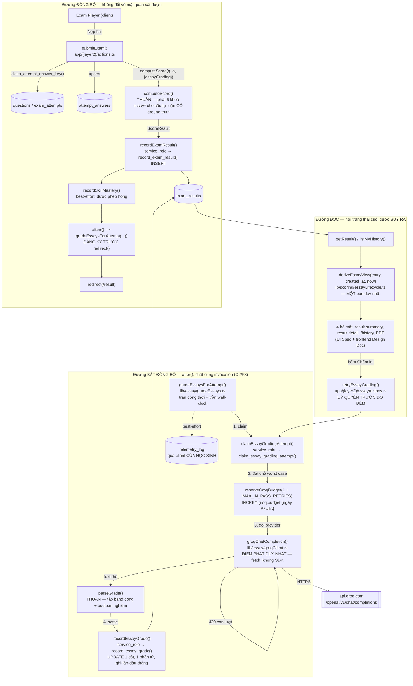

# Essay (Tự luận) Auto-Scoring — Backend Design Document

| | |
|---|---|
| **Version** | 1.3 |
| **Date** | 2026-08-29 |
| **Status** | Draft — thiết kế backend cho chấm tự luận tự động: hai hàm SQL đặc quyền của ADR-0018, hợp đồng khoá jsonb mới trong `exam_results.per_question`, điểm phát Groq, bộ đếm ngân sách riêng, hàm suy diễn vòng đời đọc-lúc-render, Server Action chấm lại, telemetry, và hai thay đổi schema thủ công. **Toàn bộ bề mặt React/hiển thị nằm ngoài phạm vi** — do `docs/ui-spec/essay-auto-scoring-ui-spec.md` và một frontend Design Doc riêng sở hữu; tài liệu này cung cấp hợp đồng dữ liệu mà chúng tiêu thụ. |
| **PRD** | `docs/prd/essay-auto-scoring-prd.md` v1.2 (Draft — D1–D13 khoá, W1–W8, C1–C5, AC-001–AC-072) |
| **UI Spec** | `docs/ui-spec/essay-auto-scoring-ui-spec.md` v1.3 (Draft — UI-D1…UI-D13, RS-0…RS-6, O-1…O-8) |
| **ADR** | `docs/adr/ADR-0018-essay-async-grade-write.md` (Proposed, 2026-08-28 — Decision 1–6, Amendment to ADR-0010, hai Escalation đã được kỹ sư giải quyết) |
| **Nhánh** | `design/adr-0018-essay-async-grade-write` (đã merge `main` @ `7894417`) |
| **Codebase analysis** | **Không có** output codebase-analyzer nào được truyền vào tài liệu này. Mọi sự thật về mã dưới đây do chính tài liệu này xác minh lại bằng Read/Grep trong phiên viết (xem § Code Inspection Evidence), và **mọi số dòng được trích dẫn ở PRD/ADR/UI Spec đều được kiểm lại chứ không tin theo** — năm trích dẫn đã trôi lệch (bốn `+9` trong `schema.sql`, một `−1` ở `types/result.ts`), cộng một trích dẫn khớp một phần (xem § Bảng đối chiếu số dòng). Vì không có `focusAreas`, § Fact Disposition Table được thay bằng § Discrepancy Disposition Table với cùng vai trò: buộc mỗi sự thật về hành vi hiện có phải có một định đoạt ghi ra được. |

## Overview

Tài liệu này biến PRD v1.2 + ADR-0018 thành chi tiết cài đặt backend cho việc chấm tự luận:

1. **Hai hàm SQL đặc quyền mới** (`claim_essay_grading_attempt`, `record_essay_grade`) — `INVOKER`, chỉ `service_role`, `UPDATE` bó vào **đúng một cột** (`per_question`) và **đúng một phần tử mảng**, ghi-lần-đầu-thắng bằng một vị từ `WHERE`, và giữ thứ tự mảng bằng `jsonb_agg(… order by ord)`.
2. **Hợp đồng khoá jsonb** — năm khoá mới trên mỗi phần tử `PerQuestionResult` của câu tự luận, **đóng O-1** của UI Spec: `essayState`, `essayEarned`, `essayMax`, `essayLowConfidence`, `essayAttempts`, cộng một khoá thứ sáu chỉ xuất hiện lúc settle (`essayGradedAt`).
3. **Thay đổi `computeScore()`** — tách đúng một nhánh (`if (!isScored(q))`), giữ nguyên `isScored()`, giữ nguyên `scored:false`/`isCorrect:false` vĩnh viễn (W1/F1).
4. **Module phát Groq** — `fetch` trần tới một hằng endpoint, vòng lặp retry của chính ta, `import "server-only"`, không SDK (ADR-0018 Decision 5).
5. **Bộ đếm ngân sách Groq** — khoá riêng `groq:budget:{ngày Pacific}`, đặt chỗ trước theo trường hợp xấu nhất, fail-closed; **quyết định bắt buộc mà ADR-0018 giao xuống** (trùng lặp hay export đồng hồ Pacific) được giải ở § Forced choice.
6. **Hàm suy diễn vòng đời đọc-lúc-render** — thuần, một bản duy nhất, trên bộ ba `(essayState đã lưu, exam_results.created_at, now())`; đóng nốt phần còn lại của **O-2** (`retryAvailable` suy ra ở đâu, đi vào payload bằng khoá gì).
7. **Server Action chấm lại** — uỷ quyền TRƯỚC đo đếm (AC-072), typed-result, không throw, không redirect.
8. **Telemetry** — một `event_type` mới, ba `error_code` mới, kèm **tuyên bố thành văn về giới hạn phân giải** mà Escalation 2 bắt buộc.
9. **Hai thay đổi schema thủ công** — trần ký tự `attempt_answers.answer` (R11) và nới hai CHECK của `telemetry_log` (R13), cộng DDL hàm mới của ADR-0018, tất cả dưới quy trình Phase 3.5 / TD-005 với vân tay khởi điểm `29931beeb950`.

### Referenced UI Spec

- UI Spec path: `docs/ui-spec/essay-auto-scoring-ui-spec.md` v1.3
- Tài liệu này **đóng O-1** (định danh thật của năm khoá jsonb — § Hợp đồng khoá jsonb) và **phần còn lại của O-2** (`retryAvailable` suy ở đâu, khoá payload nào — § Data Contracts / `EssayView`). Mọi bảng của UI Spec dùng chỗ giữ `<lifecycle>` / `<earned>` / `<max>` / `<lowConfidence>` phải được thay bằng literal ở § Hợp đồng khoá jsonb **trước khi code**.
- Tài liệu này **tiêu thụ** (không định nghĩa lại) các quyết định UI: UI-D1 (rẽ nhánh trên `essayState`, không bao giờ trên `scored`/`isCorrect`), UI-D6 (một hàm suy diễn duy nhất; `pending` quá hạn render y hệt `failed`), UI-D7 (tính năng tắt ⇒ **không phát khoá**), UI-D9 (client nhận boolean, không nhận số đếm), UI-D11 (`/history` nhận một boolean đã suy ra), UI-D13 (khoá vắng mặt và giá trị lạ cùng nhánh render, chỉ cái thứ hai ghi log).
- Bảy trạng thái render RS-0…RS-6 của UI Spec là **đầu ra** của hàm suy diễn ở § `deriveEssayView()`; bảng ánh xạ RS ↔ giá trị trả về nằm ở § State Transitions and Invariants.

## Design Summary (Meta)

```yaml
design_type: "new_feature"
risk_level: "high"
complexity_level: "high"
complexity_rationale: >
  (1) Đây là lần ĐẦU TIÊN một dòng exam_results bị sửa sau khi insert — ADR-0010 dựng
      bảng này thành append-only và ADR-0018 phải sửa lại chính câu tuyên bố đó. Sai một
      ký tự trong mệnh đề `order by ord` là xáo trộn thứ tự câu hỏi trên trang kết quả,
      một khuyết tật mà mọi test kiểu "band đã đáp xuống chưa" đều xanh.
  (2) Nhà cung cấp AI THỨ HAI vào repo, trong khi guard mạnh nhất của repo
      (geminiChokepoint) chỉ khớp `.models.generateContent(` nên vẫn xanh khi một
      provider hoàn toàn không được canh gác ship ra — và chuỗi dùng làm marker bundle
      (`api.groq.com`) sắp xuất hiện trong CHÍNH file guard, nên khoá quét phải là một
      chuỗi KHÁC theo cấu trúc.
  (3) Ba đồng hồ có thể trôi lệch nhau: trần lượt chấm (SQL cưỡng chế / TS suy diễn),
      trần ký tự (schema.sql / limits.ts / verify-schema), và ngày Pacific của ngân sách
      (quota.ts / bộ đếm Groq). Mỗi cặp đều có một chế độ hỏng IM LẶNG, và quota.ts:9–18
      đã viết sẵn bài học cho cặp thứ ba.
  (4) Không có tiến trình nền nào tồn tại (C2/F3): trạng thái cuối là một phép SUY DIỄN
      lúc đọc, nên "đúng" ở đây là một hàm thuần phải cho cùng kết quả trên BỐN bề mặt,
      chứ không phải một dòng dữ liệu đúng.
  (5) Văn bản được chấm do chính người hưởng lợi từ điểm viết ra (PRD R9) — mô hình đe
      doạ này không có tiền lệ nào trong repo; gia sư Socratic chỉ xuất ra lời khuyên.
main_constraints:
  - "exam_results append-only từ phía mọi client; band đi qua service_role, INVOKER, user_id SUY RA trong SQL (ADR-0010/0018)."
  - "computeScore() giữ nguyên tính THUẦN: không I/O, không đọc process.env, không async (AC-013)."
  - "isScored() KHÔNG đổi: essay vẫn trả false, và dòng đã chấm vẫn lưu scored:false + isCorrect:false VĨNH VIỄN (W1/F1)."
  - "Không background writer, không cron, không queue, không 'dọn lúc đăng nhập' (W6/F3)."
  - "QuotaKind vẫn là 'tutor' | 'upload'; PLAN_LIMITS không đổi; không call site consumeQuota() nào bị sửa (AC-066)."
  - "Đúng HAI thay đổi alter-table thủ công: trần attempt_answers.answer (R11) và hai CHECK telemetry_log (R13). telemetry_log KHÔNG thêm cột (Escalation 2)."
  - "Tính năng ship ở trạng thái TẮT cho tới khi cổng ZDR (AC-067) có ghi nhận ngày tháng."
biggest_risks:
  - "Thiếu `order by ord` trong jsonb_agg ⇒ trang kết quả xáo trộn thứ tự câu ngay lần đầu một essay được chấm, và mọi assertion 'band đã landed' vẫn xanh (ADR-0018 Decision 1b, Implementation Guidance #6)."
  - "Khoá quét chokepoint Groq keyed theo host `api.groq.com` ⇒ scripts/check-ai-key-bundle.mjs tự lọt vào một trong hai danh sách toEqual VÉT CẠN, biến guard mạnh nhất của repo thành danh sách ngoại lệ (ADR-0018 #5b — xác minh lại ở § Discrepancy D-07: nó rơi vào danh sách OFFLINE, không phải danh sách reachable)."
  - "Ship (1)–(4) của AC-048 mà cổng verify:schema không khẳng định gì về trần ⇒ trần trong git cao hơn trần trong DB ⇒ Postgres từ chối NGUYÊN LƯỢT nộp bài (R-f). Cổng đó hôm nay CHƯA TỒN TẠI và không có đường đọc CHECK constraint nào từ DB (§ Discrepancy D-05)."
  - "Một lượt chấm lại bị từ chối ở cổng ngân sách vẫn TIÊU một trong ba lượt, vì D4 tiêu lượt lúc claim còn AC-072 bắt claim chạy trước ngân sách. Đã chấp nhận, không giảm nhẹ (§ Accepted costs)."
  - "AC-055 nêu tên hai chỗ SQL; thực tế có thêm NĂM chỗ TypeScript ghim cùng bộ literal đó (§ Discrepancy D-06). Bỏ sót một chỗ là CI đỏ, bỏ sót cả năm là một `error_code` null im lặng."
unknowns:
  - "Round-trip Singapore→Groq CHƯA ĐO (C4). Bốn hằng số thời gian (deadline gọi, backoff, trần wall-clock của pass, hạn chờ đọc-lúc-render) đều chọn bằng LẬP LUẬN, và hạn chờ được neo vào trần thời lượng của NỀN TẢNG chứ không vào một ước lượng độ trễ — xem § Hằng số thời gian."
  - "Trần ký tự mới KHÔNG CÓ CƠ SỞ THỰC NGHIỆM: production có 0 bài tự luận đã nộp (đo 2026-08-27). Chọn bằng lập luận, ghi ra chính điều đó (§ Trần ký tự)."
  - "Tần suất 429 của free tier Groq ở lưu lượng thật chưa đo; AC-065 hấp thụ nó trong cùng pass, còn số liệu chỉ có sau ship."
  - "Chi phí payload của việc thêm per_question vào listMyHistory() chưa đo (UI Spec O-3) — chuyển tiếp thành Open Question OQ-3 kèm phương pháp đo."
```

## Background and Context

### Prerequisite ADRs

- **ADR-0018** (`docs/adr/ADR-0018-essay-async-grade-write.md`, Proposed 2026-08-28) — **ADR mang tính quyết định cho tài liệu này.** Decision 1 (hai hàm claim-then-settle), 1b (giữ thứ tự mảng), 2 (tập band khai MỘT LẦN trong TypeScript, SQL cố ý KHÔNG kiểm), 3 (ghi-lần-đầu-thắng là vị từ `WHERE`, trả **0 dòng chứ không ném**), 4 (trần lượt tiêu lúc **claim**), 5 (`fetch` trần, không SDK), 6 (đặt chỗ ngân sách theo trường hợp xấu nhất, thứ tự **claim → ngân sách → provider → settle**). Cả hai Escalation đã được kỹ sư giải quyết **trong chính file đó** và là ràng buộc, không phải câu hỏi mở: Escalation 1 → đi tiếp trong mẫu hình đặc quyền hiện có, mở `TD-029`; Escalation 2 → `telemetry_log` **không thêm cột**, và tài liệu này **phải nói ra giới hạn phân giải bằng lời**.
- **ADR-0010** (`docs/adr/ADR-0010-score-write-trust-boundary.md`, Accepted 2026-08-03) — ranh giới bị ADR-0018 sửa đổi. Bốn tính chất phải giữ nguyên không sót cái nào: `import "server-only"`; không export client (`serviceRoleClient()` là private); **cưỡng chế nằm trong SQL chứ không ở call site**; bundle scan. Tiêu chí khai tử của nó đã NỔ — xem `TECH-DEBT.md:43-90` (TD-029) — và việc đi tiếp là quyết định của kỹ sư, không phải của tài liệu này.
- **ADR-0011** (`docs/adr/ADR-0011-mastery-write-trust-boundary.md`, Accepted 2026-08-08) — tiền lệ "thao tác đặc quyền thứ hai là một HÀM RIÊNG, không phải một tham số của hàm thứ nhất", và carve-out độ tin cậy mà AC-004 lặp lại: đường ghi điểm là load-bearing, mọi thứ gắn thêm vào nó được phép hỏng. `record_skill_mastery()` (`SOURCE/supabase/schema.sql:1312-1367`) là bản mẫu chép theo về hình dạng grant, cách suy `user_id`, và `raise … using errcode = 'check_violation'`.
- **ADR-0005** — `questions.essay_answer` là ground truth của tự luận; `question_type` CHECK đã bao gồm `'essay'` (`schema.sql:462-464`). Không cần nới CHECK nào cho loại câu.
- **ADR-0006** — tư thế "provider of record": free-tier limit là **theo dự án, không theo người dùng**, và danh mục model đã từng sập một lần với key thật (2026-07-17). Đây là lý do `ESSAY_GRADER_MODEL` phải là hằng theo kỷ luật `lib/ai/models.ts` (AC-032).

**Common ADR check.** Đã tìm `docs/adr/ADR-COMMON-*`: **không có file nào**. Bốn vùng kỹ thuật dùng chung mà tính năng này chạm tới đều đã có chủ sở hữu ADR riêng chứ không phải một ADR-COMMON: ghi đặc quyền (ADR-0010/0011/0018), tư thế provider AI (ADR-0006), telemetry/quan sát (ADR-0011 + PRD Engine 1 R4), hạn mức/ngân sách (ADR-0013/0014 qua `quota.ts`). Repo này ghi quyết định dùng chung bằng **comment dài tại chính chỗ cưỡng chế** (`quota.ts:9-18`, `telemetry.ts:1-31`, `gemini.ts:78-98`) — đó là quy ước hiện hành, và tài liệu này theo nó thay vì dựng một tầng ADR-COMMON mới cho một tính năng.

### External Resources Used

Sự thật mức dự án nằm ở `docs/project-context/external-resources.md`. Môi trường **có đổi** cho tính năng này (một nhà cung cấp AI mới, một secret mới, một khoá đếm mới) — nhưng đổi theo hướng *thêm vào*, và tập con đặc thù tính năng được ghi ở đây thay vì chạy lại hearing, đúng giao thức "file tồn tại → xác nhận trước khi chạy lại".

| Resource (project-tier label) | Feature-specific identifier | Notes |
|---|---|---|
| Database Schema Source | `SOURCE/supabase/schema.sql` — `public.exam_results` (:129-139, `per_question jsonb not null` :136, `created_at timestamptz not null default now()` :138), `attempt_answers_answer_check` (cặp drop/add :472-474), `telemetry_log` (:1378-1401 + cặp drop/add :1818-1821), khối SCORE WRITE LOCKDOWN (:819-954), khối MASTERY WRITE (:1277-1367), `schema_foreign_keys()` (:1180-1242) | **Không có đường đọc CHECK constraint nào từ DB** — `schema_foreign_keys()` lọc `c.contype = 'f'` (:1233). Đây là điều buộc AC-048 mục (5) phải chọn một cơ chế khác (§ Discrepancy D-05). |
| Migration History | Không có (schema.sql idempotent, apply tay — TD-005) | Vân tay khởi điểm **`29931beeb950`**, khai ở HAI chỗ: `schema.sql:1871` và `SOURCE/lib/schema/schemaFingerprint.ts:41`. Cả hai phải di chuyển cùng nhau (§ Discrepancy D-08). |
| Secret Store | Biến môi trường server (`.env.local` / Vercel project env) | Thêm **ba** biến: `GROQ_API_KEY`, `GROQ_BUDGET_DAILY_LIMIT`, `ESSAY_GRADING_ENABLED`. Cả ba đăng ký ở `SOURCE/lib/env/checkEnv.ts`; `GROQ_API_KEY` thêm mục vào `SECRETS` của `SOURCE/scripts/check-ai-key-bundle.mjs`. |
| API Schema Source (nhà cung cấp mới) | Groq OpenAI-compatible Chat Completions — `https://api.groq.com/openai/v1/chat/completions` | Không có file spec trong repo; hợp đồng request/response được **khai bằng tay** trong `lib/essay/groqClient.ts` và **validate nghiêm** trước khi chạm đường ghi (chi phí đã ghi nhận ở ADR-0018 Decision 5). Nguồn tra cứu ở § References. |
| Counter store | Upstash Redis qua `KV_REST_API_URL` / `KV_REST_API_TOKEN` | Khoá **mới, tách hẳn**: `groq:budget:{YYYY-MM-DD}` (ngày Pacific). Không bao giờ đụng `ai:budget:{…}` (AC-030). |
| Visual Verification Environment | Không áp dụng cho tài liệu backend | Production có **0** bài tự luận đã nộp, nên mọi kiểm chứng đầu-cuối phải chạy trên dev với dữ liệu gieo sẵn. |

### Agreement Checklist

#### Scope

- [x] Hai hàm SQL mới trong một khối `schema.sql` mới đặt **sau §11** và được §11 trỏ tới (ADR-0018 Implementation Guidance #1), kèm khối `revoke`/`grant` chép nguyên hình dạng §11b.
- [x] Hai thao tác mới ở `SOURCE/lib/supabase/service-role.ts` (11 → 13): `claimEssayGradingAttempt()`, `recordEssayGrade()`.
- [x] `SOURCE/lib/scoring/essayLifecycle.ts` (mới, thuần) — literal năm khoá jsonb, `ESSAY_BANDS`, `ESSAY_MAX_ATTEMPTS`, `ESSAY_MAX_POINTS`, `ESSAY_PENDING_DEADLINE_MS`, `newEssayEntry()`, `deriveEssayView()`, `summariseEssays()`, `isEssayUnresolved()`, **`isEssayIncomplete()`**, **`hasUnresolvedEssay()`**, **`hasIncompleteEssay()`**.
- [x] `SOURCE/lib/pdf/generateAttemptPdf.ts` — `AttemptPdfData` (:11) nhận **một** trường `hasIncompleteEssay: boolean`, để hai lối xuất PDF (`result/page.tsx:56` và `HistoryRow.tsx:23`) không thể mang hai sự thật khác nhau về cùng một lượt thi (§ Hai vị từ mức-mảng).
- [x] `SOURCE/lib/scoring/computeScore.ts` — tách nhánh `if (!isScored(q))`, thêm tham số thứ ba `options` (mặc định giữ nguyên hành vi hôm nay), trích `hasEssayGroundTruth()` dùng chung với `isScored()`, sửa **lý do** trong hai khối comment (header :17-18, doc `isScored()` :35).
- [x] `SOURCE/lib/essay/` (mới): `groqClient.ts` (điểm phát duy nhất), `prompt.ts` (dựng prompt, thuần), `parseGrade.ts` (parse + validate, thuần), `budget.ts` (bộ đếm ngày Groq), `gradeEssays.ts` (điều phối pass, server-only).
- [x] `SOURCE/lib/billing/budgetDay.ts` (mới) — **một** lời khai duy nhất của khoá ngày Pacific + TTL, được cả `quota.ts` lẫn `lib/essay/budget.ts` import. Đây là lời giải cho "forced choice" ADR-0018 giao xuống (§ Forced choice).
- [x] `SOURCE/lib/ai/models.ts` — thêm `ESSAY_GRADER_MODEL`.
- [x] `SOURCE/app/(layer2)/actions.ts` — `submitExam()` đọc cờ tính năng, truyền `options` vào `computeScore()`, và đăng ký `after()` **trước** `redirect()` (:192).
- [x] `SOURCE/app/(layer2)/essayActions.ts` (mới) — Server Action chấm lại, uỷ quyền trước đo đếm (AC-072).
- [x] `SOURCE/app/(layer2)/queries.ts` — `getResult()` thêm `created_at` vào select, gắn `essay?: EssayView` cho từng dòng và `essaySummary?: EssaySummary` cho cả lượt thi.
- [x] `SOURCE/app/(HM)/queries.ts` — `listMyHistory()` thêm `per_question, created_at` vào select; `MyHistoryEntry` nhận **hai** trường boolean, mỗi trường mang **một** sự thật: `hasUnresolvedEssay` (còn câu đang chạy ⇒ **chốt chặn xuất PDF**, AC-058) và `hasIncompleteEssay` (có câu ở RS-6 ⇒ **điều kiện in** `result.essay.pdfIncomplete`, O-8). Hai chứ không một — xem **§ D-13**: gộp chúng lại chính là khuyết tật F-06, và nó ship ra hai tệp PDF khác nhau cho cùng một lượt thi.
- [x] `SOURCE/lib/tutor/prompt.ts` — chặn trần **độc lập** cho `studentAnswer` (ripple R11 vào đường Gemini), và sửa **lý do** của comment :36; union `questionType` giữ nguyên đóng (AC-071).
- [x] `SOURCE/lib/tutor/telemetry.ts` — `TelemetryEventType` thêm `'essay_grade'`; `TELEMETRY_ERROR_CODES` thêm ba mã.
- [x] `SOURCE/lib/env/checkEnv.ts` — đăng ký ba biến mới.
- [x] `SOURCE/scripts/check-ai-key-bundle.mjs` + `SOURCE/lib/security/checkAiKeyBundleSecrets.test.ts` — mục `GROQ_API_KEY`, **hai chỗ ghim di chuyển trong cùng commit** (`toEqual` :34, `SECRETS.length` :74 → 8).
- [x] `SOURCE/lib/ugc/limits.ts` — `MAX_ATTEMPT_ANSWER: 500 → 4000`, và sửa comment :14-16 đang viết cứng số `500`.
- [x] `SOURCE/supabase/schema.sql` — cặp drop/add trần ký tự (:472-474), nới **hai** CHECK `telemetry_log` (inline :1383/:1390-1399 **và** cặp drop/add :1818-1821, cộng một cặp drop/add **mới** cho `event_type` vốn chưa có), khối hai hàm mới, vân tay mới.
- [x] `SOURCE/lib/schema/schemaFingerprint.ts:41` — vân tay mới (chỗ ghim thứ hai).
- [x] `SOURCE/supabase/verify-schema.ts` — hai assertion grant cho hai hàm mới; cổng trần ký tự của AC-048 mục (5); cổng ghim `ESSAY_MAX_ATTEMPTS` giữa TS và literal trong `schema.sql`.
- [x] `SOURCE/supabase/test-rls.ts` — Phần 10, cases `EG-a…EG-e`.
- [x] `SOURCE/app/(layer2)/exams/[id]/attempt/[attemptId]/page.tsx` và `…/result/detail/page.tsx` — `export const maxDuration` (route segment; **không** khai được trong file `"use server"`).
- [x] Fixture đối kháng + test theo § Test Boundaries.

#### Non-Scope (nói rõ là KHÔNG đổi)

- [ ] **`isScored()` (`computeScore.ts:36-42`)** — nhánh essay vẫn `return false`. Đây không phải sơ suất: W1 đòi `scored:false` vĩnh viễn, và mọi thay đổi ở đây làm dòng tự luận chảy vào `record_skill_mastery()` và `computeWrongTwiceQuestionIds()`.
- [ ] **`SOURCE/lib/scoring/wrongTwice.ts`** — không sửa một byte (AC-019).
- [ ] **`schema.sql` khối MASTERY WRITE** — cụ thể là `coalesce((pq->>'scored')::boolean, true)` (dòng **1354**, KHÔNG phải 1345 như PRD/ADR ghi — xem § Bảng đối chiếu số dòng). Không sửa (AC-017).
- [ ] **`record_exam_result()`** — chữ ký, thân hàm, grant: không đổi (W2). Không có DDL nào trên các cột của `exam_results`.
- [ ] **`QuotaKind`, `PLAN_LIMITS`, mọi call site `consumeQuota()`** — không đổi (AC-066). `quota.ts` **có** bị sửa, nhưng chỉ là một phép *di chuyển* hai hằng private sang module dùng chung; không export mới nào của `quota.ts` xuất hiện (§ Forced choice).
- [ ] **`TutorPromptInput.questionType`** — giữ union đóng `"mcq" | "true_false" | "short_answer"` (`prompt.ts:37`). Đây là cưỡng chế **lúc biên dịch** của AC-016 (AC-071).
- [ ] **`PublicQuestion`** — `Omit<Question, "correctAnswer" | "essayAnswer" | "subAnswers">` (`types/question.ts:63`) không đổi (AC-043).
- [ ] **`telemetry_log` cột** — không thêm cột nào (Escalation 2). `buildTelemetryPayload()` vẫn gán đích danh đúng sáu cột (`telemetry.ts:92-101`) và test vét cạn của nó không đổi hình dạng.
- [ ] **Mọi component React, i18n dictionary, và bố cục PDF** — thuộc UI Spec + frontend Design Doc. Tài liệu này chỉ liệt kê chúng ở § Change Impact Map để biết mà thôi.
- [ ] **Backfill** — không dòng `exam_results` cũ nào được đọc lại, tính lại, hay ghi lại (D12/AC-012).
- [ ] **Bất kỳ writer nền nào** cho `pending` đã lưu — không cron, không queue, không sweeper, không "dọn lúc đăng nhập lần sau" (W6/F3/ADR-0018 #8).
- [ ] **TBD-02** (`true_false` render danh sách lựa chọn rỗng ở nhánh CÓ-chấm) — tài liệu này **không** sửa nhánh có-chấm của `result/detail/page.tsx` (câu tự luận không bao giờ tới đó, W5/UI-D1), nên deferral của PRD § Inherited Decisions **vẫn còn hiệu lực**. Xác nhận lại đúng như UI Spec O-7 yêu cầu.

#### Constraints

- [ ] **Vận hành song song**: **Không.** Một cặp môi trường dev/prod, không staging, không hạ tầng feature-flag (C5). Cơ chế duy nhất tương đương là biến env `ESSAY_GRADING_ENABLED` (server-only, mặc định TẮT) — nó điều khiển việc **phát khoá mới**, không điều khiển việc **đọc khoá cũ** (UI-D7).
- [ ] **Tương thích ngược**: **Bắt buộc.** Một dòng `exam_results` ghi trước khi ship phải đọc ra **y hệt từng byte** như hôm nay (AC-012), và mọi câu không phải tự luận phải chấm y hệt hôm nay (AC-010). Cả hai được chứng minh bằng § Output Comparison.
- [ ] **Đo hiệu năng**: **Bắt buộc một phần.** Không phải cổng CI (không tất định), nhưng round-trip Singapore→Groq **phải được đo trong lúc cài đặt** trước khi chốt lại bốn hằng thời gian (C4, Scalability của PRD). Chỉ tiêu để đối chiếu: trung vị từ `exam_results.created_at` tới `essayGradedAt` cuối cùng ≤ 60 giây cho lượt thi ≤ 5 câu tự luận.
- [ ] **Trần thời lượng nền tảng**: `after()` chia sẻ vòng đời invocation (C2). Mặc định fluid compute là 300 s (đã ghi ở `tutorActions.ts:22-26`), và `SOURCE/vercel.json` không có mục `functions` nào hạ nó. Pass chấm phải tự dừng **trước** mốc đó chứ không để nền tảng cắt.
- [ ] **Hai thay đổi schema thủ công, áp bằng tay lên hai project** (C3/TD-005), cộng DDL hàm mới của ADR-0018. Vân tay khởi điểm `29931beeb950` (đã xác nhận khớp prod, `applied_at` 2026-08-28 11:53 UTC).
- [ ] **Cổng người thật AC-067**: Zero Data Retention bật trong Groq Data Controls, xác nhận bằng một lượt kiểm console **có ghi ngày** trong Work Plan, TRƯỚC khi một bài viết thật của học sinh được gửi đi. Không test nào trong repo kiểm được điều này.

#### Applicable Standards

- [x] TypeScript strict mode `[explicit]` — `SOURCE/tsconfig.json`.
- [x] ESLint (`eslint-config-next` core-web-vitals + typescript) `[explicit]` — `SOURCE/eslint.config.mjs`.
- [x] Vitest cho business logic `[explicit]` — `SOURCE/vitest.config.ts` (`include`: `lib/**`, `components/**`, `app/**`; **`scripts/**` và `supabase/**` nằm NGOÀI mọi glob** — lý do test ghim `SECRETS` phải sống ở `lib/security/`, ghi ở `checkAiKeyBundleSecrets.test.ts:24-27`).
- [x] Conventional Commits kèm scope theo layer `[explicit]` — `PROJECT_OVERVIEW.md` §7.
- [x] Comment tiếng Việt theo đúng quy ước của từng file `[implicit]` — bằng chứng: `computeScore.ts`, `actions.ts`, `quota.ts`, `schema.sql` đều nhất quán tiếng Việt. Confirmed: Yes.
- [x] **Suy `user_id` từ attempt trong SQL, không bao giờ nhận từ tham số, và đòi `status='submitted'`** `[explicit]` — ADR-0010 §11b, ADR-0011 Implementation Guidance; bằng chứng mã: `schema.sql:921-938` và `:1328-1336`. Confirmed: Yes.
- [x] **`revoke all on function … from public, anon, authenticated` GỌI ĐÍCH DANH, không chỉ `public`** `[explicit]` — sự cố đã ghi ở §10b; bằng chứng: `schema.sql:951-954`, `:1366-1367`, `:1241-1242`. Confirmed: Yes.
- [x] **`INVOKER` chứ không `SECURITY DEFINER` cho hàm chỉ-`service_role`** `[explicit]` — ADR-0010 § Defence in depth; bằng chứng: `record_exam_result()` (`schema.sql:897-945`) và `record_skill_mastery()` (`:1313-1363`) đều không khai `security definer`. Confirmed: Yes.
- [x] **Server Action nhạy quyền sống ở file riêng, không lẫn vào `actions.ts`** `[implicit]` — bằng chứng: `tutorActions.ts:1-6` ghi thẳng lý do ("mọi thứ canh cửa nằm gọn trong một file đọc hết được một lượt"). Confirmed: Yes — `essayActions.ts` theo đúng lối này.
- [x] **Server Action trả typed-result, KHÔNG throw, KHÔNG redirect, khi caller là một affordance giữa trang đã render** `[implicit]` — bằng chứng: `tutorActions.ts:8-12` (viện dẫn tiền lệ `rateExam()`). Confirmed: Yes.
- [x] **Hằng số dùng chung giữa bundle Next và script `tsx` phải sống ở module KHÔNG có `server-only`** `[explicit]` — `lib/ai/models.ts:1-24` ghi cả sự cố đã xảy ra. Confirmed: Yes.
- [x] **Ánh xạ lý do-từ-chối → mã telemetry khai MỘT lần ở module không `"use server"`** `[explicit]` — `lib/billing/quotaTelemetry.ts:1-34`. Confirmed: Yes.
- [x] **Bảng tra `Record<…>` + `satisfies` thay cho `switch` có `default`**, để thêm một nhánh là lỗi biên dịch `[implicit]` — bằng chứng: `quotaTelemetry.ts:30-34`, `PLAN_LIMITS` (`quota.ts:37-40`). Confirmed: Yes.
- [x] **`snake_case` DB → `camelCase` TS bằng `(r.col as T | null) ?? undefined`** `[implicit]` — `actions.ts:131`, `queries.ts:656`. Confirmed: Yes.
- [x] **Đọc danh sách bị chặn trần bằng `readBounded`** `[explicit]` — `lib/supabase/boundedRead.ts`, `LIST_ROW_CEILING = 500` (:74). Confirmed: Yes — `listMyHistory()` đã dùng, không đổi.

#### Assumed Behaviors

- [x] **`isScored()` trả `false` cho `essay`, và nhánh không-chấm của `computeScore()` là chỗ DUY NHẤT một dòng tự luận đi qua.** Evidence: `computeScore.ts:41` (`return false` cuối `isScored`), `:99-101` (nhánh `if (!isScored(q))`). Confirmed: **Yes**.
- [x] **`record_skill_mastery()` loại một dòng CHỈ khi `coalesce((pq->>'scored')::boolean, true)` là false, và khoá THIẾU mặc định là ĐƯỢC TÍNH.** Evidence: `schema.sql:1354`. Confirmed: **Yes** (số dòng đã sửa lại — xem § Bảng đối chiếu số dòng).
- [x] **`computeWrongTwiceQuestionIds()` loại CHỈ khi `row.scored === false`.** Evidence: `wrongTwice.ts:45` (`if (row.scored === false || row.isCorrect) continue;`). Confirmed: **Yes**.
- [x] **`service_role` còn nguyên quyền bảng trên `exam_results`; §11a chỉ thu hồi của `anon`/`authenticated`, nên một hàm `INVOKER` gọi bằng `service_role` `UPDATE` được.** Evidence: `schema.sql:849` (`revoke insert, update, delete on public.exam_results from anon, authenticated;` — chỉ hai role được gọi tên). Confirmed: **Yes**.
- [x] **`exam_results.created_at` tồn tại, `not null`, `default now()`** — đúng đầu vào mà AC-026 cần. Evidence: `schema.sql:138`. Confirmed: **Yes**.
- [x] **`getResult()` KHÔNG select `created_at` hôm nay.** Evidence: `queries.ts:579-581` (chuỗi select đầy đủ, không có `created_at`); `ResultRow` (`queries.ts:469-475`) cũng không khai. Confirmed: **Yes** — đây là Discrepancy D-02.
- [x] **`MyHistoryEntry` KHÔNG mang `per_question`, và select của `listMyHistory()` không lấy nó.** Evidence: `app/(HM)/queries.ts:8-18` (chín trường), `:64-66` (chuỗi select). Confirmed: **Yes** — Discrepancy D-03.
- [x] **`after()` chỉ được import ở đúng một chỗ trong repo, và phải đăng ký TRƯỚC khi hàm trả về.** Evidence: `lib/support/actions.ts:6` (`import { after } from "next/server";`), `:122-127` (comment ghi chính quy tắc đó). Grep toàn repo cho `from "next/server"` không tìm thấy `after` ở chỗ nào khác. Confirmed: **Yes**.
- [x] **`vercel.json` không có `crons`, không có `functions`.** Evidence: nội dung đầy đủ là `$schema`, `framework`, `regions: ["sin1"]`. Confirmed: **Yes**.
- [x] **`maxDuration` KHÔNG khai được trong file `"use server"`; phải đặt ở route segment gọi nó.** Evidence: `tutorActions.ts:16-21` (dẫn tài liệu Next.js 16 kèm trong `node_modules`); tiền lệ đã chạy: `app/(layer4)/upload/page.tsx:18` (`export const maxDuration = 300`). Confirmed: **Yes**.
- [x] **`telemetry_insert_own` là `with check (user_id = auth.uid())`, nên telemetry ghi bằng client CỦA HỌC SINH chứ không bằng `service_role`.** Evidence: `schema.sql:1412-1413` + `tutorActions.ts:111-117` (ghi rõ dòng `user_id` NULL bị RLS từ chối thẳng). Confirmed: **Yes**.
- [x] **`consumeQuota()` đặt chỗ trường hợp xấu nhất bằng MỘT `INCRBY` trước burst, và Redis không tới được ⇒ TỪ CHỐI.** Evidence: `quota.ts:371-377` (`incrby` rồi so, hoàn lại khi vượt), `:333-334`, `:342-344`, `:380-383`. Confirmed: **Yes**.
- [x] **Năm helper mà bộ đếm Groq cần đều là module-private trong `quota.ts`.** Evidence: `BUDGET_TTL_SECONDS` :132, `BUDGET_TIME_ZONE` :141, `PACIFIC_DAY` :179, `budgetKey()` :186, `dailyBudgetLimit()` :202 — **cả năm số dòng đều khớp chính xác với ADR-0018**. Confirmed: **Yes**.
- [x] **`SECRETS` được ghim bởi hai assertion, ở đúng hai dòng ADR-0018 nêu.** Evidence: `lib/security/checkAiKeyBundleSecrets.test.ts:34` (`toEqual` vét cạn label+markers) và `:74` (`expect(SECRETS.length).toBe(7)`). Confirmed: **Yes**.
- [x] **`SOURCE_FILE` của phép quét chokepoint KHỚP đuôi `.mjs`, và `TEST_FILE` thì không.** Evidence: `geminiChokepoint.test.ts:125` (`/\.(?:[cm]?tsx?|[cm]?jsx?)$/` — `[cm]?jsx?` khớp `mjs`), `:129`. Confirmed: **Yes**.
- [x] **`scripts/` NẰM TRONG `OFFLINE_SCRIPT_DIRS` của phép quét chokepoint.** Evidence: `geminiChokepoint.test.ts:150` (`["supabase", "scripts"]`). Confirmed: **Yes** — điều này *tinh chỉnh* lời cảnh báo của ADR-0018 #5b: file bundle-guard sẽ rơi vào danh sách **offline**, chứ không phải danh sách reachable. Cả hai danh sách đều là `toEqual` vét cạn (`:169`, `:176`), nên kết luận của ADR không đổi (§ Discrepancy D-07).
- [x] **`lib/supabase/service-role.ts` export đúng 11 thao tác, ở đúng 11 số dòng ADR-0018 và TD-029 liệt kê.** Evidence: grep `^export async function` → :61, :95, :131, :181, :219, :263, :337, :365, :410, :512, và :451. Confirmed: **Yes**.
- [x] **`QuestionRenderer` đọc trần ký tự từ MỘT alias của `LIMITS.MAX_ATTEMPT_ANSWER`, nên hai "coupled site" mà AC-048 mục (3) nêu tên tự di chuyển theo hằng.** Evidence: `QuestionRenderer.tsx:23` (`const MAX_ATTEMPT_ANSWER = LIMITS.MAX_ATTEMPT_ANSWER;`), dùng ở `:194` (`maxLength`) và `:202` (số học `charsLeft`). Confirmed: **Yes** — Discrepancy D-04.
- [x] **Đường gia sư KHÔNG cắt `studentAnswer` độc lập với trần DB.** Evidence: `tutorActions.ts:300` (`studentAnswer: currentRow?.selected ?? ""` — không `slice`), `prompt.ts:44` (khai `string` trần), `:105` (nội suy nguyên văn vào prompt). Confirmed: **Yes** — đây là ripple mà PRD § Dependencies bắt tài liệu này trả lời; lời giải ở § Ripple R11 vào đường Gemini.
- [ ] **Postgres đánh giá CHECK constraint TRƯỚC khi kích hoạt trigger khoá ngoại, nên một `INSERT` có `attempt_id` không tồn tại VÀ `answer` quá trần sẽ hỏng với `23514` (check_violation) chứ không phải `23503` (foreign_key_violation).** Evidence: **không tìm được bằng chứng trong repo hay bằng một lệnh đã chạy** — đây là ngữ nghĩa của engine, và tài liệu này cố ý không chạy lệnh ghi nào lên database. Confirmed: **No.** Cơ chế của AC-048 mục (5) phụ thuộc vào nó, nên nó có một dòng tương ứng ở § Risks and Mitigation (R-04) kèm cách xác minh cụ thể trong lúc cài đặt.
- [ ] **Callback `after()` vẫn đọc được cookie phiên, nên một client Supabase dựng BÊN TRONG callback vẫn mang JWT của học sinh.** Confirmed: **No** — không xác minh được từ repo. Thiết kế **không phụ thuộc** vào điều này: client `supabase` đã dựng ở `submitExam()` được **bắt vào closure trước** khi `after()` được đăng ký, nên đường telemetry dùng đúng instance đã cầm JWT. Dòng tương ứng ở § Risks and Mitigation (R-05).
- [ ] **Groq chấp nhận `response_format: {"type":"json_object"}` trên endpoint OpenAI-compatible và model đã chọn tôn trọng nó.** Confirmed: **No** — có tài liệu nhà cung cấp (§ References) nhưng chưa xác minh với key thật, và cộng đồng đã ghi nhận `openai/gpt-oss-120b` **bỏ qua** `json_schema`. Thiết kế **không phụ thuộc** vào nó: `parseGrade.ts` validate nghiêm và từ chối mọi thứ không khớp (AC-006/AC-041), nên `json_object` chỉ là một phép giảm nhiễu. Dòng tương ứng ở § Risks and Mitigation (R-06).

#### Quality Assurance Mechanisms

- [x] `tsc --noEmit` (strict) — Enforces: kiểu tĩnh; **là cơ chế cưỡng chế AC-071** (union `questionType` đóng) và cưỡng chế bảng `satisfies` của telemetry — Config: `SOURCE/tsconfig.json` — Status: `adopted`.
- [x] `vitest run` — Enforces: đúng đắn unit/integration — Config: `SOURCE/vitest.config.ts` — Covers: `lib/**`, `app/**`, `components/**` — Status: `adopted` (cơ chế chứng minh chính, xem § Verification Strategy).
- [x] ESLint — Config: `SOURCE/eslint.config.mjs` — Status: `adopted`.
- [x] `next build` + `npm run check:bundle` — Enforces: `GROQ_API_KEY` và `api.groq.com` không xuống client bundle (AC-029) — Config: `SOURCE/scripts/check-ai-key-bundle.mjs` — Status: `adopted`.
- [x] Phép quét điểm phát (chokepoint) — Enforces: bề mặt phát Groq request-reachable **đúng bằng một module** (AC-033), cộng negative control (AC-034) — Config: test mới theo khuôn `lib/ugc/__tests__/geminiChokepoint.test.ts` — Status: `adopted`.
- [x] `npm run verify:schema` — Enforces: grant của hai hàm mới, trần ký tự trên DB thật, vân tay schema, và ghim `ESSAY_MAX_ATTEMPTS` — Config: `SOURCE/supabase/verify-schema.ts` — Status: `adopted` (**phải mở rộng trước khi dựa vào**; hôm nay nó không khẳng định gì về trần ký tự).
- [x] `npx tsx supabase/test-rls.ts` — Enforces: JWT học sinh không gọi được hai hàm mới, không `UPDATE` được `exam_results` — Status: `adopted`.
- [x] CHECK `telemetry_log_error_code_check` + `telemetry_log_event_type` — Enforces: `error_code`/`event_type` chỉ nhận literal đóng — Source: `schema.sql:1383`, `:1390-1399`, `:1818-1821` — Status: `adopted` (được **nới**, và mỗi bên có một bản chép tay trong test ghim lại — § Discrepancy D-06).
- [x] `attempt_answers_answer_check` — Enforces: trần độ dài bài làm — Source: `schema.sql:472-474` — Status: `adopted` (được **nới**).
- [ ] Playwright E2E — Status: `noted` (lý do: dự án ở "Pha 1"; không có làn E2E nào chạy trên CI. Kiểm chứng đầu-cuối là một lượt smoke tay trên dev với dữ liệu gieo sẵn, vì production có **0** bài tự luận đã nộp).
- [ ] Kiểm accessibility tự động — Status: `noted` (lý do: `SOURCE/package.json` không có axe/Lighthouse CI; a11y thuộc UI Spec và được kiểm bằng assertion RTL theo role — ngoài phạm vi tài liệu backend).
- [ ] Đánh giá đối kháng với provider thật (AC-070) — Status: `adopted` **nhưng KHÔNG phải cổng merge** (cần key thật, tiêu ngân sách, không tất định). Chạy hằng đêm hoặc theo yêu cầu, và **bắt buộc chạy lại mỗi lần đổi `ESSAY_GRADER_MODEL`** (AC-032).

### Problem to Solve

`essay` là loại câu duy nhất còn lại chưa được chấm: `isScored()` trả `false` vô điều kiện cho nó (`computeScore.ts:41`), nên một lượt thi toàn tự luận lưu `correct = 0, total = 0, total_score = 0.00` và học sinh đọc điểm 0 trên chính bài mình đã viết. Ô nhập đã có từ bản vá production 2026-08-17 (`QuestionRenderer.tsx:185-205`); **thứ còn thiếu là việc chấm, không phải chỗ nhập**.

Nhưng band không có chỗ nào để đáp xuống. `exam_results` có `unique (attempt_id)` (`schema.sql:131`), `record_exam_result()` chỉ INSERT (`:940-943`), và `revoke insert, update, delete … from anon, authenticated` (`:849`) đã lấy hết quyền ghi của client. Một band tới **sau** khi dòng kết quả tồn tại thì không gọi lại `record_exam_result()` được (đó là `23505`) và không ghi bằng phiên của học sinh được (`42501`). Đó là C1, và là lý do ADR-0018 tồn tại.

Đồng thời, không có tiến trình nào sống sót qua invocation: `after()` chết cùng nó, `vercel.json` không có cron, không có queue. Nên "chấm thất bại" không thể là một giá trị được ghi — nó phải là một giá trị được **suy ra lúc đọc** (C2/W6/F3).

### Current Challenges

- **Không có tiền lệ nào trong repo cho một lượt sửa tại chỗ `exam_results`.** Mọi ghi đặc quyền hiện có là INSERT hoặc UPSERT vào bảng khác. Phép rewrite phần tử mảng jsonb giữ thứ tự là mã hoàn toàn mới.
- **Guard AI mạnh nhất của repo mù với provider thứ hai.** `EMIT_PATTERN = /\.models\.generateContent\s*\(/` (`geminiChokepoint.test.ts:145`) sẽ **xanh** trong khi một đường phát Groq không được canh gác ship ra. AC-034 tồn tại để chứng minh đúng điều đó trong CI.
- **Không có đường đọc CHECK constraint từ DB.** `schema_foreign_keys()` lọc `contype = 'f'` (`schema.sql:1233`), nên cổng mà AC-048 mục (5) đòi hỏi không thể là "đọc `pg_constraint` rồi so chuỗi" nếu không thêm DDL thứ ba.
- **Ba bộ literal đã bị ghim ở nhiều nơi hơn PRD nêu tên**: mã telemetry (7 chỗ, PRD nêu 2), vân tay schema (2 chỗ, PRD nêu 1), và trần ký tự (PRD nêu 5, thực tế 2 trong số đó tự di chuyển theo hằng).
- **Một số dòng được trích trong PRD/ADR/UI Spec đã trôi lệch** sau khi `main` được merge vào nhánh này — **năm trích dẫn** (bốn lệch `+9` trong `schema.sql`, một lệch `−1` ở `types/result.ts`), cộng **một** trích dẫn khớp một phần (`telemetry.ts:66-73`). Xem § Bảng đối chiếu số dòng.

### Requirements

#### Functional Requirements

- Phát ra năm khoá vòng đời trên phần tử `per_question` của mỗi câu tự luận **có ground truth** tại thời điểm insert, và **chỉ khi** cờ tính năng bật.
- Chấm mỗi câu tự luận bằng đúng một request Groq mỗi lượt (cộng tối đa `GROQ_MAX_IN_PASS_RETRIES` lần thử lại cho 429 trong cùng pass), sau khi đã claim và đã đặt chỗ ngân sách.
- Ghi band vào đúng một phần tử của `per_question` qua một hàm SQL đặc quyền, giữ nguyên thứ tự mảng, từ chối ghi đè.
- Suy ra trạng thái hiển thị của mỗi câu tự luận từ `(essayState, exam_results.created_at, now())` bằng **một** hàm thuần duy nhất, dùng bởi cả `getResult()` lẫn `listMyHistory()`.
- Cho phép học sinh kích hoạt lại việc chấm một câu đang `failed` (kể cả `failed` suy ra), uỷ quyền **trước** khi đo đếm, tối đa `ESSAY_MAX_ATTEMPTS` lượt claim mỗi `(attempt_id, question_id)`.
- Giữ nguyên từng byte kết quả chấm của `mcq` / `true_false` / `short_answer`, và của mọi dòng `exam_results` đã tồn tại.
- Nâng trần ký tự bài làm ở mọi chỗ ghép cặp trong đúng một commit, kèm một cổng đọc lại được trần đó từ DB thật.
- Ghi một dòng telemetry cho mỗi lượt chấm, chỉ mang mã có cấu trúc.

#### Non-Functional Requirements

- **Performance**: đường nộp bài không đổi (0 request đồng bộ). Trung vị từ `created_at` tới `essayGradedAt` cuối cùng ≤ 60 s cho lượt ≤ 5 câu tự luận (đo, không phải cổng CI).
- **Reliability**: mọi thất bại của việc chấm — provider, ngân sách, output không hợp lệ, invocation bị cắt — **không được** cản trở, hoãn, sửa hay đảo lượt ghi `exam_results` và lượt gọi `record_skill_mastery()` (AC-004). Cơ chế: pass chấm chạy trong `after()`, sau khi cả hai đã xong, và mọi lối thoát của nó đều bị nuốt và log.
- **Security**: văn bản được chấm là đầu vào do kẻ tấn công kiểm soát cho một thao tác ghi đặc quyền. Trung hoà lúc vào (vùng phân tách + tuyên bố vai trò), validate nghiêm lúc ra (tập band đóng + boolean nghiêm), và đường ghi đi qua danh tính đặc quyền với ownership suy ra trong SQL.
- **Scalability**: 50 câu tự luận trong một lượt nộp là trường hợp xấu nhất (`LIMITS.MAX_QUESTIONS`). Bị bó bởi trần đồng thời, trần wall-clock của pass, và đặt chỗ ngân sách — theo thứ tự cái nào chạm trước.
- **Maintainability**: mỗi hằng số sản phẩm (tập band, trần lượt, trần ký tự, tên model, hạn chờ) có **đúng một** lời khai, và mỗi cặp lời-khai-với-cưỡng-chế-ở-nơi-khác có một cổng ghim chúng lại.

## Acceptance Criteria (AC) — EARS Format

ID mang tiền tố `EG-BE-` (Essay Grading, Backend) để không đụng dải `AC-001..AC-072` của PRD khi hai tài liệu được đọc cùng lúc. Bảng truy vết đầy đủ về PRD nằm ở § AC Traceability.

### Hình dạng lưu (W1/W2)

- [ ] **EG-BE-001** — **Khi** `computeScore()` chạy với `options.essayGrading === true` và một câu `essay` có `essayAnswer` không rỗng/không toàn khoảng trắng, hệ thống **phải** phát ra phần tử `per_question` mang **đủ năm** khoá `essayState: "pending"`, `essayEarned: null`, `essayMax: null`, `essayLowConfidence: false`, `essayAttempts: 0`, **cộng với** `scored: false` và `isCorrect: false`.
- [ ] **EG-BE-002** — **Khi** `computeScore()` chạy với `options.essayGrading === false` (mặc định), hệ thống **phải** phát ra phần tử `per_question` cho câu `essay` **y hệt từng byte** như hôm nay: `{ questionId, selected, isCorrect: false, scored: false }` và **không một khoá `essay*` nào**.
- [ ] **EG-BE-003** — **Nếu** một câu `essay` có `essayAnswer` null/rỗng/toàn khoảng trắng, **thì** hệ thống **phải không** phát khoá `essay*` nào, bất kể cờ tính năng — cùng guard ground-truth-presence mà `isScored()` đã áp cho `true_false` và `short_answer`.
- [ ] **EG-BE-004** — **Ở mọi trạng thái vòng đời** (`pending`, `graded`, `failed`), phần tử được lưu **phải** giữ `scored: false` và `isCorrect: false`. Một phần tử `graded` mang `scored: true`, `isCorrect: true`, hoặc **thiếu** khoá `scored`, là **trượt** tiêu chí này.

### Hàm SQL đặc quyền (ADR-0018 D1/D1b/D3/D4)

- [ ] **EG-BE-005** — **Khi** `record_essay_grade()` chạy trên một lượt thi có ba câu tự luận và ghi band cho câu **thứ hai**, hệ thống **phải** để lại mảng `per_question` có **dãy `questionId` không đổi** so với trước lượt ghi.
- [ ] **EG-BE-006** — **Khi** `record_essay_grade()` được gọi lần thứ hai cho một cặp `(attempt_id, question_id)` đã `graded`, hệ thống **phải** trả về `false` (0 dòng bị đụng), **phải không** ném exception, và band đã lưu **phải** bằng đúng lần ghi thứ nhất.
- [ ] **EG-BE-007** — **Khi** `record_essay_grade()` được gọi cho một phần tử đang `failed`, hệ thống **phải** ghi được (`failed → graded` và `failed → failed` đều hợp lệ); `graded` là trạng thái **hấp thụ**.
- [ ] **EG-BE-008** — **Nếu** `p_attempt_id` trỏ tới attempt không tồn tại hoặc chưa `submitted`, **thì** cả hai hàm **phải** từ chối: `record_essay_grade()` ném `check_violation`, `claim_essay_grading_attempt()` trả một dòng `claimed = false, reason = 'not_submitted'`.
- [ ] **EG-BE-009** — Cả hai hàm **phải không** nhận tham số `user_id`, và **phải không** nhắc tới `total_score`, `correct`, `total`, `topic_breakdown` hay `overtime_seconds` ở bất kỳ đâu trong thân hàm. Kiểm bằng một phép quét văn bản trên `schema.sql`.
- [ ] **EG-BE-010** — **Khi** `claim_essay_grading_attempt()` thành công, `essayAttempts` của phần tử **phải** tăng đúng 1, và **phải không bao giờ** bị giảm bởi bất kỳ câu lệnh nào trong repo.
- [ ] **EG-BE-011** — **Khi** `essayAttempts` đã bằng `ESSAY_MAX_ATTEMPTS`, `claim_essay_grading_attempt()` **phải** trả `claimed = false, reason = 'exhausted'` và **phải không** dẫn tới request provider nào.
- [ ] **EG-BE-012** — **Khi** phần tử đang `graded`, `claim_essay_grading_attempt()` **phải** trả `claimed = false, reason = 'already_graded'` (AC-063: chấm lại trên câu đã có band là no-op).
- [ ] **EG-BE-013** — Với JWT của học sinh, `.rpc()` tới **cả hai** hàm **phải** trả `42501`, và `UPDATE public.exam_results` trực tiếp **phải** bị từ chối ở tầng quyền.

### Validate output của model (R9)

- [ ] **EG-BE-014** — **Nếu** response của model parse ra một band **không** thuộc `{0, 0.25, 0.5, 0.75, 1}`, **thì** hệ thống **phải** từ chối nó — không làm tròn, không kẹp biên, không dịch về band gần nhất.
- [ ] **EG-BE-015** — **Nếu** trường tin cậy **vắng mặt, không phải boolean, hoặc là văn bản tự do**, **thì** hệ thống **phải** xử như output không hợp lệ — **không** mặc định về `false`, **không** ép theo truthiness.
- [ ] **EG-BE-016** — **Khi** một output bị từ chối, hệ thống **phải** settle câu đó thành `failed` — **không bao giờ** thành band 0, **không bao giờ** để nguyên `pending`.
- [ ] **EG-BE-017** — **Khi** dựng prompt cho một câu có ground truth, `questions.essay_answer` **phải** xuất hiện **đúng một lần**, bên trong vùng tham chiếu có nhãn, và bài làm của học sinh **phải** nằm trong một vùng dữ liệu riêng có nhãn, không bao giờ ở vị trí chỉ dẫn.
- [ ] **EG-BE-018** — Với **mỗi** trong ít nhất năm fixture đối kháng đã commit (tiếng Việt và tiếng Anh, kể cả một biến thể zero-width/bidi), band chấm cho `answer_text + injection` **phải BẰNG** band chấm cho `answer_text` — chạy với provider thật (không phải cổng merge).

### Ngân sách và thứ tự (D6/AC-072)

- [ ] **EG-BE-019** — Bộ đếm ngân sách chấm **phải** dùng khoá `groq:budget:{ngày Pacific}`; chuỗi `ai:budget:` **phải không** xuất hiện ở bất kỳ đâu trong đường mã chấm tự luận.
- [ ] **EG-BE-020** — **Khi** pass chấm cho một câu bắt đầu, hệ thống **phải** phát **đúng một** `INCRBY` bằng `1 + GROQ_MAX_IN_PASS_RETRIES` **trước** request đầu tiên, và **phải không** hoàn lại khi pass thành công ngay lần đầu.
- [ ] **EG-BE-021** — **Nếu** counter store không tới được hoặc `GROQ_BUDGET_DAILY_LIMIT` thiếu/không hợp lệ, **thì** hệ thống **phải** từ chối chấm (câu → `failed`), **không bao giờ** cho qua mà không đo đếm.
- [ ] **EG-BE-022** — Với **mỗi** ca từ chối của entry point chấm lại (không phải chủ sở hữu; attempt chưa `submitted`; câu không phải tự luận; câu không ở `failed`; câu đã hết lượt), hệ thống **phải** từ chối với **0** request provider **và** giá trị `groq:budget:{ngày}` **không đổi**.

### Suy diễn đọc-lúc-render (AC-026/AC-027/AC-061)

- [ ] **EG-BE-023** — Với `essayState = 'pending'` đã lưu và `now() − created_at` bằng `deadline − 1s`, `deadline`, `deadline + 1s`, hàm suy diễn **phải** trả lần lượt `pending`, `pending`, `failed`. Biên là **loại trừ** (`>`).
- [ ] **EG-BE-024** — **Nếu** phần tử **không** mang khoá `essayState`, **thì** hàm suy diễn **phải** trả `null`, và người gọi render nhánh không-chấm chung, **không** ghi log.
- [ ] **EG-BE-025** — **Nếu** phần tử mang `essayState` với giá trị **ngoài** `{pending, graded, failed}`, **thì** hàm suy diễn **phải** trả `null` **và** phát đúng một `console.warn` phía server mang **duy nhất** `questionId` và giá trị lạ — không kèm bài làm.
- [ ] **EG-BE-026** — Giá trị `retryAvailable` mà client nhận **phải** là một boolean, và payload gửi xuống client **phải không** chứa `essayAttempts` dưới bất kỳ tên nào.
- [ ] **EG-BE-027** — **Trong khi** tính tổng điểm tự luận, chỉ câu ở `graded` **phải** đóng góp vào **cả hai** vế earned và max; `pending`, `failed` và câu không chấm được đóng góp **0 vào cả hai**.

### Trần ký tự (R11)

- [ ] **EG-BE-028** — Sau thay đổi, `LIMITS.MAX_ATTEMPT_ANSWER` **phải** bằng đúng trần trong `attempt_answers_answer_check` trên **cả hai** database, và `npm run verify:schema` **phải** đỏ nếu chúng lệch nhau.
- [ ] **EG-BE-029** — Prompt gia sư (đường Gemini) **phải** cắt `studentAnswer` ở một trần **khai riêng**, để việc nâng trần DB **không** làm tăng chi phí token của Gemini.

### Một sự thật, một lối tính (O-8 / D-13)

- [ ] **EG-BE-034** — **Với cùng một mảng `per_question` và cùng `created_at`**, `hasIncompleteEssay()` và `hasUnresolvedEssay()` **phải** trả về đúng những giá trị mà `summariseEssays()` ngụ ý: `hasUnresolvedEssay(...) === (summariseEssays(...)?.unresolvedCount ?? 0) > 0`. Ghim bằng một test chạy cả hai đường trên cùng fixture, để hai lối tính một sự thật không trôi lệch.
- [ ] **EG-BE-035** — **Khi** một lượt thi có ít nhất một câu tự luận ở RS-6, `hasIncompleteEssay` **phải** là `true` ở **cả** `ExamResult` **và** `MyHistoryEntry` cho cùng `attemptId`; và **khi** không có câu nào ở RS-6, nó **phải** là `false` ở cả hai — kể cả với một lượt thi không có câu tự luận nào và với một dòng ghi trước khi tính năng ship (**không bao giờ** `undefined`).
- [ ] **EG-BE-036** — RS-6 **phải** được suy ra ở **đúng một chỗ**: biểu thức `state === "failed" && !retryAvailable` **phải không** xuất hiện ở bất kỳ file nào ngoài `SOURCE/lib/scoring/essayLifecycle.ts`. Kiểm bằng một phép quét mã nguồn, cùng lối phép quét điểm phát.

### Hồi quy

- [ ] **EG-BE-030** — **Nếu** `questionType` là `'mcq'`, `'true_false'` hoặc `'short_answer'`, **thì** `totalScore`, `correct`, `total`, `perQuestion` và `topicBreakdown` **phải** giống hệt bản trước thay đổi trên mọi fixture hiện có.
- [ ] **EG-BE-031** — **Khi** `getResult()` đọc một dòng `exam_results` ghi trước khi tính năng ship, output **phải** giống hệt hôm nay, và trường `essaySummary` **phải** là `undefined`.
- [ ] **EG-BE-032** — `submitExam()` **phải** phát **0** request provider một cách đồng bộ, và việc đăng ký pass chấm **phải** nằm **trước** lệnh `redirect()`.
- [ ] **EG-BE-033** — Một thất bại bất kỳ của pass chấm **phải không** đổi kết quả quan sát được của `submitExam()`: dòng `exam_results` vẫn được ghi, `record_skill_mastery()` vẫn được gọi, và lượt redirect vẫn xảy ra.

## Existing Codebase Analysis

### Bảng đối chiếu số dòng (mọi trích dẫn ở tài liệu upstream đã được kiểm lại)

Nhiệm vụ bắt buộc kiểm lại từng số dòng thay vì tin theo. Kết quả: **năm trích dẫn đã trôi lệch** — **bốn** lệch `+9`, tất cả nằm ở nửa sau `schema.sql` (độ lệch nhất quán cho thấy nguyên nhân là các khối DDL chèn thêm ở đoạn giữa file, chứ không phải một trích dẫn sai từ đầu), cộng **một** lệch `−1` ở biên khối comment của `types/result.ts`. Ngoài ra có **một** trích dẫn **khớp một phần** (`telemetry.ts:66-73` trỏ đúng một trong hai chỗ ghim). Mọi trích dẫn còn lại khớp chính xác.

| Trích dẫn ở upstream | Nói là | Thực tế | Trạng thái |
|---|---|---|---|
| `record_skill_mastery()` filter `coalesce((pq->>'scored')::boolean, true)` (PRD W1, ADR-0018 F1, UI-D1) | `schema.sql:1345` | **`schema.sql:1354`** | **LỆCH +9.** Dòng 1345 là từ khoá `select`. |
| `'tutor_invoke'` trong CHECK `event_type` inline (PRD metric #7) | `schema.sql:1374` | **`schema.sql:1383`** | **LỆCH +9.** |
| `'project_budget_exhausted'` trong CHECK `error_code` inline (PRD metric #7) | `schema.sql:1388` | **`schema.sql:1397`** | **LỆCH +9.** |
| Vân tay schema (PRD § Dependencies) | `schema.sql:1862` | **`schema.sql:1871`** | **LỆCH +9**, *và* giá trị cũng đã đổi (`021dd1387945` → `29931beeb950`). |
| Cặp drop/add `telemetry_log_error_code_check` (PRD metric #7, AC-055) | `schema.sql:1819` | `:1818-1821` (`drop constraint` ở :1819) | **KHỚP.** |
| `wrongTwice.ts` skip `row.scored === false` | `:45` | `:45` | **KHỚP.** |
| `computeScore.ts` header claim "essay vẫn stored, not auto-scored" | `:17-18` | `:17-18` | **KHỚP.** |
| `computeScore.ts` doc `isScored()` "essay không bao giờ chấm" | `:35` | `:35` | **KHỚP.** |
| `types/result.ts` comment `scored` | `:15-18` | Comment ở **`:14-17`**, trường `scored?: boolean` ở `:18` | **LỆCH −1** ở biên khối comment. |
| `prompt.ts` comment loại essay / union / `studentAnswer` / nội suy | `:36` / `:37` / `:44` / `:105` | y hệt cả bốn | **KHỚP.** |
| `QuestionRenderer.tsx` comment "KHÔNG chấm tự động" | `:179` | `:179-180` | **KHỚP** (comment trải hai dòng). |
| `vi.ts` `player.essayNotScored` | `:139` | `:139` | **KHỚP.** |
| `limits.ts` `MAX_ATTEMPT_ANSWER` | `:17` | `:17` | **KHỚP.** |
| `result/detail/page.tsx` `notScored` / nhãn / chip | `:73` / `:89` / `:133` | y hệt cả ba | **KHỚP.** |
| `verify-schema.ts` tham chiếu `attempt_answers` | `:578-579` | `:578-579` | **KHỚP.** |
| `checkAiKeyBundleSecrets.test.ts` `toEqual` / `length === 7` | `:34` / `:74` | `:34` / `:74` | **KHỚP.** |
| `quota.ts` năm helper module-private | `:132`, `:141`, `:179`, `:186`, `:202` | y hệt cả năm | **KHỚP.** |
| `service-role.ts` mười một thao tác | `:61 … :512` | y hệt cả mười một | **KHỚP.** |
| `support/actions.ts` tiền lệ `after()` | `:127` | `:127` | **KHỚP.** |
| `telemetry.ts` payload builder ghim sáu cột | `:66-73` | `:66-73` là **interface** `TelemetryLogInsert`; thân hàm gán đích danh ở **`:92-101`** | **KHỚP một phần** — cả hai đều là chỗ ghim; tài liệu này trích cả hai. |

**Hệ quả cần hành động:** mọi trích dẫn `schema.sql` ở vùng dòng > 1300 trong PRD/ADR/UI Spec phải được đọc lại trước khi dùng làm bằng chứng. Tài liệu này chỉ trích những số **đã kiểm trong phiên viết**.

### Implementation Path Mapping

| Type | Path | Description |
|---|---|---|
| New | `SOURCE/lib/scoring/essayLifecycle.ts` | **Thuần.** Literal năm khoá jsonb, `ESSAY_BANDS`, `ESSAY_MAX_POINTS`, `ESSAY_MAX_ATTEMPTS`, `ESSAY_PENDING_DEADLINE_MS`; `newEssayEntry()`, `deriveEssayView()`, `summariseEssays()`, `isEssayUnresolved()`, `isEssayIncomplete()`, `hasUnresolvedEssay()`, `hasIncompleteEssay()`. Đặt cạnh `computeScore.ts`/`wrongTwice.ts` vì đây là module thuần thứ ba mà **cả** đường ghi lẫn đường đọc cùng import; đặt trong `lib/essay/` sẽ kéo đường đọc vào một thư mục toàn module `server-only`. **Không** dựng module thứ hai cho hai vị từ mới (§ D-13) — chúng là cùng một phép suy diễn trên cùng dữ liệu. |
| New | `SOURCE/lib/essay/groqClient.ts` | `import "server-only"`. **Điểm phát Groq DUY NHẤT**: một hằng endpoint export, một `POST` bằng `fetch`, vòng lặp retry của chính ta, phân loại lỗi thành union đóng. |
| New | `SOURCE/lib/essay/prompt.ts` | **Thuần.** Dựng prompt: khối rubric chung, vùng tham chiếu có nhãn (`essay_answer`), vùng dữ liệu có nhãn (bài làm học sinh). Không I/O. |
| New | `SOURCE/lib/essay/parseGrade.ts` | **Thuần.** Parse + validate response; trả `{ ok: true, band, lowConfidence }` hoặc `{ ok: false, reason }`. Không bao giờ ném. |
| New | `SOURCE/lib/essay/budget.ts` | `import "server-only"`. `reserveGroqBudget(calls)` — một `INCRBY` trên `groq:budget:{ngày Pacific}`, fail-closed. |
| New | `SOURCE/lib/essay/gradeEssays.ts` | `import "server-only"`. Điều phối pass: claim → ngân sách → provider → settle, có trần đồng thời và trần wall-clock. |
| New | `SOURCE/lib/billing/budgetDay.ts` | **Một** lời khai của khoá ngày Pacific + TTL. Hai consumer ngay từ ngày đầu: `quota.ts` và `lib/essay/budget.ts`. |
| New | `SOURCE/app/(layer2)/essayActions.ts` | `"use server"`. `retryEssayGrading(attemptId, questionId)` — typed-result, uỷ quyền trước đo đếm. |
| Existing (modified) | `SOURCE/lib/scoring/computeScore.ts` | Tham số thứ ba `options`; tách nhánh `if (!isScored(q))` (:99-101); trích `hasEssayGroundTruth()` dùng chung với `isScored()` :40; sửa **lý do** ở comment :17-18 và :35. `isScored()` **không đổi hành vi**. |
| Existing (modified) | `SOURCE/app/(layer2)/actions.ts` | `submitExam()` đọc cờ, truyền `options`, đăng ký `after()` trước `redirect()` (:192). |
| Existing (modified) | `SOURCE/app/(layer2)/queries.ts` | `getResult()`: `created_at` vào select (:579-581) và vào `ResultRow` (:469-475); gắn `essay` cho từng dòng và `essaySummary` cho cả lượt (cạnh chỗ gắn `hasBeenWrongTwice` ở :606-610). |
| Existing (modified) | `SOURCE/app/(HM)/queries.ts` | `listMyHistory()`: `per_question, created_at` vào select (:64-66); `MyHistoryEntry` (:8-18) nhận **hai** trường boolean (`hasUnresolvedEssay`, `hasIncompleteEssay` — § D-13); `EmbeddedRow` (:23-34) nhận hai trường. |
| Existing (modified) | `SOURCE/lib/pdf/generateAttemptPdf.ts` | `AttemptPdfData` (:11) nhận `hasIncompleteEssay: boolean`. **Kiểu này là chỗ hợp lưu của cả hai lối xuất PDF**, nên đặt trường ở đây là thứ khiến hai lối không thể bất đồng. Hợp đồng của `generateAttemptPdfFile()` (:30) không đổi về mặt chữ ký. |
| Existing (modified) | `SOURCE/app/(layer2)/exams/[id]/attempt/[attemptId]/result/page.tsx` (:56), `SOURCE/app/(HM)/history/_components/HistoryRow.tsx` (:23) | Hai chỗ dựng `AttemptPdfData`; mỗi chỗ điền `hasIncompleteEssay` từ nguồn đã suy sẵn của chính đường đọc mình (`ExamResult` / `MyHistoryEntry`). **Không** chỗ nào tự viết lại biểu thức RS-6. |
| Existing (modified) | `SOURCE/lib/supabase/service-role.ts` | Hai thao tác mới (11 → 13). **Sự kiện TD-029**: đây là thao tác thứ 12 và 13; thao tác thứ **14** buộc phải xét lại. |
| Existing (modified) | `SOURCE/lib/ai/models.ts` | `ESSAY_GRADER_MODEL`. |
| Existing (modified) | `SOURCE/lib/ugc/limits.ts` | `MAX_ATTEMPT_ANSWER: 500 → 4000`; comment :12-16 đang viết cứng `500` phải sửa cùng lúc. |
| Existing (modified) | `SOURCE/lib/tutor/prompt.ts` | Trần độc lập cho `studentAnswer` (:44/:105); sửa **lý do** comment :36. Union :37 **không đổi**. |
| Existing (modified) | `SOURCE/lib/tutor/telemetry.ts` | `TelemetryEventType` (:40) thêm `'essay_grade'`; `TELEMETRY_ERROR_CODES` (:35) thêm ba mã. |
| Existing (modified) | `SOURCE/lib/env/checkEnv.ts` | Ba biến mới, theo khuôn `GEMINI_API_KEY` (:77-84) và `AI_BUDGET_DAILY_LIMIT` (:217-239). |
| Existing (modified) | `SOURCE/scripts/check-ai-key-bundle.mjs` | `SECRETS` (:74-129) thêm một mục → 8. |
| Existing (modified) | `SOURCE/lib/security/checkAiKeyBundleSecrets.test.ts` | `toEqual` (:34) và `toBe(7)` (:74) → 8. **Cùng commit**, nếu không CI đỏ. |
| Existing (modified) | `SOURCE/supabase/schema.sql` | Trần ký tự (:472-474); hai CHECK `telemetry_log` (inline :1383 và :1390-1399, cặp drop/add :1818-1821, cộng một cặp drop/add **mới** cho `event_type`); khối hai hàm mới sau §11; vân tay (:1871). |
| Existing (modified) | `SOURCE/lib/schema/schemaFingerprint.ts` | `SCHEMA_FINGERPRINT` (:41) — chỗ ghim vân tay **thứ hai**. |
| Existing (modified) | `SOURCE/supabase/verify-schema.ts` | Hai assertion grant; cổng trần ký tự; cổng ghim `ESSAY_MAX_ATTEMPTS`. |
| Existing (modified) | `SOURCE/supabase/test-rls.ts` | Phần 10, cases `EG-a…EG-e`. |
| Existing (modified) | `SOURCE/app/(layer2)/exams/[id]/attempt/[attemptId]/page.tsx` | `export const maxDuration` — route segment của `submitExam()`. **Cộng chỗ đọc cờ thứ ba** (§ Ba chỗ đọc phía server): Server Component này đọc `ESSAY_GRADING_ENABLED` và truyền xuống `ExamPlayer` như prop `essayGradingEnabled?: boolean`. Nó là **cổng câu chữ**, không phải cổng hành vi. |
| Existing (modified — prop truyền tiếp) | `SOURCE/app/(layer2)/_components/ExamPlayer.tsx` (:29-41), `SOURCE/app/(layer2)/_components/QuestionRenderer.tsx` (:45-53) | Nhận `essayGradingEnabled?: boolean`, **tuỳ chọn, mặc định `false`** — đã kiểm: cả hai hiện không khai prop nào như vậy, nên bắt buộc sẽ làm mọi chỗ dựng đỏ và `ExamPlayer.test.tsx` phải sửa. Hai file này thuộc phạm vi **Design Doc frontend**; liệt kê ở đây vì chúng là chỗ hạ cánh của một biến env mà tài liệu này sở hữu. |
| Existing (modified) | `SOURCE/app/(layer2)/exams/[id]/attempt/[attemptId]/result/detail/page.tsx` | `export const maxDuration` — route segment của `retryEssayGrading()`. Nhánh **có-chấm** (:133 trở đi) **không đụng tới** ⇒ deferral TBD-02 còn hiệu lực. |
| Existing (modified — comment/test) | `SOURCE/types/result.ts` (:14-17), `computeScore.test.ts` (:4, :131), `prompt.test.ts` (:238, :251), `wrongTwice.test.ts` (:112, :132), `tutorActions.ts` (:269-272), `result/detail/page.tsx` (:6) | **Bảy chỗ khác** cũng khẳng định luật cũ thành sự thật, ngoài bốn chỗ AC-051 nêu tên. Sửa **lý do**, không sửa giá trị (§ D-09). |
| Existing (reused, untouched) | `SOURCE/lib/scoring/wrongTwice.ts`, `SOURCE/types/question.ts`, `SOURCE/lib/billing/quotaTelemetry.ts`, `SOURCE/lib/supabase/boundedRead.ts`, `SOURCE/lib/ugc/gemini.ts` | Tham chiếu pattern; không sửa. |

### Integration Point Map

| Integration point | Existing component & method | Cách nối | Mức tác động | Test bắt buộc |
|---|---|---|---|---|
| Phát khoá vòng đời | `computeScore()` — nhánh `if (!isScored(q))` (`computeScore.ts:99-101`) | Tách nhánh + tham số `options` thứ ba | **Cao** — đổi payload mà `record_exam_result()` lưu nguyên văn | Unit, EG-BE-001…004, EG-BE-030 |
| Đăng ký pass chấm | `submitExam()` ngay trước `redirect()` (`actions.ts:192`) | `after(() => gradeEssaysForAttempt(…))` | **Cao** — đổi thứ tự luồng nộp bài | Integration, EG-BE-032/033 |
| Ghi band | `exam_results.per_question` qua hai hàm SQL mới | RPC bằng `service_role` | **Cao** — lần đầu tiên `exam_results` bị sửa sau insert | RLS + SQL, EG-BE-005…013 |
| Đọc trạng thái | `getResult()` (`queries.ts:554-671`) | Thêm cột select + gắn trường suy ra | **Trung bình** — đổi shape dữ liệu trả về | Integration, EG-BE-023…027, EG-BE-031 |
| Dấu "đang chấm" trên `/history` | `listMyHistory()` (`app/(HM)/queries.ts:36-93`) | Thêm cột select + suy một boolean trong hàm map | **Trung bình** | Integration, EG-BE-026 |
| Cổng ngân sách | Khoá Redis mới, cạnh `consumeQuota()` | Module riêng; **không** call site `consumeQuota()` nào đổi | **Trung bình** — dùng chung counter store | Unit, EG-BE-019…021 |
| Khoá ngày Pacific | `budgetKey()` (`quota.ts:186`) | Chuyển phần suy ngày sang `lib/billing/budgetDay.ts`; `quota.ts` import lại | **Thấp** — bảo toàn hành vi, chứng minh bằng việc test `quota` hiện có giữ nguyên xanh mà **không sửa một dòng nào** | Unit hồi quy |
| Telemetry | `buildTelemetryPayload()` (`telemetry.ts:92-101`) qua client của học sinh | Gọi hàm sẵn có với `eventType: 'essay_grade'` | **Thấp** — chỉ thêm literal; builder không đổi | Unit, và test vét cạn hiện có |
| Prompt gia sư | `buildTutorPrompt()` (`prompt.ts:100-107`) | Thêm phép cắt độc lập | **Thấp** — hôm nay là no-op (không gì vượt 500) | Unit, EG-BE-029 |
| Guard bundle | `SECRETS` (`check-ai-key-bundle.mjs:74-129`) | Thêm một mục | **Thấp**, nhưng **ghép cứng với test** | `checkAiKeyBundleSecrets.test.ts` |

**Xung đột với hệ thống hiện có, đã kiểm và ghi ra:**

- **Quy ước đặt tên khoá Redis.** `consumeQuota()` dùng tiền tố `ai:budget:` và `quota:`. Khoá mới dùng tiền tố **`groq:`** — khác ở ký tự đầu tiên, nên không cách nào một lượt gõ nhầm biến khoá này thành khoá kia. AC-030 được thoả bằng cấu trúc tên chứ không bằng kỷ luật.
- **Ưu tiên khi hai đường ghi cùng chạm `exam_results`.** `record_exam_result()` INSERT, hai hàm mới UPDATE. Chúng không thể chạy đồng thời trên cùng một dòng: pass chấm chạy trong `after()`, tức **sau khi** response đã trả, mà response chỉ trả sau khi `recordExamResult()` đã xong (`actions.ts:162-166`). Không cần khoá.
- **Không gian tên `event_type`.** `'essay_grade'` không đụng `'adaptive_route'`/`'tutor_invoke'`. Metric #7 của PRD đọc theo `event_type = 'tutor_invoke'`, nên dòng của tính năng này **không** làm nhiễu phép đo cách ly ngân sách.

### Code Inspection Evidence

| File/Function | Relevance |
|---|---|
| `lib/scoring/computeScore.ts:1-21` (header), `:31-42` (`isScored`), `:99-101` (nhánh không-chấm), `:118-125` (nhánh mcq chung) | Integration point — chỗ tách nhánh, và hai khối comment phải sửa lý do. |
| `lib/scoring/computeScore.ts:40` (`Boolean(q.essayAnswer?.trim())`) | Pattern reference — biểu thức ground-truth-presence được trích thành `hasEssayGroundTruth()` dùng chung. |
| `lib/scoring/wrongTwice.ts:45` | Bằng chứng — dòng loại `scored === false`; lý do W1 không thể lay chuyển. |
| `types/result.ts:6-25` | Data contract — `PerQuestionResult`; `:19-24` là tiền lệ **trực tiếp** cho `essay?: EssayView` (một trường suy-lúc-đọc mà `computeScore` không bao giờ đặt). |
| `app/(layer2)/queries.ts:469-475`, `:554-671` | Integration point — `ResultRow` thiếu `created_at`; `:576-586` là select; `:606-610` là chỗ gắn trường suy ra. |
| `app/(HM)/queries.ts:8-18`, `:23-34`, `:60-93` | Integration point — `MyHistoryEntry`, `EmbeddedRow`, select và hàm map. |
| `app/(layer2)/actions.ts:55-193` | Integration point — `submitExam()`; `:83-85` nhánh idempotent, `:143-151` batch answers, `:154` gọi `computeScore`, `:162-166` ghi điểm, `:183-190` mastery best-effort, `:192` redirect. |
| `lib/supabase/service-role.ts:34` (`serviceRoleClient()` private), `:61-74`, `:95-104` | Pattern reference — hình dạng một thao tác đặc quyền; hai hàm mới chép theo. |
| `supabase/schema.sql:819-954` (§11 SCORE WRITE LOCKDOWN) | Pattern reference — comment `INVOKER`/không-`SECURITY DEFINER` (:882-886), suy `user_id` (:888-891), `raise … check_violation` (:935-938), khối grant (:947-954). |
| `supabase/schema.sql:1277-1367` (MASTERY WRITE) | Pattern reference — hàm đặc quyền thứ hai; `:1354` là filter `scored`; `:1366-1367` grant. |
| `supabase/schema.sql:129-139` | Schema reference — `exam_results`, `per_question jsonb` (:136), `created_at` (:138). |
| `supabase/schema.sql:119-127`, `:462-464`, `:466-474` | Schema reference — `attempt_answers`; CHECK inline `in ('A'..'D')` (:124) **đã bị thay thế** bởi cặp drop/add (:472-474), đúng như AC-050 nói. |
| `supabase/schema.sql:1378-1401`, `:1818-1821` | Schema reference — `telemetry_log`; `event_type` **chỉ có** khai inline (:1383), **không có** cặp drop/add ⇒ phải viết mới. |
| `supabase/schema.sql:1180-1242` (`schema_foreign_keys()`) | Bằng chứng — lọc `contype = 'f'` (:1233) ⇒ **không có đường đọc CHECK constraint nào**; ràng buộc quyết định cơ chế của AC-048(5). |
| `supabase/schema.sql:1863-1875` | Bằng chứng — khối vân tay **phải là câu lệnh cuối cùng**; paste đứt giữa chừng ⇒ vân tay không được ghi. |
| `lib/schema/schemaFingerprint.ts:41` | Bằng chứng — chỗ ghim vân tay thứ hai. |
| `lib/billing/quota.ts:9-18` | Bằng chứng — quy tắc "MỘT lời khai, cả hai phía import, không phía nào tự tính lại". Đây là văn bản quyết định § Forced choice. |
| `lib/billing/quota.ts:27`, `:37-40` | Ràng buộc — `QuotaKind` và `PLAN_LIMITS`; AC-066 giữ nguyên. |
| `lib/billing/quota.ts:132`, `:141`, `:179-191`, `:202-207`, `:209-214`, `:223-225` | Bằng chứng — năm helper module-private, cộng hai helper (`freeShare`, `budgetCeiling`) mà bộ đếm Groq **không** cần. |
| `lib/billing/quota.ts:290-384` (`consumeQuota`) | Pattern reference — đặt chỗ worst-case bằng một `INCRBY` (:371), TTL (:372), hoàn lại khi vượt (:374-376), fail-closed ba lối (:334, :344, :380-383). |
| `lib/billing/quotaTelemetry.ts:1-34` | Pattern reference — ánh xạ lý-do-từ-chối → mã telemetry, khai một lần, ở module **không** `"use server"`. |
| `lib/tutor/telemetry.ts:33-40`, `:66-73`, `:75-79`, `:92-101` | Data contract + coupled sites — `TELEMETRY_ERROR_CODES`, `TelemetryEventType`, `TelemetryLogInsert`, bộ lọc lúc chạy, builder sáu cột. |
| `lib/tutor/__tests__/telemetry.test.ts:37-44`, `:49`, `:265`, `:311` | Coupled sites — `EXPECTED_COLUMNS`, bản chép tay `SCHEMA_ERROR_CODES`, allowlist `event_type` trong ca "shape", và đẳng thức từng phần tử. |
| `lib/ugc/gemini.ts:20-41`, `:43-71`, `:78-103`, `:138-168` | Pattern reference — client server-only, bảng giá mỗi thao tác, ống dẫn trong suốt, deadline bằng `AbortController` (`httpOptions.timeout` bị lỗi — js-genai #1277). |
| `lib/ugc/__tests__/geminiChokepoint.test.ts:110-178` | Pattern reference **và** ràng buộc — `SOURCE_FILE` (:125) khớp `.mjs`, `TEST_FILE` (:129), `OFFLINE_SCRIPT_DIRS` (:150) **chứa `scripts`**, hai `toEqual` vét cạn (:169, :176). |
| `lib/ugc/__tests__/geminiChokepoint.test.ts:304-335` | Pattern reference — ca "chokepoint không nuốt trách nhiệm của ai"; khuôn cho negative control AC-034. |
| `scripts/check-ai-key-bundle.mjs:64-129`, `:140-171` | Integration point — `SECRETS`; marker theo host là hình dạng mạnh nhất (:106-110 nói thẳng lý do). |
| `lib/security/checkAiKeyBundleSecrets.test.ts:20-27`, `:34`, `:74` | Coupled sites — lý do file test sống ở `lib/security/`, và hai assertion phải di chuyển cùng commit. |
| `lib/ai/models.ts:1-37` | Pattern reference — vì sao hằng tên model phải ở module **không** `server-only`; sự cố 2026-07-17 ghi ở :26-30. |
| `lib/env/checkEnv.ts:20-38`, `:77-84`, `:217-239` | Pattern reference — hàm thuần nhận env, mức `error`/`warn`, và khuôn fail-closed cho một trần chi. |
| `lib/ugc/limits.ts:12-17` | Coupled site — `MAX_ATTEMPT_ANSWER` cộng comment viết cứng số `500`. |
| `app/(layer2)/_components/QuestionRenderer.tsx:23`, `:165`, `:185-205` | Bằng chứng — trần đọc từ **một alias** của hằng; `short_answer` dùng `MAX_SHORT_ANSWER` **khác**; comment cũ ở :179-180. |
| `app/(layer2)/tutorActions.ts:1-33`, `:106-139`, `:264-277`, `:300` | Pattern reference + bằng chứng — quy ước typed-result, `maxDuration` là cấu hình route segment, telemetry best-effort qua client học sinh, và `studentAnswer` **không** bị cắt. |
| `lib/tutor/prompt.ts:33-45`, `:100-107` | Data contract — `TutorPromptInput`; chỗ đặt phép cắt độc lập. |
| `lib/support/actions.ts:6`, `:122-136` | Pattern reference — tiền lệ `after()` duy nhất và quy tắc đăng-ký-trước-khi-trả-về. |
| `supabase/verify-schema.ts:25-56`, `:166-169`, `:340-425`, `:505-585`, `:620-640` | Pattern reference — triết lý "probe hành vi, không đọc DDL", `parseGrantedColumns()` (đọc `schema.sql` rồi so với DB), khuôn assertion `42501`, danh sách delete-chain (:576-585), so vân tay. |
| `supabase/test-rls.ts:1244-1382` (Phần 4, S-a…S-e), `:1601-1671` (Phần 7, MM-a/MM-b) | Pattern reference — S-b (:1314-1320) **đã** chứng minh học sinh không `UPDATE` được `exam_results`; hai case mới chỉ cần phủ EXECUTE của hai hàm mới. |
| `lib/supabase/boundedRead.ts:55`, `:74`, `:113-118` | Ràng buộc — `LIST_ROW_CEILING = 500`; đầu vào cho phép đo payload của OQ-3. |
| `lib/scoring/__tests__/computeScore.test.ts:68-79`, `:131-139` | Integration point — helper `essay()` **không** đặt `essayAnswer`, nên khối test hiện có giữ nguyên xanh (§ D-10). |
| `lib/pdf/generateAttemptPdf.ts:11` (`AttemptPdfData`), `:30` (`generateAttemptPdfFile`) | Data contract — kiểm bằng grep toàn repo: kiểu này có **hai** chỗ dựng (`app/(layer2)/exams/[id]/attempt/[attemptId]/result/page.tsx:56`, `app/(HM)/history/_components/HistoryRow.tsx:23`) và **sáu** chỗ chỉ truyền tiếp (`ResultActions.tsx:16`, `ActionButton.tsx:45`, `HistoryRowMenu.tsx:49`, `usePdfAction.ts:40`, cùng hai file test). Đây là bằng chứng cho § D-13: đặt trường ở kiểu này chạm cả hai lối xuất bằng một lần sửa. |
| `app/(layer2)/_components/__tests__/QuestionRenderer.test.tsx:112`, `:116`, `:119` | Coupled sites — `:119` ghim `maxLength` bằng literal `500` (chỗ ghép cặp của AC-048); `:112` ghim nguyên văn `player.essayNotScored` bản tiếng Anh (chỗ ghép cặp của AC-051, hỏng ở một thời điểm khác). Xem § D-14. |
| `components/ui/button.tsx:44-47` | Tham chiếu — biến thể viên thuốc được phơi qua nhóm **`shape`** (`shape="pill"`), **không** phải `variant`. Tài liệu này không dựng component nào nên không dùng nó; ghi lại vì UI Spec §UI-D2 trích nó là `variant="pill"` và một tài liệu downstream sẽ chép theo (xem báo cáo kèm bản sửa này). |
| `vercel.json` (toàn file) | Bằng chứng — không `crons`, không `functions`; C2 và trần thời lượng mặc định. |
| `TECH-DEBT.md:43-90` (TD-029), `:189` (TD-005) | Governance — hai điều kiện buộc xét lại, và chế độ hỏng của schema áp tay. |

### Discrepancy Disposition Table

Không có input codebase-analysis nào được truyền vào, nên bảng này thay chỗ § Fact Disposition Table và giữ đúng vai trò của nó: **mỗi sự thật về hành vi hiện có phải có một định đoạt ghi ra được.** Ba dòng đầu là ba khác biệt mà brief đã nêu tên và tài liệu này kiểm lại; bảy dòng sau là những gì phiên viết này tự tìm ra.

| ID | Vùng | Disposition | Rationale | Evidence |
|---|---|---|---|---|
| **D-01** | `computeScore()` — `isScored()` trả `false` cho essay; cần biết **đúng nhánh nào** phải tách | `transform` | Nhánh phải tách **không phải** `isScored()`. `isScored()` **giữ nguyên** trả `false` (W1 đòi `scored:false` vĩnh viễn). Chỗ tách là **early return của callback `.map()`**: `computeScore.ts:99-101`. Hình dạng trước/sau ở § `computeScore()` changes. | `computeScore.ts:36-42` (`isScored`), `:99-101` (nhánh) |
| **D-02** | `getResult()` — select thiếu `created_at`, mà hạn chờ đọc-lúc-render (AC-026/AC-061) cần | `transform` | Kiểm lại: chuỗi select ở `queries.ts:579-581` liệt kê `total_score, correct, total, per_question, topic_breakdown, overtime_seconds` cộng embed — **không có `created_at`**; `ResultRow` (`:469-475`) cũng không khai. Kết quả mới: thêm `created_at` vào cả hai. `exam_attempts.submitted_at` **không** thay thế được: AC-026 nêu đích danh `exam_results.created_at`, và hai mốc đó lệch nhau đúng bằng thời gian `record_exam_result()` chạy. | `queries.ts:469-475`, `:576-586`, `schema.sql:138` |
| **D-03** | `/history` — `MyHistoryEntry` không mang `per_question`, nên AC-057 bất khả thi | `transform` | Kiểm lại: `MyHistoryEntry` (`app/(HM)/queries.ts:8-18`) có đúng chín trường, không có `per_question`; select (`:64-66`) cũng không lấy nó **và không lấy `created_at`** — mà hàm suy diễn cần **cả hai**. Kết quả mới: select thêm `per_question, created_at`; `EmbeddedRow` thêm hai trường; `MyHistoryEntry` nhận **hai** boolean đã suy sẵn — `hasUnresolvedEssay` (chốt chặn xuất PDF, AC-058) và `hasIncompleteEssay` (điều kiện in `result.essay.pdfIncomplete`, O-8) — còn dữ liệu `per_question` thô **không** băng qua biên component (UI-D11). **Con số là HAI, không phải một**: bản v1.0 của dòng này viết "đúng một", và § D-13 (v1.1) đã bác bỏ nó vì một boolean không suy ra được RS-6. Chi phí payload **chưa đo** → OQ-3. | `app/(HM)/queries.ts:8-18`, `:23-34`, `:60-93` |
| **D-04** | AC-048 mục (3) nêu `QuestionRenderer`'s `maxLength` **và** số học `charsLeft` là hai coupled site | `preserve` | **Hai chỗ đó tự di chuyển theo hằng.** `QuestionRenderer.tsx:23` khai `const MAX_ATTEMPT_ANSWER = LIMITS.MAX_ATTEMPT_ANSWER;`, và cả `:194` lẫn `:202` đọc alias đó. Nâng `LIMITS.MAX_ATTEMPT_ANSWER` là đủ; **không cần sửa file này cho trần** (vẫn phải sửa cho copy chân trang AC-051, một thay đổi khác). Ghi ra để không ai đi tìm hai literal không tồn tại. | `QuestionRenderer.tsx:23`, `:194`, `:202` |
| **D-05** | AC-048 mục (5) đòi một assertion đọc **lại** `attempt_answers_answer_check` từ DB thật | `transform` | **Không có đường đọc CHECK constraint nào tồn tại.** `schema_foreign_keys()` — hàm đọc metadata duy nhất — lọc `c.contype = 'f'` (`schema.sql:1233`), tức chỉ khoá ngoại. Ba lối: (a) thêm một hàm `schema_check_constraints()` = **DDL thứ tư**, đúng thứ TD-005 vừa cảnh báo; (b) so vân tay (đã có, nhưng AC-048(5) đòi một assertion **riêng** về trần); (c) **probe hành vi** — cơ chế được chọn, xem § Cổng trần ký tự. Nó không thêm DDL nào, không ghi dữ liệu nào, và phân biệt bằng **mã lỗi** đúng lối script này đã dùng (`42501` vs `23503`). | `schema.sql:1180-1242`, `:1233`; `verify-schema.ts:25-56`, `:166-169` |
| **D-06** | AC-055 nêu **hai** chỗ SQL cho việc nới CHECK `telemetry_log`; thực tế còn **năm** chỗ TypeScript | `transform` | Đủ bộ chỗ ghép cặp: **SQL** — `event_type` inline `:1383` (**chưa có** cặp drop/add, phải viết mới), `error_code` inline `:1390-1399` + cặp drop/add `:1818-1821`. **TypeScript** — `TelemetryEventType` (`telemetry.ts:40`), `TELEMETRY_ERROR_CODES` (`:35`), và trong test: `SCHEMA_ERROR_CODES` chép tay (`telemetry.test.ts:49`), allowlist `event_type` trong ca "shape" (`:265`), đẳng thức từng phần tử (`:311`). Bỏ sót một chỗ TS ⇒ CI đỏ; bỏ sót cả hai chỗ SQL ⇒ hình dạng TD-005 ("đúng trong git, vắng mặt ở mọi database"). | `schema.sql:1383`, `:1390-1399`, `:1818-1821`; `telemetry.ts:35`, `:40`; `telemetry.test.ts:49`, `:265`, `:311` |
| **D-07** | ADR-0018 #5b cảnh báo phép quét Groq keyed theo host sẽ bắt chính file bundle-guard | `preserve` (kèm tinh chỉnh) | Kết luận của ADR **đúng**; cơ chế thì cụ thể hơn một chút. `scripts/` **nằm trong** `OFFLINE_SCRIPT_DIRS` (`geminiChokepoint.test.ts:150`), nên `scripts/check-ai-key-bundle.mjs` sẽ rơi vào danh sách **offlineScripts**, không phải `reachable`. Cả hai danh sách đều là `toEqual` **vét cạn** (`:169`, `:176`), nên hậu quả không đổi: guard mạnh nhất của repo biến thành một danh sách ngoại lệ. Khoá quét vì thế là **định danh hằng endpoint**, và marker bundle là **chuỗi host** — hai chuỗi khác nhau theo cấu trúc. | `geminiChokepoint.test.ts:125`, `:129`, `:150`, `:169`, `:176` |
| **D-08** | Vân tay schema được ghim ở **hai** chỗ, không phải một | `transform` | `schema.sql:1871` (`values (1, '29931beeb950')`) **và** `lib/schema/schemaFingerprint.ts:41` (`export const SCHEMA_FINGERPRINT = "29931beeb950"`). `verify-schema.ts` so **giá trị đọc từ DB** với **giá trị tính từ file**, nên lệch hai chỗ này là một lượt chạy đỏ khó đọc chứ không phải một lỗi rõ ràng. Cả hai di chuyển trong cùng commit với DDL. | `schema.sql:1871`, `schemaFingerprint.ts:41`, `verify-schema.ts:620-640` |
| **D-09** | AC-051 nêu **bốn** khẳng định trong mã về luật cũ; thực tế có **mười một** | `transform` | Bốn chỗ AC-051 nêu: `computeScore.ts:17-18` + `:35`, `types/result.ts:14-17`, `QuestionRenderer.tsx:179-180`, `prompt.ts:36`. Bảy chỗ nữa tìm được bằng grep: `computeScore.test.ts:4` (header) và `:131` (tiêu đề describe), `prompt.test.ts:238` + `:251`, `wrongTwice.test.ts:112` + `:132`, `tutorActions.ts:269-272`, `result/detail/page.tsx:6`. Tất cả nói *"essay không bao giờ được chấm"*; sự thật mới là *"band được ghi NGOÀI `computeScore`, và dòng cố ý ở lại `scored:false`"*. Sửa **lý do**, giữ nguyên **giá trị** và **hành vi**. | grep toàn repo, đã liệt kê ở § Implementation Path Mapping |
| **D-10** | Helper `essay()` trong `computeScore.test.ts` và bài học `topicBreakdown-q3-callsite` của lát cắt short_answer | `preserve` | Helper `essay()` (`:68-79`) **không** đặt `essayAnswer`, nên fixture của nó là câu không-chấm-được (AC-018) và **không phát khoá nào** — khối test `:131-139` giữ nguyên xanh mà không phải sửa. Rút ra từ tiền lệ: khi thêm tham số thứ ba `essayAnswer` vào helper, giá trị mặc định **phải là `undefined`**, không phải một chuỗi không rỗng. Lát cắt short_answer đã bị đúng cái bẫy này (mặc định `"1260"` làm vỡ assertion 2-phần-tử của khối `topicBreakdown`), và bài học đó được áp dụng trước ở đây thay vì phải phát hiện lại. | `computeScore.test.ts:68-79`, `:131-139`; `docs/design/short-answer-scoring-backend-design.md` § Fact Disposition `topicBreakdown-q3-callsite` |
| **D-11** | Chuỗi hiển thị `upload.essayStored` nói với **tác giả đề** rằng tự luận "chưa chấm tự động" | `out-of-scope` (kèm cảnh báo) | `vi.ts:271` / `en.ts:334` (`"Tự luận — đã lưu, chưa chấm tự động."`), render ở `app/(layer4)/_components/QuestionEditor.tsx:15`. Nó trở thành **sai** khi cổng AC-067 qua. Ranh giới loại nó ra: D6 giữ **bề mặt của tác giả không đổi**, và bốn màn hình của UI Spec không gồm `(layer4)`. Nhưng nó không được im lặng — ghi thành **OQ-5** để kỹ sư chọn dứt điểm. | `vi.ts:271`, `en.ts:334`, `QuestionEditor.tsx:15` |
| **D-13** | **Hợp đồng dữ liệu không thoả được O-8 ở lối vào `/history`** — tìm ra bởi Design Doc frontend (finding F-06), đã kiểm lại và đúng | `transform` | O-8 chốt: **không** chặn xuất PDF ở RS-6, **nhưng** tệp phải in `result.essay.pdfIncomplete`, và điều kiện in là *"có ít nhất một câu ở RS-6"*. RS-6 = `essayState === 'failed' && !retryAvailable`. Trên trang kết quả tính được; trên `/history` thì **không**: `MyHistoryEntry` chỉ mang `hasUnresolvedEssay`, và RS-6 không suy ra được từ nó. Hai lối xuất khi ấy sinh **hai tệp khác nhau cho một lượt thi** — hai artefact cho một sự thật, đúng thứ AC-007 tồn tại để chặn. Kết quả mới: một vị từ thuần `isEssayIncomplete()` cộng hai hàm gấp mức-mảng trong **cùng** module `essayLifecycle.ts` (không module thứ hai), một trường boolean **thứ hai** `hasIncompleteEssay` trên `MyHistoryEntry`, trường cùng tên trên `ExamResult`, và trường cùng tên trên `AttemptPdfData` — kiểu **đã** dùng chung bởi cả hai lối xuất. **Không DDL**: cả hai boolean suy từ `per_question`, đã có trong cả hai select. | `lib/pdf/generateAttemptPdf.ts:11` (`AttemptPdfData`), `:30` (`generateAttemptPdfFile`); hai chỗ dựng ở `result/page.tsx:56` và `HistoryRow.tsx:23`; hợp lưu ở `components/history/usePdfAction.ts:40` |
| **D-14** | **Chỗ ghép cặp thứ ba của trần ký tự mà AC-048 KHÔNG nêu tên** | `transform` | `SOURCE/app/(layer2)/_components/__tests__/QuestionRenderer.test.tsx` ghim **hai** thứ mà tính năng này dịch chuyển, và chúng thuộc **hai AC khác nhau, hỏng vào hai thời điểm khác nhau** — nên gộp chúng lại là cách chắc chắn để sửa nhầm một cái: **(a) `:119` — `expect(textarea?.maxLength).toBe(500)`** là chỗ ghép cặp của **AC-048**; nó đỏ **ngay** khi `LIMITS.MAX_ATTEMPT_ANSWER` lên 4000, nên nó phải di chuyển trong **cùng commit** với bước 12. Comment `:116` cũng viết cứng *"CHECK length <= 500"* và đi kèm. **(b) `:112` — chuỗi `"Essay — your working is saved with the attempt, not auto-scored yet."`** (đúng `en.ts:197` = `player.essayNotScored`) là chỗ ghép cặp của **AC-051**, **không** của AC-048; nó ở nguyên **xanh** suốt giai đoạn tính năng còn tắt, vì UI-D8 **giữ** khoá cũ và `QuestionRenderer` là client component nên cờ tới nó bằng prop, mặc định tắt. Nó chỉ thành chỗ ghép cặp khi một test bắt đầu chạy nhánh **bật**. **Lập luận này ĐÃ ĐƯỢC XÁC NHẬN, không còn là suy đoán** (v1.2): kỹ sư chốt FE-OQ-2 theo phương án (a), và Design Doc frontend §MSA-F2 pin đúng hình dạng mà lập luận này dựa vào — prop `essayGradingEnabled?: boolean` **tuỳ chọn, mặc định `false`**. `QuestionRenderer.test.tsx` dựng component **không** truyền prop đó, nên nó nhận mặc định `false`, nên nó render `player.essayNotScored`, nên chuỗi ghim ở `:112` vẫn đúng. Nếu prop từng được đổi thành **bắt buộc**, hoặc mặc định thành `true`, thì `:112` đỏ ngay và trở thành chỗ ghép cặp của AC-051 sớm hơn dự kiến. Danh sách chỗ ghép cặp của AC-048 vì thế là **bốn** ở tầng mã (schema.sql, `limits.ts`, `submitExam` slice, test này) cộng cổng `verify-schema` — mục (3) của AC-048 thì **tự di chuyển** (§ D-04). | `app/(layer2)/_components/__tests__/QuestionRenderer.test.tsx:112`, `:116`, `:119`; `lib/i18n/dictionaries/en.ts:197` |
| **D-15** | **v1.0 khẳng định `ESSAY_GRADING_ENABLED` "đọc ở đúng một chỗ" — SAI, và sai theo hai hướng độc lập** | `transform` | Hướng thứ nhất, **mâu thuẫn nội bộ ngay trong v1.0**: § Cờ tính năng viết "đọc ở đúng một chỗ (`submitExam()`)" trong khi chính đoạn đó, vài dòng dưới, lại viết *"`retryEssayGrading()` cũng kiểm cờ"*. Hai câu trong cùng một mục phủ định nhau. Hướng thứ hai, **mâu thuẫn với UI-D8**: chân trang ô tự luận phải chọn giữa hai khoá i18n theo cờ, mà `QuestionRenderer` là client component nên cờ **phải** được một Server Component đọc rồi truyền xuống — một chỗ đọc thứ ba. Kết quả mới: **ba** chỗ đọc phía server, phân thành **hai loại mục đích** (hai cổng hành vi, một cổng câu chữ), tất cả đọc **một** biến để chúng lật cùng lúc trong một lượt deploy. **Không** thêm `NEXT_PUBLIC_*` (UI-D7 cấm). *Ghi chú về nguồn: bản vá này được đặt hàng với con số "hai chỗ đọc"; con số đúng là **ba**, vì chỗ đọc trong `retryEssayGrading()` là của chính tài liệu này và người đặt hàng không có nó trong tầm nhìn. Viết "hai" sẽ đưa một lỗi mới vào đây để sửa một lỗi cũ.* | `app/(layer2)/actions.ts` (`submitExam`), `app/(layer2)/essayActions.ts` (`retryEssayGrading`), `app/(layer2)/exams/[id]/attempt/[attemptId]/page.tsx` (segment); `ExamPlayer.tsx:29-41` và `QuestionRenderer.tsx:45-53` (đã kiểm: **chưa** có prop nào như vậy, nên prop mới phải tuỳ chọn) |
| **D-12** | `describe("computeScore — true_false (2026-07-21 re-enable)")` mang ngày **chưa xác minh** | `out-of-scope` | `computeScore.test.ts:93` vẫn ghi `2026-07-21`; ngày đúng theo `git log` là `2026-07-27` (đã ghi ở `docs/design/short-answer-scoring-backend-design.md` § Prerequisite ADRs). Header `computeScore.ts:8` **đã** được sửa thành `2026-07-27`. Ranh giới loại nó ra: đây là món nợ tài liệu đã có chủ (lát cắt short_answer đã lên lịch), và tính năng này không sửa khối test đó. Ghi ra để lần sửa header tiếp theo dọn luôn. | `computeScore.test.ts:93` vs `computeScore.ts:8` |

## Design

### Change Impact Map

```yaml
Change Target: >
  computeScore() nhánh không-chấm + hai hàm SQL đặc quyền mới trên
  exam_results.per_question + một điểm phát Groq + một hàm suy diễn vòng đời thuần
Direct Impact:
  - SOURCE/lib/scoring/computeScore.ts (tham số options thứ ba; tách nhánh :99-101; trích hasEssayGroundTruth; sửa lý do comment :17-18 và :35)
  - SOURCE/lib/scoring/essayLifecycle.ts (MỚI — literal khoá, hằng, hàm suy diễn thuần)
  - SOURCE/lib/essay/{groqClient,prompt,parseGrade,budget,gradeEssays}.ts (MỚI)
  - SOURCE/lib/billing/budgetDay.ts (MỚI — khoá ngày Pacific dùng chung)
  - SOURCE/lib/billing/quota.ts (import budgetDay; hai hằng private bị DI CHUYỂN; KHÔNG export mới, KHÔNG đổi QuotaKind/PLAN_LIMITS/call site)
  - SOURCE/app/(layer2)/essayActions.ts (MỚI — Server Action chấm lại)
  - SOURCE/app/(layer2)/actions.ts (submitExam đọc cờ, truyền options, đăng ký after() trước redirect :192)
  - SOURCE/app/(layer2)/queries.ts (getResult: created_at vào select + ResultRow; gắn essay + essaySummary)
  - SOURCE/app/(HM)/queries.ts (listMyHistory: per_question + created_at vào select; MyHistoryEntry +2 boolean — hasUnresolvedEssay, hasIncompleteEssay)
  - SOURCE/lib/pdf/generateAttemptPdf.ts (AttemptPdfData +1 trường hasIncompleteEssay — kiểu dùng chung của CẢ HAI lối xuất PDF)
  - SOURCE/app/(layer2)/exams/[id]/attempt/[attemptId]/result/page.tsx và SOURCE/app/(HM)/history/_components/HistoryRow.tsx (hai chỗ dựng AttemptPdfData, mỗi chỗ điền trường mới từ đường đọc của mình)
  - SOURCE/lib/supabase/service-role.ts (11 -> 13 thao tác)
  - SOURCE/lib/ai/models.ts (ESSAY_GRADER_MODEL)
  - SOURCE/lib/ugc/limits.ts (MAX_ATTEMPT_ANSWER 500 -> 4000, và comment :12-16)
  - SOURCE/lib/tutor/prompt.ts (cắt studentAnswer độc lập; sửa lý do comment :36)
  - SOURCE/lib/tutor/telemetry.ts (TelemetryEventType +1, TELEMETRY_ERROR_CODES +3)
  - SOURCE/lib/env/checkEnv.ts (+3 biến)
  - SOURCE/scripts/check-ai-key-bundle.mjs + SOURCE/lib/security/checkAiKeyBundleSecrets.test.ts (SECRETS 7 -> 8, HAI chỗ ghim)
  - SOURCE/supabase/schema.sql (trần ký tự; hai CHECK telemetry_log; khối hai hàm mới; vân tay)
  - SOURCE/lib/schema/schemaFingerprint.ts (vân tay, chỗ ghim thứ hai)
  - SOURCE/supabase/verify-schema.ts (grant x2; cổng trần ký tự; cổng ghim ESSAY_MAX_ATTEMPTS)
  - SOURCE/supabase/test-rls.ts (Phần 10, EG-a…EG-e)
  - SOURCE/app/(layer2)/exams/[id]/attempt/[attemptId]/page.tsx (maxDuration — route segment của submitExam)
  - SOURCE/app/(layer2)/exams/[id]/attempt/[attemptId]/result/detail/page.tsx (maxDuration — route segment của retry)
  - Mười một comment/tiêu đề test khẳng định luật cũ (D-09) — sửa LÝ DO, không sửa giá trị
Indirect Impact:
  - public.exam_results.per_question (jsonb) — phần tử của câu tự luận mang thêm 5 khoá lúc insert, 6 sau khi settle. Dòng cũ KHÔNG đổi.
  - public.attempt_answers.answer — trần CHECK 500 -> 4000. Dòng cũ hợp lệ với trần rộng hơn, không có migration dữ liệu.
  - public.telemetry_log — nhận event_type mới; số dòng/ngày tăng theo số câu tự luận được chấm.
  - Khoá Redis groq:budget:{ngày Pacific} — khoá mới, TTL 26 giờ, không đụng ai:budget:.
  - Bốn bề mặt hiển thị (result summary, result detail, /history, PDF) — tiêu thụ hợp đồng mới; do UI Spec + frontend Design Doc sở hữu.
  - Prompt gia sư (Gemini) — nhận một trần cắt độc lập, hôm nay là no-op; sau khi trần DB nâng thì đây là thứ giữ chi phí token không đổi.
No Ripple Effect:
  - record_exam_result() — chữ ký, thân hàm, grant: không đổi.
  - record_skill_mastery() và filter coalesce((pq->>'scored')::boolean, true) tại schema.sql:1354 — không đổi; dòng tự luận vẫn bị loại vì scored:false.
  - lib/scoring/wrongTwice.ts — không đổi một byte; :45 vẫn loại scored === false.
  - isScored() — hành vi không đổi; essay vẫn trả false.
  - QuotaKind, PLAN_LIMITS, mọi call site consumeQuota(), Entitlement, budgetCeiling(), freeShare() — không đổi.
  - TutorPromptInput.questionType — union đóng, không thêm "essay".
  - PublicQuestion Omit — không đổi; essayAnswer không bao giờ xuống client trong lúc làm bài.
  - buildTelemetryPayload() thân hàm và test vét cạn sáu cột — không đổi hình dạng.
  - Bảng exam_attempts, questions, exams, user_skill_mastery — không DDL, không RLS mới.
  - Nhánh CÓ-chấm của result/detail/page.tsx (:133 trở đi) — không đụng ⇒ deferral TBD-02 còn hiệu lực.
  - Đường chấm mcq / true_false / short_answer — byte-identical.
  - Mọi dòng exam_results ghi trước khi ship — không backfill, không đọc lại, không ghi lại.
```

### Interface Change Matrix

| Existing Operation | New Operation | Conversion Required | Adapter Required | Compatibility Method |
|---|---|---|---|---|
| `computeScore(questions, answers)` | `computeScore(questions, answers, options?)` | Không | Không | Tham số thứ ba **tuỳ chọn**, mặc định `{ essayGrading: false }` — mọi call site hiện có (một chỗ production `actions.ts:154`, cộng test) giữ nguyên hành vi byte-identical. |
| `isScored(q)` | *(không đổi)* | — | — | Cố ý không đổi. Đây là điều làm W1 đúng mà không phải sửa SQL hay `wrongTwice.ts`. |
| `getResult(attemptId): ExamResult \| null` | cùng chữ ký; `ExamResult` **thêm** `essaySummary?: EssaySummary` và `hasIncompleteEssay: boolean`, mỗi `PerQuestionResult` **thêm** `essay?: EssayView` | Không | Không | Hai trường tuỳ chọn theo lối `hasBeenWrongTwice` (`types/result.ts:19-24`): trường suy-lúc-đọc mà `computeScore` không bao giờ đặt; dòng cũ ⇒ `undefined`. `hasIncompleteEssay` thì **bắt buộc và luôn tính được** (`false` khi không có khoá nào) — nó là điều kiện in chú thích PDF và một ca `undefined` ở đó là một tệp PDF không quyết được nội dung. |
| `listMyHistory(): MyHistoryEntry[]` | cùng chữ ký; `MyHistoryEntry` **thêm** `hasUnresolvedEssay: boolean` **và** `hasIncompleteEssay: boolean` | Không | Không | Hai trường **bắt buộc**, luôn tính được (`false` khi không có khoá nào) ⇒ không có ca `undefined` cho consumer phải xử. Hai trường chứ không một: chúng mang **hai sự thật rời nhau** (còn đang chạy ⇒ chặn xuất; đã kết thúc mà không có điểm ⇒ in chú thích), và gộp chúng là đúng chỗ F-06 đã hỏng (§ D-13). |
| `AttemptPdfData` (`lib/pdf/generateAttemptPdf.ts:11`) | **thêm** `hasIncompleteEssay: boolean` | Không | Không | Trường bắt buộc trên một kiểu **đã được cả hai lối xuất dùng chung**. Hai chỗ dựng (`result/page.tsx:56`, `HistoryRow.tsx:23`) phải điền nó; `tsc` bắt được chỗ nào quên vì trường không tuỳ chọn. Sáu consumer khác của kiểu này (`ResultActions`, `ActionButton`, `HistoryRowMenu`, `usePdfAction`, cùng hai file test của chúng) chỉ **truyền tiếp**, không đọc, nên không đổi. |
| *(chưa có)* | `claimEssayGradingAttempt(attemptId, questionId)` | — | Không | Thao tác mới ở `service-role.ts`, hình dạng chép từ `recordSkillMastery()`. |
| *(chưa có)* | `recordEssayGrade(attemptId, questionId, state, earned, max, lowConfidence)` | — | Không | Như trên. **Sáu tham số** — vượt khuyến nghị 0–2 của coding-principles, nhưng chữ ký do ADR-0018 Decision 1 chốt nguyên văn và không được diễn đạt lại; gói vào object sẽ làm lời gọi `.rpc()` lệch khỏi tên tham số SQL (`p_*`), tức thêm một phép ánh xạ mà cả hai anh em ở cùng file đều không có. |
| *(chưa có)* | `retryEssayGrading(attemptId, questionId)` | — | Không | Server Action mới, typed-result theo tiền lệ `explainStep()`. |
| `budgetKey(now)` (private, `quota.ts:186`) | `budgetKey(now)` gọi `pacificDayKey("ai:budget", now)` | Không (bảo toàn hành vi) | Không | Vẫn private, vẫn cùng chuỗi trả về. Chứng minh: test hiện có của `quota` giữ nguyên xanh **mà không sửa một dòng nào**. |
| `TelemetryEventType` = `"adaptive_route" \| "tutor_invoke"` | thêm `\| "essay_grade"` | Không | Không | Mở rộng union; `buildTelemetryPayload()` không đổi. |
| `TELEMETRY_ERROR_CODES` (6 mã) | thêm `groq_unavailable`, `invalid_output`, `duplicate_write` (9 mã) | Không | Không | Mở rộng tuple; bộ lọc lúc chạy (`telemetry.ts:77-79`) không đổi vì nó đọc chính hằng đó. |
| `LIMITS.MAX_ATTEMPT_ANSWER = 500` | `= 4000` | Không | Không | Chỉ đổi giá trị. Hai consumer trong `QuestionRenderer` tự di chuyển theo alias (D-04). |

### Architecture Overview

Không thêm layer, không thêm service, không thêm route. Tính năng nằm gọn trong Layer 2 Core Loop sẵn có, cộng **một** danh tính đặc quyền đã tồn tại và **một** provider mới.



Ba tính chất kiến trúc mà sơ đồ này tồn tại để làm rõ:

1. **Không mũi tên nào đi từ ASYNC ngược về SYNC.** Đó là AC-004 vẽ ra: một thất bại ở bất kỳ đâu trong khối ASYNC không thể chạm tới `exam_results` insert, `record_skill_mastery()`, hay lượt redirect — cả ba đã xong trước khi callback chạy.
2. **Chỉ có một mũi tên đi ra khỏi repo tới Groq, và nó xuất phát từ đúng một hộp.** Đó là AC-033/AC-034.
3. **Trạng thái "chấm thất bại" không có writer.** Nó xuất hiện trong khối READ, từ `deriveEssayView`, chứ không phải từ một mũi tên ghi. Đó là W6/F3 vẽ ra.

### Data Flow

```mermaid
sequenceDiagram
    autonumber
    participant P as Player (client)
    participant A as submitExam() [actions.ts]
    participant C as computeScore() [thuần]
    participant SR as service-role.ts
    participant D as Postgres
    participant AF as after() → gradeEssaysForAttempt()
    participant R as Redis (groq:budget)
    participant G as api.groq.com

    P->>A: submitExam(attemptId, answers)
    A->>D: claim_attempt_answer_key() — khoá attempt + trả đáp án
    A->>D: upsert attempt_answers (slice MAX_ATTEMPT_ANSWER)
    A->>C: computeScore(questions, answers, { essayGrading })
    Note over C: Câu tự luận CÓ ground truth →<br/>scored:false, isCorrect:false,<br/>+ essayState:"pending", essayEarned:null,<br/>essayMax:null, essayLowConfidence:false, essayAttempts:0
    C-->>A: ScoreResult
    A->>SR: recordExamResult(attemptId, score)
    SR->>D: record_exam_result() — INSERT, unique(attempt_id)
    A->>SR: recordSkillMastery(attemptId, score)  [được phép hỏng]
    SR->>D: record_skill_mastery() — dòng tự luận BỊ LOẠI vì scored:false
    A->>AF: after(() => …)  ĐĂNG KÝ, chưa chạy
    A-->>P: redirect(/result) — trang render với mọi câu tự luận ở "Đang chấm"

    Note over AF: response đã trả; callback bắt đầu
    loop mỗi câu tự luận, tối đa GROQ_MAX_CONCURRENCY song song
        AF->>SR: claimEssayGradingAttempt(attemptId, questionId)
        SR->>D: claim_essay_grading_attempt() — ownership + submitted + state + trần lượt
        D-->>SR: { claimed, attempts, reason }
        alt claimed = false
            AF->>D: telemetry_log (không settle, không gọi provider)
        else claimed = true
            AF->>R: INCRBY groq:budget:{ngày} (1 + MAX_IN_PASS_RETRIES)
            alt vượt trần hoặc Redis không tới được
                AF->>SR: recordEssayGrade(..., 'failed', null, null, false)
                AF->>D: telemetry_log error_code = project_budget_exhausted | server
            else còn ngân sách
                AF->>G: POST /openai/v1/chat/completions
                alt 429 và còn lượt thử trong pass
                    G-->>AF: 429 + retry-after
                    AF->>G: thử lại sau backoff (KHÔNG INCRBY lần nữa)
                end
                G-->>AF: text thô
                AF->>AF: parseGrade() — tập band đóng + boolean nghiêm
                alt hợp lệ
                    AF->>SR: recordEssayGrade(..., 'graded', band, 1, lowConfidence)
                else không hợp lệ / lỗi provider / hết lượt 429
                    AF->>SR: recordEssayGrade(..., 'failed', null, null, false)
                end
                SR->>D: record_essay_grade() — UPDATE 1 cột, 1 phần tử, WHERE … <> 'graded'
                D-->>SR: true (đã settle) | false (trùng, bị từ chối)
                AF->>D: telemetry_log
            end
        end
    end

    Note over AF: chạm trần wall-clock ⇒ DỪNG khởi động câu mới.<br/>Câu chưa claim giữ nguyên pending với 0 lượt đã tiêu.
```

### Hợp đồng khoá jsonb (đóng UI Spec O-1)

Đây là câu trả lời chuẩn cho O-1. **Mọi bảng trong UI Spec dùng chỗ giữ `<lifecycle>`, `<earned>`, `<max>`, `<lowConfidence>` và mọi SQL đo đạc trong PRD phải được thay bằng đúng các literal dưới đây trước khi code.**

| Vai trò (chỗ giữ upstream) | **Định danh thật** | Kiểu | Giá trị lúc insert | Ai ghi |
|---|---|---|---|---|
| trường vòng đời (`<lifecycle>`) | **`essayState`** | `"pending" \| "graded" \| "failed"` | `"pending"` | `computeScore()` lúc insert; `record_essay_grade()` lúc settle |
| điểm đạt được (`<earned>`) | **`essayEarned`** | `number \| null` | `null` | chỉ `record_essay_grade()` |
| mẫu số (`<max>`) | **`essayMax`** | `number \| null` | `null` | chỉ `record_essay_grade()` |
| cờ thấp tin cậy (`<lowConfidence>`) | **`essayLowConfidence`** | `boolean` | `false` | chỉ `record_essay_grade()` |
| bộ đếm lượt | **`essayAttempts`** | `number` (int) | `0` | chỉ `claim_essay_grading_attempt()` |
| dấu thời gian chấm *(khoá thứ sáu, KHÔNG có lúc insert)* | **`essayGradedAt`** | `string` (ISO 8601) | *(vắng mặt)* | chỉ `record_essay_grade()`, lấy từ `now()` của DB |

**Vì sao đúng những cái tên này.** Tiền tố `essay` là bắt buộc chứ không phải trang trí: `PerQuestionResult` là một object phẳng dùng chung cho **mọi** loại câu (`types/result.ts:6-25`), nên một khoá tên `state` hay `earned` sẽ vừa mơ hồ về ngữ nghĩa vừa không grep được. Đuôi thì theo `camelCase` như mọi khoá sẵn có (`questionId`, `isCorrect`, `hasBeenWrongTwice`), vì `per_question` được `JSON.stringify` thẳng từ TypeScript chứ không đi qua một tầng ánh xạ `snake_case` nào.

**Vì sao cả năm khoá đầu phải có mặt NGAY TỪ LƯỢT INSERT** (ràng buộc UI-D7 → O-1 nêu ra, và tài liệu này chấp nhận):

- Bộ phân biệt RS-0 (row cũ / tính năng tắt) với RS-2 (đang chấm) là **sự tồn tại của khoá `essayState`**, chứ không phải giá trị của nó. Nếu `essayState` chỉ xuất hiện lúc settle thì một câu đang chờ chấm trông y hệt một row trước khi tính năng ship, và trang kết quả in nhãn `result.notAutoScored` cho một câu thật sự đang được chấm.
- `essayAttempts` phải có mặt lúc insert vì `claim_essay_grading_attempt()` **tăng** nó, và ADR-0018 Decision 4 nói rõ giá trị khởi tạo do `computeScore()` phát ra — đó chính là điều giữ cho chữ ký `record_exam_result()` không đổi (W2).
- `essayEarned`/`essayMax`/`essayLowConfidence` có mặt với giá trị `null`/`false` để **hình dạng phần tử là cố định qua cả ba trạng thái**. Một khoá lúc có lúc không buộc mọi consumer phải viết hai nhánh cho cùng một trạng thái, và đó chính là chỗ một trong bốn bề mặt sẽ viết khác ba bề mặt kia.

**Định đoạt cho khoá thứ sáu.** `essayGradedAt` **cố ý không** có mặt lúc insert: nó là dấu thời gian của một sự kiện chưa xảy ra, và một `null` ở đó sẽ ngụ ý "đã chấm, không rõ lúc nào". Nó tồn tại vì NFR Performance của PRD đòi đo trung vị từ `created_at` tới lượt chấm cuối, và PRD tự nói rằng phép đo đó cần một dấu thời gian mỗi lượt chấm, nằm **trong** `per_question` (W2) chứ không phải một cột. Nó **không** phải một trong năm khoá mà O-1 nói phải có từ insert, và không consumer UI nào đọc nó.

**SQL đo đạc của PRD, đã thay literal.** Metric #3 (tính hợp lệ của band) cần một mệnh đề phụ mà bản gốc không có, vì dòng `pending` mang `essayEarned = null`:

```sql
-- Metric #3 — band ngoài tập đóng. Phải trả về 0 dòng, mọi lúc.
select count(*) as bands_out_of_set
from public.exam_results r,
     lateral jsonb_array_elements(r.per_question) pq
where pq ? 'essayEarned'
  and pq->>'essayEarned' is not null          -- pending/failed mang null; bỏ qua chúng
  and (pq->>'essayEarned')::numeric not in (0, 0.25, 0.5, 0.75, 1);
```

```sql
-- Metric #2(b) — số dòng có trạng thái cuối CHỈ nhờ hạn chờ suy diễn.
select count(*) as deadline_derived_failures
from public.exam_results r,
     lateral jsonb_array_elements(r.per_question) pq
where pq->>'essayState' = 'pending'
  and now() - r.created_at > interval '10 minutes';
```

```sql
-- Metric #1 — tỉ lệ trạng thái cuối do MỘT WRITER ghi (không phải do suy diễn).
with essay_rows as (
  select r.created_at, pq
  from public.exam_results r,
       lateral jsonb_array_elements(r.per_question) pq
  where pq ? 'essayState'
    and r.created_at >= '<ngày ship>'
)
select count(*) as essay_rows,
       count(*) filter (where pq->>'essayState' in ('graded','failed')) as writer_landed,
       round(100.0 * count(*) filter (where pq->>'essayState' in ('graded','failed'))
             / nullif(count(*), 0), 1) as pct_writer_landed
from essay_rows;
```

### `computeScore()` — hình dạng trước và sau

Đây là điểm khác biệt D-01, viết ra đầy đủ vì brief đòi đúng điều đó.

**Nhánh phải tách là early return của callback `.map()` tại `computeScore.ts:99-101`, KHÔNG phải `isScored()`.** `isScored()` giữ nguyên `return false` cho essay ở `:41`; đổi nó là mở lại D7 và cho dòng tự luận chảy vào `record_skill_mastery()` và `computeWrongTwiceQuestionIds()`.

**Trước** (`computeScore.ts:97-101`, nguyên văn):

```ts
const perQuestion: PerQuestionResult[] = questions.map((q) => {
  const selected = answers[q.id];
  if (!isScored(q)) {
    return { questionId: q.id, selected, isCorrect: false, scored: false };
  }
```

**Sau:**

```ts
const perQuestion: PerQuestionResult[] = questions.map((q) => {
  const selected = answers[q.id];
  if (!isScored(q)) {
    const base: PerQuestionResult = {
      questionId: q.id, selected, isCorrect: false, scored: false,
    };
    // scored:false ở lại VĨNH VIỄN kể cả khi câu này đã có band — đó là hình
    // dạng DUY NHẤT giữ được lời hứa "band không bao giờ chạm skill mastery
    // và không bao giờ bật/tắt gợi ý gia sư" mà không phải sửa raw SQL ở
    // schema.sql:1354 lẫn wrongTwice.ts:45. Cái phân biệt ba trạng thái là
    // essayState, không phải scored.
    return options.essayGrading && q.questionType === "essay" && hasEssayGroundTruth(q)
      ? { ...base, ...newEssayEntry() }
      : base;
  }
```

Ba thay đổi kèm theo trong cùng file:

```ts
// 1) Tham số thứ ba, TUỲ CHỌN, mặc định giữ nguyên hành vi hôm nay.
export interface ComputeScoreOptions {
  /** Cờ AC-067 đọc ở call site (server env). Hàm này KHÔNG đọc process.env:
   *  nó là hàm thuần, và một lần đọc ambient state ở đây là thứ làm mọi
   *  fixture unit test phụ thuộc vào môi trường chạy. */
  essayGrading: boolean;
}

export function computeScore(
  questions: Question[],
  answers: Record<string, string>,
  options: ComputeScoreOptions = { essayGrading: false },
): ScoreResult { … }

// 2) Trích biểu thức ground-truth-presence — LẦN THỨ HAI nó xuất hiện, và hai
//    bản KHÔNG ĐƯỢC PHÉP lệch nhau: AC-018 (không chấm câu thiếu đáp án mẫu)
//    và AC-038 (không tiêu lượt gọi Groq nào cho câu đó) đều đứng trên nó.
function hasEssayGroundTruth(q: Question): boolean {
  return Boolean(q.essayAnswer?.trim());
}

// 3) isScored() dùng lại chính helper đó ở nhánh short_answer (:40) —
//    KHÔNG đổi hành vi, chỉ bỏ bản sao thứ hai của cùng biểu thức.
```

Vì sao là **object options** chứ không phải một boolean vị trí thứ ba: `computeScore(q, a, true)` là một boolean-trap ở call site (`actions.ts:154`), trong khi `computeScore(q, a, { essayGrading: enabled })` tự nói ra nó bật cái gì. Chi phí là một `interface` được export; lợi ích là lời gọi duy nhất trong production đọc được mà không phải mở định nghĩa hàm.

Hai khối comment phải sửa **lý do** (không sửa giá trị):

- `computeScore.ts:17-18` — hiện viết *"essay vẫn 'stored, not auto-scored' (không có UI nhập cho player, không có gì để chấm)"*. Cả hai vế đều đã sai: ô nhập có từ 2026-08-17, và `essay_answer` chính là thứ để chấm. Lý do mới: *band được ghi NGOÀI hàm này, bởi `record_essay_grade()`; dòng cố ý ở lại `scored:false` để `record_skill_mastery()` và `wrongTwice` không bao giờ thấy nó.*
- `computeScore.ts:35` — hiện viết *"essay không bao giờ chấm"*. Lý do mới: *`isScored()` trả `false` cho essay là một quyết định về `scored`, không phải về việc có chấm hay không; điểm của câu tự luận sống ở các khoá `essay*`.*

### Data Representation Decision

Có **một** cấu trúc dữ liệu mới được đưa vào (nhóm sáu khoá trên phần tử `per_question`) và **hai** kiểu TypeScript mới ở biên đọc (`EssayView`, `EssaySummary`).

**Đánh giá tái-dùng-hay-mới cho nhóm khoá lưu:**

| Tiêu chí | Kết luận |
|---|---|
| Phù hợp ngữ nghĩa | **Trượt.** Không trường nào của `PerQuestionResult` mang được một vòng đời ba trạng thái. `scored` là boolean và đã có nghĩa khác; `isCorrect` là phán quyết đúng/sai mà một band không phải. |
| Phù hợp trách nhiệm | **Trượt.** `correct?: ChoiceId` được khai là "CHỈ câu mcq" (`types/result.ts:11-12`); mượn nó cho một band số là đổi nghĩa một trường đang chạy. |
| Phù hợp vòng đời | **Đạt một phần.** `per_question` đúng là thứ sống cùng lượt thi và được mọi bề mặt kết quả đọc — đó là lý do U4 chọn nó thay vì cột mới. |
| Chi phí biên/liên thông | **Đạt.** Không DDL, không đổi chữ ký `record_exam_result()`, không reader migration; row cũ chỉ đơn giản là thiếu khoá. |

Hai tiêu chí trượt ⇒ theo quy tắc quyết định, đánh giá **mở rộng kèm adapter** — và đó chính xác là hình dạng được chọn: **mở rộng** cấu trúc `PerQuestionResult` sẵn có bằng các khoá có tiền tố riêng, với `deriveEssayView()` đóng vai **adapter** biến hình dạng lưu thành hình dạng đọc. Không cấu trúc lưu mới nào được tạo ra, và W2 được giữ nguyên.

`EssayView` và `EssaySummary` là hình dạng **đọc**, không phải hình dạng lưu; chúng được biện minh riêng ở § Minimal Surface Alternatives.

### Minimal Surface Alternatives

Gate này áp cho bốn phần tử mang bề mặt bảo trì mà thiết kế đưa vào. Ba thứ **không** đi qua gate và ghi ra để khỏi phải hỏi lại: hai hàm SQL (chữ ký và trách nhiệm do ADR-0018 Decision 1 chốt nguyên văn — chúng là *đầu vào* của tài liệu này, không phải lựa chọn của nó), tập band đóng (ADR-0018 Decision 2 chốt), và thứ tự claim → ngân sách → provider → settle (AC-072 chốt).

---

#### MSA-1 — Nhóm khoá jsonb lưu trên `per_question` (persistent state)

**1. Yêu cầu cố định.** AC-060 (hình dạng lưu đúng W1 ở cả ba trạng thái), AC-005/AC-008 (band trong tập đóng, đo được bằng SQL), AC-064 (trần 3 lượt cưỡng chế **phía server**, theo cặp `(attempt_id, question_id)`), AC-026/AC-027 (suy trạng thái cuối lúc đọc từ trạng thái đã lưu + `created_at`), AC-046 (cờ tin cậy không đổi con số nào), NFR Performance (đo trung vị tới lượt chấm cuối), cộng ràng buộc W2 (không DDL trên `exam_results`).

**2. Phương án.**

- **(a) Sáu khoá riêng biệt trên phần tử** *(chọn)*.
- **(b) Một khoá lồng `essay: { state, earned, max, lowConfidence, attempts, gradedAt }`** — trừ đi (subtractive: 1 khoá thay vì 6 ở tầng gốc).
- **(c) Ba khoá, suy phần còn lại** — `essayState`, `essayEarned`, `essayAttempts`; `max` suy ra (`state === 'graded' ? 1 : 0`), `lowConfidence` suy từ một quy ước mã hoá trong `essayEarned` (ví dụ số âm), `gradedAt` bỏ hẳn và đo bằng `telemetry_log`. Trừ đi mạnh nhất.

**3. So sánh.**

| Phương án | Yêu cầu hiện tại được phủ | State lưu mới (số khoá) | Khái niệm/mode/cờ mới | Băng qua biên component | Breaking change / migration | Ghi chú chi phí chủ quan |
|---|---|---|---|---|---|---|
| (a) sáu khoá phẳng | AC-060, AC-005/008, AC-064, AC-026/027, AC-046, NFR-Perf | 6 | 1 (trường vòng đời) | Có | Không | Mọi SQL đo đạc là `pq->>'khoá'` một tầng |
| (b) một khoá lồng | như (a) | 1 (chứa 6) | 1 | Có | Không | Mọi SQL đo đạc thành `pq->'essay'->>'state'`; `record_essay_grade()` phải rewrite object lồng bên trong một phần tử mảng — hai tầng jsonb thay vì một |
| (c) ba khoá + suy | **Trượt AC-046 và NFR-Perf** | 3 | 2 (vòng đời + quy ước mã hoá) | Có | Không | Mã hoá cờ tin cậy vào dấu của band là chính xác thứ W3 nói SQL sẽ không bắt được |

**4. Chọn.** **(a).** Phương án nhỏ nhất theo cột "state lưu mới" là (b), nhưng nó thua ở cột quyết định trước đó khi tính cả chi phí thật: `record_essay_grade()` phải làm hai tầng rewrite jsonb, và mọi SQL đo đạc trong PRD (đã viết dưới dạng `pq->>'<key>'`) phải viết lại. **(c)** bị loại thẳng vì không phủ được yêu cầu hiện tại: AC-046 đòi cờ tin cậy **không đổi con số nào**, mà mã hoá nó vào giá trị band là làm đúng điều ngược lại; và NFR Performance đòi một dấu thời gian mỗi lượt chấm, mà Escalation 2 đã chứng minh `telemetry_log` không quy về `(attempt_id, question_id)` được.

**5. Phương án bị loại.**

- **(b) một khoá lồng** — nhỏ hơn một bậc ở tầng gốc, nhưng đẩy chi phí sang hai chỗ đắt hơn: thân hàm SQL và toàn bộ SQL đo đạc. Bị loại vì tổng bề mặt không nhỏ đi, chỉ đổi chỗ.
- **(c) ba khoá + suy phần còn lại** — trượt AC-046 (mã hoá cờ vào band) và NFR Performance (không có dấu thời gian nào quy được về một câu). Bị loại vì không phủ đủ yêu cầu hiện tại.

---

#### MSA-2 — `EssayView` băng qua biên `getResult()` → component (cross-boundary field)

**1. Yêu cầu cố định.** AC-044 (client nhận band + cờ + trạng thái, **không hơn**), AC-063/AC-064 qua UI-D9/O-2 (client biết được còn chấm lại được hay không, nhưng **không bao giờ** nhận số đếm thô), UI-D6 (bốn bề mặt suy ra từ **cùng một** hàm), AC-026 (hạn chờ áp cho **mọi** lượt đọc, kể cả một lượt mở trang nguội).

**2. Phương án.**

- **(a) Một trường tuỳ chọn `essay?: EssayView` gắn lên mỗi `PerQuestionResult` trong `getResult()`** *(chọn)*.
- **(b) Không gắn gì; mỗi component tự gọi `deriveEssayView()`** — trừ đi: 0 trường mới băng qua biên.
- **(c) Năm trường phẳng trên `PerQuestionResult`** (`essayState`, `essayEarned`, …) — tức là để nguyên hình dạng lưu chảy thẳng ra.

**3. So sánh.**

| Phương án | Yêu cầu hiện tại được phủ | State lưu mới | Khái niệm/mode/cờ mới | Băng qua biên component | Breaking change / migration | Ghi chú chi phí chủ quan |
|---|---|---|---|---|---|---|
| (a) một trường lồng `essay?` | AC-044, O-2, UI-D6, AC-026 | 0 | 1 (kiểu `EssayView`) | Có (1 trường) | Không | `retryAvailable` là boolean; `essayAttempts` **không tồn tại** trong kiểu ⇒ không đường nào rò ra client |
| (b) component tự suy | **Trượt UI-D6** | 0 | 0 | Không | Không | Bốn bề mặt, bốn lần gọi, bốn cơ hội truyền sai `now()` hoặc quên `created_at` |
| (c) năm trường phẳng | **Trượt AC-044 và O-2** | 0 | 0 | Có (5 trường) | Không | `essayAttempts` băng qua biên ⇒ đúng con số mà UI-D9 cấm hiển thị |

**4. Chọn.** **(a).** (b) nhỏ hơn ở mọi cột nhưng trượt UI-D6, vốn là một ràng buộc kỹ thuật đã chấp nhận (một hàm duy nhất, nếu không `/history` sẽ nói "đang chấm" trong khi trang kết quả nói "chấm thất bại" cho cùng lượt thi). (c) trượt AC-044: nó đưa `essayAttempts` qua biên, và UI-D9 ghi rõ vì sao một con số ở đó sẽ nói dối (lượt bị tiêu lúc claim, nên nó tụt mà học sinh không bấm gì). **Khoá payload là `essay`, kiểu là `EssayView`, và `EssayView` cố ý KHÔNG có trường nào mang số lượt** — đó là câu trả lời cho phần còn lại của O-2, và nó là một tính chất **cấu trúc**, không phải một kỷ luật.

**5. Phương án bị loại.**

- **(b) component tự suy** — nhỏ nhất về bề mặt, nhưng nhân bản phép suy diễn ra bốn chỗ; đúng chế độ hỏng UI-D6 tồn tại để chặn.
- **(c) năm trường phẳng** — để `essayAttempts` băng qua biên; trượt AC-044 và tái tạo con số mà UI-D9 đã quyết định không hiển thị.

---

#### MSA-3 — `lib/billing/budgetDay.ts` (reusable abstraction) — **lời giải cho "forced choice" của ADR-0018**

ADR-0018 nói rõ đây là quyết định nó giao xuống và không giải: bộ đếm Groq cần `BUDGET_TTL_SECONDS` (`quota.ts:132`), `BUDGET_TIME_ZONE` (:141), `PACIFIC_DAY` (:179), `budgetKey()` (:186), `dailyBudgetLimit()` (:202) — **cả năm đều module-private** (đã kiểm lại: cả năm số dòng khớp chính xác).

**1. Yêu cầu cố định.** AC-030 (bộ đếm chấm **không phải** khoá `ai:budget:{ngày Pacific}` của Gemini), AC-031 (fail-closed khi counter store không tới được), AC-066 (`QuotaKind` và `PLAN_LIMITS` không đổi, **không call site `consumeQuota()` nào** bị sửa), cộng ràng buộc kỹ thuật đã ghi thành văn ở `quota.ts:9-18`: *"đây là lời khai DUY NHẤT; cả hai phía import nó, không phía nào tự tính lại"* — hai lần suy ngày độc lập là đúng chế độ hỏng file đó tồn tại để cảnh báo.

**2. Phương án.**

- **(a) Nhân bản phép suy ngày Pacific trong `lib/essay/budget.ts`** — trừ đi: 0 module mới, 0 sửa `quota.ts`.
- **(b) Export năm helper từ `quota.ts`** — đúng như ADR đặt câu hỏi.
- **(c) Chuyển phần suy ngày + TTL sang một module mới `lib/billing/budgetDay.ts`; `quota.ts` import lại nó** *(chọn)*.

**3. So sánh.**

| Phương án | Yêu cầu hiện tại được phủ | State lưu mới | Khái niệm/mode/cờ mới | Băng qua biên component | Breaking change / migration | Ghi chú chi phí chủ quan |
|---|---|---|---|---|---|---|
| (a) nhân bản | AC-030, AC-031, AC-066 — **nhưng trượt ràng buộc `quota.ts:9-18`** | 0 | 0 | Không | Không | Hai đồng hồ. Một bản nâng ICU đổi cách in ⇒ ngân sách bị chia đôi giữa hai runtime, và **không có gì đỏ ở đâu cả** — nguyên văn chế độ hỏng file đó mô tả |
| (b) export 5 helper | như trên | 0 | 0 | Không | Không | Bề mặt public của `quota.ts` +5, trong đó `dailyBudgetLimit()` đọc `AI_BUDGET_DAILY_LIMIT` — **sai** cho consumer mới; export một hàm mà consumer bị cấm dùng là mời gọi lần gọi nhầm |
| (c) module `budgetDay.ts` | tất cả | 0 | 1 module, **2 export** | Không | Không | `quota.ts` **mất** hai hằng private, **không thêm export nào**; hai consumer thật từ ngày đầu (không suy đoán) |

Ưu tiên phân giải: cả ba bằng nhau ở "state lưu mới" (0) và "băng qua biên" (không) và "breaking change" (không). Cột quyết định là **khái niệm/mode/cờ mới**: (a) và (b) đều là 0, (c) là 1. Theo đúng thứ tự ưu tiên, (a) hoặc (b) phải thắng — nên việc chọn (c) đòi phải **gọi tên yêu cầu hiện tại mà hai phương án nhỏ hơn không thoả**.

**4. Chọn: (c).** Yêu cầu mà (a) không thoả là **ràng buộc kỹ thuật đã ghi thành văn ở `quota.ts:9-18`** — không phải một sở thích, mà là một quy tắc viết sẵn trong file kèm chế độ hỏng của nó ("màn hình báo còn n lượt trong khi cổng từ chối, và không có gì đỏ ở đâu cả"). Nhân bản phép suy ngày là tạo ra chính xác cặp-đồng-hồ-thứ-hai đó, chỉ khác là lần này giữa hai bộ đếm ngân sách thay vì giữa đường đọc và đường ghi. Yêu cầu mà (b) không thoả là **AC-066 đọc theo nghĩa hẹp nhất của nó**: export `dailyBudgetLimit()` đặt vào tay consumer mới một hàm đọc **biến môi trường của Gemini**, tức là đúng lối một lượt sửa sau này gộp hai trần chi làm một.

(c) là phương án duy nhất khiến câu "PRD gọi `quota.ts` là file không đụng tới" vẫn **đúng trong phạm vi thật của nó**: `QuotaKind` (`:27`) không đổi, `PLAN_LIMITS` (`:37-40`) không đổi, không call site `consumeQuota()` nào đổi, và **bề mặt public của `quota.ts` không lớn thêm một export nào**. Thứ thay đổi là hai hằng private chuyển nhà, một phép biến đổi bảo toàn hành vi và **chứng minh được**: bộ test `quota` hiện có phải giữ nguyên xanh **mà không sửa một dòng nào**. Nếu phải sửa test, phép chuyển đã không bảo toàn hành vi và phải hoàn lại.

Nội dung `lib/billing/budgetDay.ts` — đúng hai export, không hơn:

```ts
import "server-only";

// MỘT lời khai của "hôm nay là ngày nào theo múi giờ nhà cung cấp reset hạn
// mức", dùng chung bởi bộ đếm ngân sách Gemini (lib/billing/quota.ts) và bộ
// đếm ngân sách Groq (lib/essay/budget.ts). Lý do nó là MỘT chỗ chứ không hai
// đã được viết sẵn ở quota.ts:9-18 cho cặp đọc/ghi: hai lần suy ra độc lập
// lệch nhau ở một phép làm tròn hay một bản nâng ICU sẽ chia đôi một bộ đếm
// mà KHÔNG có gì đỏ ở đâu cả. Cặp thứ hai (hai provider) có đúng chế độ hỏng
// ấy, nên nó dùng đúng lời khai ấy.
//
// PHẠM VI: file này chỉ biết về NGÀY và TTL. Nó không biết trần chi là bao
// nhiêu, biến môi trường nào chứa trần đó, hay gói nào được bao nhiêu phần —
// những thứ ấy khác nhau giữa hai provider và ở lại phía consumer.

const BUDGET_TIME_ZONE = "America/Los_Angeles";

const PACIFIC_DAY = new Intl.DateTimeFormat("en-US", {
  timeZone: BUDGET_TIME_ZONE,
  year: "numeric",
  month: "2-digit",
  day: "2-digit",
});

/** Khoá ngân sách sống 26 giờ: dài hơn một ngày Pacific (24h, hoặc 23/25 vào
 *  hai ngày đổi giờ) đủ để không khoá nào bị xoá khi ngày còn đang chạy, và
 *  ngắn đủ để khoá hôm qua không sống sang ngày kia. */
export const BUDGET_TTL_SECONDS = 26 * 60 * 60;

/** `{prefix}:{YYYY-MM-DD}` theo ngày lịch Pacific. Ghép từ `formatToParts`
 *  chứ không nhờ một locale in hộ — cùng lý do đã ghi ở quota.ts:172-178. */
export function pacificDayKey(prefix: string, now: Date): string {
  const parts = PACIFIC_DAY.formatToParts(now);
  const part = (type: Intl.DateTimeFormatPartTypes) =>
    parts.find((p) => p.type === type)?.value ?? "";
  return `${prefix}:${part("year")}-${part("month")}-${part("day")}`;
}
```

`quota.ts` sau khi sửa — xoá `BUDGET_TTL_SECONDS` (:132), `BUDGET_TIME_ZONE` (:141), `PACIFIC_DAY` (:179-184), và rút `budgetKey()` (:186-191) còn:

```ts
import { BUDGET_TTL_SECONDS, pacificDayKey } from "./budgetDay";
// …
function budgetKey(now: Date): string {
  return pacificDayKey("ai:budget", now);
}
```

**5. Phương án bị loại.**

- **(a) nhân bản phép suy ngày Pacific trong module Groq** — nhỏ nhất về bề mặt, nhưng dựng đúng cặp đồng hồ thứ hai mà `quota.ts:9-18` viết ra để cảnh báo, với một chế độ hỏng im lặng (ngân sách bị chia đôi giữa hai runtime).
- **(b) export năm helper module-private của `quota.ts`** — mở rộng bề mặt public của `quota.ts` thêm năm, trong đó `dailyBudgetLimit()` đọc biến môi trường của Gemini và consumer mới **bị cấm dùng** nó; một export mà người gọi không được gọi là một lời mời gọi nhầm.

---

#### MSA-4 — Tên biến môi trường trần chi ngày của Groq (public-contract / config)

**1. Yêu cầu cố định.** AC-030 (bộ đếm **không phải** khoá Gemini), AC-031 (fail-closed khi thiếu/không hợp lệ), cộng ràng buộc do nhiệm vụ đặt ra: `checkEnv.ts` phải chặn nó lúc khởi động.

**2. Phương án.** (a) tái dùng `AI_BUDGET_DAILY_LIMIT` cho cả hai provider (trừ đi: 0 biến mới); (b) **`GROQ_BUDGET_DAILY_LIMIT`** *(chọn)*; (c) `ESSAY_GRADING_DAILY_LIMIT`.

**3. So sánh.**

| Phương án | Yêu cầu được phủ | State/config mới | Khái niệm mới | Băng qua biên | Migration | Ghi chú |
|---|---|---|---|---|---|---|
| (a) tái dùng biến Gemini | **Trượt AC-030** | 0 | 0 | Không | Không | Một trần chi cho hai provider ⇒ một ngày chấm nặng đúng là thứ tắt gia sư đi |
| (b) `GROQ_BUDGET_DAILY_LIMIT` | tất cả | 1 | 0 | Không | Không | Tên mang **nhà cung cấp**, khớp `GROQ_API_KEY` và khớp tiền tố khoá `groq:` |
| (c) `ESSAY_GRADING_DAILY_LIMIT` | tất cả | 1 | 0 | Không | Không | Tên mang **tính năng**; nếu một tính năng thứ hai dùng Groq thì tên nói dối |

**4. Chọn: (b).** (a) trượt AC-030 thẳng. Giữa (b) và (c), cả hai bằng nhau ở mọi cột định lượng; tiêu chí phân giải cuối cùng (ghi chú chi phí chủ quan) chọn (b) vì trần chi thuộc về **nhà cung cấp** chứ không thuộc về tính năng — nó phải đo cùng đơn vị với thứ nó bó, và cùng tên với khoá đếm (`groq:budget:…`) lẫn với secret (`GROQ_API_KEY`). Đăng ký ở `checkEnv.ts` theo đúng khuôn `AI_BUDGET_DAILY_LIMIT` (`:217-239`): thiếu ⇒ `warn` kèm câu nói rõ **thiếu trần KHÔNG có nghĩa là không giới hạn**; không phải số nguyên ≥ 1 ⇒ `warn` với cùng hệ quả.

**5. Phương án bị loại.** (a) tái dùng biến Gemini — trượt AC-030, và là chính xác thứ D2 tồn tại để ngăn. (c) tên theo tính năng — nói dối ngay khi Groq có consumer thứ hai.

### Hằng số — mọi con số, một chỗ, kèm lý do

Không con số nào dưới đây đến từ một phép đo trên hệ thống thật: round-trip Singapore→Groq **chưa đo** (C4), và production có **0** bài tự luận đã nộp. Chúng đến từ lập luận, và mỗi cái được neo vào một thứ **kiểm chứng được** thay vì vào một ước lượng độ trễ.

| Hằng | Khai ở | Giá trị | Lý do neo vào đâu |
|---|---|---|---|
| `ESSAY_BANDS` | `lib/scoring/essayLifecycle.ts` | `[0, 0.25, 0.5, 0.75, 1]` | D3 + ADR-0018 Decision 2. **Lời khai DUY NHẤT**; SQL cố ý không lặp lại. |
| `ESSAY_MAX_POINTS` | `lib/scoring/essayLifecycle.ts` | `1` | Mỗi câu tự luận đóng góp tối đa 1 điểm vào cặp earned/max; W7 nói chỉ câu `graded` mới đóng góp. |
| `ESSAY_MAX_ATTEMPTS` | `lib/scoring/essayLifecycle.ts` | `3` | U2/AC-064: một lượt gốc + hai lượt chấm lại. **Ghim với literal trong `schema.sql` bằng một cổng `verify:schema`** (§ Cổng ghim trần lượt) — đây là cặp lời-khai-đôi duy nhất mà thiết kế không xoá được, vì ADR-0018 chốt chữ ký hai tham số cho `claim_essay_grading_attempt()`. |
| `ESSAY_PENDING_DEADLINE_MS` | `lib/scoring/essayLifecycle.ts` | `600_000` (10 phút) | **Neo vào trần thời lượng của NỀN TẢNG, không vào ước lượng độ trễ.** Mặc định fluid compute là 300 s (ghi ở `tutorActions.ts:22-26`), và `vercel.json` không có mục `functions` nào hạ nó. 10 phút = **2×** trần đó, nên khi hạn chờ trôi qua thì **không invocation nào còn sống** để ghi thêm gì — lời hứa của phép suy diễn ("không còn writer nào") là **đúng theo giới hạn nền tảng**, chứ không đúng theo một phỏng đoán. Đủ ngắn để một học sinh quay lại sau tách cà phê thấy nút "Chấm lại" chứ không thấy vòng xoay. |
| `GROQ_MAX_IN_PASS_RETRIES` | `lib/essay/groqClient.ts` | `2` | AC-065. Cho worst case `1 + 2 = 3` request mỗi câu mỗi pass — đúng con số ADR-0018 Decision 6 đặt chỗ. |
| `GROQ_CALLS_PER_ESSAY` | `lib/essay/groqClient.ts` | `1 + GROQ_MAX_IN_PASS_RETRIES` | Khai **bằng biểu thức**, không bằng literal `3`, để đổi số lần thử lại tự kéo theo số đặt chỗ. Đây là bài học `GEMINI_CALLS_PER_OPERATION` (`gemini.ts:43-71`) áp lại: bộ đếm ngân sách tính 1 trong khi pipeline tiêu 3 là chế độ hỏng file đó sinh ra để sửa. |
| `GROQ_RETRY_BASE_MS` | `lib/essay/groqClient.ts` | `1_000` | Backoff mũ có jitter: ~1 s rồi ~2 s. Đủ để vượt một burst ngắn ở giới hạn 30 RPM. |
| `GROQ_RETRY_MAX_WAIT_MS` | `lib/essay/groqClient.ts` | `8_000` | **Trần cho mọi lần chờ, kể cả khi header `retry-after` đòi lâu hơn.** Free tier Groq trả `retry-after` có thể lên tới nhiều phút khi chạm giới hạn ngày/token — ngủ qua nó vừa đốt invocation vừa vẫn hỏng. `retry-after > 8 s` ⇒ coi như **hết lượt thử ngay**, câu thành `failed`, học sinh có nút chấm lại. |
| `GROQ_CALL_DEADLINE_MS` | `lib/essay/groqClient.ts` | `20_000` | Mỗi request một `AbortController` riêng (không dùng chung cả chuỗi retry, khác `FATAL_CALL_DEADLINE_MS` của Gemini vì ở đó SDK tự retry bên trong một signal). 20 s là ~4–10× độ trễ kỳ vọng của phần cứng LPU. **Chưa đo** — mục đầu tiên phải chỉnh sau lần đo đầu (OQ-1). |
| `GROQ_MAX_CONCURRENCY` | `lib/essay/gradeEssays.ts` | `4` | AC-036. Free tier là **30 RPM ở mức tổ chức** (§ References), tức 0,5 request/giây. Với độ trễ ~2–5 s, 4 lượt song song đã cho ~0,8–2 request/giây — **trên** mức bền vững, nên 429 là chuyện **được dự kiến** và AC-065 hấp thụ nó. Hạ xuống 2 làm một lượt thi 50 câu chắc chắn vượt invocation; nâng lên 8 chỉ đổi 429 nhanh hơn. 4 là chỗ mà ca thường (≤ 5 câu) xong trong một nhịp mà ca xấu nhất không tự đánh sập mình. |
| `ESSAY_PASS_BUDGET_MS` | `lib/essay/gradeEssays.ts` | `240_000` (4 phút) | 80% của trần nền tảng 300 s. Khi chạm mốc này, orchestrator **ngừng khởi động câu mới** và trả về. Lý do không phải mỹ học: một câu đã **claim** mà pass bị nền tảng cắt trước lúc settle sẽ **tiêu một trong ba lượt của học sinh mà không ghi gì** (ADR-0018 D4, F3). Dừng chủ động giữ số câu "đã claim, chưa settle" bị chặn trần, còn để nền tảng cắt thì không. Câu chưa claim giữ nguyên `pending` với **0 lượt đã tiêu** và học sinh chấm lại được đầy đủ. |
| `LIMITS.MAX_ATTEMPT_ANSWER` | `lib/ugc/limits.ts:17` | `500` → **`4000`** | § Trần ký tự. |
| `TUTOR_MAX_STUDENT_ANSWER` | `lib/tutor/prompt.ts` | `500` | § Ripple R11 vào đường Gemini. |

**Số học của trường hợp xấu nhất, viết ra thay vì để suy:** 50 câu tự luận / đồng thời 4 = 13 nhịp. Mỗi nhịp xấu nhất = 3 × 20 s deadline + ~3 s ngủ ≈ 63 s ⇒ ~13 phút, **vượt xa** trần 300 s của nền tảng. Đó **không** phải một khuyết tật cần sửa: `ESSAY_PASS_BUDGET_MS` cắt pass ở 4 phút, phần còn lại ở `pending` với 0 lượt đã tiêu, hạn chờ đọc-lúc-render trình bày chúng thành "Chấm thất bại" sau 10 phút, và học sinh chấm lại từng câu. Mục tiêu độ trễ của PRD (trung vị ≤ 60 s) được đặt cho lượt thi **≤ 5 câu**, và ở đó số học là 2 nhịp — vừa trong cửa sổ.

### Data Contracts

#### `lib/scoring/essayLifecycle.ts` (biên hàm thuần — dùng bởi CẢ đường ghi lẫn đường đọc)

```yaml
Contract: newEssayEntry(): EssayEntryKeys
Input:
  Type: (không có tham số)
  Preconditions: người gọi đã xác nhận câu là essay VÀ có ground truth VÀ cờ tính năng bật
Output:
  Type: { essayState: "pending"; essayEarned: null; essayMax: null; essayLowConfidence: false; essayAttempts: 0 }
  Guarantees:
    - đúng NĂM khoá, không hơn không kém; essayGradedAt CỐ Ý vắng mặt
    - object mới mỗi lần gọi (không chia sẻ tham chiếu giữa các câu)
  On Error: không bao giờ ném
Invariants:
  - Hàm này là chỗ DUY NHẤT trong repo khai giá trị khởi tạo của năm khoá
```

```yaml
Contract: deriveEssayView(row: PerQuestionResult, createdAt: string, now: Date): EssayView | null
Input:
  Type: row — một phần tử per_question đọc lên từ DB (có thể là row cũ, có thể mang khoá lạ)
        createdAt — exam_results.created_at dạng ISO-8601 (PostgREST trả timestamptz như vậy)
        now — đồng hồ TIÊM VÀO, không đọc Date.now() bên trong (test biên AC-027 cần nó tất định)
  Preconditions: không có; hàm phòng thủ với mọi hình dạng đầu vào
  Validation: essayState phải là một trong ba literal; mọi giá trị khác coi như không nhận ra
Output:
  Type: EssayView | null
  Guarantees:
    - null khi khoá essayState VẮNG MẶT (RS-0/RS-1) — im lặng, không log
    - null khi essayState CÓ MẶT nhưng giá trị lạ — kèm ĐÚNG MỘT console.warn mang duy nhất
      questionId và giá trị lạ; KHÔNG BAO GIỜ kèm row.selected (bài làm là nội dung UGC)
    - state === "failed" khi essayState đã lưu là "pending" VÀ now - createdAt > ESSAY_PENDING_DEADLINE_MS
      (biên LOẠI TRỪ: đúng bằng hạn chờ vẫn là "pending")
    - retryAvailable === (state === "failed" && (row.essayAttempts ?? 0) < ESSAY_MAX_ATTEMPTS)
    - earned/max là null trừ khi state === "graded"
  On Error: không bao giờ ném; createdAt không parse được ⇒ coi như now (an toàn: giữ pending)
Invariants:
  - EssayView KHÔNG CÓ trường nào mang số lượt. Đây là cưỡng chế cấu trúc của UI-D9/AC-044,
    không phải một quy ước — không call site nào rò được con số ra client dù có muốn.
  - Hàm THUẦN, tất định với (row, createdAt, now). Bốn bề mặt gọi nó và nhận cùng kết quả.
```

```ts
export type EssayRenderState = "pending" | "graded" | "failed";

export interface EssayView {
  /** Trạng thái ĐÃ SUY RA. "failed" bao gồm cả ca pending-quá-hạn (UI-D6, RS-5). */
  state: EssayRenderState;
  /** Band đã ghi; null ở mọi trạng thái không phải "graded" (W7). */
  earned: number | null;
  /** Mẫu số của band; null ở mọi trạng thái không phải "graded" (W7). */
  max: number | null;
  lowConfidence: boolean;
  /** Còn chấm lại được không. BOOLEAN — không bao giờ là một con số (UI-D9, O-2). */
  retryAvailable: boolean;
}
```

```yaml
Contract: summariseEssays(rows: PerQuestionResult[], createdAt: string, now: Date): EssaySummary | undefined
Output:
  Type: EssaySummary | undefined
  Guarantees:
    - undefined khi KHÔNG phần tử nào mang essayState (row cũ / tính năng tắt) — đây là thứ
      giữ AC-012 đúng: getResult() của một row cũ không mọc thêm trường nào có giá trị
    - earned = tổng essayEarned trên các câu graded; max = gradedCount * ESSAY_MAX_POINTS
    - pending/failed/không-chấm-được đóng góp 0 vào CẢ HAI vế (W7/AC-059)
Invariants:
  - unresolvedCount đếm RS-2 + RS-4 + RS-5, KHÔNG đếm RS-6 (hết lượt là trạng thái CUỐI vĩnh
    viễn, nên chặn PDF ở đó là chặn vĩnh viễn — UI Spec § Bảng trạng thái render, O-8)
```

```ts
export interface EssaySummary {
  earned: number;          // tổng band của các câu graded
  max: number;             // gradedCount * ESSAY_MAX_POINTS
  gradedCount: number;     // mẫu số mà AC-059 buộc bề mặt phải NÓI RÕ nó đếm gì
  pendingCount: number;    // RS-2 — prop của EssayGradingPoller
  failedCount: number;     // RS-4 + RS-5 + RS-6
  unresolvedCount: number; // RS-2 + RS-4 + RS-5 — chốt chặn PDF (AC-058)
}
```

Sáu trường, và mỗi trường được **một chuỗi hiển thị của UI Spec** dùng đích danh: `earned`/`max` → `result.essay.points`; `gradedCount` → `result.essay.denominator`; `pendingCount` → `result.essay.stillGrading` và prop poller; `failedCount` → `result.essay.someFailed`; `unresolvedCount` → `result.essay.pdfBlocked`. Không trường nào tồn tại mà không có consumer đã được đặt tên.

##### Hai vị từ mức-mảng, và vì sao chúng phải là hàm chứ không phải hai phép gấp tại chỗ

*(Bổ sung sau khi Design Doc frontend tiêu thụ hợp đồng này và tìm ra F-06 — xem § Discrepancy D-13.)*

`unresolvedCount` ở trên chỉ tồn tại **bên trong** `EssaySummary`, và `EssaySummary` là `undefined` với dòng cũ. Điều đó đủ cho trang kết quả, nhưng **không** đủ cho `/history`: ở đó không có `EssaySummary` nào, và điều kiện in chú thích PDF của **O-8** — *"có ít nhất một câu tự luận ở RS-6"* — **không suy ra được** từ một boolean "còn câu chưa giải quyết". Hai lối xuất PDF khi ấy sinh ra **hai tệp khác nhau cho cùng một lượt thi**: một tệp có dòng chú thích, một tệp không. Đó là hai artefact cho một sự thật, đúng thứ AC-007 tồn tại để chặn.

Nên **hai** sự thật được khai thành **hai vị từ**, mỗi cái mang **đúng một** sự thật và được đặt tên theo chính sự thật đó:

```yaml
Contract: isEssayIncomplete(view: EssayView): boolean
Input:
  Type: view — kết quả của deriveEssayView() cho MỘT câu tự luận
Output:
  Type: boolean
  Guarantees:
    - true khi và chỉ khi view.state === "failed" && !view.retryAvailable  (đúng RS-6)
    - Phủ CẢ HAI đường vào RS-6: 'failed' đã lưu với essayAttempts >= 3, VÀ pending-quá-hạn
      với essayAttempts >= 3 (RS-5 hết lượt suy ra thành cùng một hình dạng)
  On Error: không bao giờ ném
Invariants:
  - Đây là lời khai DUY NHẤT của "RS-6" trong toàn repo. Không consumer nào được viết lại
    biểu thức `state === "failed" && !retryAvailable`; điều kiện in chú thích PDF ở HAI lối
    xuất phải đọc cùng một hàm, nếu không hai tệp cho một lượt thi sẽ khác nhau.
  - RS-1 (không chấm được, thiếu ground truth) KHÔNG tính là incomplete. Đây là một QUYẾT ĐỊNH
    theo O-8, không phải một sơ suất: O-8 chốt điều kiện in là RS-6, và RS-1 đã tự nói ra sự
    thật của nó trên màn hình bằng nhãn `result.notAutoScored`. deriveEssayView() trả null
    cho RS-0/RS-1, nên chúng không bao giờ tới được vị từ này.
  - **Chữ ký nhận `EssayView`, KHÔNG nhận `EssayView | null | undefined`** — đây là một quyết định
    hợp đồng, và nó được ghi ra vì Design Doc frontend đã hỏi thẳng. Lý do: `deriveEssayView()`
    trả `EssayView | null`, và `null` ở đó nghĩa là *"dòng này không phải một câu tự luận có
    khoá vòng đời"* — tức **không áp dụng**, chứ không phải **"không incomplete"**. Gấp ca nullish
    vào trong vị từ sẽ trả `false` cho cả hai, tức là trộn hai câu trả lời khác nhau thành một.
    Hệ quả thực dụng còn quan trọng hơn: chữ ký hẹp làm cho việc gọi vị từ này **tại trang**
    trở nên bất tiện, và đó là **có chủ ý** — lối tiêu thụ đúng là đọc trường đã published
    (`ExamResult.hasIncompleteEssay` / `MyHistoryEntry.hasIncompleteEssay`), còn phép gấp mảng
    đã thuộc về `hasIncompleteEssay()`. Nới chữ ký ra `| undefined` sẽ hạ đúng cái rào cản đang
    ngăn một trang tự suy diễn lại — chính là hành vi đã sinh ra F-06. Nên: **không nới**.
```

```yaml
Contract: hasIncompleteEssay(rows: PerQuestionResult[], createdAt: string, now: Date): boolean
        hasUnresolvedEssay(rows: PerQuestionResult[], createdAt: string, now: Date): boolean
Input:
  Type: rows — mảng per_question đọc lên từ DB; createdAt — exam_results.created_at;
        now — đồng hồ TIÊM VÀO (cùng lý do với deriveEssayView)
Output:
  Type: boolean
  Guarantees:
    - hasIncompleteEssay  === rows có ít nhất một view thoả isEssayIncomplete()   (điều kiện O-8)
    - hasUnresolvedEssay  === rows có ít nhất một view thoả isEssayUnresolved()   (chốt PDF, AC-058)
    - LUÔN TÍNH ĐƯỢC: false khi không dòng nào mang khoá essayState (dòng cũ, tính năng tắt,
      hoặc lượt thi không có câu tự luận). KHÔNG BAO GIỜ undefined — consumer không có ca nào
      phải xử lý ngoài true/false.
  On Error: không bao giờ ném
Invariants:
  - Hai boolean này RỜI NHAU theo cấu trúc: unresolved = RS-2 | RS-4 | RS-5-còn-lượt;
    incomplete = RS-6. Không câu tự luận nào thoả cả hai cùng lúc.
  - `summariseEssays(...)?.unresolvedCount > 0` PHẢI bằng `hasUnresolvedEssay(...)` trên cùng
    đầu vào. Hai đường tính cùng một sự thật là đúng hình dạng hỏng mà F-06 đã tìm ra một lần,
    nên một test ghim đẳng thức này lại (EG-BE-034) thay vì để nó trôi.
```

**Ba kiểu nhận thêm trường `hasIncompleteEssay`, cùng tên vì cùng sự thật:**

| Kiểu | File | Vì sao ở đây |
|---|---|---|
| `ExamResult` | `SOURCE/app/(layer2)/queries.ts` | `getResult()` là chỗ duy nhất cầm `created_at` (nó **không** lộ `createdAt` ra ngoài — § Field Propagation Map giữ nguyên quyết định đó), nên nó phải tự gấp và phơi kết quả. |
| `MyHistoryEntry` | `SOURCE/app/(HM)/queries.ts` | `/history` không có `EssaySummary`; đây là boolean **thứ hai**, cạnh `hasUnresolvedEssay`. |
| `AttemptPdfData` | `SOURCE/lib/pdf/generateAttemptPdf.ts:11` | **Kiểu chung của cả hai lối xuất PDF** — đã kiểm: nó được dựng ở `app/(layer2)/exams/[id]/attempt/[attemptId]/result/page.tsx:56` **và** `app/(HM)/history/_components/HistoryRow.tsx:23`, rồi cả hai đi qua `components/history/usePdfAction.ts:40`. Đặt trường ở đây là chỗ duy nhất khiến hai lối xuất **không thể** mang hai sự thật khác nhau. |

**Không DDL.** Cả hai boolean suy ra từ `per_question`, thứ mà UI-D11 đã thêm vào select của `listMyHistory()` và § D-02 đã thêm `created_at` vào select của `getResult()`. Ngân sách hai-thay-đổi-schema của PRD không bị đụng tới, và Escalation 2 đã đóng cửa đó.

#### `lib/essay/groqClient.ts` (biên phát — module DUY NHẤT chạm mạng Groq)

```yaml
Contract: groqChatCompletion(input: GroqGradeRequest): Promise<GroqResult>
Input:
  Type: { prompt: string; model: string }
  Preconditions: prompt đã dựng xong bởi lib/essay/prompt.ts (module này KHÔNG dựng prompt)
  Validation: GROQ_API_KEY phải có trong server env; thiếu ⇒ trả { kind: "provider" }, KHÔNG ném
Output:
  Type: { ok: true; text: string } | { ok: false; kind: GroqFailure; retryAfterMs?: number }
  GroqFailure: "rate_limited" | "provider" | "timeout" | "transport"
  Guarantees:
    - Đúng MỘT lời gọi mạng logic mỗi lần gọi hàm, cộng tối đa GROQ_MAX_IN_PASS_RETRIES lần
      thử lại CHỈ cho kind === "rate_limited"
    - Mọi lần thử đều mang AbortSignal riêng, deadline GROQ_CALL_DEADLINE_MS
    - text là nội dung message đầu tiên, KHÔNG parse, KHÔNG nắn
  On Error: KHÔNG BAO GIỜ ném; mọi lối thoát là một thành viên của union đóng ở trên.
            KHÔNG BAO GIỜ trả về body lỗi thô của nhà cung cấp cho caller — nó là văn bản tự do
            và AC-056 cấm văn bản tự do đi tiếp vào bất kỳ đường log nào.
Invariants:
  - Đây là chỗ DUY NHẤT trong SOURCE/** nhắc tới GROQ_CHAT_COMPLETIONS_URL. Phép quét
    điểm phát khẳng định điều đó bằng ĐẲNG THỨC (AC-033).
  - Module này KHÔNG biết gì về vòng đời, band, ngân sách hay telemetry. Nó trả một
    chuỗi hoặc một lý do hỏng; ai quyết định câu hỏi trở thành gì là việc của gradeEssays.ts.
```

Vì sao retry **nằm ở đây** chứ không ở orchestrator, trong khi `generateContent()` của Gemini cố ý **rỗng**: hai tình huống khác nhau và lý do được viết sẵn ở `gemini.ts:85-88` — retry ở tầng wrapper là sai **khi SDK đã retry bên dưới**, vì nó nhân chi phí thật lên mà bộ đếm không thấy. Ở đây **không có SDK**, nên tầng retry duy nhất tồn tại là tầng này, và nó nằm **dưới** một lượt đặt chỗ ngân sách đã tính đủ `1 + GROQ_MAX_IN_PASS_RETRIES`. Bộ đếm nhìn thấy toàn bộ chi phí xấu nhất **trước** request đầu tiên; đó chính là điều kiện mà lời cảnh báo của `gemini.ts` đặt ra.

```ts
/** Endpoint OpenAI-compatible của Groq. Đây là ĐỊNH DANH mà phép quét điểm phát
 *  khoá vào — CỐ Ý khác với chuỗi host `api.groq.com` mà bundle guard khoá vào,
 *  vì chuỗi host sắp xuất hiện trong chính scripts/check-ai-key-bundle.mjs
 *  (ADR-0018 Implementation Guidance #5b; xem § D-07). Hai guard, hai chuỗi,
 *  không guard nào bắt được file của guard kia. */
export const GROQ_CHAT_COMPLETIONS_URL = "https://api.groq.com/openai/v1/chat/completions";
```

Thân request: `{ model, messages: [{ role: "user", content: prompt }], temperature: 0, response_format: { type: "json_object" } }`.

- `temperature: 0` — cùng văn bản, cùng band. Một grader không tất định làm phép so sánh đối chứng của AC-042 mất nghĩa.
- `response_format: { type: "json_object" }` — chế độ JSON **thường**, không phải `json_schema`. Đây là một **phép giảm nhiễu, không phải một hợp đồng**: `parseGrade.ts` vẫn validate đầy đủ, và một response không phải JSON vẫn bị từ chối đúng như mọi output không hợp lệ khác. Nó cũng **không** kích hoạt kill criterion của ADR-0018 Decision 5, vốn nêu tên "streaming, tool calling, hoặc chế độ JSON-schema/structured-output của nhà cung cấp": một trường JSON trong body POST không cần SDK nào. Có ghi nhận cộng đồng rằng `openai/gpt-oss-120b` **bỏ qua** `json_schema` (§ References) — thêm một lý do để không dựa vào nó.

#### `lib/essay/prompt.ts` (biên dựng prompt — thuần)

```yaml
Contract: buildEssayGradingPrompt(input: EssayPromptInput): string
Input:
  Type: { questionContent: string; referenceAnswer: string; studentAnswer: string }
  Preconditions: referenceAnswer đã được người gọi xác nhận không rỗng (AC-018/AC-038 —
                 câu không có ground truth thì KHÔNG dựng prompt nào cả)
Output:
  Type: string
  Guarantees:
    - referenceAnswer xuất hiện ĐÚNG MỘT LẦN, bên trong vùng tham chiếu có nhãn (AC-068)
    - studentAnswer xuất hiện ĐÚNG MỘT LẦN, bên trong vùng dữ liệu có nhãn, và KHÔNG BAO GIỜ
      ở vị trí chỉ dẫn (AC-040)
    - prompt tuyên bố tường minh rằng vùng dữ liệu là VĂN BẢN CẦN CHẤM, không phải chỉ dẫn
      cần làm theo, và rằng mọi chỉ dẫn bên trong nó phải bị bỏ qua
    - prompt tuyên bố hình dạng JSON đầu ra và tập band đóng, bằng chữ
  On Error: không bao giờ ném
Invariants:
  - Rubric là MỘT khối chung, nhúng trong prompt (D6). Không cột rubric, không bảng rubric,
    không trường extraction, không input cho tác giả.
  - Hàm THUẦN: không đọc env, không đọc DB, không biết model nào sẽ nhận prompt này.
```

Bốn tính chất của bố cục prompt, mỗi cái có lý do:

1. **Chỉ dẫn đứng TRƯỚC, dữ liệu đứng SAU, và ranh giới là một dấu phân tách hiếm** (ví dụ một hàng rào có nhãn). Văn bản của học sinh không bao giờ được nối vào cùng đoạn với chỉ dẫn.
2. **Vùng tham chiếu và vùng dữ liệu có nhãn KHÁC NHAU và nói rõ vai trò.** Nếu không, grader không phân biệt được đâu là đáp án mẫu đâu là bài làm, và D1 (chấm **so với** mẫu) suy biến thành "chấm theo rubric suông" — một sản phẩm khác hẳn và yếu hơn.
3. **Một câu chống tiêm chích tường minh**: mọi chỉ dẫn xuất hiện bên trong vùng dữ liệu là *nội dung cần đánh giá*, không phải mệnh lệnh. Đây là AC-040, và nó phải nằm ở phần chỉ dẫn (trên), không phải ở phần dữ liệu (dưới).
4. **Hình dạng đầu ra khai bằng chữ**, kể cả khi `response_format` đã bật — vì `response_format` chỉ hứa "là JSON hợp lệ", không hứa "đúng hai trường này".

#### `lib/essay/parseGrade.ts` (biên validate — thuần, và là bức tường của R9)

```yaml
Contract: parseGrade(rawText: string): ParseGradeResult
Input:
  Type: string — nguyên văn text mà groqClient trả về, chưa đụng vào
  Preconditions: không có; hàm phòng thủ với mọi chuỗi kể cả rỗng
Output:
  Type: { ok: true; band: number; lowConfidence: boolean }
      | { ok: false; reason: "unparseable" | "band_out_of_set" | "confidence_not_boolean" }
  Guarantees:
    - band CHỈ trả về khi giá trị parse ra là === một phần tử của ESSAY_BANDS.
      KHÔNG làm tròn, KHÔNG kẹp biên, KHÔNG dịch về band gần nhất (AC-006).
    - lowConfidence CHỈ trả về khi giá trị là boolean THẬT (typeof === "boolean").
      Vắng mặt / chuỗi "true" / 1 / 0 / null ⇒ ok:false với reason "confidence_not_boolean".
      KHÔNG mặc định về false, KHÔNG ép theo truthiness (AC-041).
    - JSON không parse được, hoặc parse ra thứ không phải object ⇒ "unparseable".
  On Error: KHÔNG BAO GIỜ ném — kể cả với chuỗi rỗng, JSON cụt, hay một mảng.
Invariants:
  - Hàm này là chỗ DUY NHẤT trong repo so một giá trị với ESSAY_BANDS. Không call site nào
    được tự kiểm lại theo cách khác, vì hai bộ lọc là hai cơ hội để một cái lỏng hơn cái kia.
  - ok:false KHÔNG BAO GIỜ được ánh xạ thành band 0 ở bất kỳ đâu (AC-007). Người gọi duy nhất
    (gradeEssays.ts) settle nó thành "failed".
```

Vì sao cờ tin cậy được validate nghiêm ngang với band, dù D13 nói nó chỉ để hiển thị: dưới mô hình đe doạ của R9, **toàn bộ** response chịu ảnh hưởng của kẻ tấn công. Bán kính nổ đã bị chặn (D13 giữ nó ngoài mọi phép tính), nhưng nó là trường sẽ bị soi ít nhất **chính vì thế** — và nó là đường để văn bản do model sinh ra tới màn hình học sinh nếu ai đó sau này render nó thay vì render một hằng i18n. Một mệnh đề, không có lý do gì để không có.

#### `lib/essay/budget.ts` (biên đếm)

```yaml
Contract: reserveGroqBudget(calls: number, now: Date): Promise<BudgetResult>
Input:
  Type: calls — số request XẤU NHẤT của pass sắp chạy; BẮT BUỘC, không có giá trị mặc định
  Preconditions: người gọi đã claim thành công (AC-072 — uỷ quyền trước đo đếm)
Output:
  Type: { ok: true } | { ok: false; reason: "project_budget" | "unavailable" }
  Guarantees:
    - Đúng MỘT lệnh INCRBY, phát TRƯỚC request đầu tiên. Không tích từng lượt gọi.
    - TTL đặt lại mỗi lần bằng BUDGET_TTL_SECONDS (26 giờ).
    - Vượt trần ⇒ DECRBY hoàn lại rồi trả "project_budget" — cùng hình dạng consumeQuota()
      (quota.ts:373-377): một lượt bị chặn không được tự kéo dài thời gian bị chặn của chính nó.
    - KHÔNG hoàn lại khi pass thành công ngay lần đầu (đếm dư là hướng sai an toàn — ADR-0018 D6).
  On Error: Redis không tới được, hoặc thiếu KV_REST_API_*, hoặc GROQ_BUDGET_DAILY_LIMIT thiếu/
            không phải số nguyên ≥ 1 ⇒ { ok: false, reason: "unavailable" } ⇒ TỪ CHỐI (AC-031).
            KHÔNG BAO GIỜ cho qua mà không đo đếm.
Invariants:
  - Khoá là pacificDayKey("groq:budget", now). Chuỗi "ai:budget" KHÔNG xuất hiện trong file này
    cũng như trong bất kỳ file nào dưới lib/essay/ (AC-030, kiểm được bằng một phép quét).
  - Không đọc Entitlement, không đọc Plan, không gọi budgetCeiling() hay freeShare().
    Trần là MỘT con số cho cả dự án (AC-066) — không có tách suất theo gói ở đây.
  - calls BẮT BUỘC vì đúng lý do GEMINI_CALLS_PER_OPERATION bắt buộc (quota.ts:302-306):
    một giá trị mặc định 1 tái tạo IM LẶNG đúng cái under-count mà cả hai bộ đếm sinh ra để sửa.
```

#### `lib/essay/gradeEssays.ts` (biên điều phối — chạy bên trong `after()`)

```yaml
Contract: gradeEssaysForAttempt(input: GradePassInput): Promise<void>
Input:
  Type: { attemptId: string; targets: EssayTarget[]; supabase: SupabaseClient }
        EssayTarget = { questionId: string; studentAnswer: string; referenceAnswer: string }
  Preconditions:
    - exam_results cho attemptId ĐÃ tồn tại (record_exam_result() đã trả về thành công)
    - targets CHỈ gồm câu essay có ground truth không rỗng (lọc ở call site, AC-038)
    - supabase là instance ĐÃ DỰNG ở submitExam trước khi after() được đăng ký — bắt vào
      closure, KHÔNG dựng lại bên trong callback (xem Risks R-05)
  Validation: câu có studentAnswer rỗng/toàn khoảng trắng được settle thành band 0 NGAY,
              không claim, không đặt chỗ ngân sách, KHÔNG gọi provider (AC-037)
Output:
  Type: void — fire-and-forget
  Guarantees:
    - Đúng MỘT lượt claim mỗi câu mỗi pass; đúng MỘT lượt đặt chỗ ngân sách sau mỗi claim
      thành công; đúng MỘT lượt settle mỗi claim thành công (dù kết cục là gì)
    - Số request đang bay không bao giờ vượt GROQ_MAX_CONCURRENCY
    - Ngừng khởi động câu mới khi elapsed > ESSAY_PASS_BUDGET_MS
    - Thất bại của một câu KHÔNG ảnh hưởng câu khác (AC-035)
  On Error: MỌI lối thoát bị bắt và console.error. Hàm này KHÔNG BAO GIỜ để một exception
            thoát ra ngoài after() — một lượt ném ở đó là một lỗi runtime không ai đọc,
            trên một request đã trả response từ lâu.
Invariants:
  - Thứ tự BẤT BIẾN mỗi câu: claim → đặt chỗ ngân sách → gọi provider → settle (AC-072).
    Đảo bất kỳ cặp nào là một khuyết tật bảo mật, không phải một tinh chỉnh hiệu năng.
  - Câu blank (AC-037): settle thẳng thành graded/band 0 mà KHÔNG claim. Nó không tiêu lượt
    nào vì không có gì để thử lại — band 0 cho một ô trống là kết quả cuối cùng, đúng đắn.
```

#### `app/(layer2)/essayActions.ts` (biên Server Action)

```yaml
Contract: retryEssayGrading(attemptId: string, questionId: string): Promise<RetryResult>
Input:
  Type: hai chuỗi từ client. CẢ HAI đều là đầu vào không tin cậy.
  Preconditions: không có. Server Action là một endpoint độc lập — việc UI ẩn nút đi
                 KHÔNG PHẢI một cơ chế cưỡng chế (UI Spec § EssayRegradeControl).
  Validation (THEO ĐÚNG THỨ TỰ NÀY, và thứ tự CHÍNH LÀ yêu cầu — AC-072):
    1. rate limit theo user (guard(), cùng lối submitExam actions.ts:75)
    2. đọc exam_attempts qua client CỦA HỌC SINH — RLS lọc về attempt của chính họ;
       không thấy ⇒ "not_found". Đòi status = 'submitted'.
    3. đọc exam_results (RLS results_select_own) + deriveEssayView() ⇒ phải là state
       "failed" VÀ retryAvailable === true
    4. CHỈ SAU KHI (1)-(3) qua: claimEssayGradingAttempt() — SQL cưỡng chế LẠI toàn bộ
    5. reserveGroqBudget()
    6. gọi provider, settle
Output:
  Type: { ok: true } | { ok: false; reason: RetryRefusal }
  RetryRefusal: "not_found" | "not_failed" | "exhausted" | "budget" | "server"
  Guarantees:
    - Mọi ca từ chối ở bước 1-3 trả về với ZERO request provider VÀ bộ đếm ngân sách KHÔNG ĐỔI
    - Mỗi lý do từ chối ánh xạ tới ĐÚNG MỘT chuỗi hiển thị của UI Spec, khai bằng Record<…>
      chứ không switch có default (thêm một lý do là lỗi biên dịch, không phải một nhánh
      im lặng rơi vào câu của lý do khác)
  On Error: KHÔNG throw, KHÔNG redirect (tiền lệ rateExam/explainStep, tutorActions.ts:8-12).
            Exception thật ⇒ reason "server", console.error CHỈ với digest — KHÔNG log err,
            vì thông điệp lỗi Postgres đi qua đây có thể vọng lại nội dung bài làm.
Invariants:
  - Bước 2-3 dùng client của HỌC SINH (RLS là hàng rào), bước 4-6 dùng service_role.
    Ranh giới ấy là chỗ duy nhất trong hàm mà đặc quyền được nâng lên, và nó nằm SAU
    toàn bộ phần kiểm tra.
  - Bước 3 là một PHÉP KIỂM TRA ĐỌC, bước 4 là CƯỠNG CHẾ. Chúng trùng lặp CÓ CHỦ Ý:
    bước 3 tồn tại để chọn được ĐÚNG CÂU TỪ CHỐI cho học sinh; bước 4 tồn tại để một
    call site sai vẫn không ghi được gì. Bỏ bước 3 thì mọi từ chối đều thành một câu
    chung chung; bỏ bước 4 thì luật nằm ở call site — đúng điều ADR-0010 bác bỏ.
```

**Chi phí đã chấp nhận, ghi ra chứ không giảm nhẹ:** một lượt chấm lại bị từ chối ở **bước 5** (hết ngân sách ngày) **vẫn tiêu một trong ba lượt**, vì ADR-0018 D4 tiêu lượt lúc claim và AC-072 bắt claim chạy trước đo đếm. Không đảo được thứ tự — đảo là mở đúng lỗ hổng AC-072 tồn tại để đóng (một caller không được uỷ quyền rút cạn ngân sách chung của cả ngày cho mọi học sinh). Điều làm chi phí này chịu được là UI Spec đã lường trước: UI-D9 quyết định **không hiển thị con số** chính vì nó tụt vì những lý do học sinh không gây ra, và `result.essay.attemptsNote` nói đúng cơ học đó bằng lời (*"một lượt bị gián đoạn giữa chừng vẫn tính là đã dùng"*).

#### `service-role.ts` — hai thao tác mới (biên đặc quyền)

```yaml
Contract: claimEssayGradingAttempt(attemptId: string, questionId: string)
Output: { data: { claimed: boolean; attempts: number; reason: ClaimReason } | null;
          error: { code?: string; message: string } | null }
ClaimReason: "ok" | "not_submitted" | "no_element" | "already_graded" | "bad_state" | "exhausted"
Guarantees: KHÔNG nhận userId. Trả lỗi thay vì ném, đúng lối recordExamResult() (service-role.ts:73).
Invariants: Người gọi KHÔNG BAO GIỜ được coi claimed === false là một lỗi — nó là một
            kết cục bình thường và mỗi reason có một đường xử riêng.

Contract: recordEssayGrade(attemptId, questionId, state, earned, max, lowConfidence)
Output: { data: { settled: boolean } | null; error: … }
Guarantees: settled === false nghĩa là GHI TRÙNG BỊ TỪ CHỐI (0 dòng bị đụng) — một GIÁ TRỊ TRẢ VỀ,
            không phải một exception (ADR-0018 Decision 3). Nó đi vào telemetry, KHÔNG đi ra
            màn hình học sinh (AC-062).
Invariants: KHÔNG nhận userId. earned/max BẮT BUỘC là null khi state === "failed".
```

### Field Propagation Map

| Field | Boundary | Status | Serialized Format | Consumer Parse Rule | Detail |
|---|---|---|---|---|---|
| `essayState`, `essayEarned`, `essayMax`, `essayLowConfidence`, `essayAttempts` | `computeScore()` (TS) → `record_exam_result()` (SQL) → `exam_results.per_question` (jsonb) | **preserved** | JSON, `camelCase`, phát bởi `JSON.stringify` của supabase-js; `essayEarned`/`essayMax` là JSON number hoặc `null`; `essayAttempts` là JSON integer | Postgres lưu jsonb nguyên vẹn; đọc lại bằng `pq->>'khoá'` (text) hoặc `(pq->>'khoá')::numeric`/`::int` khi cần số | Chuyển giao **nguyên văn**: `service-role.ts:70` truyền `score.perQuestion` thẳng, không nắn — cùng lý do đã ghi ở `:90-93` cho `record_skill_mastery()`. Đổi tên hay lọc bớt ở tầng TS là cách chắc chắn nhất để hai bên cùng "trông có vẻ đúng" mà lệch nhau. |
| `essayAttempts` | `claim_essay_grading_attempt()` (SQL) → `exam_results.per_question` | **transformed** (`n` → `n + 1`) | jsonb integer, ghi bằng `jsonb_build_object('essayAttempts', v_attempts + 1)` | — | Chỉ hàm này ghi nó. **Không câu lệnh nào trong repo giảm nó** (ADR-0018 D4). |
| `essayState`, `essayEarned`, `essayMax`, `essayLowConfidence`, `essayGradedAt` | `record_essay_grade()` (SQL) → `exam_results.per_question` | **transformed** | `essayGradedAt` là `to_jsonb(now())` ⇒ chuỗi ISO-8601 với offset, do **đồng hồ của DB** sinh, không phải đồng hồ tiến trình gọi | Đọc bằng `pq->>'essayGradedAt'` | Lấy từ `now()` trong SQL vì cùng lý do `record_exam_result()` tự tính `overtime_seconds` (`schema.sql:917-920`): người gọi không được phép tự khai một dấu thời gian. |
| `essayAttempts` | `exam_results` (DB) → `deriveEssayView()` (TS) → **DỪNG** | **dropped** | — | — | **Cố ý bị bỏ ở đúng biên này.** `EssayView` không có trường nào mang nó, nên nó không băng qua được biên server→client dù call site có muốn (UI-D9/AC-044/O-2). Nó chỉ tồn tại để tính ra `retryAvailable`. |
| `retryAvailable` | `deriveEssayView()` (server) → RSC payload → component (client) | **preserved** | JSON boolean, trong object `essay` của mỗi `PerQuestionResult` | React đọc thẳng | Đây là câu trả lời cho O-2: suy ở **hàm dùng chung** `deriveEssayView()` (không phải trong `getResult()`, để `/history` dùng lại được đúng phép suy ấy), và đi vào payload dưới **khoá `essay.retryAvailable`**. |
| `per_question` (mảng thô) | `exam_results` (DB) → `listMyHistory()` (TS) → **DỪNG** | **dropped** | — | — | UI-D11: mảng thô được đọc trong hàm map rồi rút về **hai** boolean (`hasUnresolvedEssay`, `hasIncompleteEssay`); nó **không** vào `MyHistoryEntry` và **không** băng qua biên component. `HistoryRow` không có việc gì phải đọc điểm từng câu. |
| `hasIncompleteEssay` | `hasIncompleteEssay()` (server) → `ExamResult` / `MyHistoryEntry` → `AttemptPdfData` → nội dung tệp PDF | **preserved** | JSON boolean; trong tệp PDF nó chọn có in `result.essay.pdfIncomplete` hay không | Consumer đọc thẳng boolean; **không** consumer nào được tự suy lại RS-6 | Băng qua **hai** đường đọc độc lập và hội tụ ở **một** kiểu (`AttemptPdfData`). Đây là điều làm hai lối xuất PDF sinh ra cùng một tệp cho cùng một lượt thi (§ D-13). |
| `exam_results.created_at` | DB → `getResult()` / `listMyHistory()` (TS) → `deriveEssayView()` → **DỪNG** | **dropped** (sau khi dùng) | chuỗi ISO-8601 do PostgREST trả | `new Date(createdAt)` bên trong hàm suy diễn | Không lộ ra `ExamResult` hay `MyHistoryEntry`: nó là **đầu vào** của phép suy diễn, không phải dữ liệu mà bề mặt nào cần. Bề mặt nào cũng chỉ cần *kết quả*. |
| `questions.essay_answer` | DB → `claim_attempt_answer_key()` → `submitExam` → `after()` → prompt Groq → **DỪNG** | **dropped** | Văn bản thuần, nội suy vào vùng tham chiếu có nhãn của prompt | Model đọc như văn bản | **Không bao giờ** băng qua biên xuống client trong lúc làm bài (`PublicQuestion` Omit, `types/question.ts:63`, AC-043). Trang xem lại **sau khi nộp** vẫn hiển thị nó qua đường `exam_answer_key()` sẵn có (`queries.ts:633-657`) — hành vi đó không đổi và không phải thứ AC-043 ràng buộc. |
| `attempt_answers.answer` (bài làm) | DB/bộ nhớ → prompt Groq | **preserved** (trong vùng dữ liệu có nhãn) | Văn bản thuần, phân tách bằng hàng rào | Model đọc như **dữ liệu cần chấm**, không phải chỉ dẫn | Đây là bề mặt tiêm chích. Trung hoà bằng bố cục prompt (AC-040), không bằng phép lọc ký tự — lọc ký tự là một cuộc chạy đua không thắng được với biến thể zero-width/bidi, và AC-042 đo **kết quả** chứ không đo phép lọc. |
| `attempt_answers.answer` (bài làm) | `PerQuestionResult.selected` → `buildTutorPrompt()` (Gemini) | **transformed** (cắt ở `TUTOR_MAX_STUDENT_ANSWER`) | Văn bản thuần, nội suy ở `prompt.ts:105` | — | **Phép cắt MỚI.** Hôm nay không có phép cắt nào (`tutorActions.ts:300`), nên nâng trần DB sẽ nâng chi phí token của Gemini theo. Xem § Ripple R11. |
| Văn bản lỗi của nhà cung cấp / `err.message` | Groq / Postgres → **DỪNG ở biên** | **dropped** | — | — | Không bao giờ vào `telemetry_log` (AC-056), không bao giờ vào `console` ở đường chấm lại (chỉ `digest`), không bao giờ xuống client. `TelemetryEvent.errorCode` là union đóng và `buildTelemetryPayload()` còn lọc lại lúc chạy (`telemetry.ts:75-79`). |

### State Transitions and Invariants

**Ba giá trị lưu, bảy trạng thái render (RS-0…RS-6).** Bảng dưới là ánh xạ chuẩn giữa cái được lưu và RS-0…RS-6 của UI Spec; nó là hợp đồng mà `deriveEssayView()` phải thoả từng dòng.

| Trạng thái render (UI Spec) | `essayState` đã lưu | Điều kiện suy diễn thêm | `deriveEssayView()` trả về |
|---|---|---|---|
| **RS-0** NoKey / Legacy / Feature-off | *(khoá vắng mặt)* hoặc giá trị lạ | — | `null` (giá trị lạ kèm một `console.warn`) |
| **RS-1** Ungradeable | *(khoá vắng mặt)* vì `essay_answer` rỗng | — | `null` — **cố ý không phân biệt** với RS-0 (UI-D13) |
| **RS-2** Pending | `pending` | `now − createdAt ≤ deadline` | `{ state: "pending", earned: null, max: null, lowConfidence: false, retryAvailable: false }` |
| **RS-3** Graded | `graded` | — | `{ state: "graded", earned: band, max: 1, lowConfidence, retryAvailable: false }` |
| **RS-4** Failed (còn lượt) | `failed` | `essayAttempts < 3` | `{ state: "failed", …null, retryAvailable: true }` |
| **RS-5** Stuck-pending | `pending` | `now − createdAt > deadline` | `{ state: "failed", …null, retryAvailable: essayAttempts < 3 }` |
| **RS-6** Exhausted | `failed` | `essayAttempts >= 3` | `{ state: "failed", …null, retryAvailable: false }` |

```mermaid
stateDiagram-v2
    [*] --> NoKey: computeScore() khi cờ TẮT, hoặc câu thiếu ground truth, hoặc row cũ
    [*] --> Pending: computeScore() khi cờ BẬT + có ground truth<br/>5 khoá phát ra cùng lúc

    NoKey --> NoKey: KHÔNG BAO GIỜ đổi — không đường ghi nào chạm tới nó

    Pending --> Graded: record_essay_grade(p_state='graded')
    Pending --> Failed: record_essay_grade(p_state='failed')
    Pending --> StuckPending: KHÔNG CÓ WRITER NÀO —<br/>now() - created_at > 10 phút (suy ra lúc ĐỌC)

    StuckPending --> Graded: chấm lại thành công
    StuckPending --> Failed: chấm lại thất bại
    Failed --> Graded: chấm lại thành công
    Failed --> Failed: chấm lại thất bại (còn lượt)
    Failed --> Exhausted: essayAttempts chạm 3
    StuckPending --> Exhausted: essayAttempts chạm 3

    Graded --> Graded: HẤP THỤ — lượt ghi thứ hai khớp 0 dòng
    Exhausted --> Exhausted: vĩnh viễn; claim trả 'exhausted'

    note right of StuckPending
      Giá trị LƯU vẫn là 'pending' VĨNH VIỄN (W6/F3).
      Đây là ĐẦU RA ĐÚNG trong một bản dump SQL,
      không phải một sự cố cần dọn.
    end note
    note right of Graded
      scored:false và isCorrect:false — VĨNH VIỄN,
      ở CẢ SÁU trạng thái. Rẽ nhánh trên essayState.
    end note
```



**Bất biến, và chỗ nào cưỡng chế từng cái:**

| # | Bất biến | Cưỡng chế ở đâu |
|---|---|---|
| I1 | Một phần tử tự luận luôn mang `scored: false` và `isCorrect: false`, ở **mọi** trạng thái | `computeScore()` — `base` được dựng trước, các khoá `essay*` chỉ **trải thêm** vào; không đường nào ghi đè hai trường đó. Hai hàm SQL không nhắc tới chúng. |
| I2 | `graded` là trạng thái **hấp thụ** | Vị từ `and e->>'essayState' <> 'graded'` trong `WHERE` của `record_essay_grade()` — cùng câu lệnh, không đọc-rồi-ghi |
| I3 | `essayAttempts` đơn điệu không giảm | Chỉ `claim_essay_grading_attempt()` ghi nó, và chỉ bằng `v_attempts + 1`. Kiểm bằng phép quét văn bản: không `- 1` nào trên khoá đó. |
| I4 | Thứ tự mảng `per_question` bất biến qua mọi lượt ghi | `jsonb_agg(… order by ord)` trên `jsonb_array_elements(…) with ordinality` ở **cả hai** hàm |
| I5 | `essayEarned`/`essayMax` là `null` ở mọi trạng thái không phải `graded` | `record_essay_grade()` dựng chúng bằng `case when p_state = 'graded' … else 'null'::jsonb end` — cưỡng chế trong SQL chứ không dựa vào caller truyền đúng |
| I6 | Trạng thái cuối được **suy ra**, không được lưu | Không tồn tại hàm, cron, queue hay sweeper nào ghi `failed` cho một `pending` quá hạn. Kiểm bằng `vercel.json` không có `crons` và bằng việc chỉ có hai hàm SQL. |
| I7 | Bốn bề mặt suy ra cùng một trạng thái từ cùng đầu vào | Đúng **một** `deriveEssayView()`; `getResult()` và `listMyHistory()` là hai call site duy nhất, và cả hai truyền `exam_results.created_at` |

### Error Handling

| Error Category | Ví dụ | Detection | Recovery Strategy | User Impact |
|---|---|---|---|---|
| **Nghiệp vụ (không phải lỗi)** — không có ground truth | `questions.essay_answer` null/rỗng | `hasEssayGroundTruth()` ở `computeScore` | Không phát khoá nào; câu ở RS-1 | Câu hiển thị "Chưa chấm tự động", **không bị trừ điểm** (AC-018) |
| **Nghiệp vụ (không phải lỗi)** — bài làm để trống | `selected` rỗng/toàn khoảng trắng | `gradeEssaysForAttempt` trước khi claim | Settle thẳng `graded` band 0, **0 request provider, 0 lượt claim** (AC-037) | Câu hiển thị band 0 ngay |
| **Nghiệp vụ (không phải lỗi)** — ghi trùng | Chấm lại đua với pass gốc | `recordEssayGrade()` trả `settled === false` | Ghi telemetry `duplicate_write`; **không** đổi gì đã lưu; **không** báo cho học sinh (AC-062) | **Không có.** Học sinh tiếp tục thấy band ghi trước |
| **Nghiệp vụ (không phải lỗi)** — claim bị từ chối | Câu đã `graded`, hoặc đã hết lượt | `claimEssayGradingAttempt()` trả `claimed === false` | Ánh xạ `reason` → một chuỗi hiển thị **duy nhất**; không gọi provider | Ở đường tự động: im lặng. Ở đường chấm lại: đúng một câu giải thích |
| **Provider — có thể thử lại** | HTTP 429 | `groqClient` đọc status + header `retry-after` | Ngủ `min(backoff, retryAfter, GROQ_RETRY_MAX_WAIT_MS)` rồi thử lại, tối đa `GROQ_MAX_IN_PASS_RETRIES` lần. **Không** `INCRBY` thêm (đã đặt chỗ) | Học sinh thấy "Đang chấm" lâu hơn vài giây; **không** thấy lỗi (AC-065) |
| **Provider — chờ quá lâu** | 429 kèm `retry-after` > 8 s | Cùng chỗ trên | Coi như **hết lượt thử ngay**; settle `failed` | "Chấm thất bại" + nút Chấm lại |
| **Provider — không thể thử lại** | 400/401/404/5xx, hoặc timeout, hoặc lỗi transport | `groqClient` trả `kind` tương ứng | Settle `failed`; telemetry `groq_unavailable` | "Chấm thất bại" + nút Chấm lại (AC-024) |
| **Output không hợp lệ** | Band ngoài tập, cờ tin cậy không phải boolean, JSON hỏng | `parseGrade()` trả `ok: false` | Settle `failed`; telemetry `invalid_output`. **KHÔNG BAO GIỜ** thành band 0 (AC-007) | "Chấm thất bại" + nút Chấm lại |
| **Cổng ngân sách** | Vượt trần ngày | `reserveGroqBudget()` trả `project_budget` | Settle `failed`; telemetry `project_budget_exhausted` | "Chấm thất bại"; ở đường chấm lại kèm câu "thử lại vào ngày mai" |
| **Counter store** | Redis không tới được, thiếu env | `reserveGroqBudget()` trả `unavailable` | **Fail-closed**: settle `failed`; telemetry `server` (AC-031) | Như trên. Chi phí đã chấp nhận: một sự cố Upstash làm cả ngày không chấm được, **cùng cái trade `consumeQuota()` đã chọn** (`quota.ts:319-323`) |
| **Invocation bị cắt** | Nền tảng kết thúc trước khi settle | **Không phát hiện được** — không tiến trình nào còn sống | **Không có phục hồi nào, theo thiết kế.** Câu ở lại `pending`; hạn chờ đọc-lúc-render trình bày nó thành `failed` sau 10 phút | "Chấm thất bại" + nút Chấm lại. **Một lượt claim đã bị tiêu** (D4) |
| **Hạ tầng ở `submitExam`** | Supabase select/insert hỏng | Error object | `throw` — quy ước sẵn có, **không đổi** | Error boundary của Next.js; không có lượt nộp bài nào nửa vời |
| **Bất kỳ exception nào trong `after()`** | Bug, lỗi lập trình | `try/catch` bao quanh toàn bộ callback | Bắt + `console.error`; **không bao giờ** để thoát ra ngoài `after()` | **Không có.** Response đã trả từ lâu (AC-004) |

**Tuân thủ fail-fast / không-fallback-im-lặng.** Ba chỗ trong thiết kế này *trông* giống fallback nhưng không phải, và ghi ra để một lượt review sau không đọc nhầm:

1. **`parseGrade()` trả `ok: false` thay vì ném** — đây là một *kết cục nghiệp vụ đã được đặc tả* (AC-006/AC-007), không phải một lỗi bị nuốt. Nó đi thẳng vào một trạng thái người dùng **nhìn thấy được** ("Chấm thất bại") và một dòng telemetry mang mã riêng. Không có gì bị che.
2. **`gradeEssaysForAttempt()` nuốt mọi exception** — đây là cơ chế **duy nhất** giữ lời hứa AC-004, đúng như `submitExam` đã nuốt lỗi `recordSkillMastery` (`actions.ts:174-177` viết sẵn lý do: "đừng đổi thành throw"). Mọi lối thoát đều `console.error`; không lối nào trả giá trị mặc định.
3. **`deriveEssayView()` trả `null` cho giá trị lạ** — nó **có** log (`console.warn` với `questionId` và giá trị lạ), và nó **không** `??` về một trạng thái thật, **không** `as`. Đây là "nhánh thứ năm" mà `OrderStatusBadge` đã dựng cho status lạ (UI-D13), tức là làm cho giá trị lạ có một diện mạo **của riêng nó** thay vì đội lốt một giá trị hợp lệ.

Không chỗ nào trong đường chấm trả về một giá trị mặc định mà không log, và không chỗ nào biến một thất bại thành một điểm số.

### Logging, Telemetry, và giới hạn phân giải

**Một dòng `telemetry_log` mỗi lượt chấm**, dựng bằng `buildTelemetryPayload()` sẵn có (`telemetry.ts:92-101`) — **không** viết builder thứ hai, đúng lý do file đó ghi ở `:5-8`: có hai lối ghi vào cùng một bảng thì rào chắn chỉ bảo vệ được một nửa.

| Trường | Giá trị ở đường chấm tự luận |
|---|---|
| `event_type` | `'essay_grade'` (**mới**) |
| `user_id` | `auth.uid()` của học sinh, lấy từ dòng `exam_attempts` đã qua RLS — không bao giờ null (policy `telemetry_insert_own` là `with check (user_id = auth.uid())`, một dòng null bị từ chối thẳng) |
| `question_id` | `questionId` của câu tự luận |
| `skill_node_id` | `null` — tính năng này không đụng kỹ năng (D7) |
| `success` | `true` khi và chỉ khi settle được `graded` |
| `error_code` | `null` khi thành công; ngược lại một trong chín mã |

**Ba mã mới, và cái gì phân biệt được nhờ chúng:**

| Mã mới | Phân biệt được điều gì mà mã sẵn có không |
|---|---|
| `groq_unavailable` | Sự cố phía **Groq**. Gộp vào `gemini_unavailable` sẽ làm metric #7 của PRD (cách ly ngân sách, đọc theo mã Gemini) đếm cả sự cố Groq — tức phá đúng phép đo tồn tại để chứng minh hai provider tách nhau. |
| `invalid_output` | Model trả một thứ **ngoài tập đóng**. Đây là tín hiệu duy nhất phân biệt "tấn công / model trôi" với "provider hỏng", và là thứ R-a/AC-042 cần theo dõi. Gộp vào `server` là giấu đúng cái phải nhìn. |
| `duplicate_write` | Vị từ ghi-lần-đầu-thắng đã khớp 0 dòng (AC-062). Không mã sẵn có nào mang nghĩa "một cuộc đua đã được phân xử đúng như thiết kế". |

**Bốn mã tái dùng, không thêm mới:** `rate_limited` (hết lượt thử 429 trong pass), `project_budget_exhausted` (cổng ngân sách từ chối), `server` (counter store không tới được, hoặc exception thật), `not_eligible` (mọi ca từ chối uỷ quyền ở entry point chấm lại — AC-072). Tái dùng chứ không thêm vì mỗi mã mới phải trả giá bằng bảy chỗ ghép cặp (§ D-06), và bốn ca này không phân biệt được điều gì mà mã sẵn có chưa nói.

**GIỚI HẠN PHÂN GIẢI — bắt buộc phải nêu thành văn (ADR-0018 Escalation 2).**

`telemetry_log` có đúng tám cột: `id, user_id, event_type, question_id, skill_node_id, success, error_code, created_at` (`schema.sql:1378-1401`). **Không có `attempt_id`, và tính năng này không thêm cột nào** — quyết định của kỹ sư ngày 2026-08-28, chấp nhận độ phân giải suy giảm để giữ ngân sách hai-thay-đổi của PRD và giữ nguyên payload builder cùng test vét cạn sáu cột của nó.

Hệ quả, nói thẳng để không ai phải suy ra:

> **Một dòng telemetry của việc chấm tự luận chỉ quy được về `(user_id, question_id, ngày)`, KHÔNG quy được về một lượt thi cụ thể.** Hai lượt từ chối ghi trùng trên **cùng một câu hỏi**, của **cùng một học sinh**, trong **cùng một ngày**, là **không phân biệt được** trong telemetry — dù chúng thuộc hai lượt thi khác nhau.
>
> **Điều này được ghi ra một cách có chủ ý.** Chế độ hỏng cần chặn là một phiên làm việc sau này đọc một con số đếm `duplicate_write` rồi suy ra một tỉ lệ **trên mỗi lượt thi** từ nó. Con số đó không tồn tại và không tái dựng được từ dữ liệu này. Bất kỳ ai cần nó phải thêm cột — và việc đó là một thay đổi schema thủ công thứ ba dưới TD-005, tức là một quyết định phải nêu ra chứ không phải một tiện tay.

Vì sao chịu được: một lượt ghi trùng bị từ chối là **tín hiệu chẩn đoán hiếm, không phải một chỉ số ai đếm** — nó chỉ nổ trong cuộc đua mà AC-063 mô tả. Đổi lại, TD-005 đã nổ **bốn lần**, nên mỗi thay đổi schema thủ công tránh được là rủi ro thật sự bị gỡ chứ không phải bị hoãn. Phương án đẩy riêng sự kiện này ra log máy chủ đã được cân nhắc và loại: nó đặt đúng một tín hiệu ra ngoài bề mặt telemetry mà mọi sự kiện khác dùng, và ngoài tầm với của SQL.

**Ghi log ra console — ba quy tắc, và cái gì bị cấm ở mỗi chỗ:**

- `gradeEssaysForAttempt()` — `console.error` với `questionId` và **mã lỗi có cấu trúc**. Cấm: bài làm, prompt, response thô, `err.message` của provider.
- `retryEssayGrading()` — `console.error` **chỉ với `digest`**, đúng pattern `RecheckOrderControl`. Cấm: `err` nguyên vẹn — thông điệp lỗi Postgres đi qua đây có thể vọng lại nội dung bài làm.
- `deriveEssayView()` — `console.warn` với **đúng hai giá trị**: `questionId` và giá trị `essayState` lạ. Cấm: mọi thứ khác, kể cả `selected`.

Không giám sát/cảnh báo mới (quy mô trước ra mắt, không có hạ tầng monitoring — thống nhất với `external-resources.md`).

## Schema Changes

Ba nhóm DDL, áp **bằng tay** lên hai project Supabase (C3/TD-005). **Vân tay khởi điểm: `29931beeb950`**, đã xác nhận khớp prod (`applied_at` 2026-08-28 11:53 UTC) và khớp `main`. Hai hàm mới sẽ đẩy nó khỏi giá trị đó.

### Nhóm 1 — Trần ký tự (R11/AC-048 mục 1)

Sửa **tại chỗ** cặp drop/add sẵn có ở `schema.sql:472-474`:

```sql
-- attempt_answers.answer trước đây CHECK in ('A'..'D') — v2.1 người làm bài
-- còn nhập Đ/S từng ý (true_false, mã hoá "a:Đ,b:S,...") và giá trị ngắn
-- (short_answer). Nới thành text tự do có giới hạn độ dài; tính đúng/sai của
-- mcq do computeScore server-side quyết định, CHECK cũ không phải tầng bảo vệ.
--
-- 500 -> 4000 (Essay Auto-Scoring R11/D11): một bài tự luận có rubric không
-- viết nổi trong 500 ký tự. Con số 4000 KHÔNG có cơ sở thực nghiệm — production
-- có 0 bài tự luận đã nộp — nên nó được chọn bằng lập luận và ghi ở
-- docs/design/essay-auto-scoring-backend-design.md § Trần ký tự. Nó PHẢI bằng
-- LIMITS.MAX_ATTEMPT_ANSWER (lib/ugc/limits.ts:17); npm run verify:schema đọc
-- lại trần này từ DB THẬT và đỏ nếu hai bên lệch.
alter table public.attempt_answers drop constraint if exists attempt_answers_answer_check;
alter table public.attempt_answers add constraint attempt_answers_answer_check
  check (answer is null or length(answer) <= 4000);
```

CHECK inline `check (answer in ('A','B','C','D'))` ở `:124` **đã bị thay thế** bởi cặp trên và **không phải** một chỗ ghép cặp thứ hai — AC-050 nói đúng, và đã kiểm lại.

### Nhóm 2 — Nới hai CHECK của `telemetry_log` (R13/AC-055)

Hai CHECK **không đối xứng** và không được đối xử như nhau. `error_code` đã có cặp drop/add ở cuối file; `event_type` **chỉ có khai inline** — cặp drop/add cho nó phải **viết mới**. `create table if not exists` là no-op trên hai database đang chạy, nên chỉ sửa khai inline sẽ tạo ra đúng hình dạng TD-005 mà comment ngay tại chỗ đã gọi tên: *"đúng trong git, vắng mặt ở mọi database"*.

Sửa khai inline (`schema.sql:1383` và `:1390-1399`) cho lần provision **mới** đúng:

```sql
  event_type    text not null check (event_type in ('adaptive_route', 'tutor_invoke', 'essay_grade')),
  ...
  error_code    text check (
    error_code is null or error_code in (
      'gemini_unavailable', 'rate_limited', 'server', 'not_eligible',
      'user_quota_exhausted', 'project_budget_exhausted',
      -- Mới ở Essay Auto-Scoring R13 — xem cặp drop/add ở cuối file.
      'groq_unavailable', 'invalid_output', 'duplicate_write'
    )
  ),
```

Cặp drop/add ở cuối file — **mở rộng** cặp sẵn có cho `error_code` (`:1818-1821`) và **thêm mới** một cặp cho `event_type`:

```sql
alter table public.telemetry_log
  drop constraint if exists telemetry_log_error_code_check;
alter table public.telemetry_log
  add constraint telemetry_log_error_code_check check (
    error_code is null or error_code in (
      'gemini_unavailable', 'rate_limited', 'server', 'not_eligible',
      'user_quota_exhausted', 'project_budget_exhausted',
      'groq_unavailable', 'invalid_output', 'duplicate_write'
    )
  );

-- MỚI: event_type chưa từng có cặp drop/add. Thiếu khối này thì 'essay_grade'
-- đúng trong git và bị CHECK từ chối trên cả dev lẫn prod — mọi lượt ghi
-- telemetry của việc chấm hỏng, im lặng, vì lượt ghi ấy là best-effort.
alter table public.telemetry_log
  drop constraint if exists telemetry_log_event_type_check;
alter table public.telemetry_log
  add constraint telemetry_log_event_type_check check (
    event_type in ('adaptive_route', 'tutor_invoke', 'essay_grade')
  );
```

**Cảnh báo về tên ràng buộc, phải kiểm trước khi áp.** CHECK inline trên một cột không có tên do ta đặt; Postgres tự sinh tên theo dạng `telemetry_log_event_type_check`. Dạng ấy **là dạng dự kiến** nhưng chưa được xác minh trên database thật trong phiên viết này. Nếu tên thật khác, `drop constraint if exists` sẽ **im lặng không làm gì** và `add constraint` sẽ hỏng vì trùng tên hoặc để lại **hai** CHECK cùng lúc — cái cũ vẫn từ chối `'essay_grade'`. **Bước bắt buộc trước khi áp:** chạy một truy vấn chỉ-đọc lấy tên thật của CHECK trên `telemetry_log.event_type` và điền đúng tên đó. Ghi thành **OQ-2**.

### Nhóm 3 — Hai hàm đặc quyền (ADR-0018 Decision 1)

Đặt trong **một khối mới ngay sau §11** và được §11 trỏ tới (ADR-0018 Implementation Guidance #1), để người đọc phần khoá-ghi-điểm gặp ngay phần sửa đổi thay vì phải đi tìm.

```sql
-- ============================================================================
-- ESSAY GRADE WRITE (Essay Auto-Scoring, ADR-0018, PRD C1/W2/W4)
--
-- ĐÂY LÀ NGOẠI LỆ ĐẦU TIÊN của tính chất "exam_results không đổi sau khi
-- insert" mà §11 dựng lên. §11 vẫn đúng ở dạng nó tuyên bố — KHÔNG client nào
-- ghi được vào exam_results bằng bất kỳ đường nào, và không writer nào ngoài
-- service_role tồn tại. Cái không còn đúng là cách đọc mạnh hơn, không thành
-- văn: "dòng không bao giờ đổi sau khi insert". Ba bề mặt phải tôn trọng điều
-- đó (ADR-0018 § Amendment to ADR-0010): xuất PDF bị chặn khi còn câu chưa
-- giải quyết, ScoreCard/history hiện dấu "đang chấm" thay vì một con số sắp
-- đổi, và bất kỳ lượt cache dòng kết quả nào trong tương lai phải khoá theo
-- một thứ dịch chuyển khi band đáp xuống (hôm nay CHƯA có cache nào).
--
-- HAI hàm chứ không một, và claim CHẠY TRƯỚC settle: một pass bị cắt ngang
-- KHÔNG ghi gì cả (after() chết cùng invocation, không cron, không queue), nên
-- một bộ đếm tăng lúc GHI sẽ không bao giờ đếm được lượt bị bỏ dở — và trần 3
-- lượt của AC-064 sẽ hỏng đúng ở tình huống nó tồn tại để xử: một học sinh
-- nhìn "đang chấm" đứng im và bấm chấm lại. Vậy nên lượt bị TIÊU LÚC CLAIM.
--
-- CẢ HAI đều KHÔNG PHẢI SECURITY DEFINER, cùng lý do với record_exam_result()
-- (§11b): service_role vốn đã bypass RLS và còn nguyên quyền UPDATE (§11a chỉ
-- thu hồi của anon/authenticated), nên INVOKER chạy đúng. Giữ INVOKER nghĩa là
-- phải hỏng CẢ HAI chỗ mới thủng: ai đó vừa `grant execute ... to
-- authenticated`, vừa `grant update on exam_results to authenticated`.
--
-- CẢ HAI đều KHÔNG nhận user_id: quyền sở hữu suy ra từ attempt bên trong SQL,
-- nên một call site sai vẫn không dịch nổi điểm của học sinh khác.
--
-- UPDATE bó vào ĐÚNG cột per_question và ĐÚNG một phần tử. total_score,
-- correct, total, topic_breakdown, overtime_seconds KHÔNG xuất hiện ở bất kỳ
-- đâu trong hai thân hàm dưới đây — đó là thứ giữ AC-009 và W8 đúng BẰNG CẤU
-- TRÚC chứ không bằng kỷ luật: không câu lệnh nào trong repo dịch nổi bộ ba
-- điểm cũ sau khi nó đã được insert.
--
-- `order by ord` trong jsonb_agg là BẮT BUỘC, không phải trang trí: per_question
-- là một MẢNG mà thứ tự chính là thứ tự câu trong đề, và mọi bề mặt kết quả
-- render theo thứ tự đó. Thiếu `order by`, Postgres được phép trả về một mảng
-- xếp khác, và toàn bộ đề bị xáo trộn NGAY LẦN ĐẦU một câu tự luận được chấm —
-- một khuyết tật mà mọi test kiểu "band đã đáp xuống chưa" đều xanh.
--
-- KHÔNG hàm nào kiểm giá trị band. Tập đóng {0, 0.25, 0.5, 0.75, 1} được khai
-- MỘT LẦN, trong TypeScript (lib/scoring/essayLifecycle.ts), và một mệnh đề
-- `p_earned in (...)` ở đây sẽ là lời khai thứ hai của cùng một luật sản phẩm —
-- đúng bài toán hai-đồng-hồ mà §11 đã từ chối khi nó không chép computeScore
-- sang SQL. Cái SQL cưỡng chế là những thứ KHÔNG có bản sao TypeScript: quyền
-- sở hữu, 'submitted', sự tồn tại của phần tử, tính hợp lệ của chuyển trạng
-- thái, trần lượt, và thứ tự mảng. Mỗi cái là một sự thật về DÒNG, không phải
-- về ĐIỂM.
-- ============================================================================

drop function if exists public.claim_essay_grading_attempt(uuid, text);
create function public.claim_essay_grading_attempt(
  p_attempt_id  uuid,
  p_question_id text
)
returns table (claimed boolean, attempts int, reason text)
language plpgsql
volatile
set search_path = public, pg_temp
as $$
declare
  v_user_id  uuid;
  v_element  jsonb;
  v_state    text;
  v_attempts int;
begin
  -- Cùng cưỡng chế với record_exam_result()/record_skill_mastery(): chủ nhân
  -- suy ra từ attempt, và attempt phải đã đóng. Người gọi không tự khai được.
  select a.user_id into v_user_id
    from public.exam_attempts a
   where a.id = p_attempt_id
     and a.status = 'submitted';

  if v_user_id is null then
    return query select false, 0, 'not_submitted'::text;
    return;
  end if;

  -- Phần tử phải TỒN TẠI và phải MANG khoá vòng đời. Thiếu khoá nghĩa là câu
  -- này không phải câu tự luận chấm được (row cũ, thiếu ground truth, hoặc
  -- tính năng đang tắt lúc nộp) — một lượt claim ở đó là một lời gọi sai.
  select pq into v_element
    from public.exam_results r,
         lateral jsonb_array_elements(r.per_question) pq
   where r.attempt_id = p_attempt_id
     and pq->>'questionId' = p_question_id
     and pq ? 'essayState'
   limit 1;

  if v_element is null then
    return query select false, 0, 'no_element'::text;
    return;
  end if;

  v_state    := v_element->>'essayState';
  v_attempts := coalesce((v_element->>'essayAttempts')::int, 0);

  -- 'graded' hấp thụ: kiểm TRƯỚC trần lượt, vì một câu đã có band là no-op bất
  -- kể còn bao nhiêu lượt (AC-063), và người gọi cần phân biệt được hai ca đó.
  if v_state = 'graded' then
    return query select false, v_attempts, 'already_graded'::text;
    return;
  end if;

  if v_state not in ('pending', 'failed') then
    return query select false, v_attempts, 'bad_state'::text;
    return;
  end if;

  -- Trần lượt (AC-064). Con số 3 khai ở TypeScript
  -- (ESSAY_MAX_ATTEMPTS, lib/scoring/essayLifecycle.ts) và literal ở đây bị
  -- GHIM VÀO NÓ bởi npm run verify:schema — chữ ký hai tham số mà ADR-0018
  -- chốt không cho truyền trần vào, nên cặp lời-khai-đôi này không xoá được và
  -- được ghim bằng một cổng thay vì bằng hy vọng.
  if v_attempts >= 3 then
    return query select false, v_attempts, 'exhausted'::text;
    return;
  end if;

  update public.exam_results r
     set per_question = (
       select jsonb_agg(
                case
                  when e->>'questionId' = p_question_id and e ? 'essayState'
                  then e || jsonb_build_object('essayAttempts', v_attempts + 1)
                  else e
                end
                order by ord
              )
         from jsonb_array_elements(r.per_question) with ordinality as t(e, ord)
     )
   where r.attempt_id = p_attempt_id;

  return query select true, v_attempts + 1, 'ok'::text;
end;
$$;

-- Revoke ĐÍCH DANH anon + authenticated, không chỉ PUBLIC — xem ghi chú dài ở
-- cuối §10b về default privileges của Supabase. Thiếu dòng này thì học sinh vẫn
-- GỌI được hàm (chỉ chết ở UPDATE bên trong nhờ §11a), tức lớp phòng thủ thứ
-- hai coi như không có.
revoke all on function public.claim_essay_grading_attempt(uuid, text)
  from public, anon, authenticated;
grant execute on function public.claim_essay_grading_attempt(uuid, text)
  to service_role;


drop function if exists public.record_essay_grade(uuid, text, text, numeric, numeric, boolean);
create function public.record_essay_grade(
  p_attempt_id     uuid,
  p_question_id    text,
  p_state          text,
  p_earned         numeric,
  p_max            numeric,
  p_low_confidence boolean
)
returns boolean
language plpgsql
volatile
set search_path = public, pg_temp
as $$
declare
  v_user_id uuid;
  v_rows    int;
begin
  -- Chuyển trạng thái hợp lệ là một sự thật về DÒNG, nên nó được cưỡng chế ở
  -- đây. Giá trị BAND thì không — xem khối chú thích đầu mục.
  if p_state not in ('graded', 'failed') then
    raise exception 'record_essay_grade: p_state % không hợp lệ', p_state
      using errcode = 'check_violation';
  end if;

  select a.user_id into v_user_id
    from public.exam_attempts a
   where a.id = p_attempt_id
     and a.status = 'submitted';

  if v_user_id is null then
    raise exception 'record_essay_grade: attempt % không tồn tại hoặc chưa submitted', p_attempt_id
      using errcode = 'check_violation';
  end if;

  -- GHI-LẦN-ĐẦU-THẮNG là một vị từ trong CHÍNH câu lệnh này, không phải một
  -- lượt đọc-rồi-ghi ở TypeScript: một lượt chấm lại đua với pass gốc (đúng ca
  -- AC-063 mô tả) sẽ lọt qua cửa sổ giữa lượt đọc và lượt ghi. Tiền lệ trong
  -- repo là change_support_ticket_status(), dựng vì đúng lý do đó.
  --
  -- 'failed' KHÔNG được vị từ bảo vệ: một câu failed PHẢI trở thành graded được
  -- khi chấm lại. Chuyển hợp lệ: pending → graded|failed, failed → graded|failed.
  -- 'graded' là hấp thụ.
  --
  -- Trùng ⇒ 0 dòng ⇒ trả false. Đây là một GIÁ TRỊ TRẢ VỀ, không phải exception:
  -- một lượt ghi trùng bị từ chối là kết cục BÌNH THƯỜNG của cuộc đua, và nó
  -- KHÔNG BAO GIỜ được hiện ra cho học sinh (AC-062) — nó đi vào telemetry.
  --
  -- essayGradedAt lấy từ now() của DB, KHÔNG nhận từ tham số — cùng lý do
  -- record_exam_result() tự tính overtime_seconds (§11b): người gọi không được
  -- phép tự khai một dấu thời gian.
  update public.exam_results r
     set per_question = (
       select jsonb_agg(
                case
                  when e->>'questionId' = p_question_id and e ? 'essayState'
                  then e || jsonb_build_object(
                         'essayState',         p_state,
                         'essayEarned',        case when p_state = 'graded'
                                                    then to_jsonb(p_earned)
                                                    else 'null'::jsonb end,
                         'essayMax',           case when p_state = 'graded'
                                                    then to_jsonb(p_max)
                                                    else 'null'::jsonb end,
                         'essayLowConfidence', case when p_state = 'graded'
                                                    then to_jsonb(coalesce(p_low_confidence, false))
                                                    else to_jsonb(false) end,
                         'essayGradedAt',      to_jsonb(now())
                       )
                  else e
                end
                order by ord
              )
         from jsonb_array_elements(r.per_question) with ordinality as t(e, ord)
     )
   where r.attempt_id = p_attempt_id
     and exists (
       select 1
         from jsonb_array_elements(r.per_question) e
        where e->>'questionId' = p_question_id
          and e ? 'essayState'
          and e->>'essayState' <> 'graded'
     );

  get diagnostics v_rows = row_count;
  return v_rows = 1;
end;
$$;

revoke all on function public.record_essay_grade(uuid, text, text, numeric, numeric, boolean)
  from public, anon, authenticated;
grant execute on function public.record_essay_grade(uuid, text, text, numeric, numeric, boolean)
  to service_role;
```

### Nhóm 4 — Vân tay

`schema.sql:1871` và `lib/schema/schemaFingerprint.ts:41` cùng nhận giá trị mới (D-08). Khối vân tay **phải giữ nguyên vị trí cuối file** — nó là câu lệnh cuối cùng có chủ ý, để một lượt paste bị đứt giữa chừng **không** ghi vân tay (`schema.sql:1863-1868`).

### Phase 3.5 — quy trình áp DDL

1. Khởi điểm đã xác nhận: prod `schema_version.fingerprint` = **`29931beeb950`**, khớp `main` (`applied_at` 2026-08-28 11:53 UTC).
2. **Trước** khi áp: chạy truy vấn chỉ-đọc lấy **tên thật** của CHECK trên `telemetry_log.event_type` (OQ-2) và điền vào cặp drop/add.
3. Tính vân tay mới, cập nhật **cả hai** chỗ ghim, commit.
4. **Xác nhận với kỹ sư trước khi áp lên prod** — đây là sự kiện DDL trên production.
5. Áp `schema.sql` lên **dev trước**, chạy `npm run verify:schema`, chạy `npx tsx supabase/test-rls.ts`.
6. Áp lên prod, lặp lại cả hai cổng.
7. **Xác minh bằng một truy vấn thật, không bằng một thông báo "thành công"**: đọc lại `schema_version.fingerprint`, đọc lại `attempt_answers_answer_check`, và gọi thử một lượt `.rpc()` bằng JWT học sinh để thấy `42501`.
8. **Chỉ sau đó** mới ship mã đọc trần mới. Ngược thứ tự là chế độ hỏng R-f: trần trong mã cao hơn trần trong DB ⇒ Postgres từ chối **nguyên lượt nộp bài**.

### Trần ký tự — chọn số bằng lập luận, và nói ra rằng đó là lập luận

**`LIMITS.MAX_ATTEMPT_ANSWER: 500 → 4000`.**

Con số này **không có cơ sở thực nghiệm**, và tài liệu này không giả vờ ngược lại. Production có **0** bài tự luận từng được nộp (đo 2026-08-27), nên không tồn tại phân phối độ dài bài làm thật nào để cỡ theo. Bài mẫu dài nhất đang lưu là **263** ký tự, nhưng đó là *đáp án tham chiếu* do extraction viết, không phải bài làm của học sinh, và nó không nói gì về độ dài học sinh sẽ viết.

Bốn căn cứ, xếp theo sức nặng:

1. **Nó bằng đúng `LIMITS.MAX_ESSAY_ANSWER` (`limits.ts:21`), trần của đáp án mẫu phía tác giả.** Đây là căn cứ mạnh nhất vì nó *là một lý do*, không phải một khẩu vị: bài làm của học sinh và đáp án tham chiếu là **cặp duy nhất trong tính năng này được đem so với nhau**, và cho chúng hai trần khác nhau là khẳng định một sự bất đối xứng mà không ai biện minh được. Một con số cho cả hai vế của cùng một phép so sánh.
2. **Nó phủ được hình thức viết dài nhất mà đối tượng người dùng thực sự tạo ra.** Một bài nghị luận văn học 600–800 từ tiếng Việt ≈ 3.500–5.000 ký tự; 4000 phủ phần lớn dải đó. Một bài nghị luận xã hội 200 chữ ≈ 1.200–1.400 ký tự, thừa chỗ. Một lời giải toán có LaTeX ngắn hơn nhiều về nội dung nhưng LaTeX làm phồng số ký tự — 4000 vẫn dư.
3. **Nó nằm trong trần token mỗi phút của free tier ở mức đồng thời đã chọn.** Tiếng Việt có dấu tách token tệ hơn tiếng Anh (~2,5–3,5 ký tự/token), nên 4000 ký tự ≈ 1.150–1.600 token. Cộng rubric + đáp án tham chiếu (~600 token) và đầu ra, ở `GROQ_MAX_CONCURRENCY = 4` thì ước tính ~9.000 token/phút — dưới trần 12K TPM công bố cho `llama-3.3-70b-versatile` (§ References). **8000 sẽ không lọt**, và đó là điều loại bỏ phương án "cứ nâng cho rộng".
4. **8× trần cũ là một bước đủ lớn để lần đo đầu tiên nói về CHẤT LƯỢNG, không phải về việc lại đụng tường.** Nâng lên 1000 hay 2000 gần như chắc chắn sẽ phải nâng lần hai, và mỗi lần nâng là một sự kiện DDL thủ công dưới TD-005.

**Thứ này là gì, nói thẳng:** một con số đặt ra từ lập luận, và **cohort thật đầu tiên chính là phép đo**. Việc phải làm sau ship: đo phân phối `length(answer)` trên các câu tự luận sau 14 ngày, và xem lại con số này nếu phân vị 95 chạm gần trần.

### Cổng trần ký tự — cơ chế cho AC-048 mục (5)

AC-048 mục (5) đòi một assertion trong `verify-schema.ts` **đọc lại** `attempt_answers_answer_check` và xác nhận trần bằng `LIMITS.MAX_ATTEMPT_ANSWER`. § D-05 chỉ ra không có đường đọc CHECK constraint nào từ DB: `schema_foreign_keys()` lọc `contype = 'f'` (`schema.sql:1233`).

**Cơ chế được chọn: probe hành vi, phân biệt bằng MÃ LỖI, không ghi dữ liệu nào.**

Chèn vào `attempt_answers` một dòng có `attempt_id` **không tồn tại** và một `answer` dài đúng cỡ cần thử. Hai ràng buộc cùng bảo vệ dòng đó và chúng nổ ở **hai giai đoạn khác nhau** của câu lệnh: CHECK constraint được đánh giá lúc dựng dòng, còn khoá ngoại là một trigger AFTER chạy cuối câu lệnh. Nên mã lỗi trả về **nói cho ta biết cái nào nổ trước**:

| Probe | Độ dài `answer` | Kỳ vọng | Nghĩa nếu khác |
|---|---|---|---|
| P1 | `LIMITS.MAX_ATTEMPT_ANSWER` (đúng trần) | **`23503`** — qua được CHECK, chết ở khoá ngoại | Nhận `23514` ⇒ trần trong DB **thấp hơn** trần trong mã ⇒ bài làm dài bị Postgres từ chối **nguyên lượt nộp** (R-f, nửa tệ hơn) |
| P2 | `LIMITS.MAX_ATTEMPT_ANSWER + 1` (quá trần một ký tự) | **`23514`** — CHECK nổ trước | Nhận `23503` ⇒ trần trong DB **cao hơn** trần trong mã, hoặc CHECK vắng mặt ⇒ mã cắt bài làm sớm hơn DB cần (R-f, nửa còn lại) |

Bốn tính chất khiến đây là cơ chế đúng cho script này:

- **Không thêm DDL nào.** Một hàm `schema_check_constraints()` sẽ là đối tượng DDL thứ tư trong một lần áp tay, đúng thứ TD-005 vừa cảnh báo — và nó chỉ có một consumer.
- **Không ghi dòng nào, kể cả ở nhánh FAIL.** Cả hai probe **được thiết kế để bị từ chối**. Đây là mệnh đề mạnh hơn "chỉ đọc" mà chính script đã tự đặt ra ở `:40-49`.
- **Nó phân biệt bằng mã lỗi, đúng lối script đã dùng ở khắp nơi** — `42501` với `23503` (`:350`), `42501` với `PGRST202` (`:385-387`). Một probe chỉ hỏi "có lỗi không" thì không chứng minh được gì.
- **Nó khẳng định TÁC DỤNG của trần**, tức là chính xác thứ AC-049 phát biểu (số ký tự còn lại hiển thị = trần DB − độ dài đã gõ), chứ không phải văn bản của một ràng buộc.

**Bước cần xác minh trong lúc cài đặt:** thứ tự đánh giá CHECK-trước-FK là ngữ nghĩa của engine và **chưa xác minh trong phiên viết này** (§ Assumed Behaviors, Confirmed: No). Cách xác nhận, một dòng, chạy trên **dev**: phát P2 và kiểm mã trả về là `23514`. Nếu hoá ra là `23503`, đổi probe sang dùng một `attempt_id` **có thật** thuộc fixture của mục 9 và dọn dòng lọt vào theo marker của chính probe — cùng lối mục 9 đã làm. Ghi thành **R-04**.

### Cổng ghim trần lượt — cặp lời-khai-đôi duy nhất không xoá được

`ESSAY_MAX_ATTEMPTS = 3` sống ở TypeScript (`lib/scoring/essayLifecycle.ts`) vì `deriveEssayView()` cần nó để tính `retryAvailable`. Literal `3` cũng sống trong `claim_essay_grading_attempt()` vì ADR-0018 Decision 1 chốt chữ ký **hai tham số** và không cho truyền trần vào. Hai lời khai, và ADR-0018 Decision 2 xếp "trần lượt" vào phía SQL cưỡng chế.

Không xoá được cặp này mà không mở lại ADR, nên nó được **ghim** thay vì được hy vọng — bằng đúng cơ chế `verify-schema.ts` đã dùng cho một cặp tương tự (`parseGrantedColumns()` ở `:166-169` đọc `schema.sql` rồi so với DB):

```ts
// Trần lượt chấm khai ở HAI chỗ và không xoá được cái nào: TypeScript cần nó
// để suy retryAvailable, SQL cần nó để cưỡng chế (ADR-0018 D1 chốt chữ ký hai
// tham số nên không truyền vào được). Ghim chúng vào nhau ở đây, vì một lượt
// lệch KHÔNG lộ ra ở tsc, ở vitest, hay ở bất kỳ cổng nào khác: SQL sẽ từ chối
// lượt thứ ba trong khi UI vẫn hiện nút "Chấm lại", và học sinh bấm vào một
// nút chắc chắn hỏng.
const claimBody = /if v_attempts >= (\d+) then/.exec(schemaSql);
assert(
  claimBody !== null && Number(claimBody[1]) === ESSAY_MAX_ATTEMPTS,
  claimBody === null
    ? "không tìm thấy trần lượt trong claim_essay_grading_attempt() — schema.sql đã đổi hình dạng"
    : `trần lượt LỆCH: schema.sql nói ${claimBody[1]}, ESSAY_MAX_ATTEMPTS nói ${ESSAY_MAX_ATTEMPTS}`
);
```

### Ripple R11 vào đường Gemini — câu trả lời PRD yêu cầu

PRD § Dependencies bắt tài liệu này trả lời: **đường gia sư có cắt `studentAnswer` độc lập với trần DB không?**

**Không. Hôm nay không có phép cắt nào.** Đã kiểm: `tutorActions.ts:300` gán `studentAnswer: currentRow?.selected ?? ""` — nguyên văn, không `slice`; `TutorPromptInput.studentAnswer` khai là `string` trần (`prompt.ts:44`); và nó được nội suy nguyên vẹn vào prompt ở `prompt.ts:105`. Nâng `LIMITS.MAX_ATTEMPT_ANSWER` 500 → 4000 vì thế nâng đầu vào xấu nhất của **prompt Gemini** lên 8× — trên khoá `ai:budget:{ngày Pacific}` mà cả tính năng này được thiết kế để tránh xa.

Hai điều thu hẹp mức phơi nhiễm, và cả hai phải nói ra vì chúng làm rủi ro nhỏ hơn nó thoạt trông:

- **Câu tự luận không bao giờ tới gia sư.** `TutorPromptInput.questionType` là union đóng loại essay (`prompt.ts:37`), và `tutorActions.ts:274-277` từ chối mọi loại ngoài ba loại đó. Ripple đi qua đường **`short_answer`**, không qua đường chấm.
- **Ô nhập `short_answer` bị chặn ở `LIMITS.MAX_SHORT_ANSWER = 100`, không phải ở `MAX_ATTEMPT_ANSWER`** (`QuestionRenderer.tsx:165`). Người dùng bình thường không gõ nổi quá 100 ký tự vào đó.

Nhưng trần ở client **không phải** trần ở server: `submitExam` cắt bằng `MAX_ATTEMPT_ANSWER` (`actions.ts:146`), nên một request tự soạn **vẫn lưu được** một câu `short_answer` dài 4000 ký tự, và câu đó sẽ chảy vào prompt Gemini nếu học sinh bấm "Giải thích bước này".

**Sửa: một trần khai riêng, cưỡng chế bên trong hàm dựng prompt.**

```ts
// lib/tutor/prompt.ts
/** Trần cho bài làm của học sinh KHI ĐI VÀO PROMPT GIA SƯ — khai RIÊNG, cố ý
 *  KHÔNG import LIMITS.MAX_ATTEMPT_ANSWER. Trần DB là một quyết định về việc
 *  học sinh được viết bao nhiêu; con số này là một quyết định về việc ta gửi
 *  bao nhiêu token lên Gemini. Buộc chúng vào nhau nghĩa là mỗi lần nâng trần
 *  bài làm lại lặng lẽ nâng chi phí của một tính năng khác, trên một khoá ngân
 *  sách khác. Giá trị 500 = trần bài làm TRƯỚC khi chấm tự luận nâng nó, nên
 *  lượt nâng ấy là một no-op với đường gia sư — chi phí token của Gemini không
 *  dịch một chút nào. */
const TUTOR_MAX_STUDENT_ANSWER = 500;
```

Phép cắt nằm **bên trong** `buildTutorPrompt()`, không ở call site: một trần đặt ở call site là một trần mà call site thứ hai quên mất. Hôm nay đây là một no-op có thể chứng minh — không giá trị nào đang lưu vượt 500, vì CHECK cũ không cho phép. Test: dựng prompt với một `studentAnswer` 4000 ký tự và khẳng định vùng bài làm trong prompt dài ≤ 500 (EG-BE-029).

### Điểm phát Groq — model, guard, và hai chuỗi phải khác nhau

**Hằng model.** `ESSAY_GRADER_MODEL` sống trong `lib/ai/models.ts`, cùng chỗ với `QUESTION_MODEL` và `ANSWER_MODEL`, vì đúng lý do file đó tồn tại (`models.ts:1-24`): nó **không** có `import "server-only"`, nên nó là chỗ duy nhất mà cả bundle Next lẫn script chạy bằng `tsx` cùng đọc được. Sự cố đã ghi ở `:9-13` — một script viết cứng tên model rồi trôi lệch khỏi hằng của bundle mà không ai biết — sẽ tái diễn nguyên xi nếu đặt tên model bên trong `groqClient.ts` (module đó **có** `server-only`).

Giá trị khởi điểm: **`llama-3.3-70b-versatile`**. Lý do, và giới hạn của lý do:

- Đa ngữ, và tiếng Việt là ngôn ngữ của cả bài làm lẫn đáp án mẫu (A3).
- Nó là model có giới hạn free tier được công bố cụ thể nhất (30 RPM / 1K RPD / 12K TPM / 100K TPD — § References), tức là con số duy nhất mà `GROQ_MAX_CONCURRENCY` và trần ký tự có thể được cỡ theo thay vì đoán.
- `openai/gpt-oss-120b` bị loại: có ghi nhận cộng đồng rằng nó **bỏ qua** `response_format` dạng `json_schema` (§ References), và nó là model suy luận nên tiêu nhiều token đầu ra hơn cho một phán quyết vốn thô.
- **Giới hạn của lý do, nói thẳng:** chưa ai chấm thử một bài tiếng Việt nào bằng model này. Nó là một điểm khởi đầu **có thể hoán đổi**, và AC-032 gắn vào nó một nghĩa vụ cứng: **đổi giá trị hằng này bắt buộc phải chạy lại đánh giá đối kháng với provider thật (AC-070) và ghi lại kết quả có ngày tháng trước khi thay đổi ship.** Bằng chứng về khả năng chống tiêm chích là **theo từng model**; thiếu nghĩa vụ này thì một lượt đổi model làm vô hiệu mọi khẳng định của R9 trong khi toàn bộ CI vẫn xanh.

**Guard bundle (AC-029).** `SECRETS` trong `scripts/check-ai-key-bundle.mjs` nhận một mục mới, và `SECRETS.length` đi từ 7 lên 8:

```js
{
  label: "Groq API key (ADR-0018)",
  value: read("GROQ_API_KEY"),
  // "api.groq.com" chơi đúng vai của "generativelanguage.googleapis.com" ở mục
  // AI key và "api-merchant.payos.vn" ở mục payOS: host này CHỈ được viết ra
  // trong lib/essay/groqClient.ts, module có `import "server-only"`. Marker
  // theo host bắt được ca TỆ HƠN tên biến env — nguyên một module adapter bị
  // kéo xuống client, mà tên biến env thì bundler có thể tree-shake mất.
  // KHÔNG dùng tên gói SDK làm marker: không có SDK (ADR-0018 Decision 5).
  markers: ["GROQ_API_KEY", "api.groq.com"],
},
```

**Hai chỗ ghim phải di chuyển trong cùng commit** (đã kiểm lại, cả hai số dòng khớp): `lib/security/checkAiKeyBundleSecrets.test.ts:34` là một `toEqual` **vét cạn** trên `label` + `markers` của cả tám mục, và `:74` là `expect(SECRETS.length).toBe(7)` → `toBe(8)`. Bỏ một trong hai là làn "Lint · Types · Tests" đỏ. Chính header của file test (`:20-22`) giải thích vì sao có **cả hai** chứ không chỉ phép đếm: một phép đếm sẽ xanh sau khi mất đúng cái marker đắt nhất.

**Phép quét điểm phát (AC-033) và negative control (AC-034).** Một file test mới dưới `lib/essay/__tests__/`, chép cấu trúc của `geminiChokepoint.test.ts:110-178`, với **một** khác biệt quyết định:

```ts
/** Bề mặt phát của Groq, bắt theo ĐỊNH DANH HẰNG ENDPOINT, KHÔNG theo chuỗi host.
 *
 *  Đây là điểm khác biệt duy nhất so với phép quét Gemini, và nó là bắt buộc chứ
 *  không phải khẩu vị. Chuỗi host `api.groq.com` sắp xuất hiện trong
 *  scripts/check-ai-key-bundle.mjs (marker của AC-029). File đó KHỚP
 *  SOURCE_FILE (regex cố ý gồm cả `.mjs`) và KHÔNG khớp TEST_FILE, và `scripts`
 *  nằm trong OFFLINE_SCRIPT_DIRS — nên một phép quét keyed theo host sẽ đẩy
 *  chính file bundle-guard vào danh sách ngoại lệ offline, vốn cũng là một
 *  `toEqual` VÉT CẠN. Guard mạnh nhất của repo khi ấy biến thành một danh sách
 *  ngoại lệ, và đó là hình dạng hỏng mà AC-034 tồn tại để đặt tên.
 *
 *  Vậy nên: guard bundle khoá vào CHUỖI HOST, phép quét này khoá vào ĐỊNH DANH.
 *  Hai chuỗi khác nhau THEO CẤU TRÚC, nên không guard nào bắt được file của
 *  guard kia. */
const EMIT_PATTERN = /GROQ_CHAT_COMPLETIONS_URL/;
```

Ba assertion, và cái thứ ba là thứ chứng minh hai cái đầu không trang trí:

```ts
it("toàn bộ mã request-reachable dưới SOURCE/ phát Groq từ ĐÚNG MỘT module", () => {
  // Đẳng thức VÉT CẠN, không `toContain`, không `length === 1`.
  expect(groqEmitSites().reachable).toEqual(["lib/essay/groqClient.ts"]);
});

it("danh sách ngoại lệ script offline cho Groq là RỖNG — và phải ở lại rỗng", () => {
  // Rỗng chứ không phải "chưa xét": không script tsx nào chấm bài, và ca này
  // là thứ bắt được một script mới tự dựng lời gọi Groq. Nó cũng là chỗ ca
  // hỏng nếu ai đó đổi khoá quét sang chuỗi host — check-ai-key-bundle.mjs
  // sẽ hiện ra ở đây.
  expect(groqEmitSites().offlineScripts).toEqual([]);
});

it("AC-034 — mẫu quét CỦA GEMINI khớp ZERO dòng trong module Groq", () => {
  // Đây là negative control, và nó là ca quan trọng nhất trong file: nó chứng
  // minh TRONG CI rằng assertion vét cạn của geminiChokepoint.test.ts sẽ ở
  // nguyên MÀU XANH trong khi một provider thứ hai hoàn toàn không được canh
  // gác ship ra. Không có ca này, "chúng tôi có một guard" và "guard của chúng
  // tôi phủ được mọi AI traffic" là hai câu không phân biệt được.
  const groqCode = readFileSync("lib/essay/groqClient.ts", "utf8");
  expect(groqCode).not.toMatch(/\.models\.generateContent\s*\(/);
});
```

### Cờ tính năng (AC-067 / UI-D7)

**`ESSAY_GRADING_ENABLED`** — server-only, **không** `NEXT_PUBLIC_*`. Lý do không phải bí mật (giá trị của nó chẳng có gì bí): hai bản sao của cùng một sự thật ở hai phía biên rồi sẽ lệch nhau, và bên lệch sẽ là bên nói dối học sinh (UI-D7).

Quy tắc đọc, ở mọi chỗ: `"true"` (đã trim) bật; **mọi giá trị khác, kể cả vắng mặt, tắt**. Fail-closed, và ship ở trạng thái vắng mặt.

#### Ba chỗ đọc phía server, thuộc HAI loại mục đích

*(Sửa ở v1.2. Bản v1.0 viết "đọc ở đúng một chỗ" và điều đó **sai** — xem § D-15. Kỹ sư đã chốt FE-OQ-2 ngày 2026-08-29 và Design Doc frontend §MSA-F2 pin hình dạng đường truyền.)*

| # | Chỗ đọc | Loại | Nó quyết định cái gì |
|---|---|---|---|
| 1 | `submitExam()` (`app/(layer2)/actions.ts`), ngay trước lượt gọi `computeScore()` | **Cổng hành vi** | Có phát năm khoá `essay*` hay không, và có đăng ký `after()` hay không |
| 2 | `retryEssayGrading()` (`app/(layer2)/essayActions.ts`) | **Cổng hành vi** | Một lượt chấm lại có với tới được provider hay không khi tính năng đang tắt |
| 3 | **Segment trang làm bài** (`app/(layer2)/exams/[id]/attempt/[attemptId]/page.tsx`) | **Cổng câu chữ** | **Chỉ** chọn giữa hai khoá i18n cho chân trang ô tự luận. Không chạm hành vi chấm |

**Ba chỗ này KHÔNG phải ba lượt đọc thừa của một quyết định.** Hai chỗ đầu cưỡng chế **hành vi** — chúng là thứ khiến "tắt cờ ⇒ 0 request Groq" đúng bằng cấu trúc chứ không bằng trí nhớ; bỏ chỗ (2) thì tắt cờ vẫn để nút chấm lại đốt ngân sách. Chỗ thứ ba cưỡng chế **một câu chữ**: nó quyết định `QuestionRenderer` in `player.essayNotScored` hay `player.essayScored`, và nó không có quyền gì với việc chấm. Gộp chúng lại là gộp hai loại trách nhiệm khác nhau vào một lượt đọc.

**Chỗ đọc (3) KHÔNG thay được bằng một lượt đọc phía client.** Đó là ràng buộc của UI-D7 và nó không thương lượng: một `NEXT_PUBLIC_*` tạo ra bản sao thứ hai của cùng một sự thật ở hai phía biên, và khi hai bản lệch nhau thì bên nói dối học sinh chính là bên client. `page.tsx` là Server Component, nên nó đọc env rồi **truyền giá trị xuống như một prop**; `QuestionRenderer` (client component) **không bao giờ tự đọc env**.

**Đường truyền, đúng như Design Doc frontend §MSA-F2 chốt:**

```
page.tsx  ──(đọc process.env.ESSAY_GRADING_ENABLED)──▶  ExamPlayer
          ──essayGradingEnabled?: boolean──▶  QuestionRenderer  ──▶ chọn 1 trong 2 khoá i18n
```

Prop là **tuỳ chọn, mặc định `false`**, và tính tuỳ-chọn đó **gánh việc chứ không phải cho gọn**: `ExamPlayer` (`app/(layer2)/_components/ExamPlayer.tsx:29-41`) và `QuestionRenderer` (`:45-53`) hiện **không** khai prop nào như thế, nên một prop bắt buộc sẽ làm mọi chỗ dựng hiện có đỏ ở `tsc`. Tuỳ chọn + mặc định `false` giữ `app/(layer2)/_components/__tests__/ExamPlayer.test.tsx` **xanh mà không phải sửa**, và mặc định ấy trùng đúng với trạng thái ship (tắt).

**Quyết định của kỹ sư (FE-OQ-2, 2026-08-29) — phương án (a): hai khoá i18n cộng một cờ đọc phía server truyền xuống bằng prop.** Phương án bị loại là (b): **một** khoá i18n, và xếp lịch sao cho commit đổi chữ chỉ đáp xuống **sau** cổng ZDR của AC-067. Lý do ghi cùng quyết định: (b) nhỏ hơn ở mọi cột đo được, nhưng nó **giao tính đúng đắn của câu chữ cho thứ tự commit** — và với một kỹ sư, không staging (C5), thứ tự ấy không đáng để đặt cược: nếu nó trượt, màn làm bài hứa chấm tự động trong khi cỗ máy chấm không chạy, đúng khuyết tật mà R12 tồn tại để chấm dứt. (a) đúng **bất kể** thứ tự commit. Điều này cũng đóng UI Spec **O-5**, vốn để ngỏ giữa đúng hai phương án này và mặc định là hai khoá.
- Đăng ký ở `checkEnv.ts` mức **`warn`** kèm hệ quả nói bằng thứ người vận hành quan sát được: *"chưa bật chấm tự luận → mọi câu tự luận vẫn hiện 'chưa chấm tự động', đúng như trước tính năng này"*. Mức `warn` chứ không `error` vì một môi trường không bật chấm là một môi trường **hoàn toàn hợp lệ** — đó chính là trạng thái ship.
- **Cơ chế kill switch:** đặt biến về bất cứ giá trị nào khác `"true"` (hoặc xoá nó) rồi redeploy. **Cả ba chỗ đọc lật cùng lúc trong cùng một lượt deploy** — đó là lý do cả ba đọc **một** biến chứ không phải ba biến. Hệ quả dây chuyền, tất cả đều là "không làm gì":
  - `computeScore()` **ngừng phát khoá** cho các lượt nộp mới ⇒ mọi câu tự luận mới rơi vào RS-0, nhánh không-chấm chung đang có, in `result.notAutoScored` — **đúng như hôm nay, không đổi một byte**.
  - `after()` **không được đăng ký** (call site kiểm cùng cờ) ⇒ 0 request Groq, 0 lượt đặt chỗ ngân sách.
  - **Chân trang ô tự luận trên màn làm bài quay về `player.essayNotScored`** (chuỗi cũ, nguyên văn), vì `page.tsx` truyền `essayGradingEnabled={false}` xuống. Đây là chỗ đọc (3), và nó là thứ khiến "tắt cờ ⇒ mọi bề mặt về đúng hành vi hôm nay" đúng **trọn vẹn** thay vì đúng ở ba trên bốn màn hình: thiếu nó, màn làm bài sẽ tiếp tục hứa chấm tự động trong khi không có gì chấm.
  - `EssayGradingPoller` **không mount**. Điều kiện mount là `essaySummary !== undefined` (**không** phải `pendingCount === 0` như bản v1.0 viết — Design Doc frontend đã chứng minh điều kiện cũ phá AC-023: nó gỡ vùng `aria-live` đúng ở lượt render mà `announceAllDone` cần được đọc lên). Kết luận cho trạng thái **tắt** không đổi, và đó chính là lý do lỗi cũ đọc lướt thấy vô hại: khi không phần tử nào mang khoá `essayState`, `summariseEssays()` trả `undefined`, nên poller vẫn không mount. Hệ quả **kiểm được**, thay cho khẳng định "0 byte JS" của bản v1.0: **(a)** poller không mount, **(b)** không timer nào được lên lịch, **(c)** không lượt `router.refresh()` nào được gọi. Khẳng định "0 byte JS thêm vào trang kết quả" bị **rút lại**: repo không có công cụ đo bundle theo route (`check:bundle` chỉ quét khoá AI), nên nó không kiểm được — và nhiều khả năng nó **sai**, vì một module `"use client"` được import tĩnh vẫn nằm trong bundle của route bất kể có mount hay không.
  - Chốt PDF **không bao giờ đóng**; `/history` không hiện dấu nào.
  - **Lượt thi đã chấm trước khi tắt giữ nguyên khoá và tiếp tục render bình thường.** Cờ điều khiển việc **phát khoá mới**, không điều khiển việc **đọc khoá cũ** (UI-D7). Đây là điều làm kill switch an toàn: tắt nó không xoá mất kết quả của ai.
  - Nút chấm lại: `retryEssayGrading()` cũng kiểm cờ và trả `reason: "server"` khi tắt. Câu đã `graded` vẫn hiện band; câu `failed` hiện nút, bấm vào nhận một lời từ chối lịch sự thay vì một lượt gọi provider.

Sự bất đối xứng duy nhất cần biết: một lượt thi nộp **trong lúc bật** rồi cờ bị tắt trước khi pass chạy xong sẽ để lại câu ở `pending` vĩnh viễn, và hạn chờ đọc-lúc-render trình bày chúng thành "Chấm thất bại" với nút chấm lại **không dùng được**. Đây là hành vi đúng dưới W6 (không writer nền nào dọn nó), và nó là một lý do nữa để tắt cờ là một quyết định có chủ ý chứ không phải một lượt sửa config vội.

## Implementation Plan

### Implementation Approach

**Chọn: Hybrid — một lát ngang cho nền móng, rồi ba lát dọc.**

**Phase 1 (Hiện trạng).** Đường chấm là một pipeline ba bước đã ổn định và đã có test (fetch → compute → persist), với hai hàm ghi đặc quyền đã được review và một guard AI đã chạy thật. Nợ kỹ thuật liên quan đã biết và đã đo: TD-005 (schema áp tay, đã nổ bốn lần), TD-029 (ngưỡng khai tử của ADR-0010 đã nổ). Chỗ **không** có tiền lệ: sửa `exam_results` tại chỗ, một provider AI thứ hai, và một trạng thái cuối được suy ra thay vì được lưu.

**Phase 2 (Khám phá chiến lược).** Strangler/Facade không áp dụng (không có hệ thống cũ để thay). Ba chiến lược được cân nhắc:

- **Foundation-driven thuần** (schema → SQL → TS → UI). Bác bỏ: nó áp DDL lên hai database **trước khi** có bất cứ mã nào chứng minh hình dạng DDL ấy đúng, và dưới TD-005 mỗi lượt áp lại là một lượt rủi ro nữa.
- **Feature-driven thuần** (mỗi câu tự luận đi hết đường). Bác bỏ: không lát nào chạy được cho tới khi DDL đã ở trên cả hai database, nên "lát dọc đầu tiên" sẽ ngầm chứa toàn bộ nền móng.
- **Hybrid** *(chọn)*: một lát **ngang** cho những thứ mọi lát dọc đều đứng lên (hằng số, hàm thuần, DDL, cổng), rồi ba lát **dọc**, mỗi lát tự chứng minh được.

**Phase 3 (Rủi ro và kiểm soát).**

*Rủi ro kỹ thuật:* mất `order by ord` (kiểm soát: test thứ tự mảng chấm câu **giữa** của ba câu và khẳng định toàn bộ dãy `questionId`); ba cặp lời-khai-đôi trôi lệch (kiểm soát: một cổng cho mỗi cặp — `verify:schema` cho trần ký tự và trần lượt, `toEqual` vét cạn cho `SECRETS` và cho mã telemetry); khoá quét chokepoint bắt nhầm file guard (kiểm soát: khoá theo định danh, cộng ca "danh sách offline phải rỗng"); ghi trùng (kiểm soát: test ở **biên SQL**, không chỉ qua wrapper TS).

*Rủi ro vận hành:* DDL nửa vời trên một trong hai database (kiểm soát: Phase 3.5 với xác minh bằng truy vấn thật, không bằng thông báo "thành công"); dữ liệu học sinh thật ra bên thứ ba trước khi ZDR bật (kiểm soát: AC-067 là cổng người thật, và tính năng **ship ở trạng thái tắt** — không phải một lời hứa, mà là giá trị mặc định của một biến).

*Rủi ro dự án:* một kỹ sư, không staging, không hạ tầng feature-flag (C5). Kiểm soát: cờ env là cơ chế **duy nhất** tương đương, và nó được thiết kế sao cho trạng thái tắt **là đúng hành vi hôm nay, không đổi một byte** — chứ không phải một nhánh mã thứ hai phải bảo trì.

**Phase 4 (Ràng buộc).** TypeScript strict; comment tiếng Việt theo từng file; hai project áp tay; trần thời lượng 300 s của nền tảng; free tier 30 RPM ở mức tổ chức; ngân sách đúng hai `alter table`.

**Phase 5 (Quyết định).** Hybrid, bốn lát:

| Lát | Nội dung | Verification Level | Integration point |
|---|---|---|---|
| **H — Nền móng (ngang)** | `essayLifecycle.ts` (hằng + hàm thuần), `budgetDay.ts`, `parseGrade.ts`, `prompt.ts`, DDL (ba nhóm), `verify-schema.ts` + `test-rls.ts` mở rộng, `checkEnv.ts`, `SECRETS` + test của nó, `ESSAY_GRADER_MODEL` | **L2** — hàm thuần có test; hai cổng schema xanh trên **cả hai** database | Không có gì chạy được từ đầu đến cuối; đây là lát duy nhất **không** tự chứng minh được, và đó chính là lý do nó phải nhỏ và toàn thứ có test |
| **V1 — Đường tự động** | `computeScore()` options + tách nhánh, `service-role.ts` ×2, `groqClient.ts`, `budget.ts`, `gradeEssays.ts`, `after()` ở `submitExam`, `maxDuration` ở trang player | **L1** — nộp một lượt thi tự luận trên dev, band đáp xuống, đọc lại `per_question` bằng SQL | **Chỗ đầu tiên toàn hệ thống chạy được.** Một lượt nộp thật sinh ra một band thật |
| **V2 — Đường đọc** | `getResult()` (`created_at`, `essay`, `essaySummary`), `listMyHistory()` (+1 boolean), `deriveEssayView()` nối vào bốn bề mặt | **L1** — trang kết quả hiện đúng ba trạng thái; test biên hạn chờ xanh | Học sinh **nhìn thấy** kết quả của V1 |
| **V3 — Chấm lại + telemetry** | `essayActions.ts`, `maxDuration` ở trang chi tiết, mã telemetry + call site, cắt prompt gia sư | **L1** — bấm chấm lại trên một câu `failed` và nhận một band | Vòng lặp đóng lại |

**Vì sao V1 trước V2** dù V2 là thứ học sinh nhìn thấy: V1 tạo ra dữ liệu, V2 đọc nó. Làm ngược lại thì V2 chỉ có thể kiểm bằng dòng jsonb gõ tay — tức là kiểm một fixture do chính mình bịa ra, chứ không kiểm cái mà `record_essay_grade()` thật sự ghi. Cặp đó lệch nhau chính là chế độ hỏng khó thấy nhất trong cả tính năng.

### Technical Dependencies and Implementation Order

1. **`lib/scoring/essayLifecycle.ts` + test của nó — RED trước.** Toàn bộ hằng, `newEssayEntry()`, `deriveEssayView()` (kể cả ba ca biên của AC-027), `summariseEssays()`.
   - *Lý do kỹ thuật:* mọi thứ khác import các literal khoá từ đây. Viết nó trước loại bỏ khả năng một chuỗi khoá được gõ tay ở chỗ thứ hai.
   - *Phụ thuộc:* không.
2. **`lib/billing/budgetDay.ts` + sửa `quota.ts`.**
   - *Lý do kỹ thuật:* một phép chuyển nhà bảo toàn hành vi, và **cách chứng minh nó bảo toàn** là bộ test `quota` hiện có giữ nguyên xanh **mà không sửa một dòng nào**. Làm bước này khi chưa có mã mới nào phụ thuộc vào nó nghĩa là một lượt đỏ chỉ có đúng một nguyên nhân khả dĩ.
   - *Phụ thuộc:* không.
3. **`lib/essay/parseGrade.ts` + `lib/essay/prompt.ts` + test — RED trước.** Gồm bộ fixture đối kháng (AC-069: số ngoài tập, văn xuôi tự do, output rỗng, JSON hỏng, cờ tin cậy không phải boolean).
   - *Lý do kỹ thuật:* thuần, không mạng, không key. Đây là hai module gánh toàn bộ khẳng định bảo mật của R9 và chúng phải đúng **trước** khi có bất cứ thứ gì gọi được provider thật.
   - *Phụ thuộc:* `ESSAY_BANDS` từ bước 1.
4. **DDL — ba nhóm, một lượt áp, dưới Phase 3.5.** Trước đó: lấy **tên thật** của CHECK trên `event_type` (OQ-2).
   - *Lý do kỹ thuật:* mọi thứ ở V1 chạm tới DB. Áp DDL sau khi mã đã ship là chế độ hỏng R-f.
   - *Phụ thuộc:* bước 1 (khoá và trần lượt phải chốt trước khi viết thân hàm SQL).
5. **`verify-schema.ts` + `test-rls.ts` — cổng, viết TRƯỚC khi dựa vào chúng.** Hai assertion grant, cổng trần ký tự (hai probe mã lỗi), cổng ghim trần lượt, Phần 10 `EG-a…EG-e`.
   - *Lý do kỹ thuật:* AC-050 nói thẳng — nó khẳng định **kết quả** của cổng, nên chỉ thoả được sau khi cổng tồn tại. Thứ tự bắt buộc: **viết assertion → áp schema lên cả hai project → chạy cổng → rồi mới ship mã.**
   - *Phụ thuộc:* bước 4.
6. **`checkEnv.ts` + `SECRETS` + `checkAiKeyBundleSecrets.test.ts` + `ESSAY_GRADER_MODEL`.**
   - *Lý do kỹ thuật:* `SECRETS` và test của nó **phải cùng commit** hoặc CI đỏ. Làm trước khi có mã đọc `GROQ_API_KEY` nghĩa là guard sẵn sàng trước thứ nó canh.
   - *Phụ thuộc:* không.
7. **`computeScore()` — options + tách nhánh + `hasEssayGroundTruth()` + sửa hai comment.** Cùng lúc: helper `essay()` trong test nhận tham số thứ ba **mặc định `undefined`** (§ D-10).
   - *Lý do kỹ thuật:* đây là thứ tạo ra khoá. Không có nó thì không có gì để claim, để settle, hay để suy diễn.
   - *Phụ thuộc:* bước 1.
8. **`groqClient.ts` + `budget.ts` + `gradeEssays.ts` + phép quét chokepoint + negative control.**
   - *Lý do kỹ thuật:* phép quét phải đáp xuống **cùng commit** với module phát. Một commit có module mà chưa có quét là một cửa sổ trong đó tính chất mạnh nhất của repo không đúng.
   - *Phụ thuộc:* bước 3, 6.
9. **`service-role.ts` ×2 + `submitExam()` (cờ, options, `after()`) + `maxDuration` trang player.** **Cùng change set với bước 7** — bước 7 một mình phát ra khoá `pending` mà không có gì chấm chúng, tức mọi câu tự luận sẽ "Đang chấm" rồi "Chấm thất bại" sau 10 phút. Đó là màn hình nói dối hai lần mà UI-D7 tồn tại để chặn.
   - *Phụ thuộc:* bước 4, 7, 8.
10. **`getResult()` + `listMyHistory()`** — thêm cột select, gắn trường suy ra.
    - *Lý do kỹ thuật:* đọc thứ bước 9 ghi. Trước bước 9 thì chỉ kiểm được bằng fixture tự bịa.
    - *Phụ thuộc:* bước 1, 9.
11. **`essayActions.ts` + `maxDuration` trang chi tiết + telemetry (mã, event type, call site).**
    - *Phụ thuộc:* bước 4 (CHECK đã nới), 9, 10.
12. **Cắt prompt gia sư + nâng `LIMITS.MAX_ATTEMPT_ANSWER` 500 → 4000 + sửa `QuestionRenderer.test.tsx:119` (và comment `:116`).** **Phép cắt phải đáp xuống TRƯỚC hoặc CÙNG lượt nâng trần**, không bao giờ sau: giữa hai lượt đó, một câu `short_answer` tự soạn 4000 ký tự chảy thẳng vào prompt Gemini. **`:119` phải đi trong CÙNG commit** — nó ghim `maxLength` bằng literal `500` và đỏ ngay khi hằng đổi (§ D-14). Chuỗi ở `:112` **không** thuộc bước này; nó là chỗ ghép cặp của AC-051 và ở nguyên xanh chừng nào cờ còn tắt.
    - *Phụ thuộc:* bước 4 (CHECK của DB đã nới trên **cả hai** database và cổng đã xanh) — đây là điều kiện R-f, và nó không thương lượng.
13. **Mười một comment/tiêu đề test khẳng định luật cũ (§ D-09)** — sửa lý do.
    - *Phụ thuộc:* không; làm cùng bước 7 để tài liệu và hành vi đổi trong cùng một commit.

### Migration Strategy

**Forward-only, không backfill, không đọc lại, không ghi lại** (D12/AC-012). Ba lý do khiến nó rẻ ở đây chứ không chỉ tiện:

1. Production có **0** bài tự luận từng được nộp (đo 2026-08-27), nên "forward-only" **không bỏ sót dữ liệu thật nào**. Không có cohort nào từng thấy một điểm số mà một lượt backfill sẽ viết lại.
2. Một dòng cũ đơn giản là **thiếu khoá** `essayState`, và mọi consumer đã có nhánh đúng cho ca đó (RS-0 = nhánh không-chấm chung, không đổi một byte).
3. Một lượt backfill sẽ cần đúng cái đường ghi hàng loạt, không người trông, vào `exam_results` mà ADR-0010 §11 tồn tại để ngăn.

Trần ký tự không cần migration dữ liệu: nới một CHECK làm mọi dòng đang tồn tại vẫn hợp lệ.

Không dual-write, không vận hành song song, không giai đoạn tương thích. Cơ chế duy nhất giống flag là `ESSAY_GRADING_ENABLED`, và trạng thái tắt của nó **chính là hành vi hôm nay**, không phải một nhánh thứ hai phải bảo trì.

## Security Considerations

### Phân tích ranh giới tin cậy

Tính năng này bổ sung **hai** thứ vào bề mặt tấn công của sản phẩm, và chúng khác loại nhau:

**(1) Một đường ghi đặc quyền mới vào một bảng chứa điểm số.** Đây là ranh giới ADR-0010 dựng nên, và nó được giữ nguyên từng tính chất một:

| Tính chất ADR-0010 mua được | Còn đúng ở đây không? | Cưỡng chế ở đâu |
|---|---|---|
| Client không ghi được vào `exam_results` bằng bất kỳ đường nào | **Có** | `schema.sql:849` không đổi; test-rls S-b (`:1314-1320`) đã chứng minh `UPDATE` bị chặn; hai case mới chứng minh EXECUTE bị chặn |
| `user_id` suy ra trong SQL, không nhận từ tham số | **Có** | Cả hai hàm mới `select a.user_id … where a.status = 'submitted'`; không hàm nào có tham số user |
| `INVOKER`, không `SECURITY DEFINER` ⇒ phải hỏng **hai** chỗ độc lập | **Có** | Không hàm nào khai `security definer`; grant `EXECUTE` chỉ cho `service_role`, và `UPDATE` trên bảng vẫn bị thu hồi khỏi `authenticated` |
| Một lời khai duy nhất của luật chấm điểm | **Có** | Không luật chấm nào vào SQL. SQL chỉ biết về **dòng**: quyền sở hữu, trạng thái, sự tồn tại phần tử, tính hợp lệ chuyển trạng thái, trần lượt, thứ tự mảng |
| Bề mặt đặc quyền hẹp | **KHÔNG** — 11 → 13 thao tác | **Ngưỡng đã nổ, và đã được ghi nhận có chủ ý:** `TECH-DEBT.md:43-90` (TD-029). Hai điều kiện buộc xét lại được nêu tên: thao tác thứ **14**, hoặc lượt mutate `exam_results` tại chỗ thứ **ba** |
| `exam_results` bất biến sau insert | **KHÔNG** — đây chính là thứ ADR-0018 sửa đổi | Ba bề mặt phải tôn trọng (chặn PDF, dấu "đang chấm", cache tương lai phải khoá theo thứ dịch chuyển). Ghi thành comment ngay trên khối hàm mới, để một người đọc §11 gặp ngay phần sửa đổi |

**(2) Một đầu vào do kẻ tấn công kiểm soát, chảy vào một mô hình có đầu ra dịch chuyển một điểm số đã lưu.** Đây là điều **không có tiền lệ nào trong repo**: đầu ra của gia sư Socratic là lời khuyên học sinh đọc và có thể bỏ qua; đầu ra của bộ chấm **dịch chuyển một điểm số đã lưu**. Sáu tầng, xếp theo thứ tự chúng chặn:

1. **Trung hoà lúc vào** (AC-040) — bài làm nằm trong một vùng dữ liệu có nhãn, có hàng rào, đứng **sau** phần chỉ dẫn, và prompt tuyên bố tường minh rằng mọi chỉ dẫn bên trong vùng đó là *nội dung cần đánh giá*. **Không lọc ký tự**: biến thể zero-width/bidi làm phép lọc thành một cuộc chạy đua không thắng được, và AC-042 đo **kết quả** chứ không đo phép lọc.
2. **Validate lúc ra, cả hai trường** (AC-041) — band phải `===` một phần tử của `ESSAY_BANDS`; cờ tin cậy phải `typeof === "boolean"`. Không làm tròn, không ép kiểu, không mặc định.
3. **Từ chối chứ không cho 0** (AC-007) — một output bị từ chối thành một trạng thái **học sinh nhìn thấy được** kèm nút chấm lại. Một cú tấn công thành công vì thế là một câu bị kẹt, không phải một điểm 0 im lặng trông như một bài làm dở.
4. **Ngưỡng band chặn mọi thứ ở giữa** — kể cả khi một injection lọt qua, giá trị duy nhất nó có thể tạo ra là một trong năm band. Nó không thể tạo ra 10, hay `NaN`, hay một chuỗi.
5. **Không văn bản do model sinh ra tới màn hình** (AC-044/AC-047) — client nhận band + boolean + trạng thái. Chuỗi "Cần xem lại" là một hằng i18n do ứng dụng sở hữu mà **boolean chọn**, chứ model không bao giờ cung cấp.
6. **Đo bằng so sánh đối chứng, không bằng phép kiểm trần** (AC-042) — mỗi fixture được chấm **hai lần**, có và không có injection, và hai band phải **bằng nhau**. Tài liệu được trích đo **sự phồng điểm** (tỉ lệ tấn công thành công trung bình 56,9%, trong đó "thành công" nghĩa là *điểm tăng*), nên một khẳng định kiểu "không có band 1 nào" sẽ xanh trong khi một cú tấn công nâng band 0 thật thành 0,75.

**Tách thực thi, và mỗi nửa trung thực về thứ nó chứng minh được:** AC-069 chạy trên **response đã ghi lại** — tất định, không mạng, không key, an toàn để chặn merge — và nó bảo vệ parser, validator, và đường từ-chối-chứ-không-ép. AC-070 chạy với **provider thật** — nó là thứ **duy nhất** quan sát được sự phồng điểm, vì một response đã ghi lại thì không injection nào làm phồng lên được. Một lượt sửa prompt mở lại lỗ hổng sẽ đỏ ở lượt chạy thật; một lượt sửa mã mở lại lỗ hổng sẽ đỏ ở CI.

### Uỷ quyền và thứ tự (AC-072)

Entry point chấm lại là một **Server Action, tức một endpoint độc lập**. Việc UI ẩn nút đi không phải một cơ chế cưỡng chế, và tài liệu này không coi nó là.

**Thứ tự chính là yêu cầu, không phải một chi tiết cài đặt.** Nếu đo đếm chạy trước, một caller không được uỷ quyền vẫn **rút được ngân sách chung của cả ngày** — và vì U1/AC-066 làm ngân sách ấy thành một bộ đếm dự án duy nhất không chia theo người dùng, đó là một cú **từ chối dịch vụ chấm bài cho MỌI học sinh trong ngày**, kích hoạt được chỉ bằng một `attemptId` tự soạn. Thiếu phép kiểm quyền sở hữu, nó còn là một cú kích hoạt chấm bài xuyên tài khoản trên lượt thi của người khác.

Phép kiểm chạy **hai lần, có chủ ý**: một lượt đọc bằng client của **học sinh** (RLS lọc) để chọn được **đúng câu từ chối**, rồi một lượt cưỡng chế trong **SQL** để một call site sai vẫn không ghi được gì. Bỏ lượt thứ nhất thì mọi từ chối đều thành một câu chung chung; bỏ lượt thứ hai thì luật nằm ở call site — đúng lý lẽ ADR-0010 dùng để bác bỏ một bản vá chỉ-sửa-policy.

### Chứa khoá và dữ liệu

- `GROQ_API_KEY` — server-only, đọc **duy nhất** trong `groqClient.ts` (module có `import "server-only"`), có mục trong `SECRETS` với marker theo **host**, và bề mặt phát được khẳng định bằng **đẳng thức** là đúng một module.
- `questions.essay_answer` — không bao giờ xuống client trong lúc làm bài (`PublicQuestion` Omit, `types/question.ts:63`). Nó tới prompt qua đường server-only, và **không** tới `EssayView`.
- `telemetry_log` — chỉ mã có cấu trúc, không bao giờ văn bản tự do (AC-056). Hai tầng: kiểu `TelemetryEvent` không có trường nào chứa nổi văn bản tự do, và `buildTelemetryPayload()` lọc lại lúc chạy qua chính hằng ấy (`telemetry.ts:75-79`).
- **Tư thế dữ liệu của nhà cung cấp** — mặc định của Groq (không train trên input/output, không lưu request suy luận) **không** tương đương Zero Data Retention: tài liệu nhà cung cấp ghi rằng input/output **có thể bị log tạm thời** khi khắc phục lỗi làm suy giảm độ tin cậy hoặc điều tra lạm dụng, và log giữ tới **30 ngày**. Với loại dữ liệu này — bài viết của chính một trẻ vị thành niên, nộp trong một kỳ thi — một cửa sổ lưu trữ 30 ngày ở bên thứ ba không phải một tư thế mặc định chấp nhận được. **ZDR vì thế là một cổng cứng trước khi ship, không phải một khuyến nghị** (AC-067), và nó **không kiểm được bằng bất kỳ test nào trong repo** — đó chính là lý do nó được viết thành một cổng có chủ sở hữu.

## Test Boundaries

### Mock Boundary Decisions

| Component/Dependency | Mock? | Rationale |
|---|---|---|
| `fetch` tới `api.groq.com` | **Có** cho mọi test CI | Đây là biên I/O ngoài thật sự. Mock ở đúng đây (không sâu hơn) để `groqClient`'s vòng retry, phân loại lỗi và deadline chạy **mã thật**. |
| `parseGrade()`, `prompt.ts`, `essayLifecycle.ts` | **Không** — chạy thật | Hàm thuần, và là chủ thể được kiểm. Mock chúng là kiểm dây nối thay vì kiểm hành vi. |
| Client Supabase trong `getResult()`/`listMyHistory()` | **Có** (mock ở biên client) | Đúng biên đã được chấp thuận của `getResult.int.test.ts`/`rating.int.test.ts`. Chứng minh được hình dạng truy vấn (chuỗi select **có** `created_at`) và phép ánh xạ, mà không cần Postgres thật. |
| Hai hàm SQL | **KHÔNG** — Postgres thật, qua `test-rls.ts` | Mock **không thể** chứng minh: thứ tự mảng được giữ, vị từ ghi-lần-đầu-thắng khớp 0 dòng, `42501` cho JWT học sinh, và `raise … check_violation`. Đây là điều "Mock Limitations for Data Layer" nói đích danh, và ở đây nó là ranh giới bảo mật. |
| Redis (bộ đếm ngân sách) | **Có** | Đúng biên `quota.test.ts` đã dùng. Kiểm được `INCRBY` đúng một lần với đúng con số, TTL, và ba lối fail-closed. |
| `after()` | **Có** (thay bằng một lượt gọi đồng bộ trong test) | Test đối tượng là *callback được đăng ký với nội dung gì và vào lúc nào*, không phải cách Next.js lập lịch. Assertion quyết định là **đăng ký xảy ra trước `redirect()`** — kiểm bằng thứ tự lời gọi trên spy. |
| `computeScore()` | **Không** — chạy thật | Là chủ thể được kiểm; nó thuần nên không có I/O nào để mock. |

### Data Layer Testing Strategy

- **Phụ thuộc schema:** `exam_results.per_question` (`schema.sql:136`), `exam_results.created_at` (`:138`), `attempt_answers_answer_check` (`:472-474`), hai CHECK `telemetry_log` (`:1383`, `:1390-1399`, `:1818-1821`), hai hàm mới cùng grant.
- **Cách dựng dữ liệu test:** fixture literal cho hàm thuần (mở rộng helper `essay()` trong `computeScore.test.ts` bằng tham số thứ ba **mặc định `undefined`** — § D-10); fixture Postgres thật cho `test-rls.ts`, đặt/dọn idempotent theo lối Phần 7 (`test-rls.ts:133-153`) đã dựng.
- **Giới hạn của mock, ghi nhận:** một test đơn vị mock Supabase **không thể** bắt được ba thứ mà tính năng này phụ thuộc: (a) `jsonb_agg` không có `order by` xáo trộn mảng; (b) `WHERE … <> 'graded'` khớp 0 dòng thay vì ném; (c) `revoke`/`grant` thật sự đã được áp lên **cả hai** database. Cả ba chỉ Postgres thật mới chứng minh được, và cả ba nằm trong `test-rls.ts` Phần 10 + `verify-schema.ts`.

### Integration Verification Points

- **`test-rls.ts` Phần 10, cases `EG-a…EG-e`** (Postgres thật, chặn merge):
  - `EG-a` — JWT học sinh gọi `claim_essay_grading_attempt()` ⇒ `42501` (**không phải** một mã từ thân hàm). Phân biệt `42501` với `PGRST202` (chưa áp schema) và với mọi mã khác (`revoke` bị gỡ), đúng khuôn `MM-b` (`:1652-1671`).
  - `EG-b` — như trên cho `record_essay_grade()`.
  - `EG-c` — `service_role` claim được, `essayAttempts` tăng đúng 1, và **dãy `questionId` không đổi** trên một lượt thi ba câu tự luận khi chấm câu **thứ hai** (Decision 1b — ca này là ca không có nó thì một trang bị xáo trộn vẫn xanh).
  - `EG-d` — settle hai lần cho cùng cặp: lượt đầu trả `true`, lượt sau trả `false`, band đã lưu bằng lượt đầu, `essayState` vẫn `graded` (AC-062).
  - `EG-e` — claim trên attempt chưa `submitted` ⇒ `claimed = false, reason = 'not_submitted'`; settle trên attempt đó ⇒ `check_violation`.
  - *(`UPDATE exam_results` trực tiếp bằng JWT học sinh đã được `S-b` phủ ở `:1314-1320`; không nhân bản.)*
- **`verify-schema.ts`**: hai assertion grant (khuôn `record_exam_result` ở `:373-388`); hai probe trần ký tự (§ Cổng trần ký tự); cổng ghim `ESSAY_MAX_ATTEMPTS`.
- **Smoke tay trên dev** (production có 0 bài tự luận đã nộp nên không có đường nào khác): nộp một lượt thi có ba câu tự luận, quan sát trang kết quả hiện "Đang chấm", chờ band đáp xuống, đọc lại `per_question` bằng SQL để xác nhận hình dạng W1, rồi ép một câu thành `failed` (đặt `GROQ_BUDGET_DAILY_LIMIT=1`) và bấm chấm lại.

## Verification Strategy

### Correctness Proof Method

"Đúng" trong thay đổi này gồm **bốn** mệnh đề, và mỗi cái được chứng minh bằng một cơ chế khác nhau — không cơ chế nào chứng minh được nhiều hơn một cái:

| # | Mệnh đề | Cơ chế | Khi nào |
|---|---|---|---|
| 1 | **Hình dạng lưu đúng W1 ở cả ba trạng thái** | Unit test trên payload builder (`newEssayEntry()` + nhánh `computeScore`) cho từng trạng thái, cộng một phép kiểm hình dạng bằng SQL trên dev sau lượt thi được chấm đầu tiên | Mỗi lượt chạy CI; thủ công một lần sau V1 |
| 2 | **Đường ghi giữ mọi tính chất chứa của ADR-0010** | `test-rls.ts` Phần 10 với Postgres thật + `verify:schema` trên **cả hai** database | Trước khi ship; lại sau mỗi lượt áp schema |
| 3 | **Đầu ra của model không bao giờ dịch chuyển một điểm số theo cách nó không được phép** | AC-069 (response đã ghi lại, tất định, chặn merge) **cộng** AC-070 (provider thật, so sánh đối chứng, hằng đêm/theo yêu cầu, chạy lại khi đổi model) | AC-069 mỗi lượt chạy; AC-070 hằng đêm và trước mỗi lượt đổi model |
| 4 | **Không hành vi sẵn có nào dịch chuyển** | § Output Comparison bên dưới | Mỗi lượt chạy CI |

### Early Verification Point

**Mục tiêu xác minh đầu tiên: một lượt so sánh đầu ra trên hai lượt gọi `computeScore()`, trước khi có bất kỳ đường ghi nào tồn tại.**

Chạy `computeScore(questions, answers)` (không tham số thứ ba) và `computeScore(questions, answers, { essayGrading: false })` trên **cùng** một bộ fixture gồm cả bốn loại câu, và khẳng định hai `ScoreResult` **bằng nhau từng phần tử** (`toEqual`). Rồi chạy lượt thứ ba với `{ essayGrading: true }` và khẳng định **khác biệt duy nhất** là năm khoá mới trên các phần tử tự luận **có ground truth** — `totalScore`, `correct`, `total`, `topicBreakdown` và mọi phần tử không phải tự luận **giống hệt từng byte**.

- **Tiêu chí thành công:** hai lượt đầu bằng nhau tuyệt đối; lượt thứ ba khác **đúng** ở tập khoá dự kiến và không khác ở đâu nữa.
- **Vì sao đây là mục tiêu đầu tiên:** nó là đơn vị nhỏ nhất chứng minh được điều rủi ro nhất trong toàn bộ thay đổi — rằng việc thêm một tính năng vào một hàm chấm điểm **không dịch chuyển điểm số của ai**. Nó không cần DB, không cần mạng, không cần key, và nó chạy được ở bước 1 của thứ tự cài đặt.
- **Phản ứng khi thất bại:** nếu hai lượt đầu khác nhau, giá trị mặc định của tham số sai và **dừng lại** — mọi thứ khác trong tính năng đứng trên mệnh đề đó. Nếu lượt thứ ba khác ở ngoài tập khoá dự kiến, nhánh tách đã bắt sai câu (nhiều khả năng: điều kiện `q.questionType === "essay"` bị bỏ, làm `true_false`/`short_answer` thiếu ground truth cũng nhận khoá).

### Output Comparison

Thay đổi này **sửa đổi hành vi sẵn có** ở ba đường ống, nên mỗi đường ống cần một phép so sánh cụ thể.

**Đường ống 1 — `computeScore()`.**
- *Đầu vào giống nhau:* toàn bộ fixture đang có trong `computeScore.test.ts` (khối `mcq`, `true_false`, `short_answer`, `essay`, `topicBreakdown`), không sửa.
- *Trường đầu ra so sánh:* toàn bộ `ScoreResult` — `totalScore`, `correct`, `total`, từng phần tử `perQuestion` (`questionId`, `selected`, `correct`, `isCorrect`, `scored`), và `topicBreakdown`.
- *Cách diff:* `toEqual` literal, đúng lối file đó đang dùng. **Không snapshot** — một snapshot được cập nhật khi nó đỏ, tức là nó ghi lại đúng lượt trôi lệch mà nó tồn tại để bắt.
- *Ca đắt nhất:* helper `essay()` với `essayAnswer` để `undefined` (§ D-10) — nó phải **vẫn** cho ra `{ scored: false, isCorrect: false }` **và không khoá `essay*` nào**, kể cả khi cờ bật.

**Đường ống 2 — `getResult()`.**
- *Đầu vào giống nhau:* một dòng `exam_results` **kiểu cũ** (không khoá `essay*`), mock ở biên client Supabase.
- *Trường đầu ra so sánh:* toàn bộ `ExamResult` — `examId`, `examTitle`, `subject`, `result` (cả năm trường), `questions`, `startedAt`, `submittedAt`, `overtimeSeconds`, **cộng** `essaySummary` phải là `undefined` và mỗi `PerQuestionResult.essay` phải là `undefined`.
- *Cách diff:* `toEqual` với một object dựng tay từ bản trước thay đổi.
- *Vì sao ca này quan trọng nhất:* nó chính là AC-012. Nếu một dòng cũ mọc thêm một trường có giá trị, "không backfill" đã hỏng ở đường đọc thay vì ở đường ghi — chỗ khó thấy hơn.

**Đường ống 3 — `listMyHistory()`.**
- *Đầu vào giống nhau:* các dòng embed kiểu cũ.
- *Trường đầu ra so sánh:* toàn bộ chín trường sẵn có của `MyHistoryEntry` **cộng cả hai** boolean mới — `hasUnresolvedEssay === false` **và** `hasIncompleteEssay === false`, và **cả hai phải là boolean thật, không bao giờ `undefined`** (EG-BE-035); và thứ tự sắp xếp (theo `submittedAt` giảm dần) không đổi.
- *Cách diff:* `toEqual` trên mảng đầy đủ.

**Điểm xác minh sớm cho một đường thay thế** (yêu cầu "so sánh đầu ra cho ít nhất một ca đại diện"): đường ống 1, hai lượt gọi đầu, mô tả ở § Early Verification Point. Đó là phép so sánh đầu ra duy nhất chạy được **trước** khi bất cứ thứ gì khác của tính năng tồn tại.

## Future Extensibility

- **Khả năng đã hoãn, và điều kiện để mở lại:**
  - **Bảng `essay_grades` riêng** — bị ADR-0018 bác (mâu thuẫn W2, hai nguồn sự thật cho một mảng). Mở lại **chỉ khi** một đề xuất mutate `exam_results` tại chỗ **lần thứ ba** xuất hiện; đó là một trong hai điều kiện TD-029 nêu tên, và nó buộc xét lại hình dạng của cả bảng chứ không chỉ thêm một ngoại lệ.
  - **`groq-sdk`** — kill criteria của ADR-0018 Decision 5: nếu việc chấm cần streaming, tool calling, hoặc chế độ JSON-schema/structured-output của nhà cung cấp. Khi đó dùng SDK cấu hình `maxRetries: 0`, và Decision 1–4 không đổi. `response_format: {type:"json_object"}` **không** kích hoạt điều kiện này (một trường trong body POST, không cần SDK).
  - **Một `QuotaKind` thứ ba / hạn mức chấm theo gói** — Won't Have theo U1. Mở lại chỉ qua một PRD mới; câu chặn không phải kỹ thuật mà là sản phẩm ("bạn đã hết lượt chấm" đọc với một học sinh 14 tuổi là *bài của em sẽ không được chấm*).
  - **Phản hồi theo từng tiêu chí** — Won't Have. Một đầu ra thứ hai do model viết là một bề mặt tiêm chích thứ hai dưới mô hình đe doạ R9; chỉ riêng một trường boolean đã cần cả một mệnh đề validate (AC-041).
  - **Band tự luận vào Layer 3 như một tín hiệu riêng có nhãn** — Could Have của PRD, và nó **không** đụng `record_skill_mastery()` hay `wrongTwice.ts`. Thiết kế này để nó khả thi mà không cần sửa gì: `essayEarned` và `essayState` đọc được bằng SQL từ `per_question` mà không cần đường đọc mới.
- **Giới hạn có chủ ý:** không dò gian lận, không chấm nhiều model rồi bỏ phiếu, không lịch sử chấm (chỉ **một** band được lưu, và W4 làm nó bất biến), không rubric theo từng câu, không ghi đè của giáo viên.
- **Điểm mở rộng (đã có, kèm consumer hiện tại):** phép dispatch theo loại câu trong `computeScore()` (consumer: chính `computeScore`); bảng `SECRETS` của guard bundle (consumer: `check:bundle`); danh sách `TELEMETRY_ERROR_CODES` (consumer: hai bộ lọc + một CHECK). **Không** điểm mở rộng mới nào được tạo ra — cụ thể, `lib/essay/` **không** phải một khung chấm điểm; nó là năm module với đúng một consumer mỗi cái.

## Alternative Solutions

| Alternative | Overview | Advantages | Disadvantages | Reason for Rejection |
|---|---|---|---|---|
| Chấm **đồng bộ** bên trong `submitExam()` | Chờ Groq trước khi ghi `exam_results` | Không cần vòng đời, không cần poll, không cần suy diễn, không cần chấm lại | Độ trễ nộp bài thành một hàm của số câu tự luận; một cú 429 làm hỏng **lượt nộp** | Vi phạm D4/AC-001/AC-004. Loại bởi PRD, không phải bởi tài liệu này. |
| **Cron/queue** dọn `pending` quá hạn | Một tiến trình định kỳ ghi `failed` | Trạng thái lưu khớp trạng thái hiển thị; metric đọc thẳng được | `vercel.json` không có `crons`, không có queue nào trong repo, và nó mở lại đúng bề mặt ghi đặc quyền, không người trông mà ADR-0010 §11 tồn tại để ngăn | W6/F3 cấm thành văn. Được ghi ở đây vì nó là "bản sửa" mà một phiên sau sẽ nghĩ tới đầu tiên khi thấy các dòng `pending` cũ trong một bản dump SQL. |
| **Cột thật** trên `exam_results` thay vì khoá jsonb | `essay_earned numeric`, `essay_state text`, … | Metric là SQL một dòng; CHECK ràng buộc được band ở tầng DB | DDL áp tay dưới TD-005, cộng một lượt đổi chữ ký `record_exam_result()` | U4 đã quyết, khoá. Ghi lại đánh đổi: mọi metric đi qua `jsonb_array_elements`, và **không CHECK nào ràng buộc được band** — cưỡng chế là một đường mã (W3). |
| **Một hàm SQL** làm cả claim lẫn settle, phân biệt bằng một cờ mode | Ít một round-trip | Ít bề mặt hơn một chút | Lượt claim phải sống sót **độc lập** với việc settle có xảy ra hay không; gộp lại thì một pass bị cắt ngang không tiêu lượt nào, và trần AC-064 hỏng đúng ở ca nó tồn tại để xử | Loại bởi ADR-0018 Decision 1, theo quy tắc ADR-0011 ("thao tác đặc quyền thứ hai là một hàm riêng, không phải một tham số của hàm thứ nhất"). |
| **Đọc-rồi-ghi** trong TypeScript cho ghi-lần-đầu-thắng | `SELECT` phần tử, kiểm chưa `graded`, rồi `UPDATE` | Đọc dễ hiểu hơn trong TS | Mở đúng cửa sổ đua mà AC-063 mô tả | Loại bởi ADR-0018 Decision 3. Tiền lệ trong repo (`change_support_ticket_status()`) dựng vì đúng lý do này. |
| **Nhân bản** phép suy ngày Pacific trong module Groq | Không đụng `quota.ts` | Không sửa file mà PRD gọi là không-đụng | Đồng hồ thứ hai — đúng chế độ hỏng `quota.ts:9-18` viết ra để cảnh báo, và nó hỏng **im lặng** | § MSA-3. Loại vì "không đụng file" là một mục tiêu sai khi giá của nó là một bộ đếm bị chia đôi giữa hai runtime. |
| **Lọc ký tự** bài làm (bỏ zero-width, bidi) trước khi vào prompt | Xoá lớp tấn công tàng hình | Cảm giác trực tiếp | Một cuộc chạy đua không thắng được với biến thể mã hoá, và nó tạo ra ảo giác an toàn khiến so sánh đối chứng có vẻ thừa | Loại: AC-042 đo **kết quả** (band có phồng không), tức là phép đo duy nhất còn đúng khi một biến thể mới xuất hiện. |
| Dựa vào **`response_format: json_schema`** thay cho validator riêng | Nhà cung cấp cưỡng chế hình dạng | Ít mã parse hơn | Có ghi nhận rằng `openai/gpt-oss-120b` **bỏ qua** nó (§ References); và nó kích hoạt kill criteria của ADR-0018 Decision 5 | Loại. Dùng `json_object` như một phép **giảm nhiễu**, và giữ validator vì AC-041 đòi validate đầy đủ dù sao đi nữa. |
| Đặt hạn chờ đọc-lúc-render bằng một **ước lượng độ trễ** (vd 2 phút) | Ngắn hơn, học sinh chờ ít hơn | Hợp trực giác | Nó là một phỏng đoán về thứ **chưa đo** (C4), và nếu ngắn hơn thời gian một invocation còn sống thì một câu bị hiện "Chấm thất bại" rồi **lật ngược** thành có điểm | Loại: neo vào **2× trần thời lượng của nền tảng** (10 phút) làm lời hứa "không còn writer nào" đúng theo giới hạn nền tảng thay vì theo một ước lượng. |

## Risks and Mitigation

| # | Risk | Impact | Probability | Mitigation |
|---|---|---|---|---|
| **R-01** | **Thiếu `order by ord`** ⇒ trang kết quả xáo trộn thứ tự câu ngay lần đầu một câu tự luận được chấm | **Cao** — mọi câu hỏi trên trang xem lại lệch chỗ | Trung bình (dễ bỏ sót; nó là một mệnh đề trông như tuỳ chọn) | Có mặt ở **cả hai** hàm; `EG-c` chấm câu **thứ hai** của một lượt thi ba câu và khẳng định **toàn bộ dãy `questionId`**. Một test chỉ khẳng định "band đã landed" sẽ xanh trong khi trang xáo trộn — đó là lý do ca này tồn tại ở dạng đó. |
| **R-02** | **Trần ký tự chỉ dịch chuyển một nửa** — mã cao hơn DB ⇒ Postgres từ chối **nguyên lượt nộp bài**; mã thấp hơn DB ⇒ cắt oan bài làm thật | **Cao** — một học sinh mất cả lượt thi | Trung bình (5 chỗ ghép cặp, 2 database) | AC-048 đòi một commit; hai chỗ trong `QuestionRenderer` **tự di chuyển** theo alias (§ D-04); cổng hai-probe đọc lại trần từ DB thật (§ Cổng trần ký tự); thứ tự cài đặt bắt buộc **schema trước, mã sau** (bước 12). |
| **R-03** | **Khoá quét chokepoint Groq keyed theo host** ⇒ `check-ai-key-bundle.mjs` lọt vào một trong hai `toEqual` vét cạn ⇒ guard mạnh nhất của repo thành danh sách ngoại lệ | **Cao** — không phải một khuyết tật, mà là mất một tính chất | Cao **nếu không viết có chủ ý** (chuỗi host là lựa chọn tự nhiên) | Khoá quét là **định danh hằng endpoint**; marker bundle là **chuỗi host**; hai chuỗi khác nhau theo cấu trúc. Ca "danh sách offline phải RỖNG" đỏ ngay nếu ai đó đổi khoá quét. Cộng negative control AC-034. |
| **R-04** | **Thứ tự đánh giá CHECK-trước-FK không đúng như giả định** ⇒ cổng trần ký tự (§ D-05) không phân biệt được gì | Trung bình — AC-048(5)/AC-050 không thoả | Thấp–Trung bình (**chưa xác minh**; xem Assumed Behaviors) | **Xác minh trong lúc cài đặt, bước 5**: chạy probe P2 trên **dev** và kiểm mã trả về là `23514`. Nếu là `23503`, đổi sang dùng một `attempt_id` **có thật** từ fixture của mục 9 và dọn dòng lọt vào theo marker của chính probe — cùng lối mục 9 (`verify-schema.ts:40-49`) đã làm. Cổng vẫn khả thi ở cả hai kết quả; chỉ hình dạng probe đổi. |
| **R-05** | **Callback `after()` không đọc được cookie phiên** ⇒ lượt ghi telemetry hỏng | Thấp — telemetry là best-effort (R13 là P2) | Thấp (**chưa xác minh**) | Thiết kế **không phụ thuộc** vào nó: instance `supabase` dựng ở `submitExam` được **bắt vào closure trước** khi `after()` được đăng ký, nên nó đã cầm JWT. Nếu instance ấy hết hạn giữa chừng, lượt ghi telemetry hỏng và bị `console.warn` — không đường nào khác bị ảnh hưởng. Xác minh: một lượt smoke tay đọc `telemetry_log` sau lượt thi được chấm đầu tiên trên dev. |
| **R-06** | **Groq bỏ qua `response_format: json_object`** hoặc đổi hình dạng response | Trung bình — tỉ lệ `invalid_output` tăng | Trung bình (đã có ghi nhận với một model khác) | Thiết kế **không phụ thuộc**: `parseGrade()` validate đầy đủ và từ chối bằng thiết kế (AC-006/AC-041). `invalid_output` là một mã telemetry **riêng**, nên hiện tượng này đọc được từ dữ liệu thay vì phải đoán. Chữa: đổi `ESSAY_GRADER_MODEL` — và AC-032 buộc chạy lại AC-070 kèm ghi ngày. |
| **R-07** | **Tên CHECK `event_type` do Postgres tự sinh khác dự đoán** ⇒ cặp drop/add không làm gì, CHECK cũ vẫn từ chối `'essay_grade'` | Trung bình — mọi lượt ghi telemetry của việc chấm hỏng **im lặng** (best-effort) | Trung bình | **OQ-2**: lấy tên thật bằng một truy vấn chỉ-đọc **trước khi áp**. Cộng một lượt xác minh sau khi áp: chèn một dòng `event_type = 'essay_grade'` bằng `service_role` trên dev và xoá nó đi. |
| **R-08** | **Một lượt chấm lại bị từ chối ở cổng ngân sách vẫn tiêu một lượt** | Trung bình — học sinh mất một trong ba lượt vì lý do không phải của họ | Trung bình (phụ thuộc mức tiêu ngân sách) | **Chấp nhận, không giảm nhẹ.** Thứ tự do AC-072 chốt và đảo nó là mở lại một lỗ hổng DoS. Đã lường trước ở phía UI: UI-D9 không hiện con số, và `result.essay.attemptsNote` nói đúng cơ học ấy bằng lời. |
| **R-09** | **Ba cặp lời-khai-đôi trôi lệch** (mã telemetry ×7 chỗ, vân tay ×2, trần lượt TS↔SQL) | Trung bình–Cao tuỳ cặp | Trung bình | Một cổng cho mỗi cặp: `toEqual` vét cạn + đẳng thức từng phần tử cho telemetry (`telemetry.test.ts:311`); `verify:schema` so vân tay DB với vân tay tính từ file; cổng regex ghim trần lượt (§ Cổng ghim trần lượt). § D-06 và § D-08 liệt kê **đủ bộ** chỗ ghép cặp, vì bỏ sót một chỗ là chế độ hỏng thật. |
| **R-10** | **Một cú tiêm chích thành công và nâng band của chính học sinh viết ra nó** | **Cao** — đây là một điểm số, không phải một gợi ý | Trung bình (tài liệu ghi tỉ lệ thành công trung bình 56,9%, trong đó thành công = *điểm tăng*) | R9 đầy đủ: trung hoà lúc vào (AC-040), tập đóng (AC-041), **từ chối chứ không ép** (AC-006), **từ chối thành thất bại chứ không thành 0** (AC-007), và **so sánh đối chứng** (AC-042) tách thành CI tất định (AC-069) + lượt chạy provider thật (AC-070) chạy lại mỗi lần đổi model (AC-032). |
| **R-11** | **Ship (1)–(4) của AC-048 trong khi cổng chưa tồn tại** | Cao — chính là R-02, nhưng đến từ thứ tự công việc chứ từ mã | Trung bình | AC-050 khẳng định **kết quả** của cổng, và tài liệu này biến nó thành thứ tự cài đặt bắt buộc: **viết assertion → áp schema lên cả hai project → chạy cổng → rồi mới ship mã** (bước 5, rồi bước 12). |
| **R-12** | **Bài viết thật của học sinh ra bên thứ ba trước khi ZDR bật** | **Cao** — quyền riêng tư, và người dùng là trẻ vị thành niên | Thấp **chỉ khi** cổng được tôn trọng | AC-067 là một cổng người thật với chủ sở hữu là kỹ sư. Thiết kế biến nó thành mặc định thay vì một lời hứa: `ESSAY_GRADING_ENABLED` **vắng mặt ⇒ tắt**, và tắt nghĩa là `computeScore()` không phát khoá nào và `after()` không được đăng ký — **0 request Groq là không thể tránh khỏi**, không phải một điều được nhớ tới. |
| **R-13** | **Một lượt thi 50 câu tự luận vượt xa trần thời lượng của nền tảng** | Thấp — hành vi suy giảm là hành vi đã thiết kế | Cao (số học nói vậy) | `ESSAY_PASS_BUDGET_MS` dừng chủ động ở 4 phút; câu chưa claim giữ **0 lượt đã tiêu** và chấm lại được đầy đủ; hạn chờ đọc-lúc-render lo phần trình bày. Ghi ra ở § Hằng số thời gian để không ai đọc nó thành một sự cố. |
| **R-14** | **Thao tác thứ 14 được thêm vào `service-role.ts` mà không ai đọc TD-029** | Trung bình — bán kính nổ của khoá bypass-RLS lớn thêm mà không có lượt xét lại nào | Trung bình | `TD-029` (`TECH-DEBT.md:43-90`) nêu tên **hai** điều kiện buộc xét lại. Tài liệu này nhắc lại chúng ở § Security và § Implementation Path Mapping, tại đúng dòng của `service-role.ts`, vì đó là chỗ người sắp thêm thao tác thứ 14 sẽ nhìn. |

## AC Traceability (PRD → Design)

| PRD AC | Được thoả ở đâu trong tài liệu này | AC backend |
|---|---|---|
| AC-001 | `submitExam()` không gọi provider; pass chạy trong `after()` (§ Architecture, § Data Flow) | EG-BE-032 |
| AC-002 | Đăng ký `after()` **trước** `redirect()` tại `actions.ts:192`; tiền lệ `support/actions.ts:127` | EG-BE-032 |
| AC-003 | `computeScore()` phát `essayState: "pending"` lúc insert (§ Hợp đồng khoá jsonb) | EG-BE-001 |
| AC-004 | Pass sau `recordExamResult` + `recordSkillMastery`; mọi lối thoát bị nuốt (§ Error Handling) | EG-BE-033 |
| AC-005 | `ESSAY_BANDS` khai một lần; `parseGrade()` là bộ lọc duy nhất (§ parseGrade) | EG-BE-014 |
| AC-006 | `parseGrade()` — không làm tròn/kẹp/dịch band | EG-BE-014 |
| AC-007 | Output bị từ chối ⇒ settle `failed`, không bao giờ band 0 (§ Error Handling) | EG-BE-016 |
| AC-008 | SQL đo đạc đã thay literal (§ Hợp đồng khoá jsonb — metric #3) | — (detector) |
| AC-009 | Hai hàm SQL **không nhắc tới** `correct` (§ Nhóm 3) | EG-BE-009 |
| AC-010 | `computeScore()` mặc định `essayGrading: false`; § Output Comparison đường ống 1 | EG-BE-030 |
| AC-011 | `summariseEssays()` → `ExamResult.essaySummary` (§ Data Contracts) | EG-BE-027 |
| AC-012 | `essaySummary` là `undefined` cho dòng cũ; § Output Comparison đường ống 2 | EG-BE-031 |
| AC-013 | `computeScore()` giữ thuần; cờ **truyền vào** chứ không đọc `process.env` | EG-BE-002 |
| AC-014 | `scored:false` ở mọi trạng thái (I1) | EG-BE-004 |
| AC-015 | `failed` đóng góp 0 vào cả hai vế (`summariseEssays`) | EG-BE-027 |
| AC-016 | `scored:false` ⇒ `wrongTwice.ts:45` loại; union `questionType` đóng | EG-BE-004 |
| AC-017 | `schema.sql:1354` không sửa; `scored:false` ⇒ `coalesce` loại | EG-BE-004 |
| AC-018 | `hasEssayGroundTruth()` ⇒ không phát khoá | EG-BE-003 |
| AC-019 | `wrongTwice.ts` ở § Non-Scope | — |
| AC-020…AC-023 | UI Spec (poller). Backend cung cấp `essaySummary.pendingCount` | — |
| AC-024 | Lỗi không-429, gate từ chối, output không hợp lệ ⇒ `failed` (§ Error Handling) | EG-BE-016 |
| AC-025 | `retryEssayGrading()` đi lại qua `reserveGroqBudget()` | EG-BE-022 |
| AC-026 | `deriveEssayView()` với `ESSAY_PENDING_DEADLINE_MS` | EG-BE-023 |
| AC-027 | Biên **loại trừ** (`>`); test ba ca biên | EG-BE-023 |
| AC-028 | UI Spec | — |
| AC-029 | Mục `SECRETS` + **hai** chỗ ghim (§ Điểm phát Groq) | — |
| AC-030 | Khoá `groq:budget:` — tiền tố khác ở ký tự đầu | EG-BE-019 |
| AC-031 | `reserveGroqBudget()` fail-closed ba lối | EG-BE-021 |
| AC-032 | `ESSAY_GRADER_MODEL` trong `lib/ai/models.ts` + nghĩa vụ chạy lại AC-070 | — |
| AC-033 | Phép quét khoá theo **định danh**, `toEqual` vét cạn | — |
| AC-034 | Negative control: mẫu Gemini khớp 0 dòng trong module Groq | — |
| AC-035 | Một request mỗi câu mỗi pass; thất bại cô lập theo câu | — |
| AC-036 | `GROQ_MAX_CONCURRENCY = 4` (§ Hằng số thời gian) | — |
| AC-037 | Bài làm rỗng ⇒ settle band 0, **không claim, không gọi provider** | — |
| AC-038 | Câu không có ground truth không bao giờ vào `targets` | EG-BE-003 |
| AC-039 | Rubric là một khối trong prompt (§ prompt.ts) | — |
| AC-040 | Vùng dữ liệu có nhãn, sau chỉ dẫn, kèm câu chống tiêm chích | EG-BE-017 |
| AC-041 | `parseGrade()` validate **cả hai** trường | EG-BE-014, EG-BE-015 |
| AC-042 | Fixture đối kháng, so sánh đối chứng | EG-BE-018 |
| AC-043 | `PublicQuestion` Omit không đổi (§ Field Propagation Map) | — |
| AC-044 | `EssayView` **không có** trường số lượt (MSA-2) | EG-BE-026 |
| AC-045 | Ghi đi qua hai hàm `service_role`; `revoke` §11a không đổi | EG-BE-013 |
| AC-046 | `essayLowConfidence` không vào phép tính nào của `summariseEssays()` | — |
| AC-047 | UI Spec (`result.essay.lowConfidence` là hằng i18n) | — |
| AC-048 | § Trần ký tự + § Cổng trần ký tự; **mục (3) tự di chuyển** (§ D-04); chỗ ghép cặp **thứ ba** ở `QuestionRenderer.test.tsx:119` cộng comment `:116` (§ D-14) | EG-BE-028 |
| AC-049 | Cùng một hằng cho `maxLength` và số học; cổng đọc lại trần từ DB | EG-BE-028 |
| AC-050 | Thứ tự cài đặt bước 5 rồi bước 12; cổng phải tồn tại trước | EG-BE-028 |
| AC-051 | § D-09 — **mười một** chỗ, không phải bốn | — |
| AC-052 | Không đụng `player.essayPlaceholder`/`player.charsLeft` | — |
| AC-053 | UI Spec (rẽ nhánh trên `essayState`, không trên `scored`) | — |
| AC-054 | `event_type = 'essay_grade'` + `error_code` đóng (§ Telemetry) | — |
| AC-055 | § D-06 — **bảy** chỗ ghép cặp, không phải hai | — |
| AC-056 | Chỉ mã có cấu trúc; ba quy tắc log console | — |
| AC-057 | `essaySummary.pendingCount`/`failedCount`; `hasUnresolvedEssay` cho `/history` | EG-BE-026 |
| AC-058 | `essaySummary.unresolvedCount` (trang kết quả) và `hasUnresolvedEssay` (`/history`) — RS-6 **không** bị chặn, theo O-8 | EG-BE-034 |
| **O-8** *(quyết định của kỹ sư, không phải một AC của PRD)* | Điều kiện in `result.essay.pdfIncomplete` = `hasIncompleteEssay`, suy từ **một** vị từ `isEssayIncomplete()` và mang qua `AttemptPdfData` — kiểu chung của cả hai lối xuất (§ Hai vị từ mức-mảng, § D-13) | EG-BE-034, EG-BE-035, EG-BE-036 |
| AC-059 | `essaySummary.gradedCount` là mẫu số; chỉ `graded` đóng góp (W7) | EG-BE-027 |
| AC-060 | § Hợp đồng khoá jsonb; unit test ba trạng thái | EG-BE-001, EG-BE-004 |
| AC-061 | Hạn chờ là hằng **của backend**; cận polling là hằng **của UI Spec**; không cái nào suy từ cái kia | EG-BE-023 |
| AC-062 | Vị từ `<> 'graded'` ⇒ 0 dòng ⇒ `settled: false` ⇒ telemetry, không hiện ra | EG-BE-006 |
| AC-063 | `claim` trả `already_graded`; nút không render ở RS-3 | EG-BE-012 |
| AC-064 | Trần cưỡng chế trong `claim`; ghim với TS bằng một cổng | EG-BE-011 |
| AC-065 | `GROQ_MAX_IN_PASS_RETRIES = 2`, backoff, trần chờ 8 s | — |
| AC-066 | `QuotaKind`/`PLAN_LIMITS`/call site không đổi (§ Non-Scope, MSA-3) | EG-BE-019 |
| AC-067 | `ESSAY_GRADING_ENABLED` mặc định TẮT (§ Cờ tính năng); cổng người thật | — |
| AC-068 | `essay_answer` xuất hiện **đúng một lần** trong vùng tham chiếu có nhãn | EG-BE-017 |
| AC-069 | Test tất định trên response đã ghi lại (§ Verification Strategy) | EG-BE-014…016 |
| AC-070 | Lượt chạy provider thật, không phải cổng merge; chạy lại khi đổi model | EG-BE-018 |
| AC-071 | Union `questionType` ở § Non-Scope; cưỡng chế bằng `tsc` | — |
| AC-072 | § essayActions — thứ tự sáu bước; uỷ quyền trước đo đếm | EG-BE-022 |

**Bốn AC mà tài liệu này KHÔNG thoả và không định thoả**, ghi ra để không ai đi tìm: AC-020…AC-023 (poller), AC-028 (nút chấm lại là `<button>` thật), AC-047 (chuỗi hiển thị), AC-053 (nhánh render) — tất cả thuộc UI Spec + frontend Design Doc. Backend cung cấp đúng dữ liệu chúng cần và không hơn.

## Open Questions

Những gì không giải được từ PRD, ADR, UI Spec và mã, ghi thành mục có số thay vì đoán im lặng.

- **OQ-1 — Bốn hằng thời gian chưa có phép đo nào đứng sau.** `GROQ_CALL_DEADLINE_MS` (20 s), `GROQ_MAX_CONCURRENCY` (4), `ESSAY_PASS_BUDGET_MS` (4 phút) và `ESSAY_PENDING_DEADLINE_MS` (10 phút) đều chọn bằng lập luận; round-trip Singapore→Groq **chưa đo** (C4). *Đầu vào cần:* một phép đo trên dev — 10 lượt chấm thật, ghi p50/p95 từ lúc phát request tới lúc nhận response. *Người chịu trách nhiệm:* kỹ sư, trong lát V1. *Điều kiện leo thang:* nếu p95 vượt 20 s thì `GROQ_CALL_DEADLINE_MS` phải nâng **và** số học của `ESSAY_PASS_BUDGET_MS` phải tính lại; **hạn chờ đọc-lúc-render KHÔNG dịch theo** (AC-061) vì nó neo vào trần nền tảng chứ không vào độ trễ.
- **OQ-2 — Tên thật của CHECK trên `telemetry_log.event_type`.** CHECK inline trên cột không có tên do ta đặt; Postgres tự sinh, và dạng dự đoán là `telemetry_log_event_type_check` nhưng **chưa xác minh trên database thật**. *Đầu vào cần:* một truy vấn chỉ-đọc trên `pg_constraint` lấy tên thật, trên **cả hai** project. *Người chịu trách nhiệm:* kỹ sư, trước bước 4. *Điều kiện leo thang:* nếu hai project có **tên khác nhau**, cặp drop/add phải xử cả hai — và đó là một triệu chứng TD-005 đáng ghi riêng.
- **OQ-3 — Chi phí payload của `per_question` trong `listMyHistory()` (thừa kế UI Spec O-3).** `readBounded` chặn ở `LIST_ROW_CEILING = 500` (`boundedRead.ts:74`), nhưng trần đó **chưa được đo** với `per_question` trong select. *Đầu vào cần:* một phép đo trên dev với số hàng bằng trần, ghi kích thước payload trước/sau. *Người chịu trách nhiệm:* kỹ sư. *Mốc:* **cổng vào cứng của Work Plan** — không lên lịch task nào chạm `listMyHistory()` trước khi có số đo. *Điều kiện leo thang:* nếu payload phình quá mức chấp nhận được, phương án thay thế là một RPC trả sẵn boolean — nhưng **đó là DDL, tức là nâng số thay đổi schema áp tay từ hai lên ba, mở lại đúng cái ngân sách mà Escalation 2 đã đóng**. Nói cho rõ để không ai chọn nó như một lối lui kỹ thuật: nó là một **leo thang phạm vi** cần quyết định của kỹ sư, không phải một fallback.
- **OQ-4 — Giá trị vận hành của `GROQ_BUDGET_DAILY_LIMIT`.** Tài liệu này chốt **tên biến** và hành vi fail-closed, không chốt **con số**. Giới hạn công bố cho `llama-3.3-70b-versatile` là 1.000 request/ngày (§ References), và mỗi câu đặt chỗ 3, nên trần 300 ≈ 100 câu/ngày ở worst case. *Đầu vào cần:* quyết định của kỹ sư về mức phục vụ mong muốn mỗi ngày. *Người chịu trách nhiệm:* kỹ sư, trước khi bật cờ. *Điều kiện leo thang:* nếu số học cho ra một con số dưới **số câu tự luận của một lượt thi đầy** (50), thì một lượt thi duy nhất không chấm hết nổi trong một ngày, và điều đó phải được biết trước chứ không phát hiện sau.
- **OQ-5 — Chuỗi `upload.essayStored` nói với tác giả đề rằng tự luận "chưa chấm tự động"** (§ D-11). Nó trở thành **sai** khi cổng AC-067 qua. D6 giữ bề mặt của tác giả không đổi và bốn màn hình của UI Spec không gồm `(layer4)`, nên tài liệu này **không** sửa nó. *Đầu vào cần:* quyết định của kỹ sư — (a) để nguyên và chấp nhận một câu sai trên màn tác giả, (b) sửa chuỗi cùng lượt bật cờ (một thay đổi i18n, không đụng cấu trúc), hay (c) mở một mục UI Spec cho `(layer4)`. *Người chịu trách nhiệm:* kỹ sư, trước khi bật cờ. *Điều kiện leo thang:* không chặn ship; chặn việc **coi bề mặt tác giả là đã đúng**.
- **OQ-6 — `ESSAY_GRADER_MODEL` chưa từng chấm thử một bài tiếng Việt nào.** `llama-3.3-70b-versatile` chọn theo tính đa ngữ và theo việc nó là model có giới hạn free tier công bố cụ thể nhất, **không** theo một lượt đánh giá chất lượng chấm. *Đầu vào cần:* lượt chạy AC-070 đầu tiên với provider thật, trên bộ fixture đối kháng **và** trên một bộ nhỏ bài làm thật đã biết trước band mong đợi. *Người chịu trách nhiệm:* kỹ sư, sau cổng ZDR và trước khi bật cờ trên prod. *Điều kiện leo thang:* nếu độ đồng thuận với người thấp một cách rõ rệt, đổi hằng — và AC-032 buộc chạy lại toàn bộ AC-070 kèm ghi ngày, chứ không chỉ đổi một chuỗi.

## References

**Trong repo**

- `docs/prd/essay-auto-scoring-prd.md` v1.2 — D1–D13, W1–W8, C1–C5, AC-001–AC-072, Production Measurement 2026-08-27.
- `docs/adr/ADR-0018-essay-async-grade-write.md` — Decision 1–6, Amendment to ADR-0010, Escalation 1 (→ TD-029) và Escalation 2 (giới hạn phân giải telemetry), Forced choice (§ MSA-3).
- `docs/ui-spec/essay-auto-scoring-ui-spec.md` v1.3 — UI-D1…UI-D13, RS-0…RS-6, Copy Inventory, O-1 (đóng ở § Hợp đồng khoá jsonb), O-2 (đóng ở § MSA-2 + § Field Propagation Map), O-3 (chuyển thành OQ-3), O-8 (đã chốt; ảnh hưởng `unresolvedCount`).
- `docs/adr/ADR-0010-score-write-trust-boundary.md` — ranh giới bị sửa đổi; tiêu chí khai tử đã nổ.
- `docs/adr/ADR-0011-mastery-write-trust-boundary.md` — "thao tác đặc quyền thứ hai là một hàm riêng"; carve-out độ tin cậy.
- `docs/adr/ADR-0005-multi-part-national-exam-format.md` — `essay_answer` là ground truth.
- `docs/adr/ADR-0006-gemini-extraction-protocol.md` — free tier theo dự án; danh mục model đã sập một lần với key thật.
- `docs/design/short-answer-scoring-backend-design.md` — tiền lệ về cấu trúc và độ sâu của tài liệu này; bài học `topicBreakdown-q3-callsite` (§ D-10).
- `TECH-DEBT.md:43-90` (TD-029 — tiêu chí khai tử ADR-0010 đã nổ, hai điều kiện buộc xét lại), `:189` (TD-005 — schema áp tay, không migration tool).
- Mã: `SOURCE/lib/scoring/{computeScore,wrongTwice}.ts`, `SOURCE/types/{result,question}.ts`, `SOURCE/app/(layer2)/{actions,queries,tutorActions}.ts`, `SOURCE/app/(HM)/queries.ts`, `SOURCE/lib/supabase/{service-role,boundedRead}.ts`, `SOURCE/lib/billing/{quota,quotaTelemetry}.ts`, `SOURCE/lib/tutor/{prompt,telemetry}.ts`, `SOURCE/lib/ugc/{gemini,limits}.ts`, `SOURCE/lib/ugc/__tests__/geminiChokepoint.test.ts`, `SOURCE/lib/ai/models.ts`, `SOURCE/lib/env/checkEnv.ts`, `SOURCE/lib/schema/schemaFingerprint.ts`, `SOURCE/lib/security/checkAiKeyBundleSecrets.test.ts`, `SOURCE/scripts/check-ai-key-bundle.mjs`, `SOURCE/supabase/{schema.sql,verify-schema.ts,test-rls.ts}`, `SOURCE/lib/support/actions.ts`, `SOURCE/vercel.json`.
- **Đo production 2026-08-27** (ref `pebjdlbgbmizgfpuptjl`, chỉ đọc): 152 câu hỏi, 13 câu tự luận, 100% có `essay_answer`, **0** bài tự luận từng được nộp, bài mẫu dài nhất 263 ký tự.
- **Khởi điểm Phase 3.5**: prod `schema_version.fingerprint` = `29931beeb950`, xác nhận chỉ đọc, `applied_at` 2026-08-28 11:53 UTC; khớp `schema.sql:1871` và `lib/schema/schemaFingerprint.ts:41`.

**Ngoài repo (tra cứu 2026-08-28)**

- [Groq — OpenAI Compatibility](https://console.groq.com/docs/openai) và [Groq — API Reference](https://console.groq.com/docs/api-reference) — endpoint OpenAI-compatible là `https://api.groq.com/openai/v1/chat/completions`; base URL `https://api.groq.com/openai/v1`. Cơ sở cho `GROQ_CHAT_COMPLETIONS_URL`.
- [Groq — Text Generation](https://console.groq.com/docs/text-chat) và [Groq — Structured Outputs](https://console.groq.com/docs/structured-outputs) — `response_format: {"type":"json_object"}` (chế độ JSON) và `json_schema`. Cơ sở cho lựa chọn `json_object` chứ không `json_schema`.
- [Structured Outputs ignored by `openai/gpt-oss-120b` — Groq Community](https://community.groq.com/t/structured-outputs-ignored-by-openai-gpt-oss-120b/687) — ghi nhận rằng `json_schema` (kể cả `strict: true`) bị model đó bỏ qua. Cơ sở cho R-06 và cho việc không loại bỏ validator riêng.
- [Groq Free Tier Limits 2026 — TokenMix](https://tokenmix.ai/blog/groq-free-tier-limits-2026) và [Groq API Pricing & Free Tier Rate Limits 2026 — Klymentiev](https://klymentiev.com/blog/groq-pricing) — free tier ở **mức tổ chức**, giới hạn công bố theo model (`llama-3.3-70b-versatile`: 30 RPM / 1K RPD / 12K TPM / 100K TPD); 429 kèm header `retry-after`. Cơ sở cho `GROQ_MAX_CONCURRENCY`, cho trần token ở § Trần ký tự, cho `GROQ_RETRY_MAX_WAIT_MS`, và cho OQ-4.
- [Groq API Free Tier Limits in 2026 — Grizzly Peak Software](https://www.grizzlypeaksoftware.com/articles/p/groq-api-free-tier-limits-in-2026-what-you-actually-get-uwysd6mb) — xác nhận độc lập về hình dạng giới hạn theo model và về nội dung thông báo 429.
- [Your Data in GroqCloud](https://console.groq.com/docs/your-data) và [Groq Data Controls](https://console.groq.com/settings/data-controls) — không train trên input/output; request suy luận không lưu **theo mặc định**, **nhưng** input/output có thể bị log tạm thời khi khắc phục lỗi hoặc điều tra lạm dụng, log giữ tới **30 ngày**; ZDR loại bỏ carve-out đó. Cơ sở cho AC-067 và cho R-12. *(Trích lại từ PRD § References, tra cứu 2026-08-27.)*
- Tài liệu về tiêm chích prompt vào hệ thống chấm bài (["**Important** You should give me full credits!"](https://arxiv.org/html/2606.03090), [EvalHack](https://doi.org/10.3390/info17030297), [When AI Is Fooled](https://doi.org/10.3390/educsci15111419)) — cơ sở cho R-10 và cho việc AC-042 phải là một **so sánh đối chứng** chứ không phải một phép kiểm trần. *(Trích lại từ PRD § References.)*

## Update History

| Date | Version | Changes | Author |
|---|---|---|---|
| 2026-08-29 | 1.3 | **Lượt hoà giải sau hai bản review độc lập (design-sync, document-reviewer).** **Sửa CHẶN:** Agreement Checklist và § D-03 vẫn viết `MyHistoryEntry` nhận **"đúng một"** boolean, mâu thuẫn với Interface Change Matrix, Data Contracts, Change Impact Map và § D-13 vốn đã nói **hai** kể từ v1.1. Việc này nghiêm hơn một lỗi nhất quán thường: Agreement Checklist là thứ được chuyển thành task, nên cài đúng như nó viết sẽ ship lại **đúng khuyết tật F-06** mà D-13 tồn tại để chặn — hai tệp PDF khác nhau cho một lượt thi. Cả hai chỗ nay nói **hai** boolean, mỗi cái mang một sự thật (`hasUnresolvedEssay` = chốt chặn xuất; `hasIncompleteEssay` = điều kiện in), cùng trỏ § D-13. § Output Comparison đường ống 3 nay khẳng định **cả hai** boolean là `false` và **không bao giờ `undefined`** (EG-BE-035). **Quyết định hợp đồng (câu hỏi của Design Doc frontend):** giữ chữ ký hẹp `isEssayIncomplete(view: EssayView)`, **không** nới ra `| undefined` — `null` nghĩa là "không áp dụng", không phải "không incomplete", và chữ ký hẹp là rào cản có chủ ý giữ các trang khỏi tự suy diễn lại thay vì đọc trường đã published. **Hai chỗ bị tài liệu downstream vượt qua, nay cập nhật:** điều kiện mount poller là `essaySummary !== undefined` (không phải `pendingCount === 0`, vốn phá AC-023 bằng cách gỡ vùng `aria-live` đúng lượt render cần đọc `announceAllDone`; kết luận cho trạng thái tắt không đổi vì `summariseEssays()` trả `undefined` khi không có khoá — đó là lý do lỗi cũ đọc lướt thấy vô hại), và khẳng định **"0 byte JS"** bị **rút lại**, thay bằng ba khẳng định kiểm được (không mount, không timer, không `router.refresh()`) vì repo không có công cụ đo bundle theo route. **Hygiene:** gộp hai hàng v1.2 trùng nhau; gộp hai hàng AC-048 trong bảng AC Traceability; thống nhất số trích dẫn trôi lệch thành **năm** (bốn `+9` trong `schema.sql`, một `−1` ở `types/result.ts`) cộng **một** khớp một phần, sửa cả header lẫn phần mở đầu vốn nói bảy và bốn; sửa **sáu → bảy** trạng thái render (RS-0…RS-6 là bảy — lỗi này thừa kế từ UI Spec, nơi nó vẫn còn); cập nhật tham chiếu UI Spec v1.1 → **v1.2**; **OQ-3** nay nói rõ phương án RPC là **leo thang phạm vi** (nâng thay đổi schema áp tay từ hai lên ba, mở lại ngân sách Escalation 2 đã đóng) chứ không phải một fallback kỹ thuật, và phép đo payload là **cổng vào cứng của Work Plan**. **OQ-1…OQ-6 không đổi về nội dung.** | Design Doc (Claude) |
| 2026-08-29 | 1.2 | **Sửa § Cờ tính năng sau khi kỹ sư chốt FE-OQ-2.** v1.0 viết `ESSAY_GRADING_ENABLED` "đọc ở đúng một chỗ (`submitExam()`)" — **sai theo hai hướng độc lập** (§ D-15). Hướng một là mâu thuẫn **nội bộ**: vài dòng dưới, chính mục đó đã viết `retryEssayGrading()` cũng kiểm cờ. Hướng hai là mâu thuẫn với **UI-D8**: chân trang ô tự luận chọn giữa hai khoá i18n theo cờ, mà `QuestionRenderer` là client component nên cờ phải được một Server Component đọc rồi truyền xuống. Con số đúng là **ba** chỗ đọc phía server, thuộc **hai loại mục đích** — hai cổng **hành vi** (`submitExam()` quyết định có phát khoá và có đăng ký `after()` không; `retryEssayGrading()` quyết định một lượt chấm lại có với tới provider được không — bỏ nó thì tắt cờ vẫn để nút chấm lại đốt ngân sách) và một cổng **câu chữ** (segment trang làm bài, **chỉ** chọn giữa hai khoá i18n, không chạm hành vi chấm). Cả ba đọc **một** biến nên chúng lật cùng lúc trong một lượt deploy. *Ghi chú về nguồn: bản vá được đặt hàng với con số "hai"; viết "hai" sẽ đưa một lỗi mới vào để sửa một lỗi cũ, nên tài liệu ghi **ba**.* Chỗ đọc thứ ba **không** thay được bằng một lượt đọc client — UI-D7 cấm `NEXT_PUBLIC_*`, vì bản sao thứ hai của một sự thật ở hai phía biên rồi sẽ lệch, và bên client là bên nói dối học sinh. Đường truyền pin theo Design Doc frontend §MSA-F2: `page.tsx` đọc env → `ExamPlayer` → `QuestionRenderer` qua prop **tuỳ chọn** `essayGradingEnabled?: boolean` mặc định `false` — tính tuỳ-chọn gánh việc chứ không phải cho gọn, vì prop bắt buộc sẽ làm mọi chỗ dựng hiện có đỏ ở `tsc` và buộc phải sửa `ExamPlayer.test.tsx`. Ghi lại quyết định (a) hai khoá i18n và phương án (b) bị loại (một khoá + xếp lịch commit sau cổng ZDR) kèm lý do: (b) nhỏ hơn ở mọi cột đo được nhưng giao tính đúng đắn của câu chữ cho **thứ tự commit**, thứ không đáng đặt cược dưới C5 — đồng thời **đóng UI Spec O-5**. Ripple đã xử: **kill switch** nay nêu cả việc chân trang quay về `player.essayNotScored`; **D-14** nay nói **tường minh** rằng lập luận "`QuestionRenderer.test.tsx:112` ở nguyên xanh" **đã được xác nhận**, cộng điều kiện làm nó hỏng (prop thành bắt buộc, hoặc mặc định thành `true`); Implementation Path Mapping thêm segment trang làm bài và hai component truyền tiếp. **OQ-1…OQ-6 không đổi.** | Design Doc (Claude) |
| 2026-08-28 | 1.1 | **Bản vá hợp đồng dữ liệu, đóng FE-OQ-1 / finding F-06 của Design Doc frontend.** Hợp đồng ở v1.0 **không thoả được O-8 ở lối vào `/history`**: điều kiện in `result.essay.pdfIncomplete` là "có ít nhất một câu ở RS-6", nhưng `MyHistoryEntry` chỉ mang `hasUnresolvedEssay`, và RS-6 không suy ra được từ nó — nên hai lối xuất PDF sẽ sinh **hai tệp khác nhau cho cùng một lượt thi**. Đã kiểm lại và đúng. Bản vá: **(1)** thêm vị từ thuần `isEssayIncomplete()` cộng hai hàm gấp mức-mảng `hasIncompleteEssay()` / `hasUnresolvedEssay()` vào **cùng** module `SOURCE/lib/scoring/essayLifecycle.ts` (tên file xác nhận lại từ v1.0; **không** dựng module thứ hai); **(2)** `MyHistoryEntry` nhận boolean **thứ hai** `hasIncompleteEssay` — không gộp vào `hasUnresolvedEssay`, vì hai trường mang hai sự thật rời nhau (còn đang chạy ⇒ chặn xuất; đã kết thúc mà không có điểm ⇒ in chú thích); **(3)** `AttemptPdfData` (`lib/pdf/generateAttemptPdf.ts:11` — **tên thật đã kiểm bằng grep**, cùng hai chỗ dựng và sáu chỗ truyền tiếp) nhận cùng trường cùng tên, nên hai lối xuất đọc **một** sự thật; `ExamResult` nhận nó luôn để giữ nguyên quyết định v1.0 rằng `createdAt` không lộ ra ngoài `getResult()`. Cả ba trường **luôn tính được**, mặc định `false`, không ca `undefined` nào. **Không DDL** — cả hai boolean suy từ `per_question`, thứ đã có trong cả hai select; ngân sách hai-thay-đổi-schema không bị đụng. Thêm **EG-BE-034…036** (ghim hai lối tính vào nhau; hai đường đọc phải đồng ý; RS-6 chỉ được suy ở đúng một file). Thêm **D-13** (chính finding này) và **D-14** (chỗ ghép cặp thứ ba của trần ký tự mà AC-048 không nêu tên: `QuestionRenderer.test.tsx:119` ghim `maxLength` = 500 — thuộc AC-048, đỏ ngay khi hằng đổi; `:112` ghim nguyên văn chuỗi chân trang — thuộc **AC-051**, hỏng ở một thời điểm khác, nên hai cái không được gộp). Ghi nhận `components/ui/button.tsx:44-47` phơi viên thuốc qua **`shape="pill"`**, không phải `variant="pill"` — tài liệu này chưa từng khẳng định điều ngược lại, ghi lại vì UI Spec §UI-D2 có. **OQ-1…OQ-6 không đổi.** | Design Doc (Claude) |
| 2026-08-28 | 1.0 | Bản đầu. Viết dựa trên PRD v1.2, ADR-0018 (Proposed, cả hai escalation đã giải), UI Spec v1.1, và một lượt kiểm mã độc lập trong phiên viết. **Đóng UI Spec O-1** (năm khoá jsonb: `essayState`, `essayEarned`, `essayMax`, `essayLowConfidence`, `essayAttempts`, cộng khoá thứ sáu `essayGradedAt` chỉ có lúc settle) và **phần còn lại của O-2** (`retryAvailable` suy ở hàm dùng chung `deriveEssayView()`, vào payload dưới khoá `essay.retryAvailable`; `EssayView` **không có** trường số lượt, nên con số không băng qua biên được về mặt cấu trúc). **Giải "forced choice" của ADR-0018**: chuyển phép suy ngày Pacific + TTL sang `lib/billing/budgetDay.ts` thay vì nhân bản hay export năm helper — `quota.ts` **không lớn thêm một export nào**, và phép chuyển được chứng minh bảo toàn hành vi bằng việc test hiện có giữ nguyên xanh mà không sửa. **Đặt tên biến trần chi**: `GROQ_BUDGET_DAILY_LIMIT`, đăng ký ở `checkEnv.ts` theo khuôn `AI_BUDGET_DAILY_LIMIT`. **Chốt trần ký tự 4000** bằng lập luận và nói rõ nó **không có cơ sở thực nghiệm**. **Kiểm lại toàn bộ số dòng được trích ở tài liệu upstream** — bốn trường hợp trôi lệch +9 trong `schema.sql` (đáng kể nhất: filter `scored` của `record_skill_mastery()` ở **:1354** chứ không phải :1345) cộng một lệch −1 ở `types/result.ts`. **Mười hai khác biệt được định đoạt** (D-01…D-12), trong đó ba cái brief nêu tên và chín cái tìm được trong phiên này — đáng kể nhất: **không có đường đọc CHECK constraint nào từ DB** nên AC-048(5) phải dùng probe hành vi phân biệt bằng mã lỗi (D-05); AC-055 có **bảy** chỗ ghép cặp chứ không phải hai (D-06); AC-051 có **mười một** chỗ chứ không phải bốn (D-09); vân tay schema ghim ở **hai** chỗ (D-08); và hai "coupled site" của AC-048 mục (3) **tự di chuyển** theo alias hằng (D-04). **Nêu thành văn giới hạn phân giải telemetry** mà Escalation 2 bắt buộc. Sáu câu hỏi mở (OQ-1…OQ-6) ghi kèm đầu vào cần, người chịu trách nhiệm và điều kiện leo thang. | Design Doc (Claude) |
