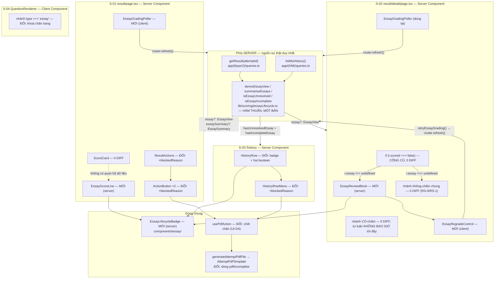
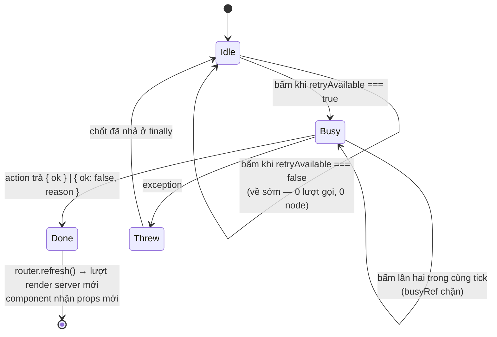
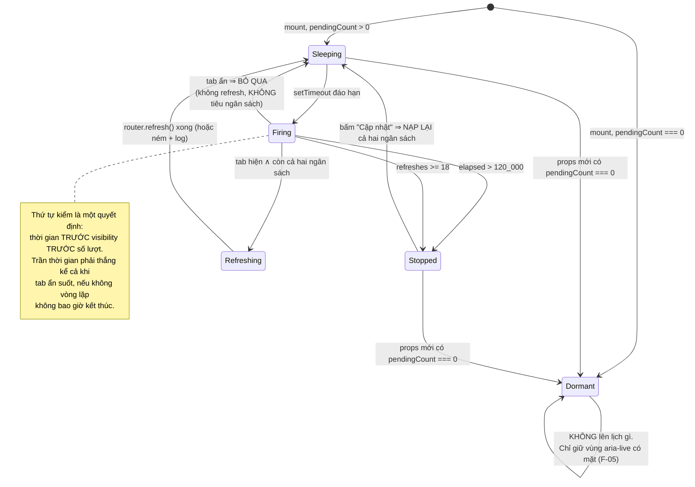
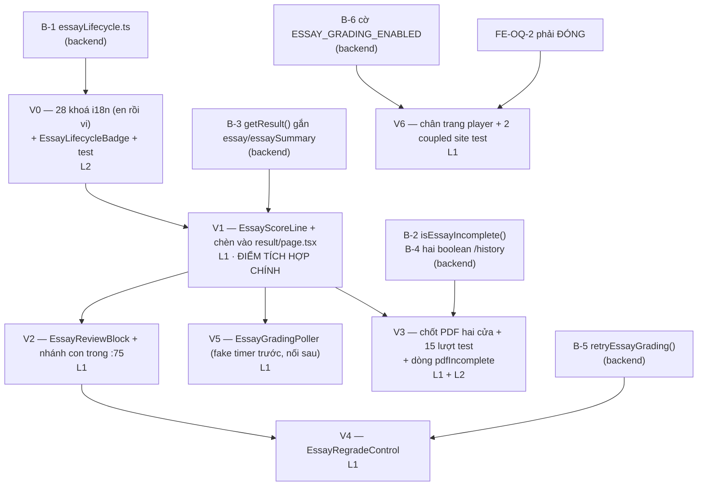

# Essay (Tự luận) Auto-Scoring — Frontend Design Document

| | |
|---|---|
| **Version** | 1.0 |
| **Date** | 2026-08-28 |
| **Status** | Draft — hiện thực hoá lát cắt hiển thị mà `docs/ui-spec/essay-auto-scoring-ui-spec.md` v1.1 đặc tả, tiêu thụ các hợp đồng do `docs/design/essay-auto-scoring-backend-design.md` v1.0 chốt. |
| **PRD** | `docs/prd/essay-auto-scoring-prd.md` v1.2 (AC-001–AC-072) |
| **ADR** | `docs/adr/ADR-0018-essay-async-grade-write.md` (Proposed, Decision 1–6, Amendment to ADR-0010, cả hai Escalation đã giải) |
| **UI Spec** | `docs/ui-spec/essay-auto-scoring-ui-spec.md` v1.1 — nguồn chuẩn của cấu trúc component, máy trạng thái render RS-0…RS-6, 29 chuỗi hiển thị, hằng polling và yêu cầu a11y. Tài liệu này **kế thừa nguyên vẹn** 13 quyết định UI-D1…UI-D13 và **không mở lại** cái nào. |
| **Backend Design** | `docs/design/essay-auto-scoring-backend-design.md` v1.0 — nguồn chuẩn của năm khoá jsonb, `EssayView`, `EssaySummary`, hạn chờ suy-lúc-đọc và chữ ký Server Action. Tài liệu này **tiêu thụ**, không thiết kế lại. |
| **Tiền lệ về cấu trúc** | `docs/design/short-answer-scoring-frontend-design.md` (cùng bài toán, lát cắt hiển thị), `docs/design/history-frontend-design.md` (bề mặt `/history`, `ActionButton`, đường ống PDF) |
| **Nhánh** | `design/adr-0018-essay-async-grade-write` |
| **Kiểm lại mã trong phiên viết** | **Mọi** số dòng trích trong tài liệu này được đọc lại từ file thật trong phiên viết — kể cả những số đã có ở UI Spec và ở backend Design Doc. Bốn trường hợp lệch được ghi ở § Fact Disposition Table. |

## Overview

Tài liệu này biến UI Spec thành một bề mặt frontend hiện thực được: **năm component mới** (`EssayLifecycleBadge`, `EssayScoreLine`, `EssayReviewBlock`, `EssayRegradeControl`, `EssayGradingPoller`), **mười hai file sản phẩm sửa** (`usePdfAction`, `ActionButton`, `HistoryRowMenu`, `HistoryRow`, `ResultActions`, `QuestionRenderer`, `ExamPlayer`, `AttemptPdfTemplate`, `generateAttemptPdf`, cộng ba `page.tsx` — xem § Implementation Path Mapping), **hai từ điển i18n**, **ba file test đang xanh phải sửa cùng commit**, và một **vòng lặp làm mới dựng trên `router.refresh()`** — mã hoàn toàn mới, không có tiền lệ polling nào trong `(layer2)`.

Bảng chuỗi hiển thị giữ đúng **29 khoá** như UI Spec chốt: **28 khoá mới** cộng `player.essayNotScored` **giữ nguyên văn**; hai nhánh từ chối còn lại **tái dùng** hai khoá đã có ở cả hai ngôn ngữ thay vì cấp khoá mới (§ Internationalisation).

Tính năng **ship ở trạng thái tắt** cho tới khi cổng AC-067 (Zero Data Retention của Groq) được kỹ sư xác nhận bằng một dated console check. Trong toàn bộ cửa sổ đó, bốn bề mặt render **y như hôm nay** — và § Feature-Off Window mô tả từng bề mặt một, vì "không làm gì" cũng là một hành vi phải đặc tả được thì mới kiểm được.

**Ranh giới không thuộc tài liệu này**, ghi ra để biên không bị đọc lệch: prompt/rubric và mọi thứ chạm mạng Groq, hai hàm SQL đặc quyền, `computeScore()`, cờ tính năng phía server, và toàn bộ đường ghi — tất cả thuộc backend Design Doc. Tài liệu này bắt đầu từ chỗ `getResult()` và `listMyHistory()` trả về dữ liệu, và kết thúc ở pixel.

### Referenced UI Spec

- UI Spec path: `docs/ui-spec/essay-auto-scoring-ui-spec.md` (v1.1)
- Kế thừa **nguyên văn**: cây component, bảng trạng thái render RS-0…RS-6, State × Display Matrix của từng component, bảng Interaction Definition, Copy Inventory 29 chuỗi, bốn hằng polling, bảng token, và toàn bộ § Accessibility Requirements.
- Tài liệu này **thêm vào**: cách hiện thực từng quyết định đó trên mã đang chạy (chữ ký props chính xác, vị trí chèn trong file, thứ tự trong handler, ranh giới server/client), việc **thay mọi chỗ giữ `<lifecycle>`/`<earned>`/`<max>`/`<lowConfidence>` bằng literal** mà backend Design Doc đã chốt, và bảy khác biệt tìm được khi đối chiếu UI Spec với mã thật (§ Fact Disposition Table).

## Design Summary (Meta)

```yaml
design_type: "extension"
risk_level: "medium"
complexity_level: "medium"
complexity_rationale: >
  (1) EssayGradingPoller là một vòng lặp hẹn giờ tự chạy với HAI trần độc lập,
      một quy tắc bỏ tick theo visibility, một ngân sách nạp lại được, và một
      vùng aria-live phải đọc lên đúng MỘT lần cho mỗi lượt giải quyết — không
      có component nào trong (layer2) làm việc này trước đây (đã kiểm bằng grep
      toàn repo: 0 lượt router.refresh(), 0 lượt visibilityState trong (layer2));
  (2) chốt chặn PDF đáp xuống MỘT hook dùng chung phục vụ HAI entry point trên
      HAI route group, và một trong hai file test của nó nhạy thời gian;
  (3) ba trạng thái render (RS-4, RS-5, RS-6) phải phân biệt được bằng ĐÚNG một
      boolean `retryAvailable` vì hợp đồng cố ý không mang số lượt;
  (4) mọi nhánh phải rẽ trên `essayState` chứ không trên `scored`/`isCorrect`,
      trong khi hai trường đó vẫn nằm ngay cạnh trong cùng một object.
main_constraints:
  - "Trong phạm vi: bốn màn hình S-01…S-04 + tệp PDF. Ngoài phạm vi: nhánh CÓ-chấm của result/detail/page.tsx (giữ TBD-02 hoãn), mọi bề mặt (layer4), ScoreCard.tsx (0 diff)."
  - "MỌI nhánh render rẽ trên essayState (qua EssayView.state), KHÔNG BAO GIỜ trên scored hay isCorrect — hai trường đó là false VĨNH VIỄN cho một câu tự luận đã chấm xong."
  - "KHÔNG BAO GIỜ khai thuộc tính `disabled` gốc, ở mọi trạng thái, trên mọi control của tính năng này (UI-D5, ba tiền lệ đã ship)."
  - "Chỉ token từ SOURCE/app/globals.css. Không hex cứng, không box-shadow, không gradient. KHÔNG token mới nào được thêm."
  - "Client KHÔNG BAO GIỜ nhận, tính, hay suy ra một con số lượt chấm còn lại — EssayView không có trường nào mang nó (UI-D9/AC-044)."
  - "Cận polling (18 lượt / 120 giây) KHÔNG PHẢI hạn chờ đọc-lúc-render (10 phút) và không được suy ra từ nhau (AC-061)."
  - "Toàn bộ 29 chuỗi là hằng i18n do ứng dụng sở hữu, khai ở CẢ HAI en.ts và vi.ts. Không một chuỗi nào do model sinh ra (AC-044/AC-047)."
biggest_risks:
  - "Một nhánh render vô tình đọc `r.scored === false` hoặc `r.isCorrect` sẽ in 'Chưa chấm tự động' cạnh một con điểm (AC-053) và không có test nào hiện có bắt được — giảm nhẹ bằng CẤU TRÚC PROPS (§ Hard Rule) chứ không bằng kỷ luật."
  - "Poller unmount trước khi kịp đọc lên câu 'đã chấm xong toàn bộ' nếu điều kiện mount là `pendingCount > 0` như UI Spec viết — đây là một lỗ thật, đã sửa ở § EssayGradingPoller (F-05)."
  - "PDF xuất từ /history KHÔNG biết được có câu nào ở RS-6 hay không, vì MyHistoryEntry chỉ mang một boolean 'chưa giải quyết' — O-8 không thoả được ở entry point đó nếu không thêm một boolean thứ hai (F-06, FE-OQ-1)."
  - "HistoryRowMenu.test.tsx nhạy thời gian (dùng waitFor, không dùng fake timer) và đã flaky MỘT LẦN dưới tải song song; một lượt đỏ đơn lẻ ở file này không tự nó chứng minh có defect."
unknowns:
  - "FE-OQ-1: MyHistoryEntry cần boolean THỨ HAI (hasIncompleteEssay) để O-8 thoả trên /history — cần một sửa đổi một dòng ở hợp đồng của backend Design Doc."
  - "FE-OQ-2 — ĐÃ ĐÓNG 2026-08-29 (kỹ sư): giữ HAI khoá + cờ server-only truyền xuống bằng prop tuỳ chọn, tức phương án (a), đúng mặc định của tài liệu này. Lý do được chốt cùng: (b) nhỏ hơn ở mọi cột đo được nhưng giao tính đúng đắn câu chữ cho thứ tự commit, và C-F6 (một kỹ sư, không staging) là chính lý do thứ tự đó không đáng cược."
  - "FE-OQ-3: chi phí payload của per_question trong listMyHistory() chưa đo (kế thừa UI Spec O-3 → backend OQ-3)."
```

## Background and Context

### Prerequisite ADRs

- **ADR-0018** (Proposed) — *Essay async grade write.* Tài liệu này đứng ở phía **đọc** của nó. Ba hệ quả trực tiếp lên frontend: (1) Decision 4 tiêu lượt chấm ở thời điểm **claim**, nên một con số lượt hiển thị ra sẽ tụt mà học sinh không bấm gì — đây là lý do cơ học của UI-D9; (2) Decision 3 (first-write-wins) làm cho "đã có điểm rồi" là một **giá trị trả về bình thường** của lượt chấm lại, không phải một lỗi (AC-063); (3) Decision 1 đặt mọi cưỡng chế ở SQL, nên UI **không được** coi việc ẩn nút là cơ chế cưỡng chế.
- **ADR-0010** (Amended bởi ADR-0018) — ranh giới ghi điểm. Ràng buộc còn hiệu lực với frontend: client **không bao giờ** vá điểm cục bộ; mọi lượt cập nhật đi qua một lượt render server (`router.refresh()`).
- **ADR-0009** (Accepted) — PDF: jsPDF + html2canvas, nạp động **chỉ** bên trong handler; `AttemptPdfTemplate` chỉ được dùng **hex/rgb literal**, không Tailwind class, không `components/ui/button.tsx`. Dòng `result.essay.pdfIncomplete` mới **chịu nguyên ràng buộc này**.
- **ADR-0002** — sanitize nội dung UGC khi render. Áp dụng ngược ở đây: **bài làm của học sinh KHÔNG đi qua `RichText`** (nó đã là chữ thuần trong nhánh không-chấm hôm nay — `result/detail/page.tsx:120`), và tính năng này không mở một đường render markdown mới cho văn bản do học sinh viết.

### Common ADR Process

Đã tìm: `docs/adr/ADR-COMMON-*` **không tồn tại** (kiểm bằng `ls docs/adr/` — 18 file, đánh số ADR-0001…ADR-0018, không file nào mang tiền tố `ADR-COMMON`). Các quyết định kỹ thuật dùng chung mà tính năng này dựa vào (pattern `aria-disabled`, quy ước typed-result của Server Action, quy ước `router.refresh()` thay vì vá cục bộ) đều đã được ghi thành văn **bên trong ba file mã đang chạy** (`ActionButton.tsx`, `ExplainStepAffordance.tsx`, `RecheckOrderControl.tsx`) và được tài liệu này trích dẫn đích danh. Không tạo ADR chung mới: cả ba pattern đã có ba lần áp dụng và một chỗ khai thành văn — nâng chúng lên ADR bây giờ là thêm một bản sao thứ tư của cùng một lời khai, chứ không phải thêm một sự cưỡng chế.

### Prior-Layer Verification Review

Không có input `Prior-Layer Verification` nào được truyền vào phiên này. `docs/design/essay-auto-scoring-backend-design.md` được dùng làm **tài liệu tham chiếu**, không phải làm bằng chứng đã-được-kiểm: mọi số dòng và mọi khẳng định về mã mà tài liệu này dựa vào đều được đọc lại từ file thật trong phiên viết (§ Existing Codebase Analysis, § Code Inspection Evidence). Bốn khác biệt tìm được so với tài liệu upstream được ghi thành F-01…F-04.

### External Resources Used

Sự thật mức dự án nằm ở `docs/project-context/external-resources.md`. Môi trường **không đổi** cho lát cắt frontend này (không thêm design tool, không thêm môi trường xác minh thị giác, không thêm phụ thuộc ngoài), nên không chạy lại hearing. Tập con đặc thù, thừa kế bảng của UI Spec và mở rộng bằng những gì riêng Design Doc cần:

| Resource (project-tier label) | Feature-specific identifier | Notes |
|---|---|---|
| Design Origin | `SOURCE/app/globals.css` — khối `:root` (`--background:74`, `--foreground:75`, `--card:76`, `--brand:79`, `--muted-foreground:96`, `--accent:97`, `--destructive:99`, `--border:102`, `--ring:109`, `--radius:115`), khối "Tương phản hình học" (~:148–157), `.eyebrow` (`:285-287`), `scroll-padding-top` (`:268`) | **Không token mới nào được thêm.** Không có `--success`, không có `--warning` — đã kiểm bằng grep, 0 lượt khớp. Xem § Theme Token Map và UI Spec O-4 |
| Design System | `SOURCE/components/billing/OrderStatusBadge.tsx` (cấu trúc badge), `SOURCE/components/ui/button.tsx` (**`shape="pill"` ở `:46`** — xem F-02), `SOURCE/components/history/{ActionButton,HistoryRowMenu,usePdfAction}`, `SOURCE/app/(layer2)/_components/{ScoreCard,ResultActions,ExamTimer,QuestionRenderer}.tsx`, `SOURCE/components/billing/RecheckOrderControl.tsx`, `SOURCE/components/tutor/ExplainStepAffordance.tsx` | Ba idiom a11y và cấu trúc badge đều **tái dùng**, không phát minh lại |
| Guidelines | `SOURCE/app/globals.css` (quy tắc cứng: chỉ token, không hex cứng, không box-shadow, không gradient) + `.claude/MEMORY.md` §3 | Nơi hai nguồn mâu thuẫn, **globals.css thắng** (UI-D2) |
| API schema source | `docs/design/essay-auto-scoring-backend-design.md` § Hợp đồng khoá jsonb, § Data Contracts, § Field Propagation Map | Nguồn chuẩn của `EssayView`, `EssaySummary`, `retryEssayGrading()` và năm khoá `essay*` |
| Visual Verification Environment | Route `/exams/[id]/attempt/[attemptId]/result`, `…/result/detail`, `/history`, `/exams/[id]/attempt/[attemptId]`; `npm run dev` + Playwright MCP (`playwright`) | Cần một lượt thi **đã nộp** có ≥1 câu `essay` **có `essay_answer`**; production có **0** bài tự luận đã nộp (đo 2026-08-27), nên mọi kiểm tra thị giác chạy trên dev với dữ liệu gieo sẵn |
| Test runner | `SOURCE/vitest.config.ts` (làn CI: `lib/**`, `components/**`, `app/**` với `*.test.{ts,tsx}`, environment `node` mặc định), `SOURCE/vitest.integration.config.ts` (làn chạy tay, `tests/integration/**`, cần Supabase dev thật) | Test component khai `// @vitest-environment jsdom` ở docblock đầu file |

### Agreement Checklist

#### Scope

- **S-01 Result Summary** (`SOURCE/app/(layer2)/exams/[id]/attempt/[attemptId]/result/page.tsx`): chèn `EssayScoreLine` giữa `ScoreCard` và khối "Nộp sau giờ"; truyền `blockedReason` + `essayIncomplete` xuống `ResultActions`; mount `EssayGradingPoller`.
- **S-02 Result Detail** (`…/result/detail/page.tsx`): thêm một **nhánh con tự luận bên trong** nhánh `notScored` sẵn có (`:75`); mount `EssayGradingPoller`.
- **S-03 History** (`SOURCE/app/(HM)/history/_components/HistoryRow.tsx`): thêm badge "Đang chấm" cuối dòng meta; truyền `blockedReason` + `essayIncomplete` xuống `HistoryRowMenu`.
- **S-04 Exam Player** (`SOURCE/app/(layer2)/_components/QuestionRenderer.tsx`): đổi khoá chân trang ô tự luận theo cờ AC-067. Trần ký tự **tự di chuyển** theo hằng (F-03) — file này không sửa gì cho trần.
- **Đường ống PDF**: chốt chặn ở `SOURCE/components/history/usePdfAction.ts`; hai entry point (`ActionButton`, `HistoryRowMenu`) nhận prop mới; `AttemptPdfTemplate` nhận dòng `result.essay.pdfIncomplete`.
- **i18n**: 29 chuỗi ở `SOURCE/lib/i18n/dictionaries/en.ts` và `vi.ts`.
- **Năm component mới** ở `SOURCE/components/essay/` và `SOURCE/app/(layer2)/_components/`.

#### Non-Scope (nói rõ là KHÔNG đổi)

- **`SOURCE/app/(layer2)/_components/ScoreCard.tsx` — 0 diff.** Không prop mới, không dòng render nào đổi. `result.totalScore.toFixed(1)` (`:29`), ô `Đúng` = `result.correct` (`:40`), ô `Sai` = `result.total - result.correct` (`:19`, `:44`) giữ **đúng cơ sở tính hôm nay**; dẫn xuất `wrong = total − correct` vì thế **vẫn hợp lệ** (AC-057). Bất kỳ diff nào trong file này là **hồi quy**.
- **Nhánh CÓ-chấm của `result/detail/page.tsx`** (`:133` trở đi) — không đụng. TBD-02 (`true_false` render danh sách lựa chọn rỗng) giữ nguyên trạng thái hoãn có chủ đích (UI Spec O-7, xác nhận lại ở F-07).
- **Chip Đúng/Sai/Bỏ trống** (`:133-137`) — không bao giờ render cho tự luận, và không sửa một ký tự nào.
- **`ExplainStepAffordance`** — không mount cho tự luận ở bất kỳ trạng thái nào (AC-016). Nhánh không-chấm hiện tại vốn đã không mount nó (`:75-128` không có lượt gọi nào); giữ nguyên.
- **`TutorQuotaNote`** — chỉ có ở nhánh CÓ-chấm (`:180`, `:234`); không kéo sang nhánh tự luận.
- **`RichText`** — 0 đổi; **bài làm của học sinh không đi qua nó**.
- **`SOURCE/lib/pdf/generateAttemptPdf.ts`** — hợp đồng `AttemptPdfData` mở rộng, thân hàm chỉ chuyển tiếp hai trường mới xuống template; đường ống nạp động không đổi.
- **`ExamPlayer.tsx`** — chỉ nhận thêm **một prop tuỳ chọn** và chuyển tiếp; state, handler, layout không đổi.
- **Mọi bề mặt `(layer4)`** — chuỗi `upload.essayStored` (`vi.ts:271`, `en.ts:334`) nói với **tác giả đề** rằng tự luận chưa chấm tự động; nó trở thành sai khi cổng AC-067 qua, nhưng không thuộc bốn màn hình của UI Spec. Backend OQ-5 giữ quyền quyết định.
- **Mọi thứ thuộc đường ghi** — `computeScore()`, `submitExam()`, hai hàm SQL, `lib/essay/*`, cờ tính năng, `checkEnv.ts`.

#### Constraints

| # | Ràng buộc | Nguồn | Phản ánh ở đâu trong thiết kế |
|---|---|---|---|
| C-F1 | Trình duyệt: 2 phiên bản mới nhất Chrome/Firefox/Safari/Edge | NFR toàn dự án | Không API mới nào ngoài `document.visibilityState` và `setTimeout` |
| C-F2 | Thiết bị mục tiêu: Android tầm trung, mạng không ổn định | PRD | § EssayGradingPoller — nhịp hai pha, hai trần, bỏ tick khi tab ẩn |
| C-F3 | WCAG 2.1 AA; không có công cụ kiểm toán a11y tự động trong repo | UI Spec § Accessibility | § Accessibility — mọi mục phát biểu thành assertion RTL theo **role**, cộng một lượt rà thủ công |
| C-F4 | Một theme duy nhất ở `:root`, không toggle sáng/tối | `globals.css` | § Theme Token Map |
| C-F5 | Không hex cứng, không box-shadow, không gradient | `globals.css` (quy tắc cứng) | § Theme Token Map — **ngoại lệ duy nhất** là `AttemptPdfTemplate`, nơi ADR-0009 **bắt buộc** hex literal |
| C-F6 | Một kỹ sư, không staging, không hạ tầng feature flag | PRD C5 | § Implementation Approach — lát dọc, mỗi lát tự kiểm được; FE-OQ-2 không giao tính đúng đắn của câu chữ cho lịch trình |
| C-F7 | CI không có database | `vitest.integration.config.ts` khối đầu file | § Test Boundaries — làn `npm test` chỉ RTL + hàm thuần; làn integration chạy tay |

#### Confirm reflection in design

- [x] **Scope → thiết kế**: mỗi mục Scope có một tiểu mục § Main Components tương ứng, kèm đường dẫn file chính xác và trạng thái New/Changed.
- [x] **Non-Scope → thiết kế**: `ScoreCard` có hẳn một tiểu mục "0 diff" để code-verifier có một khẳng định đối chiếu; nhánh có-chấm và `(layer4)` được nêu đích danh ở § Change Impact Map, mục *No Ripple Effect*.
- [x] **Constraints → thiết kế**: bảng trên tự trỏ tới nơi phản ánh. C-F5 có **một ngoại lệ được nêu tên** (`AttemptPdfTemplate`) chứ không bị bỏ qua im lặng.
- [x] **Không quyết định nào mâu thuẫn với thoả thuận**: ba chỗ tài liệu này **đi khác** UI Spec đều là hệ quả của một sự thật trong mã hoặc một hợp đồng backend, và cả ba được ghi thành F-02, F-05, F-06 kèm lý do — chứ không sửa lặng lẽ.

#### Assumed Behaviors

Mỗi khẳng định về hành vi mà thiết kế này dựa vào, kèm **một** nguồn bằng chứng. Cái nào không xác minh được thì `Confirmed: No` và có một dòng tương ứng ở § Risks and Mitigation.

| # | Khẳng định | Bằng chứng | Confirmed |
|---|---|---|---|
| AB-1 | Một Server Component **async** render được bên trong một Server Component khác, và cây lồng async chạy đúng trong production | `SOURCE/app/(billing)/me/orders/_components/OrderList.tsx:26` (`export async function OrderList`) render `<OrderRow>` ở `:50`, mà `OrderRow` là `export async function` ở `OrderRow.tsx:65` — cặp này đã ship | **Yes** |
| AB-2 | RTL's `render(await Component(props))` **thất bại** khi component được await có **con async** — React 19 client renderer từ chối và trả về cây RỖNG | `SOURCE/app/(billing)/me/orders/__tests__/renderServerTree.tsx:1-20` ghi nguyên văn sự cố (*"<OrderRow> is an async Client Component"*, *"hands back an EMPTY tree"*); helper `renderToReadableStream` tồn tại **vì** lý do đó | **Yes** |
| AB-3 | `render(await Component(props))` **chạy được** khi component không có con async | `SOURCE/app/(layer3)/_components/SkillRecommendationCard.test.tsx:9-16` — kỹ thuật được ghi rõ là đã probe trên ca tối thiểu dưới React 19 / RTL 16 / vitest 4 / jsdom | **Yes** |
| AB-4 | `router.refresh()` là **cơ chế duy nhất** phía client chạm tới được một Server Component đang render | `SOURCE/components/billing/RecheckOrderControl.tsx:27-31` — khối lý do viết sẵn, và `:173` là lượt gọi đã ship; hai trang kết quả (`result/page.tsx:34`, `result/detail/page.tsx:27`) đều là Server Component gọi `getResult()` | **Yes** |
| AB-5 | `router.refresh()` **không** unmount cây và **không** dời tiêu điểm khi key phần tử giữ nguyên | Suy ra từ cấu trúc: danh sách dùng `key={r.questionId}` (`result/detail/page.tsx:85`, `:145`), và UI-D5 cấm gỡ control khỏi cây. **Chưa có lượt đo trực tiếp trong repo** cho đúng cặp (refresh + focus). | **No** → R-F3 |
| AB-6 | `setInterval` **dồn tick** khi tab chạy nền, `setTimeout` chuỗi thì không | `SOURCE/app/(layer2)/_components/ExamTimer.tsx:1-5` ghi thẳng lý do chọn `setTimeout` (*"Đếm bằng setTimeout từng giây để tránh dồn tick khi tab nền"*) | **Yes** |
| AB-7 | Một vùng `aria-live="polite"` **rỗng từ lượt render đầu** rồi **chèn chữ vào** thì **được đọc lên**; một vùng chèn sẵn chữ thì có thể không | `ExamTimer.tsx:69-76` (vùng polite rỗng, chèn ở mốc — đã ship); mặt trái ghi ở `RecheckOrderControl.tsx:22-26` trích phát hiện từ `SuccessToast.tsx` | **Yes** |
| AB-8 | `aria-disabled` **không** chặn sự kiện click DOM; chốt thật phải là một `ref` đồng bộ | `SOURCE/components/tutor/useTutorAction.ts:26-31` (*"cú nhấp thứ hai trong cùng một tick sẽ lọt qua"*); `usePdfAction.ts:43`; `RecheckOrderControl.tsx:13-18` | **Yes** |
| AB-9 | Thuộc tính `disabled` gốc làm nút **rơi khỏi thứ tự tab** — bug đã phải sửa **hai lần** trong repo này | `ExplainStepAffordance.tsx:11-14` nêu đích danh *"RateButton rồi ActionButton"*; `ActionButton.tsx:9-14`; `RecheckOrderControl.tsx:35-38` | **Yes** |
| AB-10 | Một module `"use client"` được import **tĩnh** bởi một Server Component nằm trong bundle client của route **bất kể có mount hay không** | Hành vi build-time của Next.js App Router. **Không xác minh được bằng một lượt đo trong repo trong phiên này** — repo không có script đo bundle theo route (`package.json` chỉ có `check:bundle` cho AI key, và `verify:deployed` cho asset). | **No** → R-F5, và là lý do § EssayGradingPoller **phát biểu lại** lời hứa "0 byte JS" của UI Spec thành một lời hứa kiểm được |
| AB-11 | `getTranslate()` đọc ngôn ngữ từ **cookie phía server**, nên chuỗi render ở server không cũ đi so với chuỗi render ở client | `SOURCE/lib/i18n/server.ts` + `ScoreCard.tsx:18` (`const t = await getTranslate()`) đã ship trên chính trang kết quả này | **Yes** |
| AB-12 | Kiểu `Dictionary` ép phủ đủ bộ khoá — thiếu một khoá ở `vi.ts` là **lỗi biên dịch** | `SOURCE/lib/i18n/dictionaries/vi.ts:1-10` (`export const vi: Dictionary`, comment nói thẳng); `Dictionary` suy từ `en.ts` (`lib/i18n/translate.ts:4`) | **Yes** |
| AB-13 | `t()` trả **chính khoá** khi khoá vắng mặt lúc chạy, thay vì chuỗi rỗng | `SOURCE/lib/i18n/translate.ts:22-24` | **Yes** |

#### Applicable Standards

| Standard | Loại | Nguồn | Áp dụng ở đâu |
|---|---|---|---|
| Không `disabled` gốc; `aria-disabled` chuỗi + `aria-busy` boolean + `aria-describedby` → ô `sr-only` + chốt `ref` đồng bộ | **explicit** | `ActionButton.tsx:9-14`, `ExplainStepAffordance.tsx:11-14`, `RecheckOrderControl.tsx:35-38` (ba lần khai thành văn) | `EssayRegradeControl`, `ActionButton`, `HistoryRowMenu` |
| Lý do từ chối khai bằng `Record<…>` chứ không `switch` có `default` | **explicit** | `RecheckOrderControl.tsx:81-98` (comment giải thích chính mục đích) | `EssayRegradeControl` § REFUSAL_KEY |
| `router.refresh()`, **không** vá state cục bộ, sau mọi lượt ghi | **explicit** | `RecheckOrderControl.tsx:27-31` | `EssayRegradeControl` bước 6, `EssayGradingPoller` |
| Server Action typed-result, **không** throw, **không** redirect | **explicit** | `SOURCE/app/(layer2)/tutorActions.ts:8-12` | `retryEssayGrading()` (backend sở hữu); frontend chỉ tiêu thụ |
| `console.error` chỉ với `digest` ở biên Server Action | **explicit** | `RecheckOrderControl.tsx:174-187` (nêu rõ vì sao **không** log `err`) | `EssayRegradeControl` catch |
| Chỉ token, không hex cứng, không box-shadow, không gradient | **explicit** | `SOURCE/app/globals.css`; `OrderStatusBadge.tsx:12-18` nêu đích danh khuyết tật của tiền lệ | Mọi component mới |
| Badge = `<span>` viên thuốc + glyph `aria-hidden` + **chữ** làm tên khả truy cập | **explicit** | `OrderStatusBadge.tsx:7-10`, `:86-93` | `EssayLifecycleBadge` |
| Giá trị lạ có **diện mạo riêng**, không `??` về một giá trị thật, không `as` | **explicit** | `OrderStatusBadge.tsx:19-24`, `:68-75` | `deriveEssayView()` trả `null` (backend) → RS-0 |
| `tabular-nums` cho mọi chỗ hiện số | **implicit** (quan sát: `ScoreCard.tsx:28`, `:40`, `:44`, `:48`; `ExamTimer.tsx:54`; `result/detail/page.tsx:60`) | — | `EssayScoreLine`, `EssayReviewBlock` |
| `min-h-11` cho vùng chạm của nút hành động | **implicit** (quan sát: `RecheckOrderControl.tsx:199`) | — | `EssayRegradeControl` |
| Test component khai `// @vitest-environment jsdom` ở docblock đầu file | **explicit** | `vitest.config.ts:4-5` | Mọi test mới |
| Component dùng bởi nhiều route group sống ở `SOURCE/components/<domain>/` | **implicit** (quan sát: `components/history/`, `components/billing/`, `components/tutor/`) | — | `components/essay/EssayLifecycleBadge.tsx` |

**Hai standard `implicit` cần kỹ sư xác nhận trước khi code**: `tabular-nums` và `min-h-11`. Cả hai là quan sát từ mã đang chạy chứ không phải quy tắc viết thành văn; tài liệu này theo chúng vì lý do nêu tại chỗ (mẫu số **lớn dần trong lúc học sinh đang nhìn**, nên chữ số phải đều bề rộng), nhưng nếu kỹ sư bác thì đó là hai class, không phải một thay đổi thiết kế.

#### Quality Assurance Mechanisms

| Cơ chế | Lệnh / cấu hình | Trạng thái | Ghi chú |
|---|---|---|---|
| Type check | `npx tsc --noEmit` (không có script `typecheck` trong `package.json` — đã kiểm) | **adopted** | Đây là thứ cưỡng chế AC-071 (union đóng của `TutorPromptInput`), AB-12 (phủ đủ khoá i18n), và `switch` vét cạn trên `EssayRenderState` |
| Lint | `npm run lint` (`eslint --max-warnings 0`) | **adopted** | `react-hooks/refs` và `react-hooks/set-state-in-effect` là hai luật đã ép `ExamTimer` dùng `useEffectEvent` và ép `HistoryRowMenu` dùng "adjust state during render" — cả hai áp thẳng vào `EssayGradingPoller` |
| Unit + component test | `npm test` (`vitest run`) | **adopted** | Làn CI. Bao gồm mọi test mới của tính năng này |
| Integration test (DB thật) | `npm run test:integration` | **noted** | Cần Supabase dev thật; **không** thuộc cổng CI (`vitest.integration.config.ts:4-9`). Lát cắt frontend không thêm ca nào vào làn này — mọi ca cần DB thuộc backend |
| Build | `npm run build` | **adopted** | Bắt lỗi biên server/client (vd một lượt import `server-only` lọt vào cây client) |
| Schema gate | `npm run verify:schema` | **noted** | Backend sở hữu; frontend không thêm assertion nào |
| Bundle guard | `npm run check:bundle` | **noted** | Chỉ soát AI key trong bundle; **không** đo kích thước bundle theo route, nên nó **không** kiểm được lời hứa "0 byte JS" của UI Spec (AB-10) |
| Kiểm toán a11y tự động | *(không tồn tại)* | **noted** | Repo **không có** axe, không có Lighthouse CI. Đây là lý do § Accessibility phát biểu mọi mục thành assertion RTL theo role cộng một lượt rà thủ công bằng trình đọc màn hình |
| Kiểm thị giác | `npm run dev` + Playwright MCP (`playwright`), hoặc `npm run pw` | **adopted** | Mười Golden State của UI Spec; cần dữ liệu gieo sẵn vì production có 0 bài tự luận đã nộp |

### Problem to Solve

Backend sắp bắt đầu ghi band tự luận vào `exam_results.per_question`. Nếu không có lát cắt này thì band **được ghi mà không ai nhìn thấy**: bốn bề mặt hiển thị hiện tại đều rẽ nhánh trên `scored`/`isCorrect`, mà một câu tự luận **đã chấm xong** vẫn mang `scored:false` và `isCorrect:false` **vĩnh viễn** — nên mọi bề mặt sẽ in "Chưa chấm tự động" cạnh một con điểm vừa được chấm.

### Current Challenges

1. **Hai trường phân biệt sai.** `r.scored === false` đúng với tự luận ở **cả sáu** trạng thái render; `r.isCorrect === false` cũng vậy. Không cái nào phân biệt được gì, mà cả hai đều nằm ngay trong object mà mọi nhánh render đang cầm.
2. **Trang kết quả là Server Component.** Không có đường nào để client kéo dữ liệu mới về mà không thêm một route (AC-022 cấm) hoặc dựng một nguồn sự thật thứ hai cho band.
3. **Không có tiền lệ polling.** Đã kiểm bằng grep toàn repo: `(layer2)` có **0** lượt `router.refresh()`, **0** lượt `visibilityState`, và `setInterval` duy nhất nằm ở `(layer1)/_components/HomeCarousel.tsx:88`.
4. **Đường ống PDF có hai cửa.** `ResultActions` → `ActionButton` và `HistoryRowMenu` đều đi qua `usePdfAction` → `generateAttemptPdfFile`. Chốt ở một cửa để nguyên cửa kia mở.
5. **`/history` không có dữ liệu để biết.** `MyHistoryEntry` (`app/(HM)/queries.ts:8-18`) có đúng chín trường, không có `per_question`, không có `created_at`.

### Requirements

#### Functional Requirements

- **FR-1** — Trang kết quả hiện điểm tự luận (earned/max) như một khối **riêng, có nhãn**, cạnh `ScoreCard` chứ không bên trong (AC-011, UI-D3).
- **FR-2** — Trang chi tiết hiện đúng một trong sáu trạng thái render cho mỗi câu tự luận, rẽ trên `essayState` (AC-053, UI-D1).
- **FR-3** — Trang tự cập nhật khi còn câu đang chấm, có cận riêng, dừng được, và làm mới thủ công được (AC-020/021/061).
- **FR-4** — Nút chấm lại chỉ mở từ trạng thái `failed`, thao tác được **chỉ bằng bàn phím**, và ở trần lượt thì **vẫn ở lại cây** kèm lý do đọc lên được (AC-025/028/063/064).
- **FR-5** — Xuất PDF bị chặn khi còn câu chưa giải quyết, ở **cả hai** entry point (AC-058, UI-D4).
- **FR-6** — Tệp PDF mang một dòng chú thích khi có **ít nhất một** câu ở RS-6 (UI Spec O-8).
- **FR-7** — `/history` hiện dấu "Đang chấm" và chặn PDF cho lượt thi còn câu chưa giải quyết (AC-057/058).
- **FR-8** — Chân trang ô nhập tự luận nói đúng sự thật ở **cả hai** giai đoạn bật/tắt (AC-051/067).
- **FR-9** — Khi tính năng tắt, bốn bề mặt render **byte-for-byte** như hôm nay (AC-012/067).

#### Non-Functional Requirements

- **NFR-1 (a11y)** — WCAG 2.1 AA; mọi trạng thái truyền đạt bằng **chữ**, màu chỉ là kênh phụ (AC-047); thay đổi không do người dùng gây ra được đọc lên qua vùng `polite` (AC-023); tiêu điểm không bị cướp/mất qua lượt tự làm mới.
- **NFR-2 (hiệu năng)** — Mỗi lượt `router.refresh()` là một RSC payload đầy đủ của trang kết quả; tổng số lượt bị chặn trần cứng ở **18**, tổng thời gian ở **120 giây**, và tick khi tab ẩn **không tiêu ngân sách**.
- **NFR-3 (theme)** — 0 token mới, 0 hex cứng ngoài `AttemptPdfTemplate` (nơi ADR-0009 bắt buộc), 0 box-shadow, 0 gradient.
- **NFR-4 (bundle)** — Không thêm phụ thuộc npm nào. Hai component client mới là mã thuần React + `next/navigation`.

## Acceptance Criteria (frontend subset, EARS)

Mỗi tiêu chí dưới đây là một điều kiện **quan sát được trên trình duyệt** và chuyển thẳng được thành một ca RTL. AC nào không có bề mặt frontend thì không xuất hiện ở đây (xem § AC Traceability để biết chúng đi đâu).

**Đường hạnh phúc**

- **FE-AC-01** — KHI một lượt thi có ≥1 phần tử `per_question` mang khoá `essayState`, trang kết quả **PHẢI** render khối `EssayScoreLine` ngay dưới `ScoreCard` và ngay trên khối "Nộp sau giờ". *(AC-011)*
- **FE-AC-02** — KHI mọi câu tự luận của lượt thi ở `graded`, `EssayScoreLine` **PHẢI** hiện `{earned} / {max} điểm` cộng câu `result.essay.denominator` nêu rõ mẫu số đếm **số câu đã chấm xong**. *(AC-059)*
- **FE-AC-03** — KHI một câu tự luận ở `graded`, thẻ câu đó trên trang chi tiết **PHẢI** hiện `EssayLifecycleBadge` với chữ "Đã chấm", điểm `{band} / 1 điểm`, bài làm của học sinh, và đáp án mẫu; và **PHẢI KHÔNG** hiện chuỗi `result.notAutoScored`. *(AC-053)*
- **FE-AC-04** — KHI một câu tự luận ở `graded` **và** `lowConfidence === true`, thẻ câu **PHẢI** hiện chuỗi "Cần xem lại" **dưới dạng chữ**, và **PHẢI KHÔNG** đổi bất kỳ con số nào so với cùng thẻ khi `lowConfidence === false`. *(AC-046/047)*
- **FE-AC-05** — KHI mọi câu tự luận đã giải quyết, cả hai nút Lưu và Chia sẻ (S-01) và cả hai mục PDF trong menu ⋯ (S-03) **PHẢI** mang `aria-disabled="false"` và một cú bấm **PHẢI** gọi `generateAttemptPdfFile` đúng một lần. *(AC-058)*

**Đường không hạnh phúc**

- **FE-AC-06** — KHI một câu tự luận ở `failed` **và** `retryAvailable === true`, thẻ câu **PHẢI** hiện badge "Chấm thất bại", câu `result.essay.failedBody`, ghi chú `result.essay.attemptsNote`, và một `<button>` mang tên khả truy cập "Chấm lại" **có thể nhận tiêu điểm**. *(AC-024/025/028)*
- **FE-AC-07** — KHI một câu tự luận ở `failed` **và** `retryAvailable === false`, nút "Chấm lại" **PHẢI vẫn có mặt trong cây**, **PHẢI** nhận được tiêu điểm, **PHẢI** mang `aria-disabled="true"`, và `aria-describedby` của nó **PHẢI** trỏ tới một phần tử chứa `result.essay.retryExhausted`. *(AC-064)*
- **FE-AC-08** — KHI nút "Chấm lại" ở trạng thái hết lượt bị bấm, **PHẢI KHÔNG** có lượt gọi `retryEssayGrading` nào, **PHẢI KHÔNG** có pha bận, và **PHẢI KHÔNG** có node `role="alert"` nào xuất hiện. *(AC-064)*
- **FE-AC-09** — KHI Server Action trả `{ ok: false, reason }`, thẻ câu **PHẢI** hiện đúng **một** node `role="alert"` mang đúng chuỗi ánh xạ từ `reason`, và hai `reason` khác nhau **PHẢI KHÔNG** dùng chung một chuỗi. *(AC-025/063)*
- **FE-AC-10** — KHI lượt thi còn ≥1 câu chưa giải quyết và học sinh bấm Lưu hoặc Chia sẻ, **PHẢI KHÔNG** có lượt gọi `generateAttemptPdfFile` nào, `phase` **PHẢI** ở nguyên `"idle"`, và **PHẢI KHÔNG** có node lỗi nào xuất hiện. *(AC-058)*
- **FE-AC-11** — KHI lượt thi còn ≥1 câu chưa giải quyết, cả hai nút PDF **PHẢI** vẫn nhận được tiêu điểm và tên khả truy cập của chúng **PHẢI** đi kèm chuỗi `result.essay.pdfBlocked` qua `aria-describedby`. *(AC-058, UI-D5)*
- **FE-AC-12** — KHI một lượt `router.refresh()` ném lỗi, poller **PHẢI** ghi log và **PHẢI** lên lịch tick kế tiếp; **PHẢI KHÔNG** có gì hiện ra cho học sinh.

**Ca biên**

- **FE-AC-13** — KHI một phần tử `per_question` **không** mang khoá `essayState` (row cũ, tính năng tắt, hoặc câu thiếu đáp án mẫu), thẻ câu **PHẢI** render **byte-for-byte** như trước thay đổi này: "Bạn trả lời:" / "Đáp án đã lưu:" / nhãn `result.notAutoScored`. *(AC-012/018)*
- **FE-AC-14** — KHI **không** phần tử nào của lượt thi mang khoá `essayState`, trang kết quả **PHẢI KHÔNG** chèn node mới nào: không `EssayScoreLine`, không poller đang chạy, không đổi `ScoreCard`. *(AC-012)*
- **FE-AC-15** — KHI mọi câu tự luận ở `failed`/exhausted và **không** câu nào ở `graded`, `EssayScoreLine` **PHẢI** hiện `—` chứ **PHẢI KHÔNG** hiện `0 / 0 điểm`. *(AC-015)*
- **FE-AC-16** — KHI số câu chưa giải quyết **giảm** giữa hai lượt render, vùng `aria-live="polite"` của poller **PHẢI** nhận đúng một câu; KHI số đó **không** giảm, vùng đó **PHẢI** rỗng. *(AC-023)*
- **FE-AC-17** — KHI poller chạm **18 lượt làm mới** hoặc **120 giây** trong lúc còn câu ở `pending`, nó **PHẢI** ngừng lên lịch và **PHẢI** hiện câu `result.essay.pollStopped` cộng một `<button>` "Cập nhật"; bấm nút đó **PHẢI** gọi `router.refresh()` một lần và nạp lại cả hai ngân sách. *(AC-021/061)*
- **FE-AC-18** — KHI một tick xảy ra lúc `document.visibilityState === "hidden"`, poller **PHẢI KHÔNG** gọi `router.refresh()` và **PHẢI KHÔNG** tiêu một lượt trong ngân sách 18; đồng hồ 120 giây **PHẢI** vẫn chạy.
- **FE-AC-19** — KHI tệp PDF được xuất cho một lượt thi có ≥1 câu ở RS-6, tệp **PHẢI** chứa chuỗi `result.essay.pdfIncomplete`; KHI không có câu nào ở RS-6, tệp **PHẢI KHÔNG** chứa chuỗi đó. *(O-8)*
- **FE-AC-20** — KHI cờ AC-067 **tắt**, chân trang ô nhập tự luận **PHẢI** giữ nguyên văn `player.essayNotScored`; KHI **bật**, nó **PHẢI** là `player.essayScored`. *(AC-051/067)*
- **FE-AC-21** — Ở **mọi** trạng thái của tính năng, **PHẢI KHÔNG** có phần tử nào trong cây tự luận mang thuộc tính `disabled`, và **PHẢI KHÔNG** có chuỗi hiển thị nào chứa một con số lượt chấm còn lại. *(UI-D5, UI-D9/AC-044)*

**Phi chức năng (kiểm bằng mắt / bằng lượt rà thủ công, không bằng CI)**

- **FE-NFR-01** — Lưới `grid-cols-3` của `result/page.tsx:104-116` giữ **đúng ba ô** ở mọi trạng thái chặn.
- **FE-NFR-02** — `HistoryRow` giữ **đúng một** node in-flow ở cột phải; badge đi vào cột trái, trong dòng meta, và được phép xuống dòng.
- **FE-NFR-03** — Không cặp màu mới nào được đưa vào, nên không cặp nào cần đo lại tương phản.

## Existing Codebase Analysis

### Bảng đối chiếu số dòng (mọi trích dẫn ở tài liệu upstream đã được đọc lại)

| Trích dẫn ở upstream | Nói là | Thực tế | Trạng thái |
|---|---|---|---|
| `result/detail/page.tsx` — `const notScored = r.scored === false` | `:73` | `:73` | **KHỚP** |
| `result/detail/page.tsx` — `{t("result.notAutoScored")}` | `:89` | `:89` | **KHỚP** |
| `result/detail/page.tsx` — `const status = r.isCorrect ? …` | `:133` | `:133-137` | **KHỚP** (biểu thức trải năm dòng) |
| `QuestionRenderer.tsx` — alias hằng trần ký tự | `:23` | `:23` | **KHỚP** |
| `QuestionRenderer.tsx` — `maxLength` / số học `charsLeft` | `:194` / `:202` | `:194` / `:202` | **KHỚP** |
| `QuestionRenderer.tsx` — comment "KHÔNG chấm tự động" | `:179` | `:179-180` | **KHỚP** (comment trải hai dòng) |
| `components/ui/button.tsx` — biến thể viên thuốc | *"biến thể `pill` dòng 46"* | **`:46` đúng, nhưng prop tên là `shape`, không phải `variant`** | **LỆCH tên prop** → F-02 |
| `app/(HM)/queries.ts` — `MyHistoryEntry` chín trường | `:8-18` | `:8-18` | **KHỚP** |
| `app/(HM)/queries.ts` — `EmbeddedRow` | `:23-34` | `:23-34` | **KHỚP** |
| `app/(layer2)/queries.ts` — `ResultRow` thiếu `created_at` | `:469-475` | `:469-475` | **KHỚP** |
| `app/(layer2)/queries.ts` — chuỗi select của `getResult()` | `:576-586` | `:577-579` là chuỗi `.select(...)`; khối `Promise.all` mở ở `:574` | **KHỚP một phần** — vùng đúng, biên khối lệch vài dòng |
| `app/(layer2)/queries.ts` — chỗ gắn trường suy-lúc-đọc | `:606-610` | `:606-610` (`row.per_question.map` gắn `hasBeenWrongTwice`) | **KHỚP** |
| `usePdfAction.ts` — `busyRef` chốt đồng bộ | `:43` | `:43` | **KHỚP** |
| `ActionButton.tsx` — `aria-disabled` / ô lý do `sr-only` | `:62` / `:95-97` | `:62` / `:95-97` | **KHỚP** |
| `HistoryRowMenu.tsx` — `MenuAction`, chữ in-flow trong mục | `:222` trở đi | `:222-268`; `<p role="alert">` ở `:257-261` | **KHỚP** |
| `ExamTimer.tsx` — chained `setTimeout` + `useEffectEvent` | `:31`, `:34-38` | `:31`, `:34-38` | **KHỚP** |
| `RecheckOrderControl.tsx` — bảy bước handler, `router.refresh()` | khối đầu file, `:173` | `:13-33`, `:173` | **KHỚP** |
| `OrderStatusBadge.tsx` — cấu trúc badge + nhánh thứ năm | `:55-64` (tiền lệ `StatusBadge`) | `:86-93` (badge), `:68-75` (nhánh lạ) | **KHỚP** |
| `globals.css` — không `--success`, không `--warning` | UI Spec O-4 | grep: **0 lượt khớp** cho cả hai | **KHỚP** |
| `vi.ts:139` — `player.essayNotScored` | `:139` | `:139` | **KHỚP** |
| `schema.sql:1354` — filter `scored` của `record_skill_mastery()` | backend DD | không đọc lại trong phiên này (thuộc backend) | **N/A** — frontend không dựa vào số dòng đó, chỉ dựa vào **hệ quả** (W1) |

### Implementation Path Mapping

| Type | Path | Description |
|---|---|---|
| **New** | `SOURCE/components/essay/EssayLifecycleBadge.tsx` | Server Component (async). Ba diện mạo vòng đời. Đặt ở `components/essay/` vì được dùng bởi **cả** `(layer2)` lẫn `(HM)` — đúng lý do `components/history/` và `components/billing/` đã tồn tại ngoài cây route |
| **New** | `SOURCE/app/(layer2)/_components/EssayScoreLine.tsx` | Server Component (async). Khối điểm tự luận, render ngay dưới `ScoreCard`. Ở `_components/` vì chỉ S-01 dùng |
| **New** | `SOURCE/app/(layer2)/_components/EssayReviewBlock.tsx` | Server Component (async). Nhánh con vòng đời **bên trong** nhánh `notScored` của S-02 |
| **New** | `SOURCE/app/(layer2)/_components/EssayRegradeControl.tsx` | `"use client"`. Nút chấm lại + máy trạng thái bảy bước |
| **New** | `SOURCE/app/(layer2)/_components/EssayGradingPoller.tsx` | `"use client"`. Vòng lặp `router.refresh()` + vùng `aria-live` + nút làm mới thủ công |
| **New** | `SOURCE/components/essay/__tests__/EssayLifecycleBadge.test.tsx` | RTL, jsdom |
| **New** | `SOURCE/app/(layer2)/_components/__tests__/EssayScoreLine.test.tsx` | RTL qua `renderServerTree()` (AB-2) |
| **New** | `SOURCE/app/(layer2)/_components/__tests__/EssayReviewBlock.test.tsx` | như trên |
| **New** | `SOURCE/app/(layer2)/_components/__tests__/EssayRegradeControl.test.tsx` | RTL, mock `next/navigation` + Server Action |
| **New** | `SOURCE/app/(layer2)/_components/__tests__/EssayGradingPoller.test.tsx` | RTL + `vi.useFakeTimers()`, theo khuôn `ExamTimer.test.tsx` |
| **Existing (modified)** | `SOURCE/components/history/usePdfAction.ts` | Tham số thứ ba `blockedReason` (**bắt buộc**) + một dòng về sớm ở đầu `run()` (`:46`) |
| **Existing (modified)** | `SOURCE/components/history/ActionButton.tsx` | Prop `blockedReason` (bắt buộc); `aria-disabled` (`:62`) và ô lý do (`:95-97`) nhận nhánh mới; `TooltipContent` (`:99`) hiện lý do khi bị chặn |
| **Existing (modified)** | `SOURCE/components/history/HistoryRowMenu.tsx` | Prop `blockedReason` (bắt buộc) → **cả hai** lượt `usePdfAction` (`:116-117`); `MenuAction` nhận `blockedReason` + `blockedText` |
| **Existing (modified)** | `SOURCE/app/(HM)/history/_components/HistoryRow.tsx` | Badge cuối dòng meta (`:37-40`); `blockedReason` + `essayIncomplete` xuống `HistoryRowMenu` (`:44-48`); `pdfInput` (`:23-31`) nhận `essayIncomplete` |
| **Existing (modified)** | `SOURCE/app/(layer2)/_components/ResultActions.tsx` | Nhận `blockedReason`, chuyển xuống hai `ActionButton` (`:19-20`) |
| **Existing (modified)** | `SOURCE/app/(layer2)/_components/QuestionRenderer.tsx` | Prop tuỳ chọn `essayGradingEnabled`; chân trang (`:199`) chọn khoá; comment `:179-180` sửa **lý do** |
| **Existing (modified)** | `SOURCE/app/(layer2)/_components/ExamPlayer.tsx` | Prop tuỳ chọn `essayGradingEnabled` (`:28-41`), chuyển thẳng xuống `QuestionRenderer` (`:265`) |
| **Existing (modified)** | `SOURCE/components/pdf/AttemptPdfTemplate.tsx` | Prop `essayIncomplete: boolean` + `essayIncompleteLabel?: string`; một `<p>` mới sau `totalQuestionsLabel` (`:125`) |
| **Existing (modified)** | `SOURCE/lib/pdf/generateAttemptPdf.ts` | `AttemptPdfData` (`:11-28`) nhận `essayIncomplete: boolean` + `essayIncompleteLabel?: string`; chuyển tiếp xuống template |
| **Existing (modified)** | `SOURCE/app/(layer2)/exams/[id]/attempt/[attemptId]/result/page.tsx` | Chèn `EssayScoreLine` (giữa `:86` và `:92`); mount poller; `pdfInput` (`:56-64`) nhận `essayIncomplete`; `ResultActions` (`:108`) nhận `blockedReason` |
| **Existing (modified)** | `SOURCE/app/(layer2)/exams/[id]/attempt/[attemptId]/result/detail/page.tsx` | Nhánh con tự luận trong `if (notScored)` (`:75`); mount poller; comment `:6` sửa **lý do** |
| **Existing (modified)** | `SOURCE/app/(layer2)/exams/[id]/attempt/[attemptId]/page.tsx` | Đọc cờ AC-067 (server) và truyền xuống `<ExamPlayer>` (`:23-31`) |
| **Existing (modified)** | `SOURCE/lib/i18n/dictionaries/en.ts` | 29 khoá mới (**28 thêm mới**, 1 giữ nguyên) — `en.ts` là nơi kiểu `Dictionary` sinh ra nên phải sửa **trước** |
| **Existing (modified)** | `SOURCE/lib/i18n/dictionaries/vi.ts` | 28 khoá mới; `player.essayNotScored` (`:139`) **giữ nguyên văn** |
| **Existing (modified — test, coupled)** | `SOURCE/components/history/ActionButton.test.tsx` | **13** lượt `<ActionButton …>` phải thêm `blockedReason={null}` — cùng commit, nếu không CI đỏ |
| **Existing (modified — test, coupled)** | `SOURCE/components/history/HistoryRowMenu.test.tsx` | **2** lượt `<HistoryRowMenu …>` (`:65`, `:91`) phải thêm `blockedReason={null}` |
| **Existing (modified — test, coupled)** | `SOURCE/app/(layer2)/_components/__tests__/QuestionRenderer.test.tsx` | `:112` khoá **nguyên văn** chuỗi chân trang tiếng Anh; `:119` khoá `maxLength` = **500**. Cả hai phải sửa cùng lượt đổi chuỗi và cùng lượt nâng trần — xem F-03 |
| **Existing (reused, untouched)** | `SOURCE/app/(layer2)/_components/ScoreCard.tsx`, `SOURCE/components/shared/RichText.tsx`, `SOURCE/components/tutor/ExplainStepAffordance.tsx`, `SOURCE/components/billing/{OrderStatusBadge,RecheckOrderControl}.tsx`, `SOURCE/app/(layer2)/_components/ExamTimer.tsx` | Tham chiếu pattern; **0 diff** |
| **Existing (reused, untouched)** | `SOURCE/app/(billing)/me/orders/__tests__/renderServerTree.tsx` | Helper render cây Server Component async — **consumer thứ hai**, không trích xuất (Rule of Three chưa đạt) |

### Similar Component Search and Decision (Pattern 5 prevention)

Tìm bằng `Glob` + `Grep` theo domain ("essay", "grading", "poll", "badge", "lifecycle", "retry") và theo trách nhiệm (nhãn trạng thái, vòng lặp hẹn giờ, control có lý do a11y).

| Cần | Đã tìm thấy gì | Quyết định | Lý do |
|---|---|---|---|
| Nhãn trạng thái vòng đời | `components/billing/OrderStatusBadge.tsx`, `app/(layer4)/_components/StatusBadge.tsx` | **New**, chép **cấu trúc** | Cả hai khoá cứng bảng trạng thái của domain riêng (`billing.*`, trạng thái duyệt UGC) và cả hai là **client component**. Tái dùng trực tiếp buộc phải thêm một union thứ ba vào một component thuộc domain khác |
| Khối điểm phụ trên trang kết quả | *(không có)* | **New** | `ScoreCard` là component duy nhất trên trang nhận điểm, và nó nhận `ScoreResult` chứ không nhận cặp earned/max thứ hai. UI-D3 cấm gộp |
| Vòng lặp hẹn giờ | `app/(layer2)/_components/ExamTimer.tsx`; `app/(layer1)/_components/HomeCarousel.tsx:88` (`setInterval`) | **New**, mượn **cơ chế** của `ExamTimer` | `ExamTimer` đếm ngược một con số cục bộ và gọi một callback; nó không làm mới server và không có ngân sách. `HomeCarousel` dùng `setInterval` — đúng thứ AB-6 nói phải tránh |
| Control có lý do a11y + chốt đồng bộ | `RecheckOrderControl.tsx`, `ExplainStepAffordance.tsx`, `ActionButton.tsx` | **New**, chép **pattern** (bảy bước + ba idiom) | Ba file là ba domain khác nhau, mỗi cái khoá cứng một tập lý do riêng. Đây là **lần áp dụng thứ tư** của pattern — Rule of Three đã đạt, nên câu hỏi trích xuất được xét ở § MSA-F4 |
| Hook sinh PDF | `components/history/usePdfAction.ts` | **Extend** | Đúng một đường ống (AC-007). Thêm tham số, không fork |
| Nhãn "đang chấm" trên hàng lịch sử | `HistoryRow.tsx` | **Extend** | Hàng đã có dòng meta; badge đi vào cuối dòng đó |

**Không có component nào là technical debt cần ADR cải tiến trước.** Ba khuyết tật của `OrderStatusBadge` (hex cứng, `?? default`, mượn màu "đúng") đã được chính file đó ghi ra và UI Spec đã quyết định **không chép** — đó là một quyết định né debt, không phải một đề xuất sửa debt.

### Dependency Existence Verification

Mọi định danh mà thiết kế này giả định là **đã tồn tại**, kiểm bằng `Grep`/`Read` trong phiên viết.

| Định danh | Nơi định nghĩa | Trạng thái |
|---|---|---|
| `PerQuestionResult` | `SOURCE/types/result.ts:6-25` | **verified** — hôm nay có `questionId`, `selected?`, `correct?`, `isCorrect`, `scored?`, `hasBeenWrongTwice?`. **Chưa có** `essay?` |
| `ScoreResult` | `SOURCE/types/result.ts:33-40` | **verified** — chưa có `essaySummary` |
| `ExamResult` | `SOURCE/app/(layer2)/queries.ts:490-506` | **verified** |
| `ResultQuestion` (kèm `essayAnswer`) | `SOURCE/app/(layer2)/queries.ts:~481-489`, gán ở `:653-656` | **verified** |
| `MyHistoryEntry` | `SOURCE/app/(HM)/queries.ts:8-18` | **verified** — chín trường, **chưa có** boolean nào |
| `usePdfAction(action, pdfInput)` | `SOURCE/components/history/usePdfAction.ts:40` | **verified** — hai tham số |
| `AttemptPdfData` | `SOURCE/lib/pdf/generateAttemptPdf.ts:11-28` | **verified** — 7 trường dữ liệu + 7 nhãn tuỳ chọn |
| `AttemptPdfTemplateProps` | `SOURCE/components/pdf/AttemptPdfTemplate.tsx:13-29` | **verified** |
| `ActionButtonProps` | `SOURCE/components/history/ActionButton.tsx:43-48` | **verified** — `action`, `pdfInput`, `idPrefix` |
| `HistoryRowMenuProps` | `SOURCE/components/history/HistoryRowMenu.tsx:48-53` | **verified** — `pdfInput`, `resultHref`, `examTitle` |
| `ExamPlayerProps` | `SOURCE/app/(layer2)/_components/ExamPlayer.tsx:28-41` | **verified** |
| `Tooltip`/`TooltipTrigger`/`TooltipContent` | `SOURCE/components/ui/tooltip.tsx` (import ở `ActionButton.tsx:31`) | **verified** |
| `Button` với `shape="pill"` | `SOURCE/components/ui/button.tsx:44-47` | **verified** — biến thể tên **`shape`**, giá trị `pill` ở `:46` |
| `useT` / `getTranslate` / `MessageKey` | `SOURCE/lib/i18n/{client,server}.ts`, `SOURCE/lib/i18n/translate.ts:33` | **verified** |
| `renderServerTree()` | `SOURCE/app/(billing)/me/orders/__tests__/renderServerTree.tsx:25` | **verified** |
| `useEffectEvent` | `react` (dùng ở `ExamTimer.tsx:8`, `:31`) | **verified** — có sẵn trong phiên bản React đang dùng |
| `EssayView`, `EssayRenderState`, `EssaySummary` | `SOURCE/lib/scoring/essayLifecycle.ts` | **requires new creation** — **do backend Design Doc sở hữu**, § Data Contracts của tài liệu đó |
| `deriveEssayView()`, `summariseEssays()`, `isEssayUnresolved()` | `SOURCE/lib/scoring/essayLifecycle.ts` | **requires new creation** — backend sở hữu |
| `isEssayIncomplete()` | `SOURCE/lib/scoring/essayLifecycle.ts` | **requires new creation** — **frontend yêu cầu**, chưa có trong danh sách của backend Design Doc → FE-OQ-1 |
| `retryEssayGrading(attemptId, questionId)` | `SOURCE/app/(layer2)/essayActions.ts` | **requires new creation** — backend sở hữu |
| `ExamResult.essaySummary`, `PerQuestionResult.essay` | `queries.ts` / `types/result.ts` | **requires new creation** — backend sở hữu (§ Interface Change Matrix của backend DD) |
| `MyHistoryEntry.hasUnresolvedEssay` | `SOURCE/app/(HM)/queries.ts` | **requires new creation** — backend sở hữu |
| `MyHistoryEntry.hasIncompleteEssay` | `SOURCE/app/(HM)/queries.ts` | **requires new creation** — **frontend yêu cầu**, chưa có trong hợp đồng backend → FE-OQ-1 |
| Cờ `ESSAY_GRADING_ENABLED` | `process.env`, đọc ở server | **requires new creation** — backend sở hữu; frontend chỉ nhận một boolean đã đọc sẵn |
| `docs/adr/ADR-COMMON-*` | — | **không tồn tại** (kiểm bằng `ls docs/adr/`) |

### Code Inspection Evidence

| File / vị trí | Vì sao liên quan |
|---|---|
| `app/(layer2)/exams/…/result/page.tsx:66-152` | Nơi chèn `EssayScoreLine`: flex container `gap-5` ở `:68`, `ScoreCard` ở `:80-86`, khối quá giờ ở `:92-100` (mượn class), `grid-cols-3` ở `:104-116`, `ResultActions` ở `:108`, `pdfInput` dựng ở `:56-64` |
| `app/(layer2)/exams/…/result/detail/page.tsx:71-129` | Nhánh `notScored`: cổng ở `:73`, `key` ở `:85`, nhãn `result.notAutoScored` ở `:89`, hai dòng "Bạn trả lời"/"Đáp án đã lưu" ở `:117-126`. **`:124` dùng hex cứng `text-[#4F7942]`** — mã có sẵn, tính năng này **không** đụng và **không** nhân bản |
| `app/(layer2)/exams/…/result/detail/page.tsx:130-238` | Nhánh CÓ-chấm: chip ở `:133-137`, `ExplainStepAffordance` ở `:178`/`:232`, `TutorQuotaNote` ở `:180`/`:234`. **Toàn bộ vùng này không đụng** |
| `app/(layer2)/_components/ScoreCard.tsx:19`, `:27-32`, `:37-52` | Khẳng định "0 diff": `wrong = total − correct`, `/10`, ba ô thống kê |
| `app/(layer2)/_components/ResultActions.tsx:16-22` | Component chuyển tiếp thuần — chỗ rẻ nhất để thêm một prop |
| `components/history/usePdfAction.ts:40-76` | Chữ ký ở `:40`; `busyRef` ở `:43`; chốt hiện có ở `:46`; bảy nhãn bơm vào ở `:53-62`; `catch` ở `:70-72` |
| `components/history/ActionButton.tsx:50-101` | `aria-disabled` chuỗi ở `:62`, `aria-busy` boolean ở `:63`, `aria-describedby` ở `:64`, `relative` ở `:68` (ràng buộc D2), ô lý do ở `:95-97`, `TooltipContent` ở `:99` |
| `components/history/HistoryRowMenu.tsx:12-14` | Khối đầu file: chữ busy/error/fallback render **in-flow** trong mục menu ⇒ **không** có rủi ro D2 ở đây |
| `components/history/HistoryRowMenu.tsx:119-134` | Pattern "adjust state during render" (theo dõi pha trước, phản ứng theo **chuyển tiếp**) — khuôn cho vùng `aria-live` của poller |
| `components/history/HistoryRowMenu.tsx:206-214` | Mục "Xem chi tiết" là `<Link role="menuitem">` — **không** bị chặn |
| `app/(HM)/history/_components/HistoryRow.tsx:23-49` | `pdfInput` dựng ở `:23-31`; dòng meta ở `:37-40`; **đúng một** node in-flow ở cột phải (`:43-49`) |
| `app/(HM)/queries.ts:8-18`, `:23-34`, `:60-93` | `MyHistoryEntry`, `EmbeddedRow`, chuỗi select (`:64-66`) và hàm map (`:80-92`) |
| `app/(layer2)/queries.ts:469-475`, `:574-586`, `:606-610`, `:490-506` | `ResultRow` thiếu `created_at`; select; chỗ gắn `hasBeenWrongTwice` (tiền lệ **trực tiếp** cho `essay?`); `ExamResult` |
| `types/result.ts:6-25` | `PerQuestionResult`; `:19-24` là tiền lệ của một trường **suy lúc đọc** mà `computeScore()` không bao giờ đặt |
| `app/(layer2)/_components/QuestionRenderer.tsx:23`, `:172-206` | Alias hằng; nhánh essay; chân trang ở `:199`; số học `charsLeft` ở `:201-203` |
| `app/(layer2)/_components/ExamPlayer.tsx:28-41`, `:265-281` | Chữ ký props; lượt gọi `QuestionRenderer` |
| `app/(layer2)/exams/[id]/attempt/[attemptId]/page.tsx:22-32` | Chỗ đọc cờ server và truyền xuống |
| `app/(layer2)/_components/ExamTimer.tsx:22-43`, `:69-76` | `useEffectEvent`; chained `setTimeout`; vùng `polite` rỗng-rồi-chèn |
| `components/billing/RecheckOrderControl.tsx:13-33`, `:81-98`, `:159-192`, `:215-237` | Bảy bước handler; `Record<>` lý do; thân `run()`; ba idiom a11y tại chỗ |
| `components/billing/OrderStatusBadge.tsx:7-33`, `:42-75`, `:86-93` | Cấu trúc badge; ba khuyết tật không chép; nhánh thứ năm |
| `components/tutor/ExplainStepAffordance.tsx:11-14`, `:56-77` | Cấm `disabled`; cơ chế cứu focus bằng `tabIndex={-1}` + `ref.focus()` — thứ tính năng này **không cần** vì không control nào bị gỡ |
| `components/tutor/useTutorAction.ts:26-31` | Bài học "chốt state đọc phải giá trị render trước" |
| `components/pdf/AttemptPdfTemplate.tsx:1-12`, `:42-51`, `:114-129` | Ràng buộc ADR-0009; hằng style; **vị trí chèn** dòng `pdfIncomplete` (ngay sau `:125`) |
| `lib/pdf/generateAttemptPdf.ts:11-28`, `:30-41` | `AttemptPdfData`; đường ống nạp động |
| `app/globals.css:74-115`, `:148-157`, `:265-268`, `:285-287` | Token; quy tắc viên thuốc; `scroll-padding-top`; `.eyebrow` |
| `components/ui/button.tsx:40-47` | `shape: { default, pill }` — F-02 |
| `lib/i18n/dictionaries/vi.ts:1-10`, `:138-141`, `:159-163` | Quy ước giọng văn; khoá player; khoá result |
| `lib/i18n/translate.ts:4`, `:17`, `:22-24` | `Dictionary` sinh từ `en.ts`; kiểu `Translate`; hành vi khoá thiếu |
| `app/(billing)/me/orders/__tests__/renderServerTree.tsx:1-31` | AB-1, AB-2 — bằng chứng quyết định của § Test Boundaries |
| `app/(layer3)/_components/SkillRecommendationCard.test.tsx:9-16` | AB-3 |
| `components/history/ActionButton.test.tsx:106-200` | Khuôn assertion `aria-disabled` theo chuỗi; **13** lượt render phải sửa |
| `components/history/HistoryRowMenu.test.tsx:1-27`, `:124-205` | Khối đầu file giải thích `cleanup()` + `screen`; **7** lượt `waitFor` — nguồn nhạy thời gian |
| `app/(layer2)/_components/__tests__/ExamTimer.test.tsx:24-42` | Khuôn fake timer: advance **từng tick** trong `act()` riêng |
| `app/(layer2)/_components/__tests__/QuestionRenderer.test.tsx:102-123` | Hai coupled site: chuỗi `:112`, `maxLength` `:119` |
| `vitest.config.ts:12-22`, `vitest.integration.config.ts:4-9` | Hai làn test và lý do tách |
| `package.json` scripts | Không có `typecheck`; cổng type là `npx tsc --noEmit` |

### Fact Disposition Table

Không có input `Codebase Analysis` nào được truyền vào, nên bảng này thay chỗ § Fact Disposition Table và giữ đúng vai trò: **mỗi sự thật về hành vi hiện có mà thiết kế dựa vào đều có một định đoạt ghi ra được.**

| ID | Vùng | Disposition | Rationale | Evidence |
|---|---|---|---|---|
| **F-01** | UI Spec dùng chỗ giữ `<lifecycle>`, `<earned>`, `<max>`, `<lowConfidence>` ở **mọi** bảng | `transform` | Thay bằng literal của backend Design Doc: `essayState`, `essayEarned`, `essayMax`, `essayLowConfidence` (cộng `essayAttempts`, và `essayGradedAt` **không** có lúc insert). Nhưng frontend **không đọc thẳng khoá nào trong số đó** — nó đọc `EssayView` do `deriveEssayView()` trả về. Literal chỉ xuất hiện trong tài liệu này ở chỗ giải thích, **không** trong mã frontend | backend DD § Hợp đồng khoá jsonb |
| **F-02** | UI Spec § External Resources ghi *"`SOURCE/components/ui/button.tsx` (biến thể `pill` dòng 46)"* | `transform` | Số dòng **đúng**, tên prop **sai**: `button.tsx:44-47` khai `shape: { default: "", pill: "rounded-full" }`, tức lời gọi là `shape="pill"` chứ không `variant="pill"`. Hệ quả thực tế: `EssayLifecycleBadge` **không** dùng `Button` (nó là `<span>`), nên chỗ duy nhất chịu ảnh hưởng là lập luận UI-D2 — lập luận vẫn đứng vững vì hình dạng viên thuốc **đã ship**. `EssayRegradeControl` dùng `Button variant="outline"` **không** kèm `shape` | `components/ui/button.tsx:44-47` |
| **F-03** | AC-048 mục (3) và backend D-04 nói hai coupled site của trần ký tự **tự di chuyển** theo hằng | `preserve` **kèm bổ sung** | Đúng: `QuestionRenderer.tsx:23` khai alias, `:194` và `:202` đọc alias — nâng `LIMITS.MAX_ATTEMPT_ANSWER` là đủ cho **mã**. **Nhưng có một coupled site thứ ba mà cả AC-048 lẫn backend D-04 đều không nêu**: `QuestionRenderer.test.tsx:119` khoá cứng `expect(textarea?.maxLength).toBe(500)`, và `:112` khoá **nguyên văn** chuỗi chân trang tiếng Anh. Cả hai đỏ ngay lượt nâng trần / đổi chuỗi | `QuestionRenderer.tsx:23`, `:194`, `:202`; `QuestionRenderer.test.tsx:112`, `:119` |
| **F-04** | UI Spec UI-D11 và § HistoryRow gọi trường mới là `entry.essayUnresolved` | `transform` | Backend Design Doc chốt tên là **`hasUnresolvedEssay`** (§ Interface Change Matrix, § Field Propagation Map). Hai tên cho một trường là đúng chỗ hai bề mặt sẽ lệch nhau, nên tài liệu này dùng **tên của backend** và ghi lại sự lệch thay vì im lặng theo một trong hai | backend DD § Interface Change Matrix; `app/(HM)/queries.ts:8-18` |
| **F-05** | UI Spec § EssayGradingPoller: *"**Không mount** khi `pendingCount === 0`"* | `transform` | Quy tắc này **phá chính AC-023**: câu thông báo `result.essay.announceAllDone` phải được đọc lên **đúng lúc** số câu chưa giải quyết chạm 0 — nhưng ở đúng lượt render đó, quy tắc trên gỡ poller (và vùng `aria-live` của nó) khỏi cây. Trình đọc màn hình không đọc nội dung vừa bị xoá. Điều kiện mount đổi thành **`essaySummary !== undefined`**, và poller tự nó **không lên lịch gì** khi `pendingCount === 0`. Lời hứa "tính năng tắt ⇒ không mount" **giữ nguyên**, vì `summariseEssays()` trả `undefined` khi không phần tử nào mang `essayState` | UI Spec § EssayGradingPoller; backend DD § Data Contracts (`summariseEssays` trả `undefined`); AB-7 |
| **F-06** | UI Spec O-8 chốt điều kiện in dòng PDF là *"có ít nhất một câu tự luận ở RS-6"* | `transform` | Điều kiện đó **không tính được** ở `/history`: `MyHistoryEntry` chỉ mang **một** boolean (`hasUnresolvedEssay`), và RS-6 = `failed` ∧ `!retryAvailable` **không** suy ra được từ nó. Hai entry point cùng xuất PDF cho **cùng một lượt thi** mà một bên in dòng chú thích còn bên kia không, là hai artefact khác nhau cho một sự thật — đúng thứ AC-007 tồn tại để chặn. Kết quả: cần **một boolean thứ hai** `hasIncompleteEssay` trên `MyHistoryEntry`, suy từ **cùng một** hàm dùng chung → FE-OQ-1, MSA-F5 | `app/(HM)/queries.ts:8-18`; backend DD § Data Contracts (`EssaySummary` không có `exhaustedCount`) |
| **F-07** | UI Spec O-7: TBD-02 (`true_false` render danh sách lựa chọn rỗng trong nhánh **có-chấm**) hoãn có chủ đích | `preserve` | **Xác nhận lại trong phiên này**: nhánh có-chấm nằm ở `result/detail/page.tsx:130-238` và **không có** thay đổi nào của tính năng này đáp xuống đó — nhánh tự luận là một nhánh con **bên trong** `if (notScored)` ở `:75-128`. Deferral còn hiệu lực | `result/detail/page.tsx:73`, `:75`, `:133` |
| **F-08** | UI Spec § Bảng trạng thái render trình bày RS-4 (còn lượt) và RS-5 (kẹt pending) như hai dòng, RS-5 luôn *"Có, hoạt động"* | `transform` | Hợp đồng backend làm cho **RS-5 không luôn có nút hoạt động**: `deriveEssayView()` trả `retryAvailable: essayAttempts < 3` cho ca stuck-pending, và `essayAttempts` **đạt được 3** khi cả ba lượt claim đều bị nền tảng cắt trước lúc settle. Một câu như vậy lưu `pending` nhưng render **RS-6**. Đây là kết quả **đúng** (không lượt chấm nào còn được phép) và nó không cần nhánh mới: frontend chỉ nhìn `state` + `retryAvailable`, nên RS-4/RS-5/RS-6 **tự** phân loại lại. Ghi ra để không ai đọc bảng UI Spec rồi đi tìm một nhánh "pending + hết lượt" không tồn tại | backend DD § State Transitions and Invariants (dòng RS-5), § Error Handling (dòng "Invocation bị cắt") |
| **F-09** | UI Spec Golden State 10 đòi *"không có JS của poller trong bundle của trang"* khi tính năng tắt | `transform` | Không kiểm được, và có lẽ không đúng: một module `"use client"` được import **tĩnh** bởi một Server Component nằm trong bundle client của route bất kể có mount hay không (AB-10), và repo **không có** script đo bundle theo route để chứng minh hoặc bác bỏ. Phát biểu lại thành một lời hứa **kiểm được**: khi tính năng tắt, poller **không mount**, **không lên lịch một timer nào**, và **không gọi `router.refresh()` lần nào** — cả ba assert được bằng RTL + fake timer. Không dùng `next/dynamic` cho poller (§ MSA-F3 giải thích) | AB-10; `package.json` scripts |
| **F-10** | `result/detail/page.tsx:124` render đáp án mẫu bằng hex cứng `text-[#4F7942]` | `out-of-scope` (kèm ràng buộc) | Dòng này thuộc nhánh RS-0/RS-1 **không đổi**, nên nó ở lại y nguyên. Ràng buộc đi kèm: `EssayReviewBlock` render đáp án mẫu cho RS-3/RS-4/RS-5/RS-6 **không được chép** hex đó — nó dùng `--foreground`. Lý do đã ghi ở UI Spec: một band **không phải** một phán quyết đúng/sai (`isCorrect` là `false` vĩnh viễn), nên mượn màu "đáp án đúng" là khẳng định một điều **sai sự thật**; ngoài ra hex đó đang là TBD-04 của `short-answer-scoring-ui-spec.md` và tính năng này không nhân bản một khoản nợ | `result/detail/page.tsx:124`, `:174`, `:191`, `:196`, `:218` |
| **F-11** | `HistoryRowMenu.test.tsx` là file test **nhạy thời gian** | `preserve` | Bảy lượt `waitFor` (`:124`, `:125`, `:138`, `:139`, `:151`, `:172`, `:205`), **không** dùng fake timer, và file tự khai (`:20-26`) rằng nó truy vấn `document`-scoped nên phải `cleanup()` mỗi ca. Nó đã flaky **một lần** ở phiên trước dưới tải chạy song song và một lượt chạy lại sạch đã bác bỏ lần đỏ đó. Quy trình khi nó đỏ: **chạy lại đơn luồng rồi mới kết luận** — không mặc định "flaky", cũng không mặc định "defect". Tính năng này **không** viết lại file đó sang fake timer: đổi mô hình thời gian của một file test đang xanh, bên trong một thay đổi về chấm điểm, là thêm một biến vào đúng chỗ ta cần ít biến nhất | `HistoryRowMenu.test.tsx:1-27`, `:124-205` |

## Minimal Surface Alternatives

Gate này áp cho sáu phần tử mang bề mặt bảo trì mà lát cắt frontend đưa vào. Tham chiếu: coding-principles § *Minimum Surface for Required Coverage*.

**Không đi qua gate, ghi ra để khỏi phải hỏi lại:**

- `EssayView`, `EssaySummary`, năm khoá jsonb, `retryAvailable` là boolean, và chữ ký `retryEssayGrading()` — **đầu vào** của tài liệu này (backend Design Doc § MSA-1/MSA-2 đã chạy gate cho chúng), không phải lựa chọn của nó.
- `useState` cục bộ của `EssayRegradeControl` (một `phase`) và của `EssayGradingPoller` (bốn con số đếm) — state **không sống qua reload**, không rời khỏi component, không có observer bên ngoài. Out of scope theo đúng định nghĩa của gate.
- Hằng polling (5s×12 → 10s×6, 18 lượt, 120 giây) — UI Spec chốt bằng số, và chúng là **giá trị**, không phải bề mặt.

---

### MSA-F1 — `blockedReason` băng qua biên `usePdfAction` → hai entry point (cross-boundary prop)

**1. Yêu cầu cố định.** AC-058 (chặn xuất PDF khi còn câu chưa giải quyết, ở **cả hai** entry point theo UI-D4); AC-010 (chốt chống nháy đúp hiện có **không đổi**); UI-D5 (control ở lại thứ tự tab, lý do phơi bày qua `aria-describedby`); ràng buộc DOM của `ActionButton` (`:16-29`: mọi node phụ thuộc pha ở **bên trong** hộp `relative` của nút, để `grid-cols-3` không lệch và `/history` không tái diễn lỗi cuộn vô tận).

**2. Phương án.**

- **(a) Tham số/prop `blockedReason: "essay_unresolved" | null`, BẮT BUỘC ở cả ba chỗ (`usePdfAction`, `ActionButton`, `HistoryRowMenu`)** *(chọn)*.
- **(b) Cùng vậy nhưng TUỲ CHỌN (`blockedReason?`, mặc định `null`)** — trừ đi: 0 call site nào phải sửa, 0 test nào phải sửa.
- **(c) Không prop nào; đặt cờ vào `AttemptPdfData`** — trừ đi: 0 tham số mới trên hook, 0 prop mới trên hai component; cờ đi ké một object đã băng qua biên.
- **(d) Chốt ở hai nút thay vì ở hook** — trừ đi: 0 thay đổi trên hook dùng chung.

**3. So sánh.**

| Phương án | Yêu cầu hiện tại được phủ | State bền mới | Prop/mode/biến thể mới | Băng qua biên component | Breaking change / migration | Ghi chú chi phí chủ quan |
|---|---|---|---|---|---|---|
| (a) prop bắt buộc ×3 | AC-058 (cả hai cửa), AC-010, UI-D5, ràng buộc DOM | 0 | 3 | Có (2 biên) | Có — **15** lượt render trong 2 file test | Một entry point PDF **mới** không biên dịch được nếu không quyết định về chốt chặn |
| (b) prop tuỳ chọn ×3 | như (a) | 0 | 3 | Có (2 biên) | Không | Một entry point mới **mặc định không chặn**, im lặng — đúng chế độ hỏng UI-D4 tồn tại để chặn |
| (c) cờ trong `AttemptPdfData` | **Trượt** — xem dưới | 0 | 1 | Có (0 biên mới) | Không | Nhỏ nhất mọi cột |
| (d) chốt ở hai nút | **Trượt AC-058 mở rộng (UI-D4)** | 0 | 2 | Có (0 biên mới) | Không | Hai bản sao của cùng một chốt ⇒ hai chỗ để trôi lệch |

**4. Chọn: (a).**

(c) nhỏ nhất nhưng **trượt** vì một lý do về nghĩa, không phải về khẩu vị: `AttemptPdfData` là **hợp đồng đầu vào của bộ sinh PDF** (`lib/pdf/generateAttemptPdf.ts:11-28`, tiêu thụ ở `:30` trở đi). Cờ chặn là một quyết định **không gọi bộ sinh**; đặt nó trong hợp đồng đầu vào bắt hợp đồng đó mang một trường mà chính nó không bao giờ đọc. PRD § Dependencies nói đúng hình dạng này: *"the block is a state on those controls, not a change to the PDF generator's contract."* — và chính sự phân biệt đó là thứ cho phép `essayIncomplete` (MSA-F5) **được** vào `AttemptPdfData`, vì bộ sinh **có** đọc nó.

(d) trượt UI-D4: `/history` là nơi học sinh quay lại nhiều ngày sau, tức là nơi PDF dễ được xuất nhất; chốt ở một nút để nguyên cửa kia mở.

(b) so với (a) chỉ khác ở một dấu `?`. Yêu cầu mà (b) không thoả là **AC-058 đọc theo phạm vi mà UI-D4 mở rộng**: lý do tồn tại của AC-058 là *"một artefact vĩnh viễn không được mang một con điểm sẽ đổi sau một tiếng"* — đó là tính chất của **lượt thi**, nên **mọi** đường xuất PDF phải quyết định. Với `?`, đường thứ ba mặc định là "không chặn" và không có gì đỏ ở đâu cả. Chi phí đã đo: **13** lượt `<ActionButton` trong `ActionButton.test.tsx` và **2** lượt `<HistoryRowMenu` (`:65`, `:91`) phải thêm `blockedReason={null}` **trong cùng commit**. Đó là 15 dòng, một lần, đổi lấy một lỗi biên dịch thay cho một lỗ hổng im lặng.

**5. Phương án bị loại.**

- **(b) prop tuỳ chọn** — rẻ hơn 15 dòng, nhưng để đường xuất PDF thứ ba mặc định không chặn mà không ai biết.
- **(c) cờ trong `AttemptPdfData`** — nhỏ nhất về bề mặt, nhưng đặt một quyết định **không gọi** vào hợp đồng đầu vào của thứ không được gọi.
- **(d) chốt ở hai nút** — nhân đôi chốt; trượt phạm vi mà UI-D4 chốt.

---

### MSA-F2 — Cờ AC-067 băng qua biên server → `ExamPlayer` → `QuestionRenderer` (behavioral mode)

**1. Yêu cầu cố định.** AC-051 (chân trang nói bài sẽ được chấm tự động), AC-067 (tính năng ship **tắt**; trong cửa sổ đó câu cũ vẫn **đúng**), UI-D7 (**một** cờ server-only, **không** `NEXT_PUBLIC_*`, vì hai bản sao của một sự thật ở hai phía biên rồi sẽ lệch nhau), AC-052 (`player.essayPlaceholder` và `player.charsLeft` chạy nguyên như cũ).

**2. Phương án.**

- **(a) Prop `essayGradingEnabled?: boolean` (mặc định `false`) đi từ `page.tsx` → `ExamPlayer` → `QuestionRenderer`; hai khoá i18n** *(chọn — mặc định của tài liệu này, xem FE-OQ-2)*.
- **(b) MỘT khoá i18n; Work Plan ràng buộc commit đổi chữ chỉ đáp xuống SAU khi cổng AC-067 đã qua** — trừ đi: **0** prop mới, **0** biên băng qua, **0** khoá thừa (UI Spec O-5).
- **(c) Đọc `NEXT_PUBLIC_ESSAY_GRADING_ENABLED` ngay trong `QuestionRenderer`** — trừ đi: 0 prop mới.
- **(d) Render cả chân trang ở server rồi truyền xuống dưới dạng `ReactNode`** (theo lối `questionNodes`, `ExamPlayer.tsx:33-38`).

**3. So sánh.**

| Phương án | Yêu cầu hiện tại được phủ | State bền mới | Prop/mode/biến thể mới | Băng qua biên component | Breaking change / migration | Ghi chú chi phí chủ quan |
|---|---|---|---|---|---|---|
| (a) prop tuỳ chọn ×2 biên | AC-051, AC-067, UI-D7, AC-052 | 0 | 1 prop + 1 khoá i18n | Có (2 biên) | Không (prop tuỳ chọn ⇒ `ExamPlayer.test.tsx` giữ nguyên xanh) | Câu chữ **đúng ở cả hai giai đoạn** không phụ thuộc lịch trình |
| (b) một khoá + ràng buộc thứ tự ship | AC-051, AC-067, UI-D7, AC-052 — **nhưng chỉ khi thứ tự ship được giữ** | 0 | 0 | Không | Không | Nhỏ nhất mọi cột. Giao tính đúng đắn của câu chữ cho **lịch trình**, mà C-F6 (một kỹ sư, không staging) là chính lý do lịch trình ở đây không đáng đặt cược |
| (c) `NEXT_PUBLIC_*` | **Trượt UI-D7** | 0 | 1 biến env công khai | Không | Không | Bản sao thứ hai của một sự thật ở phía bên kia biên |
| (d) chân trang render ở server | AC-051, AC-067, UI-D7 | 0 | 1 prop (`ReactNode[]`) | Có (2 biên) | Không | Một `ReactNode` mỗi câu thay cho một boolean cho cả bài; nặng hơn hẳn cho cùng một sự thật |

**4. Chọn: (a). ĐÃ ĐƯỢC KỸ SƯ XÁC NHẬN 2026-08-29 — FE-OQ-2 đóng.** *(Đoạn dưới giữ nguyên lập luận đã dẫn tới lựa chọn, vì lý do mới là thứ phiên sau cần, không phải kết quả.)*

(c) trượt UI-D7 thẳng. (d) làm cùng việc bằng một payload lớn hơn nhiều lần. Cuộc so thật là **(a) vs (b)**, và (b) **nhỏ hơn ở mọi cột định lượng** — 0 prop, 0 biên, 0 khoá thừa.

Yêu cầu mà (b) không thoả **không phải** một yêu cầu kỹ thuật: nó là **AC-067 đọc như một khoảng thời gian có thật**. Tính năng ship ở trạng thái tắt, bài làm được lưu, và **không** được chấm tự động. Nếu commit đổi chữ đáp xuống trước khi cổng ZDR qua, màn làm bài hứa một việc chưa chạy — đúng khuyết tật mà R12 tồn tại để chấm dứt. (b) đúng **nếu và chỉ nếu** Work Plan giữ được thứ tự; (a) đúng bất kể thứ tự.

**Đây là UI Spec O-5, và nó thuộc về kỹ sư, không thuộc về tài liệu này.** Tài liệu này đặc tả (a) làm **mặc định** vì đó là mặc định của UI Spec, và ghi ra chính xác cái gì đổi nếu kỹ sư chọn (b):

| Nếu chọn (b) | Việc phải làm |
|---|---|
| Khoá i18n | Xoá `player.essayNotScored` khỏi `en.ts` và `vi.ts`; **đổi giá trị** của nó tại chỗ thành câu mới rồi giữ nguyên tên là **sai** — một khoá tên "notScored" mang câu "đã scored" là bẫy cho lần đọc sau. Giữ **một** khoá tên `player.essayScored` |
| Prop | Xoá `essayGradingEnabled` khỏi `QuestionRendererProps`, `ExamPlayerProps`, và lượt gọi ở `page.tsx` |
| Test | `QuestionRenderer.test.tsx:112` đổi sang chuỗi mới; **không** cần ca "cờ tắt" |
| Work Plan | Task đổi chuỗi mang một **dependency cứng** lên task ghi nhận dated console check của AC-067 |

**5. Phương án bị loại.**

- **(c) `NEXT_PUBLIC_*`** — trượt UI-D7; dựng bản sao thứ hai của một sự thật ở phía client.
- **(d) chân trang render ở server** — đúng nhưng đắt: một `ReactNode` mỗi câu thay cho một boolean cho cả bài.
- **(b) một khoá + ràng buộc thứ tự** — **chưa loại**; đang chờ quyết định của kỹ sư (FE-OQ-2). Nếu chọn thì (a) bị loại chứ không phải (b).

---

### MSA-F3 — `EssayGradingPoller`: điều kiện mount, ngân sách, và cách nạp module (behavioral mode + reusable split)

**1. Yêu cầu cố định.** AC-020 (poll khi còn ≥1 câu `pending`, dừng khi hết), AC-021 (cận riêng: số lượt **và** thời lượng), AC-022 (không realtime, không route mới, không bảng mới), AC-023 (**đọc lên** khi một band đáp xuống; tiêu điểm không bị cướp/mất), AC-061 (poller dừng ⇒ hiện nút làm mới thủ công), AC-067/UI-D7 (khi tính năng tắt, trang không có thêm hành vi nào), C-F2 (Android tầm trung, mạng chập chờn).

**2. Phương án.**

- **(a) Mount khi `essaySummary !== undefined`; import TĨNH; poller tự không lên lịch khi `pendingCount === 0`** *(chọn)*.
- **(b) Mount khi `pendingCount > 0`; import tĩnh** — đúng nguyên văn UI Spec; trừ đi: 0 lượt mount trên trang đã chấm xong.
- **(c) Mount khi `essaySummary !== undefined`, nạp bằng `next/dynamic(… , { ssr: false })`** — trừ đi: 0 byte trong bundle đầu của route.
- **(d) Gộp poller vào `EssayScoreLine`** (một component thay hai) — trừ đi: 1 component.

**3. So sánh.**

| Phương án | Yêu cầu hiện tại được phủ | State bền mới | Prop/mode/biến thể mới | Băng qua biên component | Breaking change / migration | Ghi chú chi phí chủ quan |
|---|---|---|---|---|---|---|
| (a) mount theo `essaySummary`, tĩnh | AC-020, AC-021, AC-022, **AC-023**, AC-061, UI-D7 | 0 | 2 prop | Có (1 biên) | Không | Vùng `aria-live` có mặt **trước** lúc cần đọc, nên câu "đã chấm xong" đọc được |
| (b) mount theo `pendingCount > 0` | **Trượt AC-023** | 0 | 2 prop | Có (1 biên) | Không | Vùng live bị gỡ **ở đúng lượt render** cần đọc |
| (c) `next/dynamic` | AC-020…AC-061 | 0 | 2 prop + 1 chunk | Có (1 biên) | Không | Poller phải bắt đầu **ngay**; một round-trip tải chunk trên mạng chập chờn là đúng chỗ nó phải nhanh nhất |
| (d) gộp vào `EssayScoreLine` | **Trượt** — `EssayScoreLine` chỉ có ở S-01, poller cần cả S-01 lẫn S-02 | 0 | 0 | Không | Không | Buộc `EssayScoreLine` thành client, mất 0-KB-JS của UI-D10 |

**4. Chọn: (a).**

(b) là nguyên văn UI Spec và **nhỏ hơn** ở cột "số lượt mount" — nhưng nó trượt một yêu cầu hiện tại được nêu đích danh: **AC-023**. Câu `result.essay.announceAllDone` phải được đọc lên **đúng lúc** câu cuối cùng được giải quyết; ở lượt render đó, (b) gỡ poller — và cùng với nó là vùng `aria-live` — khỏi cây. AB-7 nói rõ cơ chế đọc lên là **chèn chữ vào một vùng đã có mặt**; xoá cả vùng thì không có gì để chèn. Ghi thành F-05.

(d) trượt vì phạm vi màn hình: poller cần chạy trên **cả** S-01 và S-02, mà `EssayScoreLine` chỉ có trên S-01 (UI-D3).

(c) đúng về mặt bundle nhưng sai về mặt thời điểm, và cái nó mua **không đo được** (AB-10, F-09). Tiền lệ nạp động của repo (`ExplainStepAffordance.tsx:26-38`) tự nêu ngưỡng của nó: **122.5 KB gzip**, chunk client lớn nhất dự án, và chỉ mount sau khi học sinh **chủ động bấm**. Poller là vài trăm dòng React thuần, phải chạy **ngay khi trang mở**. Hai điều kiện của tiền lệ đều không thoả.

**Lời hứa được phát biểu lại cho kiểm được** (F-09): khi tính năng tắt hoặc lượt thi không có tự luận, `summariseEssays()` trả `undefined` ⇒ poller **không mount**, **không lên lịch timer nào**, **không gọi `router.refresh()` lần nào**. Ba mệnh đề này assert được bằng RTL + fake timer; mệnh đề "0 byte trong bundle" thì không, nên nó không được viết ra như một lời hứa.

**5. Phương án bị loại.**

- **(b) mount theo `pendingCount > 0`** — nguyên văn UI Spec, nhưng gỡ vùng `aria-live` đúng lúc nó phải nói.
- **(c) `next/dynamic`** — trả một round-trip mạng ở đúng chỗ cần nhanh nhất, để mua một khoản tiết kiệm không đo được.
- **(d) gộp vào `EssayScoreLine`** — buộc một Server Component thành client và vẫn không phủ được S-02.

---

### MSA-F4 — `EssayLifecycleBadge` là một component dùng chung ở `components/essay/` (reusable split)

**1. Yêu cầu cố định.** AC-047 (trạng thái truyền đạt bằng **chữ**, không bằng màu đơn độc), AC-057 (dấu "đang chấm" xuất hiện trên **S-01** và **S-03**), UI-D6 (bốn bề mặt suy ra **cùng một** trạng thái), UI-D10 (nhãn render ở **server**), NFR-3 (0 token mới).

**2. Phương án.**

- **(a) Một component mới ở `SOURCE/components/essay/EssayLifecycleBadge.tsx`, dùng bởi 3 chỗ (`EssayScoreLine`, `EssayReviewBlock`, `HistoryRow`)** *(chọn)*.
- **(b) Không component; mỗi chỗ tự render `<span>` badge của mình** — trừ đi: 0 component mới, 0 thư mục mới.
- **(c) Mở rộng `OrderStatusBadge` thành một badge tổng quát nhận `Record<string, Appearance>`** — trừ đi: 0 component mới.

**3. So sánh.**

| Phương án | Yêu cầu hiện tại được phủ | State bền mới | Prop/mode/biến thể mới | Băng qua biên component | Breaking change / migration | Ghi chú chi phí chủ quan |
|---|---|---|---|---|---|---|
| (a) component mới dùng chung | AC-047, AC-057, UI-D6, UI-D10 | 0 | 1 component, **1 prop** | Có (1 biên, 3 call site) | Không | Ba lần dùng **ngay từ ngày đầu** — Rule of Three đạt trước khi viết, không phải suy đoán |
| (b) mỗi chỗ tự render | AC-047, AC-057 — **nhưng trượt UI-D6** trên bề mặt hiển thị | 0 | 0 | Không | Không | Ba bản sao của một bảng ba dòng; ba chỗ để chữ và glyph trôi lệch |
| (c) tổng quát hoá `OrderStatusBadge` | AC-047, AC-057, UI-D6 | 0 | 1 prop bảng cấu hình trên một component **đang chạy trên màn hình tiền** | Có | **Có** — đổi một component thanh toán bên trong một thay đổi chấm điểm | Trộn hai domain vào một file; và `OrderStatusBadge` là **client** (`:1`) trong khi UI-D10 đòi server |

**4. Chọn: (a).** (b) nhỏ nhất nhưng nhân bản đúng thứ UI-D6 tồn tại để chống: ba bản sao của cặp (glyph, chữ, class) là ba chỗ để `/history` nói "Đang chấm" bằng một chữ khác trang kết quả. (c) trượt hai lần: nó đổi một component đang phục vụ màn hình thanh toán, và nó là client component trong khi UI-D10 đòi server (lý do UI-D10: cả ba call site đều là Server Component, ngôn ngữ đọc từ cookie phía server — AB-11 — nên chuỗi render ở server không cũ đi, và đổi lấy 0 KB JS).

**Prop: đúng MỘT — `state: EssayRenderState`.** UI Spec để ngỏ một `size?: "sm" | "md"` *"chỉ khi `/history` cần nhỏ hơn"*. Đã kiểm: dòng meta của `HistoryRow` là `text-sm` (`:37`), badge là `text-xs` — **đã nhỏ hơn** một nấc. Không thêm prop (YAGNI).

**Câu hỏi Rule-of-Three thứ hai, trả lời tại đây để không bị hỏi lại:** pattern a11y (`aria-disabled` chuỗi + `aria-busy` boolean + `aria-describedby` → ô `sr-only` + chốt `ref` đồng bộ) sắp có **lần áp dụng thứ tư** (`ActionButton`, `ExplainStepAffordance`, `RecheckOrderControl`, nay `EssayRegradeControl`). **Không trích xuất trong lát cắt này.** Lý do: bốn chỗ dùng chung *ba thuộc tính ARIA và một thứ tự lệnh*, nhưng khác nhau ở **vỏ nút** (`TooltipTrigger` vs `Button` vs `<button role="menuitem">`), ở **tập lý do**, và ở **nơi đặt node kết cục**. Một hook trích xuất sẽ phải nhận cả ba thứ đó làm tham số, tức là nó trả lại đúng những gì nó lấy đi — đúng ca *"significant readability decrease from commonalization"* mà frontend-ai-guide xếp vào "Avoid Commonalization". Việc cần làm thay vào đó là **ghi pattern thành văn ở một chỗ**, và chỗ đó đã tồn tại: `RecheckOrderControl.tsx:13-38`. Điều kiện buộc xét lại: **lần áp dụng thứ năm dùng cùng vỏ nút với một lần trước đó**.

**5. Phương án bị loại.**

- **(b) mỗi chỗ tự render** — ba bản sao của một bảng ba dòng; chế độ hỏng là hai bề mặt nói hai chữ khác nhau cho cùng một trạng thái.
- **(c) tổng quát hoá `OrderStatusBadge`** — đổi một component thanh toán bên trong một thay đổi chấm điểm, và nó là client trong khi UI-D10 đòi server.

---

### MSA-F5 — Dòng "PDF thiếu phần tự luận": `essayIncomplete` băng qua biên, và boolean thứ hai trên `/history` (cross-boundary field)

**1. Yêu cầu cố định.** UI Spec **O-8 (đã chốt)** — PDF **không** bị chặn ở RS-6, **nhưng** tệp phải mang khoá `result.essay.pdfIncomplete`, với điều kiện in là *"có ít nhất một câu tự luận ở RS-6"*, **không** phải *"lượt thi có câu tự luận"*; AC-007 (**đúng một** hiện thực sinh PDF, dùng bởi cả hai entry point); AC-009 (chỉ dùng dữ liệu trang/hàng đã nạp — **không** round trip thêm); UI-D11 (mảng `per_question` thô **không** băng qua biên vào cây component); ADR-0009 (`AttemptPdfTemplate` chỉ hex/rgb literal).

**2. Phương án.**

- **(a) `AttemptPdfData` nhận `essayIncomplete: boolean` (bắt buộc); `MyHistoryEntry` nhận boolean THỨ HAI `hasIncompleteEssay`; cả hai bề mặt suy bằng CÙNG hàm `isEssayIncomplete()`** *(chọn)*.
- **(b) Chỉ trang kết quả in dòng đó; `/history` không** — trừ đi: 0 trường mới trên `MyHistoryEntry`.
- **(c) Một trường enum duy nhất trên `MyHistoryEntry`: `essayPdfState: "none" | "blocked" | "incomplete"`** — trừ đi: 1 trường thay vì 2.
- **(d) Thêm `exhaustedCount` vào `EssaySummary` và cho `MyHistoryEntry` mang cả `EssaySummary`** — trừ đi: 0 predicate mới.
- **(e) Suy RS-6 bằng số học trên `EssaySummary` hiện có: `failedCount − (unresolvedCount − pendingCount)`** — trừ đi: 0 trường mới ở **trang kết quả**.

**3. So sánh.**

| Phương án | Yêu cầu hiện tại được phủ | State bền mới | Prop/mode/biến thể mới | Băng qua biên component | Breaking change / migration | Ghi chú chi phí chủ quan |
|---|---|---|---|---|---|---|
| (a) 2 boolean + 1 predicate dùng chung | O-8, AC-007, AC-009, UI-D11, ADR-0009 | 0 | 2 trường (1 trên `AttemptPdfData`, 1 trên `MyHistoryEntry`) + 1 hàm thuần | Có (2 biên) | **Có** — cần một dòng sửa ở hợp đồng backend (FE-OQ-1) | Mỗi trường mang **đúng một** sự thật, mang tên của sự thật đó |
| (b) chỉ trang kết quả | **Trượt O-8 + AC-007** | 0 | 1 trường | Có (1 biên) | Không | Cùng lượt thi, hai tệp khác nhau tuỳ cửa nào bấm |
| (c) một enum ba giá trị | O-8, AC-007, AC-009, UI-D11 | 0 | 1 trường + **1 quy tắc ưu tiên** | Có (2 biên) | Có | "blocked" và "incomplete" **không loại trừ nhau**; enum ép một quy tắc ưu tiên ngầm mà giá trị thứ tư sẽ phá |
| (d) `EssaySummary` sang `/history` | O-8, AC-007, UI-D11 | 0 | 1 trường (6 số) + 1 trường trên `EssaySummary` | Có (2 biên) | Có | Sáu số băng qua biên cho một câu hỏi yes/no |
| (e) số học trên `EssaySummary` | O-8 ở **S-01**; **trượt ở `/history`** | 0 | 1 trường | Có (1 biên) | Không | Một biểu thức ba hạng tử không tên; không ai đọc nó mà biết nó nghĩa gì |

**4. Chọn: (a).**

(b) trượt thẳng: một học sinh bấm "Lưu" từ `/history` và một học sinh bấm "Lưu" từ trang kết quả, **cùng một lượt thi**, phải nhận **cùng một tệp**. Đó là tinh thần của AC-007 (một đường ống) đọc ở mức artefact chứ không chỉ ở mức mã.

(c) nhỏ hơn (a) đúng một trường, nhưng đổi lấy một **quy tắc ưu tiên ngầm**: một lượt thi có thể vừa có câu chưa giải quyết (⇒ chặn) vừa có câu hết lượt (⇒ chú thích). Enum buộc phải chọn một, và "blocked" thắng vì lúc đó PDF không xuất được — đúng cho hôm nay, nhưng nó **giấu** sự thật thứ hai bên trong một tên gọi, và giá trị thứ tư sẽ phá quy tắc đó lặng lẽ. Hai boolean độc lập, mỗi cái mang tên sự thật của mình, không có chế độ hỏng ấy.

(d) đưa sáu con số qua biên để trả lời một câu hỏi yes/no, và làm `MyHistoryEntry` mang một hình dạng thuộc về trang kết quả.

(e) là phương án đáng cân nhắc nhất và **trượt vì phạm vi**: nó chỉ chạy được ở nơi có `EssaySummary`, tức S-01, còn `/history` không có. Ngoài ra `failedCount − (unresolvedCount − pendingCount)` là một biểu thức không tên nối ba trường lại bằng một bất biến ngầm; đổi định nghĩa của `unresolvedCount` (vd nếu O-8 lật lại) sẽ làm nó sai **im lặng**. `isEssayIncomplete(view) = view.state === "failed" && !view.retryAvailable` nói thẳng ra điều nó nghĩa, và nó dùng đúng **hai** trường mà `EssayView` đã có — nên nó **không** đòi thêm trường nào ở hợp đồng đã chốt.

**Vì sao `essayIncomplete` ĐƯỢC vào `AttemptPdfData` trong khi `blockedReason` thì KHÔNG** (đối chiếu MSA-F1): `AttemptPdfData` là hợp đồng **đầu vào của bộ sinh**. `essayIncomplete` **được bộ sinh đọc** — nó quyết định một dòng có in ra hay không. `blockedReason` là quyết định **không gọi** bộ sinh. Cùng một tiêu chí, hai kết luận ngược nhau, và tiêu chí đó là *"trường này có được thứ nhận nó đọc không?"*.

**Ghi ra một sự căng, không giấu:** câu thứ hai của `result.essay.pdfIncomplete` (*"Điểm trong tệp chưa bao gồm phần tự luận."*) **đúng với mọi** lượt thi có tự luận, không riêng lượt có câu ở RS-6 — vì `totalScore` trong PDF là con số `/10` cũ, mà UI-D3 giữ nguyên cơ sở tính. Điều kiện in vẫn là RS-6 vì **O-8 đã chốt như vậy**, và vì nhiệm vụ của dòng đó là cảnh báo một câu **không bao giờ được chấm**, chứ không phải mô tả cơ sở tính điểm (việc đó `EssayScoreLine` làm trên màn hình). Nếu sau này kỹ sư muốn điều kiện rộng hơn, đó là **một dòng** ở phép suy boolean, không phải một thay đổi hợp đồng.

**5. Phương án bị loại.**

- **(b) chỉ trang kết quả in** — hai tệp khác nhau cho cùng một lượt thi tuỳ cửa nào được bấm.
- **(c) enum ba giá trị** — ép một quy tắc ưu tiên ngầm giữa hai sự thật không loại trừ nhau.
- **(d) `EssaySummary` sang `/history`** — sáu số qua biên cho một câu hỏi yes/no.
- **(e) số học trên `EssaySummary`** — không chạy được ở `/history`, và là một bất biến ngầm không tên.

---

### MSA-F6 — Chữ ký props của `EssayReviewBlock` (cross-boundary field, và là chỗ cưỡng chế UI-D1)

**1. Yêu cầu cố định.** UI-D1/AC-053 (**không** nhánh nào rẽ trên `scored`/`isCorrect`), AC-014 (bài làm của học sinh vẫn hiện ở `pending`), AC-016 (**không** mount `ExplainStepAffordance`), AC-044 (client nhận band + cờ + trạng thái, **không hơn**), và ràng buộc RS-2 của UI Spec (**không** hiện đáp án mẫu khi đang chấm).

**2. Phương án.**

- **(a) Props hẹp, KHÔNG chứa `PerQuestionResult`: `{ index, essay, studentAnswer, storedAnswer, attemptId, questionId }`** *(chọn)*.
- **(b) `{ index, row: PerQuestionResult, question: ResultQuestion, attemptId }`** — trừ đi: 2 prop thay vì 6, và không phải bóc tách ở call site.
- **(c) `{ index, row, question, attemptId }` nhưng `row` là một kiểu `Omit<PerQuestionResult, "scored" | "isCorrect">`** — trừ đi: 2 prop, và vẫn chặn được hai trường.

**3. So sánh.**

| Phương án | Yêu cầu hiện tại được phủ | State bền mới | Prop/mode/biến thể mới | Băng qua biên component | Breaking change / migration | Ghi chú chi phí chủ quan |
|---|---|---|---|---|---|---|
| (a) props hẹp | UI-D1, AC-014, AC-016, AC-044, RS-2 | 0 | 6 | Có | Không | **6 prop** — trên khuyến nghị 3–7 của typescript-rules nhưng trong ngưỡng; `scored`/`isCorrect` **không có trong kiểu**, nên nhánh sai **không biên dịch được** |
| (b) truyền cả `row` | UI-D1 **chỉ nhờ kỷ luật** | 0 | 4 | Có | Không | Nhỏ nhất; nhưng `row.scored` nằm trong tầm với ở mọi dòng của component |
| (c) `Omit<…>` | UI-D1, AC-014, AC-016, RS-2 | 0 | 4 + 1 kiểu dẫn xuất | Có | Không | Chặn được hai trường, nhưng `Omit` **âm thầm ngừng chặn** nếu ai đó đổi tên trường; và nó vẫn kéo `correct`, `hasBeenWrongTwice` vào tầm với |

**4. Chọn: (a).**

(b) nhỏ nhất và **trượt yêu cầu quan trọng nhất của cả tính năng**: UI-D1 nói *"lỗi dễ mắc nhất của cả tính năng"* là một nhánh đọc `scored`/`isCorrect`. Nếu component cầm cả `row`, quy tắc chỉ còn là một câu trong tài liệu — và `r.scored === false` **luôn đúng** với tự luận, nên nhánh sai vẫn chạy, vẫn render ra một cái gì đó, chỉ là in "Chưa chấm tự động" cạnh một con điểm. Không có test hiện có nào bắt được.

(c) chặn được, nhưng bằng một kiểu **dẫn xuất theo tên trường**: đổi tên `scored` thành cái khác ở `types/result.ts` và `Omit` ngừng chặn mà không có lỗi nào. Nó cũng vẫn kéo `correct?: ChoiceId` (khai là *"CHỈ câu mcq"*, `types/result.ts:11-12`) và `hasBeenWrongTwice` vào tầm với của một component tự luận, mà AC-016 đòi trường thứ hai **không bao giờ** có ý nghĩa ở đây.

(a) trả giá bằng bốn dòng bóc tách ở **một** call site (`result/detail/page.tsx`) để mua một tính chất **cấu trúc**: bên trong `EssayReviewBlock`, hai trường nguy hiểm **không tồn tại**. Đây là cùng một lập luận backend Design Doc dùng cho `EssayView` (*"`essayAttempts` không tồn tại trong kiểu ⇒ không đường nào rò ra client"*), áp lại một tầng cao hơn.

**Hệ quả kèm theo, cố ý:** `EssayReviewBlock` **không nhận** `hasBeenWrongTwice` và **không nhận** `attemptId` cho mục đích gia sư — nó nhận `attemptId`/`questionId` **chỉ** để `EssayRegradeControl` gọi Server Action. Vì `ExplainStepAffordance` cần `hasBeenWrongTwice` mà kiểu props không mang, việc mount nó ở đây là **một lỗi biên dịch** chứ không phải một lượt review bỏ sót (AC-016).

**5. Phương án bị loại.**

- **(b) truyền cả `PerQuestionResult`** — nhỏ nhất, nhưng để hai trường gây lỗi nằm trong tầm với ở mọi dòng, và biến UI-D1 thành kỷ luật thay vì cấu trúc.
- **(c) `Omit<…>`** — chặn theo **tên trường**, nên nó ngừng chặn im lặng khi tên đổi; vẫn kéo hai trường vô nghĩa vào tầm với.

## Design

### The Hard Rule — mọi nhánh rẽ trên `essayState`, không bao giờ trên `scored` hay `isCorrect`

Đây là quy tắc dễ bị phá nhất của cả tính năng, nên nó được viết ra **trước** mọi thứ khác và được cưỡng chế bằng **cấu trúc kiểu**, không bằng lời dặn.

**Sự thật ép ra quy tắc.** Một câu tự luận **đã chấm xong** vẫn lưu `scored: false` và `isCorrect: false` **vĩnh viễn**. Đó không phải sơ suất mà là hình dạng **duy nhất** thoả D7 mà không phải sửa hai chỗ ngoài tầm của tính năng này: `record_skill_mastery()` loại một dòng chỉ khi `coalesce((pq->>'scored')::boolean, true)` là false (`SOURCE/supabase/schema.sql:1354`), và `computeWrongTwiceQuestionIds()` loại chỉ khi `row.scored === false` (`SOURCE/lib/scoring/wrongTwice.ts:45`). Giữ `scored:false` là thứ giữ được lời hứa *"band không bao giờ chạm skill mastery và không bao giờ bật/tắt gợi ý gia sư"*.

**Hệ quả trực tiếp lên UI, và vì sao nó không tự lộ ra:**

- `r.scored === false` **luôn đúng** với tự luận ở **cả sáu** trạng thái render ⇒ nó không phân biệt được gì. Một nhánh keyed trên nó **vẫn chạy, vẫn render ra một cái gì đó** — nó chỉ in nhãn `result.notAutoScored` cạnh một con điểm vừa được chấm (đúng điều AC-053 cấm). Không crash, không cảnh báo, không test hiện có nào bắt được.
- `r.isCorrect === false` **luôn đúng** với tự luận ⇒ chip Đúng/Sai/Bỏ trống (`result/detail/page.tsx:133-137`) **không bao giờ được render cho tự luận**. Một câu tự luận không đúng, không sai, không "bỏ trống" — nó có một **band**, hoặc có một **trạng thái vòng đời**.

**Cách quy tắc được cưỡng chế, theo thứ tự từ mạnh nhất tới yếu nhất:**

1. **`EssayReviewBlock` không nhận `PerQuestionResult`** (MSA-F6). Hai trường nguy hiểm **không tồn tại** trong kiểu props của nó ⇒ nhánh sai **không biên dịch được**.
2. **`EssayView.state` là một union ba literal đóng.** Nhánh viết bằng `switch` không `default`, hoặc bằng `if/else if` phủ hết ba giá trị — thêm một trạng thái vòng đời sau này là một **lỗi biên dịch**, không phải một nhánh im lặng.
3. **`r.essay === undefined` là bộ phân biệt RS-0/RS-1**, chứ không phải `r.scored`. Sự **có mặt** của object `essay` là thứ nói "câu này thuộc vòng đời mới"; sự vắng mặt là "row cũ / tính năng tắt / thiếu đáp án mẫu", và cả ba render **cùng một nhánh không-chấm đã có, không đổi một byte**.
4. **Quy tắc kiểm được cho code-verifier:** trong diff của tính năng này, **mọi** lần xuất hiện của `scored` hoặc `isCorrect` phải nằm trong mã **có từ trước** và **không đổi**. Đúng ba chỗ được phép: `result/detail/page.tsx:73` (cổng `notScored`, giữ nguyên), `:133-137` (chip của nhánh có-chấm, giữ nguyên), và `app/(layer2)/queries.ts:606-610` (điều kiện gating của `hasBeenWrongTwice`, backend sở hữu). Một lần xuất hiện **mới** là vi phạm.

**Bảng dịch chính thức — hợp đồng lưu → trạng thái render.** Frontend **không đọc** cột thứ hai; nó chỉ đọc cột thứ ba. Cột thứ hai có mặt để đối chiếu với backend Design Doc.

| Trạng thái render | Giá trị lưu (`essayState` + điều kiện) — *backend suy* | Cái frontend **thực sự** nhìn thấy | Nhánh render |
|---|---|---|---|
| **RS-0** NoKey / Legacy / Feature-off | khoá vắng mặt, **hoặc** giá trị lạ (kèm `console.warn` phía server) | `r.essay === undefined` | Nhánh không-chấm chung **đã có** (`result/detail/page.tsx:75-128`), **0 diff** |
| **RS-1** Ungradeable | khoá vắng mặt vì `essay_answer` rỗng | `r.essay === undefined` | **Giống hệt RS-0** — cố ý không phân biệt (UI-D13): học sinh không có hành động nào khác nhau, và nhãn `result.notAutoScored` vẫn **đúng** |
| **RS-2** Pending | `pending` ∧ trong hạn chờ | `state === "pending"` | `EssayReviewBlock` nhánh pending |
| **RS-3** Graded | `graded` | `state === "graded"` | `EssayReviewBlock` nhánh graded |
| **RS-4** Failed (còn lượt) | `failed` ∧ `essayAttempts < 3` | `state === "failed"` ∧ `retryAvailable` | `EssayReviewBlock` nhánh failed, nút hoạt động |
| **RS-5** Stuck-pending | `pending` ∧ quá hạn chờ ∧ `essayAttempts < 3` | `state === "failed"` ∧ `retryAvailable` | **Không phân biệt được với RS-4** — và đó là **kết quả đúng** (UI-D6): hai tình huống có **cùng một cách xử lý duy nhất** cho học sinh, nên hai câu chữ khác nhau chỉ ngụ ý hai cách chữa khác nhau mà thực ra không có |
| **RS-6** Exhausted | (`failed` ∨ `pending` quá hạn) ∧ `essayAttempts >= 3` | `state === "failed"` ∧ `!retryAvailable` | `EssayReviewBlock` nhánh failed, nút `aria-disabled` |

**Ba điều bảng này nói ra mà bảng của UI Spec không nói:**

1. **RS-4 và RS-5 là cùng một nhánh mã.** Frontend **không có đường nào** để phân biệt chúng, vì `EssayView` không mang giá trị `essayState` thô. Sự đồng nhất mà UI-D6 **yêu cầu** trở thành sự đồng nhất **không thể phá được** — không phải một quy ước phải nhớ.
2. **RS-5 không luôn có nút hoạt động** (F-08). Một câu lưu `pending`, quá hạn, và đã tiêu đủ ba lượt claim (ba invocation đều bị nền tảng cắt trước lúc settle) render **RS-6**. Phân loại này xảy ra **tự động** vì frontend chỉ đọc `retryAvailable`.
3. **"Chưa giải quyết" (unresolved) = RS-2 ∨ RS-4 ∨ RS-5**, tức `state === "pending" || (state === "failed" && retryAvailable)`. RS-0, RS-1, RS-3, **và RS-6** là **đã giải quyết**. RS-6 tính là đã giải quyết vì nó là trạng thái **cuối vĩnh viễn**: chặn PDF ở đó là chặn vĩnh viễn, tức biến "một lúc phải chờ" thành "không bao giờ tải được kết quả của mình". AC-058 tự nó nói đúng điều này khi liệt kê `failed past its retry cap` trong danh sách mở khoá.

### Implementation Approach Decision

**Phase 1 — Phân tích hiện trạng.** Bốn bề mặt hiển thị đang chạy tốt và **không** bề mặt nào biết gì về vòng đời tự luận. Ba trong bốn là Server Component đọc từ `getResult()`/`listMyHistory()`; cái thứ tư (`QuestionRenderer`) là client và chỉ cần đổi một chuỗi. Trách nhiệm thật của lát cắt này: **làm cho một sự thật mới hiện ra ở bốn chỗ mà không đổi nghĩa của bất cứ con số nào đang hiện**. Ràng buộc nặng nhất không phải kỹ thuật mà là **hồi quy**: `ScoreCard` phải 0 diff, nhánh có-chấm phải 0 diff, row cũ phải render byte-for-byte.

**Phase 2 — Khám phá chiến lược.** Ba khuôn được cân nhắc: *Foundation-driven* (dựng hết component mới rồi mới nối vào trang), *Feature-driven theo màn hình* (xong hẳn S-01, rồi S-02, rồi S-03, rồi S-04), và *Feature-driven theo trạng thái vòng đời* (xong hẳn RS-2 trên mọi màn, rồi RS-3, rồi RS-4/5/6). Khuôn thứ ba bị loại sớm: nó bắt mỗi lát chạm cả bốn file trang, tức bốn lần mở cùng một file cho ba lát — đúng thứ làm hồi quy khó soát nhất.

**Phase 3 — Rủi ro và cách kiểm soát.**

| Rủi ro | Kiểm soát |
|---|---|
| Một nhánh render đọc `scored`/`isCorrect` | Kiểu props hẹp (MSA-F6) — lỗi biên dịch, không phải review |
| Diff lọt sang nhánh có-chấm hoặc `ScoreCard` | Lát V2 chạm **một** khối `if (notScored)` và không mở `ScoreCard.tsx` lần nào; § Change Impact Map liệt kê `ScoreCard` ở mục *No Ripple Effect* để verifier có khẳng định đối chiếu |
| Poller chạy sai và đốt 18 lượt RSC vô ích | Lát V4 tách riêng, kiểm bằng fake timer **trước** khi nối vào trang thật |
| 15 lượt render trong hai file test đỏ | Lát V3 làm **một lần** cả prop lẫn test, trong cùng commit |
| Câu chữ ship sai giai đoạn | FE-OQ-2 phải đóng **trước** khi lát V5 lên lịch |

**Phase 4 — Đối chiếu ràng buộc.** Một kỹ sư, không staging (C-F6) ⇒ mỗi lát phải **tự kiểm được tại chỗ** và để lại một cây xanh. CI không có DB (C-F7) ⇒ mọi cổng của lát cắt này phải chạy được bằng `npm test` + `npx tsc --noEmit` + `npm run lint` + `npm run build`. Tính năng ship **tắt** ⇒ lát nào cũng phải đúng ở trạng thái tắt trước, rồi mới đúng ở trạng thái bật.

**Phase 5 — Quyết định: Vertical Slice theo bề mặt, với một lát nền tảng đứng trước.**

| Lát | Nội dung | Verification level | Điểm tích hợp |
|---|---|---|---|
| **V0 — Nền tảng nhỏ nhất** | 29 khoá i18n ở `en.ts` rồi `vi.ts`; `EssayLifecycleBadge` + test | **L2** | Chưa có bề mặt nào dùng; cổng là `npx tsc --noEmit` (AB-12) + test badge |
| **V1 — S-01 đọc được** | `EssayScoreLine` + test; chèn vào `result/page.tsx` | **L1** — *lần đầu tiên toàn bộ UI vận hành được*: mở trang kết quả của một lượt thi có tự luận đã chấm và **nhìn thấy điểm tự luận** | Đây là điểm tích hợp chính của cả lát cắt |
| **V2 — S-02 đọc được** | `EssayReviewBlock` + test; nhánh con trong `if (notScored)` | **L1** | Từng câu hiện đúng một trong sáu trạng thái |
| **V3 — Chốt PDF (hai cửa)** | `usePdfAction` + `ActionButton` + `HistoryRowMenu` + `ResultActions` + `HistoryRow`; **15** lượt render test sửa cùng commit; `MyHistoryEntry` hai boolean; dòng `pdfIncomplete` trong template | **L1 + L2** | `/history` và S-01 cùng chặn/mở khoá; tệp PDF mang dòng chú thích |
| **V4 — Chấm lại** | `EssayRegradeControl` + test | **L1** | Nút chạy thật, đi qua Server Action, `router.refresh()` đáp xuống |
| **V5 — Poller** | `EssayGradingPoller` + test fake-timer; mount ở S-01 và S-02 | **L1** | Trang tự cập nhật; vùng live đọc lên |
| **V6 — Chân trang player** | `QuestionRenderer` + `ExamPlayer` + `page.tsx`; hai coupled site test (F-03) | **L1** | **Chặn bởi FE-OQ-2** |

**Vì sao Vertical chứ không Horizontal.** Horizontal (dựng cả năm component rồi mới nối) làm cho **không lát nào chứng minh được gì** cho tới lát cuối: một `EssayScoreLine` không được gắn vào trang là một hàm trả JSX mà không ai biết nó có đúng vị trí trong flex `gap-5` hay không. Ở đây mỗi lát chạm đủ mọi tầng của **một** bề mặt (kiểu → component → trang → test) và kết thúc bằng một thứ mở trình duyệt ra nhìn được — đúng điều kiện áp dụng của Vertical Slice (mỗi lát độc lập giao được giá trị, và thay đổi chạm ≥3 tầng).

**Vì sao V0 đứng riêng thay vì gộp vào V1.** Hai lý do độc lập: 29 khoá i18n là một cổng **biên dịch** (thiếu một khoá ở `vi.ts` là lỗi build — AB-12), nên để nó chạy trước làm mọi lát sau có sẵn chuỗi thật thay vì chuỗi tạm; và `EssayLifecycleBadge` có **ba** consumer nên nó là thứ duy nhất trong lát cắt này thật sự là "nền tảng".

**Thứ tự V3 trước V4/V5, dù V3 to hơn.** V3 là lát duy nhất chạm **hai route group** và **hai file test đang xanh**; đặt nó sớm nghĩa là 15 dòng test sửa xong khi cây còn ít thay đổi khác, thay vì phải phân biệt "đỏ vì prop mới" với "đỏ vì poller" cùng lúc.

### Architecture Overview

Không thêm route, không thêm màn hình, không thêm phụ thuộc npm, không thêm kênh dữ liệu. Toàn bộ lát cắt nằm trong Layer 2 Core Loop và `(HM)` sẵn có.



**Ba tính chất của kiến trúc này, nói thành lời:**

1. **Một chiều duy nhất cho dữ liệu.** Server → props → render. Không component nào giữ một bản sao của band, của trạng thái, hay của điểm. Hai đường "ngược" trên sơ đồ (`router.refresh()`) **không mang dữ liệu** — chúng chỉ nói "đọc lại đi".
2. **Một phép suy diễn duy nhất.** Bốn bề mặt gọi cùng bộ hàm thuần ở `lib/scoring/essayLifecycle.ts`. Đây là điều làm cho `/history` không thể nói "Đang chấm" trong khi trang kết quả nói "Chấm thất bại" cho cùng một lượt thi (UI-D6).
3. **`ScoreCard` không nối vào gì cả.** Mũi tên `SC -.-> ESL` là nét đứt và có nhãn *"không có quan hệ dữ liệu"* — đó là toàn bộ nội dung của UI-D3: hai khối cạnh nhau về thị giác, **không** cạnh nhau về số học.

### Component Hierarchy & Responsibilities

| Component | File | Loại | Trách nhiệm **duy nhất** | Không làm gì |
|---|---|---|---|---|
| `EssayLifecycleBadge` | `SOURCE/components/essay/EssayLifecycleBadge.tsx` | **New**, Server (async) | Biến **một** giá trị `EssayRenderState` thành một nhãn viên thuốc có chữ | Không suy diễn, không biết về lượt thi, không biết về câu hỏi |
| `EssayScoreLine` | `SOURCE/app/(layer2)/_components/EssayScoreLine.tsx` | **New**, Server (async) | Trình bày **tổng** điểm tự luận của một lượt thi + câu giải thích mẫu số | Không render từng câu; không đụng `ScoreCard`; không tự tính tổng (nhận `EssaySummary` đã tính) |
| `EssayReviewBlock` | `SOURCE/app/(layer2)/_components/EssayReviewBlock.tsx` | **New**, Server (async) | Trình bày **một** câu tự luận ở một trong năm trạng thái RS-2…RS-6 | Không mount `ExplainStepAffordance` (không có dữ liệu để mount); không render chip Đ/S; không render nhãn `result.notAutoScored` |
| `EssayRegradeControl` | `SOURCE/app/(layer2)/_components/EssayRegradeControl.tsx` | **New**, Client | Gọi `retryEssayGrading()` cho **một** câu và trình bày kết cục | Không quyết định có được chấm lại không (server quyết); không vá band cục bộ |
| `EssayGradingPoller` | `SOURCE/app/(layer2)/_components/EssayGradingPoller.tsx` | **New**, Client | Gọi `router.refresh()` theo lịch có cận, và **đọc lên** khi số câu chưa giải quyết giảm | Không nhận band, không nhận bài làm, không nhận `attemptId`; không gọi gì ngoài `router.refresh()` |
| `usePdfAction` | `SOURCE/components/history/usePdfAction.ts` | **Changed**, Client hook | Máy trạng thái Lưu/Chia sẻ + **chốt chặn** | Không biết **vì sao** bị chặn (chỉ biết có bị chặn không); không render gì |
| `ActionButton` | `SOURCE/components/history/ActionButton.tsx` | **Changed**, Client | Vỏ nút + ba idiom a11y cho S-01 | Không thêm node in-flow nào ở trạng thái chặn |
| `HistoryRowMenu` | `SOURCE/components/history/HistoryRowMenu.tsx` | **Changed**, Client | Menu ⋯ cho S-03 | Không chặn mục "Xem chi tiết" |
| `HistoryRow` | `SOURCE/app/(HM)/history/_components/HistoryRow.tsx` | **Changed**, Server | Một hàng lịch sử + badge cuối dòng meta | Không đọc `per_question` (UI-D11) |
| `QuestionRenderer` | `SOURCE/app/(layer2)/_components/QuestionRenderer.tsx` | **Changed**, Client | Ô nhập tự luận + chân trang đúng giai đoạn | Không biết gì về vòng đời (chưa nộp bài thì chưa có vòng đời) |
| `AttemptPdfTemplate` | `SOURCE/components/pdf/AttemptPdfTemplate.tsx` | **Changed**, off-screen | Bố cục tệp PDF + **một** dòng chú thích mới | Không quyết định có xuất hay không |

### Server/Client Boundary Rationale

**Ba component mới là Server Component; hai là Client.** Ranh giới không phải mặc định — nó là một quyết định có lý do đo được.

| Component | Biên | Lý do |
|---|---|---|
| `EssayLifecycleBadge`, `EssayScoreLine`, `EssayReviewBlock` | **Server** | Cả ba chỉ là hàm từ dữ liệu ra JSX: **không** state, **không** event handler, **không** API trình duyệt. Ngôn ngữ đọc từ **cookie phía server** (AB-11) nên chuỗi render ở server **không** cũ đi so với chuỗi render ở client. Cả ba call site (`result/page.tsx:34`, `result/detail/page.tsx:27`, `HistoryRow.tsx`) đều là Server Component, nên không có biên nào phải băng qua. Đổi lại: **0 KB JS** cho ba bề mặt ở trạng thái đã ổn định. Lý do khiến `OrderStatusBadge` phải là client (nó sống trong một cây client) **không** áp dụng ở đây |
| `EssayRegradeControl` | **Client** | Có `onClick`, có `useState`, có `useRef`, gọi `useRouter().refresh()` |
| `EssayGradingPoller` | **Client** | Có `setTimeout`, đọc `document.visibilityState`, gọi `useRouter().refresh()` |

**Một hệ quả về test phải nói ra ở đây vì nó quyết định cả § Test Boundaries:** `EssayScoreLine` và `EssayReviewBlock` là Server Component **async** có **con async** (`EssayLifecycleBadge`). Theo AB-2, `render(await Component(props))` của RTL **thất bại im lặng** với hình dạng đó — React 19 từ chối và trả về **cây rỗng**, nên một assertion `not.toContain` sẽ **pass trên hư không**. Hai file test đó **phải** dùng `renderServerTree()` (`SOURCE/app/(billing)/me/orders/__tests__/renderServerTree.tsx:25`). `EssayLifecycleBadge` tự nó không có con async nên dùng được `render(await …)` theo AB-3.

### `EssayView` — hợp đồng client như nó được tiêu thụ

Hình dạng do backend Design Doc chốt; phần dưới đây là **cách frontend đọc nó**, và những điều frontend **không được phép** làm với nó.

```ts
// Do SOURCE/lib/scoring/essayLifecycle.ts sở hữu (backend Design Doc § Data Contracts).
// Chép lại ở đây để hợp đồng tiêu thụ đọc được tại chỗ — KHÔNG khai lại trong mã.
export type EssayRenderState = "pending" | "graded" | "failed";

export interface EssayView {
  /** Trạng thái ĐÃ SUY RA. "failed" bao gồm cả ca pending-quá-hạn (RS-5). */
  state: EssayRenderState;
  /** Band đã ghi; null ở mọi trạng thái không phải "graded". */
  earned: number | null;
  /** Mẫu số của band; null ở mọi trạng thái không phải "graded". */
  max: number | null;
  lowConfidence: boolean;
  /** Còn chấm lại được không. BOOLEAN — không bao giờ là một con số. */
  retryAvailable: boolean;
}

export interface EssaySummary {
  earned: number;          // tổng band của các câu graded
  max: number;             // gradedCount × 1
  gradedCount: number;     // mẫu số mà AC-059 buộc bề mặt phải NÓI RÕ nó đếm gì
  pendingCount: number;    // RS-2 — prop của EssayGradingPoller
  failedCount: number;     // RS-4 + RS-5 + RS-6
  unresolvedCount: number; // RS-2 + RS-4 + RS-5 — chốt chặn PDF
}
```

Nó tới frontend qua **hai** trường tuỳ chọn, cả hai theo đúng lối `hasBeenWrongTwice` đã dựng (`types/result.ts:19-24` — một trường suy-lúc-đọc mà `computeScore()` không bao giờ đặt):

- `PerQuestionResult.essay?: EssayView` — **một câu**.
- `ExamResult.essaySummary?: EssaySummary` — **cả lượt thi**; `undefined` khi không phần tử nào mang `essayState` (row cũ / tính năng tắt).

Và qua **hai boolean** trên `MyHistoryEntry` cho `/history`: `hasUnresolvedEssay: boolean`, `hasIncompleteEssay: boolean` (cái thứ hai là FE-OQ-1).

**Bốn quy tắc tiêu thụ — đây là phần frontend chịu trách nhiệm:**

| # | Quy tắc | Vì sao |
|---|---|---|
| CR-1 | **Không component nào hiển thị, tính, hay suy ra một con số lượt chấm còn lại.** | `EssayView` **không có** trường nào mang nó (UI-D9/AC-044/O-2), nên vi phạm này không biên dịch được. Lý do cơ học: ADR-0018 D4 tiêu lượt ở thời điểm **claim**, nên một lượt bị cắt ngang **vẫn tính là đã dùng** — một con số hiện ra sẽ tụt mà học sinh không bấm gì, và họ sẽ đọc đúng cái đó là ứng dụng làm mất bài của mình |
| CR-2 | **`earned`/`max` chỉ được đọc khi `state === "graded"`.** Ở mọi trạng thái khác chúng là `null` theo hợp đồng; đọc chúng bằng `?? 0` là biến một câu chưa chấm thành 0 điểm | AC-015: một lượt chấm hỏng **không bao giờ** được thành 0 âm thầm |
| CR-3 | **`retryAvailable` là thứ duy nhất phân biệt RS-4/RS-5 với RS-6.** Không component nào được thử suy ra "đã dùng bao nhiêu lượt" từ nó | CR-1 |
| CR-4 | **`essaySummary === undefined` ⇒ không render node mới nào và không mount poller.** Đây là điều làm AC-012 đúng **byte-for-byte** cho row cũ | `summariseEssays()` trả `undefined` khi không phần tử nào mang `essayState` |

### Data Flow

```mermaid
sequenceDiagram
    autonumber
    actor HS as Học sinh
    participant B as Trình duyệt
    participant P as result/page.tsx<br/>(Server Component)
    participant Q as getResult()
    participant D as essayLifecycle.ts<br/>(hàm thuần)
    participant POLL as EssayGradingPoller<br/>(client)
    participant RC as EssayRegradeControl<br/>(client)
    participant SA as retryEssayGrading()<br/>(Server Action)

    HS->>B: mở /result
    B->>P: request
    P->>Q: getResult(attemptId)
    Q->>D: deriveEssayView(row, created_at, now) ×N<br/>summariseEssays(rows, created_at, now)
    D-->>Q: essay?: EssayView ×N + EssaySummary
    Q-->>P: ExamResult
    P-->>B: HTML + RSC payload<br/>(ScoreCard KHÔNG ĐỔI + EssayScoreLine + poller nếu essaySummary có)

    Note over POLL: pendingCount > 0 ⇒ lên lịch tick

    loop tối đa 18 lượt HOẶC 120 giây
        POLL->>POLL: setTimeout(5000 hoặc 10000)
        alt tab ẩn
            POLL->>POLL: BỎ QUA — không refresh, KHÔNG tiêu ngân sách
        else tab hiện
            POLL->>B: router.refresh()
            B->>P: RSC request (KHÔNG điều hướng, KHÔNG đổi URL)
            P->>Q: getResult() — now() MỚI
            Q->>D: suy diễn lại với đồng hồ mới
            D-->>Q: trạng thái có thể đã đổi
            Q-->>P: ExamResult mới
            P-->>B: RSC payload mới → React reconcile TẠI CHỖ
            Note over POLL: pendingCount giảm ⇒ chèn chữ vào vùng aria-live
        end
    end

    HS->>RC: bấm "Chấm lại" (câu ở RS-4/RS-5)
    RC->>RC: if (!retryAvailable) return;<br/>if (busyRef.current) return;
    RC->>SA: retryEssayGrading(attemptId, questionId)
    SA-->>RC: { ok: true } | { ok: false, reason }
    RC->>RC: node role="alert" XUẤT HIỆN (nếu từ chối)
    RC->>B: router.refresh()
    B->>P: RSC request — server quyết định band
    P-->>B: payload mới; RC KHÔNG vá band cục bộ
```

**Bốn tính chất của luồng này:**

1. **`now()` mới ở mỗi lượt.** Hạn chờ đọc-lúc-render (10 phút) được áp **lại** ở mỗi lượt `getResult()`, nên một câu RS-2 tự chuyển thành RS-5 **mà không có writer nào** — kể cả khi không có poller nào chạy và học sinh mở trang nguội nhiều ngày sau.
2. **`router.refresh()` không điều hướng.** Không đổi URL, không đẩy history entry, không unmount cây. Đây là điều làm tiêu điểm sống sót (AB-5, R-F3).
3. **Chấm lại và poller đi cùng một đường về.** Cả hai kết thúc bằng `router.refresh()`; không đường nào vá state cục bộ. Đó là điều giữ cho `EssayScoreLine` phía trên không nói một đằng còn thẻ câu hỏi nói một nẻo.
4. **`/history` không có poller.** Nó cập nhật ở lượt điều hướng kế tiếp. Lý do: `/history` là một danh sách nhiều lượt thi; poll ở đó là poll cho N lượt thi mà học sinh có thể chỉ quan tâm một — chi phí nhân N cho một giá trị chia N. AC-020 nói poller thuộc `SOURCE/app/(layer2)/_components/`, tức nó **cố ý** không thuộc `(HM)`.

### Main Components

#### `EssayLifecycleBadge` (New — `SOURCE/components/essay/EssayLifecycleBadge.tsx`)

Server Component async. Chép **cấu trúc** của `OrderStatusBadge.tsx:86-93`: một `<span>` viên thuốc, một glyph `aria-hidden`, rồi **chữ** làm tên khả truy cập — nhờ vậy nhãn vẫn phân biệt được khi in đen trắng và trình đọc màn hình chỉ đọc chữ.

```yaml
Contract: EssayLifecycleBadge({ state }): Promise<JSX.Element>
Input:
  state: EssayRenderState   # "pending" | "graded" | "failed" — giá trị ĐÃ SUY RA
  Preconditions: người gọi đã chạy deriveEssayView(); giá trị thô KHÔNG BAO GIỜ tới đây
  Validation: không có — union đóng, trình biên dịch là cổng
Output:
  Một <span> duy nhất, in-flow, không chiếm chỗ bố cục ngoài chính nó
  Guarantees:
    - Tên khả truy cập là CHỮ, không phải glyph (glyph mang aria-hidden)
    - KHÔNG là điểm dừng Tab; không hover, không focus, không con trỏ pointer
    - Không màu nào là kênh DUY NHẤT mang thông tin (AC-047)
  On Error: không có nhánh lỗi — một giá trị ngoài union là lỗi biên dịch
Invariants:
  - Không `??`, không `as`, không nhánh mặc định. Đây là điều tách nó khỏi
    khuyết tật `CONFIG[x] ?? CONFIG.processing` mà OrderStatusBadge.tsx:19-24 tự ghi ra.
```

**Bảng diện mạo — ba dòng, chỉ token:**

| `state` | Glyph (`aria-hidden`) | Khoá i18n | Class | Vì sao |
|---|---|---|---|---|
| `pending` | `◌` | `result.essay.state.pending` | `border-border text-muted-foreground` | Đúng cặp `OrderStatusBadge.pending` (`:43-47`) — trạng thái chờ lùi về sau, không tranh chấp với con điểm |
| `graded` | `●` | `result.essay.state.graded` | `border-foreground text-foreground font-medium` | Đúng cặp `OrderStatusBadge.paid` (`:48-52`): đánh dấu bằng **độ đậm** + `--foreground` đầy lực |
| `failed` | `✕` | `result.essay.state.failed` | `border-destructive text-destructive` | `--destructive` là màu **duy nhất** trong bảng đọc ra "chỗ này cần để ý" mà không phải thêm token |

Khung ngoài, chép nguyên văn `OrderStatusBadge.tsx:88`: `inline-flex items-center gap-1.5 rounded-full border px-2.5 py-0.5 text-xs font-medium`.

**Vì sao trạng thái `graded` KHÔNG được tô màu xanh lá.** `globals.css` **không có** `--success` và **không có** `--warning` (grep: 0 lượt khớp). Màu dương xỉ `#4F7942` đang được dùng ở `result/detail/page.tsx:124`, `:174`, `:191`, `:196`, `:218` là **hex cứng** (đang là TBD-04 của `short-answer-scoring-ui-spec.md`) và nó mang nghĩa **"đáp án đúng"** — một nghĩa **sai** với một band, vì `isCorrect` của câu tự luận là `false` **vĩnh viễn**. Mượn màu "đúng" cho một band là khẳng định trên màn hình một điều không đúng sự thật. Nếu sau này sản phẩm muốn một màu tích cực thật cho "Đã chấm", việc đó là **thêm một token `--success` và đóng TBD-04**, không phải chép một hex vào tính năng này (UI Spec O-4).

**Props: đúng một.** Không `size`, không `className` — xem MSA-F4.

#### `EssayScoreLine` (New — `SOURCE/app/(layer2)/_components/EssayScoreLine.tsx`)

Server Component async. Render **ngay dưới** `ScoreCard` (`result/page.tsx:80-86`) và **ngay trên** khối "Nộp sau giờ" (`:92-100`), như **một** con trực tiếp của flex container `gap-5` ở `:68`.

```yaml
Contract: EssayScoreLine({ summary, detailHref }): Promise<JSX.Element | null>
Input:
  summary: EssaySummary      # đã tính ở server; component KHÔNG tự cộng
  detailHref: string         # đường dẫn S-02, để link "Chi tiết" ở hai trạng thái
  Preconditions: người gọi CHỈ render component này khi essaySummary !== undefined
Output:
  Một <section> duy nhất, HOẶC null
  Guarantees:
    - null khi summary.gradedCount + summary.pendingCount + summary.failedCount === 0
      (phòng thủ; ở thực tế người gọi đã gác bằng essaySummary !== undefined)
    - KHÔNG tự thêm margin — nhịp dọc do flex gap-5 của trang quyết định (FE-NFR-01)
    - Mọi con số render với `tabular-nums`
  On Error: không có nhánh lỗi. Một lỗi ĐỌC thì cả trang đã redirect trước đó
            (getResult() trả null → result/page.tsx:36-38)
Invariants:
  - Component KHÔNG đọc result.totalScore, KHÔNG đọc result.correct, KHÔNG đọc
    result.total. Nó không có đường nào để đổi nghĩa con số của ScoreCard (UI-D3).
```

**Bốn trạng thái hiển thị**, tất cả đọc từ đúng bốn trường của `EssaySummary`:

| Trạng thái | Điều kiện | Hiển thị |
|---|---|---|
| **Default** (xong hết, có ≥1 graded) | `pendingCount === 0` ∧ `failedCount === 0` ∧ `gradedCount > 0` | eyebrow `result.essay.label` · `result.essay.points` (`{earned} / {max} điểm`) · dòng phụ `result.essay.denominator` |
| **Loading** (còn ≥1 pending) | `pendingCount > 0` | `EssayLifecycleBadge state="pending"` + `result.essay.points` **nếu** `gradedCount > 0`, ngược lại `—` · dòng phụ `result.essay.stillGrading` |
| **Partial** (xong một phần, có thất bại) | `pendingCount === 0` ∧ `gradedCount > 0` ∧ `failedCount > 0` | `result.essay.points` · `result.essay.denominator` · dòng thứ hai `result.essay.someFailed` (chữ "Chi tiết" là `<Link href={detailHref}>`) |
| **Empty** (không câu nào chấm xong) | `gradedCount === 0` ∧ `pendingCount === 0` | eyebrow · **`—`** · `result.essay.noneGraded` (kèm link "Chi tiết") |

**Vì sao trạng thái Empty in `—` chứ không `0 / 0 điểm`.** `0 / 0` đọc ra là *"bạn được 0 điểm"* trên đúng bài viết mà học sinh vừa bỏ công làm — tức tái tạo chính xác khuyết tật mà cả tính năng này tồn tại để chấm dứt (PRD § Background: đề toàn tự luận hiện `total_score = 0.00`). `—` nói đúng sự thật: **chưa có gì để cộng**, không phải **cộng ra không**.

**Vì sao mẫu số phải được gọi tên (AC-059).** `max = gradedCount × 1`, tức mẫu số **lớn dần** khi band đáp xuống. Một mẫu số lớn lên mà không có nhãn thì đọc thành "cột mốc bị dời". `result.essay.denominator` (*"Tính trên {n} câu tự luận đã chấm xong."*) là thứ biến một con số đang chuyển động thành một con số đang **được giải thích**.

**Định dạng số.** `earned` là tổng của nhiều band nên nó **là** một phép cộng và cần định dạng: tối đa 2 chữ số thập phân, cắt số 0 thừa (`1.5`, `2`, `2.25`), dấu **chấm** thập phân để đồng bộ với `result.totalScore.toFixed(1)` mà `ScoreCard.tsx:29` và `HistoryRow.tsx:38` đang in. `max` là số nguyên. Band **từng câu** thì khác — xem `EssayReviewBlock`.

**Hình dạng thị giác** mượn đúng khối cảnh báo quá giờ đã có trên chính trang này (`result/page.tsx:94`): `border-border bg-card rounded-lg border border-dashed px-4 py-3 text-sm`. Lý do: đó là tiền lệ **tại chỗ** cho *"một câu bổ nghĩa cho con số phía trên"*, và nó chỉ dùng token, không đổ bóng, không gradient.

**Thứ bậc chữ.** `{earned} / {max}` dùng `font-serif text-2xl tabular-nums` — **nhỏ hơn rõ rệt** `text-6xl` của `ScoreCard.tsx:28`, để thứ bậc trên màn hình nói đúng rằng đây là số **bổ sung**, không phải số thay thế.

#### `EssayReviewBlock` (New — `SOURCE/app/(layer2)/_components/EssayReviewBlock.tsx`)

Server Component async, gọi từ **bên trong** nhánh `if (notScored)` sẵn có của `result/detail/page.tsx:75`.

**Vị trí chính xác trong file, và vì sao.** `:73` tính `const notScored = r.scored === false;` rồi rẽ nhánh trên đó. Theo W1, câu tự luận **luôn** rơi vào nhánh ấy, ở **cả sáu** trạng thái render. Nên trình bày tự luận là một **nhánh con bên trong nhánh không-chấm**, rẽ trên `r.essay` — **không phải** một nhánh mới cạnh nó, và tuyệt đối **không phải** một sửa đổi trong nhánh có-chấm (`:130-238`). Hai hệ quả cần nêu tên: chip Đúng/Sai/Bỏ trống (`:133-137`) **không bao giờ** render cho tự luận vì nó nằm trong nhánh kia; và **TBD-02 không bị kích hoạt** (F-07).

```yaml
Contract: EssayReviewBlock({ index, essay, studentAnswer, storedAnswer, attemptId, questionId }): Promise<JSX.Element>
Input:
  index: number          # số thứ tự câu (1-based) — chỉ để dựng nhãn "Câu N"
  essay: EssayView       # BẮT BUỘC, non-null. Người gọi đã gác `r.essay !== undefined`
  studentAnswer: string  # r.selected ?? "" — CHỮ THUẦN, không đi qua RichText
  storedAnswer: string   # q?.essayAnswer ?? "" — đáp án mẫu
  attemptId: string
  questionId: string
  Preconditions:
    - essay !== undefined (RS-0/RS-1 đi nhánh chung, KHÔNG gọi component này)
Output:
  Nội dung bên trong <li> mà trang đã mở — component KHÔNG tự mở <li>
  Guarantees:
    - KHÔNG BAO GIỜ render chuỗi result.notAutoScored (AC-053)
    - KHÔNG BAO GIỜ render chip Đúng/Sai/Bỏ trống
    - KHÔNG BAO GIỜ mount ExplainStepAffordance — nó cần hasBeenWrongTwice, mà
      kiểu props này KHÔNG MANG, nên việc mount là một LỖI BIÊN DỊCH (AC-016)
    - storedAnswer KHÔNG được render khi essay.state === "pending"
  On Error: không có nhánh lỗi
Invariants:
  - `scored` và `isCorrect` KHÔNG TỒN TẠI trong kiểu props ⇒ nhánh sai không viết được (MSA-F6)
  - Nhánh rẽ là một `switch (essay.state)` phủ ĐỦ ba literal, KHÔNG có `default`
```

**Bảng trạng thái — năm dòng, đọc từ đúng hai trường (`state`, `retryAvailable`):**

| Trạng thái | Điều kiện | Badge | Bài làm | Đáp án mẫu | Điểm | Chú thích | Nút chấm lại |
|---|---|---|---|---|---|---|---|
| **RS-2** Pending | `state === "pending"` | `◌ Đang chấm` | Có | **Không** | — | `result.essay.pendingBody` | Không |
| **RS-3** Graded | `state === "graded"` | `● Đã chấm` | Có | Có | `result.essay.band` | Nếu `lowConfidence`: `result.essay.lowConfidence` + `…lowConfidenceHelp` | Không (AC-063) |
| **RS-4/RS-5** Failed còn lượt | `state === "failed"` ∧ `retryAvailable` | `✕ Chấm thất bại` | Có | Có | — | `result.essay.failedBody` + `result.essay.attemptsNote` | **Có**, hoạt động |
| **RS-6** Exhausted | `state === "failed"` ∧ `!retryAvailable` | `✕ Chấm thất bại` | Có | Có | — | `result.essay.retryExhausted` | **Có mặt**, `aria-disabled="true"` |

RS-4 và RS-5 là **một dòng** vì frontend không có đường nào phân biệt chúng (§ The Hard Rule, điểm 1) — và đó chính là điều UI-D6 yêu cầu.

**Vì sao RS-2 không hiện đáp án mẫu.** Ở các trạng thái khác, đáp án mẫu là tài liệu tham chiếu để học sinh tự đối chiếu. Ở RS-2 nó xuất hiện **trước** khi có điểm, và một đáp án mẫu đặt cạnh chữ "Đang chấm" mời người đọc tự chấm trước rồi so với máy — sau đó con số đáp xuống mâu thuẫn với kết luận họ vừa tự rút ra. Giữ lại tới khi có band là cách rẻ nhất để không phải giải thích sự mâu thuẫn đó. *(Đây là quyết định về câu chuyện đọc, không phải về bảo mật: `getResult()` sau khi nộp vốn đã được phép trả đáp án mẫu qua `exam_answer_key()` — `queries.ts:633-657`.)*

**Vì sao cờ thấp tin cậy chỉ là chữ.** D13 khoá nó là **hiển thị thuần**: gỡ cờ khỏi một bản ghi thì **không con số nào đổi** (AC-046). Nên nó **không** là một badge thứ hai (badge trông như một trạng thái), **không** đổi màu điểm (màu không được dùng một mình — AC-047), và chuỗi hiển thị là **hằng i18n do ứng dụng sở hữu**: model trả về một **boolean chọn** chuỗi, **không bao giờ** trả về chữ.

**Band từng câu dùng bảng tra năm chuỗi, không dùng hàm định dạng** (UI-D12). Tập band là **đóng** và chỉ có năm phần tử (`0`, `0.25`, `0.5`, `0.75`, `1`), nên một bảng tra làm cho việc render một giá trị **thứ sáu** trở thành bất khả thi về mặt cấu trúc, thay vì phụ thuộc vào việc validator ở tầng ghi luôn đúng. Một hàm định dạng thì render `0.3` gọn gàng như render `0.25` — tức là nó **che** đúng cái defect mà W3 nói SQL sẽ không bắt được.

```ts
// Năm giá trị hợp lệ → năm chuỗi. Một giá trị thứ sáu KHÔNG có chỗ để hiện ra.
const BAND_LABEL: Record<string, string> = {
  "0": "0", "0.25": "0.25", "0.5": "0.5", "0.75": "0.75", "1": "1",
};
// Tra bằng String(earned); không khớp ⇒ KHÔNG render dòng điểm (và ghi console.warn
// phía server với DUY NHẤT questionId + giá trị lạ — không bao giờ kèm bài làm).
```

Ràng buộc kèm theo: giá trị ngoài tập **không bao giờ tới được client** (AC-006/AC-041 chặn ở tầng ghi). Nhánh trên là **nhánh thứ năm** theo lối `OrderStatusBadge.tsx:68-75` — không `??` về một giá trị thật, không `as`, và có một diện mạo riêng (ở đây: vắng dòng điểm, còn badge và bài làm vẫn hiện).

**Bài làm của học sinh render như thế nào.** Chữ thuần, xuống dòng tự nhiên (`whitespace-pre-wrap break-words`), **không cắt**, **không "xem thêm"**, **không** đi qua `RichText`. Với trần ký tự được nâng, khối này sẽ dài hơn hôm nay đáng kể — đó là kết quả **đúng**: đây là màn xem lại, và một bài làm bị cắt ở màn xem lại là chính khuyết tật mà việc nâng trần tồn tại để tránh.

#### `EssayRegradeControl` (New — `SOURCE/app/(layer2)/_components/EssayRegradeControl.tsx`)

`"use client"`. Chỉ render trên **S-02**, bên trong `EssayReviewBlock`, ở RS-4/RS-5/RS-6.

**Vì sao chỉ ở S-02.** Chấm lại là hành động **trên một câu**. S-01 không có bề mặt từng câu; đặt nút ở đó buộc phải phát minh một bộ chọn câu — một thành phần mới cho một hành động hiếm. S-01 thay vào đó **dẫn đường** qua `result.essay.someFailed` (*"…mở Chi tiết để chấm lại"*).

```yaml
Contract: EssayRegradeControl({ attemptId, questionId, retryAvailable })
Input:
  attemptId: string
  questionId: string
  retryAvailable: boolean   # false ⇒ RS-6; component VẪN RENDER, nhưng aria-disabled
  Preconditions: người gọi CHỈ mount khi essay.state === "failed" (AC-063: ở "graded"
                 nút KHÔNG render — không phải render rồi ẩn)
Output:
  Một <div> chứa: một <Button> (LUÔN trong thứ tự tab), một node kết cục CÓ ĐIỀU KIỆN
  mang role="alert", và một <span id sr-only> mà aria-describedby trỏ tới
  Guarantees:
    - KHÔNG BAO GIỜ khai thuộc tính `disabled`, ở MỌI trạng thái
    - aria-disabled là CHUỖI "true"/"false"; aria-busy là BOOLEAN
    - Ở RS-6: KHÔNG gọi action, KHÔNG pha bận, KHÔNG node kết cục
    - Mỗi lý do từ chối ánh xạ tới ĐÚNG MỘT chuỗi; không hai lý do dùng chung một câu
    - Đúng MỘT router.refresh() cho mỗi lượt kích hoạt thành công
  On Error: exception ⇒ console.error CHỈ với `digest`; hiện câu lỗi CHUNG
Invariants:
  - Component KHÔNG BAO GIỜ vá band cục bộ. Server quyết định band.
  - Việc component chuyển sang diện mạo "hết lượt" là PHẢN ÁNH, không phải HÀNG RÀO.
    Trần 3 lượt (AC-064) và toàn bộ uỷ quyền (AC-072) do SERVER cưỡng chế.
```

**Thứ tự trong handler là tính đúng đắn, không phải phong cách.** Chép nguyên trình tự của `RecheckOrderControl.run()` (`:159-192`), với bảy bước:

```ts
async function run() {
  // 1. Hết lượt thì KHÔNG có gì để gửi — về sớm TRƯỚC cả chốt bận.
  //    aria-disabled chỉ THÔNG BÁO; nó không chặn một cú click DOM (AB-8).
  if (!retryAvailable) return;
  // 2. Chốt đồng bộ, TRƯỚC mọi setState và TRƯỚC mọi await. Một chốt viết bằng
  //    state đọc phải giá trị của lượt render TRƯỚC, nên cú bấm thứ hai trong
  //    cùng một tick vẫn lọt (useTutorAction.ts:26-31).
  if (busyRef.current) return;
  busyRef.current = true;
  // 3. Đặt cờ bận RỒI MỚI setState → aria-busy boolean, aria-disabled chuỗi,
  //    ô lý do sr-only ĐỔI CHỮ (đó chính là cơ chế thông báo — KHÔNG aria-live).
  setPhase({ kind: "busy" });
  try {
    // 4.
    const outcome = await retryEssayGrading(attemptId, questionId);
    // 5. Node role="alert" XUẤT HIỆN (chèn lúc có kết cục). Đây LÀ hành động do
    //    người dùng khởi động, nên role="alert" đúng — ngược hoàn toàn với vùng
    //    polite chèn-sẵn của poller (AB-7).
    setPhase({ kind: "done", outcome });
    // 6. Server quyết định band. KHÔNG vá cục bộ — một lượt vá sẽ để
    //    EssayScoreLine phía trên nói một đằng còn thẻ câu hỏi nói một nẻo.
    router.refresh();
  } catch (err) {
    // CHỈ digest. KHÔNG log `err`: thông điệp lỗi Postgres băng qua đây có thể
    // vọng lại NỘI DUNG BÀI LÀM (RecheckOrderControl.tsx:174-187, cùng lập luận).
    console.error("[EssayRegradeControl] retryEssayGrading threw", {
      digest: (err as { digest?: string } | null)?.digest,
    });
    setPhase({ kind: "threw" });
  } finally {
    // 7. Một lượt gọi hỏng tuyệt đối không được để nút kẹt vĩnh viễn.
    busyRef.current = false;
  }
}
```

**Máy trạng thái (client-local, không sống qua reload):**



**Ánh xạ lý do từ chối → chuỗi.** Khai bằng `Record<…>` chứ **không** `switch` có `default` — đúng pattern `REASON_KEY` của `RecheckOrderControl.tsx:81-98`, và đó là cả mục đích: thêm một lý do vào `RetryRefusal` là một **lỗi biên dịch ngay tại đây**, không phải một nhánh im lặng rơi vào câu của lý do khác.

```ts
const REFUSAL_KEY: Record<RetryRefusal, MessageKey> = {
  not_found:   "profile.error.sessionExpired",   // TÁI DÙNG — không cấp khoá mới
  not_failed:  "result.essay.retryAlreadyGraded",
  exhausted:   "result.essay.retryExhausted",
  budget:      "result.essay.retryBudgetOut",
  server:      "profile.error.generic",          // TÁI DÙNG — không cấp khoá mới
};
```

| `reason` | Chuỗi hiển thị | Vì sao câu này |
|---|---|---|
| `not_found` | **`profile.error.sessionExpired`** (`vi.ts:653`) — *"Phiên đăng nhập đã hết hạn. Hãy đăng nhập lại."* | Trên **trang kết quả của chính mình**, `not_found` chỉ xảy ra khi RLS không trả về lượt thi nữa — tức phiên đã hết hạn. Đây đúng nhánh mà UI Spec đã chỉ định tái dùng khoá này, và nó **không** nói "bạn không có quyền" (đó là tiết lộ sự tồn tại) |
| `not_failed` | `result.essay.retryAlreadyGraded` — *"Câu này đã có điểm rồi."* | **AC-063**: chấm lại trên một câu đã `graded` là **no-op trả về band hiện có**, tức một kết cục **bình thường**, không phải lỗi. Đây là ca đua thật: poller vừa đáp xuống band trong lúc học sinh đang bấm |
| `exhausted` | `result.essay.retryExhausted` | Client và server lệch nhau một nhịp; câu trả lời phải **khớp từng chữ** với ô `sr-only` của chính nút đó |
| `budget` | `result.essay.retryBudgetOut` — *"Hôm nay hệ thống đã dùng hết lượt chấm tự động…"* | Ngân sách ngày cạn. **Không** dịch thành "chấm thất bại" — hai nguyên nhân khác nhau, hai cách xử lý khác nhau |
| `server` | **`profile.error.generic`** (`vi.ts:655`) — *"Có lỗi xảy ra. Hãy thử lại."* | Sự cố hạ tầng. **Không** dịch một sự cố hạ tầng thành một lý do chấm điểm, và không cấp một khoá mới cho một câu đã tồn tại |

**Hai khoá tái dùng, không cấp mới — đây là một quyết định, không phải một chỗ trống.** UI Spec § Copy Inventory chốt **29** chuỗi và cố ý **không** cấp khoá cho hai nhánh này (nó nêu tên `profile.error.sessionExpired` cho ca phiên hết hạn, và nói *"câu lỗi **chung**"* cho ca exception). Theo đúng quy ước ghi ở `en.ts:5-6` — *chuỗi dùng chung thì tái dùng, không nhân bản* — hai nhánh trên dùng hai khoá đã có ở **cả hai** ngôn ngữ. Hệ quả: bảng i18n của lát cắt này giữ đúng **29 khoá, 28 khoá mới**, không nở thêm.

Chuỗi cho một **exception** (nhánh `threw`) dùng **cùng** `profile.error.generic` với `reason: "server"` — cùng một sự thật ("hệ thống đang có vấn đề") nói cho cùng một người, nên không có câu thứ hai để trôi lệch khỏi câu thứ nhất. Đây là ngoại lệ **duy nhất** với quy tắc "mỗi lý do một câu": hai đầu vào ấy **không phải hai lý do**, chúng là một lý do đến từ hai đường.

**Bảng trạng thái × hiển thị:**

| State | Điều kiện | Nhãn nút | `aria-disabled` | `aria-busy` | Ô lý do `sr-only` | Node kết cục |
|---|---|---|---|---|---|---|
| **Idle** | RS-4 / RS-5 | `result.essay.retry` + `RotateCw` | `"false"` | `false` | `""` | *(vắng)* |
| **Busy** | đang chờ action | `result.essay.retryBusy` + `Loader2` quay | `"true"` | `true` | `result.essay.retryBusyReason` | *(vắng)* |
| **Done (từ chối)** | action trả `{ ok: false }` | về Idle | `"false"` | `false` | `""` | `role="alert"` + đúng **một** câu theo `REFUSAL_KEY` |
| **Done (thành công)** | action trả `{ ok: true }` | về Idle | `"false"` | `false` | `""` | *(không cần câu — lượt refresh đáp xuống band, và **band là lời khẳng định**)* |
| **Threw** | exception | về Idle | `"false"` | `false` | `""` | `role="alert"` + `profile.error.generic` |
| **Exhausted** | RS-6 | `result.essay.retry`, **vẫn focus được** | `"true"` | `false` | `result.essay.retryExhausted` | *(vắng)* |

**Vì sao ở RS-6 nút KHÔNG bị gỡ khỏi cây.** Hai lý do độc lập:

1. **A11y (UI-D5).** `disabled` gốc rút phần tử khỏi tiêu điểm bàn phím **và** rút luôn *lý do* khỏi tầm với của người dùng trình đọc màn hình. Người cần đọc "vì sao không chấm lại được" nhiều nhất chính là người không nhìn thấy nút mờ đi. AC-064 nói control *"never present-but-inert"* — cách thoả nó là **present + giải thích được**, không phải **absent**.
2. **Cơ học.** Trang **tự làm mới** trong lúc học sinh đang đứng trên nút đó (§ EssayGradingPoller); gỡ nút đi ngay dưới ngón tay/tiêu điểm của họ tái tạo đúng bài toán focus mà `ExplainStepAffordance.tsx:56-77` đã phải xử lý bằng `tabIndex={-1}` + `ref.focus()`. Giữ nút lại thì **không cần cơ chế cứu focus nào** — và đó là lý do tài liệu này không có mục nào về cứu focus.

**Vỏ nút:** `Button` từ `components/ui/button.tsx` với `variant="outline"` và `className="min-h-11"`. **Không** kèm `shape="pill"`: nút chấm lại không phải hành động chính của trang, và nó nằm bên trong một thẻ câu hỏi, không phải ở hàng hành động của trang.

#### `EssayGradingPoller` (New — `SOURCE/app/(layer2)/_components/EssayGradingPoller.tsx`)

`"use client"`. **Mã hoàn toàn mới**: đã kiểm bằng grep toàn repo, `(layer2)` có **0** lượt `router.refresh()`, **0** lượt `visibilityState`, và `setInterval` duy nhất trong app nằm ở `(layer1)/_components/HomeCarousel.tsx:88`. Tiền lệ gần nhất là `ExamTimer.tsx` — tài liệu này mượn **cơ chế** của nó, không mượn mục đích.

```yaml
Contract: EssayGradingPoller({ pendingCount, resolvedCount })
Input:
  pendingCount: number    # số câu ở RS-2, ĐÃ SUY RA ở server
  resolvedCount: number   # số câu đã giải quyết, để dựng câu thông báo
  Preconditions: người gọi mount khi essaySummary !== undefined (F-05), KHÔNG phải
                 khi pendingCount > 0
Output:
  Một fragment: một <span aria-live="polite" class="sr-only"> LUÔN CÓ MẶT, cộng
  một khối "đã dừng" CÓ ĐIỀU KIỆN (chữ + nút "Cập nhật")
  Guarantees:
    - KHÔNG gọi gì ngoài router.refresh(). Không fetch, không route mới, không
      kênh realtime, không bảng mới (AC-022)
    - Tổng số lượt refresh <= 18 VÀ tổng thời gian <= 120s, HAI trần ĐỘC LẬP
    - Tick khi tab ẩn: KHÔNG refresh, KHÔNG tiêu ngân sách; đồng hồ VẪN chạy
    - KHÔNG BAO GIỜ gọi .focus()
    - pendingCount === 0 ⇒ không lên lịch tick nào
  On Error: router.refresh() ném ⇒ console.error + tick kế tiếp VẪN được lên lịch
Invariants:
  - Component KHÔNG nhận band, KHÔNG nhận bài làm, KHÔNG nhận attemptId.
  - Vùng aria-live có mặt từ lượt render ĐẦU TIÊN và RỖNG (AB-7).
```

**Bốn hằng — chốt ở UI Spec, chép nguyên, khai ở đầu file:**

| Hằng | Giá trị | Lý do (UI Spec) |
|---|---|---|
| `ESSAY_POLL_FAST_INTERVAL_MS` | `5_000` | 12 tick đầu phủ 60 giây — đúng cửa sổ mà PRD đặt mục tiêu (trung vị ≤ 60s cho ≤5 câu). Bên trong cửa sổ đó kết quả **thực sự được kỳ vọng**, nên nhịp dày là nhịp có giá trị |
| `ESSAY_POLL_FAST_TICKS` | `12` | 12 × 5s = 60s |
| `ESSAY_POLL_SLOW_INTERVAL_MS` | `10_000` | Qua 60 giây là vùng đuôi phân phối; giữ nhịp dày ở đây là bắt **thiết bị yếu nhất** trả tiền cho một xác suất đang giảm |
| `ESSAY_POLL_MAX_REFRESHES` | `18` | 12 nhanh + 6 chậm. Trần **số lượt** — mỗi lượt là một RSC payload **đầy đủ** của trang kết quả |
| `ESSAY_POLL_MAX_ELAPSED_MS` | `120_000` | Trần **thời gian**, khai **độc lập** với trần số lượt. Hai trần vì một lượt `router.refresh()` chậm làm hai đại lượng lệch nhau; cái nào chạm trước thì dừng |

**Hai con số này KHÔNG PHẢI hạn chờ đọc-lúc-render, và không được suy ra từ nó (AC-061).** Chúng là **giới hạn tài nguyên phía client**: chúng bó số lượt RSC mà **một tab đang mở** được phép sinh ra. Hạn chờ (`ESSAY_PENDING_DEADLINE_MS = 600_000`, backend sở hữu) là **quy tắc trình bày phía server** áp cho **mọi** lượt đọc — kể cả một lượt mở trang nguội nhiều ngày sau khi không có poller nào chạy, và nó neo vào **trần thời lượng của nền tảng** chứ không vào độ trễ chấm. Đổi một cái **không** kéo theo đổi cái kia; hai con số ở trên hợp lệ ngay cả khi hạn chờ ngắn hơn 120 giây hoặc dài hơn nhiều lần.

**Vì sao chained `setTimeout` chứ không `setInterval`.** `ExamTimer.tsx:1-5` đã ghi lý do và nó áp nguyên vào đây: `setInterval` **dồn tick** khi tab chạy nền, nên khi quay lại tab, hàng loạt `router.refresh()` bắn liên tiếp — đúng thứ đắt nhất với người dùng mục tiêu (Android tầm trung, mạng chập chờn). Chained `setTimeout` chỉ hẹn giờ **sau khi** tick trước đã xử lý xong.

**Vì sao `router.refresh()` là cơ chế duy nhất.** Cả `result/page.tsx:34` lẫn `result/detail/page.tsx:27` là **Server Component** đọc `getResult()`. Một `fetch()` phía client sẽ phải có một route mới (AC-022 cấm), và một bản vá state cục bộ sẽ tạo ra một **nguồn sự thật thứ hai** cho band. Tiền lệ đã chạy thật: `RecheckOrderControl.tsx:27-31`, `:173` (AB-4).

**Máy trạng thái của vòng lặp:**



**Thứ tự kiểm bên trong một tick — viết ra vì thứ tự là ngữ nghĩa:**

```ts
// 1. Trần THỜI GIAN kiểm TRƯỚC, kể cả khi tab đang ẩn. Nếu để sau nhánh
//    visibility thì một tab ẩn suốt sẽ lặp mãi: nó không bao giờ tiêu ngân sách
//    số lượt, nên trần kia không bao giờ chạm.
if (Date.now() - startedAtRef.current > ESSAY_POLL_MAX_ELAPSED_MS) { setStopped(true); return; }
// 2. Tab ẩn ⇒ bỏ lượt refresh và KHÔNG tiêu ngân sách; chỉ hẹn tick kế tiếp.
//    Lý do: một tab chạy nền là đúng ca mà một lượt tải lại RSC ĐẦY ĐỦ không mua
//    được gì (không ai đang nhìn), trong khi trần thời gian vẫn bảo đảm kết thúc.
if (document.visibilityState === "hidden") { setTick((n) => n + 1); return; }
// 3. Trần SỐ LƯỢT.
if (refreshes >= ESSAY_POLL_MAX_REFRESHES) { setStopped(true); return; }
// 4. Làm mới. Lỗi được nuốt CÓ CHỦ Ý — xem dưới.
try { router.refresh(); } catch (err) { console.error("[EssayGradingPoller] refresh failed", { digest: (err as { digest?: string } | null)?.digest }); }
setRefreshes((n) => n + 1);
setTick((n) => n + 1);
```

Nhịp của tick kế tiếp đọc từ **ngân sách đã tiêu**, không từ số tick: `refreshes < ESSAY_POLL_FAST_TICKS ? FAST : SLOW`. Hệ quả có chủ ý: một chuỗi tick bị bỏ qua vì tab ẩn **không** đẩy vòng lặp sang pha chậm — khi học sinh quay lại tab, họ nhận lại đúng nhịp dày mà cửa sổ 60 giây hứa.

**Vì sao một lượt `router.refresh()` hỏng KHÔNG hiện ra cho học sinh.** Một lượt refresh trượt do mạng chập chờn **là** ca thường của người dùng mục tiêu (C-F2); hiện lỗi cho nó sẽ báo động về một thứ tự khỏi ở tick sau. Đây **không** phải một fallback im lặng theo nghĩa mà frontend-ai-guide cấm: nó **có** log, nó **không** trả về một giá trị mặc định, và nó **không** biến một thất bại thành một điểm số. Nếu mọi lượt đều trượt thì hai trần vẫn dừng vòng lặp và học sinh nhận nút "Cập nhật" — tức là thất bại **vẫn** có một biểu hiện nhìn thấy được, chỉ là ở mức đúng.

**Làm mới thủ công (AC-061).** Khi dừng vì chạm cận **trong lúc `pendingCount > 0`**, poller render `result.essay.pollStopped` + một `<button>` `result.essay.pollRefresh`. Bấm: gọi `router.refresh()` **một lần** và **nạp lại cả hai ngân sách** (`refreshes = 0`, `startedAtRef.current = Date.now()`, `stopped = false`). Không giới hạn số lần nạp lại — mỗi lần đòi một cú bấm của **con người**, và khác với chấm lại, nó **không tiêu ngân sách provider nào**: nó chỉ chạm máy chủ của chính chúng ta. Câu chữ tuyệt đối **không** được nói câu đó đã thất bại: nó vẫn ở RS-2 và hạn chờ **chưa** trôi qua.

**Thông báo cho trình đọc màn hình (AC-023).** Một `<span aria-live="polite" className="sr-only">` **có mặt từ lượt render đầu tiên và rỗng**; chữ được **chèn vào** khi và chỉ khi số câu chưa giải quyết **thực sự giảm**.

```ts
// Pattern "điều chỉnh state lúc render" — chép HistoryRowMenu.tsx:119-134, KHÔNG
// dùng effect (react-hooks/set-state-in-effect chặn). Phản ứng theo CHUYỂN TIẾP,
// không theo mỗi lượt render, nên một lượt refresh không giải quyết được gì thì
// KHÔNG đọc gì (yêu cầu nguyên văn của PRD Accessibility: mỗi lượt thi, không
// phải mỗi poll).
const [prevPending, setPrevPending] = useState(pendingCount);
const [announcement, setAnnouncement] = useState("");
if (pendingCount !== prevPending) {
  setPrevPending(pendingCount);
  if (pendingCount < prevPending) {
    setAnnouncement(
      pendingCount === 0
        ? t("result.essay.announceAllDone")
        : t("result.essay.announceProgress", { done: resolvedCount, pending: pendingCount })
    );
  }
}
```

**Ba lựa chọn a11y ở đây đều là quyết định, không phải mặc định:**

- **`aria-live="polite"`, không phải `role="alert"`.** `RecheckOrderControl.tsx:22-26` lập luận rằng một vùng `aria-live` **chèn sẵn chữ** có thể không bao giờ được đọc lên (phát hiện từ `SuccessToast.tsx`), nên nó dùng `role="alert"`. Lập luận đó đúng cho **hành động do người dùng khởi động**. Ở đây thì ngược lại: thay đổi xảy ra **không do người dùng làm gì**, và `role="alert"` (assertive) sẽ **ngắt lời** một học sinh đang đọc kết quả của mình. Cách dùng ở đây khớp `ExamTimer.tsx:69-76` — vùng `polite` rỗng có sẵn, chữ **chèn vào** ở các mốc — và `ExamTimer` là bằng chứng đã chạy thật rằng chèn-vào-vùng-rỗng **được đọc lên** (AB-7).
- **Mỗi lượt giải quyết, không phải mỗi poll.** Một poll không giải quyết được gì thì **không đọc gì** — đó là ý nghĩa của điều kiện `pendingCount < prevPending`.
- **Không đụng vào tiêu điểm.** Poller **không bao giờ** gọi `.focus()`. Đây là lý do cơ học thứ hai khiến UI-D5 cấm gỡ nút chấm lại khỏi cây: một `router.refresh()` đáp xuống trong lúc tiêu điểm đang đứng trên nút mà nút đó biến mất sẽ ném tiêu điểm về `<body>`, và lần Tab kế tiếp nhảy lên đầu tài liệu.

**Điều kiện mount, ở phía trang cha (F-05):**

```tsx
{/* KHÔNG phải `pendingCount > 0`: vùng aria-live phải CÓ MẶT ở lượt render mà
    câu cuối cùng được giải quyết, nếu không câu "đã chấm xong toàn bộ" không có
    chỗ để chèn vào và không bao giờ được đọc lên (AC-023, AB-7).
    `essaySummary === undefined` ⟺ không phần tử nào mang essayState ⟺ row cũ /
    tính năng tắt ⇒ poller không mount, không lên lịch timer nào. */}
{result.essaySummary && (
  <EssayGradingPoller
    pendingCount={result.essaySummary.pendingCount}
    resolvedCount={result.essaySummary.gradedCount + result.essaySummary.failedCount}
  />
)}
```

**Bảng trạng thái × hiển thị:**

| State | Điều kiện | Hiển thị |
|---|---|---|
| **Dormant** | `pendingCount === 0` | **Không có gì nhìn thấy được**; vùng `sr-only` có mặt (rỗng, hoặc mang câu "đã xong toàn bộ" vừa chèn). Không timer nào được lên lịch |
| **Default (đang poll)** | `pendingCount > 0`, chưa chạm cận | **Không có gì nhìn thấy được.** Trang **không** hiện spinner toàn cục — badge "Đang chấm" trên từng câu đã là chỉ báo, và một spinner thứ hai sẽ nói rằng cả trang đang tải trong khi phần lớn nội dung đã sẵn |
| **Stopped (còn pending)** | chạm 1 trong 2 trần khi `pendingCount > 0` | `result.essay.pollStopped` + `<button>` `result.essay.pollRefresh` (nút thật, trong thứ tự tab) |
| **Error** | `router.refresh()` ném | **Giữ im lặng với người dùng**; `console.error` với `digest`; tick kế tiếp vẫn được lên lịch |

#### `usePdfAction` — chốt chặn PDF (Changed — `SOURCE/components/history/usePdfAction.ts`)

Chữ ký hôm nay là `usePdfAction(action, pdfInput)` (`:40`). Chữ ký mới: `usePdfAction(action, pdfInput, blockedReason)` với `blockedReason: PdfBlockedReason | null` và `type PdfBlockedReason = "essay_unresolved"`, **bắt buộc** (MSA-F1).

**Chốt, đặt ở dòng đầu của `run()` (`:45-46`), TRƯỚC `busyRef`:**

```ts
async function run() {
  if (blockedReason !== null) return; // AC-058 — TRƯỚC cả chốt bận
  if (busyRef.current) return;        // AC-010, giữ nguyên
  busyRef.current = true;
  // … phần còn lại KHÔNG ĐỔI
}
```

Kết quả: `phase` **ở nguyên `"idle"`**. Không pha bận, không sinh file, không node lỗi — vì **không có lỗi nào xảy ra**. Lý do đã nằm sẵn ở `aria-describedby` của control **trước cả khi** người dùng bấm; một node `role="alert"` bật lên sau cú bấm sẽ nói rằng có gì đó vừa hỏng, trong khi thứ vừa xảy ra là **một quy tắc đã được công bố từ trước**.

**Vì sao chốt ở hook chứ không ở hai nút** — UI-D4, và MSA-F1 phương án (d). AC-058 nêu tên duy nhất `ResultActions.tsx`, nhưng `/history` chạm **cùng một đường ống** qua `HistoryRowMenu.tsx:116-117` → `usePdfAction` → `generateAttemptPdfFile`. Lý do tồn tại của AC-058 là *"một artefact vĩnh viễn không được mang một con điểm sẽ đổi sau một tiếng"* — đó là tính chất của **lượt làm bài**, không phải của **cái nút đã bị bấm**.

**`essayIncomplete` đi đường khác `blockedReason`** (MSA-F5): nó nằm trong `AttemptPdfData` vì bộ sinh **đọc** nó, và `usePdfAction` bơm nhãn đã dịch xuống cùng bảy nhãn hiện có (`:53-62`):

```ts
const file = await generateAttemptPdfFile({
  ...pdfInput,
  resultTitleLabel: t("history.pdfResultTitle"),
  // … sáu nhãn hiện có, KHÔNG ĐỔI …
  // Nhãn bơm VÔ ĐIỀU KIỆN, đúng lối bảy nhãn trên; TEMPLATE mới là nơi quyết
  // định có in hay không, dựa trên dữ liệu `essayIncomplete` của chính pdfInput.
  essayIncompleteLabel: t("result.essay.pdfIncomplete"),
});
```

**Bảng trạng thái:**

| State | Điều kiện | `phase` | Hiệu ứng |
|---|---|---|---|
| Default | `blockedReason === null` | idle | Hành vi hôm nay, không đổi |
| Loading | đang sinh PDF | busy | Không đổi |
| Error | sinh PDF ném | error | Không đổi |
| **Blocked (mới)** | `blockedReason !== null` | **idle, không đổi** | `run()` về sớm; **0** lượt gọi `generateAttemptPdfFile` |

**Ghi chú kiểm thử (UI-D4, F-11), để một lần đỏ không bị đọc sai.** Thay đổi này đáp xuống `SOURCE/components/history/HistoryRowMenu.test.tsx` — file test **nhạy thời gian** (bảy lượt `waitFor` ở `:124`, `:125`, `:138`, `:139`, `:151`, `:172`, `:205`; không dùng fake timer), từng flaky **một lần** ở phiên trước dưới tải chạy song song, và **một lượt chạy lại sạch đã bác bỏ lần đỏ đó**. Nghĩa là: một lần đỏ đơn lẻ ở file này **không tự nó** chứng minh có defect, nhưng cũng **không được** mặc định bỏ qua. Quy trình khi nó đỏ: **chạy lại đơn luồng** (`npx vitest run components/history/HistoryRowMenu.test.tsx`) rồi kết luận theo lượt chạy đó.

#### `ActionButton` (Changed — `SOURCE/components/history/ActionButton.tsx`)

Nhận thêm prop `blockedReason: PdfBlockedReason | null` (bắt buộc), chuyển thẳng xuống `usePdfAction` (`:52`), và:

| Vị trí hiện tại | Thay đổi |
|---|---|
| `:62` `aria-disabled` | `aria-disabled={phase === "busy" || blockedReason !== null ? "true" : "false"}` — vẫn là **chuỗi** |
| `:63` `aria-busy` | **Không đổi** — `aria-busy={phase === "busy"}`. Trạng thái chặn **không** phải trạng thái bận |
| `:95-97` ô lý do `sr-only` | Chuỗi **đổi theo trạng thái**: bận → `history.generatingPdf` (như hôm nay); bị chặn → `result.essay.pdfBlocked`; ngược lại `""` |
| `:99` `TooltipContent` | Khi bị chặn hiện **cùng câu đó** thay vì chỉ nhãn "Lưu"/"Chia sẻ", để người dùng chuột cũng đọc được lý do chứ không chỉ người dùng trình đọc màn hình |
| `:70-74` icon | **Không đổi** — icon thường, **không** mờ đi |
| `:68` `className` | **Không đổi** |

**Ba điều KHÔNG làm, và vì sao:**

1. **Không thêm `disabled`.** UI-D5, AB-9.
2. **Không giảm opacity, không đổi `className`.** `components/ui/button.tsx` gắn `disabled:opacity-50` **cùng với** `disabled:pointer-events-none`; mô phỏng vẻ ngoài đó bằng tay dựng lại đúng cái nhìn "hỏng" mà a11y pattern này tồn tại để tránh, trong khi vẫn không giải thích được gì.
3. **Không thêm node in-flow nào.** Trạng thái mới **chỉ** đổi thuộc tính và đổi chữ trong ô `sr-only` đã có. Đây là ràng buộc kế thừa từ lần sửa hình dạng DOM đã ghi ở `:16-29`: mọi node phụ thuộc pha ở lại **bên trong** hộp `relative` của chính nút, để lưới `grid-cols-3` của `result/page.tsx:104-116` không lệch (FE-NFR-01) và `/history` không tái diễn lỗi "cuộn vô tận".

**Bảng trạng thái × hiển thị:**

| State | Default | Loading | Error | **Blocked (mới)** |
|---|---|---|---|---|
| Hiển thị | Icon + nhãn `sr-only`, `aria-disabled="false"` | `Loader2` quay, `aria-disabled="true"`, `aria-busy`, ô lý do = chữ bận | `role="alert"` với `history.pdfError` | Icon **thường** (không mờ), `aria-disabled="true"`, `aria-busy={false}`, ô lý do = `result.essay.pdfBlocked`, tooltip = cùng câu |

**Coupled site (MSA-F1):** `ActionButton.test.tsx` có **13** lượt `<ActionButton …>` phải thêm `blockedReason={null}` **trong cùng commit**; nếu không, CI đỏ vì lỗi biên dịch — đó là **kết quả mong muốn**, không phải phiền toái.

#### `HistoryRowMenu` (Changed — `SOURCE/components/history/HistoryRowMenu.tsx`)

Nhận thêm `blockedReason` (bắt buộc), chuyển vào **cả hai** lượt `usePdfAction` (`:116-117`). `MenuAction` (`:222-268`) nhận thêm `blockedReason` và `blockedText`:

- `aria-disabled="true"` khi bị chặn (`:246` mở rộng) — vẫn là `role="menuitem"` thật (`:244`), vẫn trong thứ tự bàn phím của menu.
- Một `<p>` **in-flow** ngay dưới mục, mang `result.essay.pdfBlocked` — **không** phải overlay tuyệt đối. Khối đầu file (`:12-14`) đã ghi rằng chữ busy/error/fallback ở đây render như **nội dung in-flow bình thường** nên *"there's no D2-style phantom-position risk here at all"* — câu chặn đi theo đúng con đường đó, cạnh `<p role="alert">` hiện có ở `:257-261`.
- **Mục "Xem chi tiết" (`:206-214`) KHÔNG bị chặn.** Nó là lối **duy nhất** tới nút chấm lại, và chặn nó sẽ nhốt học sinh ra khỏi cách sửa chính tình trạng đang chặn họ.
- **Menu không tự đóng** khi một mục bị chặn được bấm: logic tự đóng ở `:126-134` chỉ chạy khi `phase` **chuyển tiếp** về `idle`, mà pha không đổi ⇒ không có chuyển tiếp ⇒ menu ở nguyên. Đây là hành vi **đúng** (học sinh cần đọc lý do) và nó **không cần một dòng mã nào** — nó rơi ra từ pattern có sẵn.

**Coupled site:** `HistoryRowMenu.test.tsx` có **2** lượt `<HistoryRowMenu …>` (`:65` trong helper `renderMenu()`, `:91` inline) phải thêm `blockedReason={null}`.

#### `HistoryRow` (Changed — `SOURCE/app/(HM)/history/_components/HistoryRow.tsx`)

Server Component. Ba thay đổi:

1. **Badge cuối dòng meta.** Dòng meta hôm nay (`:37-40`) là `{score}/10 · {ngày} · {thời gian làm}`. Thêm `<EssayLifecycleBadge state="pending" />` **vào cuối** dòng đó khi `entry.hasUnresolvedEssay === true`.
2. **`blockedReason`** truyền xuống `HistoryRowMenu` (`:44-48`) từ **cùng** boolean: `entry.hasUnresolvedEssay ? "essay_unresolved" : null`.
3. **`essayIncomplete`** vào `pdfInput` (`:23-31`): `essayIncomplete: entry.hasIncompleteEssay`.

**Vì sao badge đặt cuối chứ không chèn cạnh con điểm.** Chuỗi ba giá trị nối bằng `·` là một **đơn vị đọc**; chèn một badge vào giữa sẽ cắt nó. Đặt cuối thì badge đọc như một **chú thích cho cả dòng** — đúng nghĩa của nó: nó nói về **lượt thi**, không nói riêng về con điểm.

**Con số `{totalScore}/10` không đổi** (`:38`, AC-057). Badge **là** thứ nói rằng số ấy chưa phải số cuối.

**Bố cục (FE-NFR-02):** hàng là `flex-col` dưới `sm:` (`:34`), nên badge xuống dòng cùng dòng meta trên màn hẹp và **không bao giờ** bị ép hàng tràn ngang. Cột phải giữ **đúng một** node in-flow (`:43-49`).

**`HistoryRow` không đọc `per_question`** (UI-D11): nó nhận **hai boolean đã suy ra ở server**, qua đúng bộ hàm dùng chung của UI-D6. Mảng thô không băng qua biên vào cây component.

#### `ResultActions` (Changed — `SOURCE/app/(layer2)/_components/ResultActions.tsx`)

Component chuyển tiếp thuần (`:16-22`). Nhận `blockedReason`, chuyển xuống **cả hai** `ActionButton` (`:19-20`). Không thêm gì khác — nó cố ý **không** bọc hai nút trong một grid của riêng nó (`:6-12`), và ràng buộc đó giữ nguyên.

#### `ScoreCard` (Unchanged — khẳng định tường minh)

**0 diff.** Ghi thành một mục riêng vì đây là một **quyết định** (UI-D3), không phải một sự bỏ sót, và vì code-verifier cần một khẳng định để đối chiếu.

Ba thứ giữ **đúng cơ sở tính của hôm nay**:

- `result.totalScore.toFixed(1)` + `/10` (`:29`, `:31`) — **không** cộng điểm tự luận vào.
- Ô `Đúng` = `result.correct` (`:40`).
- Ô `Sai` = `result.total - result.correct` (`:19`, `:44`) — dẫn xuất này **vẫn hợp lệ** chính vì `total` không đổi nghĩa (AC-057).

**Vì sao không đặt một hàng BÊN TRONG `ScoreCard`.** Ba ô của nó (`:37-52`) đều phái sinh từ bộ ba cũ. Một hàng thứ tư nằm cạnh chúng ngụ ý một **quan hệ số học không tồn tại**: điểm tự luận không cộng vào `total`, không cộng vào `correct`, và mẫu số của nó (số câu tự luận **đã chấm xong**) là một mẫu số khác hẳn.

**Vì sao không định nghĩa lại số `/10`.** Nó phá dẫn xuất `wrong = total − correct` (đổi nghĩa `total` làm ô "Sai" sai lặng lẽ), và nó làm **điểm tiêu đề dịch chuyển một tiếng sau khi nộp** — đúng cái mà *Amendment to ADR-0010* nói ba bề mặt phải **tôn trọng**, chứ không phải cái để tái tạo.

#### `QuestionRenderer` (Changed — `SOURCE/app/(layer2)/_components/QuestionRenderer.tsx`)

Client component chạy trong lúc học sinh **đang làm bài** — trước mọi việc chấm. Nó **không biết gì** về vòng đời, và đó là đúng.

**Đúng hai thay đổi:**

1. **Chân trang (`:199`)** đổi từ chuỗi cố định sang khoá **do cờ AC-067 chọn**:
   ```tsx
   <span className="italic">
     {t(essayGradingEnabled ? "player.essayScored" : "player.essayNotScored")}
   </span>
   ```
2. **Comment `:179-180`** phải sửa **lý do** cùng lúc (AC-051). Nó hiện khẳng định *"Vẫn KHÔNG chấm tự động (computeScore không bao giờ chấm essay) — chữ dưới ô nói đúng điều đó thay vì hứa hẹn."* Để nguyên thì câu chữ mới trông đúng như con bug mà comment đó cảnh báo. Lý do đúng để viết vào chỗ đó: **band được ghi NGOÀI `computeScore`**, bởi `record_essay_grade()`, và dòng **cố ý** ở lại `scored:false`.

**Trần ký tự: KHÔNG sửa file này** (F-03). `:23` khai `const MAX_ATTEMPT_ANSWER = LIMITS.MAX_ATTEMPT_ANSWER;` và cả `:194` (`maxLength`) lẫn `:202` (số học `charsLeft`) đọc alias đó — nâng `LIMITS.MAX_ATTEMPT_ANSWER` là **đủ**. Ghi ra để không ai đi tìm hai literal không tồn tại. Yêu cầu của tài liệu này là hai chỗ ấy **không được tách ra** khi trần được nâng (AC-048 mục 3, AC-049): số ký tự còn lại hiển thị **phải bằng** trần DB trừ độ dài đã gõ.

**Không đổi (AC-052):** `player.essayPlaceholder` (`:195`), cấu trúc `player.charsLeft` (`:201-203`), `<textarea>` và mọi class của nó (`:190-196`), handler `onChange` (`:189`). Chân trang vẫn là chữ, vẫn `text-xs italic`, vẫn nằm cạnh bộ đếm ký tự — bộ đếm phải tiếp tục **hiển thị dưới dạng chữ và cập nhật khi gõ** (PRD Accessibility).

**Prop mới:** `essayGradingEnabled?: boolean` — **tuỳ chọn, mặc định `false`** (fail-closed). Đường đi (MSA-F2):

```
page.tsx (Server) — đọc cờ server-only
  → <ExamPlayer essayGradingEnabled={…}>            // ExamPlayer.tsx:28-41 nhận thêm 1 prop tuỳ chọn
    → <QuestionRenderer essayGradingEnabled={…}>    // ExamPlayer.tsx:265-281
```

Tuỳ chọn chứ không bắt buộc vì lý do khác hẳn MSA-F1: ở đây mặc định `false` là **fail-closed đúng nghĩa** (không hứa một việc chưa chạy), và `ExamPlayer.test.tsx` giữ nguyên xanh. Ở MSA-F1 mặc định `null` là fail-**open** (không chặn), nên nó phải bắt buộc.

**Hai coupled site test (F-03), sửa cùng commit:** `QuestionRenderer.test.tsx:112` khoá **nguyên văn** chuỗi chân trang tiếng Anh (*"Essay — your working is saved with the attempt, not auto-scored yet."*); `:119` khoá `expect(textarea?.maxLength).toBe(500)`. Ca mới cần thêm: render với `essayGradingEnabled` bật ⇒ thấy chuỗi mới; render mặc định ⇒ thấy chuỗi cũ.

#### `AttemptPdfTemplate` + `generateAttemptPdf` (Changed — dòng "PDF thiếu phần tự luận")

**Hợp đồng.** `AttemptPdfData` (`SOURCE/lib/pdf/generateAttemptPdf.ts:11-28`) nhận thêm:

```ts
export interface AttemptPdfData {
  // … bảy trường dữ liệu hiện có, KHÔNG ĐỔI …
  /** ≥1 câu tự luận ở RS-6 (failed, hết lượt). Dựng ở CẢ HAI nơi tạo pdfInput
   *  bằng CÙNG một predicate isEssayIncomplete() — xem MSA-F5. BẮT BUỘC: một
   *  nơi tạo pdfInput thứ ba phải quyết định, không được mặc định im lặng. */
  essayIncomplete: boolean;
  // … bảy nhãn tuỳ chọn hiện có, KHÔNG ĐỔI …
  /** Nhãn đã dịch — usePdfAction bơm vào từ `t`, đúng lối bảy nhãn trên. */
  essayIncompleteLabel?: string;
}
```

`AttemptPdfTemplateProps` (`SOURCE/components/pdf/AttemptPdfTemplate.tsx:13-29`) nhận cùng hai trường; `generateAttemptPdfFile()` chuyển tiếp, không nắn.

**Vị trí trong bố cục PDF, và vì sao.** Dòng in **ngay sau** `totalQuestionsLabel` (`:125`) và **trước** `HAIRLINE` cuối (`:127`) — tức là đóng khối "thống kê điểm", ngay dưới con số mà nó bổ nghĩa. Cùng lập luận đặt `EssayScoreLine` ngay dưới `ScoreCard`: một câu bổ nghĩa cho một con số phải **chạm** con số đó, chứ không nằm ở chân trang cạnh nhãn thương hiệu.

```tsx
{/* ADR-0009: chỉ hex literal, không Tailwind class, không components/ui.
    #605a52 = cùng giá trị EYEBROW (:45) đang dùng — KHÔNG thêm màu mới, và
    KHÔNG dùng đỏ: dòng này là một chú thích, không phải một lỗi. */}
{essayIncomplete && (
  <p style={{ color: "#605a52", fontSize: 12, marginTop: 10, lineHeight: 1.5 }}>
    {essayIncompleteLabel ?? DEFAULT_ESSAY_INCOMPLETE_LABEL}
  </p>
)}
```

`DEFAULT_ESSAY_INCOMPLETE_LABEL` là một hằng tiếng Anh, đúng lối sáu nhãn mặc định hiện có (`:31-40`) — để template vẫn đứng một mình khi render ngoài luồng `t()` (unit test).

**Điều kiện in là "≥1 câu ở RS-6", KHÔNG phải "lượt thi có câu tự luận".** Đây là O-8 nguyên văn. `essayIncomplete` được suy bằng **một** predicate dùng chung:

| Nơi dựng `pdfInput` | Biểu thức |
|---|---|
| `result/page.tsx:56-64` | `result.perQuestion.some((r) => isEssayIncomplete(r.essay))` |
| `HistoryRow.tsx:23-31` | `entry.hasIncompleteEssay` — suy ở `listMyHistory()` bằng **cùng** `isEssayIncomplete()` |

**Một sự căng ghi ra chứ không giấu.** Câu thứ hai của chuỗi (*"Điểm trong tệp chưa bao gồm phần tự luận."*) **đúng với mọi** lượt thi có tự luận, không riêng lượt có RS-6 — vì `totalScore` trong PDF là con số `/10` cũ mà UI-D3 giữ nguyên cơ sở tính. Điều kiện in vẫn là RS-6 vì **O-8 đã chốt như vậy**, và vì nhiệm vụ của dòng đó là cảnh báo một câu **không bao giờ được chấm** (một sự thật mà người đọc tệp **không có cách nào khác** để biết), chứ không phải mô tả cơ sở tính điểm (việc đó `EssayScoreLine` làm trên màn hình). Nếu sau này kỹ sư muốn điều kiện rộng hơn, đó là **một dòng** ở phép suy boolean, không phải một thay đổi hợp đồng.

**Vì sao PDF không bị chặn ở RS-6** (O-8, đã chốt): chặn ở đó là chặn **vĩnh viễn** — biến "một lúc phải chờ" thành "không bao giờ tải được kết quả của mình", với một học sinh có câu hỏng **không phải do lỗi của mình**. AC-058 tự nó nêu tên `failed past its retry cap` trong danh sách **mở khoá**. Nhưng phương án "không chặn, không chú thích" cũng bị loại: khi đó tệp **trông như một kết quả đầy đủ và không có gì trên đó nói ngược lại**.

### Feature-Off Window — bốn bề mặt render gì khi cổng AC-067 chưa qua

Tính năng ship ở trạng thái **tắt**. Cửa sổ đó có thật và có thể kéo dài, nên hành vi trong đó phải đặc tả được thì mới kiểm được. Cơ chế: `computeScore()` **không phát khoá `essayState`** khi cờ tắt (backend sở hữu), nên **mọi** hệ quả dưới đây rơi ra từ **một** điều kiện — `r.essay === undefined` và `essaySummary === undefined`.

| Bề mặt | Render gì | Cơ chế |
|---|---|---|
| **S-01** Result Summary | **Y hệt hôm nay.** `ScoreCard` không đổi (vốn 0 diff); `EssayScoreLine` **không render** (`essaySummary === undefined`); poller **không mount** ⇒ **0 timer, 0 `router.refresh()`**; hai nút PDF `aria-disabled="false"`, ô lý do rỗng | CR-4 |
| **S-02** Result Detail | **Y hệt hôm nay.** Mọi câu tự luận rơi vào nhánh không-chấm **chung, không đổi** (`:75-128`): "Bạn trả lời:" / "Đáp án đã lưu:" / nhãn `result.notAutoScored`. `EssayReviewBlock` không được gọi; `EssayRegradeControl` không tồn tại trên trang | `r.essay === undefined` |
| **S-03** `/history` | **Y hệt hôm nay.** `hasUnresolvedEssay === false` và `hasIncompleteEssay === false` cho mọi hàng ⇒ không badge, menu ⋯ đủ ba mục hoạt động, PDF không mang dòng chú thích | `summariseEssays()`/predicate trả false khi không có khoá |
| **S-04** Exam Player | Chân trang giữ **nguyên văn** `player.essayNotScored` — câu cũ **vẫn đúng** trong cửa sổ này | `essayGradingEnabled === false` (mặc định) |
| **Tệp PDF** | Không có dòng `pdfIncomplete` | `essayIncomplete === false` |

**Lời hứa được phát biểu cho kiểm được** (F-09): *"khi tính năng tắt, poller **không mount**, **không lên lịch timer nào**, **không gọi `router.refresh()` lần nào**"* — ba mệnh đề assert được bằng RTL + fake timer. Lời hứa "0 byte JS trong bundle" **không** được viết ra, vì nó không đúng với một import tĩnh (AB-10) và repo không có công cụ để chứng minh hay bác bỏ nó.

**Lượt thi đã chấm TRƯỚC khi cờ bị tắt lại giữ nguyên khoá và tiếp tục render bình thường.** Cờ điều khiển việc **phát khoá mới**, không điều khiển việc **đọc khoá cũ** (UI-D7). Đây là điều làm kill switch an toàn: tắt nó **không xoá mất kết quả của ai**.

**Một bất đối xứng phải biết:** một lượt thi nộp **trong lúc bật** rồi cờ bị tắt trước khi pass chấm chạy xong sẽ để lại câu ở `pending` vĩnh viễn; hạn chờ đọc-lúc-render trình bày chúng thành "Chấm thất bại" sau 10 phút, với nút chấm lại **bấm được nhưng bị server từ chối** (`reason: "server"`). Frontend hiển thị `profile.error.generic` (tái dùng) — đúng sự thật, và không có cách nào tốt hơn từ phía màn hình.

### Data Contracts — tổng hợp props

Bảng dưới là **toàn bộ** bề mặt props mà lát cắt này đưa vào hoặc đổi. Mỗi dòng nêu cả những gì component **không** nhận, vì đó thường là phần mang tính cưỡng chế.

| Component | Props mới / đổi | Bắt buộc? | Cố ý KHÔNG nhận | Vì sao |
|---|---|---|---|---|
| `EssayLifecycleBadge` | `state: EssayRenderState` | Có | `size`, `className`, `questionId` | Một prop, một trách nhiệm (MSA-F4) |
| `EssayScoreLine` | `summary: EssaySummary`, `detailHref: string` | Có | `result: ScoreResult`, `perQuestion` | Không có đường nào để đổi nghĩa con số của `ScoreCard` (UI-D3) |
| `EssayReviewBlock` | `index`, `essay: EssayView`, `studentAnswer`, `storedAnswer`, `attemptId`, `questionId` | Tất cả | `PerQuestionResult` (⇒ **không** `scored`, **không** `isCorrect`, **không** `hasBeenWrongTwice`) | MSA-F6 — nhánh sai không biên dịch được; `ExplainStepAffordance` không mount được (AC-016) |
| `EssayRegradeControl` | `attemptId`, `questionId`, `retryAvailable: boolean` | Tất cả | Số lượt còn lại (không tồn tại trong `EssayView`) | CR-1 / UI-D9 |
| `EssayGradingPoller` | `pendingCount: number`, `resolvedCount: number` | Tất cả | `attemptId`, band, bài làm | Nó không gọi gì ngoài `router.refresh()` |
| `usePdfAction` | tham số thứ ba `blockedReason: PdfBlockedReason \| null` | **Có** | Lý do chi tiết ngoài union một giá trị | MSA-F1 — một đường xuất PDF mới **phải** quyết định |
| `ActionButton` | `blockedReason` | **Có** | — | như trên |
| `HistoryRowMenu` | `blockedReason` | **Có** | — | như trên |
| `ResultActions` | `blockedReason` | **Có** | — | như trên |
| `QuestionRenderer` | `essayGradingEnabled?: boolean` | Không (mặc định `false`) | Giá trị env thô | Mặc định `false` là fail-**closed**; MSA-F2 |
| `ExamPlayer` | `essayGradingEnabled?: boolean` | Không | — | Chuyển tiếp thuần |
| `AttemptPdfData` | `essayIncomplete: boolean`, `essayIncompleteLabel?: string` | Boolean **có**, nhãn không | `blockedReason` | MSA-F5 — bộ sinh **đọc** cái thứ nhất, **không bao giờ chạy** với cái thứ hai |
| `AttemptPdfTemplateProps` | cùng hai trường | như trên | — | — |
| `MyHistoryEntry` | `hasUnresolvedEssay: boolean`, `hasIncompleteEssay: boolean` | Tất cả | `per_question` thô | UI-D11; FE-OQ-1 cho trường thứ hai |

### UI Error State Design

Tính năng này có một tính chất bất thường và cần nói rõ: **hầu hết "lỗi" của nó không phải lỗi UI, mà là trạng thái vòng đời.** Một lượt chấm hỏng **là** RS-4; nó có badge riêng, câu chữ riêng, và một hành động khôi phục. Chỉ có ba thứ thật sự là lỗi UI.

| Nguồn lỗi | Trình bày | Cơ chế a11y | Có phải lỗi UI không |
|---|---|---|---|
| Lượt chấm tự động thất bại | RS-4/RS-5: badge `✕ Chấm thất bại` + `result.essay.failedBody` + nút chấm lại | Chữ tĩnh; không live region (trạng thái này đã có ở lượt render đầu) | **Không** — đây là một trạng thái vòng đời (AC-024) |
| Hết lượt chấm | RS-6: cùng badge + `result.essay.retryExhausted` + nút `aria-disabled` | `aria-describedby` → ô `sr-only` | **Không** — trạng thái cuối |
| Chấm lại bị từ chối | Node `role="alert"` **xuất hiện** dưới nút, đúng một câu theo `REFUSAL_KEY` | `role="alert"` đọc lúc chèn (hành động do người dùng khởi động) | **Có** |
| Chấm lại ném exception | Cùng node, câu `profile.error.generic` (tái dùng) | như trên | **Có** |
| `router.refresh()` của poller trượt | **Không hiện gì**; `console.error` với `digest`; tick kế tiếp vẫn chạy | — | **Có**, nhưng cố ý im lặng — xem § EssayGradingPoller |
| Bấm nút PDF khi bị chặn | **Không hiện gì**; `phase` ở nguyên `idle` | Lý do đã có sẵn ở `aria-describedby` **trước** cú bấm | **Không** — một quy tắc đã công bố, không phải một sự cố |
| Sinh PDF ném (đã có) | `role="alert"` + `history.pdfError` | Không đổi | **Có**, đã có từ trước |
| Lỗi đọc dữ liệu trang | Trang đã `redirect()` trước khi danh sách render (`result/page.tsx:36-38`) | Không đổi | Ngoài phạm vi lát cắt này |
| `essayState` mang giá trị lạ | RS-0 (nhánh không-chấm chung), kèm **một** `console.warn` **phía server** | Không có gì đọc lên — với học sinh đây không phải sự kiện | Ngoài phạm vi frontend (backend `deriveEssayView()` xử) |

**Nguyên tắc xuyên suốt:** không trạng thái nào render **trắng**, và không trạng thái nào in nhãn `result.notAutoScored` cạnh một con điểm.

### Client State Design

Toàn bộ state phía client của lát cắt này, và **vòng đời** của từng cái. Không cái nào sống qua reload; không cái nào là bản sao của một sự thật ở server.

| Component | State | Kiểu | Khởi tạo | Vòng đời | Vì sao không ở server |
|---|---|---|---|---|---|
| `EssayRegradeControl` | `phase` | `{ kind: "idle" } \| { kind: "busy" } \| { kind: "done"; outcome } \| { kind: "threw" }` | `{ kind: "idle" }` | Reset ở mỗi lượt render server mới (component nhận props mới) | Nó mô tả **lượt tương tác đang diễn ra**, không mô tả dữ liệu |
| `EssayRegradeControl` | `busyRef` | `useRef<boolean>` | `false` | Nhả ở `finally` | Phải **đồng bộ** — một chốt bằng state đọc phải giá trị render trước (AB-8) |
| `EssayGradingPoller` | `tick` | `number` | `0` | Tăng mỗi lần `setTimeout` đáo hạn | Điều khiển vòng lặp chained `setTimeout` (khuôn `ExamTimer.tsx:34-38`) |
| `EssayGradingPoller` | `refreshes` | `number` | `0` | Tăng **chỉ khi** thật sự refresh; reset khi bấm "Cập nhật" | Ngân sách **của tab này**, không của server |
| `EssayGradingPoller` | `stopped` | `boolean` | `false` | Bật khi chạm một trong hai trần; tắt khi bấm "Cập nhật" | như trên |
| `EssayGradingPoller` | `startedAtRef` | `useRef<number>` | `Date.now()` lúc mount | Đặt lại khi bấm "Cập nhật" | Đồng hồ 120 giây; ref chứ không state vì đọc nó **không** cần render lại |
| `EssayGradingPoller` | `prevPending` + `announcement` | `number` + `string` | props ban đầu / `""` | Cập nhật **lúc render** khi `pendingCount` đổi | Pattern "adjust state during render" (`HistoryRowMenu.tsx:119-134`), **không** effect |
| `usePdfAction` | `phase`, `busyRef` | không đổi | không đổi | không đổi | Đã có từ trước |

**Không có state nào sau đây, và đó là quyết định:** không cache band phía client, không optimistic update, không "đã bấm chấm lại rồi" nhớ qua lượt refresh, không đếm ngược hiển thị cho poller. Mỗi cái trong số đó sẽ tạo một **nguồn sự thật thứ hai** cho một con số mà server sở hữu.

### UI Action — API Contract Mapping

| Hành động của người dùng | Component | Gọi gì | Nhận gì | Hệ quả trên màn hình |
|---|---|---|---|---|
| Mở trang kết quả | `result/page.tsx` (server) | `getResult(attemptId)` | `ExamResult` kèm `essaySummary?` và `essay?` mỗi câu | Render đầy đủ; poller mount nếu `essaySummary` có |
| Mở trang chi tiết | `result/detail/page.tsx` (server) | `getResult(attemptId)` | như trên | Mỗi câu render đúng một trong sáu trạng thái |
| Mở `/history` | `HistoryList` (server) | `listMyHistory()` | `MyHistoryEntry[]` kèm hai boolean | Badge + trạng thái chặn của menu |
| *(không có — tự động)* | `EssayGradingPoller` | `router.refresh()` | *(không có giá trị trả về; một lượt render server mới)* | Trạng thái từng câu cập nhật **tại chỗ**; vùng `polite` đọc lên nếu có tiến triển |
| Bấm "Cập nhật" | `EssayGradingPoller` | `router.refresh()` ×1 | *(như trên)* | Ngân sách nạp lại; khối "đã dừng" biến mất |
| Bấm "Chấm lại" | `EssayRegradeControl` | `retryEssayGrading(attemptId, questionId)` | `{ ok: true } \| { ok: false; reason: RetryRefusal }` | `role="alert"` nếu từ chối; **luôn** `router.refresh()` sau đó |
| Bấm Lưu / Chia sẻ (không bị chặn) | `ActionButton` / `HistoryRowMenu` | `generateAttemptPdfFile(pdfInput + nhãn)` | `File` | Tải xuống / chia sẻ; tệp mang dòng `pdfIncomplete` nếu `essayIncomplete` |
| Bấm Lưu / Chia sẻ (**bị chặn**) | như trên | **không gọi gì** | — | **Không có gì quan sát được**; lý do đã ở `aria-describedby` từ trước |
| Bấm "Xem chi tiết" trong menu ⋯ | `HistoryRowMenu` | *(điều hướng thường)* | — | Sang S-01; **không bao giờ bị chặn** |
| Gõ vào ô tự luận | `QuestionRenderer` | *(không gọi gì)* | — | Bộ đếm ký tự cập nhật; chân trang tĩnh |

**`retryEssayGrading()` KHÔNG throw và KHÔNG redirect** — quy ước typed-result đã có (`tutorActions.ts:8-12`). Một `{ ok: false, reason: "not_failed" }` là một **giá trị trả về bình thường** (AC-063), không phải một lỗi: nó là kết cục đúng của cuộc đua giữa một lượt chấm lại và một band vừa đáp xuống.

### Field Propagation Map

Lát cắt này **không** đưa giá trị nào qua một biên tuần tự hoá mới (không URL query mới, không route param mới, không form post mới, không storage, không config sinh ra). Bảng dưới ghi các biên **trong tiến trình** mà giá trị băng qua, cộng **một** biên tuần tự hoá đã có mà tính năng chạm tới.

| Field | Boundary | Status | Serialized Format | Consumer Parse Rule | Detail |
|---|---|---|---|---|---|
| `essay: EssayView` | `getResult()` (server) → RSC payload → cây component | **preserved** | JSON object trong RSC payload; `state` là chuỗi, `earned`/`max` là number hoặc `null`, hai boolean | React đọc thẳng; không parse thủ công | Đi vào `EssayReviewBlock` **đã bị bóc tách** thành sáu prop (MSA-F6) |
| `essaySummary: EssaySummary` | như trên | **preserved** | JSON object sáu số | như trên | Chỉ `result/page.tsx` và điều kiện mount poller đọc |
| `hasUnresolvedEssay`, `hasIncompleteEssay` | `listMyHistory()` (server) → `HistoryList` → `HistoryRow` | **preserved** | JSON boolean | React đọc thẳng | Mảng `per_question` thô **DỪNG** ở `listMyHistory()` (UI-D11) |
| `blockedReason` | `page.tsx`/`HistoryRow` → `ResultActions`/`HistoryRowMenu` → `usePdfAction` | **transformed** (`boolean` → `"essay_unresolved" \| null`) | Không tuần tự hoá — prop trong tiến trình | So sánh `!== null` ở dòng đầu `run()` | Union một giá trị **có chủ đích**: nó để chỗ cho lý do thứ hai mà không phải đổi kiểu, và nó đọc ra được ở call site |
| `essayIncomplete` | `page.tsx`/`HistoryRow` → `AttemptPdfData` → `generateAttemptPdfFile()` → `AttemptPdfTemplate` | **preserved** | Prop boolean; **không** rời tiến trình | Template gate `{essayIncomplete && …}` | Đây là trường **duy nhất** của lát cắt này đi vào hợp đồng đầu vào của bộ sinh PDF, và lý do là bộ sinh **đọc** nó |
| `essayIncompleteLabel` | `usePdfAction` → `AttemptPdfData` → template | **preserved** | Chuỗi đã dịch | `?? DEFAULT_ESSAY_INCOMPLETE_LABEL` | Đúng lối bảy nhãn hiện có (`usePdfAction.ts:53-62`) |
| Chuỗi `result.essay.pdfIncomplete` | Cây React off-screen → **html2canvas rasterise** → jsPDF → **tệp PDF** | **transformed** (chữ → pixel) | **Điểm ảnh trong một tệp PDF** — biên tuần tự hoá thật sự duy nhất của lát cắt này | Người đọc tệp (con người). **Không** có consumer máy | Ràng buộc ADR-0009 áp lên đúng chỗ này: mọi style trong nhánh đó phải là hex/rgb literal, nếu không html2canvas ném hoặc render sai. Xem § Risks R-F4 |
| `essayGradingEnabled` | `page.tsx` (server, đọc env) → `ExamPlayer` → `QuestionRenderer` | **preserved** | Prop boolean trong RSC payload | React đọc thẳng | **Không** `NEXT_PUBLIC_*` (UI-D7): giá trị env không bao giờ băng qua biên; chỉ một boolean đã đọc sẵn |
| `essayAttempts` (số lượt thô) | **KHÔNG BAO GIỜ tới frontend** | **dropped ở server** | — | — | `EssayView` không có trường nào mang nó — cưỡng chế **cấu trúc**, không phải kỷ luật (CR-1) |
| `exam_results.created_at` | **KHÔNG BAO GIỜ tới frontend** | **dropped ở server** | — | — | Nó là **đầu vào** của `deriveEssayView()`; không bề mặt nào cần nó, mọi bề mặt chỉ cần *kết quả* |
| Bài làm của học sinh | RSC payload → `EssayReviewBlock` → DOM | **preserved** | Chuỗi | Render như **text node**, `whitespace-pre-wrap break-words` | **KHÔNG** đi qua `RichText`; không mở một đường render markdown cho văn bản do học sinh viết (ADR-0002 đọc ngược) |

### Data Representation Decision

Lát cắt này **không** đưa vào cấu trúc dữ liệu mới nào. Ba hình dạng nó tiêu thụ (`EssayView`, `EssaySummary`, hai boolean của `/history`) đều do backend Design Doc sở hữu và đã qua gate của tài liệu đó. Ba hình dạng nó **tự** đưa vào đều là **props**, và cả ba đã qua § Minimal Surface Alternatives:

| Hình dạng | Đánh giá tái-dùng-hay-mới | Kết luận |
|---|---|---|
| `PdfBlockedReason = "essay_unresolved"` | Có kiểu nào sẵn mang nghĩa "vì sao không xuất được PDF" không? **Không** — `PdfActionPhase` (`usePdfAction.ts:17`) mang **pha**, không mang **lý do**, và bốn giá trị của nó đều là trạng thái *đang xảy ra* chứ không phải *bị cấm* | **Mới**, một literal union |
| `EssayLifecycleBadgeProps` | Có badge nào tái dùng được không? `OrderStatusBadge` — **trượt** (client, khoá cứng bảng thanh toán) | **Mới**, chép cấu trúc (MSA-F4) |
| Sáu prop của `EssayReviewBlock` | Có nên tái dùng `PerQuestionResult`? **Cố ý không** | **Mới**, hẹp (MSA-F6) |

### Error Handling

| Loại | Ví dụ | Phát hiện ở đâu | Xử lý | Người dùng thấy gì |
|---|---|---|---|---|
| **Trạng thái vòng đời, không phải lỗi** | Lượt chấm thất bại | `essay.state === "failed"` | Render RS-4/RS-5 + nút chấm lại | "Chấm thất bại" + một hành động khôi phục |
| **Trạng thái cuối, không phải lỗi** | Hết ba lượt | `!essay.retryAvailable` | RS-6 + nút `aria-disabled` + lý do | Câu giải thích đọc lên được |
| **Từ chối có cấu trúc** | `{ ok: false, reason }` | Giá trị trả về của Server Action | `REFUSAL_KEY[reason]` → `role="alert"` | Đúng **một** câu, riêng cho lý do đó |
| **Exception ở Server Action** | Lỗi hạ tầng thật | `catch` trong `run()` | `console.error` **chỉ với `digest`**; `role="alert"` với câu **chung** | Một câu lỗi chung — **không** dịch một sự cố hạ tầng thành một lý do chấm điểm |
| **`router.refresh()` trượt** | Mạng chập chờn | `try/catch` quanh lượt gọi | `console.error` với `digest`; **tick kế tiếp vẫn lên lịch** | **Không có gì** — và nếu mọi lượt đều trượt thì hai trần vẫn dừng vòng lặp và hiện nút "Cập nhật" |
| **Bấm khi bị chặn** | PDF, hoặc chấm lại ở RS-6 | Về sớm đồng bộ ở dòng đầu handler | Không state đổi, không node mới | **Không có gì** — lý do đã công bố từ trước |
| **Sinh PDF ném** | html2canvas hỏng | `catch` hiện có (`usePdfAction.ts:70-72`) | Không đổi | `history.pdfError`, như hôm nay |

**Tuân thủ fail-fast / không-fallback-im-lặng.** Ba chỗ *trông* giống fallback nhưng không phải, ghi ra để một lượt review sau không đọc nhầm:

1. **Chốt PDF về sớm mà không báo gì** — không phải nuốt lỗi: **không có lỗi nào xảy ra**. Trạng thái bị chặn được công bố **trước** cú bấm qua `aria-disabled` + `aria-describedby` + tooltip. Một node `role="alert"` sau cú bấm sẽ **nói dối** rằng vừa có gì đó hỏng.
2. **Poller nuốt lỗi `router.refresh()`** — nó **có** log, nó **không** trả giá trị mặc định, và thất bại kéo dài **vẫn có biểu hiện nhìn thấy được** (khối "đã dừng" + nút "Cập nhật"). Đây là ca *"một lượt refresh trượt do mạng chập chờn là ca thường của người dùng mục tiêu"*, và báo động cho nó là báo động cho thứ tự khỏi ở tick sau.
3. **Band ngoài tập ⇒ không render dòng điểm** — nó **có** `console.warn` (server), nó **không** `??` về `0`, và nó **không** `as`. Đây là "nhánh thứ năm" theo lối `OrderStatusBadge.tsx:68-75`: giá trị lạ có một **diện mạo riêng** thay vì đội lốt một giá trị hợp lệ. Biến nó thành `0` là biến một defect thành một điểm số (AC-007 cấm đúng điều đó).

**Không có Error Boundary mới.** Ba component server không có nhánh ném; hai component client bắt lỗi tại chỗ vì một promise bị từ chối trong event handler **không** băng qua Error Boundary — cùng lập luận đã ghi ở `RecheckOrderControl.tsx:63-69`.

### Logging and Monitoring

| Nơi | Mức | Nội dung | **Cấm** |
|---|---|---|---|
| `EssayRegradeControl` catch | `console.error` | `"[EssayRegradeControl] retryEssayGrading threw"` + **chỉ** `digest` | `err` nguyên vẹn — thông điệp lỗi Postgres băng qua đây có thể **vọng lại nội dung bài làm** (`RecheckOrderControl.tsx:181-184`, cùng lập luận) |
| `EssayGradingPoller` catch | `console.error` | `"[EssayGradingPoller] refresh failed"` + **chỉ** `digest` | Mọi thứ khác |
| `usePdfAction` catch | `console.error` | Không đổi (`:71`) | — |

**Không thêm giám sát/cảnh báo mới** (quy mô trước ra mắt, không có hạ tầng monitoring — thống nhất với `docs/project-context/external-resources.md`). **Không** telemetry phía client: mọi dòng `telemetry_log` của tính năng này do đường ghi phía server sinh ra (backend Design Doc § Logging), và thêm một lối ghi thứ hai từ client là đúng thứ `lib/tutor/telemetry.ts:5-8` cảnh báo.

### Internationalisation — 29 chuỗi, hai từ điển, không chuỗi nào do model sinh ra

**Quy tắc cứng (AC-044/AC-047):** mọi chuỗi hiển thị của tính năng này là **hằng i18n do ứng dụng sở hữu**. Model chỉ trả về một **boolean** chọn chuỗi (`essayLowConfidence`) và một **số** trong tập đóng (`essayEarned`); **không một câu văn nào do model viết chạm tới màn hình học sinh**. Đây là cưỡng chế **cấu trúc**: `EssayView` không có trường chuỗi nào.

**Thứ tự sửa file có ý nghĩa.** `Dictionary` được suy từ `en.ts` (`lib/i18n/translate.ts:4`), nên `en.ts` phải sửa **trước**; thiếu một khoá ở `vi.ts` sau đó là **lỗi biên dịch** (AB-12), chứ không phải một chuỗi rỗng lúc chạy. Giọng văn tiếng Việt theo quy ước ghi ở `vi.ts:1-6`: xưng **"bạn"**, thuật ngữ theo cách nói trong trường phổ thông Việt Nam.

**28 khoá mới + 1 khoá giữ nguyên = 29.**

| # | Khoá | Tiếng Việt (`vi.ts`) | Dùng ở | AC |
|---|---|---|---|---|
| 1 | `result.essay.label` | Tự luận | `EssayScoreLine` (eyebrow) | AC-011 |
| 2 | `result.essay.points` | {earned} / {max} điểm | `EssayScoreLine` | AC-011 |
| 3 | `result.essay.denominator` | Tính trên {n} câu tự luận đã chấm xong. | `EssayScoreLine` | **AC-059** |
| 4 | `result.essay.stillGrading` | Còn {k} câu đang chấm — điểm tự luận sẽ tự cập nhật. | `EssayScoreLine` (Loading) | AC-057 |
| 5 | `result.essay.someFailed` | {k} câu chấm thất bại — mở Chi tiết để chấm lại. | `EssayScoreLine` (Partial) | AC-015 |
| 6 | `result.essay.noneGraded` | Chưa có câu tự luận nào chấm xong. Mở Chi tiết để chấm lại. | `EssayScoreLine` (Empty) | AC-015 |
| 7 | `result.essay.state.pending` | Đang chấm | `EssayLifecycleBadge` | AC-047/AC-057 |
| 8 | `result.essay.state.graded` | Đã chấm | `EssayLifecycleBadge` | AC-047 |
| 9 | `result.essay.state.failed` | Chấm thất bại | `EssayLifecycleBadge` | AC-024/AC-047 |
| 10 | `result.essay.band` | {band} / 1 điểm | `EssayReviewBlock` (RS-3) | AC-011 |
| 11 | `result.essay.lowConfidence` | Cần xem lại | `EssayReviewBlock` | **AC-047** — chữ, không màu |
| 12 | `result.essay.lowConfidenceHelp` | Máy chấm không chắc chắn ở câu này. Bạn nên đối chiếu với đáp án mẫu. | `EssayReviewBlock` (RS-3 + cờ) | AC-046 |
| 13 | `result.essay.pendingBody` | Bài làm của bạn đang được chấm. Điểm sẽ hiện ngay tại đây. | `EssayReviewBlock` (RS-2) | AC-014 |
| 14 | `result.essay.failedBody` | Lượt chấm tự động cho câu này không hoàn tất. | `EssayReviewBlock` (RS-4/RS-5) | AC-024 |
| 15 | `result.essay.attemptsNote` | Mỗi câu chỉ được chấm lại một số lần; một lượt bị gián đoạn giữa chừng vẫn tính là đã dùng. | `EssayReviewBlock` (RS-4/RS-5) | **UI-D9** |
| 16 | `result.essay.retry` | Chấm lại | `EssayRegradeControl` | AC-025/AC-028 |
| 17 | `result.essay.retryBusy` | Đang chấm lại… | nhãn nút lúc bận | AC-025 |
| 18 | `result.essay.retryBusyReason` | Đang gửi yêu cầu chấm lại, vui lòng đợi. | ô `sr-only` | AC-028 |
| 19 | `result.essay.retryExhausted` | Câu này đã dùng hết lượt chấm. Hệ thống sẽ không tự chấm lại. | RS-6: **thân + ô `sr-only` + `role="alert"`** | **AC-064** |
| 20 | `result.essay.retryBudgetOut` | Hôm nay hệ thống đã dùng hết lượt chấm tự động. Bạn thử lại vào ngày mai. | `role="alert"` | AC-025 |
| 21 | `result.essay.retryAlreadyGraded` | Câu này đã có điểm rồi. | `role="alert"` | **AC-063** |
| 22 | `result.essay.pdfBlocked` | Đang chấm tự luận. Lưu và chia sẻ PDF sẽ mở lại khi chấm xong. | ô `sr-only` + tooltip + mục menu | **AC-058** |
| 23 | `result.essay.pdfIncomplete` | Đề này có câu tự luận không được chấm tự động. Điểm trong tệp chưa bao gồm phần tự luận. | **trong chính tệp PDF** | **O-8** |
| 24 | `result.essay.pollStopped` | Trang đã ngừng tự cập nhật. | `EssayGradingPoller` (Stopped) | **AC-061** |
| 25 | `result.essay.pollRefresh` | Cập nhật | nhãn nút làm mới thủ công | AC-061 |
| 26 | `result.essay.announceProgress` | Đã chấm xong {done} câu tự luận. Còn {pending} câu đang chấm. | vùng `aria-live` | **AC-023** |
| 27 | `result.essay.announceAllDone` | Đã chấm xong toàn bộ câu tự luận. | vùng `aria-live` | AC-023 |
| 28 | `player.essayScored` | Tự luận — chấm tự động sau khi bạn nộp bài. | `QuestionRenderer` khi cờ **bật** | **AC-051** |
| 29 | `player.essayNotScored` | *(giữ nguyên văn hiện tại — `vi.ts:139`)* | `QuestionRenderer` khi cờ **tắt** | **UI-D8/AC-067** |

**Hai khoá TÁI DÙNG, không cấp mới:** `profile.error.sessionExpired` (`vi.ts:653`) cho `reason: "not_found"`, và `profile.error.generic` (`vi.ts:655`) cho `reason: "server"` cùng nhánh exception. Xem § `EssayRegradeControl`.

**Bốn chuỗi cố ý KHÔNG tồn tại**, ghi ra để không ai tưởng là sót:

1. **Không câu nào nói số lượt chấm còn lại** — UI-D9/CR-1. `#15` nói đúng cơ học (*"một lượt bị gián đoạn giữa chừng vẫn tính là đã dùng"*) mà không hứa một con số hệ thống có thể không giữ được.
2. **Không câu riêng cho "kẹt pending"** — UI-D6; RS-5 dùng `#14`, **từng chữ một** giống RS-4. Frontend không có đường nào để làm khác (§ The Hard Rule).
3. **Không câu nào giải thích *vì sao* band là band đó.** Phản hồi theo tiêu chí nằm trong Won't Have — một đầu ra thứ hai do model viết là một bề mặt tiêm chích thứ hai.
4. **Không câu thông báo cho lượt chấm lại THÀNH CÔNG.** Band xuất hiện **là** lời khẳng định; một câu "đã chấm lại xong" đặt cạnh một con số vừa hiện ra là nói hai lần cùng một điều.

**Ba chuỗi có tham số**, và tham số nào từ đâu — viết ra vì đây là chỗ dễ nối nhầm:

| Khoá | Tham số | Nguồn |
|---|---|---|
| `result.essay.points` | `{earned}`, `{max}` | `EssaySummary.earned` (đã định dạng 2 chữ số thập phân, cắt số 0 thừa), `EssaySummary.max` (số nguyên) |
| `result.essay.denominator` | `{n}` | `EssaySummary.gradedCount` — **không phải** tổng số câu tự luận của đề |
| `result.essay.stillGrading` | `{k}` | `EssaySummary.pendingCount` |
| `result.essay.someFailed` | `{k}` | `EssaySummary.failedCount` |
| `result.essay.band` | `{band}` | Bảng tra năm chuỗi (UI-D12), **không** phải `toFixed()` |
| `result.essay.announceProgress` | `{done}`, `{pending}` | `resolvedCount`, `pendingCount` — hai prop của poller |

Cơ chế thay tham số là `createTranslate()` (`lib/i18n/translate.ts:25-28`): `{name}` không có trong `values` thì **giữ nguyên chuỗi `{name}`** trên màn hình. Đó là hành vi có sẵn và nó làm một lỗi nối tham số **hiện ra** thay vì biến mất — nên không cần cơ chế nào thêm.

### Theme Token Map

**Không token mới nào được thêm.** Đây là kết quả của một quyết định, không phải may mắn.

#### Color Roles

| Role | Token | Giá trị (`globals.css`) | Dùng cho |
|---|---|---|---|
| Nền thẻ / khối | `--card` | `#ede1c8` (`:76`) | Khối `EssayScoreLine`, badge |
| Chữ chính | `--foreground` | `#1b1512` (`:75`) | Band, nhãn "Đã chấm", bài làm của học sinh, **đáp án mẫu trong `EssayReviewBlock`** |
| Chữ phụ / trạng thái chờ | `--muted-foreground` | `#605a52` (`:96`) | Nhãn "Đang chấm", câu giải thích mẫu số, chữ "Cần xem lại", ghi chú lượt |
| Cảnh báo / thất bại | `--destructive` | `#8f2523` (`:99`) | Nhãn "Chấm thất bại" (viền + chữ) |
| Kẻ / viền | `--border` | `#d8c9a8` (`:102`) | Viền badge trạng thái chờ, viền đứt của khối điểm |
| Tiêu điểm | `--ring` | `#8a6222` (`:109`) | Ring tiêu điểm của nút chấm lại và nút "Cập nhật" |
| Hành động chính | `--brand` | `#a62c2b` (`:79`) | **Không dùng mới** — nút chấm lại là `variant="outline"`, không tranh chấp với hành động chính của trang |

**Khoảng trống không lấp được, nói thẳng: không có `--success`, không có `--warning`** (kiểm bằng grep trên `globals.css`: 0 lượt khớp cho cả hai). Trạng thái "Đã chấm" vì thế được đánh dấu bằng **độ đậm (`font-medium`) + `--foreground` đầy lực**, đúng cách `OrderStatusBadge.paid` (`:48-52`) đã giải quyết cùng bài toán.

**Màu dương xỉ `#4F7942` cố ý KHÔNG được dùng**, vì **ba** lý do độc lập:

1. Nó là một **hex cứng**, vi phạm quy tắc cứng của theme.
2. Nó đang là **TBD-04** của `short-answer-scoring-ui-spec.md` (lặp lại ở `result/detail/page.tsx:124`, `:174`, `:191`, `:196`, `:218`) — tính năng này **không nhân bản một khoản nợ**.
3. Nghĩa của nó là **"đáp án đúng"**, và đó là một nghĩa **sai** với một band: `isCorrect` của câu tự luận là `false` **vĩnh viễn** (W1). Một band `0.75` không phải một phán quyết "đúng"; tô nó màu "đúng" là khẳng định trên màn hình một điều không đúng sự thật.

Nếu về sau sản phẩm muốn một màu tích cực thật cho "Đã chấm", việc đó là **thêm một token `--success` và đóng TBD-04**, **không** phải chép một hex vào tính năng này (UI Spec O-4 — không chặn ship).

**Một ngoại lệ được nêu tên:** `AttemptPdfTemplate.tsx` dùng **hex literal** cho dòng `pdfIncomplete` (`#605a52`, đúng giá trị `EYEBROW` ở `:44-49` đang dùng). Đây **không** phải vi phạm C-F5 mà là **ràng buộc cứng của ADR-0009**: html2canvas ném hoặc render sai nếu bất kỳ style nào trong cây đó phân giải qua `oklch()`/`color-mix()`. Không màu mới nào được đưa vào — chỉ tái dùng một giá trị đã có trong chính file đó.

#### Typography

| Vai trò | Class | Dùng cho | Vì sao |
|---|---|---|---|
| Eyebrow | `.eyebrow` (`globals.css:285-287`) | Nhãn "Tự luận" | Đúng lối `ScoreCard.tsx:23`, `result/detail/page.tsx:57` |
| Điểm tự luận | `font-serif text-2xl tabular-nums` | `{earned} / {max}` | **Nhỏ hơn rõ rệt** `text-6xl` của `ScoreCard.tsx:28`, để thứ bậc nói đúng rằng đây là số **bổ sung** |
| Band từng câu | `text-sm tabular-nums` | `{band} / 1 điểm` | Cấp thẻ câu hỏi, không cấp trang |
| Thân / chú thích | `text-sm` / `text-xs` | Câu giải thích, ghi chú lượt | Đúng lối `result/detail/page.tsx:117-126` |
| Nhãn badge | `text-xs font-medium` | Ba nhãn vòng đời | Chép `OrderStatusBadge.tsx:88` |
| Bài làm của học sinh | `text-sm whitespace-pre-wrap break-words` | Nội dung do học sinh viết | Xuống dòng tự nhiên, không cắt |

**`tabular-nums` bắt buộc ở mọi chỗ hiện số.** Lý do cụ thể, không phải mỹ học: mẫu số **lớn dần trong lúc học sinh đang nhìn** (W7), và chữ số không đều bề rộng sẽ làm cả dòng **nhảy** ở mỗi lượt `router.refresh()`. Tiền lệ: `ScoreCard.tsx:28`, `:40`, `:44`, `:48`; `ExamTimer.tsx:54`; `result/detail/page.tsx:60`.

**Không trộn serif vào button, label hay nav** (quy tắc cứng của theme) — nút "Chấm lại" và nút "Cập nhật" đều dùng font mặc định.

#### Spacing / Radius / Elevation

| Hạng mục | Giá trị | Ghi chú |
|---|---|---|
| Padding badge | `px-2.5 py-0.5`, `gap-1.5` | Chép nguyên `OrderStatusBadge.tsx:88` |
| Padding khối `EssayScoreLine` | `px-4 py-3` | Chép khối quá giờ (`result/page.tsx:94`) |
| Nhịp dọc trang kết quả | `gap-5` của flex container (`result/page.tsx:68`) | `EssayScoreLine` là **một** con của container đó và **không tự thêm margin** — nhịp dọc do **một** nơi quyết định |
| Khoảng badge ↔ dòng meta (`/history`) | `gap-2` trong dòng `flex-wrap` | Dòng meta được phép xuống dòng (FE-NFR-02) |
| Bo góc badge | `rounded-full` | UI-D2; **không** có token `--radius-pill` và `globals.css:148-157` nói rõ vì sao không cần |
| Bo góc khối điểm | `rounded-lg` = `var(--radius)` = `0.625rem` (`:115`) | Mặc định của khối nội dung |
| Độ nổi | **0** — không `box-shadow`, không `gradient` | Phân lớp bằng nền/surface + viền mảnh (quy tắc cứng) |

#### Responsive

| Breakpoint | Thay đổi |
|---|---|
| < 768px | `EssayScoreLine` xuống dòng: nhãn + số ở dòng một, câu giải thích ở dòng hai. `HistoryRow` đã là `flex-col` dưới `sm:` (`:34`) — badge xuống dòng cùng dòng meta, **không** tràn ngang |
| ≥ 768px | `EssayScoreLine` một hàng: nhãn · số · badge; câu giải thích ở dòng dưới |

Trang kết quả bị `PageContainer size="small"` (`--scaffold-small: 42rem`, `globals.css:~145`) chặn bề rộng, nên **không có breakpoint thứ ba nào có ý nghĩa**. Không thêm breakpoint tuỳ biến nào (dự án cố ý không khai breakpoint riêng).

### Accessibility

Chuẩn **WCAG 2.1 AA**. Công nghệ hỗ trợ mục tiêu: TalkBack trên Android và trình đọc màn hình desktop; thao tác **chỉ bằng bàn phím**. Repo **không có** kiểm toán a11y tự động (không axe, không Lighthouse CI — § Quality Assurance Mechanisms), nên mọi mục dưới đây được phát biểu thành **assertion RTL theo role** cộng một lượt rà thủ công.

#### Keyboard Navigation

| Component | Điểm dừng Tab | Phím | Hành vi |
|---|---|---|---|
| `EssayLifecycleBadge` | **Không** | — | Chữ tĩnh. Không thêm điểm dừng nào |
| `EssayScoreLine` | Không, **trừ** link "Chi tiết" ở Partial/Empty | Enter | Link thường |
| `EssayGradingPoller` (đang poll / Dormant) | **Không** | — | Không có phần tử tương tác |
| `EssayGradingPoller` (Stopped) | **Một**: nút "Cập nhật" | Enter / Space | Một lượt `router.refresh()`, nạp lại ngân sách |
| `EssayRegradeControl` | **Một, ở MỌI trạng thái kể cả RS-6** | Enter / Space | Kích hoạt handler; ở RS-6 handler về sớm — nút **vẫn nhận tiêu điểm** và **vẫn đọc được lý do** |
| `ActionButton` (Blocked) | **Giữ nguyên** | Enter / Space | Handler về sớm; **không** rơi khỏi thứ tự Tab |
| `HistoryRowMenu` mục PDF (Blocked) | Giữ nguyên trong thứ tự bàn phím của `role="menu"` | Enter / Space | như trên |
| `QuestionRenderer` `<textarea>` | Không đổi | — | Không đổi |

**Bất biến xuyên suốt:** một lượt `router.refresh()` do poller gây ra **không được** làm mất hay dời tiêu điểm (AC-023). Điều này được bảo đảm bằng **cấu trúc**, không bằng cơ chế cứu chữa:

1. Key của danh sách giữ nguyên (`r.questionId`, `result/detail/page.tsx:85`, `:145`) ⇒ React reconcile **tại chỗ**, không unmount.
2. **Không control nào bị gỡ khỏi cây khi trạng thái đổi** (UI-D5): nút chấm lại ở RS-6 vẫn ở đó; nút PDF khi mở khoá vẫn là **cùng phần tử**.
3. Poller **không bao giờ** gọi `.focus()`.

Đây là lý do tài liệu này **không có** cơ chế cứu focus kiểu `tabIndex={-1}` + `ref.focus()` mà `ExplainStepAffordance.tsx:56-77` phải dựng: bài toán đó phát sinh vì nút **biến mất**, và ở đây không nút nào biến mất. **Ràng buộc cho tương lai:** bất kỳ thay đổi nào gỡ một control khỏi cây khi trạng thái đổi sẽ tái tạo lại đúng bài toán đó.

`html { scroll-padding-top: 4.5rem }` (`globals.css:268`) đã xử lý việc `SiteHeader` sticky che phần tử vừa nhận tiêu điểm (WCAG 2.4.11) — không cần gì thêm.

#### Screen Reader

| Component | Role | Tên khả truy cập | Live region |
|---|---|---|---|
| `EssayLifecycleBadge` | không (`<span>`) | **Chữ** nhìn thấy được; glyph mang `aria-hidden` | Không |
| `EssayScoreLine` | không | Chữ của chính nó, đọc theo thứ tự DOM: nhãn → số → câu giải thích mẫu số | Không — thông báo do poller phát **một lần cho cả lượt thi**, tránh đọc lại toàn trang mỗi lần refresh |
| `EssayReviewBlock` | không | Chữ của chính nó | Không |
| `EssayGradingPoller` | không | — | **`aria-live="polite"`**, `sr-only`, **có mặt từ lượt render đầu và rỗng**; chữ **chèn vào** khi và chỉ khi số câu chưa giải quyết **giảm**. **Không** `role="alert"` |
| `EssayRegradeControl` nút | `button` | `result.essay.retry` | Không. `aria-busy` **boolean**; `aria-disabled` **chuỗi** |
| `EssayRegradeControl` ô lý do | không | — | **Không** `aria-live` — chính việc **chuỗi đổi** (`""` → lý do bận → `""`) là cơ chế; người dùng tự khởi động lượt chờ nên một lần ngắt lời là không mong muốn |
| `EssayRegradeControl` node kết cục | **`role="alert"`** | Câu kết cục | Chèn **lúc có kết cục**, **không** mang `aria-live` — `role="alert"` được đọc lúc chèn, còn một vùng chèn sẵn chữ có thể không bao giờ được đọc (AB-7) |
| `ActionButton` (Blocked) | `button` | Nhãn + lý do qua `aria-describedby` | Không |
| `HistoryRowMenu` mục (Blocked) | `menuitem` | Nhãn + `<p>` lý do in-flow | Không |
| `QuestionRenderer` bộ đếm ký tự | không | Chữ của chính nó | Không đổi — vẫn là chữ, vẫn cập nhật khi gõ |

**Vì sao poller dùng `polite` còn nút chấm lại dùng `alert` — hai lựa chọn ngược nhau trong cùng một tính năng, và cả hai đều đúng:**

| | Poller | Nút chấm lại |
|---|---|---|
| Ai gây ra thay đổi | **Không phải người dùng** (một band đáp xuống) | **Người dùng** (vừa bấm) |
| Ngắt lời có chấp nhận được không | **Không** — sẽ cắt ngang một học sinh đang đọc kết quả của mình | **Có** — họ đang chờ đúng câu trả lời đó |
| Cơ chế | Vùng `polite` **rỗng có sẵn**, chữ **chèn vào** | Node `role="alert"` **xuất hiện** |
| Bằng chứng cơ chế chạy | `ExamTimer.tsx:69-76` — đã ship, chèn ở các mốc | `RecheckOrderControl.tsx:22-26`, `:219-225` — đã ship |

#### Contrast

| Element | Foreground | Background | Ngưỡng | Nguồn |
|---|---|---|---|---|
| Nhãn "Đang chấm" | `--muted-foreground` `#605a52` | `--card` `#ede1c8` | ≥ 4.5:1 — **5.26:1**, đã đo | `globals.css:95` ghi tỉ lệ ngay tại token |
| Nhãn "Đã chấm" | `--foreground` `#1b1512` | `#ede1c8` | ≥ 4.5:1 — cặp tương phản cực đại của theme | `globals.css:130` |
| Nhãn "Chấm thất bại" | `--destructive` `#8f2523` | `#ede1c8` | ≥ 4.5:1 — cặp **đã ship** (chip "Sai" của trang chi tiết, `:136`) | — |
| Viền badge trạng thái chờ | `--border` `#d8c9a8` | `#ede1c8` | **Không chịu ngưỡng 1.4.11** — kẻ trang trí; thông tin do **chữ** mang | `globals.css:101` ghi rõ lý do tại token |
| Viền badge thất bại | `--destructive` | `#ede1c8` | ≥ 3:1 — viền này **có** mang thông tin (kênh phụ của trạng thái cần chú ý) | — |
| Ring tiêu điểm nút | `--ring` `#8a6222` | `#ede1c8` | ≥ 3:1 — **4.21:1**, đã đo | `globals.css:107-108` |
| Band | `--foreground` | `#ede1c8` | ≥ 4.5:1 | — |

**Không cặp màu mới nào được đưa vào, nên không cặp nào cần đo lại** (FE-NFR-03). Đây là lợi ích thứ hai của việc không phát minh một màu cho trạng thái "Đã chấm".

#### Bốn khẳng định phải được kiểm bằng test theo role

Đây là những chỗ tính năng dễ hỏng nhất, nên chúng được viết thành assertion chứ không thành lời dặn:

1. Ở **mọi** trạng thái, `getByRole("button", { name: /Chấm lại/ })` **tìm thấy** nút — kể cả RS-6.
2. Khi bị chặn, `getByRole("button", { name: /Lưu|Chia sẻ/ })` tìm thấy nút, và phần tử mà `aria-describedby` của nó trỏ tới **chứa** `result.essay.pdfBlocked`.
3. **Không** phần tử nào trong cây tự luận mang thuộc tính `disabled` — assertion **phủ định**, chạy trên container của mỗi component: `expect(container.querySelector("[disabled]")).toBeNull()`.
4. Vùng `aria-live` **có mặt** ở lượt render đầu tiên và **rỗng**; sau một lượt render với `pendingCount` **giảm**, nó **có chữ**; sau một lượt render với `pendingCount` **không đổi**, nó **rỗng**.

## Integration Point Map

| # | Điểm tích hợp | Component/hook hiện có | Cách nối | Mức tác động | Test bắt buộc |
|---|---|---|---|---|---|
| IP-1 | Khối điểm tự luận trên S-01 | `result/page.tsx` flex `gap-5` (`:68`), giữa `:86` và `:92` | Chèn **một** node con | **Trung bình** — đổi cấu trúc trang, không đổi dữ liệu | `EssayScoreLine.test.tsx` + Golden State 1–3 |
| IP-2 | Nhánh con tự luận trên S-02 | `if (notScored)` (`result/detail/page.tsx:75`) | Rẽ nhánh **bên trong** cổng cũ trên `r.essay` | **Cao** — đây là chỗ AC-053 sống hoặc chết | `EssayReviewBlock.test.tsx` + Golden State 4–7 |
| IP-3 | Chốt chặn PDF | `usePdfAction.run()` (`:45-46`) | Một dòng về sớm **trước** `busyRef` | **Cao** — hook dùng chung bởi **hai** route group | `ActionButton.test.tsx` (sửa 13 lượt + ca mới), `HistoryRowMenu.test.tsx` (sửa 2 lượt + ca mới) |
| IP-4 | Trạng thái chặn của nút Lưu/Chia sẻ | `ActionButton` `:62`, `:95-97`, `:99` | Mở rộng ba biểu thức sẵn có | **Trung bình** | như trên |
| IP-5 | Trạng thái chặn của menu ⋯ | `HistoryRowMenu` `MenuAction` (`:222-268`) | Thêm prop + một `<p>` in-flow | **Trung bình** | như trên |
| IP-6 | Dấu "Đang chấm" trên `/history` | `HistoryRow` dòng meta (`:37-40`) | Thêm một node cuối dòng | **Thấp** — chỉ đọc | `HistoryRow` (mới) hoặc Golden State 8 |
| IP-7 | Dòng chú thích trong tệp PDF | `AttemptPdfTemplate` sau `:125` | Một `<p>` có điều kiện | **Trung bình** — chịu ràng buộc ADR-0009 | Test template (render + assert chuỗi) |
| IP-8 | Chân trang ô tự luận | `QuestionRenderer` `:199` | Đổi khoá theo prop | **Thấp** | `QuestionRenderer.test.tsx` (sửa `:112`, `:119` + ca cờ bật/tắt) |
| IP-9 | Cờ AC-067 xuống player | `page.tsx:23-31` → `ExamPlayer:28-41` → `:265` | Hai prop tuỳ chọn chuyển tiếp | **Thấp** | `ExamPlayer.test.tsx` giữ nguyên xanh (prop tuỳ chọn) |
| IP-10 | Poller trên S-01 và S-02 | Hai `page.tsx` | Mount có điều kiện | **Trung bình** | `EssayGradingPoller.test.tsx` (fake timer) |
| IP-11 | Hai boolean của `/history` | `listMyHistory()` (`app/(HM)/queries.ts:80-92`) | **Backend sở hữu**; frontend chỉ tiêu thụ | **Trung bình** | Integration (làn chạy tay) — backend sở hữu |
| IP-12 | `essay`/`essaySummary` trên `getResult()` | `queries.ts:606-610` | **Backend sở hữu** | **Cao** | `getResult.int.test.ts` — backend sở hữu |

**Hợp đồng ở từng biên tích hợp** (Input / Output / On Error):

| Biên | Input (Props) | Output (Events) | On Error |
|---|---|---|---|
| `EssayScoreLine` | `summary: EssaySummary` (bắt buộc), `detailHref: string` (bắt buộc) | *(không có — Server Component)* | Không có nhánh lỗi; lỗi đọc đã redirect ở tầng trang |
| `EssayReviewBlock` | Sáu prop hẹp (§ Data Contracts) | *(không có)* | Band ngoài tập ⇒ không render dòng điểm + `console.warn` server |
| `EssayRegradeControl` | `attemptId`, `questionId`, `retryAvailable` | Gọi `retryEssayGrading()` rồi `router.refresh()` | `{ ok: false, reason }` → `role="alert"`; exception → `console.error(digest)` + câu chung |
| `EssayGradingPoller` | `pendingCount`, `resolvedCount` | Gọi `router.refresh()` | Nuốt + log; tick kế tiếp vẫn lên lịch |
| `usePdfAction` | `action`, `pdfInput`, `blockedReason` | `{ phase, run }` | Không đổi; trạng thái chặn **không** sinh lỗi |
| `ActionButton` / `HistoryRowMenu` | + `blockedReason` | Không đổi | Không đổi |
| `AttemptPdfTemplate` | + `essayIncomplete`, `essayIncompleteLabel?` | *(không có)* | Nhãn vắng ⇒ dùng hằng tiếng Anh mặc định |

**Xung đột với quy ước hiện có, đã kiểm và ghi ra:**

- **Đặt tên prop.** Repo dùng `phase` cho máy trạng thái (`usePdfAction.ts:17`, `useTutorAction`), `status` cho giá trị thô từ DB (`RecheckOrderControl.tsx:145`). `blockedReason` là **lý do**, không phải pha và không phải trạng thái DB — nên nó không đụng cả hai quy ước, và tên nó tự nói ra vai trò.
- **Vị trí thư mục.** `components/essay/` là thư mục **mới** ở `components/`, đúng lối `components/{history,billing,tutor,pdf,shared}/` đã có. Bốn component còn lại ở `app/(layer2)/_components/` vì chúng chỉ phục vụ `(layer2)`.
- **Đặt tên file test.** `components/essay/__tests__/*.test.tsx` theo lối `app/(layer2)/_components/__tests__/`. Lưu ý `components/history/` đặt test **cạnh** file (`ActionButton.test.tsx`) — hai lối cùng tồn tại trong repo; lát cắt này chọn `__tests__/` vì đó là lối của `(layer2)`, nơi bốn trong năm component mới sống.
- **Không đụng `event_type`/`error_code`.** Frontend không ghi telemetry.

## Change Impact Map

```yaml
Change Target: >
  Lát cắt hiển thị của vòng đời chấm tự luận — năm component mới, một chốt chặn
  trên hook PDF dùng chung, một vòng lặp router.refresh(), và 28 khoá i18n mới.
Direct Impact:
  - SOURCE/components/essay/EssayLifecycleBadge.tsx (MỚI — server)
  - SOURCE/app/(layer2)/_components/EssayScoreLine.tsx (MỚI — server)
  - SOURCE/app/(layer2)/_components/EssayReviewBlock.tsx (MỚI — server)
  - SOURCE/app/(layer2)/_components/EssayRegradeControl.tsx (MỚI — client)
  - SOURCE/app/(layer2)/_components/EssayGradingPoller.tsx (MỚI — client)
  - SOURCE/components/history/usePdfAction.ts (tham số thứ ba BẮT BUỘC + một dòng về sớm ở :45-46)
  - SOURCE/components/history/ActionButton.tsx (prop bắt buộc; :62, :95-97, :99)
  - SOURCE/components/history/HistoryRowMenu.tsx (prop bắt buộc; :116-117, MenuAction :222-268)
  - SOURCE/app/(layer2)/_components/ResultActions.tsx (prop chuyển tiếp; :16-22)
  - SOURCE/app/(HM)/history/_components/HistoryRow.tsx (badge :37-40; hai boolean; pdfInput :23-31)
  - SOURCE/app/(layer2)/_components/QuestionRenderer.tsx (chân trang :199; comment :179-180; prop tuỳ chọn)
  - SOURCE/app/(layer2)/_components/ExamPlayer.tsx (prop tuỳ chọn :28-41, :265)
  - SOURCE/components/pdf/AttemptPdfTemplate.tsx (props + một <p> sau :125)
  - SOURCE/lib/pdf/generateAttemptPdf.ts (AttemptPdfData :11-28 + chuyển tiếp)
  - SOURCE/app/(layer2)/exams/[id]/attempt/[attemptId]/result/page.tsx (chèn EssayScoreLine, mount poller, hai prop mới)
  - SOURCE/app/(layer2)/exams/[id]/attempt/[attemptId]/result/detail/page.tsx (nhánh con trong :75, mount poller, comment :6)
  - SOURCE/app/(layer2)/exams/[id]/attempt/[attemptId]/page.tsx (đọc cờ, truyền xuống ExamPlayer)
  - SOURCE/lib/i18n/dictionaries/en.ts (28 khoá mới — SỬA TRƯỚC, kiểu Dictionary sinh từ đây)
  - SOURCE/lib/i18n/dictionaries/vi.ts (28 khoá mới; :139 GIỮ NGUYÊN VĂN)
  - SOURCE/components/history/ActionButton.test.tsx (13 lượt render — CÙNG COMMIT)
  - SOURCE/components/history/HistoryRowMenu.test.tsx (2 lượt render :65, :91 — CÙNG COMMIT)
  - SOURCE/app/(layer2)/_components/__tests__/QuestionRenderer.test.tsx (:112 chuỗi, :119 maxLength — CÙNG COMMIT với lượt đổi chuỗi / nâng trần)
  - Năm file test mới cho năm component mới
Indirect Impact:
  - Payload RSC của trang kết quả — mỗi câu tự luận mang thêm một object `essay` (5 trường), cả lượt thi mang thêm `essaySummary` (6 số). Dòng cũ KHÔNG đổi.
  - Payload của lượt đọc /history — mỗi hàng mang thêm HAI boolean (mảng per_question thô DỪNG ở tầng truy vấn). Chi phí truy vấn chưa đo → FE-OQ-3.
  - Bundle client của route /result và /result/detail — thêm hai module "use client" nhỏ (poller + regrade control). Không thêm phụ thuộc npm nào.
  - Tệp PDF — thêm tối đa MỘT dòng chữ, chỉ khi có ≥1 câu ở RS-6.
  - Số lượt RSC request tới máy chủ — tăng tối đa 18 lượt mỗi tab mỗi lượt thi CÓ câu pending, trần cứng 120 giây.
No Ripple Effect:
  - SOURCE/app/(layer2)/_components/ScoreCard.tsx — 0 DIFF. /10, Đúng, Sai, Thời gian giữ nguyên cơ sở tính (UI-D3, AC-057).
  - Nhánh CÓ-chấm của result/detail/page.tsx (:130-238) — 0 diff ⇒ deferral TBD-02 còn hiệu lực (F-07).
  - Chip Đúng/Sai/Bỏ trống (:133-137) — 0 diff; tự luận không bao giờ tới nhánh đó.
  - Nhánh không-chấm chung (:75-128) khi r.essay === undefined — render BYTE-FOR-BYTE như hôm nay (AC-012).
  - ExplainStepAffordance, TutorQuotaNote, useTutorAction — 0 diff; không mount cho tự luận (AC-016).
  - RichText — 0 diff; bài làm của học sinh KHÔNG đi qua nó.
  - components/ui/{button,tooltip}.tsx — 0 diff.
  - OrderStatusBadge, RecheckOrderControl, ExamTimer — 0 diff (chỉ là tiền lệ được chép).
  - Mọi bề mặt (layer4), kể cả chuỗi upload.essayStored (vi.ts:271) — 0 diff (backend OQ-5 giữ quyền quyết định).
  - Mọi bề mặt (layer1), (layer3), (billing), (admin) — 0 diff.
  - lib/pdf/generateAttemptPdf.ts đường ống nạp động (:30-41) — hình dạng không đổi; chỉ chuyển tiếp thêm hai trường.
  - HistoryList, (HM)/history/{loading,error}.tsx — 0 diff.
  - Đường chấm mcq / true_false / short_answer — byte-identical.
  - Mọi dòng exam_results ghi trước khi ship — không backfill, không đọc lại, không ghi lại.
```

## Interface Change Impact Analysis

**Component Props Change Matrix:**

| Component / hook | Props hiện có | Props mới | Conversion Required | Wrapper Required | Compatibility Method |
|---|---|---|---|---|---|
| `usePdfAction` | `(action, pdfInput)` | `(action, pdfInput, blockedReason)` | Không | Không | **Breaking có chủ đích.** Hai call site production đều được sửa trong cùng commit; **15** lượt render trong hai file test cũng vậy. Một call site thứ ba không biên dịch được cho tới khi nó quyết định (MSA-F1) |
| `ActionButton` | `action`, `pdfInput`, `idPrefix` | + `blockedReason` | Không | Không | như trên. Một call site production (`ResultActions.tsx:19-20`) |
| `HistoryRowMenu` | `pdfInput`, `resultHref`, `examTitle` | + `blockedReason` | Không | Không | như trên. Một call site production (`HistoryRow.tsx:44-48`) |
| `ResultActions` | `pdfInput` | + `blockedReason` | Không | Không | Một call site (`result/page.tsx:108`) |
| `MenuAction` (nội bộ) | `label`, `busyLabel`, `errorText`, `icon`, `phase`, `onClick`, `fallbackText?` | + `blockedReason`, `blockedText` | Không | Không | Nội bộ file; hai call site (`:189-196`, `:197-205`). **9 prop** — vượt khuyến nghị 3–7; chấp nhận vì đây là một hàm render nội bộ file, không phải một component xuất khẩu, và tách nó ra sẽ tạo một bề mặt công khai cho một thứ chỉ có hai người gọi ở cùng file |
| `QuestionRenderer` | `index`, `question`, `nodes`, `selectedAnswer`, `onSelectAnswer`, `flagged`, `onToggleFlag` | + `essayGradingEnabled?` | Không | Không | **Tuỳ chọn, mặc định `false`** ⇒ mọi call site hiện có giữ hành vi byte-identical; `QuestionRenderer.test.tsx` chỉ đỏ vì **chuỗi** và **maxLength**, không vì prop |
| `ExamPlayer` | 6 prop | + `essayGradingEnabled?` | Không | Không | Tuỳ chọn ⇒ `ExamPlayer.test.tsx` giữ nguyên xanh |
| `AttemptPdfData` | 7 dữ liệu + 7 nhãn tuỳ chọn | + `essayIncomplete` (bắt buộc), `essayIncompleteLabel?` | Không | Không | Boolean bắt buộc ⇒ **hai** nơi dựng `pdfInput` phải quyết định; nơi thứ ba không biên dịch được |
| `AttemptPdfTemplateProps` | 8 dữ liệu + 7 nhãn | + hai trường như trên | Không | Không | Nhãn có mặc định tiếng Anh, đúng lối `:31-40` |
| `PerQuestionResult` | 6 trường | + `essay?: EssayView` | Không | Không | **Backend sở hữu.** Tuỳ chọn, cùng lối `hasBeenWrongTwice` (`types/result.ts:19-24`); row cũ ⇒ `undefined` |
| `ExamResult` | 8 trường | + `essaySummary?: EssaySummary` | Không | Không | **Backend sở hữu.** Tuỳ chọn |
| `MyHistoryEntry` | 9 trường | + `hasUnresolvedEssay`, `hasIncompleteEssay` | Không | Không | **Backend sở hữu** (trường thứ hai là FE-OQ-1). Bắt buộc nhưng **luôn tính được** (`false` khi không có khoá) ⇒ không có ca `undefined` cho consumer phải xử |

**Không wrapper nào, không adapter nào, không migration path nào.** Mọi thay đổi là **thêm trường** hoặc **thêm tham số**; không trường nào đổi kiểu, không trường nào đổi nghĩa, không trường nào bị xoá. Ba prop bắt buộc gây lỗi biên dịch ở đúng **17** chỗ đã đếm được (2 production + 15 test), và đó là **cơ chế**, không phải chi phí ngoài dự kiến.

## Implementation Plan

### Technical Dependencies and Implementation Order

**Phụ thuộc cứng vào backend, phải xong trước khi lát nào của frontend chạy được:**

| # | Phụ thuộc | Ai sở hữu | Chặn lát nào |
|---|---|---|---|
| B-1 | `SOURCE/lib/scoring/essayLifecycle.ts` — `EssayRenderState`, `EssayView`, `EssaySummary`, `deriveEssayView()`, `summariseEssays()`, `isEssayUnresolved()` | Backend | V0 trở đi (kiểu), V1 trở đi (dữ liệu) |
| B-2 | `isEssayIncomplete()` trong cùng file | Backend — **FE-OQ-1** | V3 |
| B-3 | `getResult()` gắn `essay?` + `essaySummary?` | Backend | V1 |
| B-4 | `listMyHistory()` trả **hai** boolean | Backend — trường thứ hai là **FE-OQ-1** | V3 |
| B-5 | `retryEssayGrading()` Server Action | Backend | V4 |
| B-6 | Cờ `ESSAY_GRADING_ENABLED` đọc được ở server | Backend | V6 |

**Thứ tự triển khai frontend (theo lát dọc của § Implementation Approach):**



**Bốn ràng buộc thứ tự, mỗi cái có một lý do:**

1. **`en.ts` trước `vi.ts`.** Kiểu `Dictionary` sinh từ `en.ts`; đảo lại thì `vi.ts` không biên dịch được (AB-12).
2. **V1 trước V2/V3/V5.** V1 là lát duy nhất chứng minh **hợp đồng đọc chạy thật**: nếu `essaySummary` không tới nơi hoặc tới sai hình dạng, ba lát sau đều dựng trên cát.
3. **V3 trước V4/V5.** V3 là lát duy nhất chạm **hai route group** và **hai file test đang xanh**; làm sớm nghĩa là 15 dòng test sửa xong khi cây còn ít thay đổi khác, thay vì phải phân biệt "đỏ vì prop mới" với "đỏ vì poller".
4. **V6 sau khi FE-OQ-2 đóng.** Nếu kỹ sư chọn phương án một khoá (UI Spec O-5), V6 mang thêm một **dependency cứng** lên task ghi nhận dated console check của AC-067 — và task đó nằm ngoài repo.

**Song song được:** V2 và V3 không phụ thuộc nhau. V5 chỉ phụ thuộc V1 (nó cần `essaySummary.pendingCount`). V4 phụ thuộc V2 (nút sống bên trong `EssayReviewBlock`).

### Migration Strategy

**Không có migration.** Không schema, không dữ liệu, không reader migration, không backfill (AC-012).

Cơ chế tương thích ngược là **sự vắng mặt của một trường**: một dòng `exam_results` ghi trước khi tính năng ship không mang khoá `essayState`, nên `deriveEssayView()` trả `null`, nên `r.essay === undefined`, nên mọi bề mặt rơi vào nhánh **đã có, không đổi**. Không nhánh nào phải kiểm phiên bản, không cột nào phải mang cờ.

**Rollback.** Lát cắt frontend không có trạng thái bền nào để hoàn tác. Ba mức, từ rẻ tới đắt:

| Mức | Cách làm | Hệ quả |
|---|---|---|
| **Tắt tính năng** (rẻ nhất) | Đặt `ESSAY_GRADING_ENABLED` khác `"true"` rồi redeploy | Lượt nộp **mới** không phát khoá ⇒ mọi bề mặt về **đúng hôm nay**. **Lượt thi đã chấm giữ nguyên khoá và tiếp tục render bình thường** — tắt cờ **không xoá kết quả của ai** |
| **Gỡ poller** | Bỏ điều kiện mount ở hai `page.tsx` | Trang không tự cập nhật nữa; mọi thứ khác nguyên vẹn; học sinh tải lại trang thủ công |
| **Revert cả lát** | `git revert` | Cần revert **cùng lúc** 28 khoá i18n và 15 lượt render test, nếu không CI đỏ vì lỗi biên dịch |

## Security Considerations

Lát cắt này **không** mở một bề mặt tin cậy mới. Bốn điểm cần ghi:

1. **UI không phải cơ chế cưỡng chế.** Trần 3 lượt (AC-064) và toàn bộ uỷ quyền (AC-072) do **server** cưỡng chế. Việc `EssayRegradeControl` chuyển sang diện mạo "hết lượt" là **phản ánh**, không phải hàng rào; một lượt bấm lọt qua trong lúc client và server lệch nhau vẫn phải bị server từ chối, và học sinh nhận một câu từ chối lịch sự chứ không phải một exception. Cùng lập luận cho chốt PDF: nó là một **quy tắc trải nghiệm**, không phải một quy tắc bảo mật (không có bí mật nào trong tệp PDF mà học sinh không được xem).
2. **Không secret nào chạm client.** Cờ AC-067 là **server-only** và đi qua biên dưới dạng **một boolean đã đọc sẵn** (UI-D7) — không `NEXT_PUBLIC_*`. Không API key, không endpoint provider, không tên model nào có mặt trong mã frontend.
3. **Nội dung do người dùng viết không mở đường render mới.** Bài làm của học sinh render như **text node** với `whitespace-pre-wrap`, **không** đi qua `RichText`. Đây là đọc ngược ADR-0002: mở một đường markdown/KaTeX cho văn bản do học sinh viết là mở một bề mặt mới không cần thiết, trong khi nhánh không-chấm hôm nay (`result/detail/page.tsx:120`) đã render chữ thuần và không ai thiếu gì.
4. **Log không mang nội dung.** Hai chỗ `console.error` của lát cắt này ghi **chỉ `digest`**; lý do đã ghi ở `RecheckOrderControl.tsx:181-184`: thông điệp lỗi Postgres băng qua biên Server Action có thể **vọng lại nội dung bài làm**, và `Error#message` không enumerable nên một lượt rò kiểu đó **không** lộ ra dưới `JSON.stringify` — nó chỉ lộ ra ở console thật, tức là muộn.

**Một điều KHÔNG phải vấn đề bảo mật, ghi ra để không bị nhầm:** `EssayReviewBlock` hiển thị **đáp án mẫu** ở RS-3/RS-4/RS-5/RS-6. Điều đó đã đúng từ trước (`getResult()` lấy đáp án qua `exam_answer_key()`, `queries.ts:633-657`, chỉ nhả cho tác giả hoặc người **đã nộp bài**), và AC-043 ràng buộc đường **đang làm bài** chứ không ràng buộc màn xem lại. Việc RS-2 **không** hiện đáp án mẫu là một quyết định về **câu chuyện đọc**, không phải về bảo mật.

## Test Boundaries

### Mock Boundary Decisions

| Ranh giới | Mock hay thật | Lý do |
|---|---|---|
| `next/navigation` (`useRouter().refresh`) | **Mock** — `vi.mock("next/navigation", () => ({ useRouter: () => ({ refresh }) }))` | I/O ngoài. Khuôn đã ship: `RecheckOrderControl.test.tsx:55`. Cho phép đếm **chính xác** số lượt refresh — thứ mà AC-021 và FE-AC-18 cần |
| `retryEssayGrading()` Server Action | **Mock** | Biên mạng + đặc quyền. Khuôn: `RecheckOrderControl.test.tsx:56` mock `orderActions` |
| `lib/pdf/generateAttemptPdf` | **Mock** — đã có sẵn ở cả hai file test PDF (`ActionButton.test.tsx:33-37` lối tương tự) | jsPDF + html2canvas không chạy được trong jsdom |
| `deriveEssayView()` / `summariseEssays()` / `isEssayIncomplete()` | **THẬT** | Hàm **thuần**, không I/O. Mock chúng là kiểm dây nối thay vì kiểm hành vi — và chúng chính là chỗ RS-4/RS-5/RS-6 được phân loại. Backend sở hữu unit test biên của chúng (AC-027) |
| `useT()` / `getTranslate()` | **THẬT** | Hàm thuần trên một object hằng. Dùng thật để test **khoá đúng** chứ không phải "một chuỗi nào đó" |
| `document.visibilityState` | **Stub bằng `Object.defineProperty`** | Không có API nào để đặt nó; jsdom cho phép ghi đè. Cần cho FE-AC-18 |
| Đồng hồ (`setTimeout`, `Date.now`) | **`vi.useFakeTimers()`** | Bắt buộc cho poller — xem dưới |
| `EssayLifecycleBadge` khi test `EssayScoreLine` | **THẬT** | Component nội bộ, không I/O. Mock nó là mock chính thứ đang được kiểm (chữ hiển thị) |

### Cách render component — quyết định đã có bằng chứng

| Component | Kỹ thuật render | Bằng chứng |
|---|---|---|
| `EssayLifecycleBadge` | `render(await EssayLifecycleBadge({ state }))` | AB-3 — `SkillRecommendationCard.test.tsx:9-16`, đã probe trên React 19 / RTL 16 / vitest 4 / jsdom |
| `EssayScoreLine`, `EssayReviewBlock` | **`renderServerTree(<EssayScoreLine … />)`** từ `SOURCE/app/(billing)/me/orders/__tests__/renderServerTree.tsx:25` | **AB-2** — cả hai là async **và có con async** (`EssayLifecycleBadge`). `render(await …)` với hình dạng đó **trả về cây RỖNG** và một assertion `not.toContain` sẽ **pass trên hư không**. Đây là chế độ hỏng mà chính file helper đó được viết ra để chặn (`:4-10`) |
| `EssayRegradeControl`, `EssayGradingPoller` | `render(<… />)` thường | Client component |
| `ActionButton`, `HistoryRowMenu`, `QuestionRenderer` | Không đổi | Đã có |

**`renderServerTree` là consumer thứ hai.** Rule of Three chưa đạt ⇒ **không trích xuất** sang vị trí dùng chung; import trực tiếp từ đường dẫn hiện tại. **Điều kiện buộc xét lại:** consumer **thứ ba** ⇒ chuyển sang `SOURCE/lib/test/renderServerTree.tsx` (file không mang đuôi `.test.tsx` nên không bị `vitest.config.ts:20` thu).

### Cách test poller một cách tất định

Đây là chỗ dễ làm suite trở nên mong manh nhất, nên khuôn được chốt ở đây thay vì để mỗi ca tự nghĩ.

```ts
// @vitest-environment jsdom
// Khuôn chép từ ExamTimer.test.tsx:24-42, kèm hai bổ sung mà poller cần:
// stub visibility, và một `refresh` mock đếm được.
beforeEach(() => { vi.useFakeTimers(); });
afterEach(() => { cleanup(); vi.useRealTimers(); });

// Đồng hồ tick bằng setTimeout LỒNG NHAU (mỗi lần state đổi lại hẹn giờ mới),
// nên phải advance TỪNG TICK trong `act` riêng: một lần advance dài sẽ không có
// chỗ nào để React commit render và hẹn timeout kế tiếp.
// (Nguyên văn bài học của ExamTimer.test.tsx:17-19.)
function tick(ms: number) {
  act(() => { vi.advanceTimersByTime(ms); });
}
function setHidden(hidden: boolean) {
  Object.defineProperty(document, "visibilityState", {
    configurable: true, get: () => (hidden ? "hidden" : "visible"),
  });
}
```

**Sáu ca bắt buộc cho poller, và mỗi ca chứng minh đúng một mệnh đề:**

| Ca | Kịch bản | Assertion |
|---|---|---|
| P-1 | `pendingCount = 1`, advance 5 000 ms | `refresh` gọi **đúng 1** lần |
| P-2 | advance 12 × 5 000 ms rồi 1 × 5 000 ms nữa | Lượt thứ 13 xảy ra sau **10 000** ms, không phải 5 000 (chuyển pha) |
| P-3 | advance tới khi `refresh` gọi **18** lần, rồi advance thêm | Không có lượt thứ **19**; `getByRole("button", { name: /Cập nhật/ })` **tìm thấy** |
| P-4 | `setHidden(true)`, advance 10 × 5 000 ms, `setHidden(false)`, advance 5 000 ms | `refresh` gọi **đúng 1** lần (chỉ lượt cuối) — chứng minh tick ẩn **không tiêu ngân sách** |
| P-5 | `setHidden(true)`, advance 130 000 ms | **0** lượt `refresh`, và khối "đã dừng" **hiện ra** — chứng minh trần thời gian thắng kể cả khi tab ẩn suốt |
| P-6 | `pendingCount = 0` từ đầu | **0** timer được lên lịch (advance 200 000 ms ⇒ `refresh` gọi **0** lần); vùng `aria-live` **vẫn có mặt** |

**Vì sao P-5 quan trọng hơn vẻ ngoài của nó:** nếu thứ tự kiểm bị đảo (visibility trước thời gian), một tab ẩn suốt sẽ **lặp mãi** — nó không bao giờ tiêu ngân sách số lượt, nên trần kia không bao giờ chạm. P-5 là ca duy nhất bắt được lỗi đó.

**Ba ca cho vùng `aria-live`:** `pendingCount` giảm ⇒ có chữ; `pendingCount` không đổi qua một lượt refresh ⇒ **rỗng**; `pendingCount` về 0 ⇒ chữ `announceAllDone` (và component **vẫn mount** — đây là ca chứng minh F-05).

**Không dùng `waitFor` trong test poller.** Toàn bộ điều khiển thời gian đi qua `vi.advanceTimersByTime` trong `act()`; `waitFor` cộng với fake timer là công thức gây treo. Đây cũng là lý do lát cắt này **không** viết lại `HistoryRowMenu.test.tsx` sang fake timer (F-11): đổi mô hình thời gian của một file đang xanh, bên trong một thay đổi khác, là thêm một biến vào đúng chỗ cần ít biến nhất.

### Phân tầng: cái gì thuộc unit, integration, E2E

| Tầng | Chạy bằng | Thuộc về đây | **Không** thuộc về đây |
|---|---|---|---|
| **Component (RTL + Vitest, jsdom)** — làn CI `npm test` | `vitest run` | Toàn bộ bảng trạng thái × hiển thị của năm component mới; ba idiom a11y; chốt PDF (0 lượt gọi generator); vòng lặp poller với fake timer; ánh xạ `REFUSAL_KEY` phủ **đủ năm** lý do; assertion phủ định về `disabled`; hai coupled site của `QuestionRenderer` | Bất cứ thứ gì cần database, cần mạng, hay cần một trình duyệt thật |
| **Integration (làn chạy tay `npm run test:integration`)** | `vitest run --config vitest.integration.config.ts` | `getResult()` gắn đúng `essay`/`essaySummary`; `listMyHistory()` trả đúng hai boolean; biên hạn chờ của `deriveEssayView()` — **tất cả do backend sở hữu** | Lát cắt frontend **không thêm ca nào** vào làn này. Lý do: mọi thứ frontend cần kiểm đều kiểm được với props giả, và CI không có DB (C-F7) |
| **E2E / thị giác (Playwright MCP trên `npm run dev`)** | thủ công + `npm run pw` | Mười Golden State của UI Spec; lượt rà bằng trình đọc màn hình; xác nhận `router.refresh()` **không** dời tiêu điểm trên trình duyệt thật (AB-5 → R-F3); tệp PDF thật có chứa dòng `pdfIncomplete` | Không tự động hoá vào CI — repo không có làn E2E tự động, và dựng một làn mới cho lát cắt này là một dự án riêng |

**Ba khẳng định chỉ chứng minh được ở tầng E2E, ghi ra vì chúng là chỗ tự động hoá **không** với tới:**

1. **Tiêu điểm sống sót qua `router.refresh()`** (AB-5). jsdom không có `router.refresh()` thật; ca RTL chỉ chứng minh được rằng **không control nào bị unmount** khi props đổi — điều kiện **cần** chứ không **đủ**.
2. **Vùng `aria-live` thật sự được đọc lên** bởi TalkBack. RTL chỉ chứng minh chữ **có mặt** trong DOM ở đúng thời điểm.
3. **Tệp PDF render đúng.** html2canvas không chạy trong jsdom; ca RTL chứng minh `essayIncompleteLabel` được **truyền vào** template, còn việc nó thành pixel thì phải mở tệp ra xem (R-F4).

### Data Layer Testing Strategy

Lát cắt frontend **không có tầng dữ liệu**. Nó tiêu thụ hai hàm truy vấn mà backend sở hữu và test. Rủi ro "mock che mất sai lệch schema" mà testing-principles cảnh báo **không áp dụng ở đây** vì không component nào của lát cắt này viết một truy vấn nào — nhưng nó **có** một biến thể: nếu `EssayView` đổi hình dạng ở backend mà frontend không đổi theo, **trình biên dịch bắt được** (kiểu do backend export, frontend import). Đó là lý do § Quality Assurance Mechanisms xếp `npx tsc --noEmit` là **adopted** chứ không phải tuỳ chọn.

### Integration Verification Points

| # | Điểm | Cách xác minh | Đạt khi |
|---|---|---|---|
| IV-1 | Hợp đồng đọc chạy thật | Mở `/result` của một lượt thi gieo sẵn có 1 câu `graded` | `EssayScoreLine` hiện `1 / 1 điểm` + câu mẫu số; `ScoreCard` **không đổi một pixel** |
| IV-2 | Sáu trạng thái render | Gieo một lượt thi có đủ RS-0…RS-6, mở `/result/detail` | Mỗi thẻ hiện đúng badge/chữ/nút theo bảng § EssayReviewBlock; **không** thẻ nào hiện chip Đ/S; **không** thẻ nào hiện `result.notAutoScored` trừ RS-0/RS-1 |
| IV-3 | Chốt PDF hai cửa | Bấm Lưu ở `/result` và ở `/history` cho **cùng** lượt thi còn pending | Cả hai: không sinh tệp, không lỗi, nút vẫn Tab tới được, đọc được lý do |
| IV-4 | Poller | Mở `/result` với 1 câu pending, chờ backend ghi band | Trang tự cập nhật trong ≤ 10 giây; badge đổi; trình đọc màn hình đọc câu tiến triển |
| IV-5 | Chấm lại | Bấm "Chấm lại" trên RS-4 | Nút vào pha bận, action chạy, `router.refresh()` đáp xuống, band hoặc `role="alert"` xuất hiện |
| IV-6 | PDF chú thích | Xuất PDF cho lượt thi có ≥1 RS-6, từ **cả hai** cửa | **Hai tệp giống nhau**, cả hai chứa dòng `pdfIncomplete` |
| IV-7 | Trạng thái tắt | Đặt cờ về tắt, nộp một lượt thi mới, mở cả bốn màn | **Byte-for-byte** như trước tính năng; poller không lên lịch timer nào |

## Verification Strategy

### Correctness Proof Method

**"Đúng" với lát cắt này nghĩa là ba điều, và mỗi điều có một cách chứng minh riêng:**

| # | Mệnh đề | Chứng minh bằng | Khi nào |
|---|---|---|---|
| **1** | **Không bề mặt nào rẽ nhánh trên `scored`/`isCorrect`.** | (a) `npx tsc --noEmit` — `EssayReviewBlock` không có hai trường đó trong props (MSA-F6); (b) rà diff: mọi lần xuất hiện của hai định danh phải nằm trong mã có từ trước và không đổi (§ The Hard Rule điểm 4) | Mỗi commit |
| **2** | **Một lượt thi không có tự luận render byte-for-byte như hôm nay.** | Golden State 7 và 8 (so ảnh chụp trước/sau); cộng ca RTL: `essaySummary === undefined` ⇒ `EssayScoreLine` trả `null`, poller **0 timer** | V1 và V5 |
| **3** | **Mỗi trạng thái vòng đời có đúng một diện mạo, và diện mạo đó đọc được bằng bàn phím và bằng trình đọc màn hình.** | Bảng trạng thái × hiển thị của từng component → một ca RTL mỗi dòng; cộng bốn assertion theo role của § Accessibility | V0–V4 |

**Ba mệnh đề này không thay thế nhau.** Mệnh đề 1 là về **cái không được xảy ra**; mệnh đề 2 là về **cái không được đổi**; mệnh đề 3 là về **cái phải xảy ra**. Một lát cắt qua cả ba mới là đúng.

### Early Verification Point

**Mục tiêu sớm nhất chứng minh cách tiếp cận chạy được: V1 — `EssayScoreLine` hiện trên `/result` của một lượt thi gieo sẵn có ít nhất một câu `graded`.**

**Vì sao là V1 chứ không phải V0.** V0 (i18n + badge) chứng minh **chuỗi tồn tại** và **badge render**, nhưng nó không chạm dữ liệu thật. V1 là lát đầu tiên nối **cả ba tầng** — hợp đồng backend → `getResult()` → cây component server → pixel — nên nó là lát đầu tiên có thể **thất bại vì một lý do bất ngờ**.

**Tiêu chí đạt:**

- `EssayScoreLine` render với `earned`/`max` đúng, `tabular-nums` áp dụng, khối nằm **đúng giữa** `ScoreCard` và khối quá giờ.
- `ScoreCard` **không đổi một pixel** (so ảnh chụp trước/sau).
- Test `EssayScoreLine.test.tsx` xanh **qua `renderServerTree()`** — và điều này cũng đồng thời xác nhận AB-2 trên đúng cây component của tính năng này.

**Nếu thất bại — ba chế độ hỏng đã lường trước và cách xử:**

| Triệu chứng | Nguyên nhân khả dĩ | Xử |
|---|---|---|
| `essaySummary` là `undefined` dù dữ liệu có band | `getResult()` chưa gắn, hoặc `summariseEssays()` nhận sai `createdAt` | **Chặn** — trả về backend (B-3); frontend không tự vá |
| Test trả cây rỗng, assertion pass trên hư không | AB-2 — dùng nhầm `render(await …)` | Chuyển sang `renderServerTree()`; **và thêm một assertion dương** (`getByText`) vào mọi ca, để cây rỗng luôn làm test đỏ chứ không xanh |
| Khối chèn sai chỗ / nhịp dọc lệch | `EssayScoreLine` tự thêm margin | Gỡ margin; nhịp dọc do `gap-5` của trang quyết định (§ EssayScoreLine) |

**Một quy tắc rút ra từ chế độ hỏng thứ hai, áp cho mọi test của lát cắt này:** **mỗi ca phải có ít nhất một assertion DƯƠNG** (`getByText`/`getByRole` thành công), kể cả những ca mà mục đích là một assertion phủ định. Một ca chỉ gồm `expect(queryBy…).toBeNull()` sẽ **xanh trên một cây rỗng**, và đó chính là chế độ hỏng mà `renderServerTree.tsx:4-10` mô tả.

### Output Comparison

Lát cắt này **sửa hành vi hiện có** ở bốn chỗ, nên bốn chỗ đó cần so sánh trước/sau tường minh:

| Bề mặt | Trước | Sau (tính năng **tắt**) | Sau (tính năng **bật**, lượt thi có tự luận) |
|---|---|---|---|
| `/result` | `ScoreCard` + [quá giờ] + Lưu/Chia sẻ/Về + Chi tiết/Làm lại + Rating | **Giống hệt** | + khối `EssayScoreLine` giữa `ScoreCard` và [quá giờ]; hai nút PDF có thể mang trạng thái chặn |
| `/result/detail` thẻ tự luận | "Chưa chấm tự động" + "Bạn trả lời" + "Đáp án đã lưu" | **Giống hệt** | Badge vòng đời **thay chỗ** nhãn cũ; + điểm/chú thích/nút theo trạng thái |
| `/history` hàng | `{score}/10 · {ngày} · {thời gian}` + menu ⋯ | **Giống hệt** | + badge `◌ Đang chấm` cuối dòng meta khi còn câu chưa giải quyết; hai mục PDF có thể bị chặn |
| Chân trang ô tự luận | *"Tự luận — bài làm được lưu cùng lượt thi, chưa chấm tự động."* | **Giống hệt** | *"Tự luận — chấm tự động sau khi bạn nộp bài."* |
| Tệp PDF | eyebrow · đề · điểm · thí sinh/nộp lúc · đúng/sai · tổng câu · MS-MOLAR | **Giống hệt** | + **một** dòng `pdfIncomplete` sau "tổng câu", **chỉ khi** có ≥1 câu RS-6 |

**Cột "tính năng tắt" là cột quan trọng nhất của bảng này**, vì đó là trạng thái tính năng **ship** trong. Mọi ô của nó phải đọc là "Giống hệt", và Golden State 7/8/10 là chỗ chứng minh.

## Future Extensibility

Ghi ra để phiên sau không phải suy, và để không ai nhầm một chỗ mở sẵn với một lời hứa.

- **Thêm một trạng thái vòng đời thứ tư.** `EssayRenderState` là union đóng và mọi nhánh viết bằng `switch` không `default` ⇒ thêm một literal là một **lỗi biên dịch** ở đúng bốn chỗ (badge, review block, và hai chỗ suy predicate). Đó là kết quả mong muốn.
- **Thêm một lý do chặn PDF thứ hai.** `PdfBlockedReason` là union một giá trị **có chủ đích**: mở rộng nó chỉ cần thêm một literal và một dòng trong bảng ánh xạ chuỗi; không call site nào phải đổi kiểu.
- **Hiển thị số lượt còn lại.** **Cố ý không mở đường.** `EssayView` không mang số lượt (CR-1), và mở đường đó đòi đổi hợp đồng backend cộng đảo lại quyết định O-2 — cả hai đều là quyết định ngoài phạm vi một thay đổi UI.
- **Poll trên `/history`.** Không làm, và lý do ở § Data Flow điểm 4 (chi phí nhân N cho một giá trị chia N). Nếu về sau muốn, cơ chế đã có: `listMyHistory()` đã trả boolean, chỉ cần một poller mount ở tầng danh sách.
- **Một màu tích cực thật cho "Đã chấm".** Việc đó là **thêm token `--success` + đóng TBD-04**, không phải chép `#4F7942` (UI Spec O-4). Không chặn ship.
- **Không dựng gì "cho tương lai" trong lát cắt này.** Không prop dự phòng, không biến thể chưa có consumer, không hook trích xuất chưa đủ ba lần dùng (MSA-F4).

## Alternative Solutions

Những phương án ở **mức lát cắt**, khác với các phương án ở mức phần tử đã xét ở § Minimal Surface Alternatives.

| Phương án | Vì sao không chọn |
|---|---|
| **Gộp điểm tự luận vào số `/10` của `ScoreCard`** | Phá dẫn xuất `wrong = total − correct` (`ScoreCard.tsx:19`) và làm **điểm tiêu đề dịch chuyển một tiếng sau khi nộp** — đúng cái mà *Amendment to ADR-0010* nói ba bề mặt phải **tôn trọng**, chứ không phải cái để tái tạo. AC-057 đòi số hiện tại giữ **nguyên nghĩa hôm nay**; AC-011 đòi kết quả tự luận có mặt. Một dòng riêng thoả cả hai; gộp thì chỉ thoả được một (UI-D3, kỹ sư đã chốt) |
| **Realtime (Supabase Realtime / SSE) thay cho polling** | AC-022 cấm thẳng: *"no realtime channel and no new table"*. Ngoài ra nó đưa một kênh kết nối bền vào đúng ca người dùng mục tiêu (Android tầm trung, mạng chập chờn) chịu tệ nhất |
| **Một route API `/api/essay-status` + `fetch` phía client** | Cần một route mới (AC-022 cấm), và tạo một **nguồn sự thật thứ hai** cho band bên cạnh `getResult()`. `router.refresh()` đọc lại **chính** nguồn mà trang đã đọc |
| **`revalidatePath()` thay cho `router.refresh()`** | Poller sống trên **hai** route, và chỉ phía client mới biết mình đang đứng ở route nào — cùng lập luận đã ghi ở `RecheckOrderControl.tsx:27-31` |
| **Optimistic update: vá band cục bộ sau khi chấm lại thành công** | Server quyết định band (first-write-wins, ADR-0018 D3); một lượt vá cục bộ sẽ để `EssayScoreLine` phía trên nói một đằng còn thẻ câu hỏi nói một nẻo, và nó đoán trước một kết quả mà chính nó không có thẩm quyền |
| **Chặn PDF ở RS-6 luôn cho đơn giản** | Chặn vĩnh viễn — biến "một lúc phải chờ" thành "không bao giờ tải được kết quả của mình", với một học sinh có câu hỏng **không phải do lỗi của mình**. AC-058 tự nó nêu `failed past its retry cap` trong danh sách **mở khoá** (O-8 đã chốt) |
| **Một component `EssayQuestionCard` thay cả nhánh `notScored`** | Kéo `true_false` và `short_answer` không-chấm vào phạm vi, tức mở lại hai nhánh đang chạy tốt bên trong một thay đổi về tự luận. AC-012 đòi row cũ render byte-for-byte |
| **Dùng `disabled` gốc cho hai control (đọc AC-058/AC-064 theo nghĩa đen)** | `disabled` rút đi **cả hai** thứ mà chính AC-058/AC-064 muốn có: nó rút phần tử khỏi tiêu điểm bàn phím **và** rút luôn *lý do* khỏi tầm với của người dùng trình đọc màn hình. Repo đã sửa đúng lỗi đó **hai lần** (AB-9). UI-D5 là **diễn đạt lại có chủ đích**, đánh dấu rõ để không bị đọc thành trôi lệch |

## Risks and Mitigation

| ID | Rủi ro | Mức | Giảm nhẹ |
|---|---|---|---|
| **R-F1** | Một nhánh render đọc `scored`/`isCorrect` ⇒ in "Chưa chấm tự động" cạnh một con điểm; **không crash, không test hiện có nào bắt được** | **Cao** | Cưỡng chế **cấu trúc**: `EssayReviewBlock` không có hai trường đó trong props (MSA-F6) ⇒ lỗi biên dịch. Cộng quy tắc rà diff (§ The Hard Rule điểm 4) |
| **R-F2** | Test Server Component async chạy trên **cây rỗng** và assertion phủ định **pass trên hư không** | **Cao** | Dùng `renderServerTree()` cho hai component có con async (AB-2); **và** quy tắc "mỗi ca phải có ≥1 assertion dương" (§ Early Verification Point) |
| **R-F3** | `router.refresh()` **có** dời hoặc mất tiêu điểm trên trình duyệt thật, dù cây không unmount — **AB-5 chưa xác minh trực tiếp** | Trung bình | Ba lớp: key ổn định, **không control nào bị gỡ** (UI-D5), poller không gọi `.focus()`. **Xác minh bắt buộc ở IV-4/E2E**: đặt tiêu điểm lên nút "Chấm lại", để một lượt refresh đáp xuống, kiểm `document.activeElement`. Nếu tiêu điểm **vẫn** mất, phương án dự phòng là ghi nhớ `questionId` đang focus và gọi `.focus()` sau refresh — **chỉ khi** phép đo cho thấy cần |
| **R-F4** | Dòng `pdfIncomplete` làm html2canvas ném hoặc render sai (ràng buộc ADR-0009) | Trung bình | Style của dòng là **hex literal** `#605a52` — cùng giá trị `EYEBROW` (`AttemptPdfTemplate.tsx:44-49`) đã render thật hàng trăm lần. **Không** Tailwind class, **không** `components/ui`. Xác minh ở IV-6 bằng cách mở tệp thật |
| **R-F5** | Lời hứa "0 byte JS khi tính năng tắt" **không đúng** với import tĩnh, và repo không có công cụ để chứng minh hay bác bỏ (AB-10) | Thấp | Phát biểu lại thành ba mệnh đề **kiểm được** (F-09): không mount, không timer, không refresh. Kích thước thật của hai module client là mã React thuần, không phụ thuộc mới |
| **R-F6** | `HistoryRowMenu.test.tsx` đỏ vì flake chứ không vì defect, và bị đọc nhầm theo cả hai hướng | Thấp | Quy trình ghi thành văn (F-11): **chạy lại đơn luồng** rồi mới kết luận. Không mặc định "flaky", không mặc định "defect" |
| **R-F7** | 28 khoá i18n sửa ở `vi.ts` mà quên `en.ts` (hoặc ngược lại) | Thấp | `npx tsc --noEmit` là cổng: `Dictionary` sinh từ `en.ts`, thiếu khoá ở `vi.ts` là lỗi biên dịch (AB-12). Thứ tự sửa được ghi rõ (§ i18n) |
| **R-F8** | Poller đốt 18 lượt RSC đầy đủ trên mạng chậm mà không giải quyết được gì | Thấp | Hai trần độc lập; bỏ tick khi tab ẩn **không tiêu ngân sách**; nhịp hai pha; và khi dừng thì có một nút thủ công thay vì im lặng |
| **R-F9** | `MyHistoryEntry` thiếu boolean thứ hai ⇒ O-8 không thoả trên `/history`, hai cửa xuất ra hai tệp khác nhau | Trung bình | **FE-OQ-1** — phải đóng **trước** lát V3. Nếu backend từ chối, phương án dự phòng là (e) trong MSA-F5 cho S-01 cộng **không** in dòng ở `/history`, và điều đó phải được ghi lại như một sự lệch chấp nhận có ý thức, không phải một sự bỏ sót |
| **R-F10** | Câu chữ chân trang player ship sai giai đoạn (hứa một việc chưa chạy) | Trung bình | **FE-OQ-2** phải đóng trước lát V6. Mặc định của tài liệu này (hai khoá) **đúng bất kể thứ tự ship**; phương án gọn hơn thì không |

## AC Traceability (PRD → Design)

| AC | Tóm tắt | Bề mặt frontend | Bằng chứng đạt |
|---|---|---|---|
| AC-003 | Lượt render đầu sau khi nộp: mọi câu tự luận ở `pending` | `EssayScoreLine` (Loading), `EssayReviewBlock` (RS-2) | Golden State 1; ca RTL RS-2 |
| AC-011 | Điểm trên trang kết quả suy ra lúc đọc | `EssayScoreLine` — **dòng riêng**, cạnh `ScoreCard` (UI-D3) | FE-AC-01, FE-AC-02 |
| AC-012 | Không backfill; row cũ render byte-for-byte | Nhánh `r.essay === undefined` — **0 diff** | FE-AC-13, FE-AC-14; Golden State 7, 8 |
| AC-014 | `pending` giữ ngữ nghĩa `scored:false`, bài làm vẫn hiện | `EssayReviewBlock` RS-2 | Ca RTL RS-2 |
| AC-015 | `failed` không thành 0 âm thầm | `EssayScoreLine` — câu thất bại **không** vào earned/max; CR-2 | FE-AC-15 |
| AC-016 | `graded` không bao giờ bật/tắt gợi ý gia sư | `EssayReviewBlock` **không nhận** `hasBeenWrongTwice` ⇒ mount `ExplainStepAffordance` là lỗi biên dịch | `npx tsc --noEmit`; MSA-F6 |
| AC-018 | Câu không có ground truth: không chấm, giữ `scored:false` | RS-1 = nhánh chung, không phân biệt với RS-0 | FE-AC-13 |
| AC-020 | Poll khi còn ≥1 câu `pending`, dừng khi hết | `EssayGradingPoller` | P-1, P-6 |
| AC-021 | Poller có cận riêng: số lần **và** thời lượng | `EssayGradingPoller` — 18 lượt / 120 giây, **độc lập** | P-3, P-5; FE-AC-17 |
| AC-022 | Không realtime, không bảng mới | Chỉ `router.refresh()` | § Alternative Solutions; rà diff |
| AC-023 | Band đáp xuống được đọc lên; tiêu điểm không bị cướp/mất | Vùng `polite` rỗng-rồi-chèn; không control nào bị gỡ | FE-AC-16; ba ca `aria-live`; **R-F3** ở E2E |
| AC-024 | Lỗi provider/gate/output không hợp lệ → "chấm thất bại" | `EssayReviewBlock` RS-4 | FE-AC-06 |
| AC-025 | Chấm lại do người dùng kích hoạt | `EssayRegradeControl` | FE-AC-06, FE-AC-09 |
| AC-026 | `pending` quá hạn được **trình bày** thành `failed` | Frontend **không** làm gì — `deriveEssayView()` đã trả `state: "failed"`; RS-4/RS-5 là **một nhánh** | § The Hard Rule; backend sở hữu |
| AC-027 | Không câu nào bị trình bày là `pending` quá hạn | **Không có bề mặt frontend** — unit test biên của hàm suy diễn (backend) | — |
| AC-028 | Nút chấm lại là `<button>` thật, có tên khả truy cập, chạy bằng bàn phím | `EssayRegradeControl` | Assertion role #1; FE-AC-06 |
| AC-044 | Client chỉ nhận band + cờ + trạng thái | `EssayView` không có trường số lượt; CR-1 | FE-AC-21; `npx tsc --noEmit` |
| AC-046 | Cờ "cần xem lại" không đổi con số nào | `EssayReviewBlock` — chỉ thêm chữ | FE-AC-04 |
| AC-047 | "cần xem lại" là **chữ**, không truyền đạt bằng màu | Hằng i18n `#11`; badge có glyph + chữ | FE-AC-04; § Contrast |
| AC-048 (3) | Trần ký tự vào `maxLength` **và** số học `charsLeft` | **Tự di chuyển** theo hằng (F-03); hai coupled site **test** phải sửa | `QuestionRenderer.test.tsx:119` |
| AC-049 | Số ký tự còn lại = trần DB − độ dài | Không đổi (`:201-203`) | Ca RTL hiện có |
| AC-051 | Chân trang player thôi nói "chưa chấm tự động" | `QuestionRenderer:199` chọn khoá theo cờ (UI-D8) | FE-AC-20 |
| AC-052 | `player.essayPlaceholder` và `player.charsLeft` chạy nguyên như cũ | 0 diff (`:195`, `:201-203`) | Ca RTL hiện có |
| AC-053 | `result.notAutoScored` bị đè bởi **trạng thái vòng đời**, không bởi `scored` | `EssayReviewBlock` — nhãn đó **không tồn tại** trong component | FE-AC-03; MSA-F6 |
| AC-057 | Dấu "đang chấm" cạnh con số của lượt thi | `EssayScoreLine` (S-01, UI-D3) + `HistoryRow` badge (S-03) | FE-AC-01; Golden State 3, 8 |
| AC-058 | Chặn xuất PDF khi còn câu chưa giải quyết | `usePdfAction` (UI-D4) + `ActionButton` + `HistoryRowMenu` | FE-AC-10, FE-AC-11; IV-3 |
| AC-059 | Mẫu số chỉ đếm câu `graded`, **và bề mặt phải nói rõ nó đếm gì** | `result.essay.denominator` từ `gradedCount` | FE-AC-02 |
| AC-060 | Hình dạng lưu đúng W1 ở cả ba trạng thái | **Không có bề mặt frontend** | — |
| AC-061 | Cận polling ≠ hạn chờ đọc-lúc-render; dừng ⇒ nút thủ công | Hai hằng khai **độc lập**; khối "đã dừng" | FE-AC-17; § EssayGradingPoller |
| AC-062 | Ghi trùng bị từ chối, **không** hiện thành lỗi cho học sinh | Frontend **không** có nhánh nào cho `duplicate_write` — nó không tới client | Rà diff |
| AC-063 | Chấm lại chỉ mở từ `failed`; trên `graded` là no-op | Nút **không render** ở RS-3; `not_failed` → `retryAlreadyGraded` | FE-AC-09 |
| AC-064 | Trần 3 lượt; control **không bao giờ** present-but-inert | RS-6: nút ở lại, focus được, `aria-disabled` + lý do | FE-AC-07, FE-AC-08; assertion role #1, #3 |
| AC-065 | 429 thử lại trong cùng lượt trước khi thành `failed` | **Không có bề mặt frontend** — học sinh thấy "Đang chấm" lâu hơn | — |
| AC-067 | Chấm ship **tắt** cho tới khi cổng ZDR qua | Bốn bề mặt — § Feature-Off Window | FE-AC-20; Golden State 10; IV-7 |
| AC-071 | `TutorPromptInput.questionType` giữ union đóng | **Không có bề mặt frontend** — cưỡng chế lúc biên dịch | `npx tsc --noEmit` |
| AC-072 | Uỷ quyền **trước** đo đếm ở lối vào chấm lại | **Không có bề mặt frontend.** UI **không** được coi việc ẩn nút là cơ chế cưỡng chế — ghi thành invariant của `EssayRegradeControl` | § Security điểm 1 |
| O-8 | PDF không bị chặn ở RS-6, nhưng mang dòng chú thích | `AttemptPdfTemplate` sau `:125`; điều kiện **≥1 câu RS-6** | FE-AC-19; IV-6 |

**Ba AC được diễn đạt lại có chủ đích, đánh dấu để code-verifier không đọc thành trôi lệch:**

| AC | Câu chữ gốc | Cách tài liệu này hiện thực | Vì sao |
|---|---|---|---|
| **AC-058 / AC-064** | *"as genuinely disabled controls"* / *"removed, or disabled with a programmatically exposed reason"* | **Không bao giờ** `disabled` gốc; thay bằng: focusable + `aria-disabled="true"` + `aria-describedby` → `sr-only` lý do + **chốt về sớm đồng bộ** trong handler | **UI-D5.** Đọc theo nghĩa đen sẽ ra thuộc tính HTML `disabled`, mà repo đã sửa đúng lỗi đó **hai lần** và **ba file hiện hành cấm nó thành văn** (AB-9). `disabled` rút đi cả tiêu điểm lẫn *lý do* — đúng hai thứ mà chính hai AC này muốn có |
| **AC-051** | *"`player.essayNotScored` **is replaced**"* | **Giữ** khoá cũ và **thêm** `player.essayScored`; cờ AC-067 chọn khoá | **UI-D8.** AC-067 tạo ra một **khoảng thời gian có thật** trong đó câu cũ vẫn **đúng**. Xoá chuỗi cũ trong cùng commit buộc phải ship một câu **sai** suốt khoảng đó. Phương án một khoá còn mở — **FE-OQ-2** |
| **AC-058** (phạm vi) | Nêu tên duy nhất `ResultActions.tsx` | Chốt đặt ở `usePdfAction`, phủ **cả** `/history` | **UI-D4.** `/history` chạm cùng đường ống, và nó là nơi học sinh quay lại nhiều ngày sau — tức nơi PDF **dễ được xuất nhất** |

## Open Questions

Những gì không giải được từ UI Spec, backend Design Doc, PRD, ADR và mã — ghi thành mục có số thay vì đoán im lặng.

- **FE-OQ-1 — `MyHistoryEntry` cần boolean THỨ HAI để O-8 thoả trên `/history`.**
  *Vấn đề:* backend Design Doc chốt **một** trường (`hasUnresolvedEssay`). Điều kiện in dòng `pdfIncomplete` là *"≥1 câu ở RS-6"*, tức `state === "failed" && !retryAvailable` — **không** suy ra được từ một boolean "chưa giải quyết", và `EssaySummary` (nơi có thể suy bằng số học) **không** băng qua biên tới `/history`. Hệ quả nếu bỏ qua: cùng một lượt thi xuất ra **hai tệp khác nhau** tuỳ cửa nào được bấm.
  *Đầu vào cần:* một sửa đổi ở hợp đồng backend — thêm `hasIncompleteEssay: boolean` vào `MyHistoryEntry`, suy trong `listMyHistory()` bằng một predicate mới `isEssayIncomplete(view)` = `view.state === "failed" && !view.retryAvailable` trong `SOURCE/lib/scoring/essayLifecycle.ts`. Cả hai là **thêm**, không đổi gì đã chốt.
  *Người chịu trách nhiệm:* kỹ sư, cùng lượt sửa backend Design Doc.
  *Điều kiện leo thang:* **chặn lát V3.** Nếu bị từ chối, phương án dự phòng là MSA-F5 (e) cho S-01 và **không** in dòng ở `/history`, và sự lệch đó phải được ghi lại như một chấp nhận có ý thức chứ không phải một sự bỏ sót.

- **FE-OQ-2 — Hai khoá chân trang player, hay một khoá cộng ràng buộc thứ tự ship? (UI Spec O-5)**
  *Vấn đề:* tài liệu này mặc định **hai** khoá (MSA-F2 phương án (a)), đúng mặc định của UI Spec. Phương án gọn hơn — **một** khoá, với Work Plan ràng buộc commit đổi chữ chỉ đáp xuống **sau** khi cổng AC-067 đã qua — nhỏ hơn ở **mọi** cột định lượng (0 prop, 0 biên, 0 khoá thừa), nhưng nó **giao tính đúng đắn của câu chữ cho lịch trình**, mà C-F6 (một kỹ sư, không staging, không hạ tầng feature flag) là chính lý do lịch trình ở đây không đáng đặt cược.
  *Đầu vào cần:* một quyết định của kỹ sư. § MSA-F2 liệt kê **chính xác** cái gì đổi nếu chọn phương án một khoá (bốn dòng: khoá i18n, prop, test, dependency của Work Plan).
  *Người chịu trách nhiệm:* kỹ sư, trước khi lát V6 được lên lịch.
  *Điều kiện leo thang:* **chặn lát V6**, không chặn V0–V5.

- **FE-OQ-3 — Chi phí payload của `per_question` trong `listMyHistory()`** *(thừa kế UI Spec O-3 → backend OQ-3)*.
  *Vấn đề:* `readBounded` chặn ở `LIST_ROW_CEILING = 500` (`lib/supabase/boundedRead.ts:74`), nhưng trần đó **chưa được đo** với `per_question` trong select. Đây là chi phí mà UI-D11 chấp nhận, không giảm nhẹ.
  *Đầu vào cần:* một phép đo trên dev với số hàng bằng trần, ghi kích thước payload trước/sau.
  *Người chịu trách nhiệm:* kỹ sư (backend sở hữu truy vấn), trước Work Plan.
  *Điều kiện leo thang:* nếu payload phình quá mức chấp nhận được, phương án thay thế là một RPC trả sẵn hai boolean — nhưng đó là **DDL**, tức TD-005 một lần nữa, nên **không được chọn mà không có số đo**.

- **FE-OQ-4 — `router.refresh()` có thật sự giữ tiêu điểm không? (AB-5 chưa xác minh)**
  *Vấn đề:* thiết kế dựa vào việc một lượt refresh reconcile **tại chỗ** với key ổn định và không unmount control nào. Ba lớp bảo vệ đều là **suy luận cấu trúc**; repo **không có** một lượt đo trực tiếp cho đúng cặp (refresh + focus).
  *Đầu vào cần:* một lượt kiểm trên trình duyệt thật ở IV-4: đặt tiêu điểm lên nút "Chấm lại", để một lượt refresh đáp xuống, đọc `document.activeElement`.
  *Người chịu trách nhiệm:* kỹ sư, ở lát V5.
  *Điều kiện leo thang:* nếu tiêu điểm **vẫn** mất, thêm cơ chế cứu focus theo lối `ExplainStepAffordance.tsx:56-77` — **chỉ khi** phép đo cho thấy cần, không làm trước.

- **FE-OQ-5 — Hai standard `implicit` chưa được xác nhận.** `tabular-nums` (quan sát ở `ScoreCard.tsx:28`, `:40`, `:44`, `:48`; `ExamTimer.tsx:54`; `result/detail/page.tsx:60`) và `min-h-11` cho vùng chạm (quan sát ở `RecheckOrderControl.tsx:199`) là **quan sát từ mã**, không phải quy tắc viết thành văn.
  *Đầu vào cần:* kỹ sư xác nhận hoặc bác.
  *Điều kiện leo thang:* **không chặn gì** — nếu bị bác thì đó là hai class, không phải một thay đổi thiết kế. Nhưng `tabular-nums` có một lý do chức năng riêng (mẫu số lớn dần trong lúc học sinh đang nhìn), nên việc bác nó cần một lý do đối lại.

## References

**Trong repo**

- `docs/ui-spec/essay-auto-scoring-ui-spec.md` v1.1 — UI-D1…UI-D13, RS-0…RS-6, Copy Inventory 29 chuỗi, hằng polling, Golden States, Accessibility. **O-1** (đóng bởi backend DD), **O-2** (đóng), **O-3** (→ FE-OQ-3), **O-4** (không chặn ship), **O-5** (→ FE-OQ-2), **O-7** (xác nhận lại ở F-07), **O-8** (đã chốt; hiện thực ở § AttemptPdfTemplate).
- `docs/design/essay-auto-scoring-backend-design.md` v1.0 — năm khoá jsonb, `EssayView`/`EssaySummary`, `deriveEssayView()`, `retryEssayGrading()`, hạn chờ 10 phút, cờ `ESSAY_GRADING_ENABLED`.
- `docs/prd/essay-auto-scoring-prd.md` v1.2 — AC-001–AC-072, W1–W8, C1–C5.
- `docs/adr/ADR-0018-essay-async-grade-write.md` — Decision 1–6 (đặc biệt **D3** first-write-wins và **D4** tiêu lượt lúc claim), Amendment to ADR-0010.
- `docs/adr/ADR-0009-pdf-generation-library-choice.md` — ràng buộc hex/rgb literal cho `AttemptPdfTemplate`, nạp động chỉ trong handler.
- `docs/adr/ADR-0002-published-content-rendering-and-sanitization.md` — đọc ngược cho quyết định "bài làm không đi qua `RichText`".
- `docs/design/short-answer-scoring-frontend-design.md` — tiền lệ về cấu trúc và độ sâu; TBD-04 (`#4F7942`).
- `docs/design/history-frontend-design.md` — `ActionButton` D2/D4, đường ống PDF, `HistoryRow`/`HistoryList`.
- `docs/design/engine1-adaptive-ai-frontend-design.md` — tiền lệ `hasBeenWrongTwice` (trường suy-lúc-đọc), `ExplainStepAffordance`.
- Mã đã đọc trong phiên viết: `SOURCE/app/(layer2)/_components/{ScoreCard,ResultActions,QuestionRenderer,ExamPlayer,ExamTimer}.tsx`, `SOURCE/app/(layer2)/exams/[id]/attempt/[attemptId]/{page.tsx,result/page.tsx,result/detail/page.tsx}`, `SOURCE/app/(layer2)/queries.ts`, `SOURCE/app/(HM)/queries.ts`, `SOURCE/app/(HM)/history/_components/HistoryRow.tsx`, `SOURCE/components/history/{usePdfAction.ts,ActionButton.tsx,ActionButton.test.tsx,HistoryRowMenu.tsx,HistoryRowMenu.test.tsx}`, `SOURCE/components/billing/{OrderStatusBadge,RecheckOrderControl,RecheckOrderControl.test}.tsx`, `SOURCE/components/tutor/{ExplainStepAffordance.tsx,useTutorAction.ts}`, `SOURCE/components/pdf/AttemptPdfTemplate.tsx`, `SOURCE/lib/pdf/generateAttemptPdf.ts`, `SOURCE/components/ui/button.tsx`, `SOURCE/lib/i18n/{translate.ts,dictionaries/{en,vi}.ts}`, `SOURCE/app/globals.css`, `SOURCE/types/result.ts`, `SOURCE/app/(layer2)/_components/__tests__/{ExamTimer,QuestionRenderer}.test.tsx`, `SOURCE/app/(billing)/me/orders/__tests__/renderServerTree.tsx`, `SOURCE/app/(layer3)/_components/SkillRecommendationCard.test.tsx`, `SOURCE/vitest.config.ts`, `SOURCE/vitest.integration.config.ts`, `SOURCE/package.json`.

**Ngoài repo**

Không tra cứu ngoài trong phiên này. Lát cắt này **không** giới thiệu thư viện, framework hay API trình duyệt mới nào: `setTimeout`, `document.visibilityState` và `router.refresh()` đều đã có tiền lệ đang chạy trong repo, và không có nâng cấp phiên bản lớn nào đi kèm. Mọi quyết định kỹ thuật đứng trên mã đã đọc và trên ba tài liệu upstream, nên phần Latest-Information Research không áp dụng.

## Update History

| Date | Version | Changes | Author |
|---|---|---|---|
| 2026-08-28 | 1.0 | Bản đầu. Viết dựa trên UI Spec v1.1, backend Design Doc v1.0, PRD v1.2, ADR-0018, và một lượt kiểm mã độc lập trong phiên viết. **Thay toàn bộ chỗ giữ của UI Spec bằng literal của backend** (`essayState`, `essayEarned`, `essayMax`, `essayLowConfidence`, `essayAttempts`) và ghi rõ rằng **frontend không đọc thẳng khoá nào trong số đó** — nó chỉ đọc `EssayView` (F-01). **Mười một khác biệt được định đoạt** (F-01…F-11), trong đó bốn cái là phát hiện mới của phiên này: `button.tsx` khai biến thể tên **`shape`** chứ không `variant` (F-02); `QuestionRenderer.test.tsx` có **hai** coupled site mà cả AC-048 lẫn backend D-04 đều không nêu (F-03); điều kiện mount poller của UI Spec (`pendingCount > 0`) **phá AC-023** vì nó gỡ vùng `aria-live` đúng lượt render cần đọc (F-05); và điều kiện in dòng PDF của O-8 **không tính được** ở `/history` với hợp đồng backend hiện tại (F-06 → FE-OQ-1). Cộng hai khác biệt về tên và về phân loại: `hasUnresolvedEssay` (backend) vs `essayUnresolved` (UI Spec) — theo backend (F-04); và RS-5 **không luôn** có nút hoạt động vì `essayAttempts` đạt được 3 với một dòng còn lưu `pending` (F-08). **Sáu gate Minimal Surface** (MSA-F1…F6), trong đó MSA-F6 là chỗ **The Hard Rule được cưỡng chế bằng kiểu**: `EssayReviewBlock` cố ý **không nhận** `PerQuestionResult`, nên một nhánh đọc `scored`/`isCorrect` **không biên dịch được** thay vì chỉ bị cấm bằng lời. **Sửa hai khoá i18n tự phát minh** thành hai khoá tái dùng đã có ở cả hai ngôn ngữ (`profile.error.sessionExpired`, `profile.error.generic`), giữ bảng đúng **29 chuỗi / 28 khoá mới** như UI Spec chốt. **Phát biểu lại lời hứa "0 byte JS"** của UI Spec thành ba mệnh đề kiểm được, vì một import tĩnh nằm trong bundle route bất kể có mount hay không và repo không có công cụ đo bundle theo route (F-09, AB-10). **Chốt kỹ thuật render test** bằng bằng chứng đã ghi trong repo: hai Server Component có con async **phải** dùng `renderServerTree()`, vì `render(await …)` trả cây **rỗng** và assertion phủ định sẽ pass trên hư không (AB-2 → R-F2), kèm quy tắc "mỗi ca phải có ≥1 assertion dương". Năm câu hỏi mở (FE-OQ-1…FE-OQ-5) ghi kèm đầu vào cần, người chịu trách nhiệm và điều kiện leo thang; **FE-OQ-1 chặn lát V3**, **FE-OQ-2 chặn lát V6**, ba mục còn lại không chặn. | Design Doc (Claude) |
