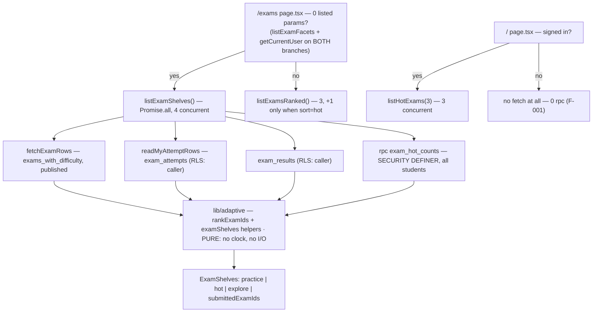

# Kho đề theo kệ — Backend Design Document

## Overview

Adds the one fact the product cannot currently read (how many students submitted an attempt on an exam), the Node-side selection that turns it plus the shipped weakness signal into three shelves, the `?sort=hot` axis, and the persisted attempt-source datum that measures whether the first shelf works. Requirements are PRD `docs/prd/exam-shelves-prd.md` v1.1 R1–R9; this document implements the backend half of AC-006, AC-011, AC-013, AC-015–AC-031, AC-034–AC-035, AC-037–AC-038, AC-040–AC-042, AC-045, AC-049, AC-051. `ExamShelf`, the ribbon, the fourth chip, the `?from` href chain and every string in `lib/copy.ts` belong to the frontend Design Doc; every contract that crosses into it is fixed here.

## Design Summary (Meta)

```yaml
design_type: "extension";  risk_level: "high";  complexity_level: "high"
complexity_rationale: "AC-018-AC-028 need a cross-user count RLS makes unreadable -> DDL on a table with
  real user data plus a SECURITY DEFINER object, under the ritual TD-005 records as having failed 4 times;
  AC-006 forbids cutting shelves in SQL while ADR-0015 D6 caps round trips, so 4 rungs must resolve in 1 call"
main_constraints: ["schema.sql canonical, migrations replay it verbatim",
  "exam_attempts RLS not weakened; prod DDL on it needs engineer confirmation",
  "0 new npm dependencies; rating.int.test.ts:319-457 passes unmodified (AC-009)"]
biggest_risks: ["dev/prod schema drift (TD-005)", "a supabase.rpc() read invisible to the budget assertion"]
unknowns: ["whether the planner uses exam_attempts_status_submitted_idx at current row counts (it will not)"]
```

## Background and Context

### Prerequisite ADRs

**ADR-0021** (D1 definer function · D2 what of ADR-0015 survives · D3 budget · D4 ladder placement · D5 source column · D6 what the DDL leaves alone; its option tables are not repeated here) · **ADR-0015** (Decision 1b page-level composition · Decision 3 no identity · Decision 6 composition budget · kill criterion (a) no `.limit()`/`.range()`) · **ADR-0008** (the `exams_with_difficulty` shape this design does not widen) · **ADR-0020** (the `verify:schema` probe shape copied here). No common ADR is needed: logging, error propagation and contract definition each have a single in-repo precedent, followed.

### External Resources Used

| Resource (project-tier label) | Feature-specific identifier |
|---|---|
| Database Schema Source | `SOURCE/supabase/schema.sql` §20 (new); §17 fingerprint literal at `:2595` |
| Migration History | `SOURCE/supabase/migrations/20260918000000_exam_hot_counts_and_attempt_source_<new fp>.sql` |
| Schema Change Process | dev ref `hynwleaxtbtjzkvpjsug` (CLI); prod ref `pebjdlbgbmizgfpuptjl` (MCP, statement by statement) |
| Schema version fingerprint | `SCHEMA_FINGERPRINT` at `SOURCE/lib/schema/schemaFingerprint.ts:41` |
| RLS verification harness | `SOURCE/supabase/test-rls.ts`, new Phần 10, cases `HS-a…HS-g` |

### Agreement Checklist

| Item | Agreement | Where it is reflected |
|---|---|---|
| **Scope** | `exam_hot_counts()` + grants; `exam_attempts.source` + CHECK + `(status, submitted_at desc)` index; fingerprint + migration; `lib/adaptive/examShelves.ts` + 4 constants; exported/widened helpers in `rankExams.ts`; `queries/{attempts,hotCounts,shelves}.ts`; `lib/exams/{attemptSource,browseParams}.ts`; `?sort=hot`; `startAttempt` source parameter + whitelist; budget/probe/RLS test updates; `app/page.tsx` **guarded** data source (D9) | Implementation Path Mapping; Change Impact Map |
| **Non-scope** | `exam_attempts` RLS policies; `exams_with_difficulty` shape; `EXAM_COLUMNS` and its `perf-layers.ts` twin; `types/exam.ts`; `listMySubmittedExamIds`; `telemetry_log`; `?sort=newest\|oldest\|hardest` and `?dir`; the flat grid, `ExamBrowser`, `ExamPagination`; `exam_attempts.status`'s missing CHECK; every `features/exams/components/**` file and `lib/copy.ts` | "No Ripple Effect" in the Change Impact Map |
| **Constraints** | Parallel operation **yes** (the flat-grid path keeps running unchanged). Backward compatibility **required** (`listExamsRanked`, `Exam`, `EXAM_COLUMNS`). Performance measurement **not a gate** — the structural budget is the control; `perf-layers.ts` needs no edit because the projection is not widened | Interface Change Matrix; ADR-0021 D3 |
| **PRD open items** | **All four closed by the engineer on 2026-09-18, with no open alternative**: U1 ladder subtitles accepted as written (AC-019–AC-023); U2 the 15% practice share is a review trigger, not a ship gate; U3 a student with no dominant grade keeps the **three site-scope rungs** (`site-recent → site-30d → site-all`) rather than collapsing to a single all-time rung; U4 `HOT_SHELF_MIN_CARDS` stays **5** | Ladder pseudocode; `lib/adaptive/constants.ts` |

**Applicable Standards** (all `[explicit]` unless marked)

| Standard | Citation |
|---|---|
| Grant/revoke idiom: `revoke all on function … from public[, anon]` then `grant execute … to <roles>` | `schema.sql:185-186, :1566-1567, :2480-2481` |
| SECURITY DEFINER declaration idiom: `language sql` + `stable` + `security definer` + `set search_path = public, pg_temp` + aggregate-only projection | `schema.sql:1543-1560, :2464-2478` **only**. `search_exams` (`:157-186`) is security **invoker** — a precedent for the grant idiom, not for this one |
| A CHECK-constrained column on a provisioned table is declared inline (fresh provisioning) **and** as a named drop/add pair (existing databases) | `schema.sql:2394-2411` |
| Placement by dependency order with the reason in the comment; section numbers historical, not positional | `schema.sql:103-118, :2510-2511, :2556-2557` |
| Index naming `<table>_<cols>_idx`, filter column first, sort column second | `schema.sql:2527-2539` |
| List reads go through `readBounded`, label named after the calling function | `boundedRead.ts:91-113` |
| `lib/adaptive/**` is pure: state injected, no `Date.now()`, no module reads, no I/O, sort on a copy | `rankExams.ts:32-34` |
| No hand-written `user_id` predicate; RLS does the scoping | `ranking.ts:101-103` |
| Every tunable number is a named constant whose comment records **the measurement it derives from** — the shipped weights carry 17–18 line JSDoc blocks, not one-liners; the four new constants carry comments of that size | `constants.ts:79-96, :98-116` |
| New backend tests live in the lane that can run them: pure logic under `lib/**`/`features/**`, real-Postgres under `tests/e2e/service/**` `[implicit]` | `vitest.config.ts:19-27`; `vitest.localdb.config.ts:13-31`. Confirmed: Yes |

**Assumed Behaviors** — all **Confirmed: Yes**; no unverified claim remains, so no Risks row mirrors this list.

| Claim | Evidence |
|---|---|
| `readBounded(label, supabase.rpc(...))` typechecks and applies the decoy row | `rpc()` → `PostgrestFilterBuilder` extends `PostgrestTransformBuilder`, which declares `limit(count: number, {…} = {}): this`; `PostgrestBuilder implements PromiseLike`; client created with no `Database` generic (`lib/supabase/server.ts:16`) |
| A `security definer` function bypasses RLS on `exam_attempts` and can count rows the caller cannot select | `schema.sql:1500-1526` records the same mechanism leaking through a view; `exam_rating_aggregate()` (`:1543-1560`) is the shipped definer aggregate over an own-row-only table |
| The nested `is_author_banned()` call is permitted | A SECURITY DEFINER body runs with the **owner's** privileges, so the call is permitted regardless of caller role; the grant at `schema.sql:2480-2481` additionally excludes no caller role |
| `schema:plan` prints the target fingerprint before exiting 1 | `scripts/schema-plan.ts:51` (print), `:61` (exit) |
| Each migration carries the upsert for **its own** filename fingerprint; older ones keep theirs | `migrationsMatchSchema.test.ts:148-162` — corrects the input brief's "only the newest may carry the upsert" |
| The `$$`-quoted function body is one statement to the apply tooling | `lib/schema/__tests__/splitStatements.test.ts` is the gate that proves it |

**Quality Assurance Mechanisms** — `adopted`: `tsc --noEmit`, `eslint --max-warnings 0`, `vitest run` (globs `vitest.config.ts:19-27`); `schemaFingerprint.test.ts:91-108`, `migrationsMatchSchema.test.ts:80-175`, `splitStatements.test.ts`; `schema:plan`; `check:bundle`. `adopted and extended`: `verify:schema` (new probes in check 3), `test:localdb` (one new service e2e file), `test-rls.ts` (Phần 10). `adopted as a gate, no new file`: `test:fixture` — the shelves journey belongs to the frontend Design Doc. `noted (not adopted)`: `scripts/perf-layers.ts` (manual, and the projection is not widened, so it needs no edit); `instrumentation.ts`'s schema-version check (warns, never throws).

## Existing Codebase Analysis

### Implementation Path Mapping

| Type | Path | Change |
|---|---|---|
| Changed | `SOURCE/supabase/schema.sql` | `source` column inline at `:192-202`; new §20 between `:2554` and `:2556`; fingerprint literal at `:2595` |
| New | `SOURCE/supabase/migrations/20260918000000_exam_hot_counts_and_attempt_source_<fp>.sql` | The 7 changed statements + its own fingerprint upsert |
| Changed | `SOURCE/lib/schema/schemaFingerprint.ts:41` | `SCHEMA_FINGERPRINT` |
| New | `SOURCE/lib/adaptive/examShelves.ts` | Pure: weakest subject, dominant grade, ladder, explore order, flat hot order |
| Changed | `SOURCE/lib/adaptive/rankExams.ts` · `constants.ts` | Export 3 helpers + widen the weakness return · 4 new constants |
| New | `SOURCE/lib/exams/attemptSource.ts` · `browseParams.ts` | `ATTEMPT_SOURCES`, `AttemptSource`, `toAttemptSource` · `BROWSE_PARAM_KEYS` (the ten AC-008 keys, named once) + `hasBrowseParam(sp)`, the pure branch predicate so it is testable in the CI lane |
| New | `SOURCE/features/exams/queries/attempts.ts` · `hotCounts.ts` · `shelves.ts` | One attempt read + projection, shared · `hotWindows()` + `readHotCounts()`, the single RPC call site, shared · `listExamShelves()`, `listHotExams(limit)` |
| Changed | `SOURCE/features/exams/queries/ranking.ts` · `catalogue.ts` · `index.ts` | Shared attempt read + `sort === "hot"` branch calling `readHotCounts` · `ExamSort` gains `"hot"`, `DEFAULT_ASCENDING.hot`, the inner sort branch · re-exports |
| Changed | `SOURCE/features/exams/actions.ts:21-50` | `startAttempt(examId, rawSource?)` |
| Changed | `SOURCE/app/(exams)/exams/page.tsx` | Branch on `hasBrowseParam(sp)`; admit `hot` in the sort whitelist |
| Changed | `SOURCE/app/page.tsx:52-53` | `const hot = user ? await listHotExams(HOME_EXAM_COUNT) : null;` — **guarded**, not a bare swap (F-001) |
| Changed | `SOURCE/supabase/verify-schema.ts:448-493` · `test-rls.ts` | RPC existence / EXECUTE / anon-denial probes · Phần 10 |
| Changed (tests) | `rating.int.test.ts` · `lib/adaptive/__tests__/rankExams.test.ts` | Budget assertions + `rpc` in the mock · new cases for the exported helpers, existing cases untouched |

### Integration Points

| # | Existing component | Integration method | Impact | Input → Output → On error |
|---|---|---|---|---|
| I1 | `app/(exams)/exams/page.tsx` `Promise.all` | swap **one** of its three members | **High** — chooses the page body | `searchParams` → `ExamShelves` \| `RankedExamList` → propagate. **Branch predicate**: the shelves branch is taken only when **none of the ten AC-008 keys is present on the awaited `searchParams` object** — presence is tested on the **raw key** (`key in sp && sp[key] !== undefined`), never on the parsed value, because `?sort=garbage`, `?page=abc` and `?dir=asc` all parse to `undefined`/`1` yet must render the flat grid (AC-010). `hasBrowseParam(sp)` is that predicate. **`listExamFacets()` and `getCurrentUser()` stay on both branches**: the chip row renders above the shelves (AC-033 requires all five chips present; the approved canvas draws it there), so the facets read is still needed, and `getCurrentUser()` still feeds the flat-grid branch's `isLoggedIn` prop. Page-level members stay at **3** on both branches; only the first one's identity changes |
| I2 | `features/exams/queries/ranking.ts` `listExamsRanked` | new sort branch + shared attempt read | **Medium** | `ExamFilters`, page → `RankedExamList` (unchanged shape) → throws on PostgREST error |
| I3 | PostgREST `rpc/exam_hot_counts` | new read, **two call sites** (`shelves.ts`, `ranking.ts`'s hot branch), both through `readHotCounts` | **High** — new cross-user surface | `{p_since_recent, p_since_wide, p_max_rows}` → `(exam_id, recent_count, wide_count, total_count)[]` (sync) → `readBounded` throws on infrastructure error; logs + truncates at the ceiling |
| I4 | `features/exams/actions.ts` `startAttempt` | one added optional argument | **Medium** — write path | `(examId, rawSource?)` → redirect (never returns) → normalises to `none`; never rejects a start (AC-041) |
| I5 | `app/page.tsx` right column | **guarded** data-source swap | **High** — `/` is a public route | `user` → `HotExamList \| null` → propagate. `app/page.tsx:52` runs for **anonymous** visitors (the only earlier `redirect` at `:48` fires for signed-in users), and the `showAside`/signed-in check at `:116-138` is a **render** gate 64 lines after the fetch. Today's `listExamsRanked` is harmless for anon because its reads are RLS-scoped and return empty; `listHotExams` is not, because the RPC revokes `anon` → 42501 → `readBounded` rethrows → error page on the landing page. The fetch is therefore guarded by the same `user`: `const hot = user ? await listHotExams(HOME_EXAM_COUNT) : null;` |
| I6 | `verify-schema.ts:448-493`, `test-rls.ts` Phần 10 | new probes/cases | **Low** | — |

Conflicts checked: `exam_hot_counts`, `exam_attempts_source_check` and `exam_attempts_status_submitted_idx` do not exist in `schema.sql`. `ExamSort` has three declaration sites (`catalogue.ts:21`, `exams/page.tsx:46-47`, `ExamFilters.tsx:33`) plus a label in `lib/copy.ts:503-505`; the last two are frontend-owned.

**Dependency existence verification** — verified existing: `exam_attempts`, `exams.status/author_id/created_at/school`, `is_author_banned(uuid)` (`schema.sql:2464`), `exam_rating_aggregate()`, `readBounded`, `rankExamIds`, `paginateExams`, `lib/adaptive/__tests__/rankExams.test.ts`, the `tests/e2e/service` fixtures idiom, `schema_version`. Requires new creation: `exam_hot_counts()`, `exam_attempts.source`, `exam_attempts_source_check`, `exam_attempts_status_submitted_idx`, `lib/adaptive/examShelves.ts`, `lib/exams/{attemptSource,browseParams}.ts`, `features/exams/queries/{attempts,hotCounts,shelves}.ts`, the migration file, one service e2e file + its fixtures module. External dependencies: none — `package.json` is unchanged (AC-045).

**Similar functionality search** (keywords *aggregate / count / cross-user / definer / weakness / shelf*) — found and reused: `exam_rating_aggregate()` as the aggregate **pattern**, `buildSubjectWeakness` / `buildGradeShares` / the representative-attempt loop as the **signals**, `rankExamIds` for the Cần luyện order, `readBounded` for the row bound. Found and rejected as a sink: `telemetry_log` (ADR-0021 D5). No existing cross-user aggregate over `exam_attempts` exists — new implementation justified.

### Fact Disposition Table

| Fact ID | Focus Area | Disposition | Rationale | Evidence |
|---|---|---|---|---|
| `SOURCE/supabase/schema.sql:exam_attempts` | exam_attempts table shape and its own-row-only RLS | transform | Gains `source` (not null, default `'none'`, CHECK) and a `(status, submitted_at desc)` index. RLS policies untouched; the cross-user count never reads the table from the app. `status` keeps its unenforced domain by decision (ADR-0021 D6). | `schema.sql:192-202` (table), `:233`, `:257-259`, `:261-263`, `:265-267`, `:199`, `:2534-2539` |
| `SOURCE/features/exams/queries/ranking.ts:listExamsRanked` | The /exams composition function and its three-read budget | transform | Keeps its shape and its three reads on every existing path; gains a conditional fourth member used only by `?sort=hot`, and delegates its attempt read to the shared module. The shelves path is a separate composition with its own four-member `Promise.all`. | `ranking.ts:105-186, :115-128, :130-155, :157-160, :183-185`; ADR-0015 `:148-164, :182` |
| `SOURCE/features/exams/__tests__/rating.int.test.ts:budget` | The CI assertions that encode the round-trip budget, and the mock that cannot see rpc | transform | The mock gains `rpc`; the budget assertion counts `from()` + `rpc()`; one case per surface. The AC-016/AC-017 query-construction cases are not edited (AC-009). | `rating.int.test.ts:20, :29-31, :39-56, :555-563, :663-674, :676-706, :319-457` |
| `SOURCE/lib/adaptive/rankExams.ts:buildSubjectWeakness` | Module-private ranking helpers, their null semantics, and the purity contract | transform | Three helpers become exported; `buildSubjectWeakness` returns `Map<string, {weakness, scoredAttempts}> \| null` so AC-015's tie-break reads the same representative map. `null` vs `0` semantics and purity preserved unchanged. | `rankExams.ts:32-34, :140-248, :148-154, :167-170, :261-274, :184-187, :294-314, :330-349, :195-213` |
| `SOURCE/features/exams/queries/catalogue.ts:fetchExamRows` | The catalogue read: filter surface, published guard, and the row ceiling | preserve | **One** catalogue read serves all three shelves; no shelf issues its own. The published guard, the absence of `.limit()/.range()` and the `readBounded` ceiling are unchanged; only the inner sort branch gains a case. | `catalogue.ts:48-61, :71-122, :77, :83-84, :95-99, :105-117, :122`; `boundedRead.ts:55,74,113-131` |
| `SOURCE/features/exams/queries/catalogue.ts:ExamSort` | The single ?sort= axis and its three declaration sites | transform | `"hot"` added to the exported type, `DEFAULT_ASCENDING`, the page whitelist, the hand-copied type + chip list and `lib/copy.ts`. The outer `else { .order("id") }` is untouched, so the three existing order chains are byte-identical (AC-009). | `catalogue.ts:21, :32-36, :105-117`; `exams/page.tsx:46-47`; `ExamFilters.tsx:14, :33, :55-60, :112-117`; `lib/copy.ts:503-505` |
| `SOURCE/features/exams/actions.ts:startAttempt` | Attempt start: the write, the guard, and the missing parameter channel | transform | The whole chain is built: card href → detail-page `searchParams` → button prop → second bound argument → normalised column value. Published guard, redirect and the single insert otherwise unchanged. | `actions.ts:21-50`; `StartAttemptButton.tsx:17-24`; `exams/[id]/page.tsx:30,127`; `ExamCard.tsx:36-37`; `schema.sql:194, :261-263` |
| `SOURCE/supabase/schema.sql:telemetry_log` | The only telemetry sink, and what it would cost | out-of-scope | Excluded by the Non-scope row and by ADR-0021 D5 option B: no `exam_id`/`attempt_id` column, `select` revoked from `authenticated`, a two-site enum pinned by CI. Not read, written or altered. | `schema.sql:1919-1969, :2373-2411`; `tutorActions.ts:73-105`; `schemaFingerprint.test.ts:205-269`; `app/layout.tsx:5-6,122-123` |
| `SOURCE/app/page.tsx:Home` | The second consumer of listExamsRanked | transform | Signed-in: `listHotExams(3)` replaces `listExamsRanked({},1)` — 3 reads before, 3 after (the RPC replaces the `exam_results` read), and it still returns `submittedExamIds`. Signed-out: the fetch is **guarded** and never runs (F-001), so the anon path issues **0 rpc** and loses today's 3 empty RLS-scoped reads. ADR-0015 kill criterion (b) is answered by putting the order in a pure helper with two callers. | `app/page.tsx:34, :39-43, :48, :52-53, :116-138, :131-136`; `EXAM-SHELVES-BRIEF.md:22` |
| `SOURCE/supabase/verify-schema.ts:rpc-and-fk-probes` | Live-database verification the design has to extend | transform | The **RPC-probe block at `:448-493`** (cited by anchor, not by check number — the file's banner says 3 while its own header inventory says 5) gains an existence/EXECUTE probe for `exam_hot_counts` with harmless boundary arguments plus an anon 42501 probe, mirroring `search_exams`. No FK is added, so the FK check (`:650`) is untouched; the fingerprint probe (`:752`) is state-dependent and stays red until the dev apply in procedure step 6. | `verify-schema.ts:11-28, :448-493, :60-70, :650, :752`; `schema.sql:1791-1792` |
| `SOURCE/features/exams/queries/rows.ts:EXAM_COLUMNS` | The row contract, its duplicate, and what Exam refuses to carry | preserve | The hot count travels as a **parallel `Map<string, HotCounts>` keyed by exam id**, consumed before `toExam`. `EXAM_COLUMNS`, its `perf-layers.ts` twin, `toExam` and the `Exam` contract are unchanged. | `rows.ts:18-37, :39-50, :52-68`; `scripts/perf-layers.ts:122-128`; `types/exam.ts:6-48`; ADR-0015 `:191`; `lib/rating/index.ts:8,45` |
| `SOURCE/supabase/schema.sql:exam_rating_aggregate` | The shipped DB-side global-aggregate precedent and its grant idiom | preserve | Copied as a pattern into §20c — definer + `stable` + `set search_path` + aggregate-only projection + `revoke`/`grant`. The one deviation (no `anon` grant) is stated with its reason in ADR-0021 D1. The object itself is not touched. | `schema.sql:1500-1526` (the measured leak that produced the rule), `:1529-1542` (create-or-replace requirement), `:1543-1560` (the function), `:1566-1567` (revoke/grant), `:1581-1592` (the security_invoker view), `:784-799` (the earlier non-invoker creation of the same view) |
| `SOURCE/lib/schema/schemaFingerprint.ts:SCHEMA_FINGERPRINT` | The schema-change ritual: fingerprint, migration file, apply, verify | preserve | Followed verbatim in the Migration Procedure, with the dev/prod apply split and the step-4/step-5 lane split made explicit. | `schemaFingerprint.ts:41,44-45,61-69`; `schema.sql:2587-2599`; `schemaFingerprint.test.ts:91-108`; `migrationsMatchSchema.test.ts:81-175`; `scripts/schema-plan.ts:35-81`; `package.json:13,16,17`; `migrations/20260903000000_hot_path_indexes_4ecb67741520.sql:16-47` |
| `SOURCE/lib/adaptive/constants.ts:EXAM_RANK_SUBJECT_WEAKNESS_WEIGHT` | Ranking weights as the only tunable numbers, with recorded rationale | preserve | The three weights keep their values and their JSDoc. The four new constants join the same file under the same convention; they are **thresholds, not weights**, and none enters `affinityOf`. | `constants.ts:66-77` (why the weights live here), `:96` (grade = 1), `:116` (recency = 0.25), `:167` (subject weakness = 0.5); `rankExams.ts:101-109` (SCORE_MAX = 10 deliberately NOT in constants.ts); ADR-0015 `:322` |
| `SOURCE/vitest.localdb.config.ts:test-lane-placement` | Where new backend tests are allowed to live | preserve | Followed exactly — see Test Placement. Nothing is added under `SOURCE/supabase/__tests__/` (collected by no lane), and no file is added to the fixture lane. | `vitest.config.ts:19-27` (CI lane globs: lib, components, app, features); `vitest.localdb.config.ts:4-31` (tests/e2e/service/**, manual, needs dev DB, requires verify:schema green first); `vitest.fixture.config.ts:36-53` (tests/e2e/fixture/** with six exclusions); `vitest.integration.config.ts:18-21`; `exam-search.service.e2e.test.ts:1-40`; `SOURCE/supabase/__tests__/*.service.e2e.test.ts` (collected by NO lane) |

## Design

### Change Impact Map

```yaml
Change Target: "/exams default view composition + cross-user hot aggregate + attempt provenance"
Direct Impact: "every path in the Implementation Path Mapping table above"
Indirect Impact:
  - "/exams bare URL: 7 -> 8 page-level calls; composition 3 -> 4 (the number CI asserts)"
  - "exam_attempts row width: +1 text column with a default (no table rewrite)"
  - "features/exams/components/** + lib/copy.ts consume new props/keys (frontend Design Doc)"
No Ripple Effect:
  - "exams_with_difficulty, EXAM_COLUMNS + its perf-layers.ts twin, toExam, types/exam.ts"
  - "listMySubmittedExamIds and its /exams/[id]/rate consumer; ExamPagination; paginateExams"
  - "telemetry_log, lib/tutor/telemetry.ts, lib/supabase/service-role.ts"
  - "?sort=newest|oldest|hardest and ?dir order chains; every exam_attempts RLS policy; package.json"
  - "app/(exams)/exams/[id]/attempt/** — reads exam_attempts, but the table change is purely
     additive (new column with a default), so its reads and writes are unaffected; 0 files edited"
```

### Interface Change Matrix

| Existing | New | Conversion required | Adapter | Compatibility method |
|---|---|---|---|---|
| `listExamsRanked(filters?, page?)` | same signature; `filters.sort` may be `"hot"` | No | No | `RankedExamList` unchanged |
| `ExamSort = "newest"\|"oldest"\|"hardest"` | `… \| "hot"` | Yes — all consumers handle a 4th value | No | `DEFAULT_ASCENDING` is `Record<ExamSort, boolean>`, so tsc enumerates every site |
| `buildSubjectWeakness(…): Map<string, number> \| null` (private) | `export … : Map<string, SubjectWeakness> \| null` | Yes — internal caller reads `.weakness` | No | Single in-repo caller (`rankExams.ts:186-187`) updated in the same change |
| `startAttempt(examId)` | `startAttempt(examId, rawSource?)` | No — optional parameter | No | Omitted ⇒ `'none'` |
| `listExamsRanked` on `/` | `listHotExams(limit)` | Yes — different return | No | Call site swapped; `submittedExamIds` present on both shapes |
| — | `listExamShelves()`, `listHotExams()`, `readHotCounts()`, `hasBrowseParam()` | n/a | n/a | New exports |

### Architecture Overview



### Data Flow — the body of `listExamShelves()`

```
{sinceRecent, sinceWide} = hotWindows(new Date())    # the clock is read ONCE PER COMPOSITION, here in
                                                     # the query layer — never inside lib/adaptive (D4)

[rows, attemptRows, resultRows, hotRows] = await Promise.all([...])   # 4 concurrent, one batch

scoreByAttempt   = Map(attempt id -> Number(total_score))             # finite values only
submittedExamIds = Set(attemptRows.exam_id)                           # every row, AC-025 safe
attempts         = ShelfAttempt[]  (drop rows with no grade; keep null subject/school)
counts           = Map(exam_id -> {recent, wide, total})
candidates       = rows.map(r => ({id, grade, subject, school: r.school, createdAt: r.created_at}))
                   # ShelfCandidate[] — the ONE candidate set; practice, hot and explore all read it,
                   # so the three shelves cannot disagree about what is in the catalogue

representatives  = buildRepresentativeAttempts(attempts)              # rankExams.ts, exported
weakness         = buildSubjectWeakness(representatives.values())     # widened return
shares           = buildGradeShares(attempts)

weakest       = pickWeakestSubject(weakness)                # null => practice shelf absent
dominantGrade = pickDominantGrade(shares, attempts)         # null => site-scope ladder
practiceIds   = weakest ? rankExamIds({candidates: candidates.filter(c => c.subject === weakest),
                                       attempts, weights}).slice(0, SHELF_MAX_CARDS) : []
hot           = pickHotShelf({counts, candidates, dominantGrade, minCards, maxCards})
exploreIds    = pickExploreShelf({candidates, attempts,
                                  excludeIds: new Set([...practiceIds, ...(hot?.examIds ?? [])]),
                                  maxCards: SHELF_MAX_CARDS})
=> ids mapped back through rowById -> toExam;  a shelf with 0 ids is returned as null (AC-051)
```

### The SQL objects (`SOURCE/supabase/schema.sql`)

**Placement.** A new banner block **§20 "Kho đề theo kệ"** goes **after §19** (the index block ending at `:2554`) and **before §17** (`schema_version`, `:2556`), with the reason in the comment: the function body references `public.is_author_banned()` (§18a, `:2464`), `public.exams` and `public.exam_attempts`, so dependency order puts it after all three, and §17 must stay last because the fingerprint block must be the file's final statement.

**20a — provenance column.** Inline in `create table if not exists public.exam_attempts (…)` at `:192-202`, so a fresh provisioning is correct:

```sql
source text not null default 'none' check (source in ('practice','hot','explore','none')),
```

and, because `create table if not exists` is a no-op on both live databases, the same thing again as idempotent alters inside §20a:

```sql
alter table public.exam_attempts add column if not exists source text not null default 'none';
alter table public.exam_attempts drop constraint if exists exam_attempts_source_check;
alter table public.exam_attempts add constraint exam_attempts_source_check
  check (source in ('practice','hot','explore','none'));
```

Postgres auto-names the inline check `exam_attempts_source_check`, which is exactly the name the pair uses — the inline-plus-named idiom `telemetry_log` uses at `:1936` and `:2406-2411`. **The drop precedes the add purely for idempotency on re-apply**; the name here is not a guess, because no constraint of that name exists on either database yet.

**20b — the index the hot window needs.**

```sql
create index if not exists exam_attempts_status_submitted_idx
  on public.exam_attempts (status, submitted_at desc);
```

Filter column first, sort column second, per §19's convention. At today's row counts the planner will still choose a Seq Scan; the index exists so the scan does not silently become a table scan later (§19's own rationale, `:2518-2525`).

**20c — the aggregate.**

```sql
create or replace function public.exam_hot_counts(
  p_since_recent timestamptz,
  p_since_wide   timestamptz,
  p_max_rows     int default 500
)
returns table (
  exam_id      text,
  recent_count bigint,
  wide_count   bigint,
  total_count  bigint
)
language sql
stable
security definer
set search_path = public, pg_temp
as $$
  -- date_trunc snaps BOTH caller-supplied boundaries to the hour, server-side: without it a JWT holder
  -- bisects the time axis until a count increments and localises another student's submission to the
  -- second. Hour granularity costs a 7/30-day ladder nothing.
  select a.exam_id,
         count(*) filter (where a.submitted_at >= date_trunc('hour', p_since_recent))::bigint,
         count(*) filter (where a.submitted_at >= date_trunc('hour', p_since_wide))::bigint,
         count(*)::bigint
    from public.exam_attempts a
    join public.exams e on e.id = a.exam_id
   where a.status = 'submitted'
     and e.status = 'published'
     and not public.is_author_banned(e.author_id)
   group by a.exam_id
   order by 4 desc, 2 desc, 1
   limit least(greatest(coalesce(p_max_rows, 500), 1), 1000)
$$;

revoke all on function public.exam_hot_counts(timestamptz, timestamptz, int) from public, anon;
grant execute on function public.exam_hot_counts(timestamptz, timestamptz, int) to authenticated, service_role;
```

Four aggregate columns per exam, no user id, no timestamp, no score — **AC-027, widened by ADR-0021 D1** from its literal "(exam_id, count) pairs" to three windowed counts so one call serves all four rungs. Ordering is positional because the `returns table` names shadow table columns inside the body. The two SQL literals in the `limit` are hand copies of `LIST_ROW_CEILING` (**500**, the default) and `POSTGREST_MAX_ROWS` (**1000**, the clamp) from `lib/supabase/boundedRead.ts:55,74`; the service e2e clamp case asserts against the **imported constants**, not against literals, so a change on either side turns that case red instead of drifting. A definer body has no RLS, so the predicates re-assert what `exams_select_visible` (`:2488-2492`) would have applied, making the row set exactly the catalogue's; `create or replace` with no dependent object means a future `returns table` change costs nothing.

**Ceiling caveat** (AC-028's cost, stated rather than discovered): when the cap is reached the returned set is the **top 500 by `total_count`**, so a rung can silently lose an exam that is hot this week but low all-time. Nothing on screen shows it; the only signal is `readBounded`'s `console.error`. At 7 published exams this is a tripwire, not a limit — reaching it means the catalogue needs real pagination, not a bigger number.

**Metric query (AC-042, Success Criteria #1/#2)** — run by the engineer with `service_role`; `exam_attempts` RLS makes it unavailable to the app by design:

```sql
select source,
       count(*)                                                      as attempts,
       round(100.0 * count(*) / nullif(sum(count(*)) over (), 0), 1) as share_pct
  from public.exam_attempts
 where started_at >= '2026-09-18'          -- ship date
 group by source
 order by attempts desc;
```

Coverage (`count(*) where source is null` = 0) holds by construction: the column is `not null default 'none'`.

### Migration Procedure

All commands run from `SOURCE/`. Pattern reference: **`supabase/migrations/20260913000000_attempt_answer_ceiling_8000_187d3ed24f0c.sql`** — the newest migration, and the one carrying all four things this migration needs (a drop/add constraint pair, a read-back recipe, its own fingerprint upsert, and in-repo evidence that a multi-statement file applies correctly through the CLI). `20260903000000_hot_path_indexes_4ecb67741520.sql` is a secondary example for the index and `explain` read-back.

1. **Edit `supabase/schema.sql`** — §20a inline column + alters, §20b index, §20c function + revoke + grant, placed as above.
2. `npm run schema:plan` — prints the numbered statement list and `VÂN TAY ĐÍCH: <new>`, then **exits 1** because the file still declares the old fingerprint. Record `<new>`.
3. Write `<new>` into **both** hand-copied sites: `supabase/schema.sql:2595` (the §17 upsert literal) and `lib/schema/schemaFingerprint.ts:41`.
4. `npm run schema:plan` again — must exit **0** — then `npx vitest run lib/schema/__tests__/schemaFingerprint.test.ts`, which must be green. **`migrationsMatchSchema.test.ts` is RED at this point by design** and must be left alone: `:113-131` compares the newest migration filename's fingerprint with the recomputed one, and the file carrying `<new>` does not exist until step 5. Do **not** rename an existing migration to make it pass — that rewrites a state two databases already ran and trips baseline immutability (`:97-111`).
5. **Create** `supabase/migrations/20260918000000_exam_hot_counts_and_attempt_source_<new>.sql` containing, **verbatim as they appear in schema.sql**, the 3 statements of 20a's alter group, the 1 statement of 20b, the 3 statements of 20c, then its own fingerprint upsert with `<new>`; the header carries the step-7 read-back recipe. **Now** `npx vitest run lib/schema` must go fully green — that is the gate for this step, not step 4's. The `create table if not exists public.exam_attempts (…)` statement is **not** copied — a migration must only contain statements that also exist in `schema.sql`, not every statement that exists there (`migrationsMatchSchema.test.ts:133-175`), and re-running the create-table is a no-op on both live databases.
6. **Dev apply — one CLI command, whole file:**
   ```
   npx supabase db query --linked --project-ref hynwleaxtbtjzkvpjsug --file supabase/migrations/20260918000000_exam_hot_counts_and_attempt_source_<new>.sql
   ```
   A multi-statement file applies correctly on this path; it is how the eight existing migrations were applied.
7. **Dev read-back with real queries** (never the tool's success message):
   ```sql
   select fingerprint from public.schema_version;                                           -- '<new>'
   select proname, proacl from pg_proc where proname = 'exam_hot_counts';                   -- EXECUTE: authenticated, service_role; no anon/public
   select conname from pg_constraint where conname = 'exam_attempts_source_check';          -- 1 row
   select indexname from pg_indexes where indexname = 'exam_attempts_status_submitted_idx'; -- 1 row
   select column_name, is_nullable, column_default from information_schema.columns
    where table_name = 'exam_attempts' and column_name = 'source';                          -- NO, 'none'::text
   ```
8. `npm run verify:schema` — full mode on dev, and it must be green **before** `npm run test:localdb` means anything. The fingerprint probe (`:752`) is state-dependent and stays red until step 6 has run.
9. **Production — not part of any implementation task.** It happens at deploy time, and **the engineer must confirm explicitly before any statement touching `exam_attempts` is sent**, because that table holds real user data. On this path only, send **one statement per call** over the MCP/Composio SQL path, using `npm run schema:plan`'s numbered list as the order of record: that path was observed on 2026-08-31 to run the `revoke` of a `revoke …; grant …;` pair, skip the `grant`, and still return `successful: true` (`scripts/schema-plan.ts:6-18`). After each statement, verify at catalogue level — `pg_proc.proacl` for the function grants, `pg_constraint` / `pg_indexes` / `information_schema.columns` for the rest. **Do not use `information_schema.routine_privileges`**: under the read-only prod user it returns empty and reads exactly like a missing grant.

Two hard constraints the codebase asserts: (i) every migration statement must appear **verbatim after comment/whitespace normalisation** in `schema.sql` — `schema.sql` is canonical and migrations only replay it; (ii) each migration's fingerprint upsert carries **its own filename's** fingerprint, and the **newest** migration's filename fingerprint must equal `schema.sql`'s current one (`migrationsMatchSchema.test.ts:113-131, :148-162`).

### Query layer

**The four types the signatures below depend on**, declared once, in the module whose helpers consume them. `RankExamCandidate` (`rankExams.ts:37-55`) is `{id, grade, subject, createdAt}` with **no `school`**, so the explore order cannot read one off it — hence `ShelfCandidate`:

```ts
// lib/adaptive/examShelves.ts
export type HotRung = "grade-recent" | "grade-30d" | "grade-all" | "site-recent" | "site-30d" | "site-all";
export interface HotCounts { recent: number; wide: number; total: number }   // wide = the 30d window
export interface ShelfCandidate extends RankExamCandidate { school: string | null }
export interface ShelfAttempt extends RankAttempt { school: string | null }
```

**`SOURCE/features/exams/queries/hotCounts.ts`** (new) — the single RPC call site and the single window computation, imported by **both** compositions so the two call sites cannot drift:

```ts
export function hotWindows(now: Date): { sinceRecent: string; sinceWide: string };  // ISO; reads no clock
export async function readHotCounts(supabase: SupabaseClient, label: string,
                                    now: Date): Promise<Map<string, HotCounts>>;
```

`readHotCounts` computes both boundaries from `hotWindows(now)` and sends `{p_since_recent, p_since_wide, p_max_rows}` on every call. The `?sort=hot` branch in `listExamsRanked` consumes **only `total_count`** (AC-018/AC-034 — a flat grid, no ladder, no grade scope), but it sends both boundaries anyway because they are required parameters and because one call site means one argument list to keep correct. The invariant is therefore: **the clock is read once per composition, in the query layer — never in `lib/adaptive`.**

**`SOURCE/features/exams/queries/attempts.ts`** (new) — one attempt read, one projection, two consumers, so the select string cannot drift:

```ts
export const ATTEMPT_SELECT = "id, exam_id, submitted_at, exams!inner(grade, subject, school)";
export type AttemptRow = { id: string; exam_id: string; submitted_at: string | null;
                           exams: EmbeddedExamFacets | EmbeddedExamFacets[] | null };
export async function readMyAttemptRows(supabase: SupabaseClient, label: string): Promise<AttemptRow[]>;
export function submittedExamIdsOf(rows: readonly AttemptRow[]): Set<string>;
export function toShelfAttempts(rows: readonly AttemptRow[],
                                scoreByAttempt: ReadonlyMap<string, number>): ShelfAttempt[];
```

`AttemptRow`, `embeddedExam`, `gradeOfAttempt` and `subjectOfAttempt` move here from `ranking.ts:27-64` unchanged, including the object-or-array embed tolerance and the "one missing field mutes only its own signal" rule; `school` joins the embed at zero round-trip cost and is `null`-tolerant the same way.

**`SOURCE/features/exams/queries/shelves.ts`** (new):

```ts
export interface ExamShelves {
  practice: { subject: string; exams: Exam[] } | null;                      // null => absent (AC-013/AC-051)
  hot:      { rung: HotRung; grade: number | null; exams: Exam[] } | null;  // AC-024/AC-051
  explore:  { exams: Exam[] } | null;                                      // AC-031/AC-051
  submittedExamIds: Set<string>;                                           // same set the flat grid uses
}
export async function listExamShelves(): Promise<ExamShelves>;

export interface HotExamList { exams: Exam[]; rung: HotRung | null; grade: number | null;
                               submittedExamIds: Set<string> }   // ← NOT a bare Exam[]
export async function listHotExams(limit: number): Promise<HotExamList>;   // AC-037: limit = 3 on /
```

`listHotExams` **must** return `submittedExamIds` (frontend escalation E-1): the home block gets that set from `listExamsRanked` today and passes it to `ExamBrowser` (`app/page.tsx:133`), so a replacement that returned a bare `Exam[]` would silently flip every already-submitted exam's rate button from eligible to not-attempted — a regression no AC names. It rides on the attempt read the composition already issues; the page must **not** add a second read for it.

The backend returns the **fact** (`rung`, `grade`, `subject`), never a copy key; the frontend maps fact → Vietnamese string in `lib/copy.ts` (AC-046). A shelf with zero cards is `null`, not an empty array, so "absent" is unrepresentable as "present but empty". **Concurrency**: `listExamShelves` issues its four boundary calls in **one** `Promise.all` with no `await` between them; `listHotExams` issues three (no prior score needed); `listExamsRanked` keeps its three and adds a fourth member that is `Promise.resolve([])` unless `filters.sort === "hot"`, so every other path's count is unchanged. **Bounding** — the RPC goes through `readBounded` like every other list read:

```ts
// inside readHotCounts(supabase, label, now) — label is "listExamShelves.hotCounts",
// "listHotExams.hotCounts" or "listExamsRanked.hotCounts" depending on the caller
const { sinceRecent, sinceWide } = hotWindows(now);
const rows = await readBounded(label,
  supabase.rpc("exam_hot_counts", {
    p_since_recent: sinceRecent, p_since_wide: sinceWide, p_max_rows: LIST_ROW_CEILING + 1,
  }));
```

`p_max_rows` and `readBounded`'s own `.limit()` both derive from the single exported `LIST_ROW_CEILING`, so they cannot drift, and passing `+1` keeps the decoy row deliverable — a SQL cap of exactly 500 would leave the tripwire permanently unable to fire, the failure `boundedRead.ts:36-39` warns about. The Cần luyện order is `rankExamIds(...)` over the subject-filtered candidate set with the shipped weights — same function, same weights, same band semantics (AC-016/AC-017); nothing in `shelves.ts` re-implements a ranking rule.

**Changes to `SOURCE/lib/adaptive/rankExams.ts`** — the header's purity conventions stay literally true (state injected, no `Date.now()`, no module reads, no I/O, sort on a copy):

```ts
export interface SubjectWeakness { weakness: number; scoredAttempts: number }
export function buildRepresentativeAttempts(attempts: readonly RankAttempt[]): Map<string, RankAttempt>;
export function buildGradeShares(attempts: readonly RankAttempt[]): Map<number, number> | null;
export function buildSubjectWeakness(representatives: Iterable<RankAttempt>): Map<string, SubjectWeakness> | null;
```

`buildRepresentativeAttempts` is the loop currently inlined at `:148-154`, extracted so the shelf's "more scored representative attempts" tie-break (AC-015) reads the **same** representative map the ranker uses. `buildSubjectWeakness` keeps its arithmetic, its `clamp01`, its "skip attempts with no subject or no finite score" rule and its `null`-when-nothing-scored semantics; only the value type widens, and its single in-file caller at `:186-187` becomes `.get(subject)?.weakness ?? 0`.

**New constants** in `SOURCE/lib/adaptive/constants.ts`, each with a JSDoc block sized like the shipped weights' (`:79-96`, `:98-116`) recording the PRD decision and the observation behind the number: `HOT_SHELF_MIN_CARDS = 5` (D12/U4, closed 2026-09-18 — below 5 a row reads as a thin shelf rather than a selection; 4 was the fold-arithmetic alternative at 1000px), `SHELF_MAX_CARDS = 10` (D6), `HOT_WINDOW_RECENT_DAYS = 7` and `HOT_WINDOW_WIDE_DAYS = 30` (AC-019/AC-020, sized against the PRD's ~92-submitted-attempts-over-7-exams risk row). They are thresholds, not weights: none enters `affinityOf`.

### The ladder (pseudocode — `SOURCE/lib/adaptive/examShelves.ts`, pure)

```
pickHotShelf({counts, candidates, dominantGrade, minCards, maxCards}) -> {rung, examIds} | null

  # rung ids name SCOPE-WINDOW, never scope alone: "site-30d" is site scope + 30-day window, and the
  # frontend maps the pair to copy. (An earlier "site-wide" invited "Toàn hệ thống, từ trước tới nay",
  # which is a different rung.) The "wide" COUNTS field keeps its name — it is the p_since_wide column.
  rungs = dominantGrade === null
        ? [("site-recent",  null,          "recent"),          # AC-023 (U3, closed 2026-09-18):
           ("site-30d",     null,          "wide"),            #   three site-scope rungs;
           ("site-all",     null,          "total")]           #   in-grade steps skipped, never guessed
        : [("grade-recent", dominantGrade, "recent"),          # AC-019  Khối G, tuần này
           ("grade-30d",    dominantGrade, "wide"),            # AC-020  Khối G, 30 ngày qua
           ("grade-all",    dominantGrade, "total"),           # AC-021  Khối G, từ trước tới nay
           ("site-all",     null,          "total")]           # AC-022  Toàn hệ thống, từ trước tới nay

  for i, (rung, gradeScope, field) in rungs:
      pool = candidates
             .filter(c => gradeScope === null || c.grade === gradeScope)
             .map(c    => ({id: c.id, count: counts.get(c.id)?.[field] ?? 0}))
             .filter(x => x.count > 0)                      # "qualifies" = >= 1 submitted attempt
             .sort([count DESC, id ASC])                    # AC-018 — the whole hot order
      if pool.length >= minCards or i === last:             # last rung is terminal (AC-022)
          return pool.length === 0 ? null : {rung, examIds: pool.slice(0, maxCards).map(id)}   # AC-024/AC-051

# Decisions, not incidentals:
#  - the demotion band is never consulted: an exam the student already submitted still appears
#    if its count qualifies (AC-025).
#  - site-all is a superset of grade-all, so the terminal rung never shrinks the shelf; when both
#    yield the same 4 exams the subtitle says "Toàn hệ thống", which is the wider true claim.
#  - the cut to maxCards happens HERE, in Node, after ordering — never as a SQL LIMIT (AC-006).

pickWeakestSubject(weakness) -> string | null
  if weakness === null or weakness.size === 0: return null                            # AC-013
  return entries.sort([weakness DESC, scoredAttempts DESC, subject ASC])[0].subject   # AC-015

pickDominantGrade(shares, attempts) -> number | null
  if shares === null: return null                                                # AC-023 cold start
  tied = grades whose share === max(share)        # equal counts give bit-identical quotients
  if tied.length === 1: return tied[0]
  latest = grade of the attempt with the greatest submittedAt among attempts whose grade ∈ tied
           (null submittedAt always loses, isLater convention)
  return latest ?? max(tied)                                                     # then higher grade

pickExploreShelf({candidates, attempts, excludeIds, maxCards}) -> string[]       # AC-029/AC-030
  attemptedSubjects = Set(attempts.subject where not null)
  attemptedSchools  = Set(attempts.school  where not null)
  pool = candidates.filter(c => !excludeIds.has(c.id))
  sort ascending by [ attemptedSubjects.has(c.subject) ? 1 : 0,                  # never-attempted first
                      (c.school !== null && !attemptedSchools.has(c.school)) ? 0 : 1,
                      -Date.parse(c.createdAt),                                  # newest first, AC-048
                      c.id ]                                                     # absolute determinism
  # c.school === null scores as "not new": a missing school is not an unexplored one.
  # an unparsable createdAt sorts as the oldest — no throw, no dropped exam.
  return pool.slice(0, maxCards)

orderIdsByHotCount(candidates, counts) -> string[]                               # AC-018/AC-034
  sort candidates by [ counts.get(c.id)?.total ?? 0 DESC, c.id ASC ]; return ids  # flat grid, no ladder
```

### The `?sort=hot` axis

`hot` is admitted to `ExamSort` and to the page's literal whitelist, and `DEFAULT_ASCENDING` gains `hot: false` (the record is keyed by `ExamSort`, so tsc enumerates every site).

`fetchExamRows`' sort logic is **two-level** (`catalogue.ts:105-117`) and only the inner level changes:

```
if (filters?.sort) {                                   # OUTER — unchanged
    ascending = filters.dir ? filters.dir === "asc" : DEFAULT_ASCENDING[filters.sort]
    if (sort === "hardest") query = .order("avg_overall", {ascending, nullsFirst:false}).order("created_at").order("id")
    else if (sort === "hot") query = .order("id")      # NEW inner case — the only edit
    else                     query = .order("created_at", {ascending})
} else {                                               # OUTER else at :115-117 — UNTOUCHED
    query = query.order("id")
}
```

Leaving the outer `else` alone is what keeps `rating.int.test.ts:393-401` and `:447-456` green. With `sort === "hot"` the computed `ascending` is unused, and `hot` and no-sort emit an **identical** DB-side chain — harmless, because both pinned assertions test containment, not exact call-list length.

The real ordering is applied after the fetch: when `filters.sort === "hot"`, `listExamsRanked` orders the complete candidate set with `orderIdsByHotCount(candidates, counts)`, then `paginateExams` — so `exams_with_difficulty` needs no hot column, rank-then-slice still holds, and AC-009's substance survives because the hot order is **global, identical for every student, and uses none of the personalisation inputs**. `.order("id")` gives that Node-side order a deterministic input array.

**`?dir` on the hot axis**: it has **no effect**. The order is produced in Node and is single-directional (`total_count DESC, id ASC`), so there is nothing for a direction to invert — and there is no direction toggle in the UI to suppress, because `ExamFilters.tsx`'s "Tăng dần / Giảm dần" button was removed on 2026-09-15 (the file header records why). The query layer still **accepts** `?dir` on this axis and ignores it, so an old link carrying it keeps working instead of 404-ing or falling to a different branch.

### The attempt-source write path

```ts
// SOURCE/lib/exams/attemptSource.ts  (pure, CI lane)
export const ATTEMPT_SOURCES = ["practice", "hot", "explore", "none"] as const;
export type AttemptSource = (typeof ATTEMPT_SOURCES)[number];
export function toAttemptSource(raw: string | string[] | undefined | null): AttemptSource;
//   returns 'none' for undefined, null, "", an array, an unknown literal, or any other input.

// SOURCE/features/exams/actions.ts
export async function startAttempt(examId: string, rawSource?: string) {
  …unchanged published guard…
  const { data, error } = await supabase
    .from("exam_attempts")
    .insert({ exam_id: examId, source: toAttemptSource(rawSource) })
    .select("id").single();
  …unchanged throw + redirect…
}
```

One added column on the insert that already happens: **0 extra round trips, 0 extra writes**. The whitelist lives in exactly one module so the TS type and the runtime check cannot drift; the SQL CHECK is the second wall for a future second writer, not the primary gate — the bound server-action argument is client-controllable, so server-side normalisation is the only real one (AC-041, "usage hint, not a trusted fact").

Chain the frontend Design Doc owns, with the contract fixed here: shelf `ExamCard` href `= /exams/{id}?from={practice|hot|explore}` (flat grid and home block carry **no** `?from`, AC-039) → `app/(exams)/exams/[id]/page.tsx` accepts `searchParams` and reads `from` → `StartAttemptButton` takes `source?: string` → `startAttempt.bind(null, examId, source)`.

### Data Contracts

```yaml
Contract: public.exam_hot_counts(timestamptz, timestamptz, int)
Input:  p_since_recent, p_since_wide (ISO timestamptz), p_max_rows int
        Preconditions: authenticated JWT; p_since_recent >= p_since_wide (caller's duty)
        Validation: p_max_rows clamped to [1, 1000] in SQL; null => 500
Output: rows of (exam_id text, recent_count bigint, wide_count bigint, total_count bigint)
        Guarantees: one row per exam with >= 1 submitted attempt on a published, non-banned-author
          exam; no user id, no timestamp, no score; at most p_max_rows rows; total >= wide >= recent;
          both boundaries are snapped to the hour SERVER-SIDE, so a caller cannot bisect the time axis
        On Error: PostgREST error propagates through readBounded (throw); 42501 for anon by design
Invariants: exam_attempts RLS unchanged; this is the only cross-user read path in the app

Contract: listExamShelves()  # signature in "Query layer"
Output: ExamShelves; each shelf null or 1..SHELF_MAX_CARDS exams; submittedExamIds from the same
        attempt read the shelves used
        Guarantees: exactly 4 boundary calls, all issued before any settles; every card is a published
          exam present in the one catalogue read; practice ∩ explore = hot ∩ explore = ∅;
          practice ∩ hot may be non-empty (AC-049)
        On Error: any PostgREST error propagates (no silent empty shelf)

Contract: startAttempt(examId, rawSource?)   # rawSource is arbitrary client-influenced input
Output: never returns on success (redirect); throws on PostgREST error
        Guarantees: inserted source ∈ ATTEMPT_SOURCES; an unknown value never rejects a start
```

### Field Propagation Map

| Field | Boundary | Status | Serialized format | Consumer parse rule |
|---|---|---|---|---|
| `source` | `ExamCard` href → exam detail route | transformed | `?from=practice\|hot\|explore` (absent on flat grid / home) | `searchParams.from`, raw string, untrusted (AC-039) |
| `source` | detail page → `StartAttemptButton` → `startAttempt` | preserved | bound server-action argument (React serializes it; treat as client-controlled) | `toAttemptSource()` maps anything unknown to `'none'` (AC-040/AC-041) |
| `source` | `startAttempt` → `exam_attempts.source` | transformed | SQL text literal, one of 4 | `exam_attempts_source_check` — the second wall |
| `sort=hot` | URL → page → `ExamFilters` chip | preserved | `?sort=hot` exactly (`page`, `dir` dropped by `setSort`) | literal whitelist in `page.tsx`; unknown ⇒ `undefined` ⇒ AC-010 |
| `recent/wide/total_count` | Postgres → PostgREST → Node | preserved | JSON numbers (bigint may arrive as number) | `Number(...)`, non-finite ⇒ 0 |
| hot count | query layer → UI | **dropped** | — | Travels as a `Map` keyed by exam id, consumed before `toExam`; `Exam` gains 0 fields |
| `rung`, `grade`, `subject` | `listExamShelves` → page → `ExamShelf` | preserved | in-memory | discriminated union in `ExamShelves`; frontend maps fact → copy key |
| `school` | `exams` → attempt embed → `ShelfAttempt` | preserved | in-memory (nullable) | `null` tolerated; a `null` school is never "unexplored" (AC-048) |

### Data Representation Decision

New structures `HotCounts`, `ShelfAttempt`, `ExamShelves`/`HotExamList`, `AttemptSource`. Semantic fit with `Exam`: **no** (a presentation contract with no ranking or provenance field, recorded as untouched by ADR-0015). Responsibility fit with `RankedExamList`: **no** (one paginated grid vs three named, differently-sourced lists with no pagination). Lifecycle fit with `RankAttempt`: **yes** (`ShelfAttempt extends RankAttempt` with `school`, built once, passed to both the ranker and the shelf helpers). Boundary cost: **low** (all server-side except `AttemptSource`, one string union). **Decision: extend** `RankAttempt`, **add** the three shelf types, **reuse** `Exam` and `EXAM_COLUMNS` unchanged with the count in a parallel `Map`.

### Minimal Surface Alternatives

`exam_attempts.source` and `public.exam_hot_counts` are covered by **ADR-0021 D5 and D1** (option tables with covered ACs, the subtractive alternatives, and the rejected-alternative log). The two elements ADR-0021 does **not** cover are recorded here:

| Element | Fixed requirements | Alternatives compared (subtractive first) | New state / concept / crosses boundary / migration | Selected + why smaller fails |
|---|---|---|---|---|
| `ExamSort` value `"hot"` | AC-033, AC-034, AC-035, AC-009 | (a) *reuse `?sort=newest` for the shelf's "Xem tất cả"* — 0 new anything, but orders by `created_at`, **fails AC-034**; (b) *no link at all* — fails AC-035; (c) **a fourth value on the existing axis**; (d) a separate `?hot=1` parameter — 1 new parameter plus an interaction matrix with `sort`, and two order axes that can contradict, against Rating System D002 | (c): 0 / 1 enum value / yes (URL) / no | **(c)**. The smallest alternatives (a) and (b) fail AC-034, which requires the flat grid itself to be ordered by the cross-user count. **Rejected**: (a) the link would lie about what it shows; (b) leaves AC-035 unimplemented; (d) a second order axis. |
| `lib/adaptive/examShelves.ts` + the widened `buildSubjectWeakness` return | AC-015, AC-016, AC-017, AC-018–AC-024, AC-048, ADR-0015 kill criterion (b) | (a) *inline the selection in `shelves.ts`* — 0 new modules, but home needs the same hot order, so it becomes a second copy, which is exactly kill criterion (b); (b) *recompute the weakness in `shelves.ts` from attempts* — **fails AC-016** ("1 implementation, 0 parallel copies"); (c) *fold the selection into `rankExamIds`* — fails AC-025 (hot must ignore the band) and the purity rule (needs a clock-derived window); (d) **one pure module + 3 exported helpers, 2 callers** | (d): 0 / 1 module / no (internal) / no | **(d)**. Smaller alternatives fail AC-016 outright or reintroduce the second copy kill criterion (b) names. **Rejected**: (a) two hot orders that can disagree; (b) two definitions of "weakest"; (c) conflates two different orders. |

### State Transitions and Invariants

`exam_attempts.status` keeps its only transition (`'in_progress' → 'submitted'`, `claim_attempt_answer_key`, `schema.sql:988-990`); this design **adds no transition** — `startAttempt` only INSERTs and nothing ever updates `source`. Invariants: `source ∈ {practice, hot, explore, none}` on every row (NOT NULL + DEFAULT + CHECK); only `status='submitted'` rows contribute to any hot count; `exam_hot_counts` is read-only, with no code path writing through it.

### Error Handling

| Category | Example | Detection | Recovery | User impact |
|---|---|---|---|---|
| Infrastructure | PostgREST 5xx on any of the 4 reads | `readBounded` throws | Propagate (unchanged convention) | Next error boundary |
| Authorization | 42501 on `exam_hot_counts` (grant missing on one database) | thrown by `readBounded` | Propagate; `verify:schema` + the prod post-check prevent it reaching users | Error page — deliberately not a silent empty shelf |
| Row ceiling | > 500 aggregate rows | `readBounded` decoy row | `console.error` + truncate (fail-open, house convention) | Shelf still renders; the log names the fix |
| Thin data | Every ladder rung yields 0 | `pickHotShelf` returns `null` | Shelf omitted (AC-024/AC-051) | No empty state, no placeholder |
| Validation | Forged/unknown `?from=` | `toAttemptSource` | Normalise to `'none'`, never reject | Attempt starts normally (AC-041) |
| Data integrity | Aggregate row whose exam is not in the catalogue read | absent from `rowById` | Dropped | No card for an exam the catalogue did not return |
| **Anonymous visitor on `/`** | `anon` has no EXECUTE on the RPC → 42501 | would surface as a thrown `readBounded` error on the **public landing page** | **Never reached**: the home fetch is guarded by `user`, so an anonymous request issues **0 rpc calls** and renders the signed-out hero exactly as today | None — the block the fetch feeds is signed-in-only anyway (F-001) |

**Logging**: `readBounded`'s existing `console.error` with labels `listExamShelves.hotCounts` / `listExamsRanked.hotCounts` is the only new log, and no new log carries a user id, attempt id or source value. Monitoring of the success metric is the manual SQL above at 14 and 30 days — no dashboard, no alert threshold.

## Implementation Plan

**Selected approach: horizontal for the schema, then vertical per shelf.** Step 1 is unavoidably horizontal — nothing else is verifiable until the function exists on dev and `verify:schema` is green — and after it each shelf is independently renderable.

| # | Step | Technical reason it sits here | Verify |
|---|---|---|---|
| 1 | Schema + fingerprint + migration + dev apply (procedure steps 1–8) | Every later step's tests need the function and the column on dev | L3→L2: `schema:plan` exit 0, `verify:schema` green, the 5 read-back queries |
| 2 | `lib/adaptive`: export 3 helpers, widen the weakness return, add `examShelves.ts` + 4 constants | No I/O, so testable before any query exists; both compositions depend on it | **L2** |
| 3 | `lib/exams/attemptSource.ts` + `startAttempt` | Independent of the shelves; unblocks the frontend `?from` chain early | L2 |
| 4 | `queries/attempts.ts` extraction + `ranking.ts` rewire | Must precede `shelves.ts` (one attempt read) and the budget rewrite | L2 — existing `listExamsRanked` cases green **unmodified** |
| 5 | `queries/shelves.ts` + rewritten budget assertions + `shelves.int.test.ts` | **Integration point** — first moment the whole backend is operable | **L2** |
| 6 | `?sort=hot` across `catalogue.ts`, the page whitelist, `index.ts` | Needs the hot read from step 5 | L2 (new case) + untouched AC-009 cases |
| 7 | `app/(exams)/exams/page.tsx` branch on `hasBrowseParam(sp)` + `app/page.tsx` **guarded** hot fetch | Last consumer; everything it calls exists | **L2 at the composition level.** The L1 fixture proof of the rendered shelves branch (I1) is delivered by the **frontend Design Doc**, which names the file; no fixture file is added here and `vitest.fixture.config.ts`'s exclude list is not edited |
| 8 | `verify-schema.ts:448-493` probes, `test-rls.ts` Phần 10, service e2e | Needs the dev database at the new fingerprint | L2 on live dev |

**Migration strategy**: additive only — the column has a default, the function is new, the index is `if not exists`. The flat-grid path runs unchanged throughout, so an incomplete rollout degrades to "today's `/exams`" rather than to a broken page. Production DDL is a deploy-time act gated on the engineer's explicit confirmation (procedure step 9).

## Security Considerations

- **Authentication & authorization**: `/exams` is **not** in `PUBLIC_PATHS`, which is why a logged-out visitor is redirected before any shelf markup exists (AC-014). `/` **is** public — that asymmetry is exactly what F-001 turns on, and it is why the home hot fetch is guarded by `user` rather than by the render gate 64 lines below it. The RPC is granted to `authenticated` and `service_role` only, after `revoke all … from public, anon`; `anon` receives 42501, asserted twice (`verify:schema` probe, `test-rls.ts` HS-e).
- **Input validation**: the only external input accepted is `?from=`, normalised by `toAttemptSource` before it reaches SQL with a CHECK behind it. `?sort=hot` passes the page's existing literal whitelist.
- **Sensitive data**: the aggregate's projection *is* the security boundary — `(exam_id, 3 counts)` and nothing else. No other student's user id, score or attempt id crosses the application boundary, and no timestamp does either: the caller supplies the two boundaries, so the function **snaps both to the hour server-side** (`date_trunc('hour', …)`), which is what makes "no timestamp crosses the boundary" true rather than merely intended — without it a student with a JWT can call the RPC directly and bisect the time axis until a count increments, localising another student's submission to the second. The definer body also re-asserts published-only plus the banned-author predicate, so it cannot report on content the catalogue has removed. `exam_attempts` RLS is untouched. The count remains **not k-anonymous** at pre-launch volumes; that residue is recorded in ADR-0021's Known unknowns rather than mitigated here.

## Test Boundaries and Placement

Mock boundaries: pure modules use **no mocks** (real implementations, literal fixtures, literal expected values); the Supabase client is mocked in the query-construction lane as `{ from, rpc }` with a **per-table builder map** (a shared builder would serve exam rows as attempt history and stay green — `rating.int.test.ts:548-563`); the function's behaviour, grants, predicates and RLS isolation are **never** mocked — only real Postgres proves a definer function counts another user's rows, that `anon` is refused, or that a grant landed. Schemas touched: `exam_attempts` (`schema.sql:192-202`), `exams` (`:78-101`), `exam_results` (`:214-224`), `exams_with_difficulty` (`:1581-1592`), `schema_version` (`:2575-2579`); test data is a fixtures module per the `examSearchFixtures` pattern, seeded with `service_role` under a `SLOT` prefix and torn down in `afterAll`.

| File | Lane | Command | Proves |
|---|---|---|---|
| `SOURCE/lib/adaptive/__tests__/examShelves.test.ts` (new) | CI | `npx vitest run` | Ladder rungs AC-019–AC-024 incl. the U3 three-rung cold-start branch; `HOT_SHELF_MIN_CARDS` boundary (4/5/6 qualifying exams); AC-018 order; AC-025; AC-015 tie-breaks; dominant-grade tie-breaks; AC-048 explore order; AC-029 dedup; cut-to-10 (AC-002/AC-006); determinism on shuffled input |
| `SOURCE/lib/adaptive/__tests__/rankExams.test.ts` (**existing, extended**) | CI | `npx vitest run` | Its existing cases are the regression contract for the three extractions and the return-shape widening and must pass **unmodified**; new cases cover the exported helpers' `null`-vs-`0` semantics, `scoredAttempts` counting, representative = latest `submittedAt`, and input-array immutability |
| `SOURCE/lib/exams/__tests__/attemptSource.test.ts` · `browseParams.test.ts` (new) | CI | `npx vitest run` | AC-041 — each of the 4 literals round-trips; `undefined`/`""`/`"PRACTICE"`/`"' or 1=1"`/array ⇒ `'none'` · **F-005**: `hasBrowseParam` is `true` for `?sort=garbage`, `?page=abc`, `?dir=asc` and `?q=` (empty), and `false` only for a genuinely bare URL — raw key presence, not parsed value (AC-008/AC-010) |
| `SOURCE/features/exams/__tests__/shelves.int.test.ts` (new) | CI | `npx vitest run` | Exactly 4 boundary calls on the 3 expected tables + 1 rpc, all issued before any settles; RPC argument names and the `LIST_ROW_CEILING + 1` cap; a 0-card shelf is `null`; `listHotExams` issues 3 and returns a populated `submittedExamIds`; **F-001**: with a `null` user the home path issues **0 rpc calls** (and 0 reads) |
| `SOURCE/features/exams/__tests__/rating.int.test.ts` (**changed**) | CI | `npx vitest run` | Composition budget: shelves = 4, filtered = 3 + 0 rpc, `?sort=hot` = 3 + 1 rpc, **`?sort=garbage` = 3 + 0 rpc** (flat grid, F-005); AC-016/AC-017 cases at `:319-457` pass **unmodified**, including `:393-401` and `:447-456` |
| `SOURCE/tests/e2e/service/exam-hot-counts.service.e2e.test.ts` + `examHotCountsFixtures.ts` (new) | localdb | `npm run test:localdb` | Two seeded users: A's call counts B's submitted attempt; `in_progress` excluded; unpublished excluded; banned author excluded; **hour-snapped** window boundaries (the case computes `date_trunc('hour', p_since_recent)` and seeds one attempt a second either side of **that**, not of the raw argument); `p_max_rows` clamp asserted against the **imported** `LIST_ROW_CEILING` / `POSTGREST_MAX_ROWS`, not literals; `anon` ⇒ 42501; `service_role` ⇒ OK |
| `SOURCE/supabase/test-rls.ts` (**changed — Phần 10**) | manual | `cd SOURCE && npx tsx supabase/test-rls.ts` | `HS-a…HS-g`, below |
| `SOURCE/supabase/verify-schema.ts` (**changed — the RPC-probe block at `:448-493`**) | manual | `npm run verify:schema` | Function exists; `authenticated` calls it with harmless boundary arguments; `anon` gets 42501 (mirrors the `search_exams` probe at `:478-493`) |
| — *(fixture lane)* | fixture | `npm run test:fixture` | **No file added here.** The rendered-shelves journey (I1's L1 proof) belongs to the frontend Design Doc |

**`test-rls.ts` Phần 10 — what proves the aggregate leaks no identities** (numbered-part, case-ID-prefix convention, one denial group per DDL object):

- **HS-a** *(positive control)*: user A selecting `exam_attempts` over REST sees **0** of user B's rows after the DDL — the column and index did not disturb `attempts_select_own`.
- **HS-b**: user A calls `exam_hot_counts` and the row for an exam **only B** submitted has `total_count >= 1` — the aggregate genuinely crosses users through a student JWT.
- **HS-c** *(the leak proof)*: the **key set** of a returned row is exactly `{exam_id, recent_count, wide_count, total_count}` — no `user_id`, `submitted_at`, `id` or `total_score`. Asserting values alone would pass while a column leaked.
- **HS-d**: an exam with submitted attempts but `status <> 'published'` is **absent** (the §12 class, re-asserted inside a definer object).
- **HS-e**: `anon` gets `42501`; `authenticated` gets an array.
- **HS-f**: an exam whose author is banned (`auth.admin.updateUserById(…, { ban_duration })`) is absent, then present again after the ban is lifted — §18's property inside this object.
- **HS-g**: user A inserting `source = 'hacked'` is refused with `23514`; inserting `source = 'hot'` on **B's** `user_id` is refused by `attempts_insert_own` — the column adds no write surface.

## Verification Strategy

**Correctness definition.** (a) Every existing path produces byte-identical output: `?sort=newest|oldest|hardest`, `?dir`, `?page`, every filter, `/exams/[id]`. (b) Each new path satisfies its AC. (c) `schema.sql`'s fingerprint, dev's `schema_version.fingerprint` and (at deploy) prod's all agree.

**Method.** Regression by construction plus assertion: the flat-grid path keeps its code, and `rating.int.test.ts:319-457` is the contract that it did — it must pass **unmodified** (Success Criteria #5). New behaviour is proven bottom-up: pure unit tests → mocked composition tests → real-Postgres service tests.

**Output comparison.** Same `searchParams` and same seeded data before and after. Compared fields: the exact `.order(...)` call chain recorded by the mock builder (`toEqual`, the existing mechanism) **and** the resulting `exams.map(e => e.id)` array — the two things a reordering regression can move; for `startAttempt`, the inserted row's columns. Pipeline coverage (analysis `dataTransformationPipelines`): steps 1–2 (searchParams → filters → page fan-out) by the page-branch test at L2 plus the frontend doc's L1 journey; step 3 (`fetchExamRows`) by the unmodified AC-016/AC-017 cases; steps 4–6 (attempt read, results read, projection) by the existing `listExamsRanked` cases passing **without edits** after the `attempts.ts` extraction — which is what proves the extraction was behaviour-preserving; step 7 (explicit-sort short circuit) by the new `?sort=hot` case plus the untouched `?sort=oldest` case; steps 8–9 (`rankExamIds`, rehydrate + paginate) by the existing default-order and candidate-conservation cases; the home pipeline by `shelves.int.test.ts`; the `startAttempt` pipeline by `attemptSource.test.ts` + HS-g.

**Early verification point.** Before any shelf code is written: after step 1's dev apply, call `exam_hot_counts` **as a second student** and get a non-zero count for an exam only the first student submitted. Success criterion: a row with `total_count >= 1` for that exam id, and the row's key set exactly the four declared columns. This is the single assumption the whole feature rests on — that a definer function can count rows RLS hides — and it is checkable in one query. **Failure response**: stop; do not write shelf code. A count of 0 means the function is not running as definer or the grant is wrong; extra keys mean the projection is wrong and ADR-0021 D1's security argument is void. Re-open the ADR rather than patching at a call site.

**The six verify gates** (real exit codes, from `SOURCE/`, in this order): `npx tsc --noEmit` · `npx eslint --max-warnings 0` · `npx vitest run` · `npm run build` · `npm run test:fixture` · `npm run test:localdb`. Gate 6 requires the dev database to carry the new fingerprint, so implementation step 1 (including `verify:schema` green on dev) must land before a gate run means anything.

## Future Extensibility

Excluded from the current surface: a minimum-count floor on the aggregate (would serve a k-anonymity requirement no current AC states — speculative); per-shelf click-through telemetry (out of scope by the PRD boundary diagram); caching the aggregate (no current AC; the budget already holds); a `status` CHECK on `exam_attempts` (ADR-0021 D6). Kept deliberately small: one aggregate call per render with no memoisation, three fixed windows, a fixed rung list, and a `source` written once and never updated.
- **Extension points (existing, with current consumers)**: `rankExamIds` (`listExamsRanked`, now the Cần luyện shelf); `readBounded` (`catalogue.ts`, `ranking.ts`, `result.ts`, now the hot read); the `tests/e2e/service` fixtures idiom (`exam-search.service.e2e.test.ts`).

## Alternative Solutions

**Three separate `fetchExamRows` calls, one per shelf** — rejected because it triples the most expensive query on the page and triples the `readBounded` truncation surface, for a candidate set all three shelves already share. Every other alternative is in ADR-0021 D1/D4/D5 or in Minimal Surface Alternatives above.

## Risks and Mitigation

| Risk | Impact | Probability | Mitigation |
|---|---|---|---|
| Dev/prod schema drift (TD-005) | High | Medium | Fingerprint in three places gated by CI; real-query read-back on dev (procedure step 7) and catalogue post-checks on prod (step 9); prod fingerprint read before the work is called done |
| A future read added to `/exams` slips past the budget | Medium | Medium | The assertion counts `from()` + `rpc()` with one case per surface; a new read makes it red |
| Prod DDL on a table holding real user data | High | Low | Additive only (`if not exists`, column default), one statement per call on the MCP path, gated on explicit engineer confirmation, at deploy time only |
| The `attempts.ts` extraction silently changes ranking inputs | Medium | Low | The existing `listExamsRanked` cases in `rating.int.test.ts` must pass **unmodified** after the move — that is the extraction's proof |
| The `rankExams.ts` extractions or the widened return change ranking behaviour | Medium | Low | `lib/adaptive/__tests__/rankExams.test.ts`'s existing cases must pass **unmodified**; new cases are added, none edited |
| Thin data lands the shelf on a wide rung | Medium | High | The ladder is a requirement, not a fallback; the returned `rung` makes the page state which window produced the shelf |
| The aggregate is not k-anonymous at pre-launch volumes | Low | Medium | Aggregate-only projection asserted by HS-c; recorded in ADR-0021 Known unknowns; no minimum-count floor by decision |

## References

`docs/prd/exam-shelves-prd.md` v1.1 (U1–U4 closed 2026-09-18) · `EXAM-SHELVES-BRIEF.md` §2–§5 · `docs/adr/ADR-0021-cross-user-hot-aggregate-and-attempt-source.md` · `docs/adr/ADR-0015-…` · `docs/adr/ADR-0008-…` · `docs/adr/ADR-0020-…` · `docs/project-context/external-resources.md`. No external research was required: 0 new dependencies (AC-045), no new technology, no version upgrade. The frontend Design Doc and UI Spec own `ExamShelf`, the ribbon, `ExamCard`'s `?from` href, the fourth chip, the fixture-lane journey, and every string in `SOURCE/lib/copy.ts`.

## Update History

| Date | Version | Changes | Author |
|---|---|---|---|
| 2026-09-18 | 1.0 | Initial version — backend half of Kho đề theo kệ | technical-design agent |
| 2026-09-18 | 1.1 | Code-verification pass D001–D013: `rpc().limit()` confirmed; two-level sort switch corrected; I1 enumerated and its L1 proof assigned to the frontend doc; budget units separated; `verify-schema` check numbering, standards citations, constraint-order reasoning, definer privilege model and constants convention corrected; `rankExams.test.ts` named as a regression contract; PRD U1–U4 recorded as closed; trimmed to length | technical-design agent |
| 2026-09-18 | 1.2 | Design-review pass F-001–F-005 / I-001–I-010: home hot fetch **guarded** so an anonymous visitor never reaches the RPC; the four shelf types declared and `ShelfCandidate` introduced (`RankExamCandidate` has no `school`); `hotCounts.ts` added as the single window computation and RPC call site for both compositions; migration steps 4/5 split so `migrationsMatchSchema` is red on purpose at step 4; branch predicate pinned to raw key presence; window boundaries **hour-snapped server-side**; `listHotExams` confirmed to return `submittedExamIds` (frontend E-1); rungs renamed `grade-30d`/`site-30d`; `?dir` behaviour on the hot axis stated without the removed direction toggle | technical-design agent |
