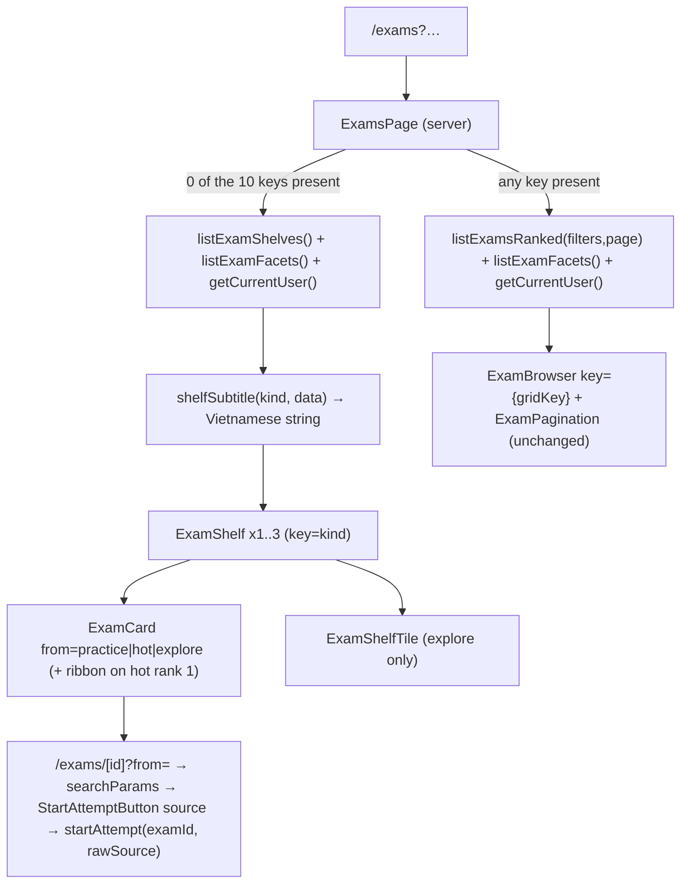

# Kho đề theo kệ (Exam Shelves) — Frontend Design Document

| Version | Date | Status | Chain |
|---|---|---|---|
| 1.0 | 2026-09-18 | Draft | PRD v1.1 → UI Spec v1.1 → ADR-0021 → **Frontend Design Doc** (+ backend DD) → Work Plan |

The React/data-flow design behind `docs/ui-spec/exam-shelves-ui-spec.md` v1.1: how `/exams` picks its branch, what it fetches on each, how shelf **facts** become Vietnamese strings, and how AC-026 / AC-032 / AC-043 hold structurally. Class strings, geometry, state matrices and copy keys stay in the UI Spec; ACs stay in the PRD.

```yaml
design_type: extension
risk_level: medium
complexity_rationale: "AC-001/008/010 add a second render branch to the primary browse surface; AC-043 demands byte-identical markup from a component with zero test coverage today."
main_constraints: ["0 client fetches (AC-005)", "CLS = 0 at 360/768/1024/1280", "ExamBrowser byte-untouched", "6 verify gates green by real exit code"]
unknowns: ["none open — the listHotExams() return shape is settled (see Assumed Behaviors)"]
```

**Prerequisite ADRs** — ADR-0021 (hot aggregate + attempt-source datum, both consumed here); ADR-0015 (rank-then-cut AC-006, `/exams` round-trip budget); ADR-0008 (`exams_with_difficulty` → `Exam.communityDifficulty` on every shelf card). No new common ADR: every pattern used here is existing repo vocabulary.

### External Resources Used

| Resource (project-tier label) | Feature-specific identifier | Notes |
|---|---|---|
| Design Origin | `docs/ui-spec/assets/exam-shelves/prototype-huong-a.html`; theme **Đêm hội** in `SOURCE/app/globals.css` | `globals.css` is the source of truth for the theme name (O-2) |
| Design System | `Card`, `Badge`, `chipVariants`, `PageContainer`, `PageHeader`, `ExamCard`, `ExamBrowser`, `ExamFilters` | UI Spec § Reuse Map |
| Guidelines | `globals.css:530-541` (light), `:604-820` (motion); `EXAM-SHELVES-BRIEF.md` §3/§5 | |
| Visual Verification Environment | `/exams` (0 params), `/exams?sort=hot`, `/` signed-in at 360/768/1024/1280 | Playwright **CLI** `npm run pw` from inside `SOURCE/`; the `playwright` MCP is stale and not callable |
| API Schema Source | `SOURCE/features/exams/queries/shelves.ts` — `listExamShelves`, `listHotExams` | Owned by the backend DD |

### Agreement Checklist

**Scope** — `app/(exams)/exams/page.tsx`; `features/exams/components/{ExamShelf,ExamRibbon}.tsx` (new); `ExamCard.tsx` (3 optional props); `ExamFilters.tsx` (1 chip); `app/(exams)/exams/[id]/page.tsx`; `StartAttemptButton.tsx`; `app/page.tsx`; `lib/copy.ts` (16 keys).
**Non-scope** — `ExamBrowser`, `ExamPagination`, `PageHeader`, `SiteHeader`, `BottomNav`, `HeaderSearch` byte-untouched (AC-007); `app/globals.css` not edited; 0 new dependencies (AC-045); the flat-grid path keeps today's tree verbatim including `key={gridKey}`.
**Constraints** — no parallel operation; backward compatibility required (`?sort=newest|oldest|hardest`, `?dir`, `?page` unchanged, `rating.int.test.ts:317-440` unmodified); performance measurement required (CLS = 0, manual Playwright CLI gate).

**Applicable Standards** — server components declared `export async function` even when nothing is awaited `[explicit]` `AppShell.tsx:33-43` (the in-process render harnesses detect server components by `AsyncFunction`; that docblock's "46 fixture cases" figure is stale — see D005 note in Test Plan — but the convention itself is enforced today by `app/(exams)/__tests__/layout.test.tsx`) · all display strings in `lib/copy.ts`, Vietnamese only, `{name}` interpolation `[explicit]` `copy.ts:1-10` · call sites never author `box-shadow`, and never a bespoke transition `[explicit]` `globals.css:530-541,604-617` · feature folders may not import each other `[explicit]` `eslint.config.mjs:27-56` · the bleed idiom `-mx-4 px-4 sm:-mx-6 sm:px-6` plus **both** scrollbar rules `[implicit]` `ExamFilters.tsx:161`, confirmed via UI Spec § Layout and scroll (2nd use; Rule of Three ⇒ copy, do not extract) · **deliberate deviation**: `.glow-sun` is reserved for touch targets (`globals.css:539-541`) and the ribbon is a static `aria-hidden` decoration wearing it — accepted because "hot" is also stated in words in the shelf title and subtitle.

**Assumed Behaviors**

| Claim | Evidence | Confirmed |
|---|---|---|
| `cn("card-linked relative h-full", undefined)` returns the identical string | `clsx` drops falsy args, `twMerge` no-ops on a conflict-free string; the AC-043 snapshot enforces it rather than assuming it | Yes |
| A falsy JSX child emits no HTML under `renderToReadableStream` | `AuthorByline.tsx:16` returns `null` today and the byline row vanishes with no placeholder | Yes |
| `/exams/[id]` is already dynamic, so `searchParams` costs no static→dynamic change; logged-out visitors never reach shelf markup | `[id]/page.tsx:39` reads cookies; `lib/supabase/middleware.ts:44,159` — `/exams` absent from `PUBLIC_PATHS` (AC-014) | Yes |
| `listHotExams(limit)` returns `{ exams, submittedExamIds }`, not bare `Exam[]` | Settled in the backend contract after cross-layer verification confirmed the regression: without the id set, `app/page.tsx:133`'s `submittedExamIds` has no source and every already-submitted exam on the home block flips its rate button from a live link to an `aria-disabled` button with the "finish the exam first" tooltip | Yes |

**Quality Assurance Mechanisms** — `adopted`: `npx tsc --noEmit` (`MessageKey` validity of every new `t()`, `ExamSort` whitelist parity) · `npx eslint --max-warnings 0` (`eslint.config.mjs`) · `npx vitest run` (`vitest.config.ts:17-28`, env `node`, 2 new files) · `npm run test:fixture` (`vitest.fixture.config.ts:36-54`, 1 new file) · `npm run build` + `check:bundle` + `npm run test:localdb` (gates only) · Prettier + `prettier-plugin-tailwindcss` (class-string order — generate the AC-043 snapshot **after** formatting) · `npm run pw` from inside `SOURCE/` (CLS audit, manual). `noted`: `npm run verify:deployed` — only needed when `globals.css` changes, which this feature does not · axe / jest-axe — no such dependency exists and none is added; PRD Success Criteria #8 makes a11y a recorded manual pass.

## Existing Codebase Analysis

| Type | Path (under `SOURCE/`) | Change |
|---|---|---|
| New | `features/exams/components/ExamShelf.tsx` | `ExamShelf` + module-local `SHELF` map + `ExamShelfTile`; exports `shelfSubtitle()` |
| New | `features/exams/components/ExamRibbon.tsx` | `ExamRibbon({ label })` carrying `data-slot="ribbon"`; exported so the snapshot test can reach it |
| New | `features/exams/components/__tests__/ExamCard.snapshot.test.tsx` | AC-043 proof |
| New | `features/exams/components/__tests__/ExamShelf.test.tsx` | shelf structural guarantees |
| New | `tests/e2e/fixture/exam-shelves.fixture.e2e.test.ts` | bare `/exams` end-to-end |
| **External dep** | `features/exams/queries/shelves.ts` | `listExamShelves()`, `listHotExams(limit)` — backend DD |
| **External dep** | `lib/exams/attemptSource.ts` | server-side `?from=` whitelist — backend DD |
| **External dep** | `lib/exams/browseParams.ts` | `BROWSE_PARAM_KEYS` (the ten AC-008 keys, named once), `hasBrowseParam(sp)` — the AC-008/AC-010 branch predicate, its own CI test — backend DD |
| Existing `:37-123` | `app/(exams)/exams/page.tsx` | branch; `"hot"` added to the whitelist at `:46-47` |
| Existing `:11-16,33-80` | `features/exams/components/ExamCard.tsx` | 3 optional props |
| Existing `:33,57-61` | `features/exams/components/ExamFilters.tsx` | local `ExamSort` += `"hot"`; `QUICK` 4th entry |
| Existing `:21,:32-36` | `features/exams/queries/catalogue.ts` (re-exported `queries/index.ts:26`) | `ExamSort` union += `"hot"` **and** the `DEFAULT_ASCENDING: Record<ExamSort, boolean>` entry `hot: false` — **owned by the backend DD, one edit, same commit** (see Interface Change Matrix) |
| Existing `:30-32`, `:127` | `app/(exams)/exams/[id]/page.tsx` | gains `searchParams`; the `StartAttemptButton` call site at `:127` gains `source={from}` |
| Existing `:17-18` | `features/exams/components/StartAttemptButton.tsx` | gains `source?: string` |
| Existing `:52-53,119-137` | `app/page.tsx` | **guarded** data source — `const hot = user ? await listHotExams(HOME_EXAM_COUNT) : null;` (an anonymous visitor issues 0 RPC calls) — + `home.hotExams` label |
| Existing `:81,132,505` | `lib/copy.ts` | 16 keys, 3 insertion points (UI Spec § Copy Keys) |
| Existing `:25` | `tests/helpers/renderServerTree.tsx` | import path is `@/tests/helpers/renderServerTree` — **not** the stale path at `essay-auto-scoring.fixture.e2e.test.ts:83` |

**Similar-component search** (`Glob: SOURCE/features/exams/components/*.tsx` + the UI analysis inventory): the only horizontally scrolling row in `SOURCE` is `ExamFilters.tsx:161` (chips — no snap, no header, no list semantics); `ExamBrowser` offers only `grid`/`stack` and a third layout is forbidden by the PRD Won't-Have list. **Decision: new implementation** (`ExamShelf`), bleed idiom copied rather than extracted.

### Fact Disposition Table

`code:` = frontend codebase analysis · `ui:` = UI fact analysis; merged rows carry both evidence pointers.

| Fact ID | Focus Area | Disposition | Rationale | Evidence |
|---|---|---|---|---|
| `code:exams/page.tsx:ExamsPage` + `ui:page.tsx:ExamsPage` | Page composition, 10-param surface, shelves/grid switch | transform | Branch on **raw key presence**; frame and grid branch unchanged | `page.tsx:23-35 \| :37-56 \| :61-68 \| :80-122`; `componentStructure[ExamsPage]` |
| `code:exams/page.tsx:gridKey` | `gridKey` remount trick and its measured CLS | preserve | Verbatim on the grid branch; shelves take no state-derived key | `page.tsx:71-78,:97 \| history/page.tsx:90-106 \| ExamFilters.tsx:154-161` |
| `code:ExamCard.tsx:ExamCard` + `ui:ExamCard.tsx:ExamCard` | Element inventory, stretched-link/z-index contract, ribbon attachment | transform | 3 optional props; `Link.card-link` stays **first** child, ribbon becomes **last**; no `overflow-hidden` on `Card` | `ExamCard.tsx:11-16 \| :21-32 \| :34-79 \| globals.css:486-516`; `cssLayout[.ribbon-wrap]` |
| `code:ExamBrowser.tsx:ExamBrowser` | Layouts, empty states, eligibility computation | preserve | File byte-untouched; `ExamShelf` duplicates the 2-line predicate per UI Spec | `ExamBrowser.tsx:12-22 \| :31-42 \| :44-60 \| :63-70` |
| `code:ExamFilters.tsx:ExamFilters` | Chip row, single sort axis, URL writers | transform | 4th `QUICK` entry only; `setSort`, `chipVariants`, row classes untouched | `ExamFilters.tsx:55-61 \| :98-130 \| :132-143 \| :154-210` |
| `code:ExamPagination.tsx:ExamPagination` | Pagination invariants | preserve | Not rendered on the shelves branch; grid branch passes today's `params` | `ExamPagination.tsx:29-43 \| :52-62 \| page.tsx:103-119` |
| `code:card.tsx:cardVariants` | cva primitives + one-yellow-per-screen rule | preserve | Tile reuses `variant="outline" + border-dashed`; no `Card`/`Button variant="sun"` in the shelves | `card.tsx:6-38 \| badge.tsx:6-31 \| chip.tsx:6-38 \| button.tsx:6-80` |
| `code:globals.css:motion-and-scroll-vocabulary` + `ui:prototype:p-shelf-row` | Motion vocabulary, reduced motion, absent scroll-snap | transform | Snap classes inline per UI Spec; smooth scroll = `motion-safe:scroll-smooth`; 0 `globals.css` edits, 0 `.motion-*` use | `globals.css:604-820 \| usePresence.ts:21-48`; `cssLayout[.p-shelf-row]` |
| `code:globals.css:light-and-token-rules` + `ui:globals.css:tokens-and-vocabulary` | Token set, light vocabulary, radius scale | preserve | Every token verbatim; no `--ember`; ribbon = `bg-sun` + `--sun-on-solid` + `glow-sun` | `globals.css:83-121 \| :203-231 \| :518-602` |
| `code:app/page.tsx:Home` | Home right column: markup, count, label key, branching | transform | Data source → **guarded** `user ? listHotExams(HOME_EXAM_COUNT) : null` (0 RPC calls when anonymous), label → new key; frame, `layout="stack"`, count, link, `home-new-exams` id unchanged; empty guard widens to `hot !== null && hot.exams.length > 0` | `app/page.tsx:24-34 \| :39-53 \| :116-145 \| copy.ts:81,95` |
| `code:lib/copy.ts:copy` + `ui:copy.ts:exam-shelf-strings` | Dictionary conventions, subject-label mismatch | transform | 16 keys at the 3 UI-Spec destinations; practice subtitle takes `{subject}` = `subjectLabel(subject)` → `Hóa học`, never `Hoá` | `copy.ts:1-10 \| :65-110 \| :133-160 \| :930-945`; `i18n.newStringsRequired` |
| `code:BottomNav.tsx:icon-conventions` | Lucide import/sizing/decoration conventions | preserve | `Target`/`Flame`/`Compass` named-imported per component, `size-[22px] strokeWidth={1.9}`, bare `aria-hidden` | `BottomNav.tsx:21,28-34,82 \| button.tsx:29 \| badge.tsx:16` |
| `code:ExamFilters.tsx:scroll-region-a11y` | A11y for scroll regions, decorative elements, section headings | transform | Each shelf `<section aria-labelledby>` + `h2` (first `h2` on `/exams` — intentional); row gets no `role`, no `tabIndex` | `ExamFilters.tsx:159-161 \| app/page.tsx:119-121 \| RateButton.tsx:58-62` |
| `code:exams/[id]/page.tsx:shelf-source-parameter` | Where `?from=` can land | transform | Full chain below; `searchParams` added and threaded to `startAttempt`'s bound argument | `[id]/page.tsx:30-32 \| StartAttemptButton.tsx:17-18 \| result/page.tsx:214-216` |
| `code:rating.int.test.ts:round-trip-budget` | Frozen test surface: reads, ranking, green assertions | preserve | Shelves branch issues no `listExamsRanked` call, so `:663-674` is untouched here; the aggregate's budget amendment is the backend DD's (UI Spec TBD-02) | `rating.int.test.ts:517-526,:663-674,:676-684 \| paginate.ts:22-39` |
| `code:renderServerTree.tsx:frontend-test-lanes` | Which lane proves what, and each lane's harness rules | transform | 3 new files across 2 lanes, each with pragma, import path and positive assertion pinned — see Test Plan | `vitest.config.ts:17-28 \| vitest.fixture.config.ts:36-54 \| renderServerTree.tsx:1-31` |
| `ui:app/page.tsx:119-130` | Shelf header: reproduction vs genuinely new | transform | Link class string copied **whole** from `app/page.tsx:126` (+ `whitespace-nowrap`); new parts are the 22px icon, 13px subtitle, `items-start`/`mt-0.5` | `componentStructure[Home right-column] \| cssLayout[.p-shelf-title]` |
| `ui:prototype:ribbon-sun-vs-bottomnav-pill` | Yellow carries two meanings on one mobile screen | transform | Accepted with mitigation (ribbon `aria-hidden` + `pointer-events-none`, "hot" in words); recorded in Applicable Standards | `chip.tsx:24-28 \| cssLayout[.ribbon.ribbon--sun]` |
| `ui:prototype:viewall-inconsistency` | `Xem tất cả` differs between the two canvas frames | remove | Resolved by AC-050/AC-004 and encoded in `SHELF.viewAllHref` — no responsive rule and no call-site choice left to get wrong | `componentStructure[ExamShelf] \| prototype 212-286 vs 325-399` |

## Design

```yaml
Change Target: /exams render branch + ExamCard prop surface + attempt-source chain
Direct Impact: the 10 New/Existing rows in the table above
Indirect Impact:
  - /exams document outline gains h2 between the PageHeader h1 and the card h3s
  - shelf card hrefs gain a query string (flat grid and home block: unchanged)
No Ripple Effect:
  - ExamBrowser, ExamPagination, PageHeader, PageContainer, SiteHeader, BottomNav, HeaderSearch,
    RateButton, DifficultyBadge, AuthorByline, globals.css, package.json
```

| Existing interface | New | Conversion | Wrapper | Compatibility method |
|---|---|---|---|---|
| `ExamCard({ exam, eligibility })` | `+ ribbon?, from?, className?` | No | Not required | All optional; the one call site (`ExamBrowser.tsx:53`) renders byte-identically (AC-043) |
| `StartAttemptButton({ examId })` | `+ source?: string` | No | Not required | Absent ⇒ `bind(null, examId, undefined)` ⇒ `none` |
| `startAttempt(examId)` | `startAttempt(examId, rawSource?)` | No | Not required | Unknown/empty/forged → `none`, never a rejected start (AC-041) |
| `ExamSort = newest\|oldest\|hardest` (`catalogue.ts:21`) | `+ "hot"`, **plus** `DEFAULT_ASCENDING.hot = false` (`catalogue.ts:32-36`) | No | Not required | **Not a one-line change**: `DEFAULT_ASCENDING` is a `Record<ExamSort, boolean>`, so widening the union alone makes the record incomplete and `tsc` errors at `catalogue.ts:32`. The union widening and the `hot: false` entry are **one edit owned by the backend Design Doc and must land in the same commit**, or the build is red between them. `page.tsx:46-47` must then add the literal or `sort` collapses to `undefined` |
| `ExamDetailPage({ params })` | `+ searchParams` | No | Not required | Next passes it regardless; the page is already dynamic |
| `listExamsRanked({}, 1)` @ `app/page.tsx:52` | `const hot = user ? await listHotExams(HOME_EXAM_COUNT) : null;` | **Yes** | Not required | Call replaced **and guarded**, not a bare swap: `app/page.tsx:52` runs for anonymous visitors too (the earlier `redirect` at `:48` fires only for signed-in users) on the public `/` route, and `exam_hot_counts` revokes `anon` — an unguarded call returns 42501 and surfaces an error page instead of the signed-out hero. An anonymous visitor therefore issues **0** RPC calls; consumer contract below |



### Data flow

**Branch rule (AC-008 / AC-010)** — reads **raw key presence on `sp`**, never the normalised locals: `?sort=bogus` and `?dir=asc` both normalise to `undefined` yet must render the flat grid. `/exams?q=` (present but empty) also stands the shelves down — the key is in the URL. A repeated key arrives as `string[]`: still `!== undefined`, still the grid. This is exactly why the predicate reads raw key presence rather than a parsed value: a parsed local is `undefined` for both "absent" and "present but garbage" alike, so it cannot tell the two cases apart, and only the raw key can. The predicate is named once — `lib/exams/browseParams.ts` (backend DD, its own CI test) exports `BROWSE_PARAM_KEYS` and `hasBrowseParam(sp)` — so the page imports it instead of keeping a second, driftable copy of the same ten keys.

```ts
import { hasBrowseParam } from "@/lib/exams/browseParams";

const showShelves = !hasBrowseParam(sp);
```

**`Promise.all`, before → after** — each branch still issues **3 reads**; only the first element changes, and `listExamFacets()` + `getCurrentUser()` run on **both** because the chip row renders on the shelves view too (AC-033). Under `strict: true` (`tsconfig.json:11`) the variadic-tuple overload types `shelves` and `ranked` as two **independent** nullable members: `shelves !== null` narrows `shelves` only, and `showShelves` is inferred as `boolean` rather than a literal, so it cannot discriminate the pair either. The shape is therefore an **early return** — `shelves !== null` narrows `shelves`; the grid branch carries its own `ranked` guard. Neither guard is a type assertion.

**Four array slots, not three.** The backend DD's integration point I1 describes this same `Promise.all` as three members with the first one swapped. This document keeps `shelves` and `ranked` as two separate, mutually exclusive slots instead — a deliberate difference in framing, not a disagreement in behaviour: exactly **3 reads** still happen per branch, one of the two slots always resolves to `null` with no network call, and the fourth array slot exists only because the strict-mode narrowing problem explained above needs it — a single slot typed as `ExamShelves | RankedExamList` would force a type assertion to discriminate the branch, which the early-return pattern above is chosen specifically to avoid. I1 counts reads, not array slots, so it has no reason to mention this.

```ts
// BEFORE (page.tsx:61-68)
const [ranked, facets, user] = await Promise.all([
  listExamsRanked(
    { subject, grade, school, schoolYear: year, semester, sort, level, dir, q },
    Number.isFinite(page) ? page : 1
  ),
  listExamFacets(), getCurrentUser(),
]);

// AFTER — 3 reads per branch; the unused branch contributes `null`, not a read.
const [shelves, ranked, facets, user] = await Promise.all([
  showShelves ? listExamShelves() : null,
  showShelves ? null : listExamsRanked({ subject, /* … */ q }, Number.isFinite(page) ? page : 1),
  listExamFacets(), getCurrentUser(),
]);

if (shelves !== null) {
  return ( /* PageContainer > PageHeader > ExamFilters > the SHELF_ORDER map below */ );
}
if (ranked === null) throw new Error("unreachable: grid branch without a ranked read");

// Both of these MOVE INTO the grid branch — today they sit unconditionally at :69 and :76-78.
const { exams, submittedExamIds, page: currentPage, pageCount, total } = ranked;
const gridKey = [subject, grade, school, year, semester, sort, level, dir, q, currentPage]
  .map((v) => v ?? "").join("|");
```

**Facts → strings** — the shelf module owns the copy keys, the page owns the interpolation call, so `ExamShelf` never re-derives a rung or a weakest subject. `t()` substitutes only the `{name}` tokens a key declares, so the site-wide rungs ignore the unused `grade` (`copy.ts:942-944`). `HotRung`'s literals are copied verbatim from the backend contract (`lib/adaptive/examShelves.ts`), and every `HOT_SUBTITLE` key is renamed to read consistently with them: `GradeWeek`/`SiteWeek` → `GradeRecent`/`SiteRecent`, `GradeMonth`/`SiteMonth` → `Grade30d`/`Site30d`; `GradeAll`/`SiteAll` keep their names because those two rung ids did not change. Each rung still maps to the Vietnamese subtitle its PRD AC pins: `grade-recent` → AC-019, `grade-30d` → AC-020, `grade-all` → AC-021, `site-all` → AC-022 (the shared terminal rung of both ladders), `site-recent`/`site-30d` → AC-023.

```ts
// features/exams/components/ExamShelf.tsx
const HOT_SUBTITLE = {
  "grade-recent": "exams.shelfHotGradeRecent", "grade-30d": "exams.shelfHotGrade30d",
  "grade-all":    "exams.shelfHotGradeAll",    "site-recent": "exams.shelfHotSiteRecent",
  "site-30d":     "exams.shelfHotSite30d",     "site-all":    "exams.shelfHotSiteAll",
} as const satisfies Record<HotRung, MessageKey>;

type ShelfData = NonNullable<ExamShelves["practice"] | ExamShelves["hot"] | ExamShelves["explore"]>;

export function shelfSubtitle(kind: ShelfKind, data: ShelfData): string {
  if (kind === "practice") return t("exams.shelfPracticeSubtitle", { subject: subjectLabel((data as { subject: string }).subject) });
  if (kind === "explore") return t("exams.shelfExploreSubtitle");
  const { rung, grade } = data as { rung: HotRung; grade: number | null };
  return t(HOT_SUBTITLE[rung], { grade: grade ?? "" });
}
```

The page calls this with `data = shelves[kind]` (Page body below), so `kind` and `data` are correlated at the call site but not by a type TS can narrow on its own — a known limitation of pairing a discriminant and its payload across two separate parameters, not something a stronger signature here would remove. The branch body reflects that: each `if` reads only the field its own branch names (`subject` only under `practice`, `rung`/`grade` only past both `if`s), so — unlike the version this replaces — the practice branch can never reach for `rung`, which the backend never populates on `ExamShelves["practice"]`.

**Page body** — array-literal order fixes DOM order (AC-003) and `null` shelves drop out (AC-051); neither is a call-site decision.

```tsx
const SHELF_ORDER = ["practice", "hot", "explore"] as const;
…
{SHELF_ORDER.map((kind) => {
  const data = shelves[kind];
  return data && (
    <ExamShelf key={kind} shelf={kind} subtitle={shelfSubtitle(kind, data)} exams={data.exams}
      submittedExamIds={shelves.submittedExamIds} isLoggedIn={user !== null} />
  );
})}
```

### Data contracts

```yaml
Contract: listExamShelves()          # producer: features/exams/queries/shelves.ts (backend DD)
Output:
  Type: |
    type ShelfKind = "practice" | "hot" | "explore";
    type HotRung = "grade-recent" | "grade-30d" | "grade-all" | "site-recent" | "site-30d" | "site-all";
    interface ExamShelves {
      practice: { subject: string; exams: Exam[] } | null;                      // null => absent (AC-013/AC-051)
      hot:      { rung: HotRung; grade: number | null; exams: Exam[] } | null;  // AC-024/AC-051
      explore:  { exams: Exam[] } | null;                                      // AC-031/AC-051
      submittedExamIds: Set<string>;                                           // same set the flat grid uses
    }
  Guarantees:
    - populated shelf or null; "present but empty" is unrepresentable (AC-051 structural)
    - exams already ranked then cut to <= 10 in Node (AC-002, AC-006)
    - facts only (rung / grade / subject); 0 copy keys and 0 Vietnamese strings cross this boundary
    - practice.subject is the canonical DB key ("Chemistry"), not a label
    - the shape is discriminated per shelf, not a single shape reused three times: practice never
      carries rung/grade, hot never carries subject, explore carries neither — shelfSubtitle() below
      reads accordingly
  On Error: propagates and fails the page read — today's /exams behaviour; no per-shelf boundary
Invariants: submittedExamIds is ONE set per page; eligibility is never computed per card

Contract: listHotExams(limit)        # home block; limit = HOME_EXAM_COUNT = 3
Output:
  Type: |
    interface HotExamList { exams: Exam[]; rung: HotRung | null; grade: number | null;
                            submittedExamIds: Set<string> }   // NOT a bare Exam[]
  Guarantees: same hot order and ladder as AC-018–AC-023, cut in Node; 0 exams when the site has
              0 submitted attempts (AC-024); submittedExamIds is required — without it
              app/page.tsx:133 has no source for the rate-button eligibility state

Contract: ExamShelf                  # 5 props, 0 optional (UI Spec § Component: ExamShelf)
Input:
  shelf: ShelfKind          # selects icon, title key, from, viewAllHref, ribbonOnFirst, trailingTile
  subtitle: string          # already interpolated by the page
  exams: Exam[]             # 1..10, ranked and cut upstream
  submittedExamIds: Set<string>
  isLoggedIn: boolean
Output:
  Guarantees:
    - exams.length === 0 -> returns null (0 header, 0 subtitle, 0 placeholder)
    - <section aria-labelledby="shelf-{shelf}"> > header > <ul>; every card and the tile are <li>
    - eligibility = isLoggedIn ? (submittedExamIds.has(id) ? "eligible" : "not-attempted") : "logged-out"
Invariants: no "use client"; `export async function`; 0 state, 0 effects, 0 data-derived React key
```

The `SHELF` map is **module-local to `ExamShelf.tsx` and not exported**. Everything that differs between the three shelves is an entry; the component reads it, the page cannot override it.

```ts
const SHELF = {
  practice: { icon: Target,  titleKey: "exams.shelfPracticeTitle", from: "practice",
              viewAllHref: (exams: Exam[]) => `/exams?subject=${encodeURIComponent(exams[0].subject)}`,
              ribbonOnFirst: false, trailingTile: false },
  hot:      { icon: Flame,   titleKey: "exams.shelfHotTitle",      from: "hot",
              viewAllHref: () => "/exams?sort=hot", ribbonOnFirst: true,  trailingTile: false },
  explore:  { icon: Compass, titleKey: "exams.shelfExploreTitle",  from: "explore",
              viewAllHref: null, ribbonOnFirst: false, trailingTile: true },
} as const satisfies Record<ShelfKind, ShelfSpec>;
```

| Guarantee | Structural mechanism |
|---|---|
| AC-026 — exactly 1 ribbon per page | `ExamShelf` has **no** ribbon prop. The only expression in the repo filling `ExamCard.ribbon` is `SHELF[shelf].ribbonOnFirst && i === 0 ? t("exams.hotRibbon") : undefined` inside `ExamShelf`'s `.map`; only `hot` sets the flag and the page composes at most one `hot` shelf. `ExamBrowser.tsx:53-57` never passes it ⇒ 0 ribbons in the flat grid and the home block (AC-037), 0 code changes |
| AC-032 — tile on Khám phá only | `ExamShelfTile` is module-local and unexported, emitted by exactly one expression `SHELF[shelf].trailingTile && <ExamShelfTile />`; only `explore` sets the flag |
| AC-004 — no Khám phá header link at any breakpoint | `viewAllHref: null`; the header renders a link only for a non-null builder, and there is no `viewAllHref` prop to pass (UI Spec 1.1 dropped it) |

### ExamCard extension and the containment proof (AC-043)

```ts
interface ExamCardProps {
  exam: Exam;
  eligibility: RateEligibility;
  /** Ribbon label. Only ExamShelf supplies it, only on hot rank 1 (AC-026). */
  ribbon?: string;
  /** Shelf of origin; appended to the href as ?from= (AC-039). */
  from?: AttemptSource;
  /** Width class from the shelf row only; a parent [&>li]:w-80 rule would also hit the tile. */
  className?: string;
}
```

| Edit | Line today | Shape | Absent ⇒ identical because |
|---|---|---|---|
| href | `:37` | `const href = from ? \`/exams/${exam.id}?from=${from}\` : \`/exams/${exam.id}\`;` | the else arm is today's template, character for character |
| root class | `:35` | `<Card as="li" className={cn("card-linked relative h-full", className)}>` | `clsx` drops `undefined`; `twMerge` no-ops on a conflict-free string |
| ribbon | new **last** direct child of `Card`, after the footer `div` (`:77`) | `{ribbon ? <ExamRibbon label={ribbon} /> : null}` | an explicit `null` emits no HTML — never `{ribbon && …}`, which renders `""` for an empty-string prop |

`ExamRibbon`'s clip square carries **`data-slot="ribbon"`** alongside its `aria-hidden` (the `data-slot` idiom is already how `Card`, `Badge` and `Chip` mark themselves). It is the test hook: a bare `ExamCard` already contains other `aria-hidden` elements — the decorative `Làm đề` pill (`ExamCard.tsx:70-75`) and `DifficultyBadge`'s meter span (`DifficultyBadge.tsx:48`) — so a bare `[aria-hidden]` count would be red on its first run for the wrong reason.

Unchanged and load-bearing: the stretched `Link.card-link` stays the **first** direct child (`.card-linked:has(> .card-link:hover)` matches direct children only), `Card` does **not** gain `overflow-hidden`, no `translate` on hover.

**Proof file** — `SOURCE/features/exams/components/__tests__/ExamCard.snapshot.test.tsx`, committed **against the pre-change component** and kept green across the change. Line 1 is exactly `// @vitest-environment jsdom` (`vitest.config.ts:18` defaults to `node`; precedent `RichText.regression.test.tsx:1`). Import verbatim: `import { renderServerTree } from "@/tests/helpers/renderServerTree";` — required over `render(await ExamCard(props))` because `ExamCard` is async and renders the async `AuthorByline`, so the direct form yields an empty tree and a vacuous pass. Lane: default `npm test` (`vitest.config.ts:26` collects `features/**/*.test.tsx`); no `vi.mock("server-only")` needed, nothing in `ExamCard`'s import graph pulls it in. Run Prettier **before** generating the snapshot — the Tailwind plugin rewrites class order.

| Case | Asserts |
|---|---|
| bare card | positive first — `container.querySelector("h3")?.textContent === exam.title` (an empty tree is always red) — then `expect(container.innerHTML).toMatchSnapshot()`, the repo's only snapshot idiom (`RichText.regression.test.tsx:37-72`) |
| `from="hot"` | stretched link `href === "/exams/{id}?from=hot"`; the bare-card snapshot still matches |
| `ribbon="Hot nhất"` | exactly 1 `[data-slot="ribbon"]` inside the card, and the card's `[aria-hidden]` count equals **the bare card's count + 1**; `card.firstElementChild` still carries `class*="card-link"`; the bare-card snapshot still matches |

### Field Propagation Map — the `?from=` chain

| Field | Boundary | Status | Serialized format | Consumer parse rule | Detail |
|---|---|---|---|---|---|
| `from` | `ExamShelf` → `ExamCard` | preserved | — | — | `from={SHELF[shelf].from}`, typed `"practice"\|"hot"\|"explore"` |
| `from` | `ExamCard` → browser URL | transformed | `?from=practice\|hot\|explore` — lowercase ASCII, single key, no encoding, appended to `/exams/{id}` | — | Absent prop ⇒ no query string at all (AC-039 for grid and home) |
| `from` | URL → `app/(exams)/exams/[id]/page.tsx` | preserved | `?from=<raw>` — anything a user can type | `searchParams: Promise<{ from?: string }>`, read as `const [{ id }, { from }] = await Promise.all([params, searchParams]);` — **no client-side validation or narrowing** | Repo convention types every searchParam as `string` (`exams/page.tsx:23-35`); a repeated key arrives as an array at runtime and is simply not in the whitelist |
| `source` | `[id]/page.tsx` → `StartAttemptButton` | preserved | — | — | The call site at **`[id]/page.tsx:127`** becomes `<StartAttemptButton examId={exam.id} source={from} />`; prop typed `source?: string`, deliberately **not** the union — untrusted until the server whitelist |
| `rawSource` | `StartAttemptButton` → `startAttempt` | preserved | server-action closure argument | `startAttempt(examId, rawSource?)` | `const start = startAttempt.bind(null, examId, source);` replaces `bind(null, examId)` at `StartAttemptButton.tsx:18` |
| *(none)* | `StartAttemptButton` → `StartAttemptSubmit` → form submit | **not carried** | — | — | The `"use client"` half (`StartAttemptSubmit.tsx:25`) takes only `{ label, pendingLabel }` and gains **nothing**. It sits inside `<form action={start}>` and submits it, so both bound arguments travel in the action's own closure, never through this component's props. Listed so the chain reads as complete |
| `source` | `startAttempt` → `exam_attempts` row | transformed | DB column value | `lib/exams/attemptSource.ts` whitelist → `practice\|hot\|explore\|none` | Unknown/empty/array/forged ⇒ `none`; 0 errors, 0 rejected starts (AC-041). Owned by the backend DD |
| `from` | `[id]/page.tsx` → `/exams/[id]/rate` | **dropped, deliberately** | — | — | The rate route is reached from every shelf card's `RateButton` (`RateButton.tsx:36`). `?from=` attributes an **attempt start**; it has no meaning on the rating route, so it is **not** threaded there for symmetry and `RateButton` gains 0 props |

### Home block (AC-036–AC-038) and the Nổi nhất chip (AC-033, AC-034)

| Aspect | Today (`app/page.tsx`) | After |
|---|---|---|
| Data source | `:52-53` `listExamsRanked({}, 1)` then `.slice(0, HOME_EXAM_COUNT)` | `const hot = user ? await listHotExams(HOME_EXAM_COUNT) : null;` — **guarded**, not a bare swap: `app/page.tsx:52` runs for anonymous visitors too (the earlier `redirect` at `:48` fires only for signed-in users), and `exam_hot_counts` revokes `anon`, so an unguarded call would throw 42501 and replace the signed-out hero with an error page. **An anonymous visitor issues 0 RPC calls.** For a signed-in visitor the cut still moves into the query, and `HOME_EXAM_COUNT = 3` stays the single constant |
| Label | `:122` `t("home.newExams")` | `t("home.hotExams")` — a **new** key; editing the string behind `home.newExams` would rename the concept everywhere it is used |
| Ribbon / `?from=` | — | **0 of each, structurally**: the block renders through `ExamBrowser`, which passes neither (`ExamBrowser.tsx:53-57`). 0 code changes |
| Hot list empty | `exams.length > 0` guard at `:118` | Guard becomes `hot !== null && hot.exams.length > 0`. `hot === null` covers the anonymous visitor (0 RPC calls, guarded above); `hot.exams.length === 0` covers a signed-in visitor on a site with 0 submitted attempts (AC-024 — `listHotExams` still runs, 1 RPC call, every rung comes back empty). Both collapse to the same outcome: the whole `<section>` is absent, not an empty frame (AC-038) |
| Unchanged | `<section aria-labelledby="home-new-exams">`, `text-xl font-semibold`, `layout="stack"`, `Xem tất cả đề`, guest `TechStack` branch | `home-new-exams` keeps its id: not user-visible, renaming it is churn with no AC behind it |

Chip: (1) `ExamFilters.tsx:33` `type ExamSort = "newest" | "oldest" | "hardest" | "hot";` (2) `ExamFilters.tsx:57-61` `QUICK` gains `{ value: "hot", labelKey: "exams.sortHot" }` (3) `catalogue.ts:21` + `:32-36` per the Interface Change Matrix, and `page.tsx:46-47` adds `|| sp.sort === "hot"`.

Two separate lines force the two unions, and naming only one loses the chain: `page.tsx:46` annotates against the **queries-side** `ExamSort`, so that union must widen; `page.tsx:91` passes `sort={sort}` into `ExamFiltersProps.sort` (`ExamFilters.tsx:50`), so the **local** copy at `:33` must widen too, or the prop no longer accepts the value. Both or `tsc` fails.

`QUICK` holds **three** entries today, so the new one leaves **three** sort chips untouched — they all come from one `.map` over `QUICK` (`:190-203`), and `setSort`, `chipVariants({ active })`, `aria-pressed`, the `dir`/`page` deletion and toggle-off are inherited unmodified; mutual exclusion falls out of the same `sort === q.value` comparison. The other three controls in the row — the search chip (`:165-176`), the `Bộ lọc` chip (`:178-186`) and `Xoá lọc` (`:205-209`) — are **not in that map at all** and are likewise untouched, which is the whole of AC-033's "0 changed props".

### Rendering, performance and motion

| Concern | Decision |
|---|---|
| Where it renders | 100% server. `ExamShelf`, `ExamRibbon`, `ExamShelfTile` carry no `"use client"` and are declared `export async function` (the fixture harness detects server components by `AsyncFunction`) |
| Client fetches | **0** (AC-005). Every shelf card is in the initial HTML; no effect, no Suspense boundary, no skeleton — none exists in this repo and none is added |
| React `key` | The page maps `SHELF_ORDER` with **`key={kind}`** — a stable literal, never derived from data or URL state, because a state-derived key on a scroll container resets `scrollLeft` on every navigation. The shelves view has exactly one URL (`/exams`, 0 params), so there is no filter round-trip to protect against; the CLS lesson at `page.tsx:71-78` (0.49 @360 / 0.29 @768 / 0.19 @1024 / 0.13 @1280, measured 2026-09-08) applies to the grid branch, which keeps `key={gridKey}` verbatim. Crossing branches swaps the element type, so React builds a new tree regardless |
| Layout shift | Cards are `w-80 lg:w-84` — intrinsic width known at parse time; the ribbon is absolutely positioned inside an already-`relative` card and takes 0 layout space; the row's `pt-1`/`pb-1.5` keeps the `--glow-card` ring and the 3px focus ring unclipped. Target CLS = **0** at all four widths, on open **and** on swipe |
| Reduced motion | None of the `.motion-*` / `usePresence` vocabulary, no `translate`. The single motion token is `motion-safe:scroll-smooth` on the row — a stock utility behind the repo-wide `motion-safe:` variant, so under `prefers-reduced-motion: reduce` it does not apply. No `globals.css` edit, no bespoke guard |
| Reads | 3 top-level calls per branch inside one `Promise.all`; 0 per-shelf and 0 per-card reads; eligibility derived once from one `Set` |

**States** — `ExamShelf`: loading N/A (server-rendered, 0 client fetches); empty ⇒ returns `null` and siblings keep their order (AC-051); error ⇒ no per-shelf boundary, a failed read fails the page read as today; partial not modelled, all shelf data resolves in the one `Promise.all`. Home hot block: empty ⇒ whole `<section>` absent (AC-038). **Client state: none introduced** — the only mutable state on the page is the row's browser-owned `scrollLeft`, preserved across re-render precisely because no shelf carries a data-derived `key`. No reset/clear operation exists.

### Minimal Surface Alternatives

**Element 1 — `ExamCard.from`** (prop crossing a component boundary, emitted onto a serialized URL). Fixed requirements: AC-039, AC-040/AC-042 (the value must reach `exam_attempts` so one SQL query answers the metric), AC-043.

| Alternative | Covers | New persistent state | New props/modes | Crosses boundary | Breaking | Subjective cost |
|---|---|---|---|---|---|---|
| A. `from` prop → `?from=` on the href (**selected**) | AC-039, 040, 042, 043 | 1 (DB column, ADR-0021) | 1 | yes | no | 5 files along the chain |
| B. Derive from the HTTP `Referer` inside `startAttempt` | AC-040 partly | 1 | 0 | no | no | Stripped by many mobile browsers; cannot tell three shelves apart on one page — **fails AC-042** |
| C. Client-side `sessionStorage` written on card click | neither 040 nor 042 | 1 (browser) | 0 | yes | no | Needs a client component on a server-only card — **fails AC-005**, unreadable by SQL |

Selected A — B and C fail AC-042, which requires one `select` over `exam_attempts` with 0 application-log reading. Rejected: **B** (Referer unreliable and same-page ambiguous), **C** (invents client state on a server surface, datum unqueryable).

**Element 2 — `ExamCard.className`** (prop crossing a component boundary). Fixed requirement: shelf cards are `w-80 lg:w-84` while the tile in the same row is `w-[150px] lg:w-[200px]` (UI Spec § Layout and scroll, § ExamShelfTile).

| Alternative | Covers | New persistent state | New props/modes | Crosses boundary | Breaking | Subjective cost |
|---|---|---|---|---|---|---|
| A. `className` passthrough (**selected**) | both widths | 0 | 1 | yes | no | one optional prop, covered by the same AC-043 snapshot |
| B. Parent rule `[&>li]:w-80 lg:[&>li]:w-84` on the row | card width only | 0 | 0 | no | no | also hits the tile `<li>`, overriding 150/200px — **fails the tile requirement** |
| C. A `width` variant on `ExamCard` | both widths | 0 | 1 mode + a cva table | yes | no | closed variant list for a value one caller sets — strictly larger |

Selected A. Rejected: **B** (one selector cannot give two widths in one row), **C** (a variant enum where a merge-through string suffices).

**Element 3 — the `ExamShelf` component split.** Fixed requirements: the PRD Won't-Have row "Any change to the flat grid, `ExamBrowser`, `ExamPagination`, or `ExamFilters` beyond one added chip" (`ExamBrowser` byte-untouched); AC-001 (bare `/exams` contains **0** instances of the flat grid and **0** `ExamPagination`) and AC-008 (any listed param renders `ExamBrowser` + `ExamPagination` exactly as today) — together these require the shelves surface to be structurally distinct from the flat grid, not a mode of it.

| Alternative | Covers | New persistent state | New props/modes | Crosses boundary | Breaking | Subjective cost |
|---|---|---|---|---|---|---|
| A. New `ExamShelf` component; `ExamShelfTile` + `SHELF` stay module-local (**selected**) | AC-001, AC-004, AC-008, PRD Won't-Have | 0 | 1 exported component + `shelfSubtitle` + `ExamRibbon` (the last only because the snapshot test reaches it) | yes (new module) | no | 2 new files, 0 edits to `ExamBrowser` |
| B. Reuse `ExamBrowser` with a third layout variant (`layout="shelf"`) | AC-001, AC-004 partly | 0 | 1 new mode on an existing prop | no | no | Closed by the PRD Won't-Have row before any cost comparison — `ExamBrowser` must stay byte-untouched, and a third `layout` value is itself an edit to that file; `ExamBrowser.tsx:12-22,:31-42` show its two existing layouts (`grid`/`stack`) already assume single-axis cards, not a scroll row, ribbon slot or trailing tile |
| C. One shared component parametrised by shelf-vs-grid via a boolean prop | AC-001 | 0 | conditional branches inside one file | no | no | List semantics, pagination presence and ribbon eligibility diverge enough between the two surfaces that the boolean would fork most of the component body — same file, two unrelated render paths, not a fold |

Selected **A**. Rejected: **B** — forbidden outright by the PRD Won't-Have row, not merely costlier; the file must stay byte-untouched, and a third layout mode is a novel branch, not a reuse. **C** — the two surfaces share too little (list vs scroll-row semantics, pagination vs none, ribbon eligibility vs none) for a boolean to buy anything over two small components.

## Implementation Plan

**Vertical Slice** — each slice is independently renderable and verifiable, the three shelves share one data call, and the change touches route, component and action layers at once. Horizontal (all components → page → chain) would leave the `?from=` datum unwritten until the end with no L1 checkpoint before then. Hybrid rejected: nothing here is exploratory, every technique has a named repo precedent.

| # | Slice | Depends on | Verification |
|---|---|---|---|
| 1 | `ExamCard.snapshot.test.tsx` **against the pre-change component**; commit the `.snap` | — | L2 — `npx vitest run` green, snapshot committed |
| 2 | `lib/copy.ts` 16 keys at the 3 destinations | — | L3 — `tsc --noEmit` |
| 3 | `ExamRibbon.tsx` + `ExamCard` 3 optional props | 1, 2 | L2 — slice 1 still green; **the AC-043 moment** |
| 4 | `ExamShelf.tsx` (`SHELF`, tile, `shelfSubtitle`) + `ExamShelf.test.tsx` | 2, 3 | L2 |
| 5 | **Integration point** — `page.tsx` branch (early return; the `:69` destructure and `:76-78` gridKey move into the grid branch), `?sort=hot` whitelist, `ExamFilters` chip | 4, `shelves.ts`, **and the `catalogue.ts` union + `DEFAULT_ASCENDING.hot` edit in the same commit** | **L1** — bare `/exams` renders three shelves; `?sort=hot` renders the flat grid |
| 6 | `?from=` chain: `[id]/page.tsx` → `StartAttemptButton` → `startAttempt` | 5, `attemptSource.ts` | L1 — start an attempt from a shelf card, read the column back |
| 7 | `app/page.tsx` data source + label | `listHotExams` | L1 |
| 8 | `exam-shelves.fixture.e2e.test.ts`, then the 6 gates + the manual audit | 5, 6, 7 | L2 + manual |

Slice 5 is the integration point: the first task that makes the whole UI operational and the only one that can turn `/exams` red for every user.

**Verification strategy** — *correct* means (a) `ExamCard` with none of the three new props produces markup byte-identical to today, (b) the bare `/exams` HTML carries every qualifying shelf with the right ribbon and tile counts and 0 grid/pagination, (c) every listed parameter still yields today's tree. Proven by, respectively: the committed snapshot kept green through slice 3; the fixture-lane case; `rating.int.test.ts` passing unmodified plus the fixture lane's `?sort=hot` case. **Early verification point**: slices 1 + 3 — the snapshot survives the `ExamCard` edit with **no `-u`**. Failure response: stop; a snapshot needing `-u` means the containment promise is already broken, and every diff hunk must be explained before slice 4 starts.

## Test Plan

| Lane | Command / config | File | Proves |
|---|---|---|---|
| Component | `npx vitest run` · `vitest.config.ts:17-28`, env `node` ⇒ line 1 is `// @vitest-environment jsdom` | `features/exams/components/__tests__/ExamCard.snapshot.test.tsx` | AC-043 containment — the 3 cases above; the positive title assertion makes an empty tree red |
| Component | same | `features/exams/components/__tests__/ExamShelf.test.tsx` | AC-004 (icon + `h2` + subtitle + link per `SHELF`, and **no** link on `explore`), AC-026 (1 ribbon at index 0, 0 at 1..9), AC-032 (tile last `<li>` on `explore` only), AC-039 (every card href carries the shelf's `?from=`), AC-051 (`exams: []` ⇒ `null`), AC-047 (every card a focusable link in DOM order; row has no `tabIndex`/`role`). Uses `renderServerTree` for the same async-child reason |
| Fixture e2e | `npm run test:fixture` · `vitest.fixture.config.ts:36-54` | `tests/e2e/fixture/exam-shelves.fixture.e2e.test.ts` | Bare `/exams`: 3 `<section>`s in order practice→hot→explore (AC-003), **0** grid `<ul>` and **0** pagination `<nav>` (AC-001), ≤10 cards per row (AC-002), exactly 1 ribbon page-wide (AC-026), chip row with 4 sort chips including `Nổi nhất` (AC-033); second case `?sort=hot` ⇒ 0 sections + `ExamBrowser` present (AC-008) |
| Manual | `npm run pw` **from inside `SOURCE/`** | — | CLS = 0 at **360 / 768 / 1024 / 1280** on `/exams` cold open **and** during a horizontal shelf swipe, plus `/exams?sort=hot` and `/` signed-in (Success Criteria #3) |
| Manual | recorded pass | — | Keyboard + TalkBack at 360 and 1280: every card reachable in DOM order, shelf headings announced, ribbon absent from the accessible name (Success Criteria #8) |

**Does the fixture file run under the lane's config as written? Yes.** `vitest.fixture.config.ts:44` includes the whole directory (`tests/e2e/fixture/**/*.test.{ts,tsx}`) and `:45-52` excludes **six files by name** (`history`, `rating`, `short-answer-scoring`, three `support-*`). `exam-shelves.fixture.e2e.test.ts` is not among them, so it is collected the moment it is committed and **no config change is required**. Two obligations follow: (1) it must contain at least one real `it()`/`test()` (or `it.todo`) — a collected file with zero tasks makes vitest report "No test suite found in file" and exit 1; do **not** add it to the exclude list, which exists for Playwright-shaped driver scripts that never execute (`vitest.fixture.config.ts:19-29`); (2) line 1 must be `// @vitest-environment jsdom` — the config sets `environment: "node"` at `:43` and `renderServerTree` needs `document` (precedent `essay-auto-scoring.fixture.e2e.test.ts:1`).

**Mock boundary** — MOCKED: `listExamShelves`, `listExamFacets`, `getCurrentUser` (hand-built fixtures); `features/exams/actions` (no attempt started). REAL: `lib/copy.ts` and every dictionary lookup (so a case asserts the right key resolved to the right Vietnamese string), `ExamShelf`, `ExamCard`, `ExamRibbon`, `ExamFilters`, both layouts, `subjectLabel`. No database, no network, no MSW. `AppShell` is called as a **function**, not JSX (`AppShell.tsx:33-43`) — React 19 refuses an async element in the jsdom render lanes. **D005**: that docblock's "46 fixture cases" figure is stale, and so is any claim that breaking the convention turns the fixture lane red — no fixture case executes today (six driver scripts excluded by name, the one collected file is all `it.todo`), and a grep for `resolveServerTree` finds only the comment that names it. The gate that actually enforces the convention today is `app/(exams)/__tests__/layout.test.tsx`, collected by `vitest.config.ts:22` in the default lane. **The new file below will be the first case the fixture lane ever actually executes** — worth knowing before reading a green `npm run test:fixture` as evidence of anything. Import `@/tests/helpers/renderServerTree`; the path quoted at `essay-auto-scoring.fixture.e2e.test.ts:83` is stale and this repo has a recorded history of getting it wrong. **Untouched**: `rating.int.test.ts:317-440` and `:663-674` must pass unmodified — the shelves branch issues no `listExamsRanked` call. `rating.fixture.e2e.test.ts:128-135` asserts card anchors but sits in the exclude list and never executes; recorded so nobody "fixes" it.

## Open Items and Risks

No open escalations. Both cross-layer items are settled; one docs-only cleanup is carried to the work plan.

| ID | Item | Owner | Status |
|---|---|---|---|
| O-1 | `listHotExams(limit)` returns `{ exams, submittedExamIds }`. Raised here as a predicted regression, confirmed by cross-layer verification, and fixed in the backend contract in the same pass | Backend DD | **Closed** — see Assumed Behaviors; R-1 stays as a recorded risk |
| O-2 | The two stale theme-name comments at `SOURCE/app/(exams)/layout.tsx:2` and `SOURCE/components/layout/AppShell.tsx:15` still say "Mực & Sơn mài"; `globals.css` ships "Đêm hội". `docs/project-context/external-resources.md` itself was already corrected in a separate pass | Engineer | **Open** — docs-only cleanup, carry into the work plan |
| O-3 | UI Spec TBD-02 — the `/exams` round-trip budget assertion (`rating.int.test.ts:663-674`) once the hot aggregate lands. Out of this document's scope: the shelves branch issues no `listExamsRanked` call | Backend DD | **Closed** — owned and handled there |

| Risk | Impact | Prob. | Mitigation |
|---|---|---|---|
| R-1 — `listHotExams()` ships without the submitted-exam id set, regressing the home block's Chấm điểm state | Medium | Low (contract now settled, O-1) | Recorded rather than dropped, because the regression is silent. Fallback if the signature ever narrows: add `listMySubmittedExamIds()` **inside the same `Promise.all` as the hot read** — `/` is not a one-read route (`app/page.tsx:39-43` awaits a first wave of `searchParams` + `getCurrentUserProfile()` + `headers()`, then `:52` awaits the exam read), so the cost is one extra **parallel** read in the existing second wave, not a third sequential round-trip |
| R-2 — `ExamCard` markup drifts with nothing to catch it (no test exists today) | High | Medium | Slice 1 commits the snapshot **before** the component changes; the early verification point forbids `-u` |
| R-3 — Branch written against the normalised locals instead of raw keys, so `?dir=asc` or `?sort=bogus` renders shelves | High | Medium | Branch delegates to `hasBrowseParam(sp)` (`lib/exams/browseParams.ts`, backend DD) rather than a local re-check, so there is no second copy of the raw-key predicate to drift; the fixture case covers `?sort=hot`, and `?dir` / `?page=2` are named in AC-010 |
| R-4 — Scroll-snap is new vocabulary; a row-level `key` or a stray `overflow-hidden` reintroduces CLS or clips focus rings | Medium | Medium | `key={kind}` pinned as a literal; `pt-1`/`pb-1.5` and the no-`overflow-hidden` rule carried from the UI Spec; the manual CLS gate measures four widths on open and on swipe |
| R-5 — A new copy key is missed and `t()` prints the raw key on screen | Medium | Low | `MessageKey = keyof typeof copy` makes an undeclared key a `tsc` error; slice 2 lands all 16 keys before any component references them |
| R-6 — Yellow gains a second meaning while the `BottomNav` pill is on screen, and `glow-sun` sits on a non-touch-target | Low | High (by design) | Accepted deviation recorded in Applicable Standards; ribbon is `aria-hidden` + `pointer-events-none` and "hot" is carried in words |

**References** — `docs/prd/exam-shelves-prd.md` v1.1 (AC-001–AC-051) · `docs/ui-spec/exam-shelves-ui-spec.md` v1.1 · `docs/adr/ADR-0021-cross-user-hot-aggregate-and-attempt-source.md` · `docs/adr/ADR-0015-personalised-exam-ranking-placement-and-telemetry.md` · `docs/design/exam-shelves-backend-design.md` (contracts consumed, not restated) · `EXAM-SHELVES-BRIEF.md` §3/§5.

| Date | Version | Changes | Author |
|---|---|---|---|
| 2026-09-18 | 1.0 | Initial version from PRD v1.1 + UI Spec v1.1 + frontend codebase/UI analyses | Claude (design doc agent) |
