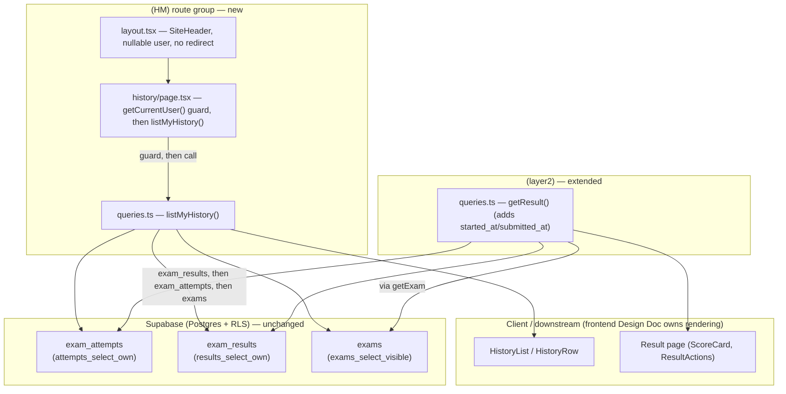

# History — Backend Design Document

| | |
|---|---|
| **Version** | 1.2 |
| **Date** | 2026-07-28 |
| **Status** | Draft — backend/data-layer design for the History feature. Scope: one new list query, one additive extension to an existing single-attempt query, and the `/history` page-level auth guard + route-group layout. **UI components, PDF generation, and share mechanics are out of scope** — a separate frontend Design Doc consumes the contracts published here. |
| **PRD** | `docs/prd/history-prd.md` (v1.2, Draft — product decisions locked with the product owner 2026-07-27, ready for downstream chain) |
| **UI Spec** | `docs/ui-spec/history-ui-spec.md` (v1.1, Draft — ready for ADR/Design Doc chain) |
| **ADR** | `docs/adr/ADR-0009-pdf-generation-library-choice.md` (Accepted) — frontend-scoped (client-side `jsPDF`+`html2canvas`); its own Architecture Impact section states "No server, database, or RLS impact" — informational context only, confirmed to have zero backend action items. |

## Overview

This Design Doc turns the backend-owned slice of PRD v1.2 into implementable detail: a new list read (`listMyHistory()`, `SOURCE/app/(HM)/queries.ts`) that returns the current user's submitted-and-scored attempts (exam title, score, timestamps) in one batched, no-N+1 read; an additive extension to the existing `getResult()` (`SOURCE/app/(layer2)/queries.ts:306-371`) so the Result page's Save/Share PDF path can compute completion time without an extra round trip (PRD AC-009); and the `(HM)` route-group layout + page-level auth guard that gates `/history`. No schema or RLS change is introduced — the existing `exam_attempts`/`exam_results`/`exams` tables and their RLS policies already carry everything this feature reads (PRD R8/AC-017, confirmed below).

## Design Summary (Meta)

```yaml
design_type: "extension"          # extends the Layer 2 read model (getResult()) + adds one sibling read module; no new persistent state, no schema/RLS change
risk_level: "low"                 # read-only; no schema/RLS change; existing RLS already sufficient; additive-only type change
complexity_level: "low"
complexity_rationale: >
  One new query function (3 sequential batched selects, mirroring existing convention), one additive 2-field type
  extension on an already-shipped contract with exactly 2 downstream consumers, and one page-level auth guard
  following an existing precedent verbatim. No new table, view, RPC, or PostgREST capability is required (unlike
  ADR-0008's rating system, this feature needs no DB-side aggregation/ordering — a plain batched read suffices).
main_constraints:
  - "No schema or RLS changes (PRD R8 / AC-017) — the existing exam_attempts/exam_results/exams policies are sufficient."
  - "No N+1 — the /history list load is a single logical read (batched .in() lookups), not a per-row round trip (NFR Performance)."
  - "getResult()'s extension must be additive-only — 2 existing consumers (result/page.tsx, result/detail/page.tsx) must see zero behavior change on pre-existing fields."
  - "Auth guard is page-level (history/page.tsx), not layout-level (HM)/layout.tsx) — mirrors (layer4)/upload/page.tsx exactly, not a new pattern."
biggest_risks:
  - "exams_select_visible RLS (published OR author_id=auth.uid()) can silently exclude an attempted exam's title from the batched exams lookup if the exam later became invisible — resolved by an explicit, documented decision (see 'Exams-Visibility Edge Case')."
  - "getResult()'s type extension regresses its 2 existing consumers if not strictly additive — mitigated by an explicit Output Comparison."
unknowns: []   # no PostgREST capability spike needed; this feature performs no DB-side aggregation, ordering-over-aggregate, or view read
```

## Background and Context

### Prerequisite ADRs

- **ADR-0009** (Accepted) — PDF-generation library choice. Frontend-scoped only; its Architecture Impact section states explicitly: "No server, database, or RLS impact." No backend action items derive from it. Cited here only because the frontend Design Doc's PDF module (`generateAttemptPdf.ts`/`AttemptPdfTemplate.tsx`) consumes the data contracts this doc publishes (`MyHistoryEntry`, extended `ExamResult`).

No common ADR (`docs/adr/ADR-COMMON-*`) exists or is required. Search of `docs/adr/` confirms no `ADR-COMMON-*` file exists yet. This design does not introduce a new cross-component technical convention — it reuses conventions already established informally across the codebase: sequential batched selects with no PostgREST embedded joins (confirmed by a repo-wide grep for `.select("*, ` / embedded-resource syntax — zero matches in `SOURCE/app`), throw-on-infrastructure-error in every `queries.ts` function, and the page-level-guard-over-layout-level-guard pattern (`(layer4)/upload/page.tsx` vs. `(layer2)/(layer3)/(layer4) layout.tsx`). The sibling `docs/design/rating-system-backend-design.md` reached the same conclusion for the same reason (reusing ADR-0001/ADR-0008-established patterns rather than introducing a new one).

### External Resources Used

`docs/project-context/external-resources.md` already exists (last updated 2026-07-14) and its Backend axes (Database Schema Source, Migration History, Secret Store, Schema Change Process, Authentication Method) are all `present` and unchanged by this feature — no new resource category (no new API schema, background job, IaC, or auth mechanism) is introduced, so no re-hearing was triggered. Feature-specific subset:

| Resource (project-tier label) | Feature-specific identifier | Notes |
|-------------------------------|-----------------------------|-------|
| Database Schema Source | `SOURCE/supabase/schema.sql` — `exam_attempts` (:99-106), `exam_results` (:117-127), `exams` (:70-82, :221-230) — read-only, no additions | This feature adds zero DDL; every table/column/policy it reads already exists |
| Migration History | N/A — no schema edit in this feature, so no manual SQL Editor re-apply is required | Confirmed explicitly (see Migration Strategy) |
| Schema Change Process | `SOURCE/supabase/test-rls.ts` (`cd SOURCE && npx tsx supabase/test-rls.ts`) | No new RLS policy is introduced, but regression case H-a is **required, blocking** (see Test Boundaries) — it is the only verification that proves `exams_select_visible` RLS plus the explicit `.eq("status","published")` filter behave as assumed on real Postgres for the self-authored-exam-reverted-to-non-published scenario (R-1) |
| Authentication Method | `@supabase/ssr` session cookie; `SOURCE/lib/supabase/server.ts` `createClient()`; `SOURCE/lib/auth/getCurrentUser.ts` (`getCurrentUser`, `getCurrentUserProfile`) | Used identically to every existing Server Component/query module |

### Agreement Checklist

#### Scope
- [x] New `listMyHistory()` read + `MyHistoryEntry` type in a new `SOURCE/app/(HM)/queries.ts`.
- [x] Extend `getResult()` (`SOURCE/app/(layer2)/queries.ts:306-371`): its `exam_attempts` select gains `started_at, submitted_at`; `ExamResult` type gains `startedAt`/`submittedAt` (additive).
- [x] New `SOURCE/app/(HM)/layout.tsx` (nullable-user `SiteHeader` shell, no redirect) and `SOURCE/app/(HM)/history/page.tsx` (page-level auth guard, then calls `listMyHistory()`).
- [x] Explicit decision for the exams-visibility edge case (an attempt whose exam later became invisible under RLS) — see dedicated section below.

#### Non-Scope (Explicitly not changing)
- [ ] UI components (`HistoryList`, `HistoryRow`, `ActionButton`, `AttemptPdfTemplate`, loading/error boundaries) — frontend Design Doc.
- [ ] PDF generation (`generateAttemptPdf.ts`, `jsPDF`/`html2canvas` wiring) and Share/`navigator.share` fallback logic — ADR-0009 + frontend Design Doc.
- [ ] Nav wiring (`SiteHeader.tsx`/`HomeSidebar.tsx` `href="#"` → `href="/history"`) — one-line frontend change, not touched here (D5, UI Spec).
- [ ] `ResultActions.tsx` rewiring (remove `disabled`, wire to the PDF module) — frontend Design Doc.
- [ ] Any schema or RLS change — explicitly forbidden by PRD R8/AC-017.
- [ ] Pagination (R10) — deferred per PRD; this feature ships a single unpaginated read.
- [ ] `computeScore`, `submitExam`, `startAttempt`, `rateExam`, `getMyRating` — untouched; this is a read-only feature.

#### Constraints
- [ ] Parallel operation: **No** — single local Supabase project, no staging/prod split (pre-launch, per `docs/project-context/external-resources.md`).
- [ ] Backward compatibility: **Required** — `getResult()`'s extension must be additive; both existing consumers (`result/page.tsx`, `result/detail/page.tsx`) must see byte-identical pre-existing fields. Guaranteed by the Output Comparison below.
- [ ] Performance measurement: **Not a CI gate** (pre-launch scale, no CI exists in this repo — confirmed, no `.github/workflows`); the requirement is "no per-row round trip" (NFR Performance), satisfied by 3 batched queries total for `listMyHistory()` regardless of row count.

#### Assumed Behaviors

| # | Claim | Evidence | Confirmed |
|---|-------|----------|-----------|
| 1 | "Submitted implies scored" is an ordering invariant of `submitExam()`, not a DB guarantee — `exam_results` is inserted (step 5) strictly before `exam_attempts.status` is set to `'submitted'` (step 6); no CHECK constraint enforces this. A read must explicitly verify `exam_results` existence, not trust `status` alone. | `SOURCE/app/(layer2)/actions.ts:111-119` (insert), `:122-126` (status update); `SOURCE/supabase/schema.sql:99-106` (no CHECK on `status`) | Yes |
| 2 | Every write site that sets `exam_attempts.status='submitted'` sets `submitted_at` in the **same** atomic `.update()` call — so for rows matching `.eq("status","submitted")`, `submitted_at` is guaranteed non-null. | `SOURCE/app/(layer2)/actions.ts:122-126` (single `.update({ status, submitted_at })` call); repo-wide grep for `status.*submitted` confirms this is the only production write site (`SOURCE/supabase/test-rls.ts` fixture writes are test-only, not production code) | Yes |
| 3 | `exam_attempts.started_at` is `NOT NULL DEFAULT now()` — always present regardless of status. | `SOURCE/supabase/schema.sql:104` | Yes |
| 4 | `exams_select_visible` RLS (`status='published' OR author_id=auth.uid()`) is defined on the base `exams` table and applies to a direct `.from("exams")` read (not only to the `exams_with_difficulty` view). | `SOURCE/supabase/schema.sql:263-268` (`create policy ... on public.exams`) | Yes |
| 5 | No PostgREST embedded-resource join syntax (e.g. `.select("*, exams(title)")`) is used anywhere in `SOURCE/app` — sequential batched selects are the established convention. | Repo-wide grep, zero matches; precedent in `getResult()`, `getExamForPlayer()`, `getMyExam()` | Yes |
| 6 | The Supabase JS client returns the `numeric(4,2)` `total_score` column as a JS `number` (not a string requiring parsing) — an inherited assumption already relied on by `ScoreCard.tsx`'s `.toFixed(1)` call on `result.totalScore`, not newly introduced here. | `SOURCE/app/(layer2)/queries.ts:273-279` (`ResultRow.total_score: number`, no parse step); `SOURCE/app/(layer2)/_components/ScoreCard.tsx:27` | Yes |
| 7 | `vitest`'s `include` pattern collects any `*.test.{ts,tsx}` file under `app/**`, regardless of the prefix before `.test.ts` — so `(HM)/__tests__/history.int.test.ts` and `(layer2)/__tests__/getResult.int.test.ts` are picked up automatically by `npm test`. | `SOURCE/vitest.config.ts:19` (`include: [..., "app/**/*.test.{ts,tsx}"]`); precedent `(layer2)/__tests__/rating.int.test.ts` | Yes |

All claims are confirmed with in-repo evidence; none require a Risks-table follow-up per se, but #1's silent-omission consequence is carried into the Risks table below because its *user-facing effect* (a row disappearing from the list) is a design decision, not just a fact.

#### Applicable Standards

- [x] Server-only query modules (`import "server-only"`) `[explicit]` — Source: every existing `queries.ts` (`(layer2)/queries.ts:4`, `(layer4)/queries.ts:4`).
- [x] Snake_case DB ↔ camelCase TS mapping inside query modules `[explicit]` — Source: `(layer2)/queries.ts` `toExam`, `getResult`.
- [x] Sequential batched selects (`.in()`), no PostgREST embedded joins `[implicit]` — Evidence: repo-wide grep (zero matches); `getResult()`/`getMyExam()`/`getExamForPlayer()` precedent. Confirmed: Yes (adopted for `listMyHistory()`).
- [x] Query functions `throw` on infrastructure error, never swallow `[explicit]` — Source: every existing `queries.ts` function (`if (error) throw error;`).
- [x] Page-level auth guard (`getCurrentUser()` + `redirect()`); route-group layout renders `SiteHeader` with a **nullable** user and never redirects `[explicit]` — Source: `(layer4)/upload/page.tsx:8-10`; `(layer2)/(layer3)/(layer4) layout.tsx` (all three structurally identical).
- [ ] Defensive sentinel for `.in()` against an empty id array `[implicit]` — Evidence: `(layer4)/queries.ts:108` (`.in("id", questionIds.length > 0 ? questionIds : ["__none__"])`). Confirmed: Not adopted in `listMyHistory()`'s exam-title batch lookup — `examIds` is always non-empty there (step 2 already returns `[]` early, and `exam_id` is a NOT NULL FK), so the ternary and sentinel were dead code and removed per document review (I002).
- [ ] Vietnamese inline comments matching the surrounding file's existing convention `[implicit]` — Not applicable to the brand-new `(HM)/queries.ts`/`layout.tsx`/`history/page.tsx` files (no pre-existing convention within those files to match); `PROJECT_OVERVIEW.md` mandates matching *per-file* convention on edits, not a repo-wide comment language for new files.

#### Quality Assurance Mechanisms

- [x] ESLint / Prettier / `tsc` strict — Enforces: style, formatting, types — Config: repo root (`SOURCE/eslint.config.mjs`) — Covers: project-wide — Status: `adopted`.
- [x] Vitest (`node` env), `app/**/*.test.{ts,tsx}` — Enforces: call-construction/query-shape correctness — Config: `SOURCE/vitest.config.ts` — Covers: new `(HM)/__tests__/history.int.test.ts` (PRD Success Criteria's named measurement file) + new `(layer2)/__tests__/getResult.int.test.ts` — Status: `adopted`.
- [x] RLS verification harness `SOURCE/supabase/test-rls.ts` — Enforces: real-Postgres RLS/aggregate behavior — Status: `adopted` (elevated to a required, blocking gate per document review — no new RLS policy is introduced, PRD R8/AC-017, but case H-a is the only verification that can prove `exams_select_visible` RLS plus the explicit `.eq("status","published")` filter behave as assumed for the self-authored-exam-reverted-to-non-published scenario (R-1) against real Postgres; the mocked unit test cannot prove this — see Test Boundaries).
- [ ] axe a11y audit — Status: `noted` (not applicable; no UI in this backend Design Doc — owned by the frontend Design Doc).
- [ ] CI pipeline — Status: `noted` (none exists in this repo — confirmed, no `.github/workflows` directory; tests run manually via `npm test` per `SOURCE/package.json`).

### Problem to Solve

The site has no page listing a user's past completed exams, and the Result page's Save/Share buttons are wired to nothing (PRD Background). The backend gap is narrower than the whole feature: (1) no query returns "my submitted-and-scored attempts, newest first, with exam title and score" in one round trip; (2) `getResult()`'s existing `exam_attempts` read does not select `started_at`/`submitted_at`, so the Result page cannot compute completion time without a second query; (3) `/history` needs the same page-level-guard-over-layout-level-guard pattern already used at `/upload`, applied to a brand-new route group.

### Current Challenges

- The closest existing list-query analog, `listMySubmittedExamIds()` (`(layer2)/queries.ts:197-205`), returns only a `Set<string>` of exam ids — no join, no timestamps, no score; structurally close (RLS-only scoping, single round trip) but not reusable as-is for History's row content.
- `getResult()` (`(layer2)/queries.ts:317-320`) currently selects only `exam_id` from `exam_attempts` — no timestamps — so the Result page's `ScoreCard` "Time" stat is a hardcoded `"—"` placeholder today (`ScoreCard.tsx:48-50`, explicitly commented "thời gian tượng trưng").
- `exams_select_visible` RLS is a stricter, separate rule from the attempts/results RLS the PRD explicitly names as sufficient (R8/AC-017): `getResult()` already depends on it via `getExam()`, and treats an invisible exam as "not found," failing the **whole** Result page (`queries.ts:325-326`). A list of many rows cannot inherit that all-or-nothing behavior without an explicit decision (below).

### Requirements

Backend-owned subset of PRD v1.2 (UI-presentation requirements are frontend-owned):
- **R1** (list scope/content) — backend supplies the filtered, ordered, batched read.
- **R3/R4** (data availability for PDF generation) — backend's `listMyHistory()` and extended `getResult()` supply every field the summary PDF needs (score, completion time inputs, exam title) with zero extra round trip (AC-009).
- **R8** (access control) — page-level guard; RLS scoping confirmed sufficient, no new policy.
- **R9** (error resilience, list-read half) — `listMyHistory()` must `throw` on infrastructure error so the frontend's `error.tsx` boundary can catch it (AC-019).

## Acceptance Criteria (AC) — Backend-Verifiable Subset

UI-presentation ACs (AC-006/007/008 PDF content/branding, AC-010/011/012/018 busy/share/error UI states) are frontend-owned and omitted — see UI Spec's AC Traceability table.

- **AC-001**: **Given** a user with a mix of in-progress and completed+scored attempts, **when** `listMyHistory()` is called, **then** it returns only rows where `exam_attempts.status='submitted'` AND a matching `exam_results` row exists — verified by explicitly starting the query from `exam_results` (not from `status` alone).
- **AC-002**: **Given** a user with zero completed+scored attempts, **when** `listMyHistory()` is called, **then** it returns `[]` without throwing (the page renders the empty state, not an error).
- **AC-003**: **Given** a user with 2+ completed+scored attempts, **when** `listMyHistory()` is called, **then** the returned array is ordered by `submitted_at` descending.
- **AC-004**: **Given** a returned row, **then** it carries `examTitle`, `totalScore`, `startedAt`, and `submittedAt` — sufficient for the frontend to render title, `X/10`, submitted date, and compute completion time without an extra query.
- **AC-005**: **Given** a returned row, **then** it carries the exact `attemptId` and `examId` needed to construct `/exams/[examId]/attempt/[attemptId]/result` (View details link target).
- **AC-009**: **Given** a History row or the Result page, **when** Save/Share is triggered, **then** all PDF-required data (score, exam title, `startedAt`/`submittedAt`) is already present in the data the page/row already loaded — `listMyHistory()` for History rows, the extended `getResult()` for the Result page — with no additional backend round trip.
- **AC-016**: **Given** a logged-out visitor, **when** they navigate to `/history`, **then** `history/page.tsx`'s guard redirects to `/?auth=signin` **before** `listMyHistory()` is ever called (zero attempt rows fetched).
- **AC-017**: **Given** a logged-in user, **when** `listMyHistory()`/`getResult()` run, **then** only their own rows are ever returned, enforced entirely by the existing `attempts_select_own`/`results_select_own` RLS (`user_id = auth.uid()`) — no new policy.
- **AC-019**: **Given** a DB/network error during the list read, **when** `listMyHistory()` encounters it, **then** it `throw`s (never returns a partial/empty result silently) so the Next.js `error.tsx` boundary (frontend-owned) can render the actionable, retryable error.

## Existing Codebase Analysis

### Implementation Path Mapping

| Type | Path | Description |
|------|------|-------------|
| New | `SOURCE/app/(HM)/queries.ts` | `listMyHistory()` + `MyHistoryEntry` type |
| New | `SOURCE/app/(HM)/layout.tsx` | Route-group shell — structurally identical to `(layer3)/layout.tsx`/`(layer4)/layout.tsx` |
| New | `SOURCE/app/(HM)/history/page.tsx` | Page-level auth guard, then calls `listMyHistory()` |
| New | `SOURCE/app/(HM)/__tests__/history.int.test.ts` | Mocked-Supabase-client call-construction test (PRD Success Criteria's named measurement file) |
| New | `SOURCE/app/(layer2)/__tests__/getResult.int.test.ts` | Regression + additive-field test for the `getResult()` extension |
| Existing | `SOURCE/app/(layer2)/queries.ts:306-371` | `getResult()` — extend the `exam_attempts` select (`:317-320`) with `started_at, submitted_at`; extend `ExamResult` type (`:294-300`) |
| Existing, downstream (unaffected) | `SOURCE/app/(layer2)/exams/[id]/attempt/[attemptId]/result/page.tsx` | Consumer of `ExamResult` — new fields available on `data`, not yet destructured/wired (frontend Design Doc) |
| Existing, downstream (unaffected) | `SOURCE/app/(layer2)/exams/[id]/attempt/[attemptId]/result/detail/page.tsx` | Consumer of `ExamResult` — new fields available, unused by this page |
| Out of scope (frontend Design Doc) | `SOURCE/app/(HM)/_components/*`, `SOURCE/app/(layer2)/_components/ResultActions.tsx`, `SiteHeader.tsx`/`HomeSidebar.tsx` nav `href`, `generateAttemptPdf.ts`/`AttemptPdfTemplate.tsx` | UI components, nav wiring, PDF generation, share mechanics |

### Similar Functionality Search and Decision

Searched for existing list-oriented reads with keywords `list*`, `submitted`, `attempt`, `history`: `listMySubmittedExamIds()` (`(layer2)/queries.ts:197-205`) and `listMyExams()` (`(layer4)/queries.ts:30-67`).

- `listMySubmittedExamIds()` — closest analog by RLS-scoping pattern (relies purely on RLS, no explicit `.eq("user_id", ...)`) and by domain (also reads `exam_attempts.status='submitted'`), but returns only a `Set<string>` of exam ids for a different consumer (Rating System's Rate-button gating, ADR-0008) — changing its shape would be a breaking change to an already-shipped contract outside this feature's scope.
- `listMyExams()` — closest analog by *return shape* (a typed `XxxListItem[]`, newest-first, single round trip) but wrong domain (author's own `exams`, not a student's `exam_attempts`).

**Decision**: neither is reusable as-is; a new function is warranted, following both precedents' *patterns* (RLS-only scoping like `listMySubmittedExamIds()`; typed list-item return shape like `listMyExams()`'s `MyExamListItem`). This is a new implementation following established design philosophy, not technical debt requiring an ADR improvement proposal.

### Dependency Existence Verification

| Component | Status | Location |
|-----------|--------|----------|
| `exam_attempts` table (`id, user_id, exam_id, status, started_at, submitted_at`) | Verified existing | `SOURCE/supabase/schema.sql:99-106` |
| `exam_results` table (`id, attempt_id unique, user_id, total_score, ...`) | Verified existing | `SOURCE/supabase/schema.sql:117-127` |
| `exams` table (`id, title, status, author_id, ...`) | Verified existing | `SOURCE/supabase/schema.sql:70-82`, `:221-230` |
| `attempts_select_own` RLS (`user_id = auth.uid()`) | Verified existing | `SOURCE/supabase/schema.sql:160-162` |
| `results_select_own` RLS (`user_id = auth.uid()`) | Verified existing | `SOURCE/supabase/schema.sql:201-203` |
| `exams_select_visible` RLS (`status='published' OR author_id=auth.uid()`) | Verified existing | `SOURCE/supabase/schema.sql:263-268` |
| `createClient()` (Supabase server client) | Verified existing | `SOURCE/lib/supabase/server.ts:12-36` |
| `getCurrentUser()` / `getCurrentUserProfile()` | Verified existing | `SOURCE/lib/auth/getCurrentUser.ts:6-20`, `:26-52` |
| `SiteHeader` (accepts nullable `user` prop) | Verified existing | `SOURCE/app/(layer2)/_components/SiteHeader.tsx:34` |
| `ExamResult` / `ScoreResult` types | Verified existing | `SOURCE/app/(layer2)/queries.ts:294-300`; `SOURCE/types/result.ts:25-32` |

No component this design assumes is missing or external — everything is an existing in-repo definition.

### Code Inspection Evidence

| File/Function | Relevance |
|---|---|
| `SOURCE/app/(layer2)/queries.ts:306-371` (`getResult`) | Integration point — the function extended by this design |
| `SOURCE/app/(layer2)/queries.ts:197-205` (`listMySubmittedExamIds`) | Pattern reference — closest RLS-scoping precedent |
| `SOURCE/app/(layer4)/queries.ts:11-67` (`MyExamListItem`, `listMyExams`) | Pattern reference — closest typed-list-return-shape precedent |
| `SOURCE/app/(layer4)/queries.ts:82-136` (`getMyExam`) | Pattern reference — defensive `.in()` sentinel for an empty id array (`:108`) |
| `SOURCE/app/(layer2)/actions.ts:32-129` (`submitExam`) | Integration point — the only write site for `status='submitted'`/`submitted_at`; establishes Assumed Behaviors #1/#2 |
| `SOURCE/supabase/schema.sql:99-127, 160-170, 201-207, 263-268` | Integration point — tables/RLS this feature reads, none modified |
| `SOURCE/app/(layer4)/upload/page.tsx:8-10` | Pattern reference — the exact page-level auth-guard shape adopted for `history/page.tsx` |
| `SOURCE/app/(layer3)/layout.tsx`, `SOURCE/app/(layer4)/layout.tsx` | Pattern reference — the exact route-group layout shape adopted for `(HM)/layout.tsx` |
| `SOURCE/app/(layer2)/_components/ScoreCard.tsx:1-55` | Integration point (downstream, frontend-owned) — the "Time" placeholder this feature's `getResult()` extension unblocks |
| `SOURCE/app/(layer2)/__tests__/rating.int.test.ts` | Pattern reference — the mocked-Supabase-client integration-test style both new test files follow |
| `SOURCE/supabase/test-rls.ts` | Pattern reference — real-Postgres RLS regression harness (required extension, case H-a, see Test Boundaries) |

## Design

### Exams-Visibility Edge Case — Explicit Decision

**Question**: `exams_select_visible` RLS is stricter than `attempts_select_own`/`results_select_own` (PRD R8/AC-017 name only the latter two as sufficient). If a user attempted-and-scored an exam that later became invisible to them (unpublished by its author, and the user is not that author), should the History **list** omit that row, or show it with degraded info?

**Decision**: **omit the row silently.** `listMyHistory()`'s batched exam-title lookup (`.from("exams").select("id, title").in("id", examIds).eq("status", "published")`) uses the same two-layer visibility guard as `getExam()` (`(layer2)/queries.ts:181-191`): `exams_select_visible` RLS (`status='published' OR author_id=auth.uid()`) scopes the read, AND an explicit `.eq("status", "published")` filter is applied on top — not RLS alone. A row whose `exam_id` has no matching title in that lookup is dropped from the returned array entirely; no placeholder title, no partial row.

**Rationale**:
1. **Precedent consistency, not a new invariant.** `getResult()` already treats an invisible exam as "not found" for the single-attempt case (`queries.ts:325-326`, returns `null` → caller redirects). Omitting the row from a *list* is the same underlying rule (no data surfaces for an attempt whose exam isn't currently visible to this reader) applied at list granularity instead of single-record granularity — not a new behavior invented for this feature.
2. **A titleless row is not actionable.** The UI Spec's `HistoryRow` has no field for "unknown exam" — inventing a placeholder title (e.g. "Untitled exam") to show a degraded row would require new UI Spec surface for a case the UI Spec doesn't define, and the resulting row's "View details" link would 404 anyway (the per-question Result page depends on the same `getExam()`/RLS floor).
3. **No AC requires completeness against every historical attempt regardless of exam visibility.** PRD AC-001 defines list scope as "`status='submitted'` and an existing `exam_results` row" — it does not additionally require "even if the exam later became invisible." This decision narrows an ambiguity the PRD leaves open, in the direction consistent with existing precedent (#1).
4. **Zero extra query cost.** The omission falls out of the same batched `.in()` lookup already required for the title itself — no additional RLS check, no extra round trip.
5. **Filter symmetry with `getExam()`, not RLS-alone — closes a self-authored-exam asymmetry.** `getResult()` → `getExam()` (`(layer2)/queries.ts:187`) already applies an explicit `.eq("status", "published")` filter in addition to RLS, and that filter ignores authorship entirely — so even the exam's own author gets `null` from `getExam()` once its status leaves `'published'`. If `listMyHistory()`'s title lookup relied on RLS alone (as an earlier draft of this design did), the two reads would disagree: `exams_select_visible`'s `OR author_id=auth.uid()` clause keeps a self-authored exam readable regardless of status, so a user who is the author of an exam, attempts it, then later reverts that exam's status away from `'published'`, would still see a History row with a title for that attempt — whose "View details" link then 404s via `getResult()`/`getExam()`'s stricter, authorship-blind published-only rule (`result/page.tsx:29-31` → redirect to `/exams/[id]` → that page's own `getExam()` call → `notFound()`). Applying the identical `.eq("status", "published")` filter here closes that gap: the two reads now agree on exactly which exams are "visible enough to show" for every author/status combination, not only the non-author case that RLS alone already handled correctly.

**Consequence recorded as a risk** (not silently absorbed): a user could perceive a "missing" history entry if this edge case is ever hit. Given PRD's own "Won't Have" list excludes UGC-authored-exam lifecycle concerns from this feature's scope, and the site is pre-launch (few UGC exams get unpublished after being attempted), this is assessed as low-probability. See Risks and Mitigation (R-1).

### Data Representation Decision

| Structure | Semantic Fit | Responsibility Fit | Lifecycle Fit | Boundary/Interop Cost | Decision |
|-----------|--------------|---------------------|----------------|------------------------|----------|
| `MyHistoryEntry` vs. reuse `ExamResult`/`getResult()` per row | No (list-row summary vs. full single-attempt detail incl. per-question data) | No (batched-list-read responsibility vs. single-detail-read responsibility) | No (`ExamResult`'s lifecycle is one full-attempt hydration incl. per-question detail; `MyHistoryEntry`'s lifecycle is one cheap row among N in a single batched list, never hydrating per-question data) | High (calling `getResult()` per row would be an N+1 query pattern — 3 queries × N rows, violating NFR Performance) | **New type** `MyHistoryEntry` — 3/3 criteria fail; new structure justified |
| `startedAt`/`submittedAt` placement: extend `ExamResult` (top-level) vs. nest in `ScoreResult` | `ExamResult`: Yes (already carries attempt/exam-level metadata — `examId`, `examTitle`) / `ScoreResult`: No (a computed-score-only contract, produced by `computeScore()`, unrelated to attempt timing) | `ExamResult`: Yes / `ScoreResult`: No (mixing attempt metadata into the score-computation contract) | `ExamResult`: Yes (both are read-time envelope fields, fetched together in `getResult()`) / `ScoreResult`: No (its lifecycle is "immutable computed score payload," independent of when the attempt started/ended) | Low either way — 2 additive fields | **Extend `ExamResult`** (0/3 criteria fail) — `ScoreResult` stays untouched (3/3 fail if placed there) |

### Minimal Surface Alternatives

Two public-contract, cross-boundary elements are introduced: (A) the `MyHistoryEntry` list-row shape, (B) the `ExamResult` extension fields.

#### Element A — `MyHistoryEntry` field selection

**Step 1 — Fixed Requirements**: AC-001 (submitted+scored only), AC-003 (ordering), AC-004 (title/score/dates), AC-005 (drill-through route), AC-009 (no extra round trip for PDF data).

**Steps 2-3 — Alternatives Compared**

| Alternative | Reqs covered | New persistent state | New concept/mode/flag | Crosses boundary | Breaking/migration | Notes |
|---|---|---|---|---|---|---|
| Flat `MyHistoryEntry { attemptId, examId, examTitle, totalScore, startedAt, submittedAt }` (proposed) | All | 0 | 1 (new exported type) | Yes | No | Mirrors `MyExamListItem`'s established shape; minimal fields, no per-question data |
| Reuse `getResult()` per row (loop, call once per attempt) | All | 0 | 0 (reuses existing type) | Yes | No | N+1 pattern (3 queries × N rows) — violates NFR Performance; drags unused `perQuestion`/`topicBreakdown` into every row |
| Bare IDs only; caller (`history/page.tsx`) performs the title/score joins itself | AC-004 fails at the data-layer boundary — pushes batching responsibility to the page | 0 | 0 | Yes | No | Inconsistent with the established convention that the query module owns its own batching (`listMyExams()`, `getMyExam()`) |

Resolution priority: (1) new persistent state — all tie at 0; (2) crosses boundary — all tie (Yes, inherent to any list read); (3) new concept/flag — flat type (1) is the smallest that still satisfies AC-004 without an N+1 pattern; the bare-IDs alternative is smaller in concept count but fails AC-004's data-availability requirement outright.

**Step 4 — Selected**: flat `MyHistoryEntry`. **Step 5 — Rejected**: reuse-`getResult()`-per-row (N+1, unused heavy fields); bare-IDs-caller-joins (fails AC-004, breaks the established batching-owned-by-query-module convention).

#### Element B — `ExamResult` extension shape

**Step 1 — Fixed Requirements**: AC-009 (Result-page PDF path computes completion time with no extra round trip); UI Spec's `ScoreCard` extension ("Time cell... computed by the page from `submitted_at − startedAt`, same display format as `HistoryRow`").

**Steps 2-3 — Alternatives Compared**

| Alternative | Reqs covered | New persistent state | New concept/mode/flag | Crosses boundary | Breaking/migration | Notes |
|---|---|---|---|---|---|---|
| Expose raw `startedAt`/`submittedAt` on `ExamResult`; frontend formats (proposed) | AC-009 | 0 | 0 (2 additive raw fields, not a new concept) | Yes | No | Frontend owns exactly one shared format function, reused by `HistoryRow`/`ScoreCard`/PDF template alike — matches the UI Spec's "same display format" intent (a single implementation, not two) |
| Backend computes a formatted `completionTimeLabel: string` field in `getResult()` | AC-009 | 0 | 1 (a duplicate formatting concept, since `listMyHistory()` still needs raw timestamps for its own row's independent formatting) | Yes | No | Duplicates completion-time formatting logic in two places (backend for the Result page, frontend for History rows) — risks visual drift between the two surfaces, contrary to the UI Spec's single-format intent; also mixes presentation formatting into a data-layer query |
| Don't touch `getResult()`; issue a second, on-demand query only when Save/Share is triggered | Fails AC-009 outright | 0 | 0 | Yes | No | Violates AC-009's explicit "no extra round trip" requirement — rejected outright |

**Step 4 — Selected**: raw timestamps on `ExamResult`. **Step 5 — Rejected**: backend-computed label (duplicates formatting, mixes concerns); on-demand second query (fails AC-009 directly).

## Data Contracts

### `listMyHistory()` (new, `(HM)/queries.ts`)

```yaml
Contract: listMyHistory(): Promise<MyHistoryEntry[]>
Input: none; caller authenticated (rows scoped by attempts_select_own + results_select_own RLS)
Effect: 3 sequential batched selects — exam_results (all owned rows), exam_attempts (.in(resultAttemptIds).eq(status,'submitted'), ordered submitted_at desc), exams (.in(examIds).eq(status,'published') title lookup — matches getExam()'s convention, not RLS alone)
Output:
  Type: MyHistoryEntry[] — { attemptId: string; examId: string; examTitle: string; totalScore: number; startedAt: string; submittedAt: string }
  Guarantees:
    - Every returned row has status='submitted' AND a matching exam_results row (AC-001)
    - Ordered by submitted_at descending (AC-003)
    - A row whose exam is not visible under exams_select_visible RLS, or whose exam is not currently status='published' (explicit filter, matching getExam()) — including the reader's own unpublished exam — is silently omitted (see Exams-Visibility Edge Case)
    - [] for a user with no completed+scored attempts, not an error (AC-002)
    - 3 queries total regardless of row count — no per-row round trip (NFR Performance)
  On Error: throw on any Supabase error at any of the 3 steps (AC-019 — the caller's error.tsx boundary handles it)
```

### `getResult()` (extended, `(layer2)/queries.ts:306-371`)

```yaml
Contract: getResult(attemptId: string): Promise<ExamResult | null>   # signature unchanged
Input: attemptId; caller authenticated (own row via attempts_select_own/results_select_own RLS)
Change: the exam_attempts select (:317-320) gains "started_at, submitted_at" alongside the existing "exam_id"
Output:
  Type: ExamResult — existing { examId, examTitle, result: ScoreResult, questions } PLUS
        startedAt: string (always present — exam_attempts.started_at is NOT NULL)
        submittedAt: string | null (null is reachable here because getResult() does not filter on status —
                     unlike listMyHistory(), a direct hit on this attempt's URL before submitExam's status-update
                     step completes is a real, if narrow, race window)
  Guarantees: every pre-existing field's value and null-ness is unchanged from before this extension (Output Comparison below)
  On Error: unchanged — throw on infrastructure error; null on not-found/not-scored/not-owned/exam-not-visible (unchanged existing behavior)
```

### `MyHistoryEntry` / `ExamResult` deltas

```ts
// SOURCE/app/(HM)/queries.ts — new
export type MyHistoryEntry = {
  attemptId: string;
  examId: string;
  examTitle: string;
  totalScore: number;
  startedAt: string;
  submittedAt: string;
};

// SOURCE/app/(layer2)/queries.ts — ExamResult gains 2 fields (additive)
export type ExamResult = {
  examId: string;
  examTitle: string;
  result: ScoreResult;                          // unchanged
  questions: Record<string, ResultQuestion>;     // unchanged
  startedAt: string;                             // new
  submittedAt: string | null;                    // new
};
```

## Query Implementation Shape

### `listMyHistory()`

```ts
// SOURCE/app/(HM)/queries.ts
import "server-only";
import { createClient } from "@/lib/supabase/server";

export type MyHistoryEntry = {
  attemptId: string;
  examId: string;
  examTitle: string;
  totalScore: number;
  startedAt: string;
  submittedAt: string;
};

export async function listMyHistory(): Promise<MyHistoryEntry[]> {
  const supabase = await createClient();

  // Step 1 — which attempts are scored (exam_results existence). Do NOT trust
  // exam_attempts.status alone (Assumed Behavior #1 / AC-001).
  const { data: resultRows, error: resultErr } = await supabase
    .from("exam_results")
    .select("attempt_id, total_score");
  if (resultErr) throw resultErr;
  if (resultRows.length === 0) return [];

  const scoreByAttemptId = new Map<string, number>(
    (resultRows as { attempt_id: string; total_score: number }[]).map((r) => [
      r.attempt_id,
      r.total_score,
    ])
  );

  // Step 2 — of those, which are ALSO status='submitted' — newest first (AC-003).
  const { data: attemptRows, error: attemptErr } = await supabase
    .from("exam_attempts")
    .select("id, exam_id, started_at, submitted_at")
    .in("id", [...scoreByAttemptId.keys()])
    .eq("status", "submitted")
    .order("submitted_at", { ascending: false });
  if (attemptErr) throw attemptErr;
  if (attemptRows.length === 0) return [];

  // Step 3 — batch exam titles, single round trip (no N+1). Mirrors getExam()'s
  // exact visibility convention ((layer2)/queries.ts:181-191): exams_select_visible
  // RLS scopes the read, AND an explicit .eq("status","published") filter is
  // applied on top — not RLS alone. This keeps the omission rule symmetric with
  // getExam()/getResult() even for a self-authored exam later reverted away from
  // "published" (see Exams-Visibility Edge Case decision).
  // examIds is always non-empty here: step 2 already returned [] when attemptRows
  // was empty, and exam_id is a NOT NULL FK — so no defensive .in() sentinel
  // (cf. getMyExam()'s pattern, (layer4)/queries.ts:108) is needed at this call site.
  const examIds = [...new Set(attemptRows.map((a) => a.exam_id as string))];
  const { data: examRows, error: examErr } = await supabase
    .from("exams")
    .select("id, title")
    .in("id", examIds)
    .eq("status", "published");
  if (examErr) throw examErr;
  const titleByExamId = new Map<string, string>(
    (examRows as { id: string; title: string }[]).map((e) => [e.id, e.title])
  );

  // Step 4 — assemble, preserving step 2's ORDER BY. A row whose exam has no
  // title match here (invisible under RLS, or not currently published — including
  // the reader's own unpublished exam) is omitted, not defaulted.
  return (
    attemptRows as {
      id: string;
      exam_id: string;
      started_at: string;
      submitted_at: string;
    }[]
  )
    .map((a): MyHistoryEntry | null => {
      const examTitle = titleByExamId.get(a.exam_id);
      if (examTitle === undefined) return null;
      return {
        attemptId: a.id,
        examId: a.exam_id,
        examTitle,
        totalScore: scoreByAttemptId.get(a.id)!,
        startedAt: a.started_at,
        submittedAt: a.submitted_at,
      };
    })
    .filter((entry): entry is MyHistoryEntry => entry !== null);
}
```

### `getResult()` diff

```ts
// SOURCE/app/(layer2)/queries.ts:317-320 — before:
const { data: attempt, error: attemptErr } = await supabase
  .from("exam_attempts")
  .select("exam_id")
  .eq("id", attemptId)
  .maybeSingle();

// after:
const { data: attempt, error: attemptErr } = await supabase
  .from("exam_attempts")
  .select("exam_id, started_at, submitted_at")
  .eq("id", attemptId)
  .maybeSingle();

// SOURCE/app/(layer2)/queries.ts:370 — return statement, before:
return { examId: exam.id, examTitle: exam.title, result, questions };

// after:
return {
  examId: exam.id,
  examTitle: exam.title,
  result,
  questions,
  startedAt: attempt.started_at as string,
  submittedAt: attempt.submitted_at as string | null,
};
```

## Auth Guard and Layout

```tsx
// SOURCE/app/(HM)/layout.tsx — structurally identical to (layer3)/(layer4) layout.tsx.
// Nullable user, SiteHeader only, NO redirect — the guard lives in history/page.tsx (below).
import { getCurrentUserProfile } from "@/lib/auth/getCurrentUser";
import { SiteHeader } from "@/app/(layer2)/_components/SiteHeader";

export default async function HMLayout({ children }: { children: React.ReactNode }) {
  const user = await getCurrentUserProfile();
  return (
    <div className="min-h-dvh">
      <SiteHeader user={user} />
      {children}
    </div>
  );
}
```

```tsx
// SOURCE/app/(HM)/history/page.tsx — page-level guard, mirrors (layer4)/upload/page.tsx:8-10.
// Guard runs BEFORE any data fetch (AC-016: zero attempt rows fetched for a guest).
import { redirect } from "next/navigation";
import { getCurrentUser } from "@/lib/auth/getCurrentUser";
import { listMyHistory } from "@/app/(HM)/queries";
// HistoryList's props/rendering are owned by the frontend Design Doc.

export default async function HistoryPage() {
  const user = await getCurrentUser();
  if (!user) redirect("/?auth=signin");

  const entries = await listMyHistory();

  return <HistoryList entries={entries} />;
}
```

`loading.tsx` (skeleton) and `error.tsx` (Next.js error boundary with `reset()`) under `(HM)/history/` are frontend-owned (UI Spec D7) — this doc's only obligation to them is that `listMyHistory()` `throw`s rather than swallowing errors, which is what lets `error.tsx` catch and offer retry (AC-019).

## Architecture Overview



## Data Flow

```mermaid
sequenceDiagram
    participant U as User (browser)
    participant PG as history/page.tsx
    participant Q as listMyHistory()
    participant RES as exam_results (RLS)
    participant ATT as exam_attempts (RLS)
    participant EX as exams (RLS)

    U->>PG: GET /history
    PG->>PG: getCurrentUser()
    alt no user
        PG-->>U: redirect /?auth=signin (Q never called, AC-016)
    else user present
        PG->>Q: listMyHistory()
        Q->>RES: select attempt_id, total_score
        RES-->>Q: rows (or [])
        alt no scored attempts
            Q-->>PG: [] (AC-002)
        else has scored attempts
            Q->>ATT: select ... .in(ids).eq(status,submitted).order(submitted_at desc)
            ATT-->>Q: ordered attempt rows (or [])
            Q->>EX: select id,title .in(examIds)
            EX-->>Q: published & visible titles only (exams_select_visible + status='published')
            Q->>Q: assemble; omit rows with no title match
            Q-->>PG: MyHistoryEntry[]
        end
        PG-->>U: HistoryList(entries)
    end
```

**`/history` request (guard-then-fetch, AC-016) — narrative:**
```
Request /history
  -> HM/layout.tsx: getCurrentUserProfile() (nullable) -> render SiteHeader
  -> history/page.tsx: getCurrentUser()
       no user -> redirect("/?auth=signin")   (listMyHistory() never called)
       user    -> listMyHistory()
                    step 1: exam_results (all owned rows)              -> scoreByAttemptId
                    step 2: exam_attempts .in(step1 ids).eq(submitted) -> ordered attempt rows
                    step 3: exams .in(examIds)                         -> titleByExamId
                    assemble + omit RLS-invisible-exam rows            -> MyHistoryEntry[]
       -> HistoryList(entries)  (frontend-owned rendering)
```

**Result page request (existing, extended):**
```
Request /exams/[id]/attempt/[attemptId]/result
  -> getResult(attemptId)
       exam_results by attempt_id       -> null if none (unchanged)
       exam_attempts by id (+ started_at, submitted_at)  -> null if none (unchanged)
       getExam(exam_id)                 -> null if not visible (unchanged)
       questions by perQuestion ids     -> unchanged
       return ExamResult { ...unchanged fields, startedAt, submittedAt }
  -> ScoreCard / ResultActions (frontend Design Doc wires the new fields)
```

## State Transitions

Not applicable — this is a read-only feature. No new persistent state or lifecycle is introduced; `exam_attempts`/`exam_results`' existing `in_progress → submitted` transition (owned by `submitExam()`, untouched by this design) is the only relevant lifecycle, and it is read-only from this feature's perspective.

## Change Impact Map

```yaml
Change Target: History backend read surface (new listMyHistory() + getResult() extension + (HM) auth-guard/layout)
Direct Impact:
  - NEW SOURCE/app/(HM)/queries.ts (listMyHistory, MyHistoryEntry)
  - NEW SOURCE/app/(HM)/layout.tsx
  - NEW SOURCE/app/(HM)/history/page.tsx
  - SOURCE/app/(layer2)/queries.ts (getResult(): exam_attempts select gains started_at/submitted_at; ExamResult type gains startedAt/submittedAt)
  - NEW SOURCE/app/(HM)/__tests__/history.int.test.ts
  - NEW SOURCE/app/(layer2)/__tests__/getResult.int.test.ts
Indirect Impact:
  - SOURCE/app/(layer2)/exams/[id]/attempt/[attemptId]/result/page.tsx — data now carries 2 unused-until-wired fields; no behavior change
  - SOURCE/app/(layer2)/exams/[id]/attempt/[attemptId]/result/detail/page.tsx — same, unused
  - SOURCE/app/(layer2)/_components/ScoreCard.tsx — future consumer of a frontend-computed completionTimeLabel; not modified here
No Ripple Effect:
  - exam_attempts / exam_results / exams schema and RLS (zero DDL — existing policies already sufficient, PRD R8/AC-017)
  - listMySubmittedExamIds(), listExams(), getExam(), getExamForPlayer() (untouched)
  - submitExam() / startAttempt() / rateExam() / getMyRating() / computeScore() (untouched — read-only feature)
  - SOURCE/app/(layer2)/_components/ResultActions.tsx, SiteHeader.tsx, HomeSidebar.tsx nav href (frontend Design Doc scope)
  - mupdf / Layer 4 UGC extraction path (ADR-0009 confirmed unrelated)
  - jsPDF/html2canvas PDF-generation module (ADR-0009 scope; client-side only)
```

## Interface Change Matrix

| Existing Operation | New Operation | Conversion Required | Adapter Required | Compatibility Method |
|---|---|---|---|---|
| — (none) | `listMyHistory(): Promise<MyHistoryEntry[]>` | New | Not Required | New function, new file |
| `getResult(attemptId)` returns `ExamResult{examId,examTitle,result,questions}` | `getResult(attemptId)` returns `ExamResult{...same, startedAt, submittedAt}` | Yes — 2 fields added | No | Same signature; return type extended additively; both existing consumers unaffected on pre-existing fields (Output Comparison below) |

## Field Propagation Map

| Field | Boundary | Status | Serialized Format | Consumer Parse Rule | Detail |
|-------|----------|--------|--------------------|-----------------------|--------|
| `attemptId`/`examId`/`examTitle`/`totalScore`/`startedAt`/`submittedAt` | `exam_results`/`exam_attempts`/`exams` rows → `listMyHistory()` (`MyHistoryEntry`) | transformed | — | — | snake_case DB rows → camelCase in-memory type, via the 3-step batched assembly above |
| `MyHistoryEntry[]` | `listMyHistory()` → `history/page.tsx` → `HistoryList` props | preserved | — | — | In-memory Server Component prop hand-off; frontend Design Doc owns the receiving component |
| `startedAt`/`submittedAt` | `exam_attempts` row → `getResult()` (`ExamResult`) | transformed | — | — | snake_case → camelCase, added at the `ExamResult` top level (sibling to `examId`/`examTitle`), not nested in `ScoreResult` (Data Representation Decision) |
| `ExamResult` (incl. new fields) | `getResult()` → `result/page.tsx` | preserved | — | — | New fields present on `data`; not yet destructured by this page (frontend Design Doc wires `ScoreCard`'s Time stat) |
| `ExamResult` (incl. new fields) | `getResult()` → `result/detail/page.tsx` | preserved (unused) | — | — | New fields present on `data`; this page does not currently destructure `startedAt`/`submittedAt` and has no need to |

All crossings above are in-memory (Server Component function calls / prop hand-offs within one request) — none are serialized across a query string, CLI arg, env var, config entry, queue payload, storage key, or file, so Serialized Format/Consumer Parse Rule are "—" throughout.

## Integration Point Map

| Integration Point | Location | Integration Method | Impact Level | Contract (Input / Output / On Error) | Test Coverage |
|---|---|---|---|---|---|
| History list read | `(HM)/history/page.tsx` → `(HM)/queries.ts` `listMyHistory()` | call | Medium (new read path, additive to the app; no change to any existing read) | In: none (auth via RLS); Out: `MyHistoryEntry[]`; Err: throw | `history.int.test.ts` (mocked chain) + required real-Postgres walkthrough (see Integration Verification Points) |
| Auth guard | `(HM)/history/page.tsx` `getCurrentUser()` | call, precedes the read above | High (process-flow gate — no data fetched if absent) | In: session cookie; Out: user or null; Err: caught internally by `getCurrentUser()`, treated as logged-out | Manual verification (guest hits `/history` → redirect); no existing automated test for this exact guard pattern (matches `(layer4)/upload/page.tsx`'s own untested-guard precedent) |
| Result-page read extension | `(layer2)/queries.ts` `getResult()` | data reference (2 extra columns) | Medium (additive data-format change; used by 2 existing pages) | In: attemptId; Out: `ExamResult` (extended); Err: throw / null (unchanged) | `getResult.int.test.ts` (Output Comparison) |
| Exams-visibility filtering | `listMyHistory()`'s exam-title batch lookup vs. `exams_select_visible` RLS + explicit `.eq(status,'published')` filter (matching `getExam()`) | hook (RLS) + explicit filter (call) | Low (read-only; documented decision, not a new policy) | In: examIds; Out: subset of published-and-visible titles; Err: throw | Required, blocking `test-rls.ts` case H-a + required manual walkthrough (see Test Boundaries / Integration Verification Points) |

**Conflict check**: no naming or priority conflict with existing systems. `MyHistoryEntry`/`listMyHistory` are new identifiers with no collision in `SOURCE/app` or `SOURCE/types`. `ExamResult`'s 2 new fields do not collide with any existing key on that type. The `(HM)` route group does not collide with `(layer1)`-`(layer4)` (confirmed absent via Glob before this design started).

## Implementation Plan

### Implementation Approach

**Selected Approach**: **Vertical Slice** (feature-driven).

**Selection Reason** (Phase 1-6 summary): Phase 1 (current-state analysis) found no shared foundation layer this feature must build first — unlike ADR-0008's rating system, no new table/view/RPC/PostgREST-capability spike is needed; both deliverables (the `getResult()` extension and `listMyHistory()`) read only already-existing, already-RLS-sufficient tables. Phase 2 (strategy exploration) considered a Foundation-driven/Horizontal approach (e.g., building a shared "attempt row" abstraction consumed by both `getResult()` and `listMyHistory()`) and rejected it — the two reads have different lifecycles (single detailed hydration vs. batched cheap list) per the Data Representation Decision, so a shared foundation would be a premature abstraction (YAGNI) for 2 call sites. Phase 3 (risk assessment): the two deliverables carry independent, low risk (additive type extension; new read with no schema dependency) and can each be verified in isolation. Phase 4 (constraints): no schema/RLS change, no parallel operation, pre-launch scale — nothing forces a particular build order. Phase 5: two independently-shippable vertical units — (1) `getResult()` extension + its regression test; (2) `listMyHistory()` + `(HM)` guard/layout + its test — each delivers standalone value (unblocking the Result page's real Time stat; unblocking `/history`'s list) and neither depends on the other.

**Rejected**: Horizontal/Foundation-driven — no 3+ consumers depend on a shared foundation here (unlike ADR-0008's view); would add an unnecessary abstraction layer for 2 independent call sites.

**Integration Point**: `listMyHistory()` wired into `history/page.tsx` behind the auth guard is what first makes `/history` operational end-to-end (even before the frontend polishes `HistoryList`'s presentation) — L1 functional verification: hitting `/history` in `npm run dev` returns real rows, the empty state, or a guest redirect, matching AC-001/002/016.

**Verification Levels**: L1 (functional, via `npm run dev` against local Supabase) achievable early for both slices; L2 (tests) via the two new `*.int.test.ts` files; L3 (build) via `tsc`/`next build`.

### Technical Dependencies and Implementation Order

1. **`getResult()` extension** — Technical reason: zero DB dependency (no schema/RLS change); can start immediately. Prerequisite for: the Result-page Save/Share PDF path (frontend Design Doc) needing completion-time inputs.
2. **`listMyHistory()`** (`(HM)/queries.ts`) — Technical reason: reads only existing tables; independent of (1); can start immediately, in parallel.
3. **`(HM)/layout.tsx` + `(HM)/history/page.tsx`** — Depends on: (2) existing, since the page calls `listMyHistory()`.
4. **Integration tests for (1) and (2)** — Written TDD-first per testing-principles (RED before implementation), ideally alongside each slice rather than after.
5. **Frontend Design Doc's consumption** — downstream of (1)-(3); out of this doc's scope.

### Migration Strategy

None. This feature introduces zero DDL — no new table, column, view, RPC, or RLS policy. `docs/project-context/external-resources.md`'s "Migration History" entry (single idempotent `schema.sql`, applied by hand) is a non-event for this feature: nothing needs to be pasted into the Supabase SQL Editor. Confirmed explicitly per the PRD's own constraint (R8) and this design's Existing Codebase Analysis (every table/policy read here already exists).

## Security Considerations

- **Authentication & Authorization**: `history/page.tsx`'s guard (`getCurrentUser()` + `redirect()`) runs strictly before `listMyHistory()` is called — no attempt data is ever fetched for a logged-out request (AC-016). The **authoritative** scoping for both `listMyHistory()` and `getResult()` remains the existing RLS floor (`attempts_select_own`, `results_select_own`, `exams_select_visible`) — unchanged, no new policy (AC-017).
- **Input Validation**: `listMyHistory()` takes no external input (purely session-scoped); `getResult(attemptId)` is unchanged in this respect — `attemptId` is passed straight to a parameterized Supabase `.eq()` call (existing pattern, no new injection surface).
- **Sensitive Data Handling**: no new data category is exposed — `listMyHistory()` returns exam titles and scores the same user already sees today via `getResult()`/`ScoreCard`, just batched across multiple attempts. No PII beyond `auth.uid()`-derived scoping (unchanged).

## Test Boundaries

### Mock Boundary Decisions

| Component/Dependency | Mock? | Rationale |
|---|---|---|
| Supabase client inside `listMyHistory()`/`getResult()` | **Yes** (client boundary, `createClient()`) | Determinism + no network in the vitest suite, matching `rating.int.test.ts`'s sanctioned boundary; proves JS call construction (query shape, `.in()`/`.eq()`/`.order()` arguments), not real-Postgres semantics |
| `exams_select_visible` RLS (the omission behavior) | **No** — real Postgres, required | Mocks cannot prove RLS filtering (testing-principles: "Mock Limitations for Data Layer" — schema/query correctness/constraints require a real DB); see required `test-rls.ts` case H-a below |

### Vitest — `SOURCE/app/(HM)/__tests__/history.int.test.ts` (mocked, mirrors `rating.int.test.ts`'s style)

- Obligation (a) — AC-001: with `exam_results` rows for attempts A and B, but `exam_attempts` returning only A as `status='submitted'` (B still `'in_progress'`), asserts the final result contains only A.
- Obligation (b) — AC-002: `exam_results` returns `[]` → asserts `listMyHistory()` resolves to `[]` without calling the `exam_attempts`/`exams` mocks at all (early return).
- Obligation (c) — AC-003: asserts `exam_attempts`'s mocked chain is called with `.order("submitted_at", { ascending: false })`.
- Obligation (d) — Exams-Visibility Edge Case: with 2 attempt rows but the mocked `exams` response containing a title for only 1 of them, asserts the returned array has exactly 1 entry (the titleless one is silently omitted, not defaulted).
- Obligation (e) — AC-019: a simulated Supabase error at any of the 3 steps rejects the promise (asserted via `.rejects.toBeTruthy()`), never resolves to `[]`/partial data.
- Obligation (f) — no-N+1 regression guard: asserts the `exams` table's mocked `.from` is invoked exactly once regardless of row count (proves the batched-`.in()` shape, not a per-row call).

### Vitest — `SOURCE/app/(layer2)/__tests__/getResult.int.test.ts` (new)

- Obligation (a) — additive extension: asserts the `exam_attempts` mock is called with `.select("exam_id, started_at, submitted_at")` (not the old 1-column select).
- Obligation (b) — Output Comparison (below): with fixture rows, asserts the returned `ExamResult`'s pre-existing fields (`examId`, `examTitle`, `result`, `questions`) are `toEqual` the same literal values the pre-change function would have produced, and `startedAt`/`submittedAt` are correctly mapped from the mocked `started_at`/`submitted_at`.
- Obligation (c) — null-`submittedAt` path: with a mocked `exam_attempts` row where `submitted_at` is `null`, asserts `ExamResult.submittedAt === null` (not coerced to a string or dropped).

### RLS suite — `SOURCE/supabase/test-rls.ts` (required, blocking)

No new RLS policy is introduced, so no case is required for general PRD compliance — but this design's own highest-named risk (R-1, the self-authored-exam-reverted-to-non-published scenario that motivates this doc's v1.1 revision) is verifiable only against a live Postgres instance: `history.int.test.ts` Obligation (d) proves JS assembly/omit-logic against a manually mocked response, not that `exams_select_visible` RLS plus the explicit `.eq("status","published")` filter actually produce that omission on real Postgres. Case H-a below is therefore **required and blocking** — it must be run at least once before this design's implementation is considered complete (a mock cannot prove RLS filtering):

| # | Case | Asserts |
|---|---|---|
| H-a | User has a submitted+scored attempt on an exam; the exam's author (not the attempting user) later sets its `status` away from `'published'` (simulated via service-role, mirroring the `RATING_NON_PUBLISHED_EXAM_ID` fixture pattern) | `listMyHistory()`-equivalent query (attempt+result exist, exam title lookup) returns 0 title rows for that exam — confirming the omission is RLS-driven, not application-code-driven |

### Integration Verification Points

- `npm run dev` against local Supabase: hit `/history` as a seeded user with a mix of in-progress/submitted attempts — confirms AC-001/002/003 end-to-end against real data before the frontend's presentation layer is built.
- **Required, blocking — Exams-Visibility Edge Case real-Postgres walkthrough** (closes the loop described in the Exams-Visibility Edge Case rationale, point 5, and covers risk R-1): as a seeded user who is both the author and the attempter of an exam, (1) attempt and score that exam (produces a `submitted`+scored `exam_attempts`/`exam_results` row pair), (2) via the Supabase SQL Editor, update that same exam's `status` away from `'published'` (e.g. back to `'draft'`), (3) confirm the History row for that attempt disappears from `listMyHistory()`'s output (reload `/history`, or call the function directly against local Supabase), and (4) confirm `getResult()`/`getExam()` also return `null`/404 for that same `attemptId` (hit the Result page URL directly, or call `getResult(attemptId)` directly). This proves the two reads agree for every author/status combination (Exams-Visibility Edge Case rationale point 5), and that the omission is driven by real RLS + the explicit filter, not merely a mocked-test artifact. Must be run at least once before this design's implementation is considered complete.
- Post-frontend (out of this doc's scope): a History row's Save action produces byte-consistent score/date/time to what the Result page's Save action produces for the same attempt (cross-surface consistency, AC-007's spirit) — frontend Design Doc's verification concern.

## Verification Strategy

### Correctness Proof Method

- **Correctness definition**: (1) `listMyHistory()` returns exactly the submitted+scored, RLS-visible rows, newest first, with all fields `MyHistoryEntry` promises; (2) a titleless (RLS-invisible) row is omitted, never defaulted — including the self-authored-exam-reverted-to-non-published edge case (R-1); (3) `getResult()`'s pre-existing output is byte-identical to before this change, with 2 new fields correctly mapped; (4) both functions `throw` (never silently swallow) on infrastructure error; (5) the `/history` guard never fetches data for a logged-out request.
- **Verification method**: `history.int.test.ts` (1, 2, 4 via mocked chain assertions — proves JS assembly/omit-logic only, cannot prove real RLS behavior) + `getResult.int.test.ts` (3, 4) + manual `npm run dev` pass (1, 5) + the required real-Postgres walkthrough described in Integration Verification Points (2, specifically the self-authored-exam-reverted scenario) + required `test-rls.ts` case H-a (2, against real RLS — the only automated proof that `exams_select_visible` RLS plus the explicit `.eq("status","published")` filter behave as assumed on live Postgres).
- **Verification timing**: unit/integration tests written alongside each vertical slice (TDD, RED before implementation per testing-principles); the manual dev-server pass and the real-Postgres walkthrough run before the `listMyHistory()` slice is marked done; `test-rls.ts` case H-a run at least once — **required, blocking** — before this design's implementation is considered complete (no CI in this repo, so this is a manual gate rather than an automated one, but it is not optional).

### Early Verification Point

- **First verification target**: an **output comparison** of `getResult()` for one representative already-existing fixture attempt, before vs. after the change (the smaller, lower-risk, no-DB-dependency slice — chosen first specifically because it is the earliest thing that proves the "additive, non-regressing" approach is correct before scaling to the new list read).
- **Method**: call `getResult(knownAttemptId)` with the code as it exists today, capture the returned `ExamResult` as a literal fixture; apply the extension; call it again with the same mocked/seeded input; diff field-by-field.
- **Success criteria**: `examId`, `examTitle`, `result` (all of `totalScore`/`correct`/`total`/`perQuestion`/`topicBreakdown`), and `questions` are exactly equal to the pre-change fixture; `startedAt` is a non-empty string; `submittedAt` matches the mocked `submitted_at` (string or `null`) — no other field differs.
- **Failure response**: if any pre-existing field differs, the extension is not additive — stop and re-inspect the diff (`exam_id, started_at, submitted_at` select vs. the original `exam_id`-only select) before touching `listMyHistory()`, since `listMyHistory()`'s own review depends on the same query-shape discipline being correct first.

### Output Comparison (modifying `getResult()`, an existing read)

- **Comparison input**: the same fixture attempt (`attemptId`, with a known `exam_attempts` row and a known `exam_results` row) read through `getResult()` before and after the change.
- **Expected output fields**: `examId`/`examTitle`/`result.*`/`questions` byte-identical to the pre-change output; `startedAt` equals the fixture's `started_at`; `submittedAt` equals the fixture's `submitted_at` (including the `null` case).
- **Diff method**: `toEqual` on the pre-existing sub-object (`{ examId, examTitle, result, questions }`) extracted from both outputs; separate literal assertions on the 2 new fields.
- **Transformation pipeline coverage**: the single transform step in scope (`exam_attempts` row → `ExamResult.startedAt`/`submittedAt`) is fully covered by `getResult.int.test.ts` obligations (a)-(c) above. No `Codebase Analysis.dataTransformationPipelines` input was supplied for this task; no other transform step is modified by this design.

## Risks and Mitigation

| ID | Risk | Impact | Probability | Mitigation |
|----|------|--------|--------------|------------|
| R-1 | The exams-title lookup (`exams_select_visible` RLS AND an explicit `.eq(status,'published')` filter, matching `getExam()`) silently omits a row for an attempt whose exam later became invisible or unpublished — a user could perceive a "missing" history entry. Covers both the non-author case (RLS alone already excludes it) and the self-authored-then-unpublished case (RLS alone would NOT exclude it — the explicit filter is what closes this gap; see Exams-Visibility Edge Case, rationale point 5) | Medium | Low (pre-launch scale, few UGC exams unpublished after being attempted) | Documented decision (Exams-Visibility Edge Case) with rationale; **required, blocking** real-Postgres regression case H-a (`test-rls.ts`) plus the required manual walkthrough (Integration Verification Points) — both must run before implementation is considered complete; consistent with `getResult()`'s existing precedent for the single-attempt case |
| R-2 | `getResult()`'s extension regresses either of its 2 existing consumers if not strictly additive | Low | Low | Output Comparison (byte-identical pre-existing fields) as the early verification point, before `listMyHistory()` work proceeds |
| R-3 | A future second write site sets `exam_attempts.status='submitted'` without `submitted_at` in the same statement, breaking `MyHistoryEntry.submittedAt`'s non-null guarantee (Assumed Behavior #2) | Medium | Low (today, `submitExam()` is the only write site — confirmed via repo-wide grep) | If a second write site is ever introduced, this design's Assumed Behavior #2 must be re-verified before trusting the non-null type; flagged here for future maintainers |
| R-4 | The `numeric(4,2)` `total_score` column's client-side JS type (`number`, not string) is an inherited, not independently-re-verified-in-this-design, assumption | Low | Low | Already relied upon by production `ScoreCard.tsx` rendering today; not a new risk introduced by this feature |

## References

- PRD `docs/prd/history-prd.md` (v1.2) — R1, R3-R9, AC-001-005, AC-009, AC-016-019, NFR Performance, Technical Considerations (Dependencies, Constraints, Assumptions).
- UI Spec `docs/ui-spec/history-ui-spec.md` (v1.1) — D6/D7 (route-group layout, loading/error boundary ownership), AC Traceability table, TBD-02 (this doc resolves it).
- ADR `docs/adr/ADR-0009-pdf-generation-library-choice.md` (Accepted) — frontend-scoped, confirmed zero backend impact.
- Precedents: `SOURCE/supabase/schema.sql` (`exam_attempts` :99-106, `exam_results` :117-127, `exams` :70-82/:221-230, RLS :160-170/:201-207/:263-268); `SOURCE/app/(layer2)/queries.ts` (`getResult` :306-371, `listMySubmittedExamIds` :197-205); `SOURCE/app/(layer4)/queries.ts` (`listMyExams`/`MyExamListItem` :11-67, `getMyExam`'s `.in()` sentinel :108); `SOURCE/app/(layer2)/actions.ts` (`submitExam` :32-129); `SOURCE/app/(layer4)/upload/page.tsx` (:8-10); `SOURCE/app/(layer3)/layout.tsx`, `SOURCE/app/(layer4)/layout.tsx`; `SOURCE/app/(layer2)/__tests__/rating.int.test.ts`; `SOURCE/supabase/test-rls.ts`.
- Sibling house-style Design Doc: `docs/design/rating-system-backend-design.md`.

## Update History

| Date | Version | Changes | Author |
|------|---------|---------|--------|
| 2026-07-28 | 1.0 | Initial backend design — `listMyHistory()`, `getResult()` extension, `(HM)` auth-guard/layout, exams-visibility edge-case decision, test boundaries | Backend design agent |
| 2026-07-28 | 1.1 | Fixed D001 (code-verifier finding): `listMyHistory()`'s exams-title batch lookup now adds an explicit `.eq("status","published")` filter matching `getExam()`'s (`(layer2)/queries.ts:187`) convention, not RLS alone — closes an asymmetry where a self-authored exam later reverted away from `'published'` would still show a titled History row whose "View details" link 404s via `getResult()`/`getExam()`. Updated: Query Implementation Shape code+comments, Exams-Visibility Edge Case decision/rationale (new point 5), Data Contracts yaml, Risk R-1, Integration Point Map, sequence diagram label | Backend design agent |
| 2026-07-28 | 1.2 | Fixed 2 blocking + 1 recommended document-review findings: (1) elevated `test-rls.ts` case H-a from optional/recommended to **required, blocking** — the mocked `history.int.test.ts` Obligation (d) cannot prove real-Postgres RLS behavior for R-1's self-authored-exam-reverted scenario; updated External Resources Used, Applicable Standards, Quality Assurance Mechanisms, Code Inspection Evidence, Mock Boundary Decisions, Test Boundaries RLS suite header, Integration Point Map, Verification Strategy, Risk R-1; (2) added an explicit, required Integration Verification Point describing the manual real-Postgres walkthrough (attempt+score as own author, revert exam status via SQL Editor, confirm the History row disappears and `getResult()`/`getExam()` also return null/404 for the same attempt); (3) removed dead code in `listMyHistory()` Step 3 — deleted the unreachable `NO_MATCH_SENTINEL` ternary (examIds is always non-empty: step 2 returns `[]` early, `exam_id` is a NOT NULL FK) per Delete-over-Comment, updated Applicable Standards accordingly (I002) | Backend design agent |
