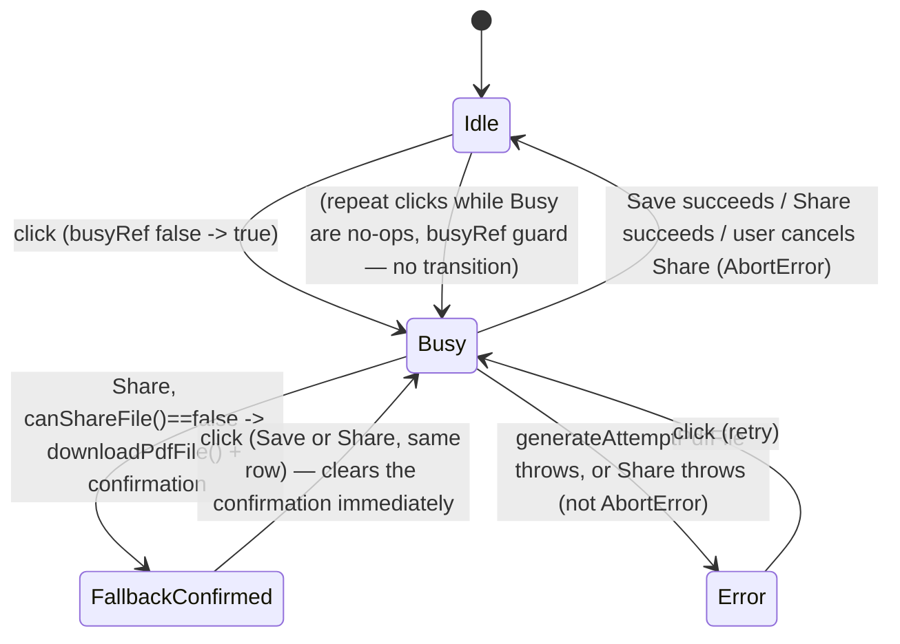
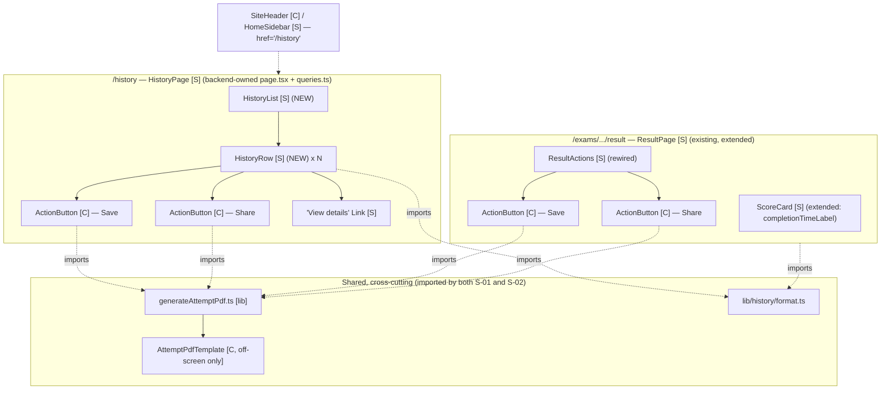

# History — Frontend Design Document

| | |
|---|---|
| **Version** | 1.3 |
| **Date** | 2026-07-30 |
| **Status** | Draft — frontend design for the History feature. **Consumes** the backend Design Doc's contracts (`listMyHistory()`, extended `getResult()`) and the UI Spec's component decomposition/state matrices verbatim; does not redefine either. Scope: `/history` UI components, the shared client-side PDF-generation module, share mechanics, `ResultActions`/`ScoreCard` wiring, nav wiring. |
| **PRD** | `docs/prd/history-prd.md` (v1.2, product decisions locked, R1–R10 / AC-001–019) |
| **UI Spec** | `docs/ui-spec/history-ui-spec.md` (v1.1, Draft — ready for ADR/Design Doc chain) — authoritative component decomposition, state x display matrices, interaction tables, and decisions D1–D7. This doc builds on it and does not contradict it. |
| **Backend Design Doc** | `docs/design/history-backend-design.md` (v1.2, code-verifier-checked) — the data contracts consumed here (`MyHistoryEntry`, extended `ExamResult`) |
| **ADR** | `docs/adr/ADR-0009-pdf-generation-library-choice.md` (Accepted) — governs the PDF module's architecture, the dynamic-import-only discipline, and the `AttemptPdfTemplate` plain-hex/rgb styling constraint |

## Overview

Turns the UI Spec into an implementable frontend: a new `/history` list (`HistoryList`/`HistoryRow`), a shared `ActionButton` atom reused by both `HistoryRow` and the rewired `ResultActions`, a single client-side PDF-generation module (`generateAttemptPdf.ts` + `AttemptPdfTemplate.tsx`) consumed by both surfaces per AC-007, `ScoreCard`'s real "Time" stat, and the two-file nav-wiring fix. It **consumes** the backend contracts (`listMyHistory()` returning `MyHistoryEntry[]`, `getResult()`'s additive `startedAt`/`submittedAt` on `ExamResult`) and ADR-0009's library choice as given.

### Referenced UI Spec

- UI Spec path: `docs/ui-spec/history-ui-spec.md` (v1.1)
- Component structure (`HistoryList`/`HistoryRow`/`ActionButton`/`AttemptPdfTemplate`), state x display matrices, D1 (share-fallback), D2 (filename), D3 (bounded-scroll pagination-deferral), D4 (a11y pattern), D5 (nav active-state), D6 (route-group layout), D7 (loading/error boundaries) are inherited verbatim.

## Design Summary (Meta)

```yaml
design_type: "extension"          # adds a new list surface + wires two existing disabled placeholders; no new backend/data model
risk_level: "medium"              # no DB/security surface (backend owns that); risk concentrates in the novel client PDF pipeline
complexity_level: "medium"
complexity_rationale: >
  (1) generateAttemptPdf.ts orchestrates 3 dynamically-imported modules (jsPDF, html2canvas, react-dom/client) through an
      off-screen mount -> rasterize -> assemble -> Blob pipeline with no precedent anywhere in this codebase;
  (2) ActionButton is a 4-phase state machine (idle/busy/error/fallback-confirmed) shared verbatim by two call sites under
      a hard AC-007 single-implementation constraint;
  (3) AttemptPdfTemplate carries an ADR-0009 hard styling constraint (plain hex/rgb only) that "is not statically enforced
      by any linter today" per the ADR itself — this design must supply its own guard;
  (4) the Web Share API branch (native share / canShare-false fallback / user-cancelled AbortError) has 3 distinct
      terminal outcomes that must not be conflated in the UI state machine.
main_constraints:
  - "ADR-0009: jsPDF + html2canvas dynamically imported only inside the Save/Share click handler — never a top-level import of any page/layout/component."
  - "ADR-0009: AttemptPdfTemplate's styles must resolve to plain hex/rgb only — no shadcn Button, no Tailwind slash-opacity utility, anywhere in that subtree."
  - "AC-007: exactly one PDF-generation implementation, imported by both HistoryRow and ResultActions — no forked second implementation."
  - "AC-009: Save/Share use only data already loaded by the calling page/row — no extra round trip."
  - "D4 (UI Spec): Save/Share busy/error states use aria-disabled + aria-describedby + Tooltip, never native disabled."
  - "Preserve ResultActions' existing sibling-buttons-no-wrapper DOM shape in every ActionButton phase (idle/busy/error/fallback-confirmed) — result/page.tsx's grid-cols-3 layout depends on it. Error/status feedback is nested inside each button (absolutely positioned), never a sibling span, so it never adds an extra grid item (see ActionButton Deep Dive's DOM-shape fix)."
biggest_risks:
  - "html2canvas throws (or silently mis-renders) if any style inside AttemptPdfTemplate resolves through oklch()/color-mix() — no existing lint catches this."
  - "Real-device PDF-generation latency on mid-range Android is unmeasured until manual QA (ADR-0009 known unknown, inherited here)."
  - "navigator.share()'s user-cancellation (AbortError) is misclassified as a generation failure if not handled as its own branch."
unknowns:
  - "jsPDF's exact unit:'px' + hotfixes:['px_scaling'] output-scaling behavior on the installed jsPDF version — resolved at the Early Verification Point before the second entry point is wired (see Verification Strategy)."
  - "Whether @base-ui/react's TooltipTrigger forwards onClick directly or requires the render-prop escape hatch — resolved at implementation time (see Assumed Behaviors)."
```

## Background and Context

### Prerequisite ADRs

- **ADR-0009** (Accepted) — PDF-generation library choice. This doc is the "Design Doc that follows" the ADR names explicitly: it owns exact module boundaries, file naming, and code, all constrained by the ADR's decision (jsPDF+html2canvas), dynamic-import-only discipline, and the plain-hex/rgb styling rule for the template subtree.
- No `docs/adr/ADR-COMMON-*` file exists (confirmed by Glob, see Common ADR Process below).

### External Resources Used

Inherits the UI Spec's table (which already inherits the project-tier `docs/project-context/external-resources.md`) and adds nothing feature-specific beyond what the UI Spec already lists, since this doc consumes the same design source/system/guidelines and introduces no new external resource category (no new API schema, no new IaC, no new auth mechanism).

| Resource (project-tier label) | Feature-specific identifier | Notes |
|-------------------------------|-----------------------------|-------|
| Design Origin | `PROJECT_OVERVIEW.md §2` — Colors, Elevation & Depth, Layout (720px grid), Shapes | Governs both on-screen History UI and `AttemptPdfTemplate` (inherited from UI Spec) |
| Design System | `SOURCE/features/authoring/components/{MyExamsList,ExamRow}.tsx`, `SOURCE/features/exams/components/ScoreCard.tsx, SOURCE/features/exams/components/ResultActions.tsx, SOURCE/features/exams/components/rating/RateButton.tsx`, `SOURCE/components/ui/{tooltip.tsx}` | On-screen components reuse freely; `AttemptPdfTemplate` may **not** use `components/ui/button.tsx` (ADR-0009) |
| Visual Verification Environment | Routes `/history`, `/exams/[id]/attempt/[attemptId]/result` | `npm run dev` + Playwright MCP + manual mid-range-Android pass before ship (inherited from UI Spec) |
| API / contract source | Backend Design Doc `docs/design/history-backend-design.md` (Data Contracts, Field Propagation Map) | The typed interface this frontend consumes: `MyHistoryEntry`, extended `ExamResult` |

### Agreement Checklist

#### Scope
- [x] `SOURCE/features/history/components/{HistoryList,HistoryRow}.tsx` (new).
- [x] `SOURCE/app/(history)/history/{loading,error}.tsx` (new, D7).
- [x] One line added to backend-authored `SOURCE/app/(history)/history/page.tsx` (import + render `HistoryList`).
- [x] `SOURCE/components/history/ActionButton.tsx` (new, shared atom — Save/Share for both surfaces).
- [x] `SOURCE/lib/pdf/generateAttemptPdf.ts` + `SOURCE/components/pdf/AttemptPdfTemplate.tsx` (new, ADR-0009's shared module).
- [x] `SOURCE/lib/history/format.ts` (new, shared pure formatters: completion time, submitted date, PDF filename).
- [x] Rewire `SOURCE/features/exams/components/ResultActions.tsx` (remove disabled placeholder, wire `ActionButton`).
- [x] Extend `SOURCE/features/exams/components/ScoreCard.tsx` (real "Time" stat via new `completionTimeLabel` prop).
- [x] Extend `SOURCE/app/(exams)/exams/[id]/attempt/[attemptId]/result/page.tsx` (compute `pdfInput`/`completionTimeLabel`, pass to `ResultActions`/`ScoreCard`).
- [x] `SOURCE/components/layout/SiteHeader.tsx` line 27, `SOURCE/features/auth/components/HomeSidebar.tsx` line 22: `href: "#"` → `href: "/history"`.
- [x] `SOURCE/package.json`: add `jspdf`, `html2canvas` runtime dependencies.

#### Non-Scope (Explicitly not changing)
- [ ] `listMyHistory()`, `getResult()` internals, `(history)/layout.tsx`, `(history)/history/page.tsx`'s auth guard — backend Design Doc owns these; specified there (backend DD v1.2 is Draft status — not yet implemented as of this doc's writing; confirmed via Glob, zero files exist under `SOURCE/app/(history)/`; see Dependency Existence Verification). This doc's own scope is exactly one import + one JSX line added to `history/page.tsx`, applied once the backend creates it.
- [ ] Any schema/RLS change — none needed or made (backend DD confirmed).
- [ ] Pagination (R10) — deferred per UI Spec D3; ships with the bounded-scroll container only.
- [ ] The in-progress Analytics/Layer 3 feature — unrelated, untouched.
- [ ] `result/page.tsx`'s "Try again"/"Rate this exam" links, `getMyRating`/rating wiring — untouched.

#### Constraints
- [ ] Parallel operation: No (single local dev environment, pre-launch).
- [ ] Backward compatibility: Required for `ResultActions`' DOM shape — `result/page.tsx`'s `grid-cols-3` depends on exactly two sibling button-rooted elements with no wrapper (see Interface Change Impact Analysis).
- [ ] Performance: Required — jsPDF/html2canvas must never be part of the initial bundle for `/history` or the Result page (ADR-0009 FCP/Lighthouse constraint; see Bundle-Size Verification).
- [ ] Accessibility: Required — WCAG 2.1 AA, keyboard-operable in every ActionButton phase including busy (D4).

#### Confirm reflection in design

| Agreement | Reflected in |
|---|---|
| Scope items | Existing Codebase Analysis → Implementation Path Mapping; Design → all subsections |
| ResultActions DOM-shape constraint | Design → ResultActions Rewiring; Interface Change Impact Analysis |
| Dynamic-import-only discipline | Design → PDF Generation Module; Bundle-Size Verification |
| WCAG 2.1 AA / D4 pattern | Design → ActionButton |
| No schema/RLS/pagination change | Non-Scope above; Future Extensibility |

No agreement is unreflected.

#### Assumed Behaviors

| # | Claim | Evidence | Confirmed |
|---|-------|----------|-----------|
| 1 | `SOURCE/app/page.tsx` is the **only** caller of `HomeSidebar`, and its `activeLabel` prop is always `"Home"` or `"Account"` (from `authOpen ? "Account" : "Home"`) — never derived from the `href` values in `HomeSidebar`'s `NAV` array. | `grep -rn "HomeSidebar"` across `SOURCE/app` → single import + single JSX usage, both in `app/page.tsx:2,37`; `HomeSidebar.tsx:40` (`const activeLabel = authOpen ? "Account" : "Home"`) | Yes |
| 2 | `SiteHeader`'s `isActive` logic (`item.href !== "#" && (item.href === "/" ? pathname === "/" : pathname.startsWith(item.href))`) requires no code change beyond the `href` value itself to highlight `/history*` correctly — `/history` takes the `pathname.startsWith` branch (only `href === "/"` uses the exact-match branch). | `SiteHeader.tsx:63-65` | Yes |
| 3 | `html2canvas` throws on CSS resolving through `oklch()`/`color-mix()`. | ADR-0009 (independently WebSearch-verified there: niklasvh/html2canvas#3148/#3150/#3269) | Yes |
| 4 | A dynamic `import()` call made only inside a function body (never at module top level) is code-split by Next.js/webpack into a chunk excluded from the route's initial JS. | ADR-0009 Implementation Guidance (states this is the basis for its FCP/Lighthouse mitigation); standard, documented Next.js/webpack behavior | Yes |
| 5 | `navigator.share()` rejects with a `DOMException` named `"AbortError"` when the user dismisses the native share sheet without completing — this is not a generation/API failure. | [MDN — Web Share API](https://developer.mozilla.org/docs/Web/API/Navigator/share) (same source ADR-0009 already cites for the Web Share API contract) | Yes |
| 6 | `HTMLImageElement.decode()` resolves once the referenced image's bitmap is fully decoded, for an `` not yet visible/painted; `/images/brand_logo.png` exists and is served by this app. | [MDN — HTMLImageElement.decode()](https://developer.mozilla.org/docs/Web/API/HTMLImageElement/decode); asset confirmed in use at `SiteHeader.tsx:50` | Yes |
| 7 | `@base-ui/react`'s `TooltipTrigger` forwards an `onClick` handler straight through to its rendered DOM element (needed so `ActionButton`'s click guard fires). | Not independently verified against `@base-ui/react@^1.5.0`'s exact prop typings/behavior in this repo — `RateButton.tsx` only demonstrates static attribute passthrough (`type`, `aria-disabled`), never an event handler | **No** |
| 8 | `react-dom`'s `flushSync` forces a synchronous DOM commit of a `createRoot(...).render(...)` call made outside the normal Next.js render tree, so the container's children (including the logo ``) exist in the DOM before `html2canvas` runs. | Documented React API (react.dev); no existing usage of `createRoot`/`flushSync` elsewhere in this repo to point to | **No** |
| 9 | `jsPDF`'s `unit: "px"` + `hotfixes: ["px_scaling"]` constructor options yield a PDF page whose point dimensions match the source canvas's CSS-pixel dimensions 1:1 (no unexpected doubling/halving). | Documented jsPDF behavior for a known historical px-unit scaling quirk; `jspdf` is not yet installed in this repo, so unverified against the exact version that will be added | **No** |

Claims #7–9 have matching rows in Risks and Mitigation, resolved by the Early Verification Point (see Verification Strategy) before the second entry point is wired.

#### Applicable Standards

- [x] `"use client"` only at the smallest interactive boundary; pages/route files stay `async` Server Components `[explicit]` — Source: typescript-rules skill; `result/page.tsx`, `history/page.tsx` (backend DD).
- [x] Row shell classes, `" · "`-joined metadata line, `formatDateTime`-style helper `[implicit]` — Evidence: `ExamRow.tsx:56-60,94-98`. Confirmed: Yes (adopted for `HistoryRow`).
- [x] `aria-disabled` + `aria-describedby` + `sr-only` reason span + `Tooltip`, never native `disabled`, for focusable-but-busy controls `[explicit]` — Source: UI Spec D4; `RateButton.tsx`.
- [x] Bounded-height internally-scrolling list container (`max-h-[30rem] overflow-y-auto`) `[implicit]` — Evidence: `MyExamsList.tsx:27` (`ExamListScroll`). Confirmed: Yes (adopted per UI Spec D3).
- [x] `loading.tsx` skeleton / `error.tsx` boundary via Next.js App Router file conventions `[implicit]` — Evidence: `(authoring)/me/exams/loading.tsx`; no prior `error.tsx` exists in this repo (first use, UI Spec D7). Confirmed: Yes.
- [x] Pure helpers under `SOURCE/lib/**`; jsdom-testable primitives under `SOURCE/components/**` `[explicit]` — Source: `vitest.config.ts:19`; precedent `docs/design/rating-system-frontend-design.md` (fact code:F4).
- [x] Explicit Props types, camelCase props, 0–2 function parameters (objects for 3+) `[explicit]` — Source: typescript-rules skill; existing component prop interfaces project-wide.
- [ ] Vietnamese inline comments matching each file's existing convention `[implicit]` — Not applicable to brand-new files (no pre-existing convention to match within them); applied when editing existing Vietnamese-commented files (`ResultActions.tsx`, `ScoreCard.tsx`, `result/page.tsx`, `SiteHeader.tsx`, `HomeSidebar.tsx`).

#### Quality Assurance Mechanisms

- [x] ESLint / Prettier / `tsc` strict — project-wide — `adopted`.
- [x] Vitest (node), `SOURCE/lib/history/format.test.ts` — pure formatter coverage — `adopted`.
- [x] Vitest (jsdom, `// @vitest-environment jsdom`), `SOURCE/lib/pdf/generateAttemptPdf.test.ts`, `SOURCE/components/pdf/AttemptPdfTemplate.test.tsx`, `SOURCE/components/history/ActionButton.test.tsx` — `adopted`.
- [x] `AttemptPdfTemplate` plain-hex/rgb guard test (new, this doc) — Enforces: ADR-0009's styling constraint, which the ADR itself says is "not statically enforced by any linter today" — Config: `AttemptPdfTemplate.test.tsx` — `adopted` (closes the ADR-documented gap).
- [x] `npm run build` output inspection + source grep for banned top-level `jspdf`/`html2canvas` imports — Enforces: ADR-0009's dynamic-import-only discipline — `adopted` (see Bundle-Size Verification).
- [x] Playwright MCP / manual pass (no CI) — Covers: Save/Share end-to-end (download opens, share sheet, fallback), `error.tsx` retry, nav active-state, mid-range-Android manual QA (PRD NFR) — `adopted`.
- [x] axe a11y audit (manual) — Covers: History list, ActionButton phases, ResultActions — `adopted` (PRD UI Quality Metric 2).
- [ ] Unit tests for `HistoryList`/`HistoryRow`/`(history)/history/{loading,error}.tsx` — `noted`: these are thin, presentational Server Components/route-convention files; no precedent exists in this repo for unit-testing files under `app/**/_components` directly (`ExamRow`/`MyExamsList` aren't unit-tested either) — verified instead via manual `npm run dev` + Playwright MCP pass, consistent with existing precedent. All genuinely testable logic (formatting, PDF pipeline, ActionButton state machine, template styling) is extracted into `lib/**`/`components/**` where vitest coverage is the established convention.
- [ ] Backend RLS harness `test-rls.ts` — `noted` (backend-owned; irrelevant to this read-only-consuming frontend layer).

### Problem to Solve

The "History" nav item has always pointed at `href="#"` and `ResultActions`' Save/Share buttons render permanently `disabled` with a "coming soon" tooltip — there is no page to list past attempts and no way to get a branded record of a result out of the browser. This doc turns the backend's read contracts and the UI Spec's component decomposition into a concrete `/history` UI, a single working PDF pipeline, and the two nav-wiring fixes.

### Current Challenges

- No existing PDF-generation code exists anywhere in this codebase to build on (`mupdf` is a server-only PDF *parser*, unrelated — confirmed in ADR-0009).
- `ResultActions.tsx` currently renders two static, permanently-`disabled` `<button>`s with no state, no click handler, and no data dependency — the rewiring is a full replacement of its interactive surface, not an incremental change.
- `HomeSidebar`'s active-state mechanism (a static `activeLabel` prop) is structurally different from `SiteHeader`'s (`usePathname()`-derived) — a naive "just fix the href" instruction risks missing that these are two different mechanisms; this doc resolves it concretely (see Nav Wiring, and Assumed Behavior #1).

### Requirements

Frontend-owned subset of PRD v1.2: R2 (drill-through UI), R3 (PDF module UI-consuming half — template markup, single call-site enforcement), R4 (Save UI), R5 (Share UI + fallback), R6 (`ResultActions` wiring), R7 (nav wiring UI), R9 (error-resilience UI half — `error.tsx` rendering, `ActionButton` error phase). R1/R8's data-scope and auth-guard logic are backend-owned and consumed as given; this doc only renders their outputs (`HistoryList` receives already-filtered/ordered/guarded data).

## Acceptance Criteria (frontend subset, EARS)

Rendering/interaction ACs verifiable in jsdom or a real browser. AC-001/002(data)/003/016/017/019(throw) are backend-verified (see backend DD); only their UI-rendering halves are repeated here.

**History list display**
- [ ] **While** `entries` is empty, `HistoryList` shall render a dashed-border empty state with a "Browse exams" link to `/exams`. (AC-002)
- [ ] **When** `HistoryList` renders a non-empty `entries` array, it shall render one `HistoryRow` per entry in the given order (the backend already orders by `submitted_at` descending — `HistoryList` does not re-sort). (AC-001/003 rendering half)
- [ ] **When** a `HistoryRow` renders, it shall show the exam title, `X/10` score, submitted date, and completion time. (AC-004)
- [ ] **When** the user activates "View details" on a row, the browser shall navigate to `/exams/{examId}/attempt/{attemptId}/result` for that exact attempt. (AC-005)
- [ ] **When** the `/history` list read fails, `(history)/history/error.tsx` shall render a `role="alert"` message with a "Retry" control that calls `reset()`. (AC-019 rendering half)

**PDF content and branding**
- [ ] **When** Save or Share triggers PDF generation (either surface), the resulting file's content shall be limited to score, exam title/subject, examinee name, submitted time, and aggregate correct/wrong/total counts — `AttemptPdfData`'s type has no field capable of carrying per-question content (2026-08-22 redesign added examinee name + aggregate counts; still no per-question field). (AC-006)
- [ ] **Given** the History-row and Result-page Save/Share actions, **when** the code is inspected, both shall import `generateAttemptPdfFile` from the same module (`SOURCE/lib/pdf/generateAttemptPdf.ts`) — exactly one implementation. (AC-007)
- [x] **When** `AttemptPdfTemplate` renders, its visual style shall use only `PROJECT_OVERVIEW.md §2` "Ink & Lacquer" values expressed as literal hex/rgba strings. (AC-008)

**Save / Share**
- [ ] **When** "Save" is activated, the branded PDF shall download using only `pdfInput` data already loaded by the calling page/row. (AC-009)
- [ ] **While** a generation is in progress, a repeat activation of the same `ActionButton` shall be a no-op (`generateAttemptPdfFile` invoked at most once per gesture). (AC-010)
- [ ] **When** "Share" is activated on a browser where `canShareFile(file)` is `true`, the native share sheet shall open with the generated file attached. (AC-011)
- [ ] **When** "Share" is activated on a browser where `canShareFile(file)` is `false`, the same download as Save shall occur, followed by a persistent (non-auto-dismissing) `role="status"` confirmation. (AC-012)
- [ ] **Given** the Share action at any point, **then** no network request is made and no URL is created for the file — the only artifact is the local `Blob`/`File`. (AC-013)
- [ ] **When** PDF generation throws, `ActionButton` shall render a `role="alert"` message and return to a re-clickable (retry) state. (AC-018)

**ResultActions / ScoreCard**
- [ ] **When** the Result page renders, `ResultActions`' Save/Share shall be enabled `ActionButton` instances invoking the identical behavior as the corresponding History row for that attempt. (AC-014)
- [ ] **When** `getResult()`'s `startedAt`/`submittedAt` are both usable, `ScoreCard`'s "Time" stat shall show the computed completion time instead of the placeholder `"—"`. (UI Spec ScoreCard extension)

**Navigation**
- [ ] **When** a logged-in user clicks "History" in `SiteHeader` or `HomeSidebar`, the browser shall navigate to `/history`, and `SiteHeader`'s nav item shall show the active-highlight treatment on any `/history*` route. (AC-015)

## Existing Codebase Analysis

### Implementation Path Mapping

| Type | Path | Description |
|------|------|-------------|
| Planned (backend DD v1.2 — labeled "New" there, not yet implemented; confirmed via Glob, zero files exist under `SOURCE/app/(history)/`) | `SOURCE/app/(history)/layout.tsx` | Route-group shell — `SiteHeader` + nullable user, no redirect (D6). This doc makes no change to it once the backend creates it. |
| Planned (backend DD v1.2 — labeled "New" there, not yet implemented) | `SOURCE/app/(history)/history/page.tsx` | Once the backend creates it: adds `import { HistoryList } from "./_components/HistoryList"` and renders it with the entries `listMyHistory()` fetches |
| New | `SOURCE/features/history/components/HistoryList.tsx` | List container + empty state |
| New | `SOURCE/features/history/components/HistoryRow.tsx` | One row per attempt |
| New | `SOURCE/app/(history)/history/loading.tsx` | Skeleton (D7) |
| New | `SOURCE/app/(history)/history/error.tsx` | Error boundary + retry (D7) |
| New | `SOURCE/components/history/ActionButton.tsx` (+ `.test.tsx`) | Shared Save/Share atom |
| New | `SOURCE/lib/pdf/generateAttemptPdf.ts` (+ `.test.ts`) | PDF orchestration: `AttemptPdfData`, `generateAttemptPdfFile`, `downloadPdfFile`, `canShareFile` |
| New | `SOURCE/components/pdf/AttemptPdfTemplate.tsx` (+ `.test.tsx`) | Off-screen-only rasterized template, plain-hex/rgb only (ADR-0009) |
| New | `SOURCE/lib/history/format.ts` (+ `.test.ts`) | `formatSubmittedDate`, `formatCompletionTime`, `buildPdfFilename` |
| Existing, rewired | `SOURCE/features/exams/components/ResultActions.tsx` | Replace disabled placeholder buttons with `ActionButton` |
| Existing, extended | `SOURCE/features/exams/components/ScoreCard.tsx` | New `completionTimeLabel: string` prop |
| Existing, extended | `SOURCE/app/(exams)/exams/[id]/attempt/[attemptId]/result/page.tsx` | Compute `pdfInput`/`completionTimeLabel` from the now-extended `getResult()` output; pass to `ResultActions`/`ScoreCard` |
| Existing, extended | `SOURCE/components/layout/SiteHeader.tsx` | `href: "#"` → `href: "/history"` (line 27) |
| Existing, extended | `SOURCE/features/auth/components/HomeSidebar.tsx` | `href: "#"` → `href: "/history"` (line 22); no other change |
| Existing, extended | `SOURCE/package.json` | Add `jspdf`, `html2canvas` |

### Similar Component Search and Decision

Searched for existing list-row / action-button / PDF patterns by domain and responsibility keywords (`Row`, `List`, `ActionButton`, `pdf`, `download`, `share`):

- **List/row shell**: `MyExamsList.tsx`/`ExamRow.tsx` (Layer 4) — closest by shell classes, `" · "` metadata convention, and empty-state-with-CTA shape, but wrong domain (UGC exams, not attempts) and carries tab/context-menu/delete machinery this feature doesn't need. **Decision**: not reusable as-is; new `HistoryList`/`HistoryRow` following the same *visual pattern*, per UI Spec's explicit precedent note ("new components styled consistently with them," not literal reuse targets).
- **Focusable-disabled control**: `RateButton.tsx` — the only existing implementation of the `aria-disabled`+`aria-describedby`+`sr-only`+`Tooltip` pattern (D4). **Decision**: reuse the *pattern*, not the component (different domain — rating navigation vs. PDF actions with a real busy/error state machine RateButton doesn't have). Building `ActionButton` as this pattern's second implementation is exactly at the Rule-of-Three "2nd occurrence: consider future consolidation" point — not yet a 3rd occurrence requiring a shared primitive extraction beyond what's already planned. No ADR needed for this: the pattern itself is already established and audited (RateButton's WCAG 1.4.3 fix), only its second application is new.
- **PDF generation**: none exists anywhere in this codebase (`mupdf` is a server-only parser of *existing* PDFs, unrelated — confirmed in ADR-0009's own investigation, not re-litigated here). **Decision**: new implementation, per ADR-0009's already-accepted architecture.
- **Live-region busy/fallback banner**: `ExtractionProgress.tsx` (`role="status" aria-live="polite"`, spinner + message) — pattern precedent for `ActionButton`'s busy/fallback announcements, compact per-button form instead of a full-width banner (row density).

### Dependency Existence Verification

| Component | Status | Location |
|-----------|--------|----------|
| `MyHistoryEntry` type, `listMyHistory()` | **Planned** — specified by backend DD v1.2's Implementation Path Mapping (labeled "New" there), not yet implemented (confirmed: `SOURCE/app/(history)/` contains zero files, via Glob) | Planned location: `SOURCE/features/history/queries.ts` |
| `ExamResult` (extended: `startedAt`, `submittedAt`) | **Planned** — the extension is specified by backend DD v1.2, not yet implemented. The base `ExamResult` type/`getResult()` currently exist *without* these fields (confirmed: `queries.ts:294-300` has no `startedAt`/`submittedAt`; `:317-320`'s `exam_attempts` select still returns only `exam_id`) | Current (pre-extension) shape: `SOURCE/features/exams/queries.ts:294-300,306-371` |
| `(history)/layout.tsx`, `(history)/history/page.tsx` | **Planned** — specified by backend DD v1.2's Implementation Path Mapping (labeled "New" there), not yet implemented (confirmed via Glob: zero files under `SOURCE/app/(history)/`) | Planned location: `SOURCE/app/(history)/layout.tsx`, `SOURCE/app/(history)/history/page.tsx` |
| `Tooltip`/`TooltipTrigger`/`TooltipContent` | Verified existing | `SOURCE/components/ui/tooltip.tsx` |
| `cn()` utility | Verified existing | `SOURCE/lib/utils.ts` |
| `lucide-react` (icons: `Download`, `Share2`, `Loader2`) | Verified existing dependency (`^1.17.0`), already used for an icon (`Check` in `SuccessToast.tsx`) | `SOURCE/package.json:22`; `SOURCE/components/ui/SuccessToast.tsx:21` |
| `jspdf`, `html2canvas` | **Requires new creation** — not in `SOURCE/package.json` (confirmed via grep, zero matches) | To be added; ADR-0009's accepted choice |
| `react-dom/client` (`createRoot`), `react-dom` (`flushSync`) | Verified existing (bundled with `react-dom@19.2.4`, already a dependency) | `SOURCE/package.json:26` |
| `/images/brand_logo.png` (same-origin logo asset) | Verified existing, already served | `SiteHeader.tsx:50` |

No component this design assumes is missing without a resolution path. This doc itself must newly create only `jspdf`/`html2canvas` (already resolved by ADR-0009's accepted choice). `(history)/layout.tsx`, `(history)/history/page.tsx`, `MyHistoryEntry`/`listMyHistory()`, and `ExamResult`'s `startedAt`/`submittedAt` extension are *prerequisites this doc consumes but does not implement* — each is specified (and correctly labeled "New", or an extension of an "Existing" file) in backend DD v1.2's own Implementation Path Mapping, itself a Draft, pre-implementation document as of this writing (confirmed: `SOURCE/app/(history)/` has zero files via Glob; `queries.ts:294-300,317-320` still shows the pre-extension `ExamResult` shape). An implementer must build these backend items first (per backend DD v1.2) before this doc's components have real data to render against.

### Code Inspection Evidence

| File/Function | Relevance |
|---|---|
| `ResultActions.tsx:14-36` | The exact placeholder being replaced — DOM shape (2 sibling buttons, no wrapper) must be preserved |
| `ScoreCard.tsx:46-51` | The hardcoded `"—"` Time cell being replaced |
| `result/page.tsx:26-54` | Caller that must compute and pass `pdfInput`/`completionTimeLabel` |
| `SiteHeader.tsx:22-30,63-65` | `NAV` array + `isActive` logic — confirms Assumed Behavior #2 |
| `HomeSidebar.tsx:18-25,37,40` | `NAV` array + static `activeLabel` — confirms Assumed Behavior #1 |
| `app/page.tsx:2,37` | Sole `HomeSidebar` caller — confirms Assumed Behavior #1 |
| `RateButton.tsx:42-75` | D4's a11y pattern source |
| `MyExamsList.tsx:25-31`, `ExamRow.tsx:56-60,94-98,109` | Row-shell/scroll-container/metadata-line pattern source |
| `(authoring)/me/exams/loading.tsx` | Skeleton pattern source for `(history)/history/loading.tsx` |
| `ADR-0009` (all sections) | The library choice, dynamic-import discipline, and styling-constraint this doc implements concretely |

### Fact Disposition Table

No structured Codebase Analysis input (`focusAreas` JSON) was supplied for this task; the table below is derived from this doc's own Existing Code Investigation above, following the same self-derived convention the sibling `rating-system-frontend-design.md` used (`code:` prefix).

| Fact ID | Focus Area | Disposition | Rationale | Evidence |
|---------|------------|-------------|-----------|----------|
| code:F1 | `ResultActions` renders 2 sibling `disabled` buttons with no wrapper, sized by the caller's `grid-cols-3` | transform | Buttons become `ActionButton` instances; sibling-no-wrapper DOM shape is explicitly preserved (see Interface Change Impact Analysis) | `ResultActions.tsx:19-36`; `result/page.tsx:50-54` |
| code:F2 | `ScoreCard`'s Time cell is a hardcoded `"—"` (`ScoreCard.tsx:48-50`) | transform | Replaced by a real `completionTimeLabel` prop computed by the caller; `"—"` is kept only as the genuine-Partial-state fallback | `ScoreCard.tsx:46-51` |
| code:F3 | `SiteHeader`'s `isActive` already handles any real `href` via `usePathname()` | preserve | No code change beyond `href` value itself | `SiteHeader.tsx:63-65` |
| code:F4 | `HomeSidebar`'s `activeLabel` is a static prop, always `"Home"`/`"Account"`, sole caller `app/page.tsx` | preserve | No active-logic change needed — `HomeSidebar` never renders while a user is "on" `/history` (D5) | `HomeSidebar.tsx:29-40`; `app/page.tsx:2,37` |
| code:F5 | No PDF-generation code exists anywhere in this repo; `mupdf` is a server-only parser of existing PDFs | out-of-scope (not applicable to reuse) | New implementation per ADR-0009; `mupdf` is confirmed unrelated | ADR-0009 §Existing-code investigation |
| code:F6 | `RateButton.tsx` is the only existing `aria-disabled`+`Tooltip` focusable-disabled implementation | transform | `ActionButton` reuses the *pattern* (2nd occurrence, not yet a Rule-of-Three extraction trigger), extended with a real busy/error/fallback state machine `RateButton` doesn't have | `RateButton.tsx:42-75` |
| code:F7 | `vitest.config.ts`'s `include` collects `lib/**`, `components/**`, and `app/**/*.test.{ts,tsx}`, but no `app/**/_components/*.test.tsx` file exists in this repo today | preserve (convention) | Testable logic extracted to `lib/**`/`components/**`; `HistoryList`/`HistoryRow` follow the untested-Server-Component precedent (`ExamRow`/`MyExamsList`) | `vitest.config.ts:19`; Glob results (no test file under any `_components/` dir) |
| code:F8 | `jspdf`/`html2canvas` are absent from `SOURCE/package.json` | transform | Added as new runtime dependencies per ADR-0009 | `SOURCE/package.json` (grep, zero matches) |

## Minimal Surface Alternatives

Three in-scope elements: a reusable component split (`ActionButton`), a reusable utility split (shared timestamp formatters), and a prop crossing a component boundary (`ScoreCard.completionTimeLabel`).

### Element 1 — `ActionButton`'s prop surface (shared component + its input shape)

**Step 1 — Fixed Requirements**: UI Spec's `ActionButton` component ("the single Save/Share control used by both `HistoryRow` and `ResultActions`"); AC-007 (one implementation); AC-009 (no extra data fetch); AC-010 (busy guard); D4 (a11y pattern).

**Steps 2–3 — Alternatives Compared**

| Alternative | Reqs covered | New persistent state | New props/modes | Crosses boundary | Breaking/migration | Notes |
|---|---|---|---|---|---|---|
| One `ActionButton` component, `action: "save"\|"share"` mode + single `pdfInput: AttemptPdfData` object prop (proposed) | All | 0 | 2 (`action`, `pdfInput`) | Yes (2 parents) | No | Matches typescript-rules "3+ params → object"; 1 well-typed object beats 4 primitives |
| One `ActionButton`, but 4 individual primitive props (`examTitle`,`totalScore`,`startedAt`,`submittedAt`) instead of `pdfInput` | All | 0 | 5 (`action` + 4 primitives) | Yes | No | Wider prop surface per instance; easier to pass a stale/mismatched subset by accident |
| Two separate components, `SaveButton`/`ShareButton`, no shared code | AC-009/010/D4, but duplicates the a11y state machine in 2 places | 0 | 0 modes, but 2 new components | Yes (still crosses, just via 2 names) | No | Violates UI Spec's explicit "single visual/behavioral definition" requirement; 2nd+3rd independent implementation of the D4 pattern (RateButton is the 1st) — Rule of Three says commonalize, not fork |
| No shared component — `HistoryRow`/`ResultActions` each implement Save/Share inline | Fails UI Spec's stated requirement outright | 0 | 0 | No | No | Directly contradicts the UI Spec's `ActionButton` component definition; reintroduces the exact duplication AC-007's spirit (and D4) exists to prevent |

**Step 4 — Selected**: one `ActionButton` with `action` mode + `pdfInput` object. Smallest new-props count (2) that still satisfies the "single object, not primitives" and "single component, not per-surface forks" requirements together.
**Step 5 — Rejected**: 4-primitive-props variant (needlessly wider surface, no requirement it uniquely serves); two separate components and no-shared-component (both directly fail the UI Spec's fixed requirement).

### Element 2 — Shared timestamp-formatting utilities (`formatSubmittedDate`, `formatCompletionTime`)

**Step 1 — Fixed Requirements**: UI Spec ScoreCard extension ("same display format as `HistoryRow`"); UI Spec `HistoryRow` completion-time format spec; UI Spec `AttemptPdfTemplate` "same format" metadata row.

**Steps 2–3 — Alternatives Compared**

| Alternative | Reqs covered | New persistent state | New props/modes | Crosses boundary | Breaking/migration | Notes |
|---|---|---|---|---|---|---|
| One shared `SOURCE/lib/history/format.ts`, imported by `HistoryRow`, `result/page.tsx` (for `ScoreCard`), and `generateAttemptPdf.ts` (proposed) | All | 0 | 0 (pure functions, no new concept) | Yes (3 importers) | No | Single source of truth for the "same format" requirement; independently unit-testable |
| Duplicate the formatting logic in each of the 3 call sites | Reqs nominally covered but risk visual drift across surfaces | 0 | 0 | No | No | Directly risks violating the "same display format" requirement over time (3 independently-editable copies); no test can catch drift between copies |
| Format only in `HistoryRow`/`AttemptPdfTemplate`; `ScoreCard` keeps `"—"` forever (i.e., don't extend `ScoreCard`) | Fails the explicit UI Spec ScoreCard-extension requirement | 0 | 0 | No | No | Contradicts a fixed UI Spec requirement outright |

**Step 4 — Selected**: one shared `lib/history/format.ts`. Smallest alternative that satisfies the "same format" requirement without introducing any new concept.
**Step 5 — Rejected**: duplication (drift risk, no requirement it uniquely serves); not extending `ScoreCard` (fails a fixed requirement).

### Element 3 — `ScoreCard`'s new prop: formatted string vs. raw timestamps

**Step 1 — Fixed Requirements**: UI Spec ScoreCard extension text: "`completionTimeLabel: string` prop, computed by the page."

**Steps 2–3 — Alternatives Compared**

| Alternative | Reqs covered | New persistent state | New props | Crosses boundary | Breaking/migration | Notes |
|---|---|---|---|---|---|---|
| `completionTimeLabel: string`, pre-formatted by `result/page.tsx` (proposed, matches UI Spec text verbatim) | Yes | 0 | 1 | Yes | No (additive prop) | `ScoreCard` stays a pure display component with no formatting knowledge |
| `startedAt`/`submittedAt: string \| null` raw, `ScoreCard` formats internally | Yes (same visible result) | 0 | 2 | Yes | No | Duplicates the formatting call `HistoryRow`/`generateAttemptPdf.ts` also make instead of receiving one shared computed value; wider prop surface for no additional coverage |

**Step 4 — Selected**: `completionTimeLabel: string`. Fewer new props (1 vs. 2), matches the UI Spec's own text, and keeps `ScoreCard` a pure display component consistent with its existing `examTitle`/`result` (already-computed-value) props.
**Step 5 — Rejected**: raw-timestamps variant — wider prop surface with no requirement it uniquely covers.

### Element 4 — `generateAttemptPdf.ts`/`AttemptPdfTemplate.tsx` module boundary (reusable split)

**Step 1 — Fixed Requirements**: AC-007 (exactly one PDF-generation implementation, imported by both `HistoryRow` and `ResultActions`); ADR-0009's Implementation Guidance ("both call sites import the same module; do not let a second, parallel PDF-generation path form").

Unlike Elements 1–3, this element's requirement (AC-007) is a hard cardinality constraint, not a preference among comparably-sized options — it eliminates every alternative except "exactly one shared module" before any size comparison would matter. The comparison below documents that elimination rather than a genuine trade-off.

| Alternative | Reqs covered | New persistent state | New concept/module | Crosses boundary | Breaking/migration | Notes |
|---|---|---|---|---|---|---|
| One shared `generateAttemptPdf.ts`/`AttemptPdfTemplate.tsx`, imported by both `HistoryRow` and `ResultActions` via `ActionButton` (proposed) | AC-007 | 0 | 1 module pair | Yes (2 importers) | No | The only alternative AC-007 permits |
| Two independent implementations, one per surface (e.g. a `HistoryRow`-local generator and a `ResultActions`-local generator) | Fails AC-007 outright | 0 | 2 module pairs | No (each stays local) | No | Directly contradicts a fixed AC; also duplicates the ADR-0009 styling-constraint discipline in two places, doubling the risk surface Risk row "html2canvas oklch failure" already covers once |

**Step 4 — Selected**: one shared module. Not a "smallest surface wins a genuine trade-off" case — it is the only alternative that satisfies AC-007 at all.
**Step 5 — Rejected**: per-surface duplication — fails AC-007 directly, and would double (not merely duplicate) the ADR-0009 styling-constraint compliance burden.

## Design

### Implementation Approach Decision

**Phase 1 (current-state analysis)**: No shared foundation exists today — `ResultActions` is inert, `/history` doesn't exist. AC-007 forces both entry points to share exactly one PDF implementation, so building it twice (once per entry point) is structurally forbidden, not just wasteful.

**Phase 2 (strategy exploration)**: Considered (a) pure Vertical Slice — build `/history` fully end-to-end first (including its own throwaway PDF stub), then wire `ResultActions` separately: **rejected**, this is the exact "two parallel implementations" anti-pattern AC-007 forbids and duplicates the D4 a11y work twice. (b) pure Horizontal — build every foundation primitive (format helpers, PDF module, `ActionButton`) fully before any page-level integration: workable, but leaves both entry points unverified until very late, delaying the Early Verification Point past useful risk-reduction value. (c) **Hybrid** (selected) — build the shared foundation (`lib/history/format.ts`, `generateAttemptPdf.ts`/`AttemptPdfTemplate.tsx`, `ActionButton`) first, verify it end-to-end through the **simpler** of the two surfaces (`ResultActions` — an existing page, 2 buttons, no new route/list/loading/error scaffolding), then layer the second surface (`HistoryList`/`HistoryRow` + nav wiring) as a vertical slice reusing the now-proven foundation.

**Phase 3 (risk assessment)**: html2canvas oklch/color-mix failure (mitigated: inline-hex-only implementation + automated guard test, see PDF Generation Module); real-device latency (mitigated: summary-only DOM, manual mid-range-Android QA per PRD NFR — inherited from ADR-0009's own known-unknown); Share-cancellation misclassification (mitigated: explicit `AbortError` branch); jsPDF px-unit/`TooltipTrigger onClick` uncertainty (mitigated: Early Verification Point gates the second entry point).

**Phase 4 (constraints)**: dynamic-import-only (ADR-0009); WCAG 2.1 AA; no schema/RLS/pagination change; no CI (manual/Playwright MCP verification); `ResultActions`' DOM-shape backward-compatibility.

**Phase 5 (decision)**: **Hybrid** — foundation-first, then two vertical wire-ups (ResultActions, then HistoryList/HistoryRow + nav).

Order:
1. **Foundation** — `lib/history/format.ts`, `generateAttemptPdf.ts` + `AttemptPdfTemplate.tsx`, `ActionButton.tsx`, each with its own vitest coverage. Verify: **L2** (unit/component tests pass) + the **Early Verification Point** (one real PDF generated and opened — see Verification Strategy).
2. **ResultActions wire-up (vertical slice A)** — rewire `ResultActions.tsx`, extend `ScoreCard.tsx`/`result/page.tsx`. Verify: **L1** (Save/Share work end-to-end on an existing, already-shipped page — this is the Early Verification Point's actual integration point).
3. **History surface (vertical slice B)** — `HistoryList`/`HistoryRow`/`loading.tsx`/`error.tsx`, consuming the now-proven `ActionButton`/PDF module. Verify: **L1** (`/history` lists real rows, Save/Share work identically to slice A).
4. **Nav wiring** — `SiteHeader.tsx`/`HomeSidebar.tsx` href fix. Verify: **L1** (clicking "History" from either surface lands on `/history` with correct active-highlight).

**Integration Point** (whole UI operational): end of slice 3 — `/history` renders real rows with working Save/Share, and slice 4 makes it reachable by click instead of only by direct URL.

**Rejected**: pure Vertical Slice (AC-007 conflict, duplicated a11y work); pure Horizontal (delays risk-reduction unnecessarily).

### Common ADR Process

Searched `docs/adr/ADR-COMMON-*` (Glob, zero matches — confirmed, same finding as the backend DD). No common ADR is created here: the `aria-disabled`+`Tooltip` focusable-disabled pattern is already established by `RateButton.tsx` (not yet at its 3rd distinct application — see Existing Codebase Analysis, code:F6), and the dynamic-import/PDF-architecture decision is already recorded in ADR-0009 (Prerequisite ADR, not a common one). No new cross-component technical convention is introduced by this design that would warrant one.

### Data Contracts

#### `SOURCE/lib/history/format.ts` (new, pure)

```yaml
Contract: formatSubmittedDate(submittedAt: string | null): string
Input: an ISO timestamp string, or null
Output:
  Type: string, "DD/MM/YYYY" (date-only; matches ExamRow's date portion, no time-of-day)
  Guarantees: never throws; returns "—" for null or an unparseable date
  On Error: "—" (never throws)

Contract: formatCompletionTime(startedAt: string, submittedAt: string | null): string
Input: two ISO timestamp strings (submittedAt may be null)
Output:
  Type: string — "Hh Mm" (>=60min), "Mm Ss" (>=60s, <60min), "Ss" (<60s), per UI Spec HistoryRow format spec
  Guarantees: never throws; returns "—" when submittedAt is null, unparseable, or the computed diff is negative
  On Error: "—" (never throws)

Contract: buildPdfFilename(examTitle: string, submittedAt: string | null): string
Input: exam title (untrusted length/characters), submittedAt (may be null — the narrow ExamResult race window)
Output:
  Type: string, "{slug}_{YYYYMMDD}.pdf" per UI Spec D2
  Guarantees: slug is lowercase, non-alphanumeric runs collapsed to single hyphens, <=60 chars, no leading/trailing
    hyphen; empty/whitespace title -> slug "exam"; null/unparseable submittedAt -> date stamp falls back to the
    current date (defensive; D2 does not define this narrow race-window case, so this is this doc's own fallback)
  On Error: never throws (pure string transform)
```

#### `SOURCE/lib/pdf/generateAttemptPdf.ts` (new)

```yaml
Contract: generateAttemptPdfFile(data: AttemptPdfData): Promise<File>
Input:
  Type: AttemptPdfData { examTitle: string; totalScore: number; startedAt: string; submittedAt: string | null }
  Preconditions: caller already has this data loaded (AC-009) — this function performs no fetch
Output:
  Type: File, name = buildPdfFilename(...), type = "application/pdf"
  Guarantees: exactly one AttemptPdfTemplate mount + one html2canvas capture + one jsPDF document per call; the
    off-screen DOM container is always removed (success or failure) via try/finally
  On Error: rejects (propagates the underlying jsPDF/html2canvas/DOM error) — caller (ActionButton) catches and
    sets its Error phase; never returns a partial/corrupt File

Contract: downloadPdfFile(file: File): void
Input: a File (any origin — this module only ever passes its own output)
Effect: triggers a browser download via a transient <a download> + object URL, revoked immediately after
Output: none (side-effecting); never throws (DOM APIs used are universally available in the target browser matrix)

Contract: canShareFile(file: File): boolean
Input: a File
Output: true only if navigator.share and navigator.canShare both exist AND navigator.canShare({files:[file]}) is true;
  false otherwise (including when the Web Share API is entirely absent) — never throws
```

#### `SOURCE/components/pdf/AttemptPdfTemplate.tsx` (new, presentational only)

```yaml
Contract: AttemptPdfTemplate(props: AttemptPdfTemplateProps): JSX.Element
Input:
  Type: { examTitle: string; totalScore: number; submittedDateLabel: string; completionTimeLabel: string; generatedAtLabel: string }
  Preconditions: all string fields already formatted by the caller (this component does no date/number formatting)
Output:
  Type: a DOM subtree whose every style is a literal hex or rgb()/rgba() value (ADR-0009) — no Tailwind class, no
    components/ui/button.tsx import, anywhere in this subtree
  Guarantees: never mounted for user visibility; rendered only inside generateAttemptPdfFile's off-screen container
Invariants: contains no per-question content (AC-006) — structurally true because AttemptPdfTemplateProps has no field capable of carrying it
```

#### `SOURCE/components/history/ActionButton.tsx` (new)

```yaml
Contract: ActionButton(props: ActionButtonProps): JSX.Element
Input:
  Type: { action: "save" | "share"; pdfInput: AttemptPdfData; idPrefix: string }
  Preconditions: pdfInput is already-loaded data (AC-009); idPrefix is unique per rendered instance (DOM id uniqueness
    across N HistoryRow instances, e.g. `history-${attemptId}` or `result`)
Output:
  Type: exactly one focusable <button>-rooted element in every phase, never carrying the native disabled attribute
    (D4) — phase-specific reason/error/status text is always a descendant of that button (absolutely positioned,
    anchored by the button's own `position: relative`), never a sibling, so ActionButton never contributes more than
    one in-flow element to its parent (preserves ResultActions' grid-cols-3 DOM-shape guarantee in all 4 phases)
  Guarantees: at most one in-flight generateAttemptPdfFile call per user gesture (AC-010, enforced via a synchronous
    busyRef guard, not React state, since aria-disabled does not block the click event)
  On Error: role="alert" message rendered as a child of the button (not a sibling); button remains clickable (retry
    = click again, AC-018)
```

#### `SOURCE/features/history/components/{HistoryList,HistoryRow}.tsx` (new)

```yaml
Contract: HistoryList(props: { entries: MyHistoryEntry[] }): JSX.Element
Input: MyHistoryEntry[] from listMyHistory() (backend DD) — already filtered/ordered
Output: HistoryRow per entry, or the empty state when entries.length === 0
Invariants: never re-sorts or re-filters entries (that is entirely the backend's responsibility)

Contract: HistoryRow(props: { entry: MyHistoryEntry }): JSX.Element
Input: one MyHistoryEntry { attemptId, examId, examTitle, totalScore, startedAt, submittedAt }
Output: title/score/date/time text + 2 ActionButton instances + a "View details" Link to
  /exams/{examId}/attempt/{attemptId}/result
```

#### `SOURCE/features/exams/components/ResultActions.tsx` (rewired) / `ScoreCard.tsx` (extended)

```yaml
Contract: ResultActions(props: { pdfInput: AttemptPdfData }): JSX.Element
Input: AttemptPdfData assembled by result/page.tsx from getResult()'s output
Output: 2 sibling ActionButton instances (Save, Share), no wrapping element (preserves the existing DOM contract —
  see Interface Change Impact Analysis)

Contract: ScoreCard(props: { examTitle: string; result: ScoreResult; completionTimeLabel: string }): JSX.Element
Input: completionTimeLabel — pre-formatted by result/page.tsx via formatCompletionTime
Output: unchanged existing rendering, except the Time cell now shows completionTimeLabel instead of a literal "—"
```

### State Transitions

#### `ActionButton` phase machine



The `fallback-confirmed → idle-on-navigate-away` transition needs no explicit code: the confirmation is plain component state (`useState`), not persisted storage, so it naturally disappears on unmount/reload — which already matches D1's "persists until next activation on that row, no auto-dismiss timer" requirement without any timer or storage plumbing.

#### ActionButton phase → local DOM shape (D2 fix)

| Phase | Visible feedback | New in-flow sibling of the button? | Grid/flex-item impact on the parent (`ResultActions`'/`HistoryRow`'s container) |
|---|---|---|---|
| Idle | none | No | 1 item (the button) |
| Busy | `aria-busy`, spinner icon, sr-only reason span | No — reason span is `position: absolute` (`sr-only`), excluded from grid/flex flow regardless of its containing block | 1 item |
| Error | `role="alert"` message | No — nested inside the button as a descendant, `position: absolute` anchored by the button's own `position: relative` | 1 item |
| FallbackConfirmed | `role="status"` message | No — nested inside the button as a descendant, `position: absolute` anchored by the button's own `position: relative` | 1 item |

Every phase contributes exactly one in-flow DOM node (the button) to `ActionButton`'s parent — `result/page.tsx`'s `grid-cols-3` "2 `ActionButton`s + 1 Return link = 3 equal cells" shape holds in all 4 phases, not only Idle/Busy as originally drafted.

#### `HistoryList` states (Next.js route conventions, D7)

| State | Mechanism |
|---|---|
| Loading | `(history)/history/loading.tsx` — skeleton, mirrors `(authoring)/me/exams/loading.tsx` |
| Default | `HistoryList` renders `entries.map(HistoryRow)` |
| Empty | `HistoryList` renders the dashed-border CTA block when `entries.length === 0` |
| Error | `(history)/history/error.tsx` — Next.js error boundary, `reset()` wired to "Retry" |

No client-side loading/error state is managed by `HistoryList` itself — both are handled by the Next.js file-convention boundaries per D7, consistent with this repo's existing `loading.tsx` precedent and this repo's first `error.tsx` use.

### Architecture Overview



Legend: **[S]** Server Component, **[C]** Client Component (`"use client"`). Only `ActionButton` and `AttemptPdfTemplate`'s host module require a client boundary; `HistoryList`/`HistoryRow`/`ResultActions`/`ScoreCard` all stay Server Components composing client children — the smallest `"use client"` surface that covers the interaction (typescript-rules).

### Data Flow

```mermaid
sequenceDiagram
    participant U as User
    participant AB as ActionButton [C]
    participant GEN as generateAttemptPdf.ts
    participant DOM as off-screen createRoot + AttemptPdfTemplate
    participant H2C as html2canvas
    participant JPDF as jsPDF
    participant SH as navigator.share/canShare

    U->>AB: click Save/Share
    AB->>AB: busyRef check (no-op if already busy) -> phase=Busy
    AB->>GEN: generateAttemptPdfFile(pdfInput)
    GEN->>GEN: dynamic import("jspdf"), import("html2canvas"), import("react-dom"), import("react-dom/client")
    GEN->>DOM: mount off-screen container; flushSync(root.render(<AttemptPdfTemplate .../>))
    GEN->>DOM: await document.fonts.ready + logo img.decode()
    GEN->>H2C: html2canvas(container, {backgroundColor:"#ede1c8", scale:2})
    H2C-->>GEN: canvas
    GEN->>JPDF: new jsPDF({unit:"px", hotfixes:["px_scaling"], format:[w,h]}); addImage(canvas)
    JPDF-->>GEN: doc.output("blob")
    GEN->>GEN: new File([blob], buildPdfFilename(...), {type:"application/pdf"})
    GEN->>DOM: root.unmount(); container.remove() (finally)
    GEN-->>AB: File
    alt action === "save"
        AB->>AB: downloadPdfFile(file) -> phase=Idle
    else action === "share"
        AB->>SH: canShareFile(file)
        alt supported
            AB->>SH: navigator.share({files:[file]})
            alt user completes
                SH-->>AB: resolves -> phase=Idle
            else user cancels
                SH-->>AB: rejects AbortError -> phase=Idle (not an error)
            end
        else unsupported
            AB->>AB: downloadPdfFile(file) -> phase=FallbackConfirmed
        end
    end
    Note over AB: any other thrown error -> phase=Error, role=alert rendered, retry = click again
```

### PDF Generation Module — Deep Dive

`SOURCE/lib/pdf/generateAttemptPdf.ts`:

```ts
export interface AttemptPdfData {
  examTitle: string;
  totalScore: number;
  startedAt: string;
  submittedAt: string | null;
}

export async function generateAttemptPdfFile(data: AttemptPdfData): Promise<File> {
  const [{ default: jsPDF }, { default: html2canvas }, { flushSync }, { createRoot }] =
    await Promise.all([
      import("jspdf"),
      import("html2canvas"),
      import("react-dom"),
      import("react-dom/client"),
    ]);

  const container = document.createElement("div");
  container.style.cssText = "position:fixed;top:-9999px;left:-9999px;pointer-events:none;";
  document.body.appendChild(container);
  const root = createRoot(container);

  try {
    const submittedDateLabel = formatSubmittedDate(data.submittedAt);
    const completionTimeLabel = formatCompletionTime(data.startedAt, data.submittedAt);

    flushSync(() => {
      root.render(
        <AttemptPdfTemplate
          examTitle={data.examTitle}
          totalScore={data.totalScore}
          submittedDateLabel={submittedDateLabel}
          completionTimeLabel={completionTimeLabel}
          generatedAtLabel={formatGeneratedAt(new Date())}
        />
      );
    });

    await waitForTemplateAssets(container);

    const canvas = await html2canvas(container.firstElementChild as HTMLElement, {
      backgroundColor: "#ede1c8",
      scale: 2,
      useCORS: true,
    });

    const widthPx = canvas.width / 2;
    const heightPx = canvas.height / 2;
    const doc = new jsPDF({ unit: "px", hotfixes: ["px_scaling"], format: [widthPx, heightPx] });
    doc.addImage(canvas.toDataURL("image/png", 1.0), "PNG", 0, 0, widthPx, heightPx);

    const blob = doc.output("blob");
    return new File([blob], buildPdfFilename(data.examTitle, data.submittedAt), {
      type: "application/pdf",
    });
  } finally {
    root.unmount();
    container.remove();
  }
}

async function waitForTemplateAssets(container: HTMLElement): Promise<void> {
  await document.fonts.ready.catch(() => undefined);
  const images = Array.from(container.querySelectorAll("img"));
  await Promise.all(images.map((img) => img.decode().catch(() => undefined)));
}

export function downloadPdfFile(file: File): void {
  const url = URL.createObjectURL(file);
  const a = document.createElement("a");
  a.href = url;
  a.download = file.name;
  document.body.appendChild(a);
  a.click();
  a.remove();
  URL.revokeObjectURL(url);
}

export function canShareFile(file: File): boolean {
  if (typeof navigator === "undefined") return false;
  if (typeof navigator.share !== "function" || typeof navigator.canShare !== "function") return false;
  return navigator.canShare({ files: [file] });
}
```

Key contract points (per ADR-0009's Implementation Guidance, made concrete here):
- `jspdf`/`html2canvas`/`react-dom`/`react-dom/client` are imported **only** inside `generateAttemptPdfFile`'s body — never at this file's top level, never in any file that a page/layout imports at its own top level. `ActionButton.tsx` imports `generateAttemptPdf.ts` statically (it is a small, dependency-free module until this function actually runs), so the heavy libraries still only load on first click.
- Both Save and Share derive from the **same** `generateAttemptPdfFile` call and the same `Blob`-producing path — satisfying ADR-0009's "one Blob-producing call, not two" requirement structurally (there is only one function that can produce a `File`).
- `waitForTemplateAssets` closes the gap between `flushSync`'s synchronous DOM commit (the `` element exists) and the image bitmap actually being decoded — without it, `html2canvas` can capture a blank logo on a slow network. `document.fonts.ready` similarly guards against capturing with a fallback system font before Source Serif 4/Be Vietnam Pro finish loading.
- **TypeScript note**: if the installed `@types/node`/`lib.dom` version doesn't type `navigator.share`/`navigator.canShare`, add a narrow ambient augmentation (e.g. `SOURCE/types/web-share.d.ts`) rather than an `any` cast — verify at implementation time; not assumed necessary here since modern `lib.dom.d.ts` typically includes them.
- If `@base-ui/react`'s `TooltipTrigger` does not forward `onClick` directly (Assumed Behavior #7), use its documented `render` escape hatch: `render={<button type="button" onClick={handleClick} />}` — verify against the exact installed version at implementation time; this is the officially-supported base-ui mechanism for custom event handlers.

`SOURCE/components/pdf/AttemptPdfTemplate.tsx` (excerpt — every value below is a literal hex/rgba string, never a Tailwind class, precisely to remove any dependency on knowing which Tailwind utilities compile to `color-mix()`; this is a stricter, single-file-auditable implementation of ADR-0009's constraint, not merely "Tailwind classes that happen to resolve to hex"):

```tsx
// Off-screen only — never shown to the user. HARD CONSTRAINT (ADR-0009): every
// style value below must be a literal hex or rgb()/rgba() string. No Tailwind
// className anywhere in this file, no components/ui/button.tsx import.
export interface AttemptPdfTemplateProps {
  examTitle: string;
  totalScore: number;
  submittedDateLabel: string;
  completionTimeLabel: string;
  generatedAtLabel: string;
}

export function AttemptPdfTemplate({
  examTitle, totalScore, submittedDateLabel, completionTimeLabel, generatedAtLabel,
}: AttemptPdfTemplateProps) {
  return (
    <div style={{ width: 720, backgroundColor: "#ede1c8", color: "#1b1512", padding: 40,
                  fontFamily: "'Be Vietnam Pro', sans-serif" }}>
      <header style={{ display: "flex", alignItems: "center", gap: 16 }}>
        
        <div style={{ width: 40, height: 2, backgroundColor: "#b8863b" }} />
      </header>
      <h1 style={{ fontFamily: "'Source Serif 4', serif", color: "#1b1512", fontSize: 36, marginTop: 24 }}>
        {examTitle}
      </h1>
      <p style={{ fontFamily: "'Source Serif 4', serif", color: "#a62c2b", fontSize: 64, marginTop: 20 }}>
        {totalScore.toFixed(1)}<span style={{ fontSize: 24, color: "#6b655c" }}>/10</span>
      </p>
      <p style={{ color: "#6b655c", fontSize: 14, marginTop: 24 }}>
        {submittedDateLabel} · {completionTimeLabel}
      </p>
      <div style={{ height: 1, backgroundColor: "#d8c9a8", marginTop: 32 }} />
      <p style={{ color: "#6b655c", fontSize: 12, marginTop: 12 }}>
        Generated by MS-MOLAR · summary only, not a full transcript · {generatedAtLabel}
      </p>
    </div>
  );
}
```

### ActionButton — Deep Dive

`SOURCE/components/history/ActionButton.tsx`:

```tsx
"use client";

type Phase = "idle" | "busy" | "error" | "fallback-confirmed";
const LABEL = { save: "Save", share: "Share" } as const;
const ICON = { save: Download, share: Share2 } as const; // lucide-react

// Isolates the Share branch (canShareFile check + navigator.share + AbortError handling) so
// handleClick itself never nests past 3 levels (coding-principles max-nesting guideline).
async function attemptShare(file: File): Promise<"shared" | "fallback"> {
  if (!canShareFile(file)) {
    downloadPdfFile(file); // D1: same download as Save
    return "fallback";
  }
  try {
    await navigator.share({ files: [file] });
    return "shared";
  } catch (shareErr) {
    if (shareErr instanceof DOMException && shareErr.name === "AbortError") {
      return "shared"; // user cancelled — not a failure, resolves the same as a completed share
    }
    throw shareErr;
  }
}

export function ActionButton({ action, pdfInput, idPrefix }: ActionButtonProps) {
  const [phase, setPhase] = useState<Phase>("idle");
  const busyRef = useRef(false); // synchronous guard — aria-disabled does not block the click event (D4)
  const reasonId = `${idPrefix}-${action}-reason`;
  const Icon = ICON[action];

  async function handleClick() {
    if (busyRef.current) return; // AC-010
    busyRef.current = true;
    setPhase("busy");
    try {
      const file = await generateAttemptPdfFile(pdfInput);
      if (action === "save") {
        downloadPdfFile(file);
        setPhase("idle");
        return;
      }
      const shareOutcome = await attemptShare(file);
      setPhase(shareOutcome === "shared" ? "idle" : "fallback-confirmed");
    } catch (err) {
      console.error("ActionButton PDF action failed", { action, examTitle: pdfInput.examTitle, err });
      setPhase("error");
    } finally {
      busyRef.current = false;
    }
  }

  return (
    <Tooltip>
      <TooltipTrigger
        type="button"
        onClick={handleClick}
        aria-disabled={phase === "busy" ? "true" : "false"}
        aria-busy={phase === "busy"}
        aria-describedby={reasonId}
        className={/* icon-only control, brand color enabled / muted spinner while busy; `relative` is required —
          it anchors the absolutely-positioned error/status text below so that text is a *descendant* of this
          button, never an extra in-flow sibling of it (D2 fix, see "ActionButton phase -> local DOM shape" table) */}
      >
        {phase === "busy" ? <Loader2 className="size-6 animate-spin" aria-hidden /> : <Icon className="size-6" aria-hidden />}
        <span className="sr-only">{LABEL[action]}</span>
        {phase === "error" && (
          <span
            role="alert"
            className="text-brand absolute top-full left-1/2 z-10 mt-1 w-max max-w-40 -translate-x-1/2 text-center text-sm"
          >
            Couldn't generate the PDF. Try again.
          </span>
        )}
        {phase === "fallback-confirmed" && action === "share" && (
          <span
            role="status"
            aria-live="polite"
            className="text-muted-foreground absolute top-full left-1/2 z-10 mt-1 w-max max-w-40 -translate-x-1/2 text-center text-sm"
          >
            Downloaded — sharing isn't supported in this browser.
          </span>
        )}
      </TooltipTrigger>
      <TooltipContent>{LABEL[action]}</TooltipContent>
      <span id={reasonId} className="sr-only">
        {phase === "busy" ? "Generating your PDF, please wait" : ""}
      </span>
    </Tooltip>
  );
}
```

This satisfies AC-010 two ways at once, per D4's own reasoning: visually via `aria-disabled`+`aria-busy` (screen reader/visual signal) and functionally via `busyRef` (the actual click-suppression, since `aria-disabled` does not stop the DOM `click` event from firing).

**DOM-shape fix (D2)**: `Tooltip` (`TooltipRoot`) renders no DOM element of its own — confirmed by reading the installed `@base-ui/react` source (`tooltip/root/TooltipRoot.js`): its own doc comment states "Doesn't render its own HTML element," and it returns a bare `TooltipRootContext.Provider`. `TooltipTrigger` renders exactly the `<button>` itself (`tooltip/trigger/TooltipTrigger.js`: `useRenderElement('button', componentProps, ...)`, merging `elementProps` — including whatever `children` are passed to `<TooltipTrigger>` — onto that `<button>`). Given this, any element placed as a *sibling* of `<TooltipTrigger>` inside `<Tooltip>` (the original design's placement of the error/status spans) becomes, in the real DOM, a sibling of the `<button>` one level up — i.e., a sibling inside `ResultActions`' own rendered output, which is a direct child of `result/page.tsx`'s `grid-cols-3` container. That container therefore received one extra grid item for every phase that rendered such a sibling span (Error, Fallback-Confirmed) — breaking the "3 equal cells" shape specifically in the two states most likely during real usage/QA. The fix: the error and status spans are now children of `<TooltipTrigger>` (descendants of the `<button>`), not children of `<Tooltip>` (siblings of the `<button>`) — positioned `absolute`, anchored by `relative` on the button itself. This ordering matters: `position: relative` establishes a containing block only for *descendants*, not for siblings, so simply adding `relative` to the button under the original sibling-span structure would not have anchored anything — the spans had to move to become descendants first. No wrapper element is introduced anywhere: the button remains the sole in-flow node `ActionButton` contributes to its parent in every phase (idle/busy/error/fallback-confirmed), so the grid-item count `result/page.tsx`'s `grid-cols-3` layout depends on is now invariant across all four phases, not just idle/busy as originally drafted. The always-present `sr-only` reason span (`id={reasonId}`) is left exactly where it was — a `Tooltip`-level sibling — since it stays visually inert (`position: absolute`, 1px, clipped) regardless of which ancestor establishes its containing block, and `aria-describedby={reasonId}` resolves it by `id`, independent of DOM containment.

An alternative was considered and rejected: surfacing the error/confirmation text only through `TooltipContent` (already portaled via `TooltipPrimitive.Portal`, so it can never affect local DOM flow at all, by construction). This was rejected because `TooltipContent` only renders while the tooltip is in its open (hover/focus-triggered) state — gating the error/confirmation message behind a hover/focus interaction would make it invisible to a sighted user who has moved their pointer or focus away, failing the PRD Accessibility NFR's "visible, not color-only" requirement; AC-018/D4 call for the message to be unconditionally rendered while its phase is active, not revealed only on hover. The nested-and-absolutely-positioned approach keeps the message visible whenever its phase is active while keeping the button's own DOM position as the sole in-flow contribution — satisfying both the accessibility requirement and the DOM-shape guarantee simultaneously.

### ResultActions Rewiring — Before / After

**Before** (`SOURCE/features/exams/components/ResultActions.tsx`):

```tsx
export function ResultActions() {
  return (
    <>
      {ACTIONS.map(({ key, label, Icon }) => (
        <button key={key} type="button" disabled title={`${label} — coming soon`} className="...">
          <Icon className="size-6" /><span className="sr-only">{label}</span>
        </button>
      ))}
    </>
  );
}
```

**After**:

```tsx
import { ActionButton } from "@/components/history/ActionButton";
import type { AttemptPdfData } from "@/lib/pdf/generateAttemptPdf";

export function ResultActions({ pdfInput }: { pdfInput: AttemptPdfData }) {
  return (
    <>
      <ActionButton action="save" idPrefix="result" pdfInput={pdfInput} />
      <ActionButton action="share" idPrefix="result" pdfInput={pdfInput} />
    </>
  );
}
```

DOM-shape guarantee preserved: before = 2 sibling `<button>` elements, no wrapper; after = 2 sibling `ActionButton`-rooted `<button>` (via `TooltipTrigger`) elements, no wrapper — and this now holds in **every** `ActionButton` phase, including Error and Fallback-Confirmed, because their `role="alert"`/`role="status"` feedback is nested inside the button (absolutely positioned, anchored by the button's own `position: relative`) rather than rendered as a sibling span (see ActionButton Deep Dive's DOM-shape fix and the "ActionButton phase → local DOM shape" table). `result/page.tsx`'s `grid-cols-3` still receives exactly 2 grid cells from `<ResultActions />` plus its own "Return" cell — unchanged in any phase (see Interface Change Impact Analysis for the literal caller diff).

`result/page.tsx` diff (excerpt):

```tsx
// Added imports
import { ScoreCard } from "@/features/exams/components/ScoreCard";
import { formatCompletionTime } from "@/lib/history/format";
import type { AttemptPdfData } from "@/lib/pdf/generateAttemptPdf";

// Inside ResultPage, after `const { examTitle, result } = data;`
const completionTimeLabel = formatCompletionTime(data.startedAt, data.submittedAt);
const pdfInput: AttemptPdfData = {
  examTitle,
  totalScore: result.totalScore,
  startedAt: data.startedAt,
  submittedAt: data.submittedAt,
};

// Render changes
<ScoreCard examTitle={examTitle} result={result} completionTimeLabel={completionTimeLabel} />
...
<ResultActions pdfInput={pdfInput} />
```

### ScoreCard Decision

Per the UI Spec's ScoreCard extension and Element 3 of Minimal Surface Alternatives above: `ScoreCard` gains one new required prop, `completionTimeLabel: string`, computed by `result/page.tsx` via the shared `formatCompletionTime`. The Time `<dd>` (`ScoreCard.tsx:48-50`) changes from the literal `—` to `{completionTimeLabel}`. `ScoreCard` itself performs no date arithmetic — it stays a pure display component, consistent with its existing `examTitle`/`result` props (also pre-computed by the caller).

### HistoryList / HistoryRow

`HistoryList` (Server Component) mirrors `MyExamsList`'s shell: heading "History" + `rule-divider`, a bounded-height scroll container (`max-h-[30rem] overflow-y-auto`, D3) wrapping `entries.map(HistoryRow)`, or the empty-state block (dashed border, "No results yet" + "Browse exams" `Link` to `/exams`) when `entries.length === 0`.

`HistoryRow` (Server Component) mirrors `ExamRow`'s `<li>` shell (`flex flex-col gap-3 rounded-lg border border-border p-5 sm:flex-row sm:items-center sm:justify-between`): exam title, then `{totalScore.toFixed(1)}/10 · {formatSubmittedDate(submittedAt)} · {formatCompletionTime(startedAt, submittedAt)}`, then an action cluster (`ActionButton` Save, `ActionButton` Share, "View details" `Link`). Both `ActionButton`s receive the same `pdfInput` built once per row from the entry's own fields — no extra fetch (AC-009).

### Nav Wiring

**`SiteHeader.tsx:27`**: `{ label: "History", href: "#" }` → `{ label: "History", href: "/history" }`. No other change — `isActive` (`:63-65`) already computes correctly for any real `href` (Assumed Behavior #2, code:F3).

**`HomeSidebar.tsx:22`**: `{ label: "History", href: "#" }` → `{ label: "History", href: "/history" }`. **No active-logic change**, resolved concretely as follows (not left open):

1. `app/page.tsx` is `HomeSidebar`'s only caller (verified: `grep -rn "HomeSidebar"` across `SOURCE/app` returns exactly one import + one JSX usage).
2. That caller's `activeLabel` prop is computed as `authOpen ? "Account" : "Home"` — a closed 2-value set that never depends on, or needs to represent, `"History"`.
3. `HomeSidebar` only ever renders on `/` (the homepage). `/history` renders `(history)/layout.tsx`, which renders `SiteHeader`, never `HomeSidebar`.
4. Therefore no browser state exists where a user is "on" `/history` while looking at a rendered `HomeSidebar` — there is no active-state gap to close in `HomeSidebar` itself. Clicking "History" from the homepage sidebar navigates to `/history`, where `SiteHeader`'s real `usePathname()`-driven active-state (already correct per point above) takes over.

This is the complete, final resolution — no follow-up item is left for a future doc.

### Bundle-Size / Dynamic-Import Verification Approach

No new automated CI script is added (this repo has no CI — `docs/project-context/external-resources.md` confirms `.github/workflows` doesn't exist); verification is a 3-part manual/build-time check, proportionate to this repo's existing `check-ai-key-bundle.mjs` precedent (a build-artifact scan for a different concern — AI key leakage — using the same underlying idea: verify a discipline by inspecting the actual build output, not just the source):

1. **Static discipline check** (source-level, cheap, run any time): `grep -rn "from \"jspdf\"\|from 'jspdf'\|from \"html2canvas\"\|from 'html2canvas'" SOURCE/app SOURCE/components SOURCE/lib` must return **zero** matches for the static `import ... from` form — the only occurrences of these two package names in source must be inside dynamic `import("jspdf")`/`import("html2canvas")` calls (which this grep pattern does not match, since those calls use `import(` not `from`).
2. **Build-output inspection**: run `npm run build` and read the per-route "First Load JS" column for `/history` and `/exams/[id]/attempt/[attemptId]/result` in the build summary. Since `jspdf`+`html2canvas` combined are on the order of several hundred KB minified, their presence in either route's First Load JS would show as an obvious, large jump versus a comparable route with no PDF module (e.g. `/exams`) — confirming they landed in a separate, on-demand chunk instead.
3. **Runtime confirmation** (existing NFR gate, not new): the manual mid-range-Android/Lighthouse pass already required by PRD NFR Performance and ADR-0009's known-unknown #1 — this doc adds no new obligation here beyond noting it also validates the dynamic-import discipline, since a regression would surface as a real FCP/Lighthouse hit.

### Field Propagation Map (Serialized Boundary Contract)

Most crossings in this feature are in-memory React prop hand-offs within one request/render — no query string, storage, or config value is involved, matching the backend DD's own table pattern for such crossings. The one crossing with an actual fixed serialized representation is the PDF filename.

| Field | Boundary | Status | Serialized Format | Consumer Parse Rule | Detail |
|-------|----------|--------|--------------------|-----------------------|--------|
| `MyHistoryEntry[]` | `history/page.tsx` → `HistoryList` → `HistoryRow` | preserved | — | — | In-memory Server Component prop hand-off |
| `AttemptPdfData` | `HistoryRow`/`result/page.tsx` → `ActionButton` → `generateAttemptPdfFile` | transformed (subset assembled per-row/per-page) | — | — | In-memory; deliberately excludes any per-question field (AC-006 guardrail — see Data Representation Decision) |
| `completionTimeLabel` | `result/page.tsx` → `ScoreCard` | transformed (raw timestamps → formatted string) | — | — | Computed once by the page via the shared `formatCompletionTime` |
| PDF filename (`buildPdfFilename` output) | `generateAttemptPdfFile` → `new File(...)` → browser download / OS Share target | transformed | `{exam-title-slug}_{YYYYMMDD}.pdf` (UI Spec D2, exact algorithm in Data Contracts above) | No parser reads it back into this application — the OS file system / Share-target app displays it verbatim; the only "consumer contract" is that both call sites (History row, `ResultActions`) reproduce the identical string for the same attempt, which they do by calling the same `buildPdfFilename` | Deterministic per attempt (keyed off `submittedAt`, not "now()") — re-downloading the same attempt always yields the same filename |

### Data Representation Decision

| Structure | Semantic Fit | Responsibility Fit | Lifecycle Fit | Boundary/Interop Cost | Decision |
|-----------|--------------|---------------------|----------------|------------------------|----------|
| `AttemptPdfData` vs. passing `MyHistoryEntry`/`ExamResult` straight into the PDF pipeline | No — `MyHistoryEntry` carries `attemptId`/`examId` irrelevant to rendering; `ExamResult` carries `questions`/`perQuestion` that AC-006 forbids the template from ever seeing | No — list-row/detail-read responsibility vs. PDF-render-input responsibility | Partial — PDF input lifecycle is "one short-lived generation call," distinct from either source type's own lifecycle | High if reused directly — `ExamResult` reuse would put per-question data one accidental prop-spread away from the template | **New type** `AttemptPdfData` — narrowing the surface passed into the PDF pipeline makes the AC-006 per-question exclusion a structural (type-level) guarantee, not a convention every future editor must remember |

## Integration Point Map

| Integration Point | Location | Method | Impact | Contract (In / Out / On Error) | Test Coverage |
|---|---|---|---|---|---|
| History list render | `history/page.tsx` → `HistoryList` | prop (`MyHistoryEntry[]`) | Low (read-only render of an already-guarded, already-filtered array) | In: `MyHistoryEntry[]`; Out: rows or empty state; Err: — (backend throws are caught by `error.tsx`, not here) | Manual `npm run dev` + Playwright MCP pass |
| PDF generation | `ActionButton` → `generateAttemptPdfFile` | function call | High (new, novel client pipeline; both surfaces depend on it) | In: `AttemptPdfData`; Out: `File`; Err: rejects, caught by `ActionButton` → Error phase | `generateAttemptPdf.test.ts`, `AttemptPdfTemplate.test.tsx` (jsdom) + Early Verification Point manual pass |
| Save/Share UI | `HistoryRow`/`ResultActions` → `ActionButton` | prop (`action`, `pdfInput`, `idPrefix`) | Medium (new shared interactive surface, 2 call sites) | In: as above; Out: download / share sheet / fallback+confirmation; Err: `role="alert"`, retry via re-click | `ActionButton.test.tsx` (jsdom) + manual axe/keyboard pass |
| `ResultActions` rewiring | `result/page.tsx` → `ResultActions` | prop (`pdfInput`) | Medium (existing page, existing DOM-shape contract must survive) | In: `AttemptPdfData`; Out: 2 sibling buttons, no wrapper; Err: same as `ActionButton` | Manual visual check (3-cell grid unchanged) + `ActionButton.test.tsx` coverage of the shared logic |
| `ScoreCard` extension | `result/page.tsx` → `ScoreCard` | prop (`completionTimeLabel`) | Low (additive prop, one new cell value) | In: pre-formatted string; Out: Time cell text; Err: `"—"` fallback already handled by `formatCompletionTime` | `format.test.ts` covers the formatter; manual visual check for the cell itself |
| Nav wiring | `SiteHeader.tsx`/`HomeSidebar.tsx` | data change (`href` literal) | Low (no logic change, single-line data edit x2) | In: click; Out: navigation to `/history`; Err: — | Manual click-through + active-highlight visual check |

**Conflict check**: no naming/pattern conflict. `ActionButton`, `AttemptPdfTemplate`, `generateAttemptPdfFile`, `AttemptPdfData`, `formatSubmittedDate`/`formatCompletionTime`/`buildPdfFilename` are all new identifiers with no collision in `SOURCE/app`/`SOURCE/components`/`SOURCE/lib` (confirmed no pre-existing exports of these names via the Existing Codebase Analysis Glob/Grep passes above). `ResultActions`'s and `ScoreCard`'s new required props are additive to components with a single respective caller each (`result/page.tsx`), so no back-compat shim is needed (mirrors the sibling rating-system-frontend-design's own reasoning for `ExamCard`'s new required prop).

## Change Impact Map

```yaml
Change Target: History frontend (HistoryList/HistoryRow + shared PDF module + ActionButton + ResultActions/ScoreCard wiring + nav)
Direct Impact:
  - NEW SOURCE/features/history/components/{HistoryList,HistoryRow}.tsx
  - NEW SOURCE/app/(history)/history/{loading,error}.tsx
  - SOURCE/app/(history)/history/page.tsx (backend-authored; +1 import, +1 render line)
  - NEW SOURCE/components/history/ActionButton.tsx (+ .test.tsx)
  - NEW SOURCE/lib/pdf/generateAttemptPdf.ts (+ .test.ts)
  - NEW SOURCE/components/pdf/AttemptPdfTemplate.tsx (+ .test.tsx)
  - NEW SOURCE/lib/history/format.ts (+ .test.ts)
  - SOURCE/features/exams/components/ResultActions.tsx (full rewire: disabled placeholder -> ActionButton x2)
  - SOURCE/features/exams/components/ScoreCard.tsx (+completionTimeLabel prop, Time cell)
  - SOURCE/app/(exams)/exams/[id]/attempt/[attemptId]/result/page.tsx (+pdfInput/completionTimeLabel computation)
  - SOURCE/components/layout/SiteHeader.tsx (href literal, line 27)
  - SOURCE/features/auth/components/HomeSidebar.tsx (href literal, line 22)
  - SOURCE/package.json (+jspdf, +html2canvas)
Indirect Impact:
  - result/page.tsx's grid-cols-3 layout now receives real interactive ActionButton cells instead of inert
    placeholders — visual/behavioral change, no structural layout change (DOM-shape preserved, see above).
  - Initial bundle size for /history and the Result route: zero increase from jsPDF/html2canvas (dynamic import);
    a small, expected increase from ActionButton/lucide-react icons already-dependency-based, not new libraries.
No Ripple Effect:
  - listMyHistory()/getResult() internals, app/(history)/layout.tsx's guard logic, all DB/RLS (backend DD owns these, untouched here)
  - Any other route/component not listed above (ExamBrowser, RatingForm, upload flow, Analytics/Layer 3, etc.)
  - result/page.tsx's "Try again"/rating-entry links (untouched, unrelated content on the same page)
```

## Interface Change Impact Analysis

**`ResultActions` — Props Change Matrix**

| Existing Props | New Props | Conversion Required | Wrapper Required | Compatibility Method |
|----------------|-----------|---------------------|-------------------|-----------------------|
| (none — `ResultActions()` took no props) | `pdfInput: AttemptPdfData` | New required prop | Not Required | Single caller (`result/page.tsx`) supplies it in the same change set — no back-compat shim needed |

**`ScoreCard` — Props Change Matrix**

| Existing Props | New Props | Conversion Required | Wrapper Required | Compatibility Method |
|----------------|-----------|---------------------|-------------------|-----------------------|
| `examTitle` | `examTitle` | None | Not Required | — |
| `result` | `result` | None | Not Required | — |
| — | `completionTimeLabel: string` | New required prop | Not Required | Single caller (`result/page.tsx`) supplies it in the same change set |

**`SiteHeader` / `HomeSidebar` — Data Change (not a Props change)**

| Existing | New | Conversion Required | Wrapper Required | Compatibility Method |
|----------|-----|---------------------|-------------------|-----------------------|
| `NAV` array entry `{ label: "History", href: "#" }` | `{ label: "History", href: "/history" }` | None (literal value edit) | Not Required | No component signature changes; both files' prop interfaces are untouched |

When conversion is required (`ResultActions`, `ScoreCard`), no wrapper/adapter is needed because each changed component has exactly one call site, updated atomically in the same change.

## Implementation Plan

### Technical Dependencies and Implementation Order

1. **`SOURCE/lib/history/format.ts`** — Technical reason: zero dependency on anything else new; pure functions, fastest to verify (L2). Prerequisite for: `HistoryRow`, `ScoreCard`'s caller, `generateAttemptPdf.ts`.
2. **`SOURCE/package.json` (+jspdf, +html2canvas)** — Technical reason: must exist before `generateAttemptPdf.ts` can import them. Independent of (1).
3. **`SOURCE/components/pdf/AttemptPdfTemplate.tsx` + `SOURCE/lib/pdf/generateAttemptPdf.ts`** — Depends on: (2). Prerequisite for: `ActionButton`. This is the highest-risk slice — build and manually verify (Early Verification Point) before proceeding.
4. **`SOURCE/components/history/ActionButton.tsx`** — Depends on: (3) (imports `generateAttemptPdfFile`/`downloadPdfFile`/`canShareFile`), (1) indirectly not required (formatting happens inside `generateAttemptPdf.ts`, not in `ActionButton`).
5. **`ResultActions.tsx` rewire + `ScoreCard.tsx`/`result/page.tsx` extension** — Depends on: (1), (4). First real end-to-end integration (Verification Level L1).
6. **`HistoryList`/`HistoryRow`/`loading.tsx`/`error.tsx` + `history/page.tsx`'s 1-line addition** — Depends on: (1), (4) (proven by step 5), AND the backend DD's `(history)/layout.tsx` + `(history)/history/page.tsx` + `listMyHistory()` being implemented first (currently Planned, not yet implemented — see Dependency Existence Verification).
7. **`SiteHeader.tsx`/`HomeSidebar.tsx` href fix** — Depends on: (6) existing (so `/history` has something to navigate to). Can technically land any time after (6); ordered last since it's the lowest-risk, purely additive-reachability change.

### Migration Strategy

None. No persisted state, schema, or existing data format changes. The only "migration" concern is behavioral: `ResultActions`' Save/Share go from permanently-disabled to functional — a pure capability addition, not a breaking change to any existing user-visible contract (the buttons were inert; they cannot regress a working behavior that didn't exist).

## Security Considerations

- **Authentication & Authorization**: N/A at this layer — `/history`'s guard and RLS scoping are entirely backend-owned (backend DD AC-016/017), specified in `(history)/history/page.tsx`/`(history)/layout.tsx` (backend DD v1.2 — Planned, not yet implemented; see Dependency Existence Verification). This doc's components only render data the backend will have already scoped, once those prerequisites are built.
- **Input Validation**: `AttemptPdfData`'s fields all originate from already-RLS-scoped, already-typed backend reads (`MyHistoryEntry`, `ExamResult`) — no external/user-controllable input enters this doc's components directly. `examTitle` is UGC-authored content but is rendered as plain text (React's default escaping) both on-screen and inside `AttemptPdfTemplate` (a literal string interpolation, not `dangerouslySetInnerHTML`) — no injection surface.
- **Sensitive Data Handling**: No new data category. The generated PDF contains only score/time/title the user already sees on-screen (AC-006); it is never uploaded anywhere (client-only generation, AC-013) — no new data-at-rest or data-in-transit concern. The `Blob`/object URL created by `downloadPdfFile` is revoked immediately after triggering the download, avoiding a dangling in-memory reference.

## Test Boundaries

### Mock Boundary Decisions

| Component/Dependency | Mock? | Rationale |
|---|---|---|
| `jsPDF`, `html2canvas`, `react-dom`/`react-dom/client` inside `generateAttemptPdf.test.ts` | **Yes** | Determinism + no real canvas rasterization/PDF byte assembly in the vitest suite; proves call-construction/control-flow (dynamic-import boundary honored, container mounted/removed, filename derivation correct), not actual PDF byte-for-byte fidelity — that is the Early Verification Point's job (manual, opens a real generated file) |
| `navigator.share`/`navigator.canShare` inside `ActionButton.test.tsx` | **Yes** | jsdom doesn't implement the Web Share API; mocking is the only way to unit-test the 3-branch decision (native share / fallback / cancel) deterministically |
| `generateAttemptPdfFile` inside `ActionButton.test.tsx` | **Yes** | Isolates the state-machine/guard logic under test from the PDF pipeline (already covered separately by `generateAttemptPdf.test.ts`) |
| `AttemptPdfTemplate`'s own rendering | **No** (real render) | The oklch/color-mix guard test needs the actual rendered inline-style output, not a mock |

### Data Layer Testing Strategy

N/A — this doc introduces no data-layer dependency. All data (`MyHistoryEntry[]`, extended `ExamResult`) is consumed as an already-typed prop from the backend DD's read functions; this frontend layer performs no query construction of its own.

### Integration Verification Points

- Manual `npm run dev` pass: `/history` renders real rows for a seeded user; Save downloads a valid PDF; Share opens the native sheet (mobile) or falls back with the confirmation (desktop Firefox); `ResultActions` on a fresh Result page behaves identically to the corresponding History row for the same attempt (cross-surface consistency, AC-007's spirit).
- Playwright MCP / manual cross-browser pass across the PRD's named matrix (desktop Chrome/Firefox, mobile Chrome/Android, mobile Safari/iOS) for the Share fallback (PRD Success Criteria #4).
- Manual mid-range-Android pass for PDF-generation latency (PRD NFR Performance, ADR-0009 known-unknown #1).

## Verification Strategy

### Correctness Proof Method

- **Correctness definition**: (1) `AttemptPdfTemplate` never renders per-question content — structurally guaranteed by `AttemptPdfData`'s shape (AC-006); (2) exactly one PDF-generation call path exists, both `HistoryRow` and `ResultActions` import the same `generateAttemptPdfFile` (AC-007) — code-inspection-verifiable, and functionally verifiable since both compute `AttemptPdfData` from the same underlying attempt and must therefore produce identical output; (3) `ActionButton` is keyboard-operable and never carries the native `disabled` attribute in any phase (D4); (4) Save/Share never silently dead-end — every terminal outcome is one of: download started, share sheet opened, fallback+confirmation shown, or `role="alert"` error shown (AC-010/011/012/018); (5) `AttemptPdfTemplate` never resolves through `oklch()`/`color-mix()` (ADR-0009).
- **Verification method**: vitest (node+jsdom) for (1)/(3)/(4)/(5); manual code inspection + the static grep (Bundle-Size section) for (2)'s structural half; Playwright MCP/manual cross-browser pass for (4)'s Share-sheet/fallback behavior (cannot be simulated in jsdom, since real `navigator.share` presence is the thing under test) and the mid-range-Android NFR.
- **Verification timing**: unit/component tests written alongside each foundation piece (TDD, RED before implementation per testing-principles); the Early Verification Point gates wiring the second entry point; full cross-browser Playwright/manual pass before the feature is marked done.

### Early Verification Point

- **First verification target**: generate one real PDF end-to-end via a single `ActionButton` (Save) wired temporarily to `ResultActions` only — the simpler of the two surfaces (existing page, no new route/list/loading/error scaffolding needed first) — and open the downloaded file in a PDF viewer.
- **Success criteria**: the file opens without corruption; visible content matches `AttemptPdfTemplate`'s intended layout (logo, serif title, brand-red score, muted metadata line, footer) at a legible, correctly-scaled size (no doubled/halved dimensions from the jsPDF `unit:"px"` quirk, Assumed Behavior #9); no console error from `html2canvas` about an unsupported color function (Assumed Behavior #3/#7's practical check); the click guard (AC-010) visibly prevents a second concurrent generation on a rapid double-click.
- **Failure response**: if `html2canvas` throws an `oklch`/`color-mix` parse error, re-audit every style in `AttemptPdfTemplate` for a missed Tailwind class or slash-opacity utility before proceeding (none should exist, since the template uses inline literal-hex styles exclusively — but this is the first real-browser check of that claim). If the PDF's dimensions are wrong, adjust the `unit`/`hotfixes`/canvas-to-page scale math against the actually-installed jsPDF version's documented behavior. Do **not** proceed to wire the second entry point (`HistoryRow`) until this passes — both entry points share the identical module (AC-007), so an undetected defect here would otherwise be silently duplicated across both.

### Output Comparison

Largely N/A — this feature does not replace an existing computation with an equivalent one; `ResultActions`/`ScoreCard` move from inert placeholders to new functional behavior, not from one working implementation to another. The one narrow preserved-output obligation: `ResultActions`' rendered DOM must keep producing exactly two sibling button-rooted elements with no wrapper (before: `<button disabled>` x2; after: `ActionButton`-rooted `<button>` x2) — verified by manual visual inspection of the Result page's existing 3-cell `grid-cols-3` layout (Save/Share/Return) staying visually unchanged in shape.

## Future Extensibility

- **Deferred possibilities**: real (cursor-based, query-level) pagination for `/history` once the list crosses ~50 rows per user (PRD R10, UI Spec D3/TBD-03) — explicitly out of this design's surface; a vector/selectable-text PDF (`@react-pdf/renderer` or similar) if a future requirement mandates per-question or multi-page PDF content — explicitly out of scope per PRD "Won't Have" and ADR-0009's kill criteria.
- **Intentional limitations**: the Share fallback is deliberately "same download as Save," never a copy-link — UI Spec D1 already rejected copy-link as violating AC-013 (no public link) or AC-009 (no extra round trip); this design does not reopen that decision.
- **Extension points (existing, with current consumers)**: `generateAttemptPdfFile`/`AttemptPdfData` is the one extension point a future PDF consumer (if any) should reuse rather than fork — current consumers are `HistoryRow` and `ResultActions`, both already using it per AC-007.

## Alternative Solutions

| Alternative | Overview | Advantages | Disadvantages | Reason for Rejection |
|---|---|---|---|---|
| PDF-library choice (jsPDF+html2canvas vs. `@react-pdf/renderer` vs. print CSS vs. server-side render) | — | — | — | Already exhaustively compared in ADR-0009; not re-litigated here |
| `ReactDOMServer.renderToStaticMarkup` + `container.innerHTML =` instead of `createRoot`+`flushSync` for the off-screen mount | Render the template to an HTML string, inject via `innerHTML` instead of mounting a live React root | No React root lifecycle to manage; simpler mental model | No real DOM node with an inspectable `` element to call `.decode()` on before `flushSync`'s synchronous commit gives one — `innerHTML` injection loses the exact hook this design uses for image-readiness (Assumed Behavior #6) | `createRoot`+`flushSync` gives an actual mounted DOM node whose asset-readiness is directly inspectable; `innerHTML` trades that away for no compensating benefit |
| Always-mounted, per-row hidden `AttemptPdfTemplate` (e.g., `display:none`, one instance per `HistoryRow`, no on-demand mount) | Keep the template continuously present instead of creating it on demand | No mount/unmount timing to reason about per click | N rows × 1 hidden subtree on every page load — works against ADR-0009's "loaded only inside the Save/Share handler" discipline extended to DOM cost; `display:none` elements are also excluded from some `html2canvas` versions' paint capture (a documented quirk), trading one timing risk for a worse capture-correctness risk | Violates the ADR's dynamic/on-demand principle in spirit and introduces a new, worse risk instead of removing one |

## Risks and Mitigation

| Risk | Impact | Probability | Mitigation |
|------|--------|-------------|------------|
| `html2canvas` throws/mis-renders on an `oklch()`/`color-mix()` style inside `AttemptPdfTemplate` | High | Low | Template uses inline literal-hex/rgba styles exclusively (no Tailwind class at all in that file) + an automated jsdom guard test (`AttemptPdfTemplate.test.tsx`) + the Early Verification Point's real-browser check |
| Real-device PDF-generation latency on mid-range Android is unacceptable | Medium | Medium | Summary-only DOM (small rasterized surface, inherited from ADR-0009); busy state covers the wait (AC-010); verified via the PRD's existing manual mid-range-Android checklist before ship |
| `navigator.share()` user-cancellation misclassified as a generation failure | Medium | Low | Explicit `DOMException`/`AbortError` branch in `ActionButton`'s handler (see PDF Generation Module and ActionButton deep-dive) |
| `@base-ui/react` `TooltipTrigger` doesn't forward `onClick` as assumed (Assumed Behavior #7) | Medium | Low | Documented `render` prop escape hatch identified in advance; caught immediately by `ActionButton.test.tsx`'s click-simulation obligations if it fails |
| `flushSync`'s synchronous commit doesn't guarantee the logo `` bitmap is decoded before `html2canvas` captures it (Assumed Behavior #8) | Medium | Low | `waitForTemplateAssets` awaits `document.fonts.ready` + `img.decode()` before capture; verified visually at the Early Verification Point (logo renders correctly, not blank) |
| jsPDF `unit:"px"` scaling behaves unexpectedly on the installed version (Assumed Behavior #9) | Medium | Low | Early Verification Point explicitly gates on visually correct PDF dimensions before the second entry point is wired |
| Two new runtime dependencies (`jspdf`, `html2canvas`) add supply-chain surface | Low | Low | Inherited, already-accepted trade-off from ADR-0009 (mitigated there by dynamic import; not re-litigated here) |

## References

- PRD `docs/prd/history-prd.md` (v1.2) — R2-R7, R9, AC-002, AC-004-015, AC-018-019 (frontend-owned subset).
- UI Spec `docs/ui-spec/history-ui-spec.md` (v1.1) — component decomposition, state matrices, D1-D7.
- ADR `docs/adr/ADR-0009-pdf-generation-library-choice.md` (Accepted) — library choice, dynamic-import discipline, styling constraint.
- Backend Design Doc `docs/design/history-backend-design.md` (v1.2) — `MyHistoryEntry`, extended `ExamResult` contracts consumed here.
- Precedents: `SOURCE/features/authoring/components/{MyExamsList,ExamRow}.tsx`; `SOURCE/features/exams/components/ScoreCard.tsx, SOURCE/features/exams/components/ResultActions.tsx, SOURCE/features/exams/components/rating/RateButton.tsx`; `SOURCE/components/ui/{tooltip,SuccessToast}.tsx`; `SOURCE/app/(authoring)/me/exams/loading.tsx`; `SOURCE/features/exams/__tests__/rating.int.test.ts`; `SOURCE/components/rating/ScoreScale.test.tsx`; `SOURCE/vitest.config.ts`; `SOURCE/scripts/check-ai-key-bundle.mjs`; `docs/design/rating-system-frontend-design.md` (house-style precedent).
- [MDN — Web Share API](https://developer.mozilla.org/docs/Web/API/Web_Share_API) / [Navigator.share()](https://developer.mozilla.org/docs/Web/API/Navigator/share) — `AbortError` on user cancellation.
- [MDN — HTMLImageElement.decode()](https://developer.mozilla.org/docs/Web/API/HTMLImageElement/decode).

## Update History

| Date | Version | Changes | Author |
|------|---------|---------|--------|
| 2026-07-28 | 1.0 | Initial frontend design — HistoryList/HistoryRow, shared ActionButton, generateAttemptPdf.ts/AttemptPdfTemplate.tsx, ResultActions/ScoreCard rewiring, nav wiring (HomeSidebar gap resolved), bundle-size verification approach, Verification Strategy | Frontend design agent (Claude) |
| 2026-07-28 | 1.1 | Code-verifier fixes (consistency 77/100, 2 major + 1 minor): (D1) corrected existence/status labels for backend-owned prerequisites (`(history)/layout.tsx`, `(history)/history/page.tsx`, `MyHistoryEntry`/`listMyHistory()`, extended `ExamResult`) from "Verified existing"/"already implemented" to "Planned — specified by backend DD v1.1, not yet implemented" (confirmed via Glob/Read: zero files under `SOURCE/app/(history)/`; pre-extension `ExamResult` shape still in `queries.ts:294-300,317-320`); (D2) fixed a genuine DOM-shape bug — `ActionButton`'s Error/Fallback-Confirmed status spans moved from `Tooltip`-level siblings to `TooltipTrigger`-nested (button-descendant), absolutely-positioned children anchored by the button's own `relative`, so they never add an extra grid item to `ResultActions`' `grid-cols-3` layout in any phase; (D3) corrected the quoted `SiteHeader.isActive` snippet to match `SiteHeader.tsx:63-65` verbatim (includes the home-route ternary branch) | Frontend design agent (Claude) |
| 2026-07-28 | 1.2 | Document-reviewer fixes (approved-with-conditions, 2 blocking + 1 recommended): (C1) fixed a stale "already exist" claim in Implementation Plan item 6 — corrected to depend on the backend DD's `(history)/layout.tsx`/`(history)/history/page.tsx`/`listMyHistory()` (Planned, not yet implemented), matching this doc's own Dependency Existence Verification/Non-Scope sections; (C2) added the missing Risks and Mitigation row for Assumed Behavior #8 (`flushSync`'s synchronous commit vs. logo `` decode timing), so the "Claims #7–9 have matching rows" summary is now accurate; (I003) flattened `ActionButton.handleClick`'s Share branch (previously 4 levels of nesting) by extracting it into a new `attemptShare(file): Promise<"shared" \| "fallback">` helper, per coding-principles' max-3-levels-of-nesting guideline | Frontend design agent (Claude) |
| 2026-07-30 | 1.3 | Design-sync cross-document consistency fixes (2 medium-severity, documentation-freshness only, no design/contract change): (1) updated every citation of the backend Design Doc's version from "v1.1" to "v1.2" (header table, and body citations in Non-Scope, Implementation Path Mapping, Dependency Existence Verification, Security Considerations, References) to match `docs/design/history-backend-design.md`'s current version — its v1.2 fix pass elevated an RLS regression test to required, added a verification walkthrough, and removed dead code, none of which changed the `MyHistoryEntry`/extended `ExamResult` contracts this doc consumes; (2) corrected the header table's UI Spec citation from a conflated paraphrase ("reviewer-approved-with-conditions, conditions resolved" — actually a description of the UI Spec's Revision History review disposition, not its Status field) to a verbatim quote of `docs/ui-spec/history-ui-spec.md`'s actual `Status` field ("Draft — ready for ADR/Design Doc chain"), matching the sibling backend Design Doc's own citation convention for the same document | Frontend design agent (Claude) |
