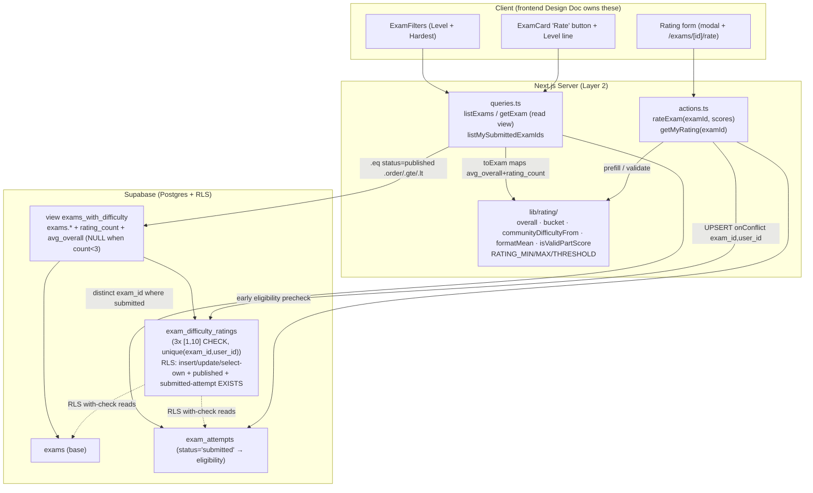

# Rating System — Backend Design Document

| | |
|---|---|
| **Version** | 1.0 |
| **Date** | 2026-07-24 |
| **Status** | Draft — backend design for the Exam Difficulty Rating feature. Implements ADR-0008 exactly (on-read aggregation via a NULL-below-threshold view + two-layer eligibility). Scope: API/contracts, data layer, business logic, server architecture. **UI/React components are out of scope** — a separate frontend Design Doc consumes the contracts published here. |
| **PRD** | `docs/prd/rating-system-prd.md` (v1.1) |
| **ADR** | `docs/adr/ADR-0008-exam-difficulty-rating-and-on-read-aggregation.md` (Accepted) |
| **Codebase analysis** | HC-02 (backend codebase-analyzer) — treated as verified ground truth (see Fact Disposition Table) |

## Overview

This Design Doc turns ADR-0008 into implementable backend detail for the Exam Difficulty Rating feature: the idempotent `schema.sql` additions (a new `exam_difficulty_ratings` table with per-part `[1,10]` CHECK, `unique(exam_id, user_id)`, and insert-own/update-own/select-own RLS carrying a cross-table submitted-attempt `EXISTS` + published guard), the `exams_with_difficulty` Postgres view whose `avg_overall` is NULL below the `N = 3` threshold, the Layer 2 read-model extension (`Exam.communityDifficulty`, `ExamSort` gains `hardest`, `ExamFilters` gains `level`), the pure `SOURCE/lib/rating/` display + validation helpers, and the `rateExam` / `getMyRating` / submitted-exam-id-set server contracts. It also defines the **blocking phase-0 PostgREST spike** the whole read mechanism is contingent on, and the test boundaries (RLS suite cases + vitest unit fixtures).

## Design Summary (Meta)

```yaml
design_type: "extension"          # extends exams read model + Layer 2 reads; adds one table, one view, one action, one lib module
risk_level: "high"                # a missed RLS predicate lets an ineligible user persist a rating (PRD metric 1 = zero); a wrong view/PostgREST assumption breaks Hardest/Level server-side
complexity_level: "medium"
complexity_rationale: >
  (1) AC-008/metric 1 require eligibility enforced at the DB layer (cross-table EXISTS on a submitted exam_attempts row),
      not the app, because clients call Supabase directly; (2) AC-019/020/021 require ordering, threshold, and bucket
      filtering to run DB-side over an aggregate, and ADR-0008's chosen mechanism (a NULL-below-3 view read through
      PostgREST operators) is contingent on an unverified PostgREST capability that a blocking phase-0 spike must confirm
      or fall back to an RPC; (3) the N=3 threshold is expressed in two coordinated places (SQL view + TS helper) and
      must be kept in agreement by a test.
main_constraints:
  - "Single idempotent schema.sql applied by hand in the Supabase SQL Editor — no migration framework."
  - "On-read only: no denormalized exams column, no trigger, no backfill (PRD R8 / ADR-0008 Decision 1)."
  - "DB/RLS is the authoritative eligibility gate; the server action is UX ergonomics over the DB invariant."
  - "Ordering/threshold/filtering run DB-side (view or RPC); a JS-merged aggregate cannot satisfy Hardest/Level."
  - "Bucket/mean/'—' display + part-score validation stay in a pure vitest-covered SOURCE/lib/rating/ module."
biggest_risks:
  - "A missed RLS clause (published OR submitted-attempt OR user_id) lets an ineligible user persist a rating (metric 1)."
  - "PostgREST on this Postgres/Supabase version cannot express nulls-last order + range filter on a VIEW column — breaks Hardest/Level server-side (mitigated by the blocking phase-0 spike + RPC fallback)."
  - "The N=3 threshold drifts between the view's NULL cutoff and the TS helper's '—' cutoff (mitigated by a cross-check test)."
unknowns:
  - "Whether PostgREST honours .order(avg_overall,{nullsFirst:false}) + chained secondary .order() and .gte/.lt range predicates on a VIEW column against the live DB — resolved by the phase-0 spike; RPC fallback ready."
  - "Whether the exams_with_difficulty view must be a standard (definer) view for the cross-user aggregate to be correct under ratings_select_own RLS — resolved by the spike's count assertion."
```

## Background and Context

### Prerequisite ADRs

- **ADR-0008** (Accepted) — Exam Difficulty Rating: on-read aggregation + cross-table authorization. This Design Doc implements its three decisions exactly: (1) on-read aggregate, no cache/trigger/backfill; (2) a Postgres view `exams_with_difficulty` with a NULL-below-threshold `avg_overall` + `rating_count`, read by `listExams`/`getExam`, with bucket/mean/`"—"` in a pure `SOURCE/lib/rating/` helper; (3) `exam_difficulty_ratings` with eligibility enforced in BOTH RLS and the `rateExam` server action, per-part `[1,10]` CHECK, `unique(exam_id, user_id)`.
- **ADR-0001** (UGC lifecycle + RLS enforcement) — the `exam_reports` model, cross-table RLS, and the "DB is the gate" discipline this feature extends.
- **ADR-0005** (multi-part national format) — the three fixed parts (`mcq` / `true_false` / `short_answer`) a rating scores. The rating form's three parts are fixed constants, **not** read from `exams.parts` (PRD R1).

No common ADR (`docs/adr/ADR-COMMON-*`) exists or is required: the error-return shape and RLS enforcement patterns are already established by ADR-0001 and the `reportExam`/`submitExam` precedents; this feature reuses them rather than introducing a new cross-component convention.

### External Resources Used

| Resource (project-tier label) | Feature-specific identifier | Notes |
|-------------------------------|-----------------------------|-------|
| Database Schema Source | `SOURCE/supabase/schema.sql` — new `exam_difficulty_ratings` table + constraints + RLS, appended at the TRUE END of the file (~:464, after the section-9 BACKFILL — the file continues past `exam_reports` :340 through `profiles_update_own`, storage policies, and BACKFILL); new `exams_with_difficulty` view | Applied manually in the Supabase SQL Editor; idempotent (`create table if not exists`, `drop constraint/policy if exists`, `create or replace view`) |
| Schema Change Process | RLS verification via `SOURCE/supabase/test-rls.ts` (`cd SOURCE && npx tsx supabase/test-rls.ts`) | Extended with rating cases R-p…R-u; acceptance mechanism for PRD metrics 1 and 2 |
| Authentication Method | `@supabase/ssr` session cookie; server client `SOURCE/lib/supabase/server.ts` via `createClient()` | The new `rateExam` action and reads obtain the client via `createClient()`; `auth.uid()` drives the RLS floor |
| Live database (spike) | Live Supabase/PostgREST project — phase-0 spike target for the view + order/filter capability check | See "Phase-0 Verification Spike (BLOCKING)"; no project-tier file exists yet, so this feature-tier row records the access method inline |

> Note: `docs/project-context/external-resources.md` does not exist in the repo. Per the external-resource-context skill, the environment-stable facts above (schema source path, RLS harness command, auth client path) are recorded feature-tier here; creating the project-tier file is deferred to a project-wide setup task and is not blocking for this backend design.

### Agreement Checklist

#### Scope
- [x] Add `public.exam_difficulty_ratings` (three integer part-score columns, per-part `[1,10]` CHECK, `unique(exam_id, user_id)`, `user_id uuid default auth.uid() references auth.users(id) on delete cascade`, `exam_id references exams(id) on delete cascade`), appended idempotently AFTER the `exam_reports` policies in `schema.sql`.
- [x] Add insert-own + update-own + select-own RLS policies on the ratings table; each write policy AND-s `user_id = auth.uid()`, a published-exam `EXISTS`, and a submitted-attempt `EXISTS`.
- [x] Add the `public.exams_with_difficulty` view (`create or replace view`) exposing all `exams` columns + `rating_count` + `avg_overall` (NULL when `rating_count < 3`).
- [x] Extend `SOURCE/app/(layer2)/queries.ts`: `listExams`/`getExam` read the view; `ExamRow`/`EXAM_COLUMNS`/`toExam` gain `avg_overall`/`rating_count` → mapped to `Exam.communityDifficulty`; `ExamSort` gains `hardest`; `ExamFilters` gains `level`; add `listMySubmittedExamIds()`.
- [x] Add `SOURCE/types/exam.ts` — `Exam.communityDifficulty: { bucket: 'Easy'|'Medium'|'Hard'; mean: number; count: number } | null`.
- [x] Add `SOURCE/lib/rating/` pure module: `overall()`, `bucket()`, `communityDifficultyFrom()`, `formatMean()`, part-score validation, and the `RATING_MIN`/`RATING_MAX`/`RATING_THRESHOLD` constants.
- [x] Add `rateExam(examId, scores)` and `getMyRating(examId)` beside `SOURCE/app/(layer2)/actions.ts`.
- [x] Extend `SOURCE/supabase/test-rls.ts` with rating RLS cases; add `SOURCE/lib/rating/__tests__/` vitest fixtures.

#### Non-Scope (Explicitly not changing)
- [ ] React components, the auto-open result-page modal, the `/exams/[id]/rate` route, the `ExamCard` "Rate" button, and the Level-filter panel — owned by the **frontend Design Doc** (this doc publishes the contracts they consume).
- [ ] `submitExam` / `startAttempt` / attempt/result tables and their RLS — untouched; eligibility only **reads** `exam_attempts.status`.
- [ ] `exams` base-table schema — no denormalized difficulty column, no trigger, no backfill (PRD R8).
- [ ] `exam_reports` and the UGC Layer 4 write path — untouched; the ratings table mirrors the `exam_reports` shape but is a separate table.
- [ ] `computeScore` / scoring — the three rating parts are a display/perception axis, unrelated to auto-scoring.
- [ ] Existing `newest`/`oldest` sorts and `subject`/`grade`/`school`/`schoolYear`/`semester` filters — unaffected.

#### Constraints
- [ ] Parallel operation: **No** — single local Supabase project; schema applied once, verified via the RLS harness, then the app deploys.
- [ ] Backward compatibility: **Required** — exams with `< 3` ratings (including every existing exam at launch, which has 0) keep showing `"—"`; existing catalog/browse behavior is unchanged (AC-023). Guaranteed by the view's NULL-below-3 `avg_overall` + the helper's `"—"` mapping + no `exams` write.
- [ ] Performance measurement: **Not a CI gate** — pre-launch scale; the requirement is "no per-card round-trip (no N+1)" and "aggregation at the DB layer", satisfied by one view query + one submitted-id-set query per page load (NFR Performance).

#### Applicable Standards
- [x] Idempotent DDL (`create table if not exists` / `drop constraint if exists` + `add constraint` / `drop policy if exists` + `create policy` / `create or replace view`) `[explicit]` — Source: `SOURCE/supabase/schema.sql` convention (e.g. `exam_reports` block :247-341).
- [x] RLS write policy AND-s `user_id = auth.uid()` + a published `EXISTS` + a cross-table eligibility `EXISTS` `[explicit]` — Source: `reports_insert_own` (`schema.sql:331-335`, published clause) + `answers_insert_own` (`schema.sql:182-189`, cross-table `EXISTS`).
- [x] Snake_case DB ↔ camelCase TS mappers in query modules `[explicit]` — Source: `SOURCE/app/(layer2)/queries.ts` `toExam` (:33-47).
- [x] Server Actions: `"use server"`, `createClient()`, `throw` on infrastructure error, discriminated `{ error? }` return on user error `[explicit]` — Source: `reportExam` (`SOURCE/app/(layer4)/actions.ts:960-987`), `submitExam` (`SOURCE/app/(layer2)/actions.ts`).
- [x] Status-object (not redirect) return so a failed write preserves the user's input `[explicit]` — Source: PRD AC-025 + `reportExam`'s `{ error?: "duplicate"|"empty"|"server" }` non-leaking mapping.
- [x] Pure, unit-testable domain helpers live under `SOURCE/lib/**` (vitest collects only `lib/**` + `components/**`) `[explicit]` — Source: `SOURCE/vitest.config.ts:15`; precedent `SOURCE/lib/scoring/computeScore.ts` + its tests.
- [x] Numeric domain limits centralized as named constants `[implicit]` — Evidence: `SOURCE/lib/ugc/limits.ts` `LIMITS`. Confirmed: Yes (adopt the same pattern in `SOURCE/lib/rating/` for `RATING_MIN`/`RATING_MAX`/`RATING_THRESHOLD`).
- [x] Vietnamese inline comments where the surrounding file already uses them `[implicit]` — Evidence: `queries.ts`, `actions.ts`, `schema.sql`. Confirmed: Yes (match per-file convention).

#### Assumed Behaviors

- [ ] **`exam_attempts.status = 'submitted'` is the authoritative eligibility source** and `user_id default auth.uid()` scopes a row to the current user. Evidence: `schema.sql:99-106` (table def) + `SOURCE/app/(layer2)/actions.ts:121-125` (`submitExam` sets `status='submitted'`). Confirmed: **Yes**.
- [ ] **Supabase `.upsert(row, { onConflict: 'exam_id,user_id' })` performs an insert-or-update against the unique constraint** (not reliant on catching 23505). Evidence: `submitExam` uses `.upsert(answerRows, { onConflict: "attempt_id,question_id" })` (`SOURCE/app/(layer2)/actions.ts:101-104`). Confirmed: **Yes**.
- [ ] **SQL comparison predicates against NULL are never true, so `.gte/.lt` on `avg_overall` excludes below-threshold (NULL) rows for free.** Evidence: SQL three-valued-logic standard. Confirmed: **Yes** (language semantics) — but the *PostgREST-on-a-view wiring* of this is verified by the spike (see next item).
- [ ] **PostgREST honours `.order('avg_overall', { ascending:false, nullsFirst:false })` + chained secondary `.order('created_at').order('id')` AND `.gte/.lt` range predicates on a VIEW column, against this Postgres/Supabase version.** Evidence: none locatable in-repo; ADR-0008 flags this as the CRITICAL UNVERIFIED CONSTRAINT. Confirmed: **No** → tied to the phase-0 spike (Risks row R-1) with the RPC fallback.
- [ ] **A standard (non-`security_invoker`) Postgres view aggregates across ALL raters' ratings** regardless of the `ratings_select_own` RLS (definer semantics), so `rating_count`/`avg_overall` are correct rather than showing only the caller's own rating. Evidence: Postgres view privilege semantics; not verified on this project. Confirmed: **No** → verified by the spike's count assertion (Risks row R-2).

#### Quality Assurance Mechanisms
- [x] ESLint / Prettier / `tsc` strict — Enforces: style, formatting, types — Config: project root — Covers: project-wide — Status: `adopted`.
- [x] RLS verification harness `SOURCE/supabase/test-rls.ts` — Enforces: DB-level RLS/constraint behavior against real local Supabase — Config: `SOURCE/supabase/test-rls.ts` — Covers: the new ratings table policies + unique constraint — Status: `adopted` (acceptance mechanism for PRD metrics 1, 2).
- [x] Vitest (node env) — Enforces: pure-function correctness — Config: `SOURCE/vitest.config.ts` (`include: lib/**`, `components/**`) — Covers: `SOURCE/lib/rating/` bucket/mean/threshold — Status: `adopted` (acceptance for PRD metrics 3, 4).
- [x] PostgREST capability spike — Enforces: that the chosen view + order/filter mechanism works on the live DB before any query/UI is built — Config: manual, run against the live project — Covers: the `exams_with_difficulty` read path — Status: `adopted` (blocking phase-0 gate).
- [ ] axe a11y audit — Status: `noted` (accessibility of the rating form/button is a frontend-Design-Doc concern; not in this backend scope).

### Problem to Solve

The Exam Browser and detail page ship an inert difficulty signal (`"—"`, "Coming soon", a `?hardest=1` URL param that does nothing). This backend must (a) let an **eligible** user (one with a submitted attempt) persist a single editable rating per exam, enforced at the DB layer so a direct-client bypass cannot write; (b) compute per-exam community difficulty **on read** with the `N = 3` threshold, nulls-last ordering, and bucket filtering all runnable DB-side; and (c) expose these as typed contracts the frontend Design Doc can consume — all as one idempotent `schema.sql` addition plus Layer 2 read/write changes, with no denormalized column, trigger, or backfill.

### Current Challenges

- `exams` today has **no** difficulty aggregate; `listExams`/`getExam` are flat selects on the base table (`queries.ts:64-89, 128-138`); `ExamSort` is `"newest" | "oldest"` with `hardest` explicitly deferred ("`hardest` TẠM BỎ QUA (chờ rating)", `queries.ts:51`); `ExamFilters` has no `level` dimension.
- There is no ratings table; `exam_reports` (`schema.sql:247-341`) is the closest shape but is insert-own only (not editable) — ratings are an **upsert**, so they additionally need update-own.
- The `N = 3` threshold + nulls-last ordering + bucket filtering must run DB-side (a JS-merged aggregate cannot be ordered/filtered DB-side — ADR-0008 rejected option D), which forces the view (or RPC) mechanism whose PostgREST feasibility is unverified.

### Requirements

#### Functional Requirements
Traceable to PRD v1.1 R1–R8 (see Acceptance Criteria). Backend-owned subset: R1 (three fixed parts, mean overall — the aggregation/validation half), R3 (server-enforced eligibility), R5 (upsert, one rating per user/exam), R6 (community bucket + mean, threshold N=3 — the query/helper half), R7 (Hardest sort, Level filter — the DB-side half), R8 (on-read, no cache/trigger/backfill). R2/R4/R9 UI halves are frontend-owned; the backend supplies `getMyRating` (prefill), `rateExam` (write), and `listMySubmittedExamIds` (button gating).

#### Non-Functional Requirements
- **Performance**: no per-card round-trip — one view query per catalog read + one submitted-id-set query per Browser page load; aggregation, sort, and Level filter at the DB layer, not client-side.
- **Reliability**: a failed `rateExam` write returns a status object (never redirect) so the caller preserves the user's three scores (AC-025); the upsert never creates a second row for one `(exam_id, user_id)` (AC-012).
- **Security**: eligibility (submitted attempt) + published + one-per-user uniqueness enforced at the DB/RLS layer, surviving a direct Supabase-client bypass (AC-008, metric 1).
- **Maintainability**: bucket/mean/threshold logic is pure and vitest-covered; the `N = 3` threshold's two expressions (SQL + TS) are kept in agreement by a test.

## Acceptance Criteria (AC) — EARS Format

Backend-verifiable subset of PRD v1.1 ACs (UI-presentation ACs are frontend-owned and omitted here).

### R3 — Server-enforced eligibility
- [ ] **If** a user has no submitted `exam_attempts` row for an exam **when** they attempt to persist a rating (including a direct Supabase-client / direct `/exams/[id]/rate` POST), **then** the write is rejected at the DB/RLS layer and no rating row is created or updated. (AC-008; PRD metric 1)
- [ ] **When** a user with a submitted attempt on an exam submits three valid part scores, **then** the rating persists. (AC-009)
- [ ] **When** a rating write targets a non-`published` exam, **then** the DB rejects it. (PRD Security; mirrors `reports_insert_own` published clause)

### R1/R5 — Validation, mean, upsert
- [ ] **If** any part score is not an integer in `[1, 10]` **when** `rateExam` validates, **then** it returns `{ error: 'invalid' }` and no write occurs; the DB CHECK independently rejects such a row. (AC-002)
- [ ] **When** a rating is persisted, **then** the user's overall for that exam equals the arithmetic mean of the three stored part scores (derived, not a persisted column). (AC-003; PRD metric 3)
- [ ] **When** a user who already rated an exam submits new scores, **then** their existing row is updated in place (upsert on `(exam_id, user_id)`), no second row is created, and the new three scores replace the old. (AC-012; PRD metric 2)
- [ ] **When** a user re-opens their rating, **then** `getMyRating(examId)` returns their currently stored three scores (or `null` if none). (AC-013)

### R6/R7/R8 — On-read difficulty, threshold, sort, filter
- [ ] **While** an exam has `≥ 3` ratings, `getExam`/`listExams` shall expose `communityDifficulty = { bucket, mean, count }` where `bucket` follows `[1,4)`→Easy / `[4,7)`→Medium / `[7,10]`→Hard (4.0→Medium, 7.0→Hard, 10.0→Hard). (AC-014/016/018; PRD metric 4)
- [ ] **While** an exam has `< 3` ratings, `communityDifficulty` shall be `null` (frontend renders `"—"`). (AC-015)
- [ ] **When** `ExamSort = 'hardest'`, **then** rated exams appear first ordered by `avg_overall` descending, and all below-threshold/unrated exams appear after them deterministically by `created_at` then `id`. (AC-019/020; PRD metric 5/6)
- [ ] **When** `ExamFilters.level` is set to a bucket, **then** only exams whose `avg_overall` falls in that bucket's range (and thus `≥ 3` ratings) are returned; below-threshold and other-bucket exams are excluded. (AC-021)
- [ ] **When** any rating is inserted/updated, **then** the next read reflects the new aggregate with no `exams` column written and no trigger firing. (AC-022/023; PRD metric 7)

## Existing Codebase Analysis

### Implementation Path Mapping

| Type | Path | Description |
|------|------|-------------|
| Existing | `SOURCE/supabase/schema.sql` | Append `exam_difficulty_ratings` + RLS at the TRUE END of the file (~:464, after the section-9 BACKFILL — not mid-file after `exam_reports` :340); add `exams_with_difficulty` view. Mirrors `exam_reports` shape (:247-258) + `answers_insert_own` cross-table `EXISTS` (:182-189) + `reports_insert_own` published clause (:331-335). |
| Existing | `SOURCE/app/(layer2)/queries.ts` | `ExamRow`/`EXAM_COLUMNS`/`toExam` gain `avg_overall`/`rating_count`; `listExams`/`getExam` read the view; `ExamSort` gains `hardest`; `ExamFilters` gains `level`; add `listMySubmittedExamIds()`. |
| Existing | `SOURCE/app/(layer2)/actions.ts` | Add `rateExam(examId, scores)` and `getMyRating(examId)` beside `startAttempt`/`submitExam`. |
| Existing | `SOURCE/types/exam.ts` | `Exam` gains `communityDifficulty`. |
| Existing | `SOURCE/supabase/test-rls.ts` | Add rating cases R-p…R-u (mirroring the R-i/R-j/R-k reports cases, :429-473). |
| Existing | `SOURCE/vitest.config.ts` | No change — `lib/**` already collected. |
| New | `SOURCE/lib/rating/index.ts` (or `bucket.ts`/`constants.ts`) | Pure `overall`/`bucket`/`communityDifficultyFrom`/`formatMean`/`isValidPartScore` + `RATING_MIN`/`RATING_MAX`/`RATING_THRESHOLD`. |
| New | `SOURCE/lib/rating/__tests__/rating.test.ts` | Boundary fixtures + threshold-agreement test. |

### Integration Points (Include even for new implementations)
- **Integration Target**: `SOURCE/app/(layer2)/queries.ts` reads (`listExams`, `getExam`) — the sole mapping point where `avg_overall`/`rating_count` become `Exam.communityDifficulty` via `toExam`.
- **Invocation Method**: Server Components call `listExams(filters)` / `getExam(id)`; the Browser page additionally calls `listMySubmittedExamIds()`; the rating surfaces call `rateExam` (server action) and `getMyRating`.

### Code Inspection Evidence

| File/Function | Relevance |
|---------------|-----------|
| `SOURCE/supabase/schema.sql:247-258` (`exam_reports` table) | pattern reference — table shape the ratings table mirrors (unique(exam_id, reporter_id), default auth.uid(), on delete cascade) |
| `SOURCE/supabase/schema.sql:182-189` (`answers_insert_own`) | pattern reference — cross-table `EXISTS` with-check (the eligibility clause) |
| `SOURCE/supabase/schema.sql:331-335` (`reports_insert_own`) | pattern reference — published-exam `EXISTS` AND-ed into an insert policy |
| `SOURCE/supabase/schema.sql:99-106` (`exam_attempts`) | integration point — eligibility source of truth (`status='submitted'`, `user_id default auth.uid()`) |
| `SOURCE/app/(layer2)/queries.ts:30-47` (`EXAM_COLUMNS`/`toExam`) | integration point — single mapping point extended with the two new fields |
| `SOURCE/app/(layer2)/queries.ts:52-89` (`ExamSort`/`ExamFilters`/`listExams`) | integration point — sort/filter extension |
| `SOURCE/app/(layer2)/actions.ts:101-104` (`submitExam` upsert) | pattern reference — `.upsert(..., { onConflict })` idiom `rateExam` reuses |
| `SOURCE/app/(layer4)/actions.ts:960-987` (`reportExam`) | pattern reference — non-leaking `{ error? }` return-shape precedent |
| `SOURCE/app/(layer4)/actions.ts:62-69` (`requireUser`) | pattern reference — auth gate (adapted: `rateExam` returns a status object rather than redirect on the eligibility path) |
| `SOURCE/supabase/test-rls.ts:429-473` (R-i/R-j/R-k) | pattern reference — reports RLS cases the rating cases mirror |
| `SOURCE/lib/scoring/computeScore.ts` + `__tests__/computeScore.test.ts` | pattern reference — pure server-side domain fn + literal-fixture vitest style |
| `SOURCE/lib/ugc/limits.ts` (`LIMITS`) | pattern reference — centralized numeric-limit constants |

**Similar-functionality search**: no existing rating, difficulty-aggregate, `communityDifficulty`, `exams_with_difficulty`, `exam_difficulty_ratings`, or `SOURCE/lib/rating/` code exists (Glob `SOURCE/lib/rating/**` → none; repo grep for the identifiers → none). The one reuse is the `exam_reports` **pattern** (mirrored, not shared) and the Supabase upsert idiom. All new modules are genuinely new — no technical debt to supersede, so a new implementation following the established RLS/query/action patterns is the adopted decision.

### Fact Disposition Table

The HC-02 backend-codebase-analyzer output was supplied as verified ground-truth focus areas (fact IDs assigned here `HC-02-F1…F8`). Other sections referencing existing behavior point back to these rows by Focus Area.

| Fact ID | Focus Area | Disposition | Rationale | Evidence |
|---------|------------|-------------|-----------|----------|
| HC-02-F1 | Ratings table mirrors `exam_reports` shape | transform | New `exam_difficulty_ratings`: `unique(exam_id, user_id)` [mirrors `unique(exam_id, reporter_id)`], `exam_id references exams(id) on delete cascade`, `user_id uuid default auth.uid() references auth.users(id) on delete cascade`; three integer part-score columns instead of a `reason`. | `schema.sql:247-258` (`exam_reports`) |
| HC-02-F2 | Idempotent single-file `schema.sql` convention | preserve | New block uses `create table if not exists`, paired `drop constraint if exists NAME` + `add constraint NAME check(...)`, `alter table enable row level security`, `drop policy if exists`/`create policy`; appended at the TRUE END of the file (~:464, after the section-9 BACKFILL). No exams column/trigger/backfill (ADR R8). | `schema.sql` conventions throughout; `exam_reports` block :247-341; file runs to :464 |
| HC-02-F3 | RLS: `exam_reports` has insert-own + select-own but NO update-own | transform | Ratings are an upsert → add insert-own AND update-own AND select-own. Each write policy AND-s (a) `user_id = auth.uid()`; (b) published `EXISTS`; (c) submitted-attempt eligibility `EXISTS`. | `reports_insert_own` :331-335; `answers_insert_own` :182-189 |
| HC-02-F4 | Per-part scores integer `[1,10]` via CHECK | preserve | A single CHECK constrains all three part columns to `between 1 and 10`; the `[1,10]` range is also a TS constant pair (`RATING_MIN`/`RATING_MAX`) in `SOURCE/lib/rating/` (LIMITS pattern). | `lib/ugc/limits.ts` `LIMITS` pattern |
| HC-02-F5 | `rateExam` server action beside `(layer2)/actions.ts` | transform | `'use server'`; auth gate; early eligibility pre-check returning `{ error?: 'ineligible'\|'invalid'\|'server' }` (RLS remains authoritative); `.upsert(..., { onConflict: 'exam_id,user_id' })` (NOT insert; not reliant on 23505); returns a status object (NOT redirect) so the modal keeps input on error (AC-025); mirrors `reportExam`'s non-leaking mapping. | `reportExam` `actions.ts:960-987`; `submitExam` upsert :101-104 |
| HC-02-F6 | Exam read model gains `communityDifficulty` | transform | `Exam.communityDifficulty: { bucket: 'Easy'\|'Medium'\|'Hard'; mean: number; count: number } \| null` (null → UI `"—"`). Added via `ExamRow`/`EXAM_COLUMNS`/`toExam` single mapping point; `getExam` reuses `EXAM_COLUMNS` so detail gets it for free. | `queries.ts:30-47` |
| HC-02-F7 | Pure helpers live under `SOURCE/lib/rating/` | preserve | vitest collects only `lib/**` + `components/**`; `bucket()`/`overall()`/threshold gating go under `SOURCE/lib/rating/`. Bucket boundaries Easy `[1,4)` / Medium `[4,7)` / Hard `[7,10]`; 4.0→Medium, 7.0→Hard, 10.0→Hard; mean display one-decimal (`toFixed(1)`); threshold N=3. | `vitest.config.ts:15`; `lib/scoring` precedent |
| HC-02-F8 | Submitted-exam-id set for Rate-button eligibility | preserve | A single query `select distinct exam_id from exam_attempts where status='submitted'` (user scoped via RLS), returned once per page — no per-card N+1. Exposed as `listMySubmittedExamIds()`. | `exam_attempts` :99-106; NFR Performance |

## Design

### Change Impact Map

```yaml
Change Target: Exam Difficulty Rating backend (ratings table + RLS + view + Layer 2 reads/writes + lib/rating)
Direct Impact:
  - SOURCE/supabase/schema.sql (new exam_difficulty_ratings table + constraints + insert/update/select RLS; new exams_with_difficulty view)
  - SOURCE/app/(layer2)/queries.ts (ExamRow/EXAM_COLUMNS/toExam +2 fields; listExams/getExam read the view; ExamSort += 'hardest'; ExamFilters += level; new listMySubmittedExamIds)
  - SOURCE/app/(layer2)/actions.ts (new rateExam + getMyRating)
  - SOURCE/types/exam.ts (Exam.communityDifficulty)
  - NEW SOURCE/lib/rating/ (bucket/overall/communityDifficultyFrom/formatMean/isValidPartScore + constants)
  - SOURCE/supabase/test-rls.ts (rating cases R-p…R-u)
  - NEW SOURCE/lib/rating/__tests__/ (boundary + threshold-agreement fixtures)
Indirect Impact:
  - Every catalog read (listExams/getExam) now selects two extra columns from a view instead of the base table — bounded by the phase-0 spike + the explicit .eq('status','published') guard preserved on both.
  - The Exam Browser page performs one extra query per load (listMySubmittedExamIds) — bounded, single round-trip, RLS-scoped.
  - Consumers of Exam (frontend) receive a new optional-shaped field communityDifficulty — additive; existing consumers ignoring it are unaffected.
No Ripple Effect:
  - submitExam / startAttempt / exam_attempts / attempt_answers / exam_results tables and their RLS (eligibility only READS exam_attempts.status).
  - exam_reports table and the UGC Layer 4 write path.
  - computeScore / scoring / TopicBreakdown.
  - exams base-table columns (no denormalized difficulty, no trigger, no backfill).
  - Existing newest/oldest sorts and subject/grade/school/year/semester filters.
```

### Interface Change Matrix

| Existing | New | Conversion Required | Adapter Required | Compatibility Method |
|----------|-----|--------------------|------------------|---------------------|
| `listExams(filters)` reads `exams` | `listExams(filters)` reads `exams_with_difficulty` | Yes — source relation swap + 2 columns + hardest/level branches | No | Same signature + return type extended additively (`Exam.communityDifficulty`); `.eq('status','published')` guard preserved |
| `getExam(id)` reads `exams` | `getExam(id)` reads `exams_with_difficulty` | Yes — source relation swap + 2 columns | No | Same signature; `Exam` gains one field |
| `ExamSort = 'newest'\|'oldest'` | `ExamSort = 'newest'\|'oldest'\|'hardest'` | Yes — new union member | No | Additive union; existing callers unaffected |
| `ExamFilters { subject,... sort }` | `ExamFilters { ..., level? }` | Yes — new optional field | No | Optional field; omitted → no Level filter applied |
| — (none) | `rateExam(examId, scores)` | New | No | New server action |
| — (none) | `getMyRating(examId)` | New | No | New read (mirrors `hasReported`) |
| — (none) | `listMySubmittedExamIds()` | New | No | New read |

### Architecture Overview



### Data Flow

**Write (rate / re-rate):**
```
User submits three part scores (1–10) via the form
  -> rateExam(examId, { partI, partII, partIII })   ("use server")
       auth: get user; if none -> { error: 'ineligible' }        (defensive; RLS is the gate)
       validate: each score integer in [1,10] via isValidPartScore -> else { error: 'invalid' }
       early eligibility precheck (UX): exists submitted exam_attempts for (examId, user)?  -> else { error: 'ineligible' }
       UPSERT exam_difficulty_ratings(exam_id, user_id[default auth.uid()], score_part1..3)
              onConflict 'exam_id,user_id'                        (single row per user/exam; AC-012)
         -> RLS with-check re-verifies user_id = auth.uid() AND published AND submitted-attempt (authoritative)
       on any DB error -> log server-side, return { error: 'server' } (no redirect; input preserved, AC-025)
       success -> return {} ; caller revalidates the difficulty surfaces
```

**Prefill (already-rated state):**
```
getMyRating(examId) -> select score_part1..3 from exam_difficulty_ratings where exam_id=? (user via RLS select-own)
                    -> { partI, partII, partIII } | null
```

**Read (catalog / detail / sort / filter):**
```
listExams(filters):
  from('exams_with_difficulty').select(EXAM_COLUMNS + ', rating_count, avg_overall').eq('status','published')
    + subject/grade/school/year/semester filters (unchanged)
    + level filter:  Easy -> .gte('avg_overall',1).lt('avg_overall',4)
                     Medium -> .gte(4).lt(7) ; Hard -> .gte('avg_overall',7)     (NULL rows excluded for free)
    + sort:  hardest -> .order('avg_overall',{ascending:false,nullsFirst:false}).order('created_at').order('id')
             newest/oldest/default -> unchanged
  -> rows.map(toExam)  ; toExam calls communityDifficultyFrom(avg_overall, rating_count)
       -> avg_overall null (count<3) -> communityDifficulty = null (UI '—')
       -> else { bucket: bucket(avg_overall), mean: avg_overall, count: rating_count }

getExam(id): same view, single row, .eq('status','published') -> toExam
```

### Phase-0 Verification Spike (BLOCKING — gate before any query/UI build)

Per ADR-0008, the selected read mechanism is **contingent** on a PostgREST capability that is unverified on this Postgres/Supabase version. This spike is the first task in the implementation order and blocks all downstream read/UI work.

**Setup**: create `exam_difficulty_ratings` + the `exams_with_difficulty` view (below), seed a handful of exams with 0/1/2/3+ ratings.

**Run against the live Supabase/PostgREST and assert all four hold with a single flat select (no client-side reordering):**

| # | Check | Pass criterion |
|---|-------|----------------|
| S1 | `from('exams_with_difficulty').select('id, status, rating_count, avg_overall').eq('status','published')` | Rows return; `rating_count` correct (**counts all raters, not just the caller** — validates the definer-view assumption HC-02/Assumed Behaviors); `avg_overall` is NULL exactly for rows with `rating_count < 3` |
| S2 | `.order('avg_overall',{ascending:false,nullsFirst:false}).order('created_at').order('id')` | Rated exams descend by `avg_overall`; all NULL rows sink **last**, tie-broken by `created_at` then `id` (AC-019/020) |
| S3 | `.gte('avg_overall',7)` (Hard) and `.gte('avg_overall',4).lt('avg_overall',7)` (Medium) | Only in-range rows return; NULL (below-threshold) rows excluded (AC-021) |
| S4 | `getExam`: single-id select of `avg_overall` + `rating_count` from the view with `.eq('status','published')` | Returns the one row with correct aggregate (AC-016) |

**Failure response** (any of S1–S4 fails): adopt ADR-0008 Decision 2 **option B** — a Postgres RPC `list_exams_with_difficulty(...)` (and a single-id variant) encapsulating join/aggregate/threshold/order/filter server-side, exposing the **same external contract** (`Exam.communityDifficulty`, `ExamSort='hardest'`, `ExamFilters.level`). Decisions on the table, RLS, and the `SOURCE/lib/rating/` helper are unchanged. If neither the view nor the RPC can express sort+filter+threshold server-side, the on-read mechanism is invalid → escalate before UI work (ADR-0008 Kill criterion).

### Schema & DB Enforcement (concrete `schema.sql` additions)

All idempotent, appended to `SOURCE/supabase/schema.sql` at the **true end of the file** (~:464, after the section-9 BACKFILL — the file continues past `exam_reports` :340). No `exams` column, no trigger, no backfill (PRD R8 / Fact HC-02-F2).

#### 1. `exam_difficulty_ratings` table + range CHECK (Facts HC-02-F1, F4)

```sql
-- ============================================================================
-- Exam Difficulty Rating (ADR-0008, Backend Design Doc) — 1 rating / user / đề,
-- SỬA ĐƯỢC (upsert). Idempotent. KHÔNG cột trên exams, KHÔNG trigger, KHÔNG backfill.
-- Mô phỏng shape exam_reports; khác biệt: có update-own (rating sửa được) + 3 điểm phần.
-- ============================================================================
create table if not exists public.exam_difficulty_ratings (
  id          uuid primary key default gen_random_uuid(),
  exam_id     text not null references public.exams(id) on delete cascade,
  user_id     uuid not null default auth.uid() references auth.users(id) on delete cascade,
  score_part1 int not null,                       -- Phần I  (mcq)          1..10
  score_part2 int not null,                       -- Phần II (true_false)   1..10
  score_part3 int not null,                       -- Phần III(short_answer) 1..10
  created_at  timestamptz not null default now(),
  updated_at  timestamptz not null default now(),
  unique (exam_id, user_id)                        -- 1 rating / user / đề (upsert khoá)
);

-- Mỗi điểm phần là số nguyên trong [1,10] (AC-002). Một CHECK gộp cả 3 cột.
alter table public.exam_difficulty_ratings drop constraint if exists ratings_scores_range_check;
alter table public.exam_difficulty_ratings add constraint ratings_scores_range_check
  check (
    score_part1 between 1 and 10
    and score_part2 between 1 and 10
    and score_part3 between 1 and 10
  );
```

> Storage stores the **three part scores** (ADR-0008 Decision 3); the overall is derived (mean) in the view's aggregate and in the TS helper — never a persisted column (PRD I001, R8). `updated_at` is a plain column; the upsert sets it from the action (no trigger).

#### 2. RLS — insert-own AND update-own AND select-own (Fact HC-02-F3)

Each **write** policy AND-s the three clauses: (a) `user_id = auth.uid()`; (b) published-exam `EXISTS` (precedent `reports_insert_own` :331-335); (c) submitted-attempt eligibility `EXISTS` (precedent `answers_insert_own` :182-189). This is the deliberate deviation from `exam_reports` (which has no update-own — reports are not editable). The cross-table columns are qualified (`exam_difficulty_ratings.exam_id`) to avoid ambiguity with the subquery relation, matching the `answers_insert_own` style.

```sql
alter table public.exam_difficulty_ratings enable row level security;

-- INSERT: chỉ chủ nhân + đề published + đã có attempt 'submitted' (eligibility).
drop policy if exists "ratings_insert_own" on public.exam_difficulty_ratings;
create policy "ratings_insert_own" on public.exam_difficulty_ratings
  for insert to authenticated with check (
    user_id = auth.uid()
    and exists (
      select 1 from public.exams e
      where e.id = exam_difficulty_ratings.exam_id and e.status = 'published'
    )
    and exists (
      select 1 from public.exam_attempts a
      where a.exam_id = exam_difficulty_ratings.exam_id
        and a.user_id = auth.uid()
        and a.status = 'submitted'
    )
  );

-- UPDATE (upsert path): USING chọn row của mình; WITH CHECK giữ nguyên 3 điều kiện
-- (chủ nhân + published + eligibility) cho row kết quả.
drop policy if exists "ratings_update_own" on public.exam_difficulty_ratings;
create policy "ratings_update_own" on public.exam_difficulty_ratings
  for update to authenticated
  using (user_id = auth.uid())
  with check (
    user_id = auth.uid()
    and exists (
      select 1 from public.exams e
      where e.id = exam_difficulty_ratings.exam_id and e.status = 'published'
    )
    and exists (
      select 1 from public.exam_attempts a
      where a.exam_id = exam_difficulty_ratings.exam_id
        and a.user_id = auth.uid()
        and a.status = 'submitted'
    )
  );

-- SELECT = chỉ rating của mình (cho prefill "đã đánh giá" — AC-013). Aggregate
-- toàn cục KHÔNG đọc qua policy này mà qua view (definer) — xem §View.
drop policy if exists "ratings_select_own" on public.exam_difficulty_ratings;
create policy "ratings_select_own" on public.exam_difficulty_ratings
  for select to authenticated using (user_id = auth.uid());
```

> **Why the upsert needs both insert-own and update-own**: `.upsert(..., { onConflict: 'exam_id,user_id' })` performs an INSERT that, on conflict, becomes an UPDATE. PostgREST/Postgres evaluates the INSERT `with check` on the new-row path and the UPDATE `using` + `with check` on the conflict path; both must pass for first-rating and re-rating respectively. Omitting update-own would make re-rating (AC-012) fail.

#### 3. `exams_with_difficulty` view — NULL-below-threshold aggregate (Fact HC-02-F6; ADR-0008 Decision 2)

```sql
-- View đọc: exams.* + rating_count + avg_overall (NULL khi < 3 rating).
-- Encoding NULL-dưới-ngưỡng cho phép nulls-last order + lọc bucket qua toán tử
-- PostgREST thường, KHÔNG cần HAVING/RPC. Ngưỡng N=3 nằm ở ĐÂY (SQL) và ở
-- SOURCE/lib/rating (TS) — giữ đồng bộ bằng test (không có hằng số vật lý chung
-- băng qua ranh giới SQL/TS). Số '3' dưới đây là bản sao SQL của RATING_THRESHOLD.
create or replace view public.exams_with_difficulty as
select
  e.*,
  coalesce(agg.rating_count, 0) as rating_count,
  case when coalesce(agg.rating_count, 0) >= 3 then agg.avg_overall end as avg_overall
from public.exams e
left join (
  select
    exam_id,
    count(*) as rating_count,
    -- overall mỗi user = mean 3 phần; community = mean các overall.
    avg((score_part1 + score_part2 + score_part3) / 3.0) as avg_overall
  from public.exam_difficulty_ratings
  group by exam_id
) agg on agg.exam_id = e.id;
```

> **Definer semantics (intentional)**: a standard view aggregates across **all** raters regardless of `ratings_select_own` — required for a correct `rating_count`/`avg_overall`. A `security_invoker` view would run the aggregate under the caller's `ratings_select_own` and count only the caller's own row (wrong). The spike's S1 count assertion verifies this. **Catalog confinement** stays the explicit `.eq('status','published')` guard on both `listExams`/`getExam` (the existing pattern — RLS is a floor, the explicit filter is the guard; `queries.ts:66-68`). **Invariant**: no code path may read `exams_with_difficulty` without the `status='published'` filter (only `listExams`/`getExam` read it; the author-preview path uses the Layer 4 base-table reads, unchanged).

### Data Representation Decision

| Structure | Semantic Fit | Responsibility Fit | Lifecycle Fit | Boundary/Interop Cost | Decision |
|-----------|-------------|--------------------|--------------|-----------------------|----------|
| Ratings storage vs. reuse `exam_reports` | No (reports = abuse flag; rating = 3 difficulty scores) | No (report is not editable, insert-once; rating is an editable upsert with update-own RLS) | No (report created once; rating mutated on re-rate) | Medium (would need a `kind` discriminator + nullable columns on a shared table) | **New table** `exam_difficulty_ratings` — 3+ criteria fail; a new table is justified. It **mirrors** the `exam_reports` shape (unique/cascade/default auth.uid()) as a pattern, without physical reuse. |
| `communityDifficulty` on `Exam` vs. separate type | Yes (a per-exam derived signal belongs to the exam read model) | Yes (Layer 2 read concern, same as `authorDisplayName`/`parts`) | Yes (derived on every read) | Low (one additive optional-shaped field, mapped at `toExam`) | **Extend** `Exam` — all criteria satisfied; add `communityDifficulty` at the single `toExam` mapping point. |
| Overall difficulty (persist vs. derive) | — | — | — | — | **Derive** (not a stored column) — PRD I001/R8: the aggregate computes it either way; storing it would add a maintenance surface for no requirement. |

### Minimal Surface Alternatives

Four in-scope surface-bearing elements: (1) the ratings persistent state (three columns), (2) the `communityDifficulty` public-contract field, (3) the `exams_with_difficulty` view, (4) `ExamSort='hardest'` + `ExamFilters.level` behavioral modes. The overall persist-vs-derive choice is covered above.

#### Element 1: Ratings persistent state — three part-score columns vs. a stored `overall`

**Step 1 — Fixed Requirements**: AC-002 (each part 1–10, submittable independently), AC-003 (overall = mean of the three parts), AC-012 (upsert one row/user/exam), PRD R8 (no denormalized aggregate on `exams`).

**Steps 2–3 — Alternatives Compared**

| Alternative | Reqs covered | New persistent state (count) | New concept/mode/flag | Crosses boundary | Breaking change/migration | Subjective cost notes |
|---|---|---|---|---|---|---|
| Three part columns, overall derived (proposed) | AC-002/003/012/R8 | 3 columns (+ id/keys/timestamps) | 0 | No | No (new table) | Overall computed in view + helper |
| Three part columns **+ stored `overall`** | AC-002/003/012 (R8 unaffected — overall is on the ratings table, not exams) | 4 columns | 0 | No | No | Redundant; must stay consistent with the three parts on every write |
| One `overall` column only (drop parts) | Fails AC-002 (parts not independently editable/prefillable) | 1 column | 0 | No | No | Cannot prefill three scores (AC-013) |

Resolution priority: (1) new persistent state — proposed (3) < stored-overall (4); one-column (1) is smallest but fails AC-002/013.

**Step 4 — Selected**: Three part columns, overall derived. Rationale: smallest surface that covers AC-002 (three independent 1–10 values) and AC-013 (prefill the three) while keeping AC-003's overall a derivation. The one-column alternative is smaller but fails AC-002/AC-013.

**Step 5 — Rejected Alternatives Log**
- Stored `overall` column: redundant with the three parts; adds a consistency-maintenance surface for a value the view/helper already derive (AC-003).
- Single `overall` column only: cannot store/prefill the three independent part scores (AC-002/AC-013).

#### Element 2: `Exam.communityDifficulty` shape — `{ bucket, mean, count } | null`

**Step 1 — Fixed Requirements**: AC-014 (bucket + mean), AC-015 (`"—"` below threshold → `null`), AC-016 (detail cell), R10 (P3, Could-Have: "based on N ratings" — count enables it without a later contract change).

**Steps 2–3 — Alternatives Compared**

| Alternative | Reqs covered | New persistent state | New concept/mode/flag | Crosses boundary | Breaking change/migration | Subjective cost notes |
|---|---|---|---|---|---|---|
| `{ bucket, mean, count } \| null` (proposed) | AC-014/015/016; enables R10 | 0 (derived) | 1 field | Yes (server→frontend) | No | `count` is already in-hand from `rating_count` |
| `{ bucket, mean } \| null` (drop count) | AC-014/015/016 | 0 | 1 field | Yes | No (until R10) | R10 would need a later contract change |
| Two flat fields `difficultyBucket`, `difficultyMean` | AC-014/015/016 | 0 | 2 fields | Yes | No | Two nullable fields must be kept in lockstep; `null` state split across two |

Resolution priority: all cover the MVP ACs at 0 new persistent state; tiebreaker (3) new concept count — grouped object (1 field) ≤ two flat fields (2 fields). Between proposed and drop-count, both 1 field; `count` chosen because `rating_count` is already selected from the view (zero extra cost) and R10 is an accepted Could-Have.

**Step 4 — Selected**: `{ bucket, mean, count } | null`. Rationale: not the absolute smallest (drop-count is equal-sized minus one property), but `count` is already materialized by the view's `rating_count` and carrying it now avoids a contract change for R10 (accepted P3 scope). A single grouped object makes the `null` (below-threshold) state atomic rather than split across sibling fields.

**Step 5 — Rejected Alternatives Log**
- `{ bucket, mean }`: would force a breaking contract change to add `count` for R10.
- Two flat fields: splits the single "has-community-difficulty?" state across two nullable fields that must move in lockstep.

#### Element 3: `exams_with_difficulty` view — see ADR-0008 Decision 2

ADR-0008 already performed the diverge/compare/converge across options A (view, selected), B (RPC, fallback), C (flat embedded aggregate, rejected — unverified), D (JS-merge, rejected — cannot order DB-side). This Design Doc adopts that selection verbatim and does not re-open it. The view is the smallest surface that keeps ordering/threshold/filtering DB-side while preserving the flat-select read style; the RPC (B) is a larger, ready fallback gated on the phase-0 spike.

#### Element 4: `ExamSort='hardest'` + `ExamFilters.level`

**Step 1 — Fixed Requirements**: AC-017 (Level = Easy/Medium/Hard), AC-019/020 (Hardest ordering), AC-021 (Level filter excludes below-threshold/other buckets).

**Steps 2–3 — Alternatives Compared**

| Alternative | Reqs covered | New persistent state | New concept/mode/flag | Crosses boundary | Breaking change/migration | Subjective cost notes |
|---|---|---|---|---|---|---|
| `ExamSort += 'hardest'`, `ExamFilters += level?` (proposed) | AC-017/019/020/021 | 0 | 2 (one sort value, one optional filter) | Yes (URL→server) | No (additive) | Reuses the existing sort/filter param plumbing |
| Separate `hardestFirst: boolean` + `levelBucket` params | AC-017/019/020/021 | 0 | 2 (a boolean that overlaps `sort`, plus filter) | Yes | No | A boolean parallel to `sort` creates two ways to express ordering (conflict surface) |

**Step 4 — Selected**: `ExamSort += 'hardest'`, `ExamFilters.level?`. Rationale: smallest — folds the new ordering into the existing single `sort` axis (no parallel boolean that could conflict with `newest`/`oldest`) and the new filter into the existing `ExamFilters` object.

**Step 5 — Rejected Alternatives Log**
- Separate `hardestFirst` boolean: introduces a second ordering control alongside `sort`, creating an "which wins?" conflict surface with `newest`/`oldest`.

### Business Logic — `SOURCE/lib/rating/` (pure, vitest-covered) (Fact HC-02-F7)

```ts
// SOURCE/lib/rating/ — thuần, không side-effect. vitest chỉ thu lib/** + components/**.
// Dùng bởi toExam (map avg_overall → communityDifficulty) và rateExam (validate).

export const RATING_MIN = 1;
export const RATING_MAX = 10;
/** Ngưỡng hiển thị/xếp hạng. Bản sao SQL nằm trong view exams_with_difficulty
 *  (số 3). Không thể chia sẻ hằng số vật lý băng qua SQL/TS → test đảm bảo khớp. */
export const RATING_THRESHOLD = 3;

export type Bucket = "Easy" | "Medium" | "Hard";
export type CommunityDifficulty = { bucket: Bucket; mean: number; count: number };

/** Số nguyên trong [1,10]. Dùng ở rateExam trước khi ghi (AC-002). */
export function isValidPartScore(n: unknown): n is number {
  return typeof n === "number" && Number.isInteger(n) && n >= RATING_MIN && n <= RATING_MAX;
}

/** Overall của một user = mean 3 điểm phần (AC-003). */
export function overall(p1: number, p2: number, p3: number): number {
  return (p1 + p2 + p3) / 3;
}

/** Bucket theo nửa-mở: [1,4) Easy / [4,7) Medium / [7,10] Hard.
 *  Ranh giới: 4.0→Medium, 7.0→Hard, 10.0→Hard (AC-018). Dùng mean CHƯA làm tròn. */
export function bucket(mean: number): Bucket {
  if (mean < 4) return "Easy";
  if (mean < 7) return "Medium";
  return "Hard";
}

/** Hiển thị mean một chữ số thập phân, vd 7.2 (AC-014). */
export function formatMean(mean: number): string {
  return mean.toFixed(1);
}

/** avgOverall + ratingCount (từ view) → communityDifficulty | null.
 *  null khi avgOverall null (view đã NULL dưới ngưỡng) HOẶC count < THRESHOLD
 *  (kiểm tra phòng thủ để helper tự đúng kể cả nếu gọi ngoài view). */
export function communityDifficultyFrom(
  avgOverall: number | null,
  ratingCount: number,
): CommunityDifficulty | null {
  if (avgOverall === null || ratingCount < RATING_THRESHOLD) return null;
  return { bucket: bucket(avgOverall), mean: avgOverall, count: ratingCount };
}
```

> **Bucket uses the unrounded `avg_overall`; `formatMean` rounds only for display.** A mean of 6.96 buckets to Medium (`< 7`) yet displays `"7.0"` — faithful to ADR-0008 (bucket fed `avg_overall`, display rounded separately). This edge is documented, not a defect.

### Data Contracts

#### `rateExam` (server action, `(layer2)/actions.ts`) (Fact HC-02-F5)

```yaml
Contract: rateExam(examId: string, scores: { partI: number; partII: number; partIII: number }): Promise<{ error?: "ineligible" | "invalid" | "server" }>   ("use server")
Input:
  Type: examId (text exam id); scores = three integers
  Preconditions: caller authenticated; examId is a published exam; caller has a submitted exam_attempts row for examId
  Validation: isValidPartScore on each of partI/II/III → else return { error: "invalid" } (no write);
              early eligibility precheck (exists submitted attempt) → else { error: "ineligible" } (UX; RLS authoritative)
Output:
  Type: status object (NOT a redirect) so the caller keeps the user's entered scores on error (AC-025)
  Guarantees: at most one row per (exam_id, user_id) via UPSERT onConflict 'exam_id,user_id' (AC-012);
              user_id defaults to auth.uid() (never taken from input); raw DB errors are logged server-side and
              mapped to { error: "server" } without leaking (mirrors reportExam)
  On Error: validation → "invalid"; not-eligible/not-authed → "ineligible"; DB/infra → "server"
Invariants:
  - RLS with-check re-verifies user_id=auth.uid() AND published AND submitted-attempt; a bypass that skips the
    action's precheck still cannot persist (AC-008, metric 1).
  - No exams column is written; no trigger fires (AC-022).
```

#### `getMyRating` (read, `(layer2)/actions.ts` or `queries.ts`) — mirrors `hasReported`

```yaml
Contract: getMyRating(examId: string): Promise<{ partI: number; partII: number; partIII: number } | null>
Input: examId; caller authenticated (own row via ratings_select_own RLS)
Output:
  Type: the caller's three stored scores, or null if they have not rated this exam
  Guarantees: reads only the caller's own row (RLS select-own); used to render the editable "already rated" state (AC-013)
  On Error: throw on infrastructure error (Server Component boundary), consistent with getExam/getResult
```

#### `listMySubmittedExamIds` (read, `(layer2)/queries.ts`) (Fact HC-02-F8)

```yaml
Contract: listMySubmittedExamIds(): Promise<Set<string>>
Input: none; caller authenticated (rows scoped by attempts_select_own RLS)
Effect: single query — select exam_id from exam_attempts where status='submitted' (distinct in JS or via query)
Output:
  Type: Set of exam ids the current user has a submitted attempt on (drives the Rate-button enabled/disabled state, R4)
  Guarantees: one round-trip per page load (no per-card N+1, NFR Performance); empty Set for a user with no submissions
  On Error: throw on infrastructure error
```

#### Read model — `Exam.communityDifficulty` (Fact HC-02-F6)

```yaml
Contract: Exam.communityDifficulty: { bucket: "Easy"|"Medium"|"Hard"; mean: number; count: number } | null
Producer: toExam(row) in (layer2)/queries.ts — communityDifficultyFrom(row.avg_overall, row.rating_count)
Guarantees:
  - null exactly when the exam has < 3 ratings (view NULLs avg_overall; helper double-checks count) → frontend renders "—" (AC-015)
  - mean is the unrounded community mean (frontend applies formatMean for one-decimal display); bucket per [1,4)/[4,7)/[7,10]
Consumers (frontend Design Doc): ExamCard Level line, exam detail Difficulty cell
```

#### `ExamRow` / `EXAM_COLUMNS` / `toExam` deltas

```ts
// ExamRow gains:
//   rating_count: number;
//   avg_overall: number | null;
// EXAM_COLUMNS (selected from the VIEW) gains: ", rating_count, avg_overall"
// toExam gains:
//   communityDifficulty: communityDifficultyFrom(row.avg_overall, row.rating_count),
```

### Field Propagation Map

| Field | Boundary | Status | Serialized Format | Consumer Parse Rule | Detail |
|-------|----------|--------|-------------------|---------------------|--------|
| `avg_overall`, `rating_count` | view → `listExams`/`getExam` (`ExamRow`) | preserved | — | — | In-memory row from PostgREST; `avg_overall` NULL below threshold |
| `communityDifficulty` | `toExam` → `Exam` → frontend (Server Component props) | transformed | — | — | `communityDifficultyFrom(avg_overall, rating_count)`; `null` below threshold |
| `scores.partI/II/III` | form → `rateExam` args → DB columns | transformed | — | — | In-memory action arguments; validated by `isValidPartScore`, written to `score_part1..3` |
| `level` | URL query → Browser page → `ExamFilters.level` → PostgREST `.gte/.lt` | transformed | Query string `?level=easy\|medium\|hard` (lowercase slug — resolves IP-6, matches frontend DD and the existing lowercase `sort` slug convention; `bucket` in `communityDifficulty` stays capitalized as the display label) | Page reads `searchParams.level`; maps to `{ gte, lt }` on `avg_overall` (easy `[1,4)`, medium `[4,7)`, hard `[7,∞)`) | Serialized boundary — value re-parsed from the URL; unknown value → no Level filter applied |
| `sort=hardest` | URL query → Browser page → `ExamSort='hardest'` → PostgREST `.order` | transformed | Query string `?sort=hardest` (frontend DD D002: replaces the old independent `?hardest=1`; `newest\|oldest\|hardest` are mutually exclusive on one `?sort=` axis) | Page maps to `.order('avg_overall',{ascending:false,nullsFirst:false}).order('created_at').order('id')` | Serialized boundary; backend contract is `ExamSort='hardest'` |

### Integration Point Map

| Integration Point | Location | Integration Method | Impact Level | Contract (Input / Output / On Error) | Test Coverage |
|-------------------|----------|--------------------|-------------|--------------------------------------|---------------|
| Eligibility source | `exam_attempts.status` (`schema.sql:99-106`) | read-only (RLS `EXISTS` + action precheck) | Low (read-only) | In: (examId, auth.uid()); Out: exists submitted row?; Err: — | RLS R-p/R-q; action unit (mocked) |
| Catalog read model | `(layer2)/queries.ts` `toExam`/`EXAM_COLUMNS` | data reference (+2 columns from view) | Medium (data-format change, additive) | In: view row; Out: `Exam.communityDifficulty`; Err: throw | vitest lib/rating; output comparison |
| Sort/filter | `(layer2)/queries.ts` `listExams` | call (new sort value + optional filter) | High (process-flow change: source relation + order/filter branches) | In: `ExamFilters{level?,sort?}`; Out: `Exam[]`; Err: throw | spike S2/S3; RLS positive rows |
| Rating write | `(layer2)/actions.ts` `rateExam` → `exam_difficulty_ratings` | call (upsert) + hook (RLS with-check reads exams + exam_attempts) | High (new write path) | In: (examId, scores); Out: `{error?}`; Err: mapped, non-leaking | RLS R-p…R-u; action unit |
| Rate-button gating | `(layer2)/queries.ts` `listMySubmittedExamIds` | data reference | Low (read-only) | In: auth.uid(); Out: `Set<examId>`; Err: throw | RLS scope (attempts_select_own) |

**Conflict check**: no naming or priority conflict with existing systems. The ratings table name (`exam_difficulty_ratings`) does not collide with `exam_reports`; the view name (`exams_with_difficulty`) is new; `ExamSort='hardest'` is additive to the existing union; `ExamFilters.level` is a new optional key. The explicit `.eq('status','published')` catalog guard is preserved on both view reads (no change to the published-only invariant).

### State Transitions and Invariants

A single rating row has a trivial lifecycle (absent → present, present scores mutated on re-rate); no multi-state machine. Recorded for completeness:

```yaml
State Definition:
  - Initial: no row for (exam_id, user_id)
  - Present: one row with (score_part1..3)
Transitions:
  absent  -> rateExam (INSERT path of upsert)  -> present
  present -> rateExam (UPDATE path of upsert)  -> present (scores replaced; updated_at bumped)
  present -> exam deleted / user deleted        -> absent (ON DELETE CASCADE)
System Invariants:
  - At most one row per (exam_id, user_id) at all times (unique constraint).
  - Every present row has three scores each in [1,10] (CHECK).
  - A present row implies, at write time, a submitted attempt existed and the exam was published (RLS with-check). (Note: a later un-publish or attempt deletion does not retroactively delete ratings — acceptable; reads are published-gated and the aggregate simply reflects stored rows.)
```

### Error Handling

| Error Category | Example | Detection | Recovery Strategy | User Impact |
|---------------|---------|-----------|-------------------|-------------|
| Validation | part score not integer in [1,10] | `isValidPartScore` in `rateExam` | return `{ error: "invalid" }`, no write | Actionable message; entered scores preserved (AC-025) |
| Business (eligibility) | no submitted attempt / not authed | early precheck; RLS with-check as backstop | return `{ error: "ineligible" }` | "Finish this exam first" messaging (frontend) |
| Infrastructure | DB/upsert failure, RLS rejection | Supabase error object | log `console.error` server-side (no token/PII); return `{ error: "server" }` | Generic retry message; input preserved |
| Read (Server Component) | view/query infra error | thrown Supabase error | `throw` (consistent with `getExam`/`getResult`) | Next error boundary |

Fail-fast/no-silent-fallback: `rateExam` never swallows a DB error into a success; reads `throw` rather than returning empty. The only "fallback" in the whole design is the ADR-sanctioned RPC option B behind the phase-0 spike (documented, not silent).

### Logging and Monitoring
- **Log events**: `rateExam` DB errors (`console.error("[rateExam]", error.code, error.message)`) — mirrors `reportExam`. No success-path logging (pre-launch scale).
- **Sensitive data**: no tokens, no PII; `user_id` is `auth.uid()`-derived and not logged in message bodies beyond what precedent does.
- **Monitoring**: none new (pre-launch); the RLS harness is the acceptance gate rather than runtime alerting.

## Implementation Plan

### Implementation Approach

**Selected Approach**: **Horizontal slice (foundation-driven)**, gated by the phase-0 spike.

**Selection Reason** (metacognitive Phase 1–6 summary): The feature's value (rate → aggregate → sort/filter) sits on a common foundation — the table + RLS + view — that 3+ consumers (write action, catalog read, sort, filter, detail) all depend on, and whose central mechanism (view + PostgREST) is **unverified**. A vertical slice would risk building UI on an unproven read mechanism; the ADR mandates the spike first. So: (0) spike → (1) DB foundation (table, RLS, view) → (2) pure `lib/rating` + read-model wiring → (3) write action + reads → then the frontend Design Doc's UI slice. Risk control: the spike's RPC fallback keeps the external contract stable regardless of outcome; the RLS harness verifies the security-critical gate before any app code trusts it. Constraint compliance: single idempotent `schema.sql`, no migration framework, vitest `lib/**` collection, no denormalized write.

Rejected: **Vertical slice** — would interleave UI with an unverified read mechanism, violating the ADR's "spike first, do not build on unproven capability." **Pure hybrid** — unnecessary; the dependency order is cleanly layered.

### Technical Dependencies and Implementation Order

1. **Phase-0 spike (BLOCKING)** — Technical reason: the entire read mechanism (Decision 2) is contingent on it. Prerequisite for: everything in the read path. Output: view-path confirmed OR RPC fallback adopted (same contract).
2. **DB foundation** — `exam_difficulty_ratings` table + range CHECK + insert/update/select RLS + `exams_with_difficulty` view, appended to `schema.sql`; then run `test-rls.ts` (R-p…R-u). Technical reason: the authoritative security gate + the read source. Depends on: spike outcome (view vs. RPC).
3. **`SOURCE/lib/rating/` + read-model wiring** — pure helpers + `ExamRow`/`EXAM_COLUMNS`/`toExam`/`Exam.communityDifficulty` + `ExamSort='hardest'` + `ExamFilters.level` + `listMySubmittedExamIds`. Depends on: (2) view columns exist; helpers are independent and can be TDD'd first.
4. **Write path** — `rateExam` + `getMyRating`. Depends on: (2) table + RLS; (3) `isValidPartScore`.
5. **Frontend Design Doc handoff** — the contracts (`communityDifficulty`, `ExamSort`/`ExamFilters`, `rateExam`/`getMyRating`/`listMySubmittedExamIds`) are the integration surface the UI consumes; UI is out of this doc's scope.

### Migration Strategy

No data migration: the table is new, additive, and empty at launch; every existing exam has 0 ratings → `avg_overall` NULL → `communityDifficulty` null → `"—"` unchanged (AC-023). The view is `create or replace`. Backward compatibility is inherent (additive read field; no base-table change). Applied once by hand in the SQL Editor, verified by the RLS harness, then the app deploys (no parallel operation).

## Security Considerations

- **Authentication & Authorization**: `rateExam` requires an authenticated caller; the **authoritative** authorization is the ratings RLS — insert/update-own AND-ing `user_id = auth.uid()` + published `EXISTS` + submitted-attempt `EXISTS`. This survives a direct Supabase-client bypass (AC-008, metric 1). The action's precheck is UX ergonomics, not the gate (ADR-0008 Decision 3). `user_id` is always `auth.uid()`-defaulted, never taken from input (no spoofing).
- **Input Validation**: three part scores validated at the server action (`isValidPartScore`, integer `[1,10]`) AND independently by the DB CHECK — belt-and-suspenders (a bypass that skips the action still hits the CHECK).
- **Sensitive Data Handling**: ratings carry no PII beyond `user_id` (an auth uuid); select-own RLS prevents a user reading another's individual scores (only the aggregate is public via the definer view). Error responses are non-leaking (`{ error: "server" }`); detailed diagnostics are `console.error` server-side only.
- **View exposure**: the definer view intentionally aggregates across all raters; catalog confinement to `published` exams remains the explicit `.eq('status','published')` filter on the only two readers. Invariant recorded: no other code path reads the view. (Risk R-3.)

## Test Boundaries

### Mock Boundary Decisions

| Component/Dependency | Mock? | Rationale |
|---------------------|-------|-----------|
| Supabase DB + RLS + view (RLS suite) | **No** | RLS, the unique constraint, the CHECK, and the view aggregate cannot be validated by mocks — real local Supabase via `test-rls.ts`. |
| `SOURCE/lib/rating/` helpers | **No** | Pure — literal-fixture vitest, no I/O. |
| Supabase client inside `rateExam` (action unit, if any) | **Yes** (client boundary) | Determinism + no network in unit tests; the real write path is covered by the RLS suite, so action unit tests focus on validation/error-mapping branches only. |

### Data Layer Testing Strategy
- **Schema dependencies**: reads/writes `public.exam_difficulty_ratings` (new); reads `public.exam_attempts` (eligibility), `public.exams` (published + view base); reads the `public.exams_with_difficulty` view. Definitions in `SOURCE/supabase/schema.sql`.
- **Test data approach**: `test-rls.ts` service-role setup seeds an author (A) and a non-author (B), a published exam with a submitted attempt for the eligible user, a published exam without an attempt, and a non-published exam; the difficulty spike/RLS run seeds 0/1/2/3-rating exams.
- **Mock limitations acknowledged**: mocks cannot catch a wrong RLS predicate, the definer-vs-invoker aggregate correctness, `nullsFirst:false` ordering, or the CHECK — all verified against real Postgres.

### RLS suite — extend `SOURCE/supabase/test-rls.ts` (mirror R-i/R-j/R-k, :429-473)

| # | Case | Asserts | AC / metric |
|---|------|---------|-------------|
| R-p | Eligible user (has submitted attempt on a published exam) inserts a rating | succeeds (≥1 row) | AC-009 (positive control) |
| R-q | User with **no** submitted attempt inserts a rating (direct client) | rejected / 0 rows | AC-008, metric 1 |
| R-r | Same eligible user upserts again with new scores | single row; scores equal the latest submission (update-own path) | AC-012, metric 2 |
| R-s | Eligible user rates a **non-published** exam | rejected (with-check published clause) | PRD Security |
| R-t | Duplicate raw INSERT (not upsert) for same (exam_id, user_id) | unique violation `23505` | metric 2 (uniqueness) |
| R-u | User B reads user A's rating row (select) | 0 rows; B reads own → 1 row | select-own (AC-013 confinement) |

Run: `cd SOURCE && npx tsx supabase/test-rls.ts` — re-run after every schema edit; acceptance for metrics 1, 2.

### vitest — `SOURCE/lib/rating/__tests__/rating.test.ts` (literal fixtures)

- **Bucket boundaries** (AC-018, metric 4): `bucket(3.9)→Easy`, `bucket(4.0)→Medium`, `bucket(6.9)→Medium`, `bucket(7.0)→Hard`, `bucket(1.0)→Easy`, `bucket(10.0)→Hard`.
- **Overall = mean** (AC-003, metric 3): `overall(3,3,3)→3`, `overall(7,8,9)→8`, `overall(1,1,4)→2`.
- **Threshold gating** (metric 5): `communityDifficultyFrom(6.0, 2)→null` (2 ratings), `communityDifficultyFrom(6.0, 3)→{bucket:"Medium",mean:6,count:3}`, `communityDifficultyFrom(null, 5)→null`.
- **Validation** (AC-002): `isValidPartScore(0)→false`, `(11)→false`, `(5.5)→false`, `(1)/(10)→true`.
- **Threshold agreement** (guards the SQL/TS drift, ADR-0008 Negative consequence): assert `RATING_THRESHOLD === 3` with a comment binding it to the view's literal `3`; the RLS suite's 2-vs-3-rating fixtures (a separate exam with exactly 2 and one with exactly 3 ratings) confirm the **view** side NULLs at `< 3` — together they pin both copies to 3 without a shared physical constant.
- **Mean display** (AC-014): `formatMean(7.24)→"7.2"`, `formatMean(7)→"7.0"`.

### Integration Verification Points
- Phase-0 spike S1–S4 against live PostgREST (the gate).
- End-to-end (post-frontend): submit attempt → rate → next catalog read shows `bucket·mean` on the exam; a 3rd rating flips an exam from `"—"` to a bucket; Hardest sort places rated exams above below-threshold ones.

## Verification Strategy

### Correctness Proof Method
- **Correctness definition**: (1) an ineligible user cannot persist a rating (DB-enforced); (2) one editable row per user/exam; (3) `communityDifficulty` is `null` below 3 ratings and the correct `{bucket, mean}` at/above 3; (4) Hardest orders rated-first nulls-last deterministically; (5) Level filter returns only in-bucket ≥3-rating exams; (6) no `exams` write / no trigger.
- **Verification method**: RLS harness cases R-p…R-u (1, 2) against real Postgres; vitest lib/rating fixtures (3, bucket/threshold); the phase-0 spike + a repeated-read ordering assertion (4, 5); schema/code inspection + the absence of any `exams` UPDATE/trigger in the diff (6, metric 7).
- **Verification timing**: spike before any read/UI build; RLS harness after each schema edit; vitest in CI; ordering/filter checks after the view lands.

### Early Verification Point
- **First verification target**: the phase-0 spike (S1–S4) on the live DB.
- **Success criteria**: all four checks pass with a single flat select — `rating_count` counts all raters, `avg_overall` NULL exactly below 3, nulls-last order holds, range filter excludes NULLs, single-id view read works.
- **Failure response**: adopt the RPC fallback (option B) with the identical external contract; if even the RPC cannot express sort+filter+threshold server-side, escalate to the user before any UI work (ADR-0008 Kill criterion).

### Output Comparison (modifying existing catalog-read behavior)
- **Comparison input**: the same seeded exam set read through `listExams`/`getExam` before and after the change.
- **Expected output fields**: for exams with `< 3` ratings, `communityDifficulty === null` and all pre-existing `Exam` fields (`id/title/subject/grade/...`) are byte-identical to the pre-change output (AC-023, no regression); for exams with `≥ 3` ratings, `communityDifficulty` matches the helper applied to the known fixture ratings.
- **Diff method**: field-by-field comparison of the `Exam` objects; assert the additive field is the only difference for below-threshold exams.
- **Transformation pipeline coverage**: the single transform step (view `avg_overall`/`rating_count` → `toExam` → `communityDifficulty`) is covered by the vitest `communityDifficultyFrom` fixtures plus the spike's aggregate-correctness assertion.

## Future Extensibility

- **Deferred possibilities**: (a) R10 "based on N ratings" — enabled now by carrying `count` in `communityDifficulty` (accepted P3), no further backend change needed; (b) a materialized view / denormalized column if the catalog grows past pre-launch scale (ADR-0008 Consequences — explicitly out of scope now); (c) a transition/audit trail on ratings (not required — the upsert overwrites in place).
- **Intentional limitations**: overall is derived, not stored (R8); no trigger/cache/backfill; the view is definer-semantics with catalog confinement via the explicit published filter (kept small rather than adding a `security_invoker` + separate aggregate function).
- **Extension points (existing, with current consumers)**: `ExamFilters`/`ExamSort` (consumed by the Browser page) and `toExam`/`EXAM_COLUMNS` (consumed by every Layer 2 read) — extended additively here.

## Alternative Solutions

| Alternative | Overview | Advantages | Disadvantages | Reason for Rejection |
|---|---|---|---|---|
| RPC `list_exams_with_difficulty` (ADR option B) | Encapsulate join/aggregate/threshold/order/filter in a Postgres function | Full DB-side; works even if PostgREST-on-view fails | Larger surface; diverges from flat-select style; filters become args | **Fallback**, not first choice — adopted only if the spike fails |
| Flat embedded-aggregate select on `exams` (ADR option C) | PostgREST embedded aggregate + computed bucket | 0 new DB objects | Feasibility unverified for avg-desc-nulls-last + HAVING-style threshold | Rejected — do not build on unproven capability |
| Second aggregate query merged in JS (ADR option D) | Fetch aggregate keyed by exam_id, merge in `toExam` | Simple | Cannot order/filter DB-side by a JS-merged value | Rejected — breaks Hardest (AC-019) and Level (AC-021) |
| Reuse `exam_reports` with a `kind` discriminator | One table for reports + ratings | Fewer tables | Fails semantic/responsibility/lifecycle fit (editable vs not); nullable columns; conflated RLS | Rejected — Data Representation Decision (3+ criteria fail) |
| Stored `overall` column on the rating | Persist the mean alongside the parts | Cheaper aggregate read | Redundant; consistency-maintenance surface; PRD I001 prefers derive | Rejected — Minimal Surface Element 1 |
| `security_invoker` view | Enforce exams RLS through the view | Tighter default confinement | Aggregate would count only the caller's own rating (wrong) | Rejected — breaks the cross-user aggregate; confinement kept via explicit published filter |

## Risks and Mitigation

| ID | Risk | Impact | Probability | Mitigation |
|----|------|--------|-------------|------------|
| R-1 | PostgREST cannot express `nullsFirst:false` + chained `.order()` + range filter on a VIEW column (Assumed Behaviors, unverified) | High | Medium | Blocking phase-0 spike (S1–S4); RPC fallback (option B) with identical contract; Decisions on table/RLS/helper unchanged |
| R-2 | A `security_invoker` or misconfigured view aggregates only the caller's own rating → wrong `rating_count`/`avg_overall` | High | Low | Standard (definer) view by construction; spike S1 asserts the count reflects all raters |
| R-3 | The definer view leaks non-published exams if a caller reads it without the published filter | Medium | Low | Invariant: only `listExams`/`getExam` read the view, both apply `.eq('status','published')`; recorded as a standard; author-preview uses base-table reads |
| R-4 | A missed RLS clause lets an ineligible user persist a rating | High | Low | Three AND-ed clauses on both insert-own and update-own; RLS suite R-q/R-s (direct-client bypass asserts 0 rows); DB CHECK backstops score range |
| R-5 | The `N = 3` threshold drifts between the view (SQL `3`) and the helper (`RATING_THRESHOLD`) | Medium | Medium | Threshold-agreement vitest test pins `RATING_THRESHOLD===3`; RLS 2-vs-3 fixtures pin the view's cutoff; comment cross-references both |
| R-6 | Bucket vs. rounded-mean display mismatch at a boundary (e.g. 6.96 → Medium but "7.0") | Low | Medium | Documented as intended (bucket on unrounded `avg_overall`, display via `formatMean`); boundary fixtures assert both independently |
| R-7 | Upsert re-rate fails because update-own RLS is missing (copying `exam_reports`' insert-only shape) | Medium | Low | Explicit insert-own AND update-own policies; RLS suite R-r asserts the update path |

## References

- PRD `docs/prd/rating-system-prd.md` (v1.1) — R1–R8, NFRs, Success metrics 1–7, Undetermined Items (table shape + on-read mechanism owned here).
- ADR `docs/adr/ADR-0008-exam-difficulty-rating-and-on-read-aggregation.md` — Decisions 1–3, the blocking spike, option comparison.
- Precedents: `SOURCE/supabase/schema.sql` (`exam_reports` :247-258, `answers_insert_own` :182-189, `reports_insert_own` :331-335, `exam_attempts` :99-106); `SOURCE/app/(layer2)/queries.ts` (:30-89, :128-138); `SOURCE/app/(layer2)/actions.ts` (`submitExam` upsert :101-104); `SOURCE/app/(layer4)/actions.ts` (`reportExam` :960-987, `requireUser` :62-69); `SOURCE/supabase/test-rls.ts` (:429-473); `SOURCE/lib/scoring/computeScore.ts` + tests; `SOURCE/lib/ugc/limits.ts`; `SOURCE/vitest.config.ts`.
- Sibling house-style Design Doc: `docs/design/ugc-exam-upload-design.md`.

## Update History

| Date | Version | Changes | Author |
|------|---------|---------|--------|
| 2026-07-24 | 1.0 | Initial backend design — implements ADR-0008; table + RLS + view, Layer 2 read/write contracts, `lib/rating` helpers, phase-0 spike, RLS + vitest test boundaries | Backend design agent |
