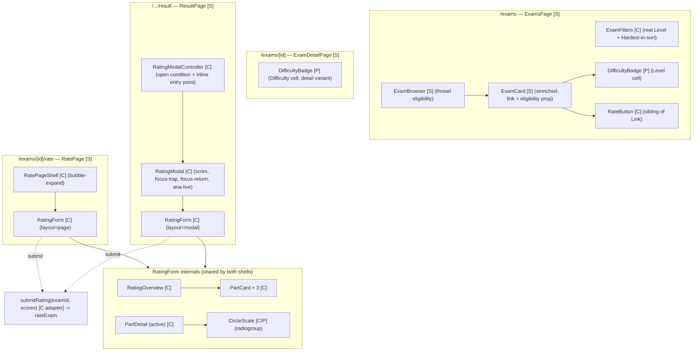

# Rating System — Frontend Design Document

| | |
|---|---|
| **Version** | 1.0 |
| **Date** | 2026-07-24 |
| **Status** | Draft — frontend design for the Exam Difficulty Rating feature. **Consumes** the backend Design Doc contracts (does not redefine DB/RLS/queries internals). Scope: React component hierarchy, Server/Client boundary, form state, UI interactions, per-route data fetching, and wiring community difficulty into the existing Layer 2 surfaces. Contains a **user-facing behavior change** (D002 Hardest sort) that must be confirmed at the design [Stop]. |
| **PRD** | `docs/prd/rating-system-prd.md` (v1.1) |
| **UI Spec** | `docs/design/rating-system-ui-spec.md` (v1.1) — authoritative component decomposition, states, a11y, copy; this doc builds on it and does not contradict it |
| **Backend Design Doc** | `docs/design/rating-system-backend-design.md` (v1.0) — the contracts consumed here |
| **ADR** | `docs/adr/ADR-0008-exam-difficulty-rating-and-on-read-aggregation.md` (Accepted) |
| **Prior-layer verification** | code-verifier on the backend DD — status: **consistent**. Discrepancies D001 (backend-owned note) and D002 (MUST RESOLVE HERE) addressed below. |

## Overview

This Design Doc turns the UI Spec into an implementable frontend for the Exam Difficulty Rating feature: the shared `RatingForm` core and its two shells (`RatePageShell`, `RatingModal`/`RatingModalController`), the `CircleScale` radiogroup, the per-`ExamCard` `RateButton` and the `DifficultyBadge`, the `ExamFilters` Level-row + Hardest-sort changes, and the per-route data-fetching plan (which reads run in Server Components vs. which state lives in Client Components). It **consumes** the backend contracts published in the backend Design Doc — `Exam.communityDifficulty`, `ExamSort += 'hardest'`, `ExamFilters.level`, `listMySubmittedExamIds()`, `rateExam()`, `getMyRating()`, and the pure `SOURCE/lib/rating/` helpers — and it resolves the D002 "Hardest" URL/param incoherence flagged by the prior-layer verifier.

The header **Early Verification Point** and **Correctness Proof Method** are recorded in the Design Summary below and expanded in the Verification Strategy section.

## Design Summary (Meta)

```yaml
design_type: "extension"          # extends ExamCard/ExamFilters/exam-detail/result; adds one route + a shared form component set + two display components
risk_level: "medium"              # no DB/security surface here (backend owns RLS); risks are the stretched-link restructure (invalid-nesting regression), the modal a11y gaps, and the D002 param-model behavior change
complexity_level: "medium"
complexity_rationale: >
  (1) The rating form is a 5-state client machine (empty/partial/complete/submitting/saved/error) with a live overall
      readout and a keyboard-operable radiogroup (roving tabindex) that must satisfy WCAG 2.1 AA; (2) the result-page
      auto-open modal must be idempotent via a transient ?rate=auto marker consumed exactly once; (3) ExamCard must be
      restructured to a stretched-link so RateButton/DifficultyBadge are siblings (not descendants) of the card anchor,
      without regressing "click card -> detail"; (4) D002 folds Hardest into the existing ?sort= axis, a user-facing
      behavior change from the current independent ?hardest=1 checkbox.
main_constraints:
  - "Server/Client boundary: ExamCard/exam-detail/result/rate pages stay Server Components; only RateButton, the RatingForm set, ExamFilters, and RatingModalController are client."
  - "Consume backend contracts verbatim; never re-bucket or re-aggregate on the client (DifficultyBadge renders the server-provided bucket+mean)."
  - "Reuse SOURCE/lib/rating/ for all client-side display formatting (formatMean) and pure readout logic; do not duplicate boundary logic."
  - "Theme: Mực & Sơn mài — no box-shadow/gradient/pill/serif-on-controls; copper is --sidebar-accent/--ring (#b8863b), NOT the CSS --accent (#e3d5b6)."
  - "Vitest collects only lib/** + components/**; place testable pieces accordingly."
early_verification_point:
  first_target: "Integration Point L1 — the ExamCard stretched-link restructure with a live RateButton + DifficultyBadge on /exams renders and behaves: card body still navigates to detail, RateButton is an independent target, and the three eligibility states resolve from a single per-page submitted-id set (no N+1)."
  success_criteria: "On /exams: clicking a card body navigates to /exams/[id]; clicking an enabled RateButton navigates to /exams/[id]/rate; a disabled RateButton shows its AT reason and does NOT navigate; DifficultyBadge shows 'Bucket · mean' for >=3-rating exams and '—' otherwise."
  failure_response: "If the stretched-link produces invalid interactive nesting or the RateButton hit-area is swallowed by the anchor, fall back to the UI-Spec-specified after:inset-0 + relative z-10 layering and re-verify before building the form shells."
correctness_proof_method:
  definition: "Correct = (1) the form persists three valid scores via rateExam and surfaces the discriminated error union without losing input; (2) the modal auto-opens exactly once after a fresh submit and never re-pops on refresh; (3) community difficulty renders exactly as the server provides it (no client re-bucketing); (4) Hardest/Level write the agreed URL params the server consumes; (5) the radiogroup and modal meet the WCAG 2.1 AA keyboard/AT bar."
  method: "vitest (node) on lib/rating readout/format helpers; vitest (jsdom) on CircleScale keyboard + DifficultyBadge render under components/**; Playwright/manual for modal focus-trap/return, ?rate=auto idempotency, disabled-Rate AT tooltip, and prefers-reduced-motion."
biggest_risks:
  - "Stretched-link restructure regresses card navigation or nests an interactive control inside the anchor (invalid HTML)."
  - "?rate=auto not stripped on mount -> modal re-pops on refresh (AC-005 failure)."
  - "D002 param-model change ships without product confirmation, silently reversing the deliberate S#28 independent-Hardest behavior."
unknowns:
  - "IP-6 RESOLVED: Level param is lowercase `?level=easy|medium|hard` on both sides (backend DD updated to match, matching the existing lowercase `sort` slug convention). `communityDifficulty.bucket` stays capitalized as the display label only."
```

## Background and Context

### Prerequisite ADRs

- **ADR-0008** (Accepted) — Exam Difficulty Rating: on-read aggregation + cross-table authorization. This frontend doc consumes the read model (`Exam.communityDifficulty`), the `ExamSort='hardest'` sort value, the `ExamFilters.level` filter, and the `rateExam`/`getMyRating`/`listMySubmittedExamIds` contracts that ADR-0008 and the backend DD define. It introduces **no** new architecture decision; it renders and wires the published contracts.
- **ADR-0001** (UGC lifecycle + RLS) — the `ReportExam` dialog + `hasReported` static-state precedent this feature's modal and "already rated" state follow.
- **ADR-0005** (multi-part national format) — the three fixed parts (`mcq`/`true_false`/`short_answer`) the form scores. The form's three parts are **fixed constants**, not read from `exam.parts` (PRD R1).

No common ADR (`docs/adr/ADR-COMMON-*`) exists or is required: the dialog/focus, server-action-status-object, and URL-searchParams-filter patterns are already established by `ReportExam`/`LeaveExamDialog`/`ExamFilters`; this feature reuses them.

### External Resources Used

Inherits the UI Spec's External Resources Used table and adds the backend contract source consumed by the frontend.

| Resource (project-tier label) | Feature-specific identifier | Notes |
|-------------------------------|-----------------------------|-------|
| Design Origin | `PROJECT_OVERVIEW.md §2` — "Mực & Sơn mài" theme; hard rules (no shadow/gradient/pill/serif-on-controls; no red < 24px on ink) | Governs ivory panel + dark part-cards + copper focus visual language (inherited from UI Spec) |
| Design System | `globals.css` tokens (`--background`/`--card`/`--foreground`/`--brand`/`--sidebar`/`--border`/`--ring`/`--sidebar-accent`/`--muted-foreground`), `.eyebrow`, `.preload-fade` + `--preload-order`; base-ui `Tooltip` (`SOURCE/components/ui/tooltip.tsx`); dialog precedent `ReportExam.tsx`/`LeaveExamDialog.tsx` | New components reuse these tokens/primitives (inherited from UI Spec) |
| API / contract source | Backend Design Doc `docs/design/rating-system-backend-design.md` (Data Contracts + Read model + Field Propagation Map) | The typed interface this frontend consumes: `Exam.communityDifficulty`, `ExamSort`, `ExamFilters.level`, `rateExam`, `getMyRating`, `listMySubmittedExamIds`, `SOURCE/lib/rating/` |
| Design reference (images + notes) | `SCREENSHOT/design_reference/ExamRatingPage_Layer2/` — `ERP_*` PNGs + `ERP_transitions_animations.md` | Layout, verbatim copy, animation intent only; this doc + the UI Spec win on conflict |
| Visual Verification Environment | Routes `/exams`, `/exams/[id]`, `/exams/[id]/rate`, `/exams/[id]/attempt/[attemptId]/result`; `npm run dev`; Playwright MCP for screenshots | Component render tests must live under `lib/**` or `components/**` with `// @vitest-environment jsdom` (Vitest collection constraint) |

> Note: `docs/project-context/external-resources.md` does not exist in the repo; per external-resource-context, environment-stable facts are recorded feature-tier here and in the UI Spec. Creating the project-tier file is deferred to a project-wide setup task and does not block this design.

### Agreement Checklist

#### Scope
- [x] Add the shared `RatingForm` core + `RatingOverview` / `PartCard` / `PartDetail` and the `CircleScale` radiogroup (UI Spec component set).
- [x] Add two shells: `RatePageShell` (standalone `/exams/[id]/rate`, bubble-expand) and `RatingModal` + `RatingModalController` (result-page auto-open, cross-fade).
- [x] Add `RateButton` (client) and `DifficultyBadge` (display) and restructure `ExamCard` to a stretched-link so both are siblings of the card anchor.
- [x] Add the new route `SOURCE/app/(exams)/exams/[id]/rate/page.tsx` (Server Component; getExam + eligibility gate + getMyRating prefill).
- [x] Wire `DifficultyBadge` into the `ExamCard` Level cell and the exam-detail Difficulty cell (replace the two literal `"—"`).
- [x] Modify `ExamFilters`: real Level `FilterRow` (Easy/Medium/Hard) + fold Hardest into the `?sort=` axis (D002).
- [x] Modify `SOURCE/app/(exams)/exams/page.tsx` to parse `?sort=hardest` and `?level=`, load `listMySubmittedExamIds()` + current-user, and thread per-card eligibility through `ExamBrowser` → `ExamCard`.
- [x] Mount `RatingModalController` on the result page; require `submitExam`'s **fresh-submit** redirect to append `?rate=auto` (integration change to `(exams)/actions.ts` line 127 only, NOT the idempotent already-submitted redirect at line 50).
- [x] Add pure `SOURCE/lib/rating/` additions (readout model, part-metadata copy, error-copy map) and `SOURCE/components/rating/` jsdom-testable primitives (`CircleScale`, `DifficultyBadge`).

#### Non-Scope (Explicitly not changing)
- [ ] The ratings table, RLS, `exams_with_difficulty` view, the on-read aggregation mechanism, the phase-0 PostgREST spike — **backend Design Doc owns these**. This doc consumes their outputs only.
- [ ] `rateExam`/`getMyRating`/`listMySubmittedExamIds` **implementations** — consumed as contracts (signatures/return shapes fixed by the backend DD).
- [ ] `computeScore`/scoring, `startAttempt`, attempt/result **read** queries (`getResult`) — untouched; the result page only adds `getMyRating` + the controller mount.
- [ ] Existing `newest`/`oldest` sorts and the subject/grade/school/year/semester filter rows — unchanged.
- [ ] `ExamCard`'s pre-approved hover-shadow exception — kept as-is (the single sanctioned exception).

#### Constraints (agreements → where reflected)
- Browser support: latest 2 versions of Chrome/Firefox/Safari/Edge → reflected in CircleScale keyboard model (standard radiogroup keys) and CSS-only animations gated by `prefers-reduced-motion`.
- Accessibility: WCAG 2.1 AA → reflected in `CircleScale` (radiogroup, roving tabindex, non-color selection mark, copper focus ring), `RatingModal` (focus-trap + focus-return + `aria-live`), `RateButton` (focusable `aria-disabled` + `aria-describedby`, not a native disabled `title`).
- Performance: no per-card round-trip (no N+1) → reflected in the single per-page `listMySubmittedExamIds()` set threaded to cards; DifficultyBadge consumes the already-fetched `Exam.communityDifficulty` (no client fetch).
- Theme: no shadow/gradient/pill/serif-on-controls; copper = `--sidebar-accent`/`--ring` → reflected in every component's token usage (Design Tokens inherited from UI Spec).
- No design contradicts an agreement. The one deliberate deviation from current behavior — D002's fold of Hardest into `?sort=` — is documented as a user-facing change and flagged for confirmation (not silent).

#### Assumed Behaviors

| Assumed behavior | Evidence | Confirmed | Follow-up if unconfirmed |
|------------------|----------|-----------|--------------------------|
| `submitExam` fresh-submit redirect can carry a query marker; the idempotent already-submitted branch is a **separate** redirect that must NOT carry it | `SOURCE/features/exams/actions.ts:50` (already-submitted redirect) vs `:127` (fresh-submit redirect) | **Yes** (two distinct redirect statements read) | — |
| `ExamCard` is one `<Link href=/exams/[id]>` wrapping all card content; a nested interactive control would be invalid | `SOURCE/features/exams/components/ExamCard.tsx:11-37` | **Yes** | — |
| `next/navigation` `router.replace(pathname, { scroll:false })` strips a query param without a reload (used to consume `?rate=auto`) | `ExamFilters.tsx:73` uses `router.push(pathname, { scroll:false })` for the same searchParams pattern | **Yes** (same API family in-repo) | Risk R-2: if `replace` re-renders unexpectedly, guard the open with a `useRef` "opened once" flag; verified in the modal Playwright pass |
| base-ui `Tooltip` reveals content on hover **and** keyboard focus on a focusable `aria-disabled` control | `SOURCE/components/ui/tooltip.tsx` exists (base-ui) | **No** (behavior not verified against a focusable non-native-disabled trigger) | Risk R-3: verify in the RateButton jsdom/Playwright pass; fallback = always-visible visually-hidden `aria-describedby` reason (which is already specified), so the reason reaches AT even if the tooltip does not fire on focus |
| `getMyRating(examId)` returns the caller's three stored scores or `null`, readable from a Server Component | Backend DD Data Contracts — `getMyRating` "mirrors hasReported", thrown on infra error | **Yes** (contract) | — |
| `listMySubmittedExamIds()` returns `Set<string>` in one round-trip | Backend DD Data Contracts — Fact HC-02-F8 | **Yes** (contract) | — |

#### Applicable Standards
- [x] `"use client"` only at the smallest interactive boundary; data fetching in Server Components `[explicit]` — Source: `exams/page.tsx`, `exams/[id]/page.tsx`, `result/page.tsx` are Server Components; `ExamFilters`/`ReportExam` are `"use client"`.
- [x] Filter/sort state in URL `searchParams`, Server Component re-queries `[explicit]` — Source: `ExamFilters.tsx:12-14,68-77` + `exams/page.tsx:30-46`.
- [x] Dialog precedent: scrim `bg-[#1B1512]/40`, Esc + scrim-click close, `role="dialog"`/`aria-modal`/`aria-labelledby` `[explicit]` — Source: `ReportExam.tsx:79-92`, `LeaveExamDialog.tsx:33-46`.
- [x] Server-action **status object** (not redirect) so a failed write preserves input `[explicit]` — Source: `ReportExam.tsx:46-67` consuming `reportExam`'s `{ error? }`.
- [x] Primary button style `bg-brand text-brand-foreground rounded-[4px] px-4 py-2 text-xs font-medium uppercase tracking-[0.14em]`, `disabled:opacity-60` `[explicit]` — Source: `ReportExam.tsx:122-129`.
- [x] Snake-free camelCase props; Props type explicit `[explicit]` — Source: `ExamCard`/`ExamFilters` prop interfaces.
- [x] Pure display/logic helpers live under `SOURCE/lib/**`; jsdom render tests under `SOURCE/components/**` `[explicit]` — Source: `vitest.config.ts:15` (`include: lib/**, components/**`).
- [x] `.preload-fade` + `--preload-order` staggered mount `[explicit]` — Source: `exams/page.tsx:68-70`, `result/page.tsx:32-63`, `exams/[id]/page.tsx:33-43`.
- [x] Vietnamese inline comments where the surrounding file already uses them `[implicit]` — Evidence: every Layer 2 component file. Confirmed: Yes (match per-file convention when editing existing files).

#### Quality Assurance Mechanisms
- [x] ESLint / Prettier / `tsc` strict — Enforces style/format/types — Covers: project-wide — Status: `adopted`.
- [x] Vitest (node env) — Covers: `SOURCE/lib/rating/` readout + format helpers (bucket/formatMean already backend-owned; new `readoutModel` added) — Config: `vitest.config.ts` — Status: `adopted` (acceptance for the form readout model + DifficultyBadge formatting).
- [x] Vitest (jsdom, `// @vitest-environment jsdom`) — Covers: `SOURCE/components/rating/CircleScale.test.tsx` (roving tabindex + arrow/Home/End + selection) and `DifficultyBadge.test.tsx` (badge vs `—`) — Status: `adopted`.
- [x] Playwright MCP / manual pass (no CI) — Covers: modal focus-trap + focus-return + `aria-live`, `?rate=auto` idempotency, disabled-Rate AT tooltip/description, `prefers-reduced-motion`, stretched-link navigation — Status: `adopted` (the no-CI local workflow's acceptance for interaction/a11y ACs).
- [x] axe a11y audit (manual, dev) — Covers: rating form (modal + standalone), RateButton states, Level filter — Status: `adopted` (PRD UI Quality Metric 3).
- [ ] Backend RLS harness `test-rls.ts` / PostgREST spike — Status: `noted` (backend-owned; the frontend relies on those gates but does not run them).

### Problem to Solve

The Exam Browser and exam-detail page ship inert difficulty placeholders (`ExamCard` Level `"—"`; detail Difficulty `"—"`; a "Coming soon" Level panel; a `?hardest=1` checkbox that reorders nothing). This frontend must (a) render the community difficulty the backend now computes, (b) give an eligible user a keyboard/AT-accessible rating form through two entry points (a standalone route and an idempotent auto-open modal), (c) gate the per-card "Rate" affordance by a single per-page eligibility set, and (d) turn the Level filter and Hardest sort into real controls with a coherent URL model — resolving the D002 incoherence between the current independent `?hardest=1` and the backend's mutually-exclusive `ExamSort='hardest'`.

### Requirements

Frontend-owned subset of PRD v1.1: R1/R2/R9 (the shared form + entry points + guidance), R3 (UI eligibility gating — UX only; server enforcement is backend), R4/AC-026 (Rate-button states), R5 (upsert/already-rated form state), R6 (community-difficulty display), R7 (Level filter + Hardest sort UI). Backend-owned halves (R3 server enforcement, R6/R7 query mechanism, R8 on-read) are consumed as contracts.

## Acceptance Criteria (frontend subset, EARS)

Rendering + interaction ACs verifiable in an isolated browser/jsdom environment. Server-enforcement ACs (AC-008/012/022/023) are backend-verified and only surfaced here.

### Community-difficulty display (R6)
- [ ] **While** an exam's `communityDifficulty` is non-null, `DifficultyBadge` shall render `` `${bucket} · ${formatMean(mean)}` `` (e.g. `Hard · 7.2`, `Medium · 4.0`, `Hard · 10.0`) in both the `ExamCard` Level cell and the exam-detail Difficulty cell. (AC-014/016)
- [ ] **While** `communityDifficulty` is `null` (or the field is missing), `DifficultyBadge` shall render literal `—` (fail-safe, no crash). (AC-015)
- [ ] **When** `DifficultyBadge` renders, it shall use the server-provided `bucket` and only apply `formatMean` for display — it shall not re-bucket or recompute. (AC-018 render-only)

### Rate button (R4)
- [ ] **When** eligibility is `eligible`, the `RateButton` shall be an enabled control navigating to `/exams/[id]/rate`. (AC-010)
- [ ] **When** eligibility is `not-attempted`, the `RateButton` shall render a focusable `aria-disabled="true"` control that does not navigate and exposes the reason `Finish this exam first` to AT via `aria-describedby`. (AC-011)
- [ ] **When** eligibility is `logged-out`, the same disabled pattern shall expose `Log in to rate`. (AC-026)
- [ ] **When** an `ExamCard` renders, the card body shall still navigate to `/exams/[id]` and the `RateButton` shall be an independent click target (stretched-link siblings, not nested). (code:F1)

### Rating form (R1/R2/R5/R9)
- [ ] **When** the form mounts, it shall render exactly the three fixed parts (Part I — Multiple Choice, Part II — True/False, Part III — Short Answer) in order, regardless of `exam.parts`. (AC-001)
- [ ] **When** a `CircleScale` has focus, Arrow/Home/End/Space/Enter shall move selection within 1–10 with the checked circle following focus (roving tabindex), and no value outside 1–10 shall be representable. (AC-002/024)
- [ ] **When** `initialScores` is provided, each rated part shall pre-fill its score and the overall readout shall reflect them. (AC-006/013)
- [ ] **While** fewer than three parts are rated, the header `SUBMIT` shall stay in its pinned disabled treatment with `aria-describedby` → `Rate all three parts to submit.`; it shall enable only when all three are rated. (UI Spec Golden State 1)
- [ ] **When** all three parts are rated and the user clicks `SUBMIT`, the form shall call the `rateExam` adapter; on success it shall swap the label to `Sent` for 1.6s and announce `Rating saved.` via the shell's `aria-live`. (AC-003/009/012 UI side)
- [ ] **When** the `rateExam` adapter returns an error, the form shall show the mapped message in `role="alert"`, preserve all entered scores, and re-enable `SUBMIT`. (AC-025/008 UI side)

### Result-page modal (R2)
- [ ] **When** the result page is a fresh arrival carrying `?rate=auto`, `RatingModalController` shall open the modal once and immediately strip the marker via `router.replace`. (AC-004)
- [ ] **When** the result page loads without the marker (refresh/back/bookmark), the modal shall stay closed and only the inline entry point (`Rate this exam` / `Edit your rating`) shall render. (AC-005)
- [ ] **When** the modal is open, Tab/Shift+Tab shall cycle within it, Esc/scrim/Close shall close it, and focus shall return to the inline entry-point trigger. (WCAG 2.1 AA)

### Filter + sort (R7)
- [ ] **When** the user selects a Level bucket, `ExamFilters` shall write `?level=easy|medium|hard` and the Server Component shall re-query. (AC-017/021)
- [ ] **When** the user checks Hardest, `ExamFilters` shall write `?sort=hardest` (mutually exclusive with `newest`/`oldest`) and the Server Component shall re-query. (AC-019/020 UI side; D002)

## Existing Codebase Analysis

### Implementation Path Mapping

| Type | Path | Description |
|------|------|-------------|
| Existing | `SOURCE/features/exams/components/ExamCard.tsx` | Restructure to stretched-link; add `eligibility` prop; render `DifficultyBadge` (Level cell) + `RateButton` as siblings of the anchor. |
| Existing | `SOURCE/features/exams/components/ExamBrowser.tsx` | Thread per-card `eligibility` (compute from `submittedExamIds` + `isLoggedIn`). |
| Existing | `SOURCE/features/exams/components/ExamFilters.tsx` | Real Level `FilterRow`; fold Hardest into `?sort=` (remove `hardest` prop + `?hardest=1`); `sort` union widened; add `selected.level`. |
| Existing | `SOURCE/app/(exams)/exams/page.tsx` | Parse `?sort=hardest` + `?level=`; load `listMySubmittedExamIds()` + current user; pass `sort`/`level` to `listExams`; thread eligibility inputs to `ExamBrowser`. |
| Existing | `SOURCE/app/(exams)/exams/[id]/page.tsx` | Replace the Difficulty `"—"` cell (`:97-100`) with `<DifficultyBadge variant="detail" communityDifficulty={exam.communityDifficulty} />`. |
| Existing | `SOURCE/app/(exams)/exams/[id]/attempt/[attemptId]/result/page.tsx` | Add `getMyRating(id)` read; mount `<RatingModalController examId={id} initialScores={…} />`. |
| Existing | `SOURCE/features/exams/actions.ts` | Append `?rate=auto` to the **fresh-submit** redirect (`:127`) only; leave the idempotent already-submitted redirect (`:50`) unchanged. |
| New (backend-owned prerequisite — must exist first) | `SOURCE/lib/rating/` | Backend DD creates `overall`/`bucket`/`formatMean`/constants; this frontend DD adds pure `readoutModel(scores)` (running-mean + status), `PART_META` copy constants, and `rateErrorMessage(error)` copy map beside them. |
| New | `SOURCE/app/(exams)/exams/[id]/rate/page.tsx` | Standalone Rate route (Server Component): getExam → 404; eligibility gate; getMyRating prefill; render `RatePageShell`. |
| New | `SOURCE/components/rating/CircleScale.tsx` (+ `CircleScale.test.tsx`) | Reusable radiogroup primitive (jsdom-testable). |
| New | `SOURCE/components/rating/DifficultyBadge.tsx` (+ `DifficultyBadge.test.tsx`) | Pure display, jsdom-testable. |
| New | `SOURCE/features/exams/components/rating/RatingForm.tsx` | Shared client form core (state + submit adapter). |
| New | `SOURCE/features/exams/components/rating/{RatingOverview,PartCard,PartDetail}.tsx` | Overview panel + part cards + active-part detail. |
| New | `SOURCE/features/exams/components/rating/RatePageShell.tsx` | Page shell (bubble-expand). |
| New | `SOURCE/features/exams/components/rating/{RatingModal,RatingModalController}.tsx` | Modal shell + open-condition controller. |
| New | `SOURCE/features/exams/components/rating/RateButton.tsx` | Per-card client control (tooltip + disabled semantics). |
| New | `SOURCE/features/exams/components/rating/submitRating.ts` | Shared client adapter mapping `RatingForm` scores → `rateExam` args and the error union → copy. |

### Integration Points (even for new implementations)
- **Read model** `Exam.communityDifficulty` (from `toExam`) — consumed by `DifficultyBadge` on `ExamCard` and exam-detail. No client transform beyond `formatMean`.
- **`listExams(filters)`** — the Browser page passes `sort:'hardest'` and `level` into the existing signature (backend widened `ExamSort`/`ExamFilters`).
- **`listMySubmittedExamIds()`** — the Browser page's single eligibility source for RateButton state.
- **`getMyRating(examId)`** — the rate page and result page read prefill.
- **`rateExam(examId, scores)`** — the form's submit target (via `submitRating` adapter).
- **`submitExam` redirect** — the `?rate=auto` producer (fresh-submit path only).

### Code Inspection Evidence

| File/Function | Relevance |
|---------------|-----------|
| `ExamCard.tsx:11-37` | The single wrapping `<Link>` — the stretched-link restructure target (code:F1). |
| `ExamCard.tsx:34-35` | Literal Level `"—"` cell to replace with `DifficultyBadge`. |
| `exams/[id]/page.tsx:97-100` | Literal Difficulty `"—"` cell to replace with `DifficultyBadge` (detail variant). |
| `ExamFilters.tsx:40-44,265-268` | `QUICK` config + Hardest handler writing `?hardest=1` independently (code:F5 / D002). |
| `ExamFilters.tsx:233,330-333` | Symbolic Level `FilterRow` + "Coming soon" panel to make real. |
| `exams/page.tsx:36-46` | `sort` parse (currently drops `hardest`); `hardest` parsed to a bool but not passed to `listExams`. |
| `ExamBrowser.tsx:9-27` | `{ exams }` list → thread eligibility per card. |
| `ReportExam.tsx:27-36,79-132` | Dialog Esc/scrim-close + focus-into + primary-button pattern; the three a11y gaps (no focus-trap, no focus-return, no announcement within a persisted-open dialog — `ReportExam.tsx:40` only announces via `aria-live="polite"` on its static post-*close* state) the RatingModal must close. |
| `LeaveExamDialog.tsx:22-46` | Scrim `bg-[#1B1512]/40`, `role=dialog`/`aria-modal`/`aria-labelledby` precedent. |
| `result/page.tsx:14-27` | Result Server Component; `getResult(attemptId)`; add `getMyRating` + controller mount. |
| `actions.ts:50` vs `:127` | Two distinct redirects — only `:127` (fresh submit) gets `?rate=auto` (code:F6). |
| `queries.ts:30-47,52-89,128-138` | `EXAM_COLUMNS`/`toExam`/`ExamSort`/`listExams`/`getExam` — the backend-extended read surface consumed here. |
| `vitest.config.ts:15` | `include: lib/**, components/**` — placement constraint for testable pieces (code:F4). |
| `SOURCE/components/ui/tooltip.tsx` | base-ui Tooltip reused for the disabled RateButton reason. |

**Similar-functionality search**: no existing rating form, difficulty badge, circle-scale/radiogroup, or `SOURCE/components/rating/` code exists (Glob `SOURCE/components/rating/**` → none; the app-layer rating components are new). The reuses are **patterns**, not shared code: the `ReportExam`/`LeaveExamDialog` dialog shell (extended with the three a11y gaps), the `ExamFilters` `FilterRow` + URL-searchParams plumbing, and the `SOURCE/lib/rating/` pure helpers (imported, not duplicated). No technical debt to supersede → new implementation following the established Server/Client + dialog + searchParams patterns is the adopted decision.

### Fact Disposition Table

Facts are drawn from the task's consolidated verified frontend/UI facts and this doc's own code inspection. `code:` = frontend codebase fact; `ui:` = UI-Spec/ui-analyzer fact.

| Fact ID | Focus Area | Disposition | Rationale | Evidence |
|---------|------------|-------------|-----------|----------|
| code:F1 | `ExamCard` is one `<Link>` wrapping all content; Rate/DifficultyBadge cannot be descendants | transform | Restructure to stretched-link: `<li relative>`; `Link` gets `after:absolute after:inset-0`; `DifficultyBadge`/`RateButton` become siblings with `relative z-10`. Preserves card→detail navigation while giving RateButton an independent target. | `ExamCard.tsx:11-37` |
| code:F2 | `ExamCard` is a Server Component; eligibility must be threaded, not per-card fetched | preserve | Keep `ExamCard` a Server Component receiving `{ exam, eligibility }`; `RateButton` is the only new `"use client"` island. Eligibility comes from one page-level `listMySubmittedExamIds()` set (no N+1). | `ExamCard.tsx`; NFR Performance |
| ui:F1 | Dialog precedent + the three WCAG gaps (focus-trap, focus-return, success `aria-live`) | transform | `RatingModal` extends the `ReportExam`/`LeaveExamDialog` shell (scrim `bg-[#1B1512]/40`, Esc + scrim-close, `role=dialog`/`aria-modal`/`aria-labelledby`) and adds focus-trap, focus-return-to-trigger, and an `aria-live="polite"` success region. | `ReportExam.tsx:27-132`; UI Spec RatingModal |
| ui:F2 | 10-circle selector = accessible radiogroup (roving tabindex, arrow/Home/End, copper focus, non-color selection) | preserve | `CircleScale` implements the UI Spec radiogroup verbatim; lives under `SOURCE/components/rating/` for jsdom test collection. | UI Spec CircleScale; `vitest.config.ts:15` |
| ui:F3 | Shared `RatingForm` core + two shells; `RatingModalController` idempotent open via transient `?rate=auto` | preserve | One `RatingForm(layout)` + `RatePageShell` + `RatingModal`/`RatingModalController`; controller opens once and strips `?rate=auto` via `router.replace`. | UI Spec Shared-form decision + RatingModalController |
| code:F3 | Theme token collision: `PROJECT_OVERVIEW.md §2` "accent" = copper but CSS `--accent` = pale ivory | preserve | Copper uses `--sidebar-accent`/`--ring`/literal `#b8863b` (focus ring, `Rate →`, selected-circle mark, progress fill, 40×2 divider). Never the CSS `--accent`. | UI Spec Reuse Map token note |
| code:F4 | Vitest collects only `lib/**` + `components/**`; component tests need jsdom docblock | transform | Pure readout/format/copy → `SOURCE/lib/rating/`; jsdom-testable primitives (`CircleScale`, `DifficultyBadge`) → `SOURCE/components/rating/`; feature shells → `features/exams/components/rating/` (Playwright/manual). | `vitest.config.ts:15` |
| code:F5 | `ExamFilters` treats Hardest as an independent `?hardest=1` combinable with newest/oldest, currently a no-op | transform | **D002**: fold Hardest into the `?sort=` axis (newest/oldest/hardest mutually exclusive); remove the `hardest` prop + `?hardest=1`. User-facing behavior change — flagged for confirmation. | `ExamFilters.tsx:40-44,265-268`; `exams/page.tsx:41`; prior-layer D002 |
| code:F6 | `submitExam` has two redirects: idempotent already-submitted (`:50`) and fresh submit (`:127`) | transform | Only `:127` appends `?rate=auto` so the modal auto-opens exactly on a fresh submit; `:50` stays clean so returning to an already-submitted result never auto-pops. | `actions.ts:50,127` |
| code:F7 | Exam-detail + ExamCard render literal `"—"` for difficulty | transform | Replaced by `DifficultyBadge`, which itself renders `—` when `communityDifficulty` is null → identical below-threshold appearance (AC-015/023 continuity). | `ExamCard.tsx:34-35`; `exams/[id]/page.tsx:97-100` |
| ui:F4 | `ExamFilters` Level row is symbolic ("Coming soon") | transform | Replaced by a real `FilterRow` with Easy/Medium/Hard/All options writing `?level=`. | `ExamFilters.tsx:233,330-333` |

## Design

### Change Impact Map

```yaml
Change Target: Exam Difficulty Rating frontend (rating form set + RateButton + DifficultyBadge + ExamCard/ExamFilters wiring + rate route + result-modal mount)
Direct Impact:
  - SOURCE/features/exams/components/ExamCard.tsx (stretched-link restructure; +eligibility prop; DifficultyBadge + RateButton siblings)
  - SOURCE/features/exams/components/ExamBrowser.tsx (thread per-card eligibility)
  - SOURCE/features/exams/components/ExamFilters.tsx (real Level row; Hardest folded into ?sort=; drop hardest prop)
  - SOURCE/app/(exams)/exams/page.tsx (parse ?sort=hardest + ?level=; load listMySubmittedExamIds + current user; pass sort/level to listExams)
  - SOURCE/app/(exams)/exams/[id]/page.tsx (Difficulty cell -> DifficultyBadge)
  - SOURCE/app/(exams)/exams/[id]/attempt/[attemptId]/result/page.tsx (getMyRating + RatingModalController mount)
  - SOURCE/features/exams/actions.ts (submitExam fresh-submit redirect appends ?rate=auto)
  - NEW SOURCE/app/(exams)/exams/[id]/rate/page.tsx (standalone Rate route)
  - NEW SOURCE/features/exams/components/rating/* (RatingForm, RatingOverview, PartCard, PartDetail, RatePageShell, RatingModal, RatingModalController, RateButton, submitRating)
  - NEW SOURCE/components/rating/{CircleScale,DifficultyBadge}.tsx (+ tests)
  - SOURCE/lib/rating/ (readoutModel, PART_META, rateErrorMessage)
Indirect Impact:
  - The Browser page performs two extra reads per load (listMySubmittedExamIds + current user) — bounded, single round-trip each, RLS-scoped.
  - URL model change: ?hardest=1 -> ?sort=hardest (D002). Existing bookmarks with ?hardest=1 no longer sort; documented behavior change.
  - The result page performs one extra read (getMyRating) and mounts one client controller.
No Ripple Effect:
  - Backend ratings table/RLS/view/aggregation, listExams/getExam internals (consumed as contracts, not edited here).
  - computeScore / getResult / startAttempt / attempt-result read paths.
  - Existing newest/oldest sorts and subject/grade/school/year/semester filter rows.
  - ExamCard hover-shadow exception (kept).
  - Anonymous catalog access (unchanged; RLS is to authenticated).
```

### Component Hierarchy & Responsibilities

Legend: **[S]** = Server Component, **[C]** = Client Component (`"use client"`), **[P]** = pure/display (renderable in either; no client hooks).



| Component | Boundary | Responsibility | Props received |
|-----------|----------|----------------|----------------|
| `ExamsPage` | [S] | Parse searchParams (`sort`,`level`,facet filters); fetch `listExams`, `listExamFacets`, `listMySubmittedExamIds`, current user; render `ExamFilters` + `ExamBrowser`. | (route `searchParams`) |
| `ExamFilters` | [C] | Real Level `FilterRow` + three quick-sorts (all `kind:"sort"`, mutually exclusive); write `?sort=`/`?level=` to URL. | `subjects/grades/schools/years/semesters`, `selected{subject,grade,school,year,semester,level}`, `sort?` |
| `ExamBrowser` | [S] | Compute per-card `eligibility` from `submittedExamIds` + `isLoggedIn`; render the card grid / empty state. | `exams: Exam[]`, `submittedExamIds: Set<string>`, `isLoggedIn: boolean` |
| `ExamCard` | [S] | Stretched-link restructure; render `DifficultyBadge` in the Level cell and `RateButton` as siblings of the anchor. | `exam: Exam`, `eligibility: RateEligibility` |
| `DifficultyBadge` | [P] | Render `` `${bucket} · ${formatMean(mean)}` `` or `—`; `variant` picks card (muted) vs detail (serif) typography. Never re-buckets. | `communityDifficulty: Exam["communityDifficulty"]`, `variant: "card" \| "detail"` |
| `RateButton` | [C] | Three states: enabled `Rate →` link; `not-attempted`/`logged-out` focusable `aria-disabled` + tooltip + `aria-describedby` reason. | `examId: string`, `eligibility: RateEligibility` |
| `RatePage` | [S] | getExam→404; eligibility gate (`listMySubmittedExamIds().has(id)`); `getMyRating` prefill; render `RatePageShell`. | (route `params`) |
| `RatePageShell` | [C] | Standalone page chrome; carries the bubble-expand overview↔detail transition (reduced-motion → instant swap); `.preload-fade` mount. | `examId`, `initialScores?` |
| `RatingModalController` | [C] | Resolve the open condition: read `?rate=auto`, open once + `router.replace` strip; render inline entry point (`Rate this exam`/`Edit your rating`). | `examId`, `initialScores?` |
| `RatingModal` | [C] | Dialog shell (scrim, Esc/scrim/Close close) + focus-trap + focus-return + success `aria-live`; hosts `RatingForm(layout="modal")`; cross-fade overview↔detail. | `open`, `onClose`, `examId`, `initialScores?` |
| `RatingForm` | [C] | Shared core: hold three part scores + active-part in local state; compute the live readout; drive submit/saved/error via `submitRating`. | `examId`, `layout:"page"\|"modal"`, `initialScores?`, `onSaved?` |
| `RatingOverview` | [C] | Ivory panel: title/subtitle, header `SUBMIT` + copper divider + overall readout, three `PartCard`s. | scores, readout, `onOpenPart`, submit state |
| `PartCard` | [C] | One dark overview card: eyebrow, `x/10`, hairline progress, `Rate →`; click opens `PartDetail`. | `part`, `score?`, `onOpen` |
| `PartDetail` | [C] | Active-part dark panel: description, `RATE DIFFICULTY …` label, `CircleScale`, `SUBMIT RATING`, `Selected: x/10`. | `part`, `value?`, `onCommit`, `onBack` |
| `CircleScale` | [C/P] | Accessible radiogroup of ten circles (roving tabindex, arrow/Home/End, non-color mark, copper focus). | `name`, `value?`, `onChange`, `labelledBy` |
| `submitRating` | [C adapter] | Map `Record<PartId,PartScore>` → `{partI,partII,partIII}`, call `rateExam`, map `{error?}` → `{ok}|{ok:false,message}`. | `(examId, scores)` |

### Server/Client boundary rationale

- Pages (`ExamsPage`, `ExamDetailPage`, `RatePage`, `ResultPage`) stay **Server Components** — they do the data fetching (`listExams`, `getExam`, `getMyRating`, `listMySubmittedExamIds`, `getCurrentUser`). This keeps secrets server-side and avoids client fetch waterfalls.
- `ExamCard`, `ExamBrowser`, `DifficultyBadge` stay **server/pure** — they render data with no interactivity. `DifficultyBadge` has no client hooks, so its jsdom render test is a plain function render.
- Only the genuinely interactive islands are **client**: `RateButton` (tooltip/disabled semantics), `ExamFilters` (already client), and the whole `RatingForm` set (local state, keyboard, animations, server-action calls). This is the smallest `"use client"` surface that covers the interactions.

### Data-Fetching Plan (per route)

```yaml
/exams  (ExamsPage [S]):
  parse searchParams:
    sort  = one of 'newest'|'oldest'|'hardest' (else undefined)      # D002: single axis
    level = one of 'easy'|'medium'|'hard' (else undefined)
    subject/grade/school/year/semester (unchanged)
  fetch (Promise.all):
    listExams({ subject, grade, school, schoolYear:year, semester, sort, level })   # backend view read
    listExamFacets()                                                                 # unchanged
    listMySubmittedExamIds()  -> Set<string>                                         # eligibility source
    getCurrentUser()          -> user | null                                          # logged-in?
  render:
    <ExamFilters ... selected={{...,level}} sort={sort} />
    <ExamBrowser exams={exams} submittedExamIds={set} isLoggedIn={!!user} />

/exams/[id]  (ExamDetailPage [S]):
  getExam(id)  -> exam (now carries exam.communityDifficulty) ; null -> notFound()
  render Difficulty cell: <DifficultyBadge variant="detail" communityDifficulty={exam.communityDifficulty} />

/exams/[id]/rate  (RatePage [S], NEW):
  getExam(id) -> null -> notFound()                                # published-only, consistent with detail
  const eligible = (await listMySubmittedExamIds()).has(id)        # server-side gate (UX)
  if (!eligible) -> render ineligible notice + link back to /exams/[id]   # server-reject; RLS is the real gate
  const initialScores = mapFromMyRating(await getMyRating(id))     # prefill (AC-013)
  render <RatePageShell examId={id} initialScores={initialScores} />

/exams/[id]/attempt/[attemptId]/result  (ResultPage [S]):
  getResult(attemptId) (unchanged; null -> redirect /exams/[id])
  const initialScores = mapFromMyRating(await getMyRating(id))     # prefill for editable already-rated
  render existing result content + <RatingModalController examId={id} initialScores={initialScores} />
```

> `mapFromMyRating(r)` converts the backend `{ partI, partII, partIII } | null` into the form's `Partial<Record<PartId,PartScore>>` (`mcq←partI, true_false←partII, short_answer←partIII`), or `undefined` when null. It is a pure mapper placed in `SOURCE/lib/rating/`.

### Rating-form State Management

`RatingForm` holds two pieces of local state (`useState`, not persisted): `scores: Partial<Record<PartId, PartScore>>` (seeded from `initialScores`) and `activePart: PartId | null` (which detail is open), plus a transient `submitState`. It is confined to the form component and its shell — nothing persists across reload beyond what the server stores — so it is **out of scope** for the Minimal Surface gate (local `useState` only). The `?rate=auto` marker and the RateButton `eligibility` prop **are** in scope (see Minimal Surface Alternatives).

**Derived, live** (recomputed on each render from `scores`, via a pure `readoutModel` in `lib/rating`):

| Parts rated | Overall readout | Status suffix |
|-------------|-----------------|---------------|
| 0 | `—` | `UNRATED` |
| 1–2 | running mean of rated parts, `formatMean` | `<n>/3 RATED` |
| 3 | `formatMean(overall(p1,p2,p3))` | `RATED` |

Per-part `Selected: x/10` is `—` until a circle is committed. The header `SUBMIT` is enabled only when all three parts are present (`Object.keys(scores).length === 3`).

**State machine** (form-level `submitState`):

```mermaid
stateDiagram-v2
    [*] --> Empty
    Empty --> Partial: commit a part (1-2 rated)
    Partial --> Complete: all three rated
    Complete --> Partial: (re-open a part, no re-commit keeps it)
    Complete --> Submitting: click SUBMIT (enabled)
    Submitting --> Saved: rateExam -> {ok:true}  (label "Sent" 1.6s, aria-live "Rating saved.")
    Submitting --> Error: rateExam -> {ok:false} (role=alert message; scores preserved; SUBMIT re-enabled)
    Error --> Submitting: retry SUBMIT
    Saved --> [*]: (modal) onSaved() closes + returns focus; (page) stays on Saved
```

**Submit path** (via the shared `submitRating` adapter):

```ts
// SOURCE/features/exams/components/rating/submitRating.ts  ("use client" caller; rateExam is a server action)
// Load-bearing: the PartId->column mapping and the error-union->copy mapping are the contract seam
// between the UI Spec's onSubmit shape and the backend rateExam signature.
export async function submitRating(
  examId: string,
  scores: Record<PartId, PartScore>,          // mcq / true_false / short_answer
): Promise<{ ok: true } | { ok: false; message: string }> {
  const res = await rateExam(examId, {
    partI: scores.mcq, partII: scores.true_false, partIII: scores.short_answer,
  });
  if (!res.error) return { ok: true };
  return { ok: false, message: rateErrorMessage(res.error) };  // rateErrorMessage in lib/rating
}
```

`rateErrorMessage` (pure, `lib/rating`, unit-tested) maps the discriminated union to UI Spec copy:

| `rateExam` error | Message |
|------------------|---------|
| `'ineligible'` | `You need to finish this exam before you can rate it.` |
| `'invalid'` | `Please rate all three parts from 1 to 10.` (defensive; `CircleScale` prevents out-of-range) |
| `'server'` | `Couldn't save your rating right now. Please try again.` |

`RatingForm.onSaved` is invoked only in `layout="modal"` (so `RatingModal` closes + returns focus + announces); in `layout="page"` the form stays on the Saved state (label `Sent` → revert), matching the UI Spec.

### D002 Resolution — Hardest sort URL/param model (user-facing behavior change) [Stop]

**Problem (prior-layer verifier D002).** The current UI treats "Hardest" as an **independent** `?hardest=1` param, deliberately combinable with `Newest`/`Oldest` (S#28 design: `ExamFilters.tsx:40-44,265-268`, `exams/page.tsx:41`), but it is a **no-op** (the page never passes it to `listExams`). The backend contract folds Hardest into `ExamSort='hardest'`, **mutually exclusive** with `newest`/`oldest`. Two primary sort orders cannot both be "primary".

**Decision (recommended option adopted): make Hardest a third mutually-exclusive `?sort=` value.**

- URL model: **one** `?sort=` axis with values `newest | oldest | hardest`. The separate `?hardest=1` param is **removed**.
- `ExamFilters`: all three quick-sort checkboxes become `kind: "sort"`; selecting one replaces the others (the existing toggle already de-selects on re-click). Checking `Hardest` writes `?sort=hardest`; it visually de-selects `Newest`/`Oldest` because they share the param.
- `exams/page.tsx`: parse `sort` as `'newest' | 'oldest' | 'hardest'` and pass it straight to `listExams` (which maps `hardest` → `.order('avg_overall',{ascending:false,nullsFirst:false}).order('created_at').order('id')`, per backend). The `hardest` boolean prop and its parse are deleted.
- `ExamFilters` prop change: drop `hardest?: boolean`; `sort?` now also accepts `'hardest'`.

**Exact URL/param contract:**

| Control | Old URL (current) | New URL (this doc) | Server consumption |
|---------|-------------------|--------------------|--------------------|
| Newest | `?sort=newest` | `?sort=newest` (unchanged) | `listExams({sort:'newest'})` |
| Oldest | `?sort=oldest` | `?sort=oldest` (unchanged) | `listExams({sort:'oldest'})` |
| Hardest | `?hardest=1` (no-op, combinable) | `?sort=hardest` (exclusive) | `listExams({sort:'hardest'})` → backend nulls-last order |

**Why this over keeping `?hardest=1` as a secondary ordering.** The backend expresses ordering as a single `ExamSort` value with a fixed `.order()` chain; a secondary "difficulty primary, `created_at` tie-break" ordering would require the backend to accept a *composite* order (a second sort axis) that `ExamSort` does not model, enlarging the backend contract this doc is meant to consume unchanged. Folding into `?sort=` is the smallest surface that matches the published contract and removes the incoherence (see Minimal Surface Alternatives, Element 4).

**User-facing change — CONFIRM AT [Stop].** Users can no longer combine "Hardest" with "Newest"/"Oldest"; selecting Hardest now *is* the sort (and, unlike today, it actually reorders). Old bookmarks carrying `?hardest=1` will no longer sort by difficulty (they were no-ops anyway). This intentionally supersedes the S#28 independent-Hardest design and is **not** applied silently — it is recorded here and must be confirmed with the product owner before implementation.

### Field Propagation Map (serialized boundaries)

| Field | Boundary | Serialized Format (producer) | Consumer Parse Rule | Detail |
|-------|----------|------------------------------|---------------------|--------|
| `sort=hardest` | `ExamFilters` (URL) → `ExamsPage` → `listExams` | `?sort=hardest` (also `newest`/`oldest`) | `ExamsPage` reads `searchParams.sort`; accepts only `newest\|oldest\|hardest`, else `undefined`; passes as `ExamSort` | Replaces `?hardest=1` (D002). Unknown value → no sort. |
| `level` | `ExamFilters` (URL) → `ExamsPage` → `listExams` | `?level=easy\|medium\|hard` (lowercase slug) | `ExamsPage` reads `searchParams.level`; accepts only `easy\|medium\|hard`, else `undefined`; passes as `ExamFilters.level` | Lowercase pinned here (matches existing lowercase sort slugs + UI Spec FilterRow options). The badge's display bucket (`Easy`/`Medium`/`Hard`) is a separate capitalized label. Backend `listExams` must accept the lowercase enum → IP-6 alignment. |
| `rate=auto` | `submitExam` redirect (URL) → `ResultPage` → `RatingModalController` | `?rate=auto` appended to the fresh-submit redirect only (`actions.ts:127`) | Controller reads `searchParams.rate`; if `=== 'auto'` opens once then `router.replace(pathname,{scroll:false})` strips it | Transient, produced once, consumed once. Refresh/back carries no marker → no re-pop (AC-005). |
| `scores.{partI,partII,partIII}` | `RatingForm` → `submitRating` → `rateExam` args | in-memory action args (not URL) | `rateExam` validates via `isValidPartScore`; writes `score_part1..3` | PartId→column: `mcq→partI, true_false→partII, short_answer→partIII`. |
| `communityDifficulty` | server `toExam` → `Exam` props → `DifficultyBadge` | in-memory Server Component prop | `DifficultyBadge` renders `bucket` + `formatMean(mean)`, or `—` when null | No client re-computation. |

### Minimal Surface Alternatives

Four in-scope surface-bearing elements the frontend introduces. (The `RatingForm` internal `useState`/`activePart` are single-component transient state → out of scope.)

#### Element 1 — RateButton `eligibility` prop crossing ExamBrowser → ExamCard → RateButton

- **Fixed requirements**: AC-010 (enabled navigates), AC-011 (`not-attempted` reason), AC-026 (`logged-out` reason), NFR Performance (no per-card query).

| Alternative | Reqs covered | New persistent state | New props/modes | Crosses boundary | Breaking/migration | Subjective cost |
|---|---|---|---|---|---|---|
| Compute in `ExamBrowser`, pass one `eligibility` enum to `ExamCard` (proposed) | AC-010/011/026 + no N+1 | 0 | 1 prop (`eligibility`) | Yes (browser→card→button) | No | Enum computed once per card from the set |
| Thread raw `Set` + `isLoggedIn` to every `ExamCard`, compute inside each card | AC-010/011/026 | 0 | 2 props | Yes | No | Repeats the derive in every card; wider card surface |
| `RateButton` fetches its own eligibility | AC-010/011/026 | 0 | 0 | No | No | Per-card query = N+1 → fails NFR Performance |

- **Selected**: compute in `ExamBrowser`, pass one `eligibility` enum. Smallest per-card surface (1 prop) that still avoids the N+1 the self-fetch alternative would cause.
- **Rejected**: raw Set+bool to each card (2 props, repeated derive); self-fetch (N+1, fails NFR Performance).

#### Element 2 — `?rate=auto` transient marker (serialized state)

- **Fixed requirements**: AC-004 (auto-open once on fresh submit), AC-005 (never re-pop on refresh).

| Alternative | Reqs covered | New persistent state | New props/modes | Crosses boundary | Breaking/migration | Subjective cost |
|---|---|---|---|---|---|---|
| Transient `?rate=auto`, stripped on mount (proposed, UI-Spec resolved) | AC-004/005 | 0 (consumed once) | 1 URL marker | Yes (redirect→page) | No | Stateless across tabs/refresh |
| `sessionStorage` flag set on submit | AC-004/005 | 1 (session) | 0 | Yes | No | Stale flags across tabs; survives refresh wrongly |
| Always auto-open when not-yet-rated | Fails AC-005 | 0 | 0 | No | No | Re-pops on every refresh of an unrated result |

- **Selected**: `?rate=auto` stripped via `router.replace`. Zero surviving persistent state; deterministic (produced once by the redirect, consumed once on mount). Matches the UI Spec's resolved decision.
- **Rejected**: `sessionStorage` (adds surviving session state + stale-flag risk); always-open (fails AC-005).

#### Element 3 — Shared `RatingForm` core + two shells (reusable split) and the `layout` mode

- **Fixed requirements**: R2 ("one shared form" across both entry points), AC-004/007 (modal vs standalone), the two transitions (bubble-expand vs cross-fade), modal-only focus management.

| Alternative | Reqs covered | New persistent state | New props/modes | Crosses boundary | Breaking/migration | Subjective cost |
|---|---|---|---|---|---|---|
| One `RatingForm(layout)` + two thin shells (proposed, UI-Spec resolved) | R2 + AC-004/007 | 0 | 1 mode prop (`layout`) | Yes (shell→form) | No | Single core; differences carried by shells |
| Two separate forms (page + modal) | R2 violated (duplication) | 0 | 0 | No | No | Rule-of-three violation; two copies of the 5-state machine |
| One form, shells pass render-props for the transition | R2 + AC-004/007 | 0 | Several fn props | Yes | No | More props than one `layout` enum; harder to read |

- **Selected**: one `RatingForm` + `layout:"page"|"modal"` + two shells. Smallest surface satisfying R2 without duplicating the state machine; the single mode enum beats render-prop plumbing.
- **Rejected**: two separate forms (duplication, R2 fails); render-prop shells (wider prop surface than one enum).

#### Element 4 — Hardest sort param model (D002)

- **Fixed requirements**: AC-019/020 (Hardest ordering), backend `ExamSort='hardest'` (single-axis) contract, remove the current no-op.

| Alternative | Reqs covered | New persistent state | New props/modes | Crosses boundary | Breaking/migration | Subjective cost |
|---|---|---|---|---|---|---|
| Fold Hardest into `?sort=hardest` (proposed) | AC-019/020 + matches backend `ExamSort` | 0 | 0 net (replaces `?hardest=1`; `sort` union widened) | Yes (URL→server) | Yes (behavior change, no data migration) | Reuses one sort axis; removes the incoherence |
| Keep `?hardest=1` as a secondary ordering (difficulty primary, created_at tie-break) | AC-019/020 | 0 | 1 extra param + a composite-order backend contract | Yes | Yes | Requires the backend to accept a 2nd order axis `ExamSort` does not model |

- **Selected**: `?sort=hardest`. Fewer new modes (drops `?hardest=1` rather than adding a composite order), matches the published backend contract unchanged, and removes two-primary-sorts incoherence. The behavior change is flagged for confirmation.
- **Rejected**: secondary `?hardest=1` ordering — enlarges the backend contract (composite order) this doc must consume as-is.

### Data Contracts (consumed — not redefined here)

From the backend Design Doc; restated as the interface the frontend binds to.

```ts
// Read model (producer: toExam in features/exams/queries.ts)
Exam.communityDifficulty: { bucket: "Easy"|"Medium"|"Hard"; mean: number; count: number } | null   // null -> "—"

// Sort/filter (consumed by listExams)
type ExamSort = "newest" | "oldest" | "hardest";
interface ExamFilters { subject?; grade?; school?; schoolYear?; semester?; sort?: ExamSort; level?: "easy"|"medium"|"hard" }

// Reads (Server Components)
listMySubmittedExamIds(): Promise<Set<string>>
getMyRating(examId: string): Promise<{ partI: number; partII: number; partIII: number } | null>

// Write (server action, called from client via submitRating)
rateExam(examId: string, scores: { partI: number; partII: number; partIII: number }):
  Promise<{ error?: "ineligible" | "invalid" | "server" }>

// Pure helpers (SOURCE/lib/rating/) — reused for client display, never duplicated
formatMean(mean: number): string      // one decimal, e.g. "7.2"
overall(p1,p2,p3): number             // used by the readout model for the all-three case
```

Frontend-owned local types:

```ts
type PartId = "mcq" | "true_false" | "short_answer";
type PartScore = 1|2|3|4|5|6|7|8|9|10;
type RateEligibility = "eligible" | "not-attempted" | "logged-out";
```

### Interface Change Impact Analysis

**ExamCard — Props change matrix**

| Existing Props | New Props | Conversion | Wrapper | Compatibility method |
|----------------|-----------|-----------|---------|----------------------|
| `exam` | `exam` | None | No | — |
| — | `eligibility: RateEligibility` | New required prop | No | Every call site (`ExamBrowser`) supplies it; `ExamCard` has one caller, so no back-compat shim needed |

**ExamBrowser — Props change matrix**

| Existing Props | New Props | Conversion | Wrapper | Compatibility method |
|----------------|-----------|-----------|---------|----------------------|
| `exams: Exam[]` | `exams: Exam[]` | None | No | — |
| — | `submittedExamIds: Set<string>` | New required | No | Supplied by `ExamsPage` |
| — | `isLoggedIn: boolean` | New required | No | Supplied by `ExamsPage` |

**ExamFilters — Props change matrix**

| Existing Props | New Props | Conversion | Wrapper | Compatibility method |
|----------------|-----------|-----------|---------|----------------------|
| `sort?: string` | `sort?: "newest"\|"oldest"\|"hardest"` | Widen union | No | Additive value; `Hardest` checkbox becomes `kind:"sort"` |
| `hardest?: boolean` | *(removed)* | Delete | No | D002 — `?hardest=1` retired; `exams/page.tsx` stops parsing it |
| `selected{…}` | `selected{…, level?: "easy"\|"medium"\|"hard"}` | Add optional field | No | Optional; omitted → Level shows "All" |

**exam-detail Difficulty cell** — replace the literal `—` (`exams/[id]/page.tsx:97-100`) with `<DifficultyBadge variant="detail" communityDifficulty={exam.communityDifficulty} />`. No prop-conversion needed; `getExam` already returns the field.

### Integration Point Map

| # | Integration point | Location | Method | Impact | Contract (In / Out / On error) | Test coverage |
|---|-------------------|----------|--------|--------|--------------------------------|---------------|
| IP-1 | Community difficulty display | `ExamCard` Level cell + `exams/[id]` Difficulty cell | prop (`Exam.communityDifficulty`) | Low (read-only render) | In: `{bucket,mean,count}\|null`; Out: badge or `—`; Err: null-shaped field → `—` | `DifficultyBadge.test.tsx` (jsdom) |
| IP-2 | Rate-button gating | `ExamsPage` → `ExamBrowser` → `ExamCard` → `RateButton` | prop (`eligibility` from `listMySubmittedExamIds` + user) | Medium (data-flow: new per-card prop) | In: `Set<string>`+`isLoggedIn`; Out: `RateEligibility`; Err: read throws → Next error boundary | Playwright nav (enabled/disabled); manual AT |
| IP-3 | Sort/filter URL model | `ExamFilters` → `ExamsPage` → `listExams` | URL searchParams | Medium (URL-model change, D002) | In: `?sort`/`?level`; Out: `ExamSort`/`ExamFilters.level`; Err: unknown value → ignored | manual re-query; backend spike S2/S3 covers ordering/filter |
| IP-4 | Rating write | `RatingForm` → `submitRating` → `rateExam` | server action call | High (new write path) | In: `(examId, {partI,II,III})`; Out: `{ok}\|{ok:false,message}`; Err: union → copy, input preserved | backend RLS suite (write); form error-state manual |
| IP-5 | Result-modal auto-open | `submitExam` redirect → `ResultPage` → `RatingModalController` | URL marker `?rate=auto` | Medium (new transient marker) | In: `?rate=auto`; Out: open-once + strip; Err: absent → stays closed | Playwright idempotency (submit→open; refresh→no re-pop) |
| IP-6 | Level param spelling alignment | `ExamsPage` ↔ backend `listExams` | enum agreement | Medium (contract seam) | Frontend emits `easy\|medium\|hard`; backend `listExams` must map that lowercase enum to `avg_overall` ranges | **Flag to backend**: confirm `ExamFilters.level` accepts lowercase (backend Field Propagation Map illustrated capitalized labels) |
| IP-7 | Prefill read | `RatePage`/`ResultPage` → `getMyRating` | Server Component read | Low (read-only) | In: `examId`; Out: `{partI,II,III}\|null` → `initialScores`; Err: throws (Server boundary) | manual (already-rated shows pre-filled) |

**Conflict check**: no naming/pattern conflict. `RateButton`/`DifficultyBadge`/`CircleScale`/`RatingForm` are new names; `ExamSort='hardest'` is additive; `ExamFilters.level` is a new optional key; the dialog scrim/aria conventions match `ReportExam`/`LeaveExamDialog`; the searchParams plumbing matches the existing `setParam` in `ExamFilters`. The one deliberate behavior change (D002 `?hardest=1` → `?sort=hardest`) is documented and flagged, not silent.

## Implementation Approach

**Selected: Hybrid (foundation primitives → vertical entry-point slices).**

Metacognitive Phase 1–6 summary: the feature's value (see difficulty → rate → sort/filter) sits on shared primitives (`CircleScale`, `DifficultyBadge`, `RatingForm` core, `submitRating`) that every surface reuses, but each *entry point* (Browser display, standalone rate page, result modal) is independently demonstrable end-user value. So build the shared primitives first (horizontal foundation), then deliver each entry point as a vertical slice on top.

Order (each slice ends at its verification level):
1. **Foundation primitives** — `lib/rating` additions (`readoutModel`, `PART_META`, `rateErrorMessage`, `mapFromMyRating`) + `SOURCE/components/rating/{CircleScale,DifficultyBadge}` with vitest. Verify: **L2** (jsdom/node tests pass).
2. **Display wiring (vertical slice A)** — `DifficultyBadge` into `ExamCard` + exam-detail; `ExamCard` stretched-link restructure; `RateButton` + `ExamBrowser`/`ExamsPage` eligibility threading; `ExamFilters` Level row + D002 sort fold. Verify: **L1** (Browser shows badges, Rate states, Level/Hardest re-query) — this is the **Early Verification Point**.
3. **Rating form core + standalone page (vertical slice B)** — `RatingForm`/`RatingOverview`/`PartCard`/`PartDetail` + `RatePageShell` + `/exams/[id]/rate` route + `submitRating`. Verify: **L1** (rate from the Browser end-to-end; ineligible direct-URL rejected).
4. **Result modal (vertical slice C)** — `RatingModal`/`RatingModalController` + result-page mount + `submitExam` `?rate=auto`. Verify: **L1** (submit → auto-open once; refresh → no re-pop; already-rated shows editable prefill).

**Integration point (whole UI operational)**: end of slice 2 — the Browser renders live difficulty, Rate buttons, and functioning Level/Hardest controls; slices 3–4 add the two rating entry points on top.

Risk control: build the stretched-link restructure first inside slice 2 with the fallback (UI-Spec `after:inset-0` + `relative z-10`) ready; keep the modal focus-trap/`?rate=auto` behind the Playwright idempotency check before considering slice 4 done.

Rejected: **pure Vertical** (would rebuild the shared `CircleScale`/`RatingForm` per entry point — Rule-of-Three violation); **pure Horizontal** (would defer all end-user value to the end, though the primitives genuinely are a shared foundation — hence the hybrid).

## Verification Strategy

### Correctness Proof Method
- **Definition**: (1) the form persists three valid scores via `rateExam` and renders the discriminated error union without losing input; (2) the modal auto-opens exactly once after a fresh submit and never re-pops on refresh; (3) `DifficultyBadge` renders the server-provided bucket+mean verbatim (`—` when null), never re-bucketing; (4) `Hardest`/`Level` write the agreed URL params the server consumes; (5) `CircleScale` + `RatingModal` meet the WCAG 2.1 AA keyboard/AT bar.
- **Method**: vitest(node) on `lib/rating` (`readoutModel`, `rateErrorMessage`, `mapFromMyRating`, plus reused `formatMean`/`overall`); vitest(jsdom) on `CircleScale` (roving tabindex, arrow/Home/End/Space/Enter, non-color mark) and `DifficultyBadge` (badge vs `—`, one-decimal); Playwright/manual for the interaction/a11y ACs.
- **Timing**: primitives tested in slice 1; display L1 at slice 2 (Early Verification Point); form/modal interaction at slices 3–4.

### Early Verification Point
- **First target**: the slice-2 stretched-link + RateButton + DifficultyBadge on `/exams` (see Design Summary).
- **Success criteria**: card body → detail; enabled Rate → `/exams/[id]/rate`; disabled Rate announces its reason and does not navigate; badge shows `Bucket · mean` for ≥3-rating exams and `—` otherwise.
- **Failure response**: revert to the UI-Spec `after:inset-0` + `relative z-10` layering and re-verify before building the form shells.

### Test Boundaries

| Piece | Level | Location | Env | Notes |
|-------|-------|----------|-----|-------|
| `readoutModel`, `rateErrorMessage`, `mapFromMyRating` | Unit | `SOURCE/lib/rating/__tests__/` | vitest node | Reuses backend-owned `formatMean`/`overall`/`bucket` fixtures; literal expected values |
| `formatMean`/`overall`/`bucket` | Unit (backend-owned) | `SOURCE/lib/rating/__tests__/` | vitest node | Consumed, not re-tested here beyond a display sanity check |
| `CircleScale` | Component | `SOURCE/components/rating/CircleScale.test.tsx` | vitest jsdom (`// @vitest-environment jsdom`) | Roving tabindex; Arrow/Home/End/Space/Enter selection; `aria-checked`; no out-of-range value |
| `DifficultyBadge` | Component | `SOURCE/components/rating/DifficultyBadge.test.tsx` | vitest jsdom | `{bucket,mean}` → `"Hard · 7.2"`; `null`/missing → `—`; `variant` typography |
| `RatingForm` state machine | Component (optional) | co-located jsdom test if extracted to `components/` | vitest jsdom | If the reducer is extracted to `lib/rating`, prefer a pure unit test of the readout/enable logic |
| Modal focus-trap / focus-return / `aria-live` | Interaction/a11y | Playwright MCP + manual | dev server | No CI; run in the local no-CI workflow |
| `?rate=auto` idempotency | Interaction | Playwright | dev server | submit → open once; refresh → closed; already-rated → editable prefill |
| Disabled-RateButton AT tooltip/description | a11y | manual + axe | dev server | Reason reachable via `aria-describedby` even if tooltip doesn't fire on focus (fallback) |
| `prefers-reduced-motion` | Interaction | manual | dev server | Bubble-expand/pop-in reduce to instant swap |
| Stretched-link navigation | Interaction | Playwright | dev server | Card body → detail; RateButton independent target |

Grounded in the **no-CI local workflow**: vitest runs locally (`lib/**`/`components/**`), the RLS/PostgREST gates are backend-run, and the interaction/a11y ACs are a manual + Playwright MCP pass on `npm run dev`.

### Mock Boundary Decisions

| Dependency | Mock? | Rationale |
|------------|-------|-----------|
| `lib/rating` pure helpers | **No** | Pure — literal fixtures. |
| `rateExam` (in `submitRating`/form tests) | **Yes** (server-action boundary) | Determinism + no network in jsdom; the real write path is covered by the backend RLS suite. `submitRating` unit-tests the arg mapping + error→copy mapping against a stubbed `rateExam`. |
| `getMyRating`/`listMySubmittedExamIds` (page tests) | **Yes** (query boundary) | Server reads; page-level rendering asserted with canned returns. |
| DOM (CircleScale/DifficultyBadge) | jsdom (real render) | Keyboard + ARIA + output are render properties. |

## References

- PRD `docs/prd/rating-system-prd.md` (v1.1) — R1–R9, ACs, NFR Accessibility/Performance.
- UI Spec `docs/design/rating-system-ui-spec.md` (v1.1) — component decomposition, state × display matrices, a11y, verbatim copy, Golden States, resolved Undetermined Items.
- Backend Design Doc `docs/design/rating-system-backend-design.md` (v1.0) — consumed contracts (`communityDifficulty`, `ExamSort`, `ExamFilters.level`, `rateExam`, `getMyRating`, `listMySubmittedExamIds`), Field Propagation Map, `SOURCE/lib/rating/` helpers.
- ADR-0008 `docs/adr/ADR-0008-exam-difficulty-rating-and-on-read-aggregation.md` — on-read aggregation + cross-table authorization decisions.
- Precedents: `SOURCE/features/exams/components/{ExamCard,ExamFilters,ExamBrowser,ReportExam,LeaveExamDialog}.tsx`; `SOURCE/app/(exams)/exams/page.tsx`, `exams/[id]/page.tsx`, `exams/[id]/attempt/[attemptId]/result/page.tsx`; `SOURCE/features/exams/{queries,actions}.ts`; `SOURCE/components/ui/tooltip.tsx`; `SOURCE/vitest.config.ts`; `SCREENSHOT/design_reference/ExamRatingPage_Layer2/ERP_transitions_animations.md`; `PROJECT_OVERVIEW.md §2`.
- Sibling house-style Design Doc: `docs/design/ugc-exam-upload-design.md`; `docs/design/rating-system-backend-design.md`.

## Update History

| Date | Version | Changes | Author |
|------|---------|---------|--------|
| 2026-07-24 | 1.0 | Initial frontend design from UI Spec v1.1 + backend DD v1.0; component hierarchy + Server/Client boundary, per-route data fetching, form state machine, D002 Hardest sort resolution (`?sort=hardest`, flagged), Minimal Surface Alternatives, Integration Point Map, Fact Disposition Table, Verification Strategy. | Frontend design agent |
