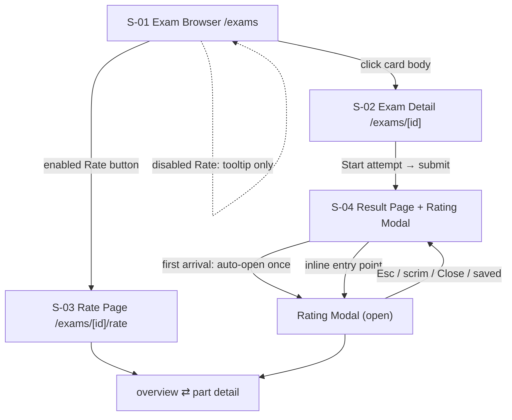

# Exam Difficulty Rating System — UI Specification

## Overview

This UI Specification defines the screen structure, component decomposition, interaction/keyboard/ARIA behavior, and visual acceptance for the Exam Difficulty Rating System: a shared 1–10 rating form (three fixed parts) surfaced through two entry points, a per-card "Rate" button, and the community-difficulty display that replaces the current `"—"` placeholders and activates the Level filter and Hardest sort. This document is canonical; the design-reference screenshots are visual reference only.

### Target PRD
- PRD path: `docs/prd/rating-system-prd.md` (v1.1)
- Feature scope: R1–R9 UI surfaces — the shared rating form (R1/R2/R9), the two entry points (R2), UI eligibility gating (R3, UX-only; server enforcement is Design-Doc scope), the "Rate" button states (R4/AC-026), the upsert/already-rated form state (R5), the community-difficulty badge (R6), and the Level filter + Hardest sort UI (R7). On-read aggregation mechanism (R8) is Design-Doc scope; this spec only consumes the read-model shape.

### Design Source
| Source | Path | Version |
|--------|------|---------|
| Design reference (images + notes) | `SCREENSHOT/design_reference/ExamRatingPage_Layer2/` | Working tree @ branch `feat/analytics-layer3-data-logic` (no tag; not a code prototype) |
| Theme tokens | `PROJECT_OVERVIEW.md §2`, `SOURCE/app/globals.css` | Working tree |

## Prototype Management

The design reference is **image-based** (four PNG screenshots + a transitions/animations note), not runnable prototype code. It is an **attachment** to this UI Spec; the canonical specification is always this document + the Design Doc.

- **Attachment path**: `SCREENSHOT/design_reference/ExamRatingPage_Layer2/` — `ERP_screenshot_fullsize.png` (overview), `ERP_screenshot_element1.png` (Part I detail), `ERP_screenshot_element2.png` (Part II detail), `ERP_screenshot_element3.png` (Part III detail), `ERP_transitions_animations.md` (animation notes). No copy into `docs/ui-spec/assets/` is made because the reference already lives in the repo under version control and this UI Spec is co-located with the design docs per the task directive.
- **Version identification**: repo working tree (no separate commit SHA/tag for the reference bundle).
- **Compliance premise**: the "Mực & Sơn mài" (Ink & Lacquer) theme (`PROJECT_OVERVIEW.md §2`) and its tokens (`SOURCE/app/globals.css`), and the existing Layer 2 dialog/button conventions (`ReportExam.tsx`, `LeaveExamDialog.tsx`).
- **Relationship to canonical spec**: where the reference and this document differ, this document wins. The reference supplies layout, verbatim copy, and animation intent only. In particular, the reference's card hover shadow and any drop shadows are overridden by the `PROJECT_OVERVIEW.md §2` hard rules (no box-shadow, no gradient) except the one pre-approved `ExamCard` hover-shadow exception already in the codebase.

## External Resources Used

| Resource (project-tier label) | Feature-specific identifier | Notes |
|-------------------------------|-----------------------------|-------|
| Design Origin | `PROJECT_OVERVIEW.md §2` — "Mực & Sơn mài" theme; hard rules (no shadow/gradient/pill/serif-on-controls; no red text < 24px on ink) | Governs the ivory panel + dark part-cards + copper focus visual language |
| Design System | `globals.css` tokens (`--background`, `--card`, `--foreground`, `--brand`, `--sidebar`/surface, `--border`, `--ring`, `--muted-foreground`), `.eyebrow`, `.preload-fade` + `--preload-order`; base-ui `Tooltip` (`SOURCE/components/ui/tooltip.tsx`); dialog precedent `ReportExam.tsx` / `LeaveExamDialog.tsx` | New components reuse these tokens/primitives; the RatingModal extends the dialog precedent with focus-trap, focus-return, and success `aria-live` |
| Visual Verification Environment | Routes `/exams`, `/exams/[id]`, `/exams/[id]/rate`, `/exams/[id]/attempt/[attemptId]/result`; Playwright MCP `playwright` for screenshots | `npm run dev` then inspect the four screens; component render tests must live under `lib/**` or `components/**` with `// @vitest-environment jsdom` (Vitest collection constraint) |

## AC Traceability (Design Reference + PRD)

| AC ID | AC Summary | Screen / State | Reference | UI element / component | Adoption Decision |
|-------|-----------|----------------|-----------|------------------------|-------------------|
| AC-001 | Form shows exactly the three fixed parts in order | S-03/S-04 overview | `ERP_screenshot_fullsize.png` | `RatingForm` → three `PartCard` (I/II/III) | Adopted |
| AC-002 | Each part score is an integer in [1,10], out-of-range not submittable | S-03/S-04 detail | element1/2/3 | `CircleScale` (radiogroup, 1–10 only) | Adopted |
| AC-003 | Persisted overall = mean of three part scores | S-03/S-04 overview | fullsize "OVERALL / 10" | Overall readout (display); persistence is Design-Doc | Adopted (display), server-owned |
| AC-004 | Result page auto-opens modal, non-blocking over result | S-04 | (no image — modal is spec-defined) | `RatingModal` open-on-first-arrival | Adopted (modal drops bubble-expand) |
| AC-005 | Refresh does not re-pop; already-rated sees editable state | S-04 | — | `RatingModal` open condition + inline entry point | Adopted |
| AC-006 | Already-rated shows pre-filled editable state, not blank | S-03/S-04 | — | `RatingForm` `initialScores` prop | Adopted |
| AC-007 | Standalone `/exams/[id]/rate` presents the same shared form | S-03 | fullsize/element1-3 | `RatePageShell` → `RatingForm` | Adopted |
| AC-008 | Ineligible write rejected server-side (direct URL) | S-03 error | — | Server action; UI shows recoverable error state | Adopted (UI surfaces only) |
| AC-009 | Result-page submit is eligible and persists | S-04 | — | `RatingForm` submit → server action | Adopted |
| AC-010 | Enabled Rate button navigates to `/exams/[id]/rate` | S-01 | — | `RateButton` enabled | Adopted |
| AC-011 | Logged-in not-attempted → disabled + "Finish this exam first" | S-01 | — | `RateButton` disabled-not-attempted | Adopted |
| AC-012 | Re-submit updates in place (upsert), no second row | S-03/S-04 | — | `RatingForm` submit (idempotent) | Adopted (UI); server-owned |
| AC-013 | Re-open pre-fills stored three scores | S-03/S-04 | — | `RatingForm` `initialScores` | Adopted |
| AC-014 | ≥3 ratings → card Level shows "&lt;Bucket&gt; · &lt;mean&gt;" | S-01 | — | `DifficultyBadge` (card) | Adopted |
| AC-015 | &lt;3 ratings → shows "—" | S-01/S-02 | — | `DifficultyBadge` null branch | Adopted |
| AC-016 | ≥3 ratings → detail Difficulty cell shows badge | S-02 | — | `DifficultyBadge` (detail) | Adopted |
| AC-017 | Level filter presents three real buckets | S-01 | — | `ExamFilters` Level row (real) | Adopted |
| AC-018 | Bucket mapping [1,4)/[4,7)/[7,10]; 4.0→Medium, 7.0/10.0→Hard | S-01/S-02 | — | `DifficultyBadge` consumes server bucket; labels defined here | Adopted (render only) |
| AC-019 | Hardest: rated first desc, below-threshold last | S-01 | — | `ExamFilters` Hardest (real) + server order | Adopted (UI); server-owned order |
| AC-020 | Hardest tie-break deterministic across reloads | S-01 | — | server order; UI renders as returned | Server-owned |
| AC-021 | Level filter excludes below-threshold and other buckets | S-01 | — | `ExamFilters` Level → `?level=` → server | Adopted (UI); server-owned |
| AC-022 | New rating reflected on next read, no denormalized write | — | — | Out of UI scope (Design Doc) | Not adopted (UI) |
| AC-023 | Schema add needs no backfill; &lt;3 unchanged "—" | — | — | Out of UI scope | Not adopted (UI) |
| AC-024 | 1–10 scale meaning visible | S-03/S-04 detail | element1-3 "RATE DIFFICULTY — 1 (EASIEST) TO 10 (HARDEST)" | `CircleScale` label | Adopted |
| AC-025 | Failed submit shows actionable error, preserves scores | S-03/S-04 error | — | `RatingForm` error state (scores retained) | Adopted |
| AC-026 | Logged-out → disabled + "Log in to rate" | S-01 | — | `RateButton` disabled-logged-out | Adopted |

## Screen List and Transitions

### Screen List

| Screen ID | Screen Name | Route | Description | Entry Condition |
|-----------|------------|-------|-------------|-----------------|
| S-01 | Exam Browser | `/exams` | Catalog grid; each `ExamCard` gains a `RateButton` and a `DifficultyBadge` in the Level cell; `ExamFilters` gains a real Level row and a real Hardest sort. | Navigate to `/exams`. |
| S-02 | Exam Detail | `/exams/[id]` | The "Difficulty" meta cell renders a `DifficultyBadge` instead of literal `"—"`. | Click an `ExamCard` body. |
| S-03 | Standalone Rate Page | `/exams/[id]/rate` | `RatePageShell` hosting the shared `RatingForm` full-page (with the bubble-expand overview→detail transition). | Click an enabled `RateButton`, or direct URL. |
| S-04 | Result Page (with Rating Modal) | `/exams/[id]/attempt/[attemptId]/result` | Existing result content, plus a `RatingModal` that auto-opens once on first arrival after submit and an inline entry point on return. | Submit an attempt (auto-open), or refresh/return (inline entry point). |

### Transition Conditions

| Source | Destination | Trigger | Guard Condition |
|--------|------------|---------|-----------------|
| S-01 | S-02 | Click `ExamCard` body (stretched Link) | Always (public card body). |
| S-01 | S-03 | Click enabled `RateButton` | Logged-in AND exam id ∈ user's submitted-exam-ID set. |
| S-01 | S-01 (self) | Click disabled `RateButton` | No navigation; tooltip/description shown. Guard: not logged-in ("Log in to rate") or logged-in-not-attempted ("Finish this exam first"). |
| S-01 | S-01 (re-query) | Select Level option / toggle Hardest | Writes `?level=easy\|medium\|hard` / `?sort=hardest` to `searchParams`; server re-queries. |
| S-04 | S-04 (modal open) | Result page first arrival after submit | `searchParams.rate === "auto"` present on mount (consumed immediately via history replace). |
| S-04 | S-04 (modal open) | Click inline "Rate this exam" / "Edit your rating" | Manual; available whether or not already rated. |
| S-04 | S-04 (modal closed) | Esc, scrim click, Close button, or successful save | Focus returns to the inline entry-point trigger. |
| S-03/S-04 | overview↔detail | Click `PartCard` / "← Back to overview" | Within `RatingForm`; page layout animates (bubble-expand), modal layout cross-fades (preload). |

### Screen Transition Diagram



## Component Decomposition

### Component Tree

```mermaid
graph TD
    subgraph S01["S-01 Exam Browser (/exams, Server Component)"]
        EF["ExamFilters (client) [MODIFIED: real Level row + real Hardest]"]
        EB["ExamBrowser (list)"]
        EC["ExamCard (Server Component) [MODIFIED: stretched Link + siblings]"]
        ECL["Link (card body, stretched via after:inset-0)"]
        DB1["DifficultyBadge (Level cell) [NEW]"]
        RB["RateButton (client, sibling of Link) [NEW]"]
        EB --> EC
        EC --> ECL
        EC --> DB1
        EC --> RB
    end

    subgraph S02["S-02 Exam Detail (/exams/[id])"]
        DB2["DifficultyBadge (Difficulty meta cell) [NEW, reused]"]
    end

    subgraph S03["S-03 Rate Page (/exams/[id]/rate)"]
        RPS["RatePageShell (client) [NEW] — carries bubble-expand"]
        RF1["RatingForm (client, layout=page) [NEW, shared core]"]
        RO1["RatingOverview"]
        PC1["PartCard × 3"]
        PD1["PartDetail (active part)"]
        CS1["CircleScale (radiogroup) [NEW]"]
        RPS --> RF1
        RF1 --> RO1
        RO1 --> PC1
        RF1 --> PD1
        PD1 --> CS1
    end

    subgraph S04["S-04 Result Page (/.../result, Server Component)"]
        RMC["RatingModalController (client) [NEW] — open condition + inline entry point"]
        RM["RatingModal (client) [NEW] — scrim, focus-trap, focus-return, aria-live"]
        RF2["RatingForm (client, layout=modal) [NEW, shared core]"]
        SHARED["RatingOverview / PartDetail / CircleScale (as in S-03)"]
        RMC --> RM
        RM --> RF2
        RF2 --> SHARED
    end
```



### Shared-form decision (Undetermined Item resolved)

**Decision**: one shared `RatingForm` core wrapped by two thin shells (`RatePageShell`, `RatingModalController`/`RatingModal`), not two separate forms. Rationale: R2 mandates "one shared form"; the overview/detail structure, the three-part model, the CircleScale, the readouts, and the submit/error logic are identical across entry points. The only differences are (a) the mount surface (full page vs. modal), (b) the overview→detail transition (bubble-expand vs. cross-fade), and (c) modal-only focus management. These differences are carried by the `layout` prop and by the shells, keeping the form DRY.

`RatingForm` props contract:

```ts
type PartId = "mcq" | "true_false" | "short_answer";
type PartScore = 1|2|3|4|5|6|7|8|9|10;

interface RatingFormProps {
  examId: string;
  /** "page" → bubble-expand overview↔detail; "modal" → cross-fade. */
  layout: "page" | "modal";
  /** Pre-fill for already-rated (AC-006/013); undefined per part = unrated. */
  initialScores?: Partial<Record<PartId, PartScore>>;
  /** Server action (upsert). Resolves to a discriminated Result. */
  onSubmit: (scores: Record<PartId, PartScore>) =>
    Promise<{ ok: true } | { ok: false; message: string }>;
  /** Modal layout only: invoked after a successful save so the shell can close + return focus. */
  onSaved?: () => void;
}
```

Which shell carries which animation:
- **`RatePageShell` (layout="page")**: carries the bubble-expand card→detail transition (`ERP_transitions_animations.md` §1–3) — the dark detail panel grows from the clicked `PartCard`'s rect to the content area, then staggered content reveal, then per-circle pop-in. All gated behind `prefers-reduced-motion: reduce` (instant swap when reduced).
- **`RatingModal` (layout="modal")**: **drops** the bubble-expand. The modal appears via scrim fade + `.preload-fade` stagger; overview→detail swaps as a simple cross-fade/instant swap. Rationale: nesting a rect-growth animation inside an already-animating dialog is visually noisy and complicates focus management.

---

### Component: RatingForm

Shared core: renders the ivory overview panel (title, subtitle, header SUBMIT, overall readout, three `PartCard`s) and, when a part is active, the dark `PartDetail`. Holds the three part scores in local state, computes the live overall readout, and drives submit/saved/error.

Verbatim copy (from the design reference — render exactly):
- Title (serif h2): **`2025 Exam Difficulty Scale`**
- Subtitle: **`Tap a section below to rate it. Overall score averages the rated sections.`**
- Header primary button: **`SUBMIT`** (swaps to **`Sent`** for 1.6s on success, then reverts — `ERP_transitions_animations.md` §5)
- Overall readout: **`OVERALL <value>/10 · <status>`** (see readout model below)
- Part detail rating label: **`RATE DIFFICULTY — 1 (EASIEST) TO 10 (HARDEST)`**
- Part detail primary button: **`SUBMIT RATING`**
- Per-part readout: **`Selected: <value>/10`**

Overall readout model (Undetermined Item #6 resolved — the subtitle says "Overall score averages the rated sections", so the readout is a running mean of rated parts; header SUBMIT still requires all three to persist a valid overall per AC-003):

| Parts rated | Readout value | Status suffix |
|-------------|---------------|---------------|
| 0 | `—` | `UNRATED` |
| 1–2 | running mean of rated parts, one decimal | `<n>/3 RATED` |
| 3 | mean of all three, one decimal | `RATED` |

Per-part `Selected: x/10` readout: `—` until a circle is chosen in that part's detail, then the chosen integer.

#### State x Display Matrix

| State | Default | Loading | Empty | Error | Partial |
|-------|---------|---------|-------|-------|---------|
| Display | Overview panel; three `PartCard`s each showing `—/10` (or pre-filled `x/10` when `initialScores` set) + a hairline progress bar; header `SUBMIT` in its **pinned disabled treatment** (see below) until all three rated; overall readout per model above. | On header `SUBMIT`: button label → `Submitting…`, button `disabled`, `aria-busy="true"`; scores locked read-only. | Not applicable (the three fixed parts always render — AC-001). Zero-rated is the "0 parts" default, not an empty state. | Server rejects (AC-025/AC-008): `role="alert"` message below the header button (e.g. `Couldn't save your rating right now. Please try again.` for generic; `You need to finish this exam before you can rate it.` for eligibility rejection). **All entered scores preserved**; header `SUBMIT` re-enabled. | 1–2 parts rated: those `PartCard`s show `x/10` + filled progress; header `SUBMIT` stays in its pinned disabled treatment. |

**Header `SUBMIT` — one pinned disabled treatment** (single source of truth for every state above and for Golden State 1): while fewer than three parts are rated, the header `SUBMIT` uses the **reduced-opacity / muted brand fill** (brand `#a62c2b` fill at reduced opacity — reuse the `disabled:opacity-60` pattern from `ReportExam.tsx`), rendered as a **native `disabled` button** carrying `aria-describedby` → a hint element with the text `Rate all three parts to submit.`. It is never shown as a full-strength brand-red button while disabled. It flips to the full-strength brand-red enabled appearance only when all three parts are rated.

#### Interaction Definition

| AC ID | EARS Condition | User Action | System Response | State Transition | Error Handling |
|-------|---------------|-------------|-----------------|-----------------|----------------|
| AC-001 | When the form mounts | — | Renders exactly Part I — Multiple choice, Part II — True/False, Part III — Short answer, in order, ignoring `exam.parts`. | → overview default | — |
| AC-006/013 | When `initialScores` is provided | — | Each rated part shows its stored score; overall readout reflects them. | → partial/complete pre-filled | — |
| AC-002 | When a part detail is open | Choose a circle 1–10, click `SUBMIT RATING` | Writes that integer to the part score, updates the `PartCard` `x/10` + progress + overall readout, returns to overview. | detail → overview | Circle set is 1–10 only; no invalid value is representable. `SUBMIT RATING` disabled until a circle is chosen. |
| AC-003/009/012 | When all three parts are rated | Click header `SUBMIT` | Calls `onSubmit(scores)`; on `{ok:true}` label→`Sent` (1.6s), announces saved via the shell's `aria-live`, and (modal) calls `onSaved()`. | complete → saved | — |
| AC-025/008 | When `onSubmit` returns `{ok:false}` | Click header `SUBMIT` | Shows the returned `message` in `role="alert"`; keeps all scores; re-enables `SUBMIT`. | submitting → error | Retry by clicking `SUBMIT` again; no data loss. |

---

### Component: RatingOverview

The ivory (`--background`) panel content: `2025 Exam Difficulty Scale` (serif), subtitle, header `SUBMIT` + copper `rule-divider` (40×2px) + overall readout on the right, and the three-column `PartCard` row on a dark (`--sidebar`/surface) band beneath.

#### State x Display Matrix

| State | Default | Loading | Empty | Error | Partial |
|-------|---------|---------|-------|-------|---------|
| Display | Header block + three dark `PartCard`s. Overall readout `OVERALL —/10 · UNRATED`. | Inherits `RatingForm` submitting (header button busy). | N/A (parts fixed). | Inherits `RatingForm` error (alert under header). | Overall readout shows running mean + `<n>/3 RATED`. |

#### Interaction Definition

| AC ID | EARS Condition | User Action | System Response | State Transition | Error Handling |
|-------|---------------|-------------|-----------------|-----------------|----------------|
| AC-003 | When any part score changes | (via detail submit) | Recomputes and re-renders the overall readout live. | overview re-render | — |

---

### Component: PartCard

One of the three dark overview cards. Shows the part eyebrow, the `x/10` score, a hairline progress bar (fill proportional to score/10; empty when unrated), the part name (sans, bold, on-surface), and a copper `Rate →` affordance. Clicking anywhere on the card opens that part's `PartDetail`.

Verbatim per-part copy:

| Part | Eyebrow (overview) | Name |
|------|--------------------|------|
| I | `PART I · MULTIPLE CHOICE` | `Multiple Choice` |
| II | `PART II · TRUE / FALSE` | `True / False` |
| III | `PART III · SHORT ANSWER` | `Short Answer` |

#### State x Display Matrix

| State | Default (unrated) | Loading | Empty | Error | Partial (rated) |
|-------|-------------------|---------|-------|-------|-----------------|
| Display | `—/10`, empty hairline bar, `Rate →` in copper (`--sidebar-accent` #b8863b). | N/A (no per-card fetch). | N/A. | N/A (errors surface at form level). | `x/10`, hairline bar filled to `x/10` in copper, `Rate →` remains (re-editable). |

#### Interaction Definition

| AC ID | EARS Condition | User Action | System Response | State Transition | Error Handling |
|-------|---------------|-------------|-----------------|-----------------|----------------|
| AC-002 | When the overview is shown | Click a `PartCard` (or Enter/Space on it) | Opens that part's `PartDetail`; page layout runs bubble-expand, modal layout cross-fades. | overview → detail | — |

---

### Component: PartDetail

The dark full-width detail panel for the active part: `← Back to overview`, brand-red eyebrow, serif part name, verbatim description, the `RATE DIFFICULTY — 1 (EASIEST) TO 10 (HARDEST)` label, the `CircleScale`, and a `SUBMIT RATING` button + `Selected: x/10` readout.

Verbatim descriptions (render exactly):

| Part | Detail eyebrow | Description |
|------|----------------|-------------|
| I | `PART I · MULTIPLE CHOICE` | `Four options per question, one correct answer. Tests basic recall and understanding.` |
| II | `PART II · TRUE / FALSE` | `Four sub-statements per question, mark each true or false. One wrong sub-statement forfeits the whole question — no guessing by elimination.` |
| III | `PART III · SHORT ANSWER` | `No options to pick from — solve and enter a single numeric answer. No room for guesswork.` |

Note (`PROJECT_OVERVIEW.md §2` hard rule): the detail eyebrow is brand-red (`--brand`) on the dark surface. Because red-on-ink below 24px is disallowed, the eyebrow renders at the copper/muted weight where the small-caps size falls under 24px; brand-red is reserved for the (larger) accent. **Resolution**: use copper (`--sidebar-accent`) for the small eyebrow to stay within contrast rules, matching the overview card eyebrow, rather than literal brand-red at ~12px. This overrides the reference's red eyebrow to honor the hard rule.

#### State x Display Matrix

| State | Default (no selection) | Loading | Empty | Error | Partial (selected) |
|-------|------------------------|---------|-------|-------|--------------------|
| Display | Ten circles unselected; `SUBMIT RATING` disabled (muted); `Selected: —/10`. | N/A (submit is form-level). | N/A. | N/A (errors at form level). | Chosen circle marked (copper fill + check + `aria-checked`); `SUBMIT RATING` enabled; `Selected: x/10`. |

#### Interaction Definition

| AC ID | EARS Condition | User Action | System Response | State Transition | Error Handling |
|-------|---------------|-------------|-----------------|-----------------|----------------|
| AC-002 | When the detail is open | Select a circle | Updates `Selected: x/10`, enables `SUBMIT RATING`. | default → selected | Only 1–10 selectable. |
| AC-002 | When a selection exists | Click `SUBMIT RATING` | Commits the part score, returns to overview. | selected → overview | — |
| — | When the detail is open | Click `← Back to overview` | Returns to overview **without** committing (unselected parts stay unrated; a previously committed score is retained). | detail → overview | — |

---

### Component: CircleScale

An accessible radiogroup of ten outlined circles labeled 1–10 (Undetermined Item #1 resolved). Chosen over a slider/number field because it matches the reference's ten circles, gives discrete integer-only values (no invalid input possible per AC-002), and is fully keyboard- and screen-reader-operable.

Props: `{ name: string; value?: PartScore; onChange: (v: PartScore) => void; labelledBy: string }`.

ARIA and roles:
- Container `role="radiogroup"`, `aria-label="Rate difficulty from 1 (easiest) to 10 (hardest)"` (or `aria-labelledby={labelledBy}` pointing at the `RATE DIFFICULTY …` label).
- Each circle `role="radio"`, `aria-checked={value === n}`, accessible name = the number (`aria-label={String(n)}` or visible text child).
- Roving tabindex: the checked circle has `tabIndex=0`; all others `tabIndex=-1`. When nothing is checked, circle **1** has `tabIndex=0` (group entered at the start).
- Selection is **not conveyed by color alone**: the checked circle gets `aria-checked="true"` **and** a visible non-color mark (a filled copper ring plus a small check/inner dot and heavier font weight), satisfying WCAG 1.4.1.

Keyboard behavior:

| Key | Behavior |
|-----|----------|
| Tab / Shift+Tab | Enter/leave the group (single stop via roving tabindex). |
| ArrowRight / ArrowDown | Move focus to next circle and select it (checked follows focus); wraps 10→1. |
| ArrowLeft / ArrowUp | Move focus to previous circle and select it; wraps 1→10. |
| Home | Focus + select circle 1. |
| End | Focus + select circle 10. |
| Space / Enter | Select the focused circle (no-op if already checked). |

Focus indicator: copper (`--ring` #b8863b) `focus-visible` ring, ≥2px, never removed.

#### State x Display Matrix

| State | Default | Loading | Empty | Error | Partial |
|-------|---------|---------|-------|-------|---------|
| Display | Ten unselected circles; roving tabindex at circle 1. | N/A. | N/A (always ten circles). | N/A. | Checked circle marked (fill + check + `aria-checked`), roving tabindex at it. |

#### Interaction Definition

| AC ID | EARS Condition | User Action | System Response | State Transition | Error Handling |
|-------|---------------|-------------|-----------------|-----------------|----------------|
| AC-002/024 | When the group has focus | Arrow/Home/End/Space/Enter or click | `onChange(n)` with n∈[1,10]; checked follows focus. | unselected → n (or n → m) | No value outside 1–10 is representable. |

---

### Component: RatingModal

Result-page dialog shell wrapping `RatingForm` (layout="modal"). Extends the `ReportExam`/`LeaveExamDialog` precedent and **closes the two precedent gaps** required by the PRD WCAG 2.1 AA bar: focus trap, focus return to trigger, and success `aria-live`.

Structure (matching precedent): `role="dialog"`, `aria-modal="true"`, `aria-labelledby` → the form's `2025 Exam Difficulty Scale` heading id; scrim `bg-[#1B1512]/40` (Esc + scrim-click close); card `border border-border bg-background rounded-lg p-6` (no shadow). Additions:
- **Focus trap**: Tab/Shift+Tab cycle within the dialog (first↔last focusable).
- **Focus into first control on open**: the first `PartCard` (or the header `SUBMIT` when re-editing).
- **Focus return on close**: focus returns to the inline entry-point trigger that opened it (or, on auto-open, to a defined result-page anchor such as the "Rate this exam" inline control rendered for that purpose).
- **Success announcement**: an `aria-live="polite"` region announces `Rating saved.` on `{ok:true}`; errors use the form's `role="alert"`.
- **Non-blocking (AC-004 reconciliation)**: AC-004's "result readable behind/around it" intent is satisfied by the modal being **non-forcing and fully dismissible** (Esc / scrim click / Close) and by the result content being **fully re-readable the instant the dialog is dismissed** — the dialog never overwrites, replaces, or discards the result. Explicitly acknowledged: while the dialog is open, `aria-modal="true"` **intentionally makes the background inert for assistive technology** (standard dialog semantics — AT focus is confined to the dialog). This is deliberate and not a conflict with AC-004: "readable behind/around" is met visually and on dismissal, not by keeping the background in the AT tab order while the modal is open. The modal is a rating surface layered over the result, never a blocker of the submit→result flow.

#### State x Display Matrix

| State | Default (closed) | Loading | Empty | Error | Partial (open) |
|-------|------------------|---------|-------|-------|----------------|
| Display | No overlay; inline entry point visible on the result page (`Rate this exam` if not rated, `Edit your rating` if already rated). | Inherits `RatingForm` submitting. | N/A. | Inherits `RatingForm` error inside the dialog. | Scrim + centered ivory card hosting `RatingForm`; focus trapped inside. |

#### Interaction Definition

| AC ID | EARS Condition | User Action | System Response | State Transition | Error Handling |
|-------|---------------|-------------|-----------------|-----------------|----------------|
| AC-004 | When the result page is a first arrival after submit | — (auto) | Modal opens once; `aria-modal` scrim over readable result. | closed → open | — |
| AC-005 | When the user refreshes/returns | — | Modal does **not** auto-pop; inline entry point remains. | stays closed | — |
| AC-009/012 | When the user saves in the modal | Click `SUBMIT` | Save succeeds; announce `Rating saved.`; close; return focus. | open → closed | On `{ok:false}` stay open, show alert, keep scores. |
| — | When the dialog is open | Esc / scrim click / Close | Close without saving; return focus to trigger. | open → closed | — |

---

### Component: RatingModalController

Client controller on the result page that resolves the **open condition** (Undetermined Item #3 resolved) and renders the inline entry point.

**First-arrival determination (deterministic, no disruptive re-pop)**:
1. `submitExam`'s redirect to the result route appends a transient marker: `/exams/[id]/attempt/[attemptId]/result?rate=auto`.
2. On mount, the controller reads `searchParams`. If `rate === "auto"`, it opens the modal **and immediately** strips the param via `router.replace(pathname, { scroll: false })` (history replace, no reload). The URL no longer carries the marker, so any refresh has no marker → no re-pop (AC-005).
3. On any load **without** the marker (refresh, back-nav, bookmark), the modal stays closed; only the inline entry point renders. Its label is `Edit your rating` when `initialScores` is present (already rated), else `Rate this exam`.
4. `initialScores` (the user's stored scores, if any) is passed through so both auto-open and manual-open show the editable already-rated state (AC-006).

Rationale for the query-param + history-replace approach over `sessionStorage`: it is stateless across tabs, survives no stale flags, and is deterministic — the marker exists exactly once (produced by the submit redirect) and is consumed exactly once (replaced away on mount).

#### State x Display Matrix

| State | Default | Loading | Empty | Error | Partial |
|-------|---------|---------|-------|-------|---------|
| Display | Inline entry point (`Rate this exam` / `Edit your rating`). | While loading `initialScores` server-side, the entry point renders with a neutral label (`Rate this exam`); no spinner needed (data is provided by the Server Component parent). | N/A. | If `initialScores` fetch fails at the server, entry point still renders (form re-fetches/validates on submit; server enforces eligibility). | If `rate=auto` present → modal open on mount. |

#### Interaction Definition

| AC ID | EARS Condition | User Action | System Response | State Transition | Error Handling |
|-------|---------------|-------------|-----------------|-----------------|----------------|
| AC-004 | When mounted with `?rate=auto` | — | Open modal; `router.replace` strips the marker. | closed → open, URL cleaned | — |
| AC-005 | When mounted without the marker | — | Keep modal closed; show inline entry point. | stays closed | — |
| AC-006 | When the entry point is clicked | Click | Open modal with `initialScores` pre-filled. | closed → open | — |

---

### Component: RatePageShell

Standalone page shell for `/exams/[id]/rate`. Hosts `RatingForm` (layout="page") centered in the ivory content block, provides the bordered main block whose content area is the bubble-expand target, and mounts `.preload-fade` blocks on load. No modal chrome.

#### State x Display Matrix

| State | Default | Loading | Empty | Error | Partial |
|-------|---------|---------|-------|-------|---------|
| Display | Bordered ivory main block with `RatingForm` overview; `.preload-fade` staggered mount. | Inherits form submitting. | N/A. | Inherits form error (in-panel alert). | Overview↔detail with bubble-expand. |

#### Interaction Definition

| AC ID | EARS Condition | User Action | System Response | State Transition | Error Handling |
|-------|---------------|-------------|-----------------|-----------------|----------------|
| AC-007 | When navigating to `/exams/[id]/rate` | — | Renders the shared form as a standalone page for that exam. | → S-03 | If the server later rejects an ineligible submit, the form shows the eligibility error (AC-008/025). |

---

### Component: RateButton

Per-`ExamCard` control with three visual + AT states (Undetermined Item #5 resolved). It is a **sibling of the card's `Link`**, never a descendant, to avoid invalid interactive nesting.

**Card restructure (recommendation)**: keep `ExamCard`'s single navigational `Link` to `/exams/[id]`, but make it a *stretched link* — the `Link` gets `after:absolute after:inset-0` so the whole card is clickable, while the `Link`'s own box no longer wraps the other controls. `DifficultyBadge` and `RateButton` are rendered as siblings of the `Link` inside the `<li>` (which becomes `relative`), each with `relative z-10` so they sit above the stretched hit-area and receive their own clicks. This preserves "click card → detail" while giving `RateButton` an independent target. Because `RateButton` needs client interactivity (tooltip, disabled semantics), it is a small `"use client"` component; `ExamCard` stays a Server Component and passes `{ examId, eligibility }` where `eligibility: "eligible" | "not-attempted" | "logged-out"` is derived from a single per-page submitted-exam-ID set (no per-card query).

**Accessible disabled pattern (AT-exposed, not a native disabled `title`)**: in the disabled states the control is **not** a native `disabled` button (which is unfocusable and fires no tooltip). Instead render `<button type="button" aria-disabled="true" aria-describedby="rate-reason-{examId}">` that is focusable, whose `onClick` is a no-op (no navigation), wrapped by the base-ui `TooltipTrigger`/`TooltipContent` so hover **and** keyboard focus reveal the reason; a visually-hidden `<span id="rate-reason-{examId}">` carries the same reason text for assistive tech. This satisfies AC-011/AC-026's "reason available to assistive technology, not visual styling alone."

#### State x Display Matrix

| State | Default (eligible) | Loading | Empty | Error | Disabled variants |
|-------|--------------------|---------|-------|-------|-------------------|
| Display | Enabled `Rate →` link to `/exams/[id]/rate`; copper affordance; normal focus ring. | N/A (eligibility resolved server-side once per page). | N/A. | N/A. | **not-attempted**: `aria-disabled`, muted styling, tooltip + hidden reason `Finish this exam first`. **logged-out**: `aria-disabled`, muted styling, tooltip + hidden reason `Log in to rate`. |

#### Interaction Definition

| AC ID | EARS Condition | User Action | System Response | State Transition | Error Handling |
|-------|---------------|-------------|-----------------|-----------------|----------------|
| AC-010 | When eligibility is "eligible" | Click / Enter | Navigate to `/exams/[id]/rate`. | S-01 → S-03 | — |
| AC-011 | When eligibility is "not-attempted" | Hover / focus / click | No navigation; tooltip + AT reason `Finish this exam first`. | no transition | — |
| AC-026 | When eligibility is "logged-out" | Hover / focus / click | No navigation; tooltip + AT reason `Log in to rate`. | no transition | — |

---

### Component: DifficultyBadge

Renders the community difficulty from the read model. Consumes only `communityDifficulty: { bucket: "Easy"|"Medium"|"Hard"; mean: number; count: number } | null` on `Exam`; it does **not** re-bucket (the server provides a consistent bucket + mean). Used in the `ExamCard` Level cell and the exam-detail Difficulty cell.

**Display rules (Undetermined Item #4 resolved)**:
- `null` (or `count < 3`) → render literal `—` (unchanged placeholder, AC-015).
- otherwise → render `` `${bucket} · ${mean.toFixed(1)}` `` → e.g. `Hard · 7.2`, `Medium · 4.0`, `Hard · 10.0`.
- Mean precision: exactly one decimal via `toFixed(1)` (so `7` → `7.0`).
- **Bucket label mapping (reference; server-owned, UI must render consistently)**: `[1,4)` → `Easy`, `[4,7)` → `Medium`, `[7,10]` → `Hard`. Boundaries: `4.0` → Medium, `7.0` → Hard, `10.0` → Hard. The `bucket` field and the `mean` field are required to be internally consistent (bucket derived from the same one-decimal mean); the UI renders them verbatim and never recomputes.
- These same three labels populate the Level filter options.

#### State x Display Matrix

| State | Default (≥3 ratings) | Loading | Empty (<3 ratings / null) | Error | Partial |
|-------|----------------------|---------|---------------------------|-------|---------|
| Display | `<Bucket> · <mean.toFixed(1)>` in the same typographic slot as the surrounding meta (muted on card; serif on detail cell). | Inherits parent Server Component render (no client fetch). | `—` (muted). | If the read model is missing the field, treat as `null` → `—` (fail-safe, no crash). | N/A. |

#### Interaction Definition

| AC ID | EARS Condition | User Action | System Response | State Transition | Error Handling |
|-------|---------------|-------------|-----------------|-----------------|----------------|
| AC-014 | When a card has ≥3 ratings | — | Level cell shows `<Bucket> · <mean>`. | — | — |
| AC-015 | When <3 ratings | — | Shows `—`. | — | — |
| AC-016 | When the detail page has ≥3 ratings | — | Difficulty cell shows `<Bucket> · <mean>` (serif). | — | — |

---

### Component: ExamFilters (Level row + Hardest — MODIFIED)

Extends the existing `ExamFilters` (`SOURCE/features/exams/components/ExamFilters.tsx`). Two changes: the symbolic Level `FilterRow` becomes a real three-bucket selector, and the `Hardest` quick-sort checkbox becomes functional.

- **Level row**: replace `<FilterRow label="Level" symbolic last />` with a real `FilterRow` whose options are `[{value:"",label:"All"},{value:"easy",label:"Easy"},{value:"medium",label:"Medium"},{value:"hard",label:"Hard"}]`, `onSelect={(v)=>setParam("level", v)}`, `selectedLabel` = the chosen bucket label. Selecting writes `?level=easy|medium|hard` to `searchParams` (AC-017/AC-021). The "Coming soon" italic panel is removed.
- **Hardest**: remove the `title="Difficulty ranking coming soon"` from the Hardest checkbox `label`. **Updated per frontend Design Doc D002**: `?hardest=1` is REMOVED (no longer an independent, sort-combinable param). Hardest becomes a third value on the single `?sort=` axis (`newest|oldest|hardest`, mutually exclusive) — toggling Hardest writes `?sort=hardest` and visually de-selects Newest/Oldest since they share the param. This is a deliberate user-facing behavior change from the prior independent-boolean design (S#28).
- Filter state stays in URL `searchParams` (existing pattern). `exams/page.tsx` must parse `level` and forward `hardest` to `listExams` (server change; noted for Design Doc).

#### State x Display Matrix

| State | Default | Loading | Empty | Error | Partial |
|-------|---------|---------|-------|-------|---------|
| Display | Level row collapsed showing selected bucket (or none); Hardest checkbox unchecked. | `data-pending` during `useTransition` (existing). | If a Level filter yields no exams, `ExamBrowser` shows its existing "No matching exams" empty state. | N/A. | Level chosen and/or Hardest checked; both reflected in URL and re-query. |

#### Interaction Definition

| AC ID | EARS Condition | User Action | System Response | State Transition | Error Handling |
|-------|---------------|-------------|-----------------|-----------------|----------------|
| AC-017 | When the Level row opens | Click Level row | Shows Easy/Medium/Hard/All options (not "Coming soon"). | row closed → open | — |
| AC-021 | When a Level bucket is chosen | Click e.g. Hard | Sets `?level=hard`; server re-queries to only qualifying Hard exams. | → filtered | — |
| AC-019/020 | When Hardest is toggled | Click Hardest | Sets `?sort=hardest` (exclusive with Newest/Oldest); server orders rated desc, below-threshold last (deterministic). | → sorted | — |

## Design Tokens and Component Map

### Environment Constraints
- Target browsers: latest 2 versions of Chrome / Firefox / Safari / Edge (per project non-functional requirements).
- Theme support: single "Mực & Sơn mài" theme at `:root` (no light/dark toggle). All prototype animations respect `prefers-reduced-motion: reduce`.

#### Responsive Behavior

| Breakpoint | Width | Key Changes |
|-----------|-------|-------------|
| Mobile | < 640px | `RatingForm` overview part cards stack to 1 column; modal card is near-full-width (`px-6` gutters, `max-w-sm`→fluid); `ExamCard` grid single column. |
| Tablet | 640–1023px | Part cards 3-across if space allows else 1–2; `ExamCard` grid 2 columns. |
| Desktop | ≥ 1024px | Overview part cards in a 3-column dark band (matches reference); `ExamCard` grid up to 3 columns. |

### Existing Component Reuse Map

| UI Element | Decision | Existing Component | Notes |
|-----------|----------|-------------------|-------|
| Modal shell (scrim, Esc, scrim-click, `role="dialog"`) | Extend | `ReportExam.tsx` / `LeaveExamDialog.tsx` | Add focus-trap, focus-return, success `aria-live` (precedent gaps). |
| Primary button style | Reuse | `ReportExam.tsx` primary button classes | `bg-brand text-brand-foreground rounded-[4px] px-4 py-2 text-xs font-medium uppercase tracking-[0.14em]` for header `SUBMIT` / `SUBMIT RATING`. |
| Eyebrow label | Reuse | `.eyebrow` (globals.css) | Part eyebrows, filter labels. |
| Staggered mount | Reuse | `.preload-fade` + `--preload-order` | RatePageShell + RatingModal entry; reduced-motion respected. |
| Copper rule divider | Reuse (inline precedent) | Inline copper divider in `SOURCE/features/auth/components/HomeStage.tsx` (~line 38–40): `<div className="mt-4 h-0.5 w-10 bg-[#B8863B]" aria-hidden />` | Under the header `SUBMIT`, as in the reference. There is **no** reusable `rule-divider` class — copy this 40×2px inline pattern. **Token-name collision warning**: in `PROJECT_OVERVIEW.md §2` the token named "accent" is copper (`#b8863b`), but the CSS variable `--accent` in `globals.css` is pale ivory (`#e3d5b6`). Do **not** use the CSS `--accent` variable for the copper divider — use `--sidebar-accent` / `--ring` / literal `#b8863b`. |
| Tooltip | Reuse | `SOURCE/components/ui/tooltip.tsx` (base-ui) | For `RateButton` disabled reason (on a focusable `aria-disabled` control). |
| Filter row / options | Extend | `ExamFilters.tsx` `FilterRow` | Real Level options; remove symbolic branch usage for Level. |
| `ExamCard` layout | Extend | `ExamCard.tsx` | Stretched-link restructure + `RateButton`/`DifficultyBadge` siblings. |
| `RatingForm`, `RatingOverview`, `PartCard`, `PartDetail`, `CircleScale`, `RatePageShell`, `RatingModal`, `RatingModalController`, `RateButton`, `DifficultyBadge` | New | – | No existing equivalent. Testable pure pieces (bucket-label formatter, readout model) should live under `lib/**` so Vitest collects them; render tests under `components/**` need `// @vitest-environment jsdom`. |

### Design Tokens

#### Color Roles

| Role | Token | Value | Usage |
|------|-------|-------|-------|
| Background Surface (ivory) | `--background` / `--card` | `#ede1c8` | Rating panel, modal card, page background. |
| Dark Surface | `--sidebar` (surface) | `#1b1512` | The dark part-cards + `PartDetail` panel. |
| Text (ink) | `--foreground` | `#1b1512` | Body/labels on ivory. |
| Text on dark | `--sidebar-foreground` | `#ede1c8` | Part names / detail text on dark surface. |
| Brand / Accent | `--brand` | `#a62c2b` | Header `SUBMIT` / `SUBMIT RATING` fill; small punctuation only. |
| On-brand | `--brand-foreground` | `#ede1c8` | Text on brand-red buttons (never pure white). |
| Copper (accent) | `--ring` / `--sidebar-accent` | `#b8863b` | Focus ring, `rule-divider`, `Rate →`, selected-circle mark, progress fill. |
| Muted | `--muted-foreground` | `#6b655c` | Subtitle, captions, `—` placeholder, disabled reason. |
| Border | `--border` | `#d8c9a8` | Hairline card borders, progress track, part-card dividers. |

#### Typography Hierarchy

| Role | Font | Size | Weight | Usage |
|------|------|------|--------|-------|
| Panel title | Source Serif 4 | 1.5rem (h2) | 500–600 | `2025 Exam Difficulty Scale`, part names in detail. |
| Body | Be Vietnam Pro | 1rem | 400 | Subtitle, descriptions. |
| Body-sm | Be Vietnam Pro | 0.875rem | 400 | `Selected: x/10`, meta. |
| Label-caps / eyebrow | Be Vietnam Pro | 0.75rem | 500, `tracking-[0.08em]` uppercase | Part eyebrows, `RATE DIFFICULTY …`, button labels (`tracking-[0.14em]`). |

Hard rule reminders: **serif only** on titles/part-names — never on buttons, eyebrows, labels, or the circles. No red text below 24px on the ink surface (detail eyebrow uses copper, per PartDetail note).

#### Spacing Scale

| Token | Value | Usage |
|-------|-------|-------|
| xs | 4px | Circle inner gaps, eyebrow-to-value. |
| sm | 8px | Compact padding, circle row gap. |
| md | 16px | Default component padding. |
| lg | 24px | Card padding (`p-6`), section spacing. |
| xl | 40px | `rule-divider` width; page section separation. |

#### Elevation (Depth)

| Level | Treatment | Usage |
|-------|-----------|-------|
| 0 (Flat) | none | Everything — **no box-shadow, no gradient** (`PROJECT_OVERVIEW.md §2`). Layering is by surface color (`--background` ↔ `--sidebar`) + hairline `--border`. |
| Scrim | `bg-[#1B1512]/40` | Modal backdrop only (opacity, not shadow). |
| Exception | pre-approved `ExamCard` hover shadow | The single existing sanctioned exception; new components add none. |

#### Border Radius Scale

| Token | Value | Usage |
|-------|-------|-------|
| sm | 4px | Buttons, inputs, tooltip. |
| md | 8px | Part cards, panels. |
| lg | 12px | Modal card / page main block. |
| full | – | **Not used except the ten rating circles** (circles are inherently round; this is the one intentional round shape — no pill-radius buttons). |

## Visual Acceptance

### Golden States
1. **Overview (unrated)**: ivory panel, serif `2025 Exam Difficulty Scale`, muted subtitle, header `SUBMIT` in its pinned **disabled** treatment (reduced-opacity / muted brand fill — not full-strength brand-red; native `disabled` + `aria-describedby` hint `Rate all three parts to submit.`) + copper 40×2px divider + `OVERALL —/10 · UNRATED`; three dark part-cards each `—/10` with empty hairline bar and copper `Rate →`.
2. **Part detail (Part I, circle 10 selected)**: dark panel, `← Back to overview`, copper eyebrow `PART I · MULTIPLE CHOICE`, serif `Multiple Choice`, verbatim description, `RATE DIFFICULTY — 1 (EASIEST) TO 10 (HARDEST)`, ten circles with circle 10 marked (copper fill + check), brand-red `SUBMIT RATING` enabled, `Selected: 10/10`.
3. **Overview (all three rated)**: each part-card shows `x/10` + filled copper bar; `OVERALL 7.3/10 · RATED`; `SUBMIT` enabled.
4. **Saved**: header `SUBMIT` reads `Sent` for 1.6s; `aria-live` announces `Rating saved.` (modal closes + returns focus).
5. **Error**: `role="alert"` message under `SUBMIT`; all three scores still shown.
6. **ExamCard states**: enabled `Rate →`; disabled-not-attempted (muted, tooltip `Finish this exam first`); disabled-logged-out (muted, tooltip `Log in to rate`); Level cell `Hard · 7.2` (≥3) or `—` (<3).
7. **Rating Modal on Result**: scrim over readable result content; ivory card centered; focus trapped.

### Layout Constraints
- Rating panel/main block max-width consistent with Layer 2 content blocks; text columns ≤ ~720px (`PROJECT_OVERVIEW.md §2` layout).
- Modal card centered, `max-w` around `sm`, `px-6` viewport gutters; result content never obscured after dismissal.
- Dark part-card band never exceeds the bordered main block's content area (bubble-expand target bound; `ERP_transitions_animations.md` §1).
- One `rule-divider` per view (the header divider); no repeated copper rules.

## Accessibility Requirements

### Keyboard Navigation

| Component | Tab Order | Key Binding | Behavior |
|-----------|-----------|-------------|----------|
| `RateButton` (enabled) | In card flow after body link | Enter | Navigate to rate page. |
| `RateButton` (disabled) | Focusable (not native-disabled) | Focus reveals tooltip | No navigation; reason announced via `aria-describedby`. |
| `PartCard` | Sequential in overview | Enter / Space | Open that part's detail. |
| `CircleScale` | Single stop (roving tabindex) | Arrows / Home / End / Space / Enter | Move + select (checked follows focus); wraps. |
| `SUBMIT RATING` | After circle group | Enter / Space | Commit part score, return to overview. |
| Header `SUBMIT` | After part cards | Enter / Space | Submit rating (enabled only when all three rated). |
| `RatingModal` | Trapped within dialog | Tab / Shift+Tab cycle; Esc closes | Focus enters on open, returns to trigger on close. |
| `ExamFilters` Level row | Existing filter flow | Enter | Open options; choose bucket. |

### Screen Reader

| Component | Role | Accessible Name | Live Region |
|-----------|------|-----------------|-------------|
| `RatingModal` | `dialog` (`aria-modal`) | `aria-labelledby` → `2025 Exam Difficulty Scale` heading | — |
| Save confirmation | status | — | `aria-live="polite"` announces `Rating saved.` |
| Submit error | alert | message text | `role="alert"` (assertive) |
| `CircleScale` | `radiogroup` + `radio`×10 | group: "Rate difficulty from 1 (easiest) to 10 (hardest)"; each: its number; `aria-checked` | — |
| `RateButton` (disabled) | button, `aria-disabled="true"` | `Rate` + `aria-describedby` reason (`Finish this exam first` / `Log in to rate`) | — |
| Overall readout | text | `OVERALL <value> out of 10, <status>` | `aria-live="polite"` (optional) so running mean updates are announced |
| `DifficultyBadge` | text | `<Bucket>, mean <mean> out of 10` (or "not enough ratings" for `—`) | — |

Status must not be conveyed by color alone: selected circle uses a check/fill + `aria-checked`; saved/error use text + icon/live region, not color only.

### Contrast Requirements

| Element | Foreground | Background | Ratio Target |
|---------|-----------|------------|-------------|
| Body/labels on ivory | `#1b1512` | `#ede1c8` | ≥ 4.5:1 (normal text) |
| Part text on dark | `#ede1c8` | `#1b1512` | ≥ 4.5:1 |
| Muted subtitle/caption | `#6b655c` | `#ede1c8` | ≥ 4.5:1 (verify at small sizes) |
| Button label on brand | `#ede1c8` | `#a62c2b` | ≥ 4.5:1 |
| Copper focus ring | `#b8863b` | adjacent surface | ≥ 3:1 (non-text UI, WCAG 1.4.11) |
| Detail eyebrow (copper, <24px) | `#b8863b` | `#1b1512` | ≥ 4.5:1 — copper chosen over brand-red to satisfy the `PROJECT_OVERVIEW.md §2` "no red < 24px on ink" rule |

## Open Items

| ID | Description | Owner | Deadline |
|----|-------------|-------|----------|
| TBD-01 | `Exam` read model must gain `communityDifficulty: { bucket, mean, count } \| null` — exact field name/shape and where `toExam` maps it (server change consumed by `DifficultyBadge`). | Design Doc | Before Design Doc "Accepted" |
| TBD-02 | RESOLVED by frontend Design Doc D002: `ExamSort` gains `'hardest'` as a third mutually-exclusive `?sort=` value (not `?hardest=1`); `exams/page.tsx` forwards `?sort=` and `?level=easy\|medium\|hard` to `listExams`. | Design Doc | Resolved |
| TBD-03 | The per-page submitted-exam-ID set: where it is loaded and threaded `ExamBrowser → ExamCard → RateButton` as `eligibility` (no N+1). | Design Doc | Before Design Doc "Accepted" |
| TBD-04 | `submitExam` redirect must append `?rate=auto` to the result route so `RatingModalController` can detect first arrival. | Design Doc | Before Design Doc "Accepted" |
| TBD-05 | Server action contract for the upsert `onSubmit` (eligibility with-check, discriminated Result mapping to the form's generic vs. eligibility error copy). | Design Doc / ADR | Before Design Doc "Accepted" |
| TBD-06 | Confirm whether the overall readout `aria-live` on every part change is desirable or too chatty for screen-reader users; default to polite, revisit in a11y audit. | UI Spec author + a11y review | During QA phase |

*All TBDs above are Design-Doc-owned contracts (not reopened product decisions) or a small a11y tuning question; none blocks the UI structure defined here.*

## Update History

| Date | Version | Changes | Author |
|------|---------|---------|--------|
| 2026-07-23 | 1.0 | Initial UI Spec from PRD v1.1 + design reference; resolves the six UI-Spec-owned Undetermined Items (CircleScale radiogroup, shared-form + shells, modal open condition, mean precision + bucket mapping, RateButton extraction + states, form state model incl. readouts and SUBMIT/Sent swap). | UI Spec (Claude) |
| 2026-07-23 | 1.1 | Review (approved_with_conditions) fixes: (I001) copper rule-divider Reuse Map now cites `--sidebar-accent`/`--ring` (`#b8863b`) not `--accent` (`#e3d5b6`), with the PROJECT_OVERVIEW.md §2-token vs CSS-variable name-collision note and the `HomeStage.tsx` (~L38–40) inline precedent; (I002) RatingModal AC-004 reconciliation made explicit (non-forcing, fully dismissible, re-readable on dismissal; `aria-modal="true"` intentionally inert-for-AT while open); (I003) header `SUBMIT` pinned to one disabled treatment (reduced-opacity/muted brand fill, native `disabled` + `aria-describedby` "Rate all three parts to submit."), Golden State 1 aligned; (I004) component tree converted to a mermaid graph. No locked product decision or resolved Undetermined Item changed. | UI Spec (Claude) |
