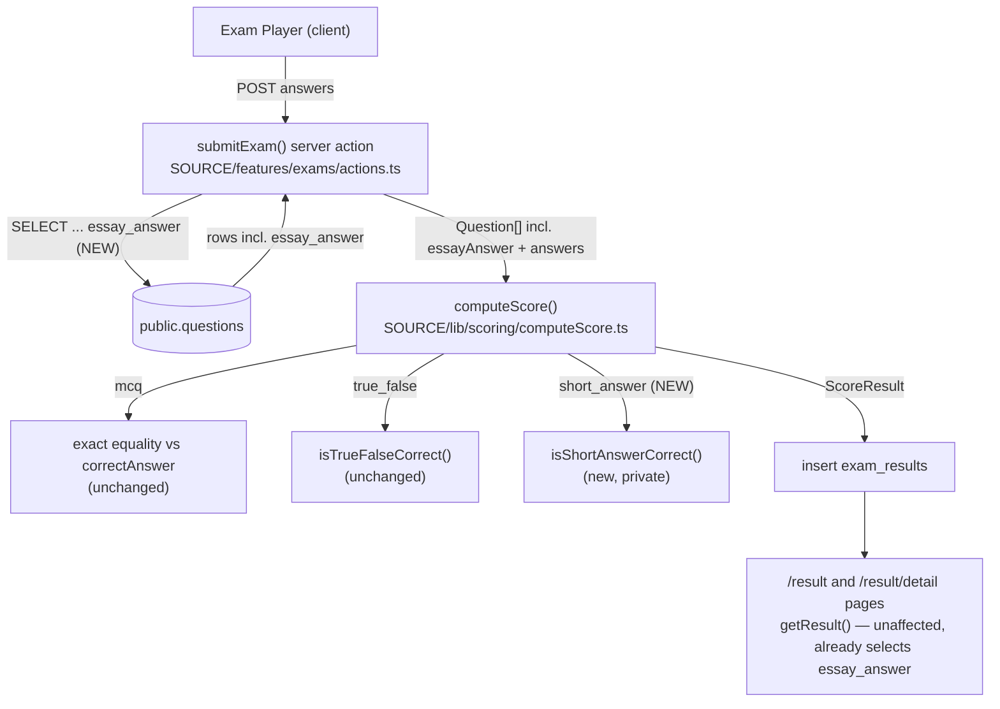
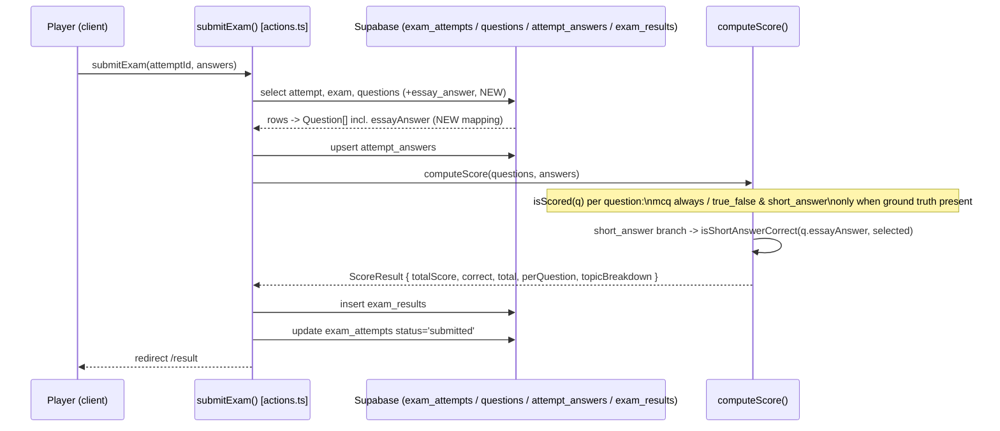

# Short-Answer Scoring — Backend Design Document

| | |
|---|---|
| **Version** | 1.1 |
| **Date** | 2026-08-02 (revision; initial version 2026-08-01 — see Update History) |
| **Status** | Draft — revised in response to document-reviewer verdict `needs_revision` on v1.0 (see Update History for the four addressed findings). Backend design for automatic scoring of `short_answer` questions in `computeScore.ts`, the `submitExam()` data-fetch fix that makes the ground truth reach it, and the `computeScore.test.ts` update strategy. **Frontend result-detail display is out of scope** — covered by `docs/ui-spec/short-answer-scoring-ui-spec.md` and a separate frontend Design Doc that will consume this document's contracts. |
| **PRD** | None — Medium-scale feature, PRD not required per this project's scale rules. Substitute source: `requirement_analysis` (resolved after user Q&A with the engineer), reproduced verbatim in the Agreement Checklist. |
| **UI Spec** | `docs/ui-spec/short-answer-scoring-ui-spec.md` (v1.0, Draft) — the frontend display slice; its Decisions D3/AC-002 depend on this document's confirmation that `PerQuestionResult.correct` stays unset for `short_answer` and that `essayAnswer` continues to reach `getResult()` unmodified. |
| **ADR** | No new ADR created (`adrRequired: false` per requirement analysis; verified against the ADR Creation Conditions matrix — see "ADR Requirement Check" below). **Amends** `docs/adr/ADR-0005-multi-part-national-exam-format.md` (amendment applied together with this Design Doc — see Prerequisite ADRs). |
| **Codebase analysis** | Backend codebase-analyzer output (full JSON, `focusAreas` ×9) — treated as verified ground truth per the Fact Disposition Table, independently re-verified via Grep/Read during this Design Doc's own investigation (see Code Inspection Evidence). One discrepancy found and reported below (Fact Disposition row 4). |

## Overview

`computeScore.ts` currently forces every `short_answer` question to `scored: false` unconditionally — the exact gap the file's own header comment flags as deferred future work. This Design Doc adds a dedicated `short_answer` scoring branch (normalized-text match, with numeric equivalence for decimal-comma/decimal-dot/trailing-zero variants) mirroring the `true_false` branch's existing structure and ground-truth-presence-guard pattern, fixes `submitExam()`'s questions `SELECT` so the ground truth (`essay_answer`) actually reaches `computeScore()` in production, updates the now-contradictory unit test, and amends the stale `ADR-0005` governance record (already superseded silently once for `true_false`; this is the second supersession, now documented).

### Referenced UI Spec (when feature includes frontend)
- UI Spec path: `docs/ui-spec/short-answer-scoring-ui-spec.md`
- That document's frontend contracts (D2, D3, AC-001–AC-009) depend on this Design Doc's data contracts for `PerQuestionResult`/`ScoreResult` (see Data Contracts) — no frontend file is touched by this document.

## Design Summary (Meta)

```yaml
design_type: "extension"
risk_level: "medium"
complexity_level: "medium"
complexity_rationale: >
  (1) No repo precedent exists for numeric-locale-tolerant equivalence (codebase analysis
      fact "no-existing-normalization-utility" — exhaustive grep found nothing); the matching
      rule must be designed from scratch to satisfy the engineer-confirmed example
      ('1,04' == '1.04' == '1.040') while explicitly rejecting ambiguous multi-separator
      input rather than guessing (see Data Contracts). (2) Two files must change together
      (computeScore.ts + actions.ts) to avoid a silent no-op deployment window (see Technical
      Dependencies and Implementation Order) — a subtlety a straightforward branch-copy of
      the true_false precedent would not need to reason about on its own.
main_constraints:
  - "In-scope: questionType === 'short_answer' only. essay must not be touched (no player input UI exists for it)."
  - "No backfill — only newly-submitted attempts are auto-scored; already-persisted exam_results rows keep their original scored:false value forever."
  - "Matching rule (engineer-confirmed): normalized text match + numeric equivalence; '1,04' == '1.04' == '1.040' must be treated as the same value."
  - "Follow the isTrueFalseCorrect precedent: private, co-located matcher in computeScore.ts — no new lib/ file (single consumer today)."
biggest_risks:
  - "Incorrect numeric normalization silently misgrades a student — shifts the score denominator and topic breakdown for every exam containing PHẦN III questions (business_rule impact confirmed by codebase analysis)."
  - "Landing computeScore.ts's short_answer branch without also landing actions.ts's essay_answer select+mapping fix is a silent no-op in production: essayAnswer stays undefined, isScored() always falls back to scored:false, and the feature appears shipped but does nothing."
  - "The existing computeScore.test.ts describe block asserting short_answer stays unscored becomes a contradictory red test once this ships, if not split first."
unknowns:
  - "Whether ambiguous multi-separator numeric strings (e.g. thousands-grouped '1.234.567') should ever be treated as numeric — resolved by this design as: no, fall back to exact text comparison (no realistic PHẦN III example needs grouped-thousands support; see Data Contracts and Alternative Solutions)."
```

## Background and Context

### Prerequisite ADRs

- **ADR-0005** (`docs/adr/ADR-0005-multi-part-national-exam-format.md`, Proposed, amended 2026-08-01 as part of this change) — introduced the `short_answer` question type, the `essay_answer` column reuse for its ground truth, and the (now superseded) "not auto-scored" scoring decision this Design Doc supersedes for `short_answer`. The amendment (added alongside this Design Doc) also retroactively documents `true_false`'s auto-scoring (shipped **2026-07-27**, commit `f1e665093` — verified via `git log -1 --format=%ad f1e665093` during this revision; the date was previously stated as 2026-07-21, inherited unverified from `computeScore.ts`'s own header comment, which still reads `2026-07-21` and should be corrected to `2026-07-27` when that header is next edited per Technical Dependencies and Implementation Order step 2, which already edits this same header comment block to add the `short_answer` clause).
- No other ADR governs scoring; `ADR-0008` (Exam Difficulty Rating) explicitly notes the three rating parts are unrelated to auto-scoring (`docs/design/rating-system-backend-design.md` Non-Scope), confirming no cross-feature contract collision.

**ADR Requirement Check** (per documentation-criteria's ADR Creation Conditions): none of the 5 trigger conditions apply — no nested-contract change, no storage-location/processing-order/data-passing change (same 3-step fetch→compute→persist pipeline, unchanged order), no layer/architecture change, no new external dependency, and no new state machine (this extends an existing 4-way type dispatch by completing one already-existing branch, the same class of change as the already-precedented `true_false` re-enable, which also did not raise a new ADR). Confirms `adrRequired: false`. The one governance action required — keeping `ADR-0005` current — is handled as an amendment to the existing ADR, not a new one.

### External Resources Used

Project-tier facts are recorded in `docs/project-context/external-resources.md` (present, last updated 2026-07-14; no environment change occurred for this backend-only change, so hearing was not re-run per the "file exists → confirm before re-running" hearing protocol — this is a pure code-logic change with no new resource, service, or access method).

| Resource (project-tier label) | Feature-specific identifier | Notes |
|-------------------------------|-----------------------------|-------|
| Database Schema Source | `SOURCE/supabase/schema.sql` — `public.questions.essay_answer` (:237, nullable, no length CHECK), `public.questions.question_type` CHECK (:440-442, already includes `'short_answer'`), `public.attempt_answers.answer` CHECK (:450-452, `length <= 500`) | All three already exist from `ADR-0005`; this feature requires **zero schema change** — confirmed by reading the live `schema.sql`, not assumed. |
| Migration History | None (idempotent `schema.sql`, manual re-apply) | Not invoked by this feature — no schema delta to apply. Recorded only to justify why "Migration Strategy" below is empty. |

No other project-tier resource (Secret Store, Background Jobs, API/Infra sections) is used by this change.

### Agreement Checklist

#### Scope
- [x] Add a dedicated `short_answer` branch to `computeScore()`'s per-question dispatch (`SOURCE/lib/scoring/computeScore.ts`), following the `true_false`/`isTrueFalseCorrect` precedent (private, co-located matcher).
- [x] Extend `isScored()` with a `short_answer` ground-truth-presence guard (scored only when `essayAnswer` is present and non-blank).
- [x] Fix `submitExam()`'s questions `SELECT` (`SOURCE/features/exams/actions.ts`) to include `essay_answer`, and its row-to-`Question` mapping to populate `essayAnswer`.
- [x] Update the header/doc comment in `computeScore.ts` (lines 8-15) to state the new `short_answer` rule while `essay` remains unscored.
- [x] Split `computeScore.test.ts`'s `"short_answer/essay vẫn KHÔNG auto-scored"` describe block: a genuinely new `essay`-only regression test (see Fact Disposition row 4 discrepancy) + a rewritten `short_answer`-scored describe block.
- [x] **Fix the pre-existing `topicBreakdown` describe block's `q3` call site** (`computeScore.test.ts:129`, `shortAnswer("q3", "Topic C")`) by updating it to `shortAnswer("q3", "Topic C", undefined)`. Without this explicit change, `shortAnswer()`'s new third parameter (default `"1260"`) makes q3 `scored:true`, silently adding an unplanned 3rd `topicBreakdown` entry and breaking the block's existing exact-2-entry assertion (lines 133-136). Passing `undefined` keeps q3 ground-truth-absent, preserving the assertion and its original intent ("only scored questions contribute to topicBreakdown") unchanged. See Fact Disposition row `topicBreakdown-q3-callsite`.
- [x] Add `SOURCE/features/exams/__tests__/submitExam.int.test.ts` (new, required scope — not a deferred Work Plan suggestion): asserts the questions `.select(...)` call string includes `"essay_answer"` and that the resulting `Question[]` passed to `computeScore` has `essayAnswer` correctly mapped from a mocked snake_case row (including the null→undefined case), using the sanctioned Supabase-client-mock boundary already used by `getResult.int.test.ts`/`rating.int.test.ts`. Promoted from a non-blocking recommendation because it covers this document's own top-2 risk (Design Summary `biggest_risks`: a typo'd or dropped `essay_answer` in the select string is a silent production no-op). See Fact Disposition row `submitExam-select-test-gap`.
- [x] Amend `docs/adr/ADR-0005-multi-part-national-exam-format.md` (done alongside this Design Doc — see Prerequisite ADRs).

#### Non-Scope (Explicitly not changing)
- [ ] `questionType === 'essay'` — no player input UI exists for it; `isScored()` must keep returning `false` unconditionally for it; zero display change (out of this feature's `resolvedScope`).
- [ ] Backfill of already-persisted `exam_results` rows — explicitly none, per `resolvedScope.backfill`. An attempt submitted before this change ships keeps its original `scored:false` result forever.
- [ ] Any frontend file (`ResultDetailPage`, `QuestionRenderer.tsx`) — owned by `docs/ui-spec/short-answer-scoring-ui-spec.md` and its companion frontend Design Doc. This document's Change Impact Map records the downstream effect for awareness only.
- [ ] `true_false` scoring logic (`isTrueFalseCorrect`, `tfCodec.ts`) — already shipped (commit `f1e665093`); untouched by this change except for the retroactive `ADR-0005` amendment documenting it.
- [ ] `mcq` scoring logic — untouched; regression-guarded by the existing `"computeScore — mcq (baseline, không đổi)"` describe block.
- [ ] `SOURCE/lib/ugc/**` (authoring/UGC pipeline) — `essay_answer`/`essayAnswer` are already fully wired there (`assembleExam.ts`, `fromRows.ts`, `QuestionEditor.tsx`); untouched.
- [ ] Any DB schema change — `essay_answer`/`question_type` already support `short_answer` (ADR-0005); no migration needed (see External Resources Used).

#### Constraints
- [ ] Parallel operation: **No** — single local Supabase project, pre-launch, no feature flag/dual-write needed (per `external-resources.md`'s environment summary: local-only, no staging).
- [ ] Backward compatibility: **Required** — `mcq`/`true_false` scoring results must stay byte-identical (regression); already-persisted `exam_results` rows must not change (no backfill, explicit non-scope above).
- [ ] Performance measurement: **Not required** — pure in-memory string/number comparison over ≤50 questions (`LIMITS.MAX_QUESTIONS`); no PRD/KPI exists for this Medium-scale, no-PRD feature; excluded per the AC scoping guideline ("Performance metrics → non-deterministic in CI, defer").

#### Applicable Standards
- [x] TypeScript strict mode `[explicit]` - Source: `SOURCE/tsconfig.json` (`"strict": true`).
- [x] ESLint (`eslint-config-next` core-web-vitals + typescript) `[explicit]` - Source: `SOURCE/eslint.config.mjs`.
- [x] Vitest unit tests for business logic (project's "Pha 1" testing phase) `[explicit]` - Source: `PROJECT_OVERVIEW.md` §6 "Testing Strategy" ("Pha 1 ... Unit test cho business logic (tính điểm, xử lý đề)").
- [x] Conventional Commits with layer scope `[explicit]` - Source: `PROJECT_OVERVIEW.md` §7.
- [x] Vietnamese inline comments matching each file's existing convention `[implicit]` - Evidence: `computeScore.ts`, `actions.ts`, `schema.sql` are consistently Vietnamese-commented. Confirmed: Yes.
- [x] Private, single-consumer matcher functions stay co-located in the file of their sole consumer rather than a new `lib/` file `[implicit]` - Evidence: `isTrueFalseCorrect` (`computeScore.ts:38-46`, 1 consumer) vs. `tfCodec.ts` (3 external consumers — genuine cross-module reuse). Confirmed: Yes (codebase analysis fact `tfCodec.ts:isTrueFalseCorrect-precedent`).
- [x] Ground-truth-presence guard in `isScored()` before dispatching to a type-specific branch `[implicit]` - Evidence: `true_false`'s `Object.keys(q.subAnswers ?? {}).length > 0` guard (`computeScore.ts:31`). Confirmed: Yes.
- [x] `snake_case` DB column → `camelCase` TS field via `(r.column as T | null) ?? undefined` `[implicit]` - Evidence: `SOURCE/lib/ugc/fromRows.ts:79`, `SOURCE/features/exams/queries.ts:371`. Confirmed: Yes.
- [x] Server Actions: `"use server"`, `createClient()`, `throw` on infra error `[implicit]` - Evidence: every function in `SOURCE/features/exams/actions.ts` (e.g. `if (qErr) throw qErr;`). Confirmed: Yes — unchanged by this feature (no new error path introduced).

#### Assumed Behaviors

- [x] **`computeScore()` has exactly one call site in production code (`submitExam`, `actions.ts:108`).** Evidence: repo-wide grep for `computeScore(` across `SOURCE/**/*.ts(x)` returned only `actions.ts:108` (call) and `computeScore.test.ts` (test calls). Confirmed: Yes.
- [x] **`getResult()`/`queries.ts` already selects and unconditionally maps `essay_answer` for every question type**, so the frontend result-detail page needs no backend change from this document to receive `essayAnswer`. Evidence: `SOURCE/features/exams/queries.ts:346` (select) and `:371` (`essayAnswer: q.essay_answer ?? undefined`). Confirmed: Yes.
- [x] **`public.questions.essay_answer` is nullable with no non-empty/length CHECK**, so a null or blank ground truth is a reachable production state (not merely theoretical) — e.g. a legacy `mcq`-typed row, or a `short_answer` row where AI extraction failed to populate an answer. Evidence: `schema.sql:237` (`essay_answer text` — no `not null`, no CHECK on this column). Confirmed: Yes.
- [x] **JS `Number()` parsing of decimal strings is exact for the trailing-zero and comma/dot cases this feature must satisfy** (no floating-point epsilon-tolerance comparison needed). Evidence: executed `node -e` check this session: `Number('1.040') === Number('1.04')` → `true`; `Number('1,04'.replace(',','.')) === Number('1.04')` → `true`; `Number('1.04') !== Number('1.05')` → `true`. Confirmed: Yes.
- [x] **`assembleExam.ts` already enforces `LIMITS.MAX_SHORT_ANSWER = 100` and non-empty at authoring time** for `short_answer` questions, so a properly-authored row's `essay_answer` is realistically 1-100 characters (though not DB-enforced — see previous item). Evidence: `SOURCE/lib/ugc/assembleExam.ts:208-217`; `SOURCE/lib/ugc/limits.ts:11`; confirmed byte-for-byte persistence of `'1,04'` by `SOURCE/lib/ugc/__tests__/assembleExam.test.ts:472-483`. Confirmed: Yes.
- [x] **The player's submitted short-answer text is already capped before reaching `computeScore()`** (DB CHECK `length(answer) <= 500` and app-level `.slice(0, 500)`), so the matcher never receives unbounded input. Evidence: `schema.sql:450-452`; `actions.ts:100`. Confirmed: Yes.

#### Quality Assurance Mechanisms
- [x] ESLint — Enforces: lint rules — Config: `SOURCE/eslint.config.mjs` — Covers: project-wide — Status: `adopted`.
- [x] `tsc --noEmit` (strict) — Enforces: static typing — Config: `SOURCE/tsconfig.json` — Covers: project-wide — Status: `adopted`.
- [x] `vitest run` — Enforces: unit-test correctness — Config: `SOURCE/vitest.config.ts` (`include: lib/**`, `components/**`, `app/**`) — Covers: `SOURCE/lib/scoring/__tests__/computeScore.test.ts` — Status: `adopted` (primary correctness-proof mechanism for this change — see Verification Strategy).
- [x] `next build` — Enforces: production build succeeds — Config: `SOURCE/package.json` `"build": "next build"` — Covers: project-wide — Status: `adopted`.
- [x] `questions.question_type CHECK IN ('mcq','essay','true_false','short_answer')` — Enforces: valid enum value — Source: `schema.sql:440-442` — Covers: `public.questions` — Status: `adopted` (already satisfied; confirms `short_answer` needs no CHECK widening, unlike when it was first introduced).
- [ ] RLS verification harness (`SOURCE/supabase/test-rls.ts`) — Status: `noted` (reason: this change touches no RLS policy, no new table/column, and no access-control boundary — `questions`/`attempt_answers`/`exam_results` RLS is unaffected; re-running the harness is not required by this change).
- [ ] Playwright E2E — Status: `noted` (reason: project is at "Pha 1" per `PROJECT_OVERVIEW.md` §6 — Playwright/"Pha 2" for user-flow E2E has not started; manual dev-server smoke check is the only available end-to-end verification until then, consistent with the companion UI Spec's own "Visual Verification Environment" entry).

### Problem to Solve

`computeScore()`'s `isScored()` gate returns `false` unconditionally for `short_answer`, and its per-question map falls through to the generic `mcq`-shaped branch's `else`, which would compare against the non-existent `q.correctAnswer` if the `isScored` gate were ever bypassed. Separately, even if `computeScore()` were fixed today, `submitExam()`'s questions `SELECT` (`actions.ts:65-73`) never fetches `essay_answer`, so `q.essayAnswer` is `undefined` for every question in production regardless of matcher correctness — the two gaps must be closed together (see Technical Dependencies and Implementation Order).

### Current Challenges

- No normalization/equivalence utility exists anywhere in the repository (exhaustive grep for `normalize|parseFloat|toLocaleString|replace(/,/` found nothing relevant) — the numeric-equivalence rule must be designed from scratch, not adapted from an existing utility.
- The existing unit test (`computeScore.test.ts:114-122`) actively asserts the behavior this feature must change, and will become a contradictory red test if not updated in the same change.
- `docs/adr/ADR-0005-multi-part-national-exam-format.md` records the (now twice-superseded) "auto-scoring is a separate future feature" decision and had already gone stale once, silently, when `true_false` shipped (commit `f1e665093`) without an ADR update.

### Requirements

#### Functional Requirements

- Compute `isCorrect` for `short_answer` questions by comparing the submitted answer against the question's `essayAnswer` ground truth, treating numerically-equivalent decimal-comma/decimal-dot/trailing-zero representations as equal, and otherwise comparing normalized text.
- Gate `short_answer` scoring on ground-truth presence: a question with a missing or blank `essayAnswer` must be `scored: false` (never scored, never crashes), consistent with the `true_false` AI-extraction-failure fallback.
- Fetch `essay_answer` in `submitExam()`'s questions `SELECT` and map it to `Question.essayAnswer` for every question row, so the scoring branch above actually receives ground truth in production.
- Preserve `mcq` and `true_false` scoring behavior byte-for-byte (regression).
- Preserve `essay`'s permanent `scored: false` behavior byte-for-byte (regression; `essay` has no player input UI and must never be scored).

#### Non-Functional Requirements

- **Performance**: not a CI gate for this change (see Constraints); the matcher is O(1) string/number work per question, over ≤50 questions per exam.
- **Scalability**: N/A — no change to concurrency, storage, or load characteristics.
- **Reliability**: the matcher must never throw for any string input (including empty, whitespace-only, or non-numeric text) — it always returns a boolean via one of its two deterministic comparison strategies, never an exception path.
- **Maintainability**: the new matcher stays a private, co-located, pure function (Applicable Standards) so a future maintainer finds all `short_answer` scoring logic in one file, matching where `isTrueFalseCorrect` already lives.

## Acceptance Criteria (AC) — EARS Format

IDs are prefixed `SA-BE-` (Short Answer, Backend) to avoid collision with the companion UI Spec's `AC-001..009` and other features' AC ranges when both documents are read together.

### Short-Answer Scoring Correctness

- [ ] **SA-BE-001** — **When** a submitted `short_answer` answer's text exactly matches the stored `essayAnswer` (byte-for-byte), the system shall mark the question `scored: true` and `isCorrect: true`.
- [ ] **SA-BE-002** — **When** a submitted `short_answer` answer is numerically equal to the stored `essayAnswer` under a different decimal-separator formatting (comma-decimal vs. dot-decimal vs. trailing zeros — e.g. `"1,04"`, `"1.04"`, `"1.040"` all equivalent), the system shall mark `isCorrect: true`.
- [ ] **SA-BE-003** — **When** a submitted `short_answer` answer's normalized text differs from the stored `essayAnswer`'s normalized text and neither parses to an equal number, the system shall mark `isCorrect: false` while `scored: true`.
- [ ] **SA-BE-004** — **When** a submitted `short_answer` answer differs from the stored `essayAnswer` only in letter case or leading/trailing whitespace (non-numeric text case), the system shall mark `isCorrect: true`.
- [ ] **SA-BE-005** — **If** a submitted answer string is ambiguous under numeric parsing (contains more than one grouping-style separator after comma-to-dot unification, e.g. a thousands-grouped value), **then** the system shall fall back to normalized text comparison rather than guessing a numeric interpretation.

### Ground-Truth-Presence Boundary (mirrors true_false)

- [ ] **SA-BE-006** — **If** a `short_answer` question's stored `essayAnswer` is `undefined`, `null`, or blank/whitespace-only, **then** the system shall mark that question `scored: false` regardless of the submitted answer, and exclude it from `total`/`correct`/`topicBreakdown` while retaining it in `perQuestion`.
- [ ] **SA-BE-007** — **When** a `short_answer` question is left unanswered (`selected` is `undefined` or an empty string) and `essayAnswer` is present, the system shall mark `scored: true` and `isCorrect: false` — an unanswered question counts as wrong, not skipped (same convention already applied to `true_false`, not a new rule invented for this feature).

### Regression Boundaries (mode × existing-type-branch expansion)

- [ ] **SA-BE-008** — **If** `questionType` is `'mcq'`, **then** scoring results (`isCorrect`, `scored`, `correct`) shall be byte-identical to the pre-change implementation for every existing `mcq` test fixture.
- [ ] **SA-BE-009** — **If** `questionType` is `'true_false'`, **then** scoring results shall be byte-identical to the pre-change implementation for every existing `true_false` test fixture.
- [ ] **SA-BE-010** — **If** `questionType` is `'essay'`, **then** the system shall continue to mark `scored: false` unconditionally, unaffected by this change (essay has no player input UI; out of `resolvedScope`).
- [ ] **SA-BE-011** — **While** computing `topicBreakdown`, newly-scored `short_answer` questions shall be included in their topic's `correct`/`total` counts, following the same scored-only aggregation rule already applied to `mcq`/`true_false`.

### Data-Fetch Fix

- [ ] **SA-BE-012** — **When** `submitExam()` fetches questions for scoring, the system shall include `essay_answer` in the `SELECT` and map it to `Question.essayAnswer` (null → `undefined`) for every question row regardless of `questionType`, matching `getResult()`'s existing select-string precedent. Verified by the required `SOURCE/features/exams/__tests__/submitExam.int.test.ts` (see Test Boundaries, Fact Disposition `submitExam-select-test-gap`) — not verifiable by `computeScore.test.ts` alone (pure-unit, receives `essayAnswer` via literal fixtures).

### No-Backfill Guarantee

- [ ] **SA-BE-013** — The system shall never recompute or update an already-persisted `exam_results` row. An attempt submitted before this change ships shall retain its originally-computed `scored: false` result for its `short_answer` questions indefinitely.

## Existing Codebase Analysis

### Implementation Path Mapping

| Type | Path | Description |
|------|------|-------------|
| Existing (modified) | `SOURCE/lib/scoring/computeScore.ts` | Pure scoring function; gains a `short_answer` branch + `isScored()` guard + private matcher + header comment update. |
| Existing (modified) | `SOURCE/lib/scoring/__tests__/computeScore.test.ts` | Unit tests; stale describe block split (see Fact Disposition row 4). |
| Existing (modified) | `SOURCE/features/exams/actions.ts` | `submitExam()`'s questions `SELECT` + row-to-`Question` mapping gain `essay_answer`/`essayAnswer`. |
| Existing (modified, doc-only) | `SOURCE/types/result.ts` | Lines 14-15's comment ("false = câu KHÔNG tính điểm (true_false/short_answer/essay ...)") is stale even before this change (true_false already scores); corrected in the same commit per "update documentation in the same commit that changes the corresponding behavior." No type/field change. |
| Existing (amended, not modified further) | `docs/adr/ADR-0005-multi-part-national-exam-format.md` | Amendment section applied (see Prerequisite ADRs) — done alongside this Design Doc, prior to implementation. |
| Existing (reused, untouched) | `SOURCE/lib/ugc/tfCodec.ts` | Co-location precedent only; not modified. |
| Existing (reused, untouched) | `SOURCE/features/exams/queries.ts` (`getResult`) | Already selects/maps `essay_answer` (:346, :371); confirms the frontend dependency is already satisfied and unaffected by this change. |
| Existing (reused, untouched) | `SOURCE/supabase/schema.sql` | `essay_answer`/`question_type` already support `short_answer` since ADR-0005; no migration. |
| Existing (reused, untouched) | `SOURCE/types/question.ts` | `Question.essayAnswer` field already defined (:53); no type change needed. |
| New | `SOURCE/features/exams/__tests__/submitExam.int.test.ts` | Integration test (required scope, not deferred — see Fact Disposition `submitExam-select-test-gap`) asserting SA-BE-012's select+mapping fix, via the sanctioned Supabase-client-mock boundary. |
| New | — | No new **production** source file. This feature's only new file is the test file above (see Minimal Surface Alternatives — a new test file is not a maintenance-surface element in the gate's sense). |

### Integration Points (Include even for new implementations)

- **Integration Target**: `computeScore()`'s existing per-type dispatch — `isScored()` (gate) and the per-question `.map()` callback's `if`-chain (`mcq` default / `true_false` dedicated branch) already established this dispatch pattern for two types; this change adds the third.
- **Invocation Method**: same in-process function call from `submitExam()` (`actions.ts:108`); no new invocation path, no new module boundary.

### Code Inspection Evidence

| File/Function | Relevance |
|---------------|-----------|
| `computeScore.ts:28-33` (`isScored`) | Integration point — gate to extend with a `short_answer` branch. |
| `computeScore.ts:38-46` (`isTrueFalseCorrect`) | Pattern reference — private, co-located matcher precedent this feature follows. |
| `computeScore.ts:48-102` (`computeScore`) | Integration point — per-question dispatch to extend with a dedicated `short_answer` branch. |
| `computeScore.test.ts:50-62` (`shortAnswer()` helper) | Pattern reference — existing test fixture, extended (additive 3rd parameter) rather than replaced. |
| `computeScore.test.ts:114-122` (stale describe block) | Integration point — must be split (see Fact Disposition row 4). |
| `computeScore.test.ts:124-138` (`topicBreakdown` describe block, pre-existing) | Integration point — its `q3` call site (line 129) must be updated to `shortAnswer("q3", "Topic C", undefined)` to prevent a silent regression from `shortAnswer()`'s new default parameter (see Fact Disposition `topicBreakdown-q3-callsite`). |
| `actions.ts:65-94` (`submitExam` questions fetch+mapping) | Integration point — select+mapping fix target. |
| `types/question.ts:20-54` (`Question`) | Data contract reference — `essayAnswer` field already defined; no change needed. |
| `types/result.ts:6-17` (`PerQuestionResult`/`ScoreResult`) | Data contract reference — confirms `correct` is typed `ChoiceId`, documented "CHỈ câu mcq"; stale scored-semantics comment found (see Implementation Path Mapping). |
| `docs/adr/ADR-0005-multi-part-national-exam-format.md` | Governance reference — decision amended alongside this document. |
| `schema.sql:60-68, 235-242, 437-452` | Schema reference — confirms no migration needed. |
| `SOURCE/lib/ugc/fromRows.ts:79` | Pattern reference — `essayAnswer` null-to-undefined mapping precedent for the `actions.ts` fix. |
| `SOURCE/features/exams/queries.ts:346, 371` | Pattern reference — `getResult()` already selects/maps `essay_answer`; confirms the frontend dependency is pre-satisfied. |
| `SOURCE/lib/ugc/assembleExam.ts:108-124, 208-217`; `assembleExam.test.ts:471-483` | Evidence — `essayAnswer` stored verbatim at authoring time including `'1,04'`; `LIMITS.MAX_SHORT_ANSWER=100` enforced upstream. |
| `SOURCE/lib/ugc/limits.ts:11` | Constraint reference — `MAX_SHORT_ANSWER = 100`. |
| `SOURCE/features/exams/components/QuestionRenderer.tsx:136-153` | Downstream awareness only — the footnote copy change is the UI Spec's job (AC-008), not this document's file scope. |
| `SOURCE/features/exams/__tests__/getResult.int.test.ts` | Test-pattern reference — establishes the "mock the Supabase client boundary only" convention for `.int.test.ts` files, relevant to the Test Boundaries/Integration Verification Points recommendation below. |
| `docs/project-context/external-resources.md` | Project-tier resource reference. |
| `docs/design/rating-system-backend-design.md` | Style/structure reference for this Design Doc's own formatting conventions. |
| `SOURCE/eslint.config.mjs`, `SOURCE/vitest.config.ts`, `SOURCE/tsconfig.json`, `SOURCE/package.json` | Quality Assurance Mechanism verification. |
| `PROJECT_OVERVIEW.md` §6-7 | Standards reference — testing-strategy phase, commit convention. |

### Fact Disposition Table

| Fact ID | Focus Area | Disposition | Rationale | Evidence |
|---------|------------|-------------|-----------|----------|
| `SOURCE/lib/scoring/computeScore.ts:isScored` | `isScored()` gate needs a short_answer branch with a no-ground-truth fallback | transform | New outcome: `isScored()` gains `if (type === "short_answer") return Boolean(q.essayAnswer?.trim());` before the final `return false` (essay). Mirrors the `true_false` guard's shape exactly (presence-of-ground-truth, not correctness-of-answer). | `computeScore.ts:28-33` |
| `SOURCE/lib/scoring/computeScore.ts:computeScore` | New short_answer branch must be dedicated, not fall into generic mcq comparison | transform | New outcome: an `if (q.questionType === "short_answer")` branch is inserted between the existing `true_false` branch and the generic (mcq) `return`, calling the new private matcher against `q.essayAnswer` — never `q.correctAnswer`. | `computeScore.ts:52-72` |
| `SOURCE/lib/scoring/computeScore.ts:header-comment` | Header/doc comment encodes the per-type scoring contract and must be updated with the code | transform | New outcome: the comment block gains a `short_answer re-enable 2026-08-01` clause describing the text/numeric-equivalence rule and its ground-truth fallback, appended to the *same* `v2.1 (ADR-0005)` label used for the `true_false` re-enable (not a new version number — see Implementation Approach, this preserves the file's own established versioning convention where the umbrella label spans multiple incremental re-enables). While editing this same comment block, also correct its existing `true_false re-enable 2026-07-21` date to `2026-07-27` (verified via `git log`; see Prerequisite ADRs) so the source-of-truth header no longer carries the inherited, unverified date. | `computeScore.ts:8-15` |
| `SOURCE/lib/scoring/__tests__/computeScore.test.ts:short_answer/essay-describe-block` | Existing test explicitly asserts short_answer stays unscored and will fail once scoring ships | transform (with a discrepancy noted below) | New outcome: the describe block is split into (a) a **new** `essay`-only regression test — see discrepancy — and (b) a rewritten `short_answer`-scored describe block covering SA-BE-001–007. **Discrepancy from codebase analysis**: the analysis states "essay-only assertion retained," implying one already exists. Direct inspection of `computeScore.test.ts:114-122` found the block's *title* mentions `essay`, but its single test body uses only `mcq`+`shortAnswer()` fixtures — **no `essay`-typed fixture or assertion currently exists in the file** (no `essay()` helper is defined, unlike `mcq()`/`trueFalse()`/`shortAnswer()`). This document's Test Boundaries section specifies adding a genuinely new `essay()` helper + regression test, not "retaining" one. | `computeScore.test.ts:114-122,124-138` |
| `SOURCE/features/exams/actions.ts:submitExam-select` | `submitExam`'s questions SELECT is missing essay_answer | transform | New outcome: `.select("id, content, choices, correct_answer, subject, grade, topic, question_type, sub_answers, essay_answer")` (append `essay_answer`, same precedent as `sub_answers`'s prior addition). | `actions.ts:65-73` |
| `SOURCE/features/exams/actions.ts:submitExam-mapping` | Row-to-Question mapping object literal must add an essayAnswer field | transform | New outcome: add `essayAnswer: (r.essay_answer as string | null) ?? undefined,` immediately after the existing `subAnswers` line, matching `fromRows.ts:79`/`queries.ts:371`. | `actions.ts:76-91` |
| `no-existing-normalization-utility` | No numeric/text normalization or equivalence utility exists anywhere in the repository | transform | New outcome: a new private pure-function matcher (`isShortAnswerCorrect` + two normalizer helpers) is introduced in `computeScore.ts` — no existing utility is altered or reused since none existed. | Exhaustive grep across `SOURCE` for `normalize\|parseFloat\|toLocaleString\|replace(/,/` found nothing relevant |
| `SOURCE/lib/ugc/tfCodec.ts:isTrueFalseCorrect-precedent` | Architectural precedent: matcher logic is co-located privately in computeScore.ts, not split into a separate lib file | preserve | Confirmed: the new short_answer matcher follows the same co-location convention (private function in `computeScore.ts`, single consumer today); `tfCodec.ts` itself is not modified or extended. | `computeScore.ts:38-46` vs. `tfCodec.ts` (3 external consumers) |
| `SOURCE/types/question.ts:correctAnswer-nullability-gap` | Pre-existing type-soundness gap: Question.correctAnswer is non-optional but is null for non-mcq rows | out-of-scope | Excluded by this feature's `resolvedScope` (short_answer scoring only) — fixing `Question.correctAnswer`'s optionality is a separate type-hygiene concern. This design avoids ever triggering the gap: the new matcher exclusively reads `q.essayAnswer`, never `q.correctAnswer` (verified as an explicit invariant in Data Contracts below). | `types/question.ts:25` vs. `schema.sql:401` and `actions.ts:83` |
| `SOURCE/lib/scoring/__tests__/computeScore.test.ts:topicBreakdown-q3-callsite` | Pre-existing `topicBreakdown` describe block's `q3` call site (`shortAnswer("q3", "Topic C")`, line 129) would silently become `scored:true` once `shortAnswer()`'s new 3rd parameter defaults to a non-blank `"1260"`, breaking the block's exact-2-entry assertion (lines 133-136) — flagged by document-reviewer, not caught by the original design pass | transform | New outcome: the call site is updated to `shortAnswer("q3", "Topic C", undefined)`, keeping q3 ground-truth-absent (`isScored()` returns `false` for it) so the pre-existing `[{Topic A}, {Topic B}]` 2-entry assertion and its original intent ("only scored questions contribute to topicBreakdown") remain unchanged and true. The assertion array itself (lines 133-136) is NOT edited. | `computeScore.test.ts:124-138` (assertion + call site); `computeScore.test.ts:50-62` (`shortAnswer()` helper) |
| `SOURCE/features/exams/actions.ts:submitExam-select-test-gap` | `submitExam()`'s `essay_answer` select+mapping fix (SA-BE-012) has no dedicated automated test — previously deferred as a non-blocking Work Plan recommendation | transform | New outcome: `SOURCE/features/exams/__tests__/submitExam.int.test.ts` (new) is added as a **required scope item of this Design Doc**, not deferred — it asserts the questions `.select(...)` call string includes `essay_answer` and that the mapped `Question[]` correctly populates `essayAnswer` (incl. null→undefined), via the sanctioned Supabase-client-mock boundary already used by `getResult.int.test.ts`/`rating.int.test.ts`. Promoted because this exact code path is this document's own top-2 risk (Design Summary `biggest_risks`: silent no-op in production if the select string is typo'd or the fix doesn't land alongside `computeScore.ts`'s branch). | `actions.ts:65-91` (fix target); `getResult.int.test.ts` (mock-boundary pattern precedent) |

## Design

### Change Impact Map

```yaml
Change Target: computeScore() short_answer branch + submitExam() questions fetch
Direct Impact:
  - SOURCE/lib/scoring/computeScore.ts (isScored short_answer branch; new dedicated short_answer branch in the per-question map; new private isShortAnswerCorrect + 2 normalizer helpers; header comment update)
  - SOURCE/lib/scoring/__tests__/computeScore.test.ts (stale describe block split into essay-regression + short_answer-scored blocks; shortAnswer() helper gains a 3rd optional parameter; pre-existing topicBreakdown describe block's q3 call site updated to shortAnswer("q3", "Topic C", undefined) to prevent a silent regression — see Fact Disposition topicBreakdown-q3-callsite)
  - SOURCE/features/exams/actions.ts (submitExam questions SELECT gains essay_answer; row-to-Question mapping gains essayAnswer field)
  - SOURCE/features/exams/__tests__/submitExam.int.test.ts (new, required scope — asserts SA-BE-012's select+mapping fix; see Fact Disposition submitExam-select-test-gap)
  - SOURCE/types/result.ts (doc-comment-only correction, lines 14-15 — no field/type change)
  - docs/adr/ADR-0005-multi-part-national-exam-format.md (amendment section — already applied; commit f1e665093 date corrected 2026-07-21 → 2026-07-27)
Indirect Impact:
  - public.exam_results.per_question (jsonb) — newly-submitted attempts containing short_answer questions get scored:true/isCorrect computed instead of always scored:false; total/correct denominator and topic_breakdown shift accordingly for exams containing PHẦN III questions
  - SOURCE/app/(exams)/exams/[id]/attempt/[attemptId]/result/detail/page.tsx — will start receiving scored:true short_answer PerQuestionResult rows for newly-submitted attempts only; this page currently blank-renders that combination (pre-existing gap this backend change newly exposes; fix tracked in the companion UI Spec/frontend Design Doc, not this document)
No Ripple Effect:
  - questionType === 'essay' path (isScored returns false unconditionally; untouched)
  - questionType === 'mcq' / 'true_false' branches (byte-identical logic, guarded by existing regression tests)
  - Already-persisted exam_results rows (no backfill; only newly-submitted attempts are affected)
  - SOURCE/features/exams/queries.ts getResult() (already selects essay_answer; unaffected)
  - SOURCE/app/(authoring)/** (authoring/UGC pipeline — essay_answer already fully wired there; untouched)
  - SOURCE/features/exams/components/QuestionRenderer.tsx (footnote copy is a frontend UI Spec change, AC-008, sequenced to ship only after this backend change per the UI Spec's TBD-05 — not part of this document's file scope)
  - Any RLS policy or DB schema (no schema change — essay_answer/question_type already support short_answer since ADR-0005)
```

### Interface Change Matrix

**Discrepancy note**: this Design Doc's governing instructions specify two different column sets for this table — the orchestrator's Gate 3 "Interface Change Impact Analysis" spec calls for `Existing Operation | New Operation | Conversion Required | Adapter Required | Compatibility Method` (5 columns), while `documentation-criteria`'s `design-template.md` "Interface Change Matrix" section (and this project's own `rating-system-backend-design.md` precedent) uses `Existing | New | Conversion Required | Compatibility Method` (4 columns, no "Adapter Required"). Resolved by using the 5-column superset below (no information loss; "Adapter Required" is simply "No" for every row in this change, since none of the three interface changes need an adapter).

| Existing Operation | New Operation | Conversion Required | Adapter Required | Compatibility Method |
|----------|-----|--------------------|------|--------------------|
| `isScored(q)` returns `false` for `short_answer` unconditionally | `isScored(q)` returns `true` when `essayAnswer` present & non-blank, else `false` | No (same signature) | No | Additive branch; behavior-only change gated by ground-truth presence |
| `computeScore()`'s `short_answer` questions → always `{ scored: false }` | `computeScore()`'s `short_answer` questions → `{ scored: true/false, isCorrect }` via a dedicated branch | No (same exported signature `computeScore(questions, answers): ScoreResult`) | No | Additive branch inserted before the generic mcq fallthrough |
| `submitExam` questions `SELECT` (no `essay_answer`) | `submitExam` questions `SELECT` (+`essay_answer`) | No | No | Additive column in the select string |

### Architecture Overview

This change fits entirely within the existing Layer 2 Core Loop (`submitExam` server action → `computeScore` pure function → `exam_results` persistence); no new layer, service, or module boundary is introduced.



### Data Flow



### Integration Points List

| Integration Point | Location | Old Implementation | New Implementation | Switching Method | Verification Method |
|-------------------|----------|-------------------|-------------------|------------------|-------------------|
| `isScored()` short_answer gate | `computeScore.ts:28-33` | `return false;` (falls through generic `return false`) | Dedicated `if (type === "short_answer") return Boolean(q.essayAnswer?.trim());` before the generic `return false` | Direct code edit (no flag) | Unit test — SA-BE-006 |
| `computeScore()` per-question dispatch | `computeScore.ts:52-72` | Falls to generic mcq-shaped `else` (never reached today because `isScored` already returns `false`) | Dedicated `if (q.questionType === "short_answer")` branch before the generic `else` | Direct code edit (no flag) | Unit test — SA-BE-001–005, 007 |
| `submitExam()` questions fetch | `actions.ts:65-91` | `SELECT` omits `essay_answer`; mapping omits `essayAnswer` | `SELECT` includes `essay_answer`; mapping includes `essayAnswer` | Direct code edit (no flag) | Recommended integration test (Test Boundaries) — SA-BE-012 |

### Main Components

#### `isScored` (private, `computeScore.ts`)

- **Responsibility**: decide, per question, whether it participates in scoring at all (ground-truth-presence gate), independent of whether the answer is correct.
- **Interface**: `function isScored(q: Question): boolean` (unchanged signature; gains one new branch).
- **Dependencies**: none (pure, reads only `q.questionType`, `q.subAnswers`, `q.essayAnswer`).

#### `isShortAnswerCorrect` (new, private, `computeScore.ts`)

- **Responsibility**: given the stored ground truth and the submitted text, determine correctness via numeric-equivalence-first, normalized-text-fallback comparison. Never called unless `isScored()` has already confirmed `essayAnswer` is present.
- **Interface**: `function isShortAnswerCorrect(expected: string, submitted: string | undefined): boolean`.
- **Dependencies**: two private normalizer helpers (`parseShortAnswerNumber`, `normalizeShortAnswerText`), no external I/O, no other module.

#### `computeScore` (exported, `computeScore.ts`)

- **Responsibility**: unchanged — compute `ScoreResult` from `Question[]` + answers; now dispatches `short_answer` to the new matcher instead of an unreachable generic fallthrough.
- **Interface**: unchanged exported signature `computeScore(questions: Question[], answers: Record<string, string>): ScoreResult`.
- **Dependencies**: `decodeTfAnswer` (`tfCodec.ts`, unchanged), `isShortAnswerCorrect` (new, same file).

#### `submitExam` (server action, `actions.ts`)

- **Responsibility**: unchanged — fetch attempt+questions, batch-insert answers, score via `computeScore`, persist `exam_results`, lock attempt. Questions fetch now additionally supplies `essayAnswer`.
- **Interface**: unchanged `submitExam(attemptId: string, answers: Record<string, string>)`.
- **Dependencies**: Supabase client (`createClient()`), `computeScore`.

### Data Representation Decision (When Introducing New Structures)

**N/A** — this feature introduces no new or modified persistent data structure. It reuses the `essay_answer` DB column, the `Question.essayAnswer` TS field, and the `PerQuestionResult`/`ScoreResult` shapes, all of which already exist since ADR-0005. No schema, type, or contract shape is added or changed by this design (only behavior — what values a branch produces — changes).

### Minimal Surface Alternatives (When Introducing Maintenance-Surface Elements)

**N/A — no in-scope element is introduced.** Walking the in-scope categories explicitly:

- **Persistent state**: none added — `essay_answer` (DB column) already exists; no new column/table.
- **Public-contract / cross-boundary fields**: none added — `PerQuestionResult`/`ScoreResult`/`Question` shapes are unchanged; `essayAnswer` already crosses the DB→TS boundary elsewhere (`fromRows.ts`, `queries.ts`) and this design only completes an already-established field's wiring into one additional, previously-incomplete call site (`submitExam`'s select), not a new field.
- **Behavioral modes/flags**: none added — `'short_answer'` is a pre-existing `Question.questionType` enum value (defined since ADR-0005, already CHECK-constrained in the DB); this design implements behavior for an already-existing value, the same class of change as the already-shipped `true_false` re-enable (which was likewise not run through this gate).
- **Reusable abstractions**: the new `isShortAnswerCorrect` + normalizer helpers are private, single-consumer, co-located functions (Fact Disposition: `tfCodec.ts` precedent) — explicitly *not* designed for reuse, matching the established convention that only genuinely multi-consumer logic (like `tfCodec.ts`, 3 consumers) gets its own file.

No element in this design matches an in-scope category; the gate does not apply.

### Data Contracts

#### `computeScore()` (pure function boundary)

```yaml
Contract: computeScore(questions: Question[], answers: Record<string, string>): ScoreResult
Input:
  Type: Question[] (may include questionType:'short_answer', essayAnswer?: string), answers: Record<questionId, string>
  Preconditions: questions in exam order; answers keyed by question id; essayAnswer, when present, is realistically <=100 chars (author-time enforced by assembleExam.ts, not re-validated here — see Assumed Behaviors)
  Validation: none performed by computeScore itself (pure function; ground-truth presence is guarded by isScored, not validated/sanitized)
Output:
  Type: ScoreResult (unchanged shape)
  Guarantees:
    - short_answer questions with a present, non-blank essayAnswer produce scored:true and isCorrect computed via isShortAnswerCorrect
    - short_answer questions with missing/blank essayAnswer produce scored:false (excluded from total/correct/topicBreakdown, retained in perQuestion)
    - mcq and true_false behavior is byte-identical to the pre-change implementation
    - perQuestion.length === questions.length always
  On Error: no exceptions thrown for malformed/non-numeric submitted text — isShortAnswerCorrect always falls back to normalized text comparison, never throws
Invariants:
  - The short_answer branch reads q.essayAnswer exclusively; it never reads q.correctAnswer (Fact Disposition: correctAnswer-nullability-gap, out-of-scope)
  - PerQuestionResult.correct stays unset (undefined) for short_answer, matching its "CHỈ câu mcq" (mcq-only) type contract and the true_false precedent (which also never sets it)
  - scored===false questions never contribute to total/correct/topicBreakdown
```

#### `isShortAnswerCorrect` (private matcher boundary)

```yaml
Contract: isShortAnswerCorrect(expected: string, submitted: string | undefined): boolean
Input:
  Type: expected — the stored essayAnswer (already confirmed non-blank by the isScored gate before this function is called); submitted — answers[q.id], may be undefined or an empty string (unanswered)
  Preconditions: none enforced by this function (defensive: treats any string as valid opaque text, does not assume numeric)
  Validation: submitted === undefined -> return false immediately (never reaches the comparison logic)
Output:
  Type: boolean
  Guarantees:
    - If both expected and submitted parse to a finite number under the Vietnamese-decimal-tolerant rule (comma and dot both treated as a single decimal separator; ambiguous multi-separator strings do NOT parse), returns numeric equality
    - Otherwise, returns normalized-text equality (trim + Unicode NFC + lowercase) on both sides
  On Error: never throws — every input string maps deterministically to one of the two comparison strategies
Invariants:
  - Never mutates its inputs (pure)
  - A string that fails numeric parsing on either side always falls back to text comparison (no partial/hybrid comparison)
```

#### `submitExam()` questions fetch (server-action boundary)

```yaml
Contract: submitExam's questions SELECT + row-to-Question mapping
Input: DB rows from public.questions (id, content, choices, correct_answer, subject, grade, topic, question_type, sub_answers, essay_answer)
Preconditions: questionIds resolved from exams.question_ids (unchanged)
Validation: none (server-only, RLS-gated read — questions_select_authenticated policy, unchanged)
Output: Question[] with essayAnswer populated as (r.essay_answer as string | null) ?? undefined
On Error: Supabase error propagated via throw (existing `if (qErr) throw qErr;` convention, unchanged)
Invariants: mapping for all pre-existing fields (id, content, choices, correctAnswer, subject, grade, topic, questionType, subAnswers) stays byte-identical; only essayAnswer is newly populated (previously always undefined)
```

### Field Propagation Map (When Fields Cross Boundaries)

| Field | Boundary | Status | Serialized Format | Consumer Parse Rule | Detail |
|-------|----------|--------|-------------------|---------------------|--------|
| `essay_answer` (DB column) → `essayAnswer` (`Question`, `submitExam` mapping) | `public.questions` (DB) → `SOURCE/features/exams/actions.ts` `submitExam()` | transformed (snake_case→camelCase; `null`→`undefined`) | — | — | New crossing point added by this design; mirrors the identical existing pattern in `fromRows.ts:79` and `queries.ts:371`. Not a custom-encoded serialized boundary (plain `text` column, no encode/decode scheme comparable to `tfCodec`'s `"a:Đ,b:S"`), so both format columns are "—" per the template's in-memory-crossing rule. |
| `essayAnswer` (`Question`, in-memory) → *(not propagated further)* | `submitExam()` → `computeScore()` → `exam_results.per_question` (jsonb) | dropped | — | — | Consumed only for the correctness comparison inside `isShortAnswerCorrect`; the expected-value text itself is never written into `PerQuestionResult` (`correct` stays unset — matches the `true_false` precedent, which also never persists `sub_answers`' ground truth into `per_question`). The frontend result-detail page obtains `essayAnswer` independently via `getResult()`/`queries.ts`'s own, already-existing `essay_answer` select (unaffected, unchanged by this design — see UI Spec Decision D3). |

### State Transitions and Invariants (When Applicable)

**N/A** — `computeScore` is a pure function with no internal state machine; `isScored`'s per-type dispatch is a stateless classification, not a state transition. No stateful component is introduced or modified by this design.

### Error Handling

| Error Category | Example | Detection | Recovery Strategy | User Impact |
|---------------|---------|-----------|-------------------|-------------|
| Business logic (not an error) | Submitted short-answer text is non-numeric while the expected value is numeric, or vice versa | `parseShortAnswerNumber` returns `null` for one or both sides | Deterministically fall back to normalized text comparison — this is the designed matching rule itself, not error recovery; no exception is thrown or caught anywhere in this path | None — normal grading outcome (correct or incorrect), not a failure state |
| Business logic (ground truth absent) | `essayAnswer` is `undefined`/blank (legacy row or AI-extraction failure) | `isScored()` guard | `scored: false`, question excluded from denominator, retained in `perQuestion` (unchanged pattern from `true_false`) | Question shown as "not auto-scored" in result detail, not penalized |
| Infrastructure | Supabase select/insert failure in `submitExam` | Supabase error object | `throw` (existing, unchanged convention — `if (qErr) throw qErr;`) | Next.js error boundary; no partial/silent submission |

**Fail-fast / no-silent-fallback compliance**: the numeric-vs-text dual strategy inside `isShortAnswerCorrect` is not an error-handling fallback — no exception is ever caught or suppressed on this path. Both comparison strategies operate on valid, non-erroring string input; choosing between them is the designed correctness rule, analogous to how `isTrueFalseCorrect` does not "fail" on a blank `subAnswers` entry, it evaluates it as a mismatch. The only actual error paths in this change (Supabase `throw`) are unchanged from the existing convention.

### Logging and Monitoring

- **Log events**: none new. `computeScore` remains a pure function with no logging (unchanged). `submitExam` continues its existing convention of propagating errors via `throw` without `console.log` on the happy path (unlike `rateExam()`, which logs infrastructure errors — that asymmetry is pre-existing and out of scope for this change).
- **Sensitive data**: none — `essay_answer`/submitted short-answer text are already-persisted, non-PII exam-answer strings; no new field is logged.
- **Monitoring**: none new (pre-launch scale, no monitoring infra per `external-resources.md`).

## Implementation Plan

### Implementation Approach

**Selected Approach**: Vertical Slice.

**Selection Reason** (Phase 1-4 analysis per implementation-approach skill):

- **Phase 1 (Current State)**: `computeScore.ts` already has an established, proven per-type branch pattern (`mcq` default, `true_false` dedicated branch via `isTrueFalseCorrect`) gated by `isScored()`. `true_false` was added this exact way in commit `f1e6650` with no architecture change and a complete, still-green test harness — strong precedent, low architectural risk. The file's own header comment flagged this exact gap as intentional, deferred work now being picked up.
- **Phase 2 (Strategy Exploration)**: Strangler/Facade patterns are not applicable (no legacy system to replace). The selected strategy is a **feature-driven vertical slice that replays the proven `true_false` pattern** — algorithm + data-fetch fix + tests delivered as one complete, working capability. Considered and rejected: extracting the matcher into a new shared `lib/` file (an Adapter/reusable-component strategy) — rejected per Rule of Three / YAGNI, since there is exactly one consumer today (Fact Disposition: `tfCodec.ts` precedent explicitly confirms this).
- **Phase 3 (Risk Assessment)**: Technical risks — silent misgrading from numeric-ambiguity mishandling; the pre-existing test becoming contradictory; a silent no-op if `actions.ts`'s fix ships without `computeScore.ts`'s (or vice versa is safe — see below). Operational risks — none (pre-launch, no live users, no deployment downtime per `external-resources.md`). Project risks — none significant (solo engineer, 3-4 file change). Mitigations: unit-test the exact engineer-confirmed matching examples first (Early Verification Point below); split the stale describe block explicitly; require both files in the same change set (below).
- **Phase 4 (Constraint Compatibility)**: TypeScript strict mode requires full typing, no `any`, in the new matcher. Vietnamese-comment convention must be followed in the actual file (this document's suggested comment text is illustrative English/Vietnamese mix; the implementer matches the file's existing Vietnamese style exactly). Solo-engineer, pre-launch — no deadline/rollback pressure beyond correctness.

**Verification Level**: L2 (test operation verification) is the primary, achievable level for this backend-only slice — new/updated Vitest assertions passing. L1 (functional, end-user-visible operation) is currently blocked on the companion frontend slice (`ResultDetailPage`'s `short_answer` scored-branch fix) landing separately, per the UI Spec's own sequencing note (TBD-05) — until then, a `short_answer` question that becomes `scored:true` in production still blank-renders on the result-detail page (a pre-existing, separately-tracked bug this backend change newly exposes, not caused by it). L3 (build) is a baseline gate, not a distinguishing verification level here.

**Integration Point** (the task that first makes this slice operational): `computeScore.ts`'s new branch and `actions.ts`'s select+mapping fix landing **in the same change set** — see the dependency note below.

### Technical Dependencies and Implementation Order

#### Required Implementation Order (in dependency order)

1. **`computeScore.test.ts` — RED**: split the stale describe block (new `essay()` helper + regression test; rewritten `short_answer`-scored describe block per SA-BE-001–007); update the pre-existing `topicBreakdown` describe block's `q3` call site to `shortAnswer("q3", "Topic C", undefined)` (see Fact Disposition `topicBreakdown-q3-callsite`) so it stays green rather than silently breaking. This makes the new assertions fail against the current implementation while keeping the `topicBreakdown` assertion's pass/fail status correct throughout.
   - Technical Reason: TDD Red-Green-Refactor; the failing test defines the exact contract before implementation. The `topicBreakdown` call-site fix must land in this same step — it is a test-file-only change with no dependency on `computeScore.ts`'s implementation.
   - Prerequisites / Dependent Elements: none (test file only references the exported `computeScore`, unaffected by implementation order).

2. **`computeScore.ts` — GREEN**: add the private matcher (`isShortAnswerCorrect` + 2 normalizer helpers), the `isScored()` guard branch, the dedicated `computeScore()` branch, and the header comment update.
   - Technical Reason: makes step 1's new tests pass; pure function, independently unit-testable via the test file's existing literal `essayAnswer` fixtures (no dependency on `actions.ts`).
   - Prerequisites / Dependent Elements: depends on step 1's test expectations; **does not alone make the feature operational in production** (see next item).

3. **`actions.ts` — data-fetch fix**: add `essay_answer` to the questions `SELECT` and `essayAnswer` to the row mapping.
   - Technical Reason: without this, `computeScore()`'s new branch is unreachable in production — `essayAnswer` stays `undefined` for every question, `isScored()`'s ground-truth guard always fails closed, and the short_answer branch never activates despite existing in code. **This step must land in the same commit/PR as step 2**, not merely "before it eventually ships" — landing step 2 alone is a silent, undetected no-op in production (flagged in Design Summary `biggest_risks`).
   - Prerequisites / Dependent Elements: depends on step 2 existing (so the newly-fetched `essayAnswer` has somewhere to flow); step 2 depends on nothing from this step to be unit-testable, but the pair depends on each other to be *operational*.

4. **`submitExam.int.test.ts` — new integration test (required scope, not deferred)**: add `SOURCE/features/exams/__tests__/submitExam.int.test.ts` asserting the questions `.select(...)` call string includes `"essay_answer"` and that the resulting `Question[]` passed to `computeScore` has `essayAnswer` correctly mapped from a mocked snake_case row (including the null→undefined case), using the sanctioned Supabase-client-mock boundary already used by `getResult.int.test.ts`/`rating.int.test.ts`.
   - Technical Reason: closes this Design Doc's own top-2 risk (Design Summary `biggest_risks`) — without this test, a typo'd or dropped `essay_answer` in the select string passes every `computeScore.test.ts` assertion (which is pure-unit and never touches the select string) while silently no-op'ing the feature in production (testing-principles' "Mock Limitations for Data Layer"). See Fact Disposition `submitExam-select-test-gap`.
   - Prerequisites / Dependent Elements: depends on step 3 (the select+mapping fix must exist to assert against); independent of steps 1-2.

5. **`types/result.ts` — doc-comment correction** (lines 14-15): update the stale "false = câu KHÔNG tính điểm (true_false/short_answer/essay ...)" comment to reflect that `true_false` and `short_answer` are conditionally scored, not unconditionally excluded.
   - Technical Reason: "update documentation in the same commit that changes the corresponding behavior" (coding-principles); no code/type change, safe to do alongside steps 2-4.
   - Prerequisites / Dependent Elements: none.

6. **`docs/adr/ADR-0005-multi-part-national-exam-format.md` — amendment**: already applied alongside this Design Doc (see Prerequisite ADRs), prior to any code change above.
   - Technical Reason: governance record should not lag the design decision that supersedes it.
   - Prerequisites / Dependent Elements: none (documentation-only).

### Migration Strategy

None required. No schema change (essay_answer/question_type already support short_answer since ADR-0005 — see External Resources Used), no feature flag, no dual-write/parallel-operation period (single local Supabase project, pre-launch — see Constraints). Already-persisted `exam_results` rows are explicitly not migrated/backfilled (Non-Scope, SA-BE-013).

## Security Considerations

- **Authentication & Authorization**: N/A change — `submitExam` remains gated by the existing session + RLS (`answers_insert_own`, `results_insert_own`, `attempts_update_own`); no new entry point, no new authorization check introduced.
- **Input Validation**: the submitted short-answer text is already capped at persistence time (DB CHECK `length(answer) <= 500` + app-level `.slice(0, 500)`, `actions.ts:100`) before it ever reaches `computeScore()`. The new matcher itself performs no additional validation because it needs none — it treats any string as opaque text for pure comparison (no SQL, no HTML rendering, no injection surface in a pure in-memory string/number comparison).
- **Sensitive Data Handling**: `essay_answer` (ground truth) remains server-only. Adding it to `submitExam`'s `SELECT` does not create a new leak surface — this is an existing server-only code path (never sent to the client), matching the confinement discipline already documented inline for `sub_answers` in the same function (`actions.ts:67-69`) and enforced at the type level by `PublicQuestion = Omit<Question, "correctAnswer" | "essayAnswer" | "subAnswers">` (`types/question.ts:63`, unchanged).

## Test Boundaries

### Mock Boundary Decisions

| Component/Dependency | Mock? | Rationale |
|---------------------|-------|-----------|
| Supabase client (`createClient()`) inside `submitExam()` | Yes (mock), for the recommended integration test — see Integration Verification Points | Matches the project's existing sanctioned boundary already used by `rating.int.test.ts`/`getResult.int.test.ts`; proves query-shape (select string includes `essay_answer`) and mapping correctness without a live Postgres instance. |
| `computeScore()` itself | No — real implementation, direct pure-function unit test | It is the subject under test; no I/O exists to mock. |
| `decodeTfAnswer` (`tfCodec.ts`) | No — real implementation | Internal pure utility, already covered by its own test surface; used as-is by the unchanged `true_false` path. |

### Data Layer Testing Strategy

- **Schema dependencies**: `public.questions.essay_answer` (`schema.sql:237`), `public.questions.question_type` (`schema.sql:235, 440-442` — CHECK already includes `'short_answer'`).
- **Test data approach**: literal fixtures via the existing test helper functions in `computeScore.test.ts` (`mcq()`, `trueFalse()`, `shortAnswer()`), extended rather than replaced. Extend `shortAnswer()`'s signature additively — `shortAnswer(id: string, topic = "Topic C", essayAnswer: string | undefined = "1260")` — a **third**, optional parameter (not inserted before `topic`). This parameter is **not** transparent to every existing call site: `shortAnswer("q2")` (inside the stale describe block, line 116) is moot — that whole block is rewritten per Fact Disposition row 4 — but `shortAnswer("q3", "Topic C")` inside the **pre-existing, unrelated `topicBreakdown` describe block** (line 129) must be explicitly changed to `shortAnswer("q3", "Topic C", undefined)`. Left unchanged, the new default (`"1260"`, non-blank) would make q3 `scored:true` and silently add an unplanned 3rd `topicBreakdown` entry, breaking that block's existing exact-2-entry assertion (lines 133-136) — see Fact Disposition `topicBreakdown-q3-callsite`. New tests can pass `essayAnswer: undefined | "" | "1,04"` etc. for the new SA-BE-002/003/006 cases. Add a new `essay()` helper (no existing one — see Fact Disposition row 4 discrepancy) modeled on `shortAnswer()`'s shape but with `questionType: "essay"` and no `essayAnswer`.
- **Mock limitations acknowledged**: `computeScore.test.ts` is a pure unit test with no DB at all (correct, since `computeScore` is pure) — but it **cannot** verify `actions.ts`'s select+mapping fix (SA-BE-012). A typo'd or dropped `essay_answer` in the select string would pass every `computeScore.test.ts` assertion while silently no-op'ing the feature in production (per testing-principles' "Mock Limitations for Data Layer" — schema/query-shape mismatches pass through undetected with unit-only testing). This gap is closed by the required `submitExam.int.test.ts` (Fact Disposition `submitExam-select-test-gap`; Technical Dependencies and Implementation Order step 4) — it is in this Design Doc's own scope, not deferred.

### Integration Verification Points

- **`submitExam()`'s `essay_answer` select+mapping fix (SA-BE-012)** previously had no dedicated automated test in this change's file scope (`requirement_analysis.affectedFiles` did not list a new test file for `actions.ts`, and `submitExam` has no existing dedicated test file — confirmed by codebase analysis `testCoverage.untestedElements`). **Required scope item of this Design Doc** (promoted from a non-blocking Work Plan recommendation during the second document-review round, since this exact code path is this document's own top-2 risk — Design Summary `biggest_risks`): add `SOURCE/features/exams/__tests__/submitExam.int.test.ts` following the exact sanctioned Supabase-client-mock boundary already used by `getResult.int.test.ts`/`rating.int.test.ts` — assert the questions `.select(...)` call string includes `"essay_answer"` and that the resulting `Question[]` passed to `computeScore` has `essayAnswer` correctly mapped from a mocked snake_case row (including the null→undefined case). See Agreement Checklist Scope, Fact Disposition `submitExam-select-test-gap`, and Technical Dependencies and Implementation Order step 4.
- **Manual smoke check**: submit an exam containing a `short_answer` question via `npm run dev`, then inspect `exam_results.per_question` in the Supabase SQL Editor to confirm `scored:true`/correct `isCorrect`. Full user-visible confirmation (via the result-detail page) is blocked on the companion frontend slice landing (see Implementation Approach, Verification Level).

## Verification Strategy

### Correctness Proof Method

- **Correctness definition**: (1) for `short_answer`, `isCorrect` matches the engineer-confirmed matching rule (normalized text match; numeric equivalence tolerant of comma/dot-decimal and trailing zeros) on literal, independently-authored fixture values; (2) `mcq`/`true_false`/`essay` scoring results are byte-identical to the pre-change implementation (regression).
- **Verification method**: Vitest unit tests in `computeScore.test.ts` with literal expected values (per testing-principles' "Literal Expected Values" — expected outcomes computed independently of the implementation, not copied from mock output).
- **Verification timing**: before this change is considered complete — `npm test` (vitest run) must pass with zero regressions in the existing `mcq`/`true_false` describe blocks and the `topicBreakdown` describe block (whose `q3` call site is explicitly updated to `shortAnswer("q3", "Topic C", undefined)` per Fact Disposition `topicBreakdown-q3-callsite` — its exact 2-entry assertion holds by deliberate design, not by coincidence), and all new/updated `short_answer`/`essay` assertions green, and the new `submitExam.int.test.ts` (SA-BE-012) passing.

### Early Verification Point

- **First verification target**: the private `isShortAnswerCorrect`/`parseShortAnswerNumber` functions in isolation, against the exact engineer-confirmed example set (`'1,04'`, `'1.04'`, `'1.040'` all equal; a genuinely different value like `'1.05'` not equal) — the smallest unit that proves the approach is correct before wiring into `isScored`/`computeScore`.
- **Success criteria**: all three representations evaluate as equal via `isShortAnswerCorrect`, and a distinct value evaluates as not equal — confirmed via the executed `node -e` check already run during this Design Doc's investigation (see Assumed Behaviors) and to be re-confirmed as an actual Vitest assertion during implementation.
- **Failure response**: if the exact-example set does not hold, reassess the normalization approach (e.g., whether comma should always be treated as decimal, whether the "reject ambiguous multi-separator" heuristic is too strict/lax for a real PHẦN III answer) before wiring the matcher into `isScored`/`computeScore` — do not proceed to the integration step (actions.ts fix) with an unverified matcher.

### Output Comparison (When Replacing or Modifying Existing Behavior)

- **Comparison input**: the same `Question[]`+`answers` fixture shapes already used by the existing `mcq`/`true_false`/`topicBreakdown` describe blocks, plus new `short_answer` fixtures built from the extended `shortAnswer()` helper.
- **Expected output fields**: all `ScoreResult` fields — `totalScore`, `correct`, `total`, `perQuestion[]` (`selected`, `isCorrect`, `scored`, `correct` stays unset for short_answer), `topicBreakdown[]`.
- **Diff method**: exact literal comparison via Vitest's `toEqual`/`toMatchObject`, matching the existing file's own style (e.g. `computeScore.test.ts:69-73`) — no snapshot testing.
- **Transformation pipeline coverage** (from codebase analysis `dataTransformationPipelines`):
  - Step 1 (`submitExam` fetch+mapping) — covered by the required `submitExam.int.test.ts` (Test Boundaries; Fact Disposition `submitExam-select-test-gap`) asserting the select string and mapped `essayAnswer`; not covered by `computeScore.test.ts` (which is pure-unit and receives `essayAnswer` directly via fixtures).
  - Step 2 (`computeScore`) — covered directly by the unit tests described above (primary coverage for this change).
  - Step 3 (`submitExam` persist) — unchanged pass-through (`ScoreResult` shape is unmodified); no new coverage needed beyond confirming `ScoreResult`'s shape is unchanged (Data Contracts).

## Future Extensibility

- **Deferred possibilities**:
  - **Near-miss / partial-credit display hint** for `short_answer` (e.g., a frontend indicator that a numerically-close-but-wrong answer was "close") — raised as an open question in the downstream frontend coordination note but explicitly **not** included in this design: no `nearMiss`/`closeness` field is added to `PerQuestionResult`. If a future feature needs this, it requires a new field and a fresh Minimal Surface Alternatives analysis at that time (this design's matcher only returns a boolean).
  - **Thousands-separator-formatted numeric answers** (e.g. `"1.234.567"`) are not specially supported — treated as non-numeric, falls to exact text comparison (Alternative Solutions below). This is speculative for this exam domain: PHẦN III answers per ADR-0005's own examples (`"1260"`, `"1,04"`, `"96,5"`) are simple magnitudes, not grouped-thousands values.
- **Intentional limitations**: the matcher does not attempt fraction parsing (e.g. `"1/2"` vs `"0.5"`), unit-suffix stripping (e.g. `"5cm"` vs `"5"`), or locale-aware number-format libraries — none of these appear in the repository's example set or PHẦN III answer forms; adding them now would be speculative (YAGNI).
- **Extension points (existing, with current consumers)**: `isScored()`'s per-type dispatch is an existing extension point, already used by `mcq`/`true_false`/`short_answer` (current consumer: `computeScore()` itself). No new extension point is introduced by this design.

## Alternative Solutions

| Alternative | Overview | Advantages | Disadvantages | Reason for Rejection |
|---|---|---|---|---|
| Exact string equality only | Compare `expected === submitted` with no normalization | Simplest possible implementation | Fails the engineer's explicit acceptance example (`'1,04'` vs `'1.04'` vs `'1.040'`) | Directly contradicts the confirmed requirement — not viable. |
| Regex-based numeric extraction only (always try to extract a number, never fall back to text) | Strip non-digit characters and compare as numbers unconditionally | Handles the numeric example set | Breaks for legitimately non-numeric short answers (the `essay_answer` column is documented as general "answer as text... a short numeric string is a degenerate case," not exclusively numeric); would silently misgrade any text-form PHẦN III answer | Rejected — the numeric case must be an opt-in path (both sides parse as numbers), not the only path. |
| External Vietnamese-locale number-parsing library | Add an npm dependency for locale-aware decimal parsing | Handles more locale edge cases out of the box | No such dependency exists in `package.json` today (reference-representativeness check found none); disproportionate for a single small comparison; introduces an external dependency change (an ADR-trigger condition) for a problem solvable in ~15 lines | Rejected per YAGNI and coding-principles' "verify repository-wide usage distribution before adopting an external dependency" — none exists to verify. |
| **Selected**: custom lightweight normalizer — comma→dot unification, single-separator heuristic (reject ambiguous multi-separator strings), `Number()` equality for the numeric path; trim+NFC+lowercase equality for the text fallback | Co-located private function in `computeScore.ts` | Satisfies the exact confirmed example set; never throws; follows the established `isTrueFalseCorrect` co-location precedent; zero new dependency | Does not handle grouped-thousands numbers or fractions (see Future Extensibility — accepted, no evidence this is needed) | — (selected) |

## Risks and Mitigation

| Risk | Impact | Probability | Mitigation |
|------|--------|-------------|------------|
| Incorrect numeric-vs-text branch selection silently misgrades a student (e.g., an ambiguous multi-separator string treated as equal when it shouldn't be) | High (business correctness; shifts the score denominator and topic breakdown for any exam with PHẦN III questions) | Low-Medium | Ambiguous multi-separator strings explicitly fall back to text-exact comparison (a documented rule, not a guess — Data Contracts); the Early Verification Point unit-tests the exact engineer-confirmed example set before wiring into `computeScore`. |
| Landing `computeScore.ts`'s branch without `actions.ts`'s select+mapping fix (or vice versa in a way that matters) | Medium (silent no-op — feature appears shipped but does nothing in production) | Medium (an easy mistake in a 2-file change split across separate reviews/commits) | Technical Dependencies and Implementation Order explicitly requires both files in the same change set; Design Summary `biggest_risks` calls this out by name. |
| `computeScore.test.ts`'s stale `"short_answer/essay vẫn KHÔNG auto-scored"` describe block becomes a contradictory red test once shipped | Medium (blocks `npm test`, blocks other work) | High (certain, without the split) | Fact Disposition row 4 + Test Boundaries specify the exact split (new `essay()` helper/test + rewritten `short_answer` block) before merge. |
| The pre-existing `topicBreakdown` describe block's `q3` call site (`shortAnswer("q3", "Topic C")`) silently breaks once `shortAnswer()`'s new 3rd parameter defaults to `"1260"` (non-blank) — q3 becomes `scored:true`, adding an unplanned 3rd `topicBreakdown` entry that fails the block's existing exact-array assertion | High (blocks `npm test`; this exact test was not named in the original design's Scope/Fact Disposition/Test Boundaries sections — found only by document-reviewer) | High (certain, without the explicit fix) | Call site updated to `shortAnswer("q3", "Topic C", undefined)` (Agreement Checklist Scope + Fact Disposition `topicBreakdown-q3-callsite` + Test Boundaries + Implementation Order step 1) — keeps q3 ground-truth-absent so the original 2-entry assertion and its "only scored questions contribute" intent are preserved unchanged, not silently broken. |
| `ADR-0005` remains stale a second time (already happened once for `true_false`) | Low (governance/documentation debt, not a runtime risk) | High (already happened once) | Already mitigated — the amendment is applied to `ADR-0005` alongside this Design Doc (see Prerequisite ADRs). |
| `submitExam`'s new `essay_answer` SELECT has zero dedicated automated test in this change's file scope | Medium (a typo'd select string could ship undetected — this is this document's own top-2 named risk, Design Summary `biggest_risks`) | Medium | Promoted to a **required scope item** of this Design Doc (Agreement Checklist Scope, Fact Disposition `submitExam-select-test-gap`, Technical Dependencies and Implementation Order step 4) — `submitExam.int.test.ts` (sanctioned mock boundary) ships in the same change set as SA-BE-012's fix, not deferred to the Work Plan. |
| `Question.correctAnswer`'s pre-existing nullability gap is accidentally referenced by future short_answer maintenance code | Low | Low | The matcher exclusively reads `q.essayAnswer` — verified as an explicit Data Contracts invariant and a Fact Disposition row (out-of-scope). |

## References

- `docs/adr/ADR-0005-multi-part-national-exam-format.md` — amended alongside this Design Doc.
- `docs/ui-spec/short-answer-scoring-ui-spec.md` — companion frontend UI Spec (dependency: this document's data contracts).
- `docs/design/rating-system-backend-design.md` — structural/style precedent for this Design Doc.
- ECMAScript `Number()` / string-to-number conversion semantics (rational-number parsing; trailing zeros in a decimal fraction do not affect the parsed value) — general language behavior, independently re-confirmed via an executed `node -e` check during this Design Doc's investigation (see Assumed Behaviors) rather than assumed from training knowledge.

## Update History

| Date | Version | Changes | Author |
|------|---------|---------|--------|
| 2026-08-01 | 1.0 | Initial version. Requirement-analysis-sourced (no PRD; Medium-scale, PRD not required). Specifies the `computeScore.ts` short_answer scoring branch (normalized-text + numeric-equivalence matcher), the `submitExam()` `essay_answer` data-fetch fix, the `computeScore.test.ts` update strategy (including a discrepancy found against the input codebase analysis — see Fact Disposition row 4), and the `ADR-0005` amendment (applied alongside this document). | Design Doc (Claude) |
| 2026-08-02 | 1.1 | Revision responding to document-reviewer verdict `needs_revision` on v1.0. Four required changes addressed: (1) **[Critical]** identified a previously-unnamed regression: the v1.0 `shortAnswer()` helper change (new 3rd `essayAnswer` parameter defaulting to `"1260"`) would silently break the pre-existing `computeScore.test.ts:124-138` `topicBreakdown` describe block's exact-2-entry assertion via its unmodified `shortAnswer("q3", "Topic C")` call site (line 129) — added as an explicit Agreement Checklist Scope item, a new Fact Disposition row (`topicBreakdown-q3-callsite`), a Code Inspection Evidence row, a Risks and Mitigation row, an Implementation Order step-1 instruction, and corrected the Verification Strategy's "zero regressions" claim to name the explicit fix (`shortAnswer("q3", "Topic C", undefined)`) that makes it true. (2) **[Important]** promoted `SOURCE/features/exams/__tests__/submitExam.int.test.ts` (SA-BE-012 coverage) from a non-blocking Work Plan recommendation to a required scope item — added to Agreement Checklist Scope, Implementation Path Mapping, a new Fact Disposition row (`submitExam-select-test-gap`), Implementation Order (new step 4), Integration Verification Points, Verification Strategy's Output Comparison, and the corresponding Risks and Mitigation row. (3) **[Recommended]** corrected the `true_false` auto-scoring shipment date from the previously-stated, unverified `2026-07-21` to the `git log`-verified `2026-07-27` (commit `f1e665093`) in this document's Prerequisite ADRs, Change Impact Map, and Fact Disposition header-comment row, and in `docs/adr/ADR-0005-multi-part-national-exam-format.md`'s Amendment section (header note, Trigger paragraph, and Current-state table); noted that `computeScore.ts`'s own header comment and `computeScore.test.ts`'s describe-block title still carry the inherited, unverified date and should be corrected the next time that header is edited (already scheduled in Implementation Order step 2). (4) **[Recommended]** added the missing `exam_attempts` participant to the Data Flow sequence diagram's `D` (Supabase) participant label, matching the two message lines that already reference it (reading the attempt, updating `exam_attempts` status). | Design Doc (Claude) |
