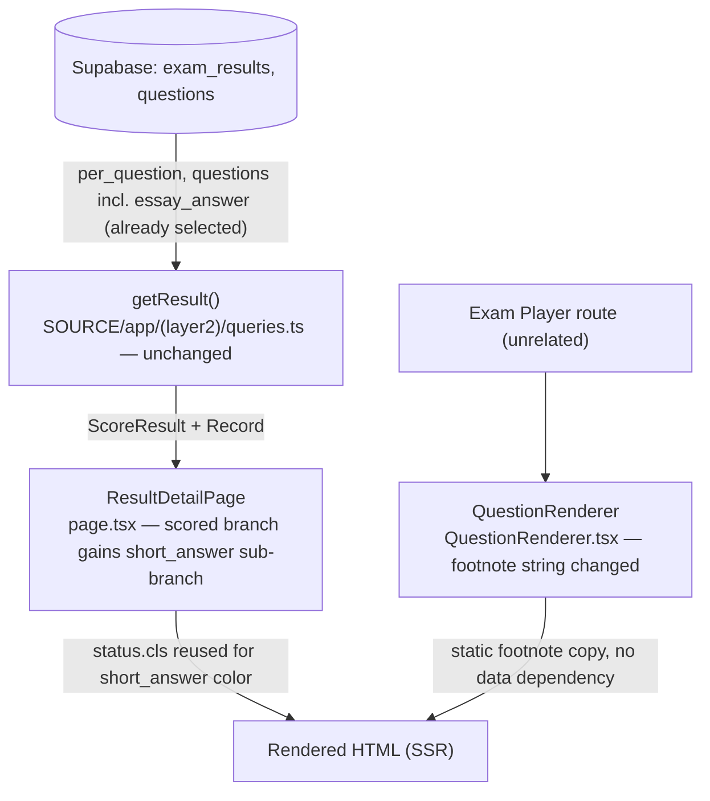
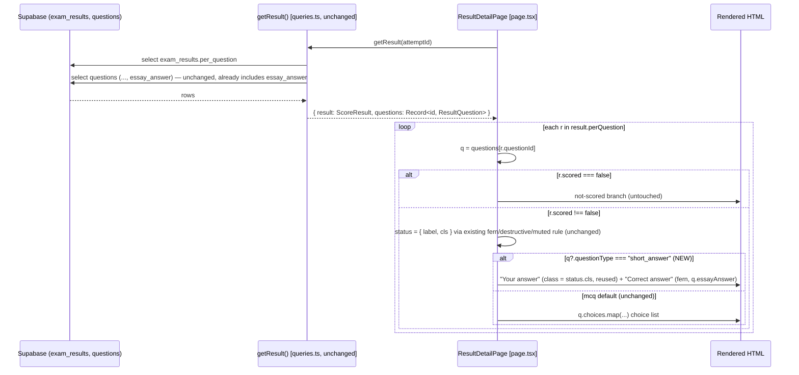
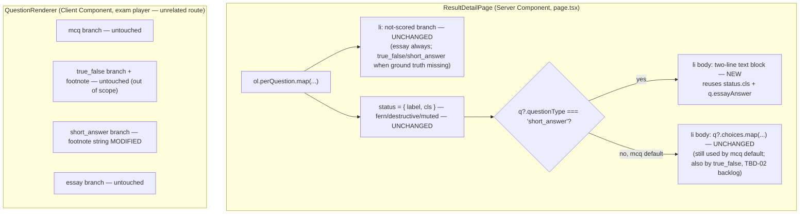

# Short-Answer Scoring — Frontend Design Document

| | |
|---|---|
| **Version** | 1.0 |
| **Date** | 2026-08-01 |
| **Status** | Draft — implements the display slice specified by `docs/ui-spec/short-answer-scoring-ui-spec.md` (v1.0, Draft) and consumes the data contracts confirmed by `docs/design/short-answer-scoring-backend-design.md` (v1.0, Draft, code-verifier result: `consistent`, score 85). |
| **PRD** | None — Medium-scale feature, PRD not required per this project's scale rules. Substitute source: `requirement_analysis` (resolved after user Q&A with the engineer), reproduced verbatim in the Agreement Checklist. |
| **UI Spec** | `docs/ui-spec/short-answer-scoring-ui-spec.md` (v1.0, Draft) — canonical source for component structure, state design, visual convention, and AC-001–AC-009. This Design Doc inherits those decisions and adds only the technical implementation method (exact code structure, contract-level rationale, regression guarding, and the TBD-04/TBD-05 resolutions the UI Spec deferred to this document). |
| **Codebase re-verification** | All facts inherited from the UI Spec were independently re-verified against the live files during this Design Doc's own investigation (`page.tsx`, `QuestionRenderer.tsx`, `queries.ts`, `types/result.ts`, `types/question.ts`, `SOURCE/app/(layer4)/actions.ts`) — see Existing Codebase Analysis. |

## Overview

`ResultDetailPage`'s scored render branch (`r.scored !== false`) unconditionally maps `q?.choices` (an MCQ shape). For `short_answer` questions, `q.choices` resolves to `[]` at persistence time (`SOURCE/app/(layer4)/actions.ts:533` — `choices: q.choices ?? q.subItems ?? []`), so today this branch blank-renders an empty `<ul>` for `short_answer` (no crash, no content) whenever `scored !== false`. The backend Design Doc's `short_answer` auto-scoring change will start producing `scored: true` rows for `short_answer` on newly-submitted attempts, which newly exposes this pre-existing display gap. This Design Doc adds a `questionType === 'short_answer'` sub-branch to that same scored path, reusing the exact fern/destructive/muted-foreground convention and the "Your answer"/"Stored answer" two-line text shape already shipped in the same file's not-scored branch (`page.tsx:103-114`), plus a one-line footnote copy fix in `QuestionRenderer.tsx`. `essay` and `true_false` are explicitly out of scope and must render byte-for-byte unchanged.

### Referenced UI Spec

- UI Spec path: `docs/ui-spec/short-answer-scoring-ui-spec.md`
- Component structure, state design (State × Display Matrix, Sub-states table), and the exact JSX shape/color rule are inherited verbatim from that document's "Component: ResultDetailPage" and "Component: QuestionRenderer" sections. This Design Doc does not re-derive them; it specifies how to implement them against the live code (variable reuse, guard placement, regression boundary) and resolves the two items the UI Spec deferred to the Design Doc layer (TBD-04: Rule-of-Three color-literal refactor decision; TBD-05: sequencing constraint, encoded here as an implementation-order rule).

## Design Summary (Meta)

```yaml
design_type: "extension"
risk_level: "low"
complexity_level: "low"
complexity_rationale: >
  Single conditional branch inserted into an already-established per-type dispatch
  (the not-scored branch already branches on questionType at page.tsx:84); zero new
  component, zero new prop, zero new client state, zero new data fetch. The only
  non-trivial decision is which existing local variable to reuse for the color rule
  (resolved below by reusing the already-computed `status.cls`, avoiding a second
  copy of the fern/destructive/muted branch) and the ship-order relative to the
  backend change (TBD-05).
main_constraints:
  - "In-scope: questionType === 'short_answer' only, confined to page.tsx's scored branch and QuestionRenderer.tsx's short_answer footnote string."
  - "essay must render byte-for-byte unchanged (AC-007); true_false rendering (both files) must not be modified (AC-009, TBD-02/TBD-03 explicitly deferred to backlog)."
  - "No new component, no new visual design, no new CSS token — reuse the fern `#4F7942` / `--destructive` / `--muted-foreground` convention and the two-line text block shape verbatim (engineer directive, UI Spec Prototype Management)."
  - "QuestionRenderer's footnote copy change must not ship ahead of the backend short_answer auto-scoring change (UI Spec TBD-05) — sequencing constraint, not a technical dependency."
biggest_risks:
  - "Both target files (page.tsx, QuestionRenderer.tsx) contain multiple type branches (mcq/true_false/short_answer/essay) in one function; an imprecise diff could touch the untouched true_false/essay branches (AC-007/AC-009 regression)."
  - "Shipping the footnote copy ahead of the backend auto-scoring change would tell students mid-exam that short-answer questions are auto-scored when they are not yet (TBD-05)."
  - "No automated test currently exists for either target file (confirmed by Glob, see Test Boundaries) — a regression could ship undetected until the recommended tests (this document) are added."
unknowns:
  - "TBD-01 (UI Spec, not resolved here — a product-copy decision, not a technical one): whether the correct-case duplicate text on both answer lines should later be suppressed. This design implements the UI Spec's stated default (always show both lines) as-is."
```

## Background and Context

### Prerequisite ADRs

- **ADR-0005** (`docs/adr/ADR-0005-multi-part-national-exam-format.md`, Proposed, amended 2026-08-01) — introduced the `short_answer` question type and the `essay_answer` column reuse for its ground truth, and (via its 2026-08-01 amendment, applied alongside the backend Design Doc) records that `short_answer` auto-scoring supersedes the original "not auto-scored" decision. This frontend Design Doc does not amend ADR-0005 further; it only reads the amendment as context for why the scored branch must change.
- No Common ADR applies — see "Common ADR Process" below.

### Common ADR Process

**Search performed**: `Glob docs/adr/ADR-COMMON-*` → no files found.

**Decision**: no common ADR is created. This change introduces no new common technical decision — it reuses an already-established per-type conditional-rendering pattern (the not-scored branch already branches on `questionType === "true_false"` at `page.tsx:84`) and an already-established three-way color convention (`page.tsx:118-125`). Checked against the ADR Creation Conditions matrix (documentation-criteria): no contract system change (no field added/removed on `PerQuestionResult`/`ResultQuestion`/`Question`), no data-flow/storage/processing-order change, no architecture/layer change, no external dependency, and no new state machine (the sub-states enumerated in State Transitions below are a display classification derived from already-existing fields at render time, not a stateful process — mirrors the backend Design Doc's identical conclusion for its own per-type dispatch extension). `adrRequired: false` confirmed for the frontend layer, consistent with the backend Design Doc's own determination.

### Prior-Layer Verification Review

The backend Design Doc's code-verifier result (`status: consistent`, `consistencyScore: 85`) was reviewed for frontend applicability, per this pipeline's Prior-Layer Verification input rule (treat `discrepancies[]` as issues to resolve or escalate; do not infer verified claims beyond what the output states):

| ID | Discrepancy (backend) | Frontend applicability | Disposition |
|----|------------------------|-------------------------|--------------|
| D001 | `true_false` auto-scoring ship-date comment inaccuracy (`f1e665093`, 2026-07-21 vs. actual 2026-07-27) | None — this Design Doc does not cite that commit date for any decision; it cites the commit hash only as an existing-precedent marker (see Fact Disposition). | Reviewed, not applicable — no frontend change required. |
| D002 | `computeScore.test.ts`'s `topicBreakdown` exact-array assertion will break once `short_answer` becomes scored | None — this is a backend unit-test file this Design Doc has no file scope over (`resolvedScope.inScope` is frontend-only: `page.tsx`, `QuestionRenderer.tsx`). | Reviewed, not applicable — backend-layer follow-up, out of this document's scope. |
| D003 | Backend Design Doc's sequence-diagram participant-list cosmetic gap | None — a diagram completeness issue in the backend document only. | Reviewed, not applicable. |

No discrepancy requires a change to this Design Doc's contracts, scope, or implementation order. The two data contracts this document depends on — `PerQuestionResult.correct` staying `undefined` for `short_answer`, and `essayAnswer` already reaching `getResult()` unmodified — are stated explicitly in the backend Design Doc's Data Contracts section and independently re-verified against the live code in this document's own Existing Codebase Analysis (not merely inferred from "consistent" status), per the instruction to use the prior-layer Design Doc as reference context rather than as proof of coverage.

### External Resources Used

Project-tier facts are recorded in `docs/project-context/external-resources.md` (present, last updated 2026-07-14; no environment change occurred for this feature, so hearing was not re-run). Inherited from the UI Spec and unchanged for this Design Doc:

| Resource (project-tier label) | Feature-specific identifier | Notes |
|-------------------------------|-----------------------------|-------|
| Design Origin | `DESIGN.md` — "no shadow/gradient, hairline-border + background-color layering only" rule | Governs the plain-text, no-new-decoration constraint on the new sub-branch; carried forward from UI Spec unchanged. |
| Design System | `page.tsx` (fern/destructive convention, lines 118–192); `QuestionRenderer.tsx` (footnote copy, lines 129–159); `SOURCE/components/shared/RichText.tsx` | Reused exactly, zero new component. |
| Visual Verification Environment | Route `/exams/[id]/attempt/[attemptId]/result/detail` (requires a submitted attempt with a `short_answer` question); Playwright MCP `playwright`; `npm run dev` | No automated test exists for either target file (confirmed by Glob during this document's investigation — see Test Boundaries); this is the only verification path until a test is added. |
| Database Schema Source (Design-Doc-specific addition) | `SOURCE/supabase/schema.sql:63` (`choices jsonb not null`) | Confirms `choices` is a non-nullable jsonb column — explains why `short_answer`'s persisted `choices` value is `[]` (not `null`/`undefined`), which is why today's bug is a blank `<ul>`, not a runtime crash (see Behavioral Claim Verification below). |

### Agreement Checklist

#### Scope
- [x] Add a `questionType === 'short_answer'` sub-branch inside `ResultDetailPage`'s existing scored (`r.scored !== false`) render path, before the existing `q?.choices.map(...)` MCQ render (`page.tsx:127-194`).
- [x] The new sub-branch displays: the student's submitted text (`r.selected`), the correct text answer (`q.essayAnswer`), and a correct/incorrect highlight reusing the exact existing fern/destructive/muted convention.
- [x] Update `QuestionRenderer.tsx`'s `short_answer` footnote string (line 150) from "Short answer — stored, not auto-scored yet." to "Short answer — auto-scored after you submit."

#### Non-Scope (Explicitly not changing)
- [ ] `questionType === 'essay'` — the not-scored branch's own JSX (`page.tsx:56-117`) stays byte-for-byte unchanged; essay always flows through it (AC-007).
- [ ] `questionType === 'true_false'` in either file — its scored-branch blank-render bug (TBD-02) and its stale "not auto-scored yet" footnote (TBD-03) are pre-existing, out-of-scope backlog items discovered during the UI Spec's investigation; not touched here (AC-009).
- [ ] The status chip (`page.tsx:121-125`) — already type-agnostic (reads only `r.isCorrect`/`r.selected`); zero code change (AC-006).
- [ ] `RichText`, `AnswerChoice`, `FlagButton` — reused as-is, zero change.
- [ ] Any backend file (`computeScore.ts`, `actions.ts` in `(layer2)`) — owned by the companion backend Design Doc; this document only consumes its confirmed contracts.
- [ ] Any DB schema, query select string, or new API/server action — `getResult()`/`queries.ts` already selects and maps `essay_answer` unconditionally for every question type (`queries.ts:346,371`); no query change needed for this feature.
- [ ] Backfill of already-persisted `exam_results` rows — none (per `resolvedScope.backfill`); this page must render both an old `scored:false` short_answer row (via the unchanged not-scored branch) and a new `scored:true` one (via the new sub-branch) correctly, since both exist simultaneously in production data.

#### Constraints
- [ ] Parallel operation: **No** — single local Supabase project, pre-launch (per `external-resources.md`).
- [ ] Backward compatibility: **Required** — `mcq` and `true_false` scored-branch rendering, and the entire not-scored branch (all types), must stay byte-identical (AC-007, AC-009).
- [ ] Performance measurement: **Not required** — pure SSR text rendering, no new client-side fetch, no new bundle weight beyond one literal string change; excluded per the AC scoping guideline.
- [ ] Browser compatibility: latest 2 versions of Chrome/Firefox/Safari/Edge (project-wide, unchanged) — no browser-specific API used.
- [ ] Accessibility: status must remain conveyed by text label, never color-only (already-shipped WCAG 1.4.1-compliant pattern, reused verbatim — see UI Spec Accessibility Requirements).

**Confirm reflection in design**:
- [x] Scope → reflected in "Design" section's Change Impact Map and Main Components (only `page.tsx`'s scored branch and `QuestionRenderer.tsx`'s footnote string are touched).
- [x] Non-scope → reflected in the Interface Change Impact Analysis (no props/interface change to any component) and the explicit "untouched" callouts in Code Inspection Evidence.
- [x] Constraints → reflected in Verification Strategy (Output Comparison covers mcq/true_false/essay regression) and Accessibility carried forward unchanged from the UI Spec.
- [x] No agreement is unreflected in the design; none required an exception.

#### Assumed Behaviors

- [x] **`getResult()`/`queries.ts` already selects and unconditionally maps `essay_answer` → `ResultQuestion.essayAnswer` for every question type**, so no backend/query change is needed for this frontend slice to receive the correct-answer text. Evidence: `SOURCE/app/(layer2)/queries.ts:346` (select string includes `essay_answer`), `:371` (`essayAnswer: q.essay_answer ?? undefined`). Confirmed: Yes.
- [x] **For `short_answer` questions, `ResultQuestion.choices` resolves to `[]` (not `undefined`/`null`)**, so today's scored branch renders an empty `<ul>` rather than throwing — the bug is a blank render, not a crash. Evidence: `SOURCE/app/(layer4)/actions.ts:533` (`choices: q.choices ?? q.subItems ?? []`, insert-time assembly for non-mcq questions) and `SOURCE/app/(layer2)/queries.ts:364` (`choices: questionType === "true_false" ? [] : q.choices` — for `short_answer` this passes through the `[]` persisted value); `schema.sql:63` (`choices jsonb not null`, confirming no null path exists). Confirmed: Yes.
- [x] **`PerQuestionResult.correct` stays `undefined` for `short_answer`** (never populated by `computeScore()`), matching its `ChoiceId`/"CHỈ câu mcq" (mcq-only) type contract and the `true_false` precedent. Evidence: `SOURCE/types/result.ts:11-12`; independently confirmed against the backend Design Doc's Data Contracts "Invariants" (`computeScore()`'s short_answer branch reads `q.essayAnswer` exclusively and never sets `PerQuestionResult.correct`). Confirmed: Yes.
- [x] **The status chip (`page.tsx:121-125`) reads only `r.isCorrect`/`r.selected`, with no `questionType` branch**, so it requires zero code change to correctly label `short_answer` rows once they carry `isCorrect`. Evidence: `page.tsx:118-126`, read directly. Confirmed: Yes.
- [x] **No automated test currently exists for `page.tsx` (result/detail) or `QuestionRenderer.tsx`.** Evidence: `Glob "**/result/detail/**/*.test.*"` and `Glob "**/QuestionRenderer*.test.*"` both returned no matches during this Design Doc's investigation. Confirmed: Yes — recorded as a Quality Assurance Mechanisms gap (`noted`, not `adopted`) rather than silently assumed covered; see Test Boundaries for the recommended follow-up.
- [x] **`r.selected` for `short_answer` is stored and delivered as plain, unencoded free text** (not a custom-encoded scheme like `true_false`'s `tfCodec` string), so no new decode step is needed to display it. Evidence: `SOURCE/types/result.ts:8-9` (doc comment: "short_answer/essay: text tự do"); backend Design Doc's Field Propagation Map (`essayAnswer`/selected values explicitly noted as "not a custom-encoded serialized boundary"). Confirmed: Yes.

#### Applicable Standards

- [x] TypeScript strict mode `[explicit]` - Source: `SOURCE/tsconfig.json` (`"strict": true`).
- [x] ESLint (`eslint-config-next` core-web-vitals + typescript) `[explicit]` - Source: `SOURCE/eslint.config.mjs`.
- [x] Conventional Commits with layer scope `[explicit]` - Source: `PROJECT_OVERVIEW.md` §7.
- [x] Next.js App Router Server/Client Component boundary discipline `[implicit]` - Evidence: `page.tsx` has no `"use client"` directive (Server Component, reads `getResult()` directly); `QuestionRenderer.tsx:11` has `"use client"`. Confirmed: Yes — this feature does not cross that boundary in either direction (no new client state, no new server call).
- [x] Vietnamese inline comments matching each file's existing convention `[implicit]` - Evidence: `page.tsx:1-7`, `QuestionRenderer.tsx:1-9` header comments, both Vietnamese. Confirmed: Yes.
- [x] Correctness-marking convention — fern `#4F7942` for correct / `--destructive` for wrong / `--muted-foreground` for skipped, status always conveyed by a text label alongside color, never color-only `[implicit]` - Evidence: `page.tsx:118-126` (status chip), `:152-161` (MCQ highlight), `:179-188` (correct/your-choice tags). Confirmed: Yes.
- [x] "No shadow/gradient, hairline-border + background-color layering only" `[explicit]` - Source: `DESIGN.md` (repo root), per External Resources Used.
- [x] Vitest unit tests for business logic (project's "Pha 1" testing phase) `[explicit]` - Source: `PROJECT_OVERVIEW.md` §6. Note: this standard targets *business logic*; `page.tsx`/`QuestionRenderer.tsx` are presentation, and neither currently has a test file (see Quality Assurance Mechanisms below).

#### Quality Assurance Mechanisms

- [x] ESLint — Enforces: lint rules — Config: `SOURCE/eslint.config.mjs` — Covers: project-wide — Status: `adopted`.
- [x] TypeScript type-checking via `next build` — Enforces: static typing (strict) — Config: `SOURCE/tsconfig.json`; no separate `tsc --noEmit` script exists in `package.json`, `next build` performs the type-check — Covers: project-wide — Status: `adopted`.
- [x] `next build` — Enforces: production build succeeds — Config: `SOURCE/package.json` `"build": "next build"` — Covers: project-wide — Status: `adopted`.
- [ ] `vitest run` — Status: `noted` (reason: no test file exists today for either target file, and this change's file scope is exactly those two files; recommended new tests are listed in Test Boundaries as a Work Plan follow-up, not created by this Design Doc).
- [x] Manual/Playwright MCP smoke verification against `npm run dev` — Enforces: visual/behavioral correctness of the 5 golden states (UI Spec) — Config: `.mcp.json` (`playwright` MCP server) — Covers: `/exams/[id]/attempt/[attemptId]/result/detail`, exam player short-answer input — Status: `adopted` (primary correctness-proof mechanism for this change until an automated test exists — see Verification Strategy).

### Problem to Solve

Once the backend ships `short_answer` auto-scoring (companion backend Design Doc), `ResultDetailPage` will start receiving `PerQuestionResult` rows with `questionType === 'short_answer'` and `scored: true` for newly-submitted attempts. The page's scored branch has no dispatch for this combination today — it falls through to the generic `q?.choices.map(...)` render, which is `[]` for `short_answer`, producing an empty `<ul>` with no submitted text, no correct answer, and no correctness signal beyond the (already-correct) status chip.

### Current Challenges

- `page.tsx`'s scored branch was written assuming a single shape (MCQ); it has no `questionType` check at all, unlike the not-scored branch immediately above it, which already special-cases `true_false` (`page.tsx:84`).
- `QuestionRenderer.tsx`'s `short_answer` footnote asserts "not auto-scored yet," which becomes false once the backend change ships — a stale, player-facing claim if left unfixed.
- Neither target file has an existing automated test (confirmed by Glob), so there is no regression harness to run against before/after this change; verification for this change relies on the manual/Playwright path until new tests are added (Test Boundaries).

### Requirements

#### Functional Requirements

- When a per-question result has `questionType === 'short_answer'` and `scored !== false`, render the student's submitted text and the correct text answer instead of an empty choice list (AC-001, AC-002).
- Apply the existing fern/destructive/muted three-way color convention to the submitted-answer line, matching the status chip's own rule exactly (AC-003–AC-005).
- Leave the status chip, `essay`'s not-scored rendering, and `true_false`'s rendering (both files) unmodified (AC-006, AC-007, AC-009).
- Update the `QuestionRenderer` `short_answer` footnote copy without altering the sibling `essay`/`true_false` footnotes (AC-008).

#### Non-Functional Requirements

- **Performance**: no new client-side fetch or bundle weight; SSR render time unaffected (project-wide "within 5 seconds for major pages" target, unchanged).
- **Accessibility**: status conveyed by text label in addition to color at every sub-state (WCAG 1.4.1), inherited unchanged from the already-shipped MCQ pattern.
- **Maintainability**: the new branch reuses the already-computed `status` object rather than duplicating the three-way color decision a second time in the same file (resolves TBD-04 — see Main Components).

## Acceptance Criteria (AC) — EARS Format

Inherited verbatim from `docs/ui-spec/short-answer-scoring-ui-spec.md` (single canonical numbering; no separate Design-Doc AC namespace is introduced, since this document implements that one UI Spec 1:1). The **Verification Threshold** column is this Design Doc's addition, stating the observable condition that proves pass/fail.

| AC ID | EARS Condition | Expected Behavior | Verification Threshold |
|-------|-----------------|---------------------|--------------------------|
| AC-001 | `questionType === 'short_answer'` AND `r.scored !== false` | Display `r.selected` instead of an empty list | Rendered `<li>` contains a non-empty "Your answer:" line with `r.selected` text (or the literal "— skipped —" when falsy); fails if the `<ul>` choice list renders instead. |
| AC-002 | Same condition | Display `q.essayAnswer`, never `r.correct` | Rendered "Correct answer:" line shows `q.essayAnswer` text (or "—" if absent); fails if the line is blank while `q.essayAnswer` is present, or if any code path reads `r.correct` for this branch. |
| AC-003 | `r.isCorrect === true` | "Your answer" line in fern `#4F7942` | Rendered span has class `text-[#4F7942]`; fails on any other color class. |
| AC-004 | `r.isCorrect === false` AND `r.selected` truthy | "Your answer" line in `--destructive`; "Correct answer" line stays fern | Rendered span has class `text-destructive` for "Your answer", `text-[#4F7942]` for "Correct answer". |
| AC-005 | `r.isCorrect === false` AND `r.selected` falsy | "Your answer" renders "— skipped —" in `--muted-foreground`; "Correct answer" stays fern | Rendered text is exactly "— skipped —" with class `text-muted-foreground`. |
| AC-006 | Any scored sub-state | Status chip requires zero code change | Diff shows no change to `page.tsx:118-126`. |
| AC-007 | `questionType === 'essay'` | Renders via unchanged not-scored branch | Diff shows no change to `page.tsx:56-117`; rendered output byte-identical to pre-change for an essay fixture. |
| AC-008 | `QuestionRenderer` renders a `short_answer` answer area | Footnote reads the new copy | Rendered footnote text equals "Short answer — auto-scored after you submit."; fails if it still contains "not auto-scored yet". |
| AC-009 (guard) | `QuestionRenderer` renders `true_false` or `essay` | Footnote copy unchanged | Diff shows no change to `QuestionRenderer.tsx:129-131` (true_false) or `:156-160` (essay); any diff there is out of scope and must be reverted. |

## Existing Codebase Analysis

### Implementation Path Mapping

| Type | Path | Description |
|------|------|-------------|
| Existing (modified) | `SOURCE/app/(layer2)/exams/[id]/attempt/[attemptId]/result/detail/page.tsx` | Scored branch (lines 127–194) gains a `questionType === 'short_answer'` sub-branch before the existing `q?.choices.map(...)` render. Not-scored branch (56–117) and status-chip logic (118–126) untouched. |
| Existing (modified, one string literal) | `SOURCE/app/(layer2)/_components/QuestionRenderer.tsx` | Line 150's `short_answer` footnote string changes; surrounding JSX, `<input>`, `maxLength`, `onChange` unchanged. Lines 129-131 (`true_false`) and 156-160 (`essay`) untouched. |
| Existing (reused, untouched) | `SOURCE/app/(layer2)/queries.ts` (`getResult`, `ResultQuestion`) | Already selects/maps `essay_answer` (346, 371); no change needed — confirms the frontend dependency this design relies on is pre-satisfied. |
| Existing (reused, untouched) | `SOURCE/types/result.ts` (`PerQuestionResult`) | `correct?: ChoiceId` (line 12, mcq-only) and `selected?: string` (line 8-10) read as-is; no type change. |
| Existing (reused, untouched) | `SOURCE/components/shared/RichText.tsx` | Question content rendering, unchanged. |
| New | — | None. This feature introduces zero new files, zero new components (see Similar Component Search and Minimal Surface Alternatives below). |

### Integration Points (Include even for new implementations)

- **Integration Target**: `ResultDetailPage`'s existing scored-branch per-question dispatch (currently a single unconditional MCQ render) — this change adds the second dispatch case (the not-scored branch above it already dispatches on 2 cases: `true_false` vs. default).
- **Invocation Method**: no new invocation path — same server-rendered `.map()` callback already iterating `result.perQuestion`, same in-process data already fetched by `getResult()`.

### Similar Component Search and Decision (Pattern 5 prevention)

**Search performed**: grepped `SOURCE/components/shared` and `SOURCE/app/(layer2)/_components` for any existing generic answer-status/color-decision component (`text-[#4F7942]`, `isCorrect ? `, `status.cls`-shaped helpers) — no matches found. Also confirmed (via the UI Spec's own Existing Component Reuse Map, re-verified directly) that the only precedent for a "your answer / correct answer" two-line block is the not-scored branch's own inline JSX (`page.tsx:103-114`), not a separate component.

**Decision**: **reuse, inline** — no new component is created. The not-scored branch's two-line text block shape is copied (not extracted into a shared function/component) into the new scored sub-branch, recolored and relabeled per the UI Spec's D1/D2. Rationale: this is the block's 2nd occurrence (not-scored branch = 1st, new short_answer sub-branch = 2nd); per Rule of Three (frontend-ai-guide), a 2nd occurrence warrants *considering* future consolidation, not yet extracting — extracting a shared component/prop-driven abstraction for two call sites would be premature (YAGNI) and would itself be a new cross-boundary abstraction requiring its own Minimal Surface Alternatives analysis, which the requirements at hand (a single reuse, no third consumer, engineer directive of "reuse exactly, no new design") do not justify. If a third caller of this shape appears, that is the trigger point to extract.

### Behavioral Claim Verification

All claims are listed in the Agreement Checklist's "Assumed Behaviors" subsection above, each with file:line evidence and a `Confirmed: Yes` status obtained via direct `Read`/`Bash grep` during this investigation (not inferred from the UI Spec's transcription alone). No claim in this design lacks locatable evidence; no corresponding "Confirmed: No" row exists, so no matching Risks and Mitigation entry is required for that reason (the risks listed later stem from process/sequencing, not unverified behavioral claims).

### Code Inspection Evidence

| File/Function | Relevance |
|---------------|-----------|
| `page.tsx:1-7` (header comment) | Documents the file's own versioning convention (`v2.1 (Task D3)` umbrella spanning multiple incremental changes) — this design follows the same convention rather than bumping to a new version label (see Implementation Approach). |
| `page.tsx:56-117` (not-scored branch) | Pattern reference — the exact two-line text block shape (103-114) and the existing `questionType === "true_false"` dispatch (84) this design's new branch mirrors. Untouched by this change (AC-007 regression guard). |
| `page.tsx:118-126` (`status` computation) | Integration point — the fern/destructive/muted three-way decision this design reuses verbatim for the new "Your answer" line's color, instead of duplicating the branch a second time (resolves TBD-04). |
| `page.tsx:127-194` (scored branch, `q?.choices.map`) | Integration point — new `questionType === 'short_answer'` sub-branch inserted here, before the existing MCQ map; the MCQ map itself becomes the `else`/default path, unchanged in content. |
| `QuestionRenderer.tsx:136-153` (`short_answer` branch) | Integration point — line 150's footnote string is the only change; `<input>`, `maxLength={100}`, `onChange`, `placeholder` unchanged. |
| `QuestionRenderer.tsx:129-131`, `156-160` (`true_false`/`essay` footnotes) | Regression guard — explicitly not touched (AC-009). |
| `queries.ts:285-292` (`ResultQuestion` type), `344-373` (`getResult` select + mapping) | Data contract reference — confirms `essayAnswer`/`questionType`/`choices` are already correctly populated for `short_answer` rows; no change needed. |
| `types/result.ts:6-17` (`PerQuestionResult`) | Data contract reference — confirms `correct` is mcq-only, `selected`/`isCorrect`/`scored` are the only fields this design reads for `short_answer`. |
| `SOURCE/app/(layer4)/actions.ts:533` | Evidence — confirms `short_answer` rows persist `choices: []` at authoring time, explaining why today's bug is a blank render, not a crash. |
| `schema.sql:63` | Constraint reference — `choices jsonb not null`, confirming no null path for the `choices` column. |
| `docs/adr/ADR-0005-multi-part-national-exam-format.md:34-76` | Governance reference — introduces `short_answer`, records the 2026-08-01 amendment superseding "not auto-scored." |
| `docs/design/short-answer-scoring-backend-design.md` (Data Contracts, Field Propagation Map, Change Impact Map) | Cross-layer contract reference — this document's dependency on `PerQuestionResult.correct` staying unset and `essayAnswer` already reaching the client. |
| `SOURCE/eslint.config.mjs`, `SOURCE/tsconfig.json`, `SOURCE/package.json` | Quality Assurance Mechanism verification. |

### Fact Disposition Table

No raw `Codebase Analysis`/`UI Analysis` JSON with an explicit `focusAreas` array was provided directly in this session; the UI Spec (which the task instructions state already carries forward those analyses) is the primary source, supplemented by this document's own direct re-verification (Existing Code Investigation gate). Rows below are tagged `ui:` when sourced from the UI Spec's Decisions Record/Reuse Map/Open Items, and `code:` when independently established or reinforced by this document's own `Read`/`Bash grep` investigation.

| Fact ID | Focus Area | Disposition | Rationale | Evidence |
|---------|------------|-------------|-----------|----------|
| `ui:scored-branch-mcq-only-gap` | `ResultDetailPage`'s scored branch routes only on `r.scored`, not `questionType`, and unconditionally maps `q.choices` | transform | New outcome: scored branch gains a `questionType === 'short_answer'` sub-branch before the mcq choices map; mcq's existing rendering path is preserved unchanged as the `else`. | UI Spec Overview; `page.tsx:127-194` |
| `ui:your-answer-stored-answer-pattern` | "Your answer"/"Stored answer" two-line text block already shipped in the not-scored branch | preserve | The not-scored branch's own JSX (`page.tsx:103-114`) stays byte-for-byte unchanged; its *shape* is reused (copied, not extracted) inside the new sub-branch — see Similar Component Search. | `page.tsx:103-114` |
| `ui:fern-destructive-convention` | Fern `#4F7942`/`--destructive`/`--muted-foreground` three-way color convention already used by the status chip and MCQ choice highlight | preserve | Reused verbatim (via the already-computed `status.cls`, see Main Components) for the new short_answer text lines; zero new color/token introduced. | `page.tsx:118-125`, `152-161` |
| `ui:questionrenderer-stale-footnote` | `QuestionRenderer`'s `short_answer` footnote claims "not auto-scored yet," stale once backend ships | transform | New outcome: literal string changed to "Short answer — auto-scored after you submit." | `QuestionRenderer.tsx:149-151` |
| `ui:essay-footnote-out-of-scope` | `essay` footnote ("answer on paper... not auto-scored yet") | out-of-scope | Excluded by `resolvedScope.outOfScope`; byte-for-byte preserved (AC-007/AC-009). | `QuestionRenderer.tsx:156-159` |
| `ui:true_false-footnote-out-of-scope` (TBD-03) | `true_false` footnote is also stale (already auto-scored since commit `f1e665093`) | out-of-scope | Explicitly bundled with TBD-02 as backlog; not touched by this feature's `short_answer`-only scope. | `QuestionRenderer.tsx:129-131`; UI Spec TBD-03 |
| `ui:true_false-empty-choice-list-bug` (TBD-02) | Pre-existing `true_false` blank-render bug in the same scored branch this feature edits | out-of-scope | `resolvedScope.inScope` = `short_answer` only; logged as backlog, must not be silently fixed (or further broken) while editing the same scored branch. | `queries.ts:364` (`choices: questionType === "true_false" ? [] : q.choices`); UI Spec TBD-02 |
| `code:short_answer-choices-empty-array` | For `short_answer`, `ResultQuestion.choices` resolves to `[]`, not `undefined` — today's bug is a blank `<ul>`, not a crash | preserve (informs the fix; not itself changed) | Confirms the "blank-render" framing (UI Spec Overview, AC-001) is accurate. Directly re-verified beyond the UI Spec's transcription. | `SOURCE/app/(layer4)/actions.ts:533`; `queries.ts:364,368`; `schema.sql:63` |
| `code:status-chip-type-agnostic` | Status chip (`page.tsx:121-125`) already reads only `r.isCorrect`/`r.selected`, no `questionType` branch | preserve | Zero code change required (AC-006); directly re-verified. | `page.tsx:121-125` |
| `code:essayanswer-already-selected` | `getResult()`/`queries.ts` already selects and maps `essay_answer` unconditionally for every question type | preserve | No backend/query change needed on the frontend data path (UI Spec D3); directly re-verified. | `queries.ts:346,371` |
| `code:perquestionresult-correct-mcq-only` | `PerQuestionResult.correct` is typed `ChoiceId`, documented "CHỈ câu mcq" | preserve | Confirms the invariant: never read `r.correct` for `short_answer`; source is `q.essayAnswer` instead. Cross-checked against the backend Design Doc's Data Contracts invariant (same claim, consistent). | `types/result.ts:11-12`; backend Design Doc Data Contracts |
| `code:no-existing-tests-for-target-files` | No automated test file exists for `page.tsx` (result/detail) or `QuestionRenderer.tsx` | preserve (gap, not remediated by this document; flagged for Work Plan) | Confirmed via `Glob` (`**/result/detail/**/*.test.*`, `**/QuestionRenderer*.test.*` → no matches). Recorded as a Quality Assurance Mechanisms gap (`noted`), not silently assumed covered. | Glob search, this session |
| `code:no-common-adr-covers-this-pattern` | No `docs/adr/ADR-COMMON-*` file exists | out-of-scope | Searched via `Glob`; none found. This feature reuses an already-established conditional-rendering pattern without introducing a new common technical decision; no common ADR created. | Glob `docs/adr/ADR-COMMON-*` → no matches |
| `ui:tbd05-sequencing-guard` | `QuestionRenderer` footnote copy change must not ship before backend `short_answer` auto-scoring ships | transform | Converted into an explicit ordering rule in this document's Technical Dependencies and Implementation Order section (not merely an open note). | UI Spec TBD-05 |
| `ui:tbd01-open-item-duplicate-text` | Whether the correct-case duplicate text (both lines identical) is acceptable | preserve (forwarded, not resolved) | This design implements D1's stated default (always show both lines); TBD-01 remains an open, non-blocking product-copy item — not a technical decision this document can or should close. | UI Spec Decision D1, Open Items TBD-01 |
| `ui:tbd04-color-literal-rule-of-three` | Literal `#4F7942` occurrence count crosses the Rule-of-Three threshold once the two new lines are added | transform | Resolved in this document's Main Components section by reusing the already-computed `status.cls` local variable for the "Your answer" line, avoiding a 6th/7th duplicated occurrence of the branching logic — no new helper function or CSS token introduced (see rationale below). | UI Spec TBD-04; `page.tsx:118-126` |

## Design

### Change Impact Map

```yaml
Change Target: ResultDetailPage scored branch (short_answer sub-branch) + QuestionRenderer footnote copy
Direct Impact:
  - SOURCE/app/(layer2)/exams/[id]/attempt/[attemptId]/result/detail/page.tsx (scored branch gains a questionType === 'short_answer' sub-branch, reusing the existing `status` local variable for color)
  - SOURCE/app/(layer2)/_components/QuestionRenderer.tsx (one string literal in the short_answer footnote)
Indirect Impact:
  - None. No other component reads from this render branch; no data shape, prop, or exported interface changes.
No Ripple Effect:
  - questionType === 'essay' path in both files (untouched, AC-007)
  - questionType === 'true_false' path in both files (untouched, AC-009; TBD-02/TBD-03 remain open backlog items, not fixed or worsened here)
  - Status chip logic (page.tsx:118-126) — reused, not modified
  - RichText, AnswerChoice, FlagButton components — unaffected
  - getResult()/queries.ts — already selects essay_answer; unaffected
  - Any backend file (computeScore.ts, actions.ts in (layer2)) — owned by the companion backend Design Doc
  - Result Summary page (S-00) — no change, no route change
```

### Interface Change Matrix

| Existing Operation | New Operation | Conversion Required | Compatibility Method |
|----------|-----|--------------------|--------------------|
| `ResultDetailPage`'s scored branch: unconditionally renders `q?.choices.map(...)` (MCQ shape) for every `scored !== false` question | `ResultDetailPage`'s scored branch: renders the two-line text block when `q?.questionType === 'short_answer'`, else falls through to the unchanged MCQ choice-list render | No (no exported signature exists to change — this is a Server Component page with no Props) | Additive `if`/`else` branch inserted before the existing map; the `else` path is the pre-existing code, untouched in content. |
| `QuestionRenderer`'s `short_answer` footnote: static string "Short answer — stored, not auto-scored yet." | Static string "Short answer — auto-scored after you submit." | No | Literal string replacement; `QuestionRendererProps` interface unchanged. |

### Architecture Overview

This change fits entirely within the existing Next.js App Router page/component tree for the exam-result review flow; no new layer, route, or module boundary is introduced. `ResultDetailPage` remains a fully server-rendered page (no `"use client"`); `QuestionRenderer` remains the existing client component used only by the exam player (a separate, unrelated route).



### Data Flow



### Component Hierarchy & Responsibilities



### Server/Client Boundary Rationale

- `ResultDetailPage` stays a Server Component: it reads `getResult()` directly and needs no browser API, event handler, or client state for this change — the new branch is pure conditional JSX evaluated at render time, matching the file's existing pattern (no `"use client"` before or after this change).
- `QuestionRenderer` stays a Client Component (unchanged `"use client"` directive, line 11): the change is a static string literal inside JSX already rendered client-side; no new client-only API is introduced.
- No new data crosses the server/client boundary: `essayAnswer` is consumed entirely within the Server Component (`ResultDetailPage`); it is never passed to a client component (consistent with `PublicQuestion`'s `Omit<Question, "correctAnswer" | "essayAnswer" | "subAnswers">` security boundary, `types/question.ts:63`, which this change does not touch or need to touch).

### Main Components

#### `ResultDetailPage`'s scored-branch per-question render (page.tsx)

- **Responsibility**: given one `PerQuestionResult` (`r`) and its matching `ResultQuestion` (`q`, possibly `undefined`), render the correct visual representation for its type and scored state. Unchanged responsibility; this change completes it for one previously-unhandled combination (`short_answer`, `scored !== false`).
- **Interface**: not an exported function — inline JSX inside the existing `.map()` callback. Effective "contract" (see Data Contracts below): reads `r.selected`, `r.isCorrect`, `r.scored`, `q?.questionType`, `q?.essayAnswer`, `q?.choices`.
- **Dependencies**: `RichText` (unchanged), the already-computed `status` local variable (reused, not duplicated).

**TBD-04 resolution (Rule-of-Three color-literal decision)**: the UI Spec's `<answerColorClass>` placeholder (fern when `r.isCorrect`, destructive when `!r.isCorrect && r.selected`, muted when `!r.isCorrect && !r.selected`) is **exactly** the `status.cls` value already computed at `page.tsx:121-125` for the status chip, using the same two inputs (`r.isCorrect`, `r.selected`). Rather than writing a second copy of this three-way branch (which would be the literal fern/destructive/muted string's 6th–7th occurrence in this file, past Rule of Three) or extracting a new shared helper/CSS token, this design specifies **reusing the existing `status` local variable's `.cls` field directly** for the "Your answer" span's `className`. This is the smallest possible surface: zero new function, zero new token, zero new duplicated literal — it satisfies TBD-04 without any of the three options the UI Spec flagged as open (new helper, new token, or accept more duplication). The "Correct answer" line has no branching (always fern, matching the not-scored branch's and the MCQ tag's existing unconditional-fern precedent at `page.tsx:112` and `:180`) and needs no shared logic.

Illustrative structure (not the literal final diff — clarifies the guard and reuse decision only):

```tsx
// Inside the existing scored branch, after `status` is computed (page.tsx:118-126),
// before the existing `<ul>` MCQ render (page.tsx:146-192):
const isShortAnswer = q?.questionType === "short_answer";

{isShortAnswer ? (
  <div className="flex flex-col gap-1 text-sm">
    <p className="text-muted-foreground">
      Your answer:{" "}
      <span className={status.cls}>{r.selected || "— skipped —"}</span>
    </p>
    <p className="text-muted-foreground">
      Correct answer:{" "}
      <span className="text-[#4F7942]">{q?.essayAnswer || "—"}</span>
    </p>
  </div>
) : (
  <ul className="flex flex-col gap-2">
    {q?.choices.map((choice) => { /* unchanged MCQ rendering */ })}
  </ul>
)}
```

The `isShortAnswer` guard is `q?.questionType === "short_answer"` (optional chaining) — when `q` is `undefined` (a pre-existing possible edge case shared with MCQ, e.g. a deleted question), the condition evaluates `false`, and rendering falls through to the existing `q?.choices.map(...)` path, which itself safely no-ops via optional chaining (same "safe when `q` is missing" behavior the MCQ path already relies on today — no new guard pattern introduced).

#### `QuestionRenderer`'s `short_answer` footnote (QuestionRenderer.tsx)

- **Responsibility**: unchanged — render the answer-area footnote for the current `question.questionType`. This change updates only the `short_answer` branch's literal string.
- **Interface**: `QuestionRendererProps` (unchanged — `index`, `question: PublicQuestion`, `selectedAnswer?`, `onSelectAnswer`, `flagged`, `onToggleFlag`).
- **Dependencies**: none new.

### Data Representation Decision (When Introducing New Structures)

**N/A** — this feature introduces no new or modified data structure. It reads `PerQuestionResult`, `ResultQuestion`, and `Question`/`PublicQuestion` exactly as already defined; no field, type, or schema is added or changed.

### Minimal Surface Alternatives

Walking the in-scope categories explicitly, per the gate's own required determination:

- **Persistent client/server state**: none introduced — no new localStorage/sessionStorage/cookie/server-saved field. `essay_answer` already exists; nothing new is persisted.
- **Props or fields crossing component boundaries**: none introduced — no new prop is added to any component, no new Context value, no new lifted state. `r.selected`/`q.essayAnswer`/`status.cls` are all already-existing local values consumed within the same render scope where they were already computed; nothing newly crosses a component boundary.
- **Behavioral modes/variants**: `short_answer` is a pre-existing `Question.questionType` enum value (defined since ADR-0005, already dispatched on elsewhere in this same file's not-scored branch at `page.tsx:84`). This design completes an already-established per-type conditional-rendering dispatch for a value the scored branch previously mishandled — it does not introduce a new mode, flag, or variant concept to the component. This is the same class of change the backend Design Doc's own Minimal Surface Alternatives section reached the identical N/A conclusion for (completing behavior for an already-existing enum value via an already-established dispatch pattern).
- **Reusable component splits**: none introduced — no new component, hook, or utility is extracted (see Similar Component Search: the two-line block is reused inline, at its 2nd occurrence, below the Rule-of-Three extraction threshold).

**Conclusion**: no element introduced by this design matches an in-scope category. The gate does not apply; no 5-step alternatives analysis is required. (For completeness: had a shared helper been extracted for the color decision per TBD-04, that helper would have been a same-file, non-exported, 2-consumer function — still below the "reusable abstraction intended for reuse by multiple parents" threshold, since it has no external caller. This design avoids even that by reusing the existing `status` variable directly, so the question does not arise in practice.)

### Data Contracts

#### `ResultDetailPage`'s per-question render decision (effective contract, not an exported function)

```yaml
Contract: per-question scored-branch render (page.tsx, inline within result.perQuestion.map)
Input:
  Type: r: PerQuestionResult (questionId, selected?, correct?, isCorrect, scored?); q: ResultQuestion | undefined (content, choices, questionType, subItems?, subAnswers?, essayAnswer?); status: { label: string; cls: string } (already computed, unchanged)
  Preconditions: r.scored !== false (this is the scored branch; r.scored === false is handled by the separate not-scored branch, unchanged); q is looked up from questions[r.questionId] and may be undefined (pre-existing possible edge case, e.g. deleted question)
  Validation: none performed here — pure read of already-typed, already-fetched data (no external input parsed at this point)
Output:
  Type: JSX (either the two-line short_answer text block or the existing MCQ choice list)
  Guarantees:
    - When q?.questionType === "short_answer", renders r.selected (or "— skipped —") and q.essayAnswer (or "—"), colored via status.cls (Your answer line) and unconditional fern (Correct answer line)
    - When q?.questionType !== "short_answer" (mcq default, or true_false pending TBD-02), renders the existing, unmodified q?.choices.map(...) list
    - Never reads r.correct for the short_answer path (invariant, matches backend contract)
  On Error: if q is undefined, the short_answer guard evaluates false and rendering falls through to the existing optional-chained q?.choices.map(...) path, which safely renders nothing (pre-existing "safe when q is missing" behavior, not a new guard)
Invariants:
  - The not-scored branch (r.scored === false) is a fully separate code path, unaffected by this contract
  - status (label + cls) is computed once per item and reused by both the header chip and (new) the short_answer "Your answer" line — never recomputed with different logic
```

#### `QuestionRendererProps` (unchanged — restated for completeness)

```yaml
Contract: QuestionRenderer(props: QuestionRendererProps): JSX
Input:
  Type: { index: number; question: PublicQuestion; selectedAnswer?: string; onSelectAnswer: (value: string) => void; flagged: boolean; onToggleFlag: () => void }
  Preconditions: unchanged
  Validation: unchanged
Output:
  Type: JSX
  Guarantees: unchanged, except the short_answer branch's footnote text (a static string, not derived from any prop) now reads "Short answer — auto-scored after you submit."
  On Error: unchanged (no new error path)
Invariants:
  - No prop is added, removed, or retyped by this change
  - true_false and essay footnote strings are unchanged (AC-009)
```

### Field Propagation Map / Serialized Boundary Contract

**N/A — no value newly crosses a serialized boundary in this design.** `r.selected` and `q.essayAnswer` already exist as plain, unencoded text at the point this design consumes them (confirmed in Assumed Behaviors: `types/result.ts:8-9`'s own doc comment states `short_answer`/`essay` selections are free text, unlike `true_false`'s `tfCodec`-encoded scheme). This design adds a *render* branch for already-flowing, already-decoded data — it introduces no new query-string, storage, form-post, or config-value encoding/decoding step. For contrast, the backend Design Doc's own Field Propagation Map explicitly confirms the same: `essay_answer`/`essayAnswer` crossing the DB→TS boundary is "not a custom-encoded serialized boundary (plain `text` column, no encode/decode scheme comparable to `tfCodec`'s `"a:Đ,b:S"`)."

### State Transitions and Invariants (When Applicable)

This is a stateless, per-render classification (determined server-side at render time from already-resolved data), not a stateful process — no state machine is introduced. The diagram below documents the *display sub-states* the UI Spec defines, for traceability with AC-001–AC-006:

```mermaid
stateDiagram-v2
    [*] --> NotScored: r.scored === false
    [*] --> Scored: r.scored !== false

    NotScored --> [*]: unchanged branch (essay always;\ntrue_false/short_answer when ground\ntruth missing — no backfill)

    state Scored {
        [*] --> Dispatch
        Dispatch --> ScoredCorrect: questionType == 'short_answer'\nAND r.isCorrect == true
        Dispatch --> ScoredWrong: questionType == 'short_answer'\nAND !r.isCorrect AND r.selected truthy
        Dispatch --> ScoredSkipped: questionType == 'short_answer'\nAND !r.isCorrect AND !r.selected
        Dispatch --> ScoredMcqDefault: questionType != 'short_answer'\n(mcq default; true_false pending TBD-02)
    }

    note right of Dispatch
      Before this feature: short_answer here
      fell through to ScoredMcqDefault and
      rendered an empty choice list (q.choices=[]).
      This feature adds the three short_answer
      states above, dispatched before the default.
    end note
```

**Invariants**:
- `ScoredCorrect`/`ScoredWrong`/`ScoredSkipped` are mutually exclusive and exhaustive for `short_answer` once `Dispatch` is entered (mirrors the status chip's own exhaustive 3-way rule, `page.tsx:121-125`).
- The transition into `Scored`/`NotScored` is never user-triggered on this page — it is fixed at server-render time by the already-persisted `r.scored` value (matches the UI Spec's Screen Transition table: "Not a user-triggered transition — determined server-side... at render time").

### UI Error State Design (when feature includes frontend)

| Component / Screen | Loading | Empty | Error | Partial |
|-------------------|---------|-------|-------|---------|
| `ResultDetailPage` (per-question `<li>`, `short_answer` sub-branch) | N/A — Server Component, fully resolved before render; no client-side fetch after mount. | N/A — a `<li>` always renders once `result.perQuestion` has an entry; if `q` is `undefined`, the sub-branch guard falls through safely (see Data Contracts "On Error"), never an empty/broken render. | N/A at the per-item level — if `getResult()` returns `null`, the whole page redirects before the list renders (pre-existing, unchanged). | N/A — no partial/degraded fetch state; all data for a row is present at render time. |
| `QuestionRenderer` (`short_answer` footnote) | N/A — static text, no fetch. | N/A — always rendered when `type === 'short_answer'` (unconditional, unchanged). | N/A — static string, no error condition. | N/A — single fixed line, never partially rendered. |

(Reproduced from the UI Spec's State × Display Matrix for completeness; unchanged by this Design Doc — the UI Spec is the canonical source for these determinations.)

### Client State Design (when feature includes frontend)

**N/A** — this feature introduces no new client state. `ResultDetailPage` is a Server Component with no client state at all; `QuestionRenderer`'s existing client state (`selectedAnswer`, managed by its parent `ExamPlayer`, unchanged) is untouched — the footnote string is a static render, not state-derived.

### UI Action - API Contract Mapping (when feature includes frontend)

**N/A** — no new UI action or API call is introduced. This is a pure SSR display-branch addition (`ResultDetailPage`) and a static string change (`QuestionRenderer`); no new server action, no new endpoint, no new request/response contract.

### Error Handling

| Error Category | Example | Detection | Recovery Strategy | User Impact |
|---------------|---------|-----------|-------------------|-------------|
| Business logic (pre-existing edge case, not new) | `q` (`questions[r.questionId]`) is `undefined` — e.g. a deleted question | `q?.questionType === "short_answer"` evaluates `false` via optional chaining | Falls through to the existing `q?.choices.map(...)` path, which itself optional-chains to a safe no-op — no crash, no new guard introduced | Question card renders with no body content for that row (pre-existing MCQ behavior, unaffected by this change) |
| Business logic (expected, not an error) | `r.selected` is falsy (student skipped the question) | `r.selected || "— skipped —"` | Renders the literal "— skipped —" fallback (existing pattern, reused) | Student sees "— skipped —" instead of blank text |
| Business logic (expected, not an error) | `q.essayAnswer` is falsy (should not occur post-backend-fix per the ground-truth-presence guard, but defensively handled) | `q?.essayAnswer || "—"` | Renders the literal "—" fallback (matches the not-scored branch's existing `storedAnswer || "—"` pattern, `page.tsx:112`) | Student sees "—" instead of blank text |
| Infrastructure | `getResult()` throws (Supabase error) | Propagated, unchanged (pre-existing `throw` convention in `queries.ts`) | Next.js error boundary (pre-existing, unchanged) | Generic error page; no new error path introduced by this change |

### Logging and Monitoring

- **Log events**: none new — this is a pure presentational change with no logging before or after.
- **Sensitive data**: none — `r.selected`/`q.essayAnswer` are already-persisted, non-PII exam-answer strings, already rendered by the pre-existing not-scored branch for the same fields; no new field is newly exposed to the client that wasn't already reachable via the not-scored branch's own display of the same `essayAnswer`.
- **Monitoring**: none new (pre-launch scale, no monitoring infra per `external-resources.md`).

### Interface Change Impact Analysis

No component's exported Props interface changes. `ResultDetailPage` is a Server Component page with no exported Props beyond the Next.js-managed `params`; `QuestionRendererProps` is unchanged. The tables below document the render-branch's internal field-consumption contract — the closest equivalent to a "Props change" for these two components — for traceability.

**`ResultDetailPage` scored-branch render — internal field consumption**

| Existing consumption | New consumption | Conversion Required | Wrapper Required | Compatibility Method |
|----------------------|-------------------|----------------------|--------------------|------------------------|
| `q?.choices` (mcq shape, unconditional) | `q?.choices` (mcq shape, now conditional on `q?.questionType !== 'short_answer'`) | No | Not Required | Existing consumption becomes the `else` branch; behavior for mcq/true_false unchanged. |
| — | `r.selected`, `q?.essayAnswer` (new consumption, both fields already existed on their respective types before this change) | No | Not Required | Additive read of already-typed, already-populated fields; no type widening needed. |
| `status.cls` (consumed only by the header chip) | `status.cls` (also consumed by the new "Your answer" span) | No | Not Required | Same variable, second read site within the same scope — not a new field, not a prop. |

**`QuestionRendererProps` — no change**

| Existing Props | New Props | Conversion Required | Wrapper Required | Compatibility Method |
|----------------|-----------|----------------------|--------------------|------------------------|
| `index`, `question`, `selectedAnswer?`, `onSelectAnswer`, `flagged`, `onToggleFlag` | *(unchanged)* | None | Not Required | — |

**Conflict check**: no naming or prop-pattern conflict with existing conventions — this change adds no new prop, no new component name, no new CSS class name; it reuses the file's own existing `status`, `text-[#4F7942]`, `text-destructive`, `text-muted-foreground` conventions verbatim.

### Integration Point Map

| # | Integration point | Location | Method | Impact | Contract (In / Out / On error) | Test coverage |
|---|-------------------|----------|--------|--------|--------------------------------|---------------|
| IP-1 | `short_answer` scored display | `ResultDetailPage` scored branch ↔ `PerQuestionResult`/`ResultQuestion` (from `getResult()`) | in-process data read (Server Component, no props/context crossing) | Medium (new render branch depends on `r.isCorrect`/`r.selected`/`q.essayAnswer` semantics newly populated as `scored:true` for `short_answer` by the backend change) | In: `r: PerQuestionResult`, `q: ResultQuestion \| undefined`; Out: two-line text block or fallback dashes; Err: `q` undefined → falls through to existing safe MCQ no-op | Recommended (Test Boundaries) — no existing test; manual/Playwright MCP smoke check is the current path |
| IP-2 | Status chip reuse | `ResultDetailPage` header chip (`page.tsx:121-126`) ↔ new "Your answer" span | shared local variable (`status.cls`) | Low (read-only reuse, zero code change to the chip itself) | In: `r.isCorrect`, `r.selected` (unchanged inputs); Out: `status.cls` reused verbatim; Err: N/A, pure computation | Covered implicitly by any test exercising the scored branch (none exists yet — see IP-1) |
| IP-3 | `essay_answer` data path | `ResultDetailPage` ↔ `getResult()`/`queries.ts` | in-process function call (unchanged) | Low (read-only, no change to `queries.ts`) | In: `attemptId`; Out: `Record<id, ResultQuestion>` incl. `essayAnswer`; Err: `getResult()` returns `null` → page redirects (pre-existing, unchanged) | No new test needed — unchanged code path |
| IP-4 | `QuestionRenderer` footnote copy | Exam player (`ExamPlayer.tsx:157`) → `QuestionRenderer` | prop-driven render (`question.questionType`, unchanged props) | Low (static string only, no data-flow change) | In: `question: PublicQuestion` (unchanged); Out: footnote text; Err: N/A, static string | Recommended (Test Boundaries) — `QuestionRenderer.test.tsx`, none exists yet |

**Conflict check**: no naming/prop-pattern conflict with existing components at any integration point — `status`, `r`, `q` are pre-existing local identifiers in the exact scope this design extends; no new identifier is introduced that could collide with an existing convention.

## Implementation Plan

### Implementation Approach

**Selected Approach**: Vertical Slice.

**Selection Reason** (Phase 1-4 analysis per implementation-approach skill):

- **Phase 1 (Current State)**: `page.tsx`'s not-scored branch already establishes a proven `questionType`-dispatch pattern (`true_false` special-cased vs. default, `page.tsx:84`) inside the same file; the scored branch simply never got the equivalent treatment. `QuestionRenderer.tsx`'s type branches are already fully independent per-type blocks (`mcq`/`true_false`/`short_answer`/`essay`), so editing one branch's footnote string carries no risk of touching a sibling branch if the diff is scoped to the exact line.
- **Phase 2 (Strategy Exploration)**: no Strangler/Facade/Adapter pattern applies (no legacy system, no integration complexity). The natural strategy is a **feature-driven vertical slice** that completes one full user-visible capability (correct review-page display for scored `short_answer` results) across the one relevant screen, in the same spirit as the backend Design Doc's own Vertical Slice selection for its analogous per-type-dispatch completion. Considered and rejected: extracting a shared color-decision helper as a small "foundation" step before the display slice (a horizontal-first sub-strategy) — rejected because reusing the already-computed `status.cls` variable directly (Main Components, TBD-04 resolution) makes a separate foundation step unnecessary; there is nothing to build first.
- **Phase 3 (Risk Assessment)**: Technical risks — accidentally touching the untouched `true_false`/`essay` branches while editing a multi-branch file (mitigated by scoping the diff strictly to the new `if`/`else` around the existing MCQ map, and to one string literal in `QuestionRenderer.tsx`); shipping the footnote copy ahead of the backend (mitigated by the explicit ordering rule below, TBD-05). Operational risks — none (pre-launch, no live users). Project risks — minimal (2-file change, small diff).
- **Phase 4 (Constraint Compatibility)**: TypeScript strict mode is satisfied without any new type (all fields read are already typed); the file's Vietnamese inline-comment convention is followed for any new comment near the branch; no deadline/rollback pressure (solo engineer, pre-launch, per `external-resources.md`).

**Verification Level**: L1 (functional, end-user-visible operation) is achievable and is the primary target for this slice — once both this change and the backend change are live, a submitted attempt containing a `short_answer` question visibly renders correctly on `/result/detail`. L2 (test operation verification) is currently blocked by the absence of an existing test harness for either target file (see Test Boundaries); L2 becomes available once the recommended tests (below) are added, which this Design Doc treats as a Work-Plan-scheduled follow-up, not a blocker for L1. L3 (build) is a baseline gate.

**Integration Point** (the task that first makes this slice operational, end-to-end with the backend): both this change and the backend's `computeScore.ts`/`actions.ts` change must be live simultaneously for a student to observe correct behavior — before the backend ships, this branch is unreachable (matches the UI Spec's own sequencing note); after the backend ships without this change, the pre-existing blank-render bug is merely exposed, not caused. Either ship order is safe for *this* file (it degrades gracefully to the pre-existing empty `<ul>` if the backend hasn't shipped yet), but `QuestionRenderer.tsx`'s footnote copy specifically must not ship before the backend (see below).

### Technical Dependencies and Implementation Order

#### Required Implementation Order (in dependency order)

1. **`page.tsx` — scored-branch `short_answer` sub-branch**.
   - Technical Reason: purely additive to the existing scored branch; has no dependency on the backend change actually being live (it renders correctly for the `scored:true` shape regardless of when that shape first appears in production) and no dependency on `QuestionRenderer.tsx`.
   - Prerequisites / Dependent Elements: none. Safe to ship independently of the backend Design Doc's timeline — before the backend ships, `short_answer` rows are still `scored:false` and continue to render via the unchanged not-scored branch; this change only adds a dormant-until-needed branch.

2. **`QuestionRenderer.tsx` — footnote copy fix**.
   - Technical Reason: this string makes a claim about scoring behavior ("auto-scored after you submit"). Per UI Spec TBD-05, it must not ship before the backend `short_answer` auto-scoring change is live, or the exam player would tell a student mid-exam that their answer will be auto-scored when it will not yet be.
   - Prerequisites / Dependent Elements: **must ship in the same change set as, or strictly after, the backend Design Doc's `computeScore.ts`/`actions.ts` change** — this is a sequencing (ship-order) constraint, not a code dependency (the string change compiles and functions independently either way).

Item 1 has no ordering constraint relative to the backend; item 2 does. If both frontend items ship together, the whole change set should be sequenced after (or atomically with) the backend change to satisfy item 2's constraint without needing to split this Design Doc's own two files into separate releases.

### Migration Strategy

None required. No schema change, no feature flag, no new data shape. Already-persisted `exam_results` rows are not backfilled (per the backend Design Doc's `resolvedScope.backfill: "none"`); this page correctly renders both an old `scored:false` `short_answer` row (via the unchanged not-scored branch) and a new `scored:true` one (via the new sub-branch) without any migration step, since the dispatch is keyed on the already-present `r.scored` field at render time.

## Security Considerations

- **Authentication & Authorization**: N/A change — `ResultDetailPage` remains gated by `getResult()`'s existing RLS-backed null-check-and-redirect (unchanged); no new entry point.
- **Input Validation**: N/A — no new external input is parsed by this change; `r.selected`/`q.essayAnswer` are already-persisted, already-typed values read as-is (rendered as plain text via existing `<p>`/`<span>` elements, not `dangerouslySetInnerHTML` — no new injection surface; `RichText`'s sanitization pipeline is unaffected since these two new lines do not use `RichText`, matching the not-scored branch's own precedent of rendering `essayAnswer`/`selected` as plain text, not markdown).
- **Sensitive Data Handling**: no new leak surface — `essayAnswer` is already rendered to the client by the unchanged not-scored branch for the same question types (`page.tsx:112`); this change only adds a second, differently-styled render site for a value already reaching this page's HTML output today. `PublicQuestion`'s `Omit<..., "essayAnswer">` boundary (client player, a different route) is untouched.

## Test Boundaries

### Mock Boundary Decisions

| Component/Dependency | Mock? | Rationale |
|---------------------|-------|-----------|
| `getResult()` (Supabase-backed) | Yes (mock), for any recommended `ResultDetailPage` test | Matches the project's sanctioned Supabase-client-mock boundary already used by `getResult.int.test.ts`/`rating.int.test.ts`; the subject under test is the render branch, not the query. |
| `QuestionRenderer` | No — real component, direct RTL render | It is the subject under test for the footnote-regression check; no I/O to mock (client component, pure props in). |

### Data Layer Testing Strategy

**N/A** — this feature reads no new table/column and issues no new query; `getResult()`/`queries.ts` are unchanged. Any recommended test for `page.tsx` would mock the same Supabase-client boundary `getResult.int.test.ts` already establishes, not exercise a new schema dependency.

### Integration Verification Points

- **`ResultDetailPage`'s new `short_answer` sub-branch (AC-001–AC-006)** currently has no dedicated automated test (confirmed by Glob). **Recommendation** (not a blocking requirement of this Design Doc; flagged for the Work Plan): given `page.tsx` is an async Server Component with a `redirect()` call, a full RTL render is not straightforward — the pragmatic path is either (a) a Playwright test against a seeded attempt (consistent with the project's Pha 1 manual/Playwright-MCP verification convention), or (b) if the color-decision or fallback logic grows any further, extracting a small pure helper purely for unit-testability at that point (not now — YAGNI, since the current logic is a direct reuse of `status.cls` with no new branching to unit-test in isolation).
- **`QuestionRenderer`'s footnote regression guard (AC-008, AC-009)** currently has no dedicated automated test. **Recommendation**: add `SOURCE/app/(layer2)/_components/QuestionRenderer.test.tsx` (jsdom + `@testing-library/react`, following the project's existing per-file `// @vitest-environment jsdom` docblock convention used by `RichText`'s test suite) asserting all three footnote strings in one pass — `short_answer` reads the new copy, `essay` and `true_false` remain byte-identical to their pre-change strings. This is a low-cost, high-value regression guard for exactly the boundary AC-009 exists to protect, and `QuestionRenderer` (a client component with fully prop-driven rendering) is straightforward to test in isolation, unlike `page.tsx`.
- **Manual/Playwright smoke check**: submit an exam containing a `short_answer` question via `npm run dev` once the backend change is also live, then inspect `/exams/[id]/attempt/[attemptId]/result/detail` to confirm the three golden states (correct/wrong/skipped) render with the correct text and color per the UI Spec's Visual Acceptance section. This gap is recorded, not silently skipped (Risks and Mitigation).

## Verification Strategy

### Correctness Proof Method

- **Correctness definition**: (1) for `short_answer` scored rows, the rendered "Your answer"/"Correct answer" lines and their colors match the UI Spec's Sub-states table (AC-001–AC-005) exactly; (2) `essay`'s not-scored rendering and `true_false`'s rendering (both files) remain byte-identical to pre-change output (AC-007, AC-009); (3) the status chip requires and receives zero code change (AC-006); (4) the `QuestionRenderer` footnote reads the new copy for `short_answer` only (AC-008).
- **Verification method**: primarily manual/Playwright MCP smoke verification against a locally seeded attempt (per the project's Pha 1 stage — no Playwright/RTL harness currently covers either target file), supplemented by the recommended `QuestionRenderer.test.tsx` (RTL/jsdom) for the footnote regression guard, which is straightforward to add given `QuestionRenderer`'s fully prop-driven, client-side nature.
- **Verification timing**: before this change is considered complete for its Work Plan — `next build` (type-check) and `eslint` must pass with zero errors; the manual/Playwright golden-state check (UI Spec Visual Acceptance, Golden States 1–5) must be performed once the backend change is also available in the local dev environment (this page's new branch is otherwise unreachable, per Implementation Approach).

### Early Verification Point

- **First verification target**: Golden State 3 ("Scored `short_answer` — skipped") — the smallest-surface state, since it exercises both the "— skipped —" text fallback and the muted color class simultaneously, and does not require a correct vs. incorrect submitted-text fixture to construct (an empty/undefined `selected` value is the simplest to seed).
- **Success criteria**: the rendered "Your answer" line shows exactly "— skipped —" in `text-muted-foreground`, and the "Correct answer" line shows the question's `essayAnswer` in fern — confirmed via Playwright MCP screenshot/DOM inspection against a locally seeded attempt (or, once added, the `QuestionRenderer.test.tsx`/any future `page.tsx` test asserting the same).
- **Failure response**: if the skipped state does not render correctly, do not proceed to verifying Golden States 1–2 (correct/wrong) — first confirm the `isShortAnswer` guard and the `status.cls` reuse are wired correctly, since a failure here likely indicates the guard condition or the fallback string is misplaced, which would also affect the other two states.

### Output Comparison (When Replacing or Modifying Existing Behavior)

- **Comparison input**: the same rendered page, for the same attempt fixture set, before and after this change — specifically an `essay` question (must be byte-identical) and an `mcq` question (must be byte-identical) alongside the new `short_answer` case.
- **Expected output fields**: rendered DOM text and class names for the per-question `<li>` — status chip label/class (unchanged), question content (unchanged, via `RichText`), and the body content (new for `short_answer`, unchanged for `mcq`/`essay`/`true_false`).
- **Diff method**: manual/Playwright DOM inspection (no snapshot-testing infra exists for this file); a future `page.tsx` test, if added, would use RTL's `getByText`/`toHaveClass` assertions consistent with the project's existing component-test style (`RichText`'s test suite).
- **Transformation pipeline coverage**: N/A — no data transformation pipeline exists in this change (pure render-time branching on already-resolved data); the backend Design Doc's own Output Comparison section covers the `computeScore()`/`submitExam()` transformation pipeline this page's data ultimately depends on.

## Future Extensibility

- **Deferred possibilities**:
  - **TBD-01 (UI Spec, not resolved here)**: suppressing or replacing the "Correct answer" line's duplicate text when the student's answer is already correct — a product-copy decision, not a technical one; if adopted later, it requires only a conditional wrap around the existing "Correct answer" `<p>`, no new data or component.
  - **A shared answer-status-color helper or `--success` CSS token** — explicitly *not* introduced by this design (TBD-04 resolved via direct `status.cls` reuse instead); if a third distinct call site for the identical fern/destructive/muted text-color decision appears in the future (beyond the status chip and this new line), that is the Rule-of-Three trigger point to extract one.
- **Intentional limitations**: no new component is created for the two-line text block, even though it is now used at 2 call sites (not-scored branch, new short_answer sub-branch) — each copy stays independently editable per its own label/color rules (D1/D2 in the UI Spec), avoiding a premature shared abstraction for a 2-consumer case.
- **Extension points (existing, with current consumers)**: `ResultDetailPage`'s scored-branch `questionType` dispatch is now an established extension point with one active consumer (`short_answer`, this design) alongside the implicit mcq default; a future fix for TBD-02 (`true_false`'s blank-render bug) would add a second dispatched consumer to the same `if`/`else` this design introduces.

## Alternative Solutions

| Alternative | Overview | Advantages | Disadvantages | Reason for Rejection |
|---|---|---|---|---|
| Extract a new shared `resultStatusColor(isCorrect, hasSelection)` helper function for the fern/destructive/muted decision | A small private, co-located function called by both the status chip and the new "Your answer" line | Makes the shared rule's existence explicit by name | Introduces a new function for a decision that is already available as a local variable (`status.cls`) in the exact scope that needs it — strictly more surface than necessary | Rejected — the smaller alternative (reuse `status.cls` directly) already satisfies TBD-04 with zero new surface (see Main Components). |
| Introduce a new `--success` CSS custom property/token | Replace the literal `text-[#4F7942]` with a semantic `--success` variable across the file | More "design-system-correct" naming | Is itself a Design System / token change requiring Design Origin approval; explicitly contradicts the UI Spec's "No new token is introduced" / "zero new visual elements" compliance premise | Rejected — out of scope per the engineer's explicit "no new visual design" directive and the UI Spec's Design Tokens section. |
| Extract a new shared `AnswerReview`/`ShortAnswerResult` component for the two-line text block | A new, reusable, prop-driven component replacing the not-scored branch's inline block and the new sub-branch | Would look "cleaner" and be reusable if a third consumer appears | Only 2 consumers exist today (below Rule-of-Three's extraction threshold); would be a new cross-file abstraction requiring its own Minimal Surface Alternatives analysis for no current second requirement it uniquely satisfies | Rejected per Rule of Three / YAGNI — see Similar Component Search and Decision. |
| **Selected**: inline `if`/`else` sub-branch inside the existing scored branch, reusing the already-computed `status.cls` local variable | No new function, component, or token; two-line block copied (not extracted) from the not-scored branch's shape, recolored/relabeled per D1/D2 | Smallest possible surface; zero new duplication of the color-decision logic; fully consistent with the "reuse exactly, no new design" engineer directive | Does not (yet) formalize the shared color rule as a named abstraction — acceptable, since Rule of Three has not yet been crossed for that specific rule (2 occurrences: chip + this line) | — (selected) |

## Risks and Mitigation

| Risk | Impact | Probability | Mitigation |
|------|--------|-------------|------------|
| Editing `page.tsx`'s multi-branch scored function accidentally touches the untouched `mcq`/`true_false` rendering | Medium (regression in already-shipped correctness display) | Low | The new branch is a pure `if`/`else` wrapper around the existing, unmodified `<ul>` map; AC-006/AC-007/AC-009 explicitly name the untouched regions; Verification Strategy's Output Comparison covers `essay`/`mcq` byte-identity. |
| `QuestionRenderer.tsx`'s footnote copy ships before the backend `short_answer` auto-scoring change | Medium (misleading claim to students mid-exam) | Medium (two independent files/PRs, easy to sequence incorrectly) | Technical Dependencies and Implementation Order explicitly names this as a ship-order constraint (item 2), not merely a note; Design Summary `biggest_risks` calls it out by name. |
| Neither target file has an automated test today | Medium (a regression could ship undetected until the recommended tests are added) | Medium | Test Boundaries names two concrete recommended tests (`QuestionRenderer.test.tsx` low-cost/high-value; a `page.tsx` Playwright/RTL follow-up) as explicit Work Plan gaps, not silently skipped; manual/Playwright MCP smoke check is the adopted interim mechanism (Quality Assurance Mechanisms). |
| A future maintainer re-introduces a duplicated fern/destructive/muted branch instead of reusing `status.cls`, re-raising TBD-04 | Low | Low | Main Components documents the reuse decision and its rationale explicitly, and Alternative Solutions records why a helper/token was rejected, so a future agent does not need to re-derive this. |
| `true_false`'s pre-existing blank-render bug (TBD-02) is mistaken for in-scope while this exact code region is being edited | Low (scope creep, not a correctness risk if avoided) | Low | Fact Disposition table explicitly marks TBD-02/TBD-03 `out-of-scope`; Non-Scope checklist names them; Change Impact Map's "No Ripple Effect" list names the `true_false` path explicitly. |

## References

- `docs/ui-spec/short-answer-scoring-ui-spec.md` — canonical UI Spec this document implements (v1.0, Draft).
- `docs/design/short-answer-scoring-backend-design.md` — companion backend Design Doc (v1.0, Draft, code-verifier: consistent, 85) whose Data Contracts this document depends on.
- `docs/adr/ADR-0005-multi-part-national-exam-format.md` — introduces `short_answer`, amended 2026-08-01 to supersede the "not auto-scored" decision.
- `SOURCE/app/(layer2)/exams/[id]/attempt/[attemptId]/result/detail/page.tsx`, `SOURCE/app/(layer2)/_components/QuestionRenderer.tsx`, `SOURCE/app/(layer2)/queries.ts`, `SOURCE/types/result.ts`, `SOURCE/types/question.ts`, `SOURCE/app/(layer4)/actions.ts`, `SOURCE/supabase/schema.sql` — directly read/grepped during this document's investigation (see Code Inspection Evidence).

## Update History

| Date | Version | Changes | Author |
|------|---------|---------|--------|
| 2026-08-01 | 1.0 | Initial version. Implements `docs/ui-spec/short-answer-scoring-ui-spec.md`'s `short_answer` display-correctness fix and `QuestionRenderer` footnote copy fix. Resolves UI Spec TBD-04 (reuse `status.cls`, no new helper/token) and TBD-05 (encoded as an explicit implementation-order/ship-sequencing rule). Reviewed the backend Design Doc's code-verifier discrepancies (D001-D003) and found none applicable to the frontend layer. | Design Doc (Claude) |
