# Design Doc: Subscription — Backend (payOS prepaid period, entitlement, quota)

| | |
|---|---|
| **Version** | 1.10 |
| **Date** | 2026-08-20 |
| **Status** | Draft — **no blocking unresolved items *this document owns*.** B-01 was decided by the project owner on 2026-08-18 (see "Recorded Decisions"); FE-B-01 and FE-B-02 were closed in v1.3. **Two dependencies outside this document's ownership do gate its final step**, and v1.3's unqualified "no blocking unresolved items remain" was wrong to omit them: **UI Spec TBD-02** (legal content — `/terms` and `/refund-policy` still render `LegalContentPending`, and C-15 keeps the confirm control `aria-disabled` until it clears) and the manual `GEMINI_PAID_TIER_ENABLED` flip (R14/AC-048). Both are recorded under "What real money buys". **Three** items are **escalated** rather than decided here: **E-01** (a PRD amendment for AC-034's storage half), **E-02** (a cross-layer mapper change for `design-sync`) and, new at v1.8, **E-03** (this document's own `quotaTracker` Non-scope-vs-analysis contradiction, withdrawn in favour of Non-scope, with a revision requested that **designs** the durable usage sink). None blocks the implementation this document designs; E-03 blocks one task outside it, work-plan Task 1.6, and BU-4 through it. **v1.6 is a documentation-hygiene pass** (plan Task 0.6): the stale "FE-B-01/FE-B-02 not yet acknowledged there" paragraph is corrected — the frontend Design Doc acknowledged both at its v1.4 — cross-document version pointers are refreshed, and this document's own v1.4 citation rule is applied to every remaining bare line number citing a concurrently-revised artifact. No design element moves and no contract changes. **v1.10 is the close-out pass** (plan Task 6.6). It adds § "Close-out sweep" — **57/57 ACs owned, 50 achieved, 7 deferred each with a named owner** (AC-040, AC-042, AC-043, AC-045, AC-048, AC-050, AC-055) — and § "BU-6 — state at close-out", which records **BU-6 as still open** with **Task 1.6 and BU-4** named as what it holds (chain: BU-6 → Task 1.6 → BU-4 → Task 6.8). It also repairs citations that rotted under real code movement — `telemetry.test.ts:261` → **`:311`** in nine places, `tutorActions.ts:51` → **`:55`**, `package.json:13`/`:12` → **`:16`/`:15`**, and `test-rls.ts` "Phần 8" → **`Phần 9`** — and corrects **OP-4**, the Consumer Parse Rule's "raw bytes" phrasing, which contradicted the Serialized Format cell on the same row. **The code was right in every one of these; only the prose was wrong.** No design element moves, no contract changes, and no acceptance criterion is added or removed. |
| **Scale** | LARGE. Two new tables, one new privileged SQL function, one existing CHECK constraint altered in place, the project's first unauthenticated write path, a new Redis counter family, and edits to two AI paths already running in production. |

## Overview

Replace the UI phase's fail-closed entitlement stub with a real backend: sell a 30-day prepaid Premium period through payOS, derive entitlement from one timestamp at read time, and put both AI cost paths (Socratic tutor, PDF extraction) behind per-plan period quotas plus a project-wide daily budget.

### Referenced Documents

- **PRD**: `docs/prd/subscription-prd.md` (**v1.6**, `:5`) — D1–D10, R1–R16, AC-001…AC-057, U1 (resolved: no sandbox), U2 (partially resolved, see below), U3 (content drafted), U4 (resolved: separate table). *Corrected in v1.3: this document cited v1.5. The AC-057 amendment B-01 constraint 6 asked for is **done** — AC-057 now sits at `:251` and is written as a two-branch criterion derived from `isPaidTierEnabled()`, not a flat `>= 50`.*
- **ADR-0013** — payOS as provider; prepaid-period model; one stored timestamp; the adapter boundary. Consumed as settled.
- **ADR-0014** — webhook trust boundary: the webhook is a *notification*, never an instruction; one settlement function, two triggers. Consumed as settled; this document implements it.
- **UI Spec**: `docs/ui-spec/subscription-ui-spec.md` (**designed against v1.2; that document is at v1.6 today** — version refreshed at v1.6 of this document, plan Task 0.6, having read **v1.2** through four of its revisions) — C-01 `EntitlementProvider`/`useEntitlement`, UI-D1 (server reads once per layout), UI-D2 (three-valued quota). *Corrected in v1.3 (X-8): this document cited **v1.1**, three of whose line numbers had moved.* Its v1.2 revision row moves **S-05 and S-06 from Defer to Implement** and **UI-D11 freezes both routes under `SOURCE/app/(billing)/`** — `/me/orders` and `/pricing/checkout?order={orderCode}` (§ Screen List, the S-05 and S-06 rows marked **Implement**; UI-D11's own route table), closing **TBD-04** (§ Open Items, *"CLOSED 2026-08-18 by UI-D11"*). The route *group* is the load-bearing half: `(billing)/layout.tsx:33` is the only `EntitlementProvider` mount in the repository. v1.2 also introduces **C-13's `CheckoutOrder`** (its `type CheckoutOrder = {…}` block), which the Phase Inversion clause makes **normative for this document** — see "S-06's read path" below. Its v1.1 revision row corrected C-05's precedence to **`hint-shown → blocked-quota → busy → error → idle`** (**C-05** § State × Display Matrix, *"Precedence when several could apply"*) and made blocked-quota a mount-time state with no `role="alert"`. **Effect on this document: none on the data contract, one on the read path.** The precedence is evaluated entirely inside `ExplainStepAffordance` from `useEntitlement().tutor` (`ExplainStepAffordance.tsx:52`); the backend's obligation is unchanged — supply `tutor` as `{state:"known", used, limit}` so `used >= limit` is decidable at mount, with no request in flight. That obligation is what makes D005's provider-mount extension (below) load-bearing rather than cosmetic: without a provider above that component, `tutor.state` is `unknown` at mount and the blocked-quota branch can never be reached.
- **Frontend Design Doc**: `docs/design/subscription-frontend-design.md` (**v1.6** — *v1.4 of this document corrected the pointer from v1.0 to v1.1 (I007); it is refreshed again at v1.6, plan Task 0.6, after that document reached v1.3 → v1.6 through plan Tasks 0.3, 0.4, 0.5 and 0.6. Bare line numbers into it are no longer written here — see the citation rule below*) — designs S-05 and S-06 against UI Spec v1.2, a pin that document keeps deliberately with its delta enumerated, and consumes this document's Server Actions and RLS read. It raised two blocking items **this document owns**, both closed here: **FE-B-01** (*"S-06 has no read path for four of `CheckoutOrder`'s eight fields"*) and **FE-B-02** (*"`recheckOrder()`'s ownership scoping is unstated"*). Its contradictions X-1, X-2, X-7 and X-8 sit in its § Contradictions Found table; X-1 and X-2 are the same two defects seen from the other side and are closed by the same edits, and **X-7** (`revalidatePath` vs. two routes) is resolved inside the frontend document by `router.refresh()` and needs nothing from this one — recorded so it is not re-opened as a backend obligation.
  **Acknowledgement status — reconciled; the v1.4/v1.5 text of this paragraph was stale and is replaced (v1.6, plan Task 0.6, ST-04).** It read that FE-B-01 and FE-B-02 were *"not yet acknowledged there"*, that the frontend document *"still carries them as open blocking items in its Status line and its 'Blocking Unresolved Items' section"*, and that its `getMyOrder()` was *"still specified with its own inline camelCase mapping rather than the shared `toCheckoutOrder()`"*. **All three claims are now false, and were already false when v1.5 was written.** `docs/design/subscription-frontend-design.md` **v1.4** (plan Task 0.4) acknowledged both closures in seventeen locations — its Status line, its "Blocking Unresolved Items" section, retitled *"none remain"*, FE-I5, Implementation Order step 5, and thirteen further hits — and specified `getMyOrder()` as an owner-scoped `select … .maybeSingle()` mapped through the one exported `toCheckoutOrder()`, which is I010's shape rather than an inline literal. That revision recorded this paragraph as *"the backend document's to correct"*; this is that correction. **What survives is not a design gap but a shipping-time verification gate**, and it is the frontend document's to hold: FE-B-02's byte-identical foreign-versus-nonexistent refusal must be proven by **SVC-2** (`tests/e2e/service/subscription.service.e2e.test.ts`, plan Task 6.2) on a real database with two real sessions before S-05 reaches real users. Nothing here is left for `design-sync` to reconcile.
- **Frozen contract already in the repository**: `SOURCE/lib/billing/types.ts`. The UI phase shipped first, so this shape is what the backend must **satisfy**, not a sketch it may revise. Changing it means changing the UI Spec first, with a reason.

## Design Summary (Meta)

| | |
|---|---|
| **What changes** | 2 new tables (`payment_orders` carrying **four transfer-detail columns** added in v1.3 for FE-B-01) + 1 privileged SQL function; 1 new route handler (2nd in the app, first unauthenticated **write**); 1 payOS adapter; **1 existing entitlement stub body filled** (`readEntitlement.ts:34`) plus **2 new provider mounts** in `(layer2)`/`(layer4)` layouts; **2** Redis counter families counting in **two different units** (v1.4, I004); 2 existing AI paths gated, both re-routed through one Gemini emit chokepoint; **1 existing CHECK constraint on `telemetry_log` altered in place** with 2 new error codes (v1.4, I005); **5** env vars registered in `checkEnv.ts`; 2 new `lib/billing/` modules (`pricing.ts`, `checkoutOrder.ts`). |
| **What does not change** | The `Entitlement` TypeScript shape, `useEntitlement()`, `EntitlementProvider`, `readEntitlement`'s signature, `paidTier.ts` (AC-049/AC-054 already shipped), the `(billing)` route group, and every screen the UI phase shipped. Neither `ExplainStepAffordance` nor `TutorQuotaNote` is edited — their behaviour changes only because the value behind `useEntitlement()` becomes real. `lib/tutor/callTutor.ts` keeps its current responsibility ("call the model and classify failure") — access control and quota do **not** move into it. |
| **Load-bearing constraint** | No scheduled job of any kind is introduced. Expiry is a read-time comparison (ADR-0013); quota reset is a new Redis key, not a mutation. `docs/project-context/external-resources.md` §"Background Job Infrastructure" stays *not applicable*. |
| **Riskiest single element** | The settlement path. It is money-bearing, reachable from the internet, and — because payOS has no sandbox (U1) — its outermost shell is the one thing in this feature that cannot be tested without a real transaction. |
| **complexity_level** | **high** |
| **complexity_rationale** | Two new tables and one privileged SQL function; the project's first unauthenticated **write** path; two AI paths already serving production users are re-gated; three counters in two stores (Postgres rows, two Redis families) must agree about one period boundary; and one requirement (R13) alters an existing constraint that two shipped modules transcribe by hand. The dominant driver is not line count but the number of *independent* places one fact has to stay true in: the 30-minute window lives in a column, a provider field and a query predicate; the six telemetry codes live in four files; the Gemini per-operation cost lives in a reservation, an emit site and a test table. |
| **risk_level** | **high** — money-bearing, internet-reachable, and irreversible in the direction that matters (an under-counted spend ceiling is discovered on an invoice) |
| **unknowns** | **U2 remains open and is the largest**: none of the four quota numbers has been measured against real token cost, so all four may be wrong in the same direction (recorded in Risks with the break-even figures that make a wrong number identifiable). **payOS's retry policy is undocumented** (Assumed Behaviors A-6, `Confirmed: No`). **The webhook's real delivery shape** is unverifiable before one real transaction (U1 resolved: no sandbox). Nothing else is unknown in a way that blocks design; every remaining item is a decision that has been taken and recorded. |

## Background and Context

### Prerequisite ADRs and what each one already settled

| ADR | Settled | This document must **not** re-open |
|---|---|---|
| ADR-0013 | payOS; prepaid period; entitlement = `f(expires_at, grace, now())`; no boolean; extend never overwrite; adapter boundary | Provider choice; whether a subscription lifecycle exists |
| ADR-0014 | Webhook is a notification; signature is a pre-filter; re-verify against `GET /v2/payment-requests/{id}`; state-based replay defence; 200-for-every-decision | Whether the payload may be trusted |
| ADR-0010 / ADR-0011 | The privileged-write pattern: `service_role`, `INVOKER`, revoke-by-name, identity derived in SQL | Whether a client may write value directly |
| ADR-0017 | The guarded number is unauthenticated **write** paths (today 0) | Whether adding one needs a recorded decision |

### External resources used

- **payOS** — `POST /v2/payment-requests`, `GET /v2/payment-requests/{id}`, signed webhook. Credentials: client id, API key, checksum key. **No sandbox** (U1, resolved 2026-08-18) → end-to-end verification of the webhook shell costs one real small-value transaction on the production domain, engineer-approved.
- **Upstash Redis** — already present for `rateLimit.ts`. Gains two new counter families (per-user period quota, project-wide daily budget).
- **Supabase** — two new tables, one new function. DDL applied by hand on two databases (TD-005).
- **Credential registration is part of this change, not a follow-up** (added v1.1). `docs/project-context/external-resources.md:64` (§Payment Gateway) states: credentials are Vercel env vars, server-only, never `NEXT_PUBLIC_*`, and *"Register them in `SOURCE/lib/env/checkEnv.ts` in the same change that first reads them."* `checkEnv.ts` is the repo-wide startup gate that closed TD-009 (`:1`) and already carries `SUPABASE_SERVICE_ROLE_KEY` (`:67-70`), `GEMINI_API_KEY` (`:77-80`) and `GEMINI_PAID_TIER_ENABLED` (`:142-154`). The three payOS credentials **and** `AI_BUDGET_FREE_SHARE` get branches there, plus `.env.example` entries stating the consequence of leaving each blank — the same duty UI Spec **UI-D8** — *"`GEMINI_PAID_TIER_ENABLED` is server-only, parsed fail-closed, and reaches the client as a boolean prop"* — already imposed on `GEMINI_PAID_TIER_ENABLED` (*cited as `:154` at v1.1 and as `:151-157` from v1.3; both had rotted by v1.6, so the citation is now by identifier and quoted heading, plan Task 0.6*). Omitting it recreates exactly the class of failure TD-009 was closed to prevent: a variable set in one environment, missed in another, discovered by a user on the money path.

### Citation rule adopted in v1.4 (I006/I007)

Three revisions have each introduced a fresh round of stale line numbers, because two of the three artifacts this document cites (`subscription-prd.md`, `subscription-frontend-design.md`) were themselves under revision while it was being written, and a line number is invalidated by any insertion above it. **Rule, applied from v1.4 onward: when a cited artifact is itself under revision, cite the identifier plus a quoted phrase, and treat the line number as a convenience that may rot.** So: "PRD **AC-020** (`:272` in v1.6), *'mọi lời gọi Gemini THỰC SỰ ĐƯỢC PHÁT'*" — the identifier and the quote survive an insertion; the number does not. Citations into `SOURCE/` keep bare line numbers, because code is not concurrently revised by another agent and the reviewer has spot-checked them.

Stale citations corrected in v1.4, all five verified against PRD **v1.6** (quoted text was correct in every case; only the numbers had moved): **R9** `:281` → **`:293`**; **R14** `:318` → **`:330`**; **AC-025** `:271` → **`:283`** (`:271` is now AC-019); **AC-049** `:320` → **`:333`**; **AC-054** `:321` → **`:334`**.

**The rule was applied corpus-wide at v1.6 (plan Task 0.6), and the evidence for it strengthened.** v1.4 re-pinned five PRD numbers *and* adopted the rule; the numbers it re-pinned into the UI Spec and the frontend Design Doc then rotted a third time across plan Tasks 0.3, 0.4 and 0.5, which is the pattern the rule predicts. So v1.6 does not re-pin: every citation in this document into `subscription-ui-spec.md` and `subscription-frontend-design.md` now carries an **identifier** (`UI-D11`, `C-13`, `TBD-04`, a section heading) plus a **quoted phrase**, and the bare numbers are gone rather than refreshed. Two consequences worth stating, because they are what the rule buys: a citation that names *"UI-D11's route table"* survives any insertion, and a citation that quotes its target can be **verified by search** rather than by opening a file at a line and judging whether the surrounding text looks right. `subscription-prd.md` numbers are left as v1.4 pinned them — that document has not been revised since — and citations into `SOURCE/` keep their numbers, which this rule has always exempted.

## Agreement Checklist

### Scope — what this document changes

- The entitlement read path: fill `readEntitlement()`'s body; mount `EntitlementProvider` in `(layer2)` and `(layer4)`.
- The order lifecycle: `payment_orders`, `createOrder()` (including step (0)'s AC-027 reuse), `recheckOrder()`, the payOS adapter, the webhook route.
- The settlement path: `subscriptions`, `record_payment_settlement()`, `settleOrder()`.
- Both AI cost gates: per-user period quota **and** the project-wide daily budget, with the two counted in different units (I004).
- `telemetry_log.error_code` extended in place, plus `telemetry.ts` and its test transcription (I005).
- Configuration: five env vars registered in `checkEnv.ts` and `.env.example`; four named constants declared (I012).

### Non-scope — what this document deliberately does not change

- **`SOURCE/lib/billing/types.ts` — frozen.** The `Entitlement`/`Quota`/`Plan` shapes, `FREE_FALLBACK`, and `useEntitlement()`/`EntitlementProvider`'s signatures. Changing any of them means changing the UI Spec first, with a reason (`types.ts:4-8` states this in the file).
- **S-05 and S-06 themselves.** Screens are frontend scope (`subscription-frontend-design.md` v1.1). This document ships the actions, the contracts and the RLS read they consume.
- **`lib/tutor/callTutor.ts`'s responsibility.** It calls the model and classifies failure. Access control, quota and budget do not move into it — PRD R7 (`:275`) says so explicitly (*"không đặt bên trong `lib/tutor/callTutor.ts`"*).
- **`paidTier.ts`.** AC-049/AC-054 are shipped. B-01 gives the file a second *consumer*, not an edit.
- **TD-013** (no rate limit for unauthenticated traffic). Blocked on a cost decision, not on this feature.
- **U2's measurement infrastructure.** `quotaTracker.ts`'s durable write target is named as remaining work, not built here.

### Constraints accepted

| Constraint | Where it is honoured |
|---|---|
| **No scheduled job of any kind** (ADR-0013) | Expiry is a read-time comparison; quota reset is a new Redis key, not a mutation |
| **Parallel operation with the shipped UI phase** | `readEntitlement()`'s signature is unchanged, so `(billing)/layout.tsx:27` keeps working through the change |
| **`schema.sql` is hand-applied to two databases** (TD-005) | Gate A / gate B sequence; the R13 alter ships as *both* an inline edit and a drop/add pair for exactly this reason |
| **No existing `rateLimit.test.ts` assertion may be edited** (B-01 constraint 1) | Tier-conditional derivation; two permitted additions, both non-assertion |
| **`limit >= 15`, `windowMs >= 60_000` for the DB-cost family** | `createOrder`/`recheckOrder` configured at 15+ over ≥ 1 minute |
| **The webhook must answer 200 for every decision reached** (ADR-0014) | Route shell; non-2xx reserved for genuine internal faults |
| **Performance**: no measurement requirement is imposed by this feature | The one added hot-path cost is a Redis round trip before each AI call, which the PRD (`:368`) accepts against a 7–23 s AI call. No target value, no measurement gate — deliberately, because a CI-measured latency target is the non-deterministic kind this project does not adopt |

### Applicable Standards

| Standard | Class | Evidence | How this design aligns |
|---|---|---|---|
| Credentials are registered in `checkEnv.ts` **in the same change that first reads them** | **explicit** | `docs/project-context/external-resources.md:64` (§Payment Gateway), verbatim: *"Register them in `SOURCE/lib/env/checkEnv.ts` in the same change that first reads them."* | Five branches added (three payOS, `AI_BUDGET_FREE_SHARE`, `AI_BUDGET_DAILY_LIMIT`) plus `.env.example` entries stating the consequence of each blank |
| **Drop-then-create** for privileged SQL functions, not `create or replace` | **implicit** — a pattern with no written rule | `schema.sql:887-888` (`record_exam_result`) and `:1303-1304` (`record_skill_mastery`); the one `create or replace` exception at `:990` is dependency-scoped and states its own reason at `:981-989`. **Confirmed: Yes** | `record_payment_settlement()` uses drop-then-create; it has no dependent objects, so the exception's precondition is absent |
| **Revoke EXECUTE by name**, never `revoke from public` alone | **explicit** | ADR-0011 Implementation Guidance, and the file states the mechanism at `schema.sql:783-790`: Supabase ships `alter default privileges … grant all on functions to anon, authenticated, service_role`, so *"revoke from public chỉ gỡ quyền ngầm của PUBLIC, không đụng tới các grant tường minh kia"* — discovered 2026-08-03 by probing a real database. `:790`: *"Áp dụng cho MỌI hàm thêm vào sau này."* | `revoke all … from public, anon, authenticated` then `grant execute … to service_role` |
| **Three-family `RATE_LIMITS` partition**, every key in exactly one family | **explicit** | `SOURCE/lib/security/rateLimit.test.ts:93-99` / `:107-110` / `:118-121`, with the exhaustiveness case at `:127-135` | `createOrder`/`recheckOrder` join `DB_COST_ACTIONS`; `explainStep` stays in `SUPPLIER_CAPPED_ACTIONS` |
| **Every foreign key declares `on delete`** | **explicit** | `SOURCE/lib/schema/__tests__/parseForeignKeys.test.ts` (TD-011), a text-side gate that parses `schema.sql` | `payment_orders.user_id … on delete set null`; `subscriptions.user_id … on delete cascade`. The four `text` transfer columns add no FK |
| **New schema blocks use unnumbered named headers** | **implicit** — one precedent, no written rule | `schema.sql:1268` (mastery block header text under the rule line at `:1267`); numbered sections stop at `-- 17.` — the header `-- 17. Phiên bản schema` at `:1824`. **Confirmed: Yes** | All four new blocks use unnumbered named headers. Nothing resolves section numbers programmatically |
| **Constraint changes are made in place**, never paralleled | **explicit** | `schema.sql:797-799` (§10c): *"Bắt buộc theo thứ tự này"* — revoke table-level, then re-grant the safe columns. PRD AC-045 (`:326`) names this precedent by name | The R13 alter replaces `telemetry_log_error_code_check` under its own name |
| **Structured error codes, never free text** in telemetry | **explicit** | `telemetry.ts:35` + the CHECK at `schema.sql:1381-1382`; the runtime filter at `telemetry.ts:78` nulls unknown codes rather than throwing | Two new codes added to the closed set; refusal reasons are codes, never messages |
| **Route-group query modules**: `import "server-only"`, camelCase mapping in the query layer | **implicit** — four shipped instances | `(HM)/queries.ts:4,32`; `(layer2)/queries.ts:4,12`; `(layer3)/queries.ts:6,8`; `(layer4)/queries.ts:4,31` | Honoured, with **one deliberate deviation**: the camelCase mapping for `CheckoutOrder` moves into a shared `toCheckoutOrder()` rather than being written inline in `(billing)/queries.ts`. Rationale in I010 — two producers exist, and the convention would give them two mappings |

**The two implicit standards this design relies on require user confirmation** before implementation begins: drop-then-create, and unnumbered named headers. Both have exactly one class of precedent and no written rule; both are recorded here with `Confirmed: Yes` evidence so the confirmation is a yes/no rather than an investigation.

### Assumed Behaviors

Six behavioural claims this design rests on. v1.3 asserted all six with no evidence row and no confirmation marker. Every `Confirmed: No` has a matching row in Risks and Mitigation keyed on the same claim text.

| # | Claim | Evidence | Confirmed |
|---|---|---|---|
| **A-1** | **A plpgsql function body runs inside a single implicit transaction, so both statements of `record_payment_settlement()` commit or neither does; and the first statement takes a row lock, so a concurrent settlement of the same `order_code` blocks and then matches zero rows.** *This claim is the entire justification for the recorded ADR-0014 deviation — if it were wrong the deviation would be unsafe, not merely non-literal.* | Three sources. (1) PostgreSQL, *PL/pgSQL — Transaction Management*: a function invoked by a query *"cannot start or commit transactions"* and executes within the transaction established by the calling query — https://www.postgresql.org/docs/current/plpgsql-transactions.html. (2) PostgreSQL, *Read Committed Isolation Level*: a second `UPDATE` that finds a row locked by a concurrent transaction waits, then *"will then re-evaluate the row using the updated row version"* and skips it if it no longer matches the search condition — https://www.postgresql.org/docs/current/transaction-iso.html#XACT-READ-COMMITTED. (3) **In-repo precedent, same pattern, same file**: `claim_attempt_answer_key()` at `schema.sql:756-757` states it verbatim — *"UPDATE có điều kiện = gate atomic: 2 lời gọi đồng thời thì chỉ 1 cái khóa được"* — and reads back at `:765` *"Đọc lại trong cùng transaction"*. That function is a shipped security control resting on exactly this property | **Yes** |
| **A-2** | Supabase grants EXECUTE on newly created `public` functions such that `revoke … from public` alone is insufficient; revoking **by name** is what undoes it | `schema.sql:783-790`, recorded as a real finding (*"phát hiện 2026-08-03 khi probe DB thật"*). **Precision the v1.3 wording lost**: the mechanism is not a `PUBLIC` grant but Supabase's `alter default privileges … grant all on functions to anon, authenticated, service_role`, i.e. *explicit* grants that `revoke from public` does not touch. Same conclusion, different mechanism — worth stating correctly because the wrong mechanism suggests the wrong remedy | **Yes** |
| **A-3** | Sibling route groups resolve to **one** group layout per request, so exactly one `readEntitlement()` call happens per request. *(Load-bearing after v1.3 withdrew the false `getCurrentUserProfile()` precedent — D104.)* | Next.js App Router route groups: a folder in parentheses is excluded from the URL path, so `(billing)`, `(layer2)`, `(layer4)` are siblings under `app/`, not nested, and a URL matches at most one — https://nextjs.org/docs/app/api-reference/file-conventions/route-groups. In-repo: `SOURCE/app/` contains seven parenthesised groups and five group layouts (`(HM)`, `(billing)`, `(layer2)`, `(layer3)`, `(layer4)`), all siblings; only `app/layout.tsx` is above them, and it holds no entitlement code | **Yes** |
| **A-4** | `GEMINI_PAID_TIER_ENABLED` is **absent in CI**, so `isPaidTierEnabled()` returns `false` there and B-01's tier-conditional limit breaks no existing assertion | `.github/workflows/ci.yml`: the test job runs `npm test` at `:55` with **no `env:` block**; the only `env:` block is the build job at `:76-80`, which sets four variables (`NEXT_PUBLIC_SUPABASE_URL`, `NEXT_PUBLIC_SUPABASE_ANON_KEY`, `SUPABASE_SERVICE_ROLE_KEY`, `GEMINI_API_KEY`) and not this one. `SOURCE/.env.example:87` carries it **blank** | **Yes** |
| **A-5** | `useEntitlement()` returns `FREE_FALLBACK` when no provider is mounted above the caller | `SOURCE/lib/billing/entitlement.tsx:43-44` — `export function useEntitlement(): Entitlement { return use(EntitlementContext) ?? FREE_FALLBACK; }`, with the context defaulted to `null` at `:21` and the intent stated at `:39` | **Yes** |
| **A-6** | **payOS's webhook retry policy is undocumented**, which is why the route answers 200 for every decision reached | ADR-0014 asserts it; the three SDK definitions consulted in References describe request/response shapes only and no retry contract; no payOS document naming a retry schedule was located. **This is an unproven negative** — absence of a found document is not proof of absence | **No** — see Risks, "payOS retry policy is undocumented" |

### Quality Assurance Mechanisms

| Mechanism | Covers | Status |
|---|---|---|
| `npm test` → `vitest run` (`package.json:10`), run in CI on every PR (`ci.yml:55`) | Every unit and text-side gate named in Test Boundaries | **adopted** |
| `parseForeignKeys.test.ts` (text-side, `readFileSync`, no DB) | TD-011: every FK declares `on delete` | **adopted** — binds the two new FKs |
| `schemaFingerprint.test.ts` (text-side) | TD-005: the three fingerprint values agree | **adopted** — one recomputation for the whole DDL block, including the R13 alter |
| `npm run verify:schema` (`package.json:16`, DB-side, per environment) | The DDL being right in git and absent from a database | **adopted** — gate B, dev then prod |
| `rateLimit.test.ts`'s three-family partition | That every `RATE_LIMITS` key is classified and its family invariants hold | **adopted** — and B-01 constraint 1 makes its four untouched assertions a signal |
| `telemetry.test.ts:311`'s two-layer guard — the assertion `expect([...TELEMETRY_ERROR_CODES]).toEqual(SCHEMA_ERROR_CODES)` (**match on that text, not on the number**; it stood at `:261` until three fixtures were appended above it) | That `TELEMETRY_ERROR_CODES` matches the CHECK constraint | **adopted**, unmodified, plus one added schema-parse case (AC-046) |
| `npx tsc --noEmit` (`ci.yml:52`) | Discriminated-union exhaustiveness on `SettleResult` and `Quota` | **adopted** |
| `npm run lint` (`ci.yml:49`) | Style and unused code | **adopted** |
| `npm run check:bundle` → `scripts/check-ai-key-bundle.mjs` (`ci.yml:86`) | Server-only secrets appearing in client bundle output | **adopted** — extended with payOS secret markers |
| Real-Postgres integration tests (precedent: `recordSkillMastery.int.test.ts`) | `greatest()`, `on conflict do update`, the `status='pending'` guard, RLS visibility | **adopted** — the second and third verification points |
| Mutation testing | Green-but-hollow assertions | **noted, not adopted** — no mutation-testing harness exists in the repository. The substitute is the explicit value-and-count assertions listed under Test Boundaries, written because Engine 1 Phase 3 shipped three hollow tests |
| Load / latency measurement | The added Redis round trip per AI call | **noted, not adopted** — non-deterministic in CI, and the PRD (`:368`) accepts the cost against a 7–23 s AI call without a target |

### The one PRD claim this document had to correct before designing against it

PRD v1.0–1.3 stated that `lib/ugc/quotaTracker.ts` "already records `usageMetadata` for every call, so real token measurement is possible." **It did not.** `recordUsage()` was defined and never called anywhere in the repository; the only code touching `usageMetadata` was four log statements, all on **failure** branches. U2 — a blocking pre-sale condition — therefore rested on a false premise about the codebase.

Fixed 2026-08-18 (PRD v1.5): input/output split (including `thoughtsTokenCount` on the output side, which is billed at output rate), a `tutor` role so both cost paths count in one place, and `recordUsage()` wired into all four call sites *before* any classification branch — because a failed call still spends tokens and still spends the daily request allowance.

**What remains, and why it lands here**: the write target is still a process temp file, which does not survive across Vercel serverless instances. Measuring on production needs a durable target — a schema change, therefore this document's business, not a patch's.

## Acceptance Criteria Ownership

**Stated per AC, not as ranges (I008, corrected v1.4).** v1.3 asserted ownership as three numeric ranges. Ranges were wrong at both edges: they claimed **AC-041, AC-042, AC-043, AC-044, AC-050 and AC-051** for the backend, all six of which are UI-only (message copy, on-screen counters, keyboard reachability, i18n routing, a header reminder, a screen's Must components); and they handed **AC-026** to the frontend as "display" when its text is a *persisted-record* assertion — *"tồn tại đúng **một** bản ghi đơn với `orderCode` duy nhất, số tiền `39000`, và trạng thái chờ"* (`docs/prd/subscription-prd.md:286`) — which only the backend can satisfy, and which is directly coupled to AC-027's reuse branch. Building this table is what surfaced I003, I004 and I005 mechanically: three requirement clusters had no design element at all. **Refined in v1.5 (plan Task 0.5 — CL-03/CL-04), without moving a single design element**: of the six ACs that paragraph returned to the frontend, **AC-041's error-path half comes back here** — UI-D3 puts it in the backend phase — while **AC-050 stays with the frontend and is recorded as deferred**; and five ACs that both documents claimed in full now carry the `FE (display) / BE (supply)` split this table already used for AC-028. Both changes are stated under the table.

Owner values: **BE** = this document. **FE** = `docs/design/subscription-frontend-design.md`. **Shipped** = already satisfied by code on the branch. **Ops** = a human procedure, not code. **Content** = U3 legal text. **`FE (display) / BE (supply)`** = a **split** AC (v1.5): both documents own a named half, both halves are stated in the row, and each is verified on its own side — it is not a shared claim to the whole criterion.

| AC | PRD | Owner | Design element that satisfies it | Verification |
|---|---|---|---|---|
| AC-001 | `:228` | BE | `readEntitlement()` derivation — no row ⇒ `free` | Unit: no `subscriptions` row ⇒ `plan === "free"` |
| AC-002 | `:229` | Shipped (FE) | `pricing/page.tsx` + i18n dictionaries | Existing i18n test |
| AC-003 | `:230` | BE | `record_payment_settlement(p_period_days default 30)` | Real-Postgres: `expires_at − now() = 30d` |
| AC-004 | `:233` | BE | Schema — no boolean column exists in either new table | Schema-text test over the new blocks |
| AC-005 | `:234` | BE | Read-time comparison in `readEntitlement()`; no job | Unit: past `expires_at` + grace ⇒ `free` |
| AC-006 | `:235` | BE | Same | Unit: two reads either side of the instant |
| AC-007 | `:238` | BE | `greatest(expires_at, now()) + interval` | Real-Postgres (second verification point) |
| AC-008 | `:239` | BE | Same `greatest()` | Real-Postgres |
| AC-009 | `:240` | BE | `status = 'pending'` guard inside the UPDATE | Real-Postgres, two settlements |
| AC-010 | `:243` | BE | 3-day grace in the derivation | Unit: day 3 / day 4 boundary |
| AC-011 | `:244` | BE | Grace grants access, never allowance — `periodStart` unchanged | Unit: grace + 0 remaining ⇒ `user_quota_exhausted`, not expiry |
| AC-012 | `:245` | BE | Same statement pair as AC-008 | Real-Postgres |
| AC-013 | `:250` | BE | Period key derivation + `RATE_LIMITS` windows | Unit test over the constant table |
| AC-014 | `:263` | BE | `consumeQuota` ⇒ `reason: "user_quota"` | Unit: 6th call refused with that reason |
| AC-015 | `:264` | BE | Same, `PLAN_LIMITS.premium.tutor = 500` | Unit: 500 served / 501 refused |
| AC-016 | `:265` | BE | `period_anchor_at` set in the same statement that extends `expires_at` | Real-Postgres; see the restatement below |
| AC-017 | `:269` | BE | `LIMITS.MAX_UPLOADS_PER_DAY` check at `actions.ts:337` deleted | Absence assertion + plan-quota unit test |
| AC-018 | `:270` | BE | `consumeQuota` gate ahead of the branch | Unit: refusal ⇒ **0** adapter invocations |
| AC-019 | `:271` | BE | Gate placed before `:268`, counting in Redis not rows | Unit: both branches consume exactly one |
| **AC-020** | `:272` | **BE — new in v1.4** | Project budget increments by `geminiCalls`, reserved at the gate | **Two-mode test: `automatic` ⇒ exactly 3, otherwise exactly 2** |
| **AC-021** | `:276` | **BE — new in v1.4** | One emit chokepoint in `lib/ugc/gemini.ts`; both gates call `consumeQuota` | Unit: `client.models.generateContent` occurs in exactly one module |
| AC-022 | `:277` | BE | `reason: "project_budget"` ⇒ `project_budget_exhausted` | Unit + telemetry assertion (AC-047) |
| AC-023 | `:278` | BE | `AI_BUDGET_FREE_SHARE` split | Unit: at the threshold, Free refused / Premium served |
| AC-024 | `:279` | BE | Fail-closed; no in-RAM fallback | Unit: Redis throws ⇒ `unavailable` ⇒ 0 Gemini calls |
| AC-025 | `:283` | BE | **`AI_BUDGET_DAILY_LIMIT`** env var + `checkEnv.ts` branch (I012) | Unit per variable, absent and present |
| **AC-026** | `:286` | **FE (display) / BE (supply)** — BE half reassigned in v1.4 (I008); split notation added in v1.5 (CL-04) | **BE**: `createOrder()` step (3) writes exactly one row; `PREMIUM_PRICE_VND = 39000`. **FE**: S-05 / C-11 renders that row | BE: Real-Postgres — one row, unique `order_code`, `amount = 39000`, `status = 'pending'`. FE: frontend DD **FE-AC-01** |
| **AC-027** | `:287` | **FE (display) / BE (supply)** — BE element new in v1.4; split notation added in v1.5 (CL-04) | **BE**: `createOrder()` **step (0)** — owner-scoped reuse of a live `pending` row, original `pendingUntil`, zero provider calls. **FE**: S-05's "continue paying" link and S-06's un-restarted deadline | BE: third verification point, AC-027 case. FE: frontend DD **FE-AC-11** / **FE-AC-21** |
| AC-028 | `:290` | FE (display) / BE (supply) | The four transfer columns + `orders_select_own` | BE: cold-read test (FE-B-01). FE: C-14 |
| AC-029 | `:291` | BE | No field anywhere holds card/bank data; `transactions[]` never stored | Schema-text test (see I009) |
| AC-030 | `:294` | BE | `verifyWebhookSignature` returns `null` ⇒ 200, zero I/O | Pure unit with literal fixtures |
| AC-031 | `:295` | BE | Same idempotency point as AC-009 | Real-Postgres, n replays |
| AC-032 | `:296` | BE | One `PUBLIC_PATHS` entry, the first public **write** | Middleware test; assert no other write path added |
| AC-033 | `:301` | BE | `service_role`-only EXECUTE, revoked by name | Real-Postgres: call as `authenticated` fails |
| AC-034 | `:302` | BE | Closed reason-code set; payload never logged; storage half stated as a property (I009) | Schema-text assertion + log-shape unit test |
| AC-035 | `:309` | **FE (display) / BE (supply)** *(split notation added v1.5, CL-04)* | **BE**: `recheckOrder()` → `settleOrder()` → provider re-verify. **FE**: C-10's settled outcome sentence naming the resulting status and the granted period end date | BE: mocked-adapter ordering test. FE: frontend DD **FE-AC-05** / **FE-AC-22** |
| AC-036 | `:310` | **FE (display) / BE (supply)** *(split notation added v1.5, CL-04)* | **BE**: `not_paid_yet` branch, zero writes. **FE**: C-10's `not_paid_yet` sentence — badge unchanged, no failure vocabulary, no entitlement-derived value moves | BE: unit. FE: frontend DD **FE-AC-06** |
| AC-037 | `:311` | **FE (display) / BE (supply)** *(split notation added v1.5, CL-04)* | **BE**: `guard("recheckOrder", …)`, DB-cost family, `limit >= 15`. **FE**: the rate-limited sentence, distinct from every other outcome sentence and from the generic error string | BE: `rateLimit.test.ts` classification case. FE: frontend DD **FE-AC-08** |
| AC-038 | `:314` | Shipped (FE) + BE (`PUBLIC_PATHS`) | Two static read paths already admitted | Middleware test |
| AC-039 | `:315` | FE | C-15 gates on `legalContentReady` | FE |
| AC-040 | `:316` | Content (U3) | — | Human review of the drafted text |
| **AC-041** | `:319` | **FE (pre-emptive display — shipped) / BE (error path — this document)** *(v1.5, CL-03)* | **FE**: the blocked-quota state rendered *before* invocation, from entitlement rather than from an error code (UI-D3); shipped at `ExplainStepAffordance.tsx:92-104`, and the quota message never reuses `t("tutor.error")`. **BE**: the error path, under the UI-D3 collapse constraint restated below | FE: existing component test. BE: **plan Task 5.3** — any new distinction lives in telemetry only, asserted against an unchanged four-literal `ExplainStepError` union |
| AC-042 | `:320` | **FE** | On-screen remaining count + reset date | FE (backend supplies `tutor.used`/`limit`/`resetsAt`) |
| AC-043 | `:322` | **FE** | Keyboard reachability of the new states | FE |
| AC-044 | `:323` | **FE** | All new strings via the dictionaries | FE |
| **AC-045** | `:326` | **BE — new in v1.4** | Fourth schema block: in-place `drop`/`add` of `telemetry_log_error_code_check` | Gate A text-side + gate B on both databases |
| **AC-046** | `:327` | **BE — new in v1.4** | `telemetry.ts:35` extended; existing two-layer guard kept | `telemetry.test.ts:311` unmodified + one added schema-parse case |
| **AC-047** | `:328` | **BE — new in v1.4** | `project_budget_exhausted` vs `gemini_unavailable` | Distinguishability test; baseline counted as `success = false` overall |
| AC-048 | `:332` | Ops | R14's manual verification by a real >20-request call | Human procedure |
| AC-049 | `:333` | Shipped | `paidTier.ts:28` + `pricing/page.tsx:29` | Existing `paidTier.test.ts` |
| AC-050 | `:340` | **FE — deferred (P2); no task in this plan implements it** *(disposition recorded v1.5, CL-03)* | Expiry reminder in `SiteHeader`, mapped to screen **S-07**, which the UI Spec marks **"deferred (P2)"** (§ AC Traceability, AC-050 row — `:408` in UI Spec v1.5; the work plan and plan Task 0.5 cite it as `:404`, which is its position in UI Spec v1.3 — match on the quoted text, per this document's citation rule). Its requirement, PRD **R15** (`:337-340`), is **Should Have (P2)** | None in this feature. Owned and recorded in full by `docs/design/subscription-frontend-design.md` v1.5 |
| AC-051 | `:343` | **FE** | AC-056's four Must components survive R16 | FE |
| AC-052 | `:266` | **FE (display) / BE (supply)** *(split notation added v1.5 — found by the CL-04 re-walk, beyond the five the plan enumerated)* | **BE**: the A6 anchor `user_profiles.created_at + 30d × k`, carried to the UI on `Quota.resetsAt`. **FE**: C-06 and S-05 / C-11 render it and **neither recomputes it** | BE: unit with creation days 15, 29, 31. FE: frontend DD's C-06 / C-11 rendering |
| AC-053 | `:273` | BE | `PLAN_LIMITS.premium.upload = 15`, same refusal code as AC-018 | Unit |
| AC-054 | `:334` | Shipped | Fail-closed affirmative set at `paidTier.ts:26` | Existing test |
| AC-055 | `:335` | Ops | 14-day baseline measured before sale day | Human procedure |
| AC-056 | `:321` | **FE** | S-05's four Must values | FE (backend supplies `Entitlement`) |
| AC-057 | `:251` | BE | Tier-conditional `explainStep.limit` (B-01) | One added `rateLimit.test.ts` case; four existing assertions unmodified |

**Five ACs carry the AC-028 split, and two disputed ACs are settled here (v1.5, plan Task 0.5 — CL-03 / CL-04).** Until this pass, `docs/design/subscription-frontend-design.md` claimed **AC-026, AC-027, AC-035, AC-036 and AC-037** while this table claimed the same five — doubly owned — and **AC-041** and **AC-050** were claimed by *neither*, each document assigning them to the other. Both defects are closed as documentation; no design element moves.

- **The five doubly-owned ACs now read `FE (display) / BE (supply)`**, the notation this table already used for AC-028. The split states the *seam*, it does not reassign work: the backend supplies the value or performs the state change, the frontend renders it, and each half is verified on its own side. **I008 is not reversed** — AC-026's PRD text is a persisted-record assertion (*"tồn tại đúng **một** bản ghi đơn với `orderCode` duy nhất, số tiền `39000`, và trạng thái chờ"*, `docs/prd/subscription-prd.md:286`), and that assertion is the **BE** half. The FE half owns the *rendering* of the row, never the record. **One further row, found by this pass's re-walk rather than named by the plan**: **AC-052** was in the same state as the five — this table said `BE`, the frontend said "AC-052's *rendering*" — so it takes the same split. The seam is the one the UI Spec already states: the backend derives `Quota.resetsAt`, C-06 and S-05 / C-11 render it and **neither recomputes it**.
- **AC-050 is the frontend's, and it is deferred.** The row above carries both sources — UI Spec § AC Traceability maps it to **S-07, "deferred (P2)"**, and PRD **R15** is **Should Have (P2)** — because ownership alone would invite a later reader to re-open it as an unowned **Must** and build a P2 screen. **No task in `docs/plans/subscription-work-plan.md` implements AC-050**, and this pass adds none.

**AC-041 — the error-path half is this document's, and it arrives with a constraint that must not be weakened.** UI Spec **UI-D3** (§ *"This phase does NOT split the four tutor error codes"*) states the division: *"**Consequence for AC-041 verification**: it cannot be closed in this phase. The state exists and is testable; the *error-path* half of AC-041 is backend work."* The display half is **shipped** — `SOURCE/components/tutor/ExplainStepAffordance.tsx:92-104` renders the blocked-quota state *before* invocation, from entitlement, so the post-failure message never has to carry "hết lượt". What comes back here is the error path, and with it UI-D3's constraint, restated verbatim:

> "When the backend later introduces a distinct quota code, the split must preserve `not_eligible`, `server` and `gemini_unavailable` as one indistinguishable group — that constraint is recorded for the backend phase, not resolved here."

Its rationale, in the code that enforces it today: *distinguishing the codes would leak that the server re-runs an eligibility check (`not_eligible`)* — `SOURCE/components/tutor/ExplainStepAffordance.tsx:96-99`. Concretely: the client-visible union stays exactly `"not_eligible" | "rate_limited" | "gemini_unavailable" | "server"` (`SOURCE/app/(layer2)/tutorActions.ts:55`) and **all four keep rendering one message**. This is a **binding constraint, not an implementation preference** — a passing test does not license a weaker substitute, because what it protects is an absence of signal rather than a behaviour. **Its enforcer is plan Task 5.3** (`docs/plans/subscription-work-plan.md`, § Phase 5 — *"Gate the tutor path (I2), without reopening the eligibility-disclosure surface (UI-D3 / AC-041)"*), the change that adds `consumeQuota("tutor", …)` beside `guard("explainStep", …)` and is therefore the only change that could break it. **This documentation pass records the ownership and the constraint; it enforces nothing in code.**

**Already shipped — not backend work in this feature: AC-049 and AC-054.** `SOURCE/lib/billing/paidTier.ts:28` implements `isPaidTierEnabled()` reading `GEMINI_PAID_TIER_ENABLED` with a fail-closed affirmative set (`:26`, only `"1"`/`"true"` count), and `SOURCE/app/(billing)/pricing/page.tsx:29` already consumes it as `const canPurchase = isPaidTierEnabled();`. Both ACs (PRD v1.6 `:333` and `:334`; v1.3 cited `:320`/`:321`, which the v1.6 insertion moved — corrected in v1.4) are satisfied by code on the branch today; this document does **not** re-own them. What remains attached to R14 and *is* in scope is AC-048 (the operational verification that the paid tier is actually on) and the consequence R14 has for rate-limit ceilings — the `explainStep` anti-spam ceiling is now **tier-conditional on the same flag** (`3`/day while the paid tier is off, `50`/day once it is on). See **B-01, decided 2026-08-18**, under "Recorded Decisions".

Out of scope by design: nothing on requirement grounds. **Corrected in v1.1:** v1.0 claimed "R9 (`subject='Toán'` normalisation) belongs to a different PRD". That is wrong for this PRD. R9 here is **"Webhook payOS: xác thực chữ ký, chống phát lại, và là điểm ghi chưa-đăng-nhập ĐẦU TIÊN của dự án"** (`docs/prd/subscription-prd.md:293` in PRD v1.6; `:281` in v1.5, corrected in v1.4 — the v1.6 insertion moved it) — the central requirement this document implements, realised by `app/api/payments/payos/webhook/route.ts` + `settleOrder()` below. The claim is removed, not relocated.

**Frontend-scope boundary (S-05 / S-06) — restated in v1.3 (X-8).** v1.2 of this document said UI Spec `:38-39` *defers* S-05 and S-06 and that `:250-255` marks their routes as "*proposed*, deliberately unfrozen". **Both halves are stale.** UI Spec **v1.2** moves both screens to **Implement** (§ Screen List, the S-05 and S-06 rows) and **UI-D11** **freezes** both routes — `/me/orders` and `/pricing/checkout?order={orderCode}`, both filed under `SOURCE/app/(billing)/` because that layout holds the repository's only `EntitlementProvider` mount (UI-D11's route table; **TBD-04** closed, § Open Items). *(The v1.1 line numbers this paragraph quoted had already rotted when v1.3 replaced them, and the v1.3 replacements had rotted in turn by v1.6 — `:395-396` and `:181` no longer land on the text they named. Restated by identifier at v1.6, plan Task 0.6, which is the last time this sentence should need touching.)*

The screens themselves remain **frontend scope** and are now designed in `docs/design/subscription-frontend-design.md` **v1.1** — this document still does not design them. What this document owns for them is the machinery they consume, and v1.3 widens it: the `createOrder()` / `recheckOrder()` Server Actions **and their ownership scoping**, their data contracts, the `orders_select_own` RLS policy — which now exposes **all eight** `CheckoutOrder` fields, not four of them — and the rate-limit entries AC-037 requires. They appear in the Integration Point Map as *consumer surfaces designed but not yet built*, which is why the architecture diagram shows `recheckOrder()` with no caller box.

Three ACs deserve naming because they constrain the design rather than merely test it:

- **AC-004 / metric #4** — zero boolean entitlement columns. Enforced structurally: the schema has no column that could hold one.
- **AC-016 — restated in the PRD's own terms (I014, corrected v1.4).** v1.3 glossed this as *"an early purchase must **not** grant a second period's allowance inside 30 days."* **That gloss is stronger than the PRD and is not what the implementation does.** PRD `:265` reads: *"cho một người Premium còn 10 ngày mua tiếp, khi kiểm 30 ngày kế tiếp, thì hạn mức được reset **đúng một lần**, không phải hai — cộng dồn `expires_at` (R3) và đặt lại mốc neo diễn ra trong cùng một thao tác, nên không sinh ra một kỳ hạn mức thứ hai."* The rule is **exactly one reset in the next 30 days**, and the design satisfies it: `period_anchor_at = now()` is unconditional, so the anchor moves once and the next boundary is 30 days from the purchase.
  **The accepted cost, stated plainly rather than glossed away**: because the reset is unconditional, a user 20 days into a period who buys early **does** get a fresh allowance 10 days sooner than they otherwise would. That is one reset, not two, so AC-016 holds — but it is a real cost, bounded by the fact that the user paid for the period that reset it, and by `PLAN_LIMITS` being a per-period ceiling rather than a rate. It is accepted rather than mitigated: the alternative (advance the anchor only when the current period has elapsed) makes the anchor no longer answerable from one write, and produces a user who has paid twice and can use one period's allowance.
- **AC-024** — Redis unreachable ⇒ refuse the AI call. Fail-closed on the budget, deliberately opposite to the `Quota.unknown` fail-**open** the UI contract uses for display.

### Close-out sweep — disposition of all 57 ACs (v1.10, plan Task 6.6)

**Ratio: 57/57 owned. 50 achieved. 7 deferred, each with a named owner.** Every row of
the table above was re-walked against the shipped branch. "Achieved" means the design
element exists in code **and** the verification named in that row's Verification cell ran
green inside plan Task 6.3's full regression (`npm test` 1481 pass / 10 skip over 119
files; `test:integration` 31; `test:fixture` 77; `test:localdb` 11; `tsc`, `lint`,
`check:bundle` and `build` 24/24 all clean; `test-rls.ts` **Phần 9** 20/20), plus the
per-case discharge recorded in the work plan's Task 6.3 and Task 6.4 evidence blocks.
**No AC is closed on this document's own say-so**; where the only available evidence is a
human procedure, the AC is listed below as deferred rather than counted as achieved.

| AC | Disposition | Named owner | What it is waiting on |
|---|---|---|---|
| **AC-040** | **Deferred** — the refund-policy text covering "no auto-renewal" is drafted but is **not rendered**; both legal routes still return `LegalContentPending` | **Engineer** (UI Spec **TBD-02** / work-plan **BU-1**) | The refund draft completed (3 `[điền…]` placeholders, no named selling entity), a Terms document written, and both wired into the dictionaries |
| **AC-042** | **Code achieved; verification deferred.** The UI-D17 mount ships and the `(layer2)` provider exists, so the note renders; the criterion's own proof is **FE-AC-26**, which a provider-wrapped unit test cannot discharge | **Engineer**, work-plan **Task 6.5** | One manual pass signed in as a user whose `tutor` quota is `known` |
| **AC-043** | **Code achieved; the load-bearing leg deferred.** `aria-disabled` and the absence of the native `disabled` attribute are asserted in unit tests; keyboard reachability at 360px and in greyscale is not machine-checkable in this repository (no `jsx-a11y`, no axe, no visual regression) | **Engineer**, work-plan **Task 6.5** | The manual keyboard sweep on a real mid-range Android |
| **AC-045** | **Achieved on dev; the prod half deferred.** Gate A (text-side) green; gate B green on dev at fingerprint `021dd1387945`. The row requires gate B on **both** databases | **Work-plan Task 5.8** (engineer) | The prod apply plus `verify:schema` on prod. Nothing is unblocked by the deferral — **no production deployment of this branch has occurred** |
| **AC-048** | **Deferred** — R14's operational verification is a human procedure, and it sits behind the same legal-content gate as the sale itself | **Engineer**, work-plan **Task 6.8** (blocked on **BU-1**) | A real >20-request call after `GEMINI_PAID_TIER_ENABLED` is flipped |
| **AC-050** | **Deferred (P2), and deliberately unimplemented.** Mapped to screen **S-07**, which the UI Spec marks *"deferred (P2)"*; its requirement PRD **R15** is **Should Have (P2)**. **No task in the work plan implements it, and this sweep adds none** | `docs/design/subscription-frontend-design.md` (owner of record); building S-07 is an **engineer scope decision** | A P2 scope decision, not a defect |
| **AC-055** | **Deferred** — metric #9's 14-day baseline must be measured **before** sales are enabled, so it cannot be produced by this branch | **Engineer**, work-plan **BU-5**, gating **Task 6.8** | One 14-day `telemetry_log` query, counting `success = false` overall (AC-047's baseline caveat) |

**The remaining 50 are achieved.** Three are worth naming because their evidence is not a
plain unit test: **AC-009 / AC-031** (settlement idempotency) and **AC-016** (early
purchase) are discharged by SVC-1 on real Postgres (work-plan Task 6.1, 9 cases);
**AC-033** (`record_payment_settlement` not executable with a user JWT) by `test-rls.ts`
**Phần 9** case PS-a/PS-b; **AC-034 / AC-029** (P-1) by the security walk recorded in the
work plan's Task 6.4 block, where the `payment_orders` column set was confirmed **live**
on dev as exactly eleven and every `console.*` on the payment path was enumerated.

**Two dispositions this sweep changed rather than merely recorded.** (1) `AC-040` was
listed in `docs/design/subscription-frontend-design.md` under *"Already shipped, not
re-owned"*; nothing about it is shipped, so it is corrected there in that document's v1.8
and recorded here as deferred. (2) The **five** justified traceability gaps and **BU-6**
are unchanged in substance but are now stated with their current state in the work plan's
Task 6.6 evidence block — see § "BU-6 — state at close-out" below.

### BU-6 — state at close-out (v1.10, plan Task 6.6)

**BU-6 is still open.** The revision this document's **E-03** requested — one that
*designs* the durable AI usage sink (table name, the full column list including the
input/output token split with `thoughtsTokenCount` and the `role` dimension
`recordUsage()` already records, the FK and its `on delete` per TD-011, the RLS policies,
the explicit revokes/grants, and the §17 fingerprint impact) — **has not landed**, and this
close-out pass does not supply it: designing a schema object is a design decision, not a
documentation sweep, and E-03 is escalated precisely so that no task chooses it silently.

What it holds, named: **work-plan Task 1.6 is blocked-on-design**, and **BU-4** (U2's
real-unit-cost measurement) is blocked through it, because the measurement needs a write
target that survives a Vercel instance restart and the current one is a process temp file.
The chain is **BU-6 → Task 1.6 → BU-4 → Task 6.8**. Nothing else is held: this document's
four DDL blocks shipped without the sink, gate A and gate B are unaffected, and Phases 2–6
never read it.

## Existing Codebase Analysis

### Implementation path mapping

| Concern | Existing file | Change |
|---|---|---|
| Privileged writes | `SOURCE/lib/supabase/service-role.ts` | +1 narrow operation (`recordPaymentSettlement`), same shape as `recordExamResult`/`recordSkillMastery` |
| Public path admission | `SOURCE/lib/supabase/middleware.ts` | +1 entry, the **first write** one; reason comment at the entry per existing convention |
| Rate limiting | `SOURCE/lib/security/rateLimit.ts` | `explainStep` 3/24h → **tier-conditional on `isPaidTierEnabled()`**: `3`/24h while the paid tier is off, `50`/24h once it is on (B-01); `uploadExam` 5/24h → unchanged by B-01; +2 entries for `createOrder`/`recheckOrder` (DB-cost family, `limit >= 15`) |
| Tutor gate | `SOURCE/app/(layer2)/tutorActions.ts` | quota check added beside the existing `guard("explainStep", userId)` at `:175`, as `consumeQuota("tutor", userId, ent, 1)`; the refusal branch also writes the new telemetry code |
| Extraction gate | `SOURCE/app/(layer4)/actions.ts` | replaces the **DB-count** check `if ((count ?? 0) >= LIMITS.MAX_UPLOADS_PER_DAY)` at `:337`, which sits inside the `else` branch only; the per-user `guard("uploadExam", user.id)` at `:181` already covers both branches and stays. `consumeQuota("upload", userId, ent, metaCall ? 3 : 2)` ahead of the branch at `:268`; `metaCall`'s derivation (today `:417`) moves above it (v1.4, I004) |
| **Gemini emit chokepoint** | `SOURCE/lib/ugc/gemini.ts` | **v1.4, I004** — promoted from adapter precedent to change target (PRD `:440`). +`GEMINI_CALLS_PER_OPERATION`; +one exported `generateContent` wrapper that the four call sites (`extractQuestions.ts:262-263`, `extractAnswers.ts:163-164`, `extractMeta.ts:105-107`, `callTutor.ts:97-98`) route through. `getGeminiClient()` (`:29`) and `RETRY_ATTEMPTS` (`:26`) unchanged |
| **Telemetry error codes** | `SOURCE/lib/tutor/telemetry.ts` | **v1.4, I005** — `TELEMETRY_ERROR_CODES` at `:35` gains `user_quota_exhausted` and `project_budget_exhausted`. The two-layer guard (`:37` type, `:78` runtime filter) is untouched; `telemetry.test.ts:49`'s transcription is updated and `:311` must pass unmodified |
| Entitlement provider | `SOURCE/lib/billing/entitlement.tsx`, `types.ts` | **unchanged** — only the value handed in changes |
| **Entitlement read (the seam)** | `SOURCE/lib/billing/readEntitlement.ts` | **fill the body of the existing exported `readEntitlement(userId)` (`:34`)** — no new module, no new name |
| Layout wiring | `SOURCE/app/(billing)/layout.tsx:27` (existing call site) + **new** mounts in `SOURCE/app/(layer2)/layout.tsx` and `SOURCE/app/(layer4)/layout.tsx` | see D005 below — today the provider is mounted in `(billing)` only, and every gated component renders outside it |
| Startup credential gate | `SOURCE/lib/env/checkEnv.ts` | +3 payOS credential branches, +1 `AI_BUDGET_FREE_SHARE` (warn) and +1 **`AI_BUDGET_DAILY_LIMIT`** (fail-closed, v1.4 I012), in the same change that first reads them |
| Release gate (already shipped) | `SOURCE/lib/billing/paidTier.ts:28` | **no change** — `isPaidTierEnabled()` exists and is consumed at `pricing/page.tsx:29` |

### Existing code the v1.0 draft did not account for (added v1.1)

Each of these already exists on the branch. They are listed because v1.0 either invented a duplicate of one, or assumed work that one of them has already done.

| File | What it already is | Consequence for this design |
|---|---|---|
| `SOURCE/lib/billing/readEntitlement.ts` | The **stub seam**. `export async function readEntitlement(userId: string \| null): Promise<Entitlement>` at `:34`, returning `FREE_FALLBACK` at `:35`. Its header (`:10-19`) states the intent in as many words: the whole unfinished part of the UI phase is wrapped into *one* function in *one* file "để khi backend lên thì thứ phải đổi là **thân hàm này**", and lists the three steps the body will take (read `subscriptions` → derive `plan`/`inGracePeriod` at read time → read the period counters from Redis). `:20-21` even fixes the calling convention: take the `userId` the caller already has, do not call `auth.getUser()` again. | **The backend fills this body.** v1.0 proposed a new `lib/billing/getEntitlement.ts` exporting `getEntitlement(userId)` and never mentioned this file — implementing that literally would leave `readEntitlement.ts` as an orphaned stub still wired into `(billing)/layout.tsx:27`, i.e. two read paths where one returns `FREE_FALLBACK` forever. Corrected throughout v1.1. |
| `SOURCE/lib/billing/paidTier.ts` | `isPaidTierEnabled()` at `:28`, fail-closed affirmative set at `:26`. Has tests. | AC-049 / AC-054 are **shipped**, not backend work. See Acceptance Criteria Ownership. |
| `SOURCE/lib/env/checkEnv.ts` | The repo-wide startup credential gate that closed TD-009 (`:1`). Already registers `SUPABASE_SERVICE_ROLE_KEY` (`:67-70`), `GEMINI_API_KEY` (`:77-80`) and `GEMINI_PAID_TIER_ENABLED` (`:142-154`). | `docs/project-context/external-resources.md:64` states the payOS credentials "**Register them in `SOURCE/lib/env/checkEnv.ts` in the same change that first reads them**". Made an explicit change target — see Change Impact Map. |
| `SOURCE/components/billing/TutorQuotaNote.tsx` | Shipped C-06 component (`:3`), reads `useEntitlement().tutor` at `:25`. **Rendered nowhere** — a repo-wide grep for `TutorQuotaNote` returns only its own definition. | Not a backend deliverable, but it is a second consumer that will silently show `unknown` unless the provider covers wherever the frontend eventually mounts it. Recorded so the frontend Design Doc inherits the same provider-coverage constraint rather than rediscovering it. |
| `SOURCE/app/auth/callback/route.ts` | The **only** route handler in the app today (`find SOURCE/app -name route.ts` returns exactly this one). It is a public path by necessity (`:7-8`: the request arrives without a session) and is already listed in middleware `PUBLIC_PATHS`. | The webhook route sits beside it as the **second** route handler and the **first public *write*** one. The `PUBLIC_PATHS` entry follows this file's existing reason-comment convention; the distinction to preserve in review is read-vs-write, not authenticated-vs-not (ADR-0017's guarded number). |

### Similar functionality search — what is reused rather than invented

- **Privileged write**: `record_exam_result()` and `record_skill_mastery()` are copied in structure, not merely referenced. **Locations, corrected in v1.1 and re-verified line by line in v1.3 (D101 / D103):** `record_exam_result` is declared at `SOURCE/supabase/schema.sql:887-888` (`drop function …` at `:887`, `create function` at `:888`) under the numbered §11 block; `record_skill_mastery` is declared at `:1303-1304`, inside an **unnumbered** header whose text `MASTERY WRITE (Engine 1 Adaptive AI, ADR-0011, PRD R3/AC-011)` is at **`:1268`** — `:1267` is the `-- ====` rule line above it. **There is no §18 or §19 in `schema.sql`** — the numbered sections stop at `-- 17. Phiên bản schema` (`:1824`). The "§18" label used by v1.0 comes from a comment in `SOURCE/lib/supabase/service-role.ts:73`, which is itself inaccurate about the file it cites. All references in this document now cite line numbers or the literal header text instead of an invented section number.
- **Server-read → provider → hook**: `I18nProvider`/`useT()` is the precedent the UI Spec already chose; the backend simply supplies the value the way `lib/i18n/server.ts` supplies the locale.
- **Structured error codes**: `telemetry_log.error_code`'s closed CHECK enum is the precedent for settlement refusal reasons — never free text, never a payload.
- **Counting on Redis with a graceful local fallback**: `rateLimit.ts`'s existing behaviour (falls back to an in-RAM counter when Redis is down) is the precedent — but the budget counter deliberately does **not** inherit it. See AC-024 below.

### Dependency verification

`SOURCE/package.json` has no payment dependency. The payOS integration needs exactly two primitives: an HTTPS call and an HMAC-SHA256 over a sorted `key=value&…` string. Both are in the Node standard library.

**Decision: hand-rolled adapter, no SDK.** Reasons, in order of weight: (1) the surface used is three endpoints and one signature function — smaller than the cost of auditing and pinning a dependency that sits on the money path; (2) ADR-0013's kill criterion names SePay as a migration target, and an adapter written to *our* interface swaps more cleanly than one written to a vendor's; (3) the repository's precedent for external services (`lib/ugc/gemini.ts`) is a thin wrapper with the retry/deadline policy owned locally. Revisit if payOS ships breaking API changes often enough that tracking them by hand becomes the larger cost.

## Data Representation Decision

**U4 is resolved by ADR-0013's handoff: a separate `subscriptions` table, not a column on `user_profiles`.** Accepted cost: one extra read on the hot path — recorded in the PRD's non-functional section (`docs/prd/subscription-prd.md:368`, *"Bộ đếm ngân sách của R7 là một lượt Redis trước mỗi lời gọi AI"* and the surrounding performance notes), **not** in this document. *(Corrected in v1.4, I001: v1.3 cross-referenced an "NFR Performance" section of this document, which does not exist.)*

**A second timestamp is required, and it is not the thing ADR-0013 forbids.** ADR-0013 says: store one timestamp; do not add `is_premium`, `is_active`, `status` — "any other cached restatement of what the timestamp already says." `period_anchor_at` is **not** a restatement, because it is not derivable from `expires_at`:

> A user with 10 days left buys again. `expires_at` becomes `old + 30d`; the quota period restarts *now*. `expires_at − 30d` is then the old expiry, not the anchor. The two values carry different information, and AC-016 needs both.

What ADR-0013 forbids is a *cached answer to a question the timestamp already answers*. `period_anchor_at` answers a different question. Recorded here so review does not read it as a violation.

**The four transfer columns added in v1.3 are the other structure decision in this document, and they are argued where they are used**: see "S-06's read path" under Design for the reuse-vs-new assessment (extend `payment_orders` vs. a 1:1 side table vs. three no-new-state alternatives), the comparison table and the rejected alternatives. Summary of the outcome: `payment_orders` is extended rather than joined, because the four values share the order row's lifecycle exactly — created with it, read with it, dead with it — and none of the subtractive alternatives can produce `qr_payload` at all. **This is not a second `period_anchor_at` case**: nothing here restates the entitlement timestamp, and ADR-0013's one-timestamp rule governs `subscriptions`, which v1.3 does not touch.

## Minimal Surface Alternatives

**Gathered under one heading in v1.4 (I016).** v1.3 argued four surface decisions in four places, one of them (`period_anchor_at`) with the argument present but the comparison absent. Each in-scope element below introduces persistent state, a public-contract field, or a cross-boundary field, so each gets fixed requirements, at least two alternatives including one subtractive, a comparison, a selection, and a rejected log. Out of scope by the gate's own definition, and not tabled: `metaCall` hoisting (a local `const`), the `toCheckoutOrder` mapper (no new state — it *removes* a duplicate mapping), and step (0)'s reuse predicate (built from two existing columns).

### MSA-1 — `subscriptions.period_anchor_at` (the table v1.3's argument implied but did not draw)

**Fixed requirements:** **AC-016** (`prd:265` — exactly one quota reset in the next 30 days, including the early-purchase case); **AC-052** (`:266` — the reset instant is displayable and derived from *one* period calculation shared by Free and Premium); **ADR-0013's one-timestamp rule** (no cached restatement of what `expires_at` already says); **AC-004** (`:233` — no boolean state column).

| Alternative | Requirements covered | New persistent state | New concept / mode | Crosses boundary | Breaking change / migration | Subjective cost notes |
|---|---|---|---|---|---|---|
| **A — one `timestamptz` column `period_anchor_at`** (selected) | all four | **1 column** | 0 | no | part of the same new table; no migration of existing data | The period start is a read of one column; the Redis key derives from it directly |
| B — **subtractive**: derive the anchor as `expires_at − 30d` | **fails AC-016** | **0** | 0 | no | none | Cheapest, and wrong — see below |
| C — **subtractive**: derive the anchor from `payment_orders.settled_at` of the most recent `paid` order | AC-016, AC-052 | **0** | 1 (entitlement timing becomes a function of the order table) | **yes** — the entitlement read would join a *financial* record | none | Rejected on coupling: `payment_orders.user_id` is `on delete set null`, so a deleted-then-recreated account can have paid orders whose beneficiary is null; and D10's hand-written refund corrections would silently move a live user's quota boundary |
| D — a `quota_periods` table, one row per period | all four | **1 table + 3 columns + 1 FK** | 1 (a period entity with a lifecycle) | no | new FK to declare under TD-011; unbounded growth | Strictly larger; buys a history nothing in the PRD asks to read |

**Converge: A.** B is the smallest and fails on the case AC-016 is written for: **after an early purchase, `expires_at − 30d` is the OLD expiry, not the anchor.** A user with 10 days left who buys again has `expires_at = old + 30d`, so `expires_at − 30d = old expiry` — a date in the past that has nothing to do with when the current quota period began. The two values carry different information, which is precisely why `period_anchor_at` is not the cached restatement ADR-0013 forbids: it answers a question `expires_at` does not answer at all.

**Rejected, one line each** (recorded so they are not re-proposed):
- **B — derive from `expires_at − 30d`**: fails AC-016's early-purchase case, because after an extension that expression yields the previous expiry rather than the current anchor.
- **C — derive from the latest `paid` order's `settled_at`**: makes the entitlement read depend on a financial table whose rows can lose their beneficiary (`on delete set null`) and are edited by hand for refunds (D10).
- **D — a `quota_periods` table**: a table, an FK and unbounded row growth to store a history no requirement reads.

### MSA-2 — the four transfer columns on `payment_orders`

Argued in full under **"S-06's read path"**: fixed requirements table, five alternatives (three of them subtractive), comparison, convergence on A, and the rejected log for B/C/D/E. Not repeated here.

### MSA-3 — the `EntitlementProvider` mounts in `(layer2)` / `(layer4)`

Argued in full under **"Provider coverage"**: four alternatives compared on reads-per-request and boundary crossings, selection of the two-layout mount, rejected log for the root mount, the per-component fetch and prop threading. Zero new persistent state in every option, so the decision turned on reads and boundaries.

### MSA-4 — `AI_BUDGET_DAILY_LIMIT` as a named env var rather than a literal

**Fixed requirement:** AC-025 (`prd:283`) states the ceiling must be *"hằng số đặt tên được, đọc từ biến môi trường"* — a named constant read from an environment variable — because its correct value changes character on R14 day. **Alternatives:** (i) a literal in `quota.ts` — fails AC-025 as written and requires a code deploy to change a spend ceiling during an incident; (ii) **subtractive**: derive it from `RATE_LIMITS`' existing `SUPPLIER_DAILY_QUOTA` — fails because that value is a *free-tier fact* the same AC says stops applying, and it lives in a test file. **Selected: the env var**, registered in `checkEnv.ts` alongside the other four. No alternative avoids new configuration surface while satisfying a requirement that *names* configuration surface.

## Design

### Schema

**Four** blocks, inserted **before** `-- 17. Phiên bản schema` at `schema.sql:1824` (the fingerprint insert must remain the last statement in the file). Three are new objects; the fourth (added v1.4, I005) is an **in-place alter of an existing constraint** and is accompanied by an edit to the inline declaration it replaces.

**Numbering, corrected in v1.1.** `schema.sql`'s numbered sections stop at **17**; there is no §18 and no §19 (verified: `grep -n "^-- [0-9]\+\."` on `SOURCE/supabase/schema.sql` yields `17. Phiên bản schema` as the last). v1.0 numbered these blocks 20/21/22, which implies two sections that do not exist and would have made every future cross-reference wrong. The new blocks therefore follow the **precedent set by the mastery block, whose header text sits at `:1268` under the rule line at `:1267`: an unnumbered, named header**, which is what the most recent privileged-write addition in this file actually did. Nothing in the repository resolves section numbers programmatically, so no tooling depends on the choice.

*Same-change cleanup*: `SOURCE/lib/supabase/service-role.ts:73` says "`schema.sql §18`" when it means the unnumbered mastery block — that stale label is the sole origin of the phantom §18. It is corrected to cite the header text in the same change that adds `recordPaymentSettlement()` to that file.

```sql
-- ============================================================================
-- SUBSCRIPTION — payment_orders (PRD R8, ADR-0013/ADR-0014)
-- ============================================================================
create table if not exists public.payment_orders (
  -- payOS requires an INTEGER orderCode; bigint is the natural fit and is the
  -- provider's key for both the webhook and GET /v2/payment-requests/{id}.
  order_code    bigint primary key,
  -- NULLABLE with `on delete set null`, deliberately (PRD R-g): a money record
  -- must outlive the account so a dispute can still be reconciled. The cost is
  -- that settlement of an orphaned order finds no user and refuses — which is
  -- the correct, fail-closed outcome.
  user_id       uuid references auth.users(id) on delete set null,
  amount        integer not null check (amount > 0),
  -- No 'refunded' state: refunds are a bank action plus a hand-written SQL
  -- correction (D10). Inventing a status the code never sets would be a state
  -- reachable only by a code path that does not exist (ADR-0013's warning).
  status        text not null default 'pending'
                check (status in ('pending', 'paid', 'expired', 'cancelled')),
  created_at    timestamptz not null default now(),
  -- Mirrors payOS's own `expiredAt` on the payment request. ONE shared constant
  -- feeds both (ADR-0013 Implementation Guidance) — two clocks that disagree
  -- produce a QR one side thinks is live and the other thinks is dead.
  pending_until timestamptz not null,
  settled_at    timestamptz,

  -- ── Transfer details (added v1.3, FE-B-01) ────────────────────────────────
  -- The four remaining fields of UI Spec C-13's CheckoutOrder. They are STORED,
  -- not derived, for one reason: they must still be readable on a cold load of
  -- /pricing/checkout?order=… with no createOrder() call in the session — the
  -- "continue paying" link (UI Spec :414, AC-027), a reload, and a bookmark.
  -- Written ONCE, from the payOS create-request response, in the same insert
  -- that creates the row; never recomputed on read (frontend Risk R-11). An
  -- account number or memo that changes under an in-flight order is the same
  -- class of defect settleOrder() step 3 refuses on the amount.
  -- NOT NULL is enforceable because the provider call precedes the insert: if
  -- payOS does not answer, no row is written at all. See "S-06's read path".
  qr_payload     text not null,   -- payOS `qrCode`: a VietQR/EMVCo PAYLOAD string, not a URL (UI-D14)
  account_number text not null,   -- AC-028 — OUR receiving account, never the payer's
  account_name   text not null,   -- AC-028 — the receiving account holder
  memo           text not null    -- AC-028 — payOS `description`; the string the provider matches on
);

create index if not exists payment_orders_user_created_idx
  on public.payment_orders (user_id, created_at desc);

alter table public.payment_orders enable row level security;

-- Client may READ its own orders and write NOTHING. Consumers are S-05 (R10's
-- "my orders") and S-06 (the payment screen) — both frontend-scoped, both
-- designed in subscription-frontend-design.md v1.1, neither built yet. This one
-- policy is the WHOLE read path for both: with the four columns above, a single
-- owner-scoped select yields all eight CheckoutOrder fields, so S-06 needs no
-- second action and no provider call to render (FE-B-01).
revoke insert, update, delete on public.payment_orders from anon, authenticated;
revoke select on public.payment_orders from anon;

drop policy if exists "orders_select_own" on public.payment_orders;
create policy "orders_select_own" on public.payment_orders
  for select to authenticated using (user_id = auth.uid());

-- ============================================================================
-- SUBSCRIPTION — subscriptions (entitlement; PRD R2/R3/R4, ADR-0013)
-- ============================================================================
create table if not exists public.subscriptions (
  -- `cascade`, unlike payment_orders: this row is not a financial record, it is
  -- derived state. When the account goes, it goes.
  user_id          uuid primary key references auth.users(id) on delete cascade,
  -- THE one lifecycle value. No boolean, no status enum (PRD R2/AC-004,
  -- metric #4 counts these and expects zero).
  expires_at       timestamptz not null,
  -- NOT a restatement of expires_at — see Data Representation Decision.
  -- Start of the current 30-day QUOTA period (A4). Set in the same statement
  -- that extends expires_at, which is what makes AC-016's early-purchase case
  -- grant days without granting a second allowance.
  period_anchor_at timestamptz not null,
  updated_at       timestamptz not null default now()
);

alter table public.subscriptions enable row level security;

revoke insert, update, delete on public.subscriptions from anon, authenticated;
revoke select on public.subscriptions from anon;

drop policy if exists "subscriptions_select_own" on public.subscriptions;
create policy "subscriptions_select_own" on public.subscriptions
  for select to authenticated using (user_id = auth.uid());

-- ============================================================================
-- SUBSCRIPTION — record_payment_settlement() (ADR-0014, PRD AC-009/031/033)
--
-- The ONLY path that can extend entitlement. Sibling of record_exam_result
-- (schema.sql:887-888) and record_skill_mastery (:1303-1304), and follows both
-- clause for clause: INVOKER (service_role already bypasses RLS), identity
-- DERIVED from the order row, revoked BY NAME from public/anon/authenticated,
-- and — corrected in v1.1 — DROP-THEN-CREATE like both of them.
--
-- Idempotency is the `status = 'pending'` guard inside the UPDATE ... RETURNING,
-- not a separate check: two concurrent settlements (webhook and the user's
-- "check again" button firing together) contend on the same row, one wins, the
-- other's UPDATE matches no row and the function no-ops. That is AC-031, and it
-- needs no nonce table and no clock (ADR-0014 Decision 4).
-- ============================================================================
drop function if exists public.record_payment_settlement(bigint, integer);
create function public.record_payment_settlement(
  p_order_code bigint,
  p_period_days integer default 30
)
returns timestamptz
language plpgsql
volatile
set search_path = public, pg_temp
as $$
declare
  v_user_id uuid;
  v_new_expires timestamptz;
begin
  -- One statement claims the order. If it is not 'pending' (already paid,
  -- expired, cancelled, or nonexistent) nothing matches and we return null.
  update public.payment_orders
     set status = 'paid', settled_at = now()
   where order_code = p_order_code
     and status = 'pending'
  returning user_id into v_user_id;

  if not found then
    return null;                 -- replay or unknown order: a no-op, not an error
  end if;

  if v_user_id is null then
    -- Order survived a deleted account (on delete set null). Fail closed and
    -- leave a loud trace: the row is now 'paid' with no beneficiary, which is
    -- exactly the state a human should reconcile by hand (D10).
    raise exception 'settlement for order % has no beneficiary', p_order_code
      using errcode = 'check_violation';
  end if;

  -- EXTEND, never overwrite (PRD R3, ADR-0013). max(existing, now()) is what
  -- makes buying early add days instead of confiscating them.
  insert into public.subscriptions (user_id, expires_at, period_anchor_at, updated_at)
  values (v_user_id, now() + make_interval(days => p_period_days), now(), now())
  on conflict (user_id) do update
    set expires_at = greatest(public.subscriptions.expires_at, now())
                     + make_interval(days => p_period_days),
        -- Same statement as the extension above: AC-016's early-purchase case
        -- gets more DAYS and exactly one quota period, never two.
        period_anchor_at = now(),
        updated_at = now()
  returning expires_at into v_new_expires;

  return v_new_expires;
end;
$$;

-- Supabase grants EXECUTE on new functions to public by default. Revoking BY
-- NAME is the only thing that undoes it (ADR-0011 Implementation Guidance —
-- restated because forgetting it is silent).
revoke all on function public.record_payment_settlement(bigint, integer)
  from public, anon, authenticated;
grant execute on function public.record_payment_settlement(bigint, integer)
  to service_role;

-- ============================================================================
-- SUBSCRIPTION — telemetry_log.error_code extended IN PLACE (PRD R13,
-- AC-045/046/047)
--
-- The existing CHECK is declared INLINE at schema.sql:1381-1382 with four
-- literals. Two edits, and BOTH are required — neither alone is correct:
--   (1) the inline list at :1381-1382 is edited to six literals, so a FRESH
--       provision is right;
--   (2) the drop/add pair below, so an ALREADY-PROVISIONED database is right —
--       `create table if not exists` is a no-op on dev and prod, which both
--       exist, so an inline-only edit would be the exact TD-005 shape: correct
--       in git, absent from every database.
-- The constraint is REPLACED under its own name, never paralleled by a second
-- one — §10c's lesson at schema.sql:797-799 ("Bắt buộc theo thứ tự này"), which
-- AC-045 names directly.
-- ============================================================================
alter table public.telemetry_log
  drop constraint if exists telemetry_log_error_code_check;
alter table public.telemetry_log
  add constraint telemetry_log_error_code_check check (
    error_code is null or error_code in (
      'gemini_unavailable', 'rate_limited', 'server', 'not_eligible',
      -- New in this feature. Names chosen to be the SAME STRINGS as
      -- consumeQuota()'s refusal reasons, so the log value and the branch that
      -- produced it cannot be mapped wrongly.
      'user_quota_exhausted',      -- AC-014/AC-015/AC-018/AC-053: this user's plan allowance
      'project_budget_exhausted'   -- AC-022/AC-023: R7's project-wide daily budget
    )
  );
```

#### Two DDL details the v1.0 draft got wrong

**`drop function` then `create function`, not `create or replace` (corrected v1.1).** The claim that this function "follows both clause for clause" was false in exactly the clause that matters for re-running the file. Both privileged-write precedents use drop-then-create: `drop function if exists public.record_exam_result(uuid, numeric, int, int, jsonb, jsonb);` at `schema.sql:887` immediately followed by `create function` at `:888`, and the same pair for `record_skill_mastery(uuid, jsonb)` at `:1303-1304`.

**The evidence for the exception, corrected in v1.3 (D102).** v1.1/v1.2 asserted that "`create or replace` appears **once** in the file, at `:989`". That is false twice over, and it is the kind of absolute a reviewer checks first. `create or replace` occurs **five** times as a statement — `:37` (`handle_new_user()`), `:570` (view `exams_with_difficulty`), `:990` (`exam_rating_aggregate()`), `:1023` (view `exams_with_difficulty` again) and `:1171` (`schema_foreign_keys()`) — three of them functions. The relevant one, `exam_rating_aggregate()`, is at **`:990`**, and its rationale comment runs **`:981-989`**. **The conclusion is unchanged**, because it never rested on the count: `:981-985` states the reason in the file itself — the view `exams_with_difficulty` depends on that function, so a second run of `drop function` dies with `2BP01: cannot drop function … because other objects depend on it` (it did, on 2026-08-03), and `:986-989` records the trade-off it accepts in exchange. The exception is **dependency-scoped**, not a general licence, and the two privileged-write precedents that have no dependents both use drop-then-create. `record_payment_settlement()` has **no dependent objects** — nothing selects from it, no view wraps it — so the exception's precondition is absent and the ordinary form applies. The practical difference is not cosmetic: `create or replace` silently keeps an old signature alive if a future revision changes the parameter list, which on a money path means two callable settlement functions where the docs describe one.

**The two-statement window: a deviation from ADR-0014, stated as one (new in v1.1).** ADR-0014 Implementation Guidance (`docs/adr/ADR-0014-payment-webhook-trust-boundary.md:185`) says verbatim: *"Make the `pending → paid` transition the idempotency point, in SQL, in the same statement that extends `expires_at`. Two statements is a window."* The function above uses **two** statements — `update public.payment_orders … returning user_id`, then `insert into public.subscriptions … on conflict do update`. v1.0 presented this as satisfying the ADR. It does not satisfy it literally, and the honest account is:

- *Why the window does not open in practice*: a plpgsql function body runs inside a single implicit transaction, so both statements commit or neither does; and the first statement takes a row lock on `payment_orders` under the `status = 'pending'` predicate, so a concurrent settlement of the same `order_code` blocks on that lock and then matches zero rows. The observable idempotency property ADR-0014 asked for therefore holds. The failure mode the ADR was guarding against — process death between two *separately committed* statements, leaving an order marked paid with no period extension — is not reachable here.
- *Why not restructure into one statement anyway*: the single-statement form would be a CTE (`with claimed as (update … returning user_id) insert into subscriptions select … from claimed on conflict …`). It is expressible, and it removes the argument above in favour of a guarantee. It was **not** adopted because the `if v_user_id is null then raise exception` branch (the orphaned-order beneficiary check, D10) has no equivalent inside a data-modifying CTE without a second round of plumbing, and losing that loud failure is a worse trade than relying on transaction semantics that Postgres guarantees.
- *Consequence*: this is a **recorded deviation**, not a satisfied requirement. It is listed again in Risks and Mitigation, and the second verification point (real Postgres, two concurrent settlements) is what proves the transaction argument rather than assuming it. If review rejects the deviation, the CTE form plus an explicit post-check for a null beneficiary is the fallback, and it is a local change to this one function.

**Fingerprint**: §17's literal and `SOURCE/lib/schema/schemaFingerprint.ts`'s `SCHEMA_FINGERPRINT` are recomputed in the same change as the DDL. TD-005's failure shape has occurred three times; `schemaFingerprint.test.ts` fails with the correct expected value if it is missed. **This binds the v1.3 columns too**: they are part of the same DDL text, so there is exactly one fingerprint recomputation for the whole block, not one per table.

**Foreign keys (TD-011)**: the four v1.3 columns are `text`, so they add **no** foreign key and the `on delete` obligation `parseForeignKeys.test.ts` enforces is untouched. The two FKs this document introduces are unchanged and both already declare it explicitly — `payment_orders.user_id … on delete set null` and `subscriptions.user_id … on delete cascade`. Gate A still runs on the new text, because it parses the file, not the diff.

### Named values, their declaring file, and their values (I012, new in v1.4)

v1.3 referenced four values by name or by implication without stating where any of them lives or what any of them is. Each was therefore an invention an implementer would have had to make, and three of them are load-bearing for an AC. Verified absent from the repository: a repo-wide grep for `PLAN_LIMITS`, `AI_BUDGET_FREE_SHARE` and a `39000` price constant over `SOURCE/lib` and `SOURCE/app` returns nothing but a comment in `lib/i18n/dictionaries/en.ts:578`, and `SOURCE/lib/env/checkEnv.ts` registers no budget-ceiling variable of any kind.

| Value | Declaring file | Value | Why it must be declared here |
|---|---|---|---|
| `PLAN_LIMITS` | **`SOURCE/lib/billing/quota.ts`** (new) — *not* `types.ts`, which is frozen | `{ free: { tutor: 5, upload: 3 }, premium: { tutor: 500, upload: 15 } }` — PRD **R5** (`:247`, D5) and **R6** (`:268`, D7) | `readEntitlement()`'s derivation already writes `PLAN_LIMITS[plan][kind]`, and `consumeQuota` compares against it. Two files reading a table that no file declares is four numbers invented twice |
| `PREMIUM_PRICE_VND` | **`SOURCE/lib/billing/quota.ts`**'s sibling `SOURCE/lib/billing/pricing.ts` (new) | `39000` — AC-026 (`:286`) fixes it; AC-002 (`:229`) fixes the displayed string | **`settleOrder()` step 3 forbids comparing the settled amount against a constant**, so the constant cannot live at the comparison site — but `createOrder()` step (1) must produce the amount from *somewhere*. One constant, read at creation, never at settlement. Stating both halves is what keeps the next reader from "fixing" step 3 to use it |
| **`AI_BUDGET_DAILY_LIMIT`** | env var, registered in **`SOURCE/lib/env/checkEnv.ts`**; read once in `quota.ts` | integer, no default — **absent ⇒ fail closed**, matching `GEMINI_PAID_TIER_ENABLED`'s precedent (`paidTier.ts:26`) and AC-054's shape | **AC-025 (`:283`) requires exactly this and v1.3 had nothing for it.** v1.3 registered `AI_BUDGET_FREE_SHARE` — the *split* — while the **ceiling being split** existed nowhere. AC-025's reason is explicit: the correct value changes character on R14 day (a share of 20 requests/day before, a sum of money after), so it must be changeable without redeploying logic |
| `ORDER_PENDING_WINDOW_MS` | **`SOURCE/lib/billing/pricing.ts`**, beside the price | `30 * 60 * 1000` — AC-027 (`:287`) fixes 30 minutes | **ADR-0013's Implementation Guidance requires ONE shared constant** feeding both `payment_orders.pending_until` and payOS's `expiredAt`; the schema comment already says so and names no constant. It now also feeds `createOrder()` step (0)'s reuse predicate, so three consumers read it |

`AI_BUDGET_FREE_SHARE` (already in v1.3's change map) keeps its stated default of 50% and a `warn` level when absent — it degrades a policy, it does not remove a ceiling. `AI_BUDGET_DAILY_LIMIT` is the opposite and takes the fail-closed level.

### R13 — telemetry that distinguishes "out of budget" from "Gemini is down" (AC-045/046/047, new in v1.4)

**The gap v1.3 left.** PRD R13 (`docs/prd/subscription-prd.md:325`) and its three ACs had **no design element anywhere in this document**: neither `telemetry_log` nor `SOURCE/lib/tutor/telemetry.ts` appeared in the Schema section, the Change Impact Map, the Integration Point Map or Test Boundaries. Verified against the branch: `telemetry.ts:35` still declares the four-literal set, and `schema.sql:1381-1382` still carries the matching four-literal CHECK. Without this section a refusal for quota and a refusal for budget would both land as `error_code = 'server'`, which is the state R13 exists to end.

#### The three requirements, and what satisfies each

| AC | PRD text (quoted) | Design element |
|---|---|---|
| **AC-045** (`:326`) | *"khi mở rộng, thì bổ sung mã cho **hết hạn mức người dùng** và **hết ngân sách dự án**, và constraint được **sửa TẠI CHỖ** chứ không thêm một constraint song song — cùng bài học với §10c trong Engine 1"* | The fourth schema block above: `drop constraint if exists` + `add constraint` **under the same name**, plus the inline edit at `:1381-1382`. No second constraint is created. Codes: `user_quota_exhausted`, `project_budget_exhausted` |
| **AC-046** (`:327`) | *"Cho hằng `TELEMETRY_ERROR_CODES` … nó vẫn là **nguồn duy nhất** cho cả kiểu TypeScript lẫn bộ lọc lúc chạy — hai thứ đó không được phép trôi lệch (rào chắn hai lớp hiện có phải giữ nguyên)"* | `telemetry.ts:35` gains the two literals and nothing else changes about it: `TelemetryErrorCode` still derives from it at `:37`, and the runtime filter at `:78` still reads the same array. **The existing guard is kept, not replaced** — `telemetry.test.ts:49`'s hand-transcribed `SCHEMA_ERROR_CODES` is updated to the same six and `:311`'s equality assertion is untouched |
| **AC-047** (`:328`) | *"Cho một lượt gọi bị chặn vì ngân sách, khi truy vấn `telemetry_log`, thì phân biệt được với một lượt hỏng vì Gemini sự cố"* | The refusal branch writes `success = false` with `error_code = 'project_budget_exhausted'`; a genuine provider failure keeps `'gemini_unavailable'`. The two are separable by a `where error_code = …` |

**AC-046's two-layer guard is transcription-based, and that is the constraint this design must honour.** `telemetry.test.ts:49` is a **hand copy** of the CHECK constraint, not a parse of `schema.sql`; `:311` asserts `[...TELEMETRY_ERROR_CODES]` equals it element for element. So the two layers AC-046 protects are the TS type and the runtime filter, both fed by `telemetry.ts:35`; the binding to SQL is the transcription. **Consequence: this change touches four places and must touch all four in one commit** — `schema.sql:1381-1382` (inline), the drop/add pair, `telemetry.ts:35`, `telemetry.test.ts:49`. Because v1.4 introduces a *second* literal list inside `schema.sql`, one **added** case is required (added, not a rewrite — AC-046 says the existing guard stays): parse `schema.sql` for every `error_code in ( … )` occurrence and assert each yields exactly `TELEMETRY_ERROR_CODES`. That closes the inline-versus-ALTER drift the two-list arrangement creates, using the text-side gate A machinery that `parseForeignKeys.test.ts` and `schemaFingerprint.test.ts` already establish (`readFileSync`, no database).

**AC-047's baseline caveat, quoted because before/after comparisons will be run against it.** PRD `:328` records: *"hôm nay một lỗi 429 quota THẬT đã ghi thành `error_code = 'server'` (đo Phase 5) — nên mọi so sánh trước/sau phải đếm theo `success = false` tổng thể, không được đếm theo `error_code = 'gemini_unavailable'`."* A query that counts `gemini_unavailable` before and after this change will read as an improvement that did not happen, because the pre-change population of supplier-side failures is distributed between `gemini_unavailable` and `server`. **Every before/after comparison for R13 counts `success = false` overall and partitions the after-population by `error_code`.**

**Why `unavailable` gets no code of its own.** `consumeQuota` has three refusal reasons; R13 names two. AC-024's Redis-unreachable refusal keeps `error_code = 'server'`, which is honest — it *is* an infrastructure fault on our side, not a policy decision — and adding a third literal would exceed R13's stated scope. Recorded so the omission reads as a decision rather than an oversight; if operations later needs to separate it, the constraint is now a named one and the same drop/add pair extends it.

**Same-change cleanup, the phantom §19 (v1.4).** `telemetry.ts:33` (*"Đúng bằng CHECK constraint của §19"*) and `:39` (*"§19 `event_type text not null check …`"*) label the constraint by a section number, and PRD `:325` and `:445` inherit the label. **There is no §19**, for the same reason there is no §18: `schema.sql`'s numbered sections stop at `-- 17. Phiên bản schema` (`:1824`), and the telemetry block is an **unnumbered named header** — `TELEMETRY LOG (Engine 1 Adaptive AI, PRD R4/AC-012/AC-013)` at `:1361`, with the table at `:1369` and the CHECK at `:1381-1382`. This is the identical defect v1.1 found at `service-role.ts:73` ("§18") and fixed by citing the header text. The two `telemetry.ts` comments are corrected the same way, in the change that edits the constant at `:35` sitting between them. The PRD's use of the label is the PRD's; it is quoted here as written and not silently re-labelled.

**Where the write happens.** The two new codes are written where the refusal is decided — beside the existing `guard()`/`consumeQuota()` call in `tutorActions.ts:188` for the tutor path — not inside `consumeQuota()` itself. `consumeQuota` is provider-agnostic and has no notion of a telemetry event type; `telemetry.ts:40` types `TelemetryEventType` as `"adaptive_route" | "tutor_invoke"`, both of which are the caller's facts. This mirrors the reason `settleOrder()` does not own ownership scoping: the decision and the record of it belong to the layer that has the context.

### S-06's read path — where the four transfer fields live (FE-B-01, closed in v1.3)

**The gap, in one sentence.** UI Spec **C-13**'s `type CheckoutOrder = {…}` block makes its **eight** fields normative for this document under the Phase Inversion clause; the v1.2 `payment_orders` table had **seven** columns and none of them was `qrPayload`, `accountNumber`, `accountName` or `memo`. Three of the four are AC-028's mandatory *text* equivalent — the path a user pays by when the QR is absent, which **UI-D14** — *"The QR is rendered from our own origin, server-side, and the text block is the operative path"* — makes the operative path rather than the fallback.

**Why widening `createOrder()`'s return (TBD-07) is necessary but not sufficient.** S-06 is reachable with **no `createOrder()` call in the session**: from S-05's "continue paying" link on a live `pending` row (UI Spec **C-08** / **AC-027**, *"Activate \"continue paying\" … Navigates to that order's S-06 with the **same** `orderCode`"*), from a reload or back-navigation, and from a bookmark. A value that exists only in a one-time function return is absent on every one of those entries, and the screen would render either its "no active payment" Empty state for a live order or — worse — a transfer block with blank values, the single failure AC-028 exists to prevent.

**Fixed requirements** (all from this document's adopted scope; nothing speculative):

| ID | Requirement the read path must cover |
|---|---|
| **AC-028** | Account number, account name, amount and memo are readable **as selectable text**, independent of any QR |
| **AC-027** | A `pending` order inside its 30-minute window is resumable — UI Spec **C-08**'s "continue paying" link is a cold entry into S-06 |
| **C-13** | The eight-field `CheckoutOrder` shape, normative (UI Spec **C-13**'s `type CheckoutOrder = {…}` block) |
| **UI Spec C-13** | S-06 reads its order "through the same `orders_select_own` RLS read S-05 uses" |
| **UI-D14 (`:239-243`)** | No payOS origin in `img-src`/`connect-src`; the QR is encoded server-side from a payload string **we** hold |
| **R-11** (frontend Risks) | The values returned are the ones **offered for that order**, never recomputed |

#### Alternatives compared

| Alternative | Requirements covered | New persistent state | New concept / mode | Crosses component boundary | Breaking change / migration | Subjective cost notes |
|---|---|---|---|---|---|---|
| **A — persist four columns on `payment_orders`, written at creation** (selected) | all six | **4 columns** | 0 | no | DDL hand-apply + fingerprint; no contract break | The read stays one owner-scoped select; `getMyOrder()` is the same shape as `listMyOrders()` |
| B — separate 1:1 `payment_order_transfer_details` table | all six | **1 table + 5 columns + 1 FK** | 1 (a second order-scoped entity) | no | DDL + fingerprint + a new FK to declare under TD-011 | Strictly larger than A with no lifecycle difference: the row is created and dies with its parent |
| C — **subtractive**: re-fetch from payOS on every S-06 render | **fails C-13, AC-028, UI-D14** | 0 | 1 (a provider call on a render path) | **yes** — provider on the user-facing critical path | none | Fails on correctness before cost — see below |
| D — **subtractive**: recompute the four at read time from configuration + a memo template | **fails C-13, R-11** | 0 | 1 (a second source of truth for what was offered) | no | none | Cheapest, and wrong: see below |
| E — **subtractive**: narrow S-06 to the post-`createOrder()` entry only | **fails AC-027, UI Spec C-08's "continue paying" link** | 0 | 0 | no | requires a **UI Spec revision first** (Phase Inversion) | Not this document's to take |

**Converge: A.** It is not the smallest surface — C, D and E each add zero persistent state — but each of those fails a requirement fixed above, and two of them fail it in a way no amount of care recovers:

- **C cannot produce the data at all.** `GET /v2/payment-requests/{id}` returns `PaymentLinkInformation` — `id`, `orderCode`, `amount`, `amountPaid`, `amountRemaining`, `status`, `createdAt`, `transactions[]`, `canceledAt` (**one `l` — the provider's spelling, not a typo; do not "correct" it**), `cancellationReason`. It carries **no `qrCode`, no `accountName`, and not the create-time `description`**; the counterparty fields live inside `transactions[]`, which is empty until somebody has already paid. So a re-fetch cannot rebuild `CheckoutOrder` for a *pending* order — precisely the state S-06 exists to render. Even if it could, it would put a provider round trip on a user-facing render path, on the money screen, where a payOS outage would turn a readable transfer block into an error page; ADR-0014 keeps the provider on *decision* paths (settlement) and UI-D14 keeps it off the browser's network entirely, and C works against the grain of both.
- **D contradicts the amount rule one level up.** `settleOrder()` step 3 already refuses to compare against a constant, because a price change must not retroactively invalidate an in-flight order. Recomputing the memo or the receiving account at read time is the same defect on a different field: the user would be shown, on a reload, an instruction different from the one payOS is matching against. And `qr_payload` is not recomputable in principle — it is what the provider issued for that request.
- **E** contradicts UI Spec **C-08**'s "continue paying" link and **AC-027** and, per the Phase Inversion clause, would require the UI Spec to change first. That is an escalation, not a design choice available here.

**B rejected**: strictly larger surface (a table, a foreign key, and a join or second read on every S-06 render) for a row whose lifecycle is identical to its parent's. The 1:1 split would only earn its keep if the details had a different retention rule from the order — they do not.

#### What A costs, and what it obliges

#### `createOrder()`'s order of operations — step (0) reuse precedes the provider call (AC-027, added v1.4)

**The gap v1.3 left.** v1.3 stated `createOrder()`'s order of operations as three unconditional steps: derive, call the provider, insert. Built literally, a user who presses buy twice inside thirty minutes gets **two** `orderCode`s, **two** payOS payment requests and **two** `pending` rows. PRD **AC-027** (*"hệ thống **TÁI DÙNG đúng đơn đó** — cùng `orderCode`, cùng số tiền, cùng mã QR — chứ **không** tạo `orderCode` mới. Sau thao tác, một truy vấn đếm đơn chờ của người dùng đó trả về đúng **1**"*) forbids all three of those outcomes, and PRD AC-027's own rationale paragraph names the alternative branch (cancel-then-recreate) as *"một ca **mất tiền thật**"*. **ADR-0013 already treats this branch as settled** — the reuse decision is the reason its shared-expiry guidance exists — and v1.3 implemented only the other half of that guidance line (the one constant feeding `pending_until` and payOS's `expiredAt`). v1.4 implements the branch itself.

**The corrected order of operations, with step (0) first:**

| Step | Operation | Provider calls | Writes |
|---|---|---|---|
| **(0)** | **Owner-scoped select for an existing reusable order**: `user_id = <session user>` **and** `status = 'pending'` **and** `pending_until > now()`. If one is found, return `toCheckoutOrder(row)` and **stop**. | **0** | **0** |
| (1) | Derive a fresh `orderCode` and the amount from `PREMIUM_PRICE_VND` | 0 | 0 |
| (2) | `createPaymentRequest()` — the payOS create call, with `expiredAt` from `ORDER_PENDING_WINDOW_MS` | 1 | 0 |
| (3) | Insert **one** `payment_orders` row: `order_code`, `user_id`, `amount`, `pending_until`, and the four values the provider returned | 0 | 1 |

**Step (0) precedes the provider call, and the ordering between (0) and (2) is as load-bearing as the ordering between (2) and (3).** A reused order must not mint a second payOS payment request: the provider would then hold two live links for one intended purchase, each with its own `expiredAt`, and the QR the user is already looking at would no longer be the only thing our record points at. That is a money-shaped defect, not a tidiness one — and it is also what makes the reuse branch cost **zero** provider round trips, so pressing buy repeatedly cannot be turned into a rate amplifier against payOS.

**`pending_until` is never restarted.** The reused row is returned with **its original `pending_until`**, read from the row, not recomputed as `now() + 30 min`. UI Spec C-13's AC-027 row states the requirement in those words — the same `orderCode`, the same QR payload, and the **original** deadline, *"the countdown is never restarted"* — and C-13's `CheckoutOrder` comment on `pendingUntil` says the same from the other side (*"from the ROW — never `now + 30 min` computed on the screen"*). A restarted deadline would also make our window disagree with payOS's `expiredAt`, which the shared constant exists to prevent.

**Why `pending_until > now()` and not `created_at > now() - 30 min`.** They are the same instant today, because one constant feeds both. Deriving the predicate from the stored deadline rather than re-deriving it from `created_at` plus a constant keeps a single source: if the window ever changes, in-flight rows keep the window they were sold under, and the query does not silently re-classify them.

**The `status`/`pending_until` pair is the whole reuse condition — no new column, no new flag.** A row that is `paid`, `expired` or `cancelled` is not reusable by definition of the status set; a row past its `pending_until` is the AC-027 failure case the PRD writes out (*"chỉ sau mốc đó, lần bấm mua kế tiếp mới sinh `orderCode` mới"*). Both are already columns. This is why step (0) appears in no alternatives table: it introduces no surface.

**Concurrency.** Two `createOrder()` calls racing from the same session can both miss at step (0) and both insert. The consequence is bounded and is deliberately *not* defended with a lock: `guard("createOrder", userId)` runs first, the second row is a second `pending` order that expires unpaid in the same thirty minutes, and no double grant is reachable because entitlement is extended only by `record_payment_settlement()` keyed on `order_code`. Recorded in Risks rather than solved, because the alternative — a unique partial index on `(user_id) where status = 'pending'` — would make a legitimate second purchase after a genuine expiry fail at the database instead of at the branch.

**The write is provider-first, and that ordering is load-bearing.** Steps (2) → (3), not the reverse. Insert a `pending` row, call the provider, then update — and there is a window in which the row exists with empty transfer fields, so a reload inside that window renders a blank transfer block: AC-028's exact failure, made reachable by a race. Provider-first is also what lets the four columns be `not null`, which turns "the screen can always render" into a database constraint rather than a convention. **Step (0) does not weaken this**, because the reuse branch reads a row that was already written by a completed (2) → (3) pair; there is no state in which step (0) can return a row whose transfer fields are absent.

**The residual risk of provider-first** is the mirror case: payOS accepts the request and our insert fails, leaving a payment link at the provider with no local row. It is recorded in Risks and Mitigation. It is small and self-limiting — the user never sees a QR for an order whose row does not exist, so nothing invites payment, and payOS's own `expiredAt` retires the link within the same 30 minutes — and if money did arrive, the webhook resolves `unknown_order` and writes nothing, which is the fail-closed outcome D10 reconciles by hand.

**Who writes the row.** `revoke insert, update, delete … from anon, authenticated` forbids a client-side insert, so `createOrder()` writes through `SOURCE/lib/supabase/service-role.ts` as one narrow operation beside `recordPaymentSettlement()`. Unlike settlement it needs **no** SQL function: it grants nothing, and the row it writes is inert until `record_payment_settlement()` claims it. `user_id` comes from the authenticated session inside the action, never from a client parameter — the same rule ADR-0010/0011 applies to identity, honoured here without adding a second privileged function.

**`createOrder()`'s return is widened, and it is a projection, not a second source.** TBD-07 asked for `amountVnd`, `accountNumber`, `accountName` and `memo` on top of `{ qrCode, orderCode, expiresAt }`. It returns the **full `CheckoutOrder`**, read back from the row it just wrote.

#### One mapper, not two — and it is not "byte-identical by construction" (I010, corrected v1.4)

**The claim v1.3 made was false.** v1.3 said the post-create path and the cold-load path are "byte-identical **by construction**". They are not, because **construction is exactly what differs**. The database emits snake_case through PostgREST (`order_code`, `amount`, `pending_until`); `CheckoutOrder` is camelCase, renames `amount` to `amountVnd`, and types `pendingUntil` as an ISO 8601 **string**. Two independent mappings therefore exist — one inside `createOrder()`'s read-back, one in the frontend's `app/(billing)/queries.ts` (`subscription-frontend-design.md` § **Field Propagation Map (serialized boundaries)**, the `pendingUntil` row, puts it there — *"from `timestamptz`"* → *"ISO 8601 string prop"*) — and v1.3 pinned neither.

**The concrete risk, on the field AC-027 makes observable.** PostgREST renders `timestamptz` with a numeric UTC offset (`2026-08-18T09:30:00+00:00`); a server-side `new Date(x).toISOString()` renders the same instant as `2026-08-18T09:30:00.000Z`. Those are **different strings for the same moment**. The deadline text on S-06 is rendered from `pendingUntil`, and AC-027's third verification assertion is that `pendingUntil` is unchanged across a reuse — an assertion that compares the *string*. Two unpinned mappings make that assertion pass or fail depending on which path produced the value.

**Selected fix: one exported mapper, imported by both paths.** A new module `SOURCE/lib/billing/checkoutOrder.ts` exports the `CheckoutOrder` type (consumed verbatim from UI Spec C-13, not redefined) and:

```ts
// The ONE snake_case -> CheckoutOrder mapping in the repository. Both producers
// import it: createOrder()'s read-back and (billing)/queries.ts's getMyOrder().
// A second mapping is the defect this exists to prevent, not a convenience.
export function toCheckoutOrder(row: PaymentOrderRow): CheckoutOrder;
```

This is a **new file**, so `SOURCE/lib/billing/types.ts` stays frozen and untouched. It is chosen over "pin the format in prose and let each path implement it" because prose does not fail a build: the frontend document already plans its own mapping in `queries.ts` following the four shipped route-group query modules, and that convention would reproduce the second mapping by default.

**Serialized form of every field, pinned** (this is the row-level content of the Field Propagation Map below):

| `CheckoutOrder` field | Column | Emitted form | Mapper rule |
|---|---|---|---|
| `orderCode` | `order_code bigint` | JSON number | `Number(row.order_code)` — safe: payOS `orderCode` is bounded well below 2⁵³ |
| `amountVnd` | `amount integer` | JSON number | Rename only; never formatted here (`translate.ts` renders `String(39000)`) |
| `status` | `status text` | one of the four CHECK literals | Passed through verbatim; unrecognised values are the consumer's problem, not the mapper's |
| `pendingUntil` | `pending_until timestamptz` | PostgREST `+00:00` offset form | **`new Date(row.pending_until).toISOString()`** — always the `…Z` form with milliseconds. The normalisation is the point |
| `qrPayload` | `qr_payload text` | string | Verbatim. A VietQR/EMVCo payload, never a URL (UI-D14) |
| `accountNumber` | `account_number text` | string | Verbatim |
| `accountName` | `account_name text` | string | Verbatim |
| `memo` | `memo text` | string | Verbatim — the exact string payOS matches on |

**And a contract test, because one mapper is a design intent until something asserts it.** For one `orderCode`, `createOrder()`'s return and `getMyOrder(orderCode)`'s return are compared with **deep equality**. It is listed as the fourth case of the third verification point. Deep equality (not field-by-field spot checks) is what catches a field someone adds to one path and not the other.

**Consequence to reconcile across layers.** The frontend document's `queries.ts` is currently specified to do its own camelCase mapping, matching the four shipped route-group modules. Under this decision `getMyOrder()` still lives there and still returns `CheckoutOrder`, but its mapping step is `toCheckoutOrder(row)` rather than an inline object literal. `listMyOrders()`'s `MyOrderRow` is unaffected — it is a different, list-shaped projection. **This is a cross-layer change and is flagged for `design-sync`**, not asserted as agreed.

**No new read action.** FE-B-01's option 2 (a `getCheckoutOrder()` Server Action) is **not** adopted: with the four columns present, the frontend's `getMyOrder(orderCode)` is an ordinary owner-scoped `select … .maybeSingle()` under `orders_select_own`, exactly what UI Spec **C-13** specifies — *"through the same `orders_select_own` RLS read S-05 uses"* — and the same client `listMyOrders()` uses. Adding an action would introduce a second read path with its own authorization decision for no capability gain.

**Naming, and the adapter boundary.** The columns carry **our** words, not payOS's: `qr_payload` ← payOS `qrCode`, `memo` ← payOS `description`. The translation happens inside `lib/billing/payos/`, which is where provider vocabulary stops.

#### Sensitivity: is `orders_select_own` enough?

Yes, and the reason is worth stating because it is a property of *what is stored*, not of the policy. All four values are **our receiving side** — the merchant account the payer sends to, its holder name, the memo we ask them to quote, and a QR encoding those same values. None of them describes the payer, their bank, or their instrument. Their disclosure gains an attacker the ability to pay somebody else's order, which grants entitlement to that order's owner. Owner-only `select`, with `anon` revoked, is therefore sufficient — and already stricter than the data requires.

**The prohibition that comes with it — stated as a property, not a blacklist (I009, corrected v1.4).**

> **P-1 (normative).** **No field of the provider's `transactions[]` may be persisted to any column or reach any log.** `settleOrder()` reads exactly **two** values from the provider response — the order's `status` and its `amount` — and nothing else from any provider response may cross out of `lib/billing/payos/`.

v1.3 stated this as an enumeration of five field names. Two problems with an enumeration, and both are why it is restated as a property: it is **not verifiable** (a blacklist has nothing to assert against), and it was **incomplete** — payOS's real `Transaction` shape also carries `counterAccountBankName` and `virtualAccountName`, neither of which v1.3 listed, so an implementer working from the list would have believed two payer-identifying fields were permitted. The named fields (`counterAccountNumber`, `counterAccountName`, `counterAccountBankId`, `counterAccountBankName`, `virtualAccountNumber`, `virtualAccountName`, `reference`) are now illustrations of P-1, not its definition.

**Verification mechanism, which v1.3 did not have.** This is the stated precondition of the RLS-sufficiency conclusion directly above, so leaving it unverified applied a weaker standard to it than the one FE-B-02 gets twelve lines earlier — where "the RLS policy happens to cover it" is explicitly rejected as a property a refactor preserves by itself. Two assertions, in the style AC-004 (`subscription-prd.md:233`) already establishes for the no-boolean-column rule:

1. **Schema-text assertion** (gate A, `readFileSync`, no database): parse the `payment_orders` block out of `schema.sql` and assert its column set is **exactly** the eleven declared here. An allowlist, not a blocklist — any twelfth column, whatever it is named, fails the case and forces a review of P-1. This is the only form that catches a field the author of the assertion never thought of.
2. **Adapter-boundary assertion** (unit): the value `settleOrder()` receives from `getPaymentStatus()` is asserted to have exactly two properties. The adapter is where provider vocabulary stops; making its **return shape** narrow is what makes P-1 hold by construction rather than by discipline.

**PRD status of the storage half — escalated, not assumed (E-01).** AC-034 (`subscription-prd.md:302`) reads *"Cho `telemetry_log` và mọi nhật ký…"* — **logs**. Extending it to storage is a genuine scope extension of an accepted AC, and this document does not have the authority to make one silently; AC-057's extension was taken to the PRD owner and amended in PRD v1.6, and consistency requires the same treatment here. **E-01 is raised in "Escalations" below.** It is **not blocking**: the design enforces P-1 regardless of whether the PRD names it, and the two assertions above run either way. What the amendment buys is that a future reader of the PRD alone cannot conclude storage is unconstrained.

### `recheckOrder()` — ownership scoping (FE-B-02, closed in v1.3)

**Contract clause, normative:**

> `recheckOrder(orderCode)` resolves `{ settled: false, reason: "unknown_order" }` for an `orderCode` that does not exist **and** for one that exists but whose `user_id` is not the caller. The two are **byte-identical**: the same value, from the same branch, with the same side effects (none), the same number of provider calls (zero) and the same number of writes (zero).

**Why it has to be said.** The frontend renders five distinct refusal sentences, one per `SettleResult.reason`, because each prescribes a different next action. That mapping is safe **only** if the action refuses to answer about orders the caller does not own; otherwise `recheckOrder` becomes an oracle over an attacker-controllable `bigint`, and a signed-in user can enumerate order codes and learn which exist and which are pending versus settled — other users' payment state, through an ordinary UI control.

**How it is enforced — RLS, not a comparison in TypeScript.** `recheckOrder()` resolves the caller with `requireUser()`, applies `guard("recheckOrder", userId)`, then reads the order row through the **request-scoped** Supabase client, under `orders_select_own`. A foreign row is invisible to that read: `.maybeSingle()` yields `null`, which is the same value a nonexistent code yields, and both take the one branch that returns `unknown_order` before any provider call. `settleOrder(orderCode)` is invoked **only** when that read returns a row.

Three consequences worth pinning:

1. **The check does not live inside `settleOrder()`, and must not be moved there.** `settleOrder()` has two triggers (ADR-0014 Decision 1) and one of them — the webhook — has no caller identity at all. An ownership requirement inside it would either break the webhook or need a nullable "caller" parameter, i.e. a mode flag on the money path. Scoping belongs to the authenticated wrapper; `settleOrder()`'s own step 1 stays a `service_role` read, which is what the settlement write requires.
2. **No client-side or page-side pre-check compensates for this.** That would be a second authorization decision in a second place, and the one that matters is the server's. The frontend document forbids it explicitly; this document is where the guarantee is produced.
3. **The refusal is indistinguishable in cost, not only in value.** Both branches spend one indexed owner-scoped read and zero provider calls, so provider latency cannot be used as a side channel to separate "foreign" from "nonexistent". The rate-limit guard runs first in both cases, so probing also spends the prober's own `recheckOrder` allowance.

### Architecture Overview

```mermaid
flowchart TB
    subgraph EXT["External"]
        POS["payOS"]
    end
    subgraph PUBLIC["Unauthenticated — 1 write path, ADR-0014"]
        WH["route: /api/payments/payos/webhook"]
    end
    subgraph ACTIONS["Server Actions — authenticated, guard()ed"]
        CO["createOrder()"]
        RO["recheckOrder()"]
    end
    subgraph CORE["Provider-agnostic core"]
        SET["settleOrder(orderCode)<br/>the ONLY grant path"]
        ENT["readEntitlement(userId)<br/>EXISTING stub — body filled<br/>read-time derivation"]
        QUO["quota: per-user period<br/>+ project daily budget"]
    end
    subgraph ADAPT["payOS adapter — provider words stop here"]
        AD["createPaymentRequest · getPaymentStatus · verifySignature"]
    end
    subgraph DB["Postgres"]
        T1["payment_orders"]
        T2["subscriptions"]
        FN["record_payment_settlement()<br/>service_role only"]
    end
    subgraph REDIS["Upstash"]
        R1["quota:{kind}:{user}:{periodStart}"]
        R2["ai:budget:{pacificDay}"]
    end
    subgraph GATED["Existing AI paths, now gated"]
        TU["explainStep() — tutor<br/>geminiCalls = 1"]
        UG["extractAndAssemble() — upload<br/>geminiCalls = metaCall ? 3 : 2"]
    end
    subgraph EMIT["Gemini emit chokepoint — lib/ugc/gemini.ts"]
        GE["generateContent wrapper<br/>+ GEMINI_CALLS_PER_OPERATION<br/>the ONLY module that calls the SDK"]
    end
    subgraph OBS["Observability"]
        TL["telemetry_log.error_code<br/>+user_quota_exhausted<br/>+project_budget_exhausted"]
    end

    POS -->|"notification"| WH --> SET
    CO -->|"(0) reuse? zero provider calls"| T1
    CO --> AD --> POS
    RO --> SET
    SET -->|"re-verify, always"| AD
    SET --> FN --> T1 & T2
    ENT --> T2 & R1
    TU & UG --> QUO
    QUO -->|"+1 per OPERATION"| R1
    QUO -->|"+geminiCalls per REQUEST"| R2
    QUO -->|"ok:true only"| GE
    QUO -.->|"refusal reason code"| TL
    GE --> POS2["Gemini API"]

    style PUBLIC fill:#33201f,stroke:#a54a4a
    style CORE fill:#1f2a1f,stroke:#2f7a2f
    style DB fill:#2a1f33,stroke:#7a4aa5
```



**Two things the diagram deliberately does not show.** `createOrder()` and `recheckOrder()` have **no caller box**: their consumer surfaces are S-06 and S-05, which are **designed** (`subscription-frontend-design.md` v1.6, against UI Spec v1.2's routes frozen by **UI-D11**) but not built, and remain frontend-scoped. They are complete, testable Server Actions with data contracts defined below, invoked in this phase only from tests and — for `recheckOrder()` — from the verification path described under "What real money buys". *(Corrected in v1.3: v1.2 called them "deferred" and cited UI Spec `:38-39`; both are stale, see X-8. The version and the remaining line citation were refreshed again at v1.6, plan Task 0.6.)* And `ENT` feeds three route-group layouts, not one; see the Integration Point Map.

### Main Components

#### `lib/billing/payos/` — the adapter (provider words stop here)

```ts
// Provider-specific vocabulary lives ONLY inside this directory. Nothing above
// it may name orderCode-as-payOS-concept, checksum keys, or PENDING/SUCCEEDED.
export function verifyWebhookSignature(rawBody: string): PayosWebhookData | null;
// Corrected in v1.7: this line declared the bare status union through v1.6, contradicting
// P-1 and the two places that verify it. EXACTLY TWO PROPERTIES — `amount` is what
// `settleOrder()` step 3 compares against the stored row, and "exactly two" is what makes
// P-1 hold by construction rather than by discipline.
export async function getPaymentStatus(orderCode: number): Promise<{
  status: "pending" | "paid" | "cancelled" | "unknown"; amount: number;
}>;

// Widened in v1.3 (FE-B-01/TBD-07). These four values are the ONLY source for the
// four columns added to payment_orders, and they exist only here: payOS returns
// them on CREATE and not on GET (see "S-06's read path"). Provider words are
// translated at this boundary — `qrCode` -> qrPayload, `description` -> memo.
export async function createPaymentRequest(o: OrderDraft): Promise<{
  qrPayload: string; accountNumber: string; accountName: string; memo: string;
  orderCode: number; amount: number; expiresAt: string;
}>;
```

`verifyWebhookSignature` takes the **raw body string**, not a parsed object: re-serialising parsed JSON can reorder or renormalise values and break an HMAC that was computed over the wire bytes. It returns `null` rather than throwing, so the route's rejection path is a branch and not an exception.

#### `lib/billing/settleOrder.ts` — one function, two triggers (ADR-0014 Decision 1)

```ts
export type SettleResult =
  | { settled: true; expiresAt: string }
  | { settled: false; reason: "unknown_order" | "not_pending" | "not_paid_yet"
                            | "amount_mismatch" | "provider_unavailable" };

export async function settleOrder(orderCode: number): Promise<SettleResult>;
```

Order of operations, and each step's reason for existing:

1. **Read our own order row**, through `service_role` — the settlement write needs it and the webhook trigger has no session. Unknown `orderCode` ⇒ `unknown_order`, stop. Not `pending` ⇒ `not_pending`, stop — this makes a replay cost one indexed read. **This read is deliberately not owner-scoped**; caller-ownership is enforced one level up, in `recheckOrder()`, for the reason stated under FE-B-02.
2. **Ask payOS** `getPaymentStatus(orderCode)`. Anything but `paid` ⇒ stop, no write. **This is the trust boundary** (ADR-0014): the provider, not our secret, is why we believe money moved.
3. **Compare the provider's amount against the stored row**, never against a constant and never against the payload — a future price change must not retroactively invalidate an in-flight order.
4. **Call `recordPaymentSettlement(orderCode)`** through `service-role.ts`. A `null` return means another trigger won the race; report `not_pending`, not an error.

No parameter of this function carries an amount, a status, or a user. The webhook can name an order; it cannot describe one.

#### `app/api/payments/payos/webhook/route.ts` — the thin shell

```
POST → read raw body
     → verifyWebhookSignature   ← invalid: log reason code, return 200, 0 I/O
     → settleOrder(data.orderCode)
     → return 200 (always, for every decision reached)
```

Returns 200 even for refusals (ADR-0014: payOS's retry policy is undocumented, and a retry storm against an endpoint with no rate limit — TD-013 — is the worse failure). Non-2xx is reserved for genuine internal faults where a retry could help. **Nothing but `orderCode` is read from the payload for decision-making**, and the payload never reaches a log (AC-034).

#### `lib/billing/readEntitlement.ts` — the read-time derivation (EXISTING file, body filled)

```ts
// SOURCE/lib/billing/readEntitlement.ts:34 — signature UNCHANGED
export async function readEntitlement(userId: string | null): Promise<Entitlement>;
```

**Corrected in v1.1.** v1.0 proposed a new module `lib/billing/getEntitlement.ts` exporting `getEntitlement(userId)`. That name does not exist and must not be created: `readEntitlement.ts:34` already exports this exact signature, its header (`:10-19`) declares itself the single function whose **body** the backend replaces, and `SOURCE/app/(billing)/layout.tsx:27` already calls it (`const entitlement = await readEntitlement(user?.id ?? null);`). Creating a parallel `getEntitlement` would leave the stub in place *and still wired*, producing two read paths of which the live one returns `FREE_FALLBACK` forever. **No new file, no new export, no rename — only the body changes**, exactly as `readEntitlement.ts:14-19` already specifies (read `subscriptions` → derive `plan`/`inGracePeriod` at read time against `now()` + 3-day grace → move `tutor`/`upload` from `unknown` to `known` off the Redis period counters).

Returns the **frozen** `Entitlement` from `lib/billing/types.ts`. Called once per route-group layout (UI-D1), handed to `EntitlementProvider`. The `userId` parameter stays a parameter — `readEntitlement.ts:20-21` fixes that convention (take the id the caller already has; do not re-run `auth.getUser()`), and all three call sites already have a resolved user from `getCurrentUserProfile()`.

```
plan            = expiresAt && now < expiresAt + GRACE ? "premium" : "free"
inGracePeriod   = expiresAt && now >= expiresAt && now < expiresAt + GRACE
periodStart     = premium ? subscriptions.period_anchor_at
                          : userProfile.created_at + 30d × floor((now − created_at)/30d)   // A6
tutor / upload  = { state: "known", used: <Redis>, limit: PLAN_LIMITS[plan][kind],
                    resetsAt: periodStart + 30d }
```

**Grace grants access, never allowance** (D8/R4/AC-011): `plan` reads `premium` during grace, and `periodStart` is unchanged, so the counter keeps counting against the *previous* period's allowance. A user entering grace with 0 tutor calls left is refused for **exhausted quota**, not for **expired plan** — two different messages, and AC-011 checks precisely that.

**Failure degrades to `unknown`, not to zero.** If Redis is unreachable during the *read*, the quota fields return `{ state: "unknown" }` and the UI does not block (UI-D2's deliberate fail-**open** on display). This is not in tension with AC-024: display and enforcement are separate decisions, and enforcement fails closed at the point of the call (below).

#### Provider coverage — the gap that would have made the whole read path invisible (new in v1.1)

**The defect.** `EntitlementProvider` is mounted in exactly one place: `SOURCE/app/(billing)/layout.tsx:33` (repo-wide grep for `EntitlementProvider` returns that layout, the provider's own definition in `lib/billing/entitlement.tsx:23`, and two test files — no other mount). Every component that gates on quota renders **outside** that route group:

| Consumer | Where it reads | Where it renders | Provider above it today |
|---|---|---|---|
| `ExplainStepAffordance` | `useEntitlement()` at `components/tutor/ExplainStepAffordance.tsx:52` | `app/(layer2)/exams/[id]/attempt/[attemptId]/result/detail/page.tsx:17` (used at `:177`, `:230`) | **No** — `app/(layer2)/layout.tsx` mounts `SiteHeader`/`BottomNav`/`SupportWidget` and no provider |
| Upload path (`extractAndAssemble` surface) | `app/(layer4)/upload/page.tsx` and `me/exams/*` | `app/(layer4)` | **No** — `app/(layer4)/layout.tsx` likewise has no provider |
| `TutorQuotaNote` | `useEntitlement()` at `components/billing/TutorQuotaNote.tsx:25` | nowhere yet | n/a |
| `PlanComparison` | `useEntitlement()` at `app/(billing)/pricing/_components/PlanComparison.tsx:57` | `(billing)` | Yes |

`useEntitlement()` returns `FREE_FALLBACK` when no provider is present (`lib/billing/entitlement.tsx`, the fail-closed default its own test file pins). So without this change, the backend could be entirely correct and **every gated component would still read Free with `unknown` quota** — the feature would look implemented and enforce nothing at the display layer, while server-side `consumeQuota()` refused calls the UI never warned about. That is precisely the shape UI Spec C-05's blocked-quota state exists to prevent.

**Selected fix: mount the provider in `(layer2)/layout.tsx` and `(layer4)/layout.tsx`, mirroring `(billing)/layout.tsx:27,33` line for line.** Both layouts already `await getCurrentUserProfile()` (`(layer2)/layout.tsx:18` — *corrected from `:19` in v1.3, D105* — and `(layer4)/layout.tsx:12`), so the user id the read needs is already in hand and the change is one `await readEntitlement(user?.id ?? null)` plus one wrapping element per file.

**No extra round trip, and no `React.cache()` (UI-D1).** Route groups are siblings under `SOURCE/app/`, not nested: a request resolves through exactly one of `(billing)`, `(layer2)`, `(layer4)`, so exactly **one** `readEntitlement()` call happens per request no matter how many gated components render below it. Components below read React context, which is what `entitlement.tsx:11-16` already argues for at length — a per-component fetch would put a round trip behind every gated element, which is the thing UI-D1 and the PRD's non-functional section (`subscription-prd.md:368`) forbid. `React.cache()` is genuinely absent: the only occurrence of the string in `SOURCE` is the comment at `entitlement.tsx:11` saying so.

**The precedent this argument used to cite was false, and is replaced rather than repaired (corrected in v1.3, D104).** v1.1/v1.2 wrote: *"the same shape `getCurrentUserProfile()` already has: called once per route-group layout, three times in the codebase, never memoised."* Both numbers are wrong, and so is the invariant. `getCurrentUserProfile()` has **seven** call sites in `SOURCE`: five route-group layouts — `app/(billing)/layout.tsx:23`, `app/(HM)/layout.tsx:13`, `app/(layer2)/layout.tsx:18`, `app/(layer3)/layout.tsx:12`, `app/(layer4)/layout.tsx:12` — plus **`app/(layer3)/profile/page.tsx:37`**, a page that re-calls it *beneath its own route-group layout*, and **`app/page.tsx:27`**, a page with no route-group layout above it at all. So "once per route-group layout" is not a property this repository exhibits, and the file's own hot-path note (`lib/auth/getCurrentUser.ts:89-90`, "6 layout route-group + app/page.tsx") counts one layout more than exists.

**The conclusion is unaffected, because it never depended on that precedent.** "Exactly one `readEntitlement()` per request" follows from Next.js route-group resolution alone — sibling groups, one matching layout — not from how any other function is called. What the corrected precedent does add is a discipline, stated here because `profile/page.tsx:37` shows the repo does not enforce it by itself: **no page or component below these layouts may call `readEntitlement()`**; they read context. A second call would not be wrong, only wasteful, and it is exactly the drift `profile/page.tsx` already exhibits for the user read.

**Alternatives considered and rejected** (recorded so they are not re-proposed):

| Alternative | New persistent state | Crosses boundary | New concept | Reads per request | Why rejected |
|---|---|---|---|---|---|
| Mount once in `app/layout.tsx` (root) | 0 | no | 0 | 1 | Root layout does **not** resolve a user today (it reads only `getLocale()`); mounting there adds a `getCurrentUserProfile()` call to *every* request including `/`, `/terms`, `/refund-policy` and the auth callback — a new DB read on public pages to serve a value those pages do not use. Larger runtime surface than the two-layout fix. |
| Per-component Server Action fetch | 0 | yes | 1 (client fetch hook) | 1 per gated component | Directly violates UI-D1 and the reasoning already recorded at `entitlement.tsx:11-16`. |
| Pass `Entitlement` as a prop from each page | 0 | yes | 0 | 1 per page | Requires threading through `ExplainStepAffordance`'s two call sites and every future one; the provider exists precisely to avoid that, and the UI Spec froze the hook contract. |
| Selected: mount in `(layer2)` + `(layer4)` | 0 | no | 0 | 1 | Smallest change that makes the shipped hook return real data; reuses the existing user read in both layouts. |

#### `lib/billing/quota.ts` — period counters and the project budget

```ts
// `geminiCalls` is REQUIRED and has no default — see "The two counters count
// different things". Passing it is what makes the project budget count requests
// rather than operations (AC-020).
export async function consumeQuota(
  kind: "tutor" | "upload",
  userId: string,
  ent: Entitlement,
  geminiCalls: number,
): Promise<{ ok: true } | { ok: false; reason: "user_quota" | "project_budget" | "unavailable" }>;
```

#### The two counters count different things, and v1.3 conflated them (I004, corrected v1.4)

**The defect.** v1.3 called `consumeQuota("upload", …)` **once per upload** and said nothing further, so `ai:budget:{pacificDay}` advanced by **1** while the upload pipeline emitted **2 or 3** Gemini requests. The project budget would therefore have under-counted real supplier consumption by a factor of 2–3 on the upload path — the single largest cost path in the feature.

**This is the same unit-mismatch class this document already invokes twice as a rejection ground**, which is what makes the omission a defect rather than a simplification: commit `e8d91a4`'s hour-versus-day window, and TD-022's own arithmetic `explainStep 3×1 + uploadExam 5×3 = 18` — an arithmetic whose **×3 multiplier v1.3's design had nowhere to record**. That multiplier existing only inside `rateLimit.test.ts:181-184` (`GEMINI_REQUESTS_PER_CALL`) and nowhere in production code is exactly the shape of the gap.

**PRD AC-020** (`docs/prd/subscription-prd.md:272`) states the requirement and its test: *"mọi lời gọi Gemini THỰC SỰ ĐƯỢC PHÁT trong pipeline đều được tính vào ngân sách toàn dự án của R7 — tối đa 3 … tối thiểu 2 … Kiểm bằng test cho cả hai chế độ: `automatic` phải ghi nhận đúng **3**, chế độ còn lại đúng **2**."* **AC-021** (`:276`) adds: *"Cho cả hai đường gọi Gemini, khi rà code, thì **100%** lối vào đi qua bộ đếm này — 0 đường vòng."* Neither ID appeared anywhere in v1.3.

**The pipeline, verified in code.** `SOURCE/app/(layer4)/actions.ts:417` computes `const metaCall = entryMode === "automatic";`, and the `Promise.all` that follows emits `extractQuestions(qRef)` at `:426`, `extractAnswers(aRef)` at `:439`, and — only when `metaCall` is true — `extractMeta(qRef)` at `:447`. All three resolve to a single `client.models.generateContent` call each: `extractQuestions.ts:262-263`, `extractAnswers.ts:163-164`, `extractMeta.ts:105-107`. The tutor path has exactly one, at `callTutor.ts:97-98`. All four obtain their client from `getGeminiClient()` in `SOURCE/lib/ugc/gemini.ts:29`, which is therefore the one module every Gemini request in the repository already passes through.

| Counter | Redis key | **Unit** | Incremented by | TTL | Why this shape |
|---|---|---|---|---|---|
| **Per-user period quota** | `quota:{kind}:{userId}:{periodStartEpoch}` | **one user-initiated operation** — one `explainStep()`, one `extractAndAssemble()` | **+1**, regardless of how many Gemini requests that operation emits | period end + slack | This is the **plan quota**, and the plan is sold in operations: PRD D5 is "5 lượt gia sư", D7 is "3 lượt upload" — a user who uploads in automatic mode has not used three upload allowances. **The period start is part of the key, so "reset" is a new key, not a mutation.** Nothing runs at the boundary, which is what keeps ADR-0013's "no scheduled infrastructure" true and makes AC-016 a property of key derivation rather than of a job's punctuality. |
| **Project daily budget** | `ai:budget:{pacificDayKey}` | **one Gemini request emitted** | **+`geminiCalls`** — tutor `1`; upload `metaCall ? 3 : 2` | 26h | The supplier's ceiling is counted in **requests**, per project, per day, reset at midnight Pacific. Counting operations here is the unit mismatch above. This is D6/R7 and it closes **TD-022**, not TD-019 (corrected v1.1). `TECH-DEBT.md:111` names TD-022 *"Không có ngân sách Gemini ở mức PROJECT, chỉ có trần theo từng user"*, opened 2026-08-17 as the explicitly **unpayable** remainder when TD-019 was paid, and states the arithmetic this counter answers: after TD-019 one account can spend 18 Gemini requests/day (`explainStep 3×1 + uploadExam 5×3`) against a **20/day project ceiling**, so two accounts exhaust the project. A per-user limit, at any value, mathematically cannot bound a project-wide ceiling. |

#### Where the budget increment lives, and why it is a reservation rather than a per-call tick

**It lives in `consumeQuota()`, at the action gate, as one atomic `INCRBY ai:budget:{pacificDay} geminiCalls` taken *before* any request is emitted** — not inside `gemini.ts` at the moment of emission. The reason is that a per-call tick cannot refuse safely. The three upload calls run inside one `Promise.all` (`actions.ts:423`), and `extractQuestions` / `extractAnswers` are both mandatory; a budget refusal arriving between call 1 and call 2 would abandon a half-extracted upload, having already spent both the supplier's money and the user's period allowance. PRD **R7** (`:275`) is explicit that the check happens *before* — *"được kiểm **trước** cả đường gia sư … lẫn đường trích xuất UGC"* — and AC-018 requires the refusal to land *"**trước khi** bất kỳ byte nào được gửi tới Gemini — 0 request"*. A reservation is the only shape that satisfies both.

**What makes the reserved number equal the emitted number** — the property AC-020's test asserts — is that a single boolean decides both. `metaCall` is computed once at `actions.ts:417` and is the sole condition on the third call at `:447`; `consumeQuota` is called with `metaCall ? 3 : 2` derived from **that same variable**, not from a second reading of `entryMode`. This is stated as an implementation constraint, not a hope: the value passed to `consumeQuota` and the value tested at `:447` must be the same expression, evaluated once.

**Direction of error, when it errs.** A reservation over-counts if a reserved call never reaches the network (for example `getGeminiClient()` throwing on a missing `GEMINI_API_KEY`, `gemini.ts:31-33`). Over-counting a spend ceiling is the fail-safe direction and is accepted without compensation; under-counting is the direction that costs money, and the reservation makes it unreachable.

#### AC-021 — closing the bypass, structurally

`SOURCE/lib/ugc/gemini.ts` becomes a **change target**, which v1.3 did not have it as (it appeared only as an adapter precedent), even though PRD `:440` names it as a change target for this path. Two additions:

1. **One exported cost table, in production code.** `export const GEMINI_CALLS_PER_OPERATION = { tutor: 1, uploadTyped: 2, uploadAutomatic: 3 } as const;` — declared beside the emit point, which is the only place the number is a fact rather than a copy. `rateLimit.test.ts:181-184`'s `GEMINI_REQUESTS_PER_CALL` becomes a consumer of it rather than a second declaration, so TD-022's `×3` has exactly one home.
2. **One emit chokepoint.** The four call sites move from `getGeminiClient().models.generateContent(…)` to a single exported wrapper in the same file. The wrapper does not decide anything about the budget — the reservation already happened — but it makes "how many Gemini requests can this repository emit, and from where" answerable by reading one file, and it gives AC-020's test a seam to count against without a network. **The bypass check is a unit test asserting `client.models.generateContent` occurs in exactly one module**, which is AC-021's *"0 đường vòng"* turned into a gate rather than a review instruction.

**Known undercount, recorded rather than fixed.** `gemini.ts:26` sets `RETRY_ATTEMPTS = 3` on the SDK client, so one logical `generateContent` call may become up to three HTTP attempts on 408/429/5xx. The budget counts **logical calls**, because that is the unit AC-020 names (`extractQuestions` + `extractAnswers` + `extractMeta`). Under a supplier incident that triggers retries, real consumption can therefore exceed the counter by up to 3×. Recorded in Risks with its mitigation (the ceiling is an env var, so it can be lowered without a deploy of logic — AC-025).

**AC-024 — Redis unreachable ⇒ refuse.** `consumeQuota` returns `unavailable` and the caller does **not** call Gemini. It deliberately does not inherit `rateLimit.ts`'s in-RAM fallback: that fallback is per-instance, and a per-instance counter cannot bound a project-wide budget any better than a per-user one can. The accepted cost is PRD risk R-h (an Upstash incident disables AI for paying users); the rejected cost is an unbounded spend on a supplier tier with no technical ceiling once R14 turns the paid tier on.

**Premium reservation** (`AI_BUDGET_FREE_SHARE`, default 50%): Free traffic is refused once it has consumed its share of the day, while Premium continues to the full budget. Read from configuration, not a literal — PRD marks this number as a starting value with no derivation, and names its review triggers (10 subscribers, or the first Premium refusal caused by Free traffic).

### Rate-limit entries

`RATE_LIMITS.explainStep` (`rateLimit.ts:137` — `{ limit: 3, windowMs: 24h }`) and `uploadExam` (`:159` — `{ limit: 5, windowMs: 24h }`) are documented in place as **interim caps to be replaced by plan quotas** — this feature is what replaces them. They are not deleted: they stay as per-user anti-spam ceilings, and `explainStep`'s ceiling is raised above the plan's daily rate so the plan quota is what a real user meets (AC-057: ≥ 50/day, since 500/period ≈ 16,7/day). **That raise is tier-conditional, not flat** — `explainStep.limit` is derived from `isPaidTierEnabled()` (`paidTier.ts:28`): `3` while the paid tier is off, `50` once it is on. B-01, decided 2026-08-18, records why. Two new entries, `createOrder` and `recheckOrder`, are added for AC-037.

**`rateLimit.test.ts` partitions `RATE_LIMITS` into THREE families, not two (corrected v1.1):**

| Family | Declared at | Invariants asserted |
|---|---|---|
| `DB_COST_ACTIONS` | `:93-99` (`submitExam`, `rateExam`, `reportExam`, `updateProfile`, `submitTicket`) | `limit >= 15` **and** `windowMs >= 60_000` (`:139-140`) |
| `SUPPLIER_CAPPED_ACTIONS` | `:107-110` (`explainStep`, `uploadExam`) | `windowMs === 24h` **and** `limit <= SUPPLIER_DAILY_QUOTA (20)` (`:168-169`); plus the summed-cost invariant at `:186-192` |
| `ABUSE_CAPPED_ACTIONS` | `:118-121` (`changePassword`, `uploadAvatar`), added 2026-08-17 | strictly tighter than every DB-cost limit (`:147`) and hourly windows (`:157`) |

`:127-135` asserts every key of `RATE_LIMITS` appears in exactly one family, so **`createOrder` and `recheckOrder` must be added to a family or the classification case goes red** — intended behaviour, not an obstacle. They belong to `DB_COST_ACTIONS`: both are our own cost (one Postgres write / one payOS query), neither consumes a supplier quota with a hard external ceiling, and neither accepts a credential. **Consequence that must be honoured: the DB-cost family additionally asserts `limit >= 15` (`:139`) and `windowMs >= 60_000` (`:140`).** `createOrder` and `recheckOrder` must therefore be configured at **`limit >= 15`** with a window of at least one minute — a value below 15 does not merely look conservative, it fails the suite. AC-037's requirement is only that the action *is* guarded, so the ≥15 floor is compatible with it.

The `explainStep` value itself is **not** freely raisable, and the free-tier branch of its tier-conditional derivation is what those same invariants keep binding: `explainStep` stays in `SUPPLIER_CAPPED_ACTIONS` (`:107-110`), so `windowMs === 24h` and `limit <= SUPPLIER_DAILY_QUOTA (20)` (`:168-169`) and the summed `3×1 + 5×3 = 18 <= 20` (`:186-192`) all continue to hold on the value CI reads. See B-01 under "Recorded Decisions" for the derivation and for the implementation constraint it imposes on this test file.

### The `rerunExamId` hole — restated accurately (corrected v1.1)

v1.0 said the `if (rerunExamId)` branch "bypasses counting entirely" and would become a paywall bypass. **That overstates it, and the overstatement matters because it would send an implementer looking for a hole that is already plugged.**

What the code actually does (`SOURCE/app/(layer4)/actions.ts`):

- `const rl = await guard("uploadExam", user.id)` runs at **`:181`**, immediately after `requireUser()` and **before** the re-run branch at `:268`. Its own comment (`:170-180`) states the placement is deliberate: "Ngay sau requireUser là điểm SỚM NHẤT còn có khoá để đếm." **Every re-run consumes a per-user `uploadExam` slot.**
- `TECH-DEBT.md:331` records **TD-019 as CLOSED** (struck-through heading, paid 2026-08-17) by adding exactly that guard.
- What *is* confined to the `else` branch is the **DB-count check**: `const since = …` at `:331`, the `count` query at `:332-336`, and `if ((count ?? 0) >= LIMITS.MAX_UPLOADS_PER_DAY)` at **`:337`**. A re-run therefore does not increment or test that counter, whose value is `MAX_UPLOADS_PER_DAY: 30` at `SOURCE/lib/ugc/limits.ts:41`.

**The real, narrower hole**: the two ceilings on this path disagree about what a re-run is. The Redis per-user ceiling (5/24h) counts re-runs; the DB-derived daily ceiling (`LIMITS.MAX_UPLOADS_PER_DAY`) does not, because it counts *rows created in the last 24h* and a re-run creates none. So after this feature, if the plan quota were derived from a row count in the same style, a Premium user could re-run indefinitely against a quota that never moves — while still spending 2–3 Gemini calls per re-run.

**Design consequence, unchanged in substance**: `consumeQuota("upload", userId, ent, metaCall ? 3 : 2)` is called **once, ahead of the branch at `:268`**, alongside the existing `guard()` at `:181`, and it counts in Redis against the period key — never against a row count. The `else`-branch DB check at `:337` is then deleted as superseded rather than duplicated. This is a *counting-basis* correction, not the closure of a paywall bypass.

**One ordering constraint this creates (v1.4).** `metaCall` is computed at `:417`, which is *after* `:268`. The gate must therefore either move the `entryMode === "automatic"` derivation above the branch, or read `entryMode` directly at the gate — the two must remain the same expression evaluated once (see "Where the budget increment lives"). Moving the derivation up is the smaller change and is what this design selects: `metaCall` becomes a `const` immediately after `requireUser()`, and `:417` reads it instead of re-deriving it. AC-019's requirement that the re-run path be counted is unaffected — the re-run branch also emits 2 or 3 calls, and it consumes one upload allowance either way.

## Data Contracts

**Table shape, corrected in v1.4 (I015).** v1.3 appended three rows carrying a fifth cell to a four-column header. Markdown drops the surplus cell, so the *failure clause* of all three new contracts — including `createOrder()`'s "provider failure ⇒ no row written" — **rendered as nothing at all**, which is precisely the half a reader needs on the money path. The header now declares five columns and the four pre-existing rows carry their failure clause explicitly.

| Boundary | Serialized form | Caller precondition / consumer rule | Expected signal | Failure clause |
|---|---|---|---|---|
| payOS → webhook route | raw JSON body + `signature` over sorted `key=value&…` of `data` | **Corrected in v1.10 (OP-4).** The HMAC is computed over the **canonical `key=value&…` serialisation of `data`**, *not* over the raw bytes — this cell said "raw bytes" while the Serialized Format cell on the same row said the opposite, and the two cannot both be literal. What the raw string is load-bearing for is that the route reads the body **as text** and the adapter parses it **exactly once** and never re-serialises it: `verifyWebhookSignature(rawBody: string)` parses at `signature.ts:119` and digests `toSignedString(data)` at `:127`. **The code was right and this prose was wrong** — `:813` of this document states it correctly. Only `data.orderCode` is read for decisions | signature valid ⇒ `settleOrder(orderCode)` is called exactly once | Invalid or absent signature ⇒ HTTP 200, **zero I/O**, one structured reason code logged; never a non-2xx, because payOS's retry policy is undocumented (ADR-0014) |
| `settleOrder()` → SQL | `record_payment_settlement(order_code, period_days)` | returns new `expires_at`, or **`null`** for "already settled / not pending" | a `timestamptz` ⇒ `{settled:true, expiresAt}` | replay ⇒ `null` ⇒ `{settled:false, reason:"not_pending"}`; orphaned order (no beneficiary) ⇒ SQL exception, propagated, never swallowed |
| `readEntitlement()` → UI | the frozen `Entitlement` object | `useEntitlement()` unchanged; value crosses the server→client boundary once per route-group layout | `plan`/`expiresAt`/`inGracePeriod`/`tutor`/`upload` populated; never a boolean field | Redis unreachable ⇒ `tutor`/`upload` degrade to `{state:"unknown"}` and the layout still renders (UI-D2 fail-open on **display** only). A gated component that receives `FREE_FALLBACK` means no provider is mounted above it (I1), not that the user is Free |
| `consumeQuota()` → callers | discriminated result | `ok:false` ⇒ **zero** Gemini calls | `{ok:true}` ⇒ the caller may emit exactly the `geminiCalls` it declared, no more | `user_quota` / `project_budget` / `unavailable` are outcomes, never exceptions; `unavailable` ⇒ refuse (AC-024), never fall back to an in-RAM counter |
| **`createOrder()` → S-06** (widened v1.3; step (0) added v1.4) | the full **`CheckoutOrder`** (UI Spec C-13, `type CheckoutOrder = {…}`), produced by the single exported mapper `toCheckoutOrder()` | Caller authenticated, `canPurchase === true`, `guard("createOrder", userId)` | All eight fields present; `amountVnd`, `accountNumber`, `accountName`, `memo`, `qrPayload` are **the stored values**, never recomputed. **A live pending order is reused** — same `orderCode`, same values, **original `pendingUntil`** — with zero provider calls (AC-027) | Provider failure ⇒ **no row written**, discriminated failure returned; the order never existed. Reuse branch cannot fail on the provider because it never reaches it |
| **`payment_orders` → `getMyOrder(orderCode)`** (frontend-owned reader) | one row under `orders_select_own`, `.maybeSingle()`, mapped by the same `toCheckoutOrder()` | Caller authenticated | Yields all eight `CheckoutOrder` fields from one owner-scoped select — no second action, no provider call | Foreign or unknown `orderCode` ⇒ `null` ⇒ C-13's Empty state. The two are indistinguishable **by design** |
| **`recheckOrder()` → S-05 / S-06** | `SettleResult` | Caller authenticated; `guard("recheckOrder", userId)` | **Ownership-scoped**: a foreign `orderCode` returns `{settled:false, reason:"unknown_order"}`, byte-identical to a nonexistent one, with zero provider calls and zero writes (FE-B-02) | Refusals are outcomes, never exceptions across the action boundary |

## Change Impact Map (new in v1.1)

```yaml
Change Target: entitlement read path + AI cost gates + payOS settlement
Direct Impact:
  - SOURCE/lib/billing/readEntitlement.ts        # body filled; signature at :34 unchanged
  - SOURCE/app/(billing)/layout.tsx              # no change — call at :27 already correct
  - SOURCE/app/(layer2)/layout.tsx               # NEW: readEntitlement + EntitlementProvider mount
  - SOURCE/app/(layer4)/layout.tsx               # NEW: readEntitlement + EntitlementProvider mount
  - SOURCE/app/(layer2)/tutorActions.ts          # consumeQuota beside guard() at :175
  - SOURCE/app/(layer4)/actions.ts               # consumeQuota before branch at :268; delete DB count at :331-343
  - SOURCE/lib/security/rateLimit.ts             # +createOrder, +recheckOrder (limit >= 15); explainStep.limit becomes tier-conditional on isPaidTierEnabled() — 3 off / 50 on (B-01); adds an import of lib/billing/paidTier
  - SOURCE/lib/security/rateLimit.test.ts        # +2 keys in DB_COST_ACTIONS at :93-99 (else :127-135 fails); +1 added AC-057 case for the paid-tier variant; +vi.mock("server-only") — NO existing assertion edited (B-01)
  - SOURCE/lib/security/rateLimitStore.test.ts   # +vi.mock("server-only") only — it imports ./rateLimit and mocks no such module today
  - SOURCE/lib/supabase/service-role.ts          # +recordPaymentSettlement, +recordPaymentOrder (the creation insert:
                                                 #   clients are revoked from INSERT, so the row is written server-side);
                                                 #   fix stale "§18" comment at :73
  - SOURCE/lib/supabase/middleware.ts            # +1 PUBLIC_PATHS entry (first public WRITE)
  - SOURCE/lib/env/checkEnv.ts                   # +PAYOS_CLIENT_ID, +PAYOS_API_KEY, +PAYOS_CHECKSUM_KEY,
                                                 #   +AI_BUDGET_FREE_SHARE (warn), +AI_BUDGET_DAILY_LIMIT (fail-closed, v1.4 I012)
  - SOURCE/.env.example                          # same five keys, with the consequence of leaving each blank
  - SOURCE/lib/ugc/gemini.ts                     # v1.4, I004 — PROMOTED from "adapter precedent" to change target
                                                 #   (PRD :440 names it as one). +GEMINI_CALLS_PER_OPERATION cost table
                                                 #   (tutor 1 / uploadTyped 2 / uploadAutomatic 3 — TD-022's x3 gets a home);
                                                 #   +one exported generateContent wrapper = the single emit chokepoint (AC-021).
                                                 #   getGeminiClient() at :29 and RETRY_ATTEMPTS at :26 unchanged
  - SOURCE/lib/ugc/extractQuestions.ts           # emit site moves to the wrapper (:262-263 today)
  - SOURCE/lib/ugc/extractAnswers.ts             # same (:163-164)
  - SOURCE/lib/ugc/extractMeta.ts                # same (:105-107)
  - SOURCE/lib/tutor/callTutor.ts                # emit site moves to the wrapper (:97-98). RESPONSIBILITY UNCHANGED —
                                                 #   no access control, no quota, no budget enters this file (PRD R7 :275)
  - SOURCE/lib/tutor/telemetry.ts                # v1.4, I005 — TELEMETRY_ERROR_CODES at :35 gains
                                                 #   'user_quota_exhausted' + 'project_budget_exhausted'. AC-046's TWO-LAYER
                                                 #   GUARD IS NOT TOUCHED: TelemetryErrorCode still derives from it (:37),
                                                 #   the runtime filter still reads it (:78). One constant, two consumers
  - SOURCE/lib/tutor/__tests__/telemetry.test.ts # SCHEMA_ERROR_CODES hand transcription at :49 -> same six literals;
                                                 #   :311's equality assertion UNMODIFIED; +1 ADDED case parsing schema.sql
  - SOURCE/supabase/schema.sql                   # 2 tables + 1 function before the "-- 17. Phiên bản schema" header (:1824); §17 fingerprint literal.
                                                 #   payment_orders carries 11 columns, not 7 (v1.3, FE-B-01):
                                                 #   +qr_payload, +account_number, +account_name, +memo — all text,
                                                 #   all NOT NULL, no new foreign key (TD-011 unaffected).
                                                 #   v1.4: telemetry_log.error_code CHECK edited IN PLACE at :1381-1382
                                                 #   (4 -> 6 literals) + a drop/add pair for already-provisioned DBs (AC-045)
  - SOURCE/lib/schema/schemaFingerprint.ts       # SCHEMA_FINGERPRINT recomputed in the same change
  - SOURCE/scripts/check-ai-key-bundle.mjs       # +payOS secret markers
  - NEW: SOURCE/lib/billing/payos/*              # adapter
  - NEW: SOURCE/lib/billing/settleOrder.ts, quota.ts, orderActions.ts
  - NEW: SOURCE/lib/billing/pricing.ts           # v1.4, I012 — PREMIUM_PRICE_VND = 39000, ORDER_PENDING_WINDOW_MS = 30 min
  - NEW: SOURCE/lib/billing/checkoutOrder.ts     # v1.4, I010 — the CheckoutOrder type + the ONE toCheckoutOrder() mapper
  - NEW: SOURCE/app/api/payments/payos/webhook/route.ts   # 2nd route handler in the app
Indirect Impact:
  - SOURCE/components/tutor/ExplainStepAffordance.tsx  # unchanged code; behaviour changes because useEntitlement() at :52 finally resolves to real data
  - SOURCE/components/billing/TutorQuotaNote.tsx       # unchanged; still rendered nowhere — frontend scope
  - SOURCE/app/(billing)/pricing/_components/PlanComparison.tsx  # unchanged; :57 now sees a real plan
  - SOURCE/supabase/schema.sql telemetry_log   # v1.4 — the table's SHAPE is unchanged; only the error_code
                                               #   CHECK's literal set widens. No column added, no RLS change,
                                               #   no policy change; telemetry_insert_own stands as written
No Ripple Effect:
  - SOURCE/lib/billing/types.ts            # FROZEN contract, not touched — toCheckoutOrder lives in a NEW file
  - SOURCE/lib/billing/entitlement.tsx     # provider/hook unchanged
  - SOURCE/lib/billing/paidTier.ts         # AC-049/AC-054 already shipped; file unchanged, but B-01 gives it a SECOND consumer (rateLimit.ts) — the flag now gates the explainStep ceiling as well as the buy button
  - SOURCE/app/(billing)/pricing/page.tsx  # :29 already reads isPaidTierEnabled()
  - SOURCE/app/auth/callback/route.ts      # untouched; the webhook sits beside it, not inside it
  - SOURCE/lib/tutor/callTutor.ts          # responsibility unchanged (see Design Summary)
  - SOURCE/app/(layer1)/*, (layer3)/*, (admin)/*, (HM)/*   # no gated component renders there
```

## Integration Point Map (new in v1.1)

| # | Existing component | Integration method | Impact | Contract at the boundary | Required coverage |
|---|---|---|---|---|---|
| I1 | `(layer2)/layout.tsx` / `(layer4)/layout.tsx` | mount `EntitlementProvider`, mirroring `(billing)/layout.tsx:27,33` | **High** — without it every gated component reads `FREE_FALLBACK` | In: `user?.id ?? null` (already resolved by `getCurrentUserProfile()`). Out: `Entitlement`, sync within the server render. On error: `readEntitlement` never throws to the layout; a Redis failure degrades the quota fields to `unknown` (UI-D2) and the layout still renders. | Render test per layout asserting a gated child sees `plan`/`tutor` from the provider, not `FREE_FALLBACK` |
| I2 | `tutorActions.ts:188` (`guard("explainStep", userId)`) | add `consumeQuota("tutor", …)` beside it | High — refuses before the Gemini call | In: `userId`, `Entitlement`. Out: `{ok:true}` or `{ok:false, reason}`. On error: `unavailable` ⇒ refuse (AC-024) | Unit test: `ok:false` ⇒ zero `callTutor` invocations |
| I3 | `actions.ts:181` (`guard("uploadExam", user.id)`) and the branch at `:268` | add `consumeQuota("upload", …)` ahead of the branch; delete `:331-343` | High — changes the counting basis for re-runs | as I2 | Test both branches (`rerunExamId` set and unset) consume exactly one unit |
| I4 | `lib/supabase/middleware.ts` `PUBLIC_PATHS` | +1 entry for the webhook path | High — first unauthenticated **write** | In: request path. Out: admitted without session. On error: n/a | Test that the path is admitted and that no other write path was added |
| I5 | `lib/env/checkEnv.ts` | +5 branches (v1.4) | Medium — boot-time visibility only | In: `Readonly<Record<string,string\|undefined>>`. Out: `EnvProblem[]`. Missing payOS credential ⇒ level chosen to match `GEMINI_API_KEY`'s precedent (`:77-80`); missing `AI_BUDGET_FREE_SHARE` ⇒ `warn` with the default stated; missing **`AI_BUDGET_DAILY_LIMIT`** ⇒ **fail-closed**, matching `GEMINI_PAID_TIER_ENABLED`'s precedent (`:142-154`) — a missing spend ceiling must not read as an unlimited one | Unit test per variable, absent and present |
| I6 | `service-role.ts` | +`recordPaymentSettlement()` | High — the only grant path | In: `orderCode`. Out: `{ expiresAt } \| { error }`. On error: propagate, never swallow | Mocked-boundary ordering test + real-Postgres test |
| I7 | **S-05 `/me/orders` / S-06 `/pricing/checkout`** (UI Spec § Screen List, both rows marked **Implement**; routes **frozen** by **UI-D11**; **frontend scope**, designed in `subscription-frontend-design.md` v1.6) | consume `createOrder()` / `recheckOrder()` and the `orders_select_own` RLS read | **High for the contract, deferred for the code** — no screen code in this phase | In: nothing / `orderCode`. Out: the full **`CheckoutOrder`** (v1.3, TBD-07 closed) and `SettleResult` respectively. **Ownership: `recheckOrder()` answers `unknown_order` for an order the caller does not own, byte-identical to a nonexistent one, with zero provider calls** (FE-B-02). On error: discriminated `reason`, never an exception across the action boundary | This document ships the actions + their contract tests, including the FE-B-02 negative test; the **screens** are the frontend document's |
| I9 | **`orders_select_own` as S-06's whole read path** (new in v1.3) | frontend `getMyOrder(orderCode)` — one owner-scoped `select … .maybeSingle()` | **High** — the only way S-06 renders on a cold load (reload / "continue paying" / bookmark) | In: session + `orderCode`. Out: all eight `CheckoutOrder` fields, or `null`. On error: throw ⇒ route `error.tsx`; a foreign code is `null`, not an error | Real-Postgres test: a row created by user A is invisible to user B's select, and the four transfer columns come back exactly as written |
| I8 | `scripts/check-ai-key-bundle.mjs` (run via `npm run check:bundle`, `package.json:15`) | +payOS secret markers | Medium | In: build output. Out: non-zero exit if a secret literal appears client-side | Existing script's own gate |
| **I10** | **`lib/ugc/gemini.ts`** (new in v1.4, I004) — the module every Gemini request in the repository already passes through via `getGeminiClient()` at `:29` | Add `GEMINI_CALLS_PER_OPERATION` and one exported `generateContent` wrapper; the four call sites (`extractQuestions.ts:262-263`, `extractAnswers.ts:163-164`, `extractMeta.ts:105-107`, `callTutor.ts:97-98`) are converted to it | **High** — this is where AC-020's counted unit and AC-021's "0 bypasses" are made true or not | In: the same `generateContent` request object the SDK takes. Out: the same response, unchanged. **On error: unchanged** — the wrapper adds no error handling, no retry and no classification; `RETRY_ATTEMPTS = 3` (`:26`) stays the SDK's business and the four callers keep their own classification (`sdkErrorDetail` at `:65`, `logExtractorExit` at `:56`) | Unit: `client.models.generateContent` occurs in exactly **one** module (AC-021). Unit: an `automatic` upload reserves exactly **3** and a non-automatic one exactly **2** (AC-020) |
| **I11** | **`lib/tutor/telemetry.ts`** (new in v1.4, I005) — `TELEMETRY_ERROR_CODES` at `:35` | Add two literals to the existing constant. **Nothing else in the file changes** | **Medium** — a type widening plus a runtime-filter widening, both from one constant | In: a `TelemetryEvent` whose `errorCode` may now be one of six. Out: a `TelemetryLogInsert`. **On error: unchanged** — `:78`'s filter still returns `null` for an unrecognised code rather than throwing, deliberately (`:25-31`: a telemetry write must never become a second failure point for a waiting student) | **AC-046's two-layer guard is the constraint, not the test**: `telemetry.test.ts:311` must pass **unmodified** with `SCHEMA_ERROR_CODES` at `:49` updated to the same six. Plus one added case parsing every `error_code in ( … )` occurrence out of `schema.sql` |
| **I12** | **`telemetry_log`** (new in v1.4, I005) — the table itself, `schema.sql:1369` | Widen `telemetry_log_error_code_check` in place; write the new codes from the refusal branches | **Low for the table** (no column, no policy, no RLS change) / **High for the ordering**: the DDL must reach both databases **before** any deploy writes a new code, or the insert fails the CHECK and the telemetry write is lost | In: a row from `telemetry_insert_own` (`authenticated`, `user_id = auth.uid()`). Out: nothing. On error: a failed telemetry insert must not fail the user's request — the existing best-effort contract at `telemetry.ts:25-31` | Gate B on dev **then** prod before the deploy. AC-047 distinguishability test: a budget refusal and a simulated Gemini outage produce different `error_code` values on rows that are both `success = false` |

Conflicts checked at each point: no naming collision with existing `RATE_LIMITS` keys, no second `EntitlementProvider` nesting (route groups are siblings — exactly one layout per request, Assumed Behavior A-3), no second entitlement read path (I1 uses the existing `readEntitlement`), no second `CheckoutOrder` mapping (I10 of the issue list — one `toCheckoutOrder`), and no second declaration of the Gemini per-operation cost (`rateLimit.test.ts:181-184` becomes a consumer of `GEMINI_CALLS_PER_OPERATION`, not a rival copy).

## Interface Change Impact Analysis

Three interfaces change. Two of them change **behind an unchanged signature**, which is the case a change matrix exists to make visible — nothing fails to compile, so nothing announces it.

| Existing operation | New operation | Conversion required | Adapter required | Compatibility method |
|---|---|---|---|---|
| `createOrder()` → `{ qrCode, orderCode, expiresAt }` (TBD-07's declared shape) | `createOrder()` → the full **`CheckoutOrder`** (eight fields) | **Yes** — three fields are renamed at the boundary (`qrCode` → `qrPayload`, `expiresAt` → `pendingUntil`, and `amount` appears as `amountVnd`) and five are added | **No adapter** — the action has **no shipped caller**. `PurchaseCta`'s handler is wired to it by the frontend document, which has not been built. A widening with no live consumer is a definition, not a migration | None needed. Recorded so a reader does not look for a compatibility shim that would be dead code. The **frontend** document must adopt the new shape; flagged for `design-sync` |
| `readEntitlement(userId: string \| null): Promise<Entitlement>` (`readEntitlement.ts:34`) | **identical signature**, body replaced | **No** at the type level — **yes** at the value level: today it returns `FREE_FALLBACK` for everyone (`:35`), afterwards it returns real data and performs I/O | **No** | The signature is the compatibility method, and it was designed as one (`readEntitlement.ts:10-21`). **The risk this row exists to record**: `(billing)/layout.tsx:27` keeps compiling and keeps passing, so **no test fails if the body is never filled** — the seam is invisible to the type system. I1's render test (a gated child must not receive `FREE_FALLBACK`) is what makes the change observable |
| `RATE_LIMITS.explainStep.limit` — a literal `3` (`rateLimit.ts:137`) | a **derived `number`**, `isPaidTierEnabled() ? 50 : 3` | **No** — the property stays `number` and stays readable as `RATE_LIMITS.explainStep.limit`, which is how all three test families read it | **No** | Widening a literal type to `number` breaks no consumer: `SUPPLIER_CAPPED_ACTIONS` and `GEMINI_REQUESTS_PER_CALL` key off **names**, not values (B-01 constraint 4). The behavioural change is that `RATE_LIMITS` becomes environment-dependent, which nothing in the repository is today — evaluated once at module load, so a flag flip reaches the running ceiling through a redeploy |
| `consumeQuota(kind, userId, ent)` (v1.3's declared shape) | `consumeQuota(kind, userId, ent, geminiCalls)` | **Yes** — a required fourth parameter | **No** | The function does not exist yet, so this is a correction to a design, not a breaking change to code. **Deliberately required rather than defaulted**: a default of `1` would silently reproduce exactly the I004 undercount this revision exists to fix |

## Field Propagation Map

Fields that cross a component boundary. **Serialized Format** is the exact representation the producer emits; **Consumer Parse Rule** is how the consumer decodes it. In-memory crossings carry `—` in both, per the template.

### `CheckoutOrder` — `payment_orders` → `createOrder()` / `getMyOrder()` → S-06

Every field is **preserved** across the boundary; none is transformed in value and none is dropped. The only transformation is representational, and it happens in exactly one place (`toCheckoutOrder()`, I010).

| Field | Boundary | Status | Serialized Format | Consumer Parse Rule | Rationale |
|---|---|---|---|---|---|
| `orderCode` | Postgres → PostgREST → Node → RSC payload → browser | preserved | JSON number (from `bigint`) | `Number(row.order_code)`; also the `?order=` **search param**, emitted as a decimal string and parsed with `Number.parseInt(…, 10)` with a finite-integer check before any read | payOS's own key. Bounded far below 2⁵³, so `bigint` → `number` is lossless |
| `amountVnd` | same | preserved, **renamed** | JSON number (from `integer`) | Rename only. **Never passed to `t()` as a number** — `translate.ts:28` renders `String(values[name])`, so `39000` becomes the bare string `39000` | The rename is the adapter boundary doing its job: the column is `amount`, the contract field says what unit |
| `status` | same | preserved | one of `pending` / `paid` / `expired` / `cancelled` | Compared with `=== "pending"`; an unrecognised value suppresses every money-moving affordance | The CHECK is the schema; the consumer treats it as open anyway |
| `pendingUntil` | same | preserved | **`new Date(row.pending_until).toISOString()`** — always `YYYY-MM-DDTHH:mm:ss.sssZ` | `formatDateTime(pendingUntil, locale)` with `timeZone: "Asia/Ho_Chi_Minh"` pinned | **The field this map exists for.** PostgREST's native form is `+00:00`; the mapper normalises to `Z` so the post-create and cold-load paths produce the same *string*, which is what AC-027's unchanged-deadline assertion compares |
| `qrPayload` | same | preserved | string, verbatim | Encoded to an image **server-side**; never fetched from a payOS origin (UI-D14) | A VietQR/EMVCo payload, not a URL |
| `accountNumber`, `accountName`, `memo` | same | preserved | string, verbatim | Rendered as selectable text (AC-028) | Recomputation is rejected (alternative D); these are what was *offered* |
| payOS `transactions[]` (any field) | provider → adapter | **dropped, normatively** | — | — | **P-1.** The adapter's `getPaymentStatus()` return carries `status` and `amount` and nothing else. Enforced by the allowlist schema-text assertion and the adapter-boundary unit test |

### `Entitlement` — `subscriptions` + Redis → `readEntitlement()` → provider → gated components

| Field | Boundary | Status | Serialized Format | Consumer Parse Rule | Rationale |
|---|---|---|---|---|---|
| `plan` | server render → RSC payload → client context | preserved | `"free"` \| `"premium"` | `useEntitlement().plan` | Derived at read time from `expires_at` + grace; never stored |
| `expiresAt` | same | **transformed** — from `timestamptz` to a string, or to `null` when Free | ISO 8601 string \| `null` | Formatted for display only | `types.ts` requires `string \| null`; the null case carries the plan information a boolean would have duplicated |
| `inGracePeriod` | same | preserved | boolean | Read directly | The one boolean in the contract, and it is **derived**, not stored — AC-004 counts *columns* |
| `tutor`, `upload` | Redis → server → RSC payload → client context | **transformed** — two integers and a period start become one three-valued union | `{state:"unknown"}` or `{state:"known", used, limit, resetsAt}` | Discriminant must be narrowed; skipping the `unknown` branch is a compile error | UI-D2's deliberate fail-**open** on display, opposite to the enforcement path's fail-closed |
| Redis counter key | in-memory | preserved | — | — | `quota:{kind}:{userId}:{periodStartEpoch}` — the period start is *in the key*, so reset needs no job |

### `geminiCalls` — `actions.ts` → `consumeQuota()` → Redis

| Field | Boundary | Status | Serialized Format | Consumer Parse Rule | Rationale |
|---|---|---|---|---|---|
| `geminiCalls` | in-memory, action → `consumeQuota` | preserved | — | — | `metaCall ? 3 : 2` for upload, `1` for tutor, from the **same expression** that gates the third call at `actions.ts:447` |
| budget increment | `consumeQuota` → Upstash | **transformed** — one operation becomes N requests | `INCRBY ai:budget:{pacificDayKey} <geminiCalls>` over the Upstash REST API | Compared against `AI_BUDGET_DAILY_LIMIT`; a non-response is `unavailable`, never zero | **This is the I004 fix, expressed as a boundary**: the per-user counter crosses the same boundary as `+1` on a different key. Two keys, two units, one call |
| `pacificDayKey` | in-memory → key string | preserved | `YYYY-MM-DD` in `America/Los_Angeles` | The whole key is the unit of reset; TTL 26 h covers the DST-widest day | The supplier's day, not ours |

## Security Considerations

- **Authorization**: `payment_orders` and `subscriptions` are readable only by their owner via RLS; **no client can write either**, by explicit `revoke` plus the absence of any write policy. The only write path is `service_role` through one function (ADR-0010/0011 shape, AC-033).
- **Identity is never a parameter.** `record_payment_settlement` takes an `order_code`; the beneficiary comes from the row. A forged webhook can name an order that already belongs to someone else — and gains that person, not the attacker, a grant they already paid for. There is no argument shape that targets an arbitrary account.
- **The unauthenticated surface is one route**, admitted with a reason comment. Unauthenticated **write** paths go 0 → 1 (ADR-0017's guarded number); a second one needs its own decision.
- **Secrets**: checksum key and API key are server-only environment variables. `scripts/check-ai-key-bundle.mjs` extends to fail the build if either value or the `record_payment_settlement` marker appears in client bundle output — the precedent set for `SUPABASE_SERVICE_ROLE_KEY`.
- **No enumeration oracle on the action path (new in v1.3, FE-B-02).** `recheckOrder(orderCode)` takes an attacker-controllable `bigint` and answers with one of five distinct reasons. It is scoped to the caller through the request-scoped `orders_select_own` read, so a foreign order and a nonexistent one produce the identical `unknown_order` result at identical cost — one indexed read, zero provider calls, zero writes. The read path is closed by the same policy. Both are stated as contracts, and the negative case is a required test, because "the RLS policy happens to cover it" is not a property a future refactor preserves by itself.
- **Logs**: refusal reasons are a closed set of codes; raw payloads and any bank-identifying field are never logged (AC-034), following `telemetry_log.error_code`'s precedent.
- **Payer-identifying data is never stored either (v1.3; restated as a verifiable property in v1.4).** The four transfer columns hold *our* receiving details. **P-1: no field of the provider's `transactions[]` may be persisted or logged; `settleOrder()` reads only `status` and `amount`.** Stated as a property rather than a field list because v1.3's list was both unverifiable and incomplete — payOS's real `Transaction` shape also carries `counterAccountBankName` and `virtualAccountName`, which v1.3 did not name. Verified by an **allowlist** schema-text assertion (the `payment_orders` column set is exactly the eleven declared) plus an adapter-boundary unit test on `getPaymentStatus()`'s return shape. This extends AC-034 from logging to storage, and the extension is escalated as **E-01** rather than assumed.
- **No card data** enters the system at any point (AC-029) — a property of the A2A model, not of our code, and one of the substantive reasons D3 chose it.

## Test Boundaries

| Layer | Boundary mocked | Why |
|---|---|---|
| `verifyWebhookSignature` | none — pure | Signature correctness is a literal-fixture property; a mock would test the mock |
| `settleOrder` | the payOS adapter **and** `service-role.ts` | The ordering claims (no write before verification; replay ⇒ no second write) are assertions about *call sequence*, which is exactly what a mocked boundary proves |
| `record_payment_settlement` | **nothing — real Postgres required** | `greatest()`, `on conflict do update`, the `status='pending'` guard and the row lock cannot be mocked. Same reasoning as `recordSkillMastery.int.test.ts` |
| `readEntitlement` | Supabase client + Redis | Boundary arithmetic (grace edges, period rollover) is the claim |
| Provider coverage (I1) | nothing — render the real layout tree | The claim is *which layouts mount the provider*; a mocked provider would assert the mock. One render test per route group asserting a gated child does not receive `FREE_FALLBACK` |
| `consumeQuota` | Redis | Fail-closed on unavailability is the claim |
| Webhook route | `settleOrder` | The shell's only jobs are verify, extract `orderCode`, always 200 |
| **`recheckOrder` ownership (FE-B-02)** | **nothing — real Postgres, two real sessions** | **Required negative test.** The claim is that RLS makes a foreign order invisible; a mocked Supabase client would assert the mock's `null`, not the policy's. Three cases against one database: user A settles their own order (control); **user B calls `recheckOrder` with A's `orderCode` ⇒ `{settled:false, reason:"unknown_order"}`**; user B calls with a code nobody owns ⇒ **the same value**. The assertion is deep equality between the last two results *and* zero invocations of the payOS adapter in both — the value alone would pass even if the foreign branch called the provider first |
| **`createOrder` write ordering** | the payOS adapter | The claim is provider-first: on an adapter failure **no `payment_orders` row exists**; on success the row carries the four returned values verbatim. A row count of 0 after a rejected create is the assertion |
| **`createOrder` step (0) reuse (AC-027, v1.4)** | the payOS adapter (counted, not just stubbed) | The claim has four parts and three of them are invisible to a value-only assertion. Two calls in a row must yield: pending-order count **exactly 1**; **equal `orderCode`s**; **exactly one** `createPaymentRequest` invocation across both; and **byte-identical `pendingUntil`**. A naive implementation that calls the provider again and discards the result passes the first two. A third call after the window has passed must mint a new code **and** invoke the adapter — otherwise the predicate is "any pending row, forever" |
| **`consumeQuota` counting unit (AC-020, v1.4)** | Redis | **Two modes, two literal expectations, and they must be literals.** `entryMode === "automatic"` ⇒ `ai:budget:{day}` advances by exactly **3**; any other mode ⇒ exactly **2**; a tutor call ⇒ exactly **1**. In the same cases, `quota:upload:{user}:{period}` advances by exactly **1** in *both* upload modes — that is the whole point of the separation, and asserting only the budget would let the plan quota silently follow the request count. Expected values are hardcoded, never read back from the code under test |
| **Gemini emit chokepoint (AC-021, v1.4)** | nothing — a source scan | The claim is *"0 đường vòng"*. Assert `client.models.generateContent` occurs in exactly one module under `SOURCE/`. This is the only assertion shape that catches a **future** call site, which is what AC-021 is about; a per-call-site test only covers the four that exist today |
| **`telemetry_log` distinguishability (AC-047, v1.4)** | Redis (to force the refusal); the Supabase client is **real** | Three rows written by three causes, then queried: a budget refusal ⇒ `success = false`, `error_code = 'project_budget_exhausted'`; a user-quota refusal ⇒ `'user_quota_exhausted'`; a simulated provider failure ⇒ `'gemini_unavailable'`. The assertion is that a `where error_code = …` separates them — **and that all three inserts succeed**, which is what proves the widened CHECK actually reached the database. A mocked Supabase client would assert the mock accepted a string, not that the constraint permits it. **Baseline caveat**: any before/after comparison counts `success = false` overall, because a real 429 records as `server` today (PRD `:328`) |
| **`TELEMETRY_ERROR_CODES` ↔ `schema.sql` (AC-046, v1.4)** | nothing — `readFileSync`, gate A | `telemetry.test.ts:311`'s existing equality assertion runs **unmodified**. The **added** case parses every `error_code in ( … )` occurrence out of `schema.sql` — there are now two, the inline declaration and the drop/add pair — and asserts each yields exactly `TELEMETRY_ERROR_CODES`. Without it, the two literal lists this change introduces into one file can drift apart silently |
| **`toCheckoutOrder()` (I010, v1.4)** | nothing — real Postgres, one order | Deep equality between `createOrder()`'s return and `getMyOrder(orderCode)`'s return for the same code. Deep equality specifically: a field-by-field spot check passes when someone adds a ninth field to one path only |

**The mutation-testing lesson from Engine 1 Phase 3 applies directly here and is not optional.** Three green-but-hollow tests shipped there because they asserted *that* a call happened rather than *what* passed through it. The equivalents to guard here: a test asserting `settleOrder` was called does not prove the amount was compared; a test asserting settlement succeeded does not prove the second replay wrote nothing. Both must assert on values and on the resulting row count.

## Implementation Approach

**Selected: Hybrid — a thin horizontal foundation, then three vertical slices, with the schema as a hard gate in front of all of them.**

**Phase 1 — current state (the analysis this rests on).** Two AI paths are already serving production users through `guard()`; one entitlement seam already exists and is already wired but returns a constant; one provider mount exists in the wrong place for every gated consumer; there is no payment code of any kind and no `payment_orders`/`subscriptions` table. So this is neither a greenfield build nor a refactor: it is **filling a seam that was deliberately left open** (`readEntitlement.ts:10-21` says so) while re-gating live traffic.

**Phase 2 — strategies considered.** *Pure Vertical Slice* (purchase flow end to end first) stalls immediately: every slice needs the schema, and the schema is hand-applied to two databases behind a two-gate sequence. *Pure Horizontal Slice* (schema → adapter → core → gates) defers the first L1 signal until everything is built, which on a money path is where an ordering mistake becomes expensive to discover. *Strangler* does not apply — there is no old implementation to replace, only a stub to fill. **Selected: Hybrid**, because the schema genuinely is a shared foundation with a hard external gate in front of it, while the three consumer paths (entitlement read, purchase, AI gating) are independently verifiable and independently valuable.

**Phase 3 — risk control.** The dominant risk is **DDL correct in git and absent from a database** (TD-005, three occurrences). It is controlled by making the schema a *phase*, not a step, with gate A and gate B as its exit criteria. Second is **re-gating live AI traffic**: controlled by ordering the AI-gate slice last, after the entitlement read is proven, so a refusal decision is never taken from a value nobody has verified. Third is the **provider-first residual** (a payOS link with no local row): controlled by the fail-closed webhook and the 30-minute `expiredAt`, and accepted.

**Phase 4 — constraints checked.** No new dependency (Node standard library only). No scheduled infrastructure. `types.ts` frozen. Two databases, hand-applied. CI has no database, so every DB-touching assertion is an integration test run locally against dev, not a CI gate — which is why gate A (text-side, no credential) carries as much weight as it does.

### Technical Dependencies and Required Implementation Order

Dependencies, not a schedule. Each step's exit criterion is what the next step assumes.

| # | Step | Depends on | Exit criterion (verification level) |
|---|---|---|---|
| **1** | **Schema**: both tables, the function, the `telemetry_log` in-place alter, the fingerprint recomputation | — | Gate A green (`npm test`), then gate B green on **dev**, then on **prod**. **L3** for gate A, **L2** for gate B. *Nothing below may start against a database that has not passed gate B* |
| **2** | **Named values**: `pricing.ts`, `PLAN_LIMITS` in `quota.ts`, five `checkEnv.ts` branches, `.env.example` | — (parallel with 1) | Unit test per variable, absent and present. **L2** |
| **3** | **`readEntitlement()`'s body** + the two provider mounts (I1) | 1, 2 | **L1** — a real Premium row makes a gated component render a real plan and a real remaining count. This is the **integration point that first makes the system observable** |
| **4** | **`quota.ts` + the `gemini.ts` chokepoint** (I004/I010 of the map, AC-020/AC-021) | 2, 3 (needs `Entitlement` to decide `PLAN_LIMITS[plan]`) | **L2** — two-mode counting test green; chokepoint assertion green |
| **5** | **The two AI gates** (`tutorActions.ts:188`, `actions.ts` ahead of `:268`; delete `:331-343`) + the two telemetry codes | 4, and step 1's alter **on both databases** | **L1** — a Free user's sixth tutor call is refused with a distinguishable reason, and the row lands in `telemetry_log` |
| **6** | **payOS adapter** + `settleOrder()` + `record_payment_settlement` wiring | 1 | **L2** — mocked-boundary ordering tests; real-Postgres idempotency (second verification point) |
| **7** | **`createOrder()` / `recheckOrder()`** incl. step (0), `toCheckoutOrder()`, the two `RATE_LIMITS` entries | 2, 6 | **L2** — third verification point's four cases |
| **8** | **Webhook route** + `PUBLIC_PATHS` entry + bundle-scan markers | 6 | **L2** locally; **L1 only via one real transaction** (see "What real money buys") |
| **9** | **B-01's tier-conditional `explainStep.limit`** | 2 | **L2** — four existing assertions unmodified and passing, one added paid-tier case |

**The integration point that first makes the whole system operational is step 3**, not step 8. That is a designed property, not a convenience: ADR-0014 Decision 1 gives settlement two triggers, so everything below the webhook shell is reachable from `recheckOrder()` in any environment at zero cost.

## Verification Strategy

### What "correct" means for this change

Four properties. Each is stated so that a specific observation refutes it, and each names what is compared against what.

1. **Entitlement is a pure function of one timestamp and the clock.** *Comparison*: `readEntitlement(u)` at two instants either side of `expires_at + 3d` versus the expected `plan`/`inGracePeriod` pair. *Method*: unit tests with an injected clock at the boundary and one second either side. *Observable success*: `premium` before, `free` after, with **zero writes** between the two reads and no scheduled job in the repository.
2. **Money is never granted twice and never granted without the provider saying so.** *Comparison*: `subscriptions.expires_at` before and after *n* settlements of one `orderCode`. *Method*: real Postgres, concurrent and sequential. *Observable success*: `expires_at` advances by exactly one period for any n ≥ 1; `settled_at` is set once; every call after the first returns `not_pending`; and no code path writes to `subscriptions` without a preceding `getPaymentStatus().status === "paid"`.
3. **Every Gemini request the repository can emit is counted, in the unit the supplier counts.** *Comparison*: the increment on `ai:budget:{day}` versus the number of `generateContent` invocations, per mode. *Method*: mocked Redis, real pipeline, both modes. *Observable success*: 3 and 3 in automatic mode, 2 and 2 otherwise, 1 and 1 for tutor — and `client.models.generateContent` resolvable in exactly one module.
4. **A refusal is attributable.** *Comparison*: the `error_code` written for a budget refusal versus a quota refusal versus a provider failure. *Method*: three causes, three rows, one query. *Observable success*: three distinct values, all three inserts accepted by the widened CHECK.

**Output comparison, for the one thing this change replaces.** The upload path's `LIMITS.MAX_UPLOADS_PER_DAY` DB-count check at `actions.ts:337` is **replaced**, not extended, so its behaviour must be compared before and after on identical input: the same user, the same upload, in both branches (`rerunExamId` set and unset). Expected difference, stated as the intended one: the re-run branch, which the old check never counted (it counts *rows created*, and a re-run creates none), now consumes exactly one upload allowance. Expected non-difference: a non-re-run upload consumes exactly one, as before. The diff is taken on two observables — the refusal reason string and the counter delta — not on the response body, because the response body is unchanged by design.

**No output comparison is required for the entitlement read**, because the value it replaces is a constant (`FREE_FALLBACK`), and no comparison against a constant is informative. The substitute is I1's render assertion: a gated child must **not** receive `FREE_FALLBACK`.

### Early verification point (blocking) — two different gates, not one (corrected v1.1)

v1.0 ran the DB-side and text-side checks together in one sentence, which reads as though `npm run verify:schema` is what makes `parseForeignKeys.test.ts` and `schemaFingerprint.test.ts` pass. They are independent gates with different inputs, different failure modes, and different places in the sequence.

| Gate | Command | Reads | Catches | When |
|---|---|---|---|---|
| **A — text-side** | `npm test` (`package.json:10` → `vitest run`); also runs in CI on every PR | `SOURCE/supabase/schema.sql` as a **file**, via `readFileSync` (`lib/schema/__tests__/parseForeignKeys.test.ts:17-18`, `schemaFingerprint.test.ts:26-27`). **No database, no credential** — both files say so in their headers. | (1) a new FK that omits `on delete` (TD-011); (2) disagreement among the three fingerprint values: the TS constant `SCHEMA_FINGERPRINT`, §17's self-declared literal, and the value recomputed from file content (TD-005) | Immediately when the DDL text is written — **before** anything is applied to any database |
| **B — DB-side** | `npm run verify:schema` (`package.json:16` → `npx tsx supabase/verify-schema.ts`), run from `SOURCE/`, once per environment | The **real database**, through production credentials. Eight checks (`verify-schema.ts:11-19`); the two that matter here are **item 6** — `on delete` of *every* foreign key read from the live catalog through the §16a RPC (`:444-457`) — and **item 7** — which build of `schema.sql` the DB is actually running, via the §17 fingerprint (`:17-18`) | The DDL being correct in git and **absent from a database** — precisely the TD-005 failure that occurred 2026-08-04 → 08-07, which gate A cannot see because the file is right | After each hand-apply, on **dev first, then prod** |

**Sequence and failure response.** Write DDL → gate A green (fingerprint updated in the same commit) → hand-apply to dev → gate B green on dev → only then write TypeScript against the schema → hand-apply to prod → gate B green on prod before any deploy that reads the new tables. A failure in either gate stops the phase; do not proceed to implementation. This checkpoint has failed silently three times in this repository's history, which is why the manual apply is a gate and not a step.

Note that gate B item 7 is a *fingerprint* comparison: it proves the DB is running this build of the file, not that a specific row or grant is present. For the money tables, the content check is the real-Postgres test below, not the fingerprint — the distinction Engine 1's P-1 recorded and the Risks table repeats.

### Second verification point — settlement idempotency on real Postgres

Two `settleOrder()` calls for one paid order, against a real dev database:

- `payment_orders.status` = `paid`, `settled_at` set once;
- `subscriptions.expires_at` advanced by exactly **one** period;
- the second call returns `{settled:false, reason:"not_pending"}`.

Then the early-purchase case (AC-016): a user with 10 days left settles again ⇒ `expires_at` is now +40 days from today, and `period_anchor_at` moved to now — **more days, one allowance.**

### Third verification point — the order-path contracts, on the same real database

All four are cheap, all run in the same session as the settlement test, and each fails loudly if the implementation drifts:

- **FE-B-01 — the cold read.** Create an order as user A, then read it back **through the request-scoped client only**, in a fresh session with no `createOrder()` call: all eight `CheckoutOrder` fields come back, and `qr_payload` / `account_number` / `account_name` / `memo` are byte-identical to what `createPaymentRequest()` returned. This is the S-06 reload / "continue paying" / bookmark path, verified without a browser.
- **FE-B-02 — the two refusals.** As user B, call `recheckOrder()` with A's `orderCode` and with a code nobody owns. Assert the two `SettleResult` values are deeply equal **and** that the payOS adapter was invoked zero times in both. Value equality alone is not sufficient: a foreign order that reaches the provider before refusing still leaks through latency.
- **AC-027 — buy twice (new in v1.4).** As one user, call `createOrder()` twice with no wait between them. Assert, in this order: (a) `select count(*) from payment_orders where user_id = A and status = 'pending'` is exactly **1** — the PRD's own stated check; (b) the two returned `orderCode`s are equal; (c) the payOS adapter's `createPaymentRequest` was invoked **exactly once** across both calls; (d) `pendingUntil` is **byte-identical** between the two returns — the reuse path must not restart the window. (c) and (d) are the two that a naive implementation passes (a) and (b) without: a second provider call whose result is discarded still costs money and still leaves a stray live link, and a recomputed deadline still satisfies "same `orderCode`". Then advance the clock past `pending_until` (or write a row with a past `pending_until` directly) and assert a **third** call mints a new `orderCode` and invokes the adapter — AC-027's stated failure case, so the reuse predicate is not simply "any pending row, forever".
- **I010 — the two mappings agree.** For one `orderCode`, assert deep equality between `createOrder()`'s return and `getMyOrder(orderCode)`'s return. See "One mapper, not two" — this is the test that pins `pendingUntil`'s serialized form across both paths.

### What real money buys, and what it does not

U1 is resolved: no sandbox. One small-value real transaction on the production domain, engineer-approved, verifies the shell that nothing else can reach — signature verification against a genuine payOS delivery, and the registered webhook URL actually resolving.

Everything below that shell — `settleOrder`, the SQL function, entitlement arithmetic, quota — is reachable from the authenticated `recheckOrder()` path in any environment, at zero cost. **That is a designed property of ADR-0014 Decision 1, not a lucky one**, and it is why the no-sandbox answer did not make this feature meaningfully harder to verify.

**The dependency this step carries, and it is not this document's to clear (I013, new in v1.4).** A real transaction requires a user to reach an **enabled purchase control**. Two independent locks stand in front of that control, and only one of them is ours:

| Lock | Owner | State |
|---|---|---|
| `GEMINI_PAID_TIER_ENABLED` must be on (AC-049/AC-054, R14) | Engineer, after AC-048's real >20-request verification | Off today. Cleared by an operational step this document names but does not perform |
| **UI Spec TBD-02 — the legal content** | Engineer / U3. `/terms` and `/refund-policy` render `LegalContentPending` placeholders today; UI Spec **C-15** makes AC-039 a **gate**, and C-15 keeps the confirm control `aria-disabled` while `legalContentReady === false` | **Open.** UI Spec § **Open Items**, the TBD-02 row, records it as *"STILL OPEN, and it is the only blocking item"*, and `:1314` confirms it is the only one remaining at approval time |

The UI Spec is explicit that these two locks closing at the same time must not be mistaken for one of them being satisfied (`:1029`). **Consequence for this document's final verification step: it cannot be executed until TBD-02 is cleared**, regardless of anything in this document being complete. Everything else in the Verification Strategy runs without it.

## Alternative Solutions Considered (feature level)

Element-level alternatives are tabled under Minimal Surface Alternatives. These four are alternatives to the *shape of the feature*, recorded so they are not re-proposed.

| Alternative | Why rejected |
|---|---|
| **A payment SDK instead of a hand-rolled adapter** | Argued under Dependency verification: three endpoints and one HMAC, on the money path, against a provider ADR-0013 already names a migration target for. Revisit if payOS ships breaking API changes often enough that tracking them by hand becomes the larger cost |
| **A subscription lifecycle with statuses and renewals** | Closed by ADR-0013 before this document: A2A/VietQR has no auto-renew, so there is no renewal event to model, and a status column would be a cached restatement of a timestamp. Re-opening it is an ADR change, not a design choice |
| **Enforce quota inside `callTutor.ts` / inside the extractors**, where the call actually happens | Rejected by PRD R7 (`:275`) in as many words (*"không đặt bên trong `lib/tutor/callTutor.ts`"*) and independently by I004's analysis: a refusal at the emit point cannot refuse a *batch*, so it would abandon a half-extracted upload. The gate is at the action; the **chokepoint** at the emit point is for counting and bypass-prevention, not for refusing |
| **A single counter serving both the plan quota and the project budget** | This is the I004 defect stated as a design: one counter cannot be both per-user-per-period and project-per-day, and cannot simultaneously count operations and requests. It is the same unit-mismatch class as commit `e8d91a4` |

## Future Extensibility

Deliberately **not** built, and cheap to add later because of a specific property of what is built:

- **A second payment provider** (ADR-0013 names SePay as the kill-criterion target). The adapter interface is ours, not payOS's, and provider vocabulary stops at `lib/billing/payos/`; a second provider is a second directory behind the same three functions.
- **A third plan.** `PLAN_LIMITS` is a table keyed by plan; `Plan` is a union in the frozen `types.ts`, so a third plan is a UI Spec change first (by the same rule that freezes the contract), then one row.
- **Per-model budget accounting.** `GEMINI_CALLS_PER_OPERATION` counts calls, not models. If cost per model diverges enough to matter, the same reservation shape takes a weight instead of a count — one parameter, no new counter.
- **Refunds as a code path.** D10 keeps them a bank action plus a hand-written SQL correction, and the schema has **no** `refunded` status precisely so that no state exists which only a nonexistent code path could set. Adding one is a schema change plus a state, and should be argued as such.

**Not extensibility, and recorded so it is not mistaken for it**: the four transfer columns and `period_anchor_at` are present because a current requirement fails without them, not because a future one might want them.

## Migration Strategy

There is no data migration: both tables are new and start empty, and no existing row changes shape. What needs sequencing is the **schema arrival** and the **behaviour flip**.

| Item | Migration | Rollback |
|---|---|---|
| `payment_orders`, `subscriptions`, `record_payment_settlement()` | Hand-applied DDL, dev then prod, each behind gate B. Empty tables, so ordering against the deploy is one-directional: **schema first, always** | Drop the two tables and the function. No user-visible state existed |
| **`telemetry_log.error_code`** | The only change to an **existing, populated** object. Widening a CHECK's allowed set is non-destructive: every existing row satisfies the new predicate, since the four old literals remain. **`add constraint` validates existing rows**, so it fails loudly rather than silently if that assumption is ever wrong | Re-run the drop/add with the four-literal list. Rows already carrying a new code would then violate it, so rollback must come **before** the deploy that writes them — which is why step 5 depends on step 1 reaching *both* databases |
| `readEntitlement()`'s body | A code deploy. Before it, everyone is Free; after it, entitlement is real. No intermediate state: the function has one implementation | Revert the commit; the signature is unchanged, so nothing else moves |
| The AI gates | A code deploy that begins refusing calls the system previously served. **Ordered last** (step 5) so the values it refuses on have already been proven correct by step 3 | Revert. The old `LIMITS.MAX_UPLOADS_PER_DAY` check is *deleted* by this change, so a revert restores it from git — it is not left dead in the file |
| `RATE_LIMITS.explainStep` | Evaluated at module load, so it changes on redeploy. **The flag going off after subscriptions exist drops live Premium holders to 3/day** — an incident action, not a routine toggle (B-01) | Flip the flag and redeploy |

## Escalations

Items this document cannot resolve within its own authority. **None of them blocks the implementation this document designs.** E-03 does block exactly one task *outside* it — work-plan Task 1.6, and BU-4 through it — while the four DDL blocks designed here ship without it.

| # | Item | Why it is an escalation | Owner | Proposed resolution |
|---|---|---|---|---|
| **E-01** | **AC-034's scope covers logs, not storage.** This design additionally forbids persisting any field of payOS's `transactions[]` (P-1). That is a genuine extension of an accepted AC | AC-057's extension was taken to the PRD owner and amended in PRD v1.6. Applying a weaker standard here — extending an AC inside a design document — would be the inconsistency, not the extension itself | PRD owner | Add an AC under R9 or R12 stating the storage half, worded from P-1. Until then the design enforces it anyway, via the allowlist schema-text assertion and the adapter-boundary unit test |
| **E-02** | **`toCheckoutOrder()` changes a frontend-owned module.** `app/(billing)/queries.ts` is specified in `subscription-frontend-design.md` v1.1 with its own inline camelCase mapping, following four shipped precedents | Two producers of one contract with two mappings is the I010 defect; but the second producer is in another document's scope, and this document may not edit it | `design-sync` | `getMyOrder()` keeps its location, its signature and its `import "server-only"`; only its mapping step becomes `toCheckoutOrder(row)`. `listMyOrders()`/`MyOrderRow` are untouched |
| **E-03** | **This document contradicts itself about the durable write target for `quotaTracker.recordUsage()`, and neither statement designs it.** § Agreement Checklist → Non-scope says *"`quotaTracker.ts`'s durable write target is named as remaining work, not built here"*; § The one PRD claim this document had to correct says *"Measuring on production needs a durable target — a schema change, therefore this document's business, not a patch's"*. **The second is withdrawn as a statement of this document's current scope; the Non-scope entry stands** (see the withdrawal below for why that direction, and not the other) | Withdrawing the contradiction is within this document's authority. **Designing the sink is not** — choosing between a dedicated `ai_usage_log` table and extending `telemetry_log`, and choosing its columns, is a schema design decision, and no revision whose scope is documentation consistency may make one in passing. An *analysis* paragraph is not a design element, and it is the only source that exists for this sink today | Backend Design Doc owner — a **design revision**, not an engineer input decision | A future revision of this document that **designs** the sink, with the six elements listed below. Until it lands, work-plan **Task 1.6 is blocked-on-design** and **BU-4 has no durable target**. Chain: **BU-6 → Task 1.6 → BU-4 → Task 6.8** |

### E-03 — the withdrawal, and the revision this document is asked for

**The two statements, verbatim.** Cited by section and quote rather than by line number: this document's v1.4 citation rule applies to itself, and the work plan's `:79`/`:145` pair had already rotted to `:81`/`:147` before this row was written.

- § Agreement Checklist → **Non-scope**: *"**U2's measurement infrastructure.** `quotaTracker.ts`'s durable write target is named as remaining work, not built here."*
- § **The one PRD claim this document had to correct before designing against it**: *"**What remains, and why it lands here**: the write target is still a process temp file, which does not survive across Vercel serverless instances. Measuring on production needs a durable target — a schema change, therefore this document's business, not a patch's."*

**Which one is withdrawn: the second.** *"therefore this document's business"* is withdrawn as a claim about **this document's current scope**. The Non-scope entry **stands**. The direction follows from what this document contains rather than from preference — its schema sections design `payment_orders`, `subscriptions`, `record_payment_settlement()` and the in-place `telemetry_log_error_code_check` replacement, and **not one of them is a usage sink**. A document that does not design the sink cannot assert the sink is already its business; that assertion is what invites an implementer to go looking for a design that is not there, find only an analysis paragraph, and fill the gap by inventing a table.

**What survives of the withdrawn sentence, and is re-issued as a request.** The half that is correct and load-bearing: a durable target requires a schema change, so it is a **design decision, not a patch** — which is exactly why it cannot be settled by an implementation task, and why it is asked for here as a revision of this document rather than deleted.

**The revision is requested, not assumed.** It must state all six of the following; the first five are the elements whose absence makes the sink undesigned today, and the sixth is the cost every new table in this repository carries.

1. **Table name** — a dedicated table, or an extension of an existing one. This document takes no position on which; that is the decision being requested.
2. **The full column list**, sufficient to price real spend. `recordUsage()` already produces the shape (`SOURCE/lib/ugc/quotaTracker.ts:84-101`): the **input/output token split** — `inputTokens` from `promptTokenCount`, `outputTokens` from `candidatesTokenCount + thoughtsTokenCount`, with **`thoughtsTokenCount` billed at the output rate** and therefore never dropped — the provider's `totalTokenCount`, the `model`, a timestamp, and the **`role` dimension** the tracker already records over its closed four-value set `questions | answers | metadata | tutor` (`:33`). Losing `role` collapses the two cost paths U2 must price separately; losing the split makes the row unpriceable, since the two rates differ by roughly eight times.
3. **The foreign key and its `on delete`** — mandatory under **TD-011**, which `parseForeignKeys.test.ts` enforces as a text-side gate over `schema.sql`. The revision must also say what happens to usage rows when their owner is deleted, which is a retention question, not only a referential one.
4. **The RLS policies** — the table is enabled for row level security and its policy set is stated. Work-plan Task 1.5's `test-rls.ts` **Phần 9** (not Phần 8 — Phần 8 is the User Support System block; corrected v1.10) covers `payment_orders`, `subscriptions` and `record_payment_settlement()` only, so a sink arriving without a stated policy set arrives with **no negative test at all**.
5. **The explicit `revoke`/`grant` set** — by name, per A-2 and `schema.sql:783-790`: Supabase's `alter default privileges … grant all on functions to anon, authenticated, service_role` means `revoke from public` alone removes nothing. If the write goes through a SQL function, the same rule binds it.
6. **The §17 fingerprint impact** — the fingerprint insert is the **last statement of `schema.sql`** by design (`:1860-1866` — the block between the `@schema-fingerprint-begin` and `@schema-fingerprint-end` markers, ending on the file's final line), and the literal it writes is mirrored in `SOURCE/lib/schema/schemaFingerprint.ts:41`. Any new block recomputes **both** values in the same commit, and lands as its own hand-applied DDL block on **two** databases (TD-005) — not folded into another block's apply.

**Consequence until the revision exists.** Work-plan **Task 1.6** (point `recordUsage()` at a durable sink) is **blocked-on-design** and is deliberately not schedulable; **BU-4** — U2's real-unit-cost measurement, a pre-sale gate — has no durable target, because a process temp file on Vercel gives one instance's count for that instance's lifetime and never a total. The chain is **BU-6 → Task 1.6 → BU-4 → Task 6.8**, and it is a design-revision chain, not an engineering-effort one.

**Binding in the meantime: no implementation task may choose the sink.** A table chosen in passing would ship money-adjacent data with no RLS negative case, no allowlist coverage, no stated grants, no retention rule and no FK target — five omissions that are individually invisible in a green test run. The correct response to finding this gap mid-implementation is to stop and point at E-03, not to close it.

## Recorded Decisions (was "BLOCKING UNRESOLVED ITEM" in v1.1)

**No blocking unresolved items remain.** B-01, the only one v1.1 carried, was decided by the project owner on 2026-08-18 and is recorded below in full — the conflict that raised it, the decision taken, and the constraints the decision imposes on implementation.

### B-01 — RESOLVED 2026-08-18 — AC-057 (`explainStep >= 50/day`) vs. two live assertions in `rateLimit.test.ts`

> **Decision (owner, 2026-08-18): reading (a) — tier-conditional limit.** `RATE_LIMITS.explainStep.limit` becomes a function of `isPaidTierEnabled()` (`SOURCE/lib/billing/paidTier.ts:28`, which reads `GEMINI_PAID_TIER_ENABLED` with a fail-closed affirmative set at `:26`): **paid tier enabled ⇒ 50/day** (satisfies AC-057; the Gemini free-tier ceiling of 20/day per project no longer applies, because R14 having turned the paid tier on is precisely what the flag asserts), **paid tier disabled ⇒ 3/day, unchanged** (the free-tier ceiling still applies). `windowMs` stays 24h in both branches. Reading (b), the flat `>= 50`, is **rejected**; it is recorded below so it is not re-proposed.

**Why this reading was taken.**

- **It breaks no existing assertion.** `GEMINI_PAID_TIER_ENABLED` is not set in CI, so `isPaidTierEnabled()` returns `false` there, the free-tier values `3`/`5` are what `rateLimit.test.ts` reads, and `:168-169` (`limit <= 20`) and `:186-192` (`3×1 + 5×3 = 18 <= 20`) continue to hold exactly as today. The invariants are not scoped, weakened, or re-expressed — they are left alone.
- **It closes a window a flat 50 would open.** Between the day this ships and the day R14 is actually switched on, a flat `50` lets **one** account spend `50×1 + 5×3 = 65` Gemini requests against a **20/day project ceiling**. That is the same unit-mismatch class of defect commit `e8d91a4` fixed on 2026-08-16 — a per-user ceiling that reads plausibly in isolation while summing past the supplier's ceiling — and re-opening it, at triple scale, was rejected.
- **The two gates then move together.** The flag that decides whether the ceiling rises is the same flag that decides whether a Premium plan can be bought at all (`pricing/page.tsx:29`, AC-049). So the ceiling rises exactly when — and only when — a plan whose daily rate needs it can exist. Under a flat `50` the two drift apart: a raised ceiling would be live for a plan nobody can yet buy.

**Accepted cost, and how it is paid.** The constant an auditor reads in `rateLimit.ts` is no longer a single static number, and `RATE_LIMITS` becomes environment-dependent, which nothing in the repository is today. Mitigation is *not* an abstraction: the derivation stays **at the definition site**, written as a plain conditional on `isPaidTierEnabled()` with a comment naming both branches, their ceilings, and B-01 — never behind a helper, a lookup table, or a wrapper function that a reader must chase. The value must remain readable as `RATE_LIMITS.explainStep.limit`, a `number`, because that is how all three test families read it.

**Implementation constraints this decision creates — each one checkable:**

1. **`rateLimit.test.ts`'s existing assertions stay byte-for-byte as they are and must pass unmodified.** Specifically `:127-135` (classification), `:137-142` (`limit >= 15`, `windowMs >= 60_000` for DB-cost), `:166-171` (`windowMs === 24h`, `limit <= 20` for supplier-capped) and `:186-192` (the summed `<= 20` invariant). **A change that requires editing any of them is the signal that the implementation took the rejected flat-50 branch** — the correct response is to revert to the tier-conditional derivation, not to rewrite the assertion.
2. **Two additions to that file are permitted and expected, and neither touches an assertion**: (i) `createOrder` and `recheckOrder` appended to `DB_COST_ACTIONS` at `:93-99`, without which `:127-135` goes red; (ii) one **new** case for AC-057 that builds the paid-tier variant and asserts `limit >= 50` and `windowMs === 24h` on it. That new case must **not** apply the `SUPPLIER_DAILY_QUOTA` invariants to the paid-tier variant — `20` is a free-tier fact (the test's own comment at `:123` says so, and AC-025 states the ceiling changes character on R14 day), and asserting it against the paid-tier value would encode the free tier as permanent.
3. **A `vi.mock("server-only", () => ({}))` line is required in `rateLimit.test.ts` and in `rateLimitStore.test.ts`.** `paidTier.ts:1` is `import "server-only"`, that module throws when resolved outside Next's server bundle, and both of those test files import `./rateLimit` while mocking no such module today. The stub is the repo-wide convention (`lib/billing/__tests__/paidTier.test.ts:10-14` does exactly this and records fourteen precedents, naming `lib/tutor/__tests__/callTutor.test.ts:17`). **This is a module stub, not an assertion edit** — constraint 1 still binds. Reading the flag through `isPaidTierEnabled()` rather than re-reading `process.env` in `rateLimit.ts` is deliberate: a second copy of the affirmative set would be a second source of truth for a fail-closed release gate.
4. **Evaluation happens once, at module load**, because `RATE_LIMITS` is a module-level `as const` object literal (`rateLimit.ts:107-182`). Consequences: the added paid-tier case must `vi.resetModules()` and re-import `./rateLimit` after stubbing the env, since stubbing it after import changes nothing; and a flag flip reaches the running ceiling through a redeploy, which is already how R14's manual flip is performed and verified (AC-048). No literal type depends on the value — `SUPPLIER_CAPPED_ACTIONS` and `GEMINI_REQUESTS_PER_CALL` key off names, not numbers — so widening `limit` from a literal to `number` breaks no type.
5. **The free-tier branch remains bound by the supplier family.** `explainStep` stays a member of `SUPPLIER_CAPPED_ACTIONS` (`:107-110`); it is not reclassified. Separately, the new `createOrder`/`recheckOrder` entries join `DB_COST_ACTIONS`, which carries its own **`limit >= 15`** floor (`rateLimit.test.ts:139`) and `windowMs >= 60_000` (`:140`) — so those two must be configured at 15 or above over a window of at least a minute, as already stated under "Rate-limit entries".
6. **The one follow-up outside this document is DONE (updated v1.3).** v1.2 recorded that PRD AC-057 still read as a flat "`limit` ≥ 50" and would be amended by the PRD owner. That amendment shipped in **PRD v1.6**: AC-057 now sits at **`docs/prd/subscription-prd.md:251`** (*corrected from `:250` — D-list item*) and is written as a two-branch criterion — `windowMs` 24h on both branches, `limit` derived from `isPaidTierEnabled()`, **paid tier on ⇒ ≥ 50**, **paid tier off ⇒ 3** — and it prescribes the same two separate test cases constraint 2 above requires, including that the `<= 20` ceiling must **not** be applied to the paid-tier branch. Nothing is pending; this document owns AC-057 as amended, and the amended text and this design now say the same thing.

**Consequence if the flag is ever turned back off** after subscriptions exist: live Premium holders fall back to the 3/day anti-spam ceiling while still holding a 500/period entitlement. That is the correct direction — the flag going off means the free-tier project ceiling has returned, and 3/day is the value that respects it — but it is a visible degradation for a paying user, so turning the flag off is an incident action, not a routine toggle.

---

#### The conflict as it stood before the decision (retained for the audit trail)

**The conflict, in the exact terms of the code.** `SOURCE/lib/security/rateLimit.test.ts:124` declares `const SUPPLIER_DAILY_QUOTA = 20;` with the comment *"Trần free tier của Gemini: 20 request/NGÀY cho CẢ project"*. Two cases depend on it:

- `:166-171` — for every action in `SUPPLIER_CAPPED_ACTIONS` (`explainStep`, `uploadExam`): `windowMs === 24h` **and** `limit <= 20`.
- `:186-192` — the summed invariant: `Σ (limit × GEMINI_REQUESTS_PER_CALL) <= 20`, where the multipliers are pinned at `:181-184` (`explainStep: 1`, `uploadExam: 3`). Today that sum is `3×1 + 5×3 = 18`.

PRD **AC-057** — at `docs/prd/subscription-prd.md:250` in PRD v1.5, **`:251` since the v1.6 amendment**; the pre-decision text below quotes the v1.5 wording — required `RATE_LIMITS.explainStep.limit >= 50` with the window still 24h, *"ghim bằng chính bộ test phân loại đã dựng ở commit `e8d91a4` (nhóm 'bị nhà cung cấp chặn')"* — i.e. pinned by this very suite. Raising the constant to 50 makes `:169` fail (`50 > 20`) and `:191` fail (`50×1 + 5×3 = 65 > 20`). **The PRD's stated verification mechanism is the thing its own requirement breaks.** This was not recorded in v1.0 at all.

**What the settled artifacts do and do not decide.** PRD **R14** (`:330` in v1.6; `:318` as cited in v1.2, corrected in v1.4) turns the Gemini paid tier on and `AC-025` (`:283` in v1.6; `:271` as cited in v1.2 — `:271` is now AC-019) states in as many words that the daily ceiling's correct value *changes character* on that day — before R14 it is "a share of 20 requests/day", after R14 it is "how much money we accept spending per day". So the `20` in `SUPPLIER_DAILY_QUOTA` is a **free-tier fact**, not a permanent invariant, and the test's own comment at `:123` says exactly that. What no settled artifact decides is the question an implementer must answer to write the change:

> Is AC-057 satisfied by a limit that is `>= 50` **only when `GEMINI_PAID_TIER_ENABLED` is on** (leaving `3` in force while the free tier is live), or does AC-057 require a flat constant `>= 50` in `RATE_LIMITS` regardless of tier?

**Why this is not resolvable by reasoning alone.** The two readings produce different code *and* different risk:

| Reading | Change to `rateLimit.ts` | Effect on `rateLimit.test.ts` | Residual risk |
|---|---|---|---|
| **(a) Tier-conditional** — `explainStep.limit` derived from `isPaidTierEnabled()` (`paidTier.ts:28`), e.g. `3` when off, `>= 50` when on | `RATE_LIMITS` entries for the supplier family become tier-derived instead of literal | **No existing assertion is deleted or weakened.** `GEMINI_PAID_TIER_ENABLED` is absent in CI, so `isPaidTierEnabled()` returns `false` (`paidTier.ts:26,29-30`), the free-tier values `3`/`5` stand, and `:169` and `:191` pass exactly as today. AC-057 gets one **added** case constructing the paid-tier variant. | The value an auditor reads in the constant table is `3`, not `50`. If AC-057 is meant literally ("when reviewed, the limit is ≥ 50"), a tier-conditional value does not satisfy the letter of it. Also makes `RATE_LIMITS` env-dependent, which nothing in the repo currently is. |
| **(b) Flat `>= 50`** | one literal raised | `:166-171` and `:186-192` must be **rewritten** to scope `SUPPLIER_DAILY_QUOTA` to the free tier, or deleted | Between the day this ships and the day R14 is actually on, a single account can spend `50×1 + 5×3 = 65` Gemini requests against a **20/day project ceiling** — i.e. it reopens, at triple scale, the exact hole TD-019 was closed to fix, relying entirely on the new project budget counter (`ai:budget:{pacificDay}`) being configured to 20 and Redis being up. AC-024's fail-closed behaviour makes that survivable, but it moves a guarantee that is currently a compile-time constant into runtime configuration. |

Note that under **both** readings the per-user supplier ceiling stops being the real protection — the project budget counter (D6/R7, closing TD-022) is. The disagreement is only about whether the old ceiling may be relaxed *before* R14 is verified on, and that is a supplier-cost decision, not a design one.

**How it was decided.**

- **Owner**: the PRD owner / engineer who owns R14 and AC-048 (the same person who must set `GEMINI_PAID_TIER_ENABLED` by hand after a real >20-request call).
- **Answer given, 2026-08-18**: *"AC-057 is satisfied by reading (a)."* Reading (b) was considered and rejected on the ground stated at the top of this item — it re-opens the `e8d91a4` unit-mismatch hole for the whole interval before R14 is switched on. Consequences: PRD AC-057 is amended to scope the ≥ 50 value to the paid tier (constraint 6 above), this design adopts a tier-derived `explainStep` limit, and **no existing assertion in `rateLimit.test.ts` is touched**.
- **Nothing else was ever blocked**: the block covered the `RATE_LIMITS.explainStep` value and only that. `createOrder`/`recheckOrder` (DB-cost family, `limit >= 15`), the quota counters, settlement, entitlement and the provider mounts were independent of it and remain so.
- **What was explicitly not assumed, and is now guaranteed instead**: that the test may be edited. Both cases were added deliberately — `:173-180` records that the summed invariant is *"Bất biến THẬT của TD-019"*, the one the per-action checks miss. The decision keeps it intact rather than weakening it; constraint 1 above turns "do not weaken it" into a check an implementer can fail loudly.

## Risks and Mitigation

| Risk | Impact | Mitigation |
|---|---|---|
| DDL applied to dev but not prod (TD-005) — for a money table the shape is "payment taken, nothing written" | High | `verify:schema` on both environments as an explicit gate; Engine 1's P-1 proved a matching fingerprint says nothing about *content*, so the check must be a real query, not a fingerprint comparison |
| Checksum key compromised | High → **Medium** | ADR-0014: the key buys the ability to make us ask payOS a question, not to mint entitlement |
| Redis outage disables AI for paying users (R-h) | Medium | Accepted consciously; the alternative — unbounded spend once the paid tier is on — is worse and lasts longer |
| U2 still unmeasured: all four quota numbers may be wrong in the same direction | High | Limits are named constants read from configuration (AC-025's principle); break-even thresholds are recorded (933 VNĐ extraction, 58,5 VNĐ tutor) so a wrong number is identifiable rather than merely suspected |
| `period_anchor_at` misread as a duplicate of `expires_at` and "simplified" away | Medium | The reason it is not derivable is written into the column comment, not only into this document |
| Early purchase grants a second allowance | High (cost leak opened by the paying action itself) | Extension and anchor reset are one statement; AC-016 proves it on real Postgres |
| Webhook silence from a misconfigured key looks like normal quiet | Medium | Accepted (ADR-0014); R10 is the primary recovery path by design, so silence degrades rather than blocks — **but R10's screen (S-05) is deferred and frontend-scoped**, so until it ships the recovery path exists only as a callable Server Action. The webhook must therefore be treated as the sole *user-reachable* settlement trigger in this phase, and I7 records the dependency |
| **Recorded deviation from ADR-0014:185** — settlement uses two statements, not one | Medium | Stated openly under "Two DDL details the v1.0 draft got wrong" rather than presented as compliance; the transaction + row-lock argument is what makes it safe, and the real-Postgres concurrency test is what proves it. Fallback if review rejects it: single data-modifying CTE plus an explicit null-beneficiary post-check |
| **Provider never mounted above the gated components** (the v1.0 gap) | High — the feature would enforce server-side while displaying nothing, so users hit refusals with no warning | Two layout mounts (I1) plus a render test per layout asserting a gated child does **not** see `FREE_FALLBACK`. Cheap to fix, expensive to notice: nothing fails to compile, no test goes red, and the UI simply keeps saying "Free" |
| **B-01's accepted cost**: `RATE_LIMITS.explainStep.limit` is a derived value, so the number an auditor reads in `rateLimit.ts` is no longer the number in force everywhere | Medium — a reader could take `3` for the final answer and "fix" it to a flat 50, which is the rejected branch | The derivation stays at the definition site as a plain conditional with a comment naming both ceilings and B-01; `rateLimit.test.ts`'s four untouched assertions fail loudly the moment a flat 50 is written (B-01 constraint 1), so the rejected branch cannot ship green |
| **Provider-first write (v1.3)**: payOS accepts the create request and our insert fails, leaving a payment link with no local row | Medium — money could arrive against an order we have no record of | Self-limiting: no QR is ever shown for a row that does not exist, so nothing invites payment, and payOS's `expiredAt` retires the link inside the same 30 minutes. If money did arrive, the webhook resolves `unknown_order` and writes nothing — fail-closed, reconciled by hand (D10). The rejected alternative (insert first, update after) is worse: it makes a **blank transfer block** reachable by a reload, which is AC-028's exact failure |
| **The four transfer columns are "simplified" into a recomputation** by a later reader who sees four `text` columns holding values a template could produce | Medium — a reload would then show an instruction different from the one payOS is matching on | The reason they are stored is written into the column comments, not only into this document; the alternatives table records D (recompute) as rejected with its failure mode, and `qr_payload` is not recomputable in principle |
| **`recheckOrder()`'s ownership scoping is refactored away** — e.g. the pre-read is moved into `settleOrder()` "to remove duplication", where it must use `service_role` and stops being owner-scoped | High — silently restores the enumeration oracle FE-B-02 opened; nothing fails to compile and no existing test goes red | The contract clause states the two triggers' asymmetry as the reason the check cannot move; the required real-Postgres negative test asserts deep equality of the foreign and nonexistent results **and** zero adapter calls, so the refactor cannot ship green |
| `checkEnv.ts` registration forgotten for the payOS credentials | Medium — reproduces the silent-misconfiguration class TD-009 was closed to prevent; symptom is a payment path that 500s in one environment only | `external-resources.md:64` makes registration part of the same change that first reads them; I5 makes it a change target with a unit test per variable |
| **Assumed Behavior A-6 — "payOS's webhook retry policy is undocumented", `Confirmed: No`** | Medium — the 200-for-every-decision rule is built on it. If payOS in fact retries on a fixed short schedule and gives up quickly, a genuine internal fault that we answer 200 to is a settlement lost with no second delivery | **Resolved during implementation by a named method**: the one real transaction under "What real money buys" is instrumented to record every delivery of that `orderCode` with its timestamp, which measures the retry behaviour directly for the one case that matters. **Guarded meanwhile by a fallback that does not depend on it**: `recheckOrder()` is a complete second settlement trigger (ADR-0014 Decision 1), so a lost webhook degrades to a user-initiated re-check rather than a lost payment. If the measurement shows no retry at all, the 200-for-refusals rule stands unchanged — its purpose is to avoid a retry storm, and no retries is the same outcome |
| **The project budget counts logical calls, not HTTP attempts** — `gemini.ts:26` sets `RETRY_ATTEMPTS = 3`, so one counted request can become three real ones under 408/429/5xx | Medium — real supplier consumption can exceed the counter by up to 3× during a provider incident, which is exactly when the ceiling matters most | Accepted rather than solved: AC-020 names the logical call as the unit (`extractQuestions` + `extractAnswers` + `extractMeta`), and counting attempts would require reaching inside the SDK's retry loop. Mitigated by `AI_BUDGET_DAILY_LIMIT` being an env var (AC-025) — the ceiling can be lowered mid-incident without deploying logic. Recorded so a surprising invoice is diagnosable rather than mysterious |
| **Two concurrent `createOrder()` calls both miss step (0) and both insert** | Low — a second `pending` order that expires unpaid in the same 30 minutes | Deliberately not defended with a lock or a unique partial index: `guard("createOrder", userId)` runs first, and no double grant is reachable because entitlement is extended only by `record_payment_settlement()` keyed on `order_code`. A unique partial index on `(user_id) where status = 'pending'` was rejected because it makes a legitimate purchase after a genuine expiry fail at the database rather than at the branch |
| **Step (0) is "simplified" into an unconditional create** by a later reader who sees three clean steps and one guard clause | High — silently restores the AC-027 defect: two `orderCode`s, **two payOS payment requests**, two pending rows, and a user holding a QR for an order the system no longer treats as current | The AC-027 verification case asserts **one adapter invocation** and an **unchanged `pendingUntil`**, neither of which a value-only reimplementation passes. The reuse condition is written as two existing columns with no new state, so there is nothing to "clean up" that does not change behaviour |
| **The two counters are re-merged** — a later reader sees `consumeQuota`'s fourth parameter as redundant and defaults it to `1` | High — restores the I004 undercount at its original 2–3× magnitude, discovered on an invoice rather than in CI | `geminiCalls` is **required, with no default**, which makes the merge a compile error rather than a silent behaviour change. AC-020's two-mode test asserts literal 3 and literal 2, so a default of `1` fails loudly |
| **The `telemetry_log` alter reaches git but not a database** (TD-005's shape, applied to an *existing* populated table) | High — every refusal that tries to write a new code fails the CHECK, and because telemetry writes are deliberately best-effort (`telemetry.ts:25-31`) the failure is **silent**: R13's whole observability gain is absent with nothing red | The change ships as **both** an inline edit and a drop/add pair, precisely because `create table if not exists` is a no-op on the two databases that already exist. Step 5 depends on step 1 having passed gate B on **both**. The AC-047 test asserts the inserts are *accepted*, not merely attempted |
| **The four telemetry declarations drift** — `schema.sql` inline, the drop/add pair, `telemetry.ts:35`, `telemetry.test.ts:49` | Medium — a code the type permits and the constraint rejects, failing at the database | AC-046's existing guard (`telemetry.test.ts:311`) covers the constant against the transcription; the **added** case parses every `error_code in ( … )` occurrence out of `schema.sql`, which is what covers the second in-file list this change introduces |

## References

Consulted 2026-08-18 while resolving FE-B-01, because the choice between "persist the four fields" and "re-fetch them from payOS on read" turns entirely on which fields each payOS endpoint actually returns. ADR-0013 `:28-29` records the *request* shape and the `GET` status field, but not the full response bodies.

- payOS Node SDK — `CreatePaymentLinkResponse` carries `bin`, `accountNumber`, `accountName`, `amount`, `description`, `orderCode`, `currency`, `paymentLinkId`, `status`, `expiredAt`, `checkoutUrl`, **`qrCode`**: https://www.npmjs.com/package/@payos/node · https://github.com/payOSHQ/payos-lib-node
- payOS Go SDK — `PaymentLinkInformation` (the `GET /v2/payment-requests/{id}` body) carries `id`, `orderCode`, `amount`, `amountPaid`, `amountRemaining`, `status`, `createdAt`, `transactions[]`, `canceledAt` (**one `l`**, the provider's spelling — v1.3 wrote it both ways; v1.4 fixes the other occurrence and marks it so a future reader does not "correct" it toward the British form), `cancellationReason` — and **no `qrCode`, no `accountName`, no create-time `description`**; counterparty fields appear only inside `transactions[]`, which is empty until a payment lands: https://pkg.go.dev/github.com/payOSHQ/payos-lib-golang/v2
- payOS Python SDK — same two response shapes, cross-checked against the Node and Go definitions: https://pypi.org/project/payos/

**Why three SDKs and not the API page**: ADR-0013 `:25` fetched `https://payos.vn/docs/api/` for the request surface; the response bodies are stated most precisely in the typed SDK definitions, and agreement across three independently maintained ones is the check that the shape is the provider's and not one library's convenience wrapper.

## Update History

| Date | Version | Change | Author |
|---|---|---|---|
| 2026-08-20 | 1.10 | **Close-out pass (plan Task 6.6) — an acceptance-criteria sweep, a BU-6 state record, and citation repair. No design element moves, no contract changes, no acceptance criterion is added or removed, no source file is touched, and no history row is re-edited.** **(1) § Acceptance Criteria Ownership gains § "Close-out sweep"**: all **57** rows re-walked against the shipped branch — **50 achieved**, **7 deferred with a named owner** (AC-040 → engineer/BU-1; AC-042 and AC-043 → engineer/Task 6.5; AC-045 → Task 5.8's prod gate B; AC-048 → engineer/Task 6.8; AC-050 → frontend DD, P2, deliberately unimplemented; AC-055 → engineer/BU-5). Achievement is credited only where the row's own Verification cell ran green in Task 6.3's regression; where the only evidence would be a human procedure, the AC is deferred rather than counted. **(2) § "BU-6 — state at close-out"** records BU-6 **still open**, with **Task 1.6** and **BU-4** named as what it holds; the requested E-03 revision has not landed and this pass deliberately does not supply it, because designing a schema object is a design decision. **(3) Citation repair, all four classes verified against the files today**: `telemetry.test.ts:261` → **`:311`** in nine places (the assertion is byte-identical and passing — three fixtures were appended above it, so the QA-mechanism row now also carries the assertion text, which does not rot); `tutorActions.ts:51` → **`:55`** for `ExplainStepError`; `package.json:13` → **`:16`** (`verify:schema`) and `:12` → **`:15`** (`check:bundle`), the three test scripts having been inserted above them; and `test-rls.ts` **"Phần 8" → `Phần 9`** — Phần 8 is the User Support System block. A fifth class, found by this pass rather than handed to it: plan Task 5.3's insertions moved this document's three pointers at `guard("explainStep", userId)` from `:175` to **`:188`**; `consumeQuota("tutor", …)` at `:216` was already correct. **(4) OP-4 corrected**: the Consumer Parse Rule said the HMAC is verified over the **raw bytes** while the Serialized Format cell on the same row specified the canonical `key=value&…` serialisation of `data`; the two cannot both be literal. `:813` of this document already stated it correctly, and `signature.ts:119`/`:127` confirm the code. **The code is right and the prose was wrong** — a documentation defect, not a code defect, re-confirmed for the third time. | Close-out pass (Claude), plan Task 6.6 |
| 2026-08-19 | 1.9 | **Citation repair only — the `schema.sql` line numbers this document cites (CL-05 / CL-06). No design element moves, no contract changes, no acceptance criterion is added or removed, no source file is touched, and no history row is re-edited.** Plan **Task 1.1** inserted the four DDL blocks immediately **above** `-- 17. Phiên bản schema`, so everything at or below that point shifted by 227 lines while everything above it kept its number. Two anchors were stale and are re-pinned against the file as it now stands (1866 lines): the `-- 17. Phiên bản schema` header, `:1597` → **`:1824`** (five places — § Agreement Checklist, § Privileged write, § Schema, § the phantom §19 cleanup, and the Change Impact Map); and the fingerprint insert, `:1633-1639` → **`:1860-1866`**, now also named by its `@schema-fingerprint-begin` / `@schema-fingerprint-end` markers, so the next insertion above it rots the number without rotting the citation. That is v1.4's citation rule applied one step further than the rule itself requires — it exempts `SOURCE/` — because this file has now demonstrably moved under a citation. **Verified against the file and deliberately left alone**: every citation above the insertion point — `:1381-1382` (the inline `telemetry_log` `error_code` CHECK, which a session handoff wrongly reported as rotted), `:887-888`, `:1303-1304`, `:1268`, `:1361`, `:1369`, `:783-790`, `:797-799`, `:756-757`, `:765`, `:990`, `:981-989` — is still correct; and the v1.1 row's two `:1597` occurrences stay as v1.1 asserted them, as the audit trail. `docs/plans/subscription-work-plan.md` Task 1.1 carried the same stale `:1597` and is repaired in the same pass. | Documentation hygiene pass (Claude), citation repair (CL-05 / CL-06) |
| 2026-08-18 | 1.8 | **Raises E-03 — this document contradicted itself about the durable write target for `quotaTracker.recordUsage()`, and neither statement designed it (work-plan Task 0.9, BU-6). No design element is added, moved or removed; no DDL, no contract and no acceptance criterion changes, and `SOURCE/supabase/schema.sql` is untouched.** § Agreement Checklist → Non-scope said the target is *"named as remaining work, not built here"*, while § The one PRD claim this document had to correct said measuring on production *"needs a durable target — a schema change, therefore this document's business, not a patch's"*. **The second is withdrawn as a statement of current scope and the Non-scope entry stands**, in that direction because this document's four schema blocks are `payment_orders`, `subscriptions`, `record_payment_settlement()` and the `telemetry_log` CHECK replacement — **none of them a usage sink**, so the claim that it is already this document's business is the half that does not match the document. Confirmed by search rather than by reading: `create table` and `create policy` both return real hits here (the two designed tables and their two `…_select_own` policies), while every mention of `quotaTracker` / `recordUsage` / `usageMetadata` in this file falls in **analysis prose or a changelog row**, never inside a schema block — an analysis section is not a design element, which is exactly the traceability finding BU-6 records. The withdrawn sentence's correct half is re-issued as a **request**, not an assumption: a future revision must state the table name, the full column list (the input/output split with `thoughtsTokenCount` on the output side, plus the four-value `role` dimension `recordUsage()` already records), the FK and its `on delete` (TD-011), the RLS policies, the `revoke`/`grant` set by name, and the §17 fingerprint impact across two mirrored values and two hand-applied databases. Consequence recorded: work-plan **Task 1.6 is blocked-on-design** and **BU-4 has no durable target** — chain **BU-6 → Task 1.6 → BU-4 → Task 6.8** — and **no implementation task may choose the sink**, because a table chosen in passing ships with no RLS negative case, no allowlist coverage and no stated grants, retention or FK target. | Backend design phase (Claude), work-plan Task 0.9 (BU-6) |
| 2026-08-18 | 1.7 | **One stale line corrected: the `getPaymentStatus()` declaration in § `lib/billing/payos/` contradicted three normative statements in this same document.** The signature block declared `Promise<"pending" \| "paid" \| "cancelled" \| "unknown">` — a **bare union** — while **P-1** in § Security (*"`settleOrder()` reads only `status` and `amount`"*), the Field Propagation Map's `transactions[]` row (*"The adapter's `getPaymentStatus()` return carries `status` and `amount` and nothing else"*) and P-1's verification mechanism (*"the value `settleOrder()` receives from `getPaymentStatus()` is asserted to have exactly two properties"*) all require the **two-property object**. The contradiction was **intra-document**, not a disagreement with the work plan: the plan's Connection Map, `backend-task-15` and `backend-task-16` all already agree with the three. The declaration is corrected in favour of the three, because the two-property shape is the only one under which `settleOrder()` step 3 can compare the provider's amount against the stored row, and because a narrow return shape is *how* P-1 holds by construction. **Found while building the service-lane fixture** (plan Task 0.8 / `backend-task-07`): the counted payOS stub in `SOURCE/tests/e2e/service/subscriptionServiceFixtures.ts` had to pick a shape, and picking one silently would have left plan Task 3.1's implementer copying the wrong declaration out of the very block they work from. **Nothing else changes**: no design element moves, no contract is added or removed, no source file is touched, and no history row is re-edited. **One related residual is deliberately left**: the second verification point under § Verification Strategy → *"What 'correct' means for this change"* still writes the prose shorthand `getPaymentStatus() === "paid"`, which reads as the bare union; it is prose about *what is checked*, not a declaration, and re-writing it was outside the scope this correction was authorised under — recorded here so it is not mistaken for a second source of truth. | Correction found while building the service-lane fixture (Claude), plan Task 0.8 / `backend-task-07` |
| 2026-08-18 | 1.6 | **Documentation-hygiene pass — version and citation drift (plan Task 0.6, ST-04 / ST-05 / CL-05 / CL-06). No design element moves, no contract changes, no acceptance criterion is added or removed, no source file is touched, and no history row is re-edited.** **(ST-04) The "Acknowledgement status" paragraph in § Referenced Documents asserted three things that are all false, and had been false since before v1.5 was written.** It said FE-B-01 and FE-B-02 were *"not yet acknowledged there"*, that the frontend Design Doc *"still carries them as open blocking items"*, and that its `getMyOrder()` *"is still specified with its own inline camelCase mapping"*. `docs/design/subscription-frontend-design.md` **v1.4** (plan Task 0.4) closed all three in seventeen locations and explicitly recorded the paragraph as this document's to correct; the paragraph is replaced with the reconciled state, plus the one thing that genuinely survives — **SVC-2** as a shipping-time verification gate on FE-B-02, which is the frontend document's to hold, not a design gap here. A stale "not yet acknowledged" line is the specific failure that makes a reader re-open a closed item or defer a startable slice. **(ST-05) Cross-document version pointers refreshed**: the frontend Design Doc pointer moves from **v1.1** (three places — § Referenced Documents, § Architecture Overview, integration point **I7**) to current, and the UI Spec pointer now states both the version this document was designed against and that document's current version, so a reader no longer has to guess whether "v1.2" means *pinned* or *stale*. **(CL-05 / CL-06) This document's own v1.4 citation rule is applied to itself, corpus-wide, and the case for it is recorded.** v1.4 adopted *"cite the identifier plus a quoted phrase for artifacts under concurrent revision"* and then re-pinned numbers anyway; those re-pinned numbers rotted a third time across plan Tasks 0.3, 0.4 and 0.5. Every remaining bare line number citing `subscription-ui-spec.md` or `subscription-frontend-design.md` — in § Referenced Documents, § Frontend-scope boundary, § S-06's read path, § Architecture Overview, integration point **I7**, and the `checkEnv.ts` credential-registration bullet — is replaced by an identifier plus a quoted phrase and **not** re-pinned. PRD citations are unchanged (that document has not been revised since v1.4 verified them) and `SOURCE/` citations keep their numbers, which the rule exempts. **Verified and deliberately left alone**: the AC-050 ownership row's `:408`/`:404` pair, written by plan Task 0.5, already carried both numbers and the quoted text and needed nothing; every Update History row keeps the numbers its revision asserted, as the audit trail. | Documentation hygiene pass (Claude), plan Task 0.6 (ST-04 / ST-05 / CL-05 / CL-06) |
| 2026-08-18 | 1.5 | **Documentation-hygiene pass — AC ownership only (plan Task 0.5, CL-03 / CL-04). No design element moves, no contract changes, no acceptance criterion is added or removed, and no source file is touched.** **(CL-04)** **AC-026, AC-027, AC-035, AC-036 and AC-037 were claimed in full by this table *and* by `docs/design/subscription-frontend-design.md`.** All five now carry the `FE (display) / BE (supply)` notation this table already used for AC-028, with both halves and both verifications named per row. The split states the seam rather than reassigning work, and **I008 is not reversed**: AC-026's PRD text is a persisted-record assertion and remains the **BE** half. **A sixth row, AC-052, was found in the same state by the re-walk this task's Refactor step requires** (this table said `BE`, the frontend said "AC-052's *rendering*") and takes the same notation, so the deliverable — an ownership table with no unowned and no doubly-owned criterion — actually holds. **(CL-03)** **AC-041 and AC-050 were owned by neither document — each assigned them to the other, so two ACs (one of them a Must) had no accountable owner.** **AC-041 is split by *path***: the pre-emptive display half is shipped (`ExplainStepAffordance.tsx:92-104`) and the **error-path half is owned here**, as UI Spec UI-D3 already stated (*"the *error-path* half of AC-041 is backend work"*). It arrives with UI-D3's collapse constraint, **restated verbatim** under the ownership table — `not_eligible`, `server` and `gemini_unavailable` stay one indistinguishable group, the client-visible union stays the four literals at `tutorActions.ts:51`, and all four keep rendering one message — with **plan Task 5.3 named as its enforcer**; this pass enforces nothing in code. **AC-050 is the frontend's and is deferred**, and the row records the deferral with both of its sources (UI Spec § AC Traceability → **S-07, "deferred (P2)"**; PRD **R15**, **Should Have (P2)**) plus the statement that **no task in the work plan implements it** — ownership alone would have invited a later reader to re-open a deferred P2 screen as an unowned Must. | Documentation hygiene pass (Claude), plan Task 0.5 (CL-03 / CL-04) |
| 2026-08-18 | 1.4 | **Closes a document review that returned `needs_revision` with Gate 0 FAIL on coverage — the factual grounding was confirmed sound, so this revision is additive: three requirement clusters that had no design element, plus the missing template sections.** **Three substantive gaps.** *(I003, AC-027)* `createOrder()`'s order of operations was unconditional, so pressing buy twice inside thirty minutes would have produced two `orderCode`s, **two payOS payment requests** and two pending rows. A **step (0)** is added ahead of the provider call: an owner-scoped select for a `pending` row with `pending_until > now()`, returned with its **original `pendingUntil`** and **zero** provider calls. The ordering between (0) and the provider call is stated as load-bearing for the same reason provider-first is: a reused order must not mint a second payment request. Verified by a fourth case on the third verification point asserting one `orderCode`, one row, **one** adapter invocation and an unchanged `pendingUntil`, plus the post-expiry case that proves the predicate is not "any pending row, forever". *(I004, AC-020/AC-021 — neither ID appeared in v1.3)* The project budget under-counted Gemini spend by 2–3× on the upload path, because `consumeQuota` was called once per upload while the pipeline emits two or three requests. **The two counters are now separated by unit**: the per-user period counter increments **+1 per user-initiated operation** (that is the plan quota — D5/D7 sell operations), the project budget increments **+`geminiCalls`** (tutor 1; upload `metaCall ? 3 : 2`, from the same expression that gates the third call at `actions.ts:447`). The increment lives in `consumeQuota()` at the action gate as one atomic `INCRBY`, as a **reservation** rather than a per-call tick, because a refusal arriving between `Promise.all`'s calls (`actions.ts:423`) would abandon a half-extracted upload — and PRD R7 (`:275`) and AC-018 both require the check to precede the first byte. `SOURCE/lib/ugc/gemini.ts` is promoted from adapter precedent to **change target** (PRD `:440` names it as one) and becomes the single emit chokepoint plus the home of `GEMINI_CALLS_PER_OPERATION` — where TD-022's `×3` finally lives in production code rather than only in `rateLimit.test.ts:181-184`. Added to the Change Impact Map (I10) and the Integration Point Map, with AC-020's two-mode assertion and AC-021's one-module assertion in Test Boundaries. *(I005, AC-045/046/047 — R13 had no design element at all)* A **fourth schema block**: `telemetry_log_error_code_check` replaced **in place** under its own name (§10c's lesson, `schema.sql:797-799`, which AC-045 names), adding `user_quota_exhausted` and `project_budget_exhausted` — the same strings `consumeQuota` returns. Shipped as **both** an inline edit at `:1381-1382` **and** a drop/add pair, because `create table if not exists` is a no-op on the two databases that already exist and an inline-only edit is the exact TD-005 shape. `telemetry.ts` added to the change map with AC-046's two-layer guard stated as a constraint (`:261` unmodified, `:49`'s transcription updated, one **added** schema-parse case for the second in-file list). AC-047's distinguishability test added, with its baseline caveat quoted: a real 429 records as `server` today, so before/after comparisons count `success = false` overall. **Gate 0 template coverage** *(I001/I002)*: Design Summary meta block (complexity_level `high` with rationale, risk_level `high`, unknowns); **Agreement Checklist** with Scope / Non-Scope / Constraints / **nine Applicable Standards classified explicit-vs-implicit with evidence** / **six Assumed Behaviors with evidence and a Confirmed flag** / twelve Quality Assurance Mechanisms marked adopted or noted; **Interface Change Matrix** (four rows, two of them signature-preserving); **Field Propagation Map** (three boundaries, with the serialized form and parse rule of every `CheckoutOrder` field); **Implementation Approach** (Hybrid, with the four-phase selection record) and a nine-step **Required Implementation Order**; an explicit **correctness definition** with an output-comparison clause for the replaced upload check; **Alternative Solutions**, **Future Extensibility**, **Migration Strategy** and **Escalations**. A-1 — *"a plpgsql body runs in one implicit transaction and the first statement takes a row lock"*, the entire justification for the recorded ADR-0014 deviation — now carries three evidence sources including an in-repo precedent (`claim_attempt_answer_key` at `schema.sql:756-757,765`) and `Confirmed: Yes`. A-6 (payOS's retry policy) is `Confirmed: No` and has a matching Risks row. **Fifteen further fixes.** *(I015)* Data Contracts declared four columns while three v1.3 rows carried five cells, so the **failure clause of all three new contracts rendered as nothing** — header widened to five columns, all seven rows filled. *(I008)* AC ownership stated as ranges was wrong at both edges — replaced with a **per-AC table** (AC / owner / design element / verification); AC-041, AC-042, AC-043, AC-044, AC-050 and AC-051 returned to the frontend, **AC-026 reassigned to the backend** (its text is a persisted-record assertion). Building that table is what surfaced I003, I004 and I005. *(I010)* "byte-identical by construction" was false — snake_case→camelCase, `amount`→`amountVnd`, `timestamptz`→ISO string, and **two** independent mappings with nothing pinning them; resolved by one exported `toCheckoutOrder()` in a new `lib/billing/checkoutOrder.ts` (`types.ts` stays frozen), every field's serialized form pinned in the Field Propagation Map, `pendingUntil` normalised to the `…Z` form, and a deep-equality contract test. *(I009)* the `transactions[]` prohibition restated as **P-1**, a property rather than an incomplete blacklist (v1.3 omitted `counterAccountBankName` and `virtualAccountName`), with an **allowlist** schema-text assertion, an adapter-boundary test, a Risks row, and the AC-034 scope extension raised as **E-01** instead of assumed. *(I006)* five stale PRD citations corrected against v1.6 — R9 `:281`→`:293`, R14 `:318`→`:330`, AC-025 `:271`→`:283`, AC-049 `:320`→`:333`, AC-054 `:321`→`:334` — and a **citation rule adopted**: cite the identifier plus a quoted phrase for artifacts under concurrent revision. *(I007)* the frontend DD is at **v1.1**, not v1.0 (five places), with current line numbers, and a sentence recording that FE-B-01/FE-B-02 are closed here but **not yet acknowledged there**. *(I012)* four values an implementer would have had to invent are now declared with file and value: `PLAN_LIMITS`, `PREMIUM_PRICE_VND = 39000`, `ORDER_PENDING_WINDOW_MS`, and **`AI_BUDGET_DAILY_LIMIT`** — the ceiling AC-025 requires as a named env var, which v1.3 lacked entirely while registering only the *split*. *(I013)* the header's unqualified "no blocking unresolved items remain" qualified to "none this document owns", with UI Spec TBD-02 recorded as the gate on the one real-money step. *(I014)* AC-016's gloss was stronger than the PRD — restated in the PRD's own terms ("exactly one reset in the next 30 days") with the accepted cost written out: an unconditional anchor reset does give an early buyer a fresh allowance sooner. *(I016)* `period_anchor_at` gets the alternatives table its argument implied (derive-from-`expires_at` rejected: after an early purchase `expires_at − 30d` is the OLD expiry) and all four surface decisions are gathered under one **Minimal Surface Alternatives** heading. *(I017)* `cancelledAt`/`canceledAt` unified on the provider's one-`l` spelling, marked so nobody "corrects" it. *(I001)* the `:120` cross-reference to a nonexistent "NFR Performance" section of this document repointed at the PRD. | Backend design phase (Claude) |
| 2026-08-18 | 1.3 | **Closes the two blocking items `subscription-frontend-design.md` v1.0 raised against this document, and five stale citations from a second verification pass (`consistent`, 85).** **FE-B-01** — S-06 had no read path for four of `CheckoutOrder`'s eight fields. Resolved by **persisting them on `payment_orders`** (`qr_payload`, `account_number`, `account_name`, `memo`; `text not null`, no new FK), written once from the payOS **create** response, provider-call-before-insert so `not null` is enforceable and a blank transfer block is unreachable. The decisive fact against the subtractive alternative: payOS's `GET /v2/payment-requests/{id}` returns `PaymentLinkInformation`, which carries **no `qrCode`, no `accountName` and not the create-time `description`** — a re-fetch cannot rebuild the contract for a *pending* order at all, quite apart from putting a provider call on a money-screen render path against UI-D14's grain. Recompute-on-read rejected (same defect class as comparing the amount to a constant, which `settleOrder()` step 3 already forbids); a 1:1 side table rejected as strictly larger surface; narrowing S-06 rejected as a UI Spec change, not a backend one. Consequences recorded: `createOrder()` returns the full `CheckoutOrder` (**TBD-07 closed**) as a projection of the row it wrote; `orders_select_own` becomes S-06's whole read path so **no new Server Action** is added (I9); the row is written through `service-role.ts` because clients are revoked from `INSERT`; RLS is sufficient because all four values are **our** receiving side, with a new explicit prohibition on storing payOS `transactions[]` counterparty fields (AC-034 extended from logs to storage); §17 fingerprint recomputed in the same change. **FE-B-02** — `recheckOrder()`'s ownership scoping is now a normative contract clause: a foreign `orderCode` returns `{settled:false, reason:"unknown_order"}` **byte-identical** to a nonexistent one, zero provider calls, zero writes. Enforced by the request-scoped `orders_select_own` read in the action, **not** inside `settleOrder()` — whose other trigger, the webhook, has no caller identity — and **not** by a client-side pre-check. Added as a required real-Postgres negative test asserting deep equality *and* zero adapter calls, plus a Risks row for the refactor that would silently undo it. **Citations corrected**: `record_exam_result` drop-then-create is `schema.sql:887-888`, not `:888-889` (three places, D101); the false "`create or replace` appears once, at `:989`" replaced with the verified five statement occurrences `:37`, `:570`, `:990`, `:1023`, `:1171` (three functions), `exam_rating_aggregate()` at `:990` with its rationale comment at `:981-989` — the dependency-scoped-exception conclusion unchanged (D102); the mastery header text is `:1268`, `:1267` being the rule line (D103); the false `getCurrentUserProfile()` precedent ("once per route-group layout, three times, never memoised") replaced — there are **seven** call sites, five layouts plus `(layer3)/profile/page.tsx:37` and `app/page.tsx:27`, so the repo does not exhibit that invariant; the load-bearing conclusion (sibling route groups ⇒ one `readEntitlement()` per request) is re-derived from route-group semantics alone, with a stated no-second-call rule, and "never memoised" confirmed (D104); `(layer2)/layout.tsx:18`, not `:19` (D105); PRD AC-057 is `:251` in v1.6 and its amendment is **done**, not pending; UI Spec cited at **v1.2** throughout — UI-D11 (`:181`) froze both routes under `SOURCE/app/(billing)/` and `:395-396` moved them to Implement, so "proposed, deliberately unfrozen" and the `:38-39` / `:250-255` / `:487` / `:15` / `:154` citations are all replaced (X-8). X-1 and X-2 are closed by FE-B-01 and FE-B-02 respectively; X-7 is resolved inside the frontend document and imposes nothing here. | Backend design phase (Claude) |
| 2026-08-18 | 1.2 | **B-01 decided by the project owner; the document carries no blocking unresolved items.** Reading **(a) tier-conditional** adopted: `RATE_LIMITS.explainStep.limit` is derived from `isPaidTierEnabled()` (`paidTier.ts:28`) — `3`/24h while `GEMINI_PAID_TIER_ENABLED` is off, `50`/24h once it is on (AC-057). Flat `50` rejected: it would let one account spend `50×1 + 5×3 = 65` Gemini requests against a 20/day project ceiling for the whole interval before R14 is switched on — the unit-mismatch class `e8d91a4` fixed on 2026-08-16. Recorded with it: the four `rateLimit.test.ts` assertions that stay **unmodified and passing** as a checkable signal against the rejected branch (`:127-135`, `:137-142`, `:166-171`, `:186-192`); the two permitted non-assertion edits (the `DB_COST_ACTIONS` entries, the added paid-tier AC-057 case); the `vi.mock("server-only")` line the new `paidTier` import forces into `rateLimit.test.ts` **and** `rateLimitStore.test.ts`; module-load evaluation and what it means for the added case; that `explainStep` stays in `SUPPLIER_CAPPED_ACTIONS` so `<= 20` still binds the free-tier branch, and that `createOrder`/`recheckOrder` join `DB_COST_ACTIONS` with its `limit >= 15` floor (`:139`). Accepted cost (a derived constant instead of a literal) recorded in Risks. One follow-up left outside this document: PRD AC-057 (`subscription-prd.md:250` **in PRD v1.5; `:251` since the v1.6 amendment landed — see v1.3**) is amended by the PRD owner to scope the ≥ 50 to the paid tier. Section "BLOCKING UNRESOLVED ITEM" renamed "Recorded Decisions"; the pre-decision analysis is retained beneath the decision for the audit trail. | Backend design phase (Claude) |
| 2026-08-18 | 1.1 | **Corrections after a pre-implementation code-verification run returned `inconsistent` (32/100, 69 of 84 claims matched).** Four majors: (D001) the `rerunExamId` "bypasses counting entirely" claim was false — `guard("uploadExam", user.id)` at `actions.ts:181` precedes the branch at `:268` and TD-019 was closed by adding it (`TECH-DEBT.md:331`); the hole is confined to the DB-count check at `:337`, and it is a counting-basis defect, not a paywall bypass. (D002) `rateLimit.test.ts:169,191` contradict PRD AC-057; recorded as **BLOCKING UNRESOLVED ITEM B-01** with both candidate readings, their code and risk consequences, and the exact decision + owner — not silently resolved by assuming the test can be edited. (D004) the invented `lib/billing/getEntitlement.ts` replaced by "fill the body of the existing `readEntitlement.ts:34`", already wired at `(billing)/layout.tsx:27`; the v1.0 claim that `app/layout.tsx` carries the wiring was wrong (it contains no entitlement code). (D005) `EntitlementProvider` is mounted only at `(billing)/layout.tsx:33` while every gated consumer renders in `(layer2)`/`(layer4)` — provider mounts added to both layouts as integration point I1, with the no-extra-round-trip argument (sibling route groups ⇒ one read per request; no `React.cache()`, per `entitlement.tsx:11-16`). Minors: (D003) three test families, and the DB-cost family's `limit >= 15` floor now binds `createOrder`/`recheckOrder`; (D006) §18/§19 do not exist — numbered sections stop at `:1597`, mastery is an unnumbered header at `:1267`, the phantom label originates at `service-role.ts:73`; new blocks are unnumbered; (D007) TD-019 → **TD-022** (`TECH-DEBT.md:111`) as the debt this closes; (D008) `checkEnv.ts` added to the change map per `external-resources.md:64`; (D009) AC-049/AC-054 already shipped in `paidTier.ts:28` + `pricing/page.tsx:29`, removed from backend ownership; (D010) UI Spec cited at v1.1 with the corrected C-05 precedence and its (nil) effect on the data contract; (D011) the false "R9 = `subject='Toán'`" claim removed — R9 is the payOS webhook (`subscription-prd.md:281`); (D012) DDL changed to drop-then-create per `schema.sql:888-889`/`:1303-1304`, with `:981-989` shown to be a scoped exception; (D013) the two-statement settlement recorded as a **deviation** from ADR-0014:185 with the transaction argument, not as compliance; (D014) `verify:schema` (DB-side, `package.json:13`) separated from the text-side `npm test` gates; (D015) S-05/S-06 declared frontend scope with an explicit boundary. Added: Change Impact Map, Integration Point Map. *(Line numbers in this row are quoted as v1.1 wrote them and three are wrong; v1.3 corrects `schema.sql:888-889`→`:887-888`, `:1267`→`:1268`, and the "`create or replace` … `:989`/`:981-988`" claim. Retained unedited as the audit trail of what v1.1 asserted.)* | Backend design phase (Claude) |
| 2026-08-18 | 1.0 | Initial. Written after U1 resolved (no sandbox) and after correcting the PRD's false claim about `quotaTracker.ts`. Consumes ADR-0013 and ADR-0014 as settled. | Backend design phase (Claude) |
