# Design Doc: Subscription — Frontend (S-05 My Orders, S-06 Payment / VietQR)

| | |
|---|---|
| **Version** | 1.8 |
| **Date** | 2026-08-20 |
| **Status** | Draft — **no blocking unresolved items remain.** Both items this document raised are **closed in backend Design Doc v1.4**: **FE-B-01** by persisting the four transfer fields as columns on `payment_orders`, written at creation from the payOS create response, read back through `orders_select_own` (backend `:572-694`); **FE-B-02** by a normative contract clause making a foreign `orderCode` byte-identical to a nonexistent one (backend `:695-700`). **Both S-05 and S-06 are implementable today**, and slice S2 waits on code, not on a design answer — see Implementation Order steps 5-6. **Two preconditions remain, neither a design gap**: (a) the UI-D17 `TutorQuotaNote` mount renders nothing at all until the `(layer2)` `EntitlementProvider` mount from backend Design Doc **D005** exists (new at v1.2 — see Technical Dependencies step 1b and Risk R-12); (b) **FE-B-02 survives as a shipping-time *verification* gate** — SVC-2 (`tests/e2e/service/subscription.service.e2e.test.ts`, plan Task 6.2) must pass before S-05 reaches real users. **v1.6 is a documentation-hygiene pass** (plan Task 0.6): cross-document version pointers and stale line citations are refreshed to the identifier-plus-quoted-phrase form, and the UI Spec pin is **decided rather than carried** — kept, with its delta enumerated. No decision is reversed, no component changes shape, no acceptance criterion changes, and no code changes. **v1.7 amends exactly one line**: C-10's props statement gains `status: string`, reconciling it with this document's own three-row `status` table (`pending` → handler runs; `paid`/`expired`/`cancelled` → early return; anything else → handler runs) and with UI Spec **v1.7**, which makes the same amendment to the authoritative Props line. The terminal-status definition, the mounting rule and the table are unchanged — v1.7 only makes them expressible. **v1.8 is the close-out pass** (plan Task 6.6): § Acceptance Criteria Ownership gains a **Close-out sweep** confirming the halves this document owns — **57/57 ACs owned across both Design Docs, 50 achieved, 7 deferred with a named owner**, four of them this document's (AC-040, AC-042, AC-043, AC-050) — and **AC-040 is moved out of "Already shipped, not re-owned"**, where it did not belong: the refund-policy content is drafted but not wired into the dictionaries, so the route still renders `LegalContentPending`. It is deferred to the **engineer** under **BU-1 / TBD-02**. Three stale `package.json` script line numbers are refreshed (`:12` → `:15`, `:13` → `:16`, `:14` → `:17`). **No component changes shape, no decision is reversed, no acceptance criterion changes, and no code changes.** The **UI Spec pin at v1.2 stays deliberately pinned** — v1.7 was addable to the delta table, so the rejection rule does not move it. |
| **Scale** | LARGE. Two new routes, nine new components (C-07…C-15), one new route-group query module, two new shared format modules, four new route-level boundary files, and the repository's first post-action list refresh. |

## Overview

Draw the two subscription surfaces the UI Spec deferred at v1.1 and specified at v1.2: **S-05 `/me/orders`** (order history plus active reconciliation — PRD R10) and **S-06 `/pricing/checkout?order={orderCode}`** (VietQR payment — PRD R8). Both consume Server Actions and an RLS read the backend Design Doc owns; neither introduces a client data fetch, a new design token, or a payOS network peer in the browser.

### Referenced UI Spec

`docs/ui-spec/subscription-ui-spec.md` — authoritative for component decomposition (C-07…C-15), States × Display matrices, copy intent, and decisions UI-D11…UI-D18. This document does not re-litigate any of them; where it goes beyond the UI Spec it says so, and where it *contradicts* the UI Spec it is recorded under "Contradictions Found".

**Designed against UI Spec v1.2; that document is at v1.7 today, and the pin is deliberate — decided, rather than carried again, at plan Task 0.6.** The pinned number records *which* version's decisions this design consumed, which is the fact a reader needs when checking whether a conclusion here still follows from its premises; replacing it with the current number would delete that and record nothing new. What made the bare pin a defect was its silence — "v1.2" beside a file whose header reads a later number is indistinguishable from staleness, and three consecutive revisions had to re-establish the difference from an Update History row. So the delta is enumerated here instead, once:

| UI Spec revision | What it changed | Already reflected here |
|---|---|---|
| **v1.3** | The three provenance/factual corrections — the three-idiom inventory with the busy idiom renumbered **idiom 3**, the environment-independent CSP statement, the no-`sm:` ban relabelled as that spec's own stricter decision | Yes — these are this document's own **X-10 / X-11 / X-12**, raised at v1.2 and **closed at v1.5** (plan Task 0.5, ST-03) |
| **v1.4** | UI-D17 and C-06's delta amended to the no-prop `TutorQuotaNote` mount | Yes — this document raised it as **X-13** and had already corrected its own `ui:06`, `code:04` and Field Propagation Map at v1.3 |
| **v1.5** | TBD-07 closed (`createOrder()` returns the full eight-field `CheckoutOrder`); AC-050's traceability row gains its owner and the sources of its deferral | Yes — TBD-07's closure at v1.4, AC-050's ownership and deferral at v1.5 |
| **v1.6** | C-13's Empty and Partial state sets recorded as **this document's** superset; citation refreshes | Yes — the superset originates here (C-13), and v1.6 adopted it rather than the other way round |
| **v1.7** | C-10's Props line gains `status: string`, reconciling it with that spec's own behaviour point 5 and its State × Display Matrix Partial column | Yes — **this document makes the same amendment at its own v1.7, in the same pass**. It changes no decision consumed here: the terminal set, the mount-in-every-status rule and the three-row `status` table are this document's and are unchanged; v1.7 only makes them expressible. The pin therefore stays at v1.2 |

**The delta is therefore empty for this document**, which is what makes keeping the pin safe rather than merely traditional. If a future UI Spec revision changes a decision this document consumes, the pin must move and the change must be reconciled in the same pass — an entry that cannot be added to the table above is the signal.

Per the **Phase Inversion clause** (UI Spec § Overview → *"Phase Inversion — read this before treating any contract here as provisional"*), the UI Spec's `CheckoutOrder` shape (C-13) is normative for the backend, not a guess awaiting correction. This document consumes it as normative and records the delta against the backend Design Doc as an integration point the backend must satisfy.

**Three divergences from UI Spec v1.2 were recorded at v1.2 of this document, having been silent at v1.1** — the announcement-idiom ceiling and its "idiom 2" numbering (**X-10**), the production-only CSP claim (**X-11**), and the provenance of the no-`sm:` rule (**X-12**). All three design outcomes remained identical in both documents; only the provenance and, in X-10's case, a shared label diverged. Each carried a Phase Inversion escalation naming the exact UI Spec text to amend, because the UI Spec remains authoritative and a divergence resolved silently in the downstream document leaves the false premise standing in the upstream one. **All three are CLOSED at v1.5**: UI Spec **v1.3** made all three corrections — the three-idiom inventory with the busy idiom renumbered to **idiom 3**, the environment-independent CSP statement, and the no-`sm:` ban relabelled as that spec's own stricter decision scoped to this feature's new markup. **The "text to amend" instructions inside X-10…X-12 are therefore superseded and must not be applied** — the text they name has already been corrected, and applying them would re-edit corrected text (plan Task 0.5, ST-03).

**A fourth divergence is recorded at v1.3 — X-13, and it is the one that had already bitten.** v1.2 corrected its own prose in three places to say that `TutorQuotaNote`'s `resetsAt` reaches the note as **context** and that the mount passes **no** prop, but it did not escalate; the UI Spec kept the impossible “`formattedResetDate` computed server-side” version, and this document's own fact row `ui:06` still agreed with the UI Spec, contradicting `code:04`. Both are corrected: `ui:06` here, and UI-D17 plus C-06's delta in **UI Spec v1.4**.

### Scope

**In scope**: S-05 and S-06, their components, their route-level `loading.tsx`/`error.tsx`, the `(billing)` route-group query module, the two shared format modules (UI-D12/UI-D13), the i18n keys those surfaces need, and the mounting of `TutorQuotaNote` (UI-D17).

**Out of scope**: S-01…S-04 (shipped v1.1); every backend deliverable in `docs/design/subscription-backend-design.md` v1.2; the **content** of `/terms` and `/refund-policy` (PRD U3, engineer-owned, TBD-02); S-07 and S-08 (P2); the QR encoder library choice (TBD-06 → ADR-0018, engineer-owned, explicitly **not blocking** — see C-12).

## Design Summary (Meta)

| | |
|---|---|
| **What changes** | 2 new routes under `SOURCE/app/(billing)/`; 9 new components (C-07…C-15); 1 new `queries.ts` at the `(billing)` group root; 2 new modules `lib/format/datetime.ts` + `lib/format/number.ts`; 4 new route-level boundary files (`loading.tsx` × 2, `error.tsx` × 2); ~30 new `billing.*` i18n keys in **both** dictionaries; `TutorQuotaNote` mounted at the two existing `ExplainStepAffordance` call sites (**conditional on the `(layer2)` provider mount that backend D005 owns** — without it the mount is a permanent no-op); `PurchaseCta`'s handler wired to `createOrder()` + navigation. |
| **What does not change** | `SOURCE/lib/billing/types.ts` (FROZEN), `entitlement.tsx`, `readEntitlement.ts`'s signature, `(billing)/layout.tsx`, `LegalLinks.tsx`, `LegalDocument.tsx`, `ExplainStepAffordance.tsx`, `StatusBadge.tsx` (its two defects are TBD-09, deliberately not repaired here), `components/ui/*`, `globals.css`, `NAV_ITEMS`, `PUBLIC_PATHS`, and the CSP. |
| **Load-bearing constraint** | **No client component fetches data, and no `React.cache()` is introduced.** Verified absent repo-wide (`grep` for `React.cache` / `cache(` over `SOURCE/lib`, `SOURCE/app`, `SOURCE/components` returns nothing). Every read is a server component calling a `server-only` query, prop-drilled down — the shape `(HM)/queries.ts:32` and `(layer4)/queries.ts:31` already ship **four** times over (`(HM)`, `(layer2)`, `(layer3)`, `(layer4)`; v1.0 counted three). |
| **Riskiest single element** | S-06's data read. The UI Spec says C-13 reads its order "through the same `orders_select_own` RLS read S-05 uses", and four of `CheckoutOrder`'s eight fields (`qrPayload`, `accountNumber`, `accountName`, `memo`) were **not columns of `payment_orders`** in the backend's v1.2 schema block, which would have left S-06 unrenderable on a reload or from S-05's "continue paying" link. **FE-B-01, closed in backend v1.4**: `payment_orders` now carries `qr_payload`, `account_number`, `account_name` and `memo` (`text not null`), written once at creation from the payOS create response, so the RLS read C-13 specifies is the whole read path. The risk that remains is one of *fidelity*, not existence — the stored values must be returned as they were offered for that order, never recomputed (R-11). |

## Background and Context

### Prerequisite ADRs

| ADR | What it settles for this document | Must not be re-opened here |
|---|---|---|
| ADR-0013 | Prepaid 30-day period, no auto-renewal, payOS, the adapter boundary (provider vocabulary stops inside `lib/billing/payos/`) | Provider choice; whether a renewal lifecycle exists |
| ADR-0014 | The webhook is a *notification*; `settleOrder()` is one function with two triggers, so S-05's re-check control is a first-class settlement trigger rather than a diagnostic | Whether a user's assertion of payment may grant entitlement (it may not) |
| ADR-0017 | Unauthenticated **write** paths are the guarded number | Whether either new route may be public (neither may; both are private by default) |
| **ADR-0018** (TBD-06, **not yet written**, engineer-owned) | The QR encoder library | Not blocking: C-12 specifies a real "no encoder" state and S-06 stays completable from C-14's text block, which is AC-028's actual requirement |

**No common ADR is required by this document.** The four cross-cutting areas it touches — announcement idioms, the native-`disabled` ban, the `busyRef` behavioural lock, and the server-read → provider → hook entitlement shape — are already settled in code and restated in the UI Spec's § Accessibility Requirements → *"Conventions that are test-enforced, restated so the design cannot lose them"* table. Creating an `ADR-COMMON-*` to restate what `ExplainStepAffordance.tsx:11-14` and `useTutorAction.ts:29,32` already enforce would add a fourth statement of the same rule.

**One qualification added at v1.1**: of those four, only three are repository-wide. The **announcement idioms** are not a single settled rule — the repository ships three distinct idioms across 36 `role="alert"` sites and 12 `aria-live` regions, and v1.0 mistook one file's local subset for the repository's standard (see Applicable Standards and Decision 2). That is still not an ADR-COMMON candidate: the idioms are stable and observable in code, and what this document needed was an accurate inventory, not a new rule.

### External Resources Used

Project-tier access methods live in `docs/project-context/external-resources.md` and are deliberately not restated. This table lists only the feature-specific identifiers S-05/S-06 add on top of the UI Spec's own § **External Resources Used** table, which is inherited in full.

| Resource (project-tier label) | Feature-specific identifier | Notes |
|---|---|---|
| Design Origin | `--background`, `--foreground`, `--muted-foreground`, `--border`, `--destructive`, `--brand`, `--primary`, `--radius-card`, `--scaffold-small`, `--scaffold-default` | All pre-existing. **No new token** (UI-D10's "no new token" half is still binding) |
| Design System | `PageContainer`, `PageHeader`, `BentoCell`, `Button`, `LegalLinks`, the dashed-border empty box idiom | All reused; see the UI Spec's § **Existing Component Reuse Map** |
| Database Schema Source | `public.payment_orders` (`order_code`, `user_id`, `amount`, `status`, `created_at`, `pending_until`, `settled_at`) and the `orders_select_own` RLS policy | Defined in `docs/design/subscription-backend-design.md` §Schema; **not yet applied to any database** |
| API Schema Source | Server Actions `createOrder()`, `recheckOrder(orderCode)` and the `SettleResult` discriminated union | Backend-owned. Both gaps are **closed in backend Design Doc v1.4**: `createOrder()` returns the full eight-field `CheckoutOrder` (**TBD-07 closed**), and the by-`orderCode` read is the `orders_select_own` RLS read over the four persisted transfer columns — **no new Server Action** (**FE-B-01 closed**) |
| Payment Gateway (payOS) | Reached **only** through the two Server Actions | **No payOS origin is added to `img-src` or `connect-src`** (UI-D14). The provider is never a network peer of the browser |
| Secret Store | None new. `GEMINI_PAID_TIER_ENABLED` and the three payOS credentials stay server-only | No `NEXT_PUBLIC_` variable is introduced |
| Visual Verification Environment | `npm run pw` (`SOURCE/scripts/pw/cli.mjs`, `package.json:17`) for the 360px and greyscale golden-state passes | The manual browser pass is the load-bearing accessibility check — see Quality Assurance Mechanisms |

### Applicable Standards

| Standard | Classification | Source of truth | How this design complies |
|---|---|---|---|
| Native `disabled` is forbidden on every control | **explicit** | `ExplainStepAffordance.tsx:11-14`; asserted at `ExplainStepAffordance.test.tsx:307-309` (`hasAttribute("disabled") === false` **and** `.disabled === false`) | C-10 and C-15 use `aria-disabled` + a synchronous handler guard in every state, including the terminal-status and legal-gate cases (**terminal = `paid`/`expired`/`cancelled`; an unrecognised status is not terminal — defined in C-10**) |
| `aria-disabled` is the **string** `"true"`/`"false"`; `aria-busy` is a **boolean** | **explicit** | `ExplainStepAffordance.tsx:140-141`; `PurchaseCta.tsx:29` | C-10, C-15 emit exactly that asymmetry |
| **Three** post-action announcement idioms are shipped; a fourth is not invented | **implicit** (no written rule; the inventory below is the only source) | **(1)** `role="alert"` on a node that **appears**, no `aria-live` — **36 shipped sites**, e.g. `ExplainStepAffordance.tsx:156`, `ActionButton.tsx:76-83`, `HistoryRowMenu.tsx:257-261`. **(2)** `role="status" aria-live="polite"` — **6** of the **12** shipped `aria-live` regions: `SuccessToast.tsx:50`, `ProfileCard.tsx:180`, `RouteLoadingOverlay.tsx:154`, `HistoryRowMenu.tsx:262-266`, `SupportWidgetDialog.tsx:172`, **`ActionButton.tsx:86-87`** (*corrected at v1.2: v1.1 said "5 of 12" while this same document cited `ActionButton` as an idiom-2 site in Decision 2's row (2a) and in Code Inspection Evidence — a count disagreeing with its own enumeration, the exact defect class X-9 exists to prevent*). **(3)** a mutating `aria-describedby` target with **no** `aria-live` — `ExplainStepAffordance.tsx:163-165`, `ActionButton.tsx:95-97` | C-10 uses **(1)** for the outcome and **(3)** for the busy phase. **(2)** is evaluated and rejected on stated grounds, not on a prohibition — see Decision 2. No live region wraps the badge; the deadline is static text, not a countdown |
| **Correction of a v1.0 error, recorded so it is not re-derived**: v1.0 classified "exactly two announcement idioms exist; a third `aria-live` region is out of spec" as an **explicit, repository-wide** rule sourced to `ExplainStepAffordance.tsx:156,163-165` | **component-local convention**, not a repository standard | `ExplainStepAffordance.tsx` has two idioms because it has only two things to announce (an error, and a busy phase); its own comments at `:151-154` and `:160-162` name `ActionButton` as their origin, and `ActionButton.tsx:76-92` ships **three** | The two idioms remain correct **for that file**. They are not a repository-wide ceiling, and Decision 2 no longer rules out idiom (2) on the strength of one file |
| The behavioural double-activation lock is a synchronous ref, checked before any `setState` | **explicit** | `useTutorAction.ts:29,32` and their comment | C-10 latches `busyRef` before any state write and before any `await` |
| Touch targets ≥ 44px via `min-h-11`; no `Button` size reaches it (`default` is `h-8`, `lg` is `h-9`) | **explicit** | `components/ui/button.tsx:24,27`; `ExplainStepAffordance.tsx:136`; `PurchaseCta.tsx:27` | Every new control carries `min-h-11` |
| When a panel replaces the focused control, focus moves into it via a **ref** on a `tabIndex={-1}` wrapper (never `getElementById`) | **explicit** | `ExplainStepAffordance.tsx:64-78,85`; `profile/error.tsx:22,26,32-34` | Only the two new `error.tsx` files need it. C-10 never replaces its own control, so it needs no rescue (UI-D16) |
| List reads go through `readBounded()`; **ordering belongs to the query MODULE, never to the view** — whether that module expresses it in SQL or in JavaScript | **explicit** for the invariant (`HistoryList.tsx:11-13` states it in words); **implicit** for which mechanism a given query uses | `readBounded` is declared at `boundedRead.ts:113` (`LIST_ROW_CEILING` at `:74`; `POSTGREST_MAX_ROWS = 1000` at `:55` is only the anchor for the `< 1000` invariant). Call sites: `(HM)/queries.ts:56`, `(layer4)/queries.ts:42`. `HistoryList.tsx:11-13` states the view-side invariant | `listMyOrders()` wraps `readBounded` and orders `created_at desc` **in SQL**; C-07 re-states the non-re-sorting invariant. See the row below for why SQL is the correct half of the convention here |
| **Sub-rule, corrected at v1.1**: "ordering is decided *in the query*" does **not** mean "always in SQL" | **explicit** (both mechanisms carry written rationale in-repo) | `(HM)/queries.ts:67-73` sorts in **JavaScript** at `:86` **deliberately**: supabase-js `.order(col, { referencedTable })` is a **measured no-op for to-one embeds** — it returned the right rows in PK order and silently broke AC-003. `(layer4)/queries.ts:48` orders DB-side because its read is flat | `payment_orders` is read **flat** — no embed, no join — so the `(layer4)` DB-side form applies and the `(HM)` exception does not arise. Recorded because an implementer who reads only `(HM)` would conclude the repository sorts in JS |
| Route-group query module: `import "server-only"`, camelCase mapping, called from an async server component page, prop-drilled | **implicit** (**4** identical shipped instances, no written rule) | `(HM)/queries.ts:4,32`; `(layer2)/queries.ts:4,12`; `(layer3)/queries.ts:6,8`; `(layer4)/queries.ts:4,31` — all four import `readBounded`, which `boundedRead.ts:102` calls out by name ("cả 4 file queries.ts") | `app/(billing)/queries.ts` copies it exactly, becoming the **fifth**. **Requires user confirmation** — see Agreement Checklist |
| Page-level auth guard runs strictly **before** any fetch, redirecting to `/?auth=signin` (never `/login`) | **explicit** | `(HM)/history/page.tsx:47-48`; `lib/supabase/middleware.ts:142` | Both new pages guard first, fetch second |
| **Layout-deciding** breakpoints are `md:`/`lg:`; `sm:` remains valid for type-size and spacing | **explicit** — but narrower than v1.0 stated | `globals.css:215-217` verbatim: layout-deciding places (nav, filters, player) moved to `md:`; "`sm:` còn lại ở chỗ chỉ chỉnh cỡ chữ/khoảng cách thì giữ nguyên". `sm:` still ships — `BentoGrid.tsx:27` (`sm:grid-cols-12`) and `:33-38` (`sm:col-span-*`) | Every breakpoint C-07…C-15 needs is layout-deciding, so all of them are `md:` |
| **No `sm:` at all in C-07…C-15** | **explicit in the governing UI Spec** (§ Responsive Behavior and § Layout Constraints: *"`sm:` must not appear in any new markup of this feature"*); **NOT an existing repository standard** — `globals.css:215-217` retires `sm:` only from layout-deciding places | UI Spec § Responsive Behavior / § Layout Constraints for the mandate; `globals.css:215-217` + `BentoGrid.tsx:27,33-38` for the narrower codebase rule | Adopted, and correctly attributed at v1.2: v1.0 sourced it to the codebase (wrong), v1.1 relabelled it as *this document's own stricter decision* (also wrong — the UI Spec mandates it). The design outcome is unchanged; only the provenance moves. See **X-12**. An implementer who finds `sm:` in `BentoGrid.tsx` has found pre-existing conforming code, not a violation |
| No hardcoded hex; depth is border + surface colour; no shadows or gradients | **explicit** | `.claude/MEMORY.md:112` (the file ends at line 112; v1.0's `:116` does not exist); `globals.css:72-73` | Every C-09 class is a token; `StatusBadge.tsx:26,36`'s four hex literals are **not** copied |
| Flat dotted i18n keys in one `as const` object; a key in `en.ts` missing from `vi.ts` is a tsc error; substitution is one regex over `String(value)` with no pluralisation | **explicit** | `translate.ts:25,27`; `en.ts` is the `MessageKey` source | Every new key lands in both dictionaries; every count string reads correctly at 0 and 1; money is formatted **before** substitution (UI-D13) |
| Cross-screen strings are reused from `common.*` rather than duplicated into a namespace | **explicit** | `en.ts:5-6` | `common.retry` / `common.tryAgain` reused by both `error.tsx` files |

### Quality Assurance Mechanisms

| Mechanism | Command / location | Status | Note |
|---|---|---|---|
| Lint | `npm run lint` → `eslint --max-warnings 0` (`package.json:9`) | **adopted** | Merge-blocking. **Catches none of the accessibility rules above**: `eslint.config.mjs:1-23` adds no `jsx-a11y` rules beyond `eslint-config-next/core-web-vitals`, so a green lint run is evidence of nothing for this feature |
| Type check | via `npm run build` (`package.json:7`) — there is **no** standalone `typecheck` script | **adopted** | This is what makes `Quota`'s discriminated union load-bearing: reading `resetsAt` outside the `known` branch fails the build |
| Unit / integration tests | `npm test` → `vitest run` (`package.json:10`) | **adopted** | No `setupFiles`, so `@testing-library/jest-dom` matchers are unavailable; environment is per-file via `// @vitest-environment jsdom` on line 1; `render()` does not auto-cleanup — see Test Boundaries |
| i18n parity + identical-string budget | `lib/i18n/__tests__/i18n.test.ts` (assertion at `:55-59`: identical-key ratio `< 0.1`) | **adopted** | ~30 new keys; the budget must be re-checked before commit. `payOS`, `VietQR` and bare numerals are the natural byte-identical offenders |
| Client-bundle secret scan | `npm run check:bundle` (`package.json:15`) | **adopted** | Confirms no server-only value reaches the browser. Relevant because C-12 encodes server-side and C-13 reads server-side |
| Schema fingerprint / DB verify | `npm run verify:schema` (`package.json:16`) | **noted** — not adopted by this document | It is a backend gate. It is named here because **S-05 renders nothing real until `payment_orders` exists on the target database**, and the "code deployed but prod schema drifted" failure is the one this repository has hit three times |
| Manual browser pass at 360px + greyscale | `npm run pw` (`package.json:17`) plus a real mid-range Android | **adopted** — this is the load-bearing check | PRD UI Quality Metric #2. Golden states 11-24 (UI Spec § Visual Acceptance → **Golden States**) are the checklist |
| Visual-regression / axe | — | **noted, not adopted** | Neither exists in this repository. TBD-01 closed by choosing the manual pass over adding axe; naming either here would produce a step nobody can run |

### Agreement Checklist

**Scope agreed**

- Change: two new routes and their nine components; two shared format modules; `TutorQuotaNote` mounted; `PurchaseCta`'s handler wired to `createOrder()`.
- Do **not** change: `lib/billing/types.ts`, `entitlement.tsx`, `(billing)/layout.tsx`, `LegalLinks.tsx`, `ExplainStepAffordance.tsx`, `StatusBadge.tsx`, the CSP, `PUBLIC_PATHS`, `NAV_ITEMS`, `globals.css`.
- Do **not** write: legal page content (PRD U3, engineer-owned); the QR encoder choice (ADR-0018, engineer-owned).

**Constraints agreed**

- WCAG 2.1 AA; keyboard reachability of every control **including** the `aria-disabled` ones; **C-07…C-15 introduce no `aria-live` region at all**.
  - *Restated at v1.1.* The agreement was originally worded "no third `aria-live` region", on the belief that the repository permits exactly two announcement idioms. That belief was wrong (12 `aria-live` regions ship; see Applicable Standards). **The agreed design outcome is unchanged** — C-10 still adds no live region — but it now rests on a stated reason (Decision 2) rather than on a prohibition that does not exist. Nothing else in the design moves.
- 360px measured no-overflow floor on both new screens; `.pb-bottom-nav` supplied by the existing `(billing)` layout.
- Both route paths are dot-free (a dotted segment bypasses both the auth middleware and the nonce-bearing CSP — `proxy.ts:47`).
- No new npm dependency is introduced **by this document**; the one the feature eventually needs (a QR encoder) is escalated to ADR-0018.
- Performance: entitlement costs zero extra round trips (it arrives through the already-mounted provider); each screen performs at most one database read per render.

**Where each agreement is reflected**

| Agreement | Reflected in |
|---|---|
| Two routes, both under `(billing)` | §Design → Component Hierarchy; §Change Impact Map |
| No client data fetch, no `React.cache()` | §Data-Fetching Plan; §Design Summary "Load-bearing constraint" |
| Keyboard + announcement conventions | §Accessibility Implementation; C-10 and C-15 in §Main Components |
| 360px floor | §Verification Strategy → Early Verification Point; Risks R-6 |
| Dot-free paths | §Security Considerations |
| No new dependency here | C-12's "no encoder" state; §Risks R-4 |
| Zero extra entitlement round trips | C-11; §Data Flow |

**Assumed Behaviors** (each claim the design leans on, with its evidence)

| # | Claim | Evidence | Confirmed |
|---|---|---|---|
| A1 | `useEntitlement()` outside a provider returns `FREE_FALLBACK` silently — indistinguishable from a real Free user | `lib/billing/types.ts:66-72` defines `FREE_FALLBACK`; the only mount **in production code** is `app/(billing)/layout.tsx:33`, fed by `:27`. Two **test** mounts also exist and are deliberate — `ExplainStepAffordance.paywall.test.tsx:41` and `lib/billing/__tests__/entitlement.test.tsx:49` (v1.0 said "the only mount repo-wide", which was wrong; the corrected scope is *production code*, and the test mounts are the technique C-11's tests reuse — see Test Boundaries) | **Yes** |
| A2 | `isQuotaExhausted` returns `false` for `unknown` (fail-OPEN) | `lib/billing/types.ts:77-79` | **Yes** |
| A3 | **Three** announcement idioms ship. Idiom 1 = `role="alert"` on an appearing node (36 sites); idiom 2 = `role="status" aria-live="polite"` (**6** of 12 `aria-live` regions); idiom 3 = a mutating `aria-describedby` target with no `aria-live`. C-10 uses 1 and 3 | Idiom 1: `ExplainStepAffordance.tsx:156`, `ActionButton.tsx:76-83`, `HistoryRowMenu.tsx:257-261`. Idiom 2: `SuccessToast.tsx:50`, `ProfileCard.tsx:180`, `RouteLoadingOverlay.tsx:154`, `HistoryRowMenu.tsx:262-266`, `SupportWidgetDialog.tsx:172`, **`ActionButton.tsx:86-87`**. Idiom 3: `ExplainStepAffordance.tsx:163-165`, `ActionButton.tsx:95-97`. Counts from a grep over `app/` + `components/` excluding tests; the 36 `role="alert"` sites and the 12 `aria-live` total were exact at v1.1, only the idiom-2 subset was undercounted | **Yes** (v1.0's "exactly two" was one file's local convention — corrected; the idiom-2 subset corrected 5 → 6 at v1.2) |
| A4 | `router.refresh()` after an awaited Server Action is a shipped pattern in this repository | `DisplayNameEditor.tsx:83`, `AvatarUploader.tsx:136`, `DeleteDialog.tsx:89` | **Yes** |
| A5 | **`router.refresh()` preserves the React state of a client component that stays mounted across it** | Indirect but load-bearing: `ProfileCard.tsx:38` holds `toast` state; `DisplayNameEditor.tsx:80` hands the message up via `onSuccess(...)` (which increments `toast.n` at `ProfileCard.tsx:64-66`) and `:83` then calls `router.refresh()`. `ProfileCard` is **not** unmounted by either step, and `SuccessToast` shows the message for `durationMs = 3000` (`SuccessToast.tsx:28,44`) *across* the refresh. `SuccessToast.tsx:3-9` states this toast is "the sole success signal" — so if the refresh reset `ProfileCard`'s state, `toast.n` would fall back to `0` and the shipped AC-047 confirmation would never be seen. No test asserts it | **No** → Risks **R-1** (evidence is structural, not asserted) |
| A5b | **`router.refresh()` preserves browser focus on an element that stays mounted across it** | Indirect: `ProfileCard.tsx:51-54` `closeName()` moves focus to the pencil trigger, which the comment at `:47` confirms stays in the tree; `DisplayNameEditor.tsx:79` calls that `onClose()` and `:83` then refreshes. `ProfileCard.tsx:68-70` states focus returns to the opener on **every** close path "including success". No code anywhere re-focuses after a refresh, so the shipped a11y behaviour depends on focus surviving it. No test asserts it | **No** → Risks **R-1** |
| A5c | **v1.0's citation for A5 asserted the opposite of what the code shows — recorded so it is not restored** | `DisplayNameEditor.tsx:77-78` comments "Nút Lưu biến mất cùng khối này — ProfileCard trả focus về bút chì": the calling control **unmounts**, the message goes to the **parent**, and the **parent** restores focus. `AvatarUploader.tsx:129-136` is identical. `DeleteDialog.tsx:88-89` is `router.push()` then `router.refresh()` — a navigation away. **None of the three keeps the calling control mounted with its own outcome state and its own focus** | — (this row is the correction itself) |
| A6 | **`router.refresh()` re-runs the `(billing)` layout, so `readEntitlement()` is re-read and C-11 reflects a settlement** | None. No repository code depends on a layout-provided context value changing after `router.refresh()` | **No** → Risks **R-2** |
| A7 | `tutor` and `upload` quotas degrade together (never one `known` and one `unknown`) | Backend DD's `readEntitlement` pseudocode assigns both in one expression: `tutor / upload = { state: "known", … }` | **No** (it is a backend intention, not a type guarantee) → Risks **R-3**; C-11 branches on **both** being known |
| A8 | A search param **may** arrive as `string \| string[] \| undefined`, and must be validated before use | The **validation habit** is shipped: `(HM)/history/page.tsx:36-44` maps an out-of-range or unparseable value to `undefined` rather than throwing. The **array case is not**: that file types all six params `string \| undefined` (`:23-30`) and never handles `string[]`. So the precedent supports "validate", not "an array can arrive". This document's `/^\d+$/`-on-a-string rule is **stricter than the precedent** and rejects the array case by construction rather than by relying on it being impossible | **Partly** — validation habit: Yes. Array arrival: unverified, and deliberately not depended on |
| A9 | **The CSP header attaches in EVERY environment**, so a payOS-hosted image is blocked in **dev as well as production** | `lib/security/csp.ts:37-58` branches on `isProd` for **`script-src` only** (`:40-43`). `img-src 'self' data: blob: <supabaseOrigin>` (`:56`) and `connect-src 'self' <supabaseOrigin>` (`:58`) are emitted **unconditionally**. `next.config.ts:30-34` puts a `Content-Security-Policy` header in `securityHeaders` with no `isProd` guard and `:55-58` applies it to `/:path*` for every `NODE_ENV` — only HSTS is prod-gated (`:45-52`). `proxy.ts:22-27` always builds a nonce CSP and `lib/supabase/middleware.ts:88-91` always sets it on the response | **Yes** |
| A10 | **An `EntitlementProvider` is mounted above `app/(layer2)/exams/[id]/attempt/[attemptId]/result/detail/page.tsx`**, so `TutorQuotaNote` mounted there can reach a `known` tutor quota | **Not today.** `app/(layer2)/layout.tsx` mounts `SkipLink`, `SiteHeader`, `BottomNav` and `SupportWidget` and **no provider** (file read in full; `getCurrentUserProfile()` at `:18`). `TutorQuotaNote.tsx:25` reads `useEntitlement()` and `:30` returns `null` unless `tutor.state === "known"`; by A1 the out-of-provider value is `FREE_FALLBACK`, whose quotas are `unknown` (`types.ts:66-72`). The mount is therefore a **permanent no-op** until the provider exists. The provider is **designed and owned by the backend Design Doc's D005** (`subscription-backend-design.md` § *"Provider coverage — the gap that would have made the whole read path invisible"*, integration point **I1**, and the change map's `Layout wiring` row), which also records, in its § Existing Codebase Analysis row for `TutorQuotaNote.tsx`, that the component "is a second consumer that will silently show `unknown` unless the provider covers wherever the frontend eventually mounts it… recorded so the frontend Design Doc inherits the same provider-coverage constraint rather than rediscovering it" | **No** → Risks **R-12**; Technical Dependencies step **1b** |
| A9b | **v1.0 claimed the opposite and it is corrected here**: v1.0 stated the header attaches only in production, so a payOS-hosted image "passes every local check and renders blank live" | That failure mode **does not exist**. The evidence above shows `img-src` is enforced identically in dev | — (this row is the correction itself). **The conclusion drawn from the false premise was and remains correct** — never make payOS a network peer of the browser; render the QR as inline SVG from our own origin; change no CSP. The corrected fact makes the design **safer** than v1.0 claimed: an implementer who reached for `` would see a blocked request **on their own machine**, not on the live payment screen |

### Problem to Solve

Two Must-have PRD requirements have no rendered surface today.

- **R10** — a user whose payment succeeded but whose webhook never arrived has no way to recover. The backend Design Doc's own Risks table says so: "until [S-05] ships the recovery path exists only as a callable Server Action", making the webhook the sole user-reachable settlement trigger. S-05 is what turns ADR-0014's second trigger into something a person can press.
- **R8** — `PurchaseCta.tsx:37-39` currently ends in a comment where the navigation should be. There is no screen to navigate to. Nobody can pay.

## Acceptance Criteria Ownership

**Owner notation (added v1.5, plan Task 0.5 — CL-04).** Six ACs are **split** rather than solely owned, and are written in the backend Design Doc's existing `FE (display) / BE (supply)` form: the backend supplies the value or performs the state change, this document owns the *rendered* half, and each half is verified on its own side. Until v1.5, five of the six were claimed **in full by both** documents — this document by "their *rendered* half", the backend's per-AC table by an unqualified `BE` — which is not a split, it is two owners.

**This document owns the display half of**: **AC-026** (S-05's row rendering — FE-AC-01), **AC-027** (S-05's "continue paying" link and S-06's un-restarted deadline — FE-AC-11 / FE-AC-21), **AC-028** (C-14's selectable transfer text — FE-AC-14 / FE-AC-15), **AC-035** / **AC-036** / **AC-037** (C-10's outcome sentences — FE-AC-05 / FE-AC-06 / FE-AC-08 / FE-AC-22), and **AC-052** (C-06 and C-11 render `Quota.resetsAt` and **neither recomputes it** — FE-AC-02).

**This document owns outright**: **AC-039**, **AC-042** (see the qualification below), AC-043 and AC-044 for the new surfaces, **AC-050** (**deferred** — see below; accepted here at v1.5), **AC-051**'s four Must items (via C-11), **AC-056**.

**AC-042 — added to this list at v1.2, with its satisfaction condition stated.** PRD marks it **Must**; the UI Spec maps it to **C-06** (`TutorQuotaNote`); and the UI-D17 mount performed by this document is the **only** change anywhere that renders it. v1.1 listed it in none of the three ownership lists, which left a Must AC with no owner. **It is owned here, and it is satisfied only once an `EntitlementProvider` covers the mount site** — the `(layer2)` mount that backend Design Doc **D005** owns (Assumed Behavior **A10**, Confirmed: **No**; Risk **R-12**; Technical Dependencies step **1b**). Until then the mount compiles, renders `null`, and satisfies nothing. TBD-05 (AC-042 *placement*, engineer-owned) is a separate, non-blocking item and is unaffected.

**Backend owns and this document only consumes**: AC-003…AC-025, AC-029…AC-034 and AC-038's server half, **AC-041's error-path half** (see below), AC-045…AC-048, AC-053, AC-055, AC-057. *(v1.5: AC-035…AC-037 no longer sit inside this range — they are named as splits above, in the same notation the backend table now uses; **AC-050** moves out of this list, because assigning it here while the backend assigned it to this document left it owned by nobody; **AC-041** is narrowed to the half the backend actually decides.)*

**AC-050 — owned here, and deferred; nothing in this plan implements it (added v1.5, plan Task 0.5 — CL-03).** Until v1.5 this document assigned AC-050 to the backend while the backend Design Doc assigned it to this document, so a criterion behind a stated requirement had **no owner at all**. It is a `SiteHeader` reminder — UI, and therefore this document's. **Its disposition is recorded together with the ownership, because ownership alone reads as a commitment to build it**: the authoritative UI Spec maps AC-050 to screen **S-07**, marked **"deferred (P2)"** (`docs/ui-spec/subscription-ui-spec.md` § AC Traceability, AC-050 row — `:408` in UI Spec v1.5; the work plan and plan Task 0.5 cite it as `:404`, its position in UI Spec v1.3 — match on the quoted text, not the line number), and that document's Overview names S-07 as one of "the two explicitly-P2 screens (S-07, S-08) deferred". The requirement behind it, PRD **R15** (`docs/prd/subscription-prd.md:337-340`), sits under **### Should Have (P2)** — it is **not** a Must. **No task in `docs/plans/subscription-work-plan.md` implements AC-050**, and none should be added on the strength of this ownership line: S-07 does not exist, and building it is a P2 scope decision rather than a documentation consequence. The backend Design Doc's ownership table carries the same disposition on its AC-050 row.

**AC-041 — the display half is shipped and not re-owned; the error-path half is the backend Design Doc's (added v1.5, plan Task 0.5 — CL-03).** The same mutual-disclaim defect applied to AC-041. It splits by **path**, not by layer: UI Spec **UI-D3** states *"**Consequence for AC-041 verification**: it cannot be closed in this phase. The state exists and is testable; the *error-path* half of AC-041 is backend work."* The display half — the blocked-quota state derived from entitlement **before** invocation — is **shipped** (`ExplainStepAffordance.tsx:92-104`), belongs to the UI phase that shipped it, and is not re-owned by this document's two new screens. The error-path half is owned by `docs/design/subscription-backend-design.md` (v1.5, § Acceptance Criteria Ownership), which restates UI-D3's constraint verbatim — `not_eligible`, `server` and `gemini_unavailable` must stay **one indistinguishable group** — and names **plan Task 5.3** as its enforcer. **This document neither renders that path nor may relax that constraint.**

**Already shipped, not re-owned**: AC-001, AC-002, AC-038, AC-049, AC-054 (`paidTier.ts` + `pricing/page.tsx:29`). **AC-040 is removed from this list at v1.8 (plan Task 6.6): nothing about it is shipped.** Its text is a claim about the *refund-policy content* — that it states the plan does not auto-renew — and although a draft covering that sentence exists in `docs/legal/refund-policy.md`, the content is not wired into the dictionaries, so `/refund-policy` still renders `LegalContentPending` and no user can read it. AC-040 is **deferred with a named owner: the engineer**, under UI Spec **TBD-02** / work-plan **BU-1**. Filing it as "already shipped" is exactly the shape CL-03 closed for AC-041 and AC-050 — an open criterion made invisible by its disposition line.

### Close-out sweep (v1.8, plan Task 6.6)

**All 57 PRD acceptance criteria are owned; 50 are achieved and 7 are deferred, each with a named owner.** The full per-AC disposition table is written once, in `docs/design/subscription-backend-design.md` v1.10 § "Close-out sweep", rather than duplicated here — two copies of an ownership ledger is the defect CL-04 closed, and this document's job at close-out is to confirm the halves it owns. **Of the seven deferrals, four are this document's**:

- **AC-040** — deferred; **engineer** (BU-1 / TBD-02). See the paragraph above.
- **AC-042** — the UI-D17 mount ships and the `(layer2)` `EntitlementProvider` from backend **D005** exists, so the note renders rather than returning `null`. What remains is the proof: **FE-AC-26** is verified on the manual pass, and this document has said since v1.2 that a provider-wrapped unit test cannot discharge it. **Deferred to work-plan Task 6.5** (**engineer** — it needs a real signed-in user with a `known` tutor quota).
- **AC-043** — **FE-AC-23**'s machine-checkable half is asserted (every control `aria-disabled` rather than natively `disabled`); its load-bearing half — keyboard reachability at 360px and in greyscale — has **no automated gate in this repository** (§ Quality Assurance Mechanisms records that `eslint.config.mjs` adds no `jsx-a11y` rules and that neither axe nor visual regression exists). **Deferred to work-plan Task 6.5** (**engineer**, on a real mid-range Android).
- **AC-050** — **deferred (P2) and deliberately unimplemented**, as recorded at v1.5: screen **S-07**, PRD **R15** Should Have, no task in the work plan implements it and this sweep adds none. Owner of record: this document; building it is an **engineer scope decision**.

The other three deferrals are the backend's or operations' — **AC-045** (prod gate B, work-plan Task 5.8), **AC-048** and **AC-055** (both engineer, gating work-plan Task 6.8). **The display halves of the six split ACs are achieved**: AC-026/027/028/035/036/037/052 are covered by FE-AC-01/02/05/06/08/11/14/15/21/22, all green inside plan Task 6.3's regression, with FE-1 (`/pricing` → `/pricing/checkout`) green in the fixture lane. **Two verification residuals are honest to name**: FE-AC-05's and FE-AC-22's *real-browser* legs — that the `role="alert"` node survives `router.refresh()` (**R-1 / A5 / A5b**) and that C-11 agrees with the badge afterwards (**R-2 / A6**) — are asserted against a mocked action in unit tests and are confirmed for real only by work-plan Task 6.5's second verification point. Both Assumed Behaviors remain `Confirmed: No`, and the fallbacks are already specified there.

### Acceptance Criteria (frontend subset, EARS, ordered by importance)

Drafted value-first, then expanded across boundaries: each behaviour below was checked against sibling states (loading / empty / error / terminal status), against the mode × branch combinations the two variants of C-10 create, and against the visibility boundary where a settlement becomes observable on the *other* screen.

**S-05 — My Orders**

- **FE-AC-01** — When a signed-in user with at least one order opens `/me/orders`, the page renders one row per order, each showing the created time (`DD/MM/YYYY HH:mm`, Asia/Ho_Chi_Minh), the amount formatted with a locale thousands separator followed by the currency word, and the `orderCode` as an ungrouped digit string. *(AC-026)*
- **FE-AC-02** — When any signed-in user opens `/me/orders` and both quotas are `known`, exactly four summary items render above the list: plan, period reset date, tutor remaining, uploads remaining. *(AC-056)*
- **FE-AC-03** — When either quota is `unknown`, the plan item still renders and the other three are replaced by **exactly one** sentence stating both that the counters are unreadable **and** that access is unaffected. The rendered panel contains no `0` and no `—`. *(AC-056, UI-D2)*
- **FE-AC-04** — When a user with **no** orders opens `/me/orders`, the four summary items still render, and below them a dashed-border box explains the empty state and links to `/pricing`. The box carries no error styling and no `role="alert"`. *(C-07 Empty)*
- **FE-AC-05** — When the user activates a row's re-check control and `recheckOrder()` resolves `{settled:true}`, a node carrying `role="alert"` **appears** naming the resulting status **and** the granted period end date, the current route re-renders from the server, and focus remains on the control that was activated. *(AC-035)*
- **FE-AC-06** — When `recheckOrder()` resolves `{settled:false, reason:"not_paid_yet"}`, the badge still reads "awaiting payment", the appearing alert states that plus what to do next, and no entitlement-derived value in C-11 changes. *(AC-036)*
- **FE-AC-07** — When the re-check control is activated a second time before the first call resolves, exactly one `recheckOrder()` invocation occurs. *(double-activation lock)*
- **FE-AC-08** — When `recheckOrder()` resolves as rate-limited, the rendered sentence is distinct from every other outcome sentence and from the generic error string. *(AC-037)*
- **FE-AC-09** — When a row's `status` is one of `pending|paid|expired|cancelled`, the badge renders that status's own glyph **and** its own word; the two are distinguishable in greyscale. *(UI-D15)*
- **FE-AC-10** — When a row's `status` matches none of those four values, the badge renders the unrecognised appearance (`?` glyph + "Unrecognised" word, `--destructive`); it never renders as `pending` and never as `paid`; the row's re-check control remains activatable; and **no** "continue paying" link is rendered for that row. *(UI-D15 + this document's Decision 3)*
- **FE-AC-11** — When a row is `pending` and its `pendingUntil` is in the future, a "continue paying" link to `/pricing/checkout?order={orderCode}` is rendered; when `pendingUntil` is past, it is not. In both cases the re-check control is rendered. *(AC-027)*
- **FE-AC-12** — When the order read fails, the route's `error.tsx` renders a `role="alert"` node that receives focus on mount and a retry control bound to `reset()`; no partial list is rendered. *(UI-D18)*
- **FE-AC-13** — When a guest requests `/me/orders`, the response is a redirect to `/?auth=signin` and **zero** order rows are fetched. *(auth guard before fetch)*

**S-06 — Payment / VietQR**

- **FE-AC-14** — When the screen renders a `pending` order, the account number, the account holder name, the formatted amount and the transfer memo are all present as selectable text, independent of whether the QR rendered. *(AC-028)*
- **FE-AC-15** — When the QR encoder is unavailable and the QR is absent, every element of FE-AC-14 still renders and the flow is completable. *(AC-028, UI-D14, golden state 18)*
- **FE-AC-16** — When both the QR and the text block render, the amount string in the text block is byte-identical to the amount the QR payload encodes. *(golden state 19)*
- **FE-AC-17** — When the screen renders, both legal links precede the confirm control in **DOM order**. *(AC-039)*
- **FE-AC-18** — When `legalContentReady === false`, the confirm control carries `aria-disabled="true"`, remains focusable and reachable by Tab, announces its reason on focus, and its activation performs no action. *(AC-039's gate, TBD-02)*
- **FE-AC-19** — When the requested order is `paid`, `expired`, `cancelled`, or an unrecognised status, **neither** the QR **nor** the transfer block renders; the status, the `orderCode` and a link to `/me/orders` render instead. *(C-13 Partial + Decision 3)*
- **FE-AC-20** — When `?order=` is absent, unparseable, names no order, or names another user's order, the screen renders **one** shared "no active payment in progress" state with a route back to `/pricing`. The four cases are byte-identical in the rendered output. *(C-13 Empty)*
- **FE-AC-21** — When a pending order is reused (AC-027), the rendered deadline is the row's `pendingUntil` as an absolute time and is **not** restarted; no countdown ticks and nothing announces on a timer. *(C-13)*
- **FE-AC-22** — When the confirm control resolves as settled, the alert names the granted period and a link to `/me/orders` is offered; entitlement is never granted on the user's assertion. *(AC-035)*

**Both screens**

- **FE-AC-23** — When navigating by keyboard, every control on both screens is reachable, including every `aria-disabled` one; no element carries the native `disabled` attribute or property. *(AC-043)*
- **FE-AC-24** — When either screen renders at 360px width, no horizontal overflow occurs and no content is hidden beneath the fixed `BottomNav`. *(layout floor)*
- **FE-AC-25** — When any string renders, it resolves through `t()`; the `orderCode`, the account number and the memo are **data** and are not translated. *(AC-044)*

**UI-D17 mount — the result-detail page (`app/(layer2)/…/result/detail/page.tsx`)**

- **FE-AC-26** — When a signed-in Free user with a `known` tutor quota opens the result-detail page, the note renders the remaining count and the reset date beside **both** `ExplainStepAffordance` call sites (`:177`, `:230`). *(AC-042)* **Precondition, not an implementation detail**: this criterion is unmeetable while `app/(layer2)/layout.tsx` mounts no `EntitlementProvider` — `TutorQuotaNote.tsx:30` returns `null` for the `FREE_FALLBACK` value `useEntitlement()` yields outside a provider. It is verified on the **manual** pass against a `known` quota, not by a unit test (see FE-I8).

**Deliberately excluded** (low ROI in this CI environment, per AC scoping): real payOS connections (Server Actions are `vi.mock`ed — the sanctioned boundary, `ExplainStepAffordance.test.tsx:45`); render-time performance numbers; pixel positions; the visual appearance of the QR modules (a scan test needs a camera).

## Existing Codebase Analysis

### Implementation Path Mapping

| Concern | Path | New / Existing |
|---|---|---|
| S-05 route | `SOURCE/app/(billing)/me/orders/page.tsx` | **NEW** |
| S-05 boundary files | `SOURCE/app/(billing)/me/orders/{loading,error}.tsx` | **NEW** |
| C-07 `OrderList` | `SOURCE/app/(billing)/me/orders/_components/OrderList.tsx` | **NEW** (server) |
| C-08 `OrderRow` | `SOURCE/app/(billing)/me/orders/_components/OrderRow.tsx` | **NEW** (server) |
| C-11 `PlanSummary` | `SOURCE/app/(billing)/me/orders/_components/PlanSummary.tsx` | **NEW** (`"use client"`) |
| S-06 route | `SOURCE/app/(billing)/pricing/checkout/page.tsx` | **NEW** |
| S-06 boundary files | `SOURCE/app/(billing)/pricing/checkout/{loading,error}.tsx` | **NEW** |
| C-12 `VietQrCode` | `SOURCE/app/(billing)/pricing/checkout/_components/VietQrCode.tsx` | **NEW** (server) |
| C-13 `PaymentPanel` | `SOURCE/app/(billing)/pricing/checkout/_components/PaymentPanel.tsx` | **NEW** (server) |
| C-14 `TransferDetails` | `SOURCE/app/(billing)/pricing/checkout/_components/TransferDetails.tsx` | **NEW** (server) |
| C-15 `PaymentConfirm` | `SOURCE/app/(billing)/pricing/checkout/_components/PaymentConfirm.tsx` | **NEW** (`"use client"`) |
| C-09 `OrderStatusBadge` | `SOURCE/components/billing/OrderStatusBadge.tsx` | **NEW** (`"use client"`, shared by both screens) |
| C-10 `RecheckOrderControl` | `SOURCE/components/billing/RecheckOrderControl.tsx` | **NEW** (`"use client"`, shared by both screens) |
| Order reads | `SOURCE/app/(billing)/queries.ts` | **NEW** (`import "server-only"`) |
| Date formatting | `SOURCE/lib/format/datetime.ts` | **NEW** — directory `SOURCE/lib/format/` does not exist (verified) |
| Money formatting | `SOURCE/lib/format/number.ts` | **NEW** |
| Layout / provider | `SOURCE/app/(billing)/layout.tsx` | **Existing, unchanged** — `readEntitlement` at `:27`, `EntitlementProvider` at `:33` |
| Purchase CTA | `SOURCE/app/(billing)/pricing/_components/PurchaseCta.tsx` | **MODIFIED** — the empty handler branch at `:37-39` gains the `createOrder()` call + navigation |
| Tutor quota note | `SOURCE/components/billing/TutorQuotaNote.tsx` | **Existing, props unchanged**; **newly mounted** at the two `ExplainStepAffordance` call sites (UI-D17). One line changes inside the existing `known` branch: when no `formattedResetDate` prop is supplied it formats its own `tutor.resetsAt` (`formatDate` + `useLocale()`), because the server mount site cannot supply the prop — see Field Propagation Map |
| UI-D17 mount site | `SOURCE/app/(layer2)/exams/[id]/attempt/[attemptId]/result/detail/page.tsx` | **MODIFIED** — `<TutorQuotaNote />` rendered beside the `ExplainStepAffordance` call sites at `:177` and `:230`. **Renders nothing until the `(layer2)` `EntitlementProvider` exists** (backend D005) |
| Legal links | `SOURCE/components/billing/LegalLinks.tsx` | **Existing, unchanged**, reused by S-06 |
| i18n | `SOURCE/lib/i18n/dictionaries/{en,vi}.ts` | **MODIFIED** — ~30 keys, both files |

### Similar Component Search and Decision

| Need | Search performed | Found | Decision |
|---|---|---|---|
| Status badge | `StatusBadge` in `app/(layer4)/_components/` | Yes — five UGC pipeline statuses (`processing`/`review`/`draft`/`published`/`failed`), none of which is an order status | **New file, copy the pattern.** The *structure* (`inline-flex … rounded-full border px-2.5 py-0.5 text-xs font-medium`, `aria-hidden` glyph + translated word) is copied verbatim from `StatusBadge.tsx:55-64`. Its two defects are **not**: the four hex literals at `:26,36` and the silent `CONFIG[status as Status] ?? CONFIG.processing` at `:53`. Recorded as TBD-09; not repaired inside a payment change |
| List container + empty state | `HistoryList` | Yes | **Reuse the idiom, not the file.** `<ul className="flex flex-col gap-3">` and the dashed-border empty box (`HistoryList.tsx:30`). The height cap and internal scroll at `:60` are **not** copied — `/history` has content below the list; `/me/orders` does not, and hiding the oldest payment records behind an unexpected scrollbar is worse than a long page |
| Post-action data refresh | `router.refresh` / `revalidatePath` repo-wide | Yes — `DisplayNameEditor.tsx:83`, `AvatarUploader.tsx:136`, `DeleteDialog.tsx:89` (client `router.refresh()`), and `revalidatePath` in three server-action modules | **Reuse `router.refresh()`.** See Decision 2. **Scope note added at v1.1**: all three precedents either unmount the calling control (`DisplayNameEditor.tsx:77-83`, `AvatarUploader.tsx:129-136`) or navigate away (`DeleteDialog.tsx:88-89`). They establish *that* `router.refresh()` is the mechanism; they do **not** establish that a control which stays mounted keeps its own state and focus — that is A5/A5b and Risk R-1 |
| **Post-action announcement primitive** (search added at v1.1; missed by v1.0) | `SuccessToast` / `role="status"` announcement components repo-wide | **Yes — `components/ui/SuccessToast.tsx:31`**, a shipped primitive built for exactly this job (sr-only `role="status" aria-live="polite"` at `:50` + a visible `aria-hidden` bubble), with two shipped consumers: `ProfileCard.tsx:184` and `RatingRubric.tsx:273` | **Do not reuse it for C-10 — three current requirements block it, each named in Decision 2.** In one line each: it auto-dismisses after `durationMs` (default 3000, `:28,44`) while five of seven outcomes carry an instruction the user must act on; it is unconditionally a *success* affordance (`Check` icon at `:72`) while **six of the seven** outcomes in Decision 1's table are non-success; and it needs an owner holding `trigger` (`ProfileCard.tsx:38,64-66`), which at C-10's **per-row** scope would mean a new client wrapper above a server `OrderList` *and* a screen-level message that cannot say which row it is about. **Recorded so it is not re-proposed**: `SuccessToast` remains correct for a screen with one identity and one success outcome — it is not correct for a per-row, seven-outcome control |
| Server Action from a client control | Three competing conventions | Yes | **Reuse convention (a)** — direct `await` in an async handler behind a synchronous `busyRef` latch (`useTutorAction.ts:29,32`, `usePdfAction.ts`). See Decision 2's rationale |
| Route-level loading + error | **Corrected at v1.1**: v1.0 searched only `profile/{loading,error}.tsx`. The real inventory is **4 `loading.tsx`** (`(HM)/history`, `(admin)/admin/tickets`, `(layer3)/profile`, `(layer4)/me/exams`) and **4 `error.tsx`** (`(HM)/history`, `(admin)/admin/tickets`, `(layer3)/profile`, and the root `app/error.tsx`) | Yes — and `profile/error.tsx:3` names its own origin: "khuôn của `(HM)/history/error.tsx`". **`/history` is the structural twin of `/me/orders`** (guarded list route fed by a route-group `queries.ts`), so the origin was consulted directly | **Reuse the shape, and take the rule from the origin rather than from one copy.** Four points the origin settles that copying `profile/` alone would have got wrong — see "Route boundary files" under Main Components |
| Money formatter | `Intl.NumberFormat` repo-wide | **No** — zero occurrences; the only hit is a comment at `en.ts:577` recording their absence | **New module** `lib/format/number.ts` (UI-D13). Justified by three call sites (C-08 row, C-14 amount, C-13 panel), not one |
| Date formatter | `lib/history/format.ts`, `ExamRow.tsx`, `admin/tickets/*` | Yes — three idioms, all wrong here (two read the *runtime's* timezone; two read the *server's* locale) | **New module** `lib/format/datetime.ts` with a pinned `timeZone: "Asia/Ho_Chi_Minh"` (UI-D12). Migration of the four legacy call sites is TBD-08, deliberately **not** bundled |
| Table / Card / Badge / Dialog / Skeleton primitive | `components/ui/` | **None exists** | Nothing to reuse and nothing new introduced. Skeletons are `animate-pulse` blocks on `bg-border/60` (`profile/loading.tsx:13`) |
| Clipboard utility | repo-wide | **None** | Not introduced. `select-all` gives long-press-to-copy on mobile and double-click on desktop with no new permission, feedback or announcement obligations (UI Spec C-14) |

### Dependency Existence Verification

| Dependency the design assumes | Where searched | Result |
|---|---|---|
| `EntitlementProvider`, `useEntitlement` | `SOURCE/lib/billing/entitlement.tsx` | **Verified existing**; the only **production** mount is `app/(billing)/layout.tsx:33` |
| An `EntitlementProvider` above the **UI-D17 mount site** (`app/(layer2)/…/result/detail/page.tsx`) | `SOURCE/app/(layer2)/layout.tsx` (read in full) | **Requires new creation — backend-owned.** No provider there today. Delivered by backend Design Doc **D005** (`subscription-backend-design.md` § *"Provider coverage — the gap that would have made the whole read path invisible"*, integration point **I1**, and the change map's `Layout wiring` row). **Imported as a precondition, not re-decided here**: the backend document records, in its § Existing Codebase Analysis row for `TutorQuotaNote.tsx`, that it states the constraint "so the frontend Design Doc inherits it rather than rediscovering it". Reflected in Technical Dependencies step **1b**, Assumed Behavior **A10**, Risk **R-12**, integration point **FE-I8** |
| `readEntitlement(userId)` | `SOURCE/lib/billing/readEntitlement.ts:34` | **Verified existing**, `import "server-only"` at `:1`, body still returns `FREE_FALLBACK` at `:35`. **Do not create a parallel `getEntitlement`** |
| `Plan`, `Quota`, `Entitlement`, `FREE_FALLBACK`, `isQuotaExhausted` | `SOURCE/lib/billing/types.ts:11,30,41,66,77` | **Verified existing and FROZEN** |
| `readBounded`, `LIST_ROW_CEILING` | `SOURCE/lib/supabase/boundedRead.ts` — `readBounded` declared at **`:113`**, `LIST_ROW_CEILING = 500` at **`:74`**, `POSTGREST_MAX_ROWS = 1000` at `:55` (the last is *not* the function; v1.0 cited `:55` as the source of truth for `readBounded`) | **Verified existing.** `boundedRead.ts:102` names "cả 4 file queries.ts" as the callers |
| `PageContainer`, `BentoCell`, `Button`, `LegalLinks`, `TutorQuotaNote` | `components/layout/`, `components/ui/`, `components/billing/` | **Verified existing** |
| `getLocale()` / `getTranslate()` / `useT()` / `useLocale()` | `lib/i18n/server.ts:18,24`; `lib/i18n/client.tsx:33,39` | **Verified existing** |
| `guard(action, userId)` | `lib/security/rateLimit.ts:209` | **Verified existing**; `createOrder`/`recheckOrder` keys are backend-owned additions |
| `PageHeader` | `components/layout/PageHeader.tsx` | **Verified existing** (owns the `<h1>`) |
| `payment_orders` table + `orders_select_own` policy | `SOURCE/supabase/schema.sql` | **Requires new creation** — backend-owned, defined only in the backend Design Doc's DDL block, **not applied to any database yet** |
| `createOrder()`, `recheckOrder()`, `SettleResult` | repo-wide | **Requires new creation** — backend-owned. `SOURCE/lib/billing/` contains only `entitlement.tsx`, `paidTier.ts`, `readEntitlement.ts`, `types.ts` and `__tests__/` |
| A by-`orderCode` read yielding `qrPayload`/`accountNumber`/`accountName`/`memo` | backend Design Doc + schema block | **Requires new creation — backend-owned, and now specified.** **FE-B-01 closed in backend Design Doc v1.4** (§ *"S-06's read path — where the four transfer fields live"*): `payment_orders` carries `qr_payload`, `account_number`, `account_name`, `memo` (`text not null`), so `getMyOrder(orderCode)` is an ordinary owner-scoped `select … .maybeSingle()` under `orders_select_own` — mapped through the shared `toCheckoutOrder()` in `lib/billing/checkoutOrder.ts` (backend I010), not an inline literal. **Not blocking**; it lands with the DDL (plan Task 1.1) and the query module (plan Task 3.5) |
| QR encoder library | `SOURCE/package.json` | **Absent** — no `qr*` or `payos` dependency (verified). Escalated to ADR-0018; C-12 specifies the absent-encoder state so this is not blocking |
| `lib/format/*` | `SOURCE/lib/format/` | **Does not exist** — created by this document |

### Code Inspection Evidence

**Added at v1.2** (the UI-D17 mount site and the provider that must cover it):

| File / range | What it settles |
|---|---|
| `SOURCE/app/(layer2)/layout.tsx` (full, 35 lines) | It mounts `SkipLink`, `SiteHeader`, `BottomNav`, `SupportWidget` and **no `EntitlementProvider`**; the layout is declared at `:17` and `getCurrentUserProfile()` at `:18` is the user read backend D005 reuses. This is why the UI-D17 mount cannot render today |
| `SOURCE/app/(layer2)/exams/[id]/attempt/[attemptId]/result/detail/page.tsx:17,19,177,230` | The mount site: an **async server component** (`:19`) whose only entitlement-adjacent import is `ExplainStepAffordance` (`:17`), used at `:177` (short-answer branch) and `:230` (multiple-choice branch). It calls `getResult()` and `getTranslate()` and has **no** entitlement value of its own — the reason `formattedResetDate` has no server-side producer here |
| `SOURCE/components/billing/TutorQuotaNote.tsx:20,25,30,35` | `"use client"`, `useEntitlement()` at `:25`, `return null` unless `tutor.state === "known"` at `:30`, and the `formattedResetDate` ternary at `:35` that already tolerates the prop's absence |
| `SOURCE/components/history/ActionButton.tsx:86-87` | The **sixth** `role="status" aria-live="polite"` site, on a node that *appears* — the instance v1.1's "5 of 12" subset omitted while citing the same file |
| `SOURCE/app/(billing)/terms/page.tsx:31`, `SOURCE/app/(billing)/refund-policy/page.tsx:26` | Both legal routes render `LegalContentPending` today, with `billing.terms.pending` / `billing.refund.pending` as the placeholder keys (`en.ts:614,618`; `vi.ts:563,567`). **No `billing.terms.body` / `billing.refund.body` key exists in either dictionary** — the fact `legalContentReady`'s predicate is written against (C-15) |

**Added at v1.1** (files the v1.0 investigation missed, each now load-bearing for a correction):

| File / range | What it settles |
|---|---|
| `SOURCE/next.config.ts:28-34,45-58` | The CSP header is unconditional; only HSTS is `isProd`-gated. Corrects A9 |
| `SOURCE/proxy.ts:21-30` | A nonce CSP is built on every request regardless of `NODE_ENV`. Corrects A9 |
| `SOURCE/lib/supabase/middleware.ts:86-91` | The response header is set unconditionally. Corrects A9 |
| `SOURCE/components/ui/SuccessToast.tsx` (full) | The shipped post-action announcement primitive, and its docblock at `:13-20` — the repository's own written finding that **an `aria-live` region is announced on a content mutation, not on insertion**. Load-bearing for Decision 2's re-decision |
| `SOURCE/app/(layer3)/profile/_components/ProfileCard.tsx:32-74,177-184` | The parent-owned announcement pattern: one `role="status"` region per **card** (`:180`, with the reason at `:177-179`), one toast counter (`:38,64-66`), focus returned by the parent on every close path (`:51-54,68-70`). Evidence for A5/A5b and the rejected alternative in Decision 2 |
| `SOURCE/components/history/ActionButton.tsx:60-97` | The **three-idiom** origin: `role="alert"` on error (`:76-83`), `role="status" aria-live="polite"` on a non-error outcome (`:84-92`, attributes at **`:86-87`** — the **sixth** idiom-2 site, which v1.1's "5 of 12" subset omitted while citing this very file), mutating `aria-describedby` target (`:95-97`) — all on one control that stays mounted. Corrects the "exactly two idioms" standard |
| `SOURCE/components/history/HistoryRowMenu.tsx:240-268` | The same alert/status pair on a **per-row** control, plus the `aria-disabled` string + `aria-busy` boolean asymmetry at `:246-247` |
| `SOURCE/components/support/SupportWidgetDialog.tsx:171-184` | A post-action **success acknowledgement** rendered as `role="status" aria-live="polite"` |
| `SOURCE/components/tutor/ExplainStepAffordance.paywall.test.tsx:39-45,47-55` | **The provider-wrapping test technique already ships**: `renderWith(entitlement)` wraps the unit in `<EntitlementProvider value={…}>` (`:41`), with a `FREE_FALLBACK`-spread fixture (`:47-51`) and a **quota-exhausted** case at `:53-55` — the branch C-11 mirrors. Test Boundaries no longer proposes this without precedent |
| `SOURCE/lib/billing/__tests__/entitlement.test.tsx:40-52` | The same technique on a bare `Probe`: `render(<EntitlementProvider value={premium}><Probe/></EntitlementProvider>)` at `:48-52`, provider at `:49`, including a mixed `tutor: known` / `upload: unknown` value at `:45-46` — Decision 4's divergence case, already constructible |
| `SOURCE/app/(HM)/history/{loading,error}.tsx` (full) | The **origin** of the boundary-file pattern (`profile/error.tsx:3` says so). `error.tsx:32` uses `padding="compact"`; `loading.tsx:9-12` states the padding-match reason. Corrects the single-precedent search |
| `SOURCE/app/(HM)/queries.ts:50-87` | Ordering in **JS** at `:86` with the measured reason at `:67-73`. Corrects the "ordering is decided in the query" characterisation |
| `SOURCE/app/(layer2)/queries.ts:4,12`, `SOURCE/app/(layer3)/queries.ts:6,8` | The third and fourth shipped route-group query modules v1.0 did not count |
| `SOURCE/app/(layer4)/_components/ExamRow.tsx:68` | A local `formatDateTime(iso: string)` — a **name collision** with this document's proposed export. See below |
| `SOURCE/app/globals.css:205-218` | The `sm:` note in full: `sm:` is retired from layout-deciding places, **not** from the codebase |
| `SOURCE/lib/supabase/boundedRead.ts:45-124` | `readBounded` at `:113`, `LIST_ROW_CEILING` at `:74`, the four-caller note at `:102` |
| `.claude/MEMORY.md:105-112` (file ends at 112) | The no-hardcoded-hex rule is at `:112` |

**Name collision recorded** — `ExamRow.tsx:68` already defines a module-local `function formatDateTime(iso: string)` that reads the **runtime's** timezone (`d.getDate()`, `d.getHours()` on a bare `new Date(iso)`). This document exports `formatDateTime(iso, locale)` from `lib/format/datetime.ts` with a pinned `timeZone`, and TBD-08 deliberately leaves the legacy one in place. Two functions with one name and **opposite** timezone semantics will coexist until TBD-08 is taken. Consequence for implementers: never import `formatDateTime` "the one already in the file" — `ExamRow`'s is local and unexported, so an accidental cross-import is impossible, but an accidental *mental* substitution during review is not. TBD-08's migration must delete `ExamRow.tsx:68-72` rather than leave a same-named shadow.

Files read in full or in the cited range while writing v1.0: `app/(billing)/layout.tsx`, `app/(billing)/pricing/page.tsx`, `app/(billing)/pricing/_components/PurchaseCta.tsx`, `app/(billing)/pricing/_components/PlanComparison.tsx` (`:60-80`), `app/(billing)/terms/page.tsx` (`:20-34`), `lib/billing/types.ts`, `lib/billing/readEntitlement.ts`, `components/billing/TutorQuotaNote.tsx`, `components/billing/LegalLinks.tsx`, `components/tutor/ExplainStepAffordance.tsx`, `components/tutor/useTutorAction.ts`, `components/tutor/ExplainStepAffordance.test.tsx` (grep for the `disabled` / mock / cleanup assertions), `app/(HM)/queries.ts` (`:1-60`), `app/(layer4)/queries.ts` (`:1-60`), `lib/supabase/boundedRead.ts` (`:1-70`), `app/(HM)/history/page.tsx` (`:1-50`), `app/(HM)/history/_components/HistoryList.tsx` (`:1-68`), `app/(layer4)/_components/StatusBadge.tsx`, `components/layout/PageContainer.tsx`, `components/layout/BentoGrid.tsx`, `components/ui/button.tsx` (size variants), `lib/security/csp.ts` (`:40-75`), `proxy.ts` (`:35-50`), `lib/supabase/middleware.ts` (`:1-30`, `:142`), `lib/security/rateLimit.ts` (`:209-221`), `lib/i18n/translate.ts` (`:15-33`), `lib/i18n/server.ts`, `lib/i18n/client.tsx`, `lib/i18n/dictionaries/en.ts` (`:585-623`), `lib/i18n/__tests__/i18n.test.ts` (`:40-75`), `app/(layer3)/profile/loading.tsx`, `app/(layer3)/profile/error.tsx`, `app/(layer3)/profile/_components/DisplayNameEditor.tsx` (`:55-110`), `app/(layer4)/_components/DeleteDialog.tsx` (`:70-100`), `app/(layer3)/_components/SkillRecommendationCard.test.tsx` (`:1-40`), `app/(admin)/admin/tickets/TicketStatusControl.tsx` (`:1-30`), `package.json`, `eslint.config.mjs`.

Repo-wide searches run: `React.cache` / `cache(` (zero hits in `lib`/`app`/`components`), `Intl.NumberFormat` / `Intl.DateTimeFormat` (zero code hits), `qr`/`payos` in `package.json` (zero), `revalidatePath|router.refresh` (the six call sites cited above), `"billing.` in `en.ts` (34 keys shipped), route directories under `app/(billing)` (`about`, `pricing`, `refund-policy`, `terms` — no `me/`, no `pricing/checkout`).

### Fact Disposition Table

`code:` facts derive from this session's codebase inspection (evidence re-verified against the real files, not copied from the handoff). `ui:` facts derive from `docs/ui-spec/subscription-ui-spec.md` v1.2.

| Fact ID | Focus Area | Disposition | Rationale | Evidence |
|---|---|---|---|---|
| `code:01` | Single `EntitlementProvider` mount, in `(billing)` only | **preserve** for S-05/S-06; **inherited dependency** for the UI-D17 mount | Both new routes are filed under `(billing)` precisely so they inherit it; **no mount is added by this document**. The UI-D17 mount site is *not* under `(billing)` — it is `app/(layer2)/…/result/detail/page.tsx`, and `app/(layer2)/layout.tsx` has no provider. The two mounts that fix this (`(layer2)`, `(layer4)`) are **backend D005's deliverable**, imported here as a precondition rather than re-decided | `app/(billing)/layout.tsx:27,33`; `app/(layer2)/layout.tsx` (read in full — no provider); `lib/billing/types.ts:66-72`; `subscription-backend-design.md` § *"Provider coverage — the gap that would have made the whole read path invisible"* + its change map's `Layout wiring` row + integration point **I1** |
| `code:02` | `readEntitlement` is the one server read seam | **preserve** | This document never calls it and never creates a parallel read; C-11 consumes the provider | `lib/billing/readEntitlement.ts:34` |
| `code:03` | `Quota` is three-valued; `plan` fails closed, `quota` fails open | **preserve** | Decision 4 renders `unknown` as one sentence, never `0`, never `—` | `lib/billing/types.ts:30-39,77-79` |
| `code:04` | `TutorQuotaNote` is shipped, imported by nothing, and returns `null` unless `tutor.state === "known"` | **transform** | New outcome: it is **mounted** as-is at the two `ExplainStepAffordance` call sites (`result/detail/page.tsx:177,230`), rendering AC-042. Props and tutor-only scope unchanged. **Corrected at v1.2**: v1.1 said the mount "receives a `formattedResetDate` computed server-side" — the mount site is a server component with no access to `resetsAt`, and `code:02` forbids a second `readEntitlement` call, so no such producer can exist there. The value reaches the note through **context**, from the `(layer2)` layout's own `readEntitlement()` (backend D005). Consequently the mount is a **no-op until that provider exists** — A10, R-12 | `components/billing/TutorQuotaNote.tsx:20,23,25,30`; `app/(layer2)/layout.tsx`; `app/(layer2)/exams/[id]/attempt/[attemptId]/result/detail/page.tsx:17,177,230`; `lib/billing/types.ts:66-72` |
| `code:05` | Route-group `queries.ts` + `readBounded` + ordering owned by the query **module** | **preserve** | `app/(billing)/queries.ts` copies the shape exactly, becoming the **fifth** instance (v1.0 counted three of four). Ordering is expressed in **SQL** because `payment_orders` is read flat — the `(HM)` JS-sort exception exists only for to-one embeds, where `.order(col,{referencedTable})` is a measured no-op. C-07 re-states the non-re-sorting invariant | `(HM)/queries.ts:4,32,56,67-73,86`; `(layer2)/queries.ts:4,12`; `(layer3)/queries.ts:6,8`; `(layer4)/queries.ts:4,31,42,48`; `boundedRead.ts:74,102,113`; `HistoryList.tsx:11-13` |
| `code:06` | Page-level auth guard before any fetch; redirect target is `/?auth=signin` | **preserve** | Both pages guard first. FE-AC-13 asserts zero rows fetched for a guest | `(HM)/history/page.tsx:47-48`; `lib/supabase/middleware.ts:142` |
| `code:07` | No client hook fetches data; no `React.cache()` | **preserve** | No hook in this design performs I/O. C-10 calls a Server Action from an event handler, which is not a fetch-on-mount | Repo-wide search: zero hits |
| `code:08` | Three competing Server-Action-invocation conventions | **transform** | New outcome: convention **(a)** (direct `await` + synchronous `busyRef`) is selected explicitly for C-10 and C-15; (b) is rejected as the admin precedent that uses native `disabled`; (c) is rejected because C-10 needs a *typed discriminated outcome*, not a form state | `useTutorAction.ts:29,32`; `TicketStatusControl.tsx:1-29`; `DisplayNameEditor.tsx:71-92` |
| `code:09` | Native `disabled` forbidden; `aria-disabled` string, `aria-busy` boolean | **preserve** | Every new control obeys both, in every state including terminal-status and the legal gate (**terminal = `paid`/`expired`/`cancelled` only**, per C-10's definition; an unrecognised status keeps `aria-disabled="false"`) | `ExplainStepAffordance.tsx:11-14,140-141`; test at `:307-309` |
| `code:10` | **Three** shipped announcement idioms (v1.0 recorded two, from one file) | **preserve** | C-10 uses idiom 1 (`role="alert"` on an appearing node) for the outcome and idiom 3 (mutating `aria-describedby`, no `aria-live`) for the busy phase. Idiom 2 (`role="status" aria-live="polite"`) is **considered and rejected on stated grounds** in Decision 2, not excluded by rule. No live region wraps the badge; the deadline is static | Idiom 1: `ExplainStepAffordance.tsx:156`; `ActionButton.tsx:76-83`; `HistoryRowMenu.tsx:257-261` (36 sites total). Idiom 2: `SuccessToast.tsx:50`; `ProfileCard.tsx:180`; `RouteLoadingOverlay.tsx:154`; `HistoryRowMenu.tsx:262-266`; `SupportWidgetDialog.tsx:172`; `ActionButton.tsx:86-87` (**6** of 12 `aria-live` regions; corrected from 5 at v1.2). Idiom 3: `ExplainStepAffordance.tsx:163-165`; `ActionButton.tsx:95-97` |
| `code:11` | Focus-rescue rule (ref on a `tabIndex={-1}` wrapper when a panel replaces the focused control) | **preserve** | Applied only in the two new `error.tsx` files; C-10 needs none because it never unmounts (UI-D16) | `ExplainStepAffordance.tsx:64-78,85`; `profile/error.tsx:22,26,32-34` |
| `code:12` | No `Button` size reaches 44px | **preserve** | Every new control adds `min-h-11` | `components/ui/button.tsx:24,27` |
| `code:13` | Only six `jsx-a11y` rules; none catches the conventions above | **preserve** | The manual browser pass is named as the load-bearing check in Quality Assurance Mechanisms and Verification Strategy | `eslint.config.mjs:1-23` |
| `code:14` | `BentoGrid` hardcodes `sm:grid-cols-12`; `md:` classes do not override it | **preserve** | C-11 hand-rolls `md:grid-cols-2` and reuses `BentoCell` only, exactly as `PlanComparison.tsx:69` already resolved it | `BentoGrid.tsx:27`; `PlanComparison.tsx:69` |
| `code:15` | `BentoGrid`/`BentoCell` type props as `React.HTMLAttributes<HTMLElement>` so a `ref` cannot be typed | **preserve** | No component in this design needs a ref on a `BentoCell`; if one ever does, it wraps in an outer `<div>` rather than widening the shared API | `BentoGrid.tsx:17-21`; `ExplainStepAffordance.tsx:68-73` |
| `code:16` | `(billing)` has no `loading.tsx` and no `error.tsx` | **transform** | New outcome: four boundary files are added at the **route** level (not the group level), modelled on `profile/{loading,error}.tsx`. `/pricing`, `/terms`, `/refund-policy` and `/about` are unaffected — they render from constants and env vars | `profile/loading.tsx:1-6`; `profile/error.tsx:22,26` |
| `code:17` | `StatusBadge` silently falls back to `processing` and carries four hex literals | **transform** | New outcome: C-09 copies the *structure* and neither defect (Decision 3). `StatusBadge.tsx` itself is **not** edited — TBD-09 | `StatusBadge.tsx:26,36,53,55-64` |
| `code:18` | CSP carries no payOS origin, and the header attaches in **every** environment (v1.0 recorded "only when `isProd`", which is false — only `script-src` and HSTS are prod-gated) | **preserve** | No CSP change is made or authorised. C-12 renders inline SVG from our own origin, which needs no `img-src` entitlement at all. The corrected fact **strengthens** the design: a payOS-hosted `` fails on the implementer's own machine, not only in production | `lib/security/csp.ts:40-43` (the only `isProd` branch), `:56` (`img-src`), `:58` (`connect-src`); `next.config.ts:30-34,55-58` (unconditional header) vs `:45-52` (HSTS, prod-only); `proxy.ts:22-27`; `lib/supabase/middleware.ts:88-91` |
| `code:19` | A dotted path segment bypasses both the auth middleware and the nonce-bearing CSP | **preserve** | Both frozen paths are dot-free, and so must any future sub-route be | `proxy.ts:47` |
| `code:20` | No `Intl.NumberFormat`; i18n substitution is `String(value)`; no pluralisation | **transform** | New outcome: `formatVnd()` formats **before** `t()` substitutes. Every count string reads correctly at 0 and 1 | `translate.ts:27`; `en.ts:577` |
| `code:21` | i18n identical-string budget: ratio must stay `< 0.1` | **preserve** | ~30 new keys; re-measure before commit. Brand tokens are not shipped as whole values | `lib/i18n/__tests__/i18n.test.ts:55-59` |
| `code:22` | `billing.` namespace already exists with 34 shipped keys | **transform** | New outcome: extended, not replaced. **`billing.quota.remaining` is NOT reused by C-11** — its shipped text means *used*, not *remaining*, and is tutor-specific. See Contradictions Found | `en.ts:585-623`, esp. `:622` |
| `code:23` | `router.refresh()` after an awaited action is a shipped pattern — but in **all three** shipped call sites the calling control unmounts or the app navigates away | **transform** | New outcome: it becomes the specified mechanism for Decision 2 in a *shared* control that **stays mounted** on two routes — a case the repository does not demonstrate. The gap is carried as A5/A5b and Risk R-1 with a named runtime check, and the fallback is the pattern the repository *does* demonstrate (hand the outcome to a mounted parent) | `DisplayNameEditor.tsx:77-83` (unmounts, parent restores focus); `AvatarUploader.tsx:129-136` (identical); `DeleteDialog.tsx:88-89` (`router.push` then refresh). Nearest supporting evidence: `ProfileCard.tsx:38,64-66,180,184` + `SuccessToast.tsx:28,44` |
| `code:24` | Vitest has no `setupFiles`; `render()` does not auto-cleanup; async server components are testable via `render(await C(props))` with two stubs | **preserve** | Test Boundaries reproduces all four constraints verbatim | `ExplainStepAffordance.test.tsx:1,28-29,45`; `SkillRecommendationCard.test.tsx:9-15,22-27` |
| `code:26` | The provider-wrapping render technique **already ships in two test files** | **preserve** | C-11's and C-15's tests reuse `renderWith(entitlement)` / `render(<EntitlementProvider value={…}>…)` rather than inventing a wrapper. The paywall file also ships the quota-exhausted branch C-11 mirrors, and the entitlement file already builds a mixed `known`/`unknown` value — Decision 4's divergence case | `ExplainStepAffordance.paywall.test.tsx:39-45,47-55`; `lib/billing/__tests__/entitlement.test.tsx:45-52` |
| `code:27` | Four `loading.tsx` and four `error.tsx` ship, and `(HM)/history` is the origin of the pattern `profile/` copies | **preserve** | The four new boundary files follow the **origin**, which differs from `profile/` in `padding`, in retry copy, and in what it logs — see "Route boundary files" under Main Components | `profile/error.tsx:3` (names its origin); `(HM)/history/error.tsx:26,32,40-46`; `(HM)/history/loading.tsx:9-12`; `profile/error.tsx:25,30,41`; `profile/loading.tsx:3-6,12` |
| `code:25` | `PurchaseCta`'s click handler ends in a comment where the navigation belongs | **transform** | New outcome: the handler calls `createOrder()` behind a `busyRef` latch and navigates on success. The `aria-disabled` string, the `!canPurchase` early return and the `reasonId` binding are unchanged | `PurchaseCta.tsx:29,32,36,37-39` |
| `ui:01` | UI-D11 — routes frozen at `/me/orders` and `/pricing/checkout?order=`, both under `(billing)` | **preserve** | Adopted verbatim; the route **group** is the load-bearing half | UI Spec **UI-D11**, *"the URL was never the hard half; the route *group* is"* |
| `ui:02` | UI-D12 / UI-D13 — one pinned-timezone date module and one money module | **preserve** | Both created; the four legacy call sites are **not** migrated (TBD-08) | UI Spec **UI-D12** / **UI-D13** |
| `ui:03` | UI-D14 — server-rendered inline SVG, text block is the operative path | **preserve** | C-12's absent-encoder state is specified as a real state, not a crash | UI Spec **UI-D14**, *"The QR is rendered from our own origin, server-side, and the text block is the operative path"* |
| `ui:04` | UI-D15 — five badge cases including an explicit unrecognised one | **preserve**, and **extended** | Decision 3 extends it from the badge to the two *money-moving affordances* that also branch on status | UI Spec **UI-D15**, *"four values, plus an explicit unknown that never masquerades as `pending`"* |
| `ui:05` | UI-D16 — whole-list server re-render, alert that appears, no row patch | **preserve**, mechanism **specified** | Decision 2 selects `router.refresh()` over `revalidatePath()` because the control is shared by two routes | UI Spec **UI-D16**, *"re-check re-renders the whole list from the server; the result is announced by an alert that appears"* |
| `ui:06` | UI-D17 — `TutorQuotaNote` mounted as-is | **preserve** | Mounted as-is, and **the mount passes no prop**. The component formats its own `resetsAt` inside the existing `tutor.state === "known"` branch — `formatDate(tutor.resetsAt, locale)` with `locale` from `useLocale()` — because the mount site is an **async server component** with no entitlement value and `code:02` forbids a second `readEntitlement()` path. **Corrected at v1.3**: through v1.2 this row read “Mounted with `formattedResetDate` from `formatDate()`”, agreeing with the UI Spec's server-side producer and therefore **contradicting this document's own `code:04` two tables above** and its Field Propagation Map. The shipped `formattedResetDate?: string` declaration (`TutorQuotaNote.tsx:23`) survives until **plan Task 2.4** retires it; `:35`'s ternary already tolerates its absence, so no prop contract changes here. Escalated as **X-13** and now amended upstream in UI Spec **v1.4** | UI Spec UI-D17 (§ “`TutorQuotaNote` is mounted, not reshaped and not deleted”) and C-06's delta, both at v1.4; `components/billing/TutorQuotaNote.tsx:23,25,30,35`; `app/(layer2)/exams/[id]/attempt/[attemptId]/result/detail/page.tsx:17,19,177,230` |
| `ui:07` | UI-D18 — both routes get `loading.tsx` and `error.tsx`, skeleton matching size **and** padding | **preserve** | S-05 skeleton `size="default"`, S-06 `size="small"` | UI Spec **UI-D18**, *"both new routes get a `loading.tsx` and an `error.tsx`"* |
| `ui:08` | C-11's four items against a three-valued `Quota` | **preserve**, predicate **specified** | Decision 4 fixes the exact branch predicate (**both** quotas known) and the clamped arithmetic | UI Spec **C-11** `PlanSummary`, § *"The four items against a three-valued `Quota`"* |
| `ui:09` | C-13's `CheckoutOrder` is normative for the backend | **preserve** | Consumed as normative. The read-path gap it exposed was FE-B-01, **closed in backend v1.4** by the four persisted transfer columns | UI Spec **C-13**, *"Normative contract for the backend (Phase Inversion)"* |
| `ui:10` | C-10's `SettleResult` → copy table, one sentence per reason | **transform** | New outcome: the seven sentences stand, but Decision 1 moves the **ownership check** into `recheckOrder()` so `unknown_order` absorbs "not yours" before the UI ever sees it. Without that, the one-to-one mapping is an enumeration oracle | UI Spec **C-10**, *"no two reasons share a sentence"* |
| `ui:11` | C-13's Empty state merges "no param / unknown / not yours" on purpose | **preserve**, and **generalised** | The same merge rule is what Decision 1 applies to the action path | UI Spec **C-13** § State × Display Matrix, Empty — *"indistinguishable **on purpose**"*. **Widened in UI Spec v1.6 to the four cases this document already lists** (plan Task 0.6, LO-01): the unparseable-param case joins no-param / unknown / not-yours, and the two documents now state one set |
| `ui:12` | TBD-02 (legal content) is the only blocking UI-Spec item; `legalContentReady` must not be derived from `isPaidTierEnabled()` | **preserve**, predicate **specified** | C-15 states the exact rule at v1.2: `legalContentReady === true` iff `billing.terms.body` **and** `billing.refund.body` both exist as keys in `en.ts`, computed server-side in `checkout/page.tsx` and passed as a prop. Neither key exists today (`en.ts:614,618` ship only the `.pending` placeholders), so it is `false` while both routes render `LegalContentPending`. Two locks, independently closed | UI Spec **C-15**'s two-independent-locks clause + § Open Items, the **TBD-02** row; `en.ts:614,618`; `vi.ts:563,567`; `terms/page.tsx:31`; `refund-policy/page.tsx:26` |

## Data Representation Decision

Three representations are introduced. Each is justified by a boundary that already exists rather than by convenience.

**1. `MyOrderRow` — the S-05 list item.** A camelCase mapping of the `payment_orders` columns the row renders, produced in `queries.ts` and prop-drilled. This is the shipped convention (`MyHistoryEntry` at `(HM)/queries.ts:8-16`, `MyExamListItem` at `(layer4)/queries.ts:13-23`): the snake_case → camelCase mapping happens once, in the query layer, so no component ever sees a database column name.

```ts
export type MyOrderRow = {
  orderCode: number;     // rendered as a raw digit string; never grouped or localised
  amountVnd: number;     // formatted by formatVnd(); never interpolated as a number
  status: string;        // NOT the union — see below
  createdAt: string;     // ISO 8601
  pendingUntil: string;  // ISO 8601, from the row
};
```

`status` is typed **`string`, not a union**, and this is the whole point of the type (UI Spec **C-09**, *"`props`: `{ status: string }` — typed as `string`, not the union, on purpose"*). The value crosses a database boundary whose `CHECK` constraint can change without a TypeScript change; typing it as a union would let a constraint change ship as a runtime mislabel with no compile error. The narrowing happens once, inside C-09, and the unrecognised branch is its honest destination.

**2. `CheckoutOrder` — the S-06 spine.** Consumed verbatim from UI Spec **C-13**'s `type CheckoutOrder = {…}` block as normative. It is **not redefined here**; it is re-stated in §Data Contracts with the read-path gap that makes it currently unproducible.

**3. The formatted-string boundary.** Dates and money cross from server to client **already formatted as strings**, never as `Date` objects and never as raw numbers destined for `t()`.

- Rejected: passing a `Date`. It does not survive the RSC serialization boundary cleanly and it re-opens the timezone question at every consumer.
- Rejected: passing the raw number into `t()`. `translate.ts:27` substitutes `String(value)`, so `t("billing.amount", { amount: 39000 })` renders **`39000 VNĐ`** beside a QR encoding `39.000 VNĐ`. Two different sums on a payment screen is where a user stops paying.
- Selected: `formatVnd(amount, locale)` → string → `t("billing.amount", { amount: formatted })`. The precedent is already in the repository and is now promoted from wart to convention: `TutorQuotaNote.tsx:23` takes `formattedResetDate?: string`, an already-formatted string, exactly because formatting belongs where the locale is known.
- **Binding rule**: no template literal, no `${amount}`, and no numeric value ever passed into `t()` for money or dates.

## Design

### Component Hierarchy

*Kept as an annotated ASCII tree rather than the template's mermaid graph, deliberately.* Each node carries three facts an implementer needs at the point of reading — `[NEW | REUSE · C-xx · server/client]` plus the props that cross the boundary — and mermaid's node labels cannot carry them without either collapsing the annotations into unreadable single-line labels or splitting the tree into a diagram plus a lookup table the reader must join by hand. The Data Flow diagram immediately below **is** mermaid and carries the runtime relationships; this tree carries the file-and-boundary structure.

```
SOURCE/app/(billing)/layout.tsx                     [EXISTING — unchanged]
├── SkipLink · SiteHeader · BottomNav · SupportWidget          [reuse]
└── EntitlementProvider value={entitlement}                    [existing, :33]
    └── #main-content  .pb-bottom-nav
        │
        ├── me/orders/page.tsx                      [NEW · S-05 · async server]
        │   ├── PageContainer size="default"        [reuse]
        │   ├── PageHeader                          [reuse — owns the <h1>]
        │   ├── PlanSummary                         [NEW · C-11 · "use client"]
        │   │   └── BentoCell                       [reuse — grid hand-rolled]
        │   └── OrderList  orders={MyOrderRow[]}    [NEW · C-07 · server]
        │       ├── (empty) dashed-border box       [idiom from HistoryList.tsx:30]
        │       └── OrderRow ×N  (<li> in a <ul>)   [NEW · C-08 · server]
        │           ├── OrderStatusBadge            [NEW · C-09 · "use client"]
        │           ├── (link) continue paying      [pending + future pendingUntil only]
        │           └── RecheckOrderControl         [NEW · C-10 · "use client", variant="row"]
        │
        └── pricing/checkout/page.tsx               [NEW · S-06 · async server]
            ├── PageContainer size="small"          [reuse]
            ├── PageHeader                          [reuse]
            ├── PaymentPanel  order={CheckoutOrder} [NEW · C-13 · server]
            │   ├── VietQrCode payload=…            [NEW · C-12 · server, inline <svg>]
            │   └── TransferDetails                 [NEW · C-14 · server, <dl>]
            ├── LegalLinks                          [REUSE · C-04b — the same shipped file]
            ├── PaymentConfirm                      [NEW · C-15 · "use client"]
            │   └── RecheckOrderControl             [REUSE · C-10, variant="primary"]
            └── (link) → /me/orders                 [plain Link]

SOURCE/app/(billing)/queries.ts        [NEW — "server-only": listMyOrders, getMyOrder]
SOURCE/lib/format/datetime.ts          [NEW — formatDate, formatDateTime (pinned TZ)]
SOURCE/lib/format/number.ts            [NEW — formatVnd]
SOURCE/components/billing/OrderStatusBadge.tsx     [NEW — shared by both screens]
SOURCE/components/billing/RecheckOrderControl.tsx  [NEW — shared by both screens]

me/orders/{loading,error}.tsx          [NEW — size="default" skeleton / focused alert]
pricing/checkout/{loading,error}.tsx   [NEW — size="small" skeleton / focused alert]
```

**Server/client boundary rationale.** The `"use client"` boundary is drawn at the smallest scope that needs interactivity or the locale-reactive dictionary:

- **Server**: both pages, C-07, C-08, C-12, C-13, C-14. They read data, format with `getLocale()`/`getTranslate()`, and emit markup. C-12 must be a server component — the encoder runs during the server render so nothing about payOS reaches the browser (UI-D14).
- **Client**: C-09 (its label must follow the selected language, the same reason `StatusBadge.tsx:4-6` gives for itself), C-10 and C-15 (event handlers, `useRef`, `useState`, `useRouter`), C-11 (it calls `useEntitlement()`, which is a context read).
- C-11 is a client component **inside** a server page, which is legal and is exactly what `PlanComparison.tsx` already does under the same layout.

### Data Flow

```mermaid
flowchart TB
    subgraph SRV["Server render — one pass per request"]
        LAY["(billing)/layout.tsx:27<br/>readEntitlement(userId)"]
        Q["(billing)/queries.ts<br/>listMyOrders() · getMyOrder(code)<br/>import 'server-only' + readBounded()"]
        P5["me/orders/page.tsx<br/>guard → redirect('/?auth=signin')"]
        P6["pricing/checkout/page.tsx<br/>guard → parse ?order= → read"]
    end
    subgraph CTX["React context — no I/O"]
        EP["EntitlementProvider (layout:33)"]
    end
    subgraph CLI["Client islands"]
        C11["C-11 PlanSummary<br/>useEntitlement()"]
        C09["C-09 OrderStatusBadge"]
        C10["C-10 RecheckOrderControl<br/>busyRef · useState · useRouter"]
        C15["C-15 PaymentConfirm"]
    end
    subgraph ACT["Server Actions — backend-owned"]
        RO["recheckOrder(orderCode)<br/>guard() + ownership check"]
        CO["createOrder()"]
    end
    DB[("payment_orders<br/>orders_select_own RLS")]

    LAY --> EP --> C11
    P5 --> Q --> DB
    P6 --> Q
    P5 -->|"MyOrderRow[] props"| C09 & C10
    P6 -->|"CheckoutOrder props"| C15
    C10 -->|"await"| RO
    RO -->|"SettleResult"| C10
    C10 -->|"router.refresh()"| P5
    C10 -.->|"same control, other route"| P6
    C15 --> C10
    CO -.->|"orderCode ⇒ navigate"| P6

    style ACT fill:#1f2a1f,stroke:#2f7a2f
    style DB fill:#2a1f33,stroke:#7a4aa5
```



**Invariants the diagram encodes.** (1) Exactly one entitlement read per request, in the layout, reaching C-11 as context — zero extra round trips. (2) Exactly one database read per page render, in a `server-only` module, reaching components as props. (3) The only arrow from a client island to the server is an **event-handler-initiated** Server Action call — never a fetch on mount. (4) `router.refresh()` points back at *whichever page the control is on*, which is why the arrow to S-06 is dashed and identical.

### Data-Fetching Plan (per route)

| Route | Guard | Read | Bounded | Ordering | Passed as |
|---|---|---|---|---|---|
| `/me/orders` | `getCurrentUser()` → `redirect("/?auth=signin")` **before** any read (`(HM)/history/page.tsx:47-48`) | `listMyOrders()` in `app/(billing)/queries.ts` | **Yes** — `readBounded("listMyOrders", …)` | `.order("created_at", { ascending: false })` in SQL; C-07 never re-sorts (`HistoryList.tsx:11-13`'s invariant) | `orders: MyOrderRow[]` prop to C-07 |
| `/pricing/checkout` | Same guard, then parse `?order=` | `getMyOrder(orderCode)` — a **single-row** read, `.maybeSingle()` | **No** — `readBounded` is for list reads; a single-row read cannot be silently truncated | n/a | `order: CheckoutOrder \| null` prop to C-13 |

No pagination on either screen (no shipped screen paginates). `listMyOrders()` returns `[]` for a user with no orders — the empty case is a value, not an error.

### Minimal Surface Alternatives

Four elements introduce maintenance surface that crosses a component boundary or adds a behavioural mode. Local `useState`/`useRef` inside a single component (C-10's `busyRef`, its outcome state, C-15's nothing) are out of scope: they do not survive a reload and have no external observer.

#### E1 — `RecheckOrderControl`'s `variant: "row" | "primary"` prop

1. **Requirements fixed**: FE-AC-05/06/07/08 (S-05 re-check with distinct outcome sentences and a double-activation lock) and FE-AC-22 (S-06 confirm resolves the same way). Accepted constraint: touch target ≥ 44px, `aria-disabled` never native `disabled`.
2. **Alternatives**
3. | Alternative | Requirements covered | New persistent state | New props / modes | Crosses boundary | Breaking change | Subjective cost |
   |---|---|---|---|---|---|---|
   | **A. One component, `variant` prop** | 05,06,07,08,22 | 0 | 1 prop, 2 modes | yes | no | One file to change when an outcome sentence changes |
   | **B. Two components, duplicated behaviour** *(subtractive on props)* | 05,06,07,08,22 | 0 | 0 | yes | no | Two copies of the `busyRef` latch, the seven-branch outcome map and the ARIA idiom — the exact thing that drifts |
   | **C. One component, no variant; caller wraps for styling** *(subtractive)* | 05,06,07,08,22 | 0 | 0 | yes | no | The label differs, not just the styling ("check this order again" vs "I have transferred — check now"); a wrapper cannot supply a label without a prop, so this collapses into A with the prop renamed |
4. **Converged: A.** B and C tie A on persistent state and boundary crossing, and B beats A on prop count — but B fails the requirement that no two outcome reasons share a sentence (UI Spec **C-10**, *"no two reasons share a sentence"*) *durably*: two copies of a seven-branch map is two places for the sentences to drift, and PRD R10's re-check and AC-035's settlement trigger are the same operation. C is A under another name. A is selected with the smallest honest surface: **one** prop, **two** values, affecting label and `Button` variant only — never behaviour.
5. **Rejected, recorded**: *B — two components*: duplicates the latch and the outcome map; rejected as two places to drift. *C — wrapper-only*: cannot supply the differing label without a prop; it is A renamed.

#### E2 — `PaymentConfirm`'s `legalContentReady: boolean` prop

1. **Requirements fixed**: FE-AC-18 (the AC-039 gate) and UI Spec **C-15**'s explicit constraint — *"Two independent locks are closed at the same time, and that coincidence must not be mistaken for one of them being satisfied"* — that this lock must not be derivable from `isPaidTierEnabled()`.
2. **Alternatives**
3. | Alternative | Requirements covered | New persistent state | New props / modes | Crosses boundary | Breaking change | Subjective cost |
   |---|---|---|---|---|---|---|
   | **A. Boolean prop, resolved server-side** | 18 | 0 | 1 prop, 1 mode | yes | no | Mirrors `PurchaseCta`'s shipped `canPurchase: boolean` exactly |
   | **B. C-15 reads the dictionary itself via `useT()`** *(subtractive)* | 18 | 0 | 0 | no | no | Puts a content-readiness heuristic inside a control; the check ("is `billing.terms.*` still the placeholder?") is a *content* fact, and re-deriving it per control is a second source of truth |
   | **C. Derive from `isPaidTierEnabled()`** *(subtractive)* | **none** | 0 | 0 | no | no | **Explicitly forbidden** — the second lock disappears the moment the first opens (UI Spec **C-15**, *"that coincidence must not be mistaken for one of them being satisfied"*) |
4. **Converged: A.** C covers no requirement — it deletes the requirement. B is genuinely smaller (no prop, no boundary crossing) and is rejected on one current requirement: the gate must be *one* decision made in *one* place, and a control that decides for itself whether legal content is real is a second derivation the next control will copy. A also matches the shipped `PurchaseCta({ canPurchase })` shape, so a reviewer meets one pattern, not two.
5. **Rejected, recorded**: *B — self-deriving control*: a content-readiness heuristic inside a button; rejected as a second source of truth. *C — reuse the paid-tier flag*: forbidden by UI Spec **C-15**'s two-independent-locks clause; it silently removes the legal gate.

**The predicate the selected alternative A resolves to is stated as one decision rule under C-15**, not here — v1.1 left the only concrete formulation inside rejected alternative B, which is not a place an implementer may take a rule from.

#### E3 — `lib/format/datetime.ts` + `lib/format/number.ts` (reusable modules)

1. **Requirements fixed**: FE-AC-01 (created time and amount on every row), FE-AC-16 (the S-06 amount matches the QR), FE-AC-21 (an absolute deadline in the user's timezone), AC-052's reset date on C-11, plus UI-D17's `formattedResetDate`.
2. **Alternatives**
3. | Alternative | Requirements covered | New persistent state | New props / modes | Crosses boundary | Breaking change | Subjective cost |
   |---|---|---|---|---|---|---|
   | **A. Two new modules, pure functions `(iso\|number, locale)`** | 01,16,21,052 | 0 | 0 | yes (import) | no | Two files; four legacy call sites left unmigrated (TBD-08) |
   | **B. Reuse `lib/history/format.ts`** *(subtractive)* | **partial** | 0 | 0 | yes | no | `formatSubmittedDate` at `:19` reads the *runtime's* timezone — UTC on Vercel — so a 05:00 ICT order renders on the previous day. Fails FE-AC-21 |
   | **C. Format inline at each call site** *(subtractive)* | 01,16,21,052 | 0 | 0 | no | no | Five call sites × two formatters = ten places to disagree about the timezone, on a money screen. This is the Rule-of-Three trigger, already tripped three times before this feature |
   | **D. One module for both** *(subtractive)* | 01,16,21,052 | 0 | 0 | yes | no | Viable; rejected only on naming — UI-D12 and UI-D13 already fixed two file names and two decisions |
4. **Converged: A.** B fails FE-AC-21 outright (it is not a smaller way to meet the requirement; it does not meet it). C fails on the same requirement in a slower way: an inline `Intl` call without an explicit `timeZone` is exactly the defect B has, replicated. D ties A on every column and loses on the tiebreaker of matching two already-recorded decisions. A is selected; **zero new dependencies** (`Intl` is built in) and **zero migration** of existing call sites (TBD-08 keeps the regression risk out of a payment change).
5. **Rejected, recorded**: *B — reuse `lib/history/format.ts`*: runtime-timezone defect; a server render on Vercel prints the wrong day. *C — inline formatting*: ten independent timezone decisions. *D — one combined module*: equivalent, rejected to keep UI-D12/UI-D13's two names intact.

#### E4 — the post-re-check refresh mechanism

Covered in full under **Decision 2**, which includes the comparison table in the same format. Selected: `router.refresh()` from the client control. Rejected: `revalidatePath()` inside the shared action (couples a shared action to two route literals and does not refresh a route the caller is not on); a row-local `useState` patch (UI-D16's rejected case — the summary panel would disagree with the row beneath it).

## The Four Required Decisions

### Decision 1 — `SettleResult` → UI mapping

**Outcome: keep all seven sentences distinct in the UI, and merge "not yours" into `unknown_order` at the *action* boundary, server-side, before the UI ever sees it.**

The disclosure question is real but it is not answered by merging copy. `recheckOrder(orderCode)` takes an attacker-controllable bigint. If the action answers truthfully for an order the caller does not own, then a signed-in user can enumerate `orderCode`s and learn (i) which exist, and (ii) which are pending versus settled — an oracle over other users' payment state. Merging the *sentences* does not close that: the caller still learns "this code is real" from any answer that is not the not-found one, no matter how the copy is worded.

So the fix belongs where the information is produced:

> **`recheckOrder()` must resolve `{settled:false, reason:"unknown_order"}` for an `orderCode` that exists but does not belong to the caller — byte-identical to a code that does not exist at all.**

This is not a new rule; it is the rule the UI Spec already applies one layer up. C-13's Empty state merges "no `?order=`", "unknown code" and "someone else's order" into one indistinguishable state *on purpose*, because distinguishing "not yours" from "not found" confirms the existence of another user's order (UI Spec **C-13** § State × Display Matrix, Empty — *"indistinguishable **on purpose**"*). Decision 1 applies the identical merge to the action path, so the read path and the write path cannot disagree about what a stranger is allowed to learn.

**With that merge in place, the remaining five outcomes concern an order the caller demonstrably owns, so distinguishing them discloses nothing the user is not entitled to know about their own money.** They are therefore kept distinct, and each is kept distinct for a stated reason:

| `SettleResult` | Kept distinct because | Rendered (key) | Badge after refresh |
|---|---|---|---|
| `{settled:true, expiresAt}` | It is the success case and it carries a **date the user needs** — the alert states it rather than relying on the badge changing | `billing.recheck.settled` | `paid` |
| `not_paid_yet` | **AC-036's whole requirement**: "still pending, here is what to do" must not read as a failure. The sentence carries the transfer instruction | `billing.recheck.stillPending` | `pending` (unchanged) |
| `provider_unavailable` | Opposite action to `not_paid_yet`: "wait and retry" versus "complete your transfer". Merging them tells a user who *has* paid to pay again | `billing.recheck.providerUnavailable` | unchanged |
| `amount_mismatch` | The one outcome where money may have moved and the automatic path has stopped. It routes to a human via the already-mounted `SupportWidget` | `billing.recheck.amountMismatch` | unchanged |
| `not_pending` | Means "already closed" for an order the caller owns — including the benign race where the webhook won. Reading it as `not_paid_yet` would tell a settled user to pay again | `billing.recheck.notPending` | unchanged |
| `unknown_order` | After the merge this means "we have nothing under that code **for you**". It offers support, because a user who reached this screen from their own order list and now sees it has a genuine problem | `billing.recheck.unknownOrder` | unchanged |
| rate-limited (`guard()` refusal, AC-037) | **AC-037** requires it never be the generic error string | `billing.recheck.rateLimited` | unchanged |

**What is merged**: "order exists but is not yours" → `unknown_order`, server-side. **What is kept distinct**: everything else, because after the ownership merge each remaining reason describes the caller's own order and prescribes a *different next action*.

**Two consequences recorded rather than assumed.**

- `settleOrder()`'s own step 1 ("Read our own order row. Unknown `orderCode` ⇒ `unknown_order`") did not state whether the read is scoped to the caller. **FE-B-02, closed in backend Design Doc v1.4** (§ *"`recheckOrder()` — ownership scoping"*), and closed the way this decision needs: the ownership check lives in **`recheckOrder()`**, which reads the row through the **request-scoped** client under `orders_select_own` before calling `settleOrder()` at all; `settleOrder()`'s own step 1 stays a deliberately unscoped `service_role` read, because its other trigger — the webhook — has no caller identity. The normative clause reads *"`recheckOrder(orderCode)` resolves `{ settled: false, reason: \"unknown_order\" }` for an `orderCode` that does not exist **and** for one that exists but whose `user_id` is not the caller. The two are **byte-identical**… the same number of provider calls (zero) and the same number of writes (zero)."* **What survives is a verification gate, not a design gap**: SVC-2 (plan Task 6.2) must pass before S-05 reaches real users (§Blocking Unresolved Items — none remain → FE-B-02, "The one thing that survives").
- The frontend must **not** attempt to compensate by pre-checking ownership before calling the action. A client-side or page-side ownership pre-check would be a second authorization decision in a second place, and the one that matters is the server's.

### Decision 2 — the post-re-check update

**Outcome: `router.refresh()` called from C-10 after the awaited action, before the busy latch is cleared. No `revalidatePath()` in `recheckOrder()` for these two routes. No row-local patch. The outcome sentence lives in C-10's local state and is rendered in a node that appears carrying `role="alert"`.**

UI-D16 already decided *what*: a whole-route server re-render, never a row patch, because `recheckOrder()` may have moved the user's plan, expiry and quota — which C-11 renders directly above the list — and a row-local patch would leave the summary saying "Free" while the row beneath says "Paid". This decision fixes *how*, which UI-D16 left as "the action revalidates the `/me/orders` path".

| Alternative | Requirements covered | New persistent state | New props / modes | Crosses boundary | Breaking change | Subjective cost |
|---|---|---|---|---|---|---|
| **A. `router.refresh()` in C-10** | FE-AC-05,06,22 | 0 | 0 | no | no | One `useRouter()` in a control that is already a client component |
| B. `revalidatePath("/me/orders")` in `recheckOrder()` | 05,06 — **not 22** | 0 | 0 | yes (a shared action learns two route literals) | no | Refreshes a route the S-06 caller is not on; to cover S-06 the action must revalidate both paths, coupling a backend-owned action to two frontend routes |
| C. Row-local `useState` patch | 05,06,22 | 0 (transient) | 0 | no | no | **UI-D16's rejected case**: C-11 and the row disagree until a manual reload |
| D. `router.push` back to `/me/orders` on settle | 05,06,22 | 0 | 0 | no | no | Throws the S-06 user off the screen mid-flow and loses the alert; also navigates on outcomes where nothing changed |

**Converged: A.** B is the only alternative that would need a *new* piece of knowledge to cross a boundary (route literals inside a backend-owned action) and it still fails FE-AC-22, because revalidating `/me/orders` does nothing for a user standing on `/pricing/checkout`. C is already rejected upstream. D is rejected on behaviour. A is also the shipped **mechanism** three times over: `DisplayNameEditor.tsx:83`, `AvatarUploader.tsx:136`, `DeleteDialog.tsx:89`.

**What those three precedents do and do not establish** (tightened at v1.1). They establish that `router.refresh()` is how this repository re-reads after an awaited action. They do **not** establish that a control which stays mounted keeps its own outcome state and its own focus across the refresh — because none of the three stays mounted: `DisplayNameEditor.tsx:77-78` comments that the Save button "biến mất cùng khối này" and that `ProfileCard` returns focus to the pencil; `AvatarUploader.tsx:129-136` is identical; `DeleteDialog.tsx:88-89` calls `router.push()` first and navigates away. In all three, **the outcome is handed to a mounted parent and the parent restores focus**. That gap is the subject of A5/A5b and Risk R-1, and it is why the R-1 fallback below is the parent-owned shape rather than an invention.

**Exactly what re-renders.** `router.refresh()` re-requests the current URL's RSC payload. For `/me/orders` that re-runs the page's guard and `listMyOrders()`, so C-07 and every C-08 render from fresh rows — the badge of the row that settled changes from `pending` to `paid`, and any other row that settled meanwhile changes with it. For `/pricing/checkout` it re-runs `getMyOrder()`, so C-13 moves from its Default state to its Partial state (a settled order stops showing a QR and a transfer block — FE-AC-19). **Nothing is patched; the server decides what the row says.**

**Which announcement idiom — re-decided at v1.1 against the real inventory.**

v1.0 chose `role="alert"` partly on a false constraint ("exactly two idioms exist; a third `aria-live` region is out of spec", sourced to one file). The corrected inventory is 36 shipped `role="alert"` sites and 12 shipped `aria-live` regions, **six** of them the `role="status" aria-live="polite"` idiom (the sixth, `ActionButton.tsx:86-87`, was enumerated in this document's own Decision 2 row (2a) while the count said five; corrected at v1.2, and it **strengthens** the rejection below because it is another instance of the *inserted* — unreliable — form) — and that idiom is specifically the repository's **post-action** announcement mechanism, which is exactly what C-10 needs. The mechanism is therefore re-chosen here on merits, with the real alternatives in front of it.

The decisive fact is one this repository discovered and wrote down itself: **`SuccessToast.tsx:13-20`** records that "an aria-live region only gets announced by a screen reader on a content mutation" — a region that is inserted already carrying its text may never be announced, which is why `SuccessToast` keeps its region permanently mounted (`:50`) and flips its text `"" → message → ""`. `role="alert"`, by contrast, is announced **on insertion**, which is why the appearing-node form ships 36 times.

| Candidate | Shipped as | Covers FE-AC-05/06/08 + AC-036? | Verdict for C-10 |
|---|---|---|---|
| **(1) `role="alert"` on a node that appears, no `aria-live`** | `ExplainStepAffordance.tsx:155-158`; `ActionButton.tsx:76-83`; `HistoryRowMenu.tsx:257-261` — 36 sites | Yes | **Selected.** Reliable on insertion; one node; exists only while an outcome is showing; carries the visible sentence and the announcement in the same element |
| (2a) `role="status" aria-live="polite"` on a node that **appears** | `ActionButton.tsx:84-92` (the attributes at `:86-87`); `HistoryRowMenu.tsx:262-266`; `SupportWidgetDialog.tsx:172` | Announcement not reliable | **Rejected**, on this repository's own finding at `SuccessToast.tsx:13-20`. It is a shipped pattern; it is shipped in its unreliable form. C-10's outcome is the entire answer to the user's action, so an announcement that may not fire fails FE-AC-05 |
| (2b) `role="status" aria-live="polite"`, **permanently mounted**, text mutating | `SuccessToast.tsx:50`; `ProfileCard.tsx:180`; `RouteLoadingOverlay.tsx:154` | Yes | **Rejected on scope.** Every one of those is **one region per screen or per card** — `ProfileCard.tsx:177-179` says so in words ("MỘT vùng polite cho cả thẻ"). C-10 is **per row**. A permanently-mounted live region inside every `<li>` puts N live regions on `/me/orders`, which is a larger surface than a single node that exists only while an outcome is showing |
| (3) `SuccessToast` reuse | `SuccessToast.tsx:31`; consumers `ProfileCard.tsx:184`, `RatingRubric.tsx:273` | Partly | **Rejected on three current requirements** — see the Similar Component Search row. Auto-dismisses at 3000 ms while five of seven outcomes carry an instruction; is unconditionally a success affordance (`Check` at `:72`) against **six of seven** non-success outcomes; needs an owner holding `trigger`, which at row scope means a new client wrapper above a server `OrderList` and a message that cannot name its row |
| (4) Hand the outcome to a mounted parent that owns one announcement | `ProfileCard.tsx:38,64-66,180` | Yes | **Rejected here, kept as R-1's fallback.** It is the shape all three `router.refresh()` precedents use, and it removes A5's dependency entirely — but on S-05 the parent of C-10 is the **server** component `OrderRow`, so adopting it means a new client boundary, lifted state and a row-identity prop. Under Minimal Surface that cost is only worth paying if A5/A5b fail the runtime check |

**Selected: idiom (1), unchanged in shape from v1.0 but now chosen for a reason that survives inspection.** One node, absent before the action and present after, carrying `role="alert"` and **no** `aria-live`. The busy phase keeps idiom (3) — a mutating `aria-describedby` target with no `aria-live`, `ExplainStepAffordance.tsx:163-165` and its origin `ActionButton.tsx:95-97` — because the user initiated the wait and an interruption is unwanted.

**Consequences that do not change**: C-07…C-15 introduce **no** `aria-live` region, the badge is never wrapped in a live region, and the alert text **names the resulting status in words** rather than relying on the badge changing, because a badge that changes silently announces nothing.

**Consequence that does change**: `role="alert"` is assertive, and AC-036 requires the still-pending outcome not to read as a failure. That obligation now sits **entirely on the copy**, which is where it belongs — `role="alert"` conveys "important and time-sensitive", not "error", and every one of the seven sentences is written to prescribe the next action rather than to report a fault (Decision 1). This is stated explicitly because the polite idiom is no longer being used to carry that distinction.

**Why focus is expected to survive, and why no rescue is specified.** C-10 stays mounted in every status, including `paid`, `expired`, `cancelled` and unrecognised (UI Spec C-10 step 5), so React reconciles the same element across the refresh and the browser is expected to keep focus on it. This is deliberately unlike C-05's hint panel, which *replaces* the focused button and therefore needs the ref-on-`tabIndex={-1}` transfer. **Rule, restated so a future change cannot lose it: a control that persists needs no focus rescue; a panel that replaces the focused control needs one.** Any future change that removes C-10 on success re-introduces the problem and must add the transfer.

**The evidence for "expected", corrected at v1.1.** v1.0 cited `DisplayNameEditor.tsx:79-83` as indirect evidence that a *mounted* control keeps its state and focus across `router.refresh()`. That citation showed the opposite pattern and has been withdrawn (A5c). The correct nearest evidence is one level up, in the component that **does** stay mounted:

- **State**: `ProfileCard.tsx:38` holds `toast`; `DisplayNameEditor.tsx:80` hands the message up and `:83` immediately refreshes; `ProfileCard` is not unmounted by either step, and `SuccessToast` must keep showing that message for `durationMs = 3000` (`SuccessToast.tsx:28,44`) *across* the refresh — while `SuccessToast.tsx:3-9` states this toast is the **sole** success signal for that flow. If `router.refresh()` reset the mounted parent's state, `toast.n` would return to `0` and the shipped AC-047 confirmation would never appear.
- **Focus**: `ProfileCard.tsx:51-54` moves focus to the pencil trigger — an element the comment at `:47` confirms stays in the tree — and `:68-70` states focus returns to the opener on **every** close path including success. `DisplayNameEditor.tsx:79` triggers that, `:83` then refreshes, and **nothing anywhere re-focuses afterwards**. If the refresh sent focus to `<body>`, that deliberate a11y behaviour would be defeated on its most common path.

Both are structural inferences from shipped, QA-passed behaviour, and **neither is asserted by a test** — so A5 and A5b remain **Confirmed: No** and R-1 keeps its runtime check. What has changed is that the claim now rests on code that supports it instead of code that contradicts it, and that the fallback is a shape the repository demonstrates rather than one this document would invent.

**Ordering inside the handler** (the sequence an implementation must follow):

1. `if (busyRef.current) return;` — **before any `setState`**. `aria-disabled` announces; it does not block a DOM click, and a `phase === "busy"` read sees the previous render's value (`useTutorAction.ts:26-32`).
2. `busyRef.current = true;` then set busy state → `aria-busy={true}`, `aria-disabled="true"`, the `aria-describedby` target mutates to the busy reason.
3. `const result = await recheckOrder(orderCode);`
4. Store the outcome in local state → the `role="alert"` node **appears**.
5. `router.refresh();` — the server re-render lands underneath the already-rendered alert.
6. `finally { busyRef.current = false; }` — a failed call must never leave the control permanently latched (`useTutorAction.ts:54-58`).

**Two behaviours this depends on and cannot prove from the repository** — recorded as Risks R-1 and R-2 with named verification methods rather than asserted: that `router.refresh()` preserves C-10's local alert state and the browser's focus (nearest evidence: `ProfileCard.tsx:38,51-54,64-70` + `SuccessToast.tsx:28,44`, as set out above — structural, untested), and that it re-runs the `(billing)` layout so C-11 reflects a settlement. **R-2's mitigation is designed in, not bolted on**: the settled alert names the granted period end date from `SettleResult.expiresAt`, so the authoritative statement reaches the user through the alert even if the summary panel above lags until the next navigation.

### Decision 3 — unknown and `cancelled` status rendering

**Outcome: the badge fails LOUD; the money-moving affordances fail CLOSED. One status value, two opposite treatments, each chosen by what the wrong answer costs.**

The database `CHECK` permits four values; PRD R10 names three; `StatusBadge.tsx:53` sets the precedent of silently coercing anything unrecognised to `processing`. On a UGC pipeline that is a cosmetic mislabel. On a money screen the equivalent — rendering an unrecognised status as "awaiting payment" — tells a user who has already paid to pay again, and rendering it as "paid" tells a user they hold an entitlement they do not.

**Badge (C-09) — fail loud.** Five cases, per UI-D15:

| `status` | Glyph (`aria-hidden`) | Word = accessible name (key) | Classes (all tokens) |
|---|---|---|---|
| `pending` | `◌` | `billing.status.pending` | `border-border text-muted-foreground` |
| `paid` | `●` | `billing.status.paid` | `border-foreground text-foreground font-medium` |
| `expired` | `⊘` | `billing.status.expired` | `border-border text-muted-foreground` |
| `cancelled` | `✕` | `billing.status.cancelled` | `border-border text-muted-foreground` |
| *anything else* | `?` | `billing.status.unrecognised` | `border-destructive text-destructive` |

`cancelled` gets its own word and glyph rather than being folded into `expired`: "your order lapsed" and "your order was cancelled" are different facts, and a user disputing a charge needs the difference. `paid` is signalled by weight and full-strength `--foreground` rather than a green that does not exist in this palette — **no new token** (UI-D10). The word carries the meaning; colour is the redundant channel, never the only one, which is why golden state 14 is checked in greyscale.

**Implementation shape**: a `CONFIG` record keyed by the four literals with an **explicit** `?? UNRECOGNISED` fallback — deliberately *not* `?? CONFIG.pending`. `StatusBadge.tsx:55-64`'s structure is copied; its four hex literals at `:26,36` and its `?? CONFIG.processing` at `:53` are not. `StatusBadge.tsx` itself is **not edited** — TBD-09, not repaired inside a payment change.

**Affordances (C-08, C-13) — fail closed.** Every affordance that could move money is gated on `status === "pending"` and on nothing else:

| Affordance | Rendered when | Unrecognised status ⇒ |
|---|---|---|
| C-08 "continue paying" link | `status === "pending"` **and** `pendingUntil` is in the future | **not rendered** (FE-AC-10) |
| C-13 QR (C-12) + transfer block (C-14) + deadline + confirm control (C-15) | `status === "pending"` | **not rendered**; the Partial state renders instead — status, `orderCode`, link to `/me/orders` (FE-AC-19) |
| C-10 re-check control | **always**, in every status including unrecognised | **rendered and activatable** |

A plain `status === "pending"` comparison already yields `false` for an unrecognised value, so no helper module, no exported union and no narrowing utility is introduced — three literal comparisons are smaller and more obviously correct than an indirection. The union type exists **only inside C-09**, exactly as the UI Spec's `props: { status: string }` decision requires.

**Why the re-check control stays available on an unrecognised status.** It is the only action that can resolve the situation: it asks the provider what actually happened. Removing it would leave a user staring at a state nobody understands with nothing to press. This is also the one place where "fail closed" would be the wrong instinct — refusing the *query* protects nobody, while refusing the *payment affordance* prevents a double payment.

### Decision 4 — AC-056's four values against a three-valued `Quota`

**Outcome: `plan` always renders. The other three items render together or not at all, and their absence is one sentence — never `0`, never `—`, never a partially filled panel.**

| AC-056 item | Source | `known` | `unknown` |
|---|---|---|---|
| Current plan | `plan`, `expiresAt`, `inGracePeriod` | "Free" · "Premium · until {date}" · "Premium · grace period, expires {date}" | **Unaffected.** `plan` is two-valued and fails *closed* to `free`; it is never `unknown` |
| Period reset | `tutor.resetsAt` | `formatDate(resetsAt, locale)` | not rendered |
| Tutor remaining | `tutor.used`, `tutor.limit` | `Math.max(0, limit - used)` of `limit` | not rendered |
| Uploads remaining | `upload.used`, `upload.limit` | same shape | not rendered |

**The exact branch predicate**, which the UI Spec leaves as "when either quota is `unknown`":

```
const countersKnown = tutor.state === "known" && upload.state === "known";
```

Both, not either, and not one branch per quota. The backend derives the two from the same Redis read and the same `periodStart`, so they degrade together — but that is a backend *intention*, not a type guarantee (Assumed Behavior A7, Confirmed: **No**). Requiring both to be `known` means a divergence the backend says cannot happen degrades to the honest sentence rather than to a half-populated panel with one item silently missing. The type system enforces the rest: `resetsAt` lives *inside* the `known` variant, so reading it outside that branch is a **tsc error**, not a runtime `undefined`.

**When `countersKnown === false`, the three items are replaced by exactly one sentence** (`billing.quota.unavailable`) which must state **both** halves: that the counters could not be read, **and** that access is unaffected. Anything less converts a deliberately fail-OPEN contract into a fail-CLOSED display.

- `0` would state exhaustion the system is not enforcing — `isQuotaExhausted` returns `false` for `unknown` (`types.ts:77-79`), so the server is not blocking anything.
- `—` reads as *a count of nothing*, which a user on a paid plan reads as "my allowance is gone".
- Either produces a support ticket from a user whose product is working fine.

**One sentence, not three.** The two quotas come from one read and degrade together, and the reset date has no independent source — `resetsAt` lives inside the `known` variant, so when quota is unknown there is no date to print. Three copies of the same apology in one panel is noise.

**Remaining, not consumption.** AC-056 asks for *số lượt còn lại*. The arithmetic is `limit - used`, clamped at 0: a negative remainder (possible if a limit is lowered mid-period) prints `0`, never `-3`. Because there is no pluralisation (`translate.ts:27` is one regex over `String(value)`), the copy must read correctly at 0 and at 1 — the `{count}/{limit}` shape does; anything needing "1 lượt" vs "2 lượts" does not.

**A shipped key that must not be reused.** `billing.quota.remaining` currently reads `"{used}/{limit} tutor hints used this period."` (`en.ts:622`) — its semantics are *used*, not *remaining*, and it is tutor-specific. C-11 needs *remaining* and needs it for two different quotas. It therefore introduces its own keys (`billing.orders.tutorRemaining`, `billing.orders.uploadRemaining`) and leaves the shipped key to its shipped consumer, `TutorQuotaNote.tsx:34`. See Contradictions Found.

**The rendered panel contains no `0` and no `—` in the unknown state** — asserted as FE-AC-03 and checked as golden state 12.

## Main Components

### C-07 `OrderList` — server component

`SOURCE/app/(billing)/me/orders/_components/OrderList.tsx`. Props `{ orders: MyOrderRow[] }`.

`<ul className="flex flex-col gap-3">` of `OrderRow` `<li>`s. **No height cap, no internal scroll** — `HistoryList.tsx:60` caps its height because `/history` has content below it; `/me/orders` does not, and hiding the oldest payment records behind an unexpected scrollbar is worse than a long page. Performs **no sorting and no filtering**; ordering belongs to the query **module**, mirroring the invariant `HistoryList.tsx:11-13` states for itself. (That module expresses it in SQL here because `payment_orders` is read flat; `(HM)/queries.ts:67-73,86` sorts in JS only because `.order(col,{referencedTable})` is a measured no-op for to-one embeds. Either way the view does not sort.)

**Empty is common, and it is not an error.** Most visitors have never bought anything. The dashed-border box (`HistoryList.tsx:30`'s idiom) explains the screen and links to `/pricing`. It carries no error tone and no `role="alert"` — it is present at mount, and a mount-time alert interrupts a screen reader while announcing no change.

### C-08 `OrderRow` — server component

`SOURCE/app/(billing)/me/orders/_components/OrderRow.tsx`. Props `{ order: MyOrderRow }`. Renders one `<li>`; two of its children are client components.

Layout: stacked below `md:`, `md:flex-row md:items-center md:justify-between` above. No `sm:`. `min-w-0` on the text column and **no** `whitespace-nowrap` on the metadata line, because at 360px a bigint `orderCode` plus an amount plus a badge is the measured overflow candidate.

Formatting is delegated, never re-implemented: `formatDateTime(createdAt, locale)` (UI-D12) and `formatVnd(amountVnd, locale)` + `t("billing.amount", { amount })` (UI-D13). **The `orderCode` renders as a raw digit string** — it is an identifier the user reads aloud to support, so it is never grouped, abbreviated or localised.

"Continue paying" renders only for `status === "pending"` **and** `pendingUntil` in the future; sending a user to a dead QR is worse than sending them nowhere. The re-check control renders in **every** status — an expired-looking order may still have been paid, which is the entire premise of R10.

### C-09 `OrderStatusBadge` — `"use client"`

`SOURCE/components/billing/OrderStatusBadge.tsx`. Props `{ status: string; className?: string }`. Client because the label follows the selected language, the same reason `StatusBadge.tsx:4-6` gives. Structure and classes per Decision 3. The glyph is `aria-hidden`; the translated word is the accessible name.

### C-10 `RecheckOrderControl` — `"use client"`

`SOURCE/components/billing/RecheckOrderControl.tsx`. Props `{ orderCode: number; variant: "row" | "primary"; status: string }` *(`status` added at v1.7)*. **`status` is the row's status, typed `string` — not a union** — exactly as `MyOrderRow.status` and C-09 carry it: the three-row table below has a row for a value this document does not recognise, and a union would delete it. Without this prop the table is unimplementable, because neither `orderCode` nor `variant` distinguishes a terminal status from a live one.

`variant` selects **label and `Button` variant only** — `outline` in a row, `default` (vermilion) on S-06 where it is the screen's main action. Behaviour is identical, which is why it is one component (E1).

Handler sequence, ARIA emission, focus argument, refresh mechanism and the seven-branch outcome map are specified in full under **Decision 2** and **Decision 1**. Additional fixed properties:

- `min-h-11` — `Button` `default` is `h-8` and `lg` is `h-9` (`components/ui/button.tsx:24,27`), so every real call site overrides.
- **"Terminal status" — defined once here, because the phrase appears four times in this document and v1.1 never defined it.** **Terminal statuses are `paid`, `expired` and `cancelled`. An unrecognised status is NOT terminal: the control stays `aria-disabled="false"` and activatable, per Decision 3.** The reason is Decision 3's own: re-checking is the only action that can resolve an unrecognised status, and FE-AC-10 requires it activatable. Every other use of "terminal status" in this document (Applicable Standards' native-`disabled` row, `code:09`, the AC drafting note) resolves to this definition.
- **The mounting rule and the terminal rule are two separate rules, and v1.1's single sentence blurred them.** *(1) Mounting*: the control **remains mounted in every status** — `pending`, the three terminal statuses, and unrecognised. It never vanishes; a user whose order says "cancelled" must be able to reach it to read *why* re-checking will not help, and native `disabled` is forbidden here for exactly that reason. *(2) Activation*: in a **terminal** status it carries `aria-disabled="true"` with a reason bound by `aria-describedby` and its handler returns early. In `pending` **and in an unrecognised status** it carries `aria-disabled="false"` and its handler runs.

  | `status` | Mounted | `aria-disabled` | Handler runs |
  |---|---|---|---|
  | `pending` | yes | `"false"` | yes |
  | `paid` / `expired` / `cancelled` (**terminal**) | yes | `"true"` | no — early return |
  | anything else (**not terminal**) | yes | `"false"` | yes (FE-AC-10) |
- One `useState` for the outcome and one `useRef` for the latch. **No order data is held in state** — the row's truth stays in Postgres (UI-D16).

### C-11 `PlanSummary` — `"use client"`

`SOURCE/app/(billing)/me/orders/_components/PlanSummary.tsx`. No props; reads `useEntitlement()`. The provider is above it because both routes live under `(billing)` (UI-D11) — filing this screen anywhere else would compile, render, pass a smoke test and silently show every Premium user the Free summary.

A `<dl>` inside a single `BentoCell`, above the order list. Pairs stack below `md:` and sit two-up at `md:` via a **hand-rolled** `md:grid-cols-2` — `BentoGrid` hardcodes `sm:grid-cols-12` at `BentoGrid.tsx:27` and a `md:grid-cols-*` class does not override it (different breakpoints, so twMerge keeps both), which is exactly why `PlanComparison.tsx:69` hand-rolled its own grid. `BentoCell` — the part worth reusing — is reused.

Content and the `unknown` branch are specified in full under **Decision 4**. C-11 sits **outside** C-07 so a user with no orders still sees all four items.

### C-12 `VietQrCode` — server component

`SOURCE/app/(billing)/pricing/checkout/_components/VietQrCode.tsx`. Props `{ payload: string }` — the VietQR/EMVCo payload string from payOS's `qrCode` field. **It is not a URL and the component must never be handed one.**

Renders an inline `<svg role="img" aria-label={t("billing.checkout.qrLabel")}>` produced **during the server render**, `w-full max-w-[16rem] mx-auto`, with a quiet zone of at least 4 modules (a QR flush against a coloured edge fails to scan on many phone cameras). Modules are `--foreground` on `--background` — the palette's highest luminance contrast; vermilion is never used for modules.

**Nothing about this component may reach the network from the browser.** No `` at payOS, no `fetch` to a provider host. The enforced policy is `img-src 'self' data: blob: <supabaseOrigin>` (`csp.ts:56`) and `connect-src 'self' <supabaseOrigin>` (`csp.ts:58`) with **no payOS origin in either**. Inline SVG needs no `img-src` entitlement at all: it is markup, not a fetched resource.

**How that policy is enforced, corrected at v1.1.** v1.0 asserted the CSP header attaches only in production, and drew from it a "passes locally, blank in production" scare. **That is false, and the real behaviour is better.** `csp.ts:37-58` branches on `isProd` for **`script-src` alone** (`:40-43`); `img-src` (`:56`) and `connect-src` (`:58`) are emitted unconditionally. `next.config.ts:30-34` places the `Content-Security-Policy` header in `securityHeaders` with no environment guard and `:55-58` applies it to `/:path*` — only HSTS is prod-gated (`:45-52`). `proxy.ts:22-27` builds a nonce CSP on every request and `lib/supabase/middleware.ts:88-91` always sets it on the response.

**Consequence: a payOS-hosted `` is blocked in development too.** The "silently passes locally, fails live" failure mode does not exist. An implementer who reaches for a provider-hosted image sees a blocked request in their own console on their own machine — the cheapest possible place to learn it. **The design decision is unchanged and was never contingent on the false premise**: the provider is never a network peer of the browser, the QR is encoded during the server render, and no CSP change is made or authorised.

**The absent-encoder state is a specified state, not a crash.** Until ADR-0018 lands there is no encoder in `package.json` (verified: no `qr*` dependency). C-12's contract:

- No payload, or no encoder available, or encoding throws ⇒ **the component renders nothing** and the page renders normally.
- The parent (C-13) never treats a missing QR as an error and never blocks on it.
- C-14's text block is unaffected, and the screen stays completable — **which is AC-028's requirement in the first place**. Any implementation that makes the QR load-bearing has already failed AC-028.
- The component is **not** `aria-hidden` when present: silence about a visible element is its own confusion.

### C-13 `PaymentPanel` — server component

`SOURCE/app/(billing)/pricing/checkout/page.tsx` + `_components/PaymentPanel.tsx`. Props `{ order: CheckoutOrder }`.

The screen's data spine. It reads **one** order by the validated `?order=` param through an owner-scoped read, so a foreign or non-existent `orderCode` returns no row and lands in Empty — the client cannot see another user's order and the screen needs no permission logic of its own.

**The deadline is `pendingUntil` rendered as an absolute time, not a live countdown.** `formatDateTime(pendingUntil, locale)`, phrased "valid until {time}". Three reasons: (a) AC-027's reuse case is only observable if the deadline is the **row's**, so a reused order shows its *original* remaining validity — a restarted countdown would tell a user they have 30 minutes when they may have four; (b) a ticking countdown re-renders every second, and a per-second region is precisely the thing that must never be announced; (c) an absolute time is what a user compares against their bank app's clock.

Consequence, stated so it is not discovered as a bug: a screen left open past `pendingUntil` keeps showing a QR that is no longer offered. The re-check control is the resolution — it reports the true status — and a late transfer against an expired `orderCode` is still recoverable through active reconciliation and the AC-009 idempotency key.

**States**: Default (`pending` — QR + text block + deadline + legal links + confirm control); Partial (`paid`/`expired`/`cancelled`/unrecognised — **no QR, no transfer block**; status, `orderCode`, link to `/me/orders`); Empty (no param / unparseable / unknown / not yours — one shared state, all four indistinguishable **on purpose**); Loading and Error delegated to the route boundary files.

### C-14 `TransferDetails` — server component

`SOURCE/app/(billing)/pricing/checkout/_components/TransferDetails.tsx`. Props `{ accountNumber, accountName, amountVnd, memo }`.

**AC-028's hard requirement, and the reason this exists separately from the QR**: account number, amount and memo present as **selectable text**. A QR is an image; if it is the only path, the flow is unusable for screen-reader users and for anyone whose camera will not scan.

A `<dl>` of four pairs:

| Item | Rendering rule |
|---|---|
| Bank account number | Raw digits, `font-mono`, `select-all`. Never grouped or spaced — a user copies it into a bank app that rejects spaces |
| Account holder | Plain text |
| Amount | `formatVnd(amountVnd, locale)` substituted into `billing.amount`, `select-all`. **Must match what the QR encodes** — FE-AC-16 |
| Transfer memo | `font-mono`, `select-all`, **`break-all`** so it cannot overflow at 360px, plus one sentence: the transfer will not be matched automatically without it |

**Selectable, not "copy to clipboard".** There is no clipboard utility in this repository, and adding one is a new interaction pattern with its own permission, feedback and announcement obligations, where `select-all` gives long-press-to-copy on mobile and double-click on desktop with zero new machinery. **Kill criterion**: if real-device QA shows selection is unreliable on the target Android browsers, a copy button becomes justified and gets its own decision, including **which of the three shipped idioms carries the announcement, and why the chosen one is reliable for an inserted node** (see Decision 2 — the `role="status" aria-live="polite"` form is unreliable when the node is inserted already carrying its text, per `SuccessToast.tsx:13-20`). *(Rewritten at v1.2: v1.1 said "within the two permitted idioms", which is the framing D002 retired — there are three shipped idioms and no two-idiom ceiling.)*

**Partial state**: if any of the four fields is absent from the contract, the others render **plus** a visible "contact support" sentence. It must never render an empty value that looks like a field the user simply failed to read.

### C-15 `PaymentConfirm` — `"use client"`

`SOURCE/app/(billing)/pricing/checkout/_components/PaymentConfirm.tsx`. Props `{ orderCode: number; legalContentReady: boolean }`.

Wraps `RecheckOrderControl` (`variant="primary"`) rather than issuing its own action, because confirming payment **is** active reconciliation — the user's assertion is not evidence, `settleOrder()`'s provider query is (ADR-0014).

**AC-039 is a gate, not just DOM ordering.** The links must precede the control **and point at real content**. `/terms` and `/refund-policy` render `LegalContentPending` today (`app/(billing)/terms/page.tsx:31`), so while `legalContentReady === false` the control renders `aria-disabled="true"` with a reason bound by `aria-describedby`, stays **focusable**, and its handler returns early.

**Two independent locks are closed at the same time, and that coincidence must not be mistaken for one of them being satisfied.** `GEMINI_PAID_TIER_ENABLED` is off today (`pricing/page.tsx:29`), so nobody can reach S-06 at all. TBD-02 is a *separate* lock. **`legalContentReady` must be derived from whether the legal dictionary content is real — never from `isPaidTierEnabled()`** — or the second lock silently disappears the moment the first one opens (E2, alternative C).

**The predicate, stated as one decision rule** (added at v1.2 — v1.1 specified only "derived from whether the legal dictionary content is real", and the sole concrete formulation in the document sat inside a *rejected* alternative, leaving several inequivalent predicates available to an implementer on the highest-consequence guess in this design, R-9):

> **`legalContentReady === true` if and only if the keys `billing.terms.body` and `billing.refund.body` both exist in the `en` dictionary object** (`lib/i18n/dictionaries/en.ts`, exported as `export const en`), **evaluated at request time in `checkout/page.tsx` (server-side) and passed to C-15 as the `legalContentReady` prop. It is never derived from `isPaidTierEnabled()`, never read from an env var, and never computed inside C-15.**

```ts
// SOURCE/app/(billing)/pricing/checkout/page.tsx — server side, above the render
import { en } from "@/lib/i18n/dictionaries/en";

const LEGAL_BODY_KEYS = ["billing.terms.body", "billing.refund.body"] as const;
const legalContentReady = LEGAL_BODY_KEYS.every((key) => key in en);
```

Four properties make this the rule rather than one candidate among several:

- **It is checkable today and it is false today.** Neither key exists in either dictionary — `en.ts:614,618` and `vi.ts:563,567` ship only `billing.terms.pending` / `billing.refund.pending`, and both routes render `LegalContentPending` (`terms/page.tsx:31`, `refund-policy/page.tsx:26`).
- **`en` alone is sufficient; `vi` parity is already a compiler gate.** `MessageKey = keyof typeof en` makes a key present in `en.ts` and missing from `vi.ts` a tsc error (Applicable Standards, i18n row), so a second `in vi` check would restate a guarantee the build already enforces.
- **It is a runtime `in` check, not `t("billing.terms.body")`.** Referencing a key that does not exist is a **tsc error**, so the predicate cannot be written as a translate call before PRD U3's content lands — an implementer who tries will find the build stops them.
- **It flips exactly when the content lands and not before.** PRD U3's content commit adds the two body keys and replaces the `LegalContentPending` mounts in the same change; nothing else in the repository can flip it, and in particular `GEMINI_PAID_TIER_ENABLED` cannot.

**Required unit case** (Test Boundaries, C-15 row): assert `legalContentReady === false` **while** `app/(billing)/terms/page.tsx` and `app/(billing)/refund-policy/page.tsx` still render `LegalContentPending`. The two assertions live in one test so the predicate and the rendered legal pages cannot drift apart silently — which is precisely R-9's failure shape.

`LegalLinks` (C-04b) is reused **unchanged**; the shipped file exists precisely so S-06 does not make a second copy of a legal obligation.

### Route boundary files — the four `loading.tsx` / `error.tsx`

Added at v1.1. v1.0 modelled these on `profile/{loading,error}.tsx` alone. `profile/error.tsx:3` states that it is itself modelled on `(HM)/history/error.tsx`, and `/history` — a guarded list route fed by a route-group `queries.ts` — is the structural twin of `/me/orders`. Consulting the origin changes four things:

| Point | Origin (`(HM)/history/`) | Copy (`(layer3)/profile/`) | What the new files do |
|---|---|---|---|
| `PageContainer` props | `size="small" padding="compact"` (`error.tsx:32`, `loading.tsx:12`) | `size="small"`, **default** padding (`error.tsx:30`, `loading.tsx:12`) | **Copy the page, never the precedent.** UI-D18's rule is that the boundary file matches *its own page's* `size` **and** `padding`. S-05 uses `size="default"`, S-06 `size="small"`; both take whatever padding their page takes, and where the page omits the prop the boundary file omits it too. `history/loading.tsx:9-12` states the failure this prevents: a padding mismatch makes content jump the moment the skeleton is swapped for data |
| Retry control height | no `min-h-11` (`error.tsx:40-46`) | `min-h-11` (`error.tsx:41`) | **Follow `profile/`.** The origin predates the 44px rule; the standards table's touch-target row is binding on every new control |
| What is logged | the whole `error` object (`error.tsx:26`) | `{ digest: error.digest }` only, with the reason stated at `:7-8` (the message may carry Supabase text on an account page) | **Follow `profile/`, and it is mandatory here.** A payment route's error may carry an order code or a provider message; §Security Considerations already forbids logging order content, and `digest` is the whole payload |
| Retry copy | `common.retry` (`error.tsx:45`) | `common.tryAgain` (`error.tsx:43`) | Both ship. Use **`common.tryAgain`** on both new routes, matching the newer of the two and the Applicable Standards row on reusing `common.*` |

Unchanged from v1.0: each `error.tsx` focuses its `role="alert"` node on mount via a ref on a `tabIndex={-1}` wrapper (`profile/error.tsx:22,26,32-34`; `history/error.tsx:23,27,34-36`) and wires retry directly to `reset()`; each `loading.tsx` uses `animate-pulse` blocks on `bg-border/60` (`profile/loading.tsx:13`).

## Data Contracts

### Consumed from the backend (not redefined here)

| Contract | Shape | Precondition | Guarantee | Error behaviour |
|---|---|---|---|---|
| `Entitlement` | `lib/billing/types.ts` — **FROZEN** | A provider is mounted above the consumer | `plan` never `unknown`; `tutor`/`upload` may be `unknown` | A failed server read degrades to `FREE_FALLBACK`, indistinguishable from Free **by design** (fail-closed on plan) |
| `recheckOrder(orderCode: number)` | `Promise<SettleResult>` | Caller is authenticated; `guard("recheckOrder", userId)` applies | Discriminated union, never an exception across the action boundary | A thrown exception is left to the route's `error.tsx`. The five refusal reasons are **outcomes**, not exceptions |
| `SettleResult` | `{settled:true; expiresAt:string}` \| `{settled:false; reason: "unknown_order"\|"not_pending"\|"not_paid_yet"\|"amount_mismatch"\|"provider_unavailable"}` | — | Exactly one of seven UI sentences (Decision 1), plus a distinct rate-limited sentence | No two reasons share a sentence |
| `createOrder()` | Declared `{ qrCode, orderCode, expiresAt }` (backend I7) — **incomplete**, see below | `canPurchase === true` | An `orderCode` to navigate with | Failure keeps the user on S-01 with a `role="alert"` sentence; rate-limited reads distinctly |
| `orders_select_own` RLS | `for select to authenticated using (user_id = auth.uid())` | — | A user reads only their own rows | A foreign `orderCode` returns no row ⇒ C-13 Empty |

### Produced by this document

```ts
// SOURCE/app/(billing)/queries.ts        — import "server-only"
export type MyOrderRow = {
  orderCode: number; amountVnd: number; status: string;
  createdAt: string; pendingUntil: string;
};
export async function listMyOrders(): Promise<MyOrderRow[]>;      // readBounded, created_at desc
export async function getMyOrder(orderCode: number): Promise<CheckoutOrder | null>;

// SOURCE/lib/format/datetime.ts — pinned timeZone: "Asia/Ho_Chi_Minh"
export function formatDate(iso: string | null, locale: Locale): string;      // 18/08/2026
export function formatDateTime(iso: string | null, locale: Locale): string;  // 18/08/2026 14:32
// Both return "—" for null-ish or unparseable input and never throw,
// copying lib/history/format.ts's existing contract rather than inventing a second one.

// SOURCE/lib/format/number.ts
export function formatVnd(amount: number, locale: Locale): string;  // vi 39.000 · en 39,000
// Returns "—" for a non-finite input. The unit word comes from the dictionary
// (`billing.amount`), and the value substituted into it is ALREADY a string.
```

**`CheckoutOrder` is consumed as normative from UI Spec C-13's `type CheckoutOrder = {…}` block and is not restated as a new definition here.** Its eight fields are `orderCode`, `amountVnd`, `status`, `pendingUntil`, `qrPayload`, `accountNumber`, `accountName`, `memo`.

**Contract delta the backend must satisfy** (two distinct gaps, one already tracked and one new):

1. **TBD-07 — CLOSED** (backend Design Doc v1.3, unchanged in v1.4; the UI Spec's own Open Items entry is closed at its v1.5) — `createOrder()`'s **v1.2** declared return `{ qrCode, orderCode, expiresAt }` was missing `amountVnd`, `accountNumber`, `accountName` and `memo`; three are AC-028's mandatory *text* equivalent. Per Phase Inversion the UI Spec's shape was authoritative and the backend adopted it in full: `createOrder()` returns the **eight-field `CheckoutOrder`** as a projection of the row it wrote. **Nothing is outstanding** — but the prohibition below is not closed with it.
2. **FE-B-01, closed in backend Design Doc v1.4** — `createOrder()`'s return, even corrected, is not sufficient, because **S-06 is reachable without a `createOrder()` call**: from S-05's "continue paying" link, from a browser reload, and from a bookmark. A by-`orderCode` read is required, and it now exists: the four fields are **columns of `payment_orders`**, written at creation, read back through `orders_select_own` by `getMyOrder(orderCode)`. Both this document's `getMyOrder()` and the backend's `createOrder()` project the row through the **one** exported `toCheckoutOrder()` (`lib/billing/checkoutOrder.ts`, backend I010), and a deep-equality contract test pins the two producers together. See §Blocking Unresolved Items.

**S-06 must not re-derive any of these fields.** An amount recomputed from the price constant would silently diverge from an in-flight order after a price change — the exact failure `settleOrder()` step 3 refuses to allow on the server side.

### Field Propagation Map (serialized boundaries)

| Field | Producer | Serialized format | Consumer | Consumer parse rule |
|---|---|---|---|---|
| `orderCode` | `PurchaseCta` after `createOrder()`; `OrderRow`'s "continue paying" `Link` | URL query `?order={digits}` on `/pricing/checkout` | `checkout/page.tsx` | Accept **only** a value that is a **string** matching `/^\d+$/` whose `Number()` is a positive safe integer (`> 0` and `<= Number.MAX_SAFE_INTEGER`). **Never `parseInt`** — it accepts `"123abc"`. Anything else — including a non-string — ⇒ C-13's Empty state, **not** an error and **not** a 404. *Precedent note (corrected at v1.1)*: `(HM)/history/page.tsx:23-30` types all six of its params `string \| undefined` and never handles an array, so the repository does **not** demonstrate that `string[]` can arrive. This rule is written as a `typeof` + regex accept-list rather than a `string[]` special case, so it is correct whether or not an array is possible |
| `orderCode` | `page.tsx` → `OrderRow` / `PaymentPanel` → `RecheckOrderControl` | `number` prop across the RSC boundary | `recheckOrder(orderCode: number)` | Passed through unmodified. The backend types it `number`, consistent with the safe-integer bound above |
| `amountVnd` | `queries.ts` (from `payment_orders.amount`, `integer`) | `number` prop | `formatVnd()` → string → `t("billing.amount", { amount })` | **Never** passed to `t()` as a number (`translate.ts:27` renders `String(39000)` = `39000`) |
| `createdAt`, `pendingUntil` | `queries.ts` (from `timestamptz`) | ISO 8601 string prop | `formatDate` / `formatDateTime` | Pinned `timeZone: "Asia/Ho_Chi_Minh"` **and** explicit `locale`, so server and browser produce byte-identical output and a client component can format without a hydration mismatch |
| `status` | `queries.ts` (from a `text` column under a `CHECK`) | `string` prop | C-09 narrows internally; C-08 and C-13 compare `=== "pending"` | An unrecognised value renders C-09's fifth appearance and suppresses every money-moving affordance (Decision 3) |
| `resetsAt` (the value behind `formattedResetDate`) | **`app/(layer2)/layout.tsx`'s own `readEntitlement(user?.id ?? null)` call** — the `(layer2)` provider mount backend D005 adds, reusing the `getCurrentUserProfile()` already at `:18`. **Not** the result-detail page: that page is an async server component (`:19`) with no entitlement value, and `code:02` forbids a second `readEntitlement` call path, so an implementer told "computed server-side at the page" must invent one *(v1.1 said exactly that; corrected at v1.2)* | ISO 8601 string, carried **inside** `Quota`'s `known` variant in the `Entitlement` object that crosses the RSC boundary as `EntitlementProvider`'s `value` — it is **context, not a prop** | `TutorQuotaNote` via `useEntitlement().tutor` (`TutorQuotaNote.tsx:25`) | Readable **only** inside the `tutor.state === "known"` branch — reading it outside is a tsc error (`types.ts:30-39`), which is the same guard `:30`'s early `return null` expresses at runtime. **Because the value exists only inside the provider subtree (client side), `formattedResetDate` is formatted there — `formatDate(tutor.resetsAt, locale)` with `locale` from `useLocale()` (`lib/i18n/client.tsx:39`) — and the mount site passes no `formattedResetDate` prop.** The prop stays optional and untouched (`:23`); `:35`'s ternary already renders correctly when it is absent, so the note's props do not change. **The whole path is dead until the `(layer2)` provider exists** (A10 / R-12) |

**Why `?order=` is a query param and not a dynamic segment**: a dynamic `[orderCode]` makes "no active order" a route-level 404, which loses the state where the screen is most useful — telling the user their order expired and offering the way back. The middleware allowlist ignores query strings entirely, so the param has no bearing on access control; the **path** is private, which is what protects it.

**Neither path may contain a dot.** `proxy.ts:47`'s matcher excludes any path containing `.`, and an excluded path reaches neither the auth middleware nor the nonce-bearing CSP — on a money screen that means an unauthenticated render with a weaker policy. Both frozen paths are dot-free, and so must any future sub-route be.

## Change Impact Map

```yaml
Change Target: two new (billing) routes + their components, queries and formatters
Direct Impact:
  - SOURCE/app/(billing)/me/orders/page.tsx                       # NEW
  - SOURCE/app/(billing)/me/orders/{loading,error}.tsx            # NEW (UI-D18)
  - SOURCE/app/(billing)/me/orders/_components/{OrderList,OrderRow,PlanSummary}.tsx   # NEW
  - SOURCE/app/(billing)/pricing/checkout/page.tsx                # NEW
  - SOURCE/app/(billing)/pricing/checkout/{loading,error}.tsx     # NEW (UI-D18)
  - SOURCE/app/(billing)/pricing/checkout/_components/{PaymentPanel,VietQrCode,TransferDetails,PaymentConfirm}.tsx  # NEW
  - SOURCE/components/billing/OrderStatusBadge.tsx                # NEW (C-09)
  - SOURCE/components/billing/RecheckOrderControl.tsx             # NEW (C-10)
  - SOURCE/app/(billing)/queries.ts                               # NEW, import "server-only"
  - SOURCE/lib/format/datetime.ts                                 # NEW (UI-D12)
  - SOURCE/lib/format/number.ts                                   # NEW (UI-D13)
  - SOURCE/lib/i18n/dictionaries/en.ts                            # ~30 keys
  - SOURCE/lib/i18n/dictionaries/vi.ts                            # the SAME ~30 keys, or tsc fails
  - SOURCE/app/(billing)/pricing/_components/PurchaseCta.tsx      # handler at :37-39 gains createOrder() + navigate
  - SOURCE/app/(layer2)/exams/[id]/attempt/[attemptId]/result/detail/page.tsx  # mount TutorQuotaNote beside both
                                           # ExplainStepAffordance call sites, :177 and :230 (UI-D17)
  - SOURCE/components/billing/TutorQuotaNote.tsx  # props unchanged; one fallback line inside the `known` branch
                                           # formats its own resetsAt when the optional prop is absent
Precondition owned elsewhere (NOT changed by this document, but the UI-D17 mount is inert without it):
  - SOURCE/app/(layer2)/layout.tsx         # EntitlementProvider mount — backend Design Doc D005 / I1.
                                           # Without it TutorQuotaNote renders null forever (A10, R-12)
Indirect Impact:
  - SOURCE/app/(billing)/layout.tsx        # unchanged code; now serves two data-fetching routes, so its
                                           # readEntitlement() call at :27 runs on two more paths per request
  - SOURCE/components/billing/LegalLinks.tsx      # unchanged code; gains a second call site (S-06)
  - lib/i18n identical-string ratio        # ~30 new keys move the denominator AND the numerator (i18n.test.ts:55-59)
No Ripple Effect:
  - SOURCE/lib/billing/types.ts            # FROZEN contract, not touched
  - SOURCE/lib/billing/entitlement.tsx     # provider/hook unchanged
  - SOURCE/lib/billing/readEntitlement.ts  # backend fills the body; this document does not touch it
  - SOURCE/lib/security/csp.ts             # no CSP change is made or authorised (UI-D14)
  - SOURCE/lib/supabase/middleware.ts      # PUBLIC_PATHS unchanged — both new paths are private by default
  - SOURCE/lib/nav/items.ts                # /me/orders is NOT added to NAV_ITEMS (UI-D9's reasoning is unchanged)
  - SOURCE/app/(layer4)/_components/StatusBadge.tsx  # NOT edited — its two defects are TBD-09
  - SOURCE/components/tutor/ExplainStepAffordance.tsx # NOT edited; C-05 shipped at v1.1
  - SOURCE/app/(billing)/{terms,refund-policy,about}/page.tsx  # render from constants; the new route-level
                                           # loading/error files are per-route, not group-level
  - SOURCE/app/robots.ts, sitemap.ts       # both new paths are PRIVATE; neither belongs in a sitemap
  - components/ui/*, globals.css           # no new primitive, no new token
```

## Interface Change Impact Analysis

| Existing interface | New interface | Conversion required | Wrapper required | Compatibility method |
|---|---|---|---|---|
| `PurchaseCta({ canPurchase: boolean })` | unchanged | No | No | Only the handler body at `:37-39` changes; the prop, the `aria-disabled` string at `:29`, the `!canPurchase` early return at `:36` and the `reasonId` binding at `:32` are untouched |
| `TutorQuotaNote({ formattedResetDate?: string })` | **props unchanged**; body gains one fallback line | No | No | UI-D17 mounts it as-is — no prop is added, removed or retyped, so every existing (nil) call site stays valid. **Corrected at v1.2**: v1.1 said `formattedResetDate` "now has a producer (`formatDate()`)". It does not: the mount site is a **server** component and the only holder of `resetsAt` is the client-side provider context, while `code:02` forbids a second `readEntitlement`. The note therefore formats its own `resetsAt` inside the existing `tutor.state === "known"` branch when the optional prop is absent; `:35`'s ternary already handles absence. **Rejected alternative**: a new client wrapper component at the mount site that reads the context, formats, and forwards the prop — strictly larger surface (a new file and a new component boundary) for the same rendered output, and it would still be dead without the provider. Its `unknown ⇒ null` behaviour at `:30` is unchanged |
| `LegalLinks()` | unchanged | No | No | Second call site only |
| `StatusBadge({ status, className })` | **not extended** — new sibling `OrderStatusBadge` | n/a | n/a | Deliberately a new file: none of the four order statuses appears in `StatusBadge`'s five UGC values, and copying its hex literals and silent fallback would make the sixth violation the precedent (UI-D15, TBD-09) |
| `readEntitlement(userId)` | unchanged | No | No | Not called by this document; consumed through the provider |
| `BentoGrid` / `BentoCell` props typed `React.HTMLAttributes<HTMLElement>` | unchanged | No | No | C-11 uses `BentoCell` without a ref and hand-rolls its own `md:grid-cols-2`, so the shared API is not widened (`BentoGrid.tsx:17-21`) |
| `MessageKey = keyof typeof en` | +~30 keys | No | No | Adding to `en.ts` without `vi.ts` is a **tsc error**, which is the intended compatibility mechanism |

## Integration Point Map

| # | Existing component / boundary | Integration method | Impact | Contract at the boundary | Required coverage |
|---|---|---|---|---|---|
| **FE-I1** | `(billing)/layout.tsx:33` `EntitlementProvider` | C-11 consumes via `useEntitlement()` | **High** — outside this provider C-11 shows every Premium user the Free summary, silently | In: none. Out: `Entitlement`, resolved server-side. On error: degrades to `FREE_FALLBACK`, which renders as C-11's Partial column, not as an error | Render test wrapping C-11 in `EntitlementProvider` with a hand-built `Entitlement`, copying the shipped `renderWith` shape (`ExplainStepAffordance.paywall.test.tsx:39-45`; `entitlement.test.tsx:48-52`); one case per quota state |
| **FE-I2** | `recheckOrder()` Server Action (backend) | `await` in C-10's handler behind `busyRef` | **High** — money-state write plus a rate-limited provider query | In: `orderCode: number`. Out: `SettleResult`. **Ownership: an order not belonging to the caller must return `unknown_order`, byte-identical to a nonexistent one** (Decision 1). On error: refusals are outcomes; a throw goes to `error.tsx` | `vi.mock` the action module; one case per `SettleResult` branch + rate-limited; one case asserting exactly one invocation under double activation |
| **FE-I3** | `createOrder()` Server Action (backend) | `await` in `PurchaseCta`'s handler | **High** — creates a money record | In: none. Out: the **full eight-field `CheckoutOrder`** — `amountVnd`, `accountNumber`, `accountName` and `memo` are present alongside `orderCode`, `qrPayload`, `status` and `pendingUntil` (**TBD-07 closed** in backend v1.3/v1.4; the v1.2 return was `{ qrCode, orderCode, expiresAt }`) | `vi.mock`; success ⇒ navigation with the returned `orderCode`; failure ⇒ no navigation, `role="alert"` sentence |
| **FE-I4** | `orders_select_own` RLS + `payment_orders` | `queries.ts` via the request-scoped Supabase server client | **High** — the only read path for both screens | In: session. Out: owner's rows only. On error: throw ⇒ route `error.tsx`, never a partial list | Query-shape test with a mocked client; the real-data check is the manual pass after the DDL is applied |
| **FE-I5** | **A by-`orderCode` read yielding the four transfer fields** | `getMyOrder(orderCode)` | **High — specified, not yet built.** **FE-B-01 closed in backend Design Doc v1.4** (§ *"S-06's read path — where the four transfer fields live"*): the four fields are `text not null` columns on `payment_orders`, written once at creation from the payOS create response, and the read is the same `orders_select_own` RLS read FE-I4 uses — **no new Server Action** | In: `orderCode`. Out: full `CheckoutOrder`, or `null` for unknown/foreign. **The mapping step is `toCheckoutOrder(row)`** — the one exported mapper in `lib/billing/checkoutOrder.ts` (backend I010), **not** an inline camelCase literal; `pendingUntil` is normalised to the `…Z` form | Query-shape test with a mocked client (as FE-I4). **Plus the cross-producer assertion the shared mapper exists for**: `createOrder()`'s return and `getMyOrder(orderCode)`'s return are **deeply equal** for one `orderCode` — backend-owned as INT-2 (plan Task 3.5), and the reason this row no longer says "no test can be written" |
| **FE-I6** | `guard("recheckOrder"\|"createOrder", userId)` (`rateLimit.ts:209`) | Server-side, inside the actions | **Medium** — AC-037 | In: action key + userId. Out: `RateLimitResult`. On refusal: a distinct UI sentence, never the generic error string | Backend-owned; the frontend covers the *rendered* half |
| **FE-I7** | `lib/i18n` dictionaries | ~30 keys in both files | **Medium** — a missing `vi` key fails the build; identical strings consume the CI budget | In: `MessageKey`. Out: string. Unknown key renders the key itself (`translate.ts:25`) — visible in review, never blank | `i18n.test.ts` runs unchanged; re-measure the identical ratio before commit |
| **FE-I8** | `result/detail/page.tsx:177,230` (two `ExplainStepAffordance` call sites) | Mount `TutorQuotaNote` beside both (UI-D17) | **High** — **re-rated at v1.2.** v1.1 rated it Low on the grounds that "the component returns `null` while quota is `unknown`", which treats a **structural** condition as a **transient data** one. The condition is not "the counters have not arrived yet"; it is "**there is no provider above this call site**" — `app/(layer2)/layout.tsx` mounts none, so by A1 the value is `FREE_FALLBACK`, whose quotas are `unknown` (`types.ts:66-72`), so `TutorQuotaNote.tsx:30` returns `null` on **every** render, for **every** user, forever. This is the only surface that renders AC-042 (a PRD Must), so as written v1.1 shipped a permanent no-op on it | **In: an entitlement provider above the call site.** Out: a `<p>` or `null`. (`formattedResetDate?: string` is optional and is **not** supplied here — the mount site has no producer for it; see Field Propagation Map) | Render test with a `known` and an `unknown` entitlement — **and an explicit statement of what that test cannot do.** The shipped technique wraps the unit in `<EntitlementProvider value={…}>` (`ExplainStepAffordance.paywall.test.tsx:41`; `entitlement.test.tsx:49`), so **a provider-wrapped unit test passes while production renders nothing**: the wrapper supplies the very thing production is missing. That is the same silent-lie failure this document argues against for C-11, reappearing one layer down. **The real check is the manual browser pass on the result-detail page with a `known` tutor quota** (FE-AC-26), after the `(layer2)` provider from backend D005 exists |
| **FE-I9** | Route boundary files — pattern origin `(HM)/history/{loading,error}.tsx`, 4 shipped instances of each | Next.js `loading.tsx` / `error.tsx` conventions | **Medium** — a slow read looks like a hung page without them | `loading.tsx` must match **its own page's** `PageContainer` `size` **and** `padding` exactly (not the precedent's — `history/` uses `padding="compact"`, `profile/` uses the default); `error.tsx` focuses its `role="alert"` on mount, retries via `reset()`, logs **`error.digest` only**, and its retry control carries `min-h-11` | Render test asserting the focused alert, that `reset` is called, and that the container props equal the page's |

**Conflicts checked at each point**: no naming collision with `StatusBadge` (different file, different component name, different props); no second `EntitlementProvider` mount (route groups are siblings — exactly one layout per request); no second entitlement read path; no `NAV_ITEMS` change (the five BottomNav slots are a documented invariant); no `PUBLIC_PATHS` change (both new paths are private by default, and AC-032's budget of exactly three public entries is untouched); no route conflict on `/me/orders` (`(layer3)/me` holds only `dashboard`, `(layer4)/me` only `exams` — Next.js objects only when two groups resolve the same full path).

## Implementation Plan

### Implementation Approach — Hybrid (thin horizontal foundation, then two vertical slices)

**Phase 1 analysis.** Both screens are new, but they are not independent: they share C-09, C-10 and both format modules, and S-06 is the only consumer of a contract that does not yet exist. S-05 depends on nothing that is not already designed.

**Phase 2/3 — strategy and risk.** A pure Vertical Slice would build S-06 first (it is the purchase flow) and, **as this was written**, stall immediately on FE-B-01. A pure Horizontal Slice would build all components before either screen works, delaying the L1 signal that the entitlement provider and the query shape are right. The risk that dominated the selection was **FE-B-01 blocking S-06 indefinitely**, so the strategy had to deliver value that did not depend on it. **Updated at v1.4: FE-B-01 is closed in backend Design Doc v1.4, so that risk is discharged and no slice is design-blocked.** The Hybrid selection stands on its remaining, unchanged argument — C-09 and the two formatters have three and five consumers across both slices, and S1 reaches an operational L1 signal earlier than S2 does. What changes is the *ordering constraint*: S2 now waits on the code S-06 reads (`createOrder()`'s full return, `getMyOrder()` over the four persisted columns), which is ordinary sequencing, not a design gate.

**Phase 4 — constraints.** No new dependency in this document; `payment_orders` must exist on the target database before either screen renders anything real; TBD-02 keeps the S-06 confirm control inert regardless.

**Phase 5 — selected: Hybrid.**

| Slice | Contents | Verification level | Integration point (when it first works end-to-end) |
|---|---|---|---|
| **F — Foundation** | `lib/format/datetime.ts`, `lib/format/number.ts`, C-09 `OrderStatusBadge`, the i18n keys both screens need | **L2** — new unit tests pass (pure functions; the badge's five branches) | Not user-visible; it is the substrate |
| **S1 — S-05 vertical** | `app/(billing)/queries.ts` (`listMyOrders`), the page + guard, C-07, C-08, C-11, C-10, `loading.tsx`, `error.tsx` | **L1** — a signed-in user opens `/me/orders`, sees their orders and their plan summary, presses re-check and the list updates | **This is the integration point that first makes the feature operational**: it turns ADR-0014's second settlement trigger into something a person can press, which the backend Design Doc's Risks table names as the missing recovery path |
| **S2 — S-06 vertical** | `getMyOrder`, the page + param validation, C-13, C-14, C-15, C-12, boundary files, `PurchaseCta` wiring | **L1** — a user completes a transfer from the text block and confirms | **Not design-blocked. FE-B-01 is closed in backend Design Doc v1.4**, so S2 is startable as soon as the code it reads exists: `createOrder()`'s full eight-field `CheckoutOrder` return (plan Task 3.4) and `getMyOrder()` over the four persisted transfer columns (plan Task 3.5). Both land in Phase 3, one phase ahead of S2's own plan task (4.2) |
| **Q — Quality** | Golden states 11-24 at 360px and in greyscale, the keyboard sweep, the i18n ratio re-check, **the FE-AC-26 manual pass on the result-detail page with a `known` tutor quota** (gated on Technical Dependencies step **1b**), `npm run lint`, `npm run build`, `npm test` | **L1 + L2 + L3** | Ship gate |

**Why F is horizontal inside a mostly-vertical plan**: C-09 and the two formatters have three and five consumers respectively across both slices. Building them twice is the Rule-of-Three trigger already tripped three times in this repository's date handling.

### Technical Dependencies and Implementation Order

1. **`payment_orders` + `orders_select_own` applied to the target database** (backend, `npm run verify:schema` on dev then prod). Nothing below renders real data before this.
1b. **`(layer2)` `EntitlementProvider` mount exists (backend D005).** *Precondition for the UI-D17 `TutorQuotaNote` mount, added at v1.2 and placed ahead of slice S1's quality gate.* `app/(layer2)/layout.tsx` mounts no provider today, so `TutorQuotaNote` at `result/detail/page.tsx:177,230` returns `null` on every render regardless of the user's real quota (A10, R-12, FE-I8). Owned by `subscription-backend-design.md` **D005** (§ *"Provider coverage — the gap that would have made the whole read path invisible"*), integration point **I1**, and the change map's `Layout wiring` row — **imported, not re-decided here**, per that document's own note in its § Existing Codebase Analysis row for `TutorQuotaNote.tsx`. **Gate**: the UI-D17 mount may be *written* before this lands (it compiles and renders `null`), but **FE-AC-26 / AC-042 must not be marked satisfied, and slice Q must not close, until a signed-in user with a `known` tutor quota sees the note on the result-detail page.** A green unit test does not discharge this — see FE-I8.
2. **F** — formatters and C-09 (no dependency on any backend contract; unit-testable today).
3. **`recheckOrder()` exists and is importable** (backend) — C-10 can be *written* against a `vi.mock`ed module before it exists, but S1's L1 verification needs the real one.
4. **S1** — `/me/orders` end to end, plus the UI-D17 mount (written at any time; **verified only after 1b**).
5. **`createOrder()` exists and returns the full eight-field `CheckoutOrder`** (backend, plan Task 3.4 — this is TBD-07's correction, now closed in backend v1.4), **and `getMyOrder(orderCode)` reads the four persisted transfer columns through `orders_select_own`** (plan Task 3.5, mapping through the shared `toCheckoutOrder()`). *Both are **code** dependencies. No design answer is outstanding — **FE-B-01 is closed in backend Design Doc v1.4** (§ *"S-06's read path — where the four transfer fields live"*), and this step is no longer a design gate that serialises S2 behind a document revision.*
6. **S2** — `/pricing/checkout` end to end, plus `PurchaseCta` wiring. Startable as soon as step 5's code exists; C-13/C-14/C-15/C-12 can be *written* against a `vi.mock`ed `getMyOrder` before then, exactly as C-10 is written against a mocked `recheckOrder()` in step 3.
7. **Q** — the manual passes, **including the FE-AC-26 pass that step 1b gates**.

**TBD-02 gates neither slice**: S-06 ships with the confirm control inert and a readable reason. That is the specified behaviour, not a degradation.

## Security Considerations

- **Both routes are private by default** and neither is added to `PUBLIC_PATHS`. AC-032's budget — exactly three public entries for the whole feature, exactly one of which permits a write — is untouched by this document.
- **Neither path contains a dot.** A dotted segment is excluded by `proxy.ts:47`, reaching neither the auth middleware nor the nonce-bearing CSP. On a money screen that means an unauthenticated render under a weaker policy. This constraint binds any future sub-route.
- **No CSP change is made or authorised.** `img-src`/`connect-src` gain no payOS origin (`csp.ts:56,58`), and both directives are enforced in **every** environment — `csp.ts:40-43` is the only `isProd` branch, and the header itself is unconditional (`next.config.ts:30-34,55-58`; `proxy.ts:22-27`; `lib/supabase/middleware.ts:88-91`). The QR is encoded during the server render and emitted as inline SVG, so the provider is never a network peer of the browser. Widening `img-src` on the one screen that handles money, to avoid an encoder, is the wrong trade. *(v1.0 described this policy as production-only and warned of a defect that would surface only on the live payment screen; that was wrong, and the true behaviour is stricter — the same block occurs locally.)*
- **No enumeration oracle.** The read path is already closed by `orders_select_own`. The **action** path is closed by Decision 1's requirement that `recheckOrder()` answer `unknown_order` for an order the caller does not own, byte-identical to a nonexistent one — **now a normative contract clause in backend Design Doc v1.4** (§ *"`recheckOrder()` — ownership scoping"*), **FE-B-02 closed**, enforced by the request-scoped `orders_select_own` read inside the action with zero provider calls and zero writes on both branches (so provider latency is not a side channel either). **The one obligation this leaves is verification, not design**: SVC-2 (plan Task 6.2) asserts the two refusals are deeply equal *and* that the payOS adapter was invoked zero times in each, and must be green before S-05 reaches real users.
- **The four Empty-state causes on S-06 are indistinguishable on purpose.** Distinguishing "not yours" from "not found" confirms the existence of another user's order.
- **No payOS credential, no secret and no `NEXT_PUBLIC_` flag is introduced.** `npm run check:bundle` remains the gate.
- **Nothing on either screen is logged with order content.** Any client-side `console.error` follows `useTutorAction.ts:49`'s shape — identifiers and closed error codes only, never an amount, an account number, a memo or a payload.
- **Entitlement is never asserted by the client.** C-11 renders what the provider gives it; no component computes `plan` locally, and `isQuotaExhausted` remains the single place that answers the exhaustion question (`types.ts:77-79`).
- **The user's claim of payment grants nothing.** C-15 wraps C-10 rather than issuing its own action, so settlement is always decided by `settleOrder()`'s provider query (ADR-0014).
- **No clipboard permission, no new browser API surface.** `select-all` only.

## Test Boundaries

### Environment constraints that shape every test in this feature

- `vitest run` (`package.json:10`). Environment is declared **per file** via `// @vitest-environment jsdom` on **line 1** (`ExplainStepAffordance.test.tsx:1`).
- **There is no `setupFiles`**, so `@testing-library/jest-dom` matchers are **unavailable** despite the package being installed. Tests read raw DOM attributes and properties — `el.getAttribute("aria-disabled") === "true"`, `el.hasAttribute("disabled") === false`, `(el as HTMLButtonElement).disabled === false` (the shipped pair at `ExplainStepAffordance.test.tsx:307-309`).
- **`render()` does not auto-cleanup** (`ExplainStepAffordance.test.tsx:28-29`). Every query is scoped to its own `render()`'s `container`.
- **Async server components are testable**: `render(await Component(props))`, needing exactly two stubs — `vi.mock("server-only")` and `vi.mock("next/headers")` for `cookies()` (`SkillRecommendationCard.test.tsx:9-15,22-27`). Absent cookie ⇒ `DEFAULT_LOCALE` = `"en"`, so expected copy is English.
- **Server Actions are mocked by `vi.mock` of the action module** (`ExplainStepAffordance.test.tsx:45`) — the sanctioned mock boundary. **MSW is not used and is not introduced.**
- **Provider-dependent components are tested by wrapping in `EntitlementProvider` with a hand-built `Entitlement` — and this technique already ships twice** (v1.0 proposed it with no precedent). Copy either shipped form rather than inventing a third:
  - `ExplainStepAffordance.paywall.test.tsx:39-45` defines `function renderWith(entitlement: Entitlement)` returning `render(<EntitlementProvider value={entitlement}>…</EntitlementProvider>)` (provider at `:41`), with fixtures built by spreading `FREE_FALLBACK` and overriding one field (`:47-51`). Its `:53-55` case is the **quota-exhausted** branch C-11 mirrors — the assertion shape for "the panel must not claim exhaustion" is already written down there.
  - `lib/billing/__tests__/entitlement.test.tsx:48-52` does the same inline around a bare `Probe`, and its `:45-46` value is `tutor: { state: "known", … }` with `upload: { state: "unknown" }` — **Decision 4's divergence case already exists as a fixture**, so C-11's "one known, one unknown ⇒ the sentence" test needs no new construction.

### Mock boundary decisions

| Unit | Boundary mocked | Why |
|---|---|---|
| `formatDate` / `formatDateTime` / `formatVnd` | **none — pure** | The claims are "pinned timezone", "explicit locale", "`—` for bad input" and "no throw". A mock would test the mock. Boundary cases: `null`, `""`, `"not-a-date"`, an ICT-midnight-crossing instant, `0`, a negative amount |
| C-09 `OrderStatusBadge` | **none** | Pure function of a prop. Five cases: the four permitted statuses plus a fabricated one (`"refunded"`), asserting the unrecognised glyph, the unrecognised word, and that the rendered word is **not** the `pending` word |
| C-10 `RecheckOrderControl` | the action module (`vi.mock`) | The claims are about call sequence and rendered outcome. Cases: one per `SettleResult` branch; **the `not_paid_yet` case asserts the rendered sentence equals a fixed expected string in each locale, so AC-036's "must not read as a failure" has an observable check rather than resting on unasserted copy**; rate-limited; **exactly one invocation under two synchronous activations**; `aria-disabled`/`aria-busy` values in idle, busy and terminal states; **`hasAttribute("disabled") === false` and `.disabled === false` in every state**; the alert node absent before and present after |
| C-11 `PlanSummary` | `EntitlementProvider` with a hand-built value — the shipped `renderWith` shape (`ExplainStepAffordance.paywall.test.tsx:39-45`) | Cases: both quotas `known` (four items); both `unknown` (plan + one sentence, and **the rendered text contains neither `"0"` nor `"—"`**); one `known` + one `unknown` (⇒ the sentence, per Decision 4's predicate — the fixture already exists at `entitlement.test.tsx:45-46`); `inGracePeriod: true`; `used > limit` ⇒ the remaining value is `"0"` and never `"-"` |
| C-07 / C-08 (server) | `server-only`, `next/headers` | `render(await OrderList({ orders }))`. Cases: empty ⇒ the dashed box **and no `role="alert"`**; non-empty ⇒ `<li>` count matches; a `pending` row with a future `pendingUntil` ⇒ link present; past ⇒ absent; an unrecognised status ⇒ no link, badge unrecognised, re-check present |
| C-13 / C-14 (server) | `server-only`, `next/headers` | Cases: `pending` ⇒ QR slot + all four `<dl>` pairs; a missing `qrPayload` ⇒ **all four pairs still render** (FE-AC-15); `paid`/`expired`/`cancelled`/unrecognised ⇒ **no transfer block**; `null` order ⇒ the one Empty state |
| `?order=` parsing | none | Table-driven: `undefined`, `""`, `"abc"`, `"12a"`, `"-1"`, `"0"`, `["1","2"]`, `"9007199254740993"` (above the safe-integer bound), `"12345"` ⇒ only the last is accepted |
| `queries.ts` | the Supabase client | The claims are the ordering clause, the `readBounded` wrapping and the camelCase mapping. **Mocks cannot verify the RLS policy or the column names** — that is what `verify:schema` plus the manual pass after the DDL is applied are for |
| C-15 `PaymentConfirm` — the legal gate | none (the predicate reads the `en` dictionary object directly) | One case asserting **`legalContentReady === false`** for the shipped dictionary **and, in the same test**, that `app/(billing)/terms/page.tsx` and `app/(billing)/refund-policy/page.tsx` still render `LegalContentPending` — so the predicate and the rendered legal pages cannot drift (R-9). A second case builds `legalContentReady === false` in a `canPurchase === true` world, asserting `aria-disabled="true"`, `hasAttribute("disabled") === false`, Tab-reachability and a no-op activation |
| `TutorQuotaNote` at the UI-D17 mount | `EntitlementProvider` with a hand-built value | Two cases: `tutor.state === "known"` ⇒ a `<p>` carrying the remaining count and the reset date; `unknown` ⇒ `null`. **Recorded limitation, not a caveat**: wrapping the unit in a provider supplies the very thing the production tree lacks, so **this test cannot detect a missing production provider** and passes against a permanently-null mount. FE-AC-26 is discharged by the manual pass in slice Q, gated on Technical Dependencies step 1b |
| `loading.tsx` / `error.tsx` | none / none | `loading.tsx`: the `PageContainer` size and padding match the page's. `error.tsx`: the `role="alert"` node is focused on mount and the retry control calls `reset` |

### Data layer testing strategy

Mocks validate call patterns; they cannot verify that `payment_orders` has the columns `queries.ts` selects, that `orders_select_own` actually scopes the read, or that the ordering index exists. Those are verified by (i) the backend's `npm run verify:schema` gate on dev then prod, and (ii) the manual browser pass on a database that has the table. **A green frontend suite says nothing about schema correctness** — the failure shape this repository has hit three times.

## Verification Strategy

### Correctness proof method

"Correct" for this change means seven things, each with a named check:

| Claim | How it is verified | When |
|---|---|---|
| Every state in the UI Spec's nine State × Display matrices has a rendered destination | One unit case per non-`N/A` cell (see Test Boundaries) | Per component, during S1/S2 |
| No control on either screen carries native `disabled`, and every control is Tab-reachable in every state | The shipped assertion pair (`hasAttribute("disabled")` **and** `.disabled`) in each control's test, **plus** the manual keyboard sweep — golden state 24 | Unit at build time; sweep before ship |
| A fail-OPEN quota contract never renders as a fail-CLOSED display | Assert the rendered text of C-11's unknown branch contains neither `"0"` nor `"—"`; golden state 12 | Unit + visual |
| An unrecognised order status never reads as `pending` or `paid`, and suppresses every money-moving affordance | Unit cases on C-09, C-08 and C-13 with a fabricated status; golden state 15 | Unit |
| The screen is completable with the QR absent | Unit case on C-13 with `qrPayload` absent asserting all four `<dl>` pairs still render; golden state 18 | Unit + visual |
| **No non-failure outcome sentence uses failure vocabulary** — `billing.recheck.stillPending` states the pending fact **and** the next action and contains no error/failure word in **either** locale | Asserted in C-10's `not_paid_yet` unit case against a **fixed expected string** per locale (not a substring match), plus a reviewer read of both dictionary entries before commit. *Added at v1.2*: AC-036's "must not read as a failure" rests entirely on copy now that `role="alert"` is assertive and no polite role carries the distinction (Decision 2's "consequence that does change"). v1.1 specified only the positive half — that the sentence carries the transfer instruction — leaving the negative half with no observable criterion and no check | Unit, per locale |
| **The UI-D17 mount actually renders** — a signed-in user with a `known` tutor quota sees the remaining count and the reset date beside both `ExplainStepAffordance` call sites | **Manual browser pass on the result-detail page**, after the `(layer2)` provider from backend D005 exists (Technical Dependencies step 1b). **Explicitly not** a unit test: the shipped technique wraps the unit in `EntitlementProvider`, which supplies the exact thing production lacks, so the unit test passes on a permanently-null production mount (FE-I8) | Manual, before ship |

`npm run lint` (`--max-warnings 0`), `npm run build` (the only type check) and `npm test` all pass. **A green lint run is evidence of nothing for the accessibility rules above** — `eslint.config.mjs:1-23` adds no `jsx-a11y` rules, so the manual browser pass is the load-bearing check, exactly as PRD UI Quality Metric #2 states.

### Early verification point (blocking)

**Target**: `/me/orders` renders a real, non-empty list for a signed-in user, with C-11 above it, against a database that actually has `payment_orders`.

**Why this one**: it is the first moment that proves four independent assumptions at once — that the `(billing)` route group really does put the provider above C-11 (UI-D11's entire premise), that the `queries.ts` shape works under `orders_select_own`, that `readBounded` is compatible with this query, and that the pinned-timezone formatter renders the same string server-side on Vercel as it does locally.

**Success criteria**: rows appear newest first; each shows `DD/MM/YYYY HH:mm` in ICT, a thousands-separated amount and a raw `orderCode`; C-11 renders four items (or the one sentence, with **no `0` and no `—`**); no horizontal overflow at 360px; the keyboard sweep reaches every control.

**Failure response**: if C-11 shows Free for a Premium user, **stop** — the route group or the provider mount is wrong, and every downstream test would pass while the screen lied. If the date is one day off, **stop** — the `timeZone` pin is missing or the formatter fell back to a legacy helper. Neither is a defect to work around; both invalidate the design's premises.

**Second verification point**: activate re-check on a genuinely paid order and confirm (i) the alert appears with `role="alert"` and names the resulting status **and** the granted period, (ii) focus is still on the control afterwards, (iii) the badge changed, (iv) C-11 above it agrees with the badge. Points (ii) and (iv) are what settle Risks R-1 and R-2, which cannot be settled from the repository alone.

## Risks and Mitigation

| # | Risk | Impact | Mitigation |
|---|---|---|---|
| **R-1** | `router.refresh()` may not preserve C-10's local alert state or the browser's focus (Assumed Behaviors **A5** and **A5b**, both Confirmed: **No**) | Medium — the outcome sentence vanishes at the moment it is needed, and a keyboard user is teleported to `<body>` | **Verified during implementation at the second verification point** by a real-browser check with the exact observation named: activate re-check on a real order, then confirm (i) the `role="alert"` node is still in the DOM with its text after the server re-render lands, and (ii) `document.activeElement` is still the re-check control. Nearest existing evidence, structural and untested: a mounted parent keeps its state across a refresh (`ProfileCard.tsx:38,64-66` + `SuccessToast.tsx:28,44`, sole success signal per `SuccessToast.tsx:3-9`) and keeps focus on an element it deliberately focused before refreshing (`ProfileCard.tsx:51-54,68-70`). **v1.0's citation (`DisplayNameEditor.tsx:79-83`) was withdrawn at v1.1 — it shows a control that unmounts and hands its outcome to the parent, i.e. the opposite pattern.** **Fallback if it does not hold** — adopt the shape all three `router.refresh()` precedents already use rather than inventing one: lift the outcome to a mounted client parent that owns a single announcement and restores focus (`ProfileCard.tsx:38,51-54,64-70,180`). On S-05 that means introducing a thin client wrapper around `OrderList` holding `{ orderCode, outcome }` and a `ref` to the activated control; on S-06, `PaymentConfirm` (already a client component) is that parent with no new boundary. Cost is one new client boundary and one row-identity prop — accepted only if the runtime check fails |
| **R-2** | `router.refresh()` may not re-run the `(billing)` layout, so C-11 could still say "Free" after a settlement (Assumed Behavior **A6**, Confirmed: **No**) | Medium — the summary panel disagrees with the row beneath it, which is the exact failure UI-D16 chose a full re-render to prevent | Verified at the second verification point by inspecting C-11 after a settled re-check. **Designed-in mitigation**: the settled alert names the granted period from `SettleResult.expiresAt`, so the authoritative statement reaches the user regardless. **Fallback**: on `{settled:true}` only, `router.push("/me/orders")` followed by `router.refresh()` — a full navigation re-runs the layout unambiguously |
| **R-3** | `tutor` and `upload` quotas diverge (one `known`, one `unknown`) despite the backend's intention (Assumed Behavior **A7**, Confirmed: **No**) | Low | Decision 4's predicate requires **both** to be `known`; divergence degrades to the honest sentence rather than a half-populated panel. Covered by a unit case |
| **R-4** | ADR-0018 never lands and S-06 ships with no QR | Low — by design | C-12's absent-encoder state is a **specified state**. AC-028's requirement is that the screen be completable from the text block, so a QR-less ship satisfies the AC. Golden state 18 is the check |
| **R-5** | The i18n identical-string ratio crosses `0.1` and the build fails for a reason that looks unrelated to this feature | Medium — a confusing red CI | ~30 new keys; `payOS`, `VietQR` and bare numerals are the natural byte-identical offenders. Write the surrounding sentence per locale rather than shipping a bare brand token as a whole value; re-measure `identical.length / enKeys.length` before commit (`i18n.test.ts:55-59`) |
| **R-6** | 360px horizontal overflow from a bigint `orderCode` beside an amount and a badge, or from a provider-shaped memo | Medium — measured incident precedent: before `BottomNav` existed every authenticated route overflowed by 118px | `min-w-0` on C-08's text column, no `whitespace-nowrap` on the metadata line, `break-all` on the memo. **Measured, not eyeballed**, via `npm run pw` plus a real mid-range Android — golden state 23 |
| **R-7** | The screen is built against `payment_orders` before the DDL is applied to the target database, so it renders empty and looks correct | High — "code deployed, prod schema drifted" is this repository's three-time failure | Implementation order step 1 makes `verify:schema` on dev **and** prod a precondition; the early verification point requires a **non-empty** list |
| **R-8** | An implementer "corrects" C-09 to match `StatusBadge.tsx` — restoring the hex literals and the `?? CONFIG.processing` fallback | Medium — the silent fallback on a money screen tells a paid user to pay again | UI-D15 and Decision 3 both state the deviation and its reason; TBD-09 records `StatusBadge`'s defects as pre-existing and deliberately unrepaired. C-09's unit test asserts a fabricated status renders **neither** the `pending` word **nor** the `paid` word |
| **R-9** | `legalContentReady` is wired to `isPaidTierEnabled()` because both are false today | High — the legal gate silently disappears the moment the flag is switched on, which is the one moment it must hold | E2 rejects it explicitly; C-15 states the derivation source; the two locks are described as independent in three places. A unit case builds `legalContentReady === false` with a `canPurchase === true` world |
| **R-10** | An implementer adds a client hook that fetches orders on mount, or a `React.cache()` wrapper | Medium — the first of its kind in this repository, contradicting UI-D1 and the NFR | The Data-Fetching Plan names the file, the function and the call site for every read; §Design Summary states the constraint; the query module carries `import "server-only"`, so a client import fails the build |
| **R-11** | FE-B-01 **was** answered by persisting the four transfer fields (backend v1.4, alternative A), so this risk is now live rather than hypothetical: if the receiving account changes, an old row must still render the account number **that order was offered**, and any "helpful" recompute-on-read silently substitutes today's values into yesterday's order | Low-Medium | `getMyOrder()` returns the stored values **as they were offered for that order**, never recomputed — the backend adopted this as the reason alternative D (recompute at read time) was rejected, in the same class as `settleOrder()` step 3's refusal to compare an amount against a constant. The frontend adds no recomputation of its own: S-06 renders the four fields exactly as read |
| **R-12** | **The UI-D17 `TutorQuotaNote` mount ships while `app/(layer2)/layout.tsx` still has no `EntitlementProvider`, so the one surface that renders AC-042 (a PRD **Must**) renders nothing — permanently, for every user** (Assumed Behavior **A10**, Confirmed: **No**) | **High** — it is not a degraded rendering, it is no rendering at all, and every check that would catch it is one this document previously specified in a form that cannot: FE-I8's unit test wraps the unit in the provider production is missing, and `npm run lint` / `npm run build` / `npm test` all pass on a component that returns `null` | **Precondition, not a mitigation**: Technical Dependencies step **1b** requires the `(layer2)` mount from backend Design Doc **D005** (§ *"Provider coverage — the gap that would have made the whole read path invisible"*, integration point **I1**) before FE-AC-26 may be marked satisfied or slice Q may close. **Named runtime observation**: on the result-detail page, signed in as a user whose `tutor` quota is `known`, the note renders a `<p>` with the remaining count and the reset date beside **both** affordance call sites (`:177`, `:230`). **This document adds no provider mount of its own** — a second mount would be a second entitlement read path (`code:01`, `code:02`) and would contradict the sibling-route-group invariant both design documents rely on. If D005 is dropped, the correct response is to escalate to the backend design phase, not to mount a provider here |

## Blocking Unresolved Items — none remain

**Both items this document raised are CLOSED in backend Design Doc v1.4.** They are kept below, with their original statement of the problem intact, because the reasoning is what makes the resolutions checkable — but **neither blocks any slice**, and **nothing in this document may be read as gating S-06 or slice S2 on a design answer**. What survives is one *verification* obligation, stated at the end of FE-B-02.

*(Version note: backend v1.4's own headings read "closed in v1.3" — that is where the resolutions were first recorded. They stand unchanged in the on-disk v1.4, which is the version cited throughout here, so "closed in backend v1.4" and "closed in backend v1.3" name the same resolution.)*

### FE-B-01 — S-06 has no read path for four of `CheckoutOrder`'s eight fields — **CLOSED in backend v1.4**

**Owner**: backend design phase (the same owner as TBD-07). **Status: closed**, together with TBD-07, in `docs/design/subscription-backend-design.md` § *"S-06's read path — where the four transfer fields live"*. *(Citation form corrected at v1.6, plan Task 0.6. The closure landed in backend **v1.3** and is unchanged in v1.4 and v1.5 — that section's own heading reads "closed in v1.3" — so "backend v1.4" as written throughout this document names the version this document verified the closure against, not the version it landed in. Either resolves to the same text.)*

**The resolution, quoted.** Backend v1.4 selects alternative **A** — *"**persist four columns on `payment_orders`, written at creation** (selected)"* — and records it as: *"Resolved by **persisting them on `payment_orders`** (`qr_payload`, `account_number`, `account_name`, `memo`; `text not null`, no new FK), written once from the payOS **create** response, provider-call-before-insert so `not null` is enforceable and a blank transfer block is unreachable."* Three consequences bind this document:

1. **No new Server Action.** *"FE-B-01's option 2 (a `getCheckoutOrder()` Server Action) is **not** adopted: with the four columns present, the frontend's `getMyOrder(orderCode)` is an ordinary owner-scoped `select … .maybeSingle()` under `orders_select_own`, exactly what UI Spec C-13 specifies and the same client `listMyOrders()` uses."* Option 3 (narrowing S-06) was rejected as a UI Spec change the backend cannot make. So **the read path C-13 specifies is the read path that ships**, and FE-I5 is an ordinary query, not a missing contract.
2. **`createOrder()` returns the full `CheckoutOrder`** — *"(**TBD-07 closed**) as a projection of the row it wrote"*. The S-01 → S-06 path and the cold entries now yield the identical shape.
3. **One mapper, not two** (backend I010, v1.4): `getMyOrder()` maps through the exported `toCheckoutOrder()` in `lib/billing/checkoutOrder.ts` rather than an inline camelCase literal, with `pendingUntil` normalised to the `…Z` form and a deep-equality contract test pinning the two producers. This is the one cross-layer consequence for this document's `queries.ts`; it is carried in the work plan as **CL-01 / plan Task 3.5**.

**What this closes downstream**: contradiction **X-1**, risk R-11's "whatever shape the backend chooses" clause (the shape is chosen), and the S2 serialisation that Implementation Order step 5 used to impose. **Slice S2 is startable** as soon as plan Tasks 3.4 and 3.5 land.

**The original statement of the problem, retained** (it is what the resolution above is checked against; it describes the backend schema **as of v1.2**, not as it stands):

**The conflict, in the exact terms of the artifacts.** UI Spec **C-13** says the screen "reads **one** order by the `?order=` search param through the same `orders_select_own` RLS read S-05 uses". The backend Design Doc's **v1.2** schema block defined `payment_orders` with exactly seven columns: `order_code`, `user_id`, `amount`, `status`, `created_at`, `pending_until`, `settled_at`. Four of `CheckoutOrder`'s eight fields — **`qrPayload`, `accountNumber`, `accountName`, `memo`** — are not among them and are not derivable from them. Three of the four are AC-028's mandatory *text* equivalent.

**Why TBD-07's fix is necessary but not sufficient.** TBD-07 asks the backend to widen `createOrder()`'s return. That covers the path S-01 → S-06 immediately after creation. It does **not** cover the three other ways S-06 is reached, all of which the UI Spec itself specifies:

- S-05's "continue paying" link for a `pending` row inside its window (UI Spec **C-08** / **AC-027**, *"Activate "continue paying" … Navigates to that order's S-06 with the **same** `orderCode`"*);
- a browser reload or a back-navigation onto `/pricing/checkout?order=…`;
- a bookmark or a link the user kept.

In every one of those, no `createOrder()` call occurs, so a widened return yields nothing. **S-06 would render its "no active payment" Empty state for an order that is live** — or, worse, render a transfer block with blank values.

**Required input** (any one of these, stated as a backend Design Doc revision) — **option 1 was adopted**:

1. **Persist the four fields on `payment_orders`** (four columns, written at creation) and expose them through the `orders_select_own` read. Simplest, and it makes `getMyOrder()` a plain RLS read consistent with `listMyOrders()`. Requires a schema revision, a fingerprint recomputation, and a note that the stored values are the ones **offered for that order** and are never recomputed (Risk R-11). ← **SELECTED, backend v1.4**
2. **A new authenticated Server Action `getCheckoutOrder(orderCode)`** that re-derives the four fields server-side (from the provider or from a store) and returns the full `CheckoutOrder`, with the same ownership merge Decision 1 requires. Adds a provider round trip per S-06 render.
3. **An explicit narrowing of S-06's scope** — reachable only immediately after `createOrder()`. **This contradicts UI Spec C-08's "continue paying" link and AC-027, and would need a UI Spec revision first**, per the Phase Inversion clause.

**Escalation condition — DISCHARGED.** It read: "S-06 implementation (slice S2) does not start until one of the three is recorded." Option 1 **is** recorded, in backend Design Doc v1.4 § *"S-06's read path — where the four transfer fields live"*, so **the condition is met and S2 is startable**. It is not to be re-read as an open gate.

**Interim behaviour if S-06 ships before it is resolved**: moot, and deliberately left visible — none was safe. A transfer block with blank or recomputed values is the one failure AC-028 exists to prevent, which is why the backend's `not null` columns and its rejection of recompute-on-read (alternative D) are the load-bearing half of the resolution, not an implementation detail.

### FE-B-02 — `recheckOrder()`'s ownership scoping is unstated — **CLOSED in backend v1.4** (one verification gate retained)

**Owner**: backend design phase. **Status: closed** in `docs/design/subscription-backend-design.md` § *"`recheckOrder()` — ownership scoping"*. *(Citation form corrected at v1.6, plan Task 0.6; as with FE-B-01, the closure landed in backend **v1.3** and "backend v1.4" names the version verified against.)*

**The resolution, quoted verbatim — a normative contract clause:**

> `recheckOrder(orderCode)` resolves `{ settled: false, reason: "unknown_order" }` for an `orderCode` that does not exist **and** for one that exists but whose `user_id` is not the caller. The two are **byte-identical**: the same value, from the same branch, with the same side effects (none), the same number of provider calls (zero) and the same number of writes (zero).

**Enforced where this document needs it**: in `recheckOrder()`, through the **request-scoped** Supabase client under `orders_select_own` — a foreign row is invisible to that read, `.maybeSingle()` yields the same `null` a nonexistent code yields, and `settleOrder(orderCode)` is invoked only when the read returns a row. It is **not** enforced inside `settleOrder()` (whose second trigger, the webhook, has no caller identity, so its step 1 stays a `service_role` read) and **not** by a client-side pre-check — which is exactly the division this document's Decision 1 asked for. Contradiction **X-2** is closed by the same clause.

**The original statement of the problem, retained** (it is what the resolution above is checked against; it describes the backend contract **as of v1.2**, not as it stands):

**The gap.** `settleOrder()`'s step 1 reads "Read our own order row. Unknown `orderCode` ⇒ `unknown_order`, stop." It does not say whether that read is scoped to the calling user. If it goes through the request-scoped Supabase client, `orders_select_own` already produces the required behaviour; if it goes through `service_role` — which the settlement *write* must — it does not. The backend Design Doc's Integration Point I7 declares `recheckOrder()` as `In: orderCode` / `Out: SettleResult` and says nothing about ownership.

**Why it matters here.** `recheckOrder(orderCode)` takes an attacker-controllable bigint. Unscoped, any signed-in user can enumerate order codes and learn which exist and which are pending versus settled — an oracle over other users' payment state, reachable from a rate-limited but ordinary UI control. Decision 1's copy mapping is safe **only** on the assumption that this is closed.

**Required input — SUPPLIED**: a one-line statement in the backend Design Doc's I7 contract — *"`recheckOrder()` resolves `{settled:false, reason:'unknown_order'}` for an `orderCode` whose `user_id` is not the caller, byte-identical to a nonexistent code"* — plus a test asserting it. Both landed: the clause is quoted above and restated in the backend's Integration Point **I7**, and the test is specified as a **required real-Postgres negative test**, because *"the RLS policy happens to cover it"* is not a property a future refactor preserves by itself.

**The one thing that survives — a verification gate, not a design gap.** The design half is closed; the *shipping* half is not automatic:

> **S-05 may be implemented and merged today.** It must **not be shipped to real users** until **SVC-2** is green — `SOURCE/tests/e2e/service/subscription.service.e2e.test.ts` (§ *"`recheckOrder()` is owner-scoped: a foreign order is byte-identically as invisible as a nonexistent one"*), implemented and executed by **plan Task 6.2**, against a real database with **two real sessions** and the payOS adapter stubbed and counted. The assertions that discharge this gate are **deep equality** between the foreign-order and nonexistent-order results *and* **zero** payOS adapter invocations asserted separately for each branch — value equality alone would pass a branch that reaches the provider before refusing, which leaks through latency.

This is the gate the work plan's **Deployment Sequencing** table encodes: its Phase 3, Phase 4 and Phase 6 rows all withhold a production deploy until "Task 6.2 (SVC-2) before S-05 is reachable by real users, per FE-B-02's escalation condition". Removing it here would silently unpin those three rows.

**Unchanged**: the frontend must **not** compensate with a client-side or page-side ownership pre-check — that would be a second authorization decision in a second place, and the one that matters is the server's.

### Not blocking, carried forward from the UI Spec

TBD-02 (legal content, engineer) — C-15 is its enforcement point and ships inert. TBD-05 (AC-042 placement, engineer). TBD-06 (QR encoder / ADR-0018, engineer) — C-12 ships without it. TBD-07 (`createOrder()` return, backend) — **closed in backend v1.4 together with FE-B-01**: `createOrder()` returns the full eight-field `CheckoutOrder` as a projection of the row it wrote. TBD-08 (legacy date call-site migration) — deliberately not bundled. TBD-09 (`StatusBadge`'s hex literals and silent fallback) — deliberately not repaired.

## Contradictions Found

Recorded because reconciling them silently would leave the next reader unable to tell which artifact won.

**Reading note for X-10 / X-11 / X-12 (added v1.2)**: their UI Spec line citations were read against the on-disk `subscription-ui-spec.md` v1.2, which is **under concurrent revision** and was deliberately not re-verified in this pass. Each row therefore **quotes the offending text verbatim** as well as citing its line. Match on the quoted text, not the line number, if the two disagree. **X-13 (added v1.3)** cites the UI Spec **by section**, not by line, for the same reason, and quotes the text it objects to verbatim; that text is **amended in UI Spec v1.4**, so a reader of v1.4 or later will find the corrected sentence in its place. **Closure note (v1.5, plan Task 0.5 — ST-03): X-10, X-11 and X-12 are CLOSED — UI Spec v1.3 corrected all three.** The "offending text" quoted in those three rows is what UI Spec **v1.2** said; it is not what the document says now. Their line citations and their "text to amend" instructions are kept only as the record of what was escalated, and are **not actionable** — applying them would re-edit already-corrected text, which is the specific defect this closure exists to prevent.

| # | Between | The contradiction | Resolution taken here |
|---|---|---|---|
| **X-1** | UI Spec C-13 vs the backend schema block **as of v1.2** | C-13 says S-06 reads its order "through the same `orders_select_own` RLS read"; the v1.2 `payment_orders` had none of `qrPayload`/`accountNumber`/`accountName`/`memo` | **Was unresolvable here → FE-B-01; now CLOSED.** The UI Spec's `CheckoutOrder` is authoritative (Phase Inversion), and backend Design Doc **v1.4** produces the read path rather than narrowing the shape: the four fields are `text not null` columns on `payment_orders`, so C-13's "same `orders_select_own` read" is literally true. **No contradiction remains** |
| **X-2** | UI Spec C-10's copy table vs the backend's `recheckOrder()` contract | A one-to-one reason mapping is safe only if the action refuses to answer about other users' orders; the backend contract **was** silent | **Decision 1** keeps the copy and moves the merge server-side → **FE-B-02, now CLOSED**: backend Design Doc **v1.4** states the byte-identical `unknown_order` refusal as a normative clause on `recheckOrder()`, enforced by the request-scoped `orders_select_own` read. The copy mapping's safety premise is therefore held by a contract, and asserted by SVC-2 (plan Task 6.2). **No contradiction remains** |
| **X-3** | UI Spec i18n table vs the shipped dictionary | The spec lists `billing.quota.remaining` = "Còn {count}/{limit} lượt"; the shipped key at `en.ts:622` reads `"{used}/{limit} tutor hints used this period."` — semantics *used*, not *remaining*, and tutor-specific | **Shipped key wins for its shipped consumer** (`TutorQuotaNote.tsx:34`). C-11 introduces its own `billing.orders.tutorRemaining` / `.uploadRemaining` rather than redefining a key another component already renders |
| **X-4** | UI Spec i18n table vs shipped key names | The spec's indicative names (`billing.cta.unavailable.reason`, `billing.quota.exhausted.tutor`, `billing.upgradeLink`) differ from the shipped ones (`billing.cta.unavailableReason`, `billing.quota.tutorExhausted`, `billing.quota.upgradeLink`) | **Shipped names win.** The UI Spec labels its key table "indicative"; renaming shipped keys is a change with no AC behind it |
| **X-5** | UI Spec line citations vs the real files | Several cited lines are off by a few (e.g. `HistoryList.tsx:29`/`:46`/`:62` for a box at `:30` and a `<ul>` at `:60`; `PlanComparison.tsx:65-68` for a grid at `:69`) | **Cosmetic.** Line citations in this document are verified against the real files. The backend Design Doc carries the same class of defect and is being corrected separately |
| **X-9** | v1.0 of **this** document vs the codebase | A code-verifier pass found 81 of 92 claims exact, and **three characterisation defects** where the citation was right but the generalisation drawn from it was not: the CSP was described as production-only (it is unconditional); "exactly two announcement idioms" was presented as a repository standard (it is one file's local convention, against 36 `role="alert"` sites and 12 `aria-live` regions); and A5's precedent showed a control that **unmounts** while the claim was about one that stays mounted. Eight smaller items followed the same shape — a real line, an over-general reading | **All corrected in v1.1**, each in place and with the superseded statement left visible rather than deleted. **The lesson recorded for the next revision**: a verified line number is not a verified claim. A citation proves what the cited line says; a repository-wide rule needs a repository-wide search (`grep` over `app/` + `components/`, counted), and a "shipped precedent for X" needs the precedent to actually do X. Every generalisation added at v1.1 carries its count or its enumerated file list |
| **X-6** | UI Spec's "39 keys" in the `billing.` namespace vs the dictionary | 34 `billing.*` keys are shipped, not 39 | **Cosmetic**; recorded so a future count is not treated as evidence of deletion |
| **X-7** | UI Spec UI-D16 ("the action revalidates the `/me/orders` path") vs C-10 being used on two routes | `revalidatePath("/me/orders")` does nothing for a user standing on `/pricing/checkout` | **Decision 2** selects `router.refresh()`, which honours UI-D16's *intent* (a whole-route server re-render, never a row patch) on both routes without coupling a backend-owned action to two frontend route literals |
| **X-10** | UI Spec `:283`, `:683`, `:1001`, `:1263`, `:1268` vs this document's Decision 2 and Applicable Standards | **Two distinct defects, one row, because they compound.** (a) The UI Spec states the constraint this document calls non-existent: "*Use only the **two existing announcement idioms**… A third `aria-live` region is out of spec*" (`:1263`), restated at `:283` ("stays inside the two permitted idioms"), `:683` and `:1001`. D002 established there is no such repository-wide ceiling — 36 `role="alert"` sites, 12 `aria-live` regions, **6** of them the `role="status" aria-live="polite"` idiom — so the UI Spec's rule is a component-local convention promoted to a spec constraint. (b) **Worse, the two documents now use the same label for different things while both are read by the implementer**: UI Spec `:1268` numbers the **busy** idiom "idiom 2", while this document numbers the **`role="status" aria-live="polite"`** idiom 2 and the busy idiom 3. "Idiom 2" therefore means opposite things in the two governing artifacts | **CLOSED at v1.5 — satisfied by UI Spec v1.3; no amendment is outstanding, and the instruction below must NOT be applied (plan Task 0.5, ST-03).** UI Spec v1.3 removed the ceiling and **renumbered the busy idiom to idiom 3**, matching this document: UI-D16 now reads *"Announcement uses two of the repository's three shipped idioms, and creates no new region"*, and the conventions section reads *"This feature uses two of the repository's three shipped announcement idioms — **idiom 1**, `role="alert"` on a node that appears … and **idiom 3**, a mutating `aria-describedby` target with no `aria-live` for busy … **Idiom 2** … is **not** used on any surface in this feature"*, with the correction stated in place (*"v1.2 stated a two-idiom ceiling as a repository rule. It is `ExplainStepAffordance`'s local convention"*). **Both defects this row records are gone**: the false ceiling, and the conflicting "idiom 2" label — the number now means the same thing in both documents. The escalation text that follows is **historical**; it names v1.2 line numbers and v1.2 wording that no longer exist. *The original v1.2 row follows, unedited:* **Design outcome is identical in both documents** — C-10 announces with `role="alert"` on an appearing node, uses the mutating `aria-describedby` target for busy, and adds **no** `aria-live` region. Only the *justification* and the *numbering* diverge. **Escalated under the Phase Inversion clause** (UI Spec `:26-33`): the UI Spec is authoritative, so it is the document that must be amended, not this one silently overridden. **Text to amend**: `:1263` — replace "Use only the two existing announcement idioms… A third `aria-live` region is out of spec" with the three-idiom inventory and the *reason* idiom 2 is not used here (the inserted form is unreliable per `SuccessToast.tsx:13-20`; the reliable form is one region per screen or card and C-10 is per row). `:1268` — renumber so the busy idiom is **idiom 3** and `role="status" aria-live="polite"` is **idiom 2**, matching this document. `:283`, `:683`, `:1001` — replace "the two permitted idioms" with "the three shipped idioms". **Until amended, "idiom 2" is ambiguous across the two documents and an implementer must read the idiom's description, never its number** |
| **X-11** | UI Spec `:16`, `:241`, `:925`, `:1077`, `:1320(b)` vs `code:18` / A9 / A9b in this document | The UI Spec asserts the **production-only** CSP claim this document corrected at v1.1: "*the CSP header is only attached in production (`csp.ts` branches on `isProd`), so this passes every local check and every unit test, and renders a blank box on the live payment screen*" (`:241`), restated at `:925`, `:1077` ("**The failure is production-only and silent**"), `:16` and the v1.2 revision row `:1320`. The verified behaviour is the opposite: `csp.ts:37-58` branches on `isProd` for **`script-src` alone** (`:40-43`); `img-src` (`:56`) and `connect-src` (`:58`) are unconditional; `next.config.ts:30-34,55-58` emits the header for every `NODE_ENV` with only HSTS prod-gated (`:45-52`); `proxy.ts:22-27` and `middleware.ts:88-91` always set it | **CLOSED at v1.5 — satisfied by UI Spec v1.3; no amendment is outstanding, and the instruction below must NOT be applied (plan Task 0.5, ST-03).** UI Spec v1.3 corrected the CSP claim everywhere it appeared and now states the opposite of the v1.2 text: *"These two directives are enforced in **every** environment, dev included"*, followed by the explicit retraction *"v1.2 claimed item 3 the other way round — that the header attaches only in production … That is wrong. The image is blocked on `next dev` too."* UI-D14, C-12 and Environment Constraints all carry the corrected fact, and UI-D14's decision is unchanged. The escalation text that follows is **historical**; it names v1.2 line numbers and v1.2 wording that no longer exist. *The original v1.2 row follows, unedited:* **The design conclusion is identical in both documents and unaffected** — never make payOS a network peer of the browser, server-render inline SVG, change no CSP. But leaving this unrecorded leaves the **authoritative** document as the surviving source of a false premise, which is how the premise gets re-derived. **Escalated under the Phase Inversion clause**. **Text to amend**: `:241` — delete "the CSP header is only attached in production (`csp.ts` branches on `isProd`), so this passes every local check…" and state that `img-src`/`connect-src` are enforced in **every** environment, so a payOS-hosted `` is blocked on the implementer's own machine. `:925` — delete "because the CSP header is only attached when `isProd`". `:1077` item 3 and its "**The failure is production-only and silent**" conclusion — replace with the environment-independent block. `:16` and `:1320(b)` — drop "production-only" / "renders blank in production while passing every local check" from the revision summaries. The corrected fact makes UI-D14 **stronger**, not weaker |
| **X-12** | UI Spec `:1099`, `:1248` vs this document's v1.1 Applicable Standards row | The UI Spec **mandates** "**`sm:` must not appear in any new markup**" (`:1099`; repeated as a visual AC at `:1248`, and traced at `:139` to `engine1-adaptive-ai-ui-spec.md:325`). v1.1 of this document relabelled the same rule as "**this document's own stricter decision — NOT an existing repository standard**". That is true of the *codebase* (`globals.css:215-217` retires `sm:` only from layout-deciding places, and `BentoGrid.tsx:27,33-38` still ships it) but **wrong about the governing spec**, which does impose it | **Design outcome unchanged** — C-07…C-15 contain no `sm:` either way. Provenance corrected in the Applicable Standards table at v1.2: the constraint is **explicit in the UI Spec** and **narrower in the codebase**, and both facts are now stated. **No UI Spec amendment is required for the rule itself.** One clarification is worth making and is escalated: `:1099`/`:1248` read as a repository-wide claim, so amending them to say "new markup **in this feature**; existing `sm:` in `BentoGrid.tsx` and the four grids named at `:139` is conforming code, not debt" would stop the next reader treating shipped code as a violation. **CLOSED at v1.5 — satisfied by UI Spec v1.3; nothing is outstanding (plan Task 0.5, ST-03).** UI Spec v1.3 relabelled the ban as *"**this spec's stricter decision (UI-D6)**, not the codebase's rule"* and states the narrower codebase rule beside it (*"`globals.css:216-217` moves *layout-deciding* places to `md:` and keeps `sm:` valid for type-size and spacing (`BentoGrid.tsx:27,33-38` still ships it)"*), scoped to *"any new markup **of this feature**"*. Both halves of the objection are therefore carried by the authoritative document — the ban binds this feature's new markup, and shipped `sm:` is conforming code rather than debt — so **the clarification escalated above is delivered, not outstanding**, and no amendment remains to apply. |
| **X-13** | UI Spec **UI-D17** and C-06's “Delta in v1.2” vs `code:02`, `code:04` and the Field Propagation Map in this document — **and vs this document's own fact row `ui:06`** | The UI Spec mounted `TutorQuotaNote` “*receiving `formattedResetDate` computed server-side via UI-D12*” (UI-D17), restated in C-06's delta as “*UI-D12 supplies `formattedResetDate` (server-side, pinned timezone, user's locale)*”. **No such producer can exist.** The mount site `app/(layer2)/exams/[id]/attempt/[attemptId]/result/detail/page.tsx` is an **async server component** (`:19`) that calls `getResult()` and `getTranslate()` and holds no entitlement value — its only entitlement-adjacent import is `ExplainStepAffordance` (`:17`, used at `:177`, `:230`) — and `code:02` fixes `readEntitlement()` as the one server read seam, so producing the date at the page requires a **forbidden second read path**. `resetsAt` exists only inside `Quota`'s `known` variant carried by `EntitlementProvider`'s value: **context, not a prop**, and therefore client-side. **This document corrected its own prose in three places at v1.2** (`code:04`, the Field Propagation Map's `resetsAt` row, the Interface Change Impact row for `TutorQuotaNote`) **but did not escalate**, so the authoritative document kept the impossible version — and fact row `ui:06` still agreed with it, leaving this document internally contradictory | **Design outcome is what the corrected prose already states**: the mount passes **no** prop and the note formats `formatDate(tutor.resetsAt, locale)` with `locale` from `useLocale()` inside the existing `tutor.state === "known"` branch. Props are unchanged — `:35`'s ternary already tolerates the absent prop. **Escalated under the Phase Inversion clause** (UI Spec `:26-33`) and **amended, not resolved silently**: UI Spec **v1.4** rewrites UI-D17's decision sentence and C-06's delta to the no-prop mount. `ui:06` is corrected here at v1.3. **The failure this prevents is silent**: an implementer following the old text mounts the component with the prop unfed, and the note renders the count with **no reset date** for every user forever while lint, build and a provider-wrapped unit test all pass — the same silent-lie class as FE-I8 and R-12. **Residual, owned elsewhere**: the shipped component still declares `formattedResetDate?: string` (`TutorQuotaNote.tsx:23`) — **plan Task 2.4 retires it**; no code changes in this correction. The mount remains a no-op until the `(layer2)` provider exists (**A10** / **R-12**) |
| **X-8** | Backend DD's Acceptance Criteria Ownership vs this document | The backend DD (v1.2) says S-05/S-06's routes are "*proposed*, deliberately unfrozen" and cites UI Spec **v1.1** | **Stale.** UI Spec v1.2 froze both routes (UI-D11, closing TBD-04). This document is written against v1.2 |

## References

- `docs/prd/subscription-prd.md` v1.6 — current; re-verified against the file header at v1.6 of this document
- `docs/ui-spec/subscription-ui-spec.md` — authoritative for S-05/S-06 decomposition, states and copy. **Designed against its v1.2; current v1.7.** The pin is deliberate and its delta is enumerated under § Referenced UI Spec — do not "refresh" it to the current number without checking that table
- `docs/design/subscription-backend-design.md` **v1.6** — owns the Server Actions, the schema and the RLS read. *(Was pinned at v1.2 through this document's v1.5; refreshed at v1.6, plan Task 0.6. Unlike the UI Spec pin this one carried no provenance: this document's C-13 depends on the four persisted transfer columns that arrived in backend **v1.3**, so a v1.2 pointer named a contract that cannot support the design it was cited for.)*
- `docs/adr/ADR-0013-payment-provider-and-prepaid-period-model.md`
- `docs/adr/ADR-0014-payment-webhook-trust-boundary.md`
- `docs/adr/ADR-0017-about-page-public-path-admission.md`
- `docs/project-context/external-resources.md`
- `docs/design/engine1-adaptive-ai-frontend-design.md` — the house shape this document follows

No external research was required: every decision in this document is resolved from settled inputs, the frozen contract, or verified repository state. No new library, framework or version choice is made here — the one the feature eventually needs is escalated to ADR-0018.

## Update History

| Date | Version | Changes | Author |
|---|---|---|---|
| 2026-08-20 | 1.8 | **Close-out pass (plan Task 6.6) — an acceptance-criteria sweep and one corrected disposition. No component changes shape, no decision is reversed, no acceptance criterion changes, no code changes, and no history row is re-edited.** **(1)** § Acceptance Criteria Ownership gains § **"Close-out sweep"**: **57/57 ACs owned, 50 achieved, 7 deferred with a named owner**; the four deferrals this document owns are stated with what each waits on — **AC-040** (engineer, BU-1/TBD-02), **AC-042** and **AC-043** (engineer, work-plan Task 6.5's manual pass — neither has an automated gate in this repository), **AC-050** (deferred P2, S-07, no task implements it). The full 57-row table lives once, in the backend DD v1.10, rather than being duplicated — a second ownership ledger is the defect CL-04 closed. **(2) AC-040 is removed from "Already shipped, not re-owned"**, which was a false disposition: the refund-policy sentence AC-040 names is drafted, but nothing is wired into the dictionaries and `/refund-policy` still renders `LegalContentPending`, so no user can read it. Left as written it would have hidden an open Must behind a closed-sounding label — the same shape CL-03 fixed for AC-041 and AC-050. **(3)** Three `package.json` citations refreshed after `test:integration` / `test:localdb` / `test:fixture` were inserted above them: `check:bundle` `:12` → **`:15`**, `verify:schema` `:13` → **`:16`**, `pw` `:14` → **`:17`**. **The UI Spec pin at v1.2 is left alone on purpose** — it is the version this design consumed, the v1.3→v1.7 delta table absorbs every change since, and the rejection rule only moves the pin for a version that *cannot* be added to the table. | Close-out pass (Claude), plan Task 6.6 |
| 2026-08-19 | 1.7 | **One line amended — C-10's props statement gains `status: string`. No decision is reversed, no component changes shape, no acceptance criterion is added or removed, no state is added to any matrix, and no history row is re-edited.** **What was wrong**: v1.1 defined "terminal status" here and v1.2 gave C-10 a three-row `status` table — `pending` runs the handler, `paid`/`expired`/`cancelled` carry `aria-disabled="true"` with a reason and return early, **anything else runs the handler (FE-AC-10)** — while the props line one paragraph above it listed **two** props, neither of which carries a status. The table was therefore unimplementable as written, and that is what shipped: `RecheckOrderControl.tsx` (commit `84e1a08`) implemented every other behaviour and no terminal branch. **The amendment adds the prop and nothing else.** The definition of terminal (`paid`, `expired`, `cancelled`), the separation of the mounting rule from the activation rule, and the FE-AC-10 carve-out are unchanged — they are what the prop now lets the component honour. **`string`, not a four-literal union**, matching `MyOrderRow.status` and C-09: the union would erase the table's third row, and the predicate it invites — `status !== "pending"` — is wrong on exactly that row, locking the one control that can resolve an unrecognised status. **No dictionary key is added**: the terminal reason reuses `billing.recheck.notPending`, the sentence the seven-outcome map already assigns to `not_pending`. **Upstream**: `docs/ui-spec/subscription-ui-spec.md` **v1.7** makes the same amendment to the authoritative Props line, in the same pass — the contradiction is resolved in both documents or in neither. **The "Referenced UI Spec v1.2" pin is deliberately NOT moved, and the delta table gains a v1.7 row.** The pin is a decided record of which version's decisions this design consumed, and UI Spec v1.7 does not change a decision this document consumed — it removes a contradiction inside a contract this document already stated correctly. But the pin's mechanism is the enumerated delta, not the bare number: § Referenced UI Spec states the current UI Spec version and the full delta at the point of citation, precisely so that "v1.2 beside a file whose header reads a later number" is never again indistinguishable from staleness (v1.6, ST-04). Leaving v1.7 out of that table would have reintroduced the silence ST-04 removed, so the row is added — and it is addable, which by that section's own falsifiability rule ("an entry that cannot be added to the table above is the signal") is what confirms the pin may stay. The two currency pointers (§ Referenced UI Spec and the References list) are refreshed from v1.6 to v1.7 for the same reason; **the pinned number itself, v1.2, is unchanged in both places.** | C-10 props amendment (Claude), prerequisite to plan Task 3.9 (FE-3) |
| 2026-08-18 | 1.6 | **Documentation-hygiene pass — version and citation drift (plan Task 0.6, ST-04 / ST-05 / CL-05 / CL-06 / LO-01 / LO-02). No decision is reversed, no component changes shape, no acceptance criterion is added or removed, no code changes, and no history row or closed-contradiction row is re-edited.** **(ST-04) The UI Spec pin is decided, not carried a fourth time.** v1.3, v1.4 and v1.5 each left "Referenced UI Spec" and the References list at **v1.2** with the reasoning in an Update History row; plan Task 0.6 owns the call and **keeps the pin**, because it records which version's decisions this design consumed — the fact a reader needs to check whether a conclusion still follows from its premises — while an updated number records nothing. What was defective was the pin's *silence*, so the current version and the **full v1.3 → v1.6 delta** are now enumerated in a table at the point of citation, together with the rule that makes the pin falsifiable: a UI Spec revision that cannot be added to that table must move the pin. **(ST-05) The backend Design Doc pointer in the References list is *not* pinned and is refreshed from v1.2 to current.** It carried no provenance: this document's C-13 depends on the four `text not null` transfer columns that arrived in backend **v1.3**, so a v1.2 pointer named a contract that cannot support the design citing it. The two FE-B status lines also record that the closures landed in backend **v1.3** and that "backend v1.4" throughout this document names the version the closure was verified against. **(CL-05 / CL-06) Every bare line number citing an artifact under concurrent revision is replaced by identifier plus quoted phrase**, per the rule `docs/design/subscription-backend-design.md` adopted at its v1.4. Twenty-four citations into the UI Spec (including all of `ui:01`…`ui:11`) and eight into the backend Design Doc were checked position by position; after the UI Spec's v1.3–v1.5 growth, essentially none still landed on the text it named — `:181-200` for UI-D11, `:951-960` for C-13's `CheckoutOrder` block and `:1274-1281` for the test-enforced conventions had all moved, and several resolved to a blank line or a table separator. Citations into `SOURCE/` keep their numbers, which that rule exempts. **(LO-01 / LO-02) One consequential note, no content change here**: C-13's Empty/Partial sets in this document were already the superset, and **UI Spec v1.6 adopts them**, so fact row `ui:11` now records that the two documents state one set. No state is added to or removed from this document. **Deliberately untouched**: the closed contradiction rows **X-10 / X-11 / X-12** and every Update History row keep their original line numbers — those record what a past revision asserted, and re-pinning them would rewrite the audit trail plan Task 0.5 preserved on purpose. | Documentation hygiene pass (Claude), plan Task 0.6 (ST-04 / ST-05 / CL-05 / CL-06 / LO-01 / LO-02) |
| 2026-08-18 | 1.5 | **Documentation-hygiene pass — AC ownership and three stale-open contradictions (plan Task 0.5, CL-03 / CL-04 / ST-03). No decision is reversed, no component changes shape, no acceptance criterion is added or removed, no code changes, and — deliberately — **no UI Spec text is amended**.** **(CL-04) Six ACs are now stated as splits, in the backend's own `FE (display) / BE (supply)` notation.** AC-026, AC-027, AC-035, AC-036 and AC-037 were claimed **in full by both** documents: this one by "their *rendered* half", the backend's per-AC table by an unqualified `BE`. Two owners is not a split, so each is now named on both sides with its own verification, joining AC-028 which already read that way. **A sixth, AC-052, was found in the same state by this task's re-walk** — this document said "AC-052's *rendering*", the backend table said `BE` — and takes the same notation. **(CL-03) AC-041 and AC-050 were owned by neither document — each assigned them to the other.** **AC-050 is accepted here and recorded as deferred**: it is a `SiteHeader` reminder, so it is this document's, and its disposition travels with the ownership — UI Spec § AC Traceability maps it to screen **S-07, "deferred (P2)"**, and PRD **R15** sits under **Should Have (P2)** — plus the explicit statement that **no task in the work plan implements it**. Ownership recorded without the deferral is what would let a later reader re-open a deferred P2 screen as an unowned Must and build it. **AC-041 splits by *path***: the pre-emptive display half is shipped (`ExplainStepAffordance.tsx:92-104`) and is not re-owned by S-05/S-06; the **error-path half is the backend Design Doc's**, as UI-D3 already said (*"the *error-path* half of AC-041 is backend work"*), and it carries UI-D3's collapse constraint with **plan Task 5.3** as enforcer. **(ST-03) X-10, X-11 and X-12 are CLOSED — satisfied by UI Spec v1.3, with no amendment applied.** Each row carried a "text to amend" instruction written against UI Spec **v1.2**; UI Spec v1.3 had already made all three corrections (the three-idiom inventory with the busy idiom renumbered **idiom 3**; the environment-independent CSP statement replacing the production-only claim; the no-`sm:` ban relabelled as that spec's own stricter decision, scoped to this feature's new markup and explicitly not to existing files). **Applying those instructions would have re-edited corrected text** — the specific defect this closure prevents — so the instructions are marked historical and non-actionable in place, rather than executed or deleted. The intro paragraph and the reading note above the contradictions table are updated to match. **One consistency fix in the same pass**: the `CheckoutOrder` contract-delta item 1 still read "**TBD-07, tracked**" although three other places in this document already record TBD-07 as closed in backend v1.4; it now reads closed, with S-06's no-re-derivation prohibition explicitly surviving the closure. **Citations deliberately left alone, again**: "Referenced UI Spec" and the References list keep their **v1.2** pointers, the version this design was written against — general version and citation drift is plan Task 0.6's scope, not this pass's. | Documentation hygiene pass (Claude), plan Task 0.5 (CL-03 / CL-04 / ST-03) |
| 2026-08-18 | 1.4 | **Reconciliation only — FE-B-01 and FE-B-02 are recorded as CLOSED in backend Design Doc v1.4, and slice S2 is de-serialised. No decision is reversed, no component changes shape, no acceptance criterion changes, no code changes, and no new design content is added.** **The defect being removed**: the backend closed both items (in its v1.3, unchanged in v1.4) while this document went on carrying them as open blocking items, so **slice S2 read as un-startable when it was in fact startable** — and the backend DD itself records the mismatch at `:20-21` ("closed **here** … **not yet acknowledged there**"). Deferring Phase 4 on a stale line, or shipping S-06 while believing a design answer was still outstanding, are the two failures this row closes. **The two resolutions, named at every location rather than merely marked "closed"**: **FE-B-01** — alternative **A**, *"persist four columns on `payment_orders`, written at creation"* (`qr_payload`, `account_number`, `account_name`, `memo`; `text not null`, no new FK), written once from the payOS create response, provider-call-before-insert; consequently **no new Server Action** (`getMyOrder()` is an ordinary owner-scoped `select … .maybeSingle()` under `orders_select_own`, exactly what UI Spec `:946` specifies), `createOrder()` returns the full eight-field `CheckoutOrder` (**TBD-07 closed**), and both producers project through the one exported `toCheckoutOrder()` (backend I010 — the only cross-layer consequence for this document's `queries.ts`, carried as plan CL-01 / Task 3.5). **FE-B-02** — a normative contract clause: `recheckOrder(orderCode)` resolves `{settled:false, reason:"unknown_order"}` for a nonexistent code **and** for one whose `user_id` is not the caller, **byte-identical**, same branch, zero provider calls, zero writes; enforced by the request-scoped `orders_select_own` read **inside `recheckOrder()`**, not inside `settleOrder()` (whose webhook trigger has no caller identity) and not by a client-side pre-check — which is the division Decision 1 asked for. **Seventeen live locations updated**, not the four the reconciliation task named: the Status line; §Blocking Unresolved Items (retitled "none remain", both subsections rewritten with the quoted resolutions, the original problem statements retained as the thing the resolutions are checked against); **FE-I5** (from "High — DOES NOT EXIST … no test can be written against a contract that has no producer" to a specified query with a named mapper and the INT-2 deep-equality assertion); **Implementation Order step 5** (from "FE-B-01 answered (backend design revision)" to two **code** dependencies, plan Tasks 3.4 and 3.5); and thirteen further hits that each described one of the items as open — Design Summary "Riskiest single element", the API Schema Source row, the existing-dependency table's "Does not exist anywhere — BLOCKING" row, fact row `ui:09`, Decision 1's second consequence, the `CheckoutOrder` contract-delta item 2, Implementation Approach Phase 2/3, **the slice table's S2 row** (the un-startable statement itself), Security Considerations' "pending FE-B-02", Risk **R-11** (restated for the shape actually chosen), the not-blocking list's TBD-07 entry, and contradictions **X-1** and **X-2** (both now closed by the same two edits, per the backend's own note). **One thing deliberately kept, in exactly one place**: FE-B-02 survives as a **shipping-time verification gate** — S-05 may be implemented and merged today but must not reach real users until **SVC-2** (`tests/e2e/service/subscription.service.e2e.test.ts`, plan **Task 6.2**) is green on a real database with two real sessions, asserting deep equality of the foreign and nonexistent refusals **and** zero payOS adapter invocations per branch. That is a genuine gate, not a design gap, and the work plan's **Deployment Sequencing** table pins its Phase 3, Phase 4 and Phase 6 rows to it; deleting it here would silently unpin all three. **Citations deliberately left alone**: "Referenced UI Spec" and the References list keep their **v1.2** pointers — the version this design was written against, as v1.3's row states — and the References entry for the backend DD likewise; every statement added here cites backend **v1.4** at the point of use, so no reader has to infer a version. **Residual, owned elsewhere**: backend DD `:20-21` still describes this document as v1.1 carrying both items open. That sentence is stale as of this revision and is the backend document's to correct. | Frontend design phase (Claude), ST-01 reconciliation (plan Task 0.4) |
| 2026-08-18 | 1.3 | **One correction and one escalation — no decision is reversed, no component changes shape, no acceptance criterion changes, and no code changes.** **(F001) Fact row `ui:06` contradicted this document's own `code:04`.** v1.2 fixed the `TutorQuotaNote` mount contract in three places — `code:04`, the Field Propagation Map's `resetsAt` row, and the Interface Change Impact row — all stating that the value reaches the note as **context** and that the mount passes **no** prop, because the mount site is an async server component (`result/detail/page.tsx:19`) with no entitlement value and `code:02` forbids a second `readEntitlement()` path. But `ui:06` was left reading “Mounted with `formattedResetDate` from `formatDate()`”, i.e. still agreeing with the UI Spec's impossible version. Corrected: the mount passes no prop and the component formats `formatDate(tutor.resetsAt, locale)` with `locale` from `useLocale()` inside the existing `tutor.state === "known"` branch. **(F002) The same defect was never escalated, so the authoritative document kept the false premise** — exactly the failure the X-10/X-11/X-12 escalations exist to prevent, recurring one document later. Recorded as **X-13** and escalated under the Phase Inversion clause; `docs/ui-spec/subscription-ui-spec.md` is amended to **v1.4**, rewriting UI-D17's decision sentence and C-06's “Delta in v1.2” to state the no-prop mount. The two documents now state one contract. **Unchanged and stated so the next reader does not re-open them**: UI-D17's mount decision, C-06's `unknown ⇒ null` behaviour at `TutorQuotaNote.tsx:30`, the props of every component (`formattedResetDate?: string` is still declared at `:23` and still tolerated by `:35`'s ternary — **plan Task 2.4** retires it, not this pass), the pinned timezone and user locale of UI-D12, and precondition A10 / risk R-12 (the mount is a no-op until the `(layer2)` provider from backend D005 exists). **Not re-verified in this pass**: everything else. This document remains designed against UI Spec **v1.2**'s decisions; v1.3 and v1.4 of that document are correction passes that change no decision, so the “Referenced UI Spec” and References entries are left pointing at the version this design was written against. | Backend/document amendment pass (Claude), plan Task 0.3 (CL-02) |
| 2026-08-18 | 1.0 | First version. Designs S-05 (`/me/orders`) and S-06 (`/pricing/checkout?order=`) and their components C-07…C-15 against UI Spec v1.2, consuming the backend Design Doc v1.2's actions and RLS read. Four decisions taken explicitly: (1) **`SettleResult` → UI** — all seven sentences kept distinct because each prescribes a different next action, with the disclosure problem closed where it is produced instead: `recheckOrder()` must answer `unknown_order` for an order the caller does not own, byte-identical to a nonexistent one, generalising the merge UI Spec C-13 already applies to the read path; (2) **the post-re-check update** — `router.refresh()` from the client control rather than `revalidatePath()` inside a shared action, because the control lives on two routes and only the client knows which one it is on; the outcome is announced by a node that appears carrying `role="alert"`, the busy phase uses the mutating `aria-describedby` target with no `aria-live`, and no focus rescue is specified because the control never unmounts; (3) **unknown / `cancelled` status** — the badge fails **loud** (a fifth, distinct appearance, never coerced to `pending`) while every money-moving affordance fails **closed** (no QR, no transfer block, no "continue paying"), one value with two opposite treatments chosen by what the wrong answer costs; (4) **AC-056 against a three-valued `Quota`** — plan always renders, the other three render only when **both** quotas are `known`, and their absence is one sentence stating both that the counters are unreadable and that access is unaffected, with `0` and `—` forbidden because either converts a fail-OPEN contract into a fail-CLOSED display. **Two blocking items opened**: FE-B-01 (S-06 has no read path for four of `CheckoutOrder`'s eight fields, and `createOrder()`'s widened return does not cover the reload / "continue paying" / bookmark entries the UI Spec itself specifies) and FE-B-02 (`recheckOrder()`'s ownership scoping is unstated, on which Decision 1's safety depends). Eight contradictions recorded rather than silently reconciled, including the shipped `billing.quota.remaining` key whose text means *used*, not *remaining*. | Frontend design phase (Claude), for engineer review |
| 2026-08-18 | 1.2 | **Correction pass against a document-reviewer report (`needs_revision`: one critical, six important, three recommended).** No decision is reversed, no component's props change, and no existing acceptance criterion changes; one AC is **added** because it had no owner. **(E001, critical) The UI-D17 `TutorQuotaNote` mount could not render anything as written, and the document said so nowhere.** `TutorQuotaNote` is a client component reading `useEntitlement()` (`:25`) and returning `null` unless `tutor.state === "known"` (`:30`); the mount site is `app/(layer2)/…/result/detail/page.tsx:177,230`; `app/(layer2)/layout.tsx` mounts **no** `EntitlementProvider` (read in full); and by this document's own A1 the out-of-provider value is `FREE_FALLBACK`, whose quotas are `unknown` (`types.ts:66-72`). v1.1 therefore shipped a **permanent no-op** on the one surface serving AC-042. Fixed in five places rather than noted: a new **precondition step 1b** in Technical Dependencies and Implementation Order — "`(layer2)` `EntitlementProvider` mount exists (backend D005)" — placed **ahead of slice S1's quality gate**; **FE-I8 re-rated Low → High**, because v1.1's rating treated a *structural* condition (no provider above the call site) as a *transient data* one (counters not yet populated), with the contract restated as "In: an entitlement provider above the call site; Out: a `<p>` or `null`"; an explicit statement that **a provider-wrapped unit test cannot detect a missing production provider** — the shipped `renderWith` technique supplies the very thing production lacks, so the test passes while production renders nothing, the same silent-lie failure this document argues against for C-11 — with the real check named as the **manual pass on the result-detail page with a `known` quota**; new Assumed Behavior **A10** (Confirmed: **No**) and Risk **R-12**; and the dependency imported from the backend Design Doc's **D005** (`:519-547`, I1 `:656`, change map `:616-617`) rather than rediscovered, as that document's `:102` explicitly intends. **The `resetsAt` producer is corrected in the Field Propagation Map**: v1.1 named "result-detail page, server-side", which cannot exist — that page is an async server component with no entitlement value, and `code:02` forbids a second `readEntitlement` call path, so an implementer following v1.1 had to invent one. The producer is **`app/(layer2)/layout.tsx`'s own `readEntitlement(user?.id ?? null)` call** (backend D005), and the value reaches the note as **context, not a prop**; `formattedResetDate` is therefore formatted inside the provider subtree and the mount passes no prop, which leaves `TutorQuotaNote`'s props unchanged (`:23`, `:35`'s ternary already tolerates absence) and rejects the larger alternative of a new client wrapper component at the mount site. **(E002) AC-042 added to "This document owns"**, qualified as satisfied only once the provider covers the mount site — v1.1 listed it in none of the three ownership lists although this document performs the only change that renders it, the UI Spec maps it to C-06, and PRD marks it **Must**. New **FE-AC-26** states the observable condition. **(E003) The idiom-2 inventory was 5, the true count is 6** — `ActionButton.tsx:86-87` (`role="status"` + `aria-live="polite"` on one element) is a sixth site, and this same document already cited it as idiom 2 in Decision 2's row (2a) and in Code Inspection Evidence. A count disagreeing with the document's own enumeration is a **recurrence of the exact defect class X-9 was written to prevent**. Corrected in all four places (Applicable Standards, A3, `code:10`, Decision 2) with the file added; the 36 `role="alert"` sites and the 12 `aria-live` total were exact and are unchanged. **The re-decision is unaffected and slightly strengthened**: `ActionButton` is another instance of the *inserted* (unreliable) form, which reinforces the rejection of candidate 2a. **(E004) C-14's kill criterion rewritten** — it still read "within the two permitted idioms", the framing D002 retired; it now reads "including which of the three shipped idioms carries the announcement, and why the chosen one is reliable for an inserted node (see Decision 2)". **(E005) Three silent divergences from the authoritative UI Spec v1.2 recorded as X-10, X-11 and X-12**, each with a Phase Inversion escalation naming the exact text to amend: the two-idiom ceiling plus the **conflicting "idiom 2" label** the two documents now apply to different things (`:283`, `:683`, `:1001`, `:1263`, `:1268`); the production-only CSP claim and its "passes locally, blank in production" failure mode, which this document corrected at v1.1 while leaving the authoritative document as the surviving source of the false premise (`:16`, `:241`, `:925`, `:1077`, `:1320`); and the no-`sm:` rule, which v1.1 relabelled as "this document's own stricter decision — NOT an existing repository standard" — true of the codebase, **wrong about the governing spec**, which mandates it at `:1099`/`:1248`. All three design outcomes stay compliant; only provenance moves. **(E006) "Terminal status" defined once, in C-10** — the phrase was used four times and never defined, and C-10's own sentence read as though an unrecognised status were terminal while Decision 3's affordance table and FE-AC-10 both require the re-check control activatable for it. **Terminal statuses are `paid`, `expired` and `cancelled`; an unrecognised status is NOT terminal.** The mounting rule and the activation rule are separated into two statements plus a three-row table. **(E007) `legalContentReady`'s predicate stated as one decision rule**, in C-15 — v1.1 specified only "derived from whether the legal dictionary content is real", with the sole concrete formulation living inside a **rejected** alternative (E2/B), which is not a place a rule may be taken from; since both routes render `LegalContentPending` today, several inequivalent predicates were available on what R-9 rates the highest-consequence guess in the design. The rule: `legalContentReady === true` **iff** `billing.terms.body` and `billing.refund.body` both exist as keys in `en.ts`, evaluated server-side in `checkout/page.tsx` and passed as a prop, never derived from `isPaidTierEnabled()`. Verified false today (`en.ts:614,618` and `vi.ts:563,567` ship only the `.pending` placeholders; `terms/page.tsx:31`, `refund-policy/page.tsx:26` render `LegalContentPending`), with a required unit case asserting the predicate is false **in the same test** that asserts both pages still render `LegalContentPending`. **Recommended items, all taken**: a correctness-table row giving AC-036's negative half an observable criterion — no non-failure outcome sentence uses failure vocabulary, asserted against a fixed expected string per locale in C-10's `not_paid_yet` case (E008); the `SuccessToast` rejection's "four non-success outcomes" corrected to **six of seven** (E009, same class as E003); and the component hierarchy kept as an annotated ASCII tree with the reason stated explicitly — the per-node `[NEW · C-xx · server/client]` annotations do not survive mermaid node labels, and the Data Flow diagram beside it already carries the runtime relationships in mermaid (E010). **Not re-verified in this pass, by instruction**: the backend Design Doc and the UI Spec, both under concurrent revision; `design-sync` reconciles cross-layer. Every line number written at v1.2 was checked against the real file. | Frontend design phase (Claude), correction pass against document-reviewer report |
| 2026-08-18 | 1.1 | **Correction pass against a code-verifier report (81/92 claims exact; three characterisation defects, eight minor).** No decision is reversed and no component changes shape; what changes is the evidence three of them stood on, and one mechanism that had been chosen against a constraint that does not exist. **(D001) The CSP risk narrative was factually wrong and is rewritten.** `csp.ts:37-58` branches on `isProd` for `script-src` **only** (`:40-43`); `img-src` (`:56`) and `connect-src` (`:58`) are unconditional, `next.config.ts:30-34,55-58` emits the header for every `NODE_ENV` (only HSTS is prod-gated, `:45-52`), and `proxy.ts:22-27` + `middleware.ts:88-91` always set it. A payOS-hosted `` is therefore blocked **in dev too**; the "passes locally, blank in production" failure mode does not exist. The conclusion — never make payOS a network peer of the browser, server-render inline SVG, change no CSP — is **unaffected**, and the corrected fact makes the design *safer* than claimed: the mistake is caught on the implementer's own machine. Corrected at A9 (+ new A9b), `code:18`, C-12 and §Security Considerations. **(D002) "Exactly two announcement idioms" was one file's convention, not a repository standard, and Decision 2's announcement mechanism is re-opened and re-decided on the real inventory** — 36 shipped `role="alert"` sites and 12 `aria-live` regions, five of them the `role="status" aria-live="polite"` post-action idiom (`SuccessToast.tsx:50`, `ProfileCard.tsx:180`, `RouteLoadingOverlay.tsx:154`, `HistoryRowMenu.tsx:262-266`, `SupportWidgetDialog.tsx:172`) *(v1.1's subset count; the true count is **six** — `ActionButton.tsx:86-87` was omitted here while being cited two paragraphs later. Corrected at v1.2 in all four live locations; this row is left as written for the audit trail)*. `ExplainStepAffordance` has two idioms because it has two things to announce; its own comments name `ActionButton`, which ships three. Re-decided **outcome is idiom 1 (`role="alert"` on an appearing node), unchanged in shape but now chosen on merits**: the polite idiom's *inserted* form is unreliable by this repository's own written finding (`SuccessToast.tsx:13-20` — a live region is announced on a content mutation, not on insertion), and its *reliable* form is one region per screen or card (`ProfileCard.tsx:177-179` says so), which at C-10's per-row scope would put a permanently-mounted live region in every `<li>`. **`SuccessToast` — the shipped post-action announcement primitive the v1.0 Similar-Component search missed entirely — was evaluated as a reuse candidate and rejected on three current requirements** (auto-dismiss at 3000 ms vs five outcomes carrying instructions; an unconditional success affordance vs *(v1.1 wrote "four non-success outcomes"; the true count is **six of the seven** rows in Decision 1's table — corrected at v1.2, same defect class as the idiom-2 subset)* six non-success outcomes; an owner holding `trigger`, which at row scope needs a new client wrapper above a server `OrderList` and cannot name its row), and the rejection is recorded so it is not re-proposed. AC-036's "must not read as a failure" is restated as a **copy** obligation, since the polite role no longer carries it. Corrected at the Applicable Standards rows, A3, `code:10`, the Agreement Checklist constraint, and Decision 2. **(D003) A5's cited precedent contradicted the claim it was cited for, and is withdrawn.** `DisplayNameEditor.tsx:77-83` unmounts the calling control, hands the message to `ProfileCard`, and lets the **parent** restore focus; `AvatarUploader.tsx:129-136` is identical; `DeleteDialog.tsx:88-89` navigates away. Resolution: **evidence found one level up, at the component that does stay mounted** — `ProfileCard.tsx:38,64-66` holds the toast counter across the refresh while `SuccessToast` shows it for 3000 ms as that flow's sole success signal, and `ProfileCard.tsx:51-54,68-70` focuses an element that stays in the tree immediately before refreshing, with nothing re-focusing afterwards. Both are structural inferences from shipped behaviour and neither is asserted by a test, so **A5 is split into A5/A5b and both stay Confirmed: No**, R-1 keeps its runtime check with the exact observation named, and R-1's fallback is now the parent-owned shape the repository actually demonstrates (with its cost priced: one client wrapper above `OrderList` on S-05; none on S-06, where `PaymentConfirm` is already that parent). New row A5c records the withdrawn citation so it cannot be restored. **Minor corrections**: ordering "decided in the query" re-characterised as *owned by the query module* — `(HM)/queries.ts:67-73,86` sorts in **JS** deliberately (`.order(col,{referencedTable})` is a measured no-op for to-one embeds) while `(layer4)/queries.ts:48` orders DB-side, and this document's SQL ordering is correct because `payment_orders` is read flat (D004); the route-group query-module pattern has **four** shipped instances, not three — `(HM)`, `(layer2)`, `(layer3)`, `(layer4)`, all importing `readBounded`, which `boundedRead.ts:102` names (D005); `readBounded` is declared at `boundedRead.ts:113` and `LIST_ROW_CEILING` at `:74` (`:55` is `POSTGREST_MAX_ROWS`), and the no-hardcoded-hex rule is at `.claude/MEMORY.md:112` — `:116` does not exist, the file ends at 112 (D006); the single `EntitlementProvider` mount claim is scoped to **production** code, two test mounts also exist (D007); those same two test files already ship the provider-wrapping technique Test Boundaries proposed without precedent, plus the quota-exhausted branch C-11 mirrors and a mixed `known`/`unknown` fixture that is Decision 4's divergence case — both added to Code Inspection Evidence and cited (D008); route boundary files re-derived from the **origin** `(HM)/history/{loading,error}.tsx` rather than the single `profile/` copy (4 of each ship), producing a new "Route boundary files" subsection that fixes `padding` ("copy the page, not the precedent"), the `min-h-11` retry control, `digest`-only logging on a payment route, and the retry key (D009); "`sm:` must not appear in new markup" relabelled as **this document's stricter decision**, since `globals.css:215-217` retires `sm:` only from layout-deciding places and `BentoGrid.tsx:27,33-38` ships it (D010); A8's `string \| string[]` claim corrected — `(HM)/history/page.tsx:23-30` types every param `string \| undefined`, so the validation rule is rewritten as a `typeof` + `/^\d+$/` accept-list that is correct either way (D011). **Name collision recorded**: `ExamRow.tsx:68` already defines a module-local `formatDateTime` with runtime-timezone semantics, colliding by name with this document's pinned-timezone export that TBD-08 leaves coexisting; TBD-08 must delete the shadow rather than leave it. **New contradiction X-9** records the v1.0 defect class and the rule that prevents its recurrence: a verified line number is not a verified claim, and every generalisation added at v1.1 carries its count or its enumerated file list. **Not re-verified in this pass, by instruction**: the backend Design Doc's contracts. FE-B-01 and FE-B-02 stand exactly as written in v1.0 — a concurrent backend revision is closing them, and no part of it had landed at the time of writing. | Frontend design phase (Claude), correction pass against code-verifier report |
