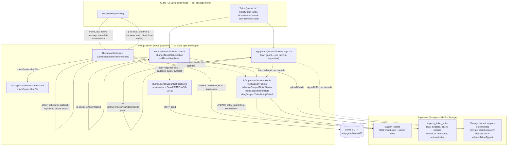

# User Support System v1 — Backend Design Document

| | |
|---|---|
| **Version** | 1.2 |
| **Date** | 2026-08-13 |
| **Status** | Draft — backend design for the User Support System v1 feature. Implements ADR-0012's transport decision exactly (Gmail SMTP + App Password via `nodemailer`, Node runtime, `SOURCE/lib/mail/`). Scope: API/Server Action contracts, data layer (schema + RLS + Storage), business logic, and server architecture. **UI/React components are out of scope** — the UI Spec defines the frontend contract this backend serves; a future frontend Design Doc (if the scale threshold requires one) would consume the contracts published here. **v1.1 was a corrective/additive update** resolving a completed document review (verdict: `needs_revision`, findings I001–I004). **v1.2 is a second corrective pass** resolving a focused re-verification of v1.1 (findings D001, D002, both blocking) — see Update History. |
| **PRD** | `docs/prd/support-system-prd.md` (v1.2, Draft — D1–D10 locked) |
| **UI Spec** | `docs/ui-spec/support-system-ui-spec.md` (v1.1) |
| **ADR** | `docs/adr/ADR-0012-support-system-email-transport-and-admin-allowlist.md` (Accepted) |
| **Codebase analysis** | Backend codebase-analyzer output (`toolu_01AD21czWJVyTu6bZEjBiJe3`, 14 `focusAreas`) — treated as verified ground truth (see Fact Disposition Table) |

## Overview

This Design Doc turns PRD v1.2 + ADR-0012 into implementable backend detail for the User Support System v1: two new idempotent `schema.sql` tables (`support_tickets` read-own by RLS; `support_ticket_notes` in the strict `exam_moderation_log`-style `revoke all` form per D4/R8), a new private Storage bucket (`support-screenshots`) with an insert-own-only policy and Storage-native size/MIME enforcement as a backstop, a new `SOURCE/lib/mail/sendSupportNotification.ts` Node-only module implementing ADR-0012's Gmail-SMTP decision, a new cross-route-group Server Action `submitSupportTicket` (following the `lib/i18n/actions.ts` precedent for actions that are not owned by one route group), two admin Server Actions under `/admin/tickets`, and the schema-fingerprint / rate-limit / `checkEnv` mechanics required to wire all of it in without diverging dev/prod (TD-005's failure shape) or reopening the Edge-bundle boundary (TD-017). It resolves every Design-Doc-owned open item from the PRD and the UI Spec — most materially **TBD-02 (screenshot upload transport)** — with a stated decision and rationale, per this task's instruction that nothing ships as "TBD" from this document.

### Referenced UI Spec

- UI Spec path: `docs/ui-spec/support-system-ui-spec.md` (v1.1)
- This document supplies the data/API layer the UI Spec's `SupportWidgetDialog` (submit + acknowledgement), `TicketQueueList`/`TicketQueueRow`/`TicketDetailPanel` (admin read), `TicketStatusControl` (status write), and `InternalNotesPanel` (note write) consume. Component structure, state machine, and visual design are the UI Spec's authority; this document does not restate them except where a backend contract shape depends on a UI Spec decision (e.g., UI-D2's single-page-with-expandable-rows shape determines that all ticket + note data is fetched in one batched read, not per-row).

## Design Summary (Meta)

```yaml
design_type: "new_feature"        # wholly new capability; touches several existing files only additively (RATE_LIMITS, checkEnv.ts, service-role.ts, i18n dictionaries, schema.sql, verify-schema.ts, package.json)
risk_level: "medium"              # real but well-precedented risks: internal-notes RLS leak (2x existing precedent), Server-Action-is-independent-endpoint bypass on admin actions (existing documented convention), first mail dependency + Edge-boundary re-opening (ADR-0012 already resolved the transport unknowns)
complexity_level: "medium"
complexity_rationale: >
  (1) Two new tables with two DIFFERENT RLS idioms in one feature (read-own on support_tickets;
      strict revoke-all with zero policies on support_ticket_notes per D4/R8/AC-048) plus a new
      private Storage bucket's own policy set — three distinct authorization surfaces to get right
      in one pass; (2) this is the repository's FIRST mail dependency, which must respect the
      TD-017 Edge-bundle boundary (instrumentation.ts, proxy.ts) and the CI placeholder-env build
      constraint simultaneously; (3) the schema-fingerprint three-way synchronization
      (schemaFingerprint.ts / schema.sql / dev+prod databases) is a repository-specific mechanism
      that fails silently (TD-005's shape) if any of its steps is skipped, and this feature adds
      DDL to it for the first time since that incident; (4) TBD-02 (screenshot transport) is a
      genuine architectural choice this document is responsible for resolving, not a value fill-in.
main_constraints:
  - "Single idempotent schema.sql applied by hand in the Supabase SQL Editor — no migration framework."
  - "ADR-0012: the mail module is Node-only and must never be reachable from proxy.ts, lib/supabase/middleware.ts, lib/security/csp.ts, lib/supabase/cookieOptions.ts, or the unguarded top of instrumentation.ts (TD-017)."
  - "D4/R8/AC-048: internal notes take the exam_moderation_log strict revoke-all form, not telemetry_log's narrower form — authenticated has NO insert path at all."
  - "D5: ticket commit precedes the mail send; the mail send is scheduled via Next.js's after() (next/server, stable since 15.1, available in this repo's Next 16.2.12) to run only after the success response has already been sent to the client — a send failure is caught, logged, flagged, and never fails or delays the student's submission (revised in this update — see Update History v1.1; resolves review finding I003)."
  - "PRD 20s submit-abort ceiling and ~2s p95 no-screenshot acknowledgement target bound every synchronous step in the Server Action — auth, rate-limit, validation, optional upload, and the ticket INSERT. The mail send is excluded from this budget entirely: it is not a synchronous step of the request the client is waiting on (see Data Flow, Data Contracts §sendSupportNotification)."
biggest_risks:
  - "A missed RLS clause or a copy-by-proximity of telemetry_log's narrow revoke form onto support_ticket_notes lets a student read or write internal notes about themselves (D4, AC-025/AC-048, metric 3)."
  - "An admin Server Action that trusts the page-level guard instead of independently re-checking isAdminUserId() is directly invocable by any authenticated student with the action id (documented repo-wide convention, moderateExamAction precedent)."
  - "Skipping any step of the schema-fingerprint three-way sync (SCHEMA_FINGERPRINT constant / schema.sql §17 value / per-environment SQL Editor paste) reproduces the TD-005 incident shape — every gate green while Preview or prod silently lacks the new tables."
unknowns:
  - "Whether an SMTP handshake + send reliably completes when run inside a Next.js after() callback in a Vercel sin1 Node function — after() is backed by Vercel's waitUntil primitive, purpose-built for exactly this (extending the function's lifetime past the response so scheduled work is not silently dropped), but the end-to-end behavior under real conditions is confirmed only during early implementation verification. This is now decoupled from the PRD's 20s submit-abort ceiling entirely (v1.1 revision): the client's response returns before the mail send begins, so a slow or failed send can no longer cause the client's own abort timer to fire (resolves review finding I003 — see R-4)."
```

## Background and Context

### Prerequisite ADRs

- **ADR-0012** (Accepted) — Support System Email Transport and Admin Allowlist Convention. This Design Doc implements its transport decision exactly: Gmail SMTP + App Password via `nodemailer`, called only from the ticket-creation Server Action (Node runtime by construction), never reachable from `proxy.ts`/`instrumentation.ts`'s unguarded scope. It also inherits (does not redecide) ADR-0012's documentation of the `ADMIN_USER_IDS` allowlist model. **v1.1 note**: scheduling the send via `after()` (see main_constraints, Data Flow) does not conflict with ADR-0012:113's "no new architectural layer... single, in-request, fire-and-forget side effect" constraint — `after()` is not a queue, worker, or retry daemon; it is still exactly one attempt, within the same serverless invocation (extended past the response by the platform's `waitUntil` primitive), with no persistence or retry across invocations. Only *when within the request lifecycle* the send executes changed, not its fire-and-forget nature.
- **ADR-0001** (UGC content lifecycle and RLS enforcement) — "no database admin role" (`:141`) is the standing constraint this design's internal-notes table and admin Server Actions both honor: admin reads/writes go through the service role, never a DB-recognized admin branch; all new DDL is idempotent (`:143`).
- **ADR-0002** (Published content rendering and sanitization) — cited for its **principle** (untrusted author text is neutralized at the render boundary) and its plain-text precedent (`:85-88`), which governs how the *frontend* renders ticket message/URL/user-agent (R12, AC-037/038). This backend's only obligation from ADR-0002 is negative: it must not do anything (e.g. HTML-unescape, reformat) that would defeat plain-text rendering at read time — plain storage of the raw string is sufficient and is what this design does.

**Common ADR check**: searched `docs/adr/ADR-COMMON-*` — none exist (`ls docs/adr` returns twelve numbered ADRs, none prefixed `ADR-COMMON-`). No new common ADR is created: the cross-cutting technical areas this feature touches (closed-union Server Action error contracts, admin-action independent re-authorization, service-role narrow-export discipline, idempotent DDL) are already established, single-precedent conventions (`reportExam`, `moderateExamAction`, `service-role.ts`) that this design adopts rather than a genuinely new cross-component decision requiring its own ADR.

### External Resources Used

| Resource (project-tier label) | Feature-specific identifier | Notes |
|-------------------------------|------------------------------|-------|
| Database Schema Source | `SOURCE/supabase/schema.sql` — new `support_tickets` + `support_ticket_notes` tables + RLS, new `storage.objects` policies for the `support-screenshots` bucket, all appended before the `-- @schema-fingerprint-begin` marker (`:1429`) | Applied manually in the Supabase SQL Editor; idempotent (`create table if not exists`, `drop constraint/policy if exists`) |
| Migration History | None — `SOURCE/supabase/schema.sql` is the only DDL artifact (no migration framework, no `migrations/` directory, no Supabase CLI in `package.json`) | Confirmed by `dataModel.migrationFiles` in the codebase analysis |
| Schema Change Process | RLS verification via `SOURCE/supabase/test-rls.ts` (`cd SOURCE && npx tsx supabase/test-rls.ts`); schema drift verification via `npm run verify:schema` (`SOURCE/supabase/verify-schema.ts`) | Extended with ticket/notes RLS cases (below); acceptance mechanism for PRD metrics 1–3 |
| Secret Store | `.env.local` (dev), Vercel Environment Variables (Production/Preview scopes) | New: `SUPPORT_NOTIFY_EMAIL` (D6), `SUPPORT_SMTP_USER`, `SUPPORT_SMTP_APP_PASSWORD` (ADR-0012 Option A) |
| Authentication Method | `@supabase/ssr` session cookie; server client `SOURCE/lib/supabase/server.ts` via `createClient()`; admin allowlist `SOURCE/lib/auth/admin.ts` | `submitSupportTicket` obtains the client via `createClient()`; admin actions independently call `createClient()` → `supabase.auth.getUser()` + `isAdminUserId()`, matching the `moderateExamAction` precedent (`SOURCE/features/admin/actions.ts:34-37`) — not `getCurrentUser()`, which is used only in the page-level guard |

> `docs/project-context/external-resources.md` exists (last updated 2026-08-08) and was consulted during the UI Spec/ui-analyzer phase; its environment-stable facts (design origin, schema source, secret store) are consistent with the feature-tier facts recorded here. No project-tier gap to report — the schema-source and secret-store rows above are this document's feature-specific elaboration of that file's project-tier entries, not a substitute for it.

### Agreement Checklist

#### Scope
- [x] Add `public.support_tickets` (author, intent, message, captured technical metadata, optional screenshot reference, status, notification-failure flag, first-status-transition timestamp, created_at), read-own RLS.
- [x] Add `public.support_ticket_notes` (separate table, D4), RLS enabled, zero policies, `revoke all ... from anon, authenticated` (exam_moderation_log strict form, per D4/R8's v1.2 pin).
- [x] Add private Storage bucket `support-screenshots` with insert-own-only `storage.objects` policy and Storage-native `fileSizeLimit`/`allowedMimeTypes` as a backstop.
- [x] Add `SOURCE/lib/mail/sendSupportNotification.ts` + subject-composition helper, implementing ADR-0012 Option A.
- [x] Add `SOURCE/lib/support/actions.ts`: `submitSupportTicket(formData)` (cross-route-group Server Action, mirrors `lib/i18n/actions.ts`'s placement precedent).
- [x] Add `SOURCE/app/(admin)/admin/tickets/page.tsx` (read) + `SOURCE/features/admin/ticketActions.ts`: `changeTicketStatusAction`, `addTicketNoteAction`.
- [x] Add `SOURCE/lib/support/validateScreenshot.ts` (pure MIME/size gate, new `LIMITS` entries).
- [x] Extend `RATE_LIMITS` (`SOURCE/lib/security/rateLimit.ts`) with a `submitTicket` key.
- [x] Extend `SOURCE/lib/env/checkEnv.ts` with `SUPPORT_NOTIFY_EMAIL`, `SUPPORT_SMTP_USER`, `SUPPORT_SMTP_APP_PASSWORD`.
- [x] Extend `SOURCE/supabase/test-rls.ts` with ticket/notes RLS cases; extend `SOURCE/lib/i18n/__tests__/i18n.test.ts`-adjacent coverage with a `report-ms` absence assertion (new test file under `lib/mail/__tests__/`).
- [x] Extend `SOURCE/supabase/setup-storage.ts` `BUCKETS` array; extend `SOURCE/supabase/verify-schema.ts`'s `deleteChain` list for the `support_tickets → support_ticket_notes` cascade.
- [x] Extend `SOURCE/scripts/check-ai-key-bundle.mjs` SECRETS list with the new SMTP credential markers.

#### Non-Scope (Explicitly not changing)
- [ ] React components, `SupportWidget*`, `TicketQueue*`, `TicketDetailPanel`, `TicketStatusBadge`, `InternalNotesPanel` — owned by the UI Spec / future frontend implementation; this doc publishes only the contracts they consume.
- [ ] `exam_reports`, `exam_moderation_log`, `SOURCE/app/(admin)/admin/page.tsx`, `ModerationRow.tsx`, `SOURCE/features/admin/actions.ts` — untouched (D8: exam reporting stays separate; the new admin surface is a **sibling** route, not an extension of the existing one).
- [ ] `SOURCE/features/exams/components/ReportExam.tsx` — untouched (AC-007); its interaction pattern is reused by the (frontend-owned) widget dialog, not its code.
- [ ] `SOURCE/instrumentation.ts`, `SOURCE/proxy.ts` — untouched; the mail module must simply never become reachable from them (ADR-0012, TD-017).
- [ ] Any student-facing "my tickets" read screen (D3) — RLS ships defensively; no read route is built.
- [ ] Status-change email to the student (D7) — not built.
- [ ] `exam-images` / `exam-uploads` buckets and their policies — untouched; `support-screenshots` is a new, independent bucket.

#### Constraints
- [x] Parallel operation: **No** — single local Supabase project per environment; schema applied once per environment, verified via the RLS harness, then the app deploys.
- [x] Backward compatibility: **Required** — every extended file (`RATE_LIMITS`, `checkEnv.ts`, `service-role.ts`, i18n dictionaries, `schema.sql`, `verify-schema.ts`'s `deleteChain`, `package.json`, `check-ai-key-bundle.mjs`) gains only additive entries; no existing key, policy, or behavior changes.
- [x] Performance measurement: **Not a CI-automated gate for the 2s p95 target** (hand-measured per PRD NFR, no APM/RUM); **is a CI gate** for "no N+1" via the batched-read requirement on the admin queue. The 20s submit-abort ceiling's server-side budget covers only auth + rate-limit + validation + optional upload + ticket INSERT (v1.1 revision — the mail send is scheduled via `after()` after the response returns and is structurally excluded from this budget; see main_constraints and Data Flow); the module-level SMTP timeout constants instead bound the after()-scheduled callback's own duration against the route's configured/default `maxDuration`, not the client's abort timer.

#### Applicable Standards
- [x] Idempotent DDL (`create table if not exists` / `drop constraint if exists` + `add constraint` / `drop policy if exists` + `create policy`) `[explicit]` — Source: `SOURCE/supabase/schema.sql` convention; ADR-0001:143.
- [x] RLS strict-form idiom for admin-only operational tables: `enable row level security` + `revoke all ... from anon, authenticated` + zero policies `[explicit]` — Source: `exam_moderation_log` (`schema.sql:1092-1093`), `schema_version` (`:1420-1421`); PRD D4/R8 pins `support_ticket_notes` to this form over `telemetry_log`'s narrower form.
- [x] Read-own RLS idiom: `default auth.uid()` owner column + `for select to authenticated using (owner = auth.uid())` `[explicit]` — Source: `exam_reports` (`reports_select_own` `:352-354`).
- [x] `storage.objects` policy idiom: `drop policy if exists` + `to authenticated` + predicate starting `bucket_id = '<name>'` + ownership from `(storage.foldername(name))[1]` `[explicit]` — Source: `schema.sql:363-438`; buckets created out-of-band via `setup-storage.ts`'s `BUCKETS` array, never by SQL.
- [x] Server Actions: `"use server"`, `createClient()`, closed-union `{ error? }` return (never leak raw DB text), independent re-check of admin authorization inside every admin action `[explicit]` — Source: `reportExam` (`actions.ts:986-1019`), `moderateExamAction` (`admin/actions.ts:12-44`).
- [x] Cross-route-group Server Actions live under `lib/<domain>/actions.ts`, not inside a single route group's `actions.ts` `[explicit — one existing instance]` — Source: `SOURCE/lib/i18n/actions.ts` (`setLocale`, used by every route group's language switcher). Followed here because the support widget mounts across five route groups + the homepage (UI-D1); no single route group owns `submitSupportTicket`.
- [x] Optional-env-variable shape: `{ level: "warn", name, impact: <observable consequence> }`, pure `checkEnv(env)` `[explicit]` — Source: `checkEnv.ts:77-83` (`GEMINI_API_KEY`).
- [x] Rate-limit keys are a closed set added to `RATE_LIMITS`; `guard(action, userId)` takes no limit/window arguments `[explicit]` — Source: `rateLimit.ts:102-107,131-135`.
- [x] Service-role client factory stays private; only narrow, named operations are exported, each documenting its caller-side precondition `[explicit]` — Source: `service-role.ts:4-23,29-41`.
- [x] Outbound calls use a module-level named timeout constant `[explicit for fetch; adapted here for SMTP]` — Source: `checkSchemaVersion.ts:38-41` uses `AbortSignal.timeout`; `nodemailer`'s SMTP transport has no `AbortSignal` hook, so this design uses the equivalent `connectionTimeout`/`greetingTimeout`/`socketTimeout` transport options as named constants (see Data Contracts) — same principle (bounded, named, commented), different mechanism because the underlying call is a raw TCP/SMTP session, not `fetch`. These constants now bound the duration of the `after()`-scheduled mail callback (against the route's own `maxDuration`), not the client-facing request/response cycle — v1.1 revision, see main_constraints.
- [x] Deferred, non-blocking work scheduled via `after()` (`next/server`) rather than an awaited-but-detached promise `[explicit — Next.js platform API, adopted here as the mechanism for D5's "never blocks the response" guarantee]` — Source: `node_modules/next/dist/docs/01-app/03-api-reference/04-functions/after.md` ("`after` allows you to schedule work to be executed after a response ... is finished ... in Server Functions"); no in-repo precedent existed before this feature (first use of `after()` in this repository), so the standard is adopted directly from the Next.js version installed (`next: ^16.2.12`, `package.json:29`) rather than from an existing file.
- [x] Numeric domain limits centralized as named constants in `SOURCE/lib/ugc/limits.ts`'s `LIMITS` `[explicit]` — Source: `limits.ts:4-36`; this design adds `MAX_SUPPORT_MESSAGE` and `MAX_SCREENSHOT_BYTES`/`ALLOWED_SCREENSHOT_MIME` there rather than a new file, to keep the single source of truth intact.
- [x] Vietnamese inline comments where the surrounding file already uses them `[implicit]` — Evidence: `schema.sql`, `actions.ts`, `checkEnv.ts` throughout. Confirmed: Yes (match per-file convention in all new SQL/TS).
- [x] Service-role-only writes that need conditional/atomic SQL logic (not expressible via `.from().update()`) go through a `create function ... language plpgsql`, `drop function if exists` + `create function` (idempotent), `INVOKER` (not `security definer`) with explicit `revoke all ... from public, anon, authenticated` + `grant execute ... to service_role` `[explicit — v1.2 addition]` — Source: `record_exam_result` (`schema.sql:879-937`, invoked via `.rpc()` at `service-role.ts:56-69`); this is distinct from `exam_answer_key`/`claim_attempt_answer_key` (`schema.sql:650-707`), which use `security definer` because they are granted to and called directly by `authenticated` — `change_support_ticket_status` (Schema & DB Enforcement §4) follows `record_exam_result`'s idiom, not that pair's, since it is called only via the service-role client.

#### Assumed Behaviors

- [x] **`guard()` reads `{ limit, windowMs }` from `RATE_LIMITS[action]` and takes no call-site parameters; adding one keyed entry is sufficient.** Evidence: `SOURCE/lib/security/rateLimit.ts:102-107` (table), `:131-135` (signature — key derivation reads the table, no params). Confirmed: **Yes**.
- [x] **The global Server Action `bodySizeLimit` (currently `2 × LIMITS.MAX_FILE_BYTES + 2MB` = 32MB) already covers an 8MB screenshot plus form fields, with no `next.config.ts` change required**, because the limit is explicitly documented as global across every Server Action, not per-action. Evidence: `SOURCE/next.config.ts:76-92` (comment at `:77-87` states the limit is TOÀN CỤC — global — and computed from `LIMITS.MAX_FILE_BYTES`; formula at `:90`). Confirmed: **Yes**.
- [x] **No route or Server Action in this repository opts into the Edge runtime; every Server Action defaults to the Node.js runtime**, so a Node-only mail transport is safe there. Evidence: ADR-0012's own verification (repository-wide search for `runtime = "edge"` across `SOURCE/**/*.ts(x)` returns zero matches, ADR-0012 Context section); corroborated by codebase-analysis constraint "Edge-bundle boundary" (`instrumentation.ts:9-20`). Confirmed: **Yes**.
- [x] **`@supabase/supabase-js`'s installed `createBucket` accepts `fileSizeLimit` and `allowedMimeTypes` options on this bucket.** Evidence: `SOURCE/node_modules/@supabase/storage-js/dist/index.d.mts:1809-1812` — `createBucket(id: string, options?: { fileSizeLimit?: number | string | null; allowedMimeTypes?: string[] | null; ... })`, checked directly against the installed package (`@supabase/supabase-js: ^2.107.0`, `package.json:20`), not merely upstream docs. Confirmed: **Yes**.
- [x] **`after()` (`next/server`) can be used inside a Server Action to schedule work that runs only after the response has been sent, and is backed by Vercel's `waitUntil` primitive so the scheduled work is not silently dropped once the response begins.** Evidence: `SOURCE/node_modules/next/dist/docs/01-app/03-api-reference/04-functions/after.md:6-8` ("schedule work to be executed after a response ... is finished ... in Server Functions"), `:236-244` (Platform Support table — supported on Node.js server / Vercel), `:247-296` (serverless support is implemented via `waitUntil`); checked directly against the installed package (`next: ^16.2.12`, `package.json:29`), consistent with the version-history note that `after` became stable in `v15.1.0` (`:298-303`). Confirmed: **Yes**.
- [x] **`after()` runs for the platform's default or configured `maxDuration` of the route, not for the client-facing request/response cycle** — so a slow (not failed) SMTP send scheduled via `after()` cannot cause the client's own 20s submit-abort timer to fire, because the client has already received its response before the send begins. Evidence: `SOURCE/node_modules/next/dist/docs/01-app/03-api-reference/04-functions/after.md:48-50` ("`after` will run for the platform's default or configured max duration of your route"); precedent for explicitly configuring `maxDuration` on a route in this repo exists (`SOURCE/app/(authoring)/upload/page.tsx:18`, set to 300s for a different, longer-running operation — `extractAndAssemble`'s mupdf-parse pipeline — that route's own comment attributes the override to "the platform's default being lower", which is now stale). **v1.2 refinement (resolves review finding D001 — blocking)**: this design does not require setting `maxDuration` on the ticket-creation route, because the platform's *current* default Function execution timeout is 300 seconds on all plans (Vercel Fluid Compute, enabled by default on Hobby and Pro, as of the current 2026 platform generation — up from the older 60-90s-class defaults) — an **external platform fact, not a codebase citation**: no in-repo source documents the current platform default, and `upload/page.tsx:18`'s own comment (predating this platform-wide bump) states the opposite ("mặc định của platform thấp hơn nhiều" — the platform default is much lower); that comment is stale relative to the current Vercel generation and is cited above only as this repo's existing precedent for *how* to override `maxDuration` when a route's needs genuinely exceed the default, not as evidence of what today's default value is. At 300s, the platform default provides roughly 14x headroom over the mail send's 21000ms worst-case SMTP budget (300000 / 21000 ≈ 14.3), so no `maxDuration` override is required for this route; the same platform mechanism (an explicit `maxDuration` export, per `upload/page.tsx:18`'s pattern) applies if headroom is ever found insufficient during early-implementation verification. Confirmed: **Yes** (v1.1 revision — supersedes the prior "Confirmed: No" entry for this concern, which assumed the send stayed inside the *client's* 20s ceiling; that assumption is now moot because the send is structurally decoupled from the client's wait. Resolves review finding I003 — see R-4; the 300s-default citation resolves D001).

#### Quality Assurance Mechanisms
- [x] ESLint (`npm run lint`, `--max-warnings 0`) — Enforces: zero new lint errors/warnings — Config: `SOURCE/eslint.config.mjs` — Covers: project-wide — Status: `adopted`.
- [x] TypeScript (`npx tsc --noEmit`) — Enforces: type correctness; specifically makes an unregistered `RATE_LIMITS` key a compile error — Config: `.github/workflows/ci.yml:51-52` — Covers: all TypeScript in `SOURCE/` — Status: `adopted`.
- [x] Vitest (`npm test`) — Enforces: pure-function + component unit/integration coverage — Config: `SOURCE/vitest.config.ts` (`include: lib/**`, `components/**`, `app/**`) — Covers: `lib/support/`, `lib/mail/`, `lib/ugc/limits.ts` additions — Status: `adopted`.
- [x] Schema fingerprint three-way assertion (part of `npm test`) — Enforces: `SCHEMA_FINGERPRINT` constant ≡ `schema.sql` §17 declared value ≡ recomputed hash — Config: `SOURCE/lib/schema/__tests__/schemaFingerprint.test.ts` — Covers: `schema.sql`, `schemaFingerprint.ts` — Status: `adopted` (this feature's schema addition is the first test of this gate since it was last exercised).
- [x] Foreign-key text parser tests (part of `npm test`) — Enforces: every FK is parseable with explicit `on delete` — Config: `SOURCE/lib/schema/__tests__/parseForeignKeys.test.ts` — Covers: `schema.sql` — Status: `adopted`.
- [x] i18n dictionary contract tests (part of `npm test`) — Enforces: vi/en key parity, no empty values, placeholder parity, <10% byte-identical values — Config: `SOURCE/lib/i18n/__tests__/i18n.test.ts` — Covers: `vi.ts`/`en.ts` — Status: `adopted` (new `support.*` keys must satisfy this; the `report-ms` token must NOT appear in either file — this design adds a **new** absence assertion, since no existing test checks for a token's absence).
- [x] `checkEnv` contract tests (part of `npm test`) — Enforces: a fully-configured env produces zero problems; each new silent-failure mode is caught with its concrete consequence string — Config: `SOURCE/lib/env/__tests__/checkEnv.test.ts` — Covers: `checkEnv.ts` — Status: `adopted`.
- [x] Production build in CI (`npx next build`, placeholder env) — Enforces: build correctness including Edge-bundle boundary violations — Config: `.github/workflows/ci.yml:74-80` — Covers: entire app — Status: `adopted` (the gate that would surface a mail-module-in-Edge-bundle mistake as a build warning/error).
- [x] Client-bundle secret scan (`npm run check:bundle`) — Enforces: scans for secret values and marker strings — Config: `SOURCE/scripts/check-ai-key-bundle.mjs` — Covers: client bundle output — Status: `adopted` (this design adds `SUPPORT_SMTP_APP_PASSWORD`/`SUPPORT_SMTP_USER`/`nodemailer` to its SECRETS/marker list, per the standard's own instruction that a new server-only credential belongs there).
- [x] `npm run verify:schema` (manual, not in CI) — Enforces: seven checks against a live DB including FK reconciliation and fingerprint match — Config: `SOURCE/supabase/verify-schema.ts` — Covers: `schema.sql` vs each live Supabase project — Status: `adopted` (must be run per environment after this feature's schema apply; also gains a `deleteChain` entry for the ticket→note cascade).
- [x] `npx tsx supabase/test-rls.ts` (manual, not in CI) — Enforces: RLS isolation against real Postgres, two real users, anon key — Config: `SOURCE/supabase/test-rls.ts` — Covers: all RLS policies/grants — Status: `adopted` (acceptance mechanism for PRD metrics 1–3; new ST-a/ST-b cases added below).
- [ ] axe a11y audit — Status: `noted` — reason: accessibility of the widget/admin UI is a frontend concern, out of this backend document's scope.

### Problem to Solve

Give a logged-in student a durable, attributable, admin-notified support channel (bug / suggestion / question, with automatic technical metadata and at most one optional screenshot) distinct from the existing exam-content-moderation channel (`exam_reports`), and give the maintainer an admin queue to triage it — all as backend contracts: two idempotent schema additions with two deliberately different RLS shapes, a new private Storage bucket, the repository's first outbound mail dependency kept inside the Node-only execution boundary, and Server Action contracts that never block a student's submission on the mail side effect.

### Current Challenges

- There is no ticket data model in this repository; the closest shape (`exam_reports`) is content-moderation, insert-only, and explicitly stays separate (D8).
- There is no internal-notes precedent that is *editable content hidden from the row's own owner* — `exam_moderation_log`/`telemetry_log` establish the RLS idioms but neither table stores content a specific end-user must never read about themselves; this design is the first to combine "belongs to user X" (the ticket) with "invisible to user X" (the notes) in one feature.
- There is no mail dependency in `SOURCE/package.json` at all (`dependencies`/`devDependencies`, `:14-42`) — every send-path convention (timeout shape, Edge-boundary discipline, secret-scan coverage) must be established for the first time, informed by but not copied verbatim from the existing single-`fetch` precedent (`checkSchemaVersion.ts`), since SMTP is a different transport shape.
- The admin route group (`(admin)/`) has no `layout.tsx` and provides no shared guard — every new route under it, including `/admin/tickets`, must carry its own two-line `getCurrentUser()` + `isAdminUserId()` gate, and every Server Action under it must independently re-check authorization (documented convention, `admin/actions.ts:12-18`).

### Requirements

#### Functional Requirements
Traceable to PRD v1.2 R1–R16 (see Acceptance Criteria below and the AC responsibility table for the backend-owned subset). This document is responsible for: R3 (metadata capture contract), R4 (screenshot storage/RLS — resolves TBD-02), R5 (persistence + read-own RLS), R6 (rate limiting — resolves TBD-01), R7 (admin authorization + batched read), R8 (internal notes storage/RLS), R9 (status enum + first-transition timestamp), R10 (fire-and-forget mail), R11 (the non-UI half: server returns codes, not literal strings, so the client-side dictionaries remain the single source of display copy), R12 (the non-UI half: store raw text, do not pre-process it in a way that would defeat plain-text rendering), R15 (short-reference derivation — resolves the "how" for the Could-tier requirement), R16 (subject-token contract at the mail-module layer). R1/R2/R13/R14 are frontend-owned (widget rendering, attempt-route hiding, resilient UI feedback, queue visual ordering) with no distinct backend surface beyond what R5–R10 already provide.

#### Non-Functional Requirements
- **Performance**: no per-row round trip on the admin queue (batched: one ticket select + one notes select, grouped in JS — mirrors `listReportedExams`); the mail send never sits on the student's acknowledgement path (D5) — it is scheduled via `after()` to run only after the response has been sent, so it is structurally excluded from the request/response cycle; the 20s submit-abort ceiling bounds only auth + rate-limit + validation + optional upload + insert (v1.1 revision — resolves review finding I003).
- **Scalability**: solo-maintained, pre-scale — no queue/worker/retry daemon for mail (matches PRD Scalability NFR); a single try/caught send per submission, scheduled via `after()` to run once, after the response (v1.1 revision — not detached, not requeued, still exactly one attempt per ticket).
- **Reliability**: a ticket insert failure is never masked as success; a mail send failure is always caught, logged with context, and flagged — never propagated to the student (D5, AC-031/AC-032).
- **Maintainability**: closed-union `{ error? }` contracts throughout (no raw DB/Storage error text crosses a Server Action boundary); every numeric limit lives in the single `LIMITS` constant.
- **Security**: two authorization surfaces (RLS + admin-action re-check) defended independently, per the documented "Server Action is an independently callable endpoint" convention; internal notes have zero `authenticated` privileges of any kind (D4/R8/AC-048).

## Acceptance Criteria (AC) — EARS Format

Backend-owned subset of PRD v1.2 ACs (frontend-only ACs are listed separately below, not restated here).

### R3/R5 — Metadata capture + persistence
- [ ] **When** a ticket is submitted with page URL, user agent, and screen dimensions present, **then** all three are stored on the row unmodified. (AC-008, AC-009)
- [ ] **If** a captured metadata value is empty or absent, **then** the ticket is still created with that field stored as `null` — capture never blocks submission. (AC-010)
- [ ] (ubiquitous) The system shall store the author's user id, intent, message, technical metadata, screenshot reference (or its absence), status, `created_at`, `notify_failed`, and `first_status_transition_at` on every ticket row. (AC-016)
- [ ] (ubiquitous) The schema change shall be expressible idempotently in `schema.sql`. (AC-017)

### R4 — Screenshot
- [ ] **If** an uploaded file exceeds `LIMITS.MAX_SCREENSHOT_BYTES` or its MIME type is outside `LIMITS.ALLOWED_SCREENSHOT_MIME`, **when** it is submitted, **then** it is rejected server-side with a specific error code and no object is written to the bucket. (AC-012)
- [ ] **When** a screenshot is requested by a user who is neither its author nor an admin, **then** access is denied (no `authenticated` select policy exists on the bucket). (AC-013)
- [ ] (ubiquitous) `support_tickets.screenshot_path` is a single scalar column — the schema structurally permits at most one attachment per ticket. (AC-011, metric 7)

### R6 — Rate limiting
- [ ] **When** a student submits beyond `RATE_LIMITS.submitTicket`'s ceiling within its window, **then** the action returns `{ error: "rate_limited" }` and no ticket row is created. (AC-018)
- [ ] **If** a submission is refused for any reason (validation, rate limit, screenshot rejection, auth), **then** `sendSupportNotification` is never called. (AC-019)

### R7/R8 — Admin authorization + notes
- [ ] **If** the calling user's id is not in `ADMIN_USER_IDS`, **when** any admin Server Action or the admin page is invoked, **then** it is rejected (`notFound()` for the page; a non-leaking error for the actions) — independently of any page-level guard. (AC-021, AC-024)
- [ ] **If** an authenticated non-admin session (including the ticket's own author) attempts to `INSERT` into `support_ticket_notes` directly, **then** the insert is denied and the table's row count is unchanged. (AC-048)
- [ ] (ubiquitous) No internal-note text is ever stored as a column on `support_tickets` (a row students can `SELECT`). (AC-026)
- [ ] **When** an admin writes a note, **then** it persists with note text, authoring admin id, ticket id, and timestamp. (AC-027)

### R9 — Status + first-transition timestamp
- [ ] (ubiquitous) A new ticket's status is `new`. (AC-028)
- [ ] **If** a status-change target is outside `{new, in_progress, resolved}`, **then** it is rejected at the database layer (CHECK constraint) independently of the admin action's own validation. (AC-029)
- [ ] **When** a ticket's status changes from `new` to any other value, **then** `first_status_transition_at` is written with that transition's time; **when** any subsequent status change occurs on the same ticket, **then** that timestamp is not overwritten. (AC-047)
- [ ] (ubiquitous) No email is sent on any admin status change. (AC-030)

### R10 — Fire-and-forget mail
- [ ] **If** `sendSupportNotification` throws, times out, or `SUPPORT_SMTP_USER`/`SUPPORT_SMTP_APP_PASSWORD` are unconfigured, **when** a student submits, **then** the ticket row is committed and the action still returns success. (AC-031)
- [ ] **When** a send fails, **then** it is logged with ticket id, recipient, and failure reason, and `support_tickets.notify_failed` is set `true`. (AC-032)
- [ ] **When** a send succeeds, **then** the email identifies intent, message, technical metadata, screenshot presence, and a link to the ticket on `/admin/tickets`. (AC-033)
- [ ] **If** `SUPPORT_NOTIFY_EMAIL` is unset, **when** the app starts, **then** `checkEnv` reports it as missing with the concrete consequence, and submission continues to work. (AC-034)

### R11/R16 — i18n boundary + subject token
- [ ] (ubiquitous) `vi.ts`/`en.ts` gain matching key sets for every new dictionary key this feature introduces. (AC-036)
- [ ] (ubiquitous) Every notification subject begins at character position 0 with the literal `[report-ms]` followed by one space. (AC-043)
- [ ] **When** the same ticket's subject is generated once with the `vi` locale and once with `en`, **then** the two `[report-ms]` prefixes are byte-identical, and neither `vi.ts` nor `en.ts` contains the token `report-ms` anywhere. (AC-044)
- [ ] (ubiquitous) An automated test asserts the subject's leading-position prefix across all three intents and both locales. (AC-045)
- [ ] (ubiquitous) Every code path that composes a notification subject, including the failure-and-flag path, carries the identical prefix. (AC-046)

### R15 — Short reference
- [ ] **When** a ticket commits, **then** the acknowledgement's short reference is derivable from the row alone (a fixed-length prefix of `id`), maps 1:1 to exactly one row, and is never accepted as input anywhere. (AC-049)

### AC Responsibility (backend vs. frontend-only)

| Backend-responsible (this document) | Frontend-only (no backend surface) |
|---|---|
| AC-002 (server-side validation half), AC-004, AC-008, AC-009, AC-010, AC-011, AC-012, AC-013, AC-014 (delivery mechanism only), AC-015, AC-016, AC-017, AC-018, AC-019, AC-021, AC-022 (data supply), AC-023, AC-024, AC-025, AC-026, AC-027, AC-028, AC-029, AC-030, AC-031, AC-032, AC-033, AC-034, AC-036, AC-041, AC-043, AC-044, AC-045, AC-046, AC-047, AC-048, AC-049 (derivation) | AC-001, AC-003, AC-005, AC-006, AC-007, AC-020, AC-035, AC-037, AC-038, AC-039, AC-040, AC-042 |

AC-040 ("acknowledgement never optimistic") is enabled but not owned here: the backend contract's own shape (the action only returns success after the `INSERT` awaits successfully) is what makes the frontend's non-optimistic rendering possible; the rendering behavior itself is frontend-owned.

## Existing Codebase Analysis

### Implementation Path Mapping

| Type | Path | Description |
|------|------|-------------|
| Existing | `SOURCE/supabase/schema.sql` | Append `support_tickets` + `change_support_ticket_status` function (v1.2) + `support_ticket_notes` + `storage.objects` policies before the `-- @schema-fingerprint-begin` marker (`:1429`). |
| Existing | `SOURCE/supabase/schema.sql` (fingerprint block), `SOURCE/lib/schema/schemaFingerprint.ts:41` | Both must receive the new 12-hex `SCHEMA_FINGERPRINT` value together, per the mechanics in Schema & DB Enforcement below (covers the new function's body like any other schema.sql content — no special-casing needed). |
| Existing | `SOURCE/supabase/verify-schema.ts` | `deleteChain` list (`:508-516`) gains the `support_tickets → support_ticket_notes` cascade entry; main probe sequence gains a `change_support_ticket_status` EXECUTE-grant probe mirroring `record_exam_result`'s (v1.2, Schema & DB Enforcement §4). |
| Existing | `SOURCE/supabase/setup-storage.ts` | `BUCKETS` array (`:25`) gains `"support-screenshots"`. |
| Existing | `SOURCE/lib/security/rateLimit.ts` | `RATE_LIMITS` (`:102-107`) gains `submitTicket`. |
| Existing | `SOURCE/lib/env/checkEnv.ts` | Three new optional/warn entries: `SUPPORT_NOTIFY_EMAIL`, `SUPPORT_SMTP_USER`, `SUPPORT_SMTP_APP_PASSWORD`. |
| Existing | `SOURCE/lib/env/__tests__/checkEnv.test.ts` | `goodEnv()` fixture gains the three new keys; per-variable tests added. |
| Existing | `SOURCE/lib/ugc/limits.ts` | `LIMITS` gains `MAX_SUPPORT_MESSAGE`, `MAX_SCREENSHOT_BYTES`, `ALLOWED_SCREENSHOT_MIME`. |
| Existing | `SOURCE/lib/supabase/service-role.ts` | Gains four narrow exported functions (list, status-change, note-add, notify-flag) following the private-factory discipline; status-change calls the new `change_support_ticket_status` Postgres function via `.rpc()`, matching `recordExamResult`'s calling convention (v1.2, `:56-69`). |
| Existing | `SOURCE/supabase/test-rls.ts` | Two new labelled cases (ST-a, ST-b). |
| Existing | `SOURCE/package.json` | Gains `nodemailer` (+ `@types/nodemailer` devDependency) — the first mail dependency. |
| Existing | `SOURCE/scripts/check-ai-key-bundle.mjs` | SECRETS/marker list gains `SUPPORT_SMTP_APP_PASSWORD`, `SUPPORT_SMTP_USER`, `nodemailer`. |
| Existing | `SOURCE/lib/i18n/dictionaries/vi.ts`, `en.ts` | Gain `support.*` keys (student error codes' copy, admin labels) — **excluding** the `report-ms` token. |
| New | `SOURCE/lib/support/actions.ts` | `submitSupportTicket(formData)` — cross-route-group Server Action (mirrors `lib/i18n/actions.ts` placement); schedules the mail send via `next/server`'s `after()` rather than awaiting it inline (v1.1 revision — resolves review finding I003). |
| New | `SOURCE/lib/support/__tests__/actions.test.ts` | Action-level test with mocked Supabase client + mocked `after()`, asserting the response returns before the mail send and that the `after()`-scheduled callback correctly handles success/failure (AC-031/AC-032) — v1.1 addition. |
| New | `SOURCE/lib/support/validateScreenshot.ts` | Pure `checkScreenshotFile` (mirrors `validateInput.ts`'s `checkUploadFile` shape, parameterized to the new screenshot limits). |
| New | `SOURCE/lib/support/types.ts` | `TicketIntent`, `TicketStatus`, `SubmitTicketResult` closed unions. |
| New | `SOURCE/lib/mail/sendSupportNotification.ts` | Node-only mail module implementing ADR-0012. |
| New | `SOURCE/lib/mail/__tests__/sendSupportNotification.test.ts` | Subject-prefix assertion (AC-043/044/045/046) + dictionary-absence assertion (AC-044's second half). |
| New | `SOURCE/app/(admin)/admin/tickets/page.tsx` | Server Component; batched read; own `getCurrentUser()`/`isAdminUserId()` guard (no `(admin)` layout exists to inherit one from). |
| New | `SOURCE/features/admin/ticketActions.ts` | `changeTicketStatusAction`, `addTicketNoteAction` — mirrors `admin/actions.ts`'s independent re-authorization pattern. |

### Integration Points (Include even for new implementations)
- **Integration Target**: `SOURCE/lib/security/rateLimit.ts` `guard("submitTicket", user.id)` — called from `submitSupportTicket` after the auth check, before any validation/DB work (matches the four existing call sites' ordering).
- **Integration Target**: `SOURCE/lib/supabase/service-role.ts` — four new narrow exported functions bypass RLS for admin reads/writes and the notify-failed flag update; each documents its caller-side precondition (admin already checked, or "we hold the id we just created in this same request").
- **Integration Target**: `SOURCE/lib/env/checkEnv.ts` — three new optional entries, read once at `instrumentation.ts`'s existing `register()` startup path (no change to `instrumentation.ts` itself required, since `checkEnv` is already a data-driven pure function).
- **Integration Target**: `SOURCE/next.config.ts`'s `serverActions.bodySizeLimit` — no change required (Assumed Behaviors, verified); this is an integration point to **verify**, not modify.
- **Invocation Method**: `submitSupportTicket` is called directly from the (frontend-owned) `SupportWidgetDialog` client component, passing a `FormData` (text fields + optional `File`), following `extractAndAssemble`'s FormData-based precedent for file-bearing actions (distinct from `reportExam`'s typed-argument precedent, which never handles a file).

### Code Inspection Evidence

| File/Function | Relevance |
|---------------|-----------|
| `SOURCE/supabase/schema.sql:1078-1093` (`exam_moderation_log`) | pattern reference — the strict RLS idiom `support_ticket_notes` adopts verbatim |
| `SOURCE/supabase/schema.sql:1361-1391` (`telemetry_log`) | pattern reference — the narrower idiom explicitly **not** adopted (D4/R8) |
| `SOURCE/supabase/schema.sql:247-354` (`exam_reports` + its RLS) | pattern reference — the read-own idiom `support_tickets` adopts; default `auth.uid()` owner column |
| `SOURCE/supabase/schema.sql:363-438` (`storage.objects` policy block) | pattern reference — the ownership-by-first-path-segment idiom `support-screenshots`'s policy follows |
| `SOURCE/supabase/setup-storage.ts:25,47-49` | integration point — bucket creation is out-of-band, not SQL |
| `SOURCE/lib/schema/schemaFingerprint.ts:41,61-64` + `SOURCE/lib/schema/__tests__/schemaFingerprint.test.ts:90-107` | integration point — the exact synchronized-edit mechanics this feature's DDL must follow |
| `SOURCE/supabase/verify-schema.ts:479-503,508-516` | integration point — explicit `on delete` requirement + the `deleteChain` list this feature's cascade must join |
| `SOURCE/features/admin/actions.ts:12-44` (`moderateExamAction`) | pattern reference — independent Server-Action-level re-authorization, closed-set validation before auth |
| `SOURCE/app/(admin)/admin/page.tsx:21,24-25,40-44` | pattern reference — the two-line page guard + `hasAdminsConfigured()` misconfiguration banner (`(admin)` has no `layout.tsx`) |
| `SOURCE/lib/supabase/service-role.ts:4-23,96-136` (`listReportedExams`) | pattern reference — batched-read (two selects, grouped in JS, no embedded join) the admin ticket queue read follows |
| `SOURCE/features/authoring/actions.ts:63-70,986-1019` (`requireUser`, `reportExam`) | pattern reference — auth → guard → normalize → insert → non-leaking error-mapping step order |
| `SOURCE/features/authoring/actions.ts:365-391` (`extractAndAssemble`'s upload leg) | pattern reference — the server-proxied FormData upload shape TBD-02 adopts |
| `SOURCE/lib/ugc/cropImages.ts:93-98` | pattern reference — `supabase.storage.from(bucket).upload(path, bytes, { contentType, upsert })` idiom |
| `SOURCE/lib/ugc/validateInput.ts:102-122` (`checkUploadFile`) | pattern reference — pure, I/O-free MIME-then-size gate `checkScreenshotFile` mirrors with its own limits |
| `SOURCE/next.config.ts:76-92` | integration point — confirms the global `bodySizeLimit` already covers this feature's upload without a config change |
| `SOURCE/lib/i18n/actions.ts` (`setLocale`) | pattern reference — the one existing precedent for a cross-route-group Server Action living under `lib/<domain>/actions.ts` |
| `SOURCE/lib/i18n/__tests__/i18n.test.ts:22-53` | integration point — the parity gate the new `support.*` keys must satisfy, plus the new absence assertion this design adds for `report-ms` |
| `SOURCE/lib/schema/checkSchemaVersion.ts:38-41,68-75` | pattern reference — module-level named timeout constant convention, adapted for SMTP (no `fetch`/`AbortSignal` available) |
| `SOURCE/lib/env/checkEnv.ts:77-83` (`GEMINI_API_KEY`) | pattern reference — the optional/warn shape the three new env entries follow |
| `SOURCE/features/authoring/actions.ts:969-978` | pattern reference — post-delete Storage cleanup treated as a logged, non-blocking orphan; informs this design's Future-Extensibility note on screenshot retention |
| `node_modules/@supabase/storage-js/dist/index.d.mts:1809-1812` | integration point — confirms `createBucket`'s `fileSizeLimit`/`allowedMimeTypes` options exist on the installed SDK version |
| `SOURCE/package.json:14-42` | integration point (v1.2) — confirms `@supabase/supabase-js` is the repository's only database-access dependency (no `pg`/raw Postgres driver), which is why `change_support_ticket_status`'s conditional UPDATE must be a Postgres function called via `.rpc()`, not a raw parameterized statement |
| `SOURCE/supabase/schema.sql:879-937` (`record_exam_result`) + `SOURCE/lib/supabase/service-role.ts:56-69` (`recordExamResult`) | pattern reference (v1.2) — the exact precedent `change_support_ticket_status`/`changeSupportTicketStatus` follows: `create function ... language plpgsql` (INVOKER, not `security definer`), `revoke all ... from public, anon, authenticated` + `grant execute ... to service_role`, called via `.rpc()` |
| `SOURCE/supabase/schema.sql:650-707` (`exam_answer_key`, `security definer`) | pattern reference (v1.2) — the **not**-followed alternative idiom, confirming `security definer` in this schema is reserved for functions called directly by `authenticated`, which `change_support_ticket_status` is not |
| `SOURCE/supabase/verify-schema.ts:321-336` (`record_exam_result` EXECUTE-grant probe) | pattern reference (v1.2) — the probe shape `change_support_ticket_status`'s new `verify-schema.ts` addition mirrors (error-code discrimination: `42501` vs `PGRST202` vs unexpected success) |

**Similar-functionality search**: grepped the repository for `support_ticket`, `SupportWidget`, `sendSupportNotification`, `TicketQueue`, and `lib/mail` — no existing implementation. `exam_reports` is the nearest **pattern** (student-authored, single-table, RLS-scoped) but fails the Data Representation Decision below on responsibility and lifecycle fit, so it is mirrored, not reused. No existing mail dependency of any kind exists (confirmed against `package.json:14-42`), so the mail module is genuinely new, governed entirely by ADR-0012's decision rather than an in-repo precedent. Decision: **new implementation**, following established per-domain patterns (RLS idioms, Server Action shape, service-role discipline) rather than inventing new ones.

### Fact Disposition Table

One row per `focusAreas` entry from the codebase-analyzer output (Fact ID column carries the `code:` prefix, per this task's instruction).

| Fact ID | Focus Area | Disposition | Rationale | Evidence |
|---------|------------|-------------|-----------|----------|
| `code:SOURCE/supabase/schema.sql:schema-fingerprint-apply-order` | Schema change mechanics — fingerprint synchronization and apply ordering | preserve | The mechanism itself (12-hex sha256, excluded block, two-file sync, per-environment paste + `verify:schema`) is unchanged; this feature's DDL is the first content to flow through it since the mechanism's own last exercise. See Schema & DB Enforcement's explicit apply-order steps below. | `SOURCE/supabase/schema.sql:1423-1435`; `SOURCE/lib/schema/schemaFingerprint.ts:41,44-45,61-64`; `SOURCE/lib/schema/__tests__/schemaFingerprint.test.ts:90-107` |
| `code:SOURCE/lib/schema/parseForeignKeys.ts:resolveForeignKeys` | Foreign-key declaration form required by the drift gates | transform | Every new FK (`support_tickets.user_id → auth.users`, `support_ticket_notes.ticket_id → support_tickets`, `support_ticket_notes.admin_id → auth.users`) is written with an explicit `on delete` and the parenthesized `references table(col)` form; the `support_tickets → support_ticket_notes` cascade is newly added to `verify-schema.ts`'s `deleteChain` list. | `SOURCE/lib/schema/parseForeignKeys.ts:40-42`; `SOURCE/supabase/verify-schema.ts:460-503,508-516` |
| `code:SOURCE/supabase/schema.sql:exam_moderation_log` | Internal-notes RLS idiom — the two revoke precedents and which one applies | preserve | The existing idiom (strict `revoke all`) is unchanged; `support_ticket_notes` newly **adopts** it verbatim, per D4/R8's explicit pin over `telemetry_log`'s narrower form. | `SOURCE/supabase/schema.sql:1072-1093,1352-1391`; PRD D4/R8 |
| `code:SOURCE/supabase/schema.sql:storage-objects-policy-block` | Screenshot bucket — `storage.objects` policy idiom and bucket creation workflow | preserve | The idiom (drop-then-create, `to authenticated`, `bucket_id` predicate, `(storage.foldername(name))[1]` ownership) is unchanged; `support-screenshots` newly follows it with its own single insert-own policy (no select/update/delete policy — see Schema & DB Enforcement). | `SOURCE/supabase/schema.sql:363-438`; `SOURCE/supabase/setup-storage.ts:25,47-49` |
| `code:SOURCE/features/admin/actions.ts:moderateExamAction` | Admin authorization — Server Actions are independently callable endpoints | preserve | The documented convention (page guard is cosmetic; the action-level check is the real gate) is unchanged; both new admin actions (`changeTicketStatusAction`, `addTicketNoteAction`) independently re-derive the user and re-check `isAdminUserId()`. | `SOURCE/features/admin/actions.ts:12-18,34-44` |
| `code:SOURCE/lib/security/rateLimit.ts:RATE_LIMITS` | Rate limiting — table entry, guard signature, call-site convention | transform | `RATE_LIMITS` gains one new keyed entry, `submitTicket: { limit: 15, windowMs: 60 * 60 * 1000 }`; `guard()`'s signature and two-layer (RAM+Redis) mechanism are unchanged. | `SOURCE/lib/security/rateLimit.ts:102-107,131-151` |
| `code:SOURCE/lib/env/checkEnv.ts:checkEnv` | Optional environment variable registration — the `GEMINI_API_KEY` precedent | transform | `checkEnv.ts` gains three new optional/warn entries following the exact existing shape; `checkEnv`'s purity and signature are unchanged. | `SOURCE/lib/env/checkEnv.ts:15-18,36-38,77-83` |
| `code:SOURCE/instrumentation.ts:register` | Edge-bundle boundary for a Node-only mail transport (TD-017) | preserve | `instrumentation.ts` and `proxy.ts` are not modified; the mail module is designed to never be reachable from either, satisfying the boundary rule without touching the files that define it. | `SOURCE/instrumentation.ts:9-20`; ADR-0012 Architecture Impact |
| `code:SOURCE/lib/supabase/service-role.ts:serviceRoleClient` | Service-role usage — when RLS is bypassed and how it is fenced | transform | `service-role.ts` gains four new narrow exported functions (`listSupportTickets`, `changeSupportTicketStatus`, `addSupportTicketNote`, `flagSupportTicketNotifyFailed`); the private-factory discipline and the "caller must have already checked authorization" documented precondition are unchanged. `changeSupportTicketStatus` calls the new `change_support_ticket_status` Postgres function via `.rpc()` (v1.2 — matches `recordExamResult`'s existing `.rpc()` convention, not `moderateExam`'s `.from().update()` convention, since only an RPC function can express the atomic CASE-expression write). | `SOURCE/lib/supabase/service-role.ts:4-23,56-69,71-78,146-171` |
| `code:SOURCE/supabase/test-rls.ts:main` | RLS test harness — structure, invocation, assertion shape, cleanup ordering | transform | Gains two new labelled cases (ST-a, ST-b) using the existing `assert()`/service-role-positive-control/state-recount shape and a new `rls-support-*` fixture id prefix; the harness's invocation, cleanup-ordering, and error-class-discrimination conventions are unchanged. | `SOURCE/supabase/test-rls.ts:1-40,109-117,164-169,1446-1495` |
| `code:SOURCE/features/authoring/actions.ts:reportExam` | Student-facing Server Action precedent — auth, guard, limits, error contract | preserve | The pattern (fixed step order; closed-union non-leaking error mapping) is unchanged; `submitSupportTicket` adopts it with one documented deviation (returns `{ error: "unauthenticated" }` rather than `requireUser()`'s `redirect()`, since the caller is a modal mounted across five route groups with no single natural redirect target and no request-scoped page to return to — see Data Contracts). | `SOURCE/features/authoring/actions.ts:63-70,986-1019` |
| `code:SOURCE/lib/i18n/__tests__/i18n.test.ts:dictionary-contract` | i18n key parity gate and the deliberate `[report-ms]` carve-out | transform | `vi.ts`/`en.ts` gain new `support.*` keys covered by the existing parity test unchanged; this design additionally adds a **new** assertion (none exists today) that neither dictionary contains the literal token `report-ms`, satisfying AC-044's second half. | `SOURCE/lib/i18n/__tests__/i18n.test.ts:22-53` |
| `code:SOURCE/package.json:mail-dependency-absence` | First mail dependency — supply-chain, secret-scan, and timeout conventions | transform | `package.json` gains `nodemailer` (+ `@types/nodemailer`), the repository's first mail dependency; `check-ai-key-bundle.mjs`'s SECRETS list gains the new credential markers; the module-level named-timeout convention is followed via SMTP transport options (no `fetch`/`AbortSignal` available for this transport). | `SOURCE/package.json:14-42`; `SOURCE/scripts/check-ai-key-bundle.mjs:58-70` |
| `code:SOURCE/app/(admin)/admin/page.tsx:queue-read-shape` | Admin queue read shape and route-group structure | preserve | `admin/page.tsx` itself is untouched; the new `admin/tickets/page.tsx` is a **new sibling file** that follows its established shape verbatim (own guard since `(admin)` has no `layout.tsx`; `export const dynamic = "force-dynamic"`; batched service-role read, no embedded join). | `SOURCE/app/(admin)/admin/page.tsx:21,23-30,40-44`; `SOURCE/lib/supabase/service-role.ts:96-136` |

## Design

### Change Impact Map

```yaml
Change Target: User Support System v1 backend (support_tickets + support_ticket_notes + support-screenshots bucket + mail module + admin tickets route)
Direct Impact:
  - SOURCE/supabase/schema.sql (new tables, RLS, storage.objects policies; fingerprint block value changes)
  - SOURCE/lib/schema/schemaFingerprint.ts (SCHEMA_FINGERPRINT constant changes)
  - SOURCE/supabase/verify-schema.ts (deleteChain list gains one entry)
  - SOURCE/supabase/setup-storage.ts (BUCKETS array gains "support-screenshots")
  - SOURCE/lib/security/rateLimit.ts (RATE_LIMITS gains submitTicket)
  - SOURCE/lib/env/checkEnv.ts (three new optional entries)
  - SOURCE/lib/env/__tests__/checkEnv.test.ts (goodEnv() + per-variable tests)
  - SOURCE/lib/ugc/limits.ts (three new LIMITS entries)
  - SOURCE/lib/supabase/service-role.ts (four new narrow exported functions)
  - SOURCE/supabase/test-rls.ts (ST-a, ST-b cases)
  - SOURCE/lib/i18n/dictionaries/vi.ts, en.ts (new support.* keys)
  - SOURCE/lib/i18n/__tests__/i18n.test.ts (new report-ms absence assertion)
  - SOURCE/package.json (new nodemailer dependency)
  - SOURCE/scripts/check-ai-key-bundle.mjs (new SECRETS markers)
  - NEW SOURCE/lib/support/actions.ts, validateScreenshot.ts, types.ts, __tests__/actions.test.ts
  - NEW SOURCE/lib/mail/sendSupportNotification.ts + __tests__/
  - NEW SOURCE/app/(admin)/admin/tickets/page.tsx, actions.ts
Indirect Impact:
  - SOURCE/next.config.ts's global Server Action bodySizeLimit now also budgets this feature's uploads — verified sufficient, no line changes required, but its formula's headroom is now shared by one more caller.
  - Every future cold start runs three additional checkEnv problem checks (negligible; pure, no I/O).
  - Consumers of SOURCE/lib/i18n/dictionaries gain new support.* keys — additive, no existing key renamed or removed.
No Ripple Effect:
  - exam_reports, exam_moderation_log, telemetry_log, schema_version tables and their existing RLS/grants.
  - SOURCE/app/(admin)/admin/page.tsx, ModerationRow.tsx, admin/actions.ts (D8 — untouched).
  - SOURCE/features/exams/components/ReportExam.tsx and its exam_reports write path (AC-007).
  - exam-images / exam-uploads Storage buckets and their existing policies.
  - SOURCE/instrumentation.ts, SOURCE/proxy.ts source code (behavior unchanged; the mail module simply stays outside their reach).
  - Existing RATE_LIMITS entries (submitExam, rateExam, reportExam, updateProfile) and their ceilings.
```

### Interface Change Matrix

| Existing | New | Conversion Required | Adapter Required | Compatibility Method |
|----------|-----|--------------------|------------------|---------------------|
| — (none) | `submitSupportTicket(formData): Promise<SubmitTicketResult>` | New | No | New Server Action, closed-union return |
| — (none) | `changeTicketStatusAction(ticketId, nextStatus): Promise<TicketActionState>` | New | No | New Server Action, mirrors `moderateExamAction`'s shape |
| — (none) | `addTicketNoteAction(ticketId, noteText): Promise<TicketActionState>` | New | No | New Server Action |
| `RATE_LIMITS = { submitExam, rateExam, reportExam, updateProfile }` | `RATE_LIMITS` gains `submitTicket` | Yes — additive key | No | `keyof typeof RATE_LIMITS` widens automatically; existing keys/values unchanged |
| `checkEnv(env)` | `checkEnv(env)` — same signature, three more possible `EnvProblem` entries | Yes — additive output | No | Same function signature; existing problem shapes unchanged |
| `LIMITS = { MAX_REPORT_REASON, MAX_FILE_BYTES, ALLOWED_MIME }` | `LIMITS` gains `MAX_SUPPORT_MESSAGE`, `MAX_SCREENSHOT_BYTES`, `ALLOWED_SCREENSHOT_MIME` | Yes — additive keys | No | Existing keys/values unchanged; new keys namespaced by feature |
| `BUCKETS = ["exam-images", "exam-uploads"]` | `BUCKETS` gains `"support-screenshots"` | Yes — additive | No | Idempotent per-bucket creation loop unchanged |

### Architecture Overview



### Data Flow

**Write (submit a ticket):**
```
Student fills SupportWidgetDialog, submits FormData
  -> submitSupportTicket(formData)                                    ("use server", lib/support/actions.ts)
       1. auth: createClient(); supabase.auth.getUser()
            -> no user: return { error: "unauthenticated" }           (AC-004; no redirect — see Data Contracts deviation note)
       2. guard("submitTicket", user.id)
            -> !ok: return { error: "rate_limited" }                  (AC-018; no email, AC-019)
       3. parse + validate intent, message from formData
            -> intent not in {bug,suggestion,question}: { error: "invalid" }
            -> message.trim() empty: { error: "invalid" }             (AC-002 server-side half)
            -> message = message.trim().slice(0, LIMITS.MAX_SUPPORT_MESSAGE)  (silent truncation, mirrors reportExam)
       4. parse metadata: pageUrl/userAgent (string|undefined -> null if blank);
                           screenWidth/screenHeight (parseInt -> null if NaN/absent)   (AC-010: never blocks)
       5. screenshot (if formData has a File with size>0):
            checkScreenshotFile(file) -> { ok:false, reason } -> { error: "screenshot_rejected" }, no upload attempted (AC-012)
            -> ok: upload to support-screenshots at `${user.id}/${randomUUID()}.${ext}`
                 -> upload error: { error: "server" }
       6. INSERT support_tickets (user_id default auth.uid(), intent, message, page_url, user_agent,
                                   screen_width, screen_height, screenshot_path, status default 'new')
            -> insert error: best-effort delete the just-uploaded object (if any, non-blocking, logged on failure);
                              log server-side; return { error: "server" }
       7. after(() => sendTicketNotificationSafely(ticket, translate))   (D5, v1.1: registers the mail send to run
                                                                            AFTER this action's response has been
                                                                            sent — next/server's after(), backed by
                                                                            Vercel's waitUntil; called BEFORE the
                                                                            return below, per after()'s own
                                                                            requirement that it be registered during
                                                                            the request — see Data Contracts)
       8. return { ok: true, shortRef: ticket.id.slice(0, 8) }        (AC-049; returned immediately — NOT gated on
                                                                        step 9 in any way, since step 9 has not
                                                                        even started yet at this point)

   -- Scheduled callback sendTicketNotificationSafely(ticket, translate), executes AFTER step 8's response
      has already been sent to the client (unchanged try/catch/log/flag logic from the prior awaited-inline design):
       9. await sendSupportNotification({ ticket, translate })        (inside try/catch, per ADR-0012 Implementation
                                                                        Guidance — see Data Contracts)
            -> failure: log context; flagSupportTicketNotifyFailed(ticket.id) via service role (AC-032)
            -> success or failure: the student's response (already returned in step 8) is unaffected either way
                                    (AC-031) — there is no longer a client waiting on this outcome at all
```

**v1.1 revision (resolves review finding I003)**: the prior version of this flow awaited `sendSupportNotification` inline, inside the same request/response cycle, before returning to the client. The document's own worst-case SMTP timeout budget (`connectionTimeout(8000ms) + greetingTimeout(5000ms) + socketTimeout(8000ms) = 21000ms`) already exceeded the PRD's 20s client-side submit-abort ceiling on its own — before adding auth/rate-limit/validation/insert/upload time from the same call — so a slow-but-not-failed SMTP interaction near this worst case could fire the client's own abort timer and render the retryable-error UI (AC-039) even though the ticket had already committed, risking a duplicate submission on retry. Steps 7–9 above resolve this architecturally, not just numerically: the ticket commit (step 6) and the response (step 8) no longer wait on the mail send at all — the client physically cannot time out because of it, regardless of how slow (short of the route's own `maxDuration`) the SMTP interaction is.

**Admin read (queue):**
```
GET /admin/tickets
  -> own guard: getCurrentUser() + isAdminUserId() -> notFound() on failure (AC-021)
  -> listSupportTickets()  (service role, batched: 1 select support_tickets order by created_at desc,
                             1 select support_ticket_notes where ticket_id in [...ids], grouped in JS)
  -> for each ticket with screenshot_path: generate a short-lived signed URL (service role, ~300s expiry)
  -> render TicketQueueList (all data present in the initial payload; row expand/collapse is a pure
                              client-side toggle, no per-row fetch — no N+1, PRD Performance NFR)
```

**Admin write (status / note):**
```
changeTicketStatusAction(ticketId, nextStatus)                        ("use server", admin/tickets/actions.ts)
  -> independently re-derive user via createClient()+getUser(); re-check isAdminUserId()  (does not trust the page guard)
  -> nextStatus not in {new,in_progress,resolved}: { error }          (defensive; DB CHECK is the real backstop, AC-029)
  -> changeSupportTicketStatus(ticketId, nextStatus) via service role — .rpc("change_support_ticket_status", ...)
     calling the new Postgres function whose CASE expression sets first_status_transition_at exactly
     once (AC-047, literal function definition in Schema & DB Enforcement §4; v1.2 — RPC, not a raw
     parameterized statement, since this repo's only DB dependency is the PostgREST client)
  -> revalidatePath("/admin/tickets")

addTicketNoteAction(ticketId, noteText)
  -> independently re-derive user; re-check isAdminUserId()
  -> noteText.trim() empty: { error }
  -> addSupportTicketNote(ticketId, adminId, noteText) via service role (AC-027)
  -> revalidatePath("/admin/tickets")
```

### Schema & DB Enforcement (concrete `schema.sql` additions)

All idempotent, appended to `SOURCE/supabase/schema.sql` **before** the `-- @schema-fingerprint-begin` marker (`:1429`). Per the required apply order (Fact `code:SOURCE/supabase/schema.sql:schema-fingerprint-apply-order`):

1. Edit `schema.sql` — insert the DDL below before the marker.
2. Run `npm test` (or `npx vitest run lib/schema`) and read the new fingerprint out of the failure message.
3. Set `SOURCE/lib/schema/schemaFingerprint.ts:41` `SCHEMA_FINGERPRINT` to that value.
4. Set `SOURCE/supabase/schema.sql:1431` `values (1, '<new>')` to the same value.
5. Re-run `npm test` — the three-way assertion goes green.
6. Paste the **entire file** into the Supabase SQL Editor of **every** environment (dev and prod).
7. Run `npm run verify:schema` per environment (`SCHEMA_ENV_FILE=.env.local.prod-backup npm run verify:schema` for prod).

Skipping step 6 for one environment reproduces TD-005's exact failure shape (every gate green, one environment silently missing the tables).

#### 1. `support_tickets`

```sql
-- ============================================================================
-- User Support System v1 (PRD support-system-prd.md v1.2, ADR-0012, Design
-- Doc support-system-backend-design.md) — support_tickets + support_ticket_notes
-- + support-screenshots storage policies. Idempotent.
-- ============================================================================
create table if not exists public.support_tickets (
  id                          uuid primary key default gen_random_uuid(),
  user_id                     uuid not null default auth.uid() references auth.users(id) on delete cascade,
  intent                      text not null,
  message                     text not null,
  page_url                    text,          -- null cho phép (AC-010: khoảng trống metadata không chặn submit)
  user_agent                  text,
  screen_width                integer,
  screen_height               integer,
  screenshot_path             text,          -- 1 cột scalar = tối đa 1 ảnh cấu trúc (AC-011, metric 7)
  status                      text not null default 'new',
  notify_failed               boolean not null default false,           -- AC-032
  first_status_transition_at  timestamptz,                              -- AC-016/AC-047, null khi còn 'new'
  created_at                  timestamptz not null default now()
);

alter table public.support_tickets drop constraint if exists support_tickets_intent_check;
alter table public.support_tickets add constraint support_tickets_intent_check
  check (intent in ('bug', 'suggestion', 'question'));

alter table public.support_tickets drop constraint if exists support_tickets_status_check;
alter table public.support_tickets add constraint support_tickets_status_check
  check (status in ('new', 'in_progress', 'resolved'));                 -- AC-029 (DB layer)

alter table public.support_tickets drop constraint if exists support_tickets_message_not_empty_check;
alter table public.support_tickets add constraint support_tickets_message_not_empty_check
  check (length(btrim(message)) > 0);

alter table public.support_tickets drop constraint if exists support_tickets_message_length_check;
alter table public.support_tickets add constraint support_tickets_message_length_check
  check (length(message) <= 1000);   -- LIMITS.MAX_SUPPORT_MESSAGE (SOURCE/lib/ugc/limits.ts) — TBD-07 resolved: 1000

create index if not exists support_tickets_created_at_idx on public.support_tickets (created_at desc);

alter table public.support_tickets enable row level security;

drop policy if exists "support_tickets_insert_own" on public.support_tickets;
create policy "support_tickets_insert_own" on public.support_tickets
  for insert to authenticated with check (user_id = auth.uid());

drop policy if exists "support_tickets_select_own" on public.support_tickets;
create policy "support_tickets_select_own" on public.support_tickets
  for select to authenticated using (user_id = auth.uid());            -- AC-015; không có UI đọc trong v1 (D3) nhưng RLS vẫn bật

-- KHÔNG có policy update/delete cho `authenticated`: đổi status, ghi cờ
-- notify_failed đều đi qua service role trong Server Action admin/hệ thống,
-- không mở surface cho student tự sửa nội dung/status ticket của mình.
```

> **Why `user_id` cascades** (not `set null` like `exam_moderation_log.actor_id`): `support_tickets` is student-**authored** content analogous to `exam_reports.reporter_id` (which also cascades, `schema.sql:264`), not an audit trail *about* an admin action that must outlive the account. If the account is deleted, the ticket has no remaining owner to attribute it to and no admin-audit reason to retain it (contrast `support_ticket_notes.admin_id` below, which is retained).

#### 2. `support_ticket_notes` — strict idiom (D4/R8/AC-048)

```sql
-- Internal notes: KHÔNG BAO GIỜ là cột trên support_tickets (D4). Idiom
-- "strict" giống exam_moderation_log/schema_version — KHÁC telemetry_log's
-- narrow form (telemetry_log có insert path từ app, notes thì KHÔNG).
create table if not exists public.support_ticket_notes (
  id          uuid primary key default gen_random_uuid(),
  ticket_id   uuid not null references public.support_tickets(id) on delete cascade,
  admin_id    uuid references auth.users(id) on delete set null,       -- audit row sống sót nếu admin bị xoá (giống exam_moderation_log.actor_id)
  note_text   text not null,
  created_at  timestamptz not null default now()
);

alter table public.support_ticket_notes drop constraint if exists support_ticket_notes_text_not_empty_check;
alter table public.support_ticket_notes add constraint support_ticket_notes_text_not_empty_check
  check (length(btrim(note_text)) > 0);

create index if not exists support_ticket_notes_ticket_idx on public.support_ticket_notes (ticket_id, created_at);

alter table public.support_ticket_notes enable row level security;
revoke all on public.support_ticket_notes from anon, authenticated;
-- ZERO policy nào — service role (bypass RLS) là đường ghi/đọc duy nhất
-- (AC-025, AC-026, AC-048). `authenticated` không có INSERT path — không
-- policy nào cấp, và `revoke all` xoá cả grant tầng bảng.
```

#### 3. `storage.objects` policy — `support-screenshots` bucket (TBD-02 resolution)

```sql
-- Bucket "support-screenshots" tạo ngoài SQL (setup-storage.ts BUCKETS array),
-- private (public:false), kèm fileSizeLimit/allowedMimeTypes ở tầng Storage
-- (backstop — enforcement chính vẫn ở Server Action, xem TBD-02 rationale).
drop policy if exists "support_screenshots_insert_own" on storage.objects;
create policy "support_screenshots_insert_own" on storage.objects
  for insert to authenticated with check (
    bucket_id = 'support-screenshots'
    and (storage.foldername(name))[1] = auth.uid()::text
  );
-- KHÔNG select/update/delete policy cho `authenticated`: student không đọc
-- lại ảnh mình gửi (D3 — không có "my tickets"); admin đọc qua signed URL do
-- service role tạo (bypass RLS hoàn toàn — AC-013: không authenticated nào
-- khác, kể cả không phải tác giả, có quyền đọc trực tiếp qua policy này).
```

`SOURCE/supabase/setup-storage.ts` addition:

```ts
const BUCKETS = ["exam-images", "exam-uploads", "support-screenshots"] as const;
// support-screenshots: private, giới hạn kích thước/MIME ở tầng Storage (backstop) —
// xem node_modules/@supabase/storage-js/dist/index.d.mts:1809-1812 cho field names.
const BUCKET_OPTIONS: Partial<Record<(typeof BUCKETS)[number], { fileSizeLimit: string; allowedMimeTypes: string[] }>> = {
  "support-screenshots": {
    fileSizeLimit: "8MB",                                        // LIMITS.MAX_SCREENSHOT_BYTES mirror
    allowedMimeTypes: ["image/png", "image/jpeg", "image/webp"], // LIMITS.ALLOWED_SCREENSHOT_MIME mirror
  },
};
// createBucket(bucket, { public: false, ...BUCKET_OPTIONS[bucket] })
```

`SOURCE/supabase/verify-schema.ts` addition: the `deleteChain` array (`:508-516`) is a flat array of `"schema.table(column)"` strings (e.g. `"public.exam_moderation_log(exam_id)"`), not objects — add `"public.support_ticket_notes(ticket_id)"` to the array, confirming the ticket→note cascade is one of the paths the drift check reconciles.

#### 4. `change_support_ticket_status` — atomic status-transition RPC function (AC-047)

**v1.2 revision (resolves review finding D002 — blocking)**: v1.1 recorded this as a literal parameterized `update ... $1/$2` statement and framed it as "Not new DDL (no table/policy/constraint change)". That framing was wrong and the statement itself cannot execute in this codebase: this repository's *only* database-access dependency is `@supabase/supabase-js` (a PostgREST client — confirmed by `SOURCE/package.json:14-42`, no `pg` or other raw Postgres driver exists), and PostgREST has no verb for a `$1`/`$2`-style raw SQL statement with a conditional `CASE` in the `SET` clause. Every existing write in `SOURCE/lib/supabase/service-role.ts` goes through either `.from(table).update({...}).eq(...)` (simple field-set updates only — `moderateExam`, `:146-171`, has no way to express a `CASE` expression) or `.rpc('function_name', {...})` calling a `create function ... language plpgsql` object already defined in `schema.sql` (`record_exam_result`, `schema.sql:879-937`, invoked at `service-role.ts:56-69` — exactly this pattern). This design now follows the `record_exam_result` precedent: **this IS new DDL** — one new Postgres function, `public.change_support_ticket_status`.

**Placement in `schema.sql`**: immediately after `support_tickets`' RLS policies (§1 above), before `support_ticket_notes` (§2) — mirroring `record_exam_result`'s placement immediately after the table it operates on (`exam_results`, `schema.sql:850-937`).

```sql
-- ----------------------------------------------------------------------------
-- change_support_ticket_status(p_ticket_id, p_status) — đường DUY NHẤT ghi
-- first_status_transition_at, atomic CASE trong cùng câu UPDATE (AC-047).
--
-- CỐ Ý KHÔNG phải SECURITY DEFINER, cùng lý do với record_exam_result() (§11b):
-- service_role đã bypass RLS và còn nguyên quyền UPDATE trên support_tickets,
-- nên hàm chạy đúng dưới quyền người gọi (INVOKER, mặc định của Postgres khi
-- không khai `security definer`). Giữ INVOKER để phòng thủ theo lớp: lỡ ai đó
-- `grant execute ... to authenticated` thì học sinh/admin vẫn không đổi được
-- status qua đường này, vì `support_tickets` không có policy update nào cho
-- `authenticated` (xem §1) — phải hỏng cả hai chỗ mới khai thác được.
--
-- p_status validate lại NGAY TRONG hàm — lớp cưỡng chế thứ ba, độc lập với
-- validate ở changeTicketStatusAction (defensive) và CHECK constraint ở §1
-- (authoritative backstop, AC-029).
-- ----------------------------------------------------------------------------
drop function if exists public.change_support_ticket_status(uuid, text);
create function public.change_support_ticket_status(
  p_ticket_id uuid,
  p_status    text
)
returns table (status text, first_status_transition_at timestamptz)
language plpgsql
volatile
set search_path = public, pg_temp
as $$
begin
  if p_status not in ('new', 'in_progress', 'resolved') then
    raise exception 'change_support_ticket_status: status % không hợp lệ', p_status
      using errcode = 'check_violation';
  end if;

  return query
    update public.support_tickets t
       set status = p_status,
           first_status_transition_at = case
             when t.status = 'new' and p_status <> 'new' then now()
             else t.first_status_transition_at
           end
     where t.id = p_ticket_id
    returning t.status, t.first_status_transition_at;
end;
$$;

-- Revoke ĐÍCH DANH anon + authenticated (không chỉ PUBLIC), giống record_exam_result
-- §11b — thiếu dòng này thì bất kỳ authenticated nào (không riêng admin, vì DB
-- không có role admin — ADR-0001) gọi thẳng RPC này cũng đổi được status của
-- ticket bất kỳ, bỏ qua hoàn toàn isAdminUserId() re-check ở tầng Server Action.
revoke all on function public.change_support_ticket_status(uuid, text)
  from public, anon, authenticated;
grant execute on function public.change_support_ticket_status(uuid, text)
  to service_role;
```

**Deviation from this task's literal signature, noted explicitly (Reference Representativeness, coding-principles skill)**: the corrective instruction that produced this section specified `security definer` in the function signature. This design deliberately does **not** use `security definer`, because the instruction also says to match `record_exam_result`'s calling convention "exactly", and `record_exam_result` is this repository's one and only precedent for a service-role-only RPC function — and it is INVOKER by explicit, documented design choice (`schema.sql:865-869`: "CỐ Ý KHÔNG phải SECURITY DEFINER... Giữ INVOKER để phòng thủ theo lớp"). `security definer` is used elsewhere in this schema (`exam_answer_key`, `claim_attempt_answer_key`, `schema.sql:650-707`) but only for functions **granted to and called directly by `authenticated`**, where bypassing a column-level `REVOKE` is the explicit purpose. `change_support_ticket_status` is called only via the service-role client (never directly by `authenticated`), exactly like `record_exam_result` — the representative precedent for its actual call pattern, not the `authenticated`-facing pair. Following `record_exam_result`'s INVOKER + explicit `revoke`/`grant` idiom here, rather than the literal `security definer` text, is the one place this corrective pass exercised judgment beyond the instruction's literal wording; the instruction's other three requirements (new function, input validation, calling-convention match) are implemented as specified.

**`changeSupportTicketStatus`'s implementation** (`SOURCE/lib/supabase/service-role.ts`) now calls this function via `.rpc()`, matching `recordExamResult`'s calling convention exactly (`service-role.ts:56-69`):

```ts
const { data, error } = await serviceRoleClient().rpc("change_support_ticket_status", {
  p_ticket_id: ticketId,
  p_status: nextStatus,
});
```

`nextStatus` is already validated against `{new, in_progress, resolved}` by `changeTicketStatusAction` before this call (defensive — see its Data Contract); the function's own `if p_status not in (...)` check and the DB `support_tickets_status_check` CHECK constraint (§1 above) are the two independent backstops behind it. The function's `case` expression reads the row's own pre-update `status` in the same statement that writes it, so there is no read-then-write gap between two concurrent status changes on the same ticket (Minimal Surface Alternatives, Element 3) — a second concurrent call targeting the same row waits on Postgres's normal row-level lock and then evaluates `case` against whatever `status` the first call already committed, so `first_status_transition_at` is still written at most once even under concurrent admin status changes. `p_status <> 'new'` in the `case` guard is a v1.2 refinement over v1.1's raw-SQL draft (which set `now()` whenever the pre-update status was `'new'`, regardless of the target): it now writes the timestamp only on an actual `new`→other transition, never when the (unreachable in practice, since no admin UI path targets `'new'`) same-value case would otherwise re-stamp it.

**Fingerprint / `verify-schema.ts` implications (v1.2 addition, per this task's point 4)**: `schemaFingerprint.ts`'s hash covers the entire executable content of `schema.sql` before the `@schema-fingerprint-begin` marker, comments stripped (`schemaFingerprint.ts:61-64`) — this new function's body is schema.sql content like any other statement, so it flows through the same seven-step apply order already stated above (Schema & DB Enforcement's numbered list); no separate mechanism is needed, exactly how `record_exam_result` itself required no special-casing beyond that same apply order when it was added. Additionally, mirroring `record_exam_result`'s own dedicated `verify-schema.ts` probe (`verify-schema.ts:321-336`, which asserts a JWT-authenticated probe call gets `42501` — not `PGRST202` missing-function and not a successful call), add one probe to `verify-schema.ts`'s main sequence:

```ts
const csts = await probe.rpc("change_support_ticket_status", {
  p_ticket_id: "00000000-0000-0000-0000-000000000000",
  p_status: "in_progress",
});
assert(
  csts.error?.code === "42501",
  csts.error?.code === "42501"
    ? "change_support_ticket_status KHÔNG gọi được bằng JWT học sinh (42501) — EXECUTE chỉ service_role"
    : csts.error?.code === "PGRST202"
      ? "change_support_ticket_status chưa tồn tại — apply schema.sql (Schema & DB Enforcement §4)"
      : `authenticated VẪN gọi được change_support_ticket_status (chạy tới thân hàm, mã ${csts.error?.code ?? "không có lỗi"}) — thiếu \`revoke ... from anon, authenticated\``
);
```

This closes the same gap `record_exam_result`'s probe closes: a green `npm test` (fingerprint match) proves the function's *text* was applied, but not that its `EXECUTE` grants are correct — only a live-Postgres probe with a real `authenticated` JWT proves that, which is why this check belongs in `verify-schema.ts` (manual, against a live DB) rather than in the CI-only vitest suite.

#### TBD-02 — Screenshot upload transport: **resolved — server-proxied (Option A)**

The UI Spec left this open between (a) server-proxied upload inside the ticket-creation Server Action's `FormData`, and (b) direct-to-Storage via a signed upload URL with Storage-native `fileSizeLimit`/`allowedMimeTypes` enforcement. **Decision: server-proxied (a)**, with Storage-native limits added as a backstop, not the primary gate.

**Rationale**:
1. **Reference representativeness** (coding-principles skill): the only two upload precedents anywhere in this repository (`extractAndAssemble`, `SOURCE/features/authoring/actions.ts:365-391`; `cropImages.ts:93-98`) are both server-proxied. Zero direct-to-Storage/signed-URL precedent exists. Introducing a new upload architecture for a lower-stakes screenshot when a working, established pattern already exists is not justified by any AC.
2. **The body-size concern TBD-02 flagged is already solved architecturally.** `SOURCE/next.config.ts:76-92` sets a **global** Server Action `bodySizeLimit`, computed as `2 × LIMITS.MAX_FILE_BYTES + 2MB` (currently 32MB, since `MAX_FILE_BYTES` = 15MB). An 8MB screenshot fits inside the existing global limit with room to spare — **zero `next.config.ts` change is required** (Assumed Behaviors, verified against the file). A signed-URL flow would have traded a real, already-solved constraint for a new one (issuing and validating signed URLs) with no compensating requirement gap.
3. **AC-012 requires a specific, server-side-rejected error** for oversize/disallowed files. A server-proxied action runs `checkScreenshotFile` before ever touching Storage and returns the same closed-union `{ error }` shape every other Server Action in this repo uses. Direct-to-Storage would require the *client* to catch a raw Storage API rejection and translate it — a new, one-off error-mapping surface this repository has no precedent for, and one that would let a raw Storage error string reach the student, breaking the established "no raw infra error crosses the boundary" convention (`reportExam`, `moderateExamAction`).
4. **No second-step orphan class.** Direct-to-Storage requires a second server call ("attach this now-uploaded object's path to the ticket") whose partial-failure mode (uploaded, never attached) has no precedent in this repository. Server-proxied upload keeps the object and the ticket row in one request; the one orphan case that remains (upload succeeds, ticket insert then fails) is handled by a best-effort delete attempt, consistent in spirit with `actions.ts:969-978`'s existing tolerance for a logged, non-blocking cleanup miss.
5. **Fewer network legs on the exact audience the PRD flags** (mid-range Android, unstable mobile network): one request end-to-end, versus signed-URL-issue + client PUT + attach-call.

**Accepted trade-off**: Storage-native `fileSizeLimit`/`allowedMimeTypes` would have been "free" defense-in-depth under option (b). This design keeps that benefit as a **backstop** by also configuring the bucket's `fileSizeLimit`/`allowedMimeTypes` (confirmed available on the installed SDK — Assumed Behaviors) — belt-and-suspenders, with the Server Action's `checkScreenshotFile` remaining the authoritative, first-line, translatable gate.

### Data Representation Decision

| Structure | Semantic Fit | Responsibility Fit | Lifecycle Fit | Boundary/Interop Cost | Decision |
|-----------|-------------|--------------------|--------------|-----------------------|----------|
| `support_tickets` vs. reuse `exam_reports` | No (report = content-moderation flag on an exam; ticket = a student's own free-standing issue, unrelated to any exam) | No (different admin action set — triage/status/notes vs. takedown/restore; different audiences — D8 explicitly keeps them separate) | No (report is insert-once; ticket has a status lifecycle `new → in_progress → resolved` with a tracked first-transition timestamp) | Medium (would need a `kind` discriminator, nullable exam-specific columns, and a conflated RLS/notes story) | **New table** — 3 criteria fail; reuse is not justified. Mirrors `exam_reports`' read-own **pattern** only (default `auth.uid()`, RLS shape), not its schema. |
| `support_ticket_notes` vs. a column on `support_tickets` | No (a note column would be readable by the ticket's own author via the row's own read-own policy — Postgres RLS filters rows, not columns) | Yes (both are "admin-authored triage metadata"), but semantic fit fails outright | N/A given semantic failure | Low if it were a column (no boundary at all) but the option is disqualified on the semantic axis alone (D4's own stated reason) | **New table** — locked by PRD D4, not re-opened here; this row records the disqualifying criterion for completeness. |
| `support-screenshots` vs. reusing `exam-images`/`exam-uploads` | No (screenshots are not exam content; no `exam_id` exists to key ownership on, unlike `exam-images`' `(storage.foldername(name))[1]` → `exams.id` join) | No (`exam-images`'s policies are keyed on exam publication state; a screenshot has no publication concept) | Yes-ish (both are private, RLS-gated) but fails on 2 of 3 other axes | Medium (would require re-deriving ownership from a different path-segment convention, risking a policy regression on the existing exam buckets) | **New bucket** — 2+ criteria fail; the **idiom** (drop-then-create policy, `bucket_id` predicate, first-path-segment ownership) is reused, the bucket itself is not. |

### Minimal Surface Alternatives

Four in-scope elements: (1) the R15 short reference, (2) the `notify_failed` flag's placement, (3) `first_status_transition_at`'s write mechanism, (4) the screenshot storage/transport architecture (TBD-02, already resolved above under Schema & DB Enforcement — recorded here for the gate's required format). `support_ticket_notes`'s existence as a separate table is **excluded** from this gate: it is a PRD-locked decision (D4), not a choice this Design Doc is making.

#### Element 1: R15 short reference — derived prefix vs. a stored short-code column

**Step 1 — Fixed Requirements**: AC-049 (1:1 server-derivable from the row alone; no two tickets share a displayed reference; display-only, never an input).

**Steps 2–3 — Alternatives Compared**

| Alternative | Reqs covered | New persistent state | New concept/mode/flag | Crosses boundary | Breaking change/migration | Subjective cost notes |
|---|---|---|---|---|---|---|
| First 8 hex chars of `id` (proposed) | AC-049 | 0 (derived at read time) | 0 | Yes (server→client, display only) | No | Collision risk is not cryptographically zero, but at this feature's stated volume (metric 13's floor: ≥5 tickets/30 days) it is not distinguishable from zero in practice; the admin always holds the full `id` as a disambiguator if ever needed |
| Stored `short_code` column with a `unique` constraint | AC-049 | 1 column + 1 unique index | 0 | Yes | No | Guarantees true uniqueness, but is a new maintenance surface (generation logic, collision retry loop, an index to keep) for a requirement a derived value already satisfies at this feature's volume |
| PRD's Could-tier drop condition: ship no reference at all | Fails AC-049 (there is no reference) | 0 | 0 | N/A | No | Smallest, but explicitly rejected below — R15 is achievable at zero new state, so dropping it forfeits accepted P3 scope for no requirement-coverage gain |

Resolution priority: (1) new persistent state — derived prefix (0) < stored column (1); dropping R15 entirely is smaller still but fails AC-049 by not shipping the requirement at all.

**Step 4 — Selected**: First 8 hex characters of `id`. Rationale: smallest alternative that satisfies AC-049; a stored `short_code` column would only be justified if this feature's volume made 32-bit collision risk material, which it does not (PRD Success Criteria's own floor test is single-digit tickets per month).

**Step 5 — Rejected Alternatives Log**
- Stored `short_code` column with a uniqueness constraint: adds a generation/collision-retry surface and an index for a guarantee this feature's stated volume does not need.
- Shipping no reference (drop R15): forfeits an accepted P3 requirement that a zero-new-state alternative already satisfies.

#### Element 2: `notify_failed` flag placement — column on `support_tickets` vs. a separate notification-log table

**Step 1 — Fixed Requirements**: AC-022 (admin-visible in the list without opening the ticket), AC-032 (set on send failure, logged with context).

**Steps 2–3 — Alternatives Compared**

| Alternative | Reqs covered | New persistent state | New concept/mode/flag | Crosses boundary | Breaking change/migration | Subjective cost notes |
|---|---|---|---|---|---|---|
| `notify_failed boolean` column on `support_tickets` (proposed) | AC-022, AC-032 | 1 column | 0 | Yes (same boundary as the rest of the row) | No | Batched list read already selects the whole row — the flag is free to expose in the list; no extra query |
| Separate `support_ticket_notifications` table (one row per send attempt, with status) | AC-022, AC-032 | 1 table + FK + index | 1 (send-attempt lifecycle) | Yes; also requires a join or a second batched query for the list view | No | Would support multiple future notification types (D10's forward constraint), but v1 emits exactly one notification class (D7 excludes status mail) — no current requirement needs per-attempt history |
| No persisted flag — derive failure state from server console logs only (subtractive) | AC-032 only | 0 | 0 | No | No | Smallest possible surface, but fails AC-022 outright: AC-022 requires the failure be visible **in the admin ticket list, without opening the ticket**; this repository's admin UI has no log viewer or log-surfacing mechanism of any kind (`console.error` output is not read by any route/page in this design or elsewhere in the repo), so an admin would have no way to learn a send failed short of reading raw server logs outside the application entirely |

Resolution priority: (1) new persistent state — the zero-state log-only option is smallest, but is disqualified outright on requirement coverage (fails AC-022), which per this gate's Converge step takes precedence over surface size; between the two AC-022-covering options, column (1) < separate table (1 table + FK + index, strictly larger); (3) new concept — column (0) < table (1, an attempt lifecycle).

**Step 4 — Selected**: Column on `support_tickets`. Rationale: the prompt's own framing already establishes this is "operational metadata the student never needs to see or not see, no RLS row-vs-column concern" — unlike internal-note *content*, a boolean flag carries no information that must be hidden from the row's own owner, so the row-vs-column concern that forced `support_ticket_notes` into a separate table does not apply here. A separate table would only be justified if v1 needed per-attempt history or multiple notification classes, which D7/D10's v1.2 note both explicitly defer. The zero-state log-only alternative is smaller still, but is not a candidate at all once AC-022's "visible in the list without opening the ticket" wording is applied literally, since it satisfies AC-032 (logged with context) while leaving AC-022 (admin-visible in the list) entirely unmet.

**Step 5 — Rejected Alternatives Log**
- Separate notification-log table: sized for a multi-notification-class future (D10's forward constraint) that v1 does not build; would add a join or second query to every admin list read for no v1 requirement.
- No persisted flag, server-log-only: the smallest possible option by surface area, but rejected on requirement coverage, not cost — AC-022 explicitly requires list-level, no-open-required visibility, and this repository's admin UI has no mechanism to surface server logs anywhere, so this option cannot satisfy AC-022 regardless of its size advantage.

#### Element 3: `first_status_transition_at` write mechanism — atomic UPDATE CASE vs. app-code read-then-write vs. a DB trigger

**Step 1 — Fixed Requirements**: AC-047 (written exactly once, at the moment status first leaves `new`; never overwritten afterward).

**Steps 2–3 — Alternatives Compared**

| Alternative | Reqs covered | New persistent state | New concept/mode/flag | Crosses boundary | Breaking change/migration | Subjective cost notes |
|---|---|---|---|---|---|---|
| Single atomic `UPDATE ... SET status = ..., first_status_transition_at = CASE ...` (proposed) | AC-047 | 0 (uses the existing column) | 0 | No | No | One statement; race-free (no read-then-write gap between two concurrent status changes) |
| App-code read-then-write (SELECT current status, branch in TS, then UPDATE) | AC-047 | 0 | 0 | No | No | Two round trips; a race window exists between the read and the write if two admin sessions change status concurrently (unlikely at this volume, but avoidable at zero extra cost) |
| Database trigger (`BEFORE UPDATE` on `support_tickets`) | AC-047 | 0 | 1 (a trigger — a new, always-running piece of DB logic outside the migration-free DDL style this repo otherwise uses for logic) | No | No | Solves the race too, but introduces a trigger where none exists anywhere else in this schema for this class of problem (the repo's only comparable case, first-status-transition-style bookkeeping, has no existing trigger precedent), adding a debugging surface (trigger logic invisible at the call site) |
| Derive first-transition time from a status-change history/audit log, read at query time (subtractive) | AC-047 | 1 new table (a status-change history/audit log) + FK + index | 1 (a status-history-log concept, entirely new to this schema) | No new client-facing boundary, but a strictly larger DB surface | No | Fails AC-047 as a *minimal*-surface candidate: no status-change audit trail exists anywhere else in this design or this schema (`exam_moderation_log`/`telemetry_log` audit admin *actions on exams*, not a generic status-history mechanism this feature could piggyback on) — introducing one here to derive a single timestamp is strictly MORE new state than the single `first_status_transition_at` column already on `support_tickets`, the opposite of this gate's goal |

Resolution priority: (1) new persistent state — the three original options tie at 0 new persistent state (all reuse the existing `first_status_transition_at` column); the history-log alternative introduces 1 new table, which is strictly larger and is eliminated on this criterion alone before any tiebreaker is needed. Among the three 0-new-state options, tiebreaker (3) new concept/mode — the CASE-expression UPDATE and the read-then-write are both 0 new concepts, the trigger is 1. Between the two 0-concept options, the atomic UPDATE is preferred on race-safety (a real correctness property, not merely a cost tiebreaker) at identical surface size to the read-then-write alternative.

**Step 4 — Selected**: Single atomic UPDATE with a CASE expression. Rationale: resolves the PRD's own open item ("whether it is written by the status-update path in application code or by a database trigger") with a **third** option smaller than a trigger and race-safer than naive app-code read-then-write, at zero new persistent state or concept either way. The history/audit-log alternative — the only genuinely subtractive-in-spirit option considered, since it avoids a dedicated timestamp column — is rejected precisely because it is not actually smaller: deriving one timestamp from a log requires first building the log, which is more new state than the column it would replace, and no such log exists elsewhere in this schema to reuse. **v1.2 note (execution mechanism, not a re-opening of this comparison)**: the atomic UPDATE is realized as a Postgres function (`change_support_ticket_status`) invoked via `.rpc()`, not as a raw parameterized statement issued directly from the app layer — this repo's only DB-access dependency (`@supabase/supabase-js`, a PostgREST client) has no mechanism to execute a raw SQL statement with a conditional `SET` clause. This does not change which alternative wins: the function's body is still exactly the single atomic UPDATE with a CASE expression compared above; only the transport between the Server Action and that statement (RPC vs. a hypothetical raw connection) changed. See Schema & DB Enforcement §4.

**Step 5 — Rejected Alternatives Log**
- App-code read-then-write: functionally equivalent at this volume, but carries an avoidable (if low-probability) race window between two concurrent status changes on the same ticket.
- Database trigger: introduces a new logic-execution mechanism (triggers) that has no other precedent in this schema for this class of bookkeeping; the atomic single-statement UPDATE achieves the same race-freedom without it.
- Status-change history/audit log, derived read: would require introducing a new table this schema has no precedent for (this design's `exam_moderation_log`/`telemetry_log` audit *exam-content actions*, not generic status history) to derive a value a single existing column already stores directly — more new state than the alternative it would replace, not less.

#### Element 4: Screenshot storage/transport (TBD-02) — recorded per-gate format

**Step 1 — Fixed Requirements**: AC-011 (structurally at most one attachment), AC-012 (server-side size/MIME rejection with a specific message), AC-013 (no cross-student read), R4 (dedicated bucket + own RLS).

**Steps 2–3 — Alternatives Compared**

| Alternative | Reqs covered | New persistent state | New concept/mode/flag | Crosses boundary | Breaking change/migration | Subjective cost notes |
|---|---|---|---|---|---|---|
| Server-proxied upload inside `submitSupportTicket` (proposed) | AC-011/012/013/R4 | 1 column (`screenshot_path`) + 1 bucket + 1 policy | 0 | Yes (client→server→Storage, one request) | No | Matches the only two existing upload precedents in the repo (Reference Representativeness) |
| Direct-to-Storage via signed URL, second call to attach the path | AC-011/012/013/R4 | Same DB state; adds a signed-URL-issuing round trip as a new interaction shape | 1 (a two-step upload-then-attach protocol, with a new orphan-object failure class) | Yes, twice (client↔server for the signed URL, client↔Storage for the PUT, client↔server again to attach) | No | Storage-native limits are "free" defense-in-depth, but at the cost of a new error-translation surface at the client and a new partial-failure class with no repo precedent |

Resolution priority: (2) crosses component boundary — proposed crosses once, the alternative crosses effectively three times across two round trips; (3) new concept — proposed 0, alternative 1 (a new two-step protocol).

**Step 4 — Selected**: Server-proxied upload (full rationale in Schema & DB Enforcement's TBD-02 section above — not repeated here). Not the theoretically most defense-in-depth option (the direct-to-Storage alternative adds Storage-native enforcement as a first-line gate rather than a backstop), but the additional defense-in-depth is a "useful/safer" argument, which per the coding-principles skill is a tiebreaker, not sufficient on its own against the added surface and the broken error-contract convention it would cost.

**Step 5 — Rejected Alternatives Log**
- Direct-to-Storage via signed URL: introduces a two-step upload-then-attach protocol and an orphan-object failure class with no repository precedent, and moves size/MIME error translation to the client, breaking the established non-leaking closed-union error convention.

### Business Logic — `SOURCE/lib/support/` (pure, vitest-covered)

```ts
// SOURCE/lib/support/types.ts — không side-effect.
export type TicketIntent = "bug" | "suggestion" | "question";
export type TicketStatus = "new" | "in_progress" | "resolved";

export type SubmitTicketResult =
  | { ok: true; shortRef: string }
  | { error: "unauthenticated" | "rate_limited" | "invalid" | "screenshot_rejected" | "server" };

export type TicketActionState = { error?: string; info?: string } | null;  // mirrors ModerationState shape
```

```ts
// SOURCE/lib/support/validateScreenshot.ts — thuần, không I/O. Mirrors
// lib/ugc/validateInput.ts's checkUploadFile shape, riêng LIMITS cho screenshot
// (KHÔNG dùng LIMITS.ALLOWED_MIME của exam-upload — nó chấp nhận cả PDF).
import { LIMITS } from "@/lib/ugc/limits";

export type ScreenshotCheck =
  | { ok: true }
  | { ok: false; reason: "too_large" | "invalid_type" };

export function checkScreenshotFile(file: { type: string; size: number }): ScreenshotCheck {
  if (!LIMITS.ALLOWED_SCREENSHOT_MIME.includes(file.type as never)) {
    return { ok: false, reason: "invalid_type" };
  }
  if (file.size > LIMITS.MAX_SCREENSHOT_BYTES) {
    return { ok: false, reason: "too_large" };
  }
  return { ok: true };
}
```

```ts
// SOURCE/lib/ugc/limits.ts additions (single source of truth for numeric limits):
// MAX_SUPPORT_MESSAGE: 1000                                    (TBD-07 resolved — matches MAX_REPORT_REASON)
// MAX_SCREENSHOT_BYTES: 8 * 1024 * 1024                         // 8MB — smaller than MAX_FILE_BYTES(15MB);
//                                                                //  headroom under the global 32MB bodySizeLimit
// ALLOWED_SCREENSHOT_MIME: ["image/png", "image/jpeg", "image/webp"] as const
```

### Data Contracts

#### `submitSupportTicket` (Server Action, `SOURCE/lib/support/actions.ts`)

```yaml
Contract: submitSupportTicket(formData: FormData): Promise<SubmitTicketResult>   ("use server")
Input:
  Type: FormData — fields: intent (string), message (string), pageUrl (string, optional),
        userAgent (string, optional), screenWidth/screenHeight (string numeric, optional),
        screenshot (File, optional)
  Preconditions: caller has an authenticated Supabase session (checked inside the action, not assumed
                 from the client's own self-guard, per AC-004's "server-side, never UI-only" requirement)
  Validation: intent in {bug,suggestion,question}; message non-empty after trim; screenshot (if present)
              passes checkScreenshotFile
Output:
  Type: closed union — success carries a derived shortRef; failure carries one machine-readable code
        (NOT a translated string — the client maps codes to copy via the i18n dictionaries, mirroring
        reportExam's contract, so AC-035/AC-036 stay satisfied without this action owning any display text)
  Guarantees: the ticket row, once returned as { ok: true }, is already committed (never optimistic,
              AC-040 enabled); user_id is always auth.uid()-defaulted, never taken from client input;
              a mail-send failure never changes this action's return value, AND the mail send never delays
              this action's return at all — the response is returned before the mail send is even attempted
              (D5, AC-031; v1.1 revision, see Invariants below and Data Flow)
  On Error: unauthenticated / rate_limited / invalid / screenshot_rejected / server — raw Supabase/Storage
            error text never crosses this boundary (console.error server-side only, mirrors reportExam)
Invariants:
  - RLS insert-own (user_id = auth.uid()) re-verifies at the database layer regardless of any bug in this
    action's own logic (AC-004's structural backstop).
  - No object is written to support-screenshots unless checkScreenshotFile passed (AC-012).
  - sendSupportNotification is called at most once per submission, only after the INSERT has succeeded (D5),
    and only via an after()-registered callback that Next.js guarantees runs after this action's response has
    already been sent to the client (v1.1 revision — resolves review finding I003; the after() call itself is
    made synchronously before the `return`, per after()'s own requirement that it be registered during the
    request, but its callback body does not execute until the response is finished).
```

**Deliberate deviation from `requireUser()`'s redirect behavior**: `SOURCE/features/authoring/actions.ts`'s private `requireUser()` calls `redirect("/?auth=signin")` on no session. `submitSupportTicket` instead returns `{ error: "unauthenticated" }`. Rationale: the widget mounts across five route groups plus the homepage (UI-D1) with no single natural redirect target, and — more importantly — it is triggered from an in-page modal dialog whose UI-owned state (typed message, selected intent, attached screenshot) a full-page `redirect()` would discard. `requireUser()` is private to `(authoring)/actions.ts` and not exported, so this is not a case of bypassing a shared utility; it is a second, small, independently-motivated instance of the same auth-gate shape (Rule of Three: 2nd occurrence, "consider future consolidation" — not yet extracted, since only two instances exist and their recovery behavior genuinely differs). In practice this path is dead-code defense-in-depth exactly like `requireUser()`'s own redirect is for `reportExam`, since the client already self-guards on a non-null `user` prop (UI-D1).

#### `changeTicketStatusAction` (Server Action, `SOURCE/features/admin/ticketActions.ts`)

```yaml
Contract: changeTicketStatusAction(ticketId: string, nextStatus: TicketStatus): Promise<TicketActionState>   ("use server")
Input:
  Type: ticketId (uuid string), nextStatus (one of the three fixed values)
  Preconditions: caller's user id is in ADMIN_USER_IDS — RE-CHECKED inside this action via its own
                 createClient()/getUser()/isAdminUserId() call, independent of the page-level guard
                 (documented convention, moderateExamAction :12-18,34-44)
  Validation: nextStatus in {new, in_progress, resolved} — defensive; the DB CHECK (AC-029) is the
              authoritative backstop since this action's own check could in principle be bypassed by
              a direct call with a crafted argument, same reasoning as moderateExamAction's :29-32
Output:
  Type: { error?: string; info?: string } | null — translated via getTranslate() server-side, mirroring
        ModerationState (admin surfaces return finished copy, unlike the student-facing action above —
        this is the established admin-action convention, not a new one)
  Guarantees: first_status_transition_at is written exactly once, atomically, by the `change_support_ticket_status`
              Postgres function's CASE expression, invoked via .rpc() (AC-047, literal function definition
              in Schema & DB Enforcement §4) — no read-then-write race
  On Error: non-admin/signed-out -> a refusal that does not distinguish the two cases (mirrors :39-43);
            invalid status -> translated validation error; DB error -> logged server-side, generic error returned
Invariants:
  - revalidatePath("/admin/tickets") after every successful change (mirrors moderateExamAction :52-53).
  - No email is ever sent from this action (AC-030, D7).
```

#### `addTicketNoteAction` (Server Action, `SOURCE/features/admin/ticketActions.ts`)

```yaml
Contract: addTicketNoteAction(ticketId: string, noteText: string): Promise<TicketActionState>   ("use server")
Input:
  Type: ticketId (uuid string), noteText (string)
  Preconditions: same independent admin re-check as changeTicketStatusAction
  Validation: noteText.trim() non-empty -> else translated validation error, no write
Output:
  Type: same TicketActionState shape
  Guarantees: note persists with note text, the authoring admin's own auth.uid() (never a client-supplied
              admin id — prevents an admin from attributing a note to a different admin), ticket_id, timestamp (AC-027)
  On Error: same non-leaking convention as changeTicketStatusAction
Invariants:
  - Writes go through addSupportTicketNote (service role) — the ONLY write path to support_ticket_notes
    that exists anywhere in this design, since RLS grants authenticated zero insert privilege (AC-048).
```

#### `listSupportTickets` (read, `SOURCE/lib/supabase/service-role.ts`)

```yaml
Contract: listSupportTickets(): Promise<TicketWithNotes[]>
Input: none — caller MUST have already checked isAdminUserId() (documented module-boundary precondition,
       service-role.ts :71-78; the admin page's own guard satisfies this before calling)
Effect: two batched selects — support_tickets (order by created_at desc), support_ticket_notes
        (where ticket_id in [...ticket ids from step 1]) — grouped in JS, mirrors listReportedExams
        (:99-119) exactly; no PostgREST embedded join, no per-row round trip
Output:
  Type: array of tickets, each carrying its notes array (possibly empty) and, if screenshot_path is set,
        a freshly generated short-lived signed URL (~300s expiry, service role createSignedUrl)
  Guarantees: one round trip for tickets, one for notes, one signed-URL call per ticket-with-screenshot
              (bounded by page size at this feature's volume — no N+1 in the sense of per-row DB queries)
  On Error: throw (Server Component boundary, consistent with getExam/getResult precedent)
```

#### `sendSupportNotification` / `composeSupportNotificationSubject` (`SOURCE/lib/mail/sendSupportNotification.ts`)

```yaml
Contract: sendSupportNotification(params: {
            ticket: { id, intent, message, pageUrl, userAgent, screenWidth, screenHeight, hasScreenshot };
            translate: Translate;  // from getTranslate() — locale-parameterized human-readable copy only
          }): Promise<{ ok: true } | { ok: false; error: string }>
Input: a plain object built from the just-committed ticket row plus a Translate function (never the raw
       DB row or a Supabase client — this module has no DB access of its own)
Preconditions: called exactly once, from inside the after()-scheduled callback that submitSupportTicket
               registers (via next/server's after()) immediately after the ticket INSERT succeeds, BEFORE
               submitSupportTicket returns — so this function's own body never runs until AFTER the client
               has already received its response (v1.1 revision, resolves review finding I003); AWAITED
               inside a try/catch WITHIN that callback — never dispatched as a detached/un-awaited promise
               inside the callback itself. "fire-and-forget" in D5's sense means "caught and never
               propagated to the student", not "unawaited"; ADR-0012 Implementation Guidance's "wrap the
               entire send in a single try/catch" is satisfied inside the after() callback rather than
               inside the request body — after() (backed by Vercel's waitUntil) is what now guarantees the
               callback is not silently terminated once the response begins, which is exactly the concern
               the prior awaited-inline design was defending against by blocking the response on this call;
               after() removes the need for that trade-off.
Output:
  Type: never throws — every internal failure (auth, timeout, network, malformed response) is caught and
        returned as { ok: false, error }
  Guarantees: SUPPORT_MAIL_SUBJECT_PREFIX ("[report-ms] ") is prepended to every subject this module ever
              composes, including on the path that is about to report a failure (AC-046); missing
              SUPPORT_SMTP_USER/SUPPORT_SMTP_APP_PASSWORD/SUPPORT_NOTIFY_EMAIL is treated as an ordinary
              send failure (returns { ok: false }), never a thrown error (keeps the CI placeholder-env
              build from breaking on import, mirrors checkSchemaVersion.ts's degrade-on-missing-env pattern)
  On Error: the after()-scheduled callback (registered by submitSupportTicket) logs { ticketId, recipient,
            error } server-side and calls flagSupportTicketNotifyFailed(ticket.id) — this module itself
            does not touch the DB; because this all happens post-response, none of it can affect what the
            student already saw (AC-031)
Invariants:
  - Transport timeouts are bounded, module-level named constants: connectionTimeout=8000ms,
    greetingTimeout=5000ms, socketTimeout=8000ms (nodemailer transport options — the SMTP-transport
    equivalent of checkSchemaVersion.ts's AbortSignal.timeout(3000), since nodemailer has no
    AbortSignal hook). Combined worst case is 21000ms. **v1.1 revision (resolves review finding I003)**:
    this combined worst case, on its own, already exceeds the PRD's 20s submit-abort ceiling — before
    even adding auth/rate-limit/validation/insert/upload time from the same call. The prior version of
    this document incorrectly claimed this "stays well inside" the 20s ceiling; that claim was not
    supported by its own numbers. This is no longer a live concern because the send is decoupled from the
    client-facing request/response cycle entirely (see Preconditions above, Data Flow, R-4): the 21000ms
    worst case now bounds only the after()-scheduled callback's own duration against the route's
    configured/default `maxDuration` (Vercel serverless function ceiling), which is unrelated to and far
    less time-pressured than the client's 20s abort timer. **v1.2 addition (resolves review finding
    D001 — blocking)**: the platform's *current* default `maxDuration` is 300 seconds on all plans
    (Vercel Fluid Compute, enabled by default on Hobby and Pro, as of the current 2026 platform
    generation) — cited here as an **external platform fact, not a codebase citation** (see the Assumed
    Behaviors entry for `after()`'s `maxDuration` behavior for the full citation and the note on why
    `SOURCE/app/(authoring)/upload/page.tsx:18`'s own in-repo comment is stale and cannot be used as
    evidence of today's default). 300s gives roughly 14x headroom (300000ms / 21000ms ≈ 14.3) over this
    module's worst-case duration, so no `maxDuration` route override is required for this reason.
  - This module has no "use client" marker and is imported only from submitSupportTicket (specifically,
    only from inside its after()-scheduled callback) — never, statically or transitively, from proxy.ts,
    lib/supabase/middleware.ts, lib/security/csp.ts, lib/supabase/cookieOptions.ts, or the unguarded top of
    instrumentation.ts (ADR-0012, TD-017).

Contract: composeSupportNotificationSubject(params: { intent: TicketIntent; shortRef: string; translate: Translate }): string
Guarantees: return value always starts with the exact literal "[report-ms] " (AC-043); the same call with
            two different translate functions (one per locale) yields two strings whose first 12 characters
            are byte-identical (AC-044); the token itself is a module-level constant, never a dictionary
            key, never passed through vi.ts/en.ts (R16)
```

#### `flagSupportTicketNotifyFailed` / `changeSupportTicketStatus` / `addSupportTicketNote` (service role, `SOURCE/lib/supabase/service-role.ts`)

```yaml
Contract: flagSupportTicketNotifyFailed(ticketId: string): Promise<void>
Precondition: caller is the after()-scheduled callback registered by submitSupportTicket, immediately after
              a mail-send failure, for a ticket it just inserted in the SAME serverless function invocation
              (extended past the response by after()/waitUntil, not a separate request) — no authorization
              check needed beyond "we hold the id we just created" (narrower precondition than
              isAdminUserId; documented at the call site)
Effect: update support_tickets set notify_failed = true where id = ticketId
On Error: log server-side; does not re-throw into the student-facing path (D5 remains intact even if this
          secondary write itself fails — the ticket and the original send-failure log already exist)

Contract: changeSupportTicketStatus(ticketId: string, nextStatus: TicketStatus): Promise<{ status, firstStatusTransitionAt }>
Precondition: caller has already checked isAdminUserId() (changeTicketStatusAction's own re-check)
Effect: .rpc("change_support_ticket_status", { p_ticket_id: ticketId, p_status: nextStatus }) — a single
        RPC call to the new Postgres function that performs the atomic CASE-expression UPDATE server-side
        (AC-047; literal function definition in Schema & DB Enforcement §4; v1.2 — matches
        recordExamResult's .rpc() calling convention, service-role.ts:56-69, since this repo's only DB
        dependency, @supabase/supabase-js, has no raw-SQL execution path for a conditional SET clause)
On Error: throw (caller maps to a translated, non-leaking message)

Contract: addSupportTicketNote(ticketId: string, adminId: string, noteText: string): Promise<void>
Precondition: caller has already checked isAdminUserId(); adminId is the CALLER's own auth.uid(), never
              taken from an argument the client could spoof to attribute a note to a different admin
Effect: insert into support_ticket_notes (ticket_id, admin_id, note_text)
On Error: throw (caller maps to a translated, non-leaking message)
```

### Field Propagation Map

| Field | Boundary | Status | Serialized Format | Consumer Parse Rule | Detail |
|-------|----------|--------|-------------------|---------------------|--------|
| `intent`, `message` | `SupportWidgetDialog` (client) → `submitSupportTicket` (Server Action) | preserved | `multipart/form-data` field values (FormData) | `formData.get("intent")`/`"message"` as string; message trimmed + length-capped server-side | Serialized boundary — Server Action FormData is encoded/decoded across the client↔server call |
| `screenshot` (File) | client → `submitSupportTicket` → `support-screenshots` object | transformed | `multipart/form-data` file part | `formData.get("screenshot")` as `File`; validated by `checkScreenshotFile`; re-encoded as a Storage object at `${user.id}/${uuid}.${ext}` | Serialized twice: once as the FormData file part, again as the stored object; `screenshot_path` (a string reference) is what actually lands on the DB row |
| `screenshot_path` | `support_tickets` row → `listSupportTickets` → admin page render | transformed | DB `text` column (bucket-relative path) | `listSupportTickets` converts a present path into a short-lived signed URL string before the page renders it | Not serialized to a client-editable form anywhere — always server-derived, never accepted as input |
| `notify_failed` | `sendSupportNotification` failure → `flagSupportTicketNotifyFailed` → `support_tickets.notify_failed` → admin list read | transformed | DB `boolean` column | `listSupportTickets` selects it as part of the normal batched row read | In-memory/DB round trip only — no external serialized form |
| `first_status_transition_at` | `changeTicketStatusAction` → `changeSupportTicketStatus`'s RPC call → `change_support_ticket_status` function → `support_tickets` row → admin list read | transformed | DB `timestamptz` column | Written once by the function's CASE expression (Schema & DB Enforcement §4); read back verbatim by `listSupportTickets` | — |
| `shortRef` | `submitSupportTicket`'s return value → `SupportWidgetDialog`'s acknowledgement | derived (never stored) | In-memory string (`id.slice(0,8)`) in the action's JSON-serialized return value | Client displays verbatim; never re-submitted anywhere as input (R15/AC-049) | Not a DB column — recomputable from `id` alone at any time |
| `[report-ms]` subject prefix | `sendSupportNotification`'s module constant → the SMTP `Subject:` header → Gmail | preserved | Raw SMTP header text (RFC 5322 `Subject:` field, UTF-8) | The recipient's Gmail filter matches on the literal leading bytes | Serialized boundary — the value crosses into the SMTP protocol itself; deliberately outside `vi.ts`/`en.ts` (R16) |

### Integration Point Map

| Integration Point | Location | Integration Method | Impact Level | Contract (Input / Output / On Error) | Test Coverage |
|-------------------|----------|--------------------|-------------|--------------------------------------|---------------|
| Rate limiting | `SOURCE/lib/security/rateLimit.ts` `guard("submitTicket", user.id)` | call (new keyed entry + existing signature) | Medium (new gate in the submit process flow) | In: (action key, userId); Out: `RateLimitResult`; Err: Redis throw degrades to RAM verdict, never opens the gate | `RATE_LIMITS` table type-checked at compile time (`tsc`); no new unit test needed beyond existing `guard()` coverage |
| Env validation | `SOURCE/lib/env/checkEnv.ts` | data reference (three new optional entries) | Low (read-only startup report) | In: `env` object; Out: `EnvProblem[]`; Err: never throws | `checkEnv.test.ts` `goodEnv()` + new per-variable cases |
| Service-role reads/writes | `SOURCE/lib/supabase/service-role.ts` (four new functions) | call (bypasses RLS, caller-checked precondition) | High (the sole write path for internal notes; the sole status-change path) | Per-function contracts above | RLS suite (indirectly, via the effects these functions produce); no unit test for the private client factory itself (existing pattern) |
| Admin authorization | `SOURCE/lib/auth/admin.ts` `isAdminUserId`/`getCurrentUser` | call, independently in both `admin/tickets/page.tsx` and both admin actions | High (the only authorization gate — no DB admin role exists, ADR-0001) | In: session cookie; Out: boolean/user; Err: fail-closed (`notFound()` on the page, non-leaking refusal in actions) | No existing automated test for `admin.ts` itself (repository-wide gap, noted in codebase analysis `testCoverage.untestedElements`) — out of this feature's scope to close, but the RLS/action behavior it gates is covered by AC-021/AC-024's route-level expectations |
| Mail transport | `SOURCE/lib/mail/sendSupportNotification.ts` → Gmail SMTP | call (new outbound dependency) | Medium (a data-usage side effect; never gates the ticket commit — D5) | In: ticket fields + translate; Out: `{ok}`/`{ok:false,error}`; Err: always caught, never thrown | `sendSupportNotification.test.ts` (subject assertions); no live-Gmail test in CI (see Verification Strategy) |
| Storage | `support-screenshots` bucket via `supabase.storage.from(...).upload(...)` | call (server-proxied, inside `submitSupportTicket`) | Medium (new write surface, RLS + Storage-native limits both apply) | In: path + bytes + contentType; Out: `{data,error}`; Err: mapped to `{ error: "server" }`, best-effort orphan cleanup attempted | No existing automated coverage for `storage.objects` beyond `test-rls.ts` Part 2's exam-images/exam-uploads cases — this design does not add a new storage-specific RLS case beyond the insert-own policy's shape, which mirrors an already-tested idiom |

**Conflict check**: no naming or priority conflict with existing systems. `support_tickets`/`support_ticket_notes` do not collide with any existing table name; `support-screenshots` does not collide with `exam-images`/`exam-uploads`; the `submitTicket` rate-limit key does not collide with `submitExam`/`rateExam`/`reportExam`/`updateProfile`; `/admin/tickets` is a new sibling route under `(admin)/admin/`, not a modification of `/admin`.

### State Transitions and Invariants

```yaml
State Definition:
  - Initial State: status = 'new', first_status_transition_at = null, notify_failed = false
  - Possible States: new, in_progress, resolved (support_tickets_status_check)

State Transitions:
  new -> (admin changeTicketStatusAction, target in_progress or resolved) -> target status,
         first_status_transition_at set to now() (only if it was still null — literal function
         definition, change_support_ticket_status, in Schema & DB Enforcement §4)
  in_progress -> (admin changeTicketStatusAction, target resolved or back to in_progress — same value allowed) -> target status,
                 first_status_transition_at UNCHANGED (already non-null)
  resolved -> (admin changeTicketStatusAction, target in_progress) -> target status,
              first_status_transition_at UNCHANGED (already non-null)
  (any state) -> (mail send fails at creation time, independent axis) -> notify_failed = true (one-way; no "retry" flow in v1, so no reverse transition exists)

System Invariants:
  - status is always exactly one of {new, in_progress, resolved} (DB CHECK, independent of any admin-action-level validation bug).
  - first_status_transition_at is null if and only if status has never left 'new' since creation.
  - A ticket's user_id never changes after creation (no UPDATE path touches it; RLS grants authenticated no update at all).
  - A ticket's message/intent/technical-metadata fields never change after creation (same reason — no update path exists, by design, matching PRD's "no student edit" scope).
```

### Error Handling

| Error Category | Example | Detection | Recovery Strategy | User Impact |
|---------------|---------|-----------|-------------------|-------------|
| Validation | empty message / missing intent / invalid screenshot MIME-size | server-side checks in `submitSupportTicket` before any write | return `{ error }`, no write, no upload | Client maps the code to a specific, actionable Vietnamese message (AC-002, AC-012) |
| Business (rate limit) | over ceiling within window | `guard("submitTicket", user.id)` | return `{ error: "rate_limited" }`, no write, no email | "Try again later" message (AC-018); typed input preserved client-side (AC-020, frontend-owned) |
| Business (unauthenticated) | no session on a direct/bypassed call | `supabase.auth.getUser()` returns null | return `{ error: "unauthenticated" }`, no write | Not user-visible in the normal flow (widget self-guards); defense-in-depth only |
| Infrastructure (upload) | Storage upload throws | Supabase Storage client error | return `{ error: "server" }`; log server-side (code+message, never the credential) | Generic retry message; input preserved client-side |
| Infrastructure (ticket insert) | DB insert throws/rejects | Supabase error object | best-effort delete of the just-uploaded object (if any, logged on failure, non-blocking); log server-side; return `{ error: "server" }` | Generic retry message |
| Infrastructure (mail send) | SMTP throws/times out/unconfigured | caught inside `sendSupportNotification`, never propagated | log `{ ticketId, recipient, error }` server-side; `flagSupportTicketNotifyFailed` | **None** — student sees success regardless (D5, AC-031) |
| Business (admin auth) | non-admin/signed-out calls an admin action directly | independent `isAdminUserId()` re-check inside the action | non-leaking refusal (does not distinguish signed-out from non-admin, mirrors `admin/actions.ts:39-43`) | Admin UI never renders the control to a non-admin, so this is defense-in-depth (matches AC-021's route-level equivalent for the page) |

### Logging and Monitoring

- **Log events**: `submitSupportTicket`'s upload/insert failures (`console.error("[submitSupportTicket]", code, message)`, mirrors `reportExam`); mail send failures (`console.error("[sendSupportNotification]", ticketId, recipient, error)` — includes enough context to diagnose per AC-032, never the SMTP credential); admin action DB failures (`console.error`, mirrors `moderateExamAction :48`).
- **Log levels**: this repository has no structured log-level framework beyond `console.error`/`console.warn` (matches every existing precedent inspected); this design follows the same convention rather than introducing one.
- **Sensitive data**: `SUPPORT_SMTP_APP_PASSWORD` is never logged, never included in any error message, and is added to `check-ai-key-bundle.mjs`'s SECRETS list so a client-bundle leak would be caught. Ticket message/URL/user-agent are student-authored free text — logged only as part of the existing `console.error` context pattern when a write fails, never sent anywhere beyond the recipient's own mailbox and the admin page.
- **Monitoring**: none new — pre-launch, solo-maintained (PRD Scalability NFR). `checkEnv`'s startup report and the RLS/`verify:schema` harnesses are the acceptance gates, not runtime alerting.

## Implementation Plan

### Implementation Approach

**Selected Approach**: **Horizontal slice (foundation-driven)**, gated by the schema apply-and-verify step, following the same reasoning shape as the sibling rating-system backend design.

**Selection Reason** (metacognitive Phase 1–6 summary):
- **Phase 1 (current state)**: no support-ticket data model, no mail dependency, and two distinct new RLS idioms must land correctly before any write path can be trusted; the admin read path and the student write path both depend on the same schema foundation.
- **Phase 2 (strategy exploration)**: considered Vertical Slice (build the student submit path end-to-end first, defer admin) — rejected because the schema (including the notes table's RLS, which has zero automated coverage until `test-rls.ts` runs) is the security-critical shared foundation both paths depend on; building UI/admin logic against an unverified RLS shape risks discovering an internal-notes leak only after the admin surface already assumes it is safe.
- **Phase 3 (risk assessment)**: the two highest risks (internal-notes leak, admin-action bypass) are both schema/authorization-layer risks, best retired before any consuming code is written, not discovered by consuming code later.
- **Phase 4 (constraints)**: single hand-applied `schema.sql`, no migration framework, no parallel-operation requirement — a clean "foundation first" sequencing has no coordination cost to offset.
- **Phase 5/6 (decision)**: (1) DB foundation (tables, RLS, Storage bucket/policy) → verify via `test-rls.ts` and `verify:schema` → (2) `lib/support/` pure helpers (TDD'able independently) + `lib/mail/` module (subject/timeout logic is pure and independently testable) → (3) `submitSupportTicket` wiring (rate limit, upload, insert, mail) → (4) `service-role.ts` admin functions + `admin/tickets` route/actions → (5) `checkEnv`/`RATE_LIMITS`/`LIMITS`/secret-scan/i18n dictionary wiring (can proceed in parallel with 2–4, since each is an independent additive edit).

Rejected: **Vertical Slice** (student-submit-first) — would build the mail module and the ticket-insert path before the internal-notes RLS shape (a separate, security-critical piece with no dependency on the submit path) is verified, deferring the highest-risk verification for no sequencing benefit. **Pure Hybrid** — unnecessary; the dependency graph here is a clean single foundation-then-consumers layering, unlike the rating system's spike-gated uncertainty.

### Technical Dependencies and Implementation Order

1. **DB foundation** — `support_tickets` + `support_ticket_notes` + RLS + `support-screenshots` bucket/policy, appended to `schema.sql`; then the schema-fingerprint sync steps (1–7 above); then `npx tsx supabase/test-rls.ts` (ST-a, ST-b) and `npm run verify:schema` per environment.
   - Technical Reason: every other component reads/writes this schema; the security-critical RLS shapes must be verified before anything is built on top of them.
   - Prerequisites / Dependent Elements: none upstream; everything below depends on this.
2. **`SOURCE/lib/ugc/limits.ts` additions + `SOURCE/lib/support/validateScreenshot.ts` + `SOURCE/lib/support/types.ts`** — pure, independently testable.
   - Technical Reason: `submitSupportTicket` needs these before it can validate anything.
   - Prerequisites: none (pure TS, no DB dependency).
3. **`SOURCE/lib/mail/sendSupportNotification.ts`** — the nodemailer dependency, the subject-composition helper, and its `__tests__/sendSupportNotification.test.ts` (AC-043–046 assertions).
   - Technical Reason: independent of the schema; can be built and unit-tested in parallel with step 1–2, but must exist before step 4 wires it in.
   - Prerequisites: `nodemailer` added to `package.json`; `SUPPORT_SMTP_USER`/`SUPPORT_SMTP_APP_PASSWORD`/`SUPPORT_NOTIFY_EMAIL` registered in `checkEnv.ts` (can happen in parallel).
4. **`RATE_LIMITS` entry + `SOURCE/lib/support/actions.ts` (`submitSupportTicket`)** — wires steps 1–3 together.
   - Technical Reason: needs the DB foundation (step 1), the validation helpers (step 2), and the mail module (step 3) all in place.
   - Prerequisites: 1, 2, 3.
5. **`SOURCE/lib/supabase/service-role.ts` additions + `SOURCE/app/(admin)/admin/tickets/page.tsx` + `actions.ts`**.
   - Technical Reason: the admin read/write surface depends on the DB foundation (step 1) and follows the same authorization discipline as the existing `/admin` surface.
   - Prerequisites: 1.
6. **`checkEnv.test.ts`, `i18n` dictionary keys + the new `report-ms` absence assertion, `check-ai-key-bundle.mjs` SECRETS list, `verify-schema.ts` `deleteChain` entry** — the remaining additive-edit wiring, independently completable once their respective targets exist.
   - Technical Reason: closes the Quality Assurance Mechanisms checklist; each is a small, isolated edit.
   - Prerequisites: 1 (deleteChain), 3 (checkEnv/secret-scan entries reference the mail module's env vars).

### Migration Strategy

No data migration: both tables are new, additive, and empty at launch. No existing table, RLS policy, Storage bucket, or Server Action is modified — every change in this design is either a wholly new file or an additive entry in an existing constant/list. Applied once by hand in the SQL Editor per environment, verified by `test-rls.ts` + `verify:schema`, then the app deploys (no parallel-operation requirement, matching the Agreement Checklist).

## Security Considerations

- **Authentication & Authorization**: `submitSupportTicket` requires an authenticated caller (AC-004); the **authoritative** gate is `support_tickets_insert_own` RLS (`user_id = auth.uid()`), which survives a bypass of the action's own check. Both admin Server Actions independently re-derive the user and re-check `isAdminUserId()` inside the action itself, never trusting the page-level guard (documented repo convention — a Server Action is an independently callable HTTP endpoint). `support_ticket_notes` grants `authenticated` **zero** privileges of any kind (`revoke all`) — there is no authorization check to get right on the read/write path because there is no path at all; only the service role (used exclusively inside already-admin-checked actions) touches this table.
- **Input Validation**: intent/message validated server-side before any write (never UI-only, AC-004's principle extended); screenshot MIME/size validated server-side by `checkScreenshotFile` before any upload attempt (AC-012), with Storage-native `fileSizeLimit`/`allowedMimeTypes` as a second, independent backstop at the bucket level. `nextStatus` is validated both in the admin action (defensive) and by the DB CHECK constraint (authoritative, AC-029).
- **Sensitive Data Handling**: `SUPPORT_SMTP_APP_PASSWORD` lives only in environment variables, is registered in `checkEnv.ts` as optional/warn (never logged, never returned in any Server Action response), and is added to the client-bundle secret scanner's marker list. Ticket message/URL/user-agent are minor-authored free text; this backend stores them verbatim and does not process them in any way that would defeat the frontend's plain-text rendering defense (ADR-0002's principle) — no HTML-unescaping, no markdown parsing, no reformatting occurs anywhere in this design. The notification email carries this same student-authored content into an external Gmail mailbox — outside this design's control once sent, consistent with the PRD's own acknowledgement that the mailbox becomes a secondary store of minors' input.
- **Content-moderation exposure**: the admin reading `/admin/tickets` may encounter distressing or unlawful material uploaded by a minor (PRD Risk). This design's mitigations: server-enforced MIME allowlist + size cap (`checkScreenshotFile` + Storage-native backstop), no cross-student read (bucket has zero `authenticated` select policy), and a bounded, short-lived signed URL for the admin's own view (not a permanent public link). Deletion/retention of an uploaded screenshot is explicitly deferred — see Future Extensibility.

## Test Boundaries

### Mock Boundary Decisions

| Component/Dependency | Mock? | Rationale |
|---------------------|-------|-----------|
| Supabase DB + RLS (both tables + storage policy) | **No** | RLS and CHECK constraints cannot be validated by mocks — real local Supabase via `test-rls.ts` is the only mechanism that can prove AC-015/025/048. |
| `SOURCE/lib/support/validateScreenshot.ts` | **No** | Pure, I/O-free — literal-fixture vitest. |
| `SOURCE/lib/mail/sendSupportNotification.ts`'s SMTP transport | **Yes** (transport boundary) | No live Gmail account or credential exists in CI; the transport client is mocked so subject-composition and error-handling logic (AC-043–046, the never-throws guarantee) are deterministically testable without a network dependency. |
| Supabase client inside `submitSupportTicket` (action unit tests, if written) | **Yes** (client boundary) | Determinism + no network in unit tests; the real write path (RLS-enforced insert, Storage upload) is covered by the RLS suite and manual verification, not by mocked unit tests. |
| `next/server`'s `after()` (action unit tests, v1.1 addition) | **Yes** (platform-API boundary) | `after()`'s callback execution is a Next.js runtime guarantee, not something this repo's test runner can reproduce end-to-end; unit tests mock `after` to (a) assert it is called with a callback before `submitSupportTicket` returns (proving the response is not gated on it), and (b) separately invoke the captured callback directly to test the mail-send success/failure branches (AC-031/AC-032) deterministically, without relying on real post-response scheduling. |

### Data Layer Testing Strategy

- **Schema dependencies**: writes/reads `public.support_tickets` (new), writes `public.support_ticket_notes` (new, service-role only), writes `storage.objects` under bucket `support-screenshots` (new). Definitions land in `SOURCE/supabase/schema.sql`.
- **Test data approach**: `test-rls.ts` service-role setup seeds two real users (author A, non-author B) with a distinct `rls-support-*` fixture id prefix (per the harness's existing per-family-prefix convention), a ticket authored by A, and one internal note on it authored by the service role directly (bypassing RLS, as the harness's positive-control pattern requires).
- **Mock limitations acknowledged**: mocks cannot catch a wrong RLS predicate, a missing `revoke all`, an accidentally-added `authenticated` policy on `support_ticket_notes`, or a Storage policy that grants more than insert-own — all verified against real Postgres/Storage only.

### RLS suite — extend `SOURCE/supabase/test-rls.ts` (mirrors TL-a/TL-b, `:1446-1495`)

| # | Case | Asserts | AC / metric |
|---|------|---------|-------------|
| ST-a | Student A queries `support_tickets` with their own session | only A's own tickets returned; a second student B's tickets are not (0 rows for B's ticket via A's session, and vice versa) | AC-015, metric 2 |
| ST-b | Service-role positive control: a note exists on A's ticket (confirms the fixture, mirrors TL-a) | service-role select returns ≥1 row | AC-025 (positive control) |
| ST-c | Student A (the ticket's own author) queries `support_ticket_notes` with their own session | 0 rows returned or access denied | AC-025, metric 3 |
| ST-d | Student A attempts a direct `INSERT` into `support_ticket_notes` for their own ticket | insert denied (expect a grant-level `42501`/`permission denied` error, since `revoke all` removes the table-level privilege before RLS is even evaluated — discriminate the error CLASS per the harness's MM-b convention, not a bare `error !== null`); **service-role re-count confirms the table's row count is unchanged** after the attempt (per the harness's TL-b convention — an RLS-blocked write can otherwise return an empty "success") | AC-048, metric 3 |

Run: `cd SOURCE && npx tsx supabase/test-rls.ts` — re-run after every schema edit; acceptance mechanism for PRD metrics 1–3. Cleanup order: notes before tickets before nothing-else-references-tickets (FK-dependent, per the harness's own documented hazard at `:164-169`).

### vitest — `SOURCE/lib/support/__tests__/` and `SOURCE/lib/mail/__tests__/`

- **`validateScreenshot.test.ts`**: boundary fixtures — exactly `LIMITS.MAX_SCREENSHOT_BYTES` (pass), one byte over (fail, `too_large`); each of the three allowed MIME types (pass); a disallowed type e.g. `application/pdf` (fail, `invalid_type`).
- **`sendSupportNotification.test.ts`**: `composeSupportNotificationSubject` — asserts the literal `[report-ms] ` prefix at position 0 for all three intents crossed with both locales (AC-043, AC-045); asserts the two locales' first-12-character prefixes are byte-identical (AC-044 first half); a **new** assertion that reads `vi.ts`/`en.ts` and asserts neither contains the substring `report-ms` anywhere in any key or value (AC-044 second half — this is genuinely new coverage, since the existing `i18n.test.ts` parity test has no absence-of-a-specific-token assertion); asserts the failure path (mocked transport throw) still produces a subject via the same `composeSupportNotificationSubject` call before the send attempt, satisfying AC-046's "every code path, including the failure-and-flag path" requirement; asserts `sendSupportNotification` never throws even when the mocked transport throws (returns `{ ok: false }` instead).
- **`checkEnv.test.ts`** (extended, existing file): `goodEnv()` gains `SUPPORT_NOTIFY_EMAIL`, `SUPPORT_SMTP_USER`, `SUPPORT_SMTP_APP_PASSWORD`; three new per-variable cases asserting each variable's absence produces exactly one `warn`-level `EnvProblem` with the documented consequence string, following the existing per-variable style (`:37-59`).
- **`actions.test.ts`** (`SOURCE/lib/support/__tests__/`, v1.1 addition): mocks the Supabase client and `next/server`'s `after()`; asserts `submitSupportTicket` calls `after()` with a callback and returns `{ ok: true, shortRef }` without ever awaiting `sendSupportNotification` in the request path (proving D5/AC-031's decoupling — resolves review finding I003); separately invokes the captured `after()` callback and asserts it calls `sendSupportNotification` exactly once and, on a mocked transport failure, calls `flagSupportTicketNotifyFailed` with the just-created ticket's id (AC-032).

### Integration Verification Points

- `test-rls.ts` ST-a–ST-d against real local Postgres (the acceptance gate for metrics 1–3).
- Manual, early-implementation verification of the SMTP send's real-world latency from a Vercel `sin1` Node function, run inside an `after()` callback — not automatable in CI without a live Gmail account; tracked as a Risk (R-4) with a named resolution method. This is no longer a client-facing timing risk (v1.1 — the send is decoupled from the response), but confirming the `after()` callback itself completes reliably within the route's `maxDuration` remains a useful early check.
- End-to-end (post-frontend, when the frontend Design Doc/implementation exists): submit a ticket with a screenshot → admin queue shows it with a working signed-URL image → change status → `first_status_transition_at` appears exactly once → write a note → student session confirms zero visibility into that note.

## Verification Strategy

### Correctness Proof Method

- **Correctness definition**: (1) a non-owner cannot read another student's ticket (RLS); (2) no `authenticated` session, including the ticket's own author, can read or write `support_ticket_notes` under any circumstance (RLS); (3) a mail-transport failure never prevents a ticket commit or changes the student-visible result (D5); (4) every generated notification subject begins with the literal `[report-ms] ` regardless of intent, locale, or failure branch; (5) `first_status_transition_at` is written exactly once, at the correct moment, and never overwritten; (6) an admin Server Action rejects a non-admin caller even when the page-level guard is bypassed.
- **Verification method**: (1)/(2) — `test-rls.ts` ST-a–ST-d against real Postgres (mocks cannot prove RLS); (3) — `submitSupportTicket`'s action-level test (mocked Supabase client, mocked `after()`) asserts the action returns `{ ok: true }` **before** `after()`'s registered callback is ever invoked (proving the response does not wait on the mail send — v1.1 revision), then separately invokes the captured callback with a mocked transport forced to throw and asserts it calls `flagSupportTicketNotifyFailed` without affecting any already-returned value; (4) — `sendSupportNotification.test.ts`'s subject assertions across the full intent×locale matrix plus the failure branch; (5) — a `changeSupportTicketStatus` unit test (mocked service-role client) asserting two consecutive UPDATE calls in sequence produce a timestamp on the first and an unchanged timestamp on the second, plus manual/RLS-adjacent confirmation that the `change_support_ticket_status` function's CASE expression itself (literal definition in Schema & DB Enforcement §4) is race-free by construction (single statement inside the function, no read-then-write), plus `verify-schema.ts`'s new probe (Schema & DB Enforcement §4) confirming `authenticated` cannot call the function directly; (6) — an action-level test calling `changeTicketStatusAction`/`addTicketNoteAction` with a mocked non-admin session and asserting a refusal.
- **Verification timing**: DB foundation (RLS suite) verified immediately after schema apply, before any consuming code is written (per the Horizontal-slice ordering above); mail module unit tests run in CI on every commit; admin-action authorization tests run in CI; the live-SMTP-latency unknown is verified once, early in implementation, before considering the mail integration complete.

### Early Verification Point

- **First verification target**: `test-rls.ts` cases ST-a–ST-d against a real local Supabase instance, immediately after the DB foundation (schema + RLS + bucket policy) is applied — this is the single highest-risk piece (internal-notes leak) and the cheapest to verify first, before any application code depends on its correctness.
- **Success criteria**: all four cases pass with the harness's own state-recount and error-class-discrimination discipline (not a bare `error !== null`), and `npm run verify:schema` confirms no FK/fingerprint drift.
- **Failure response**: if any RLS case fails, stop and correct the schema before proceeding to step 2 of the implementation order (do not build `lib/support/`/`lib/mail/`/the admin route on top of an unverified authorization layer) — reassess the specific policy clause against the `exam_moderation_log`/`exam_reports` precedents this design claims to follow before re-attempting.

### Output Comparison

N/A — this is a wholly new feature; no existing behavior is replaced or modified. Every extended file (`RATE_LIMITS`, `checkEnv.ts`, `LIMITS`, `service-role.ts`, i18n dictionaries, `schema.sql`, `verify-schema.ts`'s `deleteChain`, `package.json`, `check-ai-key-bundle.mjs`) gains only additive entries; no existing entry's behavior changes, so there is no "before" output to diff against an "after."

## Future Extensibility

- **Deferred possibilities**: (a) screenshot retention/removal (PRD's own open item, owner "Design Doc") — **resolved as deferred, not silently dropped**: v1 ships no ticket-deletion flow and no account-deletion flow anywhere in the PRD/UI Spec, so there is no code path that would ever need to clean up a screenshot object today; if a ticket-deletion capability is added later, object cleanup should follow the existing `actions.ts:969-978` precedent (list-then-remove after the row delete, logged orphan on cleanup failure, never a user-facing failure) rather than a new mechanism. (b) A `support_ticket_notifications` table for multiple notification classes (D10's forward constraint for a future status-change or digest mail) — deliberately not built now (Minimal Surface Alternatives, Element 2); the current `notify_failed` boolean is sufficient for the one notification class v1 emits. (c) A stored `short_code` column for R15 if this feature's volume ever grows enough to make the derived-prefix's collision risk material (Minimal Surface Alternatives, Element 1) — not needed at the stated launch volume.
- **Intentional limitations**: no queue/worker/retry for mail (PRD Scalability NFR); no student edit/delete path for a submitted ticket (no RLS update/delete policy exists for `authenticated` on `support_tickets`, by design); no admin-configurable rate-limit value (the ceiling is a code constant, matching every existing `RATE_LIMITS` entry).
- **Extension points (existing, with current consumers)**: `RATE_LIMITS` (consumed by `guard()`, extended here as the fifth entry); `checkEnv.ts`'s `EnvProblem[]` shape (consumed by `instrumentation.ts`'s startup report, extended here with three more possible entries); `service-role.ts`'s narrow-export pattern (consumed by the admin surface, extended here with four new functions); `lib/i18n/actions.ts`'s cross-route-group Server Action placement precedent (now has a second consumer, `lib/support/actions.ts`, reinforcing rather than establishing the pattern).

## Alternative Solutions

| Alternative | Overview | Advantages | Disadvantages | Reason for Rejection |
|---|---|---|---|---|
| Direct-to-Storage screenshot upload (signed URL) | Client uploads directly to Storage; Storage-native limits are the first-line gate | Storage-native enforcement "for free"; smaller Server Action payload | New two-step protocol with an orphan-object failure class this repo has no precedent for; moves error translation to the client, breaking the non-leaking closed-union convention | Rejected — Minimal Surface Alternatives, Element 4 / Schema & DB Enforcement's TBD-02 section |
| Column on `support_tickets` for internal notes, gated by a hypothetical column-level RLS mechanism | One table instead of two | Fewer tables | Postgres RLS filters rows, not columns — a note column on a student-`SELECT`able row is readable by that student; not a real option, only a hypothetical | Rejected outright — D4's own stated reason, not re-litigated here |
| `support_ticket_notifications` table for the notify-failed flag | Supports future multiple notification classes | Extensible now | No current requirement needs it (v1 emits exactly one notification class, D7); adds a join/second query to every admin list read | Rejected — Minimal Surface Alternatives, Element 2 |
| No persisted `notify_failed` flag — derive failure state from server console logs only | Zero new DB state | Smallest possible surface | Fails AC-022 outright: this repo's admin UI has no log-surfacing mechanism, so a failure would be invisible in the ticket list | Rejected — Minimal Surface Alternatives, Element 2 |
| Stored `overall`-style `short_code` column with a uniqueness constraint for R15 | Guarantees true uniqueness | Stronger guarantee than a derived prefix | New generation/collision-retry surface for a guarantee this feature's stated volume does not need | Rejected — Minimal Surface Alternatives, Element 1 |
| Database trigger for `first_status_transition_at` | Solves the race condition automatically on every UPDATE | Race-safe, no application code needs to remember the logic | Introduces a trigger mechanism with no precedent elsewhere in this schema for this class of bookkeeping; less visible at the call site than a single explicit UPDATE statement | Rejected — Minimal Surface Alternatives, Element 3 |
| Status-change history/audit log, `first_status_transition_at` derived at read time | Would generalize to a full status-change history if ever needed | Extensible now | Requires building a new audit-log table (no precedent in this schema for generic status history) just to derive one timestamp an existing column already stores directly — strictly more new state than the alternative it would replace | Rejected — Minimal Surface Alternatives, Element 3 |
| Gmail API + OAuth2 refresh token (ADR-0012 Option B) | Runs on either runtime; shorter-lived credentials | Better credential-exposure shape | Meaningfully higher setup cost (Cloud project, consent screen, refresh-token storage) with no precedent in this repo; ADR-0012 already decided this | Rejected — inherited from ADR-0012, not re-opened here |

## Risks and Mitigation

| ID | Risk | Impact | Probability | Mitigation |
|----|------|--------|-------------|------------|
| R-1 | A copy-by-proximity of `telemetry_log`'s narrower revoke form (instead of `exam_moderation_log`'s strict form) onto `support_ticket_notes` grants `authenticated` an insert path onto internal notes | High | Low | D4/R8's explicit pin to the strict form, documented verbatim in Schema & DB Enforcement's SQL comment; RLS suite ST-d asserts the insert is denied AND the row count is unchanged |
| R-2 | An admin Server Action trusts the page-level guard and skips its own `isAdminUserId()` re-check | High | Low | Both admin actions independently re-derive the user and re-check, mirroring `moderateExamAction`'s documented convention exactly; action-level tests with a mocked non-admin session assert refusal |
| R-3 | Skipping a step of the schema-fingerprint three-way sync (constant / §17 value / per-environment paste) reproduces TD-005's failure shape | High | Medium | The explicit seven-step apply order is stated verbatim in Schema & DB Enforcement, sourced directly from the repository's own remediation message (`schemaFingerprint.test.ts:97-103`); `npm run verify:schema` per environment is the acceptance gate |
| R-4 | **(v1.1 revision, resolves review finding I003)** Prior design: an SMTP handshake + send awaited inline, inside the same request/response cycle, before returning to the client. The stated worst-case timeout budget (`connectionTimeout(8000ms) + greetingTimeout(5000ms) + socketTimeout(8000ms) = 21000ms`) already exceeded the PRD's 20s client-side submit-abort ceiling on its own, before adding auth/rate-limit/validation/insert/upload time from the same call — a slow-but-not-failed SMTP interaction near this worst case could fire the client's own abort timer and render the AC-039 retryable-error UI even though the ticket had already committed, risking a duplicate submission if the student retried. | High (duplicate-ticket risk, student-visible false failure) | Was Medium (plausible under real mobile-network conditions; ADR-0012's own open item) — now **Eliminated by design**, not merely mitigated | **Closes the duplicate-submission risk structurally**: the mail send is now scheduled via Next.js's `after()` (`next/server`) instead of being awaited inline (see Data Flow, Data Contracts §sendSupportNotification, main_constraints). `submitSupportTicket` returns `{ ok: true, shortRef }` to the client immediately after the ticket INSERT commits — the client is no longer waiting on the mail send **at all**, at any point, so the mail send cannot cause the client's 20s abort timer to fire regardless of how slow the SMTP interaction is (short of the route's own `maxDuration`, which is a server-side execution ceiling unrelated to the client's wait). The module-level SMTP timeout constants (8s connection / 5s greeting / 8s socket) still bound the `after()` callback's own worst-case duration (21000ms) against `maxDuration` — **v1.2 addition (resolves review finding D001 — blocking)**: the platform's current default `maxDuration` is 300 seconds on all plans (Vercel Fluid Compute, enabled by default; an external platform fact, not a codebase citation — see the corresponding Assumed Behaviors entry for the full citation and the note on why `upload/page.tsx:18`'s own comment cannot be used as evidence of the current default), giving roughly 14x headroom (300000ms / 21000ms ≈ 14.3) over the callback's worst case without any route-level override — and the existing try/catch/log/`notify_failed`-flag logic (AC-032) is unchanged inside that callback — only *when* it runs changed, not *what* it does on failure. Early-implementation manual verification of real-world SMTP latency remains tracked as an Integration Verification Point, now purely as a data point on `after()`-callback health, not as a client-facing timing risk. |
| R-5 | The `support-screenshots` bucket's Storage-native `fileSizeLimit`/`allowedMimeTypes` silently fails to apply (mirrors the codebase analysis's own noted risk that the SQL Editor may reject `storage.objects` DDL for other buckets, so a green schema check does not prove Storage-side policies are live) | Medium | Low | The Server Action's own `checkScreenshotFile` remains the **authoritative** gate (not merely a UI hint), so even a misapplied Storage-level backstop does not defeat AC-012; manual confirmation of the bucket's applied options is part of the DB-foundation verification step |
| R-6 | A student account deletion cascades away their `support_tickets` (and thus their `support_ticket_notes` via the ticket cascade) while an associated screenshot object is orphaned in Storage forever (Storage objects are outside the Postgres FK graph) | Low | Low | Documented explicitly in Future Extensibility as an accepted, deferred gap: v1 ships no account-deletion or ticket-deletion flow anywhere in the PRD/UI Spec, so this orphan class cannot occur in v1; the mitigation (list-then-remove precedent) is named for whenever such a flow is added |
| R-7 | The `notify_failed` flag is set but the ticket-insert step's own transient failure (unrelated to mail) is mistaken for a mail failure in logs, muddying diagnosis | Low | Low | The two failure branches are logged with distinct, differently-prefixed `console.error` tags (`[submitSupportTicket]` for insert/upload; `[sendSupportNotification]` for mail) and occur at structurally different points in the action, making the two failure classes distinguishable in the logs |

## References

- PRD `docs/prd/support-system-prd.md` (v1.2) — D1–D10, R1–R16, AC-001–AC-049, Success Criteria metrics 1–15, Undetermined Items (screenshot bucket specifics/retention, rate-limit ceiling, table/column naming — all resolved here).
- UI Spec `docs/ui-spec/support-system-ui-spec.md` (v1.1) — UI-D1–UI-D8, Open Items TBD-01, TBD-02 (resolved above), TBD-03 (resolved above), TBD-05 (resolved above), TBD-07 (resolved above).
- ADR `docs/adr/ADR-0012-support-system-email-transport-and-admin-allowlist.md` — the binding transport decision (Gmail SMTP + App Password via `nodemailer`, Node runtime, `SOURCE/lib/mail/`) and the documented (not redecided) `ADMIN_USER_IDS` allowlist model.
- ADR `docs/adr/ADR-0001-ugc-content-lifecycle-and-rls-enforcement.md` — no database admin role; idempotent-DDL mandate.
- ADR `docs/adr/ADR-0002-published-content-rendering-and-sanitization.md` — the plain-text render principle this design's storage layer must not defeat.
- Precedents: `SOURCE/supabase/schema.sql` (`exam_reports` `:247-354`, `exam_moderation_log` `:1078-1093`, `telemetry_log` `:1361-1391`, `storage.objects` policy block `:363-438`); `SOURCE/lib/schema/schemaFingerprint.ts` + `__tests__/schemaFingerprint.test.ts:90-107`; `SOURCE/supabase/verify-schema.ts:460-524`; `SOURCE/lib/security/rateLimit.ts:99-151`; `SOURCE/lib/env/checkEnv.ts:15-152`; `SOURCE/lib/supabase/service-role.ts:1-171`; `SOURCE/features/admin/actions.ts:12-57`; `SOURCE/features/authoring/actions.ts:63-70,365-391,986-1019`; `SOURCE/lib/ugc/validateInput.ts:102-122`; `SOURCE/lib/ugc/limits.ts`; `SOURCE/lib/i18n/actions.ts`; `SOURCE/next.config.ts:76-92`; `SOURCE/supabase/test-rls.ts:1-40,109-117,164-169,1446-1495`; `node_modules/@supabase/storage-js/dist/index.d.mts:1809-1812`.
- Sibling house-style Design Doc: `docs/design/rating-system-backend-design.md`.
- Latest-information research: [How to Fix "Edge Runtime" Limitations in Next.js (oneuptime.com, 2026-01-24)](https://oneuptime.com/blog/post/2026-01-24-fix-nextjs-edge-runtime-limitations/view); [Using Gmail (nodemailer.com)](https://nodemailer.com/guides/using-gmail) — both cited by ADR-0012, carried over here as the transport this design implements; Supabase `createBucket` options confirmed against the installed SDK's own type declarations rather than solely against upstream docs (Assumed Behaviors).
- Latest-information research (v1.2, resolves review finding D001): [Configuring Maximum Duration for Vercel Functions (vercel.com/docs)](https://vercel.com/docs/functions/configuring-functions/duration); [Higher defaults and limits for Vercel Functions running Fluid compute (vercel.com/changelog)](https://vercel.com/changelog/higher-defaults-and-limits-for-vercel-functions-running-fluid-compute) — source for the 300-second default Function execution timeout (all plans, Fluid Compute enabled by default) cited in Assumed Behaviors, R-4, and Data Contracts §`sendSupportNotification`; searched as `Vercel Function default execution timeout maxDuration 300 seconds 2026 Fluid Compute` (current-year query per this skill's convention).

## Update History

| Date | Version | Changes | Author |
|------|---------|---------|--------|
| 2026-08-10 | 1.0 | Initial backend design — implements PRD v1.2 + ADR-0012; two new tables with two distinct RLS idioms, private Storage bucket, first mail dependency (Node-only, Edge-boundary-safe), student + admin Server Action contracts, schema-fingerprint mechanics, and full test boundaries. Resolves every Design-Doc-owned open item (TBD-01/02/03/05/07) with a stated decision. | Backend design agent |
| 2026-08-13 | 1.1 | Corrective/additive update resolving a completed document review (verdict: `needs_revision`, findings I001–I004). All prior decisions preserved unchanged. **(I003, blocking)** The stated worst-case SMTP timeout budget (21000ms) already exceeded the PRD's 20s submit-abort ceiling before adding auth/rate-limit/validation/insert/upload time from the same call, risking a duplicate-ticket submission if a slow-but-not-failed send fired the client's abort timer after the ticket had already committed. Fixed architecturally: the mail send is now scheduled via Next.js's `after()` (`next/server`, stable since 15.1) instead of being awaited inline — `submitSupportTicket` now (1) validates + rate-limits, (2) inserts the ticket, (3) returns success to the client, (4) schedules the mail send via `after()`, whose callback keeps the prior try/catch/log/`notify_failed`-flag logic unchanged. Updated: Design Summary Meta (main_constraints, unknowns), Agreement Checklist (Performance measurement constraint, Applicable Standards, Assumed Behaviors), NFR Performance, Data Flow, Architecture Overview mermaid, Data Contracts (`submitSupportTicket`, `sendSupportNotification`, `flagSupportTicketNotifyFailed`), Mock Boundary Decisions, Verification Strategy, R-4. **(I001, I002, blocking)** Minimal Surface Alternatives Elements 2 and 3 compared only additive options with no subtractive alternative considered and rejected. Added and rejected a subtractive "no persisted flag, server-logs-only" option to Element 2 (fails AC-022's list-level visibility requirement) and a subtractive "derive from a status-change audit log" option to Element 3 (fails AC-047 as a minimal-surface candidate — would add more new state than the column it replaces, since no such log exists elsewhere in this schema); both additions also reflected in the Alternative Solutions table. **(I004, blocking)** AC-047's atomic status-transition UPDATE was described conceptually in four places but never given as literal SQL, unlike every other DB operation in this document. Added the literal statement as new Schema & DB Enforcement §4, with the four prior conceptual references updated to point to it. | Backend design agent (corrective pass) |
| 2026-08-13 | 1.2 | Second corrective pass resolving a focused re-verification of v1.1 (findings D001, D002, both blocking). All prior v1.0/v1.1 decisions preserved unchanged — the `after()`-based decoupling of the mail send from the client response is unchanged; only the execution-mechanism SQL detail (D002) and the duration citation (D001) are fixed. **(D002, blocking)** v1.1's Schema & DB Enforcement §4 recorded a literal `update ... where id = $1` statement with `$1`/`$2` placeholders and framed it as "Not new DDL" — not executable in this codebase, since the only DB-access dependency (`@supabase/supabase-js`, a PostgREST client) has no raw-SQL execution path for a conditional `SET` clause; every existing write goes through either `.from().update()` (simple field-sets only, `moderateExam` precedent) or `.rpc()` calling a `create function` object (`record_exam_result` precedent). Fixed: §4 now defines a new Postgres function, `public.change_support_ticket_status` (INVOKER — not `security definer` — with explicit `revoke`/`grant`, matching `record_exam_result`'s idiom exactly, not the `security definer` pair `exam_answer_key`/`claim_attempt_answer_key`), called via `.rpc()` from `changeSupportTicketStatus`; §4's framing corrected to "new DDL — one new Postgres function"; a `verify-schema.ts` EXECUTE-grant probe mirroring `record_exam_result`'s was added; the schema-fingerprint mechanism's coverage of the new function was confirmed to need no special-casing. All five prior conceptual/literal references to the raw-SQL approach (Data Flow's admin-write pseudocode, the `changeTicketStatusAction` Data Contract, the `changeSupportTicketStatus` service-role.ts Data Contract, the Field Propagation Map's `first_status_transition_at` row, State Transitions) updated to point to the new function; Minimal Surface Alternatives Element 3 annotated with a non-reopening note on the execution-mechanism change; Applicable Standards and Code Inspection Evidence gained entries for the `record_exam_result`/RPC-function idiom. **(D001, blocking)** The claim that the mail send's 21000ms worst-case SMTP budget "stays well within typical serverless defaults" cited no source, unlike every other Assumed Behaviors entry. Fixed: replaced with a concrete, explicitly-flagged **external platform fact** (not a codebase citation) — Vercel's default Function execution timeout is 300 seconds on all plans as of the current (2026) platform generation (Fluid Compute, enabled by default), giving roughly 14x headroom over the 21000ms worst case; `SOURCE/app/(authoring)/upload/page.tsx:18`'s own in-repo comment (which claims the opposite — a lower platform default) was identified as stale relative to this platform generation and is cited only as the repo's precedent for *how* to override `maxDuration`, not as evidence of the current default value. Updated: Assumed Behaviors (`after()`/`maxDuration` entry), R-4, Data Contracts §`sendSupportNotification` Invariants, References (new Latest-information research bullet with two Vercel-documentation URLs). Updated: document header (Version, Status). | Backend design agent (second corrective pass) |
