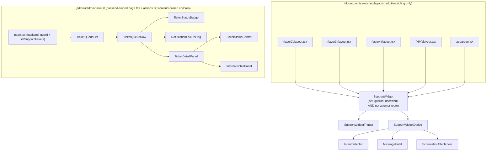
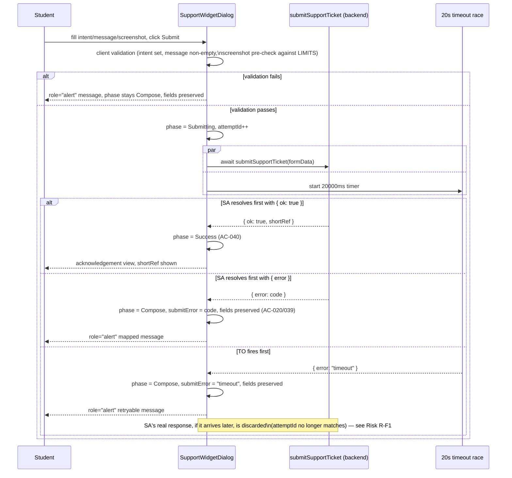

# User Support System v1 — Frontend Design Document

| | |
|---|---|
| **Version** | 1.2 |
| **Date** | 2026-08-13 |
| **Status** | Draft — frontend design for the User Support System v1 feature. Consumes ADR-0012's transport decision indirectly (through the backend contracts it specifies) and the backend Design Doc's published Server Action / type contracts directly. Scope: React component tree, client/server boundary, client-side state machines, i18n key inventory, and admin-page UI composition. **Data layer, RLS, Storage policy, mail module, and Server Action business logic are out of scope** — owned by the backend Design Doc, which this document treats as an upstream, not-yet-Accepted dependency (see Risks). |
| **PRD** | `docs/prd/support-system-prd.md` (v1.2, Draft — D1–D10 locked) |
| **UI Spec** | `docs/ui-spec/support-system-ui-spec.md` (v1.1) |
| **ADR** | `docs/adr/ADR-0012-support-system-email-transport-and-admin-allowlist.md` (Accepted) |
| **Backend Design Doc** | `docs/design/support-system-backend-design.md` (v1.2, Draft) — this document's primary upstream contract source |

## Overview

### One-line Summary

Turn the UI Spec's component decomposition into an implementable React contract: a self-guarding, cross-route-group `SupportWidget` (trigger + dialog, mounted in five route-group layouts plus the homepage) that calls the backend's `submitSupportTicket` Server Action, and an `/admin/tickets` queue (list + expandable row + status/notes controls) that calls `listSupportTickets`, `changeTicketStatusAction`, and `addTicketNoteAction`.

### Referenced UI Spec

- UI Spec path: `docs/ui-spec/support-system-ui-spec.md` (v1.1)
- This document inherits the UI Spec's component tree, state × display matrices, interaction tables, design tokens, and accessibility requirements verbatim — it does not restate visual design, only the React implementation contract that realizes it (file paths, props, state machines, the client/server boundary, and the i18n key inventory the UI Spec's `t("support....")` calls resolve through).
- Component structure, screen transitions, and visual design remain the UI Spec's authority. Where a UI Spec decision left an implementation mechanism open (e.g., `ScreenshotAttachment`'s loading-state description, provisional on TBD-02), this document resolves it against the backend Design Doc's now-final answer (TBD-02: server-proxied upload).

### Scope

- In scope: `SupportWidget` and its five children (`SupportWidgetTrigger`, `SupportWidgetDialog`, `IntentSelector`, `MessageField`, `ScreenshotAttachment`); the `/admin/tickets` route's rendering layer (`TicketQueueList`, `TicketQueueRow`, `TicketStatusBadge`, `NotificationFailureFlag`, `TicketDetailPanel`, `TicketStatusControl`, `InternalNotesPanel`) composed inside the backend-owned `page.tsx`; the `loading.tsx`/`error.tsx` route boundaries for `/admin/tickets` (a gap neither the UI Spec nor the backend Design Doc assigned a file path to — see Existing Codebase Analysis); the `support.*` i18n key inventory; the client-side 20-second submission ceiling mechanism.
- Out of scope (owned elsewhere, not modified here): `submitSupportTicket`, `changeTicketStatusAction`, `addTicketNoteAction`, `listSupportTickets`, schema/RLS/Storage, `sendSupportNotification` (all backend Design Doc); `ReportExam.tsx`, `admin/page.tsx`, `admin/actions.ts`, `admin/ModerationRow.tsx` (D8 — untouched, exam-content moderation stays separate); the `(admin)/admin/tickets/page.tsx` guard-and-data-fetch logic itself (backend-owned — see Interface Change Impact Analysis for the composition boundary).

## Design Summary (Meta)

```yaml
design_type: "new_feature"        # new component tree consuming an already-specified backend contract
risk_level: "low-medium"          # no new data/security surface (backend owns that); the residual risk is
                                   # UI-state-machine correctness (never-optimistic success, preserved input
                                   # on error, exam-route absence) and a genuine backend-frontend contract-shape
                                   # gap this document must resolve (see Fact Disposition)
complexity_level: "medium"
complexity_rationale: >
  (1) SupportWidget mounts across five route-group layouts plus the homepage and must self-guard on BOTH the
      `user` prop and the exact attempt-route pathname (AC-003, AC-005) — a single missed mount point or a
      wrong pathname match silently reopens the D1 exclusion this feature exists partly to satisfy;
  (2) the backend's `submitSupportTicket(formData): Promise<SubmitTicketResult>` signature does not match the
      two-argument `useActionState` shape `ModerationRow.tsx`/`ReportExam.tsx` use for their own server calls
      in two DIFFERENT ways (a plain async call in ReportExam, a `useActionState`-bound action in
      ModerationRow) — this document must pick and justify one shape per call site, and for the two admin
      actions (`changeTicketStatusAction(ticketId, nextStatus)`, `addTicketNoteAction(ticketId, noteText)`)
      must design a `useActionState`-compatible FormData adapter, since neither matches `(prevState,
      formData)` either;
  (3) the PRD's 20-second submit-abort ceiling has no `AbortSignal`-capable hook into a Next.js Server Action
      invocation (unlike `checkSchemaVersion.ts`'s `fetch`-based precedent) — this document must specify a
      client-side race/timeout mechanism and document what it does and does not guarantee;
  (4) the admin queue's `TicketWithNotes` shape is backend-owned and not yet concretely typed in the backend
      Design Doc's published excerpt — this document consumes it by type reference rather than
      re-declaring it, which is correct but leaves a to-be-verified dependency (see Existing Codebase
      Analysis, Dependency Existence Verification).
main_constraints:
  - "UI Spec UI-D1–UI-D8 are locked; this document does not re-litigate widget placement, z-index, dialog
     shell, or the SuccessToast rejection (UI-D8) — it only adds the React implementation shape."
  - "R12/ADR-0002: ticket message, page URL, and user agent render as escaped plain text on the admin page —
     no `RichText`, no `dangerouslySetInnerHTML`, ever, for these three fields."
  - "AC-035/AC-036: every student- and admin-facing string resolves through `useT()`/`getTranslate()`; the
     `[report-ms]` token is mail-module-only and never appears in this document's i18n key list (R16)."
  - "D5/AC-031/AC-040: the acknowledgement view is reachable only after `submitSupportTicket` resolves with
     `{ ok: true }` — never rendered optimistically on click."
main_risks_summary: "See Risks and Mitigation — the two live risks are the backend Design Doc's own Draft
  (not Accepted) status, and the client-side timeout race's inability to cancel an in-flight Server Action
  request."
```

## Background and Context

This feature already has an Accepted ADR (email transport) and a Draft backend Design Doc (data/API layer) upstream of this document. The PRD (v1.2, LARGE/fullstack scale) and UI Spec (v1.1) are both further upstream and are treated as fixed inputs — no product or visual decision already locked in either is re-opened here.

## Agreement Checklist

### Scope (agreed)

- [x] Build `SupportWidget` and its five UI Spec-defined children, mounted at the five UI-D1 mount points (`(layer2)`, `(layer3)`, `(layer4)`, `(HM)` layouts, and `app/page.tsx`) — reflected in Existing Codebase Analysis (mount point verification) and Change Impact Map.
- [x] Build the `/admin/tickets` rendering layer (seven components) composed inside the backend-owned `page.tsx` — reflected in Data Contracts and Interface Change Impact Analysis.
- [x] Add `SOURCE/app/(admin)/admin/tickets/loading.tsx` and `error.tsx` (Next.js route-boundary convention, cited by UI Spec but not assigned a file path by either upstream document) — reflected in Change Impact Map.
- [x] Add the full `support.*` i18n key inventory to `vi.ts`/`en.ts` — reflected in Data Contracts.
- [x] Resolve the `submitSupportTicket`/`changeTicketStatusAction`/`addTicketNoteAction` call-shape mismatch against `useActionState`'s two-argument convention — reflected in Data Contracts and Fact Disposition.
- [x] Specify the client-side 20-second submission ceiling mechanism (PRD NFR) — reflected in State Transitions and Verification Strategy.

### Non-Scope (explicitly not changing)

- [ ] `SOURCE/lib/support/actions.ts`, `validateScreenshot.ts`, `types.ts`, `SOURCE/lib/mail/*`, `SOURCE/app/(admin)/admin/tickets/actions.ts`'s internals, `SOURCE/lib/supabase/service-role.ts`'s four new functions, `schema.sql`, `RATE_LIMITS`, `checkEnv.ts`, `LIMITS` — all backend Design Doc scope; this document imports their published types/signatures and does not redefine them.
- [ ] `SOURCE/app/(admin)/admin/tickets/page.tsx`'s guard (`getCurrentUser()`/`isAdminUserId()`/`notFound()`) and data-fetch call (`listSupportTickets()`) — backend-specified; this document only adds the JSX composition inside that already-contracted Server Component.
- [ ] `ReportExam.tsx`, `admin/page.tsx`, `admin/ModerationRow.tsx`, `admin/actions.ts`, `exam_reports` — untouched (D8, AC-007).
- [ ] `BottomNav.tsx`, `button.tsx`, `PageContainer.tsx`, `PageHeader.tsx`, `SuccessToast.tsx` — read and reused per UI Spec's Existing Component Reuse Map; none of their own source is modified.

### Constraints

- [x] Browser compatibility: Chrome/Firefox/Safari/Edge latest 2 versions (repository-wide default) — no browser-specific API used beyond `URL.createObjectURL`, `FormData`, and `fetch`-adjacent Server Action invocation, all broadly supported.
- [x] Accessibility: WCAG 2.1 AA (site default) — reflected in every component's Interaction Definition inherited from the UI Spec; this document adds no new accessibility surface beyond what UI Spec Accessibility Requirements already specify.
- [x] Performance: 20s submit-abort ceiling, ~2s p95 no-screenshot acknowledgement (hand-measured, not CI-gated) — reflected in State Transitions' timeout mechanism.
- [x] No design contradicts the UI Spec's locked UI-D1–UI-D8 decisions — confirmed by cross-reference in Existing Codebase Analysis and Data Contracts; no reason found to deviate from any of them.

### Assumed Behaviors

- [x] **`useT()` never throws when rendered outside an `I18nProvider` and degrades to the default locale.** Evidence: `SOURCE/lib/i18n/client.tsx:33-36` (`useT` returns `ctx?.t ?? createTranslate(getDictionary(DEFAULT_LOCALE))`). Confirmed: **Yes**. Relevant because `SupportWidget` mounts inside five different layouts and must not assume a specific provider nesting depth beyond "inside the root layout," which already wraps every route (standard Next.js root-layout convention, not independently re-verified here since it is unchanged by this feature).
- [x] **`LIMITS` (from `SOURCE/lib/ugc/limits.ts`) is safely importable from a client component.** Evidence: `ReportExam.tsx:12` (`import { LIMITS } from "@/lib/ugc/limits";"`), a `"use client"` file, already does this in production; the module carries no `"server-only"` guard (`SOURCE/lib/ugc/limits.ts:1-38`, no such import). Confirmed: **Yes**. This licenses `ScreenshotAttachment`'s client-side pre-validation against `LIMITS.MAX_SCREENSHOT_BYTES`/`LIMITS.ALLOWED_SCREENSHOT_MIME` once the backend Design Doc's additions land (see Fact Disposition).
- [x] **All four non-`(admin)`, non-`(layer1)` route-group layouts (`(layer2)`, `(layer3)`, `(layer4)`, `(HM)`) already call `getCurrentUserProfile()` and render `<BottomNav />`, and `app/page.tsx` renders `<BottomNav />` directly.** Evidence: `(layer2)/layout.tsx:11-32` read directly (confirms the pattern); `(layer3)/layout.tsx`, `(layer4)/layout.tsx`, `(HM)/layout.tsx` confirmed to exist by Glob but not individually re-read line-by-line in this session — this document relies on the UI Spec's own stronger claim ("verified by reading all four," UI Spec UI-D1 rationale) for their structural identity, and independently confirms `app/page.tsx:5,8` imports `BottomNav` and `getCurrentUserProfile`. Confirmed: **Yes** for `(layer2)` and `page.tsx` (directly read); **Inherited, not independently re-verified** for `(layer3)`/`(layer4)`/`(HM)` — see the matching Risks row.
- [ ] **The backend Design Doc's `TicketWithNotes` type (consumed, not redefined, by the admin components below) will be exported from `SOURCE/lib/supabase/service-role.ts` with the field set this document's components assume (id, intent, message, pageUrl, userAgent, screenWidth, screenHeight, screenshotUrl, status, notifyFailed, createdAt, firstStatusTransitionAt, notes[]).** Evidence: the backend Design Doc's `listSupportTickets` contract (`support-system-backend-design.md:939-954`) names these fields prose-wise but does not publish a concrete TypeScript type literal in the excerpt available to this document. Confirmed: **No** → see the matching Risks row (R-F2); mitigated by importing the type by reference (`import type { TicketWithNotes } from "@/lib/supabase/service-role"`) rather than re-declaring it, so a field-shape mismatch surfaces as a compile error at the actual field-access site, not as a silent runtime gap.

### Applicable Standards

- [x] `useT()` (client) / `getTranslate()` (server) for every display string; flat `domain.key` naming (`support.*`) `[explicit]` — Source: `SOURCE/lib/i18n/client.tsx`, `server.ts`; existing `report.*`/`admin.*` keys.
- [x] Client component boundary marked `"use client"` only at the smallest interactive scope; Server Components by default `[explicit]` — Source: `(layer2)/layout.tsx` (Server Component) rendering `<SiteHeader user={user} />`/`<BottomNav />` (client leaves); `ReportExam.tsx`/`ModerationRow.tsx` (`"use client"` at the leaf, not the route).
- [x] Dialog shell: scrim `bg-[#1B1512]/40`, `role="dialog" aria-modal="true" aria-labelledby`, Escape-to-close, scrim-click-to-close, minimal focus trap `[explicit]` — Source: `ReportExam.tsx:81-96`; locked by UI Spec UI-D7.
- [x] Server Action error contracts are closed unions returning machine-readable codes, never raw DB/Storage error text; the client maps codes to i18n copy `[explicit]` — Source: `reportExam`'s `{ error: "duplicate" | "empty" | ... }` shape, consumed exactly this way by `ReportExam.tsx:58-68`; backend Design Doc's `SubmitTicketResult`.
- [x] `useActionState` + hidden-input `FormData` for admin row actions whose backend signature is `(id, value)`, not `(prevState, formData)` `[explicit — one existing instance, ModerationRow.tsx]` — Source: `ModerationRow.tsx:11-23` (`examId`/`action` as hidden inputs, `moderateExamAction` itself IS `(prevState, formData)`-shaped, unlike this feature's two backend actions — see Fact Disposition for the resolved gap).
- [x] Design tokens read from `SOURCE/app/globals.css`'s `:root` block, no new token introduced `[explicit]` — Source: UI Spec Design Tokens section; this document introduces no new component that needs a token UI Spec did not already name.
- [x] No-shadow/no-gradient layering (background color + hairline border only) `[explicit]` — Source: `globals.css` inline comment, UI Spec Elevation table.
- [x] Numeric domain limits centralized in `SOURCE/lib/ugc/limits.ts`'s `LIMITS`, never a locally re-declared magic number `[explicit]` — Source: `limits.ts:4-36`; `ReportExam.tsx:12,106` importing `LIMITS.MAX_REPORT_REASON`. This document's `MessageField`/`ScreenshotAttachment` import `LIMITS.MAX_SUPPORT_MESSAGE`/`MAX_SCREENSHOT_BYTES`/`ALLOWED_SCREENSHOT_MIME` the same way, once the backend Design Doc's additions land.
- [x] Vietnamese inline comments matching the surrounding file's existing convention `[implicit]` — Evidence: every frontend file read in this investigation (`ReportExam.tsx`, `ModerationRow.tsx`, `StatusBadge.tsx`, `BottomNav.tsx`, `PageContainer.tsx`, `PageHeader.tsx`, `SuccessToast.tsx`) carries Vietnamese-language header/inline comments explaining rationale. Confirmed: Yes (this document's own component specs below follow the same convention for their proposed header comments).

### Quality Assurance Mechanisms

- [x] ESLint (`npm run lint`, `--max-warnings 0`) — Enforces: zero new lint errors/warnings — Config: `SOURCE/eslint.config.mjs` — Covers: project-wide — Status: `adopted`.
- [x] TypeScript (`npx tsc --noEmit`) — Enforces: type correctness, including that `TicketWithNotes` field access compiles against whatever shape the backend actually exports — Config: `.github/workflows/ci.yml:51-52` — Covers: all new component files — Status: `adopted`.
- [x] Vitest + React Testing Library (`npm test`) — Enforces: component-level behavior tests (state transitions, validation, i18n string resolution) — Config: `SOURCE/vitest.config.ts` (`include: components/**, app/**`) — Covers: every new component below — Status: `adopted`.
- [x] i18n dictionary contract tests (`SOURCE/lib/i18n/__tests__/i18n.test.ts`) — Enforces: vi/en key parity for every new `support.*` key; the existing `report-ms`-absence assertion (backend-added) implicitly also covers this document's dictionary edits, since both edit the same two files — Config: same file — Covers: `vi.ts`/`en.ts` — Status: `adopted`.
- [x] Production build in CI (`npx next build`) — Enforces: no `"use client"` boundary violation (e.g., a server-only import leaking into `SupportWidgetDialog`) — Config: `.github/workflows/ci.yml:74-80` — Covers: entire app — Status: `adopted`.
- [ ] axe automated accessibility audit — Status: `noted` — reason: no axe integration exists in this repository's current toolchain (not found in `package.json` scripts during investigation); the UI Spec's "0 serious/critical axe issues" quality metric is therefore **not CI-enforced** today. Recorded as a gap for the Work Plan to either add an axe dependency or downgrade to a manual keyboard-pass-only acceptance mechanism — this document does not silently claim automated coverage that does not exist.
- [ ] No-hard-coded-display-string lint rule (AC-035) — Status: `noted` — reason: `SOURCE/eslint.config.mjs` (read directly) configures only `eslint-config-next`'s core-web-vitals and typescript rule sets; no `jsx-no-literals`/`i18next`-equivalent rule exists to flag a JSX string literal that bypasses `useT()`/`getTranslate()`. The existing i18n dictionary contract test (`i18n.test.ts`, `adopted` above) enforces vi/en key **parity**, not the absence of un-keyed literals, and `tsc --noEmit`'s `MessageKey` check only catches a reference to a nonexistent key, not a hard-coded string that never calls `t()` at all. AC-035 is verified by code review at minimum until an automated check is added (see Verification Strategy).
- [x] Manual 360px viewport pass (Playwright MCP or `npm run dev` + browser resize) — Enforces: AC-006's zero-`BottomNav`-intersection guarantee — Config: `docs/project-context/external-resources.md`'s Visual Verification Environment entry — Covers: `SupportWidgetTrigger` — Status: `adopted` (manual, matches UI Spec's own "360px viewport pass is mandatory before ship" note).

## External Resources Used

Project-tier facts are recorded in `docs/project-context/external-resources.md` (last updated 2026-08-08, consulted directly in this session). This document's feature-specific subset is identical to the UI Spec's own table (`support-system-ui-spec.md:38-47`) — no new external resource is introduced by moving from UI Spec to Design Doc, since this document adds implementation shape, not new design/visual sourcing:

| Resource (project-tier label) | Feature-specific identifier | Notes |
|-------------------------------|------------------------------|-------|
| Design Origin | `SOURCE/app/globals.css` root token block | Inherited from UI Spec; no new token needed |
| Design System | `SOURCE/components/ui/button.tsx`; `SOURCE/components/layout/{PageContainer,PageHeader}.tsx`; `SOURCE/app/(layer4)/_components/StatusBadge.tsx` (pattern precedent) | Read directly in this session (see Existing Codebase Analysis) |
| Guidelines | `SOURCE/app/globals.css` inline comments (contrast, no-shadow/no-gradient) | Applied to `TicketStatusBadge`'s color choice below (Data Contracts) |
| Visual Verification Environment | `npm run dev` + Playwright MCP (`.mcp.json`); `/exams`, `/`, `/history` for the widget, `/admin/tickets` for admin | 360px pass mandatory (AC-006) |
| API Schema Source (Design-Doc-specific addition) | `docs/design/support-system-backend-design.md` §Data Contracts — `submitSupportTicket`, `changeTicketStatusAction`, `addTicketNoteAction`, `listSupportTickets` signatures; `SOURCE/lib/support/types.ts` (`TicketIntent`, `TicketStatus`, `SubmitTicketResult`) | This document's primary contract source; imported by type reference, never redefined |

## Standards Identification

Covered above under Applicable Standards and Quality Assurance Mechanisms (both required subsections of Standards Identification per the documentation-criteria skill; consolidated into the Agreement Checklist block above to avoid duplicating the same evidence twice in one document).

## Problem to Solve

The UI Spec fully specifies what each component looks like, what it does on each interaction, and which backend contract it consumes — but not which file it lives in, how its internal React state is shaped, how it invokes a Server Action whose call signature does not match either of this repository's two existing client-calls-a-Server-Action patterns, or how the PRD's 20-second ceiling is realized without an `AbortSignal` hook into a Server Action call. This document resolves those implementation-shape questions so the component tree is directly buildable.

### Requirements

Traceable to PRD v1.2's frontend-owned AC subset, as delimited by the backend Design Doc's own "AC Responsibility" table (`support-system-backend-design.md:214-220`): **AC-001, AC-003, AC-005, AC-006, AC-007, AC-020, AC-035, AC-037, AC-038, AC-039, AC-040, AC-042**, plus the UI-rendering half of AC-002, AC-011, AC-012, AC-014, AC-018, AC-022, AC-023, AC-027, AC-028, AC-041, AC-049 (data supplied by the backend, rendered here).

## Acceptance Criteria (frontend subset, EARS)

### Widget mount and visibility (R1/R2)
- [ ] **Given** a logged-in student on any mounted route, **when** they activate the trigger, **then** exactly three intent options render in Vietnamese, no fourth option exists in markup. (AC-001)
- [ ] **Given** no authenticated session, **when** any mounted page renders, **then** `SupportWidget` returns `null` — no DOM node, not a hidden one. (AC-003)
- [ ] **Given** the current pathname matches the `(layer2)` attempt route pattern, **when** the page renders, **then** `SupportWidget` returns `null` regardless of auth state. (AC-005)
- [ ] **Given** a 360px viewport on a page where the trigger renders, **when** measured, **then** the trigger's bounding box has zero intersection with `BottomNav`'s bounding box. (AC-006)
- [ ] **Given** `ReportExam.tsx`, **when** this feature ships, **then** its file, props, and `exam_reports` write path are unmodified. (AC-007)

### Submission feedback (R6/R13)
- [ ] **Given** a rate-limited refusal (`{ error: "rate_limited" }`), **when** it renders, **then** the student's typed intent and message remain exactly as entered. (AC-020)
- [ ] **Given** a submission that fails before commit (network/server/timeout), **when** the error renders, **then** intent, message, and screenshot selection are all preserved and the error is retryable. (AC-039)
- [ ] **Given** `submitSupportTicket` has not yet resolved with `{ ok: true }`, **when** any intermediate state renders, **then** the acknowledgement view is never shown — no optimistic success. (AC-040)

### i18n and render safety (R11/R12)
- [ ] **Given** any string in `SupportWidget*`/`TicketQueue*`/`TicketDetailPanel`/`InternalNotesPanel`, **when** the code is inspected, **then** it resolves through `useT()`/`getTranslate()` — zero hard-coded display strings. (AC-035)
- [ ] **Given** a ticket message containing HTML/script-like text, **when** `TicketDetailPanel` renders it, **then** it appears as inert, escaped characters via `<p className="whitespace-pre-wrap">{message}</p>` — never `RichText`, never `dangerouslySetInnerHTML`. (AC-037)
- [ ] **Given** the captured page URL and user agent, **when** rendered, **then** both appear as plain text, and the URL is never an auto-activated `<a href>`. (AC-038)

### Status distinguishability (R14)
- [ ] **Given** tickets in different statuses, **when** `TicketQueueRow` renders, **then** `TicketStatusBadge` shows a distinct glyph + distinct Vietnamese text per status — never color alone. (AC-042)

## Existing Codebase Analysis

### Implementation File Path Verification

`Glob: SOURCE/components/support/**` and `Glob: SOURCE/app/(admin)/admin/tickets/**` both returned zero matches — confirmed fresh implementation, no partial prior work to reconcile.

### Similar Component Search and Decision

Searched the repository for dialog, admin-row, and status-label patterns before proposing any new component (frontend-ai-guide Pattern 5 prevention):

| Need | Search result | Decision |
|------|---------------|----------|
| Modal dialog with scrim, Escape/scrim-click-to-close, minimal focus trap | `ReportExam.tsx` (only match; UI Spec UI-D7 already names it the pattern to reuse) | **Reuse the pattern, new component** (`SupportWidgetDialog`) — UI Spec's own departure notes (first-field focus, focus-returns-to-trigger) are structural enough that importing `ReportExam.tsx` wholesale is not viable; a new file following its shell classes verbatim is correct, not a missed-reuse case |
| Admin row with inline expand + form-action wiring | `ModerationRow.tsx` (only match; UI Spec UI-D2 already names it) | **Reuse the pattern, new component** (`TicketQueueRow`) — different domain (moderation vs. support triage), different action signatures (see Fact Disposition); UI Spec's I002 finding already rejected extending `StatusBadge` itself for the same reason (glyph collision), reinforcing "new sibling, not extension" for the whole admin surface |
| Status label, glyph + text, never color alone | `StatusBadge.tsx` (only match) | **Reuse the pattern, new sibling component** (`TicketStatusBadge`) — locked by UI Spec UI-D2/I002; not re-litigated here |
| Toast/inline success confirmation | `SuccessToast.tsx` (only match) | **Rejected, new in-dialog content swap** — locked by UI Spec UI-D8 (auto-dismiss defeats a reference the student may want to read); not re-litigated here |
| Route-level loading/error boundary for a data-fetching admin route | `(HM)/history/loading.tsx`, `error.tsx` (closest precedent; `(admin)/admin/` itself has neither, since it renders synchronously with no `loading.tsx` today) | **New files, reusing `history`'s exact pattern** (skeleton rows sized to `PageContainer size="default"`, `role="alert"` error boundary with `reset()`-wired retry) — see Change Impact Map; neither UI Spec nor the backend Design Doc assigned this a file path, so it is recorded here as newly identified scope, not carried forward from either upstream document |

No existing implementation is technical debt requiring an ADR-improvement proposal; every match above is a clean pattern-reuse case.

### Dependency Existence Verification

| Dependency this design assumes exists | Status | Evidence |
|---|---|---|
| `submitSupportTicket(formData): Promise<SubmitTicketResult>` | External dependency — backend Design Doc, not yet implemented | `support-system-backend-design.md:859-891` (Data Contract) |
| `changeTicketStatusAction(ticketId, nextStatus): Promise<TicketActionState>` | External dependency — backend Design Doc, not yet implemented | `support-system-backend-design.md:895-919` |
| `addTicketNoteAction(ticketId, noteText): Promise<TicketActionState>` | External dependency — backend Design Doc, not yet implemented | `support-system-backend-design.md:921-937` |
| `listSupportTickets(): Promise<TicketWithNotes[]>` (called inside backend-owned `page.tsx`, not by this document's components directly) | External dependency — backend Design Doc, not yet implemented | `support-system-backend-design.md:939-954` |
| `TicketIntent`, `TicketStatus`, `SubmitTicketResult`, `TicketActionState` (types) | External dependency — backend Design Doc's `SOURCE/lib/support/types.ts`, not yet created | `support-system-backend-design.md:816-826` |
| `TicketWithNotes` (type, admin list item shape) | External dependency — backend Design Doc names the fields in prose but has not published a type literal in the excerpt available here | `support-system-backend-design.md:948-951`; **requires confirmation at implementation time** — see Assumed Behaviors and Risks (R-F2) |
| `LIMITS.MAX_SUPPORT_MESSAGE`, `MAX_SCREENSHOT_BYTES`, `ALLOWED_SCREENSHOT_MIME` | External dependency — backend Design Doc's addition to `SOURCE/lib/ugc/limits.ts`, not yet created | `support-system-backend-design.md:849-855` |
| `useT()`, `useLocale()`, `I18nProvider` | Verified existing in codebase | `SOURCE/lib/i18n/client.tsx:1-41` (read directly) |
| `getTranslate()` (server) | Verified existing in codebase | `SOURCE/lib/i18n/server.ts:1-27` (read directly) |
| `Button` (`shape="pill"`), `PageContainer`, `PageHeader` | Verified existing in codebase | `SOURCE/components/ui/button.tsx`, `SOURCE/components/layout/{PageContainer,PageHeader}.tsx` (read directly) |
| `BottomNav`, five layouts' `getCurrentUserProfile()`/mount structure | Verified existing in codebase (directly for `(layer2)` and `page.tsx`; existence-confirmed by Glob, structure inherited from UI Spec's own claim for `(layer3)`/`(layer4)`/`(HM)`) | `BottomNav.tsx`, `(layer2)/layout.tsx`, `page.tsx` (read directly); `(layer3)/layout.tsx`, `(layer4)/layout.tsx`, `(HM)/layout.tsx` (Glob-confirmed to exist) |
| `getCurrentUser()`, `isAdminUserId()`, `hasAdminsConfigured()` | Verified existing in codebase | `SOURCE/lib/auth/admin.ts` (read directly); `admin/page.tsx:24-25` (read directly, application point) |
| `MessageKey`, `cn()` utility | Verified existing in codebase | `StatusBadge.tsx:9-10` (imports both) |

### Code Inspection Evidence

| File/Function | Relevance |
|---|---|
| `SOURCE/app/(layer2)/_components/ReportExam.tsx` (full file) | Dialog shell, focus/Escape/scrim handling, plain-`useState`-driven async submit, error-message rendering pattern `SupportWidgetDialog` follows |
| `SOURCE/app/(admin)/admin/ModerationRow.tsx` (full file) | `useActionState` + hidden-`FormData`-input pattern `TicketStatusControl`/`InternalNoteForm` follow to bridge a two-argument backend action into a form-action shape |
| `SOURCE/app/(admin)/admin/actions.ts` (full file) | Confirms `moderateExamAction` itself already has the `(prevState, formData)` shape (unlike this feature's two new admin actions) — the precedent this document departs from, with the departure documented in Fact Disposition |
| `SOURCE/app/(layer4)/_components/StatusBadge.tsx` (full file) | `CONFIG` map + glyph + `cn()` shape `TicketStatusBadge` mirrors with its own independent type/config (UI Spec I002) |
| `SOURCE/components/layout/BottomNav.tsx` (full file) | Confirms `z-40`, `fixed inset-x-0 bottom-0`, `md:hidden` — the AC-006 operand `SupportWidgetTrigger`'s `calc()` offset is computed against |
| `SOURCE/components/ui/button.tsx` (full file) | `buttonVariants` `shape="pill"` variant `SupportWidgetTrigger` extends per UI Spec's Existing Component Reuse Map |
| `SOURCE/components/ui/SuccessToast.tsx` (full file) | Confirms the auto-dismiss behavior (`durationMs = 3000`) UI Spec UI-D8 rejects for this feature's acknowledgement |
| `SOURCE/components/layout/{PageContainer,PageHeader}.tsx` (full files) | `size`/`padding` variant props `/admin/tickets`' composition and its `loading.tsx` reuse |
| `SOURCE/app/(admin)/admin/page.tsx` (full file) | The exact guard + `PageContainer`/`PageHeader` composition shape `admin/tickets/page.tsx` (backend-owned) is expected to follow; this document's `TicketQueueList` is designed to slot into that same composition shape as a child |
| `SOURCE/app/(HM)/history/loading.tsx`, `error.tsx` (full files) | The route-boundary pattern (`PageContainer` skeleton; `role="alert"` + `reset()`-wired retry) `/admin/tickets`' new `loading.tsx`/`error.tsx` follow |
| `SOURCE/lib/i18n/client.tsx`, `server.ts` (full files) | `useT()`/`getTranslate()` signatures; confirms `useT()`'s no-provider fallback (Assumed Behaviors) |
| `SOURCE/lib/i18n/dictionaries/vi.ts:1-60,170-175,259-359` | Existing `report.*`/`admin.*`/`common.*` key conventions and tone ("bạn", not "quý khách") the new `support.*` keys follow; confirms `common.cancel`/`common.retry`/`common.working` already exist and are reused rather than duplicated |
| `SOURCE/lib/ugc/limits.ts` (full file) | Confirms `LIMITS` has no `"server-only"` guard, licensing client-side import (Assumed Behaviors) |
| `SOURCE/lib/auth/admin.ts`, `SOURCE/lib/auth/getCurrentUser.ts:22,26` | `isAdminUserId`/`hasAdminsConfigured`/`getCurrentUserProfile` signatures; `CurrentUserProfile = { id, email, displayName } | null`, the exact type `SupportWidget`'s `user` prop carries |
| `SOURCE/app/(layer2)/layout.tsx`, `SOURCE/app/page.tsx:1-40` | The two UI-D1 mount points read directly in this session; confirms `getCurrentUserProfile()` call site and `<BottomNav />` render position |

### Behavioral Claim Verification

Covered above under Agreement Checklist → Assumed Behaviors (the shared slot per the Existing Code Investigation process); no additional behavioral claim beyond those four is made in this document.

### Fact Disposition Table

No structured `Codebase Analysis` tool-output artifact (`focusAreas` JSON) was supplied as an input to this task — the investigation above was performed directly (Glob/Grep/Read) rather than consuming a prior analyzer pass. The table below therefore does not carry `code:`-prefixed `fact_id`s from an external analyzer; instead it records this document's own resolution of every genuine ambiguity or gap discovered between the UI Spec and the backend Design Doc, using the same disposition vocabulary for traceability.

| Finding | Disposition | Rationale | Evidence |
|---|---|---|---|
| `submitSupportTicket`'s one-argument signature vs. `useActionState`'s required `(prevState, formData)` shape | transform | `SupportWidgetDialog` calls `submitSupportTicket(formData)` directly inside a plain `async` handler (ReportExam's shape), not via `useActionState` — see Data Contracts. Chosen over a `useActionState` wrapper because `ReportExam.tsx`'s own precedent already solves the same "multi-field dialog, need custom Success sub-state swap" problem without one, and `useActionState`'s built-in `pending` flag does not, by itself, give a clean seam for the client-side 20s timeout race this feature additionally needs. | `SOURCE/app/(layer2)/_components/ReportExam.tsx:48-69`; backend Design Doc `support-system-backend-design.md:862` |
| `changeTicketStatusAction(ticketId, nextStatus)` / `addTicketNoteAction(ticketId, noteText)`'s two-domain-argument signatures vs. `useActionState`'s `(prevState, formData)` shape | transform | `TicketStatusControl`/`InternalNoteForm` each define a local wrapper — `(prevState, formData) => changeTicketStatusAction(String(formData.get("ticketId")), formData.get("status") as TicketStatus)` — passed to `useActionState`, with `ticketId`/`status`/`noteText` carried as hidden/visible form inputs, mirroring `ModerationRow.tsx`'s `examId`/`action` hidden-input pattern exactly. This is a **new instance** of that pattern (not literally `moderateExamAction`, which already has the two-argument shape natively) — recorded here because the backend Design Doc's own prose ("mirrors `moderateExamAction`'s shape") describes the *authorization/error-handling* shape, not the *call signature*, and this document is responsible for closing that literal gap. | `SOURCE/app/(admin)/admin/ModerationRow.tsx:11-23`; `SOURCE/app/(admin)/admin/actions.ts:19-22` (confirms `moderateExamAction`'s actual native two-arg shape, the point of contrast); backend Design Doc `support-system-backend-design.md:898,924` |
| PRD's 20s client-side submit-abort ceiling has no `AbortSignal` hook into a Server Action call from the client | transform | Realized as a `Promise.race` between the `submitSupportTicket(formData)` call and a `setTimeout`-based timeout promise resolving to a client-only `{ error: "timeout" }` variant (not part of the backend's `SubmitTicketResult` union). This does **not** cancel the underlying in-flight request — documented explicitly as a residual risk (R-F1), not silently assumed away. | `SOURCE/lib/schema/checkSchemaVersion.ts:68-75` (the `AbortSignal.timeout(TIMEOUT_MS)` call site — corrected from an earlier draft's citation of `:38-41`, which pointed at the `TIMEOUT_MS` constant declaration and its comment, not the call itself; the substantive claim, a named-constant `AbortSignal`-based fetch timeout, is unchanged) — the precedent this mechanism deliberately departs from, for the same category of reason ADR-0012 documents for `nodemailer`'s own timeout-shape departure); PRD NFR (Performance, 20s ceiling) |
| UI Spec's R15 short-reference display was conditional ("if the Design Doc's mapping ships... or omitted entirely if it does not") | transform | Resolved as **unconditional**: the backend Design Doc's `SubmitTicketResult` success variant is `{ ok: true; shortRef: string }` — `shortRef` is a non-optional field, not a conditionally-present one. `SupportWidgetDialog`'s acknowledgement view therefore always renders the reference line; the UI Spec's conditional-omission branch is dead code under the backend contract as specified and is not implemented. | `support-system-backend-design.md:821-823,437` |
| UI Spec UI-D5's provisional 1000-character bound, sourced from `LIMITS.MAX_REPORT_REASON` pending Design Doc confirmation (TBD-07) | transform | Confirmed at the same numeric value (1000) but sourced from the backend Design Doc's own dedicated `LIMITS.MAX_SUPPORT_MESSAGE` constant, not the exam-report constant — `MessageField`'s `maxLength` and `{count}/1000` counter import `MAX_SUPPORT_MESSAGE`, keeping the two domains' limits independently adjustable even though they start equal. | `support-system-backend-design.md:533,851` (TBD-07 resolved) |
| UI Spec TBD-08 (exact `TicketStatusBadge` colors for `new`/`in_progress`/`resolved`), owner "Design Doc (or implementation-time visual QA)" | transform | Resolved by reuse, not invention: `in_progress` reuses `StatusBadge`'s already-audited `review` pair (`border-[#B8863B] text-[#8a6420]`); `resolved` reuses its already-audited `published` pair (`border-[#3f7d4f] text-[#2f6b3f]`); `new` reuses the plain `border-border text-muted-foreground` utility pairing already used site-wide for an "unstarted/neutral" state (`StatusBadge`'s own `processing`/`draft` entries). Zero new hex literals introduced — smallest-surface resolution (coding-principles: prefer a codebase-verified value over a new unverified one) and reuses colors already implicitly contrast-audited by their existing production use. See Data Contracts, `TicketStatusBadge`. | `SOURCE/app/(layer4)/_components/StatusBadge.tsx:14-43` (source of the reused literal values) |
| `ScreenshotAttachment`'s specific-reason error message (AC-012 "specific message") vs. `SubmitTicketResult`'s generic `"screenshot_rejected"` code (no `too_large`/`invalid_type` distinction reaches the client) | transform | Resolved by adding a **client-side pre-validation pass** (before the file is ever appended to the submitted `FormData`) using the same `LIMITS.MAX_SCREENSHOT_BYTES`/`ALLOWED_SCREENSHOT_MIME` constants the server enforces, giving the specific too-large/wrong-type message immediately and for the common case. The generic `support.screenshot.rejected` copy is kept as a fallback for the rare case the server disagrees with the client's own pre-check (e.g., a TOCTOU race is not realistic here since both sides read the same shared constant, but defense-in-depth is kept for correctness if the constant is ever bumped on one side without the other). This is the intended interpretation of AC-012's "specific message," not a deviation from it — the *authoritative* rejection remains server-side (`checkScreenshotFile`, never bypassed), only the *specific-reason UX* is client-anticipated. | `support-system-backend-design.md:823,834-846` (`SubmitTicketResult`'s generic code; `checkScreenshotFile`'s two-reason internal type, not surfaced to the client) |
| `/admin/tickets` route-boundary files (`loading.tsx`, `error.tsx`) cited by UI Spec's `TicketQueueList` state matrix but not assigned a file path by either the UI Spec or the backend Design Doc | out-of-scope-for-upstream, in-scope-here | Neither upstream document claims this file — the UI Spec names the *pattern* ("Handled by the Next.js `loading.tsx` route convention... mirroring `history/loading.tsx`") without listing the file in a path-mapping table, and the backend Design Doc's Implementation Path Mapping does not list it either (it lists only `page.tsx`/`actions.ts`). This document claims it, since it is a rendering-layer file. | `support-system-ui-spec.md:299` (pattern reference only); `support-system-backend-design.md:224-248` (Implementation Path Mapping, confirmed absent) |

## Minimal Surface Alternatives

Two in-scope elements were identified: (1) the client-only `"timeout"` error variant needed for the 20s ceiling, (2) whether to extract a reusable `useSupportTicketSubmit` hook now or keep the submit logic inline in `SupportWidgetDialog`. `TicketStatusBadge`'s existence as a new sibling component, the widget's five mount points, and the `submitSupportTicket`/admin-action call shapes are **excluded** from this gate: they are UI-Spec-locked (UI-D1, UI-D2/I002) or backend-contract-derived (Fact Disposition above), not surface choices this document is free to minimize independently.

### Element 1: Client-side timeout representation — extend the union locally vs. widen the backend's `SubmitTicketResult` type vs. a separate boolean flag

**Step 1 — Fixed Requirements**: PRD NFR (20s submit-abort ceiling — a student must see the AC-039 retryable error, not an indefinite spinner, if the request does not resolve in time).

**Steps 2–3 — Alternatives Compared**

| Alternative | Reqs covered | New persistent state | New props/modes/variants | Crosses boundary | Breaking change/migration | Subjective cost notes |
|---|---|---|---|---|---|---|
| Local client-only union `ClientSubmitError = SubmitTicketResult["error"] \| "timeout"`, used only inside `SupportWidgetDialog`'s own state (proposed) | PRD NFR | 0 (transient render state, not persisted) | 0 (not a prop — an internal state type) | No (never crosses into a Server Action call or a stored field) | No | Smallest: one derived type alias in the component file, no other file touches it |
| Widen the backend's exported `SubmitTicketResult` union to include `"timeout"` | PRD NFR | 0 | 0 | Yes (backend Design Doc's published type, backend-owned — Non-Scope) | Yes (backend's own Data Contract, currently Draft, would need editing — out of this document's authority) | A timeout is a **client-observed** condition (the request may still be in flight server-side); baking it into the server's own return-type union would misrepresent it as something the server itself can return, which it structurally cannot (the server never "returns" a timeout — the client simply stops waiting) |
| A separate `timedOut: boolean` flag alongside the existing `SubmitTicketResult`-shaped state | PRD NFR | 0 | 1 (a second piece of state to keep in sync with the first) | No | No | Two state variables that must never disagree (e.g., both an `error` code and `timedOut=true` set simultaneously) is a self-inflicted invariant this component would then have to defend against for no benefit over a single unified union |

Resolution priority: (1) new persistent state — all three are 0; (2) crosses component boundary — the local union crosses none, widening the backend type crosses into Non-Scope territory; (3) new props/modes — the boolean-flag alternative adds one, the other two add none.

**Step 4 — Selected**: Local client-only union type. Rationale: satisfies the NFR at the smallest surface (a type alias, not a new prop, not a cross-document edit, not a second state variable), and correctly keeps "the server never actually returns this" out of the server's own contract.

**Step 5 — Rejected Alternatives Log**
- Widening `SubmitTicketResult`: would require editing a Draft backend Design Doc this document does not own, and mischaracterizes a client-observed condition as a server-returnable one.
- Separate `timedOut` boolean: adds a second state variable with a co-consistency invariant the unified-union alternative does not need.

### Element 2: `useSupportTicketSubmit` custom hook now vs. inline state in `SupportWidgetDialog`

**Step 1 — Fixed Requirements**: R1/R6/R13/AC-020/AC-039/AC-040 (the dialog's own submit-and-preserve-input behavior); no requirement calls for the submit logic to be reused by a second component.

**Steps 2–3 — Alternatives Compared**

| Alternative | Reqs covered | New persistent state | New concept/mode/flag | Crosses boundary | Breaking change/migration | Subjective cost notes |
|---|---|---|---|---|---|---|
| Inline `useState` + async handler directly in `SupportWidgetDialog` (proposed) | All of the above | 0 | 0 | No | No | Matches `ReportExam.tsx`'s own precedent exactly (single-consumer dialog, state kept in the component itself); smallest possible surface |
| Extract `useSupportTicketSubmit()` custom hook | All of the above | 0 | 1 (a new named abstraction with its own API to design, document, and keep stable) | No | No | "Reusable/testable in isolation" is the only argument for it, and there is exactly one consumer (`SupportWidgetDialog`) today — a textbook first-occurrence case under the Rule of Three (frontend-ai-guide skill), not yet a pattern worth extracting |

Resolution priority: (1) new persistent state — tied at 0; (3) new concept — inline is 0, the hook is 1 (a new abstraction with only one caller).

**Step 4 — Selected**: Inline state in `SupportWidgetDialog`. Rationale: `ReportExam.tsx` already proves this shape works for a structurally similar dialog; extracting a hook for a single consumer is premature abstraction (YAGNI) and the Rule of Three's own guidance ("1st occurrence → inline implementation").

**Step 5 — Rejected Alternatives Log**
- `useSupportTicketSubmit` hook: no second consumer exists to justify the extraction; revisit if a second dialog-like consumer of the same submit-and-preserve-input shape appears later (Rule of Three, 2nd occurrence → "consider future consolidation," not yet extraction).

## Implementation Approach Decision

### Phase 1 — Current State Analysis

No frontend code for this feature exists (Glob-confirmed). The backend contracts (`submitSupportTicket`, `listSupportTickets`, both admin actions, the shared types) are fully specified by an upstream Design Doc but not yet implemented (Draft status) — this document's components are therefore designed against a contract, not against running code, which is normal for parallel frontend/backend design but means integration testing cannot begin until the backend lands.

Two structurally independent surfaces exist within this feature: the student-facing widget (five mount points, one dialog, no admin dependency) and the admin queue (one route, reads/writes the same rows the widget creates). They share only type imports (`TicketIntent`, `TicketStatus`) — no React component, hook, or client-side state is shared between them.

### Phase 2 — Strategy Exploration

Considered:
- **Vertical Slice by user-facing surface** (student widget end-to-end, then admin queue end-to-end): each surface is independently deliverable and independently valuable — the PRD's own success metric 13 ("channel actually used," ≥5 tickets in 30 days) is satisfiable the moment the widget alone ships, since the maintainer can triage via direct Supabase inspection in the interim (a degraded but real fallback, consistent with this being a solo-maintained, pre-scale product per the PRD's own Scalability NFR).
- **Horizontal Slice by shared foundation first**: rejected — there is no shared foundation *within this document's scope* to build first; the actual shared foundation (schema, RLS, Server Actions) is the backend Design Doc's own horizontal-slice foundation, already sequenced there. Re-deriving a horizontal layering inside the frontend-only scope would invent a foundation (e.g., "build the i18n keys first") that provides no independent verification value on its own.
- **Hybrid**: rejected as unnecessary — the two surfaces' independence is clean, not partial; a hybrid combination would be justified by unclear requirements or a need to change approach mid-phase, neither of which applies here (UI Spec and backend contracts are both already fixed).

### Phase 3 — Risk Assessment

The two highest risks (see Risks and Mitigation) are (a) the backend Design Doc's own Draft status, which could still change a contract this document depends on, and (b) the five-mount-point self-guard, where a missed or mis-pathed mount silently reopens D1's attempt-route exclusion. Building the widget first exercises the self-guard against all five real routes early, rather than deferring that verification behind admin-queue work that does not touch it at all.

### Phase 4 — Constraint Compatibility

No parallel-operation requirement (matches backend Design Doc's own Agreement Checklist); no coordination cost between the two surfaces exists to offset by interleaving them. Every file this document adds is new — no existing file's behavior changes mid-sequence in a way that would strand a partially-built consumer.

### Phase 5/6 — Decision and Rationale

**Selected Approach: Vertical Slice, ordered (1) student widget, (2) admin queue.**

1. **Student widget** — `SupportWidget` (self-guard) → `SupportWidgetTrigger` → `SupportWidgetDialog` (Compose state only, calling `submitSupportTicket` against a temporary stub/mock while the backend is still Draft, per the Test Boundaries mocking strategy below) → `IntentSelector`/`MessageField`/`ScreenshotAttachment` → Success sub-state → mount at all five UI-D1 points.
   - **Verification Level**: L1 (a logged-in student can open the widget, fill it, and see the acknowledgement on a real or backend-stubbed submit) once the backend's real `submitSupportTicket` lands; L2/L3 (component tests, build) available immediately, independent of backend readiness.
2. **Admin queue** — `TicketQueueList`/`Row`/`TicketStatusBadge`/`NotificationFailureFlag` (read-only rendering against `listSupportTickets`'s contract) → `TicketDetailPanel` → `TicketStatusControl`/`InternalNotesPanel` (the two write actions) → `loading.tsx`/`error.tsx`.
   - **Verification Level**: L1 once real tickets exist to display (produced by step 1 against a real backend) — this is also this document's **Integration Point**: the entire feature is first fully operational end-to-end when a real ticket submitted through the widget is visible, triageable, and note-able on `/admin/tickets`.

**Rejected**: Horizontal Slice (no independent shared foundation within this document's scope to sequence); Hybrid (no requirement ambiguity or mid-phase pivot need to justify it).

## Prerequisite ADRs (Common ADR Process)

**Common ADR check**: searched `docs/adr/ADR-COMMON-*` — none exist (same result the backend Design Doc already recorded; re-confirmed by `Glob: docs/adr/*` in this session, twelve numbered ADRs, none `ADR-COMMON-*`-prefixed). No new common ADR is created: the cross-cutting technical areas this document touches (dialog shell, admin `useActionState`+hidden-input wiring, closed-union client-side error handling, i18n-key-per-string discipline) are already established, single-precedent conventions this document adopts (`ReportExam.tsx`, `ModerationRow.tsx`) rather than a genuinely new cross-component decision.

- **ADR-0012** (Accepted) — this document has no direct dependency on the mail-transport decision (that is entirely backend-internal); it is listed as a prerequisite only because it is the ADR that unblocked the backend Design Doc this document consumes.
- **ADR-0001** (UGC content lifecycle and RLS enforcement) — "no database admin role" is honored transitively: `TicketStatusControl`/`InternalNoteForm` never assume a DB-recognized admin role exists; both call backend actions that independently re-check `isAdminUserId()` server-side, and this document's `page.tsx` composition trusts the page-level guard for *rendering* only, never for *authorization* (the actual authorization gate is backend-owned and re-checked per action).
- **ADR-0002** (Published content rendering and sanitization) — governs `TicketDetailPanel`'s render treatment directly (R12): plain `<p className="whitespace-pre-wrap">`, never `RichText`. This document's only obligation from ADR-0002 is to not introduce any markdown/HTML/KaTeX rendering path for ticket message, page URL, or user agent — confirmed nowhere in the component list below.

## Data Contracts

### Consumed backend contracts (imported by type/signature reference, not redefined)

```ts
// From "@/lib/support/types" (backend-owned)
type TicketIntent = "bug" | "suggestion" | "question";
type TicketStatus = "new" | "in_progress" | "resolved";
type SubmitTicketResult =
  | { ok: true; shortRef: string }
  | { error: "unauthenticated" | "rate_limited" | "invalid" | "screenshot_rejected" | "server" };
type TicketActionState = { error?: string; info?: string } | null;

// From "@/lib/support/actions" (backend-owned)
function submitSupportTicket(formData: FormData): Promise<SubmitTicketResult>;

// From "@/app/(admin)/admin/tickets/actions" (backend-owned)
function changeTicketStatusAction(ticketId: string, nextStatus: TicketStatus): Promise<TicketActionState>;
function addTicketNoteAction(ticketId: string, noteText: string): Promise<TicketActionState>;

// From "@/lib/supabase/service-role" (backend-owned; consumed only inside the
// backend-owned admin/tickets/page.tsx, then passed down as a prop — this
// document's components never import service-role.ts directly)
type TicketWithNotes = {
  id: string;
  intent: TicketIntent;
  message: string;
  pageUrl: string | null;
  userAgent: string | null;
  screenWidth: number | null;
  screenHeight: number | null;
  screenshotUrl: string | null;   // pre-signed by listSupportTickets, ready to render
  status: TicketStatus;
  notifyFailed: boolean;
  createdAt: string;              // ISO
  firstStatusTransitionAt: string | null; // ISO
  notes: Array<{ id: string; noteText: string; adminId: string | null; createdAt: string }>;
};
```

`TicketWithNotes`'s exact field set is this document's best-effort transcription of the backend Design Doc's prose contract (`support-system-backend-design.md:948-951`) into a type literal for the components below to code against; it is **not** an authoritative redeclaration. At implementation time, the actual exported type from `SOURCE/lib/supabase/service-role.ts` is the source of truth, and this literal must be reconciled against it (a `tsc` compile error is the expected, safe failure mode if they diverge — see Assumed Behaviors, R-F2).

### Client-only additions (this document's scope)

```ts
// Local to SupportWidgetDialog — not exported, not part of any backend contract.
type ClientSubmitError = NonNullable<Extract<SubmitTicketResult, { error: string }>>["error"] | "timeout";
```

### `SupportWidget` (new, `SOURCE/components/support/SupportWidget.tsx`, `"use client"`)

```yaml
Contract: SupportWidget({ user }: { user: CurrentUserProfile }): JSX.Element | null
Input:
  Type: user: CurrentUserProfile ({ id, email, displayName } | null) — the same object every mounting
        layout already fetches via getCurrentUserProfile() and passes to <SiteHeader user={user} /> today;
        no new fetch is introduced at any mount point
  Preconditions: none — must render safely with user = null (logged-out) at any mount point
Output:
  Guarantees: returns null (no DOM node) when user is null (AC-003) OR when usePathname() matches the
              (layer2) attempt-route pattern /^\/exams\/[^/]+\/attempt\/[^/]+$/ (AC-005) — both checks run
              on every render, so a client-side navigation into/out of the attempt route (no full page
              reload) correctly toggles visibility without a stale mount
  On Error: N/A — this component has no async operation of its own; SupportWidgetDialog owns all error states
Invariants:
  - Never renders SupportWidgetTrigger/SupportWidgetDialog when user is null, regardless of pathname.
  - The attempt-route pathname check is a single regex constant, defined once in this file, so all five
    mount points share exactly one definition of "the attempt route" — a change to that route's URL shape
    requires editing this one file, not five call sites.
```

### `SupportWidgetTrigger` (new, `SOURCE/components/support/SupportWidgetTrigger.tsx`, `"use client"`)

```yaml
Contract: SupportWidgetTrigger({ onOpen }: { onOpen: () => void }): JSX.Element
Input: onOpen — callback invoked on click/Enter/Space, owned by the parent SupportWidget (which holds the
       open/closed boolean, since the trigger and the dialog are siblings under one parent per UI Spec's
       Component Tree, not a self-contained trigger-owns-its-own-dialog pair)
Output: a fixed-position circular <Button variant="default" shape="pill" size-14> per UI-D6's exact offset
        classes; aria-label={t("support.trigger.label")}
Guarantees: purely presentational — no state, no side effect beyond calling onOpen
```

### `SupportWidgetDialog` (new, `SOURCE/components/support/SupportWidgetDialog.tsx`, `"use client"`)

```yaml
Contract: SupportWidgetDialog({ open, onClose }: { open: boolean; onClose: () => void }): JSX.Element | null
Input: open (boolean, owned by parent SupportWidget); onClose (callback — Escape/scrim/Cancel/post-Success-Close)
Internal State (useState, all local — see Minimal Surface Alternatives Element 2 for why no hook is extracted):
  - phase: "compose" | "submitting" | "success"
  - intent: TicketIntent | null
  - message: string
  - screenshot: File | null
  - screenshotError: "too_large" | "invalid_type" | null   (client pre-validation result, ScreenshotAttachment)
  - submitError: ClientSubmitError | "validation" | null   ("validation" covers AC-002's intent/message gate,
                                                              which never reaches the server at all)
  - result: Extract<SubmitTicketResult, { ok: true }> | null  (holds shortRef once committed)
Output:
  Guarantees: phase only ever transitions compose -> submitting -> (compose, with submitError set) |
              (success, with result set) — never compose -> success directly (AC-040: submitting is the
              only state that can lead to success, and it is entered only after client-side validation
              passes, and success is entered only after submitSupportTicket resolves { ok: true })
  On Error: submitError drives which i18n key renders in the dialog's role="alert" region (see i18n Key
            Inventory below); intent/message/screenshot state is NEVER cleared on any error path (AC-020,
            AC-039) — only a successful submit or an explicit Cancel/close resets them
Invariants:
  - The 20s timeout (see State Transitions) can only fire while phase === "submitting"; if it fires after
    phase has already left "submitting" (a legitimate response arrived first), the timeout's resolution is
    discarded (a monotonically increasing "attempt id" guards this — see State Transitions).
```

### `IntentSelector`, `MessageField`, `ScreenshotAttachment` (new, same directory, `"use client"`)

Presentational + local-validation children, controlled by `SupportWidgetDialog`'s state (props: `value`, `onChange`, `error`, `disabled` — the last true only while `phase === "submitting"`, per UI Spec's Loading state for each). `ScreenshotAttachment` additionally owns the `URL.createObjectURL` thumbnail lifecycle (create on file select, `URL.revokeObjectURL` on unmount/replace/clear — a client-only resource-cleanup detail the UI Spec does not need to specify but this document must, per typescript-rules' effect-cleanup guidance) and runs the client pre-validation described in Fact Disposition before calling `onChange`.

### `TicketQueueList` / `TicketQueueRow` / `TicketDetailPanel` / `InternalNotesPanel` (new, `SOURCE/app/(admin)/admin/tickets/*.tsx`)

```yaml
Contract: TicketQueueList({ tickets }: { tickets: TicketWithNotes[] }): JSX.Element
Input: tickets — the full array from listSupportTickets(), already ordered created_at desc by the backend
       (AC-041; this component does not re-sort)
Output: renders <TicketQueueRow key={ticket.id} ticket={ticket} /> per item, or t("support.admin.empty")
        when tickets.length === 0
Guarantees: no fetch of its own — a pure Server Component, receiving already-fetched data as a prop from
            the backend-owned page.tsx (no client-side re-fetch, no loading spinner inside this component;
            the route-level loading.tsx covers the initial-load wait)
```

```yaml
Contract: TicketQueueRow({ ticket }: { ticket: TicketWithNotes }): JSX.Element   ("use client" — owns expand/collapse)
Internal State: expanded: boolean (local useState, never persisted, never a URL param — no requirement asks
                a collapsed/expanded row state to survive reload; see Minimal Surface Alternatives scope note
                below)
Output: collapsed summary (intent, message excerpt, TicketStatusBadge, NotificationFailureFlag conditional,
        created time) always rendered; TicketDetailPanel rendered only when expanded
```

```yaml
Contract: TicketDetailPanel({ ticket }: { ticket: TicketWithNotes }): JSX.Element
Output: full message (<p className="whitespace-pre-wrap">, R12), metadata block (plain text, never
        auto-linked), screenshot  (UI-D4, only if ticket.screenshotUrl is non-null), TicketStatusControl,
        InternalNotesPanel
```

```yaml
Contract: TicketStatusControl({ ticketId, currentStatus }: { ticketId: string; currentStatus: TicketStatus }): JSX.Element
Wiring: useActionState(statusFormAction, null) where
        statusFormAction = (_prev: TicketActionState, formData: FormData) =>
          changeTicketStatusAction(String(formData.get("ticketId")), formData.get("status") as TicketStatus)
        — a local, file-scoped adapter (Fact Disposition), never exported, never touching the backend file
Output: three-option control (segmented/<select>) reflecting currentStatus; hidden <input name="ticketId">;
        submit posts the selected value as name="status"
```

```yaml
Contract: InternalNotesPanel({ ticketId, notes }: { ticketId: string; notes: TicketWithNotes["notes"] }): JSX.Element
Wiring: same useActionState-adapter pattern as TicketStatusControl, adapting
        addTicketNoteAction(ticketId, noteText) behind a (prevState, formData) wrapper reading
        formData.get("noteText")
Output: chronological notes list (or t("support.admin.notesEmpty")) + InternalNoteForm
```

### `TicketStatusBadge` (new, `SOURCE/app/(admin)/admin/tickets/TicketStatusBadge.tsx`, `"use client"`)

Independent `Status`/`CONFIG` per UI Spec I002 — never imported from or merged into `StatusBadge.tsx`:

```ts
const CONFIG: Record<TicketStatus, { glyph: string; labelKey: MessageKey; className: string }> = {
  new:         { glyph: "✉", labelKey: "support.admin.status.new",        className: "border-border text-muted-foreground" },
  in_progress: { glyph: "▶", labelKey: "support.admin.status.inProgress", className: "border-[#B8863B] text-[#8a6420]" },
  resolved:    { glyph: "✓", labelKey: "support.admin.status.resolved",   className: "border-[#3f7d4f] text-[#2f6b3f]" },
};
```

Colors reused verbatim from `StatusBadge.CONFIG`'s `review`/`published` entries and the repository-wide neutral `border-border text-muted-foreground` pairing — see Fact Disposition (TBD-08 resolution) for the rationale.

### `NotificationFailureFlag` (new, same directory, presentational)

`{ visible: boolean }` — renders `⚠ {t("support.admin.notifyFailed")}` when `ticket.notifyFailed` is true, else `null`. No state.

### i18n Key Inventory (`support.*`, added to `vi.ts`/`en.ts`)

Every key below resolves through `useT()`/`getTranslate()` per AC-035; none is hard-coded in a component. Exact copy is implementation-time-adjustable (not binding); the key set and interpolation placeholders are binding.

| Key | vi | Interpolation |
|---|---|---|
| `support.trigger.label` | "Gửi phản hồi" | — |
| `support.dialog.title` | "Gửi phản hồi" | — |
| `support.intent.groupLabel` | "Loại phản hồi" | — |
| `support.intent.bug` | "Báo lỗi" | — |
| `support.intent.suggestion` | "Góp ý" | — |
| `support.intent.question` | "Câu hỏi" | — |
| `support.validation.intentRequired` | "Vui lòng chọn một loại phản hồi." | — |
| `support.message.label` | "Nội dung" | — |
| `support.message.placeholder` | "Mô tả điều bạn muốn gửi…" | — |
| `support.message.count` | "{count}/{max}" | `count`, `max` |
| `support.validation.messageRequired` | "Vui lòng nhập nội dung." | — |
| `support.screenshot.label` | "Đính kèm ảnh chụp màn hình (tuỳ chọn)" | — |
| `support.screenshot.remove` | "Xoá ảnh" | — |
| `support.screenshot.uploading` | "Đang tải ảnh lên…" | — |
| `support.screenshot.tooLarge` | "Ảnh vượt quá {maxMb}MB. Chọn ảnh nhỏ hơn nhé." | `maxMb` |
| `support.screenshot.invalidType` | "Chỉ nhận ảnh PNG, JPEG hoặc WebP." | — |
| `support.screenshot.rejected` | "Ảnh không hợp lệ — bạn thử ảnh khác hoặc gửi không kèm ảnh." | — |
| `support.submit` | "Gửi" | — |
| `support.submitting` | "Đang gửi…" | — |
| `support.error.rateLimited` | "Bạn gửi hơi nhanh — thử lại sau ít phút nhé." | — |
| `support.error.network` | "Chưa gửi được — có thể do mạng. Bạn thử lại nhé." | — |
| `support.error.generic` | "Chưa gửi được lúc này. Bạn thử lại nhé." | — |
| `support.ack.title` | "Đã gửi!" | — |
| `support.ack.message` | "Cảm ơn bạn đã phản hồi. Chúng tôi sẽ xem sớm." | — |
| `support.ack.reference` | "Mã tham chiếu: {ref}" | `ref` |
| `support.ack.close` | "Đóng" | — |
| `support.admin.title` | "Hộp thư hỗ trợ" | — |
| `support.admin.empty` | "Chưa có phản hồi nào." | — |
| `support.admin.notifyFailed` | "Email báo chưa gửi được" | — |
| `support.admin.screenshotAlt` | "Ảnh chụp màn hình học sinh gửi kèm" | — |
| `support.admin.notesEmpty` | "Chưa có ghi chú nội bộ." | — |
| `support.admin.notePlaceholder` | "Ghi chú nội bộ (chỉ admin thấy)…" | — |
| `support.admin.noteSubmit` | "Lưu ghi chú" | — |
| `support.admin.noteError` | "Chưa lưu được ghi chú. Bạn thử lại nhé." | — |
| `support.admin.statusError` | "Chưa đổi được trạng thái. Bạn thử lại nhé." | — |
| `support.admin.status.new` | "Mới" | — |
| `support.admin.status.inProgress` | "Đang xử lý" | — |
| `support.admin.status.resolved` | "Đã xử lý" | — |

`common.cancel`, `common.retry`, `common.working` are **reused as-is** (already exist in `vi.ts`/`en.ts`, confirmed by direct read) — no `support.cancel`/`support.retry` duplicate key is introduced, per DRY and the Rule of Three. The `[report-ms]` token is never a key or value in this table (R16) — confirmed by construction, since it is composed entirely inside the backend's mail module.

## Field Propagation Map (serialized boundaries)

| Field | Boundary | Serialized Format | Consumer Parse Rule | Detail |
|---|---|---|---|---|
| `intent`, `message`, `pageUrl`, `userAgent`, `screenWidth`, `screenHeight` | `SupportWidgetDialog` → `submitSupportTicket` | `FormData` field values, built by this component from `window.location.href`, `navigator.userAgent`, `window.innerWidth`/`innerHeight` at submit time (R3; a capture failure — e.g. a blocked API — leaves that one field simply absent from the `FormData`, satisfying AC-010's "never blocks" without any client-side try/catch of its own, since `FormData.append` on an already-known string is infallible and the values themselves are read from always-present browser globals) | `formData.get(name)` server-side, per backend Data Contract | Client never validates these three metadata fields beyond presence — validation (non-empty message, valid intent) is the only pre-check performed |
| `screenshot` (File) | `ScreenshotAttachment` → `SupportWidgetDialog` → `submitSupportTicket`'s `FormData` | `multipart/form-data` file part, appended only if `screenshotError === null` after client pre-validation | `formData.get("screenshot")` server-side | Client pre-validation (Fact Disposition) never blocks a submit that the server would accept — it only ever narrows, never widens, what the server's own `checkScreenshotFile` would allow, since both read the identical `LIMITS` constants |
| `ticketId`, `status` | `TicketStatusControl`'s form → `statusFormAction` adapter → `changeTicketStatusAction` | Hidden `<input name="ticketId">` + selected `<select name="status">`/segmented-control value, both `FormData` fields | Adapter reads `formData.get("ticketId")`/`formData.get("status")`, casts `status` to `TicketStatus` (safe: the control only ever renders the three fixed option values — no free-text path exists client-side; the DB `CHECK` constraint remains the authoritative backstop, AC-029) | This is the resolved shape for the Fact Disposition-flagged call-signature gap |
| `ticketId`, `noteText` | `InternalNoteForm`'s form → `noteFormAction` adapter → `addTicketNoteAction` | Hidden `<input name="ticketId">` + `<textarea name="noteText">`, both `FormData` fields | Adapter reads both, calls the two-arg backend action | Same resolved shape as above |
| `shortRef` | `submitSupportTicket`'s return value → `SupportWidgetDialog`'s `result` state → acknowledgement render | In-memory string in the action's JSON-serialized return value (client never re-serializes it) | Displayed verbatim via `t("support.ack.reference", { ref: result.shortRef })`; never re-submitted anywhere (R15/AC-049, D3) | — |

## State Transitions

### `SupportWidgetDialog` phase state machine

```mermaid
stateDiagram-v2
    [*] --> Compose: dialog opens (S-02)
    Compose --> Compose: client validation fails (no intent / empty message / screenshot pre-check fails)
    Compose --> Submitting: client validation passes, submitSupportTicket(formData) called
    Submitting --> Compose: server error (rate_limited / invalid / screenshot_rejected / server /\nunauthenticated) — submitError set, ALL fields preserved (AC-020, AC-039)
    Submitting --> Compose: client timeout fires first (20s) — submitError = "timeout", fields preserved;\nthe eventual real response, if it arrives late, is discarded (see attempt-id guard below)
    Submitting --> Success: submitSupportTicket resolves { ok: true } BEFORE the timeout fires (S-03, AC-040)
    Success --> [*]: Close / Escape / scrim click
    Compose --> [*]: Escape / scrim click / Cancel, no ticket created
```

**Timeout mechanism (client-side 20s ceiling, PRD NFR)**: on entering `Submitting`, the component increments a local `attemptId` ref and starts `Promise.race([submitSupportTicket(formData), timeout(20000).then(() => ({ error: "timeout" as const }))])`. Whichever settles first is applied **only if** the `attemptId` captured at call time still matches the ref's current value (guards against a stale timeout firing after a newer attempt has already started — not reachable in this UI, since the Submit control is `aria-disabled` for the whole `Submitting` phase, but kept as a defensive invariant rather than an assumption). This mechanism cannot cancel the underlying Server Action network request (no `AbortSignal` hook is exposed by Next.js for a direct Server Action invocation, unlike `fetch`) — documented explicitly as Risk R-F1, not silently assumed away.

### `TicketQueueRow` expand/collapse

Local `expanded: boolean`, toggled on click/Enter/Space; **not** persisted (no URL param, no localStorage) — no PRD/UI-Spec requirement asks a collapsed/expanded row to survive reload, and persisting it would be exactly the kind of maintenance-surface addition the Minimal Surface Alternatives principle exists to prevent (this element was screened against the gate's in-scope/out-of-scope list: local `useState` confined to one component's internal logic is explicitly out of scope for the gate, confirmed here rather than silently assumed).

## Integration Point Map

| Integration Point | Location | Integration Method | Impact Level | Contract | Test Coverage |
|---|---|---|---|---|---|
| Widget mount | Five layouts + `page.tsx` | Render prop (`<SupportWidget user={user} />`, sibling to existing `<BottomNav />`) | Medium (new element on every authenticated page; a missed or duplicated mount is user-visible) | In: `CurrentUserProfile \| null` (already-fetched, no new query); Out: JSX or `null`; Err: N/A (no async in `SupportWidget` itself) | Component test per mount pathname (5 layouts + homepage) asserting presence/absence per AC-003/AC-005 |
| Student submit | `SupportWidgetDialog` → `submitSupportTicket` | Direct async call (not `useActionState`, not a `<form action>`) | High (the feature's core write path) | See Data Contracts | Component test with a mocked `submitSupportTicket` covering every `SubmitTicketResult` branch + the timeout branch |
| Admin status change | `TicketStatusControl` → `changeTicketStatusAction` (adapter) | `useActionState` + hidden-input `FormData` adapter | Medium (admin-only write, already re-authorized server-side) | See Data Contracts / Field Propagation Map | Component test asserting the adapter extracts `ticketId`/`status` correctly and renders `TicketActionState.error`/`.info` |
| Admin note add | `InternalNotesPanel`/`InternalNoteForm` → `addTicketNoteAction` (adapter) | Same as above | Medium | See Data Contracts / Field Propagation Map | Same shape as above |
| Admin read | Backend-owned `page.tsx` → `listSupportTickets()` → `TicketQueueList` (prop drill, no client fetch) | Server Component prop passing | Low (read-only, no independent fetch this document owns) | In: none (page.tsx supplies data); Out: `TicketWithNotes[]` rendered | No dedicated test in this document — covered by `TicketQueueList`/`Row` rendering tests given a fixture array |
| Route boundary | `/admin/tickets/loading.tsx`, `error.tsx` | Next.js file convention | Low (presentational only) | In: none / `{ error, reset }`; Out: skeleton / retry UI | Manual verification (matches `history/error.tsx`'s own precedent, which also has no dedicated test file found in this codebase) |

**Conflict check**: no naming collision with existing components (`SupportWidget*` and `Ticket*` are new names; `TicketStatusBadge` is deliberately a sibling of, not a merge into, `StatusBadge`, per UI-D2/I002). No existing route (`/admin`, `/exams`, `/history`, etc.) is modified by any mount point addition — each is an additive sibling element inside an already-rendered layout.

## Change Impact Map

```yaml
Change Target: User Support System v1 frontend (SupportWidget tree + /admin/tickets rendering layer)
Direct Impact:
  - NEW SOURCE/components/support/SupportWidget.tsx, SupportWidgetTrigger.tsx, SupportWidgetDialog.tsx,
    IntentSelector.tsx, MessageField.tsx, ScreenshotAttachment.tsx
  - NEW SOURCE/app/(admin)/admin/tickets/TicketQueueList.tsx, TicketQueueRow.tsx, TicketStatusBadge.tsx,
    NotificationFailureFlag.tsx, TicketDetailPanel.tsx, TicketStatusControl.tsx, InternalNotesPanel.tsx
  - NEW SOURCE/app/(admin)/admin/tickets/loading.tsx, error.tsx
  - SOURCE/app/(layer2)/layout.tsx, (layer3)/layout.tsx, (layer4)/layout.tsx, (HM)/layout.tsx,
    SOURCE/app/page.tsx — each gains one sibling <SupportWidget user={user} /> render, no existing line
    removed or changed
  - SOURCE/lib/i18n/dictionaries/vi.ts, en.ts — gain the support.* keys in the i18n Key Inventory above
    (additive; the report-ms absence assertion the backend Design Doc adds is unaffected, since none of
    these keys or values contain that token)
  - SOURCE/app/(admin)/admin/tickets/page.tsx (backend-owned file) — this document's components are
    imported and composed inside it; the guard/data-fetch lines themselves are not edited by this document
Indirect Impact:
  - Every existing page that renders inside the five mounting layouts gains one additional fixed-position
    element in its DOM (the trigger) when a session is present and the page is not the attempt route —
    no layout shift for existing content, since the trigger is position: fixed and out of document flow.
  - SOURCE/lib/i18n/__tests__/i18n.test.ts's key-count and parity assertions grow by the number of new keys
    (additive, no existing assertion's expected value changes).
No Ripple Effect:
  - ReportExam.tsx, exam_reports, admin/page.tsx, admin/ModerationRow.tsx, admin/actions.ts (D8).
  - StatusBadge.tsx source code (TicketStatusBadge is a sibling, never imported by or merged into it).
  - SuccessToast.tsx source code (evaluated and rejected per UI-D8; not modified).
  - BottomNav.tsx, button.tsx, PageContainer.tsx, PageHeader.tsx source code (read and reused, not edited).
  - Any backend file (schema.sql, RATE_LIMITS, checkEnv.ts, LIMITS, service-role.ts, lib/support/*,
    lib/mail/*, admin/tickets/actions.ts's internals) — this document imports their published contracts
    and does not edit them.
```

## Interface Change Impact Analysis

### Component Props Change Matrix

No existing component's Props change — every component this document introduces is new. The matrix below instead records the **call-shape reconciliation** between this document and its two upstream contract sources, which is the genuine interface-boundary work this document performs:

| Upstream contract | This document's call shape | Conversion Required | Adapter Required | Compatibility Method |
|---|---|---|---|---|
| `submitSupportTicket(formData): Promise<SubmitTicketResult>` (backend) | Direct `await` inside a plain async handler, raced against a client-side timeout | No (already a plain async-callable function) | No (the timeout race sits alongside the call, not between the caller and the function) | Local `ClientSubmitError` union superset (Minimal Surface Alternatives, Element 1) |
| `changeTicketStatusAction(ticketId, nextStatus): Promise<TicketActionState>` (backend) | `useActionState`-bound `(prevState, formData) => Promise<TicketActionState>` | Yes | Yes — local, file-scoped `statusFormAction` wrapper (Data Contracts) | Hidden-input `FormData` carries `ticketId`/`status`; wrapper extracts and forwards |
| `addTicketNoteAction(ticketId, noteText): Promise<TicketActionState>` (backend) | Same as above | Yes | Yes — local `noteFormAction` wrapper | Hidden-input `FormData` carries `ticketId`/`noteText` |
| `listSupportTickets(): Promise<TicketWithNotes[]>` (backend, called inside backend-owned `page.tsx`) | Received as a prop by `TicketQueueList` | No | No | Direct prop pass-through — this document never calls `listSupportTickets` itself |
| `admin/tickets/page.tsx`'s composition (backend-owned skeleton: guard + fetch + `PageContainer`/`PageHeader`) | This document's `<TicketQueueList tickets={tickets} />` slots in as the page's main content child | No (additive JSX composition inside an already-contracted return shape) | No | The backend Design Doc's Implementation Path Mapping already reserves this file for "batched read; own guard" — this document treats its render output as an insertion point, not a contract to renegotiate |

## Design — Component Hierarchy and Data Flow

### Component Hierarchy Diagram



### Data Flow Diagram (submit path)



## Verification Strategy

### Correctness Proof Method

- **Correctness definition**: (1) `SupportWidget` renders in exactly the union of "authenticated AND not attempt-route" pages, never elsewhere and never nowhere on that set; (2) `SupportWidgetDialog` never reaches its Success sub-state except immediately after `submitSupportTicket` resolves `{ ok: true }`; (3) every error path (validation, rate-limited, network, timeout) preserves intent/message/screenshot selection verbatim; (4) `TicketDetailPanel` never interprets ticket-message/URL/user-agent content as markup; (5) the two admin-action adapters forward the correct `ticketId` and value pair extracted from `FormData`; (6) `IntentSelector` renders exactly three intent option nodes and no fourth option node exists anywhere in its rendered markup (AC-001); (7) every display string in `SupportWidget*`/`TicketQueue*`/`TicketDetailPanel`/`InternalNotesPanel` resolves through `useT()`/`getTranslate()` — zero hard-coded display strings (AC-035); (8) `TicketStatusBadge` renders a distinct glyph character and a distinct Vietnamese label per `TicketStatus` value, never relying on color alone (AC-042).
- **Verification method**: (1) — component tests mounting `SupportWidget` with each of `{ user: null, user: profile } × { attempt-route pathname, non-attempt pathname }`, asserting DOM presence/absence (four cases × representative sample of the five real pathnames); (2)/(3) — component tests with a mocked `submitSupportTicket` returning each `SubmitTicketResult` variant plus a manually-delayed promise to exercise the timeout branch, asserting `phase`/field state after each; (4) — a literal fixture containing `<script>alert(1)</script>`-shaped text rendered through `TicketDetailPanel`, asserting the DOM contains it as text content (`textContent`), not as a parsed element; (5) — adapter unit behavior asserted via a component test that submits `TicketStatusControl`'s form and asserts the mocked `changeTicketStatusAction` was called with the exact `(ticketId, status)` pair the fixture set up; (6) — a component test rendering `IntentSelector` that asserts exactly 3 option nodes exist (e.g. `screen.getAllByRole("radio")` has length 3) AND explicitly asserts a 4th option is absent (e.g. `screen.queryByRole("radio", { name: /./ })` count stays at 3 after asserting the three known labels, or an explicit `expect(container.querySelectorAll('[name="intent"]')).toHaveLength(3)`), so the test fails if a stray fourth `<input>`/`<button>` option is ever added; (7) — no component test can verify a negative claim like "zero hard-coded strings" directly. This repository's `SOURCE/lib/i18n/__tests__/i18n.test.ts` (Quality Assurance Mechanisms, `adopted`) enforces vi/en key **parity** (every key in `en` has a non-empty, distinctly-translated `vi` counterpart) but does not scan component source for un-keyed literal strings. `MessageKey` is `keyof typeof en` (`SOURCE/lib/i18n/translate.ts:4,33`), so `tsc --noEmit` (adopted) rejects a `t()`/`getTranslate()` call that references a key absent from the dictionary — this catches a mistyped or invented key, not a hard-coded string that bypasses `t()`/`getTranslate()` entirely (e.g. a raw JSX string literal). This repository's `SOURCE/eslint.config.mjs` (read directly during this update) configures only `eslint-config-next`'s core-web-vitals and typescript rule sets — no `jsx-no-literals`, `i18next`, or equivalent lint rule exists that would flag an un-keyed string. **No automated check in this repository verifies AC-035's "zero hard-coded strings" claim.** AC-035 is therefore verified by code review at minimum for this feature's new components — each new component's JSX is checked during PR review for any string literal not passed through `useT()`/`getTranslate()` — until an automated lint rule (e.g. an ESLint rule flagging bare JSX text/string-literal props on these files) is added; this gap is recorded here rather than left silently uncovered, matching the axe-coverage gap already recorded at R-F5; (8) — a component test rendering `TicketStatusBadge` once per `TicketStatus` value (`"new"`, `"in_progress"`, `"resolved"`) asserting each render contains both a distinct glyph character (`✉`/`▶`/`✓`) and a distinct Vietnamese label text node, and that no two statuses share either glyph or label.
- **Verification timing**: (1)–(4) and (6), (8) are runnable in CI immediately, independent of backend readiness, using a mocked contract module (Test Boundaries below); (5) likewise. (7) is **not** CI-enforced — it is a code-review gate, not an automated one, until a lint rule is added (see Quality Assurance Mechanisms). No verification in this document requires the backend's real implementation to exist — the mock boundary is drawn exactly at the contract this document consumes.

### Early Verification Point

- **First verification target**: `SupportWidget`'s five-mount-point self-guard (item 1 above) — the single highest-consequence mistake (a missed exclusion silently reopens D1's attempt-route overlap risk, which the PRD frames as a High-impact risk) and the cheapest to verify first, since it requires no backend at all (pure client-side pathname/prop logic).
- **Success criteria**: all four `{ user, pathname }` combinations render/don't-render correctly across a representative sample of the five real mount pathnames, and a manual 360px Playwright pass confirms zero `BottomNav` intersection (AC-006) on at least one real mounted route.
- **Failure response**: if any mount point fails the guard, stop before wiring the dialog to the real backend action — an incorrect guard is a visibility bug independent of submission logic, and fixing it after the dialog is wired risks the fix being obscured by unrelated submit-flow debugging.

## Test Boundaries

### Mock Boundary Decisions

| Component/Dependency | Mock? | Rationale |
|---|---|---|
| `submitSupportTicket`, `changeTicketStatusAction`, `addTicketNoteAction`, `listSupportTickets` | **Yes** (module boundary) | These are backend-owned Server Actions; this document's components are tested against the *contract* (Data Contracts above), not a live implementation, which may not exist yet at frontend-implementation time (backend Design Doc is Draft) |
| `URL.createObjectURL`/`revokeObjectURL` (`ScreenshotAttachment`) | **Yes** (browser API boundary, jsdom does not implement it) | Standard RTL/jsdom practice; no behavior of this feature depends on the real blob URL's byte content, only on the create/revoke call pattern |
| `useT()`/`getTranslate()` | **No** | Real dictionary lookup — a mocked translate function would defeat the i18n contract tests' purpose (catching a missing key) |
| `usePathname()` (Next.js navigation) | **Yes** (framework boundary, standard for component tests outside a full route render) | Every existing component test touching `usePathname`-dependent code in this repository (e.g. `BottomNav`) already mocks it this way |

### Data Layer Testing Strategy

N/A — this document introduces no data-layer code of its own (no fetch, no ORM call, no direct Supabase client use in any component listed above). The one Server Component (`page.tsx`) that does read data is backend-owned; this document's `TicketQueueList` receives that data as an already-fetched prop.

## Future Extensibility

- **Deferred possibilities**: pagination for `TicketQueueList` if ticket volume ever exceeds the PRD's stated "unpaginated is fine at this volume" assumption — no code here assumes an unbounded list beyond simple array `.map()`, so adding pagination later is additive, not a rewrite. A `useSupportTicketSubmit` extraction (Minimal Surface Alternatives, Element 2) if a second consumer of the same submit-and-preserve-input shape appears.
- **Intentional limitations**: no offline queueing of a failed submission (PRD does not ask for it — R13's resilience requirement is "preserve input for a manual retry," not "auto-retry"); no client-side draft persistence (`localStorage`) of an in-progress ticket across a page reload (not asked for by any AC; would be a new persistent-state surface the Minimal Surface Alternatives gate would need to separately justify).

## Risks and Mitigation

| ID | Risk | Impact | Probability | Mitigation |
|---|---|---|---|---|
| R-F1 | The client-side timeout race cannot cancel the underlying Server Action network request; if the real response arrives after the UI has already shown the retryable "timeout" error and the student re-submits, a duplicate ticket row could result | Medium | Low | Bounded by `RATE_LIMITS.submitTicket` (15/hour) — a duplicate is at most a second row, not an unbounded flood; the admin queue's most-recent-first ordering and per-row detail (identical message text, near-identical timestamp) make a duplicate easy to recognize during triage; no data loss or security exposure results. Accepted for v1 — an idempotency-key mechanism would require a backend contract change outside this document's authority (Non-Scope) |
| R-F2 | `TicketWithNotes`'s exact field set (Data Contracts) is this document's transcription of the backend Design Doc's prose, not an authoritative type; a field-name or shape mismatch at implementation time would surface as a `tsc` compile error, not a silent runtime bug, but would still block the admin-surface implementation step until reconciled | Low | Medium | `tsc --noEmit` (adopted QA mechanism) catches any mismatch at compile time before merge; reconciliation is a same-session fix once the backend's real export exists, not a design-level rework, since this document's components consume the type by reference rather than duplicating field logic. **Coordination recommendation (non-blocking, belt-and-suspenders):** the backend Design Doc should publish the literal `TicketWithNotes` TypeScript type export before Phase 2 (admin queue) implementation begins (Implementation Approach Decision), so a shape mismatch is caught before the admin component files are first written against the wrong field names, rather than only at the `tsc --noEmit` gate after the fact. This does not change this document's own mitigation — consume by `import type` reference, backstopped by the mandatory `tsc --noEmit` gate — which remains an acceptable way to proceed to implementation; it is a coordination item for the work-planner/implementation phase to schedule (e.g., sequence the backend's type export ahead of the frontend's admin-surface tasks), not something this document itself must resolve |
| R-F3 | The backend Design Doc this document depends on is Draft, not Accepted — a review could still change `submitSupportTicket`'s error-code set, the admin actions' call signatures, or `LIMITS`' constant names before implementation | Medium | Medium | This document's Data Contracts section names the exact upstream line numbers/fields it depends on, so a backend-doc revision is mechanically diffable against this document's assumptions; the adapter pattern (Data Contracts) already isolates the call-shape mismatch to two small wrapper functions, minimizing the blast radius of a signature change |
| R-F4 | `(layer3)`/`(layer4)`/`(HM)` layouts' structural identity to `(layer2)` was inherited from the UI Spec's own claim, not independently re-verified line-by-line in this session (Assumed Behaviors) | Low | Low | Existence confirmed by Glob; the UI Spec's own UI-D1 rationale states it was verified by reading all four directly, and this document's `SupportWidget` self-guards on `user`/pathname regardless of the exact surrounding JSX shape, so even an unexpected structural difference at one mount point would at worst omit a mount, not render incorrectly — flagged for a quick visual confirmation pass at implementation time rather than blocking design completion on a re-read of three already-cited-as-identical files |
| R-F5 | No axe accessibility audit is wired into this repository's CI today, despite the UI Spec's "0 serious/critical axe issues" quality metric | Medium | High (already true) | Recorded as a known gap (Quality Assurance Mechanisms, `noted`) rather than a false `adopted` claim; the Work Plan should decide whether to add axe or accept manual-keyboard-pass-only coverage for this feature |

## References

- PRD `docs/prd/support-system-prd.md` (v1.2) — D1–D10, R1–R16, AC-001–AC-049, frontend-owned subset per the backend Design Doc's AC Responsibility table.
- UI Spec `docs/ui-spec/support-system-ui-spec.md` (v1.1) — UI-D1–UI-D8, Component Decomposition, Design Tokens, Accessibility Requirements (inherited verbatim, not restated).
- ADR `docs/adr/ADR-0012-support-system-email-transport-and-admin-allowlist.md` — upstream of the backend Design Doc this document consumes; no direct frontend dependency.
- ADR `docs/adr/ADR-0001-ugc-content-lifecycle-and-rls-enforcement.md`, `docs/adr/ADR-0002-published-content-rendering-and-sanitization.md` — governs `TicketDetailPanel`'s render treatment (R12).
- Backend Design Doc `docs/design/support-system-backend-design.md` (v1.2, Draft) — primary contract source (Data Contracts, Field Propagation Map).
- Precedents read directly in this session: `SOURCE/app/(layer2)/_components/ReportExam.tsx`; `SOURCE/app/(admin)/admin/{ModerationRow.tsx,actions.ts,page.tsx}`; `SOURCE/app/(layer4)/_components/StatusBadge.tsx`; `SOURCE/components/layout/BottomNav.tsx`; `SOURCE/components/ui/{button.tsx,SuccessToast.tsx}`; `SOURCE/components/layout/{PageContainer.tsx,PageHeader.tsx}`; `SOURCE/app/(HM)/history/{loading.tsx,error.tsx}`; `SOURCE/lib/i18n/{client.tsx,server.ts,translate.ts,dictionaries/vi.ts}`; `SOURCE/lib/auth/{admin.ts,getCurrentUser.ts}`; `SOURCE/lib/ugc/limits.ts`; `SOURCE/app/(layer2)/layout.tsx`; `SOURCE/app/page.tsx`.
- Project-tier external resources: `docs/project-context/external-resources.md` (consulted, no gap found for this document's needs).
- Sibling house-style Design Doc: `docs/design/rating-system-frontend-design.md` (structure/format reference).

## Update History

| Date | Version | Changes | Author |
|---|---|---|---|
| 2026-08-13 | 1.0 | Initial frontend design — component tree, client/server call-shape adapters, i18n key inventory, client-side 20s timeout mechanism, and resolution of five genuine UI-Spec/backend-Design-Doc gaps (see Fact Disposition Table). | Frontend design agent |
| 2026-08-13 | 1.1 | Document review corrective update (`approved_with_conditions`): (I001) added explicit Verification Strategy methods for AC-001 (IntentSelector exactly-3-options component test), AC-035 (stated no automated "zero hard-coded strings" check exists in this repo — code-review gate until a lint rule is added; new Quality Assurance Mechanisms `noted` row), and AC-042 (TicketStatusBadge distinct-glyph/label component test); (I002) corrected the `checkSchemaVersion.ts` line citation in the Fact Disposition Table from `:38-41` (the `TIMEOUT_MS` constant/comment) to `:68-75` (the actual `AbortSignal.timeout(TIMEOUT_MS)` call site) — the underlying claim was already correct, only the line pointer was wrong; (recommended, applied) added a non-blocking coordination note to R-F2 recommending the backend Design Doc publish the literal `TicketWithNotes` type before Phase 2 (admin queue) implementation begins. No other section changed. | Frontend design agent |
| 2026-08-13 | 1.2 | Citation-freshness-only correction: the backend Design Doc was amended twice since this document's v1.1 (now v1.2 — an `after()`-decoupled mail-send fix and a `change_support_ticket_status` SQL-execution-mechanism fix), shifting its line numbers throughout the affected regions. Updated every `support-system-backend-design.md` version reference (v1.0 → v1.2, header table and References) and every specific line-range citation into it (AC Responsibility table, Implementation Path Mapping, `submitSupportTicket`/`changeTicketStatusAction`/`addTicketNoteAction`/`listSupportTickets` Data Contracts, `types.ts` block, `LIMITS` additions block, `TicketWithNotes` field-prose location, `SubmitTicketResult`'s success-variant/algorithm-step citation, TBD-07's schema-constraint/`LIMITS`-comment citation, `checkScreenshotFile`'s two-reason-type citation) to their current, correct line numbers in backend v1.2. No technical claim, decision, contract, or type shape was re-evaluated or changed — every cited claim (`submitSupportTicket`'s `SubmitTicketResult` return shape, `TicketWithNotes`'s non-authoritative prose shape, the two admin actions' signatures, the synchronous-success-then-async-mail timing contract) was confirmed unaffected by the backend document's amendments before this correction was made. | Frontend design agent |
