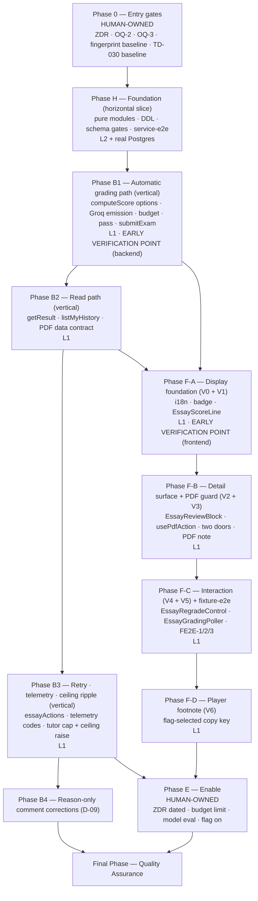
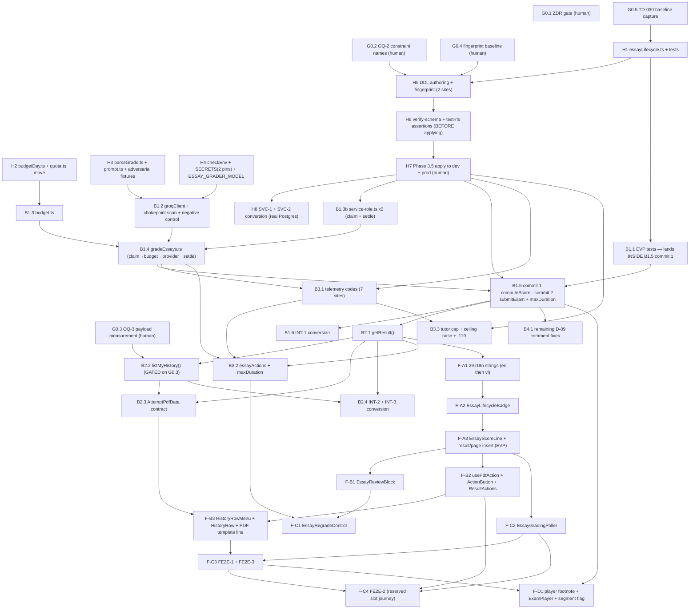

# Work Plan: Essay (Tự luận) Auto-Scoring

Created Date: 2026-08-29
Type: feature
Estimated Duration: 12–16 working days (solo engineer, pre-launch, no external deadline; two of the phases are blocked on human-only gates that no agent can discharge)
Estimated Impact: ~55 files (backend: 8 new + 20 modified; frontend: 10 new + 15 modified; 3 test skeletons converted; 3 manual SQL/DDL groups applied to two Supabase projects)
Related Issue/PR: N/A — branch `design/adr-0018-essay-async-grade-write` (already merged `main` @ `7894417`)

Review Scope: fresh pre-implementation plan. Base branch `main` @ `7894417`; working branch `design/adr-0018-essay-async-grade-write`. Planned-files scope is derived from the two Design Docs' Implementation Path Mapping sections plus this plan's task target files:

- **Backend — new**: `SOURCE/lib/scoring/essayLifecycle.ts`, `SOURCE/lib/billing/budgetDay.ts`, `SOURCE/lib/essay/{groqClient,prompt,parseGrade,budget,gradeEssays}.ts`, `SOURCE/features/exams/essayActions.ts`
- **Backend — modified**: `SOURCE/lib/scoring/computeScore.ts`, `SOURCE/lib/billing/quota.ts`, `SOURCE/lib/supabase/service-role.ts`, `SOURCE/lib/ai/models.ts`, `SOURCE/lib/ugc/limits.ts`, `SOURCE/lib/tutor/{prompt,telemetry}.ts`, `SOURCE/lib/env/checkEnv.ts`, `SOURCE/lib/schema/schemaFingerprint.ts`, `SOURCE/lib/pdf/generateAttemptPdf.ts`, `SOURCE/features/exams/{actions,queries}.ts`, `SOURCE/features/history/queries.ts`, `SOURCE/scripts/check-ai-key-bundle.mjs`, `SOURCE/supabase/{schema.sql,verify-schema.ts}`, `SOURCE/types/result.ts`, route segments `SOURCE/app/(exams)/exams/[id]/attempt/[attemptId]/page.tsx` and `…/result/detail/page.tsx`
- **Frontend — new**: `SOURCE/components/essay/EssayLifecycleBadge.tsx`, `SOURCE/features/exams/components/{EssayScoreLine,EssayReviewBlock,EssayRegradeControl,EssayGradingPoller}.tsx` + five co-located test files
- **Frontend — modified**: `SOURCE/components/history/{usePdfAction.ts,ActionButton.tsx,HistoryRowMenu.tsx}`, `SOURCE/features/history/components/HistoryRow.tsx`, `SOURCE/features/exams/components/{ResultActions,QuestionRenderer,ExamPlayer}.tsx`, `SOURCE/components/pdf/AttemptPdfTemplate.tsx`, `SOURCE/lib/i18n/dictionaries/{en,vi}.ts`, `SOURCE/app/(exams)/exams/[id]/attempt/[attemptId]/result/page.tsx`
- **Coupled test files that move in the same commit as their production change**: `SOURCE/lib/security/checkAiKeyBundleSecrets.test.ts`, `SOURCE/lib/tutor/__tests__/telemetry.test.ts`, `SOURCE/features/exams/components/__tests__/QuestionRenderer.test.tsx`, `SOURCE/components/history/{ActionButton.test.tsx,HistoryRowMenu.test.tsx}`, `SOURCE/lib/scoring/__tests__/computeScore.test.ts`
- **Test skeletons already committed, converted by this plan**: `SOURCE/features/exams/__tests__/essayGrading.int.test.ts`, `SOURCE/tests/e2e/fixture/essay-auto-scoring.fixture.e2e.test.ts`, `SOURCE/tests/e2e/service/essay-grade-write.service.e2e.test.ts`
- **Out of repo, human-owned**: Groq account + `GROQ_API_KEY` in `SOURCE/.env.local` and both Vercel scopes; Zero Data Retention in Groq Data Controls; DDL applied by hand to Supabase `pebjdlbgbmizgfpuptjl` (prod) and `hynwleaxtbtjzkvpjsug` (dev)
- **Explicitly NOT modified by this plan**: `SOURCE/supabase/test-rls.ts` — I-1 is closed (2026-08-29) in favour of the runnable service lane, and backend Design Doc **v1.4** records that decision in three places. The shipped `S-b` case at `:1314-1320` (a student JWT cannot `UPDATE exam_results`) stays exactly where it is and is not duplicated.

## Related Documents

- PRD: `docs/prd/essay-auto-scoring-prd.md` v1.2 — AC-001…AC-072, D1–D13, W1–W8, C1–C5
- ADR: `docs/adr/ADR-0018-essay-async-grade-write.md` — **Accepted 2026-08-29**, Decisions D1–D6, Amendment to ADR-0010, Escalation 1 (→ `TD-029`) and Escalation 2 (degraded telemetry resolution) both resolved
- UI Spec: `docs/ui-spec/essay-auto-scoring-ui-spec.md` **v1.3** — UI-D1…UI-D13, RS-0…RS-6, Copy Inventory (29 strings), Open Items O-1…O-8
- Design Doc (backend): `docs/design/essay-auto-scoring-backend-design.md` **v1.4** — EG-BE-001…036, OQ-1…OQ-6. v1.4 moves the two SQL proofs from `test-rls.ts` Part 10 to the runnable service lane (`SOURCE/tests/e2e/service/**`, `npm run test:localdb`), stated in three places; this plan is aligned to v1.4, not to the v1.3 wording.
- Design Doc (frontend): `docs/design/essay-auto-scoring-frontend-design.md` **v1.1** — FE-AC-01…21, FE-NFR-01…03, slices V0…V6, FE-OQ-1…FE-OQ-5
- Prerequisite ADRs: `docs/adr/ADR-0010-score-write-trust-boundary.md` (amended), `docs/adr/ADR-0011-mastery-write-trust-boundary.md`, `docs/adr/ADR-0005-multi-part-national-exam-format.md`, `docs/adr/ADR-0006-gemini-extraction-protocol.md`, `docs/adr/ADR-0009-pdf-generation-library-choice.md`, `docs/adr/ADR-0002-published-content-rendering-and-sanitization.md`
- Debt register: `TECH-DEBT.md` — **TD-005** (hand-applied schema, has fired four times), **TD-029** (ADR-0010 kill criterion already fired), **TD-030** (`npm run test:fixture` is red on `main`)

---

## HARD GATES — tick these, do not read them

These are checklist items on purpose. Every one of them has a recorded history of being written in a paragraph and then not done; TD-005 has fired **four times** on exactly that shape.

### Gate A — AC-067 Zero Data Retention (HUMAN ONLY; no agent can discharge this)

Grading ships **disabled**. `ESSAY_GRADING_ENABLED` absent ⇒ off. No essay text of any kind may reach Groq until A5b is ticked, and no **production** traffic until the whole gate is ticked and the console check is dated.

**Engineer's decision, 2026-08-29: Zero Data Retention must be on before ANY Groq request — dev included.** The gate is therefore in two stages, because several implementation tasks need a real `L1` run on dev and every one of those sends text to `api.groq.com`. Staging the gate is what makes those tasks executable *without* making "it's only dev" a reason to skip ZDR.

- [x] A1 — A Groq account exists and the organisation is the one that will own production traffic. **Confirmed 2026-08-29** (engineer; account's model catalogue and rate limits read from `console.groq.com/settings/limits`).
- [x] A2 — `GROQ_API_KEY` present in `SOURCE/.env.local`. **Confirmed by the engineer 2026-08-29 that the key in the file is the ROTATED one** — only the engineer can make that call, because the assistant can see the key's shape (56 chars, `gsk_` prefix) but not which generation it belongs to. *(Engineer placed the key directly in the file rather than routing it through the assistant — the first key was pasted into a session transcript on 2026-08-29 and was rotated for that reason. The file is gitignored and untracked — verified via `git check-ignore`.)*
- [x] A3 — `GROQ_API_KEY` present in Vercel **Production** scope. **Engineer placed it 2026-08-30**, directly in the Vercel dashboard — the key was never routed through the assistant, for the same reason recorded under A2.
- [x] A4 — `GROQ_API_KEY` present in Vercel **Preview** scope. **Engineer placed it 2026-08-30**, same dashboard visit as A3.
  - **No redeploy was triggered for this change, deliberately.** A new environment variable only reaches a running deployment on the next build, but nothing reads `GROQ_API_KEY` while `ESSAY_GRADING_ENABLED` is absent: `computeScore()` emits no essay keys and `after()` is never registered, so the key sits unread either way (A7). The redeploy that matters is the one **after E6** flips the flag — that is the build which must carry both variables.
- [x] A5 — Zero Data Retention **enabled** in Groq Data Controls (`https://console.groq.com/settings/data-controls`). **Engineer confirmed enabled 2026-08-29.**
- [x] **A5b — STAGE 1 GATE: A1, A2 and A5 are the precondition for ANY Groq request, including dev `L1` runs with seeded data.** No task in this plan may set `ESSAY_GRADING_ENABLED=true` anywhere — not even in a local `SOURCE/.env.local` — until A1, A2 and A5 are ticked. A local dev `true` is permitted **only** after A5b **and only against seeded attempts**; never against a real student attempt, on any environment. A3, A4, A6 and A7 remain the precondition for Phase E and for production traffic (stage 2).
  - Date A5b ticked: **2026-08-29** — **TICKED.** A1 ✅, A2 ✅ and A5 ✅. The engineer confirmed in session that the `GROQ_API_KEY` in `SOURCE/.env.local` is the **rotated** key (the first key was pasted into a chat and had to be replaced). Dev `L1` runs are now permitted for Tasks B1.5, B3.2 and F-C2 — **against SEEDED attempts only**, never a real student attempt on any environment. A3, A4, A6 and A7 are untouched by this tick and remain the stage-2 precondition: `ESSAY_GRADING_ENABLED` stays **absent in both Vercel scopes** and Phase E is not started.
- [x] A6 — **Dated console check recorded here.** Provider default (no training, no inference-request storage) is *not* ZDR: provider docs state input/output may be logged temporarily for reliability/abuse work, retained up to 30 days. The users are minors.
  - Date of console check: **2026-08-30**
  - Checked by (engineer): **undetecteddeveloper** (`smithnguyen247@gmail.com`)
  - Screenshot / evidence location: screenshot of `console.groq.com/settings/data-controls` captured by the engineer 2026-08-30, shown in the Claude Code session transcript for session `ca31f4cc-9218-40e0-9449-e1849155de64`. **A durable copy should be saved outside the transcript** — a transcript is session-scoped, and this is the kind of gate that gets re-audited later.
  - **What the console actually showed — recorded precisely, because a careless reading of it goes the wrong way:**
    - **Global ZDR: ENABLED**, labelled *"Enabled - API specific settings are overriden"*. This is the switch that governs.
    - **Inference APIs ZDR: displays as OFF and greyed out.** This is **not** a gap. The control is greyed *because* Global ZDR overrides it, exactly as the global switch's own label states. Recording only "ZDR is on" would leave the next person who opens this page staring at an apparently-off inference toggle and reasonably concluding the gate had been ticked carelessly.
    - The page states: *"Starting October 15, 2025, Groq may store inputs and outputs for up to 30 days, strictly for purposes of maintaining system reliability and compliance."* This **corroborates, from the provider's own console**, the 30-day retention window this gate was written against — previously cited from provider docs only. The default posture is confirmed to be the unacceptable one, and ZDR is confirmed to be the opt-out from it.
- [x] A7 — Until A6 carries a real date, `ESSAY_GRADING_ENABLED` is **absent in both Vercel scopes** (Production and Preview), and Phase E is not started. A local dev `true` is governed by **A5b**, not by this item — it is permitted after A5b, against seeded data only.
  - **A6 now carries a real date (2026-08-30), so this item's condition is discharged: Phase E may start.** Note what that does and does not license — A7 lifting is *permission for Task E6 to run*, not the enabling itself. `ESSAY_GRADING_ENABLED` remains **absent in both Vercel scopes as of 2026-08-30**; E6 is the only task that may add it, and E2-E5 come first.

### Dev `L1` run — 2026-08-30, and the defect it found

**Attempt `d9008d0a-6421-40ad-8624-f1c45d84a8c1`**, dev project `hynwleaxtbtjzkvpjsug`, seeded exam `l1seed-exam-tuluan` (three gradable essays + two existing MCQs), test account `smithnguyen247+rlstesta@gmail.com`. **Seeded attempt only, never a real student attempt** (A5b). First live Groq traffic of the project.

**The pipeline works end to end.** Three essays, three **distinct** bands — 1.0 for a full answer, 0.5 for a partial one, 0.0 for a wrong one — so the grader discriminated rather than pattern-matching a single value. `essayAttempts: 1` on all three (each graded on the first pass), `essayLowConfidence: false`, `essayGradedAt` set. `per_question` read back with SQL: every essay element carries exactly the ten W1 keys, the two MCQ elements keep their old five-key shape **untouched** (AC-012), and array order matches `question_ids`. `telemetry_log` gained exactly **three** `essay_grade` rows, `success: true`, `error_code: null`, carrying the **student's own** `user_id` — which is the identity `telemetry_insert_own` demands, so the closure-captured client (R-05) is doing what it was written for.

**The UI behaved as specified, unprompted.** Pending: `ScoreCard` **5.0/10** counting only the MCQs, essay line `—` (not `0 / 0`), both PDF controls blocked with the reason exposed. After the bands landed the poller updated the page **with no reload**: `1.5 / 3 points`, "Based on 3 essay questions already scored", the live region announced completion once, and Save/Share unblocked in place. **`ScoreCard` never changed** — its 0-diff promise held against a live score movement, which is the thing no unit test can assert. The player footnote read `player.essayScored` and the answer box offered **4000** characters (B3.3's raised ceiling).

**Latency, as the first real input to E5 (3 of the 10 samples):** submission ~09:16:42Z, bands written at 09:16:44.98 / 45.65 / 47.08Z — a **~2.5–5 s** round trip at `GROQ_MAX_CONCURRENCY = 2`. Comfortably inside `GROQ_CALL_DEADLINE_MS` (20 s); **E5 still owes seven more samples and a p95** before any constant moves.

#### The defect only a real run could surface
On `/result/detail`, every graded essay card printed **`result.notAutoScored` ("Not auto-scored") in its header, three lines above its own "✓ Scored · 1 / 1 point"** — a card contradicting itself about the one fact the student opened it for.

The frontend DD **predicted this in as many words**: `r.scored === false` is permanently true for an essay in all seven render states, so a branch keyed on it "still runs and still renders something — it just prints the `result.notAutoScored` label next to a score that was just graded", closing with **"no crash, no warning, and no existing test catches it."** That last clause was exactly right, and for a precise reason: FE2E-1(f) *does* render `/result/detail`, but only ever with `legacyResult()` — the single fixture for which the label is **correct**. No case rendered that route with a graded essay. `EssayReviewBlock`'s own unit tests could not see it either, because the label lives in the **page** that wraps the block, not in the block.

**Fix**: the label is now gated on `!r.essay` — present exactly for RS-0/RS-1 and `true_false` (FE-AC-13, byte-for-byte as before), absent for every lifecycle state (FE-AC-03/AC-053). Regression: **FE2E-4**, which was **confirmed to fail without the fix** rather than merely passing with it — its failure output contains the contradiction in one string, `Question 2` · `Not auto-scored` · `✓Scored` · `1 / 1 point`.

This is the argument for the `L1` gate, made concrete: the feature was green on 2025 unit tests, 3 fixture-e2e cases and 16 service-lane cases, and still shipped a self-contradicting card on its main surface.

### Gate B — Phase 3.5, production DDL

The two new SQL functions move the schema fingerprint. **Current verified baseline: `29931beeb950`**, confirmed read-only on 2026-08-29 for **both** Supabase projects — prod `pebjdlbgbmizgfpuptjl` and dev `hynwleaxtbtjzkvpjsug` — applied within 300 ms of each other. Both are in sync.

- [x] B1 — Before applying anything: read `schema_version.fingerprint` on **prod** and on **dev** and record both values here. Prod: **`29931beeb950`** Dev: **`29931beeb950`** *(read-only via Composio, 2026-08-29, same call as Gate C). Both still match the recorded baseline — nothing was hand-applied in the interim, so the TD-005 shape Task G0.4 watches for is absent.*
- [x] B2 — Compare both against `29931beeb950` **and** against the new literal computed from the edited `schema.sql`. Record the new literal here: **`9979c9deea52`** *(Task H5, commit `2448179`, 2026-08-29. Recomputed **independently** by running `computeSchemaFingerprint()` over the committed `schema.sql`: the pinned constant, the value declared inside the file, and the recomputed value **all three agree**. Both live databases still read `29931beeb950` — that gap is why `verify:schema` is red, and closing it is Gate B3→B5.)*
- [x] B3 — Explicit engineer confirmation obtained **before any DDL touches prod**. Confirmed by: **the engineer, in session** (“just do it for the prod too”) on **2026-08-29**. *Dev had already been applied and verified at that point; prod followed only after this confirmation.*
- [x] B4 — DDL applied to **dev** (`hynwleaxtbtjzkvpjsug`) — **2026-08-29**, via Composio, six statements in dependency order with the fingerprint **last**.
- [x] B5 — DDL applied to **prod** (`pebjdlbgbmizgfpuptjl`) — **2026-08-29**, same six statements, same order, objects verified by real query **before** the fingerprint was written.
- [x] B6 — Verified **by real query**, not by a “success” message, on **both** projects. Read back 2026-08-29:

  | | prod `pebjdlbgbmizgfpuptjl` | dev `hynwleaxtbtjzkvpjsug` |
  |---|---|---|
  | `schema_version.fingerprint` | **`9979c9deea52`** | **`9979c9deea52`** |
  | the two functions present | **2** | **2** |
  | of those, `SECURITY DEFINER` | **0** | **0** |
  | function ACL | `postgres=X \| service_role=X` | `postgres=X \| service_role=X` |
  | `attempt_answers_answer_check` | `length(answer) <= 4000` | `length(answer) <= 4000` |
  | `telemetry_log_event_type_check` | 3 values incl. `essay_grade` | 3 values |
  | `telemetry_log_error_code_check` | 9 values | 9 values |

  **Why this step earned its keep:** the apply tool reported only `DROP FUNCTION` as the “command” for each multi-statement apply, which on its own would have read as *the create never ran*. Every object was confirmed by querying `pg_proc` / `pg_constraint` directly instead. **No row was lost** — prod counts moved *up* across the window (9→10 results, 217→222 answers, 90→91 telemetry), which is live student traffic, not damage.
- [x] **B7 — CLOSED 2026-08-29. Both databases run, both give the same single expected failure.**

  **DEV: DONE.** `npm run verify:schema` went **3 FAIL → 1 FAIL**. The fingerprint comparison and **both grant assertions are now green**; the one remaining failure is exactly the expected one: *“TRẦN DB CAO HƠN TRẦN TRONG MÃ … 501 ký tự lọt qua CHECK … trong khi `LIMITS.MAX_ATTEMPT_ANSWER` = 500”*. **That is Fix I002's known-red window opening exactly on schedule** — red from H7 until Task B3.3 raises the constant. Recorded, not “fixed”.

  **PROD: DONE — run by the engineer on 2026-08-29**, from `SOURCE/`, with `SCHEMA_ENV_FILE=.env.local.prod-backup npm run verify:schema`. (The prior session could not issue that command itself — the environment's permission classifier refused pointing the script at production with a service-role key — so the engineer owned the run. This paragraph replaces the "PROD: NOT RUN, owner: engineer" entry that stood here until the run happened.)

  **Result: exactly one failure, and it is the same ceiling assertion as dev** — *“TRẦN DB CAO HƠN TRẦN TRONG MÃ … `LIMITS.MAX_ATTEMPT_ANSWER` = 500”* against a database ceiling of 4000. Every other assertion is **green on prod**: the fingerprint comparison (`9979c9deea52`), both grant assertions on the two new functions, and the `ESSAY_MAX_ATTEMPTS` pin. Prod and dev therefore fail **identically**, which is the evidence that matters here — an identical single failure on two independently-applied databases is the known-red window, whereas any asymmetry between them would have been a partial apply.

  **What this closed that B6 could not.** B6 confirmed prod by direct `pg_proc` / `pg_constraint` reads, which cover only the script's **read** assertions. The three probes that issue write attempts — the three-role RPC grant probe and the two ceiling probes — were unverified on prod until this run. They are now verified, and Gate B7 is closed on both databases.

  **⚠️ THIS RUN WAS THE LAST UNGUARDED ONE.** It was safe only because the engineer accepted the risk once, knowingly: at the time the script called `signInProbeUser()` and executed its §5 fixture and §9 write probes against whatever `SCHEMA_ENV_FILE` named, with no notion of a non-dev target. **The guard has since landed — commit `be26fb1`.** `verify:schema` now picks its mode from the **project ref in `NEXT_PUBLIC_SUPABASE_URL`**, not from the env filename (a filename guard would be defeated by the very habit `loadEnv()`'s own comment records: renaming prod credentials to `.env.local`). A non-allowlisted ref skips every section needing an `authenticated` session or issuing a write — §2, §3, §4, §5, §9, §10a, §10b — and the summary prints **"PASS PHẦN"** with the skip count so a partial run can never be read as a full one. Verified by measurement, using the probe account's `updated_at` as the discriminator: unchanged across a non-dev run, moved across a dev run. Regression test: `SOURCE/lib/schema/__tests__/verifySchemaProdGuard.test.ts`, which asserts the prod ref appears nowhere in the script and was itself checked against two deliberate mutations.

  Even so, **this recorded result stays the prod evidence of record** — a guarded prod run would now skip exactly the behavioural probes that made this run worth doing, so re-running it against prod buys nothing.

  **The probe account this run signed in as is now banned on prod (TD-032).** `smithnguyen247+rlstesta@gmail.com` was live on production with a password that is a **committed literal**. On 2026-08-29, at the engineer's direction, it was banned, its one open session and refresh token revoked, and its password rotated to a value generated inside the SQL statement itself so no plaintext exists anywhere. It was **not deleted** — every table hanging off it cascades, and it owns 15 `exam_attempts`, 1 `exam_result`, 3 `user_skill_mastery`, 1 `user_profile`, and authors 5 of prod's 7 exams. **Dev was deliberately left untouched**, so `signInProbeUser()` still works there and the dev gate still runs; anyone who "tidies up" the dev account to match will turn the whole schema gate red.
- [ ] B8 — Fingerprint pin moved in the **same commit** at both declaration sites: `SOURCE/supabase/schema.sql:1871` and `SOURCE/lib/schema/schemaFingerprint.ts:41` (D-08).

### Gate C — OQ-2, the real CHECK constraint name (prerequisite to any DDL)

The auto-generated CHECK constraint name on `telemetry_log.event_type` is **predicted, not verified**. If the prediction is wrong, `drop constraint if exists` silently does nothing, `add constraint` either collides or leaves two live CHECKs, and the migration *appears* to succeed while `'essay_grade'` stays rejected — a silent failure, because the telemetry write is best-effort.

- [x] C1 — Run a read-only query on **prod** against `pg_constraint` for CHECK constraints on `public.telemetry_log`, and record the real name of the `event_type` constraint here: **`telemetry_log_event_type_check`** *(prod `pebjdlbgbmizgfpuptjl`, read-only via Composio, 2026-08-29). Live definition: `CHECK ((event_type = ANY (ARRAY['adaptive_route'::text, 'tutor_invoke'::text])))` — **two** values, so the new pair must list **three**.*
- [x] C2 — Same on **dev**. Record: **`telemetry_log_event_type_check`** *(dev `hynwleaxtbtjzkvpjsug`, 2026-08-29). Identical name **and** identical definition to prod.*
- [x] C3 — If the two names differ, that is itself a TD-005 symptom — record it in `TECH-DEBT.md` before proceeding, and write the drop/add pair to handle both names. **The names do NOT differ.** No TD-005 symptom; the drop/add pair handles **one** name. *(The prediction that motivated Gate C turned out correct — but it was worth verifying: had it been wrong, `drop constraint if exists` would have silently done nothing and the migration would have looked successful while `'essay_grade'` stayed rejected.)*
- [x] C4 — The `error_code` constraint name confirmed too (existing drop/add pair at `schema.sql:1818-1821` names it `telemetry_log_error_code_check`): **`telemetry_log_error_code_check` on both projects** — matches the pair already in `schema.sql`. Live definition carries the **six** values `gemini_unavailable, rate_limited, server, not_eligible, user_quota_exhausted, project_budget_exhausted`, byte-identical on prod and dev and identical to the inline declaration at `schema.sql:1390-1399`; the new pair must list **nine** (adding `groq_unavailable`, `invalid_output`, `duplicate_write`).
- [x] **C5 — GATE C CLOSED 2026-08-29.** Both constraint names verified by real read-only query on both live databases, both definitions captured, names identical across projects. Task H5 may now write the DDL using `telemetry_log_event_type_check` and `telemetry_log_error_code_check` verbatim.

### Gate D — OQ-3 / UI Spec O-3 / FE-OQ-3, the `/history` payload measurement (hard entry gate)

No task that touches `listMyHistory()` may be scheduled before this measurement exists. The only fallback (an RPC returning the two booleans pre-derived) is **DDL**, which would raise hand-applied schema changes from two to three and reopen exactly the budget that ADR-0018 Escalation 2 was resolved — by accepting degraded telemetry resolution — to preserve. It is a **scope escalation requiring an engineer decision**, not a technical fallback.

- [x] D1 — On dev, measure the `listMyHistory()` payload at `LIST_ROW_CEILING = 500` rows (`SOURCE/lib/supabase/boundedRead.ts:74`) **without** `per_question, created_at` in the select. Bytes: **353 B/row → ~173 KB at 500 rows (dev)**; **375 B/row → ~183 KB (prod)**. *Measured 2026-08-29, read-only, by serialising the exact select shape — including the `exam_attempts!inner(… exams!inner(title, subject))` embed — with `jsonb_build_object` and taking `octet_length`.*
- [x] D2 — Same measurement **with** `per_question, created_at` in the select. Bytes: **918 B/row → ~448 KB at 500 rows (dev)**; **3 401 B/row → ~1 661 KB ≈ 1.62 MB (prod)**. Largest single row measured: **5 385 B** (prod).

  | | prod (24.11 questions/exam — the realistic shape) | dev (5.58 questions/exam — small seeded exams) |
  |---|---|---|
  | rows available to measure | 9 | 53 |
  | without the two fields | 375 B/row → **~183 KB** at 500 | 353 B/row → ~173 KB |
  | with the two fields | 3 401 B/row → **~1 661 KB** at 500 | 918 B/row → ~448 KB |
  | increase | **≈ 9.1× (+1.45 MB)** | ≈ 2.6× |

  **Two things this measurement is not, stated so nobody over-reads it.** (1) The 500-row figure is an **extrapolation** — neither database holds 500 result rows (dev 53, prod 9), so it is the measured mean row multiplied by the ceiling, not an observed payload. (2) The bytes are **uncompressed**; an RSC payload ships gzip/brotli and this JSON has highly repetitive keys, so the wire cost is plausibly 5–10× smaller — but the client still parses and holds the full amount, which is the cost that matters on a weak device.
- [x] **D3 — ACCEPT (engineer's decision, 2026-08-29). The two fields go into the select; Task B2.2 proceeds as designed.** Threshold reasoning recorded rather than a bare number, because the bare number (1.62 MB) reads worse than the situation is:
  - **500 is a ceiling, not a forecast.** `boundedRead.ts`'s own comment puts 500 three orders of magnitude above current data, and prod holds **9 result rows in total across all users**. The realistic payload today is a few tens of KB.
  - **The ceiling being reached is itself the documented trigger for pagination**, not for a bigger number — `LIST_ROW_CEILING`'s comment says exactly this. A student with 500 graded attempts needs a paginated `/history` regardless of this feature.
  - **The escalation was more expensive than the problem.** An RPC is **DDL**: hand-applied schema changes go from two to three, and ADR-0018 Escalation 2 — resolved by accepting degraded telemetry resolution specifically to protect that budget — would have to be reopened.
  - **Re-open condition:** if `/history` ever carries a realistic (not ceiling) payload above ~500 KB, or the row count for a single user approaches the ceiling, revisit — and revisit as **pagination** first, RPC second.
- [x] D4 — **Not applicable: not escalating.** ADR-0018 Escalation 2 stays **closed**, and manual hand-applied schema changes stay at **two**.
- [x] **D5 — GATE D CLOSED 2026-08-29.** Task B2.2 is unblocked.

### Gate E — Six verify gates before every commit

Raised from four to six on 2026-08-29 (see `TECH-DEBT.md` TD-030). Run each one **separately** and read its **real exit code**. Do not chain with `&&` and infer; an `&&` chain stops at the first failure and tells you nothing about the rest, and a chain that "looked green" is how TD-030 stayed hidden.

| # | Command (from `SOURCE/`) | Reads | Exit code recorded? |
|---|---|---|---|
| 1 | `npx tsc --noEmit` | strict types; enforces AC-071, the closed `EssayRenderState` switch, and i18n key coverage (`Dictionary` from `en.ts`) | |
| 2 | `npx eslint --max-warnings 0` | lint; `react-hooks/refs` and `react-hooks/set-state-in-effect` bite the poller | |
| 3 | `npx vitest run` | default lane only: `lib/**`, `components/**`, `app/**` | |
| 4 | `npm run build` | production build; catches a `server-only` import leaking into a client tree | |
| 5 | `npm run test:fixture` | `tests/e2e/fixture/**` — **see Gate F, this lane is already red on `main`** | |
| 6 | `npm run test:localdb` | `tests/e2e/service/**` — needs a real Supabase dev database; see Open Item I-7 | |

- [ ] E1 — All six commands are run individually per commit, and their exit codes are what is trusted.
- [ ] E2 — `npm run check:bundle` additionally run on any commit touching `SOURCE/lib/essay/**`, `SOURCE/scripts/check-ai-key-bundle.mjs`, or any client component (AC-029).
- [ ] E3 — `npm run verify:schema` additionally run on any commit touching `SOURCE/supabase/**`, `SOURCE/lib/ugc/limits.ts`, or `SOURCE/lib/schema/schemaFingerprint.ts`.

**E4 — Instruction to the task decomposer (this gate needs a per-instance slot, not one table for ~30 commits).** Every generated task file under `docs/plans/tasks/` **must** contain its own copy of the verify table below, with one **empty** exit-code cell per row, filled in at execution time:

| # | Command (from `SOURCE/`) | Exit code | Notes |
|---|---|---|---|
| 1 | `npx tsc --noEmit` | | |
| 2 | `npx eslint --max-warnings 0` | | |
| 3 | `npx vitest run` | | |
| 4 | `npm run build` | | |
| 5 | `npm run test:fixture` | | expected red = TD-030 baseline only (Gate F1) |
| 6 | `npm run test:localdb` | | see Open Item I-7 |

Add a row for `npm run check:bundle` when the task's target files match E2's globs, and a row for `npm run verify:schema` when they match E3's. **A task file with any exit-code cell left empty is not complete**, regardless of what its prose says.

This matters more than ordinary bookkeeping because Fix I002 creates a **known-red window** (Task H7 → Task B3.3, roughly a dozen commits, during which `verify:schema`'s ceiling gate is red **by design**). Without a per-commit recorded exit code there is no way to tell that expected red from a regression — which is precisely the TD-030 failure mode repeating one level down.

### Gate F — `npm run test:fixture` is RED on `main` before this feature starts

**You did not break it.** Two pre-existing failures live in `SOURCE/tests/e2e/fixture/subscription.fixture.e2e.test.ts` (case FE-1(e), locale `en` and locale `vi`), asserting `aria-describedby` points at the Confirm control's reason box and receiving the Recheck control's reason box instead (`…:3017`). Logged as **TD-030**; unrelated to essay grading.

- [x] **F1 — BASELINE CAPTURED 2026-08-29.** `npm run test:fixture` on the current tree: **exit code 1**, `Test Files 1 failed | 1 skipped (2)`, `Tests 2 failed | 75 passed | 3 todo (80)`. The **exact** two failing cases, both in `SOURCE/tests/e2e/fixture/subscription.fixture.e2e.test.ts`, both under the describe `FE-1 (e) legalContentReady === false leaves an inert but reachable confirm control`:
  1. `locale en — aria-disabled, no native disabled, Tab-reachable, no action`
  2. `locale vi — aria-disabled, no native disabled, Tab-reachable, no action`

  **Nothing else is red in this lane.** Any third failing case is this feature's. Recorded from the run that gated commit `3c66df1`.
- [ ] F2 — How to tell a new failure from TD-030, in order:
  1. Remove your new/changed fixture file from the tree and re-run the lane. If the same two `subscription.fixture.e2e.test.ts` cases are still red and nothing else is, it is TD-030.
  2. `git checkout main` (stash first — `git status` before any destructive command) and re-run the lane. Two red cases there confirms the baseline.
  3. Anything red **beyond** those two cases is yours.
- [ ] F3 — Do **not** "fix" TD-030 inside this feature's commits, and do not add `essay-auto-scoring.fixture.e2e.test.ts` to `vitest.fixture.config.ts:45-52`'s exclude list — being excluded is how a case gets written, reviewed and merged without ever executing.

### Gate G — AC-072 ordering (non-negotiable)

- [ ] G1 — `gradeEssays.ts` and `essayActions.ts` both execute **claim → reserve budget → call provider → settle**, in that order, with no exception.
- [ ] G2 — Metering never precedes authorisation. Reversing it lets an unauthorised caller with a self-composed `attemptId` drain the single unmetered project budget — a denial of grading for every student that day, plus a cross-account grading trigger.
- [ ] G3 — A retry refused at the budget gate still consumes one of three attempts (R-08, D4). Accepted, not mitigated; the UI never shows a count (UI-D9).

### Gate H — Coupled sites that move in the same commit or CI goes red

- [ ] H1 — `SECRETS` in `SOURCE/scripts/check-ai-key-bundle.mjs` **and** its two pins in `SOURCE/lib/security/checkAiKeyBundleSecrets.test.ts` — the exhaustive `toEqual` at `:34` and `expect(SECRETS.length).toBe(7)` → `toBe(8)` at `:74`.
- [ ] H2 — `LIMITS.MAX_ATTEMPT_ANSWER` 500 → 4000 **and** `SOURCE/features/exams/components/__tests__/QuestionRenderer.test.tsx:119` (`expect(textarea?.maxLength).toBe(500)`) plus the hard-coded `"CHECK length <= 500"` comment at `:116`. This site is **AC-048**-coupled and goes red the instant the constant moves.
- [ ] H3 — `:112` in that same file (the pinned English footnote string `"Essay — your working is saved with the attempt, not auto-scored yet."`) is **AC-051**-coupled and fails at a *different* time. Backend D-14 warns explicitly: treating `:112` and `:119` as one site is how the wrong one gets "fixed". See Open Item **I-6**.
- [ ] H4 — `TUTOR_MAX_STUDENT_ANSWER = 500` enforced **inside** `buildTutorPrompt()` lands **before or with** the ceiling raise, never after. Between those two commits a self-composed 4000-character `short_answer` flows straight into the Gemini prompt on a different budget key.
- [x] H5 — Telemetry literals move together across all **EIGHT** sites — **discharged 2026-08-29 in commit `2448179`**: SQL inline `event_type` (`schema.sql:1383`), SQL inline `error_code` (`:1390-1399`), the `error_code` drop/add pair (`:1818-1821`), the **new** `event_type` drop/add pair, `TelemetryEventType` (`lib/tutor/telemetry.ts:40`), `TELEMETRY_ERROR_CODES` (`:35`), the three test pins (`telemetry.test.ts:49`, `:265`, `:311`), **and — the eighth — `SOURCE/lib/schema/__tests__/schemaFingerprint.test.ts`**.

  **The eighth site was found by EXECUTION, not from any enumeration — record why, because the miss is instructive.** `schemaFingerprint.test.ts` is the **only** test in the repo that actually *reads* `schema.sql` and parses its `error_code` lists. Widening those lists 6 → 9 turned three of its assertions red (`:213`, `:231`, `:256`). The three sites D-06 *does* name (`telemetry.test.ts :49/:265/:311`) all stayed **green**, because they compare TypeScript against a hand copy and never open the SQL file — so the enumeration that existed could not have caught this.

  **The decisive evidence was already in the repo**: the `:256` assertion's own failure message reads *"Sửa CẢ BA chỗ trong cùng một commit: hai danh sách SQL + `lib/tutor/telemetry.ts`."* A guard shipped **before this feature** was enforcing the one-commit rule. This plan's split — SQL to H5, TypeScript to B3.1, separated by all of Phase H — contradicted it.

  **Resolution (engineer-delegated, 2026-08-29):** the TypeScript telemetry literals moved **into H5's commit**. Rejected alternatives, with the named failure mode each would reproduce: deferring the `error_code` widening to B3.1 would mean a second `schema.sql` edit, a second fingerprint move and a **second hand-apply to both live databases** — the **TD-005** shape, which has fired four times; accepting a known-red window would leave the **default** vitest lane red for ~12 commits — the **TD-030** shape, where a red lane hides real regressions.
- [ ] H6 — Schema fingerprint moves at both sites in one commit (`schema.sql:1871`, `schemaFingerprint.ts:41`).
- [ ] H7 — `usePdfAction`'s new required third parameter lands with **15** coupled test render sites: 13 in `SOURCE/components/history/ActionButton.test.tsx`, 2 in `SOURCE/components/history/HistoryRowMenu.test.tsx` (`:65`, `:91`).
- [ ] H8 — `SOURCE/lib/essay/groqClient.ts` and its chokepoint scan test land in the **same commit**. A commit with the emission module and no scan is a window in which the repo's strongest AI-safety property is false.

---

## Verification Strategy (from Design Docs)

### Correctness Proof Method — Backend (four propositions, four mechanisms; none proves more than one)

| # | Proposition | Mechanism | When |
|---|---|---|---|
| 1 | Stored shape matches W1 in all three lifecycle states | Unit tests on `newEssayEntry()` + the `computeScore` branch per state, plus one manual SQL shape check on dev after the first graded attempt | every CI run; manual once after Phase B1 |
| 2 | The write path keeps every ADR-0010 containment property | the **service lane** — `SOURCE/tests/e2e/service/essay-grade-write.service.e2e.test.ts` via `npm run test:localdb` — against real Postgres, plus `verify:schema` on **both** databases. (`test-rls.ts` is **not** used: I-1 closed in favour of the runnable lane, backend DD v1.4) | before ship; again after every schema application |
| 3 | Model output can never move a score in a way it is not permitted to | AC-069 (recorded responses, deterministic, merge-blocking) **plus** AC-070 (real provider, controlled comparison, nightly/on demand, re-run on every model change) | AC-069 every run; AC-070 nightly and before each model change |
| 4 | No existing behaviour moves | Output Comparison across three pipelines (`computeScore()`, `getResult()`, `listMyHistory()`) with hand-built literals, `toEqual`, **no snapshots** | every CI run |

### Early Verification Point — Backend

**First verification target**: two `computeScore()` calls compared with `toEqual`, **before any write path exists**.

Run `computeScore(questions, answers)` (no third argument) and `computeScore(questions, answers, { essayGrading: false })` over the **same** fixture set covering all four question types, and assert the two `ScoreResult` values are element-for-element equal. Then run a third call with `{ essayGrading: true }` and assert the **only** difference is the five new keys on essay elements **that have ground truth** — `totalScore`, `correct`, `total`, `topicBreakdown` and every non-essay element byte-identical.

- **Success criteria**: the first two calls are absolutely equal; the third differs at exactly the expected key set and nowhere else.
- **Why first**: it is the smallest unit that proves the riskiest thing in the whole change — that adding a feature to a scoring function moves nobody's score. No DB, no network, no key.
- **Failure response**: if the first two differ, the parameter default is wrong and everything else stands on that proposition — **stop**. If the third differs outside the expected key set, the branch split is catching the wrong questions (most likely the `q.questionType === "essay"` condition was dropped, so ground-truth-less `true_false`/`short_answer` also receive keys).

### Correctness Proof Method — Frontend (three propositions)

| # | Proposition | Proven by | When |
|---|---|---|---|
| 1 | No surface branches on `scored`/`isCorrect` | (a) `npx tsc --noEmit` — `EssayReviewBlock` does not carry those two fields in its props (MSA-F6); (b) diff review: every occurrence of the two identifiers sits in pre-existing, unchanged code | every commit |
| 2 | An attempt with no essays renders byte-for-byte as today | Golden States 7 and 8 (before/after screenshots); plus RTL: `essaySummary === undefined` ⇒ `EssayScoreLine` returns `null`, poller schedules **0** timers | Phase F-A and F-C |
| 3 | Each lifecycle state has exactly one appearance, readable by keyboard and by screen reader | one RTL case per row of each component's state × display matrix, plus four role-based accessibility assertions | Phases F-A…F-C |

### Early Verification Point — Frontend

**First verification target: V1 — `EssayScoreLine` visible on `/result` for a seeded attempt with at least one `graded` essay.**

Not V0: V0 (i18n + badge) proves strings exist and a badge renders, but touches no real data. V1 is the first slice that joins all three tiers — backend contract → `getResult()` → server component tree → pixels — so it is the first slice that can fail for an unexpected reason.

- **Success criteria**: `EssayScoreLine` renders with correct `earned`/`max`, `tabular-nums` applied, positioned exactly between `ScoreCard` and the overtime block; `ScoreCard` unchanged to the pixel; `EssayScoreLine.test.tsx` green **through `renderServerTree()`**.
- **Failure response**: `essaySummary` undefined despite banded data ⇒ **blocked**, return to backend (B-3), frontend does not patch around it. Empty tree with vacuously passing negative assertions ⇒ switch to `renderServerTree()` **and** add a positive assertion to every case. Block inserted in the wrong place ⇒ remove the component's own margin; vertical rhythm belongs to the page's `gap-5`.

### Proof Strategy

- **Proof obligation source**: the annotations carried in the three committed test skeletons (`Primary failure mode` / `Proof obligation` blocks in `essayGrading.int.test.ts` INT-1…INT-3, `essay-auto-scoring.fixture.e2e.test.ts` FE2E-1…FE2E-3, `essay-grade-write.service.e2e.test.ts` SVC-1…SVC-2) for integration, fixture-e2e and service-e2e claims. For unit-level claims with no generated skeleton, the source is each criterion's primary failure mode as recorded in the backend DD's Discrepancy Disposition Table (D-01…D-15) and Risks table (R-01…R-14), and the frontend DD's Risks table (R-F1…R-F10).
- **Per-task propagation**: every task below that implements an EG-BE-*, FE-AC-* or AC-* claim records its Proof Obligations explicitly, so downstream review can judge whether the tests prove the claim rather than merely that they run.

---

## Quality Assurance Mechanisms (adopted, from both Design Docs)

| Mechanism | Enforces | Config Location | Covered Files |
|---|---|---|---|
| `npx tsc --noEmit` (strict) | static types; **enforces AC-071** (closed `TutorPromptInput.questionType` union), the telemetry `satisfies` table, the exhaustive `EssayRenderState` switch, and i18n key coverage (AB-12) | `SOURCE/tsconfig.json` | project-wide |
| `npx vitest run` | unit/integration correctness — **primary correctness-proof mechanism** | `SOURCE/vitest.config.ts` (`lib/**`, `components/**`, `app/**`) | all new unit/component tests, `SOURCE/features/exams/__tests__/essayGrading.int.test.ts` |
| ESLint (`--max-warnings 0`) | lint; `react-hooks/refs` and `react-hooks/set-state-in-effect` govern the poller | `SOURCE/eslint.config.mjs` | project-wide |
| `npm run build` | production build succeeds; catches a `server-only` import reaching a client tree | `SOURCE/package.json` | project-wide |
| `npm run test:fixture` | fixture-e2e lane (in-process real route tree, stubbed data sources) | `SOURCE/vitest.fixture.config.ts` | `SOURCE/tests/e2e/fixture/essay-auto-scoring.fixture.e2e.test.ts` — **lane already red, see Gate F** |
| `npm run test:localdb` | service-integration-e2e lane against real Supabase dev Postgres | `SOURCE/vitest.localdb.config.ts` | `SOURCE/tests/e2e/service/essay-grade-write.service.e2e.test.ts` |
| `npm run check:bundle` | `GROQ_API_KEY` and `api.groq.com` never reach the client bundle (AC-029) | `SOURCE/scripts/check-ai-key-bundle.mjs` | `SOURCE/lib/essay/**`, all client components |
| Emission-point (chokepoint) scan | the request-reachable Groq emission surface is **exactly one module** (AC-033) plus a negative control (AC-034) | new test under `SOURCE/lib/essay/__tests__/`, shaped after `SOURCE/lib/ugc/__tests__/geminiChokepoint.test.ts:110-178` | `SOURCE/lib/essay/groqClient.ts` |
| `npm run verify:schema` | grants on both new functions; the character ceiling read back from a real DB; the schema fingerprint; the `ESSAY_MAX_ATTEMPTS` pin | `SOURCE/supabase/verify-schema.ts` | **must be extended before it is relied on** — today it asserts nothing about the ceiling. **Its ceiling assertion is expected RED from Task H7 until Task B3.3** (H7's known-red window): the DB moves to 4000 at H7, the constant moves at B3.3, and closing the gap earlier would open the Gemini-prompt ripple Gate H4 exists to close |
| `npm run test:localdb` | a student JWT can call neither new function and cannot `UPDATE exam_results` | `SOURCE/tests/e2e/service/essay-grade-write.service.e2e.test.ts`, cases `EG-a…EG-e` (**I-1**). The shipped `S-b` case stays in `test-rls.ts:1314-1320` | `public.exam_results`, both new functions |
| `telemetry_log` CHECK constraints | `event_type` / `error_code` accept closed literal sets only | `schema.sql:1383`, `:1390-1399`, `:1818-1821` + the new `event_type` drop/add pair | `public.telemetry_log` (widened) |
| `attempt_answers_answer_check` | student answer length ceiling | `schema.sql:472-474` | `public.attempt_answers` (widened 500 → 4000) |
| AC-070 adversarial evaluation, real provider | prompt-injection score inflation measured by **controlled comparison**, not a ceiling check | committed adversarial fixtures + a manual run | `SOURCE/lib/essay/{prompt,parseGrade}.ts` — **adopted but NOT a merge gate**; nightly/on demand, and **mandatory re-run on every `ESSAY_GRADER_MODEL` change** (AC-032) |
| Manual/Playwright MCP visual verification | the ten UI Spec Golden States; IV-1…IV-7 | `.mcp.json` (`playwright`), `npm run dev`, `npm run pw` | four affected screens + the PDF file; production has **0** submitted essays, so all visual checks run on dev with seeded data |

Noted but **not** adopted (recorded, not silently skipped): automated accessibility auditing — no axe, no Lighthouse CI in `SOURCE/package.json`; a11y is covered by role-based RTL assertions plus one manual screen-reader pass. Automated E2E in CI — the project is at "Pha 1"; there is no CI E2E lane and building one is a separate project. Route-level bundle-size measurement — no tooling exists, which is why the UI Spec's "0 bytes of JS" promise was **withdrawn** and restated as three testable claims (no mount, no timer, no `router.refresh()`).

---

## Design-to-Plan Traceability

| Design Doc | DD Section | DD Item | Category | Covered By Task(s) | Gap Status | Notes |
|---|---|---|---|---|---|---|
| docs/design/essay-auto-scoring-backend-design.md | Agreement Checklist Scope | `SOURCE/lib/scoring/essayLifecycle.ts` (new, pure): five jsonb key literals, `ESSAY_BANDS`, `ESSAY_MAX_ATTEMPTS`, `ESSAY_MAX_POINTS`, `ESSAY_PENDING_DEADLINE_MS`, `newEssayEntry()`, `deriveEssayView()`, `summariseEssays()`, `isEssayUnresolved()`, `isEssayIncomplete()`, `hasUnresolvedEssay()`, `hasIncompleteEssay()` | impl-target | H1 | covered | Everything else imports the key literals from here — written first so no key string is ever hand-typed twice |
| docs/design/essay-auto-scoring-backend-design.md | Forced choice / MSA-3 | `SOURCE/lib/billing/budgetDay.ts` (new) — single declaration of the Pacific day key + TTL; `quota.ts` imports it back | impl-target | H2 | covered | Behaviour-preserving move; proof is that the existing `quota` tests stay green **without one line edited** |
| docs/design/essay-auto-scoring-backend-design.md | Agreement Checklist Scope | `SOURCE/lib/essay/parseGrade.ts` (new, pure) — closed band set, strict boolean, never throws | impl-target | H3 | covered | EG-BE-014/015; the only place in the repo that compares a value to `ESSAY_BANDS` |
| docs/design/essay-auto-scoring-backend-design.md | Agreement Checklist Scope | `SOURCE/lib/essay/prompt.ts` (new, pure) — shared rubric block, labelled reference region, labelled data region | impl-target | H3 | covered | EG-BE-017; AC-040/AC-068 |
| docs/design/essay-auto-scoring-backend-design.md | Agreement Checklist Scope | `SOURCE/lib/env/checkEnv.ts` — register `GROQ_API_KEY`, `GROQ_BUDGET_DAILY_LIMIT`, `ESSAY_GRADING_ENABLED` | prerequisite | H4 | covered | `ESSAY_GRADING_ENABLED` at level `warn`, not `error` — an environment with grading off is a fully valid environment |
| docs/design/essay-auto-scoring-backend-design.md | Điểm phát Groq | `SOURCE/scripts/check-ai-key-bundle.mjs` `SECRETS` + `SOURCE/lib/security/checkAiKeyBundleSecrets.test.ts` pins at `:34` and `:74` (7 → 8) | contract-change | H4 | covered | Same commit or CI red — Gate H1 |
| docs/design/essay-auto-scoring-backend-design.md | Điểm phát Groq | `SOURCE/lib/ai/models.ts` — `ESSAY_GRADER_MODEL = "qwen/qwen3.8-27b"` | impl-target | H4 | covered | Must live in a module **without** `server-only` (the 2026-07-17 incident); AC-032 binds a re-run of AC-070 to any change of this value |
| docs/design/essay-auto-scoring-backend-design.md | Schema Changes Nhóm 1 | `attempt_answers_answer_check` 500 → 4000 (drop/add pair at `schema.sql:472-474`) | prerequisite | H5, Gate B | covered | Widening a CHECK leaves every existing row valid — no data migration |
| docs/design/essay-auto-scoring-backend-design.md | Schema Changes Nhóm 2 / D-06 | Widen **both** `telemetry_log` CHECKs: inline `event_type` `:1383`, inline `error_code` `:1390-1399`, existing `error_code` drop/add `:1818-1821`, **plus a new drop/add pair for `event_type`** | prerequisite | H5, Gate C | covered | `create table if not exists` is a no-op on both live databases — editing only the inline declaration produces the exact TD-005 shape |
| docs/design/essay-auto-scoring-backend-design.md | Schema Changes Nhóm 3 | `claim_essay_grading_attempt()` and `record_essay_grade()` in a new `schema.sql` section placed **after §11** and cross-referenced from it, with the §11b grant block copied verbatim | impl-target | H5 | covered | ADR-0018 Implementation Guidance #1 and #2 |
| docs/design/essay-auto-scoring-backend-design.md | D-08 | Schema fingerprint pinned at **two** sites: `schema.sql:1871` and `lib/schema/schemaFingerprint.ts:41` | contract-change | H5, Gate B8 | covered | Drift between them is a hard-to-read red run, not a clear error |
| docs/design/essay-auto-scoring-backend-design.md | Cổng trần ký tự / D-05 | `verify-schema.ts` — two grant assertions, the character-ceiling behavioural probe (error-code discrimination, no new DDL), the `ESSAY_MAX_ATTEMPTS` pin gate | verification | H6 | covered | There is **no CHECK-constraint read path** from the DB (`schema_foreign_keys()` filters `contype='f'`), which is why the gate is a behavioural probe |
| docs/design/essay-auto-scoring-backend-design.md | Integration Verification Points | cases `EG-a…EG-e`, in `tests/e2e/service/**` | verification | H8 | covered | **I-1 closed 2026-08-29**: runnable lane wins over `test-rls.ts`; backend DD **v1.4** amended in three places. H6 no longer carries any part of this — it is `verify-schema.ts` only |
| docs/design/essay-auto-scoring-backend-design.md | Implementation Order step 4 | DDL applied by hand to **both** Supabase projects under Phase 3.5 / TD-005 | prerequisite | H7, Gate B | covered | Human-owned |
| docs/design/essay-auto-scoring-backend-design.md | `computeScore()` changes / D-01 | Third `options` parameter (default preserves today's behaviour), split of the `if (!isScored(q))` branch at `:99-101`, extract `hasEssayGroundTruth()` shared with `isScored()`, fix the **reason** in comments `:17-18` and `:35` | impl-target | B1.1, B1.5 | covered | `isScored()` behaviour deliberately unchanged — essay still returns `false` (W1/F1) |
| docs/design/essay-auto-scoring-backend-design.md | D-10 | `essay()` helper in `computeScore.test.ts` gains a third parameter defaulting to **`undefined`** | verification | B1.1 | covered | Lesson carried forward from the short-answer slice's `topicBreakdown-q3-callsite` failure |
| docs/design/essay-auto-scoring-backend-design.md | Agreement Checklist Scope | `SOURCE/lib/essay/groqClient.ts` (new) — `server-only`, one exported endpoint constant, one `fetch` POST, own retry loop, closed error union | impl-target | B1.2 | covered | ADR-0018 Decision 5; no SDK |
| docs/design/essay-auto-scoring-backend-design.md | Điểm phát Groq / D-07 | Chokepoint scan keyed on the **endpoint-constant identifier**, never the host string; plus the AC-034 negative control | verification | B1.2 | covered | `scripts/` is inside `OFFLINE_SCRIPT_DIRS`; a host-keyed scan puts the bundle guard itself into an exhaustive `toEqual` list |
| docs/design/essay-auto-scoring-backend-design.md | Agreement Checklist Scope | `SOURCE/lib/essay/budget.ts` (new) — one `INCRBY` on `groq:budget:{Pacific day}`, worst-case reservation, fail-closed | impl-target | B1.3 | covered | EG-BE-019…021 |
| docs/design/essay-auto-scoring-backend-design.md | Agreement Checklist Scope | `SOURCE/lib/essay/gradeEssays.ts` (new) — pass orchestration, concurrency cap, wall-clock cap | impl-target | B1.4 | covered | Gate G — claim → budget → provider → settle |
| docs/design/essay-auto-scoring-backend-design.md | Agreement Checklist Scope | `SOURCE/lib/supabase/service-role.ts` — two new named operations (11 → 13) | impl-target | **B1.3b** | covered | **TD-029 event**: these are operations 12 and 13; a 14th forces the revisit. **Moved out of B1.5 by I003** — `gradeEssays.ts` (B1.4) calls them, and B1.5 depends on B1.4, so leaving them in B1.5 made B1.4 uncompilable as a standalone commit |
| docs/design/essay-auto-scoring-backend-design.md | Agreement Checklist Scope | `submitExam()` reads the flag, threads `options` into `computeScore()`, registers `after()` **before** `redirect()` (`actions.ts:192`) | impl-target | B1.5 | covered | EG-BE-032/033; precedent `lib/support/actions.ts:127` |
| docs/design/essay-auto-scoring-backend-design.md | Ba chỗ đọc phía server / D-15 | `export const maxDuration` on the player route segment (cannot be declared in a `"use server"` file) | impl-target | B1.5 | covered | Precedent `app/(authoring)/upload/page.tsx:18` |
| docs/design/essay-auto-scoring-backend-design.md | Agreement Checklist Scope | `getResult()` adds `created_at` to the select and to `ResultRow`; attaches `essay?: EssayView` per row, `essaySummary?: EssaySummary` and `hasIncompleteEssay: boolean` per attempt | contract-change | B2.1 | covered | D-02 — the select does **not** carry `created_at` today; `exam_attempts.submitted_at` is not a substitute |
| docs/design/essay-auto-scoring-backend-design.md | Agreement Checklist Scope / D-03 / D-13 | `listMyHistory()` adds `per_question, created_at` to the select; `MyHistoryEntry` and `EmbeddedRow` gain **two** required booleans — `hasUnresolvedEssay` and `hasIncompleteEssay` | contract-change | B2.2 | covered | **Two, not one.** Collapsing them is defect F-06 and ships two different PDF files for one attempt. Blocked on Gate D |
| docs/design/essay-auto-scoring-backend-design.md | Hai vị từ mức-mảng / D-13 | `AttemptPdfData` (`lib/pdf/generateAttemptPdf.ts:11`) gains `hasIncompleteEssay: boolean`; both construction sites (`result/page.tsx:56`, `HistoryRow.tsx:23`) fill it from their own read path | contract-change | B2.3, F-B3 | covered | Required (not optional) so `tsc` catches a forgotten site; see Open Item **I-3** on `essayIncompleteLabel?` |
| docs/design/essay-auto-scoring-backend-design.md | Agreement Checklist Scope | `SOURCE/lib/tutor/telemetry.ts` — `TelemetryEventType` gains `'essay_grade'`; `TELEMETRY_ERROR_CODES` gains `groq_unavailable`, `invalid_output`, `duplicate_write` | contract-change | B3.1 | covered | Seven coupled sites (D-06), Gate H5 |
| docs/design/essay-auto-scoring-backend-design.md | Escalation 2 (ADR-0018) | The telemetry **resolution limit** stated in prose: a duplicate-write rejection is attributable to `(user, question, day)` and **not** to a specific attempt | verification | B3.1, Final Phase | covered | `telemetry_log` gains no column; the design doc already states it, the plan carries it so nobody infers a per-attempt rate from a rejection count |
| docs/design/essay-auto-scoring-backend-design.md | Agreement Checklist Scope | `SOURCE/features/exams/essayActions.ts` (new) — `retryEssayGrading(attemptId, questionId)`, typed result, no throw, no redirect, authorise before meter | impl-target | B3.2 | covered | EG-BE-022; Gate G |
| docs/design/essay-auto-scoring-backend-design.md | Agreement Checklist Scope | `maxDuration` on the result-detail route segment (retry's segment) | impl-target | B3.2 | covered | |
| docs/design/essay-auto-scoring-backend-design.md | Ripple R11 vào đường Gemini | `TUTOR_MAX_STUDENT_ANSWER = 500` declared separately and enforced **inside** `buildTutorPrompt()`; fix the **reason** in the `prompt.ts:36` comment; the `questionType` union stays closed | contract-change | B3.3 | covered | Gate H4 — before or with the ceiling raise, never after |
| docs/design/essay-auto-scoring-backend-design.md | Trần ký tự / D-04 / D-14 | `LIMITS.MAX_ATTEMPT_ANSWER` 500 → 4000 plus the hard-coded `500` in the `limits.ts:12-16` comment; `QuestionRenderer.test.tsx:119` and comment `:116` in the same commit; `QuestionRenderer.tsx` needs **no** ceiling edit (both consumers read one alias) | contract-change | B3.3 | covered | Gates H2/H3; depends on Gate B (DDL live on both DBs) and a green ceiling gate |
| docs/design/essay-auto-scoring-backend-design.md | D-09 | Eleven comments/test titles asserting the old rule — fix the **reason**, never the value or the behaviour | prerequisite | B1.5 (two `computeScore.ts` sites), B3.3 (`prompt.ts:36`), B4.1 (remaining eight) | covered | AC-051 names four; there are eleven |
| docs/design/essay-auto-scoring-backend-design.md | Verification Strategy / Output Comparison | Three pipeline comparisons: `computeScore()`, `getResult()`, `listMyHistory()` — hand-built literals, `toEqual`, no snapshots | verification | B1.1, B2.4 | covered | The `listMyHistory()` comparison asserts **both** booleans are `false` and are real booleans, never `undefined` (EG-BE-035) |
| docs/design/essay-auto-scoring-backend-design.md | Security Considerations | `GROQ_API_KEY` read only inside `groqClient.ts`; `questions.essay_answer` never reaches the client and never enters `EssayView`; `telemetry_log` carries structured codes only; three console-logging rules (no student prose, no raw provider message, `digest` only at the Server Action boundary) | verification | B1.2, B1.4, B3.1, B3.2, Final Phase | covered | |
| docs/design/essay-auto-scoring-backend-design.md | State Transitions and Invariants | Legal transitions `pending → graded \| failed` and `failed → graded \| failed`; `graded` is absorbing; RS-0…RS-6 are the outputs of `deriveEssayView()` | verification | H1, H8, F-B1 | covered | EG-BE-007; SVC-1(e) distinguishes "the predicate blocks everything" from "the predicate blocks only `graded`" |
| docs/design/essay-auto-scoring-backend-design.md | Field Propagation Map | `essay_answer` (DB) → prompt (server-only) and **never** to `EssayView`; `essayState`/`essayEarned`/`essayMax`/`essayLowConfidence`/`essayAttempts`/`essayGradedAt` across `computeScore` → jsonb → `deriveEssayView` → four surfaces | contract-change | H1, B1.5, B2.1, B2.2, F-A2, F-B1 | covered | See Connection Map |
| docs/design/essay-auto-scoring-backend-design.md | Error Handling | Rejected output settles `failed` — never band 0, never left `pending`; a refused duplicate is a **return value**, not an exception; every exit of the pass is swallowed and logged | verification | B1.4, H8, B3.1 | covered | EG-BE-016, EG-BE-006, EG-BE-033 |
| docs/design/essay-auto-scoring-backend-design.md | Minimal Surface Alternatives | MSA-2 `EssayView` carries **no** attempt-count field; MSA-3 shared `budgetDay.ts` rather than duplicating or exporting five helpers; MSA-4 `GROQ_BUDGET_DAILY_LIMIT` as the env var name | verification | H1, H2, H4 | covered | AC-044 is enforced structurally: there is no field to leak |
| docs/design/essay-auto-scoring-backend-design.md | Non-Scope | `isScored()`, `wrongTwice.ts`, the MASTERY WRITE block at `schema.sql:1354`, `record_exam_result()`, `QuotaKind`/`PLAN_LIMITS`/every `consumeQuota()` call site, `PublicQuestion`, `telemetry_log` columns, backfill, any background writer, TBD-02 | verification | Final Phase (regression review), B2.4 (INT-3) | covered | Asserted as unchanged, not merely left alone |
| docs/design/essay-auto-scoring-frontend-design.md | Agreement Checklist Scope | 29 display strings (28 new + `player.essayNotScored` kept verbatim) in `en.ts` then `vi.ts` | impl-target | F-A1 | covered | `en.ts` first — `Dictionary` is derived from it (AB-12) |
| docs/design/essay-auto-scoring-frontend-design.md | Agreement Checklist Scope | `SOURCE/components/essay/EssayLifecycleBadge.tsx` (new, async Server Component) + test | impl-target | F-A2 | covered | Copies `OrderStatusBadge`'s structure, not its three defects |
| docs/design/essay-auto-scoring-frontend-design.md | S-01 | `EssayScoreLine` (new) inserted between `ScoreCard` and the overtime block in `result/page.tsx`; test through `renderServerTree()` | impl-target | F-A3 | covered | Frontend Early Verification Point |
| docs/design/essay-auto-scoring-frontend-design.md | S-02 | `EssayReviewBlock` (new) as a sub-branch **inside** the existing `notScored` branch at `result/detail/page.tsx:75` | impl-target | F-B1 | covered | Never a new branch beside it, never a change to the scored branch (TBD-02 deferral holds) |
| docs/design/essay-auto-scoring-frontend-design.md | Đường ống PDF | Guard lands in `usePdfAction` (one hook, two doors): third required `blockedReason` parameter + early return at `run()`; `ActionButton`, `HistoryRowMenu`, `ResultActions`, `HistoryRow` receive the prop; 15 coupled test render sites move in the same commit | impl-target | F-B2, F-B3 | covered | Gate H7; UI-D4 widens AC-058's stated scope to `/history` deliberately |
| docs/design/essay-auto-scoring-frontend-design.md | AttemptPdfTemplate | One new `
` after `totalQuestionsLabel` (`:125`) printing `result.essay.pdfIncomplete`, styled with the **hex literal** `#605a52` (ADR-0009 forbids token/`oklch()` in that tree) | impl-target | F-B3 | covered | The single named exception to C-F5 |
| docs/design/essay-auto-scoring-frontend-design.md | S-03 | `HistoryRow` badge at the end of the meta line when `hasUnresolvedEssay === true`; `blockedReason` + `hasIncompleteEssay` down to `HistoryRowMenu` and `pdfInput` | impl-target | F-B3 | covered | The `{totalScore}/10` number does not move (AC-057 + D5) |
| docs/design/essay-auto-scoring-frontend-design.md | Agreement Checklist Scope | `EssayRegradeControl` (new, `"use client"`) — seven-step handler, `REFUSAL_KEY` record over all five refusal reasons, never a native `disabled` | impl-target | F-C1 | covered | FE-AC-06…09; three a11y idioms reused |
| docs/design/essay-auto-scoring-frontend-design.md | Agreement Checklist Scope | `EssayGradingPoller` (new, `"use client"`) — chained `setTimeout`, two-phase cadence, two independent caps, visibility skip, `aria-live` polite region, manual refresh button | impl-target | F-C2 | covered | Mount condition is `essaySummary !== undefined`, **not** `pendingCount > 0` (F-05) |
| docs/design/essay-auto-scoring-frontend-design.md | S-04 / MSA-F2 | `QuestionRenderer` optional `essayGradingEnabled?: boolean` (default `false`) selecting the footnote key; `ExamPlayer` forwards it; the player route segment reads the server-only flag | impl-target | F-D1 | covered | Option (a): correct regardless of commit order. UI Spec O-5 and FE-OQ-2 both closed |
| docs/design/essay-auto-scoring-frontend-design.md | Non-Scope | `ScoreCard.tsx` is a **0-diff zone**; the scored branch of `result/detail/page.tsx`; the correct/incorrect chip; `ExplainStepAffordance` never mounts for essays; `TutorQuotaNote`; `RichText`; all `(authoring)` surfaces | verification | F-A3, F-B1, Final Phase | covered | Any diff in `ScoreCard.tsx` is a regression |
| docs/design/essay-auto-scoring-frontend-design.md | Accessibility Requirements | Four role-based assertions + one manual screen-reader pass; no automated a11y tooling exists | verification | F-C1, F-C2, Final Phase | covered | C-F3 |
| docs/design/essay-auto-scoring-frontend-design.md | Theme Token Map | Zero new tokens, zero hard-coded hex outside `AttemptPdfTemplate`, zero box-shadow, zero gradient; `#4F7942` deliberately **not** used | verification | F-A2, F-A3, F-B1, Final Phase | covered | Three independent reasons, one of which is that "correct" is a false claim about a band |
| docs/design/essay-auto-scoring-frontend-design.md | Security Considerations | UI is never an enforcement mechanism; the flag crosses the boundary as a pre-read boolean (no `NEXT_PUBLIC_*`); student prose renders as a text node, not through `RichText`; `console.error` logs `digest` only | verification | F-C1, F-D1, Final Phase | covered | |
| docs/ui-spec/essay-auto-scoring-ui-spec.md | Open Item O-4 | No `--success` / `--warning` token exists; "Đã chấm" is marked by weight + `--foreground` | verification | F-A2, Final Phase | gap (intentional, non-blocking) | Adding a real positive colour means adding a `--success` token and closing `short-answer-scoring-ui-spec.md` TBD-04 — explicitly **not** copying `#4F7942`. Owner: engineer / product. Does not block ship |
| docs/ui-spec/essay-auto-scoring-ui-spec.md | Open Item O-7 / backend Non-Scope | TBD-02 (`true_false` renders an empty choice list in the scored branch) stays deferred | N/A | N/A | gap (intentional) | Re-confirmed by both Design Docs. Live trigger: any future change touching the scored branch pulls TBD-02 into that PR's scope |
| docs/design/essay-auto-scoring-backend-design.md | D-11 / OQ-5 | `upload.essayStored` (`vi.ts:271`, `en.ts:334`) tells the **exam author** that essays are not auto-scored; it becomes false once Gate A passes | contract-change | Phase E (E4) | gap (intentional, decision pending) | Out of scope by boundary (D6 keeps the author surface unchanged; the four UI Spec screens exclude `(authoring)`). Owner: engineer, before enabling the flag |

---

## PRD Acceptance Criteria → Task Traceability

**Why this table exists.** All 72 PRD acceptance criteria are covered by the phases below, but **21 of them are never named in any task's text**. Their coverage is real and was verified, yet it is discoverable only by reading the two Design Docs and following an item back to the task that implements it. That is a **discoverability** gap, not a coverage gap — and it is paid by whoever reviews a task file and has to prove an AC was handled.

**The Source column says how the row was derived, which is the only thing that makes it auditable:**

| Source | Meaning | Count |
|---|---|---|
| `plan` | The AC ID appears **verbatim** inside that task's own text. A mechanical inversion of the task bodies — no judgement was applied | 46 |
| `design docs` | The AC is named in **no** task. The mapping was resolved through the backend or frontend Design Doc, and the reasoning is in the Notes column | 21 |
| `corrected` | The AC ID appears in a task's text, but **only in a Phase E task** — which is where the criterion is *confirmed on production*, not where it is *built*. The implementing task is given first and the Phase E task is marked *(confirmed …)* | 5 |

**Why the `corrected` rows exist, since they are the ones a reader would otherwise trust wrongly.** A pure inversion of the task text put AC-001 (“`submitExam()` emits zero grading requests synchronously”) on **Task E6**, because E6 is the only task whose prose happens to name it. E6 turns the flag on. Reading that table row would send an implementer to the wrong phase entirely. Five rows had this shape and each was re-resolved against the PRD's own wording and the owning Design Doc.

**This table creates no obligations.** It is a finding aid over work already scheduled. Where it disagrees with a task's own text, **the task text wins** and the disagreement is a defect in this table.

| AC | What it requires (abridged from the PRD) | Task(s) | Source | Notes |
|---|---|---|---|---|
| **AC-001** | submitExam() emits zero grading requests synchronously. Asserted by an integration test in the style of… | B1.5, B1.6 *(confirmed E6)* | `corrected` | B1.5 is the code (`submitExam()` registers `after()`, emits nothing synchronously); B1.6 converts INT-1, the integration test the PRD names as the assertion |
| **AC-002** | the asynchronous grading work is registered before submitExam()'s redirect(). redirect() throws by design, so… | B1.5 | `design docs` | `after()` registered before `redirect()` at `actions.ts:192` |
| **AC-003** | on the first render of /exams/[id]/attempt/[attemptId]/result after submit, every essay question in the attempt is in… | B1.5, B2.4 | `design docs` | B1.5 writes the `pending` keys; B2.4's `getResult()` pipeline comparison asserts the first-render shape |
| **AC-004** | a grading failure of any kind — provider error, refusal at the budget gate, invalid model output, invocation cut-off… | B1.4, B1.5 | `design docs` | Error Handling: every exit of the pass is swallowed and logged, so no grading outcome can touch the `exam_results` write |
| **AC-005** | the persisted band for a graded essay is a member of the closed set {0, 0.25, 0.5, 0.75, 1}, enforced by the… | H1, H3 | `design docs` | H1 declares `ESSAY_BANDS`; H3's `parseGrade()` is the only place comparing a value to it (W3: a code path, not a constraint) |
| **AC-006** | a model response that parses to a value outside that set, to a free-form string, or that fails to parse at all, is… | H3 | `design docs` | EG-BE-014 — rejection, never rounding, clamping or snapping |
| **AC-007** | a rejected response puts the question in the R6 failure state — it is not silently recorded as band 0, and not left… | H3 | `plan` |  |
| **AC-008** | 100% of persisted essay bands are in the closed set, verifiable by an SQL count over exam_results.per_question… | E6, Final | `design docs` | A **detector**, not enforcement (W3). A post-enable success-metric query, not a build gate |
| **AC-009** | exam_results.correct remains int not null and continues to count fully-correct scored questions only.… | H8 | `plan` |  |
| **AC-010** | exam_results.total and exam_results.total_score continue to be computed over non-essay scored questions exactly as… | B1.1, B2.4 | `design docs` | `computeScore()` leaves `total`/`total_score` untouched; the pipeline comparison proves it |
| **AC-011** | on the result page, the score the student sees for an attempt containing graded essays is derived on read by… | B2.1, F-A3 *(confirmed E6)* | `corrected` | B2.1 derives the combined score on read; F-A3 renders it as a separate line beside `ScoreCard` (UI-D3, `ScoreCard` a 0-diff zone) |
| **AC-012** | no backfill. A result row written before this ships keeps its exact current shape; every reader (ScoreCard,… | B2.1, F-A3 | `plan` |  |
| **AC-013** | SOURCE/lib/scoring/computeScore.ts gains no I/O, no provider call, and no async signature. It remains the pure tracer… | B1.5 | `plan` |  |
| **AC-014** | pending keeps today's scored:false semantics — excluded from the denominator, excluded from topicBreakdown, present… | H1, B1.1 | `design docs` | H1 owns the derivation, B1.1 the `computeScore()` branch split |
| **AC-015** | failed is treated as pending is for scoring purposes — excluded from the denominator. A grading failure never becomes… | B2.4 | `plan` |  |
| **AC-016** | graded contributes its band to the essay earned/max keys, and is permanently excluded from… | F-B1 | `plan` |  |
| **AC-017** | graded is permanently excluded from record_skill_mastery(). The raw-SQL coalesce((pq->>'scored')::boolean, true) cast… | B2.4, Final | `design docs` | **Satisfied by construction** — `schema.sql:1354` is not modified; asserted as unchanged in the regression review |
| **AC-018** | an essay question whose stored essay_answer is null, empty or whitespace-only is never graded and stays scored:false… | B1.1 | `design docs` | `hasEssayGroundTruth()` extracted and shared with `isScored()` — a null/empty `essay_answer` is never graded |
| **AC-019** | SOURCE/lib/scoring/wrongTwice.ts is not modified. Its protection today rests on essays always being scored:false;… | Final | `design docs` | `wrongTwice.ts` not modified; asserted as unchanged, not merely left alone |
| **AC-020** | a client component under SOURCE/features/exams/components/ polls while at least one essay in the attempt is pending,… | F-C2 *(confirmed E6)* | `corrected` | `EssayGradingPoller` — mount condition is `essaySummary !== undefined`, **not** `pendingCount > 0` (defect F-05) |
| **AC-021** | the polling component has its own stop bound — a maximum poll count and a maximum elapsed time, both pinned in the UI… | F-C2 | `design docs` | The two independent caps — **30 refreshes / 240 000 ms** after UI Spec v1.4 |
| **AC-022** | the mechanism introduces no realtime channel and no new table. Resolution is read from the same attempt result the… | F-C2 | `plan` |  |
| **AC-023** | when a band lands, the change is announced to assistive technology (see Accessibility) and keyboard focus is not… | F-C2, E6 | `plan` |  |
| **AC-024** | a non-rate-limit provider error, a refusal at the quota/budget gate, an invalid model output (AC-006), or exhaustion… | B1.2 | `plan` |  |
| **AC-025** | retry is user-triggered — there is no automatic background retry across passes — and each retry passes through the… | B3.2 | `plan` |  |
| **AC-026** | pending is bounded at read time. An essay still pending past the deadline pinned in the Design Doc is presented as… | B2.1 | `plan` |  |
| **AC-027** | no essay is ever presented as pending once now() - exam_results.created_at exceeds the deadline. This is an assertion… | H1 | `design docs` | EG-BE-023 — boundary cases at `deadline − 1s` / `deadline` / `deadline + 1s`; an assertion over the **derivation**, not stored data (W6) |
| **AC-028** | the retry control is a real focusable button with an accessible name, reachable and operable by keyboard alone. | F-C1 *(confirmed E6)* | `corrected` | `EssayRegradeControl` — a real focusable `<button>`, never a native `disabled` (UI-D5) |
| **AC-029** | GROQ_API_KEY is server-only and has its own entry in SECRETS in SOURCE/scripts/check-ai-key-bundle.mjs, with markers,… | H4, B1.2 | `plan` |  |
| **AC-030** | grading increments a project budget counter that is not the Gemini ai:budget:{Pacific day} key. A day of heavy… | B1.3 | `plan` |  |
| **AC-031** | the budget gate is fail-closed — when the counter store is unreachable, grading is refused (question → failed,… | H4 | `plan` |  |
| **AC-032** | the Groq model name is a swappable constant held to the SOURCE/lib/ai/models.ts discipline: one declaration, readable… | H3, H4, E3, E6 | `plan` |  |
| **AC-033** | a single-emit-point guard equivalent to SOURCE/lib/ugc/__tests__/geminiChokepoint.test.ts exists for the Groq path:… | B1.2, B1.6 | `plan` |  |
| **AC-034** | negative control for AC-033 | B1.2, B1.6 | `plan` |  |
| **AC-035** | exactly one Groq request per essay question per grading pass. A failure affects that question's row only; the other… | B1.4 | `plan` |  |
| **AC-036** | outstanding concurrent grading requests never exceed the concurrency cap pinned in the Design Doc.… | B1.4 | `plan` |  |
| **AC-037** | a blank or whitespace-only submitted answer resolves to band 0 with zero Groq calls. This mirrors… | B1.4 | `plan` |  |
| **AC-038** | an ungradeable question (AC-018) consumes zero Groq calls. | B1.4 | `plan` |  |
| **AC-039** | the rubric is one generic block embedded in the grading prompt (D6). No rubric column, no rubric table, no… | H3 | `design docs` | One generic rubric block inside `buildEssayPrompt()`; no rubric column, table or author input |
| **AC-040** | the learner's essay text is delimited and neutralised in the grading prompt. It is never concatenated into… | H3 | `design docs` | Labelled data region placed **after** the instructions, never in instruction position |
| **AC-041** | the model's output is parsed and validated in full before any value reaches the write path — both of the two things… | H3 | `design docs` | EG-BE-015 — **both** returned fields validated; a non-boolean confidence is invalid output, never coerced |
| **AC-042** | control comparison — the criterion that actually measures the attack | H3 | `plan` |  |
| **AC-043** | questions.essay_answer and the rubric text never reach the client during an attempt. PublicQuestion's Omit<Question,… | F-B1 | `plan` |  |
| **AC-044** | what the client receives for a graded essay is the band, the low-confidence flag, and the lifecycle state — not the… | H1, F-A1 | `plan` |  |
| **AC-045** | the band write respects the ADR-0010 §11 trust boundary. The student's own JWT cannot write, alter or delete a band;… | H5, H8 | `design docs` | H5 creates the two `service_role`-only functions; H8's `EG-a…EG-e` prove the student JWT cannot write |
| **AC-046** | setting the flag changes no numeric value — not the band, not the essay earned points, not the derived score.… | H1, F-B1 | `design docs` | The low-confidence flag is display-only — it enters `EssayView` and changes no number |
| **AC-047** | the flag is rendered as "cần xem lại" text next to the band and is not conveyed by colour alone. The rendered string… | F-A1, E6 | `plan` |  |
| **AC-048** | the new ceiling lands simultaneously in: (1) the attempt_answers_answer_check drop/add pair in… | H5, B3.3 | `plan` |  |
| **AC-049** | after the change, the displayed remaining-character count equals the DB ceiling minus the typed length. A ceiling… | B3.3, F-D1 | `plan` |  |
| **AC-050** | the inline check (answer in ('A','B','C','D')) in the attempt_answers create-table statement is already superseded by… | H6 | `plan` |  |
| **AC-051** | player.essayNotScored is replaced in both SOURCE/lib/i18n/dictionaries/vi.ts and SOURCE/lib/i18n/dictionaries/en.ts… | B3.3, B4.1, E6 | `plan` |  |
| **AC-052** | player.essayPlaceholder and player.charsLeft keep working unchanged for both locales. | B3.3, F-D1 | `plan` |  |
| **AC-053** | on the result-detail page (SOURCE/app/(exams)/exams/[id]/attempt/[attemptId]/result/detail/page.tsx, label rendered… | F-B1 *(confirmed E6)* | `corrected` | The `notAutoScored` label is suppressed by **lifecycle state**, inside the existing `notScored` branch at `result/detail/page.tsx:75` |
| **AC-054** | each grading attempt writes one telemetry_log row with a new event_type value and, on failure, a structured… | B3.1 | `plan` |  |
| **AC-055** | both telemetry_log CHECKs are widened, each in two places, in the same change. The two are not symmetric today and… | H5 | `plan` |  |
| **AC-056** | telemetry carries structured codes only — never the student's essay text, never the model's prose, never an exception… | B3.1 | `plan` |  |
| **AC-057** | while any essay in an attempt is unresolved (pending, or failed and still retryable),… | F-A3, F-B3, F-C3, E6 | `plan` |  |
| **AC-058** | PDF export is blocked while any essay in the attempt is unresolved. The save/share controls in… | B2.2, F-B2, E6 | `plan` |  |
| **AC-059** | the essay max-points denominator counts only essays in a terminal graded state (W7), and the surface labels what the… | H1, F-A3 | `design docs` | EG-BE-027 (only `graded` contributes to both sides) plus `EssayScoreLine`'s denominator-labelling sentence |
| **AC-060** | the persisted per-question entry for an essay matches W1 exactly in all three lifecycle states — scored:false,… | H1, B1.5 | `design docs` | `newEssayEntry()` fixes the shape; B1.5 is the only writer that emits it |
| **AC-061** | the polling bound (AC-021) and the read-time pending deadline (AC-026) are two different numbers with two different… | F-C2, E5, E6 | `plan` |  |
| **AC-062** | a band, once persisted for a (attempt_id, question_id) pair, is immutable (W4). The privileged write path rejects a… | H5, H8, B3.1 | `design docs` | First-write-wins as a WHERE predicate returning zero rows; the refusal is telemetry (`duplicate_write`), never a student-visible failure |
| **AC-063** | retry is offered only from the failed state, including AC-026's read-time-derived failed. A retry request for a… | B1.3b, B3.1, B3.2, F-C1 | `plan` |  |
| **AC-064** | a question is graded at most 3 times in total — one original pass plus two user-triggered retries (U2). After the… | H8, B3.2, F-B2, E6 | `plan` |  |
| **AC-065** | a provider rate-limit (429) response is retried inside the same grading pass, with backoff, up to the retry count… | B1.2 | `plan` |  |
| **AC-066** | resolves U1 | H2, B1.3, B1.4 | `plan` |  |
| **AC-067** | hard pre-ship gate — engineer action outside the codebase | G0.1 | `plan` |  |
| **AC-068** | the missing D1 criterion | H3 | `plan` |  |
| **AC-069** | execution (a) — deterministic, in CI, every run | H3, H8 | `plan` |  |
| **AC-070** | execution (b) — live provider, nightly or manual | H3, H4, E3, E6 | `plan` |  |
| **AC-071** | TutorPromptInput.questionType remains the closed union "mcq" \| "true_false" \| "short_answer"… | B3.3 | `plan` |  |
| **AC-072** | authorization precedes metering — the retry entry point | B1.4, B1.6, B3.2, E6 | `plan` |  |

**Coverage: 72 of 72 ACs mapped — 46 `plan`, 21 `design docs`, 5 `corrected`. No AC is unmapped.** The four PRD ACs the backend Design Doc deliberately does **not** satisfy (AC-020…AC-023 poller, AC-028 real `<button>`, AC-047 display string, AC-053 render branch) all resolve to frontend tasks above, which is the check the Final Phase's acceptance-criteria sweep asks for.

---

## Reference Contract Values

Values copied **verbatim** from the source document. The covering task is checked against these exact strings, not against a re-derived summary.

| Source (§ Section) | Contract Type | Required Observable Value (verbatim) | Covered By Task(s) |
|---|---|---|---|
| backend DD (§ Hợp đồng khoá jsonb) | column/label set and order | `essayState` (`"pending" \| "graded" \| "failed"`, insert value `"pending"`), `essayEarned` (`number \| null`, insert `null`), `essayMax` (`number \| null`, insert `null`), `essayLowConfidence` (`boolean`, insert `false`), `essayAttempts` (`number` int, insert `0`), plus the sixth key `essayGradedAt` (`string` ISO 8601, **absent** at insert) | H1, B1.5, H8 |
| backend DD (§ Hợp đồng khoá jsonb) | state-lifecycle-negative | "`essayGradedAt` **cố ý không** có mặt lúc insert: nó là dấu thời gian của một sự kiện chưa xảy ra, và một `null` ở đó sẽ ngụ ý 'đã chấm, không rõ lúc nào'." | H1, B1.5 |
| backend DD (§ EG-BE-004) | state-lifecycle-negative | "**Ở mọi trạng thái vòng đời** (`pending`, `graded`, `failed`), phần tử được lưu **phải** giữ `scored: false` và `isCorrect: false`. Một phần tử `graded` mang `scored: true`, `isCorrect: true`, hoặc **thiếu** khoá `scored`, là **trượt** tiêu chí này." | B1.1, B1.5, B2.4 |
| backend DD (§ EG-BE-002) | state-lifecycle-negative | "**Khi** `computeScore()` chạy với `options.essayGrading === false` (mặc định), hệ thống **phải** phát ra phần tử `per_question` cho câu `essay` **y hệt từng byte** như hôm nay: `{ questionId, selected, isCorrect: false, scored: false }` và **không một khoá `essay*` nào**." | B1.1, B1.5, B1.6 |
| backend DD (§ EG-BE-005) | missing-sort-key ordering | "**Khi** `record_essay_grade()` chạy trên một lượt thi có ba câu tự luận và ghi band cho câu **thứ hai**, hệ thống **phải** để lại mảng `per_question` có **dãy `questionId` không đổi** so với trước lượt ghi." | H8 |
| backend DD (§ EG-BE-010) | state-lifecycle-negative | "**Khi** `claim_essay_grading_attempt()` thành công, `essayAttempts` của phần tử **phải** tăng đúng 1, và **phải không bao giờ** bị giảm bởi bất kỳ câu lệnh nào trong repo." | H8, Final Phase |
| backend DD (§ EG-BE-023) | derived-display | "Với `essayState = 'pending'` đã lưu và `now() − created_at` bằng `deadline − 1s`, `deadline`, `deadline + 1s`, hàm suy diễn **phải** trả lần lượt `pending`, `pending`, `failed`. Biên là **loại trừ** (`>`)." | H1 |
| backend DD (§ EG-BE-027) | derived-display | "**Trong khi** tính tổng điểm tự luận, chỉ câu ở `graded` **phải** đóng góp vào **cả hai** vế earned và max; `pending`, `failed` và câu không chấm được đóng góp **0 vào cả hai**." | H1, B2.1, B2.4, F-A3 |
| backend DD (§ EG-BE-034) | derived-display | "`hasUnresolvedEssay(...) === (summariseEssays(...)?.unresolvedCount ?? 0) > 0`" | H1, B2.4 |
| backend DD (§ EG-BE-036) | state-lifecycle-negative | "RS-6 **phải** được suy ra ở **đúng một chỗ**: biểu thức `state === \"failed\" && !retryAvailable` **phải không** xuất hiện ở bất kỳ file nào ngoài `SOURCE/lib/scoring/essayLifecycle.ts`." | H1, Final Phase |
| backend DD (§ EG-BE-026) | state-lifecycle-negative | "Giá trị `retryAvailable` mà client nhận **phải** là một boolean, và payload gửi xuống client **phải không** chứa `essayAttempts` dưới bất kỳ tên nào." | H1, B2.1, F-B1 |
| backend DD (§ EG-BE-019) | state-lifecycle-negative | "Bộ đếm ngân sách chấm **phải** dùng khoá `groq:budget:{ngày Pacific}`; chuỗi `ai:budget:` **phải không** xuất hiện ở bất kỳ đâu trong đường mã chấm tự luận." | B1.3 |
| backend DD (§ EG-BE-020) | derived-display | "**Khi** pass chấm cho một câu bắt đầu, hệ thống **phải** phát **đúng một** `INCRBY` bằng `1 + GROQ_MAX_IN_PASS_RETRIES` **trước** request đầu tiên, và **phải không** hoàn lại khi pass thành công ngay lần đầu." | B1.3, B1.4 |
| UI Spec (§ Component: EssayScoreLine — State × Display Matrix) | derived-display | Empty state: "`Tự luận` · **`—`** (không phải `0 / 0`) + *\"Chưa có câu tự luận nào chấm xong. Mở Chi tiết để chấm lại.\"*" | F-A3 |
| UI Spec (§ Component: EssayScoreLine) | derived-display | Default state sub-line: *"Tính trên {n} câu tự luận đã chấm xong."* where `{n}` = `EssaySummary.gradedCount` — **không phải** tổng số câu tự luận của đề | F-A1, F-A3 |
| UI Spec (§ Component: EssayReviewBlock — RS table) | column/label set and order | RS-2 `◌ Đang chấm`; RS-3 `✓ Đã chấm`; RS-4 `✕ Chấm thất bại`; RS-5 `✕ Chấm thất bại` — "Giống RS-4 **từng chữ một** (UI-D6)"; RS-6 `✕ Chấm thất bại` + *"Câu này đã dùng hết lượt chấm. Hệ thống sẽ không tự chấm lại."*, retry control "Có mặt, `aria-disabled`" | F-A2, F-B1, F-C1 |
| UI Spec (§ Component: EssayReviewBlock) | state-lifecycle-negative | "**Vì sao RS-2 không hiện đáp án mẫu.**" — the model answer is withheld at RS-2 and shown at RS-3/RS-4/RS-5/RS-6 | F-B1 |
| UI Spec (§ Component: ScoreCard — unchanged, explicit non-change) | state-lifecycle-negative | "`ScoreCard` render y hệt hôm nay… Bất kỳ diff nào trong file này là **hồi quy**"; `result.totalScore.toFixed(1)` + `/10`, `Đúng` = `result.correct`, `Sai` = `result.total - result.correct` | F-A3, Final Phase |
| UI Spec (§ Component: EssayGradingPoller) | derived-display | `ESSAY_POLL_FAST_INTERVAL_MS` **5 000**, `ESSAY_POLL_FAST_TICKS` **12**, `ESSAY_POLL_SLOW_INTERVAL_MS` **10 000**, hard caps **30 refreshes / 240 000 ms** (UI Spec v1.4; `ESSAY_POLL_MAX_ELAPSED_MS` == `ESSAY_PASS_BUDGET_MS`) — independent of the 10-minute read-time deadline (AC-061) | F-C2 |
| frontend DD (§ EssayRegradeControl — REFUSAL_KEY) | column/label set and order | `not_found` → `profile.error.sessionExpired` (reused); `not_failed` → `result.essay.retryAlreadyGraded`; `exhausted` → `result.essay.retryExhausted`; `budget` → `result.essay.retryBudgetOut`; `server` → `profile.error.generic` (reused). Declared as `Record<RetryRefusal, MessageKey>`, **not** a `switch` with `default` | F-A1, F-C1 |
| frontend DD (§ FE-AC-21) | state-lifecycle-negative | "Ở **mọi** trạng thái của tính năng, **PHẢI KHÔNG** có phần tử nào trong cây tự luận mang thuộc tính `disabled`, và **PHẢI KHÔNG** có chuỗi hiển thị nào chứa một con số lượt chấm còn lại." | F-B2, F-C1, F-C3 |
| frontend DD (§ FE-AC-20) | derived-display | "KHI cờ AC-067 **tắt**, chân trang ô nhập tự luận **PHẢI** giữ nguyên văn `player.essayNotScored`; KHI **bật**, nó **PHẢI** là `player.essayScored`." | F-D1 |
| frontend DD (§ FE-AC-19) | derived-display | "KHI tệp PDF được xuất cho một lượt thi có ≥1 câu ở RS-6, tệp **PHẢI** chứa chuỗi `result.essay.pdfIncomplete`; KHI không có câu nào ở RS-6, tệp **PHẢI KHÔNG** chứa chuỗi đó." | F-B3 |
| ADR-0018 (§ Amendment to ADR-0010) | state-lifecycle-negative | "The append-only property that remains, and that this ADR does not weaken: **no client can write to `exam_results` by any path, and no writer other than `service_role` exists.**" | H5, H6, H8 |

---

## Failure Mode Checklist

| Category | Applies? | Covered By Task(s) |
|---|---|---|
| same-value | yes | H8 (a duplicate settle with a **different** band must be refused and the stored band must equal the first write — a same-value fixture would pass for an implementation that overwrites); B2.4 (INT-3(b) requires a fixture where including the essay would visibly change all three of the score triple, because coinciding numbers prove nothing) |
| no-op | yes | H5 + Gate C (`drop constraint if exists` against a wrongly-predicted name is a silent no-op and the migration appears to succeed); H6 (the ceiling gate must exist before the ceiling moves — AC-050 asserts the gate's **result**); B1.5 (emitting keys with nothing to grade them is a screen that lies twice) |
| empty input | yes | H3 (`parseGrade()` must not throw on an empty string, truncated JSON, or an array); B1.4 (an empty student answer settles band 0 with **no claim and no provider call**); F-A3 (no graded essay ⇒ `—`, never `0 / 0 điểm`) |
| invalid option | yes | H1 (an `essayState` value outside `{pending, graded, failed}` returns `null` and logs exactly one warning carrying only `questionId` and the strange value); H3 (a band outside the closed set is rejected — no rounding, no clamping, no nearest-band); H3 (a confidence field that is absent, non-boolean or free text is invalid output — never defaulted to `false`) |
| missing config | yes | H4 + B1.3 (`GROQ_BUDGET_DAILY_LIMIT` missing or invalid ⇒ refuse to grade, never pass unmetered); B1.5 (`ESSAY_GRADING_ENABLED` absent ⇒ off, and B1.6 pins that four spellings — absent, `""`, `"TRUE"`, `"1"` — all mean off, with a trimmed `"true"` as the single positive control so the flag read cannot be dead code) |
| unavailable boundary | yes | B1.3 (counter store unreachable ⇒ fail closed); B1.4 (provider error, 429 exhaustion, invalid output ⇒ settle `failed`, never band 0, never left `pending`); B1.6 (a failing pass must not change `submitExam()`'s observable outcome); F-C2 (a throwing `router.refresh()` is logged and the next tick is still scheduled — nothing surfaces to the student) |
| shared-state dependency | yes | H2 (the Pacific-day derivation has **one** declaration imported by both consumers — two independent derivations split one counter with nothing red anywhere); B2.3 + F-B3 (both PDF exits read one field on one shared type, so they cannot disagree); H4 + H8 (`ESSAY_MAX_ATTEMPTS` in TypeScript versus the SQL literal — the one unavoidable double declaration, held together by a `verify:schema` pin gate rather than a third copy) |
| rollback-only visibility | yes | Phase E (the kill switch: clearing the flag stops **new** key emission but never removes keys already written, so already-graded attempts keep rendering — the asymmetry is that an attempt submitted while enabled and cut off before the pass finishes stays `pending` forever and is presented as failed with an unusable retry button); Final Phase (rollback rehearsal for the three documented levels) |
| missing-sort-key ordering | yes | H5 (`jsonb_agg(… order by ord)` over `jsonb_array_elements(…) with ordinality` — the `order by` is load-bearing); H8 (SVC-1(a) asserts the **whole** `questionId` sequence after grading the middle of three, because every "the band landed" assertion stays green while the page shuffles); B2.4 (`listMyHistory()` ordering by `submittedAt` descending is unchanged) |

---

## UI Spec Component → Task Mapping

| UI Spec Component (section heading) | States to Cover | Covered By Task(s) | Gap Status | Notes |
|---|---|---|---|---|
| Component: EssayLifecycleBadge | pending / graded / failed (three lifecycle appearances); no loading/empty/error states — it is a pure label | F-A2 (implementation + RTL test) | covered | `render(await EssayLifecycleBadge({ state }))` is valid here (AB-3 — no async child) |
| Component: EssayScoreLine | not-rendered (no essay carries a lifecycle key), default (all resolved, ≥1 graded), loading (≥1 pending), partial (some graded, some failed), empty (none graded), error (**none — deliberately no separate error state**) | F-A3 (implementation + `renderServerTree()` test), F-C3 (FE2E-1 not-rendered case) | covered | Frontend Early Verification Point |
| Component: EssayReviewBlock | RS-0 / RS-1 (shared not-scored branch, unchanged), RS-2 pending, RS-3 graded (+ low-confidence variant), RS-4 failed, RS-5 stuck-pending (word-for-word identical to RS-4), RS-6 exhausted | F-B1 (implementation + `renderServerTree()` test, one case per matrix row) | covered | Sub-branch **inside** the existing `notScored` branch at `:75`; the scored branch is untouched |
| Component: EssayRegradeControl | Idle, Busy, Done-refused (all five reasons), Done-success, Threw, Exhausted | F-C1 (implementation + RTL test covering all six states and all five `REFUSAL_KEY` entries) | covered | Never a native `disabled`; `busyRef` synchronous latch; `role="alert"` inserted on outcome |
| Component: EssayGradingPoller | default (polling), stopped-at-cap (manual refresh button), hidden-tab (tick skipped, budget not spent), resolved (region still mounted, announcement inserted), not-mounted (`essaySummary === undefined`) | F-C2 (implementation + RTL test: poller cases P-1…P-6 and the three `aria-live` cases), F-C4 (FE2E-2 transition journey) | covered | Mount predicate is `essaySummary !== undefined`; the UI Spec's original `pendingCount > 0` **causes** the AC-023 defect (F-05) |
| Component: usePdfAction (PDF export guard) | idle-open, blocked (early return before the busy latch), busy, error | F-B2 (implementation), F-C3 (FE2E-3 both-doors case) | covered | Third required parameter `blockedReason`; guard in one hook serving two doors (UI-D4) |
| Component: ActionButton (PDF blocked state) | default, blocked (`aria-disabled="true"`, focusable, reason via `aria-describedby`, tooltip carries the reason), busy, error | F-B2 (implementation + 13 coupled test render sites) | covered | Gate H7 |
| Component: HistoryRowMenu (PDF blocked state) | default, blocked (both PDF items blocked, "Xem chi tiết" **not** blocked, menu does not auto-close on a blocked click) | F-B3 (implementation + 2 coupled test render sites), F-C3 (FE2E-3) | covered | Gate H7. Blocking "Xem chi tiết" would lock the student away from the retry control |
| Component: HistoryRow (đang chấm marker) | default (meta line as today, no badge), partial (`hasUnresolvedEssay === true` ⇒ meta line + `◌ Đang chấm`, menu blocks PDF); loading/empty/error are N/A (owned by `loading.tsx`, `HistoryList`, `error.tsx`) | F-B3 (implementation), F-C3 (FE2E-3) | covered | The `{totalScore}/10` number does not move |
| Component: ScoreCard (unchanged — explicit non-change) | all states: "Như hôm nay" | F-A3 (0-diff assertion), F-C3 (FE2E-1(f) automates the 0-diff declaration), Final Phase (diff review) | covered | Any diff in this file is a regression |
| Component: QuestionRenderer (essay branch) | default with flag on (`player.essayScored`), default with flag off (`player.essayNotScored`); loading/empty/error are N/A (static string) | F-D1 (implementation + RTL case "flag off ⇒ old string"), B3.3 (`:119` maxLength coupled site) | covered | See Open Item **I-6** on `:112` |

---

## ADR Bindings

| ADR | Source Section | Axis | Binding Decision | Covered By Task(s) |
|---|---|---|---|---|
| docs/adr/ADR-0018-essay-async-grade-write.md | Decision 1 | placement | The band is written in place into `exam_results.per_question` by **two** `service_role`-only `INVOKER` SQL functions — `claim_essay_grading_attempt` and `record_essay_grade` — never by a TypeScript `.update()` call site, and never into a separate `essay_grades` table | H5, H6, B1.5, H8 |
| docs/adr/ADR-0018-essay-async-grade-write.md | Decision 1 | contract_schema | Neither function takes a `user_id` parameter; ownership is derived from the attempt inside SQL, and `status = 'submitted'` is required. Neither body may name `total_score`, `correct`, `total`, `topic_breakdown` or `overtime_seconds` | H5, H8 |
| docs/adr/ADR-0018-essay-async-grade-write.md | Decision 1b | data_flow | The element rewrite preserves array order explicitly: `jsonb_agg(… order by ord)` over `jsonb_array_elements(…) with ordinality` | H5, H8 |
| docs/adr/ADR-0018-essay-async-grade-write.md | Decision 2 | contract_schema | The closed band set `{0, 0.25, 0.5, 0.75, 1}` is declared **once, in TypeScript**; the SQL functions do not validate the band value at all, and that omission is deliberate | H1, H3, H5 |
| docs/adr/ADR-0018-essay-async-grade-write.md | Decision 3 | data_flow | First-write-wins is a `WHERE … <> 'graded'` predicate inside the settle statement — zero rows affected is a **distinct return value, not an exception** — never a read-then-write in TypeScript. `failed` is not protected by the predicate; `graded` is absorbing | H5, H8, B1.4 |
| docs/adr/ADR-0018-essay-async-grade-write.md | Decision 4 | data_flow | The retry cap is consumed at **claim** time, before the provider is contacted, and is never decremented. The initial counter value is emitted by `computeScore()` at insert, so `record_exam_result()`'s signature does not change | H1, H5, B1.4, B1.5, H8 |
| docs/adr/ADR-0018-essay-async-grade-write.md | Decision 5 | dependency_direction | Groq is reached with plain `fetch` against one exported endpoint constant, with our own retry loop, from one `server-only` module. **No SDK is added** — not `groq-sdk`, not the OpenAI SDK pointed at Groq's compatible endpoint | H4, B1.2 |
| docs/adr/ADR-0018-essay-async-grade-write.md | Decision 6 | data_flow | The Groq budget reserves the worst case (`1 + MAX_IN_PASS_RETRIES`) in a single `INCRBY` before the first request, on a Groq-only daily key, never on the Gemini `ai:budget:{Pacific day}` key; fail closed when the store is unreachable. Ordering **claim → reserve → provider → settle** is a requirement | H2, B1.3, B1.4, B3.2 |
| docs/adr/ADR-0018-essay-async-grade-write.md | Amendment to ADR-0010 | persistence | `exam_results` rows are no longer immutable after insert. Three surfaces must respect that: PDF export is blocked while any essay is unresolved; `ScoreCard`/`/history` show a "đang chấm" marker instead of a number about to change — on a **separate labelled line**, with `ScoreCard` a 0-diff zone; any future result-row cache must key on something that moves when a band lands | F-A3, F-B2, F-B3, F-C3, Final Phase |
| docs/adr/ADR-0018-essay-async-grade-write.md | Implementation Guidance #1, #2 | placement | The two functions go in one new `schema.sql` section placed after §11 and cross-referenced from it, with ADR-0010's grant block mirrored verbatim (`revoke all on function … from public, anon, authenticated`, then `grant execute … to service_role`) | H5 |
| docs/adr/ADR-0018-essay-async-grade-write.md | Implementation Guidance #5, #5b | contract_schema | `SECRETS` gains a `GROQ_API_KEY` entry with markers `["GROQ_API_KEY", "api.groq.com"]`; the emission scan keys on the **endpoint-constant identifier or the module import — never the host string**, so the bundle marker and the scan key are different strings by construction | H4, B1.2 |
| docs/adr/ADR-0018-essay-async-grade-write.md | Implementation Guidance #8 | persistence | No background writer for stored `pending`, including "cleanup on next login" — no cron, no queue, no sweeper. The final state is a read-time derivation | H1, Final Phase |
| docs/adr/ADR-0010-score-write-trust-boundary.md | Decision | dependency_direction | Privileged operations are exposed as named operations from `lib/supabase/service-role.ts`; `serviceRoleClient()` stays private; enforcement lives in SQL, not at the call site; `import "server-only"`; the bundle scan stands | **B1.3b**, H5, H6 |
| docs/adr/ADR-0010-score-write-trust-boundary.md | Consequences (kill criterion, already fired → TD-029) | placement | Adding operations 12 and 13 to `service-role.ts` proceeds by engineer decision; a **fourteenth** operation, or a **third** in-place mutation of `exam_results`, forces the revisit | **B1.3b**, Final Phase |
| docs/adr/ADR-0011-mastery-write-trust-boundary.md | Decision | placement | A second privileged operation is a **separate function**, not a mode parameter on the first — which is why claim and settle are two functions | H5, **B1.3b** |
| docs/adr/ADR-0011-mastery-write-trust-boundary.md | Implementation Guidance | data_flow | The score-write path is load-bearing; everything attached to it is allowed to fail. The grading pass runs after `recordExamResult` and `recordSkillMastery`, and every exit is swallowed and logged | B1.4, B1.5, B1.6 |
| docs/adr/ADR-0005-multi-part-national-exam-format.md | Decision | persistence | `questions.essay_answer` is the essay ground truth; `question_type` already includes `'essay'` — no enum widening | H3, B1.5 |
| docs/adr/ADR-0006-gemini-extraction-protocol.md | Decision | placement | Free-tier limits are **per project, not per user**, and the model catalogue has broken once with a real key — which is why the model name is a constant under `lib/ai/models.ts` discipline | H4, B1.3 |
| docs/adr/ADR-0009-pdf-generation-library-choice.md | Implementation Guidance | contract_schema | `AttemptPdfTemplate` uses **hex/rgb literals only** — no Tailwind classes, no `components/ui`, nothing resolving through `oklch()`/`color-mix()`; the generator loads dynamically inside the handler | F-B3 |
| docs/adr/ADR-0002-published-content-rendering-and-sanitization.md | Decision (read in reverse) | data_flow | Student prose is **not** routed through `RichText`; it renders as a text node with `whitespace-pre-wrap`, opening no new markdown/KaTeX surface | F-B1 |

---

## Connection Map

| Boundary | Owner (left side) | Owner (right side) | Serialized Format | Consumer Parse Rule | Expected Signal | Covered By Task(s) |
|---|---|---|---|---|---|---|
| `computeScore()` → `exam_results.per_question` (Supabase Postgres, separate process) | `SOURCE/lib/scoring/computeScore.ts` via `recordExamResult()` | `public.exam_results.per_question` (jsonb), later read by `getResult()` / `listMyHistory()` / `record_essay_grade()` | jsonb array elements carrying, for a gradeable essay: `essayState:"pending"`, `essayEarned:null`, `essayMax:null`, `essayLowConfidence:false`, `essayAttempts:0`, alongside `scored:false`, `isCorrect:false`. `JSON.stringify`d straight from TypeScript — camelCase, no snake_case mapping layer | Readers branch on the **presence** of the `essayState` key (absent ⇒ RS-0, the shared not-scored branch), then on its value; an unrecognised value returns `null` and warns once | INT-1(a): the payload handed to the mocked `recordExamResult` equals an independently authored literal, and `Object.keys` of every essay element contains none of the six keys when the flag is off | B1.1, B1.5, B1.6, B2.1 |
| `record_essay_grade()` → `exam_results.per_question` (in-place element rewrite) | `public.record_essay_grade()` (SQL) | the same jsonb array, read by four display surfaces | Rebuilt array via `jsonb_agg(… order by ord)`; the target element gains `essayGradedAt` and updated `essayState`/`essayEarned`/`essayMax`/`essayLowConfidence` | Consumers re-read the array by index order; array order **is** the exam's question order | SVC-1(a): the full `questionId` sequence is unchanged after grading the middle of three essays; SVC-1(b): every other element is byte-identical | H5, H8 |
| `gradeEssays()` → `api.groq.com` (cross-process HTTPS) | `SOURCE/lib/essay/groqClient.ts` — the single emission point | Groq OpenAI-compatible Chat Completions, `https://api.groq.com/openai/v1/chat/completions` | JSON POST body: model = `ESSAY_GRADER_MODEL`, messages built by `lib/essay/prompt.ts`, `response_format: {"type":"json_object"}` as noise reduction only | `parseGrade()` validates strictly and never throws: band must `===` a member of `ESSAY_BANDS`; the confidence flag must be `typeof === "boolean"`; anything else is `{ ok: false, reason }` and settles `failed` | Chokepoint scan: the request-reachable emission surface is exactly one module (exhaustive `toEqual`), the offline-scripts list is **empty**, and the Gemini `EMIT_PATTERN` matches zero lines in the Groq module (AC-034) | B1.2, H3, B1.4 |
| `reserveGroqBudget()` → Upstash Redis | `SOURCE/lib/essay/budget.ts` | Upstash Redis via `KV_REST_API_URL` / `KV_REST_API_TOKEN` | Key string `groq:budget:{YYYY-MM-DD}` composed by `pacificDayKey("groq:budget", now)` from `lib/billing/budgetDay.ts`; TTL 26 hours; one `INCRBY` of `1 + GROQ_MAX_IN_PASS_RETRIES` | The same module reads back the incremented value and compares against `GROQ_BUDGET_DAILY_LIMIT`; unreachable store or missing/invalid limit ⇒ refuse | The literal `ai:budget:` appears nowhere in the essay grading code path (prefixes differ at the first character, so a typo cannot turn one key into the other); `quota.ts`'s existing tests stay green with zero edits after the day-key move | H2, B1.3 |
| TypeScript telemetry literals → `telemetry_log` CHECK constraints | `SOURCE/lib/tutor/telemetry.ts` (`TelemetryEventType`, `TELEMETRY_ERROR_CODES`) | `public.telemetry_log` CHECKs on `event_type` and `error_code` | Literal string sets duplicated across seven sites (two SQL inline, two SQL drop/add pairs, two TypeScript constants, three test pins) | Postgres rejects any value outside the CHECK; the runtime filter in `buildTelemetryPayload()` reads the same TypeScript constant | A `service_role` insert of `event_type = 'essay_grade'` on dev succeeds and is then deleted; the exhaustive `toEqual` and per-element equality pins in `telemetry.test.ts` stay green | H5, B3.1, Gate C |
| `LIMITS.MAX_ATTEMPT_ANSWER` (TypeScript) → `attempt_answers_answer_check` (Postgres) | `SOURCE/lib/ugc/limits.ts:17` and `submitExam()`'s slice at `actions.ts:146` | `public.attempt_answers.answer` CHECK | Integer ceiling, duplicated in two places (git and each database) | `verify:schema` probes behaviourally and discriminates by SQLSTATE (`23514` check violation vs `23503` foreign-key violation), because no CHECK-constraint read path exists | `npm run verify:schema` is **red** when the two ceilings differ, on both databases; code ceiling above DB ceiling means Postgres rejects an entire submission. **This is exactly why H7→B3.3 is a known-red window**: H7 moves the DB, B3.3 moves the constant, and the gap deliberately sits on the truncating side | H5, H6, H7, B3.3 |
| `ESSAY_MAX_ATTEMPTS` (TypeScript) → the cap literal inside `claim_essay_grading_attempt()` | `SOURCE/lib/scoring/essayLifecycle.ts` | `schema.sql`'s function body | Integer, one declaration each side — the one unavoidable double declaration (ADR-0018 fixed the two-parameter signature) | `verify-schema.ts` regex-extracts the literal from the function body and compares it to the imported constant | The pin gate fails with a message naming both values; SVC-2(c) uses the imported constant, never a typed `3`, so this does not become a third copy | H1, H5, H6, H8 |
| `SCHEMA_FINGERPRINT` (TypeScript) → `schema_version.fingerprint` (both databases) | `SOURCE/lib/schema/schemaFingerprint.ts:41` and `schema.sql:1871` | `public.schema_version` on prod and dev | 12-character hex literal | `verify-schema.ts` compares the value read from the DB with the value computed from the file | Both databases return the new literal by real query (Gate B6), not by a "success" message | H5, H7, Gate B |
| `ESSAY_GRADING_ENABLED` (server env) → three server read sites → one client prop | Vercel / `.env.local` | `submitExam()` (behaviour gate), `retryEssayGrading()` (behaviour gate), the player route segment (copy gate) → `ExamPlayer` → `QuestionRenderer` | Env string; **only** `"true"` (trimmed) means on. Crosses the server/client boundary as a pre-read boolean prop `essayGradingEnabled?: boolean`, optional, defaulting to `false`. **Never** `NEXT_PUBLIC_*` (UI-D7) | The client component treats an absent prop as `false` and selects `player.essayNotScored`; `checkEnv.ts` registers the variable at level `warn` with the operator-visible consequence spelled out | INT-1(d): four spellings (absent, `""`, `"TRUE"`, `"1"`) all mean off with a trimmed `"true"` as the single positive control; FE2E-1: no essay node, no timer, zero refreshes | H4, B1.5, B3.2, F-D1, B1.6, F-C3 |
| `service-role.ts` operations → SQL function parameters | `SOURCE/lib/supabase/service-role.ts` (`claimEssayGradingAttempt`, `recordEssayGrade`) | `public.claim_essay_grading_attempt(p_attempt_id, p_question_id)`, `public.record_essay_grade(p_attempt_id, p_question_id, p_state, p_earned, p_max, p_low_confidence)` | `.rpc()` argument object keyed by the SQL parameter names (`p_*`), positional order fixed by ADR-0018 Decision 1 | Postgres binds by name; a mismatched key is a runtime `PGRST202`-family failure, not a type error | SVC-1 and SVC-2 drive the functions directly as `service_role` and read the row back by real query; a student JWT gets `42501` on both, discriminated from `PGRST202` (schema never applied) | **B1.3b**, H8 |

---

## Objective

Ship automatic scoring for `essay` (tự luận) questions end-to-end and ship it **switched off**: `computeScore()` emits a six-key lifecycle contract into `exam_results.per_question`; an `after()` pass claims, meters, calls Groq once per question, and settles a band through two new `service_role`-only SQL functions that preserve array order and refuse to overwrite; the final state of a stuck question is **derived at read time** by one pure function used by every surface; four display surfaces render seven render states, block PDF export while anything is unresolved, and offer a bounded retry. The feature stays disabled behind `ESSAY_GRADING_ENABLED` until the human Zero Data Retention gate (AC-067) carries a dated console check in this document.

## Background

`essay` is the last question type with no scoring: `isScored()` returns `false` unconditionally for it (`computeScore.ts:41`), so an all-essay attempt stores `correct = 0, total = 0, total_score = 0.00` and the student reads a zero on work they actually did. The input box has existed since the 2026-08-17 production patch (`QuestionRenderer.tsx:185-205`); what is missing is the grading, not the input.

But there is nowhere for a band to land. `exam_results` is `unique (attempt_id)`, `record_exam_result()` is INSERT-only, and `revoke insert, update, delete … from anon, authenticated` (`schema.sql:849`) removed the client's write access entirely. A band arriving **after** the result row exists cannot call `record_exam_result()` again (that is `23505`) and cannot be written by the student's session (`42501`). That is constraint C1, and it is why ADR-0018 exists.

Nothing survives the invocation either: `after()` dies with it, `vercel.json` has no `crons`, there is no queue. So "grading failed" cannot be a written value — it has to be a value **derived at read time** (C2/W6/F3). Production has **0** submitted essays (measured 2026-08-27, ref `pebjdlbgbmizgfpuptjl`, read-only: 152 questions, 13 essay, 100% with `essay_answer`, longest model answer 263 characters), so forward-only with no backfill loses no real data — and every end-to-end check has to run on dev with seeded data.

Three pieces of process debt shape the sequencing more than any technical fact: **TD-005** (hand-applied schema, fired four times) makes Phase 3.5 non-negotiable; **TD-029** (ADR-0010's kill criterion already fired on both limbs) means operations 12 and 13 proceed by recorded engineer decision, and a fourteenth forces a revisit; **TD-030** means `npm run test:fixture` is already red on `main` and the verify gate went from four commands to six.

---

## Risks and Countermeasures

### Technical Risks

- **Risk (R-01)**: a missing `order by ord` in `jsonb_agg` shuffles `per_question` the first time any essay is graded.
  - **Impact**: High — every question on the review page pairs with the wrong answer, and every "the band landed" assertion stays green.
  - **Countermeasure**: the `order by` is present in both functions; SVC-1(a) grades the **second** of three essays and asserts the **entire** `questionId` sequence, including non-essay elements, against a literal captured before the write.
- **Risk (R-02)**: the character ceiling moves in only one place — code above DB means Postgres rejects a whole submission; code below DB means real work is truncated.
  - **Impact**: High — a student loses an entire attempt.
  - **Countermeasure**: Gate H2 forces one commit; two `QuestionRenderer` consumers move with the alias automatically (D-04); the `verify:schema` behavioural probe reads the ceiling back from a real database; the mandatory order is **schema first, code second** (Task H7 before B3.3).
- **Risk (R-03)**: keying the Groq chokepoint scan on the host string pulls `check-ai-key-bundle.mjs` itself into one of two exhaustive `toEqual` lists.
  - **Impact**: High — not a defect, a lost property: the repo's strongest AI guard becomes a list of exceptions.
  - **Countermeasure**: the scan key is the **endpoint-constant identifier**, the bundle marker is the **host string** — different strings by construction; the "offline list must be empty" case goes red the moment anyone changes the key; plus the AC-034 negative control.
- **Risk (R-04)**: the CHECK-before-FK evaluation order the ceiling probe depends on is **unverified** (backend Assumed Behaviors, `Confirmed: No`).
  - **Impact**: Medium — the AC-048(5)/AC-050 gate cannot discriminate.
  - **Countermeasure**: verify during Task H6 by running probe P2 on **dev** and checking the returned SQLSTATE is `23514`. If it is `23503`, switch to a real `attempt_id` from the fixture and clean the inserted row by the probe's own marker — the same shape `verify-schema.ts:40-49` already uses. The gate is achievable under either outcome; only the probe's shape changes.
- **Risk (R-06)**: Groq ignores `response_format: {"type":"json_object"}` or changes its response shape.
  - **Impact**: Medium — the `invalid_output` rate rises.
  - **Countermeasure**: the design does not depend on it — `parseGrade()` validates fully and rejects by construction; `invalid_output` is its own telemetry code so the phenomenon is readable from data; the remedy is changing `ESSAY_GRADER_MODEL`, which AC-032 binds to a dated AC-070 re-run.
- **Risk (R-07)**: the auto-generated `event_type` CHECK name differs from the prediction, so the drop/add pair does nothing and every grading telemetry write fails **silently** (the write is best-effort).
  - **Impact**: Medium.
  - **Countermeasure**: Gate C is a blocking prerequisite to Task H5; after applying, insert one `event_type = 'essay_grade'` row on dev as `service_role` and delete it.
- **Risk (R-09)**: three double-declaration pairs drift — telemetry literals (seven sites), the fingerprint (two sites), the attempt cap (TypeScript ↔ SQL).
  - **Impact**: Medium–High depending on the pair.
  - **Countermeasure**: one gate per pair — exhaustive `toEqual` plus per-element equality for telemetry, `verify:schema` DB-versus-file comparison for the fingerprint, a regex pin gate for the cap. D-06 and D-08 enumerate the **complete** site lists; missing one is a real failure mode.
- **Risk (R-10)**: a prompt injection succeeds and inflates the band of the student who wrote it.
  - **Impact**: High — this is a score, not a suggestion. Literature records a 56.9% average attack success rate, where "success" means *the score went up*.
  - **Countermeasure**: six layers — input neutralisation (labelled data region after the instructions, explicit anti-injection sentence), closed-set validation of **both** fields, reject-don't-coerce, reject-to-failed-not-zero, no model-generated text reaching the screen, and **controlled comparison** measurement (each fixture graded twice, with and without injection, bands must be equal). Split into deterministic CI (AC-069) and a real-provider run (AC-070) re-run on every model change.
- **Risk (R-F1)**: a render branch reads `scored`/`isCorrect` and prints "Chưa chấm tự động" beside a freshly computed score.
  - **Impact**: High — no crash, and no existing test catches it.
  - **Countermeasure**: structural enforcement — `EssayReviewBlock` does not carry those two fields in its props, so reading them is a compile error; plus a diff-review rule that every occurrence of the two identifiers must sit in unchanged pre-existing code.
- **Risk (R-F2)**: a Server Component test renders an **empty tree** and its negative assertions pass against nothing.
  - **Impact**: High — green tests proving nothing, on exactly the components that carry the feature.
  - **Countermeasure**: `renderServerTree()` (from `SOURCE/app/(billing)/me/orders/__tests__/renderServerTree.tsx` — **`SOURCE/lib/test/renderServerTree.tsx` does not exist**) for the two components with async children, **plus** a standing rule that every case carries at least one positive assertion.
- **Risk (R-F3)**: `router.refresh()` moves or loses focus on a real browser even though nothing unmounts (AB-5 unverified).
  - **Impact**: Medium.
  - **Countermeasure**: three structural layers (stable keys, no control ever removed, the poller never calls `.focus()`); mandatory verification at IV-4 on a real browser reading `document.activeElement`; fallback only if the measurement demands it (FE-OQ-4).

### Process and Schedule Risks

- **Risk**: an implementer reads the red `npm run test:fixture` lane as their own breakage and "fixes" TD-030 inside a feature commit.
  - **Countermeasure**: Gate F records the baseline **before** the first commit and gives a two-step discrimination procedure.
- **Risk**: DDL applied to one database and not the other, or applied without confirmation.
  - **Countermeasure**: Gate B is a checklist with slots for both fingerprints, an explicit confirmation line, and verification by real query on both projects.
- **Risk**: one engineer, no staging, no feature-flag infrastructure (C5/C-F6). Sequencing mistakes are the main schedule-adjacent risk.
  - **Countermeasure**: the flag's **off** state is exactly today's behaviour, not a second branch to maintain; the copy decision (two i18n keys plus a server-read flag) is correct regardless of commit order, so no correctness claim rests on scheduling.
- **Risk**: the plan's phases are worked out of order and V2 (read path) is written before V1 (write path) exists.
  - **Countermeasure**: V1 before V2 is a hard rule — V1 creates the data, V2 reads it. Reversed, V2 can only be checked against hand-typed jsonb, i.e. against a fixture the author invented rather than against what `record_essay_grade()` actually writes. That divergence is the hardest-to-see failure mode in the whole feature.

---

## Phase Structure Diagram

## Task Dependency Diagram

*This diagram is generated from the per-task **Dependencies** lines below. Where the two differ, the task text wins — fix the diagram, not the task.*

---

## Implementation Phases

### Phase 0: Entry Gates — human-owned, blocking (Estimated commits: 1, documentation only)

**Purpose**: close every question that cannot be answered by writing code, before any code is written. Four of the five tasks here have no agent-executable path.

**Verification**: each gate's slots in the HARD GATES section carry a recorded value, a date, or a name.

#### Tasks

- [ ] **Task G0.1 — AC-067 Zero Data Retention gate (HUMAN ONLY)**
  - Discharges: PRD AC-067; ADR-0018 Implementation Guidance #10; backend DD R-12; frontend DD FE-AC-20 precondition.
  - Work: complete Gate A above in **two stages**, including the **dated console check** written into this file.
  - **Stage 1 — A5b, and it blocks implementation, not just Phase E.** A1, A2 and A5 (account, key in `SOURCE/.env.local`, **Zero Data Retention enabled**) are the precondition for **any** Groq request, dev included. Engineer's decision, 2026-08-29. Several implementation tasks require a dev `L1` run and every one of those sends real text to `api.groq.com`; A5b is what makes them executable without "it's only dev" becoming a reason to skip ZDR. Tasks carrying the A5b entry line: **B1.5, B3.2, F-C2**, plus the `L1` criteria of Phases B1 and B3.
  - **Stage 2 — A3, A4, A6, A7.** Both Vercel scopes, the dated console check, and the "absent in both Vercel scopes" rule. These block **Phase E and production traffic**.
  - Verification method: the A5b date, the A6 date, the engineer's name and the evidence location are physically present in Gate A of this document. No test in the repo can check any of it; that is precisely why it is a gate with an owner.
  - Dependencies: none.
  - **Blocks**: **Stage 1 blocks every task that performs a dev `L1` grading run** (B1.5, B3.2, F-C2 and the two phase criteria). **Stage 2 blocks Phase E.** Do **not** read this task as "no gate applies before Phase E" — code may be written and merged in the disabled state without any part of Gate A, but the moment a task needs a real band to land on dev, A5b applies.
  - Completion: Implementation Complete = A5b ticked and dated (stage 1), then Gate A fully ticked with a real A6 date (stage 2); Quality Complete = N/A; Integration Complete = `ESSAY_GRADING_ENABLED` verified absent in both Vercel scopes until A6, and set to `true` locally only after A5b and only against seeded attempts.

- [x] **Task G0.2 — OQ-2: read the real CHECK constraint names (HUMAN, read-only SQL)**
  - Discharges: backend OQ-2; risk R-07; prerequisite to all DDL.
  - Work: complete Gate C items C1–C5 — one read-only `pg_constraint` query per project, recording the real `event_type` and `error_code` constraint names for **both** `pebjdlbgbmizgfpuptjl` and `hynwleaxtbtjzkvpjsug`.
  - Verification method: the two (or four) names are written into Gate C. If they differ between projects, a TD-005 symptom is filed in `TECH-DEBT.md` before proceeding.
  - Dependencies: none.
  - **Blocks**: Task H5 and therefore Gate B.
  - Completion: Implementation Complete = names recorded; Integration Complete = Task H5's drop/add pairs use the recorded names verbatim.

- [x] **Task G0.3 — OQ-3 / O-3 / FE-OQ-3: measure the `/history` payload (HUMAN, dev measurement)**
  - Discharges: backend OQ-3; UI Spec O-3; frontend FE-OQ-3.
  - Work: complete Gate D items D1–D5 — measure the `listMyHistory()` payload at `LIST_ROW_CEILING = 500` rows with and without `per_question, created_at`, and record the accept/escalate decision.
  - Verification method: two byte figures and a written decision in Gate D.
  - Dependencies: none.
  - **Blocks**: Task B2.2 (hard entry gate — no task touching `listMyHistory()` may be scheduled before the number exists).
  - Escalation condition: if the payload is unacceptable, the alternative is an RPC returning both booleans pre-derived — that is **DDL**, raising hand-applied schema changes from two to three and reopening the budget ADR-0018 Escalation 2 was resolved to preserve. It is a scope escalation needing an engineer's decision and an explicit statement that Escalation 2 is being reopened; it is not a fallback an implementer may pick.
  - Completion: Implementation Complete = Gate D closed; Integration Complete = Task B2.2's select shape matches the recorded decision.

- [x] **Task G0.4 — Phase 3.5 fingerprint baseline confirmation (HUMAN, read-only SQL)**
  - Discharges: backend § Schema Changes; ADR-0018 Implementation Guidance #9; TD-005.
  - Work: complete Gate B items B1–B2 — read `schema_version.fingerprint` on both projects, confirm both still read `29931beeb950`, and record them.
  - Verification method: two values written into Gate B1. If either has moved since 2026-08-29, stop and reconcile before authoring DDL — a moved baseline means something else was applied by hand in the interim, which is the TD-005 shape.
  - Dependencies: none.
  - **Blocks**: Task H5.
  - Completion: Implementation Complete = both values recorded and matching; Integration Complete = Task H5 computes the new literal from the edited `schema.sql` and records it in Gate B2.

- [x] **Task G0.5 — TD-030 baseline capture**
  - Discharges: `TECH-DEBT.md` TD-030; Gate F.
  - Work: run `npm run test:fixture` on the current tree; record the exact failing case names and the failure count in Gate F1; confirm the two failures are the `subscription.fixture.e2e.test.ts` FE-1(e) `en`/`vi` cases and nothing else.
  - Verification method: the recorded baseline is compared against every later run of the lane; anything red **beyond** the recorded two is this feature's.
  - Dependencies: none.
  - **Blocks**: nothing, but it must be done before the first commit or Gate E5's exit code is uninterpretable.
  - Completion: Implementation Complete = Gate F1 filled in; Quality Complete = the discrimination procedure in F2 has been walked once so it is known to work.

#### Phase Completion Criteria

- [ ] Gate A ticked through A7 **or** explicitly deferred to Phase E with the feature confirmed disabled everywhere
- [x] Gate C closed (real constraint names recorded for both projects) — **2026-08-29**; both `telemetry_log_event_type_check` and `telemetry_log_error_code_check`, definitions captured, names identical across projects
- [x] Gate D closed (payload measured, decision recorded) — **2026-08-29**, measured on both projects, engineer accepted
- [ ] Gate B1–B2 recorded (baseline fingerprints on both projects) — **B1 done 2026-08-29** (prod and dev both `29931beeb950`, unchanged from baseline). **B2 still open**: the new literal cannot exist until Task H5 edits `schema.sql`
- [x] Gate F1 recorded (TD-030 red baseline captured, count and case names exact) — **2026-08-29**, exactly 2 failures, both named in Gate F1
- [ ] Open Items I-1 through I-7 reviewed by the engineer; each either resolved or explicitly accepted as open with an owner

---

### Phase H: Foundation — horizontal slice (Estimated commits: 8 — H1…H6 and H8 are source commits; H7 changes no source file, and its commit records the Gate B evidence into this tracked plan document)

**Purpose**: build everything every vertical slice stands on — the pure modules that own the key literals and the constants, the shared Pacific-day declaration, the validator and prompt builder that carry the whole R9 security claim, the environment and bundle-guard registrations, the three DDL groups, and the two schema gates. This is the **only** slice that cannot prove itself end to end, which is exactly why it must be small and made entirely of things with tests.

**Verification**: **L2** — pure functions have tests; both schema gates are green on **both** databases. Nothing runs end to end yet.

**Progress indicator**: test case resolution target for this phase — SVC-1 and SVC-2 converted from `it.todo` to executing tests (2/2 of the service lane).

#### Tasks

- [x] **Task H1 — `lib/scoring/essayLifecycle.ts` + unit tests (RED first)**
  - Implementation: create `SOURCE/lib/scoring/essayLifecycle.ts` as a **pure** module (no I/O, no `process.env`, no `server-only`) containing: the six jsonb key literals (`essayState`, `essayEarned`, `essayMax`, `essayLowConfidence`, `essayAttempts`, `essayGradedAt`); the constants `ESSAY_BANDS = [0, 0.25, 0.5, 0.75, 1]`, `ESSAY_MAX_ATTEMPTS = 3`, `ESSAY_MAX_POINTS`, `ESSAY_PENDING_DEADLINE_MS = 600_000`; the types `EssayRenderState`, `EssayView`, `EssaySummary`; and the functions `newEssayEntry()`, `deriveEssayView(entry, createdAt, now)`, `summariseEssays(rows, createdAt, now)`, `isEssayUnresolved(view)`, `isEssayIncomplete(view)`, `hasUnresolvedEssay(rows, createdAt, now)`, `hasIncompleteEssay(rows, createdAt, now)`. Write the tests first and confirm they fail for the right reason.
  - **Contract decisions that are not open**: `isEssayIncomplete(view: EssayView)` keeps the **narrow** signature — it is **not** widened to `| undefined`. `null` means "not applicable", not "not incomplete", and the narrow signature is a deliberate barrier stopping pages from re-deriving instead of reading the published field. `EssayView` carries **no** attempt-count field of any name (MSA-2/AC-044) — the client receives a boolean `retryAvailable`, and the count cannot cross the boundary because there is nothing to carry it.
  - Proof Obligations: EG-BE-023 (three deadline boundary cases at `deadline − 1s`, `deadline`, `deadline + 1s` returning `pending`, `pending`, `failed` — the boundary is **exclusive**, `>`); EG-BE-024 (missing `essayState` key ⇒ `null`, **no** log); EG-BE-025 (unrecognised `essayState` value ⇒ `null` **and** exactly one server-side `console.warn` carrying **only** `questionId` and the strange value — never the student's answer); EG-BE-027 (only `graded` contributes to both earned and max; `pending`, `failed` and ungradeable contribute **0 to both**); EG-BE-034 (`hasUnresolvedEssay(...) === (summariseEssays(...)?.unresolvedCount ?? 0) > 0`, run over the same fixtures in one case); EG-BE-036 (the expression `state === "failed" && !retryAvailable` exists **only** in this file — asserted by a source scan, same technique as the emission scan); RS-0…RS-6 mapped from `deriveEssayView()`'s return value.
  - Primary failure mode guarded: a second hand-typed copy of a key string somewhere else in the tree; and a `>=` instead of `>` at the deadline boundary, which flips one of the three boundary cases and is invisible without all three.
  - Time control: `now` is always **injected**, never `Date.now()` — a real clock turns every deadline test into a time bomb.
  - Files: `SOURCE/lib/scoring/essayLifecycle.ts` (new), `SOURCE/lib/scoring/__tests__/essayLifecycle.test.ts` (new)
  - Dependencies: Task G0.5 (baseline captured before the first commit).
  - Completion: Implementation Complete = module + tests written, all green; Quality Complete = the six verify gates run individually with recorded exit codes; Integration Complete = N/A (no consumer yet — this is the slice that deliberately cannot prove itself).

- [x] **Task H2 — `lib/billing/budgetDay.ts` + behaviour-preserving move out of `quota.ts`**
  - Implementation: create `SOURCE/lib/billing/budgetDay.ts` holding the **single** declaration of `BUDGET_TIME_ZONE = "America/Los_Angeles"`, the `PACIFIC_DAY` formatter, `BUDGET_TTL_SECONDS = 26 * 60 * 60`, and `pacificDayKey(prefix, now)` composed from `formatToParts` (not from a locale-formatted string). Then edit `SOURCE/lib/billing/quota.ts`: delete `BUDGET_TTL_SECONDS` (`:132`), `BUDGET_TIME_ZONE` (`:141`) and `PACIFIC_DAY` (`:179-184`), and reduce `budgetKey()` (`:186-191`) to `return pacificDayKey("ai:budget", now);`.
  - **Scope boundary**: `budgetKey()` stays **private**. `quota.ts` gains **no** new export. `QuotaKind`, `PLAN_LIMITS`, `Entitlement`, `budgetCeiling()`, `freeShare()` and every `consumeQuota()` call site are untouched (AC-066). The module knows about **days and TTL only** — it does not know spending ceilings, which env var holds them, or plan shares; those differ between the two providers and stay with the consumers.
  - Proof Obligations: the **existing** `quota` test suite stays green **with not one line edited** — that is the entire proof that the move preserves behaviour, and it is why this task is done before anything new depends on the module: a red run then has exactly one possible cause.
  - Primary failure mode guarded: duplicating the Pacific-day derivation in the Groq module instead (MSA-3 rejected option (a)) — a second clock whose failure mode is silent, splitting one counter across two runtimes with nothing red anywhere. `quota.ts:9-18` was written to warn about exactly this for the read/write pair; the two-provider pair has the same failure mode, so it uses the same declaration.
  - Files: `SOURCE/lib/billing/budgetDay.ts` (new), `SOURCE/lib/billing/quota.ts` (modified)
  - Dependencies: none (can run in parallel with H1).
  - Completion: Implementation Complete = module created, `quota.ts` reduced; Quality Complete = six verify gates green, `quota` tests untouched and passing; Integration Complete = `budgetKey()` still returns the identical string for the same input.

- [x] **Task H3 — `lib/essay/parseGrade.ts` + `lib/essay/prompt.ts` + adversarial fixtures (RED first)**
  - Implementation: create both modules as **pure** functions (no env, no DB, no knowledge of which model will receive the prompt).
    - `parseGrade(rawText: string): { ok: true; band: number; lowConfidence: boolean } | { ok: false; reason: "unparseable" | "band_out_of_set" | "confidence_not_boolean" }`. It **never throws** — not on an empty string, not on truncated JSON, not on an array. It is the **only** place in the repo that compares a value against `ESSAY_BANDS`.
    - `buildEssayPrompt(...)`: shared rubric block; a labelled **reference** region carrying `questions.essay_answer` exactly once; a labelled **data** region carrying the student's answer exactly once, placed **after** the instructions, never in an instruction position; an explicit anti-injection sentence stating that any instruction inside the data region is content to be evaluated; and the output shape and closed band set declared **in words** even though `response_format` is set.
  - Also: commit the **adversarial fixture set** (at least five: Vietnamese and English, including one zero-width/bidi variant) plus the AC-069 deterministic fixtures (a number outside the set, free prose, empty output, broken JSON, a non-boolean confidence field).
  - Proof Obligations: EG-BE-014 (a band outside `{0, 0.25, 0.5, 0.75, 1}` is **rejected** — no rounding, no clamping, no nearest-band mapping); EG-BE-015 (a confidence field that is absent, non-boolean, or free text is invalid output — **not** defaulted to `false`, **not** coerced by truthiness: `"true"`, `1`, `0`, `null` all fail); EG-BE-017 / AC-068 (the model answer appears exactly once inside the labelled reference region; the student answer exactly once inside the labelled data region); AC-069 (the deterministic recorded-response cases are merge-blocking).
  - **Not proven here**: EG-BE-018 / AC-042 / AC-070 — score inflation is only observable against a **real provider**, because a recorded response cannot be inflated by any injection. That run is Phase E, and AC-032 binds it to every future model change.
  - Primary failure mode guarded: mapping `ok: false` to band 0 anywhere. A rejected output must settle **failed**, never 0 (AC-007) — a successful attack then produces a stuck question the student can see, not a silent zero that looks like poor work.
  - Files: `SOURCE/lib/essay/parseGrade.ts` (new), `SOURCE/lib/essay/prompt.ts` (new), `SOURCE/lib/essay/__tests__/parseGrade.test.ts` (new), `SOURCE/lib/essay/__tests__/prompt.test.ts` (new), adversarial fixture files under `SOURCE/lib/essay/__tests__/fixtures/`
  - Dependencies: Task H1 (`ESSAY_BANDS`).
  - Completion: Implementation Complete = both modules + fixtures; Quality Complete = six verify gates green; Integration Complete = N/A until Task B1.4 wires them.

- [x] **Task H4 — `checkEnv.ts` three variables + `SECRETS` entry with both pins + `ESSAY_GRADER_MODEL` (one commit)**
  - Implementation:
    - `SOURCE/lib/env/checkEnv.ts`: register `GROQ_API_KEY` (following the `GEMINI_API_KEY` shape at `:77-84`), `GROQ_BUDGET_DAILY_LIMIT` (following `AI_BUDGET_DAILY_LIMIT` at `:217-239`, fail-closed), and `ESSAY_GRADING_ENABLED` at level **`warn`** — not `error` — with the operator-visible consequence spelled out: an environment with grading off is a fully valid environment, and it is the shipping state.
    - `SOURCE/scripts/check-ai-key-bundle.mjs`: add the `SECRETS` entry `{ label: "Groq API key (ADR-0018)", value: read("GROQ_API_KEY"), markers: ["GROQ_API_KEY", "api.groq.com"] }`. **Never** an SDK package name as a marker — there is no SDK.
    - `SOURCE/lib/security/checkAiKeyBundleSecrets.test.ts`: update the exhaustive `toEqual` over label+markers at `:34` and change `expect(SECRETS.length).toBe(7)` to `toBe(8)` at `:74`.
    - `SOURCE/lib/ai/models.ts`: add `ESSAY_GRADER_MODEL = "qwen/qwen3.8-27b"`. It lives here, **not** in `groqClient.ts`, because this module has no `import "server-only"` and is therefore the only place both the Next bundle and a `tsx` script can read — the incident recorded at `models.ts:9-13` (a script hard-coding a model name and drifting from the bundle's constant, unnoticed) recurs verbatim otherwise.
  - **Hard sequencing rule (Gate H1)**: `SECRETS` and its two pins land in **this one commit**. Missing either turns the "Lint · Types · Tests" job red. The file's own header (`:20-22`) explains why there are two pins and not just a count: a count stays green after losing exactly the most valuable marker.
  - Proof Obligations: AC-029 (`GROQ_API_KEY` and `api.groq.com` never appear in the client bundle — verified by `npm run check:bundle`); AC-032 (the model constant lives under `lib/ai/models.ts` discipline and carries the AC-070 re-run obligation in a comment); AC-031 precondition (`GROQ_BUDGET_DAILY_LIMIT` is gated at startup).
  - Primary failure mode guarded: a host marker chosen for the scan key as well — see Task B1.2. The bundle marker **is** the host string; the scan key must be a different string by construction.
  - Files: `SOURCE/lib/env/checkEnv.ts`, `SOURCE/scripts/check-ai-key-bundle.mjs`, `SOURCE/lib/security/checkAiKeyBundleSecrets.test.ts`, `SOURCE/lib/ai/models.ts`
  - Dependencies: none.
  - Completion: Implementation Complete = four files edited in one commit; Quality Complete = six verify gates **plus** `npm run check:bundle` green; Integration Complete = the guard is in place before anything it guards exists.

- [x] **Task H5 — DDL authoring: three groups + fingerprint at both pin sites (one commit, nothing applied yet)**
  - Implementation, in `SOURCE/supabase/schema.sql`:
    - **Group 1 — character ceiling (R11/AC-048(1))**: edit the existing drop/add pair in place at `:472-474` to `check (answer is null or length(answer) <= 4000)`, keeping the explanatory comment and adding the recorded reason (no empirical basis — production has 0 submitted essays; chosen by argument; it **must** equal `LIMITS.MAX_ATTEMPT_ANSWER` and `verify:schema` reads it back from a real DB). The inline `check (answer in ('A','B','C','D'))` at `:124` was already superseded by this pair and is **not** a second coupled site.
    - **Group 2 — `telemetry_log` (R13/AC-055)**: widen the inline `event_type` declaration at `:1383` to include `'essay_grade'`; widen the inline `error_code` declaration at `:1390-1399` with `'groq_unavailable'`, `'invalid_output'`, `'duplicate_write'`; extend the existing `error_code` drop/add pair at `:1818-1821`; and **write a new drop/add pair for `event_type`, which has never had one** — using the real constraint name recorded in Gate C, not the predicted one. Editing only the inline declaration produces the exact TD-005 shape the comment at that site already names: correct in git, absent from every database.
    - **Group 3 — two privileged functions (ADR-0018 D1)**: a new section placed **after §11** and cross-referenced from it, containing `claim_essay_grading_attempt(p_attempt_id uuid, p_question_id text) returns table (claimed boolean, attempts int, reason text)` and `record_essay_grade(p_attempt_id, p_question_id, p_state, p_earned, p_max, p_low_confidence)`. Both `language plpgsql`, `volatile`, `set search_path = public, pg_temp`, **`INVOKER` (never `SECURITY DEFINER`)**, **no `user_id` parameter**, with the §11b grant block mirrored verbatim (`revoke all on function … from public, anon, authenticated;` then `grant execute … to service_role;` — revoking only from `public` leaves both callable by students). The `UPDATE` is scoped to the `per_question` column and to one array element; `total_score`, `correct`, `total`, `topic_breakdown`, `overtime_seconds` appear nowhere in either body. The rebuild uses `jsonb_agg(… order by ord)` over `jsonb_array_elements(…) with ordinality`. Neither function validates the band value — that omission is deliberate (Decision 2). The settle carries `… and <element>.essayState <> 'graded'` in the same statement and returns **zero rows affected as a value, not a raise**. The claim increments `essayAttempts` and never decrements it. Carry the full explanatory comment block: it is the thing a reader of §11 finds instead of searching for the amendment.
    - **Fingerprint**: compute the new literal and move it at **both** pin sites — `schema.sql:1871` and `SOURCE/lib/schema/schemaFingerprint.ts:41` — in this same commit (D-08, Gate H6). Record the new literal in Gate B2.
  - Proof Obligations (authored here, **proven** in H6/H8): EG-BE-005 (array order), EG-BE-006 (duplicate settle returns false), EG-BE-007 (`failed` is not absorbing, `graded` is), EG-BE-008 (not-submitted: claim returns a row with `reason = 'not_submitted'`; settle raises `check_violation` — the asymmetry is deliberate), EG-BE-009 (no `user_id` parameter, no forbidden column names), EG-BE-010/011/012 (claim-time cap, `exhausted`, `already_graded`).
  - Primary failure mode guarded: `drop constraint if exists` against a wrongly predicted name silently doing nothing while the migration reports success — closed by Gate C being a prerequisite, not a suggestion.
  - Files: `SOURCE/supabase/schema.sql`, `SOURCE/lib/schema/schemaFingerprint.ts`
  - Dependencies: Task G0.2 (real constraint names), Task G0.4 (baseline fingerprints), Task H1 (key literals and the attempt cap must be settled before the function bodies are written).
  - Completion: Implementation Complete = all three groups + both fingerprint sites in one commit; Quality Complete = six verify gates green (`verify:schema` will still be red against the databases until H7 — that is expected and must be recorded, not worked around); Integration Complete = deferred to H7.

- [x] **Task H6 — `verify-schema.ts` assertions, written BEFORE anything is relied on**
  - Implementation, in `SOURCE/supabase/verify-schema.ts` only:
    - Two grant assertions for the new functions (template: the `record_exam_result` assertions at `:373-388`), distinguishing `42501` from an incidental failure.
    - The **character-ceiling gate** as a two-probe behavioural check discriminating by SQLSTATE (there is **no** CHECK-constraint read path — `schema_foreign_keys()` filters `contype = 'f'` at `:1233`, and adding a `schema_check_constraints()` function would be a **fourth** DDL, which is exactly what TD-005 warns against).
    - The `ESSAY_MAX_ATTEMPTS` pin gate that regex-extracts the cap literal from the claim function's body in `schema.sql` and compares it to the TypeScript constant, failing with a message naming both values.
  - **`SOURCE/supabase/test-rls.ts` is NOT modified by this plan.** I-1 closed on 2026-08-29 in favour of the runnable service lane, and backend Design Doc **v1.4** records that in three places. The `EG-a…EG-e` obligations live in **Task H8**'s SVC-1/SVC-2 conversion and nowhere else — two homes drift, and the duplicate becomes the one nobody runs. The shipped `S-b` case (`test-rls.ts:1314-1320`, a student JWT cannot `UPDATE exam_results`) stays exactly where it is and is **not** duplicated into the service lane either.
  - **Hard sequencing rule**: AC-050 asserts the **result** of the ceiling gate, so it can only be satisfied after the gate exists. The mandatory order is **write the assertions → apply the schema to both projects → run the gate → only then ship code that depends on the raised ceiling**. That is why H6 precedes H7 and H7 precedes B3.3.
  - Verification of an unverified assumption (R-04): while running the ceiling probe on **dev**, check the returned SQLSTATE is `23514`. If it is `23503`, switch the probe to a real `attempt_id` from the fixture set and clean up by the probe's own marker — the pattern `verify-schema.ts:40-49` already uses. Record which shape was needed.
  - Proof Obligations: EG-BE-028 (`LIMITS.MAX_ATTEMPT_ANSWER` equals the DB ceiling on **both** databases, and `verify:schema` is **red** when they differ). *(EG-BE-013 — a student JWT refused on both functions — is discharged by Task H8 SVC-2(g), not here.)*
  - Files: `SOURCE/supabase/verify-schema.ts`
  - Dependencies: Task H5.
  - Completion: Implementation Complete = assertions written; Quality Complete = six verify gates green; Integration Complete = deferred to H7 (the gates cannot pass against a database that has not received the DDL).

- [x] **Task H7 — Phase 3.5: apply the DDL to dev and prod (HUMAN-CONFIRMED)**
  - Discharges: Gate B in full; ADR-0018 Implementation Guidance #9; TD-005.
  - Work, in order and without shortcuts:
    1. Re-read `schema_version.fingerprint` on both projects and compare against Gate B1's recorded values **and** against the new literal from Gate B2.
    2. Obtain the engineer's **explicit confirmation before any DDL touches prod** and record it in Gate B3 with a name and a date.
    3. Apply all three DDL groups to **dev** (`hynwleaxtbtjzkvpjsug`).
    4. Apply all three DDL groups to **prod** (`pebjdlbgbmizgfpuptjl`).
    5. Verify **by real query** on both: the fingerprint equals the new literal; `pg_proc` returns both function names; the `attempt_answers_answer_check` ceiling is 4000; a `service_role` insert of `event_type = 'essay_grade'` into `telemetry_log` succeeds and is then deleted (this is the concrete check for R-07, and it is the only thing that distinguishes "the drop/add ran" from "the drop/add silently did nothing").
    6. Run `npm run verify:schema` against dev and against prod. Expect **one** assertion to fail — see the known-red window below.
  - **Never** accept a "success" message as verification. The fingerprint block must be the last statement in `schema.sql`; a paste cut off midway leaves the fingerprint unwritten while everything before it applied.
  - **KNOWN-RED WINDOW — `verify:schema`'s ceiling gate, from this task until Task B3.3 completes (~12 commits).** H6 added a gate asserting `LIMITS.MAX_ATTEMPT_ANSWER` equals the database ceiling. This task moves the **database** to 4000. The **constant** does not move until B3.3. So from the moment the DDL lands until B3.3 lands, that one assertion is **red by design**, on both databases.
    - **Do NOT resolve it by moving `limits.ts` earlier.** `TUTOR_MAX_STUDENT_ANSWER` is not declared until B3.3, and raising the constant before that slice opens exactly the Gemini-prompt ripple Gate H4 exists to close: a self-composed 4000-character `short_answer` flowing into `buildTutorPrompt()` on a different budget key.
    - **This is the safe direction of the two.** Code ceiling **below** DB ceiling truncates a long answer; code ceiling **above** DB ceiling makes Postgres reject an entire submission (R-02/R-f). The window is deliberately on the truncating side.
    - **Record the red gate at every commit in the window** (Gate E4's per-task-file exit-code table is what makes this legible). A red ceiling assertion inside the window is expected; a red ceiling assertion **outside** it, or any **other** `verify:schema` assertion red at any time, is a regression.
    - The window closes as a **result** of Task B3.3 — the ceiling gate turning green is B3.3's own completion evidence, not its precondition.
  - Verification method: Gate B items B3–B7 filled in; six real query results recorded.
  - Files: none in the repo (this is a database operation) — but Gate B in this document is edited.
  - Dependencies: Task H5, Task H6.
  - **Blocks**: Tasks H8, B1.3b, B1.5, B3.1, B3.3.
  - Completion: Implementation Complete = DDL live on both projects; Quality Complete = `verify:schema` green on both **except the character-ceiling assertion**, which is expected red until B3.3 (known-red window above) — every other assertion, including both grant assertions and the fingerprint comparison, must be green; Integration Complete = both functions callable as `service_role` and refused (`42501`) with a student JWT.

- [ ] **Task H8 — Convert SVC-1 and SVC-2 from `it.todo` to executing tests (real Postgres)**
  - Implementation: convert `SOURCE/tests/e2e/service/essay-grade-write.service.e2e.test.ts`. Nothing is mocked — that is the lane's entire reason for existing. Fixture hygiene follows `SOURCE/supabase/test-rls.ts` Part 7 (`:133-153`) and `recordSkillMastery.int.test.ts`: an isolated id prefix (`"eg-svc-"`) per case, idempotent setup and teardown, each case creating and deleting its own user + exam + attempt + `exam_results` row. **Order independence must be measured, not assumed** — run the file under `--sequence.shuffle.tests` with several seeds and run each case alone with `-t` before claiming it. The shipped claim in `subscription.service.e2e.test.ts` was once written from assumption and was wrong in the most dangerous direction: it read as a guarantee.
  - **Blocking preconditions** (from the skeleton itself): the two functions and their grant block exist in `schema.sql`; the DDL is applied to dev and `verify:schema` is green there **for every assertion except the character-ceiling gate**, which is inside H7's known-red window and is unrelated to these two functions; Phase 3.5 has been observed for prod. Running this file against a database that has not received the DDL produces `PGRST202` failures that look exactly like implementation defects and are not. **If this file is red and the dev database is not green: fix the database, do not fix the test.**
  - Proof Obligations — SVC-1 (`record_essay_grade`): (a) the **full** `questionId` sequence, including non-essay elements, equals a literal captured before the write, after grading the **second** of three essays; (b) every other element is deep-equal to its pre-write value, and the target element differs **only** in `essayState`/`essayEarned`/`essayMax`/`essayLowConfidence`/`essayGradedAt` — `essayAttempts` must **not** be touched by a settle; (c) `total_score`, `correct`, `total`, `topic_breakdown`, `overtime_seconds` are unchanged on the row (AC-009 proven against the database, not against the function's source text); (d) a second call with a **different** band returns `false`/zero rows, does **not** raise (wrap so a raise fails with a message saying "raised instead of returning false"), and the stored band equals the first write with `essayState` still `graded`; (e) `failed → graded` returns `true` and the band lands, then a further settle returns `false` — this distinguishes "the predicate blocks everything" from "the predicate blocks only `graded`"; (f) settle on a non-`submitted` attempt raises `check_violation` — assert the **SQLSTATE**, not the message text; (g) a source-text scan of the two function bodies in `schema.sql` asserting neither takes `user_id` nor names any of the five forbidden columns.
  - Proof Obligations — SVC-2 (`claim_essay_grading_attempt`): (a) three consecutive claims with **no settle between them** return `claimed = true` with counts 1, 2, 3, and the **stored** `essayAttempts` is read back after each and equals the returned count (asserting the return value alone would pass for a function that computes and never persists); (b) the fourth returns `claimed = false, reason === 'exhausted'` **exactly** — the three refusal reasons are three different branches and a single generic refusal collapses them — and the stored count is **still 3**; (c) the number of successful claims equals `ESSAY_MAX_ATTEMPTS` **imported** from `lib/scoring/essayLifecycle.ts`, never a literal `3` typed into the file (this must not become a third independent copy — `verify:schema` carries the pin gate); (d) a scan of `SOURCE/supabase/schema.sql` and `SOURCE/lib/**` asserting no statement decrements `essayAttempts` — a "refund on failure" is the first change a future session will reach for, and it silently reopens the unbounded-retry hole; (e) claim on a `graded` element returns `already_graded` and does not move the counter; (f) claim on a non-`submitted` attempt returns **one row** with `not_submitted` — a returned row, not an empty result set and not a raise; (g) a real student JWT gets `42501` on **both** functions, with `PGRST202` explicitly distinguished (schema never applied — a precondition failure, not a security finding) and any other code read as a missing or partial `revoke`; (h) ownership is derived in SQL — with `service_role`, a claim naming another student's attempt still behaves correctly because there is no `user_id` parameter to pass.
  - **Honest seam, do not let the case name claim otherwise**: SVC-2 proves the claim **refuses**; it does not prove "with zero provider calls", because no provider is reachable from SQL. That half of AC-064 belongs to the orchestrator (Task B1.4).
  - Files: `SOURCE/tests/e2e/service/essay-grade-write.service.e2e.test.ts`
  - Dependencies: Task H7.
  - **I-1 closed 2026-08-29:** fill the skeleton in `SOURCE/tests/e2e/service/`. Do **not** add a second copy to `test-rls.ts` Part 10 — two homes drift and the duplicate becomes the one nobody runs.
  - Completion: Implementation Complete = both cases executing with all obligations asserted; Quality Complete = `npm run test:localdb` green against dev, and order independence **measured**; Integration Complete = the three properties a mocked client cannot prove (array order, the zero-row predicate, the real grants) are now proven.

#### Phase Completion Criteria

- [ ] `essayLifecycle.ts` is the single declaration of all six key literals and the four constants; a repo scan finds no second hand-typed copy
- [ ] `quota` test suite green with **zero** edits after the `budgetDay.ts` move
- [ ] `parseGrade()` rejects every AC-069 fixture and never throws; the adversarial fixture set is committed
- [ ] `SECRETS.length === 8` with both pins moved in one commit; `npm run check:bundle` green
- [ ] Gate B fully closed: fingerprint moved at both sites, DDL live and **verified by real query** on both databases
- [x] `npm run verify:schema` green against dev **and** prod for every assertion **except the character-ceiling gate**, including both grant assertions, the fingerprint comparison and the `ESSAY_MAX_ATTEMPTS` pin. The ceiling gate is **expected red** from Task H7 until Task B3.3 (H7's known-red window) — it is not resolvable inside Phase H and must not be resolved by moving `limits.ts` early. **Closed 2026-08-29 by Gate B7**: both databases run, both produce exactly one failure and it is the same ceiling assertion. Prod was run by the engineer; see the prod-safety warning in B7 before ever running it against prod again
- [ ] The known-red window is **recorded** at each commit inside it (Gate E4 exit-code table), so that expected red stays distinguishable from a regression
- [ ] R-04 resolved: the ceiling probe's actual SQLSTATE behaviour recorded, and the probe shape adjusted if it was `23503`
- [ ] Service lane test resolution: **2/2** (SVC-1, SVC-2 executing; unresolved `it.todo` in that file: 0)
- [ ] Six verify gates run individually per commit with recorded exit codes; `npm run test:fixture` red **only** at the TD-030 baseline from Gate F1

---

### Phase B1: Automatic Grading Path — vertical slice V1 (Estimated commits: 7)

**Purpose**: the first place the whole system works. A real submission on dev produces a real band. This phase carries the backend **Early Verification Point**, which is deliberately its first task — it proves the riskiest proposition in the change (adding a feature to a scoring function moves nobody's score) before any write path exists.

**Verification**: **L1** — submit an essay attempt on dev, watch a band land, read `per_question` back with SQL.

**Progress indicator**: integration lane resolution target for this phase — INT-1 converted (1/3 of `essayGrading.int.test.ts`).

#### Tasks

- [x] **Task B1.1 — EARLY VERIFICATION POINT: `computeScore()` output-comparison tests — authored RED, landed GREEN inside Task B1.5 commit 1**
  - **This is not a standalone commit (I006, fixed 2026-08-29).** The cases call `computeScore(questions, answers, { essayGrading: false })`, but `computeScore.ts:93-96` takes **two** parameters — so a test-file-only commit would put verify gates 1 (`tsc`) and 3 (`vitest`) red on a commit that Gate E1 requires green. The plan's headline claim is that verification is not deferred; that claim must not rest on the one task that cannot be committed. **Resolution: author the cases RED, observe the failure, then land them in the same commit as the `computeScore.ts` change — Task B1.5 commit 1 — with the RED observation recorded in that commit's message** (which fixture failed, and that it failed because the third parameter did not yet exist, not for some other reason). RED→GREEN happens inside one commit; the discipline is preserved in the commit message rather than in a broken commit.
  - Implementation: in `SOURCE/lib/scoring/__tests__/computeScore.test.ts`, write the output-comparison cases **before** touching `computeScore.ts`, and confirm they fail for the right reason (the third parameter does not exist yet) **before** staging anything. Extend the existing `essay()` fixture helper with a third parameter whose default is **`undefined`** — not a non-empty string. The short-answer slice was caught by exactly this trap: a non-empty default made an unrelated `topicBreakdown` fixture `scored: true` and broke that block's exact-2-entry assertion. `essay()`'s current shape (`:68-79`) does not set `essayAnswer`, so the existing block at `:131-139` stays green **without edits** — and it must be verified to do so.
  - Proof Obligations (this is the EVP):
    - (a) `computeScore(questions, answers)` and `computeScore(questions, answers, { essayGrading: false })` over the **same** fixture set covering all four question types produce `ScoreResult` values that are element-for-element equal (`toEqual`). Absolute equality — no tolerated differences.
    - (b) A third call with `{ essayGrading: true }` differs **only** by the five new keys on essay elements **that have ground truth**. `totalScore`, `correct`, `total`, `topicBreakdown`, and every non-essay element are byte-identical.
    - (c) EG-BE-001: with the flag on and a non-empty, non-whitespace `essayAnswer`, the element carries **all five** keys — `essayState:"pending"`, `essayEarned:null`, `essayMax:null`, `essayLowConfidence:false`, `essayAttempts:0` — **plus** `scored:false` and `isCorrect:false`.
    - (d) EG-BE-002: with the flag off (the default), the essay element is byte-for-byte `{ questionId, selected, isCorrect: false, scored: false }` and carries **not one** `essay*` key. Assert on the key **set**, not on `essayState === undefined` — a key present with value `undefined` serialises differently into jsonb.
    - (e) EG-BE-003: an essay whose `essayAnswer` is null, empty or whitespace-only emits **no** `essay*` key regardless of the flag — the same ground-truth-presence guard `isScored()` already applies to `true_false` and `short_answer`.
    - (f) EG-BE-030: every existing fixture block (`mcq`, `true_false`, `short_answer`, `essay`, `topicBreakdown`) produces identical output. `toEqual` against literals, **never** snapshots — a snapshot gets updated when it goes red, which records the very drift it exists to catch.
  - **Failure response** (this is the EVP's stop condition): if (a) fails, the parameter default is wrong and everything else in the feature stands on that proposition — **stop**. If (b) differs outside the expected key set, the branch split is catching the wrong questions; the likeliest cause is a dropped `q.questionType === "essay"` condition, so ground-truth-less `true_false`/`short_answer` also receive keys.
  - Files: `SOURCE/lib/scoring/__tests__/computeScore.test.ts` (committed **together with** `SOURCE/lib/scoring/computeScore.ts` in Task B1.5 commit 1)
  - Dependencies: Task H1.
  - Completion: Implementation Complete = cases written, observed failing for the right reason, and landed green inside B1.5 commit 1 with the RED observation in that commit message; Quality Complete = all six verify gates green **on B1.5 commit 1** (this task has no separate commit to gate); Integration Complete = the EVP's stop condition below was evaluated against a real run, not assumed.

- [x] **Task B1.2 — `lib/essay/groqClient.ts` + emission-point scan + negative control (one commit)**
  - Implementation: create `SOURCE/lib/essay/groqClient.ts` with `import "server-only"` at the top, **one** exported endpoint constant (`GROQ_CHAT_COMPLETIONS_URL = "https://api.groq.com/openai/v1/chat/completions"`), **one** `POST` via plain `fetch`, `GROQ_API_KEY` read from server env, **our own** retry loop, an `AbortController`-based call deadline, and error classification into a **closed union**. No SDK (ADR-0018 Decision 5). Time constants: `GROQ_CALL_DEADLINE_MS = 20_000`, `GROQ_MAX_IN_PASS_RETRIES = 2`, `GROQ_RETRY_MAX_WAIT_MS = 8_000`, honouring the `retry-after` header on 429 — all four chosen by argument, all four owned by **OQ-1** until measured.
  - In the **same commit**, create the chokepoint scan under `SOURCE/lib/essay/__tests__/`, copying the structure of `SOURCE/lib/ugc/__tests__/geminiChokepoint.test.ts:110-178` with **one decisive difference**: the scan keys on the **endpoint-constant identifier or the module import — never the host string**. `api.groq.com` is about to appear in `scripts/check-ai-key-bundle.mjs` (Task H4), that file matches the scan's `SOURCE_FILE` pattern (which deliberately includes `.mjs`) and does not match `TEST_FILE`, and `scripts/` sits inside `OFFLINE_SCRIPT_DIRS` — so a host-keyed scan would classify the bundle guard itself as an emission site and force it into one of two exhaustive `toEqual` lists, turning the repo's strongest AI-safety guard into a list of exceptions. Include the case asserting the **offline-scripts list is empty**, which goes red the moment anyone changes the scan key.
  - Also add the **AC-034 negative control**: the Gemini `EMIT_PATTERN` (`/\.models\.generateContent\s*\(/`) matches **zero** lines inside the Groq module — the existing guard is blind to a second provider, and this is the case that proves the new guard is not blind in the same way. Template: `geminiChokepoint.test.ts:304-335` ("the chokepoint does not swallow anyone else's responsibility").
  - **Hard sequencing rule (Gate H8)**: the emission module and its scan land in the same commit. A commit with the module and no scan is a window in which the property is false.
  - Proof Obligations: AC-033 (the request-reachable Groq emission surface is **exactly one module**, asserted by exhaustive `toEqual`); AC-034 (negative control); AC-029 (`npm run check:bundle` green, host marker in place from H4); the retry loop's own behaviour — a 429 with retries left is **not terminal**, a non-429 error and 429-exhaustion are **different** terminal causes (AC-024/AC-065), because the lifecycle decision depends on *why* a call failed.
  - Mock boundary: `fetch` is mocked at the `fetch` boundary **and no deeper**, so the retry loop, error classification and deadline run **real code**.
  - Files: `SOURCE/lib/essay/groqClient.ts` (new), `SOURCE/lib/essay/__tests__/groqClient.test.ts` (new), `SOURCE/lib/essay/__tests__/groqChokepoint.test.ts` (new)
  - Dependencies: Task H3, Task H4.
  - Completion: Implementation Complete = module + both scan cases; Quality Complete = six verify gates plus `npm run check:bundle` green; Integration Complete = the emission surface is provably one module before anything calls it.

- [x] **Task B1.3 — `lib/essay/budget.ts` — the Groq daily counter**
  - Implementation: create `SOURCE/lib/essay/budget.ts` with `import "server-only"` and `reserveGroqBudget(calls: number, now: Date): Promise<{ ok: true } | { ok: false; reason: "project_budget" | "unavailable" }>`. Exactly **one** `INCRBY` of the worst case, emitted **before** the first request, on `pacificDayKey("groq:budget", now)` from `lib/billing/budgetDay.ts`, with TTL `BUDGET_TTL_SECONDS`. No per-call accumulation. No refund when the pass succeeds first try. Fail closed when the store is unreachable or `GROQ_BUDGET_DAILY_LIMIT` is missing or invalid. `calls` is **required** — no default value.
  - Proof Obligations: EG-BE-019 (the key is `groq:budget:{Pacific day}`; the string `ai:budget:` appears **nowhere** in the essay grading code path — the prefixes differ at the first character, so AC-030 holds by name structure rather than by discipline); EG-BE-020 (exactly one `INCRBY` of `1 + GROQ_MAX_IN_PASS_RETRIES` before the first request, and **no refund** on a first-try success); EG-BE-021 (unreachable store or missing/invalid limit ⇒ refuse to grade, the question settles `failed`, **never** pass unmetered); AC-066 (`QuotaKind`, `PLAN_LIMITS` and every `consumeQuota()` call site are untouched — this counter is the **only** gate).
  - Recorded trade-off, not a defect: over-reservation on first-try successes puts effective daily throughput below the nominal request ceiling. That is `consumeQuota()`'s existing directional bias — over-counting is the safe direction, under-counting is the incident — and it is the only shape under which the counter actually bounds real spend.
  - Mock boundary: Redis mocked at the boundary `quota.test.ts` already uses. Assert the `INCRBY` argument value, the TTL, and all three fail-closed exits.
  - Files: `SOURCE/lib/essay/budget.ts` (new), `SOURCE/lib/essay/__tests__/budget.test.ts` (new)
  - Dependencies: Task H2.
  - Completion: Implementation Complete = module + tests; Quality Complete = six verify gates green; Integration Complete = N/A until B1.4.

- [x] **Task B1.3b — `lib/supabase/service-role.ts`: the two privileged operations (operations 12 and 13)**
  - **Why this is its own task and sits here** (I003, fixed 2026-08-29): `gradeEssays.ts` (Task B1.4) *calls* `claimEssayGradingAttempt()` and `recordEssayGrade()`. If those operations only appear in B1.5 — which depends on B1.4 — then B1.4 cannot compile as a standalone commit and the two tasks form a genuine cycle. Splitting the operations out ahead of B1.4 breaks it: B1.4 then compiles alone.
  - Implementation: in `SOURCE/lib/supabase/service-role.ts`, add `claimEssayGradingAttempt(attemptId, questionId)` and `recordEssayGrade(attemptId, questionId, state, earned, max, lowConfidence)`, shaped after `recordSkillMastery()` (`:95-104`). Operations 11 → **13**. `serviceRoleClient()` stays private; both are exposed as **named operations**, never as a client (ADR-0010).
  - **TD-029 note, written at this exact line in the file**: these are operations **12 and 13**. ADR-0010's kill criterion has already fired on both limbs, and `TECH-DEBT.md:43-90` names the two conditions that force the revisit — a **fourteenth** operation in this file, or a **third** in-place mutation of `exam_results`. This is the line the person about to add operation fourteen will be looking at, which is the whole reason the note goes here rather than in an ADR.
  - **Six-parameter signature, deliberately**: it exceeds the 0–2 parameter recommendation. ADR-0018 Decision 1 fixes the SQL signature verbatim, and wrapping the arguments in an object would misalign the `.rpc()` call from the SQL `p_*` parameter names — adding a mapping layer that neither sibling operation in this file has, at a boundary where a silent key mismatch is a runtime `PGRST202`-family failure rather than a type error.
  - Proof Obligations: both operations reach the SQL functions with argument keys matching the `p_*` parameter names exactly (unit-tested against a mocked `serviceRoleClient()`); `claimEssayGradingAttempt` surfaces `{ claimed, attempts, reason }` unchanged; `recordEssayGrade` surfaces the settle's boolean as a **value**, never converting a `false` into a throw (ADR-0018 Decision 3 — a refused duplicate is a normal outcome of the AC-063 race, not an error).
  - Files: `SOURCE/lib/supabase/service-role.ts`, `SOURCE/lib/supabase/__tests__/service-role.essay.test.ts` (new)
  - Dependencies: Task H7 (the SQL functions must exist on dev before these operations can be exercised against anything real).
  - Completion: Implementation Complete = two operations + the TD-029 note; Quality Complete = six verify gates green (with H7's known-red ceiling assertion recorded); Integration Complete = B1.4 compiles and its orchestration tests run against these operations.

- [x] **Task B1.4 — `lib/essay/gradeEssays.ts` — pass orchestration in the mandated order**
  - Implementation: create `SOURCE/lib/essay/gradeEssays.ts` with `import "server-only"`, exporting `gradeEssaysForAttempt(...)`. Per essay question with ground truth, in **this order and no other** (Gate G, AC-072): **claim → reserve budget → call provider → settle**. Concurrency capped at `GROQ_MAX_CONCURRENCY = 2`; wall-clock capped at `ESSAY_PASS_BUDGET_MS = 240_000` (4 minutes), stopping proactively **before** the platform's 300 s fluid-compute ceiling rather than being cut off. Every exit is swallowed and logged.
  - Branch outcomes: claim refused ⇒ telemetry only, **no settle, no provider call**; budget refused or store unreachable ⇒ settle `failed` + telemetry (`project_budget_exhausted` or `server`); 429 with retries left ⇒ retry after backoff **without a second `INCRBY`**; provider error, 429-exhaustion, or `parseGrade()` returning `ok:false` ⇒ settle `failed`; valid output ⇒ settle `graded` with the band, `max = 1`, and the low-confidence flag. An **empty student answer** settles band 0 **without claiming and without calling the provider** (AC-037). A question with no ground truth never enters the target set (AC-038/EG-BE-003).
  - Wall-clock exhaustion is a designed degradation, not an incident: questions not yet claimed keep `essayAttempts: 0` and remain fully retryable; read-time derivation handles their presentation. Record it so nobody reads it as a failure.
  - Proof Obligations: AC-072 ordering asserted by **invocation order on spies** (`mock.invocationCallOrder`), not by "all four were called" — that is true in the broken ordering too; EG-BE-022 (each refusal path produces **zero** provider requests **and** leaves `groq:budget:{day}` unchanged); EG-BE-016 (a rejected output settles `failed` — never band 0, never left `pending`); AC-035 (one request per question per pass; failures isolated per question); AC-036 (concurrency cap); AC-037 (empty answer short-circuits before claim); the three console-logging rules — `console.error` with `questionId` and a **structured code** only; never the student's answer, the prompt, the raw response, or the provider's `err.message`.
  - Primary failure mode guarded: metering before authorising. With a single unmetered project counter (U1/AC-066), that lets an unauthorised caller with a self-composed `attemptId` deny grading to **every** student for the day, and additionally trigger cross-account grading.
  - Files: `SOURCE/lib/essay/gradeEssays.ts` (new), `SOURCE/lib/essay/__tests__/gradeEssays.test.ts` (new)
  - Dependencies: Task B1.2, Task B1.3, **Task B1.3b** (this module calls `claimEssayGradingAttempt()` and `recordEssayGrade()`; without B1.3b landing first, this commit does not compile).
  - Note: this is also the home of the top **unselected** integration candidate (I-E, ROI 57 — "gradeEssays orchestration order"). It is covered here at unit level with real ordering assertions; if the engineer later wants it in the integration lane, this and I-D (`retryEssayGrading` refusal matrix, ROI 49) are the two to swap in first.
  - Completion: Implementation Complete = orchestrator + tests; Quality Complete = six verify gates green; Integration Complete = proven end to end by B1.5's manual dev run.

- [x] **Task B1.5 — GREEN: `computeScore()` options + branch split, then `submitExam()` + `maxDuration` — TWO COMMITS WITH AN EXPLICIT BOUNDARY (I-2 closed 2026-08-29; boundary fixed by I004)**
  - **Entry condition: Gate A5b ticked.** The `L1` completion evidence below sends real text to `api.groq.com`. Seeded dev attempts only — never a real student attempt.
  - **Deployment rule, to be repeated VERBATIM in BOTH commit messages: neither commit is deployed with `ESSAY_GRADING_ENABLED` on until both have landed.** The Design Doc's one-commit hazard (step 7 emitting `pending` keys with nothing to grade them) cannot occur while the flag is off, and the flag is off in both Vercel scopes until Gate A stage 2 passes.
  - **The boundary is what decides whether commit 1 typechecks, so it is stated rather than left to judgement:**

    **Commit 1 (Design Doc step 7) — `SOURCE/lib/scoring/computeScore.ts` and `SOURCE/lib/scoring/__tests__/computeScore.test.ts` ONLY.**
    - Add the optional third parameter `options` defaulting to `{ essayGrading: false }`; split the `if (!isScored(q))` early return in the `.map()` callback at `:99-101` so a gradeable essay emits the five keys via `newEssayEntry()`; extract `hasEssayGroundTruth()` and share it with `isScored()`'s `:40` expression. **`isScored()` keeps its behaviour — essay still returns `false`.**
    - Fix the **reason** in the two comment blocks at `:17-18` and `:35`: the truth is no longer "essay is never scored" but "the band is written **outside** `computeScore`, and the row deliberately stays `scored:false`". These are 2 of the eleven D-09 sites; the rest are Tasks B2.1 and B4.1.
    - The function stays **pure**: no I/O, no `process.env`, no async (AC-013) — the flag is **passed in**, never read inside.
    - **Task B1.1's test file lands in this commit** (I006). Author the cases RED first, observe the failure, record that observation in this commit's message, then land tests and implementation together. This commit is what turns the Early Verification Point green.
    - This commit imports nothing that does not already exist, so it typechecks and its whole test suite passes on its own.

    **Commit 2 (Design Doc step 9) — `SOURCE/features/exams/actions.ts` and the player route segment.**
    - `actions.ts`: `submitExam()` reads `ESSAY_GRADING_ENABLED` (only a trimmed `"true"` means on), passes it into `computeScore()` as an option, and registers `after(() => gradeEssaysForAttempt(...))` **before** `redirect()` at `:192`. Registering after `redirect()` means, in Next, never registering at all — grading would silently never run once the flag was turned on, and nothing in the flag-off state could reveal it. Precedent and the rule in writing: `lib/support/actions.ts:122-127`. The Supabase client already built in `submitExam()` is **captured in the closure before** `after()` is registered, so the telemetry path carries a JWT-bearing instance (R-05 — the alternative assumption is unverified and the design does not depend on it).
    - `SOURCE/app/(exams)/exams/[id]/attempt/[attemptId]/page.tsx`: `export const maxDuration` — a route-segment config that **cannot** be declared inside a `"use server"` file. Precedent: `app/(authoring)/upload/page.tsx:18`.

    **`SOURCE/lib/supabase/service-role.ts` is in neither commit** — it moved to **Task B1.3b** (I003), because `gradeEssays.ts` calls those operations and would otherwise be uncompilable on its own.
  - **Why the Design Doc's "same change set" wording is satisfied by two commits**: step 7 alone emits `pending` keys with nothing to grade them — every essay reading "Đang chấm" and then "Chấm thất bại" ten minutes later, the screen that lies twice UI-D7 exists to prevent. That hazard is a **deployment** hazard, not a commit hazard, and it is closed by the deployment rule above rather than by commit size. See **Open Item I-2**.
  - Proof Obligations: **commit 1** — Task B1.1's cases turn GREEN; EG-BE-001…004; EG-BE-030 (no existing scoring output moves). **commit 2** — EG-BE-032 (`submitExam()` emits **0** synchronous provider requests, and registration precedes `redirect()`); EG-BE-033 (any pass failure leaves `submitExam()`'s observable outcome unchanged — the `exam_results` row is still written, `record_skill_mastery()` is still called, the redirect still happens).
  - Files: **commit 1** `SOURCE/lib/scoring/computeScore.ts`, `SOURCE/lib/scoring/__tests__/computeScore.test.ts`; **commit 2** `SOURCE/features/exams/actions.ts`, `SOURCE/app/(exams)/exams/[id]/attempt/[attemptId]/page.tsx`
  - Dependencies: Task B1.1 (folded into commit 1), Task B1.4 (commit 2 registers `gradeEssaysForAttempt`), Task H7 (the SQL functions must exist on dev for the `L1` run).
  - Completion: Implementation Complete = both commits landed with the stated boundary; Quality Complete = **each commit independently green on all six verify gates** (with H7's known-red ceiling assertion recorded as expected), and the `computeScore` suite green with zero regressions on commit 1; Integration Complete = **L1** — on a **seeded** dev attempt with the flag on (Gate A5b ticked), submitting three essays produces bands, and `per_question` read back with SQL matches the W1 shape.

- [x] **Task B1.6 — Convert INT-1: the feature-off submit path**
  - Implementation: convert `SOURCE/features/exams/__tests__/essayGrading.int.test.ts` case **INT-1** from `it.todo` to an executing test. Mocked: the Supabase client at the `createClient()` boundary (the sanctioned boundary of `getResult.int.test.ts`/`rating.int.test.ts`), the `service-role.ts` operations, `after()` (replaced by a synchronous invocation — the subject is *what* is registered and *when*, not how Next schedules it), Redis, `redirect()`, and global `fetch` as a **counted** mock. Real: `computeScore()`, `lib/scoring/essayLifecycle.ts`, `lib/scoring/wrongTwice.ts`, the i18n dictionaries.
  - Proof Obligations (from the skeleton, verbatim in intent): (a) with `ESSAY_GRADING_ENABLED` **deleted** from the environment, the `per_question` payload handed to the mocked `recordExamResult` equals an **independently authored** literal — not "whatever `computeScore` returned" — and `Object.keys` of every essay element contains **none** of the six keys; assert on the key **set**, not on `essayState === undefined`. *(Overlap note: `computeScore.test.ts` owns the pure half — the shape the function returns. What this lane adds is that the shape **survives the call site**: `submitExam` passes the option through and persists exactly that payload, which no pure-function test can see.)* (b) zero provider calls, **measured**: the counted `fetch` mock's count is exactly 0, and no `api.groq.com` request is constructed even to be aborted. (c) the `after()` mock records **0** registrations. (d) four env spellings all mean OFF — absent, `""`, `"TRUE"`, `"1"` — each yielding (a)+(b)+(c); a `"true"` with surrounding whitespace means ON and is included as the **one positive control**, so the case cannot pass by the flag read being dead code. (e) ordering with the flag ON: the `after()` mock is called **before** the `redirect()` mock, asserted by comparing `mock.invocationCallOrder` on the two spies — "both were called" is true in the broken ordering too. (f) containment: with the flag ON and the registered callback forced to reject when invoked synchronously, `recordExamResult` and `recordSkillMastery` were still both called and the redirect still happened (EG-BE-033).
  - Files: `SOURCE/features/exams/__tests__/essayGrading.int.test.ts`
  - Dependencies: Task B1.5.
  - Completion: Implementation Complete = INT-1 executing with all six obligations asserted; Quality Complete = `npx vitest run` green; Integration Complete = the shipping state (flag off ⇒ zero keys, zero registrations, zero provider calls) is now an automated claim rather than a promise.

#### Phase Completion Criteria

- [x] **Early Verification Point passed** (B1.5 commit 1, `3a34c9c`): the two-call `toEqual` comparison is an actual Vitest assertion and is green, and the third call differs at exactly the expected key set
- [x] EG-BE-001…004, EG-BE-016, EG-BE-019…022, EG-BE-030, EG-BE-032, EG-BE-033 satisfied
- [x] AC-033/AC-034 satisfied (B1.2, `46bc8af`): the Groq emission surface is exactly one module, the offline-scripts list is empty, the Gemini pattern matches zero lines in the Groq module
- [x] `npm run check:bundle` green; `SECRETS.length === 8` — **re-run at the close of B1.6**, exit 0, "8 bí mật server-only không xuống client"
- [x] AC-072 ordering asserted by invocation order, not by call presence (B1.4, `046a2e8` — strict pairwise `mock.invocationCallOrder`, because "all four were called" is true in the broken order too)
- [x] **Gate A5b ticked before any dev `L1` run** — ticked 2026-08-29 (`0f5d48f`)
- [ ] Manual dev run (**L1**, seeded data only): an attempt with three essays submitted with the flag on produces three bands; `per_question` read back by SQL matches W1; the `questionId` sequence is unchanged
  - **OPEN, and deliberately so.** It requires `ESSAY_GRADING_ENABLED=true` in `.env.local` and sends real student-shaped text to `api.groq.com`. A5b permits it against seeded data; spending live provider budget is the engineer's call, not an automated step. This is the one criterion below that keeps Phase B1 from being closed.
- [x] Integration lane test resolution: **1/3** (B1.6, `5224a99` — INT-1 executing as 11 cases; INT-2 and INT-3 remain `it.todo` until Phase B2)
- [x] `verify:schema`'s character-ceiling assertion is still red across this phase — expected, inside H7's known-red window, and recorded in every commit message of the phase
- [x] `service-role.ts` is at 13 operations with the TD-029 note in place at that line (B1.3b, `a87ba7d` — count re-measured at the close of B1.6: 13)

**Phase B1 status: code-complete, not closed.** Every task and every criterion above is discharged except the manual `L1` dev run. **Task H8 (SVC-1/SVC-2 against real Postgres) is also still open** — it is the only place the three properties a mocked client cannot prove are asserted, and it was not part of the execution order agreed for this session.

---

### Phase B2: Read Path — vertical slice V2 (Estimated commits: 4)

**Purpose**: make what Phase B1 wrote visible to the query layer. V1 before V2 is a hard rule: V1 creates the data, V2 reads it. Reversed, V2 could only be checked against hand-typed jsonb — a fixture the author invented rather than what `record_essay_grade()` actually writes, and that divergence is the hardest-to-see failure mode in the feature.

**Verification**: **L1** — `getResult()` and `listMyHistory()` return correctly derived fields for a seeded dev attempt; the deadline boundary tests are green.

**Progress indicator**: integration lane resolution target — INT-2 and INT-3 converted (3/3; unresolved `it.todo` in `essayGrading.int.test.ts`: **0**).

#### Tasks

- [x] **Task B2.1 — `getResult()`: `created_at` in the select, plus the three derived fields**
  - Implementation: in `SOURCE/features/exams/queries.ts` — add `created_at` to `getResult()`'s select string (`:577-579`) **and** to the `ResultRow` type (`:469-475`); it is absent today (D-02). `exam_attempts.submitted_at` is **not** a substitute: AC-026 names `exam_results.created_at` specifically, and the two timestamps differ by however long `record_exam_result()` took. Then, beside where `hasBeenWrongTwice` is attached (`:606-610`), attach `essay?: EssayView` to each `PerQuestionResult` via `deriveEssayView(entry, createdAt, now)`, `essaySummary?: EssaySummary` to the attempt via `summariseEssays(...)`, and `hasIncompleteEssay: boolean` (**required**, always computable, `false` when no key is present — a PDF annotation cannot be decided by an `undefined`).
  - Proof Obligations: EG-BE-023 (deadline boundary, three cases, exclusive `>`); EG-BE-024/025 (missing key ⇒ `null` and no log; unrecognised value ⇒ `null` and exactly one warning carrying only `questionId` and the strange value); EG-BE-026 (`retryAvailable` reaches the client as a **boolean**, and the payload contains **no** attempt count under any name); EG-BE-027 (only `graded` contributes to earned and max); EG-BE-031 (a row written before the feature shipped reads out identically to today, with `essaySummary === undefined` and every `PerQuestionResult.essay === undefined`).
  - Output Comparison, pipeline 2: for a legacy-shaped row mocked at the Supabase client boundary, the **whole** `ExamResult` equals a hand-built literal of the pre-change shape. This is AC-012's sharpest edge — if an old row grows a populated field, "no backfill" broke on the **read** path, which is the harder place to see it.
  - Time control: `now` injected and frozen. `ESSAY_PENDING_DEADLINE_MS` is 600 000; a real clock makes these cases a time bomb.
  - Files: `SOURCE/features/exams/queries.ts`, `SOURCE/types/result.ts` (add `essay?: EssayView` to `PerQuestionResult`, following the `hasBeenWrongTwice` precedent at `:19-24`)
  - **D-09 site owned by this task, exclusively**: `SOURCE/types/result.ts:14-17`'s stale `scored` comment — reason only, no value change. It lands here rather than in B4.1 because this task already edits that file for the `essay?` field, and a type and the comment describing it should not change in two different commits. **Task B4.1 does not touch it** (I015 — it was double-assigned).
  - Dependencies: Task B1.5.
  - Completion: Implementation Complete = select, type and three attachments; Quality Complete = six verify gates green; Integration Complete = **L1** on dev, the result page's data layer carries correct lifecycle values for a seeded graded attempt.

- [x] **Task B2.2 — `listMyHistory()`: two required booleans (GATED on Gate D)**
  - **Entry gate**: Task G0.3 / Gate D must be closed. Do not start this task without the recorded payload measurement.
  - Implementation: in `SOURCE/features/history/queries.ts` — add `per_question, created_at` to the embedded select (`:64-66`); the function needs **both**, and today it fetches neither. Add both fields to `EmbeddedRow` (`:23-34`). Add **two** required booleans to `MyHistoryEntry` (`:8-18`): `hasUnresolvedEssay` (still-running ⇒ **PDF export block**, AC-058) and `hasIncompleteEssay` (at least one question at RS-6 ⇒ **the PDF annotation condition**, O-8). Derive both through the shared predicates in `essayLifecycle.ts` — never re-derive locally. Raw `per_question` data does **not** cross the component boundary (UI-D11).
  - **Two, not one.** The v1.0 contract said one; D-13 overturned it because RS-6 cannot be derived from a "still unresolved" boolean. With one field, the two PDF exits produce **two different files for one attempt** — the defect O-8 exists to prevent, and the one this feature's own review history already caught once (F-06). Both are **required** and always computable (`false` when no key is present), so no consumer has an `undefined` case to handle.
  - Proof Obligations: EG-BE-034 (`hasUnresolvedEssay(...) === (summariseEssays(...)?.unresolvedCount ?? 0) > 0`); EG-BE-035 (both booleans are real booleans, **never** `undefined`, including for an attempt with no essays and for a legacy row); ordering by `submittedAt` descending is unchanged; `readBounded` / `LIST_ROW_CEILING = 500` is unchanged.
  - Output Comparison, pipeline 3: for legacy embedded rows, the whole `MyHistoryEntry[]` equals a literal carrying all nine pre-existing fields plus the two new booleans as `false`, in unchanged order.
  - Files: `SOURCE/features/history/queries.ts`
  - Dependencies: Task G0.3 (**hard gate**), Task B2.1.
  - Completion: Implementation Complete = select, two types, two derived fields; Quality Complete = six verify gates green; Integration Complete = proven by INT-2 in Task B2.4.

- [x] **Task B2.3 — `AttemptPdfData` gains `hasIncompleteEssay` and both construction sites fill it**
  - Implementation: add `hasIncompleteEssay: boolean` (**required**) to `AttemptPdfData` in `SOURCE/lib/pdf/generateAttemptPdf.ts:11-28`, and pass it through the function body to the template. Fill it at **both** construction sites, each from its own read path's already-derived field: `SOURCE/app/(exams)/exams/[id]/attempt/[attemptId]/result/page.tsx:56` reads `ExamResult.hasIncompleteEssay`; `SOURCE/features/history/components/HistoryRow.tsx:23` reads `MyHistoryEntry.hasIncompleteEssay`. **Neither site re-derives the RS-6 expression.**
  - Why the field belongs on this type: `AttemptPdfData` is the confluence of both export routes (verified by repo-wide grep — two construction sites, six pass-through consumers: `ResultActions.tsx:16`, `ActionButton.tsx:45`, `HistoryRowMenu.tsx:49`, `usePdfAction.ts:40`, plus two test files). Putting the field here is what makes the two routes structurally unable to disagree. Making it **required** means `tsc` names any site that forgot it.
  - See **Open Item I-3** on `essayIncompleteLabel?: string` — the frontend DD adds it; the backend DD's contract lists only the boolean. The label lands in Task F-B3.
  - Proof Obligations: EG-BE-035 (the same attempt yields the same value at both sites); the six pass-through consumers only forward and need no change.
  - Files: `SOURCE/lib/pdf/generateAttemptPdf.ts`, `SOURCE/app/(exams)/exams/[id]/attempt/[attemptId]/result/page.tsx`, `SOURCE/features/history/components/HistoryRow.tsx`
  - Dependencies: Task B2.1, Task B2.2.
  - Completion: Implementation Complete = type + both sites; Quality Complete = `tsc` green (which is the mechanism proving no site was missed); Integration Complete = proven by INT-2 and by FE2E-3.

- [x] **Task B2.4 — Convert INT-2 and INT-3**
  - Implementation: convert the remaining two cases in `SOURCE/features/exams/__tests__/essayGrading.int.test.ts`.
  - **INT-2 — the two PDF exits cannot disagree.** Proof Obligations: (a) for **one** fixture attempt id, drive both `getResult()` and `listMyHistory()` and assert `examResult.hasIncompleteEssay === historyEntry.hasIncompleteEssay` **and** that the shared value equals an independently authored literal `true` — equality alone is not enough, since two paths wrong in the same direction are equal; (b) the fixture contains an RS-6 element specifically (`essayState: "failed"` with `essayAttempts === ESSAY_MAX_ATTEMPTS`, i.e. `retryAvailable` false) **and** an RS-4 element (failed, attempts < 3) that must **not** set `hasIncompleteEssay`, so the case distinguishes "any failure" from "unrecoverable failure"; (c) three negative shapes all yielding `false` on both paths and all `typeof === "boolean"`: all essays graded, no essay questions at all, and a legacy row with no `essay*` key; (d) EG-BE-034's equality run on the same fixtures; (e) query shape on both paths — `getResult()`'s select carries `created_at` and `listMyHistory()`'s embedded select carries **both** `per_question` and `created_at` (a missing column here is the exact mechanism of the primary failure mode and is invisible to any assertion on mapped output alone); (f) the legacy-row Output Comparison for both pipelines.
  - Primary failure mode guarded (INT-2): one read path extended and the other not — most likely `listMyHistory()` gains `per_question` but not `created_at`, so its deadline derivation runs against a missing timestamp and an overdue pending question is "still pending" there while `/result` calls it RS-6. The student then gets a PDF **with** the incomplete-essay line from one button and **without** it from the other, for the same attempt.
  - **INT-3 — a graded essay stays out of the score triple and Layer 3.** Proof Obligations: (a) the graded element from `getResult()` has `scored === false` and `isCorrect === false`, and the `scored` key is **present** — assert `"scored" in element`, not just the value, because a missing key hits SQL's `coalesce(..., true)` default and flips the mastery filter; (b) `totalScore`, `correct` and `total` equal independently authored literals computed from the **non-essay** questions only, using a fixture where including the essay would visibly change all three (e.g. 4 MCQ, 3 correct, plus a graded essay at band 0.75) — with coinciding numbers this assertion proves nothing; (c) real `computeWrongTwiceQuestionIds()` over rows containing this graded essay **twice** returns an array that does **not** contain the essay's `questionId` while still containing a genuinely twice-wrong MCQ's id (the positive control). **Deduplication, read before writing this**: the plain `scored: false` exclusion is already covered at unit level by `wrongTwice.test.ts` Test 2 (`:105-140`), whose fixture is already named `Q-ESSAY`. Do not restate it. What is new — and the only thing justifying (c) here — is that the element now **also** carries the six new keys and arrives through the **real read path** rather than a hand-built unit fixture: the obligation is that the presence of those keys does not flip the predicate. If that framing is dropped, (c) is duplicate coverage and should be deleted rather than written; (d) EG-BE-027 arithmetic: in a fixture with one graded (0.75), one pending and one failed essay, `earned === 0.75`, `max === 1`, `gradedCount === 1` — **not** `max === 3`; a failed essay contributing 0 to earned and 1 to max is exactly the silent zero AC-015 forbids; (e) `essayLowConfidence: true` changes **no** number in (b) or (d) — same fixture run twice with the flag flipped, numeric output `toEqual`.
  - **Honest seam**: INT-3 proves only the TypeScript half. `record_skill_mastery()`'s own exclusion (`coalesce((pq->>'scored')::boolean, true)`, `schema.sql:1354`) is a Postgres predicate, asserted by the existing `recordSkillMastery.int.test.ts` and the service lane — **not** here. A mock cannot prove a SQL filter.
  - Files: `SOURCE/features/exams/__tests__/essayGrading.int.test.ts`
  - Dependencies: Task B2.1, Task B2.2.
  - Completion: Implementation Complete = INT-2 and INT-3 executing; Quality Complete = `npx vitest run` green; Integration Complete = integration lane resolution **3/3**, unresolved `it.todo`: **0**.

#### Phase Completion Criteria

- [x] EG-BE-023…027, EG-BE-031, EG-BE-034, EG-BE-035 satisfied
- [x] Output Comparison pipelines 2 and 3 green against hand-built literals (no snapshots) — pipeline 2 in B2.1 and again in INT-2(f); pipeline 3 in B2.2 and again in INT-2(f). No `toMatchSnapshot` anywhere in the feature's tests
- [x] Gate D closed and the recorded decision reflected in `listMyHistory()`'s select shape (B2.2, `05af4a2`)
- [x] Both PDF construction sites read a **published** field; no site re-derives `state === "failed" && !retryAvailable` (EG-BE-036 source scan green) — the scan was run, not assumed: the expression appears as executable code in exactly one place, `essayLifecycle.ts:218`; every other hit in the repo is a comment pointing back at it
- [x] Integration lane test resolution: **3/3 achieved (all resolved)** — the default lane now reports **0 todo**, down from 3 at the start of Phase B1
- [x] `tsc` names zero missing `hasIncompleteEssay` sites — and it named **five** during B2.3's deliberate red phase, which is the mechanism that proof rests on

**Phase B2 status: complete.** Four tasks, four commits (`5ab7a4b`, `05af4a2`, `28ee664`, `02127ac`), every criterion above discharged. Unlike Phase B1, nothing here is left waiting on a manual run: B2.1's own **L1** cell is open, but it is blocked on the *same* decision as B1.5's L1 (there is no seeded **graded** attempt on dev until grading has actually run once), not on anything Phase B2 owns.

**One defect found and fixed inside this phase, worth carrying forward**: `getResult()`'s first draft called the three `essayLifecycle` helpers directly on `row.per_question`. Each helper folds the array itself, so `deriveEssayView()` ran **three times per element** and an unrecognised `essayState` produced **three** `console.warn`s per render where EG-BE-025 promises one. Found by a failing test in B2.1, fixed at the cause (derive once, then filter), and the same shape was applied pre-emptively to `listMyHistory()` in B2.2. The idiom now exists in **two** call sites because `essayLifecycle.ts` belongs to Task H1 and was out of scope — folding it into that module is a candidate for a later cleanup, and INT-2 is what holds the two paths in agreement meanwhile.

---

### Phase B3: Retry, Telemetry and the Ceiling Ripple — vertical slice V3 (Estimated commits: 3)

**Purpose**: close the loop — the student can trigger a regrade, every pass leaves a structured trace, and the character ceiling moves everywhere it is coupled, in the one order that is safe.

**Verification**: **L1** — press "Chấm lại" on a `failed` question on dev and receive a band.

#### Tasks

- [ ] **Task B3.1 — Telemetry call sites in `gradeEssays.ts`** *(SCOPE REDUCED 2026-08-29: the literals and all pins landed early in Task H5, commit `2448179`, because an eighth coupled site — `schemaFingerprint.test.ts` — forced them into H5's commit. See Gate H5. **Do not re-add the literals.**)*
  - Implementation: `SOURCE/lib/tutor/telemetry.ts` — add `'essay_grade'` to `TelemetryEventType` (`:40`); add `groq_unavailable`, `invalid_output`, `duplicate_write` to `TELEMETRY_ERROR_CODES` (`:35`, 6 → 9). Update the three test pins in `SOURCE/lib/tutor/__tests__/telemetry.test.ts`: the hand-copied `SCHEMA_ERROR_CODES` (`:49`), the `event_type` allowlist in the "shape" case (`:265`), and the per-element equality (`:311`). `buildTelemetryPayload()`'s body is **unchanged** and still assigns exactly six columns (`:92-101`); its exhaustive `EXPECTED_COLUMNS` test keeps its shape. `telemetry_log` gains **no column** (Escalation 2). Wire the call sites in **`gradeEssays.ts` only**, writing through the **student's** client (RLS: `telemetry_insert_own` is `with check (user_id = auth.uid())`, so a `service_role` write with a null `user_id` is rejected outright).
  - **`essayActions.ts` does not exist yet and is not touched here** (I007, fixed 2026-08-29). It is created in Task B3.2, which depends on this task; wiring it from here would be a forward reference into a file that has not been written. Its telemetry call sites are wired **inside B3.2**, using the codes this task adds.
  - **Record the resolution limit in the plan, not only in code** (ADR-0018 Escalation 2 requires this in prose): `telemetry_log` has no `attempt_id`, and grading attempts are keyed `(attempt_id, question_id)`. A duplicate-write rejection is therefore attributable to **`(user, question, day)` and not to a specific attempt** — two rejections on the same question by the same student on the same day are indistinguishable. Recorded rather than hidden, because the failure mode is a future session reading a rejection count and inferring a per-attempt rate from it. Affordable because a refused duplicate is a **rare diagnostic signal, not a metric anyone counts** — it fires only in the AC-063 race.
  - Proof Obligations: AC-054 (`event_type = 'essay_grade'` with a closed `error_code` set); AC-056 (structured codes only — the `TelemetryEvent` type has no field able to hold free text, and the runtime filter at `:75-79` re-checks against the same constant); Gate H5 (all seven sites move together; two SQL sites already landed in H5/H7); the three console-logging rules.
  - Primary failure mode guarded: missing one TypeScript site ⇒ CI red (loud); missing both SQL sites ⇒ the TD-005 shape (correct in git, absent from every database) with **silent** failure, because the telemetry write is best-effort.
  - Files: `SOURCE/lib/tutor/telemetry.ts`, `SOURCE/lib/tutor/__tests__/telemetry.test.ts`, `SOURCE/lib/essay/gradeEssays.ts`
  - Dependencies: Task H7 (the widened CHECKs must be live, or every grading telemetry write fails silently), **Task B1.4** (this task edits `gradeEssays.ts`, which B1.4 creates).
  - Completion: Implementation Complete = seven sites consistent; Quality Complete = six verify gates green; Integration Complete = a real `event_type = 'essay_grade'` row is accepted on dev (verified in H7 step 5).

- [ ] **Task B3.2 — `features/exams/essayActions.ts` — the retry Server Action + `maxDuration`**
  - Implementation: create `SOURCE/features/exams/essayActions.ts` with `"use server"`, exporting `retryEssayGrading(attemptId, questionId)`. Typed result, **no throw, no redirect** — the caller is an affordance inside an already-rendered page (precedent: `tutorActions.ts:8-12`, citing `rateExam()`). It lives in its own file, not in `actions.ts`, following the recorded rule at `tutorActions.ts:1-6` ("everything guarding the door sits in one file you can read in one pass").
  - **Order (Gate G/AC-072)**: authorise **before** metering. The check runs **twice, deliberately**: once reading through the **student's** client so RLS filtering yields the *specific* refusal reason, then once enforced in **SQL** so a wrong call site still cannot write. Dropping the first turns every refusal into a generic sentence; dropping the second puts the rule at the call site — exactly the reasoning ADR-0010 used to reject a policy-only fix.
  - Refusal union: `not_found | not_failed | exhausted | budget | server`. The flag is also checked here (read site 2 of 3) and returns `reason: "server"` when off — without it, a disabled feature still lets the retry button burn budget. `console.error` logs **`digest` only** (pattern: `RecheckOrderControl`); a Postgres error message crossing this boundary can echo the student's answer back.
  - **Telemetry call sites for this file are wired here** (I007), using the `event_type` and the three `error_code` literals that Task B3.1 already added. B3.1 wires `gradeEssays.ts`; this task wires `essayActions.ts`, because this is the commit that creates it.
  - **Entry condition: Gate A5b ticked.** The `L1` completion evidence below reaches `api.groq.com`. Seeded dev attempts only.
  - Add `export const maxDuration` to `SOURCE/app/(exams)/exams/[id]/attempt/[attemptId]/result/detail/page.tsx` — the route segment for this action. Do **not** touch that file's scored branch (`:133` onward); TBD-02's deferral stays in force.
  - Proof Obligations: EG-BE-022 (for **each** refusal case — not the owner; attempt not `submitted`; not an essay; not in `failed`; attempts exhausted — **zero** provider requests **and** `groq:budget:{day}` unchanged); AC-025; AC-063 (a retry on an already-graded question is a no-op returning `already_graded`); AC-064 (the cap is enforced in SQL, and the UI hiding the button is not treated as enforcement).
  - Note: this is the second-ranked unselected integration candidate (I-D, "retryEssayGrading refusal matrix", ROI 49). Covered here at unit level; it is the second case the engineer should swap into the integration lane if budget frees up.
  - Files: `SOURCE/features/exams/essayActions.ts` (new), `SOURCE/app/(exams)/exams/[id]/attempt/[attemptId]/result/detail/page.tsx`, `SOURCE/features/exams/__tests__/essayActions.test.ts` (new)
  - Dependencies: Task B3.1, Task B2.1, Task B1.4 (this action drives the same claim → budget → provider → settle path `gradeEssays.ts` owns).
  - Completion: Implementation Complete = action + segment config + this file's telemetry call sites; Quality Complete = six verify gates green (with H7's known-red ceiling assertion recorded as expected); Integration Complete = **L1** on a **seeded** dev attempt, pressing retry on a `failed` question yields a band.

- [ ] **Task B3.3 — Tutor prompt cap + character ceiling raise + the AC-048 coupled test site (ONE commit)**
  - **Entry condition, corrected (I002)**: Task H7 complete — the widened CHECK is live on **both** databases, and every `verify:schema` assertion **except the character-ceiling gate** is green on both. The ceiling gate is **expected red on entry**: H7 moved the database to 4000 while `LIMITS.MAX_ATTEMPT_ANSWER` still reads 500, and this task is what moves the constant. **The ceiling gate turning green is this task's completion evidence, not its precondition** — the earlier wording required the state only this task can create.
  - **This is the commit that closes H7's known-red window.** Before starting, confirm from the per-commit exit-code records (Gate E4) that the ceiling assertion has been the **only** red `verify:schema` assertion throughout the window; any other red one is a regression that must be resolved first, because this task is about to remove the signal that would have surfaced it.
  - The R-f condition is unchanged and not negotiable: shipping the code ceiling **above** the database ceiling makes Postgres reject an **entire** submission. The window deliberately sits on the other side of that asymmetry — code below DB truncates, which is recoverable.
  - Implementation, all in one commit:
    - `SOURCE/lib/tutor/prompt.ts`: declare `const TUTOR_MAX_STUDENT_ANSWER = 500;` **separately**, deliberately **not** importing `LIMITS.MAX_ATTEMPT_ANSWER`, and enforce the slice **inside** `buildTutorPrompt()` (`:100-107`) — never at a call site, because a cap at a call site is a cap the second call site forgets. Carry the reason in the comment: the DB ceiling is a decision about how much a student may write; this number is a decision about how many tokens we send to Gemini, on a different budget key. Fix the **reason** in the `:36` comment. The `questionType` union at `:37` stays closed (AC-071, enforced by `tsc`).
    - `SOURCE/lib/ugc/limits.ts`: `MAX_ATTEMPT_ANSWER: 500 → 4000`, and fix the comment at `:12-16` which hard-codes `500`.
    - `SOURCE/features/exams/components/__tests__/QuestionRenderer.test.tsx`: `:119` `expect(textarea?.maxLength).toBe(500)` → `toBe(4000)`, and the `:116` comment that hard-codes `"CHECK length <= 500"`.
  - **Ordering rule (Gate H4)**: the tutor cap lands **before or with** the raise, **never after**. In the window between them, a self-composed `short_answer` of 4000 characters flows straight into the Gemini prompt — essays never reach the tutor (the closed union excludes them), so the ripple travels through the `short_answer` path. The client input is capped at `LIMITS.MAX_SHORT_ANSWER = 100`, but a client cap is not a server cap: `submitExam` slices with `MAX_ATTEMPT_ANSWER` (`actions.ts:146`), so a hand-made request stores 4000 characters and they reach the prompt when the student presses "Giải thích bước này".
  - **`QuestionRenderer.tsx` itself needs no ceiling edit** (D-04): `:23` aliases the constant and both `:194` (`maxLength`) and `:202` (the `charsLeft` arithmetic) read the alias, so they move with the constant. Recorded so nobody hunts for two literals that do not exist.
  - **`:112` is NOT part of this commit.** That line pins the English footnote string and is **AC-051**-coupled; it stays green while the flag is off and fails at a different time. Backend D-14 states plainly that treating `:112` and `:119` as one site is how the wrong one gets "fixed". See **Open Item I-6**.
  - Proof Obligations: EG-BE-028 (`LIMITS.MAX_ATTEMPT_ANSWER` equals the DB ceiling on **both** databases, and `verify:schema` is red if they differ); EG-BE-029 (build a tutor prompt with a 4000-character `studentAnswer` and assert the answer region in the prompt is ≤ 500 characters — today a provable no-op, since nothing stored exceeds 500 under the old CHECK); AC-049 (characters-remaining equals DB ceiling minus length); AC-052 (`player.essayPlaceholder`, `player.charsLeft`, the `<textarea>` and its handler are untouched).
  - Files: `SOURCE/lib/tutor/prompt.ts`, `SOURCE/lib/ugc/limits.ts`, `SOURCE/features/exams/components/__tests__/QuestionRenderer.test.tsx`
  - Dependencies: Task H7 (**hard**), Task B3.1.
  - Completion: Implementation Complete = three files in one commit; Quality Complete = six verify gates green **and** `npm run verify:schema` now **fully** green on both databases — including the character-ceiling gate, whose transition from red to green **is** the evidence that this task worked and that H7's known-red window is closed; Integration Complete = the raised ceiling is enforced identically in code and in both databases, and Gemini's token cost has not moved (EG-BE-029 asserts the tutor prompt's answer region is still ≤ 500 characters given a 4000-character input).

#### Phase Completion Criteria

- [ ] EG-BE-022, EG-BE-028, EG-BE-029 satisfied
- [ ] All seven telemetry coupled sites consistent; a real `essay_grade` row accepted on dev
- [ ] The telemetry resolution limit is stated in this plan and in the code comment — `(user, question, day)`, **not** per attempt
- [ ] The tutor cap landed before or with the ceiling raise; `verify:schema` **fully** green on both databases afterwards — the character-ceiling assertion's red→green transition closes H7's known-red window
- [ ] `QuestionRenderer.test.tsx:119` moved in the same commit as the constant; `:112` untouched
- [ ] **Gate A5b ticked before the dev `L1` run below**
- [ ] **L1** (seeded data only): retry on a `failed` question on dev returns a band; a refusal returns exactly one specific reason

---

### Phase B4: Reason-Only Documentation Corrections (Estimated commits: 1)

**Purpose**: eleven comments and test titles in the tree assert the old rule — *"an essay is never scored"*. The new truth is *"the band is written **outside** `computeScore`, and the row deliberately stays `scored:false`"*. Fix the **reason**; never the value, never the behaviour.

#### Tasks

- [ ] **Task B4.1 — The remaining seven D-09 sites**
  - **Site accounting, stated once so nothing is double-assigned or dropped (I015).** AC-051 names four; D-09 found **eleven**. They are distributed as **2 + 1 + 1 + 7 = 11**:
    - **2 → Task B1.5 commit 1**: `computeScore.ts:17-18`, `computeScore.ts:35`
    - **1 → Task B3.3**: `prompt.ts:36`
    - **1 → Task B2.1**: `types/result.ts:14-17` (that task already edits the file for the `essay?` field — a type and the comment describing it should not move in two commits)
    - **7 → this task**, listed below
  - Implementation: correct the reason text at `SOURCE/lib/scoring/__tests__/computeScore.test.ts:4` (header) and `:131` (describe title), `SOURCE/lib/tutor/__tests__/prompt.test.ts:238` and `:251`, `SOURCE/lib/scoring/__tests__/wrongTwice.test.ts:112` and `:132`, `SOURCE/features/exams/tutorActions.ts:269-272`, and `SOURCE/app/(exams)/exams/[id]/attempt/[attemptId]/result/detail/page.tsx:6`. **`types/result.ts` is NOT touched here** — it belongs to B2.1.
  - **Explicitly out of scope, recorded so it is not swept in**: `computeScore.test.ts:93`'s describe title still reads `2026-07-21` where git says `2026-07-27` (D-12). That is a pre-existing documentation debt already owned by the short-answer slice, and this feature does not touch that block. Noted so the next header edit clears it.
  - Also out of scope: `upload.essayStored` (`vi.ts:271`, `en.ts:334`), which tells the **exam author** essays are not auto-scored and becomes false once Gate A passes — see **OQ-5**, carried into Phase E.
  - Files: the seven listed above (five files: `computeScore.test.ts`, `prompt.test.ts`, `wrongTwice.test.ts`, `tutorActions.ts`, `result/detail/page.tsx`).
  - Dependencies: Task B1.5.
  - Completion: Implementation Complete = seven reasons corrected, zero values or behaviours changed; Quality Complete = six verify gates green (a behaviour change here would show as a test failure); Integration Complete = N/A.

#### Phase Completion Criteria

- [ ] All eleven D-09 sites carry the corrected reason; a repo scan finds no remaining assertion that an essay is "never auto-scored" in code that this feature makes false
- [ ] Zero behavioural diffs in this commit — every test that was green stays green without being edited

---

### Phase F-A: Display Foundation — frontend slices V0 + V1 (Estimated commits: 3)

**Purpose**: the strings and the badge (V0, L2), then the first slice that joins all three tiers (V1, L1). V1 is the frontend **Early Verification Point**.

**Verification**: **L2** for V0, **L1** for V1 — `EssayScoreLine` visible on `/result` for a seeded attempt with at least one `graded` essay, with `ScoreCard` unchanged to the pixel.

**Standing rule for every test in the frontend phases**: each case carries **at least one positive assertion** (`getByText`/`getByRole` that succeeds), including cases whose purpose is a negative assertion. A case made only of `expect(queryBy…).toBeNull()` passes against an **empty tree**, which is exactly the failure mode `renderServerTree.tsx:4-10` was written to describe.

#### Tasks

- [ ] **Task F-A1 — 29 display strings: `en.ts` first, then `vi.ts`**
  - Implementation: add the 28 new keys to `SOURCE/lib/i18n/dictionaries/en.ts`, then to `SOURCE/lib/i18n/dictionaries/vi.ts`. `player.essayNotScored` (`vi.ts:139`) is **kept verbatim** — it is the 29th and it is not new. **`en.ts` first**: the `Dictionary` type is derived from it (`lib/i18n/translate.ts:4`), so reversing the order makes `vi.ts` fail to compile (AB-12).
  - **Two keys are reused, not created** — a decision, not an omission. Following the convention recorded at `en.ts:5-6` (shared strings are reused, not duplicated): `not_found` → `profile.error.sessionExpired` (`vi.ts:653`) and `server` → `profile.error.generic` (`vi.ts:655`). Reusing them keeps the inventory at exactly 29 keys, 28 new.
  - Six parameterised strings and where each parameter comes from: `result.essay.points` `{earned}`/`{max}` ← `EssaySummary.earned` (two decimals, trailing zeros trimmed) and `.max` (integer); `result.essay.denominator` `{n}` ← `EssaySummary.gradedCount` — **not** the exam's total essay count; `result.essay.stillGrading` `{k}` ← `pendingCount`; `result.essay.someFailed` `{k}` ← `failedCount`; `result.essay.band` `{band}` ← a **five-entry lookup table** (UI-D12), **not** `toFixed()`; `result.essay.announceProgress` `{done}`/`{pending}` ← the poller's two props. `createTranslate()` (`translate.ts:25-28`) leaves an unmatched `{name}` on screen verbatim, which makes a wiring mistake **visible** rather than silent — no extra mechanism needed.
  - Proof Obligations: AC-044/AC-047 (every string is an application-owned i18n constant; **no** string is model-generated); `tsc` proves full key coverage across both dictionaries (AB-12); `t()` returns the key itself when a key is missing at runtime (`translate.ts:22-24`), so a gap is visible rather than blank.
  - Files: `SOURCE/lib/i18n/dictionaries/en.ts`, `SOURCE/lib/i18n/dictionaries/vi.ts`
  - Dependencies: Task B2.1 (the `EssaySummary` field names must be fixed before strings are wired to them).
  - Completion: Implementation Complete = 28 keys in both dictionaries, `player.essayNotScored` untouched; Quality Complete = `npx tsc --noEmit` green (this is the coverage gate); Integration Complete = N/A until consumers exist.

- [ ] **Task F-A2 — `EssayLifecycleBadge` + RTL test**
  - Implementation: create `SOURCE/components/essay/EssayLifecycleBadge.tsx` as an async Server Component. It sits in `components/essay/` because both `(exams)` and `(history)` use it — the same reason `components/history/` and `components/billing/` exist outside the route tree. Copy the **structure** of `SOURCE/components/billing/OrderStatusBadge.tsx:86-93`: a pill ``, an `aria-hidden` glyph, then **text** as the accessible name — so the label survives black-and-white printing and a screen reader reads only the words.
  - **Do not copy the precedent's three defects**, two of which that file already documents about itself: (1) no hard-coded hex — every colour is a token; (2) no `CONFIG[x] ?? CONFIG.default` and no `as` — an unrecognised value gets its **own** appearance (here: it falls back to RS-0 via `deriveEssayView()` returning `null`, UI-D13); (3) **do not borrow `#4F7942`** (the "correct answer" fern), for three independent reasons — it is a hard-coded hex violating the theme's hard rule; it is currently TBD-04 in `short-answer-scoring-ui-spec.md` and this feature does not duplicate a debt; and its meaning is **wrong** — a band is not a correctness verdict, `isCorrect` is `false` permanently (W1), so painting it "correct" asserts something untrue on screen.
  - Appearance: `◌ Đang chấm` (`--muted-foreground` on `--card`, measured 5.26:1, border `--border` — decorative, exempt from 1.4.11 because the **text** carries the information); `✓ Đã chấm` (`--foreground`, `font-medium` — there is **no** `--success` token, and weight plus full-strength foreground is how `OrderStatusBadge.paid` solved the same problem); `✕ Chấm thất bại` (`--destructive`, border `--destructive` — this border **does** carry information, so it meets 3:1). Label typography `text-xs font-medium`.
  - Render technique: `render(await EssayLifecycleBadge({ state }))` is valid here (AB-3, probed on React 19 / RTL 16 / vitest 4 / jsdom) because this component has **no async child**.
  - Proof Obligations: one case per lifecycle state asserting the exact string from the **real** dictionary; the glyph is `aria-hidden`; the accessible name is the text; no element carries a `disabled` attribute; no hard-coded hex appears in the file.
  - Files: `SOURCE/components/essay/EssayLifecycleBadge.tsx` (new), `SOURCE/components/essay/__tests__/EssayLifecycleBadge.test.tsx` (new)
  - Dependencies: Task F-A1.
  - Completion: Implementation Complete = component + three-state test; Quality Complete = six verify gates green; Integration Complete = N/A until F-A3.

- [ ] **Task F-A3 — `EssayScoreLine` + insertion into `result/page.tsx` (FRONTEND EARLY VERIFICATION POINT)**
  - Implementation: create `SOURCE/features/exams/components/EssayScoreLine.tsx` as an async Server Component and insert it in `SOURCE/app/(exams)/exams/[id]/attempt/[attemptId]/result/page.tsx` **between** `ScoreCard` (`:86`) and the overtime block (`:92`). Visual shape borrows the overtime warning already on this page (`border-border bg-card rounded-lg border border-dashed px-4 py-3 text-sm`) — the in-place precedent for "a sentence qualifying the number above", tokens only, no shadow, no gradient. The component adds **no margin of its own**; vertical rhythm belongs to the page's `gap-5`.
  - **Returns `null`** when no essay carries a lifecycle key (RS-0/RS-1/feature off). That is what makes AC-012 true **byte-for-byte** for a legacy row: no new node enters the tree.
  - Five matrix rows: **not-rendered**; **default** (all resolved, ≥1 graded) → `Tự luận` · `{earned} / {max} điểm` · *"Tính trên {n} câu tự luận đã chấm xong."*; **loading** (≥1 pending) → `◌ Đang chấm` badge + the score **if** ≥1 is already graded, else `—`, plus *"Còn {k} câu đang chấm — điểm tự luận sẽ tự cập nhật."*; **partial** (no pending; ≥1 graded and ≥1 failed) → score + denominator line + *"{k} câu chấm thất bại — mở Chi tiết để chấm lại."* with "Chi tiết" linking to S-02; **empty** (none graded) → `Tự luận` · **`—`** plus *"Chưa có câu tự luận nào chấm xong. Mở Chi tiết để chấm lại."*. There is **no** separate error state — every grading error is already a lifecycle state, and a read error redirects before the list renders.
  - **`—`, never `0 / 0 điểm`** in the empty state: `0 / 0` reads as *"you scored zero"* on precisely the writing the student just did — reproducing the exact defect this whole feature exists to end (an all-essay attempt showing `total_score = 0.00`). `—` says *nothing to add yet*, not *adds to nothing*.
  - Typography: `font-serif text-2xl tabular-nums` for the score — **visibly smaller** than `ScoreCard`'s `text-6xl`, so the hierarchy says this is a supplementary number. `tabular-nums` is functional, not aesthetic: the denominator **grows while the student is looking at it** (W7), and non-tabular digits make the line jump on every `router.refresh()`. `.eyebrow` for the "Tự luận" label.
  - **`ScoreCard.tsx` is a 0-diff zone**: no new prop, no changed render line. `result.totalScore.toFixed(1)` + `/10`, `Đúng` = `result.correct`, `Sai` = `result.total - result.correct` keep today's exact basis, so the `wrong = total − correct` derivation stays valid (AC-057). Any diff in that file is a regression.
  - Render technique: **`renderServerTree(<EssayScoreLine … />)`** from `SOURCE/app/(billing)/me/orders/__tests__/renderServerTree.tsx:25`. This component is async **and has an async child** (`EssayLifecycleBadge`), so `render(await …)` returns an **empty tree** and every negative assertion passes against nothing (AB-2, R-F2). **`SOURCE/lib/test/renderServerTree.tsx` does not exist** — import from the existing path. This slice is the helper's **second** consumer; Rule of Three is not met, so do not extract it. The forced-revisit condition is a **third** consumer, at which point it moves to `SOURCE/lib/test/renderServerTree.tsx` (a name without a `.test.tsx` suffix, so `vitest.config.ts:20` does not collect it).
  - Proof Obligations: FE-AC-01 (rendered between `ScoreCard` and the overtime block); FE-AC-02 (`{earned} / {max} điểm` plus a denominator sentence naming what it counts — `gradedCount`); FE-AC-14 (no essay keys ⇒ **no new node at all**); FE-AC-15 (all failed/exhausted with none graded ⇒ `—`, never `0 / 0 điểm`); the `ScoreCard` 0-diff assertion; `tabular-nums` present on every numeric element.
  - **Early Verification Point criteria**: on dev, `/result` for a seeded attempt with ≥1 graded essay shows `EssayScoreLine` with correct `earned`/`max`, exactly between `ScoreCard` and the overtime block; `ScoreCard` unchanged to the pixel (before/after screenshots); `EssayScoreLine.test.tsx` green **through `renderServerTree()`** — which simultaneously confirms AB-2 on this feature's own component tree.
  - **Failure response**: `essaySummary` undefined despite banded data ⇒ **blocked**, return to backend (B-3/Task B2.1); the frontend does not patch around it. Empty tree with vacuously passing assertions ⇒ switch to `renderServerTree()` **and** add a positive assertion to every case. Block in the wrong place or broken rhythm ⇒ remove the component's own margin.
  - Files: `SOURCE/features/exams/components/EssayScoreLine.tsx` (new), `SOURCE/features/exams/components/__tests__/EssayScoreLine.test.tsx` (new), `SOURCE/app/(exams)/exams/[id]/attempt/[attemptId]/result/page.tsx`
  - Dependencies: Task F-A2, Task B2.1.
  - Completion: Implementation Complete = component + insertion; Quality Complete = six verify gates green, test passing via `renderServerTree()`; Integration Complete = **L1** on dev, plus the `ScoreCard` pixel comparison.

#### Phase Completion Criteria

- [ ] **Frontend Early Verification Point passed** — `EssayScoreLine` renders correctly on a seeded dev attempt and `ScoreCard` is unchanged to the pixel
- [ ] FE-AC-01, FE-AC-02, FE-AC-14, FE-AC-15 satisfied
- [ ] 29 strings present in both dictionaries; `npx tsc --noEmit` green (key coverage gate)
- [ ] Zero new theme tokens; zero hard-coded hex in any new component; `#4F7942` used nowhere
- [ ] Every test case carries at least one positive assertion; `renderServerTree()` used for the async-child component

---

### Phase F-B: Detail Surface and the PDF Guard — frontend slices V2 + V3 (Estimated commits: 3)

**Purpose**: the seven render states on `/result/detail`, and the export block on **both** doors with the incomplete-essay annotation in the file. V3 is scheduled before V4/V5 deliberately: it is the only slice touching **two route groups** and **two already-green test files**, and doing it while the tree is otherwise quiet keeps "red because of a new prop" distinguishable from "red because of the poller".

**Verification**: **L1** for the detail surface and both PDF doors; **L2** for the 15 coupled test render sites.

#### Tasks

- [ ] **Task F-B1 — `EssayReviewBlock` + the essay sub-branch inside `notScored`**
  - Implementation: create `SOURCE/features/exams/components/EssayReviewBlock.tsx` as an async Server Component, called from **inside** the existing `notScored` branch of `SOURCE/app/(exams)/exams/[id]/attempt/[attemptId]/result/detail/page.tsx` at `:75`. Under W1 an essay **always** lands in that branch, in all three lifecycle states — so essay presentation is a **sub-branch inside** the not-scored branch, dispatching on `essayState` (UI-D1), never a new branch beside it and never a modification of the scored branch.
  - **The Hard Rule**: every branch dispatches on `EssayView.state`, **never** on `scored` or `isCorrect`. Both of those are `false` for an essay in **all seven** render states, so neither distinguishes anything — while both sit right there in the same object the render code is holding. Enforcement is **structural**: `EssayReviewBlock`'s props do not carry those two fields, so reading them is a compile error (MSA-F6). It is not a discipline rule.
  - Seven states: RS-0/RS-1 (shared not-scored branch, unchanged — "Bạn trả lời:" / "Đáp án đã lưu:" / `result.notAutoScored`); RS-2 `◌ Đang chấm` with the student's answer shown and the **model answer withheld**; RS-3 `✓ Đã chấm` with `{band} / 1 điểm`, the student's answer and the model answer, and — when `essayLowConfidence` — the words "Cần xem lại" with **no number changed**; RS-4 `✕ Chấm thất bại` + `result.essay.failedBody` + `result.essay.attemptsNote` + a retry control; RS-5 identical to RS-4 **word for word** (UI-D6); RS-6 same badge plus *"Câu này đã dùng hết lượt chấm. Hệ thống sẽ không tự chấm lại."* with the retry control **present and `aria-disabled`**.
  - RS-2 withholds the model answer deliberately: presented **before** a band exists, it invites the student to self-grade and then be contradicted by the number that lands. This is a decision about the reading experience, not about security — `getResult()` is already permitted to return the model answer after submission (`queries.ts:633-657`), and AC-043 constrains the **in-progress** path, not the review screen.
  - Student prose renders as a **text node** with `whitespace-pre-wrap break-words` — **not** through `RichText` (ADR-0002 read in reverse: opening a markdown/KaTeX path for student-authored text is a new surface nobody is missing today; the current not-scored branch at `:120` already renders plain text).
  - Never mount `ExplainStepAffordance` for an essay in any state (AC-016) — the current branch does not, and `EssayReviewBlock` does not receive `hasBeenWrongTwice`, so mounting it is a compile error. Never pull `TutorQuotaNote` across from the scored branch. Never render the correct/incorrect chip.
  - Render technique: `renderServerTree()` (async child).
  - Proof Obligations: FE-AC-03 (RS-3 shows the badge "Đã chấm", `{band} / 1 điểm`, the student's answer and the model answer, and **does not** show `result.notAutoScored`); FE-AC-04 (low confidence adds **text** and changes **no** number — same card rendered twice with the flag flipped, numeric output identical); FE-AC-06 (RS-4 shows the badge, failure sentence, attempts note, and a focusable `<button>` named "Chấm lại"); FE-AC-13 (a missing `essayState` renders byte-for-byte as before); one case per matrix row; RS-4 and RS-5 asserted to be word-for-word identical.
  - Files: `SOURCE/features/exams/components/EssayReviewBlock.tsx` (new), `SOURCE/features/exams/components/__tests__/EssayReviewBlock.test.tsx` (new), `SOURCE/app/(exams)/exams/[id]/attempt/[attemptId]/result/detail/page.tsx`
  - Dependencies: Task F-A3.
  - Completion: Implementation Complete = component + sub-branch; Quality Complete = six verify gates green; Integration Complete = **L1**, `/result/detail` on dev shows the right state per question, and the scored branch is untouched (TBD-02 deferral intact).

- [ ] **Task F-B2 — `usePdfAction` guard + `ActionButton` + `ResultActions` + 13 coupled test sites (one commit)**
  - Implementation: add a **required** third parameter `blockedReason` to `usePdfAction(action, pdfInput, blockedReason)` (`SOURCE/components/history/usePdfAction.ts:40`) and an early return at the top of `run()` (`:46`) — **before** the `busyRef` latch, so a blocked press produces no busy phase and no error node. Thread the prop through `ActionButton` (required) so `aria-disabled` (`:62`), the `sr-only` reason element (`:95-97`) and `TooltipContent` (`:99`) all take the blocked branch; and through `ResultActions` (`:19-20`) to both buttons. Update the **13** `<ActionButton …>` render sites in `SOURCE/components/history/ActionButton.test.tsx` with `blockedReason={null}` in the **same commit** (Gate H7).
  - **Never** a native `disabled` attribute, in any state (UI-D5). The repo has fixed this exact bug **twice** (`ExplainStepAffordance.tsx:11-14` names `RateButton` then `ActionButton`), and three currently shipping files forbid it in writing. `disabled` removes the element from the tab order **and** puts the *reason* out of a screen-reader user's reach — the two things AC-058 and AC-064 actually want. The idiom is: focusable + `aria-disabled="true"` (string) + `aria-busy` (boolean) + `aria-describedby` → an `sr-only` reason element + a **synchronous `ref` latch** in the handler (`aria-disabled` does not block DOM click events; a state-based latch reads the *previous* render's value, so a second click in the same tick gets through — `useTutorAction.ts:26-31`).
  - The guard lives in **one hook serving two doors** (UI-D4). This widens AC-058's stated scope, which names only `ResultActions.tsx`, to `/history` as well — deliberately, because `/history` is where a student returns days later and therefore where a PDF is **most** likely to be exported.
  - Proof Obligations: FE-AC-10 (with ≥1 unresolved question, pressing Save or Share produces **zero** `generateAttemptPdfFile` calls, `phase` stays `"idle"`, and **no** error node appears — a blocked press is a published rule applying, not something breaking); FE-AC-11 (both controls stay focusable and their accessible names are accompanied by `result.essay.pdfBlocked` through `aria-describedby`); FE-AC-21 (no element in the essay tree carries `disabled` — assert `hasAttribute("disabled") === false` for **every** element in the subtree).
  - Files: `SOURCE/components/history/usePdfAction.ts`, `SOURCE/components/history/ActionButton.tsx`, `SOURCE/features/exams/components/ResultActions.tsx`, `SOURCE/components/history/ActionButton.test.tsx`
  - Dependencies: Task F-A3.
  - Completion: Implementation Complete = hook + two components + 13 test sites in one commit; Quality Complete = six verify gates green; Integration Complete = the `/result` door blocks correctly and stays keyboard-reachable.

- [ ] **Task F-B3 — `HistoryRowMenu` + `HistoryRow` badge + the PDF annotation line + 2 coupled test sites (one commit)**
  - Implementation:
    - `SOURCE/components/history/HistoryRowMenu.tsx`: required `blockedReason` prop threaded into **both** `usePdfAction` calls (`:116-117`) — wiring one and not the other is the single most likely mistake in this slice, and each door looks correct when tested alone. `MenuAction` gains `blockedReason` and `blockedText`. "Xem chi tiết" is **not** blocked — blocking it would lock the student away from the retry control that clears the block. A blocked press does not auto-close the menu (the menu closes only on a **successful** export).
    - `SOURCE/features/history/components/HistoryRow.tsx`: `EssayLifecycleBadge state="pending"` appended to the **end** of the meta line (`:37-40`) when `entry.hasUnresolvedEssay === true`. At the end, not beside the score: `{score}/10 · {date} · {duration}` is one reading unit and inserting a badge mid-string breaks it; at the end it reads as an annotation on the whole line, which is what it is. The `{totalScore}/10` number **does not move** (AC-057 + D5) — the badge is what says the number is not final. Pass `blockedReason` and `hasIncompleteEssay` down (`:44-48`), and `hasIncompleteEssay` into `pdfInput` (`:23-31`).
    - `SOURCE/components/pdf/AttemptPdfTemplate.tsx`: add `hasIncompleteEssay: boolean` and `essayIncompleteLabel?: string` props, and one new `
` after `totalQuestionsLabel` (`:125`) printing `result.essay.pdfIncomplete`, styled with the **hex literal** `#605a52` — the same value `EYEBROW` (`:44-49`) already uses. This is the **single named exception** to the no-hard-coded-hex rule and it is an ADR-0009 hard constraint, not a violation: html2canvas throws or renders wrongly if any style in that tree resolves through `oklch()`/`color-mix()`. No Tailwind classes, no `components/ui`, no new colour.
    - `SOURCE/lib/pdf/generateAttemptPdf.ts`: forward both new fields to the template.
    - `SOURCE/components/history/HistoryRowMenu.test.tsx`: add `blockedReason={null}` at `:65` and `:91` in the **same commit** (Gate H7).
  - Note on `HistoryRowMenu.test.tsx`: it is **time-sensitive** (uses `waitFor`, not fake timers) and has flaked **once** under parallel load. A single red run in this file does **not** by itself prove a defect — re-run it single-threaded before concluding (R-F6). Do **not** convert it to fake timers inside this change: changing a green file's time model inside an unrelated change adds a variable exactly where the fewest are wanted (F-11).
  - Proof Obligations: FE-AC-19 (the exported file contains `result.essay.pdfIncomplete` when ≥1 question is at RS-6, and does **not** when none is); FE-AC-05 (once everything is resolved, both `/result` buttons and both menu items carry `aria-disabled="false"` and one click calls `generateAttemptPdfFile` **exactly once** — not "at least once"; the exact count is what the dogpile latch is for); FE-NFR-02 (`HistoryRow` keeps exactly one in-flow node in the right column; the badge goes in the left column's meta line and may wrap).
  - Files: `SOURCE/components/history/HistoryRowMenu.tsx`, `SOURCE/features/history/components/HistoryRow.tsx`, `SOURCE/components/pdf/AttemptPdfTemplate.tsx`, `SOURCE/lib/pdf/generateAttemptPdf.ts`, `SOURCE/components/history/HistoryRowMenu.test.tsx`
  - Dependencies: Task F-B2, Task B2.3.
  - Completion: Implementation Complete = five files in one commit; Quality Complete = six verify gates green; Integration Complete = **L1**, both doors block for the same attempt with the same sentence, and a real exported PDF carries the annotation (verified by opening the file — html2canvas does not run in jsdom).

#### Phase Completion Criteria

- [ ] FE-AC-03, FE-AC-04, FE-AC-05, FE-AC-06, FE-AC-10, FE-AC-11, FE-AC-13, FE-AC-19 satisfied
- [ ] All 15 coupled test render sites moved in the same commits as their production changes; both test files green
- [ ] No element anywhere in the essay tree carries a native `disabled` attribute, in any state
- [ ] The scored branch of `result/detail/page.tsx` is untouched; TBD-02's deferral confirmed still in force (O-7)
- [ ] A real PDF opened from **both** doors for the same attempt is identical and carries the annotation when ≥1 question is at RS-6

---

### Phase F-C: Interaction and fixture-e2e — frontend slices V4 + V5 (Estimated commits: 4)

**Purpose**: the retry control and the self-refreshing page — the two pieces of genuinely new client behaviour — plus the three fixture-e2e journeys.

**Verification**: **L1** for both controls; the fixture lane green apart from the recorded TD-030 baseline.

**Progress indicator**: fixture lane resolution target — FE2E-1, FE2E-2, FE2E-3 converted (3/3; unresolved `it.todo` in that file: **0**).

#### Tasks

- [ ] **Task F-C1 — `EssayRegradeControl` + RTL test**
  - Implementation: create `SOURCE/features/exams/components/EssayRegradeControl.tsx` as a `"use client"` component, rendered only on S-02, inside `EssayReviewBlock`, at RS-4/RS-5/RS-6. Seven-step handler, copied from `RecheckOrderControl`'s documented shape: (1) `if (exhausted) return;` **before** the busy latch — at RS-6 there is nothing to send: no action call, no busy phase, no outcome node; (2) `if (busyRef.current) return;` **before** any `setState` and **before** any `await`; (3) set the busy flag, **then** `setState` → `aria-busy` boolean, `aria-disabled` string, the `sr-only` reason element changes text; (4) `await retryEssayGrading(...)`; (5) store the outcome → a `role="alert"` node **appears** (inserted on outcome, not a pre-inserted region — this **is** a user-initiated action, the exact opposite of the poller's `polite` region); (6) `router.refresh()` — **never** a local state patch, because the server decides the band (first-write-wins) and a local patch would let `EssayScoreLine` above say one thing while the question card says another; (7) release the latch in `finally`.
  - `REFUSAL_KEY` is a `Record<RetryRefusal, MessageKey>`, **not** a `switch` with a `default` — that is the whole point: adding a reason becomes a **compile error right here** rather than a silent fall-through into another reason's sentence. The five entries are fixed (see Reference Contract Values). `not_failed` maps to "Câu này đã có điểm rồi." because under AC-063 a retry on a graded question is a **normal** outcome, not an error — it is the real race where the poller lands a band while the student is pressing. A `threw` exception reuses `profile.error.generic` — the same truth told to the same person, so there is no second sentence to drift from the first; this is the **only** exception to one-reason-one-sentence, and it is because those two inputs are one reason arriving by two routes.
  - `console.error` logs **`digest` only** (`RecheckOrderControl.tsx:181-184` states why: a Postgres error message crossing a Server Action boundary can echo the student's answer back, and `Error#message` is non-enumerable so such a leak does **not** show under `JSON.stringify` — it shows only at a real console, i.e. late).
  - The control **never** carries a native `disabled`, including at RS-6: it stays in the tree, stays focusable, and carries `aria-disabled="true"` with `aria-describedby` pointing at `result.essay.retryExhausted`. `min-h-11` touch target (see FE-OQ-5).
  - Proof Obligations: FE-AC-06; FE-AC-07 (at RS-6 the button **remains in the tree**, is focusable, has `aria-disabled="true"`, and its `aria-describedby` resolves to an element containing `result.essay.retryExhausted`); FE-AC-08 (pressing it in the exhausted state produces **zero** `retryEssayGrading` calls, **no** busy phase, and **no** `role="alert"` node); FE-AC-09 (a `{ ok: false, reason }` result produces exactly **one** `role="alert"` node with the mapped string, and no two reasons share a string — all five covered); FE-AC-21.
  - Mock boundary: `next/navigation` (`useRouter().refresh`) mocked so refreshes are **counted** (`RecheckOrderControl.test.tsx:55`); the Server Action mocked (`:56`); `useT()` **real**, so cases assert the right **key** resolved to the right string rather than "some string".
  - Files: `SOURCE/features/exams/components/EssayRegradeControl.tsx` (new), `SOURCE/features/exams/components/__tests__/EssayRegradeControl.test.tsx` (new)
  - Dependencies: Task F-B1, Task B3.2.
  - Completion: Implementation Complete = component + six-state test covering all five refusal reasons; Quality Complete = six verify gates green; Integration Complete = **L1**, pressing retry on a `failed` question on dev enters the busy phase, calls the action, refreshes, and shows either a band or exactly one alert.

- [ ] **Task F-C2 — `EssayGradingPoller` + deterministic RTL test**
  - Implementation: create `SOURCE/features/exams/components/EssayGradingPoller.tsx` as a `"use client"` component, mounted on **both** result pages. This is **entirely new code** — a repo-wide grep found `(exams)` has **0** `router.refresh()` calls, **0** `visibilityState` uses, and the only `setInterval` in the codebase at `(auth)/_components/HomeCarousel.tsx:88`.
  - Mechanism: **chained `setTimeout`**, borrowing `ExamTimer`'s documented reasoning, **not** `setInterval` — `setInterval` **coalesces ticks** when the tab is backgrounded, so returning to the tab fires a burst of `router.refresh()` calls, which is the most expensive possible behaviour for the target user (mid-range Android, unstable network). `router.refresh()` is the **only** client mechanism that can reach a Server Component: a client `fetch()` needs a new route (AC-022 forbids it) and a local patch creates a second source of truth for the band.
  - Two-phase cadence and two **independent** caps, **all six values declared as named constants** so the component never hand-types a literal (I016): `ESSAY_POLL_FAST_INTERVAL_MS` = 5 000, `ESSAY_POLL_FAST_TICKS` = 12 (covering the first 60 seconds — not because 60 s is the latency target, which is now **≤ 3 minutes** (OQ-7), but because at `GROQ_MAX_CONCURRENCY = 2` the **first** essays land early), `ESSAY_POLL_SLOW_INTERVAL_MS` = 10 000, `ESSAY_POLL_MAX_REFRESHES` = **30**, `ESSAY_POLL_MAX_ELAPSED_MS` = **240 000**. The last two were the only ones the UI Spec left as bare numbers; naming them is what keeps the test file and the component from drifting, since the tests assert against exactly those two bounds. A tick while `document.visibilityState === "hidden"` is **skipped and costs no budget**, but the 240-second clock keeps running. On stopping, show `result.essay.pollStopped` and a real `<button>` "Cập nhật" that performs one `router.refresh()` and **reloads both budgets**. These four constants are **not** the read-time deadline and are not derived from it (AC-061); the deadline is anchored to the platform's duration ceiling, not to a latency estimate. **`ESSAY_POLL_MAX_ELAPSED_MS` is anchored to a third thing again**: it equals `ESSAY_PASS_BUDGET_MS` (240 000), the grading pass's own wall-clock cap — past that moment no band can still land from that pass, so every further refresh is **certainly** useless. That is a checkable proposition about the writer, not an estimate about latency, and it is what makes the stop state an exception rather than the default outcome. One recorded offset: the poller's clock starts at **mount**, the pass's at **submit**, so the poller stops a few seconds later — the safe direction. The two cadence constants remain owned by **O-6/OQ-1** until measured.
  - **Mount condition is `essaySummary !== undefined`** — **not** `pendingCount > 0`, which is what the UI Spec first published and which **causes** the AC-023 defect: on the render that resolves the last essay, the component unmounts and the `aria-live` region leaves the DOM in the same commit the sentence would have been inserted, so the completion is never announced. The visual user notices nothing, so nobody reports it. The conclusion for the **feature-off** state is unchanged, which is why the old predicate looked harmless: with no element carrying `essayState`, `summariseEssays()` returns `undefined`, so the poller still does not mount.
  - The `aria-live="polite"` region is **empty from the first render** and receives text later; a region pre-filled with text may not be announced (AB-7, `ExamTimer.tsx:69-76`, with the counter-example recorded at `RecheckOrderControl.tsx:22-26`). A refresh that resolves nothing leaves it **empty** — announcing on every tick is the AC-023 defect from the other direction (a screen reader interrupting on every poll).
  - **Withdrawn claim, restated as three testable ones**: the UI Spec's "0 bytes of JS when the feature is off" is **withdrawn** — the repo has no route-level bundle measurement (`check:bundle` only scans for AI keys), and it is probably false, because a statically imported `"use client"` module is in the route's bundle whether it mounts or not (AB-10). What is asserted instead: **(a)** the poller does not mount, **(b)** no timer is scheduled, **(c)** `router.refresh()` is called zero times.
  - Test harness, pinned here so no case invents its own: `// @vitest-environment jsdom`; `beforeEach(() => vi.useFakeTimers())`; `afterEach(() => { cleanup(); vi.useRealTimers(); })`; a `tick(ms)` helper doing `act(() => vi.advanceTimersByTime(ms))`; `setHidden(hidden)` overriding `document.visibilityState` via `Object.defineProperty`. Advance **one tick at a time** — the timers are nested, so a single long advance leaves React no commit point to schedule the next timeout (`ExamTimer.test.tsx:17-19`). **No `waitFor` anywhere in this describe** — `waitFor` plus fake timers is the standing hang in this repo.
  - Proof Obligations — six poller cases: **P-1** `pendingCount = 1`, advance 5 000 ms ⇒ `refresh` called exactly 1×. **P-2** advance 12 × 5 000 then one more ⇒ the 13th happens after **10 000** ms, not 5 000 (phase change). **P-3** advance until `refresh` has been called **30** times, then further ⇒ no 31st, and the "Cập nhật" button is found by role. **P-4** hidden, advance 10 × 5 000, visible, advance 5 000 ⇒ `refresh` called exactly **1×** (hidden ticks spend no budget). **P-5** hidden, advance 250 000 ⇒ **0** refreshes **and** the stopped block appears — the only case that catches an inverted check order, where a permanently hidden tab loops forever because it never spends the count budget so the count cap is never reached. **P-6** `pendingCount = 0` from the start ⇒ **0** timers scheduled (advance 200 000 ⇒ 0 refreshes) and the `aria-live` region is still present.
  - Proof Obligations — three `aria-live` cases: `pendingCount` decreases ⇒ text; unchanged across a refresh ⇒ **empty**; reaches 0 ⇒ `announceAllDone` **and the component is still mounted** (the case that proves F-05).
  - Also FE-AC-12: a throwing `router.refresh()` is logged and the **next tick is still scheduled**; nothing surfaces to the student.
  - **Entry condition: Gate A5b ticked.** The `L1` completion evidence below needs a real band to land on dev, which means a real Groq request. Seeded dev attempts only.
  - Files: `SOURCE/features/exams/components/EssayGradingPoller.tsx` (new), `SOURCE/features/exams/components/__tests__/EssayGradingPoller.test.tsx` (new), plus mount points in `result/page.tsx` and `result/detail/page.tsx`
  - Dependencies: Task F-A3.
  - Completion: Implementation Complete = component + mounts + nine cases + the five named polling constants; Quality Complete = six verify gates green, zero `waitFor` in the poller describe, no bare `18` or `120000` literal in either the component or its test; Integration Complete = **L1** on a **seeded** dev attempt, a page with one pending essay updates itself within ≤ 10 seconds of the band landing.

- [ ] **Task F-C3 — Convert FE2E-1 and FE2E-3**
  - Implementation: convert two of the three cases in `SOURCE/tests/e2e/fixture/essay-auto-scoring.fixture.e2e.test.ts`. Both take the shape of the only case in that directory that actually executes (`subscription.fixture.e2e.test.ts`): an **in-process render of the real route tree** (RootLayout → route-group layout → page), with only the action module and the data sources stubbed — real dictionaries, no MSW, no database, no network. The six sibling driver scripts in that directory are written against a structural subset of Playwright's API and **nothing executes them**; the repo has no `@playwright/test` and no `playwright.config.ts`.
  - **Two hazards, handled explicitly**: (1) the empty-tree vacuous pass — every case rendering `EssayScoreLine` or `EssayReviewBlock` must use `renderServerTree()` from `SOURCE/app/(billing)/me/orders/__tests__/renderServerTree.tsx` (**not** `SOURCE/lib/test/renderServerTree.tsx`, which does not exist) **and** carry at least one positive assertion. (2) fake/real timer collision in one file — FE2E-2 needs fake timers, FE2E-3 must **not** have them; a file-level fake clock hangs FE2E-3's menu interactions.
  - **Deliverable of this task, not a note for later (I009): the per-`describe` fake-clock scoping is established here.** This task writes both the FE2E-1 describe (which needs a fake clock for its zero-timers assertion) and the FE2E-3 describe (which must run on real timers), each with its **own** `beforeEach(() => vi.useFakeTimers())` / `afterEach(() => { cleanup(); vi.useRealTimers(); })` where applicable and **no** file-level clock setup. Task F-C4 then adds the FE2E-2 describe into that already-correct structure rather than having to introduce it — which is why F-C4 depends on this task even though the two convert different cases.
  - **FE2E-1 — the shipped state.** With a stubbed `getResult()` returning a **legacy** `ExamResult` (no `essay*` keys anywhere, `essaySummary === undefined`, every `PerQuestionResult.essay === undefined`), render the real `/result` and `/result/detail` trees. Obligations: (a) **positive first** — the ScoreCard's score text and the essay card's `result.notAutoScored` string are both found by `getByText`; every negative assertion below is meaningful only after this passes; (b) none of the badge strings resolved from the **real** dictionary (`result.essay.state.pending` = "Đang chấm", `.graded` = "Đã chấm", `.failed` = "Chấm thất bại") and none of `result.essay.label`, `.points`, `.denominator` appear anywhere — assert on resolved **strings**, not on component names or test ids; (c) zero timers and zero refreshes — `vi.getTimerCount()` is 0 immediately after render, advancing 200 000 ms schedules nothing, and the counted `refresh` mock has 0 calls (this is the F-09 three-part promise, and the one place FE2E-1 needs a fake clock — keep it inside this describe); (d) the essay card is the unchanged shared branch — "Bạn trả lời:" and "Đáp án đã lưu:" both present, `result.notAutoScored` present, and **no** correct/incorrect chip; (e) both PDF controls carry `aria-disabled="false"` and the reason element they point at does **not** contain `result.essay.pdfBlocked`; (f) **ScoreCard 0-diff** — the ScoreCard subtree's rendered text equals an independently authored literal (score to one decimal + "/10", "Đúng" = correct, "Sai" = total − correct) computed from the fixture by hand. This is the automated half of the 0-diff declaration.
  - **FE2E-3 — one attempt, two PDF doors, one answer.** Render the real `/result` tree and the real `/history` row from fixtures describing **one** attempt with an unresolved essay. Obligations: (a) positive first — the attempt's score text found on `/result` and the row's meta line found on `/history`; (b) **same answer, both doors** — on each screen every PDF control has `aria-disabled="true"`, has **no** `disabled` attribute (assert `hasAttribute("disabled") === false` for **every** element in the essay subtree, per FE-AC-21), is keyboard-reachable (after `.focus()`, `document.activeElement` is that node), and its `aria-describedby` resolves to an element whose text is `result.essay.pdfBlocked`; (c) pressing either produces **zero** `generateAttemptPdfFile` calls, no busy phase, and no `role="alert"` node; (d) "Xem chi tiết" is **not** blocked; (e) the `/history` row shows the `◌ Đang chấm` badge (AC-057).
  - Primary failure mode guarded (FE2E-3): `blockedReason` threaded into `ActionButton` on `/result` but not into **both** `usePdfAction` calls inside `HistoryRowMenu`, so `/history` silently exports a PDF for an attempt whose score has not settled. Near-miss variants each excluded by their own assertion: a real `disabled` attribute; the reason conveyed only by class/opacity so a screen-reader user hears a bare "Lưu"; a `role="alert"` on a blocked click telling the student something broke when a published rule simply applied; "Xem chi tiết" blocked along with the rest, locking the student away from the retry control.
  - Files: `SOURCE/tests/e2e/fixture/essay-auto-scoring.fixture.e2e.test.ts`
  - Dependencies: Task F-B3, Task F-C2.
  - **Ordering with F-C4 (I009)**: this task and F-C4 rewrite the **same file** and share the fake-clock hazard. This one goes **first** and establishes the per-`describe` clock scoping; F-C4 depends on it. Working them in parallel means two edits to one file with a shared, order-sensitive harness concern.
  - Completion: Implementation Complete = FE2E-1 and FE2E-3 executing, with per-`describe` clock scoping in place and no file-level timer setup; Quality Complete = `npm run test:fixture` shows **only** the two recorded TD-030 failures; Integration Complete = the shipped state and the two-door guard are automated claims.

- [ ] **Task F-C4 — Convert FE2E-2 (reserved-slot journey)**
  - Implementation: convert the third case. This is the reserved multi-step journey slot: `/result` renders with pending essays, state carries across a `router.refresh()` boundary, and the journey has a completion point (all essays resolved, PDF unblocked). It is **not** a service-integration-e2e case — nothing here needs a real DB write, a real event, or a real external call; the band's arrival is modelled by the stubbed `getResult()` returning a **different** fixture on the second call, which is also the only deterministic way to hit the transition.
  - Behaviour: render the real `/result` tree with `essaySummary.pendingCount = 1`; advance one poll interval on the fake clock; the counted `refresh` mock fires and the stubbed `getResult()` now returns the all-resolved fixture; the page re-renders **in place**.
  - Proof Obligations: (a) **before** — with `pendingCount` 1, the `aria-live="polite"` region exists (`container.querySelector` is non-null) and is **empty**; assert emptiness on `textContent`, not on node absence; (b) the transition is **driven, not asserted around** — advance exactly one interval inside `act()` (nested `setTimeout` means each tick needs its own advance; one long advance leaves React no commit point); (c) **after** — the **same** `aria-live` node is still in the document, compared by **node identity** against the reference captured in (a) (a remount that happens to re-add an equivalent node **is** the defect, and a selector re-query cannot tell them apart), and its `textContent` now equals `result.essay.announceAllDone` = "Đã chấm xong toàn bộ câu tự luận." resolved through the **real** dictionary; (d) **negative control in the same case** — a refresh where `pendingCount` does not decrease leaves the region empty; without this, (c) passes for an implementation that announces on every tick; (e) **unblock in place** — after the transition both PDF controls carry `aria-disabled="false"` and one click calls the mocked `generateAttemptPdfFile` **exactly once** (not "at least once"); (f) **no control was unmounted** across the transition — capture the DOM nodes of the PDF control and any retry control before the refresh and assert the same node objects report `isConnected === true` afterwards.
  - **Recorded limit, stated at the assertion**: jsdom has no real `router.refresh()` and no painted focus ring, so (f) proves the **necessary** condition (nothing was unmounted), not the **sufficient** one (focus actually survived in a browser). The sufficient half stays with the manual browser pass (FE-OQ-4 / IV-4 / R-F3). Do not let this case's name claim it.
  - Primary failure mode guarded: the mount condition written as `pendingCount > 0` — the shape the UI Spec first published — so on the render that resolves the last essay the component unmounts, the `aria-live` region leaves the DOM in the same commit the sentence would have been inserted, and completion is never announced. A test that renders the resolved state **directly** passes: the region is absent in both the correct and the broken implementation at that instant. Only the **transition** distinguishes them, which is why this case must drive the page through it.
  - Determinism: fake timers only, no `waitFor` in this describe, all clock movement through `vi.advanceTimersByTime` inside `act()`. The fake clock is scoped to **this describe's own** `beforeEach`/`afterEach` — never file-level, which would hang FE2E-3's menu interactions. Task F-C3 already established that structure; this task adds a describe into it rather than introducing it.
  - Files: `SOURCE/tests/e2e/fixture/essay-auto-scoring.fixture.e2e.test.ts`
  - Dependencies: **Task F-C3** (same file, shared fake-clock harness — F-C3 lands first and sets up the per-`describe` scoping; I009), Task F-C2, Task F-B2.
  - Completion: Implementation Complete = FE2E-2 executing with all six obligations; Quality Complete = fixture lane shows only the TD-030 baseline; Integration Complete = fixture lane resolution **3/3**, unresolved `it.todo`: **0**.

#### Phase Completion Criteria

- [ ] FE-AC-07, FE-AC-08, FE-AC-09, FE-AC-12, FE-AC-16, FE-AC-17, FE-AC-18, FE-AC-21 satisfied
- [ ] All six poller cases (P-1…P-6) and all three `aria-live` cases green, with fake timers and zero `waitFor`
- [ ] Fixture lane test resolution: **3/3 achieved (all resolved)**; `npm run test:fixture` red **only** at the recorded TD-030 baseline
- [ ] Every fake clock in the fixture file is scoped to its own `describe`; there is **no** file-level `vi.useFakeTimers()`
- [ ] **Gate A5b ticked before F-C2's dev `L1` run**
- [ ] The poller's mount predicate is `essaySummary !== undefined`, verified by the transition case, not by an end-state assertion
- [ ] The "0 bytes of JS" claim is nowhere asserted; the three testable claims are asserted instead

---

### Phase F-D: Player Footnote — frontend slice V6 (Estimated commits: 1)

**Purpose**: the exam player's essay footnote tells the truth in **both** phases. Chosen approach (a) — two i18n keys plus a server-read flag — is correct **regardless of commit order**, which is exactly why it was chosen over one key plus ship-ordering: with one engineer and no staging (C-F6), correctness that depends on commit sequencing is not worth betting. Scheduled last anyway; there is no reason to land the copy early.

**Verification**: **L1** — with the flag off, the player shows today's sentence; with it on, the new one.

#### Tasks

- [ ] **Task F-D1 — Flag-selected footnote key + prop chain + segment read**
  - Implementation:
    - `SOURCE/app/(exams)/exams/[id]/attempt/[attemptId]/page.tsx`: read `ESSAY_GRADING_ENABLED` on the server (read site **3** of 3 — the **copy** gate; the other two are behaviour gates in `submitExam()` and `retryEssayGrading()`) and pass it down as `essayGradingEnabled` (`:23-31`). All three read **one** variable so they flip together in a single deploy. **Never** `NEXT_PUBLIC_*` (UI-D7): a second copy of one truth on both sides of a boundary drifts, and the client side is the side that lies to the student.
    - `SOURCE/features/exams/components/ExamPlayer.tsx`: accept the **optional** prop `essayGradingEnabled?: boolean` (`:28-41`) and forward it unchanged to `QuestionRenderer` (`:265`). State, handlers and layout are untouched.
    - `SOURCE/features/exams/components/QuestionRenderer.tsx`: accept the same optional prop (`:45-53`) and select the footnote key at `:199` — on ⇒ `player.essayScored` ("Tự luận — chấm tự động sau khi bạn nộp bài."), off ⇒ `player.essayNotScored` (today's wording, verbatim). Fix the **reason** in the comment at `:179-180`. Do **not** touch `player.essayPlaceholder` (`:195`), the `player.charsLeft` structure (`:201-203`), the `<textarea>`, its classes, or its `onChange` handler (AC-052). The character ceiling needs **no** edit here — both consumers read the alias at `:23` (D-04).
  - **The prop is optional with default `false`, and that carries weight rather than being a convenience**: a required prop would make every existing construction site fail `tsc` and would force `ExamPlayer.test.tsx` to change. Because it is optional, `QuestionRenderer.test.tsx` — which builds the component **without** passing it — receives `false`, renders `player.essayNotScored`, and its pinned string at `:112` **stays green**. That is why `:112` is not part of Task B3.3. See **Open Item I-6**: the frontend DD's Implementation Path Mapping says `:112` and `:119` "must both change together", while backend D-14 says `:112` stays green until a test exercises the enabled branch. **D-14's analysis is the one confirmed against the shipped prop shape** — but resolve this explicitly before writing the commit, and if a new case is added here that exercises the **enabled** branch, `:112` becomes coupled at that moment.
  - Proof Obligations: FE-AC-20 (flag off ⇒ the footnote is `player.essayNotScored` **verbatim**; flag on ⇒ `player.essayScored`); AC-052 (placeholder, character counter, textarea and handler unchanged — the existing RTL cases stay green); AC-049 (characters remaining = ceiling − length, unchanged behaviour at the raised ceiling); a new RTL case for **flag off ⇒ old string**, which is what catches a forgotten prop wiring (R-F10's residual risk).
  - Files: `SOURCE/app/(exams)/exams/[id]/attempt/[attemptId]/page.tsx`, `SOURCE/features/exams/components/ExamPlayer.tsx`, `SOURCE/features/exams/components/QuestionRenderer.tsx`, `SOURCE/features/exams/components/__tests__/QuestionRenderer.test.tsx`
  - Dependencies: Task B1.5 (the flag must be readable on the server), Task F-C3.
  - Completion: Implementation Complete = three production files + the new RTL case; Quality Complete = six verify gates green, `ExamPlayer.test.tsx` unchanged and green; Integration Complete = **L1**, toggling the env var on dev changes the footnote and nothing else.

#### Phase Completion Criteria

- [ ] FE-AC-20 satisfied in both directions
- [ ] `ExamPlayer.test.tsx` green **without edits** (proof the prop is genuinely optional)
- [ ] Open Item **I-6** resolved and the decision recorded: whether `:112` moves in this commit
- [ ] All three flag read sites read one variable and flip together in a single deploy; no `NEXT_PUBLIC_*` exists

---

### Phase E: Enable — human-owned (Estimated commits: 1, configuration + recorded evidence)

**Purpose**: everything between "merged" and "actually grading real student writing". Every task here has a human owner and none can be discharged by an agent or by a test.

**Verification**: the recorded evidence in this document, plus one real graded attempt on prod.

#### Tasks

- [x] **Task E1 — Close Gate A (ZDR) with a dated console check** — **DONE 2026-08-30** (`4a51c66`, `a191771`). Gate A has zero unticked items; see § Gate A above for A6's recorded console reading, including why both switches on the Data Controls page are written down rather than summarised.
  - Owner: **engineer**. Complete Gate A items A1–A7. Nothing below may start until A6 carries a real date.
  - Why it is a gate and not a recommendation: the provider's **default** posture (no training on input/output, inference requests not stored) is **not** Zero Data Retention. The provider's own documentation states input and output **may be logged temporarily** during reliability troubleshooting or abuse investigation, retained for up to **30 days**. For this data — a minor's own writing, produced during an exam — a 30-day third-party retention window is not an acceptable default. The design makes the gate the **default state** rather than a promise: with `ESSAY_GRADING_ENABLED` absent, `computeScore()` emits no keys and `after()` is never registered, so **zero Groq requests is unavoidable rather than remembered**.

- [x] **Task E2 — OQ-4: confirm `GROQ_BUDGET_DAILY_LIMIT` against the account's real limits** — **CONFIRMED 2026-08-30**
  - Owner: **engineer**, before enabling the flag. **OQ-4 was CLOSED on 2026-08-29 (backend DD v1.5, § D-17): `GROQ_BUDGET_DAILY_LIMIT = 600` requests.** This task is no longer a decision — it is a confirmation that the closed value still matches the account when the flag is actually turned on.
  - The arithmetic behind 600, recorded so a later reader can recompute it rather than re-guess it: `qwen/qwen3.8-27b` carries **TPD 2M**, and one request is **~3K tokens**, so **2M ÷ ~3K ≈ 660 requests/day** — which **binds before** the RPD limit of 1 000. Setting the limit equal to RPD would therefore over-permit. 600 leaves headroom under **both** ceilings, which makes **our** refusal fire before the provider's: a clean `project_budget_exhausted` path instead of a 429 storm. At the worst-case reservation of 3 per question that is **~200 essays/day**; ~600 when each grades on the first pass.
  - Escalation condition: unchanged — if the value ever drops **below the essay count of one full exam** (50), a single attempt cannot be fully graded in one day, and that must be known in advance rather than discovered afterwards. 600 clears this by an order of magnitude.
  - **The estimate that this number rests on:** ~3K tokens/request is an **estimate, not a measurement** (backend DD v1.5 states this explicitly). The first real grading run must log **actual** prompt + completion token counts; if the real figure differs materially, **both** `GROQ_BUDGET_DAILY_LIMIT` and `GROQ_MAX_CONCURRENCY` move with it (OQ-1, Task E5).
  - Confirmed value and the date it was re-checked against the console: **`GROQ_BUDGET_DAILY_LIMIT = 600`, re-checked 2026-08-30 by the engineer. Console figures for `qwen/qwen3.8-27b`: TPD 2M, RPD 1K — both unchanged from 2026-08-29**, so the arithmetic above re-derives to the same number (660 binds before 1 000; 600 clears both). Clear of the escalation condition by more than an order of magnitude (600 ≫ 50).
  - **The step in this task that is not documentation:** setting `GROQ_BUDGET_DAILY_LIMIT` in the environment. It was found **absent from `SOURCE/.env.local`** on 2026-08-30 while preparing the dev `L1` run. `dailyLimit()` returns `null` for an absent variable and `reserveGroqBudget()` turns that into `{ ok: false, reason: "unavailable" }` — a **refusal**, not "unlimited" (AC-031). Left unset, every essay settles `failed` on a budget refusal with **zero Groq calls**, and that symptom reads exactly like a provider or orchestrator defect. `checkEnv.ts` announces it at startup at `warn`, which is the announcement worth not scrolling past.

- [x] **Task E3 — OQ-6 + AC-070: first real-provider evaluation of `ESSAY_GRADER_MODEL`** — **RUN 2026-08-30: 7/7 EQUAL (0 RAISED) on the adversarial controlled comparison, 4/4 agreement on human-expected bands. No model change; AC-032's re-run obligation is not triggered.**
  - Owner: **engineer**, **after** Gate A and **before** enabling on prod.
  - **Model selection is closed; grading quality is not.** OQ-6 closed on 2026-08-29 (backend DD v1.5): `ESSAY_GRADER_MODEL = "qwen/qwen3.8-27b"`. The risk OQ-6 named **actually fired** — `llama-3.3-70b-versatile` is **not in this account's catalogue at all** — and the swappable-constant discipline is what reduced that incident to a one-line edit. Qwen was chosen because its **TPD of 2M is ten times** every remaining candidate and TPD is the first binding ceiling, plus strong multilingual coverage of Vietnamese. What remains open is exactly what this task measures: **nobody has graded a Vietnamese essay with it.** It is a swappable starting point, not a validated grader.
  - Run: the committed adversarial fixtures with the **real** provider, each graded **twice** (with and without injection), asserting the two bands are **equal** — a controlled comparison, not a ceiling check. The literature measures score **inflation** (56.9% average attack success, where success = *the score went up*), so an assertion like "no band came out as 1" stays green while an attack lifts a genuine 0 to 0.75. Plus a small set of real answers with known expected bands.
  - Record the result **with a date**: `____________________`
  - Escalation condition: markedly low agreement with a human grader ⇒ change the constant — and AC-032 then requires the **whole** AC-070 run again, dated, not just a string edit.
  - This run is **adopted but is not a merge gate** (it needs a real key, spends budget, and is non-deterministic). Nightly or on demand, and **mandatory** on every model change.

- [x] **Task E4 — OQ-5: decide what happens to `upload.essayStored`** — **DECIDED 2026-08-30: option (b), implemented as two keys selected by the flag** (mirroring AC-051/UI-D8), because a single rewritten string is false in the other direction whenever the flag is off — and the flag has an off path (E6's kill switch, and Preview). D6 is not reversed; option (c) stays unopened.
  - Owner: **engineer**, before enabling the flag. That string (`vi.ts:271`, `en.ts:334`, rendered at `features/authoring/components/QuestionEditor.tsx:15`) tells the **exam author** that essays are "chưa chấm tự động". It becomes **false** the moment Gate A passes.
  - Out of scope by boundary — D6 keeps the author surface unchanged and the UI Spec's four screens exclude `(authoring)` — but it is not allowed to stay silent. Choose: (a) leave it and accept one false sentence on the author screen; (b) change the string in the same deploy as the flag (an i18n-only change, no structural impact); (c) open a UI Spec section for `(authoring)`.
  - Escalation condition: does **not** block ship; it blocks **treating the author surface as correct**.
  - Decision recorded here: `____________________`

- [x] **Task E5 — OQ-1 / O-6: measure the round trip and confirm or adjust four time constants** — **MEASURED 2026-08-30 (n=18): p50 671 ms / p95 1 289 ms against a 20 s deadline. No constant moves. But the token estimate was 3.4x too high (real average 873, not ~3 000), which INVERTS which daily ceiling binds, and a previously unrecorded TPM 8 000 ceiling is what actually binds a burst — see the task file.**
  - Owner: **engineer**, during or immediately after the first enabled runs on dev.
  - Measure: 10 real gradings, recording p50/p95 from request emission to response receipt. The Singapore→Groq round trip is **unmeasured** (C4); `GROQ_CALL_DEADLINE_MS` (20 s), `GROQ_MAX_CONCURRENCY` (2), `ESSAY_PASS_BUDGET_MS` (4 min) and `ESSAY_PENDING_DEADLINE_MS` (10 min) were all chosen by argument.
  - Escalation condition: if p95 exceeds 20 s, raise `GROQ_CALL_DEADLINE_MS` **and** recompute `ESSAY_PASS_BUDGET_MS`. The **read-time deadline does not move with it** (AC-061) — it is anchored to twice the platform's duration ceiling, not to a latency estimate, which is what makes "no writer remains" a statement about the platform rather than a guess.
  - Also revisit the two polling **cadence** constants (O-6, still open) against the measured latency. The two **caps** were already re-anchored on 2026-08-29 (UI Spec v1.4): 30 refreshes / 240 000 ms, with the elapsed cap set equal to `ESSAY_PASS_BUDGET_MS` rather than derived from any latency target — so a latency measurement does **not** by itself move them; only a move of `ESSAY_PASS_BUDGET_MS` does. Note again that the polling bound and the read-time deadline are **different numbers** and neither is derived from the other.
  - Recorded p50 / p95: `____________ / ____________`

- [x] **Task E6 — Enable the flag, and confirm the enabled state on prod** — **ALL FIVE STEPS DONE 2026-08-30.** Step 5's kill switch was rehearsed as a clean A-B-A (on 2 keys / off 0 / on 6 / off 0, with telemetry gaining nothing after the last on-state), and the read side confirmed by opening an already-graded attempt with the flag off and seeing the bands still rendered. **Remaining action: restore `ESSAY_GRADING_ENABLED=true` on production — the rehearsal left it off.** Earlier partial note: Merged (`e0f4faf`), deployed, footnote confirmed flipped, and a real attempt graded end to end on prod — verified by read-only query: 2 `essay_grade` telemetry rows both successful, 1 result row carrying lifecycle keys, both essays terminal `graded`. Previously recorded as: Merged to `main` (`e0f4faf`, PR #1) and the production deploy is `READY` with both variables in scope; `main` verified to carry the feature. **The enabled state is NOT confirmed**: verification blocked because the test account is banned on the production project. Steps 3-5 remain open — see the task file.
  - Owner: **engineer**. Set `ESSAY_GRADING_ENABLED=true` (trimmed) in the Vercel Production scope and redeploy. Confirm all three read sites flipped in that one deploy: `submitExam()` emits keys and registers the pass; `retryEssayGrading()` reaches the provider; the player footnote shows `player.essayScored`.
  - Then submit one real attempt containing at least one essay and confirm end to end: the result page shows "Đang chấm", the band lands, the score line updates, the PDF unblocks, and `telemetry_log` carries an `essay_grade` row.
  - **Kill switch, verified rather than assumed**: set the variable to anything other than `"true"` (or delete it) and redeploy. Confirm every consequence is "do nothing": `computeScore()` stops emitting keys for **new** submissions (essays fall into RS-0, the existing shared branch, printing `result.notAutoScored` — **byte-identical to today**); `after()` is not registered (0 Groq requests, 0 budget reservations); the player footnote reverts to `player.essayNotScored`; the poller does not mount; the PDF block never closes; `/history` shows no marker; and **attempts already graded keep their keys and continue rendering normally** — the flag controls emitting **new** keys, not reading **old** ones, which is what makes the switch safe: turning it off deletes nobody's result.
  - **The one asymmetry, and it is not a bug**: an attempt submitted **while enabled** whose pass is cut off before finishing leaves questions `pending` forever, and the read-time deadline presents them as "Chấm thất bại" with an **unusable** retry button. That is correct behaviour under W6 (no background writer cleans it), and it is one more reason turning the flag off is a deliberate decision rather than a hurried config edit.

#### Phase Completion Criteria

- [ ] Gate A fully closed with a dated console check, a name, and an evidence location
- [ ] `GROQ_BUDGET_DAILY_LIMIT` chosen, recorded, and sanity-checked against a 50-essay attempt
- [ ] AC-070 run against the real provider, dated, with the controlled-comparison result recorded
- [ ] OQ-5 decided and recorded
- [ ] OQ-1 / O-6 measurement recorded; the four time constants confirmed or adjusted, with the read-time deadline explicitly **not** moved
- [ ] One real graded attempt end to end on prod; one verified kill-switch cycle

---

### Final Phase: Quality Assurance (Required) (Estimated commits: 1)

**Purpose**: cross-cutting verification against both Design Docs, the UI Spec, the PRD and ADR-0018 — including every claim this feature asserts as **unchanged**, which is the half that is easiest to skip.

#### Tasks

- [ ] **Acceptance criteria sweep**: EG-BE-001…036 all satisfied; FE-AC-01…21 and FE-NFR-01…03 all satisfied; PRD AC-001…AC-072 reconciled against both Design Docs' AC Traceability tables. Note the four PRD ACs the backend DD deliberately does **not** satisfy (AC-020…AC-023 poller, AC-028 real `<button>`, AC-047 display string, AC-053 render branch) and confirm each is discharged on the frontend side, so nobody hunts for them in the wrong document.
- [ ] **Four deliberate AC restatements confirmed as intentional, not drift**: AC-058/AC-064 (never a native `disabled`; focusable + `aria-disabled` + exposed reason + synchronous early return — UI-D5); AC-051 (the old key is **kept** and a new one added, selected by the flag — UI-D8); AC-058 scope (the guard lands in `usePdfAction`, covering `/history` as well as `ResultActions.tsx` — UI-D4); AC-011/AC-057 (a separate labelled line beside `ScoreCard`, with `ScoreCard` at 0 diff — UI-D3). All four are engineer decisions recorded as flagged restatements **instead of** editing a reviewed PRD; a later PRD↔code comparison must read them as deliberate.
- [ ] **Regression review of everything asserted as unchanged**: `isScored()` behaviour; `SOURCE/lib/scoring/wrongTwice.ts` (not one byte); the MASTERY WRITE filter at `schema.sql:1354`; `record_exam_result()`'s signature, body and grants; the `exam_results` column DDL; `QuotaKind`, `PLAN_LIMITS`, `Entitlement`, `budgetCeiling()`, `freeShare()` and **every** `consumeQuota()` call site; `TutorPromptInput.questionType`'s closed union; `PublicQuestion`'s `Omit`; `buildTelemetryPayload()`'s body and its exhaustive six-column test; `ScoreCard.tsx` (**0 diff — any diff is a regression**); the scored branch of `result/detail/page.tsx`; `ExamPlayer.test.tsx`; `RichText`; all `(authoring)` surfaces except the OQ-5 decision.
- [ ] **Security review**: `GROQ_API_KEY` read only inside `groqClient.ts` (a `server-only` module) and `npm run check:bundle` green; `questions.essay_answer` never reaches the client during an attempt (`PublicQuestion` `Omit` unchanged) and never enters `EssayView`; `telemetry_log` carries structured codes only, enforced twice (the type has no field able to hold free text, and the runtime filter re-checks against the same constant); the three console-logging rules honoured at all three sites (`gradeEssaysForAttempt` → `questionId` + structured code; `retryEssayGrading` → `digest` only; `deriveEssayView` → `questionId` + the strange value only); the six anti-injection layers present; ADR-0010's containment list re-verified item by item, with the one item that is **no longer** true (a narrow privileged surface, now 13 operations) recorded against TD-029 rather than glossed.
- [ ] **Run all six verify gates individually, recording real exit codes**: `npx tsc --noEmit`; `npx eslint --max-warnings 0`; `npx vitest run`; `npm run build`; `npm run test:fixture` (expected: **only** the two TD-030 failures recorded in Gate F1 — anything else is this feature's); `npm run test:localdb` (against dev, with the DDL applied).
- [ ] **Run the two additional gates**: `npm run check:bundle`; `npm run verify:schema` against **both** databases — by this point **fully** green including the character-ceiling assertion, because Task B3.3 closed H7's known-red window. A still-red ceiling assertion here means B3.3 did not land or did not land completely.
- [ ] **Known-red window closed and auditable**: walk the per-commit exit-code records (Gate E4) from H7 to B3.3 and confirm the character-ceiling assertion was the **only** red `verify:schema` assertion for the whole window, and that it is green from B3.3 onward.
- [ ] **Test resolution, quantified**: integration lane `essayGrading.int.test.ts` **3/3**; fixture lane `essay-auto-scoring.fixture.e2e.test.ts` **3/3**; service lane `essay-grade-write.service.e2e.test.ts` **2/2**. **Unresolved `it.todo` across the three skeleton files: 0 (all resolved).**
- [ ] **Manual verification on dev with seeded data** (production has 0 submitted essays, so there is no other path): IV-1 (the read contract works — `EssayScoreLine` shows `1 / 1 điểm` plus the denominator sentence, `ScoreCard` unchanged to the pixel); IV-2 (seed an attempt covering RS-0…RS-6 and confirm each card's badge/text/control, that **no** card shows a correct/incorrect chip, and that `result.notAutoScored` appears **only** on RS-0/RS-1); IV-3 (press Save on `/result` and open the ⋯ menu on `/history` for the **same** attempt — no file, no error, still Tab-reachable, reason readable in both places); IV-4 (with one pending question, watch the page update within ≤ 10 s of the band landing, and confirm the screen reader announces progress); IV-5 (press "Chấm lại" on RS-4 — busy phase, action runs, refresh lands, band or exactly one alert appears); IV-6 (export the PDF for an attempt with ≥1 RS-6 question from **both** doors — **two identical files**, both carrying the `pdfIncomplete` line, confirmed by opening them); IV-7 (turn the flag off, submit a new attempt, open all four screens — byte-for-byte as before, and the poller schedules no timer).
- [ ] **UI Spec Golden States 1–10 walked once** with Playwright MCP or `npm run pw`, including Golden States 7, 8 and 10 — the feature-off states, which are the most important column of the Output Comparison table because they are the state the feature **ships** in.
- [ ] **FE-OQ-4 / R-F3 resolved on a real browser**: put focus on the "Chấm lại" button, let a `router.refresh()` land, and read `document.activeElement`. jsdom cannot answer this — the RTL case proves only the necessary condition (nothing was unmounted). If focus is still lost, add a focus-restore mechanism following `ExplainStepAffordance.tsx:56-77` — **only** if the measurement shows it is needed. Result recorded: `____________________`
- [ ] **FE-OQ-5 resolved**: engineer confirms or rejects the two `implicit` standards — `tabular-nums` on every numeric element (it has an independent functional reason: the denominator grows while the student is watching, and non-tabular digits make the line jump on every refresh, so rejecting it needs a counter-reason) and `min-h-11` for the action touch target. Either way it is two classes, not a design change. Result recorded: `____________________`
- [ ] **Accessibility checklist, all six items**: live-region announcement when a state resolves; focus survives a self-refresh; "Cần xem lại" and "Chấm thất bại" readable **as text**, asserted by text not by class; the retry control reachable and operable by keyboard alone, **including** at the attempt cap, with a negative assertion about `disabled`; the character counter still displays and updates; the PDF blocked state **exposes its reason** to assistive technology. Plus one manual screen-reader pass — the repo has no axe and no Lighthouse CI, which is exactly why this is a listed manual step.
- [ ] **Rollback rehearsal**, all three documented levels: turn the feature off (cheapest — new submissions emit no keys, every surface returns to today's behaviour, **already-graded attempts keep their keys and keep rendering**); remove the poller (drop the mount condition on both pages — the page stops self-updating, everything else intact); revert the whole slice (`git revert` — 28 i18n keys and 15 test render sites must revert **together** or CI goes red on compile errors).
- [ ] **Coverage** treated as a diagnostic signal, not a target: confirm no regression in existing coverage for `computeScore.ts`, `queries.ts` and `usePdfAction.ts`.
- [ ] **Document updates**:
  - [ ] `TECH-DEBT.md` — confirm **TD-029** still accurately names its two revisit triggers (a 14th `service-role.ts` operation; a 3rd in-place `exam_results` mutation) now that operations 12 and 13 exist; confirm **TD-005**'s entry reflects that this feature added three DDL groups under Phase 3.5; confirm **TD-030** is untouched and still open.
  - [ ] `docs/design/essay-auto-scoring-backend-design.md` — mark OQ-1…OQ-6 resolved or still-open with their outcomes; correct any line-number citation that this feature's own edits moved.
  - [ ] `docs/design/essay-auto-scoring-frontend-design.md` — mark FE-OQ-3, FE-OQ-4, FE-OQ-5 resolved; correct its header, which cites the UI Spec as **v1.2** and the backend Design Doc as **v1.2** while the current versions are UI Spec **v1.3** and backend **v1.4**.
  - [ ] `docs/ui-spec/essay-auto-scoring-ui-spec.md` — close O-3 with the payload measurement and O-6 with the latency measurement; leave O-4 open with its owner (non-blocking).
  - [ ] `docs/adr/ADR-0018-essay-async-grade-write.md` — record the new schema fingerprint in Consequences (it names `29931beeb950` as the pre-feature value) and confirm the "Known unknowns" cell still holds after the first real-provider run.
- [ ] **Do not delete this work plan without explicit user approval — and note that it is TRACKED, not ignored.** `git ls-files docs/plans/` lists this file alongside ten others; work plans in this repository are under version control. That changes what deletion costs: **every filled gate slot in this document is versioned evidence** — the Gate A5b and A6 dates and the engineer's name, the Gate B fingerprints for both projects and the confirmation line, the Gate C constraint names read from each database, the Gate D payload measurements, the Gate F TD-030 baseline, and the Phase E records (budget limit, AC-070 result, OQ-1 latency figures). Several of those exist **nowhere else** — they are read-only observations of external systems at a point in time, not derivable from the code. Deleting the plan destroys them. If the file is removed at the end, the gate evidence must first be moved somewhere durable (the project's progress store, or an appendix in the backend Design Doc), and that move is itself a task, not an afterthought.

### Quality Assurance

- [ ] Quality check (staged)
- [ ] All tests pass (default, fixture and localdb lanes — fixture red **only** at the TD-030 baseline)
- [ ] Static check pass
- [ ] Lint check pass
- [ ] Build success

## Completion Criteria

- [ ] All phases completed (0, H, B1, B2, B3, B4, F-A, F-B, F-C, F-D, E, Final)
- [ ] All integration/E2E tests converted and passing: `essayGrading.int.test.ts` (3/3), `essay-auto-scoring.fixture.e2e.test.ts` (3/3), `essay-grade-write.service.e2e.test.ts` (2/2) — **unresolved `it.todo`: 0**
- [ ] Design Doc acceptance criteria satisfied: EG-BE-001…036, FE-AC-01…21, FE-NFR-01…03
- [ ] PRD acceptance criteria AC-001…AC-072 reconciled, with the four deliberate restatements recorded as intentional
- [ ] All six verify gates green per commit, by **real exit code**, with the TD-030 baseline distinguished
- [ ] Gate A closed with a dated console check; Gate B closed with real-query verification on both databases; Gates C, D, F, G, H all closed
- [ ] Open Questions carried to their owners and resolved or explicitly left open with a recorded reason: backend OQ-1…OQ-6, frontend FE-OQ-3…FE-OQ-5, UI Spec O-3/O-4/O-6
- [ ] Open Items I-1…I-7 resolved or explicitly accepted
- [ ] User review approval obtained

---

## Open Questions carried forward

Each is carried to the phase where it must be resolved, with its owner and its escalation condition. None is left to be rediscovered.

| ID | Source | Question | Owner | Resolve in | Escalation condition |
|---|---|---|---|---|---|
| **OQ-1** | backend DD | Four time constants have no measurement behind them — `GROQ_CALL_DEADLINE_MS` (20 s), `GROQ_MAX_CONCURRENCY` (2), `ESSAY_PASS_BUDGET_MS` (4 min), `ESSAY_PENDING_DEADLINE_MS` (10 min). The Singapore→Groq round trip is unmeasured (C4) | engineer | **Phase E, Task E5** (measured during the V1 slice on dev) | p95 above 20 s ⇒ raise the call deadline **and** recompute the pass budget. The read-time deadline **does not move** (AC-061) — it is anchored to the platform ceiling, not to latency |
| **OQ-2** | backend DD | The real auto-generated CHECK constraint name on `telemetry_log.event_type` — predicted, never verified on a live database | engineer | **Phase 0, Task G0.2 / Gate C** — before any DDL | Different names on the two projects ⇒ the drop/add pair must handle both, **and** that divergence is a TD-005 symptom worth its own register entry |
| **OQ-3 (CLOSED 2026-08-29 — measured, accepted)** | backend DD (inherits UI Spec O-3) | Payload cost of adding `per_question` to `listMyHistory()` at `LIST_ROW_CEILING = 500` — unmeasured | engineer | **Phase 0, Task G0.3 / Gate D** — a **hard entry gate**; no task touching `listMyHistory()` may be scheduled before the number exists | Unacceptable payload ⇒ the alternative is an RPC, which is **DDL**: manual schema changes go from two to three, reopening the budget ADR-0018 Escalation 2 was resolved to preserve. A **scope escalation** needing an engineer's decision and an explicit statement that Escalation 2 is being reopened — **not** a technical fallback |
| **OQ-4** | backend DD | The operational value of `GROQ_BUDGET_DAILY_LIMIT`. The design fixed the name and the fail-closed behaviour, not the number | engineer | **Phase E, Task E2** — before enabling the flag | A value below one full exam's essay count (50) means a single attempt cannot be fully graded in a day — must be known in advance, not discovered |
| **OQ-5** | backend DD (D-11) | `upload.essayStored` tells the **exam author** essays are not auto-scored; it becomes false once Gate A passes. Options: leave it, change the string with the enabling deploy, or open a `(authoring)` UI Spec section | engineer | **Phase E, Task E4** — before enabling the flag | Does **not** block ship; it blocks treating the author surface as correct |
| **OQ-6** | backend DD | `ESSAY_GRADER_MODEL` has never graded a Vietnamese essay. It was chosen for multilingual capability and published limits, not for grading quality | engineer | **Phase E, Task E3** — after Gate A, before enabling on prod | Markedly low agreement with a human grader ⇒ change the constant; AC-032 then requires the **entire** AC-070 run again, dated — not just a string edit |
| **OQ-7** | backend DD (v1.5) | **CLOSED 2026-08-29 — kept here because four display surfaces depend on it.** The PRD's latency target of median ≤ 60 s for ≤ 5 essays was **unreachable**: TPM 8 000 ÷ ~3 000 tokens/request makes 5 essays ≥ ~1.9 minutes of pure token budget. A provider ceiling, not an implementation defect | engineer (PRD owns the number) | **Closed before Phase 0** — PRD **v1.3** relaxes the target to **≤ 3 minutes**; UI Spec **v1.4** and frontend DD **v1.2** move the poller caps to 30 / 240 s in the same commit | Re-opens if the first real run shows ~3 K tokens/request was materially wrong (it is an **estimate**, not a measurement) — the target then moves again, together with `GROQ_MAX_CONCURRENCY` and `GROQ_BUDGET_DAILY_LIMIT` (OQ-1). New standing constraint: the target must stay **below `ESSAY_PASS_BUDGET_MS`** |
| **FE-OQ-3 (CLOSED 2026-08-29 with OQ-3)** | frontend DD | Same as OQ-3 / O-3, inherited | engineer (backend owns the query) | **Phase 0, Task G0.3 / Gate D** | Identical to OQ-3 |
| **FE-OQ-4** | frontend DD | Does `router.refresh()` actually preserve focus? AB-5 is unverified; all three protections are structural inference and the repo has no direct measurement of the refresh+focus pair | engineer | **Final Phase** (and IV-4 during Phase F-C) | If focus is still lost, add a focus-restore mechanism following `ExplainStepAffordance.tsx:56-77` — **only** if the measurement shows it is needed, not preemptively |
| **FE-OQ-5** | frontend DD | Two `implicit` standards unconfirmed: `tabular-nums` on numeric elements and `min-h-11` for the action touch target — both observed from shipping code, neither written down as a rule | engineer | **Final Phase** | Blocks nothing. If rejected it is two classes, not a design change — but `tabular-nums` has an independent functional reason (the denominator grows while the student watches), so rejecting it needs a counter-reason |
| **O-3 (CLOSED 2026-08-29 with OQ-3)** | UI Spec | Same as OQ-3, and the UI Spec explicitly makes the payload measurement a **hard Work Plan entry gate** | engineer | **Phase 0, Task G0.3 / Gate D** | Identical to OQ-3 |
| **O-4** | UI Spec | There is no `--success` / `--warning` token, so "Đã chấm" is marked by weight + `--foreground`. If the product wants a real positive colour, that means adding a `--success` token and closing `short-answer-scoring-ui-spec.md` TBD-04 — **not** copying `#4F7942` | engineer / product owner | **Final Phase** (recorded, non-blocking) | Does not block ship. Decide before anyone copies `#4F7942` again — the reason is not only theme purity: `isCorrect` is `false` permanently for an essay, so painting a band with the "correct answer" colour asserts something untrue |
| **O-6** | UI Spec | **Half closed 2026-08-29 (UI Spec v1.4).** The four polling constants came from the PRD's latency **target**, not from measurement. That target moved (OQ-7 → ≤ 3 min), so the two **caps** moved with it — **18 → 30 refreshes, 120 → 240 s** — and were **re-anchored** to `ESSAY_PASS_BUDGET_MS` instead of to any target. Still open: the two **cadence** constants (5 s × 12 → 10 s), which have no measurement behind them | engineer | **Phase E, Task E5**, together with OQ-1 | The cadence may shift with measured latency; the **caps** now shift only if `ESSAY_PASS_BUDGET_MS` shifts. The read-time deadline remains a **different number** and does not shift with either (AC-061) |

---

## Numbered Open Items — genuine ambiguities in the source documents

Recorded rather than resolved by invention. Each needs an engineer's decision; none silently blocks work, but each will produce a wrong-looking result if guessed.

- **I-1 — ~~Where do the two SQL proofs live?~~ ĐÃ CHỐT 2026-08-29 (kỹ sư): the RUNNABLE lane, `SOURCE/tests/e2e/service/**`.** The obligations stay exactly as mapped — SVC-1 = `EG-c` + `EG-d`, SVC-2 = `EG-a` + `EG-b` + `EG-e` — and `test-rls.ts` Part 10 does **not** get a second copy. Reason recorded with the decision: `test-rls.ts` has no npm script and runs by hand via `npx tsx`, whereas the service lane runs from `npm run test:localdb`, now one of the six gates. **TD-030 had just demonstrated the cost of a lane nobody runs** — `test:fixture` went red on `main` and no gate noticed. A proof a reviewer can re-run with one command outranks one that matches the Design Doc's wording. The shipped `S-b` case at `test-rls.ts:1314-1320` (student JWT cannot `UPDATE exam_results` directly) **stays where it is** — it is already there and already runs; do not move or duplicate it. Backend Design Doc amended accordingly. *Closed — no longer blocks Task H8.*

- **I-2 — ~~Must backend steps 7 and 9 literally be one commit?~~ ĐÃ CHỐT 2026-08-29 (kỹ sư): TWO commits, plus a written deployment rule.** Task B1.5 splits. **The rule, which must be repeated in both commit messages: neither commit is deployed with `ESSAY_GRADING_ENABLED` on until both have landed.** Reason recorded: the hazard the Design Doc guards against — step 7 emitting `pending` keys with nothing to grade them — is **unreachable in the shipping state**, because the flag defaults off and with it off step 7 emits no keys at all. Weighed against a real cost: one commit spanning `computeScore.ts`, `service-role.ts`, `actions.ts` and a route segment strains the single-commit granularity that the task-decomposition step is built on, and produces a change too large to review as one unit. *Closed — Task B1.5 is split.*
  **Boundary fixed by I004 (2026-08-29), because "two commits" without a stated boundary leaves the question of whether commit 1 typechecks:** *commit 1* = `computeScore.ts` + its test file (Task B1.1 folded in per I006); *commit 2* = `actions.ts` + the player route segment's `maxDuration`. `service-role.ts` is in **neither** — it moved to **Task B1.3b** (I003), because `gradeEssays.ts` calls those two operations and B1.5 depends on `gradeEssays.ts`, so leaving them in B1.5 formed a genuine dependency cycle. Each commit must be independently green on all six verify gates.

- **I-3 — Who owns `essayIncompleteLabel?`** The backend Design Doc's Interface Change Matrix gives `AttemptPdfData` exactly one new field, `hasIncompleteEssay: boolean`. The frontend Design Doc gives it **two**: `hasIncompleteEssay: boolean` **and** `essayIncompleteLabel?: string`. This plan lands the boolean in Task B2.3 (backend) and the optional label in Task F-B3 (frontend, alongside the template line and its English default, matching the pattern at `AttemptPdfTemplate.tsx:31-40`). That split is a reading, not a stated decision. *Owner: engineer, before Task F-B3.*

- **I-4 — Which document owns `ExamResult.hasIncompleteEssay`?** The backend Design Doc's Agreement Checklist line for `getResult()` names only `essay?` and `essaySummary?`, while its Interface Change Matrix additionally requires `hasIncompleteEssay: boolean` as a **required** field. This plan follows the Interface Change Matrix (Task B2.1) because the field is the PDF annotation's decision input and an `undefined` there is a PDF whose content cannot be decided. Recorded because the two sections of one document disagree. *Owner: engineer, before Task B2.1.*

- **I-5 — `EssaySummary.unresolvedCount` versus the field set the frontend consumes.** EG-BE-034 pins `hasUnresolvedEssay(...) === (summariseEssays(...)?.unresolvedCount ?? 0) > 0`, so `EssaySummary` carries `unresolvedCount`. The frontend consumes `pendingCount`, `failedCount`, `gradedCount`, `earned` and `max`, and never mentions `unresolvedCount`. Task H1 exports all six; nothing conflicts, but the exact field set of `EssaySummary` is stated in no single place. *Owner: engineer, at Task H1 — settle the shape once, since every downstream consumer imports it.*

- **I-6 — Does `QuestionRenderer.test.tsx:112` move in Task F-D1?** The frontend Design Doc's Implementation Path Mapping says `:112` and `:119` "must both change together, with the string change and with the ceiling raise". Backend D-14 says the opposite for `:112`, and gives a mechanism: the test builds the component **without** passing `essayGradingEnabled`, so it receives the default `false`, renders `player.essayNotScored`, and the pinned string stays correct — `:112` is **AC-051**-coupled and only becomes a coupled site when a test exercises the **enabled** branch. D-14's analysis is the one confirmed against the shipped prop shape (optional, default `false`), so this plan keeps `:112` out of Task B3.3 and revisits it in Task F-D1. If the prop were ever made **required**, or its default changed to `true`, `:112` goes red immediately and becomes coupled earlier than planned. *Owner: engineer, at Task F-D1.*

- **I-7 — `npm run test:localdb` as a per-commit gate.** Gate E lists it among the six commands to run before every commit, but it needs a real Supabase dev database and credentials, and before Task H7 it can only report `it.todo`. Options: (a) run all six every time and accept that gate 6 is a no-op until H7; (b) run gate 6 from H7 onward and record explicitly which commits predate it; (c) run gate 6 only on commits touching `SOURCE/supabase/**` or `SOURCE/tests/e2e/service/**`. This plan assumes **(a)** — the whole point of raising four gates to six (TD-030) was that a lane nobody runs stays red unnoticed. *Owner: engineer, before the first commit.*

---

## Progress Tracking

### Phase 0 — Entry gates
- Start: **2026-08-29**
- Complete: **partial** — 4 of 5 tasks discharged
- Notes:
  - **G0.2 (Gate C) — DONE.** Read-only `pg_constraint` query on both live projects. `telemetry_log_event_type_check` and `telemetry_log_error_code_check` on **both**; names identical, so there is no TD-005 divergence and the drop/add pair handles one name. The predicted name was **correct** — verifying it was still right, because a wrong guess fails **silently**.
  - **G0.4 (Gate B1) — DONE.** Prod and dev fingerprints both still `29931beeb950`. Gate B2 stays open by construction: the new literal does not exist until Task H5 edits `schema.sql`.
  - **G0.5 (Gate F1) — DONE.** TD-030 baseline is exactly 2 failures, both `subscription.fixture.e2e.test.ts` FE-1(e) (`en`, `vi`). Anything beyond those two belongs to this feature.
  - **G0.1 (Gate A) — BLOCKED on the engineer.** A1 ✅ and A5 ✅ (ZDR on). **A5b is blocked on A2 alone** — the rotated `GROQ_API_KEY` must be placed in `SOURCE/.env.local` by the engineer directly. Until A5b ticks, no task may perform a dev `L1` run.
  - **G0.3 (Gate D) — DONE.** Payload measured on both databases by serialising the real select shape. Without the two fields ~375 B/row; with them ~3 401 B/row on prod-shaped exams — **≈9.1×**, or ~183 KB → ~1.62 MB extrapolated to the 500-row ceiling. Engineer **ACCEPTED** (D3): 500 is a ceiling three orders of magnitude above today's data (prod has 9 result rows total), reaching it is the documented trigger for **pagination** rather than a bigger number, and the alternative was DDL that would reopen Escalation 2. **Task B2.2 unblocked.**

### Phase H — Foundation
- Start: **2026-08-29**
- Complete: **2026-08-29 — all 8 tasks landed**
- Notes:
  - H1 `cdd6c3e` · H2 `77e13a5` · H3 `cc1ce75` · H4 `52ab793` · H5 `2448179` · H6 `9d27bbb` · H7 applied to both databases 2026-08-29 (engineer-confirmed).
  - **H2 changed a design contract.** `pacificDayKey(prefix, now)` → `pacificDay(now)` (backend DD v1.7): the original shape would have silently disabled the live `ai:budget:` single-site source guard at `quota.test.ts:868`, and made a trailing-colon prefix an unenforceable contract for the second provider.
  - **H5 found an EIGHTH telemetry coupled site** — `schemaFingerprint.test.ts`, the only test that reads `schema.sql` — so the TypeScript telemetry literals moved into H5's commit and **Task B3.1 is reduced** to call-site wiring (backend DD v1.9).
  - **H7's known-red window is now OPEN**: `verify:schema`'s character-ceiling assertion is red on both databases until **Task B3.3** raises `LIMITS.MAX_ATTEMPT_ANSWER` 500 → 4000. Every commit in between must record that expected red, or it becomes indistinguishable from a regression.

### Phase B1 — Automatic grading path
- Start: TBD
- Complete: TBD
- Notes:

### Phase B2 — Read path
- Start: TBD
- Complete: TBD
- Notes:

### Phase B3 — Retry, telemetry, ceiling ripple
- Start: TBD
- Complete: TBD
- Notes:

### Phase B4 — Reason-only comment corrections
- Start: TBD
- Complete: TBD
- Notes:

### Phase F-A — Display foundation
- Start: TBD
- Complete: TBD
- Notes:

### Phase F-B — Detail surface + PDF guard
- Start: TBD
- Complete: TBD
- Notes:

### Phase F-C — Interaction + fixture-e2e
- Start: TBD
- Complete: TBD
- Notes:

### Phase F-D — Player footnote
- Start: TBD
- Complete: TBD
- Notes:

### Phase E — Enable
- Start: TBD
- Complete: TBD
- Notes:

### Final Phase — Quality assurance
- Start: TBD
- Complete: TBD
- Notes:

---

## Notes

- **E2E Gap Check**: both lanes have a committed skeleton, so neither gap warning applies. **fixture-e2e** — FE2E-2 is the reserved-slot journey (a user-facing multi-step journey: `/result` renders with pending essays → state carries across a `router.refresh()` boundary → completion point when all essays resolve and the PDF unblocks), FE2E-1 and FE2E-3 cover the shipped feature-off state and the two-door PDF guard. **service-integration-e2e** — SVC-1 is the reserved slot (correctness depends on real cross-service behaviour: `jsonb_agg` ordering in real Postgres and a `WHERE` predicate matching zero rows rather than raising), SVC-2 covers the claim-time cap and the real grants. No `e2eAbsenceReason` applies to either lane.

- **Test skeleton discipline**: all three files are already committed as `it.todo` skeletons and are **already collected** by their lanes — `essayGrading.int.test.ts` by `vitest.config.ts:19`, `essay-auto-scoring.fixture.e2e.test.ts` by the fixture config's directory glob, `essay-grade-write.service.e2e.test.ts` by the localdb config. `it.todo` is what keeps each lane from reporting "No test suite found in file" and exiting 1 while the cases are unwritten. Each implementing task converts its case to an executable Red→Green test **in the same commit as the production code it covers**, following the shipped precedent in these directories. **Do not** add `essay-auto-scoring.fixture.e2e.test.ts` to `vitest.fixture.config.ts:45-52`'s exclude list — being excluded is how a case gets written, reviewed and merged without ever executing.

- **Two unselected integration candidates**, preserved so they are not lost: **I-E** (`gradeEssays` orchestration order, AC-072, ROI 57) and **I-D** (`retryEssayGrading` refusal matrix, EG-BE-022, ROI 49) were ranked 4th and 5th of 7 and left out only because the budget was full. Both are covered at unit level here (Tasks B1.4 and B3.2). If any selected case is later judged unit-level, these are the two to swap in first, in that order.

- **Phase ordering is a hard constraint, not a convenience grouping.** Phase 0 before Phase H (Gates C and D are prerequisites to DDL and to `listMyHistory()`). H before B1 (nothing can be claimed or settled before the functions exist on the database). **B1 before B2** — V1 creates the data, V2 reads it; reversed, V2 can only be verified against a hand-typed jsonb fixture the author invented rather than against what `record_essay_grade()` actually writes, and that divergence is the hardest-to-see failure mode in the feature. H7 before B3.3 (schema first, code second — the R-f condition). F-A before F-B/F-C (V1 is the only slice proving the read contract actually runs; three slices otherwise stand on sand). **F-B before F-C** — F-B is the only slice touching two route groups and two already-green test files, and doing it while the tree is quiet keeps "red because of a new prop" distinguishable from "red because of the poller".

- **On the copy-ordering constraint**: the player footnote change is scheduled last, but the design does **not** rely on that. Option (a) — two i18n keys plus a server-read flag — was chosen precisely so the wording is correct **regardless of commit order**; option (b) (one key plus ship-ordering) was smaller on every measurable axis but handed the correctness of a sentence to commit sequencing, and with one engineer and no staging that is not a bet worth taking. The plan still does not land the copy early, because there is no reason to.

- **What "done" does not mean**: merging everything in this plan leaves the feature **disabled in production**. Grading real student writing begins only after Phase E, and Phase E begins only after Gate A6 carries a real date. Until then, `ESSAY_GRADING_ENABLED` is absent from both Vercel scopes, `computeScore()` emits no keys, `after()` is never registered, and zero Groq requests in production is a structural consequence rather than something anyone has to remember. **Dev is different and deliberately so**: several tasks need a real band to land on a seeded dev attempt, which is a real Groq request — so **Gate A5b** (account, key, **ZDR enabled**) applies from Task B1.5 onward, and "it's only dev" is not a reason to skip it.

---

## Revision Record

| Date | Change |
|---|---|
| 2026-08-29 | **Added the PRD-AC → task traceability table (engineer requested).** All 72 ACs were already covered, but **21 were named in no task at all** and were discoverable only by reading the two Design Docs — a discoverability gap paid by every reviewer who has to prove an AC was handled. The table is built by **mechanically inverting the task bodies** rather than by judgement, and the `Source` column records how each row was derived so the whole thing is auditable: **46 `plan`** (the AC ID appears verbatim in that task), **21 `design docs`** (resolved through a Design Doc, with the reasoning carried in Notes), **5 `corrected`**. **The `corrected` rows are the point of the exercise.** A pure inversion put **AC-001** — “`submitExam()` emits zero grading requests synchronously” — on **Task E6**, because E6's prose is the only place naming it; E6 turns the flag on. The row would have sent an implementer to the wrong phase. Five ACs had that shape (AC-001, AC-011, AC-020, AC-028, AC-053) and each was re-resolved against the PRD's wording and the owning Design Doc, with the Phase E task kept as *(confirmed …)* rather than dropped. Recorded explicitly: the table **creates no obligations** and where it disagrees with a task's text, **the task text wins**. |
| 2026-08-29 | **OQ-7 closed and the poller re-tuned to match it (engineer's decision, both halves of one fact).** The PRD's latency target of median ≤ 60 s for ≤ 5 essays was **unreachable** — TPM 8 000 ÷ ~3 000 tokens/request puts 5 essays at ≥ ~1.9 minutes of pure token budget — so it is relaxed to **≤ 3 minutes** (PRD **v1.3**, backend DD **v1.6**). The engineer chose to relax the target rather than record it as debt, because **four display surfaces already imply the promise to students** and a provider ceiling is not something debt-tracking repairs. **Same commit, the consequence**: the poller's caps stopped at **120 s** while grading takes 2–3 minutes, so `result.essay.pollStopped` would have been the outcome of a **healthy** run — an exception turned into the default, which teaches students to read a working system as broken. Caps move to **30 refreshes / 240 000 ms** (UI Spec **v1.4**, frontend DD **v1.2**). **The durable part is the ANCHOR, not the number**: 240 000 is **not** derived from the new latency target — that is exactly how 120 000 became wrong — but set equal to **`ESSAY_PASS_BUDGET_MS`**, the grading pass's own wall-clock cap, past which no band can still land and every refresh is **certainly** useless. Updated here: the Reference Contract row, Task F-C2's five constants and its P-3/P-5 proof cases, Task E5's revisit note, the O-6 row (**half closed** — the caps are settled and re-anchored, the two cadence constants are still unmeasured), and a new **OQ-7** row recorded as closed. Also updated: the one comment in `essay-auto-scoring.fixture.e2e.test.ts` that pinned “18 times”. **AC-061 is untouched** — the read-time deadline stays 10 minutes, still anchored to the platform's duration ceiling, still not derivable from the polling bound. New standing constraint recorded in three documents: the latency target must stay **below `ESSAY_PASS_BUDGET_MS`**, or it is unmeetable by construction. |
| 2026-08-29 | **Ripple of backend Design Doc v1.5's measured Groq capacity constants into this plan — the plan was left behind by commit `d0528fd`.** v1.5 resized every capacity constant against the limits **measured on the engineer's own account** and closed OQ-4 and OQ-6, but seven sites in this document still carried the pre-v1.5 values, so a task file generated from it would have implemented constants the owning document had already retired. Fixed: **`ESSAY_GRADER_MODEL` `llama-3.3-70b-versatile` → `qwen/qwen3.8-27b`** at both sites (Design-to-Plan Traceability row, Task H4) — the old model is **not in the account's catalogue at all**, so H4 as written could not have run; **`GROQ_MAX_CONCURRENCY` 4 → 2** at three sites (Task B1.4, Task E5, the OQ-1 row) — sized by **TPM 8K**, not by RPM 30, because 4 concurrent requests fire ~12K tokens at an 8K ceiling and exceed it on **every** pass, which retry cannot rescue; **Task E2 rewritten** from an open OQ-4 decision into a confirmation of the closed value **600**, carrying the arithmetic (TPD 2M ÷ ~3K ≈ 660 binds before RPD 1 000) so it can be recomputed rather than re-guessed; **Task E3 rewritten** to separate what is now closed (model selection) from what this task still measures (Vietnamese grading quality — nobody has graded one with qwen). Recorded in both E2 and E3: **~3K tokens/request is an estimate, not a measurement**, and the first real run's logged token counts move `GROQ_BUDGET_DAILY_LIMIT` and `GROQ_MAX_CONCURRENCY` together (OQ-1). |
| 2026-08-29 | **Document-review pass: six defects that would each have produced a broken, blocked or un-committable task file, plus three dependency-graph errors.** All local edits; no re-plan. **I003** — `gradeEssays.ts` (B1.4) calls two `service-role.ts` operations that were scheduled in B1.5, which depends on B1.4: a genuine cycle. The operations moved to a new **Task B1.3b** (with the TD-029 note and the six-parameter rationale), placed between B1.3 and B1.4; B1.4 now compiles standalone. **I004** — B1.5's mandated split had no stated boundary and the task contradicted itself ("two commits" in the title, "one commit" in Completion). Boundary now explicit: commit 1 = `computeScore.ts` (+ B1.1's tests), commit 2 = `actions.ts` + the player segment's `maxDuration`; each independently green on all six gates; the deployment rule repeated verbatim in both messages. **I006** — the backend Early Verification Point was scoped test-file-only while calling a three-argument `computeScore()` that does not exist, so gates 1 and 3 would be red on a commit Gate E1 requires green; B1.1 is now folded into B1.5 commit 1 (RED observed and recorded in the commit message), and the false "lint/type-check pass on the test file" completion line is gone. **I002** — the `verify:schema` ceiling gate creates a ~12-commit red window between H7 (DB → 4000) and B3.3 (constant → 4000), and B3.3's entry condition required the state only B3.3 can create. The window is now **named, bounded and recorded per commit** (Gate E4), `limits.ts` is explicitly **not** moved earlier (it would open the Gemini-prompt ripple Gate H4 closes), and B3.3's completion — not its precondition — is the gate turning green. **I005 (safety)** — Gate A7 forbade the flag everywhere while four tasks required it on for dev `L1` runs, each of which sends text to Groq. Per the engineer's decision, **Gate A5b** now makes ZDR a precondition for *any* Groq request including dev; A7 narrowed to both Vercel scopes; entry lines added to B1.5, B3.2, F-C2 and the Phase B1/B3 criteria; G0.1 reworded so it cannot be read as "no gate applies before Phase E". **I001** — H6 still wrote the SQL proofs into `test-rls.ts` against closed decision I-1; H6 is now `verify-schema.ts` only, and the stale wording is cleared from its title, its Files list, the Verification Strategy table, the Review Scope and the traceability row, aligned to backend Design Doc **v1.4**. **I007** — B3.1 wired `essayActions.ts`, created in B3.2 which depends on B3.1; B3.1 now wires `gradeEssays.ts` only (and gains a `Task B1.4` dependency), with `essayActions.ts`'s call sites wired in B3.2. **I008** — diagram/task-text disagreements fixed (dropped `H1 --> H2`, added `B31 --> B33` and `B14 --> B32`), plus a note that the diagram is generated from the task Dependencies lines and the task text wins. **I009** — F-C3 and F-C4 rewrite the same fixture file with a shared fake-clock hazard and had no ordering edge; `FC3 --> FC4` added, and the per-`describe` clock scoping is now an explicit F-C3 deliverable. Also **I010** (Gate E4: every generated task file carries its own six-row verify table with empty exit-code cells — needed to distinguish I002's expected red from a regression), **I013** (the plan is **tracked**, not gitignored — `git ls-files docs/plans/` lists it; deleting it would destroy the Gate A/B/C/D/F and Phase E evidence, which exists nowhere else), **I014** (Phase B1 6 → 7 commits; Phase H annotated that H7 touches no source file), **I015** (`types/result.ts:14-17` was double-assigned to B2.1 and B4.1 — now exclusively B2.1, with the split stated as 2 + 1 + 1 + 7 = 11), **I016** (`ESSAY_POLL_MAX_REFRESHES` and `ESSAY_POLL_MAX_ELAPSED_MS` named as constants so the poller and its tests do not hand-type two literals). |
