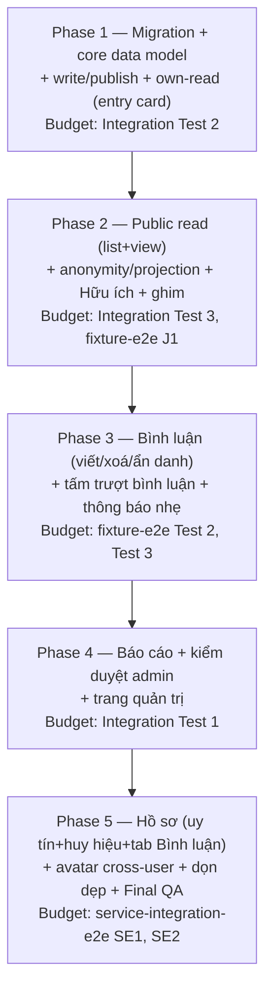

# Work Plan: Bài giải cộng đồng (Community Solutions)

## Metadata

| | |
|---|---|
| **Mode** | update (v1.3 — plan was v1.2; backup of v1.2 kept outside the repo) |
| **Plan version** | **1.3** (2026-09-19) — see § Change History |
| **Scale** | Large — fullstack, ~47 files (PRD "Quy mô") |
| **PRD** | `docs/prd/community-solutions-prd.md` v1.3 (approved) |
| **Design Doc (backend)** | `docs/design/community-solutions-backend-design.md` **v1.9** (final; Update History rows 1.2–1.9 are the delta since plan v1.2) |
| **Design Doc (frontend)** | `docs/design/community-solutions-frontend-design.md` **v1.6** (final; Update History rows 1.2–1.6 are the delta since plan v1.2) |
| **UI Spec** | `docs/ui-spec/community-solutions-ui-spec.md` v1.0 (Ready) |
| **ADR** | `docs/adr/ADR-0021-community-solutions-data-model-anonymity-and-admin-moderation.md`, including its 2026-09-17 amendment note under Decision 2 (`community_my_comment_feed` and `community_reputation_summary` are exempt from the exam-published half of the R1 gate) |
| **Task files** | `docs/plans/tasks/_overview-20260917-feature-community-solutions.md` (rules R1–R10) + 53 task files `20260917-feature-community-solutions-{backend,frontend}-task-NN.md`. Task numbers 01–53 are fixed; both Design Docs cite them (§ Task Index) |
| **Engineer decisions (final)** | **U1** (2026-09-17): Helpful, comment and report writes go through six `SECURITY DEFINER` RPCs; the three tables have no policies and no grants. **U2** (2026-09-17): `ReputationBlock` lives in `features/solutions/components/`; `/profile` passes it to `ProfileCard` through `reputationSlot?: ReactNode`. Neither is re-opened by this plan |
| **Test skeletons** | integration: `SOURCE/features/solutions/__tests__/communitySolutions.int.test.ts` (3/3 budget); fixture-e2e: `SOURCE/tests/e2e/fixture/community-solutions.fixture.e2e.test.ts` (3/3 budget); service-integration-e2e: `SOURCE/tests/e2e/service/community-solutions.service.e2e.test.ts` (2/1-2 budget) |
| **Strategy** | A — Test-Driven Development (all three skeleton lanes provided) |
| **Phase structure** | Vertical slice (Option A) — each phase is a user-value slice with its own backend + frontend, per explicit engineer instruction |
| **Implementation approach (from DDs)** | Hybrid: one mandatory foundation slice (admin identity + masking pattern + shared frontend primitives), then feature-driven vertical slices in dependency order — both DDs independently selected this and align their slice numbering |
| **Date** | 2026-09-17 (created), 2026-09-19 (v1.3) |

## Task Index (binding numbering, v1.3)

Every `Pn-Tm` entry below maps to one or more task files. The task number (01–53) is the id both Design Docs cite ("task 13", "test task 16", …). Numbers and phases never change; where a task's scope changed, its description changed, not its number. Three plan entries are split across several task files (overview § Split Decisions): P1-T9 → 09, 10; P2-T5 → 17, 18; P2-T6 → 19, 20, 21. Every `Pn-Tm` reference elsewhere in this plan resolves through this table.

| # | Plan entry | Layer | Phase | Status |
|---|---|---|---|---|
| 01 | P1-T1 | frontend | 1 | **DONE** `80dc246` |
| 02 | P1-T2 | backend | 1 | **DONE** `cc685a1` (after `08f8b1f`, which reverted the `uploadExam` cap to 5/day on the engineer's decision) |
| 03 | P1-T3 | backend | 1 | **DONE** `74ba95b`; fingerprint corrected same-day to `8b80e2188cc3` in `4b0ea52` (AC-022 data gap: `community_solution_for_writer` was missing `question_type`/`choices`/`sub_answers`/`essay_answer`, fixed in place — see task file Investigation Notes) |
| 04 | P1-T4 | backend | 1 | **DONE** `e25e1b6` |
| 05 | P1-T5 | backend | 1 | **DONE** `c4dfddf` (Early Verification Point) |
| 06 | P1-T6 | backend | 1 | **DONE** `6d656ef` |
| 07 | P1-T7 | frontend | 1 | **DONE** `e4b278d` |
| 08 | P1-T8 | frontend | 1 | **DONE** `27d61cd` — 360px Playwright measurement still BLOCKED on shared CLI sign-in (auto-mode denied the submit click); deferred, must run before task 09/Slice B visual work is declared done, see task file Completion Criteria |
| 09 | P1-T9 (split 1/2) | frontend | 1 | **DONE** `18bd280` |
| 10 | P1-T9 (split 2/2) | frontend | 1 | **DONE** `b2b01fb` — L1 real-browser write→save→publish→re-open flow also deferred (same sign-in block) |
| 11 | P1-T10 | frontend | 1 | **DONE** `dc309eb` (includes same-day AC-022 follow-up consuming the task-03 fix) |
| 12 | P1-T11 | frontend | 1 | **DONE** `a5736cf` |
| 13 | P2-T1 | backend | 2 | **DONE** `e74b64a` (migration fingerprint `c3c344fffc6e`, applied dev only) |
| 14 | P2-T2 | backend | 2 | **DONE** `b3492c9` |
| 15 | P2-T3 | backend | 2 | **DONE** `a2a7e36` |
| 16 | P2-T4 | backend | 2 | **DONE** `ac068cf` — real-DB proof for migration 13 (M5, writer self-read, both Helpful RPC groups incl. table-closure, pin atomicity, AC-004 gate, draft/hidden + admin-hidden comment via SN-1 setup-client substitute, name-resolution) + new localdb file (S12 ordering, score-grading, detail enumeration #14, AC-047/AC-048); the only remaining `test-rls.ts` failures are 4 pre-existing, out-of-scope Rating-section cases (`R-p`/`R-r`/`R-t`/`R-u`), confirmed unrelated by two independent reviewer passes |
| 17 | P2-T5 (split 1/2) | frontend | 2 | open |
| 18 | P2-T5 (split 2/2) | frontend | 2 | open |
| 19 | P2-T6 (split 1/3) | frontend | 2 | open |
| 20 | P2-T6 (split 2/3) | frontend | 2 | open |
| 21 | P2-T6 (split 3/3) | frontend | 2 | open |
| 22 | P2-T7 | frontend | 2 | open |
| 23 | P2-T8 | frontend | 2 | open |
| 24 | P2-T9 | frontend | 2 | open |
| 25 | P3-T1 | backend | 3 | open |
| 26 | P3-T2 | backend | 3 | open |
| 27 | P3-T4 | backend | 3 | open |
| 28 | P3-T5 | frontend | 3 | open |
| 29 | P3-T6 | frontend | 3 | open |
| 30 | P3-T7 | frontend | 3 | open |
| 31 | P3-T8 | frontend | 3 | open |
| 32 | P4-T1 | backend | 4 | open |
| 33 | P4-T2 | backend | 4 | open |
| 34 | P4-T3 | backend | 4 | open |
| 35 | P4-T4 | backend | 4 | open |
| 36 | P4-T5 | frontend | 4 | open |
| 37 | P4-T6 | frontend | 4 | open |
| 38 | P4-T7 | frontend | 4 | open |
| 39 | P4-T8 | frontend | 4 | open |
| 40 | P5-T1 | backend | 5 | open |
| 41 | P5-T2 | backend | 5 | open |
| 42 | P5-T3 | backend | 5 | open |
| 43 | P5-T4 | backend | 5 | open |
| 44 | P5-T5 | frontend | 5 | open |
| 45 | P5-T6 | frontend | 5 | open |
| 46 | P5-T7 | frontend | 5 | open |
| 47 | P5-T8 | backend | 5 | open |
| 48 | P5-T9 | frontend | 5 | open |
| 49 | P5-T10 | frontend | 5 | open |
| 50 | P5-T11 | backend | 5 | open |
| 51 | P5-T12 | backend | 5 | open |
| 52 | P5-T13 | backend | 5 | open |
| 53 | P5-T14 | backend | 5 | open |

Non-task commit on the branch: `707df1f` — the INT-1 quota tests moved to `SOURCE/tests/integration/pending/subscription-quota.int.test.ts` and excluded by name in `SOURCE/vitest.integration.config.ts` (TD-034), so `npm run test:integration` exits 0. No task in this plan re-enables INT-1.

## Note on phase re-slicing vs. Design Doc slice numbering

Both Design Docs propose their own vertical-slice order (backend: 8 slices; frontend: Prerequisite + Slices A–E). This plan's 5 phases were specified by the engineer along a different, coarser cut (by user-value group, not by DD slice number). Where the DDs bundle work the engineer's phase split separates (e.g. backend DD Slice 3 bundles `community_solution_for_writer`/`community_solution_result_card` with the public masking reads `community_solutions_list`/`community_solution_detail`; backend DD Slice 4 bundles Helpful+Pin+Comments+CommentFeed together), this plan splits them across phases because no RPC in the later group depends on the earlier group's RPCs existing — only on Phase 1's core tables, so the split is dependency-safe. The one dependency the DDs treat as load-bearing and this plan preserves exactly is: **Prerequisite Work (relocate `QuestionPaletteDock`/`QuestionPagination`, add `"solutions"` to `eslint.config.mjs` `FEATURES`) is the first task of Phase 1** — every other frontend task in every phase imports these or the shared primitives built alongside them.

**Migration reconciliation**: backend DD § Migration Strategy describes "one migration file... in dependency order," while its own § Verification Strategy requires "each slice's own RLS/RPC cases are written and run against dev before the next slice starts, not batched at the end." This plan resolves the tension by giving **each phase that adds schema its own migration task** (schema.sql edit → `npm run schema:plan` → fingerprint constant → migration file → apply dev via CLI `--file` against `hynwleaxtbtjzkvpjsug` → `npm run verify:schema`), so each phase's own DB-layer tests run against real, current dev schema — matching the per-slice verification timing. The "one migration file" statement is honored at the **prod** boundary: all dev migrations accumulated across Phases 1–5 are applied to prod together as one deployment action before the single, final PROD fingerprint-check task (P5-T13) — per the engineer's explicit requirement for one dedicated final task.

**Migration ownership (v1.3, from backend DD v1.9 § Migration Strategy "Migration ownership (v1.8, binding)" — copy, not a re-derivation).** Six migration tasks own every object exactly once: **23 SQL functions**, 1 additive column, 1 Storage policy. The backend DD's SQL blocks total **111 statements** (counted with `SOURCE/lib/schema/splitStatements.ts`); every statement is copied into `schema.sql` verbatim, and no later task restates an earlier statement with different text (overview R5, `migrationsMatchSchema.test.ts`). Each RPC lands as four statements in this order: `drop function if exists`, `create function`, `revoke all … from public, anon`, `grant execute … to authenticated`.

| Task | Migration file | Objects owned |
|---|---|---|
| 03 (Phase 1) | `<ts>_community_solutions_<fp>.sql` | `is_admin_user()`, `count_words(text)`, `question_content_fingerprint(text)`, `save_community_solution(text,uuid,boolean,boolean,jsonb)`, `set_community_solution_status(text,text)`, `community_solution_for_writer(text)`, `community_solution_result_card(text)` — 7 functions; table blocks `admin_users`, `community_solutions`, `community_solution_notes`, `community_moderation_log` |
| 13 (Phase 2) | `<ts>_community_solutions_read_<fp>.sql` | `community_solutions_list(text)`, `community_solution_detail(uuid)`, `set_community_solution_pin(text,text,uuid)`, `add_community_solution_helpful(uuid)`, `remove_community_solution_helpful(uuid)` — 5 functions; table block `community_solution_helpfuls`; table blocks **only** of `community_solution_comments` and `community_content_reports` (overview R2) |
| 25 (Phase 3) | `<ts>_community_solutions_comments_<fp>.sql` | `post_community_comment(uuid,text,text,boolean)`, `delete_community_comment(uuid)`, `community_my_comment_feed(int,int)` — 3 functions; column `user_profiles.community_comments_last_read_at` |
| 32 (Phase 4) | `<ts>_community_solutions_moderation_<fp>.sql` | `report_community_solution(uuid,text)`, `report_community_comment(uuid,text)`, `admin_moderate_community_solution(uuid,text,text)`, `admin_moderate_community_comment(uuid,text,text)`, `admin_list_community_reports()`, `admin_get_community_solution_notes(uuid)` — 6 functions |
| 40 (Phase 5) | `<ts>_community_solutions_avatar_policy_<fp>.sql` | `community_avatar_owner_visible(uuid)` — 1 function; Storage policy `avatars_select_community_visible` |
| 41 (Phase 5) | `<ts>_community_solutions_reputation_<fp>.sql` | `community_reputation_summary()` — 1 function. If 40 and 41 land in one commit, one file carries the later fingerprint and task 41 owns no separate file |

The three write tables (`community_solution_helpfuls`, `community_solution_comments`, `community_content_reports`) have RLS enabled, every privilege revoked from `anon`/`authenticated`, **no policies and no grants**. The five v1.1 policies (`community_helpfuls_insert_own`, `community_helpfuls_delete_own`, `community_comments_insert_own`, `community_comments_delete_own`, `community_reports_insert_own`) are gone from the design; no database ever received them, so no `drop policy` is needed.

**Prod (v1.3):** the engineer applies all six migrations to prod, in dev order, and then the out-of-band `admin_users` prod seed, as one separate action **before task 52 starts** (`docs/project-context/external-resources.md` § Schema Change Process). No task in this plan writes to prod. Task 52 only reads prod through the Composio read-only query.

## Verification Strategy Summary (from Design Docs)

**Backend DD**:
- Correctness definition: (1) every AC in the backend DD's EARS list + backend-relevant PRD AC-001–AC-110 holds against a real dev-project Postgres instance; (2) `serviceRoleSurface.test.ts`/`rateLimit.test.ts` stay green with zero gate-logic modification; (3) the anonymity null-value assertion (M5) — masked identity/score columns equal JSON `null`, not merely absent — passes for an anonymous solution and an anonymous comment.
- Verification method: `supabase/test-rls.ts` (one refusal + one success group per new DDL object) + `npm run test:localdb` (real-Postgres ordering/aggregate/grant proofs) + `npm run verify:schema` (RPC existence/grant probes) + existing CI lane (lint/tsc/vitest/build).
- Verification timing: **per vertical slice** — each slice's own RLS/RPC cases run against dev before the next slice starts.
- Early Verification Point: Slice 2 equivalent (this plan's Phase 1, tasks 03 → 05) — a submitted user calls `save_community_solution()` then `set_community_solution_status('publish')` against real dev DB with every question ≥15 words → neither call raises `42702`; row reaches `published`; a second call with one note <15 words is rejected (23514) with zero row change; a call from a non-submitter is rejected (42501) with zero row created. **Failure response**: if the R1 gate re-derivation diverges from `exam_answer_key()`'s own gate for the same test account, stop and reconcile before any further slice — every later RPC copies this gate.
- Correctness definition items added in backend v1.3–v1.9 (each proven by the § Integration Verification Points case in its test task): no PL/pgSQL function raises `42702` on its success path; AC-004 and AC-002 gates on every function; admin reason/transition rules; S4 writer-comment masking; writer self-read masked (AC-062); feed columns; AC-048 note condition; AC-047 current-question condition; comments of a draft/hidden solution invisible; admin queue hidden comments and hidden-solution queue membership; reputation fixed vector; feed unread cursor; pin atomicity and target refusals; `score_grading` identical on list and detail; `attempt_id`; exact key sets of `community_solution_detail` and `community_solution_for_writer`; per-caller `i_reported`; `admin_get_community_solution_notes` shape; publish refusal DETAIL = decimal missing count; save refusal DETAIL = `below_word_count`.
- **Task ownership (binding, backend DD § Integration Verification Points):** migrations 03 / 13 / 25 / 32 are tested in **05 / 16 / 27 / 35**; tasks **40 and 41 test their own migrations**. Server Action unit tests (vitest, Supabase client mocked at its boundary) go in the task that writes the action: **04** (`saveSolution`, `setSolutionStatus`), **15** (`toggleHelpful`, `setPin`), **26** (comment actions), **33** (report actions). The `i_reported` case, the admin-notes case and every admin-queue case are in **35**.

**Frontend DD**:
- Correctness definition: (1) every frontend-verifiable EARS AC holds against component/unit tests using the pinned TS contracts; (2) `identity.test.ts` proves the D003 null-to-absent boundary at the type/mapper level; (3) `test:fixture` proves the result-page integration does not regress; (4) a manual `next build` + manifest read proves the per-route JS budget (M12, ~170KB gzip) at least once.
- Verification method: `npm test`, `npm run test:fixture`, `RichText.xss.test.tsx`, manual `next build` + manifest read, manual Playwright-CLI measurement at 360px (touch targets, no-clip labels).
- Verification timing: per vertical slice, mirroring backend's own per-slice timing so a frontend slice is never verified against an unverified backend contract.
- Early Verification Point: `SolutionEntryCard` (this plan's Phase 1) rendering correctly in `test:fixture` at all four `myStatus` branches + the one-time `unseenDeletionReason` branch, passing AC-011's 360px no-clip/44px measurement. **Failure response**: if the 360px measurement fails for the longest label even after icon-removal/wrap treatment, stop and re-open the label-width question before Phase 1's write-screen tasks continue — every later card/menu/button reuses the same convention.

### Verification lanes (v1.3)

Run every lane from inside `SOURCE/`.

| Lane | Command | Rule for this plan |
|---|---|---|
| unit/component | `npm test` | **R1:** until task 04 gives `features/solutions/__tests__/communitySolutions.int.test.ts` its first real suite, run `npx vitest run --exclude "features/solutions/__tests__/communitySolutions.int.test.ts"` (task 03 is the only open task this still applies to). From task 04 on, plain `npm test`. |
| fixture-e2e | `npm run test:fixture` | **R1:** until task 23 gives `tests/e2e/fixture/community-solutions.fixture.e2e.test.ts` its first real suite, run `npx vitest run --config vitest.fixture.config.ts --exclude "tests/e2e/fixture/community-solutions.fixture.e2e.test.ts"` (tasks 03–22). From task 23 on, plain `npm run test:fixture`. |
| localdb (real dev Postgres) | `npm run test:localdb` | **R1:** until task 47 gives `tests/e2e/service/community-solutions.service.e2e.test.ts` its first real suite, run `npx vitest run --config vitest.localdb.config.ts --exclude "tests/e2e/service/community-solutions.service.e2e.test.ts"` (tasks 03–46). Precondition: `npm run verify:schema` green on dev for the migrations the run touches. A red file is re-run alone once before it is treated as a defect (dev DB flakes when slow). |
| integration (real dev Supabase) | `npm run test:integration` | Green since `707df1f` (INT-2/INT-3 pass; INT-1 excluded by name, TD-034). This feature adds **no** file under `SOURCE/tests/integration/`; the feature's own "integration" skeleton lives under `features/**` and runs in `npm test`. Task 50 runs this lane as a regression check; it must stay exit 0. No task edits `vitest.integration.config.ts` or moves INT-1 back. |
| RLS/RPC proofs | `npx tsx supabase/test-rls.ts` | One refusal group + one success group per new DDL object; for the three closed write tables, per user-write RPC (backend DD § Test Boundaries "User-write RPC groups"). |
| schema | `npm run verify:schema` | Probe rule (backend DD § Migration Strategy "Probe rule (v1.3)"): a probe is judged by the error **message**, never by `error.code` alone. Each migration task adds one probe per new RPC. |

R1 never permits editing a skeleton to add a placeholder suite. The skeleton exclusions are CLI flags, never edits to a vitest config file.

## Quality Assurance Mechanisms Adopted (from Design Docs)

| Tool | Enforces | Config | Covers |
|---|---|---|---|
| `npm run lint` (eslint --max-warnings 0, incl. B4) | No cross-feature import from `features/solutions/`; `FEATURES` array membership | `SOURCE/eslint.config.mjs` | `SOURCE/features/solutions/**`, `SOURCE/components/shared/QuestionPaletteDock.tsx` |
| `npx tsc --noEmit` | Type correctness of RPC-return types, `AuthorIdentity`/`SolutionListItem` etc. | `SOURCE/tsconfig.json` | whole `SOURCE/` |
| `npm test` (vitest default lane) | Unit/integration tests incl. `serviceRoleSurface.test.ts`, `rateLimit.test.ts`, schema fingerprint/migration tests, `identity.test.ts` | `SOURCE/vitest.config.ts` | `SOURCE/lib/**`, `SOURCE/features/**`, `SOURCE/components/shared/**` |
| `serviceRoleSurface.test.ts` | ≤13 exported ops, exactly 4 direct writers, 1 env read, 1 `createClient(` in `service-role.ts` | `SOURCE/lib/supabase/__tests__/serviceRoleSurface.test.ts` | `SOURCE/lib/supabase/service-role.ts` (this design keeps it green by zero touches) |
| `schemaFingerprint.test.ts` + `migrationsMatchSchema.test.ts` + `parseForeignKeys` + `bannedAuthorVisibility.test.ts` | Fingerprint 3-way match, migration statements verbatim, every FK has `on delete`, banned-author clause survives | `SOURCE/lib/schema/__tests__/*.test.ts` | `schema.sql`, `migrations/*.sql` |
| `npm run verify:schema` | DB behaviour vs `schema.sql` incl. RPC EXECUTE grants, FK on-delete, `schema_version` fingerprint; one probe per new RPC judged by message (anon → `permission denied for function`; probe user → the function's pinned message, or rows for a function that never raises `42501`; `question_content_fingerprint` → `permission denied for table questions`) | `SOURCE/supabase/verify-schema.ts` | dev DB as applied |
| `npm run test:integration` (regression only) | INT-2/INT-3 stay green; INT-1 stays quarantined (TD-034) | `SOURCE/vitest.integration.config.ts` | `SOURCE/tests/integration/**` (this feature adds nothing there) |
| `npx tsx supabase/test-rls.ts` | RLS/RPC isolation proofs on real Postgres — one refusal + one success group per new DDL object | `SOURCE/supabase/test-rls.ts` | new policies/functions |
| `npm run test:localdb` | Real-Postgres behaviours (ordering, zero-row predicates, grants) | `SOURCE/vitest.localdb.config.ts` | new SQL functions/RLS |
| `npm run test:fixture` | Real route-tree render with data mocked; zero `[disabled]` nodes | `SOURCE/vitest.fixture.config.ts` | `result/page.tsx`, `tests/e2e/fixture/essay-auto-scoring.fixture.e2e.test.ts` |
| `components/shared/__tests__/RichText.xss.test.tsx` | No executable markup from untrusted markdown/KaTeX | same file | note/comment/report-reason rendering (M8) |
| `rateLimit.test.ts` classification invariants | Every `RATE_LIMITS` key in exactly one category, DB-cost floor `limit≥15`/`windowMs≥60_000` | `SOURCE/lib/security/rateLimit.test.ts` | `SOURCE/lib/security/rateLimit.ts` |
| `components/history/ActionButton.test.tsx` (7) / `HistoryRowMenu.test.tsx` (3) | "Xuất PDF" replaces "Chia sẻ" everywhere | same files | `common.share`-derived copy |
| `features/profile/__tests__/ProfileCard.test.tsx` | No heading, no resting `<input>` beyond file picker inside `ProfileCard`; with `reputationSlot` filled the block renders before "Đổi mật khẩu", with no slot there is no "Điểm uy tín" text (U2, frontend DD § Test Boundaries) | same file | `ProfileCard.tsx` (`reputationSlot?: ReactNode`) + `features/solutions/components/ReputationBlock.tsx` |
| `next build` (local, manual manifest read, TD-021 precedent) | Per-route first-load JS ≤~170KB gzip; markdown/KaTeX chunk absent from first bundle of all 3 new routes | none automated | the 3 new routes |
| `npm run check:bundle` | `SUPABASE_SERVICE_ROLE_KEY` absent from client bundle | `.github/workflows/ci.yml` `bundle-secrets` job | any client import (noted — this feature adds no `service-role.ts` usage) |
| Commit gate list (`tsc`, `eslint`, `vitest run`, `build`, `test:fixture`, `test:localdb`, run inside `SOURCE/`) | Full local gate before commit | PRD "Ràng buộc" | whole `SOURCE/` |

## Proof Strategy

**Proof obligation source**: test skeleton annotations (`@category`, `@dependency`, `@complexity`, `ROI`, `Primary failure mode`, `Proof obligation`, `Verification points`) from all three provided skeleton files — these are the binding source, not re-derived ACs, per the skeletons already carrying explicit `Proof obligation` fields.

**Propagation rule**: every task that implements a claim covered by one of the 8 skeleton tests (Test 1–3 integration, J1/Test2/Test3 fixture-e2e, SE1/SE2 service-integration-e2e) records that test's `Proof obligation` and `Verification points / pass criteria` text verbatim in its own completion criteria, so downstream review checks the task against the skeleton author's own pass bar, not a re-summarized version. Tasks implementing claims **not** covered by a skeleton (e.g., admin queue UI, reputation badges) derive their Proof Obligation from the covering AC's EARS "then" clause plus its primary failure mode, per the Failure Mode Checklist below.

## Review Scope

v1.3 is a revision of a plan whose implementation has started. Base: branch `feat/community-solutions`, branched from `af05f28` (= `origin/main`); diff range for review and for task 51 = `af05f28..HEAD`. Landed so far: `80dc246` (01), `08f8b1f` + `cc685a1` (02), `6d656ef` (06), `e4b278d` (07), `a5736cf` (12), `707df1f` (non-task, TD-034). Planned-files scope for the remaining tasks, derived from both Design Docs' Change Impact Maps + task target files:

- `SOURCE/supabase/schema.sql`, `SOURCE/supabase/migrations/*_community_solutions*_*.sql` (six files, § Migration ownership), `SOURCE/lib/schema/schemaFingerprint.ts`, `SOURCE/supabase/verify-schema.ts` (one probe per new RPC)
- `SOURCE/tests/e2e/service/community-solutions-{write-gate,list-order,comment-feed,reputation}.localdb.test.ts` (overview R4), `SOURCE/lib/solutions/unreadComments.ts` (overview R6)
- `SOURCE/components/ui/SettingSwitch.tsx` (task 09 adds `lockReasonId?: string`), `SOURCE/components/support/SupportWidgetTrigger.tsx` (landed in 07)
- `SOURCE/features/solutions/components/ReputationBlock.tsx`, `ProfileTabs.tsx`, `ProfileCommentsTab.tsx`, `CommentNotificationCard.tsx` (U2 / B4 placement — not `features/profile/`)
- `SOURCE/lib/security/rateLimit.ts`, `rateLimit.test.ts`
- `SOURCE/lib/solutions/**` (new: `countWords.ts`, `identity.ts` + tests)
- `SOURCE/features/solutions/**` (new: `actions.ts`, `queries.ts`, `adminActions.ts`, `components/*.tsx`, `__tests__/`)
- `SOURCE/features/admin/components/**` (new: `ReportedSolutionsSection.tsx`, `ReportedSolutionRow.tsx`, `ReportedCommentItem.tsx`)
- `SOURCE/components/shared/{OverlaySheet,ConfirmDialog,AnonymousAvatar,QuestionPaletteDock,QuestionPagination}.tsx` (`QuestionPaletteDock`/`QuestionPagination` relocated from `features/exams/components/`)
- `SOURCE/components/ui/SettingSwitch.tsx`, `SOURCE/lib/format/relativeTime.ts`
- `SOURCE/app/(exams)/exams/[id]/solutions/**`, `.../solutions/[solutionId]/**`, `.../attempt/[attemptId]/solution/**` (new routes)
- `SOURCE/app/(exams)/exams/[id]/attempt/[attemptId]/result/page.tsx`, `SOURCE/features/exams/components/ExamPlayer.tsx` (2 import lines only)
- `SOURCE/app/(analytics)/profile/page.tsx`, `SOURCE/features/profile/components/ProfileCard.tsx`, `.../profile/loading.tsx`
- `SOURCE/app/(admin)/admin/page.tsx`
- `SOURCE/components/history/{ActionButton,HistoryRowMenu}.tsx` + `.test.tsx`
- `SOURCE/eslint.config.mjs`, `SOURCE/lib/copy.ts`
- `SOURCE/tests/e2e/fixture/{essay-auto-scoring,community-solutions}.fixture.e2e.test.ts`, `SOURCE/tests/e2e/service/community-solutions.service.e2e.test.ts`
- `SOURCE/components/shared/__tests__/RichText.xss.test.tsx`
- `SOURCE/supabase/test-rls.ts`

**Out of scope for every executor (uncommitted engineer changes — never stage, revert or clean):** `.claude/*`, `.mcp.json`, `SCREENSHOT/*`, `TECH-DEBT.md` (holds the engineer's unstaged TD-034 entry for the INT-1 quarantine), `skills-lock.json`, `test_file/`, `SOURCE/.ts`, `docs/project-context/external-resources.md`, `SOURCE/app/layout.tsx`. Run `git status` before any `checkout`/`restore`/`reset`/`clean`; stage only the current task's files by explicit path.

## Failure Mode Checklist

| # | Category | Applies? | Description | Covering task(s) |
|---|---|---|---|---|
| 1 | same-value (writing the same value as a no-op) | Yes | Toggling Helpful twice on the same solution; reporting the same target twice; saving a note with unchanged text; setting `show_profile`/`show_score` to their current value | P1-T4 (save idempotency, AC-031); P2-T1/P2-T3 (`add_community_solution_helpful` skips the repeat with `on conflict do nothing` and returns `added = false` — no `23505` reaches the client; `toggleHelpful` then removes, AC-064/066); P4-T1/P4-T2 (repeat report returns `already_reported = true`, AC-073/074/076) |
| 2 | no-op (an action that should have effect silently doesn't) | Yes | Calling publish when already published; calling `markCommentsRead()` when nothing is unread | P1-T4 (`set_community_solution_status` re-entrant transition), P3-T2 (`markCommentsRead` no-op-safe) |
| 3 | empty input | Yes | 0-word note on a draft (allowed) vs. published (rejected); empty comment body (rejected, `CHECK` + client pre-check) | P1-T4/P1-T10 (AC-024), P3-T5 (AC-069) |
| 4 | invalid option | Yes | `set_community_solution_status`'s `p_action` outside `{publish,draft}`; `admin_moderate_*`'s `p_action` outside `{hide,restore,delete}`, a missing reason on `hide`/`delete`, or a forbidden transition (`22023`); `set_community_solution_pin`'s `p_action` outside `{pin,unpin}`, or a `'pin'` target that is `null`, another exam's solution or a draft (`22023`) | P1-T4, P4-T1/P4-T3/P4-T4, P2-T1/P2-T3/P2-T4 |
| 5 | missing config | Yes | A write action ships before its `RATE_LIMITS` key exists; `admin_users` not seeded before an admin RPC is exercised | P1-T2 (all 11 keys land before any write action task), P1-T3 (dev `admin_users` seed) |
| 6 | unavailable boundary | Yes | A masking read returns zero rows for an ineligible caller (a page load or read must redirect, not error-render; a refused **mutation** returns `generic` and does not navigate — backend DD v1.9 N4); `community_solution_result_card` returns zero rows (no card, deletion reason not consumed); avatar Storage sign fails for a legitimate but unresolvable path | P1-T8 (`getResultCardSummary` → `null` → no card), P1-T9 (task 10: `getMySolutionForWriter` → `null` → redirect), P2-T2/P2-T5/P2-T6 (S11 redirect, AC-063), P5-T3 (fail-closed to `Avatar.tsx`'s `src:null→initials` fallback) |
| 7 | shared-state dependency | Yes | `unique(exam_id, author_id)` on `community_solutions`; partial unique index on `is_pinned`; `community_comments_last_read_at` is one shared cursor read by two different UI surfaces (list badge, profile chip); the one-time deletion reason is consumed by the result-card read, so no other screen may call that read | P1-T3 (AC-016), P2-T1/P2-T3/P2-T4 (AC-078 atomic pin swap + unique-index backstop), P3-T1/P3-T6/P5-T6 (shared cursor, one formula `isUnread && examVisible`), P2-T5 (task 18: list route never calls `getResultCardSummary`) |
| 8 | rollback-only visibility | Yes | A `hidden` solution/comment is visible only to its owner (with reason) and admin, never to other readers; a hard-deleted row is visible to nobody, ever | P1-T3/P4-T7 (S6/AC-083), P3-T1/P4-T1 (S19), P4-T1/P4-T3 (AC-084/106 hard-delete) |
| 9 | missing-sort-key ordering | Yes | Solution list order (`is_pinned desc, helpful_count desc, updated_at desc, id asc`) must be stable across repeated reads with unchanged data, including the final tie-break | P2-T1/P2-T2/P2-T4 (S12, AC-054) |

## Design-to-Plan Traceability

Source `Design Doc` column values: `BE` = `docs/design/community-solutions-backend-design.md`, `FE` = `docs/design/community-solutions-frontend-design.md`.

### Verification Strategy

| DD Item | Category | Design Doc | Covering Task | Gap Status | Notes |
|---|---|---|---|---|---|
| Early Verification Point — Slice 2 (save→publish, real dev DB) | verification | BE | P1-T4, P1-T5 | mapped | Formal SE1 skeleton only runs in P5-T8; dev-level proof happens in P1-T5 via `test-rls.ts`/`test:localdb` |
| Early Verification Point — `SolutionEntryCard` in `test:fixture` | verification | FE | P1-T8 | mapped | — |
| Per-slice verification timing (both DDs) | verification | BE, FE | every phase's migration/test tasks | mapped | Enforced by per-phase migration tasks (P1-T3, P2-T1, P3-T1, P4-T1, P5-T1/T2) |

### Quality Assurance Mechanisms (adopted)

| DD Item | Category | Design Doc | Covering Task | Gap Status | Notes |
|---|---|---|---|---|---|
| `npm run lint` (B4 boundary) | verification | BE, FE | P1-T1 (establishes `FEATURES`), every feature task | mapped | — |
| `npx tsc --noEmit` | verification | BE, FE | P5-T11 (final gate), every task | mapped | — |
| `npm test` incl. `serviceRoleSurface.test.ts`/`rateLimit.test.ts` | verification | BE, FE | P1-T2, P4-T3/P4-T4, P5-T12 | mapped | — |
| `schemaFingerprint.test.ts`+`migrationsMatchSchema.test.ts`+`parseForeignKeys`+`bannedAuthorVisibility.test.ts` | verification | BE | P1-T3, P2-T1, P3-T1, P4-T1, P5-T1/T2 | mapped | Each migration task re-runs these |
| `npm run verify:schema` | verification | BE | same 5 migration tasks | mapped | — |
| `npx tsx supabase/test-rls.ts` | verification | BE | P1-T5, P2-T4, P3-T4, P4-T4, P5-T8(admin case) | mapped | — |
| `npm run test:localdb` | verification | BE | P1-T5, P2-T4, P3-T4, P4-T4, P5-T11 | mapped | — |
| `npm run test:fixture` | verification | FE | P1-T8, P5-T9 | mapped | — |
| `RichText.xss.test.tsx` (note+comment fixtures, M8) | verification | BE, FE | P1-T10 (note), P3-T5 (comment) | mapped | Explicit acceptance criterion per engineer instruction |
| `rateLimit.test.ts` classification invariants | verification | BE | P1-T2 | mapped | — |
| `ActionButton.test.tsx`/`HistoryRowMenu.test.tsx` | verification | FE | P1-T11 | mapped | — |
| `ProfileCard.test.tsx` extended | verification | FE | P5-T5 | mapped | — |
| `next build` manual manifest read (M12) | verification | FE | P5-T9 | mapped | — |
| `check:bundle` | verification | BE | P5-T11 | mapped | Noted — nothing new for this feature to catch |
| Commit gate list | verification | BE, FE | P5-T11 | mapped | — |

### Integration Points

| DD Item | Category | Design Doc | Covering Task | Gap Status | Notes |
|---|---|---|---|---|---|
| `exam_answer_key()` reuse (internal call) | integration-point | BE | P1-T3, P1-T5 | mapped | — |
| `is_author_banned()` reuse | integration-point | BE | P1-T3, P1-T5 | mapped | — |
| `exam_results` cross-user read (show_score) | integration-point | BE | P2-T1, P2-T2, P2-T4 | mapped | — |
| `attempt_answers` self-read (essay prefill) | integration-point | BE | P1-T4 | mapped | — |
| `user_profiles` cross-user read + additive column | integration-point | BE | P2-T1/T2 (identity join), P3-T1 (column) | mapped | — |
| `avatars` Storage bucket new policy | integration-point | BE | P5-T1 | mapped | — |
| `/admin` page new section | integration-point | BE, FE | P4-T7 | mapped | — |
| `RATE_LIMITS`/`guard()` | integration-point | BE | P1-T2 | mapped | — |
| `result/page.tsx` new card + 1 query | integration-point | BE, FE | P1-T8 | mapped | — |
| `SOURCE/lib/supabase/service-role.ts` — deliberately zero integration | integration-point | BE | P1-T3, P4-T1, P4-T3, P4-T4, P5-T8, P5-T12 | mapped | TD-029 acceptance criterion embedded in each |
| `ResultPage` composition | integration-point | FE | P1-T8 | mapped | — |
| `ProfileCard` composition (`ReputationBlock`) | integration-point | FE | P5-T5 (task 44) | mapped | U2 (final): `profile/page.tsx` passes `<ReputationBlock …/>` through the new optional prop `reputationSlot?: ReactNode`; `ReputationBlock` lives in `features/solutions/components/` (DD-U1) |
| `AdminPage` composition (`ReportedSolutionsSection`) | integration-point | FE | P4-T7 | mapped | — |
| `QuestionPaletteDock`/`QuestionPagination` relocation+extension | integration-point | FE | P1-T1 | mapped | — |
| `RichText` two consumption patterns (server-direct, dynamic import) | integration-point | FE | P1-T10 (dynamic, formula preview), P2-T6 (server-direct, note block), P3-T5 (dynamic, comment) | mapped | — |
| `SupportWidgetTrigger` selector extension (`data-app-overlay`) | integration-point | FE | P1-T7 | mapped | — |
| `features/solutions/{queries,actions,adminActions}.ts` as sole component entry point | integration-point | FE | every frontend task | mapped | Enforced by Mock Boundary Decisions in each task's Quality Complete criteria |

### Prerequisite Work

| DD Item | Category | Design Doc | Covering Task | Gap Status | Notes |
|---|---|---|---|---|---|
| Relocate `QuestionPaletteDock.tsx`/`QuestionPagination.tsx` to `components/shared/`, extend props, update `ExamPlayer.tsx` imports | prerequisite | FE | P1-T1 | mapped | Must be FIRST task of Phase 1 per engineer instruction |
| Add `"solutions"` to `eslint.config.mjs` `FEATURES` | prerequisite | FE | P1-T1 | mapped | Same task |
| Build `OverlaySheet`, `ConfirmDialog`, `AnonymousAvatar`, `SettingSwitch` | prerequisite | FE | P1-T7 | mapped | — |
| Build `lib/solutions/identity.ts` + unit test | prerequisite | FE | P1-T6 | mapped | — |
| Add `lib/format/relativeTime.ts` | prerequisite | FE | P1-T7 | mapped | — |
| Reserve `solutions.*`/`admin.*`/`time.*` copy namespace | prerequisite | FE | P1-T1 (namespace), values land per-task | mapped | — |
| Foundation: `admin_users`, `is_admin_user()`, `count_words()`, `question_content_fingerprint()` | prerequisite | BE | P1-T3 | mapped | — |
| Out-of-band `admin_users` seed (dev, then prod) | prerequisite | BE | P1-T3 (dev), P5-T13 (prod, paired with fingerprint check) | mapped | — |

### Design-Attention Sections (Minimal Surface Alternatives selected, State Transitions, Field Propagation Map, Security Considerations, Logging/Monitoring, Error Handling)

| DD Item | Category | Design Doc | Covering Task | Gap Status | Notes |
|---|---|---|---|---|---|
| `community_solution_notes` new structure (not `attempt_answers` reuse, not JSONB map) | contract-change | BE | P1-T3 | mapped | — |
| `community_content_reports` new shared structure (not `exam_reports` widened) | contract-change | BE | P4-T1 | mapped | — |
| `community_moderation_log` new sibling (not `exam_moderation_log` extended) | contract-change | BE | P1-T3 (table), P4-T1 (admin writers) | mapped | — |
| `user_profiles.community_comments_last_read_at` — reuse decision (additive column, not new table) | contract-change | BE | P3-T1 | mapped | — |
| Element 1 — `admin_users`+`is_admin_user()` selected over hardcoded literal / JWT claim | contract-change | BE | P1-T3 | mapped | — |
| Element 2 — `community_moderation_log.viewed_at` selected over separate views table / no-flag derivation | contract-change | BE | P1-T3 | mapped | — |
| Element 3 — `avatars_select_community_visible` Storage policy (confirmed, Alternative A) | contract-change | BE | P5-T1 | mapped | — |
| `AuthorIdentity` discriminated union (not nullable-fields object) | contract-change | FE | P1-T6 | mapped | — |
| Frontend Element 1 — real avatar for every named author (Alternative A, confirmed) | contract-change | FE | P1-T6 (mapper), P5-T3 (signer), P5-T7 (wiring) | mapped | — |
| Frontend Element 2 — `QuestionPaletteDock` 4-prop additive extension (not 4th copy, not unconditional title) | contract-change | FE | P1-T1 | mapped | — |
| Frontend Element 3 — `OverlaySheet`/`ConfirmDialog` new shells (not `FilterSheet`/`ChangePasswordDialog` extension, not inline-per-callsite) | contract-change | FE | P1-T7 | mapped | — |
| State Transitions — `community_solutions.status` 3-state + hard-delete exit | verification | BE | P1-T3, P4-T1 | mapped | — |
| State Transitions — `community_solution_comments.status` 2-state + 2 deletion doors | verification | BE | P3-T1, P4-T1 | mapped | — |
| State Transitions (frontend) — client-perceived lifecycle mirrors backend, non-optimistic publish | verification | FE | P1-T9 | mapped | — |
| Field Propagation Map — `author_id`/`author_display_name`/`author_avatar_path` masking (D003) | verification | BE, FE | P1-T6, P2-T2 | mapped | — |
| Field Propagation Map — `score`/`per_question` absent-not-null | verification | BE, FE | P1-T6, P2-T2 (task 14 mapper), P2-T6 (task 20 render) | mapped | v1.9/v1.6: on the wire both keys are present with value `null`; the mapper drops `score` (and `scoreGrading` with it) and leaves `writerChoiceNode?`, `result?`, `notAutoScored?`, `essayScore?` absent on every question — never `notAutoScored: false` |
| Field Propagation Map — `unseen_deletion_reason` read-consumes-once | verification | BE, FE | P1-T3, P1-T8 | mapped | — |
| Field Propagation Map — `community_comments_last_read_at` write-only-by-`markCommentsRead` | verification | BE, FE | P3-T2, P3-T6 | mapped | — |
| Field Propagation Map (FE) — `attemptId`/`q`/`comments`/`tab` URL params | verification | FE | P1-T9 (`attemptId`), P2-T6 (`q`/`comments`), P5-T5 (`tab`) | mapped | Also in Connection Map |
| Security Considerations — every write re-derives its own eligibility gate, never trusts RLS alone | verification | BE | P1-T3, P1-T4, P2-T1, P3-T1, P4-T1 | mapped | — |
| Security Considerations — identity masked at SQL projection layer only | verification | BE | P2-T1, P2-T2 | mapped | — |
| Security Considerations (FE) — `AuthorIdentity` union as primary client-side protection | verification | FE | P1-T6 | mapped | — |
| Logging and Monitoring — no note/comment/report-reason body ever logged | verification | BE, FE | P1-T4, P3-T2, P4-T2 | mapped | — |
| Error Handling matrix (backend) — word-count/auth/admin/duplicate/infra rows | verification | BE | P1-T4, P2-T3, P4-T2, P4-T3 | mapped | — |
| Error Handling matrix (frontend) — validation/rate-limit/business-logic/infra/dirty-close rows | verification | FE | P1-T9, P1-T10, P2-T5/T6, P3-T5 | mapped | — |
| axe accessibility linter | verification | FE | — | **gap** | Not present in repo; UI Spec TBD-03 explicitly defers this decision to the engineer before acceptance, not before design. This plan verifies accessibility via manual criteria embedded per UI task (icon+text state, focus trap, `aria-*`) instead of an automated linter. Requires user confirmation before plan approval. |
| `ui-audit` script extension to 360px viewport + 44px touch floor | verification | FE | P5-T10 (manual substitute only) | **gap** | Frontend DD explicitly assigns extending `ui-audit` itself to "Work Plan scope, not blocking this Design Doc." This plan uses manual Playwright-CLI measurement (P5-T10) as the substitute and does not add a task to automate the script. Requires user confirmation before plan approval. |

### v1.3 additions (backend DD v1.2–v1.9, frontend DD v1.2–v1.6)

Covering tasks are task numbers (§ Task Index).

| DD Item | Category | Design Doc | Covering Task | Gap Status | Notes |
|---|---|---|---|---|---|
| U1 — six `SECURITY DEFINER` user-write RPCs; the three write tables closed (RLS on, all revoked, no policies, no grants); Element 4 (separate add/remove Helpful RPCs, one report RPC per target) | contract-change | BE | 13 (Helpful RPCs), 25 (comment RPCs), 32 (report RPCs); tested in 16 / 27 / 35 | mapped | Replaces the five v1.1 policies. Every refusal is `42501` with one message per function; each refusal group includes a table-closure case |
| Eligibility parity table + AC-004 / AC-002 sweep (exam published and author not banned; caller has a `submitted` attempt) on every write and read RPC; feed and reputation exempt from the exam-published half (ADR-0021 amendment) | verification | BE | 03, 13, 25, 32, 40; tested in 05, 16, 27, 35, 40 | mapped | `attempts_update_own` lets a user revert their own attempt, so ownership never proves submission |
| PL/pgSQL name resolution (alias-qualified columns, `on conflict on constraint`) + name-resolution regression case | verification | BE | 03, 13, 25, 32; tested in 05, 16, 27, 35 | mapped | Every `returns table` PL/pgSQL function runs its success path with no `42702` |
| Migration ownership table (23 functions, 1 column, 1 Storage policy; 111 statements) + probe rule | prerequisite | BE | 03, 13, 25, 32, 40, 41 | mapped | § Note on phase re-slicing → Migration ownership |
| "Contract-only column lists" twin rule (clauses 1–3) | contract-change | BE, FE | 03 (`community_solution_for_writer`), 13 (`community_solution_detail`), 25 (`community_my_comment_feed`), 32 (admin RPCs); mappers 04, 14, 26, 34 | mapped | Pinned lists are copied verbatim (Reference Contract Values #10–#16) |
| Element 5 — publish refusal carries the missing count as DETAIL; save refusal carries DETAIL `below_word_count`; "Error signalling" clauses (a) never `error.message`, (b) `error.details` only for `23514` on these two actions | contract-change | BE, FE | 03 (SQL), 04 (actions + unit tests), 05 (real-DB cases), 10 (publish line), 11 (save line) | mapped | Serialized boundary — Connection Map rows added |
| `score_grading` on list row and detail header (one expression) | contract-change | BE, FE | 13; tested in 16; mapped in 14; rendered in 17 (card) and 19 (author card) | mapped | `null` exactly when `score` is null |
| `i_reported` on detail header and every comment entry (per caller) | contract-change | BE, FE | 13; tested in **35**; mapped in 14; rendered in 19, 21, 36, 37 | mapped | Required booleans, never optional |
| Own-solution block contract (`OwnSolutionSummary` from one extra `getMySolutionForWriter` read; list route never calls `getResultCardSummary`) + `SolutionCard.editHref` (FE Element 9) | contract-change | FE | 04 (mapper), 17, 18 | mapped | AC-110/S20 "read consumes" |
| Writer load contract (`null` → redirect; `solutionId: null`/`status: null` → empty writer) + v1.6 mapper rules (`note` null → `""`; `status: SolutionStatus \| null`, null iff `solutionId` null) | contract-change | FE | 04 (mapper), 10, 18 | mapped | — |
| v1.6 score-gated per-question fields absent when `per_question` is null | contract-change | FE | 14 (mapper), 20 (render) | mapped | — |
| Helpful toggle contract (`toggleHelpful(solutionId)`; one call in flight + one corrective call; DD-U2) | contract-change | BE, FE | 15, 19 | mapped | — |
| `setPin(examId, action, solutionId?)` forwards `p_solution_id` | contract-change | BE, FE | 15 (unit test), 19 (caller); RPC refusals tested in 16 | mapped | — |
| Comment feed contract (`CommentFeedItem`, ten columns, no avatar) + one new-comment rule `isUnread && examVisible` | contract-change | BE, FE | 25 (RPC), 26 (mapper + R6 formula), 27 (real-DB), 29, 45 | mapped | — |
| Admin report row contract (`AdminReportedSolution`, `AdminReportedAuthor` without `avatarUrl`, `AdminReportedCommentItem.questionNumber: number \| null`, `AdminHiddenCommentItem`) + queue row condition (hidden solution stays in queue) | contract-change | BE, FE | 32 (RPC), 34 (mapper), 35 (real-DB), 38 (UI) | mapped | — |
| Admin solution-notes contract (`AdminSolutionNote`, FE Element 11) | contract-change | BE, FE | 32, 34, 35, 38 | mapped | Plain text on `/admin`, no `RichText` |
| DD-U1 (U2) `reputationSlot` | contract-change | FE | 44 | mapped | — |
| DD-U3 — failed comment delete: dialog closes, error + "Thử lại" under the row | verification | FE | 28 | mapped | — |
| DD-U4 — 0 current questions: blocked "Bảng câu hỏi" trigger, `QuestionPaletteDock.tsx` unchanged | verification | FE | 09, 22 | mapped | FE Element 5 |
| DD-U5 — failed "Lưu" in the dirty-close dialog keeps the dialog open with its error; the sheet keeps its text | verification | FE | 11 (`NoteSheet`), 28 (`CommentSheet`) | mapped | — |
| `SettingSwitch.lockReasonId?` (FE Element 7) | contract-change | FE | 09 (prop + test), 10 (usage) | mapped | Extends the task-07 primitive additively |
| Comment affordance renders iff `note.commentCount` is present (FE Element 8; SQL `null` never becomes `0`) | verification | BE, FE | 13, 14, 16, 20, 21 | mapped | — |
| Reputation fixed vector (84 → 104 → 74 → 104 → 54 → 104; hard-delete → 74) + AC-088 badge rollback | verification | BE | 41 | mapped | — |
| Copy keys with owning tasks — frontend DD § Vietnamese Copy Keys: the six v1.2 pinned keys (owners 19, 28, 28, 19, 10, 38, among them `solutions.view.helpfulError` 19, `solutions.comments.sendError` 28, `solutions.comments.deleteError` 28), v1.5's `solutions.menu.reported` (36) and `solutions.comments.reported` (37), and the namespace → task table | prerequisite | FE | 10, 19, 28, 36, 37, 38 | mapped | Read the key list from the frontend DD, not from this row. Keys are cited by name, never by `lib/copy.ts` line |

## Reference Contract Values

Binding observable values copied verbatim from the Design Docs / PRD, mapped to their covering task(s).

| # | Value (verbatim) | Source | Covering Task |
|---|---|---|---|
| 1 | "chưa có bài (kể cả sau khi bài bị admin xoá hẳn — khi đó kèm dòng lý do một lần theo AC-110) → 'Viết bài giải'; đang nháp → 'Viết tiếp'; đã đăng → 'Sửa bài giải'; bị ẩn → 'Bài giải của bạn đang bị ẩn'" | PRD AC-010 | P1-T8 |
| 2 | "Một hàng chỉ mang một nhãn: `Chưa có lời giải` > `Câu hỏi đã thay đổi` > (khi bật hiện lựa chọn gốc) `Đúng` / `Người viết làm sai` / `Người viết bỏ trống` / `Đã chấm: x/y điểm` / `Chưa chấm` / `Chưa chấm tự động` > (khi tắt) không nhãn." | UI Spec UI-D17 | P2-T6 |
| 3 | `order by cs.is_pinned desc, coalesce(h.helpful_count, 0) desc, cs.updated_at desc, cs.id` | Backend DD § Data Contracts `community_solutions_list` | P2-T1, P2-T2 |
| 4 | "compute a caller's own reputation on read as `10 × published_count + 2 × helpful_count_on_published + 20 × pinned_published_count`, with no stored total." | Backend DD § Acceptance Criteria (AC-086) | P5-T2, P5-T4 |
| 5 | "Returns `{ kind: 'anonymous' }` iff `author_display_name` is null... `avatarUrl` passes `row.author_avatar_url` through as-is for every named row, self or non-self" | Frontend DD § Main Components `lib/solutions/identity.ts` | P1-T6 (built), P2-T2 (exercised) |
| 6 | "Deletes the `score` key entirely when `row.score` is null; never emits `score: null`." | Frontend DD § Main Components `lib/solutions/identity.ts` | P1-T6 (built), P2-T2 (exercised) |
| 7 | "a rejected save/publish never clears `state.questions[i].note` — the reducer only applies a server response on success; on failure it dispatches an error message... leaving the draft text untouched (AC-032)" | Frontend DD § Data Contracts (SolutionEditorScreen draft state) | P1-T9 |
| 8 | "`community_moderation_log.viewed_at`, once set, is never unset by any function in this design (S20's 'seen' is monotonic per log row)" | Backend DD § State Transitions, System Invariants | P1-T3, P1-T8 |
| 9 | UI-D26 palette cell state set: Đã ghi chú→`Check`/"Câu k, đã ghi chú"; Chưa ghi chú/chưa đủ 15 từ→`Minus`/"Câu k, chưa ghi chú"·"Câu k, chưa đủ 15 từ"; Câu hỏi đã thay đổi→`RefreshCw`/"Câu k, câu hỏi đã thay đổi" | UI Spec UI-D26 | P1-T9 |
| 10 | "`saveSolution(examId, patch)` → `{ ok: true, solutionId, status }` \| `{ ok: false, error: { code: "rateLimited", seconds: number } \| { code: "belowWordCount" } \| { code: "generic" } }`." | Backend DD v1.9 § Main Components `actions.ts` | 04 (action), 11 (render) |
| 11 | "`setSolutionStatus(examId, action)` → `{ ok: true, status }` \| `{ ok: false, error: { code: "belowWordCount", missingCount: number } \| { code: "rateLimited", seconds: number } \| { code: "generic" } }`." | Backend DD v1.9 § Main Components `actions.ts` | 04 (action), 10 (render) |
| 12 | Serialized: "the decimal representation of a positive integer and nothing else — `v_missing_count::text`, e.g. `3`." Parse: "`setSolutionStatus` reads `error.details` if and only if `error.code === "23514"`, parses it with `Number.parseInt(details, 10)`, and requires a finite integer >= 1; anything else returns `{ code: "generic" }` rather than a guessed number. `error.message` is read for no code" | Backend DD v1.9 § Field Propagation Map `missing_count` → `missingCount` | 03 (SQL), 04 (parse), 05 (real-DB DETAIL `3`, then `2`) |
| 13 | "`saveSolution` returns `{ code: "belowWordCount" }` if and only if `error.code === "23514"` and `error.details === "below_word_count"` (exact string equality). Anything else is `{ code: "generic" }`" | Backend DD v1.9 § Field Propagation Map `below_word_count` | 03 (SQL), 04 (action), 05 (real-DB token vs. body-length CHECK) |
| 14 | Header keys "`{id, author_id, author_display_name, author_avatar_path, is_pinned, updated_at, score, score_grading, per_question, is_mine, helpful_count, i_marked_helpful, i_reported, questions}`"; per-question keys "`{question_id, stem, correct_answer, has_changed, note, comment_count, comments}`"; per-comment keys "`{id, author_id, author_display_name, author_avatar_path, is_solution_author, is_mine, body, is_hidden_by_admin, hidden_reason, i_reported, created_at}`" | Backend DD v1.9 § Integration Verification Points "Detail payload column enumeration" (14 / 7 / 11) | 13 (SQL), 14 (mapper), 16 (set equality both ways) |
| 15 | "`{solution_id, attempt_id, status, show_profile, show_score, hidden_reason, questions}`" — no `changed_question_count` | Backend DD v1.9 § Integration Verification Points "Writer payload has no `changed_question_count`" | 03 (SQL), 04 (mapper), 05 (set equality) |
| 16 | "their keys equal exactly `{question_number, question_id, body}` (set equality both ways); the `question_number` values are `[1, 3]` in that order" — the twin of `AdminSolutionNote { questionNumber: number; questionId: string; body: string }` | Backend DD v1.9 § Integration Verification Points "Admin notes shape"; frontend DD v1.6 § Data Contracts "Admin solution-notes contract" | 32, 34, 35, 38 |
| 17 | State-lifecycle negative: `community_solution_for_writer.status` "is `null` there and only there, so it is `null` if and only if `solution_id` is `null`. The mapper copies that `null` as-is into `SolutionEditorState.status: SolutionStatus \| null`" | Backend DD v1.9 § Data Contracts `community_solution_for_writer` | 04 (mapper), 10 (no status badge), 18 (`OwnSolutionBlock` "Viết bài giải của bạn") |
| 18 | Derived display: "`true` renders the badge as `{score} trên 10 · đang chấm` (`solutions.scorePending`), `false` as `{score} trên 10`; absent means no score badge at all (AC-040)." | Backend DD v1.9 § Field Propagation Map `score_grading` | 17 (`SolutionCard`), 19 (`SolutionAuthorCard`) |
| 19 | "When this column is SQL `null`, the mapper leaves all four keys absent on every question and never writes a stand-in such as `notAutoScored: false`." | Backend DD v1.9 § Data Contracts `community_solution_detail` (`per_question`) | 14 (mapper), 20 (render: no result label, no "Người viết…" line) |
| 20 | `comment_count`: "SQL `null` (never `0`) when the question carries no comment surface, an integer when it does"; frontend: "the comment affordance renders if and only if `note.commentCount` is present" | Backend DD v1.9 § Data Contracts `community_solution_detail`; frontend DD v1.6 § Data Contracts `SolutionDetail` | 13, 14, 16, 20, 21 |
| 21 | "`{ ok: true, on: true }` when `added = true`; `{ ok: true, on: false }` after the remove — the toggle follows the row's presence in the database, never a client flag" | Backend DD v1.9 § Data Contracts, Server Action contracts (`toggleHelpful(solutionId)`) | 15, 19 |
| 22 | "`setPin(examId, 'pin', A)` calls `.rpc('set_community_solution_pin', { p_exam_id: examId, p_action: 'pin', p_solution_id: A })`, so the action forwards its third argument and does not call the RPC with two" | Backend DD v1.9 § Integration Verification Points "Pin atomicity" | 15 (unit test), 19 (caller) |
| 23 | "a row counts as new — in every count, badge and unread dot — only when `is_unread && exam_visible` (AC-091)" | Backend DD v1.9 § Field Propagation Map `is_unread`, `exam_visible` | 26 (formula), 27 (real-DB), 29, 45 |
| 24 | DD-U5: "The **dialog stays open** with the failure text in its `error` prop (`role="alert"` inside the dialog) and "Lưu" pressable again; the sheet stays open underneath with its text and its "Ẩn danh" choice untouched; "Bỏ" and "Ở lại" keep their meanings. Nothing is cleared on either layer." | Frontend DD v1.6 § UI Spec Deviations DD-U5 | 11, 28 |
| 25 | "2 published solutions, 32 Helpful rows on them, none pinned → `total_score = 84`; the exam author pins one → `104`; **ca 1** … → `74`, and re-publishing it → `104`; **ca 2** … → `54`, and re-publishing it with no other solution pinned meanwhile → `104` (AC-080); **ca 3** — the admin hard-deletes the non-pinned solution with 10 Helpful rows → `74`" | Backend DD v1.9 § Integration Verification Points "Reputation fixed vector" | 41 |
| 26 | "a hidden solution is a row for as long as it is hidden, whatever its report count" | Backend DD v1.9 § Data Contracts Admin RPCs "Queue row condition" | 32, 35, 38 |
| 27 | Publish refusal line: "Còn 3 câu chưa có ghi chú. Ghi chú đủ 12 câu mới đăng được." (`solutions.bar.remaining`, `{count}` = `missingCount`, `{total}` = current questions) | Frontend DD v1.6 § Test Boundaries (task 10) | 10 |
| 28 | Save lines: `belowWordCount` → "Ghi chú phải có ít nhất 15 từ. Muốn để ngắn thì gỡ bài về nháp trước." (`solutions.note.tooShortPublished`); `generic` → "Chưa lưu được. Bạn thử lại nhé." (`solutions.note.saveError`) | Frontend DD v1.6 § Test Boundaries (task 11) | 11 |

## UI Spec Component → Task Mapping

Reference key = the UI Spec section heading (`### Component: <Name>`), taken from the "Cây component" tree (`docs/ui-spec/community-solutions-ui-spec.md` § Phân rã component). Every component maps to a covering task; none is a gap.

| Component (UI Spec heading) | States required | Covering Task |
|---|---|---|
| `### Component: SolutionEntryCard` | default, empty, loading, error, partial, hard-deleted-once | P1-T8 |
| `### Component: ActionButton (nhãn "Xuất PDF")` | default | P1-T11 |
| `### Component: HistoryRowMenu (mục "Xuất PDF")` | default | P1-T11 |
| `### Component: SolutionList` | default, empty | P2-T5 |
| `### Component: OwnSolutionBlock` | 4 branches (none/draft/hidden/published-not-visible) | P2-T5 |
| `### Component: SolutionCard` | default, pinned, anonymous, unread-badge (Phase 3 extension) | P2-T5 (base), P3-T6 (badge) |
| `### Component: AuthorIdentity` | named, anonymous | P1-T6 (type/mapper), P2-T5/P2-T6/P3-T5 (rendering component) |
| `### Component: AnonymousAvatar` | default | P1-T7 |
| `### Component: SolutionEditorScreen` | none/draft/published/hidden(read-only) | P1-T9, P4-T8 (hidden read-only) |
| `### Component: SolutionEditorHeader` | default | P1-T9 |
| `### Component: SolutionSettingsPanel` | default | P1-T9 |
| `### Component: SettingSwitch` | on, off, busy, disabled, read-only with lock reason | P1-T7 (primitive, done), task 09 (`lockReasonId?` + test), task 10 (usage) |
| `### Component: NoteQuestionRow` | Đã ghi chú / Chưa ghi chú / Chưa đủ 15 từ / Câu hỏi đã thay đổi | P1-T9 |
| `### Component: SolutionPublishBar` | draft-incomplete, ready, published, publish-rejected, rate-limited | P1-T9 |
| `### Component: OverlaySheet` | open, closing (usePresence), dirty-close | P1-T7 |
| `### Component: NoteSheet` | default, published-under-15, save-success, save-failure | P1-T10 |
| `### Component: QuestionAnswerSummary` | mcq/true_false/short_answer/essay, not-auto-scored | P1-T10 (writer variant), P2-T6 (reader variant) |
| `### Component: NoteEditor` | default, essay-prefill, too-long | P1-T10 |
| `### Component: FormulaPreview` | idle, loading, shown, load-error | P1-T10 |
| `### Component: QuestionPaletteDock` | write-cell-states (4), view-current, empty (0 questions → blocked trigger, DD-U4) | P1-T1 (relocation+props, done), task 09 (write usage + empty trigger), task 22 (view usage + empty trigger) |
| `### Component: SolutionViewScreen` | default, empty (all questions deleted), error, deep-link (`?q=k`) | P2-T6 |
| `### Component: SolutionAuthorCard` | default, pinned, anonymous | P2-T6 |
| `### Component: HelpfulButton` | off, on, rate-limited | P2-T6 |
| `### Component: SolutionMenu` | default (pin only in Phase 2), already-reported (`iReported`, from the read), extended (report, Phase 4) | task 19 (pin + `iReported` render), task 36 (report) |
| `### Component: ReportDialog` | default, empty-reason, already-reported, rate-limited | P4-T5 (solution variant), P4-T6 (comment variant) |
| `### Component: SolutionQuestionRow` | Chưa có lời giải / Câu hỏi đã thay đổi / scored branches / no-label | P2-T6 |
| `### Component: SolutionNoteBlock` | default (server RichText) | P2-T6 |
| `### Component: OverlaySheet` (comment instance) | see `OverlaySheet` above | P3-T5 |
| `### Component: CommentSheet` | default, empty, loading, error | P3-T5 |
| `### Component: CommentItem` | default, own-hidden-comment (S19), delete-confirm, delete-failed (error + "Thử lại" under the row, DD-U3), already-reported (`iReported`) | P3-T5 (task 28), P4-T6 (task 37, report extension) |
| `### Component: CommentComposer` | default, empty-rejected, too-long, rate-limited, locked-anonymous (S4) | P3-T5 |
| `### Component: ConfirmDialog` | confirm (2-choice), dirty-close (3-choice), dirty-close "Lưu" failed (dialog stays open with `error`, DD-U5) | P1-T7 (primitive, done), task 11 and task 28 (DD-U5 wiring) |
| `### Component: ProfileTabs` | account (default), comments | P5-T5 (task 44; file in `features/solutions/components/`) |
| `### Component: ReputationBlock` | reputation-zero, default, tier-relock, no slot on failure | P5-T5 (task 44; `features/solutions/components/ReputationBlock.tsx`, passed to `ProfileCard` via `reputationSlot`) |
| `### Component: ProfileCommentsTab` | empty, default, pagination ("Xem thêm") | P5-T6 |
| `### Component: CommentNotificationCard` | default, "Đề không còn hiện" branch | P5-T6 |
| `### Component: ReportedSolutionsSection` | default, empty | P4-T7 |
| `### Component: ReportedSolutionRow` | default, hide-confirm, delete-confirm, restore, hidden with 0 reports, notes `
` (empty → "Chưa có lời giải") | P4-T7 (task 38) |
| `### Component: ReportedCommentItem` | default (nested under a row's "Bình luận đã ẩn" sub-list) | P4-T7 |
| `### Component: SolutionRouteLoading` (loading.tsx × 3) | default | P1-T8/P1-T9/P2-T5/P2-T6 (one per route) |
| `### Component: SolutionRouteError` (error.tsx × 3) | default | P1-T8/P1-T9/P2-T5/P2-T6 (one per route) |

## Connection Map

| Boundary | Producer | Consumer | Serialized Format | Consumer Parse Rule | Expected Signal | Covering Task(s) |
|---|---|---|---|---|---|---|
| Backend masking RPCs (`community_solutions_list`, `community_solution_detail`, `community_solution_for_writer`, `community_solution_result_card`) → frontend query layer | Backend `SECURITY DEFINER` RPCs (P1-T3, P2-T1) | `features/solutions/queries.ts` (P1-T4, P2-T2) via `lib/solutions/identity.ts` mapper (P1-T6) | PostgREST JSON, `RETURNS TABLE` row — masked identity/score columns are JSON `null`, key always present (D003); `score_grading` and `per_question` are `null` together with `score`; no self-exception for the writer (AC-062) and no admin exception on these reads | `toAuthorIdentity()`/`toScoreField()` treat `author_display_name===null` / `score===null` as the sole discriminant; never independent per-field checks; `per_question` null → the four per-question score fields absent (Reference Contract Value #19); detail `comment_count` null → key dropped (#20) | Mapped TS object has no `displayName`/`avatarUrl`/`authorId` key for a masked row; unmasked row carries fixture's own values unchanged | P1-T6, P2-T2 (Integration Test 3 proves this boundary) |
| Admin moderation RPCs (`admin_moderate_community_solution`, `admin_moderate_community_comment`, `admin_list_community_reports`, `admin_get_community_solution_notes`) → `adminActions.ts` | Backend admin RPCs (task 32) | `features/solutions/adminActions.ts` (task 34): `listCommunityReports()`, `getSolutionNotesForAdmin(solutionId)`, `moderateSolutionAction(prevState, formData)`, `moderateCommentAction(prevState, formData)` | PostgREST JSON — unmasked (S5): `author_display_name` + `author_is_anonymous_to_readers`, `reported_comments` and `hidden_comments` jsonb arrays, notes `{question_number, question_id, body}` | `adminActions.ts` never imports `@/lib/supabase/service-role`; calls `.rpc()` on the session client only; admin rows never pass through `toAuthorIdentity`; form actions return `{ error: string }` on refusal | Mocked session client's `.rpc()` called with exactly the RPC name; zero `.from("community_solutions").update(...)` calls | 32, 34 (Integration Test 1), 35 (real-DB), 38 (UI; wiring per overview R7) |
| User-write RPCs (`add_/remove_community_solution_helpful`, `post_/delete_community_comment`, `report_community_solution`, `report_community_comment`) → Server Actions | Backend RPCs (tasks 13, 25, 32) | `features/solutions/actions.ts` (tasks 15, 26, 33) | PostgREST JSON: `[{ added }]`, `[{ comment_id, comment_created_at }]`, `[{ already_reported }]`, or no data for the two `void` RPCs | Switch on `error.code` only: `42501` → `generic` (never names the reason); `23514` → `generic` (CHECK backstop, unreachable through validated actions); never read `error.message` | `toggleHelpful` returns `on` = database state after the call; a repeat report returns `alreadyReported: true`, never an error | 13/15/16, 25/26/27, 32/33/35 |
| Publish refusal count (serialized) | `set_community_solution_status` `23514` with `detail = v_missing_count::text` (task 03) | `setSolutionStatus` (task 04) → `SolutionPublishBar` alert (task 10) | Decimal string of a positive integer in the PostgREST error body's `details`, e.g. `3` (Reference Contract Value #12) | Read `error.details` only when `error.code === "23514"`; `Number.parseInt(details, 10)`; finite integer ≥ 1 else `generic` | Alert "Còn {count} câu chưa có ghi chú…" with the server's number, never a client recount | 03, 04, 05, 10 |
| Save refusal token (serialized) | `save_community_solution` `23514` with `detail = 'below_word_count'` (task 03) | `saveSolution` (task 04) → `NoteSheet` alert (task 11) | Literal ASCII `below_word_count` in `details` (Reference Contract Value #13) | Exact string equality; the body-length CHECK's "Failing row contains (…)" DETAIL → `generic` | `solutions.note.tooShortPublished` line; text stays in the sheet | 03, 04, 05, 11 |
| Pin target | `SolutionMenu` pin item (task 19) passes the row's own `id` | `setPin(examId, action, solutionId?)` (task 15) → `set_community_solution_pin(p_exam_id, p_action, p_solution_id)` | In-memory Server Action argument → RPC body | RPC re-checks the id is a published solution of `p_exam_id`, else `22023`; `'unpin'` ignores it | Named solution becomes the only pinned row | 13, 15, 16, 19 |
| URL query string (`?q`, `?comments`, `?tab`) + `attemptId` path segment | Link-generating components (`SolutionCard` / `OwnSolutionBlock` via `editHref` built from `community_solution_for_writer.attempt_id`, `CommentNotificationCard` from the feed's `exam_id`/`solution_id`/`question_number`, deep-link generator) | Server Component parse (`SolutionViewScreen`, `SolutionEditorPage`, `ProfilePage`) | `?q={1-based int}`, `?comments=1` (whitelist), `?tab=comments` (whitelist), `[attemptId]` dynamic segment (opaque UUID) | `Number.parseInt` clamp to `[1,N]`; exact-string whitelist compare; server re-validates `attemptId` ownership+submitted status, never trusts the URL alone | Deep link opens/scrolls to the right row without error even if the target question was since deleted (AC-061 note) | P1-T9 (`attemptId`), P2-T6 (`q`/`comments`), P5-T5 (`tab`) |
| `avatars` Storage object path → signed URL | Backend `avatars_select_community_visible` policy + `community_avatar_owner_visible()` (P5-T1) | `features/solutions/queries.ts` cross-user avatar batch signer (P5-T3) inside `listSolutions` and `getSolutionDetail` (header + comments) only — `getMyCommentFeed` returns no avatar path and is not signed → `AuthorIdentity.avatarUrl` | Storage object path `{owner_uuid}/{filename}` → signed URL string with expiry | Batch-sign per screen render (one Storage call, not per-row), following `resolveSignedImageUrls`' shape; a `null`/failed sign is indistinguishable from "no avatar" (fail-closed to `Avatar.tsx`'s initials fallback) | Named author's avatar renders for self AND non-self rows once the policy is live; renders initials with no error if not | P5-T1, P5-T3, P5-T7 |
| Rate-limit rejection → client copy | Any of the 11 guarded Server Actions (P1-T2 keys; per-phase action tasks) | Component error state → `t("profile.error.rateLimited", {seconds})` | Plain number in the Server Action's JS return value (same-process, not URL/storage-serialized) | Interpolated verbatim into the existing copy template; input/state untouched | `role=alert` line with `{seconds}`; unsaved input never cleared | P1-T2 (keys), one row per phase's write-action task |

## ADR Bindings

Source: `docs/adr/ADR-0021-community-solutions-data-model-anonymity-and-admin-moderation.md`.

| # | Binding Decision | Axis | Source Section | Covering Task(s) |
|---|---|---|---|---|
| 1 | `community_solutions.status ∈ {draft,published,hidden}`; admin hard-delete is a transition-**out** via real `DELETE`+cascade, never a 4th status value | persistence | Decision | P1-T3, P4-T1 |
| 2 | No `SELECT` grant to `anon`/`authenticated` on any new content table; every public read goes through a `SECURITY DEFINER` function projecting `case when <show-flag> then <column> end`. With U1 (backend DD v1.2) the three write tables also carry no policy and no grant: writes go only through the six user-write RPCs | contract_schema | Decision | P2-T1, P2-T2; tasks 13, 25, 32 (closed write tables) and 16, 27, 35 (table-closure cases) |
| 3 | `admin_users`(user_id) table (RLS-locked, zero policies) + `is_admin_user()` gate new RPCs granted to `authenticated`; zero new exports/writers in `service-role.ts` | placement | Decision | P1-T3, P4-T1, P4-T3 |
| 4 | Every new public-read RPC must re-derive its own eligibility gate inside its own body, never assume the caller already passed RLS | dependency_direction | Implementation Guidance | P1-T3, P1-T4, P2-T1, P3-T1, P4-T1 |
| 5 | Every identity-bearing column returned to a non-author/non-admin caller must be produced by a `case when <visibility flag> then <column> end` expression, never a raw column reference — including any read path added later | contract_schema | Implementation Guidance | P2-T1, P2-T2 |
| 6 | Grant `EXECUTE` explicitly and narrowly (`authenticated` only, never `anon`); `revoke all ... from public, anon` before every `grant` on a new function | dependency_direction | Implementation Guidance | P1-T3, P2-T1, P3-T1, P4-T1, P5-T1/T2 |
| 7 | `admin_users` membership is out-of-band, per-Supabase-project, manual data — never embedded as literal values inside `schema.sql` | persistence | Implementation Guidance | P1-T3 (dev seed), P5-T13 (prod seed+check) |
| 8 | Do not add, rename, or widen the write-target set of any function in `service-role.ts` for this feature, under any framing | dependency_direction | Implementation Guidance | P4-T1, P4-T3, P4-T4, P5-T8, P5-T12 |
| 9 | Amendment note under Decision 2 (2026-09-17): `community_my_comment_feed` and `community_reputation_summary` are exempt from the exam-published half of the R1 gate (a comment on a no-longer-visible exam stays listed with `exam_visible = false`; the reputation summary does not apply the exam-published check) | data_flow | Decision (amendment note) | 25, 27 (feed), 41 (reputation), 45 ("Đề không còn hiện" branch) |

## Phase Structure Diagram

## Task Dependency Diagram

v1.3 diagram by task number (edges copied from the overview's Inter-task Relationship Map; U1 and U2 are resolved, so no gate node remains). The v1.2 diagram by plan entry is kept below it for reference.

```mermaid
flowchart LR
    subgraph Ph1["Phase 1"]
      T01["01 palette relocation DONE"]
      T02["02 RATE_LIMITS DONE"]
      T03["03 migration Phase 1"]
      T04["04 save/status actions + Test 2"]
      T05["05 tests of 03 (EVP)"]
      T06["06 identity.ts DONE"]
      T07["07 shared primitives DONE"]
      T08["08 SolutionEntryCard (EVP)"]
      T09["09 editor children"]
      T10["10 SolutionEditorScreen + route"]
      T11["11 NoteSheet/NoteEditor"]
      T12["12 PDF rename DONE"]
      T01 --> T02 --> T03 --> T04 --> T05
      T01 --> T06
      T01 --> T07 --> T08
      T03 --> T08
      T04 --> T08
      T07 --> T09 --> T10 --> T11
      T04 --> T10
    end
    subgraph Ph2["Phase 2"]
      T13["13 migration read + Helpful RPCs"]
      T14["14 list/detail queries + Test 3"]
      T15["15 toggleHelpful/setPin"]
      T16["16 tests of 13"]
      T17["17 SolutionCard/OwnSolutionBlock"]
      T18["18 list route"]
      T19["19 author card/Helpful/menu"]
      T20["20 question row/note block"]
      T21["21 view screen + route"]
      T22["22 palette view usage"]
      T23["23 fixture J1"]
      T24["24 fixture Test 2 (part)"]
      T13 --> T14 --> T17 --> T18
      T13 --> T15 --> T19
      T13 --> T16
      T14 --> T20 --> T21
      T19 --> T21 --> T22
      T18 --> T23
      T21 --> T23 --> T24
    end
    subgraph Ph3["Phase 3"]
      T25["25 migration comments + feed"]
      T26["26 comment actions + feed mapper"]
      T27["27 tests of 25"]
      T28["28 comment sheet"]
      T29["29 unread badge"]
      T30["30 fixture Test 2 (final)"]
      T31["31 fixture Test 3"]
      T25 --> T26 --> T27
      T26 --> T28 --> T30
      T28 --> T31
      T27 --> T29
    end
    subgraph Ph4["Phase 4"]
      T32["32 migration reports + admin"]
      T33["33 report actions"]
      T34["34 adminActions + Test 1"]
      T35["35 tests of 32"]
      T36["36 SolutionMenu report"]
      T37["37 CommentItem report"]
      T38["38 admin section"]
      T39["39 hidden read-only editor"]
      T32 --> T33 --> T36 --> T37
      T32 --> T34 --> T38
      T32 --> T35
      T32 --> T39
    end
    subgraph Ph5["Phase 5"]
      T40["40 migration avatar policy"]
      T41["41 migration reputation"]
      T42["42 avatar signer"]
      T43["43 getMyReputation"]
      T44["44 ProfileTabs/ReputationBlock"]
      T45["45 comments tab"]
      T46["46 avatar wiring"]
      T47["47 SE1+SE2"]
      T48["48 fixture re-run + bundle"]
      T49["49 visual measurement"]
      T50["50 full local gate"]
      T51["51 service-role/rateLimit check"]
      T52["52 PROD fingerprint check"]
      T53["53 AC closure"]
      T40 --> T42 --> T46
      T41 --> T43 --> T44 --> T45
      T40 --> T47
      T41 --> T47
      T47 --> T52
      T48 --> T50
      T49 --> T50 --> T51 --> T53
      T52 --> T53
    end
    Ph1 --> Ph2 --> Ph3 --> Ph4 --> Ph5
```

v1.2 diagram (by plan entry, reference only):

```mermaid
flowchart LR
    subgraph Ph1["Phase 1"]
      P1T1["P1-T1 Prerequisite Work"]
      P1T2["P1-T2 RATE_LIMITS 11 keys"]
      P1T3["P1-T3 Migration: foundation+core+write"]
      P1T4["P1-T4 actions/queries: save+status"]
      P1T5["P1-T5 test-rls/localdb: Early Verif Point"]
      P1T6["P1-T6 lib/solutions/identity.ts"]
      P1T7["P1-T7 OverlaySheet/ConfirmDialog/SettingSwitch"]
      P1T8["P1-T8 SolutionEntryCard"]
      P1T9["P1-T9 SolutionEditorScreen"]
      P1T10["P1-T10 NoteSheet/NoteEditor/FormulaPreview"]
      P1T11["P1-T11 PDF rename R3"]
      P1T1 --> P1T6 --> P1T7
      P1T1 --> P1T2 --> P1T3 --> P1T4 --> P1T5
      P1T3 --> P1T8
      P1T7 --> P1T8
      P1T4 --> P1T9
      P1T9 --> P1T10
    end
    subgraph Ph2["Phase 2"]
      P2T1["P2-T1 Migration: list/detail/helpful/pin"]
      P2T2["P2-T2 queries: listSolutions/getSolutionDetail"]
      P2T3["P2-T3 actions: toggleHelpful/setPin"]
      P2T4["P2-T4 test-rls/localdb: M5+S12"]
      P2T5["P2-T5 SolutionList/SolutionCard"]
      P2T6["P2-T6 SolutionViewScreen"]
      P2T7["P2-T7 QuestionPaletteDock view usage"]
      P2T8["P2-T8 fixture-e2e J1"]
      P2T9["P2-T9 fixture-e2e Test2 partial"]
      P2T1 --> P2T2 --> P2T4
      P2T1 --> P2T3
      P2T2 --> P2T5 --> P2T8
      P2T2 --> P2T6 --> P2T8
      P2T6 --> P2T7
      P2T5 --> P2T9
      P2T6 --> P2T9
    end
    subgraph Ph3["Phase 3"]
      P3T1["P3-T1 Migration: comments+feed+cursor"]
      P3T2["P3-T2 actions: postComment/deleteComment/markRead"]
      P3T5["P3-T5 CommentSheet/CommentItem/CommentComposer"]
      P3T6["P3-T6 unread badge on SolutionCard"]
      P3T7["P3-T7 fixture-e2e Test2 finalize"]
      P3T8["P3-T8 fixture-e2e Test3"]
      P3T1 --> P3T2 --> P3T5
      P3T5 --> P3T6 --> P3T7
      P3T5 --> P3T8
    end
    subgraph Ph4["Phase 4"]
      P4T1["P4-T1 Migration: reports+admin RPCs"]
      P4T3["P4-T3 adminActions.ts + Integration Test1"]
      P4T5["P4-T5 SolutionMenu Báo cáo"]
      P4T6["P4-T6 CommentItem Báo cáo"]
      P4T7["P4-T7 ReportedSolutionsSection + AdminPage"]
      P4T1 --> P4T3 --> P4T7
      P4T1 --> P4T5
      P4T1 --> P4T6
    end
    subgraph Ph5["Phase 5"]
      P5T1["P5-T1 Migration: avatar Storage policy"]
      P5T3["P5-T3 cross-user avatar batch signer"]
      P5T5["P5-T5 ProfileTabs/ReputationBlock"]
      P5T7["P5-T7 AuthorIdentity avatar wiring"]
      P5T8["P5-T8 SE1+SE2 execution"]
      P5T13["P5-T13 PROD fingerprint check (final)"]
      P5T1 --> P5T3 --> P5T7
      P5T8 --> P5T13
    end
    Ph1 --> Ph2 --> Ph3 --> Ph4 --> Ph5
```

## Phase 1 — Migration + Core Data Model + Write/Publish + Own-Read (Entry Card)

**Value delivered**: a submitted user can write, save-draft, publish, and re-open their own community solution end-to-end (DB + Server Action + UI), with the sole PRD-mandated entry point (result-page card) wired. Integration Test 2 (word-count gate) is created+implemented here.

**Prerequisite**: none (first phase).

---

### P1-T1 (task 01) — Prerequisite Work: relocate `QuestionPaletteDock`/`QuestionPagination`, ESLint `FEATURES`

- **Status**: **DONE** — commit `80dc246` (palette and pagination moved to `components/shared/`; `solutions` added to eslint `FEATURES`). Content below is the v1.2 text, kept as the record.

- **Files**: `SOURCE/features/exams/components/QuestionPaletteDock.tsx` → `SOURCE/components/shared/QuestionPaletteDock.tsx`; `SOURCE/features/exams/components/QuestionPagination.tsx` → `SOURCE/components/shared/QuestionPagination.tsx`; `SOURCE/features/exams/components/ExamPlayer.tsx` (2 import lines); `SOURCE/eslint.config.mjs`.
- **Depends on**: none — first task of the plan.
- **Design source**: Frontend DD § Technical Dependencies item 1; § Interface Change Matrix; § Component Props Change Matrix; UI Spec `UI-D9`, `UI-D26`.
- **Implementation Complete**: files moved (not copied — git history preserved); 4 new optional props added (`cells?`, `triggerLabel?`, `panelTitle?`, `panelMeta?`) superseding `answeredIndices`/`flaggedIndices` only when `cells` is supplied; `ExamPlayer.tsx`'s two import lines updated to `components/shared/`, zero other changes to that file; `"solutions"` added to `eslint.config.mjs` `FEATURES` array.
- **Quality Complete**: `npm run lint` green (B4 boundary now active for `features/solutions/`); `npx tsc --noEmit` green; new unit test for the extended `cells[]` rendering path (UI-D26's 3-state symbol+label table verified — Reference Contract Value #9); existing exam-player behavior unchanged — no call-site diff in `ExamPlayer.tsx` beyond the 2 import lines.
- **Integration Complete**: `ExamPlayer.tsx` compiles and renders byte-identical (Interface Change Matrix guarantee — its 2 existing props remain valid, it does not opt into `cells[]`).
- **Proof Obligation**: `ExamPlayer.tsx`'s existing call site continues to compile and render unchanged after the props extension (Frontend DD EARS AC, § Acceptance Criteria "Bundle and reuse boundary").
- **Acceptance criteria**: AC-049, AC-050, AC-051, UI-D26.

---

### P1-T2 (task 02) — Add 11 `RATE_LIMITS` keys + `DB_COST_ACTIONS` classification

- **Status**: **DONE** — commit `cc685a1` (11 keys). Preceded by `08f8b1f`, which reverted the `uploadExam` cap to 5/day on the engineer's decision (not part of this feature's scope). Content below is the v1.2 text, kept as the record.

- **Files**: `SOURCE/lib/security/rateLimit.ts`, `SOURCE/lib/security/rateLimit.test.ts`.
- **Depends on**: P1-T1 (no code dependency, but sequenced early so every phase's write-action task can consume an already-existing key).
- **Design source**: Backend DD § Data Contracts "Rate-limit entries" (exact values table below).
- **Implementation Complete**: add exactly these 11 keys to `RATE_LIMITS`, each with a one-sentence comment per the file's own convention, all classified into `DB_COST_ACTIONS`:

  | Key | `{ limit, windowMs }` |
  |---|---|
  | `communitySolutionSave` | `{ limit: 60, windowMs: 3_600_000 }` |
  | `communitySolutionStatus` | `{ limit: 15, windowMs: 3_600_000 }` |
  | `communitySolutionHelpful` | `{ limit: 40, windowMs: 3_600_000 }` |
  | `communitySolutionComment` | `{ limit: 30, windowMs: 3_600_000 }` |
  | `communitySolutionCommentDelete` | `{ limit: 15, windowMs: 3_600_000 }` |
  | `communitySolutionReport` | `{ limit: 15, windowMs: 3_600_000 }` |
  | `communityCommentReport` | `{ limit: 15, windowMs: 3_600_000 }` |
  | `communitySolutionPin` | `{ limit: 15, windowMs: 3_600_000 }` |
  | `communityCommentsMarkRead` | `{ limit: 60, windowMs: 3_600_000 }` |
  | `communityAdminModerateSolution` | `{ limit: 30, windowMs: 3_600_000 }` |
  | `communityAdminModerateComment` | `{ limit: 30, windowMs: 3_600_000 }` |

- **Quality Complete**: `rateLimit.test.ts` classification invariant test extended — all 11 keys present in exactly one category (`DB_COST_ACTIONS`), all satisfy `limit ≥ 15` and `windowMs ≥ 60_000`; no key collides with an existing one; `npm test` green.
- **Integration Complete**: none of the 11 keys is consumed yet (consuming tasks are P1-T4 onward) — this task only establishes the config surface so later tasks never touch this file again.
- **Proof Obligation**: every value in the table above matches the backend DD's own pinned values exactly (Reference Contract Values table is not used here since these are config, not UI-observable values, but the exact-value requirement is identical in spirit).
- **Acceptance criteria**: AC-100, S16.

---

### P1-T3 (task 03) — DB Migration: foundation + core content + write path + entry-card RPC

- **Files**: `SOURCE/supabase/schema.sql`, `SOURCE/supabase/migrations/<ts>_community_solutions_<fp>.sql`, `SOURCE/lib/schema/schemaFingerprint.ts` (`SCHEMA_FINGERPRINT` constant), `SOURCE/supabase/verify-schema.ts` (probes).
- **Depends on**: P1-T1, P1-T2 (both done).
- **Design source**: Backend DD **v1.9** § Data Contracts (`is_admin_user()`, `count_words()`, `question_content_fingerprint()`, `community_solutions`, `community_solution_notes`, `community_moderation_log` table block, `save_community_solution()`, `set_community_solution_status()`, `community_solution_for_writer()`, `community_solution_result_card()`); "PL/pgSQL name resolution"; "AC-002 / AC-004 sweep"; § Migration Strategy (ownership row for task 03, probe tables, probe rule); ADR-0021 Decision 1 and Decision 3.
- **Implementation Complete**: copy every task-03 statement from the backend DD's SQL blocks into `schema.sql` verbatim — **7 functions** (`is_admin_user`, `count_words`, `question_content_fingerprint`, `save_community_solution(text,uuid,boolean,boolean,jsonb)`, `set_community_solution_status(text,text)`, `community_solution_for_writer(text)`, `community_solution_result_card(text)`) and **4 table blocks** (`admin_users`; `community_solutions` with status CHECK, unique(exam_id, author_id), the partial unique pinned index and 2 supporting indexes; `community_solution_notes` with the explicitly named `community_solution_notes_pkey` and the 8000-character body CHECK; `community_moderation_log` with target_type/action CHECKs, `viewed_at`, and `target_id` deliberately without FK). Binding v1.9 text: `set_community_solution_status` raises `23514` `using errcode = '23514', detail = v_missing_count::text` (the decimal count of current questions still below 15 words); `save_community_solution` raises `23514` with `detail = 'below_word_count'` for a short note on a published solution; both use the alias-qualified columns and `on conflict on constraint community_solution_notes_pkey` of the v1.3 name-resolution fix; both refuse `42501 '<function>: exam not visible'` on an unpublished or banned-author exam, and `set_community_solution_status` refuses `42501 'set_community_solution_status: not submitted'` (AC-002). `community_solution_result_card` returns zero rows — without consuming the deletion reason — when the exam is not visible or the caller has no submitted attempt. `community_solution_for_writer` returns exactly the 7 columns of Reference Contract Value #15, in that order (no `changed_question_count`), `attempt_id` = the linked attempt or the caller's latest submitted attempt (`order by submitted_at desc nulls last, started_at desc`), `status` null iff `solution_id` null, zero rows for an ineligible caller. Every function: drop-then-create, `set search_path = public, pg_temp`, `revoke all … from public, anon`, `grant execute … to authenticated`. Probes in `verify-schema.ts` per the backend DD probe table and probe rule: `save_community_solution` → `42501 save_community_solution: exam not visible`; `set_community_solution_status` → `42501 set_community_solution_status: exam not visible`; `is_admin_user`, `count_words`, `community_solution_for_writer`, `community_solution_result_card` → rows or zero rows, no error (rule 3); `question_content_fingerprint('probe-missing')` → message starting `permission denied for table questions` (rule 4). Run `npm run schema:plan`, update `SCHEMA_FINGERPRINT` + the `schema_version` upsert (last statement of the file), write the fingerprint-named migration file, apply to dev via `npx supabase db query --linked --project-ref hynwleaxtbtjzkvpjsug --file <path>`. Out-of-band: `insert into admin_users(user_id)` for the dev `ADMIN_USER_IDS` account(s) (never in schema.sql). The `verify-schema.ts` probe user must not be in `admin_users`.
- **Quality Complete**: `npm run verify:schema` green (RPC EXECUTE grants, message-based probes, FK on-delete, fingerprint match); `schemaFingerprint.test.ts`/`migrationsMatchSchema.test.ts`/`parseForeignKeys` check green; `npm test` per R1 (int skeleton excluded). The real-DB cases for these functions are written in task 05, not here.
- **Integration Complete**: `exam_answer_key()`/`is_author_banned()` called unmodified, by signature, from inside `save_community_solution`/`set_community_solution_status`/`community_solution_for_writer`.
- **Proof Obligation** (ADR binding #1, #3, #4, #6, #7 — see ADR Bindings table): 3-state CHECK enforced; `admin_users`/`is_admin_user()` present with zero `service-role.ts` touch; every new function re-derives its own R1 gate; explicit revoke/grant on every function; `admin_users` row is data, not literal text in `schema.sql`.
- **TD-029 acceptance criterion (explicit)**: this task adds **zero** exported functions and **zero** direct table writers to `SOURCE/lib/supabase/service-role.ts` — `admin_users`/`is_admin_user()` and every other object created in this task live entirely inside `schema.sql`/this task's migration file; verified by `serviceRoleSurface.test.ts` staying green with no diff to that file (re-run in this same task, matching the pattern in P4-T1/P4-T3/P4-T4/P4-T7/P5-T8).
- **Acceptance criteria**: AC-016, AC-017 (data-layer half), AC-044, AC-083 (hidden-locked at DB layer); data layer of AC-002, AC-004, AC-024, AC-029, AC-034, AC-110.

---

### P1-T4 (task 04) — Server Actions/queries: `saveSolution`, `setSolutionStatus`, `getMySolutionForWriter`, `getResultCardSummary` + Integration Test 2 (Red→Green)

- **Files**: `SOURCE/features/solutions/actions.ts`, `SOURCE/features/solutions/queries.ts`, `SOURCE/lib/solutions/countWords.ts`, `SOURCE/features/solutions/__tests__/communitySolutions.int.test.ts` (Test 2 only, in this task), Server Action / mapper unit test file(s) under `SOURCE/features/solutions/__tests__/`.
- **Depends on**: P1-T2 (rate-limit keys, done), P1-T3 (RPCs exist).
- **Design source**: Backend DD v1.9 § Main Components `actions.ts` ("Result unions of the two write-screen actions (binding, v1.9)") and `queries.ts`; § Data Contracts "Error signalling" clauses (a)/(b), `save_community_solution` "Save refusal carrier", `set_community_solution_status` "Missing-count carrier", `community_solution_for_writer` "Output columns"; § Field Propagation Map rows `missing_count`, `below_word_count`, `attempt_id`; frontend DD v1.6 § Data Contracts "Writer load contract", Note-authoring contract "Mapper rules", `ResultCardSummary`; § Test Boundaries (backend task 04 cases). Test skeleton `communitySolutions.int.test.ts` Test 2.
- **Implementation Complete**:
  - `saveSolution(examId, patch)` and `setSolutionStatus(examId, action)`: `requireUser()` → `guard("communitySolutionSave"|"communitySolutionStatus", uid)` → session-client `.rpc(...)`. Result unions exactly Reference Contract Values #10 and #11. `setSolutionStatus` maps `23514` to `{ code: "belowWordCount", missingCount }` by reading `error.details` only for code `23514` (#12); `saveSolution` maps `23514` to `{ code: "belowWordCount" }` only when `error.details === "below_word_count"` (#13). Every other code, every `42501` and any network failure → `{ code: "generic" }`; rate limit → `{ code: "rateLimited", seconds }`. **No code path reads `error.message`.** No `notEligible` or `hidden` code exists. No note or comment body is logged.
  - `getMySolutionForWriter(examId)` wraps `community_solution_for_writer` and maps its 7 columns to `SolutionEditorState`: zero rows → `null` (the write route redirects, S11); the "no solution yet" row → `solutionId: null` **and** `status: null`; `status: SolutionStatus | null`; each question's `note` null → `""` with `wordCount: 0`; `attemptId` from `attempt_id`; `hiddenReason` from `hidden_reason`.
  - `getResultCardSummary(examId)` wraps `community_solution_result_card`; zero rows → `null` (no card).
  - `countWords()` is the TS twin of `count_words()`.
  - Copy keys: R8 applies only where the Design Doc contract carries a key. These two actions return codes; the frontend renders them (tasks 10, 11). Test 2's "AC-029 message key" obligation is met by the pinned `{ code: "belowWordCount", missingCount }` result.
- **Quality Complete**: **Test 2 implemented from skeleton, Red→Green in this commit** — proof obligations from the skeleton: (a) simulated `23514` response maps to the AC-029 result (`belowWordCount` with the DETAIL's count), never a raw Postgres error code/string; (b) a simulated generic/infra error maps to a distinct `generic` result; (c) neither failure branch's return value or side effect touches/clears the note-text argument passed into `saveSolution`/`setSolutionStatus`. **Unit tests (backend DD § Integration Verification Points "Save refusal token"; frontend DD § Test Boundaries backend task 04)**: `saveSolution` with `.rpc()` returning `{ code: "23514", details: "below_word_count" }` → `{ ok: false, error: { code: "belowWordCount" } }` with no `missingCount` key; `{ code: "23514", details: "Failing row contains (…)" }` and `{ code: "23514", details: "" }` → `generic`; a `23514` whose `message` contains "15 words" but whose `details` is empty → `generic`; `{ code: "", details: "", message: "below_word_count" }` → `generic` (message never read); `{ code: "42501", … }` → `generic`. `setSolutionStatus`: `{ code: "23514", details: "3" }` → `{ code: "belowWordCount", missingCount: 3 }`; details `"0"`, `"-1"`, `""`, `"abc"` → `generic` (the parse rule is `Number.parseInt(details, 10)` + finite integer ≥ 1, verbatim from Reference Contract Value #12). Mapper: a writer row whose `questions` has `note: null, word_count: 0` and `note: "abc", word_count: 1` maps to `note: ""`/`wordCount: 0` and `note: "abc"`/`wordCount: 1` (`typeof q.note === "string"` for both); the no-solution row (`solution_id: null, status: null`) maps to `solutionId: null` and `status: null` — not `"draft"`, not an absent key; zero rows → `null`. `npm test` green (R1 exclusion ends with this task).
- **Integration Complete**: no direct DB assertion here (session client mocked per skeleton's own Mock Boundary Decision) — real-DB word-count/rollback proof deferred to P1-T5 (`test-rls.ts`/`test:localdb`) and P5-T8 (SE1).
- **Proof Obligation** (verbatim from skeleton Test 2): "assert the mapped result object for the simulated 23514 case carries the AC-029 message key/copy — not the raw Postgres error code/string; assert the simulated infra-error case carries a different, generic message key; assert neither failure branch's return value or side effect references clearing/resetting the note text parameter." v1.3 reading: the AC-029 "message key/copy" is carried by the pinned result code `belowWordCount` + `missingCount`, which task 10 renders with `solutions.bar.remaining` (Reference Contract Value #27).
- **Acceptance criteria**: AC-018 through AC-032 (backend-verifiable subset), AC-024, AC-029, AC-034, S1; Reference Contract Values #10–#13, #15, #17.

---

### P1-T5 (task 05) — `test-rls.ts` + `test:localdb`: Early Verification Point (Slice 2 equivalent) — the test task of migration 03

- **Files**: `SOURCE/supabase/test-rls.ts`, `SOURCE/tests/e2e/service/community-solutions-write-gate.localdb.test.ts` (overview R4).
- **Depends on**: P1-T3, P1-T4.
- **Design source**: Backend DD v1.9 § Verification Strategy, Early Verification Point (verbatim below); § Integration Verification Points — every case marked "(test task 05; migration task 03)" plus the task-03 functions' share of the AC-004 gate, AC-002 gate and name-resolution regression cases.
- **Implementation Complete**: one refusal + one success group for each of `admin_users`/`is_admin_user()`, `community_solutions`, `community_solution_notes`; a real-DB scripted sequence: submitted user A calls `save_community_solution()` then `set_community_solution_status('publish')` with every question ≥15 words. Required cases (backend DD v1.9, binding task ownership):
  - **AC-004 gate** for `save_community_solution`, `set_community_solution_status` (`'publish'`, `'draft'`) → `42501 <function>: exam not visible`, no row changed; `community_solution_for_writer` and `community_solution_result_card` → zero rows; an unseen deletion log row keeps `viewed_at = null`; after re-publish, the result card returns the reason exactly once.
  - **AC-002 gate**: with the caller's own attempt set to `in_progress` by the harness, `set_community_solution_status` → `42501 set_community_solution_status: not submitted`; `community_solution_result_card` → zero rows, `viewed_at` unchanged.
  - **Writer attempt id**: no-solution row carries `solution_id`/`status` null and `attempt_id` = the latest submitted attempt (an older submitted attempt must not win); after `save_community_solution(p_attempt_id => …)` the same `attempt_id` comes from `linked_attempt_id`.
  - **Writer payload key set** = exactly Reference Contract Value #15 (set equality both ways); `has_changed = true` count = 1 for the fixture.
  - **Publish refusal DETAIL**: 5 questions, 2 ≥15 words, one 9-word, two missing → `23514` with DETAIL exactly `3`, status still `draft`; after fixing the 9-word note → DETAIL exactly `2`; after the last two notes → `published`; `set_community_solution_status('draft')` never raises `23514`. Asserted on DETAIL, never on the message.
  - **Save refusal token**: short note on a published solution → `23514` with DETAIL exactly `below_word_count`, old body kept; 8001-character body on a draft → `23514` whose DETAIL is **not** `below_word_count`; a hidden solution → `42501` with no DETAIL (the admin RPC that hides lands in task 32 — see § Open Items SN-1).
  - **Name-resolution regression**: `save_community_solution` twice with notes (both `on conflict … do update` branches), `set_community_solution_status` (`'publish'`, then `'draft'`), `community_solution_result_card` — no `42702`.
- **Quality Complete**: `npx tsx supabase/test-rls.ts` green; `npm run test:localdb` green; `serviceRoleSurface.test.ts` (existing CI gate, ≤13 exported ops / 4 direct writers) re-run and confirmed green with no diff to `SOURCE/lib/supabase/service-role.ts`, cross-checking P1-T3's own TD-029 acceptance criterion now that the foundation migration has landed.
- **Integration Complete**: three read-backs against real dev Postgres, independent of the RPC under test.
- **Proof Obligation** (verbatim, Backend DD Early Verification Point): "the solution row reaches `status = 'published'`; a second call with one note below 15 words is rejected with no row change (`23514`, verified by re-reading the row); a call from a caller who has not submitted the exam is rejected (`42501`, verified by no row being created at all, per AC-002)."
- **Failure response** (verbatim): "if the R1 gate re-derivation inside `save_community_solution()`/`set_community_solution_status()` behaves differently from `exam_answer_key()`'s own gate for the same test account... stop and reconcile the two gate expressions before writing any further slice — every later RPC copies this same gate, so a divergence here propagates to all of them."
- **Acceptance criteria**: AC-002, AC-004, AC-024, AC-029 (data-layer half), AC-034, AC-044, AC-045, AC-083, AC-110; Reference Contract Values #12, #13, #15.

---

### P1-T6 (task 06) — `lib/solutions/identity.ts`: `toAuthorIdentity`/`toScoreField` mappers + unit test

- **Status**: **DONE** — commit `6d656ef`. Content below is the v1.2 text, kept as the record.

- **Files**: `SOURCE/lib/solutions/identity.ts`, `SOURCE/lib/solutions/__tests__/identity.test.ts`.
- **Depends on**: P1-T1.
- **Design source**: Frontend DD § Main Components `lib/solutions/identity.ts`; § Data Representation Decision (`AuthorIdentity` discriminated union).
- **Implementation Complete**: `AuthorIdentity` discriminated union (`{kind:"named",displayName,avatarUrl?}|{kind:"anonymous"}`); `toAuthorIdentity(row)` and `toScoreField(row)` pure functions, no I/O, no self/non-self branching (Alternative A, guard already removed per frontend DD v1.1).
- **Quality Complete**: `identity.test.ts` includes (a) a case where `author_display_name` is `null` and `author_avatar_url` is a non-null signed URL — asserts result is exactly `{kind:"anonymous"}` with no `avatarUrl` leaking; (b) a case where both are non-null on a non-self row — asserts `avatarUrl` passes through unchanged (proves the removed `is_mine` guard does not silently reappear). `npm test` green.
- **Integration Complete**: not yet consumed by a real RPC call (that's P2-T2) — this task proves the mapper in isolation.
- **Proof Obligation** (Reference Contract Values #5, #6, verbatim): "Returns `{ kind: 'anonymous' }` iff `author_display_name` is null... `avatarUrl` passes `row.author_avatar_url` through as-is for every named row, self or non-self"; "Deletes the `score` key entirely when `row.score` is null; never emits `score: null`."
- **Acceptance criteria**: frontend DD EARS "Identity masking at the component boundary" (both rows).

---

### P1-T7 (task 07) — Shared primitives: `OverlaySheet`, `ConfirmDialog`, `AnonymousAvatar`, `SettingSwitch`, `lib/format/relativeTime.ts`

- **Status**: **DONE** — commit `e4b278d` (OverlaySheet, ConfirmDialog, AnonymousAvatar, SettingSwitch, relativeTime; `useModalLayer` exported from `OverlaySheet.tsx`). Content below is the v1.2 text, kept as the record. `SettingSwitch.lockReasonId?` (frontend DD Element 7) is added later by task 09, not here.

- **Files**: `SOURCE/components/shared/OverlaySheet.tsx`, `ConfirmDialog.tsx`, `AnonymousAvatar.tsx`, `SOURCE/components/ui/SettingSwitch.tsx`, `SOURCE/lib/format/relativeTime.ts`.
- **Depends on**: P1-T1.
- **Design source**: Frontend DD § Main Components; § Minimal Surface Alternatives Element 3 (`OverlaySheet`/`ConfirmDialog` selected over `FilterSheet`/`ChangePasswordDialog` extension or inline-per-callsite); UI Spec `UI-D10`, `UI-D11`, `UI-D12`.
- **Implementation Complete**: `OverlaySheet` — portal to `document.body`, scrim, focus trap (model: `ChangePasswordDialog.tsx:202-230`), `inert` on rest-of-page, dual-breakpoint motion (`.motion-sheet` <768px / `.motion-modal` ≥768px via `matchMedia`), `data-app-overlay` attribute (for `SupportWidgetTrigger` selector, P1-T7 also updates that one-line selector per UI-D28). `ConfirmDialog` — `variant:"confirm"|"dirty-close"`. `AnonymousAvatar` — `EyeOff` icon, no `src`/`name` props ever. `SettingSwitch` — `role="switch"`, visible "Bật"/"Tắt" text, no animation.
- **Quality Complete**: component tests for focus trap, `Escape`, dirty-close 3-choice contract (AC-104); `npm test` green.
- **Integration Complete**: `SupportWidgetTrigger.tsx` selector widened to `[body:has([data-app-overlay])_&]:hidden` alongside existing `data-filter-sheet` clause.
- **Proof Obligation**: UI Spec AC-104 EARS — "when a note or comment sheet is closed with unsaved content different from what was open, the system shall present exactly three choices (Lưu/Bỏ/Ở lại) before closing."
- **Acceptance criteria**: AC-104, NFR Trợ năng (focus trap, `inert`).

---

### P1-T8 (task 08) — `SolutionEntryCard` on result page + fixture lane mock extension

- **Files**: `SOURCE/features/solutions/components/SolutionEntryCard.tsx`, `ModerationReasonBanner.tsx` (status variant), `SOURCE/app/(exams)/exams/[id]/attempt/[attemptId]/result/page.tsx`, `SOURCE/tests/e2e/fixture/essay-auto-scoring.fixture.e2e.test.ts` (mock factory extended).
- **Depends on**: P1-T3 (`community_solution_result_card` RPC), P1-T4 (`getResultCardSummary`), P1-T7 (shared primitives available).
- **Design source**: Backend DD § Integration Point Map (`result/page.tsx`); Frontend DD § Main Components `SolutionEntryCard`; UI Spec `UI-D2`, `UI-D5`; PRD AC-007–AC-012, AC-110.
- **Implementation Complete**: card inserted between "Tiếp theo" card and the 3-button row (lines ~180–185); `Card as="section" variant="tint"` (never `variant="sun"`, UI-D5); two buttons, no icon, `whitespace-normal`, `min-h-11` (UI-D2); the 4-label mapping from Reference Contract Value #1 implemented exactly; `unseenDeletionReason` renders once via `ModerationReasonBanner` status variant.
- **Quality Complete**: `test:fixture` green (R1: community-solutions fixture skeleton excluded) with `getResultCardSummary` mocked at all four `myStatus` branches (`none`/`draft`/`published`/`hidden`) plus the one-time `unseenDeletionReason` branch (Early Verification Point — Frontend DD); zero `[disabled]` nodes on the result page. **Zero-row case (frontend DD § Test Boundaries, task 08)**: `getResultCardSummary` resolving to `null` renders the result page with no text "Bài giải cộng đồng" (`solutions.eyebrow`), no "Viết bài giải" link and no `[disabled]` node.
- **Integration Complete**: data for the card comes from **at most one** additional query (AC-012), already mocked in the existing fixture-lane factory in the same commit.
- **Proof Obligation** (Frontend DD Early Verification Point, verbatim): "the fixture lane stays green with the new mock added; the card never introduces a `[disabled]` node; at 360px, both buttons share one row, each ≥44px tall, with no clipped text for the longest label ('Bài giải của bạn đang bị ẩn')." **Failure response** (verbatim): "if the 360px measurement fails for the longest label even after `UI-D2`'s icon-removal/wrap treatment, stop and re-open the label-width question with the UI Spec author before continuing to Slice B."
- **Acceptance criteria**: AC-007–AC-012, AC-110; Reference Contract Values #1, #8.

---

### P1-T9 (tasks 09 and 10) — `SolutionEditorScreen` + write-screen shell, routes, and its `attemptId` URL boundary

- **Files**: task **09** — `SolutionEditorHeader.tsx`, `SolutionSettingsPanel.tsx`, `NoteQuestionRow.tsx`, `SolutionPublishBar.tsx`, plus the additive `lockReasonId?: string` prop on `SOURCE/components/ui/SettingSwitch.tsx` (frontend DD Element 7) and its test; task **10** — `SolutionEditorScreen.tsx`, `ModerationReasonBanner.tsx` (alert variant, wired but exercised fully in P4-T8 / task 39), `SOURCE/app/(exams)/exams/[id]/attempt/[attemptId]/solution/{page,loading,error}.tsx`.
- **Depends on**: task 09 ← 01, 07 (done); task 10 ← 04, 09.
- **Design source**: Frontend DD v1.6 § Technical Dependencies Slice B; § Client State Design (`SolutionEditorState` `useReducer`); § Data Contracts "Writer load contract", Note-authoring contract (`SolutionStatus` alias, "Consumers of status === null"); § UI Action - API Contract Mapping (`setSolutionStatus` row); § UI Spec Deviations DD-U4; § Minimal Surface Alternatives Elements 5 and 7; UI Spec `UI-D1`, `UI-D7`, `UI-D25`, `UI-D26`; Connection Map row `attemptId`.
- **Implementation Complete**: `attemptId` read from the URL path segment per UI-D1 (never a hidden state field); server re-validates ownership+submitted status. Write route (task 10): `getMySolutionForWriter` → `null` ⇒ `redirect("/exams/<id>")` and no editor; `solutionId: null`/`status: null` ⇒ the empty writer ("none" state: every note `""`, "Hiện hồ sơ" on, "Hiện điểm" off, no status badge). `SolutionEditorHeader` (task 09) wires `QuestionPaletteDock` with `cells[]`/`triggerLabel="Bảng câu hỏi"`; with 0 current questions it renders a blocked trigger instead of the dock (`aria-disabled="true"`, described by `solutions.emptyExam`, no panel; DD-U4), `QuestionPaletteDock.tsx` unchanged. The read-only settings row uses `SettingSwitch.lockReasonId`. Keyed `useReducer` so saving note `i` re-renders only row `i` + progress bar + bottom bar (NFR Hiệu năng); "Đăng" uses `aria-disabled`+`aria-describedby`, never native `disabled` (UI-D25). A publish refusal `{ code: "belowWordCount", missingCount }` renders `solutions.bar.remaining` with `{count}` = `missingCount` from the result and `{total}` = current questions (Reference Contract Value #27) — never parsed from a message and never recomputed with `countWords()`; status badge, bar buttons and every note body stay unchanged.
- **Quality Complete**: component test proving the keyed-reducer re-render scope (NFR Hiệu năng proxy, per Frontend DD § Verification Strategy since real INP is not measurable without a live build); `test:fixture`/unit tests for the 4 `NoteQuestionRow` states (UI-D7); `npm test` green. **Task 09 tests (frontend DD § Test Boundaries)**: `SettingSwitch` with `lockReasonId` → `aria-describedby` contains the description id then the lock-reason id; without it → exactly `descriptionId`, every existing `SettingSwitch.test.tsx` case green; empty palette trigger → button "Bảng câu hỏi", `aria-disabled="true"`, description "Đề này hiện không còn câu hỏi nào.", no `disabled`, no region after pressing; `git diff --stat SOURCE/components/shared/QuestionPaletteDock.tsx` empty. **Task 10 tests**: writer load `null` → `redirect("/exams/<id>")`, no editor; no-solution state → every textarea `""`, "Hiện hồ sơ" `aria-checked="true"`, "Hiện điểm" `aria-checked="false"`, no "Nháp"/"Đã đăng"/"Bị ẩn" badge; publish refusal with `missingCount: 3` and 12 questions → `role="alert"` "Còn 3 câu chưa có ghi chú. Ghi chú đủ 12 câu mới đăng được.", draft badge kept, buttons pressable, notes unchanged; `missingCount: 5` while client state would compute `0` → still "Còn 5 câu".
- **Integration Complete**: `SolutionPublishBar`'s "Đăng" only becomes enabled when every current question has ≥15 words (client mirror of the server gate, defensive only).
- **Proof Obligation** (Reference Contract Value #7, verbatim): "a rejected save/publish never clears `state.questions[i].note`... on failure it dispatches an error message... leaving the draft text untouched (AC-032)."
- **Acceptance criteria**: AC-027, AC-028, AC-029, AC-030, AC-042; Reference Contract Values #9 (palette cell states), #11, #17, #27.

---

### P1-T10 (task 11) — `NoteSheet` + `NoteEditor` + `FormulaPreview` + `QuestionAnswerSummary` (writer variant) — RichText XSS acceptance criterion

- **Files**: `SOURCE/features/solutions/components/NoteSheet.tsx`, `NoteEditor.tsx`, `FormulaPreview.tsx`, `QuestionAnswerSummary.tsx`, `SOURCE/components/shared/__tests__/RichText.xss.test.tsx` (note fixture group).
- **Depends on**: P1-T7 (`OverlaySheet`), P1-T9.
- **Design source**: Frontend DD § Note-authoring contract; UI Spec `UI-D16`, `UI-D22`, `UI-D23`; ADR-0002.
- **Implementation Complete**: `NoteEditor` word counter uses the same `countWords()` (P1-T4) the server calls; `FormulaPreview` is the first user-authored-markdown render surface in this feature, dynamic-imported (`dynamic(...,{ssr:false})`+`warmRichText()`), never in the first bundle; `QuestionAnswerSummary` implements UI-D16's "Chưa chấm tự động" branch for `true_false`/unscored `short_answer`.
- **Save results and dirty-close (v1.3)**: `saveSolution` results render per UI Spec `C-17` (Reference Contract Value #28): `belowWordCount` → `solutions.note.tooShortPublished` in the `NoteSheet` alert; `generic` → `solutions.note.saveError`; `rateLimited` → the AC-101 line; the textarea keeps the typed text and the sheet stays open in every case. **DD-U5**: a failed "Lưu" in the 3-choice dirty-close dialog keeps the dialog open with the failure text in `ConfirmDialog`'s `error` prop (`role="alert"` inside the dialog), "Lưu" pressable again, the sheet open underneath with its text untouched; "Bỏ" and "Ở lại" keep their meanings; a second, successful "Lưu" closes both layers (Reference Contract Value #24).
- **Quality Complete**: **explicit acceptance criterion — `RichText.xss.test.tsx` note-body fixture group is green in this commit** (M8, ADR-0002); note max length 8000 chars enforced client + server; essay-prefill (AC-034–036) unit-tested. **Task 11 tests (frontend DD § Test Boundaries)**: `{ code: "belowWordCount" }` → alert "Ghi chú phải có ít nhất 15 từ. Muốn để ngắn thì gỡ bài về nháp trước."; `{ code: "generic" }` → "Chưa lưu được. Bạn thử lại nhé."; textarea still holds the text and the sheet stays open; the same two codes on the dirty-close dialog's "Lưu" put the same strings in `ConfirmDialog`'s `error` with the dialog still open; a second "Lưu" that succeeds closes both layers.
- **Integration Complete**: `FormulaPreview` renders through the exact same `RichText` sanitize path as the eventual view screen (same input → same output, including filtered cases, S15).
- **Proof Obligation**: S15 (verbatim) — "bản xem trước đi cùng đường `RichText` đã sanitize như màn xem (cùng chuỗi vào → cùng kết quả, kể cả ca bị lọc), bộ render markdown + KaTeX nạp động khi bấm lần đầu và không bao giờ nằm trong bundle đầu."
- **Acceptance criteria**: AC-022, AC-023, AC-024, AC-025, AC-034–AC-036, AC-101, AC-102, AC-104 (dirty-close via P1-T7, DD-U5); Reference Contract Values #10, #24, #28.

---

### P1-T11 (task 12) — PDF rename (R3): "Chia sẻ" → "Xuất PDF"

- **Status**: **DONE** — commit `a5736cf`. Content below is the v1.2 text, kept as the record.

- **Files**: `SOURCE/components/history/ActionButton.tsx`, `HistoryRowMenu.tsx`, their `.test.tsx` (10 assertions), `SOURCE/lib/copy.ts`.
- **Depends on**: none (independent; grouped in Phase 1 as Group A "cửa vào" work).
- **Design source**: PRD D29, R3; UI Spec `UI-D18`; Frontend DD Interface Change Matrix.
- **Implementation Complete**: `common.share`→"Xuất PDF", `history.sharing`→"Đang xuất PDF…", `result.essay.pdfBlocked` value updated; `history.shareUnsupported` dead key removed; `history.downloadedNoShare` unchanged; icon stays `Share2` (not `FileText`, DV-12); mechanism (share sheet, fallback download) unchanged.
- **Quality Complete**: `ActionButton.test.tsx` (7 assertions) + `HistoryRowMenu.test.tsx` (3 assertions) updated and green; zero remaining "Chia sẻ" string tied to the PDF action anywhere in `lib/copy.ts`.
- **Integration Complete**: no behavior change to the share sheet / fallback-download code path, only the label.
- **Proof Obligation**: AC-015 — "không còn chuỗi 'Chia sẻ' nào gắn với hành động PDF; các assertion đang ghim 'Chia sẻ'... được cập nhật cùng lượt và xanh."
- **Acceptance criteria**: AC-013, AC-014, AC-015.

---

**Phase 1 exit criteria**: `test:fixture` green for `SolutionEntryCard`; Integration Test 2 green; `test-rls.ts`/`test:localdb` Early Verification Point green; a submitted user can write→save-draft→publish→re-open their own solution through the real UI against real dev Postgres. Progress: **11/11 tasks**, backend-verifiable AC subset for Groups A(partial)+B: **0/0 unresolved** (tracked at task level above). v1.3 status: 5 of 12 task files done (01, 02, 06, 07, 12); open: 03, 04, 05, 08, 09, 10, 11.

## Phase 2 — Public Read (List + View) + Anonymity/Projection + Hữu ích + Ghim

**Value delivered**: any eligible reader can browse the solutions list and open a solution, with anonymity correctly masked and Hữu ích/ghim working. Integration Test 3 (masking mapper) created here; fixture-e2e reserved journey J1 completes here (write from Phase 1 + view from this phase).

**Prerequisite**: Phase 1 complete (core tables, `community_solutions`/`community_solution_notes` populated, `lib/solutions/identity.ts` exists).

---

### P2-T1 (task 13) — DB Migration: list/detail RPCs + Helpful table + Helpful RPCs + pin RPC + comment/report table blocks

- **Files**: `SOURCE/supabase/schema.sql`, `SOURCE/supabase/migrations/<ts>_community_solutions_read_<fp>.sql`, `SOURCE/lib/schema/schemaFingerprint.ts`, `SOURCE/supabase/verify-schema.ts`.
- **Depends on**: P1-T3. (U1 is resolved — no gate.)
- **Design source**: Backend DD v1.9 § Data Contracts (`community_solutions_list`, `community_solution_detail` "Output columns (binding, v1.9)" and its binding conditions, `set_community_solution_pin(p_exam_id, p_action, p_solution_id)`, "SECURITY DEFINER user-write RPCs: Helpful, comments, reports" — Helpful block, comment table block, report table block); § Migration Strategy (ownership row for task 13, probe tables); ADR-0021 Decision 2.
- **Implementation Complete**: copy the task-13 statements verbatim — **5 functions**: `community_solutions_list(text)` (the exact `order by` from Reference Contract Value #3; identity masked by `case when cs.show_profile then … end` with **no** self-exception and no `else` branch; `score_grading` by the pinned Score-grading condition; `left join public.user_profiles`; `comment_count` counting visible comments under a current question and a ≥15-word note); `community_solution_detail(uuid)` (header 14 / per-question 7 / per-comment 11 columns exactly as Reference Contract Value #14, with the Solution identity, Comment identity, Solution status for comments, Comment note, Comment row, Hidden-comment columns, Comment count presence and Comment count conditions; `per_question` gated with `score`; `i_reported` per caller on header and every comment); `set_community_solution_pin(text,text,uuid)` (atomic unset-then-set; `'pin'` with a `null`, foreign-exam or draft target → `22023`; `'unpin'` ignores the target; backstopped by the partial unique index from P1-T3); `add_community_solution_helpful(uuid)` (inserts `auth.uid()`, `on conflict (solution_id, user_id) do nothing`, returns `added`); `remove_community_solution_helpful(uuid)` (exam visible + caller submitted, else `42501`; missing row is a no-op). **Table blocks**: `community_solution_helpfuls`, and the table blocks **only** of `community_solution_comments` and `community_content_reports` (overview R2) — each with RLS enabled, `revoke all … from anon, authenticated`, **no policy and no grant**. The v1.1 policies `community_helpfuls_insert_own`/`_delete_own` are not written. Probes: `set_community_solution_pin` → `42501 set_community_solution_pin: exam not visible` (random uuid, `'unpin'`, `null`); `add_community_solution_helpful` → `42501 add_community_solution_helpful: not eligible`; `remove_community_solution_helpful` → `42501 remove_community_solution_helpful: not eligible`; list and detail → rows or zero rows (rule 3). Same schema:plan → fingerprint → migration → apply-dev → verify:schema sequence as P1-T3. The real-DB cases are written in task 16.
- **Quality Complete**: `npm run verify:schema` green; every new function follows drop-then-create + explicit revoke/grant; the three table blocks match the backend DD byte for byte (no comment placed directly above them).
- **Integration Complete**: `exam_results` cross-user read via `linked_attempt_id` join, gated by `show_score`, never a different attempt's data.
- **Proof Obligation** (ADR binding #2, #5): masked row's `case when` expression has no `else` branch, so a masked row's identity/score columns evaluate to `null`, not an incidental placeholder.
- **Acceptance criteria**: AC-039 (data layer), AC-040, AC-041, AC-047, AC-048, AC-054, AC-055, AC-057, AC-062, AC-064–AC-067, AC-071, AC-073, AC-078; Reference Contract Values #3, #14, #20.

---

### P2-T2 (task 14) — `queries.ts`: `listSolutions`, `getSolutionDetail` + Integration Test 3 (Red→Green)

- **Files**: `SOURCE/features/solutions/queries.ts`, `SOURCE/features/solutions/__tests__/communitySolutions.int.test.ts` (Test 3, in this task), mapper unit test file under `SOURCE/features/solutions/__tests__/`.
- **Depends on**: P1-T6 (`identity.ts`, done), P2-T1.
- **Design source**: Backend DD v1.9 § Data Contracts `community_solutions_list`/`community_solution_detail` "Output columns (binding, v1.9)"; § Field Propagation Map rows `score`/`per_question`, `comment_count`, `score_grading`, `i_reported`, `is_hidden_by_admin`/`hidden_reason`; Frontend DD v1.6 § Data Contracts `SolutionListItem`/`SolutionDetail` ("Score-gated per-question fields"); § Test Boundaries (backend task 14). Test skeleton Test 3.
- **Implementation Complete**: `listSolutions(examId)`/`getSolutionDetail(solutionId)` call exactly one `.rpc(...)` each, never `.from("community_solutions").select(...)`; every row passes through `toAuthorIdentity`/`toScoreField` before leaving this module. Mapper rules (v1.6/v1.9): `score` null ⇒ `score` and `scoreGrading` both absent; the header `per_question` is folded into each question's `writerChoiceNode?`, `result?`, `notAutoScored?`, `essayScore?` — all four **absent** on every question when `per_question` is null, never `notAutoScored: false` (Reference Contract Value #19); detail `comment_count` null ⇒ `note.commentCount` key dropped, never `0` (#20); `i_reported` → required `iReported` booleans on the header and every comment; `is_hidden_by_admin`/`hidden_reason` → `isHiddenByAdmin?`/`hiddenReason?`; `helpful_count`/`i_marked_helpful` → `helpfulCount`/`iMarkedHelpful`; `updated_at`/`created_at` as ISO strings. A `null`/zero-row detail read returns `null` (the route redirects, S11).
- **Quality Complete**: **Test 3 implemented from skeleton, Red→Green** — proof obligations: (a) call-pattern assertion — mocked client's method log contains exactly one `.rpc(name,...)` per function, zero `.from("community_solutions"|"community_solution_notes")` calls; (b) field-enumeration assertion — `Object.keys()` of the mapped row for a masked fixture excludes `displayName`/`avatarUrl`/`authorId`; a non-masked fixture row includes them unchanged. **Mapper test (frontend DD § Test Boundaries, backend task 14)**: a detail row with `score: null, score_grading: null, per_question: null` and two questions (`true_false`, essay) maps to questions where `"notAutoScored" in q`, `"essayScore" in q`, `"result" in q` and `"writerChoiceNode" in q` are all `false`; the same row with a non-null `score` and a `per_question` marking the first question `scored: false` maps it to `notAutoScored: true`; a `comment_count: null` question has no `commentCount` key and a `comment_count: 0` question has `commentCount: 0`. `npm test` green.
- **Integration Complete**: real-DB proof of the masking `case when` deferred to P2-T4 (`test-rls.ts`) and P5-T8 (SE2) — this task proves only the TS mapping layer given an already-masked fixture row.
- **Proof Obligation** (verbatim, skeleton Test 3): "listSolutions() -> exactly one .rpc('community_solutions_list', { p_exam_id }); getSolutionDetail() -> exactly one .rpc('community_solution_detail', { p_solution_id }); masked fixture row -> mapped object has no identity keys present; non-masked fixture row -> mapped object has identity keys equal to the fixture's own values (no transformation drift)."
- **Acceptance criteria**: AC-039, AC-040, AC-041, AC-048, AC-060, AC-105 (mapping-layer half); Reference Contract Values #14, #19, #20.

---

### P2-T3 (task 15) — `actions.ts`: `toggleHelpful(solutionId)`, `setPin(examId, action, solutionId?)`

- **Files**: `SOURCE/features/solutions/actions.ts`, `SOURCE/features/solutions/__tests__/helpfulPinActions.test.ts`.
- **Depends on**: P1-T2 (done), P2-T1. (U1 is resolved — no gate.)
- **Design source**: Backend DD v1.9 § Main Components `actions.ts` (interface); § Data Contracts "SECURITY DEFINER user-write RPCs" → Server Action contracts table and "Error signalling"; `set_community_solution_pin(p_exam_id, p_action, p_solution_id)`; § Integration Verification Points "Pin atomicity" (the `setPin` unit test is owned here, backend DD v1.9 N6); § Field Propagation Map rows `added` → `on`, `solutionId` → `p_solution_id`.
- **Implementation Complete**: `toggleHelpful(solutionId)` — **one argument, no target-state flag** — `requireUser()` → `guard("communitySolutionHelpful")` → `.rpc("add_community_solution_helpful", { p_solution_id })`; if it returns `added = false`, then `.rpc("remove_community_solution_helpful", { p_solution_id })`; returns `{ ok: true, on: true }` or `{ ok: true, on: false }` (Reference Contract Value #21). One guard token per invocation, even when two RPCs are called. No `.from(...)` on `community_solution_helpfuls`; no `23505` path exists (the RPC skips a repeat with `on conflict do nothing`). `setPin(examId, action, solutionId?)` — `guard("communitySolutionPin")`, validates `action ∈ {"pin","unpin"}` before any call, then `.rpc("set_community_solution_pin", { p_exam_id, p_action, p_solution_id })` forwarding the third argument. Errors: `42501` → `generic` (never names the reason); `22023` → `generic`; rate limit → `rateLimited` with `seconds`; `error.message` never read. The Vietnamese text for Helpful errors is owned by task 19 (`solutions.view.helpfulError`); this task returns codes only.
- **Quality Complete**: unit tests (Supabase client mocked at its boundary): `toggleHelpful` with `added = true` → one RPC call, `on: true`; with `added = false` → add then remove, `on: false`; `42501` on add → `generic`, no remove call; rate-limited → no RPC call. `setPin(examId, 'pin', A)` asserts `.rpc('set_community_solution_pin', { p_exam_id: examId, p_action: 'pin', p_solution_id: A })` (Reference Contract Value #22); invalid `action` → no RPC call. `npm test` green.
- **Integration Complete**: the RPC-side refusals (`null`/foreign/draft target → `22023`) and the real-DB Helpful groups are proven in task 16.
- **Proof Obligation**: AC-064 — "bấm dồn chỉ giữ trạng thái cuối"; AC-078 — pin swap atomic; the action forwards `p_solution_id`.
- **Acceptance criteria**: AC-064, AC-066, AC-077, AC-078, AC-080; Reference Contract Values #21, #22.

---

### P2-T4 (task 16) — `test-rls.ts`/`test:localdb`: the test task of migration 13 (M5 solution half, S12 ordering, AC-065 Helpful groups, pin, detail shape)

- **Files**: `SOURCE/supabase/test-rls.ts`, `SOURCE/tests/e2e/service/community-solutions-list-order.localdb.test.ts` (overview R4).
- **Depends on**: P2-T1. (U1 is resolved — no gate.)
- **Design source**: Backend DD v1.9 § Integration Verification Points — every case marked "(test task 16; migration task 13)", plus the task-13 functions' share of the AC-004 gate, AC-048, AC-047 and name-resolution cases; § Test Boundaries "User-write RPC groups" rows `add_community_solution_helpful` and `remove_community_solution_helpful`; § Verification Strategy ("one refusal + one success group per new DDL object").
- **Implementation Complete**: required cases, each asserting on the actual JSON body and re-reading rows through the harness setup client:
  - **M5 null-value assertion, solution half**: a non-admin, non-author session reads an anonymous solution through `community_solutions_list` and `community_solution_detail` → `author_id`/`author_display_name`/`author_avatar_path` (and `score`/`score_grading`/`per_question` when `show_score = false`) are JSON `null`, keys present. The anonymous-**comment** half is in task 27 (overview R3).
  - **Writer self-read**: the writer of a `show_profile = false` solution reads their own list row and detail header with `null` identity and `is_mine = true`; another viewer gets the same `null` values with `is_mine = false`; toggling `show_profile` on/off flips both on the next read (AC-062).
  - **S12 ordering**: 3+ solutions, Reference Contract Value #3 order stable across repeated reads, including the final `id` tie-break.
  - **`add_community_solution_helpful` groups** (AC-065, required): refusal (a) own solution, (b) no submitted attempt, (c) draft solution, (d) `anon`, (e) table closure — direct `.from("community_solution_helpfuls").insert(...)` denied, zero rows, (f) exam now `draft`, (g) exam author now banned — each `42501` with zero rows; success: `[{ added: true }]`, one row; repeat → `[{ added: false }]`, still one row.
  - **`remove_community_solution_helpful` groups**: (a) another reader's row untouched, (b) `anon` denied, (c) table closure — direct delete denied, row present, (f) exam `draft`, (g) author banned, (h) caller's attempt `in_progress` — each `42501 remove_community_solution_helpful: not eligible`, row present; success: row gone; repeat → no error.
  - **Pin atomicity**: `pin` A then `pin` B → exactly B pinned, B first in the list; a hand-written second pin → `23505` from `community_solutions_pinned_per_exam_idx`; `unpin` twice succeeds; `'pin'` with `null`, another exam's published solution, or a draft of this exam → `22023`, B still the only pinned row.
  - **AC-004 gate** for `set_community_solution_pin` (`42501 … exam not visible`), `community_solutions_list`/`community_solution_detail` (zero rows).
  - **Score-grading badge state**: `essayState = 'pending'` → `score` non-null, `score_grading = true`; `'graded'` → `false`, same score; no essay element → `false`; `show_score = false` → both `null`; asserted on **both** list row and detail header with the same pair.
  - **Detail payload column enumeration**: set equality both ways against Reference Contract Value #14; repeated with `show_score = false` (same key sets, `score`/`score_grading`/`per_question` all `null`).
  - **AC-048 note condition (list/detail part)**, **AC-047 current question (list/detail part)**, **comments on a draft or hidden solution**, **admin-hidden comment in detail**: per the backend DD text. Comment rows in these cases are seeded by the harness setup client (no comment RPC exists before task 25).
  - **Name-resolution regression** for `set_community_solution_pin` (`'pin'`) and `add_community_solution_helpful` — no `42702`.
  - Parts of these cases that call functions owned by later migrations (`community_my_comment_feed` — task 25; `admin_moderate_community_comment`/`_solution` — task 32; `community_avatar_owner_visible` — task 40) cannot run in this task: see § Open Items SN-1.
- **Quality Complete**: `npx tsx supabase/test-rls.ts` green; `npm run test:localdb` green (R1: service skeleton excluded).
- **Integration Complete**: asserts on the actual JSON response body, not a typed/mapped client object; every refusal case asserts `isAuthorizationDenial(error)` and unchanged rows.
- **Proof Obligation** (verbatim, Backend DD): "asserts `author_id`/`author_display_name`/`author_avatar_path` (and `score`/`per_question` when `show_score=false`) equal `null` in the RPC's actual JSON response — not that the keys are absent."
- **Proof Obligation (AC-065, verbatim, PRD)**: "Given người dùng là chính người viết, hoặc chưa nộp đề, when gọi API bấm Hữu ích (kể cả gọi thẳng), then DB từ chối; không dòng nào được tạo."
- **Acceptance criteria**: AC-004, AC-039, AC-040, AC-041, AC-047, AC-048, AC-054, AC-055, AC-062, AC-063, AC-064–AC-066, AC-071, AC-078, AC-107, S12, S19, M4, M5; Reference Contract Values #3, #14, #20.

---

### P2-T5 (tasks 17 and 18) — `SolutionList`/`OwnSolutionBlock`/`SolutionCard`/`AuthorIdentity` + list route

- **Files**: task **17** — `SolutionCard.tsx`, `AuthorIdentity.tsx`, `OwnSolutionBlock.tsx`; task **18** — `SolutionList.tsx`, `SOURCE/app/(exams)/exams/[id]/solutions/{page,loading,error}.tsx`.
- **Depends on**: task 17 ← 06, 07 (done), 14; task 18 ← 14, 17, and 04 (`getMySolutionForWriter`).
- **Design source**: Frontend DD v1.6 § Main Components `AuthorIdentity`, `OwnSolutionBlock.tsx`, `SolutionList.tsx`/`SolutionCard.tsx` (`editHref`, `now`); § Data Contracts "Own-solution block contract" (`OwnSolutionSummary { status, attemptId, notedCount, questionCount, changedQuestionCount }`), `SolutionListItem.scoreGrading`; § Minimal Surface Alternatives Element 9; § Test Boundaries (tasks 17 and 18); UI Spec `C-04`–`C-08`.
- **Implementation Complete**: `AuthorIdentity` component switches on `identity.kind` — no code path can render an anonymous identity's absent fields (type-level guarantee); `SolutionCard` uses server-computed order verbatim, never re-sorts client-side (UI-D24); "Bài của bạn" and "Sửa" key off `isMine` only (the writer's own anonymous row arrives masked, AC-062); `SolutionCard.editHref?` renders "Sửa" only when supplied; score badge per Reference Contract Value #18 (decimal point, not comma). `OwnSolutionBlock` (task 17) renders its 4 branches from a literal `OwnSolutionSummary` prop (status `null` → "Viết bài giải của bạn"; `draft` → "Đã ghi chú a/N câu" + progress bar + "Viết tiếp", plus "k câu hỏi đã thay đổi, hãy cập nhật" when k > 0; `hidden` → "Bị ẩn" + "Xem lý do"; `published` → renders nothing). The list route (task 18) makes exactly two fixed reads — `listSolutions(examId)` and **one** `getMySolutionForWriter(examId)` — derives `OwnSolutionSummary` on the server (no note text reaches the client), builds `editHref` from `attemptId`, and **never calls `getResultCardSummary`** (it consumes AC-110's one-time reason); `getMySolutionForWriter` → `null` ⇒ `redirect("/exams/<id>")`.
- **Quality Complete**: component test asserting an anonymous fixture row never renders a name/avatar/score in props or DOM; `npm test` green. **Task 17 tests**: the four `OwnSolutionBlock` branches with the literal objects from frontend DD § Test Boundaries; own card with/without `editHref`; score badge "7.5 trên 10" / "7.5 trên 10 · đang chấm" / no badge when `score` is absent even with `scoreGrading: true`; an `{ kind: "anonymous" }`, `isMine: true` item renders "Ẩn danh", "Bài của bạn" and "Sửa". **Task 18 tests**: `getResultCardSummary` never called (`expect(getResultCardSummary).not.toHaveBeenCalled()`); `getMySolutionForWriter` called exactly once; a sentinel string in `questions[0].note` appears nowhere in the output; `null` → `redirect("/exams/E1")`; `status: null` → exactly one link "Viết bài giải của bạn" and no "Viết tiếp"/"Xem lý do".
- **Integration Complete**: list route's guard redirects per S11/AC-002/AC-004 server-side, never client-side.
- **Proof Obligation**: AC-039/M5 EARS — "the system shall render `AuthorIdentity` as `{kind:'anonymous'}` and never pass a `displayName`/`avatarUrl`... to any component."
- **Acceptance criteria**: AC-027, AC-040, AC-041, AC-045, AC-052–AC-057, AC-062, AC-079, AC-080, AC-110 (not consumed here); Reference Contract Values #17, #18.

---

### P2-T6 (tasks 19, 20 and 21) — `SolutionViewScreen`/`SolutionAuthorCard`/`HelpfulButton`/`SolutionMenu`(pin only)/`SolutionQuestionRow`/`SolutionNoteBlock` + view route

- **Files**: task **19** — `SolutionAuthorCard.tsx`, `HelpfulButton.tsx`, `SolutionMenu.tsx` (pin items + `iReported` render); task **20** — `SolutionQuestionRow.tsx`, `SolutionNoteBlock.tsx`, `QuestionAnswerSummary.tsx` (reader variant, extends task 11); task **21** — `SolutionViewScreen.tsx`, `SOURCE/app/(exams)/exams/[id]/solutions/[solutionId]/{page,loading,error}.tsx`.
- **Depends on**: task 19 ← 15, 17; task 20 ← 11, 14; task 21 ← 14, 19, 20.
- **Design source**: Frontend DD v1.6 § Main Components; § Data Contracts `SolutionDetail` (score-gated per-question fields, `iReported`, comment affordance), "Helpful toggle contract"; § UI Spec Deviations DD-U2; § Minimal Surface Alternatives Elements 6, 8, 10; § Test Boundaries (tasks 19, 20, 21); UI Spec `UI-D8`, `UI-D17`, `C-20`–`C-28`.
- **Implementation Complete**: label priority per Reference Contract Value #2 (verbatim, exactly one label per row); with no `score` (writer hid it), the row shows no result label of any kind and no "Người viết…" line — only the correct answer and the note (#19, AC-040); `notAutoScored: true` inside a detail **with** a score renders "Chưa chấm tự động" (AC-041). The comment affordance renders if and only if `note.commentCount` is present; `0` renders the "Bình luận" button with no count (#20). `SolutionNoteBlock` renders through server-side `RichText` directly (not dynamic-imported — UI-D22). `HelpfulButton` (task 19) calls `toggleHelpful(solutionId)` with no target flag, keeps at most one call in flight, and sends one corrective call when the confirmed `on` differs from the user's latest intent (DD-U2); it seeds from `helpfulCount`/`iMarkedHelpful`; a `generic` result reverts the flip and shows `solutions.view.helpfulError` under the card; `rateLimited` shows the AC-101 line with `{seconds}`. `SolutionAuthorCard` badge per #18. `SolutionMenu` in task 19 exposes the pin items "Ghim bài này"/"Bỏ ghim" (exam author only), calling `setPin(examId, action, solutionId)` with the row's own `id`, and renders the report item's two states from `iReported` — "Báo cáo bài giải" when `false`, "Bạn đã báo cáo bài giải này." with `aria-disabled="true"` (no `disabled`) when `true`; the report dialog behind the item is added in P4-T5 (task 36). `?q=k` deep link parses/clamps per Connection Map (task 21).
- **Quality Complete**: component tests for the label-priority order (one label only, never two simultaneously); `test:fixture` for the view route; `npm test` green. **Task 19**: `HelpfulButton` (a) three presses while the first call is pending → at most two `toggleHelpful` calls, final `aria-pressed` = third press; (b) `generic` → `aria-pressed` and count back to initial + alert "Chưa ghi nhận được lượt Hữu ích. Bạn thử lại nhé."; (c) `rateLimited` 42 → alert contains "42"; `SolutionMenu` with `iReported: false` → an enabled "Báo cáo bài giải" item and no text matching `/Bạn đã báo cáo/`; with `iReported: true` → "Bạn đã báo cáo bài giải này." with `aria-disabled="true"`, no `disabled` attribute and no "Báo cáo bài giải" item — asserted in the same file as the pin items (frontend DD § Test Boundaries, task 19). **Task 20**: score-hidden rendering test (no text matching `/Chưa chấm tự động|Đã chấm|Chưa chấm|Người viết (chọn|trả lời|làm sai|bỏ trống)/` when `score` is absent; "Chưa chấm tự động" with `score: 7.5` and `notAutoScored: true`); comment affordance (no `commentCount` → no button and no "m bình luận"; `commentCount: 0` → button). **Task 21**: header `iReported: true` + one comment `iReported: true` + one `false` → exactly one "Bạn đã báo cáo bài giải này." and exactly one "Bạn đã báo cáo bình luận này."; comment affordance on the screen level.
- **Integration Complete**: `HelpfulButton` optimistic flip reverts fully on Server Action error (never leaves a stale optimistic value visible); a refused mutation never navigates (backend DD v1.9 N4).
- **Proof Obligation** (Reference Contract Value #2, verbatim label order — see table above).
- **Acceptance criteria**: AC-040, AC-041, AC-048, AC-058–AC-064, AC-073, AC-077, AC-079, AC-080, AC-101; Reference Contract Values #2, #18–#22.

---

### P2-T7 (task 22) — `QuestionPaletteDock` view-screen usage (current-question highlight + empty trigger)

- **Files**: `SOURCE/features/solutions/components/SolutionViewScreen.tsx` (wiring only, palette itself from P1-T1).
- **Depends on**: P1-T1 (done), P2-T6 (task 21).
- **Design source**: UI Spec `UI-D26` (view-screen row: current-question highlight retained from existing convention); frontend DD v1.6 DD-U4 and § Main Components "Empty palette trigger".
- **Implementation Complete**: the currently-open row's cell gets `aria-current="true"` + `glow-sun` styling; other cells `bg-surface`. With 0 current questions the screen renders a blocked "Bảng câu hỏi" trigger in the dock's place (`aria-disabled="true"`, described by `solutions.emptyExam`, no panel); `QuestionPaletteDock.tsx` unchanged.
- **Quality Complete**: component test for `aria-current` toggling on row open/close; empty palette trigger test (same assertions as task 09, frontend DD § Test Boundaries), `git diff --stat SOURCE/components/shared/QuestionPaletteDock.tsx` empty.
- **Integration Complete**: uses the same relocated `QuestionPaletteDock` instance as the write screen, no second copy.
- **Proof Obligation**: AC-051 — "ô câu đang mở gần nhất... `aria-current='true'`."
- **Acceptance criteria**: AC-049, AC-051.

---

### P2-T8 (task 23) — fixture-e2e Test J1 (reserved slot): write → publish → view own solution

- **Files**: `SOURCE/tests/e2e/fixture/community-solutions.fixture.e2e.test.ts` (Test J1, implemented in this task).
- **Depends on**: P1-T9, P1-T10, P2-T5, P2-T6.
- **Design source**: Test skeleton Test J1 — completes here because it is the first point where S-04 (write, Phase 1) → S-05 (view, this phase) both exist.
- **Implementation Complete**: real driver import + fixture data module added in this commit, mirroring `support-ticket-submission.fixture.e2e.test.ts` convention; `features/solutions/{queries,actions,adminActions}.ts` mocked at the module boundary; `lib/solutions/identity.ts` and `RichText` render for real (unmocked).
- **Quality Complete**: `npm run test:fixture`-equivalent fixture-e2e run green with all 4 checkpoints in one continuous driver session, no reset between steps.
- **Integration Complete**: previous step's output observably affects the next step's fixture-driven render (word counts → publish-gate state → publish outcome → "Xem bài giải" availability).
- **Proof Obligation** (verbatim, skeleton Test J1): "S-01 result page (fixture: myStatus='none') shows the write CTA, not a 'published'/'draft'/'hidden' state (AC-010 label set); S-04 write screen renders one NoteEditor row per current question; typing <15 words on any row keeps the publish control `aria-disabled` with an `aria-describedby` reason; typing ≥15 words on every row clears that block; clicking 'Đăng'... transitions to a visible confirmation, never an optimistic 'published' state shown before the fixture promise resolves; the write screen's bottom bar then offers 'Xem bài giải' (AC-030), navigating to S-05, which renders this user's own solution content from the post-publish fixture response — not from client-only state."
- **Real-DB caveat** (explicit, per skeleton): this test proves the UI chain only against a mocked backend; the real persistence claim is proven separately in P5-T8 (SE1).
- **Acceptance criteria**: R1-R2, R4-R7, R11-R12, AC-030.

---

### P2-T9 (task 24) — fixture-e2e Test 2 (anonymous never renders): list + detail portions

- **Files**: `SOURCE/tests/e2e/fixture/community-solutions.fixture.e2e.test.ts` (Test 2, list/detail portion only — comment-sheet portion added in P3-T7).
- **Depends on**: P2-T5, P2-T6.
- **Design source**: Test skeleton Test 2 (S-03, S-05 portions; O-02 portion deferred since `CommentSheet` does not exist until Phase 3).
- **Implementation Complete**: fixture rows including both a NAMED and an ANONYMOUS solution for S-03 (list) and S-05 (detail); DOM query (not props/internal state) for the anonymous row's card/item.
- **Quality Complete**: zero occurrences of the fixture's real name/avatar/score strings inside the anonymous row's rendered subtree, on S-03 and S-05.
- **Integration Complete**: named row's DOM shows its own name/avatar/score, proving the assertion is discriminating (not just "nothing renders").
- **Proof Obligation** (verbatim, skeleton Test 2, S-03/S-05 subset): "S-03 solutions list: anonymous row shows no name/avatar; named row shows both... a `show_score=false` row: no score badge/value rendered anywhere in that row's subtree."
- **Note**: this test file is not "complete" until P3-T7 adds the O-02 comment-sheet portion in the same file — tracked as one skeleton test split across two landing commits, both required before the file is considered fully implemented.
- **Acceptance criteria**: AC-039, M5 (browser-level proof, list+detail).

---

**Phase 2 exit criteria**: Integration Test 3 green; `test-rls.ts` M5 null-value assertion green; fixture-e2e J1 green; a non-author eligible reader can browse the list, open a solution, mark Hữu ích, and the exam author can ghim — all through real UI against a masked-correct backend. Progress: **9/9 tasks** (12 task files, 13–24).

## Phase 3 — Bình luận (Viết/Xoá/Ẩn Danh) + Tấm Trượt Bình Luận + Thông Báo Nhẹ

**Value delivered**: per-question comments work end-to-end (post/delete, per-comment anonymity, S4's "Người viết" exception), plus the light in-web notification signal (D21). No new integration-test skeleton lands here (budget already 3/3 from Phases 1–2); fixture-e2e Test 2 is finalized and Test 3 (XSS) lands here.

**Prerequisite**: Phase 2 complete (`community_solutions_list`/`_detail`, `SolutionViewScreen` exist — comments attach to a real, viewable solution).

---

### P3-T1 (task 25) — DB Migration: comment RPCs + feed RPC + unread cursor column

- **Files**: `SOURCE/supabase/schema.sql`, `SOURCE/supabase/migrations/<ts>_community_solutions_comments_<fp>.sql`, `SOURCE/lib/schema/schemaFingerprint.ts`, `SOURCE/supabase/verify-schema.ts`.
- **Depends on**: P1-T3, P2-T1 (the `community_solution_comments` table block already exists from task 13, overview R2). (U1 is resolved — no gate.)
- **Design source**: Backend DD v1.9 § Data Contracts "SECURITY DEFINER user-write RPCs" (comments block), eligibility parity and outcome tables; `community_my_comment_feed(p_page, p_page_size)` (ten output columns, Row condition, New-comment rule); `user_profiles.community_comments_last_read_at`; § Migration Strategy (ownership row for task 25, probe table); ADR-0021 Decision 1 (comment 2-state lifecycle) and the Decision 2 amendment note.
- **Implementation Complete**: copy the task-25 statements verbatim — **3 functions**: `post_community_comment(uuid,text,text,boolean)` (published solution, exam visible, caller submitted, question current, ≥15-word note for that question — else `42501 post_community_comment: not eligible`; inserts `auth.uid()`, `is_anonymous = coalesce(p_is_anonymous, false)`, `status` left at `'visible'`; returns `comment_id`, `comment_created_at`); `delete_community_comment(uuid)` (own, visible, exam visible, caller submitted — zero rows deleted → `42501 delete_community_comment: not eligible`; reports cascade); `community_my_comment_feed(int,int)` (exactly the ten columns `comment_id`, `solution_id`, `exam_id`, `exam_title`, `question_number`, `comment_body`, `comment_created_at`, `author_display_name`, `is_unread`, `exam_visible`; the binding Row condition; no commenter id, no avatar path; exempt from the exam-published gate, `exam_visible` carries it) — and the column `alter table public.user_profiles add column if not exists community_comments_last_read_at timestamptz` (written by the plain update under the unchanged `profiles_update_own`). **No table policy** on `community_solution_comments`; the v1.1 policies `community_comments_insert_own`/`_delete_own` are not written. Probes: `post_community_comment` (random uuid, `'probe'`, `'probe'`, `false`) → `42501 post_community_comment: not eligible`; `delete_community_comment` → `42501 delete_community_comment: not eligible`; feed → rows or zero rows (rule 3). Same migration sequence as prior phases. The real-DB cases are written in task 27.
- **Quality Complete**: `npm run verify:schema` green; `bannedAuthorVisibility.test.ts` unaffected.
- **Integration Complete**: `post_community_comment` re-derives eligibility inside its body from `community_solutions` + `exams` + `exam_attempts` + `community_solution_notes`, never from a client-supplied flag.
- **Proof Obligation** (ADR binding #1, comment lifecycle): a `hidden` comment's delete is refused at the DB layer (`delete_community_comment`'s predicate `c.status = 'visible'` → zero rows → `42501`), not only hidden in the UI.
- **Acceptance criteria**: AC-047, AC-048, AC-069, AC-070, AC-072, AC-091, AC-092, AC-097, AC-098, S7, S19 (data layer); Reference Contract Value #23.

---

### P3-T2 (task 26) — `actions.ts`/`queries.ts`: `postComment`, `deleteComment`, `markCommentsRead`, `getMyCommentFeed`, unread-count formula

- **Files**: `SOURCE/features/solutions/actions.ts`, `queries.ts`, `SOURCE/lib/solutions/unreadComments.ts` (overview R6), unit test files under `SOURCE/features/solutions/__tests__/` and `SOURCE/lib/solutions/__tests__/`.
- **Depends on**: P1-T2 (done), P3-T1. (U1 is resolved — no gate.)
- **Design source**: Backend DD v1.9 § Data Contracts Server Action contracts table (`postComment`, `deleteComment`) and "Error signalling"; `community_my_comment_feed` columns and New-comment rule; § Field Propagation Map rows `comment_id`/`comment_created_at`, `is_unread`/`exam_visible`, feed columns, `community_comments_last_read_at`; § Logging and Monitoring ("note/comment bodies... never logged"); frontend DD v1.6 § Data Contracts "Comment feed contract" (`CommentFeedItem`).
- **Implementation Complete**: `postComment(solutionId, questionId, body, isAnonymous)` — `guard("communitySolutionComment")`; `body.trim()` empty → `empty`, `body.length > 2000` → `tooLong`, both before any RPC; then `.rpc("post_community_comment", { p_solution_id, p_question_id, p_body, p_is_anonymous })`; success `{ ok: true, comment }` built from `comment_id`/`comment_created_at` plus the action's inputs. `deleteComment(commentId)` — `guard("communitySolutionCommentDelete")` → `.rpc("delete_community_comment", { p_comment_id })` → `{ ok: true }`. Both: `42501` and `23514` → `generic`; `rateLimited` with `seconds`; `error.message` never read; `console.error` only for `23514`/infrastructure, with RPC name and code only. No `.from(...)` on `community_solution_comments`. `markCommentsRead()` — `guard("communityCommentsMarkRead")`, plain update of the caller's own `user_profiles.community_comments_last_read_at = now()`, no-op-safe (Failure Mode #2). `getMyCommentFeed(page)` wraps `community_my_comment_feed` and maps the ten columns to `CommentFeedItem` (camelCase, `author` via `toAuthorIdentity` from `author_display_name` with **no avatar**). R6: `countUnreadComments(rows, { solutionId? })` counts rows with `isUnread && examVisible` (Reference Contract Value #23); `getMyUnreadCommentCount()` pages the newest-first feed until the first read row.
- **Quality Complete**: Server Action unit tests (backend DD task ownership: comment actions → task 26), client mocked at the boundary: empty and over-long bodies call no RPC; `42501` → `generic`; the returned comment carries `comment_id`/`comment_created_at`; no code path logs comment body content. Formula tests: `isUnread: true, examVisible: false` is not counted; per-`examId` count; paging stops at the first read row. `npm test` green.
- **Integration Complete**: `markCommentsRead()` called on tab-open, never on component-mount-before-data-loads (Field Propagation Map consumer rule, avoids marking comments read before the count that prompted the visit is seen).
- **Proof Obligation**: Backend DD Field Propagation Map row `community_comments_last_read_at` — "frontend must call `markCommentsRead()` on tab-open, not on component-mount-before-data-loads."
- **Acceptance criteria**: AC-069, AC-070, AC-091, AC-092, AC-093; Reference Contract Value #23.

---

### P3-T4 (task 27) — `test-rls.ts`/`test:localdb`: the test task of migration 25 (comment RPC groups, M5 comment half, feed)

- **Files**: `SOURCE/supabase/test-rls.ts`, `SOURCE/tests/e2e/service/community-solutions-comment-feed.localdb.test.ts` (overview R4).
- **Depends on**: P3-T1, P3-T2. (U1 is resolved — no gate.)
- **Design source**: Backend DD v1.9 § Integration Verification Points — every case marked "(test task 27; migration task 25)", the M5 comment half (overview R3), and the task-25 functions' share of the AC-004 gate, AC-002 gate, AC-048, AC-047 and name-resolution cases; § Test Boundaries "User-write RPC groups" rows `post_community_comment` and `delete_community_comment`.
- **Implementation Complete**: required cases:
  - **`post_community_comment` groups**: refusal (a) no submitted attempt, (b) draft solution, (c) question not in `exams.question_ids`, (d) `anon`, (e) table closure — direct insert denied, zero rows, (i) AC-048 — no note / a 14-word note → `42501 post_community_comment: not eligible`, zero rows; the same note at exactly 15 words → accepted. Success: returns `comment_id`, row `status = 'visible'`; a call with `p_is_anonymous = true` creates the comment for the M5 case; the writer's own `p_is_anonymous = false` comment on their `show_profile = false` solution creates the S4 fixture.
  - **`delete_community_comment` groups**: refusal (a) another user's comment, including a call by the solution's writer, (b) own comment set `hidden` by the harness, (c) `anon`, (d) table closure — direct delete denied, (f) exam `draft`, (g) author banned, (h) caller's attempt `in_progress` — each `42501`, row present. Success: own visible comment gone, its reports gone (cascade).
  - **M5 null-value assertion, comment half + S4 case**: an anonymous comment read through `community_solution_detail` by another eligible viewer → identity columns JSON `null`, `is_solution_author` present; the writer's non-anonymous comment on their `show_profile = false` solution → identity `null`, `is_solution_author = true`, and follows `show_profile` on the next read; a non-anonymous comment by another user keeps its identity.
  - **Feed columns**: question at position 3 → `question_number = 3`, then 1 after reordering; `author_display_name` real on the named comment and `null` on the anonymous one; no commenter id or avatar path.
  - **Feed unread cursor**: two new comments → `is_unread = true`, new-count 2; after `markCommentsRead()`'s plain update → `false`, new-count 0; a third comment → new-count 1; exam set `draft` → all three still listed with `exam_visible = false`, new-count 0; exam published again → new-count 1, no row or cursor changed in between.
  - **AC-091 exclusion proof (overview R6)**: the caller's own comment, a comment under a draft/hidden solution (S7) and an admin-hidden comment (S19) are not in the feed; a comment on an exam-not-visible solution (S8) is listed but not counted.
  - **AC-048 / AC-047 (feed part)**, **AC-004 / AC-002 gate** for `delete_community_comment` and `community_my_comment_feed`, **name-resolution regression** for `post_community_comment` (no `42702`).
  - The S4 avatar assertion (`community_avatar_owner_visible` → `false`) needs task 40's function — see § Open Items SN-1.
- **Quality Complete**: `npx tsx supabase/test-rls.ts` green; `npm run test:localdb` green (R1: service skeleton excluded).
- **Integration Complete**: read-back against real Postgres confirms `status` never transitions via a path other than the two admin RPCs (built in Phase 4) or self-delete.
- **Proof Obligation**: AC-070 — "bình luận đang bị admin ẩn (S19): nút Xoá không có, API xoá bị từ chối" (verified at the DB layer here even though admin-hide itself lands in Phase 4 — a harness-flipped `status='hidden'` row already refuses self-delete with `42501`).
- **Acceptance criteria**: AC-002, AC-004, AC-047, AC-048, AC-069, AC-070, AC-072, AC-091–AC-093, AC-097, AC-098, AC-105, S4, S7, S8, S19, M5; Reference Contract Value #23.

---

### P3-T5 (task 28) — `CommentSheet`/`CommentItem`/`CommentComposer` — RichText XSS acceptance criterion

- **Files**: `SOURCE/features/solutions/components/CommentSheet.tsx`, `CommentItem.tsx`, `CommentComposer.tsx`, `SOURCE/components/shared/__tests__/RichText.xss.test.tsx` (comment fixture group).
- **Depends on**: P1-T7 (`OverlaySheet`, done), task 17 (`AuthorIdentity`), task 21 (mount point), P3-T2 (task 26).
- **Design source**: Frontend DD v1.6 § Main Components `CommentSheet`/`CommentItem`/`CommentComposer`; § UI Spec Deviations DD-U3, DD-U5; § Data Contracts (comment-authoring, `SolutionDetail` comment rows); § Test Boundaries (task 28); UI-D12, UI-D19; ADR-0002.
- **Implementation Complete**: comment body `RichText` dynamic-imported (`dynamic(...,{ssr:false})`+`warmRichText()`, first open) — never in the first bundle (M12); `CommentComposer`'s "Ẩn danh" checkbox defaults **off** (S18), and is checked+`aria-disabled` with a describing line when `lockedAnonymous` (derived from the solution: the viewer is the writer of an anonymous solution, S4); the optimistically appended row after a successful send is masked the same way. Identity: "Người viết" badge from `isSolutionAuthor`, "Xoá" from `isMine` alone — a masked row still shows both when they apply (AC-105, S4). Admin-hidden own comment renders per UI-D19 (`text-foreground/60` + dashed border, never `opacity` on the whole block) with "Bình luận đã bị ẩn bởi quản trị viên. Lý do: <hiddenReason>" and no "Xoá". The question header shows `note.commentCount`, not `comments.length`. Errors: `postComment` `generic` → "Chưa gửi được bình luận. Bạn thử lại nhé." (`solutions.comments.sendError`) with the textarea and checkbox unchanged; `deleteComment` `generic` → **DD-U3**: the confirm dialog closes, the comment stays, and "Chưa xoá được bình luận. Bạn thử lại nhé." (`solutions.comments.deleteError`) + "Thử lại" appear under the row. **DD-U5**: a failed "Lưu" (send) in the 3-choice dirty-close dialog keeps the dialog open with its `error`, the sheet keeps its text and its "Ẩn danh" choice.
- **Quality Complete**: **explicit acceptance criterion — `RichText.xss.test.tsx` comment-body fixture group is green in this commit** (M8, ADR-0002); text retained verbatim on every error branch (AC-069). **Task 28 tests (frontend DD § Test Boundaries)**: send `generic` → message, textarea and checkbox unchanged; delete `generic` → dialog closed, comment kept, message under the row, "Thử lại" calls `deleteComment` again with the same id; an `{ kind: "anonymous" }`, `isSolutionAuthor: true`, `isMine: true` comment renders "Ẩn danh", "Người viết" and "Xoá" and no display name; `lockedAnonymous` → checkbox checked with `aria-disabled="true"`, appended row "Ẩn danh"; hidden own comment → UI-D19 variant with reason and no "Xoá"; `commentCount: 3` with 4 array entries → "3 bình luận"; dirty-close failed "Lưu" → dialog open with alert, "Lưu" pressable, textarea and checkbox unchanged, a second successful "Lưu" closes both layers.
- **Integration Complete**: delete confirmation via `ConfirmDialog` (P1-T7); a hidden comment shows no "Xoá" control (AC-070, S19).
- **Proof Obligation**: S4 (verbatim) — "bình luận của chính người viết trên bài giải của mình luôn mang nhãn 'Người viết'... bài đang ẩn danh → bình luận của người viết hiện 'Ẩn danh' bất kể lựa chọn ẩn danh của từng bình luận (ô 'Ẩn danh' khoá bật)."
- **Acceptance criteria**: AC-068–AC-071, AC-105, AC-104 (dirty-close, DD-U5), AC-107, S4, S18, S19; Reference Contract Value #24.

---

### P3-T6 (task 29) — Unread "chấm đỏ" badge on `SolutionCard` (writer's own card in list)

- **Files**: `SOURCE/features/solutions/components/SolutionCard.tsx` (extends task 17), the list route wiring from task 18.
- **Depends on**: P3-T1, P3-T2 (task 26 formula), task 27 (real-DB exclusion proof), tasks 17, 18.
- **v1.3 formula**: the own-card count for exam X = the number of `getMyCommentFeed` rows with `isUnread && examVisible` and `examId === X`, computed by task 26's `countUnreadComments` / `getMyUnreadCommentCount` (overview R6, Reference Contract Value #23). The feed's row set already excludes the caller's own comments, comments under a draft/hidden solution (S7) and admin-hidden comments (S19); `examVisible` handles S8. Component test (frontend DD § Test Boundaries, tasks 45 and 29): the own-card count equals the number of qualifying rows for that `examId`; a row with `examVisible: false` is not counted.
- **Design source**: PRD D21, D38, AC-091; AC-092 (list-card half; profile-chip half in P5-T6).
- **Implementation Complete**: red dot + unread count on the writer's own card only; per AC-091, an "unread comment" is a comment by someone else on a currently-visible note of the writer's own solution, created after the writer's last `community_comments_last_read_at` open (never-opened → every comment counts) — excluding (a) the writer's own comment on their own solution, (b) a comment on a solution whose exam is currently not visible (S8), and (c) a comment on a draft/hidden solution (S7) or a comment an admin has hidden (S19); the count is sourced from the same exclusion-respecting logic as `community_my_comment_feed` (P3-T1), never a naive `community_comments_last_read_at` vs. comment `created_at` comparison alone; never added to the shared top-bar avatar (D38, explicit scope limit — "không thêm truy vấn vào khung chung mọi trang").
- **Quality Complete**: component test — badge renders only on the viewer's own card, never on another writer's card; a test (integration or RLS) asserting all three AC-091 exclusions hold: the writer's own comment on their own solution is excluded, a comment on an exam-not-visible solution (S8) is excluded, and an admin-hidden comment (S19) is excluded — not just a raw timestamp comparison.
- **Integration Complete**: shares the exact same unread computation the profile chip (P5-T6) will use — one formula, two call sites.
- **Proof Obligation**: D38 (verbatim) — "Chấm đỏ/số 'chưa đọc' chỉ hiện trên ô 'Bình luận' của trang hồ sơ và trên bài giải của mình trong danh sách; không thêm vào ảnh đại diện ở thanh trên."
- **Proof Obligation (AC-091, verbatim, PRD)**: "Given tôi có bài đã đăng, then một 'bình luận mới' là bình luận của người khác dưới một ghi chú đang hiện của bài đó, tạo sau lần tôi mở tab 'Bình luận' gần nhất (chưa từng mở → mọi bình luận đều mới); bình luận của chính tôi không bao giờ tính là mới; bình luận trên bài mà đề hiện không hiện (published bị gỡ / tác giả bị khoá, S8) không tính là mới trong lúc đó — đề hiện lại thì tính theo luật chung; bình luận trên bài đang nháp / bị ẩn (S7) và bình luận bị admin ẩn (S19) cũng không tính."
- **Acceptance criteria**: AC-091, AC-092 (list-card half), AC-094.

---

### P3-T7 (task 30) — fixture-e2e Test 2 finalize: comment-sheet portion (O-02)

- **Files**: `SOURCE/tests/e2e/fixture/community-solutions.fixture.e2e.test.ts` (Test 2, O-02 portion added — file now covers S-03/S-05/O-02 in full).
- **Depends on**: P2-T9, P3-T5.
- **Design source**: Test skeleton Test 2, O-02 portion.
- **Implementation Complete**: comment-sheet fixture rows for a named and an anonymous comment, including the "is the solution's writer" boolean badge rendering correctly with no other identity leak alongside it.
- **Quality Complete**: zero occurrences of the fixture's real name/avatar string inside the anonymous comment's rendered subtree.
- **Integration Complete**: this completes the skeleton file's Test 2 — all three checkpoints (S-03, S-05, O-02) now verified in one file.
- **Proof Obligation** (verbatim, skeleton Test 2, O-02 subset): "S-05 detail / O-02 comment sheet: same for an anonymous comment, plus the 'is the solution's writer' boolean badge renders when applicable, with no other identity leak alongside it."
- **Acceptance criteria**: AC-105, M5 (comment-sheet browser-level proof, closes the file).

---

### P3-T8 (task 31) — fixture-e2e Test 3: malicious markdown renders inert (note + comment)

- **Files**: `SOURCE/tests/e2e/fixture/community-solutions.fixture.e2e.test.ts` (Test 3, implemented in this task).
- **Depends on**: P2-T6 (note render path exists), P3-T5 (comment render path exists).
- **Design source**: Test skeleton Test 3; ADR-0002.
- **Implementation Complete**: shared XSS payload fixture (script/`onerror=` markdown-HTML injection attempt) applied to both a solution-note fixture (S-05) and a comment fixture (O-02); driver renders both through the real, unmocked `RichText`.
- **Quality Complete**: DOM assertion (not raw fixture string) — zero `<script>` elements, zero `on*`-attributes originating from the payload, on both render paths independently.
- **Integration Complete**: complements (does not duplicate) the unit-lane `RichText.xss.test.tsx` fixtures added in P1-T10/P3-T5 — this proves the same boundary at the full browser-render level through the actual screens.
- **Proof Obligation** (verbatim, skeleton Test 3): "S-05 solution view screen note body: payload renders as inert text/safe markup; zero `<script>` elements; zero `on*`-attributes from the payload. O-02 comment sheet comment body: same, independently checked."
- **Acceptance criteria**: AC-025, AC-102, ADR-0002.

---

**Phase 3 exit criteria**: comments post/delete/anonymize end-to-end against real Postgres; `RichText.xss.test.tsx` green for both note and comment fixture groups; fixture-e2e Test 2 (full) and Test 3 green. Progress: **7/7 tasks** (P3-T1, T2, T4, T5, T6, T7, T8 = task files 25–31).

## Phase 4 — Báo Cáo + Kiểm Duyệt Admin + Trang Quản Trị

**Value delivered**: readers can report a solution or comment; admin can see the report queue in `/admin` and hide/restore/hard-delete with an audit log — all without touching `SOURCE/lib/supabase/service-role.ts`. Integration Test 1 (TD-029/service-role boundary) created here.

**Prerequisite**: Phase 2 complete (solutions exist to report), Phase 3 complete (comments exist to report).

---

### P4-T1 (task 32) — DB Migration: report RPCs + admin moderation RPCs + moderation-log admin writers

- **Files**: `SOURCE/supabase/schema.sql`, `SOURCE/supabase/migrations/<ts>_community_solutions_moderation_<fp>.sql`, `SOURCE/lib/schema/schemaFingerprint.ts`, `SOURCE/supabase/verify-schema.ts`.
- **Depends on**: P1-T3 (`admin_users`/`is_admin_user()`, `community_moderation_log` table), P2-T1 (the `community_content_reports` table block, overview R2), P3-T1. (U1 is resolved — no gate.)
- **Design source**: Backend DD v1.9 § Data Contracts "SECURITY DEFINER user-write RPCs" (reports block), Admin RPCs (`admin_moderate_community_solution`, `admin_moderate_community_comment`, `admin_list_community_reports` — Queue row condition, Queue row columns, Entry condition, Hidden-comment columns — and `admin_get_community_solution_notes`), "Contract-only column lists"; § Migration Strategy (ownership row for task 32, probe tables); ADR-0021 Decision 1 (hard-delete as exit) and Decision 3 (admin gate).
- **Implementation Complete**: copy the task-32 statements verbatim — **6 functions**: `report_community_solution(uuid,text)` and `report_community_comment(uuid,text)` (not own content, published solution, exam visible, caller submitted — else `42501 <function>: not eligible`; one target column written, the other `null`; repeat skipped by the matching partial unique index, returns `already_reported`); `admin_moderate_community_solution(uuid,text,text)` (admin gate first → `42501 … not an admin`; invalid action, missing reason on `hide`/`delete`, or forbidden transition → `22023`; missing → `P0002`; `hide` ← published, `restore` ← hidden (reason optional, back to published), `delete` ← published or hidden; one log row per accepted call; `target_user_id`/`exam_id` captured **before** the cascading delete, AC-084); `admin_moderate_community_comment(uuid,text,text)` (same gate and order; `hide` ← visible, `restore` ← hidden, `delete` ← either; reports cascade on delete); `admin_list_community_reports()` (Queue row condition: every hidden solution, plus every published solution with ≥1 open report on itself or on any comment of it; queue row columns `id`, `exam_id`, `exam_title`, `author_display_name`, `author_is_anonymous_to_readers`, `status`, `report_count`, `report_reasons`, `reported_comments`, `hidden_comments`, unmasked, S5); `admin_get_community_solution_notes(uuid)` (exactly `question_number`, `question_id`, `body`, ordered by `question_number`, regardless of the admin's own submission — Reference Contract Value #16). **No table policy** on `community_content_reports`; the v1.1 `community_reports_insert_own` policy is not written. Probes: report RPCs → `42501 <function>: not eligible`; the four admin RPCs → `42501 <function>: not an admin` (random ids; the probe user is not in `admin_users`). Same schema.sql edit → `npm run schema:plan` → fingerprint constant → migration file → apply dev via CLI `--file` → `npm run verify:schema` sequence as P1-T3/P2-T1/P3-T1. The real-DB cases are written in task 35.
- **Quality Complete**: `npm run verify:schema` green; `serviceRoleSurface.test.ts` re-run and confirmed **unmodified/green** — zero exported functions, zero direct writers added to `service-role.ts` (explicit acceptance criterion, TD-029/ADR-0019, per engineer instruction).
- **Integration Complete**: every accepted `admin_moderate_community_solution` / `admin_moderate_community_comment` call writes its status change or delete and exactly one `community_moderation_log` row in one transaction; a refused call writes nothing. A report insert writes no log row and changes nothing else (AC-075).
- **Proof Obligation** (ADR binding #1, #3, #8; also see Failure Mode #8): AC-084 — "the system shall remove the solution row and every dependent note/helpful/comment/report row in one transaction, and shall write exactly one `community_moderation_log` row that outlives the deletion."
- **Acceptance criteria**: AC-017, AC-073–AC-076, AC-081, AC-082, AC-084–AC-086 (data layer), AC-106–AC-109, S5; Reference Contract Values #16, #26.
- **TD-029 acceptance criterion (explicit)**: this task adds **zero** exported functions and **zero** direct table writers to `SOURCE/lib/supabase/service-role.ts` — verified by `serviceRoleSurface.test.ts` staying green with no diff to that file.

---

### P4-T2 (task 33) — `actions.ts`: `reportSolution`, `reportComment`

- **Files**: `SOURCE/features/solutions/actions.ts`, unit test file under `SOURCE/features/solutions/__tests__/`.
- **Depends on**: P1-T2 (done), P4-T1. (U1 is resolved — no gate.)
- **Design source**: Backend DD v1.9 § Data Contracts Server Action contracts table (`reportSolution`, `reportComment`), "Error signalling" (copy keys `report.errorEmpty`, `report.errorGeneric`); § Field Propagation Map row `already_reported` → `alreadyReported`.
- **Implementation Complete**: `reportSolution(solutionId, reason)` — `guard("communitySolutionReport")`; `reason.trim()` empty → `empty` (`report.errorEmpty`), trimmed reason cut to `LIMITS.MAX_REPORT_REASON` (1000) as `reportExam` does; `.rpc("report_community_solution", { p_solution_id, p_reason })` → `{ ok: true, alreadyReported }` from `already_reported`. `reportComment(commentId, reason)` — same with `guard("communityCommentReport")` and `.rpc("report_community_comment", { p_comment_id, p_reason })`. A repeat report is a success (`alreadyReported: true`) returned by the RPC — no `23505` reaches the client. `42501` and `23514` → `generic` (`report.errorGeneric`); rate limit → `rateLimited` with `seconds`; `error.message` never read; no reason text logged. No `.from(...)` on `community_content_reports`.
- **Quality Complete**: Server Action unit tests (backend DD task ownership: report actions → task 33), client mocked at the boundary: `already_reported: false`/`true` → `alreadyReported` copied as-is; empty reason calls no RPC; `42501` → `generic`; a 1200-character reason is sent cut to 1000. `npm test` green.
- **Integration Complete**: report insert never changes the target's visibility/ranking (AC-075) — proven by no trigger/side-effect code in this task touching `community_solutions`/`community_solution_comments`.
- **Proof Obligation**: AC-075 — "bài bị báo cáo không đổi gì với người xem và người viết."
- **Acceptance criteria**: AC-073–AC-076.

---

### P4-T3 (task 34) — `adminActions.ts`: `listCommunityReports`, `getSolutionNotesForAdmin`, `moderateSolutionAction`, `moderateCommentAction` + Integration Test 1 (Red→Green)

- **Files**: `SOURCE/features/solutions/adminActions.ts`, `SOURCE/features/solutions/__tests__/communitySolutions.int.test.ts` (Test 1, in this task).
- **Depends on**: P1-T2 (done), P4-T1.
- **Design source**: Backend DD v1.9 § Main Components `adminActions.ts`; § Data Contracts Admin RPCs (Queue row columns, Hidden-comment columns, `reported_comments` entries, admin notes); § Field Propagation Map admin rows; frontend DD v1.6 § Data Contracts "Admin report row contract" (`AdminReportedSolution`, `AdminReportedAuthor` = `{ displayName, isAnonymousToReaders }` with no `avatarUrl`, `AdminReportedCommentItem.questionNumber: number | null`, `AdminHiddenCommentItem`) and "Admin solution-notes contract" (`AdminSolutionNote`); test skeleton Test 1.
- **Implementation Complete**: interface exactly `listCommunityReports()`, `getSolutionNotesForAdmin(solutionId)`, `moderateSolutionAction(prevState, formData)`, `moderateCommentAction(prevState, formData)` (form actions; a refusal returns `{ error: string }` — backend DD v1.9 N3). `isAdminUserId()` app-layer pre-check (existing convention) before every call, mirroring `moderateExamAction`'s shape, then the RPC's own `is_admin_user()` DB-layer check as the real backstop; `guard("communityAdminModerateSolution"|"communityAdminModerateComment")` on the two moderation actions; reason required client-side **and** re-validated here for `hide`/`delete`. `listCommunityReports()` maps each queue row snake_case → camelCase: `author: { displayName, isAnonymousToReaders }` from `author_display_name` + `author_is_anonymous_to_readers`; `reportedComments[]` and `hiddenComments[]` with `commenter: { displayName, isAnonymousToReaders }`; `questionNumber` may be `null`; **no `toAuthorIdentity` and no masking on any admin row**. `getSolutionNotesForAdmin` maps `{question_number, question_id, body}` → `AdminSolutionNote` in array order. `22023`/`P0002`/`42501` from the moderation RPCs → an error result. **This file imports nothing from `@/lib/supabase/service-role`**.
- **Quality Complete**: **Test 1 implemented from skeleton, Red→Green** — proof obligations: (a) `moderateSolutionAction` invoked for a `hide` with a reason → mocked client `.rpc()` called exactly once with `"admin_moderate_community_solution"`, zero calls to `.from("community_solutions")`; (b) `moderateCommentAction` same shape with `"admin_moderate_community_comment"`; (c) static check — zero occurrences of a `"service-role"` import path anywhere in `adminActions.ts`'s source. The skeleton's `moderateSolutionAction(id, "hide", reason)` is written against the declared `(prevState, formData)` signature by passing a `FormData` that carries the id, `"hide"` and the reason (§ Open Items SK-1). Mapper tests: a queue row with `author_is_anonymous_to_readers = true` maps to `author.isAnonymousToReaders: true` with the real name kept; a hidden-comment entry with `question_number: null` maps to `questionNumber: null`. `npm test` green.
- **Integration Complete**: this file is the complementary, feature-scoped proof to `serviceRoleSurface.test.ts`'s repo-wide proof (skeleton's own framing: "that file proves the whole repo didn't grow, this file proves this feature's own code never reaches for it").
- **Proof Obligation** (verbatim, skeleton Test 1): see § Verification points above; **explicit TD-029 acceptance criterion**: "no operation added to `SOURCE/lib/supabase/service-role.ts`" — verified by the static-import check plus `serviceRoleSurface.test.ts` staying green.
- **Acceptance criteria**: AC-082, AC-085, AC-106–AC-109; PRD NFR Bảo mật, M9.

---

### P4-T4 (task 35) — `test-rls.ts`: the test task of migration 32 (admin RPC groups, report RPC groups, admin queue, `i_reported`, admin notes)

- **Files**: `SOURCE/supabase/test-rls.ts`.
- **Depends on**: P4-T1. (U1 is resolved — no gate.)
- **Design source**: Backend DD v1.9 § Integration Verification Points — the admin group and every case marked "(test task 35; migration task 32)"; § Test Boundaries "User-write RPC groups" rows `report_community_solution` and `report_community_comment`; § Verification Strategy; ADR-0021 § Known Unknowns (admin_users/ADMIN_USER_IDS drift).
- **Implementation Complete**: required cases:
  - **Admin group**: one refusal (non-admin session B) + one success (dev-seeded admin session from P1-T3) group for each of the 4 admin RPCs. `admin_moderate_community_solution`: non-admin with empty reason → `42501 … not an admin` (gate first); `hide`/`delete` with empty, blank or `null` reason → `22023 … reason required`; `hide`/`restore`/`delete` on a draft, `hide` on hidden, `restore` on published → `22023 … invalid transition`, no row and no log changed; `hide` then reason-less `restore` on a solution with Helpful rows, a visible comment and the pin → same `helpful_count`, `comment_count`, `is_pinned`; `delete` on published and on hidden → `deleted`; exactly one log row per accepted call. `admin_moderate_community_comment`: the same reason/transition/invalid-action cases for the comment state machine; one log row per accepted call with `target_type = 'comment'`, the commenter as `target_user_id`, the solution's exam; after `delete` the comment's reports are gone and the log row remains.
  - **`report_community_solution` / `report_community_comment` groups**: refusal (a) own content, (b) no submitted attempt, (c) draft solution / comment under a draft solution, (d) `anon`, (e) table closure — direct insert denied, zero rows, (f) exam `draft`, (g) author banned — each `42501`, zero rows; success: `[{ already_reported: false }]`, one row; repeat → `[{ already_reported: true }]`, still one row.
  - **`i_reported` arrives from the read**: R reads `false`/`false`; after reporting the solution the header reads `true`, Q's comment `false`; after reporting the comment both `true`; a third user T reads `false` on both; the writer W reads `false` on the header; no write by the reading caller in between.
  - **Admin notes shape**: exactly 2 rows for notes at positions 1 and 3, keys exactly `{question_number, question_id, body}`, `question_number` `[1, 3]`; the admin need not have submitted the exam; non-admin → `42501 admin_get_community_solution_notes: not an admin`.
  - **Admin queue hidden comments**, **a hidden solution stays in the queue**, **the commenter anonymity flag on a hidden comment**: per the backend DD text (Reference Contract Value #26).
  - **Name-resolution regression** for `admin_moderate_community_solution` and `admin_moderate_community_comment` (`hide`, `restore`, `delete`), `report_community_solution`, `report_community_comment` — no `42702`.
- **Quality Complete**: `npx tsx supabase/test-rls.ts` green; every refusal case asserts `isAuthorizationDenial(error)` (or the pinned `22023`/`P0002`) and unchanged rows.
- **Integration Complete**: re-verifies the **mechanism**, not membership drift (an operational risk named explicitly in ADR-0021, mitigated by the deploy-checklist step in P5-T13, not by this test).
- **Proof Obligation**: AC-085 — "the system shall reject every admin-moderation RPC call from a caller whose `auth.uid()` is not present in `admin_users`, with no row changed."
- **TD-029 acceptance criterion (explicit)**: this task performs zero writes to and zero reads through `SOURCE/lib/supabase/service-role.ts` — the admin session used here is a plain Supabase Auth session, not the service-role client.
- **Acceptance criteria**: AC-017, AC-073–AC-076, AC-081, AC-082, AC-084, AC-085, AC-106–AC-109, R17, S5, S19, M4; Reference Contract Values #16, #26.

---

### P4-T5 (task 36) — `SolutionMenu` extended: "Báo cáo bài giải" + `ReportDialog` (solution variant)

- **Files**: `SOURCE/features/solutions/components/SolutionMenu.tsx` (extends task 19), `ReportDialog.tsx`.
- **Depends on**: task 19, P4-T2 (task 33).
- **Design source**: Frontend DD v1.6 § Similar Component Search ("`ReportDialog` modeled on `ReportExam`'s shape, not its code" — B4 boundary respected); § Data Contracts `SolutionDetail` (`iReported` source rule and in-session flip); § Minimal Surface Alternatives Element 10; § Test Boundaries (task 36); UI Spec `C-25`/`C-26`.
- **Implementation Complete**: "Báo cáo bài giải" menu item absent for the solution's own author (AC-074); the item's state is seeded from the read's `iReported` and never derived from a Server Action result alone; `ReportDialog` — empty-reason blocked, submit → the menu flips in-session to "Bạn đã báo cáo bài giải này." (`solutions.menu.reported`, `aria-disabled="true"`); `alreadyReported: false` and `true` produce the identical DOM; `generic` keeps the dialog open with `report.errorGeneric`.
- **Quality Complete**: component test — menu item absence for own-content; **task 36 tests (frontend DD § Test Boundaries)**: pressing the already-reported item opens no dialog and calls `reportSolution` zero times; with `iReported: false` the dialog opens, `{ ok: true, alreadyReported: false }` closes it and leaves "Bạn đã báo cáo bài giải này." with `aria-disabled="true"`; `{ ok: true, alreadyReported: true }` gives the identical DOM; `{ ok: false, error: { code: "generic" } }` keeps the dialog open with `report.errorGeneric` and the item pressable. `npm test` green.
- **Integration Complete**: `ReportDialog` lives in `features/solutions/components/`, imports nothing from `features/exams/` (B4).
- **Proof Obligation**: AC-074 — "một báo cáo mỗi người mỗi đối tượng; không báo cáo bài của mình (mục menu không có)."
- **Acceptance criteria**: AC-073, AC-074.

---

### P4-T6 (task 37) — `CommentItem` extended: "Báo cáo" + `ReportDialog` (comment variant)

- **Files**: `SOURCE/features/solutions/components/CommentItem.tsx` (extends task 28).
- **Depends on**: P3-T5 (task 28), P4-T2 (task 33), P4-T5 (task 36, `ReportDialog` shared component).
- **Design source**: UI Spec `AC-076`, `C-26`, `C-30`; frontend DD v1.6 § Data Contracts `SolutionDetail` (per-comment `iReported`; hidden and reported cannot both be true), § Test Boundaries (task 37).
- **Implementation Complete**: "Báo cáo" absent for the comment's own author; reuses `ReportDialog` with a comment-scoped title (`report.commentTitle`); the reported state is seeded from the comment row's `iReported` ("Bạn đã báo cáo bình luận này.", `solutions.comments.reported`, `aria-disabled="true"`). An own admin-hidden row (`isHiddenByAdmin: true`, `isMine: true`, `iReported: false`) shows the UI-D19 variant with its reason, no "Xoá", no report control of either kind.
- **Quality Complete**: component test — button absence for own comment; **task 37 tests**: the four task-36 assertions on the comment row with `solutions.comments.reported`, plus the own-hidden-row case (dimmed, reason, no "Xoá", no "Báo cáo", no `/Bạn đã báo cáo/`). The v1.5 "hidden **and** `iReported: true`" combination test is dropped (frontend DD v1.6: the backend cannot produce that row). `npm test` green.
- **Integration Complete**: same dialog component as P4-T5, no duplication.
- **Proof Obligation**: AC-076 — "cùng hộp thoại, cùng luật."
- **Acceptance criteria**: AC-076.

---

### P4-T7 (task 38) — `ReportedSolutionsSection`/`ReportedSolutionRow`/`ReportedCommentItem` + `AdminPage` integration

- **Files**: `SOURCE/features/admin/components/ReportedSolutionsSection.tsx`, `ReportedSolutionRow.tsx`, `ReportedCommentItem.tsx`, `SOURCE/app/(admin)/admin/page.tsx`.
- **Depends on**: P4-T1 (task 32), P4-T3 (task 34).
- **Design source**: Frontend DD v1.6 § Fact Disposition Table (`AdminPage`); § Data Contracts "Admin report row contract" and "Admin solution-notes contract"; § Minimal Surface Alternatives Element 11; § Test Boundaries (task 38); overview R7; UI Spec `C-37`–`C-39`; PRD R17.
- **Implementation Complete**: wiring per overview R7 — `app/(admin)/admin/page.tsx` imports `adminActions.ts`, calls `listCommunityReports()` and, per row, `getSolutionNotesForAdmin(row.id)`, and passes data + `onModerate` callbacks to `features/admin/components/Reported*.tsx`, which import nothing from `@/features/solutions/**` (B4). New section reuses only `ModerationRow`'s **visual** pattern (Card compact, Badge counts, `
` reasons), **not** its optional-reason/no-confirmation behavior (AC-082/AC-106 require mandatory reason + confirm step `ModerationRow` lacks); queue model exactly per R17 — no "Bỏ qua"; the part ("Chờ xử lý"/"Đã ẩn") comes from `status` alone, and a `status: "hidden"` row with `reportCount: 0` still renders with "Khôi phục"/"Xoá hẳn" (Reference Contract Value #26); hidden comments live under a "Bình luận đã ẩn" sub-list without changing which part the row is in (AC-107, AC-109); the real name is always shown and `isAnonymousToReaders: true` adds "ẩn danh với người đọc" (`admin.solutions.anonymousNote`) beside it, for the writer and for every comment item (S5, `C-38`/`C-39`); `questionNumber: null` shows no "Câu k" label; `ReportedSolutionRow` takes a required `notes: AdminSolutionNote[]` prop and renders a `
` "Ghi chú của bài giải" with "Câu k" + the body as plain text (no `RichText` on `/admin`; `[]` → "Chưa có lời giải"); "Xoá hẳn" via `ConfirmDialog` confirm variant with the exact consequence line (AC-106/use case 8: "Bài giải, mọi ghi chú và mọi bình luận dưới bài (của mọi người) sẽ mất, không khôi phục được."); an error result renders `admin.solutions.actionError` in the row's `role="alert"`.
- **Quality Complete**: first test coverage for any admin component in this repo (none existed before, per Frontend DD Integration Point Map); reason `required` client-side **and** re-validated server-side (never trust client alone). **Task 38 tests (frontend DD § Test Boundaries)**: hidden-comment item cases (name without note; name + "ẩn danh với người đọc"; `questionNumber: null` → no `/^Câu \d/`, everything else present; `reportCount: 0` → both buttons); notes `
` ("Câu 1" before "Câu 3", raw body verbatim, `[]` → "Chưa có lời giải"); visible reported comment with `questionNumber: null`; `AdminReportedAuthor` fixtures with exactly `{ displayName, isAnonymousToReaders }` (`tsc` rejects `avatarUrl`); queue membership (hidden, zero reports, one hidden comment → "Đã ẩn" part with buttons and subsection); refusal results → `admin.solutions.actionError`, button back to idle, status unchanged; empty reason on "Ẩn bài giải"/"Xoá hẳn" → "Bạn hãy nhập lý do." and no action call.
- **Integration Complete**: existing exam-report `ModerationSection`/`ModerationRow` untouched; this is a new, separate section.
- **Proof Obligation**: AC-085 (non-admin → `notFound()`, unchanged existing gate); AC-109 — "không có nút 'Bỏ qua'; hàng ra/vào hàng đợi theo trạng thái bài."
- **TD-029 acceptance criterion (explicit)**: this task calls only `moderateSolutionAction`/`moderateCommentAction` (P4-T3) — never `moderateExamAction` or any `service-role.ts`-backed function; zero new imports of `SOURCE/lib/supabase/service-role` anywhere in this task's files.
- **Acceptance criteria**: AC-047, AC-081, AC-082, AC-085, AC-106–AC-109, S5; Reference Contract Values #16, #26.

---

### P4-T8 (task 39) — `ModerationReasonBanner` "alert" variant wired into `SolutionEditorScreen` (hidden read-only)

- **Files**: `SOURCE/features/solutions/components/SolutionEditorScreen.tsx` (extends P1-T9), `ModerationReasonBanner.tsx` (extends P1-T8).
- **Depends on**: P1-T9, P4-T1.
- **Design source**: PRD S6; UI Spec `AC-083`.
- **Implementation Complete**: when the writer's own solution is `status='hidden'`, the editor renders fully read-only (no Lưu/Đăng/Gỡ controls) with the alert banner showing the admin's reason.
- **Quality Complete**: component test — every write control absent/disabled-with-reason when hidden.
- **Integration Complete**: matches the DB-layer guarantee from P1-T3 (a hidden solution rejects every write RPC with `42501`) — UI and DB agree, defense in depth.
- **Proof Obligation**: AC-083 — "mọi thứ chỉ đọc, không nút Lưu/Đăng/Gỡ."
- **Acceptance criteria**: AC-083.

---

**Phase 4 exit criteria**: Integration Test 1 green; `serviceRoleSurface.test.ts` unmodified/green; `test-rls.ts` admin group green (all 4 RPCs); an admin can see and act on the report queue end-to-end against real Postgres, with zero touch to `service-role.ts` anywhere in this phase's diff. Progress: **8/8 tasks** (task files 32–39).

## Phase 5 — Hồ Sơ (Uy Tín + Huy Hiệu + Tab Bình Luận) + Avatar Cross-User + Dọn Dẹp + Final Quality Assurance

**Value delivered**: reputation/badges surface on the profile page, the comment-notification tab is readable, non-self authors' real avatars render, and the feature closes with both service-integration-e2e tests executed against real dev Postgres plus a full local+prod verification gate. This is the plan's **final phase and the required Quality Assurance phase**.

**Prerequisite**: Phases 1–4 complete (all data exists for reputation aggregation, comment feed, and avatar-eligible accounts).

---

### P5-T1 (task 40) — DB Migration: avatar Storage policy (dedicated task; tests its own migration)

- **Files**: `SOURCE/supabase/schema.sql`, `SOURCE/supabase/migrations/<ts>_community_solutions_avatar_policy_<fp>.sql`, `SOURCE/lib/schema/schemaFingerprint.ts`, `SOURCE/supabase/verify-schema.ts`, `SOURCE/supabase/test-rls.ts`.
- **Depends on**: P2-T1 (published, non-anonymous solutions/comments must exist to test visibility), P3-T1.
- **Design source**: Backend DD v1.9 § Minimal Surface Alternatives Element 3 (confirmed, Alternative A); § Data Contracts `community_avatar_owner_visible()`/`avatars_select_community_visible` (v1.4 exam condition, v1.5 comment-branch conditions, v1.6 note condition); § Integration Verification Points (the avatar parts of the S4, AC-004, AC-048 and AC-047 cases — "task 40, which tests its own migration"); ADR-0016 Kill Criteria (this policy is an additive extension, not the broader scenario ADR-0016 reserves for a new ADR).
- **Implementation Complete**: copy the task-40 statements verbatim — `community_avatar_owner_visible(uuid)` (`language sql`, `SECURITY DEFINER`, `stable`): true only for ≥1 published solution with `show_profile` on a published exam whose author is not banned, OR ≥1 visible, non-anonymous comment under a published solution, a current question and a ≥15-word note, not the writer's own comment on a `show_profile = false` solution, on such an exam; `avatars_select_community_visible` Storage policy — additive to `avatars_select_own` (ADR-0016), never modifies it; narrowly scoped (authenticated-only, same private bucket, short-lived signed URLs — explicitly not the "public author profiles"/"unauthenticated reads" scenario ADR-0016's Kill Criteria names). Probe: rows/`true`/`false` with no error (rule 3). Same schema.sql edit → `npm run schema:plan` → fingerprint constant → migration file → apply dev via CLI `--file` → `npm run verify:schema` sequence as P1-T3/P2-T1/P3-T1.
- **Quality Complete**: `npm run verify:schema` green; `npx tsx supabase/test-rls.ts` green.
- **Integration Complete**: `test-rls.ts` Storage cases (this task tests its own migration) — a non-owner cannot sign a URL for an avatar with no visible non-anonymous community content, can once one exists, and cannot again when: the exam is set `draft` or its author banned (AC-004); the only content is the writer's own non-anonymous comment on their anonymous solution (S4); a comment is under a draft or hidden solution (S7), under a question removed from `question_ids` (AC-047), or under a note shortened below 15 words (AC-048); restoring the condition restores the signature.
- **Proof Obligation**: Backend DD (verbatim) — "`community_avatar_owner_visible()` recomputes on every call (no cache) — toggling `show_profile` off immediately removes visibility for future signs, matching S14."
- **Acceptance criteria**: AC-004, AC-039 (avatar half), AC-047, AC-048, AC-071, S4, S7, S14.

---

### P5-T2 (task 41) — DB Migration: `community_reputation_summary()` (tests its own migration)

- **Files**: `SOURCE/supabase/schema.sql`, `SOURCE/supabase/migrations/<ts>_community_solutions_reputation_<fp>.sql` (if landed in the same commit as task 40, one file carries the later fingerprint and this task owns no separate file), `SOURCE/lib/schema/schemaFingerprint.ts`, `SOURCE/supabase/verify-schema.ts`, `SOURCE/tests/e2e/service/community-solutions-reputation.localdb.test.ts` (overview R4).
- **Depends on**: P1-T3, P2-T1 (Helpful count, pin), P4-T1 (task 32 — the admin hard-delete and hide legs of the fixed vector).
- **Design source**: Backend DD v1.9 § Data Contracts `community_reputation_summary()`; § Migration Strategy (ownership row for task 41); § Integration Verification Points "Reputation fixed vector" ("task 41, which tests its own migration"); ADR-0021 Decision 2 amendment note (no exam-published gate).
- **Implementation Complete**: exactly Reference Contract Value #4's formula, returning `{ total_score, published_count, helpful_count, pinned_count }`, computed fresh on every call, no stored total, no target-user parameter (AC-089 — can never be used to look up someone else's reputation). Probe: rows with no error (rule 3). Same schema.sql edit → `npm run schema:plan` → fingerprint constant → migration file → apply dev via CLI `--file` → `npm run verify:schema` sequence as P1-T3/P2-T1/P3-T1.
- **Quality Complete**: `npm run verify:schema` green; `test:localdb` — a writer with zero published solutions gets all-zero fields (AC-090); **fixed vector** (Reference Contract Value #25) replayed end to end with all four fields asserted after every leg: 84 → pin → 104 → ca 1 unpublish non-pinned (10 Helpful) → 74 → republish → 104 → ca 2 unpublish pinned (10 Helpful) → 54 → republish → 104 → ca 3 admin hard-delete non-pinned (10 Helpful) → 74; **AC-088 badge rollback**: at 5 published, `published_count` 5 → 4 after one is unpublished (and separately after the admin hides one) with `total_score` lower by that solution's contribution → both restored after republish / `'restore'`.
- **Integration Complete**: `helpful_count` only sums Helpful rows on currently-**published** solutions (AC-088 — un-publishing removes those helpfuls from the sum immediately since it's recomputed, not decremented).
- **Proof Obligation** (Reference Contract Values #4 and #25, verbatim formula and vector).
- **Acceptance criteria**: AC-067, AC-080, AC-086, AC-088–AC-090, AC-106, S17.

---

### P5-T3 (task 42) — Cross-user avatar batch signed-URL function (dedicated task)

- **Files**: `SOURCE/features/solutions/queries.ts` (new batch signer, following `resolveSignedImageUrls` shape adapted to the `avatars` bucket), `SOURCE/features/solutions/__tests__/avatarSigner.test.ts`.
- **Depends on**: P5-T1.
- **Design source**: Frontend DD § Dependency Existence Verification ("a cross-user avatar batch signer... must follow `resolveSignedImageUrls`' batch-per-screen shape"); § Risks and Mitigation (N sequential Storage round-trips risk); backend DD v1.9 § Data Contracts `community_my_comment_feed` ("The feed returns no commenter id and no avatar path") and § Field Propagation Map feed row.
- **Implementation Complete**: one Storage call per screen render (not per row) — batch-signs every named row's `author_avatar_path` for the current response and sets `author_avatar_url` before `toAuthorIdentity` runs; integrated into **`listSolutions` and `getSolutionDetail` (header and nested comments in one batch) only**. `getMyCommentFeed` is **not** signed: `community_my_comment_feed` returns no avatar path and `CommentNotificationCard` renders a name only (both Design Docs). Masked rows carry `author_avatar_path = null` and are never signed; a `null`/failed sign is fail-closed, indistinguishable from "no avatar."
- **Quality Complete**: unit test — asserts exactly one Storage batch call regardless of row count; `npm test` green.
- **Integration Complete**: if `avatars_select_community_visible` is somehow not yet live in a given environment, `Avatar.tsx`'s unmodified `src:null→initials` fallback renders with **zero code change required** (explicit fallback contract, Frontend DD Technical Dependencies Slice C note).
- **Proof Obligation**: Connection Map row "avatars Storage object path → signed URL" — "Batch-sign per screen render (one Storage call, not per-row)."
- **Acceptance criteria**: AC-039 (avatar half, frontend side).

---

### P5-T4 (task 43) — `queries.ts`: `getMyReputation()`

- **Files**: `SOURCE/features/solutions/queries.ts`.
- **Depends on**: P5-T2.
- **Design source**: Backend DD § Main Components `queries.ts`.
- **Implementation Complete**: thin wrapper mapping `community_reputation_summary()`'s snake_case row to `ReputationBlock`'s camelCase prop shape.
- **Quality Complete**: unit test with the Reference Contract Value #4 formula computed independently (not copied from the mock) as the expected literal.
- **Integration Complete**: consumed by P5-T5.
- **Proof Obligation**: same as P5-T2.
- **Acceptance criteria**: AC-086.

---

### P5-T5 (task 44) — `ProfileTabs` + `ReputationBlock` passed into `ProfileCard` through `reputationSlot`

- **Files**: `SOURCE/features/solutions/components/ProfileTabs.tsx`, `SOURCE/features/solutions/components/ReputationBlock.tsx` (server component, no `"use client"`), `SOURCE/app/(analytics)/profile/page.tsx`, `SOURCE/features/profile/components/ProfileCard.tsx` (one new optional prop), `SOURCE/features/profile/__tests__/ProfileCard.test.tsx`.
- **Depends on**: P5-T4 (task 43), task 26. (U2 is resolved — no gate.)
- **Design source**: Frontend DD v1.6 § UI Spec Deviations DD-U1 (engineer decision U2, final); § Main Components `ProfileCard`, `ReputationBlock`; § Minimal Surface Alternatives Element 4; § Test Boundaries (`ProfileCard.test.tsx`, task 44); UI Spec `UI-D14`, `UI-D15`.
- **Implementation Complete**: `ProfileCard` gains exactly one optional prop, `reputationSlot?: ReactNode`, rendered after the identity cluster (and `AvatarUploader` while a file is picked) and before `PasswordRow` (UI-D14). `ProfileCard` imports nothing from `@/features/solutions/**` (B4). `app/(analytics)/profile/page.tsx` calls `getMyReputation()` on the account tab and passes `<ReputationBlock totalScore publishedCount helpfulCount pinnedCount />` as `reputationSlot`; on failure it passes no slot (no block, no banner). `ReputationBlock` — no heading (`eyebrow` span only), 3 badge tiers (Mở đường/Dẫn lối/Trụ cột at 1/5/20 published solutions) with locked-state styling. `ProfileTabs` — `Chip` (`aria-pressed`) pushing `?tab=comments` via `router.push(...,{scroll:false})` in `startTransition` (`ExamFilters.tsx` precedent); default tab (Tài khoản) adds no query param.
- **Quality Complete**: `ProfileCard.test.tsx` gains two cases (the test file may import `ReputationBlock` because B4 ignores `**/__tests__/**`): **slot filled** — no heading, `input` types exactly `["file"]`, text "Điểm uy tín" present, the block precedes the "Đổi mật khẩu" button in document order; **no slot** — no "Điểm uy tín", "Đổi mật khẩu" and "Đăng xuất" present; every existing case unchanged and green. `npm test` green.
- **Integration Complete**: content per tab is server-rendered based on `?tab=` (UI-D15) — keeps the markdown/KaTeX chunk for comment content out of `/profile`'s first bundle.
- **Proof Obligation**: AC-095 — URL reflects the selected tab **and** `aria-pressed` reflects it (both required simultaneously).
- **Acceptance criteria**: AC-087, AC-089, AC-090, AC-095, AC-096.

---

### P5-T6 (task 45) — `ProfileCommentsTab` + `CommentNotificationCard` + profile skeleton re-measurement

- **Files**: `SOURCE/features/solutions/components/ProfileCommentsTab.tsx`, `CommentNotificationCard.tsx`, `SOURCE/app/(analytics)/profile/loading.tsx`.
- **Depends on**: P3-T2 (task 26: `getMyCommentFeed`, `countUnreadComments`, `getMyUnreadCommentCount`), task 27, P5-T5 (task 44). (U2 is resolved — no gate.)
- **Design source**: Frontend DD v1.6 § Fact Disposition Table (`profile/loading.tsx:Loading`, TBD-01); § Data Contracts "Comment feed contract" (`CommentFeedItem`, "Trả lời" href, "Đề không còn hiện" branch, one counting rule `isUnread && examVisible`); § Test Boundaries (tasks 45 and 29); PRD D21, R19–R20, AC-091.
- **v1.3 notes**: the chip count uses task 26's formula (Reference Contract Value #23) — it is not recomputed here; `CommentNotificationCard` shows the commenter's name only (no avatar — the feed carries none); "Ẩn danh hỏi ở câu k" for an anonymous body containing "?". Tests (frontend DD § Test Boundaries): `examVisible: false` → "Đề không còn hiện", no "Trả lời", no dot; `isUnread && examVisible` → dot and counted; "Trả lời" href = `/exams/{examId}/solutions/{solutionId}?q={questionNumber}&comments=1`.
- **Implementation Complete**: full comment feed rendered server-side via `community_my_comment_feed` (P3-T2); per AC-091, the profile-chip unread count/dot completes the shared D38 formula started in P3-T6 by combining the RPC's per-row "is unread" flag with its per-row exam-visibility flag — a comment counts as new only when `is unread` AND the underlying exam is currently visible, since `community_my_comment_feed` still LISTS an exam-not-visible (S8) comment for display (per AC-098) but AC-091 requires it not count toward the unread number during that period; the RPC's own row set already excludes the viewer's own comments and comments on a draft/hidden solution (S7) or an admin-hidden comment (S19) per its Contract Guarantees, so this task's count is never a naive `last_read_at`/`created_at` comparison alone; `CommentNotificationCard`'s "Đề không còn hiện" branch (S8/AC-098) replaces "Trả lời" with a status line, never a broken link; loading skeleton heights **re-measured** (not estimated) after the chip row + reputation block land — closes TBD-01.
- **Quality Complete**: component test for the "Trả lời" → `?q=k&comments=1` deep link and the "Đề không còn hiện" branch; a test (integration or RLS) asserting all three AC-091 exclusions hold for the profile-chip unread count: the viewer's own comment is excluded, a comment on an exam-not-visible solution (S8) is excluded from the count while still appearing in the feed list, and an admin-hidden comment (S19) is excluded; `npm test` green.
- **Integration Complete**: "Trả lời" navigates through S-05 with the URL query boundary from the Connection Map, re-validated server-side.
- **Proof Obligation**: AC-098 — "'Trả lời' mở màn xem đúng câu + tấm trượt; nhánh 'Đề không còn hiện' thay nút."
- **Proof Obligation (AC-091, verbatim, PRD)**: "Given tôi có bài đã đăng, then một 'bình luận mới' là bình luận của người khác dưới một ghi chú đang hiện của bài đó, tạo sau lần tôi mở tab 'Bình luận' gần nhất (chưa từng mở → mọi bình luận đều mới); bình luận của chính tôi không bao giờ tính là mới; bình luận trên bài mà đề hiện không hiện (published bị gỡ / tác giả bị khoá, S8) không tính là mới trong lúc đó — đề hiện lại thì tính theo luật chung; bình luận trên bài đang nháp / bị ẩn (S7) và bình luận bị admin ẩn (S19) cũng không tính."
- **Acceptance criteria**: AC-091, AC-092 (profile-chip half), AC-093, AC-097–AC-099.

---

### P5-T7 (task 46) — `AuthorIdentity` avatar wiring across list/view/comments

- **Files**: `SOURCE/features/solutions/components/SolutionCard.tsx`, `SolutionAuthorCard.tsx`, `CommentItem.tsx` (props wiring only — the mapper and component already exist from P1-T6/P2-T5).
- **Depends on**: P5-T1, P5-T3.
- **Design source**: Frontend DD § Minimal Surface Alternatives Element 1 (Alternative A, confirmed).
- **Implementation Complete**: no component code change needed beyond confirming every `AuthorIdentity`-consuming call site already passes through `toAuthorIdentity` with the now-live `avatarUrl` from P5-T3 — this task is primarily a verification+wiring pass, not new component logic (the guard removal itself already happened in P1-T6).
- **Quality Complete**: `identity.test.ts`'s non-self, present-`avatarUrl` pass-through case (already written in P1-T6) now exercised against a real signed URL in a component test.
- **Integration Complete**: list (P2-T5), view (P2-T6), comments (P3-T5) all show real avatars for named non-self authors once this lands.
- **Proof Obligation**: EARS AC — "the system shall set `avatarUrl` on the resulting `AuthorIdentity` regardless of whether `isMine` is `true` or `false`."
- **Acceptance criteria**: AC-039 (avatar half, end-to-end).

---

### P5-T8 (task 47) — Service-integration-e2e SE1 + SE2: implement and EXECUTE (real dev Postgres)

- **v1.3 changes**: U1 is resolved (no gate). SE2's anonymous comment is created through `post_community_comment(..., p_is_anonymous => true)` by the commenter's own session (the table has no insert path of its own), under a ≥15-word note (AC-048). SE1's word-count rejection asserts `23514` with DETAIL = the decimal missing count (Reference Contract Value #12), never the message. The R1 localdb exclusion ends with this task. **SE2's admin leg is an open item (§ Open Items SK-2)**: backend DD v1.6+ masks `community_solutions_list` / `community_solution_detail` identity by `show_profile` alone for every caller, admins included; the only admin path to real identity is `admin_list_community_reports()` (real display names, no `author_id` or avatar path). SK-2 is resolved (2026-09-20, § Open Items): SE2's admin leg reads the rows through `admin_list_community_reports()` and asserts the real display name and `author_is_anonymous_to_readers = true`. The engineer may overrule this before task 47 starts.

- **Files**: `SOURCE/tests/e2e/service/community-solutions.service.e2e.test.ts` (both tests, implemented in this task — **only phase these run in, per explicit engineer instruction**).
- **Depends on**: all migration tasks from Phases 1–5 applied to dev (P1-T3, P2-T1, P3-T1, P4-T1, P5-T1, P5-T2).
- **Design source**: Test skeleton SE1, SE2 — both explicitly named by the backend DD as mirroring its own Early Verification Point (SE1) and as "the single most important test in this design" (SE2).
- **Implementation Complete**:
  - **SE1**: real submitted-user session (test-rls.ts "user A" shape) calls `save_community_solution()` then `set_community_solution_status('publish')` via its own session client (never `service_role`) against real dev DB. Three checks: happy path reaches `published`; a note artificially shortened below 15 words is rejected (23514) with **no row change** (re-verified by reading the row); a non-submitter's call is rejected (42501) with **zero** `community_solutions` row created.
  - **SE2**: real anonymous solution (`show_profile=false`) and real anonymous comment (`is_anonymous=true`) created via the author's own session; `community_solutions_list()`/`community_solution_detail()` called via a **different**, non-admin, non-author session — actual JSON body's `author_id`/`author_display_name`/`author_avatar_path` (and score fields when `show_score=false`) equal JSON `null`; the **same** rows read via a real `admin_users`-member session show the **true** values.
- **Quality Complete**: both tests pass in one continuous script run against `hynwleaxtbtjzkvpjsug`, fixture data idempotently cleaned up afterward (prefixed-id convention, mirroring `essayGradeWriteFixtures.ts`).
- **Integration Complete**: proves the real-DB persistence claim that fixture-e2e J1 (P2-T8) could not — a real backend write, not a mocked one.
- **Proof Obligation SE1** (verbatim): "successful publish -> the status column literally equals 'published'; word-count rejection -> the status column is UNCHANGED from its pre-call value AND no `community_solution_notes` row's body differs from its pre-call value (whole-call rollback, not partial); ineligible-caller rejection -> zero `community_solutions` row exists for that (exam_id, author_id) pair at all."
- **Proof Obligation SE2** (verbatim): "non-admin/non-author read of the anonymous solution: `author_id`, `author_display_name`, `author_avatar_path` all JSON null... admin-session read of the SAME rows: `author_id` / display name / avatar path equal the true stored values, not null (S5)."
- **TD-029 acceptance criterion (explicit, SE2)**: the admin-session read in SE2 goes through plain RPC calls on a signed-in session client (`admin_list_community_reports()`, pending § Open Items SK-2) — never through `service-role.ts`; this test's own admin session is a normal Supabase Auth session, not the service-role client.
- **Acceptance criteria**: AC-002, AC-029, AC-039, AC-085, AC-105, M5, S5.

---

### P5-T9 (task 48) — fixture-e2e full suite re-run + bundle budget + static-import check

- **Files**: `SOURCE/tests/e2e/fixture/community-solutions.fixture.e2e.test.ts` (full run, no new tests — budget already 3/3), `SOURCE/tests/e2e/fixture/essay-auto-scoring.fixture.e2e.test.ts` (regression), grep-based static-import check.
- **Depends on**: P2-T8, P3-T7, P3-T8.
- **Design source**: Frontend DD § Verification Strategy; § Test Boundaries Integration Verification Points.
- **Implementation Complete**: manual `next build` + manifest read for all 3 new routes (M12, ~170KB gzip, markdown/KaTeX chunk absent from first bundle); grep-based unit test forbidding a static `import { RichText }` in any `"use client"` file under `features/solutions/`.
- **Quality Complete**: J1, Test 2, Test 3 all green in the same run; `essay-auto-scoring.fixture.e2e.test.ts` unaffected (regression check on the extended mock factory from P1-T8).
- **Integration Complete**: bundle measurement proves the actual build artifact, not just the source-level grep (both checks run, per the DD's own "companion check" framing).
- **Proof Obligation**: Frontend DD Risks row — "`RichText` gets statically imported from a `features/solutions` client file, silently re-adding ~122KB gzip with no automated gate to catch it" — mitigated by both checks in this task.
- **Acceptance criteria**: AC-103, M12.

---

### P5-T10 (task 49) — Visual acceptance measurement (Playwright CLI, 5 surfaces, 360/768/1440px)

- **Files**: none (verification-only task; ui-audit script itself is **not** extended in this plan — see traceability gap).
- **Depends on**: all UI tasks across Phases 1–5.
- **Design source**: UI Spec § "Cách đo"; Frontend DD External Resources Used (Visual Verification Environment).
- **Implementation Complete**: manual Playwright-CLI measurement (run from inside `SOURCE/`) at the 5 named surfaces: result page (entry card), `/exams/[id]/solutions`, `/exams/[id]/solutions/[solutionId]` (+ palette + comment sheet), `/exams/[id]/attempt/[attemptId]/solution` (+ note sheet), `/profile?tab=account` and `?tab=comments` — at 360/768/1440px, checking the 44px touch floor and AC-011's no-clip-label requirement.
- **Quality Complete**: every measured control ≥44px (56px for question rows); no clipped label at 360px, including the longest known label ("Bài giải của bạn đang bị ẩn").
- **Integration Complete**: this substitutes for extending `ui-audit` (which runs 375/768/1440 with a 24px floor today, insufficient for this feature) — a deliberate, DD-acknowledged gap in automated tooling, not in this feature's actual conformance.
- **Proof Obligation**: same as P1-T8's Early Verification Point failure-response clause — if any measurement fails, stop and reconcile before declaring the feature visually done.
- **Acceptance criteria**: AC-011, AC-049, AC-059, AC-064, AC-097 (44px floor across all).

---

### P5-T11 (task 50) — Full local quality gate

- **Files**: none (verification-only task, whole `SOURCE/`).
- **Depends on**: all prior tasks.
- **Design source**: PRD "Ràng buộc"; both DDs' Quality Assurance Mechanisms tables; § Verification lanes (v1.3).
- **Implementation Complete**: run, in order, from inside `SOURCE/`: `npx tsc --noEmit` → `npm run lint` (`--max-warnings 0`) → `npm test` (vitest run) → `next build` → `npm run test:fixture` → `npm run test:localdb`, then `npm run test:integration` as a regression lane. By this task every R1 skeleton exclusion has ended (tasks 04, 23, 47), so every lane runs with no `--exclude` flag. `vitest.integration.config.ts` keeps excluding INT-1 by name (TD-034); this task does not change that.
- **Quality Complete**: all six gates green with zero warnings/errors, and `npm run test:integration` exits 0. A red localdb or integration file is re-run alone once before it is treated as a defect.
- **Integration Complete**: this is the commit-gate list both DDs name as `adopted`.
- **Proof Obligation**: none beyond "all six pass" — this is the aggregate gate, not a claim-specific proof.
- **Acceptance criteria**: whole-feature regression coverage.

---

### P5-T12 (task 51) — `serviceRoleSurface.test.ts` + `rateLimit.test.ts` final check

- **Files**: none (verification-only task).
- **Depends on**: P4-T1, P4-T3, P1-T2.
- **Design source**: TD-029/ADR-0019; PRD S16.
- **Implementation Complete**: confirm `service-role.ts` still has exactly 13 exported operations / 4 direct writers / 1 env read / 1 `createClient(` call — zero diff to that file across the entire feature; confirm all 11 `RATE_LIMITS` keys remain classified in `DB_COST_ACTIONS`, all ≥ the floor.
- **Quality Complete**: both test files green with no gate-logic modification (the tests' own assertions were not weakened to make this feature pass).
- **Integration Complete**: this is the feature-wide TD-029 closing check, complementary to the per-task TD-029 acceptance criteria in P1-T3, P4-T1, P4-T3, P4-T4, P4-T7, P5-T8.
- **Proof Obligation**: AC-085/M9 EARS — "shall add zero exported functions and zero direct table writers to `SOURCE/lib/supabase/service-role.ts`."
- **Acceptance criteria**: M9, S16.

---

### P5-T13 (task 52) — Schema_version PROD fingerprint check via Composio MCP (final task)

- **Files**: none (verification-only task; dedicated final task per explicit engineer instruction).
- **Depends on**: task 47; and, as an **engineer precondition**, every migration task (03, 13, 25, 32, 40, 41) applied to **prod** by the engineer — in dev order, as one separate deployment action — followed by the out-of-band `admin_users` prod seed (ADR binding #7). The engineer confirms both before this task starts.
- **Design source**: Backend DD § Migration Strategy — "Prod: compare `schema_version.fingerprint` via Composio `SUPABASE_RUN_READ_ONLY_QUERY` before closing the feature... apply the migration and the `admin_users` seed separately, in that order."; `docs/project-context/external-resources.md` § Schema Change Process (prod apply is an engineer action).
- **Implementation Complete** (the agent's part only — it never writes to prod): (1) confirm the Composio MCP read-only query tool is available in the session; if it is not, **stop and tell the engineer** "task 52 needs the Composio Supabase read-only query tool, and it is not available in this session" — do not skip the check (the MCP registration is bound to the project path); (2) confirm the target is the prod project ref from `.mcp.json` before any call; (3) query prod's `schema_version.fingerprint` via Composio `SUPABASE_RUN_READ_ONLY_QUERY` and compare it with `SCHEMA_FINGERPRINT` in `SOURCE/lib/schema/schemaFingerprint.ts`; (4) read-only count of prod `admin_users` rows. If the engineer has not yet applied the migrations or the seed, report that and stop.
- **Quality Complete**: fingerprint match confirmed; prod `admin_users` row count matches prod's `ADMIN_USER_IDS` count (the engineer supplies the expected count; the agent does not read prod secrets).
- **Integration Complete**: this is the feature's closing gate — "xong" per the engineer's own phrasing is not declared until this task passes.
- **Proof Obligation**: exact fingerprint string equality between dev's applied schema and prod's `schema_version` row.
- **Acceptance criteria**: feature-closing gate, per engineer's explicit migration-flow requirement.

---

### P5-T14 (task 53) — PRD acceptance criteria closure check (AC-001–AC-110)

- **Files**: none (verification-only task; produces a closure record, not code).
- **Depends on**: all prior tasks.
- **Design source**: PRD AC-001–AC-110; both DDs' EARS subsets.
- **Implementation Complete**: walk every AC referenced across this plan's tasks and confirm each has a passing test or a documented manual-verification result (P5-T10); the 13 UI-unrelated ACs (AC-012, AC-017, AC-044, AC-057, AC-065–067, AC-072, AC-084, AC-086, AC-091, AC-094, AC-100 — per UI Spec's own "AC không liên quan giao diện" table) are confirmed covered by their backend-layer tasks (already enumerated per-task above).
- **Quality Complete**: zero AC without a covering task or an explicit, justified gap (the only two accepted gaps in this plan are axe and `ui-audit` automation, both recorded in § Design-to-Plan Traceability).
- **Integration Complete**: N/A (closure record).
- **Proof Obligation**: none — this is the aggregate closure check.
- **Acceptance criteria**: all of AC-001–AC-110.

---

**Phase 5 exit criteria (feature-closing)**: SE1+SE2 green against real dev Postgres; full local gate green; `serviceRoleSurface.test.ts` confirmed unmodified across the whole feature; prod fingerprint matches dev; every AC has a covering task with a passing result. Progress: **14/14 tasks**.

## Open Items (v1.3)

None re-opens a product decision. **Resolved by the orchestrator on 2026-09-20 (all three adopt the plan resolution stated in the row); SK-2 is flagged to the engineer, who may overrule it before task 47 starts.**

| Id | Blocks | Statement | Needed from |
|---|---|---|---|
| **SK-1** | task 34 | The integration skeleton's Test 1 is written as `moderateSolutionAction(id, "hide", reason)`; the Design Docs declare `moderateSolutionAction(prevState, formData)` (form action). Plan resolution: the test passes a `FormData` carrying id, `"hide"` and reason; the skeleton's proof obligations (one `.rpc` with the exact RPC name, zero `.from(...)` writes, no `service-role` import) are unchanged. | Resolved 2026-09-20 (orchestrator) |
| **SK-2** | task 47 (SE2 admin leg) | The service skeleton's SE2 expects `community_solutions_list()`/`community_solution_detail()` to show the TRUE identity to an `admin_users` session. Backend DD v1.6+ masks those two functions by `show_profile` alone for every caller (no admin exception; AC-062); the only admin path to real identity is `admin_list_community_reports()` (real `author_display_name`, no `author_id`, no avatar path). This is skeleton-vs-Design-Doc, not Design-Doc-vs-Design-Doc. Proposed resolution for the engineer: SE2's admin leg reads the same rows through `admin_list_community_reports()` and asserts the real display name and `author_is_anonymous_to_readers = true`; the skeleton's comment ("or the admin-scoped equivalent read") already allows this. | Resolved 2026-09-20 (orchestrator) on the strength of the skeleton's own "admin-scoped equivalent read" allowance; the engineer may overrule before task 47 |
| **SN-1** | tasks 05, 16, 27 | Backend DD § Integration Verification Points assigns some cases to a test task earlier than the migration that creates a function they call: the admin-hidden-comment case and the draft/hidden-solution case sit in task 16 but hide a comment through `admin_moderate_community_comment` (task 32); the S4 avatar assertion sits in task 27 but calls `community_avatar_owner_visible` (task 40); task 05's hidden-solution save refusal hides a solution through `admin_moderate_community_solution` (task 32). Plan resolution: until the later migration exists, the harness setup client (the file's existing convention) sets `status = 'hidden'` and inserts the `community_moderation_log` `hide` row directly; the avatar assertions run in task 40 (the DD already says "task 40, which tests its own migration"); task 35 re-runs the hidden cases through the real admin RPCs. | Resolved 2026-09-20 (orchestrator) |

## Progress Tracking

- [ ] Phase 1 — task files 01–12 (plan P1-T1 … P1-T11): **5/12 done** — 01 `80dc246`, 02 `cc685a1`, 06 `6d656ef`, 07 `e4b278d`, 12 `a5736cf`; open 03, 04, 05, 08, 09, 10, 11 (NOTE 2026-09-25: this "Progress Tracking" section pre-dates several since-committed tasks — see `docs/plans/community-solutions-HANDOFF.md` for the current, authoritative task count; task 11 was implemented this session, commit hash pending quality-fixer-frontend)
- [x] U1 resolved (engineer decision 2026-09-17, backend DD v1.2)
- [ ] Phase 2 — task files 13–24 (plan P2-T1 … P2-T9): 0/12
- [ ] Phase 3 — task files 25–31 (plan P3-T1, T2, T4, T5, T6, T7, T8): 0/7
- [ ] Phase 4 — task files 32–39 (plan P4-T1 … P4-T8): 0/8
- [x] U2 resolved (engineer decision 2026-09-17, frontend DD v1.2 DD-U1)
- [ ] Phase 5 — task files 40–53 (plan P5-T1 … P5-T14): 0/14
- [ ] **Total: 5/53 task files complete** (non-task commit `707df1f`, TD-034, also on the branch)

## Change History

| Date | Version | Change |
|---|---|---|
| 2026-09-17 | 1.0 | Initial plan created from PRD v1.3, backend DD v1.1, frontend DD v1.1, UI Spec v1.0, ADR-0021 (Proposed), and all three provided test skeletons. |
| 2026-09-17 | 1.1 | Applied document-reviewer conditions I001–I004 from `docs/plans/community-solutions-workplan-review.json` (1 critical + 3 important, no other findings in scope): (I001) added an AC-065 `community_solution_helpfuls` refusal+success `test-rls.ts` group to P2-T4; (I002) added an explicit TD-029 acceptance criterion block to P1-T3 and a `serviceRoleSurface.test.ts` cross-check to P1-T5's Quality Complete; (I003) added the schema.sql→`schema:plan`→fingerprint→migration→apply-dev `--file`→`verify:schema` chain reference to P4-T1, P5-T1, P5-T2; (I004) cited AC-091 and added its 3-exclusion test requirement (own comment / exam-not-visible / admin-hidden) to P3-T6 and P5-T6. No phase/task-order/Design-to-Plan Traceability changes — those tables already carried AC-065/AC-091 at the DD-item level and required no new row. |
| 2026-09-17 | 1.2 | Applied document-reviewer v2 recommended conditions I005–I006 from `docs/plans/community-solutions-workplan-review.json` (`v2`, both `recommended`, non-blocking): (I005) added the missing `AC-044`/`AC-067`/`AC-094` citations to the individual tasks that already implement their behavior — `AC-044` (question-content-change detection, `question_content_fingerprint()`) to P1-T3's Acceptance criteria; `AC-067` (Helpful count sourcing list order AC-054 and reputation +2/row) to both P2-T1's (list-order usage) and P5-T2's (reputation-formula usage) Acceptance criteria; `AC-094` (D38's no-added-query-to-shared-layout constraint) to P3-T6's Acceptance criteria — so P5-T14's closure claim that all 13 UI-unrelated ACs are "already enumerated per-task above" is now accurate; (I006) reworded P5-T8's `Depends on` label from "all of Phases 1–4's migration tasks" to "all migration tasks from Phases 1–5" — the listed task set (P1-T3, P2-T1, P3-T1, P4-T1, P5-T1, P5-T2) was already correct, only the phase-range prose was wrong. No task behavior, phase structure, or Design-to-Plan Traceability changes. |
| 2026-09-19 | 1.3 | **Update against the final Design Docs: backend v1.9 (Update History 1.2–1.9) and frontend v1.6 (1.2–1.6). Task numbers 01–53 and the 5 phases are unchanged; both Design Docs cite them. No product decision re-opened.** Backup of v1.2 kept outside the repo. **Done and committed:** 01 `80dc246`, 02 `cc685a1` (after `08f8b1f`, `uploadExam` cap back to 5/day), 06 `6d656ef`, 07 `e4b278d`, 12 `a5736cf`; non-task `707df1f` (INT-1 quota tests quarantined in `SOURCE/tests/integration/pending/`, TD-034, so the integration lane is green). **(a) U1 (backend v1.2), final:** the five v1.1 policies (`community_helpfuls_insert_own`, `community_helpfuls_delete_own`, `community_comments_insert_own`, `community_comments_delete_own`, `community_reports_insert_own`) and the `or cs.author_id = auth.uid()` self-exception are gone. Helpfuls, comments and reports have no policies and no grants; writes go through six `SECURITY DEFINER` RPCs: `add_`/`remove_community_solution_helpful` (task 13), `post_`/`delete_community_comment` (task 25), `report_community_solution`/`report_community_comment` (task 32). Why: v1.1 revoked every privilege on those tables, so its policies could never pass and every eligible write was refused. Repeats are no-ops (`added = false`, `already_reported = true`); every refusal is `42501`. **(b) Migration ownership per backend § Migration Strategy:** tasks 03 / 13 / 25 / 32 / 40 / 41, 23 functions, 1 column (task 25), 1 Storage policy (task 40), 111 statements; `community_my_comment_feed` in task 25; the comment and report table blocks in task 13 (R2). **(c) Test-task rule (binding, § Integration Verification Points "Task ownership"):** migrations 03/13/25/32 are tested in 05/16/27/35; 40 and 41 test their own; Server Action unit tests in 04 (save/status), 15 (Helpful/pin), 26 (comments), 33 (reports); the `i_reported` case and every admin-queue case in 35. **(d) v1.9 contracts:** publish refusal `23514` with `detail = missing count` → `belowWordCount` + `missingCount`; save refusal `23514` with `detail = 'below_word_count'` → `belowWordCount` (no count) / `rateLimited` / `generic`; both read `error.details` for `23514` only, never `error.message`; `community_solution_for_writer` returns 7 columns, no `changed_question_count`; `community_solution_detail` follows the 14 / 7 / 11 column lists with `i_reported`; `admin_get_community_solution_notes` returns the twin of `AdminSolutionNote`; `setPin(examId, action, solutionId?)`; `toggleHelpful(solutionId)` (the task-15 header said `(solutionId, next)`, wrong); `score_grading` on list and detail. **(e) Frontend v1.6 mapper rules:** `notAutoScored?`/`essayScore?` (with `writerChoiceNode?`, `result?`) absent when the score is hidden (tasks 14, 20); a null `note` becomes `""` (task 04); `SolutionEditorState.status` is `SolutionStatus \| null` (tasks 04, 10, 18); test lists changed for backend 04, 05, 14, 15, 16, 35 and frontend 10, 11, 18, 20, 37 (also 09, 17, 19, 21, 22, 28, 29, 36, 38, 44, 45). **(f) DD-U5:** a failed "Lưu" in the dirty-close dialog keeps the dialog open with its error (tasks 11, 28). **(g) U2:** `ProfileCard` gets `reputationSlot?: ReactNode`; `/profile` passes `<ReputationBlock/>` from `features/solutions/components/` (task 44). **(h) Task 42:** the feed returns no avatar, so the signer covers `listSolutions` and `getSolutionDetail` only. **(i) Lanes:** R1 skeleton excludes per lane, the now-green integration lane (regression only, task 50), the prod migration and `admin_users` seed applied by the engineer before task 52 (the agent only reads prod), and the engineer's unstaged `TECH-DEBT.md` (TD-034) left untouched. Sections changed: Metadata, new Task Index, Migration reconciliation (+ ownership table), Verification Strategy Summary (+ lanes), QA Mechanisms, Review Scope, Failure Mode Checklist rows 1/4/6/7, Design-to-Plan Traceability (+ v1.3 additions), Reference Contract Values #10–#28, UI Spec Component mapping, Connection Map, ADR Bindings (#2, #9), Task Dependency Diagram (by task number), tasks 01–12 status and 03/04/05/08/09–11, 13–16, 17–21, 22, 25–29, 32–39, 40–47, 50, 52, new Open Items, Progress Tracking. |

## Task-file impact (v1.3)

Input for regenerating `docs/plans/tasks/20260917-feature-community-solutions-{backend,frontend}-task-NN.md`. "Done" files are left as they are and only marked. Every changed file also keeps the overview's R1–R10 unchanged, drops any U1/U2 "Blocking Unresolved Item" block (both resolved), and cites `lib/copy.ts` keys by name, never by line.

| # | Impact | What the regenerated file must now say |
|---|---|---|
| 01 | done `80dc246` | Mark done. Content unchanged. |
| 02 | done `cc685a1` | Mark done; note it followed `08f8b1f` (`uploadExam` cap reverted to 5/day). Content unchanged. |
| 03 | description changed + test list changed | Provides the 7 functions and 4 table blocks of the ownership row. `save_community_solution` raises `23514` with `detail = 'below_word_count'`; `set_community_solution_status` raises `23514` with `detail = v_missing_count::text`; `community_solution_for_writer` returns exactly 7 columns in `SolutionEditorState` order with no `changed_question_count`, `attempt_id` second; `status` null iff `solution_id` null; probes by message. Real-DB cases live in task 05, not here. |
| 04 | test list changed + description changed | Result unions: `saveSolution` → `rateLimited` / `belowWordCount` (no count) / `generic`; `setSolutionStatus` → `belowWordCount` + `missingCount` / `rateLimited` / `generic`. Read `error.details` for `23514` only, exact `below_word_count` match on save, parse-int ≥ 1 on status; `error.message` never read; no `notEligible`/`hidden`. Mapper: null note → `""`, `status: SolutionStatus \| null`. Tests per plan task 04 (incl. message-only literal → `generic`). |
| 05 | test list changed | It is the test task of migration 03: AC-004 gate, AC-002 gate, writer attempt id, writer 7-key set equality, publish-refusal DETAIL `3` then `2`, save-refusal token vs body-length CHECK, name-resolution regression, EVP sequence. Uses SN-1 for the hidden-solution refusal. |
| 06 | done `6d656ef` | Mark done. |
| 07 | done `e4b278d` | Mark done; `useModalLayer` exported from `OverlaySheet.tsx`. |
| 08 | test list changed | Add the zero-row case: `getResultCardSummary` → `null` renders no card text, no "Viết bài giải" link, no `[disabled]`. R1 fixture exclude still applies. |
| 09 | description changed + test list changed | Adds `SettingSwitch.lockReasonId?`, the 0-question blocked "Bảng câu hỏi" trigger (DD-U4), and their tests. |
| 10 | test list changed + description changed | Writer load `null` → redirect; no-solution state (status null, empty notes, no badge); publish refusal renders `solutions.bar.remaining` from `missingCount`, never client-recomputed; `SolutionStatus \| null`. |
| 11 | test list changed + description changed | Save results per code (`belowWordCount` → `solutions.note.tooShortPublished`, `generic` → `solutions.note.saveError`); DD-U5 dirty-close failure keeps the dialog open with `error`. |
| 12 | done `a5736cf` | Mark done. |
| 13 | description changed | Owns 5 functions + Helpfuls table + comment/report table blocks; no policies, no grants; Helpful RPCs added; list masks by `show_profile` only (no self-exception), `score_grading`, `left join`; detail 14/7/11 columns with `i_reported`; pin takes a target (`22023` refusals). Drop the U1 block. |
| 14 | test list changed + description changed | Mapper drops `score`/`scoreGrading` and leaves the four per-question score fields absent when `per_question` is null; null `comment_count` → no `commentCount` key; `iReported` required booleans. Test cases per plan task 14. |
| 15 | test list changed + description changed | Header and Provides say `toggleHelpful(solutionId)` (one argument) and `setPin(examId, action, solutionId?)`. `toggleHelpful` is add-then-remove RPC calls, no plain insert, no `23505` mapping. `setPin` unit test asserts the forwarded `p_solution_id`. Drop the U1 block. |
| 16 | test list changed | Test task of migration 13: M5 solution half, writer self-read, S12 order, both Helpful RPC groups with table-closure cases, pin atomicity + refusals, score-grading on list and detail, detail key sets 14/7/11, AC-047/AC-048 list-detail parts, name-resolution. Anonymous-comment M5 stays in 27 (R3). Uses SN-1. |
| 17 | test list changed | Score badge two shapes, own card with/without `editHref`, four `OwnSolutionBlock` branches, anonymous own row keeps "Bài của bạn" and "Sửa". |
| 18 | test list changed + description changed | List route never calls `getResultCardSummary`, calls `getMySolutionForWriter` once, no note text on the client, `null` → redirect, `status: null` → "Viết bài giải của bạn". |
| 19 | description changed + test list changed | `toggleHelpful(solutionId)` contract (one call in flight + one corrective), `solutions.view.helpfulError`, pin passes the row id to `setPin`, `SolutionMenu` renders `iReported` states; `HelpfulButton` and `SolutionMenu` tests. |
| 20 | test list changed + description changed | Score-hidden rows render no result label and no "Người viết…" line; comment affordance iff `commentCount` present. |
| 21 | test list changed | `iReported` threaded to header and comment (one text each); `?q`/`?comments` boundary; comment-affordance screen case. |
| 22 | description changed + test list changed | Empty palette trigger (DD-U4) added to the view screen and its test. |
| 23 | unchanged | Fixture J1; R1 fixture exclude ends here. |
| 24 | unchanged | Fixture Test 2 (list/detail part). |
| 25 | description changed | Owns 3 functions (post/delete comment, feed with 10 columns) + the `last_read_at` column; no table policy; U1 block dropped; probes by message. |
| 26 | description changed + test list changed | Comment actions as `guard` → RPC; empty/too-long checks before any RPC; `42501`/`23514` → `generic`; feed mapper (no avatar); R6 formula `isUnread && examVisible`; unit tests here. |
| 27 | test list changed | Test task of migration 25: post/delete RPC groups with table closure, M5 comment half + S4, feed columns, unread cursor, AC-091 exclusions, AC-004/AC-002, name-resolution. S4 avatar assertion runs in 40 (SN-1). |
| 28 | test list changed + description changed | DD-U3 (delete failure under the row), DD-U5 (dirty-close send failure), `lockedAnonymous`, "Người viết" on masked rows, count not array length, hidden own comment. |
| 29 | test list changed | Count = feed rows with `isUnread && examVisible` for the exam; `examVisible: false` not counted. |
| 30 | unchanged | Fixture Test 2 finalize. |
| 31 | unchanged | Fixture Test 3. |
| 32 | description changed | Provides the six RPCs: `report_community_solution`, `report_community_comment` (not the removed `community_reports_insert_own` policy) and the four admin RPCs with queue row columns incl. `author_is_anonymous_to_readers`; hidden solution stays in queue; notes RPC returns 3 columns. No table policy. Drop the U1 block. |
| 33 | description changed + test list changed | Report actions call the report RPCs, return `alreadyReported`, no `23505` path; unit tests here (empty reason, `42501` → `generic`, cut to 1000). |
| 34 | description changed | Interface `(prevState, formData)` with `{ error: string }` on refusal; mappers for `AdminReportedAuthor` (no avatar), `questionNumber: number \| null`, `AdminSolutionNote`; Test 1 per SK-1. |
| 35 | test list changed + description changed | Wording: report/admin RPC groups (not policy groups). Adds `i_reported` case, admin notes shape, admin queue hidden comments, hidden solution stays in queue, anonymity flags, reason/transition cases, name-resolution. Re-runs SN-1 hidden cases via the real admin RPCs. |
| 36 | test list changed | Already-reported state from `iReported`, identical DOM for both `alreadyReported` values, `generic` keeps the dialog open. |
| 37 | test list changed | Same four assertions on the comment row plus the reachable own-hidden row; the "hidden and reported" combination test is dropped. |
| 38 | test list changed + description changed | Wiring per R7; `notes` prop and `
`; anonymity notes on writer and comments; `questionNumber: null`; hidden row with 0 reports; `AdminReportedAuthor` without `avatarUrl`; error and empty-reason cases. |
| 39 | unchanged | Hidden read-only editor. |
| 40 | test list changed | Tests its own migration (avatar cases for AC-004, S4, S7, AC-047, AC-048 in `test-rls.ts`). |
| 41 | test list changed | Tests its own migration: the 84 → 104 → 74 → 104 → 54 → 104 → 74 vector and AC-088 rollback. |
| 42 | description changed | Signer covers `listSolutions` and `getSolutionDetail` (header + comments) only. `getMyCommentFeed` returns no avatar and is not signed; delete every "feed avatar" line and the `getMyCommentFeed` integration step. |
| 43 | unchanged | `getMyReputation()`. |
| 44 | description changed + test list changed | `reputationSlot?: ReactNode` on `ProfileCard` (U2 final); `ReputationBlock` in `features/solutions/components/`; `ProfileCard.test.tsx` slot-filled and no-slot cases. |
| 45 | description changed + test list changed | Chip count uses task 26's formula; name-only card; feed cases. Drop the U2 gate. |
| 46 | unchanged | Avatar wiring. |
| 47 | description changed | SE2 anonymous comment created via `post_community_comment`; SE1 asserts DETAIL count; SE2 admin leg per SK-2. R1 localdb exclude ends here. |
| 48 | unchanged | Fixture re-run + bundle budget. |
| 49 | unchanged | Visual measurement. |
| 50 | description changed | Also runs `npm run test:integration` (must exit 0; INT-1 stays quarantined, TD-034); no `--exclude` flags left. |
| 51 | unchanged | Service-role and rate-limit closing check; diff base `af05f28`. |
| 52 | description changed | The engineer applies the six migrations and the `admin_users` seed to prod before this task; the agent only reads prod via Composio and stops with a clear message if the tool is missing. |
| 53 | unchanged | AC closure. |
