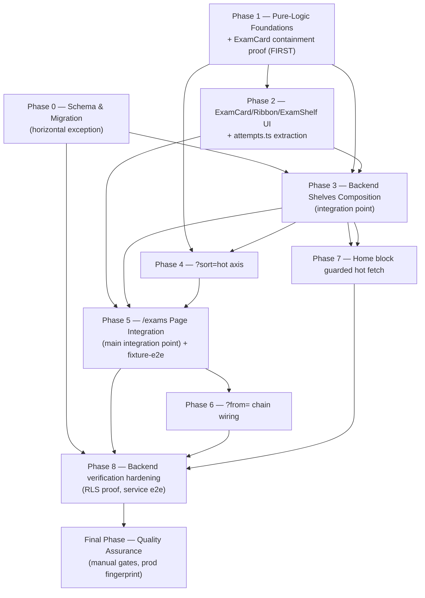
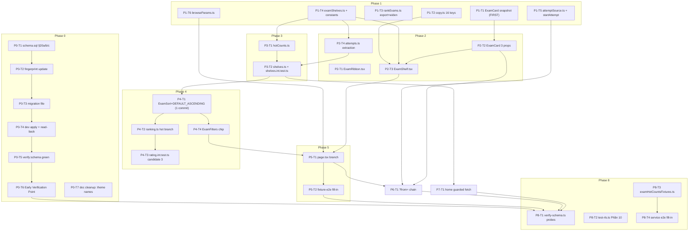

# Work Plan: Kho đề theo kệ (Exam Shelves) Implementation

Created Date: 2026-09-18
Type: feature
Estimated Duration: ~10-12 working days (single engineer; Phase 0 and Phase 8 need live dev-DB access + manual read-backs, which can add calendar time beyond effort time)
Estimated Impact: ~39 files (incl. 4 pre-committed test skeletons being filled in; excludes the production deploy-time step, which touches no repo files)
Related Issue/PR: branch `worktree-parallel-work`, to be pushed as `feat/exam-shelves`
Review Scope: fresh pre-implementation plan — planned-files scope is every file listed in the Design-to-Plan Traceability table below (backend + frontend Implementation Path Mapping tables, union), plus the 4 pre-committed test skeleton files being filled in. No base-branch diff range applies (this is not a revision plan).

## Related Documents
- Design Doc(s):
  - docs/design/exam-shelves-backend-design.md (v1.2)
  - docs/design/exam-shelves-frontend-design.md (v1.0)
- ADR: docs/adr/ADR-0021-cross-user-hot-aggregate-and-attempt-source.md
- UI Spec: docs/ui-spec/exam-shelves-ui-spec.md (v1.1)
- PRD: docs/prd/exam-shelves-prd.md (v1.2, AC-001–AC-051, all open items closed)

## Verification Strategy (from Design Docs)

### Correctness Proof Method
- **Correctness definition**: (a) every existing path — flat grid, `?sort=newest|oldest|hardest`, `?dir`, `?page`, every filter, `/exams/[id]` — produces byte-identical output/behavior to today; (b) each new path satisfies its AC; (c) `schema.sql`'s fingerprint, dev's `schema_version.fingerprint`, and (at deploy) prod's all agree; (d) `ExamCard` rendered with none of the 3 new props produces byte-identical markup (AC-043).
- **Verification method**: regression-by-construction plus assertion — the flat-grid path keeps its code, and `rating.int.test.ts:319-457` passing **unmodified** is the proof it did (Success Criteria #5). New behaviour is proven bottom-up: pure unit tests → mocked composition (integration) tests → real-Postgres service tests → fixture-e2e UI composition → manual CLS/accessibility/prod-fingerprint passes.
- **Verification timing**: the 6 verify gates run before every commit (see below); the Early Verification Point runs immediately after Phase 0's dev apply, before any shelf code is written; full regression + manual audits run at the Final QA phase; production fingerprint parity is checked at deploy time, as the last gate before the feature is called done.

### Early Verification Point
- **First verification target**: Phase 0, Migration Procedure step 7 read-back — call `exam_hot_counts` as a **second**, different authenticated student and confirm a non-zero count for an exam only the **first** student submitted.
- **Success criteria**: the returned row has `total_count >= 1` for that exam id, and the row's key set is exactly the four declared columns (`exam_id`, `recent_count`, `wide_count`, `total_count`).
- **Failure response**: STOP — do not write any shelf code (Phase 1 onward). A count of 0 means the function is not running as definer or the grant is wrong; extra keys mean the projection leaked and ADR-0021 D1's security argument is void. Re-open the ADR rather than patch at a call site.

### Proof Strategy
- **Proof obligation source**: the `Proof obligation` / `Primary failure mode` comment blocks already committed inside the 4 test skeleton files (`shelves.int.test.ts`, the appended block in `rating.int.test.ts`, `exam-shelves.fixture.e2e.test.ts`, `exam-hot-counts.service.e2e.test.ts`) for tasks that fill those in; each AC's primary failure mode for the pure-unit test files the design docs name but the skeleton pass did not create (`examShelves.test.ts`, the `rankExams.test.ts` extension, `attemptSource.test.ts`, `browseParams.test.ts`, `ExamShelf.test.tsx`), and the frontend DD's own "Proof file" section for `ExamCard.snapshot.test.tsx`.
- **Per-task propagation**: every task below that implements a claim (a behavior, a contract, an AC) records its Proof Obligation(s) inline, so downstream review can judge whether the filled-in test proves the claim, not merely that it runs green.

## Quality Assurance Mechanisms (from Design Docs)

Adopted quality gates for the change area. Each task in this plan must satisfy these mechanisms.

| Mechanism | Enforces | Config Location | Covered Files |
|---|---|---|---|
| `npx tsc --noEmit` | Type correctness incl. `MessageKey` validity of every new `t()` call, `ExamSort` whitelist parity across its 3 declaration sites | SOURCE/tsconfig.json | project-wide |
| `npx eslint --max-warnings 0` | Lint incl. feature-folder isolation (`features/exams` cannot import `features/*`) | SOURCE/eslint.config.mjs:27-56 | project-wide |
| `npx vitest run` | Unit + component + integration tests | SOURCE/vitest.config.ts:17-28 (collects `lib/**`, `components/**`, `app/**`, `features/**`) | lib/adaptive/**, lib/exams/**, features/exams/**, app/(exams)/**, app/page.tsx |
| `npm run build` | Production build succeeds; bundle checks | SOURCE/next.config.ts, scripts/check-ai-key-bundle.mjs | project-wide |
| `npm run test:fixture` | Fixture-e2e server-tree composition tests, 0-client-fetch proof | SOURCE/vitest.fixture.config.ts:36-54 | SOURCE/tests/e2e/fixture/exam-shelves.fixture.e2e.test.ts |
| `npm run test:localdb` | Real-Postgres service e2e (RLS isolation, grants, hour-snap) | SOURCE/vitest.localdb.config.ts:4-31 | SOURCE/tests/e2e/service/exam-hot-counts.service.e2e.test.ts |
| `schemaFingerprint.test.ts` | 3-way fingerprint agreement (constant ↔ schema.sql literal ↔ recomputed hash) | SOURCE/lib/schema/__tests__/schemaFingerprint.test.ts:91-108 | SOURCE/supabase/schema.sql, SOURCE/lib/schema/schemaFingerprint.ts |
| `migrationsMatchSchema.test.ts` | Migration file verbatim-replay + newest-migration-fingerprint matches schema.sql | SOURCE/lib/schema/__tests__/migrationsMatchSchema.test.ts:80-175 | SOURCE/supabase/migrations/** |
| `splitStatements.test.ts` | `$$`-quoted function body treated as one statement by apply tooling | SOURCE/lib/schema/__tests__/splitStatements.test.ts | SOURCE/supabase/migrations/20260918000000_*.sql |
| `npm run schema:plan` | Prints numbered statement list + target fingerprint; exits 1 until schema.sql/constant agree | SOURCE/scripts/schema-plan.ts | SOURCE/supabase/schema.sql |
| `npm run check:bundle` | AI-key bundle check | SOURCE/scripts/check-ai-key-bundle.mjs | project-wide |
| `npm run verify:schema` (extended) | Live-dev RPC existence/EXECUTE/anon-denial probes | SOURCE/supabase/verify-schema.ts:448-493 | SOURCE/supabase/verify-schema.ts |
| `supabase/test-rls.ts` Phần 10 (extended) | RLS isolation + no-identity-leak proof (HS-a..HS-g) | SOURCE/supabase/test-rls.ts | SOURCE/supabase/test-rls.ts |
| Prettier + prettier-plugin-tailwindcss | Class-string order (must run before generating the AC-043 snapshot) | SOURCE/package.json devDependencies | SOURCE/features/exams/components/** |
| `npm run pw` (manual) | CLS = 0 at 360/768/1024/1280 on open + shelf swipe | SOURCE/scripts/pw/cli.mjs | /exams, /exams?sort=hot, / (signed-in) |
| noted (not adopted): scripts/perf-layers.ts | Manual; unedited since the projection is not widened | SOURCE/scripts/perf-layers.ts | N/A |
| noted (not adopted): instrumentation.ts schema-version check | Warns, never throws | SOURCE/instrumentation.ts | N/A |
| noted (not adopted): `npm run verify:deployed` | Only needed when globals.css changes (not this feature) | SOURCE/scripts/verify-deployed-assets.mjs | N/A |
| noted (not adopted): axe / jest-axe | No such dependency exists and none is added; a11y is a recorded manual pass | N/A | N/A |

### The Six Verify Gates (run before every commit, from inside `SOURCE/`, in this order)

1. `npx tsc --noEmit`
2. `npx eslint --max-warnings 0`
3. `npx vitest run`
4. `npm run build`
5. `npm run test:fixture`
6. `npm run test:localdb`

**Caveat**: Gate 6 requires the dev database to carry the new schema fingerprint (backend DD: "Gate 6 requires the dev database to carry the new fingerprint, so implementation step 1 must land before a gate run means anything"). Before Phase 0 completes, run gates 1-5 before each commit and treat gate 6 as not-yet-meaningful. From Phase 0's completion onward, run all six gates before every commit.

**Known baseline (unrelated to this feature — do not "fix" it here)**: on this branch, before any change in this plan, `SOURCE/lib/security/rateLimit.test.ts` has one failing case — *"keeps ONE account's whole daily Gemini budget under the project quota"*, asserting `33 <= 20` — already red, pre-existing, unrelated to exam shelves. No task in this plan touches it. Record the gate-3 (`vitest run`) failure count before Phase 0 starts (1 known-red case); confirm it stays exactly 1 (same case) after every phase. A growing count signals a real regression, not this baseline.

## Design-to-Plan Traceability

| Design Doc | DD Section | DD Item | Category | Covered By Task(s) | Gap Status | Notes |
|---|---|---|---|---|---|---|
| docs/design/exam-shelves-backend-design.md | § The SQL objects 20a | `exam_attempts.source` column, inline + idempotent alter pair | impl-target | P0-T1 | covered | |
| docs/design/exam-shelves-backend-design.md | § The SQL objects 20b | Index `exam_attempts_status_submitted_idx` | impl-target | P0-T1 | covered | |
| docs/design/exam-shelves-backend-design.md | § The SQL objects 20c | `exam_hot_counts()` function + revoke/grant | impl-target | P0-T1 | covered | |
| docs/design/exam-shelves-backend-design.md | § Migration Procedure step 5 | Migration file creation, verbatim replay | prerequisite | P0-T3 | covered | |
| docs/design/exam-shelves-backend-design.md | § Migration Procedure step 6 | Dev apply, one CLI command, whole file | prerequisite | P0-T4 | covered | |
| docs/design/exam-shelves-backend-design.md | § Migration Procedure step 7 | Dev read-back, 5 real queries | verification | P0-T4 | covered | |
| docs/design/exam-shelves-backend-design.md | § Migration Procedure step 8 | `verify:schema` full mode green on dev | verification | P0-T5 | covered | |
| docs/design/exam-shelves-backend-design.md | § Migration Procedure step 9 | Production apply, one statement per call, engineer confirmation | prerequisite | FQA-T7 | covered | Deploy-time, explicitly not part of implementation |
| docs/design/exam-shelves-backend-design.md | § Query layer | `lib/adaptive/examShelves.ts` — 4 pure functions + types | impl-target | P1-T4 | covered | |
| docs/design/exam-shelves-backend-design.md | § Query layer | 4 new named constants in `constants.ts` | impl-target | P1-T4 | covered | |
| docs/design/exam-shelves-backend-design.md | Interface Change Matrix | `buildSubjectWeakness` export + widened return type | contract-change | P1-T3 | covered | |
| docs/design/exam-shelves-backend-design.md | § Query layer | `lib/exams/attemptSource.ts` | impl-target | P1-T5 | covered | |
| docs/design/exam-shelves-backend-design.md | Implementation Path Mapping | `lib/exams/browseParams.ts` | impl-target | P1-T6 | covered | |
| docs/design/exam-shelves-backend-design.md | § Query layer | `features/exams/queries/attempts.ts` extraction | impl-target | P2-T4 | covered | |
| docs/design/exam-shelves-backend-design.md | § Query layer | `hotCounts.ts` (`hotWindows`, `readHotCounts`) | impl-target | P3-T1 | covered | |
| docs/design/exam-shelves-backend-design.md | § Query layer | `shelves.ts` (`listExamShelves`, `listHotExams`) | impl-target | P3-T2 | covered | |
| docs/design/exam-shelves-backend-design.md | § The ?sort=hot axis | `ExamSort` widening + `DEFAULT_ASCENDING.hot` + inner sort branch | contract-change | P4-T1 | covered | Must land in ONE commit — see Phase 4 |
| docs/design/exam-shelves-backend-design.md | § The ?sort=hot axis | `ranking.ts` 4th `Promise.all` member | impl-target | P4-T2 | covered | |
| docs/design/exam-shelves-backend-design.md | § The attempt-source write path | `startAttempt(examId, rawSource?)` | contract-change | P1-T5 | covered | |
| docs/design/exam-shelves-backend-design.md | Integration Point I1 | `/exams` page branch predicate | connection-switching | P5-T1 | covered | |
| docs/design/exam-shelves-backend-design.md | Integration Point I5 | Home guarded fetch (F-001) | connection-switching | P7-T1 | covered | |
| docs/design/exam-shelves-backend-design.md | Integration Point I6 | `verify-schema.ts` / `test-rls.ts` new probes | verification | P8-T1, P8-T2 | covered | |
| docs/design/exam-shelves-backend-design.md | § Test Boundaries and Placement | `examShelves.test.ts` (new, pure unit) | verification | P1-T4 | covered | |
| docs/design/exam-shelves-backend-design.md | § Test Boundaries and Placement | `rankExams.test.ts` extension | verification | P1-T3 | covered | |
| docs/design/exam-shelves-backend-design.md | § Test Boundaries and Placement | `attemptSource.test.ts` + `browseParams.test.ts` | verification | P1-T5, P1-T6 | covered | |
| docs/design/exam-shelves-backend-design.md | § Test Boundaries and Placement | `shelves.int.test.ts` fill-in | verification | P3-T2 | covered | |
| docs/design/exam-shelves-backend-design.md | § Test Boundaries and Placement | `rating.int.test.ts` changed (budget candidate 3/3) | verification | P4-T3 | covered | |
| docs/design/exam-shelves-backend-design.md | § Test Boundaries and Placement | `exam-hot-counts.service.e2e.test.ts` + `examHotCountsFixtures.ts` | verification | P8-T3, P8-T4 | covered | |
| docs/design/exam-shelves-backend-design.md | § Test Boundaries and Placement | `test-rls.ts` Phần 10 HS-a..HS-g | verification | P8-T2 | covered | |
| docs/design/exam-shelves-backend-design.md | § Test Boundaries and Placement | `verify-schema.ts` RPC probes | verification | P8-T1 | covered | |
| docs/design/exam-shelves-backend-design.md | § Security Considerations | RLS untouched; RPC grant scoping; `?from` normalization; hour-snapped windows | verification | P0-T1, P1-T5, P8-T2 | covered | |
| docs/design/exam-shelves-backend-design.md | § Logging and Monitoring | `readBounded` labels per call site; no new log carries identity | verification | P3-T1, P3-T2, P4-T2, P7-T1 | covered | |
| docs/design/exam-shelves-backend-design.md | § State Transitions and Invariants | `source` has no transition, INSERT-only; invariant `source ∈ {4 values}` | contract-change | P0-T1, P1-T5 | covered | |
| docs/design/exam-shelves-backend-design.md | Minimal Surface Alternatives, Element 1 | `ExamSort` value `"hot"` — selected: fourth value on existing axis | contract-change | P4-T1 | covered | |
| docs/design/exam-shelves-backend-design.md | Minimal Surface Alternatives, Element 2 | `examShelves.ts` + widened weakness — selected: one pure module, 3 helpers, 2 callers | impl-target | P1-T3, P1-T4 | covered | |
| docs/design/exam-shelves-backend-design.md | Data Representation Decision | Extend `RankAttempt`→`ShelfAttempt`; add 3 shelf types; reuse `Exam`/`EXAM_COLUMNS` unchanged | contract-change | P1-T4, P2-T4, P3-T2 | covered | |
| docs/design/exam-shelves-backend-design.md | § Field Propagation Map | `source` field chain (5 boundary rows) | contract-change | P1-T5, P2-T2, P6-T1 | covered | |
| docs/design/exam-shelves-frontend-design.md | Implementation Path Mapping | `ExamShelf.tsx` | impl-target | P2-T3 | covered | |
| docs/design/exam-shelves-frontend-design.md | Implementation Path Mapping | `ExamRibbon.tsx` | impl-target | P2-T1 | covered | |
| docs/design/exam-shelves-frontend-design.md | Implementation Path Mapping | `ExamCard.snapshot.test.tsx` (pre-change baseline) | verification | P1-T1, P2-T2 | covered | Must be created BEFORE any ExamCard edit |
| docs/design/exam-shelves-frontend-design.md | Implementation Path Mapping | `ExamShelf.test.tsx` | verification | P2-T3 | covered | |
| docs/design/exam-shelves-frontend-design.md | Implementation Path Mapping | `exam-shelves.fixture.e2e.test.ts` fill-in | verification | P5-T2 | covered | |
| docs/design/exam-shelves-frontend-design.md | Implementation Path Mapping | `page.tsx` branch + `"hot"` whitelist | connection-switching | P4-T1, P5-T1 | covered | Whitelist in P4-T1, branch logic in P5-T1 |
| docs/design/exam-shelves-frontend-design.md | Implementation Path Mapping | `ExamCard.tsx` 3 optional props | contract-change | P2-T2 | covered | |
| docs/design/exam-shelves-frontend-design.md | Implementation Path Mapping | `ExamFilters.tsx` local union + `QUICK` 4th entry | contract-change | P4-T4 | covered | |
| docs/design/exam-shelves-frontend-design.md | Implementation Path Mapping | `catalogue.ts` `ExamSort` re-export widening | contract-change | P4-T1 | covered | |
| docs/design/exam-shelves-frontend-design.md | Implementation Path Mapping | `[id]/page.tsx` gains `searchParams`, call-site gains `source={from}` | connection-switching | P6-T1 | covered | |
| docs/design/exam-shelves-frontend-design.md | Implementation Path Mapping | `StartAttemptButton.tsx` gains `source?: string` | contract-change | P6-T1 | covered | |
| docs/design/exam-shelves-frontend-design.md | Implementation Path Mapping | `app/page.tsx` guarded data source + label | connection-switching | P7-T1 | covered | |
| docs/design/exam-shelves-frontend-design.md | Implementation Path Mapping | `lib/copy.ts` 16 keys, 3 destinations | impl-target | P1-T2 | covered | |
| docs/design/exam-shelves-frontend-design.md | § Data flow — Branch rule | `hasBrowseParam(sp)` consumption at the page | connection-switching | P5-T1 | covered | Module itself is P1-T6 |
| docs/design/exam-shelves-frontend-design.md | § Data flow — Four array slots | Early-return narrowing, 4-slot `Promise.all` | impl-target | P5-T1 | covered | |
| docs/design/exam-shelves-frontend-design.md | § Data flow — Facts → strings | `shelfSubtitle()`, `HOT_SUBTITLE` map | contract-change | P2-T3 | covered | |
| docs/design/exam-shelves-frontend-design.md | § Data flow — Page body | `SHELF_ORDER.map`, literal `key={kind}` | impl-target | P5-T1 | covered | |
| docs/design/exam-shelves-frontend-design.md | § Data contracts | `ExamShelf` 5-prop contract, 0 optional | contract-change | P2-T3 | covered | |
| docs/design/exam-shelves-frontend-design.md | § ExamCard extension and the containment proof | href / root-class / ribbon edits + containment table | contract-change | P2-T2 | covered | |
| docs/design/exam-shelves-frontend-design.md | § Field Propagation Map | The `?from=` chain (7 boundary rows incl. "dropped, deliberately") | contract-change | P2-T2, P6-T1 | covered | |
| docs/design/exam-shelves-frontend-design.md | § Home block table | Data source / label / ribbon / empty-guard rows | contract-change | P7-T1 | covered | |
| docs/design/exam-shelves-frontend-design.md | § Home block | Nổi nhất chip, 3-part edit | contract-change | P4-T4 | covered | |
| docs/design/exam-shelves-frontend-design.md | § Rendering, performance and motion | 0 client fetches; literal `key`; `motion-safe:scroll-smooth`; 0 globals.css edits | verification | P2-T3, P5-T1 | covered | |
| docs/design/exam-shelves-frontend-design.md | Minimal Surface Alternatives, Element 1 | `ExamCard.from` — selected A | contract-change | P2-T2 | covered | |
| docs/design/exam-shelves-frontend-design.md | Minimal Surface Alternatives, Element 2 | `ExamCard.className` — selected A | contract-change | P2-T2 | covered | |
| docs/design/exam-shelves-frontend-design.md | Minimal Surface Alternatives, Element 3 | `ExamShelf` component split — selected A, `ExamBrowser` byte-untouched | impl-target | P2-T3 | covered | |
| docs/design/exam-shelves-frontend-design.md | § Test Plan — Mock boundary | Fixture lane MOCKED/REAL declarations | verification | P5-T2 | covered | |
| docs/design/exam-shelves-frontend-design.md | Open Items O-2 | Stale theme-name comments (layout.tsx, AppShell.tsx) | prerequisite | P0-T7 | covered | |
| docs/design/exam-shelves-backend-design.md (Agreement Checklist, "0 new npm dependencies"); docs/design/exam-shelves-frontend-design.md (Agreement Checklist, "0 new dependencies (AC-045)") | § Agreement Checklist / § Quality Assurance Mechanisms | AC-045 — `package.json` declares 0 new dependencies; every shelf icon imports from `lucide-react` | verification | FQA-T2 | covered | Genuine gap found in review; closed by adding an explicit AC-045 confirmation line to FQA-T2 |

## Reference Contract Values

| Design Doc (§ Section) | Contract Type | Required Observable Value (verbatim) | Covered By Task(s) |
|---|---|---|---|
| docs/prd/exam-shelves-prd.md (§ AC-003) | structure-order | "DOM order is Cần luyện → Nổi nhất → Khám phá; given a student whose Cần luyện shelf is absent, then DOM order is Nổi nhất → Khám phá" | P5-T1 |
| docs/prd/exam-shelves-prd.md (§ AC-033) | structure-order | "Bộ lọc, Mới nhất, Cũ nhất, Khó nhất...plus 1 new chip Nổi nhất; the four existing chips gain 0 changed props" — final chip order: `Bộ lọc · Mới nhất · Cũ nhất · Khó nhất · Nổi nhất` | P4-T4 |
| docs/design/exam-shelves-backend-design.md (§ Shelf composition, the SHELF map); docs/ui-spec/exam-shelves-ui-spec.md (§ Shelf composition (the SHELF map)) | derived-display | SHELF map `viewAllHref` per shelf: `practice` → `/exams?subject={encodeURIComponent(exams[0].subject)}` (AC-050); `hot` → constant `/exams?sort=hot` (AC-035); `explore` → `null` — no header link at any breakpoint (AC-004) | P2-T3 |
| docs/prd/exam-shelves-prd.md (§ AC-012); docs/ui-spec/exam-shelves-ui-spec.md (§ Page State Matrix) | derived-display | "{subject} đang là môn điểm trung bình thấp nhất của bạn", where `{subject}` = `subjectLabel(subject)` — so `Chemistry` reads `Hóa học`, not the canvas shorthand `Hoá` | P1-T2, P2-T3 |
| docs/ui-spec/exam-shelves-ui-spec.md (§ Copy Keys) | derived-display | The 6 `HOT_SUBTITLE` rung→string mappings: `grade-recent`→"Khối {grade}, tuần này" (AC-019); `grade-30d`→"Khối {grade}, 30 ngày qua" (AC-020); `grade-all`→"Khối {grade}, từ trước tới nay" (AC-021); `site-recent`→"Toàn hệ thống, tuần này" (AC-023); `site-30d`→"Toàn hệ thống, 30 ngày qua" (AC-023); `site-all`→"Toàn hệ thống, từ trước tới nay" (AC-022/AC-023) | P2-T3 |
| docs/prd/exam-shelves-prd.md (§ AC-031) | derived-display | Explore subtitle literal: "Đề mới đăng, môn và trường bạn chưa thử" | P1-T2 |
| docs/prd/exam-shelves-prd.md (§ AC-026) | structure-order | "exactly 1 card (rank 1) carries the ribbon Hot nhất and ranks 2–10 carry 0 ribbons" | P2-T3 |
| docs/prd/exam-shelves-prd.md (§ AC-051) | state-lifecycle-negative | "Given any shelf, when its own selection yields 0 cards, then that shelf is absent from the page entirely — 0 headers, 0 subtitles, 0 placeholders, 0 empty cards, 0 errors — and the remaining shelves keep their relative order (D8)" | P3-T2, P5-T1, P5-T2 |
| docs/prd/exam-shelves-prd.md (§ AC-038) | state-lifecycle-negative | "Given a site with 0 submitted attempts, when / renders for a signed-in visitor, then the block is absent (AC-024) and the page renders with 0 errors" | P7-T1 |
| docs/design/exam-shelves-backend-design.md (§ Integration Point I5); docs/design/exam-shelves-frontend-design.md (§ Home block) | state-lifecycle-negative | "An anonymous visitor therefore issues 0 RPC calls" — the guarded home fetch never executes `listHotExams` when `user === null` | P3-T2, P7-T1 |
| docs/prd/exam-shelves-prd.md (§ AC-032) | structure-order | "its last item is the Xem toàn bộ kho đề tile...the row holds at most 10 cards plus that tile" | P2-T3 |
| docs/prd/exam-shelves-prd.md (§ AC-048) | structure-order | "the total order is [subject never attempted by this student DESC, school never attempted by this student DESC, exams.created_at DESC, exam id ASC], cut to 10 in Node" | P1-T4 |
| docs/prd/exam-shelves-prd.md (§ AC-018) | structure-order | "submitted attempt count DESC, exam id ASC, where the count includes attempts by all students, not only the caller" | P1-T4, P4-T2 |

## Failure Mode Checklist

| Category | Applies? | Covered By Task(s) |
|---|---|---|
| same-value | yes | P1-T4 (AC-015 weakness tie-break, dominant-grade tie-break, AC-018 hot-count tie-break); P0-T3 (idempotent drop-then-add constraint pair) |
| no-op | yes | P0-T1, P0-T3 (`if not exists` / idempotent re-apply); P4-T1 (`DEFAULT_ASCENDING.hot` inert until `?sort=hot` is chosen) |
| empty input | yes | P1-T5 (`toAttemptSource("")` → `none`); P1-T6 (`?q=` present-but-empty still counts as a listed param); P3-T2 (0-card shelf → `null`) |
| invalid option | yes | P1-T5 (unknown source literal → `none`); P4-T3 (`?sort=<garbage>` → flat grid, F-005); P5-T2 (fixture: `sort=garbage`/`page=abc`/`dir=asc`) |
| missing config | yes | P0-T4, P0-T5 (grant read-back); P8-T1, P8-T4 (anon 42501 probes) |
| unavailable boundary | yes | P0-T2, P0-T3 (fingerprint / `migrationsMatchSchema.test.ts` red-by-design intermediate state); P3-T2 (infrastructure-error propagation); P8-T4 (row-ceiling clamp obligation) |
| shared-state dependency | yes | P3-T2 (single candidate set / single attempt read feeding all 3 shelves + `submittedExamIds`); P2-T3 (`ExamShelf`'s duplicated eligibility predicate consuming the ONE `submittedExamIds` set) |
| rollback-only visibility | yes | P0-T1..P0-T4 collectively — additive-only schema change (default column, new function, `if not exists` index) means an incomplete rollout degrades to today's `/exams`, never to a broken page; `migrationsMatchSchema.test.ts` is red-by-design between P0-T2 and P0-T3 and must never be shipped in that state |
| missing-sort-key ordering | yes | P1-T4 (AC-018/AC-048/AC-015 tie-break determinism, shuffled-input determinism test); P4-T3 (literal expected hot-order array, independently computed) |

## UI Spec Component → Task Mapping

| UI Spec Component (section heading) | States to Cover | Covered By Task(s) | Gap Status | Notes |
|---|---|---|---|---|
| § Component: ExamShelf | Default, Loading (N/A — server-rendered), Empty (returns null), Error (no per-shelf boundary), Partial (not modelled) | P2-T3 (create + test), P5-T1 (wired into page) | covered | |
| § Component: ExamCard (shelf-aware props) | Default — flat grid/home (0 ribbon, 0 `?from=`, 0 width class); Default — shelf card; Ribbon; Loading/Empty/Error (unchanged, N/A) | P1-T1 (pre-change baseline snapshot), P2-T2 (prop edit + snapshot extension) | covered | P1-T1 MUST precede P2-T2 |
| § Component: ExamRibbon | Default; Empty/Loading/Error (N/A — no data owned) | P2-T1 | covered | |
| § Component: ExamShelfTile (Xem toàn bộ kho đề) | Default; Empty/Loading/Error (N/A) | P2-T3 | covered | Module-local to ExamShelf.tsx |
| § Component: ExamFilters (Nổi nhất chip) | Default (4 chips); Active; Tap | P4-T4 | covered | |
| § Component: HomeHotExamsSection | Default; Empty (site 0 attempts, or anon); Loading/Error (N/A) | P7-T1 | covered | |

## ADR Bindings

| ADR | Source Section | Axis | Binding Decision | Covered By Task(s) |
|---|---|---|---|---|
| docs/adr/ADR-0021-cross-user-hot-aggregate-and-attempt-source.md | Decision (D1) | contract_schema | `exam_hot_counts(...)` returns `(exam_id, recent_count, wide_count, total_count)` — aggregate-only projection, no new view | P0-T1 |
| docs/adr/ADR-0021-cross-user-hot-aggregate-and-attempt-source.md | Decision (D1) | persistence | Grants: `revoke all ... from public, anon;` then `grant execute ... to authenticated, service_role;` | P0-T1, P8-T1, P8-T2 |
| docs/adr/ADR-0021-cross-user-hot-aggregate-and-attempt-source.md | Decision (D2, Decision 3) | contract_schema | No identity resolved anywhere — function takes window boundaries + a cap, never a user id | P0-T1 |
| docs/adr/ADR-0021-cross-user-hot-aggregate-and-attempt-source.md | Decision (D2) | data_flow | Rank-then-cut stays binding — no `.limit()`/`.range()` in `fetchExamRows`; every shelf cut to 10 in Node after ordering | P1-T4, P3-T2 |
| docs/adr/ADR-0021-cross-user-hot-aggregate-and-attempt-source.md | Decision (D2) | dependency_direction | One personalised ranking — `rankExamIds` is reused for Cần luyện, never re-implemented | P1-T4 |
| docs/adr/ADR-0021-cross-user-hot-aggregate-and-attempt-source.md | Decision (D2, Decision 1b) | data_flow | One composition per page — the caller's `exam_attempts` read is owned once per render, its submitted-id set re-exported | P3-T2 |
| docs/adr/ADR-0021-cross-user-hot-aggregate-and-attempt-source.md | Decision (D3) | data_flow | Composition budget: `listExamsRanked` stays 3 boundary calls except `?sort=hot`; shelves composition = 4, asserted by counting `from()`+`rpc()` together | P3-T2, P4-T3 |
| docs/adr/ADR-0021-cross-user-hot-aggregate-and-attempt-source.md | Decision (D4) | placement | The ladder is evaluated in Node; the clock is read once, in the query layer — never inside `lib/adaptive` | P1-T4, P3-T1 |
| docs/adr/ADR-0021-cross-user-hot-aggregate-and-attempt-source.md | Decision (D5) | persistence | `exam_attempts.source text not null default 'none'` + named CHECK `exam_attempts_source_check`, normalised to `'none'` on write | P0-T1, P1-T5 |
| docs/adr/ADR-0021-cross-user-hot-aggregate-and-attempt-source.md | Decision (D6) | persistence | `exam_attempts.status` gains no CHECK; no RLS policy added/altered/dropped; one new index `(status, submitted_at desc)` | P0-T1 |
| docs/adr/ADR-0021-cross-user-hot-aggregate-and-attempt-source.md | Implementation Guidance | contract_schema | Re-assert visibility inside every definer object — restate `status='published'` and the ban predicate, not out of caution | P0-T1 |
| docs/adr/ADR-0021-cross-user-hot-aggregate-and-attempt-source.md | Implementation Guidance | contract_schema | Keep the aggregate's projection minimal and prove it — the RLS harness asserts the returned row's key set, not just its values | P8-T2, P8-T4 |

## Connection Map

| Boundary | Owner (left side) | Owner (right side) | Serialized Format | Consumer Parse Rule | Expected Signal | Covered By Task(s) |
|---|---|---|---|---|---|---|
| `ExamCard`/`ExamShelf` → browser URL `?from=` → exam detail page | features/exams/components/ExamCard.tsx | app/(exams)/exams/[id]/page.tsx | `?from=practice\|hot\|explore` — lowercase ASCII, single key, appended to `/exams/{id}` | `searchParams: Promise<{from?: string}>`, read raw and untyped, no validation until `toAttemptSource()` | Detail page's `from` value matches the shelf the card was followed from | P2-T2 (producer), P6-T1 (consumer) |
| `StartAttemptButton` (client) → `startAttempt` (server action) | features/exams/components/StartAttemptButton.tsx | features/exams/actions.ts | Server-action closure bound argument (React serializes bound args) | `startAttempt(examId, rawSource?)` → `toAttemptSource(rawSource)` | Inserted `exam_attempts.source` matches the normalised value | P1-T5 (consumer), P6-T1 (producer) |
| Node query layer → Postgres RPC `exam_hot_counts` | features/exams/queries/hotCounts.ts | supabase/schema.sql §20c function | — | — | Response rows are `(exam_id, recent_count, wide_count, total_count)`; `anon` gets 42501 | P0-T1, P3-T1, P8-T4 |
| `schema.sql` (source of truth) → migration file (verbatim replay) | SOURCE/supabase/schema.sql §20a/20b/20c | SOURCE/supabase/migrations/20260918000000_*.sql | SQL DDL statements as authored in schema.sql, post comment/whitespace normalisation | `migrationsMatchSchema.test.ts`'s normalize-and-compare logic | Test green; statements match verbatim | P0-T1, P0-T3 |
| Fingerprint 4-way agreement | schema.sql `:2595` §17 upsert literal | schemaFingerprint.ts constant + migration filename + dev `schema_version.fingerprint` row | 12-hex-char fingerprint string | `schemaFingerprint.test.ts` / `migrationsMatchSchema.test.ts` recompute-and-compare | All four agree; `verify:schema` green on dev | P0-T2, P0-T3, P0-T4, P0-T5 |
| `?sort=hot` querystring axis | ExamFilters.tsx chip (`setSort`) + ExamShelf's hot `viewAllHref` builder | app/(exams)/exams/page.tsx whitelist + catalogue.ts sort branch | `?sort=hot` exact literal — `page`/`dir` dropped by `setSort` | Literal whitelist in page.tsx; unknown ⇒ `undefined` | Flat grid renders ordered by AC-018's cross-user count | P4-T1, P4-T4 |
| Ten AC-008 listed URL params → `hasBrowseParam(sp)` | browser-supplied URL (address bar, bookmark, shelf's own header/tile links) | lib/exams/browseParams.ts, consumed by app/(exams)/exams/page.tsx | URL query string, raw key presence — not parsed value | `key in sp && sp[key] !== undefined` on the raw `searchParams` object | `?sort=garbage`/`?page=abc`/`?dir=asc` all render the flat grid despite normalising to `undefined` | P1-T6, P5-T1, P5-T2 |

## Objective

Turn the bare `/exams` view from one flat grid into three purpose-built shelves (Cần luyện, Nổi nhất, Khám phá), backed by a new cross-user "hot" signal the product cannot currently read, and record which shelf every attempt starts from. Full requirements: `docs/prd/exam-shelves-prd.md` v1.2, AC-001–AC-051.

## Background

`exam_attempts` RLS scopes every client read to the caller, so "how many students did this exam" is unreadable today. ADR-0021 introduces one `security definer` SQL aggregate to answer that question without weakening RLS or reopening the schema.sql §12 owner-rights leak class. The weakest-subject signal already exists in `rankExams.ts` but is buried inside `affinity`, invisible on screen. This feature surfaces both signals as shelves and adds a persisted attempt-source column to measure whether the first shelf actually changes behaviour.

## Risks and Countermeasures

### Technical Risks
- **Risk**: Dev/prod schema drift (TD-005 has detonated four times on this project).
  - **Impact**: A deploy could run against a DB that doesn't have `exam_hot_counts` yet, or prod could silently diverge from dev.
  - **Countermeasure**: Fingerprint gated in 3 places by CI (P0-T2..T5); real-query read-back on dev (P0-T4); catalogue-level post-checks on prod, one statement per call (FQA-T7); prod fingerprint read before the work is called done.
- **Risk**: A future read added to `/exams` silently slips past the round-trip budget.
  - **Impact**: `/exams` re-serialises without any visible symptom.
  - **Countermeasure**: The budget assertion counts `from()` + `rpc()` together, one case per surface (P3-T2, P4-T3); a new read makes it red.
- **Risk**: The `attempts.ts` extraction or the `rankExams.ts` widened return silently changes ranking inputs.
  - **Impact**: Personalised ranking regresses with no visible symptom.
  - **Countermeasure**: The existing `listExamsRanked` and `rankExams.test.ts` cases must pass **unmodified** after the extraction (P2-T4, P1-T3) — that is the extraction's proof.
- **Risk**: `ExamCard` markup drifts with nothing to catch it (no test existed before this feature).
  - **Impact**: Silent visual regression on the flat grid and home block.
  - **Countermeasure**: P1-T1 commits the snapshot **before** any `ExamCard` edit; P2-T2's early verification forbids reflexive `-u`.
- **Risk**: Branch predicate written against normalised locals instead of raw keys, so `?dir=asc`/`?sort=bogus` renders shelves.
  - **Impact**: A bookmarked/hand-edited URL silently shows the wrong surface.
  - **Countermeasure**: `hasBrowseParam(sp)` is the single source of truth (P1-T6), consumed by the page (P5-T1) and proven table-driven by the fixture lane (P5-T2).
- **Risk**: The aggregate is not k-anonymous at pre-launch volumes (ADR-0021 Known unknowns).
  - **Impact**: A count of 1 in a narrow window is close to an individual observation.
  - **Countermeasure**: Aggregate-only projection asserted by HS-c (P8-T2); recorded as a residual risk, not designed against, per ADR-0021.

### Schedule Risks
- **Risk**: The hand-applied two-database schema ritual is slow and error-prone.
  - **Impact**: Phase 0 could stall the rest of the plan (everything downstream reads the new object).
  - **Countermeasure**: Phase 0 is scheduled first specifically to surface this risk immediately (Early Verification Point), not after other work is sunk.
- **Risk**: Manual gates (Playwright CLS audit, accessibility pass, prod fingerprint) require a human and cannot be parallelised with implementation.
  - **Impact**: Final sign-off is serialised behind a person's calendar.
  - **Countermeasure**: Isolated to the Final QA phase; every other phase's gates are automatable and can run unattended.

## Phase Structure Diagram

## Task Dependency Diagram

## Implementation Phases

### Phase 0: Schema, Fingerprint, and Migration (Estimated commits: 5)

**Purpose**: Establish the new DB surface (`exam_hot_counts()`, `exam_attempts.source`, supporting index) on dev, per backend DD § The SQL objects + § Migration Procedure. This is the ADR's single load-bearing assumption — the one unavoidable horizontal exception, because nothing else in this plan can read the new objects until they exist.
**Verification**: Early Verification Point (see header) — call `exam_hot_counts` as a second student.

#### Tasks
- [x] **P0-T1**: Edit `SOURCE/supabase/schema.sql` — add §20 block: 20a `exam_attempts.source` column (inline in `create table if not exists` at `:192-202`, plus idempotent `alter table ... add column if not exists` / drop-then-add CHECK pair), 20b index `exam_attempts_status_submitted_idx (status, submitted_at desc)`, 20c `exam_hot_counts(p_since_recent, p_since_wide, p_max_rows)` function + `revoke all ... from public, anon; grant execute ... to authenticated, service_role;`. Placed after §19 (index block ending `:2554`) and before §17 (`schema_version`, `:2556`). Target: SOURCE/supabase/schema.sql. AC: AC-018, AC-025, AC-027, AC-028, AC-040, AC-041. Design ref: backend DD § The SQL objects (full SQL text). Proof Obligation: function predicates exactly `status='submitted'`, `exams.status='published'`, `not is_author_banned(author_id)`; grants follow the `search_exams` idiom, not `exam_rating_aggregate`'s (no `anon` grant). Verify: `npm run schema:plan` prints the numbered statement list + target fingerprint and **exits 1** (expected — fingerprint not yet updated).

- [x] **P0-T2**: Write the new fingerprint into `schema.sql:2595` (§17 upsert literal) AND `SOURCE/lib/schema/schemaFingerprint.ts:41` (`SCHEMA_FINGERPRINT` constant). In the same commit, correct the stale "no migration tool" framing in `schemaFingerprint.ts`'s header comment (currently states flatly there is no migration tool and full debt repayment "vẫn là Supabase CLI migrations" as future work) — since 2026-08-31 a migration **procedure** exists (schema:plan → migration file → CLI apply on dev), even though prod apply is still manual/statement-by-statement; reword to state that reality without overclaiming (this file still isn't a migration *runner* and doesn't auto-detect prod drift). Target: SOURCE/supabase/schema.sql, SOURCE/lib/schema/schemaFingerprint.ts. Verify: `npm run schema:plan` exits **0**; `npx vitest run lib/schema/__tests__/schemaFingerprint.test.ts` green. **`migrationsMatchSchema.test.ts` is RED at this point BY DESIGN** — leave it alone; do not rename an existing migration to force it green (that rewrites a state two live databases already ran).

- [x] **P0-T3**: Create `SOURCE/supabase/migrations/20260918000000_exam_hot_counts_and_attempt_source_<fp>.sql` containing, verbatim as they appear in schema.sql (post comment/whitespace normalisation): the 3 alter statements of 20a, the 1 index statement of 20b, the 3 statements of 20c, then its own fingerprint upsert with `<fp>`. Do **not** copy the `create table if not exists` statement. Target: new migration file. Design ref: backend DD § Migration Procedure step 5. Proof Obligation: `migrationsMatchSchema.test.ts:148-162` — this migration's own upsert carries its own filename's fingerprint; `splitStatements.test.ts` — the `$$`-quoted function body is one statement to the apply tooling. Verify: `npx vitest run lib/schema` fully green (this step's gate, not P0-T2's).

- [x] **P0-T4**: Dev apply — one CLI command, whole file, from `SOURCE/`: `npx supabase db query --linked --project-ref hynwleaxtbtjzkvpjsug --file supabase/migrations/20260918000000_exam_hot_counts_and_attempt_source_<fp>.sql`. Then dev read-back with the 5 real queries from backend DD § Migration Procedure step 7 (fingerprint; `pg_proc.proacl`; `exam_attempts_source_check` constraint name; `exam_attempts_status_submitted_idx` index name; `source` column default/nullability). Target: dev DB (ref `hynwleaxtbtjzkvpjsug`); no source files changed. Verify: the 5 read-back queries return the expected values — never the tool's own success message. **Done**: fingerprint = `340bab74ca57`; `proacl` shows `authenticated`, `service_role` (no `anon`/`public`); constraint, index, and `source` column (`not null default 'none'`) all confirmed; idempotent re-run verified (see task file Investigation Notes).

- [x] **P0-T5**: `npm run verify:schema` full mode on dev — must be green (the fingerprint probe `:752` turns green now that P0-T4 has run). Verify: exit code 0. **Done**: first run hit exit code 1 on an unrelated TD-016 regression (`exams.id = 'ugc-sample-draft-0001'`, an abandoned empty-subject draft from 2026-09-06, unfixable by the existing one-off script since it only maps known aliases, not empty strings) — escalated rather than patched in-scope; coordinator/engineer confirmed zero dependent attempts/results and deleted the row on dev. Re-run confirmed exit code 0, all probes green including the §17 fingerprint (`340bab74ca57`) and `exams.subject: cả 15 dòng đều canonical` (see task file Investigation Notes).

- [x] **P0-T6 (Early Verification Point — gating task)**: As a **second** authenticated student (different JWT from the seed/dev account), call `exam_hot_counts(...)` directly and confirm a non-zero `total_count` for an exam only the FIRST student submitted, and that the returned row's key set is exactly `{exam_id, recent_count, wide_count, total_count}`. **How to get the second session**: reuse the two-seeded-user pattern `SOURCE/supabase/test-rls.ts` and the existing `SOURCE/tests/e2e/service/examSearchFixtures.ts` fixtures already use — `admin.auth.admin.createUser(...)` + `signInWithPassword(...)` for a second real test account (or, if faster for a one-off manual check, log in as a second existing dev-seed account through the same CLI session the engineer already uses, then call the RPC with that session's JWT via `supabase.rpc("exam_hot_counts", {...})`). Success: row with `total_count >= 1`, exact key set. **Failure: STOP — do not proceed to Phase 1**; re-open ADR-0021 rather than patch at a call site. **Done**: reused the project's existing shared test-student accounts (`EMAIL_A`/`EMAIL_B` from `test-rls.ts`, same accounts `verify-schema.ts`'s `PROBE_EMAIL` uses) via a transient script. First student submitted an attempt on a freshly seeded published exam (`p0-t6-hotcheck-exam`); second student's direct read of that attempt row returned 0 rows (RLS holds); second student's `exam_hot_counts` RPC call returned `total_count = 1` for that exam with key set exactly `{exam_id, recent_count, wide_count, total_count}`. Fixture cleaned up and confirmed gone from dev afterward. See task file Investigation Notes for the raw RPC response.

- [x] **P0-T7** (doc cleanup, independent — no dependency on P0-T1..T6): Fix the stale theme-name comments — `SOURCE/app/(exams)/layout.tsx:2` and `SOURCE/components/layout/AppShell.tsx:15` both still say `"Mực & Sơn mài"`; correct to the shipped theme name `Đêm hội` (`globals.css` is the source of truth per frontend DD § External Resources Used note O-2). Target: SOURCE/app/(exams)/layout.tsx, SOURCE/components/layout/AppShell.tsx. Comment-only change. Verify: gates 1-3 trivially green (no behavior change); grep confirms 0 remaining `"Mực & Sơn mài"` references in either file. **Done**: both comments now read `"Đêm hội"`; grep confirms 0 remaining `"Mực & Sơn mài"` matches in either file. Gates 1-4 + `check:bundle` all green; `npx vitest run` shows the same single pre-existing `rateLimit.test.ts` failure documented as the plan's known baseline (33 <= 20), count unchanged (see task file Investigation Notes).

#### Phase Completion Criteria
- [x] Early verification point (P0-T6) passed
- [ ] `verify:schema` green on dev
- [ ] Fingerprint agreement across schema.sql, schemaFingerprint.ts, migration filename, and dev's `schema_version` row
- [ ] Gates 1-3 green; gate 6 not yet meaningful for this feature (no localdb test file exists until Phase 8)

---

### Phase 1: Pure-Logic Foundations & Containment Proof (Estimated commits: 6)

**Purpose**: Land every pure/independent module first — none of these read the new DB objects directly (pure functions or mocked-client tests) — starting with the `ExamCard` containment proof, which must exist **before** `ExamCard` gains any prop.
**Verification**: L2 — new/extended unit tests green; `rankExams.test.ts`'s pre-existing cases pass with 0 edits.

#### Tasks
- [x] **P1-T1 (MUST BE FIRST — before any ExamCard edit)**: Create `SOURCE/features/exams/components/__tests__/ExamCard.snapshot.test.tsx` against the **pre-change** `ExamCard`; commit the generated `.snap`. Target: new test file + snapshot. AC: AC-043. Design ref: frontend DD § ExamCard extension and the containment proof ("Proof file"); UI Spec § Containment Rule. Implementation notes: line 1 = `// @vitest-environment jsdom`; import `renderServerTree` verbatim from `@/tests/helpers/renderServerTree`; a positive assertion (`h3` title) precedes the snapshot assertion so an empty tree is red; run Prettier + prettier-plugin-tailwindcss **before** generating the snapshot. Proof Obligation: bare-card case asserts `container.querySelector("h3")?.textContent === exam.title`, THEN `toMatchSnapshot()`. Verify: `npx vitest run` green, snapshot committed; gates 1-3.

- [x] **P1-T2**: Add the 16 new copy keys to `SOURCE/lib/copy.ts` at the 3 destinations (14 shelf/ribbon keys near `:132`; `exams.sortHot` after `exams.sortHardest` near `:505`; `home.hotExams` after `home.newExams` near `:81`). Target: SOURCE/lib/copy.ts. AC: AC-046. Design ref: UI Spec § Copy Keys (verbatim Vietnamese literals). Reference Contract Values: all string literals must be copied verbatim (see Reference Contract Values table). Verify: `npx tsc --noEmit` (MessageKey exhaustiveness for every later `t()` call).

- [x] **P1-T3**: Export 3 helpers from `SOURCE/lib/adaptive/rankExams.ts` (`buildRepresentativeAttempts`, `buildGradeShares`, `buildSubjectWeakness` — widened return `Map<string, SubjectWeakness> | null`), update the single in-file caller (`:186-187` → `.get(subject)?.weakness ?? 0`). Extend `SOURCE/lib/adaptive/__tests__/rankExams.test.ts` with new cases for the exported helpers (null-vs-0 semantics, `scoredAttempts` counting, representative = latest `submittedAt`, input-array immutability) — **existing cases must pass unmodified**. Target: SOURCE/lib/adaptive/rankExams.ts, SOURCE/lib/adaptive/__tests__/rankExams.test.ts. AC: AC-015, AC-016, AC-017. Design ref: backend DD § Query layer "Changes to rankExams.ts". Proof Obligation: existing test cases green with 0 diff; new cases prove the widened `SubjectWeakness` preserves `null`-when-nothing-scored semantics. Verify: gates 1-3; `git diff` on pre-existing test cases is empty.

- [x] **P1-T4**: Add 4 named constants to `SOURCE/lib/adaptive/constants.ts` (`HOT_SHELF_MIN_CARDS=5`, `SHELF_MAX_CARDS=10`, `HOT_WINDOW_RECENT_DAYS=7`, `HOT_WINDOW_WIDE_DAYS=30`, each with a JSDoc block sized like the shipped weights'). Create `SOURCE/lib/adaptive/examShelves.ts` (pure module: `HotRung` type, `HotCounts`/`ShelfCandidate`/`ShelfAttempt` interfaces, `pickHotShelf`, `pickWeakestSubject`, `pickDominantGrade`, `pickExploreShelf`, `orderIdsByHotCount`, per the backend DD § The ladder pseudocode). Create `SOURCE/lib/adaptive/__tests__/examShelves.test.ts` (new, design-doc-named, pure unit). Target: SOURCE/lib/adaptive/constants.ts, SOURCE/lib/adaptive/examShelves.ts, SOURCE/lib/adaptive/__tests__/examShelves.test.ts. AC: AC-015, AC-018–AC-025, AC-030, AC-048, D12/U3/U4. Design ref: backend DD § The ladder (pseudocode), § Query layer "The four types". Proof Obligation (no skeleton — AC primary failure mode): AC-019–022's primary failure mode is the ladder widening on the wrong boundary (off-by-one at exactly 4/5/6 qualifying exams); AC-018/AC-048's is the wrong tie-break order when counts/dates are equal; AC-025's is the demotion band incorrectly applied to the hot shelf. Cover: ladder rung order incl. the U3 three-rung cold-start branch, `HOT_SHELF_MIN_CARDS` boundary at 4/5/6, AC-018 order, AC-025 no-demotion, AC-015 tie-breaks, dominant-grade tie-breaks, AC-048 explore order, AC-029 dedup, cut-to-10, determinism on shuffled input. Verify: gates 1-3.

- [x] **P1-T5**: Create `SOURCE/lib/exams/attemptSource.ts` (`ATTEMPT_SOURCES`, `AttemptSource`, `toAttemptSource`). Edit `SOURCE/features/exams/actions.ts:21-50` — `startAttempt(examId, rawSource?)`, one added column on the existing insert. Create `SOURCE/lib/exams/__tests__/attemptSource.test.ts` (new, design-doc-named). Target: SOURCE/lib/exams/attemptSource.ts, SOURCE/features/exams/actions.ts, SOURCE/lib/exams/__tests__/attemptSource.test.ts. AC: AC-039 (server side), AC-040, AC-041. Design ref: backend DD § The attempt-source write path. Proof Obligation: each of the 4 literals round-trips; `undefined`/`""`/`"PRACTICE"`/an injection-shaped string/an array all normalise to `'none'` — never a rejected start. Verify: gates 1-3. Note: independent of the shelves work; unblocks the frontend `?from` chain early (backend DD step 3 rationale).

- [x] **P1-T6**: Create `SOURCE/lib/exams/browseParams.ts` (`BROWSE_PARAM_KEYS` — the ten AC-008 keys named once — and `hasBrowseParam(sp)`). Create `SOURCE/lib/exams/__tests__/browseParams.test.ts` (new, design-doc-named). Target: SOURCE/lib/exams/browseParams.ts, SOURCE/lib/exams/__tests__/browseParams.test.ts. AC: AC-008, AC-010. Design ref: backend DD Implementation Path Mapping; frontend DD § Data flow "Branch rule". Proof Obligation (F-005): `hasBrowseParam` is `true` for `?sort=garbage`, `?page=abc`, `?dir=asc`, and `?q=` (empty) — `false` only for a genuinely bare URL; the predicate reads raw key presence (`key in sp && sp[key] !== undefined`), never the parsed/normalised local. Verify: gates 1-3.

#### Phase Completion Criteria
- [x] P1-T1's snapshot committed and green with **no `-u`** at this point (nothing has touched `ExamCard` yet)
- [ ] `rankExams.test.ts`'s existing cases pass unmodified (diff-empty check)
- [x] `examShelves.test.ts`, `attemptSource.test.ts`, `browseParams.test.ts` all green (verified together in the same `npx vitest run` pass — the sole failure in that run is `lib/security/rateLimit.test.ts`, pre-existing and unrelated to Phase 1)
- [ ] `copy.ts`'s 16 keys typecheck-valid
- [ ] Gates 1-3 green

---

### Phase 2: ExamCard Visual Extension, ExamRibbon, ExamShelf Component + Attempt-Read Extraction (Estimated commits: 4)

**Purpose**: Build the shelf-facing UI components (not yet wired into the real page) and extract the shared attempt-read module the backend composition needs. This is the "AC-043 moment" — `ExamCard` actually gains its props here, checked against Phase 1's committed snapshot.
**Verification**: L2 — snapshot survives with no `-u`; `ExamShelf.test.tsx` green; `rating.int.test.ts`'s AC-016/AC-017 cases pass unmodified.

#### Tasks
- [x] **P2-T1**: Create `SOURCE/features/exams/components/ExamRibbon.tsx` (`ExamRibbon({ label })`, `data-slot="ribbon"`, `aria-hidden`, `pointer-events-none`, clip-square + band + text per UI Spec § Component: ExamRibbon). Target: new file. AC: AC-026, AC-044. Design ref: UI Spec § Component: ExamRibbon. Reference Contract Values: ribbon text "Hot nhất" (stored sentence-case; CSS uppercases). Verify: gates 1-3.

- [x] **P2-T2**: Edit `SOURCE/features/exams/components/ExamCard.tsx:11-16,33-80` — add 3 optional props (`ribbon?`, `from?`, `className?`); href becomes conditional (`from ? .../${id}?from=${from} : .../${id}`); root class merges `className` via `cn("card-linked relative h-full", className)`; ribbon rendered as the **last** direct child of `Card` via `{ribbon ? <ExamRibbon label={ribbon} /> : null}` — never `{ribbon && …}`. Run Prettier + prettier-plugin-tailwindcss, then extend the AC-043 snapshot with 2 new cases (`from="hot"`, `ribbon="Hot nhất"`) — the bare-card case must **not** require `-u`. Target: SOURCE/features/exams/components/ExamCard.tsx, SOURCE/features/exams/components/__tests__/ExamCard.snapshot.test.tsx. AC: AC-026, AC-039, AC-043, AC-044. Design ref: frontend DD § ExamCard extension and the containment proof; UI Spec § Component: ExamCard. Proof Obligation (early frontend verification checkpoint): bare-card snapshot survives with **no `-u`**; `from="hot"` asserts stretched-link href = `/exams/{id}?from=hot`; `ribbon="Hot nhất"` asserts exactly 1 `[data-slot="ribbon"]`, `aria-hidden` count = bare count + 1, `card.firstElementChild` still carries the `card-link` class. **Failure response (frontend DD Risk R-2)**: STOP, explain every diff hunk before continuing — do not run `-u` reflexively. Verify: gates 1-3.

- [x] **P2-T3**: Create `SOURCE/features/exams/components/ExamShelf.tsx` (`ExamShelf` async server component, module-local `SHELF` map, module-local `ExamShelfTile`, exported `shelfSubtitle()`). Create `SOURCE/features/exams/components/__tests__/ExamShelf.test.tsx` (new, design-doc-named). Target: new files. AC: AC-002, AC-003, AC-004, AC-026, AC-032, AC-035, AC-039, AC-047, AC-050, AC-051. Design ref: frontend DD § Data flow "Facts → strings", § Shelf composition table; UI Spec § Component: ExamShelf, § Layout and scroll. Reference Contract Values: see the central Reference Contract Values table — `HOT_SUBTITLE` rung→copy-key mapping row and the `SHELF` map `viewAllHref` row. Proof Obligation (design-doc-named, from frontend DD's own Test Plan row): AC-004 (icon+h2+subtitle+link per `SHELF`, no link on explore); AC-026 (1 ribbon at index 0, 0 at 1..9); AC-032 (tile last `<li>` on explore only); AC-035 (the hot shelf's `Xem tất cả` header link href is exactly `/exams?sort=hot` — mirror the AC-050 assertion already required for the practice shelf's `/exams?subject={subject}` link, so both header-link destinations are asserted, not just one); AC-039 (every card href carries the shelf's `?from=`); AC-051 (`exams: []` ⇒ returns `null`); AC-047 (every card a focusable link in DOM order, row has no `tabIndex`/`role`). Verify: gates 1-3, via `renderServerTree` (same empty-tree hazard as `ExamCard`).

- [x] **P2-T4**: Extract `SOURCE/features/exams/queries/attempts.ts` (new — `ATTEMPT_SELECT`, `AttemptRow`, `readMyAttemptRows`, `submittedExamIdsOf`, `toShelfAttempts`, moved unchanged from `ranking.ts:27-64`) and rewire `SOURCE/features/exams/queries/ranking.ts` to consume it. Target: SOURCE/features/exams/queries/attempts.ts, SOURCE/features/exams/queries/ranking.ts. AC: supports AC-011, AC-017 indirectly by preserving `listExamsRanked` behavior. Design ref: backend DD Implementation Plan step 4; Fact Disposition Table row `ranking.ts:listExamsRanked`. Proof Obligation: `rating.int.test.ts`'s AC-016/AC-017 cases at `:319-457` (incl. `:393-401`, `:447-456`) pass with **0 edits** — this is the proof the extraction was behaviour-preserving. Verify: gates 1-3; `git diff` on those line ranges is empty.

#### Phase Completion Criteria
- [ ] `ExamCard` snapshot: bare case unchanged (no `-u`), 2 new cases pass
- [ ] `ExamShelf.test.tsx` green (structural proof, no live data yet)
- [x] `rating.int.test.ts`'s pre-existing AC-016/AC-017 cases pass with 0 lines changed
- [ ] Gates 1-3 green

---

### Phase 3: Backend Shelves Composition — Integration Point (Estimated commits: 2)

**Purpose**: The backend's own named "integration point" — the first moment the whole backend composition is operable. Wires Phase 1's pure ladder and Phase 2's extracted attempt read together with the new RPC read.
**Verification**: L2 — `shelves.int.test.ts`'s 2 candidates (5 assertions total) converted from `it.todo` to `it` and green.

#### Tasks
- [ ] **P3-T1**: Create `SOURCE/features/exams/queries/hotCounts.ts` (`hotWindows(now)`, `readHotCounts(supabase, label, now)`) — the single RPC call site and single window computation, shared by `shelves.ts`, `ranking.ts`'s hot branch (Phase 4), and home's `listHotExams` (Phase 7). Target: new file. AC: AC-018, AC-027, AC-028. Design ref: backend DD § Query layer "hotCounts.ts". Proof Obligation: the clock is read ONCE per composition, here — never inside `lib/adaptive`; `p_max_rows` = imported `LIST_ROW_CEILING + 1`, never a hand-copied literal; label passed through to `readBounded`. Verify: gates 1-3.

- [ ] **P3-T2**: Create `SOURCE/features/exams/queries/shelves.ts` (`ExamShelves` interface, `listExamShelves()`, `HotExamList` interface, `listHotExams(limit)`) per the backend DD § Data Flow pseudocode. Fill in the 2 candidates already committed as `it.todo` in `SOURCE/features/exams/__tests__/shelves.int.test.ts`, replacing `it.todo` with `it`. Target: SOURCE/features/exams/queries/shelves.ts (new), SOURCE/features/exams/__tests__/shelves.int.test.ts (fill-in). AC: AC-006, AC-011, AC-013, AC-018, AC-024, AC-027, AC-028, AC-049, AC-051. Design ref: backend DD § Data Flow, § Query layer "shelves.ts". Proof Obligation (from skeleton, verbatim): Candidate 1 — exactly 4 boundary calls (3 `.from` + 1 `.rpc`), all issued before any settle, rpc's 3rd arg = imported `LIST_ROW_CEILING + 1`, label exactly `"listExamShelves.hotCounts"`. Candidate 2 — a 0-card shelf is exactly `null` via `toBeNull()` (not `{exams:[]}`; key still present via `"practice" in shelves"`); `listHotExams(limit)` issues exactly 3 calls (no `exam_results`) and returns a populated `submittedExamIds` from the SAME attempt read; the guarded home-fetch call site with a `null` user issues ZERO calls of any kind (assert total call count, not only rpc absence). **Additional obligation beyond the skeleton's own text (AC-049, D13)**: the skeleton names AC-029's Khám phá dedup explicitly but not this cross-shelf overlap — seed a fixture exam id that qualifies for BOTH the weakest-subject pool (present in the practice candidate set with the weakest subject) AND a qualifying hot count (present in the hot candidate set at whichever rung qualifies); assert that exam id appears in both `practice.exams` and `hot.exams` of the SAME `listExamShelves()` result — "by construction" is not a proof, and this is the assertion that turns it into one. Verify: gates 1-3.

#### Phase Completion Criteria
- [ ] `shelves.int.test.ts`'s 2 candidates (5 `it` cases) all green, converted from `it.todo`
- [ ] 4-call budget + concurrency proven via the deferred-resolution gate technique (per `rating.int.test.ts:676-706` precedent)
- [ ] Gates 1-3 green

---

### Phase 4: The `?sort=hot` Axis (Estimated commits: 4)

**Purpose**: Wire the flat-grid ordering axis. Contains the plan's hardest ordering constraint: `ExamSort` union widening + `DEFAULT_ASCENDING.hot` land in **ONE commit**.
**Verification**: L2 — `rating.int.test.ts`'s new candidate-3 cases green; AC-016/AC-017 cases still unmodified.

#### Tasks
- [ ] **P4-T1 (SINGLE COMMIT — hard constraint)**: Edit `SOURCE/features/exams/queries/catalogue.ts:21` (`ExamSort` union `+= "hot"`) AND `catalogue.ts:32-36` (`DEFAULT_ASCENDING` gains `hot: false`) AND the inner sort-branch case (`:105-117`, `else if (sort === "hot") query = .order("id")`) — **all in ONE commit**, because `DEFAULT_ASCENDING` is a `Record<ExamSort, boolean>` and a widened union with no matching record entry makes `tsc` fail at `catalogue.ts:32` (frontend DD Interface Change Matrix: "the union widening and the `hot: false` entry are one edit... or the build is red between them"). Also edit `SOURCE/app/(exams)/exams/page.tsx:46-47` to admit `"hot"` into the sort literal whitelist, same commit. Target: SOURCE/features/exams/queries/catalogue.ts, SOURCE/app/(exams)/exams/page.tsx (whitelist only — branch logic is Phase 5). AC: AC-009, AC-018, AC-034. Design ref: backend DD § The ?sort=hot axis; frontend DD Interface Change Matrix. Proof Obligation: the OUTER `if (filters?.sort) {...} else {...}` structure at `:105-117` stays untouched (only the inner case list gains one branch) — this is what keeps `rating.int.test.ts:393-401` and `:447-456` green. Verify: gates 1-3; confirm via `git log` that this is exactly one commit touching both the union and the record entry.

- [ ] **P4-T2**: In `SOURCE/features/exams/queries/ranking.ts`, add the `sort === "hot"` branch — a 4th `Promise.all` member that is `Promise.resolve([])` unless `filters.sort === "hot"`, in which case it calls `readHotCounts` (Phase 3) and reorders the fetched exams via `orderIdsByHotCount` (Phase 1) before `paginateExams`. Target: SOURCE/features/exams/queries/ranking.ts, SOURCE/features/exams/queries/index.ts (re-export, if needed). AC: AC-018, AC-034. Design ref: backend DD § The ?sort=hot axis (full pseudocode). Proof Obligation: `?dir` on the hot axis has no ordering effect (Node-side, single-directional) but is still **accepted**, not rejected, so an old link keeps working. Verify: gates 1-3.

- [ ] **P4-T3**: Fill in the appended block at the end of `SOURCE/features/exams/__tests__/rating.int.test.ts` (candidate 3/3, lines 748-833, already committed as `it.todo`) — replace with real `it` assertions. Do **not** touch lines 1-747. Target: SOURCE/features/exams/__tests__/rating.int.test.ts (append-only). AC: AC-009, AC-010, AC-018, AC-034. Proof Obligation (from skeleton, verbatim): `?sort=hot` issues exactly 3 `.from` + 1 `.rpc("exam_hot_counts", ...)`, and the returned `exams` order matches a LITERAL expected array independently computed from `total_count DESC, exam id ASC`; `?sort=<value not in ExamSort>` issues exactly 3 `.from` and 0 `.rpc` calls (F-005); confirm the AC-016/AC-017 cases above line 747 still pass unmodified in this same commit. Verify: gates 1-3; `git diff` shows 0 changes to lines 1-747.

- [ ] **P4-T4**: Edit `SOURCE/features/exams/components/ExamFilters.tsx` — local `ExamSort` union `+= "hot"` (`:33`), `QUICK` gains a 4th entry `{ value: "hot", labelKey: "exams.sortHot" }` (`:57-61`). The 4 existing chips gain 0 changed props. Target: SOURCE/features/exams/components/ExamFilters.tsx. AC: AC-033. Design ref: frontend DD § Home block and the Nổi nhất chip; UI Spec § Component: ExamFilters. Reference Contract Values: see the central Reference Contract Values table, AC-033 row (final chip order). Verify: gates 1-3.

#### Phase Completion Criteria
- [ ] `catalogue.ts` union + `DEFAULT_ASCENDING` + inner branch landed in exactly ONE commit
- [ ] `rating.int.test.ts`'s new candidate-3 cases green; lines 1-747 byte-identical to before this phase
- [ ] `ExamFilters` shows 4 chips, 0 changed props on the original 3
- [ ] Gates 1-3 green

---

### Phase 5: `/exams` Page Integration (Main Integration Point) + Fixture-E2E (Estimated commits: 2)

**Purpose**: The first moment `/exams` actually renders 3 shelves for a real request — frontend DD's own "the only task that can turn `/exams` red for every user." Fixture-e2e is filled in here, alongside the UI feature phase, per the test-skeleton timing convention.
**Verification**: L1 — bare `/exams` renders 3 shelves; every listed param renders the flat grid.

#### Tasks
- [ ] **P5-T1**: Edit `SOURCE/app/(exams)/exams/page.tsx:37-123` — import `hasBrowseParam` from `@/lib/exams/browseParams` (Phase 1); compute `showShelves = !hasBrowseParam(sp)`; widen the `Promise.all` to 4 slots (`shelves`, `ranked`, `facets`, `user`) with early-return narrowing (`if (shelves !== null) return (...)`); move the `:69` destructure and `:76-78` `gridKey` computation into the grid branch only; import `listExamShelves` (Phase 3) and compose `SHELF_ORDER.map` rendering `<ExamShelf key={kind} .../>` per shelf. Target: SOURCE/app/(exams)/exams/page.tsx. AC: AC-001, AC-002, AC-003, AC-005, AC-006, AC-007, AC-008, AC-010, AC-014, AC-051. Design ref: backend DD Integration Point I1; frontend DD § Data flow. Reference Contract Values: DOM order `["practice","hot","explore"]`. Proof Obligation: branch reads RAW key presence on `sp` via `hasBrowseParam`, never the normalised locals; `listExamFacets()` and `getCurrentUser()` run on BOTH branches; page-level members stay at 3 on both branches. Verify: gates 1-4 (build must succeed — first phase the full page tree compiles with the new branch).

- [ ] **P5-T2**: Fill in `SOURCE/tests/e2e/fixture/exam-shelves.fixture.e2e.test.ts` (already committed as `it.todo`, Candidates 1 & 2) — replace with real `it` assertions using `renderServerTree`. This is the FIRST case the fixture lane has ever actually executed (frontend DD D005 note) — treat a green run as evidence, not merely absence of failure. Target: SOURCE/tests/e2e/fixture/exam-shelves.fixture.e2e.test.ts. AC: AC-001–AC-004, AC-007–AC-010, AC-026, AC-032, AC-033, AC-013, AC-051. Design ref: frontend DD § Test Plan; UI Spec § Page State Matrix. Proof Obligation (from skeleton, verbatim): Candidate 1 — bare `/exams`: 3 `<section aria-labelledby="shelf-...">` in DOM order practice→hot→explore, 0 flat-grid list, 0 pagination `<nav>`, ≤10 cards/row, exactly 1 `[data-slot="ribbon"]` page-wide in the hot shelf's first card, Khám phá tile only as its own row's last `<li>`, chip row has 4 chips incl. `Nổi nhất`; then TABLE-DRIVEN re-render for `{sort:"hot"}`, `{sort:"garbage"}`, `{page:"abc"}`, `{dir:"asc"}` — each renders 0 `<section>` shelf elements and the flat-grid+pagination tree instead (R-3 regression guard). Candidate 2 — cold-start fixture (practice shelf = null): 0 nodes reference `shelf-practice`, exactly 2 `<section>` shelves render in order hot→explore, total card count equals exactly the hot+explore fixtures' card counts. POSITIVE-FIRST rule: a real shelf title text must be found before any negative assertion. Verify: `npm run test:fixture` green (gate 5) — first meaningful run of this gate for the feature.

#### Phase Completion Criteria (L1)
- [ ] Bare `/exams` renders 3 shelves in the right order with 0 grid/pagination
- [ ] Every one of the 10 AC-008 listed params (incl. the 3 parsed-to-undefined cases) renders the flat grid
- [ ] Gates 1-5 green

---

### Phase 6: Attempt-Source `?from=` Chain Wiring (Estimated commits: 1)

**Purpose**: Complete the field-propagation chain from shelf card → detail page → button → server action, now that shelf cards exist (Phase 5) and the whitelist exists (Phase 1).
**Verification**: L1 — starting an attempt from a shelf card writes the correct `source` value.

#### Tasks
- [ ] **P6-T1**: Edit `SOURCE/app/(exams)/exams/[id]/page.tsx:30-32,127` — accept `searchParams`, read `from`, pass `source={from}` to `StartAttemptButton`. Edit `SOURCE/features/exams/components/StartAttemptButton.tsx:17-18` — add `source?: string` prop; `startAttempt.bind(null, examId, source)` replaces `bind(null, examId)`. Target: SOURCE/app/(exams)/exams/[id]/page.tsx, SOURCE/features/exams/components/StartAttemptButton.tsx. AC: AC-039, AC-040, AC-041. Design ref: backend DD § The attempt-source write path (chain); frontend DD § Field Propagation Map. Connection Map: consumer half of "`?from=` querystring" row, producer half of "StartAttemptButton→startAttempt" row. Proof Obligation: `?from=` is read as `searchParams: Promise<{from?:string}>`, untyped, no client-side validation — normalisation happens only inside `toAttemptSource` (Phase 1) at the server-action boundary. Verify: gates 1-4; manual smoke — start an attempt from a shelf card, read the `exam_attempts.source` column back on dev.

#### Phase Completion Criteria (L1)
- [ ] Starting an attempt from a `?from=hot` card writes `source='hot'` on dev; a flat-grid/home-block start writes `source='none'`
- [ ] Gates 1-4 green

---

### Phase 7: Home Block Guarded Hot Fetch (Estimated commits: 1)

**Purpose**: Swap the home page's right-column data source, GUARDED so an anonymous visitor issues 0 RPC calls (F-001). Independently verifiable vertical slice: backend (`listHotExams` already exists from Phase 3) + frontend (call-site swap + label).
**Verification**: L1 — home block shows the hot order for signed-in visitors; 0 RPC calls for anonymous visitors.

#### Tasks
- [ ] **P7-T1**: Edit `SOURCE/app/page.tsx:52-53,116-138` — `const hot = user ? await listHotExams(HOME_EXAM_COUNT) : null;` (guarded, not a bare swap); label `t("home.newExams")` → `t("home.hotExams")` (Phase 1's new key); empty guard widens to `hot !== null && hot.exams.length > 0`. Frame, `layout="stack"`, `HOME_EXAM_COUNT=3`, `Xem tất cả đề` link, `home-new-exams` id all unchanged. Target: SOURCE/app/page.tsx. AC: AC-036, AC-037, AC-038. Design ref: backend DD Integration Point I5 (F-001 guard rationale); frontend DD § Home block table. Connection Map: home page issues 0 RPC calls when `user === null` — already proven at the data layer by Phase 3's obligation (c); this task proves the CALL SITE uses the guard. Proof Obligation: an anonymous visitor's render issues 0 `.from`/`.rpc` calls of any kind; a signed-in visitor on a site with 0 submitted attempts sees the whole `<section>` absent, not an empty frame (AC-038). Verify: gates 1-4; manual smoke on `/` signed-in and signed-out.

#### Phase Completion Criteria (L1)
- [ ] Home right column shows "Đề nổi nhất" + top-3 hot exams for a signed-in visitor with data
- [ ] Anonymous visitor renders the signed-out hero with 0 RPC calls
- [ ] Gates 1-4 green

---

### Phase 8: Backend Verification Hardening — RLS Proof, verify-schema Probes, Service E2E (Estimated commits: 4)

**Purpose**: Prove what only real Postgres can prove — RLS isolation, grants, hour-snapped windows, the leak-proof column set. This is the plan's designated **last automatable phase** for the service-integration-e2e lane (per the timing convention: service-e2e execution is deferred, not run per-commit) — the Final QA phase below reserves the truly manual/non-automatable gates.
**Verification**: L2 on live dev.

#### Tasks
- [ ] **P8-T1**: Extend `SOURCE/supabase/verify-schema.ts` — the RPC-probe block at `:448-493` gains an existence/EXECUTE probe for `exam_hot_counts` with harmless boundary arguments plus an anon-42501 probe, mirroring `search_exams` at `:478-493`. Same commit: correct the stale header claim (lines ~1-4, "không có migration tool") — a migration **procedure** now exists (schema:plan → migration file → CLI apply on dev) even though prod apply is still manual/statement-by-statement; reword without overclaiming. Target: SOURCE/supabase/verify-schema.ts. AC: AC-027, AC-028. Design ref: backend DD Fact Disposition Table row `verify-schema.ts:rpc-and-fk-probes`. Verify: gates 1-3 for the TS changes; `npm run verify:schema` green on dev.

- [ ] **P8-T2**: Extend `SOURCE/supabase/test-rls.ts` with Phần 10 (cases HS-a through HS-g) per backend DD § Test Boundaries and Placement. Target: SOURCE/supabase/test-rls.ts. AC: AC-027 (all sub-cases). Design ref: backend DD "test-rls.ts Phần 10" (verbatim case list). Proof Obligation (verbatim): HS-a positive control (A sees 0 of B's `exam_attempts` rows post-DDL); HS-b cross-user proof (`total_count>=1` for an exam only B submitted); HS-c leak proof (returned row's key set is EXACTLY the 4 declared columns); HS-d unpublished-exam exclusion; HS-e anon→42501, authenticated→array; HS-f banned-author exclusion + reappearance after unban; HS-g `source='hacked'`→23514, writing on B's `user_id`→refused by `attempts_insert_own`. Verify: `npx tsx supabase/test-rls.ts` run manually against dev, all 7 cases pass.

- [ ] **P8-T3**: Create `SOURCE/tests/e2e/service/examHotCountsFixtures.ts` (companion fixtures module — does not exist yet), following the exact shape of `examSearchFixtures.ts`: re-export `HAS_LIVE_DB`/`adminClient`/`anonClient` from `essayGradeWriteFixtures.ts`; a `SLOT` prefix convention; `setUp(admin, slot)` seeding 2 real users (A, B) plus published/unpublished/banned-author exam rows and `exam_attempts` rows straddling the hour-snapped window boundary; `tearDown(admin, fixture, slot)` idempotent and prefix-scoped; `serviceClient()`/`anonClient()` for grant-boundary probes. Target: SOURCE/tests/e2e/service/examHotCountsFixtures.ts (new). AC: supports AC-018, AC-025, AC-027, AC-028. Design ref: backend DD § Test Boundaries and Placement row for this file; the skeleton's own "FIXTURES MODULE" comment. Verify: gates 1-3 (module compiles); consumed by P8-T4.

- [ ] **P8-T4**: Fill in `SOURCE/tests/e2e/service/exam-hot-counts.service.e2e.test.ts` (already committed as `it.todo`, 6 obligations) — wrap the top-level `describe` in `describe.skipIf(!HAS_LIVE_DB)` (importing `HAS_LIVE_DB` from P8-T3), replace each `it.todo` with a real `it`. Target: SOURCE/tests/e2e/service/exam-hot-counts.service.e2e.test.ts. AC: AC-018, AC-025, AC-027, AC-028. Design ref: backend DD § Test Boundaries and Placement (service e2e row); skeleton's own Proof Obligation list. Proof Obligation (from skeleton, verbatim, 6 obligations): (a) HS-b cross-user proof via real JWT; (b) HS-c key-set-exact proof; (c) `in_progress`/unpublished/banned-author exclusion + banned-author reappearance after unban; (d) hour-snapped window boundary — attempt 1s before `date_trunc('hour', p_since_recent)` excluded, 1s after included; (e) `p_max_rows` clamp asserted against IMPORTED `LIST_ROW_CEILING`/`POSTGREST_MAX_ROWS`, not hand-copied literals; (f) anon→42501, service_role→array. Verify: `npm run test:localdb` green (gate 6, exercising this feature's real-Postgres surface for the first time).

#### Phase Completion Criteria (L2 on live dev)
- [ ] `test-rls.ts` Phần 10 all 7 cases (HS-a..HS-g) pass on dev
- [ ] `verify:schema` green, including the 2 new `exam_hot_counts` probes
- [ ] `test:localdb` green, including all 6 obligations of `exam-hot-counts.service.e2e.test.ts`
- [ ] Gates 1-6 all green for the first time with every feature test file present

---

### Final Phase: Quality Assurance (Required) (Estimated commits: 1)

**Purpose**: Cross-cutting quality assurance, Design Doc consistency verification, and the manual/non-automatable gates.

#### Tasks
- [ ] **FQA-T1**: Run the full Design-to-Plan Traceability table coverage check — confirm every row's covering task(s) landed; confirm 0 unjustified `gap` rows remain.
- [ ] **FQA-T2**: Run all 6 verify gates from `SOURCE/`, in order, real exit codes. Confirm the only red case (if any) is the pre-existing `lib/security/rateLimit.test.ts` baseline (`33 <= 20`) — confirm its failure count is unchanged from the Phase 0 baseline (still exactly 1, same assertion). Anything beyond that is a real regression and blocks sign-off. **AC-045**: run `git diff main -- SOURCE/package.json` (or the equivalent against the branch's base) and confirm 0 added dependencies (`dependencies` and `devDependencies` both byte-identical to before this feature); confirm the three new shelf icons (`Target`, `Flame`, `Compass`) are imported from `lucide-react` in `ExamShelf.tsx` and nowhere introduce a second icon package.
- [ ] **FQA-T3**: Confirm Success Criteria #5 — `rating.int.test.ts:317-440` passes unmodified (diff check against the pre-feature baseline).
- [ ] **FQA-T4**: Security review — confirm ADR-0021's Security Considerations are implemented: `exam_attempts` RLS unweakened (0 policy changes); RPC granted to `authenticated`+`service_role` only; `?from=` normalised before reaching SQL; window boundaries hour-snapped server-side.
- [ ] **FQA-T5 (manual, not automatable)**: Playwright CLI interaction audit (`npm run pw`, run from inside `SOURCE/`) — measure CLS at 360/768/1024/1280 on `/exams` (0 params) cold open AND on a horizontal shelf swipe, plus `/exams?sort=hot` and `/` signed-in. Target: CLS = 0 at all four widths, both triggers (Success Criteria #3).
- [ ] **FQA-T6 (manual, not automatable)**: Accessibility pass — keyboard + TalkBack at 360 and 1280: every card reachable in DOM order, shelf headings announced, ribbon absent from the accessible name; confirm the already-measured contrast values hold in shipped markup (ribbon 11.0:1, subtitle 9.0:1). Target: 0 defects (Success Criteria #8).
- [ ] **FQA-T7 (manual, not automatable, LAST GATE)**: Production schema fingerprint comparison — at deploy time, apply the migration's 7 statements to prod ONE STATEMENT PER CALL over the MCP/Composio SQL path (backend DD § Migration Procedure step 9), gated on the engineer's EXPLICIT confirmation before any statement touching `exam_attempts` is sent. After each statement, verify at catalogue level (`pg_proc.proacl`, `pg_constraint`, `pg_indexes`, `information_schema.columns` — never `information_schema.routine_privileges`, which reads empty under the read-only prod user and looks exactly like a missing grant). Read prod's `schema_version.fingerprint` and confirm it equals dev's (Success Criteria #7). This task is explicitly OUT OF SCOPE for implementation — it happens at deploy time, separately, and is the last thing before the feature is called done.
- [ ] **FQA-T8**: Coverage check — confirm new/changed files meet the project's coverage configuration (diagnostic signal, not a target).
- [ ] **FQA-T9**: Documentation — confirm `docs/project-context/external-resources.md` still reflects this feature's entries; confirm PRD Undetermined Items U1-U4 remain closed as recorded in PRD v1.2 (no action expected, confirm only).
- [ ] **FQA-T10**: Confirm AC-042 — run the backend Design Doc's metric SQL query (§ The SQL objects, "Metric query") against the shipped `exam_attempts.source` column on dev; confirm it groups by `source` and returns a `share_pct` per value in one `select`, with 0 application-log reading required.

### Quality Assurance
- [ ] Quality check (staged) per phase, all green
- [ ] All tests pass (0 `it.todo` remaining across the 4 filled-in skeleton files)
- [ ] Static check pass
- [ ] Lint check pass
- [ ] Build success

## Completion Criteria
- [ ] All phases (0-8 + Final) completed
- [ ] All integration/E2E tests passing — `shelves.int.test.ts`, `rating.int.test.ts` appended block, `exam-shelves.fixture.e2e.test.ts`, `exam-hot-counts.service.e2e.test.ts` — 0 `it.todo` remaining in any of the 4 skeleton files
- [ ] All newly-planned pure-unit test files green — `examShelves.test.ts`, `rankExams.test.ts` extension, `attemptSource.test.ts`, `browseParams.test.ts`, `ExamCard.snapshot.test.tsx`, `ExamShelf.test.tsx`
- [ ] Design Doc acceptance criteria satisfied (AC-001–AC-051)
- [ ] 6 verify gates green by real exit code; the pre-existing `rateLimit.test.ts` baseline failure unchanged
- [ ] Manual gates recorded (CLS, accessibility, prod fingerprint)
- [ ] Necessary documentation updated (theme-name comments, migration-tool headers)
- [ ] User review approval obtained

## Progress Tracking

### Phase 0
- Start: 
- Complete: 
- Notes: 

### Phase 1
- Start: 
- Complete: 
- Notes: 

### Phase 2
- Start: 
- Complete: 
- Notes: 

### Phase 3
- Start: 
- Complete: 
- Notes: 

### Phase 4
- Start: 
- Complete: 
- Notes: 

### Phase 5
- Start: 
- Complete: 
- Notes: 

### Phase 6
- Start: 
- Complete: 
- Notes: 

### Phase 7
- Start: 
- Complete: 
- Notes: 

### Phase 8
- Start: 
- Complete: 
- Notes: 

### Final Phase
- Start: 
- Complete: 
- Notes: 

## Notes

- **E2E gap check**: both lanes (fixture-e2e, service-integration-e2e) already have skeletons committed for this feature — no gap.
- **EXAM-SHELVES-BRIEF.md** (repo root, untracked) is the design canvas source; both Design Docs and the UI Spec cite it but it is not itself a canonical input to this plan.
- **`docs/project-context/external-resources.md`** shows as modified in git status at plan-creation time — already corrected in a separate pass per frontend DD Open Items (TBD-03), not an action item of this plan.
- The 4 pre-committed test skeleton files (`shelves.int.test.ts`, the `rating.int.test.ts` append, `exam-shelves.fixture.e2e.test.ts`, `exam-hot-counts.service.e2e.test.ts`) are **not** re-planned for creation — only their fill-in is scheduled, per the task prompt.
- Task count: 41 tasks across Phases 0-8 and the Final QA phase (P0: 7, P1: 6, P2: 4, P3: 2, P4: 4, P5: 2, P6: 1, P7: 1, P8: 4, FQA: 10). Revised 2026-09-18 per plan review (I001-I006): +1 net task (FQA-T10, AC-042 metric-query confirmation); AC-045 coverage gap closed inside FQA-T2 (no new task); AC-035/AC-049/AC-030 citation gaps closed inside existing tasks' AC lists and Proof Obligations; P0-T6 now names its second-session mechanism; the SHELF `viewAllHref` templates and the final chip order moved into the central Reference Contract Values table.
