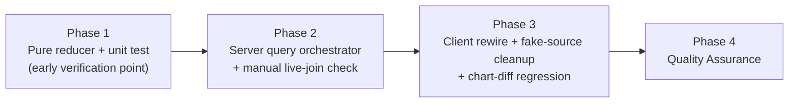
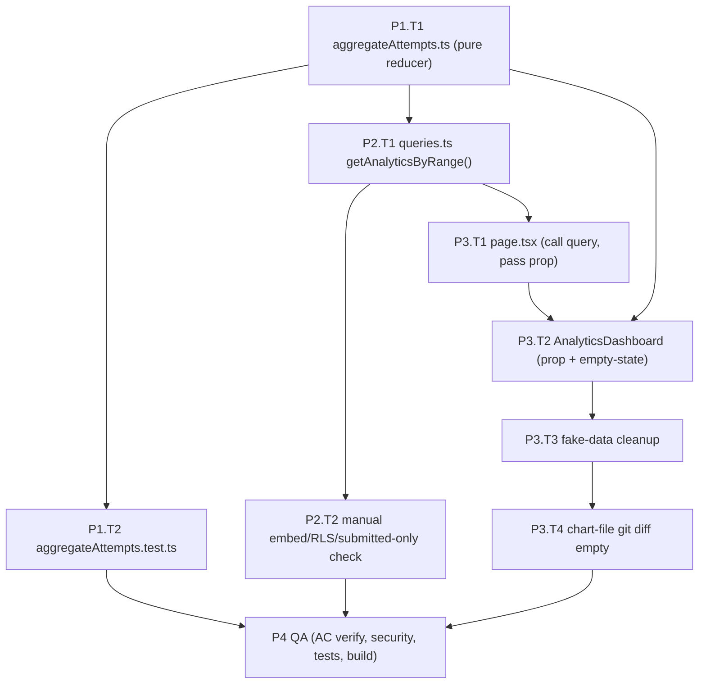

# Work Plan: Analytics (Layer 3) Real Data Logic

Created Date: 2026-07-21
Type: feature
Estimated Duration: 1 day (single-commit-friendly slices)
Estimated Impact: 6 files (3 new, 3 edited)
Related Issue/PR: —
Review Scope: Planned-files scope derived from the Design Doc §Change Impact Map. Exactly these paths may change:
- NEW `SOURCE/lib/analytics/aggregateAttempts.ts`
- NEW `SOURCE/lib/analytics/__tests__/aggregateAttempts.test.ts`
- NEW `SOURCE/features/analytics/queries.ts`
- EDIT `SOURCE/lib/fake-data/analytics.ts`
- EDIT `SOURCE/app/(analytics)/me/dashboard/page.tsx`
- EDIT `SOURCE/features/analytics/components/AnalyticsDashboard.tsx`
- **Out of scope (a diff here is a failure):** `SOURCE/features/analytics/components/BarChartCard.tsx`, `SOURCE/features/analytics/components/DonutChartCard.tsx`, `schema.sql`, RLS, migrations, and the kept symbols in `lib/fake-data/analytics.ts` (`SUBJECT_COLORS`, `Subject`, `SUBJECT_ORDER`, `niceCeil`, `computeShares`, `RANGE_LABELS`, `DEFAULT_RANGE`, `NEEDS_REVIEW_THRESHOLD`).

## Related Documents
- Design Doc(s):
  - `docs/design/analytics-layer3-data-logic-design.md` (data-logic pass — this plan's source)
  - `docs/design/analytics-layer3-design.md` (UI-only predecessor; superseded scope reference only)
- ADR: none (Design Doc §Prerequisite ADRs — no architecture/data-flow/contract-system change; SubjectStats contract unchanged)
- PRD: none

## Verification Strategy (from Design Doc)

### Correctness Proof Method
- **Correctness definition**: For a fixed set of `AttemptRow` inputs and a fixed `now`, `aggregateAttemptsByRange` produces the exact `Record<TimeRange, SubjectStats[]>` with correct per-subject sums (`correct = Σ row.correct`, `wrong = Σ (row.total − row.correct)`, `sessions = counted rows`), correct non-union exclusion, correct zero-attempt omission, and `SUBJECT_ORDER` ordering among present subjects.
- **Verification method**: Extension design_type → two prongs.
  - *Regression (existing behavior preserved)*: chart components render unchanged. Proof = `git diff` of `BarChartCard.tsx` and `DonutChartCard.tsx` is empty (both before and after, the input is `SubjectStats[]` with identical field names).
  - *New behavior (real aggregation)*: pure unit test `aggregateAttempts.test.ts` with hardcoded literal expected values, computed independently of the implementation. Identical-input comparison at the `SubjectStats[]` level (same shape the charts consumed from the fake source, now produced by the reducer).
- **Verification timing**: reducer unit test at Phase 1 (early point); manual PostgREST embed-shape check at first render in Phase 2; chart-file git-diff regression check in Phase 3 and re-confirmed in the QA phase.

### Early Verification Point
- **First verification target**: one representative reducer case — a multi-subject, multi-range row set that includes (a) one non-union subject and (b) one subject with attempts only outside the week window — asserting the three range arrays (`week`/`month`/`all`) each match hand-computed literals.
- **Success criteria**: the three emitted arrays equal the hand-computed literal `SubjectStats[]` (subjects, `correct`, `wrong`, `sessions`, and order), proving exclusion + range-bucketing + ordering before the query is wired.
- **Failure response**: fix the pure reducer only (it has no I/O). If a PostgREST embed-shape mismatch is later observed at Phase 2 render, the single adjustment point is the `data as unknown as Row[]` cast + the normalize step in `queries.ts` (per R-3) — not the reducer.

### Proof Strategy
- **Proof obligation source**: no test skeletons were provided → each Acceptance Criterion's primary failure mode is the proof obligation source (AC-01..AC-13 in the Design Doc §Acceptance Criteria).
- **Per-task propagation**: every task that implements a claim records its Proof Obligations (which AC's failure mode it must exclude, and the literal/observation that proves it) so downstream review can judge whether the tests prove the claim, not merely run.

## Quality Assurance Mechanisms (from Design Doc)

Adopted quality gates for the change area (Design Doc §Quality Assurance Mechanisms). Each task must satisfy these.

| Mechanism | Enforces | Config Location | Covered Files |
|-----------|----------|-----------------|---------------|
| TypeScript type check (`npx tsc --noEmit`) | New module signatures, `dataByRange` prop type, embedded-select `Row` typing | `SOURCE/tsconfig.json` | All 6 changed files (project-wide check) |
| ESLint (`npm run lint`) | Lint/style on new and edited files | `SOURCE/.eslintrc*` / `eslint` config | All 6 changed files (project-wide check) |
| Vitest unit runner (`npm run test` → `vitest run`) | Pure reducer behavior via co-located test; test must actually be discovered | `SOURCE/vitest.config.ts` (include glob `lib/**/*.test.{ts,tsx}`, `components/**/*.test.{ts,tsx}`) | `SOURCE/lib/analytics/**` (reducer + `__tests__`) |
| **Domain constraint (decisive):** Vitest `include` glob does NOT cover `app/**` | A test under `app/(analytics)/**` would silently never run → the pure reducer must live under `lib/analytics/` | `SOURCE/vitest.config.ts` | `SOURCE/lib/analytics/aggregateAttempts.ts` placement |

*(`node scripts/check-ai-key-bundle.mjs` is noted in the Design Doc as not relevant to this change area — not a gate here.)*

## Design-to-Plan Traceability

| Design Doc | DD Section | DD Item | Category | Covered By Task(s) | Gap Status | Notes |
|---|---|---|---|---|---|---|
| analytics-layer3-data-logic-design.md | Data Contracts | `aggregateAttemptsByRange(rows, now)` pure reducer (sum/exclusion/omission/ordering + `submittedAt` defensive rule) | impl-target | Phase 1 Task 1 | covered | |
| analytics-layer3-data-logic-design.md | Verification Strategy / Acceptance Criteria | Pure reducer unit test with literal expected values (AC-01..AC-06) | verification | Phase 1 Task 2 | covered | Early verification point |
| analytics-layer3-data-logic-design.md | Data Contracts | `getAnalyticsByRange()` server-only orchestrator (supabase-js nested embed, `import "server-only"`) | impl-target | Phase 2 Task 1 | covered | |
| analytics-layer3-data-logic-design.md | Data Contracts / Reducer input row | snake→camel normalize of embedded rows to `AttemptRow`; `data as unknown as Row[]` cast at boundary | contract-change | Phase 2 Task 1 | covered | |
| analytics-layer3-data-logic-design.md | Data Contracts (On error) / Integration Point Map #4 | Fail-fast `if (error) throw error` (no silent fallback) | verification | Phase 2 Task 1 | covered | Error Handling behavior |
| analytics-layer3-data-logic-design.md | Risks (R-3) / Integration Point Map #4 | Manual first-render check: to-one embeds resolve as objects (not arrays); `status='submitted'` embedded filter row-filters | verification | Phase 2 Task 2 | covered | document-reviewer condition I003 |
| analytics-layer3-data-logic-design.md | Acceptance Criteria AC-11 / Constraints | RLS-scoped read; no explicit `user_id` predicate; no PII/answer columns selected | verification | Phase 2 Task 2 | covered | Security: verified by review vs `results_select_own`/`attempts_select_own` |
| analytics-layer3-data-logic-design.md | Client Rewire Detail (page.tsx) | `page.tsx`: keep auth guard, add `await getAnalyticsByRange()`, pass `dataByRange` prop | impl-target + connection-switching | Phase 3 Task 1 | covered | Integration Point #1, #2 |
| analytics-layer3-data-logic-design.md | Client Rewire Detail (AnalyticsDashboard) | Accept `dataByRange` prop, drop `getSubjectStats`, `data = dataByRange[range]`, keep tab/range/filterTouched | impl-target + contract-change | Phase 3 Task 2 | covered | Interface Change: new required prop |
| analytics-layer3-data-logic-design.md | Client Rewire Detail / AC-08..AC-10 | Empty-state branch: `data.length === 0` renders panel in place of chart, keeps tab nav + range filterSlot; charts never called with empty array | impl-target | Phase 3 Task 2 | covered | Guards degenerate donut |
| analytics-layer3-data-logic-design.md | Cleanup of lib/fake-data/analytics.ts | Remove `ANALYTICS_BY_RANGE` + `getSubjectStats`; reword top comment; keep all types/constants/helpers at same path | impl-target + contract-change | Phase 3 Task 3 | covered | Chart imports must resolve unchanged |
| analytics-layer3-data-logic-design.md | Interface Change Impact Analysis | `getSubjectStats(range)` (sync) → `getAnalyticsByRange()` (async) call moved client→server | contract-change | Phase 2 Task 1 + Phase 3 Task 1/2 | covered | |
| analytics-layer3-data-logic-design.md | Field Propagation Map | `total` consumed→dropped; `wrong` derived; `submitted_at`/`status` used server-side, dropped; `subject`/`correct`/`sessions` carried | contract-change | Phase 1 Task 1 + Phase 2 Task 1 | covered | See Connection Map |
| analytics-layer3-data-logic-design.md | Minimal Surface Alternatives | A1 (fetch-all-once `Record<TimeRange, SubjectStats[]>`), B1 (`wrong` computed not stored), C1 (pure reducer module) | verification | Phase 1 Task 1 + Phase 2 Task 1 + Phase 3 Task 1 | covered | Selected alternatives enforced by completion criteria |
| analytics-layer3-data-logic-design.md | Acceptance Criteria AC-12 | `git diff` of `BarChartCard.tsx`/`DonutChartCard.tsx` empty (regression) | verification | Phase 3 Task 4 + Phase 4 | covered | Chart contract frozen |
| analytics-layer3-data-logic-design.md | Verification Strategy / QA Mechanisms | Type-check, lint, unit tests all pass | verification | Phase 4 | covered | |

**Category values**: `impl-target`, `connection-switching`, `contract-change`, `verification`, `prerequisite`.
No `gap` rows. State Transitions section is N/A in the DD (no new state machine) → no Traceability row. Logging/Monitoring is N/A in the DD → no row.

## Reference Contract Values

Binding observable values copied verbatim from the Design Doc that the implementation must reproduce exactly.

| Design Doc (§ Section) | Contract Type | Required Observable Value (verbatim) | Covered By Task(s) |
|---|---|---|---|
| analytics-layer3-data-logic-design.md (§ Data Contracts — Guarantees) | structure-order | "ordering follows `SUBJECT_ORDER` among present subjects" | Phase 1 Task 1, Phase 1 Task 2 |
| analytics-layer3-data-logic-design.md (§ Aggregation Algorithm) | structure-order | "`output[range] = UNION.filter(s => acc.has(s))` … Ordering is guaranteed by iterating `SUBJECT_ORDER` at emit time (not by insertion order), so the bar chart's fixed x-axis order holds regardless of row arrival order." | Phase 1 Task 1, Phase 1 Task 2 |
| analytics-layer3-data-logic-design.md (§ Data Contracts — Guarantees) | derived-display | "per subject: `correct = Σ row.correct`, `wrong = Σ (row.total - row.correct)`, `sessions = count of counted rows`" | Phase 1 Task 1, Phase 1 Task 2 |
| analytics-layer3-data-logic-design.md (§ Acceptance Criteria AC-02) | derived-display | "Given `(correct,total)=(3,10)`, the emitted `wrong` is `7` (not read from any stored `wrong`)." | Phase 1 Task 1, Phase 1 Task 2 |
| analytics-layer3-data-logic-design.md (§ Data Contracts — Guarantees, decision #3) | state-lifecycle-negative | "only subjects in the union (`SUBJECT_ORDER`) appear (non-union rows dropped — decision #3)" — no `"Other"` bucket appears | Phase 1 Task 1, Phase 1 Task 2 |
| analytics-layer3-data-logic-design.md (§ Data Contracts — Guarantees, decision #4) | state-lifecycle-negative | "only subjects with ≥1 counted attempt in the range appear (zero-attempt omission — decision #4)" | Phase 1 Task 1, Phase 1 Task 2 |
| analytics-layer3-data-logic-design.md (§ Client Rewire Detail / AC-10) | state-lifecycle-negative | "Chart components are never called with an empty array — this guards `computeShares` (sessions total 0 → degenerate donut) before it can render." / AC-10: "`DonutChartCard` is never rendered with an empty `data` array; the empty-state branch intercepts before `computeShares` runs on a zero-session set." | Phase 3 Task 2 |
| analytics-layer3-data-logic-design.md (§ Data Contracts — Defensive rule) | state-lifecycle-negative | "a row with `null`/unparseable `submittedAt` is skipped for `week`/`month` but still counted in `all`." | Phase 1 Task 1, Phase 1 Task 2 |

## Failure Mode Checklist

| Category | Applies? | Covered By Task(s) |
|---|---|---|
| same-value | no | — |
| no-op | no | — |
| empty input | yes | Phase 1 Task 1/2 (empty `rows` → `{week:[],month:[],all:[]}`, AC-08); Phase 3 Task 2 (empty-state branch, AC-08/09) |
| invalid option | yes | Phase 1 Task 1/2 (non-union subject string dropped, AC-04; unparseable `submittedAt` handled by defensive rule) |
| missing config | no | — |
| unavailable boundary | yes | Phase 2 Task 1 (Supabase read error → fail-fast `throw`); Phase 1 Task 1 (`null` `submittedAt` anomaly counted only in `all`, R-1) |
| shared-state dependency | yes | Phase 2 Task 2 (read relies on RLS cookie session `auth.uid()`; no explicit `user_id` predicate — AC-11) |
| rollback-only visibility | no | — |
| missing-sort-key ordering | yes | Phase 1 Task 1/2 (emit order = `SUBJECT_ORDER`, not insertion order — AC-05) |

## Connection Map

| Boundary | Owner (left side) | Owner (right side) | Serialized Format | Consumer Parse Rule | Expected Signal | Covered By Task(s) |
|---|---|---|---|---|---|---|
| `queries.ts` → Supabase (PostgREST) `exam_results ⋈ exam_attempts ⋈ exams` | Supabase/PostgREST (producer) | `getAnalyticsByRange` normalize step (consumer) | PostgREST embedded-select JSON: `{ correct, total, exam_attempts: { submitted_at, status, exams: { subject } } }` — to-one embeds as **objects**, row-filtered by `!inner` + `.eq("exam_attempts.status","submitted")` | `data as unknown as Row[]` cast, then map to `AttemptRow` (`submitted_at→submittedAt`, `exams.subject→subject`); to-one embeds read as objects | At first L1 render: embeds resolve as objects (not arrays); only `status='submitted'` rows returned; RLS returns only the caller's rows | Phase 2 Task 1 (producer-side query), Phase 2 Task 2 (consumer-side manual verification) |
| server → client React island prop `dataByRange` | `page.tsx` (server component, producer) | `AnalyticsDashboard` (client island, consumer) | React RSC prop serialization; JSON-safe values only (`Record<TimeRange, SubjectStats[]>` = numbers/strings) | React deserializes prop; consumer reads `dataByRange[range]` as `SubjectStats[]` | Client renders real per-user charts; tab/range toggle needs no network request or loading state (AC-07) | Phase 3 Task 1 (producer), Phase 3 Task 2 (consumer) |

## Objective
Replace the hardcoded fake analytics source (`ANALYTICS_BY_RANGE` + `getSubjectStats`) at `/me/dashboard` with real per-user, RLS-scoped Supabase aggregates, while keeping every chart prop contract byte-identical. The only client change is a thin container rewire. This implements the "Real data" item deferred by the UI-only predecessor design.

## Background
The Analytics page (route group `(analytics)`) is fully built and visually approved; its two charts render from `SubjectStats[]` supplied today by three hardcoded per-range datasets. This pass computes those stats from the user's submitted exam attempts via one supabase-js nested embed plus a pure TypeScript reduce — no Postgres view/RPC, no schema, no migration. The reduce lives in `lib/analytics/` (not `app/**`) specifically because the Vitest `include` glob does not scan `app/**`.

## Risks and Countermeasures

### Technical Risks
- **Risk (R-3): PostgREST embedded-select shape differs from assumed** (`exam_attempts`/`exams` returned as array vs object).
  - **Impact**: normalize step would produce malformed `AttemptRow`s; charts render wrong/empty.
  - **Countermeasure**: single adjustment point is the `data as unknown as Row[]` cast + normalize; verified by the explicit manual first-render check (Phase 2 Task 2). No automated test covers the live join.
- **Risk (R-4): Vitest silently not running the new test** (wrong path under `app/**`).
  - **Impact**: reducer appears "tested" but no test executes.
  - **Countermeasure**: test placed under `lib/analytics/__tests__/` (matches `lib/**` include glob); confirm by observing the Vitest test count increase in `npm run test`.
- **Risk (R-1): a `status='submitted'` attempt has `null` `submitted_at`** (legacy/out-of-band row).
  - **Impact**: mis-bucketing.
  - **Countermeasure**: reducer defensive rule — count a `null`/unparseable `submittedAt` row only in `all`, never in `week`/`month`, never throw.
- **Risk (R-2): an exam stored a non-canonical/legacy subject string and is silently excluded.**
  - **Impact**: silent data loss for that subject.
  - **Countermeasure**: exclusion is the intended, documented behavior (AC-04); intake canonicalization enforces the English union. Surface via follow-up data audit if observed — not a silent fallback.
- **Risk: an accidental edit to a frozen chart file** breaks the byte-identical contract.
  - **Impact**: regression / contract violation (AC-12 failure).
  - **Countermeasure**: `git diff` of `BarChartCard.tsx`/`DonutChartCard.tsx` must be empty — checked in Phase 3 Task 4 and re-confirmed in Phase 4.

### Schedule Risks
- **Risk**: scope creep into renaming `lib/fake-data/analytics.ts`.
  - **Impact**: diff ripples into frozen chart files; review surface expands.
  - **Countermeasure**: rename is an explicit documented follow-up, out of scope for this plan.

## Implementation Phases

Implementation approach: **Vertical Slice** (Design Doc §Implementation Approach Decision) — one thin vertical DB read → pure reduce → prop → existing charts. Phases are ordered by dependency: the pure reducer (no I/O, testable, the early verification point) first, then the server query that feeds it, then the client rewire that consumes it, then QA.

### Phase 1: Pure reducer + unit test (Estimated commits: 1)
**Purpose**: Prove the exclusion + range-bucketing + omission + ordering logic in isolation, independent of Supabase. This is the early verification point.
**Verification**: Pure unit test with hardcoded literal expected values (L2); the representative multi-subject/multi-range case is the early verification point.

#### Tasks
- [ ] Task 1: Implement `SOURCE/lib/analytics/aggregateAttempts.ts` — `aggregateAttemptsByRange(rows: AttemptRow[], now: Date): Record<TimeRange, SubjectStats[]>` and the `AttemptRow` type (`{ correct: number; total: number; submittedAt: string | null; subject: string }`). Import `Subject`/`TimeRange`/`SubjectStats`/`SUBJECT_ORDER` from `@/lib/fake-data/analytics` (kept path). Enforce: non-union exclusion (membership-test vs `SUBJECT_ORDER`), zero-attempt omission, `SUBJECT_ORDER` emit ordering, `correct`/`wrong=total−correct`/`sessions` sums, range boundaries (`week`=now−7d, `month`=now−30d, `all`=no bound), and the `submittedAt` defensive rule. Pure — throws nothing. Vietnamese comments, English identifiers.
  - **Proof Obligations**: AC-01 (sum), AC-02 (`wrong` derived not stored), AC-03 (`sessions`=count), AC-04 (non-union dropped, no "Other"), AC-05 (omission + `SUBJECT_ORDER` order), AC-06 (range boundaries), R-1 (`null` `submittedAt` counted only in `all`).
- [ ] Task 2: Create `SOURCE/lib/analytics/__tests__/aggregateAttempts.test.ts` — unit test mirroring `lib/scoring/__tests__/computeScore.test.ts` structure, with hardcoded literal expected `SubjectStats[]` computed independently. Include the early-verification representative case (multi-subject, multi-range, one non-union subject `"Geography"`, one subject with attempts only outside the week window) plus boundary cases (empty `rows`, `null` `submittedAt`, exactly-at-boundary dates). Use a fixed `now`.
  - **Proof Obligations**: each assertion pins one AC's failure mode via a literal; empty-input case pins AC-08's reducer half.
- [ ] Quality check (staged): `npx tsc --noEmit`, `npm run lint`, `npm run test` — confirm the new test is discovered (test count increases, R-4).

#### Phase Completion Criteria
- [ ] Early verification point passed: the three range arrays of the representative case equal the hand-computed literals.
- [ ] Reducer emits `SubjectStats[]` with exactly `{ subject, correct, wrong, sessions }`, ordered by `SUBJECT_ORDER`, non-union excluded, zero-attempt omitted.
- [ ] `npm run test` shows the new test running and passing; type-check and lint clean.

### Phase 2: Server-only query orchestrator (Estimated commits: 1)
**Purpose**: Fetch submitted results for the current user in one RLS-scoped read and delegate to the pure reducer.
**Verification**: Manual first-render check of the live PostgREST embed shape + RLS review (L1); no automated test covers the live join (mocks cannot verify joins).

#### Tasks
- [x] Task 1: Create `SOURCE/features/analytics/queries.ts` with `import "server-only"`, `createClient` from `@/lib/supabase/server`, mirroring `(exams)/queries.ts`. Implement `getAnalyticsByRange(): Promise<Record<TimeRange, SubjectStats[]>>`:
  - Query: `from("exam_results").select("correct, total, exam_attempts!inner(submitted_at, status, exams!inner(subject))").eq("exam_attempts.status", "submitted")` — no explicit `user_id` predicate (RLS enforces). No answer/PII columns selected.
  - `if (error) throw error` (fail-fast, no fallback).
  - Normalize each `Row` to `AttemptRow` (`submitted_at→submittedAt`, `exams.subject→subject`), cast via `data as unknown as Row[]`.
  - Return `aggregateAttemptsByRange(rows, new Date())`.
  - **Proof Obligations**: AC-13 (submitted-only via `!inner` + status filter), AC-11 (RLS scoping, no `user_id` predicate), Error Handling (throw on error), A1 (single read, all three ranges).
- [ ] Task 2 (DEFERRED — needs authenticated runtime session): **Manual live-join verification (document-reviewer condition I003 / R-3)** — at first render against a real authenticated session, inspect the actual PostgREST response and confirm: (a) the to-one `exam_attempts` and nested `exams` embeds resolve as **objects, not arrays**; (b) the `status='submitted'` embedded filter row-filters correctly (no `in_progress` rows leak); (c) RLS returns only the calling user's rows. Record the observed shape. If embeds arrive as arrays, the single adjustment point is the `data as unknown as Row[]` cast + normalize.
  - **Proof Obligations**: R-3 embed shape, AC-13 submitted-only at the live boundary, AC-11 RLS scoping (review vs `results_select_own`/`attempts_select_own`).
- [x] Quality check (staged): `npx tsc --noEmit` (embedded-select `Row` typing), `npm run lint`.

#### Phase Completion Criteria
- [x] `getAnalyticsByRange` compiles, is `server-only`, and returns `Record<TimeRange, SubjectStats[]>`.
- [ ] Manual embed-shape/RLS/submitted-only check passed and its observation recorded — RLS/submitted-only reviewed statically; live first-render observation DEFERRED (no authenticated runtime session in this context).
- [x] Type-check and lint clean.

### Phase 3: Client rewire + fake-source cleanup (Estimated commits: 1)
**Purpose**: Swap the data source at the single integration point and remove the fake source, keeping chart props byte-identical.
**Verification**: L1 render (real per-user charts, empty-state branch) + regression git-diff of the two frozen chart files.

#### Tasks
- [x] Task 1: Edit `SOURCE/app/(analytics)/me/dashboard/page.tsx` — keep the `getCurrentUser` auth guard/redirect; after the guard add `const dataByRange = await getAnalyticsByRange();` (import from `@/app/(analytics)/queries`); render `<AnalyticsDashboard dataByRange={dataByRange} />`. All page chrome unchanged.
  - **Proof Obligations**: A1/AC-07 (single server fetch, all ranges), auth guard preserved.
- [x] Task 2: Edit `SOURCE/features/analytics/components/AnalyticsDashboard.tsx` — new signature `AnalyticsDashboard({ dataByRange }: { dataByRange: Record<TimeRange, SubjectStats[]> })`; drop the `getSubjectStats` import, import `SubjectStats` type from `@/lib/fake-data/analytics`; replace `const data = getSubjectStats(range)` with `const data = dataByRange[range]`; keep `tab`/`range`/`filterTouched` state and `filterSlot` as-is. Add the empty-state branch: when `data.length === 0`, render an empty-state panel in place of the chart card (heading "No data yet" + line "Complete a submitted attempt in this range to see analytics."), reusing `rounded-md border border-border bg-card p-5`, while still rendering tab nav + range filterSlot. Chart components are never called with an empty array.
  - **Proof Obligations**: AC-07 (instant toggle, no loading), AC-08/AC-09 (empty state per user & per range), AC-10 (degenerate-donut guard — charts never receive empty array).
- [x] Task 3: Edit `SOURCE/lib/fake-data/analytics.ts` — remove `const ANALYTICS_BY_RANGE` (lines 59–89) and `export function getSubjectStats` (lines 91–93); reword the module top comment to note aggregation now lives in `(analytics)/queries.ts` + `lib/analytics/aggregateAttempts.ts` and this file now holds only shared types/constants/helpers. Keep every other symbol at the same path.
  - **Proof Obligations**: chart imports (`BarChartCard.tsx:15`, `DonutChartCard.tsx:16`) resolve unchanged; kept symbols untouched.
- [x] Task 4: Regression check — `git diff SOURCE/features/analytics/components/BarChartCard.tsx SOURCE/features/analytics/components/DonutChartCard.tsx` must be **empty** (AC-12). Confirmed empty after frontend-task-03 edits.
- [ ] Quality check (staged): `npx tsc --noEmit`, `npm run lint`, `npm run test`.

#### Phase Completion Criteria
- [ ] `/me/dashboard` renders real per-user charts; tab/range toggle triggers no network request or loading state (AC-07).
- [ ] A user/range with zero submitted attempts shows the empty state; switching to a populated range shows charts without reload (AC-08/AC-09); charts never receive an empty array (AC-10).
- [ ] `getSubjectStats`/`ANALYTICS_BY_RANGE` removed; kept symbols intact; chart-file `git diff` empty (AC-12).
- [ ] Type-check, lint, unit test clean.

### Final Phase: Quality Assurance (Required) (Estimated commits: 1)
**Purpose**: Cross-cutting quality assurance and Design Doc consistency verification.

#### Tasks
- [ ] Verify all Design Doc acceptance criteria achieved: AC-01..AC-06 (reducer unit test), AC-07 (render — no network on toggle), AC-08..AC-10 (empty-state renders), AC-11 (RLS review), AC-12 (chart-file git diff empty), AC-13 (submitted-only).
- [ ] Security review: RLS scoping (no `user_id` predicate; no cross-user reads), no answer/PII columns selected, no service-role client (Design Doc §Constraints).
- [ ] Quality checks: `npx tsc --noEmit`, `npm run lint`.
- [ ] Execute all tests: `npm run test` (reducer test passing, count increased). No integration/E2E skeletons were provided for this feature.
- [ ] Coverage: reducer critical paths (exclusion/omission/ordering/boundaries/defensive rule) covered by meaningful literal-assertion tests (coverage as diagnostic, not a target).
- [ ] Document updates: none required beyond this plan; the `lib/fake-data/analytics.ts` naming-smell rename remains a documented follow-up (out of scope).

### Quality Assurance
- [ ] Quality check (staged)
- [ ] All tests pass
- [ ] Static check pass (`tsc --noEmit`)
- [ ] Lint check pass (`npm run lint`)
- [ ] Build success (Next.js compiles; `server-only` import resolves)

## Completion Criteria
- [ ] All phases completed
- [ ] No integration/E2E test skeletons were provided → none to run (unit test only)
- [ ] Design Doc acceptance criteria AC-01..AC-13 satisfied
- [ ] Staged quality checks completed (zero errors)
- [ ] All tests pass
- [ ] Chart files `BarChartCard.tsx`/`DonutChartCard.tsx` byte-identical (git diff empty)
- [ ] User review approval obtained

## Progress Tracking
### Phase 1
- Start: YYYY-MM-DD HH:MM
- Complete: YYYY-MM-DD HH:MM
- Notes:

### Phase 2
- Start: YYYY-MM-DD HH:MM
- Complete: YYYY-MM-DD HH:MM
- Notes:

### Phase 3
- Start: YYYY-MM-DD HH:MM
- Complete: YYYY-MM-DD HH:MM
- Notes:

### Phase 4 (QA)
- Start: YYYY-MM-DD HH:MM
- Complete: YYYY-MM-DD HH:MM
- Notes:

## Phase Structure Diagram

## Task Dependency Diagram

## Notes
- **No test skeletons / UI Spec / ADR** were provided. E2E gap check: this is a data-logic pass on an already-built single-page dashboard with no multi-step user-facing journey and no new cross-service boundary (single RLS-scoped read within the existing runtime) → no fixture-e2e or service-integration-e2e gap flagged.
- **Decisive placement constraint**: the pure reducer MUST live under `SOURCE/lib/analytics/` because Vitest's `include` glob excludes `app/**`; a test under `app/(analytics)/**` would silently never run (R-4).
- **Frozen contract**: `SubjectStats` props for `BarChartCard`/`DonutChartCard` stay byte-identical; a diff in either chart file is a failure (AC-12).
- **Follow-up (out of scope)**: rename `lib/fake-data/analytics.ts` to a non-"fake" path in a single future commit that updates all importers together (Design Doc §Naming-smell follow-up).
