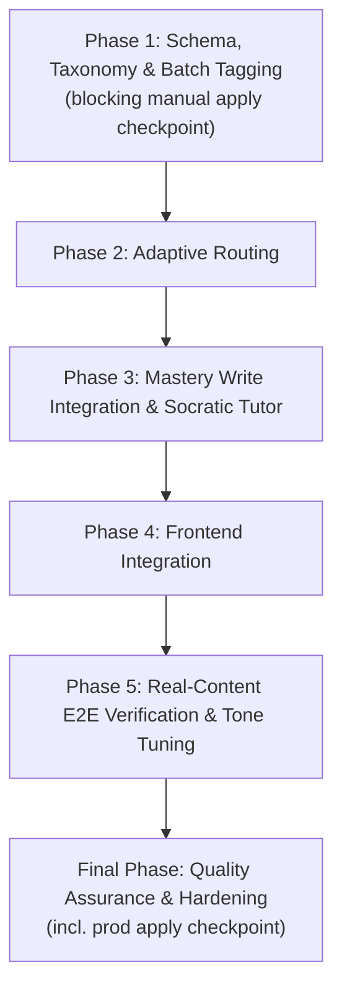
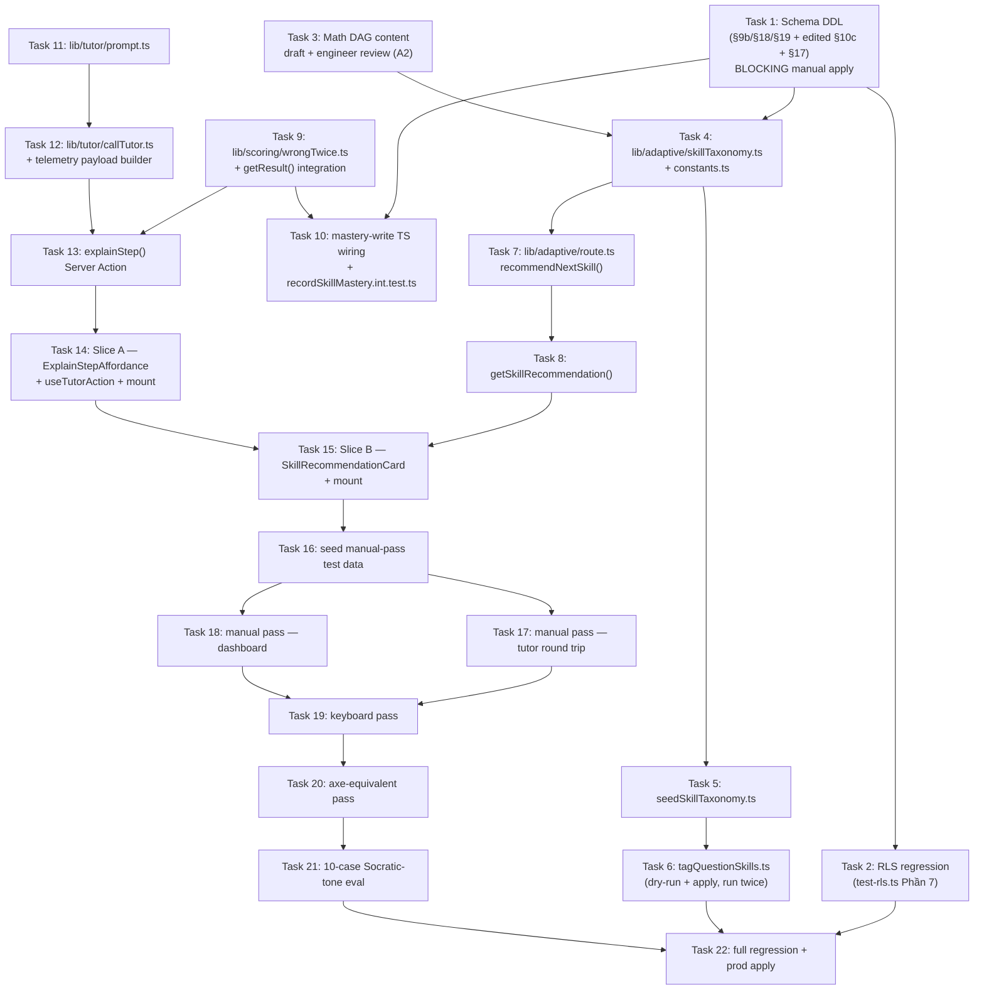

# Work Plan: Engine 1 — Adaptive AI & Feedback (Sprint 1) Implementation

Created Date: 2026-08-08
Type: feature
Estimated Duration: ~5-7 phase-paced sessions (pre-design Notion plan referenced this as a 7-week Sprint 1; phases below express the same dependency shape without a calendar lock — a phase may take more or less than a week depending on actual session pacing)
Estimated Impact: ~38 files — `SOURCE/supabase/schema.sql` (major edit, 4 new DDL sections), `SOURCE/lib/schema/schemaFingerprint.ts` (fingerprint constant), `SOURCE/supabase/test-rls.ts` (new Phần 7 block), ~8 other existing files modified (`actions.ts`, `queries.ts` ×2, `types/result.ts`, `rateLimit.ts`, `service-role.ts`, `en.ts`/`vi.ts`, `result/detail/page.tsx`, `dashboard/page.tsx`), ~24 new files (`lib/adaptive/**`, `lib/tutor/**`, `lib/scoring/wrongTwice.ts`, `types/adaptive.ts`, `tutorActions.ts`, `SkillRecommendationCard.tsx`, `components/tutor/**`, `seedSkillTaxonomy.ts`, `tagQuestionSkills.ts`, plus their test files)
Related Issue/PR: —
Review Scope: planned-files scope — `SOURCE/supabase/schema.sql`, `SOURCE/supabase/test-rls.ts`, `SOURCE/supabase/seedSkillTaxonomy.ts` (new), `SOURCE/supabase/tagQuestionSkills.ts` (new), `SOURCE/lib/schema/schemaFingerprint.ts`, `SOURCE/lib/adaptive/**` (new), `SOURCE/lib/tutor/**` (new), `SOURCE/lib/scoring/wrongTwice.ts` (new) + its `__tests__/`, `SOURCE/types/adaptive.ts` (new), `SOURCE/types/result.ts`, `SOURCE/lib/security/rateLimit.ts`, `SOURCE/lib/supabase/service-role.ts`, `SOURCE/app/(layer2)/actions.ts`, `SOURCE/app/(layer2)/tutorActions.ts` (new), `SOURCE/app/(layer2)/queries.ts`, `SOURCE/app/(layer2)/__tests__/tutorActions.int.test.ts`, `SOURCE/app/(layer2)/__tests__/recordSkillMastery.int.test.ts`, `SOURCE/app/(layer2)/exams/[id]/attempt/[attemptId]/result/detail/page.tsx`, `SOURCE/app/(layer3)/queries.ts`, `SOURCE/app/(layer3)/__tests__/getSkillRecommendation.int.test.ts`, `SOURCE/app/(layer3)/_components/SkillRecommendationCard.tsx` (+ test), `SOURCE/app/(layer3)/me/dashboard/page.tsx`, `SOURCE/components/tutor/**` (new), `SOURCE/lib/i18n/dictionaries/{en,vi}.ts`.

## Related Documents

- Design Doc(s):
  - `docs/design/engine1-adaptive-ai-backend-design.md` (v1.0)
  - `docs/design/engine1-adaptive-ai-frontend-design.md` (v1.0)
- ADR: `docs/adr/ADR-0011-mastery-write-trust-boundary.md` (Accepted) — resolves PRD U2
- PRD: `docs/prd/engine1-adaptive-ai-prd.md` (v1.0)
- UI Spec: `docs/ui-spec/engine1-adaptive-ai-ui-spec.md` (v1.0) — resolves U1/U4; referenced directly by the frontend DD as authoritative for component states/copy

**Test skeletons (generated, communicated per standard handoff — 9 files, comment-only, no test bodies; implementation tasks below fill each in the same commit as the code it tests, this project's Red→Green-same-commit convention):**

- Unit (backend): `SOURCE/lib/adaptive/__tests__/route.test.ts` (4 tests — AC-014/017 prerequisite-gate, AC-015/016 recency+determinism, AC-028 cold start, node-absent-from-mastery invariant), `SOURCE/lib/scoring/__tests__/wrongTwice.test.ts` (3 tests — cross-attempt threshold, scored:false exclusion, cross-exam identity), `SOURCE/lib/tutor/__tests__/prompt.test.ts` (3 tests — AC-018/019 zero-answer-key battery, AC-020 Socratic instruction presence, essay-exclusion type proof), `SOURCE/lib/tutor/__tests__/telemetry.test.ts` (1 test — AC-013 zero-answer-key battery incl. simulated error message)
- Integration, mocked Supabase-client boundary (backend): `SOURCE/app/(layer2)/__tests__/tutorActions.int.test.ts` (4 tests — AC-021 server-side re-verification gate, AC-012/013 telemetry queryable shape, AC-029 untagged question, AC-022 rate-limit-before-Gemini), `SOURCE/app/(layer3)/__tests__/getSkillRecommendation.int.test.ts` (3 tests — AC-012 adaptive_route telemetry, AC-028 cold-start + fire-and-forget telemetry isolation, AC-014-017/031 mapping fidelity)
- Integration, mocked Server-Action/query boundary (frontend, jsdom): `SOURCE/components/tutor/ExplainStepAffordance.test.tsx` (5 tests — AC-025 busyRef no-op, argument-order proof, AC-018-020 hint-shown via RichText, AC-021 error+retry, AC-023/024/029 mount independence from skill tag), `SOURCE/app/(layer3)/_components/SkillRecommendationCard.test.tsx` (3 tests — AC-031 populated verbatim label + closed disclosure, reasonCode→copy mapping distinctness, AC-028 cold-start honest message)
- Service-integration (real Postgres required — `record_skill_mastery()`'s `GROUP BY`/`FILTER`/`ON CONFLICT`/FK-join correctness cannot be mocked, per testing-principles): `SOURCE/app/(layer2)/__tests__/recordSkillMastery.int.test.ts` (2 tests — AC-009/010 arithmetic correctness across the real `submitExam()` path, AC-011 trust-boundary negative proof)
- Also flagged, not yet written: a **Phần 7** addition to `SOURCE/supabase/test-rls.ts` (manually-run RLS regression for `user_skill_mastery`/`telemetry_log`, following the file's existing fixture-ID-prefix + phased-comment-block pattern; recordSkillMastery.int.test.ts's Test 2 header itself references the expected `MM-a`/`MM-b` case names, so Phase 1 Task 2 below owns writing these) — this project's convention for RLS proofs, not CI-automated.

**Communicated explicitly to every task below**: integration tests are created in the same commit as the code they test (this repo's Red→Green-same-commit convention, not a separate test-writing pass). `recordSkillMastery.int.test.ts` is the one skeleton genuinely requiring a real dev-Supabase instance — it is sequenced in Phase 3, after Phase 1's manual schema apply to dev has completed and `verify:schema` has passed. fixture-e2e is **absent by design**, not an oversight — see E2E Gap Check below.

**E2E Gap Check**: fixture-e2e absence is intentional (`e2eAbsenceReason.fixtureE2e = no_multi_step_journey` — this feature has no user-facing multi-step journey with state carried across 2+ interaction boundaries; `ExplainStepAffordance` is a single in-place state machine on one page, `SkillRecommendationCard` is a single read-only surface; this repo also has no automated Playwright harness in CI). service-integration-e2e is **present** — `recordSkillMastery.int.test.ts` was generated and mapped onto this project's own "`*.int.test.ts` against a real dev Supabase instance" convention for the one genuinely cross-service-verification-requiring case (`record_skill_mastery()`'s SQL correctness); its own header explains the second service-integration-e2e slot was deliberately left unfilled in favor of `test-rls.ts`'s Phần 7 (manually-run, not CI-automated). Both lanes are accounted for — no gap warning applies.

## Verification Strategy (from Design Doc)

### Correctness Proof Method

- **Correctness definition** (backend): (1) the schema DDL applies clean and stays classified/fingerprinted per TD-001/TD-005/TD-011's gates; (2) `recommendNextSkill()` produces DAG-valid, deterministic output on literal fixtures; (3) `buildTutorPrompt()`'s output contains zero occurrences of literal answer-key fixture values across a battery of crafted inputs; (4) `user_skill_mastery` rows, after a real `submitExam()` call, arithmetically match the submitted attempt's per-question correctness for tagged/scored questions and are unaffected by untagged/unscored ones.
- **Correctness definition** (frontend): (1) `ExplainStepAffordance` renders iff `hasBeenWrongTwice === true`; (2) the `busyRef` guard makes a second click while busy a verified no-op; (3) `explainStep` is called with the exact `(attemptId, questionId)` argument order (a silent-swap risk flagged explicitly, since both are strings); (4) the hint renders only through `RichText`, never a competing path; (5) `SkillRecommendationCard` renders the honest cold-start state for `null` and the populated state otherwise, never a blank/broken card; (6) every new interactive element is keyboard-reachable with a visible focus indicator, state never color-only.
- **Verification method**: Vitest unit tests with literal, independently-computed expected values for the pure-function claims; real-DB integration test for the mastery-write arithmetic; `npm run verify:schema` + `parseForeignKeys.test.ts` + `schemaFingerprint.test.ts` for the schema claim; vitest(jsdom) component tests mocking the Server Action/query import boundary for the two new frontend surfaces; Playwright MCP/manual pass for the real end-to-end round trip, keyboard pass, and axe-equivalent pass (no CI, per `PROJECT_OVERVIEW.md` §6).
- **Verification timing**: after each implementation-order step within a phase (not deferred to one final pass, per the backend DD's own Hybrid-approach discipline); component tests land with each frontend vertical slice; the manual/Playwright pass runs once both slices are mounted on real routes with the backend's implementation deployed and test data seeded (Phase 5); the full regression (schema + RLS + all vitest + build) re-runs once more as the Final Phase closing gate.

### Early Verification Point

- **First verification target (Phase 1, blocking)**: `npm run verify:schema` passing all 7 checks immediately after the first manual apply of the new DDL (§9b/§18/§19 + edited §10c) to the **dev** database — the smallest unit that proves the highest-risk, most foundational piece (schema shape + the mastery-write trust boundary's DB-side prerequisites) before any TS-layer code is written against it.
- **Success criteria**: all 7 `verify:schema` checks green, specifically check #1 (no orphan `questions` column — confirms the §10c in-place edit worked, not a second appended grant statement), check #6 (every new FK's `on delete` matches the declared values), and check #7 (fingerprint agreement).
- **Failure response**: if check #1 fails with `skill_node_id` listed as an orphan, re-confirm the §10c edit was applied to the **first** `grant select (...) on public.questions` statement in the file (not appended as a second statement) before re-applying — the single most likely failure mode the backend DD's own investigation identified. Do not proceed to any lib/integration-layer implementation (Phase 2+) until this passes.
- **Second verification target (Phase 4-5, frontend)**: `ExplainStepAffordance`'s idle → busy → hint-shown cycle against the **real** (not mocked) `explainStep()` Server Action on a dev-seeded wrong-twice question — the higher-risk of the two frontend slices.
- **Success criteria**: clicking the button shows the busy spinner; then either the hint panel (RichText-rendered Vietnamese Socratic text) replaces the button, or — on a forced failure — the error paragraph + relabeled retry button appears; a second rapid click while busy does not fire a second `explainStep()` call.
- **Failure response**: if the real round trip's shape differs from the frontend DD's Data Contracts assumption (e.g., a field name or discriminant differs from `"hint" in result`), treat it as a discrepancy against the backend Design Doc and escalate rather than silently adapting the frontend to a mismatched shape.

### Proof Strategy

- **Proof obligation source**: the 9 test skeleton files' own `@category`/`@dependency`/`@complexity`/"Primary failure mode"/"Proof obligation" annotations are the primary source. For pieces with no generated skeleton — `lib/adaptive/skillTaxonomy.ts`'s `validateDag()` unit test (AC-001-003), the schema DDL/RLS work (Phase 1), and `ResultDetailPage`/`DashboardPage`'s own mount-point wiring (no RTL coverage per this repo's untested-Server-Component-page precedent, `ExamCard`/`ExamBrowser`) — the fallback source is the matching AC's primary failure mode from the two Design Docs' Acceptance Criteria sections, proven instead by `npm run verify:schema`/`test-rls.ts` (schema) or the manual Playwright pass (mount points).
- **Per-task propagation**: every task below that implements a claim (a mastery-write guarantee, a routing decision, a prompt-containment property, a component's render behavior) records its Proof Obligations (per the task template) sourced from the matching skeleton test block or AC, so downstream review judges whether the tests prove the claim, not merely run.

## Quality Assurance Mechanisms (from Design Doc)

| Mechanism | Enforces | Config Location | Covered Files |
|-----------|----------|-----------------|---------------|
| ESLint (`--max-warnings 0`, CI-blocking) | Style/lint rules | `SOURCE/eslint.config.mjs` | project-wide |
| `tsc --noEmit` (strict) | Static typing | `SOURCE/tsconfig.json` | project-wide (also catches a missing `vi.ts` key for any new `tutor.*`/`analytics.recommend*` entry) |
| `vitest run` | Unit/integration-test correctness | `SOURCE/vitest.config.ts` | `lib/adaptive/`, `lib/tutor/`, `lib/scoring/wrongTwice.ts`, `app/(layer2)/__tests__/`, `app/(layer3)/__tests__/`, `components/tutor/`, `app/(layer3)/_components/` |
| `next build` | Production build succeeds | `SOURCE/package.json` | project-wide |
| `npm run verify:schema` | DB-vs-`schema.sql` behavioral parity (column classification, FK `on delete`, §17 fingerprint) | `SOURCE/supabase/verify-schema.ts` | `public.questions`, all new FKs, §17 fingerprint — mandatory after every manual apply (TD-005) |
| `SOURCE/lib/schema/__tests__/parseForeignKeys.test.ts` | Every new `references` clause declares `on delete` | reads real `schema.sql` | `skill_prerequisites`, `questions.skill_node_id`, `user_skill_mastery`, `telemetry_log` FKs — CI-blocking (TD-011) |
| `SOURCE/lib/schema/__tests__/schemaFingerprint.test.ts` | §17 fingerprint three-way agreement | `SOURCE/lib/schema/schemaFingerprint.ts` | `schema.sql` in full — CI-blocking (TD-005) |
| `check-ai-key-bundle.mjs` | No server-only secret reaches the client bundle | `SOURCE/scripts/check-ai-key-bundle.mjs` | `.next` build output — relevant since `lib/tutor/`/`lib/adaptive/`/`tagQuestionSkills.ts` touch `GEMINI_API_KEY`/`SUPABASE_SERVICE_ROLE_KEY` |
| `SOURCE/supabase/test-rls.ts` (manual, not CI) | DB-level RLS/constraint behavior against real Postgres | `SOURCE/supabase/test-rls.ts` | `user_skill_mastery` + `telemetry_log` policies (new Phần 7, Phase 1 Task 2) |
| Playwright MCP / manual pass (no CI) | Real `explainStep()` round trip, dashboard cold-start/populated render, full keyboard pass | local `npm run dev` session | `ExplainStepAffordance`, `SkillRecommendationCard`, `ResultDetailPage`/`DashboardPage` mount points (Phase 5) |
| Manual axe-equivalent pass (ESLint's bundled `jsx-a11y` rules + manual ARIA/contrast walk) | WCAG 2.1 AA (PRD UI Quality Metric 2) | manual, dev environment | `ExplainStepAffordance`'s 4 states, `SkillRecommendationCard`'s 2 states — **resolves UI Spec TBD-06**: no `axe-core`/`jest-axe` dependency is added; the metric is downgraded to this manual pass, following the same precedent already accepted for `docs/plans/rating-system-work-plan.md`'s Task 9 |

## Design-to-Plan Traceability

| Design Doc | DD Section | DD Item | Category | Covered By Task(s) | Gap Status | Notes |
|---|---|---|---|---|---|---|
| docs/design/engine1-adaptive-ai-backend-design.md | Schema §9b | `skill_nodes`/`skill_prerequisites` tables + RLS + `questions.skill_node_id` FK | impl-target | Phase 1 Task 1 | covered | |
| docs/design/engine1-adaptive-ai-backend-design.md | Schema §10c (edited in place) | `skill_node_id` added to the safe-column grant (10th column) | contract-change | Phase 1 Task 1 | covered | Must edit the existing statement in place, not append (parser limitation) |
| docs/design/engine1-adaptive-ai-backend-design.md | Schema §18 + ADR-0011 | `record_skill_mastery()` SQL function, RLS, revoke/grant | impl-target | Phase 1 Task 1 | covered | |
| docs/design/engine1-adaptive-ai-backend-design.md | Schema §19 | `telemetry_log` table + RLS + revoke/grant | impl-target | Phase 1 Task 1 | covered | |
| docs/design/engine1-adaptive-ai-backend-design.md | Schema §17 procedure | Fingerprint recompute + `schemaFingerprint.ts` + literal update | verification | Phase 1 Task 1 | covered | |
| docs/design/engine1-adaptive-ai-backend-design.md | Early Verification Point | `verify:schema` 7-check gate after manual dev apply | verification | Phase 1 Task 1 (blocking checkpoint) | covered | |
| docs/design/engine1-adaptive-ai-backend-design.md | Test Boundaries / Integration Verification Points | New `test-rls.ts` cases for `user_skill_mastery`/`telemetry_log` (Phần 7) | verification | Phase 1 Task 2 | covered | Case names `MM-a`/`MM-b` cross-referenced by `recordSkillMastery.int.test.ts`'s own header |
| docs/prd/engine1-adaptive-ai-prd.md | R1 / A2 | Math skill DAG content drafted from MOET outline, engineer-reviewed before ship | prerequisite | Phase 1 Task 3 | covered | Content-authoring deliverable, not a code task — human-in-the-loop |
| docs/design/engine1-adaptive-ai-backend-design.md | `lib/adaptive/skillTaxonomy.ts` | Reviewed DAG data + `validateDag()`, AC-001-003 | impl-target | Phase 1 Task 4 | covered | No skeleton generated for `skillTaxonomy.test.ts` — authored directly from AC-001-003 |
| docs/design/engine1-adaptive-ai-backend-design.md | `lib/adaptive/constants.ts` | `MASTERY_CLEARED_THRESHOLD` (U5=0.7), `SKILL_TAG_CONFIDENCE_THRESHOLD` (U3=0.75) | impl-target | Phase 1 Task 4 | covered | Named constants, not scattered literals |
| docs/design/engine1-adaptive-ai-backend-design.md | `SOURCE/supabase/seedSkillTaxonomy.ts` | Idempotent DAG seeding, mirrors `seed.ts` | impl-target | Phase 1 Task 5 | covered | |
| docs/design/engine1-adaptive-ai-backend-design.md | `SOURCE/supabase/tagQuestionSkills.ts` | Batch tagger, dry-run default, `--apply`, `subject in ('Math','Toán')` corpus | impl-target | Phase 1 Task 6 | covered | AC-005-008 |
| docs/design/engine1-adaptive-ai-backend-design.md | `lib/adaptive/route.ts` | `recommendNextSkill()`, AC-014-017/028 | impl-target | Phase 2 Task 7 | covered | |
| docs/design/engine1-adaptive-ai-backend-design.md | `app/(layer3)/queries.ts` | `getSkillRecommendation()` + `types/adaptive.ts` | impl-target | Phase 2 Task 8 | covered | |
| docs/design/engine1-adaptive-ai-backend-design.md | `lib/scoring/wrongTwice.ts` + `getResult()` integration | `computeWrongTwiceQuestionIds()` + `PerQuestionResult.hasBeenWrongTwice` | impl-target/contract-change | Phase 3 Task 9 | covered | |
| docs/design/engine1-adaptive-ai-backend-design.md | `lib/supabase/service-role.ts` + `submitExam()` integration | `recordSkillMastery()` TS wrapper + non-throwing step 7 in `submitExam()` | connection-switching | Phase 3 Task 10 | covered | Inserted after the existing idempotency short-circuit, per ADR-0011 |
| docs/design/engine1-adaptive-ai-backend-design.md | `recordSkillMastery.int.test.ts` | AC-009/010/011 real-DB proof | verification | Phase 3 Task 10 | covered | Requires Phase 1 Task 1's dev apply to have completed |
| docs/design/engine1-adaptive-ai-backend-design.md | `lib/tutor/prompt.ts` | `buildTutorPrompt()`, `TutorPromptInput`, AC-018/019/020 | impl-target | Phase 3 Task 11 | covered | |
| docs/design/engine1-adaptive-ai-backend-design.md | `lib/tutor/constants.ts` | `TUTOR_CALL_DEADLINE_MS` | impl-target | Phase 3 Task 11 | covered | |
| docs/design/engine1-adaptive-ai-backend-design.md | `lib/tutor/callTutor.ts` | `generateHint()`, reuses `getGeminiClient()`/retry/deadline | impl-target | Phase 3 Task 12 | covered | |
| docs/design/engine1-adaptive-ai-backend-design.md | Telemetry payload builder (AC-013) | Extracted pure function per the skeleton's own suggestion | impl-target | Phase 3 Task 12 | covered | Home: `lib/tutor/telemetry.ts` (new) or co-located in `callTutor.ts` — implementer's call |
| docs/design/engine1-adaptive-ai-backend-design.md | `app/(layer2)/tutorActions.ts` | `explainStep()` Server Action | impl-target | Phase 3 Task 13 | covered | AC-021/022/029, server-side re-verification |
| docs/design/engine1-adaptive-ai-backend-design.md | `lib/security/rateLimit.ts` | `RATE_LIMITS.explainStep` | connection-switching | Phase 3 Task 13 | covered | |
| docs/design/engine1-adaptive-ai-backend-design.md | Assumed Behaviors (unconfirmed) | Vercel Hobby-plan function duration vs. `TUTOR_CALL_DEADLINE_MS=30s` | prerequisite | Phase 3 Task 13 | covered | Resolve by explicit `maxDuration` export or confirmed platform default |
| docs/design/engine1-adaptive-ai-backend-design.md | Security Considerations | Auth/authorization, input validation (server-side re-verification, not client display), sensitive data (answer-key never in prompt/telemetry) | verification | Phase 3 Tasks 10-13 | covered | |
| docs/design/engine1-adaptive-ai-backend-design.md | Logging and Monitoring | `telemetry_log.error_code` closed enum, never free text | verification | Phase 3 Task 12 | covered | |
| docs/design/engine1-adaptive-ai-backend-design.md | State Transitions and Invariants | `user_skill_mastery` monotonic counters, no speculative rows | verification | Phase 1 Task 1 + Phase 3 Task 10 | covered | |
| docs/design/engine1-adaptive-ai-backend-design.md | Minimal Surface Alternatives Element 1 | `hasBeenWrongTwice` computed on read (0 new persistent state) | contract-change | Phase 3 Task 9 | covered | |
| docs/design/engine1-adaptive-ai-backend-design.md | Minimal Surface Alternatives Element 3 | `skill_node_id` never crosses into the TS layer; SQL-only skill lookup | contract-change | Phase 1 Task 1 + Phase 3 Task 10 | covered | |
| docs/design/engine1-adaptive-ai-backend-design.md | Minimal Surface Alternatives Element 4 | `SkillRecommendation.reasonCode` computed at read time, not cached | contract-change | Phase 2 Task 8 | covered | |
| docs/design/engine1-adaptive-ai-backend-design.md | Field Propagation Map | `ScoreResult.perQuestion` → both RPCs; `hasBeenWrongTwice`/`SkillRecommendation` in-memory RSC props; `skill_node_id` dropped at the DB boundary | contract-change | Phase 2/3 Tasks 8-10 | covered | Serialized `p_per_question` row also recorded in Connection Map below |
| docs/design/engine1-adaptive-ai-frontend-design.md | `SOURCE/components/tutor/useTutorAction.ts` | 4-phase state machine + `busyRef` guard | impl-target | Phase 4 Task 14 | covered | |
| docs/design/engine1-adaptive-ai-frontend-design.md | `SOURCE/components/tutor/ExplainStepAffordance.tsx` | Client island, idle/busy/hint-shown/error render | impl-target | Phase 4 Task 14 | covered | |
| docs/design/engine1-adaptive-ai-frontend-design.md | `ResultDetailPage` mount | `ExplainStepAffordance` conditional mount, both scored sub-branches | connection-switching | Phase 4 Task 14 | covered | |
| docs/design/engine1-adaptive-ai-frontend-design.md | i18n `tutor.*` keys | `en.ts`/`vi.ts`, appended tail block | contract-change | Phase 4 Task 14 | covered | Exact placement per frontend DD's i18n section |
| docs/design/engine1-adaptive-ai-frontend-design.md | `SOURCE/app/(layer3)/_components/SkillRecommendationCard.tsx` | Server Component, populated/cold-start states, `REASON_KEY` mapping | impl-target | Phase 4 Task 15 | covered | |
| docs/design/engine1-adaptive-ai-frontend-design.md | `DashboardPage` mount | Parallel `getSkillRecommendation()` fetch + `SkillRecommendationCard` mount | connection-switching | Phase 4 Task 15 | covered | |
| docs/design/engine1-adaptive-ai-frontend-design.md | i18n `analytics.recommend*` keys | `en.ts`/`vi.ts`, extend existing `analytics.*` block in place | contract-change | Phase 4 Task 15 | covered | |
| docs/design/engine1-adaptive-ai-frontend-design.md | Minimal Surface Alternatives Element 1 | `useTutorAction` returns `{phase, hint, run}` | contract-change | Phase 4 Task 14 | covered | |
| docs/design/engine1-adaptive-ai-frontend-design.md | Minimal Surface Alternatives Element 2 | One generic `tutor.error` copy for all 4 backend error codes | contract-change | Phase 4 Task 14 | covered | Also a security decision — does not disclose `not_eligible`'s existence |
| docs/design/engine1-adaptive-ai-frontend-design.md | Minimal Surface Alternatives Element 3 | No `idPrefix` prop — `questionId` alone is page-unique | contract-change | Phase 4 Task 14 | covered | |
| docs/design/engine1-adaptive-ai-frontend-design.md | Security Considerations | Auth inherited from host pages; client `hasBeenWrongTwice` gate is display-convenience only; hint renders only via `RichText` | verification | Phase 4 Tasks 14-15 | covered | |
| docs/design/engine1-adaptive-ai-frontend-design.md | Error Handling table | External/business/infrastructure error categories collapse to one generic `tutor.error` UI copy | verification | Phase 4 Task 14 | covered | |
| docs/design/engine1-adaptive-ai-frontend-design.md | Accessibility Implementation | `aria-disabled`/`aria-busy`/`aria-describedby`, never native `disabled`, `role="alert"`, native `
` | verification | Phase 4 Tasks 14-15 + Phase 5 Task 19 | covered | |
| docs/design/engine1-adaptive-ai-frontend-design.md | Logging and Monitoring | `console.error({attemptId, questionId, errorCode\|err})` only, never hint/question content | verification | Phase 4 Task 14 | covered | |
| docs/design/engine1-adaptive-ai-frontend-design.md | Risks — Vercel duration, argument-order swap, async-SC test technique | verification | Phase 3 Task 13 (Vercel), Phase 4 Task 14 (arg order, via test), Phase 4 Task 15 (test technique fallback) | covered | |
| docs/prd/engine1-adaptive-ai-prd.md | Success Criteria #9 | 10-case Socratic-tone manual evaluation, recorded verdicts | verification | Phase 5 Task 21 | covered | Manual by necessity (R-b) |
| docs/prd/engine1-adaptive-ai-prd.md | R9 (Should-Have) | `subject='Toán'` normalization | — | — | gap (accepted) | Explicitly out of this document's required scope per both Design Docs; tracked separately as TD-016, not a Sprint 1 blocker |
| docs/prd/engine1-adaptive-ai-prd.md | Constraints — A3 (prod apply) | Schema applied to prod at ship time, verified as one batch | prerequisite | Final Phase Task 22 | covered | |

## Reference Contract Values

| Design Doc (§ Section) | Contract Type | Required Observable Value (verbatim) | Covered By Task(s) |
|---|---|---|---|
| docs/design/engine1-adaptive-ai-backend-design.md (§ Data Contracts — `recommendNextSkill()` Algorithm step 4) | derived-display | "sortKey(node) = [ratio(node) ASC, lastWrongAt(node) DESC NULLS LAST, node.id ASC]  // AC-015 + AC-016 determinism" | Phase 2 Task 7 |
| docs/design/engine1-adaptive-ai-backend-design.md (§ Data Contracts — `recommendNextSkill()` Algorithm step 9) | derived-display | "reasonCode = substituted ? \"prerequisite-gate\" : (tieBrokenByRecency ? \"recently-wrong\" : \"lowest-mastery\")" | Phase 2 Task 7 |
| docs/design/engine1-adaptive-ai-backend-design.md (§ Data Contracts — `recommendNextSkill()` Output Guarantees) | state-lifecycle-negative | "mastery.length === 0 -> returns null (AC-028, true cold start — never a fabricated entry-node guess, per PRD's own 'say less when it knows less' framing)" | Phase 2 Task 7 |
| docs/design/engine1-adaptive-ai-backend-design.md (§18 schema, `telemetry_log.error_code`) | state-lifecycle-negative | "error_code text check (error_code is null or error_code in ('gemini_unavailable', 'rate_limited', 'server', 'not_eligible'))" — "Mã có cấu trúc, KHÔNG BAO GIỜ free-text/exception message" | Phase 3 Task 12 |
| docs/design/engine1-adaptive-ai-backend-design.md (§ Data Contracts — `computeWrongTwiceQuestionIds()` Consumer-side gating) | derived-display | "hasBeenWrongTwice = (row.scored !== false \&\& !row.isCorrect) ? wrongTwiceSet.has(row.questionId) : undefined" | Phase 3 Task 9 |
| docs/design/engine1-adaptive-ai-frontend-design.md (§ Design — `SkillRecommendationCard.tsx`, `REASON_KEY`) | derived-display | `{"prerequisite-gate": "analytics.recommendReasonPrerequisiteGate", "lowest-mastery": "analytics.recommendReasonLowestMastery", "recently-wrong": "analytics.recommendReasonRecentlyWrong"}` | Phase 4 Task 15 |
| docs/ui-spec/engine1-adaptive-ai-ui-spec.md (§ D5) | state-lifecycle-negative | "once a hint is shown ... the button is replaced by a static (non-interactive) hint panel... no control to re-invoke the tutor shall exist in this state for this question in this render" | Phase 4 Task 14 |
| docs/ui-spec/engine1-adaptive-ai-ui-spec.md (§ D1) | state-lifecycle-negative | "Absent/false = affordance does not render (fail-closed, satisfies AC-024)." | Phase 4 Task 14 |

## Failure Mode Checklist

| Category | Applies? | Covered By Task(s) |
|---|---|---|
| same-value | yes | Phase 1 Task 6 (batch tagger re-run against an unchanged corpus produces the same tagged/left-null partition, AC-006); Phase 3 Task 10 (re-submitting/retrying `submitExam()` accumulates counts via `on conflict ... do update`, never overwrites) |
| no-op | yes | Phase 4 Task 14 (`ExplainStepAffordance` double-click while busy — `busyRef` guard, AC-025); Phase 3 Task 10 (a `p_per_question` row whose question has no skill tag contributes nothing — a deliberate no-op, not an error, AC-010) |
| empty input | yes | Phase 2 Task 7 (`mastery: []` → `recommendNextSkill()` returns `null`, AC-028); Phase 2 Task 8 (zero mastery rows → dashboard cold-start render); Phase 3 Task 10 (empty/all-untagged `p_per_question` array) |
| invalid option | yes | Phase 1 Task 4 (`validateDag()` rejects a dangling prerequisite or a cycle, AC-001/002); Phase 3 Task 12 (`telemetry_log.error_code` must be one of the 4 closed enum literals, never a raw exception message) |
| missing config | no | No new environment variable, feature flag, or config entry is introduced — reuses `GEMINI_API_KEY`, the existing Upstash rate-limit store, and named-constant thresholds (not env-driven) |
| unavailable boundary | yes | Phase 3 Task 13 (Gemini 503/429/timeout → typed `gemini_unavailable`/`server` error, AC-021; rate-limit-store unavailability); Phase 3 Task 13 (Vercel Hobby-plan function-duration limit vs. `TUTOR_CALL_DEADLINE_MS`, unverified Assumed Behavior) |
| shared-state dependency | yes | Phase 3 Task 9 (`hasBeenWrongTwice` depends on a cross-attempt read over ALL of the user's `exam_results`, not just the current attempt); Phase 3 Task 10 (mastery aggregate accumulates across multiple submissions of possibly-overlapping skill nodes) |
| rollback-only visibility | yes | Phase 3 Task 10 (ADR-0011's accepted narrow-window inconsistency: a crash between `recordExamResult()` and `recordSkillMastery()` leaves a scored attempt with no mastery update — accepted, not self-healing on retry per `submitExam()`'s idempotency guard; the score write itself is never rolled back) |
| missing-sort-key ordering | yes | Phase 2 Task 7 (`recommendNextSkill()`'s three-key deterministic tie-break — ratio ASC, `lastWrongAt` DESC NULLS LAST, `id` ASC — AC-016); Final Phase Task 22 (regression re-run) |

## UI Spec Component → Task Mapping

| UI Spec Component (section heading) | States to Cover | Covered By Task(s) | Gap Status | Notes |
|---|---|---|---|---|
| "Component: ResultDetailPage (extension point for R7)" | Default only (no loading/empty/error/partial at this level, per its own State x Display Matrix) | Phase 4 Task 14 | covered | |
| "Component: ExplainStepAffordance (new, client)" | Default (idle) / Loading (busy) / Error / Partial (hint-shown) — no distinct Empty state | Phase 4 Task 14 | covered | |
| "Component: DashboardPage (extension point for R10)" | Default only | Phase 4 Task 15 | covered | |
| "Component: SkillRecommendationCard (new, server)" | Default (populated) / Cold-start — no Loading/Empty/Error at this level | Phase 4 Task 15 | covered | |

## ADR Bindings

| ADR | Source Section | Axis | Binding Decision | Covered By Task(s) |
|---|---|---|---|---|
| docs/adr/ADR-0011-mastery-write-trust-boundary.md | Decision | dependency_direction | `record_skill_mastery()` is separate from `record_exam_result()`, `INVOKER`, `service_role`-only, called as a second, independent, best-effort step from `submitExam()` after the score write already succeeded — never atomic with the score write | Phase 1 Task 1 (SQL), Phase 3 Task 10 (TS wiring) |
| docs/adr/ADR-0011-mastery-write-trust-boundary.md | Decision | placement | New function `record_skill_mastery()` lives in `schema.sql` §18, sibling to §11's `SCORE WRITE LOCKDOWN` | Phase 1 Task 1 |
| docs/adr/ADR-0011-mastery-write-trust-boundary.md | Decision | persistence | `user_skill_mastery` stores counters only (`correct_count`, `total_count`, `last_wrong_at`) per `(user_id, skill_node_id)` — no normalized error-event log | Phase 1 Task 1 |
| docs/adr/ADR-0011-mastery-write-trust-boundary.md | Decision | contract_schema | `user_id` is derived from the `exam_attempts` row (never a caller parameter); requires `status = 'submitted'` | Phase 1 Task 1 (SQL), Phase 3 Task 10 (integration test proof) |
| docs/adr/ADR-0011-mastery-write-trust-boundary.md | Implementation Guidance | dependency_direction | `revoke all on function ... from public, anon, authenticated` by name on every new privileged function, every time (Supabase default-privileges pitfall) | Phase 1 Task 1 |
| docs/adr/ADR-0011-mastery-write-trust-boundary.md | Implementation Guidance | data_flow | When a new write's failure must not affect an already-existing, higher-priority write's success, keep them as separate calls with independent error handling, not one transaction | Phase 3 Task 10 |

## Connection Map

| Boundary | Owner (left side) | Owner (right side) | Serialized Format | Consumer Parse Rule | Expected Signal | Covered By Task(s) |
|---|---|---|---|---|---|---|
| `submitExam()`/`recordSkillMastery()` (Next.js server, TS) → `record_skill_mastery()` (Postgres SQL function, via Supabase RPC) | `SOURCE/lib/supabase/service-role.ts` | `SOURCE/supabase/schema.sql` §18 | JSON array `p_per_question`, each element `{questionId, selected?, correct?, isCorrect, scored?}` (the exact `ScoreResult.perQuestion` object, unmodified) | SQL: `jsonb_array_elements(p_per_question) as pq`, fields via `pq->>'questionId'` / `(pq->>'isCorrect')::boolean` / `coalesce((pq->>'scored')::boolean, true)` | Resulting `user_skill_mastery` rows arithmetically match the attempt's per-question correctness for tagged/scored questions; untagged/unscored questions contribute nothing (AC-009/010, `recordSkillMastery.int.test.ts`) | Phase 1 Task 1 (SQL side), Phase 3 Task 10 (TS side + proof) |
| `ExplainStepAffordance`/`useTutorAction` (client, browser) → `explainStep()` (Next.js Server Action) | `SOURCE/components/tutor/useTutorAction.ts` | `SOURCE/app/(layer2)/tutorActions.ts` | — (captured by Expected Signal; Server Action call uses the shared TS function signature, argument order is the actual risk here, not encoding) | `explainStep()`'s own typed-result branch (`"hint" in result`) | Response matches `{hint: string} \| {error: "not_eligible"\|"rate_limited"\|"gemini_unavailable"\|"server"}`; `explainStep` is called with the exact `(attemptId, questionId)` order, not the props' `(questionId, attemptId)` declaration order | Phase 3 Task 13 (server side), Phase 4 Task 14 (client side + argument-order test) |

## Objective

Implement Engine 1: Adaptive AI & Feedback (Sprint 1) end-to-end per the backend and frontend Design Docs: a Math-only skill taxonomy, per-user mastery written from real `submitExam()` submissions behind ADR-0011's trust boundary, a heuristic "what to practise next" recommendation, and a Socratic "Explain this step" tutor affordance that appears after a student gets the same question wrong twice — replacing the current state where a student who scores 6/10 learns nothing about *what* they are weak at and gets no help when stuck.

## Background

MS-MOLAR today rolls everything up to `questions.topic` (3 distinct values, one literally `"Math"`) and stops at "you got 6/10." Six product decisions (D1-D6) were locked before design started; U1 (wrong-twice trigger) and U4 (recommendation placement) were resolved by the UI Spec; U2 (mastery write trust boundary) was resolved by ADR-0011, mirroring ADR-0010's score-write mechanism but as a **separate**, best-effort function (not atomic with the score write, per the PRD's own Reliability NFR). U3 (confidence threshold) and U5 (mastery-cleared threshold) are shipped as named-constant placeholders (0.75/0.7), explicitly expected to be retuned once real usage data exists. This is a Next.js + Supabase project with **no migration tool** (TD-005) — `schema.sql` DDL is applied by hand into the Supabase SQL Editor, on two databases (dev during the sprint, prod at ship time, per A3). This has already caused a three-day dev/prod divergence once (2026-08-07); the plan below treats the manual apply as an explicit, blocking checkpoint rather than a step an implementation task can silently skip past.

## Risks and Countermeasures

### Technical Risks

- **Risk**: A forged/incorrect mastery write re-opens the §11-shaped trust boundary ADR-0010 closed for scores (PRD Risk R-d).
  - **Impact**: High.
  - **Countermeasure**: ADR-0011's mirrored mechanism (INVOKER, `service_role`-only, identity derived from the attempt row); Phase 1 Task 2's new `test-rls.ts` cases + `recordSkillMastery.int.test.ts`'s AC-011 negative proof (Phase 3 Task 10).
- **Risk**: Answer-key material (`correct_answer`/`sub_answers`/`essay_answer`) reaches the tutor prompt or `telemetry_log` — the single most important gate per PRD Success Criteria #8.
  - **Impact**: High.
  - **Countermeasure**: `TutorPromptInput`'s structural exclusion + `buildTutorPrompt()`'s 0-occurrence unit test battery (Phase 3 Task 11); `telemetry_log.error_code`'s closed enum + its own unit test battery (Phase 3 Task 12).
- **Risk**: §10c's grant-list edit is appended as a second statement instead of edited in place, silently defeating `verify-schema.ts`'s `parseGrantedColumns()` single-match parser.
  - **Impact**: Medium.
  - **Countermeasure**: Explicit instruction in Phase 1 Task 1; caught immediately by `npm run verify:schema` check #1 (the Early Verification Point).
- **Risk**: §17 fingerprint not updated in the same change as the DDL — TD-005's exact, three-times-repeated failure shape.
  - **Impact**: High.
  - **Countermeasure**: Fingerprint update is an explicit sub-step of Phase 1 Task 1, gated by `schemaFingerprint.test.ts`'s own failing-with-correct-expected-value behavior if missed.
- **Risk**: `explainStep(attemptId, questionId)`'s argument order silently swaps against `ExplainStepAffordanceProps`' `(questionId, attemptId)` declared field order — both are plain strings, so a swap compiles.
  - **Impact**: High (a tutor call silently targets the wrong attempt/question).
  - **Countermeasure**: Explicit code comment at the call site + a literal-fixture unit test in `ExplainStepAffordance.test.tsx` asserting `toHaveBeenCalledWith(...)` with two distinguishable fixture values (Phase 4 Task 14).
- **Risk**: `SkillRecommendationCard`'s async-Server-Component test technique (`render(await Component(props))`) has no prior precedent in this repository's test suite.
  - **Impact**: Low.
  - **Countermeasure**: Explicit documented fallback — if incompatible with this repo's RTL/vitest/jsdom versions, fall back to manual/Playwright-only verification (matching the `ExamCard`/`ExamBrowser` untested-Server-Component precedent) rather than silently reopening the UI Spec's server-component decision (Phase 4 Task 15).
- **Risk**: `TUTOR_CALL_DEADLINE_MS` (30s) may exceed or fall outside Vercel's actual configured function duration for the `explainStep()` Server Action.
  - **Impact**: Medium.
  - **Countermeasure**: Explicit `maxDuration` verification/setting as part of Phase 3 Task 13, not left silent.

### Schedule Risks

- **Risk**: The manual schema-apply checkpoint (Phase 1) blocks all downstream work until the engineer actually runs it against dev.
  - **Impact**: High — every phase after Phase 1 depends on the DB shape existing.
  - **Countermeasure**: Called out explicitly as a blocking checkpoint (not a task an agent can complete unsupervised); `verify:schema` gives immediate, unambiguous pass/fail feedback so the wait is bounded, not open-ended.
- **Risk**: The Math DAG content review (A2, Phase 1 Task 3) is a human content-authoring/review step, not a code task, and can stall the taxonomy-dependent chain (tagging, routing, dashboard).
  - **Impact**: Medium.
  - **Countermeasure**: `lib/adaptive/route.ts`'s own unit tests (Phase 2 Task 7) use independently-authored literal fixture DAGs, not the real reviewed content — the algorithm can be built and proven correct in parallel with the content review, only the batch tagger (Phase 1 Task 6) and the seed run (Phase 1 Task 5) are hard-blocked on it.

## Implementation Phases

### Phase Structure Diagram

### Task Dependency Diagram

### Phase 1: Schema, Taxonomy & Batch Tagging (Estimated commits: 4)

**Purpose**: Land the DB shape and the mastery-write trust boundary's DB-side prerequisites first — everything downstream reads or writes one of these tables/columns/functions. Includes the sprint's one hard human-in-the-loop DDL checkpoint.
**Verification**: Early Verification Point — `npm run verify:schema` after the manual dev apply, per Verification Strategy above.

#### Tasks

- [x] **Task 1 — Schema DDL + BLOCKING manual apply checkpoint** (shipped in `d93bb1d`; DDL applied by hand to the dev Supabase DB, `verify:schema` green): Author §9b (`skill_nodes`, `skill_prerequisites`, `questions.skill_node_id` FK + RLS), edit §10c in place (add `skill_node_id` as the 10th granted column — **not** a second appended `grant` statement), author §18 (`record_skill_mastery()` per ADR-0011: INVOKER, `service_role`-only, `user_id` derived from the attempt, `revoke all ... from public, anon, authenticated`), author §19 (`telemetry_log` table + RLS, insert-own only, no select policy for any client role). Compute the new fingerprint via `computeSchemaFingerprint()` and update **both** `SCHEMA_FINGERPRINT` (`SOURCE/lib/schema/schemaFingerprint.ts`) and the literal inside `schema.sql`'s fingerprint block, in the same commit.
  - ⚠ **MANUAL CHECKPOINT (human-in-the-loop, not agent-completable)**: the engineer must paste the finalized DDL into the Supabase SQL Editor against the **dev** project, then run `npm run verify:schema` (all 7 checks must pass) and `npx vitest run lib/schema` (`parseForeignKeys.test.ts` + `schemaFingerprint.test.ts`). Do not begin any task in Phase 2 or later until this checkpoint passes — the DB shape those tasks read/write does not exist until this step completes.
  - Proof obligations: backend DD's Early Verification Point (success/failure criteria as stated in Verification Strategy above); ADR-0011's Decision Details table (INVOKER/revoke-by-name/derived-identity).
- [x] **Task 2 — RLS regression cases (`test-rls.ts` Phần 7)** (shipped in `a948efa`): Append a new phased comment block (`Phần 7 — Engine 1 Adaptive AI (Mastery + Telemetry)`) following the file's existing fixture-ID-prefix convention. Cases: `MM-a` (a second user cannot SELECT another user's `user_skill_mastery` row), `MM-b` (a student's own JWT cannot invoke `record_skill_mastery()` via `.rpc(...)` — must fail permission-denied, complementing `recordSkillMastery.int.test.ts`'s Test 2 which is name-referenced directly by that skeleton's own header), `TL-a` (an authenticated user cannot SELECT any `telemetry_log` row, including their own), `TL-b` (`anon` cannot INSERT into `telemetry_log`). Run `cd SOURCE && npx tsx supabase/test-rls.ts` — full suite (all prior Phần blocks + new Phần 7) green.
  - Proof obligations: backend DD Test Boundaries / Integration Verification Points ("new `test-rls.ts` cases... for `user_skill_mastery`... and `telemetry_log`").
- [ ] **Task 3 — Math skill DAG content draft + engineer review (A2)**: Draft ~15-25 skill nodes + prerequisite edges covering grades 10 and 12 (the corpus's actual grade distribution) from the Vietnamese MOET curriculum outline. ⚠ **Content review checkpoint**: the engineer must review and approve the draft DAG before it is seeded (A2 — "review by the engineer is a required step, not a nicety"). This is a content-authoring/review deliverable, not a code-review step.
  - Proof obligations: PRD AC-003 (node count in the 15-25 range) and AC-004 (Vietnamese labels) as reviewed content, not as code.
- [ ] **Task 4 — `lib/adaptive/skillTaxonomy.ts` + `constants.ts`**: Implement the reviewed DAG (Task 3's content) as typed data + `validateDag()` (0 cycles, 0 dangling prerequisites). Author `SOURCE/lib/adaptive/__tests__/skillTaxonomy.test.ts` directly from AC-001/002/003/004 (no skeleton was generated for this file — write it against the stated Acceptance Criteria, same rigor as the skeleton-driven files). Also author `lib/adaptive/constants.ts`: `MASTERY_CLEARED_THRESHOLD = 0.7` (U5), `SKILL_TAG_CONFIDENCE_THRESHOLD = 0.75` (U3), both as named constants per the PRD's own instruction (not scattered literals).
  - Proof obligations: AC-001 (0 cycles), AC-002 (0 dangling prerequisites), AC-003 (node count 15-25), AC-004 (Vietnamese labels).
- [ ] **Task 5 — `SOURCE/supabase/seedSkillTaxonomy.ts`**: Idempotent upsert of the reviewed DAG (Task 3/4's content) via a service-role client, mirroring `seed.ts`'s env-loading/client pattern. Run against dev; confirm re-running produces 0 duplicate rows.
  - Proof obligations: PRD Success Criteria #3 (taxonomy DAG-valid, node count in range) as observed in the live dev DB after seeding.
- [ ] **Task 6 — `SOURCE/supabase/tagQuestionSkills.ts`**: Batch skill-tagging script, dry-run by default, `--apply` flag. Corpus query `subject in ('Math', 'Toán')` (R2 — must include the 10 non-canonical `'Toán'` rows). Confidence gate at `SKILL_TAG_CONFIDENCE_THRESHOLD` — below-threshold classifications are recorded as `"left-null"` in the JSON report, never written. Run: (1) dry-run, produce the report; (2) engineer reviews 100% of proposed `"tagged"` decisions (AC-008); (3) `--apply`; (4) re-run `--apply` a second time against the unchanged corpus to prove re-runnability (AC-006, PRD Success Criteria #5 — "a script that claims idempotence and has never been re-run is a claim, not a property"); (5) verify tag coverage ≥ 70% of the ~47-question corpus (PRD Success Criteria #4) — below 70% is a stop-and-review signal, not an automatic failure.
  - Proof obligations: AC-005 (0 below-threshold writes), AC-006 (re-runnable, 0 duplicates), AC-007 (every considered row in exactly one of two states), AC-008 (100% human review before ship).
- [ ] Quality check (staged): lint, typecheck, `npx vitest run lib/adaptive/__tests__/skillTaxonomy.test.ts` — zero errors.

#### Phase Completion Criteria

- [ ] `npm run verify:schema` passes all 7 checks against the dev DB; `parseForeignKeys.test.ts`/`schemaFingerprint.test.ts` green
- [ ] `test-rls.ts` full suite (incl. new Phần 7 `MM-a`/`MM-b`/`TL-a`/`TL-b`) green
- [ ] Reviewed DAG seeded on dev, `validateDag()`-proven, node count in the 15-25 range
- [ ] Batch tagger run twice against the real corpus with 0 errors/duplicates; ≥70% coverage or an explicit, recorded stop-and-review decision; 100% of assigned tags human-reviewed

### Phase 2: Adaptive Routing (Estimated commits: 2)

**Purpose**: Build and prove the heuristic routing algorithm and its read-path wiring — independent of the tutor slice, and testable against literal fixtures without waiting on the real reviewed taxonomy content.
**Verification**: `lib/adaptive/__tests__/route.test.ts` (unit, literal fixtures); `getSkillRecommendation.int.test.ts` (integration, mocked Supabase boundary).

#### Tasks

- [ ] **Task 7 — `lib/adaptive/route.ts` (`recommendNextSkill()`)**: Implement per the backend DD's Data Contracts algorithm (10-step pseudocode: cold-start check, ratio computation with untouched-node-defaults-to-0, `isCleared()`, the 3-key `sortKey`, the prerequisite-substitution walk with a defensive visited-set, `reasonCode` derivation). Convert `route.test.ts`'s 4 tests into real vitest tests in the same commit (Red→Green): Test 1 (AC-014/017, prerequisite-gate substitution), Test 2 (AC-015/016, recency tie-break + determinism, incl. no-mutation assertion), Test 3 (AC-028, strict-null cold start on a non-trivial DAG), Test 4 (node-absent-from-mastery defaults to ratio 0, no crash).
  - Proof obligations: `route.test.ts` Tests 1-4 proof obligations verbatim (as read from the skeleton file).
- [ ] **Task 8 — `getSkillRecommendation()` + `types/adaptive.ts`**: Implement `SkillRecommendation` type (`{skillLabel, reasonCode} | null`) and `getSkillRecommendation()` (`SOURCE/app/(layer3)/queries.ts`) — fetches nodes/edges + this user's mastery rows (RLS-scoped), calls `recommendNextSkill()`, maps `{nodeId, labelVi, reasonCode}` → `{skillLabel: labelVi, reasonCode}` **dropping `nodeId` entirely**, attempts a best-effort `telemetry_log` insert (`event_type='adaptive_route'`) whose failure never alters the returned value. Convert `getSkillRecommendation.int.test.ts`'s 3 tests into real vitest tests against a mocked Supabase client boundary (matching `getResult.int.test.ts`/`rating.int.test.ts`'s sanctioned mock precedent): Test 1 (AC-012, telemetry insert fires), Test 2 (AC-028, cold-start strict-`null` + fire-and-forget telemetry-failure isolation), Test 3 (AC-014-017/031, mapping fidelity — exact `toEqual`, `nodeId` provably absent via `not.toHaveProperty`).
  - Proof obligations: `getSkillRecommendation.int.test.ts` Tests 1-3 proof obligations verbatim.
- [ ] Quality check (staged): lint, typecheck, `npx vitest run lib/adaptive app/\(layer3\)/__tests__/getSkillRecommendation.int.test.ts` — zero errors.

#### Phase Completion Criteria

- [ ] `recommendNextSkill()` is DAG-valid and deterministic on all 4 unit test fixtures
- [ ] `getSkillRecommendation()`'s contract matches the backend DD exactly (`nodeId` dropped, `null` on cold start, telemetry fire-and-forget)

### Phase 3: Mastery Write Integration & Socratic Tutor (Estimated commits: 4)

**Purpose**: Wire the mastery-write trust boundary into the real `submitExam()` path (the highest-risk element, per both the backend DD and PRD Risk R-d) and build the Socratic tutor's full backend chain — both are attempt/scoring-adjacent, and `explainStep()`'s server-side re-verification directly reuses `computeWrongTwiceQuestionIds()` from this same phase.
**Verification**: unit tests (`wrongTwice.test.ts`, `prompt.test.ts`, `telemetry.test.ts`); integration tests (`tutorActions.int.test.ts`, mocked boundary); service-integration-e2e (`recordSkillMastery.int.test.ts`, real dev Postgres — requires Phase 1 Task 1's checkpoint already passed).

#### Tasks

- [x] **Task 9 — `hasBeenWrongTwice` mechanism** (shipped in `585031a`): Implement `computeWrongTwiceQuestionIds()` (`SOURCE/lib/scoring/wrongTwice.ts`) — pure function, `Set<string>` of question IDs scored incorrect on ≥2 distinct attempt IDs across ALL of a user's submitted attempts (mirrors `computeScore.ts`'s `isScored()` convention exactly: `scored !== false`). Wire it into `getResult()` (`SOURCE/app/(layer2)/queries.ts`) via a new parallel (`Promise.all`) cross-attempt query, and add `PerQuestionResult.hasBeenWrongTwice?: boolean` (`SOURCE/types/result.ts`), computed only when `row.scored !== false && !row.isCorrect` (else `undefined`). Convert `wrongTwice.test.ts`'s 3 tests into real vitest tests in the same commit: Test 1 (cross-attempt ≥2-distinct threshold), Test 2 (`scored:false` exclusion vs. `scored:undefined` inclusion parity), Test 3 (cross-exam global question identity).
  - Proof obligations: `wrongTwice.test.ts` Tests 1-3 proof obligations verbatim.
- [x] **Task 10 — Mastery-write TS integration**: Add `recordSkillMastery()` export to `SOURCE/lib/supabase/service-role.ts` (mirrors `recordExamResult()`'s shape — never throws, returns `{error}`). Insert a new, non-throwing step 7 into `submitExam()` (`SOURCE/app/(layer2)/actions.ts`) — called immediately after `recordExamResult()` succeeds, inside a `try/catch` that logs (`console.error`) and does **not** re-throw, positioned after the existing idempotency short-circuit. Convert `recordSkillMastery.int.test.ts`'s 2 tests into real tests run against the **real dev Supabase instance** (requires Phase 1 Task 1's manual apply + `verify:schema` pass already completed): Test 1 (AC-009/010, arithmetic correctness — 2 tagged skills' `correct_count`/`total_count` exactly match a known fixture, the NULL-skill-tag question contributes 0 rows, `submitExam()` itself still succeeds), Test 2 (AC-011, negative proof — a real non-service-role student JWT calling `.rpc("record_skill_mastery", ...)` directly must fail permission-denied).
  - Proof obligations: `recordSkillMastery.int.test.ts` Tests 1-2 proof obligations verbatim; ADR-0011 Decision Details (derived identity, INVOKER, revoke-by-name).
- [x] **Task 11 — `lib/tutor/prompt.ts`**: Implement `TutorPromptInput` (structurally answer-key-free — no field can hold `correct_answer`/`sub_answers`/`essay_answer`) and `buildTutorPrompt()` (pure string construction, Vietnamese Socratic-form instruction). Also `lib/tutor/constants.ts` (`TUTOR_CALL_DEADLINE_MS = 30_000`). Convert `prompt.test.ts`'s 3 tests into real vitest tests: Test 1 (AC-018/019, 0 sentinel occurrences across an mcq/true_false/short_answer fixture battery, plus a positive assertion that `studentAnswer`/`questionContent` DO appear — proves the test isn't vacuous), Test 2 (AC-020 backend half, Socratic instruction literal present for all 3 question types), Test 3 (`@ts-expect-error` compile-time proof that `questionType: "essay"` is rejected by the type).
  - Proof obligations: `prompt.test.ts` Tests 1-3 proof obligations verbatim.
- [x] **Task 12 — `lib/tutor/callTutor.ts` + telemetry payload builder** (telemetry builder landed as its own file `lib/tutor/telemetry.ts`; nothing to reconcile with Task 8 — `getSkillRecommendation()` has not landed yet, so this task establishes the shape it must adopt): Implement `generateHint()` (reuses `getGeminiClient()`, `QUESTION_MODEL`, `makeDeadlineSignal()`, `sdkErrorDetail()` from `lib/ugc/gemini.ts` — **not** `logExtractorExit()` verbatim, its hardcoded `"[ugc-extract]"` prefix would mislabel tutor logs; add a small analogous helper instead) and `logTutorExit()`. Extract the `telemetry_log` insert-payload construction into its own small, pure, unit-testable function per the skeleton's own suggestion (home: `lib/tutor/telemetry.ts`, new file, or co-located in `callTutor.ts` — implementer's choice), reused by both `explainStep()` (Task 13) and `getSkillRecommendation()` (Task 8, if not already using an equivalent inline shape — reconcile if so). Convert `telemetry.test.ts`'s 1 test into a real vitest test: every field of the constructed payload is either structurally safe (uuid/boolean/timestamp/closed enum) or, for `error_code`, strictly one of the 4 named literals — never a raw `Error.message`, across a fixture battery including a simulated error whose message contains an answer-key-shaped sentinel.
  - Proof obligations: `telemetry.test.ts` Test 1 proof obligation verbatim; AC-013.
- [x] **Task 13 — `explainStep()` Server Action**: Implement `SOURCE/app/(layer2)/tutorActions.ts` — auth (inherited session), ownership check (RLS-scoped attempt read), server-side re-verification of wrong-twice eligibility via `computeWrongTwiceQuestionIds()` (Task 9 — the actual security gate, independent of client state), `guard("explainStep", userId)` rate limiting (add `RATE_LIMITS.explainStep` to `SOURCE/lib/security/rateLimit.ts`), safe-column question fetch (the plain authenticated client, never `claim_attempt_answer_key`/`exam_answer_key`), `buildTutorPrompt()` + `generateHint()` call, best-effort telemetry write (`event_type='tutor_invoke'`). Confirm or explicitly set `export const maxDuration` on this Server Action's route segment against `TUTOR_CALL_DEADLINE_MS` (resolves the flagged, unverified Vercel Hobby-plan Assumed Behavior). Convert `tutorActions.int.test.ts`'s 4 tests into real vitest tests against a mocked Supabase client + mocked `generateHint()`: Test 1 (AC-021, server-side re-verification is the real gate — 0 calls to `generateHint()` for an ineligible `questionId`), Test 2 (AC-012/013, telemetry fires with the right queryable shape on both success and failure), Test 3 (AC-029, untagged question still functions), Test 4 (AC-022, rate-limit rejects before any Gemini call).
  - Proof obligations: `tutorActions.int.test.ts` Tests 1-4 proof obligations verbatim.
- [ ] Quality check (staged): lint, typecheck, `npx vitest run lib/scoring lib/tutor app/\(layer2\)/__tests__` — zero errors (excluding `recordSkillMastery.int.test.ts`, which requires the live dev DB and is run explicitly as part of Task 10, not the generic staged gate).

#### Phase Completion Criteria

- [ ] `hasBeenWrongTwice` computed correctly and wired into `getResult()`'s existing output shape (byte-identical for all pre-existing fields)
- [x] Mastery-write integration verified end-to-end against real dev Postgres (Task 10's 2 tests green); a forged student-JWT call to `record_skill_mastery()` is denied
- [ ] Answer-key containment proven with 0 occurrences across both the prompt-builder and telemetry-payload fixture batteries
- [ ] `explainStep()`'s server-side re-verification is proven to be the actual eligibility gate, independent of client-supplied state
- [ ] Rate limiting proven to block before any Gemini call fires

### Phase 4: Frontend Integration (Estimated commits: 2)

**Purpose**: Two independent, user-value-complete vertical slices (per the frontend DD's own Vertical Slice approach) — Slice A (tutor affordance) is the higher-risk slice and goes first, de-risking Slice B (recommendation card).
**Verification**: `ExplainStepAffordance.test.tsx` / `SkillRecommendationCard.test.tsx` (vitest jsdom, mocked Server Action/query boundary).

#### Tasks

- [ ] **Task 14 — Slice A: `useTutorAction` + `ExplainStepAffordance` + `ResultDetailPage` mount**: Add the `tutor.*` i18n keys (`en.ts`/`vi.ts`, appended tail block per the frontend DD's exact placement instructions) first — both components' `useT()`/compile-time key-completeness depend on it. Implement `useTutorAction.ts` (4-phase state machine, synchronous `busyRef` guard checked before any state update, calls `explainStep(attemptId, questionId)` in that **exact argument order** — not `ExplainStepAffordanceProps`' `(questionId, attemptId)` declaration order, per the frontend DD's own flagged risk). Implement `ExplainStepAffordance.tsx` (idle/busy/hint-shown/error render, never native `disabled`, `aria-disabled`/`aria-busy`/`aria-describedby`, hint renders only via `RichText`). Mount conditionally (`r.hasBeenWrongTwice &&`) in **both** scored sub-branches (mcq, short_answer) of `ResultDetailPage` (`SOURCE/app/(layer2)/exams/[id]/attempt/[attemptId]/result/detail/page.tsx`) — never in the not-scored branch. Convert `ExplainStepAffordance.test.tsx`'s 5 tests into real vitest(jsdom) tests: Test 1 (AC-025, busyRef no-op — at most 1 `explainStep()` call across 2 rapid activations), Test 2 (argument-order proof, two distinguishable literal fixtures), Test 3 (AC-018-020 UI half + D5, hint renders via `RichText`, button control removed), Test 4 (AC-021, failure path — both typed-error and rejected-promise cases — retry-relabeled button stays focusable, `role="alert"` mounts), Test 5 (AC-023/024/029, component functions with only its documented `{questionId, attemptId}` props, no skill-tag-shaped prop consulted).
  - Proof obligations: `ExplainStepAffordance.test.tsx` Tests 1-5 proof obligations verbatim.
- [ ] **Task 15 — Slice B: `SkillRecommendationCard` + `DashboardPage` mount**: Add the `analytics.recommend*` i18n keys (extending the existing `analytics.*` block in place, both `en.ts`/`vi.ts`). Implement `SkillRecommendationCard.tsx` (Server Component, no `"use client"` — populated state renders `recommendation.skillLabel` verbatim (never re-derived/re-bucketed) + a closed-by-default native `
`/`
` disclosure mapped via `REASON_KEY`; cold-start state renders the honest `analytics.recommendColdStart` message, never blank). Add the parallel `getSkillRecommendation()` fetch to `DashboardPage`'s existing `Promise.all` (`SOURCE/app/(layer3)/me/dashboard/page.tsx`) and mount the card between `PageHeader` and `AnalyticsDashboard` (zero change to `AnalyticsDashboard` itself). Convert `SkillRecommendationCard.test.tsx`'s 3 tests into real vitest(jsdom) tests using `render(await SkillRecommendationCard({ recommendation }))` (unprecedented technique in this repo — **if it proves incompatible** with this repo's RTL/vitest/jsdom versions, e.g. `getTranslate()`'s internal `next/headers` call cannot be satisfied in jsdom, fall back explicitly to manual/Playwright-only verification for this component, matching the `ExamCard`/`ExamBrowser` untested-Server-Component precedent — document the fallback decision in the task, do not silently skip the test): Test 1 (AC-031, verbatim label + closed-by-default disclosure), Test 2 (all 3 `reasonCode` values map to distinct, correct copy), Test 3 (AC-028, cold-start renders without throwing, honest copy, populated-only elements absent).
  - Proof obligations: `SkillRecommendationCard.test.tsx` Tests 1-3 proof obligations verbatim.
- [ ] Quality check (staged): lint, typecheck, `npx vitest run components/tutor app/\(layer3\)/_components` — zero errors.

#### Phase Completion Criteria

- [ ] Both slices compile against the real backend contracts landed in Phases 2-3 (no stub types remaining)
- [ ] All 8 frontend component tests green
- [ ] `ResultDetailPage`/`DashboardPage`'s pre-existing all-server-rendering behavior is unregressed for every question/user not satisfying the new gating conditions

### Phase 5: Real-Content End-to-End Verification & Tone Tuning (Estimated commits: 1)

**Purpose**: The parts of both DDs' Verification Strategy that require a real browser session, real seeded content, and human judgment — not automatable by either DD's own admission.
**Verification**: Manual Playwright MCP passes; the PRD's own manual, recorded evaluation-set process (Success Criteria #9).

#### Tasks

- [ ] **Task 16 — Seed manual-pass test data**: (a) A real Math exam/question fixture answered incorrectly on two separate scored attempts by one test account (satisfies `hasBeenWrongTwice: true` for the tutor round trip). (b) A fresh/never-submitted test account (dashboard cold-start). (c) A test account with real submitted Math attempts spanning all 3 `reasonCode` outcomes (`prerequisite-gate`/`lowest-mastery`/`recently-wrong`) for the dashboard populated pass.
- [ ] **Task 17 — Manual Playwright MCP pass: tutor round trip (Early Verification Point)**: On `/exams/[id]/attempt/[attemptId]/result/detail` with Task 16(a)'s fixture — click "Explain this step," observe busy spinner, then the hint panel (RichText-rendered Vietnamese) or, on a forced Gemini failure, the error paragraph + relabeled retry button. Confirm a second rapid click while busy does not fire a second `explainStep()` call (observable via dev server logs).
- [ ] **Task 18 — Manual Playwright MCP pass: dashboard**: `/me/dashboard` on Task 16(b)'s cold-start account (honest "not enough data yet" message, not a blank/broken card) and Task 16(c)'s populated account (all 3 `reasonCode` disclosure texts verified distinct and correct at least once).
- [ ] **Task 19 — Keyboard-only pass**: Tab reaches the affordance button in every phase; Enter/Space activates it; focus never traps; `
` toggles via Enter/Space; idle/busy/error/hint-shown are each distinguishable without color (AC-026).
- [ ] **Task 20 — Manual axe-equivalent pass**: ESLint's bundled `jsx-a11y` rules (already CI-enforced) + a manual ARIA-semantics/contrast walk of `ExplainStepAffordance`'s 4 states and `SkillRecommendationCard`'s 2 states against the actual `globals.css` tokens (rating-system Task 9's precedent method). Resolves UI Spec TBD-06.
- [ ] **Task 21 — PRD Success Criteria #9: 10-case Socratic-tone manual evaluation**: A fixed, recorded set of 10 real wrong-answer cases spanning `mcq`/`true_false`/`short_answer`, run against the real Gemini tutor. Record each case's verdict (Vietnamese: Y/N; Socratic form: Y/N; states the final answer: Y/N) so the pass is repeatable (mitigates PRD Risk R-b). Passing bar: 10/10 Vietnamese, 10/10 Socratic form, 0/10 state the final answer. A failing case is a stop-and-tune signal — tune `buildTutorPrompt()`'s instruction text (Phase 3 Task 11) and re-run the full 10-case set, not just the failing case.
  - Proof obligations: PRD Success Criteria #9 exactly.
- [ ] Quality check (staged): re-run `npx vitest run` (full suite), lint, typecheck.

#### Phase Completion Criteria

- [ ] Both DDs' Early Verification Points passed on the real, deployed stack
- [ ] PRD Success Criteria #9, #10, and UI Quality Metrics 1-2 satisfied with recorded evidence
- [ ] UI Spec TBD-06 resolved (downgraded to manual pass, recorded here)

### Final Phase: Quality Assurance & Hardening (Estimated commits: 1)

**Purpose**: Cross-cutting regression, security review, coverage, the prod schema-apply checkpoint (A3), and a closing walk of every risk this feature's two Design Docs and the PRD itself named — nothing gets silently dropped between "implemented" and "shippable."

#### Tasks

- [ ] **Task 22 — Full regression + prod schema apply**: Re-run `npm run verify:schema` (dev), `npx tsx supabase/test-rls.ts` (full suite incl. Phần 7), `npx vitest run` (all unit + integration), `tsc --noEmit`, `eslint --max-warnings 0`, `next build`. ⚠ **MANUAL CHECKPOINT (A3, human-in-the-loop)**: once all dev-side work is verified, the engineer manually applies the identical, already-verified DDL to the **prod** Supabase project and runs `npm run verify:schema` against prod, confirming the §17 fingerprint there matches the fingerprint committed to git (A3 explicitly permits interim dev/prod drift during the sprint — this step is what closes that drift, not silently).
- [ ] **Task 23 — Security review**: Walk ADR-0011's mechanism end to end (INVOKER, `service_role`-only, revoke-by-name on `record_skill_mastery()`); re-confirm D3/AC-018/019 answer-key containment across both the prompt and telemetry paths; confirm D4 (hint renders only via `RichText`, no competing path); confirm `explainStep()` has 0 unauthenticated code paths and every invocation passes through `guard()` (AC-022, PRD Success Criteria #11).
- [ ] **Task 24 — Coverage check**: 70%+ on `lib/adaptive/**`, `lib/tutor/**`, `lib/scoring/wrongTwice.ts`, `components/tutor/**`, `app/(layer3)/_components/SkillRecommendationCard.tsx`.
- [ ] **Task 25 — Risk closure walk**: Confirm each backend DD Risk (mastery-write forgery, answer-key-in-prompt, §10c parser trap, §17 fingerprint, mastery/score-divergence narrow window, Vercel deadline, threshold placeholders, dry-run/apply drift), each frontend DD Risk (argument-order swap, TBD-01 repeated-cost-on-reload, async-SC test technique, multi-instance id uniqueness, RichText malformed-input degrade), and each PRD Risk (R-a through R-h) has either a passing, evidenced mitigation or an explicitly accepted residual — none silently dropped between design and ship.
- [ ] **Task 26 — Design Doc / PRD acceptance criteria final walk**: Verify every AC this feature owns (the backend-owned and frontend-owned subsets of AC-001 through AC-031) against the shipped implementation; record disposition per AC.
- [ ] **Task 27 — Document updates**: Update the Update History of both Design Docs, the ADR, and the UI Spec if any discrepancy was found during implementation. Record U3/U5's actual shipped values (0.75/0.7, or their retuned values if Phase 1/5 evidence justified a change) and R9's accepted-gap disposition (tracked separately as TD-016, not a Sprint 1 blocker).
- [ ] Security review: complete (Task 23)
- [ ] Quality checks (types, lint, format): zero errors
- [ ] Execute all tests (unit, integration, service-integration-e2e): all green; manual/Playwright passes recorded (Phase 5)
- [ ] Coverage 70%+: confirmed (Task 24)
- [ ] Document updates: complete (Task 27)

### Quality Assurance

- [ ] Quality check (staged)
- [ ] All tests pass
- [ ] Static check pass
- [ ] Lint check pass
- [ ] Build success

## Completion Criteria

- [ ] All phases completed
- [ ] All integration/service-integration-e2e tests passing
- [ ] Both Design Docs' acceptance criteria satisfied
- [ ] Staged quality checks completed (zero errors)
- [ ] All tests pass
- [ ] Manual Playwright/keyboard/axe-equivalent/10-case tone-eval passes recorded (Phase 5)
- [ ] Both dev and prod schema applies verified via `verify:schema`, fingerprints matching git
- [ ] User review approval obtained

## Progress Tracking

### Phase 1
- Start:
- Complete:
- Notes:

### Phase 2
- Start:
- Complete:
- Notes:

### Phase 3
- Start:
- Complete:
- Notes:

### Phase 4
- Start:
- Complete:
- Notes:

### Phase 5
- Start:
- Complete:
- Notes:

### Final Phase (Quality Assurance & Hardening)
- Start:
- Complete:
- Notes:

## Notes

- This plan expresses the pre-design Notion Sprint 1 plan's week-by-week shape (Week 1 schema+tagging, Week 2 routing, Week 3 tutor, Week 4 UI, Week 5 real-content e2e, Weeks 6-7 buffer/hardening) as **phases with entry/exit criteria**, not literal calendar weeks — a phase may take more or less than a week depending on actual session pacing, per the task instructions.
- Phase 1's manual schema-apply checkpoint and the Final Phase's manual prod-apply checkpoint are the two points in this plan an agent cannot complete unsupervised — both are called out explicitly with a ⚠ marker rather than left as an implicit assumption inside a task.
- `recordSkillMastery.int.test.ts` (Phase 3 Task 10) is deliberately sequenced after Phase 1's dev-apply checkpoint, not bundled into Phase 1 itself — it exercises the real `submitExam()` path end-to-end, which also needs `lib/scoring/wrongTwice.ts`'s cross-attempt read pattern (Task 9) already established in the same phase for consistency of how "a real submitted attempt" fixtures are constructed.
- fixture-e2e is absent by design (no multi-step user journey exists in this feature — both new surfaces are single in-place state machines on already-shipped pages), not an oversight; see E2E Gap Check above.
- TBD-06 (UI Spec) is resolved by this plan: no `axe-core`/`jest-axe` dependency is added; the acceptance metric is downgraded to the manual ESLint-`jsx-a11y`-plus-manual-walk pass (Phase 5 Task 20), following the identical precedent already accepted in `docs/plans/rating-system-work-plan.md`.
- R9 (Should-Have, `subject='Toán'` normalization) and TBD-01/TBD-05 (repeated-hint-on-reload cost, recommendation CTA link) are intentionally **not** covered by any task in this plan — both Design Docs and the UI Spec explicitly defer them (R9 tracked as TD-016; TBD-01/05 are non-blocking, revisit-if-requested items), not gaps requiring user confirmation.
