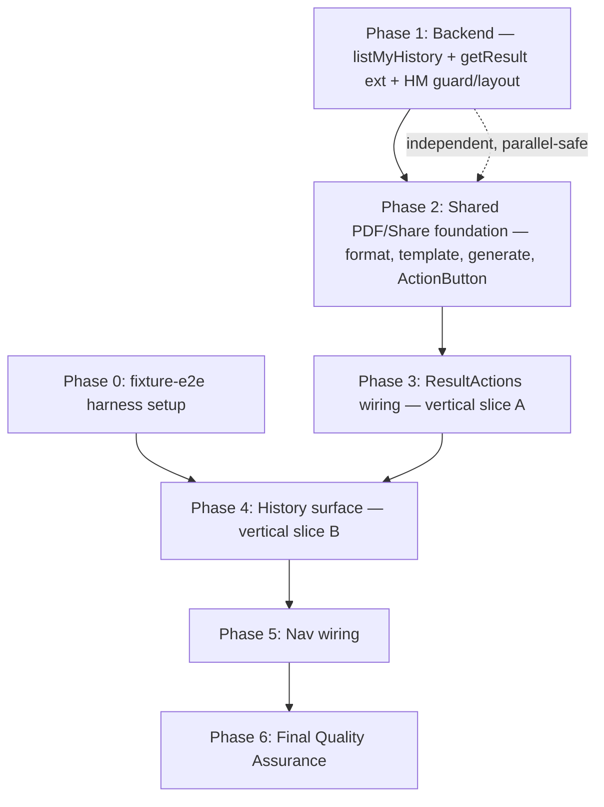
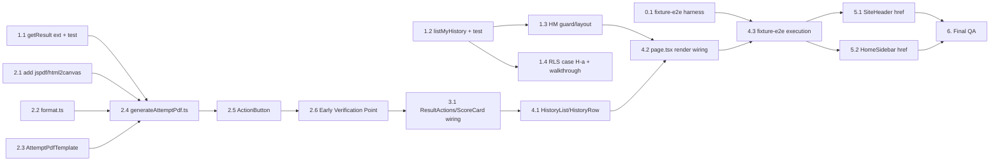

# Work Plan: History Feature Implementation

Created Date: 2026-07-30
Type: feature
Estimated Duration: ~5-6 days
Estimated Impact: ~20 files (PRD's own scope estimate: "12 affected files" counting merged units; this plan counts split components/formatters/tests individually — 6 backend, 12 frontend, 1 RLS-harness extension, 1 fixture-e2e skeleton fill-in)
Related Issue/PR: —
Review Scope: planned-files scope — `SOURCE/app/(HM)/queries.ts` (new), `SOURCE/app/(HM)/layout.tsx` (new), `SOURCE/app/(HM)/history/page.tsx` (new), `SOURCE/app/(HM)/history/_components/{HistoryList,HistoryRow}.tsx` (new), `SOURCE/app/(HM)/history/{loading,error}.tsx` (new), `SOURCE/app/(HM)/__tests__/history.int.test.ts`, `SOURCE/app/(layer2)/queries.ts` (extend `getResult()`), `SOURCE/app/(layer2)/__tests__/getResult.int.test.ts`, `SOURCE/components/history/ActionButton.tsx` (+`.test.tsx`), `SOURCE/lib/pdf/generateAttemptPdf.ts` (+`.test.ts`), `SOURCE/components/pdf/AttemptPdfTemplate.tsx` (+`.test.tsx`), `SOURCE/lib/history/format.ts` (+`.test.ts`), `SOURCE/app/(layer2)/_components/{ResultActions,ScoreCard,SiteHeader}.tsx`, `SOURCE/app/(layer1)/_components/HomeSidebar.tsx`, `SOURCE/app/(layer2)/exams/[id]/attempt/[attemptId]/result/page.tsx`, `SOURCE/package.json`, `SOURCE/supabase/test-rls.ts` (append case H-a), `SOURCE/tests/e2e/fixture/history.fixture.e2e.test.ts`.

## Related Documents
- Design Doc(s):
  - `docs/design/history-backend-design.md` (v1.2)
  - `docs/design/history-frontend-design.md` (v1.3)
- ADR: `docs/adr/ADR-0009-pdf-generation-library-choice.md` (Accepted)
- PRD: `docs/prd/history-prd.md` (v1.3, R1-R10 / AC-001-019)
- UI Spec: `docs/ui-spec/history-ui-spec.md` (v1.1)

**Test skeletons (generated, communicated per standard handoff):**
- integration: `SOURCE/app/(HM)/__tests__/history.int.test.ts` (`listMyHistory()` — filtering/ordering/omission/no-N+1/throw, obligations a-g), `SOURCE/app/(layer2)/__tests__/getResult.int.test.ts` (additive-extension regression, obligations a-c), `SOURCE/components/history/ActionButton.test.tsx` (4-phase state machine, obligations a-g)
- fixture-e2e: `SOURCE/tests/e2e/fixture/history.fixture.e2e.test.ts` (HE1 reserved-slot full journey History→Save/Share→View details→Result page, obligations a-f; HE2 empty-state/guest-guard, obligations a-b; HE3 list-read/PDF-generation error states, obligations a-b)
- service-integration-e2e: none provided — `e2eAbsenceReason.serviceE2e` communicated in the fixture skeleton's own header ("the only real-cross-service concern this feature has is proven by `SOURCE/supabase/test-rls.ts` case H-a, not a browser journey"); no E2E Gap Check warning applies for this lane. `test-rls.ts` case H-a (already appended as a skeleton, lines 733-801) is the required, blocking real-Postgres proof for the exams-visibility omission edge case (R-1) instead.

## Verification Strategy (from Design Doc)

### Correctness Proof Method
- **Correctness definition** (backend): (1) `listMyHistory()` returns exactly submitted+scored, RLS-visible rows, newest first, with every `MyHistoryEntry` field populated; (2) a titleless (RLS-invisible/unpublished) row is omitted, never defaulted — including the self-authored-exam-reverted-to-non-published edge case (R-1); (3) `getResult()`'s pre-existing output is byte-identical to before the change, 2 new fields correctly mapped; (4) both functions `throw` (never silently swallow) on infrastructure error; (5) the `/history` guard never fetches data for a logged-out request.
- **Correctness definition** (frontend): (1) `AttemptPdfTemplate` never renders per-question content (structural, AC-006); (2) exactly one PDF-generation call path — both `HistoryRow` and `ResultActions` import the same `generateAttemptPdfFile` (AC-007); (3) `ActionButton` is keyboard-operable and never carries the native `disabled` attribute in any phase (D4); (4) Save/Share never silently dead-end — every terminal outcome is download-started / share-sheet-opened / fallback+confirmation / `role="alert"` error; (5) `AttemptPdfTemplate` never resolves through `oklch()`/`color-mix()` (ADR-0009).
- **Verification method**: `history.int.test.ts` + `getResult.int.test.ts` (mocked-Supabase call-construction) + required, blocking `test-rls.ts` case H-a (real Postgres — the only proof of the RLS-driven omission) + required manual real-Postgres walkthrough (exams-visibility edge case) + `ActionButton.test.tsx`/`generateAttemptPdf.test.ts`/`AttemptPdfTemplate.test.tsx` (vitest node+jsdom) + static grep / `npm run build` output inspection (dynamic-import discipline) + Playwright MCP/manual cross-browser pass (Share-sheet/fallback, mid-range-Android NFR) + axe a11y audit.
- **Verification timing**: unit/integration tests written alongside each vertical slice (TDD, RED before implementation); the backend's real-Postgres walkthrough and `test-rls.ts` case H-a run before the backend slice (Phase 1) is marked done — required, blocking; the frontend's Early Verification Point gates wiring the second PDF entry point; full cross-browser Playwright/manual pass and axe audit run in the Final QA phase.

### Early Verification Point
- **First (backend, Phase 1)**: an output comparison of `getResult()` for one representative existing fixture attempt, before vs. after the additive extension. Success: `examId`/`examTitle`/`result.*`/`questions` exactly equal the pre-change fixture; `startedAt` is a non-empty string; `submittedAt` matches the mocked value (string or `null`) — no other field differs. Failure: stop and re-inspect the select diff before touching `listMyHistory()`, since its own correctness depends on the same query-shape discipline.
- **Second (frontend, Phase 2)**: generate one real PDF end-to-end via a single `ActionButton` (Save) wired temporarily into `ResultActions` only, then open the downloaded file in a PDF viewer. Success: file opens without corruption; layout matches `AttemptPdfTemplate`'s intended design at a legible, correctly-scaled size (no jsPDF `unit:"px"` doubling/halving); no `html2canvas` console error about an unsupported color function; the busy-guard visibly prevents a second concurrent generation on rapid double-click. Failure: if `html2canvas` throws an oklch/color-mix parse error, re-audit every style in `AttemptPdfTemplate`; if PDF dimensions are wrong, adjust the `unit`/`hotfixes` math against the installed jsPDF version. Do **not** proceed to wire the second entry point (`HistoryRow`) until this passes — both entry points share the identical module (AC-007).

### Proof Strategy
- **Proof obligation source**: test skeleton annotations (`@category`, `@dependency`, `@complexity`, `Primary failure mode`, `Proof obligation`) in `history.int.test.ts`, `getResult.int.test.ts`, `ActionButton.test.tsx`, `history.fixture.e2e.test.ts`, and `test-rls.ts` case H-a are the primary source. Where a covered behavior has no skeleton (`lib/history/format.ts`, `generateAttemptPdf.ts`, `AttemptPdfTemplate.tsx`'s own unit coverage, nav wiring, `ResultActions`/`ScoreCard` manual visual checks), the matching AC's primary failure mode from the two Design Docs' Acceptance Criteria sections is the fallback source.
- **Per-task propagation**: every task below that implements a claim records its Proof Obligations (per the task template) sourced from the matching skeleton block or AC, so downstream review judges whether the tests prove the claim, not merely run.

## Quality Assurance Mechanisms (from Design Doc)

| Mechanism | Enforces | Config Location | Covered Files |
|-----------|----------|-----------------|---------------|
| ESLint / Prettier / `tsc` strict | Style, formatting, types | `SOURCE/eslint.config.mjs` (repo root) | project-wide |
| Vitest (node), `app/**/*.test.{ts,tsx}` | Call-construction/query-shape correctness | `SOURCE/vitest.config.ts` | `SOURCE/app/(HM)/__tests__/history.int.test.ts`, `SOURCE/app/(layer2)/__tests__/getResult.int.test.ts` |
| RLS verification harness `test-rls.ts` | Real-Postgres RLS/aggregate behavior | `SOURCE/supabase/test-rls.ts` | `exams_select_visible` RLS + explicit `.eq("status","published")` filter (case H-a, required blocking) |
| Vitest (node), `lib/history/format.test.ts` | Pure formatter correctness | `SOURCE/vitest.config.ts` | `SOURCE/lib/history/format.ts` |
| Vitest (jsdom, `// @vitest-environment jsdom`) | Component render/state-machine/DOM-shape correctness | `SOURCE/vitest.config.ts` | `SOURCE/lib/pdf/generateAttemptPdf.test.ts`, `SOURCE/components/pdf/AttemptPdfTemplate.test.tsx`, `SOURCE/components/history/ActionButton.test.tsx` |
| `AttemptPdfTemplate` plain-hex/rgb guard test | ADR-0009's styling constraint ("not statically enforced by any linter today") | `AttemptPdfTemplate.test.tsx` | `SOURCE/components/pdf/AttemptPdfTemplate.tsx` |
| Static grep + `npm run build` output inspection | ADR-0009's dynamic-import-only discipline (no top-level `jspdf`/`html2canvas` import) | manual, run against build output | `SOURCE/app`, `SOURCE/components`, `SOURCE/lib` (PDF module scope) |
| Playwright MCP / manual pass (no CI) | Save/Share e2e, `error.tsx` retry, nav active-state, mid-range-Android QA, cross-browser Share fallback | local `npm run dev` session | `/history`, Result page |
| axe a11y audit (manual) | WCAG 2.1 AA (PRD UI Quality Metric 2) | manual, dev environment | History list, `ActionButton` phases, `ResultActions` |

## Design-to-Plan Traceability

| Design Doc | DD Section | DD Item | Category | Covered By Task(s) | Gap Status | Notes |
|---|---|---|---|---|---|---|
| docs/design/history-backend-design.md | Agreement Checklist / Scope | New `listMyHistory()` + `MyHistoryEntry` type (`(HM)/queries.ts`) | impl-target | Phase 1 Task 1.2 | covered | |
| docs/design/history-backend-design.md | Agreement Checklist / Scope | Extend `getResult()` (`started_at`/`submitted_at`) + `ExamResult` type (additive) | contract-change | Phase 1 Task 1.1 | covered | |
| docs/design/history-backend-design.md | Agreement Checklist / Scope | New `(HM)/layout.tsx` (nullable-user shell) + `(HM)/history/page.tsx` (page-level auth guard) | impl-target / connection-switching | Phase 1 Task 1.3 (guard/layout) + Phase 4 Task 4.2 (HistoryList render wiring) | covered | Split across two phases — see Phase 1 Task 1.3 note |
| docs/design/history-backend-design.md | Exams-Visibility Edge Case (explicit decision) | Omit-silently rule: `exams_select_visible` RLS AND explicit `.eq("status","published")` filter (matches `getExam()`) | verification / contract-change | Phase 1 Task 1.2 (JS assembly) + Phase 1 Task 1.4 (real-Postgres proof) | covered | Risk R-1 |
| docs/design/history-backend-design.md | Minimal Surface Alternatives (Element A) | Flat `MyHistoryEntry` (not per-row `getResult()` reuse, not bare-IDs) | contract-change | Phase 1 Task 1.2 | covered | |
| docs/design/history-backend-design.md | Minimal Surface Alternatives (Element B) | Raw `startedAt`/`submittedAt` on `ExamResult` (not a backend-formatted label) | contract-change | Phase 1 Task 1.1 | covered | |
| docs/design/history-backend-design.md | Data Representation Decision | New type `MyHistoryEntry`; extend `ExamResult` (not `ScoreResult`) | contract-change | Phase 1 Task 1.1 / 1.2 | covered | |
| docs/design/history-backend-design.md | Field Propagation Map | snake_case rows → camelCase `MyHistoryEntry`/`ExamResult`; in-memory only | contract-change | Phase 1 Task 1.1 / 1.2 | covered | |
| docs/design/history-backend-design.md | Security Considerations | Guard runs strictly before `listMyHistory()`; RLS is authoritative scoping, no new policy | verification | Phase 1 Task 1.3 | covered | |
| docs/design/history-backend-design.md | Test Boundaries / RLS suite | Case H-a, required blocking | verification | Phase 1 Task 1.4 | covered | |
| docs/design/history-backend-design.md | Integration Verification Points | Real-Postgres exams-visibility walkthrough (attempt+score as own author, revert status, confirm omission) | verification | Phase 1 Task 1.4 | covered | |
| docs/design/history-backend-design.md | Migration Strategy | None — zero DDL | prerequisite | Phase 1 Task 1.2 | covered | Confirmed, no task needed beyond noting it |
| docs/design/history-frontend-design.md | Agreement Checklist / Scope | `jspdf`/`html2canvas` added to `package.json`, dynamic-import only | prerequisite | Phase 2 Task 2.1 | covered | |
| docs/design/history-frontend-design.md | Agreement Checklist / Scope | `SOURCE/lib/history/format.ts` (shared formatters) | impl-target | Phase 2 Task 2.2 | covered | |
| docs/design/history-frontend-design.md | Agreement Checklist / Scope | `AttemptPdfTemplate.tsx` (plain-hex/rgb only, ADR-0009) | impl-target | Phase 2 Task 2.3 | covered | |
| docs/design/history-frontend-design.md | Agreement Checklist / Scope | `generateAttemptPdf.ts` (`AttemptPdfData`, `generateAttemptPdfFile`, `downloadPdfFile`, `canShareFile`) | impl-target | Phase 2 Task 2.4 | covered | |
| docs/design/history-frontend-design.md | Agreement Checklist / Scope | `ActionButton.tsx` (shared Save/Share atom) | impl-target | Phase 2 Task 2.5 | covered | |
| docs/design/history-frontend-design.md | Minimal Surface Alternatives (Element 1) | `ActionButton`'s `action` mode + `pdfInput` object prop (not 4 primitives, not 2 components) | contract-change | Phase 2 Task 2.5 | covered | |
| docs/design/history-frontend-design.md | Minimal Surface Alternatives (Element 2) | One shared `lib/history/format.ts` (not duplicated per call site) | contract-change | Phase 2 Task 2.2 | covered | |
| docs/design/history-frontend-design.md | Minimal Surface Alternatives (Element 3) | `ScoreCard.completionTimeLabel: string` (pre-formatted, not raw timestamps) | contract-change | Phase 3 Task 3.1 | covered | |
| docs/design/history-frontend-design.md | Minimal Surface Alternatives (Element 4) | One shared PDF module pair (AC-007 hard cardinality constraint) | contract-change | Phase 2 Task 2.4 / 2.5 + Phase 3 Task 3.1 + Phase 4 Task 4.1 | covered | |
| docs/design/history-frontend-design.md | State Transitions (`ActionButton` phase machine) | idle/busy/error/fallback-confirmed machine + DOM-shape invariant (D2 fix) | impl-target | Phase 2 Task 2.5 | covered | |
| docs/design/history-frontend-design.md | Security Considerations | `AttemptPdfData` fields from already-RLS-scoped reads only; `examTitle` rendered as plain text, no injection surface; object URL revoked immediately | verification | Phase 2 Task 2.4 / 2.5 | covered | |
| docs/design/history-frontend-design.md | Agreement Checklist / Scope | Rewire `ResultActions.tsx` (remove disabled placeholder, wire `ActionButton` x2) | contract-change | Phase 3 Task 3.1 | covered | |
| docs/design/history-frontend-design.md | Agreement Checklist / Scope | Extend `ScoreCard.tsx` (+`completionTimeLabel`) + `result/page.tsx` (compute `pdfInput`/`completionTimeLabel`) | contract-change | Phase 3 Task 3.1 | covered | |
| docs/design/history-frontend-design.md | Interface Change Impact Analysis | `ResultActions`/`ScoreCard` new required props, no wrapper needed (single caller each) | contract-change | Phase 3 Task 3.1 | covered | |
| docs/design/history-frontend-design.md | Agreement Checklist / Scope | `HistoryList`/`HistoryRow` + `(HM)/history/{loading,error}.tsx` | impl-target | Phase 4 Task 4.1 | covered | |
| docs/design/history-frontend-design.md | Agreement Checklist / Scope | `+1 import +1 render line` into backend-authored `history/page.tsx` | connection-switching | Phase 4 Task 4.2 | covered | |
| docs/design/history-frontend-design.md | Agreement Checklist / Scope | Nav wiring: `SiteHeader.tsx`/`HomeSidebar.tsx` `href="#"` → `href="/history"` | connection-switching | Phase 5 Task 5.1 / 5.2 | covered | |
| docs/design/history-frontend-design.md | Bundle-Size / Dynamic-Import Verification | Static grep (zero top-level `jspdf`/`html2canvas` imports) + `npm run build` First-Load-JS inspection | verification | Phase 6 Final QA | covered | Also spot-checked at Phase 2 Task 2.4 |
| docs/design/history-frontend-design.md | Verification Strategy / Early Verification Point | Real PDF generated via `ResultActions`-wired `ActionButton`, opened and inspected | verification | Phase 2 Task 2.6 | covered | |

## Reference Contract Values

| Design Doc (§ Section) | Contract Type | Required Observable Value (verbatim) | Covered By Task(s) |
|---|---|---|---|
| docs/design/history-frontend-design.md (§ Data Contracts — `lib/history/format.ts`) | derived-display | `"Contract: buildPdfFilename... Output: Type: string, \"{slug}_{YYYYMMDD}.pdf\" per UI Spec D2 ... slug is lowercase, non-alphanumeric runs collapsed to single hyphens, <=60 chars, no leading/trailing hyphen; empty/whitespace title -> slug \"exam\"; null/unparseable submittedAt -> date stamp falls back to the current date"` | Phase 2 Task 2.2 |
| docs/design/history-frontend-design.md (§ Data Contracts — `lib/history/format.ts`) | derived-display + state-lifecycle-negative | `"Contract: formatCompletionTime... Output: Type: string — \"Hh Mm\" (>=60min), \"Mm Ss\" (>=60s, <60min), \"Ss\" (<60s), per UI Spec HistoryRow format spec Guarantees: never throws; returns \"—\" when submittedAt is null, unparseable, or the computed diff is negative"` | Phase 2 Task 2.2, Phase 3 Task 3.1, Phase 4 Task 4.1 |
| docs/design/history-frontend-design.md (§ Data Contracts — `lib/history/format.ts`) | derived-display + state-lifecycle-negative | `"Contract: formatSubmittedDate... Output: Type: string, \"DD/MM/YYYY\" ... Guarantees: never throws; returns \"—\" for null or an unparseable date"` | Phase 2 Task 2.2 |
| docs/design/history-backend-design.md (§ Exams-Visibility Edge Case — Explicit Decision) | state-lifecycle-negative | `"Decision: omit the row silently... A row whose exam_id has no matching title in that lookup is dropped from the returned array entirely; no placeholder title, no partial row."` | Phase 1 Task 1.2, Phase 1 Task 1.4 |
| docs/design/history-frontend-design.md (§ State Transitions — `ActionButton` phase machine) | state-lifecycle-negative | `"The fallback-confirmed → idle-on-navigate-away transition needs no explicit code: the confirmation is plain component state (useState), not persisted storage, so it naturally disappears on unmount/reload — which already matches D1's 'persists until next activation on that row, no auto-dismiss timer' requirement"` | Phase 2 Task 2.5 |
| docs/design/history-backend-design.md (§ Acceptance Criteria — AC-016) | state-lifecycle-negative | `"Given a logged-out visitor, when they navigate to /history, then history/page.tsx's guard redirects to /?auth=signin before listMyHistory() is ever called (zero attempt rows fetched)."` | Phase 1 Task 1.3 |

## Failure Mode Checklist

| Category | Applies? | Covered By Task(s) |
|---|---|---|
| same-value | no | — (read-only feature; PDF generation is deterministic-by-filename but performs no persisted write to compare against) |
| no-op | yes | Phase 2 Task 2.5 (`busyRef` guard — repeat click while busy is a no-op, AC-010) |
| empty input | yes | Phase 1 Task 1.2 (`listMyHistory()` resolves `[]`, AC-002) + Phase 4 Task 4.1 (`HistoryList` empty state) |
| invalid option | no | — (no user-selectable enum/filter/sort input exists in this feature's MVP scope; R10 pagination/filtering deferred) |
| missing config | no | — (no new env var, feature flag, or config entry introduced) |
| unavailable boundary | yes | Phase 2 Task 2.5 (`navigator.share` unsupported → fallback, AC-012) + Phase 1 Task 1.2/1.4 + Phase 4 Task 4.1 (DB/network failure → throw → `error.tsx`, AC-019) |
| shared-state dependency | yes | Phase 1 Task 1.2 / 1.4 (exam's `status`, mutated independently by its author, changes what the attempting user's History list may show) |
| rollback-only visibility | yes | Phase 1 Task 1.2 / 1.4 (self-authored exam reverted away from `'published'` must lose History visibility, not remain stale-visible) |
| missing-sort-key ordering | yes | Phase 1 Task 1.2 (ordering by `submitted_at desc` relies on Assumed Behavior #2 — `submitted_at` guaranteed non-null for every matched row; obligation (c)) |

## UI Spec Component → Task Mapping

| UI Spec Component (section heading) | States to Cover | Covered By Task(s) | Gap Status | Notes |
|---|---|---|---|---|
| Component: SiteHeader (nav extension) | Default | Phase 5 Task 5.1 | covered | |
| Component: HomeSidebar (nav extension) | Default | Phase 5 Task 5.2 | covered | |
| Component: HistoryList | Default / Loading / Empty / Error | Phase 4 Task 4.1 | covered | Loading/Error via `loading.tsx`/`error.tsx` (D7) |
| Component: HistoryRow | Default / Partial (missing completion time → "—") | Phase 4 Task 4.1 | covered | |
| Component: ActionButton | Default / Loading / Error / Partial (Share fallback) | Phase 2 Task 2.5 | covered | Empty N/A per UI Spec (button always has a default) |
| Component: ResultActions (rewired) | Default (mirrors ActionButton matrix, x2 instances) | Phase 3 Task 3.1 | covered | |
| Component: ScoreCard (extended) | Default / Partial (missing timestamp → "—") | Phase 3 Task 3.1 | covered | |
| Component: AttemptPdfTemplate | Default / Partial (unavailable field → "—") | Phase 2 Task 2.3 | covered | Never mounted for user visibility |

## ADR Bindings

| ADR | Source Section | Axis | Binding Decision | Covered By Task(s) |
|---|---|---|---|---|
| docs/adr/ADR-0009-pdf-generation-library-choice.md | Implementation Guidance | placement | `jspdf`/`html2canvas` dynamically imported only inside the Save/Share handler body — never a top-level import of any page/layout/component | Phase 2 Task 2.1 (dependency add) + Task 2.4 (`generateAttemptPdf.ts`) |
| docs/adr/ADR-0009-pdf-generation-library-choice.md | Implementation Guidance | contract_schema | `AttemptPdfTemplate`'s styles must resolve exclusively to plain hex/rgb(a) — no `components/ui/button.tsx`, no Tailwind slash-opacity/`color-mix` utility, anywhere in that subtree | Phase 2 Task 2.3 |
| docs/adr/ADR-0009-pdf-generation-library-choice.md | Implementation Guidance | data_flow | Both Save and Share must derive from one `Blob`-producing call, not two separate generation paths | Phase 2 Task 2.4 |
| docs/adr/ADR-0009-pdf-generation-library-choice.md | Implementation Guidance | dependency_direction | Enforce the single-implementation requirement (AC-007) structurally — both `HistoryRow` and `ResultActions` import the same module; no second, parallel PDF-generation path may form | Phase 2 Task 2.4 / 2.5 + Phase 3 Task 3.1 + Phase 4 Task 4.1 |
| docs/adr/ADR-0009-pdf-generation-library-choice.md | Decision | persistence | No server, database, or RLS impact — generation is entirely client-side; no new route, endpoint, or backend service | Phase 2 Task 2.4 |

## Objective
Ship a `/history` page listing every completed+scored exam attempt for the logged-in student, plus one shared, client-side PDF-generation module (score/time/exam-metadata summary only) consumed identically by History rows and the existing Result page's now-enabled Save/Share buttons.

## Background
`exam_attempts`/`exam_results` already store everything needed, but no page lists past attempts, and the Result page's Save/Share buttons render permanently `disabled` ("coming soon"). This plan turns the backend/frontend Design Docs, ADR-0009, and the UI Spec into an ordered, verifiable implementation sequence.

## Risks and Countermeasures

### Technical Risks
- **Risk (R-1, backend)**: `exams_select_visible` RLS + the explicit `.eq("status","published")` title-lookup filter could silently omit a History row for an exam that later became invisible/unpublished, including the self-authored-and-later-unpublished edge case.
  - **Impact**: A user perceives a "missing" History entry.
  - **Countermeasure**: Documented decision (omit silently, symmetric with `getResult()`/`getExam()`); required, blocking `test-rls.ts` case H-a + required manual real-Postgres walkthrough before Phase 1 is done (Phase 1 Task 1.4).
- **Risk (R-2, backend)**: `getResult()`'s extension regresses either of its 2 existing consumers if not strictly additive.
  - **Impact**: Breaks the already-shipped Result page for every user.
  - **Countermeasure**: Output Comparison as the Early Verification Point (Phase 1 Task 1.1), before `listMyHistory()` proceeds.
- **Risk (frontend)**: `html2canvas` throws/mis-renders on any `oklch()`/`color-mix()` style inside `AttemptPdfTemplate` — "not statically enforced by any linter today" (ADR-0009).
  - **Impact**: PDF generation fails for every Save/Share.
  - **Countermeasure**: Inline literal-hex/rgba styles only (no Tailwind class in that file) + automated jsdom guard test + the Early Verification Point's real-browser check (Phase 2 Tasks 2.3/2.6).
- **Risk (frontend)**: Real-device PDF-generation latency on mid-range Android is unmeasured until manual QA.
  - **Impact**: Feature feels sluggish/unusable on the target hardware baseline.
  - **Countermeasure**: Summary-only DOM (small rasterized surface); busy state covers the wait; manual mid-range-Android pass before ship (Phase 6).
- **Risk (frontend)**: `navigator.share()` user-cancellation (`AbortError`) misclassified as a generation failure.
  - **Impact**: A user who simply closes the share sheet sees a false error.
  - **Countermeasure**: Explicit `AbortError` branch in `ActionButton`'s handler (Phase 2 Task 2.5, obligation d).
- **Risk (frontend)**: `@base-ui/react`'s `TooltipTrigger` may not forward `onClick` directly; jsPDF's `unit:"px"` scaling behavior is unverified against the installed version.
  - **Impact**: `ActionButton`'s click guard doesn't fire, or the generated PDF is mis-scaled.
  - **Countermeasure**: Documented `render` escape hatch identified in advance; both risks resolved at the Early Verification Point (Phase 2 Task 2.6) before the second entry point is wired.

### Schedule Risks
- **Risk**: The PDF pipeline (Phase 2) is the highest-complexity, most novel piece with no in-repo precedent.
  - **Impact**: Could stall the two dependent vertical slices (Phases 3-4).
  - **Countermeasure**: Foundation-first ordering (frontend DD's own Hybrid approach) with a hard-blocking Early Verification Point before either consumer is wired, surfacing defects once instead of twice.

## Implementation Phases

This plan combines the backend DD's **Vertical Slice** approach (Phase 1, two independently-shippable units built together) with the frontend DD's **Hybrid** approach (Phases 2-5: foundation-first, then two vertical wire-ups, then nav) — Option C (Hybrid) of the plan template, matching each Design Doc's own Implementation Approach Decision.

### Phase Structure Diagram

### Task Dependency Diagram

---

### Phase 0: Fixture-e2e Harness Setup (Estimated commits: 1)
**Purpose**: Stand up the environment prerequisites the fixture-e2e skeleton (`history.fixture.e2e.test.ts`) needs before it can run — the skeleton itself notes this repo has no existing request/route-mocking layer (no MSW, no test-mode query override).

#### Tasks
- [ ] **Task 0.1** — Build fixture data + a mock/override boundary for `listMyHistory()`/`getResult()`/`getCurrentUser()` (empty-list profile, null-user profile, error-throwing profile, valid multi-row profile), and confirm the Playwright MCP driver pattern against `SOURCE/tests/e2e/fixture/rating.fixture.e2e.test.ts`'s established structural-subset-of-Playwright's-Page/Locator-API style. `@category: e2e-setup` `@lane: fixture-e2e`.
  - Files: fixture data module under `SOURCE/tests/e2e/fixture/` (new, naming at implementer's discretion, mirroring the rating fixture's convention).
  - Completion: **Implementation** — fixture profiles exist and are importable by the harness. **Quality** — no lint/type errors. **Integration** — confirmed loadable by a throwaway Playwright MCP session against `npm run dev` with the override boundary intercepting all three query functions.

#### Phase Completion Criteria
- [ ] Fixture data + mock boundary exist and are proven loadable before Phase 4's fixture-e2e execution task depends on them.

---

### Phase 1: Backend — `listMyHistory()` + `getResult()` Extension + `(HM)` Guard/Layout (Estimated commits: 3)
**Purpose**: First vertical slice (backend DD) — proves the read-only data layer is correct and RLS-safe before any UI is built.
**Verification**: Early Verification Point #1 (Output Comparison) + required, blocking RLS proof (Task 1.4).

#### Tasks
- [x] **Task 1.1** — Extend `getResult()` (`SOURCE/app/(layer2)/queries.ts:317-320,370`): add `started_at, submitted_at` to the `exam_attempts` select; extend `ExamResult` type with `startedAt: string`, `submittedAt: string | null`. Implement `SOURCE/app/(layer2)/__tests__/getResult.int.test.ts` (currently a skeleton with no import/describe blocks — add both alongside the real code change, Red→Green in one commit).
  - Depends on: none (zero DB dependency, can start immediately).
  - Proof Obligations (from skeleton): (a) mock invoked with `.select("exam_id, started_at, submitted_at")`; (b) Output Comparison — pre-existing sub-object `{examId, examTitle, result, questions}` `toEqual` an independently-authored fixture; `startedAt` non-empty string; `submittedAt` matches non-null fixture case; (c) null-`submittedAt` path — `ExamResult.submittedAt === null` exactly, key present via `hasOwnProperty`.
  - Completion: **Implementation** — select + type extended per Data Contracts. **Quality** — `getResult.int.test.ts` all 3 obligations green; `tsc`/lint clean. **Integration** — Early Verification Point #1 passed (see Verification Strategy above) before Task 1.2 proceeds.
- [x] **Task 1.2** — Create `SOURCE/app/(HM)/queries.ts`: `MyHistoryEntry` type + `listMyHistory()` (3 sequential batched selects: `exam_results` → `exam_attempts` (`.in().eq("status","submitted").order("submitted_at",{ascending:false})`) → `exams` (`.in().eq("status","published")`), matching `getExam()`'s explicit-filter convention, not RLS alone). Implement `SOURCE/app/(HM)/__tests__/history.int.test.ts` (skeleton, no import/describe blocks yet — add both with the real code, Red→Green in one commit).
  - Depends on: none (independent of Task 1.1, reads only existing tables — can run in parallel).
  - Proof Obligations (from skeleton, obligations a-g): (a) AC-001 in-progress attempt never leaks in; (b) AC-002 empty-results early-return, `[]`, zero calls to the other 2 tables; (c) AC-003 `.order("submitted_at",{ascending:false})` call args; (d) AC-004/005 field completeness (`attemptId`/`examId`/`examTitle`/`totalScore`/`startedAt`/`submittedAt` all populated, literal-value asserted); (e) Exams-Visibility Edge Case JS-assembly omission (titleless row dropped, not defaulted); (f) no-N+1 — `exams` table's mocked `.from` invoked exactly once regardless of row count; (g) AC-019 — a simulated error at any of the 3 steps rejects, never resolves partial/`[]`.
  - Completion: **Implementation** — function + type match Data Contracts yaml exactly. **Quality** — all 7 obligations green; `tsc`/lint clean. **Integration** — verified against Task 1.4's real-Postgres proof for obligation (e)'s RLS half.
- [x] **Task 1.3** — Create `SOURCE/app/(HM)/layout.tsx` (nullable-user `SiteHeader` shell, no redirect — mirrors `(layer3)/layout.tsx`/`(layer4)/layout.tsx` structurally) and `SOURCE/app/(HM)/history/page.tsx` (page-level auth guard: `getCurrentUser()` + `redirect("/?auth=signin")` before any fetch, mirroring `(layer4)/upload/page.tsx:8-10`; then calls `listMyHistory()`).
  - Depends on: Task 1.2 (calls `listMyHistory()`).
  - **Note**: the backend DD's own code sample has `history/page.tsx` return `<HistoryList entries={entries} />`, but `HistoryList` doesn't exist until Phase 4. To keep the build green through Phases 1-3, this task creates the guard + fetch with a temporary minimal render (e.g. return `null` or a placeholder), and Phase 4 Task 4.2 adds the real `HistoryList` import + render line (matching the frontend DD's own stated scope: "one line added to backend-authored `history/page.tsx`").
  - Proof Obligations: AC-016 — guest guard redirects to `/?auth=signin` **before** `listMyHistory()` is ever called (zero attempt rows fetched); manually verified (no existing automated test for this exact guard pattern, matching the untested `(layer4)/upload/page.tsx` precedent — noted, not a gap).
  - Completion: **Implementation** — guard + layout match the backend DD's Auth Guard and Layout code exactly. **Quality** — `tsc`/lint clean. **Integration** — manual `npm run dev` hit of `/history` as a guest confirms redirect with zero fetch (browser network tab / log inspection).
- [🔄] **Task 1.4** — **Required, blocking**: fill in and run `SOURCE/supabase/test-rls.ts` case H-a (skeleton comment block, lines 733-801 — needs `setupHistoryFixtures`/`cleanupHistoryFixtures` mirroring the existing Rating fixture pattern, plus the seed/action/assert steps described). Also perform the required manual real-Postgres walkthrough (Integration Verification Points): as a seeded user who is both author and attempter of an exam, attempt+score it, revert its `status` away from `'published'` via the SQL Editor, confirm the History row disappears from `listMyHistory()`'s output AND `getResult()`/`getExam()` also return `null`/404 for that same attempt.
  - Depends on: Task 1.2 (validates the same query shape against real Postgres).
  - Proof Obligation: `userA.from("exams").select("id").in("id",[examId]).eq("status","published")` resolves to `data.length === 0` after the author reverts status — proving the omission is RLS+filter-driven, not application-code-driven (R-1).
  - Completion: **Implementation** — case H-a code written per the skeleton's Setup/Action/Expected-result blocks. DONE. **Quality** — `cd SOURCE && npx tsx supabase/test-rls.ts` exits 0 (all assertions pass, including H-a). DONE — verified across 2 full runs plus a RED/GREEN differential probe confirming the genuine pre-existing gap (RLS's `OR author_id=auth.uid()` clause alone resolves 1 row; the explicit `.eq("status","published")` filter closes it to 0). **Integration** — manual walkthrough performed at least once; both `listMyHistory()` and `getResult()`/`getExam()` confirmed to agree for the reverted exam. **NOT DONE** — no browser/UI-automation tool was available in the session that closed the Implementation/Quality items; substituted with a direct real-Postgres probe reproducing `getExam()`'s/`getResult()`'s exact query shapes as the seeded user post-revert (both resolve `null`/would-resolve-`null`), which confirms the DB-layer symmetry claim (rationale point 5) but does not exercise the actual UI/HTTP path. See `docs/plans/tasks/history-work-plan-task-05.md` Investigation Notes for full detail. **Needs a follow-up pass with browser access (or a human) to close this item before Phase 1 is marked done.**

#### Phase Completion Criteria
- [x] Early Verification Point #1 (getResult Output Comparison) passed (Task 1.1, 3/3 obligations green).
- [ ] `history.int.test.ts` (7/7) and `getResult.int.test.ts` (3/3) green — Test case resolution: 10/10 items.
- [🔄] `test-rls.ts` case H-a passes on real local Postgres (DONE — 2/2 runs green); manual real-Postgres walkthrough performed once (NOT DONE — no browser tool available this session; see Task 1.4 note). **Required, blocking** — do not proceed to mark this phase done otherwise.
- [ ] `/history` guest-guard manually confirmed (redirect, zero fetch).

---

### Phase 2: Shared PDF/Share Foundation (Estimated commits: 4)
**Purpose**: Frontend DD's Hybrid Step 1 — build the shared, AC-007-constrained foundation once, verified end-to-end, before either consumer is wired.
**Verification**: Early Verification Point #2 (real generated PDF), blocking before Phase 3.

#### Tasks
- [x] **Task 2.1** — Add `jspdf`, `html2canvas` to `SOURCE/package.json` as runtime dependencies.
  - Depends on: none.
  - Completion: **Implementation** — dependencies installed. **Quality** — `npm install` succeeds, no version conflicts. **Integration** — confirmed importable via a throwaway dynamic `import()` call.
- [x] **Task 2.2** — Create `SOURCE/lib/history/format.ts` (+ `format.test.ts`, no skeleton provided — author fresh unit tests from the Data Contracts yaml): `formatSubmittedDate`, `formatCompletionTime`, `buildPdfFilename`.
  - Depends on: none (pure functions, fastest to verify).
  - Proof Obligations (AC-derived, no skeleton — see Reference Contract Values table): each formatter's documented Guarantees (never-throws, `"—"` fallback for null/unparseable/negative-diff, deterministic filename per D2's exact slug algorithm) — minimum one test per formatter's happy path + one per documented fallback condition.
  - Completion: **Implementation** — 3 functions match Data Contracts yaml exactly. **Quality** — `format.test.ts` covers happy path + every documented fallback; `tsc`/lint clean. **Integration** — consumed identically by Tasks 2.4, 3.1, 4.1 (no per-caller reformatting).
- [x] **Task 2.3** — Create `SOURCE/components/pdf/AttemptPdfTemplate.tsx` (+ `AttemptPdfTemplate.test.tsx`, no skeleton — author fresh): presentational-only, every style a literal hex/rgb(a) value, no Tailwind `className`, no `components/ui/button.tsx` import (ADR-0009).
  - Depends on: none (uses design tokens directly).
  - Proof Obligations: (a) renders with all 5 required fields (`examTitle`, `totalScore`, `submittedDateLabel`, `completionTimeLabel`, `generatedAtLabel`); (b) **plain-hex/rgb guard** — rendered inline-style output contains zero `oklch(`/`color-mix(` substrings and the component source contains zero `className` attributes (this is the QA-mechanism-mandated guard test, ADR-0009); (c) structurally contains no field capable of carrying per-question content (AC-006, verified by `AttemptPdfTemplateProps`'s type shape).
  - Completion: **Implementation** — matches the frontend DD's code excerpt. **Quality** — guard test + rendering test green; `tsc`/lint clean. **Integration** — consumed by Task 2.4's off-screen mount.
- [x] **Task 2.4** — Create `SOURCE/lib/pdf/generateAttemptPdf.ts` (+ `generateAttemptPdf.test.ts`, no skeleton — author fresh): `AttemptPdfData`, `generateAttemptPdfFile` (dynamic-import `jspdf`/`html2canvas`/`react-dom`/`react-dom/client` only inside the function body; off-screen `createRoot`+`flushSync` mount; `waitForTemplateAssets`; `html2canvas` capture; `jsPDF` assembly; `try/finally` unmount+remove), `downloadPdfFile`, `canShareFile`.
  - Depends on: Tasks 2.1, 2.2 (formatters), 2.3 (`AttemptPdfTemplate`).
  - Proof Obligations: (a) dynamic-import boundary honored (mocked module imports occur only inside the async function, never at file top level — the corresponding static-grep QA mechanism cross-checks this at Phase 6); (b) container mounted then always removed via `try/finally`, success or failure; (c) `buildPdfFilename` invoked with the right arguments and its output used as the `File` name; (d) a thrown error from any pipeline step rejects the promise (never returns a partial/corrupt `File`).
  - Completion: **Implementation** — matches the frontend DD's Deep Dive code. **Quality** — `generateAttemptPdf.test.ts` green (mocked `jsPDF`/`html2canvas`/`react-dom`); `tsc`/lint clean. **Integration** — proven for real at Task 2.6 (Early Verification Point).
- [x] **Task 2.5** — Create `SOURCE/components/history/ActionButton.tsx`. Implement the skeleton `SOURCE/components/history/ActionButton.test.tsx` (currently no import/render blocks — add both with the real component, Red→Green in one commit): `action`/`pdfInput`/`idPrefix` props; 4-phase state machine (idle/busy/error/fallback-confirmed); synchronous `busyRef` guard; `attemptShare` helper (native share / `canShareFile`-false fallback / `AbortError`-as-success); error/status text nested as a button descendant (never a sibling) to preserve the DOM-shape invariant.
  - Depends on: Task 2.4 (imports `generateAttemptPdfFile`/`downloadPdfFile`/`canShareFile`).
  - Proof Obligations (from skeleton, obligations a-g): (a) AC-010 — 2 rapid clicks while busy invoke `generateAttemptPdfFile` at most once; (b) AC-011 — native share path calls `navigator.share({files:[file]})` with the exact resolved `File`, returns to idle; (c) AC-012 — `canShareFile`-false path calls `downloadPdfFile`, transitions to `fallback-confirmed`, persists until the next Save/Share click (no timer); (d) Share-cancellation — `AbortError` resolves to idle, not error; (e) AC-018 — a non-`AbortError` rejection sets error phase with `role="alert"`, button stays clickable, retry succeeds; (f) DOM-shape invariant — exactly one in-flow child per phase across all 4 phases; (g) AC-013/AC-007 tripwire — zero fetch/XHR calls, transient `URL.createObjectURL`+immediate `revokeObjectURL`, and a source-text check confirming `HistoryRow.tsx`/`ResultActions.tsx` import the identical `generateAttemptPdfFile` specifier (deferred assertion — filled in once both files exist in Phases 3-4).
  - Completion: **Implementation** — matches the frontend DD's Deep Dive code, including the D2 DOM-shape fix. **Quality** — all 7 obligations green (obligation g's cross-file check may initially assert against not-yet-existing files — acceptable to stub/skip until Phase 4, tracked as a TODO in the test); `tsc`/lint clean; WCAG D4 pattern followed (`aria-disabled`+`aria-describedby`+`Tooltip`, never native `disabled`). **Integration** — proven for real at Task 2.6.
- [x] **Task 2.6** — **Early Verification Point (blocking)**: wire one `ActionButton` (Save) temporarily into a throwaway harness page, generate one real PDF, open it in a PDF viewer. **PASSED (2026-07-31, via Playwright MCP)**: valid PDF (`%PDF-1.3` header, proper trailer), 0 console errors, busy-guard confirmed (1 download from 2 concurrent clicks), `AttemptPdfTemplate` layout visually confirmed correct (screenshot). Harness deleted, zero trace left in the repo. See `docs/plans/tasks/history-work-plan-task-11.md` for full evidence.
  - Depends on: Task 2.5.
  - Proof Obligation: see "Early Verification Point" (Second) in Verification Strategy above — file opens uncorrupted, correctly scaled, no console color-function error, busy-guard visibly works.
  - Completion: **Implementation** — n/a (verification-only task). **Quality** — success criteria all met; any failure triggers the documented Failure response before proceeding. **Integration** — this **must pass** before Phase 3 begins; both entry points share the identical module, so an undetected defect here would otherwise be silently duplicated across both.

#### Phase Completion Criteria
- [x] `format.test.ts`, `AttemptPdfTemplate.test.tsx`, `generateAttemptPdf.test.ts` green.
- [x] `ActionButton.test.tsx` 6/7 obligations green (obligation g's cross-file half deferred to Phase 4) — Test case resolution: 6/7 items (Phase 2 scope), 7/7 once Phase 4 completes.
- [x] Early Verification Point #2 passed — **required, blocking** before Phase 3. PASSED 2026-07-31.

---

### Phase 3: ResultActions Wiring — Vertical Slice A (Estimated commits: 1)
**Purpose**: First real end-to-end integration (frontend DD's simpler surface — existing page, no new route/list/loading/error scaffolding).
**Verification**: L1 — Save/Share work end-to-end on the existing Result page.

#### Tasks
- [x] **Task 3.1** — Rewire `SOURCE/app/(layer2)/_components/ResultActions.tsx` (remove `disabled` + "coming soon" tooltip; render 2 `ActionButton` instances, no wrapper element — preserves the existing sibling-buttons DOM shape). Extend `SOURCE/app/(layer2)/_components/ScoreCard.tsx` (+`completionTimeLabel: string` prop, replaces the hardcoded `"—"` Time cell). Extend `SOURCE/app/(layer2)/exams/[id]/attempt/[attemptId]/result/page.tsx` (compute `pdfInput`/`completionTimeLabel` from the now-extended `getResult()` output via `formatCompletionTime`; pass to `ResultActions`/`ScoreCard`). **PASSED (2026-07-31, live-browser pass via Playwright MCP)**: real Result page for a real submitted attempt shows a real Time value ("26s") and a working Save (valid PDF downloaded, 0 console errors); Share correctly reaches the native-share code path (resolution unverifiable headlessly — no OS share sheet in automation, not an app defect). See `history-work-plan-task-12.md` Notes.
  - Depends on: Task 1.1 (extended `getResult()`), Task 2.5 (`ActionButton`), Task 2.2 (`formatCompletionTime`).
  - Proof Obligations: AC-014 — `ResultActions`' Save/Share render as enabled `ActionButton` instances invoking identical behavior to a History row for the same attempt (no skeleton for this exact assertion — covered by manual visual check per frontend DD's own Test Boundaries, since `ResultActions`/`ScoreCard` have no existing unit-test precedent in this repo). DOM-shape preserved: `result/page.tsx`'s `grid-cols-3` (Save/Share/Return) still receives exactly 2 cells from `ResultActions` in every `ActionButton` phase (already proven generically by Task 2.5 obligation f; here confirmed specifically in this real layout via manual visual check — accessibility-tree snapshot confirmed exactly `button "Save"`/`button "Share"`/`link "Return"` as 3 siblings).
  - Completion: **Implementation** — matches the frontend DD's Before/After diff exactly. **Quality** — `tsc`/lint clean; no new automated test required beyond `ActionButton.test.tsx`'s already-covering unit logic (noted, not a gap, per frontend DD Quality Assurance Mechanisms). **Integration** — manual `npm run dev` pass PASSED: Save downloads a valid PDF, Share reaches the correct code path, on a real, already-shipped Result page; 3-cell grid layout visually unchanged.

#### Phase Completion Criteria
- [x] Result page's Save/Share work end-to-end (L1) for a real attempt. Confirmed 2026-07-31 via Playwright MCP.
- [x] `ScoreCard`'s Time stat shows a real computed value, not the placeholder `"—"` (except the genuine Partial-state fallback). Code-verified and live-browser-confirmed ("26s" on a real attempt).
- [x] 3-cell grid layout confirmed visually unchanged across idle/busy/error/fallback-confirmed. Confirmed via screenshot + accessibility-tree snapshot on the real Result page.

---

### Phase 4: History Surface — Vertical Slice B (Estimated commits: 2)
**Purpose**: Second consumer, reusing the now-proven `ActionButton`/PDF module (frontend DD Hybrid Step 3).
**Verification**: L1 — `/history` lists real rows, Save/Share work identically to Phase 3; fixture-e2e journey execution.

#### Tasks
- [x] **Task 4.1** — Create `SOURCE/app/(HM)/history/_components/{HistoryList,HistoryRow}.tsx` (list container + empty state, bounded-height scroll container per D3; one row per entry — title, `X/10` score, submitted date + completion time, 2 `ActionButton`s, "View details" link) and `SOURCE/app/(HM)/history/{loading,error}.tsx` (skeleton mirroring `(layer4)/me/exams/loading.tsx`; `error.tsx` boundary with `reset()`-wired Retry, per D7).
  - Depends on: Task 3.1 (proven `ActionButton`/formatters), Task 1.2 (`MyHistoryEntry` shape).
  - Proof Obligations: no dedicated vitest skeleton exists for these Server Components (frontend DD's own noted QA Mechanisms gap — "no precedent... verified instead via manual `npm run dev` + Playwright MCP pass", matching `ExamRow`/`MyExamsList`'s own untested precedent — not a gap requiring escalation). Covered instead by Task 4.3's fixture-e2e obligations (a) rendering, and the AC-019 rendering-half assertion (role="alert" + Retry on `error.tsx`).
  - Completion: **Implementation** — matches the frontend DD's `HistoryList`/`HistoryRow` code description and UI Spec state matrices. **Quality** — `tsc`/lint clean. **Integration** — proven at Task 4.3.
- [x] **Task 4.2** — Add the `+1 import + render line` to `SOURCE/app/(HM)/history/page.tsx` (frontend DD's own stated scope item): `import { HistoryList } from "./_components/HistoryList"` and render it with `listMyHistory()`'s entries, replacing Task 1.3's temporary placeholder.
  - Depends on: Task 1.3 (guard+fetch already exists), Task 4.1 (`HistoryList` exists).
  - Completion: **Implementation** — one import + one JSX line, matching frontend DD Agreement Checklist. **Quality** — `tsc`/lint clean, build green. **Integration** — `/history` now renders real data end-to-end.
- [x] **Task 4.3** — Fill in and execute `SOURCE/tests/e2e/fixture/history.fixture.e2e.test.ts` (currently a skeleton with no driver-interface declarations — add the Playwright MCP driver code per the obligations below, using Phase 0's fixture data/mock boundary).
  - Depends on: Task 4.2 (full `/history` render), Phase 0 Task 0.1 (fixture harness), Task 3.1 (Result page cross-surface consistency check).
  - Proof Obligations — **HE1** (reserved slot, full journey, obligations a-f): rows render newest-first with real data; Save uses only already-rendered row data; "View details" navigates to the exact attempt's Result page; `ResultActions` there shows no "coming soon"; History row and Result-page ScoreCard render textually-identical score/date/time for the same attempt (cross-surface consistency, AC-007's spirit); "History" nav shows active-highlight on return. **HE2** (obligations a-b): empty-state CTA renders for a zero-attempt fixture; guest navigation redirects to `/?auth=signin` with zero list-read calls. **HE3** (obligations a-b): simulated list-read failure renders `error.tsx`'s `role="alert"`+Retry (Retry increments the fixture call-count spy); simulated PDF-generation failure renders `role="alert"` on the specific `ActionButton`, remains retryable.
  - Completion: **Implementation** — driver code fills the skeleton per its stated Verification points/expected results. **Quality** — HE1 (a)-(e) (5/6) + HE2 (2/2) + HE3 (2/2) obligations pass; HE1(f) recorded expected-pending (SiteHeader's History `href` still `"#"` until Phase 5) — Test case resolution: 9/10 items now, 10/10 once Task 18 re-confirms post-Phase-5. **Integration** — this is the first full-stack proof that History + Result page + nav agree end-to-end, modulo the recorded HE1(f) pending item; also completes `ActionButton.test.tsx` obligation (g)'s deferred cross-file import-specifier check (`HistoryRow.tsx`/`ResultActions.tsx` now both exist — neither imports `generateAttemptPdfFile` directly, both route through the shared `ActionButton`). Note: Task 01's own declared deliverable (`historyFixtureData.ts`) was never authored — the four fixture profiles + override-boundary contract are defined inline in `history.fixture.e2e.test.ts` instead, mirroring `rating.fixture.e2e.test.ts`'s own established inline-fixture convention (see Task 15's Investigation Notes).

#### Phase Completion Criteria
- [x] `/history` renders real rows, empty state, and error state correctly (manual + fixture-e2e).
- [x] fixture-e2e: HE1/HE2/HE3 all green — Test case resolution: 9/10 items now (HE1(f) expected-pending until Phase 5 lands; Task 18 re-confirms 10/10).
- [x] `ActionButton.test.tsx` obligation (g) fully green (7/7 total for that file, deferred half now resolved).
- [x] Cross-surface consistency confirmed: History row Save and Result-page Save produce identical score/completion-time for the same attempt (submitted date is not rendered on the Result page's `ScoreCard` — only score + completion time are common to both surfaces, see Task 15's Investigation Notes).

---

### Phase 5: Nav Wiring (Estimated commits: 1)
**Purpose**: Lowest-risk, independent, purely additive-reachability change — ordered last per the frontend DD's own Implementation Plan.
**Verification**: L1 — clicking "History" from either surface lands on `/history` with correct active-highlight.

#### Tasks
- [x] **Task 5.1** — `SOURCE/app/(layer2)/_components/SiteHeader.tsx:27`: `{ label: "History", href: "#" }` → `{ label: "History", href: "/history" }`. No other change — `isActive` (`:63-65`) already handles any real `href` (Assumed Behavior #2 / code:F3).
  - Depends on: Task 4.2 (so `/history` has something to navigate to).
  - Completion: **Implementation** — one literal-value edit. **Quality** — `tsc`/lint clean. **Integration** — manual click-through confirms navigation + active-highlight on any `/history*` route.
- [x] **Task 5.2** — `SOURCE/app/(layer1)/_components/HomeSidebar.tsx:22`: `{ label: "History", href: "#" }` → `{ label: "History", href: "/history" }`. No `activeLabel` logic change (D5 — `HomeSidebar` never renders while a user is "on" `/history`, confirmed via Assumed Behavior #1/code:F4).
  - Depends on: Task 4.2.
  - Completion: **Implementation** — one literal-value edit. **Quality** — `tsc`/lint clean. **Integration** — manual click-through from the homepage sidebar confirms navigation to `/history`.

#### Phase Completion Criteria
- [x] AC-015 confirmed for both nav entries: 0 remaining `href="#"` "History" entries (PRD Success Criteria #5). Confirmed 2026-07-31 via grep (both files) + live click-through on both surfaces (Playwright MCP): `SiteHeader` shows the active-highlight (brand-red + underline) on `/history`; `HomeSidebar`'s click from `/` lands correctly on `/history`.

---

### Final Phase: Quality Assurance (Required) (Estimated commits: 1)

**Purpose**: Cross-cutting quality assurance and Design Doc consistency verification across the whole feature.

#### Tasks
- [x] Verify all Design Doc acceptance criteria achieved: backend AC-001/002/003/004/005/009/016/017/019; frontend AC-002/004-015/018-019; PRD Success Criteria 1-5 (list-scope correctness, single PDF implementation, guest access blocked, Share fallback coverage, nav wiring complete). All confirmed via implementation + test evidence, see `history-work-plan-task-18.md`.
- [x] Security review: no schema/RLS change introduced (confirmed via `git diff` against `SOURCE/supabase/schema.sql` — should show no changes); guard-before-fetch ordering re-confirmed; no public/unauthenticated link ever created (AC-013, re-confirmed via `ActionButton.test.tsx` obligation g + manual Share-flow network inspection). All confirmed clean.
- [x] Quality checks: ESLint/Prettier/`tsc` strict across all touched files (types, formatting, style). 0 errors.
- [x] Bundle-size / dynamic-import discipline (ADR-0009): `grep -rn "from \"jspdf\"\|from 'jspdf'\|from \"html2canvas\"\|from 'html2canvas'" SOURCE/app SOURCE/components SOURCE/lib` returns zero matches; `npm run build` output shows `/history` and the Result route's First Load JS with no large jump versus a comparable route (e.g. `/exams`). Confirmed: +0.7%/+0.3% only.
- [x] Execute all tests: full vitest suite (`history.int.test.ts`, `getResult.int.test.ts`, `format.test.ts`, `generateAttemptPdf.test.ts`, `AttemptPdfTemplate.test.tsx`, `ActionButton.test.tsx`) + `cd SOURCE && npx tsx supabase/test-rls.ts` (full run, including case H-a) + `history.fixture.e2e.test.ts` (re-confirm HE1/HE2/HE3 green after nav wiring lands). 285/285 vitest pass; RLS harness exits 0; HE1(f)'s stale assertion found+fixed.
- [x] Cross-browser Playwright MCP/manual pass across the PRD's named matrix (desktop Chrome/Firefox, mobile Chrome/Android, mobile Safari/iOS) for the Share fallback (PRD Success Criteria #4 — desktop Firefox specifically). **Partial**: only Chromium was actually exercisable (no real Firefox/Safari/Android engine in this environment) — Chromium pass fully green (real PDF, real Share code path); Firefox/Safari/real-mobile passes are a genuine, disclosed residual.
- [x] Manual mid-range-Android pass for PDF-generation latency (PRD NFR Performance, ADR-0009 known-unknown). **Approximated** via 360×740 viewport + CDP 4x CPU throttle (no real device available): 2.15s desktop-rate → 9.2s throttled, both successful with correct busy-state UI throughout.
- [x] axe a11y audit: 0 serious/critical issues on the History list and Save/Share controls on both surfaces, plus a manual keyboard pass with 0 unreachable interactive elements (PRD UI Quality Metric 2). **1 serious finding (color-contrast), confirmed pre-existing/site-wide, not a History regression** — escalated, not silently fixed (see Task 18 Notes). Keyboard pass: 0 unreachable elements, confirmed real Enter-key PDF generation.
- [x] Coverage check (diagnostic, not a gate per testing-principles — confirm no untested critical path was missed, particularly the Exams-Visibility Edge Case and the `ActionButton` state machine). No gap found.
- [x] Document updates: none required to PRD/UI Spec/Design Docs/ADR (all Draft/Accepted as-is); this work plan's checkboxes are the only living progress record. Confirmed — the 2 escalated pre-existing findings are tracked as follow-ups, not doc changes.

### Quality Assurance
- [x] Quality check (staged)
- [x] All tests pass — 285/285 vitest + full RLS harness (incl. case H-a)
- [x] Static check pass — `tsc --noEmit` clean
- [x] Lint check pass — `eslint` clean on all touched files
- [x] Build success — `npm run build` green

## Completion Criteria
- [x] All phases (0-6) completed
- [x] All integration/fixture-e2e tests passing: `history.int.test.ts` (9/9), `getResult.int.test.ts` (3/3), `ActionButton.test.tsx` (8/8), `format.test.ts`/`generateAttemptPdf.test.ts`/`AttemptPdfTemplate.test.tsx` (all green), `history.fixture.e2e.test.ts` (HE1 6/6 — incl. the now-fixed HE1(f) — HE2 2/2, HE3 2/2)
- [x] `test-rls.ts` case H-a passes on real local Postgres (required, blocking) — 0 unresolved
- [x] Design Doc acceptance criteria satisfied (see Final Phase task 1)
- [x] Staged quality checks completed (zero errors)
- [x] All tests pass
- [x] Necessary documentation updated (none required beyond this plan; 2 pre-existing findings escalated as follow-ups, not doc edits)
- [ ] User review approval obtained — pending user sign-off on this summary

## Progress Tracking
### Phase 0
- Start: 
- Complete: 
- Notes: 

### Phase 1
- Start: 
- Complete: 
- Notes: 

### Phase 2
- Start: 
- Complete: 
- Notes: 

### Phase 3
- Start: 
- Complete: 
- Notes: 

### Phase 4
- Start: 
- Complete: 
- Notes: 

### Phase 5
- Start: 
- Complete: 
- Notes: 

### Final Phase
- Start: 
- Complete: 
- Notes: 

## Notes
- Both E2E lanes accounted for: fixture-e2e has a provided skeleton (Phase 0/4); service-integration-e2e is intentionally absent with a communicated reason (`e2eAbsenceReason.serviceE2e`) — its real-cross-service concern (R-1) is instead proven by `test-rls.ts` case H-a (Phase 1 Task 1.4). No E2E Gap Check warning applies to either lane.
- Task 1.3's temporary-placeholder note (backend `history/page.tsx` referencing a not-yet-existing `HistoryList`) is the one build-ordering subtlety across phases — resolved explicitly in that task's description so the executor isn't blocked.
- `ActionButton.test.tsx` obligation (g)'s cross-file import-specifier check spans Phase 2 (component exists) through Phase 4 (both call sites exist) — tracked explicitly in both tasks' Proof Obligations so it isn't dropped between phases.
