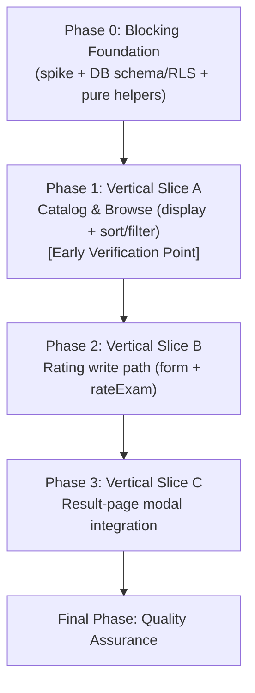
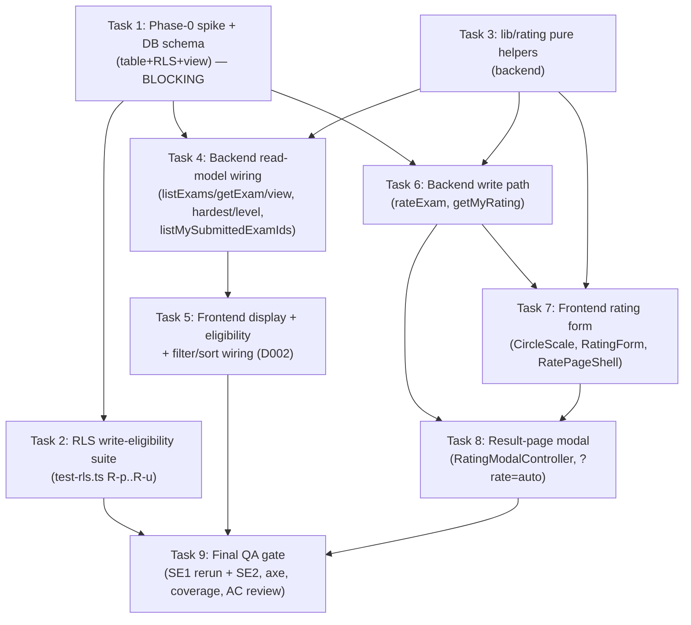

# Work Plan: Rating System (Exam Difficulty Rating) Implementation

Created Date: 2026-07-24
Type: feature
Estimated Duration: ~5-7 days
Estimated Impact: ~24 files (2 existing DB/query files, 6 existing frontend files, ~14 new files, 2 test-suite files)
Related Issue/PR: —
Review Scope: planned-files scope — `SOURCE/supabase/schema.sql`, `SOURCE/supabase/test-rls.ts`, `SOURCE/app/(layer2)/queries.ts`, `SOURCE/app/(layer2)/actions.ts`, `SOURCE/types/exam.ts`, `SOURCE/lib/rating/**` (new), `SOURCE/components/rating/**` (new), `SOURCE/app/(layer2)/_components/{ExamCard,ExamBrowser,ExamFilters}.tsx`, `SOURCE/app/(layer2)/_components/rating/**` (new), `SOURCE/app/(layer2)/exams/page.tsx`, `SOURCE/app/(layer2)/exams/[id]/page.tsx`, `SOURCE/app/(layer2)/exams/[id]/rate/page.tsx` (new), `SOURCE/app/(layer2)/exams/[id]/attempt/[attemptId]/result/page.tsx`, `SOURCE/app/(layer2)/__tests__/rating.int.test.ts`, `SOURCE/tests/e2e/fixture/rating.fixture.e2e.test.ts`, `SOURCE/supabase/__tests__/rating.rls.service.e2e.test.ts`.

## Related Documents
- Design Doc(s):
  - `docs/design/rating-system-backend-design.md` (v1.0)
  - `docs/design/rating-system-frontend-design.md` (v1.0)
- ADR: `docs/adr/ADR-0008-exam-difficulty-rating-and-on-read-aggregation.md` (Accepted)
- PRD: `docs/prd/rating-system-prd.md` (v1.1) — both Design Docs already carry PRD ACs; not separately re-traced here
- UI Spec: `docs/design/rating-system-ui-spec.md` (v1.1) — referenced by the frontend DD as authoritative for component states/copy; not a separate input to this plan (component list below is taken from the frontend DD's own Component Hierarchy table, which already reconciles with the UI Spec)

**Test skeletons (generated, communicated per standard handoff):**
- integration: `SOURCE/app/(layer2)/__tests__/rating.int.test.ts` (3 tests: rateExam validation/upsert/error-mapping; listExams Hardest/Level query construction; RatingModalController open-condition)
- fixture-e2e: `SOURCE/tests/e2e/fixture/rating.fixture.e2e.test.ts` (FE1 reserved-slot result-page journey; FE2 Browse eligibility/sort/filter)
- service-integration-e2e: `SOURCE/supabase/__tests__/rating.rls.service.e2e.test.ts` (SE1 reserved-slot RLS write-eligibility, mirrors backend DD's `test-rls.ts` R-p…R-u — preferred implementation appends directly to `test-rls.ts`; SE2 aggregate/threshold/order/filter persistent regression)
- Both E2E lanes (fixture-e2e and service-integration-e2e) have skeletons provided — no E2E Gap Check warning applies.

## Verification Strategy (from Design Doc)

### Correctness Proof Method
- **Correctness definition** (backend): an ineligible user cannot persist a rating (DB-enforced); one editable row per user/exam; `communityDifficulty` is `null` below 3 ratings and the correct `{bucket, mean}` at/above 3; Hardest orders rated-first nulls-last deterministically; Level filter returns only in-bucket ≥3-rating exams; no `exams` write / no trigger.
- **Correctness definition** (frontend): the form persists three valid scores via `rateExam` and surfaces the discriminated error union without losing input; the modal auto-opens exactly once after a fresh submit and never re-pops on refresh; community difficulty renders exactly as the server provides it (no client re-bucketing); Hardest/Level write the agreed URL params the server consumes; the radiogroup and modal meet the WCAG 2.1 AA keyboard/AT bar.
- **Verification method**: RLS harness cases R-p…R-u against real local Postgres; vitest (node) on `lib/rating` fixtures; vitest (jsdom) on `CircleScale`/`DifficultyBadge`; the phase-0 spike + a repeated-read ordering assertion; Playwright/manual for modal focus-trap/return, `?rate=auto` idempotency, disabled-Rate AT tooltip, `prefers-reduced-motion`; schema/code inspection for the no-`exams`-write invariant.
- **Verification timing**: phase-0 spike before any read/UI build (blocking); RLS harness after every schema edit; vitest in CI; ordering/filter checks after the view lands; interaction/a11y checks per relevant UI slice; the full service-integration-e2e suite executed once more as the final gate.

### Early Verification Point
- **First verification target (Phase 0, blocking)**: the phase-0 PostgREST spike (S1-S4) against the live Supabase/PostgREST project.
- **Success criteria**: all four checks pass with a single flat select — `rating_count` counts all raters (not just the caller), `avg_overall` is NULL exactly for `rating_count < 3`, `.order('avg_overall',{ascending:false,nullsFirst:false}).order('created_at').order('id')` sinks NULL rows last with a deterministic tie-break, `.gte/.lt` range predicates exclude NULL rows from a selected bucket, and a single-id `getExam`-style read returns the correct aggregate.
- **Failure response**: adopt ADR-0008 Decision 2 option B — a Postgres RPC `list_exams_with_difficulty(...)` (+ single-id variant) exposing the identical external contract (table/RLS/`lib/rating` unchanged). If neither the view nor the RPC can express sort+filter+threshold server-side, escalate to the user before any UI work (ADR-0008 Kill criterion).
- **Second verification target (Phase 1, integration)**: the frontend DD's own Early Verification Point — the `ExamCard` stretched-link restructure with a live `RateButton` + `DifficultyBadge` on `/exams`. Success: card body still navigates to detail, `RateButton` is an independent target, the three eligibility states resolve from one per-page submitted-id set (no N+1), `DifficultyBadge` shows `Bucket · mean` for ≥3-rating exams and `—` otherwise. Failure: fall back to the UI-Spec `after:inset-0` + `relative z-10` layering before building the form shells.

### Proof Strategy
- **Proof obligation source**: test skeleton annotations (`@category`, `@dependency`, `@complexity`, `Primary failure mode`, `Proof obligation`) in the three skeleton files listed above are the primary source; where a covered behavior has no skeleton test (e.g., Phase 0 schema/RLS/spike work, which predates and gates the skeletons), each AC's primary failure mode from the two Design Docs' Acceptance Criteria sections is the fallback source.
- **Per-task propagation**: every task below that implements a claim (a rateExam guarantee, a query construction, a display rule, an eligibility gate) records its Proof Obligations (per the task template) sourced from the matching skeleton test block or AC, so downstream review judges whether the tests prove the claim, not merely run.

## Quality Assurance Mechanisms (from Design Doc)

| Mechanism | Enforces | Config Location | Covered Files |
|-----------|----------|-----------------|---------------|
| ESLint / Prettier / `tsc` strict | Style, formatting, types | project root | project-wide |
| RLS verification harness `test-rls.ts` | DB-level RLS/constraint behavior against real local Supabase | `SOURCE/supabase/test-rls.ts` | `exam_difficulty_ratings` policies + unique constraint (acceptance mechanism for PRD metrics 1, 2) |
| Vitest (node env) | Pure-function correctness | `SOURCE/vitest.config.ts` (`include: lib/**, components/**`) | `SOURCE/lib/rating/**` (bucket/mean/threshold/readout/copy helpers) |
| Vitest (jsdom, `// @vitest-environment jsdom`) | Component render/keyboard/ARIA correctness | `SOURCE/vitest.config.ts` | `SOURCE/components/rating/CircleScale.test.tsx`, `DifficultyBadge.test.tsx` |
| PostgREST capability spike | The chosen view + order/filter mechanism works on the live DB before any query/UI is built | manual, run against the live Supabase project | `exams_with_difficulty` read path (blocking phase-0 gate) |
| Playwright MCP / manual pass (no CI) | Modal focus-trap/return/`aria-live`, `?rate=auto` idempotency, disabled-Rate AT tooltip/description, `prefers-reduced-motion`, stretched-link navigation | local `npm run dev` session | Rating modal, RatePageShell, RateButton, ExamCard |
| axe a11y audit (manual, dev) | WCAG 2.1 AA (PRD UI Quality Metric 3) | manual, dev environment | Rating form (modal + standalone), RateButton states, Level filter |

## Design-to-Plan Traceability

| Design Doc | DD Section | DD Item | Category | Covered By Task(s) | Gap Status | Notes |
|---|---|---|---|---|---|---|
| docs/design/rating-system-backend-design.md | Agreement Checklist / Schema & DB Enforcement | `exam_difficulty_ratings` table + per-part `[1,10]` CHECK + `unique(exam_id,user_id)` | impl-target | Phase 0 Task 1 | covered | |
| docs/design/rating-system-backend-design.md | Schema & DB Enforcement | insert-own + update-own + select-own RLS (user_id + published EXISTS + submitted-attempt EXISTS) | impl-target | Phase 0 Task 1 | covered | Deliberate deviation from `exam_reports` (adds update-own) |
| docs/design/rating-system-backend-design.md | Schema & DB Enforcement | `exams_with_difficulty` view, NULL-below-threshold `avg_overall` | impl-target | Phase 0 Task 1 | covered | Contingent on phase-0 spike outcome (view or RPC fallback) |
| docs/design/rating-system-backend-design.md | Phase-0 Verification Spike (BLOCKING) | S1-S4 checks against live PostgREST | verification | Phase 0 Task 1 | covered | Blocking gate; first task in the plan |
| docs/design/rating-system-backend-design.md | Test Boundaries / RLS suite | R-p…R-u rating RLS cases extending `test-rls.ts` | verification | Phase 0 Task 2 | covered | Also satisfies service-integration-e2e SE1 (skeleton recommends appending directly to `test-rls.ts`) |
| docs/design/rating-system-backend-design.md | Business Logic — `SOURCE/lib/rating/` | `overall`/`bucket`/`communityDifficultyFrom`/`formatMean`/`isValidPartScore` + `RATING_MIN`/`MAX`/`THRESHOLD` | impl-target | Phase 0 Task 3 | covered | |
| docs/design/rating-system-backend-design.md | Test Boundaries / vitest | boundary + threshold-agreement fixtures | verification | Phase 0 Task 3 | covered | |
| docs/design/rating-system-backend-design.md | Agreement Checklist / Data Flow | `ExamRow`/`EXAM_COLUMNS`/`toExam` +2 fields; `listExams`/`getExam` read the view | contract-change | Phase 1 Task 4 | covered | |
| docs/design/rating-system-backend-design.md | Data Flow | `ExamSort` gains `hardest`; `ExamFilters` gains `level` | contract-change | Phase 1 Task 4 | covered | Propagates to frontend Phase 1 Task 5 |
| docs/design/rating-system-backend-design.md | Agreement Checklist | `listMySubmittedExamIds()` new read | impl-target | Phase 1 Task 4 | covered | |
| docs/design/rating-system-backend-design.md | `SOURCE/types/exam.ts` | `Exam.communityDifficulty` field | contract-change | Phase 1 Task 4 | covered | Consumed by frontend Phase 1 Task 5 |
| docs/design/rating-system-backend-design.md | Integration Verification Points | end-to-end catalog read check (rate → next read shows bucket·mean; 3rd rating flips `"—"`; Hardest orders correctly) | verification | Phase 1 Task 4 + Final QA Task 9 | covered | |
| docs/design/rating-system-backend-design.md | Data Contracts | `rateExam(examId, scores)` + `getMyRating(examId)` | impl-target | Phase 2 Task 6 | covered | |
| docs/design/rating-system-backend-design.md | Error Handling | validation/business/infrastructure error mapping to `{error?}` | verification | Phase 2 Task 6 | covered | |
| docs/design/rating-system-backend-design.md | Security Considerations | RLS authoritative; server-action precheck is UX only; `user_id` never from input | verification | Phase 0 Task 1 + Phase 2 Task 6 | covered | |
| docs/design/rating-system-backend-design.md | Logging and Monitoring | `console.error("[rateExam]", ...)` on DB error, no PII/token logging | prerequisite | Phase 2 Task 6 | covered | |
| docs/design/rating-system-backend-design.md | Minimal Surface Alternatives (Element 1) | ratings persistent state = three part columns, overall derived (not stored) | contract-change | Phase 0 Task 1 | covered | |
| docs/design/rating-system-backend-design.md | Minimal Surface Alternatives (Element 2) | `communityDifficulty` shape `{bucket, mean, count}\|null` | contract-change | Phase 1 Task 4 | covered | |
| docs/design/rating-system-backend-design.md | Minimal Surface Alternatives (Element 4) | `ExamSort += 'hardest'`, `ExamFilters.level?` (folds into existing axis) | contract-change | Phase 1 Task 4 | covered | |
| docs/design/rating-system-backend-design.md | Data Representation Decision | new table (not reuse `exam_reports`); `communityDifficulty` extends `Exam`; overall derived not persisted | prerequisite | Phase 0 Task 1 + Phase 1 Task 4 | covered | |
| docs/design/rating-system-backend-design.md | State Transitions and Invariants | absent→present upsert lifecycle; unique constraint; CHECK; RLS-time-of-write invariant (later unpublish/attempt-delete does not retroactively delete ratings) | verification | Phase 0 Task 1 | covered | |
| docs/design/rating-system-backend-design.md | Field Propagation Map | `avg_overall`/`rating_count` → `communityDifficulty`; `scores.partI/II/III` → `score_part1..3`; `level`/`sort=hardest` URL→PostgREST | contract-change | Phase 1 Task 4 (read side) + Phase 2 Task 6 (write side) | covered | URL-serialized rows also recorded in Connection Map below |
| docs/design/rating-system-backend-design.md | Migration Strategy | no data migration; additive read field; applied once by hand, verified by RLS harness | prerequisite | Phase 0 Task 1 | covered | |
| docs/design/rating-system-frontend-design.md | Agreement Checklist / Scope | `RatingForm` core + `RatingOverview`/`PartCard`/`PartDetail` + `CircleScale` | impl-target | Phase 2 Task 7 | covered | |
| docs/design/rating-system-frontend-design.md | Agreement Checklist / Scope | `RatePageShell` (standalone route, bubble-expand) | impl-target | Phase 2 Task 7 | covered | |
| docs/design/rating-system-frontend-design.md | Agreement Checklist / Scope | `RatingModal` + `RatingModalController` (result-page auto-open, cross-fade) | impl-target | Phase 3 Task 8 | covered | |
| docs/design/rating-system-frontend-design.md | Agreement Checklist / Scope | `RateButton` (client) + `DifficultyBadge` (display) + `ExamCard` stretched-link restructure | impl-target | Phase 1 Task 5 | covered | code:F1 |
| docs/design/rating-system-frontend-design.md | Agreement Checklist / Scope | new route `SOURCE/app/(layer2)/exams/[id]/rate/page.tsx` | impl-target | Phase 2 Task 7 | covered | |
| docs/design/rating-system-frontend-design.md | Agreement Checklist / Scope | wire `DifficultyBadge` into `ExamCard` Level cell + exam-detail Difficulty cell | connection-switching | Phase 1 Task 5 | covered | |
| docs/design/rating-system-frontend-design.md | Agreement Checklist / Scope | `ExamFilters`: real Level `FilterRow` + fold Hardest into `?sort=` (D002) | contract-change | Phase 1 Task 5 | covered | User-confirmed behavior change per task instructions |
| docs/design/rating-system-frontend-design.md | Agreement Checklist / Scope | `exams/page.tsx`: parse `?sort=hardest`/`?level=`, load `listMySubmittedExamIds()` + current user, thread eligibility | connection-switching | Phase 1 Task 5 | covered | |
| docs/design/rating-system-frontend-design.md | Agreement Checklist / Scope | mount `RatingModalController` on result page; `submitExam` fresh-submit redirect appends `?rate=auto` (line ~127 only) | connection-switching | Phase 3 Task 8 | covered | |
| docs/design/rating-system-frontend-design.md | Agreement Checklist / Scope | `lib/rating/` additions (`readoutModel`, `PART_META`, `rateErrorMessage`, `mapFromMyRating`) + `components/rating/` jsdom primitives | impl-target | Phase 2 Task 7 (readoutModel/PART_META/rateErrorMessage/mapFromMyRating, CircleScale) + Phase 1 Task 5 (DifficultyBadge) | covered | |
| docs/design/rating-system-frontend-design.md | D002 Resolution | Hardest folds into `?sort=` as a third mutually-exclusive value, replacing independent `?hardest=1` | contract-change | Phase 1 Task 5 | covered | User-confirmed per task instructions; not a blocking [Stop] in this plan |
| docs/design/rating-system-frontend-design.md | Interface Change Impact Analysis | `ExamCard`/`ExamBrowser`/`ExamFilters` props matrices | contract-change | Phase 1 Task 5 | covered | |
| docs/design/rating-system-frontend-design.md | Rating-form State Management | 5-state machine (Empty/Partial/Complete/Submitting/Saved/Error) | impl-target | Phase 2 Task 7 | covered | |
| docs/design/rating-system-frontend-design.md | Minimal Surface Alternatives (Element 1) | `RateButton` `eligibility` prop computed once in `ExamBrowser` | contract-change | Phase 1 Task 5 | covered | |
| docs/design/rating-system-frontend-design.md | Minimal Surface Alternatives (Element 2) | `?rate=auto` transient marker, stripped on mount, zero surviving persistent state | contract-change | Phase 3 Task 8 | covered | |
| docs/design/rating-system-frontend-design.md | Minimal Surface Alternatives (Element 3) | shared `RatingForm(layout)` core + two thin shells | contract-change | Phase 2 Task 7 (core+page shell) + Phase 3 Task 8 (modal shell) | covered | |
| docs/design/rating-system-frontend-design.md | Data-Fetching Plan | per-route Server Component fetch plan (`/exams`, `/exams/[id]`, `/exams/[id]/rate`, result page) | impl-target | Phase 1 Task 5 (`/exams`, `/exams/[id]`) + Phase 2 Task 7 (`/exams/[id]/rate`) + Phase 3 Task 8 (result page) | covered | |
| docs/design/rating-system-frontend-design.md | Integration Point Map | IP-1 difficulty display, IP-2 rate-button gating, IP-3 sort/filter URL, IP-4 rating write, IP-5 modal auto-open, IP-6 level param spelling, IP-7 prefill read | verification | IP-1/2/3 → Phase 1 Task 5; IP-4 → Phase 2 Tasks 6-7; IP-5 → Phase 3 Task 8; IP-6 → Phase 1 Task 4/5; IP-7 → Phase 2 Task 7 + Phase 3 Task 8 | covered | IP-6 already resolved lowercase in both DDs (no open item) |
| docs/design/rating-system-frontend-design.md | Field Propagation Map | `sort=hardest`, `level`, `rate=auto` (URL, serialized), `scores.{...}` (in-memory), `communityDifficulty` (in-memory) | contract-change | Phase 1 Task 5 (sort/level) + Phase 3 Task 8 (rate=auto) + Phase 2 Task 7 (scores) | covered | Serialized rows also recorded in Connection Map below |
| docs/design/rating-system-frontend-design.md | Verification Strategy / Test Boundaries | vitest node (`readoutModel`/`rateErrorMessage`/`mapFromMyRating`), vitest jsdom (`CircleScale`/`DifficultyBadge`), Playwright/manual (modal, `?rate=auto`, AT tooltip, reduced-motion, stretched-link) | verification | Phase 2 Task 7 (vitest) + Phase 1 Task 5 (DifficultyBadge/CircleScale unit split) + Phase 3 Task 8 (Playwright/manual) | covered | |

## Reference Contract Values

| Design Doc (§ Section) | Contract Type | Required Observable Value (verbatim) | Covered By Task(s) |
|---|---|---|---|
| docs/design/rating-system-backend-design.md (§ Acceptance Criteria R6/R7/R8) | derived-display | "bucket follows [1,4)→Easy / [4,7)→Medium / [7,10]→Hard (4.0→Medium, 7.0→Hard, 10.0→Hard)" | Phase 0 Task 3 (`bucket()`), Phase 1 Task 4 (view/read wiring) |
| docs/design/rating-system-backend-design.md (§ Acceptance Criteria R6/R7/R8) | state-lifecycle-negative | "While an exam has < 3 ratings, `communityDifficulty` shall be `null` (frontend renders `"—"`)." | Phase 0 Task 3, Phase 1 Task 4 |
| docs/design/rating-system-backend-design.md (§ Data Flow) | derived-display | "hardest -> .order('avg_overall',{ascending:false,nullsFirst:false}).order('created_at').order('id')" | Phase 1 Task 4 |
| docs/design/rating-system-backend-design.md (§ Data Flow) | derived-display | "level filter: Easy -> .gte('avg_overall',1).lt('avg_overall',4) ; Medium -> .gte(4).lt(7) ; Hard -> .gte('avg_overall',7)" | Phase 1 Task 4 |
| docs/design/rating-system-frontend-design.md (§ Acceptance Criteria — Community-difficulty display) | derived-display | "`DifficultyBadge` shall render `` `${bucket} · ${formatMean(mean)}` `` (e.g. `Hard · 7.2`, `Medium · 4.0`, `Hard · 10.0`)" | Phase 1 Task 5 |
| docs/design/rating-system-frontend-design.md (§ Acceptance Criteria — Community-difficulty display) | state-lifecycle-negative | "While `communityDifficulty` is `null` (or the field is missing), `DifficultyBadge` shall render literal `—` (fail-safe, no crash)." | Phase 1 Task 5 |
| docs/design/rating-system-frontend-design.md (§ Acceptance Criteria — Rate button) | derived-display | "the `RateButton` shall render a focusable `aria-disabled=\"true\"` control ... exposes the reason `Finish this exam first` to AT via `aria-describedby`" (not-attempted); "`Log in to rate`" (logged-out) | Phase 1 Task 5 |
| docs/design/rating-system-frontend-design.md (§ Rating-form State Management) | state-lifecycle-negative | "the header `SUBMIT` shall stay in its pinned disabled treatment ... it shall enable only when all three parts are rated" | Phase 2 Task 7 |
| docs/design/rating-system-frontend-design.md (§ Rating-form State Management) | derived-display | `rateErrorMessage` copy map: `'ineligible'` → "You need to finish this exam before you can rate it."; `'invalid'` → "Please rate all three parts from 1 to 10."; `'server'` → "Couldn't save your rating right now. Please try again." | Phase 2 Task 7 |
| docs/design/rating-system-frontend-design.md (§ Acceptance Criteria — Result-page modal) | state-lifecycle-negative | "When the result page loads without the marker (refresh/back/bookmark), the modal shall stay closed and only the inline entry point ... shall render." | Phase 3 Task 8 |

## Failure Mode Checklist

| Category | Applies? | Covered By Task(s) |
|---|---|---|
| same-value | yes | Phase 0 Task 2 (R-r: re-submit produces one row, latest scores); Phase 2 Task 6 (re-rate with identical scores still upserts idempotently) |
| no-op | yes | Phase 1 Task 4/5 (Hardest previously a no-op `?hardest=1`; must actually reorder now — regression guard) |
| empty input | yes | Phase 1 Task 4 (0/1/2-rating exams → null aggregate); Phase 1 Task 5 (empty Level-filtered result list; `"—"` render path) |
| invalid option | yes | Phase 2 Task 6 (`isValidPartScore` rejects out-of-range/non-integer scores); Phase 1 Task 5 (unknown `?sort=`/`?level=` value ignored, falls back to default) |
| missing config | no | No new environment variables, feature flags, or config entries are introduced by this feature |
| unavailable boundary | yes | Phase 0 Task 1 (PostgREST/view capability unavailable → RPC fallback per spike failure response); Phase 2 Task 6 (DB/infra error → mapped `{error:"server"}`, never leaked) |
| shared-state dependency | yes | Phase 0 Task 1 (definer-view aggregate depends on all raters' rows, not just the caller's — R-2 risk); Phase 1 Task 4 (read side consumes that shared aggregate) |
| rollback-only visibility | yes | Phase 0 Task 1 (documented invariant: a later exam unpublish or attempt deletion does not retroactively delete existing rating rows; reads stay published-gated so the aggregate simply reflects stored rows) |
| missing-sort-key ordering | yes | Phase 1 Task 4 (deterministic `created_at`→`id` tie-break for equal/NULL `avg_overall`); Final QA Task 9 (SE2 tie-break regression fixtures) |

## ADR Bindings

| ADR | Source Section | Axis | Binding Decision | Covered By Task(s) |
|---|---|---|---|---|
| docs/adr/ADR-0008-exam-difficulty-rating-and-on-read-aggregation.md | Decision | data_flow | Community difficulty is computed on-read only; no denormalized cache column on `exams`, no trigger, no backfill | Phase 0 Task 1, Phase 1 Task 4 |
| docs/adr/ADR-0008-exam-difficulty-rating-and-on-read-aggregation.md | Decision | placement | On-read aggregate is expressed as a Postgres view (`exams_with_difficulty`) with a NULL-below-threshold aggregate column, plus a pure TS display helper for bucket/mean/`"—"` | Phase 0 Task 1 (view), Phase 0 Task 3 (helper placement) |
| docs/adr/ADR-0008-exam-difficulty-rating-and-on-read-aggregation.md | Decision | dependency_direction | Rating-write eligibility enforced in BOTH layers: RLS is authoritative; the server-action check is UX ergonomics over the DB invariant, not the gate | Phase 0 Task 1 (RLS), Phase 2 Task 6 (`rateExam` precheck) |
| docs/adr/ADR-0008-exam-difficulty-rating-and-on-read-aggregation.md | Decision | persistence | `exam_difficulty_ratings` stores three part-score columns per `(exam_id, user_id)` with a unique constraint and both insert-own and update-own RLS (deviation from `exam_reports`' insert-only shape) | Phase 0 Task 1 |
| docs/adr/ADR-0008-exam-difficulty-rating-and-on-read-aggregation.md | Implementation Guidance | contract_schema | Express `N = 3` once as a named constant, referenced from both the view definition and the TS display helper | Phase 0 Task 1 (SQL literal), Phase 0 Task 3 (`RATING_THRESHOLD` + agreement test) |
| docs/adr/ADR-0008-exam-difficulty-rating-and-on-read-aggregation.md | Implementation Guidance | placement | Never merge a per-exam aggregate in JS and then order/filter by it — ordering/threshold/filtering must stay DB-side (view or RPC) | Phase 1 Task 4 |

## Connection Map

| Boundary | Owner (left side) | Owner (right side) | Serialized Format | Consumer Parse Rule | Expected Signal | Covered By Task(s) |
|---|---|---|---|---|---|---|
| `ExamFilters` (browser, client component) → `ExamsPage` (Next.js Server Component) | `SOURCE/app/(layer2)/_components/ExamFilters.tsx` | `SOURCE/app/(layer2)/exams/page.tsx` | Query string `?sort=newest\|oldest\|hardest` | Page reads `searchParams.sort`; accepts only the three values, else `undefined`; passes as `ExamSort` to `listExams` | `listExams` re-queries with the matching order; Hardest visually de-selects Newest/Oldest | Phase 1 Task 5 (both sides) |
| `ExamFilters` (browser) → `ExamsPage` (server) | `SOURCE/app/(layer2)/_components/ExamFilters.tsx` | `SOURCE/app/(layer2)/exams/page.tsx` | Query string `?level=easy\|medium\|hard` (lowercase slug) | Page reads `searchParams.level`; accepts only the three values, else `undefined`; passes as `ExamFilters.level` | Only in-bucket ≥3-rating exams returned | Phase 1 Task 5 (frontend side); Phase 1 Task 4 (backend `listExams` consumption) |
| `submitExam` redirect (Next.js server action) → `ResultPage` → `RatingModalController` (client) | `SOURCE/app/(layer2)/actions.ts` (fresh-submit redirect only, line ~127) | `SOURCE/app/(layer2)/_components/rating/RatingModalController.tsx` | Query string `?rate=auto` appended once | Controller reads `searchParams.rate`; if `=== 'auto'`, opens modal once then `router.replace(pathname,{scroll:false})` strips it | Modal opens exactly once on fresh submit; refresh/back never carries the marker | Phase 3 Task 8 (both sides) |
| `RatingForm`/`submitRating` (client, browser) → `rateExam` (Next.js Server Action) | `SOURCE/app/(layer2)/_components/rating/submitRating.ts` | `SOURCE/app/(layer2)/actions.ts` (`rateExam`) | — (captured by Expected Signal; Server Action RPC uses the shared TS function signature) | `rateExam` validates via `isValidPartScore`, upserts, returns `{error?}` | Response matches `{ error?: "ineligible"\|"invalid"\|"server" }`; form maps to copy without losing entered scores | Phase 2 Task 6 (server side), Phase 2 Task 7 (client adapter) |

## Objective

Implement the Exam Difficulty Rating feature end-to-end per the backend and frontend Design Docs: let an eligible user (submitted attempt) rate an exam's three fixed parts (1-10 each), compute community difficulty on-read with a `N=3` threshold, and surface it via a real `Hardest` sort and `Level` filter, replacing the currently inert `"—"` placeholders and no-op `?hardest=1` control.

## Background

The Exam Browser and detail page currently show `"—"` for difficulty and a `?hardest=1` checkbox that does nothing. ADR-0008 locked the architecture: on-read aggregation via a NULL-below-threshold Postgres view (or RPC fallback), with rating-write eligibility enforced authoritatively at the RLS layer. Both Design Docs implement this exactly; the backend DD flags a **blocking phase-0 PostgREST spike** as the first task since the entire read mechanism (Hardest sort, Level filter, community-difficulty display) is contingent on an unverified PostgREST capability. The frontend DD additionally resolves a discrepancy (D002): the previously independent, no-op `?hardest=1` param is folded into the existing `?sort=` axis as a third mutually-exclusive value (`?sort=hardest`) — a deliberate, user-confirmed behavior change already reflected in both Design Docs.

## Risks and Countermeasures

### Technical Risks
- **Risk**: PostgREST cannot express `nullsFirst:false` + chained `.order()` + range filters on a VIEW column on this Postgres/Supabase version (ADR-0008 R-1).
  - **Impact**: High — breaks Hardest sort and Level filter server-side.
  - **Countermeasure**: Blocking phase-0 spike (Phase 0 Task 1) with a ready RPC fallback (identical external contract); escalate only if the RPC also fails.
- **Risk**: A missed RLS AND-clause lets an ineligible user persist a rating (biggest security risk, PRD metric 1).
  - **Impact**: High.
  - **Countermeasure**: Three AND-ed clauses on both insert-own and update-own policies; RLS suite R-q/R-s assert zero rows on bypass attempts (Phase 0 Task 2).
- **Risk**: The `N=3` threshold drifts between the view's SQL literal and the TS `RATING_THRESHOLD` constant.
  - **Impact**: Medium — display/filter inconsistency.
  - **Countermeasure**: Threshold-agreement vitest test (Phase 0 Task 3) + RLS 2-vs-3-rating fixtures (Phase 0 Task 2) pin both copies to 3.
- **Risk**: `ExamCard` stretched-link restructure regresses card navigation or nests an interactive control inside the anchor (invalid HTML).
  - **Impact**: Medium — breaks the primary catalog-browse flow.
  - **Countermeasure**: Frontend DD's own Early Verification Point (Phase 1 Task 5); documented fallback layering (`after:inset-0` + `relative z-10`).
- **Risk**: `?rate=auto` is not stripped on mount, causing the modal to re-pop on refresh (AC-005 failure).
  - **Impact**: Medium — disruptive UX regression.
  - **Countermeasure**: `router.replace` strip verified by integration Test 3 and fixture-e2e FE1 (Phase 3 Task 8).

### Schedule Risks
- **Risk**: Phase 0's blocking spike fails and the RPC fallback adds unplanned surface.
  - **Impact**: Medium — delays Phase 1 start.
  - **Countermeasure**: RPC fallback design is already specified in the backend DD (same external contract); no re-design needed, only additional SQL function work inside Phase 0 Task 1.

## Implementation Phases

### Phase Structure Diagram

### Task Dependency Diagram

### Phase 0: Blocking Foundation (Estimated commits: 3)
**Purpose**: Resolve the unverified PostgREST capability before anything else depends on it; land the security-critical DB schema/RLS; build the pure, independently testable display/validation helpers.
**Verification**: Early Verification Point — the phase-0 spike (S1-S4), per Verification Strategy above.

#### Tasks
- [x] **Task 1 — Phase-0 PostgREST spike + DB schema foundation (BLOCKING)**: Create `exam_difficulty_ratings` table (three `[1,10]`-CHECK part-score columns, `unique(exam_id,user_id)`, cascade FKs) + insert-own/update-own/select-own RLS (user_id + published EXISTS + submitted-attempt EXISTS) + `exams_with_difficulty` view (NULL-below-3 `avg_overall`), appended idempotently to `SOURCE/supabase/schema.sql` at the true end of the file. Seed 0/1/2/3+-rating fixture exams. Run S1-S4 against the live Supabase/PostgREST project (`.eq/.order(nullsFirst:false)/.gte/.lt` on the view). **Pass** → proceed with the view. **Fail** → adopt the RPC fallback (`list_exams_with_difficulty`, same external contract) and re-run the equivalent checks against the RPC; escalate only if the RPC also cannot express sort+filter+threshold server-side.
  - **DONE 2026-07-24**: view approach adopted, S1-S4 all PASS against the live project (migration applied via Supabase MCP, `git diff`-verified identical to the appended `schema.sql` block; independently corroborated live by the task-executor agent). RPC fallback not needed. See `docs/plans/tasks/rating-system-backend-task-1.md` Investigation Notes for full spike results and the (accepted, non-actionable) SECURITY DEFINER advisor note.
  - Proof obligations: backend DD Phase-0 Verification Spike table (S1-S4 pass criteria); ADR-0008 Kill criterion.
- [x] **Task 2 — RLS write-eligibility test suite**: Extend `SOURCE/supabase/test-rls.ts` with cases R-p…R-u (mirrors R-i/R-j/R-k) — eligible insert succeeds; no-attempt insert rejected (0 rows); re-rate upserts in place (1 row, latest scores); non-published-exam write rejected; raw duplicate INSERT hits the unique-constraint violation; select-own confinement (user B cannot read user A's row). Run `cd SOURCE && npx tsx supabase/test-rls.ts`. This also satisfies service-integration-e2e Test SE1 (skeleton recommends appending directly to `test-rls.ts` rather than a separate file — delete `SOURCE/supabase/__tests__/rating.rls.service.e2e.test.ts`'s SE1 block once ported).
  - **DONE 2026-07-24**: cases R-p…R-u appended to `test-rls.ts` (new `setupRatingFixtures`/`cleanupRatingFixtures`, userA as the single eligible rater across R-p/q/r/s/t so R-u's A-vs-B confinement wording holds literally); full suite (pre-existing R-a…R-o + new R-p…R-u) green against the live project, re-run twice for idempotency. SE1 block ported and deleted from `rating.rls.service.e2e.test.ts` (SE2 left intact). See `docs/plans/tasks/rating-system-backend-task-2.md` Investigation Notes for the Red-phase evidence method (a tooling-constrained data-layer substitute for live DDL toggling — no Supabase MCP/DB-password access in this environment).
  - Proof obligations: skeleton `rating.rls.service.e2e.test.ts` Test SE1 proof obligations (a)-(e).
- [x] **Task 3 — `SOURCE/lib/rating/` pure helpers + unit tests**: Implement `overall`, `bucket`, `communityDifficultyFrom`, `formatMean`, `isValidPartScore`, `RATING_MIN`/`RATING_MAX`/`RATING_THRESHOLD`. Add `SOURCE/lib/rating/__tests__/rating.test.ts` with literal-fixture tests: bucket boundaries (3.9/4.0/6.9/7.0/1.0/10.0), overall=mean, threshold gating, validation, threshold-agreement (`RATING_THRESHOLD===3` cross-referenced to the view's SQL literal), mean display rounding.
  - **DONE 2026-07-24**: `SOURCE/lib/rating/index.ts` pastes the backend DD's Business Logic snippet verbatim; `SOURCE/lib/rating/__tests__/rating.test.ts` reproduces every fixture from the DD's Test Boundaries list (21 tests, all green via `npx vitest run lib/rating/__tests__/rating.test.ts`). See `docs/plans/tasks/rating-system-backend-task-3.md` Investigation Notes for the RATING_THRESHOLD/SQL cross-reference evidence and Binding Decision / Reference Contract compliance.
  - Proof obligations: backend DD vitest fixture list (§ Test Boundaries — `lib/rating/__tests__/rating.test.ts`).
- [ ] Quality check (staged): lint, typecheck, `SOURCE/vitest.config.ts` unit run, `test-rls.ts` run — zero errors.

#### Phase Completion Criteria
- [ ] Phase-0 spike passes (view) or RPC fallback adopted with an equivalent pass (S1-S4 equivalents)
- [x] `exam_difficulty_ratings` + `exams_with_difficulty` (or RPC) applied idempotently; RLS suite R-p…R-u green
- [x] `SOURCE/lib/rating/` unit tests green, including the threshold-agreement test

### Phase 1: Vertical Slice A — Catalog & Browse (difficulty display + sort/filter) (Estimated commits: 2)
**Purpose**: First user-visible vertical slice — proves the read mechanism end-to-end from DB view through the Server Component read to the rendered badge/sort/filter UI. This phase's frontend task is the Design Doc's own Early Verification Point.
**Verification**: L1 (Browser shows badges, Rate-button states, Level/Hardest re-query) per frontend DD Early Verification Point; integration Test 2 (mocked query construction); fixture-e2e FE2.

#### Tasks
- [x] **Task 4 — Backend read-model wiring**: `ExamRow`/`EXAM_COLUMNS`/`toExam` gain `avg_overall`/`rating_count` → `Exam.communityDifficulty` (`SOURCE/types/exam.ts` + `SOURCE/app/(layer2)/queries.ts`); `listExams`/`getExam` read `exams_with_difficulty` (or RPC) with `.eq('status','published')` preserved; `ExamSort` gains `'hardest'` (`.order('avg_overall',{ascending:false,nullsFirst:false}).order('created_at').order('id')`); `ExamFilters` gains `level` (`.gte/.lt` per bucket); add `listMySubmittedExamIds()`. Convert integration Test 2 (`rating.int.test.ts`) into a real vitest test against a mocked Supabase query-builder chain.
  - **DONE 2026-07-25**: `listExams`/`getExam` swapped to read `exams_with_difficulty` (`.eq('status','published')` preserved); `ExamSort` gains `'hardest'`, `ExamFilters` gains `level: ExamLevel`; `toExam` maps via `communityDifficultyFrom` (Task 3, no local re-derivation); `listMySubmittedExamIds()` added. `SOURCE/vitest.config.ts` `include` extended with `"app/**/*.test.{ts,tsx}"` (shared decision for Tasks 6/8). Test 2 converted to 9 real vitest cases (hardest order chain, easy/medium/hard `.gte`/`.lt` pairs, newest/oldest/no-filter regression guard, below/at-threshold `toExam` mapping) — all green via `npx vitest run app` and full `npm test`; `tsc --noEmit`/ESLint/Prettier clean on all 4 changed files. `Exam.communityDifficulty` kept TS-optional (`?:`) — matches every other additive `Exam` field and avoids an out-of-scope edit to the GĐ1 `lib/fake-data/exams.ts` fixture; `toExam` itself always assigns the field per the Reference Contract. See `docs/plans/tasks/rating-system-backend-task-4.md` Investigation Notes for the full Binding Decision / Reference Contract compliance evidence.
  - Proof obligations: skeleton `rating.int.test.ts` Test 2 proof obligations (a)-(c).
- [x] **Task 5 — Frontend display + eligibility + filter/sort wiring**: `DifficultyBadge` (pure, jsdom-tested) wired into `ExamCard` Level cell + exam-detail Difficulty cell; `ExamCard` stretched-link restructure (`<li relative>` + `after:inset-0` anchor + `relative z-10` siblings) with `RateButton` (client, three eligibility states: enabled/not-attempted/logged-out, focusable `aria-disabled` + `aria-describedby`); `ExamBrowser` threads per-card `eligibility` from one page-level `listMySubmittedExamIds()` set; `ExamFilters` gets a real Level `FilterRow` and folds Hardest into `?sort=` (D002 — removes `?hardest=1`); `exams/page.tsx` parses `?sort=`/`?level=`, loads `listMySubmittedExamIds()` + current user. Add `SOURCE/components/rating/DifficultyBadge.tsx` (+ `DifficultyBadge.test.tsx`, jsdom). Convert fixture-e2e FE2 (`rating.fixture.e2e.test.ts`) into a Playwright script against fixture-driven `listExams`/`listMySubmittedExamIds`/`getCurrentUser`.
  - **DONE 2026-07-25**: `ExamCard` restructured — `<li className="group relative">` holds an empty stretched `<Link aria-label={exam.title} className="absolute inset-0 ...">` as the hit-area, with all visible content (incl. `RateButton`) as a sibling `
`; `RateButton` (`SOURCE/app/(layer2)/_components/rating/RateButton.tsx`, new) supplies its own `relative z-10` to win the CSS stacking order over the Link (verified by stacking-context trace — no `after:inset-0` fallback needed, the Link itself is the `absolute inset-0` layer). `DifficultyBadge` stays inside the card's `dl` (non-interactive, legal inside `<a>`) per the UI Spec's Component Tree annotating only `RateButton` as "sibling of Link" — see Task 5 Investigation Notes for the full resolution of the frontend DD's more general prose. `ExamBrowser` threads `submittedExamIds`/`isLoggedIn` → per-card `RateEligibility`. `ExamFilters`: `QUICK` collapsed to one `?sort=` axis (newest/oldest/hardest, D002); real Level `FilterRow` (`LEVEL_OPTIONS`); dead `symbolic` branch on `FilterRow` deleted (YAGNI). `exams/page.tsx` parses `sort`/`level` (unrecognized → `undefined`), loads `listMySubmittedExamIds()` + `getCurrentUser()` via `Promise.all`. `exams/[id]/page.tsx` Difficulty cell → `DifficultyBadge variant="detail"`. `DifficultyBadge.test.tsx`: 7/7 passing (bucket+mean format, `—` fail-safe, AC-018 no-re-bucket, detail-variant color). Fixture-e2e FE2 converted to a driver-based script (`FE2Driver`, structurally a Playwright `Page`/`Locator` subset) + `FIXTURE_EXAMS`/`FIXTURE_SUBMITTED_EXAM_IDS` — no `@playwright/test`/`playwright.config.ts` added (new-dependency decision escalated, not made unilaterally; see task's final response). `tsc --noEmit`, `eslint .`, `next build` all clean on every changed/new file; full `npm test` unaffected (pre-existing unrelated `lib/scoring` failures untouched). Early Verification Point passed by static/code verification only — no live-browser Playwright MCP pass this session (tool unavailable + Supabase MCP disconnected); deferred, see Task 5 Investigation Notes. See `docs/plans/tasks/rating-system-frontend-task-5.md` Investigation Notes for full Reference Contract compliance evidence.
  - Proof obligations: skeleton `rating.fixture.e2e.test.ts` Test FE2 proof obligations (a)-(d).
- [ ] Quality check (staged): lint, typecheck, vitest (node+jsdom), fixture-e2e FE2 run — zero errors.

#### Phase Completion Criteria
- [ ] Early Verification Point passed: card body → detail; enabled Rate → `/exams/[id]/rate`; disabled Rate announces reason, no navigation; badge shows `Bucket · mean` for ≥3-rating exams and `—` otherwise
- [ ] Hardest/Level controls write the agreed URL params and the Server Component re-queries correctly (no combining Hardest with Newest/Oldest — D002 regression guard)

### Phase 2: Vertical Slice B — Rating write path (form + `rateExam`) (Estimated commits: 2)
**Purpose**: Second vertical slice — the write path from the accessible form through the shared adapter to the DB-enforced eligibility gate.
**Verification**: integration Test 1 (mocked Supabase client); vitest (jsdom) `CircleScale`.

#### Tasks
- [x] **Task 6 — Backend write path**: `rateExam(examId, scores)` — validates via `isValidPartScore`, early eligibility precheck (UX; RLS remains authoritative), `.upsert(..., {onConflict:'exam_id,user_id'})`, maps DB errors to `{error:"server"}` without leaking, logs `console.error("[rateExam]", ...)`. `getMyRating(examId)` — reads the caller's own row via `ratings_select_own` RLS, returns `{partI,partII,partIII}|null`, throws on infra error. Both added beside `SOURCE/app/(layer2)/actions.ts`. Convert integration Test 1 (`rating.int.test.ts`) into a real vitest test against a mocked Supabase client boundary.
  - Proof obligations: skeleton `rating.int.test.ts` Test 1 proof obligations (a)-(c).
- [x] **Task 7 — Frontend rating form**: `SOURCE/components/rating/CircleScale.tsx` (+ jsdom test: roving tabindex, Arrow/Home/End/Space/Enter, `aria-checked`, no out-of-range value) and the shared client core `RatingForm` (+ `RatingOverview`/`PartCard`/`PartDetail`) implementing the 5-state machine (Empty/Partial/Complete/Submitting/Saved/Error) with the live `readoutModel` readout; `RatePageShell` (bubble-expand) + new route `SOURCE/app/(layer2)/exams/[id]/rate/page.tsx` (getExam → 404; server-side eligibility gate via `listMySubmittedExamIds()`; `getMyRating` prefill via `mapFromMyRating`); `submitRating.ts` adapter mapping `PartId→partI/II/III` and the error union to `rateErrorMessage` copy. Add `PART_META`, `readoutModel`, `rateErrorMessage`, `mapFromMyRating` to `SOURCE/lib/rating/` (node vitest).
  - **DONE 2026-07-26**: `RatingFormProps` implemented per the UI Spec's binding `{examId, layout, initialScores?, onSubmit, onSaved?}` contract — shells (not `RatingForm` itself) wire `submitRating(examId, scores)` as `onSubmit`, keeping the shared core reusable for Task 8's modal layout without importing `rateExam`/`submitRating` directly. `CircleScale` roving-tabindex derives from `value` (checked-follows-focus IS the roving position — no separate focus-tracking state needed). Bubble-expand (`layout==="page"` only) implemented as a Tailwind scale/opacity transition gated by `prefers-reduced-motion` (no `@keyframes` added to `globals.css` — out of this task's file scope); exact rect-growth-from-card visual nuance deferred to the Task 9 Playwright/manual pass, consistent with this task's own QA Mechanisms table. Two test files added beyond the literal Target Files list (`RatingForm.test.tsx`, `submitRating.test.ts`) to satisfy the task's Proof Obligations, which explicitly call for a jsdom boundary on 5 of 6 claims — see task file Investigation Notes "Test-file scope decision" for the full rationale. `npx vitest run` (rating-scoped): 7 files/83 tests passing; `tsc --noEmit`/`eslint`/`prettier --check` clean on every changed/new file (2 pre-existing unrelated `(layer3)` tsc errors, and pre-existing unrelated `lib/scoring` vitest failures, both untouched/out of scope). No live-browser Playwright MCP pass this session (tool unavailable + Supabase MCP disconnected) — eligible/ineligible/prefill paths on `/exams/[id]/rate` verified by code-level trace only; deferred to Task 9-frontend's QA gate, matching Task 5's precedent. See `docs/plans/tasks/rating-system-frontend-task-7.md` Investigation Notes for full Reference Contract compliance evidence.
  - Proof obligations: frontend DD Acceptance Criteria — Rating form section (AC-001, AC-002/024, AC-006/013, Golden State 1, AC-003/009/012, AC-025/008 UI side).
- [ ] Quality check (staged): lint, typecheck, vitest (node+jsdom) — zero errors.

#### Phase Completion Criteria
- [x] `rateExam`/`getMyRating` contracts match the backend DD exactly (status object, never redirect; non-leaking error mapping)
- [x] `CircleScale` meets the WCAG 2.1 AA keyboard model (12/12 jsdom tests passing); standalone `/exams/[id]/rate` implements the eligible-user end-to-end path and the server-side ineligible reject by code trace — live-browser confirmation deferred to Task 9-frontend's QA gate (no Playwright MCP this session)

### Phase 3: Vertical Slice C — Result-page modal integration (Estimated commits: 1)
**Purpose**: Third vertical slice — the highest-ROI user-facing journey (submit → result → auto-open modal → rate → saved → idempotent on return), reserved regardless of score per the fixture-e2e skeleton.
**Verification**: integration Test 3 (mocked router); fixture-e2e FE1 (reserved slot).

#### Tasks
- [x] **Task 8 — Result-page modal**: `RatingModal` (extends `ReportExam`/`LeaveExamDialog` dialog shell: scrim, Esc/scrim/Close-close, `role=dialog`/`aria-modal`/`aria-labelledby`; adds focus-trap, focus-return-to-trigger, `aria-live="polite"` success announcement) hosting `RatingForm(layout="modal")`; `RatingModalController` (reads `?rate=auto`, opens once, strips via `router.replace(pathname,{scroll:false})`; renders the inline entry point `Rate this exam`/`Edit your rating`); mount on the result page with a `getMyRating` prefill read; append `?rate=auto` only to `submitExam`'s fresh-submit redirect (`actions.ts` line ~127), leaving the idempotent already-submitted redirect (line ~50) unchanged. Convert integration Test 3 (`rating.int.test.ts`) into a real vitest/RTL test against a mocked `next/navigation` router. Convert fixture-e2e FE1 (`rating.fixture.e2e.test.ts`, RESERVED SLOT) into a Playwright script covering the full continuous-session journey.
  - Proof obligations: skeleton `rating.int.test.ts` Test 3 proof obligations (a)-(c); skeleton `rating.fixture.e2e.test.ts` Test FE1 proof obligations (1)-(5).
- [ ] Quality check (staged): lint, typecheck, vitest, fixture-e2e FE1 run — zero errors.

#### Phase Completion Criteria
- [x] `?rate=auto` opens the modal exactly once on a fresh submit and never re-pops on refresh/back/bookmark (AC-004/AC-005)
- [x] An already-rated user sees the editable pre-filled "Edit your rating" state, not a fresh empty form (AC-006)
- [x] Modal Tab/Shift+Tab cycles within it; Esc/scrim/Close close it; focus returns to the inline entry-point trigger

### Final Phase: Quality Assurance (Estimated commits: 1)

**Purpose**: Cross-cutting quality assurance, full service-integration-e2e execution, and Design Doc consistency verification.

#### Tasks
- [🔄] **Task 9 — Final QA gate** (split by layer per document-reviewer note I002 — `rating-system-backend-task-9.md` / `rating-system-frontend-task-9.md`): Re-run the full RLS suite (`test-rls.ts`, including R-p…R-u) as a final regression. Author and execute service-integration-e2e Test SE2 (`rating.rls.service.e2e.test.ts` — or its preferred home) against the real `exams_with_difficulty` view (or RPC): boundary buckets (3.9/4.0/6.9/7.0/1.0/10.0), tied-mean tie-break by `created_at`→`id`, Level=Hard exclusion of below-threshold/other-bucket rows, and the 2→3-rating flip (null → `{bucket,mean}` on the very next read, with no `exams` write / no trigger observed). Run the axe a11y audit on the rating form (modal + standalone), `RateButton` states, and the Level filter. Run full lint/typecheck/build/vitest (node+jsdom)/coverage. Verify every AC in both Design Docs' Acceptance Criteria sections against the implementation. Update any touched doc references (none expected beyond this plan and the two Design Docs' Update History).
  - **DONE (backend half) 2026-07-26**: full RLS suite (`test-rls.ts`, R-p…R-u incl.) re-confirmed green; SE2 authored as a standalone `tsx` script (`rating.rls.service.e2e.test.ts`) and all four proof obligations (a)-(d) pass against the live `exams_with_difficulty` view — exact boundary buckets 1.0/3.9/4.0/6.9/7.0/10.0, tied-mean + below-threshold `created_at`/id tie-break, Level=Hard exclusion, 2→3 flip with a byte-identical `exams` row before/after (no denormalized write) and static schema.sql evidence of no trigger. Coverage on `SOURCE/lib/rating/**`: 100% stmts/branches/funcs/lines. Security review complete (RLS AND-clauses, non-leaking `rateExam` errors, no client-controlled `user_id` — see task file Investigation Notes). Quality checks scoped to the rating-system change area are clean; pre-existing unrelated gaps in the untracked `app/(layer3)` and `lib/scoring` work were found and left untouched (documented in the task file, not this task's scope). The frontend half (axe a11y audit, `RateButton`/Level-filter a11y, `components/rating/**` coverage, cross-DD AC verification) remains `rating-system-frontend-task-9.md`'s scope. See `docs/plans/tasks/rating-system-backend-task-9.md` Investigation Notes for full evidence.
  - Proof obligations: skeleton `rating.rls.service.e2e.test.ts` Test SE2 proof obligations (a)-(d); backend DD Verification Strategy (correctness definition items 1-6); frontend DD Verification Strategy (correctness definition items 1-5).
- [🔄] Security review: RLS AND-clauses (user_id + published + submitted-attempt) verified on both insert-own and update-own; `rateExam` never leaks raw DB errors; `user_id` never taken from input — **backend half DONE 2026-07-26** (see Task 9 backend note above); frontend-side review remains frontend task-9's scope
- [ ] Quality checks (types, lint, format) — zero errors
- [ ] Execute all tests (unit, integration, fixture-e2e, service-integration-e2e) — all green
- [ ] Coverage 70%+ on `SOURCE/lib/rating/**` and `SOURCE/components/rating/**`
- [ ] Document updates: none required beyond this plan (Design Docs already reflect the shipped contracts)

### Quality Assurance
- [ ] Quality check (staged)
- [ ] All tests pass
- [ ] Static check pass
- [ ] Lint check pass
- [ ] Build success

## Completion Criteria
- [ ] All phases completed
- [ ] All integration/fixture-e2e/service-integration-e2e tests passing
- [ ] Both Design Docs' acceptance criteria satisfied
- [ ] Staged quality checks completed (zero errors)
- [ ] All tests pass
- [ ] User review approval obtained

## Progress Tracking
### Phase 0
- Start:
- Complete:
- Notes:

### Phase 1
- Start:
- Complete:
- Notes:

### Phase 2
- Start:
- Complete:
- Notes:

### Phase 3
- Start:
- Complete:
- Notes:

### Final Phase (Quality Assurance)
- Start:
- Complete:
- Notes:

## Notes
- D002 (Hardest sort folded into `?sort=`) is treated as **already confirmed** for this plan per the task instructions ("a deliberate, user-confirmed behavior change, already reflected in both Design Docs and the UI Spec") — not re-flagged as a blocking [Stop] here.
- The service-integration-e2e skeleton file (`rating.rls.service.e2e.test.ts`) explicitly recommends appending its SE1 cases directly into `SOURCE/supabase/test-rls.ts` rather than maintaining a separate file; Phase 0 Task 2 does so, and the skeleton file should be deleted (or reduced to SE2 only) once ported, per the skeleton's own instruction.
- Phase 0's RLS suite (Task 2) and the phase-0 spike (Task 1) run earlier than the general "service-integration-e2e executes only in the final phase" placement rule would suggest, because the backend Design Doc explicitly mandates re-running `test-rls.ts` after every schema edit as the acceptance gate for the feature's biggest security risk (R-4) — Final QA Task 9 re-executes the full suite (including a new SE2) as the closing regression gate.
