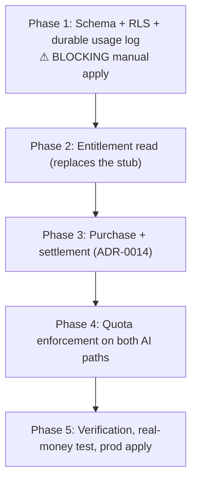

# Work Plan: Subscription — Backend (payOS prepaid period, entitlement, quota)

Created Date: 2026-08-18
Type: feature
Estimated Duration: 5 phases
Estimated Impact: ~25 files — `SOURCE/supabase/schema.sql` (3 new sections + fingerprint), `SOURCE/lib/schema/schemaFingerprint.ts`, `SOURCE/supabase/test-rls.ts` (new Phần 8), ~8 existing files modified, ~14 new files under `lib/billing/**` and `app/api/payments/**`.

## Related Documents

- PRD: `docs/prd/subscription-prd.md` (v1.5)
- Design Doc: `docs/design/subscription-backend-design.md` (v1.0)
- ADRs: `ADR-0013` (provider + prepaid model, Accepted), **`ADR-0014`** (webhook trust boundary, Accepted 2026-08-18)
- UI Spec: `docs/ui-spec/subscription-ui-spec.md` (v1.0) — the UI phase has **already shipped**; this plan replaces the entitlement stub behind it without changing `lib/billing/types.ts`.

## Objective

Replace the fail-closed entitlement stub with a working backend: sell a 30-day prepaid Premium period through payOS, derive entitlement from one timestamp at read time, and put both AI cost paths behind per-plan period quotas plus the project-wide daily budget that closes TD-019.

## Blocking Conditions Outside This Plan

Three PRD gates block **turning on sales**, not the implementation below. Work proceeds in parallel; the switch does not flip until all three are green.

| # | Condition | Owner | State |
|---|---|---|---|
| 1 | U1 — payOS sandbox | engineer | ✅ **resolved 2026-08-18: no sandbox.** Consequence carried into Phase 5 as a real-money test item |
| 2 | U2 — real unit cost measured, under 933 VNĐ/extraction and 58,5 VNĐ/tutor | engineer | 🟠 partially unblocked — the tracker now records and splits input/output (2026-08-18); still needs a durable production write target (Phase 1 Task 3) and then the measurement itself |
| 3 | 14-day baseline for metric #9 measured **before** enabling sales (AC-055) | engineer | ⬜ not started — one query over `telemetry_log`, must be run before, not after |

Also outside: **U3** (legal content) — drafted at `refund-policy.md`, still has open placeholders (last-updated date, refund response/processing days, the selling entity in §6) and **no Terms of Service document exists yet**. AC-039 gates the confirm-payment button on both pages carrying real content.

## Implementation Phases

### Phase 1 — Schema, RLS, and the durable usage log

- [ ] **Task 1 — DDL §20/§21/§22 + fingerprint.** `payment_orders`, `subscriptions`, `record_payment_settlement()`, inserted **before** §17 (the fingerprint insert stays the file's last statement). Every FK declares `on delete` (TD-011). Recompute the §17 literal **and** `schemaFingerprint.ts` in the same commit.
  - ⚠ **BLOCKING MANUAL CHECKPOINT**: apply by hand to **dev**, then `npm run verify:schema`. Do not start Phase 2 until green. This gate has failed silently three times in this repository.
  - Proof: `verify:schema` all sections green; `parseForeignKeys.test.ts`; `schemaFingerprint.test.ts`.
- [ ] **Task 2 — `test-rls.ts` Phần 8.** Cases proving: a student JWT cannot `insert/update/delete` either new table; cannot read another user's rows; cannot `rpc("record_payment_settlement", …)` (permission denied). Follows the existing fixture-prefix + phased-block pattern; mirrors Engine 1's `MM-a`/`MM-b`.
- [ ] **Task 3 — durable target for the usage log (closes the rest of U2's tooling half).** The token split shipped 2026-08-18; the remaining gap is that a process temp file does not survive across serverless instances. Add the minimal durable sink and point `recordUsage()` at it in production.
  - Decide the sink **before** writing DDL — a dedicated `ai_usage_log` table, or extending `telemetry_log`. Prefer a dedicated table: `telemetry_log` is CHECK-constrained to two `event_type`s and deliberately carries no numeric columns.
  - If it needs DDL, it lands in **Task 1's** apply, not as a second manual apply. Sequenced here so that dependency is visible.

**Exit**: `verify:schema` green on dev; Phần 8 passes; the usage log writes somewhere that survives an instance restart.

### Phase 2 — Entitlement read

- [ ] **Task 4 — `lib/billing/getEntitlement.ts`.** Read-time derivation returning the **frozen** `Entitlement` from `lib/billing/types.ts`. Grace grants access, never allowance (AC-010/AC-011). Free-user period anchor per A6 (`user_profiles.created_at + 30d × k`).
  - Proof obligations: AC-005 (past grace ⇒ `free`, with **zero** background processes involved), AC-010 (day 3 ⇒ premium, day 4 ⇒ free), AC-011 (grace + spent allowance ⇒ refused for *quota*, not for *expiry* — two distinct reasons), AC-016 (rollover exactly at the boundary; one second before ⇒ not yet reset).
- [ ] **Task 5 — wire the layout.** Replace the stub value handed to `EntitlementProvider` with the real read. `entitlement.tsx`, `types.ts`, and every screen stay untouched.
  - Proof: existing `entitlement.test.tsx` still green; no new round trip per gated component (PRD NFR Performance).

**Exit**: a seeded Premium user reads `premium` in the browser; a new account reads `free`; no UI file changed.

### Phase 3 — Purchase and settlement

- [ ] **Task 6 — payOS adapter** (`lib/billing/payos/`). `verifyWebhookSignature` (over **raw body bytes**), `createPaymentRequest`, `getPaymentStatus`. Hand-rolled, no SDK (Design Doc §Dependency verification). Provider vocabulary does not escape this directory.
  - Proof: signature verification against literal fixtures, including a tampered-field negative.
- [ ] **Task 7 — `createOrder()` Server Action.** Unique `orderCode`; one shared constant feeds both our `pending_until` and payOS's `expiredAt`.
  - Proof: AC-026 (exactly one row, amount 39000, pending), **AC-027** (a pending order under 30 minutes is *reused* — same `orderCode`, same QR — and a count of the user's pending orders returns exactly 1).
- [ ] **Task 8 — `settleOrder()` + `recordPaymentSettlement` in `service-role.ts`.** The only grant path; always re-verifies with payOS before writing (ADR-0014).
  - Proof obligations: **no write occurs before verification** (assert call *order*, not just occurrence); AC-031 (replay ⇒ one grant, `n−1` no-ops); AC-009 idempotency key; amount compared against the **stored row**, not a constant.
  - Includes the real-Postgres test: two settlements ⇒ one period; early purchase ⇒ +40 days and **one** allowance (AC-016).
- [ ] **Task 9 — webhook route + `PUBLIC_PATHS` admission.** The thin shell. Returns 200 for every decision reached. Reason comment at the `PUBLIC_PATHS` entry.
  - Proof: AC-030 (bad/missing signature ⇒ zero data change, zero outbound calls), AC-032/ADR-0017 (unauthenticated **write** paths 0 → 1, and exactly 1), AC-034 (no raw payload or bank identifier in any log).
- [ ] **Task 10 — "My orders" screen + `recheckOrder()`** (R10, all three surfaces are Must: list, status, recheck button).
  - Proof: AC-035 (paid but webhook missed ⇒ recheck grants, through the same idempotency key), AC-036 (unpaid ⇒ still pending, zero wrong grants), AC-037 (`guard()`ed).

**Exit**: an order settles end-to-end through `recheckOrder()` on dev, with no webhook involved.

### Phase 4 — Quota enforcement

- [ ] **Task 11 — `lib/billing/quota.ts`.** Per-user period counter (period start embedded in the Redis key, so reset is a new key and nothing runs at the boundary) + project-wide daily budget keyed on the Pacific day. **Closes TD-019.**
  - Proof: AC-024 (Redis unreachable ⇒ refuse, **zero** Gemini calls — and explicitly *not* the in-RAM fallback `rateLimit.ts` uses), AC-054 (missing env var ⇒ fail closed), premium reservation share read from configuration.
- [ ] **Task 12 — gate the tutor path.** Quota check beside the existing `guard()` in `tutorActions.ts`. `callTutor.ts` keeps its current responsibility — no access control moves into it.
  - Proof: AC-013 + **AC-057** (`explainStep`'s anti-spam ceiling raised ≥ 50/day so the *plan* quota is what a real Premium user meets, not the anti-spam cap); `rateLimit.test.ts`'s family partition still passes.
- [ ] **Task 13 — gate the upload path.** Replace `LIMITS.MAX_UPLOADS_PER_DAY`; **move the check ahead of the `rerunExamId` branch**, which today spends 2–3 Gemini calls without consuming a slot.
  - Proof: AC-018 (Free at 3 ⇒ blocked, zero Gemini calls), **AC-053** (Premium at 15 ⇒ blocked with the same reason code), and a test that the rerun branch now consumes a slot — this is a paywall bypass, not just a cost leak.

**Exit**: both AI paths refuse at the plan limit and at the project budget, with zero Gemini calls on refusal.

### Phase 5 — Verification, real money, prod

- [ ] **Task 14 — full regression.** `verify:schema`, `test-rls.ts` (incl. Phần 8), `vitest run`, `tsc --noEmit`, `eslint --max-warnings 0`, `next build`.
- [ ] **Task 15 — security review.** Walk ADR-0014 end to end against shipped code; confirm zero client write paths to either table; confirm the bundle scan covers the checksum key and the `record_payment_settlement` marker.
- [ ] **Task 16 — ⚠ MANUAL, REAL MONEY (U1 consequence).** One small-value transaction on the **production** domain, engineer-approved in advance. Verifies only what nothing else can reach: signature verification against a genuine payOS delivery, and the registered webhook URL resolving. Register the webhook against production only — Preview URLs change per build.
- [ ] **Task 17 — ⚠ MANUAL prod apply.** Identical DDL to prod, then `verify:schema` against prod with the fingerprint matching git.
  - ⚠ **Learn from Engine 1's P-1**: a matching fingerprint proves schema, **not content**. Verify with a real counting query, not a fingerprint comparison.
- [ ] **Task 18 — pre-sale gate.** Confirm all three blocking conditions (U1 ✅, U2, metric #9 baseline) plus U3's two pages carrying real content, **before** enabling sales.

## Risks Specific to Execution

- **The manual DDL gate is where this repository has failed before**, and for a money table the failure shape is "payment taken, nothing written." Treated as a blocking checkpoint an agent cannot complete unsupervised.
- **Green-but-hollow tests.** Engine 1 Phase 3 shipped three of them; all three asserted *that* a call happened, not *what* went through it. On this feature the equivalents are: asserting settlement succeeded without asserting the second replay wrote nothing, and asserting `settleOrder` ran without asserting the amount was compared. Assert on values and on row counts.
- **U2's numbers may all be wrong in the same direction.** Limits are configuration-read constants so a retune is not a code hunt.

## Completion Criteria

- [ ] All phases complete
- [ ] `verify:schema` green on **both** dev and prod, fingerprints matching git, prod content verified by a real query
- [ ] `test-rls.ts` Phần 8 passing
- [ ] All quality gates green (`vitest`, `tsc`, `eslint`, `build`)
- [ ] Security review complete (Task 15)
- [ ] Real-money end-to-end verified on production (Task 16)
- [ ] Three pre-sale blocking conditions closed (U1 ✅ / U2 / metric #9 baseline)
- [ ] U3 content complete on both public pages
- [ ] User review approval obtained
