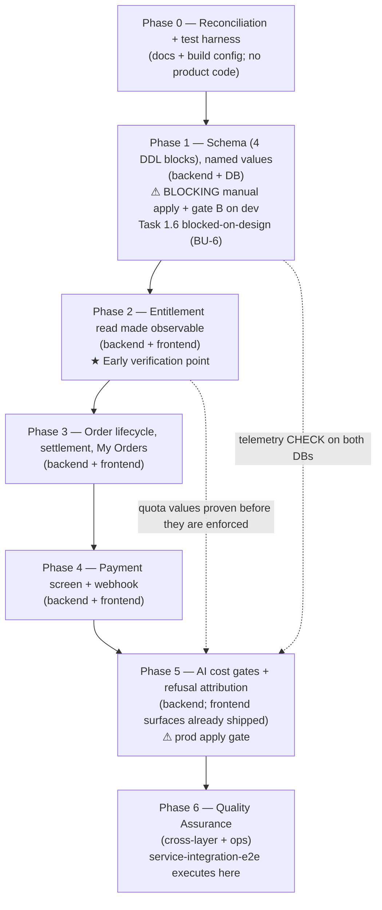
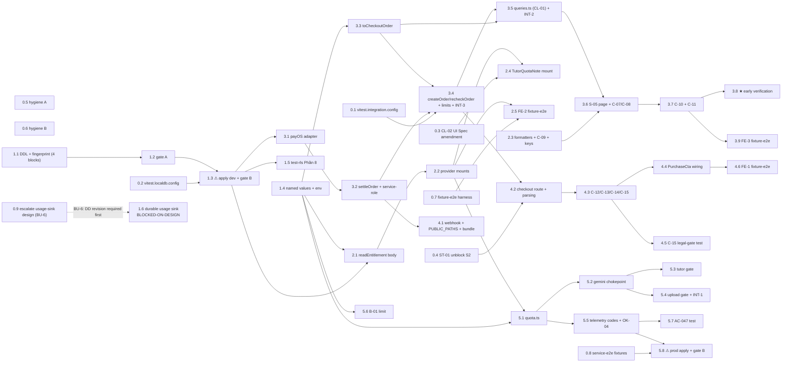

# Work Plan: Subscription (payOS prepaid period) — Fullstack (backend + frontend)

Created Date: 2026-08-18
Type: feature
Estimated Duration: 7 phases (Phase 0 … Phase 6)
Estimated Impact: ~70 files — `SOURCE/supabase/schema.sql` (**exactly 4** new/edited DDL blocks + fingerprint, matching Task 1.1; the AI usage-log sink is **not** among them — it is undesigned and escalated as BU-6), ~20 existing files modified, ~30 new files under `SOURCE/lib/billing/**`, `SOURCE/lib/format/**`, `SOURCE/app/(billing)/**`, `SOURCE/app/api/payments/**`, plus 3 test-skeleton files filled in and 2 new Vitest configs.
Related Issue/PR: —

> **Supersedes `docs/plans/subscription-backend-work-plan.md` (v1.0).** That plan is backend-only and predates the frontend Design Doc, the three test-skeleton lanes, and the 13 open design-sync items. It is left on disk unmodified; retiring it is the engineer's decision, not this plan's.

## Revision History

| Version | Date | Change | Why |
|---|---|---|---|
| v1.0 | 2026-08-18 | Initial plan | — |
| **v1.1** | **2026-08-18** | **Seven review conditions applied (document-reviewer `needs_revision`).** (1) **I001** — the AI usage-log sink was a *schema design decision no Design Doc makes*; Task 1.1's block 5 instructed the implementer to choose between `ai_usage_log` and extending `telemetry_log` and to pick its columns. Block 5 is **removed**; the backend DD's `:79`/`:145` contradiction is escalated as **Task 0.9** and recorded as **BU-6**; **Task 1.6 is blocked-on-design**; BU-4's unblocking line restated. (2) **I002** — C-10's **seven** `SettleResult`→dictionary-key→badge triples and `payment_orders.status`'s four permitted literals are now carried **verbatim** in Reference Contract Values; Task 3.2 carries the enumerated union; Task 3.7 gains a seven-sentence proof obligation. `amount_mismatch` and `provider_unavailable` previously appeared nowhere in this plan. (3) **I003** — INT-3's fill moved to **Task 3.4** and INT-2's to **Task 3.5**, so each integration case is filled by the task that implements the behaviour it asserts. (4) **I004** — one exported `periodStartEpoch()` declared in Task 1.4; Task 2.1 imports it; a read-path/write-path key byte-identity assertion added to Task 5.1. (5) **I005** — a **Deployment Sequencing** subsection states when a production deploy is permitted; Phases 1–4 gain the negative check. (6) **I006** — Task 5.3 binds UI-D3's collapse constraint (client-visible code set unchanged; the new distinction lives only in telemetry). (7) **I007** — the gap count is **five** everywhere. Also **I008** (i18n traceability row corrected to Tasks 2.3 / 3.7 / 4.3 / 6.6) and **I009** (Task 0.5 records AC-050's existing deferral). | Two criticals (I001, I002) plus five importants; the upheld properties — CL-01/CL-02 scheduling, the nine-step redistribution, the five gap justifications, Strategy A placement, Phase 1's horizontal exception, the BU gating, gate-A/gate-B, the counted-invocation and byte-identity obligations, and the per-task "stop the phase" failure responses — are preserved unchanged |
| **v1.2** | **2026-08-18** | **Four re-review conditions applied (document-reviewer `approved_with_conditions`).** (1) **I101 (blocking)** — the task-dependency diagram's **node labels** still carried the integration-case ownership that I003 removed from the graph edge and from every task body: the two suffixes sat on the `T36` and `T37` nodes. Rewritten so each suffix sits on the node of the task that implements the asserted behaviour — `T34["3.4 createOrder/recheckOrder + limits + INT-3"]` and `T35["3.5 queries.ts (CL-01) + INT-2"]` — and both suffixes are stripped from `T36` and `T37`. (2) **I102** — Phase 0's commit estimate raised from 7 to **9** with the 1:1 task-to-commit rule stated inline, so it reconciles with the nine tasks (0.1…0.9) the v1.1 revision produced. (3) **I103** — BU-6's downstream chain restated so `:308` names the **same** sequence its own Blocks column, BU-4's row and Task 6.8 already name: BU-6 → Task 1.6 → BU-4 → Task 6.8. (4) **I104** — the changelog's I005 entry corrected from "Phases 2–4" to **"Phases 1–4"**, matching the four phase-completion criteria that actually carry the no-production-deploy check and the Deployment Sequencing table's Phase 1 row. | The diagram is a required Work Plan artifact and task-decomposer reads it to generate task files, so stale node labels would have reinstated I003's defect — an integration case filled by a task that does not implement the behaviour it asserts. The other three are readability/accuracy corrections. Everything the re-review confirmed intact — both criticals closed, I003's substantive fix, I004…I009, CL-01/CL-02 scheduling and ordering, the nine-step redistribution, the five gap justifications, Strategy A placement, Phase 1's horizontal exception, BU-1…BU-5 gating only Tasks 6.7/6.8, gate-A/gate-B as phase exit criteria, the counted-invocation and byte-identity proof obligations, the "a provider-wrapped unit test cannot discharge AC-042" statement, the per-task "stop the phase" failure responses, Task 5.3's `not_eligible` choice, and Task 1.6's blocked-on-design quarantine — is left exactly as written |
| **v1.3** | 2026-08-18 | **Citation and version refresh in § Related Documents, plus the two Task 0.5 citations that Task 0.5's own edits invalidated (plan Task 0.6, ST-04 / ST-05 / CL-05 / CL-06).** § Related Documents named backend DD **v1.4**, frontend DD **v1.2** and UI Spec **v1.3**; on disk those documents were at v1.5/v1.5/v1.5 before this task and are at **v1.6** after it, and all six section line numbers in that block pointed at unrelated text. Sections are now named rather than numbered. Separately, plan **Task 0.5** inserted a line above the UI Spec's AC-traceability table, which moved UI-D3's *"the error-path half of AC-041 is backend work"* from `:116` to `:118` and the **AC-050** row from `:404` to `:408` — this plan carried the pre-Task-0.5 numbers in three places (Task 0.5's body twice, § Phase Completion Criteria once) and now cites both by identifier. | A work plan is read by task-decomposer and by every task executor; a stale document version in § Related Documents is the input that makes an executor design against a superseded contract, and this block had been stale for three tasks. **Known residual, deliberately out of this task's scope**: roughly eight further bare line citations into the two Design Docs remain elsewhere in this plan (§ Verification Strategy's correctness-definition and early-verification pointers, the frontend seven-claim table, BU-6's `:79`/`:145` pair, and three task bodies). They are the same CL-05/CL-06 class and are equally stale, but they sit outside the § Related Documents item handed to Task 0.6 and inside sections other tasks own — BU-6's pair in particular is **Task 0.9's** escalation subject. Refresh them in the next revision that touches those sections. |

Review Scope (fresh pre-implementation plan — planned-files scope):
- Backend: `SOURCE/supabase/schema.sql`, `SOURCE/lib/schema/schemaFingerprint.ts`, `SOURCE/supabase/test-rls.ts`, `SOURCE/lib/billing/**` (new: `payos/`, `settleOrder.ts`, `quota.ts`, `orderActions.ts`, `pricing.ts`, `checkoutOrder.ts`; existing: `readEntitlement.ts`), `SOURCE/lib/supabase/{service-role,middleware}.ts`, `SOURCE/lib/env/checkEnv.ts`, `SOURCE/.env.example`, `SOURCE/lib/security/rateLimit.ts` + its two test files, `SOURCE/lib/ugc/{gemini,extractQuestions,extractAnswers,extractMeta,quotaTracker}.ts`, `SOURCE/lib/tutor/{telemetry.ts,__tests__/telemetry.test.ts}`, `SOURCE/app/(layer2)/{layout.tsx,tutorActions.ts}`, `SOURCE/app/(layer4)/{layout.tsx,actions.ts}`, `SOURCE/app/api/payments/payos/webhook/route.ts`, `SOURCE/scripts/check-ai-key-bundle.mjs`.
- Frontend: `SOURCE/app/(billing)/{queries.ts,me/orders/**,pricing/checkout/**,pricing/_components/PurchaseCta.tsx}`, `SOURCE/components/billing/{OrderStatusBadge,RecheckOrderControl,TutorQuotaNote}.tsx`, `SOURCE/lib/format/{datetime,number}.ts`, `SOURCE/lib/i18n/dictionaries/{en,vi}.ts`, `SOURCE/app/(layer2)/exams/[id]/attempt/[attemptId]/result/detail/page.tsx`.
- Tests/config: `SOURCE/tests/integration/subscription.int.test.ts`, `SOURCE/tests/e2e/fixture/subscription.fixture.e2e.test.ts`, `SOURCE/tests/e2e/service/subscription.service.e2e.test.ts`, `SOURCE/vitest.integration.config.ts` (new), `SOURCE/vitest.localdb.config.ts` (new), `SOURCE/package.json`.
- **Out of scope, frozen, no task may edit**: `SOURCE/lib/billing/types.ts`, `SOURCE/lib/billing/entitlement.tsx`, `SOURCE/app/(billing)/layout.tsx`, `SOURCE/lib/security/csp.ts`, `SOURCE/lib/nav/items.ts`, `SOURCE/app/(layer4)/_components/StatusBadge.tsx`, `SOURCE/components/tutor/ExplainStepAffordance.tsx`.

## Related Documents

- Design Doc(s):
  - `docs/design/subscription-backend-design.md` (**v1.6**) — § **Test Boundaries**, § **Technical Dependencies and Required Implementation Order**, § **Verification Strategy**
  - `docs/design/subscription-frontend-design.md` (**v1.6**) — § **Test Boundaries**, § **Verification Strategy**, § **Technical Dependencies and Implementation Order**
- UI Spec: `docs/ui-spec/subscription-ui-spec.md` (**v1.6**) — **authoritative for UI**; carries the Phase Inversion clause (§ Overview → *"Phase Inversion — read this before treating any contract here as provisional"*)
  - *Versions and section pointers refreshed by plan Task 0.6 (ST-04 / ST-05). Every number this block previously carried was stale: the three documents had moved through five revisions between them, and the frontend Design Doc's Implementation Order alone had shifted by eight lines. Sections are now named rather than numbered, per the citation rule `subscription-backend-design.md` adopted at its v1.4 — cite the identifier plus a quoted phrase for an artifact under concurrent revision.*
- ADR: `docs/adr/ADR-0013-payment-provider-and-prepaid-period-model.md` (Accepted), `docs/adr/ADR-0014-payment-webhook-trust-boundary.md` (Accepted)
- PRD: `docs/prd/subscription-prd.md` (v1.6)
- Superseded plan: `docs/plans/subscription-backend-work-plan.md` (v1.0, backend-only)

### Test skeleton files produced for this work plan

| Lane | Path | Cases | Placement rule |
|---|---|---|---|
| integration | `SOURCE/tests/integration/subscription.int.test.ts` | INT-1, INT-2, INT-3 | Filled in **in the same commit as the implementation** of the behaviour each covers |
| fixture-e2e | `SOURCE/tests/e2e/fixture/subscription.fixture.e2e.test.ts` | FE-1, FE-2, FE-3 | Filled in **alongside the UI feature phase** that renders the journey |
| service-integration-e2e | `SOURCE/tests/e2e/service/subscription.service.e2e.test.ts` | SVC-1, SVC-2 | **Executed only in the final phase** (Phase 6) |

**E2E gap check: not applicable.** All three lanes emitted skeletons (integration 3/3, fixture-e2e 3/3, service-e2e 2/2). No `e2eAbsenceReason` exists for either lane, so neither the fixture-e2e nor the service-integration-e2e gap condition fires.

## Verification Strategy (from Design Docs)

### Correctness Proof Method

- **Correctness definition** (backend DD `:1175-1184`), four properties, each refutable by a named observation:
  1. Entitlement is a pure function of one timestamp and the clock — `readEntitlement(u)` either side of `expires_at + 3d` yields `premium` then `free`, with **zero writes** between the two reads and no scheduled job anywhere in the repository.
  2. Money is never granted twice and never granted without the provider saying so — `subscriptions.expires_at` advances by exactly one period for any *n* ≥ 1 settlements of one `orderCode`; `settled_at` is set once; every call after the first returns `not_pending`; no path writes `subscriptions` without a preceding `getPaymentStatus() === "paid"`.
  3. Every Gemini request the repository can emit is counted in the unit the supplier counts — `ai:budget:{day}` advances by 3 in `automatic` mode, 2 otherwise, 1 for tutor; `client.models.generateContent` resolvable in **exactly one** module.
  4. A refusal is attributable — three causes produce three distinct `error_code` values and **all three inserts are accepted** by the widened CHECK.
  Plus the frontend DD's seven-claim table (`:1055-1067`): every non-`N/A` State × Display cell has a rendered destination; no control carries native `disabled`; a fail-OPEN quota never renders as a fail-CLOSED display; an unrecognised status never reads as `pending`/`paid`; the screen is completable with the QR absent; no non-failure outcome sentence uses failure vocabulary; the UI-D17 mount actually renders.
- **Verification method**: text-side gate A (`npm test`, `readFileSync`, no DB) → DB-side gate B (`npm run verify:schema`, per environment) → unit tests with mocked boundaries per the two Test Boundaries tables → real-Postgres integration and service-lane tests → fixture-e2e browser journeys → manual browser pass at 360px and greyscale.
- **Verification timing**: gate A when the DDL text is written, before any database is touched; gate B after each hand-apply, dev first then prod; unit/integration per phase; fixture-e2e in the phase that renders the journey; service-integration-e2e and the manual passes in Phase 6.
- **Output comparison** for the one replaced behaviour (backend DD `:1184`): the upload path's `LIMITS.MAX_UPLOADS_PER_DAY` DB-count check at `actions.ts:337` is compared before/after on identical input, in **both** branches (`rerunExamId` set and unset). Expected difference: the re-run branch now consumes exactly one upload allowance. Expected non-difference: a non-re-run upload still consumes exactly one. The diff is taken on the refusal reason string and the counter delta, never on the response body.

### Early Verification Point

- **First verification target** (backend DD `:1188-1199` + `:1163`): schema gate A green, then gate B green on **dev**; then step 3 — `readEntitlement()`'s body plus the two provider mounts — makes a gated component render a real plan and a real remaining count for a seeded Premium user. This is the integration point that first makes the system observable, not the webhook.
  Frontend's own early point (`:1069-1077`): `/me/orders` renders a real, non-empty list with `PlanSummary` above it, against a database that actually has `payment_orders`.
- **Success criteria**: gate A — `parseForeignKeys.test.ts`, `schemaFingerprint.test.ts` and the added `error_code in ( … )` parse case all green. Gate B — all eight `verify-schema.ts` checks green on dev, `on delete` present on both new FKs, §17 fingerprint matching git. Step 3 — a gated child does **not** receive `FREE_FALLBACK`; a new account reads `free`; a seeded Premium row reads `premium`. Frontend — rows newest first, `DD/MM/YYYY HH:mm` in ICT, thousands-separated amount, raw `orderCode`, four `PlanSummary` items (or the one sentence with **no `0` and no `—`**), zero horizontal overflow at 360px.
- **Failure response**: a failure in **either** gate stops the phase — do not proceed to implementation. This checkpoint has failed silently three times in this repository. If `PlanSummary` shows Free for a Premium user, **stop**: the route group or the provider mount is wrong and every downstream test would pass while the screen lied. If a rendered date is one day off, **stop**: the `timeZone` pin is missing or a legacy formatter was used. Neither is a defect to work around.

### Proof Strategy

- **Proof obligation source**: the `Proof obligation:` and `Primary failure mode:` annotation blocks in the three test skeletons (INT-1…INT-3, FE-1…FE-3, SVC-1, SVC-2). Where a claim has no skeleton (the two displaced obligations below, and every unit-level AC), the source is that AC's primary failure mode as stated in the owning Design Doc's Test Boundaries table.
- **Per-task propagation**: every task in this plan that implements a claim records its Proof Obligations in the generated task file, so downstream review can judge whether the tests **prove** the claim rather than merely run. The recurring hollow-test shapes this feature must guard against are named in the backend DD `:1141`: asserting that `settleOrder` was called does not prove the amount was compared; asserting settlement succeeded does not prove the second replay wrote nothing. Assert on values and on row counts.
- **Two proof obligations displaced by the test budget**, carried here as explicit unit-test tasks rather than dropped:
  1. **C-15 legal gate** (frontend DD Test Boundaries, C-15 row) — one test asserting `legalContentReady === false` for the shipped dictionary **and, in the same test**, that `SOURCE/app/(billing)/terms/page.tsx` and `SOURCE/app/(billing)/refund-policy/page.tsx` still render `LegalContentPending`. Both assertions live in one test so the predicate and the rendered pages cannot drift apart silently. → **Task 4.5**
  2. **AC-047 telemetry distinguishability** — the backend DD's real-Supabase three-cause case (budget refusal / user-quota refusal / simulated provider failure ⇒ three distinct `error_code` values, all three inserts accepted). → **Task 5.7**

## Quality Assurance Mechanisms (from Design Docs)

Adopted quality gates for the change area. Every task in this plan must satisfy the mechanisms whose Covered Files it touches. **`npm run verify:schema` and `npm run check:bundle` are two distinct scripts** (`package.json:13` and `:12`); neither pipes into the other, and both must be run separately.

| Mechanism | Enforces | Config Location | Covered Files |
|-----------|----------|-----------------|---------------|
| `npm test` → `vitest run` (CI on every PR) | Every unit and text-side gate named in both Test Boundaries tables | `SOURCE/package.json:10`, `SOURCE/vitest.config.ts` | `SOURCE/lib/**/*.test.{ts,tsx}`, `SOURCE/components/**/*.test.{ts,tsx}`, `SOURCE/app/**/*.test.{ts,tsx}` |
| `parseForeignKeys.test.ts` (text-side, `readFileSync`, no DB) | TD-011 — every FK declares `on delete` | `SOURCE/lib/schema/__tests__/parseForeignKeys.test.ts` | `SOURCE/supabase/schema.sql` |
| `schemaFingerprint.test.ts` (text-side) | TD-005 — the three fingerprint values agree | `SOURCE/lib/schema/__tests__/schemaFingerprint.test.ts` | `SOURCE/supabase/schema.sql`, `SOURCE/lib/schema/schemaFingerprint.ts` |
| `npm run verify:schema` → `npx tsx supabase/verify-schema.ts` (DB-side, per environment, run from `SOURCE/`) | The DDL being right in git and **absent from a database** | `SOURCE/package.json:13`, `SOURCE/supabase/verify-schema.ts` | dev and prod databases; `SOURCE/supabase/schema.sql` |
| `npm run check:bundle` → `node scripts/check-ai-key-bundle.mjs` (**separate script, not part of `verify:schema`**) | Server-only secrets appearing in client bundle output | `SOURCE/package.json:12`, `SOURCE/scripts/check-ai-key-bundle.mjs` | `.next/**` build output; extended with payOS secret markers + the `record_payment_settlement` marker |
| `rateLimit.test.ts` three-family partition | Every `RATE_LIMITS` key is classified in exactly one family and its family invariants hold | `SOURCE/lib/security/rateLimit.test.ts:93-99, :107-110, :118-121, :127-135` | `SOURCE/lib/security/rateLimit.ts` |
| `telemetry.test.ts:261` two-layer guard | `TELEMETRY_ERROR_CODES` matches the CHECK constraint; **must pass unmodified** | `SOURCE/lib/tutor/__tests__/telemetry.test.ts` | `SOURCE/lib/tutor/telemetry.ts`, `SOURCE/supabase/schema.sql` |
| `npx tsc --noEmit` | Discriminated-union exhaustiveness on `SettleResult` and `Quota`; i18n key parity (`en.ts` key missing from `vi.ts` is a compile error) | `SOURCE/tsconfig.json`, `.github/workflows/ci.yml:52` | project-wide |
| `npm run lint` → `eslint --max-warnings 0` | Style and unused code. **Evidence of nothing for the accessibility rules** — `eslint.config.mjs:1-23` adds no `jsx-a11y` rules | `SOURCE/package.json:9`, `SOURCE/eslint.config.mjs` | project-wide |
| `npm run build` → `next build` | The only full type check on the frontend side | `SOURCE/package.json:7` | project-wide |
| `SOURCE/supabase/test-rls.ts` | RLS policies actually scope reads/writes on the new tables | `SOURCE/supabase/test-rls.ts` (new Phần 8) | `public.payment_orders`, `public.subscriptions`, `public.record_payment_settlement` |
| Real-Postgres integration tests (precedent `recordSkillMastery.int.test.ts`) | `greatest()`, `on conflict do update`, the `status='pending'` guard, the row lock, RLS visibility | `SOURCE/vitest.localdb.config.ts` (new), `SOURCE/vitest.integration.config.ts` (new) | `SOURCE/tests/e2e/service/**`, `SOURCE/tests/integration/**` |
| `i18n.test.ts:55-59` identical-string budget | Identical-key ratio stays `< 0.1` across ~30 new keys | `SOURCE/lib/i18n/__tests__/i18n.test.ts` | `SOURCE/lib/i18n/dictionaries/{en,vi}.ts` |
| Manual browser pass at 360px + greyscale (`npm run pw` + a real mid-range Android) | **The load-bearing accessibility and layout check** (PRD UI Quality Metric #2); golden states 11-24 | `SOURCE/package.json:14`, `SOURCE/scripts/pw/cli.mjs` | `SOURCE/app/(billing)/me/orders/**`, `SOURCE/app/(billing)/pricing/checkout/**`, the result-detail page |
| Mutation testing | Green-but-hollow assertions | — | **noted, not adopted** — no harness exists. Substitute: the explicit value-and-count assertions in the Proof Strategy above |
| Load / latency measurement | The added Redis round trip per AI call | — | **noted, not adopted** — non-deterministic in CI; the PRD accepts the cost without a target |
| Visual-regression / axe | Rendered appearance, automated a11y | — | **noted, not adopted** — neither exists in this repository (frontend DD `:98`) |

## Design-to-Plan Traceability

Maps each Design Doc technical requirement to the covering task(s). One row per extracted item.

| Design Doc | DD Section | DD Item | Category | Covered By Task(s) | Gap Status | Notes |
|---|---|---|---|---|---|---|
| docs/design/subscription-backend-design.md | Schema | `payment_orders` — 11 columns, `on delete set null` FK, status CHECK with no `refunded` value | impl-target | Phase 1 Task 1.1 | covered | |
| docs/design/subscription-backend-design.md | Schema / MSA-2 | The four transfer columns (`qr_payload`, `account_number`, `account_name`, `memo`), `text not null`, no new FK | impl-target | Phase 1 Task 1.1 | covered | |
| docs/design/subscription-backend-design.md | Schema / MSA-1 | `subscriptions` — `expires_at` + `period_anchor_at`, `on delete cascade` | impl-target | Phase 1 Task 1.1 | covered | |
| docs/design/subscription-backend-design.md | Schema | `record_payment_settlement()` — drop-then-create, `INVOKER`, revoke by name, grant `service_role` | impl-target | Phase 1 Task 1.1 | covered | |
| docs/design/subscription-backend-design.md | Schema | RLS: `orders_select_own`, `subscriptions_select_own`, revoke insert/update/delete from anon+authenticated | impl-target | Phase 1 Task 1.1, Phase 1 Task 1.5 | covered | |
| docs/design/subscription-backend-design.md | Schema (R13) | `telemetry_log_error_code_check` replaced **in place** + the inline edit at `:1381-1382` (AC-045) | contract-change | Phase 1 Task 1.1 | covered | Both edits ship together; inline-only is the TD-005 shape |
| docs/design/subscription-backend-design.md | Schema | §17 fingerprint literal + `schemaFingerprint.ts` recomputed in the same commit | prerequisite | Phase 1 Task 1.1 | covered | |
| docs/design/subscription-backend-design.md | Verification Strategy | Gate A (text-side, `npm test`) | verification | Phase 1 Task 1.2 | covered | |
| docs/design/subscription-backend-design.md | Verification Strategy | Gate B (DB-side, `npm run verify:schema`) — dev first | verification | Phase 1 Task 1.3 | covered | Blocking manual checkpoint |
| docs/design/subscription-backend-design.md | Verification Strategy | Gate B on **prod**, before any deploy that reads the new tables or writes a new telemetry code | verification | Phase 5 Task 5.8 | covered | Sequenced before the AI-gate deploy per Migration Strategy |
| docs/design/subscription-backend-design.md | Named values (I012) | `pricing.ts` — `PREMIUM_PRICE_VND = 39000`, `ORDER_PENDING_WINDOW_MS = 30 * 60 * 1000` | impl-target | Phase 1 Task 1.4 | covered | |
| docs/design/subscription-backend-design.md | Named values (I012) | `PLAN_LIMITS` in `quota.ts` — `{free:{tutor:5,upload:3}, premium:{tutor:500,upload:15}}` | impl-target | Phase 1 Task 1.4 | covered | Declared in Phase 1; consumed in Phases 2 and 5 |
| docs/design/subscription-backend-design.md | Named values / MSA-4 | `AI_BUDGET_DAILY_LIMIT` as a named env var, absent ⇒ fail closed | impl-target | Phase 1 Task 1.4 | covered | |
| docs/design/subscription-backend-design.md | Integration Point I5 | `checkEnv.ts` — 3 payOS credentials + `AI_BUDGET_FREE_SHARE` (warn) + `AI_BUDGET_DAILY_LIMIT` (fail-closed); `.env.example` entries | prerequisite | Phase 1 Task 1.4 | covered | |
| docs/design/subscription-backend-design.md | Existing Codebase Analysis (`:145`) **vs** Non-scope (`:79`) | Durable write target for `quotaTracker.recordUsage()` (U2's tooling half) — the backend DD **contradicts itself**: `:79` lists it under Non-scope ("named as remaining work, not built here"), `:145` says "a schema change, therefore this document's business". **No DD section designs the sink** — no table name, no column list, no FK, no RLS policy, no grants | prerequisite | Phase 0 Task 0.9 (escalation) | covered | **The escalation is the covering task, deliberately.** An analysis section is not a design element, so no task in this plan may choose between `ai_usage_log` and extending `telemetry_log`, or invent its columns. Task 0.9 requires a backend DD revision that designs it; **Task 1.6 is blocked-on-design until that revision exists** and is not schedulable. Recorded as **BU-6** |
| docs/design/subscription-backend-design.md | Design — `readEntitlement.ts` | Fill the body of the **existing** exported `readEntitlement(userId)` at `:34`; no new module, no rename | impl-target | Phase 2 Task 2.1 | covered | |
| docs/design/subscription-backend-design.md | Provider coverage / MSA-3 / I1 | `EntitlementProvider` mounts in `(layer2)/layout.tsx` and `(layer4)/layout.tsx` | connection-switching | Phase 2 Task 2.2 | covered | Backend D005; the frontend DD imports it as step 1b |
| docs/design/subscription-backend-design.md | Field Propagation Map | `Entitlement` — `expiresAt` transform, `tutor`/`upload` three-valued union, Redis key with period start embedded | contract-change | Phase 1 Task 1.4, Phase 2 Task 2.1 | covered | The period-start derivation is **declared once** in Task 1.4 (`periodStartEpoch()`) and **imported** by Task 2.1 — it is not re-derived at the read site (I004) |
| docs/design/subscription-backend-design.md | Design — adapter | `lib/billing/payos/` — `verifyWebhookSignature` (raw body bytes), `createPaymentRequest`, `getPaymentStatus`; hand-rolled, no SDK | impl-target | Phase 3 Task 3.1 | covered | |
| docs/design/subscription-backend-design.md | Security / P-1 | Adapter return shape carries exactly `status` and `amount`; no `transactions[]` field persisted or logged | verification | Phase 3 Task 3.1, Phase 1 Task 1.2 | covered | Allowlist schema-text assertion (gate A) + adapter-boundary unit test |
| docs/design/subscription-backend-design.md | Design — `settleOrder.ts` | `SettleResult` union + the four-step order (read row → provider → compare against stored row → settle) | impl-target | Phase 3 Task 3.2 | covered | |
| docs/design/subscription-backend-design.md | Integration Point I6 | `recordPaymentSettlement()` + `recordPaymentOrder()` in `service-role.ts`; fix the stale `§18` comment at `:73` | connection-switching | Phase 3 Task 3.2, Phase 3 Task 3.4 | covered | |
| docs/design/subscription-backend-design.md | One mapper (I010) | `lib/billing/checkoutOrder.ts` — `toCheckoutOrder(row)`, `pendingUntil` normalised to the `…Z` form | contract-change | Phase 3 Task 3.3 | covered | |
| docs/design/subscription-backend-design.md | Escalation E-02 / CL-01 | `getMyOrder()` in `app/(billing)/queries.ts` imports and uses `toCheckoutOrder(row)`; `listMyOrders()`/`MyOrderRow` unaffected | contract-change | Phase 3 Task 3.5 | covered | Cross-layer; fixes the two-mappings defect that makes INT-2 fail |
| docs/design/subscription-backend-design.md | `createOrder()` step (0) | Owner-scoped reuse of a live `pending` row, original `pendingUntil`, zero provider calls; then derive → provider → insert | impl-target | Phase 3 Task 3.4 | covered | |
| docs/design/subscription-backend-design.md | `recheckOrder()` (FE-B-02) | Ownership scoping via the request-scoped client under `orders_select_own`; foreign and nonexistent are byte-identical | impl-target | Phase 3 Task 3.4 | covered | |
| docs/design/subscription-backend-design.md | Rate-limit entries | `createOrder`/`recheckOrder` join `DB_COST_ACTIONS` with `limit >= 15`, `windowMs >= 60_000` (AC-037) | connection-switching | Phase 3 Task 3.4 | covered | |
| docs/design/subscription-backend-design.md | Third verification point | Four cases: cold read, FE-B-02 two refusals, AC-027 buy-twice, I010 deep equality | verification | Phase 3 Task 3.4, Phase 3 Task 3.5, Phase 6 Task 6.2 | covered | INT-3 fills with `createOrder()`'s reuse branch (Task 3.4); INT-2 fills with `getMyOrder()`'s mapping change (Task 3.5); SVC-2 in Phase 6 |
| docs/design/subscription-backend-design.md | Second verification point | Settlement idempotency + AC-016 early purchase on real Postgres | verification | Phase 6 Task 6.1 | covered | SVC-1 |
| docs/design/subscription-backend-design.md | Design — webhook route | `app/api/payments/payos/webhook/route.ts` thin shell, 200 for every decision reached | impl-target | Phase 4 Task 4.1 | covered | |
| docs/design/subscription-backend-design.md | Integration Point I4 | `PUBLIC_PATHS` +1 entry with a reason comment — the first unauthenticated **write** path (ADR-0017) | connection-switching | Phase 4 Task 4.1 | covered | |
| docs/design/subscription-backend-design.md | Integration Point I8 | `check-ai-key-bundle.mjs` + payOS secret markers and the `record_payment_settlement` marker | prerequisite | Phase 4 Task 4.1 | covered | |
| docs/design/subscription-backend-design.md | Logging / AC-034 | No raw payload and no bank identifier in any log; refusal reasons are a closed set of codes | verification | Phase 4 Task 4.1, Phase 6 Task 6.4 | covered | |
| docs/design/subscription-backend-design.md | `quota.ts` | `consumeQuota(kind, userId, ent, geminiCalls)` — fourth parameter required, no default | impl-target | Phase 5 Task 5.1 | covered | |
| docs/design/subscription-backend-design.md | Two counters (I004) | `quota:{kind}:{user}:{periodStart}` +1 per operation; `ai:budget:{pacificDay}` +`geminiCalls`; reservation before emission | impl-target | Phase 1 Task 1.4, Phase 5 Task 5.1 | covered | AC-020's two-mode literal assertions. The key's period-start segment comes from the **one** exported `periodStartEpoch()` (Task 1.4), which the read path (Task 2.1) and the write path (Task 5.1) both import — a repo-wide search for the key template must return exactly one construction site |
| docs/design/subscription-backend-design.md | AC-021 / I10 | `lib/ugc/gemini.ts` — `GEMINI_CALLS_PER_OPERATION` + one exported emit wrapper; four call sites converted | connection-switching | Phase 5 Task 5.2 | covered | Source-scan assertion: `client.models.generateContent` in exactly one module |
| docs/design/subscription-backend-design.md | Integration Point I2 | Tutor gate beside `guard("explainStep", …)` at `tutorActions.ts:175` | connection-switching | Phase 5 Task 5.3 | covered | |
| docs/ui-spec/subscription-ui-spec.md | UI-D3 (`:114`) / AC-041 | "When the backend later introduces a distinct quota code, the split must preserve `not_eligible`, `server` and `gemini_unavailable` as one indistinguishable group — that constraint is recorded for the backend phase, not resolved here" | verification | Phase 5 Task 5.3, Phase 5 Task 5.5 | covered | The backend phase **is** this phase, so the constraint binds Task 5.3 — the change that decides it. AC-041's ownership is settled as documentation in Task 0.5; the anti-disclosure constraint is enforced here |
| docs/design/subscription-backend-design.md | Integration Point I3 | Upload gate ahead of the branch at `actions.ts:268`; delete `:331-343`; hoist `metaCall` above the branch | connection-switching | Phase 5 Task 5.4 | covered | |
| docs/design/subscription-backend-design.md | Integration Point I11 (AC-046) | `telemetry.ts:35` gains two literals; `telemetry.test.ts:49` transcription updated; `:261` unmodified; one **added** schema-parse case | contract-change | Phase 5 Task 5.5 | covered | |
| docs/design/subscription-backend-design.md | Design — where the write happens / **OK-04** | Explicit mapping from `consumeQuota`'s `"user_quota" \| "project_budget" \| "unavailable"` to `user_quota_exhausted` / `project_budget_exhausted` / `server` | contract-change | Phase 5 Task 5.5 | covered | The DD claims these are "the same strings"; they are not — the mapping is written, not assumed |
| docs/design/subscription-backend-design.md | Recorded Decision B-01 | `RATE_LIMITS.explainStep.limit` derived from `isPaidTierEnabled()`; four existing assertions unmodified; `vi.mock("server-only")` in two test files | contract-change | Phase 5 Task 5.6 | covered | |
| docs/design/subscription-backend-design.md | AC-047 | Three causes ⇒ three distinct `error_code` values, all three inserts accepted by the widened CHECK | verification | Phase 5 Task 5.7 | covered | Displaced proof obligation, scheduled outside the skeleton budget |
| docs/design/subscription-backend-design.md | Migration Strategy | Schema-first ordering; the `telemetry_log` alter reaches **both** databases before any deploy writes a new code | prerequisite | Phase 5 Task 5.8 | covered | |
| docs/design/subscription-backend-design.md | Security Considerations | No client write path to either table; identity derived in SQL; secrets server-only; no enumeration oracle; no card data | verification | Phase 1 Task 1.5, Phase 6 Task 6.4 | covered | |
| docs/design/subscription-backend-design.md | Assumed Behavior A-6 (`Confirmed: No`) | payOS retry policy measured by instrumenting the one real transaction | verification | Phase 6 Task 6.7 | covered | Task 6.7 is itself gated on TBD-02 |
| docs/design/subscription-backend-design.md | Escalation E-01 | PRD amendment stating AC-034's storage half (P-1) | prerequisite | — | **gap** | Engineer/PRD-owner decision, explicitly non-blocking. The design enforces P-1 regardless via the allowlist schema-text assertion (Task 1.2) and the adapter-boundary unit test (Task 3.1). Recorded as engineer-owned open item **BU-3**, marked non-blocking in its row; requires engineer confirmation before plan approval, and counted among the five gaps in Task 6.6 and Completion Criteria |
| docs/design/subscription-frontend-design.md | Implementation Plan slice F | `lib/format/datetime.ts` — `formatDate`/`formatDateTime`, `timeZone: "Asia/Ho_Chi_Minh"` pinned, explicit locale | impl-target | Phase 2 Task 2.3 | covered | |
| docs/design/subscription-frontend-design.md | Implementation Plan slice F | `lib/format/number.ts` — `formatVnd()`, formatted **before** `t()` substitution | impl-target | Phase 2 Task 2.3 | covered | |
| docs/design/subscription-frontend-design.md | Main Components | C-09 `OrderStatusBadge` — five branches, tokens only, no silent fallback | impl-target | Phase 2 Task 2.3 | covered | |
| docs/design/subscription-frontend-design.md | Change Impact Map | ~30 `billing.*` keys in **both** dictionaries; identical-string ratio re-measured | impl-target | Phase 2 Task 2.3, Phase 3 Task 3.7, Phase 4 Task 4.3, Phase 6 Task 6.6 | covered | Keys land with the surfaces that use them: S-05's foundation keys in Task 2.3, C-10's seven outcome sentences in Task 3.7, S-06's keys in **Task 4.3** (not 4.4 — 4.4 wires `PurchaseCta`'s handler and adds no dictionary block). The ratio is re-measured in **Task 6.6**, the close-out sweep that owns it (not 6.5, the manual browser pass) |
| docs/design/subscription-frontend-design.md | UI-D17 mount / A10 / R-12 | `TutorQuotaNote` mounted beside both `ExplainStepAffordance` call sites (`result/detail/page.tsx:177,:230`) | connection-switching | Phase 2 Task 2.4 | covered | Gated on the `(layer2)` provider mount (Task 2.2) |
| docs/design/subscription-frontend-design.md | Field Propagation Map (`resetsAt`) / **CL-02** | The mount passes **no** prop; the note formats its own `resetsAt` from provider context inside the existing `tutor.state === "known"` branch; retire the `formattedResetDate?: string` prop | contract-change | Phase 0 Task 0.3, Phase 2 Task 2.4 | covered | UI Spec amendment ordered **before** any `TutorQuotaNote` implementation |
| docs/design/subscription-frontend-design.md | Data-Fetching Plan | `app/(billing)/queries.ts` — `import "server-only"`, `listMyOrders()` via `readBounded` with `created_at desc` ordering in SQL | impl-target | Phase 3 Task 3.5 | covered | |
| docs/design/subscription-frontend-design.md | Main Components | S-05 `/me/orders` page + auth guard before any fetch (redirect `/?auth=signin`) | impl-target | Phase 3 Task 3.6 | covered | |
| docs/design/subscription-frontend-design.md | Main Components | C-07 `OrderList`, C-08 `OrderRow` (server), C-11 `PlanSummary` (client), C-10 `RecheckOrderControl` (client) | impl-target | Phase 3 Task 3.6, Phase 3 Task 3.7 | covered | |
| docs/design/subscription-frontend-design.md | FE-I9 / UI-D18 | `me/orders/{loading,error}.tsx` — container size **and** padding match the page; focused `role="alert"`; `reset()`; `min-h-11` retry | impl-target | Phase 3 Task 3.6 | covered | |
| docs/design/subscription-frontend-design.md | Decision 2 / UI-D16 | Post-action refresh via `router.refresh()`; outcome in an appearing `role="alert"` node; busy via mutating `aria-describedby`, no `aria-live` | impl-target | Phase 3 Task 3.7 | covered | |
| docs/design/subscription-frontend-design.md | Decision 4 | `PlanSummary` renders the other three items only when **both** quotas are `known`; `limit − used` clamped at 0 | impl-target | Phase 3 Task 3.7 | covered | |
| docs/design/subscription-frontend-design.md | Main Components | S-06 `/pricing/checkout` page + `?order=` accept-list validation (`typeof` string + `/^\d+$/` + positive safe integer) | impl-target | Phase 4 Task 4.2 | covered | |
| docs/design/subscription-frontend-design.md | Main Components | C-12 `VietQrCode` (server, inline SVG, absent-encoder state), C-13 `PaymentPanel`, C-14 `TransferDetails`, C-15 `PaymentConfirm` | impl-target | Phase 4 Task 4.3 | covered | |
| docs/design/subscription-frontend-design.md | C-15 / R-9 | `legalContentReady === true` **iff** `billing.terms.body` and `billing.refund.body` both exist in `en.ts`; never derived from `isPaidTierEnabled()` | impl-target | Phase 4 Task 4.3, Phase 4 Task 4.5 | covered | Displaced proof obligation — one test carries both assertions |
| docs/design/subscription-frontend-design.md | FE-I9 / UI-D18 | `pricing/checkout/{loading,error}.tsx` at `size="small"` | impl-target | Phase 4 Task 4.2 | covered | |
| docs/design/subscription-frontend-design.md | FE-I3 / `code:25` | `PurchaseCta`'s handler at `:37-39` gains `createOrder()` behind a `busyRef` latch + navigation | connection-switching | Phase 4 Task 4.4 | covered | |
| docs/design/subscription-frontend-design.md | Field Propagation Map | `orderCode` serialized as `?order={digits}` and parsed with the accept-list rule; `amountVnd` never passed to `t()` as a number | contract-change | Phase 4 Task 4.2 | covered | |
| docs/design/subscription-frontend-design.md | Security Considerations | Both routes private (no `PUBLIC_PATHS` change); dot-free paths; no CSP change; no clipboard API; no order content logged | verification | Phase 4 Task 4.2, Phase 6 Task 6.4 | covered | |
| docs/design/subscription-frontend-design.md | Early verification point | `/me/orders` renders a real non-empty list with `PlanSummary` above it, against a database that has `payment_orders` | verification | Phase 3 Task 3.8 | covered | |
| docs/design/subscription-frontend-design.md | Second verification point / R-1 / R-2 | Real-browser check: alert survives `router.refresh()`, focus stays on the control, `PlanSummary` agrees with the badge | verification | Phase 6 Task 6.5 | covered | A5/A5b/A6 are all `Confirmed: No` |
| docs/design/subscription-frontend-design.md | Verification Strategy row 7 / FE-I8 | FE-AC-26 manual pass — a signed-in user with a `known` tutor quota sees the note on the result-detail page | verification | Phase 6 Task 6.5 | covered | A provider-wrapped unit test cannot discharge this |
| docs/design/subscription-frontend-design.md | Blocking items / **ST-01** | FE-B-01 and FE-B-02 are **closed** in backend v1.4; the frontend DD still lists them as blocking, so slice S2 reads as un-startable | prerequisite | Phase 0 Task 0.4 | covered | Scheduled early because it unblocks work |
| docs/design/subscription-frontend-design.md | Contradictions X-10/X-11/X-12 / **ST-03** | Already satisfied by UI Spec v1.3's text; the live "text to amend" instructions would re-edit corrected text — close them instead of applying them | prerequisite | Phase 0 Task 0.5 | covered | |
| docs/design/subscription-frontend-design.md + backend DD | AC ownership / **CL-03**, **CL-04** | AC-041 and AC-050 owned by neither document; AC-026/027/035/036/037 claimed by both — apply the split notation the backend already uses for AC-028 | prerequisite | Phase 0 Task 0.5 | covered | |
| docs/ui-spec/subscription-ui-spec.md | TBD-07 / **ST-02** | TBD-07 still open although `createOrder()` now returns the full eight-field `CheckoutOrder` | prerequisite | Phase 0 Task 0.5 | covered | |
| docs/design/subscription-frontend-design.md + backend DD + UI Spec | **ST-04, ST-05, CL-05, CL-06** | Version and line-citation drift across all three documents | prerequisite | Phase 0 Task 0.6 | covered | |
| docs/ui-spec/subscription-ui-spec.md C-13 vs frontend DD | **LO-01, LO-02** | UI Spec C-13's Empty/Partial states are narrower than the frontend DD's strict superset | prerequisite | Phase 0 Task 0.6 | covered | |
| docs/design/subscription-frontend-design.md | Not-blocking carried items | TBD-08 — migrate the four legacy date call sites (and delete the `ExamRow.tsx:68` shadow) | impl-target | — | **gap** | The frontend DD states it is "deliberately not bundled" with this feature. Two same-named `formatDateTime` functions with opposite timezone semantics coexist until it is taken. Requires engineer confirmation before plan approval |
| docs/design/subscription-frontend-design.md | Not-blocking carried items | TBD-09 — `StatusBadge.tsx`'s four hex literals and its silent `?? CONFIG.processing` fallback | impl-target | — | **gap** | The frontend DD states the file is "NOT edited … its two defects are TBD-09", deliberately not repaired inside a payment change. C-09 is a new sibling that copies neither defect. Requires engineer confirmation before plan approval |
| docs/design/subscription-frontend-design.md | Prerequisite ADRs | ADR-0018 — the QR encoder library choice | prerequisite | — | **gap** | Engineer-owned, explicitly non-blocking: C-12 specifies a real "no encoder" state and AC-028 is satisfied from C-14's text block. Recorded as engineer-owned open item **BU-2**, marked non-blocking in its row; requires engineer confirmation before plan approval |
| docs/design/subscription-frontend-design.md | Not-blocking carried items | TBD-05 — AC-042 *placement* | impl-target | — | **gap** | Engineer-owned and orthogonal: UI-D17's mount site is already fixed by the UI Spec and is implemented in Task 2.4. TBD-05 would only move it. Requires engineer confirmation before plan approval |

## Reference Contract Values

Values copied **verbatim** from the Design Docs / UI Spec, so each covering task is checked against the exact contract rather than a re-derived summary.

| Design Doc (§ Section) | Contract Type | Required Observable Value (verbatim) | Covered By Task(s) |
|---|---|---|---|
| docs/ui-spec/subscription-ui-spec.md (§ Component: `PaymentPanel` — C-13) | structure-order | `orderCode: number; amountVnd: number; status: string; pendingUntil: string; qrPayload: string; accountNumber: string; accountName: string; memo: string;` — the eight-field `CheckoutOrder`, normative for the backend | Phase 3 Task 3.3, Phase 3 Task 3.5, Phase 4 Task 4.3 |
| docs/design/subscription-backend-design.md (§ One mapper, not two — I010) | derived-display | `pendingUntil` ← `pending_until timestamptz`: **`new Date(row.pending_until).toISOString()`** — always the `…Z` form with milliseconds. The normalisation is the point | Phase 3 Task 3.3, Phase 3 Task 3.5 |
| docs/design/subscription-backend-design.md (§ Schema, `payment_orders`) | structure-order | The `payment_orders` column set is **exactly** the eleven declared: `order_code`, `user_id`, `amount`, `status`, `created_at`, `pending_until`, `settled_at`, `qr_payload`, `account_number`, `account_name`, `memo` — an allowlist, not a blocklist | Phase 1 Task 1.1, Phase 1 Task 1.2 |
| docs/design/subscription-backend-design.md (§ Schema, `payment_orders`) | structure-order | `status        text not null default 'pending'` `check (status in ('pending', 'paid', 'expired', 'cancelled'))` — the permitted set is **exactly** these four literals, in this declaration. **No `'refunded'` value**: *"refunds are a bank action plus a hand-written SQL correction (D10). Inventing a status the code never sets would be a state reachable only by a code path that does not exist"*. C-09's five branches (four permitted + unrecognised) and C-13's Partial state are defined against this exact set | Phase 1 Task 1.1, Phase 2 Task 2.3 |
| docs/ui-spec/subscription-ui-spec.md (§ Component: `RecheckOrderControl` — C-10) | structure-order | The **seven** Result → rendered sentence (dictionary key) → badge-after-re-render triples, verbatim: <br>• `{settled:true}` → "Paid — your Premium period runs to {date}" (`billing.recheck.settled`) → badge `paid` <br>• `not_paid_yet` → "Still awaiting payment" + how to complete the transfer (`billing.recheck.stillPending`) → badge `pending` <br>• `not_pending` → "This order is already closed" (`billing.recheck.notPending`) → badge unchanged <br>• `unknown_order` → "We cannot find this order" + support link (`billing.recheck.unknownOrder`) → badge unchanged <br>• `amount_mismatch` → "The amount received does not match this order — contact support" (`billing.recheck.amountMismatch`) → badge unchanged <br>• `provider_unavailable` → "We could not reach the payment provider — try again shortly" (`billing.recheck.providerUnavailable`) → badge unchanged <br>• rate-limited (AC-037) → "You checked several times in a row — wait a moment" (`billing.recheck.rateLimited`) → badge unchanged <br>Plus: *"`SettleResult` (backend design) maps to copy one-to-one; **no two reasons share a sentence**"* and *"**`amount_mismatch` deliberately routes to a human.** It is the one outcome where money may have moved and the automatic path has stopped"* | Phase 3 Task 3.2, Phase 3 Task 3.7 |
| docs/design/subscription-backend-design.md (§ Sensitivity / P-1) | state-lifecycle-negative | **P-1 (normative).** No field of the provider's `transactions[]` may be persisted to any column or reach any log. `settleOrder()` reads exactly **two** values from the provider response — the order's `status` and its `amount` | Phase 3 Task 3.1, Phase 3 Task 3.2, Phase 6 Task 6.4 |
| docs/design/subscription-backend-design.md (§ Schema, telemetry alter) | structure-order | `'gemini_unavailable', 'rate_limited', 'server', 'not_eligible', 'user_quota_exhausted', 'project_budget_exhausted'` | Phase 1 Task 1.1, Phase 5 Task 5.5 |
| docs/design/subscription-backend-design.md (§ Schema, `record_payment_settlement`) | derived-display | `set expires_at = greatest(public.subscriptions.expires_at, now()) + make_interval(days => p_period_days)`, `period_anchor_at = now()` — in the same statement | Phase 1 Task 1.1, Phase 6 Task 6.1 |
| docs/design/subscription-backend-design.md (§ `recheckOrder()` — ownership scoping) | state-lifecycle-negative | `recheckOrder(orderCode)` resolves `{ settled: false, reason: "unknown_order" }` for an `orderCode` that does not exist **and** for one that exists but whose `user_id` is not the caller. The two are **byte-identical**: the same value, from the same branch, with the same side effects (none), the same number of provider calls (zero) and the same number of writes (zero) | Phase 3 Task 3.4, Phase 6 Task 6.2 |
| docs/design/subscription-backend-design.md (§ `createOrder()`'s order of operations) | state-lifecycle-negative | The reused row is returned with **its original `pending_until`**, read from the row, not recomputed as `now() + 30 min` … *"the countdown is never restarted"* | Phase 3 Task 3.4, Phase 3 Task 3.6 |
| docs/ui-spec/subscription-ui-spec.md (§ Component: `PlanSummary` — C-11) | structure-order | AC-056's four Must items … **current plan**, **period reset date**, **tutor calls remaining**, **uploads remaining** | Phase 3 Task 3.7 |
| docs/ui-spec/subscription-ui-spec.md (§ Component: `PlanSummary` — C-11) | state-lifecycle-negative | **When either quota is `unknown`, the three quota-derived items are replaced by ONE sentence, and it is not a dash.** … Rendering `0` would state exhaustion the system is not enforcing; rendering `—` reads as *a count of nothing* … Never `0`, never `—` | Phase 3 Task 3.7 |
| docs/ui-spec/subscription-ui-spec.md (§ Component: `TransferDetails` — C-14) | structure-order | Bank account number → Account holder → Amount → Transfer memo (the four `<dl>` pairs, in this order) | Phase 4 Task 4.3 |
| docs/ui-spec/subscription-ui-spec.md (§ Component: `TransferDetails` — C-14) | derived-display | Amount = `formatVnd(amountVnd, locale)` + the `billing.amount` unit (UI-D13). `select-all`. **Must match what the QR encodes.** Interpolating the raw number renders `39000` next to a QR carrying `39.000 VNĐ` | Phase 4 Task 4.3 |
| docs/ui-spec/subscription-ui-spec.md (§ Component: `OrderRow` — C-08) | derived-display | **The `orderCode` is rendered as a raw digit string** — it is an identifier the user reads aloud to support, so it must not be grouped, abbreviated or localised | Phase 3 Task 3.6, Phase 4 Task 4.3 |
| docs/ui-spec/subscription-ui-spec.md (§ Component: `OrderStatusBadge` — C-09) | state-lifecycle-negative | **Unrecognised status**: `?` + "Không xác định" / "Unrecognised" in `--destructive`. Never `pending`, never `paid` | Phase 2 Task 2.3 |
| docs/design/subscription-frontend-design.md (§ Field Propagation Map, `resetsAt`) | state-lifecycle-negative | **Because the value exists only inside the provider subtree (client side), `formattedResetDate` is formatted there — `formatDate(tutor.resetsAt, locale)` with `locale` from `useLocale()` — and the mount site passes no `formattedResetDate` prop.** | Phase 0 Task 0.3, Phase 2 Task 2.4 |
| docs/design/subscription-frontend-design.md (§ Test Boundaries, C-15 row) | state-lifecycle-negative | One case asserting **`legalContentReady === false`** for the shipped dictionary **and, in the same test**, that `app/(billing)/terms/page.tsx` and `app/(billing)/refund-policy/page.tsx` still render `LegalContentPending` — so the predicate and the rendered legal pages cannot drift | Phase 4 Task 4.5 |
| docs/design/subscription-backend-design.md (§ The two counters count different things) | derived-display | Per-user period quota: **+1**, regardless of how many Gemini requests that operation emits. Project daily budget: **+`geminiCalls`** — tutor `1`; upload `metaCall ? 3 : 2` | Phase 5 Task 5.1 |
| docs/ui-spec/subscription-ui-spec.md (§ UI-D3 — This phase does NOT split the four tutor error codes) | state-lifecycle-negative | **"When the backend later introduces a distinct quota code, the split must preserve `not_eligible`, `server` and `gemini_unavailable` as one indistinguishable group — that constraint is recorded for the backend phase, not resolved here."** With its rationale: *"distinguishing the codes would leak that the server re-runs an eligibility check (`not_eligible`)"* — `ExplainStepAffordance.tsx:96-99`. The client-visible union stays exactly `"not_eligible" \| "rate_limited" \| "gemini_unavailable" \| "server"` (`tutorActions.ts:51`) and all four keep rendering **one** message | Phase 5 Task 5.3, Phase 5 Task 5.5 |
| docs/design/subscription-backend-design.md (§ Recorded Decision B-01) | derived-display | **paid tier enabled ⇒ 50/day** … **paid tier disabled ⇒ 3/day, unchanged**. `windowMs` stays 24h in both branches | Phase 5 Task 5.6 |

## Failure Mode Checklist

| Category | Applies? | Covered By Task(s) |
|---|---|---|
| same-value | yes | Phase 3 Task 3.4, Phase 3 Task 3.6 (a repeated create returns the identical identifier and the identical deadline string), Phase 3 Task 3.5 (two producers of one contract must yield deeply equal values) |
| no-op | yes | Phase 3 Task 3.2, Phase 6 Task 6.1 (a repeated settlement of an already-settled record changes nothing and reports so) |
| empty input | yes | Phase 3 Task 3.6 (no records ⇒ a non-error empty surface), Phase 4 Task 4.2 (absent or blank identifier parameter ⇒ the shared empty state) |
| invalid option | yes | Phase 4 Task 4.2 (unparseable / out-of-range identifier parameter), Phase 2 Task 2.3 (a status value outside the permitted set renders its own appearance and is never coerced to a permitted one) |
| missing config | yes | Phase 1 Task 1.4 (each configuration variable absent and present, with the absent case failing closed for the spend ceiling and the release flag) |
| unavailable boundary | yes | Phase 5 Task 5.1 (counter store unreachable ⇒ refuse, zero downstream supplier calls), Phase 3 Task 3.2 (provider unreachable ⇒ discriminated refusal, zero writes), Phase 4 Task 4.3 (encoder absent ⇒ the flow stays completable from text) |
| shared-state dependency | yes | Phase 2 Task 2.2 (a consumer that renders outside the provider subtree silently receives the fail-closed default), Phase 5 Task 5.1 (the period boundary is embedded in the counter key, so a reset is a new key rather than a mutation), Phase 1 Task 1.4 + Phase 2 Task 2.1 + Phase 5 Task 5.1 (the counter key's boundary segment has **one** exported derivation and one construction site; a display path and an enforcement path deriving it independently would disagree silently — the screen reporting remaining allowance while the gate refuses) |
| rollback-only visibility | yes | Phase 5 Task 5.8 (the widened constraint must reach every environment **before** the deploy that writes the new values; a rollback is only safe before that deploy, because the write is best-effort and its failure is silent) |
| missing-sort-key ordering | yes | Phase 3 Task 3.5 (ordering is expressed once, in the query module, against the matching index), Phase 3 Task 3.6 (the view re-states the non-re-sorting invariant and performs no ordering of its own) |

## UI Spec Component → Task Mapping

Reference key = the UI Spec section heading verbatim.

| UI Spec Component (section heading) | States to Cover | Covered By Task(s) | Gap Status | Notes |
|---|---|---|---|---|
| § Component: `EntitlementProvider` / `useEntitlement` — C-01 | default, error (degrades to `FREE_FALLBACK`), partial (`plan` known, quotas `unknown`) | Phase 2 Task 2.1, Phase 2 Task 2.2 | covered | Frozen contract — the files are **not** edited; only the value handed in changes and the mount coverage widens |
| § Component: `PlanComparison` — C-02 | default, partial (current plan marked, CTA suppressed) | Phase 2 Task 2.2 | covered | Shipped and unchanged; its `useEntitlement()` read at `:57` first sees a real plan after Task 2.1/2.2. Verified by the provider render test, not re-implemented |
| § Component: `PurchaseCta` — C-03 | default, loading (creating), error (creation failed / rate-limited), partial (unavailable) | Phase 4 Task 4.4 | covered | Only the handler body at `:37-39` changes; the `aria-disabled` string, the `!canPurchase` early return and the `reasonId` binding are untouched |
| § Component: `LegalDocument` — C-04 (and `LegalLinks` — C-04b) | default, empty (reachable and forbidden — the page must not ship blank) | Phase 4 Task 4.3, Phase 6 Task 6.8 | covered | `LegalLinks` reused unchanged as S-06's second call site. The **content** is TBD-02, engineer-owned (BU-1) |
| § Component: `ExplainStepAffordance` (modified) — C-05 | default (idle), loading (busy), error, partial (hint-shown), blocked-quota | Phase 5 Task 5.3, Phase 2 Task 2.5 | covered | The component ships already and is **not** edited; its blocked-quota branch becomes reachable once the provider mount and the real quota values exist. Covered by fixture-e2e FE-2 |
| § Component: `TutorQuotaNote` — C-06 | default (`known`), empty (`unknown` ⇒ `null`) | Phase 0 Task 0.3, Phase 2 Task 2.4, Phase 2 Task 2.5, Phase 6 Task 6.5 | covered | UI Spec UI-D17 / the C-06 delta are amended **first** (CL-02): the mount passes no prop and the note formats its own `resetsAt` from context. The unit test cannot discharge AC-042 — FE-2 and the manual pass do |
| § Component: `OrderList` — C-07 | default, loading (route `loading.tsx`), empty, error (route `error.tsx`), partial (unrecognised status in one row) | Phase 3 Task 3.6 | covered | |
| § Component: `OrderRow` — C-08 | default, partial (`pending` + future `pendingUntil` ⇒ "continue paying" link) | Phase 3 Task 3.6 | covered | |
| § Component: `OrderStatusBadge` — C-09 | default (four permitted statuses), partial (unrecognised) | Phase 2 Task 2.3 | covered | Built in the foundation phase — three consumers across both screens |
| § Component: `RecheckOrderControl` — C-10 | default (idle), loading (busy), error, partial (terminal status, `aria-disabled` with reason) + **all seven** rendered outcomes (the five `SettleResult` refusal reasons, `{settled:true}`, and rate-limited) | Phase 3 Task 3.2 (the five reasons exist), Phase 3 Task 3.7 (seven sentences + seven keys), Phase 3 Task 3.9 | covered | Shared by S-05 (`variant="row"`) and S-06 (`variant="primary"`). The seven Result→key→badge triples are carried verbatim in Reference Contract Values |
| § Component: `PlanSummary` — C-11 | default (four items), partial (`quota.unknown` ⇒ one sentence, never `0`, never `—`), grace-period variant | Phase 3 Task 3.7 | covered | |
| § Component: `VietQrCode` — C-12 | default (inline SVG), empty (no payload / no encoder ⇒ not rendered), error (encoding throws ⇒ page still renders) | Phase 4 Task 4.3 | covered | ADR-0018 is not blocking; the absent-encoder state is a specified state |
| § Component: `PaymentPanel` — C-13 | default (`pending`), loading, empty (no/unknown/foreign `?order=`, one shared state), error, partial (`paid`/`expired`/`cancelled`/unrecognised ⇒ no QR, no transfer block) | Phase 4 Task 4.2, Phase 4 Task 4.3 | covered | Empty/Partial implemented to the frontend DD's superset per LO-01/LO-02 (reconciled in Task 0.6) |
| § Component: `TransferDetails` — C-14 | default (four `<dl>` pairs, all selectable), partial (a missing field is stated, never rendered blank) | Phase 4 Task 4.3 | covered | |
| § Component: `PaymentConfirm` — C-15 | default, loading (delegated to C-10), error, partial (legal gate closed ⇒ `aria-disabled="true"`, focusable, no-op activation) | Phase 4 Task 4.3, Phase 4 Task 4.5 | covered | |

## ADR Bindings

| ADR | Source Section | Axis | Binding Decision | Covered By Task(s) |
|---|---|---|---|---|
| docs/adr/ADR-0013-payment-provider-and-prepaid-period-model.md | Decision | persistence | Entitlement's only stored state is one `expires_at` timestamp in a dedicated `subscriptions` table, evaluated at every read — no boolean, no status enum, no provider-pushed lifecycle | Phase 1 Task 1.1, Phase 2 Task 2.1 |
| docs/adr/ADR-0013-payment-provider-and-prepaid-period-model.md | Implementation Guidance | persistence | "Store **one** timestamp. Do not add `is_premium`, `is_active`, `status`, `plan_active`, or any other cached restatement of what the timestamp already says" | Phase 1 Task 1.1 |
| docs/adr/ADR-0013-payment-provider-and-prepaid-period-model.md | Implementation Guidance | data_flow | "Extend with `max(expires_at, now()) + 30 days`. Write it once, in one function, and test all three cases: still valid, inside grace, past grace" | Phase 1 Task 1.1, Phase 6 Task 6.1 |
| docs/adr/ADR-0013-payment-provider-and-prepaid-period-model.md | Implementation Guidance | contract_schema | "Keep the pending-order window and the provider's `expiredAt` **the same number**, set from one shared constant" | Phase 1 Task 1.4, Phase 3 Task 3.4 |
| docs/adr/ADR-0013-payment-provider-and-prepaid-period-model.md | Architecture Impact | placement | "One provider boundary, and everything provider-specific behind it. `orderCode`, `checksum key`, signature format, `expiredAt`, and the `PENDING`/`SUCCEEDED`/`CANCELLED` vocabulary belong inside a single payOS adapter module. Nothing above that line … may reference a payOS type" | Phase 3 Task 3.1 |
| docs/adr/ADR-0013-payment-provider-and-prepaid-period-model.md | Architecture Impact | dependency_direction | "One entitlement calculation, used by everything … defined once and consumed through the frozen-contract `useEntitlement()` hook" — no second read path | Phase 2 Task 2.1, Phase 2 Task 2.2 |
| docs/adr/ADR-0014-payment-webhook-trust-boundary.md | Decision (1) | data_flow | A single `settleOrder(orderCode)` is the only code path that can extend entitlement, invoked from exactly two triggers, and it always re-verifies against `GET /v2/payment-requests/{id}` before writing. **No caller can pass an amount, a status, or a user id into it — only an `orderCode`** | Phase 3 Task 3.2, Phase 4 Task 4.1 |
| docs/adr/ADR-0014-payment-webhook-trust-boundary.md | Decision (3) | persistence | The entitlement write is `service_role`-only, `INVOKER`, revoked by name from `public, anon, authenticated`, with `user_id` **derived in SQL from the order row** | Phase 1 Task 1.1, Phase 3 Task 3.2 |
| docs/adr/ADR-0014-payment-webhook-trust-boundary.md | Decision (4) | data_flow | Replay defence is state-based: idempotency is the order's own `pending → paid` transition, guarded in SQL — no nonce table, no timestamp window, no clock | Phase 1 Task 1.1, Phase 6 Task 6.1 |
| docs/adr/ADR-0014-payment-webhook-trust-boundary.md | Implementation Guidance | data_flow | "Never read `amount`, `status`, or any user identifier from the webhook payload for decision-making. Read `orderCode`, and nothing else" | Phase 4 Task 4.1 |
| docs/adr/ADR-0014-payment-webhook-trust-boundary.md | Implementation Guidance | data_flow | "Compare the provider-reported amount against **our stored order row**, not against a constant and not against the payload" | Phase 3 Task 3.2 |
| docs/adr/ADR-0014-payment-webhook-trust-boundary.md | Implementation Guidance | contract_schema | "Return 200 for every decision the endpoint reaches, including refusals. Reserve non-2xx for 'we failed and a retry might work'" | Phase 4 Task 4.1 |
| docs/adr/ADR-0014-payment-webhook-trust-boundary.md | Implementation Guidance | persistence | "`revoke all on function … from public, anon, authenticated` **by name**, every time, on the new function" | Phase 1 Task 1.1, Phase 1 Task 1.5 |
| docs/adr/ADR-0014-payment-webhook-trust-boundary.md | Architecture Impact | placement | One new unauthenticated route handler admitted to `PUBLIC_PATHS` with a reason comment; unauthenticated **write**-path count 0 → 1 (ADR-0017's guarded number) | Phase 4 Task 4.1 |
| docs/adr/ADR-0014-payment-webhook-trust-boundary.md | Implementation Guidance | placement | "Register the webhook against the **production domain only**; Preview deployments verify through the authenticated R10 path instead" | Phase 6 Task 6.7 |

**Recorded deviation carried into implementation** (backend DD `:527-531`): `record_payment_settlement()` uses **two** statements where ADR-0014 Implementation Guidance says "Two statements is a window." It is a recorded deviation, not compliance; the transaction + row-lock argument (Assumed Behavior A-1, `Confirmed: Yes`) is what makes it safe, and **Task 6.1's concurrent real-Postgres case is what proves it rather than assuming it**. If review rejects the deviation, the fallback is a single data-modifying CTE plus an explicit null-beneficiary post-check — a local change to that one function.

## Connection Map

| Boundary | Owner (left side) | Owner (right side) | Serialized Format | Consumer Parse Rule | Expected Signal | Covered By Task(s) |
|---|---|---|---|---|---|---|
| payOS → webhook route handler | payOS (external service) | `SOURCE/app/api/payments/payos/webhook/route.ts` | Raw JSON body + a `signature` field, HMAC-SHA256 over the alphabetically key-sorted `key=value&…` serialisation of `data` | HMAC verified over the **raw body bytes**, never over re-serialised parsed JSON; only `data.orderCode` is read for decisions | Signature valid ⇒ `settleOrder(orderCode)` is called exactly once. Invalid/absent signature ⇒ HTTP 200, **zero I/O**, one structured reason code logged | Phase 4 Task 4.1 |
| webhook route / `recheckOrder()` → payOS status query | `SOURCE/lib/billing/settleOrder.ts` | payOS `GET /v2/payment-requests/{id}` via `SOURCE/lib/billing/payos/` | — | — | `getPaymentStatus()` returns a value narrowed to `"pending" \| "paid" \| "cancelled" \| "unknown"`, and its return object carries exactly two properties (`status`, `amount`) — P-1 | Phase 3 Task 3.1, Phase 3 Task 3.2 |
| `createOrder()` → payOS create request | `SOURCE/lib/billing/orderActions.ts` | payOS `POST /v2/payment-requests` via `SOURCE/lib/billing/payos/` | Request carries `expiredAt` derived from the **same** `ORDER_PENDING_WINDOW_MS` constant that sets `payment_orders.pending_until` | Response fields translated at the boundary: `qrCode` → `qrPayload`, `description` → `memo` | Provider-first ordering: on adapter failure **no `payment_orders` row exists** (row count 0 after a rejected create); on success the row carries the four returned values verbatim | Phase 3 Task 3.1, Phase 3 Task 3.4 |
| Postgres → PostgREST → `createOrder()` / `getMyOrder()` → S-06 | `public.payment_orders` (via `SOURCE/lib/billing/checkoutOrder.ts`) | `SOURCE/app/(billing)/pricing/checkout/**` | PostgREST renders `timestamptz` as `2026-08-18T09:30:00+00:00`; `bigint` and `integer` as JSON numbers | `toCheckoutOrder(row)` — the **one** mapper: `Number(row.order_code)`; `amount` → `amountVnd` (rename only); `new Date(row.pending_until).toISOString()` ⇒ the `…Z` form; four `text` fields verbatim | `createOrder()`'s return and `getMyOrder(orderCode)`'s return are **deeply equal** for one `orderCode`, with `pendingUntil` byte-identical | Phase 3 Task 3.3, Phase 3 Task 3.5, Phase 3 Task 3.6 |
| S-05 / `PurchaseCta` → S-06 (order identifier across a navigation) | `SOURCE/app/(billing)/me/orders/_components/OrderRow.tsx`, `SOURCE/app/(billing)/pricing/_components/PurchaseCta.tsx` | `SOURCE/app/(billing)/pricing/checkout/page.tsx` | URL query string `?order={digits}` on `/pricing/checkout` — a decimal digit string, no grouping, no sign | Accept **only** a value that is a **string** matching `/^\d+$/` whose `Number()` is a positive safe integer (`> 0` and `<= Number.MAX_SAFE_INTEGER`). **Never `parseInt`** — it accepts `"123abc"`. Anything else ⇒ C-13's Empty state, not an error and not a 404 | Navigation lands on `/pricing/checkout?order={the same orderCode createOrder() returned}` and S-06 renders that order's transfer block | Phase 3 Task 3.6, Phase 4 Task 4.2, Phase 4 Task 4.4 |
| Server render → RSC payload → client context | `SOURCE/lib/billing/readEntitlement.ts` + the three route-group layouts | `useEntitlement()` consumers (`PlanSummary`, `TutorQuotaNote`, `ExplainStepAffordance`, `PlanComparison`) | The frozen `Entitlement` object; `expiresAt` as ISO 8601 string or `null`; `tutor`/`upload` as the three-valued `Quota` union | Discriminant must be narrowed — reading `resetsAt` outside the `known` branch is a compile error | A gated child does **not** receive `FREE_FALLBACK`; exactly one `readEntitlement()` call per request | Phase 2 Task 2.1, Phase 2 Task 2.2, Phase 2 Task 2.5 |
| `consumeQuota()` → Upstash Redis | `SOURCE/lib/billing/quota.ts` | Upstash Redis REST API | Keys: `quota:{kind}:{userId}:{periodStartEpoch}` and `ai:budget:{pacificDayKey}` where `pacificDayKey` is `YYYY-MM-DD` in `America/Los_Angeles`; increment `INCRBY ai:budget:{pacificDayKey} <geminiCalls>` | Compared against `AI_BUDGET_DAILY_LIMIT`; a non-response is `unavailable`, **never** zero. TTL 26 h on the budget key; period end + slack on the quota key | Two modes, two literal expectations: `automatic` ⇒ budget +3, otherwise +2, tutor ⇒ +1; the per-user key advances by exactly +1 in **both** upload modes | Phase 5 Task 5.1 |
| **Read path ↔ write path of the same per-user counter key** (one serialized key string, two producers) | `SOURCE/lib/billing/readEntitlement.ts` (read: `used` and `resetsAt`) | `SOURCE/lib/billing/quota.ts` (write: `INCR` at the gate) | `quota:{kind}:{userId}:{periodStartEpoch}` — `periodStartEpoch` is the **integer epoch** returned by the single exported `periodStartEpoch(plan, anchor, createdAt, now)` in `SOURCE/lib/billing/quota.ts`; no second derivation, no re-rounding, no ms/s conversion at either call site | Both sides **import** `periodStartEpoch()`; neither recomputes `period_anchor_at` or `created_at + 30d × floor(…)` locally. A repo-wide search for the key template must return **exactly one** construction site | The key string produced on the read path and on the write path is **byte-identical** for the same user at the same instant — asserted for three fixtures: premium with an anchor; free at creation-day 15 / 29 / 31; a user inside grace (`periodStart` unchanged, AC-011). If they diverge, the screen says *n* remaining while the gate refuses and **nothing goes red** | Phase 1 Task 1.4, Phase 2 Task 2.1, Phase 5 Task 5.1 |
| Refusal branches → `telemetry_log` | `SOURCE/app/(layer2)/tutorActions.ts`, `SOURCE/app/(layer4)/actions.ts` (via `SOURCE/lib/tutor/telemetry.ts`) | `public.telemetry_log` under `telemetry_insert_own` | `error_code` is one of the six CHECK literals; the runtime filter nulls unknown codes rather than throwing | The widened CHECK must already exist on the target database, or the insert fails and the best-effort write is lost **silently** | Three causes ⇒ three distinct `error_code` values, and **all three inserts are accepted** | Phase 5 Task 5.5, Phase 5 Task 5.7, Phase 5 Task 5.8 |

## Objective

Replace the fail-closed entitlement stub with a working paid tier: sell a 30-day prepaid Premium period through payOS, derive entitlement from one timestamp at read time, put both AI cost paths behind per-plan period quotas plus a project-wide daily budget (closing TD-022), and draw the two user surfaces that make purchase and recovery reachable (`/me/orders`, `/pricing/checkout`).

## Background

The UI phase shipped first (S-01…S-04, `EntitlementProvider`, the frozen `lib/billing/types.ts`), leaving one deliberate seam — `readEntitlement()`'s body — and one deliberate gap: the provider is mounted in `(billing)` only, while every gated component renders in `(layer2)`/`(layer4)`. There is no payment code of any kind and no `payment_orders`/`subscriptions` table. Both Design Docs select **Hybrid** (a thin horizontal foundation, then vertical slices) with the schema as a hard gate in front of everything.

This plan composes the two documents into cross-layer vertical slices so integration is verified early rather than at the end, while respecting:
- the backend DD's nine-step Required Implementation Order **within** the backend portion of each slice, and
- the UI Spec's Phase Inversion clause on the frontend side — the UI Spec is authoritative for UI contracts, and where a downstream document diverges, the UI Spec is amended **first** (this is why Task 0.3 precedes any `TutorQuotaNote` work).

## Engineer-owned open items (blocking marked per row — sequence work behind the blocking ones, do not plan around them)

Every row states a non-empty **Blocks** value. Rows whose Blocks value is *"nothing — non-blocking, confirmation required before plan approval"* do not gate any task; they still require an explicit engineer confirmation, and they are counted in the close-out sweep (Task 6.6) and in Completion Criteria.

| # | Item | Owner | Blocks | Input needed | State |
|---|---|---|---|---|---|
| **BU-1** | **TBD-02 — legal content (PRD U3)** | Engineer | **Enabling selling (Task 6.8), and the real-money webhook verification (Task 6.7)** | Final text for both pages. `docs/legal/refund-policy.md` has 3 `[điền…]` placeholders and names **no legal selling entity** (only the brand). **No Terms of Service draft exists at all**, and R11 requires two pages. Until then `billing.terms.body` / `billing.refund.body` do not exist, both routes render `LegalContentPending`, and C-15's confirm control stays `aria-disabled` | **Open.** Blocks nothing before Phase 6; S-06 ships with the control inert and a readable reason, which is the specified behaviour, not a degradation |
| **BU-2** | **ADR-0018 — QR encoder library** | Engineer | **nothing — non-blocking, confirmation required before plan approval** | An ADR selecting (or declining) a QR encoder. This is the phase's first new dependency and this repository decides dependencies by ADR (precedent ADR-0009) | **Open, non-blocking.** Without it `VietQrCode` renders nothing and S-06 stays payable from C-14's text block — which is what AC-028 requires anyway |
| **BU-3** | **E-01 — AC-034 scope** | PRD owner | **nothing — non-blocking, confirmation required before plan approval** | A PRD amendment adding an AC under R9 or R12 stating the **storage** half of P-1. AC-034 as written covers only *logging*; the design additionally forbids persisting any `transactions[]` field. AC-057's comparable extension got a PRD amendment in v1.6, so this one should too | **Open, non-blocking.** The design enforces P-1 either way via Task 1.2's allowlist assertion and Task 3.1's adapter-boundary test |
| **BU-4** | **U2 — real unit cost** | Engineer | **Enabling selling (Task 6.8)** | A measurement against real token cost, under 933 VNĐ/extraction and 58,5 VNĐ/tutor. It needs a **durable** write target, which no Design Doc currently designs — the current one is a process temp file that does not survive across Vercel instances, so `UGC_QUOTA_LOG=1` alone is not sufficient | **Blocked on BU-6, then on the engineer.** The token split and the four call-site wirings shipped 2026-08-18. **The durable sink is not deliverable by this plan as written**: Task 1.6 is blocked-on-design until BU-6's backend DD revision designs the sink (table name, columns, FK with `on delete`, RLS, revokes/grants, fingerprint impact). Sequence: BU-6 → Task 1.6 → this measurement |
| **BU-5** | **Metric #9 baseline (AC-055)** | Engineer | **Enabling selling (Task 6.8)** | One 14-day query over `telemetry_log`, run **before** sales are enabled, not after. Per AC-047's baseline caveat, count `success = false` overall — a real 429 records as `server` today, so counting `gemini_unavailable` alone reads as an improvement that did not happen | **Not started** |
| **BU-6** | **The durable AI usage-log sink is undesigned** — the backend DD's § Non-scope entry (*"named as remaining work, not built here"*) **contradicts** its § "The one PRD claim this document had to correct" entry (*"a schema change, therefore this document's business"*), and no DD **schema** section designs it. **Raised in the backend DD as escalation E-03 at its v1.8**, which **withdraws the second statement** as a claim about current scope and lets the **Non-scope entry stand** — the document's four schema blocks contain no usage sink, so it cannot already be its business. *(Cited by section and quote, not by line: the `:79`/`:145` pair this row carried had rotted to `:81`/`:147`.)* | Backend DD owner (design revision, not an implementation decision) | **Task 1.6 (blocked-on-design), and BU-4 through it** | A backend DD revision that **designs** the sink: table name, full column list (the input/output token split including `thoughtsTokenCount`, and the `role` dimension `recordUsage()` already records), the FK and its `on delete` (TD-011), RLS policies, the explicit revokes/grants, and the §17 fingerprint impact. Until it exists, no task may choose between `ai_usage_log` and extending `telemetry_log`, and Task 1.5 has no RLS denial cases to write for it | **Open.** Raised by Task 0.9. Blocks **only** Task 1.6 — Task 1.1 ships four DDL blocks without it, gate A/gate B are unaffected, and Phases 2–6 do not read the sink |

**No earlier phase is blocked by BU-1…BU-5.** Phases 0–5 and Tasks 6.1–6.6 proceed in full; only Task 6.7 (real money) and Task 6.8 (enable selling) sit behind them. **BU-6 is a design-revision escalation rather than an engineer input decision, and it blocks exactly one task — Task 1.6 — on which no task in Phases 1–5 depends; Phase 1 completes without it. Its only downstream consequence is Task 6.8, which was already gated on BU-4 and is now gated on BU-4 through BU-6 (sequence: BU-6 → Task 1.6 → BU-4 → Task 6.8).**

## Risks and Countermeasures

### Technical Risks

- **Risk**: DDL correct in git and absent from a database (TD-005) — for a money table the failure shape is "payment taken, nothing written".
  - **Impact**: High. Has occurred three times in this repository.
  - **Countermeasure**: the schema is a **phase**, not a step, with gate A and gate B as its exit criteria (Tasks 1.2, 1.3, 5.8). Engine 1's P-1 proved a matching fingerprint says nothing about *content*, so the prod check is a real counting query, not a fingerprint comparison.
- **Risk**: the `telemetry_log` alter reaches git but not a database, applied to an *existing populated* table.
  - **Impact**: High and **silent** — telemetry writes are deliberately best-effort, so every refusal that tries to write a new code fails the CHECK with nothing red.
  - **Countermeasure**: ships as **both** an inline edit and a drop/add pair; Task 5.8 gates the AI-gate deploy on gate B being green on both databases; Task 5.7 asserts the inserts are *accepted*, not merely attempted.
- **Risk**: green-but-hollow tests. Engine 1 Phase 3 shipped three; all asserted *that* a call happened, not *what* went through it.
  - **Impact**: High — the equivalents here are asserting settlement succeeded without asserting the replay wrote nothing, and asserting `settleOrder` ran without asserting the amount was compared.
  - **Countermeasure**: every skeleton's `Proof obligation:` block names the invisible sub-claims (invocation counts, byte-identity, deep equality, row counts). Task files carry them forward verbatim.
- **Risk**: the provider is never mounted above the gated components, so the backend is correct and the UI enforces nothing.
  - **Impact**: High — nothing fails to compile, no test goes red, and the UI simply keeps saying "Free". The same shape one layer down makes `TutorQuotaNote` a permanent no-op.
  - **Countermeasure**: Task 2.2's render test per layout (a gated child must **not** receive `FREE_FALLBACK`) and fixture-e2e FE-2, which renders the **real** route tree rather than wrapping the unit in a provider.
- **Risk**: two mappings for one contract (CL-01). `pendingUntil` in PostgREST's `+00:00` form is not string-equal to `toISOString()`'s `…Z` form.
  - **Impact**: High — it produces a **failing test** (INT-2's deep equality), and on screen a user sees one deadline after purchase and a differently-formatted one after a reload.
  - **Countermeasure**: Task 3.3 creates the single mapper; Task 3.5 makes `getMyOrder()` use it; INT-2 asserts deep equality plus the literal string form.
- **Risk**: the `(layer2)` provider mount is dropped or deferred, leaving the UI-D17 mount inert.
  - **Impact**: High — AC-042 is a PRD Must and this is its only surface.
  - **Countermeasure**: Task 2.2 precedes Task 2.4 in the same phase; FE-AC-26 may not be marked satisfied by a unit test (Task 6.5's manual pass discharges it).
- **Risk**: a later reader "simplifies" step (0), the ownership pre-read, `period_anchor_at`, the four transfer columns, or `consumeQuota`'s fourth parameter.
  - **Impact**: High in each case, and none of them fails to compile.
  - **Countermeasure**: the reasons are written into the column comments and the contract clauses, not only into the Design Doc; the corresponding tests assert invocation counts, deep equality and literal deltas so the simplification cannot ship green.

### Schedule Risks

- **Risk**: 13 design-sync items were left unreconciled when the design gate was approved; several change what the implementation must do.
  - **Impact**: Medium-High — CL-01 produces a failing test, CL-02 would produce a wrong `TutorQuotaNote` implementation, ST-01 makes a startable slice read as blocked.
  - **Countermeasure**: **Phase 0 exists for exactly this.** CL-02 is ordered before any `TutorQuotaNote` work; ST-01 is ordered early because it unblocks; CL-01 is folded into the task that owns the file; the remainder is batched into two hygiene tasks rather than scattered.
- **Risk**: the pre-sale gate (BU-1, BU-4, BU-5) slips.
  - **Impact**: Medium — the feature is complete and unsellable.
  - **Countermeasure**: none of the three blocks any implementation phase; Task 6.8 is the only task behind all three, and the plan is explicit that the sale date moves rather than two blank legal pages shipping.
- **Risk**: **BU-4 has a second, longer chain than it appears to** — its measurement needs a durable usage sink that **no Design Doc designs** (BU-6). The v1.0 plan hid this by having Task 1.1 choose the sink in passing.
  - **Impact**: Medium — the pre-sale gate depends on a design revision, not only on an engineer's measurement, so the true sequence is BU-6 → Task 1.6 → BU-4 → Task 6.8.
  - **Countermeasure**: Task 0.9 raises the escalation **in Phase 0**, before the schema phase writes DDL, so the revision has the maximum possible lead time. Nothing else in the plan reads the sink, so Phase 1 completes and Phases 2–6 proceed while it is open. The alternative — letting an implementer pick a table and its columns — would have shipped a money-adjacent table with no RLS negative test, no allowlist coverage and no stated grants.
- **Risk**: `npm test` goes red in CI for a missing database credential.
  - **Impact**: Medium — a red build for a non-defect erodes the gate.
  - **Countermeasure**: Tasks 0.1 and 0.2 create two **separate** Vitest configs scoped to their own directories; `npm test` stays untouched and stays green.

## Implementation Phases

### Deployment Sequencing (when a production deploy is permitted)

**Readable from the phase structure alone, without opening a task body.** Phases 2–4 build and merge code that reads `payment_orders` / `subscriptions` and renders `/me/orders` and `/pricing/checkout`, while **production has neither table until Task 5.8**. Deploying that code early is exactly the "code deployed, prod schema drifted" shape this plan's Risks section records as a three-time repository failure and the frontend DD encodes as R-7. Merging to the working branch is unrestricted; **deploying to production is not**.

| End of phase | Production deploy permitted? | What must be green first |
|---|---|---|
| Phase 0 | **No** (nothing to deploy — documents and test configs only) | — |
| Phase 1 | **No** | Dev-only apply. Prod still has neither new table |
| Phase 2 | **No** — the code reads `subscriptions` | Task 5.8 (prod apply + gate B on prod, content verified by a real query) |
| Phase 3 | **No** — the code reads `payment_orders` and renders S-05 | Task 5.8; **and** Task 6.2 (SVC-2) before S-05 is reachable by real users, per FE-B-02's escalation condition |
| Phase 4 | **No** — the code reads `payment_orders` and admits the webhook path | Task 5.8; **and** Task 6.2 before S-05 is reachable by real users |
| **Phase 5** | **Yes — this is the earliest permitted production deploy**, and only after **Task 5.8** is green | Task 5.8: the identical DDL applied to prod, gate B green on prod, the widened `telemetry_log` CHECK present, **verified by a real counting/inspection query, not a fingerprint comparison**. A deploy that writes a new telemetry code before this lands fails the CHECK **silently** (telemetry writes are best-effort) |
| Phase 6 | Yes, with two further gates | **Task 6.2** before S-05 reaches real users; **Task 6.8** (BU-1 + BU-4 + BU-5) before the purchase control is enabled — which is what makes a real transaction, and therefore Task 6.7, reachable at all |

**Rollback note**: the `telemetry_log` constraint widening is safe to roll back **only before** the deploy that starts writing the new codes (Phase 5's rollback-only-visibility entry in the Failure Mode Checklist). After that deploy, a rollback re-narrows a CHECK that live code is writing against, and the rejected inserts are silent.

**Structure: Option A — Vertical Slice**, with one horizontal foundation phase in front (the schema gate, per both Design Docs' Hybrid selection). Each phase from 2 onward contains both backend and frontend work for the same feature area.





---

### Phase 0: Design-sync reconciliation and test harness (Estimated commits: 9 — one per task, the same 1:1 task-to-commit rule Phases 1–5 use; no batching, because each of the nine tasks lands in a different file or document: Tasks 0.5, 0.6 and 0.9 each amend a different repository document, and Tasks 0.1/0.2 create two separate Vitest configs)

**Layer mix**: documents + build configuration only. **No product code.**

**Purpose**: close the design-sync items that change what the implementation must do, raise the one item that turns out to be **undesigned** rather than merely inconsistent, and create the two Vitest configurations without which none of the three skeleton lanes can run. Ordered first because CL-02 must land before any `TutorQuotaNote` work, ST-01 unblocks a slice that is currently documented as un-startable, and Task 0.9's escalation must be raised before the schema phase writes DDL.

**Verification**: `npm test` stays green and unchanged (both new configs are scoped to their own directories); each amended document states the correction and the reason.

#### Tasks

- [x] **Task 0.1 — Create `SOURCE/vitest.integration.config.ts` + the `test:integration` script.** Same `resolve.alias` as `vitest.config.ts`, `test.environment: "node"`, `test.include: ["tests/integration/**/*.test.{ts,tsx}"]`. Add `"test:integration": "vitest run --config vitest.integration.config.ts"` to `SOURCE/package.json`. **`npm test` and `SOURCE/vitest.config.ts:19` are not modified** — `SOURCE/tests/**` stays outside the CI glob deliberately, because INT-2 and INT-3 need the real dev database and the backend DD states CI has no database.
  - `@category: e2e-setup` (harness) · Completion: `npm run test:integration` runs the file and reports 0 tests (skeleton is comments-only); `npm test` collects the same file count as before this task.
- [x] **Task 0.2 — Create `SOURCE/vitest.localdb.config.ts` + the `test:localdb` script.** Same alias, `test.environment: "node"`, `test.include: ["tests/e2e/service/**/*.test.{ts,tsx}"]`. Add `"test:localdb": "vitest run --config vitest.localdb.config.ts"`. Document in the config header that **schema gate B must be green on dev before this config is run at all** — running it against a database without the DDL produces failures that look like implementation defects and are not.
  - `@category: e2e-setup` · `@lane: service-integration-e2e` · Completion: as Task 0.1; `npm test` unchanged.
- [x] **Task 0.3 — CL-02: amend UI Spec UI-D17 and the C-06 delta, correct frontend `ui:06`, add escalation X-13.** ⚠ **Ordered before any `TutorQuotaNote` implementation.** In `docs/ui-spec/subscription-ui-spec.md`: UI-D17 and the C-06 "Delta in v1.2" both say the component is mounted "receiving `formattedResetDate` computed server-side". **No such producer can exist** — the mount site (`result/detail/page.tsx`) is an async server component with no entitlement value, and the frontend DD's `code:02` forbids a second `readEntitlement()` path. Amend both to state: **the mount passes no prop; the component formats its own `resetsAt` from provider context inside the existing `tutor.state === "known"` branch.** In `docs/design/subscription-frontend-design.md`: correct fact row `ui:06` (it currently agrees with the wrong version, contradicting its own `code:04`) and add contradiction row **X-13** recording the escalation. Note in both that the shipped component still declares `formattedResetDate?: string` and that the prop is retired by Task 2.4.
  - Completion: the three documents agree; the generated fixture-e2e skeleton FE-2, already written against this correction, needs no edit.
- [x] **Task 0.4 — ST-01: reconcile FE-B-01 and FE-B-02 as closed, and unblock slice S2.** Backend v1.4 closes both; `docs/design/subscription-frontend-design.md` still carries them as blocking in its Status line, its "Blocking Unresolved Items" section, its FE-I5 row and its Implementation Order step 5 — so **slice S2 is documented as un-startable when it is in fact startable**. Update all four locations to "closed in backend v1.4, with the resolution named" and remove the serialisation of S2 behind them. Leave FE-B-02's shipping condition intact as a *verification* requirement (SVC-2 must pass before S-05 reaches real users), because that is a genuine gate rather than a design gap.
  - Completion: the frontend DD's Implementation Order lists S2 as startable once `createOrder()` exists; no document still describes either item as open.
- [x] **Task 0.5 — Documentation hygiene batch A: ownership and stale-open items (CL-03, CL-04, ST-02, ST-03).**
  - **CL-03** — AC-041 and AC-050 are owned by *neither* document; each assigns them to the other. **Record the owner and the current disposition together — ownership alone is not the whole item.**
    - **AC-041** (the quota case must stop looking like a generic failure): assign the **error-path half to the backend document**, which is where it is decided. UI Spec **UI-D3** already states *"it cannot be closed in this phase … the **error-path** half of AC-041 is backend work"* (cited as `:116` when this plan was written; `:118` after UI Spec v1.5, and moved again by v1.6 — match on the quoted text), and the pre-emptive display half is shipped. The binding constraint that comes with it — the four collapsed codes stay indistinguishable — is enforced by **Task 5.3**, not by this documentation task.
    - **AC-050** (≤3 days left ⇒ reminder in `SiteHeader`): assign ownership **and record that it is already deferred by the authoritative UI Spec** — `docs/ui-spec/subscription-ui-spec.md` § **AC Traceability**, the **AC-050** row, maps it to screen **S-07, marked "deferred (P2)"** (this plan cited `:404`, its position in UI Spec v1.3; it is `:408` from v1.5 and has moved again at v1.6 — the backend Design Doc's AC-050 row records both numbers and the quoted text), and PRD R15 is **Should Have**. **No task in this plan implements it.** Write the deferral and its two sources into whichever document takes ownership, so a later reader does not re-open it as an unowned Must.
  - **CL-04** — AC-026, AC-027, AC-035, AC-036, AC-037 are claimed by both. Apply the split notation the backend DD **already uses for AC-028** (`FE (display) / BE (supply)`) to all five.
  - **ST-02** — close UI Spec TBD-07: `createOrder()` now returns the full eight-field `CheckoutOrder`.
  - **ST-03** — X-10, X-11 and X-12 are **already satisfied** by UI Spec v1.3's text. The frontend DD still lists them live with "text to amend" instructions that would **re-edit already-corrected text**. The fix is to **close them** (marking each "satisfied by UI Spec v1.3, no amendment outstanding"), not to apply them.
  - Completion: no AC is unowned or doubly owned; no closed item is still listed as actionable.
- [x] **Task 0.6 — Documentation hygiene batch B: citation drift and state-set narrowing (ST-04, ST-05, CL-05, CL-06, LO-01, LO-02).** Version and line-citation drift across all three documents (the backend DD's own v1.4 citation rule applies: cite the identifier plus a quoted phrase for artifacts under concurrent revision). **LO-01/LO-02**: UI Spec C-13's Empty and Partial states are **narrower** than the frontend DD's, which is a strict superset — record the superset as the implemented behaviour in the UI Spec so Task 4.3 has one source.
  - Completion: cross-document version references are current; C-13's Empty/Partial state sets are identical in both documents.
- [x] **Task 0.7 — fixture-e2e harness and fixture data for the subscription lane.** Follow the **shipped convention in the same directory** — a driver-based script written against the structural subset of Playwright that `supportFixtureData.ts` declares (`support-widget-visibility.fixture.e2e.test.ts:9-17`, `history.fixture.e2e.test.ts`, `rating.fixture.e2e.test.ts`). Provide: entitlement fixtures (`known` with `used`/`limit`/`resetsAt`, `unknown`, exhausted), order fixtures (`pending` with and without `qrPayload`, `paid`, `expired`, `cancelled`, an unrecognised status), and an action-module stub layer for `createOrder` / `recheckOrder`. **Do not introduce MSW** — the frontend DD states it is not used and is not introduced. No live payOS connection, no real money movement in this lane.
  - `@category: e2e-setup` · `@lane: fixture-e2e` · Completion: the harness loads and a smoke render of an existing fixture-e2e script still passes.
- [x] **Task 0.8 — service-integration-e2e fixture hygiene and two-session auth fixture.** Follow `SOURCE/app/(layer2)/__tests__/recordSkillMastery.int.test.ts` (this repository's only existing service-lane test) and `SOURCE/supabase/test-rls.ts`: an isolated id prefix per case (`sub-svc-`) for idempotent setup and teardown; each case creates its own users and orders and deletes them in teardown. Provide the **two distinct authenticated sessions** (user A and user B) SVC-2 requires, and a counted payOS adapter stub. **Execution is blocked until schema gate B is green on dev (Task 1.3).**
  - `@category: e2e-setup` · `@lane: service-integration-e2e` · Completion: the fixture module exists and its teardown is idempotent; no case is executed yet.
- [x] **Task 0.9 — ⚠ ESCALATION: the durable AI usage-log sink is undesigned (raises BU-6).** ⚠ **Raise before Phase 1 writes any DDL.** The backend DD **contradicts itself** about this work: `:79` lists it under **Non-scope** — *"U2's measurement infrastructure. `quotaTracker.ts`'s durable write target is named as remaining work, not built here"* — while `:145` says *"the write target is still a process temp file … Measuring on production needs a durable target — a schema change, therefore this document's business, not a patch's."* Neither statement designs it: there is **no DD schema section** naming a table, a column list, an FK with `on delete`, an RLS policy or a grant/revoke set for it, and the only traceability source available was an *analysis* section. **Deliverable of this task is a document change, not code**: (a) record the contradiction as an escalation row in `docs/design/subscription-backend-design.md` (the same shape as its existing escalation rows), stating which of `:79` and `:145` is withdrawn; (b) request a backend DD revision that **designs** the sink — table name, full column list (the input/output token split including `thoughtsTokenCount` billed at the output rate, and the `role` dimension `recordUsage()` already records), the FK and its `on delete` (TD-011), RLS policies, the explicit `revoke`/`grant` set, and the §17 fingerprint impact; (c) record the consequence that until that revision exists **Task 1.6 is blocked-on-design** and **BU-4's measurement has no durable target**.
  - **No task in this plan may choose the sink.** Deciding between a dedicated `ai_usage_log` table and extending `telemetry_log` — and choosing its columns — is a schema design decision, and this plan does not make schema design decisions. It also has three unplanned consequences that a chosen-in-passing table would ship with: no RLS negative test (Task 1.5's `test-rls.ts` Phần 8 covers `payment_orders`, `subscriptions` and `record_payment_settlement` only), no gate-A allowlist coverage (Task 1.2's allowlist is `payment_orders`), and no stated grants, retention or FK target.
  - Completion: BU-6 is recorded in this plan and the escalation row exists in the backend DD; the DD revision is **requested, not assumed** — this task is complete when the escalation is raised, and Task 1.6 stays blocked until the revision lands.

#### Phase Completion Criteria
- [ ] `npm test` collects the same files as before Phase 0 and is green
- [ ] `npm run test:integration` and `npm run test:localdb` both resolve their configs and run (0 tests, skeletons still comments-only)
- [ ] UI Spec UI-D17 / C-06 delta amended; frontend `ui:06` corrected; X-13 recorded
- [x] FE-B-01 / FE-B-02 reconciled as closed in the frontend DD; S2 no longer documented as un-startable
- [ ] AC-050's **deferral** (UI Spec § AC Traceability, the AC-050 row — S-07, P2; PRD R15 Should Have) recorded alongside its owner; no task claims to implement it
- [ ] BU-6 raised: the `:79`/`:145` contradiction has an escalation row and a requested DD revision; **no task instructs an implementer to choose a schema alternative**
- [ ] Every design-sync item with a code or document consequence has a covering amendment
- [ ] Quality check (staged): `npm run lint`, `npx tsc --noEmit`

---

### Phase 1: Schema foundation and named values (Estimated commits: 5, +1 when Task 1.6 is unblocked)

**Layer mix**: **backend + database only.** This phase is deliberately horizontal — both Design Docs select Hybrid precisely because the schema is a shared foundation with a hard external gate in front of it, and no vertical slice can start against a database that has not passed gate B.

**Purpose**: put every **designed** DDL object this feature needs onto dev in **one** hand-apply, behind two independent gates; and declare the named values and five environment variables an implementer would otherwise invent.

**Not in this phase, and why**: `recordUsage()`'s durable write target. It is **undesigned** (BU-6, raised by Task 0.9), so Task 1.6 is blocked-on-design and its DDL is not in Task 1.1's apply. Nothing else in this plan reads that sink, so the phase completes without it.

**Verification**: gate A (text-side, `npm test`) then gate B (DB-side, `npm run verify:schema` on dev). A failure in either stops the phase.

#### Tasks

- [x] **Task 1.1 — DDL: the four designed schema blocks + fingerprint recomputation.** **Exactly four blocks — the same four the header counts.** Each has a Design-to-Plan Traceability row pointing at a backend DD **Schema** section; a block with no such row does not belong in this apply. All inserted **before** `-- 17. Phiên bản schema` at `schema.sql:1597` (the fingerprint insert must remain the file's last statement), using **unnumbered named headers** (the mastery-block precedent at `:1268`; there is no §18 and no §19). Blocks:
  1. `payment_orders` — exactly the eleven columns in the Reference Contract Values table, `user_id … on delete set null`, `status` CHECK carrying **exactly** the four permitted literals verbatim from the Reference Contract Values table — `check (status in ('pending', 'paid', 'expired', 'cancelled'))`, with **no** `refunded` value — `pending_until` fed by the same constant as payOS's `expiredAt`, the four transfer columns `text not null`; `payment_orders_user_created_idx` on `(user_id, created_at desc)`; RLS enabled; `revoke insert, update, delete … from anon, authenticated`; `revoke select … from anon`; `orders_select_own`.
  2. `subscriptions` — `user_id … on delete cascade`, `expires_at`, `period_anchor_at`, `updated_at`; RLS + the same revokes + `subscriptions_select_own`.
  3. `record_payment_settlement(bigint, integer default 30)` — **drop-then-create** (not `create or replace`; the one exception at `:990` is dependency-scoped and this function has no dependents), `INVOKER`, `set search_path = public, pg_temp`, the `status = 'pending'` guard inside the UPDATE, the null-beneficiary `raise exception`, `greatest(expires_at, now()) + make_interval` with `period_anchor_at = now()` in the same statement; then `revoke all … from public, anon, authenticated` **by name** and `grant execute … to service_role`.
  4. `telemetry_log_error_code_check` replaced **in place** under its own name — **both** the inline edit at `:1381-1382` (4 → 6 literals) **and** the drop/add pair, because `create table if not exists` is a no-op on the two databases that already exist.
  Then recompute §17's literal **and** `SOURCE/lib/schema/schemaFingerprint.ts`'s `SCHEMA_FINGERPRINT` in the same commit — one recomputation for the whole block.
  - **No fifth block.** The durable AI usage-log sink is **not** in this apply: no Design Doc schema section designs it, and choosing between a dedicated table and extending `telemetry_log` — or choosing its columns — is a schema design decision this plan does not make (BU-6 / Task 0.9). It also has no RLS denial case in Task 1.5, no allowlist coverage in Task 1.2 and no stated grants or FK target. When the DD revision lands, it ships as its **own** DDL block with its own traceability row, its own Task 1.5 denial block and its own hand-apply — not smuggled into this one.
  - Proof obligations: no boolean entitlement column exists anywhere in either new table (AC-004, enforced structurally); the `payment_orders` column set is exactly eleven; the `status` CHECK admits exactly the four permitted literals and no fifth; `record_payment_settlement` is declared with drop-then-create and revoked by name; the file's new-object count is **four blocks**, matching the header and the traceability rows.
- [x] **Task 1.2 — Gate A: text-side assertions, including the two new ones.** `npm test` must be green with: `parseForeignKeys.test.ts` (both new FKs declare `on delete`; the four `text` columns add none), `schemaFingerprint.test.ts` (the three fingerprint values agree), **a new allowlist assertion** that the `payment_orders` block's column set is **exactly** the eleven declared (P-1's structural half — an allowlist, not a blocklist, so any twelfth column fails the case), and **a new parse case** that every `error_code in ( … )` occurrence in `schema.sql` — there are now two — yields exactly `TELEMETRY_ERROR_CODES`. `readFileSync`, no database, no credential.
  - Proof obligation: the parse case must find **both** occurrences; a case that finds one and passes is the drift this assertion exists to prevent.
  - **Resolved as written, with the fourth assertion split in two (done 2026-08-18).** `… yields exactly TELEMETRY_ERROR_CODES` **cannot be green today and must not be**: `schema.sql` carries six literals (Task 1.1) while `telemetry.ts:35` still carries four, and widening the CHECK before the code emits the codes is the correct order — **Task 5.5 owns the code side**. Shipped instead, both in `schemaFingerprint.test.ts`: (a) the **contract in force now** — a hand-transcribed six-literal expectation asserted against **both** sites, each pinned to its construct (`create table` inline + `add constraint telemetry_log_error_code_check`), so a widening of one site alone goes red; and (b) a **tripwire** pinning the exact remaining divergence (`SQL \ TELEMETRY_ERROR_CODES === ['user_quota_exhausted','project_budget_exhausted']`, and nothing on the TS side missing from SQL). **The tripwire goes red the moment Task 5.5 widens `telemetry.ts`**, and its failure message carries the final equality assertion to replace it with. Weakening to `toContain`, or comparing the two SQL sites only to each other, was rejected: both hand back a green gate with no discriminating power.
- [x] **Task 1.3 — ⚠ BLOCKING MANUAL CHECKPOINT: hand-apply the DDL to dev, then gate B.** Run `npm run verify:schema` **from `SOURCE/`** against dev. All eight checks green, with item 6 (`on delete` of every FK, read from the live catalog through the §16a RPC) and item 7 (the §17 fingerprint) specifically confirmed. **Nothing below may start against a database that has not passed gate B.** This checkpoint has failed silently three times in this repository and is not completable by an agent unsupervised.
  - Failure response: **stop the phase.** Do not proceed to implementation.
  - **Done 2026-08-18 — gate B green on dev (apply `2026-08-18T13:53:05.77815+00:00`).** Engineer-authorised apply, executed through the Composio Supabase toolkit against dev `hynwleaxtbtjzkvpjsug` only; prod `pebjdlbgbmizgfpuptjl` **untouched** and **no production deploy of this branch has occurred** (Task 5.8 unchanged). Item 6 confirmed — 27 FKs (up from 25, i.e. the two new keys), every `on delete` matching `schema.sql`; item 7 confirmed — `021dd1387945`, matching `schemaFingerprint.ts`. The fingerprint was written **last**, after the catalog readings, so the DB could not claim a build it had not fully run. Apply timestamp, pre/post-apply catalog readings and the **verbatim** gate B output: § Progress Tracking → Phase 1.
- [x] **Task 1.4 — Named values and environment registration.** Create `SOURCE/lib/billing/pricing.ts` (`PREMIUM_PRICE_VND = 39000`, `ORDER_PENDING_WINDOW_MS = 30 * 60 * 1000` — the one constant that feeds `payment_orders.pending_until`, payOS's `expiredAt`, **and** `createOrder()` step (0)'s reuse predicate) and declare `PLAN_LIMITS` in `SOURCE/lib/billing/quota.ts` (`{ free: { tutor: 5, upload: 3 }, premium: { tutor: 500, upload: 15 } }`) — **not** in the frozen `types.ts`.
  **Declare the one period-start derivation here, beside `PLAN_LIMITS`** (I004): `export function periodStartEpoch(plan, anchor, createdAt, now): number` in `SOURCE/lib/billing/quota.ts`, implementing the backend DD `:841-842` formula exactly once — premium ⇒ `subscriptions.period_anchor_at`; free ⇒ `user_profiles.created_at + 30d × floor((now − created_at) / 30d)`; **unchanged during grace** (AC-011: grace grants access, never allowance). It returns the integer epoch that forms the `{periodStartEpoch}` segment of `quota:{kind}:{userId}:{periodStartEpoch}`. **Both the read path (Task 2.1, which needs it for `used` and `resetsAt`) and the write path (Task 5.1, which increments the key) import this function; neither re-derives it.** Two independent derivations three phases apart is the same two-producers-of-one-contract class as CL-01, but **silent**: a rounding or ms-vs-s difference makes the screen say *n* remaining while the gate refuses, and nothing goes red. Add five branches to `SOURCE/lib/env/checkEnv.ts` in the same change that first reads them (`external-resources.md:64`): `PAYOS_CLIENT_ID`, `PAYOS_API_KEY`, `PAYOS_CHECKSUM_KEY` (level matching `GEMINI_API_KEY`'s precedent), `AI_BUDGET_FREE_SHARE` (**warn**, default 50% stated), `AI_BUDGET_DAILY_LIMIT` (**fail-closed**, no default — a missing spend ceiling must not read as an unlimited one). Add all five to `SOURCE/.env.example` with the consequence of leaving each blank.
  - Proof obligations: one unit test **per variable, absent and present**; the absent case for `AI_BUDGET_DAILY_LIMIT` must fail closed, matching `GEMINI_PAID_TIER_ENABLED`'s shape at `paidTier.ts:26`. For `periodStartEpoch()`: literal expected epochs (hardcoded, never read back from the implementation) for premium-with-anchor, free at creation-days 15 / 29 / 31, and a user inside grace whose value is **unchanged** from before the grace boundary. The key-string byte-identity assertion across the read and write paths lands in Task 5.1, once both call sites exist.
  - **Done 2026-08-18.** `SOURCE/lib/billing/pricing.ts` and `SOURCE/lib/billing/quota.ts` created; five branches in `checkEnv.ts` and five entries in `.env.example`; 43 added cases green (18 in `lib/billing/__tests__/quota.test.ts`, 25 in `lib/env/__tests__/checkEnv.test.ts`), full gate A **962 pass / 10 skip**, `tsc --noEmit` 0, `eslint --max-warnings 0` clean. `periodStartEpoch()` returns **milliseconds** (`Date.getTime()`), so neither call site converts units; `PERIOD_MS` stays module-private with a handoff note telling Task 2.1 to export it rather than re-declare 30d for `resetsAt`. `ORDER_PENDING_WINDOW_MS` now has **exactly one** declaration repo-wide — the service-lane fixture's hand-copied `39_000` and `30 * 60 * 1000` were replaced by imports (Refactor step), so `tsc` sees drift on both. **No production deploy of this branch has occurred.** Residual, deliberately out of scope: `SOURCE/tests/e2e/fixture/subscriptionFixtureData.ts:202` still transcribes `39_000` — the task named only the service-lane file. Quality review added one case (the exact 30-day boundary read at `created_at + 30d − 1 ms` and at `created_at + 30d`): the day-29.999 fixture sits 86.4 **seconds** short of the boundary, so before this case an implementation that opened the new period a few milliseconds early stayed green — mutation-checked, it now goes red.
- [x] **Task 1.5 — `SOURCE/supabase/test-rls.ts` Phần 8 — one denial block per table Task 1.1 creates.** Task 1.1 creates **two** tables and one function, so Phần 8 carries **three** denial groups and no fewer. Following the existing fixture-prefix + phased-block pattern (mirrors Engine 1's `MM-a`/`MM-b`): a student JWT cannot `insert`/`update`/`delete` **`payment_orders`**; cannot `insert`/`update`/`delete` **`subscriptions`**; cannot read another user's rows in **either** table; cannot `rpc("record_payment_settlement", …)` (permission denied, AC-033).
  - **Coverage rule, checkable**: the set of tables asserted here must equal the set of tables Task 1.1's DDL creates. If a future apply adds a table — the BU-6 usage sink being the known candidate — it ships with its own denial group **in the same change**, never after.
  - Proof obligation: assert the *denial*, not merely that the call returned something; the revoke-by-name discipline is what these cases prove.
  - **Landed as `Phần 9`, not `Phần 8`** (Task 6.4 re-walks this): `Phần 8` was already taken by the User Support System block (`ST-a…ST-e`). Cases are `PO-a…PO-f` (`payment_orders`), `SB-a…SB-g` (`subscriptions`), `PS-a`/`PS-b` (`record_payment_settlement`) — three groups, one per object, each denial asserted as `42501` plus a service_role before/after state snapshot.
  - **Test review revision.** `PS-b` originally accepted `42501` **or** `PGRST202` and attributed `PGRST202` to a missing `EXECUTE` grant. That attribution was wrong and made the case non-discriminating: PostgREST returns `PGRST202` for **any** unresolved function reference (wrong name, wrong parameter name, changed signature), and in that world the companion `psStateUntouched` conjunct is trivially true because the body never ran either way — a green authorisation denial proving nothing about authorisation. Fixed by adding a non-mutating service_role **callability control** immediately before `PS-b` (`rpc("record_payment_settlement", { p_order_code: <the deleted forged code>, p_period_days: 30 })`, asserting `!error && data === null` via the function's `if not found then return null` branch), matching the positive-control discipline `PO-c`/`SB-c` already had. Verified against dev: a renamed function **and** a renamed parameter each return `PGRST202` to service_role too, so a later rename now turns the control red instead of greening `PS-b`. Coverage also extended: `PO-f`/`SB-g` exercise the **anon** role against the `revoke select … from anon` on both tables (previously two DDL guarantees shipped untested), and `SB-f` gives the `SB` group the owner-can-read symmetry `PO-a` had.
- [ ] ⛔ **Task 1.6 — BLOCKED-ON-DESIGN (BU-6). Not schedulable in this phase.** Point `recordUsage()` at a durable sink (closes U2's tooling half). `SOURCE/lib/ugc/quotaTracker.ts` currently writes to a **process temp file, which does not survive across Vercel instances** — so setting `UGC_QUOTA_LOG=1` is not sufficient and open item U2 still has no data.
  - **Blocked because the sink is undesigned, not because it is hard.** No Design Doc schema section names the table, its columns, its FK and `on delete`, its RLS policies or its grants; the backend DD contradicts itself about whether the work is even in scope (`:79` Non-scope vs `:145` "this document's business"). Task 0.9 raises this as **BU-6**. **Do not start this task, and do not choose a sink to unblock it** — that is the schema design decision this plan declines to make.
  - **Unblocking condition, explicit**: a backend DD revision exists that designs the sink (table name, full column list, FK + `on delete`, RLS policies, explicit revokes/grants, §17 fingerprint impact). When it lands: add its traceability row, add its DDL block as its **own** hand-apply behind gate A and gate B, add its denial group to Task 1.5, then implement this task.
  - Work content, once unblocked (recorded so the revision has a target, **not** as an instruction to start): write through `SOURCE/lib/supabase/service-role.ts`, preserving the existing behaviour — the input/output split (with `thoughtsTokenCount` billed at the output rate), the `tutor` role, and the wiring at **all four** call sites **before** any classification branch, because a failed call still spends tokens and still spends the daily allowance.
  - Proof obligations, once unblocked: a write is observable after a simulated instance restart (i.e. it is not process-local); a **failed** Gemini call still records usage; the write is best-effort and never turns a user's request into a second failure.
  - **BU-4 (U2's measurement) is blocked through this task**, and therefore through BU-6. It is not "partially unblocked" by anything in Phase 1.

#### Phase Completion Criteria
- [ ] Gate A green (`npm test`), including both new text-side assertions
- [x] ⚠ Gate B green on **dev** (`npm run verify:schema` from `SOURCE/`), fingerprint matching git — Task 1.3, 2026-08-18 (`021dd1387945`); dev only, prod is Task 5.8
- [ ] `schema.sql` gained **exactly four** new/edited DDL blocks — the number in the header and in the traceability rows; no block was added that lacks a Design Doc **schema** section
- [ ] `test-rls.ts` Phần 8 passes, with one denial group per table Task 1.1 created (two tables + the function ⇒ three groups)
- [x] One unit test per environment variable, absent and present, all green; `periodStartEpoch()`'s literal-epoch cases green — Task 1.4, 2026-08-18
- [ ] Task 1.6 remains **blocked-on-design** (BU-6 open) and no sink DDL shipped — **or**, if the DD revision landed mid-phase, the sink shipped as its own block with its own traceability row, allowlist coverage and denial group
- [ ] **No production deploy of this branch has occurred** (see Deployment Sequencing)
- [ ] Quality check (staged): `npm run lint`, `npx tsc --noEmit`, `npm test`

---

### Phase 2: Entitlement read made observable (Estimated commits: 5)

**Layer mix**: **backend + frontend.** Backend fills the read seam and mounts the provider; frontend builds the shared foundation (formatters, badge, dictionary keys) and mounts the one component that renders AC-042. The cross-layer seam is verified in this phase, not at the end.

**Purpose**: ★ **the early verification point.** This is the integration point that first makes the whole system observable — before any payment code exists — because ADR-0014 Decision 1 gives settlement two triggers, so everything below the webhook is reachable from `recheckOrder()` later at zero cost.

**Verification**: L1 — a seeded Premium row makes a gated component render a real plan and a real remaining count in the browser; a new account reads `free`; no UI file the UI phase shipped is edited.

#### Tasks

- [x] **Task 2.1 — Fill the body of the existing `readEntitlement(userId)` (backend step 3).** `SOURCE/lib/billing/readEntitlement.ts:34` — **body only**. No new module, no new export, no rename; `getEntitlement` must not be created. Signature unchanged, so `(billing)/layout.tsx:27` keeps working through the change. Implement exactly the three steps the file's own header specifies: read `subscriptions` → derive `plan`/`inGracePeriod` at read time against `now()` + a 3-day grace → move `tutor`/`upload` from `unknown` to `known` off the Redis period counters, with `limit` from `PLAN_LIMITS[plan][kind]` and `resetsAt = periodStart + 30d`. **Import `periodStartEpoch()` from `SOURCE/lib/billing/quota.ts` (Task 1.4) — do not re-derive the period start here.** It is the same value the enforcement path keys its counter on, and this file is the *display* half; the free-user formula `user_profiles.created_at + 30d × floor((now − created_at)/30d)` (A6) lives in that one function and is called, never copied. Read `quota:{kind}:{user}:{periodStartEpoch}` with the segment that function returns, and compute `resetsAt` as `periodStartEpoch() + 30d`. **Grace grants access, never allowance**: `periodStart` is unchanged during grace, which is a property of that function and is asserted there. Redis unreachable during the *read* ⇒ the quota fields degrade to `{ state: "unknown" }` and the layout still renders (UI-D2's deliberate fail-**open on display**, which is not in tension with the enforcement path's fail-closed).
  - Proof obligations: AC-005 (past grace ⇒ `free`, with **zero** writes between two reads and no scheduled job in the repository); AC-010 (day 3 ⇒ premium, day 4 ⇒ free — assert one second either side); AC-011 (grace + spent allowance ⇒ refused for **quota**, not for **expiry** — two distinct reasons); AC-016's read half; AC-052 with creation days 15, 29 and 31. Plus a **single-construction-site** check: this file contains no literal `quota:` key template of its own and no second period-start formula — a repo-wide search for the template returns exactly one construction site (the read/write byte-identity assertion itself lands in Task 5.1, once the write path exists).
  - Note: **no output comparison is required** here — the value replaced is the constant `FREE_FALLBACK`, and a comparison against a constant is not informative. The substitute is Task 2.2's render assertion.
  - **Done 2026-08-19.** Body of `readEntitlement.ts:34` filled; signature unchanged, `(billing)/layout.tsx` untouched, no `getEntitlement`. **32 added cases** in `lib/billing/__tests__/readEntitlement.test.ts`, all green; full gate A **994 pass / 10 skip across 91 files** (the one red is the known `ExplainStepAffordance.test.tsx` cold-parallel timeout — 5/5 in 2.7 s alone), `tsc --noEmit` 0, `eslint --max-warnings 0` clean on `lib/billing`. Every case was observed **RED first** against the unmodified stub (19 of 32 red on a stub-revert re-check), then **15 mutations** were applied one at a time — grace `>=`→`>`, grace 3d→4d and 3d→2d, `inGracePeriod` `>=`→`>`, Redis-failure-degrades-to-0 instead of `unknown`, dropped unconfigured-Redis short circuit, `used` hardcoded 0, `resetsAt` missing `+30d`, swapped tutor/upload key order, the Free formula applied to everyone, dropped Supabase error guard, `expiresAt` not ISO-normalised, dropped guest short circuit, the `quota:` template inlined here, and a full stub revert — **all 15 caught, 0 survivors**. Boundary cases sit **±1 ms** of `expires_at + 3d`, computed from the same literal `vi.setSystemTime()` writes, so the day-29.999 defect class (a "boundary" case 86 400 s from the boundary) cannot recur. **`quota.ts` gained two exports, not one**: the handoff-sanctioned `PERIOD_MS`, and `quotaKey(kind, userId, periodStartEpochMs)` — required because this task's Refactor step forbids a `quota:` template in `readEntitlement.ts` while its Completion Criteria demand exactly one construction site repo-wide, and because Task 5.1 already specifies that `quota.ts` is where the key string is built. The repo-wide scan now returns **exactly one** site, `lib/billing/quota.ts:64`; the three other `quota:` hits are prose comments. Redis unreachable, Redis unconfigured, and corrupt `subscriptions` data (premium with no `period_anchor_at`) all degrade the quota fields to `{state:"unknown"}` with the real `plan` preserved; a Supabase failure fails **closed** to `FREE_FALLBACK`. **No production deploy of this branch has occurred.** Residual, recorded not fixed: `readPeriodUsage()` builds its own Upstash client from the same two env vars `rateLimitStore.ts:71-77` reads — the **second** occurrence of that wiring; Task 5.1 adds the third and owns the extraction.
- [x] **Task 2.2 — Mount `EntitlementProvider` in `(layer2)/layout.tsx` and `(layer4)/layout.tsx` (D005 / I1).** Mirror `(billing)/layout.tsx:27,33` line for line. Both layouts already `await getCurrentUserProfile()` (`(layer2)/layout.tsx:18`, `(layer4)/layout.tsx:12`), so the change is one `await readEntitlement(user?.id ?? null)` plus one wrapping element per file. **No `React.cache()`** and no extra round trip: route groups are siblings, so exactly one `readEntitlement()` call happens per request. **Discipline this task must also record**: no page or component below these layouts may call `readEntitlement()` — they read context. `SOURCE/app/(billing)/layout.tsx`, `entitlement.tsx` and `types.ts` are **not** edited.
  - Proof obligation: one render test **per route group**, rendering the **real layout tree** (a mocked provider would assert the mock), asserting a gated child does **not** receive `FREE_FALLBACK`. Without this, the backend can be entirely correct and every gated component still reads Free with `unknown` quota — nothing fails to compile and no test goes red.
- [x] **Task 2.3 — Frontend foundation: the two format modules, C-09, and the S-05 dictionary keys.** `SOURCE/lib/format/datetime.ts` (`formatDate`, `formatDateTime`, `timeZone: "Asia/Ho_Chi_Minh"` pinned **and** an explicit `locale`, so server and browser produce byte-identical output and a client component can format without a hydration mismatch); `SOURCE/lib/format/number.ts` (`formatVnd`, formatted **before** `t()` substitutes — `translate.ts:27` renders `String(value)`, so a raw `39000` would appear beside a QR carrying `39.000 VNĐ`); `SOURCE/components/billing/OrderStatusBadge.tsx` (C-09, structure copied from `StatusBadge.tsx:55-64`, **neither** of its two defects — no hex literals, no silent `?? CONFIG.processing` fallback). **C-09's five branches are defined against the schema's permitted set, which is exactly `('pending', 'paid', 'expired', 'cancelled')`** (backend DD `:346`, carried verbatim in Reference Contract Values) — four recognised branches plus the unrecognised one. There is **no `refunded` status**; anything outside those four takes the unrecognised branch and is never coerced into one of them. Add the S-05 `billing.*` keys to **both** dictionaries. **Do not edit `SOURCE/app/(layer4)/_components/StatusBadge.tsx`** (TBD-09).
  - Proof obligations: formatters — `null`, `""`, `"not-a-date"`, an ICT-midnight-crossing instant, `0`, a negative amount, and no throw; C-09 — five cases including a fabricated status (`"refunded"`) asserting the unrecognised glyph, the unrecognised word, and that the rendered word is **neither** the `pending` word **nor** the `paid` word.
  - Name-collision note: `ExamRow.tsx:68` already defines a module-local `formatDateTime(iso)` with **opposite** timezone semantics. It is unexported so a cross-import is impossible, but a mental substitution during review is not — TBD-08 (a justified gap in this plan) is what eventually deletes the shadow.
- [x] **Task 2.4 — Mount `TutorQuotaNote` beside both `ExplainStepAffordance` call sites (UI-D17), and retire the `formattedResetDate` prop.** Mount at `SOURCE/app/(layer2)/exams/[id]/attempt/[attemptId]/result/detail/page.tsx:177` and `:230`. **Per the Task 0.3 amendment: the mount passes no prop.** Inside the existing `tutor.state === "known"` branch the component formats its own `tutor.resetsAt` via `formatDate(tutor.resetsAt, locale)` with `locale` from `useLocale()`. **Retire the now-unreachable `formattedResetDate?: string` prop declaration** — the shipped component still declares it, and no producer exists or may exist (`code:02` forbids a second `readEntitlement()` path). The `unknown ⇒ return null` behaviour at `:30` is unchanged.
  - Depends on Task 2.2. Without the `(layer2)` provider this mount renders `null` on **every** render, for **every** user, forever — and lint, build and the component's own unit test all pass through that.
  - Proof obligation: the unit test (provider-wrapped) covers the `unknown ⇒ null` branch only. **It cannot discharge AC-042** — a provider-wrapped test supplies the very thing production would be missing. FE-2 (Task 2.5) and the manual pass (Task 6.5) discharge it.
- [x] **Task 2.5 — Implement and run fixture-e2e FE-2 (quota-exhausted journey).** Fill `SOURCE/tests/e2e/fixture/subscription.fixture.e2e.test.ts` case FE-2 against the harness from Task 0.7. **Render the real route tree and let the provider come from where production puts it — do not wrap the unit in a provider.** Assert: (a) a `<p>` carrying **both** the remaining count and the reset date beside **both** call sites; (b) the rendered date equals the pinned-timezone formatting of the fixture's `resetsAt` (one day off is a failure, not a rounding difference); (c) **no prop is passed at the mount site** — output unchanged when invoked with no props; (d) `unknown` ⇒ the note renders nothing and the page still renders, with **no `0` and no `—`** in place of the counters; (e) the exhausted-state string is **NOT EQUAL** to the resolved `t("tutor.error")` value in the **same locale** (an inequality against the actual dictionary value, not a substring heuristic, so it survives a copy change); (f) the upgrade link navigates to `/pricing`; (g) every interactive element Tab-reachable, none carrying native `disabled`, each with a visible focus ring.
  - Test-case resolution for this phase: **1 fixture-e2e case of 3 (FE-2)**.
  - **Done 2026-08-19.** FE-2 filled in `SOURCE/tests/e2e/fixture/subscription.fixture.e2e.test.ts` and **executed through the committed runner `npm run test:fixture`**: 23 cases, all green, run repeatedly (3.50 s / 4.82 s — deterministic). Full gate A unchanged at **1078 pass / 10 skip across 97 files**, `tsc --noEmit` 0, `eslint --max-warnings 0` clean. **Form deviates from the shipped driver-script convention, deliberately**: the six sibling fixture-e2e scripts are Playwright-subset scripts nothing executes, and a script no runner runs cannot discharge AC-042, whose whole claim is that the mount *renders*. FE-2 keeps the substance (real route tree, only `explainStep` + the two data sources stubbed, real dictionaries, no MSW) and composes `RootLayout -> (layer2)/layout -> result/detail/page` as production composes them; **`EntitlementProvider` is never supplied by the test**. Mutation-verified against 9 mutations with **zero survivors**, including the required round: provider mount removed (16/23 red), `resetsAt` shifted a day (caught), `tutor.error` set equal to the exhausted copy (caught, **isolated to item (e) alone** at `expect(rendered).not.toBe(genericError)`), upgrade `href` moved off `/pricing` (caught), native `disabled` added (caught). **The first round found two items measuring the harness** — (d)'s absence assertions and all three (g) rows stayed green against a provider-less tree — both strengthened (a positive control, and `assertStateMaterialised()`) before the run above. The stale "pending amendment" banner in that file is rewritten as **AMENDMENT LANDED** (UI Spec v1.4 § UI-D17, C-06 delta, frontend DD X-13, commit `d5ba7d7`); the `formattedResetDate` prohibition inside it survives verbatim. **No production deploy of this branch has occurred.**
  - **The fixture-e2e lane had no runner, and that was fixed here under an explicit orchestrator authorisation given mid-task.** Before this, **none** of the three committed configs collected `tests/e2e/fixture/**` and no `test:fixture` script existed, so **FE-2 — and all six sibling fixture-e2e scripts — had never executed in a committed lane**. A case that discharges AC-042 and is never run discharges nothing: the same "artifact claiming a discriminating power it does not have" failure this feature keeps producing, one level up at the **lane** rather than the assertion. The omission was mechanical — this plan names three lanes and three skeletons were emitted, but Task 0.7 wired two. Added: **`SOURCE/vitest.fixture.config.ts`** (follows the two existing lane configs exactly — `defineConfig`, alias via `fileURLToPath(new URL("./", import.meta.url))`, `environment: "node"`, Vietnamese rationale comment) and **`test:fixture`** in `SOURCE/package.json`. **Command: `cd SOURCE && npm run test:fixture` -> 23 passed / 23, exit 0.** Unlike the other two lanes this one needs **no database, no credentials and no network**, so it **could safely join the CI gate**; it is separate only because the six other `*.fixture.e2e.test.ts` files are Playwright-subset driver scripts with no `test()` blocks, which makes a directory-wide collection exit 1 (measured) — they are excluded **by name**, and when that list empties the lane folds into `npm test`. No `--passWithNoTests`. Re-verified after the config landed: `npm test` still **1078 pass / 10 skip across 97 files**, `test:integration` / `test:localdb` still exit 1 with "No test suite found in file" (deliberate).

#### Phase Completion Criteria
- [ ] ★ **Early verification point passed**: a seeded Premium row makes a gated component render a real plan and a real remaining count; a new account reads `free`
- [ ] One render test per route group asserting a gated child does **not** receive `FREE_FALLBACK`, both green
- [ ] Formatter and C-09 unit tests green, including the fabricated-status case
- [x] `formattedResetDate` no longer declared on `TutorQuotaNote`; the mount passes no prop
- [x] FE-2 passes against the real route tree
- [x] The period-start derivation has exactly one implementation (`periodStartEpoch()` in `quota.ts`), imported by the read path — Task 2.1, 2026-08-19; the counter-key template likewise has one construction site (`quota.ts:64`), scanned by test
- [ ] **No production deploy of this branch has occurred** — this phase's code reads `subscriptions`, which production does not have until Task 5.8 (see Deployment Sequencing)
- [ ] `SOURCE/lib/billing/types.ts`, `entitlement.tsx`, `(billing)/layout.tsx` and `ExplainStepAffordance.tsx` unmodified
- [ ] Quality check (staged): `npm run lint`, `npx tsc --noEmit`, `npm test`, `npm run build`

---

### Phase 3: Order lifecycle, settlement, and My Orders (Estimated commits: 9)

**Layer mix**: **backend + frontend.** Backend delivers steps 6 and 7 of the Required Implementation Order (adapter → `settleOrder` → `createOrder`/`recheckOrder`); frontend delivers slice S1 (`/me/orders`) on top of them, so the settlement trigger becomes something a person can press in the same phase it becomes callable.

**Purpose**: turn ADR-0014's second trigger into a user-reachable recovery path, and pin the one-mapper contract before two producers exist.

**Verification**: L2 for the backend contracts (mocked-boundary ordering tests + the third verification point's real-Postgres cases); L1 for S-05 (the frontend early verification point).

#### Tasks

- [x] **Task 3.1 — payOS adapter (`SOURCE/lib/billing/payos/`).** Hand-rolled, **no SDK** (three endpoints and one HMAC on the money path; ADR-0013 names SePay as a migration target and an adapter written to *our* interface swaps more cleanly). `verifyWebhookSignature(rawBody: string)` takes the **raw body string**, not a parsed object — re-serialising parsed JSON can reorder or renormalise values and break an HMAC computed over the wire bytes — and returns `null` rather than throwing, so the route's rejection path is a branch. `getPaymentStatus(orderCode)` narrows to `"pending" | "paid" | "cancelled" | "unknown"`. `createPaymentRequest(o)` returns `{ qrPayload, accountNumber, accountName, memo, orderCode, amount, expiresAt }`, translating provider words at the boundary (`qrCode` → `qrPayload`, `description` → `memo`). Provider vocabulary — `orderCode`-as-payOS-concept, checksum keys, `PENDING`/`SUCCEEDED`/`CANCELLED` — **does not escape this directory**.
  - Proof obligations: signature verification against **literal fixtures**, including a tampered-field negative; **P-1's adapter half** — the value `settleOrder()` receives from `getPaymentStatus()` is asserted to have **exactly two properties**, which is what makes P-1 hold by construction rather than by discipline. Note the provider's one-`l` spelling `canceledAt`; do not "correct" it.
- [ ] **Task 3.2 — `SOURCE/lib/billing/settleOrder.ts` + `recordPaymentSettlement()` in `service-role.ts`.** The `SettleResult` discriminated union, **enumerated, exactly as the backend DD `:799-802` declares it**:
  ```ts
  export type SettleResult =
    | { settled: true; expiresAt: string }
    | { settled: false; reason: "unknown_order" | "not_pending" | "not_paid_yet"
                              | "amount_mismatch" | "provider_unavailable" };
  ```
  **Five refusal reasons, not three.** Each is produced by a distinct branch: `unknown_order` (step 1, row absent), `not_pending` (step 1 status guard, and step 4's `null` return when another trigger won the race), `not_paid_yet` (step 2, provider says anything but paid), **`amount_mismatch`** (step 3, the provider's amount differs from the **stored row** — UI Spec C-10 calls this *"the one outcome where money may have moved"*, and it routes to a human), **`provider_unavailable`** (step 2, the adapter could not be reached). Each maps one-to-one to one of C-10's seven rendered sentences (Reference Contract Values); shipping fewer reasons than five silently removes a sentence from that table.
  Then the four-step order: (1) read our own order row through `service_role` — **deliberately not owner-scoped**, because the webhook trigger has no session; unknown ⇒ `unknown_order`, not `pending` ⇒ `not_pending`, stop; (2) ask payOS — anything but `paid` ⇒ stop, no write; **this is the trust boundary**; (3) compare the provider's amount against the **stored row**, never against a constant and never against the payload; (4) call `recordPaymentSettlement(orderCode)`; a `null` return means another trigger won the race ⇒ `not_pending`, not an error. No parameter of this function carries an amount, a status, or a user. Fix the stale `"schema.sql §18"` comment at `service-role.ts:73` in the same change.
  - Proof obligations: assert **call order**, not merely occurrence — **no write occurs before verification**; the amount was **compared** (a test asserting `settleOrder` ran does not prove this) — and the mismatch branch resolves to **`amount_mismatch` with zero writes**, which is the assertion that proves the comparison happened at all; an unreachable adapter resolves to **`provider_unavailable`**, never to `not_paid_yet` (opposite user actions, per C-10); refusals are outcomes, never exceptions; the orphaned-order exception propagates and is never swallowed. **All five reason literals are reachable in test** — an exhaustiveness check over the union, so a missing branch is a compile error rather than a sentence nobody can render.
- [ ] **Task 3.3 — `SOURCE/lib/billing/checkoutOrder.ts` — the one `toCheckoutOrder(row)` mapper.** A **new file**, so `types.ts` stays frozen. Exports the `CheckoutOrder` type consumed verbatim from UI Spec C-13 (not redefined) and the single snake_case → camelCase mapping, with every field's serialized form pinned per the Reference Contract Values table — in particular `pendingUntil` = `new Date(row.pending_until).toISOString()`, normalising PostgREST's `+00:00` form to the `…Z` form.
  - Proof obligation: the normalisation is the point — a test asserting `pendingUntil` matches the `…Z` form with milliseconds, so a future change of serialization form fails here rather than on the payment screen.
- [ ] **Task 3.4 — `createOrder()` and `recheckOrder()` (`SOURCE/lib/billing/orderActions.ts`) + the two rate-limit entries.**
  - `createOrder()`: **step (0) first** — an owner-scoped select for `user_id = <session user>` **and** `status = 'pending'` **and** `pending_until > now()`; if found, return `toCheckoutOrder(row)` and **stop**, with **zero** provider calls and zero writes, returning **the row's original `pending_until`** (never `now() + 30 min`). Then (1) derive a fresh `orderCode` and the amount from `PREMIUM_PRICE_VND`; (2) `createPaymentRequest()` with `expiredAt` from `ORDER_PENDING_WINDOW_MS`; (3) insert **one** row through `service-role.ts` (`recordPaymentOrder`) — **provider-first**, so the four columns can be `not null` and a blank transfer block is unreachable by a reload. `user_id` comes from the authenticated session inside the action, never from a client parameter. The predicate is `pending_until > now()`, **not** `created_at > now() - 30 min`, so in-flight rows keep the window they were sold under.
  - `recheckOrder(orderCode)`: `requireUser()` → `guard("recheckOrder", userId)` → read the order row through the **request-scoped** client under `orders_select_own`. A foreign row is invisible: `.maybeSingle()` yields `null`, identical to a nonexistent code, and both take the one branch returning `unknown_order` **before any provider call**. `settleOrder(orderCode)` is invoked **only** when that read returns a row. **This check must not be moved into `settleOrder()`** — its other trigger has no caller identity, and moving it would need a nullable "caller" parameter, i.e. a mode flag on the money path. **No client-side or page-side pre-check compensates.**
  - `RATE_LIMITS`: add `createOrder` and `recheckOrder` to `DB_COST_ACTIONS` at `rateLimit.test.ts:93-99` (without which the classification case at `:127-135` goes red — intended behaviour), configured at **`limit >= 15`** over **`windowMs >= 60_000`**, because the DB-cost family asserts both. Add `vi.mock("server-only", () => ({}))` to `rateLimit.test.ts` **and** `rateLimitStore.test.ts`. **No existing assertion in either file may be edited.**
  - Fill **INT-3** in `SOURCE/tests/integration/subscription.int.test.ts` **in this commit** — the commit that implements `createOrder()`'s reuse branch, which is the behaviour INT-3 asserts. After the first create: `count(*) pending = 1`, `amount = 39000` literal, unique `order_code`, status `pending`; after a second immediate create: count still exactly 1, equal `orderCode`s, `createPaymentRequest` invoked **exactly once** across both, `pendingUntil` **byte-identical**, `qrPayload` and amount identical; then write a row with a past `pending_until` and assert a **third** create mints a new `orderCode` **and** brings the cumulative adapter count to exactly 2; teardown deletes every fixture row so the case passes twice in a row and in isolation. Runs under `npm run test:integration` (Task 0.1's config) against dev.
  - Proof obligations: AC-027's four sub-claims, two of which are invisible to a value-only assertion — the **adapter invocation count** and the **byte-identity of `pendingUntil`**; the ownership refusal is indistinguishable in **cost** as well as in value (zero provider calls in both branches, so latency is not a side channel).
  - Test-case resolution: **1 integration case of 3 (INT-3)**.
- [ ] **Task 3.5 — `SOURCE/app/(billing)/queries.ts` — `listMyOrders()` and `getMyOrder()` (closes CL-01).** `import "server-only"`, following the four shipped route-group query modules. `listMyOrders()` wraps `readBounded` and orders `created_at desc` **in SQL** (the read is flat — no embed — so the `(HM)` JavaScript-sort exception, which exists only because `.order(col, { referencedTable })` is a measured no-op for to-one embeds, does not arise); it maps to `MyOrderRow` with `status` typed **`string`, not the union**. **`getMyOrder(orderCode)` imports and uses `toCheckoutOrder(row)`** — it keeps its location, its signature and its `import "server-only"`; only its mapping step changes. **Do not write an inline camelCase mapping for this row.** `listMyOrders()` / `MyOrderRow` are unaffected — a different, list-shaped projection.
  - This is the fix for CL-01. Two mappings for one contract produce a **failing test** (INT-2), not a silent divergence: `pendingUntil` in PostgREST's `+00:00` form is not string-equal to `toISOString()`'s `…Z` form — same instant, different string — and that string is the deadline text AC-027 observes.
  - Fill **INT-2** in `SOURCE/tests/integration/subscription.int.test.ts` **in this commit** — the commit that changes `getMyOrder()`'s mapping, which is the behaviour INT-2 asserts. Without it, **CL-01's fix ships with nothing that proves it**. Create an order, then in a **fresh request-scoped client that has not called `createOrder()`** read it back and assert a **single deep-equality** assertion over the whole `CheckoutOrder` (no field excluded, no normalisation applied to either side); `pendingUntil` compared as a raw string byte for byte **and** against the literal `…Z` form the implementation commits to; the four transfer values byte-identical to what the mocked `createPaymentRequest()` returned; and that `queries.ts` declares no inline camelCase mapping of its own for this row.
  - Test-case resolution: **2 integration cases of 3 (INT-2, INT-3)** cumulative.
- [ ] **Task 3.6 — S-05 `/me/orders` page, C-07, C-08 and the boundary files.** Page: auth guard **before** any fetch, redirecting to `/?auth=signin` (never `/login`); zero rows fetched for a guest. C-07 `OrderList` (server): `<ul className="flex flex-col gap-3">`, the dashed-border empty box idiom, **no height cap and no internal scroll**, no sorting or filtering of its own — it re-states the non-re-sorting invariant. C-08 `OrderRow` (server): created time via `formatDateTime()`, amount via `formatVnd()` + the `billing.amount` key, **`orderCode` as a raw digit string**; `md:flex-row` layout, **no `sm:`**; `min-w-0` on the text column and no `whitespace-nowrap` on the metadata line; a "continue paying" link only when `pending` **and** `pendingUntil` is in the future. `me/orders/{loading,error}.tsx` per the **origin** pattern `(HM)/history/{loading,error}.tsx` — the skeleton matches its **own** page's `PageContainer` size **and** padding, the error boundary focuses its `role="alert"` on mount via a ref on a `tabIndex={-1}` wrapper, retries via `reset()`, logs **`error.digest` only**, and its retry control carries `min-h-11`.
  - Proof obligation: the page performs **no ordering of its own** — the `created_at desc` ordering asserted in Task 3.5's query module is the only one, and C-07 re-states the non-re-sorting invariant rather than implementing a second sort.
  - No integration case is filled here: **INT-3 belongs to Task 3.4** (it asserts `createOrder()`'s reuse branch) and **INT-2 to Task 3.5** (it asserts `getMyOrder()`'s mapping). Both are already resolved when this task starts — integration 2/3 cumulative.
- [ ] **Task 3.7 — C-10 `RecheckOrderControl`, C-11 `PlanSummary` and the remaining S-05 keys.**
  - C-10 (client, shared by both screens, `variant: "row" | "primary"`): synchronous `busyRef` early-return **before any `setState` and before any `await`**; busy = `aria-busy={true}` (boolean) + `aria-disabled="true"` (**string**) + a mutating `aria-describedby` target with **no** `aria-live` (idiom 3); outcome in a node that **appears** carrying `role="alert"` (idiom 1); the control **remains mounted in every status** including terminal ones, so focus is never lost and no focus rescue is needed; **native `disabled` is forbidden** in every state; `min-h-11`. **Seven outcomes, seven sentences, seven dictionary keys** — implement the C-10 table carried verbatim in Reference Contract Values, one row at a time: `{settled:true}` → `billing.recheck.settled` (badge ⇒ `paid`); `not_paid_yet` → `billing.recheck.stillPending` (badge ⇒ `pending`); `not_pending` → `billing.recheck.notPending`; `unknown_order` → `billing.recheck.unknownOrder`; **`amount_mismatch` → `billing.recheck.amountMismatch`**, whose copy routes the user to support because it is the one outcome where money may have moved; **`provider_unavailable` → `billing.recheck.providerUnavailable`**; rate-limited (AC-037) → `billing.recheck.rateLimited`. **No two reasons share a sentence** — "we could not reach the provider" and "you have not paid yet" call for opposite actions. All seven keys land in **both** dictionaries in this task. Post-action update via `router.refresh()` (not `revalidatePath()`, because the control lives on two routes and only the client knows which).
  - C-11 (client): AC-056's four items in order, inside one `BentoCell`, hand-rolled `md:grid-cols-2` (`BentoGrid` hardcodes `sm:grid-cols-12`, which `md:` does not override). The three quota-derived items render **only when both quotas are `known`**; otherwise **one sentence** stating both that the counters are unreadable **and** that access is unaffected — **never `0`, never `—`**. `limit − used` clamped at 0.
  - Proof obligations: **all seven rendered outcome sentences asserted, each against its fixed expected string per locale** (not a substring match, not a heuristic), and **pairwise distinct within a locale** — seven assertions and 21 inequalities, so an implementation that ships three reasons and three sentences fails here rather than in production. `amount_mismatch`'s and `provider_unavailable`'s sentences are included by name, since those are the two the plan previously left with no covering value at all. C-10's `not_paid_yet` sentence in particular — AC-036's "must not read as a failure" rests entirely on copy now that `role="alert"` is assertive. Plus: exactly **one** invocation under two synchronous activations; `hasAttribute("disabled") === false` **and** `.disabled === false` in every state; the badge state after re-render matches the C-10 table's third column for each of the seven (only `settled` ⇒ `paid` and `not_paid_yet` ⇒ `pending` change it; the other five leave it **unchanged**); C-11's unknown branch contains neither `"0"` nor `"—"`.
  - No integration case is filled here — INT-2 was filled by Task 3.5, INT-3 by Task 3.4. Test-case resolution unchanged: **integration 2/3** cumulative.
- [ ] **Task 3.8 — ★ Frontend early verification point.** `/me/orders` renders a real, **non-empty** list for a signed-in user, with C-11 above it, against dev (which has `payment_orders` after Task 1.3). Success criteria: rows newest first; each showing `DD/MM/YYYY HH:mm` in ICT, a thousands-separated amount and a raw `orderCode`; C-11 rendering four items (or the one sentence, with **no `0` and no `—`**); zero horizontal overflow at 360px; the keyboard sweep reaching every control.
  - **Failure response**: if C-11 shows Free for a Premium user, **stop** — the route group or the provider mount is wrong and every downstream test would pass while the screen lied. If a date is one day off, **stop** — the `timeZone` pin is missing or a legacy formatter was used. Neither is a defect to work around; both invalidate the design's premises.
- [ ] **Task 3.9 — Implement and run fixture-e2e FE-3 (re-check outcome on `/me/orders`).** Assert: an alert node **appears** (absent before, present after); its text **EQUALS** the fixed expected `billing.recheck.stillPending` sentence per locale; the badge still reads the "awaiting payment" word unchanged; **every entitlement-derived value in C-11 is byte-identical before and after** ("no wrong grant" is only proven by a before/after comparison); focus is still on the activated control; the stubbed action module records **exactly 1** invocation under two synchronous activations; the rate-limited sentence **EQUALS** the fixed expected `billing.recheck.rateLimited` string per locale and is **NOT EQUAL** to the generic error string nor to any other outcome sentence in the same locale.
  - Test-case resolution for this phase: **2 fixture-e2e cases of 3 (FE-2, FE-3)** cumulative.

#### Phase Completion Criteria
- [ ] An order settles end-to-end through `recheckOrder()` on dev, with no webhook involved
- [ ] ★ Frontend early verification point passed (non-empty `/me/orders` with a correct C-11)
- [ ] INT-3 green **from Task 3.4's commit**, INT-2 green **from Task 3.5's commit** — each integration case filled by the task implementing the behaviour it asserts, under `npm run test:integration` against dev
- [ ] All **five** `SettleResult` refusal reasons implemented and reachable; all **seven** C-10 outcome sentences rendered and asserted per locale, pairwise distinct
- [ ] **No production deploy of this branch has occurred** — this phase's code reads `payment_orders` and renders S-05, and SVC-2 (Task 6.2) has not run (see Deployment Sequencing)
- [ ] FE-3 green
- [ ] `rateLimit.test.ts`'s four existing assertion blocks pass **unmodified**
- [ ] Test-case resolution: integration 2/3, fixture-e2e 2/3
- [ ] Quality check (staged): `npm run lint`, `npx tsc --noEmit`, `npm test`, `npm run build`

---

### Phase 4: Payment screen and webhook (Estimated commits: 6)

**Layer mix**: **backend + frontend.** Backend delivers step 8 (the webhook shell, the `PUBLIC_PATHS` admission and the bundle-scan markers); frontend delivers slice S2 (`/pricing/checkout`) and wires `PurchaseCta`. Both halves of the purchase journey land in one phase, so FE-1 can exercise the seam.

**Purpose**: make the purchase journey completable — and make the first unauthenticated write path in the project a thin, fail-closed shell.

**Verification**: L2 locally for the webhook (L1 only via one real transaction, which is Phase 6 and gated on BU-1); L1 for S-06.

#### Tasks

- [ ] **Task 4.1 — Webhook route + `PUBLIC_PATHS` admission + bundle-scan markers.** `SOURCE/app/api/payments/payos/webhook/route.ts` — the thin shell: read raw body → `verifyWebhookSignature` (invalid ⇒ log a structured reason code, return **200**, **zero I/O**) → `settleOrder(data.orderCode)` → return 200. **200 for every decision reached**; non-2xx reserved for genuine internal faults. **Nothing but `orderCode` is read from the payload for decision-making**, and the payload never reaches a log. Add **one** `PUBLIC_PATHS` entry to `SOURCE/lib/supabase/middleware.ts` with a reason comment at the entry, following `auth/callback/route.ts`'s convention — this moves unauthenticated **write** paths 0 → 1 (ADR-0017's guarded number). Extend `SOURCE/scripts/check-ai-key-bundle.mjs` with the payOS secret markers and the `record_payment_settlement` marker.
  - Proof obligations: AC-030 (bad/missing signature ⇒ **zero** data change and **zero** outbound calls — assert counts, not just the response); AC-032 (unauthenticated **write** paths 0 → 1, and **exactly** 1 — assert no other write path was added); AC-034 (no raw payload and no bank identifier in any log line).
- [ ] **Task 4.2 — S-06 route, `?order=` parsing, and the boundary files.** `SOURCE/app/(billing)/pricing/checkout/page.tsx` — auth guard before fetch; `?order=` accepted **only** when it is a **string** matching `/^\d+$/` whose `Number()` is a positive safe integer (`> 0` and `<= Number.MAX_SAFE_INTEGER`); **never `parseInt`** (it accepts `"123abc"`). Anything else — including a non-string — lands in C-13's Empty state, **not** an error and **not** a 404. Reads one order via `getMyOrder(orderCode)` under `orders_select_own`. `pricing/checkout/{loading,error}.tsx` at `size="small"`, same origin pattern as Task 3.6. **Neither new path is added to `PUBLIC_PATHS`** (both are private by default; AC-032's budget of exactly three public entries is untouched), **neither path contains a dot** (a dotted segment reaches neither the auth middleware nor the nonce-bearing CSP), and **no CSP change is made or authorised**.
  - Proof obligation: table-driven parsing cases — `undefined`, `""`, `"abc"`, `"12a"`, `"-1"`, `"0"`, `["1","2"]`, `"9007199254740993"`, `"12345"` ⇒ only the last is accepted. The four Empty-state causes (no param / unparseable / unknown / foreign) are **byte-identical in rendered output on purpose**: distinguishing "not yours" from "not found" confirms the existence of another user's order.
- [ ] **Task 4.3 — C-12, C-13, C-14, C-15 and the S-06 dictionary keys.**
  - C-12 `VietQrCode` (**server component** — the encoder runs during the server render so nothing about payOS reaches the browser): inline `<svg role="img" aria-label=…>`, `w-full max-w-[16rem] mx-auto`, ≥ 4-module quiet zone, modules in `--foreground` on `--background` (never vermilion). **No `` pointing at payOS and no browser fetch to a provider host** — `img-src`/`connect-src` carry no payOS origin and are enforced in **every** environment, so a wrong implementation fails on the implementer's own machine. **Absent encoder (BU-2 unresolved) is a specified state, not a crash**: the component renders nothing and the page still renders.
  - C-13 `PaymentPanel` (server): the deadline from `pendingUntil` as an **absolute time** ("valid until {time}"), never a live countdown. Empty and Partial implemented to the **superset** reconciled in Task 0.6 — Partial covers `paid`/`expired`/`cancelled` **and an unrecognised status**, in all of which **neither the QR nor the transfer block renders**; the status, the `orderCode` and a link to `/me/orders` render instead.
  - C-14 `TransferDetails` (server): a `<dl>` with the four pairs in the order fixed by the UI Spec, `font-mono` + `select-all` on the account number and memo, `break-all` on the memo, the amount via `formatVnd()` so it **matches what the QR encodes**. A missing field is **stated**, never rendered blank. **No clipboard utility is introduced.**
  - C-15 `PaymentConfirm` (client): wraps C-10 with `variant="primary"` rather than issuing its own action. `LegalLinks` reused **unchanged** and rendered **before** the control in DOM order. `legalContentReady === true` **iff** `billing.terms.body` **and** `billing.refund.body` both exist as keys in `en.ts`, computed server-side in `checkout/page.tsx` and passed as a prop — **never derived from `isPaidTierEnabled()`** (two independent locks; deriving one from the other makes the legal gate silently disappear at the exact moment it must hold). While false: `aria-disabled="true"`, still **focusable**, reason announced on focus, activation a no-op.
  - Add the S-06 `billing.*` keys to **both** dictionaries.
- [ ] **Task 4.4 — Wire `PurchaseCta`'s handler (`:37-39`) to `createOrder()` + navigation.** The empty branch gains: a synchronous `busyRef` early-return, `await createOrder()`, and **no optimistic navigation** — the route is not entered until an `orderCode` exists, because arriving there by optimism would make a successful click indistinguishable from a failed one. On failure, the button returns to activatable and a `role="alert"` paragraph **appears** with a specific sentence; the rate-limited case reads distinctly from the generic failure string. The prop, the `aria-disabled` string at `:29`, the `!canPurchase` early return at `:36` and the `reasonId` binding at `:32` are **untouched**.
- [ ] **Task 4.5 — C-15 legal-gate unit test (displaced proof obligation).** **One test** asserting `legalContentReady === false` for the shipped dictionary **and, in the same test**, that `SOURCE/app/(billing)/terms/page.tsx` and `SOURCE/app/(billing)/refund-policy/page.tsx` still render `LegalContentPending`. **Both assertions must live in the same test** so the predicate and the rendered pages cannot drift apart silently. A second case builds `legalContentReady === false` in a `canPurchase === true` world, asserting `aria-disabled="true"`, `hasAttribute("disabled") === false`, Tab-reachability and a no-op activation.
  - This is the highest-consequence guess in the frontend design (Risk R-9): if the predicate is wired to the release flag because both are false today, the legal gate vanishes the moment the flag is switched on.
- [ ] **Task 4.6 — Implement and run fixture-e2e FE-1 (purchase journey `/pricing` → `/pricing/checkout`).** Assert: (a) both legal links present **and both preceding** the purchase control in **document order** (AC-039 is an order claim, not a presence claim); (b) activating with a stubbed `createOrder()` resolving `{orderCode}` puts the URL at `/pricing/checkout?order={that same orderCode}` — the same value, not merely a well-formed one; (c) all four `<dl>` pairs render with the fixture's **exact** values and a thousands-separated amount; (d) with `qrPayload` **absent**, all four pairs still render and the screen stays completable; (e) `legalContentReady === false` ⇒ `aria-disabled="true"`, `hasAttribute("disabled")` false, Tab-reachable, activation performs no action and causes no navigation; (f) with `canPurchase === false`, activation causes **no navigation** and a readable reason renders; (g) zero horizontal overflow at 360px with a bigint `orderCode` beside an amount and a badge — **measured, not eyeballed**.
  - Test-case resolution for this phase: **3 fixture-e2e cases of 3 (FE-1, FE-2, FE-3)** — lane complete.

#### Phase Completion Criteria
- [ ] Unauthenticated **write** paths = exactly 1, with a reason comment at the entry
- [ ] `npm run check:bundle` green with the new payOS markers
- [ ] S-06 renders a pending order, and remains completable from the text block with the QR absent
- [ ] The legal gate holds independently of the release flag (Task 4.5's single combined test green)
- [ ] FE-1 green; **fixture-e2e lane 3/3 resolved**
- [ ] Test-case resolution: integration 2/3, fixture-e2e 3/3
- [ ] **No production deploy of this branch has occurred** — this phase's code reads `payment_orders` and admits the webhook path, and prod has neither table until Task 5.8 (see Deployment Sequencing)
- [ ] Quality check (staged): `npm run lint`, `npx tsc --noEmit`, `npm test`, `npm run build`, `npm run check:bundle`

---

### Phase 5: AI cost gates and refusal attribution (Estimated commits: 8)

**Layer mix**: **backend**, with the frontend surfaces it feeds already shipped (C-05's blocked-quota branch and C-06, both verified in Phase 2). Ordered **last among the implementation phases deliberately** (backend DD `:1151`): re-gating live AI traffic must not take a refusal decision from a value nobody has verified, and Phase 2 is where those values were proven.

**Purpose**: put both AI cost paths behind per-plan period quotas plus the project-wide daily budget (closing TD-022), make every Gemini request countable in the unit the supplier counts, and make a refusal attributable.

**Verification**: L2 for counting and the chokepoint; L1 for the gates (a Free user's sixth tutor call is refused with a distinguishable reason and the row lands in `telemetry_log`).

#### Tasks

- [ ] **Task 5.1 — `SOURCE/lib/billing/quota.ts` — `consumeQuota(kind, userId, ent, geminiCalls)`.** The fourth parameter is **required with no default** — a default of `1` silently reproduces the 2–3× undercount this design exists to fix, and requiring it makes the merge a compile error rather than a silent behaviour change. Two counters, **two units**: `quota:{kind}:{userId}:{periodStartEpoch}` **+1 per user-initiated operation** (the plan is sold in operations), and `ai:budget:{pacificDayKey}` **+`geminiCalls`** as **one atomic `INCRBY` taken before any request is emitted** — a reservation, not a per-call tick, because a refusal arriving between the upload pipeline's parallel calls would abandon a half-extracted upload having already spent both the supplier's money and the user's allowance. The period start is **in the key**, so a reset is a new key and nothing runs at the boundary. **The `{periodStartEpoch}` segment comes from Task 1.4's exported `periodStartEpoch(plan, anchor, createdAt, now)` — the same function `readEntitlement()` imports.** This function is the key's single owner; `quota.ts` builds the key string in **one** place and neither `readEntitlement.ts` nor any caller assembles a second one.
  **When the passed `Entitlement`'s quota state is `unknown`** (Redis was unreachable at *read* time, so `resetsAt` is unavailable to derive backwards from), the write path does **not** guess and does **not** fall back to a bare `quota:{kind}:{userId}` key: it calls `periodStartEpoch()` directly with the plan, the anchor and the profile creation timestamp it already has, producing exactly the key the read path would have produced had Redis answered. `unknown` is a **display** state, never a key state — a second key shape would silently split one period's counter in two and hand the user a fresh allowance on every Redis blip. `AI_BUDGET_FREE_SHARE` splits the day so Free traffic is refused once it has consumed its share while Premium continues to the full budget. **Redis unreachable ⇒ `unavailable` ⇒ refuse**; it deliberately does **not** inherit `rateLimit.ts`'s in-RAM fallback, because a per-instance counter cannot bound a project-wide budget.
  - Proof obligations (AC-020, literal expectations, hardcoded and never read back from the code under test): `automatic` ⇒ budget advances by exactly **3**; any other mode ⇒ exactly **2**; tutor ⇒ exactly **1**; and in the same cases the per-user upload key advances by exactly **1** in **both** upload modes — asserting only the budget would let the plan quota silently follow the request count. AC-024: Redis throws ⇒ `unavailable` ⇒ **0** Gemini calls. AC-023: at the threshold, Free refused / Premium served.
    **Key agreement (I004), the assertion that closes the silent divergence**: one test comparing the key string the **read path** (`readEntitlement.ts`) builds against the key string the **write path** (`quota.ts`) builds, asserted **byte-identical** for three fixtures — (i) a premium user with a `period_anchor_at`; (ii) a free user at creation-days **15, 29 and 31**; (iii) a user **inside grace**, whose `periodStart` must be unchanged from before the boundary (AC-011). Plus a repo-wide source scan asserting the `quota:` key template has **exactly one** construction site. Without this, the screen reports remaining allowance while the gate refuses, and **nothing goes red**. AC-014/AC-015/AC-053: the 6th free tutor call, the 501st premium tutor call, and the 16th premium upload each refused with the same reason code.
- [ ] **Task 5.2 — `SOURCE/lib/ugc/gemini.ts` — the emit chokepoint and the cost table.** Add `export const GEMINI_CALLS_PER_OPERATION = { tutor: 1, uploadTyped: 2, uploadAutomatic: 3 } as const;` beside the emit point — the only place the number is a fact rather than a copy — and make `rateLimit.test.ts:181-184`'s `GEMINI_REQUESTS_PER_CALL` a **consumer** of it rather than a second declaration. Add one exported `generateContent` wrapper and convert the four call sites (`extractQuestions.ts:262-263`, `extractAnswers.ts:163-164`, `extractMeta.ts:105-107`, `callTutor.ts:97-98`). The wrapper **adds no error handling, no retry and no classification** — `RETRY_ATTEMPTS = 3` stays the SDK's business and the four callers keep their own classification. `getGeminiClient()` at `:29` unchanged. **`callTutor.ts`'s responsibility is unchanged** — no access control, no quota, no budget enters that file.
  - Proof obligation (AC-021): a **source scan** asserting `client.models.generateContent` occurs in **exactly one module** under `SOURCE/`. This is the only assertion shape that catches a **future** call site, which is what AC-021 is about; a per-call-site test only covers the four that exist today.
  - Recorded, not fixed: the budget counts **logical** calls, so under a supplier incident that triggers retries real consumption can exceed the counter by up to 3×. Mitigated by `AI_BUDGET_DAILY_LIMIT` being an env var — the ceiling can be lowered mid-incident without deploying logic.
- [ ] **Task 5.3 — Gate the tutor path (I2), without reopening the eligibility-disclosure surface (UI-D3 / AC-041).** Add `consumeQuota("tutor", userId, ent, 1)` beside the existing `guard("explainStep", userId)` at `SOURCE/app/(layer2)/tutorActions.ts:175`. Access control does **not** move into `callTutor.ts`.
  - **Constraint, binding — the two codes this refusal produces are different codes, and only one of them is client-visible.**
    - **Returned to the client**: one of the **four already-declared** `ExplainStepError` literals — `"not_eligible" | "rate_limited" | "gemini_unavailable" | "server"` (`tutorActions.ts:51`). **No fifth literal is added to that union.** This plan names **`not_eligible`**, matching the code the shipped server-side re-check refusal already returns at `tutorActions.ts:171`; because all four collapse to one rendered message, substituting a different member of the same four changes nothing observable, and adding a fifth changes everything.
    - **Written to `telemetry_log.error_code`**: the *distinct* code — `user_quota_exhausted` or `project_budget_exhausted` per Task 5.5's OK-04 mapping (`"unavailable"` ⇒ `server`). **This is where the new distinction lives, and the only place it lives.**
  - **Completion criterion**: `SOURCE/components/tutor/ExplainStepAffordance.tsx` ships **unmodified** — `:96-99`'s collapse is intact and the four client-visible codes remain **indistinguishable** to a user, exactly as UI Spec UI-D3 (`:114`) requires: *"the split must preserve `not_eligible`, `server` and `gemini_unavailable` as one indistinguishable group"*. An implementation that returns a distinguishable client-visible quota reason satisfies AC-041's surface reading **while reopening the disclosure surface UI-D3 deliberately closed**, and is rejected.
  - **The positive half of AC-041 is already observable and already asserted**: FE-2 (Task 2.5, item (e)) asserts the pre-emptive exhausted-state string is **NOT EQUAL** to the resolved `t("tutor.error")` value in the same locale. AC-041 is satisfied *before* the press, from entitlement — not *after* the failure, from an error code. That is UI-D3's whole mechanism, and this task must not move it.
  - Proof obligations: `ok:false` ⇒ **zero** `callTutor` invocations — assert the count; the returned `error` value is a member of the four-literal union (a type-level exhaustiveness check plus a runtime assertion), and the telemetry row written in the same branch carries the **distinct** quota code — asserted as an inequality between the two, so a future "simplification" that returns the telemetry code to the client fails here.
- [ ] **Task 5.4 — Gate the upload path (I3) — and integration case INT-1.** In `SOURCE/app/(layer4)/actions.ts`: hoist the `metaCall` derivation (`entryMode === "automatic"`, today at `:417`) to a `const` immediately after `requireUser()`, and have `:417`'s consumer read it rather than re-deriving — **the value passed to `consumeQuota` and the value that gates the third call must be the same expression, evaluated once**. Call `consumeQuota("upload", userId, ent, metaCall ? 3 : 2)` **once, ahead of the branch at `:268`**, alongside the existing `guard("uploadExam", user.id)` at `:181`. **Delete** the superseded DB-count check at `:331-343` (`LIMITS.MAX_UPLOADS_PER_DAY`) rather than leaving it running in parallel.
  Fill **INT-1** in the same commit: (a) exhausted Free tutor allowance ⇒ reason `user_quota` **and** the Gemini adapter mock has **exactly 0** invocations; (b) upload with `rerunExamId` **unset** ⇒ the per-user upload counter delta is **exactly 1** (hardcoded literal, read before and after); (c) upload with `rerunExamId` **set** ⇒ delta **exactly 1** — this is the stated expected *difference*, and it fails against the old behaviour, which counted rows created and a re-run creates none; (d) an **absence assertion** that `actions.ts` contains no surviving reference to `LIMITS.MAX_UPLOADS_PER_DAY`; (e) Redis unavailable ⇒ refuse with **exactly 0** Gemini adapter invocations.
  - This is the **output comparison** the Verification Strategy requires for the one replaced behaviour, taken on two observables (the refusal reason string and the counter delta), never on the response body.
  - Test-case resolution for this phase: **3 integration cases of 3 (INT-1, INT-2, INT-3)** — lane complete.
- [ ] **Task 5.5 — Telemetry codes, the two-layer guard, and the OK-04 mapping.** `SOURCE/lib/tutor/telemetry.ts:35` — `TELEMETRY_ERROR_CODES` gains `user_quota_exhausted` and `project_budget_exhausted`; **nothing else in the file changes** (the type at `:37` and the runtime filter at `:78` still read the same constant). `telemetry.test.ts:49`'s hand transcription updated to the same six; **`:261`'s equality assertion must pass unmodified**. Correct the two phantom `§19` comments at `telemetry.ts:33` and `:39` to cite the header text.
  **OK-04 — write the mapping explicitly, do not rely on string identity.** The backend DD claims the two new codes are "the same strings" `consumeQuota()` returns. **They are not**: `consumeQuota` returns `"user_quota" | "project_budget" | "unavailable"`, and AC-022 writes a mapping. Implement it at the refusal site (in `tutorActions.ts` / `actions.ts`, **not** inside `consumeQuota()`, which is provider-agnostic and has no notion of a telemetry event type): `"user_quota"` → `user_quota_exhausted`, `"project_budget"` → `project_budget_exhausted`, `"unavailable"` → `server` (deliberately no code of its own — it *is* an infrastructure fault on our side, and adding a third literal would exceed R13's stated scope).
  - Proof obligation: an exhaustiveness test over `consumeQuota`'s three reasons ⇒ three telemetry codes, so a future fourth reason is a compile error rather than a silent `null`. Harmless today while nothing renders a code; a real cross-layer defect the moment something does.
- [ ] **Task 5.6 — B-01: tier-conditional `RATE_LIMITS.explainStep.limit`.** Derive it from `isPaidTierEnabled()` (`paidTier.ts:28`): **`3`/24h while the paid tier is off, `50`/24h once it is on**; `windowMs` stays 24h on both branches. The derivation stays **at the definition site** as a plain conditional with a comment naming both ceilings and B-01 — never behind a helper, a lookup table or a wrapper. The value must remain readable as `RATE_LIMITS.explainStep.limit`, a `number`. `explainStep` **stays** in `SUPPLIER_CAPPED_ACTIONS`. Read the flag through `isPaidTierEnabled()`, never by re-reading `process.env` in `rateLimit.ts` (a second copy of the affirmative set would be a second source of truth for a fail-closed release gate).
  - **Constraint, checkable**: `rateLimit.test.ts`'s existing assertions at `:127-135`, `:137-142`, `:166-171` and `:186-192` stay **byte-for-byte as they are and must pass unmodified**. A change that requires editing any of them is the signal that the implementation took the rejected flat-50 branch; the correct response is to revert to the tier-conditional derivation, not to rewrite the assertion. **One added case** builds the paid-tier variant (`vi.resetModules()` + re-import after stubbing the env, because `RATE_LIMITS` is evaluated once at module load) and asserts `limit >= 50` and `windowMs === 24h` — and must **not** apply the `SUPPLIER_DAILY_QUOTA` invariants to that variant, since `20` is a free-tier fact.
- [ ] **Task 5.7 — AC-047 telemetry distinguishability (displaced proof obligation).** Redis mocked to force the refusals; **the Supabase client is real**. Three rows written by three causes, then queried: a budget refusal ⇒ `success = false`, `error_code = 'project_budget_exhausted'`; a user-quota refusal ⇒ `'user_quota_exhausted'`; a simulated provider failure ⇒ `'gemini_unavailable'`. Assert a `where error_code = …` separates them **and that all three inserts succeed** — which is what proves the widened CHECK actually reached the database. A mocked Supabase client would assert the mock accepted a string, not that the constraint permits it.
  - **Baseline caveat, recorded because before/after comparisons will be run against it**: a real 429 records as `server` today, so every before/after comparison for R13 counts `success = false` **overall** and partitions the after-population by `error_code`. Counting `gemini_unavailable` before and after reads as an improvement that did not happen.
- [ ] **Task 5.8 — ⚠ MANUAL: apply the identical DDL to prod, then gate B on prod, before any deploy that reads the new tables or writes a new telemetry code.** `npm run verify:schema` against prod with the fingerprint matching git. **Learn from Engine 1's P-1: a matching fingerprint proves which build of the file the database is running, not that its *content* is present.** Verify the money tables and the widened constraint with a **real counting/inspection query**, not a fingerprint comparison. Ordered here because the Migration Strategy makes the `telemetry_log` alter's arrival on **both** databases a precondition for the deploy that starts writing the new codes — and because rollback of that constraint is only safe **before** that deploy, since a rejected telemetry insert is silent.
  - Failure response: **stop.** Do not deploy the AI gates.

#### Phase Completion Criteria
- [ ] Both AI paths refuse at the plan limit and at the project budget, with **zero** Gemini calls on refusal
- [ ] `client.models.generateContent` resolvable in exactly one module
- [ ] `telemetry.test.ts:261` passes **unmodified**; the added schema-parse case finds both in-file literal lists
- [ ] `rateLimit.test.ts`'s four existing assertion blocks pass **unmodified**; one added paid-tier case green
- [ ] INT-1 green; **integration lane 3/3 resolved**
- [ ] The per-user counter key is byte-identical across the read and write paths for all three fixtures; the key template has exactly one construction site
- [ ] `ExplainStepAffordance.tsx` unmodified; the client-visible refusal union is still exactly four literals; the quota distinction exists only in `telemetry_log.error_code`
- [ ] ⚠ Gate B green on **prod**, content verified by a real query
- [ ] **Production deploy is permitted only after Task 5.8 is green** — and not before (see Deployment Sequencing)
- [ ] Test-case resolution: integration 3/3, fixture-e2e 3/3, service-integration-e2e 0/2
- [ ] Quality check (staged): `npm run lint`, `npx tsc --noEmit`, `npm test`, `npm run build`, `npm run check:bundle`

---

### Final Phase — Phase 6: Quality Assurance (Required) (Estimated commits: 4)

**Layer mix**: cross-layer (backend + frontend) + operations. **This is where the service-integration-e2e lane executes.**

**Purpose**: cross-cutting quality assurance, Design Doc consistency verification, the manual passes that no automated gate in this repository can replace, and the pre-sale gate.

#### Tasks

- [ ] **Task 6.1 — Implement and execute service-integration-e2e SVC-1 (settlement grants exactly one period, exactly once, and only after the provider says paid).** Against the **real dev database**, after gate B is green there. Only the payOS adapter is stubbed (and **counted**); `service-role.ts` is left real, because this case's claim is about the write, not about call order. Read observable state **before and after by query** for every claim: `subscriptions.expires_at`, `subscriptions.period_anchor_at`, `payment_orders.status`, `payment_orders.settled_at`. Cases (a)…(h) exactly as the skeleton specifies, including: the **replay** boundary (n ≥ 3 replays ⇒ `expires_at` still advanced by exactly one period in total); the **early-purchase** branch (10 days remaining ⇒ +40 days and `period_anchor_at` moved to now — more days, **one** allowance); the negative that settlement is never reachable without a preceding `getPaymentStatus() === "paid"` (**row count of 0** after the call is the assertion); the adapter-rejects negative (zero writes, adapter invocation count exactly 1, no retry storm); and `record_payment_settlement` **not** executable with a user JWT (AC-033). Expected instants are **hardcoded in the test**, never read back from the implementation. Teardown removes every fixture-prefixed row.
  - This is also what **proves the recorded ADR-0014 deviation** (two statements rather than one) rather than assuming it: run the concurrent-settlement case, not only the sequential one.
- [ ] **Task 6.2 — Implement and execute service-integration-e2e SVC-2 (`recheckOrder()` is owner-scoped).** **Two real sessions against one database** — a mocked Supabase client would assert the mock's `null`, not the policy's. Include the **control** case (user A settles their own order) in the same run, so a globally-broken action that refuses everything cannot pass by refusing correctly for the wrong reason. Then: user B with A's `orderCode` ⇒ `unknown_order`; user B with a code nobody owns ⇒ `unknown_order`; **deep equality** between those two results (one assertion over the whole value, no field excluded — asserting each equals `unknown_order` independently is weaker, since it passes if one branch carries an extra field); **exactly 0** payOS adapter invocations asserted **separately for each branch**; zero writes (A's `payment_orders` row byte-identical before and after, no new `subscriptions` row for either user); and no log line during either refusal containing the owner, an amount, an account number or a memo.
  - **Gate**: FE-B-02's escalation condition — S-05 must not reach real users until this passes.
  - Test-case resolution: **service-integration-e2e 2/2** — lane complete.
- [ ] **Task 6.3 — Full regression across every adopted gate.** `npm test`; `npx tsc --noEmit`; `npm run lint`; `npm run build`; `npm run check:bundle`; `npm run verify:schema` on **dev and prod** (two runs — this is a **standalone script**, not part of `check:bundle`); `SOURCE/supabase/test-rls.ts` including Phần 8; `npm run test:integration` (INT-1…INT-3); `npm run test:localdb` (SVC-1, SVC-2); the three fixture-e2e cases.
- [ ] **Task 6.4 — Security review.** Walk ADR-0014 end to end against the shipped code. Confirm: zero client write paths to either new table (RLS + explicit revokes + no write policy); identity is never a parameter (`record_payment_settlement` takes an `order_code`, the beneficiary comes from the row); exactly one unauthenticated write path; **P-1** holds — no `transactions[]` field persisted or logged, `getPaymentStatus()`'s return carries exactly two properties, the `payment_orders` column set is exactly eleven; no enumeration oracle on either the read or the action path; refusal reasons are a closed set of codes and no raw payload or bank identifier reaches any log; `npm run check:bundle` covers the checksum key, the API key and the `record_payment_settlement` marker; both new routes are private and dot-free and no CSP change shipped.
- [ ] **Task 6.5 — Manual browser passes (the load-bearing accessibility and layout checks).** `npm run pw` plus a **real mid-range Android**. (i) Golden states 11-24 at **360px** and in **greyscale**; (ii) the keyboard sweep — every control on both screens reachable including every `aria-disabled` one, with no element carrying the native `disabled` attribute or property; (iii) **the frontend's second verification point** — activate re-check on a genuinely paid order and confirm the `role="alert"` node is still in the DOM with its text after the server re-render lands (**R-1 / A5**), `document.activeElement` is still the re-check control (**R-1 / A5b**), the badge changed, and C-11 above it agrees with the badge (**R-2 / A6**); (iv) **FE-AC-26** — signed in as a user whose `tutor` quota is `known`, the note renders a `<p>` with the remaining count and the reset date beside **both** affordance call sites on the result-detail page. A green unit test does **not** discharge (iv).
  - Fallbacks, if (iii) fails: for R-1, lift the outcome to a mounted client parent that owns a single announcement and restores focus (the shape all three shipped `router.refresh()` precedents use) — one thin client wrapper around `OrderList` on S-05; on S-06 `PaymentConfirm` is already that parent. For R-2, on `{settled:true}` only, `router.push("/me/orders")` followed by `router.refresh()`.
- [ ] **Task 6.6 — Documentation close-out and acceptance-criteria sweep.** Verify every AC in both Design Docs' ownership tables is achieved or explicitly deferred with an owner; re-measure the i18n identical-string ratio (`identical.length / enKeys.length < 0.1`) — `payOS`, `VietQR` and bare numerals are the natural byte-identical offenders, so write the surrounding sentence per locale rather than shipping a bare brand token as a whole value; update the three source documents' status lines; record which of the **five** justified traceability gaps — **TBD-05, TBD-08, TBD-09, ADR-0018/BU-2, and E-01/BU-3** — remain open and why. **Five, not four**: E-01/BU-3's own traceability row states it "requires engineer confirmation before plan approval", so it belongs in this sweep on the same footing as the other four. Also confirm **BU-6** (the undesigned usage sink) — either the backend DD revision landed and Task 1.6 shipped, or it is recorded as still open with U2/BU-4 named as what it holds.
- [ ] **Task 6.7 — ⚠ MANUAL, REAL MONEY (U1's consequence) — blocked on BU-1.** One small-value transaction on the **production** domain, engineer-approved in advance. Register the webhook against **production only** (Preview URLs change per build). It verifies only what nothing else can reach: signature verification against a genuine payOS delivery, and the registered webhook URL resolving. **Instrument it** to record every delivery of that `orderCode` with its timestamp — this is the named method that resolves Assumed Behavior **A-6** (payOS's retry policy, `Confirmed: No`). If the measurement shows no retry at all, the 200-for-refusals rule stands unchanged: its purpose is to avoid a retry storm, and no retries is the same outcome.
  - **Cannot execute until BU-1 (TBD-02) is cleared**, because a real transaction requires a user to reach an **enabled purchase control** and C-15 keeps that control `aria-disabled` while `legalContentReady === false`. Everything else in the Verification Strategy runs without it.
- [ ] **Task 6.8 — Pre-sale gate: enable selling.** Confirm **all** of the following before flipping `GEMINI_PAID_TIER_ENABLED` on: **BU-1** (both legal pages carry real content — `billing.terms.body` and `billing.refund.body` exist, the refund policy names a legal selling entity and has no `[điền…]` placeholders, and a Terms of Service document exists); **BU-4** (U2's measurement complete against the durable sink from Task 1.6, under 933 VNĐ/extraction and 58,5 VNĐ/tutor); **BU-5** (the 14-day metric #9 baseline measured **before** sales are enabled, counting `success = false` overall). Then AC-048's operational verification (a real >20-request call) and the flag flip.
  - **Consequence of the flag, recorded**: it is the same flag that raises `explainStep`'s ceiling (B-01). Turning it back **off** after subscriptions exist drops live Premium holders to 3/day while they still hold a 500/period entitlement — the correct direction, but an **incident action, not a routine toggle**.

### Quality Assurance
- [ ] Quality check (staged)
- [ ] All tests pass (`npm test`, `npm run test:integration`, `npm run test:localdb`, the three fixture-e2e scripts)
- [ ] Static check pass (`npx tsc --noEmit`)
- [ ] Lint check pass (`npm run lint`)
- [ ] Build success (`npm run build`)
- [ ] `npm run check:bundle` pass
- [ ] `npm run verify:schema` pass on dev **and** prod

## Completion Criteria

- [ ] All phases completed
- [ ] **Test-case resolution: integration 3/3, fixture-e2e 3/3, service-integration-e2e 2/2 — unresolved tests: 0**
- [ ] Both Design Docs' acceptance criteria satisfied, or deferred with a named owner
- [ ] `verify:schema` green on **both** dev and prod, fingerprints matching git, prod **content** verified by a real query (not a fingerprint comparison)
- [ ] `test-rls.ts` Phần 8 passing
- [ ] Staged quality checks completed (zero errors) across lint, types, tests, build and bundle scan
- [ ] Security review complete (Task 6.4), including P-1 and the enumeration-oracle checks
- [ ] Manual browser passes complete, including FE-AC-26 and the second verification point's four observations
- [ ] `SOURCE/lib/billing/types.ts` unmodified
- [ ] Real-money end-to-end verified on production (Task 6.7) — **or** explicitly deferred with BU-1 recorded as the reason
- [ ] Pre-sale gate closed: BU-1, BU-4, BU-5 (Task 6.8) — **or** selling explicitly not yet enabled, with the open items named
- [ ] The **five** justified traceability gaps — **TBD-05, TBD-08, TBD-09, ADR-0018/BU-2, E-01/BU-3** — confirmed by the engineer (this is the same count as the `gap` rows in the Design-to-Plan Traceability table)
- [ ] The **two** non-blocking engineer-owned open items — **BU-2** (ADR-0018) and **BU-3** (E-01) — confirmed by the engineer; each is also one of the five gaps above, and neither gates a task
- [ ] **BU-6** resolved (the DD revision landed and Task 1.6 shipped with its own DDL block, allowlist coverage and RLS denial group) — **or** explicitly still open, with Task 1.6 and BU-4 recorded as what it holds
- [ ] Necessary documentation updated
- [ ] User review approval obtained

## Progress Tracking

### Phase 0
- Start: YYYY-MM-DD HH:MM
- Complete: YYYY-MM-DD HH:MM
- Notes:

### Phase 1
- Start: YYYY-MM-DD HH:MM
- Complete: YYYY-MM-DD HH:MM
- Notes: the dev apply timestamp and the verbatim gate B output, as required — below.

**Task 1.3 — dev apply + gate B: done 2026-08-18.** Applied to the **dev** project `hynwleaxtbtjzkvpjsug` ("undetecteddeveloper's Project") **only**; prod `pebjdlbgbmizgfpuptjl` ("MS-MOLAR-prod") was **not touched** — the project list was read before any DDL, precisely because `.mcp.json` points at PROD. The apply was engineer-authorised to run through the Composio Supabase toolkit rather than by hand in the SQL Editor; it remains the one engineer-approved apply this checkpoint requires, not an unsupervised agent action.

**Apply timestamp: `2026-08-18T13:53:05.77815+00:00`** — the `schema_version.applied_at` written by the §17 fingerprint upsert, i.e. the same value gate B prints on its item-7 line.

Pre-apply state on dev, captured **before** any DDL: `payment_orders` absent, `subscriptions` absent, `record_payment_settlement` absent, `schema_version.fingerprint` = `d714c313fe1d`.

Applied in five steps, in dependency order, with **the fingerprint deliberately last** so a partial apply could not leave the database claiming a build it had not fully run:

1. `payment_orders` + `payment_orders_user_created_idx` + RLS + revokes + `orders_select_own`
2. `subscriptions` + RLS + revokes + `subscriptions_select_own`
3. `record_payment_settlement(bigint, integer)` drop-then-create + revoke by name + `grant execute … to service_role`
4. `telemetry_log_error_code_check` dropped and re-added **in place** with the six literals
5. `schema_version` fingerprint upsert → `021dd1387945`

Post-apply catalog verification, performed **before** the fingerprint was written:

- `payment_orders` columns, in order: `order_code, user_id, amount, status, created_at, pending_until, settled_at, qr_payload, account_number, account_name, memo` — exactly **eleven** (P-1's structural half)
- `subscriptions` columns: `user_id, expires_at, period_anchor_at, updated_at` — exactly **four**
- `record_payment_settlement(bigint,integer)` present, security = **INVOKER**
- `telemetry_log_error_code_check` = `CHECK (((error_code IS NULL) OR (error_code = ANY (ARRAY['gemini_unavailable'::text, 'rate_limited'::text, 'server'::text, 'not_eligible'::text, 'user_quota_exhausted'::text, 'project_budget_exhausted'::text]))))`
- FK `on delete`: `payment_orders` = `n` (set null), `subscriptions` = `c` (cascade)
- RLS: `payment_orders` = `true`, `subscriptions` = `true`; policies `orders_select_own`, `subscriptions_select_own`
- Function ACL: `postgres=X/postgres | service_role=X/postgres` — `public`, `anon` and `authenticated` hold **no** EXECUTE

**Gate B, verbatim** — `npm run verify:schema` from `SOURCE/`, against dev:

```text
> ms-molar@0.1.0 verify:schema
> npx tsx supabase/verify-schema.ts


schema.sql: 10 cột an toàn, exam_answer_key trả 12 cột
DB thật:    public.questions có 13 cột

Phân loại cột (schema.sql vs DB thật):
  ✓ Mọi cột của questions đều có đường đọc (được GRANT, hoặc đi qua exam_answer_key)
  ✓ Mọi cột trong GRANT của schema.sql đều tồn tại thật trên bảng
     an toàn : id, content, choices, subject, grade, topic, question_type, part_number, image_url, skill_node_id
     đáp án  : correct_answer, essay_answer, sub_answers

Probe quyền cột bằng JWT `authenticated` thật:
  ✓ Cột đáp án KHÔNG đọc được qua REST (correct_answer, essay_answer, sub_answers) — Critical #1 đang đóng
  ✓ Cột an toàn vẫn đọc được bình thường (REVOKE không khoá nhầm)

Probe RPC (id không tồn tại — không đụng dữ liệu ai):
  ✓ exam_answer_key tồn tại và authenticated gọi được
  ✓ claim_attempt_answer_key tồn tại và authenticated gọi được

Probe quyền ghi exam_results (attempt_id không tồn tại — không ghi được gì):
  ✓ authenticated KHÔNG còn quyền INSERT exam_results (42501) — Critical #2 đang đóng
  ✓ record_exam_result KHÔNG gọi được bằng JWT học sinh (42501) — EXECUTE chỉ service_role
  ✓ change_support_ticket_status KHÔNG gọi được bằng JWT học sinh (42501) — EXECUTE chỉ service_role

Probe EXECUTE bằng anon key (chưa đăng nhập):
  ✓ anon KHÔNG gọi được exam_answer_key (42501)
  ✓ anon KHÔNG gọi được claim_attempt_answer_key (42501)

Probe view exams_with_difficulty (fixture draft tạm, tự dọn):
  ✓ Đề chưa published KHÔNG lộ qua view (RLS áp dụng — security_invoker đang bật)
  ✓ rating_count vẫn là aggregate TOÀN CỤC (4 rating trên đề exam-hoa-10)

Đối chiếu `on delete` của mọi khoá ngoại (schema.sql vs catalog thật):
     schema.sql khai 27 khoá ngoại, DB đang có 27
  ✓ Mọi khoá ngoại khai trong schema.sql đều tồn tại thật trên DB
  ✓ Mọi khoá ngoại trên DB đều có trong schema.sql (không có cái nào tạo tay ngoài file)
  ✓ Không khoá ngoại nào bỏ trống `on delete` trong schema.sql
  ✓ `on delete` của cả 27 khoá ngoại khớp schema.sql — TD-011 đang đóng
  ✓ Chuỗi xoá đề thông suốt trên DB thật: mọi bảng phái sinh đều cascade

Phiên bản schema (§17, TD-005):
  ✓ schema.sql tự khai đúng vân tay của chính nó (021dd1387945)
  ✓ DB đang chạy đúng bản schema.sql trong git (021dd1387945, apply lúc 2026-08-18T13:53:05.77815+00:00)

Giá trị subject (TD-016):
  ✓ questions.subject: cả 57 dòng đều canonical
  ✓ exams.subject: cả 12 dòng đều canonical

✅ Schema verify: DB khớp schema.sql §10 + §11 + §12 + khoá ngoại (§15/§16) + phiên bản (§17) + subject canonical (TD-016).
```

**Item 6 and item 7, confirmed explicitly in the output above.** Item 6 — the FK count moved from 25 to **27**, which is exactly the two new keys, and `on delete` matches `schema.sql` for all 27, read from the live catalog through the §16a RPC. Item 7 — `DB đang chạy đúng bản schema.sql trong git (021dd1387945, apply lúc 2026-08-18T13:53:05.77815+00:00)`, the same fingerprint `SOURCE/lib/schema/schemaFingerprint.ts` declares.

**What this does NOT establish, stated so no later reader mistakes it.** **Prod has neither table.** No DDL was applied to prod and **no production deploy of this branch has occurred** — that is plan **Task 5.8**, and § Deployment Sequencing's Phase 1 row already says a production deploy is not permitted here. Gate B proves the four objects exist **on dev** with their designed shape; it says nothing about prod, and a matching fingerprint proves *which build* a database is running, **not** that every object's content is present — which is why Task 5.8 verifies prod with a real counting query rather than a fingerprint comparison.

**Phase 1 is not complete at this point**: Tasks 1.4 and 1.5 remain open and Task 1.6 remains blocked-on-design (BU-6). What Task 1.3 unblocks is execution against dev — plan Task 0.8's fixtures, and Tasks 1.5, 2.1, 3.1, 3.8, 6.1, 6.2 plus `npm run test:integration` / `npm run test:localdb`.

### Phase 2
- Start: YYYY-MM-DD HH:MM
- Complete: YYYY-MM-DD HH:MM
- Notes: (record the early verification point's observed values)

### Phase 3
- Start: YYYY-MM-DD HH:MM
- Complete: YYYY-MM-DD HH:MM
- Notes:

### Phase 4
- Start: YYYY-MM-DD HH:MM
- Complete: YYYY-MM-DD HH:MM
- Notes:

### Phase 5
- Start: YYYY-MM-DD HH:MM
- Complete: YYYY-MM-DD HH:MM
- Notes: (record the prod apply timestamp and the content-verification query used)

### Phase 6
- Start: YYYY-MM-DD HH:MM
- Complete: YYYY-MM-DD HH:MM
- Notes:

## Notes

- **App root is `SOURCE/`, not the repository root.** Every `npm` script in this plan runs from `SOURCE/`. `SOURCE/AGENTS.md` warns that this Next.js version differs from model training data — read the relevant guide in `node_modules/next/dist/docs/` before writing App Router code.
- **`npm run verify:schema` and `npm run check:bundle` are two separate scripts.** `verify:schema` is `npx tsx supabase/verify-schema.ts` (standalone, DB-side, per environment); `check:bundle` is `node scripts/check-ai-key-bundle.mjs`. Neither pipes into the other; both must be run.
- **`npm test` stays the CI gate and stays green.** The two new configs (`vitest.integration.config.ts`, `vitest.localdb.config.ts`) are scoped to `SOURCE/tests/**`, which `SOURCE/vitest.config.ts:19` deliberately does not collect. CI has no database, so a DB-touching assertion in the default gate would turn a missing credential into a red build.
- **`SOURCE/lib/billing/types.ts` is a frozen contract.** No task in this plan may edit it. Changing it requires a UI Spec change first, with a stated reason.
- **Task registration note**: this environment provides no `TaskCreate` / `TaskUpdate` tooling, so the tasks above are tracked by the checkboxes in this document rather than by a task tool.
