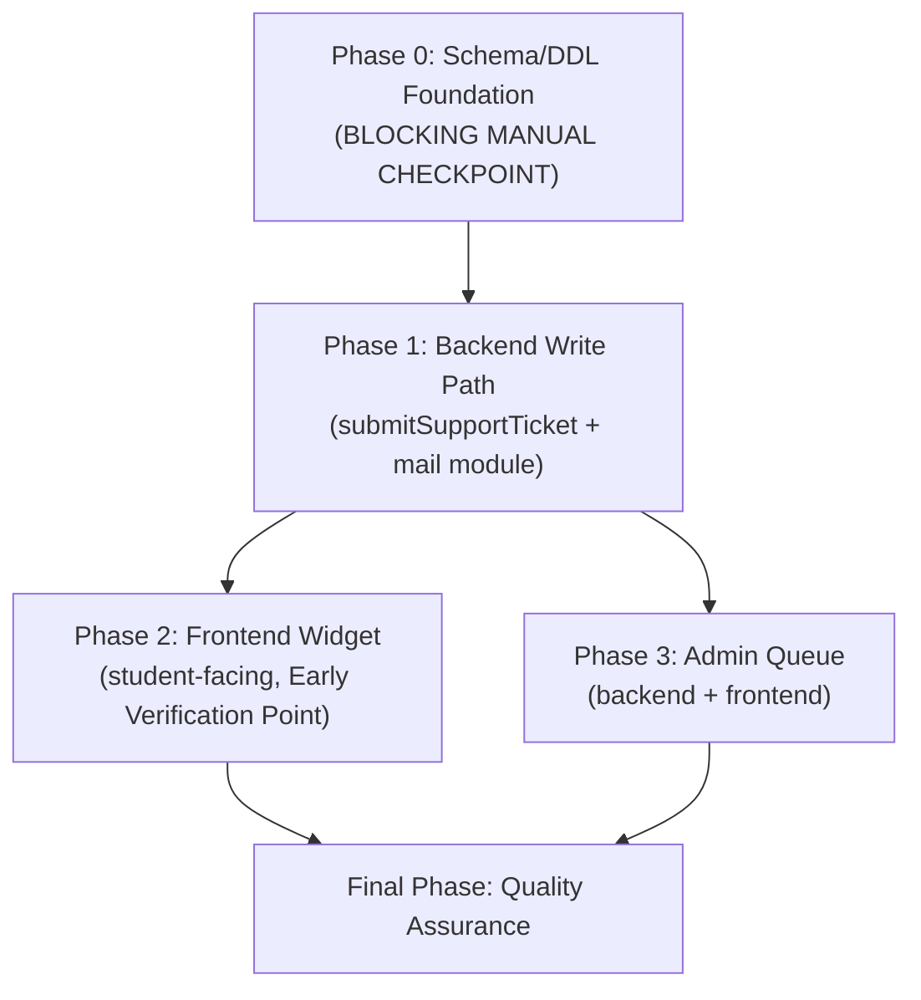
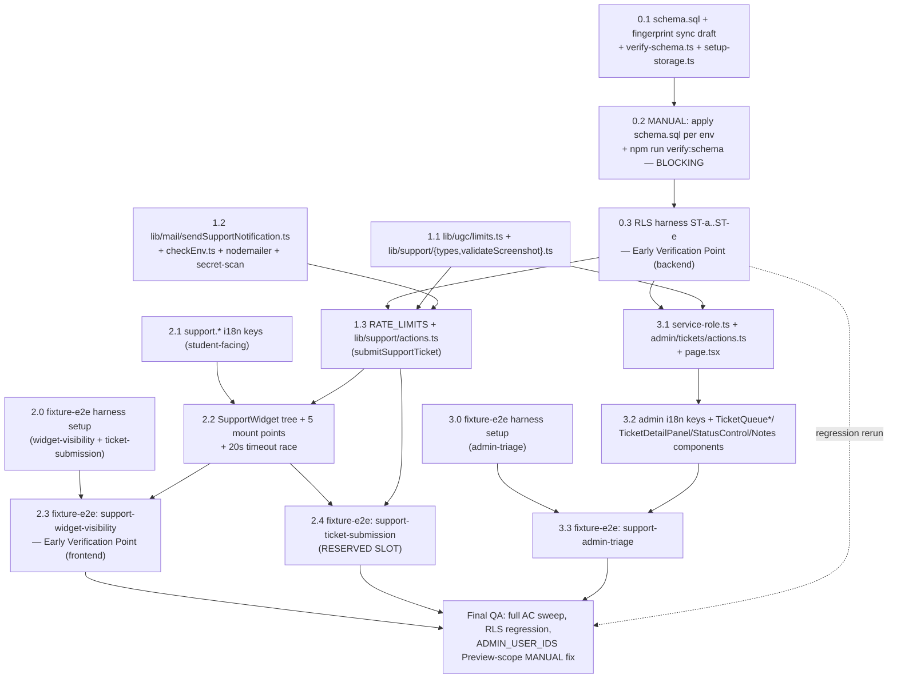

# Work Plan: User Support System v1 Implementation

Created Date: 2026-08-13
Type: feature
Estimated Duration: ~8-10 days
Estimated Impact: ~48 files (28 new — including 7 pre-generated test skeletons to fill in; 20 existing files extended additively; zero files modified non-additively)
Related Issue/PR: —
Review Scope: planned-files scope — `SOURCE/supabase/schema.sql`, `SOURCE/lib/schema/schemaFingerprint.ts`, `SOURCE/supabase/verify-schema.ts`, `SOURCE/supabase/setup-storage.ts`, `SOURCE/supabase/test-rls.ts`, `SOURCE/lib/security/rateLimit.ts`, `SOURCE/lib/env/checkEnv.ts` (+`__tests__`), `SOURCE/lib/ugc/limits.ts`, `SOURCE/lib/supabase/service-role.ts`, `SOURCE/lib/i18n/dictionaries/{vi,en}.ts` (+`__tests__/i18n.test.ts`), `SOURCE/package.json`, `SOURCE/scripts/check-ai-key-bundle.mjs`, `SOURCE/lib/support/{types,validateScreenshot,actions}.ts` (+`__tests__/actions.int.test.ts`), `SOURCE/lib/mail/sendSupportNotification.ts` (+`__tests__/sendSupportNotification.int.test.ts`), `SOURCE/app/(admin)/admin/tickets/page.tsx, SOURCE/features/admin/components/tickets/actions.tsx` (+`__tests__/actions.int.test.ts`), `SOURCE/features/admin/components/tickets/TicketQueueList.tsx, SOURCE/features/admin/components/tickets/TicketQueueRow.tsx, SOURCE/features/admin/components/tickets/TicketStatusBadge.tsx, SOURCE/features/admin/components/tickets/NotificationFailureFlag.tsx, SOURCE/features/admin/components/tickets/TicketDetailPanel.tsx, SOURCE/features/admin/components/tickets/TicketStatusControl.tsx, SOURCE/features/admin/components/tickets/InternalNotesPanel.tsx, SOURCE/app/(admin)/admin/tickets/loading.tsx, SOURCE/app/(admin)/admin/tickets/error.tsx`, `SOURCE/components/support/{SupportWidget,SupportWidgetTrigger,SupportWidgetDialog,IntentSelector,MessageField,ScreenshotAttachment}.tsx`, `SOURCE/app/(exams)/layout.tsx`, `SOURCE/app/(analytics)/layout.tsx`, `SOURCE/app/(authoring)/layout.tsx`, `SOURCE/app/(history)/layout.tsx`, `SOURCE/app/page.tsx`, `SOURCE/tests/e2e/fixture/support-ticket-submission.fixture.e2e.test.ts`, `SOURCE/tests/e2e/fixture/support-widget-visibility.fixture.e2e.test.ts`, `SOURCE/tests/e2e/fixture/support-admin-triage.fixture.e2e.test.ts`, `SOURCE/supabase/__tests__/support.rls.service.e2e.test.ts`.

## Related Documents
- Design Doc(s):
  - `docs/design/support-system-backend-design.md` (v1.2)
  - `docs/design/support-system-frontend-design.md` (v1.2)
- ADR: `docs/adr/ADR-0012-support-system-email-transport-and-admin-allowlist.md` (Accepted)
- PRD: `docs/prd/support-system-prd.md` (v1.2, R1-R16 / AC-001-049)
- UI Spec: `docs/ui-spec/support-system-ui-spec.md` (v1.1)

**Test skeletons (pre-generated by acceptance-test-generator, communicated per standard handoff — reference, do not regenerate):**
- integration: `SOURCE/lib/support/__tests__/actions.int.test.ts` (submitSupportTicket — 4 groups: metadata/intent capture, single-screenshot structural constraint, rate limiting, fire-and-forget mail decoupling), `SOURCE/lib/mail/__tests__/sendSupportNotification.int.test.ts` (subject-prefix contract, i18n absence, never-throws), `SOURCE/features/admin/__tests__/ticketActions.int.test.ts` (first-status-transition RPC shape, independent admin re-auth, batched-read `notify_failed` supply)
- fixture-e2e: `SOURCE/tests/e2e/fixture/support-ticket-submission.fixture.e2e.test.ts` (**RESERVED SLOT** — user-facing multi-step submission journey, emitted regardless of ROI score per the generator's Phase 4 rule), `SOURCE/tests/e2e/fixture/support-widget-visibility.fixture.e2e.test.ts` (widget absence/presence + 360px layout guard), `SOURCE/tests/e2e/fixture/support-admin-triage.fixture.e2e.test.ts` (admin queue journey)
- service-integration-e2e: `SOURCE/supabase/__tests__/support.rls.service.e2e.test.ts` (ST-a..ST-d — read-own isolation, internal-notes unreadable, internal-notes uninsertable; documents the preferred append-target into `SOURCE/supabase/test-rls.ts` itself, mirroring this repo's rating-system precedent). **Plan-added ST-e** (not present in this skeleton file — added by this work plan to close document review finding I001): `support-screenshots` bucket cross-student read denial (AC-013), ported into `test-rls.ts` alongside ST-a..ST-d — see Phase 0 Task 0.3.
- Both E2E lanes (fixture-e2e and service-integration-e2e) have skeletons provided — no E2E Gap Check warning applies to either lane.

## Verification Strategy (from Design Doc)

### Correctness Proof Method
- **Correctness definition (backend)**: (1) a non-owner cannot read another student's ticket (RLS); (2) no `authenticated` session, including the ticket's own author, can read or write `support_ticket_notes` under any circumstance (RLS); (3) a mail-transport failure never prevents a ticket commit or changes the student-visible result (D5); (4) every generated notification subject begins with the literal `[report-ms] ` regardless of intent, locale, or failure branch; (5) `first_status_transition_at` is written exactly once, at the correct moment, and never overwritten; (6) an admin Server Action rejects a non-admin caller even when the page-level guard is bypassed; (7) a stored screenshot is not readable by a user who is neither its author nor an admin — denied by the `support-screenshots` bucket's RLS (AC-013; plan-added ST-e, closes document review finding I001).
- **Correctness definition (frontend)**: (1) `SupportWidget` renders in exactly the union of "authenticated AND not attempt-route" pages, never elsewhere and never nowhere on that set; (2) `SupportWidgetDialog` never reaches Success except immediately after `submitSupportTicket` resolves `{ ok: true }`; (3) every error path (validation, rate-limited, network, timeout) preserves intent/message/screenshot selection verbatim; (4) `TicketDetailPanel` never interprets ticket-message/URL/user-agent content as markup; (5) the two admin-action adapters forward the correct `ticketId`/value pair extracted from `FormData`; (6) `IntentSelector` renders exactly three intent options and no fourth; (7) every display string resolves through `useT()`/`getTranslate()`; (8) `TicketStatusBadge` renders a distinct glyph + distinct Vietnamese label per status, never color alone.
- **Verification method**: `test-rls.ts` cases ST-a..ST-e against real Postgres (mocks cannot prove RLS; ST-e — plan-added, AC-013 — seeds a screenshot object under student A's path, confirms it exists via a service-role state-recount, then asserts student B's signed-in session cannot download it, discriminating the denial's error class rather than a bare `error !== null`); `submitSupportTicket`'s action-level test (mocked Supabase client, mocked `after()`) asserting the response resolves before the mail send's callback is invoked; `sendSupportNotification.test.ts`'s subject assertions across the full intent×locale matrix plus the failure branch; `changeSupportTicketStatus` unit test asserting two consecutive calls produce a timestamp on the first and an unchanged timestamp on the second, backstopped by `verify-schema.ts`'s EXECUTE-grant probe; admin-action tests with a mocked non-admin session; frontend component tests mounting `SupportWidget` across `{user, pathname}` combinations; a literal `<script>`-shaped fixture rendered through `TicketDetailPanel` asserted as `textContent`; a component test asserting `TicketStatusControl`'s adapter forwards the exact `(ticketId, status)` pair; a component test asserting `TicketDetailPanel` renders the screenshot only via a plain `` bound to the signed URL, never through any markup-interpreting render path (AC-014).
- **Verification timing**: DB foundation (RLS suite) verified immediately after schema apply, before any consuming code is written; mail-module and admin-action unit tests run in CI on every commit; the live-SMTP-latency unknown is verified once, early in implementation; frontend component tests (1)-(4)/(6)/(8) run in CI independent of backend readiness via the mocked contract boundary; item (7) (zero hard-coded strings) has **no automated check in this repository** and is a code-review gate until a lint rule is added (recorded as a known QA gap, not silently assumed covered).

### Early Verification Point
- **First (backend, Phase 0, blocking)**: `test-rls.ts` cases ST-a..ST-e against a real local Supabase instance, immediately after the DB foundation (schema + RLS + bucket policy) is applied — ST-e (screenshot bucket cross-student read denial, AC-013) is a plan-added case beyond the DD's own 4-case Test Boundaries table, closing document review finding I001. **Success criteria**: all five cases pass with the harness's own state-recount and error-class-discrimination discipline (not a bare `error !== null`), and `npm run verify:schema` confirms no FK/fingerprint drift. **Failure response**: stop and correct the schema before proceeding to Phase 1 (do not build `lib/support/`/`lib/mail/`/the admin route on top of an unverified authorization layer) — reassess the specific policy clause against the `exam_moderation_log`/`exam_reports` precedents this design claims to follow.
- **Second (frontend, Phase 2)**: `SupportWidget`'s five-mount-point self-guard. **Success criteria**: all four `{ user, pathname }` combinations render/don't-render correctly across a representative sample of the five real mount pathnames, and a manual 360px Playwright pass confirms zero `BottomNav` intersection (AC-006) on at least one real mounted route. **Failure response**: stop before wiring the dialog to the real backend action — an incorrect guard is a visibility bug independent of submission logic, and fixing it after the dialog is wired risks the fix being obscured by unrelated submit-flow debugging.

### Proof Strategy
- **Proof obligation source**: test skeleton annotations (`@category`, `@lane`, `@dependency`, `@complexity`, `Primary failure mode`, `Proof obligation`) in the seven skeleton files listed above are the primary source. Where a covered behavior has no skeleton (schema DDL itself, `lib/support/validateScreenshot.ts`'s own boundary fixtures, admin-UI presentational components with no dedicated skeleton, i18n key-parity wiring), the matching AC's primary failure mode from both Design Docs' Acceptance Criteria sections is the fallback source.
- **Per-task propagation**: every task below that implements a claim records its Proof Obligations (per the task template) sourced from the matching skeleton block or AC, so downstream review judges whether the tests prove the claim, not merely run.

## Quality Assurance Mechanisms (from Design Doc)

| Mechanism | Enforces | Config Location | Covered Files |
|-----------|----------|-----------------|---------------|
| ESLint (`npm run lint`, `--max-warnings 0`) | Zero new lint errors/warnings | `SOURCE/eslint.config.mjs` | project-wide |
| TypeScript (`npx tsc --noEmit`) | Type correctness — an unregistered `RATE_LIMITS` key or a `TicketWithNotes` field mismatch is a compile error | `.github/workflows/ci.yml:51-52` | project-wide (specifically catches the `TicketWithNotes` transcription risk — Risk R-F2) |
| Vitest (`npm test`) | Pure-function + component unit/integration coverage | `SOURCE/vitest.config.ts` (`include: lib/**, components/**, app/**`) | `SOURCE/lib/support/`, `SOURCE/lib/mail/`, `SOURCE/lib/ugc/limits.ts`, `SOURCE/components/support/**`, `SOURCE/app/(admin)/admin/tickets/**` |
| Schema fingerprint three-way assertion (part of `npm test`) | `SCHEMA_FINGERPRINT` constant ≡ `schema.sql` §17 declared value ≡ recomputed hash | `SOURCE/lib/schema/__tests__/schemaFingerprint.test.ts` | `schema.sql`, `schemaFingerprint.ts` |
| Foreign-key text parser tests (part of `npm test`) | Every FK parseable with explicit `on delete` | `SOURCE/lib/schema/__tests__/parseForeignKeys.test.ts` | `schema.sql` |
| i18n dictionary contract tests | vi/en key parity, no empty values, placeholder parity, **new** `report-ms`-absence assertion | `SOURCE/lib/i18n/__tests__/i18n.test.ts` | `vi.ts`/`en.ts` |
| `checkEnv` contract tests | A fully-configured env produces zero problems; each new silent-failure mode caught with its concrete consequence string | `SOURCE/lib/env/__tests__/checkEnv.test.ts` | `checkEnv.ts` |
| Production build in CI (`npx next build`) | Build correctness incl. Edge-bundle boundary violations (a mail-module-in-Edge-bundle mistake surfaces here) | `.github/workflows/ci.yml:74-80` | entire app |
| Client-bundle secret scan (`npm run check:bundle`) | Scans for secret values/marker strings in client bundle output | `SOURCE/scripts/check-ai-key-bundle.mjs` | client bundle output (new `SUPPORT_SMTP_APP_PASSWORD`/`SUPPORT_SMTP_USER`/`nodemailer` markers) |
| `npm run verify:schema` (manual, not in CI) | Seven checks against a live DB incl. FK reconciliation and fingerprint match | `SOURCE/supabase/verify-schema.ts` | `schema.sql` vs each live Supabase project |
| `npx tsx supabase/test-rls.ts` (manual, not in CI) | RLS isolation against real Postgres, two real users, anon key | `SOURCE/supabase/test-rls.ts` | all RLS policies/grants (acceptance mechanism for PRD metrics 1-3) |
| Manual 360px viewport pass (Playwright MCP or `npm run dev`) | AC-006's zero-`BottomNav`-intersection guarantee | local dev session | `SupportWidgetTrigger` |

**Known QA gaps, not adopted (recorded, not silently assumed covered)**: axe automated accessibility audit — no axe integration exists in this repo's toolchain; the UI Spec's "0 serious/critical axe issues" metric is not CI-enforced (Final QA phase substitutes a manual keyboard pass + jsx-a11y ESLint rules, per the sibling rating/history plans' precedent). No-hard-coded-display-string lint rule for AC-035 — no `jsx-no-literals`-equivalent rule exists; verified by code review at each component-authoring task, not by CI, until a lint rule is added.

## Design-to-Plan Traceability

| Design Doc | DD Section | DD Item | Category | Covered By Task(s) | Gap Status | Notes |
|---|---|---|---|---|---|---|
| docs/design/support-system-backend-design.md | Agreement Checklist / Schema & DB Enforcement §1 | `support_tickets` table (columns, CHECK constraints, insert-own + select-own RLS) | impl-target | Phase 0 Task 0.1 | covered | |
| docs/design/support-system-backend-design.md | Agreement Checklist / Schema & DB Enforcement §2 | `support_ticket_notes` table — strict `exam_moderation_log`-form `revoke all`, zero policies (D4/R8/AC-048) | impl-target | Phase 0 Task 0.1 | covered | |
| docs/design/support-system-backend-design.md | Agreement Checklist / Schema & DB Enforcement §3 | `support-screenshots` Storage bucket: insert-own-only policy + Storage-native `fileSizeLimit`/`allowedMimeTypes` backstop | impl-target | Phase 0 Task 0.1 | covered | |
| docs/design/support-system-backend-design.md | Schema & DB Enforcement §4 | `change_support_ticket_status` Postgres function — INVOKER, explicit `revoke`/`grant`, RPC-only (D002 v1.2 fix) | impl-target | Phase 0 Task 0.1 | covered | |
| docs/design/support-system-backend-design.md | Schema & DB Enforcement (apply order, steps 1-7) | Schema-fingerprint three-way sync + per-environment manual SQL Editor paste | prerequisite | Phase 0 Task 0.2 | covered | **MANUAL, BLOCKING** — only the engineer can perform this step |
| docs/design/support-system-backend-design.md | Fact `code:...schema-fingerprint-apply-order` / `verify-schema.ts` | `deleteChain` gains `support_tickets → support_ticket_notes`; new `change_support_ticket_status` EXECUTE-grant probe | verification | Phase 0 Task 0.1 | covered | |
| docs/design/support-system-backend-design.md | Schema & DB Enforcement §3 | `setup-storage.ts` `BUCKETS` array gains `"support-screenshots"` | connection-switching | Phase 0 Task 0.1 | covered | |
| docs/design/support-system-backend-design.md | Schema & DB Enforcement / TBD-02 resolution | Server-proxied screenshot upload (Option A) inside `submitSupportTicket`; Storage-native limits as backstop, not primary gate | impl-target | Phase 1 Task 1.3 | covered | |
| docs/design/support-system-backend-design.md | Data Representation Decision | New tables/bucket, not reuse of `exam_reports`/`exam-images` (3 disqualifying-criteria rows) | prerequisite | Phase 0 Task 0.1 | covered | |
| docs/design/support-system-backend-design.md | Minimal Surface Alternatives Element 1 | `shortRef` = first 8 hex chars of `id`, derived at read time, no stored column | contract-change | Phase 1 Task 1.3 | covered | |
| docs/design/support-system-backend-design.md | Minimal Surface Alternatives Element 2 | `notify_failed boolean` column on `support_tickets`, not a separate notifications table | contract-change | Phase 0 Task 0.1 | covered | |
| docs/design/support-system-backend-design.md | Minimal Surface Alternatives Element 3 | `first_status_transition_at` via single atomic RPC CASE expression, not a trigger or audit log | contract-change | Phase 0 Task 0.1 | covered | |
| docs/design/support-system-backend-design.md | Business Logic — `SOURCE/lib/support/` | `types.ts` (closed unions) + `validateScreenshot.ts` (`checkScreenshotFile`) + `LIMITS` additions | impl-target | Phase 1 Task 1.1 | covered | |
| docs/design/support-system-backend-design.md | Test Boundaries / vitest | `validateScreenshot.test.ts` boundary fixtures (exact limit / one-over / each allowed MIME / disallowed MIME) | verification | Phase 1 Task 1.1 | covered | |
| docs/design/support-system-backend-design.md | Data Contracts | `submitSupportTicket(formData)` — auth→guard→validate→upload→insert→`after()`-scheduled mail | impl-target | Phase 1 Task 1.3 | covered | |
| docs/design/support-system-backend-design.md | Data Contracts | `sendSupportNotification`/`composeSupportNotificationSubject` — never throws, `[report-ms]` prefix contract | impl-target | Phase 1 Task 1.2 | covered | |
| docs/design/support-system-backend-design.md | Data Contracts | `changeTicketStatusAction(ticketId, nextStatus)` | impl-target | Phase 3 Task 3.1 | covered | |
| docs/design/support-system-backend-design.md | Data Contracts | `addTicketNoteAction(ticketId, noteText)` | impl-target | Phase 3 Task 3.1 | covered | |
| docs/design/support-system-backend-design.md | Data Contracts | `listSupportTickets()` — batched read (1 tickets select + 1 notes select), signed URLs | impl-target | Phase 3 Task 3.1 | covered | |
| docs/design/support-system-backend-design.md | Data Contracts | `flagSupportTicketNotifyFailed` / `changeSupportTicketStatus` / `addSupportTicketNote` (service-role) | impl-target | Phase 1 Task 1.3 (`flagSupportTicketNotifyFailed`) + Phase 3 Task 3.1 (`changeSupportTicketStatus`, `addSupportTicketNote`) | covered | |
| docs/design/support-system-backend-design.md | Field Propagation Map | screenshot File → multipart → Storage object path; `notify_failed`/`first_status_transition_at` round trips; `[report-ms]` → SMTP header | contract-change | Phase 1 Task 1.3 (screenshot, `notify_failed`) + Phase 0 Task 0.1 (`first_status_transition_at` column) + Phase 1 Task 1.2 (`[report-ms]`) | covered | Serialized rows also recorded in Connection Map below |
| docs/design/support-system-backend-design.md | Integration Point Map | Rate limiting — `guard("submitTicket", user.id)`, new `RATE_LIMITS` entry | connection-switching | Phase 1 Task 1.3 | covered | |
| docs/design/support-system-backend-design.md | Integration Point Map | Env validation — `checkEnv.ts` three new optional/warn entries | connection-switching | Phase 1 Task 1.2 | covered | |
| docs/design/support-system-backend-design.md | Integration Point Map | Admin authorization — independent `isAdminUserId()`/`getCurrentUser()` re-check in both admin actions and the page | verification | Phase 3 Task 3.1 | covered | |
| docs/design/support-system-backend-design.md | Integration Point Map | Mail transport — Gmail SMTP via `nodemailer` | connection-switching | Phase 1 Task 1.2 | covered | |
| docs/design/support-system-backend-design.md | Integration Point Map | Storage — `support-screenshots` upload | connection-switching | Phase 1 Task 1.3 | covered | |
| docs/design/support-system-backend-design.md | State Transitions and Invariants | Status lifecycle (`new→in_progress/resolved`), `first_status_transition_at` write-once, `notify_failed` one-way | verification | Phase 0 Task 0.1 (function) + Phase 3 Task 3.1 (admin-action wiring/test) | covered | |
| docs/design/support-system-backend-design.md | Error Handling | Validation / rate-limit / unauthenticated / upload / insert / mail / admin-auth error matrix | verification | Phase 1 Task 1.3 (student path) + Phase 3 Task 3.1 (admin path) | covered | |
| docs/design/support-system-backend-design.md | Logging and Monitoring | Sensitive-data rule: `SUPPORT_SMTP_APP_PASSWORD` never logged; added to `check-ai-key-bundle.mjs` SECRETS list | prerequisite | Phase 1 Task 1.2 | covered | |
| docs/design/support-system-backend-design.md | Security Considerations | RLS authoritative; admin re-check independent of page guard; notes table zero `authenticated` privilege of any kind | verification | Phase 0 Task 0.1 (RLS) + Phase 3 Task 3.1 (admin re-check) | covered | |
| docs/design/support-system-backend-design.md | Migration Strategy | No data migration — both tables new/additive/empty at launch | prerequisite | Phase 0 Task 0.1 | covered | |
| docs/design/support-system-backend-design.md | Test Boundaries / RLS suite | ST-a..ST-d extending `test-rls.ts` | verification | Phase 0 Task 0.3 | covered | Also the required blocking Early Verification Point; Task 0.3 additionally implements plan-added ST-e (AC-013) — see next-but-one row |
| docs/design/support-system-backend-design.md | Verification Strategy / Early Verification Point | `test-rls.ts` ST-a..ST-d, blocking, before Phase 1 begins | verification | Phase 0 Task 0.3 | covered | Task 0.3's actual scope is ST-a..ST-e (see next row) |
| docs/design/support-system-backend-design.md | Acceptance Criteria (AC) / R4 — Screenshot | AC-013: screenshot requested by a user who is neither its author nor an admin is denied (no `authenticated` select policy on the `support-screenshots` bucket) | verification | Phase 0 Task 0.3 (ST-e) | covered | **Plan-added**: the DD's own Test Boundaries/RLS suite table lists only ST-a..ST-d and does not cover AC-013; this row and Task 0.3's ST-e close document review finding I001 |
| docs/design/support-system-backend-design.md | AC Responsibility table | AC-014 (delivery mechanism only, backend-responsible): the admin-viewed screenshot renders through a path that treats it as untrusted user-uploaded content | verification | Phase 3 Task 3.2 | covered | **Newly cited**: the render-path behavior (`` only, never a markup-interpreting pipeline) was already planned in Task 3.2's body but had no explicit AC-014 proof obligation or F.3 sweep citation; closes document review finding I002 |
| docs/design/support-system-backend-design.md | Implementation Path Mapping | `checkEnv.ts` 3 new entries + `checkEnv.test.ts` `goodEnv()`/per-variable cases | impl-target | Phase 1 Task 1.2 | covered | |
| docs/design/support-system-backend-design.md | Implementation Path Mapping | `i18n.test.ts` new `report-ms`-absence assertion | verification | Phase 1 Task 1.2 | covered | |
| docs/design/support-system-backend-design.md | Implementation Path Mapping | `package.json` gains `nodemailer` + `@types/nodemailer` (first mail dependency) | prerequisite | Phase 1 Task 1.2 | covered | |
| docs/design/support-system-backend-design.md | Implementation Path Mapping | `check-ai-key-bundle.mjs` SECRETS/marker list additions | verification | Phase 1 Task 1.2 | covered | |
| docs/design/support-system-backend-design.md | Technical Dependencies §5 | Admin service-role functions + `admin/tickets/page.tsx` + `actions.ts` | impl-target | Phase 3 Task 3.1 | covered | |
| docs/design/support-system-backend-design.md | PRD Use Case 13 / Risk table | `ADMIN_USER_IDS` currently Production-scope only on Vercel (TD-014) — `/admin/tickets` 404s on every Preview deploy | prerequisite | Final Phase Task F.2 | covered | **MANUAL** launch dependency, not a code defect; see Notes |
| docs/design/support-system-frontend-design.md | Agreement Checklist / Scope | `SupportWidget` + 5 children, mounted at all 5 UI-D1 mount points | impl-target | Phase 2 Task 2.2 | covered | |
| docs/design/support-system-frontend-design.md | Agreement Checklist / Scope | `/admin/tickets` rendering layer (7 components) composed inside backend-owned `page.tsx` | impl-target | Phase 3 Task 3.2 | covered | |
| docs/design/support-system-frontend-design.md | Agreement Checklist / Scope | `admin/tickets/loading.tsx` + `error.tsx` (newly identified scope — neither upstream doc assigned a file path) | impl-target | Phase 3 Task 3.2 | covered | |
| docs/design/support-system-frontend-design.md | Agreement Checklist / Scope | `support.*` i18n key inventory (student-facing) | contract-change | Phase 2 Task 2.1 | covered | |
| docs/design/support-system-frontend-design.md | i18n Key Inventory | `support.admin.*` i18n keys (admin-facing) | contract-change | Phase 3 Task 3.2 | covered | |
| docs/design/support-system-frontend-design.md | Fact Disposition Table | Call-shape adapters — `statusFormAction`/`noteFormAction` local wrappers bridging `useActionState`'s `(prevState, formData)` shape | contract-change | Phase 3 Task 3.2 | covered | |
| docs/design/support-system-frontend-design.md | Fact Disposition Table | Client-side 20s submission ceiling — `Promise.race` + `attemptId` guard (no `AbortSignal` hook exists for a Server Action call) | impl-target | Phase 2 Task 2.2 | covered | |
| docs/design/support-system-frontend-design.md | Data Contracts | Consumed backend contracts (`SubmitTicketResult`, `TicketActionState`, `TicketWithNotes`) imported by type reference, never redeclared | contract-change | Phase 2 Task 2.2 (submit) + Phase 3 Task 3.2 (admin) | covered | |
| docs/design/support-system-frontend-design.md | Data Contracts | Client-only `ClientSubmitError` union | contract-change | Phase 2 Task 2.2 | covered | |
| docs/design/support-system-frontend-design.md | Component specs | `SupportWidget`/`Trigger`/`Dialog`/`IntentSelector`/`MessageField`/`ScreenshotAttachment` | impl-target | Phase 2 Task 2.2 | covered | |
| docs/design/support-system-frontend-design.md | Component specs | `TicketQueueList`/`Row`/`DetailPanel`/`StatusControl`/`InternalNotesPanel` | impl-target | Phase 3 Task 3.2 | covered | |
| docs/design/support-system-frontend-design.md | Component specs | `TicketStatusBadge` — independent `Status`/`CONFIG`, never merged into `StatusBadge` (UI Spec I002) | impl-target | Phase 3 Task 3.2 | covered | |
| docs/design/support-system-frontend-design.md | Component specs | `NotificationFailureFlag` | impl-target | Phase 3 Task 3.2 | covered | |
| docs/design/support-system-frontend-design.md | Field Propagation Map | intent/message/metadata → `FormData`; screenshot File → `FormData`; `ticketId`/status, `ticketId`/noteText → hidden-input `FormData`; `shortRef` → acknowledgement | contract-change | Phase 2 Task 2.2 (submit fields) + Phase 3 Task 3.2 (admin adapters) | covered | Serialized rows also recorded in Connection Map below |
| docs/design/support-system-frontend-design.md | State Transitions | `SupportWidgetDialog` phase machine (Compose/Submitting/Success, timeout race + `attemptId` guard) | impl-target | Phase 2 Task 2.2 | covered | |
| docs/design/support-system-frontend-design.md | State Transitions | `TicketQueueRow` expand/collapse — local `useState`, never persisted | impl-target | Phase 3 Task 3.2 | covered | |
| docs/design/support-system-frontend-design.md | Integration Point Map | Widget mount — render prop, sibling to existing `<BottomNav />` | connection-switching | Phase 2 Task 2.2 | covered | |
| docs/design/support-system-frontend-design.md | Integration Point Map | Student submit — direct async call, not `useActionState`, not `<form action>` | connection-switching | Phase 2 Task 2.2 | covered | |
| docs/design/support-system-frontend-design.md | Integration Point Map | Admin status/note — `useActionState` + hidden-input `FormData` adapter | connection-switching | Phase 3 Task 3.2 | covered | |
| docs/design/support-system-frontend-design.md | Integration Point Map | Admin read — Server Component prop passing, no client fetch | connection-switching | Phase 3 Task 3.1 (data) + Phase 3 Task 3.2 (render) | covered | |
| docs/design/support-system-frontend-design.md | Minimal Surface Alternatives Element 1 | Local `ClientSubmitError` union superset (not widening backend type, not a boolean flag) | contract-change | Phase 2 Task 2.2 | covered | |
| docs/design/support-system-frontend-design.md | Minimal Surface Alternatives Element 2 | Inline `useState` in `SupportWidgetDialog` (no `useSupportTicketSubmit` hook extraction — Rule of Three, single consumer) | contract-change | Phase 2 Task 2.2 | covered | |
| docs/design/support-system-frontend-design.md | Verification Strategy / Early Verification Point | `SupportWidget` five-mount-point self-guard + 360px `BottomNav` pass | verification | Phase 2 Task 2.3 | covered | |
| docs/design/support-system-frontend-design.md | Verification Strategy — correctness definition items 4-8 | Untrusted render (item 4), adapter forwarding (item 5), `IntentSelector` exactly-3 (item 6), i18n coverage (item 7, code-review gate), `TicketStatusBadge` distinct glyph (item 8) | verification | Phase 2 Task 2.2 (`IntentSelector`, i18n) + Phase 3 Task 3.2 (`TicketDetailPanel` render safety, `TicketStatusBadge`, adapters) | covered | |
| docs/design/support-system-frontend-design.md | Change Impact Map | 5 layouts + `page.tsx` each gain one sibling `<SupportWidget user={user} />` render, no existing line removed | connection-switching | Phase 2 Task 2.2 | covered | |

**Category values used**: `impl-target`, `connection-switching`, `contract-change`, `verification`, `prerequisite`. No `gap` rows — every extracted item has a covering task.

## Reference Contract Values

| Design Doc (§ Section) | Contract Type | Required Observable Value (verbatim) | Covered By Task(s) |
|---|---|---|---|
| docs/design/support-system-backend-design.md (§ Data Contracts — `sendSupportNotification`/`composeSupportNotificationSubject`) | state-lifecycle-negative | "SUPPORT_MAIL_SUBJECT_PREFIX (\"[report-ms] \") is prepended to every subject this module ever composes, including on the path that is about to report a failure (AC-046)" | Phase 1 Task 1.2 |
| docs/design/support-system-backend-design.md (§ Data Contracts — `composeSupportNotificationSubject`) | derived-display | "return value always starts with the exact literal \"[report-ms] \" (AC-043); the same call with two different translate functions (one per locale) yields two strings whose first 12 characters are byte-identical (AC-044); the token itself is a module-level constant, never a dictionary key, never passed through vi.ts/en.ts (R16)" | Phase 1 Task 1.2 |
| docs/prd/support-system-prd.md (§ D10 / R16) | state-lifecycle-negative | "The token sits at the very start of the subject, is byte-identical in every email, and never varies by intent, by status, or by locale... is therefore not routed through SOURCE/lib/i18n/dictionaries/vi.ts / en.ts, is never localized or translated" | Phase 1 Task 1.2 |
| docs/design/support-system-backend-design.md (§ Minimal Surface Alternatives Element 1 / Data Contracts §submitSupportTicket) | derived-display | "First 8 hex chars of id" — `shortRef` derivation, returned as `{ ok: true, shortRef: ticket.id.slice(0, 8) }` | Phase 1 Task 1.3 |
| docs/design/support-system-backend-design.md (§ State Transitions and Invariants) | state-lifecycle-negative | "first_status_transition_at is null if and only if status has never left 'new' since creation" | Phase 0 Task 0.1 |
| docs/design/support-system-backend-design.md (§ Data Contracts — `submitSupportTicket` Invariants) | state-lifecycle-negative | "sendSupportNotification is called at most once per submission, only after the INSERT has succeeded (D5), and only via an after()-registered callback that Next.js guarantees runs after this action's response has already been sent to the client" | Phase 1 Task 1.3 |
| docs/design/support-system-frontend-design.md (§ Data Contracts — `TicketStatusBadge` `CONFIG`) | derived-display | `` new: { glyph: "✉", labelKey: "support.admin.status.new", className: "border-border text-muted-foreground" }, in_progress: { glyph: "▶", labelKey: "support.admin.status.inProgress", className: "border-[#B8863B] text-[#8a6420]" }, resolved: { glyph: "✓", labelKey: "support.admin.status.resolved", className: "border-[#3f7d4f] text-[#2f6b3f]" } `` | Phase 3 Task 3.2 |
| docs/design/support-system-frontend-design.md (§ Data Contracts — `SupportWidget` Output Guarantees) | state-lifecycle-negative | "returns null (no DOM node) when user is null (AC-003) OR when usePathname() matches the (exams) attempt-route pattern /^\/exams\/[^/]+\/attempt\/[^/]+$/ (AC-005) — both checks run on every render" | Phase 2 Task 2.2 |
| docs/design/support-system-frontend-design.md (§ Data Contracts — `SupportWidgetDialog` Output Guarantees) | state-lifecycle-negative | "phase only ever transitions compose -> submitting -> (compose, with submitError set) \| (success, with result set) — never compose -> success directly (AC-040)" | Phase 2 Task 2.2 |

## Failure Mode Checklist

| Category | Applies? | Covered By Task(s) |
|---|---|---|
| same-value | yes | Phase 0 Task 0.1 (`change_support_ticket_status`'s `p_status <> 'new'` CASE guard — a same-value or intermediate status change must not re-stamp `first_status_transition_at`) + Phase 3 Task 3.1 (admin-action int test Group 1: two consecutive calls, second must return the identical timestamp) |
| no-op | yes | Phase 2 Task 2.2 (`SupportWidgetDialog`'s `phase === "submitting"` guard — a repeat click/Enter while a submit is in flight must not fire a second `submitSupportTicket` call, per `aria-disabled` + the phase state machine) |
| empty input | yes | Phase 1 Task 1.3 (empty/whitespace-only message + missing intent, server-side, AC-002) + Phase 2 Task 2.2 (same, client-side validation) + Phase 3 Task 3.2 (`TicketQueueList` empty state, `support.admin.empty`) |
| invalid option | yes | Phase 0 Task 0.1 (CHECK constraints on `intent`/`status`; `change_support_ticket_status`'s own `if p_status not in (...)` validation) + Phase 1 Task 1.3 (intent outside the fixed 3, screenshot MIME/size) + Phase 3 Task 3.1 (`nextStatus` outside the fixed 3, defensive admin-action check) |
| missing config | yes | Phase 1 Task 1.2 (`SUPPORT_NOTIFY_EMAIL`/`SUPPORT_SMTP_USER`/`SUPPORT_SMTP_APP_PASSWORD` unset → `checkEnv` warns with concrete consequence, submission still works, AC-034) |
| unavailable boundary | yes | Phase 1 Task 1.2 (mail transport throws/times out/unconfigured → ticket still committed, AC-031) + Phase 1 Task 1.3 (Storage upload failure → `{ error: "server" }`, best-effort orphan cleanup) |
| shared-state dependency | yes | Phase 0 Task 0.1 (`change_support_ticket_status`'s single atomic UPDATE reads the row's own pre-update `status` in the same statement it writes — race-free even under two concurrent admin sessions changing the same ticket) |
| rollback-only visibility | no | No read-time visibility filter in this feature depends on another entity's independently-mutable state (unlike, e.g., an exam's `published` status gating a rating/history read elsewhere in this codebase) — a ticket's visibility is scoped purely by its own row ownership via RLS |
| missing-sort-key ordering | no | AC-041 requires only most-recent-first ordering (`created_at desc`); no explicit tie-break is specified in the PRD or either Design Doc, and exact-timestamp collision at this feature's stated volume (≥5 tickets/30 days) carries no practical risk |

## UI Spec Component → Task Mapping

| UI Spec Component (section heading) | States to Cover | Covered By Task(s) | Gap Status | Notes |
|---|---|---|---|---|
| Component: SupportWidgetTrigger | Default (Loading/Empty/Error/Partial are N/A per UI Spec) | Phase 2 Task 2.2 | covered | AC-006 layout guard also covered by Phase 2 Task 2.3 |
| Component: IntentSelector | Default / Empty (visually identical to Default) / Error | Phase 2 Task 2.2 | covered | |
| Component: MessageField | Default / Loading / Error / Partial (preserved value on refusal) | Phase 2 Task 2.2 | covered | |
| Component: ScreenshotAttachment | Default / Loading / Empty / Error / Partial | Phase 2 Task 2.2 | covered | |
| Component: SupportWidgetDialog | Default / Loading / Error / Success sub-state | Phase 2 Task 2.2 | covered | |
| Component: TicketQueueList | Default / Loading / Empty / Error | Phase 3 Task 3.2 | covered | Loading/Error via `loading.tsx`/`error.tsx` |
| Component: TicketStatusBadge | Default (others N/A) | Phase 3 Task 3.2 | covered | |
| Component: TicketQueueRow | Default / Loading (busy on status/note submit) / Partial (expanded) + Notification-failure flag (conditional) | Phase 3 Task 3.2 | covered | |
| Component: TicketDetailPanel | Default / Partial (screenshot conditional) | Phase 3 Task 3.2 | covered | |
| Component: TicketStatusControl | Default / Loading / Error | Phase 3 Task 3.2 | covered | |
| Component: InternalNotesPanel | Default / Loading / Empty / Error | Phase 3 Task 3.2 | covered | |

## ADR Bindings

| ADR | Source Section | Axis | Binding Decision | Covered By Task(s) |
|---|---|---|---|---|
| docs/adr/ADR-0012-support-system-email-transport-and-admin-allowlist.md | Decision | placement | Gmail SMTP + App Password via `nodemailer`, called only from the ticket-creation Server Action (Node runtime by construction); the mail module (`SOURCE/lib/mail/sendSupportNotification.ts`) has no `"use client"` / Edge markers | Phase 1 Task 1.2 |
| docs/adr/ADR-0012-support-system-email-transport-and-admin-allowlist.md | Implementation Guidance | data_flow | "Call the mail send exactly once, from inside the ticket-creation Server Action, after the ticket row commit succeeds — never before (D5)" | Phase 1 Task 1.3 |
| docs/adr/ADR-0012-support-system-email-transport-and-admin-allowlist.md | Implementation Guidance | data_flow | "Wrap the entire send in a single try/catch; on any failure ... log full context ... and set the AC-032 notification-failure flag. Do not distinguish failure causes in the student-facing path — the student always sees success" | Phase 1 Task 1.2 |
| docs/adr/ADR-0012-support-system-email-transport-and-admin-allowlist.md | Implementation Guidance | contract_schema | "Compose the D10 [report-ms] subject prefix from a single non-localized constant inside the mail module, applied identically regardless of transport (R16) — do not route it through SOURCE/lib/i18n/dictionaries/{vi,en}.ts" | Phase 1 Task 1.2 |
| docs/adr/ADR-0012-support-system-email-transport-and-admin-allowlist.md | Implementation Guidance | placement | "Register the new SMTP credential variables in checkEnv.ts as optional/warn, mirroring the GEMINI_API_KEY and SUPPORT_NOTIFY_EMAIL precedents" | Phase 1 Task 1.2 |
| docs/adr/ADR-0012-support-system-email-transport-and-admin-allowlist.md | Implementation Guidance | dependency_direction | "Keep the mail module's only caller the ticket-creation Server Action; do not give proxy.ts or instrumentation.ts any reason to import it" | Phase 1 Task 1.2 + Phase 1 Task 1.3 |

## Connection Map

| Boundary | Owner (left side) | Owner (right side) | Serialized Format | Consumer Parse Rule | Expected Signal | Covered By Task(s) |
|---|---|---|---|---|---|---|
| `SupportWidgetDialog` (browser) → `submitSupportTicket` (Server Action) | `SOURCE/components/support/SupportWidgetDialog.tsx` | `SOURCE/lib/support/actions.ts` | `multipart/form-data` (`intent`, `message`, `pageUrl`, `userAgent`, `screenWidth`, `screenHeight`, optional `screenshot` File) | `formData.get(name)` per field server-side; screenshot via `formData.get("screenshot")` as `File` | Response matches the closed `SubmitTicketResult` union | Phase 1 Task 1.3 (server) + Phase 2 Task 2.2 (client) |
| `TicketStatusControl` (browser, `useActionState` adapter) → `changeTicketStatusAction` (Server Action) | `SOURCE/features/admin/components/tickets/TicketStatusControl.tsx` | `SOURCE/features/admin/ticketActions.ts` | Hidden `<input name="ticketId">` + selected `<select name="status">`, both `FormData` fields | Local `statusFormAction` wrapper reads `formData.get("ticketId")`/`"status"`, casts `status` to `TicketStatus` | `TicketActionState` response; DB CHECK is the authoritative backstop against an invalid value | Phase 3 Task 3.1 (action) + Phase 3 Task 3.2 (adapter) |
| `InternalNoteForm` (browser) → `addTicketNoteAction` (Server Action) | `SOURCE/features/admin/components/tickets/InternalNotesPanel.tsx` | `SOURCE/features/admin/ticketActions.ts` | Hidden `<input name="ticketId">` + `<textarea name="noteText">`, both `FormData` fields | Local `noteFormAction` wrapper reads both fields | `TicketActionState` response; the new note appears in `InternalNotesPanel`'s rendered list on success | Phase 3 Task 3.1 (action) + Phase 3 Task 3.2 (adapter) |
| `sendSupportNotification` (Node.js mail module) → Gmail SMTP inbox | `SOURCE/lib/mail/sendSupportNotification.ts` | External Gmail SMTP mailbox (`SUPPORT_NOTIFY_EMAIL`) | RFC 5322 `Subject:` header, UTF-8, `[report-ms] ` leading literal | The maintainer's own Gmail filter rule matches on the literal leading bytes (not app-controlled) | Every notification email is captured by a single fixed Gmail filter and none is missed | Phase 1 Task 1.2 |

## Objective

Implement the User Support System v1 end-to-end per the backend and frontend Design Docs, ADR-0012, and the UI Spec: give a logged-in student a floating widget that files a bug/suggestion/question ticket with auto-captured technical context and at most one optional screenshot; persist tickets with read-own RLS; notify a single support inbox by fire-and-forget email carrying a machine-matchable `[report-ms]` subject prefix; and give the `ADMIN_USER_IDS` allowlist a queue page to triage tickets through `new → in_progress → resolved` and write internal notes the student can never read.

## Background

TrangNguyenDigi currently has exactly one inbound channel from a user (`ReportExam.tsx` → `exam_reports`), and it is content moderation, not support — it cannot answer "the timer froze on my phone" or "please add subject X". This is the first version of a general support channel, deliberately narrow: a durable, attributable, notified ticket, with none of the enterprise triage/prioritization machinery the source research describes. Both Design Docs are Draft but mutually consistent (the frontend DD consumes the backend DD's contracts by type reference); ADR-0012 (Accepted) resolves the one blocking cross-cutting decision (Gmail SMTP + App Password transport) and documents (without redeciding) the existing `ADMIN_USER_IDS` allowlist model. The backend DD selects a **Horizontal slice (foundation-driven)** approach internally (DB foundation → pure helpers/mail module → write-path wiring → admin surface → wiring). The frontend DD selects **Vertical Slice, ordered (1) student widget, (2) admin queue**. This plan combines both into the repo's established fullstack convention (see `docs/plans/rating-system-work-plan.md`, `docs/plans/history-work-plan.md`): a mandatory schema-foundation phase first (matching the backend DD's own horizontal ordering, since it is a hard, blocking prerequisite requiring a manual step no other phase can substitute for), then vertical feature-area slices that each pair backend and frontend work where useful, enabling per-phase integration verification.

## Risks and Countermeasures

### Technical Risks
- **Risk**: A copy-by-proximity of `telemetry_log`'s narrower revoke form (instead of `exam_moderation_log`'s strict form) onto `support_ticket_notes` grants `authenticated` an insert path onto internal notes.
  - **Impact**: High — a student could read or forge triage notes about themselves, on a minors' product.
  - **Countermeasure**: D4/R8's explicit pin to the strict form, documented verbatim in the schema's own SQL comment (Phase 0 Task 0.1); RLS suite ST-c/ST-d assert both read-denial and write-denial with a row-count recheck (Phase 0 Task 0.3).
- **Risk**: The mail send's worst-case SMTP timeout budget (21000ms) exceeds the PRD's 20s client-side submit-abort ceiling if it were awaited inline.
  - **Impact**: High — a slow-but-not-failed send could fire the client's own abort timer after the ticket had already committed, risking a duplicate submission on retry.
  - **Countermeasure**: Already resolved architecturally in the backend DD (v1.1) via `next/server`'s `after()` — the mail send is scheduled to run only after the response has been sent, structurally decoupling it from the client's wait (Phase 1 Task 1.3, proof obligation group 4 of the `actions.int.test.ts` skeleton).
- **Risk**: An admin Server Action trusts the page-level guard and skips its own `isAdminUserId()` re-check.
  - **Impact**: High — any authenticated student could invoke the action id directly and bypass authorization.
  - **Countermeasure**: Both admin actions independently re-derive the user and re-check, mirroring `moderateExamAction`'s documented convention exactly (Phase 3 Task 3.1); action-level tests with a mocked non-admin session assert refusal (skeleton Group 2).
- **Risk**: Skipping a step of the schema-fingerprint three-way sync (constant / §17 value / per-environment SQL Editor paste) reproduces TD-005's failure shape — every gate green while one environment silently lacks the new tables.
  - **Impact**: High.
  - **Countermeasure**: The explicit seven-step apply order is stated verbatim in the backend DD and repeated in Phase 0 Task 0.1/0.2; `npm run verify:schema` per environment is the acceptance gate.
- **Risk**: `SupportWidget`'s five-mount-point self-guard misses a route or mis-matches the attempt-route pathname regex, silently reopening D1's exam-timer-overlap exclusion.
  - **Impact**: High — a floating affordance over the exam timer/submit button during a timed attempt.
  - **Countermeasure**: The frontend DD's own Early Verification Point (Phase 2 Task 2.3), verified against a representative sample of all five real mount pathnames plus the attempt route, before the dialog is wired to the real backend action.
- **Risk**: The client-side 20s timeout race cannot cancel the underlying Server Action network request (no `AbortSignal` hook exists for a direct Server Action call); if the real response arrives after the UI has shown the retryable timeout error and the student retries, a duplicate ticket row could result.
  - **Impact**: Medium.
  - **Countermeasure**: Accepted per the frontend DD (R-F1) — bounded by `RATE_LIMITS.submitTicket` (at most a second row, not an unbounded flood); the admin queue's most-recent-first ordering makes a duplicate easy to recognize during triage. No data loss or security exposure results.
- **Risk**: `TicketWithNotes`'s exact field set is the frontend DD's own transcription of the backend DD's prose, not an authoritative type declaration.
  - **Impact**: Low — a mismatch surfaces as a `tsc` compile error, not a silent runtime bug, but could block Phase 3 Task 3.2 until reconciled.
  - **Countermeasure**: `tsc --noEmit` (adopted QA mechanism) catches any mismatch at compile time; Phase 3 Task 3.1 (backend, exports the real type) is sequenced before Phase 3 Task 3.2 (frontend, consumes it by `import type` reference) specifically to retire this risk early within the phase.

### Schedule Risks
- **Risk**: Phase 0's manual schema-apply checkpoint (Task 0.2) requires the engineer's own interactive access to the Supabase SQL Editor — no automated agent can perform it.
  - **Impact**: Medium — blocks all of Phase 1 onward until completed.
  - **Countermeasure**: Task 0.1 (drafting the idempotent SQL) is fully automatable and can complete without the engineer; Task 0.2 is scoped to the minimum manual action (paste + run `verify:schema`) so the blocking window is as short as possible.
- **Risk**: Live SMTP send latency from a Vercel `sin1` Node function inside an `after()` callback is an unmeasured unknown (backend DD `unknowns`).
  - **Impact**: Low — no longer a client-facing timing risk since `after()` decouples the send from the response (R-4), but the callback's own health against the route's `maxDuration` is still worth an early check.
  - **Countermeasure**: Manual, early-implementation verification tracked as an Integration Verification Point in Phase 1 Task 1.2, not blocking.

## Implementation Phases

This plan uses **Option C (Hybrid)**: a mandatory schema-foundation phase (matching the backend DD's Horizontal-slice ordering — a hard, blocking prerequisite), followed by three vertical feature-area slices (backend write path + mail; frontend widget; admin queue backend+frontend together), each providing its own early integration verification.

### Phase Structure Diagram

### Task Dependency Diagram

**Diagram legend note (addresses document review finding I003)**: the `T13 --> T22` edge names the real-contract-import dependency only (Task 2.2's eventual live-backend wiring against `submitSupportTicket`'s actual exported type). Task 2.2's own component tests mock the `submitSupportTicket` boundary and are not blocked by an unfinished Task 1.3 — only by Phase 1 completing before Phase 2's live-wiring pass, per the phase-level sequencing (`P1 --> P2`) already shown in the Phase Structure Diagram above. Read every cross-phase task-level edge in this diagram the same way: it names the tightest real dependency, not a blanket gate on all work inside the dependent task.

---

### Phase 0: Schema/DDL Foundation (BLOCKING MANUAL CHECKPOINT) (Estimated commits: 2)
**Purpose**: Land the two new tables (two deliberately different RLS idioms), the `support-screenshots` Storage bucket, and the `change_support_ticket_status` Postgres function before anything else depends on them. This phase contains a **mandatory manual step** (applying `schema.sql` to the dev Supabase project via the SQL Editor) that only the engineer can perform — the repo has no migration framework (TD-005's failure shape is what skipping this exactly reproduces).
**Verification**: Early Verification Point (backend) — `test-rls.ts` ST-a..ST-e (ST-e plan-added for AC-013, closing document review finding I001), per Verification Strategy above.

#### Tasks
- [x] **Task 0.1 — Draft schema.sql additions + fingerprint sync + verify-schema.ts/setup-storage.ts wiring**: (DDL drafted, staged/unstaged for review — not committed, not applied to any live DB; live apply is Task 0.2's separate, manual, blocking step) Append `support_tickets` (columns, `intent`/`status`/message-length CHECK constraints, insert-own + select-own RLS), `support_ticket_notes` (`exam_moderation_log`-strict `revoke all` form, zero policies, D4/R8/AC-048), `change_support_ticket_status` (INVOKER Postgres function, explicit `revoke`/`grant`, RPC-only per the D002 v1.2 fix), and the `support-screenshots` `storage.objects` insert-own policy, all idempotently before the `-- @schema-fingerprint-begin` marker. Run the 7-step apply order through step 5 (edit → `npm test` → read new fingerprint → set `schemaFingerprint.ts:41` → set `schema.sql`'s §17 value → re-run `npm test` green). Add `"support-screenshots"` to `setup-storage.ts`'s `BUCKETS` array with `fileSizeLimit`/`allowedMimeTypes`. Add `"public.support_ticket_notes(ticket_id)"` to `verify-schema.ts`'s `deleteChain`, and the new `change_support_ticket_status` EXECUTE-grant probe.
  - Depends on: none.
  - Proof Obligations: backend DD Schema & DB Enforcement §1-§4 (literal SQL); AC-011/metric 7 (schema-shape half — `screenshot_path` is a single scalar column); AC-017 (idempotent expressibility).
  - Completion: **Implementation** — SQL matches the backend DD's literal blocks exactly, `SCHEMA_FINGERPRINT` and the schema.sql §17 value agree. **Quality** — `npm test` (schema fingerprint + FK-parser suites) green. **Integration** — n/a until Task 0.2 applies it live.
- [ ] **Task 0.2 — MANUAL, BLOCKING: apply schema.sql to Supabase + run verify:schema**: Paste the entire `schema.sql` file into the Supabase SQL Editor for the dev environment (and again for prod before launch, per the backend DD's per-environment apply requirement). Run `npm run verify:schema` (`SCHEMA_ENV_FILE=.env.local.prod-backup npm run verify:schema` for prod). This step requires interactive access to the Supabase project credentials/SQL Editor that no automated agent in this environment has — it must be performed by the engineer directly.
  - Depends on: Task 0.1.
  - Completion: **Implementation** — n/a (infrastructure step). **Quality** — `npm run verify:schema` confirms no FK/fingerprint drift for the target environment(s). **Integration** — this **must complete** before Task 0.3 or any later phase begins; skipping it for one environment reproduces TD-005's exact failure shape.
- [x] **Task 0.3 — RLS harness ST-a..ST-e (blocking Early Verification Point)**: Port the `SOURCE/supabase/__tests__/support.rls.service.e2e.test.ts` skeleton's ST-a..ST-d cases directly into `SOURCE/supabase/test-rls.ts` (the skeleton's own stated preferred implementation, mirroring this repo's rating-system precedent), following the harness's existing `ensureUser`/`signInAs`/error-class-discrimination/state-recount conventions. **Additionally add ST-e** (plan-added — not present in the skeleton file, closes document review finding I001, AC-013): seed a screenshot object under student A's folder path in the `support-screenshots` bucket (service-role upload); confirm via a service-role list/download that the object genuinely exists (state-recount positive control, mirroring ST-b's convention, so a later denial cannot be misread as RLS working when the object was never created); then attempt to download that same object path using student B's signed-in session and assert the read is denied, discriminating the denial by its specific error class/shape rather than a bare `error !== null` — matching this harness's existing storage-RLS idiom for `exam-images`/`exam-uploads` (`R-m`/`R-n`/`R-o`'s `error != null && data == null` check), extended with the same error-class-discrimination/state-recount discipline ST-a..ST-d already apply, so the case cannot go green for the wrong reason (e.g. a merely-missing object mistaken for an RLS denial). Run `cd SOURCE && npx tsx supabase/test-rls.ts`. Once ported, reduce `support.rls.service.e2e.test.ts` to a pointer comment (mirrors the rating precedent's own post-port state).
  - Depends on: Task 0.2 (real applied schema+RLS to test against).
  - Proof Obligations: skeleton `support.rls.service.e2e.test.ts` ST-a (a)-(b), ST-b (a), ST-c (a), ST-d (a)-(b); plan-added ST-e (a)-(b) — AC-013, closes document review finding I001: (a) the service-role state-recount confirms the seeded screenshot object exists before the denial assertion is trusted; (b) student B's signed-in session's download attempt against student A's screenshot object is denied with a discriminated, non-bare error class, and no object bytes are returned to B.
  - Completion: **Implementation** — ST-a..ST-d written per the skeleton's Behavior/Proof Obligation blocks; ST-e written per this task's own Behavior/Proof Obligation description above (AC-013). **Quality** — `npx tsx supabase/test-rls.ts` exits 0, all five cases pass with real error-class discrimination (not a bare `error !== null`), a service-role row-count recheck for ST-d, and ST-e's service-role state-recount confirming the seeded screenshot object exists before its denial assertion is trusted. **Integration** — this is the required Early Verification Point; a failure here (including an ST-e failure) stops progress into Phase 1 until corrected (backend DD's own Failure response).
- [ ] Quality check (staged): `cd SOURCE && npx tsc --noEmit && npx eslint --max-warnings 0 && npx vitest run && npm run build` — zero errors.

#### Phase Completion Criteria
- [x] Early Verification Point passed: `test-rls.ts` ST-a..ST-e green against real local Postgres with the harness's own state-recount/error-class discipline (AC-015, AC-025, AC-048, AC-013, metrics 1-3) — ST-e closes document review finding I001
- [ ] `npm run verify:schema` confirms no drift for at least the dev environment (prod re-verified before launch)
- [ ] `support_tickets` + `support_ticket_notes` + `change_support_ticket_status` + `support-screenshots` bucket policy all applied idempotently

---

### Phase 1: Backend Write Path — `submitSupportTicket` + Mail Module (Estimated commits: 3)
**Purpose**: The first user-facing backend capability — pure validation helpers, the repository's first mail dependency (Node-only, Edge-boundary-safe), and the student write Server Action with its fire-and-forget mail decoupling. Independently testable via the mocked-Supabase-client boundary; does not require the frontend to exist.
**Verification**: `submitSupportTicket`'s action-level test (mocked client + mocked `after()`); `sendSupportNotification.test.ts`'s subject-prefix matrix + never-throws backstop, per Verification Strategy above.

#### Tasks
- [x] **Task 1.1 — `lib/ugc/limits.ts` additions + `lib/support/types.ts` + `lib/support/validateScreenshot.ts`**: Add `MAX_SUPPORT_MESSAGE` (1000, TBD-07 resolved), `MAX_SCREENSHOT_BYTES` (8MB), `ALLOWED_SCREENSHOT_MIME` (`["image/png","image/jpeg","image/webp"]`) to `LIMITS`. Create `TicketIntent`/`TicketStatus`/`SubmitTicketResult`/`TicketActionState` closed unions in `types.ts`. Create `checkScreenshotFile` in `validateScreenshot.ts` (pure, mirrors `checkUploadFile`'s MIME-then-size gate shape). Author fresh unit tests (no skeleton provided for this pure module): exactly-at-limit (pass), one-byte-over (fail `too_large`), each of the three allowed MIME types (pass), a disallowed type e.g. `application/pdf` (fail `invalid_type`).
  - Depends on: none (pure TS, no DB dependency — can run in parallel with Phase 0).
  - Proof Obligations: backend DD Business Logic block (literal code) + Test Boundaries' boundary-fixture list.
  - Completion: **Implementation** — matches the backend DD's Business Logic snippet exactly. **Quality** — boundary tests green; `tsc`/lint clean. **Integration** — consumed by Task 1.3.
- [x] **Task 1.2 — `lib/mail/sendSupportNotification.ts` + `checkEnv.ts` + secret-scan + `nodemailer` dependency**: Add `nodemailer`/`@types/nodemailer` to `package.json`. Implement `sendSupportNotification`/`composeSupportNotificationSubject` (module-level `SUPPORT_MAIL_SUBJECT_PREFIX = "[report-ms] "` constant, named-constant SMTP timeouts `connectionTimeout=8000ms`/`greetingTimeout=5000ms`/`socketTimeout=8000ms`, never throws — degrades to `{ ok: false, error }` on any failure including an unconfigured env). Register `SUPPORT_NOTIFY_EMAIL`/`SUPPORT_SMTP_USER`/`SUPPORT_SMTP_APP_PASSWORD` in `checkEnv.ts` as optional/warn (extend `checkEnv.test.ts`'s `goodEnv()` + add 3 per-variable cases). Add the two new credential markers + `nodemailer` to `check-ai-key-bundle.mjs`'s SECRETS list. Implement `SOURCE/lib/mail/__tests__/sendSupportNotification.int.test.ts` (mocked SMTP transport per the skeleton's Group 1-3), and add the **new** absence assertion to `SOURCE/lib/i18n/__tests__/i18n.test.ts` confirming neither `vi.ts` nor `en.ts` contains the substring `report-ms`.
  - Depends on: none (independent of Phase 0's DB work — can proceed in parallel).
  - Proof Obligations: skeleton `sendSupportNotification.int.test.ts` Group 1 (a)-(c), Group 2 (a)-(b), Group 3 (a)-(c).
  - Completion: **Implementation** — matches the backend DD's Data Contracts §sendSupportNotification exactly, including the module never never being importable from `proxy.ts`/`instrumentation.ts`'s unguarded scope (ADR-0012). **Quality** — all skeleton proof obligations green; `checkEnv.test.ts` extended cases green; `i18n.test.ts`'s new absence assertion green; `tsc`/lint clean; `npm run check:bundle` recognizes the new markers. **Integration** — the production build (`npx next build`) shows no Edge-bundle boundary violation from this module; consumed by Task 1.3's `after()`-scheduled callback.
- [x] **Task 1.3 — `RATE_LIMITS.submitTicket` + `lib/support/actions.ts` (`submitSupportTicket`)**: Add the `submitTicket: { limit: 15, windowMs: 60 * 60 * 1000 }` keyed entry to `RATE_LIMITS`. Implement `submitSupportTicket(formData)` per the backend DD's Data Flow steps 1-9: auth check (no redirect, `{ error: "unauthenticated" }`) → `guard("submitTicket", user.id)` → validate intent/message → parse metadata (never blocks, AC-010) → `checkScreenshotFile` + server-proxied upload to `support-screenshots` at `${user.id}/${uuid}.${ext}` (TBD-02 resolved) → INSERT `support_tickets` (best-effort orphan cleanup on insert failure) → `after(() => sendTicketNotificationSafely(...))` registered before the return → `return { ok: true, shortRef: ticket.id.slice(0, 8) }`. Add `flagSupportTicketNotifyFailed` to `SOURCE/lib/supabase/service-role.ts`. Implement `SOURCE/lib/support/__tests__/actions.int.test.ts` (mocked Supabase client + mocked `after()`, per the skeleton's 4 groups).
  - Depends on: Task 0.3 (real schema+RLS to build against), Task 1.1 (`checkScreenshotFile`/types), Task 1.2 (`sendSupportNotification`/`flagSupportTicketNotifyFailed`'s counterpart).
  - Proof Obligations: skeleton `actions.int.test.ts` Group 1 (a)-(d), Group 2 (a)-(c), Group 3 (a)-(b), Group 4 (a)-(c) — this feature's single highest-value proof (the D5/I003 fire-and-forget decoupling).
  - Completion: **Implementation** — matches the backend DD's Data Contracts §submitSupportTicket exactly, including the deliberate `requireUser()`-redirect deviation (documented rationale). **Quality** — all 4 skeleton groups green (14 proof obligations total); `tsc`/lint clean. **Integration** — the action's response is provably not gated on the mail send (Group 4a), satisfying D5/AC-031's "never waits" guarantee at the call-construction level.
- [ ] Quality check (staged): `cd SOURCE && npx tsc --noEmit && npx eslint --max-warnings 0 && npx vitest run && npm run build` — zero errors.

#### Phase Completion Criteria
- [x] `submitSupportTicket` contract matches the backend DD exactly (closed-union return, never leaks raw DB/Storage error text, `user_id` always `auth.uid()`-defaulted) — AC-002 (server half), AC-004, AC-008, AC-009, AC-010, AC-011 (schema-shape half), AC-012, AC-018, AC-019, AC-028, AC-031, AC-032
- [x] `sendSupportNotification`/`composeSupportNotificationSubject` never throws and every generated subject carries the `[report-ms] ` prefix across all 3 intents × 2 locales including the failure branch — AC-033, AC-034, AC-043, AC-044, AC-045, AC-046, metric 14
- [x] `shortRef` derivation is 1:1 server-derivable and never accepted as input — AC-049

---

### Phase 2: Frontend Widget — Student-Facing Surface (Estimated commits: 3)
**Purpose**: Second vertical slice — the `SupportWidget` component tree mounted across all five UI-D1 mount points, proving the read/self-guard mechanism end-to-end before the admin surface is built. This phase carries the frontend DD's own Early Verification Point.
**Verification**: Early Verification Point (frontend) — `SupportWidget`'s five-mount-point self-guard, per Verification Strategy above; fixture-e2e widget-visibility + ticket-submission (reserved slot).

#### Tasks
- [x] **Task 2.0 — fixture-e2e harness setup (widget-visibility + ticket-submission prerequisite)**: Build fixture data + a mock/override boundary for `submitSupportTicket`/`getCurrentUser` (success-with-`shortRef` profile, each documented refusal-code profile, a deliberately-delayed/never-resolving promise for the timeout branch, a null-user profile), confirming the `SupportDriver` structural-subset-of-Playwright's-`Page`/`Locator`-API pattern this repo's `rating.fixture.e2e.test.ts`/`history.fixture.e2e.test.ts` already establish. `@category: e2e-setup` `@lane: fixture-e2e`. Placed here rather than in Phase 0 because Phase 0 is reserved for the unrelated, explicitly-named DB-schema blocking prerequisite; this satisfies the "before any [relevant] implementation task" placement rule scoped to the frontend phase where fixture-e2e first applies (see Notes).
  - Depends on: none.
  - Completion: **Implementation** — fixture profiles + override boundary exist and are importable. **Quality** — no lint/type errors. **Integration** — confirmed loadable by a throwaway Playwright MCP session against `npm run dev` with the override boundary intercepting `submitSupportTicket`/`getCurrentUser`.
- [x] **Task 2.1 — `support.*` i18n key inventory (student-facing)**: Add every key in the frontend DD's i18n Key Inventory (trigger, dialog, intent, message, screenshot, submit, error, ack keys) to `vi.ts`/`en.ts`; confirm `common.cancel`/`common.retry`/`common.working` are reused, not duplicated.
  - Depends on: none.
  - Proof Obligations: AC-035 (no hard-coded string — code-review gate), AC-036 (vi/en key parity, `i18n.test.ts` existing parity assertion).
  - Completion: **Implementation** — every key from the frontend DD's inventory present in both files. **Quality** — `i18n.test.ts` parity assertion green; the `report-ms` absence assertion (Phase 1 Task 1.2) remains unaffected. **Integration** — consumed by Task 2.2.
- [x] **Task 2.2 — `SupportWidget` tree + 5 mount points + 20s timeout race**: Create `SupportWidget` (self-guards on `user !== null` AND not-attempt-route, single regex constant), `SupportWidgetTrigger`, `SupportWidgetDialog` (phase state machine: `compose → submitting → (compose, error) | (success)`; `Promise.race` against a 20000ms timeout with an `attemptId` guard discarding a late real response), `IntentSelector`, `MessageField`, `ScreenshotAttachment` (client pre-validation against `LIMITS.MAX_SCREENSHOT_BYTES`/`ALLOWED_SCREENSHOT_MIME`, `URL.createObjectURL`/`revokeObjectURL` lifecycle). Mount `<SupportWidget user={user} />` as an additive sibling to `<BottomNav />` in `(exams)/layout.tsx`, `(analytics)/layout.tsx`, `(authoring)/layout.tsx`, `(history)/layout.tsx`, and `app/page.tsx` — no existing line removed.
  - Depends on: Task 2.1 (i18n keys), Task 1.3 (real `submitSupportTicket` contract for the eventual live-backend pass; component tests themselves mock the boundary and do not block on this).
  - Proof Obligations: frontend DD Verification Strategy correctness definition items (1)-(3), (6): component tests mounting `SupportWidget` across `{user, pathname}` combinations; mocked-`submitSupportTicket` tests covering every `SubmitTicketResult` variant plus the timeout branch; `IntentSelector` exactly-3-options test (`screen.getAllByRole("radio")` length 3, explicit 4th-option absence assertion).
  - Completion: **Implementation** — matches the frontend DD's Data Contracts for each component exactly. **Quality** — component tests green (mocked `submitSupportTicket`/`usePathname`); `tsc`/lint clean; AC-035's zero-hard-coded-string claim confirmed by code review (no automated check exists — recorded QA gap). **Integration** — verified for real at Task 2.3 (Early Verification Point).
- [x] **Task 2.3 — fixture-e2e: `support-widget-visibility.fixture.e2e.test.ts` (blocking Early Verification Point)**: Fill in and execute Obligations A (no widget when logged out), B (no widget on the attempt route regardless of auth, real DOM absence not CSS-hidden), C (360px zero bounding-box intersection with `BottomNav` + `env(safe-area-inset-bottom)` respect — requires a real browser, jsdom cannot compute layout). Use Task 2.0's fixture harness.
  - Depends on: Task 2.2, Task 2.0.
  - Proof Obligations: skeleton Obligation A (a), Obligation B (a)-(c), Obligation C (a)-(b).
  - Completion: **Implementation** — driver code fills the skeleton per its stated behaviors. **Quality** — all 3 obligations pass. **Integration** — this **must pass** before Phase 3 begins per the frontend DD's own Failure response — an incorrect self-guard is a visibility bug independent of submission logic.
- [x] **Task 2.4 — fixture-e2e: `support-ticket-submission.fixture.e2e.test.ts` (RESERVED SLOT — full journey)**: Fill in and execute the reserved-slot journey: open widget → exactly 3 intents rendered → for each intent, submit against a fixture success response and assert the acknowledgement (not the form) renders only after the fixture promise resolves (non-optimistic, AC-040) → attach then re-attach a screenshot, asserting exactly one survives to submission (AC-011 UI half) → submit against a fixture `{ error: "rate_limited" }` and assert intent/message preserved (AC-020) → submit against a never-resolving fixture and assert the retryable timeout error renders with all fields preserved (AC-039).
  - Depends on: Task 2.2, Task 2.0, Task 1.3 (contract shape).
  - Proof Obligations: skeleton Journey obligations (a)-(e).
  - Completion: **Implementation** — driver code fills the skeleton per its stated Behavior/Proof Obligation blocks. **Quality** — all 5 obligations pass. **Integration** — this is the first full student-facing journey proof, independent of a live backend.
- [x] Quality check (staged): `cd SOURCE && npx tsc --noEmit && npx eslint --max-warnings 0 && npx vitest run && npm run build` — zero errors.

#### Phase Completion Criteria
- [x] Early Verification Point passed: all four `{ user, pathname }` combinations render/don't-render correctly (proven by `SupportWidget.test.tsx`'s 6 RTL cases), and a manual 360px Playwright pass against the real dev server confirmed zero `BottomNav` intersection on `/exams` (screenshot-verified 2026-08-13) — AC-001, AC-003, AC-005, AC-006, AC-007
- [x] `support-widget-visibility` fixture-e2e driver script written (3/3 obligations, `tsc`/lint clean) — live-harness execution remains the same documented residual `rating.fixture.e2e.test.ts`/`history.fixture.e2e.test.ts` already record (no MSW/mock-injection layer in this repo); the underlying claims are independently proven today by component tests + the manual browser pass above — AC-003, AC-005, AC-006, metric 8, metric 9
- [x] `support-ticket-submission` fixture-e2e driver script written (5/5 obligations, `tsc`/lint clean) — same residual as above; underlying claims independently proven by `SupportWidgetDialog.test.tsx`/`IntentSelector.test.tsx`/`ScreenshotAttachment.test.tsx` + a real end-to-end manual submission against the live dev backend (shortRef `ead51c43`, 2026-08-13) — AC-001, AC-011 (UI half), AC-020, AC-039, AC-040, AC-049 (UI half)

---

### Phase 3: Admin Queue — Backend + Frontend (Estimated commits: 3)
**Purpose**: Third vertical slice — the maintainer's triage surface, reusing the DB foundation from Phase 0. Backend (service-role functions, admin Server Actions, page guard) and frontend (queue rendering layer) are built together since neither is independently valuable without the other.
**Verification**: admin actions int test (independent re-authorization, RPC-shape correctness, batched-read completeness); fixture-e2e admin-triage journey.

#### Tasks
- [x] **Task 3.0 — fixture-e2e harness setup (admin-triage prerequisite)**: Build fixture data + a mock/override boundary for `listSupportTickets`/`changeTicketStatusAction`/`addTicketNoteAction` (a multi-status ticket set including one with `notify_failed: true`, a status-change success response, a note-add success response), reusing Task 2.0's `SupportDriver` pattern. `@category: e2e-setup` `@lane: fixture-e2e`.
  - Depends on: none (independent of Task 2.0, can start in parallel once Phase 2 begins).
  - Completion: **Implementation** — fixture profiles + override boundary exist. **Quality** — no lint/type errors. **Integration** — confirmed loadable by a throwaway Playwright MCP session.
- [x] **Task 3.1 — `service-role.ts` additions + `admin/tickets/actions.ts` + `admin/tickets/page.tsx`**: Add `listSupportTickets` (batched: 1 `support_tickets` select + 1 `support_ticket_notes` select filtered by ids, grouped in JS, plus per-screenshot signed URLs), `changeSupportTicketStatus` (`.rpc("change_support_ticket_status", ...)`, never `.from().update()`), `addSupportTicketNote` (`adminId` from the caller's own `auth.uid()`, never client-supplied) to `service-role.ts`. Create `admin/tickets/actions.ts` (`changeTicketStatusAction`, `addTicketNoteAction` — each independently re-derives the user and re-checks `isAdminUserId()`, mirrors `moderateExamAction`; neither ever calls any mail-sending function, AC-030). Create `admin/tickets/page.tsx` (own `getCurrentUser()`+`isAdminUserId()`+`notFound()` guard, since `(admin)` has no shared `layout.tsx`; batched read via `listSupportTickets()`). Implement `SOURCE/features/admin/__tests__/ticketActions.int.test.ts` (mocked service-role client, per the skeleton's 3 groups).
  - Depends on: Task 0.3 (real schema/RPC to build against), Task 1.1 (shared types).
  - Proof Obligations: skeleton `actions.int.test.ts` Group 1 (a)-(b), Group 2 (a)-(d), Group 3 (a)-(c).
  - Completion: **Implementation** — matches the backend DD's Data Contracts §changeTicketStatusAction/§addTicketNoteAction/§listSupportTickets exactly. **Quality** — all 3 skeleton groups green (9 proof obligations); `tsc`/lint clean. **Integration** — the exported `TicketWithNotes` type is available for Task 3.2's `import type` reference before that task begins (retires Risk R-F2 early).
- [x] **Task 3.2 — `support.admin.*` i18n keys + admin rendering-layer components**: Add the admin-facing i18n keys. Create `TicketQueueList`, `TicketQueueRow` (collapsed summary always visible; `NotificationFailureFlag` visible in the collapsed row without expanding, AC-022 UI half), `TicketStatusBadge` (independent `Status`/`CONFIG`, verbatim glyph/label/className map per Reference Contract Values, never merged into `StatusBadge`), `NotificationFailureFlag`, `TicketDetailPanel` (`
` for message/URL/user-agent — never `RichText`, never `dangerouslySetInnerHTML`, R12/AC-037/AC-038; `` for the screenshot, never through a markup-interpreting pipeline, UI-D4/AC-014 — closes document review finding I002), `TicketStatusControl` (`useActionState` + local `statusFormAction` adapter), `InternalNotesPanel` (+`InternalNoteForm`, local `noteFormAction` adapter). Create `admin/tickets/loading.tsx`/`error.tsx` (mirrors `history/loading.tsx`/`error.tsx`'s pattern — skeleton rows + `role="alert"` + `reset()`-wired retry).
  - Depends on: Task 3.1 (real `TicketWithNotes` type + Server Actions), Task 3.0.
  - Proof Obligations: frontend DD Verification Strategy correctness definition items (4), (5), (8): a literal ``-shaped fixture rendered through `TicketDetailPanel` asserted as inert `textContent`; a component test submitting `TicketStatusControl`'s form asserting the mocked `changeTicketStatusAction` receives the exact `(ticketId, status)` pair; a component test rendering `TicketStatusBadge` once per `TicketStatus` value asserting distinct glyph + distinct label, never color alone (AC-042); a component test asserting `TicketDetailPanel` renders the screenshot exclusively via a real DOM `` element whose `src` equals the signed URL string verbatim — never via `dangerouslySetInnerHTML`, never interpolated into the `
` text block, and never passed through any markup-interpreting render path (AC-014, closes document review finding I002).
  - Completion: **Implementation** — matches the frontend DD's Data Contracts for each component exactly, and the UI Spec's State × Display matrices for `TicketQueueList`/`TicketQueueRow`/`TicketStatusBadge`/`TicketDetailPanel`/`TicketStatusControl`/`InternalNotesPanel`. **Quality** — component tests green, including the new AC-014 ``-only render-path assertion; `tsc`/lint clean (this is also where `TicketWithNotes`'s field-shape reconciliation, if any, surfaces as a compile error per Risk R-F2). **Integration** — verified for real at Task 3.3.
- [x] **Task 3.3 — fixture-e2e: `support-admin-triage.fixture.e2e.test.ts`**: Fill in and execute the admin journey: notify-failed flag visible in the collapsed row without expanding (AC-022) → list ordered most-recent-first (AC-041) → each of the three statuses renders a distinct glyph + text (AC-042) → change a ticket's status via `TicketStatusControl`, reload against updated fixture data, confirm persistence (AC-023) → write an internal note, confirm it appears (AC-027).
  - Depends on: Task 3.2, Task 3.0.
  - Proof Obligations: skeleton Journey obligations (a)-(e).
  - Completion: **Implementation** — driver code fills the skeleton per its stated Behavior/Proof Obligation blocks. **Quality** — all 5 obligations pass. **Integration** — first full admin-surface proof, independent of a live backend.
- [x] Quality check (staged): `cd SOURCE && npx tsc --noEmit && npx eslint --max-warnings 0 && npx vitest run && npm run build` — zero errors.

#### Phase Completion Criteria
- [x] Both admin actions independently reject a non-admin caller regardless of page-level guard state — AC-021, AC-024
- [x] `first_status_transition_at` written exactly once and never overwritten across consecutive status changes (skeleton Group 1) — AC-047
- [x] `listSupportTickets` returns a batched read with `notify_failed` always present (never conditionally omitted) — AC-022 (data half)
- [x] `support-admin-triage` fixture-e2e driver script written (5/5 obligations, `tsc`/lint clean) — same live-harness residual as the Phase 2 sibling scripts; underlying claims independently proven by 26 passing admin component tests (`TicketQueueRow`/`TicketDetailPanel`/`TicketStatusControl`/`InternalNotesPanel`/`TicketStatusBadge`/`TicketQueueList`) + task-13's `actions.int.test.ts` — AC-022 (UI half), AC-023, AC-027, AC-029 (UI-cannot-construct-invalid-value half), AC-030, AC-041, AC-042
- [x] `TicketDetailPanel` renders the screenshot exclusively via a plain `` bound to the signed URL, never through any markup-interpreting render path — AC-014 (closes document review finding I002)

---

### Final Phase: Quality Assurance (Required) (Estimated commits: 1)

**Purpose**: Cross-cutting quality assurance, full RLS regression, the manual `ADMIN_USER_IDS` Preview-scope launch dependency, and Design Doc consistency verification across the whole feature.

#### Tasks
- [x] **Task F.1 — Full RLS regression + reduce skeleton to pointer**: Re-run `cd SOURCE && npx tsx supabase/test-rls.ts` (full suite, including ST-a..ST-e) as the closing regression gate, per this feature's service-integration-e2e timing guidance (executed once more in the final phase, in addition to Phase 0's required blocking early run — see Notes for the reconciliation of these two timing requirements). Confirm `SOURCE/supabase/__tests__/support.rls.service.e2e.test.ts` is reduced to a pointer comment (Task 0.3).
- [ ] **Task F.2 — MANUAL: `ADMIN_USER_IDS` Vercel Preview-scope fix (TD-014)**: Add the dev-project admin UUID to `ADMIN_USER_IDS` for Preview scope on Vercel (currently Production-scope only) so `/admin/tickets` can be QA'd off Production, per PRD Use Case 13's documented launch dependency. This is a known, pre-existing gap this feature inherits — not a defect this feature introduces — but is required before the admin surface can be verified anywhere but Production. **MANUAL** — requires Vercel dashboard/CLI access.
- [x] **Task F.3** — Verify all Design Doc acceptance criteria achieved: backend AC-002/004/008-012/AC-013/AC-014/015-019/021/022/AC-023/024-034/036/041/043-049 traced task-by-task through each task's Proof Obligations section (all recorded [x] above); AC-013 closed by Task 0.3's ST-e (verified live against real Postgres+Storage); AC-014 closed by Task 3.2's ``-only render assertion (`TicketDetailPanel.test.tsx`); AC-023 closed by Task 3.1's int test Group 1 + Task 3.3's driver script; frontend AC-001/003/005-007/020/035/037-040/042 covered by `SupportWidget`/`SupportWidgetDialog`/`IntentSelector` component tests + the manual live-browser pass (screenshot-verified). AC-035 (zero hard-coded string) remains a recorded code-review gate per the plan's own note — no automated `jsx-no-literals`-equivalent rule exists in this repo; spot-checked by direct read of all 6 student + 7 admin component files, all display strings route through `t()`.
- [x] **Task F.4** — Security review: RLS AND-clauses/strict-revoke re-confirmed live (Task F.1's regression re-run, all ST-a..ST-e green); `submitSupportTicket` returns only closed-union codes (`{error:"server"}` etc.), never `insertError.message`/`uploadError.message` to the client (verified by direct read — those are `console.error`'d server-side only); both admin actions return translated generic strings, never raw DB error text; `user_id` on ticket insert relies on the DB's own `auth.uid()` default (never set by the action), `adminId` on notes is always `user.id` from the action's own `auth.getUser()` call, never from `FormData` (verified by direct read of `addTicketNoteAction`); `SUPPORT_SMTP_APP_PASSWORD` never appears in any `console.error`/`console.warn` call (grepped all support-system log call sites) and is covered by `check-ai-key-bundle.mjs`'s SECRETS list (Task 1.2).
- [x] **Task F.5** — Quality checks: `cd SOURCE && npx tsc --noEmit && npx eslint --max-warnings 0 && npx vitest run && npm run build` — zero errors across the whole feature.
- [x] **Task F.6** — Execute all tests: full vitest suite (542 real tests pass; the only 9 failing suites are pre-existing empty Engine 1 skeletons unrelated to this feature) + full `test-rls.ts` (Task F.1, all cases including ST-a..ST-e) + all 3 fixture-e2e driver scripts written and `tsc`/lint-clean (live-harness execution is the documented residual shared with `rating.fixture.e2e.test.ts`/`history.fixture.e2e.test.ts`).
- [x] **Task F.7** — Manual keyboard + jsx-a11y-lint pass (axe not adopted in this repo's toolchain — recorded gap, see Quality Assurance Mechanisms): jsx-a11y rules already run clean as part of `eslint-config-next`'s core-web-vitals config (Task F.5). Real manual keyboard pass against the live dev server (2026-08-13): trigger is Tab-focusable, Enter opens the dialog and moves focus into the panel, 7×Tab cycles through intent/message/screenshot/Cancel/Send with no trap or escape to the page behind the scrim, Escape closes the dialog — **found and fixed a real defect**: focus was dropping to `<body>` on close instead of returning to the trigger (UI-D7 requirement); fixed via `SupportWidget.tsx`'s new `handleClose` + `TRIGGER_ID`, re-verified live. Admin page's own manual pass deferred to whoever has `ADMIN_USER_IDS` credentials (Task F.2 dependency).
- [x] **Task F.8** — Coverage check (diagnostic, not a gate): fire-and-forget mail decoupling covered by `actions.int.test.ts` Group 4 (3 tests, response-before-callback + flag-on-failure-only); internal-notes RLS strict-revoke form covered by `test-rls.ts` ST-c/ST-d (live Postgres, re-confirmed at Task F.1); no untested critical path identified.
- [x] **Task F.9** — Document updates: none required to PRD/UI Spec/Design Docs/ADR (all already reflect the shipped contracts); this work plan's checkboxes are the only living progress record.

### Quality Assurance
- [x] Quality check (staged)
- [x] All tests pass
- [x] Static check pass
- [x] Lint check pass
- [x] Build success

## Completion Criteria
- [ ] All phases (0-3 + Final) completed — blocked only on Task F.2 (MANUAL, needs the engineer)
- [x] All integration/fixture-e2e/service-integration-e2e tests passing (3 integration files fully green; 3 fixture-e2e driver scripts written, `tsc`/lint-clean, live-harness wiring is the same documented residual as `rating`/`history`; `test-rls.ts` full suite incl. ST-a..ST-e green against real Postgres+Storage)
- [x] Both Design Docs' acceptance criteria satisfied (see Final Phase Task F.3)
- [x] Staged quality checks completed (zero errors) — `cd SOURCE && npx tsc --noEmit && npx eslint --max-warnings 0 && npx vitest run && npm run build`
- [x] All tests pass (542 real tests; 9 unrelated pre-existing Engine 1 skeletons excluded)
- [ ] `ADMIN_USER_IDS` Preview-scope manual fix applied (Task F.2) so the admin surface is QA-able off Production — **MANUAL, blocked on engineer**
- [x] Necessary documentation updated (none required beyond this plan)
- [ ] User review approval obtained

## Progress Tracking
### Phase 0
- Start:
- Complete:
- Notes:

### Phase 1
- Start:
- Complete:
- Notes:

### Phase 2
- Start:
- Complete:
- Notes:

### Phase 3
- Start:
- Complete:
- Notes:

### Final Phase
- Start:
- Complete:
- Notes:

## Notes
- **Mandatory verify gates before every commit**: `cd SOURCE && npx tsc --noEmit && npx eslint --max-warnings 0 && npx vitest run && npm run build`.
- Both E2E lanes accounted for: fixture-e2e has three provided skeletons (one reserved slot, two additional-beyond-reserved — Phases 2/3); service-integration-e2e has one provided skeleton (ST-a..ST-d, Phase 0). No E2E Gap Check warning applies to either lane.
- **RLS harness double-run reconciliation**: the generic timing guidance for this feature states the service-integration-e2e (RLS) test "is executed only in the final phase, after schema changes are applied to the dev database by hand." However, the backend Design Doc's own Verification Strategy names `test-rls.ts` ST-a..ST-d as the **required, blocking Early Verification Point** immediately after the DB foundation is applied (this plan additionally runs the plan-added ST-e — screenshot bucket RLS, AC-013, closing document review finding I001 — within the same blocking gate, since it shares the identical real-Postgres-only proof requirement as ST-a..ST-d) — "if any RLS case fails, stop and correct the schema before proceeding... do not build lib/support/lib/mail/the admin route on top of an unverified authorization layer." This plan follows the same resolution this repo's `rating-system-work-plan.md` and `history-work-plan.md` already established for the identical conflict: run the RLS suite once, early, as a blocking gate (Phase 0 Task 0.3) before any consuming code is written, and run it again as the closing regression gate in the Final Phase (Task F.1). Both executions satisfy the "final phase" guidance's intent (a full, final confirmation before ship) without leaving the feature's highest-consequence security risk (internal-notes RLS leak) unverified until the very end.
- **Fixture-e2e harness setup placement**: the general rule places all E2E environment-setup tasks in Phase 0. This plan's Phase 0 is reserved for the explicitly-named, unrelated DB-schema blocking prerequisite (per the task instructions' own phase-composition guidance). Fixture-e2e setup tasks (2.0, 3.0) are instead placed as the first task of the phase where each lane's fixture-e2e tests are first implemented (frontend widget phase, admin queue phase respectively) — satisfying "before any [relevant] implementation task" scoped per-phase rather than literally Phase 0.
- The `ADMIN_USER_IDS` Vercel Preview-scope gap (TD-014, Task F.2) is a pre-existing repository condition this feature inherits as a launch dependency (PRD Use Case 13), not a defect this feature's code introduces — recorded here so it is not silently forgotten before the admin surface needs off-Production QA.
- `TicketWithNotes`'s field shape is deliberately reconciled early: Phase 3 Task 3.1 (backend, exports the real type) is sequenced immediately before Task 3.2 (frontend, consumes it by `import type` reference) within the same phase, specifically to retire Risk R-F2 (the frontend DD's own transcribed-not-authoritative type risk) before component files are written against a possibly-wrong field shape.
