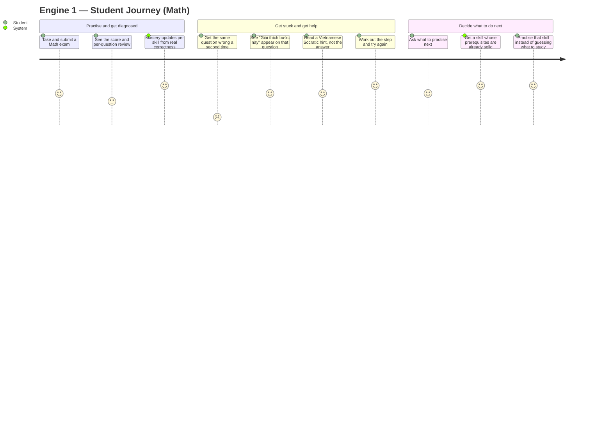
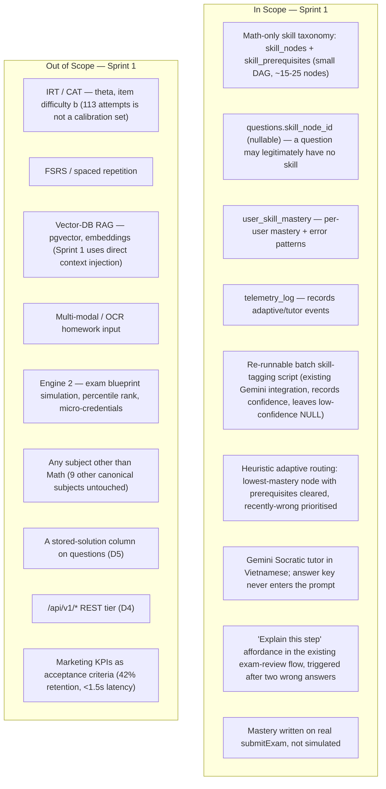

# PRD: Engine 1 — Adaptive AI & Feedback (Sprint 1)

| | |
|---|---|
| **Version** | 1.0 |
| **Date** | 2026-08-08 |
| **Status** | Draft — scope cut and six product decisions (D1–D6) locked with the engineer. Ready for the downstream chain: PRD → UI Spec → ADR (mastery write trust boundary, U2 — the mechanism behind D6) → Design Doc → Work Plan. |
| **Scale** | LARGE — fullstack. Four new tables, one nullable FK on an existing table, one offline batch script, two new pure-logic modules (`lib/adaptive/`, `lib/tutor/`), one new Server Action surface, one new UI affordance inside the existing Layer 2 result-review flow, and a write into the existing `submitExam` path. Schema DDL is applied by hand on two Supabase projects (TD-005). |

## Revision History

| Version | Date | Change |
|---|---|---|
| 1.0 | 2026-08-08 | Initial draft. Scope cut to the Sprint 1 list agreed with the engineer; D1–D6 recorded as locked decisions; A1–A3 recorded as overridable assumptions; marketing KPIs from `docs/market/Edtech-CoreFeatures-Research.md` §2.4 demoted to context-only growth targets. |

## Overview

### One-line Summary

Give a Vietnamese secondary-school student studying Math a system that knows *which specific skill* they are weak at (not just "you got 6/10 in Toán"), points them at the next skill worth practising, and — when they get the same question wrong twice — offers an "Explain this step" affordance that answers in Vietnamese with a Socratic hint instead of the answer.

### Background

MS-MOLAR / TrangNguyenDigi today is a competent exam-practice loop and nothing more: browse an exam, take it under a timer, submit, see a score, drill into per-question review (`SOURCE/app/(layer2)/exams/[id]/attempt/[attemptId]/result/detail/page.tsx`). Layer 3 Analytics aggregates that into per-subject correct/total over a time range (`SOURCE/app/(layer3)/queries.ts`). A student who scores 6/10 on a Math exam learns exactly one thing: that they scored 6/10 on a Math exam. There is no representation anywhere in the product of *what they are actually bad at*, and no help at the moment of being stuck.

Three concrete gaps, each measured against the current dev database (queried 2026-08-08):

1. **There is no skill-level model of the learner.** `exam_results.topic_breakdown` and the Layer 3 dashboard are the closest thing, and they roll up to `questions.topic`. That column cannot carry the weight: **across the entire Math corpus, `questions.topic` has only 3 distinct values, and one of those values is literally the string `"Math"`.** A "weakness" surface built on three buckets, one of which is the subject name, is not a diagnosis. This is the single strongest reason the feature needs a real taxonomy rather than a rollup of an existing column.
2. **There is no help when a student is stuck.** The per-question review page shows the correct answer and stops. `docs/market/Edtech-CoreFeatures-Research.md` §2.1 is right about the behaviour it describes even where its proposed mechanism is out of reach: a stuck student with no immediate help leaves. The product's users are on mid-range Android over unstable connections (`PROJECT_OVERVIEW.md` §1), where "go search a forum" is a worse option than it sounds.
3. **There is no route from a wrong answer back to the prerequisite that caused it.** Failing a question about logarithms because exponent rules never landed is invisible to every surface the product has.

### Locked Decisions (D1–D6)

Six product decisions were locked with the engineer before this PRD was written. Each is elaborated where referenced below (Out of Scope, Functional Requirements, Security NFR); this table is the one place to read all six at a glance.

| # | Decision | One-line rationale | Elaborated in |
|---|---|---|---|
| D1 | Math only — deep, not wide | The other 9 canonical subjects have no taxonomy and no tagging effort in Sprint 1 | Won't Have |
| D2 | Gemini auto-tags, confidence-gated; NULL instead of a guess | Mirrors `normalizeSubject`'s existing null-not-guess convention; a wrong tag is invisible and self-reinforcing (R-a) | R2, AC-005 |
| D3 | `correct_answer` (and `sub_answers`/`essay_answer`) never enters the tutor prompt | Closes the leak path rather than filtering the output — §10c revoked this exact column set from students for a reason | R6, Security NFR |
| D4 | Server Actions, not a `/api/v1/*` REST tier | Matches the existing convention (one route handler in the whole app) and avoids redesigning `PUBLIC_PATHS`/auth/error-shape for a tier with no external caller | R6/R7 AC-022, Constraints |
| D5 | No stored-solution column on `questions` in Sprint 1 | Adding one drags in a content-production sub-feature (authoring, §10c classification, review loop); the tutor derives its explanation at call time instead | Won't Have |
| D6 | Mastery is written on real `submitExam`, not simulated | Otherwise the engine never learns from real users and there is nothing to test end-to-end by week 5 | R3; mechanism is U2, not fixed here |

**What this PRD deliberately is not.** `docs/market/Edtech-CoreFeatures-Research.md` §2 is the original marketing spec and is materially wider than what ships: it asks for IRT/CAT with a calibrated ability parameter θ, FSRS spaced repetition, a vector-retrieval RAG pipeline, and OCR homework upload. §0 of that same document already cut the delivery to Engine 1 only. This PRD applies a second, narrower cut inside Engine 1, agreed with the engineer. The evidence for the cut is the data itself: **8 exams, 113 exam attempts, 291 attempt answers** in dev. Item-response calibration needs orders of magnitude more responses per item than that, so an IRT implementation in Sprint 1 would produce difficulty parameters that are noise wearing a Greek letter. The Out of Scope section below is the primary defence of this boundary and should be read as binding, not as a wish list.

**The corpus this ships against.** 57 questions total; **37 rows with the canonical `subject = 'Math'` plus 10 rows carrying the non-canonical `subject = 'Toán'`** — roughly 47 Math questions. Distribution: 32 in grade 12, 5 in grade 10 (measured on the canonical rows); by type, 21 `mcq`, 6 `true_false`, 10 `short_answer` (also measured on the canonical rows). The `'Toán'` rows are a real data-quality defect, not a variant spelling to be tolerated: `SOURCE/lib/ugc/subjects.ts` defines exactly 10 canonical subject values and `'Toán'` is not one of them, so **those 10 questions are invisible to every subject filter in the product today**. They must be inside this feature's corpus definition (R2) or tag coverage silently misses a fifth of the Math bank.

## User Stories

### Primary Users

- **Student (test-taker)** — Vietnamese lower/upper-secondary (THCS → THPT), the same authenticated `user_profiles.role = 'student'` persona that already takes exams. Typically on a mid-range Android device over an unstable connection (`PROJECT_OVERVIEW.md` §1). No new role is introduced.
- **Engineer (content/taxonomy reviewer)** — the project's single engineer, acting in a review capacity: approves the Math skill DAG before it ships and reviews the batch tagger's output. Not a new product role and not a new UI; the work happens through the batch script's output and the Supabase SQL Editor.

Non-goal personas: teachers, parents, and admins gain nothing directly from this feature in Sprint 1.

### User Stories

```
As a student who keeps losing marks on Math exams
I want to know which specific skill I am weak at, not just my score
So that I can practise the thing that is actually costing me marks
```

```
As a student who has just finished practising
I want the system to tell me which skill to work on next, and not to send me
somewhere I have no chance because I never learned the prerequisite
So that my study time goes to the one thing that will move my score
```

```
As a student who has now got the same question wrong twice
I want a hint that walks me toward the answer in Vietnamese
So that I can get unstuck without giving up or being handed the answer
```

```
As the engineer maintaining the question bank
I want a re-runnable batch that tags Math questions with skills and records how
confident it was, leaving anything doubtful untagged
So that newly uploaded questions can be brought into the model without a
hand-tagging session and without silently poisoning it with guesses
```

### Use Cases

1. **Diagnosis after a real attempt**: A student submits a Math exam. Per-question correctness updates their mastery for each skill node touched by that exam, so the model reflects real behaviour rather than a simulation (D6).
2. **"What should I do next?"**: The student asks the system for the next skill to practise. It returns the lowest-mastery node whose prerequisites are already above threshold, preferring nodes the student got wrong recently.
3. **Blocked by a prerequisite**: The student's weakest node is *Logarit* but *Luỹ thừa* (its prerequisite) is below threshold, so the system routes them to *Luỹ thừa* first rather than to the node where they are visibly failing.
4. **Stuck on a question, twice**: The student has now answered the same Math question incorrectly on two scored attempts. An "Explain this step" affordance appears on that question. Activating it returns a Vietnamese Socratic hint — a question or a next step to try — not the final answer.
5. **Tutor call fails**: Gemini returns 503/429 (this has happened before on this project — see the incident note in `SOURCE/lib/ugc/gemini.ts`). The student sees an actionable, retryable message; the result page they were reading is unaffected.
6. **Day one, empty profile**: A brand-new student with zero mastery rows asks for a recommendation. The system returns a defined starting point rather than an empty screen or an error (see Cold-Start and Coverage Gaps).
7. **Question with no skill tag**: The student gets a question wrong that the batch tagger left untagged because it was not confident (D2). Mastery for that question updates nothing, and the system says nothing false about it.
8. **New uploads arrive after the batch ran**: An author uploads a new Math exam through Layer 4. Its questions enter the bank untagged until the batch is re-run (A1).

### User Journey Diagram



### Scope Boundary Diagram



## Functional Requirements

### Must Have (P1 — MVP)

- [ ] **R1 — Math skill taxonomy as a reviewed DAG**: A skill taxonomy exists for Math only, expressed as nodes plus prerequisite edges forming a directed acyclic graph. It is drafted from the Vietnamese MOET curriculum outline and reviewed by the engineer before it ships (A2).
  - AC-001: Given the shipped taxonomy, when its edges are traversed, then no cycle exists — every node is reachable in a topological order (verified by a unit test over the seed data, not by inspection).
  - AC-002: Given the shipped taxonomy, when every prerequisite edge is resolved, then 100% of edges point at nodes that exist — 0 dangling prerequisites.
  - AC-003: Given the shipped taxonomy, when its size is counted, then it covers the grades the corpus actually contains (grade 12 and grade 10) and its node count is in the 15–25 range expected for this corpus (A2); a materially different number is a signal to re-check the draft, not a silent pass.
  - AC-004: Given the taxonomy content, when reviewed, then every node carries a Vietnamese label suitable for display to a student (the site's UI chrome remains bilingual via `SOURCE/lib/i18n/dictionaries/`; the skill names themselves are curriculum terms).

- [ ] **R2 — Batch skill-tagging with confidence, and null instead of a guess**: A re-runnable batch script tags Math questions with a skill node using the existing Gemini integration (`SOURCE/lib/ugc/gemini.ts`). It records the model's confidence for each tag and leaves the tag NULL when confidence is below the threshold, rather than assigning a plausible-looking node. The corpus it operates on includes the 10 rows carrying `subject = 'Toán'`, not only the 37 canonical `'Math'` rows.
  - AC-005: Given a question the model is not confident about, when the batch runs, then that question's skill tag is left NULL and the low-confidence outcome is recorded — the script never writes a below-threshold tag. This mirrors `normalizeSubject` in `SOURCE/lib/ugc/subjects.ts`, which returns `null` rather than guessing, by explicit decision (D2).
  - AC-006: Given the batch has already run, when it is run a second time against the same corpus, then it completes without error and without creating duplicate tag records — re-runnability is a shipped property, not an aspiration.
  - AC-007: Given the Math corpus (~47 questions, including the `'Toán'` rows), when the batch completes, then every row it considered is in one of exactly two states: tagged with an existing skill node, or explicitly NULL with a recorded reason. 0 rows are left in an undefined state.
  - AC-008: Given the batch's output, when the engineer reviews it before ship, then 100% of the assigned tags have been human-reviewed (the corpus is ~47 questions, so full review is feasible and is the accepted process under D2).

- [ ] **R3 — Per-user skill mastery, written from real submissions**: A per-user, per-skill mastery record plus observed error patterns is maintained, and it is updated when a student actually submits an exam (`submitExam`, `SOURCE/app/(layer2)/actions.ts`), from per-question correctness — not from a simulation or a seeding script (D6).
  - AC-009: Given a student submits a Math exam containing questions with skill tags, when scoring completes, then mastery for each touched skill node reflects that attempt's per-question correctness.
  - AC-010: Given a submitted exam contains questions with a NULL skill tag, when mastery is updated, then those questions contribute to nothing and cause no error — an untagged question is a normal case, not an exception path.
  - AC-011: Given the mastery write path, when it is reviewed, then it respects the same trust boundary as score writing: `schema.sql` §11a revoked all client write privileges on result data and §11b routes writes through a function callable only by `service_role`. A mastery write that a student's own JWT can forge would re-open exactly the hole that section closed. *The mechanism is an ADR-level decision and is deliberately not designed here (see Undetermined Items U2).*

- [ ] **R4 — Telemetry for adaptive and tutor events**: Adaptive-routing and tutor events are recorded so that the engine's behaviour is observable after ship rather than inferred from user complaints.
  - AC-012: Given a tutor invocation, when it completes or fails, then an event is recorded that is sufficient to answer "how many tutor calls happened, for whom, and how many failed" without reading application logs.
  - AC-013: Given any telemetry record, when its contents are inspected, then it contains no answer-key material (`correct_answer`, `sub_answers`, `essay_answer`) — telemetry must not become the leak that D3 closed at the prompt boundary.

- [ ] **R5 — Heuristic adaptive routing**: Given a student, the system returns the next skill node to practise: the lowest-mastery node whose prerequisites all clear a mastery threshold, prioritising nodes the student answered incorrectly recently. The heuristic is explicitly not IRT.
  - AC-014: Given a test user with seeded mastery, when routing runs, then the returned node is DAG-valid: all of its prerequisites are at or above the threshold. 0 recommendations violate prerequisite order.
  - AC-015: Given two candidate nodes with comparable mastery, when one of them was answered incorrectly more recently, then that node is preferred.
  - AC-016: Given the same input state, when routing runs twice, then it returns the same node — the routing decision is deterministic and therefore unit-testable (`lib/adaptive/`, per D4).
  - AC-017: Given a user whose weakest node is blocked by an unmet prerequisite, when routing runs, then it returns the prerequisite, not the blocked node.

- [ ] **R6 — Socratic tutor in Vietnamese, with the answer key contained**: A Gemini-backed tutor produces a Vietnamese, Socratic hint for a question the student got wrong. **The tutor prompt never contains `correct_answer` (nor `sub_answers` / `essay_answer`).** Its context is the question content, the choices, and the student's wrong answer only; the model re-derives the solution itself (D3, D5).
  - AC-018: Given any tutor invocation, when the assembled prompt payload is inspected, then it contains no value from `correct_answer`, `sub_answers`, or `essay_answer` — 0 occurrences, asserted by a unit test on the prompt builder, not by review alone.
  - AC-019: Given the tutor's context assembly, when the code is inspected, then it reads only columns from the 9-column safe set granted in `schema.sql` §10c (`id, content, choices, subject, grade, topic, question_type, part_number, image_url`) plus the student's own recorded answer.
  - AC-020: Given a wrong-answer case, when the tutor responds, then the response is in Vietnamese and takes a Socratic form — a question, a check, or the next step to attempt — and does not state the final answer. Judged manually against a fixed evaluation set (see Success Criteria).
  - AC-021: Given a tutor call that fails (Gemini 503/429/timeout — a failure mode this project has already hit, per the incident note in `SOURCE/lib/ugc/gemini.ts`), when the failure surfaces, then the student sees an actionable, retryable message and the page they were on continues to work. 0 silent failures, 0 broken pages.
  - AC-022: Given the tutor entry point, when it is reviewed, then it is a Server Action inheriting the existing auth/session/CSP-nonce pipeline (D4) and is rate-limited per authenticated user through the existing `guard()` (`SOURCE/lib/security/rateLimit.ts`). 0 unauthenticated invocation paths exist.

- [ ] **R7 — "Explain this step" affordance in the existing review flow**: The tutor is reachable from the existing exam-review UI through an affordance that appears when the student has answered that question incorrectly twice. It is an addition to the current flow, not a new page or a new layer.
  - AC-023: Given a question the student has answered incorrectly twice, when the review surface renders, then the "Explain this step" affordance is present on that question.
  - AC-024: Given a question the student has answered incorrectly zero or one time, when the review surface renders, then the affordance is absent — 0 false appearances.
  - AC-025: Given the affordance is activated, when the tutor is working, then a busy state is shown, the control cannot be double-triggered, and the state change is announced to assistive technology.
  - AC-026: Given the affordance and its resulting hint, when navigated by keyboard alone, then every interactive element is reachable with a visible focus indicator, and no state is conveyed by colour alone.
  - AC-027: Given the site's language toggle is set to English, when the affordance renders, then its label and surrounding chrome come from `SOURCE/lib/i18n/dictionaries/{en,vi}.ts` like the rest of the site; the tutor's own hint text remains Vietnamese in Sprint 1 (English tutor output is deferred — see Won't Have).

- [ ] **R8 — Defined behaviour when there is no data**: Cold start and permanently-untagged content are handled as normal states with defined behaviour, not as error paths. See the dedicated section below.
  - AC-028: Given a user with zero mastery rows, when routing runs, then it returns a defined result — either a designated entry node of the DAG or an explicit "no recommendation yet" state that the UI can render. 0 crashes, 0 empty screens, 0 unhandled errors.
  - AC-029: Given a question with `skill_node_id` NULL, when the student answers it wrong twice, then the tutor affordance still works (the tutor needs question content, not a skill tag) while mastery updates nothing.

### Should Have (P2)

- [ ] **R9 — Normalise the `subject = 'Toán'` rows**: The 10 Math questions stored with the non-canonical subject value are normalised to the canonical `'Math'`, so they stop being invisible to the product's subject filters generally — not only to this feature's batch.
  - AC-030: Given the corpus after normalisation, when queried by canonical subject, then 0 rows remain with `subject = 'Toán'` and the Math count reconciles to ~47.

- [ ] **R10 — The recommendation is visible to the student**: The routing result from R5 surfaces somewhere the student actually looks (the natural home is the existing Layer 3 dashboard, `SOURCE/app/(layer3)/me/dashboard`), rather than existing only as a callable function.
  - AC-031: Given a student with mastery data, when they open the surface chosen in the UI Spec, then the recommended next skill is shown with its Vietnamese label.

### Won't Have (this release)

- **R11 — Follow-up turns with the tutor** — a second exchange after the first hint ("I still don't get it"). Single-turn only in Sprint 1; multi-turn multiplies both the cost surface (R-c) and the answer-leak surface, and neither has been sized.
- **R12 — Error-pattern labels shown to the student** — `user_skill_mastery` records error patterns in Sprint 1, but surfacing them as human-readable diagnoses ("bạn hay đảo dấu khi rút gọn") is a separate content-design job.

- **IRT / CAT (ability θ, item difficulty b)** — 113 attempts and 291 attempt answers is nowhere near enough response data to calibrate item parameters; the output would be noise presented as precision. Replaced by the R5 heuristic.
- **Spaced repetition (FSRS or SM-2 derivative)** — requires a review-scheduling surface and a decay model on top of a mastery signal that does not exist yet on ship day. Deferred until mastery data is real.
- **Vector-DB RAG (pgvector, embeddings, retrieval pipeline)** — Sprint 1 uses "RAG-lite": direct context injection of the question the student is already looking at. There is no lesson corpus to retrieve from, so a retrieval tier would retrieve nothing.
- **Multi-modal / OCR homework input** — a separate intake pipeline with its own failure modes; the tutor in Sprint 1 explains questions already in the bank.
- **Engine 2 (exam blueprint simulation, percentile rank, predicted score, micro-credentials)** — deferred by `docs/market/Edtech-CoreFeatures-Research.md` §0; several of its KPIs are undefined without a real user base anyway.
- **Any subject other than Math** — D1: deep, not wide. The other 9 canonical subjects in `SOURCE/lib/ugc/subjects.ts` are untouched, and no taxonomy exists for them.
- **A stored-solution column on `questions`** — D5. No such column exists (`questions` has `id, content, choices, correct_answer, subject, grade, topic, question_type, part_number, image_url, sub_answers, essay_answer`), and adding one drags in a content-production sub-feature: who authors solutions, how they are classified under §10c's column grants, a review loop, and UGC upload/review UI changes. The tutor derives its explanation at call time instead — consistent with D3, which keeps stored answer material out of the prompt in the first place.
- **A `/api/v1/*` REST tier** — D4. The Notion plan names REST paths; that is how briefs are written, not a constraint. This repo has exactly one route handler (`SOURCE/app/auth/callback/route.ts`); every other server entry point is a Server Action. A new REST tier would need its own auth, error shape and rate limiting, and would collide with `PUBLIC_PATHS` in `SOURCE/lib/supabase/middleware.ts:13` (an unauthenticated call there currently gets a 307 HTML redirect, not a JSON 401). No external consumer exists in Sprint 1 — the site's own UI is the only caller. Pure logic still lives in `lib/adaptive/` and `lib/tutor/` with its own unit tests, so a thin route handler can wrap it later if an external caller ever appears.
- **English-language tutor output** — the tutor answers in Vietnamese in Sprint 1 even when the UI language toggle is set to English; the surrounding chrome remains bilingual.
- **Marketing KPIs as acceptance criteria** — see Success Criteria.

## Cold-Start and Coverage Gaps

This is a first-class product question for this feature, not an edge case, because on the day it ships **every single user is in the cold-start state**: there are zero `user_skill_mastery` rows in existence, and the very first thing anyone does is hit the empty case. A design that treats it as an exception path ships a product whose day-one experience is the exception path.

Two distinct gaps, with different causes and different correct answers:

1. **No mastery data for this user.** Every user on day one; every new signup thereafter; and any existing user who has not yet submitted a Math exam since the feature shipped. Routing must return a defined result — a designated entry node of the DAG, or an explicit "not enough data yet" state the UI can render honestly (AC-028). What it must not do is return the first row it finds and present it as a diagnosis, because an arbitrary recommendation is indistinguishable, from the student's side, from a real one.
2. **No skill tag for this question, permanently.** By design (D2), the batch tagger leaves low-confidence questions NULL rather than guessing, and some questions will therefore stay NULL forever. Additionally, tag coverage **decays continuously from the moment a batch run finishes**, because `SOURCE/app/(layer4)/actions.ts` keeps inserting new questions from UGC uploads and tagging is a separate batch step (A1). Untagged questions must be a normal, silent case: they contribute nothing to mastery (AC-010) and still support the tutor, which needs question content rather than a skill tag (AC-029).

The honest framing for both: the system says less when it knows less. Saying nothing is a correct product state here; saying something confident and arbitrary is the failure mode this feature is most exposed to (R-a).

## Non-Functional Requirements

### Performance

- **Tutor latency is a UX problem, not a number to hit.** The `<1.5s` figure in `docs/market/Edtech-CoreFeatures-Research.md` §2.4 is a growth target and is explicitly not an acceptance criterion here — Sprint 1 has no latency budget it can honestly commit to, because the call is a third-party LLM round trip and the target device profile is mid-range Android on an unstable connection (`PROJECT_OVERVIEW.md` §1, §8). The requirement is behavioural instead: a visible busy state, a non-blocking failure, and a working retry (AC-021, AC-025).
- **The tutor must never block the exam-review flow.** A slow or failed tutor call leaves the page the student is reading fully usable.
- **Batch tagging is an offline job and its sizing is a non-issue.** ~47 questions is a minutes-long run with no free-tier quota concern. It is deliberately not listed as a risk; treating corpus size as a risk here would be inventing one.
- The site's existing baseline stands unchanged (`PROJECT_OVERVIEW.md` §8: Lighthouse mobile ≥ 85, FCP ≤ 2.5s on 3G). This feature must not regress it — the tutor is invoked on demand, never on page load.

### Reliability

- Gemini failures are expected, not exceptional. `SOURCE/lib/ugc/gemini.ts` already carries a documented 503 "high demand" incident and enables SDK retry (`RETRY_ATTEMPTS = 3`) precisely because a transient failure once rolled back a whole pipeline. The tutor must degrade to an actionable retry (AC-021).
- A failed mastery update must not break exam submission. Scoring and result recording are the load-bearing path; the adaptive model is an addition to it.
- A batch tagging run that dies mid-way must leave the corpus in a consistent, re-runnable state (AC-006, AC-007).

### Security

- **Answer-key containment is the security requirement of this feature (D3).** `schema.sql` §10c revoked table-level SELECT on `questions` and re-granted exactly 9 safe columns, specifically to keep students away from `correct_answer` (Critical #1 of the 2026-08-03 security review). A server-side LLM endpoint that holds the key and returns free text to those same students would be a path around that fix — and it is worse than a normal leak path, because question content is user-generated and therefore attacker-influenced, so the prompt's own input can be crafted. The decision is to **close the path rather than filter the output**: the key never enters the prompt (AC-018, AC-019). Accepted trade-off, stated as a product risk and not a defect to design around: the model may occasionally reason wrongly and hint in the wrong direction.
- **The mastery write path must respect the §11 trust boundary** (AC-011). `submitExam` connects to Postgres with the student's own JWT; anything that path can write, devtools can write. Score writes were moved behind `record_exam_result()` (callable only by `service_role`) for exactly that reason (ADR-0010). Mastery is derived from the same per-question correctness and must not become a client-forgeable write. Mechanism: ADR (U2).
- **No new unauthenticated surface.** The tutor is a Server Action behind the existing session pipeline (D4, AC-022), rate-limited per user by the existing `guard()`. Note the standing limitation: per **TD-013**, unauthenticated traffic is counted by nothing at all, and edge rate limiting is unavailable while the Vercel plan is Hobby. Keeping the tutor authenticated-only is what keeps it inside the one guard that does exist.
- Telemetry must not store answer-key material (AC-013).
- New tables carry RLS like every other user-data table (`PROJECT_OVERVIEW.md` §8).

### Scalability

- Pre-launch scale, and deliberately so. No queue, no cache tier, no background worker. The tutor is invoked on demand by an authenticated user; tagging is a manually-run batch.
- The taxonomy is sized to the corpus (15–25 nodes, A2). It is expected to grow when the corpus does; nothing in Sprint 1 should assume the node set is fixed.

### Accessibility (UI feature)

- Compliance standard: WCAG 2.1 AA (site default).
- Target assistive technologies: screen reader and full keyboard operation, consistent with the rest of Layer 2 (`PROJECT_OVERVIEW.md` §8).
- The "Explain this step" control is keyboard-operable with visible focus in all three states (idle, busy, error); the busy and error states are announced (e.g. `aria-live`) and never conveyed by colour alone (AC-025, AC-026).
- The returned hint is text rendered into the existing review page's reading flow, so it inherits the site's typography and contrast tokens (`SOURCE/app/globals.css` — the sole source of truth for the "Ink & Lacquer" theme since `DESIGN.md` was deleted 2026-08-06; see `.claude/MEMORY.md` §3) rather than introducing a new visual treatment.
- Known constraint: hint length is model-controlled. The layout must tolerate both a two-line hint and a long one without clipping or trapping focus.

## Success Criteria

The site is pre-launch and Engine 1 has no users yet on ship day. Every metric below is therefore **verifiable at acceptance time** — by a test, a script run, or a recorded manual pass — rather than being a growth outcome measured weeks later.

### Growth targets — context only, explicitly NOT acceptance criteria

`docs/market/Edtech-CoreFeatures-Research.md` §2.4 states: 7-day retention ≥ 42%, average remediation latency < 1.5s, session completion ≥ 80% once adaptive feedback triggers. These are **marketing/growth targets** recorded here so that the numbers are not mistaken for engineering commitments. **None of them gates this Sprint.** They are unmeasurable before there is a user base, and two of them (retention, session completion) are outcomes of the whole product rather than of this feature. Do not let them re-enter as acceptance criteria in the Design Doc or Work Plan.

### Quantitative Metrics (Sprint 1 technical acceptance)

1. **Schema applies clean**: `npm run verify:schema` passes all 7 checks against the dev database after the new DDL is applied, and the foreign-key `on delete` gate passes — `SOURCE/lib/schema/__tests__/parseForeignKeys.test.ts` requires every new `references` clause to declare `on delete` explicitly (the convention established when TD-011 was paid). Measured by: the two commands, run after the manual apply.
2. **Schema fingerprint stays honest**: `SOURCE/lib/schema/__tests__/schemaFingerprint.test.ts` passes with the §17 fingerprint updated, and dev and prod each report a fingerprint matching the file in git at their respective apply times (A3 permits intentional interim drift between the two; §17 is what makes that drift visible instead of silent). Measured by: the CI test plus `verify:schema` item 7.
3. **Taxonomy is DAG-valid**: 0 cycles and 0 dangling prerequisite references across the shipped taxonomy; node count within the 15–25 range expected for this corpus. Measured by: a unit test over the seed data (AC-001, AC-002, AC-003).
4. **Tag coverage and honesty**: ≥ 70% of the ~47-question Math corpus (≥ 33 questions) carries a non-NULL `skill_node_id` after the batch, with 0 tags written below the confidence threshold and 100% of written tags human-reviewed before ship. Measured by: a query over the corpus plus the batch's own confidence output (AC-005, AC-007, AC-008). *Coverage below 70% is not automatically a failure — it may mean the threshold is correctly conservative — but it is a stop-and-review signal, not something to pass silently.*
5. **Batch is re-runnable**: two consecutive runs against the same corpus produce 0 errors and 0 duplicate tag records. Measured by: actually running it twice (AC-006). The lesson from TD-005 applies directly — a script that claims idempotence and has never been re-run is a claim, not a property.
6. **Routing is DAG-valid and deterministic**: for a seeded test user, 100% of recommendations have all prerequisites at or above threshold, 0 recommendations violate prerequisite order, and repeated runs on identical input return an identical node. Measured by: unit tests in `lib/adaptive/` (AC-014, AC-016, AC-017).
7. **Cold start is defined**: for a user with 0 mastery rows, routing returns a defined result in 100% of runs — 0 crashes, 0 unhandled errors, 0 empty screens. Measured by: a unit test plus a manual pass with a fresh account (AC-028).
8. **Answer key never reaches the model**: 0 occurrences of `correct_answer`, `sub_answers`, or `essay_answer` values in the assembled tutor prompt. Measured by: a unit test on the prompt builder that fails if any of those fields appear, plus code inspection that context assembly reads only the §10c 9-column safe set (AC-018, AC-019). This is the single most important gate in this list — it is the one whose failure is invisible from the UI.
9. **Tutor language and tone**: across a fixed evaluation set of 10 recorded wrong-answer cases spanning `mcq`, `true_false` and `short_answer`, 10/10 responses are in correct Vietnamese, 10/10 take a Socratic form (a question, a check, or a next step), and 0/10 state the final answer. Measured by: a manual pass by the engineer, with the 10 cases and their verdicts recorded so the pass is repeatable. *Manual by necessity — see risk R-b.*
10. **Trigger precision**: the "Explain this step" affordance appears in 100% of the wrong-twice cases and 0% of the others. Measured by: a component test over both branches (AC-023, AC-024).
11. **No unauthenticated tutor path**: 0 code paths reach the tutor without an authenticated session, and every invocation passes through the existing per-user `guard()`. Measured by: code inspection plus a test asserting the guard is applied (AC-022).
12. **Mastery reflects real submissions**: after a test user submits a seeded Math exam end-to-end, their mastery rows match that attempt's per-question correctness for every tagged question, and untagged questions changed nothing. Measured by: an integration test against the real `submitExam` path (AC-009, AC-010).
13. **Telemetry never carries answer-key material**: 0 occurrences of `correct_answer`, `sub_answers`, or `essay_answer` values in any `telemetry_log` row. Measured by: a unit test on the telemetry-write function that fails if any of those fields appear — the same shape of gate as #8, applied to the second place answer-key material could leak (AC-013).
14. **Untagged questions still support the tutor**: for a question with `skill_node_id` NULL, the tutor completes successfully and mastery is left unchanged. Measured by: a unit/integration test covering the NULL-tag branch explicitly (AC-029).
15. **Tutor telemetry is queryable**: given a set of tutor invocations including at least one failure, a query over `telemetry_log` answers "how many calls, for whom, how many failed" without reading application logs. Measured by: an integration test asserting the recorded fields are sufficient to answer that question (AC-012).

*Scope note: #1–12 and #13–15 cover every Must-Have (P1) acceptance criterion except AC-015 and AC-027, which are covered by unit/component tests in the AC's own section (`lib/adaptive/`, the affordance's i18n wiring) rather than by a standalone metric here — both are ordinary implementation-level tests, not properties distinctive enough to warrant a separate acceptance gate. Should-Have (P2) items R9/R10 are intentionally excluded from this list; see their own AC-030/AC-031 for their acceptance condition.*

### Qualitative Metrics

1. A student who reads a hint can identify the *next step to try*, rather than either being told the answer or being told something they already knew.
2. The recommended skill feels like a reason, not a shuffle: a student can see why they were sent to a prerequisite instead of the topic they failed.
3. When the system has nothing useful to say (cold start, untagged question), it says so — and a reader of that state can tell it is a deliberate product state rather than something broken.

### UI Quality Metrics

1. **Affordance completion rate**: every activation of "Explain this step" either renders a hint or surfaces an actionable, retryable error — 0 silent dead ends across a manual QA pass on a real mid-range Android device (`PROJECT_OVERVIEW.md` §6 manual-testing practice).
2. **Accessibility audit**: 0 serious/critical automated-audit (e.g. axe) issues on the affordance and its hint output in all three states, plus a manual keyboard pass with 0 unreachable interactive elements.

## Technical Considerations

### Dependencies

- **Existing Gemini integration** (`SOURCE/lib/ugc/gemini.ts`, server-only, `GEMINI_API_KEY`) — used by both the batch tagger and the tutor. Models are pinned there (`QUESTION_MODEL = "gemini-3.5-flash"`, `ANSWER_MODEL = "gemini-3.1-flash-lite"`) with a documented note that the originally chosen 2.5/2.0 model lines stopped being callable for new keys. SDK retry is enabled (`RETRY_ATTEMPTS = 3`).
- **`SOURCE/app/(layer2)/actions.ts` — `submitExam`** — the write point for mastery (D6/R3). Note its existing shape: it claims the answer key through `claim_attempt_answer_key` (§10b), scores with `computeScore`, then records the result through `recordExamResult` under `service_role` (§11b). The mastery write joins this sequence and inherits its constraints.
- **`SOURCE/supabase/schema.sql`** — §10c (9-column grant on `questions`), §11a/§11b (score-write lockdown, `record_exam_result`), §16a (`schema_foreign_keys()`), §17 (`schema_version` fingerprint). The new tables and the new `questions.skill_node_id` column both land in this file.
- **Existing per-user rate limiting** (`SOURCE/lib/security/rateLimit.ts`, `rateLimitStore.ts` backed by Upstash Redis since TD-008 was paid) — the tutor's cost guard.
- **Existing review surface** (`SOURCE/app/(layer2)/exams/[id]/attempt/[attemptId]/result/detail/page.tsx`) — the natural host for R7's affordance; it already renders per-question content, choices and the student's selection.
- **Existing i18n dictionaries** (`SOURCE/lib/i18n/dictionaries/en.ts`, `vi.ts`) — all new UI chrome strings go through them (AC-027).
- **Layer 3 dashboard** (`SOURCE/app/(layer3)/me/dashboard`) — candidate host for R10's recommendation surface. Note that Layer 3's existing analytics aggregates by *subject*, not skill; this feature does not replace it in Sprint 1.
- **Existing UGC insert path** (`SOURCE/app/(layer4)/actions.ts`, question insert) — the source of tag-coverage decay under A1.

### Constraints

- **Schema DDL is applied by hand.** TD-005 is open: there is no migration tool. `schema.sql` is idempotent-by-convention and pasted into the Supabase SQL Editor by a human, **on two databases** (dev and prod). This feature adds four tables plus a column, so it is four-plus-one manual steps twice over, in an area where TD-005 has already detonated three times — most recently on 2026-08-07, when a cascade fix lived on prod but not dev for three days while every automated gate stayed green. Practical consequences for planning: the §17 fingerprint must be updated in the same change, `npm run verify:schema` must be run after each apply, and the apply order relative to code deploy matters (code that reads a table the DB does not have is exactly the §10 failure recorded in TD-005).
- **Every new foreign key must declare `on delete` explicitly**, even when the desired behaviour equals the default — the convention established when TD-011 was paid, enforced by `parseForeignKeys.test.ts` at PR time.
- **New columns on `questions` do not inherit column-level grants** (TD-001). `questions.skill_node_id` must be explicitly classified under §10c — either granted into the safe set or deliberately withheld — or `verify-schema.ts` will fail, by design.
- **Server Actions, not route handlers** (D4). Entry points follow the existing `app/(layerN)/actions.ts` convention; pure logic lives in `lib/adaptive/` and `lib/tutor/` so it is unit-testable independently of the transport.
- **The tutor's context is limited to the §10c safe columns plus the student's own answer** (D3) — a hard constraint on what the Design Doc may assemble, not a preference.
- **Target hardware baseline**: mid-range Android, unstable network (`PROJECT_OVERVIEW.md` §1, §8).
- **Related open debt**: **TD-013** (no rate limiting for unauthenticated traffic; blocked on a Vercel Pro cost decision, so not solvable in code) bounds what "cost control" can mean here — see R-c. **TD-015** (`eslint-config-next@16.2.7` behind `next@16.3.0`) means the lint gate that blocks merge is running rules one minor version behind the framework; a new-pattern warning could be missed on this feature's code. Neither blocks this work, but both are live while it happens.

### Assumptions

These are assumptions, not decisions — they are recorded here explicitly so they can be overridden rather than discovered later.

- **A1 — Newly uploaded UGC questions are tagged by re-running the batch, not inline in the upload pipeline.** The consequence, stated plainly: **tag coverage decays from the moment a batch run finishes**, because `SOURCE/app/(layer4)/actions.ts` keeps inserting questions and nothing in the upload path tags them. There is no automatic trigger and no coverage alarm in Sprint 1; someone must remember to re-run the batch. That is the same shape of dependency-on-human-memory that TD-005 documents as this project's most repeated failure mode, and it should be weighed as such if this assumption is revisited.
- **A2 — The Math DAG is drafted by Gemini from the Vietnamese MOET curriculum outline, then reviewed by the engineer before it ships.** Review by the engineer is a required step, not a nicety (the working plan lists "duyệt cây kỹ năng" as engineer work). Expected size: 15–25 nodes covering grades 10 and 12, because that is what the current corpus supports (32 grade-12 and 5 grade-10 Math questions).
- **A3 — Schema goes to the dev Supabase project during Sprint 1 and to prod at ship time, applied and verified as one batch.** The two databases are therefore intentionally out of sync during the sprint. The §17 `schema_version` fingerprint is what makes that interim drift *visible* rather than silent — the mechanism that was built precisely because this drift was previously invisible for three days.
- **A4 — "Wrong twice" is observable from stored attempt data.** Answers are only graded at submission (`submitExam`), so "twice" is assumed to mean *the same question answered incorrectly on two scored attempts*, not twice within a single in-progress attempt (which the current scoring model cannot observe). See U1 — this is the assumption most likely to need confirming before the UI Spec.

### Risks and Mitigation

| Risk | Impact | Probability | Mitigation |
|------|--------|-------------|------------|
| **R-a — Mis-tagged skills produce confidently wrong recommendations.** A wrong `skill_node_id` is not a visible bug: nothing looks broken, the student is simply sent to practise the wrong thing, and the mastery model learns from the mistake. `PROJECT_OVERVIEW.md` §9 already carries this exact feedback-loop risk ("user học sai → hệ thống học theo") for Layer 3; this feature makes it materially more likely by acting on it. | High | Medium | Confidence threshold with NULL-instead-of-guess (D2, AC-005); 100% human review of assigned tags before ship, feasible at ~47 questions (AC-008); telemetry (R4) so the engine's recommendations are observable after ship rather than inferred; explicit "say less when you know less" behaviour for the untagged case (AC-010, AC-029) |
| **R-b — The Socratic-tone criterion is judged manually, with no regression gate.** Prompt drift or model drift changes tutor behaviour with nothing to catch it. This is not hypothetical on this project: `SOURCE/lib/ugc/gemini.ts` records that the originally selected model line became uncallable for new keys, forcing a pin change — model availability has already shifted once under this project. | High | Medium | A **fixed, recorded** 10-case evaluation set with recorded verdicts (Success Criteria #9) so the manual pass is repeatable rather than ad hoc; pinned model constants with the existing comment convention explaining *why* each pin exists; the containment gate (#8) is automated even though the tone gate cannot be, so the security-relevant half never depends on human judgement |
| **R-c — The tutor is a cost surface, and the project's rate-limiting has a known hole.** Per **TD-013**, every existing guard keys on `user.id`, so unauthenticated traffic is counted by nothing at all; edge rate limiting is unavailable while the Vercel plan is Hobby (`vercel firewall overview` returns `IP Bypass is unavailable for this plan`), and Firewall rules need Pro. An LLM call costs both Gemini quota and Vercel function time. | High | Medium | Keep the tutor strictly authenticated (D4, AC-022) so it stays inside the one guard that works; apply the existing per-user `guard()` to every invocation; record invocations in telemetry (AC-012) so spend is observable; single-turn only in Sprint 1 (R11 deferred). Residual risk is explicitly accepted and tracked in TD-013, which is blocked on a cost decision, not on code |
| **R-d — The mastery write path re-opens the §11 trust boundary.** `submitExam` runs on the student's own JWT; a mastery write reachable from that identity is forgeable from devtools, which is precisely what §11a/§11b closed for scores. | High | Low | Flagged as requiring an ADR before design (U2, AC-011); ADR-0010 is the direct precedent and states the reasoning to mirror |
| **R-e — Manual DDL lands on one database and not the other.** TD-005's exact failure shape, which has occurred three times, most recently 2026-08-07 with a three-day dev/prod divergence that every automated gate reported as green. | High | Medium | §17 fingerprint check at server startup and in `verify:schema`; run `npm run verify:schema` after each apply; update the fingerprint constant in the same change (Success Criteria #1, #2); A3 makes the interim drift a stated, expected condition rather than a surprise |
| **R-f — The corpus is small and skewed, so early mastery signal is thin.** ~47 Math questions, 32 of them grade 12 and only 5 grade 10; many DAG nodes will have few or no questions attached. | Medium | High | Sized the taxonomy to the corpus rather than to the curriculum (A2, AC-003); cold-start behaviour is a first-class requirement (R8) rather than an afterthought; IRT is cut precisely because the data cannot support it |
| **R-g — The tutor reasons wrongly and hints in the wrong direction**, because by design it does not have the answer key (D3). | Medium | Medium | Accepted trade-off, stated: closing the leak path beats filtering the output. Bounded by the fact that the correct answer is already visible on the review page the student is standing on, so a wrong hint costs confusion, not a wrong final answer |
| **R-h — Prompt injection via user-generated question content.** Question text is UGC and therefore attacker-influenced; it goes into the tutor prompt by construction. | Medium | Low | The strongest mitigation is structural and already chosen: there is no answer-key material in the prompt for an injection to exfiltrate (D3). Remaining exposure is output quality, not disclosure |

## Undetermined Items

- [ ] **U1 — The precise definition of "wrong twice"** (owner: UI Spec, with product confirmation). Answers are graded only at submission, so "twice" is assumed to mean the same question answered incorrectly on two scored attempts (A4). The alternative reading — twice within one in-progress attempt — is not observable with the current scoring model and would require grading mid-attempt, which interacts directly with §10b's claim-then-close design. Impact: determines whether the affordance lives on the post-submission review surface only, or also inside the in-progress player.
- [ ] **U2 — The mastery write mechanism and its trust boundary** (owner: **ADR**, required before the Design Doc). D6 fixes *that* mastery is written on real submission; it deliberately does not fix *how*. Options span extending `record_exam_result()`, a sibling `SECURITY DEFINER`/`service_role`-only function, or a separate server-side write. This is an ADR-level decision under the project's own criteria (data-flow change plus a security trust boundary), and ADR-0010 is the precedent to follow. **Blocking for design, not for this PRD.**
- [ ] **U3 — The confidence threshold value for auto-tagging** (owner: Design Doc, informed by a first batch run). D2 fixes the *policy* (below threshold → NULL, never guess); the number itself should be chosen from the observed confidence distribution on the real ~47-question corpus rather than picked in advance. Impact: directly moves the coverage figure in Success Criteria #4.
- [ ] **U4 — Where the recommendation surfaces to the student** (owner: UI Spec). R10 names the Layer 3 dashboard as the natural home, but Layer 3 currently aggregates by subject rather than skill, and the two views need to coexist without contradicting each other.
- [ ] **U5 — The mastery threshold that counts a prerequisite as "cleared"** (owner: Design Doc). R5/AC-014 requires a threshold to exist and be applied consistently; the value is a tuning parameter, and with ~47 questions there is not yet data to tune it against. It should be a named constant, not a scattered literal, so it can be changed once when data arrives.

*Discuss with the engineer until this section is empty, then delete after confirmation. U2 is the only entry that blocks downstream work.*

## Appendix

### References

- `docs/market/Edtech-CoreFeatures-Research.md` — §0 the Engine-1-only scope decision; §2 the **original marketing spec, deliberately wider than what ships — not a scope document**; §2.4 the growth targets recorded here as context only.
- `PROJECT_OVERVIEW.md` — product summary and user profile (§1), route groups (§3), tech stack (§4), testing strategy (§6), NFR baseline (§8), risk register including the feedback-loop risk (§9).
- `TECH-DEBT.md` — TD-005 (manual schema apply, no migration tool), TD-013 (no rate limiting for unauthenticated traffic, blocked on Vercel Pro), TD-015 (`eslint-config-next` version drift); TD-001 and TD-011 for the column-grant and `on delete` conventions this feature must follow.
- `SOURCE/supabase/schema.sql` — §10b/§10c (answer-key lockdown, the 9-column safe set), §11a/§11b (score-write lockdown, `record_exam_result`), §16a, §17 (`schema_version` fingerprint).
- `SOURCE/app/(layer2)/actions.ts` — `submitExam`, the mastery write point (D6/R3).
- `SOURCE/app/(layer2)/exams/[id]/attempt/[attemptId]/result/detail/page.tsx` — the per-question review surface hosting R7's affordance.
- `SOURCE/lib/ugc/gemini.ts` — the existing Gemini integration, pinned models, and the model-availability incident note behind risk R-b.
- `SOURCE/lib/ugc/subjects.ts` — the 10 canonical subjects (D1) and `normalizeSubject`, the null-instead-of-guess precedent D2 mirrors.
- `SOURCE/lib/supabase/middleware.ts` — `PUBLIC_PATHS` and the 307 redirect behaviour behind D4.
- `SOURCE/lib/security/rateLimit.ts`, `rateLimitStore.ts` — the per-user guard the tutor must use.
- `SOURCE/app/(layer4)/actions.ts` — the UGC question insert path behind A1's coverage decay.
- `docs/adr/ADR-0010-score-write-trust-boundary.md` — the precedent for U2.
- `docs/prd/history-prd.md`, `docs/prd/rating-system-prd.md` — sibling PRDs; format and detail-level reference.
- `SOURCE/app/globals.css` — "Ink & Lacquer" tokens governing the affordance and hint presentation. Sole source of truth for theme since `DESIGN.md` was deleted 2026-08-06 (`.claude/MEMORY.md` §3).

### Glossary

- **Skill node**: one node in the Math taxonomy — a named, curriculum-level skill a question can be tagged with, and a unit that mastery is tracked against.
- **Prerequisite edge**: a directed edge asserting that one skill must be reasonably mastered before another is worth attempting. The edge set forms a DAG (R1).
- **Mastery**: a per-user, per-skill measure of how well the student handles that skill, updated from real submission correctness (R3). Deliberately **not** an IRT ability parameter θ.
- **Error pattern**: a recorded characterisation of *how* a student tends to get a skill wrong, stored in Sprint 1 but not surfaced to students (R12).
- **Adaptive routing**: the heuristic selecting the next skill node to practise (R5) — lowest mastery among nodes whose prerequisites are cleared, recently-wrong preferred.
- **RAG-lite**: direct injection of the relevant context (the question the student is looking at) into the prompt, with no embedding, vector store, or retrieval step. The Sprint 1 substitute for the marketing spec's "Contextual RAG Pipeline".
- **Socratic hint**: a response that moves the student toward the solution by asking or by naming the next step, without stating the final answer (R6, AC-020).
- **Answer-key containment**: the D3 rule that `correct_answer`, `sub_answers` and `essay_answer` never enter a tutor prompt (AC-018).
- **Cold start**: the state of a user with no mastery data — on ship day, every user (see Cold-Start and Coverage Gaps).
- **Growth target**: a marketing KPI from `docs/market/Edtech-CoreFeatures-Research.md` §2.4. Recorded as context; explicitly not an acceptance criterion.
