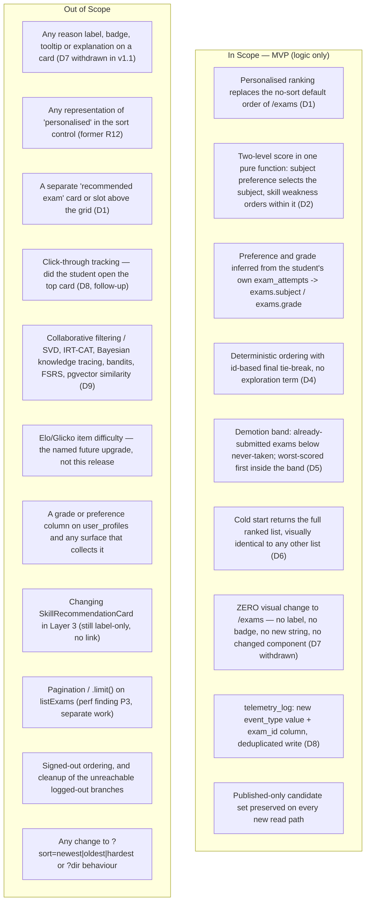

# PRD: Personalised Exam Recommendation (Layer 2 browse ranking)

| | |
|---|---|
| **Version** | 1.2 |
| **Date** | 2026-08-16 |
| **Status** | Draft — **split into a v1 release scope and a deferred v2 scope** on the engineer's direction ("Ship bản rẻ trước, đủ sau"), after a production measurement showed the data cannot yet express the full model. D1, D3–D6, D9 remain locked and binding for v1; **D2 and D8 are superseded for v1** and return with v2; **D10 is moot for v1**; D7 stays withdrawn from v1.1. Downstream chain is **PRD → ADR-0015 (written) → Design Doc → Work Plan**. **No UI Spec and no frontend Design Doc are warranted** — see Scale. (ADR-0014 stays reserved for the payOS webhook per `SOURCE/lib/supabase/middleware.ts:21`.) |
| **Deadline** | **Tuesday 2026-08-18, morning** — set by the engineer on Sunday 2026-08-16. **v1.2 makes this feasible rather than merely asserted**: the scope cut removes the schema half entirely, which was the half R-l identified as inelastic. U9's deadline dilemma is therefore **resolved, not carried forward** — see "Release partition". |
| **Scale** | **SMALL–MEDIUM — backend-only, 4 production files + 3 test/benchmark files (7 total).** Revised down from v1.1's "MEDIUM, 10–12 files" because the deferred half takes `schema.sql`, `schemaFingerprint.ts`, `test-rls.ts`, `lib/tutor/telemetry.ts` and its test off the list. No new route, no new page, no new npm dependency, **no changed component, no new user-visible string, and no `schema.sql` line**. See "Recomputed scale" for the file-by-file justification. |

## Revision History

| Version | Date | Change |
|---|---|---|
| 1.0 | 2026-08-16 | Initial draft. D1–D10 recorded as locked decisions. Two verified requirement-vs-codebase conflicts (no grade data source; `/exams` is not publicly reachable) recorded with their resolutions rather than designed around. Prior-art research (no reusable implementation on this stack; five rejected algorithm families) summarised in Technical Considerations. |
| 1.1 | 2026-08-16 | **Scope narrowed to a logic module, and D2 replaced with the hybrid the engineer chose.** Driven by two engineer answers after v1.0: (1) *"Không cần UI, vì cái này chỉ là Logic Module: đẩy các đề liên quan đến sở thích của user lên đầu"* + the explicit choice *"Không thay đổi gì — chỉ đổi thứ tự"*; (2) *"Kết hợp: sở thích chọn môn, điểm yếu xếp trong môn"*. Changes: **D7 withdrawn** (reason label deleted — there is now zero visual change to `/exams`, so the whole labelling sub-feature has no surface to live on). **D2 revised** from "two tiers of signal" to the explicit two-level hybrid: subject preference decides which subjects rank high, skill weakness orders exams inside a subject. **D6 narrowed** — cold start keeps its defined ranking, loses its label. **R7, R12, R13 withdrawn** (all three existed only to render or advertise something). **7 ACs removed, 3 added, all renumbered gap-free** (mapping table below). Affected-file list lost `ExamCard.tsx`, `vi.ts`, `en.ts`; `ExamBrowser.tsx` and `exams/page.tsx` downgraded from "changed" to "to be confirmed by codebase analysis" (U10). Scale recomputed LARGE-fullstack-19 → MEDIUM-backend-10-to-12, which removes the UI Spec from the document chain. Success Criteria #16 (label precision) and #18 (accessibility audit of the labelled card) removed; two new criteria added (preference dominance; zero visual change). Risk **R-e removed** (it was "the label ships onto untested components"); **R-j, R-k, R-l added**. Conflict 1 escalated from a minor fallback to a load-bearing dependency, because the same `exam_attempts` inference now carries preference as well as grade. Deadline recorded. Unchanged and deliberately preserved: D1, D3, D4, D5, D8, D9, D10 (numbers included), the Engine 1 relationship section, the prior-art research with its URLs, both verified conflicts, and every non-label risk. |
| 1.2 | 2026-08-16 | **Release split into v1 (ships now) and v2 (deferred with measured triggers), plus a document review resolved.** Driven by two inputs after v1.1: (1) a **production measurement** taken to settle review finding I001 — 3 published exams, all `Math`; `user_skill_mastery` empty (0 rows, 0 users); 0 exams clear the `rating_count >= 3` gate; 4 of 8 profiles have no attempts — which showed the full hybrid and a three-signal heuristic produce **byte-identical output on today's data**; (2) the engineer's decision on that evidence: *"Ship bản rẻ trước, đủ sau."* Changes: a new **"Release partition"** section assigning every R and AC to v1 or v2 with the number that defers it and the condition that re-adopts it; **D2 and D8 superseded for v1** (subject tier, weakness tier, all telemetry, and with telemetry the entire `schema.sql` change), **D10 moot** (nothing contends for the fingerprint); **U9 resolved** (the inelastic half is gone, so the deadline is no longer a dilemma); **U2(a) and U10 closed by ADR-0015**, which is now written. Six blocking review findings fixed: **I001** (corpus quantified with the measured exam figures + the ship-day consequence stated), **I002** (Success Criteria #10 restated as diff-only — the rendering test it mandated had no file to live in), **I003** (AC-020 made decidable for multi-attempt students), **I004** (AC-025's "weakness-driven"/"driving node" defined and assigned an owner), **I005** (new **AC-037** for `?dir` with no `?sort`; Success Criteria #5 corrected — there are **two** no-sort `.order("id")` assertions, `rating.int.test.ts:390` and `:438`, and under ADR-0015 both stay green rather than being replaced), **I006** (U10's hidden duplicated `exam_attempts` read costed and then decided). Four recommended findings also applied: **I007** (AC-005 fixture note), **I008** (four drifted codebase claims corrected — `lib/adaptive` importers, the layer-2 client-component list, `verify:schema`'s 8 checks, the two existing telemetry writers), **I009** (scale counts reconciled with AC-002), **I010** (AC-034 restated as an inspection criterion, since "absent" is not observable from ranking output). **Unchanged and deliberately preserved**: D1, D3–D6, D9; the Engine 1 relationship; the prior-art research with its URLs; both verified conflicts; the full v1.1 ranking model, kept as the **target** state rather than deleted, so "đủ sau" has something to be built from. | 

### AC renumbering map, v1.0 → v1.1

Provided so a reader holding v1.0 (or any note that cites its ACs) can map across. v1.0 had AC-001–AC-040; v1.1 has AC-001–AC-036.

| v1.0 | v1.1 | Note |
|---|---|---|
| AC-001 | AC-001 | unchanged |
| AC-002 | AC-002 | **rewritten and strengthened** — was "0 recommendation cards outside the grid, plus the top-card label"; is now "0 visual change of any kind" |
| AC-003 – AC-004 | AC-003 – AC-004 | unchanged |
| — | **AC-005** | **new** — preference dominates at subject level (revised D2) |
| — | **AC-006** | **new** — preference is inferred from own `exam_attempts`, 0 new collection surfaces |
| AC-005 – AC-021 | AC-007 – AC-023 | shifted +2; AC-016→AC-018 also lost its trailing "and no reason label appears" clause |
| AC-022 | **removed** | cold-start top card labelled "đề khởi đầu" — no label exists |
| — | **AC-024** | **new** — a cold-start list is visually indistinguishable from any other student's |
| AC-023 – AC-027 | **removed** | the whole R7 block: label presence/absence (AC-023), label wording by state (AC-024), no label under explicit sort (AC-025), label strings from the i18n dictionaries (AC-026), label accessibility inside `ExamCard`'s stretched link (AC-027) |
| AC-028 – AC-039 | AC-025 – AC-036 | shifted −3 |
| AC-040 | **removed** | "the personalised default is represented in the sort control's state" (R12) — a visible affordance in `ExamFilters.tsx`, ruled out by "không thay đổi gì" |

### AC changes, v1.1 → v1.2

**No AC is renumbered and none is removed** — a citation written against v1.1 still resolves. v1.1 had AC-001–AC-036; v1.2 has AC-001–AC-038, and the deferrals are marked in place rather than deleted, so v2 inherits them.

| AC | Change |
|---|---|
| AC-005, AC-007, AC-008, AC-025–AC-029, AC-031 | **marked [v2]** — not implementable on today's data (see Release partition) |
| AC-006, AC-033 | **scope-annotated** — the grade clause is v1, the preference clause is v2 |
| AC-017 | **corrected** (I005) — its "0 lines of `?sort`/`?dir` semantics" claim was false for the no-sort `?dir` branch |
| AC-020 | **rewritten** (I003) — "the prior score" was undecidable for a student with multiple attempts on one exam |
| AC-022 | **corrected** (I001) — it named community difficulty as a live cold-start signal when 0 exams clear its gate |
| AC-025 | **rewritten** (I004) — "weakness-driven" and "the driving node" were defined nowhere and owned by nobody |
| AC-034 | **restated** (I010) — "the terms are absent" is not observable from ranking output; it is now an output test **plus** an inspection criterion |
| **AC-037** | **new** (I005) — `?dir` with no `?sort` falls to the personalised order, which v1.1 never said anywhere |
| **AC-038** | **new** — a submitted attempt with no `exam_results` row still ranks, in a defined position (the gap ADR-0015 surfaced) |

## Release partition — what v1 ships, what v2 holds, and the number that decides

*(New in v1.2. This section is the one that binds; where the rest of the document describes the full model, it describes the **target**, and the target is v2's. Nothing below is deleted, because "đủ sau" needs it.)*

### The measurement that forced the split

Taken on production (`pebjdlbgbmizgfpuptjl`) 2026-08-16, in order to settle review finding **I001**, which asked what the ranking actually produces on ship day. The answer was worse than the finding guessed:

| Fact | Measured value | What it does to the v1.1 model |
|---|---|---|
| Published exams | **3** | The whole rankable catalogue |
| Subject spread | **3 of 3 are `Math`** | **S3 (subject preference) is constant across every candidate** — the dominant term of v1.1's D2 cannot change any ordering |
| Grade spread | 2 × grade 12, 1 × grade 9 | **S4 (grade) does discriminate** — this is why grade survives the cut and subject does not |
| `user_skill_mastery` | **0 rows, 0 distinct users** | **S2 (weakness) has no input at all** — empty, not sparse |
| Exams with `rating_count >= 3` | **0** | **S5 (community difficulty) is inert**: `avg_overall` is NULL for every candidate (`schema.sql:1015-1022`, `RATING_THRESHOLD = 3` in `SOURCE/lib/rating/index.ts:8`) |
| Users / attempts | 8 profiles; 4 users with attempts; 20 attempts, 4 submitted | **Half the user base is cold-start** (R-j, confirmed by measurement rather than estimated) |
| Tagged questions per published exam | 22/22, 4/4, 0/2 | Tagging is healthy — the *mastery* side of the join is what is missing, not the tags |

**The operative consequence: on today's data, the full v1.1 hybrid and a three-signal heuristic produce byte-identical output.** Three of the five weighted signals are constant, empty or inert across every candidate. Building the hybrid now would pay its entire maintenance surface — an exam→skill join with no index behind it, a two-database hand-applied DDL, a telemetry substrate — for an output nobody could distinguish from the cheap one.

**Engineer's decision on this evidence**: *"Ship bản rẻ trước, đủ sau."* v1 ships the signals that discriminate; v2 returns when the data can express the rest.

### v1 — what ships now

A deterministic per-student ordering of the published exam list, replacing `.order("id")` as the browse default, built from:

1. **Band** (S1, S7) — never-taken above already-submitted; inside the demoted band, worse prior score ranks higher.
2. **Grade match** (S4) — inferred from the student's own `exam_attempts` → `exams.grade`. No profile column, no collection surface.
3. **Recency** (S6) — `exams.created_at`.
4. **Tie-break** — exam id ascending. No randomness, no exploration term.

Unchanged from v1.1 and still binding: an explicit `?sort=` overrides personalisation entirely; filters narrow the candidate set and ranking still applies to what survives; **zero visual change; and — new in v1.2 — zero `schema.sql` change.**

### v2 — deferred, with the measured trigger that re-adopts each piece

| Deferred | Number that defers it | Re-adopt when |
|---|---|---|
| **S3 — subject preference** (v1.1's D2 Level 1) | 3 of 3 published exams are `Math`; the term is constant across every candidate | A second subject is published |
| **S2 — skill weakness** (v1.1's D2 Level 2) **and the exam→skill join** | `user_skill_mastery` has 0 rows across 0 users | `user_skill_mastery` gains rows. ADR-0015 records the intended read shape and its kill criterion so the analysis is not re-derived — but **not as a decision**: the comparison is remade then, because catalogue size, tagged-question count and index state will all have moved |
| **S5 — community difficulty** | 0 of 3 exams clear `rating_count >= 3`; `avg_overall` is NULL for every candidate | Any exam clears the gate |
| **All telemetry (D8) — and with it the entire `schema.sql` change** | At 3 exams × 8 users the whole output space is derivable from present state by `select`; the app cannot read `telemetry_log` back anyway (`SELECT` revoked, `schema.sql:1385`), so its only reader is the engineer, who can equally run the derivation | Together with S2 — once a *mutating* per-user model drives the order, the ranking stops being reconstructible after the fact, which is the condition under which an event log earns its cost |

**Why deferring telemetry is legitimate here and was not before.** The instruction earlier in this feature's history was "do not propose cutting telemetry", and that stood on the pre-measurement picture, where the ranking was driven by a mutating mastery model. It is not a cut proposed by this document: it is engineer-directed on evidence that did not exist when the instruction was given, and it is bound to a stated return condition rather than dropped.

### Requirement and AC disposition

| Item | v1 | v2 | Note |
|---|---|---|---|
| R1, R3, R4, R5, R6, R11 | ✅ | — | Unchanged and binding |
| R2 | partial | partial | The "**one** scoring function, 0 parallel implementations" half (AC-010) is v1. The two-level hybrid it names (AC-005, AC-007, AC-008) is v2 |
| R8 (telemetry) | — | ✅ | Whole requirement, AC-025–AC-029 |
| R9 | partial | partial | AC-030 and AC-032 are v1; AC-031 defers with the exam→skill join |
| R10 | partial | partial | The grade half is v1; the preference half is v2 |
| AC-001–AC-004, AC-009–AC-024, AC-030, AC-032–AC-036, **AC-037** | ✅ | — | Binding for v1 |
| AC-005, AC-007, AC-008, AC-025–AC-029, AC-031 | — | ✅ | Not implementable on today's data |
| AC-006, AC-033 | partial | partial | Read as covering the grade term in v1; the preference clause activates in v2 |

**Success Criteria disposition**: #1–#7, #10, #11, #17 and #18 are v1 acceptance gates. **#8** (preference dominance) and **#9** (non-Math reduction) are v2 — both quantify over a multi-subject catalogue that does not exist. **#12–#16** are v2, because they gate a `schema.sql` change v1 does not make. **#5 is rewritten in v1.2** — see I005 below.

### What the split resolves, and the one thing it costs

- **U9 (deadline dilemma) is resolved, not deferred.** R-l named the schema half as the inelastic one: ADR-0015 plus a hand-applied DDL on two Supabase projects plus the TD-005 triple fingerprint update plus `verify:schema` green on both. v1 does none of that, so the Tuesday date stops being a trade against completeness.
- **D10 is moot.** With `schema.sql` untouched, the payOS branch and this one cannot contend for the same hand-applied fingerprint. R-c drops out of v1's risk surface entirely.
- **R-c's failure mode is off the path**, not merely mitigated — TD-005 has detonated four times on this project, and v1 does not walk past it.
- **The cost, stated plainly**: v1 ships with **no observability of any kind** — no label (D7 withdrawn), no click-through (D8 deferred), no telemetry (deferred). The compensating control is that at 3 exams × 8 users the output is *derivable from the database by query*, which is a property of the current scale and **not of the design**. It expires as the catalogue grows, and R-a is re-rated accordingly.

## Overview

### One-line Summary

When a signed-in student opens `/exams`, the exam list is **ordered for that student** — never-taken exams first, the subjects they actually engage with near the top, and inside a subject the exams that hit the skills they are weak at (Math) or the signals that exist without a taxonomy (the other nine subjects) — with **nothing on the page changing except the order**.

### Background

Layer 2's browse surface today has no ordering worth the name. With no `?sort` in the URL, `listExams` ends with `.order("id")` (`SOURCE/app/(layer2)/queries.ts:136-138`) — stable, reproducible, and semantically empty. A student who opens `/exams` gets the catalogue in primary-key order, which is to say in upload order, which is to say in an order chosen by nobody for nobody.

Everything needed to do better already exists and is already loaded on that page:

- **The page is already per-user and per-request.** `SOURCE/lib/supabase/server.ts:14` awaits `cookies()`, so every `/exams` render is dynamic; `SOURCE/app/(layer2)/exams/page.tsx:57-62` already awaits `listMySubmittedExamIds()` and `getCurrentUser()` in the same `Promise.all` that fetches the exams. There is no `dynamic`/`revalidate` export on this route, no `use cache`, no `unstable_cache` anywhere in `SOURCE`, and no PPR in `next.config.ts`. **Personalisation costs no caching, because there is no caching to lose.**
- **The signals exist.** `exam_attempts` records what the student has taken and `exams.grade`/`exams.subject` what those exams were; `exam_results` records how well; ADR-0008 supplies per-exam community difficulty (`avg_overall`, `rating_count`) through `exams_with_difficulty`; and for Math, Engine 1 shipped a real skill model (`skill_nodes`, `skill_prerequisites`, `user_skill_mastery`, `questions.skill_node_id`).
- **The ordering is already 100% server-side.** `ExamBrowser.tsx` and `ExamCard.tsx` are pure presentation Server Components with no `'use client'`; `ExamFilters.tsx` is a client component whose entire job is writing URL search params via `router.push` (`:123-159`). There is no client-side sorting anywhere in the browse surface — `ExamBrowser` receives `exams: Exam[]` and maps it in the order it was handed (`ExamBrowser.tsx:20-42`, verified for v1.1). A ranking that runs in SQL and in a pure server function fits the existing shape exactly — nothing moves to the client, and nothing on the client needs to know it happened.

The user's framing was "giống như Google Search Engine vậy nhưng tự động chạy khi user vào Layer 2" — a ranking that runs on entry, not a control the student has to find and press. That framing is what D1 makes binding: this is the browse list's own order, not a widget bolted above it. **v1.1 takes that one step further**: the engineer's follow-up ("Không cần UI… chỉ là Logic Module", "Không thay đổi gì — chỉ đổi thứ tự") makes the *absence* of any widget, badge or label a hard requirement rather than a design preference.

### Relationship to Engine 1 — this feature is the missing second half

Engine 1 (`docs/prd/engine1-adaptive-ai-prd.md`) ends one step short of usefulness. `getSkillRecommendation()` (`SOURCE/app/(layer3)/queries.ts:100-147`) computes the next skill to practise through the pure, deterministic, prerequisite-gated `recommendNextSkill()` (`SOURCE/lib/adaptive/route.ts:57-153`), and `SkillRecommendationCard.tsx` renders it as a Vietnamese label plus a `<details>` explaining why — **with no link to anything**. The student is told "luyện *Nguyên hàm*" and then left to find, by hand, an exam that contains any *Nguyên hàm* questions, on a browse page ordered by primary key. The diagnosis has no route to a thing the student can actually sit.

This feature is that route. It reuses Engine 1's assets rather than duplicating them:

| Engine 1 asset | How this feature uses it |
|---|---|
| `user_skill_mastery` (RLS `mastery_select_own`, `SOURCE/supabase/schema.sql:1291-1293`) | Source of the per-skill weakness signal that orders exams **inside** a subject, Math only |
| `questions.skill_node_id` (already granted to `authenticated`, `schema.sql:798-800`) | Maps an exam's questions to skills — **no new grant needed** |
| `MASTERY_CLEARED_THRESHOLD` (`SOURCE/lib/adaptive/constants.ts`) | The same "cleared" boundary decides what counts as a weak node here |
| `recommendNextSkill()`'s conventions (pure, injected state, `[ratio ASC, lastWrongAt DESC NULLS LAST, id ASC]` sort key, `lib/adaptive/`, AC-016-style determinism test) | The convention this feature's ranking function inherits — same directory, same purity rule, same style of determinism test |
| `buildTelemetryPayload()` (`SOURCE/lib/tutor/telemetry.ts:92-101`) | The only writer into `telemetry_log`; this feature extends it rather than adding a second write path |

**The Layer 3 skill card stays exactly as it is.** Turning `SkillRecommendationCard` into a link, adding a "practise this" button to it, or changing its copy is **out of scope** here — that is a Layer 3 UI change with its own AC set, and this feature deliberately ships the Layer 2 half first so the routing exists before anything advertises it. Note the current coupling for the record *(corrected in v1.2 — review finding **I008a**)*: Layer 2 has **zero** dependency on `lib/adaptive` today. The directory has **three** importers, and only one of them is application code — `SOURCE/app/(layer3)/queries.ts:9-10` (`MASTERY_CLEARED_THRESHOLD`, `recommendNextSkill`); the other two are `tsx` scripts outside the Next.js bundle, `SOURCE/supabase/seedManualPassEngine1.ts:42-43` and `SOURCE/supabase/tagQuestionSkills.ts:25`. This feature creates the **second application importer** and the **first from Layer 2**, which is what turns a Layer-3-private helper directory into a shared engine (recorded as an architecture decision in ADR-0015).

### Locked Decisions (D1–D6, D8–D10)

Nine product decisions were locked with the engineer in v1.0/v1.1. **v1.2 changes the status of three of them for the v1 release** — on the engineer's direction, against the production measurement in "Release partition", not on this document's own initiative. The rest are binding and not options to re-evaluate. **D7 was withdrawn in v1.1** and its number is retired rather than reused, so that every D-reference written against v1.0 still means what it meant. Statuses added in v1.2 are marked in the table.

| Status for v1 | Decisions |
|---|---|
| **Binding** | D1, D3, D4, D5, D6, D9 |
| **Superseded for v1, returns with v2** | **D2** (subject preference selects the subject; weakness orders within it) — subject is constant across all 3 candidates and `user_skill_mastery` has 0 rows, so *neither* level has an input; **D8** (telemetry) — deferred with the whole `schema.sql` change |
| **Moot for v1** | **D10** (this change's schema edit lands before payOS) — v1 makes no `schema.sql` edit, so nothing contends for the fingerprint |

| # | Decision | One-line rationale | Elaborated in |
|---|---|---|---|
| D1 | **The ranking IS the browse order** — it replaces the current default ordering of `/exams`. No separate recommendation card, no slot above the grid | "Automatic on entry" is the requirement; a card the student must notice is a different, weaker feature | R1, Won't Have |
| D2 ⚠️ *superseded for v1* | **Subject preference selects the subject; skill weakness orders exams within the subject** — one ranking function, two levels. Preference = the subjects and grades the student actually engages with, read from their own `exam_attempts` joined to `exams.subject`/`exams.grade`. Weakness = `user_skill_mastery` from Engine 1, which exists for **Math only** | The engineer's own words: "Kết hợp: sở thích chọn môn, điểm yếu xếp trong môn". Preference needs no taxonomy, so it works for all 10 subjects; weakness needs one, so it works for one | R2, "The ranking model" |
| D3 | **Filters narrow, ranking still applies; an explicit `?sort=` wins over personalisation** | A student who states an order has stated it; a filter is not a statement about order | R4 |
| D4 | **Deterministic, no exploration term** — no randomness, no epsilon-greedy, no shuffling, id-based final tie-break | Inherits `lib/adaptive/`'s convention and its AC-016 test style; an unreproducible order cannot be debugged or tested | R3 |
| D5 | **Already-submitted exams are demoted, not excluded**; within that band, poorly-scored exams rank higher | Removing them hides the catalogue; a re-take of a badly-scored exam is the most useful thing in the demoted band | R5 |
| D6 | **Cold start still returns a full ranked list** in a defined, non-arbitrary order (preference is empty, so ordering falls to never-taken + community difficulty + recency). **No visible affordance of any kind** — narrowed in v1.1 by D7's withdrawal | On production this is the majority path, not an edge case; and a majority path must not be the one that renders differently | R6, Cold Start and Sparsity |
| ~~D7~~ | ~~Only the top-ranked card carries a reason label~~ — **withdrawn in v1.1** | The engineer scoped this feature to a logic module: "Không cần UI… chỉ là Logic Module" and "Không thay đổi gì — chỉ đổi thứ tự". With no visible affordance, the labelling sub-feature (wording by state, i18n, stretched-link accessibility) has nothing to attach to | AC-002, Won't Have |
| D8 ⚠️ *superseded for v1* | **Telemetry records which exam was ranked first** — a new `event_type` value plus an `exam_id` column on `telemetry_log`, with a deduplication rule; click-through tracking deferred | Ranking quality is unobservable otherwise — and after D7's withdrawal, **telemetry is the only observer this feature has at all** | R8, Won't Have |
| D9 | **No new npm dependency and no new algorithm family** — content-based weighted ranking as a pure TypeScript function in `SOURCE/lib/adaptive/` | Every heavier family was researched and rejected on this data scale (see Technical Considerations); Elo/Glicko is the named future upgrade | R2, Won't Have |
| D10 ⚠️ *moot for v1* | **This work's `schema.sql` change lands before the in-flight payOS subscription work**; the payOS branch rebases onto the new fingerprint afterwards | Smaller change goes first; two branches racing the same hand-applied fingerprint is TD-005's exact failure shape | Constraints, R-l |

### Two verified conflicts between the requirement and the codebase

Both were established against the code, both are recorded here rather than quietly designed around.

**Conflict 1 — the student's grade has no data source, and in v1.1 the same gap now also covers preference.** A recommender for Vietnamese secondary school wants to know whether the student is in lớp 10, 11 or 12. `public.user_profiles` (`SOURCE/supabase/schema.sql:16-21`) has exactly four columns — `id, display_name, role, created_at` — and no grade column exists anywhere in the schema; `SOURCE/lib/auth/getCurrentUser.ts:34-38` selects only `display_name`. There is likewise no stored notion of a student's subject preference anywhere in the schema.

*Resolution taken*: **both** grade and subject preference are **inferred** from the student's own `exam_attempts` → `exams.grade` / `exams.subject`, where such attempts exist. **No new profile column, no new table and no new collection surface ships in this feature** (R10, AC-006, AC-035).

*What changed in v1.1*: under v1.0's D2 this inference carried a single, deliberately non-dominant grade term. Under v1.1's D2 the same inference carries the **subject-level term that decides the whole shape of the list**. It has moved from minor fallback to load-bearing dependency, and the risk register moves with it (**R-j**, escalated from v1.0's R-g). Stated plainly: **a cold-start student has neither preference nor grade nor mastery, so for them the ranking is entirely impersonal — and on production that is the majority of users.**

A grade (and now a preference) that is present for veterans and absent for newcomers is honest; a guessed one would be the confidently-wrong failure this project already recorded once (Engine 1 R-a).

**Conflict 2 — `/exams` is not publicly reachable, so there is no signed-out ordering to define.** `PUBLIC_PATHS` (`SOURCE/lib/supabase/middleware.ts:26-37`) is exactly `['/', '/login', '/auth/callback', '/terms', '/refund-policy']`, and `SOURCE/lib/supabase/__tests__/publicPaths.test.ts:71` asserts `isPublic('/exams') === false`. A signed-out visitor receives a 307 to `/?auth=signin` before the page renders.

*Consequence*: a session always exists on this surface. The PRD therefore does not define an anonymous ordering, and R1's guarantee ("there is always a user to rank for") is enforced by middleware, not by a fallback branch.

*Recorded as known-stale artefacts, deliberately **not** fixed by this feature*: `SOURCE/app/(layer2)/exams/page.tsx:115` passes `isLoggedIn={user !== null}` and `SOURCE/app/(layer2)/_components/ExamBrowser.tsx:49` still branches `if (!isLoggedIn) return "logged-out"` — an unreachable branch. The fixture E2E AC-026 in `SOURCE/tests/e2e/fixture/rating.fixture.e2e.test.ts:100-107` is written around a logged-out browse that cannot happen. Deleting them is a Rating-System cleanup with its own AC (`rating-system-prd.md` AC-026), not this feature's business; touching them here would silently retire another feature's acceptance criterion. See U6.

### The corpus this ships against

*(Rewritten in v1.2 — resolves review finding **I001**, which observed that v1.1 quantified the questions but never the thing being ranked. The figures below are what forced the release partition.)*

**The questions** — measured on production 2026-08-16 (`SOURCE/supabase/skill-tagging-report-pebjdlbgbmizgfpuptjl-2026-08-16T11-56-12-707Z.json`): **28 Math questions, 25 tagged, 3 left NULL, spanning 9 distinct skill nodes, from 3 UGC uploads** (26 grade-12, 2 grade-9). Per published exam the tagging is 22/22, 4/4 and 0/2 — healthy.

**The exams, the ratings, the mastery and the users** — measured against `pebjdlbgbmizgfpuptjl` the same day, because the question figures alone cannot tell you whether the ranking does anything:

| Measured | Value |
|---|---|
| Published exams | **3** |
| Per-subject distribution | **`Math`: 3. Every other subject: 0** |
| Grade distribution | grade 12: 2 · grade 9: 1 |
| Exams with `rating_count >= 3` (the S5 gate) | **0** |
| `user_skill_mastery` | **0 rows, 0 distinct users** |
| Profiles / users with attempts / attempts / submitted | 8 / 4 / 20 / 4 |

**The honest consequence, stated here rather than discovered post-launch:**

- **The ranking is thinner than the model, and by exactly how much is now known.** S5 is gated at `rating_count >= 3` (`schema.sql:1015-1022`, `RATING_THRESHOLD = 3` in `SOURCE/lib/rating/index.ts:8`) and **no exam clears it**, so `avg_overall` is NULL for every candidate — S5 is **inert, not merely sparse**. All 3 published exams are `Math`, so **S3 is constant across every candidate** and cannot change any ordering. `user_skill_mastery` is **empty**, so S2 has no input. Three of five weighted signals contribute nothing today.
- **Which is why v1 ranks on the two that do discriminate**, plus the band: grade (2 × g12 vs 1 × g9) and recency. See "Release partition".
- **Preference will work everywhere — later.** It needs no taxonomy, so the subject-level half is live for all 10 subjects **from the day a second subject is published**, for any student who has taken at least one exam. On a single-subject catalogue it is a term that cannot fire.
- **Weakness will work in one place.** For the nine non-Math subjects, S2 is structurally zero, so the *within-subject* order reduces to the signals that exist and is identical for any two students who share a preference profile. That is not a defect to be fixed by more weights; it is what happens when there is no per-student signal to read inside those subjects.
- **For a cold-start student on ship-day data the effective order is recency, then id** — and that is **half the production user base** (4 of 8 profiles). The terms turn on by themselves as attempts, ratings and subjects arrive; until then this feature is the plumbing for a personalisation the data cannot yet express.

The ranking function is built so those terms turn on by themselves as data arrives, and the sparsity risk they leave in the meantime is R-f.

## User Stories

### Primary Users

- **Student (test-taker)** — the same authenticated `user_profiles.role = 'student'` persona that already browses and sits exams, on mid-range Android over an unstable connection (`PROJECT_OVERVIEW.md` §1). No new role, no new persona, no new permission, **and no new thing to look at**.
- **Engineer (operator)** — reads `telemetry_log` through `service_role` / the Supabase SQL Editor to answer "which exam are we putting first, and for how many people". Not a UI user: `telemetry_log` is insert-only for `authenticated` and SELECT/UPDATE/DELETE are revoked (`schema.sql:1379-1390`), so there is no in-app view of this data by construction. **After D7's withdrawal this is the only observer of the feature that exists** — which is why D8 survived the narrowing.

### User Stories

```
As a student opening the exam list
I want the exams that are actually worth my time to be at the top already
So that I do not have to guess which of a wall of identical-looking cards to open
```

```
As a student who keeps coming back to the same subjects
I want that subject's exams near the top without setting a filter every time
So that the list opens on the work I actually do
```

```
As a student who keeps losing marks on the same Math skill
I want the Math exams that exercise that skill to come before the other Math exams
So that the weakness the system already diagnosed turns into something I can sit
```

```
As a brand-new student with no history at all
I want a full, sensible list on my first visit
So that my first visit is a usable catalogue, not an empty state and not a fake diagnosis
```

```
As a student who has already done some of these exams
I want the ones I have not taken to come first, and the ones I did badly on to
come before the ones I aced
So that the list stops re-offering me things I have finished
```

```
As a student who wants the newest exams
I want my explicit "Newest" choice to win over whatever the system thinks
So that a control I pressed does something I can predict
```

```
As the engineer running this site
I want to know which exam we put first and how often, without reading logs
So that a ranking nobody can see on screen is still a ranking I can inspect
```

### Use Cases

1. **[v2] Signed-in entry, with history and mastery data**: A student who has submitted Math exams opens `/exams`. Math sits at the top of the list because that is what they engage with, and inside the Math block the exams covering their weakest cleared-prerequisite skills come first. The page looks exactly as it always has.
2. **Signed-in entry, cold start**: A brand-new student opens `/exams`. Every exam is never-taken, no mastery rows exist, no preference and no grade can be inferred. The full catalogue still renders in a defined, deterministic order, and the page is **indistinguishable** from any other student's — no label, no badge, no placeholder, no empty state (D6). *(Corrected in v1.2 — review finding **I001**: v1.1 wrote that order as "never-taken + community difficulty + recency", but 0 exams clear the `rating_count >= 3` gate, so community difficulty contributes nothing. In **v1** the cold-start order is **recency, then id**; community difficulty joins it in **v2**, once any exam clears the gate.)* **This is half the production user base** (4 of 8 profiles), not an edge case.
3. **Filtering**: The student sets Subject = Physics. *(In v1 this use case is hypothetical — no Physics exam is published; the mechanism is nonetheless binding, AC-015.)* The list narrows to Physics and is *still* personalised inside that narrowed set — with the subject term now constant, the within-subject terms decide (D3). If nothing matches, the existing empty state (`exams.noMatch`) renders unchanged.
4. **Explicit sort**: The student ticks "Khó nhất". `?sort=hardest` is written to the URL and the existing SQL ordering runs exactly as it does today; personalisation stands down (D3).
5. **Re-visiting finished exams**: A student who has submitted six of the eight published exams still sees all eight. The six sink below the two untouched ones, and among the six the exam they scored 3/10 on ranks above the one they scored 9/10 on (D5).
6. **[v2] A Math exam with untagged questions**: An exam whose questions all carry `skill_node_id = NULL` (3 such questions exist on production today) is ranked normally by the remaining signals. It is not an error, not excluded, not sunk (R2/AC-008).
7. **[v2] Non-Math browsing**: A student whose history is mostly Chemistry sees Chemistry near the top (preference works without a taxonomy), and inside Chemistry the order is never-taken → community difficulty → recency, the same for any student with the same preference profile. Nothing in the UI claims otherwise, because nothing in the UI claims anything.
8. **[v2] The engineer asks how it is doing**: A SQL query over `telemetry_log` filtered to the new `event_type` returns which `exam_id` was ranked first, for which `user_id`, and — when the pick was weakness-driven — which `skill_node_id` drove it.

### User Journey Diagram

```mermaid
journey
    title Personalised Exam Recommendation — Student Journey (v1.1, no visible change)
    section First visit (cold start — the majority path)
      Open /exams from the nav: 4: Student
      See a full list, ordered, nothing empty, nothing new on screen: 4: System
      Open the first exam instead of scanning the whole grid: 4: Student
    section After a few attempts in one subject
      Submit exams; attempts accumulate against exams.subject/grade: 4: System
      Open /exams again: 4: Student
      The subject I actually study is now at the top: 5: System
    section After a few Math attempts
      Mastery updates from submitted Math exams (Engine 1): 4: System
      Inside Math, exams hitting the skill I keep failing come first: 5: System
      Sit one without hunting for it: 5: Student
    section Taking control back
      Narrow to Subject = Toán, Lớp 12: 4: Student
      Ranking still orders the narrowed set: 5: System
      Tick "Khó nhất" — my choice wins: 5: Student
    section Coming back later
      Exams I already sat sink below the untouched ones: 5: System
      The one I scored 3/10 on sits above the one I aced: 5: Student
```

### Scope Boundary Diagram



## Functional Requirements

### The ranking model, at product level

**Read this section as the target model — v2's.** *(v1.2 note.)* v1 ships a strict subset of it: **band (S1) + prior score inside the demoted band (S7) + grade match (S4) + recency (S6) + the id tie-break**. S2, S3 and S5 are deferred because production data cannot express them — see "Release partition" for the measured numbers and the condition that re-adopts each. Nothing below is deleted, because v2 is built from it; the **[v1] / [v2]** marks in the signal inventory say which is which.

The exact weights are a Design Doc decision (U1); the **structure** below is fixed by this PRD.

**Candidate set** — every `published` exam that survives the student's active filters. The full set is scored; nothing is dropped by the ranking.

**Two bands (D5)**, in this order:

- **Band A — never-taken**: no submitted attempt by this student on that exam.
- **Band B — already-submitted**: demoted below *every* Band A exam. Ordered within the band so that worse prior scores rank higher.

**Two levels inside a band (D2)** — this is the hybrid the engineer chose, in his words "sở thích chọn môn, điểm yếu xếp trong môn":

- **Level 1 — subject preference (subject-level).** Decides *which subjects* sit near the top. Derived from the student's own `exam_attempts` joined to `exams.subject`, plus the same inference against `exams.grade`. Needs no taxonomy, so it is live for **all 10 canonical subjects** (`SOURCE/lib/ugc/subjects.ts`). Empty at cold start.
- **Level 2 — within-subject ordering.** Decides the order *inside* a subject. For **Math**, skill-weakness coverage (S2, from `user_skill_mastery` × `questions.skill_node_id`) is the dominant within-subject term. For the **other nine subjects** there is no taxonomy and no tagged question, so S2 is structurally zero and the within-subject order falls back to the signals that exist: never-taken (S1, the band split), community difficulty (S5, via `exams_with_difficulty`), and recency (S6).

**Level 1 wins over Level 2, and that is deliberate.** Preference and weakness routinely point in **opposite directions**: the subject a student engages with most is often the one they are already strongest at, while their worst mastery may sit in a subject they avoid. This PRD resolves that conflict explicitly rather than leaving it to weight tuning — **preference decides the subject, weakness decides the order inside it**. A student who mostly does Math and is weak at Chemistry gets a Math-first list, ordered by their Math weaknesses; they do not get Chemistry pushed at them. This is a product choice, not an oversight: the engineer's requirement was "đẩy các đề liên quan đến **sở thích** của user lên đầu" — preference to the top — and a system that overrides a student's demonstrated choice of subject in order to lecture them about a subject they never open is a different product. Pinned by AC-005.

**Signal inventory** — what the score is built from, which level it acts at, and what it needs to exist:

| # | Signal | Release | Level | Source | Available for |
|---|---|---|---|---|---|
| S1 | Never-taken | **v1** | Band split | `exam_attempts.status = 'submitted'` (already loaded as `listMySubmittedExamIds()`) | All 10 subjects — this is the band split, not a weighted term |
| S2 | **Skill-weakness coverage** | **v2** | Within-subject (dominant) | `user_skill_mastery` × `questions.skill_node_id` over the exam's `question_ids` | **Math only** — the only subject with a taxonomy and tags. *Deferred: 0 mastery rows on production* |
| S3 | **Subject preference** | **v2** | **Subject-level (dominant overall)** | the student's own `exam_attempts` → `exams.subject`. **Engagement, not score** — changed in v1.1 from v1.0's `exam_results`-based "subject affinity" | All 10 subjects; **absent at cold start**. *Deferred: all 3 published exams are `Math`, so the term is constant* |
| S4 | Grade preference | **v1** | Subject-level (same inference as S3) | the student's own `exam_attempts` → `exams.grade` (Conflict 1) | All 10 subjects; **absent at cold start**. *Survives the cut because it discriminates: 2 × g12 vs 1 × g9* |
| S5 | Community difficulty fit | **v2** | Within-subject | `avg_overall` / `rating_count` from `exams_with_difficulty` (ADR-0008) | All 10 subjects; unrated exams take a neutral value, never last place. *Deferred: 0 exams clear `rating_count >= 3`, so `avg_overall` is NULL for every candidate — inert, not sparse* |
| S6 | Recency | **v1** | Within-subject (smallest) | `exams.created_at` | All 10 subjects |
| S7 | Prior score | **v1** | Band B ordering only | the student's own result on that exam (`exam_results`, joined by `attempt_id`) | Band B ordering only. *A submitted attempt whose result write failed has no score row — AC-038* |

**One function, two levels (D2).** There is **one** scoring function and **one** ordering. Math and the other nine differ only by whether S2 has a non-zero weight; "two algorithms" is explicitly not what D2 says (AC-010). Whether Level 1's dominance is expressed lexicographically (a third sort key ahead of the score) or by weight magnitude is a Design Doc / ADR-0015 decision (U1) — the *product* requirement is only that it dominates, and AC-005 is the test that pins it either way.

**Final ordering key**: `band ASC, score DESC, exam id ASC`. The id term is what makes D4 absolute — the same third-key reasoning `recommendNextSkill()` records at `SOURCE/lib/adaptive/route.ts:87-104`.

**The honest determinism caveat (D4)**: determinism holds **per fixed database state**, not across time. `avg_overall` moves as ratings arrive (ADR-0008 computes community difficulty on read), and preference and mastery move as the student submits. Two loads a week apart may legitimately differ. What must never differ is two loads over the same data.

### Must Have (P1 — MVP)

- [ ] **R1 — Personalised ranking is the browse order, and nothing else changes** (D1, D7-withdrawn): with no `?sort` in the URL, `/exams` renders in personalised order instead of today's `.order("id")` (`SOURCE/app/(layer2)/queries.ts:136-138`). No new card, no new slot, no new page, **no new pixel**.
  - AC-001: Given a signed-in student and no `?sort` param, when `/exams` renders, then the grid order is the personalised ranking and **not** `id` order — asserted by a test that distinguishes the two on a fixture where they differ.
  - AC-002: **Zero visual change.** Given the same exam list before and after this feature, when `/exams` renders, then the rendered output differs **only in the order of the `<li>` elements inside the existing `<ul>` grid**: **0** new or changed DOM nodes per card, **0** labels, badges, icons, tooltips or banners, **0** new or changed strings in `SOURCE/lib/i18n/dictionaries/`, **0** changes to the sort/filter control's rendered state, and **0** changed files under `SOURCE/app/(layer2)/_components/`. This is the direct expression of the engineer's "Không thay đổi gì — chỉ đổi thứ tự" and replaces v1.0's AC-002 and its whole R7 block.
  - AC-003: Given any request that reaches `/exams`, when ranking runs, then a user id is always present, because `PUBLIC_PATHS` (`SOURCE/lib/supabase/middleware.ts:26-37`) excludes `/exams` and a signed-out visitor receives a 307 to `/?auth=signin` first. **0** anonymous ranking paths exist.
  - AC-004: Given the full candidate set, when ranking runs, then **every** candidate is scored before any truncation — no `.limit()`/`.range()` is introduced by this feature, and the ranking is not applied to a pre-truncated subset (see Constraints, perf finding P3).

- [ ] **R2 — Preference selects the subject, weakness orders within it; one ranking function** (D2, D9): a single pure function in `SOURCE/lib/adaptive/` scores every candidate at both levels.
  - AC-005 **[v2]**: **Preference dominance.** Given two Band A exams — one in a subject the student has attempted, one in a subject they have never attempted — when ranking runs, then the exam in the attempted subject ranks higher **even when the other exam's within-subject signals (S2/S5/S6) are strictly stronger**. Asserted on a fixture constructed so the two levels disagree. *(Fixture note, added in v1.2 per review finding **I007**: the never-attempted subject must be **Math** for the S2 side of the comparison to be constructible at all, since S2 exists for Math only.)* **Known limit of this AC, recorded rather than left implicit**: it quantifies over the binary attempted/never-attempted case only, so it does not pin the *graded* ordering across attempted subjects that D2 describes ("the subjects the student actually engages with"). An implementation that reduces S3 to a binary flag satisfies AC-005 while failing D2's intent; the damping rule for a preference profile of sample size one (A5) is U1's, and U1 now carries the obligation that whatever rule it picks gets its own fixture.
  - AC-006 **[v1: grade clause · v2: preference clause]**: Given the preference and grade terms, when they are computed, then they derive **only** from that student's own `exam_attempts` joined to `exams.subject` / `exams.grade`. **0** new tables, **0** new columns, **0** new collection surfaces, **0** reads of any stored preference (none exists — Conflict 1). *In v1 only the grade term exists, and this AC binds it in full; the preference half activates unchanged in v2.*
  - AC-007 **[v2]**: Given two Math exams in the same subject and band, one whose questions carry `skill_node_id` values matching the student's below-threshold mastery nodes and one covering only cleared nodes, when ranking runs, then the first scores strictly higher.
  - AC-008 **[v2]**: Given a Math exam **all** of whose questions have `skill_node_id = NULL`, when ranking runs, then it is scored normally with S2 = 0 and appears in the list. **0** errors, **0** exclusions, **0** special-cased error branches — an untagged question is a normal case, exactly as Engine 1's AC-010/AC-029 established.
  - AC-009: Given an exam whose `subject` is not in the 10 canonical `SUBJECTS`, when ranking runs, then it is scored with S2 = 0 and remains in the list. (TD-016 was paid, so no such rows exist today; the requirement is that the ranking never silently drops a row it does not recognise.)
  - AC-010: Given the shipped code, when it is inspected, then exactly **1** scoring function exists and both levels flow through it — **0** parallel implementations, **0** subject-conditional second code paths.
  - AC-011: Given `SOURCE/package.json`, when this feature ships, then it declares **0** new dependencies (D9).

- [ ] **R3 — Deterministic ordering with an id-based final tie-break** (D4): no randomness, no exploration, no shuffling.
  - AC-012: Given identical input state, when ranking runs twice, then the two orders are identical element-for-element — a unit test in `lib/adaptive/` in the style of Engine 1's AC-016.
  - AC-013: Given two candidates with an identical band and score, when they are ordered, then the tie is broken by exam id ascending, deterministically and stably.
  - AC-014: Given the ranking module, when it is inspected, then it contains **0** occurrences of `Math.random`, shuffling, or epsilon-greedy selection, and it does not read the clock internally — any time-dependent input is injected by the caller, matching `recommendNextSkill()`'s purity rule (`SOURCE/lib/adaptive/route.ts:1-9`).

- [ ] **R4 — Filters narrow; an explicit sort wins** (D3).
  - AC-015: Given one or more of `subject`/`grade`/`school`/`year`/`semester`/`level` applied and no `?sort`, when the list renders, then it contains only matching exams **and** those exams are in personalised order. (With `subject` applied the Level 1 term is constant across the set, so Level 2 decides — which is the correct and intended behaviour, not a degradation.)
  - AC-016: Given `?sort=newest`, `?sort=oldest` or `?sort=hardest`, when the list renders, then ordering is exactly today's SQL behaviour and personalisation is not applied — verified by the existing query-construction assertions in `SOURCE/app/(layer2)/__tests__/rating.int.test.ts:317-440` continuing to pass **unmodified** for the sort branches.
  - AC-017 *(corrected in v1.2 — review finding **I005**)*: Given `?dir=asc|desc` **with an explicit `?sort`**, when the list renders, then direction behaves exactly as today. This feature changes **0** lines of `?sort`/`?dir` semantics **when a `?sort` is present**; the no-sort `?dir` branch is not unchanged and is covered by AC-037 below. (Note the standing duplication: `DEFAULT_ASCENDING` exists in both `queries.ts:71-75` and `ExamFilters.tsx:63-67` and the two drift if only one is edited — this feature must not add a third copy, and under AC-002 it must not edit `ExamFilters.tsx` at all.)
  - AC-037 *(new in v1.2 — the gap review finding **I005** found)*: Given `?dir` with **no** `?sort`, when the list renders, then the **personalised order applies**. D3 stands personalisation down for an explicit `?sort=` only, and a direction with no axis to apply it to is not a statement about order. This **replaces** today's behaviour, where `listExams({ dir: "asc" })` falls back to `.order("id")` — pinned at `SOURCE/app/(layer2)/__tests__/rating.int.test.ts:432-441`, whose title says so outright ("dir without sort is a no-op — falls back to .order(id) same as no filters at all"). That assertion stays green under ADR-0015's placement, because `listExams` keeps its `.order("id")` base order and the reordering happens above it; what changes is what the **page** renders, which is asserted separately.
  - AC-018: Given filters that match nothing, when the list renders, then the existing empty state (`exams.noMatch` / `exams.noMatchHint`) renders unchanged.

- [ ] **R5 — Already-submitted exams are demoted, not excluded** (D5).
  - AC-019: Given a student with at least one submitted and one never-taken exam in the candidate set, when the list renders, then **every** never-taken exam appears above **every** submitted exam. 0 inversions. (The band split outranks preference: a never-taken exam in a non-preferred subject still beats a submitted exam in a preferred one.)
  - AC-020 *(rewritten in v1.2 — review finding **I003**)*: Given two submitted exams, when they are ordered inside the demoted band, then the exam whose **representative prior score** is worse ranks higher — where the representative score for an exam carrying **more than one** submitted attempt is the rule fixed by **U1** (latest / best / worst). Verified on **two** fixtures: one where each exam carries exactly one submitted attempt, and one where at least one exam carries three attempts with three different scores, asserting the order the chosen rule implies. *Why this needed fixing rather than being left to the implementer*: `exam_results.attempt_id` is unique per attempt (`schema.sql:121-131`), so N attempts on one exam produce N different `total_score` values, and D5's own rationale makes retakes the **designed-for** case, not an edge one ("a re-take of a badly-scored exam is the most useful thing in the demoted band"). As v1.1 worded it, three mutually exclusive rules all passed the same test while producing three different production orders.
  - AC-038 *(new in v1.2 — the gap ADR-0015 surfaced)*: Given a submitted attempt with **no** `exam_results` row — possible because `record_exam_result()` can fail after the attempt commits, so the submitted set and the scored set are not provably identical — when the demoted band is ordered, then that exam still appears in the band, in a defined position, with **0** errors and **0** exclusions. The band comes from `exam_attempts` and the score from `exam_results`, deliberately in that precedence so the band always matches what the card's "đã làm" affordance shows; the tie-break for a band-B exam with no score row is the Design Doc's (U1).
  - AC-021: Given any submitted exam, when the list renders, then it is still present — the demoted band is a position, never a filter. Count in = count out.

- [ ] **R6 — Cold start returns a full ranked list, and looks like every other list** (D6): a student with zero attempts — and therefore zero preference, zero inferable grade and zero mastery — gets the complete catalogue in a defined order.
  - AC-022 *(corrected in v1.2 — review finding **I001**: v1.1 named community difficulty as a live cold-start signal when it is inert)*: Given a student with 0 `user_skill_mastery` rows and 0 `exam_attempts`, when `/exams` renders, then all published exams appear, ordered by **the signals that exist** — **0** crashes, **0** empty states, **0** unhandled errors, **0** dropped exams. In **v1** that order is **recency, then id**: the band is constant (never-taken is universal), grade is **absent rather than guessed**, and prior score does not exist. In **v2** community difficulty joins it, for exams that clear `rating_count >= 3`.
  - AC-023: Given the cold-start state, when ranking runs twice over the same data, then the order is identical (cold start is not exempt from D4).
  - AC-024: Given the cold-start state, when the page renders, then it is **visually indistinguishable** from the page rendered for a student with a full history: **0** labels, **0** badges, **0** placeholders, **0** onboarding copy, **0** conditional branches in the presentation layer keyed on cold start. Only the *order* differs. (Replaces v1.0's AC-022, which promised a "đề khởi đầu" label.)

- [ ] **R8 [v2 — deferred in v1.2]** — **Telemetry: which exam was ranked first** (D8). *(R7 was withdrawn in v1.1; its number is retired, not reused.)* **The whole requirement, AC-025–AC-029, is deferred to v2 together with the `schema.sql` change it needs** — see "Release partition" for the deferral reason and the condition that re-adopts it. The ACs below are preserved verbatim except for AC-025, which review finding **I004** required to be made decidable before it could be handed to anyone.
  - AC-025 **[v2]** *(rewritten in v1.2 — review finding **I004**: "weakness-driven" and "the driving node" were defined nowhere and owned by nobody, which mattered because R-h names this column as the compensating control for the lost reason label)*: Given a ranking that produced a non-empty list on a qualifying request, when it completes, then exactly **1** row is written to `telemetry_log` carrying the new `event_type` value, the current `user_id`, and the top-ranked exam in the new `exam_id` column. **`skill_node_id` is populated exactly when the top-ranked exam's S2 term is non-zero**, and carries the below-threshold mastery node accounting for the **largest share of that exam's tagged questions**, tie-broken by **node id ascending**. When S2 is zero for the top-ranked exam, `skill_node_id` is **NULL**, and a NULL there means precisely "not weakness-driven" — which is the value the engineer's query in Success Criteria #14 filters on. *(A rule is required rather than optional because an exam's tagged questions typically span several below-threshold nodes: the production report shows 9 distinct nodes across 3 uploads.)*
  - AC-026 **[v2]**: **Deduplication rule.** Given a request that carries any of `subject`, `grade`, `school`, `year`, `semester`, `level`, `sort` or `dir`, when the page renders, then **0** telemetry rows are written. Only the bare `/exams` entry writes. Rationale that makes this the only workable rule rather than a preference: the application **cannot read `telemetry_log` back** — SELECT/UPDATE/DELETE are revoked from `anon` and `authenticated` (`schema.sql:1379-1390`) — so no "has this already been logged?" check is possible by construction. Measured effect: a filter session of ten `router.push` re-renders writes 1 row, not 10. (Implementation note, updated in v1.2: U10 is closed — the composition function at page level receives the same eight parameters `listExams` does, so the rule stays computable at the level v2 will write from.)
  - AC-027 **[v2]**: Given the new event, when its payload is built, then it goes through `buildTelemetryPayload()` (`SOURCE/lib/tutor/telemetry.ts:92-101`) — which still assigns only named columns and still never spreads, stringifies or iterates its input. `exam_id` is added as a **typed FK column**, preserving the structural guarantee behind Engine 1's AC-013. A free-shape `jsonb` payload column is explicitly rejected: it would be the first column on this table capable of holding arbitrary content, and question/exam text on this site is user-generated and therefore attacker-influenced.
  - AC-028 **[v2]**: Given a telemetry write that fails (DB error or thrown exception), when it fails, then the page still renders — best-effort exactly as `recordRouteTelemetry()` does at `SOURCE/app/(layer3)/queries.ts:70-88`, swallowing both the returned `error` and a thrown exception. **0** ranking renders broken by a logging failure.
  - AC-029 **[v2]**: Given a qualifying request whose ranked list is **empty** (no published exam matches), when the page renders, then **0** telemetry rows are written — `exam_id` is the entire payload, and an empty catalogue is already observable from `exams`.

- [ ] **R9 — Published-only candidate set, preserved on every new read path**.
  - AC-030: Given any read introduced by this feature, when it is inspected, then the explicit `.eq("status", "published")` that `listExams` applies on top of RLS (`queries.ts:105`) is present. This is not belt-and-braces: `schema.sql` §12 (lines 939-951) records a **measured** incident where `exams_with_difficulty` ran with owner rights and returned unpublished drafts to `anon` without a login.
  - AC-031 **[v2 — defers with the exam→skill join]**: Given the exam→skill coverage read, when it is inspected, then it resolves questions only for published exams in the candidate set. `questions_select_visible` (`schema.sql:287`) deliberately also exposes the **caller's own unpublished** questions, so an unfiltered `questions` read would let an author's drafts influence — and thereby reveal — ranking behaviour.
  - AC-032: Given `exams_with_difficulty`, when this feature ships, then its column list is **unchanged**: `schema.sql:1009-1015` freezes the view's shape because `create or replace view` forbids shape changes and `getResult()` embeds through it (`queries.ts:374-384`). Any per-exam ranking input that is not already in the view arrives by another read, not by widening the view.

- [ ] **R10 — Grade and subject preference are inferred, never collected** (Conflict 1).
  - AC-033 **[v1: S4 · v2: S3]**: Given a student with submitted attempts, when the S3/S4 terms are computed, then they derive from that student's own `exam_attempts` → `exams.subject` / `exams.grade` and from nothing else. *In v1 this binds S4 (grade) alone, and it costs 0 extra round trips because grade rides the same attempt read as the band via an `exams!inner(grade)` embed.*
  - AC-034 *(restated in v1.2 — review finding **I010**: as worded, this asserted something no test could see, because an absent term and a term valued zero are indistinguishable from ranking output)*: Given a student with no attempts, when ranking runs, then the order is produced with **0** errors, **0** invented grades and **0** invented preferences — verified in two ways, because one is not enough. **(a) By output**: a cold-start order must be *fully explained* by the remaining terms, asserted on a fixture where a guessed grade (lớp 12) or a guessed subject (Toán) would produce a **different** order from the no-guess path. **(b) By inspection**: the ranking module contains **0** default/fallback literals for grade or subject — no `?? 12`, no `?? "Toán"`, no `||`-defaulted subject — and an absent signal is represented as an explicit absence, following `recommendNextSkill()`'s rule of returning `null` rather than fabricating a starting node (`SOURCE/lib/adaptive/route.ts:60-63`). Inspection is named as the method here for the same reason AC-014 names it for `Math.random`: the property is about what the code cannot do, not about one output.
  - AC-035: Given this feature's schema change, when it is reviewed, then `public.user_profiles` gains **0** columns and the app gains **0** grade- or preference-collection surfaces.

### Should Have (P2)

- [ ] **R11 — Weights and thresholds are named constants, not scattered literals**: every weight, band offset, level-dominance factor and threshold lives in `SOURCE/lib/adaptive/constants.ts` alongside `MASTERY_CLEARED_THRESHOLD` and `SKILL_TAG_CONFIDENCE_THRESHOLD`, for the reason that file already states: retuning must be a one-line diff. The existing file also demonstrates the convention of recording *why* a value changed (its `SKILL_TAG_CONFIDENCE_THRESHOLD` comment records the 0.90 retune with its evidence). This matters more in v1.1 than in v1.0: with no visible affordance, a constant's comment is the only human-readable explanation of the ranking that exists anywhere in the running system.
  - AC-036: Given the shipped ranking module, when it is inspected, then **0** unnamed numeric weights appear in the scoring code and every constant carries a one-line rationale.

### Could Have (P3)

*(Empty in v1.1. v1.0's R13 — a "Vì sao đề này?" `<details>` disclosure on the top card — was withdrawn along with D7: it is a visible affordance, and "không thay đổi gì" rules it out. It is recorded under Won't Have.)*

### Won't Have (this release)

- **Any reason label, badge, tooltip or explanation on a card** — D7 withdrawn in v1.1. The engineer scoped this to a logic module: "Không cần UI… chỉ là Logic Module", "Không thay đổi gì — chỉ đổi thứ tự". This takes the label wording (cold-start vs weakness), its i18n entries, and its stretched-link accessibility work out of scope entirely.
- **Any representation of "personalised" in the sort control** — v1.0's R12/AC-040. It is a visible change to `ExamFilters.tsx`, which AC-002 forbids. The stated cost is real and is accepted: a student who prefers the old primary-key order has no in-product way to ask for it, and no way to learn that the default order is now personalised. Recorded as a known consequence (R-k), not as a gap to be quietly filled during implementation.
- **A "Vì sao đề này?" disclosure on the top card** — v1.0's R13, withdrawn with D7.
- **A separate recommendation card or slot above the grid** — D1. The requirement is an automatic ordering, not a widget; a card is a weaker feature wearing the same name.
- **Click-through tracking ("did the student then open the top card")** — D8 defers it explicitly. It needs either a click handler on a currently-pure Server Component or a landing-side event on `/exams/[id]`, and neither has been sized. Without it, R8 answers "what did we recommend", not "did it work" — stated so the gap is known rather than assumed closed.
- **Elo / Glicko item difficulty** — the *named future upgrade* (D9), not this release. It is the cheapest genuinely learned difficulty signal, but ADR-0008 already supplies human community difficulty per exam, so its marginal value is near zero until attempt volume grows.
- **Collaborative filtering / SVD** — cannot score items nobody has interacted with, which at a single-digit catalogue and pre-launch user base is most of them.
- **IRT / CAT (θ, item difficulty b)** — cut by Engine 1 for the same reason and the data has not moved: 28 tagged Math questions is not a calibration set.
- **Bayesian knowledge tracing** — `user_skill_mastery` already is a naive mastery model, and BKT was not found better than one.
- **Multi-armed bandits / any exploration term** — collides head-on with D4.
- **FSRS / spaced repetition** — answers *when to review*, a question Engine 1's PRD already deferred; it is not a browse-ordering question.
- **pgvector / embedding similarity** — answers "exams like this one", not "exams for your weakness". Also still on Engine 1's out-of-scope list.
- **A `grade` or `preferred_subject` column on `user_profiles` and any surface that collects it** — Conflict 1. Adding one drags in a profile-editing sub-feature (form, validation, backfill for existing accounts, i18n) that this feature does not need to function.
- **Changing `SkillRecommendationCard`** — it stays label-only with no link (see Relationship to Engine 1).
- **Pagination or `.limit()` on `listExams`** — the open perf finding P3 (17 unbounded list queries; `listExams` applies no `.limit()` and no `.range()`) is separate work. See Constraints for the ordering obligation between the two.
- **Signed-out ordering, and cleanup of the unreachable logged-out branches** — Conflict 2, U6.
- **Any change to `?sort=newest|oldest|hardest` or `?dir`** — AC-016, AC-017.

## Cold Start and Sparsity

This is the same first-class product question Engine 1 faced, with the numbers moved further against us and — after D7's withdrawal — with one fewer tool to answer it. Two distinct thin-data states, with different causes and different correct answers:

1. **No signal about this student.** Zero attempts, therefore zero preference, zero inferable grade, zero mastery. On production this is the **majority** path, not an edge case (D6). The correct answer is a full, deterministic list ordered by the signals that do exist — never-taken, community difficulty and recency. In v1.0 this state was also *announced* ("đề khởi đầu"); in v1.1 it is silent. That is a deliberate consequence of the narrowing and it cuts both ways: **the system can no longer overclaim, because it no longer claims anything** — but it also cannot tell a new student that the order is provisional. What it must never do is fail differently for this state, which is what AC-024 pins.

2. **No signal about this subject.** For the nine non-Math subjects there is no taxonomy and no tagging, so S2 is structurally zero forever (until a taxonomy exists for them, which Engine 1's D1 deferred). The *within-subject* order there is S1 + S5 + S6 and is the same for any two students who share a preference profile. **Note the v1.1 improvement over v1.0**: because preference (S3/S4) needs no taxonomy, the *subject-level* order is genuinely personal in all 10 subjects. v1.0's blunt statement that "the list is nearly identical for every student outside Math" is now too pessimistic — what is impersonal outside Math is the order *inside* each subject, not the list as a whole.

The rule inherited from Engine 1, and the one that governs both: **the system says less when it knows less.** Since v1.1 the system says *nothing* at all, to anyone, ever — the only place it expresses an opinion is the order itself. That removes the overclaiming risk entirely. **v1.2 correction to where the burden then lands**: v1.1 moved it onto telemetry, and v1 has no telemetry, so in v1 the burden lands on **derivability** — every ranking input is persisted and the function is pure, so at 3 exams × 8 users the output is reconstructible by `select`. That is a property of today's scale, and R-a now carries it at full weight with its expiry stated.

**What must never happen at cold start, in either release, is a guessed signal.** Defaulting a new student to lớp 12 or to Toán would be the confidently-wrong failure this project has already recorded once (Engine 1 R-a). Absent stays absent, the remaining signals decide, and nothing on screen claims otherwise because nothing on screen claims anything (AC-024, AC-034). The same rule governs every thin-data input: a zero denominator yields **0, never NaN**, for the reason `SOURCE/lib/adaptive/route.ts:67-74` already records — NaN comparisons are all false, which would make the order depend on initial array position and destroy the determinism AC-012 requires.

## Non-Functional Requirements

### Performance

- **No change to the rendering mode.** `/exams` is already per-request dynamic and already per-user (`server.ts:14` awaits `cookies()`; `exams/page.tsx:57-62` already awaits two per-user reads). This feature adds computation and at most a small, fixed number of additional batched reads to a page that was never cached. There is no cache to invalidate and no static path to lose.
- **No per-card round trip and no N+1.** Ranking inputs are loaded as a small fixed number of reads per page load, in the batched-select style the repo uses everywhere (`Promise.all` in `exams/page.tsx:57-62`, `getResult()` at `queries.ts:374-384`). A per-exam skill-coverage query is explicitly not acceptable. Note that v1.1's D2 adds one more input family (the student's attempt→subject/grade distribution) — it must join the same batch, not add a round trip of its own.
- **The round-trip budget for v1 is a number, not an adjective** *(added in v1.2 from ADR-0015 Decision 6, which recounted it honestly rather than accepting the PRD's "replaces, does not add" framing)*. `/exams` issues **6** network calls today: the route-group layout's `getCurrentUserProfile()` = 1 GoTrue + 1 PostgREST (`layout.tsx:18` → `getCurrentUser.ts:29-38`), plus the page's fan-out = `listExams` + `listExamFacets` + `listMySubmittedExamIds` (3 PostgREST) + `getCurrentUser` (1 GoTrue). Under v1 it issues **7**: the composition function's `exam_attempts` read **replaces** `listMySubmittedExamIds()` rather than adding to it, and carries the grade signal for free via an `exams!inner(grade)` embed — so **grade costs 0 extra round trips** — while the one genuinely new call is the `exam_results` read that orders the demoted band. The budget is therefore **+1 net PostgREST read, 0 writes, 0 new serialization points**, with all ranking-input reads resolving in the same `Promise.all` as the exams fetch, so added wall-clock is bounded by the slowest of three concurrent reads rather than their sum. **Enforced in CI** as an assertion over the already-instrumented mocked Supabase boundary (`fromMock` and the per-builder `calls` array, `rating.int.test.ts:39-54`) — count the `from()` invocations, and assert all are issued before any settles, which makes "these ran concurrently" a deterministic offline test that catches the regression that actually happens: someone adding an `await` between two reads.
- **[v2] The exam→skill join has no FK.** `exams.question_ids` is `text[]` with no foreign key, and `queries.ts:418-424` records in code that PostgREST cannot embed across it. Coverage therefore requires either a second round trip on `questions` filtered by the collected ids, or an `unnest` in SQL. **Deferred with S2** — ADR-0015 records the intended shape (one independent, parallel read on `questions` filtered to `skill_node_id is not null`, joined in Node) and its kill criterion (the unindexed correlated RLS predicate at `schema.sql:287-294` becomes dominant once tagged rows or the catalogue reach the hundreds; `schema.sql` has exactly three indexes and none on `exams` or `questions`) **as analysis, not as a decision** — the comparison is remade when mastery has rows.
- **The page has no `loading.tsx`.** `SOURCE/app/(layer2)/exams/` contains neither `loading.tsx` nor `error.tsx`, so any added latency is felt as a blank wait on the target device profile (mid-range Android, unstable network — `PROJECT_OVERVIEW.md` §1, §8). Ranking must stay in-process and cheap; the site's existing baseline (Lighthouse mobile ≥ 85, FCP ≤ 2.5s on 3G) must not regress. This constraint bites harder in v1.1, not less: the student gets **no** visible payoff for the extra latency, so any regression is pure cost.
- **Ranking runs over the full candidate set before any limit** (AC-004). Stated as an NFR as well as an AC because it constrains whoever ships second: if pagination lands first, the ranking must move server-side of the limit rather than sorting a page.

### Reliability

- **[v2]** A failed telemetry write never breaks a render (AC-028), following `recordRouteTelemetry()`'s precedent exactly. **v1 writes nothing at all** — 0 writes on this path, which is the strongest form of this guarantee.
- Ranking is a pure function that cannot throw on thin data: missing preference, missing mastery, missing grade, untagged questions and unrated exams are all normal inputs with defined values (AC-008, AC-022, AC-034).
- If a ranking-input read fails, the page must still be able to render the catalogue. Degrading to the pre-existing deterministic order is preferable to a broken browse surface; the exact fallback is a Design Doc decision (U1) but the requirement is 0 blank browse pages. **A silent degradation is invisible to the student under AC-002** — which is acceptable for the render, and is exactly why the failure must be observable to the engineer instead (R8, R-a).

### Security

- **No new unauthenticated surface.** `/exams` remains outside `PUBLIC_PATHS` and this feature adds no route, no Server Action and no route handler (AC-003).
- **Published-only is re-asserted, not assumed** (AC-030, AC-031). The reason is a measured incident, not caution: `schema.sql` §12 records `exams_with_difficulty` returning unpublished drafts to `anon` over the REST endpoint.
- **No new column grant, and in v1 no new column at all.** `schema.sql:798-800` already grants `skill_node_id` to `authenticated` alongside the nine safe question columns; the v2 coverage read stays inside that grant and adds nothing to it. **v1 introduces 0 new DB objects, 0 new columns, 0 new grants and 0 new event types** — it exercises no capability this codebase has not already run in production, which is why ADR-0015 records **no blocking pre-implementation verification** for it. **[v2]** TD-001's rule applies to the *new* `telemetry_log` column: it must be classified deliberately, not left to inherit.
- **[v2] `telemetry_log` stays structurally incapable of holding free text** (AC-027). The `exam_id` column is a typed FK; the `error_code` CHECK and the six-named-column builder stay as they are. `telemetry_log` remains insert-only for `authenticated` with `user_id = auth.uid()`. **Recorded here for the v2 pass rather than lost with the deferral**: a student's own JWT can forge arbitrary well-formed rows into a log the app cannot read back — tolerable for a counter, and intolerable the moment the data carries a payoff, at which point ADR-0010's shape is the remedy.
- **RLS does the scoping, as elsewhere.** Mastery is read under `mastery_select_own` and attempts under their existing owner policies; no manual `user_id` predicate is added, matching the convention `SOURCE/app/(layer3)/queries.ts:90-99` states explicitly. This covers the new grade/preference read too: it is the same `exam_attempts` table under the same owner policy. **v1 resolves no identity anywhere** *(ADR-0015 Decision 3)*: with telemetry deferred, the feature's only consumer of the caller's id is gone, so `supabase.auth.getUser()` appears **nowhere** in this feature, `listExams` gains no `auth` dependency, and the ranking function is pure and receives rows rather than a principal — matching `recommendNextSkill()`, whose mastery input is documented as "CHỈ các dòng của một người dùng — trách nhiệm của caller (fetch có RLS)" (`SOURCE/lib/adaptive/route.ts:32-33`).
- **No entitlement check.** Exams are not paywalled: the Subscription PRD gates only the AI tutor and UGC upload, and `SOURCE/lib/billing/readEntitlement.ts` is a `FREE_FALLBACK` stub that does not touch the database. Ranking must not become the first place a plan check leaks into the browse surface.
- **Ranking order is not a disclosure channel.** Because preference is derived from the student's own attempts under RLS, and because the order is the only output, one student's order can never encode another student's data. AC-031 is the specific guard: an author's own unpublished questions must not influence the order either.

### Scalability

- Pre-launch scale, deliberately. No queue, no worker, no cache tier, no precomputed ranking table, no materialised view. The ranking is computed per render because the render is already per-user and per-request.
- `telemetry_log` has **no index beyond its primary key and no retention policy**. This feature adds a writer on a primary nav destination, which makes both facts relevant for the first time (R-b, U5).

### Accessibility

**This feature no longer has a UI surface, so it introduces no accessibility requirements of its own.** The section is retained to record why, and what the narrowing costs:

- **0 new DOM nodes, 0 new strings, 0 changed components** (AC-002). `ExamCard`'s stretched-link structure, its `RateButton` at `z-10`, its documented stacking-context fix, the grid's semantics and the page's `sr-only` `<h1>` are all untouched. There is nothing new to audit, and the site's WCAG 2.1 AA posture is unchanged by construction rather than by testing.
- **The honest cost, recorded rather than glossed**: order alone is not a perceivable signal for anyone. A screen-reader user perceives the list linearly and cannot see that "first" means "recommended"; a sighted user has no cue either. In v1.0 the reason label was what made the ranking perceivable — v1.1 removes it, so **the ranking is imperceptible to every user, by design**. This is not a regression against today's behaviour (today's primary-key order is equally unexplained), but it does mean this feature makes no accessible claim, and therefore also makes no claim that could be wrong. If a future release re-introduces any affordance, it re-introduces the whole of v1.0's AC-027 with it.

## Success Criteria

The site is pre-launch and this feature has no users on ship day. Every metric below is **verifiable at acceptance time** — by a test, a script run, or a recorded manual pass — rather than being a growth outcome measured weeks later. This framing follows `engine1-adaptive-ai-prd.md`'s Success Criteria section deliberately: click-through rate, engagement and retention are **not** acceptance criteria for this feature and must not re-enter as such in the Design Doc or Work Plan. With click-through tracking deferred (D8) **and no visible affordance at all (D7 withdrawn)**, there is no post-ship measurement of ranking *quality* in this release and no user-side feedback path either — that is a stated gap, not an oversight, and it is the reason R8 is Must Have rather than Should Have. **v1.2 note**: with R8 itself deferred to v2, v1 ships with no observability at all — the compensating control and its expiry date are stated in "Release partition", not glossed here.

**Scope note, added in v1.2** *(review recommendation **I011**; the pattern is borrowed from `engine1-adaptive-ai-prd.md`, which the reviewer flagged as the sibling this document lacked)*. At 38 ACs and 18 metrics the mapping is no longer obvious by inspection, so it is stated: **every metric below cites the AC(s) it measures**, and metrics carry no requirement of their own — where a metric and an AC appear to disagree, **the AC is the requirement and the metric is the measurement of it**. Metrics marked **[v2]** measure ACs that "Release partition" defers; they are not v1 acceptance gates and must not be re-introduced as such by the Design Doc or Work Plan. The v1 gate set is **#1–#7, #10, #11, #17, #18**.

### Quantitative Metrics (technical acceptance)

1. **Determinism**: 100 repeated runs over identical fixture state produce byte-identical orderings, and two candidates tied on band and score order by id ascending. Measured by a unit test in `lib/adaptive/` (AC-012, AC-013). The ranking module contains 0 `Math.random`/shuffle occurrences and 0 internal clock reads (AC-014).
2. **Band invariant**: across fixtures mixing taken and untaken exams, **0** submitted exams rank above any never-taken exam, and within the demoted band ordering is by ascending prior score. Measured by a unit test (AC-019, AC-020).
3. **Nothing is dropped**: for every fixture, `candidates in === exams out` — filters remove exams, ranking never does. Measured by a unit test asserting set equality, not just length (AC-021, AC-022).
4. **Explicit sort untouched**: the `?sort=hardest|newest|oldest` and `?level` query-construction assertions in `SOURCE/app/(layer2)/__tests__/rating.int.test.ts:317-440` pass **unmodified**. Measured by running that file with no edits to those cases (AC-016, AC-017).
5. **Default order contract is re-pinned, not silently dropped** *(rewritten in v1.2 — review finding **I005** found an undercount, and ADR-0015 then changed the remedy)*. Two facts v1.1 got wrong. **First, there are two no-sort `.order("id")` assertions, not one**: `SOURCE/app/(layer2)/__tests__/rating.int.test.ts:390` for `listExams({})` (test at `:384`) and `:438` for `listExams({ dir: "asc" })` (test at `:432`, titled "dir without sort is a no-op"). They sit in different `describe` blocks (`:317` and `:395`), which is how one of them went uncounted. **Second, under ADR-0015 neither is replaced.** The ranking is composed *above* `listExams`, which keeps its `.order("id")` base order and stays observably identical — so both assertions **stay green, unmodified**, and their role changes from "the browse default" to "the base-fetch contract". The gate is therefore: **both assertions still pass**; **both have their comments re-scoped** so neither reads as the statement of the browse default; **1 new assertion** pins the new default contract on the composition function; **0** tests are deleted. R-d's failure mode (delete rather than replace under deadline pressure) is what this criterion exists to prevent, and the v1 placement removes most of its opportunity.
6. **Cold start**: for a user with 0 mastery rows and 0 attempts, the full published catalogue renders in a defined order — 0 crashes, 0 empty states, 0 dropped exams — and repeated runs are identical. Measured by a unit test plus a manual pass with a fresh account (AC-022, AC-023).
7. **Untagged Math is a normal case**: an exam whose questions are all `skill_node_id = NULL` ranks with S2 = 0, appears in the list, and produces 0 errors. Measured by a unit test covering that branch explicitly (AC-008).
8. **Preference dominates at subject level** **[v2]** *(new in v1.1; deferred in v1.2 — all 3 published exams are `Math`, so the fixture this describes cannot be built from production data and the property it pins cannot fire)*: on a fixture where the two levels disagree — a never-attempted subject's exam carrying strictly stronger S2/S5/S6 than an attempted subject's exam — the attempted subject's exam still ranks higher, in 100% of runs. Measured by a unit test. This is the property that encodes the engineer's "sở thích chọn môn" and is the one most likely to be lost to weight tuning, so it is pinned as a test rather than left to U1's numbers.
9. **Within-subject ordering reduces cleanly outside Math** **[v2]** *(deferred in v1.2 — there is no non-Math published exam to build the candidate set from)*: for a non-Math candidate set, the within-subject order is fully explained by S1 + S5 + S6 and is identical for two students with different Math mastery **but the same preference profile**. Measured by a unit test — this pins D2's limit as a *tested property* rather than leaving it as a claim in prose. (Revised from v1.0's #8, which asserted the whole list was identical; under v1.1's D2 that is no longer true, because preference varies.)
10. **Zero visual change** *(new in v1.1; corrected in v1.2 — review finding **I002**)*: `git diff --stat` shows **0** changed files under `SOURCE/app/(layer2)/_components/` and **0** changed files under `SOURCE/lib/i18n/`. **Because 0 presentation files change, the markup produced per card is byte-identical by construction**, and the only possible difference is the order in which `ExamBrowser` maps them (`ExamBrowser.tsx:33-39`, unchanged) — **no rendering test is required and none is added**. v1.1's version of this criterion mandated a rendering test over `ExamBrowser`/`ExamCard`, which (a) had no file to live in — neither affected-file table listed one, and neither component has any test today — and (b) contradicted this document's own "Explicitly not changed" entry putting those component tests out of scope. The diff check already proves what the rendering test would have. Measured at acceptance (AC-002, AC-024). This is the acceptance gate for the engineer's "Không thay đổi gì".
11. **Published-only**: every read path added by this feature carries `.eq("status","published")`, and a test asserts an author's own unpublished exam/questions cannot influence the ranked output. 0 unpublished rows in any ranking input (AC-030, AC-031).
12. **Telemetry containment** **[v2]**: `buildTelemetryPayload()` still assigns only named columns, `telemetry.test.ts`'s answer-key sentinel sweep still passes with the new event type in the fixture matrix, and the `event_type` union assertion at `SOURCE/lib/tutor/__tests__/telemetry.test.ts:225` — today `["tutor_invoke", "adaptive_route"]`, verified — is updated to the new three-value union (AC-027).
13. **Telemetry volume** **[v2]**: a scripted sequence of 1 bare entry followed by 10 filter interactions writes exactly **1** row. Measured by an integration test over the write branch (AC-026). Also: 1 empty-result entry writes 0 rows (AC-029).
14. **Telemetry is queryable for its purpose** **[v2]**: given a set of rankings, one SQL query over `telemetry_log` answers "which exam was ranked first, for whom, how many times" without reading application logs — the same shape of check as Engine 1's AC-012, run through `service_role` because the app cannot read this table. **In v1.1 this is the only observability the feature has**, so this criterion is not optional polish.
15. **Schema gates** **[v2 — v1 makes no `schema.sql` change, so this criterion has nothing to gate]** *(count corrected in v1.2 — review finding **I008c**: `SOURCE/supabase/verify-schema.ts` now runs **8** numbered checks, not 7; check 8 is the TD-016 canonical-subject check at `:600`)*: `npm run verify:schema` passes all **8** checks on **both** databases after the manual apply; the new FK declares `on delete` explicitly (`SOURCE/lib/schema/__tests__/parseForeignKeys.test.ts`, the TD-011 convention); the fingerprint block at `schema.sql:1572-1578` and the `SCHEMA_FINGERPRINT` constant at `SOURCE/lib/schema/schemaFingerprint.ts:41` are updated in the same change and the triple-check test passes.
16. **RLS harness updated** **[v2]**: `SOURCE/supabase/test-rls.ts` TL-a/TL-b (lines 405-408, 1521-1562) insert literal `event_type` values; after the CHECK union changes they still pass, and a case covering the new event type + `exam_id` column is added. 0 red cases at acceptance.
17. **No new dependency**: `git diff` on `SOURCE/package.json` shows 0 added entries under `dependencies`/`devDependencies` (AC-011).
18. **Recorded manual pass on the real corpus**: with the production catalogue, the top 3 for a cold-start account and for an account with Math attempts and mastery are recorded, with the engineer's verdict on whether each order is defensible. Recorded so the pass is repeatable, following Engine 1's Success Criteria #9 precedent for judgement-based checks. **This is the only human check of ranking quality that exists in v1.1** — with no label and no click-through, nothing else in this release can catch an order that is technically correct and practically silly.

*(v1.0's #16 "Label precision" and #18 "Accessibility audit of the labelled top card" were removed with D7. v1.0's #8 became #9 above, revised.)*

### Qualitative Metrics

1. The first few exams in the list are ones the student plausibly wants — in a subject they actually study, and inside it, exams they have not done — and the page gives them no reason to wonder what changed.
2. When the system has thin data, the list still looks like a considered order rather than a shuffle. It does not look *different*; a cold-start student cannot tell that the system knows nothing about them.
3. A student who ticks an explicit sort gets exactly what they asked for, with no residue of personalisation to explain away.
4. The engineer, reading `telemetry_log` alone, can form a defensible opinion about whether the ranking is working — because that is the only vantage point this release provides.

### UI Quality Metrics

**Not applicable in v1.1 — there is no UI change.** The section is retained with the one check that replaces it: Success Criteria #10 (zero visual change), which asserts 0 changed presentation files and an order-only markup diff. v1.0's three UI quality metrics (label legibility at 360px, no click-swallowing regression in `ExamCard`, accessibility audit of the labelled card) are removed because the label they measured no longer exists.

## Technical Considerations

### Affected files, recomputed for v1.2

v1.0 estimated **LARGE — fullstack, ~19 files**; v1.1 cut it to 10–12 by withdrawing D7, R12 and R13. **v1.2 cuts it again to 7**, because deferring telemetry takes the entire schema half off the list. The revised list, by path — and it is now *certain*, because ADR-0015 has decided the placement question that made two rows uncertain in v1.1:

**v1 — 4 production files:**

| Path | Change | Category |
|---|---|---|
| `SOURCE/lib/adaptive/{new ranking module}.ts` | **new** — the pure scoring function (name is the Design Doc's call) | pure lib |
| `SOURCE/lib/adaptive/constants.ts` | changed — band offset and weights, each with a one-line rationale (R11) | pure lib |
| `SOURCE/app/(layer2)/queries.ts` | changed — `EXAM_COLUMNS` gains `created_at`; the query construction + fetch of `listExams` is extracted into an internal rows-returning helper (behaviour unchanged); a new exported composition function fans out the exam rows, the `exam_attempts` read widened with `exams!inner(grade)`, and the `exam_results` read, ranks, and returns the ranked list **plus** the submitted-id set | server query module |
| `SOURCE/app/(layer2)/exams/page.tsx` | changed — one call swapped; `listMySubmittedExamIds()` leaves the `Promise.all` and its set is read from the composition result. **Rendered output unchanged** | Server Component (data hand-off only) |

**v1 — 3 test / benchmark files:**

| Path | Change | Category |
|---|---|---|
| `SOURCE/lib/adaptive/__tests__/{new}.test.ts` | **new** — determinism, band invariant, multi-attempt band ordering (AC-020), the no-result band case (AC-038), cold-start | test |
| `SOURCE/app/(layer2)/__tests__/rating.int.test.ts` | changed — **additive**: a new assertion pinning the composition function's default order, plus the round-trip budget assertion (Decision 6). The two `.order("id")` assertions at `:390` and `:438` stay green with re-scoped comments (Success Criteria #5) | test |
| `SOURCE/scripts/perf-layers.ts` | changed — its hand-copied `EXAM_COLUMNS` (`:122-123`), in the **same commit** as the widening. Its own header (`:10-12`) records that this copy drifts silently | benchmark (not a gate) |

**Off the list in v1.2 — deferred to v2 with R8** *(all five were "certain" in v1.1)*: `SOURCE/lib/tutor/telemetry.ts`, `SOURCE/lib/tutor/__tests__/telemetry.test.ts`, `SOURCE/supabase/schema.sql`, `SOURCE/lib/schema/schemaFingerprint.ts`, `SOURCE/supabase/test-rls.ts`. This is the whole reason the deadline stopped being a dilemma: **the hand-applied two-database DDL ritual is not on v1's path at all.**

**No longer uncertain** *(closes U10; review finding **I009** was right that AC-002 had already closed half of it)*:

| Path | Resolution |
|---|---|
| `SOURCE/app/(layer2)/exams/page.tsx` | **Changes** — decided by ADR-0015 Decision 1b, not left open. The alternative ("ranking inside `listExams`, page untouched, 0 files changed") is rejected because it costs a **duplicated cross-region `exam_attempts` round trip on every filter click** (~50–60 ms measured, `SOURCE/lib/security/rateLimitStore.ts:7-13`), which the Performance NFR forbids in as many words. A zero-line diff bought with a duplicated round trip is not the cheaper option — it is the same cost moved somewhere a diff cannot show it. AC-002 permits the change: it constrains rendered markup, `_components/` and the i18n dictionaries, and this file passes `exams` straight through (`:112-116`). |
| `SOURCE/app/(layer2)/_components/ExamBrowser.tsx` | **Does not change** — and it was never genuinely open. **AC-002 already forbids it**; listing it as uncertain kept alive a question this document had already answered. It receives `exams: Exam[]` and maps it in the order handed to it, performing no sorting of its own (`:20-42`, verified), and its `submittedExamIds: Set<string>` prop (`:16`, consumed at `:37`, `:46-50`) keeps its type and its value — the composition derives that set from its own richer read, so the demotion band and the card's "đã làm" affordance **cannot disagree**. |

**Explicitly *not* changed (removed from v1.0's list):**

- `SOURCE/app/(layer2)/_components/ExamCard.tsx` — the label's former home. 0 changes (AC-002).
- `SOURCE/lib/i18n/dictionaries/vi.ts`, `SOURCE/lib/i18n/dictionaries/en.ts` — no new visible strings exist to translate (AC-002).
- `SOURCE/app/(layer2)/_components/ExamFilters.tsx` — R12's former home; also the second copy of `DEFAULT_ASCENDING`, which this feature must not touch or triplicate (AC-017).
- `SOURCE/types/exam.ts` — the `Exam` contract gains **0** fields, because no ranking metadata needs to cross into presentation.
- New component tests for `ExamBrowser`/`ExamCard` — v1.0 planned the first ones as part of this feature (its R-e). They are no longer this feature's business, because this feature no longer touches those components. Their zero coverage remains true and remains someone else's debt.

### Recomputed scale, and why this is backend-only

**7 files: 4 production + 3 test/benchmark. No range, because nothing is uncertain any more.** The file paths — not convention — are the argument:

- Of the 4 production files, **every single one** is a pure lib module (`SOURCE/lib/adaptive/`), a server-side query module (`SOURCE/app/(layer2)/queries.ts` — no `'use client'`, called only from a Server Component), or a Server Component that changes as a **data hand-off** and produces byte-identical markup for a given list. **0** are under `_components/`. **0** are under `lib/i18n/`. **0** carry `'use client'`. **0** touch `SOURCE/supabase/`.
- *Corrected in v1.2 — review finding **I008b***: `ExamFilters.tsx` is **not** the only client component in this route group. `SOURCE/app/(layer2)/` contains **11** files carrying `'use client'`: `ExamFilters.tsx`, the exam-player family (`ExamPlayer`, `ExamTimer`, `FlagButton`, `LeaveExamDialog`, `QuestionPagination`, `QuestionRenderer`), `ReportExam.tsx`, and `rating/RateButton.tsx`, `rating/RatingRubric.tsx`, `rating/submitRating.ts`. **None of them is on this feature's changed list.** The two browse-surface components this feature deliberately leaves alone — `ExamBrowser.tsx` and `ExamCard.tsx` — carry no `'use client'` and are confirmed Server Components, which is what makes the zero-visual-change guarantee structural rather than tested. The backend-only claim survives the correction; the understated sentence did not.
- `listExams` is called from exactly one application site — `SOURCE/app/(layer2)/exams/page.tsx:58` (verified by grep; the only other occurrences are the test file, and `SOURCE/scripts/perf-layers.ts:125`, which defines its own local benchmark copy and is not an importer). There is no second consumer whose ordering would be disturbed — which is what makes ADR-0015's "leave `listExams` observably identical, compose above it" placement cheap.

**Consequences for the document chain, stated for the orchestrator:**

- **No UI Spec is warranted.** The documentation-criteria matrix routes "frontend/fullstack" features through a UI Spec; this is not one. There is no screen, no state × display matrix, no interaction table, no component decomposition and no visual acceptance criterion to write — AC-002 is a *negative* visual criterion (nothing changes) and needs no screen-level specification to be testable.
- **No separate frontend Design Doc is warranted**, for the same reason: there is no frontend change to design.
- **Design Doc and Work Plan remain required** (7 files ≥ 6). **ADR-0015 is written** and its status is `Proposed`. Being straight about which ADR triggers survived the cut, because two of the three claimed in v1.1 rested on the deferred half: the **data-flow change survives** (the browse surface's default ordering moves from a DB-side `ORDER BY id` to a per-user score computed in the application), the **architecture change survives** (Layer 2 gains its first import from `SOURCE/lib/adaptive/`, turning a Layer-3-private helper directory into a shared engine), and the **contract-system change does not** — it rested entirely on the `telemetry_log` shape change, and `types/exam.ts` gains 0 fields while `schema.sql` is untouched.
- Chain: **PRD → ADR-0015 (written) → Design Doc → Work Plan.**

### Dependencies

- **`SOURCE/app/(layer2)/queries.ts`** — `listExams` (`:99-142`) is the ordering site. Its `.eq("status","published")` (`:105`), its `?sort` branches (`:126-138`) and `EXAM_COLUMNS`/`toExam` (`:37-55`) are all load-bearing here.
- **`SOURCE/app/(layer2)/exams/page.tsx`** — already resolves search params and already awaits `listMySubmittedExamIds()` and `getCurrentUser()` (`:57-62`). Whether the ranking hand-off and the telemetry write live here or inside `queries.ts` is U10.
- **`SOURCE/lib/adaptive/`** — `route.ts` (purity and sort-key convention), `constants.ts` (`MASTERY_CLEARED_THRESHOLD`, and the precedent for naming and justifying tunables), `__tests__/route.test.ts` (the determinism-test style to copy). The new ranking module joins this directory.
- **`exam_attempts` + `exams.subject` / `exams.grade`** — the source of **both** the preference term (S3) and the grade term (S4) under v1.1's D2. Read under the existing owner RLS policy, no manual predicate (Security).
- **[v2] Engine 1 tables** — `skill_nodes`, `skill_prerequisites`, `user_skill_mastery` (`mastery_select_own`, `schema.sql:1291-1293`), `questions.skill_node_id` (granted at `schema.sql:798-800`).
- **ADR-0008 / `exams_with_difficulty`** — the view `listExams` already reads from, and whose shape is frozen (`schema.sql:1009-1015`). Its `avg_overall`/`rating_count` stay in `EXAM_COLUMNS` because `toExam` maps them for **display** (`queries.ts:53`); they are simply **not ranking inputs in v1** (S5 deferred). The view is not widened — `created_at` is already exposed via `e.*` (`schema.sql:1018`).
- **[v2] `SOURCE/lib/tutor/telemetry.ts`** — `buildTelemetryPayload`, extended with `exam_id`; `SOURCE/lib/tutor/__tests__/telemetry.test.ts` pins its guarantees.
- **[v2] `SOURCE/supabase/schema.sql`** — untouched by v1. `telemetry_log` (`:1361-1390`), the §10c grants, §12's view-security incident record, §17's fingerprint block (`:1572-1578`).
- **`SOURCE/lib/ugc/subjects.ts`** — the 10 canonical subjects across which preference operates **in v2**; in v1 the published catalogue occupies exactly one of them.
- **`SOURCE/app/(layer2)/exams/page.tsx` + `SOURCE/scripts/perf-layers.ts`** — the two files the v1 placement adds to the change: the page swaps one call (ADR-0015 Decision 1b), and the benchmark's hand-copied `EXAM_COLUMNS` (`:122-123`) must be updated in the same commit as the widening, because its own header (`:10-12`) records that the copy drifts silently.

### Prior art: researched before building, and what was rejected

*(Unchanged from v1.0 — the narrowing does not change the algorithm family, and D9 stands.)*

The engineer asked explicitly whether anyone has already built this on this stack before building from scratch. **The answer is no**, and the rejections below are reasoned rather than assumed. Re-confirmed 2026-08-16: there is still no dedicated TypeScript library for adaptive next-item selection; the field's own literature describes the problem in terms of a learner model, a content model and a *policy* — a decision rule — which is precisely what D9 implements by hand.

**Nothing reusable exists on Next.js + Supabase.**
- Quiz applications on this stack implement take-and-score with no recommendation logic at all (e.g. https://github.com/gokm8/quiz-app).
- https://github.com/DataSystemsLab/recdb-postgresql (a recommender *inside* PostgreSQL) is unusable twice over: it is a fork of PostgreSQL 9.2 requiring a custom server build — impossible on managed Supabase — and its algorithms are collaborative filtering and SVD, the family ruled out at this data scale.
- https://github.com/amri-tah/LeetPath is the closest personalised-question recommender in spirit, but is Flask + Go + MongoDB + Firebase and depends on interaction volume this product does not have.
- Open-source adaptive learning is Moodle-plugin-shaped (PHP), not library-shaped — survey at https://www.mdpi.com/2078-2489/14/2/57.

**Precedent worth citing**: Moodle ships a simple heuristic as its mainstream adaptive quiz (https://moodle.org/plugins/mod_adaptivequiz) while full IRT/CAT lives in a separate specialist plugin (https://moodle.org/plugins/local_catquiz). Even a mature ecosystem treats the heuristic as the default and the psychometric model as the specialist option.

**Rejected families, each with its reason:**

| Family | Why rejected here |
|---|---|
| Collaborative filtering / SVD | Cannot score items nobody has interacted with — the cold-start property content-based filtering exists to avoid (https://milvus.io/ai-quick-reference/how-does-contentbased-filtering-handle-the-coldstart-problem). At a single-digit catalogue and pre-launch user base, that is nearly every item |
| Elo / Glicko item difficulty | The cheapest genuinely *learned* signal and the **named future upgrade** (https://dl.acm.org/doi/10.1145/3511886), but ADR-0008 already supplies human community difficulty per exam, so marginal value is near zero until attempt volume grows |
| Bayesian knowledge tracing | Found no better than a naive mastery model (https://en.wikipedia.org/wiki/Bayesian_knowledge_tracing) — and `user_skill_mastery` already **is** a naive mastery model |
| Multi-armed bandits | Real deployments run ~1% exploration (https://arxiv.org/pdf/2211.00779); any exploration term collides directly with D4's determinism, and 1% of a single-digit catalogue is not a research programme |
| FSRS / spaced repetition | The one library that would genuinely drop into this stack (https://github.com/open-spaced-repetition/ts-fsrs), but it answers *when to review* — a question Engine 1's PRD already deferred — not *what to browse* |
| pgvector similarity | Answers "exams like this one", not "exams for your weakness"; also still on Engine 1's out-of-scope list |

**Conclusion recorded by D9**: content-based weighted ranking as a pure TypeScript function, no new dependency, no new algorithm family, with Elo/Glicko named as the upgrade path once attempt volume justifies it.

### Constraints

- **Deadline: Tuesday 2026-08-18, morning.** Set by the engineer on Sunday 2026-08-16. **v1.2 status: no longer a constraint that trades against completeness** — the inelastic half left the scope. See R-l (resolved) and U9 (answered).
- **Schema DDL is applied by hand, on two databases** (TD-005, which has detonated **four** times on this project — most recently a three-day dev/prod divergence every automated gate reported as green). **v1 does not invoke this process at all** — 0 lines of `schema.sql` change, so no fingerprint block, no `SCHEMA_FINGERPRINT` update, no two-database paste, no `verify:schema` cycle. **[v2]** When R8 returns the process is unchanged: update `schema.sql`, update the declared fingerprint block (`:1572-1578`) **and** the `SCHEMA_FINGERPRINT` constant (`SOURCE/lib/schema/schemaFingerprint.ts:41`) in the same change, paste into **both** Supabase projects, and run `npm run verify:schema` after each apply — `SOURCE/supabase/verify-schema.ts:562-596` fails the gate otherwise.
- **D10 ordering against payOS — moot for v1.** The constraint existed to stop two branches editing the same hand-applied fingerprint concurrently, which is TD-005's exact shape. With v1 editing no fingerprint, **the contention cannot occur**, and the payOS branch is unblocked by this feature rather than sequenced behind it. **[v2]** D10's reasoning returns whenever R8 does, against whatever fingerprint is current then.
- **[v2] Every new FK declares `on delete` explicitly** (TD-011 convention, enforced by `parseForeignKeys.test.ts`). The precedent for this table is `on delete set null` — `telemetry_log` deliberately keeps operational rows when the referenced entity disappears (`schema.sql:1363-1365`: losing the identity is acceptable, losing the row is not).
- **[v2] New columns do not inherit grants** (TD-001) — the new `telemetry_log.exam_id` must be classified deliberately.
- **`exams_with_difficulty` cannot gain columns** (`schema.sql:1009-1015`).
- **No FK from `exams` to `questions`** — `question_ids` is `text[]`; PostgREST cannot embed across it (`queries.ts:418-424`).
- **`listExams` is unbounded and must stay rankable**: it applies no `.limit()` and no `.range()`, so the full published catalogue is fetched per render. The open perf finding **P3 (17 unbounded list queries)** is out of scope here, but the two features constrain each other: **whichever ships second inherits the obligation that ranking scores the full candidate set before any limit** (AC-004). If pagination ships first, ranking must run server-side of the limit; if ranking ships first, pagination must not be implemented as a client-side or post-ranking slice of an already-ordered page without re-checking that invariant.
- **Test blast radius, recomputed in v1.2** — v1.1 listed three files; **v1 touches one of them, and additively.** *(Line numbers corrected per review finding **I005**: the no-sort default is pinned in two places, not one.)*
  - `SOURCE/app/(layer2)/__tests__/rating.int.test.ts:317-440` pins `listExams`'s exact query construction, **including the no-sort `.order("id")` default at `:390` (`listExams({})`, test at `:384`) and again at `:438` (`listExams({ dir: "asc" })`, test at `:432`)**, in two different `describe` blocks (`:317`, `:395`). **Under ADR-0015 both stay green**: `listExams` keeps `.order("id")` as its base order and the reordering is composed above it. The edit here is **additive** — a new assertion for the composition function's default order plus the round-trip budget — not a replacement.
  - `SOURCE/lib/tutor/__tests__/telemetry.test.ts:225` pins the two-value `event_type` union (`["tutor_invoke", "adaptive_route"]`, verified 2026-08-16) — **untouched in v1**, defers with R8.
  - `SOURCE/supabase/test-rls.ts` TL-a/TL-b (`:405-408`, `:1521-1562`) insert literal `event_type` values — **untouched in v1**, defers with R8. *(v1.0 also listed `ExamBrowser`/`ExamCard`'s zero coverage as a blast-radius item; in v1.1 those files are untouched, so their coverage gap is no longer this feature's problem.)*
- **`DEFAULT_ASCENDING` is already duplicated** across `queries.ts:71-75` and `ExamFilters.tsx:63-67`. This feature must not add a third copy of anything in that family, and under AC-002 must not edit `ExamFilters.tsx` at all.
- **Target hardware baseline**: mid-range Android, unstable network (`PROJECT_OVERVIEW.md` §1, §8); `/exams` has no `loading.tsx`.
- **Related open debt live during this work**: **TD-013** (no rate limiting for unauthenticated traffic — not directly relevant since this surface is authenticated, but it bounds what "cost control" can mean site-wide) and **TD-015** (`eslint-config-next` one minor behind `next`, so the merge-blocking lint gate runs slightly stale rules over this feature's code).

### Assumptions

Recorded so they can be overridden rather than discovered later.

- **A1 — Prior score is a usable proxy for "did badly on this exam"** (D5/S7). `exam_results` stores `total_score`/`correct`/`total` per attempt; where a student has multiple attempts on one exam, which one represents them (latest, best, worst) is a Design Doc decision (U1). The assumption is that *some* single per-exam score is a defensible ordering key inside the demoted band.
- **A2 — Inferred grade is stable enough to be useful.** A student's attempts cluster in their real grade. The known weakness is circularity: the grade is inferred from what they already chose, so the term reinforces the student's existing choices rather than correcting them (R-g). Accepted for this release because the alternative is guessing or collecting.
- **A3 — Skill tags are trustworthy enough to drive order.** Engine 1's tagger writes only at confidence ≥ 0.90 and leaves the rest NULL, and its 2026-08-15 dry-run found 36/36 tags at that threshold correct on human review. This feature acts on those tags across the whole browse surface, which widens the blast radius of a wrong tag (R-h).
- **A4 [v2] — One ranking per page render is an acceptable telemetry rate under AC-026's rule.** `/exams` is a primary nav destination — it is one of the five `NAV_ITEMS` (`SOURCE/lib/nav/items.ts`), rendered in `SiteHeader`, `HomeSidebar` and `BottomNav`, plus four other `<Link>`s. *(Corrected in v1.2 — review finding **I008d**: `telemetry_log` has **two** existing writers, not one.)* Compare them: `adaptive_route` (`SOURCE/app/(layer3)/queries.ts:77`) fires on a **render** of the far rarer `/me/dashboard`; `tutor_invoke` (`SOURCE/app/(layer2)/tutorActions.ts:115`) fires on an **explicit user action** rather than a render. This feature would add the **third** writer overall and the **first render-triggered writer on a primary nav destination** — which is the property that makes the volume question new, and it is *not* softened by there being two writers rather than one. If the volume metric (Success Criteria #13) or production reality contradicts this, the escalation is a Redis-backed throttle on the existing Upstash infrastructure (U4), not the removal of telemetry.
- **A5 — Engagement is a usable proxy for "sở thích"** *(new in v1.1)*. The engineer asked for the exams matching the student's **preference** to be pushed to the top; the schema stores no preference, so this feature infers it from what the student has actually attempted (S3). The assumption is that a student attempts the subjects they care about. Its known weaknesses: a student compelled to sit a subject they dislike registers as preferring it, and a student who has taken exactly one exam has a preference profile of sample size one. It shares A2's circularity (R-g, R-j) and is the single assumption most likely to be wrong in a way the manual pass (Success Criteria #18) would catch.

### Risks and Mitigation

| Risk | Impact | Probability | Mitigation |
|------|--------|-------------|------------|
| **R-a — A silent ranking over a single-digit catalogue is unfalsifiable from the outside.** With no label (D7 withdrawn), the student is never told anything, so the confidently-wrong *claim* of v1.0 is gone — but so is the only in-product signal that would have let anyone, student or engineer, notice a bad order. **v1.2 makes this worse, and says so**: with telemetry deferred too, **nothing in the running system reports what was ranked first**. A ranking that quietly does nothing useful looks exactly like one that works | **High** *(raised in v1.2 from Medium — v1.1's mitigation was telemetry, which v1 no longer has)* | High | **In v1 the compensating control is derivability, and its expiry date is stated**: at 3 published exams × 8 users, every ranking input is persisted (`exam_attempts`, `exam_results`, `exams`) and the function is pure and deterministic, so the entire output space can be reconstructed from present state by `select`. That is a property of **today's scale, not of the design** — it expires as the catalogue grows, which is precisely why telemetry returns *with* the mutating weakness tier rather than later (see "Release partition"). Also: the recorded manual pass on the real corpus (Success Criteria #18) is the **only human quality check in v1** and is therefore mandatory at acceptance; no exploration term adds noise on top (D4). Success Criteria #8/#9 are **not** available as mitigations in v1 — both are deferred |
| **R-b — Telemetry write volume on a high-traffic nav destination.** Every `ExamFilters` interaction is a `router.push` → full server re-render; `/exams` is one of five primary nav destinations; `telemetry_log` has no index beyond its PK and no retention policy | Medium | Medium | The dedup rule writes only on the bare `/exams` entry (AC-026), which the insert-only design forces to be request-shape-based rather than lookup-based; volume is measured at acceptance (Success Criteria #13); escalation path to a Redis throttle on existing Upstash infrastructure is recorded (U4); index/retention recorded as U5 rather than assumed away |
| **R-c [v2 — not on v1's path at all] — The `schema.sql` change lands on one database and not the other.** TD-005's exact failure shape, four occurrences, most recently a three-day divergence every automated gate reported green. **v1 changes 0 lines of `schema.sql`**, so this risk is **removed from v1's surface rather than mitigated** — the strongest form of mitigation available, and the single largest safety gain from the v1.2 cut. It returns in full with R8 | High | Medium (v2) · **N/A (v1)** | Fingerprint updated in the same change (`schema.sql:1572-1578` + `schemaFingerprint.ts:41`); `npm run verify:schema` after each apply; D10 sequences this change ahead of payOS so two branches are not editing the same fingerprint concurrently; the change is deliberately minimal (one CHECK value, one column) |
| **R-d — Test blast radius, and the highest-value assertion is the one most tempting to delete.** `rating.int.test.ts` pins the no-sort `.order("id")` default at **two** places — `:390` (`listExams({})`) and `:438` (`listExams({ dir: "asc" })`), *both* named here since v1.2 per review finding **I005**, because v1.1 counted one. Deleting rather than keeping them would remove the only automated statement of what the base order is — and with no visual evidence of ordering either, those assertions are the primary written record of the contract | **Medium** *(lowered in v1.2)* | **Medium** *(lowered)* | **The v1 placement removes most of the opportunity**: ADR-0015 composes the ranking *above* `listExams`, which keeps `.order("id")`, so **both assertions stay green unmodified** and the new default contract gets its **own** assertion instead of replacing an old one under deadline pressure. Success Criteria #5 is rewritten accordingly — the gate is now "both still pass, comments re-scoped, 1 new assertion added, 0 deleted". The telemetry-union and RLS-harness edits (Success Criteria #12/#16) leave v1's blast radius entirely, deferring with R8 |
| **R-f — Within-subject ordering outside Math is thin.** For nine of ten subjects the order inside a subject reduces to never-taken + community difficulty + recency and is the same for any two students with the same preference profile | Medium | High | Stated in the PRD rather than discovered post-launch (Cold Start and Sparsity §2); pinned by a test (Success Criteria #9); **v1.1 materially reduces this risk versus v1.0** — preference needs no taxonomy, so the subject-level half of the ranking is genuinely personal in all 10 subjects from day one; the within-subject terms turn on by themselves as tagging arrives; and nothing on screen claims more than the order delivers, because nothing on screen claims anything |
| **R-g — Inferred signals are circular.** Grade *and now preference* are derived from what the student already chose, so they reinforce their existing selection rather than broadening it — a filter bubble built from very few data points | Medium | High | Preference is a subject-level ordering term, never a filter — every subject remains present and reachable (AC-021, AC-009); it is absent rather than guessed at cold start (AC-034); the deliberate product choice is recorded in "The ranking model" rather than left implicit; a real stored preference/grade is the future fix (U7), not a silent substitution. **Probability raised from Medium (v1.0) to High** because the circular term is now the dominant one |
| **R-h — A mis-tagged skill affects the order inside Math, not one dashboard card.** Engine 1's R-a blast radius grows from `SkillRecommendationCard` to the browse surface — and in v1.1, with no label naming the skill, a wrong tag is no longer *visible* to the student at all | Medium | Medium | Inherits Engine 1's containment: tags are written only at confidence ≥ 0.90 with NULL otherwise, and 100% of written tags were human-reviewed; untagged is a normal case with S2 = 0 (AC-008); the blast radius is bounded by D2 to *within-subject* ordering inside Math only — a wrong tag cannot move an exam between subjects. **Detectability worsened by D7's withdrawal**: the compensating control is the telemetry `skill_node_id` column (AC-025), which records which node drove the pick |
| **R-i — The order legitimately changes over time and will be reported as a bug.** Community difficulty moves as ratings arrive, and preference and mastery move as the student submits, so D4's determinism is per fixed DB state only. In v1.1 there is no label to explain a changed order, so it is simply unexplained | Low | High | Stated as a caveat in the ranking model rather than left implicit; determinism is tested over fixed fixtures, which is the property that is actually testable; the change is always *toward* the student's demonstrated behaviour, so it should read as the list catching up rather than as churn |
| **R-j — For a cold-start student the ranking is entirely impersonal, and on production that is the majority of users.** A student with no attempts has no preference, no inferable grade and no mastery; all three of v1.1's personal signals are simultaneously empty, and the list they get is ordered purely by never-taken + community difficulty + recency — identical for every such student. Escalated from v1.0's Conflict-1 footnote because the same `exam_attempts` inference is now load-bearing for the dominant term, not just for a minor grade term | High | High | The state is designed for, not fallen into: it is a Must Have (R6) with its own ACs (AC-022, AC-023, AC-024) and its own success criterion (#6); the order is defined and deterministic rather than arbitrary; nothing on screen claims personalisation, so an impersonal list makes no false promise (AC-024); the signal arrives after the student's **first** submitted attempt, which is the shortest possible path from cold to warm; the real fix — a stored preference/grade collected at signup — is recorded as U7 with its cost stated, not silently assumed away |
| **R-k — The default order changes for every existing user with no announcement and no opt-out.** v1.0's R12 would have represented "personalised" in the sort control; v1.1 removes it under "không thay đổi gì". A student who preferred the previous order cannot ask for it back, and cannot discover that the default changed | Low | Medium | Accepted deliberately and recorded in Won't Have rather than left as an oversight; the escape hatch already exists and is untouched — any explicit `?sort=` stands personalisation down entirely (D3, AC-016), so "Mới nhất" reproduces a predictable order today; the site is pre-launch, so the population holding a habit about the old primary-key order is approximately zero; if this ever bites, the fix is v1.0's R12, already written down and ready to re-adopt |
| **R-l — RESOLVED in v1.2 by the release partition, not by trimming.** *Original text kept below so the resolution is checkable against what was feared.* The inelastic half R-l identified — ADR-0015 plus a hand-applied DDL on two Supabase projects plus the TD-005 triple fingerprint update plus `verify:schema` green on both — is **not in v1 at all**, so the deadline stops trading against completeness. Critically, this is **not** the cut R-l warned against: R8 is not being dropped to fit the date, it is being held on measured grounds with a stated return condition, and Success Criteria #5 stayed non-negotiable (it was rewritten to be *stricter* about deletion, not relaxed). What survives is the consequence R-l named: v1 ships with zero observability — carried at full weight by R-a. **Original risk:** The Tuesday 2026-08-18 morning deadline is tight for the schema half, and the tempting cut is the one that must not be made.** The ranking half (pure function + `listExams` ordering + `lib/adaptive` tests + the `rating.int.test.ts` replacement) is self-contained and plausibly deliverable in the time. The telemetry half is not equally elastic: it needs ADR-0015, a hand-applied DDL on **two** Supabase projects, the TD-005 triple fingerprint update, `verify:schema` green on both, and RLS-harness edits. Cutting R8 to fit the date would ship a feature with **zero** observability — no label, no click-through, no telemetry — which contradicts the reason D8 survived the narrowing at all | High | Medium | Do not trim silently: the decision is escalated as **U9** for the engineer, with the two honest options (ship both halves late, or ship ranking on time with telemetry as an immediately-following change) and their costs written down; note the D10 interaction explicitly — a deferred telemetry half risks landing *after* the payOS schema work, which forfeits D10's whole point; whichever option is chosen, Success Criteria #5 and #15 stay non-negotiable, because a half-applied schema change is the failure mode this project has already paid for four times |

## Undetermined Items

Downstream questions. None reopens a locked decision (D1–D6, D8–D10). *(v1.0's U3 — label placement, copy and the sort-control affordance, owned by the UI Spec — was withdrawn with D7; its number is retired, not reused.)*

- [ ] **U1 — The weight values, the level-dominance mechanism, the band offset, and the per-exam prior-score rule** (owner: **Design Doc**). D2 fixes the *structure* (one function, two levels, signals S1–S7) and AC-005 fixes the *outcome* (preference dominates); the numbers should be chosen against the real corpus, exactly as Engine 1's U3/U5 were and as `SKILL_TAG_CONFIDENCE_THRESHOLD` later was (shipped at 0.75, retuned to 0.90 with recorded evidence). Specifically open **for v1**: the grade-match term's exact form (a histogram share or a binary most-frequent-grade match — the measured spread of 2 × g12 vs 1 × g9 cannot distinguish them); the band offset; **which attempt represents a student on an exam they took more than once (A1) — and, added in v1.2 per review finding I003, AC-020's multi-attempt fixture is written against whichever rule is chosen, so the rule cannot ship without the test that pins it**; the tie-break for a band-B exam with a submitted attempt but **no** `exam_results` row (AC-038); and the fallback order when a ranking-input read fails (NFR Reliability). Open **for v2**: whether Level 1's dominance is a lexicographic sort key ahead of the score or a weight magnitude large enough to dominate; how a preference profile of sample size one is damped (A5), with its own fixture per review finding I007.
- [x] **U2 — The ranking read path and the telemetry column** (owner: **ADR-0015** — **written 2026-08-16, status `Proposed`**). **(a) Read path — CLOSED for v1.** Ranking runs **in Node, in-process, over the complete fetched candidate set, on the raw rows before `toExam` maps them**; `EXAM_COLUMNS` is widened by `created_at`; `listExams`' query construction and fetch are extracted into an internal rows-returning helper so `listExams` stays observably identical; a new exported **composition function** owns the fan-out and is what the page calls. SQL (an RPC or a second view) was rejected on two independently sufficient grounds: `lib/adaptive/**` is the only place vitest collects a scoring rule from (`vitest.config.ts:19`), and — decisively *because of the v1.2 cut* — v1 otherwise touches no SQL at all, so either option would reopen the two-database hand-applied ritual TD-005 has detonated on four times, in order to reorder **three rows**. **The exam→skill coverage half of (a) is deferred with S2**, its intended shape and its kill criterion recorded in ADR-0015 as analysis rather than as a decision. **(b) The `telemetry_log` shape change — deferred to v2 with R8.** **Kill criterion on (a), stated so it is not rediscovered**: the moment `listExams` gains `.limit()` or `.range()`, in-process reordering stops being correct and the successor is a SQL RPC. **ADR-0014 remains reserved for the payOS webhook** (`SOURCE/lib/supabase/middleware.ts:21`).
- [ ] **U4 [v2] — Whether a secondary telemetry throttle is needed** (owner: Design Doc, decided from Success Criteria #13). If the measured volume under AC-026's rule is still too high, the escalation is a Redis-backed per-user window on the existing Upstash infrastructure. Not designed here because the rule may well be sufficient.
- [ ] **U5 [v2] — `telemetry_log` index and retention policy** (owner: separate tech-debt item, **not fixed by this feature**). The table has neither today. *(Corrected in v1.2 — review finding **I008d**.)* This feature would add the **third** writer overall and the **first render-triggered writer on a primary nav destination**, which is what makes both worth recording. **Deferred with R8**: v1 adds no writer at all, so nothing about this table changes in v1 — but the item stays open, because deferring the writer does not fix the missing index or the missing retention policy.
- [ ] **U6 — The stale logged-out artefacts** (owner: Rating-System cleanup follow-up, **not fixed by this feature**). `exams/page.tsx:115`, `ExamBrowser.tsx:49` and the fixture E2E AC-026 (`rating.fixture.e2e.test.ts:100-107`) are written around a logged-out browse that `PUBLIC_PATHS` makes unreachable. Removing them retires another feature's acceptance criterion and belongs with that feature. AC-002 independently forbids touching them here.
- [ ] **U7 — A real preference and grade signal** (owner: future PRD). A `user_profiles.grade` column and/or a stated subject preference, plus a collection surface, would replace the inferred, circular S3/S4 terms (R-g, R-j) and would give a cold-start student a personal list on their **first** visit rather than their second. Deliberately out of scope here (AC-035). Its cost is a profile-editing sub-feature — form, validation, backfill, i18n — which is precisely the UI work v1.1 was scoped to avoid.
- [ ] **U8 [v2] — Click-through measurement** (owner: follow-up PRD, deferred by D8). Until it exists, this feature can observe *what* it recommended but not *whether it worked* — and in **v1**, with telemetry itself deferred, it cannot observe either.
- [x] **U9 — Deadline decision: does the telemetry half ship with the ranking half by Tuesday morning?** (owner: **engineer**) — **ANSWERED 2026-08-16, and by a third option that did not exist when U9 was written.** U9 offered (a) ship both late, or (b) ship ranking on time with telemetry immediately after. The production measurement produced (c): **the telemetry half is deferred to v2 on its own merits, not to fit a date**, because at 3 exams × 8 users its output is derivable from present state by `select` and the app cannot read the table back anyway. The engineer chose "ship bản rẻ trước, đủ sau". **The trade U9 was afraid of is therefore not the trade being made** — R8 is not being quietly dropped to hit Tuesday; it is being held with a stated return condition (see "Release partition"). **What is still true and must not be lost**: v1 ships completely unobservable, which R-a now carries at full weight rather than as a mitigated risk. **D10's forfeit is moot**, because v1 touches no fingerprint at all.
- [x] **U10 — Does `exams/page.tsx` change at all?** *(retitled in v1.2 per review finding **I009** — the `ExamBrowser.tsx` half was never open, because AC-002 already forbids changing it)* — **CLOSED by ADR-0015 Decision 1b: `exams/page.tsx` changes; `ExamBrowser.tsx` does not.**

  *Recorded because review finding **I006** was right that v1.1 presented the "neither file changes" outcome as clean while hiding its price, and the option whose price was hidden was the one this document visibly preferred:*

  | Option | Files changed outside `queries.ts` + `lib/adaptive/` | `exam_attempts` reads per render | Verdict |
  |---|---|---|---|
  | (i) Ranking **inside `listExams`**, page untouched | 0 | **2** — once inside `listExams` for the band, once at `page.tsx:60` via `listMySubmittedExamIds()` for card eligibility | Rejected |
  | (ii) Option (i) **+ `React.cache()`** | 0 | 1 | Rejected |
  | (iii) **Composed at page level**, attempt read owned and re-exported | 1 | **1** | **Selected** |

  Option (i)'s zero-line diff is paid in a **duplicated cross-region round trip (~50–60 ms measured, `SOURCE/lib/security/rateLimitStore.ts:7-13`) on every filter click** — and every filter click is a full server re-render (`ExamFilters.tsx:124-142` pushes a URL), so the cost is per interaction, not per visit. The Performance NFR forbids exactly this ("it must join the same batch, not add a round trip of its own"). Option (ii) fixes the duplication with the wrong instrument: `SOURCE/lib/billing/entitlement.tsx:11` records **in code** that this repo uses `React.cache()` nowhere, and `listMySubmittedExamIds()` has a second consumer on another route (`exams/[id]/rate/page.tsx:56`), so a memoising wrapper's blast radius would exceed the page that needs it. Option (iii) reuses the read already in the `Promise.all`, and the composition derives the submitted-id set from its own richer read — so the demotion band and the card's "đã làm" affordance are **the same value and cannot disagree**. `listMySubmittedExamIds()` is left unmodified for its other consumer.

  **A correction this PRD owes the record.** During the ADR pass it was claimed that burying the ranking inside `listExams` would throw `TypeError` across ~14 tests. That was true of the **pre-cut** scope, whose extra reads needed `.not(...)`, unstubbed at `rating.int.test.ts:39-54`. **Under v1's scope it is false**: the extra reads need only `.select` and `.eq`, both stubbed, and `fromMock.mockReturnValue(builder)` serves *every* `from()` call the same builder. Option (i) would therefore leave the suite **green** while `listExams` silently issued extra queries served the **exam fixture at `:449-461`** as though it were attempt history — green tests whose names no longer describe what ran. That is a worse outcome than red tests, and it is a stronger argument against (i) than the one originally given.

*Remaining open items are **U1** (Design Doc), **U4–U8** (deferred owners). **U2, U9 and U10 are closed.** U1 blocks the Design Doc's weight choices, nothing blocks the Work Plan. Delete this section after the engineer confirms.*

## Appendix

### References

- `docs/prd/engine1-adaptive-ai-prd.md` — the feature this one completes; D1–D6 format precedent, Success Criteria framing precedent, cold-start-as-first-class-state precedent, risk R-a.
- `docs/prd/rating-system-prd.md`, `docs/prd/history-prd.md` — sibling PRDs; format and detail-level reference.
- `docs/prd/subscription-prd.md`, `docs/adr/ADR-0013-payment-provider-and-prepaid-period-model.md` — the in-flight work D10 sequences against; ADR-0014 is reserved for its webhook.
- `docs/adr/ADR-0008-exam-difficulty-rating-and-on-read-aggregation.md` — the community-difficulty signal (S5) and the frozen view.
- `SOURCE/app/(layer2)/queries.ts` — `listExams` (`:99-142`), the `.order("id")` default (`:136-138`), `DEFAULT_ASCENDING` (`:71-75`), the published-only guard (`:105`), the no-FK note on `question_ids` (`:418-424`), `getResult()`'s embed through the frozen view (`:374-384`).
- `SOURCE/app/(layer2)/exams/page.tsx` — search-param resolution, the existing per-user `Promise.all` (`:57-62`), the pass-through to `ExamBrowser` (`:112-116`), the unreachable `isLoggedIn` prop (`:115`).
- `SOURCE/app/(layer2)/_components/ExamBrowser.tsx` (`:20-42` the unsorted pass-through, `:49` the unreachable branch) — **not changed by this feature** (AC-002).
- `SOURCE/app/(layer2)/_components/ExamCard.tsx`, `ExamFilters.tsx` (`:63-67`, `:123-159`) — **not changed by this feature** (AC-002, AC-017).
- `SOURCE/lib/adaptive/route.ts`, `SOURCE/lib/adaptive/constants.ts`, `SOURCE/lib/adaptive/__tests__/route.test.ts` — purity, sort-key, named-constant and determinism-test conventions.
- `SOURCE/app/(layer3)/queries.ts` — `getSkillRecommendation()` and the best-effort telemetry precedent (`:70-88`, `:136`), which U10 weighs.
- `SOURCE/app/(layer3)/_components/SkillRecommendationCard.tsx` — the dead-end this feature routes out of; unchanged here.
- `SOURCE/lib/tutor/telemetry.ts` (`:92-101`, the six named columns) and `SOURCE/lib/tutor/__tests__/telemetry.test.ts` (`:225`, the `["tutor_invoke","adaptive_route"]` union).
- `SOURCE/supabase/schema.sql` — `user_profiles` (`:16-21`), `questions` grants (`:798-800`), the view-security incident (§12, `:939-951`), the frozen view (`:1009-1015`), `user_skill_mastery` RLS (`:1291-1293`), `telemetry_log` (`:1361-1390`), the fingerprint block (`:1572-1578`).
- `SOURCE/lib/schema/schemaFingerprint.ts` (`:41`), `SOURCE/supabase/verify-schema.ts` (`:562-596`), `SOURCE/lib/schema/__tests__/parseForeignKeys.test.ts`.
- `SOURCE/lib/supabase/middleware.ts` (`:21`, `:26-37`), `SOURCE/lib/supabase/__tests__/publicPaths.test.ts` (`:71`).
- `SOURCE/app/(layer2)/__tests__/rating.int.test.ts` (`:317-440`), `SOURCE/supabase/test-rls.ts` (`:405-408`, `:1521-1562`), `SOURCE/tests/e2e/fixture/rating.fixture.e2e.test.ts` (`:100-107`).
- `SOURCE/types/exam.ts` — the `Exam` contract, **unchanged** by this feature.
- `SOURCE/lib/ugc/subjects.ts`, `SOURCE/lib/nav/items.ts`, `SOURCE/lib/billing/readEntitlement.ts`, `SOURCE/lib/supabase/server.ts` (`:14`), `SOURCE/scripts/perf-layers.ts` (`:125`, a local benchmark copy of `listExams`, not an importer).
- `SOURCE/supabase/skill-tagging-report-pebjdlbgbmizgfpuptjl-2026-08-16T11-56-12-707Z.json` — the measured production **question** corpus (28 Math questions, 25 tagged, 3 NULL, 9 skill nodes, 3 uploads).
- **The measured production catalogue, ratings, mastery and users** (2026-08-16, project `pebjdlbgbmizgfpuptjl`) — 3 published exams all `Math`; 2 × grade 12 + 1 × grade 9; 0 exams with `rating_count >= 3`; `user_skill_mastery` empty; 8 profiles, 4 with attempts, 20 attempts, 4 submitted. **These figures, not the question figures, are what forced the v1/v2 split** — see "The corpus this ships against" and "Release partition". Queried live rather than read from a file; re-measure before re-adopting any deferred signal, because every trigger in the deferral table is a threshold on one of these numbers.
- `docs/adr/ADR-0015-personalised-exam-ranking-placement-and-telemetry.md` — the placement decision (in-process ranking, page-level composition), the round-trip budget, and the recorded reasoning for every deferred piece. Closes U2 and U10.
- `SOURCE/lib/rating/index.ts:8` (`RATING_THRESHOLD = 3`) and `SOURCE/supabase/schema.sql:1015-1022` — the gate that makes S5 inert today.
- `SOURCE/lib/security/rateLimitStore.ts:7-13` — the measured ~50–60 ms cross-region round trip (`sin1` → `ap-south-1`) that decides U10.
- `TECH-DEBT.md` — TD-001, TD-005, TD-011, TD-013, TD-015; TD-016 (paid) for the canonical-subject cleanup AC-009 defends against regressing.
- `PROJECT_OVERVIEW.md` — user profile (§1), route groups (§3), testing practice (§6), NFR baseline (§8), risk register (§9).
- Prior-art sources: https://github.com/gokm8/quiz-app · https://github.com/DataSystemsLab/recdb-postgresql · https://github.com/amri-tah/LeetPath · https://www.mdpi.com/2078-2489/14/2/57 · https://moodle.org/plugins/mod_adaptivequiz · https://moodle.org/plugins/local_catquiz · https://milvus.io/ai-quick-reference/how-does-contentbased-filtering-handle-the-coldstart-problem · https://dl.acm.org/doi/10.1145/3511886 · https://en.wikipedia.org/wiki/Bayesian_knowledge_tracing · https://arxiv.org/pdf/2211.00779 · https://github.com/open-spaced-repetition/ts-fsrs

### Glossary

- **Candidate set**: every published exam surviving the student's active filters — the input to ranking. Nothing leaves it by ranking.
- **Band**: the D5 split. Band A = never-taken, Band B = already-submitted and demoted below all of Band A. The band split outranks every other term, including preference.
- **Level 1 / subject-level term**: subject preference (S3) and the grade inference (S4) — the part of the score that decides *which subjects* sit near the top. Works for all 10 subjects because it needs no taxonomy. Empty at cold start. *(Replaces v1.0's "Tier 1 / Tier 2" framing.)*
- **Level 2 / within-subject terms**: skill-weakness coverage (S2, Math only), community difficulty (S5) and recency (S6) — the part that decides the order *inside* a subject.
- **Subject preference (S3)**: how much of the student's own submitted attempt history falls in that exam's subject, read from `exam_attempts` → `exams.subject`. **Engagement, not score** — a subject they keep sitting, not a subject they do well in.
- **Skill-weakness coverage (S2)**: how much of an exam's tagged question set falls on skill nodes where the student's mastery is below `MASTERY_CLEARED_THRESHOLD`.
- **Community difficulty (S5)**: ADR-0008's per-exam mean rating (`avg_overall`, gated by `rating_count >= 3`), read through `exams_with_difficulty`. **Inert on today's data** — 0 exams clear the gate, so it is NULL for every candidate and is not a v1 ranking input.
- **v1 / v2**: the release partition. **v1** is what ships now — band, prior score inside the band, grade match, recency, id tie-break, and no `schema.sql` change. **v2** is everything held back on measured grounds (subject preference, skill weakness and its exam→skill join, community difficulty, all telemetry), each with the production number that defers it and the condition that re-adopts it. Marked `[v2]` throughout.
- **Zero visual change**: AC-002's requirement — the rendered `/exams` output differs from today only in the order of the `<li>` elements. No label, no badge, no new string, no changed component. The engineer's "Không thay đổi gì — chỉ đổi thứ tự".
- **Deterministic (per fixed DB state)**: same inputs → same order, tie-broken by exam id. Not a promise that the order is identical across days, because community difficulty, preference and mastery all move (D4 caveat).
- **Deduplicated write**: the AC-026 rule that telemetry is written only on the bare `/exams` entry, forced by the fact that the app cannot read `telemetry_log` back.
