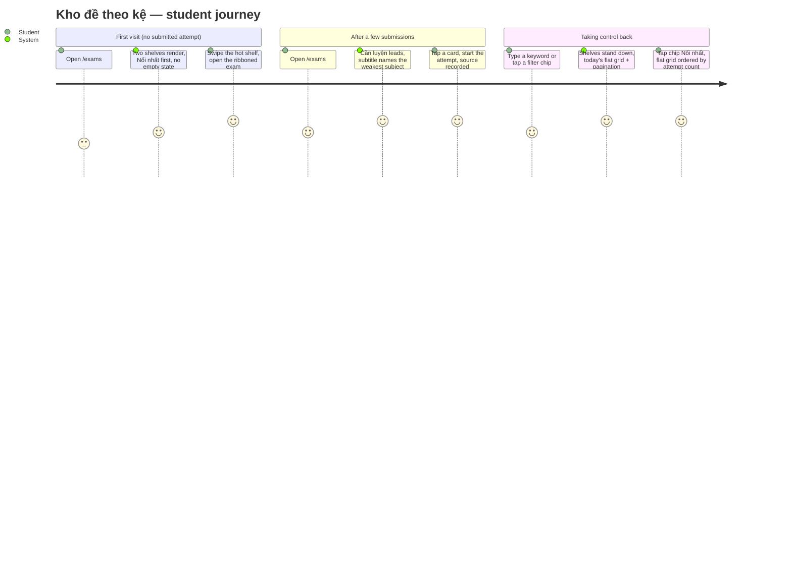
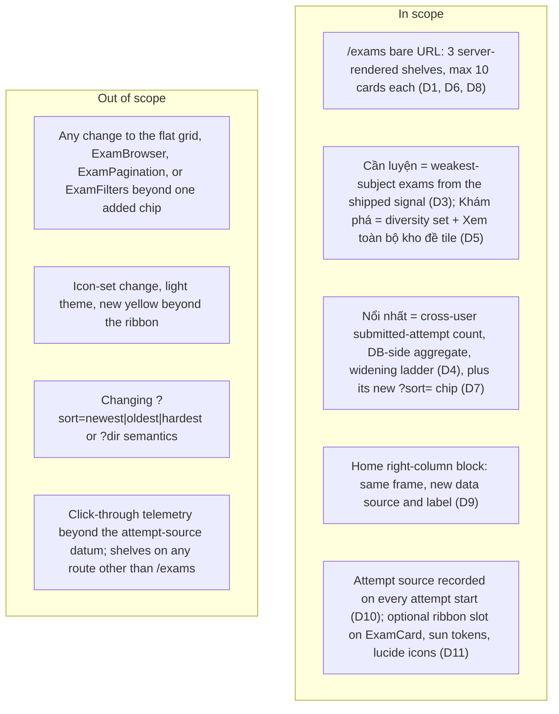

# PRD: Kho đề theo kệ (Exam Shelves)

| | |
|---|---|
| **Version** | 1.2 |
| **Date** | 2026-09-18 |
| **Status** | Draft — D1–D11 and D13 are locked by the engineer (`EXAM-SHELVES-BRIEF.md` §2, canvas direction A) and are not open for re-evaluation; D12 is this document's default (U4) |
| **Scale** | **LARGE — backend + frontend, ~25 implementation files.** ADR required (**ADR-0021**): the "hot" signal becomes a DB-side `security definer` aggregate because `exam_attempts` RLS hides other users' rows, and a new persisted datum carries the success metric |
| **Chain** | PRD → **UI Spec** → ADR-0021 → Design Doc → Work Plan |
| **Supersedes** | `docs/prd/exam-recommendation-prd.md` AC-002, AC-024, D1/D7 **for `/exams` only** — see "Supersession" |

## Revision History

| Version | Date | Change |
|---|---|---|
| 1.0 | 2026-09-18 | Initial draft. D1–D11 locked from the mission brief; D12 (`HOT_SHELF_MIN_CARDS`) added as this document's default. AC-001–AC-047. |
| 1.1 | 2026-09-18 | Review pass (I001–I016). **AC-048–AC-051 added** — Khám phá total order, both-shelf overlap, the Cần luyện "Xem tất cả" destination, and the hidden-shelf output rule. URL literals fixed (`?from=`, `?sort=hot`, `/exams?page=1`); **D13** recorded from brief P8; a Source column added to the decisions table; AC-043 and Success Criteria #4 restated against a snapshot test **this work creates**, because none exists today; Success Criteria #8 restated because the repo has no axe dependency; **U3** and **U4** added. **0 ACs renumbered.** |
| 1.2 | 2026-09-18 | **AC-027 amended for ADR-0021 D1**: the cross-user aggregate projects `(exam_id, recent_count, wide_count, total_count)`, so one call serves every ladder rung instead of one-to-four RPC calls per render. Substance unchanged — aggregate-only, and timestamps now **explicitly** excluded, with window boundaries snapped to the hour inside the function. **0 ACs renumbered, nothing else changed.** |

## Overview

**One line**: `/exams` with a bare URL stops being a flat grid of everything and becomes three purpose-built horizontal shelves — "Các môn cần luyện", "Các đề nổi nhất", "Khám phá" — so a student sees what to do next instead of a wall of identical cards.

**The problem**, in three facts:
- Today's `/exams` default is one flat paginated grid; the personalised order shipped by ADR-0015 is real but **imperceptible** — nothing on screen says why an exam is first.
- The weakest-subject signal already computed in `SOURCE/lib/adaptive/rankExams.ts` (`buildSubjectWeakness`, mean score per subject inverted) is buried as one term inside `affinity`, worth at most 0.5 of a score nobody sees.
- Nothing on the site expresses "other students are doing this exam". `exam_attempts` is RLS-scoped to the caller, so that fact is currently unreadable by the product at all.

**Business value**: content-discovery rows are how YouTube, Netflix and Roblox make a catalogue browsable, and horizontal swipe + vertical scroll is the dominant mobile discovery pattern in 2026 ([discoverability](https://www.ramotion.com/blog/discoverability-in-ux-design/), [mobile patterns](https://www.uxpin.com/studio/blog/mobile-app-design-examples/)); here it also turns an existing diagnosis ("your weakest subject is Hoá") into a one-tap action.

## Users and Stories

**Primary user**: the authenticated student (`user_profiles.role = 'student'`) on mid-range Android. **Secondary**: the engineer, who reads the attempt-source datum by SQL. No new role, no new permission.

```
As a student with a weak subject, I want that subject's exams on the first shelf, so the diagnosis becomes something I can sit right now.
As a student, I want to see what everyone else is doing this week, so I can practise what matters before a test.
As a new student with no history, I want a usable page on my first visit, so I am not shown an empty state or a fake diagnosis.
As a student who searches or filters, I want exactly today's grid and pagination, so a page I know how to use does not change under me.
```

### User Journey



### Scope Boundary



## Locked Decisions

| # | Decision | One-clause reason | Source |
|---|---|---|---|
| D1 | Bare `/exams` renders three horizontal shelves: **Các môn cần luyện**, **Các đề nổi nhất**, **Khám phá** | A purpose per shelf beats one undifferentiated grid | brief P1 |
| D2 | Any of `q`, `subject`, `grade`, `school`, `year`, `semester`, `sort`, `level`, `dir`, `page` present → today's flat personalised grid + pagination, unchanged | A student who states a query has stated it | brief P2 |
| D3 | **Cần luyện** = exams of the weakest subject (mean score per subject, inverted — the shipped signal in `rankExams.ts`). Hidden for logged-out students and for students with no submitted attempt. Tie → more scored representative attempts wins → subject name A→Z | Reuses a signal already computed; absence is never guessed | brief P3 |
| D4 | **Nổi nhất** = exams by count of **submitted** attempts by **all** students in a window, scoped to the student's grade, with the widening ladder 7d-in-grade → 30d-in-grade → all-time-in-grade → all-time-site-wide. Hidden only when the site has zero submitted attempts. Already-done exams still appear. Only rank 1 carries the ribbon **Hot nhất** | A shelf that reads "empty this week" is worse than one that widens | brief P4 |
| D5 | **Khám phá** = newly published exams + subjects and schools the student has not attempted, deduplicated against the other two shelves, ending with the **Xem toàn bộ kho đề** tile | The other two shelves narrow; this one is the way out | brief P5 |
| D6 | Each shelf shows at most **10** cards | A shelf is a sample, not a catalogue | follow-up ruling |
| D7 | New sort chip **Nổi nhất** in the existing chip row; existing chips (Mới nhất / Cũ nhất / Khó nhất / Bộ lọc) unchanged. The hot shelf's "Xem tất cả" opens the flat grid on that axis | One `?sort=` axis, per Rating System D002 | follow-up ruling |
| D8 | Shelf order: **Cần luyện first when present, otherwise Nổi nhất first**; Khám phá is always last | The most personal shelf leads when it exists | brief P1 |
| D9 | Home right column keeps its frame, `layout="stack"`, 3 cards and its "Xem tất cả đề" link; **only its data source (3 hottest) and its label change** | Smallest change that puts the new signal where students land | brief P6 |
| D10 | Every attempt start records its shelf of origin — `practice`, `hot`, `explore`, `none`. Success metric = share of attempts started from **Cần luyện** | A shelf nobody uses must be visible as such | follow-up ruling |
| D11 | Icons stay **lucide-react** (`Target`, `Flame`, `Compass`); the ribbon uses the existing sun tokens; with no ribbon prop, `ExamCard` markup is byte-identical to today | No new dependency, no new colour meaning | brief P7 |
| D12 | The ladder widens while fewer than **5** exams qualify (`HOT_SHELF_MIN_CARDS`, named constant) **— this document's default, not an engineer decision (U4)** | A 3–4 card row reads as a thin shelf rather than a selection | this document's default |
| D13 | An exam qualifying for both **Cần luyện** and **Nổi nhất** appears on **both**; deduplication applies to Khám phá only | The two shelves answer different questions; hiding an exam from one to protect the other discards a true signal | brief P8 |

## Functional Requirements

### Must Have (P1)

**R1 — The bare `/exams` renders three shelves (D1, D6, D8, D11)**
- AC-001: Given a signed-in student and a request to `/exams` with **0** query parameters, when the page renders, then it contains every shelf that qualifies under AC-013 (`Các môn cần luyện`), AC-024 (`Các đề nổi nhất`) and AC-031 (`Khám phá`), and — unconditionally, whatever qualifies — **0** instances of the flat grid and **0** `ExamPagination`.
- AC-002: Given any shelf, when it renders, then it contains **at most 10** `ExamCard` elements.
- AC-003: Given a student whose Cần luyện shelf is present, when the page renders, then DOM order is Cần luyện → Nổi nhất → Khám phá; given a student whose Cần luyện shelf is absent, then DOM order is Nổi nhất → Khám phá.
- AC-004: Given any shelf header, when it renders, then it carries its lucide icon (`Target` / `Flame` / `Compass`), an `h2` title, a subtitle line, and — for Cần luyện and Nổi nhất — a right-aligned `Xem tất cả` link; the Khám phá shelf ends with the `Xem toàn bộ kho đề` tile instead.
- AC-005: Given the initial HTML response for a bare `/exams`, when it is inspected, then every shelf card is present in that response — **0** client-side fetches, **0** late-inserted shelf content.
- AC-006: Given a shelf list of N ranked candidates, when it is cut to 10, then the cut happens **after** ranking in Node, never as a DB `.limit()`/`.range()` on the candidate query (ADR-0015 kill criterion (a)).
- AC-007: Given `SiteHeader`, `HeaderSearch`, `HeaderProfile`, `PageHeader`, `ExamFilters` chips, `BottomNav`, `ExamPagination` and `ExamCard`, when the shelves view renders, then none of them loses or resizes an element relative to today.
- AC-051: Given **any** shelf, when its own selection yields **0** cards, then that shelf is absent from the page entirely — **0** headers, **0** subtitles, **0** placeholders, **0** empty cards, **0** errors — and the remaining shelves keep their relative order (D8). AC-013 and AC-024 are two named instances of this rule, not its definition.

**R2 — Any parameter stands the shelves down (D2)**
- AC-008: Given a request carrying any one of `q`, `subject`, `grade`, `school`, `year`, `semester`, `sort`, `level`, `dir`, `page`, when the page renders, then **0** shelf sections appear and `ExamBrowser` + `ExamPagination` render exactly as today.
- AC-009: Given `?sort=newest`, `?sort=oldest` or `?sort=hardest`, when the list renders, then ordering is exactly today's SQL ordering with no personalisation, and the query-construction assertions in `SOURCE/features/exams/__tests__/rating.int.test.ts:317-440` pass **unmodified** (carries exam-recommendation AC-016/AC-017).
- AC-010: Given `?dir` with no `?sort`, or `?page=2`, or an unrecognised `?sort=` value, when the page renders, then the flat grid renders in today's personalised order (carries exam-recommendation AC-037) and **0** shelves appear.

**R3 — Các môn cần luyện (D3)**
- AC-011: Given a student with at least one submitted attempt carrying a score, when the shelf renders, then every card in it belongs to the subject with the lowest mean representative score, and **0** cards of any other subject appear.
- AC-012: Given that shelf, when its subtitle renders, then it names that subject in Vietnamese — `"{subject} đang là môn điểm trung bình thấp nhất của bạn"`, e.g. `Hoá đang là môn điểm trung bình thấp nhất của bạn`.
- AC-013: Given a student with **0** submitted attempts, or with submitted attempts but **0** scored representative attempts, when `/exams` renders, then the Cần luyện selection yields 0 cards and the shelf is absent under AC-051, and Nổi nhất leads.
- AC-014: Given a logged-out visitor, when they request `/exams`, then they are redirected by `PUBLIC_PATHS` before render and **0** shelf markup is produced.
- AC-015: Given two subjects whose **weakness value** is equal — the value the AC-016 helper returns, not the mean it was computed from — when the weakest subject is chosen, then the subject with more scored representative attempts wins; given those are also equal, then the subject whose name sorts first A→Z wins — proven by a determinism unit test.
- AC-016: Given the shipped code, when it is inspected, then the weakest subject comes from the existing per-subject mean-score-inverted helper in `SOURCE/lib/adaptive/rankExams.ts`, whose return shape widens to carry the per-subject scored-attempt count AC-015 needs — **1** implementation, a wider return, **0** parallel copies of the computation.
- AC-017: Given the shelf's candidates, when they are ordered, then the order is the existing personalised ranking restricted to that subject (never-taken band first), cut to 10.
- AC-050: Given the Cần luyện shelf's `Xem tất cả` link, when it is followed, then it lands on `/exams?subject={weakest subject}` — the flat grid in today's personalised order narrowed to that subject, a listed parameter so the shelves stand down per D2. The mobile frame of the canvas omits this link; it renders on **both** breakpoints.

**R4 — Các đề nổi nhất, and the widening ladder (D4, D12)**
- AC-018: Given the candidate exams, when the hot order is computed, then it is `submitted attempt count DESC, exam id ASC`, where the count includes attempts by **all** students, not only the caller.
- AC-019: Given a student whose dominant grade is G (Glossary; equal shares → the grade of the most recent submitted attempt, still equal → the higher grade number) and ≥ 5 exams have ≥ 1 submitted attempt in the last 7 days within grade G, when the shelf renders, then it shows those exams and the subtitle reads `Khối {G}, tuần này`.
- AC-020: Given step 1 yields fewer than 5 exams, when the ladder widens to 30 days within grade G and that yields ≥ 5, then the shelf shows those exams and the subtitle reads `Khối {G}, 30 ngày qua`.
- AC-021: Given step 2 yields fewer than 5 exams, when the ladder widens to all time within grade G and that yields ≥ 5, then the shelf shows those exams and the subtitle reads `Khối {G}, từ trước tới nay`.
- AC-022: Given step 3 yields fewer than 5 exams, when the ladder widens to all time site-wide, then the shelf shows those exams and the subtitle reads `Toàn hệ thống, từ trước tới nay`.
- AC-023: Given a student with no submitted attempt (no dominant grade), when the ladder runs, then the in-grade steps are **skipped rather than guessed** and the ladder runs 7 days site-wide (`Toàn hệ thống, tuần này`) → 30 days site-wide (`Toàn hệ thống, 30 ngày qua`) → all time site-wide.
- AC-024: Given a site with **0** submitted attempts in total, when `/exams` and the home page render, then the hot selection yields 0 cards at every rung, so the shelf is absent under AC-051 and the home hot block is absent under AC-038.
- AC-025: Given an exam the student has already submitted, when the hot shelf renders, then that exam still appears if its count qualifies — the demotion band does **not** apply to this shelf.
- AC-026: Given the rendered hot shelf, when it is inspected, then exactly **1** card (rank 1) carries the ribbon `Hot nhất` and ranks 2–10 carry **0** ribbons.
- AC-027: Given the cross-user count, when it is read, then it comes from a database-side aggregate that returns only `(exam_id, count)` pairs — **0** other users' attempt rows cross the application boundary, and the aggregate applies `status = 'submitted'` and published-only.
  - *Amended v1.2 by ADR-0021 D1 (2026-09-18)*: the criterion is **satisfied** by the projection `(exam_id, recent_count, wide_count, total_count)` — three windows of the same kind of fact, so **one** call serves every rung of the ladder instead of a variable one-to-four RPC calls per render. Substance intact: aggregate-only, **0** user ids, **0** attempt ids, **0** scores and — stated explicitly here — **0** timestamps, because the caller-supplied window boundaries are snapped to the hour inside the function so repeated calls cannot infer another student's submission time.
- AC-028: Given the aggregate read, when it runs, then it is bounded (an explicit row cap in the same style as `readBounded`), never an unbounded select over `exam_attempts`.
- AC-049: Given an exam qualifying for **both** Cần luyện and Nổi nhất, when `/exams` renders, then it appears on **both** shelves — deduplication applies to Khám phá only (D13).

**R5 — Khám phá (D5)**
- AC-029: Given the two other shelves' exam ids, when Khám phá is built, then **0** of its cards repeats an id already shown on those shelves.
- AC-030: Given a student's attempt history, when Khám phá is built, then its candidate pool is every published exam **not** already shown on the other two shelves, ordered by the single AC-048 key — the "never attempted" and "newly published" pools do **not** interleave, and "the newest published exams not already shown" is simply what that key produces when no never-attempted candidate exists.
- AC-048: Given that deduplicated pool, when it is ordered, then the total order is `[subject never attempted by this student DESC, school never attempted by this student DESC, exams.created_at DESC, exam id ASC]`, cut to 10 in Node; **"newly published" means the most recent by `exams.created_at` among unshown published exams — no date window**.
- AC-031: Given any student, including one with no history, when `/exams` renders, then the Khám phá shelf is present whenever at least 1 unshown published exam exists, and its subtitle reads `Đề mới đăng, môn và trường bạn chưa thử`.
- AC-032: Given the Khám phá row, when it renders, then its last item is the `Xem toàn bộ kho đề` tile whose href is `/exams?page=1` — a listed parameter, so the flat grid renders per D2 — and the row holds at most 10 cards plus that tile.

**R6 — The Nổi nhất sort axis (D7)**
- AC-033: Given the chip row, when it renders, then it contains `Bộ lọc`, `Mới nhất`, `Cũ nhất`, `Khó nhất` with today's labels and behaviour, plus **1** new chip `Nổi nhất`; the four existing chips gain **0** changed props.
- AC-034: Given the new chip is tapped, when the URL updates, then it carries exactly `?sort=hot` — `page` and `dir` dropped, today's `setSort` behaviour — and the flat grid renders ordered by the same cross-user count as AC-018.
- AC-035: Given the hot shelf's `Xem tất cả` link, when it is followed, then it lands on `/exams?sort=hot`, the same literal AC-034 writes.

**R7 — Home page block (D9)**
- AC-036: Given a signed-in visitor on `/`, when the right-column block renders, then its heading text is `Đề nổi nhất`, and its frame, `layout="stack"`, 3-card count and `Xem tất cả đề` link are unchanged from today.
- AC-037: Given that block, when its data is fetched, then the 3 cards are the top 3 of the same hot order and ladder as AC-018–AC-023, and **0** ribbons render inside the home block.
- AC-038: Given a site with 0 submitted attempts, when `/` renders for a signed-in visitor, then the block is absent (AC-024) and the page renders with 0 errors.

**R8 — Attempt source datum (D10)**
- AC-039: Given a card inside a shelf, when its link renders, then the href carries `?from=practice`, `?from=hot` or `?from=explore` according to the shelf it sits on; given a card in the flat grid or in the home block, then the href carries **0** `?from` parameter.
- AC-040: Given an attempt started from an exam page reached with `?from=`, when `startAttempt` inserts the `exam_attempts` row, then that row persists exactly one of `practice`, `hot`, `explore`, `none`.
- AC-041: Given a missing, empty, unknown or forged `?from=` value, when the attempt row is written, then it stores `none` — **0** errors, **0** rejected attempt starts.
- AC-042: Given a set of attempts, when one SQL query groups them by that column, then it returns the share of attempts started from each shelf, with **0** application-log reading required.

**R9 — Visual containment (D11)**
- AC-043: Given `ExamCard` rendered with **none** of this feature's new props supplied — no ribbon **and** no source, since a shelf card legitimately carries a `?from=` href — when its markup is compared to today's, then it is byte-identical. **No `ExamCard` snapshot test exists today**, so the proof is a deliverable of this work: a new snapshot test at `SOURCE/features/exams/components/__tests__/ExamCard.snapshot.test.tsx`, written against the pre-change component and kept green across the change.
- AC-044: Given the ribbon, when it renders, then it uses the existing sun tokens (`bg-sun`, `--sun-on-solid`, `glow-sun`) and is the **only** new element on the page using yellow.
- AC-045: Given the shipped diff, when `SOURCE/package.json` is inspected, then it declares **0** new dependencies and all shelf icons import from `lucide-react`.
- AC-046: Given every new user-visible string, when it is inspected, then it is defined in `SOURCE/lib/copy.ts` in Vietnamese and **0** raw keys or English strings render on screen.

### Should Have (P2)

- AC-047: Given a shelf row on a pointer device, when the student uses the keyboard alone, then every card is reachable in DOM order and the row scrolls to the focused card without a mouse.

### Won't Have (this release)

*(Items already drawn in the Scope Boundary diagram are excluded there; the rows below are the ones whose reason adds something the diagram does not say.)*

| Excluded | Reason |
|---|---|
| Any icon-set change | The canvas's five-set comparison was informational only; Lucide stays (D11) |
| New yellow anywhere but the ribbon | Yellow already means "current position" in `BottomNav`; a second meaning devalues both |
| Shelf personalisation beyond the three locked signals | Weakness, cross-user count and diversity are the whole model — no fourth signal is smuggled in during implementation |
| A new `ExamShelf` variant for any other route | The home block changes data source and label only (D9); a second shelf surface is a separate PRD |

## Non-Functional Requirements

**Performance**
- The bare `/exams` view issues a **fixed, small** number of reads: the exam rows, the caller's attempt history, the caller's results, and **1** cross-user hot aggregate. All of them resolve in one `Promise.all` — added wall-clock is bounded by the slowest read, not their sum (ADR-0015 Decision 6, whose budget ADR-0021 restates).
- **0** per-shelf and **0** per-card reads; **0** unbounded reads — every new read is row-capped, and the hot aggregate caps its own result set server-side.
- Shelf cutting happens after ranking in Node (AC-006), so the ranking still sees the full candidate set.
- The existing baseline holds: Lighthouse mobile ≥ 85, FCP ≤ 2.5s on 3G, on mid-range Android.

**Zero layout shift**
- Shelves are fully server-rendered (AC-005). Measured CLS on `/exams` open **and** on a horizontal shelf swipe is **0** at 360, 768, 1024 and 1280px.
- Motion reuses the existing `.motion-*` / `usePresence` vocabulary; page content never fades in on load.

**Accessibility (WCAG 2.1 AA)**
- The ribbon is decorative (`aria-hidden`); the "hot" state is stated **in text** in the shelf subtitle, so the meaning survives with colour and images off.
- Each shelf is a `section` labelled by its `h2`; the row is a list; `Xem tất cả` links keep the 44px touch target used by `home.viewAllExams`.
- Ribbon text on `bg-sun` uses `--sun-on-solid`; contrast ≥ 4.5:1 is verified, not assumed.
- Target assistive technologies: mobile screen readers (TalkBack), keyboard-only navigation.

**Security**
- `exam_attempts` stays RLS-scoped to the caller; the cross-user count is exposed **only** as an aggregate of `(exam_id, count)` (AC-027) — no user id, no timestamp, no score crosses the boundary.
- The aggregate re-asserts published-only, for the reason `schema.sql` §12 records (a measured incident where a view served unpublished drafts).
- The attempt-source value is student-influenced (it arrives on a URL); it is normalised to the four allowed values on write (AC-041) and is treated as a **usage hint, not a trusted fact**.

## Success Criteria

| # | Metric | Target | Measured by |
|---|---|---|---|
| 1 | **Primary (D10)** — share of attempts started from the Cần luyện shelf | Read at 14 and 30 days after ship; **≥ 15%** at 30 days triggers "working", below that triggers a shelf-order review. Not a ship gate — the site is pre-launch | `select` over `exam_attempts` grouped by the source column (AC-042) |
| 2 | Attribution coverage | **100%** of attempt rows created after ship carry one of the four values | Same query; `count(*) where value is null` = 0 |
| 3 | Layout stability | CLS = **0** at 360/768/1024/1280 on open and on shelf swipe | Playwright UI audit run from inside `SOURCE/` |
| 4 | Card markup containment | **0** byte difference in `ExamCard` output when rendered with none of the new props | The new snapshot test this work creates (AC-043) — none exists today, so this criterion ships its own enforcement |
| 5 | Flat-grid contract | `rating.int.test.ts:317-440` passes **unmodified** | `npx vitest run` |
| 6 | Verify gates | All 6 green by real exit code: `tsc --noEmit`, `eslint --max-warnings 0`, `vitest run`, `build`, `test:fixture`, `test:localdb` | Run from `SOURCE/` |
| 7 | Schema parity | `schema_version.fingerprint` identical on dev and prod after apply | `npm run verify:schema` on dev + a prod fingerprint read before closing |
| 8 | Accessibility | **0** defects found on: keyboard reach of every card, shelf headings announced, ribbon absent from the accessible name, ribbon contrast ≥ 4.5:1 | Recorded manual pass (keyboard + TalkBack) at 360 and 1280, plus contrast computed from the sun tokens — the repo has no axe dependency and this work does not add one |
| 9 | UI quality | A student can reach an exam from a cold open in **≤ 2 taps** (shelf card → Làm bài) | Recorded manual pass on a real device |

**Qualitative**: the first shelf reads as advice a student can act on; a student with no history cannot tell that the system knows nothing about them; a student who searches gets exactly the page they had yesterday.

## Risks

| Risk | Impact | Prob. | Mitigation |
|---|---|---|---|
| **Thin production data** — ~92 submitted attempts over 7 published exams (2026-08-31), so a 7-day in-grade window can easily yield 0–2 exams | High | High | The widening ladder is a requirement, not a fallback (AC-019–AC-023); the subtitle always states which step produced the shelf, so a wide window is never presented as "this week" |
| **New cross-user read surface** — the first place this product reads other students' activity | High | Medium | Aggregate-only projection (AC-027), published-only, row-capped (AC-028), and the decision is recorded in ADR-0021 rather than inside a query |
| **Production schema drift** — the hand-applied two-database ritual has broken this project four times (TD-005) | High | Medium | "Done" includes a production fingerprint check (Success Criteria #7); `schema.sql` → `schema:plan` → fingerprint constant → migration file → dev apply → `verify:schema`, prod checked separately |
| **The source datum is forgeable** — a student can type the source parameter | Low | Medium | Normalised on write (AC-041); the metric is read as a usage hint at pre-launch volumes, and the risk is stated rather than designed against |
| **Round-trip budget grows** — 1 more read on the site's primary browse surface | Medium | Medium | Concurrent in the existing `Promise.all`; ADR-0021 restates the budget with the new number, and the CI round-trip assertion is updated in the same change |
| **Shelf cutting tempts a DB-side limit** — cutting to 10 in SQL would invalidate in-process ranking | Medium | Low | AC-006 pins rank-then-cut; ADR-0015 kill criterion (a) still applies |

## Supersession

**Superseded for `/exams` by this PRD** (the named criteria no longer bind the bare `/exams` view; they continue to bind nothing else, because nothing else relied on them):

| Item in `docs/prd/exam-recommendation-prd.md` | Why it is superseded |
|---|---|
| **AC-002** — "zero visual change; 0 changed files under `SOURCE/features/exams/components/`" | This feature is a visual change: three shelves, a new component, a ribbon slot and new strings |
| **AC-024** — "a cold-start page is visually indistinguishable from any other student's" | The Cần luyện shelf is present exactly when the student has history, so the two states now differ deliberately (AC-013) |
| **D1** — "the ranking IS the browse order; no separate card or slot above the grid" | The shelves **are** the browse surface for the bare URL; the ranking survives inside them and unchanged in the flat grid |
| **D7 (withdrawn)** — "no reason label of any kind" | The shelf subtitles and the `Hot nhất` ribbon are exactly the labelling D7 withdrew, re-adopted with an approved visual spec |

**Explicitly still binding, unchanged** — an explicit `?sort=` still produces today's SQL ordering with no personalisation, and the query-construction assertions stay green unmodified:

- **AC-016** and **AC-017** (`?sort=`/`?dir` semantics untouched) — carried here as AC-009.
- **AC-037** (`?dir` with no `?sort` falls to the personalised order) — carried here as AC-010.
- **Every acceptance criterion of that PRD not named above** remains binding for the flat-grid path, which this feature does not modify. Two that could read as conflicts and are not: its **AC-010** ("exactly 1 scoring function") — the hot order is a *separate* order over a *different* input, not a second copy of the personalised one; and its **AC-006** ("0 new collection surfaces") — that clause scopes that feature's grade and preference terms, and the D10 attempt-source datum is neither.

## Undetermined Items

- [ ] **U1 — Hot-shelf subtitles for ladder steps 2–4.** Only `Khối {G}, tuần này` is verbatim from the approved canvas. `Khối {G}, 30 ngày qua`, `Khối {G}, từ trước tới nay`, `Toàn hệ thống, …` follow its pattern and are written into AC-020–AC-023 as the default; a one-word "ok" locks them, any replacement string is a copy edit in `SOURCE/lib/copy.ts` with no structural effect.
- [ ] **U2 — The 30-day practice-share target (Success Criteria #1, 15%).** Chosen as a review trigger, not a ship gate; the engineer may replace the number once the first 14-day reading exists.
- [ ] **U3 — The two site-wide rungs for a student with no dominant grade (AC-023).** This document's default is an honest `Toàn hệ thống, tuần này` → `Toàn hệ thống, 30 ngày qua` → all time. The locked four-rung ladder's alternative is a **single all-time site-wide rung** for such a student; switching costs 2 ACs and 2 copy strings and nothing structural.
- [ ] **U4 — `HOT_SHELF_MIN_CARDS` = 5 (D12, AC-019–AC-022).** This document's default, on the product judgement that a 3–4 card row reads as a thin shelf rather than a selection; **4** is the alternative the fold arithmetic at 1000px would support. Either is a one-line constant change with no structural effect.

## Appendix

**New copy keys** (all Vietnamese, all in `SOURCE/lib/copy.ts`): shelf titles `Các môn cần luyện` / `Các đề nổi nhất` / `Khám phá`; practice subtitle `{subject} đang là môn điểm trung bình thấp nhất của bạn`; hot subtitles per AC-019–AC-023; Khám phá subtitle `Đề mới đăng, môn và trường bạn chưa thử`; `Xem tất cả`; `Xem toàn bộ kho đề`; ribbon `Hot nhất`; sort chip `Nổi nhất`; home block label `Đề nổi nhất`.

**References**: `EXAM-SHELVES-BRIEF.md` (§2 decisions, §3 visual spec, §4 verified technical facts, §5 process) · `docs/ui-spec/assets/exam-shelves/prototype-huong-a.html` (approved canvas, direction A — an attachment, not the source of truth) · `docs/prd/exam-recommendation-prd.md` v1.3 · `docs/adr/ADR-0015-personalised-exam-ranking-placement-and-telemetry.md` · ADR-0008 (`exams_with_difficulty`, on-read aggregation precedent) · `SOURCE/app/(exams)/exams/page.tsx` · `SOURCE/features/exams/queries/ranking.ts` · `SOURCE/lib/adaptive/rankExams.ts` · `SOURCE/features/exams/components/ExamFilters.tsx`, `ExamCard.tsx`, `ExamBrowser.tsx` · `SOURCE/features/exams/actions.ts` (`startAttempt`) · `SOURCE/app/page.tsx` · `SOURCE/lib/copy.ts`.

**Glossary**: **Shelf** — a horizontally scrolling row of `ExamCard`s with a titled header. **Hot count** — number of submitted attempts on an exam by all students within the active ladder window. **Ladder** — the ordered widening of that window/scope until `HOT_SHELF_MIN_CARDS` exams qualify. **Dominant grade** — the grade holding the highest share of the student's submitted attempts (the `buildGradeShares` distribution in `SOURCE/lib/adaptive/rankExams.ts`); **null** when the student has 0 submitted attempts; equal shares resolve to the grade of the most recent submitted attempt, then to the higher grade number. **Representative attempt** — the student's most recent submitted attempt on an exam, the definition already used by `rankExamIds`. **Attempt source** — the persisted shelf of origin: `practice`, `hot`, `explore`, `none`.
