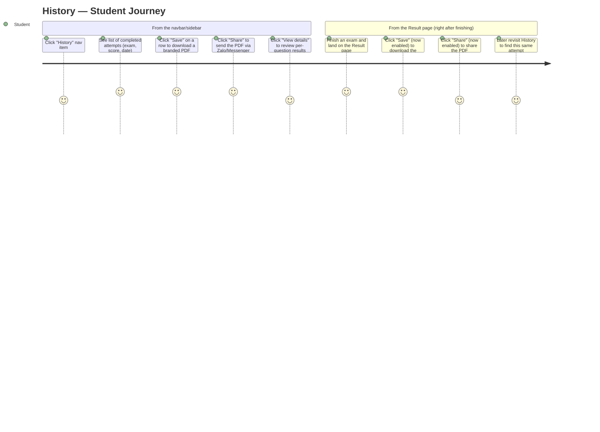
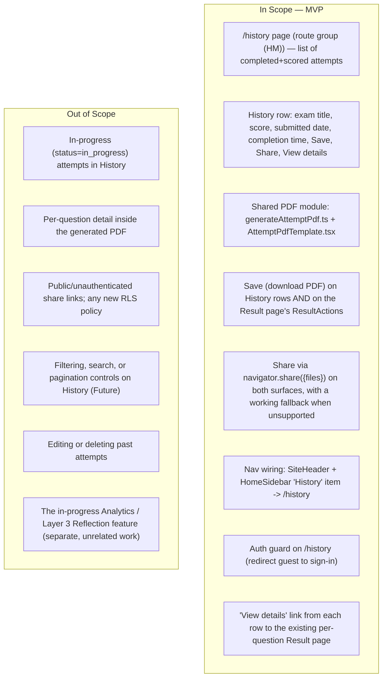

# PRD: History

| | |
|---|---|
| **Version** | 1.3 |
| **Date** | 2026-07-28 |
| **Status** | Draft — product decisions locked with product owner (2026-07-27). Ready for downstream chain: PRD → UI Spec → ADR (PDF library choice) → Design Doc → Work Plan. |
| **Scale** | LARGE — fullstack. New top-level route group, a shared PDF-generation module reused across two entry points, DB reads only (no schema/RLS changes), nav wiring in two shared components. 12 affected files. |

## Revision History

| Version | Date | Change |
|---|---|---|
| 1.0 | 2026-07-27 | Initial draft; 8 product decisions locked (History scope, PDF content, jsPDF+html2canvas, share mechanism, ResultActions reuse, drill-through, `/history` URL, separate `(HM)` layer). |
| 1.1 | 2026-07-27 | Addressed document-reviewer findings: (1) added Background note on the `(HM)` vs. Layer 3 taxonomy split and the corresponding `PROJECT_OVERVIEW.md` §3/§5/§10 amendment; (2) extended R9 with AC-019 covering `/history` list-read failure (DB/network error) as an actionable, retryable error state, mirroring the existing PDF-generation error-resilience pattern (AC-018); (3) flagged the `getResult()` query gap (missing `started_at`/`submitted_at`) in Technical Considerations > Dependencies for the Design Doc to resolve; (4) removed the non-risk `@react-pdf/renderer` row from Risks and Mitigation (already covered under Dependencies). No locked product decisions were changed. |
| 1.2 | 2026-07-27 | Cosmetic follow-up to a reviewer non-blocking recommendation: added one sentence to the Background section's `(HM)` layer-taxonomy note explaining why this decision is traced via a `PROJECT_OVERVIEW.md` Decisions Log entry rather than a full ADR. No locked product decisions were changed. |
| 1.3 | 2026-07-30 | Design-sync consistency fix: reworded the Non-Functional Requirements > Performance bullet on `/history` list loading to describe the intended behavior (a small, fixed number of batched queries per page load, no per-row round trip / no N+1) instead of prescribing a single query/join mechanism, aligning the wording with the backend Design Doc's actual sequential batched-select implementation (the repo-wide convention — no PostgREST embedded-resource joins are used anywhere in `SOURCE/app`). No locked product decisions were changed. |

## Overview

### One-line Summary

Give a logged-in student a `/history` page listing every exam attempt they have completed and scored, and let them generate a custom-branded summary PDF (score, completion time, exam metadata — no per-question detail) of any attempt to save locally or share as a file — using one shared PDF-generation module that also powers the existing, currently-disabled Save/Share buttons on the per-attempt Result page.

### Background

MS-MOLAR / TrangNguyenDigi's Layer 2 core loop already lets a student browse exams, take a timed attempt, submit, and see a Result page (`SOURCE/app/(layer2)/exams/[id]/attempt/[attemptId]/result/page.tsx`) with a score, and a per-question detail page. What it does not have is any way to look back across *multiple* past attempts, or to keep/share a result outside the site.

Two gaps this feature closes:

1. **No history surface.** `exam_attempts` and `exam_results` already store everything needed (owner-scoped via existing RLS), but no page lists them. The "History" nav item already exists in both `SiteHeader.tsx` and `HomeSidebar.tsx` — it has always pointed at `href="#"`, a placeholder for this feature.
2. **Dead Save/Share buttons.** `ResultActions.tsx` on the Result page already renders "Save" and "Share" buttons, `disabled`, with a "coming soon" tooltip (`SOURCE/app/(layer2)/_components/ResultActions.tsx:26-27`) — a placeholder for this same feature.

This PRD defines both surfaces as one feature: a new `/history` list page (new top-level route group `(HM)`, sibling to the existing `(layer1)`–`(layer4)` layers per `PROJECT_OVERVIEW.md` §3) and a single shared PDF-generation module consumed by both `/history` rows and the existing Result page's Save/Share buttons. `(HM)` is a deliberate, separate route group — not folded into `(layer3)` "Reflection," which is mid-implementation on this branch for an unrelated Analytics feature.

**Layer-taxonomy note**: `PROJECT_OVERVIEW.md` §3 originally listed "Lịch sử làm bài" (attempt history) as part of Layer 3 — Reflection, alongside weakness analysis. Per explicit product direction (2026-07-27, final — not subject to re-litigation), History is deliberately split out into its own top-level layer, `(HM)`, instead of being folded into Layer 3: Layer 3/Analytics is mid-implementation and unrelated to this feature, and History needs to ship independently of Analytics' progress. `PROJECT_OVERVIEW.md` §3, §5, and §10 have been amended accordingly (Layer 3 now scopes to weakness analysis only; a new Layer `HM` entry and Decisions Log row record this split) so the canonical taxonomy doc stays accurate rather than silently deviating from this PRD. This layer-addition decision is traced via that Decisions Log entry rather than a full ADR because it is a direct, already-locked product/scope decision made explicitly by the user — not a multi-option technical trade-off requiring comparison — so a Decisions Log row is sufficient traceability; the ADR planned later in this chain instead covers the PDF-library choice, which is the genuine multi-option technical trade-off.

The generated artifact is a **summary-only** PDF — score, completion time, and exam metadata (e.g. title) — explicitly not a per-question export; a "View details" link on every row instead points at the existing full Result page for that. Sharing uses the Web Share API to hand the browser/OS a real file (e.g., into Zalo or Messenger) rather than any new public link: no RLS changes, no new unauthenticated access path.

## User Stories

### Primary Users

- **Student (test-taker)** — the same authenticated role that already takes exams and views results (`user_profiles.role = 'student'` default). No new persona or role is introduced.
- Non-user recipients (e.g., a parent, tutor, or friend receiving a shared PDF via Zalo/Messenger) are out-of-system — they receive a file, not access to the platform.

### User Stories

```
As a student who has completed several exams
I want a single page listing every attempt I've finished and scored
So that I can find and revisit any past result without hunting through browser history
```

```
As a student right after finishing an exam
I want to save my result as a branded PDF and share it
So that I have my own record and can send it to a parent or tutor without them needing to log in
```

```
As a student reviewing my History list
I want to jump from any row straight into the full per-question result
So that I can see exactly what I got right or wrong on that attempt
```

### Use Cases

1. **Browse History from nav**: A logged-in student clicks "History" in the navbar/sidebar, lands on `/history`, and sees every exam they've completed and scored, most recent first.
2. **Save a PDF from a History row**: The student clicks "Save" on a row; a branded summary PDF (score, completion time, exam title) downloads to their device.
3. **Share a PDF from a History row**: The student clicks "Share" on a row; the OS/browser share sheet opens with the PDF attached as a file (e.g., sent via Zalo).
4. **Save/Share from the Result page**: Right after submitting, the student uses the same Save/Share buttons already present on the Result page — now wired to the same PDF module instead of being disabled.
5. **Drill through to detail**: From a History row, the student clicks "View details" and lands on the existing `/exams/[id]/attempt/[attemptId]/result` page for per-question review.
6. **Guest tries to view History**: A logged-out visitor navigates directly to `/history` and is redirected to sign in, consistent with how `/upload` already guards itself.
7. **Share unsupported on this browser**: A student on a desktop browser without file-sharing support (e.g., desktop Firefox) clicks "Share"; a working fallback (at minimum, the same download as Save) occurs instead of a silent failure.

### User Journey Diagram



### Scope Boundary Diagram



## Functional Requirements

### Must Have (P1 — MVP)

- [ ] **R1 — History list scope and content**: `/history` lists only attempts that are both submitted (`exam_attempts.status = 'submitted'`) and scored (a matching `exam_results` row exists), ordered by `submitted_at` descending (most recent first). Each row shows the exam title, score (`X/10`), submitted date, and completion time (`submitted_at − started_at`).
  - AC-001: Given a user with a mix of in-progress and completed+scored attempts, when they open `/history`, then only rows with `status = 'submitted'` and an existing `exam_results` record appear — no in-progress attempt is shown.
  - AC-002: Given a user with zero completed+scored attempts, when they open `/history`, then an empty state renders with a call-to-action to browse exams — not an error, not a blank page.
  - AC-003: Given a user with two or more completed+scored attempts, when the list renders, then rows are ordered by `submitted_at` descending.
  - AC-004: Given a single row, when it renders, then it shows the exam title, score as `X/10`, the submitted date, and a completion time computed as `submitted_at − started_at`.

- [ ] **R2 — Drill-through to full result**: Every row includes a "View details" link to the existing per-question Result page for that attempt.
  - AC-005: Given a History row, when the user activates "View details", then they land on `/exams/[id]/attempt/[attemptId]/result` for that exact attempt.

- [ ] **R3 — One shared, summary-only PDF module**: A single PDF-generation module produces a custom-branded PDF containing only the score/result, completion time, and exam metadata (e.g. title) — never per-question content — and is the only PDF-generation implementation in the codebase, called from both `/history` rows and the Result page's `ResultActions`.
  - AC-006: Given a completed attempt, when a Save or Share action triggers PDF generation (from either surface), then the resulting PDF contains only the score/result, completion time, and exam metadata — no per-question content.
  - AC-007: Given the History-row Save/Share and the Result-page Save/Share, when the code is inspected, then both call the same PDF-generation module — exactly one implementation exists, not two parallel ones.
  - AC-008: Given the generated PDF, when it is rendered, then its visual style (colors, typography) follows the `DESIGN.md` "Ink & Lacquer" tokens rather than an unbranded default look.

- [ ] **R4 — Save (download)**: Both surfaces (History row, Result page) offer a "Save" action that downloads the branded PDF to the user's device.
  - AC-009: Given a History row or the Result page, when the user activates "Save", then the branded PDF downloads using only data already available to that page/row (no extra round trip needed beyond what already loaded the row's data).
  - AC-010: Given a Save action in progress, when generation takes a noticeable amount of time, then the UI shows a busy state and the action is not double-triggerable.

- [ ] **R5 — Share with fallback**: Both surfaces offer a "Share" action using `navigator.share({ files: [pdfFile] })`; when file-sharing is unsupported, a working fallback occurs instead of a silent failure. No public or unauthenticated link is ever created.
  - AC-011: Given a browser that supports sharing files via `navigator.share`, when the user activates "Share", then the native share sheet opens with the generated PDF attached as a file.
  - AC-012: Given a browser that does not support sharing files via `navigator.share` (e.g., desktop Firefox), when the user activates "Share", then a working fallback occurs — at minimum, the same PDF download as Save — instead of a broken control or silent failure.
  - AC-013: Given the Share action at any point, when inspected, then no public/unauthenticated URL is created or exposed, and no RLS policy is added or changed — the shared artifact is only the local PDF file the user already has.

- [ ] **R6 — Wire the existing Result-page actions**: The Result page's existing `ResultActions` "Save" and "Share" buttons are wired to the same module as History, removing their `disabled` state and "coming soon" tooltip.
  - AC-014: Given `ResultActions` on the Result page, when this feature ships, then its "Save" and "Share" buttons are enabled and invoke the same Save/Share behavior as the corresponding History row for that attempt.

- [ ] **R7 — Navigation wiring**: The existing "History" nav item in both `SiteHeader.tsx` and `HomeSidebar.tsx` (currently `href="#"`) points at `/history` and participates in active-state highlighting like the other real nav items (Exams, Analytics).
  - AC-015: Given `SiteHeader` and `HomeSidebar`, when this feature ships, then both "History" nav entries have `href="/history"`, and the item shows the same active/highlight treatment on `/history` as other nav items show on their own routes.

- [ ] **R8 — Access control on `/history`**: `/history` requires an authenticated session; a logged-out visitor is redirected to sign in, matching the existing guard pattern on `/upload`. Data returned is scoped to the current user by existing RLS — no new policy is introduced.
  - AC-016: Given a logged-out visitor, when they navigate directly to `/history`, then they are redirected to `/?auth=signin` and no attempt data is fetched.
  - AC-017: Given a logged-in user, when they open `/history`, then only their own attempts appear, enforced by the existing `exam_attempts`/`exam_results` RLS policies (`user_id = auth.uid()`) — no new policy is added.

### Should Have (P2)

- [ ] **R9 — Error resilience (list read + PDF generation)**: A failed PDF generation, or a failed `/history` list read (DB/network error), shows an actionable, retryable error rather than a silent failure or a crashed page.
  - AC-018: Given a PDF-generation failure (e.g., a rendering error), when it occurs, then the user sees an actionable error message and can retry the same action.
  - AC-019: Given a `/history` list-read failure (e.g., a DB/network error), when the page attempts to load the list, then the user sees an actionable error message — not a blank page, not an unhandled crash — and can retry the load.

### Could Have (P3)

- [ ] **R10 — Pagination for large history lists**: If/when a user's history grows large enough to matter, add pagination or infinite scroll rather than a single unpaginated read. Deferred; MVP ships with a single unpaginated list load.

### Won't Have (this release)

- **In-progress attempts in History** — only `status = 'submitted'` attempts with a matching `exam_results` row appear (R1).
- **Per-question detail inside the PDF** — the PDF is summary-only; per-question review stays on the existing Result detail page, reached via "View details" (R2, R3).
- **Public/unauthenticated share links or new RLS policies** — sharing hands over a file the user already has locally; it never creates a new access path (R5, AC-013).
- **Filtering, search, or sort controls on History beyond default newest-first** — out of scope this release; History is a straightforward reverse-chronological list.
- **Editing or deleting past attempts** — History is read-only.
- **Any dependency on, or reference to, the in-progress Analytics/Layer 3 Reflection feature** — deliberately unrelated, separate work on this branch.

## Non-Functional Requirements

### Performance

- Client-side PDF rendering (rasterizing a summary-only DOM node) must stay usable on the project's target hardware baseline — mid-range Android, unstable network (`PROJECT_OVERVIEW.md` §1/§8) — verified manually on a representative mid-range device per the project's existing Pha 0 manual-testing checklist (`PROJECT_OVERVIEW.md` §6) before ship.
- The `/history` list loads via a small, fixed number of batched queries per page load (not a per-row round trip / no N+1).

### Reliability

- Save never partially downloads a corrupt/incomplete file; a failed generation surfaces an actionable, retryable error (R9, AC-018).
- Share never dead-ends: unsupported browsers fall back to a working action instead of a broken or silently-failing control (AC-012).
- The `/history` list load never fails silently; a DB/network error surfaces an actionable, retryable error state instead of a blank page or a crash (R9, AC-019).

### Security

- No RLS policy is added or changed; `/history` and the PDF content rely entirely on the existing owner-scoped `exam_attempts`/`exam_results` policies (AC-017).
- No new public or unauthenticated route or link is introduced; the shared artifact is a local file the user already has access to (AC-013).
- `/history` itself requires authentication; guests are redirected before any attempt data is fetched (AC-016).

### Scalability

- Pre-launch scale. PDF generation is on-demand and client-side; no server-side rendering queue, cache, or new backend service is introduced.

### Accessibility (UI feature)

- Compliance standard: WCAG 2.1 AA (site default).
- Target assistive technologies: screen reader, full keyboard operation — consistent with the rest of Layer 2.
- The History list, its Save/Share/View-details controls (both states: idle and busy/loading), and the Result page's now-enabled Save/Share buttons are fully keyboard-operable with visible focus.
- Loading and error states for PDF generation are announced to assistive technology (e.g. `aria-live`) and are never conveyed by color alone.
- Known constraint: the Web Share API's file-sharing capability itself is not fully standardized across browsers (notably weak/absent on desktop Firefox) — this is a platform limitation the fallback (R5) exists to cover, not an accessibility gap in this feature's own UI.

## Success Criteria

The site is pre-launch; metrics are mechanism-focused and verifiable at acceptance time rather than growth targets.

### Quantitative Metrics

1. **List scope correctness**: 100% of `/history` rows have `status = 'submitted'` and a matching `exam_results` row in a fixture/integration test, with 0 in-progress attempts ever appearing — measured by `SOURCE/app/(HM)/__tests__/history.int.test.ts`.
2. **Single PDF implementation**: exactly 1 PDF-generation implementation (`generateAttemptPdf`) exists and is called from both the History row actions and `ResultActions` — measured by code inspection at review time (0 duplicate implementations).
3. **Guest access blocked**: 100% of unauthenticated `/history` requests redirect to `/?auth=signin` with 0 attempt rows fetched — measured by an integration test against the route guard.
4. **Share fallback coverage**: on a browser without file-sharing support (verified: desktop Firefox), 100% of Share attempts complete via the fallback path with 0 silent failures — measured by a manual QA pass across the target browser matrix (desktop Chrome, desktop Firefox, mobile Chrome/Android, mobile Safari/iOS).
5. **Nav wiring complete**: 0 remaining `href="#"` "History" entries across `SiteHeader.tsx` and `HomeSidebar.tsx` post-ship — measured by code inspection.

### Qualitative Metrics

1. A student can locate a specific past attempt without needing to remember which exam or which day it was.
2. A saved/shared PDF feels like an intentional, branded artifact — not a raw screenshot or an unstyled table.

### UI Quality Metrics

1. **Save/Share completion rate**: every Save or Share activation either succeeds (download starts / share sheet opens) or surfaces an actionable, retryable error — 0 silent dead ends across a manual QA pass covering both surfaces.
2. **Accessibility audit**: 0 serious/critical automated-audit (e.g. axe) issues on the History list and the Save/Share controls on both surfaces, plus a manual keyboard pass with 0 unreachable interactive elements.

## Technical Considerations

### Dependencies

- **jsPDF + html2canvas** (new dependencies, `SOURCE/package.json`) — render a custom-styled DOM node client-side and rasterize it to PDF. Chosen over `@react-pdf/renderer` due to a documented React 19 / Next.js App Router incompatibility risk in that library (its internal use of a React reconciler internal broken under React 19, per upstream issue reports) — this repo runs Next.js 16.2.7 + React 19.2.4. This choice will get a short ADR; the PRD states the product-level requirement ("downloadable PDF with a custom, branded look") and records the already-confirmed library choice as a stated constraint.
- **Existing tables, no schema change**: `exam_attempts (id, user_id, exam_id, status, started_at, submitted_at)` and `exam_results (id, attempt_id, user_id, total_score, correct, total, per_question, topic_breakdown, created_at)`, both owner-scoped by existing RLS (`SOURCE/supabase/schema.sql`). Both tables already carry everything `/history` and the PDF need.
- **Closest existing analog**: `getResult()` and `ScoreCard` (`SOURCE/app/(layer2)/queries.ts`, `SOURCE/app/(layer2)/_components/ScoreCard.tsx`) show the single-attempt data shape and on-screen summary pattern; `/history` needs a new list-oriented read (`SOURCE/app/(HM)/queries.ts`) rather than reusing `getResult()` as-is (that function targets exactly one attempt).
- **`getResult()` query gap (flag for Design Doc)**: `getResult()`'s `exam_attempts` read (`SOURCE/app/(layer2)/queries.ts:317-320`) currently selects only `exam_id` — it does not select `started_at`/`submitted_at`. R1/R3/AC-006 require the Result-page Save/Share PDF to include completion time (`submitted_at − started_at`), so `getResult()`'s SELECT will need `started_at` and `submitted_at` added before the Result-page Save/Share surface can compute completion time without an extra round trip. This is a note for the Design Doc to resolve, not a change made by this PRD.
- **Existing placeholder wired by this feature**: `ResultActions.tsx` (`SOURCE/app/(layer2)/_components/ResultActions.tsx:26-27`) — currently `disabled`, tooltip "— coming soon".
- **Existing nav items wired by this feature**: `SiteHeader.tsx` (`SOURCE/app/(layer2)/_components/SiteHeader.tsx:27`, `href="#"`) and `HomeSidebar.tsx` (`SOURCE/app/(layer1)/_components/HomeSidebar.tsx:22`, `href="#"`).
- **Auth-guard precedent**: `SOURCE/app/(layer4)/upload/page.tsx` (`getCurrentUser()` + `redirect("/?auth=signin")`) is the pattern `/history`'s own page-level guard follows; the route-group `layout.tsx` (matching `(layer2)/layout.tsx` and `(layer3)/layout.tsx`) only renders `SiteHeader` with a nullable user — the login redirect belongs on the page itself, not the shared layout.
- **Design system**: root `DESIGN.md` ("Ink & Lacquer") tokens govern both the on-screen History UI and the PDF template's look (R3, AC-008).

### Constraints

- No schema or RLS changes — `exam_attempts` and `exam_results` already support every read this feature needs.
- No new public/unauthenticated route or link — the shared artifact is always a local file (R5, AC-013).
- The new route group `(HM)` is its own top-level group, sibling to `(layer1)`–`(layer4)` (`PROJECT_OVERVIEW.md` §3) — a deliberate structural decision, independent of the currently in-progress, unrelated Analytics work in `(layer3)`.
- Target hardware baseline (`PROJECT_OVERVIEW.md` §1/§8): mid-range Android, unstable network — client-side PDF rendering must stay usable there.

### Assumptions

- **Completion time is derivable today, but not currently surfaced anywhere.** `exam_attempts.started_at` defaults to `now()` at attempt-row creation (`startAttempt`, `SOURCE/app/(layer2)/actions.ts`) and `submitted_at` is set explicitly at submit time (same file, `submitExam`, line 124) — both columns already exist and are populated for every submitted attempt (Verified by direct code read). The existing `ScoreCard`'s "Time" stat on the Result page is a static `"—"` placeholder, explicitly commented as symbolic ("thời gian tượng trưng") — this feature is the first to compute and display a real completion time (`submitted_at − started_at`).
- A logged-in user reaching `/history` has, by construction, RLS-scoped access only to their own rows — no additional server-side filtering beyond the existing `user_id = auth.uid()` policies is required.

### Risks and Mitigation

| Risk | Impact | Probability | Mitigation |
|------|--------|-------------|------------|
| jsPDF+html2canvas rendering is slow or heavy on mid-range Android | Medium | Medium | Summary-only DOM node (not per-question content) keeps the rasterized surface small; a busy/loading state covers generation time (AC-010); verified on a real mid-range device per the project's Pha 0 manual checklist |
| `navigator.share` with files is unsupported on desktop Firefox and other browsers, causing a silent failure | High | High | Explicit, required fallback (AC-012); feature-detect via `navigator.canShare` before attempting a file share |
| The shared PDF-generation module drifts into two parallel implementations over time | Medium | Low | Single shared module is the only implementation (AC-007), enforced by a code-inspection success metric |
| History list grows large for a power user, slowing page load | Low | Low | MVP intentionally ships a single unpaginated read; pagination is explicitly deferred (R10, Could Have) |

## Undetermined Items

- [ ] **Exact fallback mechanism for unsupported Share** (owner: UI Spec/Design Doc): the locked product decision (#4) mentions "a download/copy-link fallback" without specifying which. The PRD requires only that a working, non-dead-end fallback exists (AC-012); whether it is a plain file download (mirroring Save), a copy-to-clipboard affordance, or both, is a UI Spec decision.
- [ ] **PDF file naming convention** (owner: Design Doc): the exact filename pattern for the downloaded PDF (e.g. exam title + date) is an implementation detail not fixed by this PRD.
- [ ] **History list pagination threshold** (owner: Design Doc/Work Plan): whether and when to introduce pagination or infinite scroll once real usage shows list sizes that matter; MVP ships unpaginated (R10).

*Discuss with user until this section is empty, then delete after confirmation.*

## Appendix

### References

- `SOURCE/supabase/schema.sql` — `exam_attempts` / `exam_results` tables and RLS this feature reads (no changes required).
- `SOURCE/app/(layer2)/queries.ts` — `getResult()`, the closest existing single-attempt read analog.
- `SOURCE/app/(layer2)/_components/ResultActions.tsx` — the existing disabled Save/Share placeholder this feature wires up.
- `SOURCE/app/(layer2)/exams/[id]/attempt/[attemptId]/result/page.tsx` — the existing per-attempt Result page (drill-through target, R2).
- `SOURCE/app/(layer2)/_components/ScoreCard.tsx` — existing on-screen result-summary visual pattern (score, correct/wrong, symbolic "Time" placeholder this feature supersedes with a real value).
- `SOURCE/app/(layer2)/_components/SiteHeader.tsx`, `SOURCE/app/(layer1)/_components/HomeSidebar.tsx` — nav items to wire (R7).
- `SOURCE/app/(layer4)/upload/page.tsx` — auth-guard precedent for `/history` (R8).
- `PROJECT_OVERVIEW.md` — product summary, layer system (§3), tech stack, hardware/NFR baseline (§1, §8).
- `DESIGN.md` — "Ink & Lacquer" design tokens governing both the on-screen History UI and the PDF template.
- `docs/prd/rating-system-prd.md` — sibling PRD; format and detail-level reference.

### Glossary

- **Attempt**: one row in `exam_attempts` representing a user's try at an exam.
- **Completed/scored attempt**: an attempt with `status = 'submitted'` and a matching `exam_results` row — the only kind shown in History (R1).
- **Summary PDF**: the custom-branded, score/time/metadata-only PDF this feature generates — explicitly not a per-question export (R3).
- **History**: the new `/history` page listing a user's completed/scored attempts.
- **`(HM)`**: the new top-level Next.js route group housing the History page, sibling to `(layer1)`–`(layer4)`.
