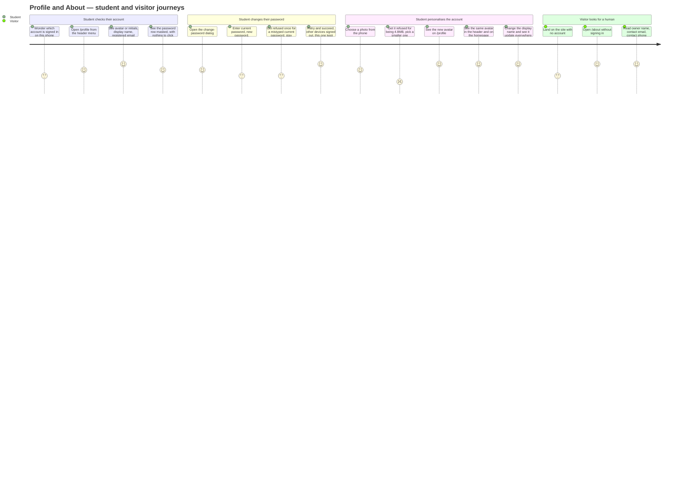
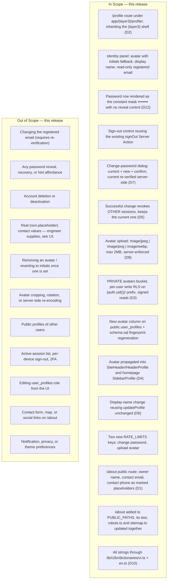

# PRD: Account Profile Page (`/profile`) and Public Contact Page (`/about`)

| | |
|---|---|
| **Version** | 1.0 |
| **Date** | 2026-08-17 |
| **Status** | Draft — ten product decisions are locked by the engineer (D1–D10 below) and are **not** open for re-litigation in any downstream document. Two further decisions (D11, D12) are **derived by this PRD** from locked constraints and are flagged as such so the engineer can overrule them cheaply. Downstream chain: **PRD → UI Spec → Design Doc (backend + frontend) → Work Plan**. |
| **Scale** | **MEDIUM–LARGE — fullstack, both layers.** Backend: one new column on `public.user_profiles`, one new **private** Storage bucket with per-user write RLS and signed reads, two new Server Actions, two new `RATE_LIMITS` keys, one `schema.sql` change with fingerprint regeneration. Frontend: one new authenticated route (`/profile`), one new public route (`/about`), a change-password dialog, an avatar upload control, and avatar propagation into two existing always-mounted widgets. One security-constrained list (`PUBLIC_PATHS`) gains an entry, which drags its test, `robots.ts`, and `sitemap.ts` along with it. UI Spec required (new screens + new dialog). |

## Revision History

| Version | Date | Change |
|---|---|---|
| 1.1 | 2026-08-17 | **D3 reversed: the avatars bucket is PRIVATE with signed reads, not public.** Recorded in `docs/adr/ADR-0016-avatar-storage-visibility-and-read-path.md`. The subjects of these photographs are minors; a public bucket serves them over unauthenticated HTTPS with no expiry, and that exposure is not recoverable once objects have been served, whereas the private path's cost (one Storage round trip on the header render path) is both recoverable and measurable. Consequences threaded through: D3, Context, R5, AC-033 (inverted — an unsigned request must now FAIL), new AC-033b (initials fallback when signing fails), AC-035, the flow diagram, Performance, Security, Affected Files, Constraints, R-d (**retired** — the risk is removed at its source rather than mitigated), R-f (**re-scoped** to the signed-read path, whose failure mode looks like "no avatar" rather than like a bug). **U3 resolved** as option (a), delete-on-replace with a fresh key per upload, now storage hygiene rather than a privacy control. **AC-063 restated** per `docs/adr/ADR-0017-about-page-public-path-admission.md`: the `PUBLIC_PATHS` counted constraint moves from a total-entry count to a write-permitting-entry count (currently zero), because the original framing made a read-only marketing page indistinguishable from a webhook; new AC-063b pins `/about-us` as non-public. |
| 1.0 | 2026-08-17 | Initial draft. D1–D10 recorded verbatim as locked; D11 (initials derivation) and D12 (non-localized mask constant) derived and flagged. R1–R15, AC-001–AC-072. Six risks recorded, of which four are verified codebase or platform facts that will break an unaware implementation: `setup-storage.ts` hardcodes `public: false`; `next.config.ts` declares no `images.remotePatterns`; `PUBLIC_PATHS` is a counted constraint asserted by a test and tracked by two more files; Supabase revokes refresh tokens but **not** already-issued access tokens on `scope: 'others'`. Three Undetermined Items, all business decisions. |

## Overview

### One-line Summary

Give a logged-in student one screen at `/profile` where they can see who their account is (avatar, display name, registered email, a password they are told they cannot retrieve) and change the four things they are allowed to change — sign out, password, avatar, display name — with the new avatar following them into the site header and the homepage sidebar; and give every visitor, signed in or not, a `/about` page carrying the owner's name, contact email, and contact phone.

### Background

The product has an account, but it has no account **screen**. Everything a student can currently do to their own identity happens inside a dropdown menu that exists twice, in two places, with the same three items: `HeaderProfile.tsx` in the site header (`SOURCE/components/shared/HeaderProfile.tsx`) and `SidebarProfile.tsx` in the homepage sidebar (`SOURCE/app/(layer1)/_components/SidebarProfile.tsx`). Both offer exactly *Edit* (display name only), *Đề của tôi*, and *Đăng xuất*. Both render the same hardcoded placeholder image, `/images/user-avatar-placeholder.png` (`HeaderProfile.tsx:19`, `SidebarProfile.tsx:19`), for every user on the platform.

Three consequences follow, and this PRD exists to close them:

1. **There is no way to change a password from inside the app.** The only password-change path in the codebase is `updatePassword` (`SOURCE/app/(layer1)/actions.ts:116-131`), which runs in a **recovery session** — the student must claim they forgot their password, wait for an email, click a link, and land on `/reset-password`. A student who simply wants to rotate a password they still know has to pretend they lost it. `updatePassword` also performs **no current-password check**, which is correct for a recovery flow (the email link *is* the proof) and wrong for a signed-in flow, where the proof of identity is the password itself.
2. **Every account looks identical.** No `avatar_url` column exists on `public.user_profiles` (`SOURCE/supabase/schema.sql:16-21`), and no Storage bucket holds user portraits. The identity surface of the product is a 12-character display name.
3. **The product has no contact page.** There is no route on which the owner's name, email, or phone number appears. The only inbound channel is the support widget, which requires an account (support-system PRD, D2). A parent, a school, or a student who cannot sign in has nowhere to look.

Two framings carry through this document, inherited from the rest of the repository:

- **The users are minors.** This is why the avatar bucket (D3) is treated as a privacy surface and not merely a caching convenience — a photograph uploaded by a fourteen-year-old to a *public* bucket would have a world-readable URL that outlives the session, the page, and possibly the account. That reasoning is what drove D3 to **private with signed reads** (ADR-0016), and it is why R-d and Undetermined Item **U3** exist.
- **The maintainer is one person.** Every success metric below is something one engineer can observe with SQL over their own tables, the output of `npm run build`, or a test that fails the build. There is no analytics pipeline for this feature and none is added.

### Locked Product Decisions (D1–D10)

Accepted by the engineer before this PRD was written. Downstream documents inherit them **verbatim** and must not present them as options.

| ID | Decision | Rationale / consequence recorded here |
|---|---|---|
| **D1** | `/about` is **publicly reachable without login**. | It is a contact page. A contact page behind a login answers nobody who needs it. Mechanically this means one new entry in `PUBLIC_PATHS` — see R11 and R-c, because that list is a counted security constraint, not a convenience array. |
| **D2** | `/profile` lives at `SOURCE/app/(layer3)/profile/` and **inherits the existing `(layer3)` layout shell**. | `SOURCE/app/(layer3)/layout.tsx` already supplies `SkipLink`, `SiteHeader`, `BottomNav`, `SupportWidget`, and the `#main-content` skip target. Building a bespoke shell would duplicate five imports and silently drop the WCAG 2.4.1 skip target. |
| **D3** | The Supabase Storage bucket for avatars is **PRIVATE**. `user_profiles.avatar_url` stores the **object path**, not a fetchable URL; reads resolve a signed URL at render time. Write access is restricted per-user by RLS on `storage.objects` scoped to a `{auth.uid()}/` folder prefix. | **Superseded the original PUBLIC decision on 2026-08-17 — see `docs/adr/ADR-0016-avatar-storage-visibility-and-read-path.md`.** The subjects of these photographs are minors (see Context). A public bucket serves objects over unauthenticated HTTPS with no expiry, so an observed URL keeps working forever — including after the student replaces or deletes the avatar. That is not recoverable once objects have been served publicly, whereas the cost of the private path (one Storage round trip on the header render path) is both recoverable and measurable. Every existing bucket in the project is private and `resolveSignedImageUrl` (`SOURCE/lib/ugc/imageUrl.ts:26`) already implements this read path, fail-closed. The write restriction follows the repository's established ownership pattern, `(storage.foldername(name))[1] = auth.uid()::text` (`SOURCE/supabase/schema.sql:1528`). |
| **D4** | The uploaded avatar must **also** render in the existing site header and the homepage sidebar widgets, not only on `/profile`. | An avatar that only appears on the page where you uploaded it is not an identity, it is a form field. Concretely: `HeaderProfile.tsx:69` and `SidebarProfile.tsx:67`, both of which currently hardcode `/images/user-avatar-placeholder.png`. |
| **D5** | A successful password change **revokes the user's OTHER sessions and keeps the current one**. | Matches OWASP guidance that a successful password change invalidates other sessions, while not punishing the person who just did the right thing by logging them out of the device they are holding. Supabase expresses exactly this as `signOut({ scope: 'others' })`. **Bounded claim** — see R-b: Supabase revokes *refresh* tokens; an already-issued access token elsewhere remains valid until it expires. D5 promises revocation, not instantaneous lockout, and no requirement below claims more. |
| **D6** | Display-name rules stay **exactly as they are today**: non-empty, at most 12 characters, matching `/^[\p{L}.]+$/u` (letters and dots only). The existing `updateProfile` Server Action is **reused, not reimplemented**. | The rules live once, at `SOURCE/app/(layer1)/actions.ts:162-167`, and are already mirrored as a client-side input filter in both dropdowns (`HeaderProfile.tsx:126`, `SidebarProfile.tsx:121`). A third implementation is a third place to drift. Reuse also inherits the existing `guard("updateProfile", user.id)` rate limit (`actions.ts:177`) for free. |
| **D7** | The **current password is re-verified server-side** before the password is changed. | The student is already signed in, so the session cookie proves only that *someone* has the device. OWASP: re-authenticate before a password change to protect against an attacker with temporary access to an unattended session. This is the single difference between this flow and the existing recovery-session `updatePassword`, which deliberately has no such check. |
| **D8** | Avatar constraints: MIME must be one of `image/jpeg`, `image/png`, `image/webp`; **maximum size 2MB**. | Same three types the repository already accepts for support screenshots (`SOURCE/supabase/setup-storage.ts:34`), at a quarter of that feature's 8MB ceiling — an avatar is displayed at 24–32 CSS pixels in the header and never needs the headroom a full-screen bug screenshot does. |
| **D9** | Unauthenticated visitors to `/profile` are redirected by the **existing middleware** to `/?auth=signin`. | `SOURCE/lib/supabase/middleware.ts:115-120` sets `pathname = "/"` and `search = "?auth=signin"` for any non-public path without a session. No new guard is written. **`/login` is only a compatibility stub** that redirects onward (`SOURCE/app/(layer1)/login/page.tsx`); the codebase never redirects *to* it, so no criterion below asserts anything about it as a destination. |
| **D10** | All user-facing strings go through i18n (`SOURCE/lib/i18n/dictionaries/`), **including the `/about` placeholders**. | The dictionaries are type-coupled — `vi.ts` is typed `Dictionary` derived from `en.ts` (`SOURCE/lib/i18n/dictionaries/vi.ts:8-10`), so a key added to one and forgotten in the other is a compile error, not a runtime blank. Putting the placeholders through the same path means the real values (U1) land in one file, not scattered through JSX. |

### Derived Decisions (D11–D12) — introduced by this PRD

Flagged separately because the engineer did **not** hand these down. They are derivations from locked constraints, recorded so the UI Spec and Design Doc have one answer instead of a choice. Either is cheap for the engineer to overrule; neither affects any other decision.

| ID | Decision | Why this and not something else |
|---|---|---|
| **D11** | The **initials fallback** shown when no avatar is set is: uppercase the first letter of the display name; if the display name contains a dot, take the first letter of each of the first two non-empty dot-separated segments (maximum **2** letters). | D6 forbids spaces in a display name — `/^[\p{L}.]+$/u` admits letters and dots only — so the usual "split on whitespace, take first letters" rule would produce exactly one letter for every user on the platform and the plural in "initials" would be a lie. The dot is the only separator the rule permits, so it is the only separator available. The source string is whatever `getCurrentUserProfile()` already resolves, including its existing fallback chain `display_name → email → "Người dùng"` (`SOURCE/lib/auth/getCurrentUser.ts:43`), so the initials source is never empty. |
| **D12** | The masked password string is the literal `••••••••` — exactly **8** U+2022 BULLET characters, a **constant**, **not** localized and **not** a dictionary key. Its **label** ("Mật khẩu" / "Password") *is* localized per D10. | The mask is not copy; it is a glyph sequence that reads identically in every language, and routing it through the dictionaries invites a translator or a future edit to change its length. Fixing the count at 8 also means it carries **no information about the real password's length** — a mask that mirrored the true length would leak a bit of the secret on a page whose entire premise (D-below, R2) is that the secret is unretrievable. Precedent for carving a machine-meaningful literal out of the i18n path: the `[report-ms]` subject token, support-system PRD D10. |

### Verified Codebase Facts

Ground truth for every requirement below. Each was read during authoring; downstream documents should cite these rather than re-derive them.

| Fact | Location |
|---|---|
| Profile table is `public.user_profiles` (**not** `profiles`): `id uuid pk references auth.users(id) on delete cascade`, `display_name text`, `role text not null default 'student'`, `created_at timestamptz`. **No `avatar_url` column exists.** | `SOURCE/supabase/schema.sql:16-21` |
| Rows are auto-created by the `handle_new_user()` trigger with an OAuth-aware display-name fallback chain. | `SOURCE/supabase/schema.sql:26-56` |
| RLS `profiles_select_own` / `profiles_update_own` already permit self read and self update. No new table-level policy is needed for a new column. | `SOURCE/supabase/schema.sql` §L1 |
| Existing Server Actions: `signUp`, `signInWithOAuth`, `requestPasswordReset`, `updatePassword` (recovery-session, **no** current-password check), `signIn`, `signOut` (redirects `/?auth=signin`), `updateProfile` (display name, rate-limited). | `SOURCE/app/(layer1)/actions.ts:21, 66, 93, 116, 134, 149, 158` |
| `validatePassword` enforces ≥10 characters, ≤72 **bytes** (bcrypt truncation boundary), no whitespace-only, and a small common-password denylist. | `SOURCE/lib/auth/passwordPolicy.ts:55-75` |
| `guard(action, userId)` takes **no** limit/window arguments — both are looked up from `RATE_LIMITS[action]`, and `action` is typed `keyof typeof RATE_LIMITS`. A new limited action therefore requires a **new keyed entry** in `RATE_LIMITS`. | `SOURCE/lib/security/rateLimit.ts:107-160, 187-207` |
| The limiter is **keyed by user id** and therefore protects only signed-in traffic. Unauthenticated flooding is TD-008/TD-013, open and cost-blocked. | `SOURCE/lib/security/rateLimit.ts:19-21` |
| `CurrentUserProfile = { id: string; email: string; displayName: string }`, produced by `getCurrentUserProfile()`, consumed by 7 call sites including 5 route-group layouts. | `SOURCE/lib/auth/getCurrentUser.ts:22, 26-52` |
| `PUBLIC_PATHS` is currently `["/", "/login", "/auth/callback", "/terms", "/refund-policy"]`, is **exported specifically so a test can assert it**, and requires every added entry to carry its reason in place. | `SOURCE/lib/supabase/middleware.ts:26-37` (convention stated at `:16-17`, `:23-25`) |
| That list's membership is asserted as an **exact ordered array of 5** by an automated test. | `SOURCE/lib/supabase/__tests__/publicPaths.test.ts:22-32` |
| `app/robots.ts` and `app/sitemap.ts` both carry comments requiring them to track `PUBLIC_PATHS`. | `SOURCE/app/robots.ts:14-16`, `SOURCE/app/sitemap.ts:8-12` |
| Storage buckets are created by the script `setup-storage.ts` (a `BUCKETS` array plus per-bucket `fileSizeLimit`/`allowedMimeTypes`), **not** by SQL. The `createBucket` call hardcodes `public: false` before spreading the per-bucket options — correct for every bucket in this project including avatars (D3). The script is idempotent by **skipping** an existing bucket, never by reconciling its options, so first creation must be right. | `SOURCE/supabase/setup-storage.ts:25, 29-36, 54-57, 58-61` |
| Storage RLS policies live in `schema.sql`; the established ownership pattern is `(storage.foldername(name))[1] = auth.uid()::text`. | `SOURCE/supabase/schema.sql:1524-1529` (and `:372-390` for the exam-image variant) |
| `schema.sql` ends with a `schema_version` fingerprint block that must be regenerated; `npm run verify:schema` compares DB to git. Current fingerprint `f525e3095339`. | `SOURCE/supabase/schema.sql` §17 |
| CSP `img-src` **already** allows the Supabase origin, so a public avatar URL is not blocked by policy. | `SOURCE/lib/security/csp.ts:56` |
| `next.config.ts` declares **no `images` block and no `remotePatterns`**. The repository's established way to render a dynamic Supabase Storage image is a plain `` with an inline eslint exemption. Both profile widgets currently use `next/image` against a *local* asset, which works only because the asset is local. | `SOURCE/next.config.ts`; `SOURCE/components/shared/QuestionFigure.tsx:50`; `HeaderProfile.tsx:69`; `SidebarProfile.tsx:67` |
| Public static-page precedent, including the `alternates.canonical` trap (root layout defaults every page's canonical to `/`, so a new public page must re-declare its own or it self-reports as a duplicate of the homepage). | `SOURCE/app/(billing)/terms/page.tsx:14-24` |
| Existing reusable UI: `SuccessToast.tsx` (with a working `aria-live` announcement pattern), `SupportWidgetDialog.tsx` (hand-rolled accessible modal: Esc/scrim close, minimal focus trap), `PageContainer.tsx` (`small`/`default`/`full` width scale), `PageHeader.tsx` (owns the `<h1>`), `SkipLink.tsx`, `LegalDocument.tsx` (centered prose frame built from `PageContainer size="small"` + `PageHeader`). `components/ui/` contains only `button`, `input`, `tabs`, `tooltip`, `context-menu` — there is **no** dialog, avatar, or form primitive to import. | `SOURCE/components/…` |
| Verify gates, all run from `SOURCE/`: `npx tsc --noEmit`, `npx eslint --max-warnings 0`, `npx vitest run`, `npm run build`, `npm run verify:schema`, `npm run check:bundle`. | `SOURCE/package.json:9-14` |

## User Stories

### Primary Users

- **Student (signed-in account holder)** — the same authenticated user who browses and takes exams; `user_profiles.role` defaults to `'student'`. A minor, typically on a mid-range Android phone at ~360px viewport width. **No new role is introduced and no role is read by this feature.**
- **Visitor (not signed in)** — anyone who reaches the site without a session: a prospective student, a parent, a teacher, a school administrator, or a crawler. Their entire surface in this feature is `/about`.

### User Stories

```
As a signed-in student
I want one page that shows my avatar, my name, and the email I registered with
So that I can confirm which account I am actually using before I trust my results to it
```

```
As a signed-in student who wants to sign out
I want a sign-out control on my account page, not only inside a dropdown menu
So that leaving my account on a shared or family device is one obvious action
```

```
As a signed-in student who still knows my password and wants to change it
I want to enter my current password, a new one, and a confirmation, in a dialog on my account page
So that I can rotate my password without pretending I forgot it and waiting for an email
```

```
As a signed-in student
I want to upload a picture of my own and see it in the header and on the homepage
So that my account looks like mine everywhere on the site, not like everyone else's
```

```
As a signed-in student
I want to change my display name from my account page
So that the name on my uploaded exams and in the header is the one I chose
```

```
As a student who wonders whether my password is stored somewhere readable
I want the account page to show a fixed mask with no way to reveal anything
So that I can see for myself that the site cannot show me my password, because it does not have it
```

```
As a visitor who is not signed in
I want to open one page and find who runs this site, their email, and their phone number
So that I can contact a person without first creating an account
```

### Use Cases

1. **Read my account.** A signed-in student opens `/profile`. They see their avatar (or their initials if they have never uploaded one), their display name, the email they registered with rendered as read-only, the password row showing `••••••••` with no reveal control, and a sign-out control.
2. **Sign out.** They activate the sign-out control and land on `/?auth=signin` with the auth form open. Navigating back to `/profile` bounces them to `/?auth=signin` again, because the session is genuinely gone.
3. **Change my password, happy path.** They open the change-password dialog, type their current password, a new password twice, and submit. The server re-verifies the current password, applies the new one, revokes their other sessions, and leaves the session they are holding intact. They stay on `/profile` and see a confirmation.
4. **Change my password, wrong current password.** Same flow, wrong current password. The server refuses, the password is unchanged, a specific error appears — and **they are still signed in**. They can immediately try again without re-authenticating.
5. **Change my password, new and confirm disagree.** Refused before anything is sent to the auth backend; nothing changes.
6. **Change my password, new password too weak.** Refused server-side by the existing `validatePassword` (≥10 characters, ≤72 bytes, not a common password) with the exact message that policy already produces.
7. **Upload an avatar.** They pick a JPEG under 2MB. It is stored under their own `{auth.uid()}/` folder, the reference is saved on their profile row, and the picture appears on `/profile`, in the site header, and in the homepage sidebar.
8. **Upload the wrong kind of file.** They pick a GIF, a PDF, or an SVG. The server refuses by MIME with a specific message; **nothing** is written to the bucket and nothing is written to the database.
9. **Upload a photo straight from a modern phone camera.** The file is 4.8MB. The server refuses it for size with a message that names the 2MB limit; nothing is stored.
10. **Try to write into somebody else's folder.** A crafted request targets another user's `{uuid}/` prefix. Storage RLS denies the write.
11. **Change my display name.** They type a new name. The same `updateProfile` action that the two dropdowns already call validates it server-side (non-empty, ≤12 characters, letters and dots only) and saves it; the header and sidebar show the new name.
12. **Break the display-name rules on purpose.** They submit `Nguyen Van A` (spaces), a 20-character name, or an empty string via a crafted request that bypasses the client-side filter. The server refuses each one; the stored name is unchanged.
13. **A visitor reads `/about`.** With no cookies at all, they open `/about` and read the owner's name, contact email, and contact phone. There is no redirect, no login prompt, no spinner, and no request for their identity.
14. **A crawler reads `/about`.** It is not disallowed by `robots.txt`, it is listed in `sitemap.xml`, and it declares its own canonical URL rather than inheriting the homepage's.

### User Journey Diagram



### Scope Boundary Diagram



## Functional Requirements

**Identifier convention.** Requirement (`Rn`) and acceptance-criterion (`AC-nnn`) IDs are **append-only and never renumbered**, so a downstream test, task file, or review finding that cites an ID keeps pointing at the same thing. A criterion added later takes the next free number regardless of reading order.

**Enforcement convention.** Wherever a criterion says "server-side", it means the check must hold for a request that never ran the client code — a crafted `FormData` POST straight to the Server Action. Client-side filtering (as already exists for display name at `HeaderProfile.tsx:126`) is a courtesy and is never the enforcement point.

### Must Have (P1 — this release)

---

- [ ] **R1 — `/profile` exists, is authenticated-only, and reuses the `(layer3)` shell (D2, D9)**
  The route is `SOURCE/app/(layer3)/profile/` and it renders only for a signed-in user. Access control is the existing middleware; no new guard is written.
  - **AC-001**: Given a signed-in student, when they request `/profile`, then the page renders with HTTP 200 and shows the identity panel of R2.
  - **AC-002**: Given a request to `/profile` carrying **no** session cookie, when it reaches the server, then the response is a redirect whose final resolved URL is **`/?auth=signin`**, and **no** part of the profile markup (no avatar, no email, no mask, no dialog trigger) appears in any response body along that chain. Verified by a cookie-less request asserting the final URL and asserting the absence of the student's email string.
  - **AC-003**: Given `/profile` renders, when its DOM is inspected, then it is inside the `(layer3)` shell — the `SkipLink`, the `SiteHeader`, the `#main-content` skip target with `tabIndex={-1}`, and the `BottomNav` are all present, supplied by `app/(layer3)/layout.tsx` and not re-implemented by the page.
  - **AC-004**: Given `PUBLIC_PATHS` after this feature ships, when it is inspected, then it does **not** contain `/profile` or any prefix that would cover it — `/profile` is protected by being absent from that list, which is the only mechanism the middleware has.
  - **AC-005**: Given a signed-in student, when `/profile` loads its data, then every field displayed derives from **their own** `auth.users` record and their own `user_profiles` row; the page issues no query that could return another user's row, and RLS `profiles_select_own` remains the backstop.

---

- [ ] **R2 — Identity panel: avatar with initials fallback, display name, read-only email, masked password, sign-out (D11, D12)**
  One panel presents the five identity elements. Four are read surfaces; the fifth is the sign-out control.
  - **AC-006**: Given a student who has **never** uploaded an avatar, when `/profile` renders, then an initials avatar is displayed — no broken image, no empty box, and no request to a nonexistent object URL.
  - **AC-007**: Given a display name, when the initials are derived, then they follow D11 exactly: the uppercased first letter, plus — if the name contains a dot — the first letter of the second non-empty dot-separated segment, capped at **2** letters. Verified by unit tests over at least: `An` → `A`; `an.nguyen` → `AN`; `Nguyễn` → `N` (correct handling of a combining/accented first letter); `a.b.c` → `AB` (capped at two, third segment ignored); `...x` → `X` (leading empty segments skipped).
  - **AC-008**: Given `/profile` renders, when it is read, then the student's current display name is shown.
  - **AC-009**: Given `/profile` renders, when the registered email is shown, then it is **read-only**: there is no input, no edit affordance, no submit path, and no Server Action anywhere in this feature that accepts an email address as a parameter.
  - **AC-010**: Given `/profile` renders, when the password row is inspected, then its value is exactly the 8-character literal `••••••••` (8 × U+2022), **byte-identical in the `vi` and `en` locales**, and **independent of the real password's length** — verified by rendering the same page for two accounts with passwords of different lengths and asserting an identical mask string.
  - **AC-011**: Given the password row, when the page is inspected, then there is **no** reveal control of any kind: no eye/show button, no `type` toggle, no `title`/`aria-label` offering to display it, and no hidden element containing password material that CSS or a devtools inspection would expose.
  - **AC-012**: Given any state of `/profile`, when the rendered HTML is searched, then **no plaintext password characters appear as visible text anywhere on the page**. The three change-password inputs of R4 are `type="password"` so the user agent masks them; nothing else on the page ever holds password material.
  - **AC-013**: Given `/profile` renders, when the sign-out control is inspected, then it is present, keyboard-reachable, and has an accessible name resolved from the i18n dictionaries.

---

- [ ] **R3 — Sign out from `/profile`**
  Reuses the existing `signOut` Server Action (`SOURCE/app/(layer1)/actions.ts:149-153`) unchanged.
  - **AC-014**: Given a signed-in student on `/profile`, when they activate the sign-out control, then the existing `signOut` action runs and they land on `/?auth=signin`.
  - **AC-015**: Given a student who has just signed out, when they navigate back to `/profile` (including via browser Back), then they are redirected to `/?auth=signin` — the session is actually terminated, not merely navigated away from.

---

- [ ] **R4 — Change password via a confirmation dialog, with the current password re-verified server-side (D5, D7)**
  A dialog on `/profile` takes **current password**, **new password**, and **confirm new password**. A **new** Server Action owns this flow; the recovery-session `updatePassword` is not modified and not reused.
  - **AC-016**: Given the dialog is open, when its fields are inspected, then there are exactly three, all `type="password"`, each with a programmatically associated label resolved from the i18n dictionaries.
  - **AC-017**: Given a submitted change, when it reaches the server, then the **current password is verified server-side** before any password write is attempted. A request whose current-password field is empty or absent is refused without reaching the auth backend's update call.
  - **AC-018**: Given a **wrong** current password, when the request is processed, then (a) a specific error is returned, (b) the stored password is **unchanged** — the old password still authenticates, (c) **the caller's session remains valid**: an immediately following request to `/profile` returns 200 and is **not** redirected to `/?auth=signin`, and (d) the dialog can be resubmitted without signing in again.
  - **AC-019**: Given new password and confirmation that differ, when submitted, then the request is refused with a specific message and no password write is attempted.
  - **AC-020**: Given a new password, when it is processed server-side, then it is validated by the **existing** `validatePassword` (`SOURCE/lib/auth/passwordPolicy.ts:55-75`) and its message is surfaced verbatim — a password of 9 characters, a password over 72 bytes, a whitespace-only password, and `matkhau123` are each refused with that function's own wording. No second password policy is introduced.
  - **AC-021**: Given a **successful** password change, when it completes, then the user's **other** sessions are revoked — a session established earlier on a different device can no longer refresh, and its next refresh attempt fails.
  - **AC-022**: Given the same successful change, when it completes, then **the current session is preserved**: the student remains on `/profile` signed in, and the next request is not redirected to `/?auth=signin`.
  - **AC-023**: Given repeated change-password submissions from one account, when they exceed the configured ceiling within the configured window, then further attempts are refused with an actionable retry message via `guard()` using a **new keyed entry in `RATE_LIMITS`** (`SOURCE/lib/security/rateLimit.ts:107-160`) — not by passing arguments to `guard()`, which takes none. Choosing the ceiling and window is a Design Doc item; that a keyed entry exists and is enforced is not.
  - **AC-024**: Given the whole change-password path — client component, Server Action, error branches, and the rate-limited branch — when the code is inspected, then **no** password field value (current, new, or confirm) is passed to `console.*`, to any logger, to telemetry, into a thrown `Error` message, or into any value returned to the client. Verified by an automated repository assertion over the feature's files that matches zero occurrences, so a later edit that adds a debug log breaks the build.
  - **AC-025**: Given a successful change, when the UI settles, then the dialog closes, a confirmation is announced to assistive technology (the `SuccessToast.tsx` `aria-live` pattern), and **the new password is never displayed** anywhere.
  - **AC-026**: Given the existing recovery flow, when this feature ships, then `updatePassword` (`SOURCE/app/(layer1)/actions.ts:116-131`) is **unchanged** — it still performs no current-password check, because in a recovery session the emailed link is the proof. A regression test asserts the forgot-password → `/reset-password` path still completes.

---

- [ ] **R5 — Avatar upload with server-enforced type and size, into a private bucket with per-user write RLS and signed reads (D3, D8)**
  - **AC-027**: Given an uploaded file, when its type is checked server-side, then it is accepted only if its MIME is one of exactly `image/jpeg`, `image/png`, `image/webp` — a set of **three**, defined once as a named constant.
  - **AC-028**: Given a file whose MIME is outside that set (for example `image/gif`, `image/svg+xml`, `application/pdf`, or a `.png` renamed from a `.exe`), when it is submitted, then it is refused **server-side** with a specific message, **zero** objects are written to the bucket, and the profile row's avatar reference is unchanged.
  - **AC-029**: Given a file larger than **2MB**, when it is submitted, then it is refused **server-side** with a message naming the limit, and **zero** objects are written to the bucket. Verified at the boundary: a file of exactly 2MB is accepted; a file of 2MB + 1 byte is refused.
  - **AC-030**: Given a crafted request that skips the client entirely (direct `FormData` POST to the Server Action), when it carries an oversize or wrong-MIME file, then AC-028 and AC-029 still hold — client-side `accept` attributes and size checks are never the enforcement point.
  - **AC-031**: Given a successful upload, when the stored object's path is inspected, then its first folder segment is exactly the uploader's `auth.uid()`, matching the repository pattern `(storage.foldername(name))[1] = auth.uid()::text`.
  - **AC-032**: Given a request that attempts to write an object under a **different** user's `{uuid}/` prefix, when it reaches Storage, then it is denied by RLS on `storage.objects`. Verified by an RLS test asserting the write fails and the target folder's object count is unchanged.
  - **AC-033**: Given a stored avatar, when its object URL is requested with **no** session cookie and no signed token, then it returns 4xx, **not** 200 — the bucket is private (D3). The rendering path obtains a signed URL server-side; an unsigned request must never succeed.
  - **AC-033b**: Given a stored avatar whose signed-URL resolution fails for any reason, when the profile page or the header renders, then the initials fallback is shown — never a broken image and never an error. `resolveSignedImageUrl` already fails closed to `undefined` (`SOURCE/lib/ugc/imageUrl.ts:25`); this criterion asserts the UI honours that.
  - **AC-034**: Given a successful upload, when the page is reloaded (and on any later visit), then the avatar still renders — the reference is persisted on `public.user_profiles`, not held in client state.
  - **AC-035**: Given `SOURCE/supabase/setup-storage.ts`, when it is run twice, then the avatars bucket is created on the first run as **private** with `fileSizeLimit` and `allowedMimeTypes` mirroring the D8 constants as a Storage-layer backstop, and the second run reports it already exists and changes nothing. The script's hardcoded `public: false` (`setup-storage.ts:58-61`) is **correct as-is** for this bucket under D3-as-revised and needs no restructuring. Note the script is idempotent by *skipping*, not by reconciling — an already-created bucket never has its options re-applied, so the options must be right on first creation.
  - **AC-036**: Given `schema.sql` after this feature, when `npm run verify:schema` runs against a database that has been re-pasted, then it passes — meaning the new column, the new storage policies, and the regenerated `schema_version` fingerprint are all in the file and all applied. A drifted fingerprint fails the gate.
  - **AC-037**: Given repeated avatar uploads from one account, when they exceed the configured ceiling within the configured window, then further uploads are refused with an actionable retry message via `guard()` using a **second new keyed entry** in `RATE_LIMITS`.

---

- [ ] **R6 — The avatar follows the student into the header and the homepage sidebar (D4)**
  - **AC-038**: Given a student with an uploaded avatar, when any page carrying `SiteHeader` renders, then `HeaderProfile` displays that avatar in place of `/images/user-avatar-placeholder.png` (`HeaderProfile.tsx:19, :69`).
  - **AC-039**: Given the same student, when the homepage renders, then `SidebarProfile` displays that avatar in place of the same placeholder (`SidebarProfile.tsx:19, :67`).
  - **AC-040**: Given a student with **no** avatar, when the header and sidebar render, then they show the initials fallback of D11 **or** the existing placeholder image — one deterministic choice applied in both places, never a broken image and never a request to a nonexistent URL. (Which of the two is a UI Spec decision; that both widgets behave identically is not.)
  - **AC-041**: Given the avatar reference is threaded through `CurrentUserProfile` (`SOURCE/lib/auth/getCurrentUser.ts:22`), when the change lands, then **`npx tsc --noEmit` passes with all 7 existing call sites, including the 5 route-group layouts, unmodified except where they render an avatar** — the field is additive, not a breaking signature change.
  - **AC-042**: Given any avatar image rendered on `/profile`, in the header, or in the sidebar, when it is inspected by assistive technology, then it has a correct accessible treatment: either an empty `alt` when the adjacent display name already names the control (the existing pattern at `HeaderProfile.tsx:69`), or a meaningful alt text from the dictionaries. It is never an unlabelled meaningful image and never announces a filename or a URL.

---

- [ ] **R7 — Change display name by reusing `updateProfile` unchanged (D6)**
  - **AC-043**: Given an empty or whitespace-only display name submitted server-side, when it is processed, then it is refused and the stored name is unchanged.
  - **AC-044**: Given a display name longer than **12** characters submitted server-side, when it is processed, then it is refused and the stored name is unchanged.
  - **AC-045**: Given a display name that does not match `/^[\p{L}.]+$/u` — for example `Nguyen Van A` (space), `user_01` (underscore and digits), or `😀` — when it is submitted **server-side**, then it is refused and the stored name is unchanged. Accented Vietnamese letters (`Nguyễn`) are accepted, because `\p{L}` includes them.
  - **AC-046**: Given the `/profile` display-name control, when the code is inspected, then it calls the **existing** `updateProfile` Server Action (`SOURCE/app/(layer1)/actions.ts:158-189`); no second validation of the three rules exists on the server, so the rules cannot drift between `/profile` and the two dropdowns.
  - **AC-047**: Given a successful display-name change on `/profile`, when the UI settles, then the new name is shown on `/profile`, in `HeaderProfile`, and in `SidebarProfile` without the student manually reloading — matching the `router.refresh()` behaviour the two dropdowns already implement (`HeaderProfile.tsx:33-41`).

---

- [ ] **R8 — Every user-facing string resolves through the i18n dictionaries (D10)**
  - **AC-048**: Given every component added or changed by this feature — `/profile`, the change-password dialog, the avatar control, `/about` — when the code is inspected, then no user-facing display string is hardcoded in JSX; each resolves through `SOURCE/lib/i18n/dictionaries/`. The **only** exception is the D12 mask constant `••••••••`, which is deliberately outside the i18n path and identical in both locales.
  - **AC-049**: Given `vi.ts` and `en.ts`, when the project type-checks, then every key added by this feature exists in both — enforced by `vi.ts` being typed `Dictionary` (`SOURCE/lib/i18n/dictionaries/vi.ts:8-10`), so a missing key is a compile error rather than a blank string in production.

---

- [ ] **R9 — Accessibility to WCAG 2.2 AA on both new screens**
  These are product requirements, not a UI Spec afterthought, because the change-password dialog is the first modal this feature introduces and the repository has **no** dialog primitive to inherit correctness from.
  - **AC-050**: Given the change-password dialog, when it is operated by keyboard only, then: it can be opened, every field and button is reachable in a sensible order, focus is contained within the dialog while it is open, `Esc` closes it, and on close focus returns to the control that opened it. (The `SupportWidgetDialog.tsx` pattern is the reference implementation in this repository.)
  - **AC-051**: Given every interactive control added by this feature, when inspected, then each has a non-empty accessible name; the avatar file input is programmatically labelled; and each validation error is programmatically associated with its field (`aria-describedby`) rather than only positioned near it.
  - **AC-052**: Given every text and UI element added by this feature, when measured against its background, then contrast is at least **4.5:1** for normal text and **3:1** for large text and for the boundaries of interactive controls, in both locales and at both the default and the largest supported text size.
  - **AC-053**: Given every pointer target added by this feature, when measured, then it satisfies WCAG 2.2 **2.5.8 Target Size (Minimum)** — at least 24×24 CSS pixels, with the repository's existing 44px floor (`min-h-11`, `HeaderProfile.tsx:67`) as the preferred value on touch surfaces.
  - **AC-054**: Given any success or error outcome on `/profile` (password changed, avatar rejected, name saved), when it occurs, then it is announced to assistive technology through a live region — following the `SuccessToast.tsx` pattern, whose comment documents why a permanently-mounted region is **not** announced and a text-flipping `sr-only` region is.

---

- [ ] **R10 — `/about`: a public, static contact page (D1)**
  Owner name, contact email, contact phone. All three are **placeholders** in this iteration. Low priority relative to `/profile`: build it last. It is nevertheless a Must, because it is one of exactly two deliverables — if the release must be cut, cut Should and Could items, not this.
  - **AC-055**: Given `/about` renders, when it is read, then it shows exactly three contact facts — owner name, contact email, contact phone — in a centered or two-column responsive layout.
  - **AC-056**: Given a request to `/about` carrying **no** session cookie, when it is served, then it returns **200** with the full content, and the response chain contains **zero** redirects to `/?auth=signin`. Verified by a cookie-less request asserting both the status and the final URL. *(The assertion is deliberately written against `/?auth=signin`, the URL the middleware actually produces at `SOURCE/lib/supabase/middleware.ts:115-120`, and not against `/login`, which the codebase never redirects to — an assertion written against `/login` would stay green on a broken page.)*
  - **AC-057**: Given the `/about` page module, when it is inspected, then it performs **no data fetch**: no Supabase client is created, no `user_profiles` or other table is queried, no `fetch()` is issued, and no dynamic data source is read. Its content is entirely static apart from the locale lookup that every page in this project performs.
  - **AC-058**: Given the `/about` page module, when it is inspected, then it performs **no auth check**: it does not call `getCurrentUser()` or `getCurrentUserProfile()` and does not branch on a session. Its access control is membership in `PUBLIC_PATHS` (R11) and nothing else. *(The surrounding layout may still resolve a user in order to render the shared header — that is the existing `(billing)` layout precedent, documented at `SOURCE/app/(billing)/layout.tsx:1-13`. This criterion is about the page module.)*
  - **AC-059**: Given the three placeholder values, when the source is inspected, then each is **clearly marked as a placeholder in place** — named constants or dictionary keys plus a comment that names exactly what must be swapped and who owns the real value (U1) — so an engineer replacing them does not have to search for them.
  - **AC-060**: Given the three placeholder strings, when they are located, then they live in `SOURCE/lib/i18n/dictionaries/vi.ts` and `en.ts` per D10, so the real values later land in one place rather than in JSX.
  - **AC-061**: Given `/about` at a 320px viewport width, when it renders, then there is **no horizontal scrolling**, the layout collapses to a single column, and no contact value is truncated or clipped.

---

- [ ] **R11 — `/about` enters `PUBLIC_PATHS`, and everything that tracks that list is updated in the same change**
  `PUBLIC_PATHS` is a **counted security constraint** with an automated gate and two documents that mirror it. Adding an entry without the other three edits leaves the repository in a state where either the test is red or a public page is invisible to search engines.
  - **AC-062**: Given `SOURCE/lib/supabase/middleware.ts`, when this feature ships, then `PUBLIC_PATHS` contains the single new entry `"/about"`, carrying an in-place comment stating why — as the file's own convention requires at `:16-17` ("Mỗi mục thêm vào đây phải nêu lý do ngay tại chỗ").
  - **AC-063**: Given `SOURCE/lib/supabase/__tests__/publicPaths.test.ts:22-32`, when this feature ships, then its exact-array assertion is updated to the new **6**-entry list in order, **and its counted claim is restated from a total-entry count to a write-permitting-entry count** per `docs/adr/ADR-0017-about-page-public-path-admission.md`: the invariant becomes "exactly **0** write-permitting entries today; the payOS webhook of ADR-0014 will be the first and only one." Total entries stay pinned by the exact-array assertion but stop carrying the security claim. Rationale, which must be written into the test comment rather than left for a future reader to rediscover: subscription PRD AC-032's "exactly 6, exactly 1 write" conflated a read-only marketing page with a webhook, so a read-only addition would have satisfied the arithmetic with the wrong six.
  - **AC-063b**: Given the same test file, when this feature ships, then it asserts `isPublic("/about-us") === false`, alongside the existing `/terms-of-service` case. `/about` is a short and easily-extended prefix, and segment-wise matching means a later `/about-us` page would silently redirect signed-out visitors — a failure with no in-app symptom.
  - **AC-064**: Given `SOURCE/app/robots.ts`, when this feature ships, then `/about` is **not** present in the `disallow` list (it is public and worth indexing) and the file's comment listing the public, indexable pages is updated to include it — the comment at `:14-16` requires it to track `PUBLIC_PATHS`.
  - **AC-065**: Given `SOURCE/app/sitemap.ts`, when this feature ships, then `/about` is listed as an entry, matching the treatment of `/terms` and `/refund-policy`. The comment at `:8-12` requires the read-reachable subset of `PUBLIC_PATHS` to match this file.
  - **AC-066**: Given `/about`'s metadata, when it is inspected, then it declares `alternates: { canonical: "/about" }`. Without this it inherits the root layout's default `canonical: "/"` and self-reports as a duplicate of the homepage — the exact trap documented at `SOURCE/app/(billing)/terms/page.tsx:16-24`. `/about` also accepts no input: no form, no Server Action, no query parameter that changes what is stored, so it opens **no** unauthenticated write path.

### Should Have (P2)

- [ ] **R12 — Resilient feedback on `/profile`**
  No action on this page silently fails, and no failure costs the student work they can be asked to redo.
  - **AC-067**: Given an avatar upload or a display-name save that fails (network drop, server error, rate limit), when the error returns, then the student sees an actionable, retryable message and the control returns to a usable state — never an indefinite spinner and never a success state for a change that did not persist.
  - **AC-068**: Given a **rejected** change-password attempt of any kind, when the rejection is shown, then all three password fields are **cleared** and focus moves to the current-password field. Rationale: password material should not sit in a live DOM longer than the attempt that needed it, and clearing costs the student three fields they can retype in seconds — cheaper than the alternative on a shared device.
  - **AC-069**: Given a submission that is still in flight, when the student activates the same control again, then no duplicate request is issued (the control is disabled or the submission is idempotent for the duration).

- [ ] **R13 — Contact affordances on `/about`**
  - **AC-070**: Given the contact email and contact phone on `/about`, when they render, then each is actionable — `mailto:` for the email and `tel:` for the phone — with the visible text and the href derived from the same single source, so a later value swap (U1) cannot update one and not the other. The link text remains the literal value, so it is still readable and copyable when the handler is missing.

- [ ] **R14 — The new avatar appears without a manual reload**
  - **AC-071**: Given a successful avatar upload, when it completes, then the new image is visible on `/profile` **and** in the site header without the student pressing reload — the `router.refresh()` pattern the two profile dropdowns already use after `updateProfile` (`HeaderProfile.tsx:33-41`). (AC-034 already guarantees it survives an explicit reload; this criterion is about not requiring one.)

### Could Have (P3)

- [ ] **R15 — Client-side downscale before upload**
  Resize the selected image in the browser before it is sent, so a 4.8MB phone photo becomes an acceptable upload instead of a rejection the student has to solve themselves.
  - **AC-072**: Given a selected image that exceeds 2MB, when the client downscales it and the result is under 2MB with a MIME still inside the D8 set, then the upload proceeds and succeeds. **The server-side checks of AC-028, AC-029, and AC-030 remain the enforcement point and are unchanged** — a client that skips the downscale, or a crafted request, is still refused. **Drop condition**: if the Design Doc does not define the downscale, R15 ships **not at all** and oversize files simply produce the AC-029 rejection message. Dropping it affects no Must or Should requirement.

### Won't Have (this release)

Each exclusion is a decision, not an oversight.

- **Changing the registered email** — changing an email requires re-verifying the new address (an outbound mail flow, a pending-change state, and a rollback path if the new address is wrong). Explicitly out of scope; this is precisely why the email is rendered read-only in AC-009.
- **Any password reveal, hint, or retrieval affordance** — passwords are hashed and unretrievable. The `••••••••` mask (D12) is a **deliberate product statement of that fact**, not a missing feature and not a placeholder for a reveal button somebody should add later. The recovery path for a forgotten password already exists and is unchanged (AC-026).
- **Account deletion or deactivation** — deletion cascades into `exam_attempts`, uploaded UGC exams, ratings, support tickets, and Storage objects, and carries a retention decision this PRD is not the place to make.
- **Real (non-placeholder) contact information** — the owner's actual name, email, and phone are the engineer's to supply, exactly as legal copy was in the subscription feature (`LegalContentPending`). Tracked as **U1**.
- **Removing an avatar / reverting to initials** — the four listed actions are sign out, change password, change avatar, change name. Removal is a fifth. It also interacts with U3 (what happens to the old object), which is unresolved.
- **Avatar cropping, rotation, or server-side re-encoding** — an image editor is its own feature. D8's limits are what keeps the un-edited path affordable.
- **Public profiles of other users** — no student can view any other student's profile page. Nothing in this feature creates a read surface across users; RLS `profiles_select_own` remains the boundary.
- **Active-session list, per-device sign-out, or 2FA** — D5 revokes other sessions as a side effect of a password change. Presenting sessions as manageable objects is a different feature with its own data requirements.
- **Editing `user_profiles.role` from the UI** — role is not a user-editable field, and this feature reads no role at all.
- **Contact form, embedded map, or social links on `/about`** — a form would be the project's second unauthenticated write path (after the payOS webhook) and would inherit TD-013 with no rate limit to protect it. Three static facts open no write path at all (AC-066).
- **Notification, privacy, language, or theme preferences on `/profile`** — the language switcher already lives in the header. A preferences system is not part of these two deliverables.

## Non-Functional Requirements

### Performance

- **Avatar reads cost one Storage round trip, and that cost must be measured, not estimated.** Because the bucket is private (D3), rendering the avatar in `SiteHeader` — mounted on essentially every authenticated route via `getCurrentUserProfile()` — requires a `createSignedUrl` call. Signed-URL TTL is 3600s, matching `SIGNED_URL_TTL_SECONDS` (`SOURCE/lib/ugc/imageUrl.ts:13`), deliberately long so signing churn does not defeat browser image caching. **ADR-0016 requires this latency to be measured during implementation**; if it materially regresses the header path (recently tuned for LCP, commit `d33ba1b`), the escape hatch is to render the photograph on `/profile` only and keep initials in the header — never to make the bucket public.
- **`/profile` is a single-user read.** The page loads from the student's own `auth.users` record and their own `user_profiles` row. No N+1, no per-field round trip, consistent with the repository's batched-select convention.
- **Upload ceiling.** The avatar upload path is bounded by a client-side abort so it cannot spin indefinitely on an unstable mobile network, following the existing `AbortSignal.timeout(...)` convention already used for the support screenshot upload (`SupportWidgetDialog.tsx:30`, 20 s). The exact value is a Design Doc decision; that the path terminates in bounded time with a retryable message (AC-067) is not.
- **`/about` adds no server work.** No query, no auth call in the page module (AC-057, AC-058). Its only server-side dependency is the locale cookie read that every page in this project performs — which is also why, like `/terms`, it cannot be statically exported (`SOURCE/app/(billing)/terms/page.tsx:8-12`). That is a whole-site trade-off already accepted; it is recorded here so nobody spends an afternoon trying to prerender this page.
- **Deliberately unset**: no throughput, concurrency, or availability target. At this product's volume any such figure would be fiction and would import monitoring obligations a solo maintainer cannot honour. Absence here is a decision.

### Reliability

- **A failed change never destroys state.** A rejected password change leaves the old password working and the session alive (AC-018). A rejected avatar writes nothing to the bucket and nothing to the database (AC-028, AC-029). A rejected display name leaves the stored name untouched (AC-043–AC-045).
- **Storage and database do not diverge.** A successful upload that fails to persist its reference, or a persisted reference pointing at no object, must not leave the header rendering a broken image (AC-040 covers the no-avatar state; the ordering that guarantees it is a Design Doc decision).
- **`/about` has no failure mode to speak of** — no fetch, no auth, no input. That is the point of specifying it that way.

### Security

This section is a requirement, not a summary. Each item below is testable and is referenced by at least one AC.

- **Password material never reaches a log.** No password field value — current, new, or confirm — may be written to `console.*`, a logger, telemetry, an exception message, or a value returned to the client, on **any** branch including the error and rate-limited branches (**AC-024**). This is enforced by an automated repository assertion so that a future debugging session cannot quietly reintroduce it. The repository already has a precedent for treating "must never be logged" as a build-enforced rule rather than a habit (subscription PRD AC-034, webhook payload).
- **Password material never renders as text.** The mask is a constant and leaks no length (**AC-010**); there is no reveal control (**AC-011**); nothing on the page displays plaintext (**AC-012**).
- **The current password is the proof.** A session cookie proves possession of a device, not identity. The current password is re-verified server-side before any change (**AC-017**), per OWASP guidance on protecting against an attacker with temporary access to an unattended session.
- **Rate limiting on password change — and an honest statement of what it does not cover.** Change-password and avatar-upload each get their **own keyed entry** in `RATE_LIMITS`, enforced via `guard()` (**AC-023**, **AC-037**). Two properties must be understood rather than assumed:
  1. **`guard()` is keyed by user id** (`SOURCE/lib/security/rateLimit.ts:19-21, 192`). It therefore throttles a *signed-in* account hammering the current-password field — which is exactly the threat model here, since the endpoint is behind a session. It provides **no protection whatsoever for unauthenticated flows**; that gap is **TD-008/TD-013**, is open, and is blocked on cost (edge rate limiting behind a Vercel plan), not on code. This feature does not close it and does not open any unauthenticated write path that would need it (**AC-066**).
  2. **`guard()` degrades to the in-process RAM counter when Redis is unreachable** — it does not fail open, but on a multi-instance deployment the effective ceiling during an Upstash outage is `limit × instances`. Stated so the Design Doc picks a ceiling knowing this, and so nobody documents the limiter as stronger than it is.
- **Other sessions are revoked on success — with a bounded claim.** D5 is implemented as revocation of other sessions' refresh tokens. **Supabase does not revoke an already-issued access token before it expires.** An attacker holding a live access token on another device retains it until that token's natural expiry. This is a platform property, not an implementation defect; it is recorded as **R-b** so that no downstream document, UI copy, or support answer promises instant lockout.
- **Storage writes are owned.** Write access to the avatars bucket is restricted per user by RLS on `storage.objects` scoped to the `{auth.uid()}/` prefix (**AC-031**, **AC-032**), using the pattern already proven in this repository at `SOURCE/supabase/schema.sql:1528`. Reads are equally owned: the bucket is private (D3), so an object is reachable only through a server-minted signed URL.
- **Uploads are constrained at two layers.** The Server Action is the enforcement point for MIME and size (**AC-027**–**AC-030**); the bucket's own `allowedMimeTypes`/`fileSizeLimit` are a Storage-layer backstop (**AC-035**) — the same two-layer arrangement the support-screenshot feature uses.
- **Object paths carry no personal data.** The stored object path contains the user's UUID and nothing else identifying — no email, no display name, no original filename echoed verbatim into a URL. This holds independently of D3's visibility: signed URLs are still URLs, and they are still pasted into bug reports and screenshots.
- **The read-only email is read-only server-side too.** No Server Action introduced by this feature accepts an email parameter (**AC-009**), so "read-only" is a property of the API surface and not merely of the markup.

### Scalability

- One row per user, one small object per user. The avatars bucket grows linearly with registered users and is bounded per user by D8's 2MB ceiling — unless replacements accumulate, which is exactly what **U3** asks the engineer to decide.
- Adding a nullable column to `user_profiles` does not change any existing query plan and does not require backfill: absent means "no avatar", which is already the state of every account today.

### Accessibility

- **Compliance standard**: **WCAG 2.2 AA** (project standard; note this is 2.2, not the template default of 2.1 — which is why AC-053 tests 2.5.8 Target Size, a 2.2 addition).
- **Target assistive technologies**: screen readers (VoiceOver on iOS, TalkBack on Android, NVDA on Windows) and keyboard-only operation, at 360px and desktop widths.
- **Known constraints**: `components/ui/` contains no dialog primitive — only `button`, `input`, `tabs`, `tooltip`, `context-menu`. The change-password dialog therefore inherits no accessibility behaviour from a library and must implement focus containment, `Esc`, and focus restoration itself (**AC-050**), following `SupportWidgetDialog.tsx`, which is the repository's hand-rolled precedent. This is the single largest accessibility risk in the feature and the reason R9 is a Must rather than a UI Spec detail.
- **Audit tooling constraint**: the repository has **no axe** and no automated accessibility scanner. Per the precedent set in subscription PRD v1.3, no metric in this document may be stated as an axe score. The available instruments are ESLint `jsx-a11y` (already at `--max-warnings 0`) and a manual keyboard-and-screen-reader pass. Metrics below are written against those and only those.

## Success Criteria

### Quantitative Metrics

Each is observable by one engineer with SQL over their own tables, the output of an existing command, or a test that fails the build. Nothing here depends on an analytics product this project does not have.

1. **Unauthenticated `/profile` access**: **100%** of cookie-less requests to `/profile` resolve to `/?auth=signin` with zero profile fields in any body along the chain — measured by the AC-002 automated test, on every CI run, from the day it lands.
2. **Password material in logs**: **0** matches, repository-wide, in the change-password feature's files — measured by the AC-024 automated assertion, on every CI run, permanently.
3. **Wrong-current-password session survival**: **100%** of wrong-current-password rejections leave the caller signed in — measured by the AC-018 test asserting a following `/profile` request returns 200, on every CI run.
4. **Avatar rejection matrix**: **6/6** fixture cases pass — 3 accepted MIME types, 1 rejected MIME type, 1 file at exactly 2MB accepted, 1 file at 2MB + 1 byte rejected — plus **1/1** cross-user folder write denied by RLS. Measured by the AC-027–AC-032 tests, on every CI run.
5. **Display-name rule parity**: **exactly 1** server-side implementation of the three rules exists in the repository after this feature (`updateProfile`) — measured by the AC-046 code inspection at review time and by the absence of a second validator in the diff.
6. **Avatar adoption**: **≥ 30%** of accounts that sign in during the 30 days after launch have a non-null avatar reference — measured by a single SQL count over `public.user_profiles` at day 30. A number below 20% means the upload control is not discoverable, which is a UI Spec problem with a cheap fix; a number near 0% means it is broken.
7. **Password changes actually happen**: **≥ 1** successful password change per 30 days once the feature is live — measured by the engineer's own account plus, if the schema records nothing else, the absence of new password-related support tickets. This is a liveness check on a flow that is easy to ship broken and hard to notice, not a growth target.
8. **Support tickets about these surfaces**: **≤ 2** tickets mentioning `mật khẩu`, `ảnh đại diện`, or `avatar` in the 30 days after launch — measured by SQL over `public.support_tickets` (the table already exists from the support feature). More than 2 means the flow's error messages are not explaining themselves.
9. **`/about` public reachability**: **1/1** cookie-less request returns 200 with no redirect — measured by the AC-056 test, on every CI run.
10. **`/about` purity**: **0** data fetches and **0** auth calls in the page module — measured by the AC-057/AC-058 code inspection at review time; a regression would appear as a new import in the diff.
11. **`PUBLIC_PATHS` integrity**: the exact-array test passes with **6** entries, and `robots.ts` + `sitemap.ts` both reflect `/about` — measured by the AC-063 test plus the AC-064/AC-065 review, in the same commit. A red test here is the intended outcome of forgetting one of the three.
12. **Schema integrity**: `npm run verify:schema` **passes** against a re-pasted database — measured on the day the schema change lands. A stale fingerprint is the failure mode this gate exists for.
13. **No regression in the existing gates**: `npx tsc --noEmit`, `npx eslint --max-warnings 0`, `npx vitest run`, `npm run build`, `npm run check:bundle` all pass — **0** new errors and **0** new warnings, measured before merge.
14. **Bundle cost**: the `/profile` route's First Load JS, read from the `npm run build` route table, is **within +15 KB** of the median of the existing `(layer3)` routes; `/about` is within **+2 KB** of `/terms`. Measured once, from the build output, before merge. A dialog and a file input should not cost more than that; if they do, something heavy was imported by accident.
15. **Accessibility gate**: **0** new ESLint `jsx-a11y` warnings (the lint gate already runs at `--max-warnings 0`), **plus** a documented manual keyboard pass over the change-password dialog covering open, tab order, focus containment, `Esc`, and focus restoration — 5/5 steps pass. Deliberately **not** stated as an axe score: the repository has no axe.

### Qualitative Metrics

1. A student who opens `/profile` can tell within one screen which account they are signed into and what they are allowed to change, without scrolling and without opening anything.
2. A student who reads the masked password row understands that the site cannot show them their password — the mask reads as a statement, not as a field waiting for a reveal button.
3. A student who mistypes their current password is not punished: they see what went wrong, they are still signed in, and they can try again immediately.
4. A visitor who lands on `/about` finds a human being's name, email, and phone in under five seconds, without an account.

### UI Quality Metrics

1. **Password-change completion**: in a scripted manual pass of **10** attempts (5 correct, 5 with a deliberate error — wrong current, mismatch, too short, too long, common password), **10/10** end in the correct outcome with a specific message, and **5/5** error cases leave the student signed in and able to retry without re-authenticating.
2. **Avatar error recovery**: in a scripted manual pass, **3/3** rejection cases (wrong MIME, oversize, network failure mid-upload) produce a specific retryable message and a control that returns to a usable state — **0** indefinite spinners, **0** false success states.
3. **Accessibility target**: **0** new `jsx-a11y` warnings and **5/5** manual keyboard-pass steps on the dialog (as metric 15 above). Contrast spot-checked at **4.5:1** for text and **3:1** for control boundaries on every new surface, in both locales.

## Technical Considerations

### Dependencies

**On existing code — reused, not rewritten:**

- `SOURCE/app/(layer1)/actions.ts` — `signOut` (R3) and `updateProfile` (R7) are reused **unchanged**. A **new** action is added for the password change; `updatePassword` at `:116-131` stays as it is (AC-026).
- `SOURCE/lib/auth/passwordPolicy.ts` — `validatePassword` is the sole policy for the new password (AC-020).
- `SOURCE/lib/security/rateLimit.ts` — **two new keyed entries** in `RATE_LIMITS` (`:107-160`). `guard()` accepts no limit or window arguments; both come from the keyed entry.
- `SOURCE/lib/auth/getCurrentUser.ts` — `CurrentUserProfile` (`:22`) gains the avatar reference; 7 call sites including 5 route-group layouts must keep compiling (AC-041).
- `SOURCE/app/(layer3)/layout.tsx` — supplies the whole shell for `/profile` (D2, AC-003).
- `SOURCE/components/ui/SuccessToast.tsx` — the announcement pattern for AC-025 and AC-054. Read its header comment before changing it; it documents why a permanently-mounted live region is silent.
- `SOURCE/components/support/SupportWidgetDialog.tsx` — the accessible-modal **pattern** for the change-password dialog (AC-050). The support feature inherited it from `ReportExam.tsx` by copying the pattern, not the code; do the same.
- `SOURCE/components/layout/PageContainer.tsx` + `PageHeader.tsx` — width scale and the single `<h1>` for both new pages. `LegalDocument.tsx` is the closest existing composition for `/about` (centered, `size="small"`, `PageHeader` owns the heading).
- `SOURCE/lib/i18n/dictionaries/{vi,en}.ts` — every string (D10), except the D12 mask.

**On existing infrastructure — changed:**

- `SOURCE/supabase/schema.sql` — new column on `user_profiles`; new `storage.objects` policies for the avatars bucket; **regenerated `schema_version` fingerprint** (currently `f525e3095339`), gated by `npm run verify:schema`.
- `SOURCE/supabase/setup-storage.ts` — new bucket in `BUCKETS`, with per-bucket `fileSizeLimit` / `allowedMimeTypes` options. The hardcoded `public: false` at `:58-61` is correct for this bucket and stays (AC-035).
- `SOURCE/lib/supabase/middleware.ts` — one entry in `PUBLIC_PATHS`, with its reason in place (AC-062).
- `SOURCE/lib/supabase/__tests__/publicPaths.test.ts` — the exact-array assertion and its count comment (AC-063).
- `SOURCE/app/robots.ts`, `SOURCE/app/sitemap.ts` — both track `PUBLIC_PATHS` by their own comments (AC-064, AC-065).
- `SOURCE/components/shared/HeaderProfile.tsx`, `SOURCE/app/(layer1)/_components/SidebarProfile.tsx` — the hardcoded `/images/user-avatar-placeholder.png` at `:19` in each becomes conditional (AC-038, AC-039).

**On external services:**

- Supabase Auth for the password update and for other-session revocation (`signOut({ scope: 'others' })` is the documented mechanism for D5's "others, not this one").
- Supabase Storage for the avatars bucket. **No new npm dependency is required** by any Must requirement. R15, if built, may need one — which is part of why it is a Could with a drop condition.

### Constraints

1. **`PUBLIC_PATHS` is a counted constraint with a test.** Adding an entry is a four-file change (AC-062–AC-065) and must reconcile its count with subscription PRD AC-032 in writing (AC-063).
2. **`setup-storage.ts` is idempotent by skipping, not by reconciling** (`:54-57`). A bucket created once with the wrong options keeps them forever; the options must be right on first creation or the bucket needs manual dashboard intervention on both Supabase projects.
3. **`next.config.ts` declares no `images.remotePatterns`.** Both profile widgets use `next/image` today, which works only because the placeholder is a local asset. A remote Supabase URL passed to `next/image` without a configured host fails at runtime. The repository's established answer is a plain `` with an inline eslint exemption (`QuestionFigure.tsx:50`, "ảnh Storage động, không qua next/image optimizer"). Which of the two routes is taken is a Design Doc decision; **that AC-038/AC-039 must pass in a production build** is not.
4. **CSP already permits the Supabase origin for images** (`SOURCE/lib/security/csp.ts:56`), so no CSP change is needed for D3. Do not add one.
5. **`schema.sql` is applied by hand.** There is no migration tool; the fingerprint block plus `npm run verify:schema` is the entire drift detector, and both dev and prod must be re-pasted (`schema.sql` §17 records two incidents caused by forgetting one).
6. **Locale is read from a cookie server-side**, so neither new page can be statically prerendered — an accepted whole-site trade-off, documented at `SOURCE/app/(billing)/terms/page.tsx:8-12`.
7. **No dialog primitive exists** in `components/ui/`. The dialog is hand-rolled and must satisfy AC-050 on its own.
8. **The rate limiter is user-keyed and Redis-backed with a RAM fallback.** See the Security section for what that does and does not cover.

### Assumptions

Each is a prerequisite that has been checked, or is flagged as needing validation.

1. **Validated**: `user_profiles` rows exist for every account (created by the `handle_new_user()` trigger), so adding a nullable avatar column needs no backfill.
2. **Validated**: `profiles_update_own` already permits a user to update their own row, so a new column needs no new table policy.
3. **Validated**: the CSP permits images from the Supabase origin.
4. **Needs validation in the Design Doc**: that re-verifying the current password (D7) can be done **without disturbing the caller's session**. The obvious mechanism — calling `signInWithPassword` with the student's email and the submitted current password — succeeds by *establishing a session*, and on the request-scoped server client that writes session cookies, it may rotate or replace the cookies the student is holding. AC-018 and AC-022 are the gates that catch this; see **R-a**.
5. **Needs validation in the Design Doc**: that `signOut({ scope: 'others' })` on the server-side client revokes other sessions **without** clearing the current request's cookies. AC-021 and AC-022 are the paired gates.
6. **Assumed**: students upload photographs from a phone, so the 2MB ceiling will be hit in normal use. This is why AC-029's message must name the limit and why R15 exists as a Could.

### Risks and Mitigation

| ID | Risk | Impact | Probability | Mitigation |
|---|---|---|---|---|
| **R-a** | **Re-verifying the current password destroys or rotates the caller's session.** The natural implementation of D7 is a sign-in call, and a sign-in call's entire purpose is to establish a session. On the request-scoped Supabase server client (which writes session cookies — `SOURCE/lib/supabase/server.ts`), that can replace the cookies the student is holding. The failure is worst on the **success** path, where the student would be silently bounced mid-change. | High | Medium | The Design Doc must select a verification mechanism that provably does not write to the caller's cookie jar (for example a non-persisting client instance). **AC-018(c)** and **AC-022** are the gates: both assert a *following* request to `/profile` returns 200. Neither can be satisfied by an implementation that clobbers the session. |
| **R-b** | **"Other sessions revoked" is weaker than it sounds.** Supabase revokes refresh tokens; an already-issued **access token** on another device stays valid until it expires. A support answer or UI string promising "you are signed out everywhere else, immediately" would be false. | Medium | High (it is a platform property, not a bug) | Recorded in D5 and in the Security section as a bounded claim. **AC-021 deliberately asserts that the other session can no longer refresh**, not that it is instantly dead. Any UI copy written from this PRD must not over-promise; the UI Spec inherits this constraint. |
| **R-c** | **`PUBLIC_PATHS` count collision.** Subscription PRD AC-032 asserts the list reaches "exactly 6, exactly 1 write path". `/about` makes it 6 **before** the payOS webhook lands, so a later reader can reasonably conclude the webhook is already in and stop checking. The exact-array test also goes red the moment `/about` is added without updating it. | Medium | High | **AC-062–AC-065** make all four edits a single change. **AC-063** specifically requires the test comment to state the reconciled arithmetic: 6 now (all read paths), 7 with exactly 1 write path after the webhook. |
| **R-d** | **A minor's photograph becomes durably readable by anyone who obtains its URL.** This was a High/Medium risk under the original public-bucket decision. **D3 was revised to a private bucket with signed reads (ADR-0016), which retires the risk at its source**: an unsigned request fails (**AC-033**), and an observed signed URL expires. | High | **Retired by D3-as-revised** | Residual mitigations retained: object paths carry the UUID only, never an email, display name, or verbatim original filename (Security section). Write access stays owned (**AC-031**, **AC-032**). Type and size are constrained at two layers (**AC-027**–**AC-030**, **AC-035**). **U3** (delete the previous object on replace) is now storage hygiene rather than a security control, since an undeleted orphan in a private bucket is not externally reachable. |
| **R-e** | **The header/sidebar avatar breaks in a production build.** Both widgets use `next/image`; `next.config.ts` has no `images.remotePatterns`. A remote Supabase URL therefore fails at runtime even though it works in nobody's local test of the `/profile` page alone. | Medium | High if unnoticed | Constraint 3 records the two available routes and the repository's own precedent (`QuestionFigure.tsx:50`). **AC-038** and **AC-039** must be verified in a `npm run build` + `npm start` run, not only in `next dev`. |
| **R-f** | **The signed-URL read path is not exercised before launch.** Under D3-as-revised the bucket is private, which `setup-storage.ts` already produces correctly. The live risk moves to the read side: a missing or misapplied `select` policy, or a wrong path stored in `avatar_url`, makes every avatar fall back to initials — which looks like "the user has no avatar" rather than like a bug, so it can ship unnoticed. | Medium | High if unnoticed | **AC-033** asserts an unsigned request fails; **AC-033b** asserts the fallback is initials rather than a broken image. A real end-to-end check (upload, reload, confirm the photograph renders for its owner and only for its owner) belongs in `supabase/test-rls.ts`, following the ST-a..ST-e precedent, because vitest integration tests in this repo mock the Supabase client entirely and cannot prove a storage policy. |

## Undetermined Items

Three items, all business decisions. None blocks starting the UI Spec or the Design Doc; each has a stated owner, a stated deadline, and a stated default if it goes unanswered.

- [ ] **U1 — The real contact values for `/about`.** Owner name, contact email, and contact phone are placeholders in this iteration (AC-059). **Owner: the engineer** — these are personal and business facts, not something an agent may invent, exactly as legal copy was ring-fenced in the subscription feature (`LegalContentPending`). **Needed by**: before `/about` is announced or submitted to Search Console; **not** needed to build or merge the page. **Default if unanswered**: the page ships with clearly-marked placeholders and the sitemap entry stays, since a marked placeholder is honest while a fabricated phone number is not.
- [ ] **U2 — Does the student get told that changing their password signs out their other devices?** D5 revokes other sessions unconditionally. OWASP describes the pattern as prompting the user with the option to terminate other sessions; this product has decided to do it always (D5 is locked and not reopened here). The open question is only **disclosure**: does the dialog say so before submission, does the confirmation say so after, or does neither? **Owner: the engineer** (product copy decision). **Needed by**: UI Spec. **Default if unanswered**: the confirmation message states it after the fact — the student learns why their tablet asked them to sign in again, at the cost of one extra sentence and no extra decision before submitting.
- [x] **U3 — RESOLVED 2026-08-17 (ADR-0016). What happens to the previous avatar object when a student uploads a replacement?** Under D3-as-revised the bucket is private, so an orphan is not externally reachable and this is storage hygiene rather than a privacy control. **Resolution: (a) — delete the previous object on successful replacement, best-effort.** The delete follows the compensating-cleanup convention at `SOURCE/lib/support/actions.ts:106-114`: logged on failure, never blocking the response, never surfaced to the user (reporting it would make them retry an operation that already succeeded). Option (b), overwriting a fixed path, is rejected because a stable key plus a long signed-URL TTL means the *old* image can keep being served from cache under a still-valid signature. Each upload therefore writes a fresh key under `{auth.uid()}/`, matching the `crypto.randomUUID()` naming already used for support screenshots (`lib/support/actions.ts:80`).

## Appendix

### References

**Repository**

- `SOURCE/supabase/schema.sql:16-21` — `user_profiles` definition; `:26-56` new-user trigger; `:372-390` and `:1524-1529` storage-policy precedents; §17 the fingerprint block.
- `SOURCE/app/(layer1)/actions.ts` — `updatePassword:116-131`, `signOut:149-153`, `updateProfile:158-189` (display-name rules at `:162-167`, rate limit at `:177`).
- `SOURCE/lib/auth/passwordPolicy.ts:55-75` — `validatePassword`.
- `SOURCE/lib/security/rateLimit.ts:19-21` (user-keyed caveat), `:107-160` (`RATE_LIMITS`), `:187-207` (`guard`).
- `SOURCE/lib/auth/getCurrentUser.ts:22, 26-52` — `CurrentUserProfile` and its fallback chain.
- `SOURCE/lib/supabase/middleware.ts:16-17, 23-25, 26-37, 115-120` — the reason-in-place convention, the exported list, and the redirect that produces `/?auth=signin`. *(Note for readers holding older documents: subscription PRD cites this redirect as `:91-96`; the file has since moved and the current location is `:115-120`. The behaviour is unchanged.)*
- `SOURCE/lib/supabase/__tests__/publicPaths.test.ts:22-32` — the exact-array gate.
- `SOURCE/app/robots.ts:14-16`, `SOURCE/app/sitemap.ts:8-12` — the two mirrors of `PUBLIC_PATHS`.
- `SOURCE/supabase/setup-storage.ts:25, 29-36, 54-57, 58-61` — bucket list, per-bucket options, the skip-don't-reconcile idempotency branch, and the `public: false` literal.
- `SOURCE/lib/security/csp.ts:56` — `img-src` already includes the Supabase origin.
- `SOURCE/next.config.ts` — no `images` block; `SOURCE/components/shared/QuestionFigure.tsx:50` — the repository's dynamic-Storage-image precedent.
- `SOURCE/app/(billing)/terms/page.tsx:8-12, 14-24` — public static page precedent and the `alternates.canonical` trap; `SOURCE/app/(billing)/layout.tsx:1-13` — why a route group may mix public and private routes.
- `SOURCE/app/(layer3)/layout.tsx` — the shell `/profile` inherits.
- `SOURCE/components/shared/HeaderProfile.tsx:19, 33-41, 67, 69, 126`; `SOURCE/app/(layer1)/_components/SidebarProfile.tsx:19, 67, 121` — the two widgets that must show the avatar, their `router.refresh()` pattern, their 44px touch floor, and their client-side display-name filter.
- `SOURCE/components/ui/SuccessToast.tsx`; `SOURCE/components/support/SupportWidgetDialog.tsx`; `SOURCE/components/billing/LegalDocument.tsx`; `SOURCE/components/layout/PageContainer.tsx`; `SOURCE/components/layout/PageHeader.tsx`; `SOURCE/components/shared/SkipLink.tsx`.
- `SOURCE/package.json:9-14` — the verify gates.

**Sibling documents**

- `docs/prd/support-system-prd.md` — precedent for a Storage bucket with per-user RLS, the two-layer upload constraint, the user-keyed rate limit, and for carving a machine-meaningful literal out of the i18n path (its D10).
- `docs/prd/subscription-prd.md` — AC-032/AC-038, the `PUBLIC_PATHS` count this PRD must reconcile with (see R-c, AC-063), and the v1.3 precedent for not stating an axe-based accessibility metric in a repository that has no axe.

**External**

- [Authentication - OWASP Cheat Sheet Series](https://cheatsheetseries.owasp.org/cheatsheets/Authentication_Cheat_Sheet.html) — re-authenticate before a password change to protect against an attacker with temporary access to an unattended session (D7).
- [Forgot Password - OWASP Cheat Sheet Series](https://cheatsheetseries.owasp.org/cheatsheets/Forgot_Password_Cheat_Sheet.html) — invalidate other sessions on a successful password change (D5).
- [3.18 User is prompted for session termination on password change — OWASP ASVS](https://owasp-aasvs.readthedocs.io/en/latest/requirement-3.18.html) — the "prompt to terminate other sessions" pattern behind U2.
- [JavaScript: signOut | Supabase Docs](https://supabase.com/docs/reference/javascript/auth-signout) — `scope: 'others'` signs out other sessions without the current one (D5).
- [User sessions | Supabase Docs](https://supabase.com/docs/guides/auth/sessions) — an access token cannot be revoked before expiry; sign-out revokes the refresh token (R-b).
- [User Management | Supabase Docs](https://supabase.com/docs/guides/auth/managing-user-data) — reauthentication behaviour around `updateUser` (input to the Assumption 4 / R-a decision).

### Glossary

- **`(layer3)`** — the Next.js route group holding the analytics/account area; supplies the shared shell `/profile` inherits (D2).
- **`PUBLIC_PATHS`** — the exported array in `lib/supabase/middleware.ts` listing every path reachable without a session. Matching is by exact equality **or** segment prefix, so `/about` would also cover `/about/x` but not `/about-us`. It is a counted security constraint with an automated gate.
- **Initials fallback** — the avatar shown when a student has no uploaded image; derived per D11 from the display name, which cannot contain spaces.
- **Mask constant** — the literal `••••••••` (8 × U+2022) shown in the password row; a constant, not localized, carrying no length information (D12).
- **Owned write** — a Storage write permitted only when the object's first folder segment equals the writer's `auth.uid()`, per `(storage.foldername(name))[1] = auth.uid()::text`.
- **Server-side enforcement** — a check that holds for a request that never executed the client code; the only kind of check this document counts as enforcement.
- **`guard()`** — the repository's rate-limit helper. Takes an action key and a user id; both the ceiling and the window come from the `RATE_LIMITS` entry for that key. Keyed by user id, so it protects authenticated flows only.
