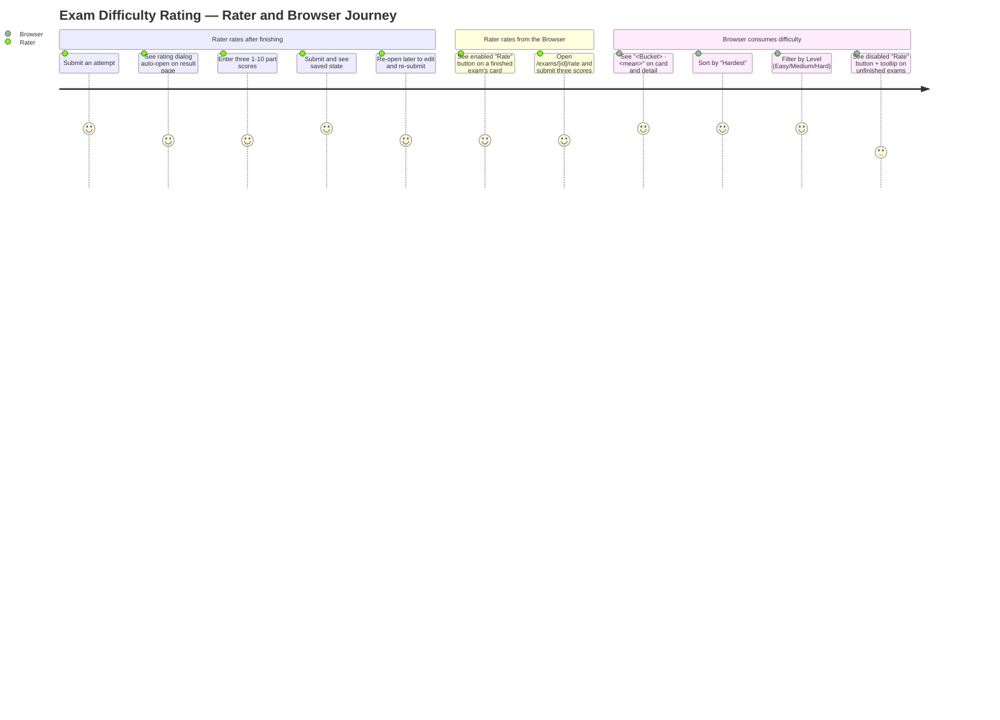
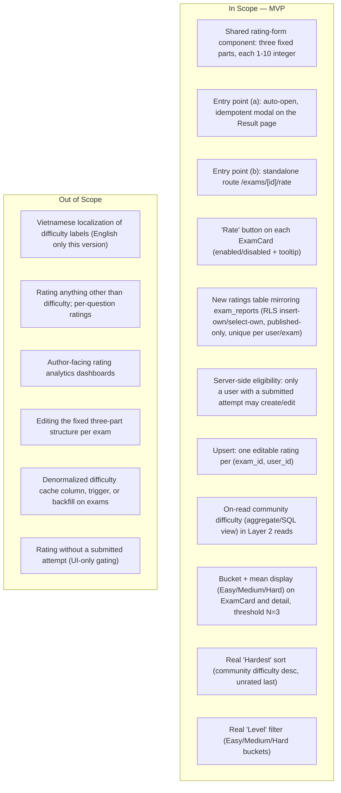

# PRD: Exam Difficulty Rating System

| | |
|---|---|
| **Version** | 1.1 |
| **Date** | 2026-07-23 (v1.0: 2026-07-23) |
| **Status** | v1.0 approved_with_conditions (2026-07-23). **v1.1 applies the three approved conditions — see change note below.** Product decisions locked with product owner (2026-07-23). Ready for downstream chain: PRD → UI Spec → ADR → Design Doc → Work Plan. |
| **Scale** | LARGE — fullstack (new table + RLS, Layer 2 reads/writes, shared UI component, two entry points, browser sort/filter). |

## v1.1 Change Note — Review Conditions Applied (2026-07-23)

v1.0 was approved with three conditions; v1.1 applies exactly these and nothing else:

- **I001** — AC-003 and Quantitative Metric 3 reworded so they express overall difficulty as a value *derived* from the three part scores, not a persisted "overall" column. The locked rule (overall = arithmetic mean of the three part scores) is unchanged; whether storage persists three parts or an overall stays a Design Doc decision.
- **I003** — Quantitative Metric 5 reworded to match AC-019/AC-020: below-threshold exams are excluded from difficulty-ranked Hardest positions but still appear, sunk to the bottom in deterministic `created_at`/`id` order (not removed from the list).
- **I002 (now a locked product decision)** — The logged-out/anonymous visitor treatment of the "Rate" button is decided and moved from Undetermined Items into R4: the button renders but is disabled with the tooltip "Log in to rate", distinct from the logged-in-but-not-yet-attempted state ("Finish this exam first").

## Overview

### One-line Summary

Let a logged-in user who has submitted an exam rate its difficulty across the three fixed parts of the standard Vietnamese 2025 exam structure on a 1–10 scale; aggregate all users' ratings into a per-exam community difficulty that is surfaced across the Exam Browser and exam detail UI and drives the difficulty sort and Level filter that currently exist only as placeholders.

### Background

MS-MOLAR is an exam-practice website (browse exams, take timed attempts, see results — the Layer 2 core loop). The Exam Browser and exam detail page already reserve space for a per-exam "Difficulty"/"Level" signal, but every surface ships it as an inert placeholder:

- `ExamCard` renders `Level` as a literal `"—"` (`SOURCE/features/exams/components/ExamCard.tsx:34-35`).
- The exam detail page renders `Difficulty` as a literal `"—"` (`SOURCE/app/(exams)/exams/[id]/page.tsx:98-100`).
- The Browser's `Level` filter row is symbolic only — it opens a panel that reads "Coming soon — available in a future release." (`SOURCE/features/exams/components/ExamFilters.tsx:233` and `:330-333`).
- The Browser's `Hardest` quick-sort writes `?hardest=1` to the URL but performs no reordering; the page deliberately does not pass it to `listExams` (`SOURCE/app/(exams)/exams/page.tsx:36-41`, `SOURCE/features/exams/components/ExamFilters.tsx:39-44`, `:265-268`).

Every one of these placeholders is annotated in code as "chờ rating" / "tính từ rating user" — waiting on a user-rating feature that does not yet exist. This PRD defines that feature.

The difficulty signal is grounded in the real 2025 national exam structure the site already models end-to-end (UGC v2.1 introduced multi-part exams and the `mcq` / `true_false` / `short_answer` question types). A user rates the perceived difficulty of each of the three canonical parts on a 1–10 integer scale (1 = extremely easy, 10 = extremely hard). The user's overall difficulty for the exam is the arithmetic mean of the three part scores; the exam's community difficulty is the mean of all users' overall scores, bucketed into Easy / Medium / Hard.

The feature is intentionally built at pre-launch scale: a single new ratings table mirroring the existing `exam_reports` model (RLS insert-own / select-own, published-only, unique per user/exam), community difficulty computed on-read inside the Layer 2 read queries, no denormalized cache, no trigger, no backfill.

### The three fixed parts

The rating form always presents exactly three parts, fixed and independent of the exam's own `parts` column:

- **Part I — Multiple choice** (`mcq`)
- **Part II — True/False** (`true_false`)
- **Part III — Short answer** (`short_answer`)

These three parts are constant for every exam regardless of what parts the exam actually contains. Editing the fixed three-part structure per exam is out of scope (see Won't Have).

## User Stories

### Primary Users

- **Rater** — a logged-in user who has submitted at least one attempt on an exam and wants to record how difficult they found it, part by part.
- **Browser (practicing user)** — any user browsing the catalog who wants to see, sort by, and filter on how hard the community found each exam.

Non-normative note: eligibility is derived from `exam_attempts.status = 'submitted'`, not from `user_profiles.role`. This feature reads no privileged role and introduces none.

### User Stories

```
As a user who just finished an exam
I want to rate how hard each of its three parts was, right after I submit
So that my experience contributes to a community difficulty signal without extra navigation
```

```
As a user who rated an exam before
I want to re-open my rating and change my three scores
So that I can correct or update my judgement, and there is still only one rating of mine per exam
```

```
As a user browsing the catalog
I want each exam to show how hard the community found it, and to sort by "Hardest" and filter by Level
So that I can pick exams at the difficulty I want to practice
```

```
As a user who has not finished an exam yet
I want the "Rate" button on its card to be visibly unavailable with a reason
So that I understand I must finish the exam before I can rate it
```

### Use Cases

1. **Rate from the result page (auto-open modal)**: A user submits an attempt and lands on `/exams/[id]/attempt/[attemptId]/result`. A rating dialog auto-opens over the result. The user enters three integer scores (Part I, II, III), submits, and sees a saved confirmation. The result content behind it is never blocked, and refreshing the page does not disruptively re-pop the dialog.
2. **Already rated (editable) on the result page**: A user who previously rated this exam submits a fresh attempt and returns to the result page. The rating surface shows their existing three scores in an "already rated" state that they can edit and re-submit; it does not force a blank re-rating.
3. **Rate from the Exam Browser**: A user who has a submitted attempt on an exam clicks the "Rate" button on that exam's `ExamCard`, is taken to `/exams/[id]/rate`, enters or edits three scores, submits, and returns to browsing.
4. **Rate button disabled**: A user browsing an exam they have never submitted sees that exam's "Rate" button rendered but disabled, with a tooltip reading "Finish this exam first".
5. **Direct-URL bypass attempt**: A user who has not submitted an attempt navigates directly to `/exams/[id]/rate`. The server rejects the write (they cannot persist a rating), enforced at the database/server-action layer, not only in the UI.
6. **Community difficulty appears**: Once an exam accrues at least 3 ratings, its `ExamCard` and detail page stop showing `"—"` and instead show `"<Bucket> · <mean>"` (e.g. `"Hard · 7.2"`). Below 3 ratings it keeps showing `"—"`.
7. **Sort by Hardest / filter by Level**: A user checks "Hardest" and the exam list reorders by community difficulty descending, with below-threshold exams sinking to the bottom. A user selects Level = Hard and the list shows only exams whose community difficulty falls in the Hard bucket.

### User Journey Diagram



### Scope Boundary Diagram



## Functional Requirements

Buckets and threshold used throughout:

- **Overall (per user)** = arithmetic mean of the three part scores (Part I, Part II, Part III), each an integer 1–10.
- **Community difficulty (per exam)** = arithmetic mean of all raters' overall scores.
- **Buckets**: `Easy` = mean in `[1, 4)`; `Medium` = mean in `[4, 7)`; `Hard` = mean in `[7, 10]`.
- **Display threshold**: `N = 3`. An exam with fewer than 3 ratings shows `"—"` (the current placeholder) and does not qualify for the Level filter or for a ranked position in the Hardest sort.

### Must Have (P1 — MVP)

- [ ] **R1 — Three fixed parts, mean overall**: The rating form always renders exactly three parts — Part I — Multiple choice (`mcq`), Part II — True/False (`true_false`), Part III — Short answer (`short_answer`) — fixed and NOT read from the exam's `parts` column. Each part takes an integer 1–10 (1 = extremely easy, 10 = extremely hard). The user's overall difficulty for the exam is `mean(Part I, Part II, Part III)`.
  - AC-001: Given the rating form on any exam, when it renders, then it shows exactly the three fixed parts in order (Part I — Multiple choice, Part II — True/False, Part III — Short answer), regardless of the exam's own `parts` value.
  - AC-002: Given the rating form, when the user sets the three part scores, then each accepted value is an integer in `[1, 10]` and a value outside that range or a non-integer is not submittable.
  - AC-003: Given three submitted part scores, when a rating is persisted, then the user's overall difficulty for that exam — a value derived from the stored rating, not necessarily a persisted column — equals the arithmetic mean of the three part scores. (Whether storage persists three part scores or a precomputed overall is a Design Doc decision.)

- [ ] **R2 — Two entry points, one shared form**: A single shared rating-form component is used in two places.
  - (a) A modal/dialog that auto-opens on the Result page `/exams/[id]/attempt/[attemptId]/result` right after the user submits an attempt.
  - (b) A standalone route `/exams/[id]/rate` reached from a "Rate" button on each `ExamCard` in the Exam Browser (not a navbar link).
  - AC-004: Given a user has just submitted an attempt, when the Result page loads, then the shared rating form auto-opens as a modal over the result content and does not block the existing submit→result flow (the result remains readable behind/around it).
  - AC-005: Given the auto-open modal, when the user refreshes the Result page, then the modal does not re-pop disruptively (a user who has already rated sees the "already rated" state per R5, not a forced fresh rating).
  - AC-006: Given the user has already rated this exam, when the Result-page rating surface renders, then it shows an "already rated" state that is editable (pre-filled with the existing three scores) rather than an empty fresh form.
  - AC-007: Given the Exam Browser, when a user opens `/exams/[id]/rate`, then the same shared rating-form component is presented as a standalone page for that exam.

- [ ] **R3 — Eligibility (server-enforced)**: Only a user with at least one submitted attempt (`exam_attempts.status = 'submitted'`) on that exam may create or edit its rating. This is enforced server-side (RLS with-check and/or server action), never UI-only.
  - AC-008: Given a user with no submitted attempt on an exam, when they attempt to persist a rating for it (including by navigating directly to `/exams/[id]/rate`), then the write is rejected at the server/database layer and no rating row is created or updated.
  - AC-009: Given a user on the Result page of an attempt they just submitted, when they submit a rating, then eligibility is satisfied and the rating persists.

- [ ] **R4 — "Rate" button behavior in the Browser**: Each `ExamCard` shows a "Rate" button for all exams. The button is enabled only for a logged-in user with a submitted attempt on that exam; otherwise it is rendered but disabled with a tooltip whose text depends on why: a logged-out visitor sees "Log in to rate"; a logged-in user with no submitted attempt sees "Finish this exam first". The Exam Browser loads the current user's set of submitted exam IDs to decide the enabled/disabled state per card.
  - AC-010: Given a logged-in user with a submitted attempt on an exam, when its `ExamCard` renders, then the "Rate" button is enabled and navigates to `/exams/[id]/rate`.
  - AC-011: Given a logged-in user with no submitted attempt on an exam, when its `ExamCard` renders, then the "Rate" button is present but disabled and exposes the tooltip "Finish this exam first".
  - AC-026: Given a logged-out (anonymous) visitor, when an `ExamCard` renders, then the "Rate" button is present but disabled and exposes the tooltip "Log in to rate" (distinct from the "Finish this exam first" state). This is an edge affordance: the catalog is effectively empty for anonymous visitors because the `exams_select_visible` RLS policy is `to authenticated`, so `ExamCard`s rarely render for logged-out users; the disabled "Log in to rate" state is the defined behavior when one does. (AC-026 is appended to the end of the sequence to keep existing AC IDs stable; it belongs to R4.)

- [ ] **R5 — One rating per user per exam, editable (upsert)**: A rating is unique per `(exam_id, user_id)`. Submitting again overwrites the user's previous three part scores (upsert), keeping a single rating row per user per exam.
  - AC-012: Given a user who already rated an exam, when they submit new part scores, then their existing rating row is updated in place (no second row is created) and the new three scores replace the old ones.
  - AC-013: Given a user re-opens their rating (on the Result page or at `/exams/[id]/rate`), when the form loads, then it is pre-filled with their currently stored three scores.

- [ ] **R6 — Community difficulty display (bucket + mean, English)**: Per-exam community difficulty is the mean of all raters' overall scores, displayed as a bucket label plus the mean number in English (e.g. `"Hard · 7.2"`). It replaces the `"—"` placeholder only once the exam has at least 3 ratings; below that it shows `"—"`. It is surfaced on the `ExamCard` "Difficulty"/"Level" line, on the exam detail page "Difficulty" cell, as the "Level" filter's three real buckets, and as the "Hardest" quick-sort.
  - AC-014: Given an exam with ≥ 3 ratings, when its `ExamCard` renders, then the Level line shows `"<Bucket> · <mean>"` where Bucket is Easy/Medium/Hard by the defined ranges and mean is the community mean (e.g. `"Hard · 7.2"`).
  - AC-015: Given an exam with fewer than 3 ratings, when its `ExamCard` or detail page renders, then the difficulty shows `"—"` (unchanged placeholder).
  - AC-016: Given an exam with ≥ 3 ratings, when its detail page renders, then the "Difficulty" cell shows `"<Bucket> · <mean>"` instead of `"—"`.
  - AC-017: Given the Browser's "Level" filter, when the user opens it, then it presents the three real buckets Easy / Medium / Hard (not the "Coming soon" symbolic panel).
  - AC-018: Given a community mean, when it is bucketed, then `[1,4)` → Easy, `[4,7)` → Medium, `[7,10]` → Hard (boundary 4.0 is Medium, 7.0 is Hard, 10.0 is Hard).

- [ ] **R7 — Ordering and filtering of unrated / below-threshold exams**:
  - "Hardest" sort: exams with a community difficulty are ordered by that value descending; exams with fewer than 3 ratings sink to the bottom, tie-broken deterministically by `created_at`/`id`.
  - "Level" filter: selecting a specific Level excludes exams that do not have a qualifying community difficulty (below threshold, or in another bucket).
  - AC-019: Given a mix of rated (≥ 3 ratings) and below-threshold exams, when "Hardest" is active, then rated exams appear first ordered by community difficulty descending, and all below-threshold exams appear after them in a deterministic order (by `created_at`/`id`).
  - AC-020: Given "Hardest" active with two exams of equal community difficulty, when the list renders, then their relative order is deterministic and stable across reloads (tie-broken by `created_at`/`id`).
  - AC-021: Given the "Level" filter set to a specific bucket (e.g. Hard), when the list renders, then it contains only exams whose community difficulty is ≥ 3 ratings and falls in that bucket, and excludes below-threshold exams and exams in other buckets.

- [ ] **R8 — On-read storage strategy (no cache/trigger/backfill)**: Community difficulty is computed on read (aggregate join or SQL view over the ratings table) inside the Layer 2 read queries. There is no denormalized difficulty column on `exams`, no trigger, and no backfill.
  - AC-022: Given a new rating is inserted or updated, when any difficulty surface is next read, then it reflects the new aggregate without any denormalized `exams` column being written and without a trigger firing.
  - AC-023: Given the ratings table is added, when the schema change is applied, then no backfill of `exams` is required and existing catalog behavior for exams with fewer than 3 ratings is unchanged (they show `"—"`).

### Should Have (P2)

- [ ] **R9 — Rating form guidance and feedback**: The shared form communicates the 1–10 meaning (1 = extremely easy, 10 = extremely hard), shows a clear saved/updated confirmation on submit, and surfaces a clear, recoverable error if the write fails, without losing the user's entered scores.
  - AC-024: Given the rating form, when it renders, then the 1–10 scale meaning is visible (extremely easy → extremely hard).
  - AC-025: Given a submit that fails at the server, when the error returns, then the user sees an actionable message and their entered three scores are preserved for retry.

### Could Have (P3)

- [ ] **R10 — Rating count indicator**: Show the number of ratings backing an exam's community difficulty (e.g. "based on 8 ratings") on the detail page, to convey confidence in the signal. Convenience only; does not change the threshold or buckets.

### Won't Have (this release)

- **Vietnamese localization of the difficulty labels** — Easy / Medium / Hard are rendered in English only this version.
- **Rating anything other than difficulty; per-question ratings** — only the three fixed parts' difficulty is captured.
- **Author-facing rating analytics dashboards** — no per-author rollups or analytics surfaces.
- **Editing the fixed three-part structure per exam** — the three parts are constant for all exams.
- **A denormalized difficulty cache column, trigger, or backfill on `exams`** — community difficulty is computed on-read only (R8).
- **UI-only eligibility gating** — eligibility is always server-enforced (R3).

## Non-Functional Requirements

### Performance

- Difficulty aggregation is computed on-read inside the existing Layer 2 read queries (`listExams`, exam detail read) via an aggregate join or SQL view; it must not add a per-card round-trip (no N+1). The Browser additionally loads the current user's set of submitted exam IDs once per page load to drive R4's enabled/disabled state.
- Catalog browse performance is not degraded relative to today: published-only filtering, difficulty aggregation, sort, and Level filtering happen at the query/database layer, not client-side.

### Reliability

- A failed rating write never loses the user's entered scores; the form remains usable for retry (AC-025).
- The Result-page modal is idempotent: it must not force a duplicate rating and must not create a second rating row for the same `(exam_id, user_id)` on re-submit (R5, AC-005, AC-012).

### Security

- Eligibility (a submitted attempt exists) and one-per-user-per-exam uniqueness are enforced at the database/server layer (RLS with-check and/or server action), never UI-only (R3, R5). A direct navigation to `/exams/[id]/rate` by an ineligible user cannot persist a rating (AC-008).
- Ratings follow the `exam_reports` model: a user may insert/update only their own rating (`user_id = auth.uid()`), and only on `published` exams; a user may select only their own rating row for the "already rated" state.

### Scalability

- Pre-launch scale. No queue, worker, cache, or trigger is introduced. The design stays a single idempotent `schema.sql` addition consistent with the existing manual-DDL workflow.

### Accessibility (UI feature)

- Compliance standard: WCAG 2.1 AA (site default).
- The shared rating form (both as auto-open modal and standalone page), the three part inputs, submit/saved/error states, the `ExamCard` "Rate" button (enabled and disabled states), and the Level filter are fully keyboard-operable.
- The auto-open modal manages focus consistently with the existing dialog precedent (`SOURCE/features/exams/components/ReportExam.tsx`: Escape closes, scrim click closes, focus moves into the dialog on open), and returns focus appropriately on close.
- The disabled "Rate" button's reason ("Finish this exam first") is available to assistive technology, not conveyed by visual disabled styling alone.
- Saved/updated confirmation and error messages are announced to screen readers (e.g. `aria-live`) and status is not conveyed by color alone.

## Success Criteria

The site is pre-launch; metrics are mechanism-focused and verifiable at acceptance time rather than growth targets.

### Quantitative Metrics

1. **Eligibility enforced server-side**: 100% of rating-write attempts by a user with no submitted attempt on the exam are rejected at the server/database layer — measured by an RLS/server-action verification test that attempts a write (including a direct `/exams/[id]/rate` POST) for an ineligible user and asserts zero rating rows result.
2. **One row per user per exam**: 0 duplicate rating rows for any `(exam_id, user_id)` after repeated submissions — measured by a unique-constraint test that submits twice and asserts a single row whose scores equal the latest submission.
3. **Overall = mean**: for a fixture set of ratings, the overall difficulty derived from each stored rating equals the arithmetic mean of its three part scores in 100% of cases — measured by a unit test on the aggregation logic (independent of whether the overall is stored or computed on read).
4. **Bucketing correctness**: for a fixture set of community means spanning the boundaries (including 3.9/4.0, 6.9/7.0, 1.0, 10.0), 100% map to the correct Easy/Medium/Hard bucket per the defined ranges — measured by a unit test on the bucket function.
5. **Threshold gating**: 100% of exams with fewer than 3 ratings render `"—"`, are excluded from the Level filter, and are excluded from difficulty-ranked Hardest positions while still appearing in the Hardest list — sunk below all rated exams in deterministic `created_at`/`id` order (consistent with AC-019/AC-020, never removed from the list) — measured by a query/aggregation test on fixtures with 0, 1, 2, and 3 ratings.
6. **Sort determinism**: the "Hardest" sort produces a stable, reproducible order across repeated reads on the same data, with below-threshold exams last — measured by a repeated-read test asserting identical ordering.
7. **No denormalized write**: no code path writes a difficulty value onto `exams` and no trigger is introduced — verified by code/schema inspection (R8, AC-022).

### Qualitative Metrics

1. A user who just finished an exam can rate it from the auto-open modal without leaving the result flow, and can later find and edit that rating.
2. A browsing user can tell at a glance how hard the community found an exam and can narrow the catalog to a difficulty they want.
3. A user who has not finished an exam understands why they cannot rate it yet (the disabled button's reason is clear).

### UI Quality Metrics

1. Rating completion: a user who opens the rating form (modal or standalone) either persists three scores successfully or receives an actionable error with their input preserved — no dead ends, no silent failures.
2. Idempotency: re-opening the Result page for an already-rated exam yields the editable "already rated" state 100% of the time (never a forced blank re-rating, never a duplicate row).
3. Accessibility audit: 0 serious/critical issues on the rating form (modal + standalone), the `ExamCard` "Rate" button states, and the Level filter — automated audit (e.g. axe) plus a manual keyboard pass.

## Technical Considerations

Implementation detail belongs to the UI Spec / ADR / Design Doc; this section records dependencies and constraints the PRD must acknowledge.

### Dependencies

- **Supabase** (Postgres + RLS + Auth) — the new ratings table, its RLS (insert-own / update-own / select-own, published-only), the unique `(exam_id, user_id)` constraint, and the eligibility with-check all rely on database-level enforcement. Modeled on the existing `exam_reports` table and policies (`SOURCE/supabase/schema.sql` ~247–341).
- **Eligibility source of truth**: `exam_attempts.status = 'submitted'`, set by `submitExam` in `SOURCE/features/exams/actions.ts`. Eligibility is "the current user has at least one submitted attempt on this exam".
- **Layer 2 reads**: `SOURCE/features/exams/queries.ts` — `listExams`, `ExamSort`, `ExamFilters`, `EXAM_COLUMNS`, `toExam`, `listExamFacets`, `getExam`. Community difficulty is joined/aggregated here on-read; `ExamSort` gains a `hardest` value; filters gain a Level dimension.
- **Layer 2 / write**: a new server action (write) alongside `SOURCE/features/exams/actions.ts`, following the `reportExam` precedent in `SOURCE/features/authoring/actions.ts`.
- **UI-write precedent**: `SOURCE/features/exams/components/ReportExam.tsx` (dialog + server action + already-done static state) is the pattern the shared rating form's modal and "already rated" state follow.
- **Placeholders replaced**:
  - `SOURCE/features/exams/components/ExamCard.tsx:34-35` (Level `"—"`) and the addition of the "Rate" button.
  - `SOURCE/app/(exams)/exams/[id]/page.tsx:98-100` (Difficulty `"—"`).
  - `SOURCE/features/exams/components/ExamFilters.tsx:39-44` (QUICK sort config), `:233` and `:330-333` (symbolic Level row), `:265-268` (inert Hardest handler).
  - `SOURCE/app/(exams)/exams/page.tsx:36-41` (Hardest parsed but not passed to `listExams`).
- **New route**: `/exams/[id]/rate` (standalone shared form), and the auto-open modal integration on `/exams/[id]/attempt/[attemptId]/result`.
- **Exam type**: `SOURCE/types/exam.ts` (`Exam`) — a difficulty field may be added to the read model; the fixed three parts are NOT derived from `Exam.parts`.

### Constraints

- DDL is executed manually by the engineer in the Supabase SQL Editor as a single idempotent `schema.sql`; there is no migration framework. The new table, its constraints, and its RLS policies must be expressible idempotently (create-if-not-exists / drop-policy-if-exists), consistent with the existing `exam_reports` block.
- The three parts are fixed constants (`mcq` / `true_false` / `short_answer`) in the form and in scoring; they are not read from `exams.parts` (R1).
- Community difficulty is computed on-read only: no denormalized column on `exams`, no trigger, no backfill (R8).
- Part scores are integers constrained to `[1, 10]`; the overall is their arithmetic mean; buckets and the `N = 3` threshold are fixed as specified (R1, R6).
- Difficulty labels render in English only this version (Won't Have).

### Assumptions

- A user who reaches the Result page has, by construction, a submitted attempt on that exam, so eligibility is satisfied there (AC-009).
- The Browser can efficiently load the current user's submitted-exam-ID set once per page load to drive R4 without a per-card query.
- Community difficulty is meaningful only at `N = 3`+ ratings; below that, showing `"—"` (rather than a noisy single-user value) is the intended behavior.

### Risks and Mitigation

| Risk | Impact | Probability | Mitigation |
|------|--------|-------------|------------|
| Ineligible user persists a rating via direct `/exams/[id]/rate` | High | Medium | Server/RLS with-check on submitted-attempt existence (R3); verification test attempts the bypass and asserts rejection (metric 1) |
| Duplicate rating rows for one user/exam | Medium | Medium | Unique `(exam_id, user_id)` + upsert (R5); duplicate-submission test (metric 2) |
| On-read aggregation adds N+1 / degrades browse | Medium | Medium | Single aggregate join or SQL view in Layer 2 reads, not per-card; no client-side aggregation (NFR Performance) |
| Auto-open modal re-pops on refresh or blocks the result flow | Medium | Medium | Idempotent "already rated" state; modal non-blocking over result content (R2, AC-004/005); UI Spec defines the open condition |
| Bucket boundary ambiguity (4.0, 7.0, 10.0) mis-bucketed | Low | Medium | Fixed half-open ranges `[1,4)`/`[4,7)`/`[7,10]` with boundary fixtures (AC-018, metric 4) |
| Non-deterministic Hardest order for tied/unrated exams | Low | Medium | Deterministic tie-break by `created_at`/`id`; below-threshold last; reproducibility test (AC-019/020, metric 6) |

## Undetermined Items

Downstream design questions for the UI Spec / ADR / Design Doc. None reopens a locked product decision.

- [ ] **Ratings table shape and RLS** (owner: ADR/Design Doc): exact table name, columns (three part scores vs. a stored overall), the `[1,10]` CHECK constraints, the unique `(exam_id, user_id)` constraint, and the eligibility with-check expression (a `submitted`-attempt existence subquery, mirroring the `exam_reports` published-only check).
- [ ] **On-read aggregation mechanism** (owner: Design Doc): whether community difficulty is a SQL view, an aggregate join in `listExams`/`getExam`, or a Postgres function; how the `N = 3` threshold, bucketing, mean rounding (display precision, e.g. one decimal as in `"7.2"`), Hardest ordering, and Level filtering are expressed at the query layer.
- [ ] **Rate-form input control** (owner: UI Spec): the concrete 1–10 input affordance (segmented buttons, slider, number field) and how it presents the "extremely easy → extremely hard" scale, consistent with the Mực & Sơn mài theme.
- [ ] **Result-page modal open condition** (owner: UI Spec): the exact trigger and dismissal rules for the auto-open modal (open on first arrival, editable "already rated" state on return), so it never re-pops disruptively (AC-005).
- [ ] **Submitted-exam-ID set loading** (owner: Design Doc): where and how the Browser loads the current user's submitted exam IDs for R4 (single query returning the set). The logged-out "Rate" button treatment is no longer open — it is decided in R4/AC-026 (disabled with tooltip "Log in to rate").

## Appendix

### References

- `SOURCE/supabase/schema.sql` (~247–341) — `exam_reports` table + RLS the ratings table mirrors.
- `SOURCE/features/exams/actions.ts` — `submitExam` (sets `exam_attempts.status = 'submitted'`, the eligibility source).
- `SOURCE/features/exams/queries.ts` — Layer 2 reads (`listExams`, `ExamSort`, `EXAM_COLUMNS`, `toExam`, `listExamFacets`, `getExam`) where on-read difficulty is added.
- `SOURCE/features/exams/components/ReportExam.tsx` — dialog + action + already-done state precedent.
- `SOURCE/features/exams/components/ExamCard.tsx` (`:34-35`), `SOURCE/app/(exams)/exams/[id]/page.tsx` (`:98-100`), `SOURCE/features/exams/components/ExamFilters.tsx` (`:39-44`, `:233`, `:265-268`, `:330-333`), `SOURCE/app/(exams)/exams/page.tsx` (`:36-41`) — the placeholders this feature replaces.
- `SOURCE/types/exam.ts` — `Exam` read model.
- `docs/prd/ugc-exam-upload-prd.md` — sibling PRD; format and detail-level reference.

### Glossary

- **Part**: one of the three fixed sections of the standard Vietnamese 2025 exam structure — Part I — Multiple choice (`mcq`), Part II — True/False (`true_false`), Part III — Short answer (`short_answer`). Fixed for every exam, not read from `exams.parts`.
- **Part score**: an integer 1–10 a user assigns to a part's difficulty (1 = extremely easy, 10 = extremely hard).
- **Overall difficulty (per user)**: the arithmetic mean of a user's three part scores for an exam.
- **Community difficulty (per exam)**: the arithmetic mean of all raters' overall scores for an exam; displayed as a bucket + mean once the exam has ≥ 3 ratings.
- **Bucket**: `Easy` (mean `[1,4)`), `Medium` (mean `[4,7)`), `Hard` (mean `[7,10]`). English only this version.
- **Threshold (N = 3)**: the minimum number of ratings before an exam shows a community difficulty (below it, `"—"`), qualifies for the Level filter, or holds a ranked Hardest position.
- **Eligibility**: the server-enforced condition that a user has at least one submitted attempt (`exam_attempts.status = 'submitted'`) on an exam before they may create or edit its rating.
- **Upsert**: submitting a rating again overwrites the user's previous three scores in the single row keyed by `(exam_id, user_id)`.
- **On-read**: community difficulty is computed at read time via aggregation/SQL view, not stored on `exams` and not maintained by a trigger.
