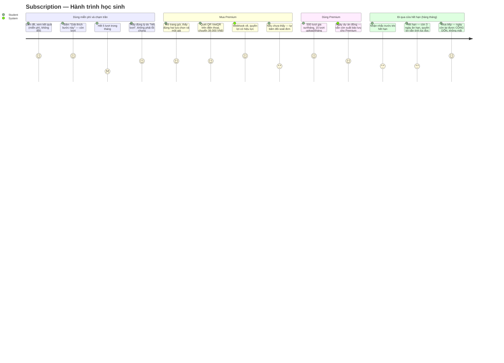
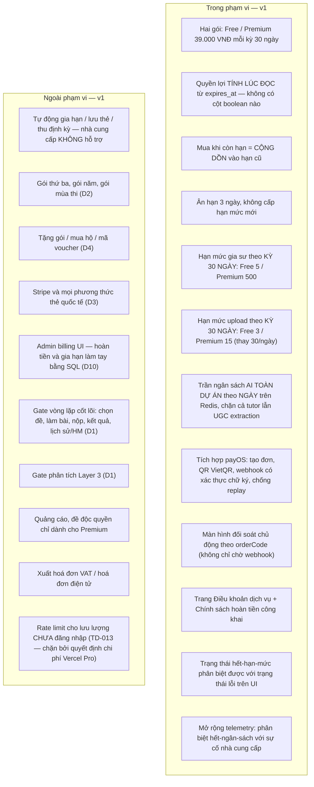

# PRD: Subscription — Gói Premium trả trước (payOS)

| | |
|---|---|
| **Version** | 1.3 |
| **Date** | 2026-08-16 |
| **Status** | Draft — mười quyết định sản phẩm (D1–D10) đã chốt với engineer ngày 2026-08-16. Sẵn sàng cho chuỗi kế tiếp: PRD → UI Spec → **ADR** (chọn nhà cung cấp thanh toán; ranh giới tin cậy của webhook — đường ghi CHƯA ĐĂNG NHẬP đầu tiên của dự án) → Design Doc → Work Plan. |
| **Scale** | LARGE — fullstack. 31 file bị ảnh hưởng, cả backend lẫn frontend. Tầng thanh toán ĐẦU TIÊN của dự án: bảng mới trong `schema.sql` (đơn hàng + quyền lợi), route handler thứ HAI của toàn app (webhook payOS — hiện chỉ có `SOURCE/app/auth/callback/route.ts`), bộ đếm hạn mức mới trên Upstash Redis, sửa hai đường tiêu quota AI đang chạy production — **đường gia sư sửa ở `SOURCE/app/(layer2)/tutorActions.ts`** (nơi `explainStep()` đã import `guard` ở `:36` và gọi nó ở `:175`) và **đường trích xuất UGC sửa ở `SOURCE/app/(layer4)/actions.ts` + `SOURCE/lib/ugc/gemini.ts`** — thay `LIMITS.MAX_UPLOADS_PER_DAY`, và hai trang công khai mới (Điều khoản, Chính sách hoàn tiền). **`SOURCE/lib/tutor/callTutor.ts` GIỮ NGUYÊN trách nhiệm hiện tại** ("gọi model và phân loại thất bại"); kiểm soát truy cập và hạn mức không đặt vào đó — xem Dependencies. DDL vẫn apply bằng tay trên hai project Supabase (TD-005). |

## Revision History

| Version | Date | Change |
|---|---|---|
| 1.3 | 2026-08-16 | Hai sửa đổi phát sinh từ pha UI (UI Spec `docs/ui-spec/subscription-ui-spec.md` v1.0, engineer duyệt 2026-08-16), cả hai đều là chỗ PRD nói một thứ mà codebase không có. **(1) Chỉ số tiếp cận #2**: thay "0 lỗi serious/critical từ axe" bằng ESLint `jsx-a11y` + rà tay — repo không có axe và Engine 1 đã chốt hạ chuẩn này rồi; giữ nguyên là để lại một chỉ số không có dụng cụ đo. **(2) Cách kiểm AC-038**: PRD bảo khẳng định "0 lần chuyển hướng tới `/login`", nhưng codebase **không bao giờ** redirect tới đó — `lib/supabase/middleware.ts:91-96` đá về `/?auth=signin`, còn `/login` chỉ là stub tự redirect. Một test viết theo câu chữ cũ sẽ **XANH trên một trang hỏng**. |
| 1.2 | 2026-08-16 | Áp 7 điều kiện của lần rà soát thứ hai (`approved_with_conditions`, 17/20 phát hiện đã trọn, 3 phần). **Sửa một con số sai về code**: sàn số lời gọi Gemini mỗi lượt upload là **2**, không phải 1 — `actions.ts:220–228` bắt buộc CẢ HAI file nên `extractAnswers` luôn chạy; AC-020 trước đó tự mâu thuẫn (ghi "tối thiểu 1" rồi bắt test khẳng định đúng 2). **Chốt số phận `RATE_LIMITS.explainStep`**: GIỮ entry làm trần chống spam theo người (không phải hạn mức gói), nhưng **bắt buộc nâng giá trị ≥ 50/ngày** — giữ nguyên 3/ngày sẽ chặn chính người Premium, vì 500 lượt/kỳ ≈ 16,7 lượt/ngày; thêm **AC-057** ghim điều đó và carve-out tương ứng trong AC-013. **Chốt mốc neo kỳ hạn mức của Premium** (A4) = thời điểm đơn gần nhất, và quy tắc cộng-dồn-ngày-nhưng-không-cộng-dồn-lượt khi mua sớm; AC-016 thêm ca mua sớm. **Gỡ đặc tả trùng**: AC-051 (R16, P2) không còn liệt kê lại bốn thành phần Must của AC-056 (R10, P1) — một P2 không được fail vì thiếu nội dung P1. Thống nhất đơn vị: D7 ghi rõ KỲ 30 NGÀY, thêm quy ước đọc "/tháng" cho toàn tài liệu. Sửa trích dẫn `metaCall ? 3 : 2` từ `actions.ts:425` sang `:400`. Sửa ô mitigation R-a (bổ sung `PUBLIC_PATHS` là 3 mục, không phải 1). |
| 1.1 | 2026-08-16 | Sửa theo rà soát tài liệu (`needs_revision`). **Sửa một sự thật production đã lỗi thời ở 7 chỗ**: `RATE_LIMITS.explainStep` đã được commit `e8d91a4` (2026-08-16) đưa về `{ limit: 3, windowMs: 24 * 60 * 60 * 1000 }` — lỗi lệch đơn vị giờ/ngày **không còn sống trên production**; mốc xuất phát của R5 nay là **3 lượt/ngày/người (trần TẠM)**, không phải 20 lượt/giờ/người. **Sửa mô tả sai về `guard()`**: nó **tụt về lớp đếm RAM** khi Redis hỏng, không phải fail-open. **Gỡ ba mâu thuẫn nội bộ**: AC-032 ↔ AC-038 về `PUBLIC_PATHS`; ba con số khác nhau cho điểm hoà vốn (chốt **933 VNĐ**, có phép tính); "tháng hoặc ngày" trong R5/D5 (chốt **một kỳ 30 ngày theo chu kỳ thuê bao**). **Chốt ba lựa chọn còn để mở**: mốc kỳ hạn mức của người dùng Free (A6), nguồn sự thật của AC-049 (`GEMINI_PAID_TIER_ENABLED`, mặc định KHÔNG bật), và nhánh xử lý đơn chờ trùng của AC-027 (TÁI DÙNG). Thêm **AC-052 → AC-056** (mốc reset của Free, biên trên upload của Premium, mặc định fail-closed khi thiếu biến môi trường, mốc nền 14 ngày là điều kiện chặn, bề mặt Must của R10); sửa số dòng trích dẫn `actions.ts`; U4 đổi chủ sở hữu và có mặc định; U3 có điều kiện leo thang. |
| 1.0 | 2026-08-16 | Bản đầu. Nâng cấp `SUBSCRIPTION-FEATURE.md` (khởi thảo) thành PRD chính thức: toàn bộ 6 câu hỏi mở ở §3 file khởi thảo đã có câu trả lời và được ghi lại ở đây dưới dạng **quyết định D1–D10**, không còn là câu hỏi. Ghi nhận ràng buộc "không tự động gia hạn" của A2A/VietQR và hai hệ quả bắt buộc của nó. Chốt bằng SỐ: hạn mức gia sư Free/Premium, hạn mức upload Free/Premium, độ dài ân hạn. Ghi 4 mục chưa quyết (U1–U4), trong đó U1 (sandbox payOS) và U2 (đơn giá chưa đo thật) là **chặn trước khi bán gói đầu tiên**. |

## Overview

### One-line Summary

Cho học sinh Việt Nam đang dùng TrangNguyenDigi miễn phí một gói **Premium 39.000 VNĐ/tháng trả trước qua payOS (chuyển khoản/VietQR)**, đổi lấy hạn mức gia sư AI và hạn mức upload đề cao hơn hẳn — trong khi vòng lặp cốt lõi (chọn đề, làm bài, nộp, xem kết quả, lịch sử, phân tích Layer 3) vẫn miễn phí nguyên vẹn cho mọi tài khoản đã đăng nhập.

### Background

**Động lực đo được, không phải phỏng đoán.** Key Gemini đang phục vụ tính năng gia sư "Giải thích bước này" (Engine 1) bị chặn ở **20 request/NGÀY cho TOÀN BỘ dự án** — `quotaId = GenerateRequestsPerDayPerProjectPerModel-FreeTier`, `quotaValue = 20`, model `gemini-3.5-flash`, reset lúc nửa đêm giờ Pacific. Con số này đọc trực tiếp từ thân lỗi 429 thật, không phải từ tài liệu (`docs/plans/tasks/engine1-adaptive-ai-work-plan-phase6-completion.md` mục **Q-1**, và `...phase5-completion.md` dòng 118). **Cùng key đó** còn phục vụ đường trích xuất câu hỏi từ PDF khi người dùng upload đề (`SOURCE/lib/ugc/gemini.ts`, dùng chung `QUESTION_MODEL`).

Trần đó là **mức toàn dự án**, nên nó không co giãn theo số người dùng — và đây là điểm quyết định cả hình dạng tính năng này: **hạn mức theo từng người dùng, dù đặt chặt tới đâu, về mặt toán học cũng không bao giờ chặn được một trần toàn dự án.** Cần một bộ đếm ở đúng cấp mà trần đó tồn tại (D6).

Ba khoảng cách cụ thể, đo trên code đang chạy:

1. **Đơn vị thời gian của guard TỪNG lệch với đơn vị của nhà cung cấp; lỗi đó đã được vá, và thứ thay thế nó là một trần TẠM mà tính năng này phải gỡ.** *(Lịch sử)* `RATE_LIMITS.explainStep` từng là `{ limit: 20, windowMs: 60 * 60 * 1000 }` — 20 lượt mỗi **GIỜ** mỗi **người dùng**, trong khi nhà cung cấp cho 20 lượt mỗi **NGÀY** cho **cả dự án**; một học sinh, một mình, trong một giờ, hợp lệ theo mọi guard khi đó, tiêu hết ngân sách cả ngày của mọi học sinh khác. *(Hiện trạng, đọc trên code đang chạy)* Commit **`e8d91a4`** ngày **2026-08-16** đã đưa nó về `explainStep: { limit: 3, windowMs: 24 * 60 * 60 * 1000 }` — **3 lượt/NGÀY/người dùng**, tại `SOURCE/lib/security/rateLimit.ts:137`. Đơn vị cửa sổ nay trùng đơn vị hạn ngạch của nhà cung cấp, nên **lỗi lệch đơn vị không còn sống trên production**. Nhưng chú thích ngay tại chỗ (`rateLimit.ts:123–136`) tự tuyên bố đây là **TRẦN TẠM**: `3` là phần chia đều của mỗi người từ 20 lượt/ngày toàn dự án đang phải chia sẻ với trích xuất UGC, và nó "sẽ được thay bằng hạn ngạch theo gói khi tính năng thuê bao lên". **Mốc xuất phát của tính năng này vì thế là 3 lượt/ngày/người, không phải 20 lượt/giờ/người** — R5 là thứ thay trần tạm đó bằng hạn mức theo gói.
2. **Hôm nay một học sinh miễn phí đang gặp một sản phẩm hỏng NGẪU NHIÊN.** Khi ngân sách ngày cạn, nút "Giải thích bước này" vẫn hiện ra, vẫn bấm được, rồi trả về đúng một câu lỗi chung. `ExplainStepAffordance.tsx` **cố ý gộp cả 4 mã lỗi của `explainStep()` thành một thông điệp duy nhất** (`t("tutor.error")`) để không lộ ra rằng phía server có vòng tái kiểm tra điều kiện. Hệ quả ngoài dự tính: "hết ngân sách hôm nay" và "hệ thống đang hỏng" trông giống hệt nhau với người dùng. Tệ hơn nữa ở tầng quan sát: một lỗi 429 quota THẬT đã được ghi vào `telemetry_log` với `error_code = 'server'` (đo trong Phase 5, dòng 45) — tức là nhật ký vận hành cũng không phân biệt được hết-tiền với sự-cố. **Chuyển sang phân tầng tường minh vì thế là một cải thiện trải nghiệm cho chính người dùng miễn phí, không chỉ là một hạn chế**: họ sẽ biết mình còn bao nhiêu lượt, và khi hết thì được nói thẳng là hết, chứ không phải đoán xem hệ thống có hỏng không.
3. **Hạn mức upload được đặt vào thời điểm trích xuất KHÔNG tốn của ai đồng nào.** `LIMITS.MAX_UPLOADS_PER_DAY = 30` (`SOURCE/lib/ugc/limits.ts:35`), tức 30 lượt/NGÀY/người dùng. Với ước tính ~650 VNĐ mỗi lượt trích xuất ở ca xấu nhất, đó là **~19.500 VNĐ mỗi ngày cho MỘT người dùng miễn phí** — **đúng bằng một nửa** giá thuê bao tháng (19.500 / 39.000 = 50,0%), mỗi ngày. Nặng hơn con số: mỗi lượt upload gọi Gemini **tối đa ba lần** (`extractQuestions` ở `actions.ts:406` → `extractAnswers` ở `:419` → `extractMeta` ở `:427`, lời gọi thứ ba chỉ chạy ở chế độ `automatic` — `metaCall ? 3 : 2`, và `if (!metaCall) return null` ở `:425`), nên 30 lượt/ngày là tới ~90 request/ngày từ một người, đối diện một trần 20 request/ngày của cả dự án. Và đường **xử lý lại** một đề đã có (nhánh `if (rerunExamId)` bắt đầu ở `actions.ts:248`) **không đi qua bộ đếm** — bộ đếm chỉ nằm trong nhánh `else` (bắt đầu ở `:310`, khối đếm `:311–322`, câu lệnh chặn `if ((count ?? 0) >= LIMITS.MAX_UPLOADS_PER_DAY)` ở `:317`). Bấm xử lý lại vẫn tiêu request Gemini mà không tốn suất nào.

**Bối cảnh sản phẩm.** TrangNguyenDigi hôm nay là sản phẩm **100% miễn phí, không có tầng thanh toán nào**: `SOURCE/package.json` không có dependency thanh toán nào (`@base-ui/react`, `@google/genai`, `@supabase/*`, `@upstash/redis`, `jspdf`, `mupdf`, `nodemailer`… — không có gì khác), `schema.sql` không có bảng `orders`/`subscriptions`/`plans`. Đây là hạ tầng thanh toán ĐẦU TIÊN, không phải mở rộng cái đã có. Toàn app hiện có **đúng một route handler** (`SOURCE/app/auth/callback/route.ts`) và `PUBLIC_PATHS = ["/", "/login", "/auth/callback"]` (`SOURCE/lib/supabase/middleware.ts:13`) — webhook payOS sẽ là route handler thứ hai và là **điểm GHI chưa-đăng-nhập đầu tiên** của dự án.

### Ràng buộc định hình toàn bộ sản phẩm: KHÔNG có tự động gia hạn

payOS, như mọi cổng A2A/VietQR, **không có auto-renew**: không lưu thẻ, không thu định kỳ. "Subscription" ở đây là một **kỳ hạn TRẢ TRƯỚC**; hết hạn thì người dùng phải tự mua lại bằng tay. Đừng mô tả vòng đời kiểu Stripe (`active` → `past_due` → `canceled` do nhà cung cấp đẩy sự kiện) ở bất kỳ tài liệu hạ nguồn nào — nhà cung cấp này không có những sự kiện đó.

Hai hệ quả trực tiếp, cả hai đều là ràng buộc thiết kế bắt buộc:

1. **Không bao giờ có sự kiện "hết hạn" được đẩy tới.** Quyền lợi vì thế phải được **tính LÚC ĐỌC** từ một mốc thời gian hết hạn, **không bao giờ lưu thành một cờ boolean**. Một cờ boolean mục ruỗng trong im lặng: nó đúng vào lúc được ghi và sai một tháng sau, mà không có gì báo. Mốc thời gian thì không thể sai kiểu đó — so sánh với `now()` luôn cho câu trả lời đúng ở mọi thời điểm đọc.
2. **Mua khi vẫn còn hạn thì phải CỘNG DỒN vào hạn cũ, không ghi đè.** Nếu ghi đè, người mua sớm mất số ngày còn lại của mình — và đó là một khiếu nại về TIỀN, loại khiếu nại đắt nhất và khó chữa nhất khi không có admin billing UI (D10).

### Quyết định đã chốt (D1–D10)

Mười quyết định dưới đây đã được engineer chốt ngày 2026-08-16, **trước** khi PRD này được viết. Chúng là quyết định, không phải câu hỏi mở — mọi tài liệu hạ nguồn đọc bảng này là đủ.

| # | Quyết định | Lý do một dòng | Nói kỹ ở |
|---|---|---|---|
| D1 | **Gate**: gia sư AI (Engine 1 "Giải thích bước này") + hạn mức upload UGC. **KHÔNG gate**: vòng lặp cốt lõi (chọn đề, làm bài, nộp, xem kết quả, lịch sử/HM) và phân tích Layer 3 — miễn phí cho mọi tài khoản đã đăng nhập | Chỉ gate đúng thứ tốn tiền bên thứ ba mỗi lần gọi; gate core loop là phá chính lý do sản phẩm tồn tại | R1, Sơ đồ ranh giới phạm vi, Won't Have |
| D2 | **Đúng hai gói**: Free và Premium **39.000 VNĐ/tháng**. Không có gói thứ ba | Một trục quyết định duy nhất cho người dùng; ba bậc cần ba bộ hạn mức phải nuôi và ba trang so sánh phải viết, trong khi chưa có một người trả tiền nào để biết bậc giữa nên là gì | R1, Đơn giá |
| D3 | **Nhà cung cấp: payOS** (A2A/VietQR). Miễn phí giao dịch từ 2026-01-23; cá nhân đăng ký bằng CCCD; có webhook. **Loại Stripe** | Stripe không onboard merchant Việt Nam, và học sinh THCS/THPT không có thẻ quốc tế. Vercel Marketplace hạng mục `payments` chỉ có Stripe → **cố ý ghi đè** hướng đó | Dependencies, R8 |
| D4 | **Người trả tiền là chính học sinh**, trên tài khoản của mình. Không có luồng tặng/mua hộ, không có mã voucher ở v1 | Phụ huynh vẫn trả được bằng cách quét QR trên máy của học sinh — việc đó **không cần một dòng code nào**; một luồng mua-hộ thì cần định danh người thứ hai, một bảng nữa và một loạt ca lỗi mới | R8, Won't Have |
| D5 | **Hạn mức gia sư theo KỲ 30 NGÀY**: Free **5 lượt/kỳ**, Premium **500 lượt/kỳ**. Cửa sổ là **một kỳ 30 ngày chạy theo chu kỳ của người dùng** (A4/A6) — không phải tháng dương lịch, và **không bao giờ là giờ** | Trần của nhà cung cấp tính theo NGÀY; một guard tính theo GIỜ không nói cùng ngôn ngữ với thứ nó phải chặn. Lỗi đó **đã xảy ra và đã được vá** bằng commit `e8d91a4` ngày 2026-08-16 (cửa sổ đưa về 24 giờ); D5 giữ bài học đó thành ràng buộc để nó không quay lại | R5, Đơn giá |
| D6 | **Bộ đếm ngân sách AI toàn dự án theo NGÀY, có ở v1**: giữ trên Redis, kiểm TRƯỚC cả đường gia sư lẫn đường trích xuất UGC | Trần của nhà cung cấp là trần toàn dự án; hạn mức theo người dùng không bao giờ chặn được nó | R7 |
| D7 | **Hạn mức upload đặt lại**: Free **3 lượt/KỲ 30 NGÀY**, Premium **15 lượt/KỲ 30 NGÀY** (cùng kỳ với D5, theo A4/A6) — thay cho `MAX_UPLOADS_PER_DAY = 30` | 30/ngày được đặt khi trích xuất không tốn của ai đồng nào; ở giá hiện tại nó là ~19.500 VNĐ/ngày/người miễn phí | R6, Đơn giá |
| D8 | **Ân hạn 3 ngày** sau `expires_at`: giữ quyền Premium, **không cấp hạn mức mới** | Không có auto-renew nên MỌI người dùng đi qua cửa hết hạn hàng tháng — đây là đường chính, không phải ca biên; 3 ngày phủ được ca hết hạn tối thứ Sáu và chuyển khoản sang thứ Hai | R4 |
| D9 | **v1 CÓ**: trang Điều khoản dịch vụ + Chính sách hoàn tiền công khai, và màn hình **đối soát chủ động** truy vấn payOS theo `orderCode` thay vì chỉ ngồi chờ webhook | Bán hàng cho trẻ vị thành niên mà không có điều khoản là rủi ro pháp lý thật; webhook mất/chậm là ca thường gặp, không phải ca hiếm | R10, R11 |
| D10 | **v1 KHÔNG CÓ admin billing UI**. Hoàn tiền và gia hạn thiện chí làm **bằng tay qua SQL** | Chấp nhận có ý thức một chi phí vận hành, đổi lấy việc ship được. Lưu ý: repo **không có hệ thống role trong DB** — quyền admin chỉ đi qua biến môi trường `ADMIN_USER_IDS` (ADR-0001), nên một UI billing sẽ phải tự dựng cả mô hình quyền cho riêng nó | Won't Have, Risks |

## User Stories

### Primary Users

Hai phân khúc, và **cả hai đều nhận được giá trị** — đây không phải chuyện "người trả tiền được dùng, người không trả bị cắt":

- **Học sinh dùng miễn phí (Free)** — cùng persona `user_profiles.role = 'student'` đang làm đề hôm nay, thiết bị Android tầm trung, mạng không ổn định (`PROJECT_OVERVIEW.md` §1). **Giá trị nhận được:** toàn bộ vòng lặp cốt lõi vẫn miễn phí không đổi (chọn đề, làm bài có timer, nộp, xem kết quả từng câu, lịch sử/HM, phân tích Layer 3); **5 lượt gia sư/tháng** để thật sự trải nghiệm được tính năng; và — thay đổi lớn nhất với họ — **một sản phẩm ngừng hỏng ngẫu nhiên**: khi hết lượt, họ được nói rõ là hết lượt và còn bao nhiêu, thay vì bấm nút rồi nhận một câu lỗi chung không phân biệt được với sự cố hệ thống.
- **Học sinh trả phí (Premium)** — cùng persona, đã mua một kỳ hạn 30 ngày. **Giá trị nhận được:** **500 lượt gia sư/tháng** (≈16 lượt/ngày, đủ để dựa vào chứ không phải để nếm thử), **15 lượt upload đề/tháng**, và — quan trọng ngang bằng — **một suất được BẢO LƯU trong ngân sách AI ngày của dự án** (R7), nghĩa là người trả tiền không bị người dùng miễn phí gạt ra khỏi hàng đợi vào một ngày đông.
- **Engineer (vận hành)** — một engineer duy nhất của dự án, ở vai vận hành: hoàn tiền, gia hạn thiện chí, đối soát đơn lệch — tất cả **làm tay bằng SQL** (D10). Không phải một persona sản phẩm mới, không có UI mới.

Persona KHÔNG phải mục tiêu: giáo viên, phụ huynh (với tư cách người có tài khoản riêng), admin nội dung. Phụ huynh xuất hiện đúng một lần trong luồng — người cầm điện thoại quét QR trên máy của con — và vai đó **không cần code**.

### User Stories

```
Là một học sinh đang dùng miễn phí
Tôi muốn biết mình còn bao nhiêu lượt gia sư trong tháng, và khi hết thì được
  nói thẳng là hết
Để tôi không phải đoán xem hệ thống đang hỏng hay là tôi đã dùng hết
```

```
Là một học sinh thấy gia sư AI thật sự giúp được mình
Tôi muốn trả 39.000 VNĐ bằng cách quét QR chuyển khoản ngay trên điện thoại
Để tôi dùng được nhiều lượt mà không cần thẻ quốc tế — thứ tôi không có
```

```
Là một học sinh vừa chuyển khoản xong
Tôi muốn quyền Premium có hiệu lực ngay, và nếu chưa thì tôi tự bấm được nút
  "kiểm tra lại đơn của tôi"
Để tôi không rơi vào cảnh đã mất tiền mà màn hình vẫn bảo tôi là tài khoản miễn phí
```

```
Là một học sinh đang còn 10 ngày Premium
Tôi muốn mua tiếp mà không mất 10 ngày đó
Để tôi không bị phạt vì gia hạn sớm
```

```
Là một học sinh có gói vừa hết hạn hôm qua
Tôi muốn vài ngày ân hạn để kịp chuyển khoản
Để một cuối tuần ngân hàng chậm không cắt đứt việc ôn thi của tôi
```

```
Là engineer vận hành sản phẩm
Tôi muốn mỗi đơn payOS ở trạng thái đã thanh toán đều có một quyền lợi tương ứng
  trong DB, và có cách phát hiện đơn nào không có
Để không bao giờ tồn tại trạng thái "đã nhận tiền nhưng không ai được gì"
```

### Use Cases

1. **Chạm trần lần đầu (Free)**: Học sinh Free dùng hết 5 lượt gia sư trong tháng. Lần thứ 6, nút "Giải thích bước này" hiển thị trạng thái **hết lượt** phân biệt được — nêu rõ đã dùng 5/5, mốc reset, và lối nâng cấp — chứ không phải câu lỗi chung.
2. **Mua gói**: Học sinh mở trang gói, chọn Premium, hệ thống tạo đơn với `orderCode` riêng, hiển thị QR VietQR + số tiền + nội dung chuyển khoản. Học sinh (hoặc phụ huynh trên chính máy đó) quét và chuyển khoản.
3. **Webhook về bình thường**: payOS gọi webhook, hệ thống xác thực chữ ký, ghi nhận đơn, cộng 30 ngày vào quyền lợi. Học sinh tải lại trang và đã là Premium.
4. **Webhook không về / về chậm**: Học sinh đã chuyển khoản nhưng vẫn thấy mình là Free. Trên màn hình đơn hàng có nút **đối soát chủ động** — hệ thống hỏi thẳng payOS theo `orderCode`, thấy trạng thái đã thanh toán thì cấp quyền lợi ngay tại đó (D9).
5. **Mua khi đang còn hạn**: Học sinh còn 10 ngày, mua thêm một kỳ → hạn mới = hạn cũ + 30 ngày (không phải hôm nay + 30 ngày).
6. **Đi qua cửa hết hạn**: Hết hạn lúc 00:00. Trong 3 ngày ân hạn, học sinh vẫn dùng được ở mức Premium **với phần hạn mức còn lại của kỳ trước** — không được cấp 500 lượt mới. Hết ân hạn, tài khoản tự động về Free **mà không cần bất kỳ job hay sự kiện nào chạy**, vì quyền lợi được tính lúc đọc.
7. **Ngân sách AI ngày của dự án cạn**: Trần ngày chạm mức. Người dùng Free bị từ chối trước và thấy đúng lý do; người dùng Premium vẫn đi tiếp cho tới phần ngân sách được bảo lưu cho họ.
8. **Redis không trả lời**: Bộ đếm ngân sách toàn dự án không đọc được. Cuộc gọi AI bị **từ chối** (fail-closed), kèm thông điệp tạm-thời-thử-lại — **khác** với `guard()`, thứ khi mất Redis thì tụt về lớp đếm RAM và vẫn chặn; vì sao bộ đếm ngân sách không tụt được như vậy thì nói rõ ở R7/AC-024.
9. **Upload khi hết hạn mức**: Học sinh Free đã upload 3 đề trong tháng, bấm upload đề thứ 4 → bị chặn ở tầng validate với thông điệp nêu rõ hạn mức và mốc reset, trước khi bất kỳ byte nào được gửi lên Gemini.
10. **Hoàn tiền**: Học sinh yêu cầu hoàn tiền theo Chính sách hoàn tiền công khai. Engineer hoàn tiền thủ công qua ngân hàng và **sửa quyền lợi bằng SQL tay** (D10).

### User Journey Diagram



### Scope Boundary Diagram



## Đơn giá và cơ sở của từng con số (ƯỚC TÍNH — chưa được đo thật)

> ⚠ **Mọi con số trong mục này là ƯỚC TÍNH chưa kiểm chứng.** Chúng đủ tốt để chốt hình dạng sản phẩm, và **không** đủ tốt để coi hạn mức là chốt cuối. Xem U2 — đây là mục **chặn trước khi bán gói đầu tiên**.

Cơ sở: Gemini Flash-Lite bậc trả phí — **$0.30 / 1 triệu input token**, **$2.50 / 1 triệu output token**. Bậc trả phí **gỡ bỏ trần request theo ngày** (đây là lý do kỹ thuật khiến việc bán gói giải quyết được Q-1, chứ không chỉ là chuyện có thêm tiền).

| Đại lượng | Ước tính | Suy ra |
|---|---|---|
| 1 lượt gia sư | ~**50 VNĐ** | 39.000 VNĐ ≈ **780 lượt gia sư** |
| 1 lượt trích xuất PDF (cả pipeline) | ~**600–700 VNĐ**, lấy **650** để tính | 39.000 VNĐ ≈ **60 lượt upload**. Đắt hơn một lượt gia sư ~**13 lần**. **650 là ca XẤU NHẤT — ba lời gọi** (`extractQuestions` + `extractAnswers` + `extractMeta`). Số lời gọi thật là **2 hoặc 3**, không bao giờ ít hơn 2: `extractQuestions` và `extractAnswers` **luôn** chạy, vì cả hai file là **bắt buộc** — `actions.ts:220–228` từ chối request khi thiếu hoặc rỗng một trong hai. Chỉ `extractMeta` là có điều kiện, chỉ chạy ở chế độ `automatic` (`metaCall ? 3 : 2` ở `actions.ts:400`; `if (!metaCall) return null` ở `:425`). Mọi con số hạn mức dưới đây tính theo ca xấu nhất, tức là **an toàn theo hướng đắt hơn thực tế** |

**Điểm hoà vốn — con số phải nhớ khi U2 trả về số đo thật.** Biên của một Premium dùng cạn cả hai hạn mức = 39.000 − (500 × đơn giá gia sư + 15 × đơn giá trích xuất). Giữ một vế ở ước tính hiện tại rồi giải cho vế kia:

- **Trích xuất**: 39.000 − (25.000 + 15 × x) = 0 → 15x = 14.000 → **x = 933 VNĐ/lượt**. Trên 933 VNĐ, biên của Premium **âm** — không phải trên 2.000, cũng không phải trên 1.300.
- **Gia sư**: 39.000 − (500 × y + 9.750) = 0 → 500y = 29.250 → **y = 58,5 VNĐ/lượt**. Trên 58,5 VNĐ, biên của Premium **âm**.

Hai con số này là ngưỡng leo thang của U2 và là ví dụ dùng trong rủi ro R-d. Cả ba chỗ nói cùng một số.

> **Quy ước đọc số trong toàn tài liệu:** "**/tháng**" luôn là cách nói tắt của "**mỗi kỳ 30 ngày theo mốc neo của người dùng**" (A4 cho Premium, A6 cho Free) — **không bao giờ** là tháng dương lịch. Bảng dưới đây, phần persona và sơ đồ hành trình đều dùng cách nói tắt đó cho gọn; ràng buộc thật nằm ở D5/D7/R5/R6.

Từ đó, các con số trong D5/D7/D8 được chốt như sau — mỗi con số một lý do truy được về đơn giá trên:

| Con số | Giá trị chốt | Suy ra từ đâu |
|---|---|---|
| **Gia sư — Free** | **5 lượt/tháng** | 5 × 50 = **250 VNĐ/tháng/người** chi phí không thu hồi được, tức 0,64% giá một gói: 100 người dùng Free hoạt động hết mức mới tốn bằng 25.000 VNĐ — chưa tới doanh thu của một thuê bao. Chọn 5 chứ không phải 10 vì affordance chỉ hiện ra ở câu **đã sai hai lượt khác nhau** (Engine 1 AC-023), nên 5 lượt/tháng đã phủ được phần lớn học sinh thật; và vì 5 là con số nói được thành một câu ("5 lượt mỗi tháng"), còn 10 thì đắt gấp đôi mà không đổi kết luận nào của người dùng |
| **Gia sư — Premium** | **500 lượt/tháng** | 500 × 50 = **25.000 VNĐ** trên giá 39.000 VNĐ. ≈16 lượt/ngày — đủ để dựa vào hằng ngày, và vẫn chỉ bằng 64% giá gói |
| **Upload — Free** | **3 lượt/tháng** | 3 × 650 = **1.950 VNĐ/tháng/người**. So với hiện trạng (30/ngày ≈ 19.500 VNĐ/ngày) là giảm ~**300 lần**. Chọn 3 chứ không phải 1 vì upload là cách ngân hàng đề lớn lên (corpus hôm nay chỉ 57 câu hỏi) — bóp về 1 là tự bóp nguồn nội dung; nếu cần đề nhiều hơn thì cần cấp tay theo trường hợp, không phải nâng mức mặc định cho tất cả |
| **Upload — Premium** | **15 lượt/tháng** | 15 × 650 = **9.750 VNĐ**. Tổng chi phí xấu nhất của một Premium dùng cạn cả hai hạn mức: 25.000 + 9.750 = **34.750 VNĐ** trên giá **39.000 VNĐ** → biên còn **4.250 VNĐ (10,9%)** trước chi phí cố định (Vercel, Supabase, Upstash) và trước phí giao dịch (payOS hiện **miễn phí** giao dịch từ 2026-01-23 — nếu điều đó đổi, biên này là chỗ chịu đòn đầu tiên) |
| **Suất bảo lưu cho Premium** | **50% ngân sách ngày** dành cho Premium (lưu lượng Free tiêu tối đa 50%) | **Không có cơ sở tính toán như bốn dòng trên — đây là GIÁ TRỊ KHỞI ĐẦU CHỈNH ĐƯỢC, ghi thẳng ra như vậy chứ không giả vờ là kết quả của một phép tính.** Lý do không tính được: ở trần 20 lượt/ngày hôm nay, 50% cho Free = 10 lượt/ngày, trong khi **một** người Premium cần ~16,7 lượt/ngày (500 ÷ 30) — tỉ lệ này **không có nghĩa vận hành nào** cho tới khi bậc trả phí được bật (R14), và sau đó nó áp lên một mẫu số hoàn toàn khác. Triển khai **giống hệt AC-025**: một hằng đặt tên đọc từ biến môi trường, chỉnh được mà không phải deploy lại logic. **Điều kiện xem lại**: khi đạt **10 thuê bao**, hoặc **lần đầu tiên chỉ số #9 ghi nhận một người Premium bị từ chối vì lưu lượng Free** — cái nào tới trước |
| **Ân hạn** | **3 ngày** | Chọn 3 chứ không phải 1: ca xấu thật là hết hạn tối **thứ Sáu** — chuyển khoản có thể không đối soát kịp tới **thứ Hai**. 1 ngày không phủ nổi một cuối tuần, mà cuối tuần là lúc học sinh có thời gian ngồi làm việc này nhất. Ân hạn **không cấp hạn mức mới** (D8), nên chi phí biên của 3 ngày ân hạn đúng bằng **0 đồng** — nó chỉ mở lại quyền dùng phần hạn mức người dùng đã trả tiền cho kỳ trước |

**Một hệ quả không được bỏ qua**: 500 lượt/tháng cho **một** người Premium ≈ 16 lượt/ngày, trong khi key ở gói miễn phí chỉ có **20 lượt/ngày cho cả dự án**. Nghĩa là **gói miễn phí của Gemini không phục vụ nổi dù chỉ MỘT thuê bao Premium**. Vì thế "bật bậc trả phí trên project Gemini" là **điều kiện tiên quyết để bán gói đầu tiên**, không phải một việc dọn dẹp làm sau — xem R14.

## Functional Requirements

### Must Have (P1 — MVP)

- [ ] **R1 — Hai gói, một giá, kỳ hạn trả trước 30 ngày**: Sản phẩm có đúng hai gói: `free` (mặc định cho mọi tài khoản đã đăng nhập) và `premium` (**39.000 VNĐ** cho một kỳ **30 ngày**). Không có gói thứ ba, không có chu kỳ khác ở v1 (D2).
  - AC-001: Cho một tài khoản mới đăng ký, khi đọc quyền lợi của tài khoản đó, thì kết quả là `free` — không cần bất kỳ bản ghi nào được tạo trước, và không có đường nào để một tài khoản rơi vào trạng thái "không xác định gói".
  - AC-002: Cho trang bảng giá, khi hiển thị, thì có đúng **2** phương án và đúng **1** mức giá `39.000 VNĐ`, và mọi chuỗi hiển thị đi qua `SOURCE/lib/i18n/dictionaries/{vi,en}.ts` như phần còn lại của site.
  - AC-003: Cho một kỳ hạn được cấp, khi kiểm tra độ dài, thì đúng **30 ngày**, tính từ mốc phù hợp theo R3.

- [ ] **R2 — Quyền lợi TÍNH LÚC ĐỌC, không bao giờ là cờ boolean**: Trạng thái Premium của một người dùng được suy ra tại thời điểm đọc bằng cách so `expires_at` (cộng ân hạn theo R4) với thời điểm hiện tại. Không tồn tại cột kiểu boolean nào (`is_premium`, `is_active`, `subscribed`…) làm nguồn sự thật.
  - AC-004: Cho `schema.sql` sau khi feature này ship, khi rà toàn bộ cột của các bảng mới, thì có **0** cột boolean biểu diễn trạng thái thuê bao — kiểm bằng code inspection ở review và bằng một test đọc `schema.sql`.
  - AC-005: Cho một người dùng có `expires_at` đã ở quá khứ quá thời gian ân hạn, khi đọc quyền lợi, thì kết quả là `free` — **không cần** bất kỳ cron job, background worker hay sự kiện nào chạy. 0 tiến trình nền tham gia vào việc hạ cấp.
  - AC-006: Cho hai lần đọc quyền lợi cách nhau đúng thời điểm hết hạn, khi so kết quả, thì lần trước là `premium` và lần sau là `free`, không có bước ghi nào ở giữa.

- [ ] **R3 — Mua khi đang còn hạn thì CỘNG DỒN**: Khi một đơn được ghi nhận đã thanh toán, `expires_at` mới = `max(expires_at hiện tại, now()) + 30 ngày`. Không bao giờ ghi đè bằng `now() + 30 ngày`.
  - AC-007: Cho một người dùng còn 10 ngày, khi một đơn mới được ghi nhận, thì hạn mới cách hôm nay **40** ngày — 0 ngày bị mất.
  - AC-008: Cho một người dùng đã hết hạn 5 ngày (ngoài ân hạn), khi một đơn mới được ghi nhận, thì hạn mới cách hôm nay **30** ngày — quá khứ không được cộng vào.
  - AC-009: Cho cùng một `orderCode` được ghi nhận **hai lần** (webhook gửi lại, hoặc webhook và đối soát chủ động cùng chạm), khi xử lý xong, thì quyền lợi chỉ được cộng **một** lần — 0 trường hợp cộng đôi. Idempotency khoá theo `orderCode`.

- [ ] **R4 — Ân hạn 3 ngày, không cấp hạn mức mới**: Trong **3 ngày** sau `expires_at`, quyền TRUY CẬP vẫn ở mức Premium, nhưng bộ đếm hạn mức tháng **không** được reset — người dùng tiêu nốt phần còn lại của kỳ trước.
  - AC-010: Cho một người dùng ở ngày ân hạn thứ 3, khi đọc quyền lợi, thì kết quả là `premium`; ở ngày thứ 4 thì là `free`.
  - AC-011: Cho một người dùng bước vào ân hạn với 0 lượt gia sư còn lại của kỳ trước, khi họ gọi gia sư, thì bị từ chối vì **hết hạn mức**, không phải vì hết hạn gói — hai lý do là hai thông điệp khác nhau.
  - AC-012: Cho một người dùng đang trong ân hạn, khi họ mua tiếp, thì hạn mới tính theo AC-008 (mốc `expires_at` cũ đã ở quá khứ → tính từ `now()`), và hạn mức tháng được cấp mới đầy đủ.

- [ ] **R5 — Hạn mức gia sư theo KỲ 30 NGÀY**: Free **5 lượt/kỳ**, Premium **500 lượt/kỳ**. Cửa sổ là **đúng một kỳ 30 ngày chạy theo chu kỳ của người dùng** (A4 cho Premium, A6 cho Free) — **không** phải tháng dương lịch, và **không bao giờ** là giờ. **`RATE_LIMITS.explainStep` — hôm nay là `3` lượt/NGÀY/người, một trần TẠM đặt chung cho mọi người (`rateLimit.ts:137`, chú thích `:123–136`) — không còn là thứ quyết định quyền gọi gia sư.** Trần theo gói của R5 thay thế nó: sau feature này, hạn mức đọc từ gói của người dùng, không còn là một hằng số chung.

  **Số phận của entry `explainStep` — chốt để hai người triển khai không viết hai bộ test khác nhau: GIỮ NGUYÊN entry, KHÔNG xoá, nhưng đổi vai và đổi giá trị.** Vai mới là **trần chống spam theo người**, không phải hạn mức gói: `guard()` là lớp duy nhất chặn một vòng lặp tự động nện Server Action, và xoá entry đi là gỡ mất lớp đó cho đúng hành động tốn tiền nhất. Giá trị **bắt buộc phải nâng** trong cùng thay đổi của R5: giữ nguyên `3`/ngày sẽ **chặn chính người Premium**, vì 500 lượt/kỳ ≈ **16,7 lượt/ngày**. Quy tắc chốt giá trị: trần chống spam ≥ **3 lần** mức ngày của gói rộng rãi nhất, tức **≥ 50 lượt/ngày** — đủ cao để không bao giờ chạm phải người thật, đủ thấp để chặn vòng lặp máy.
  - AC-013: Cho toàn bộ cấu hình hạn mức của mọi hành động có tiêu quota AI, khi rà, thì **0** cấu hình dùng cửa sổ theo giờ, và **0** cấu hình dùng cửa sổ theo ngày cho hạn mức gia sư/upload — cửa sổ duy nhất được chấp nhận cho hai hạn mức đó là kỳ 30 ngày của người dùng. Kiểm bằng một unit test trên bảng hằng, không phải bằng mắt. *(Hai thứ nằm NGOÀI phạm vi test này, mỗi thứ một lý do: trần ngân sách TOÀN DỰ ÁN của R7 vẫn theo NGÀY — đó là cửa sổ của nhà cung cấp, không phải hạn mức người dùng. Và entry chống spam `RATE_LIMITS.explainStep` vẫn theo NGÀY — nó không phải hạn mức gói, xem đoạn trên.)*
  - AC-057: Cho `RATE_LIMITS.explainStep` sau khi R5 ship, khi rà, thì `limit` ≥ **50** và `windowMs` vẫn là 24 giờ — ghim bằng chính bộ test phân loại đã dựng ở commit `e8d91a4` (nhóm "bị nhà cung cấp chặn"). Lý do phải ghim: một người Premium dùng 17 lượt trong một ngày là hành vi **bình thường** của gói họ đã trả tiền; nếu trần chống spam quên nâng thì họ bị chặn bởi một lớp mà chính họ đã mua quyền đi qua, và triệu chứng sẽ trông y hệt lỗi hết hạn mức.
  - AC-014: Cho một người dùng Free đã gọi 5 lượt trong kỳ, khi gọi lượt thứ 6, thì bị từ chối với mã lý do phân biệt được là **hết hạn mức của người dùng**, và **0** request nào được gửi tới Gemini.
  - AC-015: Cho một người dùng Premium, khi gọi lượt thứ 500 trong kỳ, thì được phục vụ; lượt thứ 501 bị từ chối với cùng mã lý do như AC-014.
  - AC-016: Cho mốc kết thúc kỳ 30 ngày của một người dùng, khi bộ đếm được đọc lại sau mốc đó, thì hạn mức đã reset về đầy; đọc trước mốc đó **một giây** thì chưa reset. Mốc này tính bằng **đúng một** phép tính kỳ hạn dùng chung cho cả Free lẫn Premium (A6), và hiển thị được cho người dùng (R12). **Ca mua sớm:** cho một người Premium còn 10 ngày mua tiếp, khi kiểm 30 ngày kế tiếp, thì hạn mức được reset **đúng một lần**, không phải hai — cộng dồn `expires_at` (R3) và đặt lại mốc neo diễn ra trong cùng một thao tác, nên không sinh ra một kỳ hạn mức thứ hai.
  - AC-052: Cho một người dùng **Free** tạo tài khoản ngày 31, khi mở màn hình có gia sư, thì **mốc reset hiển thị** đúng bằng `user_profiles.created_at + 30 ngày × k` (k là số kỳ đã trôi qua) — **không** phải ngày 1 của tháng dương lịch kế tiếp, và **không** phải một mốc phụ thuộc lần dùng đầu tiên. Kiểm bằng unit test với ba ngày tạo tài khoản: 15, 29 và 31.

- [ ] **R6 — Hạn mức upload theo KỲ 30 NGÀY, và đường xử-lý-lại cũng phải bị đếm**: Free **3 lượt/kỳ**, Premium **15 lượt/kỳ**, cùng cửa sổ kỳ 30 ngày với R5 (A4/A6), thay cho `LIMITS.MAX_UPLOADS_PER_DAY = 30`. Đường **xử lý lại** một đề đã tồn tại phải tiêu suất như một lượt upload, vì nó vẫn gọi Gemini.
  - AC-017: Cho `SOURCE/lib/ugc/limits.ts` sau khi ship, khi rà, thì `MAX_UPLOADS_PER_DAY` không còn là thứ quyết định quyền upload; hạn mức thực tế lấy theo gói của người dùng.
  - AC-018: Cho một người dùng Free đã upload 3 đề trong kỳ, khi bấm upload đề thứ 4, thì bị chặn **trước khi** bất kỳ byte nào được gửi tới Gemini — 0 request tới nhà cung cấp trong ca bị chặn.
  - AC-019: Cho một người dùng bấm **xử lý lại** một đề đã có (nhánh `if (rerunExamId)` trong `extractAndAssemble` của `SOURCE/app/(layer4)/actions.ts`, bắt đầu ở `:248`), khi lượt đó chạy, thì nó tiêu một suất trong hạn mức kỳ — đóng đúng khoảng hở hiện tại, nơi nhánh này **không** đi qua bộ đếm (bộ đếm chỉ nằm trong nhánh `else` bắt đầu ở `:310`, khối đếm `:311–322`, câu lệnh chặn ở `:317`) nhưng vẫn gọi Gemini. *(Trích dẫn số dòng đúng tại thời điểm rà 2026-08-16; `actions.ts` dài hơn 700 dòng và sẽ trôi — khi đối chiếu, hãy tìm theo **tên ký hiệu** `rerunExamId`, `LIMITS.MAX_UPLOADS_PER_DAY` thay vì tin vào số dòng.)*
  - AC-020: Cho một lượt upload bất kỳ, khi đếm chi phí, thì **mọi lời gọi Gemini THỰC SỰ ĐƯỢC PHÁT** trong pipeline đều được tính vào ngân sách toàn dự án của R7 — **tối đa 3** (`extractQuestions` + `extractAnswers` + `extractMeta` ở chế độ `automatic`), **tối thiểu 2** — `extractQuestions` và `extractAnswers` luôn chạy vì cả hai file là bắt buộc (`actions.ts:220–228` từ chối request khi thiếu một trong hai), nên sàn là 2 chứ không phải 1. Không đếm lời gọi không xảy ra (`extractMeta` bị bỏ khi `metaCall === false`, `actions.ts:425`), và không bỏ sót lời gọi nào. Kiểm bằng test cho cả hai chế độ: `automatic` phải ghi nhận đúng **3**, chế độ còn lại đúng **2**.
  - AC-053: Cho một người dùng **Premium** đã upload **15** đề trong kỳ, khi bấm upload đề thứ 16, thì bị chặn ở tầng validate với **cùng mã lý do** như AC-018 (hết hạn mức của người dùng), và **0** request tới Gemini. Con số 15 là con số nhạy cảm nhất với biên lãi trong tài liệu này (15 × 650 = 9.750 VNĐ trên giá 39.000 VNĐ), nên biên trên của nó phải được ghim bằng test giống hệt biên của Free.

- [ ] **R7 — Trần ngân sách AI TOÀN DỰ ÁN theo NGÀY, có phần bảo lưu cho Premium, và FAIL-CLOSED**: Một bộ đếm theo ngày cho toàn bộ key Gemini, giữ trên Upstash Redis (hạ tầng đã có — `SOURCE/lib/security/rateLimitStore.ts`, `@upstash/redis`), được kiểm **trước** cả đường gia sư (trong `explainStep()` ở `SOURCE/app/(layer2)/tutorActions.ts`, **trước** lời gọi `generateHint()` — không đặt bên trong `lib/tutor/callTutor.ts`) lẫn đường trích xuất UGC (`SOURCE/app/(layer4)/actions.ts` + `lib/ugc/gemini.ts`). Đây là bộ đếm duy nhất ở đúng cấp mà trần của nhà cung cấp tồn tại (D6).
  - AC-021: Cho cả hai đường gọi Gemini, khi rà code, thì **100%** lối vào đi qua bộ đếm này — 0 đường vòng.
  - AC-022: Cho ngân sách ngày đã cạn, khi một người dùng **Free** gọi, thì bị từ chối với mã lý do phân biệt được là **hết ngân sách dự án** (khác với hết hạn mức cá nhân của AC-014).
  - AC-023: Cho ngân sách ngày đã dùng tới ngưỡng bảo lưu, khi một người dùng **Free** gọi thì bị từ chối, còn người dùng **Premium** vẫn được phục vụ cho tới hết trần. **Tối đa 50% ngân sách ngày** được phép tiêu bởi lưu lượng gói Free; phần còn lại bảo lưu cho Premium. Không có ràng buộc này thì việc trả tiền không mua được gì vào đúng ngày đông nhất. **Con số 50% là giá trị khởi đầu chỉnh được, không phải kết quả của một phép tính** — cơ sở và điều kiện xem lại ghi ở dòng "Suất bảo lưu cho Premium" trong bảng Đơn giá; nó được khai **giống hệt AC-025** (hằng đặt tên, đọc từ biến môi trường).
  - AC-024: Cho Redis không trả lời, khi bộ đếm ngân sách được hỏi, thì cuộc gọi AI bị **TỪ CHỐI** (fail-closed) kèm thông điệp tạm-thời.
    **Đây là quyết định KHÁC với `guard()`, và phải mô tả cho đúng cái khác đó.** `guard()` **không** fail-open: khi Redis ném lỗi, nó **tụt về kết quả của lớp đếm RAM trong tiến trình** và vẫn chặn (`rateLimit.ts:177–184`; lý do viết ở `:143–164`, nguyên văn: *"Redis hỏng thì tụt về kết quả của lớp RAM — KHÔNG mở cổng"*). Nghĩa là `guard()` **suy giảm về mức cục bộ** — vẫn là một lớp chặn, chỉ yếu đi đúng bằng mức trước khi trả TD-008 (mỗi instance một bộ đếm riêng).
    **Vì sao bộ đếm ngân sách của R7 không có phương án tụt tương đương**: nó đếm một trần **DÙNG CHUNG TOÀN DỰ ÁN**, thứ mà một instance đơn lẻ về nguyên tắc không thể biết. Một bộ đếm RAM cục bộ không xấp xỉ được nó — hỏng theo hướng mở là mất hẳn cái trần, chứ không phải làm nó yếu đi. Nên chỉ còn hai lựa chọn thật: từ chối, hoặc không có trần. Chọn từ chối.
    **Cái được bảo vệ, và nó đổi tính chất sau R14 trong khi hình dạng thất bại thì không đổi**: *trước R14*, đó là trần **SỐ REQUEST CỨNG** của nhà cung cấp — vét cạn nghĩa là cả dự án tắt gia sư tới nửa đêm giờ Pacific. *Sau R14* (bậc trả phí bật, trần cứng biến mất — chính R14 gỡ nó), đó là trần **CHI TIÊU** trên một bậc không còn giới hạn kỹ thuật nào — vét cạn nghĩa là một hoá đơn không có trần trên một sản phẩm bán 39.000 VNĐ/tháng. Hai hình dạng thất bại đều tệ hơn việc gia sư tắt trong lúc Upstash có sự cố. Đánh đổi được chấp nhận có ý thức: một sự cố Upstash sẽ tắt gia sư cho tất cả trong thời gian sự cố.
  - AC-025: Cho trần ngày, khi cấu hình, thì nó là **hằng số đặt tên được, đọc từ biến môi trường**, không phải literal rải rác — vì giá trị đúng của nó đổi hẳn vào ngày bật bậc Gemini trả phí (R14): trước ngày đó nó là "phần của 20 request/ngày", sau ngày đó nó là "số tiền mỗi ngày ta chịu tiêu".

- [ ] **R8 — Luồng mua qua payOS**: Người dùng khởi tạo một đơn; hệ thống sinh `orderCode` duy nhất, gọi payOS tạo link/QR thanh toán, hiển thị QR VietQR kèm số tiền và nội dung chuyển khoản; đơn được lưu lại ở trạng thái chờ.
  - AC-026: Cho một lần khởi tạo đơn, khi hoàn tất, thì tồn tại đúng **một** bản ghi đơn với `orderCode` duy nhất, số tiền `39000`, và trạng thái chờ.
  - AC-027: Cho một người dùng đã có một đơn ở trạng thái chờ **chưa quá 30 phút**, khi họ bấm mua lần nữa, thì hệ thống **TÁI DÙNG đúng đơn đó** — cùng `orderCode`, cùng số tiền, cùng mã QR — chứ **không** tạo `orderCode` mới. Sau thao tác, một truy vấn đếm đơn chờ của người dùng đó trả về đúng **1**.
    **Nhánh được chọn, và vì sao chọn nó**: phương án còn lại (huỷ đơn cũ rồi tạo đơn mới) tạo ra một ca **mất tiền thật** — người dùng đã quét mã QR cũ, chuyển khoản **sau** khi đơn bị huỷ, và tiền về một `orderCode` mà hệ thống đã đóng. Tái dùng thì không có ca đó: mã QR người dùng đang cầm luôn trỏ tới đơn đang sống.
    **Ca hỏng của chính nhánh này, ghi ra để không bị bất ngờ**: một đơn chờ hết hiệu lực sau **30 phút** kể từ lúc tạo; chỉ sau mốc đó, lần bấm mua kế tiếp mới sinh `orderCode` mới. Nếu người dùng quét mã QR của một đơn đã quá 30 phút rồi mới chuyển khoản, tiền về một `orderCode` không còn được chào bán → **rơi vào đường đối soát chủ động (R10) và, nếu payOS vẫn ghi nhận thanh toán cho `orderCode` đó, quyền lợi vẫn được cấp qua đúng khoá idempotency của AC-009.** 30 phút được chọn vì nó dài hơn hẳn thời gian một lượt chuyển khoản A2A thật (tính bằng giây tới vài phút) và ngắn hơn hẳn một phiên học.
  - AC-028: Cho màn hình thanh toán, khi hiển thị QR, thì **số tài khoản, số tiền và nội dung chuyển khoản cũng hiển thị dưới dạng VĂN BẢN** cạnh mã QR — một mã QR là hình ảnh, và người dùng dùng trình đọc màn hình hoặc máy không quét được vẫn phải chuyển khoản được.
  - AC-029: Cho toàn bộ luồng, khi rà, thì hệ thống **không bao giờ nhận, truyền hay lưu** bất kỳ dữ liệu thẻ/tài khoản ngân hàng nào của người dùng — mô hình A2A đặt toàn bộ phần đó ở ứng dụng ngân hàng.

- [ ] **R9 — Webhook payOS: xác thực chữ ký, chống phát lại, và là điểm ghi chưa-đăng-nhập ĐẦU TIÊN của dự án**: Một route handler nhận webhook payOS, xác thực chữ ký theo cơ chế của nhà cung cấp, từ chối mọi payload không hợp lệ, và ghi nhận thanh toán một cách idempotent.
  - AC-030: Cho một payload có chữ ký sai hoặc thiếu, khi tới endpoint, thì bị từ chối và **0** thay đổi dữ liệu nào xảy ra.
  - AC-031: Cho cùng một payload hợp lệ được gửi lại **n** lần, khi xử lý xong, thì quyền lợi chỉ được cộng một lần (cùng khoá idempotency với AC-009) — chống phát lại là bắt buộc, không phải tuỳ chọn, vì đây là endpoint công khai và payload của nó có thể bị ghi lại.
  - AC-032: Cho `PUBLIC_PATHS` trong `SOURCE/lib/supabase/middleware.ts` (hôm nay đúng ba mục: `["/", "/login", "/auth/callback"]`, tất cả đều là đường ĐỌC hoặc đường đổi mã lấy phiên), khi feature này ship, thì nó nhận thêm **đúng BA mục, không hơn**, mỗi mục có chú thích nêu lý do ngay tại chỗ:
    1. **đường webhook payOS** — mục **GHI** duy nhất được thêm, và là điểm ghi chưa-đăng-nhập **đầu tiên** của dự án (R9);
    2. **trang Điều khoản dịch vụ** — đường **ĐỌC** tĩnh, phải xem được trước khi có tài khoản (R11);
    3. **trang Chính sách hoàn tiền** — đường **ĐỌC** tĩnh, cùng lý do.
    Ràng buộc kiểm được: sau thay đổi, `PUBLIC_PATHS` có đúng **6** mục, trong đó đúng **1** mục cho phép ghi. Mọi đề nghị thêm mục thứ tư là một quyết định mới, không phải hệ quả của feature này.
  - AC-033: Cho đường ghi quyền lợi, khi rà quyền, thì nó **không** thực thi được bằng JWT của chính người dùng — đi theo đúng tiền lệ §11a/§11b của `schema.sql` (ghi điểm chỉ `service_role` gọi được, ADR-0010/ADR-0011). Một bảng chứa tiền mà client tự ghi được là lỗ hổng cùng hình dạng với lỗ đã bịt cho điểm số.
  - AC-034: Cho `telemetry_log` và mọi nhật ký, khi rà nội dung, thì **0** dòng chứa payload thô của webhook hoặc thông tin định danh ngân hàng.

- [ ] **R10 — Màn hình đơn hàng + đối soát chủ động (bao gồm bề mặt tối thiểu mà nó cần)**: Feature này ship một màn hình **"Đơn hàng của tôi"** thuộc chính R10 — không mượn màn hình của R16 (Should Have) để tồn tại. Bề mặt tối thiểu, cả ba đều là Must:
  1. **danh sách đơn** của chính người dùng (thời điểm tạo, số tiền, `orderCode`);
  2. **trạng thái** của từng đơn (chờ / đã thanh toán / hết hiệu lực);
  3. **nút "kiểm tra lại đơn"** truy vấn thẳng payOS theo `orderCode`, thay vì chỉ ngồi chờ webhook (D9).
  R16 **mở rộng** màn hình này, không tạo ra một màn hình mới.
  - AC-035: Cho một đơn đã thanh toán thật nhưng webhook chưa về, khi người dùng bấm kiểm tra lại, thì hệ thống hỏi payOS theo `orderCode`, thấy trạng thái đã thanh toán và **cấp quyền lợi ngay tại đó**, đi qua đúng khoá idempotency của AC-009.
  - AC-036: Cho một đơn chưa thanh toán, khi bấm kiểm tra lại, thì trạng thái hiển thị vẫn là chờ, kèm hướng dẫn — 0 trường hợp cấp quyền lợi nhầm.
  - AC-037: Cho hành động kiểm tra lại, khi bị bấm dồn, thì được `guard()` theo user chặn như mọi Server Action tốn tài nguyên khác (`SOURCE/lib/security/rateLimit.ts`).

- [ ] **R11 — Điều khoản dịch vụ và Chính sách hoàn tiền công khai**: Hai trang công khai, đọc được **không cần đăng nhập**, có đường dẫn từ màn hình thanh toán, nêu rõ: sản phẩm bán là gì, kỳ hạn 30 ngày trả trước và **không tự động gia hạn**, điều kiện hoàn tiền, và cách liên hệ (D9).
  - AC-038: Cho một khách chưa đăng nhập, khi mở hai trang này, thì đọc được đầy đủ. **Cơ chế được chốt: cả hai đường dẫn nằm trong `PUBLIC_PATHS`** — đúng hai mục ĐỌC của AC-032, không dùng cơ chế nào khác. Kiểm bằng một request không kèm cookie phiên tới từng trang, kỳ vọng **200** và **0** lần chuyển hướng tới **`/?auth=signin`**. *(Sửa ở v1.3: bản trước ghi đích là `/login`, thứ codebase KHÔNG BAO GIỜ redirect tới — `lib/supabase/middleware.ts:91-96` đặt `pathname = "/"` + `search = "?auth=signin"`, còn `/login` chỉ là stub tự redirect tiếp. Khẳng định "không redirect tới /login" sẽ ĐÚNG kể cả khi trang bị chặn, tức là một test xanh trên một trang hỏng.)*
  - AC-039: Cho màn hình thanh toán, khi hiển thị, thì có liên kết tới cả hai trang **trước** nút xác nhận thanh toán, không phải sau.
  - AC-040: Cho nội dung Chính sách hoàn tiền, khi đọc, thì nêu tường minh rằng gói **không tự động gia hạn** và người dùng phải mua lại bằng tay — đây là kỳ vọng dễ hiểu sai nhất của mô hình trả trước.

- [ ] **R12 — Trạng thái hết-hạn-mức phải PHÂN BIỆT ĐƯỢC với trạng thái lỗi**: Ở mọi điểm bị chặn (gia sư, upload), người dùng thấy một trạng thái nêu rõ **lý do** (hết hạn mức tháng của bạn / ngân sách hệ thống hôm nay đã hết / cần Premium), **mốc reset**, và lối đi tiếp — khác hẳn thông điệp lỗi kỹ thuật.
  - AC-041: Cho ca hết hạn mức, khi UI hiển thị, thì thông điệp **không** dùng lại chuỗi lỗi chung `t("tutor.error")` mà `ExplainStepAffordance.tsx` đang dùng cho cả 4 mã lỗi — 0 lần gộp nhầm hết-lượt vào nhóm lỗi.
  - AC-042: Cho một người dùng Free chưa dùng hết lượt, khi mở màn hình có gia sư, thì thấy được **số lượt còn lại** trong kỳ và **mốc reset** của kỳ đó (theo A6) — hai thông tin này là **Must**, và chúng hiển thị ngay tại chỗ người dùng đang đứng, không đòi họ phải mở một màn hình khác.
  - AC-056: Cho màn hình "Đơn hàng của tôi" của R10, khi một người dùng bất kỳ mở nó, thì thấy **gói hiện tại**, **mốc reset kỳ**, **số lượt gia sư còn lại** và **số lượt upload còn lại** — bốn thông tin này thuộc bề mặt **Must** của R10, không chờ R16. R16 chỉ làm chúng đẹp hơn.
  - AC-043: Cho mọi trạng thái mới (bận, hết lượt, lỗi), khi thao tác bằng bàn phím, thì mọi phần tử tương tác đều tới được, có viền focus nhìn thấy, và thay đổi trạng thái được thông báo cho công nghệ trợ giúp — giữ nguyên chuẩn đã áp cho affordance gia sư (Engine 1 AC-025/AC-026).
  - AC-044: Cho mọi chuỗi hiển thị mới, khi rà, thì đi qua `SOURCE/lib/i18n/dictionaries/{vi,en}.ts` như phần còn lại của site.

- [ ] **R13 — Telemetry phân biệt được HẾT NGÂN SÁCH với SỰ CỐ**: `telemetry_log` (§19 của `schema.sql`) được mở rộng để ghi nhận được hai lý do từ chối mới, thay vì gộp chúng vào `server`.
  - AC-045: Cho CHECK constraint `error_code` của §19 (hiện là 4 literal: `gemini_unavailable | rate_limited | server | not_eligible`), khi mở rộng, thì bổ sung mã cho **hết hạn mức người dùng** và **hết ngân sách dự án**, và constraint được **sửa TẠI CHỖ** chứ không thêm một constraint song song — cùng bài học với §10c trong Engine 1.
  - AC-046: Cho hằng `TELEMETRY_ERROR_CODES` trong `SOURCE/lib/tutor/telemetry.ts`, khi cập nhật, thì nó vẫn là **nguồn duy nhất** cho cả kiểu TypeScript lẫn bộ lọc lúc chạy — hai thứ đó không được phép trôi lệch (rào chắn hai lớp hiện có phải giữ nguyên).
  - AC-047: Cho một lượt gọi bị chặn vì ngân sách, khi truy vấn `telemetry_log`, thì phân biệt được với một lượt hỏng vì Gemini sự cố. Lưu ý cơ sở: hôm nay một lỗi 429 quota THẬT đã ghi thành `error_code = 'server'` (đo Phase 5) — nên mọi so sánh trước/sau phải đếm theo `success = false` tổng thể, không được đếm theo `error_code = 'gemini_unavailable'`.

- [ ] **R14 — Không bán Premium khi key Gemini còn ở gói miễn phí (cổng phát hành)**: Bật bậc trả phí trên project Gemini là **điều kiện tiên quyết** để nhận đồng đầu tiên. **Nguồn sự thật của trạng thái này trong ứng dụng là một biến môi trường tường minh, `GEMINI_PAID_TIER_ENABLED`, do người đặt BẰNG TAY sau khi AC-048 được xác minh bằng một lời gọi thật** — Google không cung cấp API trạng thái thanh toán nào dùng được trên đường nóng, nên mọi cách "tự phát hiện" đều là đoán.
  - AC-048: Cho ngày mở bán, khi kiểm project Gemini, thì trần `GenerateRequestsPerDayPerProjectPerModel-FreeTier` không còn áp dụng — xác minh bằng một lời gọi thật vượt mức 20 request/ngày, không phải bằng việc đọc trang cấu hình.
  - AC-049: Cho `GEMINI_PAID_TIER_ENABLED` **không** ở giá trị bật, khi người dùng mở trang gói, thì nút mua **không khả dụng** kèm lý do đọc được — bán một hạn mức 500 lượt/kỳ trong khi cả dự án chỉ có 20 lượt/ngày là nhận tiền cho một thứ không giao được. Trang gói đọc **đúng biến này** để quyết định, không suy đoán từ nguồn nào khác.
  - AC-054: Cho `GEMINI_PAID_TIER_ENABLED` **không tồn tại** trong môi trường (chưa ai đặt, hoặc đặt hụt ở một môi trường), khi trang gói render, thì nút mua **không khả dụng** — mặc định là **CHƯA BẬT** (fail-closed, cùng nguyên tắc với AC-024). Quên đặt biến thì hậu quả là **không bán được**, chứ không phải **bán nhầm**. Kiểm bằng một render test với biến bị xoá khỏi môi trường.
  - AC-055: Cho ngày bật bán, khi rà điều kiện tiên quyết, thì **mốc nền 14 ngày của chỉ số #9 đã đo xong** — tức là truy vấn nền đã chạy và kết quả đã được ghi lại **trước** thời điểm bật `GEMINI_PAID_TIER_ENABLED`, không phải sau. **Chủ sở hữu: engineer**; truy vấn: tỉ lệ `success = false` trên tổng số dòng `event_type = 'tutor_invoke'` trong `telemetry_log` cho 14 ngày liền trước. Đây là **điều kiện chặn thứ ba** của việc mở bán, ngang hàng với U1 và U2 — đo muộn thì không còn mốc nền nào để so.

### Should Have (P2)

- [ ] **R15 — Nhắc trước khi hết hạn (trong ứng dụng)**: Trong **3 ngày cuối** của kỳ, người dùng Premium thấy một dải nhắc trong ứng dụng kèm hạn cụ thể và lối mua tiếp. **3 chứ không phải một số khác vì nó bằng đúng độ dài ân hạn (D8/R4)**: cửa sổ nhắc trùng với khoảng đệm mà người dùng sẽ có sau khi hết hạn, nên người thấy nhắc ở ngày đầu tiên có tổng cộng 6 ngày để xoay xở, và không có con số thứ hai để nhớ.
  - AC-050: Cho một người dùng còn ≤3 ngày, khi mở bất kỳ trang nào có `SiteHeader`, thì thấy nhắc kèm ngày hết hạn chính xác; nhắc tự biến mất sau khi mua tiếp, **không cần** thao tác đóng thủ công.

- [ ] **R16 — Mở rộng màn hình "Đơn hàng của tôi" thành "Gói của tôi"**: R16 **bổ sung vào bề mặt đã có của R10**, không dựng màn hình mới. Phần thêm, tất cả đều là phần **tuỳ chọn thật** — thiếu chúng thì R10 vẫn dùng được: lịch sử đơn ở dạng đầy đủ hơn (bộ lọc, phân trang), biểu diễn tiến độ hạn mức dạng đồ hoạ, và lối đi nhanh tới trang bảng giá từ chính màn hình này. **Ba thứ Must — trạng thái gói, mốc reset, số lượt còn lại — thuộc R10/AC-042/AC-056, không thuộc R16.**
  - AC-051: Cho một người dùng **Free** mở màn hình này sau khi R16 ship, thì **bốn thành phần Must của AC-056 vẫn hiển thị đầy đủ** — kiểm bằng **chính test của AC-056**, không liệt kê lại ở đây — **và** có thêm đúng **1** thành phần mới của R16: một **liên kết tới trang bảng giá**. Chỉ thành phần thứ 5 này thuộc phạm vi R16; bốn cái kia thuộc R10 và không được nhắc lại thành một danh sách thứ hai, vì hai danh sách đặc tả cùng một thứ là hai chỗ để trôi lệch.

### Could Have (P3)

- [ ] **R17 — Nhắc hết hạn qua email**: `nodemailer` đã là dependency (dùng cho Support System, ADR-0012), nên đường gửi đã có sẵn. Hoãn vì nó thêm một job theo lịch — thứ mà kiến trúc hiện tại chưa có chỗ đặt.
- [ ] **R18 — Gói theo năm hoặc gói "mùa thi"**: chỉ xét lại sau khi có số liệu thật về tỉ lệ mua lại.

### Won't Have (this release)

- **Tự động gia hạn, lưu thẻ, thu định kỳ** — **nhà cung cấp không hỗ trợ**, không phải lựa chọn phạm vi. Mọi tài liệu hạ nguồn phải mô tả đây là kỳ hạn trả trước, không phải subscription kiểu Stripe.
- **Gói thứ ba / gói năm / gói mùa thi** (D2) — một trục quyết định duy nhất cho người dùng ở v1.
- **Tặng gói, mua hộ, mã voucher** (D4) — phụ huynh quét QR trên máy học sinh đã phủ được ca thật, và ca đó không cần code.
- **Stripe và mọi phương thức thẻ quốc tế** (D3) — Stripe không onboard merchant Việt Nam, và người dùng mục tiêu không có thẻ quốc tế. Hạng mục `payments` trên Vercel Marketplace chỉ có Stripe; hướng đó **bị ghi đè có chủ đích**, ghi lại ở đây để lần sau không ai phải tra lại.
- **Admin billing UI** (D10) — hoàn tiền và gia hạn thiện chí làm tay bằng SQL. **Ghi nhận đây là một chi phí vận hành được chấp nhận có ý thức**, không phải một thiếu sót bị bỏ quên: nó có nghĩa là mọi tranh chấp tiền đều tốn thời gian người thật, và rủi ro sai sót do gõ SQL tay lên bảng chứa tiền là rủi ro thật (xem Risks). Lưu ý thêm: repo **không có hệ thống role trong DB** — quyền admin chỉ đi qua biến môi trường `ADMIN_USER_IDS` (ADR-0001) — nên một UI billing sẽ phải tự dựng mô hình quyền cho riêng nó, tức là một feature khác chứ không phải một màn hình.
- **Gate vòng lặp cốt lõi và Layer 3** (D1) — chọn đề, làm bài, nộp bài, xem kết quả từng câu, lịch sử/HM, phân tích Layer 3: miễn phí cho mọi tài khoản đã đăng nhập, không giới hạn số đề/ngày.
- **Quảng cáo, hoặc đề "cao cấp" chỉ dành cho Premium** — ngân hàng đề là tài sản chung của sản phẩm; chia nó theo gói sẽ chia luôn cả cộng đồng đóng góp đề.
- **Hoá đơn VAT / hoá đơn điện tử** — chưa có nghĩa vụ nào được xác định cho quy mô hiện tại; nếu có thì nó là việc kế toán, không phải việc của v1 này.
- **Rate limit cho lưu lượng CHƯA đăng nhập** — **TD-013** vẫn mở và bị chặn bởi quyết định chi phí (Vercel Pro), không phải bởi việc chưa ai viết code. Feature này không sửa được nó; nó chỉ giữ mọi đường tốn tiền nằm sau phiên đăng nhập, tức trong đúng cái guard đang hoạt động. **Ngoại lệ GHI duy nhất là endpoint webhook (R9)** — công khai theo bản chất, và vì thế phải tự phòng thủ bằng chữ ký + chống phát lại. (Feature này còn thêm **hai** mục công khai nữa vào `PUBLIC_PATHS`, nhưng cả hai đều là đường **ĐỌC** tĩnh — Điều khoản và Chính sách hoàn tiền, AC-032/AC-038 — và chúng không nhận dữ liệu từ ai.)

## Non-Functional Requirements

### Performance

- **Đọc quyền lợi nằm trên đường nóng của mọi trang có gate, nên nó không được thêm một vòng round-trip cho mỗi lần render.** Yêu cầu là hành vi: quyền lợi được lấy trong cùng nhóm truy vấn mà trang đó vốn đã chạy, không phải bằng một lượt gọi riêng cho từng component — cùng nguyên tắc "một số ít truy vấn gộp, không N+1" mà `/history` đã chốt.
- **Đường thanh toán không được chặn đường học.** Một lỗi hoặc độ trễ của payOS chỉ ảnh hưởng màn hình thanh toán; trang người dùng đang đứng tiếp tục hoạt động.
- **Bộ đếm ngân sách của R7 là một lượt Redis trước mỗi lời gọi AI** — chấp nhận được vì lời gọi AI ngay sau đó tốn hàng giây (đo thật ở Phase 5: 7,3s / 7,3s / 22,0s / 23,0s cho một lượt gia sư).
- Nền hiện có giữ nguyên (`PROJECT_OVERVIEW.md` §8: Lighthouse mobile ≥ 85, FCP ≤ 2,5s trên 3G). Trang bảng giá và trang thanh toán phải đạt cùng ngưỡng đó — chúng là trang công khai, và một trang bán hàng chậm là một trang bán hàng bỏ trống.

### Reliability

- **Webhook mất hoặc tới chậm là ca THƯỜNG, không phải ca hiếm.** Đối soát chủ động (R10) là đường phục hồi chính, và nó phải do người dùng tự kích hoạt được — không được phụ thuộc vào việc engineer có online hay không.
- **Không bao giờ cộng đôi quyền lợi.** Idempotency khoá theo `orderCode` phủ cả webhook lẫn đối soát chủ động (AC-009, AC-031).
- **Không bao giờ tồn tại "đã nhận tiền mà không ai được gì" quá thời gian đã nêu.** Đây là chỉ số chống-mất-tiền ở phần Success Criteria, không chỉ là một mong muốn.
- Một sự cố Upstash làm **tắt** tính năng AI (fail-closed, AC-024) chứ không làm **thủng** ngân sách — đánh đổi đã nêu và được chấp nhận.

### Security

- **Endpoint webhook là điểm GHI chưa-đăng-nhập ĐẦU TIÊN của dự án.** Hôm nay `PUBLIC_PATHS` chỉ có 3 mục và tất cả đều là đường đọc hoặc đổi mã lấy phiên; feature này đưa nó lên 6 mục, trong đó **đúng một** mục là đường GHI (AC-032). Yêu cầu tối thiểu: xác thực chữ ký của nhà cung cấp, chống phát lại, từ chối im lặng payload sai, và **không** để bất kỳ nội dung payload nào đi vào nhật ký (AC-030, AC-031, AC-034).
- **Đường ghi quyền lợi phải nằm ngoài tầm với của JWT người dùng** (AC-033) — theo đúng tiền lệ §11a/§11b và ADR-0010/ADR-0011. `submitExam` chạy bằng JWT của chính học sinh; thứ gì đường đó ghi được thì devtools ghi được. Một bảng chứa tiền không được phép nằm trong nhóm đó.
- **RLS trên mọi bảng mới** (`PROJECT_OVERVIEW.md` §8). Người dùng chỉ đọc được đơn của chính mình; không ai đọc được đơn của người khác; ghi thì như trên.
- **Không có dữ liệu thẻ đi qua hệ thống** (AC-029) — mô hình A2A/VietQR đặt toàn bộ phần đó trong ứng dụng ngân hàng, và đó là một trong những lý do thực chất khiến D3 chọn hướng này.
- **Không mở thêm đường GHI chưa xác thực nào khác.** Ngoài webhook của R9, feature này không tạo thêm bất kỳ đường ghi chưa-đăng-nhập nào; hai mục công khai còn lại là trang Điều khoản và Chính sách hoàn tiền, thuần ĐỌC tĩnh (AC-032/AC-038). Mọi hành động mua/đối soát là Server Action sau phiên đăng nhập, có `guard()` theo user như các hành động tốn tài nguyên khác.
- Giữ nguyên các rào chắn của Engine 1: telemetry không nhận free-text, không nhận `err.message`.

### Scalability

- Quy mô tiền-phát-hành, và cố ý như vậy: không hàng đợi, không worker nền, không job theo lịch. **Việc không có job nền là một hệ quả trực tiếp của R2** — quyền lợi tính lúc đọc thì không có gì để một cron chạy.
- Bộ đếm hạn mức tháng và bộ đếm ngân sách ngày đều nằm trên hạ tầng Redis đã có; không thêm dịch vụ mới.

### Accessibility (tính năng có UI)

- Chuẩn: **WCAG 2.1 AA** (mặc định của site).
- Công nghệ trợ giúp mục tiêu: trình đọc màn hình và thao tác bàn phím đầy đủ, thống nhất với Layer 2.
- **Mã QR thanh toán bắt buộc có phương án văn bản tương đương** (AC-028): số tài khoản, số tiền, nội dung chuyển khoản hiển thị dưới dạng text, sao chép được. Một QR là hình ảnh; nếu nó là con đường duy nhất thì luồng thanh toán không tiếp cận được.
- Trạng thái chờ thanh toán / hết hạn mức / lỗi được thông báo cho công nghệ trợ giúp và **không bao giờ chỉ truyền đạt bằng màu** (AC-043).
- Ràng buộc đã biết: trang thanh toán có thể nhúng nội dung của bên thứ ba; phần nào không kiểm soát được về mặt tiếp cận phải được nêu rõ ở UI Spec kèm phương án thay thế, không được im lặng bỏ qua.
- Trình bày theo token "Mực & Sơn mài" của `SOURCE/app/globals.css` (nguồn chuẩn duy nhất cho theme từ khi `DESIGN.md` bị xoá 2026-08-06, xem `.claude/MEMORY.md` §3). Lưu ý quy tắc cứng liên quan trực tiếp tới màn hình bán hàng: **đỏ son không phủ khối lớn**; giá tiền là text lớn nên dùng `foreground` trên nền ngà, không dùng khối đỏ.

## Success Criteria

Site đang ở giai đoạn tiền phát hành. Phần lớn chỉ số dưới đây **kiểm được ở thời điểm nghiệm thu** bằng test, bằng một lượt chạy script, hoặc bằng một truy vấn thật. Ba chỉ số cuối (#9–#11) là chỉ số **sau phát hành** và cần một mốc nền đo TRƯỚC khi bật bán.

### Quantitative Metrics

1. **Không bao giờ mất tiền của người dùng**: **100%** đơn payOS ở trạng thái đã thanh toán có một bản ghi quyền lợi tương ứng với `expires_at` đã được cộng, **trong vòng 15 phút** kể từ thời điểm thanh toán. Đo bằng: một truy vấn đối soát so danh sách đơn phía payOS (theo `orderCode`) với bảng đơn nội bộ; ngưỡng đạt là **0** đơn lệch quá 15 phút. Đây là chỉ số quan trọng nhất trong danh sách — nó là chỉ số duy nhất mà thất bại của nó là mất tiền của một người thật.
2. **Không bao giờ cộng đôi**: cho mỗi `orderCode`, số lần quyền lợi được cộng đúng bằng **1**, kể cả khi webhook gửi lại và đối soát chủ động cùng chạm. Đo bằng: integration test bắn lặp payload + một truy vấn đếm trên dữ liệu thật sau 14 ngày.
3. **Cộng dồn chứ không ghi đè**: với một người dùng còn 10 ngày, sau khi mua thêm, hạn cách hôm nay đúng **40** ngày. Đo bằng: unit test trên hàm tính hạn, phủ cả ba ca (còn hạn / trong ân hạn / đã hết ân hạn).
4. **Không có cờ boolean nào làm nguồn sự thật**: **0** cột boolean biểu diễn trạng thái thuê bao trong `schema.sql`, và **0** đường code đọc trạng thái Premium từ một giá trị đã lưu thay vì tính từ `expires_at`. Đo bằng: code inspection ở review + một test đọc `schema.sql`.
5. **Hạ cấp xảy ra không cần tiến trình nền**: cho một người dùng có `expires_at` ở quá khứ, kết quả đọc là `free` trong **100%** lượt đọc, với **0** cron/worker tồn tại trong repo. Đo bằng: unit test theo thời gian giả lập + rà repo.
6. **Không còn cửa sổ theo GIỜ trên bất kỳ hành động tốn quota AI nào**: **0** cấu hình hạn mức dùng `windowMs` cỡ giờ cho gia sư/upload. Đo bằng: unit test trên bảng hằng (AC-013). Lỗi này **đã từng xảy ra thật và đã được vá bằng tay** (commit `e8d91a4`, 2026-08-16) — chỉ số này tồn tại để **một lỗi đã xảy ra không thể quay lại**, tức là biến việc vá đó thành một cổng tự động thay vì một điều phải nhớ. Nó không mô tả hiện trạng hỏng.
7. **Mọi lối vào Gemini đều đi qua trần toàn dự án**: **100%** lời gọi trên cả hai đường được đếm — đường gia sư (kiểm trong `explainStep()` ở `app/(layer2)/tutorActions.ts`, trước `generateHint()`) và đường trích xuất UGC (`app/(layer4)/actions.ts` + `lib/ugc/gemini.ts`); **0** đường vòng. Đo bằng: code inspection + một test khẳng định bộ đếm được gọi trên cả hai đường, kể cả cả ba lời gọi của pipeline upload (AC-020).
8. **Schema áp sạch trên CẢ HAI database**: `npm run verify:schema` xanh đủ 7 mục sau khi apply, vân tay `schema_version` §17 khớp giữa git ↔ dev ↔ prod, và cổng khoá ngoại `parseForeignKeys.test.ts` xanh (mọi `references` mới phải khai `on delete` tường minh). Đo bằng: chạy thật, trên cả hai project, theo Pha 3.5 của `.claude/MEMORY.md`. **Với một bảng chứa tiền, hình dạng thất bại của TD-005 không còn là "tính năng không chạy" mà là "đã nhận tiền nhưng không ghi được"** — đây là lý do mục này nằm trong danh sách nghiệm thu chứ không nằm trong phần ghi chú vận hành.
9. **Nền trước/sau của lỗi gia sư** *(sau phát hành)*: đo tỉ lệ `success = false` trên tổng số dòng `event_type = 'tutor_invoke'` trong `telemetry_log` trong **14 ngày TRƯỚC** khi bật bán (mốc nền), rồi so với 14 ngày sau. **Mốc nền phải bắt đầu đo ít nhất 14 ngày TRƯỚC ngày dự kiến bật bán, và AC-055 biến việc đó thành một điều kiện chặn có người chịu trách nhiệm (engineer) chứ không phải một mong muốn nằm riêng ở mục chỉ số.** Mục tiêu: tỉ lệ thất bại của người dùng **Premium** ≤ **5%**, và **0** dòng nào cho thấy một người Premium bị từ chối vì lưu lượng Free đã tiêu hết ngân sách ngày (AC-023). **Đếm theo `success = false`, KHÔNG đếm theo `error_code = 'gemini_unavailable'`** — vì đo thật ở Phase 5 cho thấy một lỗi 429 quota rơi vào `error_code = 'server'`; đếm sai cột sẽ cho một mốc nền sai.
10. **Rào chắn: vòng lặp cốt lõi của người dùng miễn phí không được xấu đi** *(sau phát hành)*: tỉ lệ hoàn thành của người dùng Free — số `exam_attempts` có `status = 'submitted'` trên tổng số attempt được bắt đầu — trong 14 ngày sau không giảm quá **5 điểm phần trăm** so với 14 ngày trước. Đo bằng: một truy vấn trên `exam_attempts`. Chỉ số này tồn tại để phát hiện đúng một thất bại: paywall vô tình chắn ngang đường học, trái với D1.
11. **Người dùng miễn phí hiểu vì sao mình bị chặn** *(sau phát hành)*: **0** ticket hỗ trợ (`support_tickets`) **được phân loại là "báo hết-hạn-mức thành lỗi hệ thống"**, trong 30 ngày đầu. **Quy tắc phân loại, để hai người rà cho ra cùng một con số** — một ticket được đếm khi thoả **CẢ HAI** điều kiện: (a) nội dung chứa ít nhất một từ khoá thuộc nhóm *lỗi / hỏng / không dùng được / bị lỗi / error* (khớp không phân biệt hoa thường trên nội dung ticket), **VÀ** (b) engineer, sau khi đối chiếu `telemetry_log` của người dùng đó quanh thời điểm ticket, xác định nguyên nhân thật là **hết hạn mức**. Chỉ (a) mà không (b) thì không đếm; chỉ (b) mà không (a) thì cũng không đếm. Đo bằng: một truy vấn lọc theo (a) rồi rà tay phần (b).

### Qualitative Metrics

1. Một học sinh miễn phí bị chặn **biết mình đang gặp chuyện gì** và biết bao giờ hết chặn — không phải đoán xem hệ thống có hỏng không.
2. Một học sinh vừa chuyển khoản xong **có một việc để làm** khi quyền lợi chưa hiện ra, thay vì chỉ có ô liên hệ hỗ trợ.
3. Bảng giá đọc được trong một lần nhìn: hai cột, một giá, và mỗi dòng khác biệt là một câu người dùng hiểu được — không có bảng so sánh 20 dòng.

### UI Quality Metrics

1. **Tỉ lệ hoàn tất luồng thanh toán**: mọi lần bấm mua đều dẫn tới một trong hai kết cục — màn hình QR hiện ra, hoặc một lỗi nêu rõ và thử lại được. **0** ngõ cụt im lặng, đo bằng một lượt QA tay trên thiết bị Android tầm trung thật (theo thực hành kiểm thử tay ở `PROJECT_OVERVIEW.md` §6).
2. **Kiểm tiếp cận**: **0** cảnh báo `eslint-plugin-jsx-a11y` (đã chặn merge sẵn qua `eslint --max-warnings 0`), cộng một lượt rà TAY trên trình duyệt thật cho trang bảng giá, màn hình thanh toán và các trạng thái hết-hạn-mức: **0** phần tử tương tác không tới được bằng bàn phím, **0** phần tử mất viền focus, và mọi thay đổi trạng thái đều được thông báo. Bao gồm kiểm rằng thông tin chuyển khoản dạng văn bản đọc được bằng trình đọc màn hình (AC-028).
   **Vì sao KHÔNG phải "0 lỗi từ axe" như bản 1.2 ghi**: repo không có `axe-core`/`jest-axe`, và đây không phải thiếu sót chưa ai làm — Engine 1 đã gặp đúng câu hỏi này và **chốt hạ chuẩn** xuống ESLint `jsx-a11y` + rà tay (`docs/ui-spec/engine1-adaptive-ai-ui-spec.md:475`, TBD-06). Giữ nguyên câu chữ cũ sẽ để lại một chỉ số nghiệm thu **không có dụng cụ đo** — thứ không ai tick được, nên trên thực tế sẽ bị bỏ qua, và một chỉ số bị bỏ qua còn tệ hơn một chỉ số đặt thấp mà thật. Thêm axe là một quyết định riêng: nó áp lên **toàn bộ** màn hình cũ chưa từng bị đo, không chỉ ba màn của tính năng này, nên nó là một hạng mục công việc chứ không phải một dòng trong bảng chỉ số.

## Technical Considerations

### Dependencies

- **payOS** (mới, D3) — cổng A2A/VietQR. Miễn phí giao dịch từ 2026-01-23; cá nhân đăng ký được bằng CCCD; có webhook. Cần: khoá API/checksum, một đường webhook công khai ổn định, và một tài khoản merchant đã hoàn tất đăng ký. **Chưa có SDK/dependency nào trong `SOURCE/package.json`** — đây sẽ là dependency thanh toán đầu tiên của dự án.
- **`SOURCE/lib/security/rateLimitStore.ts` + `@upstash/redis`** (đã có, trả nợ TD-008 ngày 2026-08-07) — nơi đặt cả bộ đếm hạn mức tháng lẫn bộ đếm ngân sách ngày toàn dự án. Lưu ý hai chế độ hỏng **khác nhau**, và phải gọi đúng tên: `guard()` **tụt về lớp đếm RAM** khi Redis hỏng (vẫn chặn, chỉ yếu đi — `rateLimit.ts:177–184`), **không** phải fail-open; bộ đếm ngân sách của R7 **fail-closed** có chủ đích vì nó đếm một trần dùng chung mà một instance không thể xấp xỉ (AC-024).
- **`SOURCE/lib/security/rateLimit.ts`** — `RATE_LIMITS.explainStep` **hiện là `{ limit: 3, windowMs: 24 * 60 * 60 * 1000 }` (`:137`)** sau commit `e8d91a4` ngày 2026-08-16: đơn vị cửa sổ đã khớp đơn vị hạn ngạch của nhà cung cấp, lỗi lệch giờ/ngày của Q-1 **đã đóng**. Cái còn lại là **một trần TẠM 3 lượt/ngày dùng chung cho mọi người**, và chú thích tại chỗ (`:123–136`) đã tự khai như vậy: nó chờ được thay bằng hạn ngạch theo gói. **R5 là thứ thay nó** — mốc xuất phát của Design Doc là 3/ngày/người, không phải 20/giờ/người. `guard()` vẫn giữ vai trò chống spam cho các Server Action mới (mua, đối soát).
- **`SOURCE/app/(layer2)/tutorActions.ts`** — **nơi thật sự phải sửa** cho đường gia sư: `explainStep()` đã là chỗ đặt kiểm soát truy cập và rate limit (import `guard` ở `:36`, gọi ở `:175`), nên bộ kiểm ngân sách của R7 và hạn mức theo gói của R5 đặt tại đây, **trước** lời gọi `generateHint()`.
- **`SOURCE/lib/tutor/callTutor.ts`** — **GIỮ NGUYÊN trách nhiệm hiện tại**: "gọi model và phân loại thất bại". Không thêm kiểm quyền, không thêm hạn mức, không thêm bộ đếm ngân sách vào file này — đặt vào đây là trộn hai trách nhiệm và làm mất chỗ duy nhất hiện đang phân loại lỗi nhà cung cấp một cách sạch sẽ.
- **`SOURCE/lib/ugc/gemini.ts` + `SOURCE/app/(layer4)/actions.ts`** — đường tiêu quota thứ hai. Một lượt upload gọi Gemini **tối đa ba** lần (`extractQuestions` `:406`, `extractAnswers` `:419`, `extractMeta` `:427` — lời gọi thứ ba chỉ chạy khi `metaCall === true`, xem `:425`). Bộ đếm upload hiện tại nằm trong nhánh `else` của `extractAndAssemble` (`:311–322`, câu lệnh chặn `if ((count ?? 0) >= LIMITS.MAX_UPLOADS_PER_DAY)` ở `:317`): nó đếm số row `exams` tạo trong 24h **và bị bỏ qua hoàn toàn ở nhánh xử-lý-lại** `if (rerunExamId)` (bắt đầu `:248`) — R6/AC-019 đóng khoảng hở này. *(File này >700 dòng và sẽ trôi; khi đối chiếu hãy tìm theo tên ký hiệu `rerunExamId`, `metaCall`, `LIMITS.MAX_UPLOADS_PER_DAY`.)*
- **`SOURCE/lib/ugc/limits.ts`** — `MAX_UPLOADS_PER_DAY = 30` phải được thay bằng hạn mức theo gói (R6).
- **`SOURCE/lib/ugc/quotaTracker.ts`** — đã ghi `usageMetadata` của mỗi lượt gọi, nên **đo được token thật**. Hai giới hạn phải biết trước khi dựa vào nó cho U2: (a) nó chỉ ghi `totalTokenCount`, **không tách input/output** — mà đơn giá input và output chênh nhau ~8 lần ($0,30 vs $2,50), nên muốn ra tiền thì phải tách; (b) nó **tắt trong production** trừ khi đặt `UGC_QUOTA_LOG=1`, và nó ghi ra file tạm của tiến trình, không phải DB — trên Vercel serverless file đó không sống qua nhiều instance.
- **`SOURCE/supabase/schema.sql`** — §19 `telemetry_log` (CHECK `error_code` 4 literal, CHECK `event_type` 2 literal) cần mở rộng cho R13; các bảng mới của feature này thêm vào cùng file. §11a/§11b + ADR-0010/ADR-0011 là tiền lệ cho đường ghi quyền lợi (AC-033). §17 `schema_version` là vân tay phải cập nhật trong cùng thay đổi.
- **`SOURCE/lib/supabase/middleware.ts`** — `PUBLIC_PATHS` (dòng 13, hiện `["/", "/login", "/auth/callback"]`) nhận thêm **đúng ba** mục: một đường GHI (webhook payOS) và hai đường ĐỌC tĩnh (Điều khoản, Chính sách hoàn tiền) — AC-032/AC-038.
- **`SOURCE/app/auth/callback/route.ts`** — route handler **duy nhất** hiện có; là mẫu tham chiếu cho route handler thứ hai.
- **`SOURCE/components/tutor/ExplainStepAffordance.tsx` + `useTutorAction.ts`** — nơi trạng thái hết-hạn-mức phải tách khỏi trạng thái lỗi chung (R12/AC-041). Lưu ý ràng buộc đã có và phải giữ: **không dùng thuộc tính `disabled` gốc** (làm nút rơi khỏi thứ tự tab — lỗi này đã phải sửa hai lần trong repo), dùng `aria-disabled`/`aria-busy`; và gợi ý render qua `RichText` (ADR-0002).
- **`SOURCE/lib/i18n/dictionaries/{vi,en}.ts`** — mọi chuỗi hiển thị mới (AC-044).
- **`nodemailer` + ADR-0012** — đường gửi email đã có (Support System); là nền cho R17 nếu được kéo vào sau.
- **Hệ thống hỗ trợ (`support_tickets`)** — kênh xử lý tranh chấp tiền ở v1, vì không có admin billing UI (D10). Chỉ số #11 đọc từ đây.

### Constraints

- **Không có auto-renew** — xem mục riêng ở đầu tài liệu. Đây là ràng buộc của nhà cung cấp, không phải lựa chọn phạm vi.
- **`webhooks.confirm(url)` cần một URL công khai ỔN ĐỊNH, trong khi Vercel Preview đổi URL mỗi lần build.** Hệ quả cứng: webhook chỉ đăng ký được với **domain production**; các bản Preview **không nhận được webhook**. Mọi kiểm thử đầu-cuối đường thanh toán trên Preview vì thế phải đi qua đường đối soát chủ động (R10), hoặc chạy trên production — xem U1.
- **DDL apply bằng tay trên hai database** (TD-005, đã nổ **4 lần**, gần nhất 2026-08-15 khi prod thiếu nguyên 6 bảng của Support System + Engine 1). Với feature này, hình dạng thất bại đổi chất: không phải "tính năng không chạy" mà là **"đã nhận tiền mà không ghi được"**. Bắt buộc theo Pha 3.5 của `.claude/MEMORY.md`: so vân tay `schema_version` trên prod với literal cuối `schema.sql` **trước** khi coi feature là xong.
- **Mọi khoá ngoại mới phải khai `on delete` tường minh** — quy ước từ khi trả TD-011, được `parseForeignKeys.test.ts` chặn ở PR. Với bảng đơn hàng, lựa chọn `on delete` là một quyết định nghiệp vụ thật: xoá tài khoản **không được** xoá lịch sử giao dịch (tiền lệ §16b/§19: `on delete set null` — mất danh tính chấp nhận được, mất dòng thì không).
- **Cột mới trên bảng đã có không tự thừa kế grant theo cột** (TD-001) — nếu quyền lợi được gắn lên `user_profiles` thì cột đó phải được phân loại tường minh, nếu không `verify-schema.ts` sẽ fail, đúng như thiết kế.
- **Server Actions, không dựng tầng REST** — theo tiền lệ D4 của Engine 1. Ngoại lệ **duy nhất** là webhook, vốn buộc phải là route handler vì người gọi là hệ thống bên ngoài.
- **Không có role trong DB** (ADR-0001) — quyền admin chỉ qua `ADMIN_USER_IDS`. Đây là lý do kỹ thuật thật đằng sau D10.
- **`TELEMETRY_ERROR_CODES` phải khớp CHECK constraint của §19** — hằng TypeScript và constraint DB là hai nửa của một cơ chế; sửa một bên mà quên bên kia thì rào chắn chỉ còn một lớp.
- **Thiết bị mục tiêu**: Android tầm trung, mạng không ổn định (`PROJECT_OVERVIEW.md` §1, §8). Luồng thanh toán phải chịu được việc người dùng rời app sang app ngân hàng rồi quay lại — đó là hành vi mặc định của mô hình này, không phải ca biên.
- **TD-013 vẫn mở** — không có rate limit nào cho lưu lượng chưa đăng nhập, bị chặn bởi quyết định chi phí Vercel Pro. Endpoint webhook công khai của R9 vì thế phải tự phòng thủ hoàn toàn bằng chữ ký + chống phát lại; không có tầng biên nào che cho nó.

### Assumptions

Đây là giả định, không phải quyết định — ghi ra để có thể bị bác bỏ, thay vì bị phát hiện muộn.

- **A1 — Học sinh THCS/THPT Việt Nam chuyển khoản/quét VietQR được bằng tài khoản của mình hoặc của phụ huynh ngay cạnh.** Đây là giả định thị trường nền của D3. Nếu sai thì không phải hạn mức sai mà là **kênh thanh toán sai**, và đó là thay đổi lớn hơn nhiều so với chỉnh một con số.
- **A2 — Đơn giá ở mục "Đơn giá" là ước tính đủ tốt để chốt hình dạng sản phẩm, và chưa đủ tốt để chốt hạn mức.** Xem U2. Hệ quả thực tế: 4 con số hạn mức trong D5/D7 phải được **kiểm lại bằng số đo thật trước khi coi là chốt cuối**, và tài liệu hạ nguồn phải trích chúng như "giá trị v1 có thể chỉnh", không phải như hằng số bất biến.
- **A3 — Nhu cầu 500 lượt gia sư/tháng là trần rộng rãi, không phải mức dùng kỳ vọng.** Cơ sở: affordance chỉ hiện ở câu đã sai hai lượt khác nhau; dữ liệu thật ở dev là 113 lượt làm bài / 291 câu trả lời trên toàn bộ vòng đời dự án. Nếu mức dùng thật gần trần thì mô hình chi phí ở mục Đơn giá sai, không phải hạn mức chật.
- **A4 — Kỳ hạn mức tháng chạy theo chu kỳ thuê bao của người dùng, không theo tháng dương lịch.** Chọn vậy để mốc reset trùng với mốc người dùng trả tiền — nếu ngược lại thì một người mua ngày 28 sẽ mất gần hết hạn mức tháng đầu, và đó là một khiếu nại về tiền. **Mốc neo của Premium = thời điểm đơn gần nhất được ghi nhận.** Mua thêm khi còn hạn thì **cộng dồn** `expires_at` (R3) **và đồng thời đặt lại mốc neo** về thời điểm đó, trong cùng một thao tác. Hệ quả cố ý: một người mua sớm **không** nhận thêm một kỳ hạn mức thứ hai trong cùng 30 ngày — họ được thêm NGÀY (đúng như đã trả tiền), không được thêm LƯỢT. Nếu tách hai việc này thì nạp sớm nhiều lần sẽ nhân hạn mức lên, và đó là một lỗ rò chi phí mở bằng chính thao tác trả tiền.
- **A5 — Trong ân hạn, người dùng tiêu nốt hạn mức còn lại của kỳ trước** (không cấp mới). Đây là điều làm cho chi phí biên của ân hạn bằng 0 và là lý do 3 ngày rẻ hơn 1 ngày trông có vẻ.
- **A6 — Với người dùng Free, kỳ hạn mức là 30 ngày tính từ `user_profiles.created_at`** — cùng cơ chế với chu kỳ của Premium ở A4, chỉ khác cái mốc neo. Người dùng Free không có chu kỳ thuê bao nào để bám vào, nhưng họ **vẫn có hạn mức kỳ** (5 lượt gia sư, 3 lượt upload) và R12/AC-042 vẫn phải hiện được mốc reset cho họ — nên mốc neo phải được chốt, không để mở. Chọn `created_at` vì hai lý do: (1) trong toàn hệ thống chỉ tồn tại **MỘT** phép tính kỳ hạn (`mốc neo + 30 ngày × k`), Free và Premium chỉ khác `mốc neo` — hai công thức song song là hai chỗ để trôi lệch; (2) người đăng ký ngày 29–31 **không** mất gần hết kỳ đầu, điều sẽ xảy ra nếu neo vào tháng dương lịch. Hai phương án bị loại: neo theo **tháng dương lịch** (người đăng ký cuối tháng mất gần hết kỳ đầu, và cho ra một mốc reset khác kiểu với Premium) và neo theo **lần dùng đầu tiên** (mốc reset trôi theo hành vi, không hiển thị ổn định được trước khi người dùng dùng lần nào). AC-052 ghim hành vi này.

### Risks and Mitigation

| Risk | Impact | Probability | Mitigation |
|------|--------|-------------|------------|
| **R-a — Giả mạo hoặc phát lại webhook trên điểm GHI chưa-đăng-nhập đầu tiên của dự án.** Hôm nay `PUBLIC_PATHS` chỉ có 3 mục, tất cả đều là đường đọc/đổi mã lấy phiên; feature này thêm một đường GHI công khai, và thứ nó ghi là quyền lợi đã trả tiền. Không có tầng rate limit biên nào che cho nó (TD-013). | High | Medium | Xác thực chữ ký nhà cung cấp (AC-030); idempotency khoá `orderCode` khiến phát lại **không** cộng thêm được (AC-031); đường ghi quyền lợi nằm ngoài tầm JWT người dùng, theo tiền lệ §11a/§11b (AC-033); payload không bao giờ vào nhật ký (AC-034); bổ sung `PUBLIC_PATHS` gồm đúng **3** mục (3 → 6), trong đó **đúng một** mục là đường GHI (webhook) còn hai mục kia là trang tĩnh chỉ đọc, mỗi mục có chú thích nêu lý do tại chỗ (AC-032). **ADR bắt buộc trước Design Doc** — đây là thay đổi ranh giới tin cậy, đúng điều kiện tạo ADR của repo |
| **R-b — Webhook mất hoặc chậm → người đã trả tiền không có quyền lợi.** Không có sự kiện "hết hạn" nào được đẩy tới, và cũng không có gì đảm bảo webhook tới. | High | Medium | Đối soát chủ động do chính người dùng kích hoạt (R10) là đường phục hồi chính, không phải phương án dự phòng; chỉ số #1 biến việc này thành một số đo có ngưỡng (0 đơn lệch quá 15 phút) chứ không phải một cảm giác; cùng khoá idempotency nên hai đường không đá nhau (AC-035) |
| **R-c — Lệch schema production với một bảng chứa TIỀN.** TD-005 đã nổ **4 lần**; lần gần nhất (2026-08-15) prod thiếu nguyên 6 bảng trong khi mọi cổng CI đều xanh, vì cổng CI chỉ so vân tay **cục bộ trong repo**, không hỏi database thật. | High | Medium | Pha 3.5 của `.claude/MEMORY.md` là bắt buộc, không phải khuyến nghị: so `schema_version` trên prod trước khi coi là xong; `npm run verify:schema` sau mỗi lần apply; cập nhật vân tay §17 trong cùng thay đổi; đưa việc này thành **chỉ số nghiệm thu #8** để nó có người tick, chứ không phải một câu ghi chú trong work plan — đúng hình dạng đã gây ra lần nổ thứ tư |
| **R-d — Đơn giá chưa được kiểm chứng, nên cả 4 hạn mức có thể sai theo cùng một hướng.** Điểm hoà vốn tính từ chính các con số của tài liệu này: một lượt trích xuất tốn **933 VNĐ** thì biên của Premium **đúng bằng 0**; trên 933 là âm (39.000 − 25.000 − 15 × 933 ≈ 0). Ngưỡng bên đường gia sư là **58,5 VNĐ/lượt**. Chỉ cần đơn giá thật vượt các mốc đó — không cần gấp đôi, gấp ba gì cả — là bán càng nhiều lỗ càng nhiều. | High | Medium | U2 là mục **chặn trước khi bán**: đo token thật bằng `quotaTracker` (đã ghi `usageMetadata`) sau khi tách input/output; hạn mức được khai là hằng đặt tên đọc từ cấu hình, chỉnh được mà không phải sửa rải rác (AC-025 áp cùng nguyên tắc); mô hình chi phí trong PRD này ghi rõ giả định để khi sai thì biết **sai ở con số nào** |
| **R-e — Bán một hạn mức không giao được.** 500 lượt/tháng cho một người ≈ 16 lượt/ngày, trong khi key ở gói miễn phí chỉ có 20 lượt/ngày cho **cả dự án**. Nhận tiền trong trạng thái này là nhận tiền cho thứ không tồn tại. | High | Medium | R14 biến nó thành **cổng phát hành**, có AC kiểm bằng một lời gọi thật vượt 20 request/ngày (AC-048), và nút mua bị khoá khi chưa bật (AC-049) |
| **R-f — Bán hàng cho trẻ vị thành niên khi hôm nay chưa có một dòng điều khoản nào.** Người dùng mục tiêu là học sinh THCS/THPT; sản phẩm chưa từng có trang Điều khoản hay Chính sách hoàn tiền. | High | Medium | R11 đưa cả hai trang vào v1 và bắt liên kết phải xuất hiện **trước** nút xác nhận (AC-039); mô hình trả trước không lưu thẻ nên không có rủi ro trừ tiền định kỳ ngoài ý muốn — điểm này phải được nói rõ trong chính điều khoản (AC-040). **Nội dung pháp lý cụ thể vẫn là U3**, không được tự bịa |
| **R-g — Sửa tiền bằng SQL tay.** D10 chấp nhận không có admin billing UI, nên mọi hoàn tiền/gia hạn thiện chí là một câu lệnh gõ tay lên bảng chứa tiền, không có review, không có undo. | Medium | High | Chấp nhận có ý thức, ghi rõ ở Won't Have. Giảm nhẹ bằng thiết kế chứ không bằng kỷ luật: quyền lợi tính lúc đọc từ **một** cột thời gian (R2) nên thao tác tay chỉ đụng đúng một giá trị dễ kiểm; mọi lần cộng quyền lợi đi qua cùng một khoá idempotency nên sửa tay không tạo trạng thái lai; lịch sử đơn không bị xoá theo tài khoản (`on delete set null`), nên còn dấu vết để đối chiếu |
| **R-h — Redis hỏng làm tắt tính năng AI cho cả người đã trả tiền** (hệ quả trực tiếp của quyết định fail-closed ở AC-024). | Medium | Low | Đánh đổi được nêu và chấp nhận: thủng trần toàn dự án gây hại lâu hơn (hết ngân sách cả ngày, cho tất cả) so với một sự cố Upstash ngắn; lớp đếm RAM sẵn có trong `rateLimit.ts` vẫn chặn được vòng lặp tự động trong lúc Redis chết (đây chính là lớp mà `guard()` tụt về — xem AC-024: nó là lưới cục bộ cho hạn mức THEO NGƯỜI, và cũng vì thế nó không thay được bộ đếm ngân sách toàn dự án); thông điệp cho người dùng là "tạm thời, thử lại", không phải "bạn hết lượt" |
| **R-i — Paywall vô tình chắn ngang đường học của người dùng miễn phí**, trái với D1 — một truy vấn quyền lợi đặt nhầm chỗ trong luồng làm bài cũng đủ gây ra chuyện đó. | Medium | Low | Chỉ số rào chắn #10 (tỉ lệ hoàn thành của người dùng Free không giảm quá 5 điểm phần trăm) tồn tại đúng để bắt việc này; sơ đồ ranh giới phạm vi liệt kê tường minh những gì **không** bị gate |
| **R-j — Đơn vị thời gian lại lệch lần nữa.** Lỗi này (cửa sổ 1 giờ đấu với hạn ngạch tính theo ngày) **đã từng tồn tại trên production** mà mọi cổng đều xanh; nó **đã được vá bằng tay** ở commit `e8d91a4` ngày **2026-08-16** (cửa sổ về 24 giờ, `limit` về 3). Rủi ro còn lại không phải là lỗi cũ đang chạy, mà là **nó quay lại** khi R5 viết lại toàn bộ chỗ này — và lần trước không có gì tự động bắt được nó. | Medium | Low | Chỉ số #6 / AC-013 là một unit test trên bảng hằng — biến "đừng lệch đơn vị" từ một điều cần nhớ thành một cổng tự động, để một lỗi đã xảy ra một lần không quay lại lần hai |

## Undetermined Items

- [ ] **U1 — payOS có môi trường sandbox hay không (CHẶN trước khi bán gói đầu tiên)** — chủ sở hữu: **engineer**, phải xác nhận trực tiếp với payOS (kênh: `support@payos.vn` hoặc cổng merchant `my.payos.vn`). Tra cứu web ngày 2026-08-16 **không tìm được tài liệu chính thức xác nhận một môi trường sandbox riêng**; một nguồn tổng hợp còn nêu ngược lại rằng payOS "không cần sandbox vì có thể kiểm thử bằng giao dịch thật" — **đây là bằng chứng gián tiếp, chưa được xác minh trên tài liệu gốc, và không được coi là kết luận theo hướng nào**.
  **Cần xác nhận đúng ba điều**: (1) có môi trường thử nghiệm không thu tiền thật hay không; (2) nếu không thì kiểm thử đầu-cuối bắt buộc phải dùng **một giao dịch tiền thật giá trị nhỏ trên production** — cần engineer chấp thuận trước; (3) `webhooks.confirm(url)` chấp nhận được URL nào — vì Vercel Preview đổi URL mỗi lần build, nên webhook nhiều khả năng chỉ đăng ký được với domain production, và mọi kiểm thử trên Preview phải đi đường đối soát chủ động (R10).
  **Điều kiện leo thang**: nếu tới ngày bắt đầu Design Doc vẫn chưa có câu trả lời từ payOS, thì mặc định là **"không có sandbox"** và Work Plan phải bố trí một hạng mục kiểm thử tiền-thật trên production, có engineer duyệt — chứ không được giả định có sandbox rồi phát hiện ngược ở phút cuối.
- [ ] **U2 — Đơn giá chưa được đo thật (CHẶN trước khi coi hạn mức là chốt cuối)** — chủ sở hữu: **engineer**, trước khi bán. Toàn bộ mục "Đơn giá" là ước tính. Việc cần làm, cụ thể: mở rộng `SOURCE/lib/ugc/quotaTracker.ts` để ghi **tách** `promptTokenCount` và `candidatesTokenCount` (hiện chỉ ghi `totalTokenCount`), bật ghi ở production (`UGC_QUOTA_LOG=1`) hoặc chuyển đích ghi sang DB (file tạm không sống qua nhiều instance trên Vercel), rồi tính lại VNĐ/lượt cho **cả hai** đường (gia sư, trích xuất) theo đơn giá $0,30/1M input và $2,50/1M output. **Điều kiện leo thang — hai ngưỡng, cả hai là điểm HOÀ VỐN tính từ chính các con số của tài liệu này, không phải một bội số cảm tính**:
  - **Trích xuất > 933 VNĐ/lượt** → hạn mức upload của Premium phải được tính lại **trước** khi mở bán. Phép tính: 39.000 − (25.000 + 15x) = 0 → 15x = 14.000 → x = 933.
  - **Gia sư > 58,5 VNĐ/lượt** → hạn mức gia sư của Premium phải được tính lại **trước** khi mở bán. Phép tính: 39.000 − (500y + 9.750) = 0 → 500y = 29.250 → y = 58,5.

  Vượt một trong hai ngưỡng là biên của Premium **âm**, không phải "mỏng". Ngưỡng cũ 1.300 VNĐ trong bản 1.0 là sai theo hướng nguy hiểm: ở 1.000 VNĐ/lượt trích xuất, biên đã âm ~1.000 VNĐ mà điều kiện leo thang không nổ.
- [ ] **U3 — Nội dung pháp lý của Điều khoản và Chính sách hoàn tiền** — chủ sở hữu: **engineer** (quyết định kinh doanh/pháp lý, không phải quyết định kỹ thuật). R11 chốt rằng hai trang đó **phải tồn tại** và phải nêu rõ việc không tự động gia hạn; nội dung cụ thể thì không — cần chốt tối thiểu: điều kiện và thời hạn hoàn tiền, cách xử lý khi người mua là trẻ vị thành niên theo quy định bảo vệ người tiêu dùng Việt Nam, và pháp nhân/cá nhân đứng tên bán. **Không được để agent tự soạn** — một trang điều khoản bịa ra còn tệ hơn không có trang nào.
  **Điều kiện leo thang**: R8/R9/R10 **được phép làm song song** trong lúc chờ nội dung — chúng không phụ thuộc câu chữ pháp lý. Nhưng **nút xác nhận thanh toán không được bật khi hai trang còn rỗng** (AC-039 là cổng: liên kết phải có và phải trỏ tới nội dung thật). Nếu tới ngày dự kiến mở bán mà nội dung chưa xong thì **lùi ngày mở bán**, không ship hai trang rỗng — một trang "Chính sách hoàn tiền" trắng còn tệ hơn việc chưa bán.
- [ ] **U4 — Mô hình dữ liệu của quyền lợi: cột trên `user_profiles` hay bảng riêng** — chủ sở hữu: **engineer**, chốt trong ADR hoặc trong mục **Data Representation Decision** của Design Doc. R2 chốt *tính chất* (một mốc thời gian, tính lúc đọc, không có boolean); chỗ đặt nó thì chưa. Ràng buộc phải cân: cột trên `user_profiles` thì đọc rẻ nhất (bảng này vốn đã được đọc) nhưng vướng TD-001 (cột mới không thừa kế grant theo cột) và trộn dữ liệu tiền vào bảng hồ sơ; bảng riêng thì sạch ranh giới và dễ áp lockdown kiểu §11a/§11b hơn, nhưng thêm một lượt đọc trên đường nóng (xem NFR Performance).
  **Mặc định nếu không có quyết định nào khác được ghi lại: BẢNG RIÊNG.** Lý do chọn hướng này làm mặc định là chi phí gỡ sai lầm, không phải chi phí vận hành: bỏ một bảng riêng thừa thì rẻ, còn gỡ một cột chứa tiền đã nằm sẵn trong `user_profiles` thì phải đụng vào bảng hồ sơ của mọi người dùng, đụng vào phân loại grant theo cột của TD-001, và không có bước lùi sạch. Chi phí thật của mặc định này — **một lượt đọc thêm trên đường nóng** — phải được ghi vào **NFR Performance** của Design Doc, không được giấu.
  **Điều kiện leo thang**: nếu Design Doc đi tới mục Data Representation Decision mà chưa có quyết định nào được ghi, thì lấy mặc định trên và ghi rõ đã lấy mặc định — **không** dừng Design Doc để chờ.

*Thảo luận với engineer tới khi mục này rỗng, rồi xoá sau khi xác nhận.*

**Ba điều kiện CHẶN việc mở bán, kiểm cùng lúc trước khi bật `GEMINI_PAID_TIER_ENABLED`:**

| # | Điều kiện | Chủ sở hữu | Bằng chứng đạt |
|---|---|---|---|
| 1 | **U1** — biết chắc payOS có/không có sandbox, và đường kiểm thử đầu-cuối tương ứng | engineer | trả lời từ payOS, hoặc quyết định mặc định "không sandbox" + hạng mục kiểm thử tiền-thật đã được duyệt |
| 2 | **U2** — đơn giá đã đo thật cho cả hai đường, và **không** vượt 933 VNĐ/lượt trích xuất hay 58,5 VNĐ/lượt gia sư | engineer | số đo tách input/output từ `quotaTracker`, quy ra VNĐ |
| 3 | **Mốc nền 14 ngày của chỉ số #9** đã đo xong **trước** ngày bật bán (**AC-055**) | engineer | kết quả truy vấn `success = false / tổng 'tutor_invoke'` cho 14 ngày liền trước, đã ghi lại |

*Ngoài ra: **R14/AC-048** (bậc Gemini trả phí đã bật, xác minh bằng một lời gọi thật) là cổng kỹ thuật; **U3** chặn R11 và chặn việc bật nút xác nhận thanh toán; **U4** có mặc định nên không chặn Design Doc.*

## Appendix

### References

- `SUBSCRIPTION-FEATURE.md` — bản khởi thảo. **§3 của file đó đã được trả lời đầy đủ**; giữ lại như ghi chú lịch sử, không phải như danh sách câu hỏi mở.
- `docs/plans/tasks/engine1-adaptive-ai-work-plan-phase6-completion.md` — mục **Q-1** (trần 20 request/ngày toàn dự án, đo từ thân 429) và mục Task 25 (R-c bị mở lại trên trục thứ hai).
- `docs/plans/tasks/engine1-adaptive-ai-work-plan-phase5-completion.md` — dòng 45 (một 429 thật ghi thành `error_code='server'`), dòng 118 (chẩn đoán quota), dòng 154 (đánh giá đây là ship blocker).
- `docs/prd/engine1-adaptive-ai-prd.md` — tính năng gia sư đang bị gate; R-c/TD-013; các AC về tiếp cận của affordance mà feature này phải giữ nguyên.
- `docs/prd/history-prd.md`, `docs/prd/support-system-prd.md` — PRD anh em; tham chiếu về khuôn và mức chi tiết.
- `PROJECT_OVERVIEW.md` — §1 sản phẩm và người dùng, §3 route group, §4 tech stack (chưa có tầng thanh toán), §8 NFR nền, §9 sổ rủi ro, §10 sổ quyết định (thêm dòng cho D3 khi feature này được duyệt).
- `TECH-DEBT.md` — **TD-013** (không có rate limit cho lưu lượng chưa đăng nhập; chặn bởi quyết định chi phí Vercel Pro), **TD-005** (schema apply tay, đã nổ 4 lần), TD-001 (grant theo cột), TD-011 (`on delete` tường minh).
- `.claude/MEMORY.md` — §2 Pha 3.5 (kiểm DB prod trước khi coi là xong), §3 theme "Mực & Sơn mài" và cảnh báo `globals.css` là nguồn chuẩn, 4 cổng verify bắt buộc trước commit.
- `SOURCE/lib/security/rateLimit.ts` — `RATE_LIMITS.explainStep` ở `:137`, **hiện là `{ limit: 3, windowMs: 24 * 60 * 60 * 1000 }`** sau commit `e8d91a4` (2026-08-16): lỗi lệch đơn vị đã vá, còn lại một **trần TẠM** tự khai ở chú thích `:123–136` và chờ R5 thay bằng hạn ngạch theo gói. `guard()` ở `:165–185`: khi Redis hỏng nó **tụt về kết quả của lớp đếm RAM** (`:177–184`), **KHÔNG mở cổng** — lý do viết ở `:143–164`.
- `SOURCE/lib/security/rateLimitStore.ts` — bộ đếm dùng chung trên Upstash Redis.
- `SOURCE/lib/tutor/callTutor.ts`, `SOURCE/lib/tutor/telemetry.ts` — đường gọi gia sư và bộ mã lỗi telemetry (rào chắn hai lớp phải giữ).
- `SOURCE/lib/ugc/gemini.ts`, `SOURCE/lib/ugc/quotaTracker.ts`, `SOURCE/lib/ugc/limits.ts`, `SOURCE/app/(layer4)/actions.ts` — đường trích xuất UGC, bộ ghi token, hạn mức upload hiện tại và khoảng hở ở nhánh xử-lý-lại.
- `SOURCE/lib/supabase/middleware.ts` — `PUBLIC_PATHS` (dòng 13).
- `SOURCE/app/auth/callback/route.ts` — route handler duy nhất hiện có.
- `SOURCE/components/tutor/ExplainStepAffordance.tsx` — nơi 4 mã lỗi đang bị gộp thành một thông điệp.
- `SOURCE/supabase/schema.sql` — §11a/§11b (khoá ghi điểm), §16b/§19 (`on delete set null` cho nhật ký), §19 `telemetry_log` CHECK, §17 vân tay.
- `docs/adr/ADR-0001-ugc-content-lifecycle-and-rls-enforcement.md` — không có role trong DB, admin qua `ADMIN_USER_IDS` (cơ sở kỹ thuật của D10).
- `docs/adr/ADR-0010-score-write-trust-boundary.md`, `docs/adr/ADR-0011-mastery-write-trust-boundary.md` — tiền lệ cho đường ghi quyền lợi (AC-033).
- `docs/adr/ADR-0012-support-system-email-transport-and-admin-allowlist.md` — đường gửi email đã có (nền cho R17).
- payOS — [Giải pháp cho Developer](https://payos.vn/solutions/giai-phap-thanh-toan-danh-cho-developer/), [Tài liệu API](https://payos.vn/docs/api/), [Webhook thông tin thanh toán](https://payos.vn/docs/du-lieu-tra-ve/webhook/).

### Glossary

- **Kỳ hạn trả trước (prepaid period)**: 30 ngày quyền Premium được mua một lần, không tự động gia hạn. Cách gọi đúng cho thứ tài liệu này bán — **không** phải "subscription" theo nghĩa Stripe.
- **Quyền lợi (entitlement)**: câu trả lời cho "người này đang được dùng ở mức nào", **tính lúc đọc** từ `expires_at` + ân hạn (R2). Không bao giờ là một giá trị boolean đã lưu.
- **Ân hạn (grace period)**: 3 ngày sau `expires_at`, giữ quyền truy cập Premium nhưng **không** cấp hạn mức mới (D8/R4).
- **Cộng dồn (extend)**: quy tắc `max(expires_at, now()) + 30 ngày` khi ghi nhận một đơn — đối lập với ghi đè, thứ sẽ ăn mất ngày của người mua sớm (R3).
- **A2A / VietQR**: chuyển khoản tài khoản-tới-tài khoản qua mã QR, phương thức thanh toán phổ biến ở Việt Nam. Không lưu thẻ ⇒ **không có auto-renew**.
- **`orderCode`**: định danh đơn hàng dùng chung giữa hệ thống này và payOS; đồng thời là **khoá idempotency** cho mọi lần cộng quyền lợi (AC-009, AC-031, AC-035).
- **Đối soát chủ động (active reconciliation)**: hỏi thẳng payOS trạng thái một đơn theo `orderCode`, thay vì chỉ chờ webhook (R10).
- **Ngân sách AI ngày toàn dự án**: trần số lời gọi Gemini cho **cả dự án** trong một ngày, giữ trên Redis, kiểm trước mọi lời gọi (R7). Là bộ đếm duy nhất nằm ở đúng cấp mà trần của nhà cung cấp tồn tại.
- **Suất bảo lưu (reserved floor)**: phần ngân sách ngày mà lưu lượng gói Free không được phép chạm tới, để người trả tiền không bị gạt ra vào ngày đông (AC-023).
- **Fail-closed**: khi bộ đếm ngân sách không đọc được thì **từ chối** lời gọi (AC-024). Khác — **không phải "ngược"** — với `guard()`: `guard()` khi Redis hỏng thì **tụt về lớp đếm RAM trong tiến trình** (*degrade-to-local*), vẫn chặn, chỉ yếu đi. Bộ đếm ngân sách không có phương án tụt tương đương vì nó đếm một trần dùng chung toàn dự án mà một instance không thể biết.
- **Tụt về lớp cục bộ (degrade-to-local)**: chế độ hỏng thật của `guard()` — mất Redis thì trả lời bằng bộ đếm RAM của chính instance đang chạy, tức về đúng mức bảo vệ trước khi trả TD-008 (2026-08-07). **Đây không phải fail-open**; cổng không mở.
- **Trần TẠM của `explainStep`**: `3` lượt/ngày/người trong `RATE_LIMITS.explainStep` sau commit `e8d91a4` — phần chia đều của mỗi người từ 20 lượt/ngày toàn dự án. Là **mốc xuất phát** của R5, và là thứ R5 thay thế bằng hạn ngạch theo gói.
- **Q-1**: mã của phát hiện gốc — key Gemini cho 20 request/ngày cho toàn dự án — trong tài liệu hoàn tất Phase 6 của Engine 1. Là động lực trực tiếp của toàn bộ tính năng này.
