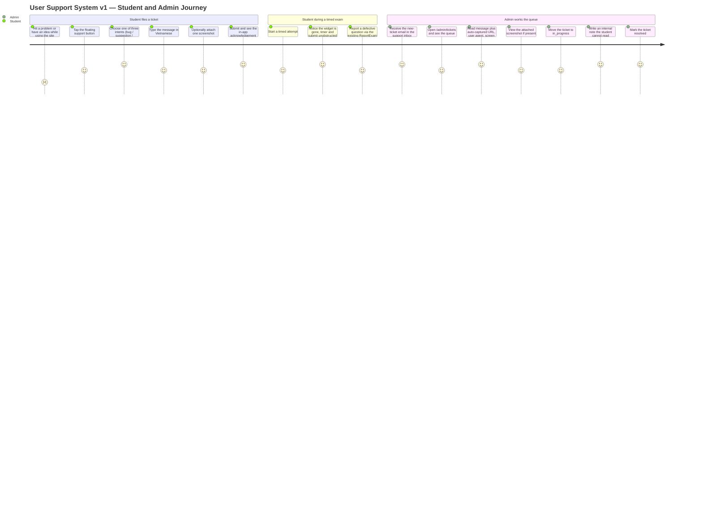
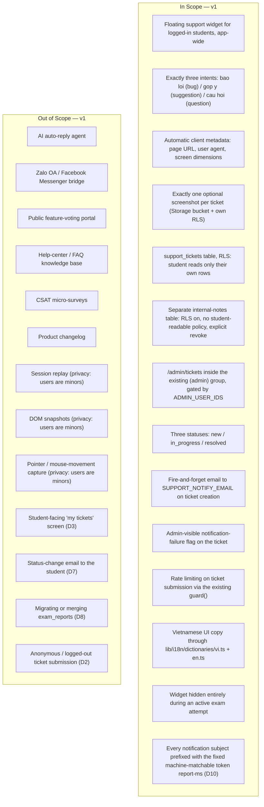

# PRD: User Support System v1

| | |
|---|---|
| **Version** | 1.2 |
| **Date** | 2026-08-09 |
| **Status** | Draft — ten product decisions locked with the engineer/product owner (D1–D10 below, not subject to re-litigation in this document). Ready for the downstream chain: PRD → UI Spec → ADR (email transport) → Design Doc → Work Plan. |
| **Scale** | LARGE — fullstack. Backend + frontend. New table pair + RLS + Storage bucket, one new student-facing widget mounted app-wide, one new admin route inside the existing `(admin)` group, one new outbound side effect (email), one new env variable. 26 affected files. ADR required. |

## Revision History

| Version | Date | Change |
|---|---|---|
| 1.0 | 2026-08-09 | Initial draft; nine product decisions locked with the engineer (D1–D9): widget hidden during an attempt, login required, no student read surface, notes in a separate table, fire-and-forget email, `SUPPORT_NOTIFY_EMAIL`, three statuses with no student status mail, `exam_reports` stays separate, Gmail as provider with the transport deferred to the ADR. R1–R15, AC-001–AC-042, 13 quantitative metrics. |
| 1.1 | 2026-08-09 | Additive update recording one new locked decision from the engineer: **D10** — every outbound notification email carries the literal ASCII token `report-ms` as a leading square-bracket prefix on its subject line, so the recipient can write a single deterministic Gmail filter that captures every support notification and nothing else. Added **R16** (Must tier) with **AC-043** (leading-prefix format), **AC-044** (byte-identical across `vi`/`en`, absent from the i18n dictionaries), **AC-045** (automated subject assertion so a later template edit cannot silently break the filter), and **AC-046** (every subject-composing code path, including the D5 failure-and-flag path, carries the prefix); added quantitative metric 14, one Risks row, one In-Scope node on the scope boundary diagram, one Dependencies note under i18n, and a Glossary entry. D9 and its blocking Undetermined Item remain unresolved and unchanged — D10 constrains message content only and applies unchanged to both transport branches. No existing decision, requirement, metric, or AC was changed, removed, or renumbered. |
| 1.2 | 2026-08-09 | Additive correction pass resolving a completed document review (verdict: approved with conditions). **Five blocking fixes.** (1) **AC-006** and **metric 8** narrowed: they asserted zero bounding-box intersection with the exam timer, the submit button, and `ExamPlayer`'s sticky cluster — elements that exist only on the `(exams)` attempt route, from which D1/AC-005 remove the widget entirely, so no page existed on which the assertion could run. Both now assert only what is testable: zero intersection with `BottomNav` plus safe-area respect, on pages where the widget renders. D1 and AC-005 are unchanged and carry the exam-route guarantee. (2) The **email-transport dependency** no longer asserts "Node runtime, not Edge" as a settled constraint — that is a property of the SMTP branch only (Gmail API over HTTPS runs on either), and runtime compatibility is a required *input* to the D9 ADR, not a conclusion of this PRD. (3) **Metric 12** was not computable: no status-change timestamp existed in the data model. **AC-016** now enumerates a first-status-transition timestamp, new **AC-047** requires it to be written when a ticket's status first leaves `new`, and metric 12 is restated as a per-ticket ceiling rather than a median (a median over metric 13's ≥ 5-ticket target carries no signal). (4) **Six false citations of ADR-0001 corrected** (R7, NFR > Security, Constraints, Dependencies, References, Glossary): ADR-0001 establishes that there is deliberately **no database admin role** — it says nothing about `ADMIN_USER_IDS` or an env allowlist, and `docs/adr/` contains no such decision anywhere. The env-allowlist model is attributed to its real source, `SOURCE/lib/auth/admin.ts` (with the applied pattern at `SOURCE/app/(admin)/admin/page.tsx:24-25`), and recorded as a currently undocumented implemented convention; a new Undetermined Item asks for it to be captured in an ADR, which can ride along with the D9 transport ADR. (5) v1.1's revision row now records **AC-046**, which existed in the body but was unlisted. **Twelve recommended fixes**, all accepted: distinguished the two `revoke` precedents and pinned the internal-notes table to `revoke all` (D4, R8, References); corrected the rate-limit task from "parameters passed to `guard()`" to "a new keyed entry in `RATE_LIMITS`" (R6, Dependencies, Undetermined Items); Undetermined preamble now reads D1–D10; metric 7's unfailable SQL half restated as a one-time schema assertion; new **AC-048** (non-admin authenticated session cannot INSERT an internal note) plus a matching Risks row; the "never varies by status" clause in D10/R16 marked as a forward constraint on any later notification rather than a v1 deliverable; an append-only ID note added at the head of the Must Have section; new **AC-049** giving R15's "short reference" a verifiable 1:1 server-derivable form, with an explicit drop condition; Performance/Reliability given numeric ceilings plus new **metric 15**, and an explicit statement that throughput/concurrency/availability targets are deliberately unset at v1 volume; **R12** reworded so ticket message, captured URL, and user agent render as escaped plain text and are explicitly **not** routed through the `RichText` / `rehype-katex` pipeline; **AC-022**'s per-ticket enumeration now includes the notification-failure flag, so a silent mail outage is visible without opening every ticket. No decision, requirement, metric, or AC was removed or renumbered; no ADR or other document was edited — this revision corrects only this PRD's own citations. |

## Overview

### One-line Summary

Give a logged-in student a floating widget that files one of three kinds of ticket — báo lỗi (bug), góp ý (suggestion), câu hỏi (question) — with technical context captured automatically and at most one optional screenshot; persist those tickets in Supabase where the student can read only their own; notify a single support inbox by email; and give the `ADMIN_USER_IDS` allowlist a page inside `(admin)` to move each ticket through `new → in_progress → resolved` and write internal notes the student can never read.

### Background

TrangNguyenDigi is an online exam-practice platform for Vietnamese THCS/THPT students. Today the product has exactly one inbound channel from a user, and it is not a support channel: `ReportExam.tsx` (`SOURCE/features/exams/components/ReportExam.tsx`) lets a logged-in user report a *published exam* as bad content, writing to `exam_reports`, which the `/admin` moderation page (`SOURCE/app/(admin)/admin/page.tsx`) drains into takedown/restore actions logged in `exam_moderation_log`. That is content moderation. It answers "this exam is wrong"; it cannot answer "the timer froze on my phone", "please add subject X", or "how do I see my old results".

Everything else a student might want to say has nowhere to go. There is no in-app way to report a defect, no way to ask a question, no way to propose anything, and consequently no record that any of it ever happened. For a solo-maintained product whose users are minors on mid-range Android devices over unstable mobile networks — exactly the population that hits device- and network-specific defects the engineer will never reproduce on a desktop — the absence of a report path is also the absence of the only realistic bug-detection instrument the project has.

This PRD defines the first version of that channel. It is deliberately a small subset of the source research. The requirement originates in an external market-research document ("CustomerService-Research-MS", not stored in this repository) describing enterprise customer-service architecture: the Zendesk/Intercom four-tier support model, a five-step feedback triage pipeline, and RICE prioritization of incoming requests. **v1 implements none of that machinery.** It implements the single narrow thing that has to exist before any of it is even meaningful: a durable, attributable, notified ticket. Numbers cited from that research appear in this document as external benchmarks only, never as targets for this product (see Success Criteria).

Two deliberate framings carry through the whole document:

- **The users are minors.** This is not a decoration on the privacy section — it is why several capabilities in the research document are excluded outright (session replay, DOM snapshots, pointer/mouse capture) rather than deferred, and why the screenshot upload path is treated as a content-moderation exposure rather than a convenience feature.
- **The maintainer is one person.** Success metrics must be things one engineer can actually observe with SQL over their own tables and a test suite. There is no ARR, no contract value, no support headcount, and no telephony data in this product, so no metric in this document depends on any of them.

### Locked Product Decisions (D1–D10)

These are accepted decisions, recorded here so downstream documents inherit them verbatim. They are not open alternatives and must not be presented as options in the UI Spec, ADR, or Design Doc.

| ID | Decision | Rationale |
|---|---|---|
| **D1** | The widget is **hidden entirely** during an active exam attempt on the `(exams)` attempt route. | The bottom of a 360px viewport is already fully claimed: `BottomNav` is `fixed inset-x-0 bottom-0 z-40` (`SOURCE/components/layout/BottomNav.tsx:55`) and `ExamPlayer`'s prev/next cluster is `max-md:sticky max-md:bottom-[calc(var(--bottom-nav-h)+env(safe-area-inset-bottom,0px))] max-md:z-20` (`SOURCE/features/exams/components/ExamPlayer.tsx:192`). A third floating affordance there would sit on top of exam controls during a timed attempt. Per-question defect reporting is already served by the existing `ReportExam.tsx` dialog writing to `exam_reports`. |
| **D2** | Submitting a ticket **requires login**. | Read-own RLS needs a user id to scope rows to. Separately, TD-013 (no rate limiting whatsoever for unauthenticated traffic — every existing guard keys on `user.id`) is an open, cost-blocked debt; an anonymous submit form would convert that debt into a direct spam path into the support Gmail inbox. |
| **D3** | **No student-facing "my tickets" screen in v1.** Read-own RLS is still enabled as a defensive measure. The student's only feedback is an in-app acknowledgement at submit time. | The screen is not needed to make the channel work, and shipping the RLS policy anyway costs nothing while guaranteeing that the first version of a read surface, whenever it lands, cannot leak across users. |
| **D4** | Internal admin notes live in a **separate table**, never as a column on the ticket row. | Postgres RLS filters *rows*, not *columns*. A note column on a row the student is permitted to `SELECT` would be readable by that student. The repository already has the pattern twice, in two forms (citation corrected in v1.2): `exam_moderation_log` (`SOURCE/supabase/schema.sql:1078-1093`) is RLS-enabled with **no policies at all** plus `revoke all ... from anon, authenticated` (`:1093`); `telemetry_log` (`:1361-1391`) is RLS-enabled with the narrower `revoke select, update, delete` (`:1385`) plus `revoke insert ... from anon` (`:1386`) and a `telemetry_insert_own` policy (`:1388-1391`), because that table takes inserts from the app as the signed-in user. Internal notes take the **`exam_moderation_log` form** — admin writes go through the service role and students need no insert path, so `revoke all` is both the stricter and the closer fit (R8, AC-048). |
| **D5** | Email delivery is **fire-and-forget**. The ticket row is committed first; a send failure is logged with full context and surfaced as an admin-visible flag on the ticket. The student always sees success. | A mail outage must never destroy a student's report. The report is the asset; the notification is a convenience for the maintainer. |
| **D6** | The notification recipient is a single environment variable, `SUPPORT_NOTIFY_EMAIL`, registered in `SOURCE/lib/env/checkEnv.ts`. | Follows the existing `GEMINI_API_KEY` precedent (`SOURCE/lib/env/checkEnv.ts:77-83`): an optional variable whose absence silently disables a slice of functionality must be *announced* at startup rather than failing quietly. |
| **D7** | Ticket statuses in v1 are exactly `new`, `in_progress`, `resolved`. **No status-change email to the student in v1.** | Three states are enough to run a one-person queue. Outbound mail to minors is a separate consent and deliverability problem that v1 does not take on. |
| **D8** | Exam reporting stays separate. `exam_reports` remains content moderation; `support_tickets` is product support. The ReportExam dialog's visual/scrim pattern is reused for consistency, but the data paths stay independent. **`exam_reports` is not migrated.** | The two have different lifecycles, different admin actions (takedown vs. triage), and different audiences. Merging them would couple a moderation queue to a support queue for a cosmetic gain. |
| **D9** | The email provider is **Gmail**. The runtime transport — Gmail SMTP with an App Password vs. Gmail API with an OAuth2 refresh token — is an **open decision deferred to the ADR**. | Both are viable and the trade-off (credential lifetime, revocation behavior, Edge/Node runtime constraints, dependency weight — the repository currently has no mail dependency at all) is a genuine multi-option technical comparison, which is what an ADR is for. Recorded in Undetermined Items with the design phase as its deadline. |
| **D10** | Every outbound notification email generated by the support system carries the literal ASCII token `report-ms` in its **subject line, as a leading prefix in square brackets** — e.g. `[report-ms] Báo lỗi mới — <ticket short id>`. The token sits at the very start of the subject, is byte-identical in every email, and never varies by intent, by status, or by locale. It is a **machine-matching contract, not display copy**: it is therefore **not** routed through `SOURCE/lib/i18n/dictionaries/vi.ts` / `en.ts`, is never localized or translated, and reads identically in the Vietnamese and the English locale. An automated test asserts its presence and position. | The support inbox is a general-purpose Gmail mailbox that also receives unrelated mail. A fixed token in first position lets the recipient write **one** deterministic Gmail filter/label rule that captures every support notification and nothing else — no per-intent rule, no rule to revisit when copy changes, no false positives from ordinary mail. Leading position also keeps the token visible in the truncated subject preview on a phone. Because the token is matched by a machine rather than read by a person, any localization or per-intent variation would silently break that filter — which is exactly why it is carved out of the i18n path that every other string in this feature follows (R11), and why an automated assertion guards it against a future edit to the subject template (R16, AC-045). **Independent of D9**: D10 constrains message *content* only and applies unchanged whether the ADR selects Gmail SMTP + App Password or Gmail API + OAuth2 with a refresh token. |

**Note on D10's "never varies by status" clause (added v1.2):** v1 emits exactly one class of notification — the new-ticket email to `SUPPORT_NOTIFY_EMAIL` (R10) — because D7 excludes status-change mail entirely. The invariance-across-status half of D10 therefore describes a message class that does not exist in v1. It is recorded as a **forward constraint**: if any later version adds a second notification (a status-change mail, a digest, an escalation), that message must carry the identical `[report-ms]` prefix, so the maintainer's single Gmail filter keeps capturing everything without revision. **No v1 acceptance criterion tests it**, and none can — AC-045 asserts invariance across the three intents and the two locales, which is the whole of what v1 can generate. The intent- and locale-invariance halves of D10 are v1 deliverables; the status half is not.

## User Stories

### Primary Users

- **Student (test-taker)** — the same authenticated user who already browses and takes exams (`user_profiles.role = 'student'` default). A minor, typically on a mid-range Android phone at ~360px viewport width, often on an unstable network. No new role is introduced.
- **Admin (maintainer)** — a user id present in the `ADMIN_USER_IDS` allowlist (`SOURCE/lib/auth/admin.ts`); the same allowlist that already gates `/admin`. Not a database role — ADR-0001 forbids one, though it does not define this allowlist (see R7). In practice this is one person, who is also the sole engineer.

Non-normative: no persona is added to `user_profiles`, and this feature reads no privileged database role.

### User Stories

```
As a student who hit a bug on my phone
I want to report it from wherever I am on the site, with the technical details filled in for me
So that the problem gets recorded without me having to explain what a browser or a screen size is
```

```
As a student with an idea for the site
I want to send a suggestion in the same place I would report a bug
So that I do not have to find a different channel or an email address to be heard
```

```
As a student who is confused about how something works
I want to ask a question from inside the app
So that I get an answer without leaving the site or asking in a group chat
```

```
As a student who cannot describe the problem in words
I want to attach one screenshot of what I am seeing
So that the person fixing it can see the actual screen instead of guessing
```

```
As a student in the middle of a timed exam
I want the support widget to be gone entirely
So that nothing floats over the timer or the submit button while I am racing the clock
```

```
As the maintainer
I want an email the moment a ticket arrives, and a page listing every ticket with its status
So that I find out about defects without polling the database, and can work the queue in order
```

```
As the maintainer whose support inbox also receives ordinary mail
I want every support notification to carry the same fixed marker at the front of its subject
So that one Gmail filter rule labels all of them and nothing else, no matter which kind of ticket arrived
```

```
As the maintainer
I want to write notes on a ticket that the student can never read
So that I can record triage reasoning, suspected causes, and internal decisions honestly
```

### Use Cases

1. **Report a bug**: A student on `/exams` taps the floating support button, picks "Báo lỗi", types what went wrong, and submits. The client attaches the page URL, user agent, and screen dimensions automatically. The student sees an in-app acknowledgement. A ticket row exists; an email lands in the support inbox.
2. **Send a suggestion**: The same flow with intent "Góp ý". No screenshot. Same acknowledgement.
3. **Ask a question**: The same flow with intent "Câu hỏi".
4. **Attach one screenshot**: A student picks "Báo lỗi", attaches a single image of the broken screen, and submits. The image is stored in a dedicated Storage bucket and is viewable by the admin from the ticket, not by other students.
5. **Attach a second screenshot**: The student tries to add another image after one is attached. The UI permits exactly one attachment — adding another replaces it or is refused; it never results in two images on one ticket.
6. **Widget hidden during an attempt**: A student starts a timed attempt on the `(exams)` attempt route. The floating widget is not rendered at all. Nothing overlaps the timer or the submit button, including at 360px width.
7. **Logged-out visitor**: A logged-out visitor never sees a submittable support form, and a direct submission attempt without a session is rejected server-side.
8. **Rapid repeat submission**: A student (or a script using that student's session) submits repeatedly in a short window. The rate limiter refuses beyond the configured ceiling with an actionable message, and no email is emitted for the refused attempts.
9. **Mail is down**: The support mailbox transport fails at submit time. The ticket is already committed; the student still sees success; the failure is logged with full context and the ticket carries an admin-visible flag saying its notification did not send.
10. **Admin triages a ticket**: An admin opens `/admin/tickets`, sees the queue, opens a ticket, reads the message and the auto-captured technical context, views the screenshot if present, changes the status to `in_progress`, and writes an internal note.
11. **Admin resolves**: The admin sets status `resolved`. No email is sent to the student (D7). The ticket remains in the list under its resolved status.
12. **Student cannot read internal notes**: A student who queries the API directly with their own session gets zero internal-note rows for any ticket, including their own.
13. **QA on a Preview deploy**: An engineer opens `/admin/tickets` on a Vercel Preview deployment and gets 404 because `ADMIN_USER_IDS` currently has Production scope only (TD-014). This is a known launch dependency, not a defect in this feature.

### User Journey Diagram



### Scope Boundary Diagram



## Functional Requirements

Terms used throughout: an **intent** is one of the three fixed ticket kinds; **technical metadata** is the auto-captured triple (page URL, user agent, screen dimensions); an **internal note** is admin-authored text stored in the separate notes table.

### Must Have (P1 — v1)

**Identifier convention:** requirement (`Rn`) and acceptance-criterion (`AC-nnn`) IDs are **append-only across revisions and are never renumbered**, so that downstream documents, tests, and review findings that cite an ID keep pointing at the same thing forever. A new requirement or criterion takes the next free number regardless of where it belongs in reading order. This is why **R16** appears after R12 inside the Must tier (added in v1.1, after R13–R15 already existed in lower tiers) and why **AC-043–AC-046** (v1.1) and **AC-047–AC-049** (v1.2) sit out of numeric sequence relative to the requirements they hang under. Out-of-sequence numbering is intentional, not an editing error.

- [ ] **R1 — Floating support widget, logged-in only, three fixed intents**: A floating affordance is available to a logged-in student across the site. Opening it presents exactly three intents — `báo lỗi` (bug), `góp ý` (suggestion), `câu hỏi` (question) — and a free-text message field. There is no fourth intent and no "other".
  - AC-001: Given a logged-in student on any page where the widget renders, when they open the widget, then exactly three intents are offered, labelled in Vietnamese as "Báo lỗi", "Góp ý", and "Câu hỏi".
  - AC-002: Given the widget is open, when the student submits without selecting an intent or with an empty/whitespace-only message, then the submission is refused with a visible, specific message and no ticket row is created.
  - AC-003: Given a logged-out visitor, when any page renders, then no submittable support form is presented to them.
  - AC-004: Given a submission request that carries no authenticated session, when it reaches the server, then it is rejected server-side and no ticket row is created (enforcement is server-side, never UI-only).

- [ ] **R2 — Widget hidden during an active exam attempt (D1)**: The widget is not rendered at all on the `(exams)` exam-attempt route while an attempt is in progress. It is hidden, not merely repositioned or made transparent.
  - AC-005: Given a student on the `(exams)` exam-attempt route during an active attempt, when the page renders, then no support widget element exists in the DOM.
  - AC-006: Given a viewport 360px wide on any page where the widget **does** render, when the page is rendered at that width, then the widget's interactive bounding box has **zero** bounding-box intersection with `BottomNav` (`fixed inset-x-0 bottom-0 z-40`, present app-wide on mobile — `SOURCE/components/layout/BottomNav.tsx:55`), and the widget's resting position respects `env(safe-area-inset-bottom)` so it is not pushed under the device's home indicator — verified by an automated viewport test at 360px asserting zero intersection. *Scope note (v1.2): this criterion deliberately says nothing about the exam timer, the submit button, or `ExamPlayer`'s sticky prev/next cluster. Those elements exist only on the `(exams)` attempt route, and D1/AC-005 require the widget to be absent from the DOM on exactly that route — so there is no page on which both operands exist and no assertion to make. AC-005 is the whole of the exam-route guarantee and is sufficient; the `ExamPlayer` measurements remain cited under D1 and in Dependencies as the **motivation** for hiding the widget, not as an overlap target.*
  - AC-007: Given a student who wants to report a defect in a specific question during an attempt, when they look for a channel, then the existing `ReportExam` dialog (writing to `exam_reports`) remains available and unchanged by this feature.

- [ ] **R3 — Automatic technical metadata capture**: On submit, the client attaches page URL, user agent, and screen dimensions to the ticket. The student is never asked to supply them and cannot be relied on to.
  - AC-008: Given a successful submission from any page, when the ticket row is inspected, then it carries a non-empty page URL, a non-empty user agent string, and screen dimensions (width and height in CSS pixels).
  - AC-009: Given the captured page URL, when the admin views the ticket, then the URL is the page the student was on at submit time, not the widget's own route or a static placeholder.
  - AC-010: Given metadata capture fails or a value is unavailable in the student's browser, when the ticket is submitted, then the ticket is still created with the remaining fields populated and the missing field recorded as absent — a metadata gap never blocks a report.

- [ ] **R4 — At most one optional screenshot**: A student may attach exactly zero or one image to a ticket. The image is stored in a dedicated Supabase Storage bucket with its own RLS, a server-enforced maximum size, and a server-enforced allowed-MIME-type list.
  - AC-011: Given the widget, when a student attaches an image and then attempts to attach a second one, then the ticket ends with exactly one image — the UI either replaces the first or refuses the second, and never produces two attachments on one ticket.
  - AC-012: Given a file that exceeds the configured maximum size or whose type is outside the allowed MIME list, when it is submitted, then it is rejected **server-side** with a specific message, and no object is written to the bucket.
  - AC-013: Given a stored screenshot, when a user who is not its author and not an admin requests it, then access is denied by the bucket's RLS — the screenshot is not readable by other students.
  - AC-014: Given a ticket with a screenshot, when an admin opens it on `/admin/tickets`, then the image renders through a path that treats it as untrusted user-uploaded content.

- [ ] **R5 — Ticket persistence with read-own RLS**: Tickets persist in a Supabase table with RLS enabled such that a student can read only their own tickets. This holds even though v1 ships no student-facing read surface (D3).
  - AC-015: Given student A and student B each with tickets, when student A queries the tickets table with their own session, then only student A's rows are returned and student B's rows are not.
  - AC-016: Given a submitted ticket, when it is inspected, then it records the author's user id, the intent, the message text, the technical metadata, the screenshot reference (or its absence), the status, the creation timestamp, the notification-failure flag (D5, AC-032), and a **first-status-transition timestamp** — the moment the ticket's status first left `new`, null for as long as it is still `new` (written per AC-047; the field metric 12 is computed from).
  - AC-017: Given the schema change, when it is applied, then it is expressible idempotently in `SOURCE/supabase/schema.sql` (create-if-not-exists / drop-policy-if-exists), consistent with the existing manual-DDL workflow.

- [ ] **R6 — Rate-limited submission**: Ticket submission is rate limited per authenticated user using the existing `guard()` from `SOURCE/lib/security/rateLimit.ts`, following the `reportExam` / `rateExam` / `submitExam` precedent. Mechanically this means **adding one new keyed entry to the `RATE_LIMITS` constant** (`SOURCE/lib/security/rateLimit.ts:102-107`) and calling `guard("<newKey>", userId)`: `guard(action, userId)` takes no limit or window arguments (signature at `:131-135`), it looks both up from `RATE_LIMITS[action]`. Choosing the ceiling and window for that entry is a Design Doc item (see Undetermined Items).
  - AC-018: Given a student who submits beyond the configured ceiling within the configured window, when the next submission arrives, then it is refused with an actionable message that tells the student they may retry later, and no ticket row is created.
  - AC-019: Given a refused (rate-limited) submission, when it is refused, then no notification email is emitted for it.
  - AC-020: Given a refused submission, when the refusal is shown, then the student's typed message and selected intent are preserved in the form so nothing has to be retyped.

- [ ] **R7 — Admin ticket page under `ADMIN_USER_IDS`**: A new page inside the existing `(admin)` route group lists tickets and lets an admin open one, change its status, and write internal notes. Authorization is the `ADMIN_USER_IDS` allowlist via `isAdminUserId` (`SOURCE/lib/auth/admin.ts`), applied exactly as `SOURCE/app/(admin)/admin/page.tsx:24-25` already applies it. That env-allowlist model is defined and justified in `SOURCE/lib/auth/admin.ts` itself (module header, lines 1-17: no shared secret, reuse of the existing Supabase session, revocation by removing the id and redeploying); it is **not** an ADR decision — ADR-0001 establishes only the complementary half, that there is deliberately **no database admin role** (`docs/adr/ADR-0001-ugc-content-lifecycle-and-rls-enforcement.md:24`, `:30`, `:70`, `:141`). See the Undetermined Item on capturing the allowlist model in an ADR.
  - AC-021: Given a signed-in user whose id is not in `ADMIN_USER_IDS`, when they navigate to the admin ticket page, then they receive `notFound()` (404) — the same fail-closed treatment `/admin` already uses, not a "forbidden" page.
  - AC-022: Given an admin, when they open the admin ticket page, then they see the ticket queue with, per ticket, the intent, the message, the technical metadata, the screenshot indicator, the current status, the creation time, and the notification-failure flag where set (AC-032) — the flag is visible **in the list**, without opening the ticket, so a silent mail outage is noticed rather than discovered one ticket at a time. Visual treatment of the flag is a UI Spec decision; its presence in the list is not.
  - AC-023: Given an admin viewing a ticket, when they change its status, then the new status persists and is visible on reload.
  - AC-024: Given `ADMIN_USER_IDS` is unset or empty, when the page is requested, then it 404s for everyone and the existing startup env report announces the misconfiguration (per `checkEnv.ts`), rather than failing silently.

- [ ] **R8 — Internal notes in a separate, student-unreadable table (D4)**: Internal notes are stored in their own table with RLS enabled, no policy readable by `authenticated`, and an explicit **`revoke all on <notes table> from anon, authenticated`**. The repository has two distinct precedents and this table follows the broader one: `exam_moderation_log` uses `revoke all from anon, authenticated` (`SOURCE/supabase/schema.sql:1093`) because nothing outside the service role ever touches it; `telemetry_log` uses the narrower `revoke select, update, delete from anon, authenticated` plus `revoke insert from anon` and a `telemetry_insert_own` policy (`:1385-1391`) precisely because the *app* must insert rows as the signed-in user. Internal notes are the `exam_moderation_log` shape, not the `telemetry_log` shape: admin note writes go through the service role, and a student has no insert path to preserve — so `revoke all` is the correct and stricter fit.
  - AC-025: Given a ticket with internal notes, when the ticket's author queries the notes table with their own session, then zero rows are returned (or access is denied) — for their own tickets as well as anyone else's.
  - AC-026: Given the schema, when it is inspected, then no internal-note text is stored as a column on any row that a student is permitted to `SELECT`.
  - AC-027: Given an admin writes a note, when it persists, then it records the note text, the authoring admin's user id, the ticket it belongs to, and a timestamp.
  - AC-048: Given an authenticated non-admin session (including the ticket's own author), when it attempts to `INSERT` a row into the internal-notes table directly, then the insert is denied — the table grants `authenticated` no insert path at all (no insert policy, covered by the `revoke all`) — verified by an RLS denial test that asserts the write fails and the table row count is unchanged. A student can neither read the notes on their ticket nor write one onto it.

- [ ] **R9 — Three statuses, no student status email (D7)**: A ticket's status is exactly one of `new`, `in_progress`, `resolved`. New tickets start at `new`. No email is sent to the student on any status change in v1.
  - AC-028: Given a newly created ticket, when it is inspected, then its status is `new`.
  - AC-029: Given any status transition attempt, when the target value is outside the set {`new`, `in_progress`, `resolved`}, then it is rejected at the database/server layer.
  - AC-030: Given any status change by an admin, when it is applied, then no email is sent to the student.
  - AC-047: Given a ticket whose status changes from `new` to any other value, when that transition is applied, then the ticket's first-status-transition timestamp (AC-016) is written with the time of that transition; and given any subsequent status change on the same ticket, when it is applied, then that timestamp is **not** overwritten — it records the first departure from `new` only, and remains null for a ticket still in `new`. This is the field metric 12 is computed from; without it, triage latency is not derivable from the ticket row.

- [ ] **R10 — Fire-and-forget notification email (D5, D6)**: On ticket creation, an email is sent to the address in `SUPPORT_NOTIFY_EMAIL`. The ticket row is committed **before** the send is attempted. A send failure never fails the submission.
  - AC-031: Given the mail transport throws, times out, or is unconfigured, when a student submits, then the ticket row is still committed and the student sees the success acknowledgement.
  - AC-032: Given a send failure, when it occurs, then it is logged with enough context to diagnose it (at minimum: ticket id, recipient, failure reason/error) and the ticket carries an admin-visible flag indicating its notification did not send.
  - AC-033: Given a successful send, when the admin reads the email, then it identifies the intent, the message, the technical metadata, and whether a screenshot is attached, and links to the ticket on the admin page.
  - AC-034: Given `SUPPORT_NOTIFY_EMAIL` is unset, when the app starts, then `checkEnv.ts` reports the variable as missing with its concrete consequence ("new-ticket notification is off; tickets are still saved and visible at the admin ticket page"), following the `GEMINI_API_KEY` precedent — and ticket submission continues to work.

- [ ] **R11 — Vietnamese UI copy through the dictionaries**: Every string the student sees in the widget — intent labels, field labels, helper text, validation errors, the submit acknowledgement, and the rate-limit message — is routed through `SOURCE/lib/i18n/dictionaries/vi.ts` with a matching `en.ts` entry, consistent with the existing `report.*` / `admin.*` key convention.
  - AC-035: Given the widget and the admin ticket page, when the code is inspected, then no student-facing or admin-facing display string is hard-coded in a component; every one resolves through the i18n dictionaries.
  - AC-036: Given `vi.ts` and `en.ts`, when compared, then every key added by this feature exists in both files.

- [ ] **R12 — Free-text treated as untrusted UGC on the admin render path**: The ticket message, the auto-captured page URL, and the user agent are user-controlled input authored by (or supplied by the device of) a minor, and are rendered to the admin. All three render as **escaped plain text** — React's default text interpolation with `white-space: pre-wrap`, no HTML parsing, no markdown parsing, no math parsing. They are explicitly **not** routed through `SOURCE/components/shared/RichText.tsx` or its `remark-gfm` / `remark-math` / `rehype-katex` pipeline. ADR-0002 is cited here for its **principle** — untrusted author text must be neutralized at the render boundary, and the render path is where the defense sits — and for its own plain-text precedent: the UGC author-review surface deliberately renders stem and choice text as plain text (`white-space: pre-wrap`, no markdown/HTML/LaTeX) rather than through `RichText` (ADR-0002 `:85-88`). ADR-0002's headline decision is a *markdown + KaTeX* pipeline for **published exam content**, which a support ticket is not: no requirement in this PRD asks for formatting, links, or math in a ticket message, and routing untrusted text from a minor through a markdown and KaTeX parser would import that pipeline's entire advisory surface (ADR-0002 `:27`) in exchange for nothing. The Design Doc must not introduce a `RichText` render for any support-ticket field.
  - AC-037: Given a ticket message containing HTML, script, or markup-like content, when it renders on the admin ticket page, then it is displayed as inert, escaped text — the markup is visible verbatim as characters, nothing executes, and nothing is interpreted as active content or as formatting.
  - AC-038: Given the auto-captured page URL and user agent, when they render on the admin page, then they are treated as untrusted strings on the same basis as the message body: escaped plain text, and — for the URL — never rendered as an auto-activated link built directly from the captured string.

- [ ] **R16 — Deterministic `report-ms` token on every notification subject (D10)**: Every notification email the support system emits has a subject line that begins with the literal ASCII prefix `[report-ms]` followed by a single space, then human-readable summary copy — e.g. `[report-ms] Báo lỗi mới — <ticket short id>`. The token resolves from a single non-localized constant in the mail module; it is **not** a dictionary key and is never passed through `SOURCE/lib/i18n/dictionaries/vi.ts` / `en.ts`, unlike every other string in this feature (R11). It is identical for all three intents, for every status, and under both locales, so the recipient's Gmail filter matches on one fixed rule. Only the token, its exact spelling, and its leading position are locked here; the wording that follows the prefix is a Design Doc / UI Spec detail. This requirement applies to whichever transport the ADR selects under D9. **Scope of "for every status" (v1.2):** v1 emits exactly one notification, the new-ticket mail (R10), because D7 excludes status-change mail; the across-status invariance is therefore a **forward constraint on any notification added later**, not a v1 deliverable, and **no v1 acceptance criterion tests it** — AC-045 asserts invariance across the three intents and the two locales, which is everything v1 can generate.
  - AC-043: Given any notification email emitted by the support system, for any of the three intents, when its subject line is inspected, then the subject begins at character position 0 with the exact literal `[report-ms]` followed by a single space — nothing (no locale marker, no sender label, no status word, no whitespace) precedes it.
  - AC-044: Given the same ticket with the app in the `vi` locale and in the `en` locale, when the two generated subject lines are compared, then their `[report-ms]` prefixes are byte-identical; and given `vi.ts` and `en.ts`, when they are inspected, then neither contains the token `report-ms` in any key or value — the prefix is supplied by a single constant outside the i18n path.
  - AC-045: Given the automated test suite, when it runs, then it contains an assertion over the generated subject line that fails if (a) the `[report-ms]` prefix is absent or not in leading position, or (b) the prefix differs between the `vi` and `en` locales or between the three intents — so a later edit to the subject template breaks the build instead of silently breaking the recipient's mail filter.
  - AC-046: Given every code path in the support system that composes an outbound notification — including a send that later fails and is logged and flagged per D5 — when the subject is composed, then it carries the same `[report-ms]` prefix; no code path composes a support notification subject without it.

### Should Have (P2)

- [ ] **R13 — Resilient submission feedback**: A failed submission (network drop, server error) never silently discards what the student typed, and the acknowledgement never claims success for a ticket that was not committed.
  - AC-039: Given a submission that fails before the ticket is committed, when the error returns, then the student sees an actionable, retryable message and their intent, message text, and attached screenshot selection are preserved.
  - AC-040: Given the acknowledgement is shown, when it is shown, then the ticket row has been committed — the success state is never optimistic.

- [ ] **R14 — Queue ordering and status visibility on the admin page**: The admin ticket list is ordered most-recent-first and makes each ticket's status distinguishable at a glance, so a one-person queue can be worked top-down without opening every row.
  - AC-041: Given multiple tickets, when the admin page renders, then they are ordered by creation time descending.
  - AC-042: Given tickets in different statuses, when the list renders, then each ticket's status is visible in the list without opening the ticket, and status is not conveyed by color alone.

### Could Have (P3)

- [ ] **R15 — Ticket reference shown in the acknowledgement**: The submit acknowledgement includes a short reference for the ticket, so a student who mentions it elsewhere (e.g. to a teacher) can be matched to a row. Convenience only; introduces no read surface and does not change D3.
  - AC-049: Given a committed ticket, when the acknowledgement displays its short reference, then that reference maps **1:1 to exactly one ticket row and is derivable on the server from that row alone** (for example a fixed-length prefix of the row's id, or a stored short-code column with a uniqueness constraint) — such that an admin given only the reference can locate the ticket with a single query, and no two tickets ever display the same reference. The reference is display-only: it grants no read access and is not accepted as an input anywhere (D3 unchanged). **Drop condition:** R15 is Could tier — if the Design Doc does not define that mapping, R15 ships **not at all** and the acknowledgement carries no reference. A reference that cannot be resolved back to a row is worse than none, because it invites a student to quote a string nobody can look up. Dropping R15 has no impact on any Must or Should requirement.

### Won't Have (this release)

Each exclusion below is a decision, not an oversight.

- **AI auto-reply agent** — v1 has no answer corpus to draw from and no volume to justify one; an unsupervised generative reply to a minor is also a risk this project is not taking on in its first support version.
- **Zalo OA / Facebook Messenger bridge** — each is a separate platform integration, review process, and inbound moderation surface. The in-app widget is the cheapest channel that reaches the same students.
- **Public feature-voting portal** — requires a public read surface for user-authored text written by minors, plus moderation of it. RICE-style prioritization from the research document is done offline by the maintainer in v1.
- **Help-center / FAQ knowledge base** — a content product with its own authoring and maintenance cost; nothing to seed it with until tickets reveal what students actually ask.
- **CSAT micro-surveys** — no status-change notification exists in v1 (D7), so there is no natural moment to survey, and a satisfaction score over a handful of tickets carries no signal.
- **Product changelog** — unrelated to the inbound channel; it is a publishing surface, not support.
- **Session replay** — **excluded on privacy grounds because the user base is minors.** Replay captures whatever appears on a minor's screen, indiscriminately and continuously, into third-party storage. The three metadata fields in R3 are the deliberate opposite: a fixed, minimal, enumerable set.
- **DOM snapshots** — **excluded on privacy grounds because the user base is minors.** A snapshot capture is unbounded: it takes whatever happens to be in the page at that moment, including content nobody decided to collect.
- **Pointer / mouse-movement capture** — **excluded on privacy grounds because the user base is minors.** Behavioral telemetry on minors is not collected for the convenience of debugging.
- **Student-facing "my tickets" screen** — D3. Read-own RLS ships anyway.
- **Status-change email to the student** — D7.
- **Migrating or merging `exam_reports`** — D8. It stays content moderation.
- **Anonymous / logged-out submission** — D2.

## Non-Functional Requirements

### Performance

- Submitting a ticket must not block on the email side effect: the student's acknowledgement is gated on the committed row, not on transport completion (D5, AC-031).
- The admin ticket list loads in a small, fixed number of batched queries per page load — no per-row round trip, no N+1 — consistent with the repository-wide convention of batched selects rather than PostgREST embedded joins.
- Screenshot upload happens over the same submission flow and must remain usable on an unstable mobile network: a failed upload surfaces as a specific, retryable error rather than an indefinite spinner (R13).
- **Timeout ceiling (v1.2).** The submit path — with or without a screenshot — is bounded by a client-side abort at **20 seconds**, after which the student sees the specific retryable error of R13/AC-039 with their intent, message, and attachment selection preserved. No path may spin indefinitely. The mechanism follows the existing `AbortSignal.timeout(TIMEOUT_MS)` convention in `SOURCE/lib/schema/checkSchemaVersion.ts:41,72`; only the value differs, because that 3 s ceiling guards a startup probe while this one guards a phone on a bad network uploading an image. The exact placement of the abort (whole submit vs. upload leg separately) is a Design Doc decision; the 20 s user-visible ceiling is not.
- **Acknowledgement latency, no-screenshot path (v1.2).** For a submission with no attachment, the acknowledgement appears within **2 seconds at p95**, measured by the maintainer on a mid-range Android device against Production, from submit tap to acknowledgement visible. This is a hand-measured target, not a monitored SLO — the project has no APM or RUM instrumentation and v1 adds none. It is stated so the Design Doc knows the email side effect must not sit on the acknowledgement path (D5, AC-031); the number is the budget that forces that.
- **Deliberately unset at v1 volume:** there is **no** throughput target, **no** concurrency target, and **no** availability/uptime target for this feature. At the volume metric 13 aims for (≥ 5 tickets in 30 days) any such figure would be fiction, and committing to one would import monitoring and on-call obligations a solo maintainer cannot honor. Absence here is a decision, not an omission; revisit if ticket volume reaches a rate where a queue backs up.
- Deployment region is `sin1`; no new region-crossing dependency is introduced beyond the Gmail transport chosen in the ADR.

### Reliability

- **The ticket is the durable asset; the email is not.** Ticket commit precedes send; send failure is logged and flagged, never propagated to the student (D5, AC-031/AC-032).
- A failed or refused submission preserves the student's input for retry (AC-020, AC-039).
- A metadata capture gap degrades gracefully: the ticket is still created (AC-010).
- Missing `SUPPORT_NOTIFY_EMAIL` disables notification only; submission continues to work and the gap is announced at startup (AC-034).
- Every failure mode terminates in a bounded time with a specific message: the 20 s submit ceiling above is what converts "the network died mid-upload" from an indefinite spinner into a retry the student can act on. No recovery path in this feature depends on the student waiting an unspecified amount of time.

### Security

- Submission requires an authenticated session, enforced server-side (D2, AC-004).
- Tickets are read-own via RLS (AC-015). Internal notes are unreadable **and unwritable** by students by construction — separate table, RLS enabled, no policy for `authenticated`, explicit `revoke all ... from anon, authenticated` following `exam_moderation_log` (`SOURCE/supabase/schema.sql:1093`), with admin writes going through the service role (D4, AC-025/AC-026/AC-048).
- Admin authorization is the `ADMIN_USER_IDS` allowlist, fail-closed with `notFound()` (AC-021). The allowlist model is defined in `SOURCE/lib/auth/admin.ts` (module header, lines 1-17) and applied at `SOURCE/app/(admin)/admin/page.tsx:24-25`; ADR-0001 supplies only the complementary constraint that no database admin role exists. The allowlist itself is an implemented convention that no ADR currently records — see Undetermined Items.
- Screenshot objects live in a dedicated bucket with their own RLS; a student cannot read another student's screenshot (AC-013). Size and MIME-type limits are enforced server-side, not only in the file picker (AC-012).
- Ticket message text, page URL, and user agent are untrusted user-controlled input on the admin render path and render as escaped plain text, explicitly outside the `RichText` / markdown / KaTeX pipeline, on ADR-0002's principle and its plain-text review-path precedent (R12).
- Submission is rate limited per authenticated user via the existing `guard()`, which requires adding one keyed entry to `RATE_LIMITS` (R6). Note the standing gap: `guard()` keys on `user.id`, so it does not and cannot constrain unauthenticated traffic (TD-013) — which is precisely why D2 requires login.
- Content-moderation exposure: because the uploaders are minors, whoever reads the admin queue may be shown arbitrary images and free text uploaded by a child, including material that is distressing or that must not be retained. The admin surface is a moderation position, not merely an inbox, and the retention/removal expectation for uploaded images must be settled in the Design Doc (see Undetermined Items).
- The notification email carries student-authored content into an external Gmail mailbox. That mailbox becomes a secondary store of minors' free-text input and must be treated with the same care as the database.

### Scalability

- Solo-maintained, low volume. No queue, worker, retry daemon, or background job is introduced. The email side effect stays a single in-request attempt whose failure is logged and flagged (D5).
- Schema changes are a single idempotent addition to `SOURCE/supabase/schema.sql`, applied manually in the Supabase SQL Editor, consistent with the existing workflow (AC-017).

### Accessibility (UI feature)

- Compliance standard: WCAG 2.1 AA (site default).
- The floating trigger and the whole form — intent selection, message field, screenshot attachment, submit, acknowledgement, and error states — are fully keyboard operable.
- The dialog follows the existing dialog precedent in `SOURCE/features/exams/components/ReportExam.tsx`: Escape closes, scrim click closes, focus moves into the dialog on open, and focus returns sensibly on close.
- Submit acknowledgement, validation errors, and the rate-limit message are announced to assistive technology (e.g. `aria-live`), and no state — including ticket status on the admin list — is conveyed by color alone (AC-042).
- The floating trigger meets the minimum touch-target size for a phone-first audience and, at 360px width, does not obscure page content or `BottomNav`'s tap targets, and clears `env(safe-area-inset-bottom)` (AC-006).
- Intent labels are meaningful text ("Báo lỗi", "Góp ý", "Câu hỏi"), not icon-only affordances.

## Success Criteria

The product is solo-maintained and pre-scale. Every metric below is something one engineer can observe with a test run or a SQL query over their own tables. Enterprise metrics from the source research (first-call resolution, cost per contact, ARR-weighted ticket value, support headcount utilization) are **not used**: this product has no telephony data, no contracts, and no support staff to measure them against.

**External benchmarks (context only, not targets for this product):** the Zendesk/Intercom four-tier support model, the five-step feedback triage pipeline, and RICE prioritization described in "CustomerService-Research-MS" are cited as industry reference architecture. Any figure quoted from that document is an external benchmark; v1 commits to none of them.

### Quantitative Metrics

1. **Login enforced server-side**: 100% of submission attempts carrying no authenticated session are rejected at the server layer with zero ticket rows created — measured by a server-action/RLS test that submits without a session and asserts zero rows (AC-004).
2. **Read-own isolation**: 0 rows of another student's tickets returned to any student session — measured by an RLS test with two seeded users asserting each sees only their own rows (AC-015).
3. **Internal notes unreadable**: 0 internal-note rows returned to a student session, including for tickets that student authored — measured by an RLS test that selects the notes table as the ticket's author and asserts zero rows or denial (AC-025).
4. **Ticket survives mail failure**: 100% of submissions commit their ticket row and return success when the mail transport is forced to fail — measured by a test that stubs the transport to throw and asserts (a) the row exists, (b) the student-visible result is success, (c) the failure flag is set (AC-031/AC-032).
5. **Metadata completeness**: ≥ 95% of tickets created in the first 30 days after launch carry a non-empty page URL, a non-empty user agent, and screen dimensions — measured by a `count(*)` SQL query over the tickets table filtering on those three columns (AC-008).
6. **Upload gate**: 100% of files above the configured size limit or outside the allowed MIME list are rejected server-side with zero objects written to the bucket — measured by an upload test exercising an oversize file and a disallowed type (AC-012).
7. **Single attachment invariant**: the tickets table expresses **at most one** attachment *structurally* — a single scalar screenshot-reference column, not an array, not a child table — asserted **once** when the schema is applied, plus a UI test that attaches a second image and asserts the ticket still ends with exactly one (AC-011). *(v1.2: the previous "0 tickets with more than one image, measured by SQL" formulation could not fail — a scalar column cannot hold two values, so the query was a tautology over the data model. The falsifiable assertions are the schema shape and the UI behavior; both are stated above.)*
8. **Widget non-overlap at 360px**: 0 pixels of bounding-box intersection between the widget's interactive area and `BottomNav` (`fixed inset-x-0 bottom-0 z-40`, app-wide on mobile), and a resting position that respects `env(safe-area-inset-bottom)`, at a 360px viewport width on every page where the widget renders — measured by an automated viewport test asserting zero intersection (AC-006). *(v1.2: narrowed in step with AC-006. The exam timer, submit button, and `ExamPlayer` sticky cluster are not operands here — they exist only on the `(exams)` attempt route, where D1/AC-005 remove the widget from the DOM entirely; metric 9 is that guarantee's measurement.)*
9. **Widget absent during an attempt**: 0 support-widget elements present in the DOM on the `(exams)` attempt route during an active attempt — measured by a rendering test asserting element absence, not merely `display: none` (AC-005).
10. **Rate limit effective**: submissions beyond the configured ceiling within the window are refused with an actionable message and emit no email — measured by a test that submits past the ceiling and asserts refusal plus zero send calls (AC-018/AC-019).
11. **Admin gate fail-closed**: 100% of requests to the admin ticket page from a non-allowlisted (or signed-out) user return 404 — measured by a route test with an allowlisted id, a non-allowlisted id, and no session (AC-021).
12. **Triage latency (per-ticket ceiling)**: **every** ticket created in the first 30 days leaves status `new` within **≤ 48 hours** of its `created_at` — i.e. the SQL query `select count(*) from <tickets> where first_status_transition_at is null and created_at < now() - interval '48 hours'` returns **0**, run over the tickets table alone using the first-status-transition timestamp of AC-016/AC-047. This is a maintainer-discipline metric at a solo-project cadence, not an enterprise SLA. *(v1.2: restated from a median to a per-ticket ceiling. Metric 13 targets ≥ 5 tickets in 30 days; a median over five values is a statistic with no meaning, and a per-ticket ceiling is what the maintainer can actually act on — one query, one number, and it names the offending rows. The old formulation also read the timestamp from "the earliest internal-note/status-change" event, which was not computable: the data model carried no status-change timestamp, and no requirement guarantees a note is written at first triage, so the note fallback was not equivalent. AC-047 supplies the field.)*
13. **Channel actually used**: at least 5 tickets submitted by distinct students within the first 30 days after launch — measured by `count(distinct user_id)` over the tickets table. This is the floor test for "the channel is discoverable at all"; below it, the widget's visibility, not the queue, is the thing to fix.
14. **Subject token contract holds**: 100% of notification subjects generated across all three intents and both locales begin with the exact literal `[report-ms]` plus a single space, with 0 byte-level differences in the prefix between `vi` and `en` — measured by the automated subject-line assertion in the mail-module test (AC-043/AC-044/AC-045). Operationally this is the one condition under which the maintainer's single Gmail filter captures every support notification and nothing else.
15. **Submit path is bounded**: 0 submit attempts that hang without resolution — every submission ends within **20 seconds** in either a committed ticket or the specific retryable error of AC-039, measured by a test that stalls the request past the ceiling and asserts the abort fires and the retryable error renders with the student's input preserved; and the no-screenshot path reaches its acknowledgement within **2 seconds at p95**, hand-measured by the maintainer on a mid-range Android device against Production (10 submissions, worst-of-ten reported). The latency half is a hand-measured target, not a monitored SLO — v1 adds no APM or RUM.

### Qualitative Metrics

1. A student who hits a bug can report it without leaving the page they are on and without being asked a single technical question.
2. A student in a timed exam is never obstructed by the support affordance, and still has the existing per-question report path.
3. The maintainer can diagnose a reported defect from the ticket alone — intent, message, page URL, user agent, screen size, and optional screenshot — without a follow-up conversation, in the common case.
4. The maintainer can record honest triage reasoning in internal notes with structural certainty that no student can read it.

### UI Quality Metrics

1. **Submission completion**: a student who opens the widget either commits a ticket or receives an actionable error with their intent, message, and attachment selection preserved — no dead ends, no silent failures, no optimistic success (AC-020, AC-039, AC-040).
2. **Error recovery**: 100% of failure paths exercised in testing (validation refusal, rate-limit refusal, oversize/disallowed upload, network failure, mail failure) present a specific, retryable, Vietnamese message routed through the dictionaries — none surfaces a raw error string or a generic "something went wrong" (AC-002, AC-012, AC-018, AC-034, AC-039).
3. **Accessibility audit**: 0 serious/critical issues on the widget (trigger, open dialog, all three intents, attachment control, acknowledgement, error states) and on the admin ticket page — automated audit (e.g. axe) plus a manual keyboard pass.

## Technical Considerations

Implementation detail belongs to the UI Spec / ADR / Design Doc. This section records what the PRD must acknowledge.

### Dependencies

- **Supabase (Postgres + RLS + Auth + Storage)** — the new tickets table and its read-own RLS; the separate internal-notes table following **`exam_moderation_log`** (`SOURCE/supabase/schema.sql:1078-1093`: RLS enabled, no policies at all, `revoke all ... from anon, authenticated` at `:1093`) rather than `telemetry_log` (`:1361-1391`: the narrower `revoke select, update, delete` plus `revoke insert ... from anon` and a `telemetry_insert_own` policy, because that table is written by the app as the signed-in user — which the notes table is not); the new Storage bucket and its `storage.objects` policies, following the existing `exam_images_*` / `exam_uploads_all` policy block (`SOURCE/supabase/schema.sql:365-437`) and the bucket-creation workflow in `SOURCE/supabase/setup-storage.ts`.
- **Admin authorization** — `SOURCE/lib/auth/admin.ts` (`isAdminUserId`, `hasAdminsConfigured`) and `SOURCE/lib/auth/getCurrentUser.ts`, used exactly as `SOURCE/app/(admin)/admin/page.tsx:24-25` already uses them (`notFound()` on failure). `admin.ts` is also the **defining source** of the env-allowlist model itself — its module header states why the gate is a list of user ids in a server env var rather than a shared password or a DB column, and its `adminIds()` helper is fail-closed (unset/empty ⇒ nobody is admin).
- **Existing admin surface** — `SOURCE/app/(admin)/admin/page.tsx`, `ModerationRow.tsx`, `actions.ts` are the structural precedent for the new ticket page; they are **not** modified to carry support tickets (D8).
- **Rate limiting** — `SOURCE/lib/security/rateLimit.ts` `guard()`, applied as in `SOURCE/features/authoring/actions.ts:995` (`reportExam`), `SOURCE/features/exams/actions.ts:74` (`submitExam`), `:210` (`rateExam`), and `SOURCE/features/auth/actions.ts:177` (`updateProfile`). The shared Upstash counter (`rateLimitStore.ts`) is already wired. The integration work is **one new keyed entry in the `RATE_LIMITS` constant** (`:102-107`, existing entries: `submitExam` 30/1h, `rateExam` 40/1h, `reportExam` 15/1h, `updateProfile` 20/1h) plus a `guard("<newKey>", userId)` call — the signature is `guard(action, userId)` (`:131-135`) and it reads `{ limit, windowMs }` from `RATE_LIMITS[action]`; no limit or window is passed at the call site.
- **Environment validation** — `SOURCE/lib/env/checkEnv.ts`: register `SUPPORT_NOTIFY_EMAIL` as an optional variable with a concrete stated consequence, following the `GEMINI_API_KEY` entry (`:77-83`). Add it to `.env.example`. Extend `SOURCE/lib/env/__tests__/checkEnv.test.ts` accordingly.
- **i18n** — `SOURCE/lib/i18n/dictionaries/vi.ts` and `en.ts`, plus `SOURCE/lib/i18n/client.ts` (`useT`) for the client widget and `SOURCE/lib/i18n/server.ts` (`getTranslate`) for the server-rendered admin page. Follow the existing flat-key convention (`report.*`, `admin.*`). **One deliberate exception**: the `[report-ms]` notification subject prefix (D10, R16) is a machine-matching contract and must **not** be added to these dictionaries or resolved through `useT` / `getTranslate`; it comes from a single constant in the mail module and is identical in both locales (AC-044). Only the human-readable remainder of the subject and the email body follow the i18n convention.
- **Dialog precedent** — `SOURCE/features/exams/components/ReportExam.tsx` (scrim, Escape-to-close, scrim-click-to-close, minimal focus trap, `aria-live` confirmation) is the interaction pattern the widget reuses (D8: visual pattern reused, data path independent).
- **Layout constraints** — `SOURCE/components/layout/BottomNav.tsx:51-55` (`fixed inset-x-0 bottom-0 z-40`, `--bottom-nav-h`) is the **AC-006 operand**: it is app-wide on mobile, so it coexists with the widget on every page the widget renders on. `SOURCE/features/exams/components/ExamPlayer.tsx:119` and `:192` (sticky header cluster `max-md:z-20`, sticky bottom control cluster `max-md:bottom-[calc(var(--bottom-nav-h)+env(safe-area-inset-bottom,0px))] max-md:z-20`) are cited as the **motivation for D1** — the reason the widget is removed from the attempt route — and are **not** AC-006 operands, since the widget is absent wherever they exist. Modals in this codebase sit at `z-50`.
- **Email transport — NOT YET SELECTED.** The repository currently has **no mail dependency** in `SOURCE/package.json`. Whichever Gmail transport the ADR selects (SMTP + App Password, or Gmail API + OAuth2 refresh token) introduces the first one, and with it a credential-rotation obligation and a runtime constraint **whose shape depends on the branch selected** — the two differ here, and this PRD does not pre-decide which applies. SMTP speaks a raw TCP protocol and cannot run on the Edge runtime; the Gmail API is HTTPS and can. Determining each branch's runtime compatibility with Vercel serverless in `sin1` is an **input the ADR must gather**, not a conclusion this PRD hands it. This is a blocking dependency for the Design Doc — see Undetermined Items.
- **Sanitization** — ADR-0002 (published-content rendering and sanitization) supplies the **principle** governing how the free-text message and captured strings render on the admin page, and the precedent for a plain-text surface (`:85-88`). Its `RichText` markdown + KaTeX pipeline itself is **not** used for support-ticket fields (R12).
- **ADR-0001** — establishes that this product has **no database admin role**, no `is_admin()` helper, and no admin RLS branch (`:24`, `:30`, `:141`), and that no product-level admin surface was built for UGC moderation (`:70`). The new page inherits that constraint and introduces no `role` column or check. ADR-0001 does **not** establish the `ADMIN_USER_IDS` env allowlist and never mentions it; that model is defined in `SOURCE/lib/auth/admin.ts` and applied at `SOURCE/app/(admin)/admin/page.tsx:24-25`. It is an **implemented convention that no ADR currently records** — `PROJECT_OVERVIEW.md:55` propagates the same loose "xem ADR-0001" attribution, and this PRD's v1.0/v1.1 text inherited it. Correcting those two files is out of this PRD's scope; capturing the allowlist model in an ADR is recorded as an Undetermined Item.

### Constraints

- DDL is applied manually by the engineer in the Supabase SQL Editor as a single idempotent `schema.sql`; there is no migration framework. The two new tables, their policies, the explicit `revoke`, and the Storage policies must all be idempotent (AC-017).
- Admin is an allowlist of user ids in an environment variable (`SOURCE/lib/auth/admin.ts`), not a database role. **No database-side policy may assume an admin role exists** — that half is ADR-0001's standing constraint (`:141`, "do not add an admin role, `is_admin()`, a cap trigger, or a role trigger"). Consequence for this feature: the internal-notes table cannot express "admins may read" as an RLS policy, because the database has no way to recognize an admin; admin reads and writes go through the service role, which bypasses RLS (D4, R8).
- `guard()` keys on `user.id` and therefore cannot constrain unauthenticated traffic at all (TD-013, cost-blocked behind a Vercel Pro plan). This is the structural reason D2 requires login and is not re-openable within v1.
- Vercel deployment region is `sin1`; the mail transport must be usable from that region within a serverless function's lifetime.
- The three intents are fixed constants. No configurable intent list, no admin-editable taxonomy.
- Exactly one screenshot per ticket. Not "one for now" — the data model in v1 expresses a single optional attachment.
- All student-facing copy is Vietnamese via `vi.ts` with a matching `en.ts` key.

### Assumptions

- Students will use a floating widget if it is visible on the pages they actually spend time on; if metric 13 (≥ 5 distinct submitters in 30 days) fails, the assumption to revisit is widget **discoverability**, not queue handling.
- A single support inbox is sufficient for v1 volume; there is no routing, assignment, or escalation tier.
- Page URL + user agent + screen dimensions are enough context to reproduce the majority of reported defects on this device population. If they are not, the next increment is more *enumerable* fields — never session replay or DOM snapshots (privacy exclusion above).
- The admin (the maintainer) reads the support inbox regularly enough that a single fire-and-forget email is an adequate alert; the admin-visible failure flag covers the case where it is not delivered.
- Ticket volume in v1 is low enough that an unpaginated, most-recent-first admin list remains workable. Pagination is a later concern.

### Risks and Mitigation

| Risk | Impact | Probability | Mitigation |
|---|---|---|---|
| Internal notes leak to the student they are about | High | Low | Separate table, RLS enabled, no policy for `authenticated`, explicit `revoke all ... from anon, authenticated` following `exam_moderation_log` (`schema.sql:1093`) rather than `telemetry_log`'s narrower revoke, which exists only because that table takes app-side inserts (D4, R8); RLS test asserts zero rows for the ticket's own author (metric 3) |
| A student writes *into* the internal-notes table — forging or defacing triage history on their own ticket, or planting content the maintainer will read as their own note | Medium | Low | `revoke all from anon, authenticated` leaves `authenticated` no insert path and no policy grants one; admin note writes go through the service role. RLS denial test asserts the insert fails and the row count is unchanged (R8, AC-048). Read protection alone (AC-025) would not have covered this — a table nobody can read is still a table anybody could have appended to |
| A student's report is destroyed by a mail outage | High | Medium | Ticket committed before send; send failure logged with full context and flagged on the ticket; student always sees success (D5, R10); forced-failure test (metric 4) |
| Free-text form + outbound email becomes a spam/abuse path | High | Medium | Login required (D2); `guard()` rate limit per user with no email emitted for refused submissions (R6, metric 10). Residual: unauthenticated flooding remains unaddressed (TD-013, cost-blocked) — login requirement is the compensating control |
| Screenshot upload exposes the admin reader to distressing or unlawful material uploaded by a minor | High | Low | Server-enforced MIME allowlist and size cap (AC-012); bucket RLS so no student sees another's image (AC-013); untrusted render path on the admin page (AC-014); the retention/removal path for an uploaded image is an open Design Doc item (see Undetermined Items) |
| Ticket message renders as active content on the admin page | High | Low | Treated as untrusted UGC per ADR-0002; inert-text rendering asserted (R12, AC-037/AC-038) |
| Widget overlaps the exam timer or submit button at 360px | High | Medium | Removed structurally rather than measured: the widget is not in the DOM on the attempt route at all, where those controls live (D1, AC-005, metric 9). Off that route the residual overlap risk is `BottomNav`, covered by the zero-intersection viewport test at 360px (AC-006, metric 8) |
| `/admin/tickets` cannot be QA'd on Preview | Medium | High (already true) | Known: `ADMIN_USER_IDS` has Production scope only (TD-014, re-confirmed 2026-08-07). Recorded as a **launch dependency**: re-add the variable for Preview scope using the dev-project admin UUID before this feature's admin surface is verified anywhere but Production |
| Notification silently off because `SUPPORT_NOTIFY_EMAIL` was never set | Medium | Medium | Registered in `checkEnv.ts` with a concrete stated consequence, following `GEMINI_API_KEY` (D6, AC-034); submission keeps working regardless |
| Email transport choice deferred too long and blocks implementation | Medium | Medium | Recorded as a blocking Undetermined Item with the design phase as its deadline (D9); the Design Doc cannot be completed without the ADR resolving it |
| Student-authored content accumulates in an external Gmail mailbox | Medium | Medium | Notification content and mailbox handling are called out under Security; the ADR's transport choice must state what the email body carries |
| A later edit to the subject copy drops or localizes the `report-ms` token, silently breaking the maintainer's Gmail filter so notifications stop being labelled and get missed | Medium | Medium | Token pinned to a single non-localized constant outside the i18n dictionaries and required in leading position (D10, R16, AC-043/AC-044); automated subject assertion fails the build on drift rather than failing in the mailbox (AC-045, metric 14) |
| Two inbound channels (`exam_reports` vs. `support_tickets`) confuse students into using the wrong one | Low | Medium | Distinct entry points and distinct copy: `ReportExam` stays attached to a specific exam during/after viewing it; the widget is general-purpose and absent during attempts (D1, D8) |

## Undetermined Items

Downstream questions. None re-opens D1–D10.

- [ ] **Email transport (BLOCKING — owner: ADR, deadline: design phase)**: Gmail is the provider (D9). Choose between Gmail SMTP with an App Password and the Gmail API with an OAuth2 refresh token. Required inputs for the decision: credential lifetime and revocation behavior for each, runtime compatibility with Vercel serverless in `sin1` (Node vs. Edge), the dependency each adds to a repository that currently has no mail package, and the failure modes each produces for D5's fire-and-forget logging. The Design Doc cannot be completed until this is decided. **Not an input to this decision**: D10's `[report-ms]` subject-token contract applies unchanged to both branches — it constrains the message content, not the transport — so the ADR must satisfy R16 whichever option it selects, and D10 must not be used as an argument for either.
- [ ] **Screenshot bucket policy specifics (owner: Design Doc)**: the exact maximum file size, the exact allowed MIME list, the bucket's public/private setting, the object path convention (and whether it encodes the ticket id or the user id, as `exam_images` encodes the exam id in the first path segment), and the admin read path (signed URL vs. service-role read).
- [ ] **Screenshot retention and removal (owner: Design Doc)**: whether and how an uploaded image can be deleted once reviewed, given that the uploaders are minors and the admin queue is a moderation position. Required input: whether deletion is admin-initiated only, and whether deleting a ticket deletes its object.
- [ ] **Rate-limit ceiling and window for ticket submission (owner: Design Doc)**: the key name and the `{ limit, windowMs }` pair for a **new entry added to the `RATE_LIMITS` constant** in `SOURCE/lib/security/rateLimit.ts:102-107` — not parameters passed at the call site, since `guard(action, userId)` (`:131-135`) accepts none and reads both from `RATE_LIMITS[action]`. Choose relative to `reportExam` (`{ limit: 15, windowMs: 60 * 60 * 1000 }`), the closest analogue: also a free-text report, also one-per-incident, also feeding a human queue. Plus the exact Vietnamese refusal copy.
- [ ] **Message length bound (owner: Design Doc / UI Spec)**: the maximum accepted length of the free-text message and where it is enforced (client hint + server/database check), following the `LIMITS` convention in `SOURCE/lib/ugc/limits.ts`.
- [ ] **Widget placement, z-index, and page allowlist (owner: UI Spec)**: the exact anchor position and `z-index` relative to `BottomNav` (`z-40`) and existing modals (`z-50`), the safe-area offset at 360px, and the definitive list of routes where the widget renders — with the `(exams)` attempt route excluded per D1.
- [ ] **Admin ticket page structure (owner: UI Spec)**: whether the queue is a list with expandable rows (mirroring `ModerationRow.tsx`) or a list plus a detail route, and how the notification-failure flag from D5 is surfaced in the list.
- [ ] **Table and column naming (owner: Design Doc)**: final names for the tickets and internal-notes tables and their columns, the status enum/check expression, the notification-failure flag's representation, and the first-status-transition timestamp column (AC-016/AC-047) including whether it is written by the status-update path in application code or by a database trigger.
- [ ] **The `ADMIN_USER_IDS` allowlist model is an undocumented convention (owner: ADR — non-blocking for this feature)**: admin authorization is an env allowlist checked by `isAdminUserId` (`SOURCE/lib/auth/admin.ts`, model and rationale in its module header; applied at `SOURCE/app/(admin)/admin/page.tsx:24-25`), but **no ADR records that decision** — a repo-wide search of `docs/adr/` for `ADMIN_USER_IDS` / `isAdminUserId` / any env-allowlist decision returns nothing. ADR-0001 is widely cited for it (by this PRD's v1.0/v1.1 text, corrected in v1.2, and by `PROJECT_OVERVIEW.md:55`) but establishes only the complementary "no database admin role". This feature **inherits** the existing model unchanged and is not blocked by the gap; recording it matters because the next surface added behind that gate will look for a decision record and find a false pointer. **Can ride along with the D9 transport ADR** — same document cycle, same owner, no additional review round. Required inputs if written: the rationale already in `admin.ts:1-17`, the fail-closed semantics of `hasAdminsConfigured()`, and TD-014 (the variable currently has Production scope only). Correcting `PROJECT_OVERVIEW.md:55` is out of this PRD's scope and is left to whoever writes that ADR.

*Resolve with the engineer/product owner until this section holds only downstream-owned items, then delete after confirmation.*

## Appendix

### References

- `SOURCE/supabase/schema.sql:1078-1093` (`exam_moderation_log`) — RLS enabled, **no policies at all**, `revoke all on ... from anon, authenticated` (`:1093`). This is the precedent the internal-notes table follows (D4, R8, AC-048). `:1361-1391` (`telemetry_log`) — the **narrower** variant: `revoke select, update, delete ... from anon, authenticated` (`:1385`) plus `revoke insert ... from anon` (`:1386`) and a `telemetry_insert_own` insert policy (`:1388-1391`), because that table is written by the app as the signed-in user. The internal-notes table has no such insert path and therefore takes the stricter `exam_moderation_log` form; both are cited so the Design Doc picks deliberately rather than by proximity.
- `SOURCE/supabase/schema.sql:365-437` — the `storage.objects` policy block (`exam_images_select`, `exam_images_write`, `exam_uploads_all`, `exam_images_update`, `exam_images_delete`) the screenshot bucket's RLS follows; `SOURCE/supabase/setup-storage.ts` — the bucket-creation workflow.
- `SOURCE/app/(admin)/admin/page.tsx` — the `getCurrentUser` + `isAdminUserId` + `notFound()` admin gate the new ticket page reuses; `ModerationRow.tsx` and `actions.ts` — the admin action precedent.
- `SOURCE/lib/auth/admin.ts` — `ADMIN_USER_IDS` allowlist parsing (`isAdminUserId`, `hasAdminsConfigured`) **and the defining statement of the env-allowlist authorization model itself** (module header, lines 1-17: why an env list of user ids rather than a shared password or a DB column; revocation = remove the id and redeploy; fail-closed when unset). This file, together with `SOURCE/app/(admin)/admin/page.tsx:24-25`, is the authority for that model — no ADR records it (see Undetermined Items).
- `SOURCE/lib/security/rateLimit.ts` — `guard()` / `checkRateLimit()`, including the header comment documenting exactly what it does and does not protect against.
- `SOURCE/lib/env/checkEnv.ts:77-83` — the `GEMINI_API_KEY` optional-variable precedent `SUPPORT_NOTIFY_EMAIL` follows (D6).
- `SOURCE/features/exams/components/ReportExam.tsx` — the dialog interaction pattern reused for the widget; the `exam_reports` write path that stays separate (D8).
- `SOURCE/components/layout/BottomNav.tsx:51-55` and `SOURCE/features/exams/components/ExamPlayer.tsx:119`, `:192` — the fixed/sticky bottom real estate that motivates D1 and AC-006.
- `SOURCE/lib/i18n/dictionaries/vi.ts`, `en.ts` — the flat-key dictionary convention (`report.*`, `admin.*`) the new `support.*` keys follow.
- `docs/adr/ADR-0001-ugc-content-lifecycle-and-rls-enforcement.md` — **no database admin role**: "without any admin role, admin RLS branch, `is_admin()` helper" (`:24`), "No admin anything" (`:30`), "No product-level admin surface is built" (`:70`), "Do **not** add an admin role" (`:141`). It does **not** mention `ADMIN_USER_IDS` or establish an env allowlist; that attribution (used in v1.0/v1.1 of this PRD and in `PROJECT_OVERVIEW.md:55`) is corrected in v1.2 — see `SOURCE/lib/auth/admin.ts` above.
- `docs/adr/ADR-0002-published-content-rendering-and-sanitization.md` — cited for the **principle** that untrusted author text is neutralized at the render boundary, and for its plain-text precedent on the author-review surface (`:85-88`). Its headline `RichText` markdown + KaTeX pipeline governs **published exam content** and is deliberately not used for support-ticket fields (R12); the KaTeX advisory surface it documents (`:27`) is the reason.
- `TECH-DEBT.md` — TD-013 (no rate limiting for unauthenticated traffic; cost-blocked behind Vercel Pro) and TD-014 (`ADMIN_USER_IDS` lost Preview scope; `/admin` 404s on every Preview deploy).
- `docs/prd/rating-system-prd.md`, `docs/prd/history-prd.md` — sibling PRDs; format and detail-level reference.
- "CustomerService-Research-MS" (external market-research document, not stored in this repository) — the source of the requirement; the origin of the Zendesk/Intercom four-tier model, the five-step feedback triage pipeline, and RICE prioritization cited here **as external benchmarks only**.

### Glossary

- **Intent**: one of the three fixed ticket kinds — `báo lỗi` (bug), `góp ý` (suggestion), `câu hỏi` (question). Fixed constants; not configurable.
- **Ticket**: one student-submitted support record: author, intent, message, technical metadata, optional screenshot reference, status, timestamps.
- **Technical metadata**: the auto-captured triple attached at submit time — page URL, user agent, screen dimensions. Deliberately a small, enumerable set (contrast with the excluded session replay / DOM snapshot / pointer capture).
- **Internal note**: admin-authored text attached to a ticket, stored in a separate table with no student-readable policy (D4). Structurally unreadable by students, not merely hidden in the UI.
- **Status**: exactly one of `new`, `in_progress`, `resolved` (D7).
- **Fire-and-forget**: the ticket row is committed before the notification send is attempted; a send failure is logged and flagged for the admin and never changes what the student sees (D5).
- **Notification-failure flag**: the admin-visible marker on a ticket whose notification email did not send (D5, AC-032).
- **`report-ms` token**: the literal ASCII string `report-ms`, carried in square brackets as the leading prefix of every support notification email's subject line — `[report-ms] …` (D10, R16). A machine-matching contract for the recipient's single Gmail filter rule, not display copy: never localized, never translated, never varied by intent, and deliberately outside the i18n dictionaries that carry every other string in this feature. Invariance across *status* is a forward constraint on any notification a later version adds — v1 emits only the new-ticket mail (D7), so no v1 criterion tests it.
- **Read-own RLS**: a Postgres row-level-security policy restricting `SELECT` to rows whose owner is `auth.uid()`. Enabled for tickets in v1 even though no student read surface ships (D3).
- **`ADMIN_USER_IDS`**: the environment-variable allowlist of admin user ids, parsed and checked by `SOURCE/lib/auth/admin.ts` (`isAdminUserId`, `hasAdminsConfigured`) and applied at `SOURCE/app/(admin)/admin/page.tsx:24-25`. Not a database role — ADR-0001 forbids one (`:141`), but does not itself define this allowlist; the model lives in `admin.ts`'s module header and is not yet captured in any ADR (see Undetermined Items). Fail-closed: unset or empty means nobody is an admin. Currently scoped to Production only (TD-014).
- **External benchmark**: a figure or model quoted from the source research document for context. Never a target for this product.
