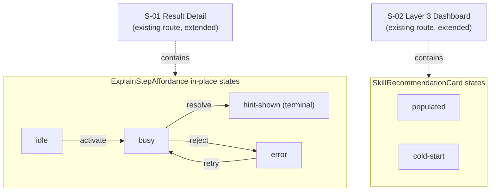

# Engine 1: Adaptive AI & Feedback (Sprint 1) — UI Specification

| | |
|---|---|
| **Version** | 1.0 |
| **Date** | 2026-08-08 |
| **Status** | Draft — resolves U1 (trigger contract) and U4 (recommendation placement) for the downstream chain: UI Spec → ADR (U2, mastery write trust boundary) → Design Doc (S9) → Work Plan. |
| **PRD** | `docs/prd/engine1-adaptive-ai-prd.md` (v1.0, 2026-08-08) |

## Overview

This UI Specification covers the two UI-relevant requirements of the Engine 1 PRD: **R7** — the "Explain this step" tutor affordance inside the existing exam-review flow, and **R10** — the "what to practise next" recommendation surface on the Layer 3 dashboard. Both are additive extensions of existing, shipped pages — `ResultDetailPage` (`SOURCE/app/(layer2)/exams/[id]/attempt/[attemptId]/result/detail/page.tsx`) and the Layer 3 dashboard (`SOURCE/app/(layer3)/me/dashboard/page.tsx`) — not new routes. No prototype code was provided for this feature; this document is derived from the PRD's acceptance criteria, direct inspection of the two host pages and the project's nearest interaction-pattern precedents (`usePdfAction`/`ActionButton`, `ReportExam`, `RichText`), and this UI Spec's own resolution of the PRD's two UI-owned open items (U1, U4). All backend contracts named below (Server Action shapes, query functions, table/column names) are the **UI-facing data contract only** — the mechanism that produces them is explicitly deferred to the Design Doc (S9) and, for the mastery write path, to the ADR required by U2. This document does not design those mechanisms.

### Target PRD

- PRD path: `docs/prd/engine1-adaptive-ai-prd.md`
- Feature scope covered by this document: R7 ("Explain this step" affordance, AC-023–027, plus the UI-layer half of AC-018/019/020/021/029) and R10 (recommendation surface, AC-031, plus the UI-layer half of AC-028). R1–R6, R8's non-UI half, R9, R11, R12, and the mastery-write trust boundary (U2) are backend/content concerns and are out of this document's scope — they are referenced only where they determine what data the UI needs.

### Design Source

| Source | Path | Version |
|--------|------|---------|
| Host page 1 (R7) — shipped production code | `SOURCE/app/(layer2)/exams/[id]/attempt/[attemptId]/result/detail/page.tsx` | repo branch `chore/td005-td008-td012`, read 2026-08-08 |
| Host page 2 (R10) — shipped production code | `SOURCE/app/(layer3)/me/dashboard/page.tsx`, `_components/AnalyticsDashboard.tsx`, `_components/BarChartCard.tsx` | Same |
| Async-action state-machine precedent | `SOURCE/components/history/usePdfAction.ts`, `SOURCE/components/history/ActionButton.tsx` | Same |
| Sanitized-render precedent (UGC-derived text) | `SOURCE/components/shared/RichText.tsx` | Same |
| Reusable card primitive | `SOURCE/components/layout/BentoGrid.tsx` (`BentoCell`) | Same |
| Theme tokens | `SOURCE/app/globals.css` ("Ink & Lacquer" / "Mực & Sơn Mài", single theme, sole source of truth since `DESIGN.md` was deleted 2026-08-06 — see `docs/project-context/external-resources.md`) | Same |
| Mobile-responsive conventions | `docs/plans/mobile-responsive-layout-plan.md`, `SOURCE/components/layout/BottomNav.tsx` | Same |

## Prototype Management

No prototype code was provided for this feature — the engineer explicitly delegated interaction-pattern selection to this UI Spec, to be resolved from in-repo precedent rather than a mockup. Per "Prototype is reference, not source of truth," this document cites **in-repo shipped code** as the behavioral precedent (exact paths above), which is a stronger reference than a prototype since it is the live production pattern already exercising the same accessibility/security constraints this feature must satisfy.

- **Attachment path**: N/A — no prototype artifact exists; nothing is copied to `docs/ui-spec/assets/`.
- **Version identification**: repo branch `chore/td005-td008-td012`, files read 2026-08-08 (see Design Source table for exact paths).
- **Compliance premise**: reuse of the `usePdfAction`/`ActionButton` busy/error state-machine shape (AC-025), reuse of `RichText`'s hardened sanitize pipeline for model-generated text derived from UGC (AC-018/019 defense-in-depth), reuse of `BentoCell` as the project's card primitive (see D2 below). No competing pattern is invented.
- **Relationship to canonical spec**: this document is canonical. Where the cited precedents do not fully determine a design choice (e.g., whether the hint panel is boxed, whether the tutor button survives past the hint-shown state), this document makes and records the decision (see Decisions Record).

## External Resources Used

Project-tier facts are recorded in `docs/project-context/external-resources.md` (last updated 2026-08-08; no environment change occurred for this feature, so hearing was not re-run). Feature-specific subset:

| Resource (project-tier label) | Feature-specific identifier | Notes |
|-------------------------------|-----------------------------|-------|
| Design Origin | `SOURCE/app/globals.css` — `--radius` vs `--radius-card` token separation; `--brand` vs `--brand-on-dark` surface rule | Governs the button/panel radius split (D2) and forbids `--brand` on the dark `BottomNav`/navbar surfaces this feature's chrome may render near |
| Design System | `SOURCE/components/ui/button.tsx`, `tooltip.tsx`; `SOURCE/components/history/usePdfAction.ts` + `ActionButton.tsx` (state-machine precedent); `SOURCE/components/shared/RichText.tsx` (sanitized render); `SOURCE/components/layout/BentoGrid.tsx` (`BentoCell`, reused as the card primitive — see D2) | This feature reuses all of the above; introduces two new components (`ExplainStepAffordance`, `SkillRecommendationCard`) and one new hook (`useTutorAction`) |
| Visual Verification Environment | Routes `/exams/[id]/attempt/[attemptId]/result/detail` (requires an attempt with `hasBeenWrongTwice: true` on at least one question — test data seeding is a Design Doc/Work Plan concern) and `/me/dashboard`; Playwright MCP `playwright`; `npm run dev` | No automated axe/a11y tooling exists in `package.json` today (see Open Items TBD-06) |

## Decisions Record

### D1 — U1 resolution: "wrong twice" trigger and its UI-facing data contract

**Decision**: "Wrong twice" means the same question answered incorrectly on **two separate scored (submitted) attempts** — mirroring PRD A4, not twice within one in-progress attempt (which the current scoring model cannot observe, per the PRD's own note on §10b's claim-then-close design). The UI's contract for this is a single boolean delivered per per-question result:

```ts
// Extension to SOURCE/types/result.ts — PerQuestionResult
interface PerQuestionResult {
  // ...existing fields (questionId, selected, correct, isCorrect, scored)
  /** UI-facing only. True when this question was scored incorrect on this
   *  attempt AND on at least one other separate scored attempt by the same
   *  user. Computed server-side; the query/join that produces it is a
   *  Design Doc (S9) concern, not designed here. Absent/false = affordance
   *  does not render (fail-closed, satisfies AC-024). */
  hasBeenWrongTwice?: boolean;
}
```

**Rationale**: `ResultDetailPage`'s current `getResult()` has zero visibility into a student's other attempts (confirmed by inspection — `queries.ts`'s `getResult(attemptId)` is scoped to a single attempt row). Rather than the UI Spec inventing a cross-attempt query, this document fixes only the **shape** the page needs (a boolean already resolved to "twice, across attempts") and defers "how" to S9. The boolean is only meaningful when `r.scored !== false && r.isCorrect === false` — a question that is currently correct or not-scored cannot be "wrong twice" in the sense this feature cares about, so `hasBeenWrongTwice` should never be `true` on a row where those two conditions don't hold; the UI does not additionally re-derive this (single source of truth is the server-computed flag).

**Security note (non-blocking, flagged for Design Doc)**: the UI's conditional rendering of the affordance based on this flag is a **display convenience only**. The Server Action that actually invokes the tutor (D4, out of this document's scope) must independently re-verify the wrong-twice condition and attempt ownership server-side before calling Gemini — this UI Spec does not claim client-side gating is a security boundary.

### D2 — Component inventory: reuse `BentoCell`, introduce no new Card primitive

**Decision**: This feature introduces **zero** new shared Card/disclosure primitive. Both new surfaces (the tutor hint panel, the skill recommendation card) reuse `BentoCell` (`SOURCE/components/layout/BentoGrid.tsx`) for their boxed/card states, and the recommendation card's "why this skill" disclosure uses the native HTML `<details>`/`<summary>` element (zero new dependency, keyboard-operable and screen-reader-exposed by default, and already an existing in-repo pattern — see rationale below).

**Rationale**: the codebase's hand-rolled `border-border bg-card rounded-* border p-*` card pattern already repeats well past the Rule-of-Three threshold (`BarChartCard`, `DonutChartCard`, `AnalyticsDashboard`'s empty-state panel, `ScoreCard`, `RatingRubric` — 5+ instances found by direct search) — but one of those repetitions, `BentoCell`, is already a **generalized, exported, currently-consumed** primitive (used today by `app/(layer2)/exams/[id]/page.tsx`) that encodes exactly the token-correct shape this feature needs: `border-border bg-card flex flex-col rounded-[var(--radius-card)] border p-5`, using `--radius-card` (the content-card token family) rather than `--radius` (the button/input family), matching the project's own token-separation rule. Adding a *second*, differently-named Card component that produces the same visual output would itself be a Rule-of-Three violation the moment a third feature needed a card. `BentoCell`'s `span` prop defaults to `"half"` (`sm:col-span-6`), which assumes a `BentoGrid` parent; both new surfaces here have no such parent and must pass `span="full"` explicitly to render at their container's full available width. `BentoCell` does not otherwise require its parent to be a `BentoGrid` — it is usable as a standalone boxed container once `span` is set correctly.

### D3 — U4 resolution: recommendation surface placement on the Layer 3 dashboard

**Decision**: `SkillRecommendationCard` renders as a **new, standalone section between `PageHeader` and `AnalyticsDashboard`** in `SOURCE/app/(layer3)/me/dashboard/page.tsx` — above the existing subject tab system, always visible, independent of the tab (`bar`/`donut`) and range (`week`/`month`/`all`) state `AnalyticsDashboard` owns. It is fetched and rendered server-side (no client state needed beyond the native `<details>` disclosure), fed by a new server-side data fetch parallel to `getAnalyticsByRange()`.

**Rationale**: R10 is explicitly additive/parallel to the subject view (PRD, Technical Considerations) — mastery-per-skill and correct/total-per-subject are different axes and must not appear to change when the user switches `AnalyticsDashboard`'s tab or range, which rules out mounting the recommendation inside `AnalyticsDashboard`'s own state tree. Placing it *before* the tab system (rather than after) matches the PRD's Success Criteria framing — "what to practise next" is the more actionable, higher-priority read than the historical subject breakdown beneath it — and keeps DOM order equal to intended reading order (no `order-*` use, consistent with the shipped mobile-responsive rule).

### D4 — Tutor hint text renders through `RichText`, never a new path

**Decision**: the tutor's Gemini-generated Vietnamese hint text renders through the existing `RichText` component (`SOURCE/components/shared/RichText.tsx`) — the same hardened remark/rehype-sanitize pipeline already used for question/choice content.

**Rationale**: the hint is derived from the question content, which is UGC and therefore attacker-influenced (PRD risk R-h). Rendering model output through an unsanitized path (e.g., raw `dangerouslySetInnerHTML` or plain-text-only display that later gets upgraded to markdown without the same schema) would open an output-side XSS/markdown-injection gap distinct from — and not covered by — the PRD's D3 input-side containment (which only keeps `correct_answer` out of the *prompt*, not the model's *output* out of the DOM). This is stated as a UI Spec requirement, not left implicit: **any implementation that renders the tutor's hint text outside `RichText` (or an equivalently sanitized markdown+KaTeX pipeline sharing `RichText`'s `SANITIZE_SCHEMA`) does not satisfy this UI Spec.**

### D5 — Single-turn, ephemeral hint: no persisted re-display, no second invocation

**Decision**: once a hint is shown for a question (`hint-shown` state, below), `ExplainStepAffordance` does not offer a way to invoke the tutor again for that question in the same render — the button is replaced by a static (non-interactive) hint panel. On page reload, the hint is **not** re-displayed from any stored value; if `hasBeenWrongTwice` is still `true`, the affordance resets to `idle` and a fresh invocation would call the tutor again.

**Rationale**: R11 (follow-up turns) is explicitly Won't Have — a persistent re-invoke control would visually imply multi-turn capability that doesn't exist. No PRD requirement asks for the hint text itself to be stored for re-display (only `telemetry_log` records that the *event* happened, not the hint's content, per R4/AC-012/013), so persistence is not designed here. This has a real repeated-cost implication (a student who reloads the page and clicks again re-invokes the tutor, consuming another Gemini call under the same per-user rate limit, R-c) — flagged as **TBD-01** in Open Items, since resolving it (e.g., storing the hint or disabling re-invocation across reloads) touches the schema/telemetry design that is out of this document's scope.

### D6 — Recommendation data contract: skill label + a closed reason-code enum

**Decision**: the UI's contract for R10 is:

```ts
// New — shape only, file location/query mechanism is a Design Doc (S9) concern.
type SkillRecommendation =
  | {
      skillLabel: string; // Vietnamese curriculum label, e.g. "Lũy thừa"
      reasonCode: "prerequisite-gate" | "lowest-mastery" | "recently-wrong";
    }
  | null; // null = cold start, no defined recommendation yet (AC-028)
```

**Rationale**: PRD Qualitative Metric #2 requires "a student can see why they were sent to a prerequisite instead of the topic they failed" — this needs *some* reason signal from the routing heuristic (R5), not just a skill name. A closed enum (rather than free text) keeps the reason translatable through the i18n dictionary (AC-027's bilingual-chrome requirement) instead of requiring the backend to produce pre-localized strings. The three values map directly to R5's own described behaviors (blocked-by-prerequisite routing, plain lowest-mastery selection, recently-wrong tie-break) — no new backend concept is invented, only a UI-facing label for concepts R5 already defines. `null` is the explicit, honest cold-start signal (AC-028) — the UI never fabricates a recommendation from an empty state.

## AC Traceability

| AC ID | AC Summary (EARS) | Screen / Component | State |
|-------|--------------------|---------------------|-------|
| AC-023 | When a per-question result has `hasBeenWrongTwice === true`, the system shall render the "Explain this step" affordance on that question. | S-01, `ExplainStepAffordance` | idle |
| AC-024 | When a per-question result has `hasBeenWrongTwice` false or absent, the system shall not render the affordance. | S-01, `ExplainStepAffordance` mount guard | not rendered |
| AC-025 | When the affordance is activated, the system shall show a busy state, prevent double-triggering, and announce the state change to assistive technology. | S-01, `ExplainStepAffordance` | busy |
| AC-026 | When the affordance and its hint are navigated by keyboard alone, every interactive element shall be reachable with a visible focus indicator, and no state shall be conveyed by color alone. | S-01, `ExplainStepAffordance` | idle / busy / hint-shown / error |
| AC-027 | When the site's language toggle is English, the affordance's label and surrounding chrome shall come from the i18n dictionaries; the tutor's own hint text remains Vietnamese. | S-01, `ExplainStepAffordance` | all |
| AC-018/019 (UI-layer defense-in-depth) | The affordance's rendered output shall never include `correct_answer`/`sub_answers`/`essay_answer`-sourced text — enforced structurally by the component's prop type carrying no such field. | S-01, `ExplainStepAffordance` | all |
| AC-020 (UI rendering half) | The hint response shall render as Vietnamese Socratic text through `RichText`'s sanitized pipeline, never a competing unsanitized path. | S-01, `ExplainStepAffordance` | hint-shown |
| AC-021 | When a tutor call fails, the student shall see an actionable, retryable message, and the result page shall remain fully usable. | S-01, `ExplainStepAffordance` | error |
| AC-029 | When a question has no skill tag, the affordance shall still function (it needs question content, not a skill tag). | S-01, `ExplainStepAffordance` mount guard | idle (independent of skill tag) |
| AC-028 | When a user has zero mastery rows, routing shall return a defined result the UI can render honestly (a designated entry recommendation, or an explicit "not enough data yet" state) — never a crash or empty screen. | S-02, `SkillRecommendationCard` | cold-start |
| AC-031 | When a student with mastery data opens the dashboard, the recommended next skill shall be shown with its Vietnamese label. | S-02, `SkillRecommendationCard` | populated |

## Screen List and Transitions

### Screen List

| Screen ID | Screen Name | Route | Description | Entry Condition |
|-----------|------------|-------|-------------|-----------------|
| S-01 | Result Detail | `/exams/[id]/attempt/[attemptId]/result/detail` | Existing per-question review page. **Modified**: each scored `<li>` (mcq or short_answer sub-branch) gains a conditionally-rendered `ExplainStepAffordance` when `hasBeenWrongTwice === true`. | Click "View details" on the result summary page, or direct URL to an owned, submitted attempt (unchanged, pre-existing). |
| S-02 | Layer 3 Dashboard | `/me/dashboard` | Existing analytics page. **Modified**: gains a new `SkillRecommendationCard` section between the page header and the existing subject tab system. | Existing "Analytics" nav item / `BottomNav` entry (unchanged, pre-existing). |

No new screen or route is introduced by this feature.

### Transition Conditions

| Source | Destination | Trigger | Guard Condition |
|--------|------------|---------|-----------------|
| S-01 (idle) | S-01 (busy) | Click/Enter/Space on "Explain this step" | `busyRef` guard prevents re-entry while already busy (AC-025). |
| S-01 (busy) | S-01 (hint-shown) | Tutor Server Action resolves with a hint | Terminal for this render — no further invocation for the same question (D5). |
| S-01 (busy) | S-01 (error) | Tutor Server Action rejects/times out (Gemini 503/429, or any failure) | — |
| S-01 (error) | S-01 (busy) | Click/Enter/Space on the retry control | Same `busyRef` guard applies. |
| — | S-01 (not rendered) | Server render with `hasBeenWrongTwice` false/absent | Fail-closed default (AC-024). |
| S-02 (loading — N/A, server-rendered) | S-02 (populated) | `SkillRecommendation !== null` at render time | — |
| S-02 (loading — N/A, server-rendered) | S-02 (cold-start) | `SkillRecommendation === null` at render time | AC-028. |

### Screen Transition Diagram



No page-to-page navigation is introduced; both diagrams above are in-place state changes within their existing host screens.

## Component Decomposition

### Component Tree

```
S-01 ResultDetailPage (Server Component — unchanged file, extended branch)
  +-- ol.perQuestion.map(...)
      +-- li (not-scored branch) — UNCHANGED, no affordance mounts here
      +-- li (scored branch: mcq or short_answer sub-branch)
          +-- ...existing content (RichText, choice list / two-line block) — UNCHANGED
          +-- ExplainStepAffordance [NEW, client island]  — only when hasBeenWrongTwice
              +-- useTutorAction [NEW hook]

S-02 DashboardPage (Server Component — unchanged file, extended)
  +-- PageHeader — UNCHANGED
  +-- SkillRecommendationCard [NEW, server component]
      +-- BentoCell (reused)
          +-- <details>/<summary> (native disclosure, "why this skill")
  +-- AnalyticsDashboard [UNCHANGED — no code change, sibling not parent]
      +-- ...existing tab/range/chart tree — UNCHANGED
```

---

### Component: ResultDetailPage (extension point for R7)

Server Component, no new `"use client"` boundary at this level. The only change is inside the existing scored branch (`page.tsx`, both the `isShortAnswer` and MCQ-choice-list arms), after the existing answer content and before the `</li>` close: a conditional mount of `ExplainStepAffordance` when `result.perQuestion[i].hasBeenWrongTwice === true`. This is the first client-interactive element ResultDetailPage hosts — it is isolated to the smallest possible client subtree (`ExplainStepAffordance` itself), matching the existing "Server Component page passes data into a small client island" pattern already used by `ReportExam.tsx`/`ActionButton.tsx` elsewhere in the app.

```
{r.hasBeenWrongTwice && (
  <ExplainStepAffordance questionId={r.questionId} attemptId={attemptId} />
)}
```

Mounts in **both** scored sub-branches (mcq and short_answer) — never in the not-scored branch, because a not-scored question (`r.scored === false`, e.g. `essay`) cannot carry a meaningful `hasBeenWrongTwice` value under D1's definition (scored twice on two separate scored attempts requires the question to actually be scored).

#### State x Display Matrix

| State | Default | Loading | Empty | Error | Partial |
|-------|---------|---------|-------|-------|---------|
| Display | Renders the per-question `<li>` exactly as today, plus the conditional `ExplainStepAffordance` mount described above. | N/A — Server Component, fully resolved before render. | N/A — a per-question `<li>` always renders once `result.perQuestion` has an entry (pre-existing, unchanged). | N/A at this level — if `getResult()` returns `null`, the whole page redirects before the list renders (pre-existing, unchanged). | N/A — no partial/degraded fetch state at this level. |

#### Interaction Definition

| AC ID | EARS Condition | User Action | System Response | State Transition | Error Handling |
|-------|---------------|-------------|-----------------|-------------------|-----------------|
| AC-023 | When `r.hasBeenWrongTwice === true` | — (server render) | Mounts `ExplainStepAffordance` for that question. | not-rendered → idle | N/A — pure conditional render. |
| AC-024 | When `r.hasBeenWrongTwice` is false or absent | — | Does not mount the affordance. | (stays not-rendered) | N/A. |

---

### Component: ExplainStepAffordance (new, client)

**File**: `SOURCE/components/tutor/ExplainStepAffordance.tsx`, backed by a new hook `SOURCE/components/tutor/useTutorAction.ts` (mirrors `usePdfAction.ts`'s shape exactly, adapted to a Server Action call instead of local PDF generation).

**State machine**: `phase: "idle" | "busy" | "hint-shown" | "error"`, plus a synchronous `busyRef` guard for double-click prevention (`aria-disabled` alone does not block the DOM click event — the same reasoning already documented twice in this codebase, `RateButton`/`ActionButton`). **Never uses native `disabled`** — it breaks keyboard focus/tab order, per the established codebase rule. `aria-disabled`, `aria-busy`, and `aria-describedby` (a busy-reason sr-only span, mirroring `ActionButton`) communicate state instead.

**Props** (defense-in-depth per D4/AC-018/019 — the prop type structurally cannot carry answer-key material):
```ts
interface ExplainStepAffordanceProps {
  questionId: string;
  attemptId: string;
}
```

**Visual shape by phase** (D2/D4):
- `idle` / `busy` / `error`: a `Button` (`variant="outline"`, `className="min-h-11"` override — no Button size variant meets the 44px touch-target rule out of the box) using the `--radius`/button token family. Icon: a hint/lightbulb icon (`Lightbulb` from `lucide-react`, matching the codebase's existing `lucide-react` icon usage) that swaps to `Loader2` (spinning) while busy, matching `ActionButton`'s icon-swap convention.
- `hint-shown`: the button is **replaced** (not hidden behind, not disabled) by a `<BentoCell span="full">` panel containing an eyebrow label (`tutor.hintEyebrow`) and the hint text rendered via `RichText` (D4). `span="full"` is a required override — `BentoCell`'s default (`span="half"`, `sm:col-span-6`) assumes a `BentoGrid` parent, which this panel does not have (it mounts directly inside the `<li>`). No control to re-invoke exists in this state (D5).
- `error`: the button remains (re-labeled to `common.retry`, reusing the existing dictionary key per house style — see `ActionButton`'s `LABEL_KEY` precedent), with an in-flow `role="alert"` paragraph below it stating `tutor.error`. Unlike `ActionButton`'s absolutely-positioned error span (which exists to avoid ActionButton's own icon-button layout constraints), this error text is a normal in-flow block — `ExplainStepAffordance` has vertical room in the `<li>` flow, so no absolute-positioning workaround is needed here.

#### State x Display Matrix

| State | Default (idle) | Loading (busy) | Empty | Error | Partial (hint-shown) |
|-------|---------|---------|-------|-------|---------|
| Display | `Button` "Explain this step" / "Giải thích bước này" (`tutor.explainThisStep`), icon = lightbulb, `min-h-11`. | Same button, icon swapped to spinning `Loader2`, `aria-busy="true"`, `aria-disabled="true"`, sr-only reason span flips to `tutor.busy`. | N/A — this component only ever mounts when `hasBeenWrongTwice` is true; there is no "nothing to show" case distinct from `idle`. | Button re-labeled `common.retry`, `role="alert"` paragraph below reading `tutor.error`. | Button is gone; `<BentoCell span="full">` panel with `tutor.hintEyebrow` label + `RichText`-rendered hint text (Vietnamese, model output, not a dictionary key — D4). |

#### Interaction Definition

| AC ID | EARS Condition | User Action | System Response | State Transition | Error Handling |
|-------|---------------|-------------|-----------------|-------------------|-----------------|
| AC-025 | When the affordance is activated | Click, or Enter/Space while focused | `busyRef` guard checked first (no-op if already busy); sets `phase: "busy"`, sr-only reason span mutates from `""` to `tutor.busy` (the mutation is what fires the screen-reader announcement — an aria-live region whose text never changes is never announced, per this codebase's own `SuccessToast` precedent). | idle → busy | N/A — this step cannot itself fail. |
| AC-021 | When the tutor Server Action call rejects or times out | — (system) | `phase: "error"`; `role="alert"` paragraph mounts with `tutor.error` (an actionable, retryable message); the rest of the result page remains fully interactive — no page-level error boundary is triggered. | busy → error | Retry re-enters at `busy` via the same button (re-labeled). |
| AC-025 (retry, double-trigger guard) | When the retry control is activated while a call is already in flight | Click | No-op — `busyRef.current` is checked synchronously before any state update, so a second click during `busy` cannot start a second call. | busy → busy (no-op) | N/A. |
| AC-026 | When navigated by keyboard alone | Tab to the button, Enter/Space to activate | Visible `focus-visible` ring (existing `--ring` token, inherited from `Button`'s cva base classes — no new focus style introduced); state conveyed by both text label and icon shape, never color alone (idle/busy/error/hint-shown are each distinguishable by label text and icon, not by color). | — | — |
| AC-027 | When the language toggle is English | — | `tutor.explainThisStep`, `tutor.busy`, `tutor.error`, `tutor.hintEyebrow`, and the reused `common.retry` render in English via the dictionaries; the hint text itself (model output) stays Vietnamese regardless of toggle state — this is a deliberate, documented exception, not a missed translation. | — | — |
| AC-018/019 | When the hint response is received | — (system) | Response is passed straight to `RichText` for rendering; the component's own prop/state types carry no `correct_answer`/`sub_answers`/`essay_answer`-shaped field to render even by mistake (structural defense-in-depth — see D1's security note and D4). | busy → hint-shown | — |
| AC-029 | When the question's `skill_node_id` is NULL | — | No behavioral difference — `ExplainStepAffordance` never reads or depends on a skill tag; it is gated solely by `hasBeenWrongTwice`. | (unaffected) | — |

---

### Component: DashboardPage (extension point for R10)

Server Component, no new `"use client"` boundary. Adds one new server-side data fetch (parallel to the existing `getAnalyticsByRange()` call — exact query is a Design Doc concern) producing a `SkillRecommendation | null`, and renders `SkillRecommendationCard` between `PageHeader` and the existing `<div className="mt-6"><AnalyticsDashboard .../></div>` block. Zero changes to `AnalyticsDashboard`, `BarChartCard`, or `DonutChartCard`.

#### State x Display Matrix

| State | Default | Loading | Empty | Error | Partial |
|-------|---------|---------|-------|-------|---------|
| Display | Renders `PageHeader`, then `SkillRecommendationCard`, then the unchanged `AnalyticsDashboard`. | N/A — Server Component, fully resolved before render (matches the existing page's own lack of a client loading state). | N/A — `SkillRecommendationCard` always renders; "no data" is its own `cold-start` sub-state (below), not an absent component. | N/A at this level — a fetch failure here follows the same (unchanged) top-level error handling as the existing `getAnalyticsByRange()` call; no new per-component error UI is introduced. | N/A. |

#### Interaction Definition

| AC ID | EARS Condition | User Action | System Response | State Transition | Error Handling |
|-------|---------------|-------------|-----------------|-------------------|-----------------|
| AC-031 (mount) | When the dashboard renders for an authenticated student | — (server render) | Fetches the recommendation and passes it to `SkillRecommendationCard`. | — | Falls back to the page's existing top-level error handling if the fetch throws (unchanged). |

---

### Component: SkillRecommendationCard (new, server)

**File**: `SOURCE/app/(layer3)/_components/SkillRecommendationCard.tsx` (colocated with its siblings `BarChartCard.tsx`/`DonutChartCard.tsx`, following existing layer3 convention).

**Props**:
```ts
interface SkillRecommendationCardProps {
  recommendation: SkillRecommendation; // see D6 — { skillLabel, reasonCode } | null
}
```

No `"use client"` boundary is needed — the only interactivity is the native `<details>`/`<summary>` disclosure for "why this skill" (D2), which requires no JavaScript. Renders as `<BentoCell span="full">` for the same reason as the hint panel above — this card sits alone in its own row (D3), not inside a `BentoGrid`, so the default `span="half"` must be overridden.

#### State x Display Matrix

| State | Default (populated) | Loading | Empty | Error | Cold-start |
|-------|---------|---------|-------|-------|---------|
| Display | `<BentoCell span="full">` containing: eyebrow `analytics.recommendTitle` ("What to practise next" / "Nên luyện gì tiếp theo"), the skill's Vietnamese label (`recommendation.skillLabel`, rendered as plain text — curriculum terms are not routed through the i18n dictionary, matching the PRD's own note that skill names are curriculum content, not UI chrome), and a native `<details>` disclosure labeled `analytics.recommendWhy` whose `<summary>` reveals the reason text (mapped from `reasonCode` via `analytics.recommendReasonPrerequisiteGate` / `Low`ercase`Mastery` / `RecentlyWrong` dictionary keys). | N/A — server-rendered, fully resolved before render. | N/A — collapses to the `cold-start` state below rather than an empty/blank card; there is no distinct "empty" state. | N/A — see `DashboardPage` above (fetch failure is a page-level concern). | `<BentoCell span="full">` containing eyebrow `analytics.recommendTitle` + body text `analytics.recommendColdStart` ("Not enough data yet — practise a Math exam to get your first recommendation"), no skill label, no disclosure (nothing to explain yet). |

#### Interaction Definition

| AC ID | EARS Condition | User Action | System Response | State Transition | Error Handling |
|-------|---------------|-------------|-----------------|-------------------|-----------------|
| AC-031 | When `recommendation !== null` | — (server render) | Renders the populated state: skill label + reason disclosure. | — (server-rendered) | — |
| AC-028 | When `recommendation === null` (zero mastery rows / cold start) | — | Renders the cold-start state — an honest "not enough data yet" message, never an empty card, never a crash. | — | — |
| (disclosure) | When the "why this skill" `<summary>` is activated | Click, or Enter/Space while focused (native `<details>` behavior) | Reveals the reason text. | closed → open (native, no JS state) | N/A — native element, cannot fail. |

## Design Tokens and Component Map

### Environment Constraints

- Target browsers: latest 2 versions of Chrome / Firefox / Safari / Edge (project-wide, unchanged).
- Theme support: single "Ink & Lacquer" theme at `:root`, no light/dark toggle (unchanged).

#### Responsive Behavior

| Breakpoint | Width | Key Changes |
|-----------|-------|-------------|
| Mobile (base, no prefix) | < 768px | `ExplainStepAffordance`'s `Button` is `min-h-11` (44px touch target, required — no existing `Button` size variant meets this, so it is an explicit override, not a new default). `SkillRecommendationCard` and the hint panel both render full-width via `<BentoCell span="full">` — an explicit override of `BentoCell`'s `span="half"` default (`sm:col-span-6`), required because neither surface has a `BentoGrid` parent in this feature. Both `ResultDetailPage` and the dashboard already receive `.pb-bottom-nav` padding from their layout wrappers (`SOURCE/app/(layer2)/layout.tsx`, `SOURCE/app/(layer3)/layout.tsx`) — no new bottom-safe-area handling is needed for this feature's added content. |
| Tablet/Desktop (`md:` / `lg:`) | ≥ 768px | No breakpoint-specific layout change for either new component — both render identically above 768px (no `BottomNav`, but that is inherited, not feature-specific). |

No `sm:` breakpoint is used anywhere in this feature's new markup, consistent with the shipped rule that layout-deciding breakpoints use `md:`/`lg:` only.

### Existing Component Reuse Map

| UI Element | Decision | Existing Component / Location | Notes |
|-----------|----------|--------------------------------|-------|
| Async busy/error state machine | Reuse (shape), new instance | `SOURCE/components/history/usePdfAction.ts` (pattern), `ActionButton.tsx` (pattern) | New hook `useTutorAction.ts` copies the `phase`/`busyRef` shape; not a literal import (different domain, different result payload) — see D1/AC-025. |
| Sanitized markdown+KaTeX renderer | Reuse, zero change | `SOURCE/components/shared/RichText.tsx` | Renders the tutor's hint text — D4. |
| Card/box container | Reuse, zero change | `SOURCE/components/layout/BentoGrid.tsx` (`BentoCell`) | Used standalone (not inside a `BentoGrid`) for both the hint panel and the recommendation card — D2. |
| Button | Reuse (extend usage — see note) | `SOURCE/components/ui/button.tsx` | `ExplainStepAffordance` uses `Button variant="outline"` with a `min-h-11` override. This is a **new adopter** of `Button` in a codebase where recently-touched interactive components hand-roll `<button>` instead — a deliberate choice to stop compounding that inconsistency, not a requirement to refactor existing hand-rolled buttons. |
| Tooltip | Not used | `SOURCE/components/ui/tooltip.tsx` | Considered for the idle-state button (matching `ActionButton`'s icon+tooltip pattern) but rejected: `ExplainStepAffordance`'s button has room for a visible text label at all times, so a tooltip-only accessible name (appropriate for `ActionButton`'s icon-only buttons) is unnecessary here. |
| Native disclosure | Reuse (pattern), zero new dependency | HTML `<details>`/`<summary>`, precedent: `SOURCE/app/(admin)/admin/ModerationRow.tsx:57-66` (the "reported reasons" disclosure) | Not this codebase's first use — `ModerationRow.tsx` already uses this exact element pair for a comparable "reveal more context" disclosure, which makes this an application of an existing pattern rather than a novel one. D2. |
| i18n dictionaries | Extend | `SOURCE/lib/i18n/dictionaries/{en,vi}.ts` | See i18n Keys below. |
| New component | New | `SOURCE/components/tutor/ExplainStepAffordance.tsx`, `SOURCE/components/tutor/useTutorAction.ts`, `SOURCE/app/(layer3)/_components/SkillRecommendationCard.tsx` | Three new files total; no other new component. |

### i18n Keys (chrome only — keys listed here, copy left to implementation; this document's own convention, not inherited from a prior UI Spec)

New keys, both `en.ts` and `vi.ts` (the `Dictionary` type derived from `en.ts` makes a missing `vi.ts` key a compile error — no key is added to one file without the other):

| Key | Namespace convention | Used by |
|-----|----------------------|---------|
| `tutor.explainThisStep` | new `tutor.*` namespace | `ExplainStepAffordance` idle label |
| `tutor.busy` | `tutor.*` | busy sr-only reason span |
| `tutor.error` | `tutor.*` | error `role="alert"` text |
| `tutor.hintEyebrow` | `tutor.*` | hint-shown panel's eyebrow label |
| `analytics.recommendTitle` | extends existing `analytics.*` (this surface lives on the `/me/dashboard` route, which already owns that namespace) | `SkillRecommendationCard` eyebrow, both populated and cold-start |
| `analytics.recommendColdStart` | `analytics.*` | cold-start body text |
| `analytics.recommendWhy` | `analytics.*` | disclosure `<summary>` label |
| `analytics.recommendReasonPrerequisiteGate` | `analytics.*` | reason text when `reasonCode === "prerequisite-gate"` |
| `analytics.recommendReasonLowestMastery` | `analytics.*` | reason text when `reasonCode === "lowest-mastery"` |
| `analytics.recommendReasonRecentlyWrong` | `analytics.*` | reason text when `reasonCode === "recently-wrong"` |

`common.retry` (existing key) is reused for the error-state retry label, matching `ActionButton`'s `LABEL_KEY` reuse precedent. The tutor's own hint text is **not** a dictionary entry — it is Gemini output, not UI chrome (explicitly distinguished per the task brief, to avoid this being mistaken for a missing i18n key downstream).

### Design Tokens

No new token is introduced. Both new components draw exclusively from `SOURCE/app/globals.css`.

#### Color Roles

| Role | Token / Class | Value | Usage |
|------|----------------|-------|-------|
| Card surface | `bg-card` (via `BentoCell`) | `#ede1c8` (same as `--background` in this theme) | Hint panel, recommendation card. |
| Card border | `border-border` (via `BentoCell`) | `#d8c9a8` | Hairline around both new card surfaces — no shadow, no gradient (project-wide rule). |
| Button — outline variant | `Button variant="outline"` classes | `border-border bg-background hover:bg-muted` | Idle/busy/error states of `ExplainStepAffordance`. |
| Error text | `text-destructive` (implied by `role="alert"` styling — matches `ActionButton`'s existing error-text convention) | `--destructive` `#8f2523` | Error state paragraph. |
| Focus ring | `--ring` (via `Button`'s `focus-visible:ring-3 focus-visible:ring-ring/50`) | `#8a6222` | Keyboard focus indicator, unchanged from the existing `Button` component — no new focus style. |

No use of `--brand` or `--brand-on-dark` in this feature — neither new component renders on a dark/lacquer surface (both sit inside light-background page content), so the `--brand`-on-dark-surface failure mode documented on `RateButton.tsx` does not apply here and is explicitly avoided by not introducing brand-red chrome into either component.

#### Typography Hierarchy

| Role | Font | Size / Class | Usage |
|------|------|---------------|-------|
| Body / button label | Be Vietnam Pro | `text-sm` (inherited from `Button`) | `ExplainStepAffordance` label text in all states. |
| Eyebrow | Be Vietnam Pro | `.eyebrow` utility (`text-xs font-medium uppercase tracking-[0.08em] text-muted-foreground`) | `tutor.hintEyebrow`, `analytics.recommendTitle` — reuses the existing eyebrow convention already used by both host pages (`result.attemptDetails`, question numbering). |
| Hint body | Be Vietnam Pro / Source Serif per `RichText`'s own typography (parent-controlled `className`) | `text-base` or `text-sm` (parent decides, matching the surrounding `<li>`'s existing type scale) | Tutor hint text. |
| Skill label | Source Serif 4 | `font-serif text-lg` (matches `RichText`'s question-content sizing for visual consistency with "this is the thing to look at next") | Recommendation card's skill name. |

No serif "quote" treatment is applied to the hint text — the task brief explicitly notes no confirmed blockquote convention exists in the codebase; none is invented here.

#### Spacing Scale

| Token / Class | Value | Usage |
|----------------|-------|-------|
| `p-5` (via `BentoCell`) | 20px | Card interior padding — hint panel, recommendation card. |
| `gap-4` | 16px | Vertical rhythm inside the `<li>` between existing content and the affordance mount point (matches the `<li>`'s existing `flex flex-col gap-4`). |
| `min-h-11` | 44px | `ExplainStepAffordance` button touch target (mobile-responsive rule — required override). |

#### Elevation (Depth)

| Level | Treatment | Usage |
|-------|-----------|-------|
| 0 (Flat) | none — no box-shadow, no gradient (project-wide hard rule) | Both new components; `BentoCell` itself is already shadow-free. |

#### Border Radius Scale

| Token | Value | Usage |
|-------|-------|-------|
| `--radius` (button family, via `Button`'s cva) | 0.625rem base, `rounded-lg` | `ExplainStepAffordance` button in all states. |
| `--radius-card` (content-card family, via `BentoCell`) | 0.625rem, applied as `rounded-[var(--radius-card)]` | Hint panel, recommendation card — kept as a **distinct token family** from the button radius, per the project's own separation rule (not converged). |

## Visual Acceptance

### Golden States

1. **Affordance idle**: question card renders exactly as today, plus a `min-h-11` outline button reading "Explain this step" / "Giải thích bước này" with a lightbulb icon, positioned after the existing answer content, before the `<li>`'s bottom edge.
2. **Affordance busy**: button unchanged in position/size, icon replaced by a spinning `Loader2`, label text unchanged (or optionally reads a busy variant — implementation detail), visibly `aria-disabled` styled (reduced interactivity affordance, e.g. `opacity`/`cursor` change consistent with `Button`'s own disabled-adjacent styling) but still focusable.
3. **Affordance hint-shown**: button is gone; in its place, a hairline-bordered `BentoCell` panel with a small eyebrow ("Hint" / "Gợi ý") above the Vietnamese hint text, rendered with the same typography treatment `RichText` already produces elsewhere on this page (markdown/LaTeX-capable, matching question content styling).
4. **Affordance error**: button re-labeled "Retry", with a plain-text (not bordered/boxed) sentence below it in `--destructive` color stating the hint could not be loaded — this line disappears the moment retry succeeds or a hint appears.
5. **Recommendation populated**: `BentoCell` on the dashboard, above the subject tabs, showing "What to practise next" eyebrow, the skill's Vietnamese name in serif, and a small "Why this skill?" disclosure that is closed by default.
6. **Recommendation cold-start**: same `BentoCell` position and sizing as Golden State 5, but with the "not enough data yet" message instead of a skill name — must be visually distinguishable from a loading/broken state (i.e., it reads as a deliberate message, not a blank box), consistent with PRD Qualitative Metric #3.
7. **Untagged-question regression check**: a question with no skill tag that has been answered wrong twice still shows Golden State 1/2/3/4 exactly as any other question — `ExplainStepAffordance` renders identically regardless of `skill_node_id`.

### Layout Constraints

- `ExplainStepAffordance` must not change the width of the `<li>` it mounts in — it is a block-level element sized to its own content/min-height, not stretched or constrained by a new wrapper.
- The hint panel (`hint-shown` state) must not clip or truncate long hint text — PRD Accessibility notes hint length is model-controlled; the panel must tolerate both a two-line hint and a long one without a fixed max-height or `overflow: hidden`.
- `SkillRecommendationCard` occupies its own full-width row above the tab system on every breakpoint — it never sits inside a multi-column grid with `AnalyticsDashboard` content, per D3's "additive, not integrated" placement.

## Accessibility Requirements

### Keyboard Navigation

| Component | Tab Order | Key Binding | Behavior |
|-----------|-----------|-------------|----------|
| `ExplainStepAffordance` button (idle/busy/error) | Natural DOM order — after the question's existing answer content, before the next `<li>` | Enter / Space | Activates `run()` (idem­potent no-op if already busy via `busyRef`). Never uses native `disabled`, so it remains tabbable in every phase including `busy`. |
| Hint panel (`hint-shown`) | Not focusable (plain text content, no interactive element inside except any inline links `RichText`'s markdown might produce, which follow normal link tab order) | — | Purely informational once shown — no new tab stop beyond what `RichText`'s own content might introduce (unchanged from its existing usage elsewhere). |
| `SkillRecommendationCard`'s `<summary>` | Natural DOM order, within the new card | Enter / Space (native `<details>` behavior) | Toggles the reason disclosure open/closed; browser-native focus and activation semantics, no custom JS required. |

### Screen Reader

| Component | Role | Accessible Name | Live Region |
|-----------|------|-------------------|--------------|
| `ExplainStepAffordance` button | `button` (native, via `Button`) | Visible label text (`tutor.explainThisStep` / `common.retry`) | Busy-state sr-only reason span (`aria-describedby`), text mutates `"" → tutor.busy → ""` as phase changes, mirroring `ActionButton`'s established pattern — a static, never-mutating `aria-live` text would not be announced. |
| Error message | `role="alert"` | Visible error text itself | Implicitly assertive (native `role="alert"` semantics) — conditionally mounted/unmounted on `phase === "error"`, matching `ActionButton`'s precedent exactly. |
| Hint panel | None (plain content, no ARIA role needed) | The panel's own visible text, read in DOM order | The panel's content transitions from absent to present exactly once per question (terminal state, D5) — a single natural DOM mutation is sufficient to be perceivable by a screen reader tracking the page (no repeated-trigger machinery like `SuccessToast`'s is needed, since there is no re-fire case here). |
| `<summary>` (recommendation disclosure) | `summary` / `group` (native `<details>` ARIA semantics) | Visible text (`analytics.recommendWhy`) | None — native disclosure, not a live update. |

Status/state is conveyed by **text label change** (button text, panel presence, error sentence) in every phase — never by color alone, satisfying AC-026.

### Contrast Requirements

| Element | Foreground | Background | Ratio Target |
|---------|-----------|------------|---------------|
| Button label (outline variant) | `--foreground` `#1b1512` | `--background` `#ede1c8` | ≥ 4.5:1 — pre-existing pair, shared with every other `text-foreground`-on-`bg-background` usage in the theme; not re-verified here. |
| Error text | `--destructive` `#8f2523` | `--background` `#ede1c8` | ≥ 4.5:1 — pre-existing pair, already shipped for the MCQ "Wrong" chip on the same page. |
| Card body text | `--card-foreground` `#1b1512` | `--card` `#ede1c8` | ≥ 4.5:1 — pre-existing pair. |
| Focus ring | `--ring` `#8a6222` | `--background` `#ede1c8` | ≥ 3:1 (WCAG 1.4.11, non-text) — pre-existing pair, inherited unmodified from `Button`. |

No new color pair is introduced by this feature; every foreground/background combination above is already shipped elsewhere in the same theme.

## Open Items

| ID | Description | Owner | Deadline |
|----|-------------|-------|----------|
| TBD-01 | D5's ephemeral-hint decision means a page reload after a hint is shown resets the affordance to `idle`, and a second click re-invokes the tutor (another Gemini call, another rate-limit consumption). Confirm whether this is acceptable for Sprint 1 or whether the hint (or a "already explained" marker) should be persisted somewhere queryable by the review page. | Engineer / Design Doc author | Before Design Doc "Accepted" |
| TBD-02 | The exact mechanism producing `hasBeenWrongTwice` (D1) — the cross-attempt query/join — is explicitly deferred to the Design Doc (S9). This UI Spec only fixes the boolean's name and fail-closed default. | Design Doc author (S9) | Before Design Doc "Accepted" |
| TBD-03 | The exact mechanism producing `SkillRecommendation` (D6) — the routing call and its `reasonCode` derivation — is deferred to the Design Doc (S9), which also owns R5's heuristic implementation. | Design Doc author (S9) | Before Design Doc "Accepted" |
| TBD-04 | U2 (mastery write trust boundary) is a prerequisite ADR per the PRD, not resolved by this document. This UI Spec does not depend on U2's outcome (neither new component writes mastery data), but the Design Doc that implements R7/R10's backing data does depend on it. | ADR author | Before Design Doc "Accepted" |
| TBD-05 | Whether `SkillRecommendationCard`'s populated state should include a call-to-action (e.g., "Practise this skill →" linking to a filtered exam list) was considered and explicitly **not specified** here — no PRD AC requires it, and Layer 2's exam browser filters by subject today, not by skill, so a skill-filtered link target does not yet exist. Revisit only if product requests it. | Product / Engineer | Non-blocking — revisit if requested |
| TBD-06 | The PRD's UI Quality Metric #2 names an automated axe audit as an acceptance gate, but no `axe-core`/`jest-axe`/equivalent package exists in `package.json` today — only ESLint's bundled `jsx-a11y` rules run automatically. Add the dependency, or downgrade this metric to the manual keyboard pass already specified in this document's Accessibility section. | Work Plan author | Before Work Plan finalized |

*All TBDs above are either sequencing dependencies on documents that come after this one in the chain (Design Doc, ADR) or explicitly non-blocking product questions; none blocks approving this UI Spec.*

## Update History

| Date | Version | Changes | Author |
|------|---------|---------|--------|
| 2026-08-08 | 1.0 | Initial version. Resolves U1 (wrong-twice trigger + `hasBeenWrongTwice` UI contract) and U4 (recommendation surface placement, additive above the existing subject tab system) for PRD `engine1-adaptive-ai-prd.md`. Specifies `ExplainStepAffordance` (new client component + `useTutorAction` hook, reusing the `usePdfAction`/`ActionButton` state-machine shape) for R7, and `SkillRecommendationCard` (new server component, reusing `BentoCell`) for R10. Introduces no new shared Card primitive (D2) and no new design tokens. | UI Spec (Claude) |
