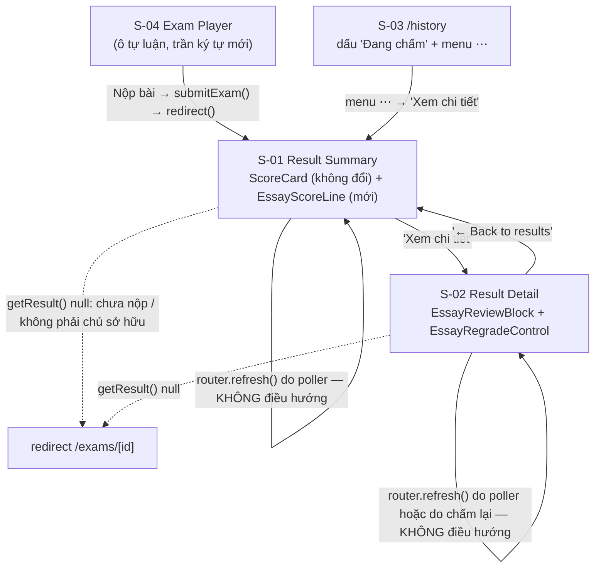
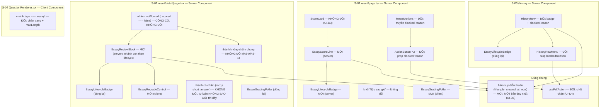

# Essay (Tự luận) Auto-Scoring — UI Specification

| | |
|---|---|
| **Version** | 1.0 |
| **Date** | 2026-08-28 |
| **Status** | Draft — sẵn sàng cho chuỗi Design Doc (backend + frontend) → Work Plan. |
| **PRD** | `docs/prd/essay-auto-scoring-prd.md` v1.2 (Draft — D1–D13 khoá, W1–W8, C1–C5, AC-001–AC-072) |
| **ADR** | `docs/adr/ADR-0018-essay-async-grade-write.md` (Proposed, 2026-08-28 — Decision 1–6, Amendment to ADR-0010; cả hai Escalation đã được kỹ sư giải quyết trong chính file đó) |
| **Nhánh** | `design/adr-0018-essay-async-grade-write` |
| **Tiền lệ về cấu trúc** | `docs/ui-spec/short-answer-scoring-ui-spec.md` (lát cắt hiển thị của cùng bài toán), `docs/ui-spec/history-ui-spec.md` (mẫu Decisions Record + a11y pattern) |

## Overview

Tài liệu này đặc tả **toàn bộ bề mặt nhìn thấy được** của tính năng chấm tự luận tự động: bốn màn hình bị ảnh hưởng, máy trạng thái vòng đời của một câu tự luận **như nó được render** (kể cả trạng thái "kẹt pending" vốn **suy ra lúc đọc chứ không lưu**), dòng điểm tự luận mới, cơ chế tự cập nhật trang dựng trên `router.refresh()`, nút chấm lại, chốt chặn xuất PDF, và toàn bộ chuỗi chữ tiếng Việt hiển thị cho học sinh.

Ba thứ **không** thuộc phạm vi tài liệu này, ghi ra để biên không bị đọc lệch: prompt/rubric và cách gọi Groq (Design Doc backend), hai hàm SQL đặc quyền và hợp đồng ghi (ADR-0018), và tên định danh thật của các khoá mới trong `per_question` (Design Doc — ở đây dùng chỗ giữ `<lifecycle>`, `<earned>`, `<max>`, `<lowConfidence>`, đúng quy ước PRD đã dùng trong SQL đo đạc).

### Target PRD

- PRD path: `docs/prd/essay-auto-scoring-prd.md` v1.2
- Phạm vi UI Spec phủ: **R3** (AC-011, AC-057, AC-058, AC-059), **R4** (mặt hiển thị của AC-014/015/016/018), **R5** toàn bộ (AC-020–AC-023, AC-061), **R6** toàn bộ mặt hiển thị (AC-024–AC-028, AC-063, AC-064), **R10** (AC-046, AC-047), **R11** mặt người dùng (AC-048 mục 3, AC-049), **R12** (AC-051, AC-052, AC-053), cộng AC-044 (những gì client được nhận) và AC-067 (trạng thái khi tính năng còn tắt).
- PRD giao **xuống UI Spec** đúng hai nhóm giá trị (bảng "pinned values awaiting a number"): **cận polling của AC-021** (số lần tối đa + thời lượng tối đa + nhịp), và **toàn bộ chữ hiển thị cho học sinh**. Cả hai được chốt trong tài liệu này (§ Component: EssayGradingPoller, § Copy Inventory).

### Design Source

| Source | Path | Version |
|--------|------|---------|
| Token / theme (nguồn chuẩn duy nhất) | `SOURCE/app/globals.css` | HEAD nhánh `design/adr-0018-essay-async-grade-write` (đã merge `main` @ `7894417`) |
| Tiền lệ nhãn vòng đời | `SOURCE/components/billing/OrderStatusBadge.tsx` | cùng trên |
| Tiền lệ a11y "không bao giờ `disabled` gốc" | `SOURCE/components/history/ActionButton.tsx`, `SOURCE/components/tutor/ExplainStepAffordance.tsx`, `SOURCE/components/billing/RecheckOrderControl.tsx` | cùng trên |
| Tiền lệ vòng lặp có hẹn giờ | `SOURCE/app/(layer2)/_components/ExamTimer.tsx` (chained `setTimeout` + `useEffectEvent`) | cùng trên |
| Tiền lệ "server là nguồn sự thật, client chỉ `router.refresh()`" | `SOURCE/components/billing/RecheckOrderControl.tsx` (bước 5 trong khối đầu file) | cùng trên |
| Bề mặt bị sửa | `result/page.tsx`, `result/detail/page.tsx`, `ScoreCard.tsx`, `ResultActions.tsx`, `QuestionRenderer.tsx`, `components/history/*`, `app/(HM)/history/_components/HistoryRow.tsx`, `app/(HM)/queries.ts` | cùng trên |

## Prototype Management

**Không có prototype code.** Không có artefact nào được đặt vào `docs/ui-spec/assets/essay-auto-scoring/`, và thư mục đó **không được tạo rỗng** — một thư mục rỗng nói "prototype bị mất" chứ không nói "không có prototype".

Thay cho prototype, tài liệu này viện dẫn **mã đã chạy thật trong repo** làm tham chiếu thị giác/hành vi (bảng Design Source ở trên, kèm đường dẫn đầy đủ). Đó là tham chiếu mạnh hơn một bản mock, vì nó là hình dạng đang phục vụ người dùng thật chứ không phải một phác thảo. Quan hệ với đặc tả chuẩn giữ nguyên nguyên tắc chung: **tài liệu này là chuẩn**; nơi nào mã hiện có và tài liệu này bất đồng trên một bề mặt **mới**, tài liệu này thắng; nơi nào bất đồng trên một bề mặt **cũ không thuộc phạm vi**, mã hiện có thắng và sự bất đồng đó là một Open Item chứ không phải giấy phép sửa.

## External Resources Used

Sự thật mức dự án nằm ở `docs/project-context/external-resources.md` (cập nhật lần cuối 2026-08-16). Môi trường **không đổi** cho tính năng này (không thêm design tool, không thêm môi trường xác minh thị giác), nên không chạy lại hearing. Tập con đặc thù tính năng:

| Resource (project-tier label) | Feature-specific identifier | Notes |
|---|---|---|
| Design Origin | `SOURCE/app/globals.css` — khối `:root` token, khối §"Tương phản hình học" (dòng ~145–157), khối `@layer base` (`.eyebrow`, dòng ~285) | Không token mới nào được thêm bởi tính năng này — xem § Design Tokens và Open Item **O-4** |
| Design System | `SOURCE/components/billing/OrderStatusBadge.tsx`, `SOURCE/components/ui/button.tsx` (biến thể `pill` dòng 46), `SOURCE/components/history/{ActionButton,HistoryRowMenu,usePdfAction}`, `SOURCE/app/(layer2)/_components/{ScoreCard,ResultActions,ExamTimer,QuestionRenderer}.tsx` | Cấu trúc badge và ba idiom a11y đều **tái dùng**, không phát minh lại |
| Guidelines | `SOURCE/app/globals.css` (quy tắc cứng: chỉ token, không hex cứng, không box-shadow, không gradient) + `.claude/MEMORY.md` §3 (lý do/lịch sử) | Nơi hai nguồn mâu thuẫn, **globals.css thắng** — xem UI-D2 |
| Visual Verification Environment | Route `/exams/[id]/attempt/[attemptId]/result`, `/exams/[id]/attempt/[attemptId]/result/detail`, `/history`, `/exams/[id]/attempt/[attemptId]`; `npm run dev` + Playwright MCP (`playwright`); test RTL cùng thư mục component | Cần một lượt thi **đã nộp** có ít nhất một câu `essay`; production hiện có **0** bài tự luận đã nộp (đo 2026-08-27), nên mọi kiểm tra thị giác phải chạy trên dev với dữ liệu gieo sẵn |

---

## Decisions Record

Những quyết định UI mà PRD/ADR giao xuống, cộng những quyết định bắt buộc phải ra vì mã hiện có ép. Downstream (Design Doc, Work Plan, code-verifier) coi đây là cố định trừ khi một escalation được nêu tên kích hoạt.

### UI-D1 — Mọi nhánh render của tự luận đều rẽ trên `<lifecycle>`, **không bao giờ** trên `scored` hay `isCorrect`

**Quyết định.** Không một biểu thức điều kiện nào trong toàn bộ mã thuộc tính năng này được đọc `r.scored` hoặc `r.isCorrect` để quyết định *diện mạo của một câu tự luận*. Mọi rẽ nhánh đọc khoá vòng đời mới.

**Lý do — đây là lỗi dễ mắc nhất của cả tính năng.** Một câu tự luận **đã chấm xong** vẫn lưu `scored:false` và `isCorrect:false` **vĩnh viễn** (PRD W1, ADR-0018 F1). Điều đó bị **ép buộc**, không phải sơ suất: `record_skill_mastery()` loại một dòng chỉ khi `coalesce((pq->>'scored')::boolean, true)` là false (`SOURCE/supabase/schema.sql:1354`), và `computeWrongTwiceQuestionIds()` loại chỉ khi `row.scored === false` (`SOURCE/lib/scoring/wrongTwice.ts:45`). Giữ `scored:false` là hình dạng **duy nhất** thoả D7 mà không phải sửa hai chỗ đó. Hệ quả trực tiếp lên UI:

- `r.scored === false` **luôn đúng** với tự luận ở cả ba trạng thái ⇒ nó không phân biệt được gì, và mọi nhánh keyed trên nó sẽ in nhãn "Chưa chấm tự động" cạnh một điểm số (AC-053 cấm đúng điều này).
- `r.isCorrect === false` **luôn đúng** với tự luận ⇒ chip Đúng/Sai/Bỏ trống (`result/detail/page.tsx`, khối `const status = r.isCorrect ? …`) **không bao giờ được render cho tự luận**. Một câu tự luận không đúng, không sai, không "bỏ trống" — nó có một **band**, hoặc có một **trạng thái vòng đời**.

**Quy tắc kiểm tra được:** trong diff của tính năng này, mọi lần xuất hiện của `scored` hay `isCorrect` phải nằm trong mã **có từ trước** và **không đổi**. Một lần xuất hiện mới là vi phạm UI-D1.

### UI-D2 — Hình dạng "viên thuốc" (`rounded-full`) được **kế thừa** cho nhãn vòng đời; `globals.css` thắng `.claude/MEMORY.md`

**Quyết định.** `EssayLifecycleBadge` dùng `rounded-full`, chép nguyên cấu trúc `OrderStatusBadge`.

**Nguồn nào được theo, và vì sao.** Hai nguồn mâu thuẫn:

- `.claude/MEMORY.md:96` — *"Bo góc nhẹ … Không dùng hình pill."*
- `SOURCE/app/globals.css` §"Tương phản hình học" (dòng ~145–157) — *"Nút hành động = viên thuốc bo tròn tuyệt đối… KHÔNG có token `--radius-pill`: `rounded-full` của Tailwind đã đúng bằng 9999px mà tài liệu yêu cầu"*.

Theo **globals.css**, vì ba lý do độc lập: (1) `docs/project-context/external-resources.md` → *Design Origin* tuyên bố thẳng rằng `globals.css` là **nguồn chuẩn duy nhất** của theme kể từ khi `DESIGN.md` bị xoá 2026-08-06, và MEMORY.md chỉ giữ *lý do/lịch sử*; (2) `globals.css` mới hơn và tự nó viết ra cả cơ chế lẫn lý do; (3) hình dạng này **đã ship**: `SOURCE/components/ui/button.tsx:46` có hẳn biến thể `shape="pill"` (**là `shape`, không phải `variant` — kiểm trên file thật; bản v1.0 ghi nhầm tên prop**), và hai badge đang chạy thật (`OrderStatusBadge`, `app/(layer4)/_components/StatusBadge.tsx`) đều là `rounded-full`.

**Tài liệu trọng tài mà brief nêu tên — `docs/market/UI-Design-Research.md` — không còn tồn tại trong cây** (đã kiểm: `docs/market/` chỉ có `Edtech-CoreFeatures-Research.md`). `globals.css` trích dẫn nó như nguồn của chính mình, nên lập luận sống sót dù file thì không. Việc này được ghi ra thay vì bỏ qua, để phiên sau không đi tìm một file không có.

**Căng thẳng còn lại, ghi ra chứ không giấu:** lập luận gốc của globals.css đóng khung viên thuốc là hình dạng của **hành động**, còn nhãn vòng đời thì không phải hành động. Vẫn kế thừa, vì hai badge **không tương tác** đã ship với hình dạng đó trước tính năng này — mở lại câu hỏi ở đây là sửa một quy ước toàn app bên trong một thay đổi về chấm điểm. Nhãn không mang hover, không mang focus, không mang con trỏ pointer, nên hình dạng của nó không bao giờ mời một cú bấm.

### UI-D3 — Dòng điểm tự luận là **một dòng riêng có nhãn, đặt CẠNH `ScoreCard`**; `ScoreCard` không đổi một dòng nào

**Quyết định (kỹ sư chốt, ghi lại nguyên vẹn — không mở lại).** `ScoreCard.tsx` giữ nguyên props và nguyên phần render. Số `/10`, ô `Đúng` và ô `Sai` giữ **đúng cơ sở tính hôm nay**. Kết quả tự luận là một **khối riêng, có nhãn riêng**, render ngay **dưới** `ScoreCard` (component `EssayScoreLine`, § Component: EssayScoreLine).

**Vì sao không đặt một hàng BÊN TRONG `ScoreCard`.** Ba ô của `ScoreCard` (`Đúng` / `Sai` / `Thời gian`) đều phái sinh từ bộ ba cũ, và `wrong = result.total - result.correct` được tính ngay trong file. Một hàng thứ tư nằm cạnh chúng ngụ ý một **quan hệ số học không tồn tại**: điểm tự luận không cộng vào `total`, không cộng vào `correct`, và mẫu số của nó (số câu tự luận **đã chấm xong**) là một mẫu số khác hẳn.

**Vì sao không định nghĩa lại số `/10`.** Nó phá dẫn xuất `wrong = total − correct` (đổi nghĩa `total` làm ô "Sai" sai lặng lẽ), và nó làm **điểm tiêu đề dịch chuyển một tiếng sau khi nộp** — đúng cái mà *Amendment to ADR-0010* nói ba bề mặt phải tôn trọng, chứ không phải cái để tái tạo. AC-057 đòi số hiện tại **giữ nguyên nghĩa hôm nay**; AC-011 đòi kết quả tự luận có mặt trên trang kết quả. Một dòng riêng thoả cả hai; gộp thì chỉ thoả được một.

**Hệ quả cho AC-057 trên S-01, nói rõ để khỏi bị đọc thành trôi lệch:** dấu "đang chấm" mà AC-057 mô tả *"alongside the attempt's number"* nằm trong `EssayScoreLine` ngay **bên dưới** con số, **không** nằm bên trong `ScoreCard`. Trên `/history` thì không có căng thẳng này: `HistoryRow` không phải `ScoreCard`, nên dấu nằm thẳng trong dòng meta của hàng.

### UI-D4 — Chốt chặn xuất PDF đặt tại hook dùng chung `usePdfAction`, và **phạm vi AC-058 mở rộng ra `/history`**

**Quyết định (kỹ sư chốt — không mở lại).** Chốt nằm ở `SOURCE/components/history/usePdfAction.ts`, không ở `ResultActions.tsx`.

**Lý do.** AC-058 nêu tên duy nhất `ResultActions.tsx`, nhưng `/history` chạm **cùng một đường ống** qua `HistoryRowMenu.tsx` → `usePdfAction.ts` (cùng hook, cùng `generateAttemptPdfFile`). Lý do tồn tại của AC-058 là **một artefact vĩnh viễn không được mang một con điểm sẽ đổi sau một tiếng** — đó là tính chất của **lượt làm bài**, không phải của **cái nút đã bị bấm**. Nên chốt thuộc về nơi cả hai lối gọi đi qua. Chốt ở một trong hai nút sẽ để nguyên lối kia mở, và lối kia (`/history`) chính là nơi học sinh quay lại nhiều ngày sau — tức là nơi PDF dễ được xuất ra nhất.

**Ghi chú kiểm thử, để một lần đỏ không bị đọc sai.** Thay đổi này đáp xuống `SOURCE/components/history/HistoryRowMenu.test.tsx` — file test **nhạy thời gian**, từng flaky **một lần** ở phiên trước dưới tải chạy song song, và một lượt chạy lại sạch đã bác bỏ lần đỏ đó. Nghĩa là: một lần đỏ đơn lẻ ở file này **không tự nó** chứng minh có defect, nhưng cũng **không được** mặc định bỏ qua — quy trình là chạy lại đơn luồng và kết luận theo lượt chạy đó.

### UI-D5 — "Genuinely disabled control" của AC-058/AC-064 được **diễn đạt lại** thành pattern `aria-disabled` của repo

**Đây là một diễn đạt lại có chủ đích của câu chữ trong PRD. Không phải trôi lệch.** Ghi ra ở đây, có lý do, để code-verifier về sau đối chiếu được.

AC-058 viết *"as genuinely disabled controls with an accessible reason, not silently inert"*; AC-064 viết *"removed, or disabled with a programmatically exposed reason"*. Đọc chữ theo nghĩa đen sẽ ra thuộc tính `disabled` gốc của HTML. Repo này **đã sửa đúng lỗi đó hai lần** và ba file hiện hành cấm nó thành văn:

- `SOURCE/components/history/ActionButton.tsx` — *"always focusable, never native `disabled`"*, và ghi rằng `busyRef` mới là chốt chặn click đồng bộ thật.
- `SOURCE/components/tutor/ExplainStepAffordance.tsx` — *"KHÔNG BAO GIỜ dùng `disabled` gốc (làm nút rơi khỏi thứ tự tab/focus — đúng con bug đã phải sửa hai lần trong repo này: RateButton rồi ActionButton)"*.
- `SOURCE/components/billing/RecheckOrderControl.tsx` — *"KHÔNG BAO GIỜ `disabled` gốc, ở MỌI trạng thái… đúng người cần với tới control này nhất là người có đơn trông như đã đóng và cần đọc **vì sao**"*.

**Pattern thật của repo, và là thứ tài liệu này đặc tả:**

1. Control **luôn nằm trong thứ tự tab** (không `disabled`, không `tabIndex={-1}`, không `pointer-events: none`).
2. `aria-disabled` là **chuỗi** `"true"` / `"false"`; `aria-busy` là **boolean**.
3. `aria-describedby` trỏ tới một `<span class="sr-only">` **cùng cây DOM** mang **lý do bằng lời**; chuỗi trong ô đó **đổi** theo trạng thái (đó chính là cơ chế thông báo — không `aria-live` cho ô này, vì trạng thái do chính người dùng gây ra thì một lần ngắt lời là không mong muốn).
4. Handler **về sớm đồng bộ** ngay dòng đầu, **trước** mọi `setState` và **trước** mọi `await`: `if (blocked) return; if (busyRef.current) return;`. `aria-disabled` chỉ **thông báo**, nó không chặn sự kiện click của DOM.

**Vì sao pattern này chứ không phải `disabled`:** `disabled` gốc bỏ đi **cả hai** thứ mà chính AC-058/AC-064 muốn có — nó rút phần tử khỏi tiêu điểm bàn phím, và cùng lúc rút luôn *lý do* khỏi tầm với của người dùng trình đọc màn hình. Người cần đọc "vì sao không xuất được PDF" nhiều nhất chính là người không nhìn thấy nút mờ đi.

**Hệ quả bổ sung cho AC-064:** ở mức trần lượt chấm, control **không bị gỡ khỏi cây**, mà ở lại với `aria-disabled="true"` + lý do. Ngoài a11y, còn một lý do cơ học: trang **tự làm mới** trong lúc học sinh đang đứng trên nút đó (§ Component: EssayGradingPoller); gỡ nút đi ngay dưới ngón tay/tiêu điểm của họ tái tạo đúng bài toán focus mà `ExplainStepAffordance` đã phải xử lý bằng `tabIndex={-1}` + `ref.focus()`. Giữ nút lại thì không cần cơ chế cứu focus nào.

**Không ở đâu trong đặc tả này xuất hiện `disabled={true}`.**

### UI-D6 — Trạng thái "kẹt pending" được **suy ra**, và được render **giống hệt** `failed`

**Quyết định.** Bề mặt render **năm** trạng thái từ **ba** giá trị lưu. `pending` quá hạn (AC-026) render **y hệt** `failed` còn lượt: cùng chữ "Chấm thất bại", cùng nút "Chấm lại".

**Lý do.** Với học sinh, hai tình huống ấy có **cùng một cách xử lý duy nhất** (bấm chấm lại), nên hai câu chữ khác nhau chỉ ngụ ý hai cách chữa khác nhau mà thực ra không có. Phân biệt "writer-landed failed" với "deadline-derived failed" là chuyện của telemetry và của metric #1 vs #2(b) (PRD), không phải chuyện của màn hình.

**Ràng buộc cứng đi kèm.** Trạng thái này **không được lưu**: không cron, không queue, không sweeper, không "dọn lúc đăng nhập lần sau" (W6 / ADR-0018 F3 / Implementation Guidance #8). Giá trị `pending` nằm im trong database **vĩnh viễn**, và đó là **đầu ra đúng**, không phải sự cố. Mọi bề mặt suy ra trạng thái từ **cùng một hàm thuần** trên bộ ba `(<lifecycle> đã lưu, exam_results.created_at, now())`, và **đúng một hàm** — bốn bề mặt tự suy ra bốn kiểu là cách chắc chắn nhất để `/history` nói "đang chấm" trong khi trang kết quả nói "chấm thất bại" cho cùng một lượt thi. Định danh của hàm do Design Doc chốt; UI Spec chỉ đòi tính duy nhất của nó.

### UI-D7 — Khi tính năng còn **tắt** (cổng AC-067 chưa qua), bốn bề mặt render **y như hôm nay**

**Quyết định.** Trong giai đoạn tính năng chưa được bật (chưa có ghi nhận dated console check về Zero Data Retention), `computeScore()` **không phát ra khoá `<lifecycle>`** cho câu tự luận. Hệ quả dây chuyền, tất cả đều là "không làm gì":

- `result/detail/page.tsx` rơi vào **nhánh chung không-chấm** đang có, in nhãn `result.notAutoScored` — đúng như hôm nay.
- `EssayScoreLine` **không render** (không có câu tự luận nào mang khoá vòng đời).
- `EssayGradingPoller` **không mount** ⇒ **không một byte JS nào** được thêm vào trang kết quả trong suốt giai đoạn tắt.
- `/history` không hiện dấu "đang chấm"; chốt PDF không bao giờ đóng.
- `QuestionRenderer` in `player.essayNotScored` (chữ cũ) chứ không in chữ mới.

**Lý do.** Phương án thay thế — phát `pending` khi tính năng đang tắt — làm mọi câu tự luận hiện "Đang chấm" cho một cỗ máy không chạy, rồi tự lật sang "Chấm thất bại" khi quá hạn. Đó là màn hình nói dối hai lần liên tiếp, và nó tái tạo đúng khuyết tật mà R12 tồn tại để chấm dứt (màn hình xin bài viết rồi bảo không ai đọc). "Không phát khoá" là trạng thái tắt **duy nhất** mà mọi bề mặt đã biết cách render đúng — chính là nhánh cũ, không đổi một byte (AC-012 cũng đòi đúng hình dạng đó cho row cũ).

**Cờ đọc ở đâu:** một cờ **server-only** duy nhất (Design Doc chốt tên, đăng ký trong `checkEnv.ts`). **Không** `NEXT_PUBLIC_*` — không phải vì bí mật, mà vì hai bản sao của một sự thật ở hai phía biên rồi sẽ lệch nhau, và bên lệch sẽ là bên nói dối học sinh.

**Lượt thi đã chấm trước khi cờ bị tắt lại** giữ nguyên khoá của chúng và tiếp tục render bình thường. Cờ điều khiển việc **phát khoá mới**, không điều khiển việc **đọc khoá cũ**.

### UI-D8 — `player.essayNotScored` được **giữ lại** và thêm khoá mới `player.essayScored`; chân trang do cờ AC-067 chọn

**Đây là diễn đạt lại thứ hai của một AC. Ghi ra để không bị đọc thành trôi lệch.**

AC-051 viết *"`player.essayNotScored` **is replaced**"*. Đọc theo nghĩa đen thì chuỗi cũ biến mất. Nhưng AC-067 tạo ra một **khoảng thời gian có thật** trong đó câu cũ vẫn **đúng**: tính năng ship ở trạng thái tắt, bài làm được lưu, và **không** được chấm tự động. Xoá chuỗi cũ trong cùng commit buộc phải ship một câu **sai** suốt khoảng đó.

**Quyết định.** Giữ `player.essayNotScored` với nguyên văn hiện tại (*"Tự luận — bài làm được lưu cùng lượt thi, chưa chấm tự động."* — vẫn đúng khi tắt), và thêm `player.essayScored` (*"Tự luận — chấm tự động sau khi bạn nộp bài."*) dùng khi bật. `QuestionRenderer` chọn khoá theo đúng cờ của UI-D7.

**Phương án thay thế đã cân nhắc và vì sao chưa chọn:** Work Plan có thể **ràng buộc thứ tự ship** sao cho commit đổi chữ chỉ đáp xuống *sau* khi cổng AC-067 đã qua — khi đó một khoá là đủ và khoá cũ xoá được. Đó là phương án gọn hơn nhưng nó **giao tính đúng đắn của câu chữ cho lịch trình**, mà C5 (một kỹ sư, không staging, không feature flag hạ tầng) là chính lý do lịch trình ở đây không phải thứ đáng đặt cược. Ghi thành **O-5** để kỹ sư chọn dứt điểm ở Design Doc; đặc tả này mặc định hai khoá.

Bốn khẳng định trong mã mà AC-051 liệt kê (`computeScore.ts` header + doc `isScored()`, `types/result.ts` comment, `QuestionRenderer.tsx` comment, `lib/tutor/prompt.ts:36`) vẫn phải sửa **lý do** của chúng đúng như AC-051 đòi — chúng nói *"không bao giờ được chấm"*, mà sự thật mới là *"band được ghi ngoài `computeScore`, và dòng cố ý ở lại `scored:false`"*. Việc đó không phụ thuộc cờ và không thuộc UI-D8.

### UI-D9 — Client **không** nhận số lượt chấm còn lại; nó nhận một boolean `retryAvailable`

**Quyết định.** Payload xuống client cho một câu tự luận gồm: trạng thái vòng đời đã suy ra, band (`<earned>`/`<max>`), cờ "cần xem lại", và **một boolean** cho biết còn chấm lại được hay không. **Không** có bộ đếm lượt.

**Lý do — hai lý do độc lập.**

1. **AC-044** liệt kê đúng ba thứ client được nhận (band, cờ, trạng thái). Thêm một số đếm là mở rộng danh sách đó; một boolean là thứ **tối thiểu** đủ render hai diện mạo của nút, nên nó giữ danh sách chặt.
2. **Con số đó sẽ nói dối.** ADR-0018 Decision 4: trần lượt bị **tiêu ở thời điểm claim**, trước khi gọi provider. Một lượt bị cắt ngang giữa chừng (invocation chết) **vẫn tính là đã dùng** và không ghi gì cả. Nên "Còn 2 lượt" có thể tụt xuống 1 mà học sinh không bấm gì. Hiển thị một con số rồi để nó tụt một cách không giải thích được là tệ hơn không hiển thị.

**Hệ quả cho câu chữ:** không câu nào trong § Copy Inventory hứa một số lượt cụ thể. Ghi chú đi kèm trạng thái thất bại nói đúng sự thật cơ học: *"Mỗi câu chỉ được chấm lại một số lần; một lượt bị gián đoạn giữa chừng vẫn tính là đã dùng."* Trần thật (3) do server cưỡng chế (AC-064) và được nêu trong câu ở trạng thái hết lượt.

Nếu kỹ sư muốn con số hiện ra, xem **O-2**.

### UI-D10 — Nhãn vòng đời render ở **server**; chỉ poller và nút chấm lại là client component

**Quyết định.** `EssayLifecycleBadge`, `EssayScoreLine`, `EssayReviewBlock` là **Server Component**. `EssayGradingPoller` và `EssayRegradeControl` mang `"use client"`.

**Lý do.** Ngôn ngữ đọc từ **cookie phía server** (`SOURCE/lib/i18n/server.ts`), và `I18nProvider` nhận `locale` từ root layout — tức đổi ngôn ngữ vốn đã đi qua một lượt render server. Nên chuỗi render ở server **không** cũ đi so với chuỗi render ở client, và lý do khiến `OrderStatusBadge` phải là client (nó sống trong một cây client) không áp dụng ở đây: cả `result/page.tsx`, `result/detail/page.tsx` lẫn `HistoryRow.tsx` đều là Server Component. Đường cập nhật của nhãn là `router.refresh()` — tức là **một lượt render server**, đúng nơi nhãn đang sống. Đổi lại: 0 KB JS thêm cho ba bề mặt trong trạng thái đã ổn định.

### UI-D11 — `/history` nhận **một boolean đã suy ra**, không nhận `per_question`

**Quyết định.** `listMyHistory()` (`SOURCE/app/(HM)/queries.ts`) bổ sung `per_question` và `created_at` vào lượt `select`, suy ra **một** boolean ngay trong hàm map, và chỉ boolean đó vào `MyHistoryEntry`. Dữ liệu `per_question` thô **không** băng qua biên vào cây component.

**Lý do.** `MyHistoryEntry` hiện **không** mang `per_question` (đã kiểm: `attemptId, examId, examTitle, subject, totalScore, startedAt, submittedAt, correct, total`), nên AC-057 trên `/history` **không thể** thoả nếu không đụng truy vấn — đây là một thay đổi bắt buộc, không phải tuỳ chọn, và PRD không nêu tên nó. Giữ mảng thô ra ngoài cây component vì `HistoryRow` không có việc gì phải đọc điểm từng câu; một prop boolean là bề mặt nhỏ nhất đủ cho cả nhãn (AC-057) lẫn chốt PDF (AC-058).

**Chi phí chấp nhận, ghi ra chứ không giảm nhẹ:** payload của lượt đọc `/history` phình thêm một mảng jsonb mỗi hàng. Số hàng đã bị `readBounded` chặn trần, nên chi phí có trần — nhưng trần đó chưa được đo với `per_question` trong select. Xem **O-3**.

### UI-D12 — Band hiển thị bằng **bảng tra năm chuỗi**, không bằng hàm định dạng số

**Quyết định.** Năm giá trị hợp lệ được ánh xạ sang đúng năm chuỗi hiển thị: `0` → `"0"`, `0.25` → `"0.25"`, `0.5` → `"0.5"`, `0.75` → `"0.75"`, `1` → `"1"`. Không `toFixed`, không làm tròn, không nội suy.

**Lý do.** Tập band là **đóng** (D3) và chỉ có năm phần tử, nên một bảng tra làm cho việc render một giá trị **thứ sáu** trở thành bất khả thi về mặt cấu trúc, thay vì phụ thuộc vào việc validator ở tầng ghi luôn đúng. Một hàm định dạng thì render `0.3` gọn gàng như render `0.25` — tức là nó **che** đúng cái defect mà W3 nói SQL sẽ không bắt được. Giá trị ngoài tập không bao giờ tới được client (AC-006/AC-041); nếu vẫn tới, xem UI-D13.

Tổng điểm tự luận (`<earned>` cộng dồn) **là** một phép cộng nên vẫn cần định dạng: tối đa 2 chữ số thập phân, cắt số 0 thừa (`1.5`, `2`, `2.25`). Dùng dấu chấm thập phân để đồng bộ với `result.totalScore.toFixed(1)` mà `ScoreCard` và `HistoryRow` đang in.

### UI-D13 — Giá trị vòng đời **thiếu** và giá trị vòng đời **lạ** rơi vào cùng một nhánh hiển thị, nhưng chỉ cái thứ hai ghi log

**Quyết định.** Khoá `<lifecycle>` **vắng mặt** ⇒ render nhánh không-chấm chung (chữ `result.notAutoScored`), im lặng. Khoá **có mặt nhưng giá trị không thuộc** `{pending, graded, failed}` ⇒ render **cùng** nhánh đó, **cộng** một `console.warn` phía server mang **duy nhất** `questionId` và giá trị lạ.

**Lý do.** Hai đầu vào, hai ý nghĩa: vắng mặt là **row cũ trước khi tính năng ship** và là hành vi **đúng theo AC-012/D12** — không có gì để báo. Giá trị lạ là một **khuyết tật** và chính là bẫy mà UI Quality Metric 1 nêu tên. Cả hai render giống nhau vì với học sinh không có lựa chọn nào tốt hơn (không bao giờ được render trắng, không bao giờ được in "Chưa chấm tự động" cạnh một band). Ghi log **chỉ** `questionId` và giá trị lạ, không kèm bài làm, theo đúng tinh thần AC-056 (log là đường thoát của nội dung UGC ra ngoài). Đây là biến thể của "nhánh thứ năm" mà `OrderStatusBadge` đã dựng cho `status` lạ: **không** `??` về một trạng thái thật, **không** `as`.

---

## AC Traceability (PRD → Screens/Components)

Không có prototype, nên bảng này thay cho bảng truy vết prototype của template. AC nào không có bề mặt UI được đánh dấu rõ để code-verifier không đi tìm.

| AC ID | Tóm tắt | Screen / Component | State |
|---|---|---|---|
| AC-003 | Lượt render đầu sau khi nộp: mọi câu tự luận ở `pending`, câu khác chấm như hôm nay | S-01 `EssayScoreLine`, S-02 `EssayReviewBlock` | Pending |
| AC-011 | Điểm trên trang kết quả suy ra lúc đọc bằng cách kết hợp bộ ba cũ với khoá earned/max | S-01 `EssayScoreLine` (dòng **riêng**, UI-D3) | mọi state |
| AC-012 | Không backfill; row cũ render **byte-for-byte** như hôm nay | S-01/S-02/S-03 — nhánh "thiếu khoá" (UI-D13) | Legacy |
| AC-014 | `pending` giữ ngữ nghĩa `scored:false`, bài làm của học sinh vẫn hiện | S-02 `EssayReviewBlock` | Pending |
| AC-015 | `failed` không thành 0 âm thầm | S-01 `EssayScoreLine` (không cộng vào mẫu số), S-02 | Failed |
| AC-016 | `graded` không bao giờ bật/tắt gợi ý gia sư | S-02 — **không** mount `ExplainStepAffordance` trong nhánh tự luận | mọi state |
| AC-018 | Câu không có ground truth: không chấm, giữ `scored:false` vĩnh viễn | S-02 — nhánh không-chấm chung, nhãn `result.notAutoScored` | Ungradeable |
| AC-020 | Poll khi còn ≥1 câu `pending`, dừng khi tất cả đã giải quyết | `EssayGradingPoller` | Polling → Stopped |
| AC-021 | Poller có **cận riêng**: số lần tối đa + thời lượng tối đa | `EssayGradingPoller` — chốt số ở § Component | Stopped (bound) |
| AC-022 | Không realtime, không bảng mới | `EssayGradingPoller` — chỉ `router.refresh()` | mọi state |
| AC-023 | Band đáp xuống được đọc lên; tiêu điểm không bị cướp/mất | `EssayGradingPoller` (vùng live), UI-D5 (nút không bị gỡ) | Resolved |
| AC-024 | Lỗi provider/gate/output không hợp lệ → "chấm thất bại" | S-02 `EssayReviewBlock` | Failed |
| AC-025 | Chấm lại do người dùng kích hoạt, đi lại qua gate | `EssayRegradeControl` | Failed → Busy |
| AC-026 | `pending` quá hạn được **trình bày** thành `failed` | UI-D6 — trạng thái suy ra | Stuck-pending |
| AC-027 | Không câu nào bị trình bày là `pending` quá hạn | Không có bề mặt UI riêng — khẳng định về **hàm suy diễn**, chứng minh bằng unit test biên (Design Doc) | — |
| AC-028 | Nút chấm lại là `<button>` thật, có tên khả truy cập, chạy được bằng bàn phím | `EssayRegradeControl` | Failed |
| AC-044 | Client chỉ nhận band + cờ + trạng thái | Mọi component — xem UI-D9 | mọi state |
| AC-046 | Cờ "cần xem lại" không đổi con số nào | `EssayReviewBlock` — chỉ là chữ | Graded + low-confidence |
| AC-047 | "cần xem lại" là **chữ**, không truyền đạt bằng màu | `EssayReviewBlock` — hằng i18n do app sở hữu | Graded + low-confidence |
| AC-051 | Chân trang player thôi nói "chưa chấm tự động" | S-04 `QuestionRenderer` — xem **UI-D8** | Default |
| AC-052 | `player.essayPlaceholder` và `player.charsLeft` chạy nguyên như cũ | S-04 `QuestionRenderer` | Default |
| AC-053 | Nhãn `result.notAutoScored` bị đè bởi **trạng thái vòng đời**, không bởi `scored` | S-02 `EssayReviewBlock` — xem **UI-D1** | Pending/Graded/Failed |
| AC-057 | Dấu "đang chấm" trên `ScoreCard` và hàng `/history` | S-01 `EssayScoreLine` (UI-D3), S-03 `HistoryRow` | Pending / partial |
| AC-058 | Chặn xuất PDF khi còn câu chưa giải quyết | `usePdfAction` (UI-D4) + `ActionButton` + `HistoryRowMenu` | Blocked |
| AC-059 | Mẫu số chỉ đếm câu đã `graded`, **và bề mặt phải nói rõ nó đếm gì** | S-01 `EssayScoreLine` | Graded / partial |
| AC-060 | Hình dạng lưu đúng W1 ở cả ba trạng thái | Không có bề mặt UI — unit test tầng ghi (Design Doc) | — |
| AC-061 | Cận polling ≠ hạn chờ đọc-lúc-render; poller dừng ⇒ hiện nút làm mới thủ công | `EssayGradingPoller` | Stopped (bound) |
| AC-062 | Ghi trùng bị từ chối, **không** hiện thành lỗi cho học sinh | Không có bề mặt UI — telemetry (R13) | — |
| AC-063 | Chấm lại chỉ mở từ `failed`; trên `graded` là no-op | `EssayRegradeControl` — không render nút ở `graded` | Graded |
| AC-064 | Trần 3 lượt; sau đó vĩnh viễn "chấm thất bại", control **không bao giờ present-but-inert** | `EssayRegradeControl` — xem **UI-D5** | Exhausted |
| AC-065 | 429 được thử lại trong cùng lượt trước khi thành `failed` | Không có bề mặt UI — hệ quả là học sinh thấy "Đang chấm" lâu hơn, không thấy lỗi | Pending |
| AC-067 | Chấm ship ở trạng thái **tắt** cho tới khi cổng ZDR qua | Bốn bề mặt — xem **UI-D7** | Feature-off |
| AC-048 (3) | Trần ký tự mới đáp vào `maxLength` **và** số học của `player.charsLeft` | S-04 `QuestionRenderer` | Default |
| AC-049 | Số ký tự còn lại = trần DB − độ dài đã gõ | S-04 `QuestionRenderer` | Default |
| AC-071 | `TutorPromptInput.questionType` giữ union đóng, không thêm `essay` | Không có bề mặt UI — cưỡng chế lúc biên dịch | — |
| AC-072 | Uỷ quyền **trước** đo đếm ở lối vào chấm lại | Không có bề mặt UI — Server Action (Design Doc). UI **không** được coi việc ẩn nút là cơ chế cưỡng chế | — |

---

## Screen List and Transitions

### Screen List

| Screen ID | Screen Name | Route | Mô tả | Entry Condition | New/Changed |
|---|---|---|---|---|---|
| S-01 | Result Summary | `/exams/[id]/attempt/[attemptId]/result` | Điểm tổng + hành động. **Đổi**: thêm `EssayScoreLine` dưới `ScoreCard`; `ResultActions` nhận chốt PDF; mount `EssayGradingPoller` | Nộp bài (redirect sau `submitExam()`), hoặc quay lại từ `/history` | **Changed** |
| S-02 | Result Detail | `/exams/[id]/attempt/[attemptId]/result/detail` | Xem lại từng câu. **Đổi**: nhánh con vòng đời tự luận **bên trong** nhánh không-chấm; nút chấm lại; mount `EssayGradingPoller` | Bấm "Xem chi tiết" ở S-01, hoặc URL trực tiếp tới một lượt đã nộp thuộc về mình | **Changed** |
| S-03 | History | `/history` | Danh sách lượt thi đã nộp. **Đổi**: dấu "Đang chấm" trong dòng meta; chốt PDF trong menu ⋯ | Bấm "Lịch sử" ở `SiteHeader`/`HomeSidebar`; chưa đăng nhập → `/?auth=signin` | **Changed** |
| S-04 | Exam Player | `/exams/[id]/attempt/[attemptId]` | Màn làm bài. **Đổi**: chân trang ô tự luận; `maxLength` theo trần mới | Bắt đầu một lượt làm bài | **Changed** |

Không thêm route mới. Không thêm màn hình mới. `EssayGradingPoller` **không phải** một màn hình — nó là một client component **không có bề mặt nhìn thấy** ở trạng thái thường (chỉ một vùng `sr-only` và, khi hết cận, một nút làm mới).

### Screen Transition Diagram



### Transition Conditions

| Source | Destination | Trigger | Guard Condition |
|---|---|---|---|
| S-04 | S-01 | Bấm "Nộp bài" (hoặc hết giờ → auto-submit) | Không đổi. Grading được **đăng ký trước** `redirect()` (AC-002); một lỗi chấm **không bao giờ** cản trở/hoãn/đảo lượt ghi `exam_results` (AC-004) — nên chuyển màn này không có nhánh thất bại mới |
| S-01 | S-01 | Poller tick (`router.refresh()`) | Chỉ khi còn ≥1 câu tự luận `pending` **và** chưa chạm cận polling **và** tab đang hiển thị. Không điều hướng, không đổi URL, không đẩy history entry |
| S-02 | S-02 | Poller tick, hoặc `EssayRegradeControl` hoàn tất | Như trên. Sau lượt chấm lại, **luôn** `router.refresh()` — server quyết định band, client **không bao giờ** vá cục bộ |
| S-01 | S-02 | Bấm "Xem chi tiết" | Không đổi. **Cũng là lối duy nhất tới nút chấm lại** — S-01 không có bề mặt từng câu |
| S-03 | S-01 | Menu ⋯ → "Xem chi tiết" | Không đổi |
| bất kỳ | (không chuyển) | Bấm Lưu/Chia sẻ PDF khi còn câu chưa giải quyết | **Chặn**: handler về sớm đồng bộ; không sinh file, không pha bận, không thông báo lỗi (UI-D4/UI-D5) |

---

## Lifecycle State Machine (as rendered)

Đây là hợp đồng trung tâm của tài liệu. **Ba** giá trị lưu, **sáu** trạng thái render.

```mermaid
stateDiagram-v2
    [*] --> NoKey: submitExam() khi tính năng TẮT (UI-D7)<br/>hoặc row cũ trước khi ship (AC-012)
    [*] --> Pending: submitExam() khi tính năng BẬT<br/>computeScore() phát <lifecycle>=pending

    NoKey --> NoKey: không bao giờ đổi<br/>render nhánh không-chấm chung ("Chưa chấm tự động")

    Pending --> Graded: record_essay_grade() ghi band
    Pending --> Failed: lỗi provider (không phải 429) /<br/>gate từ chối / output không hợp lệ /<br/>hết lượt thử 429 trong cùng pass
    Pending --> StuckPending: KHÔNG có writer nào —<br/>now() - created_at > hạn chờ (SUY RA lúc đọc)

    StuckPending --> Graded: chấm lại thành công
    StuckPending --> Failed: chấm lại thất bại
    Failed --> Graded: chấm lại thành công
    Failed --> Failed: chấm lại thất bại (còn lượt)
    Failed --> Exhausted: đã tiêu đủ 3 lượt claim

    Graded --> Graded: hấp thụ — ghi lần hai bị TỪ CHỐI (first-write-wins)
    Exhausted --> Exhausted: vĩnh viễn; không lối chấm lại nào

    note right of StuckPending
      Giá trị LƯU vẫn là 'pending' VĨNH VIỄN.
      Không cron, không queue, không sweeper (W6).
      Render y hệt Failed (UI-D6).
    end note
    note right of Graded
      scored:false và isCorrect:false — VĨNH VIỄN.
      Rẽ nhánh trên <lifecycle>, không bao giờ trên hai trường đó (UI-D1).
    end note
```



### Bảng trạng thái render — nguồn chân lý cho mọi component bên dưới

| # | Tên trạng thái render | Điều kiện suy ra | Nhãn vòng đời | Nội dung thân | Nút chấm lại |
|---|---|---|---|---|---|
| **RS-0** | **NoKey / Legacy / Feature-off** | `<lifecycle>` **vắng mặt** (hoặc giá trị lạ — UI-D13) | *không có nhãn* | Nhánh không-chấm **chung, không đổi**: "Bạn trả lời:" + "Đáp án đã lưu:" + nhãn `result.notAutoScored` | Không |
| **RS-1** | **Ungradeable** | `<lifecycle>` vắng mặt vì `questions.essay_answer` rỗng (AC-018) | *không có nhãn* | Giống RS-0 — **cố ý không phân biệt**: học sinh không có hành động nào khác nhau, và nhãn `result.notAutoScored` vẫn **đúng** cho câu này | Không |
| **RS-2** | **Pending** | `<lifecycle> = pending` **và** `now() − created_at ≤ hạn chờ` | `◌ Đang chấm` | Bài làm của học sinh; **không** hiện đáp án mẫu; **không** nhãn `result.notAutoScored` | Không |
| **RS-3** | **Graded** | `<lifecycle> = graded` | `● Đã chấm` | Điểm `{band} / 1` + bài làm + đáp án mẫu; nếu cờ thấp tin cậy: thêm chữ **"Cần xem lại"** | Không (AC-063) |
| **RS-4** | **Failed (còn lượt)** | `<lifecycle> = failed` **và** `retryAvailable` | `✕ Chấm thất bại` | Bài làm + câu giải thích + ghi chú về lượt | **Có**, hoạt động |
| **RS-5** | **Stuck-pending** | `<lifecycle> = pending` **và** `now() − created_at > hạn chờ` | `✕ Chấm thất bại` | **Giống hệt RS-4** (UI-D6) | **Có**, hoạt động |
| **RS-6** | **Exhausted** | `<lifecycle> = failed` **và** `!retryAvailable` | `✕ Chấm thất bại` | Bài làm + câu "hết lượt, hệ thống sẽ không tự chấm lại" | **Có mặt**, `aria-disabled="true"` + lý do (UI-D5) — **không bao giờ bị gỡ, không bao giờ present-but-inert** |

**"Chưa giải quyết" (unresolved)** — thuật ngữ mà AC-057/AC-058 dùng — được định nghĩa **một lần** ở đây và mọi bề mặt dùng đúng định nghĩa này: một câu tự luận là **chưa giải quyết** khi nó ở **RS-2** hoặc **RS-4** hoặc **RS-5**. RS-0, RS-1, RS-3 và RS-6 đều là **đã giải quyết**.

Lý do RS-6 (hết lượt) tính là **đã giải quyết**: nó là trạng thái **cuối vĩnh viễn** — không tiến trình nào, và không thao tác nào của học sinh, có thể làm nó đổi nữa. Chặn PDF ở đó là chặn vĩnh viễn, tức là biến "một lúc phải chờ" thành "không bao giờ tải được kết quả của mình". AC-058 tự nó nói đúng điều này: mở khoá khi mọi câu là `graded`, `failed` quá trần lượt, hoặc không chấm được.

---

## Component Decomposition

### Component Tree



---

### Component: EssayLifecycleBadge

**Mới.** Server Component. Đường dẫn đề xuất: `SOURCE/components/essay/EssayLifecycleBadge.tsx` (thư mục mới — component được dùng bởi cả `(layer2)` lẫn `(HM)`, đúng lý do `components/history/` và `components/billing/` đã tồn tại ngoài cây route).

Chép **cấu trúc** của `SOURCE/components/billing/OrderStatusBadge.tsx`: một `<span>` viên thuốc, một glyph `aria-hidden`, rồi **chữ** làm tên khả truy cập. Nhờ vậy nhãn vẫn phân biệt được khi in đen trắng và trình đọc màn hình chỉ đọc chữ.

**Ba khuyết tật của tiền lệ thì KHÔNG chép** — hai cái đầu chính `OrderStatusBadge` đã tự ghi ra:
1. Không hex cứng. Mọi màu là token.
2. Không `CONFIG[x] ?? CONFIG.default` và không `as`. Giá trị lạ có **diện mạo riêng** (ở đây: rơi về RS-0, xem UI-D13).
3. **Không mượn `#4F7942`** (màu dương xỉ "đáp án đúng"). Lý do: một band **không phải** một phán quyết đúng/sai — `isCorrect` là `false` vĩnh viễn (W1). Mượn màu "đúng" là khẳng định một điều **sai sự thật** trên màn hình. Ngoài ra hex đó đang là **TBD-04** của `short-answer-scoring-ui-spec.md`, và tính năng này không nhân bản một khoản nợ.

**Diện mạo — chỉ token, không token mới:**

| Trạng thái | Glyph (`aria-hidden`) | Class | Vì sao |
|---|---|---|---|
| Đang chấm | `◌` | `border-border text-muted-foreground` | Đúng cặp `OrderStatusBadge.pending` — trạng thái chờ thì lùi về sau, không tranh chấp với con điểm |
| Đã chấm | `●` | `border-foreground text-foreground font-medium` | Đúng cặp `OrderStatusBadge.paid`: đánh dấu bằng **độ đậm** và `--foreground` đầy lực, **không** bằng một màu xanh lá không tồn tại trong bảng màu |
| Chấm thất bại | `✕` | `border-destructive text-destructive` | `--destructive` là màu duy nhất trong bảng đọc ra "chỗ này cần để ý" mà không phải thêm token |

Khung ngoài chung: `inline-flex items-center gap-1.5 rounded-full border px-2.5 py-0.5 text-xs font-medium` — sao chép nguyên văn `OrderStatusBadge`. Không `box-shadow`, không `gradient` (quy tắc cứng của theme).

**Props:** `state: "pending" | "graded" | "failed"` (giá trị **đã suy ra**, không phải giá trị thô — người gọi đã chạy hàm suy diễn), `size?: "sm" | "md"` chỉ khi `/history` cần nhỏ hơn; nếu không cần thì **không thêm prop** (YAGNI).

#### State × Display Matrix

| State | Default | Loading | Empty | Error | Partial |
|---|---|---|---|---|---|
| Display | Một trong ba diện mạo ở bảng trên | N/A — Server Component, đã giải quyết xong trước khi render; không có fetch phía client | N/A — component **không được mount** khi không có trạng thái để hiện (RS-0/RS-1); người gọi quyết định, không phải nó | N/A — `state` là union ba giá trị do người gọi đã suy ra; giá trị lạ đã bị chặn ở tầng trên (UI-D13) nên không tới đây | N/A — nhãn nói về **một** câu; "một phần" là khái niệm mức lượt thi, thuộc `EssayScoreLine` |

#### Interaction Definition

| AC ID | EARS Condition | User Action | System Response | State Transition | Error Handling |
|---|---|---|---|---|---|
| AC-047 | Khi nhãn render ở bất kỳ trạng thái nào | — (render server) | Trạng thái được truyền đạt bằng **chữ + glyph**, màu chỉ là kênh phụ | — | — |
| AC-057 | Khi lượt thi còn ≥1 câu chưa giải quyết | — | Nhãn "Đang chấm" hiện cạnh con điểm của lượt thi (S-01 qua `EssayScoreLine`, S-03 qua `HistoryRow`) | RS-2/RS-4/RS-5 | — |

---

### Component: EssayScoreLine

**Mới.** Server Component. Đường dẫn đề xuất: `SOURCE/app/(layer2)/_components/EssayScoreLine.tsx`. Render **ngay dưới** `ScoreCard` và **trên** khối "Nộp sau giờ" trong `result/page.tsx`.

**Hình dạng thị giác** mượn đúng khối cảnh báo quá giờ đã có trên chính trang này (`border-border bg-card rounded-lg border border-dashed px-4 py-3 text-sm`), vì đó là tiền lệ tại chỗ cho *"một câu bổ nghĩa cho con số phía trên"*, và nó chỉ dùng token, không đổ bóng, không gradient.

**Không render gì cả** khi lượt thi không có câu tự luận nào mang khoá `<lifecycle>` (RS-0/RS-1/tính năng tắt). Đó là điều làm AC-012 đúng **byte-for-byte** cho row cũ: không có node mới nào chèn vào cây.

**Cách tính, nói rõ để không ai suy ra sai (W7):** `<max>` cộng dồn **chỉ** trên câu ở **RS-3**. Câu ở RS-2/RS-4/RS-5/RS-6 đóng góp **0 vào earned và 0 vào max**. Nên mẫu số **lớn dần** khi band đáp xuống, và chính vì thế bề mặt **bắt buộc phải nói mẫu số đang đếm gì** (AC-059) — một mẫu số lớn lên mà không có nhãn thì đọc thành "cột mốc bị dời".

#### State × Display Matrix

| State | Điều kiện | Hiển thị |
|---|---|---|
| **Không render** | Không câu tự luận nào có `<lifecycle>` | Không có node nào. Trang giống hôm nay tuyệt đối |
| **Default (đã xong hết, ≥1 graded)** | Mọi câu đã giải quyết, có ≥1 RS-3 | `Tự luận` · `{earned} / {max} điểm` · dòng phụ: *"Tính trên {n} câu tự luận đã chấm xong."* |
| **Loading (còn ≥1 pending)** | Có ≥1 RS-2 | Badge `◌ Đang chấm` + `{earned} / {max} điểm` **nếu đã có ≥1 câu chấm xong**, hoặc `—` nếu chưa câu nào; dòng phụ: *"Còn {k} câu đang chấm — điểm tự luận sẽ tự cập nhật."* |
| **Partial (đã xong một phần, có thất bại)** | Không còn RS-2; có ≥1 RS-3 **và** ≥1 trong {RS-4, RS-5, RS-6} | `{earned} / {max} điểm` + dòng phụ: *"Tính trên {n} câu tự luận đã chấm xong."* + dòng thứ hai: *"{k} câu chấm thất bại — mở Chi tiết để chấm lại."* (chữ "Chi tiết" là link tới S-02) |
| **Empty (không câu nào chấm xong)** | Không có RS-3 nào; mọi câu ở RS-4/RS-5/RS-6 | `Tự luận` · **`—`** (không phải `0 / 0`) + *"Chưa có câu tự luận nào chấm xong. Mở Chi tiết để chấm lại."* |
| **Error** | — | **Không có trạng thái lỗi riêng.** Mọi lỗi chấm đã là một trạng thái vòng đời (RS-4/RS-5); một lỗi *đọc* thì cả trang đã redirect trước khi danh sách render (`getResult()` trả `null`), đúng hành vi có sẵn |

**Vì sao trạng thái Empty in `—` chứ không in `0 / 0 điểm`.** `0 / 0` đọc ra là *"bạn được 0 điểm"* trên đúng bài viết mà học sinh vừa bỏ công làm — tức là tái tạo chính xác khuyết tật mà cả tính năng này tồn tại để chấm dứt (PRD Background mục 2: đề toàn tự luận hiện `total_score = 0.00`). `—` nói đúng sự thật: **chưa có gì để cộng**, không phải **cộng ra không**.

#### Interaction Definition

| AC ID | EARS Condition | User Action | System Response | State Transition | Error Handling |
|---|---|---|---|---|---|
| AC-011 | Khi lượt thi có ≥1 câu tự luận mang `<lifecycle>` | — (render server) | Hiện earned/max tự luận **cạnh** `ScoreCard`, không gộp vào `/10` | RS-* → hiển thị | — |
| AC-057 | Khi còn ≥1 câu chưa giải quyết | — | Badge "Đang chấm" hiện cạnh con điểm; **số `/10` không đổi nghĩa** | Loading | — |
| AC-059 | Khi `<max>` > 0 | — | Dòng phụ nêu rõ mẫu số đếm **câu đã chấm xong**, không phải tổng câu tự luận của đề | Default / Partial | — |
| AC-015 | Khi có câu ở RS-4/RS-5/RS-6 | — | Câu đó **không** vào earned và **không** vào max; nó chỉ được **đếm** trong câu chữ | Partial / Empty | — |
| — | Khi có câu thất bại | Bấm link "Chi tiết" | Điều hướng sang S-02, nơi có nút chấm lại | S-01 → S-02 | Link thường, không có nhánh lỗi |

---

### Component: EssayReviewBlock

**Mới.** Server Component. Đường dẫn đề xuất: `SOURCE/app/(layer2)/_components/EssayReviewBlock.tsx`, được gọi từ **bên trong** nhánh `notScored` sẵn có của `result/detail/page.tsx`.

**Vị trí chính xác trong file, và vì sao.** `result/detail/page.tsx` tính `const notScored = r.scored === false;` rồi rẽ nhánh trên đó. Theo W1, câu tự luận **luôn** rơi vào nhánh ấy, ở **cả ba** trạng thái vòng đời. Nên trình bày tự luận là một **nhánh con bên trong nhánh không-chấm**, rẽ trên `<lifecycle>` (UI-D1) — **không phải** một nhánh mới cạnh nó, và tuyệt đối **không phải** một sửa đổi trong nhánh có-chấm.

Điều này có hai hệ quả cần nêu tên:

1. **Chip Đúng/Sai/Bỏ trống không bao giờ được render cho tự luận** (khối `const status = r.isCorrect ? …` nằm trong nhánh có-chấm, mà tự luận không tới đó). Đúng như UI Quality Metric 1 đòi.
2. **TBD-02 không bị kích hoạt.** Nhánh có-chấm — nơi `true_false` render danh sách lựa chọn rỗng — **không bị tính năng này đụng vào**. Trigger của TBD-02 được **giữ nguyên trạng thái nạp đạn** cho PR kế tiếp thực sự sửa nhánh đó. Nếu Design Doc phát hiện buộc phải sửa nhánh có-chấm, TBD-02 lập tức vào phạm vi PR đó và sự hoãn này hết hiệu lực (PRD § Inherited Decisions).

**Nhãn `result.notAutoScored` bị đè bởi trạng thái vòng đời, không bởi `scored`** (AC-053): ở RS-2/RS-3/RS-4/RS-5/RS-6, chỗ của nhãn đó do `EssayLifecycleBadge` chiếm. Ở RS-0/RS-1 nhãn ở lại **nguyên vẹn**, vì ở đó nó vẫn đúng.

**Không mount `ExplainStepAffordance`** trong bất kỳ trạng thái nào (AC-016). Nhánh không-chấm hiện tại vốn đã không mount nó; đặc tả này giữ nguyên và ghi lý do: một câu tự luận không bao giờ "sai hai lần" được vì nó vĩnh viễn `scored:false`.

#### State × Display Matrix

| State | Nhãn | Bài làm của học sinh | Đáp án mẫu | Điểm | Chú thích | Nút chấm lại |
|---|---|---|---|---|---|---|
| **RS-0 / RS-1** (Empty theo nghĩa template) | *(không)* — giữ `result.notAutoScored` | "Bạn trả lời: {text}" hoặc "— bỏ trống —" | "Đáp án đã lưu: {text}" | — | — | Không |
| **RS-2 Pending** (Loading) | `◌ Đang chấm` | Có | **Không** | — | *"Bài làm của bạn đang được chấm. Điểm sẽ hiện ngay tại đây."* | Không |
| **RS-3 Graded** (Default) | `● Đã chấm` | Có | Có | `{band} / 1` | Nếu cờ thấp tin cậy: **"Cần xem lại"** + câu giải thích | Không |
| **RS-4 Failed** (Error) | `✕ Chấm thất bại` | Có | Có | — | *"Lượt chấm tự động cho câu này không hoàn tất."* + ghi chú lượt | **Có** |
| **RS-5 Stuck-pending** (Error) | `✕ Chấm thất bại` | Có | Có | — | Giống RS-4 **từng chữ một** (UI-D6) | **Có** |
| **RS-6 Exhausted** (Partial) | `✕ Chấm thất bại` | Có | Có | — | *"Câu này đã dùng hết lượt chấm. Hệ thống sẽ không tự chấm lại."* | **Có mặt, `aria-disabled`** |

**Vì sao RS-2 không hiện đáp án mẫu.** Ở các trạng thái khác đáp án mẫu là tài liệu tham chiếu để học sinh tự đối chiếu. Ở RS-2 nó xuất hiện **trước** khi có điểm, và một đáp án mẫu đặt cạnh chữ "Đang chấm" mời người đọc tự chấm trước rồi so với máy — sau đó con số đáp xuống mâu thuẫn với kết luận họ vừa tự rút ra. Giữ lại tới khi có band là cách rẻ nhất để không phải giải thích sự mâu thuẫn đó. *(Đây là một quyết định về câu chuyện đọc, không phải về bảo mật: `getResult()` sau khi nộp vốn đã được phép trả đáp án mẫu — AC-043 không cấm điều đó.)*

**Vì sao cờ thấp tin cậy chỉ là chữ.** D13 khoá nó là **hiển thị thuần**: gỡ cờ khỏi một bản ghi thì **không con số nào đổi** (AC-046). Nên nó **không** được là một badge thứ hai (badge trông như một trạng thái), **không** đổi màu điểm (màu là kênh không được dùng một mình — AC-047), và chuỗi hiển thị là **hằng i18n do ứng dụng sở hữu**: model trả về một **boolean chọn** chuỗi, **không bao giờ** trả về chữ (AC-047 + AC-044 — không một câu văn nào do model viết chạm tới màn hình học sinh).

#### Interaction Definition

| AC ID | EARS Condition | User Action | System Response | State Transition | Error Handling |
|---|---|---|---|---|---|
| AC-053 | Khi câu tự luận có `<lifecycle>` ∈ {pending, graded, failed} | — | Trình bày vòng đời **thay cho** nhãn `result.notAutoScored` | RS-2/3/4/5/6 | Giá trị `<lifecycle>` lạ → RS-0 + `console.warn` server (UI-D13) |
| AC-014 | Khi câu ở RS-2 | — | Bài làm của học sinh vẫn hiện đầy đủ; câu bị loại khỏi mẫu số | RS-2 | — |
| AC-018 | Khi `essay_answer` rỗng | — | Render RS-1 (nhánh chung), không bao giờ chấm, không bao giờ trừ điểm học sinh | RS-1, cố định | — |
| AC-046 | Khi cờ thấp tin cậy được đặt | — | Thêm **chữ** "Cần xem lại"; **không** đổi band, không đổi earned, không đổi điểm suy ra | RS-3 | — |
| AC-016 | Ở mọi trạng thái tự luận | — | `ExplainStepAffordance` **không** được mount | mọi RS | — |
| AC-024 | Khi lượt chấm kết thúc không có band hợp lệ | — | RS-4 với nút chấm lại | RS-2 → RS-4 | Chính đây **là** cách xử lý lỗi; không có lỗi im lặng và không có 0 điểm âm thầm (AC-007) |

---

### Component: EssayGradingPoller

**Mới.** `"use client"`. Đường dẫn đề xuất: `SOURCE/app/(layer2)/_components/EssayGradingPoller.tsx` — đúng thư mục mà D8 nêu tên.

**Đây là mã hoàn toàn mới: không có component polling/interval nào tồn tại trong `(layer2)`.** Tiền lệ gần nhất là `ExamTimer.tsx` (chained `setTimeout` + `useEffectEvent`), và tài liệu này mượn **cơ chế** của nó chứ không mượn mục đích.

**Cơ chế bắt buộc: `router.refresh()`.** Cả `result/page.tsx` lẫn `result/detail/page.tsx` là **Server Component** đọc `getResult()`. `router.refresh()` là **cơ chế duy nhất** chạm tới được chúng — một `fetch()` phía client sẽ phải có một route mới (AC-022 cấm), và một bản vá state cục bộ sẽ tạo ra một nguồn sự thật thứ hai cho band. Tiền lệ đã chạy thật: `RecheckOrderControl.tsx` bước 5 (*"`router.refresh()` — KHÔNG phải `revalidatePath()`… ở đây KHÔNG vá badge cục bộ"*).

**Vì sao chained `setTimeout` chứ không `setInterval`.** `ExamTimer` đã ghi lý do và nó áp nguyên vào đây: `setInterval` **dồn tick** khi tab chạy nền, nên khi quay lại tab, hàng loạt `router.refresh()` bắn liên tiếp — đúng thứ đắt nhất với mục tiêu người dùng (Android tầm trung, mạng chập chờn).

#### Cận polling — chốt số ở đây (AC-021, giá trị PRD giao xuống UI Spec)

| Hằng số | Giá trị | Lý do |
|---|---|---|
| `ESSAY_POLL_FAST_INTERVAL_MS` | **5 000** | 12 tick đầu phủ 60 giây — đúng cửa sổ mà PRD đặt mục tiêu (median ≤ 60s cho ≤5 câu). Bên trong cửa sổ đó, kết quả **thực sự được kỳ vọng**, nên nhịp dày là nhịp có giá trị |
| `ESSAY_POLL_FAST_TICKS` | **12** | 12 × 5s = 60s |
| `ESSAY_POLL_SLOW_INTERVAL_MS` | **10 000** | Qua 60 giây là vùng đuôi phân phối; giữ nguyên nhịp dày ở đây là bắt **thiết bị yếu nhất** trả tiền cho một xác suất đang giảm |
| `ESSAY_POLL_MAX_REFRESHES` | **18** | 12 nhanh + 6 chậm. Trần **số lượt** — mỗi lượt là một RSC payload đầy đủ của trang kết quả |
| `ESSAY_POLL_MAX_ELAPSED_MS` | **120 000** | Trần **thời gian**, khai **độc lập** với trần số lượt. Hai trần vì một lượt `router.refresh()` chậm làm hai đại lượng lệch nhau; cái nào chạm trước thì dừng |

**Hai con số này KHÔNG phải hạn chờ của AC-026, và không được suy ra từ nó** (AC-061). Chúng là **giới hạn tài nguyên phía client**; hạn chờ là **quy tắc trình bày phía server** áp cho **mọi** lượt đọc, kể cả một lượt mở trang nguội nhiều ngày sau khi không có poller nào chạy. Đổi một cái **không** kéo theo đổi cái kia. Hai con số ở trên hợp lệ ngay cả khi hạn chờ ngắn hơn 120 giây hoặc dài hơn nhiều lần.

**Tab ẩn.** Một tick xảy ra khi `document.visibilityState === "hidden"` **không** gọi `router.refresh()` và **không** tiêu một lượt trong ngân sách 18 lượt; đồng hồ 120 giây vẫn chạy. Lý do: một tab chạy nền là đúng ca mà một lượt tải lại RSC đầy đủ **không mua được gì** (không ai đang nhìn), trong khi trần thời gian vẫn bảo đảm vòng lặp kết thúc.

**Dừng ngay lập tức** khi prop `pendingCount` từ server về 0 (AC-020).

**Làm mới thủ công (AC-061).** Khi dừng vì chạm cận **trong lúc vẫn còn câu ở RS-2**, poller render một dòng chữ + một nút "Cập nhật". Bấm nút: gọi `router.refresh()` một lần và **nạp lại ngân sách poll từ đầu**. Không giới hạn số lần nạp lại — mỗi lần đòi một cú bấm của con người, và không như chấm lại, nó **không tiêu ngân sách provider nào**: nó chỉ chạm máy chủ của chính chúng ta. Câu chữ tuyệt đối **không** được nói câu đó đã thất bại: nó vẫn đang ở RS-2 và hạn chờ **chưa** trôi qua.

**Thông báo cho trình đọc màn hình (AC-023).** Một `<span aria-live="polite" className="sr-only">` **có mặt từ lượt render đầu tiên và rỗng**; chữ được **chèn vào** khi và chỉ khi số câu chưa giải quyết **thực sự giảm**. So sánh làm theo pattern "điều chỉnh state lúc render" mà `HistoryRowMenu` đã dùng (theo dõi giá trị lượt trước, phản ứng theo **chuyển tiếp** chứ không theo mỗi lượt render), **không** dùng effect.

Ba lựa chọn a11y ở đây đều là quyết định, không phải mặc định:

- **`aria-live="polite"`, không phải `role="alert"`.** `RecheckOrderControl` lập luận rằng một vùng `aria-live` **chèn sẵn chữ** có thể không bao giờ được đọc lên (phát hiện từ `SuccessToast.tsx`), nên nó dùng `role="alert"`. Lập luận đó đúng cho **hành động do người dùng khởi động**. Ở đây thì ngược lại: thay đổi xảy ra **không do người dùng làm gì**, và `role="alert"` (assertive) sẽ **ngắt lời** một học sinh đang đọc kết quả của mình. Cách dùng ở đây khớp `ExamTimer` — vùng `polite` rỗng có sẵn, chữ **chèn vào** ở các mốc — và `ExamTimer` là bằng chứng đã chạy thật rằng chèn-vào-vùng-rỗng **được đọc lên**.
- **Mỗi lượt thi, không phải mỗi poll** (yêu cầu nguyên văn của PRD Accessibility): một poll không giải quyết được gì thì **không đọc gì**.
- **Không đụng vào tiêu điểm.** Poller không gọi `.focus()` bao giờ. Đây là lý do cơ học thứ hai khiến UI-D5 cấm gỡ nút chấm lại khỏi cây: một `router.refresh()` đáp xuống trong lúc tiêu điểm đang đứng trên nút mà nút đó biến mất sẽ ném tiêu điểm về `<body>`, và lần Tab kế tiếp nhảy lên đầu tài liệu — đúng con bug mà `ExplainStepAffordance` đã phải cứu bằng `tabIndex={-1}` + `ref.focus()`.

**Props:** `pendingCount: number` (số câu ở **RS-2**, đã suy ra ở server), `resolvedCount: number` (số câu đã giải quyết, để dựng câu thông báo). Poller **không** nhận band, không nhận bài làm, không nhận `attemptId` — nó không gọi gì cả ngoài `router.refresh()`.

**Không mount** khi `pendingCount === 0` — quyết định của trang cha, không phải của poller. Hệ quả: khi tính năng còn tắt (UI-D7) và với mọi lượt thi không có tự luận, **không một byte JS nào** được thêm vào trang.

#### State × Display Matrix

| State | Điều kiện | Hiển thị |
|---|---|---|
| **Default (đang poll)** | `pendingCount > 0`, chưa chạm cận | **Không có gì nhìn thấy được.** Chỉ vùng `sr-only` rỗng. Trang **không** hiện spinner toàn cục — nhãn "Đang chấm" trên từng câu đã là chỉ báo, và một spinner thứ hai sẽ nói rằng cả trang đang tải trong khi phần lớn nội dung đã sẵn |
| **Loading** | *(trùng Default)* | Trạng thái "đang chờ" của tính năng này thuộc về **từng câu**, không thuộc về poller |
| **Empty** | `pendingCount === 0` | Component **không mount** |
| **Error** | `router.refresh()` ném lỗi | Bắt và **giữ im lặng với người dùng**, `console.error` với `digest` (đúng pattern `RecheckOrderControl`); tick kế tiếp vẫn được lên lịch. Lý do: một lượt refresh trượt do mạng chập chờn **là** ca thường của người dùng mục tiêu; hiện lỗi cho nó sẽ báo động về một thứ tự khỏi ở tick sau |
| **Partial (chạm cận, còn pending)** | Chạm 1 trong 2 trần trong khi `pendingCount > 0` | Dòng chữ *"Trang đã ngừng tự cập nhật."* + nút **"Cập nhật"** (nút thật, trong thứ tự tab) |

#### Interaction Definition

| AC ID | EARS Condition | User Action | System Response | State Transition | Error Handling |
|---|---|---|---|---|---|
| AC-020 | Khi còn ≥1 câu ở RS-2 | — (tự động) | Gọi `router.refresh()` theo lịch 12×5s rồi 6×10s | Default; → Empty khi `pendingCount` về 0 | Refresh trượt → log + tick tiếp |
| AC-021 | Khi chạm 18 lượt **hoặc** 120 giây | — | Dừng hẳn vòng lặp | Default → Partial (hoặc → Empty nếu đã xong) | — |
| AC-022 | Ở mọi trạng thái | — | Không mở kênh realtime, không gọi route mới, không bảng mới | — | — |
| AC-023 | Khi số câu chưa giải quyết **giảm** | — | Chèn chữ vào vùng `polite`; tiêu điểm **không** đổi | — | Nếu số không giảm: **không** chèn gì |
| AC-061 | Khi dừng vì cận trong lúc còn RS-2 và hạn chờ **chưa** trôi qua | Bấm "Cập nhật" | Một `router.refresh()`, nạp lại ngân sách poll | Partial → Default | Chữ **không** được nói câu đó đã thất bại |
| — | Khi tab bị ẩn lúc tick | — | Bỏ qua lượt refresh, **không** tiêu ngân sách; đồng hồ vẫn chạy | Default | — |

---

### Component: EssayRegradeControl

**Mới.** `"use client"`. Đường dẫn đề xuất: `SOURCE/app/(layer2)/_components/EssayRegradeControl.tsx`. Chỉ render trên **S-02**, bên trong `EssayReviewBlock`, ở RS-4 / RS-5 / RS-6.

**Vì sao chỉ ở S-02.** Chấm lại là hành động **trên một câu**. S-01 không có bề mặt từng câu; đặt nút ở đó buộc phải phát minh một bộ chọn câu, tức là một thành phần mới cho một hành động hiếm. S-01 thay vào đó **dẫn đường** ("mở Chi tiết để chấm lại").

**Cấu trúc handler — thứ tự là tính đúng đắn, không phải phong cách.** Chép nguyên trình tự của `RecheckOrderControl.run()`:

1. `if (exhausted) return;` — **trước** cả chốt bận. Ở RS-6 không có gì để gửi: không lượt gọi action, không pha bận, không node kết cục.
2. `if (busyRef.current) return;` — **trước** mọi `setState` và **trước** mọi `await`. `aria-disabled` chỉ **thông báo**, nó không chặn sự kiện click của DOM; còn một chốt viết bằng state đọc phải giá trị của lượt render **trước**, nên cú bấm thứ hai trong cùng một tick vẫn lọt (`useTutorAction.ts` đã ghi đúng bài học này).
3. Đặt cờ bận **rồi mới** `setState` → `aria-busy` boolean, `aria-disabled` chuỗi, ô lý do `sr-only` **đổi chữ**.
4. `await` Server Action chấm lại.
5. Cất kết cục vào state → node `role="alert"` **xuất hiện** (chèn lúc có kết cục, không phải vùng chèn sẵn) — vì đây **là** hành động do người dùng khởi động, ngược lại hoàn toàn với vùng `polite` của poller.
6. `router.refresh()` — **không** vá band cục bộ. Server quyết định band; một lượt vá cục bộ sẽ để `EssayScoreLine` phía trên nói một đằng còn thẻ câu hỏi nói một nẻo.
7. `finally` nhả chốt — một lượt gọi hỏng tuyệt đối không được để nút kẹt vĩnh viễn.

**Không bao giờ `disabled` gốc, ở mọi trạng thái** (UI-D5). Ở RS-6 nút **ở lại cây**, focus được, mang `aria-disabled="true"` và một lý do đọc lên được.

**Điều mà UI không được coi là cơ chế cưỡng chế.** Trần 3 lượt (AC-064) và toàn bộ uỷ quyền (AC-072) do **server** cưỡng chế. Việc control này chuyển sang diện mạo "hết lượt" là **phản ánh**, không phải hàng rào. Một lượt bấm lọt qua trong lúc client và server lệch nhau vẫn phải bị server từ chối, và học sinh nhận một câu từ chối lịch sự — không phải một exception.

#### State × Display Matrix

| State | Điều kiện | Nút | `aria-disabled` | `aria-busy` | Ô lý do `sr-only` | Node kết cục |
|---|---|---|---|---|---|---|
| **Default (idle)** | RS-4 / RS-5 | "Chấm lại" + icon `RotateCw` | `"false"` | `false` | `""` | *(vắng)* |
| **Loading (busy)** | Đang chờ action | "Đang chấm lại…" + `Loader2` quay | `"true"` | `true` | *"Đang gửi yêu cầu chấm lại, vui lòng đợi."* | *(vắng)* |
| **Empty** | RS-3 (đã có band) | **Không render** (AC-063: chấm lại trên câu đã `graded` là no-op) | — | — | — | — |
| **Error (bị từ chối)** | Action trả về từ chối | Về idle | `"false"` | `false` | `""` | `role="alert"` + câu tương ứng lý do |
| **Partial (hết lượt)** | RS-6 | "Chấm lại", vẫn focus được | `"true"` | `false` | *"Câu này đã dùng hết lượt chấm. Hệ thống sẽ không tự chấm lại."* | *(vắng)* |

**Các lý do từ chối và câu chữ** (mỗi lý do **một** câu — khai bằng `Record<…>` chứ không `switch` có `default`, để thêm một lý do là **lỗi biên dịch** chứ không phải một nhánh im lặng rơi vào câu của lý do khác — đúng pattern `REASON_KEY` của `RecheckOrderControl`):

| Lý do | Câu hiển thị |
|---|---|
| Ngân sách chấm trong ngày đã hết | *"Hôm nay hệ thống đã dùng hết lượt chấm tự động. Bạn thử lại vào ngày mai."* |
| Đã hết lượt chấm của câu này | *"Câu này đã dùng hết lượt chấm. Hệ thống sẽ không tự chấm lại."* |
| Câu không còn ở trạng thái thất bại (đã có band, hoặc một lượt khác vừa xong) | *"Câu này đã có điểm rồi."* |
| Phiên đăng nhập hết hạn | Dùng **lại** `profile.error.sessionExpired` — đúng nghĩa, đã có ở cả hai ngôn ngữ, theo quy ước "chuỗi dùng chung thì tái dùng, không nhân bản" |
| Exception (sự cố thật) | Câu lỗi **chung**, không dịch một sự cố hạ tầng thành một lý do chấm điểm; `console.error` chỉ với `digest`, **không** log `err` (thông điệp lỗi Postgres đi qua đây có thể mang nội dung bài làm) |

**Ghi chú về lượt, luôn hiện kèm RS-4/RS-5:** *"Mỗi câu chỉ được chấm lại một số lần; một lượt bị gián đoạn giữa chừng vẫn tính là đã dùng."* Câu này là hệ quả trực tiếp của ADR-0018 Decision 4 (trần tiêu ở thời điểm **claim**) và nó là **lý do UI-D9 không hiện một con số**: học sinh có thể mất một lượt vì hạ tầng bị cắt ngang chứ không vì họ làm gì.

#### Interaction Definition

| AC ID | EARS Condition | User Action | System Response | State Transition | Error Handling |
|---|---|---|---|---|---|
| AC-025 | Khi câu ở RS-4/RS-5 | Bấm "Chấm lại" (chuột, Enter hoặc Space) | Gọi Server Action; action **uỷ quyền trước, đo đếm sau** (AC-072) | idle → busy → (server quyết định) | Từ chối → `role="alert"` với đúng một câu |
| AC-028 | Khi câu ở RS-4/RS-5/RS-6 | Tab tới nút | Nút nhận tiêu điểm ở **mọi** trạng thái, kể cả hết lượt; ring tiêu điểm dùng `--ring` | — | — |
| AC-063 | Khi câu ở RS-3 | — | Nút **không** render | — | Nếu vẫn bị gọi (race), server trả no-op kèm band hiện có; hiện *"Câu này đã có điểm rồi."* |
| AC-064 | Khi đã tiêu đủ 3 lượt claim | Bấm nút | Handler **về sớm đồng bộ**; không gọi action, không pha bận, không node kết cục | RS-6, đứng yên | Lý do đọc lên được qua `aria-describedby` |
| — | Khi action trả kết quả bất kỳ | — | `router.refresh()` đúng **một** lần mỗi lượt kích hoạt | → lượt render server mới | Refresh trượt → log; nút đã nhả chốt ở `finally` |

---

### Component: usePdfAction (PDF export guard)

**Đổi.** `SOURCE/components/history/usePdfAction.ts`.

**Chữ ký mới:** `usePdfAction(action, pdfInput, blockedReason)` với `blockedReason: "essay_unresolved" | null`.

**Chốt, đặt ở dòng đầu của `run()`, trước `busyRef`:**

```
if (blockedReason !== null) return;   // AC-058 — trước cả chốt bận
if (busyRef.current) return;          // AC-010, giữ nguyên
```

Kết quả: `phase` **ở nguyên `"idle"`**. Không pha bận, không sinh file, không node lỗi — vì không có lỗi nào xảy ra. Lý do đã nằm sẵn ở `aria-describedby` của control trước cả khi người dùng bấm; một node `role="alert"` bật lên sau cú bấm sẽ nói rằng có gì đó vừa hỏng, trong khi thứ vừa xảy ra là **một quy tắc đã được công bố từ trước**.

**Vì sao không nhét cờ này vào `AttemptPdfData`.** `AttemptPdfData` là **hợp đồng đầu vào của bộ sinh PDF** (`SOURCE/lib/pdf/generateAttemptPdf.ts`). Cờ chặn là một quyết định **không gọi bộ sinh**; đặt nó trong hợp đồng đầu vào sẽ bắt hợp đồng đó mang một trường mà chính nó không bao giờ được đọc. PRD § Dependencies đã nói đúng hình dạng này: *"the block is a state on those controls, not a change to the PDF generator's contract."*

**Vì sao ở hook chứ không ở hai nút** — xem UI-D4.

#### State × Display Matrix

| State | Điều kiện | `phase` | Hiệu ứng |
|---|---|---|---|
| Default | `blockedReason === null` | idle | Hành vi hôm nay, không đổi |
| Loading | Đang sinh PDF | busy | Không đổi |
| Empty | — | — | N/A — hook không có trạng thái rỗng |
| Error | Sinh PDF ném lỗi | error | Không đổi |
| **Blocked (mới)** | `blockedReason !== null` | **idle, không đổi** | `run()` về sớm; **0** lượt gọi `generateAttemptPdfFile` |

#### Interaction Definition

| AC ID | EARS Condition | User Action | System Response | State Transition | Error Handling |
|---|---|---|---|---|---|
| AC-058 | Khi lượt thi còn ≥1 câu tự luận chưa giải quyết (RS-2/RS-4/RS-5) | Bấm Lưu hoặc Chia sẻ, ở **S-01 hoặc S-03** | Không sinh file; không đổi pha | idle → idle | Không phải lỗi — không node lỗi nào |
| AC-058 | Khi mọi câu đã giải quyết (RS-0/RS-1/RS-3/RS-6) | Bấm Lưu/Chia sẻ | Hành vi hôm nay | idle → busy → … | Không đổi |

---

### Component: ActionButton (PDF blocked state)

**Đổi.** `SOURCE/components/history/ActionButton.tsx`. Nhận thêm prop `blockedReason: "essay_unresolved" | null`, chuyển thẳng xuống `usePdfAction`, và:

- `aria-disabled={phase === "busy" || blockedReason !== null ? "true" : "false"}` — **chuỗi**, đúng quy ước đang chạy.
- Ô `sr-only` mà `aria-describedby` trỏ tới **đổi chữ**: đang bận → chữ bận (như hôm nay); bị chặn → *"Đang chấm tự luận. Lưu và chia sẻ PDF sẽ mở lại khi chấm xong."*
- `TooltipContent` khi bị chặn hiện **cùng** câu đó (không phải chỉ nhãn "Lưu"/"Chia sẻ"), để người dùng chuột cũng đọc được lý do chứ không chỉ người dùng trình đọc màn hình.
- **Không** thêm `disabled`, **không** đổi `className`, **không** giảm opacity. Lý do sau cùng là quan trọng: `SOURCE/components/ui/button.tsx` gắn `disabled:opacity-50` với `disabled:pointer-events-none` cho thuộc tính gốc; mô phỏng vẻ ngoài đó bằng tay sẽ dựng lại đúng cái nhìn "hỏng" mà a11y pattern này tồn tại để tránh, trong khi vẫn không giải thích được gì.

**Giữ nguyên tuyệt đối** hình dạng DOM mà file này đã phải sửa một lần: mọi node phụ thuộc pha (chữ lỗi, chữ fallback, ô lý do `sr-only`) ở lại **bên trong** hộp `relative` của chính nút. Trạng thái mới **không thêm node in-flow nào** — nó chỉ đổi thuộc tính và đổi chữ trong ô đã có. Đây là điều giữ cho lưới `grid-cols-3` của `result/page.tsx` không lệch và cho `/history` không tái diễn lỗi "cuộn vô tận".

#### State × Display Matrix

| State | Default | Loading | Empty | Error | Partial (**Blocked**) |
|---|---|---|---|---|---|
| Display | Icon + nhãn `sr-only`, `aria-disabled="false"` | `Loader2` quay, `aria-disabled="true"`, `aria-busy`, ô lý do = chữ bận | N/A — luôn render khi trang render | `role="alert"` với `history.pdfError` | Icon thường (**không** mờ đi), `aria-disabled="true"`, `aria-busy={false}`, ô lý do = câu chặn, tooltip = câu chặn |

#### Interaction Definition

| AC ID | EARS Condition | User Action | System Response | State Transition | Error Handling |
|---|---|---|---|---|---|
| AC-058 | Khi `blockedReason !== null` | Tab tới nút | Nút **nhận tiêu điểm**; trình đọc màn hình đọc nhãn **kèm lý do** | — | — |
| AC-058 | Như trên | Bấm | Không có gì xảy ra được quan sát; không lỗi, không pha bận | idle → idle | — |
| AC-058 | Khi câu tự luận cuối cùng được giải quyết | — (lượt refresh của poller) | Prop `blockedReason` về `null` ở lượt render server kế tiếp; nút mở khoá **tại chỗ** | Blocked → Default | Tiêu điểm **không** đổi (nút không bao giờ bị unmount) |

---

### Component: HistoryRowMenu (PDF blocked state)

**Đổi.** `SOURCE/components/history/HistoryRowMenu.tsx`. Nhận thêm `blockedReason`, chuyển vào **cả hai** lượt `usePdfAction` (Lưu và Chia sẻ). `MenuAction` nhận thêm `blockedReason` và render:

- `aria-disabled="true"` khi bị chặn (vẫn là `role="menuitem"` thật, vẫn trong thứ tự bàn phím của menu).
- Một `<p>` in-flow ngay dưới mục, mang câu chặn — **không** phải overlay tuyệt đối. Menu ở đây vốn để mục **giãn ra** theo nội dung (khối đầu file đã ghi: *"busy/error/fallback text renders as normal in-flow content inside the menu item… so there's no D2-style phantom-position risk here at all"*), nên câu chặn đi theo đúng con đường đó.
- Mục "Xem chi tiết" **không** bị chặn: nó là lối duy nhất tới nút chấm lại, và chặn nó sẽ nhốt học sinh ra khỏi cách sửa tình trạng đang chặn họ.

**Ghi chú kiểm thử (UI-D4):** thay đổi này đáp xuống `HistoryRowMenu.test.tsx`, file nhạy thời gian đã từng flaky **một lần** dưới tải song song và được một lượt chạy lại sạch bác bỏ. Quy trình khi nó đỏ: chạy lại đơn luồng rồi mới kết luận — không mặc định "flaky", cũng không mặc định "defect".

#### State × Display Matrix

| State | Default | Loading | Empty | Error | Partial (**Blocked**) |
|---|---|---|---|---|---|
| Display | Ba mục: Lưu · Chia sẻ · Xem chi tiết | Mục đang chạy đổi nhãn + `Loader2`, `aria-disabled="true"` | N/A — menu chỉ mở khi có hàng | `<p role="alert">` dưới mục | Lưu và Chia sẻ mang `aria-disabled="true"` + `<p>` câu chặn; **Xem chi tiết vẫn mở** |

#### Interaction Definition

| AC ID | EARS Condition | User Action | System Response | State Transition | Error Handling |
|---|---|---|---|---|---|
| AC-058 | Khi hàng có lượt thi còn câu chưa giải quyết | Mở menu ⋯ | Hai mục PDF hiện lý do; mục Xem chi tiết bình thường | Blocked | — |
| AC-058 | Như trên | Bấm Lưu/Chia sẻ | Không sinh file, menu **không** tự đóng (menu chỉ tự đóng khi một lượt PDF **thành công**) | Blocked → Blocked | — |

---

### Component: HistoryRow (đang chấm marker)

**Đổi.** `SOURCE/app/(HM)/history/_components/HistoryRow.tsx` (Server Component).

Dòng meta hôm nay là `{score}/10 · {ngày} · {thời gian làm}`. Thêm `EssayLifecycleBadge state="pending"` **vào cuối** dòng đó khi `entry.essayUnresolved === true`.

**Vì sao đặt cuối chứ không chèn cạnh con điểm.** Chuỗi ba giá trị nối bằng `·` là một đơn vị đọc; chèn một badge vào giữa sẽ cắt nó. Đặt cuối thì badge đọc như một **chú thích cho cả dòng** — đúng nghĩa của nó: nó nói về lượt thi, không nói riêng về con điểm.

**Con số `{totalScore}/10` không đổi** (AC-057 + D5). Badge **là** thứ nói rằng số ấy chưa phải số cuối.

`blockedReason` truyền xuống `HistoryRowMenu` từ **cùng một** boolean.

`entry.essayUnresolved` do `listMyHistory()` suy ra ở server (UI-D11), qua đúng hàm suy diễn dùng chung của UI-D6.

#### State × Display Matrix

| State | Default | Loading | Empty | Error | Partial |
|---|---|---|---|---|---|
| Display | Dòng meta như hôm nay, không badge | N/A — Server Component; skeleton mức danh sách do `(HM)/history/loading.tsx` lo, không đổi | N/A — trạng thái rỗng thuộc `HistoryList` | N/A — lỗi đọc danh sách do `(HM)/history/error.tsx` lo, không đổi | **`essayUnresolved === true`** → dòng meta + `◌ Đang chấm`; menu ⋯ chặn PDF |

#### Interaction Definition

| AC ID | EARS Condition | User Action | System Response | State Transition | Error Handling |
|---|---|---|---|---|---|
| AC-057 | Khi lượt thi còn ≥1 câu tự luận chưa giải quyết | — (render server) | Badge "Đang chấm" ở cuối dòng meta; con số `/10` giữ nghĩa hôm nay | Partial | — |
| AC-012 | Khi lượt thi không có khoá vòng đời nào (row cũ) | — | Hàng render **byte-for-byte** như hôm nay | Default | — |
| AC-058 | Khi `essayUnresolved === true` | Mở menu ⋯ | Xem § Component: HistoryRowMenu | Blocked | — |

---

### Component: ScoreCard (unchanged — explicit non-change)

**Không đổi.** `SOURCE/app/(layer2)/_components/ScoreCard.tsx` **không nhận prop mới, không đổi một dòng render nào**, trong toàn bộ tính năng này. Ghi thành một mục riêng vì đây là một **quyết định**, không phải một sự bỏ sót — và vì code-verifier cần một khẳng định để đối chiếu.

Cụ thể, ba thứ này giữ **đúng cơ sở tính của hôm nay**:

- `result.totalScore.toFixed(1)` + `/10` — không cộng điểm tự luận vào.
- Ô `Đúng` = `result.correct`.
- Ô `Sai` = `result.total - result.correct` — dẫn xuất này **vẫn hợp lệ** chính vì `total` không đổi nghĩa.

Lý do đầy đủ ở **UI-D3**.

#### State × Display Matrix

| State | Default | Loading | Empty | Error | Partial |
|---|---|---|---|---|---|
| Display | Như hôm nay | Như hôm nay | Như hôm nay | Như hôm nay | Như hôm nay — **mọi ô đều bất biến trước tính năng này** |

#### Interaction Definition

| AC ID | EARS Condition | User Action | System Response | State Transition | Error Handling |
|---|---|---|---|---|---|
| AC-057 | Ở mọi trạng thái vòng đời của tự luận | — | `ScoreCard` render y hệt hôm nay; dấu "đang chấm" do `EssayScoreLine` ngay bên dưới đảm nhiệm (UI-D3) | — | Bất kỳ diff nào trong file này là **hồi quy**, trừ khi nó thuộc một thay đổi khác |
| AC-009/AC-010 | Ở mọi trạng thái | — | `correct` / `total` / `totalScore` không bao giờ dịch chuyển vì một câu tự luận | — | — |

---

### Component: QuestionRenderer (essay branch)

**Đổi.** `SOURCE/app/(layer2)/_components/QuestionRenderer.tsx`, nhánh `type === "essay"`. Client component, chạy trong lúc học sinh **đang làm bài** — trước mọi việc chấm.

Hai thay đổi, không hơn:

1. **Chân trang** đổi từ chuỗi cố định `player.essayNotScored` sang khoá **do cờ AC-067 chọn** (UI-D8): tính năng bật → `player.essayScored` (*"Tự luận — chấm tự động sau khi bạn nộp bài."*); tính năng tắt → `player.essayNotScored` (nguyên văn hiện tại, vẫn đúng).
2. **Trần ký tự**: `maxLength={MAX_ATTEMPT_ANSWER}` và số học của `player.charsLeft` đều đọc **cùng một hằng** `LIMITS.MAX_ATTEMPT_ANSWER` — như hôm nay. Yêu cầu của tài liệu này là hai chỗ ấy **không được tách ra** khi trần được nâng (AC-048 mục 3, AC-049): số ký tự còn lại hiển thị **phải bằng** trần DB trừ độ dài đã gõ, và đó là điều kiện kiểm tra được bằng mắt trên màn hình.

**Không đổi**: `player.essayPlaceholder`, cấu trúc `player.charsLeft`, `<textarea>` và mọi class của nó, handler `onChange` (AC-052).

**Chân trang vẫn là chữ, vẫn `text-xs italic`, vẫn nằm cạnh bộ đếm ký tự** — bộ đếm phải tiếp tục **hiển thị dưới dạng chữ và cập nhật khi gõ** (PRD Accessibility).

**Comment `:179` phải được sửa cùng lúc với câu chữ** (AC-051): nó hiện khẳng định *"Vẫn KHÔNG chấm tự động (computeScore không bao giờ chấm essay) — chữ dưới ô nói đúng điều đó thay vì hứa hẹn."* Để nguyên thì câu chữ mới trông đúng như con bug mà comment đó cảnh báo. Lý do đúng để viết vào chỗ đó: band được ghi **ngoài** `computeScore`, và dòng cố ý ở lại `scored:false` (W1).

#### State × Display Matrix

| State | Default (tính năng bật) | Default (tính năng tắt) | Loading | Empty | Error | Partial |
|---|---|---|---|---|---|---|
| Display | `<textarea>` + *"Tự luận — chấm tự động sau khi bạn nộp bài."* + bộ đếm | `<textarea>` + chữ cũ + bộ đếm | N/A — chữ tĩnh, không fetch | N/A — luôn render khi `type === "essay"` | N/A — không có điều kiện lỗi; một chuỗi tĩnh | N/A |

#### Interaction Definition

| AC ID | EARS Condition | User Action | System Response | State Transition | Error Handling |
|---|---|---|---|---|---|
| AC-051 | Khi player render một câu tự luận **và** tính năng đang bật | — | Chân trang nói bài sẽ được chấm tự động sau khi nộp | — | — |
| AC-067 | Khi player render một câu tự luận **và** tính năng đang tắt | — | Chân trang giữ chữ cũ — không hứa một việc chưa chạy | — | — |
| AC-049 | Khi học sinh gõ | Gõ / xoá | Số ký tự còn lại = trần − độ dài, cập nhật tức thì | — | Ở trần, `maxLength` chặn nhập; **không** có đường nào để Postgres từ chối cả lượt nộp (AC-048) |
| AC-052 | Khi ô rỗng | — | `player.essayPlaceholder` hiện y như hôm nay | — | — |

---

## Copy Inventory (chuỗi hiển thị — PRD giao xuống UI Spec)

Mọi chuỗi là **hằng i18n do ứng dụng sở hữu**, khai ở **cả hai** `SOURCE/lib/i18n/dictionaries/vi.ts` và `en.ts` (kiểu `Dictionary` ép phủ đủ bộ khoá — thiếu một khoá là lỗi biên dịch). **Không một chuỗi nào do model sinh ra** (AC-044/AC-047).

Giọng văn theo đúng quy ước ghi ở đầu `vi.ts`: xưng "bạn", thuật ngữ theo cách nói trong trường phổ thông Việt Nam.

| Khoá đề xuất | Tiếng Việt | Dùng ở |
|---|---|---|
| `result.essay.label` | Tự luận | `EssayScoreLine` (eyebrow) |
| `result.essay.points` | {earned} / {max} điểm | `EssayScoreLine` |
| `result.essay.denominator` | Tính trên {n} câu tự luận đã chấm xong. | `EssayScoreLine` — **AC-059** |
| `result.essay.stillGrading` | Còn {k} câu đang chấm — điểm tự luận sẽ tự cập nhật. | `EssayScoreLine` (Loading) |
| `result.essay.someFailed` | {k} câu chấm thất bại — mở Chi tiết để chấm lại. | `EssayScoreLine` (Partial) |
| `result.essay.noneGraded` | Chưa có câu tự luận nào chấm xong. Mở Chi tiết để chấm lại. | `EssayScoreLine` (Empty) |
| `result.essay.state.pending` | Đang chấm | `EssayLifecycleBadge` |
| `result.essay.state.graded` | Đã chấm | `EssayLifecycleBadge` |
| `result.essay.state.failed` | Chấm thất bại | `EssayLifecycleBadge` |
| `result.essay.band` | {band} / 1 điểm | `EssayReviewBlock` (RS-3) |
| `result.essay.lowConfidence` | Cần xem lại | `EssayReviewBlock` — **AC-047**, chữ, không màu |
| `result.essay.lowConfidenceHelp` | Máy chấm không chắc chắn ở câu này. Bạn nên đối chiếu với đáp án mẫu. | `EssayReviewBlock` (RS-3 + cờ) |
| `result.essay.pendingBody` | Bài làm của bạn đang được chấm. Điểm sẽ hiện ngay tại đây. | `EssayReviewBlock` (RS-2) |
| `result.essay.failedBody` | Lượt chấm tự động cho câu này không hoàn tất. | `EssayReviewBlock` (RS-4/RS-5) |
| `result.essay.attemptsNote` | Mỗi câu chỉ được chấm lại một số lần; một lượt bị gián đoạn giữa chừng vẫn tính là đã dùng. | `EssayReviewBlock` (RS-4/RS-5) — **UI-D9** |
| `result.essay.retry` | Chấm lại | `EssayRegradeControl` |
| `result.essay.retryBusy` | Đang chấm lại… | `EssayRegradeControl` (nhãn nút lúc bận) |
| `result.essay.retryBusyReason` | Đang gửi yêu cầu chấm lại, vui lòng đợi. | ô `sr-only` |
| `result.essay.retryExhausted` | Câu này đã dùng hết lượt chấm. Hệ thống sẽ không tự chấm lại. | RS-6, thân + ô `sr-only` — **AC-064** |
| `result.essay.retryBudgetOut` | Hôm nay hệ thống đã dùng hết lượt chấm tự động. Bạn thử lại vào ngày mai. | `role="alert"` |
| `result.essay.retryAlreadyGraded` | Câu này đã có điểm rồi. | `role="alert"` — **AC-063** |
| `result.essay.pdfBlocked` | Đang chấm tự luận. Lưu và chia sẻ PDF sẽ mở lại khi chấm xong. | ô `sr-only` + tooltip + mục menu — **AC-058** |
| `result.essay.pdfIncomplete` | Đề này có câu tự luận không được chấm tự động. Điểm trong tệp chưa bao gồm phần tự luận. | **trong chính tệp PDF**, khi xuất ở RS-6 — **O-8 (đã chốt)** |
| `result.essay.pollStopped` | Trang đã ngừng tự cập nhật. | `EssayGradingPoller` (Partial) — **AC-061** |
| `result.essay.pollRefresh` | Cập nhật | nhãn nút làm mới thủ công |
| `result.essay.announceProgress` | Đã chấm xong {done} câu tự luận. Còn {pending} câu đang chấm. | vùng `aria-live` — **AC-023** |
| `result.essay.announceAllDone` | Đã chấm xong toàn bộ câu tự luận. | vùng `aria-live` |
| `player.essayScored` | Tự luận — chấm tự động sau khi bạn nộp bài. | `QuestionRenderer` khi tính năng bật — **AC-051** |
| `player.essayNotScored` | *(giữ nguyên văn hiện tại)* | `QuestionRenderer` khi tính năng tắt — **UI-D8** |

**Ba chuỗi cố ý KHÔNG tồn tại**, ghi ra để không ai tưởng là sót:

1. **Không có câu nào nói số lượt chấm còn lại** — UI-D9.
2. **Không có câu riêng cho "kẹt pending"** — UI-D6; nó dùng `result.essay.failedBody`.
3. **Không có câu nào giải thích *vì sao* band là band đó.** Phản hồi theo tiêu chí nằm trong Won't Have (một đầu ra thứ hai do model viết là một bề mặt tiêm chích thứ hai dưới mô hình đe doạ của R9).

---

## Design Tokens and Component Map

### Environment Constraints

- Trình duyệt mục tiêu: 2 phiên bản mới nhất của Chrome / Firefox / Safari / Edge (yêu cầu phi chức năng toàn dự án, không đổi).
- Theme: một theme "Mực & Sơn mài" duy nhất ở `:root`, không có toggle sáng/tối (không đổi).
- Thiết bị mục tiêu chi phối thiết kế polling: **Android tầm trung, mạng không ổn định** — đây là lý do có cận polling, có nhịp hai pha, và có quy tắc bỏ tick khi tab ẩn.

#### Responsive Behavior

| Breakpoint | Bề rộng | Thay đổi liên quan tính năng này |
|---|---|---|
| Mobile | < 768px | `EssayScoreLine` xuống dòng: nhãn + số ở dòng một, câu giải thích mẫu số ở dòng hai. `HistoryRow` đã là `flex-col` dưới `sm:` — badge xuống dòng cùng dòng meta, **không** tràn ngang |
| Tablet / Desktop | ≥ 768px | `EssayScoreLine` một hàng: nhãn · số · badge; câu giải thích ở dòng dưới. Trang kết quả bị `PageContainer size="small"` (42rem) chặn bề rộng, nên không có breakpoint thứ ba nào có ý nghĩa |

Không thêm breakpoint tuỳ biến nào (dự án cố ý không khai breakpoint riêng).

### Existing Component Reuse Map

| UI Element | Decision | Existing Component / Location | Notes |
|---|---|---|---|
| Nhãn trạng thái vòng đời | **New** (cấu trúc **Reuse**) | Cấu trúc từ `SOURCE/components/billing/OrderStatusBadge.tsx` | Không tái dùng trực tiếp: `OrderStatusBadge` khoá cứng bốn trạng thái đơn hàng và các khoá i18n `billing.*`. Chép hình dạng, không chép bảng |
| Dòng điểm tự luận | **New** | — | Không có component nào trên trang kết quả nhận một cặp earned/max thứ hai |
| Khối bao ngoài của dòng điểm | **Reuse (hình dạng)** | Khối "Nộp sau giờ" trong `result/page.tsx` | Cùng class, cùng vai trò "câu bổ nghĩa cho con số phía trên" |
| Nút chấm lại | **New** (pattern **Reuse**) | Pattern từ `SOURCE/components/billing/RecheckOrderControl.tsx`; vỏ nút từ `SOURCE/components/ui/button.tsx` (`variant="outline"`, `className="min-h-11"`) | Bảy bước handler, ba idiom a11y, `Record<>` cho lý do — chép nguyên |
| Poller | **New** | Cơ chế hẹn giờ từ `SOURCE/app/(layer2)/_components/ExamTimer.tsx` | Không có component polling nào trong `(layer2)`. Chỉ mượn chained `setTimeout` + `useEffectEvent` |
| Hook PDF | **Extend** | `SOURCE/components/history/usePdfAction.ts` | Thêm tham số thứ ba + một dòng về sớm |
| Nút Lưu/Chia sẻ | **Extend** | `SOURCE/components/history/ActionButton.tsx` | Thêm prop, đổi chữ ô lý do; **không** thêm node in-flow |
| Menu ⋯ | **Extend** | `SOURCE/components/history/HistoryRowMenu.tsx` | Thêm prop, chuyển xuống cả hai `usePdfAction` |
| Hàng lịch sử | **Extend** | `SOURCE/app/(HM)/history/_components/HistoryRow.tsx` | Thêm badge + truyền `blockedReason` |
| Truy vấn lịch sử | **Extend** | `SOURCE/app/(HM)/queries.ts` | Thêm `per_question` + `created_at` vào select; suy ra **một** boolean (UI-D11) |
| Ô nhập tự luận | **Extend (chỉ chữ + hằng)** | `SOURCE/app/(layer2)/_components/QuestionRenderer.tsx` | Một chuỗi + một trần; `<textarea>` không đổi |
| `ScoreCard` | **Reuse, 0 thay đổi** | `SOURCE/app/(layer2)/_components/ScoreCard.tsx` | UI-D3 |
| `ResultActions` | **Extend (chỉ truyền prop)** | `SOURCE/app/(layer2)/_components/ResultActions.tsx` | Nhận `blockedReason`, chuyển xuống hai `ActionButton` |
| `RichText` | **Reuse, 0 thay đổi** | `SOURCE/components/shared/RichText.tsx` | Nội dung câu hỏi vẫn render qua nó. **Bài làm của học sinh KHÔNG đi qua `RichText`** — nó đã là chữ thuần trong nhánh không-chấm hôm nay, và mở một đường render markdown cho văn bản do học sinh viết là mở một bề mặt mới không cần thiết |
| `ExplainStepAffordance` | **Reuse, 0 thay đổi, KHÔNG mount cho tự luận** | `SOURCE/components/tutor/ExplainStepAffordance.tsx` | AC-016 |
| Nhánh có-chấm của `result/detail/page.tsx` | **Không đụng vào** | — | Giữ TBD-02 ở trạng thái hoãn có chủ đích |

### Design Tokens

**Không token mới nào được thêm.** Đây là kết quả của một quyết định, không phải may mắn — xem `EssayLifecycleBadge` và Open Item **O-4**.

#### Color Roles

| Role | Token | Giá trị | Dùng cho |
|---|---|---|---|
| Nền trang / thẻ | `--background` / `--card` | `#ede1c8` | Khối `EssayScoreLine`, thẻ câu hỏi |
| Chữ chính | `--foreground` | `#1b1512` | Điểm band, nhãn "Đã chấm" |
| Chữ phụ / trạng thái chờ | `--muted-foreground` | `#605a52` | Nhãn "Đang chấm", câu giải thích mẫu số, chữ "Cần xem lại" |
| Cảnh báo / thất bại | `--destructive` | `#8f2523` | Nhãn "Chấm thất bại" (viền + chữ) |
| Kẻ / viền | `--border` | `#d8c9a8` | Viền badge trạng thái chờ, viền đứt của khối điểm |
| Tiêu điểm | `--ring` | `#8a6222` | Ring tiêu điểm của nút chấm lại và nút Cập nhật |
| Hành động | `--brand` | `#a62c2b` | **Không dùng mới** — nút chấm lại là `variant="outline"`, không tranh chấp với hành động chính của trang |

**Khoảng trống không lấp được từ `globals.css`, nói thẳng:** **không có token `--success` và không có token `--warning`.** Trạng thái "Đã chấm" vì thế được đánh dấu bằng **độ đậm + `--foreground` đầy lực**, đúng cách `OrderStatusBadge.paid` đã giải quyết cùng bài toán. Màu dương xỉ `#4F7942` **cố ý không được dùng**: nó là hex cứng (đang là TBD-04 của UI Spec short-answer), và nó mang nghĩa "đáp án đúng" — một nghĩa **sai** với một band (`isCorrect` vĩnh viễn `false`). Nếu về sau sản phẩm muốn một màu tích cực thật cho trạng thái "Đã chấm", đó là việc **thêm một token `--success` và đóng TBD-04**, không phải việc chép một hex vào tính năng này. Ghi thành **O-4**.

#### Typography Hierarchy

| Role | Font | Class | Dùng cho |
|---|---|---|---|
| Eyebrow | Be Vietnam Pro | `.eyebrow` (`text-xs`, uppercase, tracking `0.08em`, `--muted-foreground`) | Nhãn "Tự luận" |
| Điểm tự luận | Source Serif 4 | `font-serif text-2xl tabular-nums` | `{earned} / {max}` — **nhỏ hơn** `text-6xl` của `ScoreCard` một cách rõ rệt, để thứ bậc trên màn hình nói đúng rằng đây là số **bổ sung**, không phải số thay thế |
| Band từng câu | Be Vietnam Pro | `text-sm tabular-nums` | `{band} / 1 điểm` |
| Thân / chú thích | Be Vietnam Pro | `text-sm` / `text-xs` | Câu giải thích, ghi chú lượt |
| Nhãn badge | Be Vietnam Pro | `text-xs font-medium` | Ba nhãn vòng đời |

`tabular-nums` bắt buộc ở mọi chỗ hiện số: mẫu số **lớn dần trong lúc học sinh đang nhìn** (W7), và chữ số không đều bề rộng sẽ làm cả dòng nhảy ở mỗi lượt refresh.

Không trộn serif vào button, label hay nav (quy tắc cứng).

#### Spacing Scale

| Class | Giá trị | Dùng cho |
|---|---|---|
| `gap-1` | 4px | Khoảng giữa hai dòng chữ trong một khối |
| `gap-1.5` | 6px | Glyph ↔ chữ trong badge (chép `OrderStatusBadge`) |
| `gap-3` | 12px | Badge ↔ chữ trong dòng meta của `HistoryRow` |
| `px-2.5 py-0.5` | 10px / 2px | Padding badge (chép `OrderStatusBadge`) |
| `px-4 py-3` | 16px / 12px | Padding khối `EssayScoreLine` (chép khối quá giờ) |
| `gap-5` | 20px | Nhịp dọc giữa các khối trên `result/page.tsx` — `EssayScoreLine` là **một** con của flex container đó, không tự chèn margin riêng |

#### Elevation (Depth)

| Level | Treatment | Dùng cho |
|---|---|---|
| 0 (phẳng) | **không** box-shadow, **không** gradient | Tất cả. Phân lớp bằng nền/surface + viền mảnh, đúng quy tắc cứng của theme. Badge và khối điểm đều là viền 1px + nền `--card` |

#### Border Radius Scale

| Token / Class | Giá trị | Dùng cho |
|---|---|---|
| `rounded-full` | 9999px | `EssayLifecycleBadge` — **UI-D2** |
| `rounded-lg` | `var(--radius)` = 0.625rem | Khối `EssayScoreLine`, vỏ nút (mặc định của `components/ui/button.tsx`) |

---

## Visual Acceptance

### Golden States

Mỗi mục dưới đây là một ảnh chụp cần xác nhận bằng mắt trên `npm run dev` (Playwright MCP hoặc thủ công), với dữ liệu gieo sẵn — production hiện có **0** bài tự luận đã nộp.

1. **Đề toàn tự luận, vừa nộp xong (RS-2 toàn phần).** `ScoreCard` hiện `0.0/10`, `Đúng 0`, `Sai 0` — **giống hệt hôm nay**. Ngay dưới: khối `Tự luận · — · ◌ Đang chấm` + *"Còn 5 câu đang chấm — điểm tự luận sẽ tự cập nhật."* Nút Lưu và Chia sẻ **có thể Tab tới**, mang lý do chặn. Đây là ca đã sinh ra tính năng (PRD Use Case 1) và là ảnh chụp quan trọng nhất của cả tài liệu: nó phải đọc ra *"đang chấm"*, không đọc ra *"bạn được 0 điểm"*.
2. **Đề toàn tự luận, đã xong hết.** `ScoreCard` **vẫn** `0.0/10` (không đổi — UI-D3), khối tự luận hiện `3.5 / 5 điểm` + *"Tính trên 5 câu tự luận đã chấm xong."* Nút PDF mở khoá.
3. **Giải quyết một phần.** 3 câu `graded`, 1 câu `pending`, 1 câu `failed`: khối hiện `2 / 3 điểm` + badge `◌ Đang chấm` + *"Tính trên 3 câu tự luận đã chấm xong."* Mẫu số là **3**, không phải 5 — và câu giải thích phải làm điều đó đọc ra được.
4. **Chi tiết, RS-3 kèm cờ thấp tin cậy.** Badge `● Đã chấm`, `0.75 / 1 điểm`, chữ **"Cần xem lại"** ở cạnh — **là chữ**, không phải chấm màu; nhãn `result.notAutoScored` **không** xuất hiện; **không** có chip Đúng/Sai/Bỏ trống.
5. **Chi tiết, RS-4.** Badge `✕ Chấm thất bại`, nút "Chấm lại" bấm được, ghi chú lượt hiện.
6. **Chi tiết, RS-6 (hết lượt).** Badge `✕ Chấm thất bại`, nút **vẫn ở đó và vẫn Tab tới được**, `aria-disabled="true"`, trình đọc màn hình đọc được lý do. Không có nút nào biến mất giữa hai lượt refresh.
7. **Hồi quy RS-0/RS-1.** Một câu tự luận không có `essay_answer` (và một row cũ trước khi ship) render **byte-for-byte** như hôm nay: "Bạn trả lời" / "Đáp án đã lưu" / nhãn "Chưa chấm tự động". Bất kỳ diff nào ở đây là hồi quy.
8. **Hồi quy `/history`.** Một lượt thi **không có** tự luận render hàng giống hệt hôm nay, menu ⋯ đủ ba mục hoạt động. Một lượt thi **có** tự luận chưa xong hiện `◌ Đang chấm` cuối dòng meta và hai mục PDF mang lý do.
9. **Player, tính năng bật.** Chân trang đọc *"Tự luận — chấm tự động sau khi bạn nộp bài."*; bộ đếm ký tự khớp trần DB mới.
10. **Player, tính năng tắt (AC-067).** Chân trang giữ chữ cũ; trang kết quả không có khối tự luận nào; **không có JS của poller trong bundle của trang**.

### Layout Constraints

- `EssayScoreLine` là **một** con trực tiếp của flex container `gap-5` trong `result/page.tsx`, chèn giữa `ScoreCard` và khối quá giờ. Nó **không** tự thêm margin, để nhịp dọc của trang do một nơi quyết định.
- Lưới `grid-cols-3` (Lưu · Chia sẻ · Quay về) **giữ đúng ba ô ở mọi trạng thái**. Trạng thái chặn **không** thêm node in-flow nào — đây là ràng buộc kế thừa từ lần sửa hình dạng DOM của `ActionButton`, và phá nó sẽ làm ba nút lệch chiều cao.
- `HistoryRow` **giữ đúng một node in-flow** ở cột phải (`HistoryRowMenu`). Badge đi vào cột trái, trong dòng meta.
- Dòng meta của `HistoryRow` **được phép xuống dòng**; badge không bao giờ được ép hàng tràn ngang trên màn hẹp.
- Bài làm của học sinh trong `EssayReviewBlock` **xuống dòng tự nhiên**, không cắt, không "xem thêm". Với trần ký tự được nâng (R11), khối này sẽ dài hơn hôm nay đáng kể — đó là kết quả **đúng**: đây là màn xem lại, và một bài làm bị cắt ở màn xem lại là chính khuyết tật mà D11 nâng trần để tránh.
- Vùng `aria-live` của poller là `sr-only`, **không** chiếm chỗ bố cục ở bất kỳ trạng thái nào.

---

## Accessibility Requirements

Chuẩn: **WCAG 2.1 AA**. Công nghệ hỗ trợ mục tiêu: TalkBack trên Android và trình đọc màn hình desktop; thao tác chỉ bằng bàn phím. Dự án **không** có phụ thuộc kiểm toán a11y tự động (không axe, không Lighthouse CI), nên mục tiêu được phát biểu thành **checklist kiểm tra được** bằng assertion RTL theo role cộng một lượt rà thủ công bằng trình đọc màn hình.

### Keyboard Navigation

| Component | Thứ tự Tab | Phím | Hành vi |
|---|---|---|---|
| `EssayLifecycleBadge` | **Không** là điểm dừng | — | Chữ tĩnh. Không thêm điểm dừng Tab nào |
| `EssayScoreLine` | Không là điểm dừng, **trừ** link "Chi tiết" ở trạng thái Partial/Empty | Enter | Link thường, điều hướng sang S-02 |
| `EssayGradingPoller` (Default) | **Không** là điểm dừng | — | Không có phần tử tương tác nào |
| `EssayGradingPoller` (Partial) | Một điểm dừng: nút "Cập nhật" | Enter / Space | Một lượt `router.refresh()`, nạp lại ngân sách poll |
| `EssayRegradeControl` | Một điểm dừng, **ở mọi trạng thái kể cả hết lượt** | Enter / Space | Kích hoạt handler; ở RS-6 handler về sớm — nút vẫn nhận tiêu điểm và vẫn đọc được lý do |
| `ActionButton` (Blocked) | **Giữ nguyên** điểm dừng | Enter / Space | Handler về sớm; **không** rơi khỏi thứ tự Tab |
| `HistoryRowMenu` mục PDF (Blocked) | Giữ nguyên trong thứ tự bàn phím của `role="menu"` | Enter / Space | Như trên |
| `QuestionRenderer` `<textarea>` | Không đổi | — | Không đổi |

**Bất biến xuyên suốt:** một lượt `router.refresh()` do poller gây ra **không được** làm mất hay dời tiêu điểm (AC-023). Điều này được bảo đảm bằng **cấu trúc**, không bằng cơ chế cứu chữa: các key của danh sách giữ nguyên (`r.questionId`), và **không control nào bị gỡ khỏi cây khi trạng thái đổi** (UI-D5). Nút chấm lại ở RS-6 vẫn ở đó; nút PDF khi mở khoá vẫn là cùng phần tử.

`html { scroll-padding-top: 4.5rem }` đã có sẵn trong `globals.css` xử lý việc `SiteHeader` sticky che phần tử vừa nhận tiêu điểm (WCAG 2.4.11) — không cần gì thêm.

### Screen Reader

| Component | Role | Tên khả truy cập | Live Region |
|---|---|---|---|
| `EssayLifecycleBadge` | không (span) | Chữ nhìn thấy được ("Đang chấm" / "Đã chấm" / "Chấm thất bại"); glyph mang `aria-hidden` | Không |
| `EssayScoreLine` | không | Chữ của chính nó, đọc theo thứ tự DOM: nhãn → số → câu giải thích mẫu số | Không — nó nằm **bên trong** vùng mà lượt refresh cập nhật, nhưng thông báo do poller phát một lần cho cả lượt thi (tránh đọc lại toàn trang mỗi lần refresh) |
| `EssayGradingPoller` | không | — | **`aria-live="polite"`**, `sr-only`, **có mặt từ lượt render đầu và rỗng**; chữ **chèn vào** khi và chỉ khi số câu chưa giải quyết giảm. **Không** `role="alert"` — thay đổi này không do người dùng gây ra và không được ngắt lời |
| `EssayRegradeControl` nút | `button` | "Chấm lại" | Không. `aria-busy` boolean; `aria-disabled` chuỗi |
| `EssayRegradeControl` ô lý do | không | — | Không `aria-live` — chính việc **chuỗi đổi** ("" → lý do bận → "") là cơ chế; người dùng tự khởi động lượt chờ nên một lần ngắt lời là không mong muốn |
| `EssayRegradeControl` node kết cục | **`role="alert"`** | Câu kết cục | Chèn lúc có kết cục, **không** mang `aria-live` — `role="alert"` được đọc lúc chèn, còn một vùng chèn sẵn chữ có thể không bao giờ được đọc (phát hiện từ `SuccessToast.tsx`) |
| `ActionButton` (Blocked) | `button` | Nhãn + lý do qua `aria-describedby` | Không |
| `QuestionRenderer` bộ đếm ký tự | không | Chữ của chính nó | Không đổi — vẫn là chữ, vẫn cập nhật khi gõ |

**Ba khẳng định phải được kiểm bằng test theo role**, vì chúng là nơi tính năng này dễ hỏng nhất:

1. Ở **mọi** trạng thái, `getByRole("button", { name: /Chấm lại/ })` tìm thấy nút — kể cả RS-6.
2. Khi bị chặn, `getByRole("button", { name: /Lưu|Chia sẻ/ })` tìm thấy nút, và tên khả truy cập của nó **có** lý do (qua `aria-describedby`).
3. Không có phần tử nào trong cây tự luận mang thuộc tính `disabled` (assertion phủ định — repo đã có tiền lệ viết assertion phủ định kiểu này cho `aria-live`).

### Contrast Requirements

| Element | Foreground | Background | Ratio Target | Nguồn |
|---|---|---|---|---|
| Nhãn "Đang chấm" | `--muted-foreground` `#605a52` | `--card` `#ede1c8` | ≥ 4.5:1 — **5.26:1**, đã đo | `globals.css` ghi tỉ lệ ngay tại token |
| Nhãn "Đã chấm" | `--foreground` `#1b1512` | `#ede1c8` | ≥ 4.5:1 — cặp tương phản cực đại của theme | — |
| Nhãn "Chấm thất bại" | `--destructive` `#8f2523` | `#ede1c8` | ≥ 4.5:1 — cặp đã ship (chip "Sai" của trang chi tiết) | — |
| Viền badge trạng thái chờ | `--border` `#d8c9a8` | `#ede1c8` | **Không chịu ngưỡng 1.4.11** — kẻ trang trí; thông tin do **chữ** mang, không do viền | `globals.css` ghi rõ lý do tại token |
| Viền badge thất bại | `--destructive` | `#ede1c8` | ≥ 3:1 — viền này **có** mang thông tin (nó là kênh phụ của trạng thái cần chú ý) | — |
| Ring tiêu điểm nút | `--ring` `#8a6222` | `#ede1c8` | ≥ 3:1 — **4.21:1**, đã đo | `globals.css` |
| Điểm band | `--foreground` | `#ede1c8` | ≥ 4.5:1 | — |

**Không cặp màu mới nào được đưa vào**, nên không cặp nào cần đo lại. Đây là lợi ích thứ hai của việc không phát minh màu cho trạng thái "Đã chấm".

### Accessibility Checklist (UI Quality Metric 3 — cả sáu mục)

| # | Mục | Bằng chứng |
|---|---|---|
| 1 | Thông báo qua vùng live khi trạng thái được giải quyết | `EssayGradingPoller`, vùng `polite`; test RTL: số câu giảm → có chữ; không giảm → rỗng |
| 2 | Tiêu điểm sống sót qua lượt tự làm mới | UI-D5 + key ổn định; test RTL: focus nút chấm lại, kích hoạt refresh, focus vẫn ở đó |
| 3 | "Cần xem lại" và "Chấm thất bại" đọc được **thành chữ** | Golden State 4 và 5; assertion theo chữ, không theo class |
| 4 | Nút chấm lại chạm tới và thao tác được **chỉ bằng bàn phím**, kể cả ở trần lượt | Bảng Keyboard Navigation; assertion phủ định về `disabled` |
| 5 | Bộ đếm ký tự vẫn hiển thị và cập nhật | `QuestionRenderer` không đổi ngoài trần + chân trang |
| 6 | Trạng thái chặn của nút PDF **phơi bày lý do** cho công nghệ hỗ trợ | `ActionButton` + `HistoryRowMenu`; assertion về `aria-describedby` |

---

## Open Items

| ID | Mô tả | Owner | Deadline |
|---|---|---|---|
| **O-1** | Định danh thật của `<lifecycle>`, `<earned>`, `<max>`, cờ thấp tin cậy và bộ đếm lượt bên trong `per_question`. UI Spec dùng chỗ giữ; **mọi bảng trong tài liệu này phải được thay literal trước khi code**. Ràng buộc từ phía UI: cả năm khoá phải có mặt **ngay từ lượt insert** (ADR-0018 Decision 4 đã đòi bộ đếm lượt được phát lúc insert), nếu không thì RS-2 không phân biệt được với RS-0 | Design Doc backend | Trước khi Design Doc frontend "Accepted" |
| **O-2** | ~~boolean hay con số?~~ **ĐÃ CHỐT 2026-08-28 (kỹ sư): boolean `retryAvailable`, ĐÚNG NHƯ UI-D9.** Lý do được ghi lại cùng quyết định: một con số hiện ra sẽ **tụt xuống mà học sinh không làm gì cả** (ADR-0018 Decision 4 tiêu lượt lúc claim), và học sinh sẽ đọc đúng cái đó là ứng dụng làm mất bài của mình. Boolean không có chế độ hỏng ấy, và không có câu chữ nào hứa một con số mà hệ thống có thể không giữ được. Còn lại cho Design Doc backend, **không phải câu hỏi cho kỹ sư nữa**: boolean này suy ra ở đâu (`getResult()` hay một hàm suy diễn dùng chung) và nó đi vào payload bằng khoá gì | Design Doc backend | Trước Design Doc frontend "Accepted" |
| **O-3** | UI-D11 thêm `per_question` + `created_at` vào lượt `select` của `listMyHistory()`. Chi phí payload **chưa được đo** với `readBounded` ở trần hiện tại. Cần một phép đo trên dev với số hàng bằng trần; nếu payload phình quá mức chấp nhận được, phương án thay thế là một RPC trả sẵn boolean — nhưng đó là **DDL**, tức là TD-005 lần nữa, nên không được chọn mà không có số đo | Kỹ sư | Trước Work Plan |
| **O-4** | Trạng thái "Đã chấm" hiện được đánh dấu bằng **độ đậm + `--foreground`** vì `globals.css` **không có** `--success`/`--warning`. Nếu sản phẩm muốn một màu tích cực thật, việc đó là **thêm token `--success` + đóng TBD-04** của `short-answer-scoring-ui-spec.md` (nơi `#4F7942` đang là hex cứng lặp lại nhiều lần), **không** phải chép hex vào tính năng này. Tài liệu này cố ý **không** phát minh một hex | Kỹ sư / chủ sản phẩm | Không chặn ship; quyết định trước khi ai đó chép `#4F7942` lần nữa |
| **O-5** | ~~hai khoá chân trang player hay một khoá kèm ràng buộc thứ tự ship?~~ **ĐÃ CHỐT 2026-08-29 (kỹ sư): GIỮ HAI KHOÁ**, đúng mặc định của tài liệu này (UI-D8), cộng một cờ **server-only** đọc ở segment trang làm bài và truyền xuống dưới dạng prop tuỳ chọn `essayGradingEnabled?: boolean` (mặc định `false`) qua `ExamPlayer` → `QuestionRenderer`. Phương án một-khoá nhỏ hơn ở **mọi cột đo được** (0 prop, 0 biên băng qua, 0 khoá thừa) nhưng nó giao tính đúng đắn của câu chữ cho **thứ tự commit**; với một kỹ sư và không có staging (C-F6), thứ tự đó không đáng đặt cược — trượt một lần là màn làm bài hứa một việc chưa chạy, đúng khuyết tật R12 tồn tại để chấm dứt. Cờ **không** được là `NEXT_PUBLIC_*` (UI-D7): hai bản sao của một sự thật ở hai phía biên rồi sẽ lệch nhau | Kỹ sư — **đã chốt** | ✅ |
| **O-6** | Bốn hằng polling (5s×12, 10s×6, trần 18 lượt, trần 120s) được chốt từ **mục tiêu độ trễ trong PRD**, không từ đo đạc: vòng round-trip Singapore→Groq **chưa được đo** (C4). Sau lần đo đầu tiên, nếu độ trễ chấm điển hình vượt xa 60 giây thì nhịp hai pha nên dịch theo — nhưng **hạn chờ đọc-lúc-render vẫn là một con số khác và không dịch theo** (AC-061) | Kỹ sư, khi có số đo | Trước ship, cùng lúc chốt hạn chờ |
| **O-7** | TBD-02 (`true_false` render danh sách lựa chọn rỗng trong nhánh **có-chấm**) được **hoãn có chủ đích**: tính năng này không đụng nhánh đó (UI-D6 / `EssayReviewBlock`). Nếu Design Doc phát hiện buộc phải sửa nhánh có-chấm, TBD-02 **vào phạm vi PR đó** và sự hoãn này hết hiệu lực | Design Doc frontend | Xác nhận lại lúc viết Design Doc |
| **O-8** | ~~Có nên chặn xuất PDF ở **RS-6**?~~ **ĐÃ CHỐT 2026-08-28 (kỹ sư): KHÔNG chặn, nhưng PDF phải MANG MỘT DÒNG CHÚ THÍCH.** Chặn ở RS-6 là chặn vĩnh viễn, và AC-058 tự nêu tên `failed past its retry cap` trong danh sách mở khoá — một học sinh có câu tự luận hỏng không phải do lỗi của mình mà vĩnh viễn không xuất được kết quả của chính mình là tệ hơn. Nhưng phương án "không chặn, không chú thích" cũng bị loại: khi đó tệp PDF **trông như một kết quả đầy đủ và không có gì trên đó nói ngược lại**, người đọc không có cách nào biết một câu bị thiếu khỏi điểm. Nên: xuất được, kèm khoá `result.essay.pdfIncomplete` in **trong tệp**. Ràng buộc xuống Design Doc frontend: cần một chỗ trong bố cục PDF cho dòng này, và điều kiện in nó là *có ít nhất một câu tự luận ở RS-6*, không phải *có câu tự luận* | Kỹ sư — **đã chốt** | ✅ |

*Mọi TBD ở trên đều có owner và mốc. **O-2** và **O-8** đã được kỹ sư chốt ngày 2026-08-28, **O-5** ngày 2026-08-29 — cả ba không còn chặn gì. **O-1** đã được Design Doc backend đóng (năm khoá jsonb có tên thật). **O-1** vẫn chặn Design Doc frontend (nó là các định danh khoá jsonb mà Design Doc backend sẽ đặt tên). Các mục còn lại không chặn.*

---

## Update History

| Date | Version | Changes | Author |
|------|---------|---------|--------|
| 2026-08-29 | 1.2 | **O-5 được kỹ sư chốt: GIỮ HAI KHOÁ** chân trang player + một cờ server-only truyền xuống bằng prop tuỳ chọn (mặc định `false`), **không** dùng `NEXT_PUBLIC_*` (UI-D7). Phương án một-khoá nhỏ hơn ở mọi cột đo được nhưng nó đặt cược vào thứ tự commit, mà C-F6 (một kỹ sư, không staging) là chính lý do không nên cược. **O-1** đã được Design Doc backend đóng. Sửa một lỗi của v1.0: `button.tsx:46` là `shape="pill"`, không phải `variant="pill"`. | UI Spec (Claude) |
| 2026-08-28 | 1.1 | **O-2 và O-8 được kỹ sư chốt trong cùng ngày.** O-2 → boolean `retryAvailable`, giữ nguyên UI-D9 (một con số sẽ tụt mà học sinh không làm gì — chế độ hỏng mà boolean không có). O-8 → **không** chặn xuất PDF ở RS-6, **nhưng** thêm khoá mới `result.essay.pdfIncomplete` in trong chính tệp: phương án "không chặn, không chú thích" bị loại vì tệp khi đó trông như kết quả đầy đủ và không có gì trên đó nói ngược lại. Số chuỗi hiển thị: 28 → 29. | UI Spec (Claude) |
| 2026-08-28 | 1.0 | Bản đầu. Viết dựa trên PRD v1.2 và ADR-0018 (Proposed, cả hai escalation đã được kỹ sư giải quyết 2026-08-28). Chốt hai nhóm giá trị PRD giao xuống UI Spec: cận polling (5s×12 → 10s×6, trần 18 lượt / 120 giây, độc lập với hạn chờ đọc-lúc-render) và toàn bộ chữ hiển thị. Ghi 13 quyết định UI (UI-D1…UI-D13), trong đó ba mâu thuẫn của PRD đã được kỹ sư giải quyết được chép vào nguyên vẹn (UI-D3 dòng điểm riêng cạnh `ScoreCard`; UI-D4 chốt PDF ở `usePdfAction`, mở rộng phạm vi AC-058 ra `/history`; UI-D5 diễn đạt lại "genuinely disabled control" thành pattern `aria-disabled` của repo). Hai lần **diễn đạt lại AC có chủ đích** được đánh dấu rõ kèm lý do để không bị đọc thành trôi lệch: UI-D5 (AC-058/AC-064) và UI-D8 (AC-051). Không token màu mới nào được phát minh; khoảng trống `--success`/`--warning` được ghi thành O-4 thay vì lấp bằng một hex. | UI Spec (Claude) |
