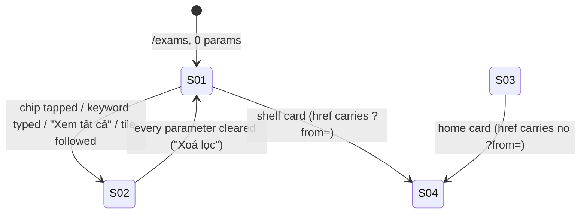

# Kho đề theo kệ (Exam Shelves) — UI Specification

| Version | Date | Status | Chain |
|---|---|---|---|
| 1.1 | 2026-09-18 | Draft | PRD → **UI Spec** → ADR-0021 → Design Doc → Work Plan |

**Amendment 2026-09-19 (engineer, after the first real render on dev) — wins over every row below that says otherwise:**
1. **No "Xem tất cả" header link on any shelf.** Supersedes AC-035 and AC-050 and the "Xem tất cả" clause of AC-004; `exams.shelfViewAll` deleted. The way into the full grid is the Khám phá tile and the `Nổi nhất` sort chip.
2. **Shelf cards are compact** (`ExamCard compact`, passed only by `ExamShelf`): no duration, no question count; title `line-clamp-2`; one meta line `bởi {author} · {school}` cut with `…`; `Card padding="compact"`, title `text-base`. The flat grid and the home block keep today's card (the AC-043 byte-identity baseline is unchanged).
3. **All cards in a row are the same height** (172px ≤ 639px, 180px above): slots are reserved (title min 2 lines, meta min 1 line) and the shelf passes `h-auto` — `h-full` (`height:100%`) disables flex stretch and had produced 198px next to 229px.
4. The Hot shelf shows **no attempt count** — the brief ranks by attempts but never asks to display one, and ADR-0021 keeps the aggregate off-screen (not k-anonymous at low volume). Adding one is a separate decision.

Refines HOW for `docs/prd/exam-shelves-prd.md` v1.1 (51 ACs, U1–U4 resolved as that document's defaults). WHAT is settled there; rows below cite an AC instead of restating it. Data selection, the DB-side hot aggregate and the attempt-source write path belong to ADR-0021 and the Design Doc.

**Prototype management** — `docs/ui-spec/assets/exam-shelves/prototype-huong-a.html` (design canvas, direction A; worktree `worktree-parallel-work` @ `f3de797`, untracked) and `EXAM-SHELVES-BRIEF.md` §3 (visual spec in words, 2026-09-17) are attachments; this document is canonical. The canvas re-declares the shipped `SOURCE/app/globals.css` tokens verbatim, so its CSS (lines 95–135) is authoritative for layout; deviations are listed in **Prototype Deltas** and win over the canvas.

## External Resources Used

| Resource (project-tier label) | Feature-specific identifier | Notes |
|---|---|---|
| Design Origin | `prototype-huong-a.html` — frames: 390px phone, 1000px desktop, cold-start, search-active | Theme is **Đêm hội** per `globals.css` |
| Design System | `Card` (`variant="outline"` + `border-dashed`), `Badge variant="plain"`, `chipVariants`, `PageContainer`, `PageHeader`, `ExamCard`, `ExamBrowser`, `ExamFilters`, `ExamPagination` | See Reuse Map |
| Visual Verification Environment | `/exams` (0 params), `/exams?sort=hot`, `/` signed-in — at 360 / 768 / 1024 / 1280 | Playwright **CLI** `npm run pw` from inside `SOURCE/`; the `playwright` MCP in `.mcp.json` is stale and not callable |

## Screens

| ID | Screen | Entry condition |
|---|---|---|
| S-01 | Kho đề — kệ: 3 server-rendered shelves, 0 grid, 0 pagination (AC-001) | Signed-in student, `/exams` with **0** query parameters; logged-out is redirected before render (AC-014) |
| S-02 | Kho đề — lưới phẳng: today's `ExamBrowser` + `ExamPagination`, unchanged (AC-008) | Any of `q, subject, grade, school, year, semester, sort, level, dir, page` present |
| S-03 | Trang chủ — `Đề nổi nhất` block: same frame, new data source + label (AC-036) | Signed-in, `authMode === null`, ≥1 exam |
| S-04 | Chi tiết đề `/exams/[id]`, unchanged; receives `?from=` (AC-039) | Tap any shelf card |



## Component Decomposition

```
ExamsPage  SOURCE/app/(exams)/exams/page.tsx  [server]
  PageHeader "Kho đề"  unchanged   ·   ExamFilters  + 1 chip "Nổi nhất"
  0 params ─► ExamShelf x3   NEW
  |             header: lucide icon + h2 + subtitle + optional "Xem tất cả"
  |             ul.row ─► ExamCard (+ ribbon on hot rank 1, + from, + width)
  |                    └► ExamShelfTile (Khám phá only)
  else     ─► ExamBrowser(key=gridKey) + ExamPagination   unchanged
```

| File under `SOURCE/` | Create / Edit | Change |
|---|---|---|
| `features/exams/components/ExamShelf.tsx` | Create | `ExamShelf` (async server component), module-local `SHELF` map (icon + title key + header-link builder + behaviour flags), the duplicated 2-line eligibility predicate, and module-local `ExamShelfTile` |
| `features/exams/components/ExamRibbon.tsx` | Create | `ExamRibbon` — the clipped corner ribbon, exported so the snapshot test can reach it |
| `features/exams/components/__tests__/ExamCard.snapshot.test.tsx` | Create | AC-043 containment proof; path fixed by the PRD |
| `features/exams/components/ExamCard.tsx` | Edit | 3 optional props; ribbon as the **last** direct child of `Card` |
| `app/(exams)/exams/page.tsx` | Edit | 0-params branch → 3 shelves, else today's tree verbatim; add `"hot"` to the `?sort=` whitelist (lines 46–47) |
| `features/exams/components/ExamFilters.tsx` | Edit | Local `ExamSort` union += `"hot"`; `QUICK` += `{ value: "hot", labelKey: "exams.sortHot" }` — the 4 existing chips gain 0 changed props (AC-033) |
| `features/exams/queries` (`ExamSort` export) | Edit | Union += `"hot"`, or the `page.tsx` edit above does not typecheck: `page.tsx:46` annotates against the **queries-side** union, not the local copy in `ExamFilters.tsx`. The ordering semantics behind the value belong to ADR-0021 and the backend Design Doc |
| `app/page.tsx` | Edit | `t("home.newExams")` → `t("home.hotExams")`; frame, `layout="stack"`, `HOME_EXAM_COUNT = 3` and `Xem tất cả đề` unchanged (AC-036) |
| `lib/copy.ts` | Edit | 16 new keys, 3 destinations (Copy Keys) |

`app/globals.css` is **not** touched: every token, glow and radius already exists and scroll-snap ships as Tailwind utilities.

## Component: ExamShelf

Server component (`export async function` — the fixture lane identifies server components by `AsyncFunction`). Renders `<section aria-labelledby="shelf-{shelf}" className="flex flex-col gap-3">` → header row → `<ul>` row. Returns `null` when `exams.length === 0` (AC-051).

| Prop | Type | Req. | Meaning |
|---|---|---|---|
| `shelf` | `"practice" \| "hot" \| "explore"` | yes | Selects icon, title key, header-link builder, `?from=` value, ribbon-on-rank-1 and trailing tile from the module-local `SHELF` map — so AC-004, AC-026 (exactly 1 ribbon) and AC-032 (tile on Khám phá only) hold structurally, not by call-site discipline |
| `subtitle` | `string` | yes | Already interpolated by the page; the shelf must not re-derive the rung or the weakest subject |
| `exams` | `Exam[]` | yes | Ranked then cut to ≤10 **in Node** before it arrives (AC-002, AC-006) |
| `submittedExamIds` | `Set<string>` | yes | One set per page; eligibility computed once, never per card |
| `isLoggedIn` | `boolean` | yes | With `submittedExamIds`, feeds the per-card `RateEligibility`. `ExamShelf` **duplicates the two-line predicate** — `isLoggedIn ? (submittedExamIds.has(id) ? "eligible" : "not-attempted") : "logged-out"`. `eligibilityFor` stays module-private in `ExamBrowser.tsx` and that file stays byte-untouched, because the PRD's Won't-Have list forbids any change to `ExamBrowser`. AC-016's single-sourcing rule scopes the weakness computation, not a two-line predicate with no product meaning: no export, no hoist to a shared module |

5 props, 0 optional. Everything that differs between the three shelves is a `SHELF` entry, not a call-site argument.

### Shelf composition (the `SHELF` map)

| Shelf | `shelf` | lucide icon | `h2` (id) | Subtitle key | `viewAllHref` entry |
|---|---|---|---|---|---|
| Cần luyện | `practice` | `Target` | `Các môn cần luyện` (`shelf-practice`) | `exams.shelfPracticeSubtitle` | builder → `/exams?subject={encodeURIComponent(exams[0].subject)}` — AC-011 guarantees every card on this shelf is the weakest subject, so no extra prop is needed (AC-050) |
| Nổi nhất | `hot` | `Flame` | `Các đề nổi nhất` (`shelf-hot`) | one of the 6 hot keys (AC-019–AC-023) | builder → constant `/exams?sort=hot` (AC-035) |
| Khám phá | `explore` | `Compass` | `Khám phá` (`shelf-explore`) | `exams.shelfExploreSubtitle` | `null` — no header link at any breakpoint; the tile is the exit (AC-004) |

Header markup: `div.flex.items-start.justify-between.gap-4` → `div.flex.items-start.gap-2.5` [ `<Icon aria-hidden className="size-[22px] shrink-0 mt-0.5" strokeWidth={1.9} />` (the `BottomNav.tsx:82` idiom) + `div` [ `h2.text-xl.font-semibold.leading-tight` + `p.text-[13px].text-muted-foreground.mt-0.5` ] ] + the link, whose class string is copied **whole** from `app/page.tsx:126` (`text-primary focus-visible:ring-ring inline-flex min-h-11 items-center rounded-lg text-sm font-semibold underline-offset-4 hover:underline focus-visible:ring-3 focus-visible:outline-none`) plus `whitespace-nowrap`. Dropping the ring or `rounded-lg` is a regression, not a simplification.

### Layout and scroll

Row class string — the `ExamFilters.tsx:161` bleed idiom plus snap: `-mx-4 flex snap-x snap-mandatory scroll-pl-4 gap-3 overflow-x-auto px-4 pt-1 pb-1.5 motion-safe:scroll-smooth [scrollbar-width:none] sm:-mx-6 sm:px-6 sm:scroll-pl-6 lg:gap-4 [&::-webkit-scrollbar]:hidden [&>li]:shrink-0 [&>li]:snap-start`

| Property | Value | Why |
|---|---|---|
| Bleed | `-mx-4 px-4` → `sm:-mx-6 sm:px-6` | Cancels the page's own `px-4 sm:px-6`; the row bleeds edge-to-edge and nothing else does |
| Scrollbar | **both** `[scrollbar-width:none]` and `[&::-webkit-scrollbar]:hidden` | `globals.css` styles `*` scrollbars; only the webkit rule removes the visible 8px bar |
| Block padding | `pt-1` (4px) / `pb-1.5` (6px) | 0 block padding clips `--glow-card`'s 1px ring and the card's 3px focus ring off every card in the row |
| Gap | `gap-3` (12px) → `lg:gap-4` (16px) | Canvas: 12px phone frame, 16px desktop frame |
| Card width | `w-80` (320px) → `lg:w-84` (336px) | Hard floor: the `ExamCard` footer row (difficulty + `Đánh giá` + `Làm đề`) needs ≈290px of inner width or it wraps; at 360px the next card peeks ≈26px to invite the swipe |
| Snap | row `snap-x snap-mandatory` + `scroll-pl-4/6`; children `snap-start` | Scroll padding keeps a snapped card on the page gutter instead of flush to the viewport edge |
| Smooth scroll | `motion-safe:scroll-smooth` | Restores the canvas's own smooth-scroll rule with one stock utility behind the repo-wide `motion-safe:` variant — no `globals.css` edit and no bespoke reduced-motion guard |

Shelves carry **no** state-derived React `key` — a key on a scroll container resets `scrollLeft` on every navigation. The flat-grid path keeps `key={gridKey}` exactly as today.

### State x Display Matrix — ExamShelf

| State | Display |
|---|---|
| Default | Header + 1–10 cards; `hot` rank 1 carries the ribbon; `explore` ends with the tile |
| Loading | **N/A** — fully server-rendered, 0 client fetches, 0 late insertion (AC-005); no skeleton vocabulary exists in this repo and none is added |
| Empty | Component absent: 0 header, 0 subtitle, 0 placeholder, 0 dashed card (AC-051); remaining shelves keep their relative order |
| Error | No per-shelf boundary; a failed read fails the page read, which is today's `/exams` behaviour. The Design Doc owns the read-failure contract |
| Partial | Not modelled — all shelf data resolves in the one `Promise.all` the page already issues |

### Interaction Definition — ExamShelf

| AC | EARS condition | Action | System response |
|---|---|---|---|
| AC-050 | When the Cần luyện header link is activated | Click / Enter | Navigate `/exams?subject={subject}` → S-02 (listed parameter, so shelves stand down) |
| AC-035 | When the Nổi nhất header link is activated | Click / Enter | Navigate `/exams?sort=hot` → S-02, flat grid on the AC-018 cross-user count |
| AC-032 | When the Khám phá tile is activated | Click / Enter | Navigate `/exams?page=1` → S-02 |
| AC-039 | When any shelf card is activated | Click / Enter | Navigate `/exams/{id}?from=practice\|hot\|explore` → S-04 |
| AC-047 | When the student tabs to a card outside the visible row | Tab | Native focus; the browser scrolls the snap container to it. No custom key handler, no `tabIndex` on the row |

## Component: ExamCard (shelf-aware props)

Three optional props; all absent → markup byte-identical to today (AC-043).

| Prop | Type | Default | Renders |
|---|---|---|---|
| `ribbon` | `string` | absent | `<ExamRibbon label={ribbon} />` as the **last direct child** of `Card`. Passing a label (not a node) keeps the geometry in one file and makes a second ribbon shape impossible at a call site |
| `from` | `"practice" \| "hot" \| "explore"` | absent | Appends `?from={from}` to the existing href; absent → today's bare `/exams/{id}` (AC-039) |
| `className` | `string` | absent | Merged as `cn("card-linked relative h-full", className)`. Needed only so the shelf can set `w-80 lg:w-84` on the card; a parent `[&>li]:w-80` rule would also hit the tile. **Not named by the PRD** — covered by the same AC-043 snapshot |

Unchanged and load-bearing: the stretched `Link.card-link` stays the **first** direct child (`.card-linked:has(> .card-link:hover)` matches a direct child only — re-parenting it kills hover feedback site-wide); `Card` does **not** gain `overflow-hidden` — an element's own overflow does not clip its own box-shadow, so the real cost is clipping every **descendant** ring on every `Card` call site in the app, starting with the stretched Link's 3px focus ring (`ExamCard.tsx:39`); no `translate` on hover.

| State | Display |
|---|---|
| Default — flat grid, home block | Exactly today: 0 ribbon, 0 `?from=`, 0 width class |
| Default — shelf card | Today's card at fixed width, href carries `?from=` |
| Ribbon | Only rank 1 of Nổi nhất (AC-026); 0 ribbons inside the home block (AC-037) |
| Loading / Empty / Error | Unchanged — the card has none; the list owner holds the empty state |

## Component: ExamRibbon

Decorative, `aria-hidden`, `pointer-events-none`, rendered on exactly one card per page.

| Element | Class string | Measurement |
|---|---|---|
| Clip square | `rounded-tr-card pointer-events-none absolute top-0 right-0 z-10 size-[76px] overflow-hidden` | 76×76px; `border-top-right-radius` = `--radius-card` = 18px. This square is what stops either ribbon end from touching a card edge |
| Band | `bg-sun glow-sun text-[color:var(--sun-on-solid)] absolute top-4 -right-[30px] w-[124px] rotate-45 py-[3px] text-center text-[8.5px] leading-[1.2] font-extrabold tracking-[.06em] uppercase` | top 16px, right −30px, width 124px, rotate 45°, 8.5px / 800 / `.06em`, padding 3px 0 |
| Text | `Hot nhất` (`exams.hotRibbon`) | Stored sentence-case; the uppercase is CSS |

| State | Display |
|---|---|
| Default | The band above, on rank 1 of the Nổi nhất shelf only |
| Empty / Loading / Error | **N/A** — the component owns no data; its off state is not being rendered at all (`ribbon` prop absent) |

Tokens `--sun` `#ffd65c`, `--sun-on-solid` `#14291c`, `.glow-sun` reused verbatim — no new token, **no `--ember`** (AC-044). Two documented deviations for the Design Doc to record rather than re-litigate: `--sun` gains a second meaning on a screen that already shows the yellow `BottomNav` pill, and `.glow-sun` is documented as reserved for touch targets. Both are mitigated because the ribbon is `aria-hidden` while "hot" is carried in words by the shelf title and subtitle.

## Component: ExamShelfTile (Xem toàn bộ kho đề)

Module-local to `ExamShelf.tsx`; last `<li>` of the Khám phá row only. `<Card as="li" variant="outline" padding="none" className="border-dashed w-[150px] lg:w-[200px]">` wrapping `<Link href="/exams?page=1">` with `flex h-full w-full flex-col items-center justify-center gap-2.5 rounded-card p-4 text-center text-sm font-semibold text-muted-foreground focus-visible:ring-ring/40 focus-visible:ring-3 focus-visible:outline-none`; children in canvas order: label `Xem toàn bộ kho đề`, then `<Compass aria-hidden className="size-[22px]" strokeWidth={1.9} />`. `variant="outline"` + `border-dashed` is the existing `ExamBrowser.tsx:33` empty-state recipe, reused here for a link.

| State | Display |
|---|---|
| Default | The dashed tile above, as the last `<li>` of the Khám phá row |
| Empty / Loading / Error | **N/A** — a static link with no data; absent whenever the Khám phá shelf is absent (AC-051) |

## Component: ExamFilters (Nổi nhất chip)

| State / interaction | Display |
|---|---|
| Default | `Bộ lọc` · divider · `Mới nhất` `Cũ nhất` `Khó nhất` **`Nổi nhất`** — 4th `QUICK` entry, same `chipVariants({ active })`, same `aria-pressed` (AC-033) |
| Active | `sort === "hot"` → `bg-foreground text-background`; the other three go inactive (one `?sort=` axis) |
| Tap (AC-034) | `setSort("hot")` unchanged: writes `?sort=hot`, deletes `page` and `dir`, `router.push(…, { scroll: false })` inside `startTransition` |

## Component: HomeHotExamsSection

`SOURCE/app/page.tsx:119-137`. Two changes only: the heading text becomes `Đề nổi nhất` via the **new** key `home.hotExams` (editing the string behind `home.newExams` would rename the concept everywhere it is used), and the 3 cards come from the hot order (AC-037). `aria-labelledby="home-new-exams"`, `text-xl font-semibold`, `layout="stack"`, `Xem tất cả đề`, the `exams.length > 0` guard and 0 ribbons all stay (AC-036, AC-038). The `home-new-exams` id keeps its name: it is not user-visible, and renaming it is churn with no AC behind it.

| State | Display |
|---|---|
| Default | Heading `Đề nổi nhất` + `Xem tất cả đề` + 3 stacked cards, top 3 of the hot order |
| Empty (site has 0 submitted attempts, or 0 exams) | Whole `<section>` absent — not an empty frame (AC-038); guests keep seeing `TechStack` |
| Loading / Error | **N/A** — same server read path as today; unchanged behaviour |

## Page State Matrix — /exams

| # | Condition | Shelves in DOM order | Absent | Hot subtitle |
|---|---|---|---|---|
| 1 | Signed-in, ≥1 scored representative attempt, dominant grade G, ≥5 exams in 7d/G | Cần luyện → Nổi nhất → Khám phá | — | `Khối {grade}, tuần này` |
| 2 | As #1, 7d/G yields <5 | idem | — | `Khối {grade}, 30 ngày qua` |
| 3 | As #1, 30d/G yields <5 | idem | — | `Khối {grade}, từ trước tới nay` |
| 4 | As #1, all-time/G yields <5 | idem | — | `Toàn hệ thống, từ trước tới nay` |
| 5 | Signed-in, 0 submitted attempts (no dominant grade) | Nổi nhất → Khám phá | Cần luyện (AC-013) | `Toàn hệ thống, tuần này` → `Toàn hệ thống, 30 ngày qua` → `Toàn hệ thống, từ trước tới nay` (AC-023) |
| 6 | Submitted attempts exist, 0 scored representative attempts | Nổi nhất → Khám phá | Cần luyện | per rung above |
| 7 | Site has 0 submitted attempts | Khám phá only | Cần luyện + Nổi nhất (AC-024) | — |
| 8 | 0 unshown published exams | those that qualify | Khám phá (AC-051) | — |
| 9 | Any listed URL parameter present | none — `ExamBrowser` + `ExamPagination` render exactly as today (AC-008–AC-010) | all three | — |
| 10 | Logged out | none — redirect before render (AC-014) | whole page | — |

Cần luyện subtitle is always `{subject} đang là môn điểm trung bình thấp nhất của bạn`, where `{subject}` is `subjectLabel(subject)` — the same Vietnamese label the badge on the cards beneath shows, so `Chemistry` reads `Hóa học`, not the canvas shorthand `Hoá`.

## Responsive Behaviour

| Width | Shelves |
|---|---|
| 360 | page padding `px-4`, bleed `-mx-4/px-4`, `gap-3`, cards 320px (next card peeks ≈26px), tile 150px |
| 768 | page padding `px-6` (switched at 640 by `sm:`), bleed `-mx-6/px-6`, `gap-3`, cards 320px, tile 150px |
| 1024 | as 768 plus `lg:gap-4`, cards **336px**, tile 200px |
| 1280 | as 1024; `PageContainer size="full"` caps at 72rem and centres, matching the 60px navbar's `max-w-6xl` |

Page frame around them, unchanged by this feature (AC-007): below 768px `BottomNav` is visible and `.pb-bottom-nav` reserves 60px while the `SiteHeader` link row is hidden; at 768px `BottomNav` disappears (`md:hidden`), `.pb-bottom-nav` goes to 0 and the header link row appears — which is the difference between the canvas's two frames. The canvas frames are 390px and 1000px; the card-width switch is fixed at **1024px** (`lg:`), the repo's documented breakpoint. `Xem tất cả` renders at **every** breakpoint on Cần luyện and Nổi nhất (AC-050 overrides the canvas's mobile omission); Khám phá shows no header link at any breakpoint (AC-004 overrides the canvas's desktop link).

## Design Tokens Used

All already in `SOURCE/app/globals.css` (theme **Đêm hội**). No new token, no new utility, no `globals.css` edit.

| Token / class | Value | Used by |
|---|---|---|
| `--surface` / `--card` / `--background` | `#101e18` / `#1a3125` / `#070f0c` | `Card` (unchanged), page background |
| `--foreground` / `--muted-foreground` | `#f0fbf3` / `#a6c2b0` | Shelf `h2` + 22px icon / 13px subtitle, tile label |
| `--primary` | `#7ff0b0` | `Xem tất cả` link |
| `--sun` / `--sun-on-solid` / `.glow-sun` | `#ffd65c` / `#14291c` / 1px ring + 20px blur | Ribbon only (AC-044) |
| `--border` | `#2f5544` | Dashed tile border |
| `--radius-card` (`rounded-card`, `rounded-tr-card`) | `1.125rem` = 18px | Card corners and the ribbon clip square |
| `.glow-card` / `.card-linked` / `focus-visible:ring-ring/40 ring-3` | as shipped | Cards in the row, hover feedback, focus rings |
| `min-h-11` | 44px | `Xem tất cả` touch target |

## Motion

Nothing may shift layout: the shelves use **none** of the `.motion-*` / `usePresence` vocabulary (a server-rendered row needs no entrance), 0 fade of page content on load, no bespoke transition at a call site, no `translate`; every shelf card is in the initial HTML (AC-005) and no shelf row carries a `key`, for a CLS target of **0** at 360/768/1024/1280 on open **and** on swipe.

Smooth scrolling is adopted as `motion-safe:scroll-smooth` on the row: `scroll-smooth` is a stock utility in the installed Tailwind build and `motion-safe:` is an existing repo-wide variant, so the canvas's own smooth-scroll rule is restored for one token, with no `globals.css` edit and no bespoke reduced-motion guard.

## Accessibility Requirements

| Area | Requirement |
|---|---|
| Section semantics | Each shelf is `<section aria-labelledby="shelf-{shelf}">` paired with its `h2` (the `app/page.tsx:119-121` precedent). This introduces the first `h2` level on `/exams`, between the `PageHeader` `h1` and the card `h3`s — intentional |
| List semantics | The row is a `<ul>`; every card and the tile are `<li>` (`Card as="li"`) |
| Keyboard | No `tabIndex` and no `role` on the row — it already holds focusable links, and an extra stop per shelf would be 3 stops before the first card. Tab order is DOM order; the browser scrolls the snap container to the focused card (AC-047) |
| Focus visibility | Cards keep `focus-visible:ring-ring/40 focus-visible:ring-3`; the row's 4px/6px block and 16/24px inline padding keep the ring unclipped |
| Touch targets | `Xem tất cả` carries `min-h-11` (44px), matching `home.viewAllExams`; the tile's link is ≥44px by construction |
| Colour independence | The ribbon is `aria-hidden` + `pointer-events-none`; "hot" is stated **in text** in the shelf title and subtitle, so the meaning survives with colour and images off. `Target` / `Flame` / `Compass` carry bare `aria-hidden` |
| Contrast | Measured, both far above the 4.5:1 AA threshold and both matching the figures `globals.css` already records in its own comments: ribbon text `--sun-on-solid` `#14291c` on `--sun` `#ffd65c` = **11.0:1**; subtitle `--muted-foreground` `#a6c2b0` on `--surface` `#101e18` = **9.0:1** |
| Verification | Manual keyboard + TalkBack pass at 360 and 1280 (Success Criteria #8); the repo has no axe dependency and this work adds none |

## Copy Keys

All Vietnamese, all in `SOURCE/lib/copy.ts` (AC-046), in three places: the **14 shelf and ribbon keys** go under `// --- Danh sach de ---` (copy.ts:132); `exams.sortHot` goes immediately after `exams.sortHardest` under `// --- Bo loc & do kho ---` (copy.ts:505); `home.hotExams` goes immediately after `home.newExams` (copy.ts:81). `t()` prints the raw key when one is missing, and a raw key on screen is a defect.

| Key | Vietnamese literal | Renders |
|---|---|---|
| `exams.shelfPracticeTitle` | `Các môn cần luyện` | Shelf 1 `h2` |
| `exams.shelfPracticeSubtitle` | `{subject} đang là môn điểm trung bình thấp nhất của bạn` | Shelf 1 subtitle; `{subject}` = `subjectLabel(subject)` |
| `exams.shelfHotTitle` | `Các đề nổi nhất` | Shelf 2 `h2` |
| `exams.shelfHotGradeWeek` | `Khối {grade}, tuần này` | Shelf 2 subtitle, rung 1 (AC-019) |
| `exams.shelfHotGradeMonth` | `Khối {grade}, 30 ngày qua` | rung 2 (AC-020) |
| `exams.shelfHotGradeAll` | `Khối {grade}, từ trước tới nay` | rung 3 (AC-021) |
| `exams.shelfHotSiteWeek` | `Toàn hệ thống, tuần này` | no-grade ladder rung 1 (AC-023) |
| `exams.shelfHotSiteMonth` | `Toàn hệ thống, 30 ngày qua` | no-grade ladder rung 2 (AC-023) |
| `exams.shelfHotSiteAll` | `Toàn hệ thống, từ trước tới nay` | final rung of both ladders (AC-022, AC-023) |
| `exams.shelfExploreTitle` | `Khám phá` | Shelf 3 `h2` |
| `exams.shelfExploreSubtitle` | `Đề mới đăng, môn và trường bạn chưa thử` | Shelf 3 subtitle (AC-031) |
| `exams.shelfViewAll` | `Xem tất cả` | Shelf 1 + 2 header link |
| `exams.shelfViewAllStore` | `Xem toàn bộ kho đề` | Trailing tile label (AC-032) |
| `exams.hotRibbon` | `Hot nhất` | Ribbon band (AC-026) |
| `exams.sortHot` | `Nổi nhất` | 4th chip in `QUICK` (AC-033) |
| `home.hotExams` | `Đề nổi nhất` | Home right-column `h2` (AC-036) |

## Containment Rule (AC-043)

`<ExamCard exam={…} eligibility={…} />` with no `ribbon`, no `from` and no `className` must produce **byte-identical** markup to the pre-change component, class-string order included (`cn()`/tailwind-merge output is position-sensitive; `cn("card-linked relative h-full", undefined)` returns the identical string). Proof: a new snapshot suite at `SOURCE/features/exams/components/__tests__/ExamCard.snapshot.test.tsx`, committed **against the pre-change component** and kept green across the change. Three harness facts it must honour:

- The file **begins with** `// @vitest-environment jsdom` — `vitest.config.ts:18` defaults the environment to `node`; `RichText.regression.test.tsx:1` is the precedent.
- Import verbatim: `import { renderServerTree } from "@/tests/helpers/renderServerTree";` — the same path `EssayReviewBlock.test.tsx` uses. This repo has a recorded history of guessing that path wrong.
- `renderServerTree()` is required rather than `render(await ExamCard(props))`: `ExamCard` is async and renders the async `AuthorByline`, so the direct form yields an empty tree and a vacuous pass. At least one positive assertion (the exam title is present) accompanies the `container.innerHTML` + `toMatchSnapshot` pair — the repo's only snapshot idiom — so an empty tree is always red.

## Existing Component Reuse Map

| UI element | Decision | Existing component | Note |
|---|---|---|---|
| Shelf section | New | — | `ExamBrowser` is explicitly not given a third layout |
| Shelf header | New (composed) | pattern at `app/page.tsx:119-130` | Genuinely new: 22px icon, 13px subtitle, `items-start` + `mt-0.5` |
| `Xem tất cả` link | Reuse | `app/page.tsx:126` class string | Copied whole, focus ring included |
| Horizontal scroll row | Reuse (2nd use) | `ExamFilters.tsx:161` idiom | Rule of Three: copy, do not extract a shared component yet. Snap is new vocabulary — no `scroll-snap` exists in `SOURCE` today |
| Exam card | Extend | `ExamCard` | 3 optional props, otherwise untouched |
| Ribbon | New | — | `Badge` cannot express 8.5px / 800 / rotated without distorting every other Badge call site |
| Trailing tile | Reuse | `Card variant="outline"` + `border-dashed` | Same recipe as the `ExamBrowser` empty state |
| Sort chip / home block | Extend | `QUICK` + `chipVariants`; `app/page.tsx` right column | 1 array entry (4 existing chips gain 0 changed props); label key + data source only |
| `ExamBrowser`, `ExamPagination`, `PageHeader`, `SiteHeader`, `BottomNav`, `HeaderSearch` | Reuse unchanged | — | AC-007: nothing loses or resizes an element |

## Prototype Deltas

The canvas's two `Xem tất cả` inconsistencies are resolved by AC-050 and AC-004 — see Responsive Behaviour. The three shelves are direct children of the existing `PageContainer` column, so they inherit its rhythm and gutters.

| Canvas | This spec | Reason |
|---|---|---|
| `padding-block: 2px 6px` on the row | `pt-1` (4px) / `pb-1.5` (6px) | 2px clips 1px off the card's 3px focus ring inside the overflow container |
| No `scroll-padding` | `scroll-pl-4 sm:scroll-pl-6` | Without it a snapped card lands flush to the viewport edge, not the page gutter |
| `.p-card { overflow: hidden }` | Never on `Card` | An element's own overflow does not clip its own box-shadow; it clips every descendant ring on every `Card` call site, starting with the stretched Link's 3px focus ring |
| Ribbon offered as `--sun` or `--ember` | `--sun` only | Engineer's decision; `--ember` is not added to `globals.css` |
| Subtitle reads `Hoá`; PRD AC-012's example does too | `subjectLabel(subject)` → `Hóa học` | The badges on the cards beneath use the same label. AC-012 fixes the **template**, not the rendering of `{subject}` |
| Row inline padding and card padding step up at the 1000px desktop frame; inter-shelf spacing 24px | Both step up at `sm:` (640px); inter-shelf spacing is the page's existing `gap-5` (20px) at every width | Row padding must track the shipped page (`px-4 sm:px-6`) and card padding must track `Card` (`p-4 sm:p-5`), or the bleed stops cancelling. The 4px spacing difference is accepted under AC-007 (no existing element resizes) |

## AC Traceability

| ACs | Screen / component | Adoption |
|---|---|---|
| AC-001–AC-007, AC-051 | S-01, ExamShelf (props, state matrix), Reuse Map | Adopted |
| AC-008–AC-014, AC-050 | S-02, Shelf composition, Page State Matrix #1, #5, #6, #9, #10 | Adopted |
| AC-019–AC-026, AC-044, AC-049 | Hot subtitle keys, Page State Matrix #1–#5 and #7, ExamRibbon (no card-level de-dup or demotion marker in the UI) | Adopted |
| AC-029–AC-039 | Shelf 3 + ExamShelfTile, ExamFilters chip, header links, HomeHotExamsSection, ExamCard `from` | Adopted |
| AC-043, AC-045–AC-047 | Containment Rule; lucide-only icons; Copy Keys; Accessibility — Keyboard | Adopted |
| AC-015–AC-018, AC-027, AC-028, AC-040–AC-042, AC-048 | Data / schema / action layer | Out of UI Spec scope — ADR-0021 + Design Doc |

**Golden states for visual acceptance**: Page State Matrix rows #1, #5, #7 and #9, each captured at 360 and 1280, plus a ribbon close-up proving neither end touches a card edge and the 18px corner radius survives.

## Open Items

| ID | Description | Owner | Deadline |
|---|---|---|---|
| TBD-02 | The `/exams` round-trip budget assertion (`rating.int.test.ts:663-674`) goes red when the hot aggregate is added; the backend Design Doc must state the new expected read list and its reason | Backend Design Doc author | before implementation starts |

TBD-01 (contrast) is closed with measured values in Accessibility Requirements. TBD-03 (stale `external-resources.md`) was fixed in a separate pass.

## Update History

| Date | Version | Changes | Author |
|---|---|---|---|
| 2026-09-18 | 1.0 | Initial version, from PRD v1.1 + canvas direction A | Claude (UI spec agent) |
| 2026-09-18 | 1.1 | Review pass I001–I011: eligibility predicate duplicated in `ExamShelf` (`ExamBrowser` stays untouched); header link moved into the `SHELF` map and `viewAllHref` prop dropped; `motion-safe:scroll-smooth` adopted; `copy.ts` destinations per key group; queries-side `ExamSort` edit added; snapshot-test environment pragma and import path pinned; `overflow-hidden` reason corrected; three further canvas deltas recorded; TBD-01 closed with measured contrast, TBD-03 dropped | Claude (UI spec agent) |
