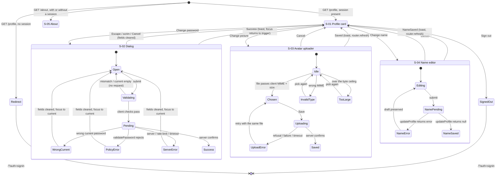

# Account Profile (`/profile`) and Public Contact Page (`/about`) — UI Specification

| | |
|---|---|
| **Version** | 1.0 |
| **Date** | 2026-08-17 |
| **Status** | **Draft — awaiting engineer approval.** Two items require the engineer's input before implementation and are marked **blocking** in Open Items: **TBD-01** (the avatars bucket is declared PUBLIC by PRD D3 but the frontend handoff states it is PRIVATE with signed reads — the two cannot both be true) and **TBD-02** (this spec deliberately overrides the literal wording of PRD AC-020, which contradicts locked decision D10/AC-048). Everything else is decided here and is downstream-executable. |
| **PRD** | `docs/prd/profile-and-about-prd.md` v1.0 (2026-08-17), Draft. D1–D10 locked, D11–D12 derived, AC-001–AC-072. |
| **ADR** | None required and none written. This feature introduces no new library, no new architectural layer, and no new data-flow shape — the change-password Server Action is a new caller of existing primitives, not a new pattern. The bucket-visibility question (TBD-01) is a **product/privacy** decision recorded in the PRD (D3, R-d, U3), not an architecture decision. |
| **Design Doc** | Not yet written. This spec is normative for the UI contract; the Design Doc owns transport, storage naming, rate-limit values, and the current-password re-verification mechanism (PRD R-a). |

## Revision History

| Version | Date | Change |
|---|---|---|
| 1.0 | 2026-08-17 | First version. Written from PRD v1.0 with **no prototype code** — no Figma, no Storybook, no design spec document exists for this project. Records 14 `UI-D` decisions, prefixed `UI-` from the start per the lesson at `docs/ui-spec/support-system-ui-spec.md:15` (a bare `D1` would collide with the PRD's own D1–D12). Surfaces two contradictions the PRD could not have seen: the bucket-visibility conflict (TBD-01) and the AC-020 / AC-048 wording conflict (TBD-02). |

## Overview

### Target PRD

`docs/prd/profile-and-about-prd.md` v1.0. This spec covers **every user-facing surface** the PRD names: R1, R2, R3, R4, R5 (client half), R6, R7, R8, R9, R10, R12, R13, R14, and the R15 drop condition. It does not cover the server-side halves of R5 and R11, which have no UI surface.

### Scope in this spec

| Screen | In this spec | Reason |
|---|---|---|
| S-01 `/profile` — identity card | **Specify + implement** | The whole point of the feature |
| S-02 Change-password dialog | **Specify + implement** | First modal this feature introduces; inherits no primitive (PRD Constraint 7) |
| S-03 Avatar upload control (inline in S-01) | **Specify + implement** | Client half; server enforcement is the Design Doc's |
| S-04 Display-name inline editor (inline in S-01) | **Specify + implement** | Reuses `updateProfile` unchanged |
| S-05 `/about` — public contact page | **Specify + implement** | Ships with marked placeholders (PRD U1) |
| Avatar in `SiteHeader` / homepage sidebar | **Specify + implement** | PRD D4/R6 — two existing components change |
| `/about` in-app link surface | **Defer, with reasons** | See UI-D14 — there is no legal place to put it that does not break a measured layout constraint |

### Design Source

| Source | Path | Version |
|---|---|---|
| Design tokens ("Mực & Sơn mài" / Ink & Lacquer) | `SOURCE/app/globals.css` | branch `feat/subscription-payos`, read 2026-08-17 |
| Hard visual rules + rationale | `.claude/MEMORY.md` §3 | read 2026-08-17 |
| Shipped in-repo components | `SOURCE/components/`, `SOURCE/app/**/_components/` | read 2026-08-17 |

`globals.css` wins on any conflict with `.claude/MEMORY.md`, **by that document's own instruction** (`.claude/MEMORY.md:80`). Two conflicts are live and are resolved that way in this spec:

1. **Shape.** `globals.css:148-160` states that primary action buttons are absolute pills (`rounded-full`) set against sharp 8–12px content cards, and that the shape *contrast* — not colour — is what draws the eye to the primary action. `.claude/MEMORY.md:96` is superseded on this point.
2. **Reading measure.** `.claude/MEMORY.md:96` sets a hard 720px cap for long-form text. Of the three legal widths, only `small` (672px) clears it. `LegalDocument.tsx:7-10` already records this reasoning and is reused verbatim by `/about`.

`PROJECT_OVERVIEW.md §2` was deleted 2026-08-06 and must not be cited; several in-repo comments still reference it (e.g. `SOURCE/app/page.tsx:15`) and those references are stale.

## Prototype Management

- **Attachment path**: N/A — **no prototype code was supplied and none exists.** `docs/ui-spec/assets/profile-and-about/` is deliberately **not** created; an empty directory would imply an attachment that does not exist.
- **Version identification**: the canonical visual reference is shipped in-repo code on branch `feat/subscription-payos`, read 2026-08-17.
- **Compliance premise**: shipped code is treated as a **stronger** precedent than a prototype would be, because it has already passed this repository's six verification gates (`tsc --noEmit`, `eslint --max-warnings 0`, `vitest run`, `build`, `verify:schema`, `check:bundle`) and real-device QA.
- **Relationship to the canonical spec**: this document is canonical for both screens. Where it deviates from an in-repo pattern, the deviation is a numbered `UI-D` with its reason — never implicit.

## External Resources Used

| Resource (project-tier label) | Feature-specific identifier | Notes |
|---|---|---|
| Design Origin | `--background`, `--foreground`, `--card`, `--brand`, `--brand-foreground`, `--brand-on-dark`, `--muted`, `--muted-foreground`, `--border`, `--input`, `--ring`, `--destructive`, `--radius-card`, `--scaffold-small`, `--bottom-nav-h` | All pre-existing. **This feature introduces no new token.** |
| Design System | `PageContainer`, `PageHeader`, `LegalDocument`, `LegalContentPending`, `SuccessToast`, `Button`, `SkipLink`, `SiteHeader`, `BottomNav`, `SupportWidget` | All reused; see Existing Component Reuse Map |
| Database Schema Source | `public.user_profiles` (new nullable avatar column), `storage.objects` policies for the avatars bucket | Column name and policy text are the Design Doc's; this spec only requires that the resolved value reach the client as a single string-or-absent field |
| Secret Store | `NEXT_PUBLIC_SUPABASE_URL` (already present — read by `isAllowedImageUrl`) | **No new secret and no new env var is introduced by this feature.** |
| Visual Verification Environment | `/profile` at 320 / 360 / 768 / 1024 / 1440px; `/about` at 320 / 768px | The `npm run dev` + Playwright path already recorded project-tier |

Project-tier access methods (URLs, hosts, MCP names, auth mechanisms) live in `docs/project-context/external-resources.md` and are deliberately not restated here.

> **Hearing note.** The external-resource hearing protocol asks the user via `AskUserQuestion` whether to refresh `docs/project-context/external-resources.md`. That tool is not available in this session, so **no hearing was run and the project-tier file was not modified**. This feature introduces no new external resource — no new service, no new credential, no new host — so the project tier is believed current as of its own 2026-08-16 stamp. If that belief is wrong, the axis to re-hear is *Design Origin* only.

## Decisions Record

Prefixed `UI-` throughout, because the PRD already owns `D1`–`D12`.

### UI-D1 — `/profile` is one centered card at `small` width, not a sidebar-nav settings shell

**Decision.** `SOURCE/app/(analytics)/profile/page.tsx` renders `PageContainer as="main" size="small"` (672px, `--scaffold-small`) containing exactly one `PageHeader` and one card. No section nav, no tabs, no left rail.

**Rationale.** There is one section. A settings shell with one entry in its nav is a promise of a second entry that this PRD explicitly refuses to make — the Won't-Have list rules out email change, deletion, sessions, 2FA, and preferences, which is every candidate for a second section. `PageContainer`'s own selection rule names `small` for "trang một-tác-vụ, luồng đọc hẹp … form", and PRD qualitative metric 1 requires the whole account to be legible "within one screen, without scrolling" — a 768px or 1152px scaffold spreads five short rows across a width that makes each row's label and its action button fall at opposite ends of the eye's travel.

**Rejected**: `size="default"` (768px) — the same content, wider, for no reading benefit; `full` (1152px) — that step exists for dense data grids and matches `SiteHeader`'s own max width, which would make a five-row form look like a dashboard.

### UI-D2 — The pill shape is spent once, inside the dialog. Every row action is a 4px outline button

**Decision.** On `/profile`, the display-name / password / avatar row actions and the sign-out control are all **outline buttons**: `rounded-[4px] border-border min-h-11`. The **only** `rounded-full` control in this feature is the change-password dialog's single **Update password** submit.

**Rationale.** `globals.css:148-160` is explicit that the pill is the *primary* action set against sharp-cornered cards, and that this contrast is the mechanism that draws the eye. `/profile` has no primary action — three row actions are exact peers, and sign-out is a fourth. Pilling all four would spend the contrast four times in one card and therefore spend it zero times. The dialog is the one surface in this feature with a genuine primary action, so it is the one place the pill earns its meaning. `SupportWidgetDialog.tsx:231-249` already ships exactly this pairing: `rounded-[4px]` Cancel next to `rounded-full` Submit.

**Consequence.** `SOURCE/components/ui/button.tsx` is usable for all of these, but **every** call site adds `min-h-11` in `className`, because every one of its size steps (`h-6`/`h-7`/`h-8`/`h-9`) is below the 44px touch floor. All three existing call sites in the repo already do this; this feature does not become the fourth exception.

### UI-D3 — `SOURCE/components/ui/input.tsx` is not used. Form fields follow the `MetadataFields` class constants

**Decision.** Every text and password input in this feature uses the three live class constants at `SOURCE/features/authoring/components/MetadataFields.tsx:45-57`:

- label: `eyebrow block`
- input: `mt-1.5 min-h-11 w-full rounded-[4px] border bg-transparent px-3 py-2.5 text-sm text-foreground outline-none transition-colors duration-200 disabled:opacity-60`, with `border-brand` when the field is in error and `border-border focus:border-ring` otherwise
- error: `mt-1 animate-in fade-in text-xs text-brand duration-200`

**Rationale.** `components/ui/input.tsx` has **zero call sites in the repository**. It is dead scaffolding: its `h-8` is 32px, twelve pixels under the touch floor, and its `rounded-lg` (10px) contradicts the 4px input family that every real form in this repo uses. Importing it would revive a component that the codebase has already, silently, decided against — and would do so on a password form.

Two properties of the live convention are load-bearing and must survive copying: `min-h-11` is explicit **because `px-3 py-2.5 text-sm` computes to 42px**, two pixels under the 44px floor; and the focus border is bronze `--ring` while vermilion `--brand` is reserved for errors, so focus and failure never look alike.

**Consequence for `.eyebrow`.** The same class is the repo's uppercase tracked small-label class *and* its form-label class. This feature uses it as a form label, verbatim, and never as anything else.

### UI-D4 — The change-password dialog portals to `document.body` and locks body scroll

**Decision.** `ChangePasswordDialog` renders through `createPortal(..., document.body)` and sets `document.body.style.overflow = "hidden"` while open, restoring the previous value on close — the `DeleteDialog.tsx` treatment, not the `SupportWidgetDialog.tsx` one.

**Rationale.** Two independent reasons, and the weaker one is stated honestly.

1. **Body scroll lock is needed regardless of portalling.** The dialog is a three-field form on a 360px phone. Without a lock, the page behind scrolls under the scrim while the on-screen keyboard is open and drags the panel out of view — the exact symptom `DeleteDialog.tsx:63-66` records. Scroll lock on a non-portalled panel is possible but pointless, since the lock is half of what the portal fix exists for.
2. **Immunity to a documented production failure class.** `DeleteDialog.tsx:5-17` records a real prod bug on 2026-08-17: `position: fixed` anchors to the nearest ancestor with `filter` / `backdrop-filter` / `transform` / `will-change`, and a `backdrop-blur` ancestor collapsed a `fixed inset-0` scrim into a horizontal band. **Stated plainly: no ancestor of `/profile`'s content collapses the scrim today.** `SiteHeader` (`z-30`, `backdrop-blur`, `SiteHeader.tsx:44`) and `BottomNav` (`z-40`, `backdrop-blur`, `BottomNav.tsx:55`) both create containing blocks, but the dialog mounts inside `#main-content`, which is a sibling of both. Portalling is therefore insurance, not a bug fix — and it is insurance the repo has already paid for once, at production, on a Saturday.

**Rejected**: the `SupportWidgetDialog` non-portalled shape — it works today for the same structural reason, and it is the file the *accessibility* pattern is copied from (UI-D5); copying its DOM placement as well would inherit the one property it has that this dialog cannot afford.

**z-index.** The portalled dialog uses `z-50`, keeping the shipped ladder intact: `z-30` SiteHeader < `z-40` BottomNav < `z-[45]` SupportWidgetTrigger < `z-50` modals < `z-[70]` SuccessToast. No new rung is added.

### UI-D5 — The dialog copies the `SupportWidgetDialog` a11y pattern and adds a real focus trap, which is new behaviour in this repository

**Decision.** Copy the pattern, not the code (`SupportWidgetDialog.tsx:5-6` states this is how the repo propagates modals): `role="dialog"` + `aria-modal="true"` + `aria-labelledby` pointing at the panel's own `<h2>` id; scrim is an `aria-hidden tabIndex={-1}` button with `bg-[#1B1512]/40`; panel is `border-border bg-background relative w-full max-w-sm rounded-lg border p-6 outline-none`; `Escape` closes via a `window` keydown listener registered while open; the panel is focused on open through a ref with `tabIndex={-1}`.

**Add, as new behaviour:** a **real focus trap**. A `keydown` handler on the panel intercepts `Tab` and `Shift+Tab`, computes the panel's focusable descendants in DOM order, and wraps from last to first and first to last.

**Rationale.** **No existing modal in this repository contains focus — `Tab` walks straight out of the panel and into the page behind the scrim, in `SupportWidgetDialog`, `DeleteDialog`, `LeaveExamDialog`, and `ReportExam` alike.** PRD AC-050 requires containment explicitly, and PRD R9's own preamble says this dialog is the feature's single largest accessibility risk precisely because there is no primitive to inherit correctness from. This is therefore the first correct focus trap in the codebase; it must be written, not imported, and it must not be described as inherited.

**Focus return is the parent's job.** `SupportWidget.tsx:33-36` documents why: the panel knows how to focus *itself* on open but not where to send focus *back* to on close, so the component owning both siblings closes the loop. `ProfileCard` therefore holds a ref to the "Change password" trigger and refocuses it on every close path — Escape, scrim, Cancel, and success.

**Initial focus is the panel, not the first field.** The panel carries the dialog's accessible name via `aria-labelledby`; focusing it announces "Đổi mật khẩu, dialog" before the first label. Focusing the current-password input instead would announce only the field. The one exception is AC-068's rejection path, where focus moves deliberately to the current-password input — at that moment the user has already heard the title and needs the field.

### UI-D6 — `SuccessToast` is reused as-is; `/profile` owns one instance and one counter

**Decision.** Exactly one `<SuccessToast message={…} trigger={…} />` is mounted by `ProfileCard`. `ProfileCard` holds `{ key: MessageKey; n: number }` in state and increments `n` on each success. Three outcomes feed it: password changed, avatar updated, display name updated.

**Rationale.** There is **no toast provider and no imperative `toast()`** in this repository; the consumer owning a counter is the entire API. `trigger === 0` means "never fired" and must stay 0 until the first real success — initialising it to anything else fires a toast at mount.

Its two-part markup is **mandatory and must not be simplified**: a permanently-mounted `aria-hidden` visible bubble, plus a separate `sr-only role="status" aria-live="polite"` region whose text flips `"" → message → ""`. `SuccessToast.tsx:16-21` records why — a live region whose text never changes is announced once at mount and never again, so a permanently-populated region is a silent one.

**Consequence for AC-054.** Success is announced by `SuccessToast`. **Errors are not** — they are announced by their own `role="alert"` nodes next to the field that failed, because an error belongs where the user must act, not in a bubble that vanishes after three seconds.

### UI-D7 — Avatar is a new shared component; initials are a separate pure module

**Decision.** Two new files:

- `SOURCE/components/shared/Avatar.tsx` — presentational, no I/O, used at three sizes by `/profile` (96px), `SidebarProfile` (32px), `HeaderProfile` (24px).
- `SOURCE/lib/profile/initials.ts` — exports `deriveInitials(displayName: string): string | null`. Pure, no React, unit-testable, which is what PRD AC-007 requires.

**Rationale.** This is the feature's one genuine component gap. No avatar component exists; `HeaderProfile.tsx:19` and `SidebarProfile.tsx:19` each hardcode `const AVATAR = "/images/user-avatar-placeholder.png"`, and nothing anywhere derives initials. Three call sites is the Rule of Three exactly, not an anticipated future.

Splitting the derivation out of the component is not premature abstraction: AC-007 names five string cases that must be covered by unit tests, and testing a string function through a React render is strictly worse at every one of them.

**The initials rule, stated exactly (PRD D11).** Input is `CurrentUserProfile.displayName`, which is never empty — `getCurrentUser.ts:43` resolves `display_name → email → "Người dùng"`.

1. Normalise the input to **NFC**. Every Vietnamese letter, including every tone-mark combination, has a precomposed form in NFC, so after this step a base letter and its diacritics are a single code point.
2. Split on `.` and discard empty segments. This is why `...x` yields `X`: the three leading empty segments are gone before any letter is read.
3. Take the **first code point** of segment 0 (via `Array.from(...)[0]`, never `charAt(0)` — `\p{L}` admits astral letters, and `charAt` would return half a surrogate pair).
4. If a second non-empty segment exists, take the first code point of segment 1 as well. Stop at two; a third segment is ignored.
5. Uppercase the result with `toUpperCase()`.
6. If step 2 leaves **zero** non-empty segments, return `null`.

Required unit cases, all from AC-007 plus the two the AC does not name:

| Input | Output | Why it is in the list |
|---|---|---|
| `An` | `A` | Single token — one letter, and "initials" is a lie for this user; the rule accepts that rather than inventing a second letter |
| `an.nguyen` | `AN` | The dot is the only separator `/^[\p{L}.]+$/u` permits, because no display name can contain a space |
| `Nguyễn` | `N` | Base letter is unaccented; included because it is the AC's stated accent case |
| `Ện` | `Ệ` | **Not in the AC.** First character is a Vietnamese letter carrying two combining marks. Without the NFC step, a name stored in NFD yields the bare `E` and the tone is silently dropped |
| `a.b.c` | `AB` | Capped at two; the third segment is ignored, not concatenated |
| `...x` | `X` | Leading empty segments skipped |
| `...` | `null` | **Not in the AC, and reachable.** `/^[\p{L}.]+$/u` matches a string of only dots, so `...` is a storable display name. `deriveInitials` returns `null` and `Avatar` falls back to the placeholder image |

**Residual, stated rather than hidden:** if a display name ever contains a letter with no precomposed NFC form, step 3 returns the base letter without its marks. No Vietnamese input can reach this. The fix, if it is ever needed, is `Intl.Segmenter` with `granularity: "grapheme"`; it is deliberately not used today because it would buy nothing for the language this product serves.

### UI-D8 — The avatar's rendered URL is resolved server-side and reaches `Avatar` as a plain optional string

**Decision.** `Avatar`'s image props are exactly `{ src?: string; displayName: string; size: 24 | 32 | 96 }`. It renders, in order: the image when `src` is present **and** passes `isAllowedImageUrl`; else the initials bubble when `deriveInitials()` returns non-null; else `/images/user-avatar-placeholder.png`. It performs no fetch, no signing, and no `URL` construction beyond the allowlist check.

**Rationale, and the conflict it survives.** PRD **D3 locks the avatars bucket as PUBLIC** and AC-033 asserts that a cookie-less GET of an avatar object returns 200. The frontend handoff for this spec states the opposite — that the bucket is **PRIVATE** and reads go through `resolveSignedImageUrl` (`SOURCE/lib/ugc/imageUrl.ts`, TTL 3600s, failing closed to `undefined`). **Both cannot be true, and this spec does not have the authority to pick one** — D3 is locked and R-d/U3 are built on top of it, while the handoff describes it as verified fact. It is escalated as **TBD-01 (blocking)**.

What this decision does is make the UI **correct either way**, so the conflict blocks the Design Doc and not this spec:

- Under **public read**, the server passes the stored public URL straight through. `src` is present whenever the column is.
- Under **private + signed**, the server calls `resolveSignedImageUrl`, which returns `undefined` on any failure. `src` is absent whenever signing fails.

Either way `Avatar` sees a string or nothing, and **"nothing" always renders initials — never a broken image, never a spinner, never a request to a URL that does not exist** (PRD AC-006, AC-040). The visible difference between the two worlds is a single new state on the avatar, `signed-url-failed`, which is specified below and which under public read is simply unreachable.

**Rendering mechanism.** A plain `` with an inline `// eslint-disable-next-line @next/next/no-img-element` carrying its reason, **not** `next/image`. `SOURCE/next.config.ts` declares no `images.remotePatterns`, so `next/image` cannot load a Supabase URL at all; the repo's established answer is `QuestionFigure.tsx:50`. CSP already permits the Supabase origin in `img-src` (`lib/security/csp.ts:56`) — **do not add a CSP rule.**

**Origin allowlist.** `isAllowedImageUrl`, exported from `SOURCE/components/shared/QuestionFigure.tsx`, gates the `src`. It is a pure function with no React dependency and is reused as-is. A `javascript:` or `data:` URL, a foreign origin, or a malformed string all fail closed to initials.

**Consequence for `HeaderProfile` / `SidebarProfile` (PRD R6).** Both currently use `next/image` against a *local* asset, which works only because the asset is local. Both switch to `<Avatar>`, which resolves both `next/image`'s remote-host failure (PRD R-e) and AC-040's "one deterministic choice in both places" in a single component.

### UI-D9 — `updateProfile`'s five English error strings are mapped to i18n keys on the client, and the map is guarded by a test

**Decision.** `/profile` renders display-name errors through a client-side `Record<string, MessageKey>` keyed on the **exact literal** returned by `updateProfile` (`SOURCE/features/auth/actions.ts:158-189`), with a regex branch for the rate-limit string (which interpolates a number) and `profile.error.generic` for anything unmatched — including the Supabase `error.message` that the action returns on a failed write.

A **unit test asserts each mapped literal is byte-identical to the literal in `actions.ts`.** Editing the action's wording without editing the map fails the build instead of silently degrading every Vietnamese user to a generic message.

**Rationale.** The defect is real and the PRD does not name it: `updateProfile` returns five hardcoded English strings with no i18n keys, and the two existing widgets render them in a bare `<p>` with no `role="alert"` and no `aria-describedby` (`HeaderProfile.tsx:143`, `SidebarProfile.tsx` equivalent). D10 requires every user-facing string to resolve through the dictionaries; AC-046 requires `/profile` to call the **existing** action so the three validation rules cannot drift.

Mapping on the client satisfies both. It changes no server code, touches no other call site, and keeps exactly one server-side implementation of the rules — which is what AC-046 actually asserts. Matching on an English literal is brittle; the test converts that brittleness into a build gate, which is this repository's established way of handling exactly this class of fragility.

**Rejected**: changing `updateProfile` to return a discriminated code. It is the better long-term shape, but it changes a shared action's return type and forces edits to two shipped widgets that render `state.error` raw — a diff this feature does not need to take, on the one action the PRD explicitly locked as "reused, not reimplemented". Recorded as **TBD-05** (non-blocking) so it is not lost.

### UI-D10 — `validatePassword`'s messages are also mapped to i18n keys. This deliberately overrides the literal wording of AC-020

**Decision.** The four outcomes of `validatePassword` (`SOURCE/lib/auth/passwordPolicy.ts:55-75`) are rendered through four dictionary keys, by the same literal-match-plus-test mechanism as UI-D9.

**Rationale, stated as an override rather than a reading.** AC-020 says the function's message is "surfaced **verbatim** … with that function's own wording". Those messages are English (`passwordPolicy.ts:51` says so in its own comment: *"Trả về câu lỗi (tiếng Anh…)"*). AC-048 says no user-facing display string may be hardcoded, that every string resolves through the dictionaries, and that **the mask is the only exception**. Both are Must criteria of the same PRD and they cannot both be satisfied.

This spec chooses the D10 side, because:

1. **D10 is a locked decision; AC-020 is a criterion.** AC-048 is D10's criterion and names its single exception explicitly. AC-020 does not claim to be a second exception.
2. **AC-020's normative core survives intact.** "Validated by the existing `validatePassword`" and "**No second password policy is introduced**" both remain literally true — the mapping renders an outcome, it does not decide one. Only the sentence's wording is localised.
3. **The alternative ships an English-only sentence to a Vietnamese fourteen-year-old, on the most security-sensitive form in the product**, at the exact moment they need to understand what to do differently.

Because this contradicts an approved criterion's literal text, it is escalated as **TBD-02 (blocking)** with the exact input needed: the engineer either confirms the override or amends AC-020. **Implementation must not start on the dialog's error rendering until this is answered**; nothing else in the feature is blocked by it.

### UI-D11 — Avatar upload is two-step: choose, preview, then Save

**Decision.** Picking a file does not upload it. The control moves to a **chosen** state showing a local preview, the filename, and a `Save` / `Cancel` pair. `Save` uploads.

**Rationale.** Three reasons converge. A mis-tap in a phone gallery otherwise costs a 2MB upload on a mobile network the PRD's own framing describes as unstable. The student gets no chance to see what they picked before it becomes their identity in the site header, and there is no crop, rotate, or re-encode step to correct it (PRD Won't-Have). And it makes the avatar row grammatically identical to the display-name row — reveal, edit, save or cancel — so the card teaches one interaction, not two.

**File picker idiom.** The `ScreenshotAttachment.tsx:89-108` pattern, not a third invention: the real `<input type="file">` is `peer sr-only` — **`sr-only`, not `hidden`, so it keeps its tab stop and stays in the accessibility tree** — behind a styled `<label>` that is the only visible control. This also removes the browser's untranslatable, unstyleable "No file chosen" text. Two behaviours copy across verbatim: `e.target.value = ""` on change, so re-picking the same file re-fires `onChange`; and the preview object URL created in `useMemo` and revoked in an effect cleanup, so no blob leaks on unmount or replacement.

**Client validation is a courtesy and is named as one.** MIME and size are checked before upload so the student sees the problem immediately, but the client references the **same named constants the Server Action validates against** and never re-declares `2` or the three MIME strings. Constant names are proposed as `LIMITS.MAX_AVATAR_BYTES` and `AVATAR_MIME_TYPES`; their file is the Design Doc's (**TBD-04**). PRD AC-030 remains true: the server is the enforcement point and a crafted request that never ran this code is still refused.

### UI-D12 — `/about` reuses `LegalDocument` inside the existing `(billing)` route group

**Decision.** `SOURCE/app/(billing)/about/page.tsx`, rendering `<LegalDocument eyebrow title>` with a `<dl>` of three contact rows. No new route group, no new layout.

**Rationale.** `LegalDocument` is the repo's public-prose precedent and it already answers the width question with its reasoning recorded in place (`LegalDocument.tsx:7-10`): `PageContainer size="small"` = 672px, the only scaffold step under the 720px reading-measure cap. `/terms` and `/refund-policy` — the two closest siblings, same shell, same public status — already live in `(billing)`, and that layout's own header comment (`app/(billing)/layout.tsx:5-13`) explicitly blesses a group holding both public and private routes, because access is decided per-path by `PUBLIC_PATHS` and not by group.

**The one cost, named.** `(billing)/layout.tsx` calls `readEntitlement(user?.id ?? null)`. Today that is the phase stub — a pure function, no I/O (`subscription-ui-spec.md` UI-D2). When the payOS backend lands it becomes a real read, and at that moment the PRD's NFR *"`/about` adds no server work"* stops being true for all three public pages at once. That is recorded as **TBD-06** (non-blocking) with its trigger stated, so it is caught by the person who makes `readEntitlement` real rather than by whoever profiles the page a year later.

**Rejected**: a new `(public)` route group. Semantically cleaner and it would preserve the NFR — but it duplicates a five-import shell to serve one page, which is the exact duplication PRD D2 refuses for `/profile`. Applying opposite reasoning on the two screens of one feature is worse than the entitlement read.

### UI-D13 — The `/about` placeholders are gated by one named boolean, and are not links while they are placeholders

**Decision.** The page module declares:

- a single named constant `CONTACT_VALUES_ARE_PLACEHOLDERS` (initial value `true`), carrying an in-place comment that names PRD **U1**, names the engineer as owner, and lists the three dictionary keys to replace;
- three dictionary values that are **self-describing placeholder strings in each locale**, not fabricated data.

While the flag is `true`: a `LegalContentPending` notice renders above the list, and the email and phone render as **plain text, not `mailto:` / `tel:` links**. When it flips to `false`, the notice disappears and both become links whose `href` is derived from the same dictionary value as the visible text (`mailto:${value}`), so AC-070's single-source property holds by construction.

**Rationale.** `mailto:[PLACEHOLDER — real contact email, PRD U1]` is a broken link that a crawler will follow and a visitor will tap. `LegalContentPending` is the repo's shipped answer to exactly this shape of problem — content owned by a human who has not supplied it yet — with `role="status"` and a dashed border already in production on `/terms`. A named boolean is greppable and self-documenting, which is precisely what AC-059 asks for: an engineer replacing the values "does not have to search for them".

**On the <10%-identical i18n rule.** A real name, email, and phone number are byte-identical in both locales, which is exactly the kind of key the CI budget tolerates ("Email", "Google", "HK1" are already on that list). The **placeholder** values are written differently per locale so they do not consume budget while they stand, and so a Vietnamese reader sees a Vietnamese placeholder. Three identical keys after U1 lands, out of roughly eight hundred, is under half a percent — recorded so nobody treats the eventual identity as a regression.

### UI-D14 — `/about` ships with no in-app navigation link, and this is a deferral with a reason, not an oversight

**Decision.** `NAV_ITEMS` is unchanged. `GUEST_NAV_ITEMS` is unchanged. No footer is built. `/about` is reachable in this release by direct URL, by `sitemap.xml`, and by `robots.txt` (PRD AC-064, AC-065).

**Rationale.** Every candidate surface is closed:

1. **`NAV_ITEMS` is capped at five on purpose.** `lib/nav/items.ts:22-23` and `BottomNav.tsx:20` record that these five are exactly the five bottom-nav cells, and cell position is muscle memory. Adding a sixth moves every cell a student has already learned.
2. **`GUEST_NAV_ITEMS` feeds a horizontal row that is *measured* to be at capacity.** `SiteHeader.tsx:83-88` records the measurement: at exactly 768px, logo + 5 tags + language button + profile slot overflowed by **13px** at `gap-6`, which is why that breakpoint runs `gap-4` and only widens to `gap-8` at 1024px. Guests already render six tags there. A seventh is a known-overflow change at the tightest supported width, not a risk.
3. **There is no footer component in this repository.** Building one is a new always-mounted surface across every route group — a larger diff than either new page in this feature, and outside the PRD's scope diagram.
4. **The homepage sidebar is `lg:` only.** `HomeSidebar.tsx:41` is `hidden … lg:flex`, so a link placed there would be invisible to every phone user — which is most of this product's traffic and all of the people who cannot sign in.

**What this costs, stated plainly.** A signed-out visitor who does not already know the URL will not find `/about` from inside the app. For a contact page that is mainly reached from a school notice, an email signature, or a search result, that is a survivable first release; it is not a good permanent state. The preferred fix and its exact location are recorded as **TBD-03** (non-blocking): a minimal `SiteFooter` carrying `/about`, `/terms`, and `/refund-policy`, mounted by `(billing)`, `(analytics)`, `(exams)`, and `(authoring)` layouts — one component, four one-line layout edits, and it retires the "no footer" constraint permanently. The `nav.about` dictionary key is **not** added in this release, because an unused key is an unused key.

**`/profile`'s entry point, by contrast, is settled.** The `HeaderProfile` and `SidebarProfile` dropdowns each gain a `/profile` link as their **first** item, above the existing Edit / My exams / Sign out. This adds no nav cell, no header tag, and no width pressure — the panel is a 224px vertical menu with room. It also does not remove the dropdowns' existing inline "Edit", even though `/profile` supersedes it; deleting a shipped affordance is a separate, reversible decision recorded as **TBD-07**.

## AC Traceability (PRD → Screens/Components)

### In UI scope

| AC | Requirement | Screen / Component | State that satisfies it |
|---|---|---|---|
| AC-001 | `/profile` renders for a signed-in student | S-01 `ProfilePage` → `ProfileCard` | Default |
| AC-003 | `(analytics)` shell present, not re-implemented | S-01 `ProfilePage` | Default — page renders `PageContainer`/`PageHeader` only; `SkipLink`, `SiteHeader`, `#main-content`, `BottomNav` come from `app/(analytics)/layout.tsx` and are **not re-declared** |
| AC-006 | Never-uploaded avatar shows initials, no broken image, no request to a nonexistent URL | `Avatar` | `initials` |
| AC-007 | Initials follow D11 exactly | `deriveInitials` (`lib/profile/initials.ts`) | All seven cases in UI-D7's table |
| AC-008 | Current display name is shown | `DisplayNameEditor` | `idle` |
| AC-009 | Registered email is read-only | `ProfileRow` (email instance) | Default — plain text node, **no `<input>`, no action button, no form** |
| AC-010 | Password value is exactly 8 × U+2022, locale-independent, length-independent | `PasswordRow` | Default — module-level constant, outside the i18n path (PRD D12) |
| AC-011 | No reveal control of any kind | `PasswordRow` | Default — see its Absent-affordances list |
| AC-012 | No plaintext password renders as visible text anywhere | `ChangePasswordDialog` | All states — three `type="password"` inputs, nothing else holds password material |
| AC-013 | Sign-out control present, keyboard-reachable, i18n name | `SignOutButton` | Default |
| AC-014 | Sign-out runs the existing action, lands on `/?auth=signin` | `SignOutButton` | `pending` → navigation |
| AC-016 | Exactly three `type="password"` fields, each with a programmatically associated label | `ChangePasswordDialog` | `open` |
| AC-018(d) | After a wrong current password the dialog is resubmittable without re-auth | `ChangePasswordDialog` | `wrong-current-password` — dialog stays open, controls re-enabled |
| AC-019 | Mismatched new/confirm refused with a specific message, nothing sent | `ChangePasswordDialog` | `validating` → `error(mismatch)`, client-side, **no request issued** |
| AC-024 | No password value reaches a log, telemetry, an Error message, or a client-returned value | `ChangePasswordDialog` | All states — client half. The repo-wide assertion covers the Server Action too |
| AC-025 | On success the dialog closes, AT is told, the new password is never shown | `ChangePasswordDialog` → `SuccessToast` | `success` |
| AC-027–AC-029 | MIME set of three; 2MB ceiling | `AvatarUploader` | `invalid-type`, `too-large` — client mirror only; the server is the enforcement point |
| AC-030 | Client checks are never the enforcement point | `AvatarUploader` | Stated in UI-D11; no UI state |
| AC-034 | Avatar survives reload | `Avatar` | `image` — `src` comes from the profile row on every server render, never from client state |
| AC-040 | No-avatar state is one deterministic choice in both widgets | `Avatar` | `initials` — both widgets render the same component, so identical behaviour is structural |
| AC-042 | Correct accessible treatment for every avatar image | `Avatar` | All states — `alt=""` plus `aria-hidden` on the initials text; the adjacent display name names the control (`HeaderProfile.tsx:69` precedent). **Never announces a filename or URL** |
| AC-043–AC-045 | Empty / too-long / bad-charset display names refused | `DisplayNameEditor` | `error` — server verdict from `updateProfile`, rendered through UI-D9's map |
| AC-046 | Calls the existing `updateProfile`; no second server-side validation | `DisplayNameEditor` | All states — `useActionState(updateProfile, null)` |
| AC-047 | New name appears on `/profile`, header, and sidebar without a manual reload | `DisplayNameEditor` | `success` — `router.refresh()`, the `HeaderProfile.tsx:33-41` pattern |
| AC-048 | No hardcoded user-facing string; mask is the only exception | All components | See "i18n Keys to Add"; overridden for `validatePassword` per UI-D10 / TBD-02 |
| AC-049 | Every new key exists in both dictionaries | i18n table | Enforced by `vi.ts`'s `Dictionary` type + `lib/i18n/__tests__/i18n.test.ts` |
| AC-050 | Dialog: open, sensible tab order, **focus contained**, Esc closes, focus returns to opener | `ChangePasswordDialog` | `open` — UI-D5; containment is **new behaviour**, not inherited |
| AC-051 | Non-empty accessible name on every control; file input labelled; errors associated by `aria-describedby` | All components | Accessibility Requirements — `aria-describedby` is set **only when an error exists**, never as a dangling id |
| AC-052 | 4.5:1 text, 3:1 large text and control boundaries, both locales | All components | Contrast Requirements table |
| AC-053 | ≥24×24 CSS px, with 44px preferred on touch | All controls | `min-h-11` on every button and input (UI-D2, UI-D3) |
| AC-054 | Success and error outcomes announced through a live region | `SuccessToast` (success) + `role="alert"` nodes (errors) | UI-D6 |
| AC-055 | `/about` shows exactly three contact facts, responsive | S-05 `AboutPage` | Default |
| AC-059 | Placeholders clearly marked in place, naming what to swap and who owns it | S-05 `AboutPage` | `placeholder` — `CONTACT_VALUES_ARE_PLACEHOLDERS` (UI-D13) |
| AC-060 | Placeholder strings live in `vi.ts` / `en.ts` | i18n table | `about.owner.value`, `about.email.value`, `about.phone.value` |
| AC-061 | 320px: no horizontal scroll, single column, nothing truncated or clipped | S-05 `AboutPage` | Responsive tier 1 + Layout Constraints |
| AC-067 | Failed upload or name save is actionable and retryable; no indefinite spinner, no false success | `AvatarUploader`, `DisplayNameEditor` | `error` — every error state re-enables its controls |
| AC-068 | A rejected password attempt clears all three fields and focuses current-password | `ChangePasswordDialog` | `wrong-current-password`, `error(server)`, `error(policy)`, `error(mismatch)` |
| AC-069 | No duplicate request while one is in flight | `ChangePasswordDialog`, `AvatarUploader`, `DisplayNameEditor` | `pending` — synchronous `useRef` guard, per `SupportWidgetDialog.tsx:60-66` |
| AC-070 | Email and phone actionable, href and text from one source | S-05 `AboutPage` | `real` — gated by UI-D13 while placeholders stand |
| AC-071 | New avatar visible on `/profile` and in the header without a manual reload | `AvatarUploader` | `success` — `router.refresh()` |
| AC-072 | Client downscale (P3) | `AvatarUploader` | **Not specified. R15 is dropped from this spec** — the Design Doc does not define a downscale, so the PRD's own drop condition applies and an oversize file produces the `too-large` state. Dropping it affects no Must or Should requirement |

### Deliberately not in UI scope

| AC | Why it has no UI surface |
|---|---|
| AC-002, AC-004 | Middleware redirect and `PUBLIC_PATHS` membership. There is no UI, and the absence of markup along the redirect chain is the criterion |
| AC-005 | RLS and query shape |
| AC-015 | Session termination is observable only as a redirect the middleware performs |
| AC-017, AC-020(mechanism), AC-021, AC-022, AC-023 | Server Action behaviour: current-password re-verification (PRD R-a), policy call, other-session revocation, current-session preservation, rate limiting. The UI renders the outcomes; it decides none of them |
| AC-026 | Regression test on the untouched recovery flow |
| AC-031–AC-033, AC-035–AC-037 | Storage paths, RLS, bucket creation, schema fingerprint, upload rate limit |
| AC-038, AC-039 | Satisfied structurally by `Avatar` (see AC-040 above); the criteria themselves are verified in a `npm run build` + `npm start` run, not in this spec |
| AC-041 | `CurrentUserProfile` is extended additively; the gate is `tsc --noEmit` across 7 call sites |
| AC-056–AC-058 | Cookie-less 200, zero data fetch, zero auth call in the page module. `/about`'s page module contains a `getTranslate()` call and static JSX and nothing else — that is the criterion, not a state |
| AC-062–AC-066 | `PUBLIC_PATHS`, its test, `robots.ts`, `sitemap.ts`, and `alternates.canonical`. **`/about`'s metadata must declare `alternates: { canonical: "/about" }`** or it self-reports as a duplicate of the homepage (`terms/page.tsx:16-24`) — recorded here because it is written in the page module a UI implementer will open |

## Screen List and Transitions

### Screen List

| Screen ID | Route | Route group | Layout inherited | Auth condition | Description |
|---|---|---|---|---|---|
| S-01 | `/profile` | `(analytics)` | `app/(analytics)/layout.tsx` — `SkipLink`, `SiteHeader`, `#main-content` (`tabIndex={-1}`), `.pb-bottom-nav`, `BottomNav`, `SupportWidget` | **Authenticated only.** Enforced by the existing middleware through absence from `PUBLIC_PATHS`; no new guard (PRD D9, AC-004) | One centered card: identity block, three mutable-field rows, sign-out |
| S-02 | `/profile` (overlay) | — | Portalled to `document.body` (UI-D4) | Same as S-01 | Change-password dialog |
| S-03 | `/profile` (inline) | — | — | Same as S-01 | Avatar uploader, revealed inside the avatar row |
| S-04 | `/profile` (inline) | — | — | Same as S-01 | Display-name inline editor, revealed inside the name row |
| S-05 | `/about` | `(billing)` | `app/(billing)/layout.tsx` — same shell plus `EntitlementProvider` (UI-D12) | **Public.** Requires the new `"/about"` entry in `PUBLIC_PATHS` (PRD AC-062). Renders identically with and without a session | Static contact page: owner name, contact email, contact phone |

### Transition Conditions

| Source | Destination | Trigger | Guard condition |
|---|---|---|---|
| any authenticated page | S-01 | Activate "Profile" in the `HeaderProfile` / `SidebarProfile` dropdown (UI-D14), or direct URL | Session present, else middleware redirects to `/?auth=signin` (AC-002) |
| (cookie-less request) | `/?auth=signin` | GET `/profile` | No session — middleware, `lib/supabase/middleware.ts:115-120` |
| S-01 | S-02 | Click / Enter / Space on "Change password" | — |
| S-02 | S-02 `validating` | Submit | Synchronous in-flight ref is false (AC-069) |
| S-02 `validating` | S-02 `error(mismatch)` | new ≠ confirm | Client-side; **no request is issued** (AC-019) |
| S-02 `validating` | S-02 `error(currentRequired)` | current is empty | Client-side (AC-017's client half) |
| S-02 `validating` | S-02 `pending` | All three fields non-empty and new === confirm | — |
| S-02 `pending` | S-02 `wrong-current-password` | Server returns the wrong-current verdict | AC-018 — session survives; all three fields cleared; focus to current (AC-068) |
| S-02 `pending` | S-02 `error(policy)` | `validatePassword` rejects | AC-020 outcome, rendered per UI-D10 |
| S-02 `pending` | S-02 `error(server \| rateLimited \| network)` | Server error, `guard()` refusal, or the bounded client timeout | AC-023, AC-067 |
| S-02 `pending` | S-02 `success` → S-01 | Server confirms the change | Dialog closes; focus returns to the trigger; `SuccessToast` fires (AC-025) |
| S-02 (any non-`pending`) | S-01 | Escape, scrim click, or Cancel | All three fields are cleared on close, always |
| S-01 | S-03 `chosen` | Choose a file via the label-fronted input | Client MIME + size pass, else `invalid-type` / `too-large` |
| S-03 `chosen` | S-03 `uploading` | Activate Save | In-flight ref false (AC-069) |
| S-03 `uploading` | S-03 `success` → S-01 | Upload + row write succeed | `router.refresh()`; `SuccessToast` fires (AC-071) |
| S-03 `uploading` | S-03 `error` | Refusal, failure, or timeout | Controls re-enabled; the chosen file is preserved for retry (AC-067) |
| S-03 (any) | S-01 | Activate Cancel | Object URL revoked |
| S-01 | S-04 `editing` | Activate "Change name" | — |
| S-04 `editing` | S-04 `pending` | Submit | Draft non-empty; in-flight guard |
| S-04 `pending` | S-04 `success` → S-01 | `updateProfile` returns `null` | `router.refresh()`; `SuccessToast` fires (AC-047) |
| S-04 `pending` | S-04 `error` | `updateProfile` returns `{ error }` | Mapped through UI-D9; draft preserved |
| S-04 (any) | S-01 | Activate Cancel | Draft discarded |
| (any visitor, session or not) | S-05 | Direct URL, sitemap, or search result | None — public (AC-056) |

### Screen Transition Diagram



## Component Decomposition

### Component Tree

```
app/(analytics)/layout.tsx                                    [REUSE-AS-IS — supplies the whole shell, PRD D2]
  +-- SkipLink / SiteHeader / #main-content / BottomNav / SupportWidget
      +-- app/(analytics)/profile/page.tsx                    [NEW  — Server Component]
          +-- PageContainer as="main" size="small"         [REUSE-AS-IS]
          +-- PageHeader (owns the single <h1>)            [REUSE-AS-IS]
          +-- ProfileCard                                  [NEW  — "use client", owns all dialog/editor state]
              +-- (identity block)
              |     +-- Avatar size={96}                   [NEW  — shared, 3 call sites]
              |     +-- (display name, <p>)
              |     +-- (registered email, <p>, read-only)
              +-- ProfileRow  x3                           [NEW  — presentational shell: label / value / trailing action]
              |     +-- [name]     DisplayNameEditor       [NEW  — inline editor, calls updateProfile unchanged]
              |     +-- [password] PasswordRow             [NEW  — 8 x U+2022 constant + dialog trigger]
              |     +-- [avatar]   AvatarUploader          [NEW  — COPY-THE-PATTERN from ScreenshotAttachment]
              +-- SignOutButton                            [NEW  — <form action={signOut}>, existing action]
              +-- ChangePasswordDialog                     [NEW  — COPY-THE-PATTERN, portalled; opened from PasswordRow]
              +-- SuccessToast                             [REUSE-AS-IS — one instance, one counter]
              +-- (sr-only role="status" pending region)   [NEW  — one per card, see UI-D6 consequence]
      +-- app/(analytics)/profile/loading.tsx                 [NEW  — skeleton card]
      +-- app/(analytics)/profile/error.tsx                   [NEW  — reset() wired to common.tryAgain]

app/(billing)/layout.tsx                                   [REUSE-AS-IS — UI-D12]
  +-- app/(billing)/about/page.tsx                         [NEW  — Server Component, no client boundary]
      +-- LegalDocument                                    [REUSE-AS-IS — PageContainer small + PageHeader]
          +-- LegalContentPending                          [REUSE-AS-IS — placeholder gate, UI-D13]
          +-- (<dl> of three contact rows, inline in the page module — no component, see below)

Modified existing components
  +-- components/shared/HeaderProfile.tsx                  [MODIFY — Avatar at 24px; new "Profile" menu item]
  +-- features/auth/components/SidebarProfile.tsx          [MODIFY — Avatar at 32px; new "Profile" menu item]
  +-- lib/auth/getCurrentUser.ts                           [MODIFY — CurrentUserProfile gains one optional field, additively]

New non-component module
  +-- lib/profile/initials.ts                              [NEW  — deriveInitials(), pure, unit-tested per AC-007]
```

**No component is created for the `/about` contact list.** Three static `<dl>` rows with no state and one call site do not clear the Rule of Three, and `terms/page.tsx` — the closest precedent — is eight lines of JSX inside its own page module. The list's display variants are specified under `Component: AboutPage` anyway, because they are two real variants an implementer must build.

**On matrix orientation.** The sibling specs in `docs/ui-spec/` put states in columns. Three of this feature's components carry seven or eight states, which makes an eight-column table unreadable. Interactive components here therefore use **states as rows**, with columns `State | Entered when | Display | Interactive controls | Announced to AT`. The information is identical; only the axis is flipped.

---

### Component: Avatar

**Decision: NEW.** `SOURCE/components/shared/Avatar.tsx`. Props: `{ src?: string; displayName: string; size: 24 | 32 | 96; className?: string }`.

#### State × Display Matrix

| State | Entered when | Display | Interactive controls | Announced to AT |
|---|---|---|---|---|
| `image` (default) | `src` present **and** `isAllowedImageUrl(src)` true | `` in a `rounded-full overflow-hidden` box at `size`, `object-cover`; inline `// eslint-disable-next-line @next/next/no-img-element -- ảnh Storage động, không qua next/image optimizer` | none — presentational | Nothing. `alt=""` (AC-042); the adjacent display name names the control |
| `initials` | `src` absent, unusable, or origin-rejected — **and** `deriveInitials()` returns non-null | `bg-muted text-foreground font-sans font-medium` circle at `size`, centered 1–2 uppercase letters. Type scale: `text-[10px]` at 24, `text-xs` at 32, `text-2xl` at 96 | none | Nothing — the letters carry `aria-hidden`. They are a decorative restatement of a name already in the DOM |
| `placeholder` | `deriveInitials()` returns `null` (display name contains no letter — e.g. `...`) | The existing `/images/user-avatar-placeholder.png` at `size`, `alt=""` | none | Nothing |
| `focused` | — | **N/A.** `Avatar` is never focusable. In `HeaderProfile` / `SidebarProfile` it sits inside a focusable trigger whose own ring is unchanged; on `/profile` it is inert | — | — |
| `loading` | — | **N/A.** No fetch, no suspense boundary. The URL is resolved server-side before render (UI-D8) | — | — |
| `empty` | — | **N/A.** `initials` **is** the no-avatar state; there is no separate empty affordance (AC-006) | — | — |
| `error` | Image element fires `onError` (object deleted, signed URL expired mid-view) | Falls back to `initials` for the remainder of the page's life | none | Nothing |
| `disabled` | — | **N/A.** Presentational | — | — |
| `success` | — | **N/A.** Success belongs to `AvatarUploader` | — | — |

#### Interaction Definition

| AC ID | EARS condition | User action | System response | State transition | Error handling |
|---|---|---|---|---|---|
| AC-006 | Given a student who has never uploaded an avatar | (render) | Initials circle renders. **No `` element is emitted at all**, so no request to a nonexistent object URL is made | → `initials` | — |
| AC-040 | Given a student with no avatar, when the header and the sidebar render | (render) | Both show initials — structurally identical, because both render this one component | → `initials` | — |
| AC-042 | Given any avatar anywhere in the product | (screen reader inspection) | `alt=""` on the image; `aria-hidden` on the initials text; **never a filename, never a URL** | all states | — |
| (UI-D8) | Given the resolved URL is absent because signing failed | (render) | Falls back to initials silently. **The student is not told** — a failed signing round trip is not the student's problem and not their action to take. It is the Design Doc's to log server-side | → `initials` | Server-side log only |

---

### Component: ProfileCard

**Decision: NEW.** `SOURCE/features/profile/components/ProfileCard.tsx`, `"use client"`. Owns dialog open/closed, the trigger ref for focus return, the toast counter, and the shared pending live-region text. Props: `{ user: CurrentUserProfile }` — no fetching, mirroring `SupportWidget.tsx:3-6`.

#### State × Display Matrix

| State | Entered when | Display | Interactive controls | Announced to AT |
|---|---|---|---|---|
| `default` | Always | `rounded-[var(--radius-card)] border border-border bg-card` card. Inside: identity block (96px `Avatar`, display name `text-xl`, email `text-sm text-muted-foreground`), then `divide-y divide-border` rows, then a hairline and the sign-out footer | All child controls | — |
| `focused` | — | N/A — the card is not focusable; focus lives on its children | — | — |
| `loading` | Route segment loading | Handled by `profile/loading.tsx`: a skeleton with the same card frame, a `bg-muted` circle, and three row-height `bg-muted` bars. Same height as the real card, so nothing shifts on arrival | none | — |
| `empty` | — | **N/A and unreachable.** `getCurrentUserProfile()` returning `null` means no session, which the middleware already resolved to a redirect (AC-002). The page does not render a signed-out state, because it cannot be reached in one |
| `error` | Server render throws | Handled by `profile/error.tsx` — message plus a `reset()` button labelled `common.tryAgain`, the `history` route-convention precedent | Retry | `role="alert"` |
| `disabled` | — | N/A | — | — |
| `success` | Any child reports success | Card is unchanged; `SuccessToast` fires with the child's message | unchanged | `SuccessToast`'s `sr-only` region flips `"" → message → ""` |

#### Interaction Definition

| AC ID | EARS condition | User action | System response | State transition | Error handling |
|---|---|---|---|---|---|
| AC-001 | Given a signed-in student requests `/profile` | (navigate) | Card renders with all five identity elements | → `default` | — |
| AC-003 | Given `/profile` renders | (DOM inspection) | `SkipLink`, `SiteHeader`, `#main-content[tabindex="-1"]`, `BottomNav` are all present **and none is declared by this page** | `default` | — |
| AC-025, AC-047, AC-071 | When any child reports a success | (child callback) | `setToast({ key, n: n + 1 })` — one counter, three producers | → `success` | — |
| AC-050 | When the dialog closes by any path | Escape / scrim / Cancel / success | `triggerRef.current?.focus()` — the parent closes the focus loop (`SupportWidget.tsx:33-36`) | S-02 → S-01 | — |

---

### Component: ProfileRow

**Decision: NEW.** `SOURCE/features/profile/components/ProfileRow.tsx`. Presentational shell used three times. Props: `{ label: string; children: React.ReactNode; action?: React.ReactNode; expanded?: React.ReactNode }`.

Layout: `flex flex-wrap items-center gap-x-4 gap-y-3 py-4`. The label + value block carries `min-w-0` so a long email truncates inside the row rather than widening it; the action carries `ml-auto shrink-0`, so when Vietnamese labels force a wrap at 320px the button lands on its own line and stays right-aligned. `expanded`, when present, renders full-width below the row.

#### State × Display Matrix

| State | Entered when | Display | Interactive controls | Announced to AT |
|---|---|---|---|---|
| `collapsed` (default) | Always, unless a child is expanded | Label (`eyebrow block`), value beneath it, trailing outline action button | The action button | — |
| `expanded` | The child editor is open | Same header row; the action button is replaced by the child's own Cancel; the editor renders full-width below | Child's controls | — |
| `focused` | Tab reaches the action button | Button shows `focus-visible` ring in `--ring` | — | Button's own name |
| `loading` / `empty` / `error` / `disabled` / `success` | — | **N/A — this component holds no state.** Every one of those belongs to the child it wraps, which is why they are specified there and not duplicated here |

---

### Component: DisplayNameEditor

**Decision: NEW.** `SOURCE/features/profile/components/DisplayNameEditor.tsx`, `"use client"`. Calls the **existing** `updateProfile` via `useActionState`, unchanged (PRD D6, AC-046).

#### State × Display Matrix

| State | Entered when | Display | Interactive controls | Announced to AT |
|---|---|---|---|---|
| `idle` (default) | Mount, Cancel, or after a success | Current display name as plain text; trailing outline button `profile.name.change` | Change button | — |
| `editing` | Change activated | Label `common.displayName` (`eyebrow block`); text input per UI-D3 with `maxLength={12}` and the same client filter as `HeaderProfile.tsx:126` (`replace(/[^\p{L}.]/gu, "").slice(0, 12)`); hint `common.displayNameHint` in `text-xs text-muted-foreground`; `common.save` (outline) + `common.cancel` (outline), right-aligned `flex justify-end gap-3` | Input, Save, Cancel | Field label on focus |
| `focused` | Input focused | Border switches `border-border → focus:border-ring` (bronze). **Never vermilion** — that is reserved for errors | — | Label + hint via `aria-describedby` |
| `pending` | Save submitted | Save label → `common.saving`, `aria-disabled="true"` (not native `disabled`, so it keeps focus and its reason stays discoverable). Input `readOnly` + `aria-disabled`. Draft preserved | Cancel remains active | The card's `sr-only role="status"` region carries `common.saving` |
| `empty` | Draft trimmed to length 0 | Save is `aria-disabled`; no error text yet — an empty field the user is still typing into is not a failure. The server's empty verdict is an `error`, not this | Input, Cancel | — |
| `error` | `updateProfile` returns `{ error }` | Input border → `border-brand`; `<p role="alert" id="profile-name-error" class="mt-1 animate-in fade-in text-xs text-brand duration-200">` under the field; input gains `aria-invalid="true"` and `aria-describedby="profile-name-error"` — **added only now, never present as a dangling id** | Input, Save, Cancel — all re-enabled (AC-067) | `role="alert"` fires on the mapped message |
| `disabled` | — | N/A — no state disables this row wholesale | — | — |
| `success` | `updateProfile` returns `null` | Editor collapses to `idle` with the new name; `router.refresh()` propagates it to `HeaderProfile` and `SidebarProfile` | Change button | `SuccessToast` with `profile.name.saved` |

#### Interaction Definition

| AC ID | EARS condition | User action | System response | State transition | Error handling |
|---|---|---|---|---|---|
| AC-008 | Given `/profile` renders | (render) | Current display name is shown as text | → `idle` | — |
| AC-043 | Given an empty or whitespace-only name reaches the server | Submit | `updateProfile` refuses; stored name unchanged; `profile.name.errorEmpty` renders | → `error` | Retryable in place |
| AC-044 | Given a name over 12 characters reaches the server | Submit (crafted, or filter bypassed) | Refused; `profile.name.errorTooLong` | → `error` | Retryable |
| AC-045 | Given a name failing `/^[\p{L}.]+$/u` | Submit | Refused; `profile.name.errorCharset`. **`Nguyễn` is accepted** — `\p{L}` includes accented Vietnamese letters | → `error` | Retryable |
| AC-046 | Given the control's code is inspected | — | `useActionState(updateProfile, null)`. **No second server-side implementation of the three rules exists** | all states | — |
| AC-047 | Given a successful save | Submit | New name on `/profile`, in `HeaderProfile`, and in `SidebarProfile` with no manual reload — `router.refresh()`, the `HeaderProfile.tsx:33-41` pattern | → `success` | — |
| AC-069 | Given a save is in flight | Activate Save again | Synchronous `useRef` guard rejects it before any state read. `SupportWidgetDialog.tsx:60-66` explains why a `pending`-flag guard is insufficient: React batches two clicks in one tick, so the second sees a stale flag | `pending` | — |
| (UI-D9) | Given `updateProfile` returns any of its five English literals | (server responds) | Mapped to a dictionary key by exact-literal match; the rate-limit literal is matched by regex and its seconds are passed as `{seconds}`; anything unmatched → `profile.error.generic` | → `error` | Build gate: a unit test asserts each mapped literal still matches `actions.ts` |

---

### Component: PasswordRow

**Decision: NEW.** `SOURCE/features/profile/components/PasswordRow.tsx`.

#### State × Display Matrix

| State | Entered when | Display | Interactive controls | Announced to AT |
|---|---|---|---|---|
| `default` | Always | Label `profile.password.label` (`eyebrow block`); value is `PASSWORD_MASK`, a **module-level constant** equal to exactly eight U+2022 BULLET characters, rendered `aria-hidden` in `font-mono tracking-[0.2em] text-foreground`; an adjacent `sr-only` span carries `profile.password.masked`; trailing outline button `profile.password.change` | Change button | The `sr-only` sentence, then the button's name. **The eight bullets are never announced** — "bullet bullet bullet…" is noise |
| `focused` | Tab reaches the button | `focus-visible` ring in `--ring` | — | `profile.password.change` |
| `loading` / `empty` / `error` / `disabled` / `success` | — | **N/A.** This row reads nothing, submits nothing, and can fail at nothing. Every password outcome belongs to `ChangePasswordDialog` |

**Absent affordances — required, and verifiable by inspection (AC-011).** No eye or show/hide button. No `type` toggle. No `title` or `aria-label` offering to display anything. No hidden element anywhere on the page holding password material that CSS or devtools could reveal. The mask is not an `<input>` — it is a text node, so there is no `value` for a devtools panel to read.

#### Interaction Definition

| AC ID | EARS condition | User action | System response | State transition | Error handling |
|---|---|---|---|---|---|
| AC-010 | Given the password row is inspected | — | Value is exactly `••••••••`, 8 × U+2022, **byte-identical in `vi` and `en`** because it is a module constant outside the i18n path (PRD D12), and identical for two accounts whose real passwords differ in length | `default` | — |
| AC-011 | Given the page is inspected | — | No reveal control of any kind exists in the markup | `default` | — |
| AC-012 | Given any state of `/profile` | (search rendered HTML) | No plaintext password character appears as visible text. The dialog's three fields are `type="password"`; nothing else holds password material | `default` | — |

---

### Component: ChangePasswordDialog

**Decision: NEW** — `SOURCE/features/profile/components/ChangePasswordDialog.tsx`, `"use client"`. **COPY-THE-PATTERN** from `SOURCE/components/support/SupportWidgetDialog.tsx` (accessibility shell) and `SOURCE/features/authoring/components/DeleteDialog.tsx` (portal + scroll lock). Neither is imported; `SupportWidgetDialog.tsx:5-6` records that this repository propagates the pattern, not the code.

Panel: `border-border bg-background relative w-full max-w-sm rounded-lg border p-6 outline-none`, `tabIndex={-1}`, `ref` focused on open. Scrim: `<button aria-hidden tabIndex={-1} className="absolute inset-0 cursor-default bg-[#1B1512]/40">`. Container: `fixed inset-0 z-50 flex items-center justify-center px-6`, portalled to `document.body`.

> `rounded-lg` resolves to `var(--radius)` = 10px, the same computed value as `--radius-card`. It is written as `rounded-lg` here because that is the shipped dialog pattern verbatim, and as `rounded-[var(--radius-card)]` on the profile card because that is the shipped card pattern. **No fourth radius family is introduced** — the feature uses exactly three: `rounded-full` (one pill), 10px (cards and the dialog panel), and `rounded-[4px]` (inputs and outline buttons, a literal because there is no 4px token).

#### State × Display Matrix

| State | Entered when | Display | Interactive controls | Announced to AT |
|---|---|---|---|---|
| `closed` (default) | Mount; any close path | **Nothing is rendered.** No portal, no scrim, no fields — the panel is unmounted, not hidden, so no password input exists in the DOM when the dialog is shut | — | — |
| `open` | Trigger activated | Scrim + panel. `<h2 id="profile-password-dialog-title">` = `profile.password.change`. Three stacked fields per UI-D3, all `type="password"`, each with its own `<label htmlFor>`: `profile.password.current`, `profile.password.new` (+ hint `profile.password.hint` via `aria-describedby`), `profile.password.confirm`. Footer `flex justify-end gap-3`: `common.cancel` (outline, `rounded-[4px]`, `min-h-11`) then `profile.password.submit` (**pill**, `rounded-full`, `min-h-11`) | All three fields, Cancel, Submit | "Đổi mật khẩu, dialog" — panel focused on open, named by `aria-labelledby` (UI-D5) |
| `focused` | Tab within the panel | Focused field's border `border-border → focus:border-ring` (bronze). Focus is **contained**: Tab from Submit wraps to the current-password field; Shift+Tab from that field wraps to Submit | — | The focused control's label |
| `validating` | Submit activated, before any request | Visually identical to `open` for the sub-millisecond it lasts; it exists as a named state because two rejections happen here and **never reach the network** | — | — |
| `pending` (loading) | Client checks passed, request in flight | Submit label → `common.saving`, `aria-disabled="true"`; all three inputs `readOnly` + `aria-disabled`; Cancel stays fully active so the student is never trapped | Cancel | Card's `sr-only role="status"` region carries `common.saving` |
| `empty` | Any field empty at submit | Only the current-password case is distinguished (`profile.password.errorCurrentRequired`), because an empty *new* password is caught by the length rule and an empty *confirm* by the mismatch rule. **No request is sent** (AC-017's client half) | all | `role="alert"` |
| `error(mismatch)` | new ≠ confirm | `profile.password.errorMismatch` in a dialog-level `role="alert"` above the fields; new + confirm borders → `border-brand`. **No request is sent** (AC-019) | all re-enabled | `role="alert"` |
| `wrong-current-password` | Server rejects the current password | `profile.password.errorCurrentWrong` in the dialog-level `role="alert"`. **All three fields are cleared** and focus moves to current-password (AC-068). The dialog stays open and the session is untouched (AC-018) | all re-enabled | `role="alert"`, then the current-password label as focus lands |
| `error(policy)` | `validatePassword` rejects the new password | One of `profile.password.errorTooShort` / `errorTooLong` / `errorOnlySpaces` / `errorTooCommon`, mapped per UI-D10. Fields cleared, focus to current-password | all re-enabled | `role="alert"` |
| `error(server \| rateLimited \| network)` | Server error, `guard()` refusal, or the bounded client timeout | `profile.error.generic` / `profile.error.rateLimited` (`{seconds}`) / `profile.error.network`. Fields cleared, focus to current-password | all re-enabled | `role="alert"` |
| `disabled` | — | **N/A.** No condition disables the dialog as a whole. `pending` disables *inputs and Submit* via `aria-disabled` + `readOnly`, deliberately not native `disabled`: a natively disabled control the user is focused on drops focus to `<body>` mid-interaction and takes its own reason out of the a11y tree |
| `success` | Server confirms the change | Dialog **unmounts immediately** — there is no in-dialog success view. Focus returns to the trigger; `SuccessToast` fires with `profile.password.changed` | — | `SuccessToast`'s `sr-only` region |

#### Interaction Definition

| AC ID | EARS condition | User action | System response | State transition | Error handling |
|---|---|---|---|---|---|
| AC-016 | Given the dialog is open | (inspect) | Exactly three fields, all `type="password"`, each with a programmatically associated label from the dictionaries | `open` | — |
| AC-017 | Given the current-password field is empty or absent | Submit | Refused client-side; **no request reaches the Server Action**. The server repeats the check for crafted requests | → `empty` | Retry in place |
| AC-018 | Given a wrong current password | Submit | (a) Specific error; (b) the stored password is unchanged; (c) **the session survives** — the dialog does not navigate, no redirect occurs, and a subsequent `/profile` request returns 200; (d) the dialog is immediately resubmittable | → `wrong-current-password` | Fields cleared, focus to current (AC-068) |
| AC-019 | Given new and confirm differ | Submit | Refused before any network call | → `error(mismatch)` | — |
| AC-020 | Given a new password the policy rejects | Submit | The outcome of the **existing** `validatePassword` is rendered. Wording is localised per UI-D10; **no second password policy exists**. Note: `profile.password.hint` ("At least 10 characters") is a *hint*, not a rule — the server remains authoritative and the hint states only the length floor, never the denylist | → `error(policy)` | Fields cleared, focus to current |
| AC-023 | Given submissions exceed the `RATE_LIMITS` ceiling | Submit | `profile.error.rateLimited` with the returned seconds. The key and its values are the Design Doc's (**TBD-04**); that a keyed entry exists is not | → `error(rateLimited)` | Actionable retry message |
| AC-024 | Given the whole client path is inspected | — | No field value reaches `console.*`, a logger, telemetry, a thrown `Error` message, or any value returned to the client, on **any** branch. **Error state stores a `MessageKey`, never a field value** — which is what makes the repo-wide assertion hold under a future edit | all states | Build gate |
| AC-025 | Given a successful change | Submit | Dialog closes; announcement fires; **the new password is never displayed anywhere** | → `success` | — |
| AC-050 | Given keyboard-only operation | Tab / Shift+Tab / Escape | Opens; every field and button reachable in DOM order; **focus contained** by the new trap; Escape closes; focus returns to the trigger | `open` ↔ `closed` | — |
| AC-068 | Given any rejection | (rejection renders) | All three fields cleared; focus to current-password. Password material does not sit in a live DOM longer than the attempt that needed it | any error state | — |
| AC-069 | Given a submit in flight | Submit again | Synchronous `useRef` guard, per `SupportWidgetDialog.tsx:60-66` | `pending` | — |
| (U2, PRD default) | Given a successful change | — | The confirmation **states the consequence after the fact**: `profile.password.changed`. Worded "Other devices will need to sign in again", **not** "you are signed out everywhere" — PRD **R-b** is explicit that Supabase revokes refresh tokens while an already-issued access token survives to its natural expiry. The copy must not promise instant lockout | `success` | — |

---

### Component: AvatarUploader

**Decision: NEW** — `SOURCE/features/profile/components/AvatarUploader.tsx`, `"use client"`. **COPY-THE-PATTERN** from `SOURCE/components/support/ScreenshotAttachment.tsx` (file-picker idiom, object-URL lifecycle).

#### State × Display Matrix

| State | Entered when | Display | Interactive controls | Announced to AT |
|---|---|---|---|---|
| `idle` (default) | Mount; Cancel; after a success | Row shows the current `Avatar` at 96px in the identity block; the row's trailing outline button is `profile.avatar.change` | Change button | Button name |
| `picking` | Change activated | `<input type="file" id="profile-avatar" accept="image/jpeg,image/png,image/webp" class="peer sr-only">` — **`sr-only`, not `hidden`, so it keeps its tab stop and stays in the a11y tree** — behind a `<label htmlFor="profile-avatar">` styled as an outline control (`border-border bg-card rounded-[4px] min-h-11 w-full inline-flex items-center justify-center` + `peer-focus-visible:border-ring peer-focus-visible:ring-3 peer-focus-visible:ring-ring/50`), text `profile.avatar.chooseFile`. Hint `profile.avatar.hint` with `{maxMb}` below | File input (via the label), Cancel | Input's label, then the hint via `aria-describedby` |
| `chosen` | A picked file passes the client MIME and size checks | 64px `object-cover` preview from `URL.createObjectURL`, created in `useMemo` and revoked in an effect cleanup; filename in `truncate text-sm text-muted-foreground`; `common.save` + `common.cancel`, `flex justify-end gap-3`. The preview frame carries the emphasis treatment: `border-2 border-ring` with `p-[7px]` against the resting `border p-2`, **so the 1px extra border does not shift layout** (`AnswerChoice.tsx:30` pattern) | Save, Cancel, re-pick | `profile.avatar.selected` with `{name}`, via the card's `role="status"` region |
| `focused` | Tab reaches the label or a button | The label mirrors the hidden input's focus through `peer-focus-visible:*` — which is the whole reason the input is `sr-only` rather than `hidden` | — | Control's name |
| `invalid-type` | Picked MIME is outside `AVATAR_MIME_TYPES` | `<p role="alert" id="profile-avatar-error">` = `profile.avatar.invalidType`; input gains `aria-describedby="profile-avatar-error"` **only now**; the picker stays in `picking` so the next choice is one tap away | File input, Cancel | `role="alert"` |
| `too-large` | Picked size > `LIMITS.MAX_AVATAR_BYTES` | Same node, text `profile.avatar.tooLarge` with `{maxMb}` — **the message names the limit** (AC-029's requirement, and the reason R15 exists as a Could) | File input, Cancel | `role="alert"` |
| `uploading` (loading) | Save activated | Save label → `profile.avatar.uploading`, `aria-disabled="true"`; the preview stays visible; Cancel stays active. Bounded by a client timeout so it cannot spin forever (AC-067) | Cancel | Card's `role="status"` carries `profile.avatar.uploading` |
| `error` | Server refusal, network failure, timeout, or rate-limit refusal | `profile.avatar.uploadFailed` / `profile.error.rateLimited` / `profile.error.network` in the same `role="alert"` node. **Returns to `chosen`, keeping the file** — a student on a dropped mobile connection retries with one tap, not one gallery trip | Save, Cancel | `role="alert"` |
| `signed-url-failed` | The **rendered** avatar's URL could not be produced server-side (private-bucket world only — see UI-D8 / TBD-01) | The identity block shows **initials, never a broken image**. The uploader itself is unaffected and stays `idle`. `profile.avatar.unavailable` is available for this case but is **not rendered by default** — a failed signing round trip is not the student's action to take. It renders only if the Design Doc decides the failure is user-actionable | Change button | Nothing by default |
| `disabled` | — | **N/A.** Nothing disables the row wholesale. `uploading` uses `aria-disabled` on Save only, keeping it focusable so its busy reason stays discoverable |
| `success` | Upload and profile-row write both confirmed | Collapses to `idle`; `router.refresh()` re-renders the identity block, `HeaderProfile`, and `SidebarProfile` with the new image (AC-071); object URL revoked | Change button | `SuccessToast` with `profile.avatar.saved` |

#### Interaction Definition

| AC ID | EARS condition | User action | System response | State transition | Error handling |
|---|---|---|---|---|---|
| AC-027, AC-028 | Given a picked file outside the three-MIME set | Choose a GIF / SVG / PDF / renamed `.exe` | Refused before upload with a specific message; **nothing is sent, nothing is written** | → `invalid-type` | Pick again in place |
| AC-029 | Given a file over the byte ceiling | Choose a 4.8MB phone photo | Refused with a message **naming the limit** | → `too-large` | Pick again |
| AC-030 | Given a crafted request that never ran this code | — | The client checks are stated as a courtesy; the Server Action is the enforcement point and refuses independently | no UI state | — |
| AC-034 | Given a successful upload and a later page load | Reload | The avatar renders from the persisted profile row — **never from client state** | `idle` with `Avatar` in `image` | — |
| AC-067 | Given an upload fails for any reason | Save | Actionable, retryable message; the control returns to a usable state. **No indefinite spinner and no success state for a change that did not persist** | → `error` | Retry with the same file |
| AC-069 | Given an upload in flight | Save again | Synchronous `useRef` guard | `uploading` | — |
| AC-071 | Given a successful upload | Save | New image visible on `/profile` **and** in the site header without a manual reload — `router.refresh()` | → `success` | — |
| AC-072 | Given an over-limit image and no downscale defined | — | **R15 is dropped** per its own drop condition; the file produces the `too-large` message | → `too-large` | — |
| (UI-D11) | Given the same file is picked twice in a row | Re-pick after removing | `e.target.value = ""` on change means `onChange` fires again — without it, re-picking a just-removed file is silently a no-op (`ScreenshotAttachment.tsx:38-42`) | → `chosen` | — |

---

### Component: SignOutButton

**Decision: NEW** — `SOURCE/features/profile/components/SignOutButton.tsx`. Wraps the **existing** `signOut` Server Action (`features/auth/actions.ts:149-153`), unchanged.

#### State × Display Matrix

| State | Entered when | Display | Interactive controls | Announced to AT |
|---|---|---|---|---|
| `default` | Always | Below a `border-t border-border` hairline, separated from the field rows because it *leaves* the page rather than editing it. `<form action={signOut}>` with an outline button, `rounded-[4px] min-h-11 text-brand border-border`, label `common.signOut`. Full-width under 768px, `w-auto ml-auto` from 768px | The button | `common.signOut` |
| `focused` | Tab reaches it | `focus-visible` ring in `--ring` | — | `common.signOut` |
| `pending` (loading) | Submitted | `useFormStatus`-driven: label → `common.working`, `aria-disabled="true"`. The window is short — a redirect follows — but a double-submit must not fire two sign-outs | — | Card's `role="status"` |
| `empty` / `error` / `disabled` / `success` | — | **N/A.** `signOut` redirects on success and has no failure branch that returns to this page. It is a `<form action>`, so it works with JavaScript disabled, which is the correct floor for the control that secures a shared device |

#### Interaction Definition

| AC ID | EARS condition | User action | System response | State transition | Error handling |
|---|---|---|---|---|---|
| AC-013 | Given `/profile` renders | (inspect) | Present, keyboard-reachable, accessible name resolved from the dictionaries | `default` | — |
| AC-014 | When the control is activated | Click / Enter | The existing `signOut` runs; the student lands on `/?auth=signin` | → navigation | — |
| AC-015 | Given the student has just signed out | Navigate back, including browser Back | The middleware redirects to `/?auth=signin` — the session is genuinely terminated. **No UI state; recorded so nobody adds a client-side "signed out" screen that would fake it** | — | — |

---

### Component: AboutPage

**Decision: NEW page module** — `SOURCE/app/(billing)/about/page.tsx`, Server Component, **no `"use client"` boundary anywhere on this route**. Renders `LegalDocument` (REUSE-AS-IS) around a `<dl>` declared inline (see the tree note).

Metadata must declare `alternates: { canonical: "/about" }` — without it the page inherits the root layout's `canonical: "/"` and self-reports as a duplicate of the homepage. That failure is silent and surfaces only in Search Console (`terms/page.tsx:16-24`, AC-066).

#### State × Display Matrix

| State | Entered when | Display | Interactive controls | Announced to AT |
|---|---|---|---|---|
| `placeholder` (default this release) | `CONTACT_VALUES_ARE_PLACEHOLDERS === true` | `PageHeader` (eyebrow `about.eyebrow`, title `about.title`, description `about.description`), then `<LegalContentPending message={t("about.pending")} />`, then a `<dl className="flex flex-col gap-4">` of three rows. Each row: `<dt className="eyebrow">` label, `<dd className="text-sm leading-relaxed break-words">` value. **Email and phone are plain text, not links** (UI-D13) | None — the page has no interactive control at all | The pending notice is a `role="status"` node, already shipped in `LegalContentPending` |
| `real` | Flag flipped to `false` in the same commit that lands U1's values | No pending notice. Email is `<a href={\`mailto:${value}\`}>` and phone is `<a href={\`tel:${value}\`}>`, both `min-h-11 inline-flex items-center underline-offset-4 hover:underline`, **visible text and href derived from the same dictionary value** (AC-070) | Two links | Link text is the literal value — readable and copyable even where the protocol handler is missing |
| `focused` | Tab reaches a link (`real` only) | `focus-visible` ring in `--ring` | — | The literal value |
| `loading` | — | **N/A.** No fetch, no `loading.tsx`. AC-057 requires zero data fetches in the page module; a loading state would be a state for something that cannot happen |
| `empty` | — | **N/A.** The three facts are static; there is no dataset that can be empty |
| `error` | — | **N/A.** No fetch, no auth call, no input. AC-058's *"it does not call `getCurrentUser()`"* means there is no branch to fail. **This is the reason the page is specified this way, not an omission** |
| `disabled` | — | N/A |
| `success` | — | N/A — the page accepts no input, which is exactly why it opens no unauthenticated write path (AC-066) |

#### Interaction Definition

| AC ID | EARS condition | User action | System response | State transition | Error handling |
|---|---|---|---|---|---|
| AC-055 | Given `/about` renders | (read) | Exactly three contact facts — owner name, contact email, contact phone. A `<dl>` in a 672px centered column; at ≥768px the `<dt>`/`<dd>` pairs sit on one line each, which is the "two-column" reading of the AC | `placeholder` | — |
| AC-056 | Given a cookie-less request | GET `/about` | 200 with full content, zero redirects to `/?auth=signin`. Requires the `PUBLIC_PATHS` entry (AC-062) | `placeholder` | — |
| AC-057, AC-058 | Given the page module is inspected | — | No Supabase client, no table query, no `fetch()`, no `getCurrentUser()`/`getCurrentUserProfile()`, no session branch. Only `getTranslate()`, which every page performs. The surrounding `(billing)` layout still resolves a user for the shared header — permitted explicitly by AC-058 | all | — |
| AC-059 | Given the source is inspected | — | `CONTACT_VALUES_ARE_PLACEHOLDERS` names PRD U1, names the engineer as owner, and lists the three keys to replace | `placeholder` | — |
| AC-060 | Given the placeholder strings | — | They live in `en.ts` and `vi.ts`, not in JSX | `placeholder` | — |
| AC-061 | Given a 320px viewport | (render) | No horizontal scroll; single column; `break-words` on `<dd>` so a long email wraps instead of clipping or forcing overflow | `placeholder` | — |
| AC-070 | Given real values have landed | Tap the email or phone | `mailto:` / `tel:` opens the handler. Visible text stays the literal value, so it is readable and copyable when no handler exists | `real` | — |

---

### Component: HeaderProfile (modified)

**Decision: MODIFY** — `SOURCE/components/shared/HeaderProfile.tsx`.

Two changes, both minimal:

1. `const AVATAR = "/images/user-avatar-placeholder.png"` (`:19`) and the `<Image src={AVATAR} …>` at `:69` are replaced by `<Avatar src={user.avatarUrl} displayName={user.displayName} size={24} />`. This resolves PRD R-e in the same edit: `next/image` against a remote Supabase URL fails in a production build because `next.config.ts` declares no `remotePatterns`.
2. A `/profile` link is added as the **first** menu item, above the existing Edit / My exams / Sign out, labelled `common.profile`. It reuses the shipped `<Link role="menuitem" … className="block w-full rounded-[4px] px-3 py-2 text-center …">` shape verbatim.

#### State × Display Matrix

| State | Entered when | Display | Interactive controls | Announced to AT |
|---|---|---|---|---|
| `default` | Signed in | Trigger: 24px `Avatar` + truncated name (`max-md:hidden`) + chevron, inside the existing `min-h-11` button. Unchanged apart from the avatar | Trigger | Unchanged |
| `open` | Trigger activated | `role="menu"` panel, now four items: Profile / Edit / My exams / Sign out | Four items | Unchanged |
| `focused` / `loading` / `empty` / `error` / `disabled` / `success` | — | **Unchanged from the shipped component.** This feature touches only the avatar node and adds one menu item; every other state stays exactly as it ships |

#### Interaction Definition

| AC ID | EARS condition | User action | System response | State transition | Error handling |
|---|---|---|---|---|---|
| AC-038 | Given a student with an uploaded avatar, on any page carrying `SiteHeader` | (render) | That avatar renders in place of the placeholder | `default` | — |
| AC-040 | Given a student with no avatar | (render) | Initials — identical to `SidebarProfile`, structurally, because both render `Avatar` | `default` | — |
| AC-041 | Given the avatar field is threaded through `CurrentUserProfile` | `tsc --noEmit` | The field is **optional and additive**; all 7 call sites including the 5 route-group layouts compile unmodified except the two that render an avatar | — | — |
| AC-042 | Given the trigger is inspected | — | `alt=""` — the adjacent display name already names the control, which is the shipped treatment at `:69` | `default` | — |
| (UI-D14) | Given the menu is open | Activate "Profile" | Navigates to `/profile`; the menu closes via the existing `close()` | `open` → navigation | — |

---

### Component: SidebarProfile (modified)

**Decision: MODIFY** — `SOURCE/features/auth/components/SidebarProfile.tsx`. Identical two changes to `HeaderProfile`, at `size={32}` and in a drop-**up** panel. Its state matrix is `HeaderProfile`'s with the panel direction and avatar size changed; every other row is the same and is not restated.

Its `AC-039` obligation is the exact mirror of `AC-038`, and `AC-040`'s "one deterministic choice applied in both places" is satisfied structurally — there is one `Avatar` component, so there is one behaviour, and it cannot drift.

**This component renders only at ≥1024px** (`HomeSidebar.tsx:41` is `hidden … lg:flex`). That is why it cannot host the `/about` link (UI-D14) and why AC-039 must be verified at a desktop width.

---

## i18n Keys to Add

Conventions enforced by `SOURCE/lib/i18n/__tests__/i18n.test.ts`: `vi.ts` must cover exactly `en.ts`'s key set (also a compile error via the `Dictionary` type); no value may be empty; `{placeholder}` sets must match between locales; **fewer than 10% of values may be byte-identical across locales**.

**No key below is byte-identical between `en` and `vi`.** Vietnamese length behaviour was accounted for per key: action verbs contract sharply (Cancel→Huỷ 0.50×, Save→Lưu 0.75×) while short nouns and labels expand up to 2.67× (Home→Trang chủ, Time→Thời gian). Every label slot in this spec is a full-width block (`eyebrow block`) or a wrapping row, so a 2.3× expansion changes line count, never layout. Uppercase + wide tracking compounds expansion, which is why **no label in this feature uses `tracking-[0.14em] uppercase`** outside the two dialog footer buttons that already ship with it — `BottomNav.tsx:81-84` dropped uppercase-tracking entirely after "Thống kê" overflowed a 72px cell at 10px/0.2em, and this feature does not re-open that ground.

### Reused, not added

`common.cancel`, `common.save`, `common.saving`, `common.working`, `common.signOut`, `common.displayName`, `common.displayNameHint`, `common.tryAgain`.

### `common.*` — 1 new key

| Key | `en` | `vi` |
|---|---|---|
| `common.profile` | `Profile` | `Hồ sơ` |

### `profile.*` — 31 new keys

| Key | `en` | `vi` |
|---|---|---|
| `profile.eyebrow` | `Account` | `Tài khoản` |
| `profile.title` | `Your profile` | `Hồ sơ của bạn` |
| `profile.description` | `What this account is, and the four things you can change.` | `Tài khoản này là gì, và bốn thứ bạn có thể đổi.` |
| `profile.email.label` | `Registered email` | `Email đăng ký` |
| `profile.email.readOnly` | `Cannot be changed` | `Không thể thay đổi` |
| `profile.password.label` | `Password` | `Mật khẩu` |
| `profile.password.masked` | `Your password is not shown here.` | `Mật khẩu của bạn không hiển thị ở đây.` |
| `profile.password.change` | `Change password` | `Đổi mật khẩu` |
| `profile.password.current` | `Current password` | `Mật khẩu hiện tại` |
| `profile.password.new` | `New password` | `Mật khẩu mới` |
| `profile.password.confirm` | `Confirm new password` | `Nhập lại mật khẩu mới` |
| `profile.password.hint` | `At least {min} characters.` | `Tối thiểu {min} ký tự.` |
| `profile.password.submit` | `Update password` | `Cập nhật mật khẩu` |
| `profile.password.changed` | `Password changed. Other devices will need to sign in again.` | `Đã đổi mật khẩu. Các thiết bị khác sẽ phải đăng nhập lại.` |
| `profile.password.errorCurrentRequired` | `Enter your current password.` | `Hãy nhập mật khẩu hiện tại.` |
| `profile.password.errorCurrentWrong` | `That is not your current password.` | `Mật khẩu hiện tại không đúng.` |
| `profile.password.errorMismatch` | `The two new passwords do not match.` | `Hai ô mật khẩu mới không khớp nhau.` |
| `profile.password.errorTooShort` | `Use at least {min} characters.` | `Hãy dùng ít nhất {min} ký tự.` |
| `profile.password.errorTooLong` | `That password is too long (max {maxBytes} bytes — accented letters count as more than one).` | `Mật khẩu quá dài (tối đa {maxBytes} byte — chữ có dấu tính hơn một byte).` |
| `profile.password.errorOnlySpaces` | `A password cannot be only spaces.` | `Mật khẩu không thể chỉ gồm dấu cách.` |
| `profile.password.errorTooCommon` | `That password is too common. Choose a different one.` | `Mật khẩu này quá phổ biến. Hãy chọn mật khẩu khác.` |
| `profile.name.change` | `Change name` | `Đổi tên` |
| `profile.name.saved` | `Display name updated.` | `Đã cập nhật tên hiển thị.` |
| `profile.name.errorEmpty` | `Enter a display name.` | `Hãy nhập tên hiển thị.` |
| `profile.name.errorTooLong` | `Display name must be 12 characters or fewer.` | `Tên hiển thị tối đa 12 ký tự.` |
| `profile.name.errorCharset` | `Display name may only contain letters and dots.` | `Tên hiển thị chỉ được gồm chữ cái và dấu chấm.` |
| `profile.avatar.label` | `Profile picture` | `Ảnh đại diện` |
| `profile.avatar.change` | `Change picture` | `Đổi ảnh` |
| `profile.avatar.chooseFile` | `Choose an image` | `Chọn ảnh` |
| `profile.avatar.hint` | `JPG, PNG or WebP, up to {maxMb}MB.` | `JPG, PNG hoặc WebP, tối đa {maxMb}MB.` |
| `profile.avatar.selected` | `Selected: {name}` | `Đã chọn: {name}` |

### `profile.*` continued — 8 more keys (avatar outcomes and shared errors)

| Key | `en` | `vi` |
|---|---|---|
| `profile.avatar.invalidType` | `Only JPG, PNG and WebP images are accepted.` | `Chỉ nhận ảnh JPG, PNG và WebP.` |
| `profile.avatar.tooLarge` | `That image is over {maxMb}MB. Choose a smaller one.` | `Ảnh này nặng hơn {maxMb}MB. Hãy chọn ảnh nhẹ hơn.` |
| `profile.avatar.uploading` | `Uploading…` | `Đang tải ảnh lên…` |
| `profile.avatar.saved` | `Profile picture updated.` | `Đã cập nhật ảnh đại diện.` |
| `profile.avatar.uploadFailed` | `The picture was not saved. Try again.` | `Chưa lưu được ảnh. Hãy thử lại.` |
| `profile.avatar.unavailable` | `Your picture could not be loaded right now.` | `Hiện chưa tải được ảnh của bạn.` |
| `profile.error.rateLimited` | `Too many attempts. Try again in {seconds} seconds.` | `Thao tác quá nhiều lần. Thử lại sau {seconds} giây.` |
| `profile.error.sessionExpired` | `Your session has expired. Sign in again.` | `Phiên đăng nhập đã hết hạn. Hãy đăng nhập lại.` |

### `profile.*` continued — 2 more keys

| Key | `en` | `vi` |
|---|---|---|
| `profile.error.generic` | `Something went wrong. Try again.` | `Có lỗi xảy ra. Hãy thử lại.` |
| `profile.error.network` | `The connection dropped before that finished. Try again.` | `Mất kết nối trước khi xong. Hãy thử lại.` |

### `about.*` — 10 new keys

| Key | `en` | `vi` |
|---|---|---|
| `about.eyebrow` | `Contact` | `Liên hệ` |
| `about.title` | `About this site` | `Về trang này` |
| `about.description` | `Who runs it, and how to reach them.` | `Ai vận hành trang này và cách liên hệ.` |
| `about.pending` | `These contact details are not final yet. The site owner supplies the real values.` | `Thông tin liên hệ này chưa phải bản cuối. Chủ sở hữu trang sẽ cung cấp giá trị thật.` |
| `about.owner.label` | `Site owner` | `Chủ sở hữu trang` |
| `about.email.label` | `Contact email` | `Email liên hệ` |
| `about.phone.label` | `Contact phone` | `Điện thoại liên hệ` |
| `about.owner.value` | `[PLACEHOLDER — owner's real name, PRD U1]` | `[CHỖ GIỮ CHỖ — tên thật của chủ sở hữu, PRD U1]` |
| `about.email.value` | `[PLACEHOLDER — real contact email, PRD U1]` | `[CHỖ GIỮ CHỖ — email liên hệ thật, PRD U1]` |
| `about.phone.value` | `[PLACEHOLDER — real contact phone, PRD U1]` | `[CHỖ GIỮ CHỖ — số điện thoại liên hệ thật, PRD U1]` |

**Total: 52 new keys, 0 byte-identical pairs.** The three `about.*.value` keys become identical across locales when U1 lands — three keys out of roughly eight hundred, under 0.5%, well inside the CI budget. This is stated so a future reader does not mistake it for a translation regression.

**Not added:** `nav.about`. The `/about` link surface is deferred (UI-D14) and an unused dictionary key is an unused key. It ships with the link.

## Design Tokens and Component Map

### Environment Constraints

- Target browsers: Chrome / Firefox / Safari / Edge, latest 2 versions.
- Single theme ("Ink & Lacquer" / "Mực & Sơn mài"). No light/dark toggle exists anywhere in this product.
- Primary device: mid-range Android at ~360px on an unstable mobile network (PRD user definition — the users are minors on phones).
- **No elevation.** No `box-shadow` and no gradient anywhere in this feature. Layering is background colour plus a hairline border; emphasis is `border-2` in `--brand` or `--ring` **with 1px padding compensation** so the extra border never shifts layout (`AnswerChoice.tsx:30`).
- **No hex literal is written by this feature.** Every colour is `var(--token)` or a Tailwind semantic utility. The single exception is the scrim `bg-[#1B1512]/40`, copied verbatim from the shipped dialog pattern, which has no token.
- **Three token names are traps and are named here so nobody reaches for them by intuition:** `--accent` is `#e3d5b6` **ivory**, not bronze; `--muted` is `#e3d5b6`, an **ivory surface**, not smoke grey; and **there is no `--primary-hover` token** — `#8f2523` is bound to `--destructive`, so writing it as a hover colour would give a primary button a destructive meaning.
- **Every layout-deciding breakpoint is `md:` (768px), never `sm:`.** `globals.css:203-227` records why: `sm:` (640px) is the pre-2026-08-07 boundary, it leaves 640–767px rendering a desktop layout inside a tier the mobile research classifies as "primary mobile", and every layout decision has since moved to `md:`.

#### Responsive Behaviour

| Tier | Width | `/profile` | `/about` |
|---|---|---|---|
| **1 — Mobile** | **< 768px** | `BottomNav` occupies a fixed 56px at the bottom edge (`--bottom-nav-h`); `.pb-bottom-nav` on the `(analytics)` layout wrapper reserves that space plus the iOS safe-area inset — **the page adds no bottom padding of its own**. Card is full-width inside `PageContainer`'s `px-6`. Rows wrap: label + value on line 1, the action button on line 2, right-aligned via `ml-auto`. Identity block stacks — 96px `Avatar`, then name, then email, `text-center`. Sign-out is full-width. Dialog is `max-w-sm` inside `px-6`, so it is `100vw − 3rem` here. `SuccessToast` renders **top-centre** at `top-[calc(3.75rem+env(safe-area-inset-top,0px))]`, because at the bottom it would sit directly on `BottomNav` | Single column. `<dl>` rows stack `<dt>` above `<dd>`. `break-words` on `<dd>` so a long email wraps rather than forcing horizontal scroll at 320px (AC-061) |
| **2 — Tablet** | **768–1023px** | `BottomNav` does not render (`md:hidden`) and `.pb-bottom-nav` collapses to 0. `SiteHeader` shows its 5 tags and `HeaderProfile`'s display name (`max-md:hidden` lifts). Card reaches its `--scaffold-small` cap of 672px and centres. Rows stop wrapping — label/value left, action right, on one line. Identity block goes horizontal: avatar left, name + email in a left-aligned stack. Sign-out becomes `w-auto ml-auto`. `SuccessToast` moves to **bottom-centre** (`md:bottom-6`) | Card is 672px and centred. `<dt>`/`<dd>` sit on one line each — the AC-055 "two-column" reading |
| **3 — Desktop** | **≥ 1024px** | **Identical to tier 2.** No `lg:` rule is introduced. The card is already at its width cap at 768px, so a third layout would change only the surrounding whitespace. The only `lg:` behaviour on the route belongs to `SiteHeader`, which widens its tag gap from `gap-4` to `gap-8` — shipped, untouched | **Identical to tier 2**, same reason |

### Existing Component Reuse Map

| UI element | Decision | Path (existing, or where it will live) | Notes |
|---|---|---|---|
| `(analytics)` shell for `/profile` | **REUSE-AS-IS** | `SOURCE/app/(analytics)/layout.tsx` | Supplies `SkipLink`, `SiteHeader`, `#main-content`, `.pb-bottom-nav`, `BottomNav`, `SupportWidget`. **Do not re-declare `#main-content` or `SkipLink`** (PRD D2, AC-003) |
| `(billing)` shell for `/about` | **REUSE-AS-IS** | `SOURCE/app/(billing)/layout.tsx` | UI-D12; entitlement-read cost recorded as TBD-06 |
| Page width + padding | **REUSE-AS-IS** | `SOURCE/components/layout/PageContainer.tsx` | `size="small"` on both pages — the only step under the 720px reading cap |
| Page `<h1>` + eyebrow | **REUSE-AS-IS** | `SOURCE/components/layout/PageHeader.tsx` | Owns the single `<h1>`; **do not build a second one** |
| `/about` prose frame | **REUSE-AS-IS** | `SOURCE/components/billing/LegalDocument.tsx` | The repo's public-prose precedent; already resolves the width question in place |
| `/about` placeholder gate notice | **REUSE-AS-IS** | `SOURCE/components/billing/LegalDocument.tsx` → `LegalContentPending` | Same shape of problem (content owned by a human who has not supplied it), same shipped answer |
| Success announcement | **REUSE-AS-IS** | `SOURCE/components/ui/SuccessToast.tsx` | One instance, consumer-owned counter (UI-D6). **Its two-part markup must not be simplified** |
| Origin allowlist for image URLs | **REUSE-AS-IS** | `SOURCE/components/shared/QuestionFigure.tsx` → `isAllowedImageUrl` | Pure, exported for reuse, no React dependency |
| Signed-URL resolution (private-bucket world only) | **REUSE-AS-IS** | `SOURCE/lib/ugc/imageUrl.ts` → `resolveSignedImageUrl` | TTL 3600s, fails closed to `undefined` — which lands on `Avatar`'s `initials` state. Applies only if TBD-01 resolves to "private" |
| Buttons (row actions, dialog footer, sign-out) | **REUSE-AS-IS** | `SOURCE/components/ui/button.tsx` | `shape="pill"` for the one primary submit; default shape + `rounded-[4px]` elsewhere. **Every call site adds `min-h-11`** — all size steps are under the touch floor and all three shipped call sites already do this |
| Text / password inputs | **COPY-THE-PATTERN** | from `SOURCE/features/authoring/components/MetadataFields.tsx:45-57` | The three live class constants (UI-D3) |
| **`SOURCE/components/ui/input.tsx`** | **DO NOT USE** | — | **Zero call sites.** Dead scaffolding: `h-8` is 12px under the touch floor and `rounded-lg` contradicts the 4px input family. Importing it revives a component the codebase has already decided against — on a password form |
| Modal shell, scrim, Escape, labelling | **COPY-THE-PATTERN** | from `SOURCE/components/support/SupportWidgetDialog.tsx:154-175` | Pattern, not code — `:5-6` states this is how the repo propagates modals |
| Modal portal + body scroll lock | **COPY-THE-PATTERN** | from `SOURCE/features/authoring/components/DeleteDialog.tsx:5-17, 63-70` | UI-D4; the header comment records the production bug this prevents |
| **Focus containment inside the modal** | **NEW** | `ChangePasswordDialog` | **No existing modal in this repo contains focus.** This is the first, and it is written, not inherited (UI-D5, AC-050) |
| File picker | **COPY-THE-PATTERN** | from `SOURCE/components/support/ScreenshotAttachment.tsx:89-108` | `peer sr-only` input behind a styled label; `e.target.value = ""` on change; object URL in `useMemo`, revoked in cleanup. **Do not invent a third file-picker idiom** |
| Emphasis border without layout shift | **COPY-THE-PATTERN** | from `SOURCE/features/exams/components/AnswerChoice.tsx:30` | `border-2` + 1px padding compensation |
| Route-level loading / error | **COPY-THE-PATTERN** | from the `history` route convention | `profile/loading.tsx`, `profile/error.tsx` |
| Display-name Server Action | **REUSE-AS-IS** | `SOURCE/features/auth/actions.ts:158-189` (`updateProfile`) | Unchanged (PRD D6, AC-046). Its English error strings are mapped client-side per UI-D9 |
| Sign-out Server Action | **REUSE-AS-IS** | `SOURCE/features/auth/actions.ts:149-153` (`signOut`) | Unchanged |
| Post-save refresh | **COPY-THE-PATTERN** | from `SOURCE/components/shared/HeaderProfile.tsx:33-41` | `router.refresh()` after a successful action (AC-047, AC-071) |
| In-flight duplicate guard | **COPY-THE-PATTERN** | from `SOURCE/components/support/SupportWidgetDialog.tsx:60-66` | Synchronous `useRef`, not a `pending` flag — React batches two clicks in one tick (AC-069) |
| Avatar rendering | **NEW** | `SOURCE/components/shared/Avatar.tsx` | The feature's one genuine component gap; 3 call sites = Rule of Three exactly |
| Initials derivation | **NEW** | `SOURCE/lib/profile/initials.ts` | Pure, unit-tested per AC-007 |
| Profile page + card + rows + editors + dialog | **NEW** | `SOURCE/app/(analytics)/profile/` and `.../profile/_components/` | See the component tree |
| `/about` page module | **NEW** | `SOURCE/app/(billing)/about/page.tsx` | Server Component; must declare `alternates: { canonical: "/about" }` |
| Change-password Server Action | **NEW** (Design Doc owns it) | — | Not a UI artifact; listed so the reuse map is complete. `updatePassword` (`actions.ts:116-131`) is **not** modified and **not** reused (AC-026) |
| `NAV_ITEMS` / `GUEST_NAV_ITEMS` | **UNCHANGED — do not edit** | `SOURCE/lib/nav/items.ts` | Five is a deliberate cap tied to bottom-nav muscle memory; the guest row is measured at capacity (UI-D14) |

### Design Tokens

Every value below is read from `SOURCE/app/globals.css`'s `:root`. **This feature introduces no new token.**

#### Colour Roles

| Role | Token | Value | Usage in this feature |
|---|---|---|---|
| Page / card surface | `--background` / `--card` | `#ede1c8` | Page background, profile card fill, dialog panel fill. Card and page are the same colour — the card is distinguished by its hairline alone, which is the theme's flat-layering rule |
| Text | `--foreground` | `#1b1512` | Display name, field values, input text, initials glyphs, the password mask |
| Text (muted) | `--muted-foreground` | `#605a52` | Registered email, filename, hints, `.eyebrow` labels. WCAG-corrected — 5.26:1 on ivory, 4.69:1 on `--muted` |
| Brand / primary action | `--brand` | `#a62c2b` | Dialog submit fill; **all error text** (`text-brand`), matching the shipped `MetadataFields` and `ReportExam` convention |
| On-brand text | `--brand-foreground` | `#ede1c8` | The dialog submit's label on its brand fill |
| Brand on dark | `--brand-on-dark` | `#e86b5c` | **Only if** any new element is composed on the dark navbar or sidebar. `Avatar` is not: its initials sit on its own `--muted` bubble. Recorded because `#a62c2b` on `#1b1512` is 2.44:1 and would fail both 4.5:1 and 3:1 |
| Initials surface | `--muted` | `#e3d5b6` | The initials bubble fill. **Ivory, not grey** — the name is a trap |
| Hairline border | `--border` | `#d8c9a8` | Card border, row dividers, dialog panel border, outline-button borders. Decorative, so not subject to 1.4.11 |
| Input boundary | `--input` | `#877748` | Reserved for input borders where the component-identification boundary must clear 3:1. **The `MetadataFields` convention uses `border-border` at rest and `--ring` on focus**; this feature copies that convention verbatim rather than mixing the two |
| Focus ring | `--ring` | `#8a6222` | Focus-visible ring on every control; focus border on every input; the `border-2` emphasis on the chosen-file preview. WCAG-corrected — 4.21:1 on ivory |
| Destructive | `--destructive` | `#8f2523` | **Not used by this feature.** Recorded so nobody reaches for it as a "darker brand" hover — it carries a destructive meaning, and there is no `--primary-hover` token to reach for instead |
| Scrim | — | `#1B1512/40` | The one hex literal, copied verbatim from the shipped dialog pattern; no token exists for it |

#### Typography Hierarchy

| Role | Font | Size | Weight | Notes |
|---|---|---|---|---|
| Page title (`<h1>`) | `--font-serif` (Source Serif) | `text-2xl` | 400 | Applied automatically — `globals.css:264-269` gives `h1,h2,h3` `font-serif`. `PageHeader` owns it |
| Dialog title (`<h2>`) | `--font-serif` | `text-xl` | 400 | Same automatic rule; matches the shipped dialog pattern |
| Display name on the card | `--font-sans` (Be Vietnam Pro) | `text-xl` | 500 | **A `<p>`, not a heading.** It is data, not document structure, so it must not receive serif |
| Field labels | `--font-sans` via `.eyebrow` | `text-xs` uppercase `tracking-[0.08em]` | 500 | `.eyebrow` is both the small-label class and the form-label class; used verbatim |
| Values, hints, inputs, buttons | `--font-sans` | `text-sm` (hints `text-xs`) | 400–500 | **Never serif on a button, a label, or a nav item** |
| Password mask | `--font-mono` (Geist Mono) | `text-sm` `tracking-[0.2em]` | 400 | Monospace keeps the eight bullets evenly spaced and visually fixed-width, reinforcing that the string is a constant and not a value |
| Initials | `--font-sans` | `text-[10px]` / `text-xs` / `text-2xl` at 24 / 32 / 96px | 500 | A label, so sans |
| Dialog footer buttons | `--font-sans` | `text-xs` `tracking-[0.14em] uppercase` | 500 | The only uppercase-tracked text this feature adds, copied from the shipped dialog footer. Vietnamese values there are `Huỷ` (3 chars) and `Cập nhật mật khẩu` — the footer is `flex justify-end gap-3`, so the short one does not look hollow |

#### Spacing Scale

No named spacing scale exists beyond Tailwind's default; each value below follows its closest shipped precedent.

| Context | Value | Precedent |
|---|---|---|
| Page container padding | `px-6 py-10` (`padding="default"`) | `PageContainer.tsx` |
| Card padding | `p-6` | `SupportWidgetDialog.tsx`, `DeleteDialog.tsx` panels |
| Dialog panel padding | `p-6` | Same |
| Row vertical rhythm | `py-4` with `divide-y divide-border` | `ModerationRow.tsx` |
| Inter-field gap in the dialog | `gap-4` | `SupportWidgetDialog.tsx` |
| Label → input gap | `mt-1.5` | `MetadataFields.tsx:52` (part of the input class constant) |
| Input → error gap | `mt-1` | `MetadataFields.tsx:46` |
| Action button pair | `flex justify-end gap-3` | `SupportWidgetDialog.tsx:231` — **right-aligned so a 3-character Vietnamese verb does not look hollow in a stretched slot** |
| Page section gap | `gap-6` | `LegalDocument.tsx` |
| Card → sign-out separator | `mt-6 pt-6 border-t border-border` | `PageHeader.tsx` subnav hairline |

## Visual Acceptance

### Golden States

1. **`/profile`, default, 1024px, avatar set** — one 672px card, centred; 96px round photo, display name, muted email; three rows separated by hairlines, each with a right-aligned outline action; hairline, then sign-out right-aligned.
2. **`/profile`, default, 360px, no avatar** — same content stacked; the 96px circle shows initials (`AN` for `an.nguyen`); every row's action button sits on its own line, right-aligned; the last row clears `BottomNav` by the `.pb-bottom-nav` reservation, with **zero overlap**.
3. **`/profile`, password row, close-up** — exactly eight bullets, monospace, evenly tracked; **no eye icon, no toggle, nothing clickable except the trailing "Change password"**.
4. **Dialog, open, empty** — three labelled password fields, all masked by the user agent; hint under the new-password field; `Huỷ` and the pill `Cập nhật mật khẩu` right-aligned; scrim dims the page behind.
5. **Dialog, focus on the new-password field** — bronze `--ring` border on that field only; every other field at `--border`. **Bronze, never vermilion** — a screenshot showing a red focus border is a failure.
6. **Dialog, wrong current password** — one `role="alert"` line in `--brand` above the fields; **all three fields empty**; the caret is in the current-password field.
7. **Dialog, pending** — submit reads `Đang lưu…` at 60% opacity, `aria-disabled`; the three inputs are `readOnly`; Cancel is fully live.
8. **Avatar uploader, file chosen** — 64px preview with the `border-2 border-ring` emphasis frame; filename truncated with an ellipsis; `Lưu` + `Huỷ` right-aligned. **Overlay this on the resting state: nothing else on the row may move** (the 1px padding compensation).
9. **Avatar uploader, too large** — the `role="alert"` line names the limit ("Ảnh này nặng hơn 2MB…"); the picker is still one tap away.
10. **`SuccessToast` after a password change, 360px** — bubble at top-centre, clear of `SiteHeader`; the two-clause message wraps to two lines with the check glyph still vertically centred (it carries `shrink-0`).
11. **`SuccessToast` after a password change, 1024px** — bottom-centre, one line.
12. **`/about`, placeholder state, 768px** — eyebrow, serif `<h1>`, description; dashed-border pending notice; three label/value pairs, values as **plain text with no underline** — a screenshot showing a link here is a failure while the flag is `true`.
13. **`/about`, 320px** — single column, no horizontal scroll, a long placeholder value wrapped rather than clipped.
14. **`SiteHeader`, avatar set, 768px** — 24px round photo in the trigger; display name visible; **the header row does not overflow** — the avatar swap must not change the trigger's width, since the row is measured at 13px of headroom.
15. **`HeaderProfile` menu, open** — four items: Hồ sơ / Sửa / Đề của tôi / Đăng xuất, each `min-h-11`.

### Layout Constraints

- Both pages use `PageContainer size="small"` — 672px. Neither grows on a wider viewport.
- The dialog panel is `max-w-sm` (24rem) at every viewport, matching every shipped dialog in this repo.
- **No element added by this feature is `position: fixed` except the portalled dialog** (`z-50`) and `SuccessToast` (`z-[70]`, shipped). The ladder `z-30 SiteHeader < z-40 BottomNav < z-[45] SupportWidgetTrigger < z-50 modals < z-[70] SuccessToast` is unchanged and no new rung is added.
- The page adds **no bottom padding of its own** — `.pb-bottom-nav` on the `(analytics)` wrapper already reserves 56px plus the iOS safe-area inset, and doubling it would leave a visible dead band at 768px where the class collapses to 0.
- The avatar preview is bounded at 64px and the rendered avatar at 96px, so an oversized source image cannot push the card's rows off-screen.
- The chosen-file emphasis frame uses `border-2` **with** `p-[7px]` against a resting `border p-2`. A `border-2` without the compensation shifts every following row by 1px — the defect `AnswerChoice.tsx:30` exists to prevent.
- `<dd>` on `/about` carries `break-words`, so a long contact value wraps instead of forcing horizontal scroll at 320px (AC-061).

## Accessibility Requirements

Target: **WCAG 2.2 AA** (project standard — 2.2, not 2.1, which is why 2.5.8 Target Size applies). No axe or automated scanner exists in this repository; per the precedent in subscription PRD v1.3, **no criterion here is stated as an axe score**. The available instruments are ESLint `jsx-a11y` (already at `--max-warnings 0`) and a manual keyboard-and-screen-reader pass.

### Keyboard Navigation

| Component | Tab order | Key binding | Behaviour |
|---|---|---|---|
| `/profile` page | `SkipLink` → header → **card**: name action → password action → avatar action → sign-out. Reached via the shell's own `#main-content` skip target — **do not re-declare it** | — | Document order matches visual order, so no `tabIndex` above 0 is used anywhere |
| `DisplayNameEditor` | Change → (expanded) input → Save → Cancel | Enter in the input submits the form; Escape is **not** bound (it is not a modal, and binding Escape on a non-modal inline editor competes with the browser's own text-field behaviour) | Cancel returns focus to the Change button |
| `PasswordRow` | One stop: the Change button | Enter / Space | Opens the dialog |
| `ChangePasswordDialog` | **Focus enters the panel on open.** Then current → new → confirm → Cancel → Submit → **wraps back to current** | `Escape` closes from any non-`pending` state; `Tab` / `Shift+Tab` are intercepted and wrapped by the new focus trap; Enter in any field submits | On every close path — Escape, scrim, Cancel, success — focus returns to the Change button. **The parent owns this**, per `SupportWidget.tsx:33-36`. The scrim is `tabIndex={-1}` and is therefore never a tab stop |
| `AvatarUploader` | Change → (expanded) file input → (after choosing) Save → Cancel | Enter / Space on the file input opens the OS picker | The input is `peer sr-only`, **not `hidden`**, so it keeps its tab stop and stays in the a11y tree; the visible label mirrors its focus through `peer-focus-visible:*` |
| `SignOutButton` | Last stop in the card | Enter / Space | Submits the form; works with JavaScript disabled |
| `/about` | `SkipLink` → header → (`real` state only) email link → phone link | — | In the `placeholder` state the page has **no** focusable element of its own, which is correct: it has no interactive content |
| `HeaderProfile` / `SidebarProfile` menu | Trigger → Profile → Edit → My exams → Sign out | Unchanged | The new first item joins the existing panel's order; no other stop moves |

### Screen Reader

| Component | Role | Accessible name | Live region |
|---|---|---|---|
| `ChangePasswordDialog` | `dialog`, `aria-modal="true"` | `aria-labelledby` → the panel's own `<h2>` id | none — errors carry their own |
| Dialog error line | `alert` | — | assertive, via `role="alert"` |
| Dialog fields | `textbox` (`type="password"`) | `<label htmlFor>` from the dictionaries | — |
| Dialog field in error | — | — | `aria-invalid="true"` **and** `aria-describedby` pointing at the error's id — **set only while the error exists**. A dangling `aria-describedby` pointing at a node that is not rendered is worse than none: it silently drops the description on every AT |
| `PasswordRow` value | — | The eight bullets are `aria-hidden`; an adjacent `sr-only` span carries `profile.password.masked` | none |
| `Avatar` | — | `alt=""`; initials `aria-hidden` | none. It is decorative in all three positions because a display name always sits beside it (AC-042) |
| `AvatarUploader` file input | `button` (native file input) | `<label htmlFor="profile-avatar">` = `profile.avatar.chooseFile` | — |
| `AvatarUploader` error | `alert` | — | assertive |
| `DisplayNameEditor` error | `alert` | — | assertive |
| Card pending region | `status` | — | polite. One `sr-only` region per card, carrying the current pending text (`common.saving`, `profile.avatar.uploading`) and empty when idle. It exists because a label change on an `aria-disabled` button the user is *not* focused on is not reliably announced |
| `SuccessToast` | `status` | — | polite. **Two-part markup is mandatory**: the visible bubble is permanently mounted and `aria-hidden`; a separate `sr-only` region flips `"" → message → ""`, because a live region whose text never changes is announced once at mount and never again (`SuccessToast.tsx:16-21`) |
| `LegalContentPending` on `/about` | `status` | — | polite (shipped behaviour, unchanged) |
| Busy controls | — | — | `aria-disabled` + `readOnly`, **never native `disabled`**, on any control the user may be focused on. A natively disabled control drops focus to `<body>` mid-interaction and removes its own reason from the a11y tree |

### Contrast Requirements

| Element | Foreground | Background | Ratio | Target |
|---|---|---|---|---|
| Body text, display name, input text | `--foreground` `#1b1512` | `--background` `#ede1c8` | ~15:1 | 4.5:1 ✓ |
| Email, hints, `.eyebrow` labels | `--muted-foreground` `#605a52` | `--background` | 5.26:1 (recorded in `globals.css:92-95`) | 4.5:1 ✓ |
| Initials glyphs | `--foreground` | `--muted` `#e3d5b6` | ~14:1 | 4.5:1 ✓ |
| `.eyebrow` on the initials-adjacent surface | `--muted-foreground` | `--muted` | 4.69:1 (recorded) | 4.5:1 ✓ |
| Error text | `--brand` `#a62c2b` | `--background` | 5.30:1 | 4.5:1 ✓ |
| Dialog submit label | `--brand-foreground` `#ede1c8` | `--brand` `#a62c2b` | 5.30:1 | 4.5:1 ✓ |
| Focus ring / focus border | `--ring` `#8a6222` | `--background` | 4.21:1 (recorded in `globals.css:105-107`) | 3:1 ✓ (WCAG 1.4.11) |
| Input boundary at rest | `--border` `#d8c9a8` | `--background` | 1.26:1 | **Exempt.** The `MetadataFields` convention pairs a decorative resting hairline with a 3:1 **focus** border. Where a component-identification boundary must stand alone, `--input` `#877748` (3.40:1) is the token |
| Emphasis border on the chosen-file preview | `--ring` | `--background` | 4.21:1 | 3:1 ✓ |
| Password mask glyphs | `--foreground` | `--background` | ~15:1 | 4.5:1 ✓ |
| Header avatar / initials on the dark navbar | `--muted` bubble `#e3d5b6` | navbar `#1b1512` | ~11:1 | 3:1 ✓ (non-text boundary) |

**Target size (WCAG 2.2, 2.5.8).** Every control added by this feature carries `min-h-11` (44px), which clears the 24×24 minimum with the repository's own preferred touch floor. This is explicit on the `Button` component (every size step is under the floor) and explicit on inputs (`px-3 py-2.5 text-sm` computes to 42px, two under).

**Both locales, both text sizes.** Every ratio above is a colour pairing, so it is locale-independent. What is *not* locale-independent is wrap behaviour: contrast must be re-checked at the largest supported text size in `vi`, where a 2.3× expanded label may push a value onto a second line inside a row whose background it shares. No pairing above changes across that wrap, but the manual pass covers it.

## Open Items

| ID | Description | Owner | Deadline |
|---|---|---|---|
| **TBD-01** | **Blocking. The avatars bucket's visibility is contradicted by two authoritative sources.** PRD **D3** locks it PUBLIC and **AC-033** asserts a cookie-less GET of an avatar object returns 200; the frontend handoff for this spec states it is **PRIVATE**, read through `resolveSignedImageUrl` (TTL 3600s, failing closed to `undefined`). Both cannot be true. This spec is written to be correct either way (UI-D8) — the only visible difference is whether `Avatar`'s `signed-url-failed` state is reachable — but the Design Doc cannot choose an object-naming scheme, a storage policy, or a read path until this is settled, and PRD **R-d** and **U3** (a minor's photograph with a permanently world-readable URL) are both built on the PUBLIC reading. **Required input**: the engineer confirms D3 as written, or amends it. | Engineer | Before Design Doc start |
| **TBD-02** | **Blocking, and narrow.** This spec deliberately overrides the literal wording of **AC-020** ("`validatePassword`'s message is surfaced **verbatim**") because it contradicts locked decision **D10** and its criterion **AC-048** ("no user-facing display string is hardcoded; the mask is the **only** exception") — `validatePassword`'s messages are English by design (`passwordPolicy.ts:51`). UI-D10 maps the four outcomes to dictionary keys while preserving AC-020's normative core verbatim (the existing function remains the sole policy; no second policy is introduced). **Required input**: the engineer confirms the override, or amends AC-020. **Only the dialog's policy-error rendering is blocked**; nothing else in the feature waits on this. | Engineer | Before implementing `ChangePasswordDialog`'s error branch |
| **TBD-03** | **`/about` has no in-app link surface** and this release ships without one (UI-D14), leaving a signed-out visitor to reach it by direct URL, sitemap, or search. Every existing surface is closed: `NAV_ITEMS` is capped at 5 by bottom-nav muscle memory; `GUEST_NAV_ITEMS` feeds a header row *measured* at 13px of overflow one item ago (`SiteHeader.tsx:83-88`); `HomeSidebar` is `lg:`-only. **Preferred fix, stated so it is not re-derived**: a minimal `SiteFooter` carrying `/about`, `/terms`, and `/refund-policy`, mounted by the `(billing)`, `(exams)`, `(analytics)`, and `(authoring)` layouts — one new component and four one-line layout edits, which also retires the "no footer exists" constraint permanently. Ships with the `nav.about` key. | Engineer | Non-blocking; before `/about` is announced or submitted to Search Console (the same gate as PRD U1) |
| **TBD-04** | Exact values the UI reads but does not own: the two new `RATE_LIMITS` keys and their ceilings/windows (AC-023, AC-037); the avatar constant names and their file (proposed `LIMITS.MAX_AVATAR_BYTES`, `AVATAR_MIME_TYPES`) so the client can reference rather than re-declare them; and the client-side upload timeout. The repo pattern is a `Promise.race` against a timeout resolving `{ error: "timeout" }` plus an `attemptIdRef` that ignores a stale timeout (`SupportWidgetDialog.tsx:28, 55-58`) — **note that the PRD's phrasing "the existing `AbortSignal.timeout(...)` convention" does not match the shipped code**, which uses no `AbortSignal`. | Design Doc | Before Design Doc completion |
| **TBD-05** | Replace UI-D9's literal-match error map with a discriminated error code returned by `updateProfile`. Better long-term shape; deliberately not taken here because it changes a shared action's return type and forces edits to two shipped widgets that render `state.error` raw. If taken, it also retires UI-D10's mechanism. | Design Doc | Non-blocking; revisit when `updateProfile` is next edited for any reason |
| **TBD-06** | `/about` inherits `(billing)/layout.tsx`, which calls `readEntitlement`. That is a pure stub today (`subscription-ui-spec.md` UI-D2), so the PRD's NFR *"`/about` adds no server work"* holds. **When the payOS backend makes `readEntitlement` a real read, that NFR breaks for all three public pages at once** and they should move to a `(public)` route group. Recorded with its trigger named so it is caught by the person who makes `readEntitlement` real. | Design Doc (subscription backend phase) | At the trigger, not on a date |
| **TBD-07** | `/profile` supersedes the inline "Edit" affordance inside the `HeaderProfile` / `SidebarProfile` dropdowns — a cramped 224px form with hardcoded hex colours, no `role="alert"`, and no `aria-describedby`. This spec **keeps** it, because deleting a shipped affordance is a separate reversible decision and not this feature's diff to take. **Decision needed**: remove it (leaving Profile / My exams / Sign out) or keep both paths. | Engineer | Non-blocking; after `/profile` has shipped and been used |
| **TBD-08** | PRD **U2** (does the student learn that a password change signs out other devices?) is answered here by the PRD's own stated default: the confirmation says so **after the fact**, worded to respect **R-b** — "Other devices will need to sign in again", never "you are signed out everywhere, immediately". Recorded as an open item only so the engineer can overrule the wording cheaply; **it does not block implementation**, since `profile.password.changed` is one dictionary value. | Engineer | Non-blocking |

*Every item has an owner and a deadline. TBD-01 and TBD-02 are blocking and must be answered before the work they gate begins; the rest may proceed in parallel.*

## Update History

| Date | Version | Changes | Author |
|---|---|---|---|
| 2026-08-17 | 1.0 | Initial version. Fourteen `UI-D` decisions. Two PRD-internal contradictions surfaced and escalated (TBD-01 bucket visibility, TBD-02 AC-020 vs AC-048). One PRD requirement dropped under its own drop condition (R15/AC-072). One entry point deferred with its reason and its preferred fix named (TBD-03). Fifty-two i18n keys specified with both locales and zero byte-identical pairs. | UI Spec agent |
