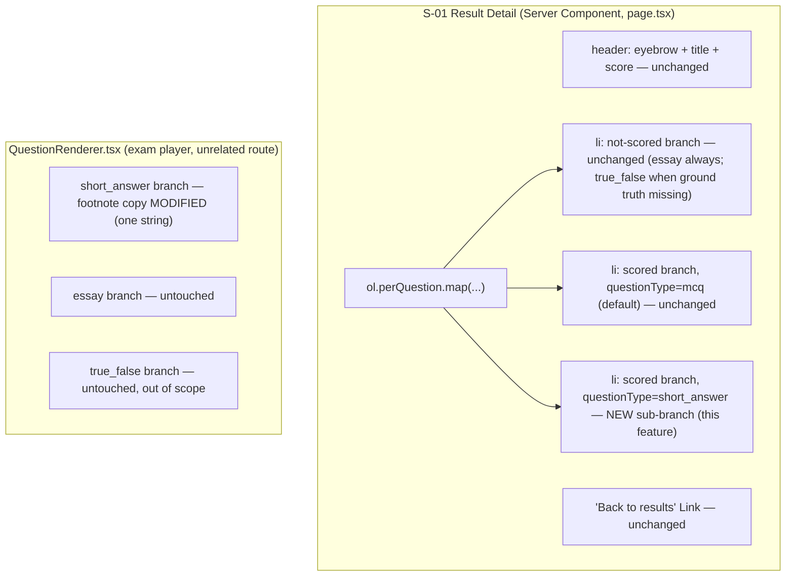

# Short Answer Auto-Scoring — Result Detail Display — UI Specification

| | |
|---|---|
| **Version** | 1.0 |
| **Date** | 2026-08-01 |
| **Status** | Draft — ready for Design Doc chain. |
| **PRD** | None — Medium-scale feature, PRD not required per this project's scale rules. Substitute source: `requirement_analysis` output (resolved after user Q&A), reproduced in full under Decisions Record. |

## Overview

This UI Specification covers only the **frontend display slice** of "Add automatic scoring logic for the `short_answer` question type." The backend scoring logic itself (normalized-text/numeric matching in `computeScore.ts`) is out of this document's scope. The frontend problem: `ResultDetailPage`'s existing "scored" rendering branch routes only on `PerQuestionResult.scored === false` vs. `true`, never on `questionType`, and unconditionally maps `q.choices` (MCQ shape). Once the backend starts marking `short_answer` results `scored: true`, this branch would blank-render those questions (empty `<ul>`, no submitted text, no correct answer, no highlight). This document specifies how to extend that branch to correctly display `short_answer`, reusing the exact fern/destructive visual convention and the "Your answer" / "Stored answer" text pattern already shipped in the same file's "not scored" branch. No new component, no new interaction pattern, no new color/token is introduced. `essay` is explicitly out of scope and must render byte-for-byte unchanged.

### Target PRD

- PRD path: N/A — no PRD exists for this Medium-scale feature (confirmed per project scale-determination rules).
- Substitute source: `requirement_analysis` output (task type: feature; scale: medium; confidence: confirmed), reproduced verbatim in Decisions Record D0.
- Feature scope covered by this document: the frontend display slice only — making `ResultDetailPage`'s scored branch handle `questionType === 'short_answer'`, plus a one-line footnote copy fix in `QuestionRenderer.tsx`. Backend scoring logic, the normalized-text/numeric matching rule, and any backfill decision are explicitly out of this document's scope (backend concern, "none" backfill already decided per requirement analysis).

### Design Source

| Source | Path | Version |
|--------|------|---------|
| Existing production pattern (fern/destructive MCQ correctness marking) | `SOURCE/app/(exams)/exams/[id]/attempt/[attemptId]/result/detail/page.tsx` lines 118–192 | repo `feat/rating-system`, current HEAD `ea6e40b` |
| Existing production pattern ("Your answer" / "Stored answer" two-line text block) | Same file, lines 57–116 (the "not scored" branch) | Same |
| Theme definition | `PROJECT_OVERVIEW.md §2` (repo root) — "Ink & Lacquer" theme | Same |
| Design tokens | `SOURCE/app/globals.css` | Same |

## Prototype Management

No prototype code was provided. The engineer explicitly confirmed: reuse the existing fern/destructive correct/incorrect visual pattern already used for MCQ; do not design anything new. Per the "Prototype is reference, not source of truth" principle, this UI Spec instead cites **in-repo shipped code** as the visual/behavioral precedent (exact file + line ranges above), which is stronger than a prototype since it is the live production pattern, not a mockup. No copy into `docs/ui-spec/assets/` is made — there is no prototype artifact to copy; the cited precedent already lives under version control at the paths above.

- **Attachment path**: N/A (no prototype artifact).
- **Version identification**: repo HEAD `ea6e40b` on branch `feat/rating-system`.
- **Compliance premise**: reuse only — the exact classes, literal color value (`text-[#4F7942]`), `--destructive` token, and JSX shape already shipped in `page.tsx`. Zero new visual elements.
- **Relationship to canonical spec**: this document is canonical. Where a design choice is not fully determined by the cited precedent (e.g., the "Correct answer" vs. "Stored answer" label choice below), this document makes and records the decision (see Decisions Record D1).

## External Resources Used

Project-tier facts are recorded in `docs/project-context/external-resources.md` (already present, last updated 2026-07-14; no environment change occurred for this feature, so hearing was not re-run). Feature-specific subset:

| Resource (project-tier label) | Feature-specific identifier | Notes |
|-------------------------------|-----------------------------|-------|
| Design Origin | `PROJECT_OVERVIEW.md §2` — "no shadow/gradient, hairline-border + background-color layering only" rule | Governs the plain-text, no-new-decoration constraint on the new short_answer sub-branch |
| Design System | `SOURCE/app/(exams)/exams/[id]/attempt/[attemptId]/result/detail/page.tsx` (existing fern/destructive convention, lines 118–192); `SOURCE/features/exams/components/QuestionRenderer.tsx` (footnote copy, lines 136–153); `SOURCE/components/shared/RichText.tsx` | This feature reuses these exact pieces; introduces no new component |
| Visual Verification Environment | Route `/exams/[id]/attempt/[attemptId]/result/detail` (requires a submitted attempt containing a `short_answer` question); Playwright MCP `playwright`; `npm run dev` | No automated test currently exists for this page or `QuestionRenderer` (confirmed by search) — manual/Playwright verification is the only current check until a test is added (Work Plan concern) |

## Decisions Record

### D0 — Substitute source for PRD (verbatim)

```json
{
  "taskType": "feature",
  "purpose": "Add automatic scoring logic for the short_answer question type. Frontend scope is limited to making the exam result-detail review page correctly display short_answer questions once they become auto-scored server-side.",
  "scale": "medium",
  "confidence": "confirmed",
  "affectedLayers": ["backend", "frontend"],
  "resolvedScope": {
    "inScope": "questionType === 'short_answer' only",
    "outOfScope": "questionType === 'essay' — no player input UI exists for it, no display changes needed, must not be touched",
    "matchingRule": "normalized text match + numeric equivalence (backend concern, not a frontend/UI concern)",
    "backfill": "none — only newly-submitted attempts are affected; no visual/behavioral change for already-persisted results"
  }
}
```

### D1 — Two-line text block always shows both lines, recolored by state

**Decision**: the scored `short_answer` sub-branch always renders two lines — "Your answer: `<text>`" and "Correct answer: `<text>`" — regardless of whether the two values are identical (i.e., even in the correct case, both lines render, showing the same text twice). Colors follow `r.isCorrect`/`r.selected` (see State × Display Matrix below); the label text itself is never color-only.

**Rationale**: the engineer's directive is to reuse the *exact* existing "Your answer" / "Stored answer" pattern (`page.tsx` lines 103–114), which always renders both lines unconditionally today (for `essay`/not-scored `true_false`). Conditionally hiding the second line when correct would be new branching logic invented for this feature, not a reuse of the existing shape. Always-show-both is the zero-new-logic option and is explicitly flagged as an Open Item (TBD-01) in case product wants the correct-case duplicate suppressed later — that is a product-copy decision, not a blocker for this display-correctness fix.

### D2 — Second line's label changes from "Stored answer" to "Correct answer" only in the scored sub-branch

**Decision**: the not-scored branch (still used by `essay`, byte-for-byte unchanged) keeps the label **"Stored answer:"** (neutral — makes no correctness claim, since not-scored means no grading happened). The new scored `short_answer` sub-branch uses the label **"Correct answer:"** (evaluative — a grading decision was made and this is what it was graded against). This is a one-word label change scoped strictly to the new branch's own JSX; the not-scored branch's JSX is not touched.

**Rationale**: reusing the identical label "Stored answer" in a context where the answer *was* used to compute Correct/Wrong would misrepresent to the student that no grading occurred, contradicting the status chip immediately above it.

### D3 — Correct-answer text source: `q.essayAnswer`, never `r.correct`

**Decision**: the correct-answer text for `short_answer` is read from `q.essayAnswer` (the `questions` map already returned by `getResult()`, `SOURCE/features/exams/queries.ts` lines 291/371 — confirmed present and populated for every question type unconditionally, independent of `scored` status). `PerQuestionResult.correct` (`SOURCE/types/result.ts` line 12) is typed `ChoiceId` and is documented as "CHỈ câu mcq" (MCQ only) — it must not be read for `short_answer`.

**Rationale**: this is the same source the existing not-scored branch already uses for `storedAnswer` (`page.tsx` line 66: `q?.essayAnswer ?? ""`). Zero query/backend change is required for this frontend slice — `getResult()` already selects and maps `essay_answer` unconditionally for all question types.

## AC Traceability (derived from requirement analysis — no PRD exists)

| AC ID | AC Summary (EARS) | Screen / Component | State |
|-------|--------------------|---------------------|-------|
| AC-001 | When a per-question result has `questionType === 'short_answer'` AND `r.scored !== false`, the system shall display the student's submitted text (`r.selected`) instead of an empty list. | S-01 `ResultDetailPage`, scored branch | scored-correct / scored-wrong / scored-skipped |
| AC-002 | Under the same condition, the system shall display the correct/expected answer text sourced from `q.essayAnswer` (never `r.correct`). | S-01 `ResultDetailPage`, scored branch | scored-correct / scored-wrong / scored-skipped |
| AC-003 | When `r.isCorrect === true`, the system shall apply the existing fern (`#4F7942`) convention to the student's answer text. | S-01 `ResultDetailPage`, scored branch | scored-correct |
| AC-004 | When `r.isCorrect === false` AND `r.selected` is truthy, the system shall apply the existing `--destructive` convention to the student's answer text, and keep the correct-answer text fern. | S-01 `ResultDetailPage`, scored branch | scored-wrong |
| AC-005 | When `r.isCorrect === false` AND `r.selected` is falsy, the system shall render "— skipped —" in `--muted-foreground` for the student's-answer line and keep the correct-answer text fern. | S-01 `ResultDetailPage`, scored branch | scored-skipped |
| AC-006 | The existing status chip (Correct / Wrong / Skipped, `page.tsx` lines 121–125) shall require zero code change to support `short_answer` (it is already type-agnostic). | S-01 `ResultDetailPage`, card header | all scored sub-states |
| AC-007 | The `essay` question type's rendering path shall remain byte-for-byte unchanged — `essay` is never auto-scored and always flows through the existing not-scored branch. | S-01 `ResultDetailPage`, not-scored branch | not-scored (essay) |
| AC-008 | The `QuestionRenderer` short_answer footnote copy shall be updated to remove the "not auto-scored yet" claim, without altering the `essay` or `true_false` footnotes. | `QuestionRenderer`, short_answer branch | default |
| AC-009 | `true_false` rendering (both the `QuestionRenderer` footnote and the `ResultDetailPage` scored-branch display) shall **not** be modified by this feature. | Out-of-scope guard | — |

## Screen List and Transitions

### Screen List

| Screen ID | Screen Name | Route | Description | Entry Condition |
|-----------|------------|-------|-------------|-----------------|
| S-00 | Result Summary | `/exams/[id]/attempt/[attemptId]/result` | Existing score summary + actions (Save/Share/Return/View details/Try again/Rate). No change in this feature. | Submit an attempt. |
| S-01 | Result Detail | `/exams/[id]/attempt/[attemptId]/result/detail` | Per-question review list. **Modified**: scored branch gains a `questionType === 'short_answer'` sub-branch (this feature). | Click "View details" on S-00, or direct URL to an owned, submitted attempt. |

No new screen is introduced. No route changes.

### Transition Conditions

| Source | Destination | Trigger | Guard Condition |
|--------|------------|---------|-----------------|
| S-00 | S-01 | Click "View details" link (`page.tsx` line 90 of the result summary page) | None — always available once the attempt is submitted. |
| S-01 | S-00 | Click "← Back to results" link | None. |
| S-01 | `/exams/[id]` (redirect) | `getResult(attemptId)` returns `null` on server render | Attempt not submitted, or not owned by the requesting user (RLS). Pre-existing behavior, unchanged by this feature. |
| S-01 (not-scored branch) | S-01 (new scored `short_answer` sub-branch, this feature) | Not a user-triggered transition — determined server-side by `r.scored` at render time | Reachable only once the backend's `short_answer` auto-scoring logic (out of this document's scope) sets `scored: true` for that result row. **Until the backend ships, this new branch is unreachable and the page renders exactly as it does today** — no visual regression risk from shipping the frontend slice ahead of the backend. |

### Screen Transition Diagram

```mermaid
flowchart TD
    S00["S-00 Result Summary"]
    S01["S-01 Result Detail"]
    REDIR["redirect /exams/[id]"]
    S00 -->|Click 'View details'| S01
    S01 -->|Click '← Back to results'| S00
    S01 -.->|getResult() null: not submitted / not owner| REDIR
```

## Component Decomposition

### Component Tree



---

### Component: ResultDetailPage (per-question review card, scored branch)

Server Component. The change is confined to the existing `else` branch at `page.tsx` lines 127–194 (the case where `r.scored !== false`). Today this branch unconditionally renders `q?.choices.map(...)` (MCQ shape). This feature adds a `questionType === 'short_answer'` check before that map: when true, render the two-line text block described below instead of the choice list; otherwise (mcq, the default), render the existing choice list unchanged.

New sub-branch markup (reusing the not-scored branch's exact shape, `page.tsx` lines 103–114, recolored and relabeled per D1/D2/D3):

```
<div className="flex flex-col gap-1 text-sm">
  <p className="text-muted-foreground">
    Your answer: <span className={<answerColorClass>}>{r.selected || "— skipped —"}</span>
  </p>
  <p className="text-muted-foreground">
    Correct answer: <span className="text-[#4F7942]">{q?.essayAnswer || "—"}</span>
  </p>
</div>
```

Where `<answerColorClass>` is `text-[#4F7942]` (fern) when `r.isCorrect`, `text-destructive` when `!r.isCorrect && r.selected`, `text-muted-foreground` when `!r.isCorrect && !r.selected` (skipped) — the exact same three-way rule the status chip immediately above already uses.

#### State × Display Matrix

| State | Default | Loading | Empty | Error | Partial |
|-------|---------|---------|-------|-------|---------|
| Display | Renders the standard template's "Default" is ambiguous for a 3-way domain state — see the **Sub-states** table directly below, which is the acceptance-relevant detail for this component. | N/A — Server Component, fully resolved before render; no client-side fetch after mount. | N/A — a per-question `<li>` always renders once `result.perQuestion` has an entry for that question (pre-existing list-level behavior, unchanged). | N/A at the per-item level — if `getResult()` returns `null`, the whole page redirects to `/exams/[id]` before the list renders (pre-existing, unchanged). | N/A — no partial/degraded fetch state; all data for this row is present at render time or the row would not exist. |

**Sub-states for the new `short_answer` scored branch** (this is the acceptance-relevant detail — AC-001–AC-006):

| Sub-state | Trigger | "Your answer" line | "Correct answer" line | Status chip (unchanged, header) |
|-----------|---------|---------------------|-------------------------|----------------------------------|
| scored-correct | `r.scored !== false && r.isCorrect === true` | `r.selected` text, fern (`text-[#4F7942]`) | `q.essayAnswer` text, fern | `Correct`, fern |
| scored-wrong-with-answer | `r.scored !== false && !r.isCorrect && r.selected` truthy | `r.selected` text, destructive (`text-destructive`) | `q.essayAnswer` text, fern | `Wrong`, destructive |
| scored-skipped | `r.scored !== false && !r.isCorrect && !r.selected` | literal `— skipped —`, muted (`text-muted-foreground`) | `q.essayAnswer` text, fern | `Skipped`, muted |
| not-scored (essay; unaffected regression baseline) | `r.scored === false` | *(existing not-scored branch, untouched)* — labeled "Stored answer:", no color | *(existing)* | `Not auto-scored`, muted |
| unsupported (pre-feature bug, now fixed) | `r.scored !== false && questionType === 'short_answer'` before this feature | *(was: nothing — empty `<ul>`)* | *(was: nothing)* | *(chip rendered correctly even before the fix — only the body was blank)* |

#### Interaction Definition

| AC ID | EARS Condition | User Action | System Response | State Transition | Error Handling |
|-------|---------------|-------------|-----------------|-------------------|-----------------|
| AC-001 | When a per-question result has `questionType === 'short_answer'` and `r.scored !== false` | — (server render, no user action) | Renders `r.selected` (or "— skipped —") on the "Your answer" line instead of an empty choice list. | unsupported (pre-fix) → scored-correct / scored-wrong / scored-skipped | N/A — pure display logic, no network call, nothing to retry. |
| AC-002 | Same condition | — | Renders `q.essayAnswer` (or "—" if absent) on the "Correct answer" line. | Same | If `q` is `undefined` (question lookup miss — pre-existing possible edge case shared with MCQ, e.g. deleted question), the surrounding `{q && (...)}` guard already used for the content block skips question-dependent rendering; the two-line block should apply the same `q &&` guard so it never renders `undefined.essayAnswer`. |
| AC-003 | When `r.isCorrect === true` | — | "Your answer" renders fern. | → scored-correct | — |
| AC-004 | When `r.isCorrect === false` and `r.selected` is truthy | — | "Your answer" renders destructive. | → scored-wrong-with-answer | — |
| AC-005 | When `r.isCorrect === false` and `r.selected` is falsy | — | "Your answer" renders `— skipped —` in muted. | → scored-skipped | — |
| AC-006 | When any scored sub-state renders | — | Status chip continues to read `r.isCorrect`/`r.selected` exactly as it does for MCQ today — zero change to the chip's own code. | — | — |
| AC-007 | When `questionType === 'essay'` | — | Renders via the existing not-scored branch, unchanged (essay is never `scored: true` — no player input UI exists for it, per resolved scope). | Always: not-scored | — |

---

### Component: QuestionRenderer (short_answer footnote copy)

Client component used by the exam player (a different route from S-01; renders while the student is actively answering, before any scoring happens). The only change is the italic footnote string inside the existing `type === "short_answer"` branch (`QuestionRenderer.tsx` lines 149–151). The input element, its `maxLength={100}`, its placeholder, and its `onChange` handler are all unchanged.

**Copy change**:
- Before: `Short answer — stored, not auto-scored yet.`
- After: `Short answer — auto-scored after you submit.`

The `essay` footnote (line 157–159: `Essay question — answer on paper. Stored, not auto-scored yet.`) and the `true_false` footnote (line 129–131: `True/False — stored, not auto-scored yet.`) are **not** touched — see AC-009 and TBD-03.

#### State × Display Matrix

| State | Default | Loading | Empty | Error | Partial |
|-------|---------|---------|-------|-------|---------|
| Display | Footnote below the short-answer input reads the new copy above; input renders and behaves exactly as before. | N/A — static text, no fetch. | N/A — always rendered whenever `type === 'short_answer'` (unconditional, same as today). | N/A — no error condition; this is a static string. | N/A — no partial state; the footnote is a single fixed line, shown or not shown by `questionType`, never partially rendered. |

#### Interaction Definition

| AC ID | EARS Condition | User Action | System Response | State Transition | Error Handling |
|-------|---------------|-------------|-----------------|-------------------|-----------------|
| AC-008 | When the exam player renders a `short_answer` question's answer area | — (static; renders on mount, same as before) | Displays the updated footnote copy in place of the previous "not auto-scored yet" claim. | — (no state machine; single fixed string) | — |
| AC-009 (guard) | When the exam player renders a `true_false` or `essay` question's answer area | — | Footnote copy for those two types remains byte-for-byte identical to before this feature. | — | If a diff shows any change to the `true_false` or `essay` footnote strings, that diff is out of scope and must be reverted. |

## Design Tokens and Component Map

### Environment Constraints

- Target browsers: latest 2 versions of Chrome / Firefox / Safari / Edge (project-wide non-functional requirement, unchanged).
- Theme support: single "Ink & Lacquer" theme at `:root`, no light/dark toggle (unchanged).

#### Responsive Behavior

No responsive change. The two-line text block reuses the same `flex flex-col gap-1 text-sm` container already used identically at every breakpoint by the not-scored branch; it does not introduce any new breakpoint-dependent layout.

### Existing Component Reuse Map

| UI Element | Decision | Existing Component / Location | Notes |
|-----------|----------|--------------------------------|-------|
| Correct/incorrect color convention (fern `#4F7942` for correct, `--destructive` for wrong, `--muted-foreground` for skipped) | Reuse | `page.tsx` lines 118–133 (status chip) and 146–192 (MCQ choice highlight) | Same three-way color rule applied to plain text instead of a choice-row highlight; zero new color introduced. |
| "Your answer" / "Stored answer" two-line text block | Reuse (recolored + one label renamed) | `page.tsx` lines 103–114 (not-scored branch) | See Decisions D1/D2. Not-scored branch's own JSX is untouched. |
| Status chip (Correct/Wrong/Skipped) | Reuse, zero change | `page.tsx` lines 121–125 | Already type-agnostic; no code change needed to support `short_answer`. |
| `RichText` (question content renderer) | Reuse, zero change | `SOURCE/components/shared/RichText.tsx` | Unchanged. |
| `QuestionRenderer` short_answer footnote | Extend (copy only) | `SOURCE/features/exams/components/QuestionRenderer.tsx` lines 149–151 | One string literal changes; surrounding JSX, input, `maxLength`, placeholder unchanged. |
| New component | — | — | None. This feature adds zero new components and zero new files. |

### Design Tokens

No new token is introduced. This feature is a pure reuse of already-shipped values.

#### Color Roles

| Role | Token / Class | Value | Usage |
|------|----------------|-------|-------|
| Correct / success | literal `text-[#4F7942]` (not a CSS variable — no `--success` token exists in `globals.css`) | `#4F7942` (fern) | "Your answer" line when correct; "Correct answer" line always. |
| Wrong / destructive | `text-destructive` | `--destructive` = `#8f2523` | "Your answer" line when wrong-with-selection. |
| Skipped / neutral | `text-muted-foreground` | `--muted-foreground` = `#6b655c` | "Your answer: — skipped —" line. |
| Body / ink | `text-foreground` | `--foreground` = `#1b1512` | Question content (`RichText`), unchanged. |
| Background surface | `--background` / `--card` | `#ede1c8` | Page/card background, unchanged. |
| Border | `--border` | `#d8c9a8` | Hairline section separators (`border-t border-border`), unchanged. |

#### Typography Hierarchy

| Role | Font | Size / Class | Usage |
|------|------|---------------|-------|
| Body-sm | Be Vietnam Pro | `text-sm` | Both new answer lines — identical class to the not-scored branch's existing lines, no new size introduced. |
| Question content | Source Serif 4 | `font-serif text-lg` | Unchanged (`RichText` usage in the card header). |

#### Spacing Scale

| Token / Class | Value | Usage |
|----------------|-------|-------|
| `gap-1` | 4px | Vertical gap between the two answer lines — identical to the not-scored branch's existing block. |
| `gap-4` | 16px | Per-question `<li>` internal vertical rhythm, unchanged. |
| `pt-6` / `border-t` | 24px | Section separator between question cards, unchanged. |

#### Elevation (Depth)

| Level | Treatment | Usage |
|-------|-----------|-------|
| 0 (Flat) | none — no box-shadow, no gradient (`PROJECT_OVERVIEW.md §2` hard rule) | The new text block is plain paragraphs with no border/box; layering is by text color only, consistent with the not-scored precedent it reuses. |

#### Border Radius Scale

Not applicable — the new sub-branch renders plain `<p>` text lines with no bordered box (unlike the MCQ choice rows' `rounded-lg` border), matching the not-scored branch's own text-only shape exactly.

## Visual Acceptance

### Golden States

1. **Scored `short_answer` — correct**: status chip reads `Correct` (fern); "Your answer: `<submitted text>`" in fern; "Correct answer: `<same text>`" in fern.
2. **Scored `short_answer` — wrong, answered**: status chip reads `Wrong` (destructive); "Your answer: `<submitted text>`" in destructive; "Correct answer: `<expected text>`" in fern.
3. **Scored `short_answer` — skipped**: status chip reads `Skipped` (muted); "Your answer: — skipped —" in muted; "Correct answer: `<expected text>`" in fern.
4. **`essay` regression check**: an essay question's card renders byte-for-byte identical to pre-feature output — "Not auto-scored" chip, "Stored answer" label, no color coding. Any diff here is a regression.
5. **Exam player, `short_answer` input**: input box unchanged; footnote reads `Short answer — auto-scored after you submit.`

### Layout Constraints

- The two-line block's container (`flex flex-col gap-1 text-sm`) and its position within the `<li>` (after the content block, in the same slot the not-scored branch's block occupies) must not change width, height, or spacing relative to the existing not-scored precedent.
- No `maxLength`/truncation is added to the *display* of submitted or correct-answer text (the 100-character `maxLength` exists only on the exam-player `<input>`, not on this read-only review text) — long answers wrap naturally in the `<p>`, same as the not-scored branch already does today.

## Accessibility Requirements

### Keyboard Navigation

| Component | Tab Order | Key Binding | Behavior |
|-----------|-----------|-------------|----------|
| `ResultDetailPage` scored `short_answer` sub-branch | Not focusable (plain text, no interactive element) | — | No keyboard interaction; purely informational, consistent with the existing MCQ and not-scored cards, which are also read-only. No new tab stop is introduced by this feature. |
| `QuestionRenderer` short_answer footnote | Not focusable (static `<p>`) | — | No change; the sibling `<input>`'s existing tab stop and keyboard behavior are untouched. |

### Screen Reader

| Component | Role | Accessible Name | Live Region |
|-----------|------|-------------------|--------------|
| "Your answer" / "Correct answer" lines | None (plain `<p>`/`<span>`, no ARIA role needed) | The paragraph's own visible text (e.g., "Your answer: 1260"), read in DOM order | None — content is present at initial SSR render, not injected dynamically; matches the existing MCQ branch, which also has no live region. |
| Status chip (Correct/Wrong/Skipped) | None (plain text, unchanged) | Visible text label | None (unchanged, pre-existing). |

Status is conveyed by **text label** ("Correct"/"Wrong"/"Skipped" and the literal "— skipped —" fallback) in addition to color at every sub-state — never color-only — inheriting the already-shipped WCAG 1.4.1-compliant pattern from the MCQ branch. No new accessibility risk is introduced.

### Contrast Requirements

| Element | Foreground | Background | Ratio Target |
|---------|-----------|------------|---------------|
| Fern text ("Correct answer" line; "Your answer" when correct) | `#4F7942` | `#ede1c8` | ≥ 4.5:1 (normal text) — pre-existing pair, already shipped for the MCQ "Correct answer" tag; unchanged by this feature, not re-verified here. |
| Destructive text ("Your answer" when wrong) | `--destructive` `#8f2523` | `#ede1c8` | ≥ 4.5:1 — pre-existing pair, already shipped for the MCQ "Your choice" tag. |
| Muted text ("Your answer: — skipped —") | `--muted-foreground` `#6b655c` | `#ede1c8` | ≥ 4.5:1 — pre-existing pair, already shipped for the "Skipped" chip. |

## Open Items

| ID | Description | Owner | Deadline |
|----|-------------|-------|----------|
| TBD-01 | Confirm whether always duplicating identical text on both "Your answer" and "Correct answer" lines when `short_answer` is correct (Golden State 1, Decision D1) is acceptable, or whether product wants the second line suppressed/replaced when correct. Default per this spec: always show both lines. | Engineer / product, during Design Doc review | Before Design Doc "Accepted" |
| TBD-02 (out of scope for this feature) | Pre-existing bug discovered during investigation: `true_false` questions render an **empty choice list** in this same "scored" branch once auto-scored — `true_false` auto-scoring already shipped in commit `f1e665093` (2026-07-27), but `ResultQuestion.choices` is always `[]` for `true_false` (`queries.ts` line 364) and the scored branch (`page.tsx` lines 127–194) never special-cases `true_false`, so it hits the same `q?.choices.map(...)` blank-render this feature fixes for `short_answer`. Not touched by this feature per explicit scope (`short_answer` only). | Frontend eng (backlog) | 2026-08-15, or immediately if any future PR next touches `page.tsx`'s scored branch, whichever is sooner |
| TBD-03 (out of scope for this feature) | Pre-existing stale copy discovered during investigation: `QuestionRenderer.tsx`'s `true_false` footnote ("stored, not auto-scored yet") is inaccurate since `true_false` auto-scoring already shipped (commit `f1e665093`). Bundle with TBD-02 (same file family, same root cause class). Not touched by this feature per explicit scope (`short_answer` footnote only). | Frontend eng (backlog) | Same as TBD-02 |
| TBD-04 | This feature raises the literal `#4F7942` string's occurrence count in `page.tsx` past the Rule-of-Three commonalization threshold (status chip, MCQ highlight ×2, and now the two new short_answer lines). Whether to extract a shared `resultStatusColor(isCorrect, hasSelection)` helper (or a formal `--success` CSS token) is a refactor decision for the Design Doc, not required to unblock this UI Spec. | Design Doc author | Before Design Doc "Accepted" |
| TBD-05 | Sequencing guard: the `QuestionRenderer` footnote copy change (AC-008) must not ship before the backend `short_answer` auto-scoring logic ships (out of this UI Spec's scope) — shipping the copy first would have the UI claim scoring behavior that isn't live yet. | Work Plan author | Encode as a phase-ordering constraint before the Work Plan is finalized |

*All TBDs above are either non-blocking refactor/sequencing notes or explicitly out-of-scope discoveries logged for follow-up; none blocks the display-correctness fix defined in this document.*

## Update History

| Date | Version | Changes | Author |
|------|---------|---------|--------|
| 2026-08-01 | 1.0 | Initial version. Requirement-analysis-sourced (no PRD; Medium-scale, PRD not required). Specifies the `ResultDetailPage` scored-branch `short_answer` sub-branch (reusing the existing fern/destructive convention and "Your answer"/"Stored answer" text pattern) and the one-line `QuestionRenderer` footnote copy fix. Zero new components/tokens. Flags two pre-existing, out-of-scope `true_false` display bugs discovered during investigation (TBD-02/TBD-03). | UI Spec (Claude) |
