# Subscription (Premium prepaid period, payOS) — UI Specification

| | |
|---|---|
| **Version** | 1.10 |
| **Date** | 2026-08-20 |
| **Status** | **Approved** at v1.1 by the engineer 2026-08-16 (flow step B8); S-01/S-02/S-03/S-04 implemented against it in the same session and **not reopened here**. v1.2 exercised the Phase Inversion clause and specified S-05/S-06. **v1.3 is a narrow correction pass**: three factual/provenance corrections re-verified against the code, plus a status refresh. **No screen is re-specified, no component is renumbered, and no design decision changes** — each correction repairs a *reason*, and in every case the decision it supported survives on better evidence. **v1.4 is a single-decision amendment** exercising the Phase Inversion clause in the *upstream* direction: UI-D17 and C-06's delta named a server-computed `formattedResetDate` that has no possible producer. The mount passes **no** prop and the component formats its own `resetsAt` from provider context. No screen, no component decomposition, no prop contract and no other decision changes. **v1.5 is a documentation-hygiene pass** (plan Task 0.5): **TBD-07 is closed** — the backend adopted C-13's eight-field `CheckoutOrder` — and **AC-050's traceability row gains its owner and both sources of its existing deferral**. No screen, component, decision or acceptance criterion changes. **v1.6 is a second documentation-hygiene pass** (plan Task 0.6): **C-13's Empty and Partial state sets are recorded in full** as the superset the frontend Design Doc already designed (one added case each, both already implied by UI-D11 and UI-D15), and stale cross-document version and line citations are refreshed to the identifier-plus-quoted-phrase form. No screen is re-specified, no component is renumbered, and no decision or acceptance criterion changes. **v1.7 is a single-component amendment**: **C-10 takes a third prop, `status: string`.** The Props line froze two props while this same section's behaviour point 5 and its State × Display Matrix require the control to distinguish a terminal status from a live one — a distinction neither `orderCode` nor `variant` carries. The behavioural clauses win, because the matrix states what the user experiences and the Props line is an implementation detail of it. No behaviour, screen, decision, acceptance criterion or i18n key changes. **v1.8 is the close-out status refresh** (plan Task 6.6). Nothing in this document is re-specified: **TBD-02 remains the only blocking item and is unchanged** — the refund draft still carries three `[điền …]` placeholders and names no selling entity, no Terms document exists, and both routes still render `LegalContentPending`, so C-15's confirm control is still correctly `aria-disabled`. **TBD-05, TBD-06 (ADR-0018), TBD-08 and TBD-09 are all still open**, all four non-blocking, all four counted in the work plan's close-out sweep as justified traceability gaps awaiting engineer confirmation. **AC-050 stays deferred**: S-07 does not exist, no task builds it, and this refresh adds none. **Recorded, not repaired**: this table has **no Update History rows for v1.1, v1.4 or v1.7** — those revisions are described in this Status line instead. Reconstructing them is an engineer's call, not an agent's, so it is recorded as documentation debt rather than invented here. **v1.9 corrects two things this document asserted that were not true of the shipped code, and reconciles its own two revision tables.** (a) **C-15's Props line was unimplementable**: frozen at `{ orderCode; legalContentReady }` while its open branch *is* C-10, whose Props line has required `status` since v1.7. This is v1.7's defect one component down, and it is resolved the same way — **by the behaviour vector** — with `status` typed **`string`, not a four-literal union**, so one `CHECK` widening cannot reach a user as a wrong render. (b) **C-10's Error cell described impossible routing**: a thrown `recheckOrder()` was said to be "left to the route's `error.tsx`", but a rejected promise does not cross an Error Boundary. C-10 catches it and renders the generic `billing.orders.loadError` in its own appearing `role="alert"` node. **The code was right; this specification was wrong, and only this specification changed.** (c) **§ Revision History is now authoritative** over § Update History and has received the v1.8 row the close-out wrote into only one of the two tables — the disagreement (1.7 versus 1.8) that made this document's own version ambiguous. **The three absent Update History rows stay absent**, per the call recorded above. |
| **PRD** | `docs/prd/subscription-prd.md` (**v1.6**, 2026-08-18) — **re-verified 2026-08-18**: the PRD file header reads v1.6 and this citation is current. v1.6 amends **AC-057** from a *flat* `≥ 50/day` ceiling to a **tier-conditional** one: `RATE_LIMITS.explainStep.limit` is derived from `isPaidTierEnabled()` — **paid tier ON → ≥ 50/24h, OFF → 3/24h** — with a 24-hour window on both branches. AC-057 concerns the tutor anti-spam ceiling only and **touches no screen in this spec** (not S-05, not S-06, and not S-01…S-04). *(v1.2 corrected this citation from a stale v1.2; v1.3 refreshes AC-057's summary to the tier-conditional form — see AC Traceability.)* |
| **ADR** | `docs/adr/ADR-0013-payment-provider-and-prepaid-period-model.md` (Accepted 2026-08-16) — provider choice and the prepaid-period model. `docs/adr/ADR-0014-payment-webhook-trust-boundary.md` — **now written and accepted**; it is what makes S-05's re-check control a first-class settlement trigger rather than a diagnostic (one `settleOrder()`, two triggers). |
| **Backend Design Doc** | `docs/design/subscription-backend-design.md` (**v1.6**) — owns `createOrder()` / `recheckOrder()`, the `payment_orders` table and the `orders_select_own` RLS read that S-05 and S-06 consume. *(Version refreshed at v1.6, plan Task 0.6 — this row read **v1.2** through four revisions of that document. The pointer is load-bearing, not cosmetic: backend **v1.3** is where `payment_orders` gained the four `text not null` transfer columns `qr_payload`, `account_number`, `account_name` and `memo`, without which C-13's eight-field `CheckoutOrder` is not readable through `orders_select_own` at all. A v1.2 pointer named a schema that cannot serve S-06.)* |

## Revision History

**This table is authoritative. § Update History at the end of this document is a second ledger of the same events and is subordinate to it** *(declared at v1.9)*.

**Why the declaration is needed, and why this table is the one that governs.** This document has carried **two revision tables** since v1.0 — this one and § Update History — recording the same revisions in different words and different column orders. Nothing distinguished their subject matter, so they were duplicates rather than complements, and duplicates drift: the v1.8 close-out bumped **only § Update History**, leaving this table topped out at 1.7 while that one read 1.8, and a reader checking "what version is this document" got different answers depending on which end they opened. **This table governs** for two reasons: it is **complete** — it carries a row for every version from 1.0 onward, whereas § Update History has never had rows for **v1.1, v1.4 or v1.7** — and it sits beside the `**Version**` header cell, which is where currency is checked.

**The rule from v1.9 onward**: every version bump writes a row in **both** tables, in the same pass; where the two disagree, this one is correct. **The three rows absent from § Update History stay absent** — v1.8 recorded that back-filling them is a judgement about what those revisions did and belongs to the engineer, and reversing that call is not this pass's to make. Consolidating the two tables into one is registered as documentation debt with a named owner in `docs/plans/subscription-work-plan.md`.

| Version | Date | Change |
|---|---|---|
| 1.10 | 2026-08-20 | **One citation corrected. No screen is re-specified, no component is renumbered, no decision or acceptance criterion changes, no i18n key is added or removed, no state is added to or removed from any matrix, no code is changed, and no history row is re-edited.** **C-10's "Native `disabled` is forbidden" clause cited `ExplainStepAffordance.test.tsx:299-300` as the test that enforces it.** Those two lines are a closing `);` and a `fireEvent.click`; the assertion pair — `hasAttribute("disabled") === false` **and** `.disabled === false` — is at **`:307-308`**. **This matters more than an ordinary off-by-eight**: it is this document's *only* test-enforcement citation for the ban, so a reader checking whether the prohibition is actually held by a gate was sent to two lines that assert nothing, and the frontend Design Doc cites `:307-309` for the same pair — meaning the two governing documents disagreed, with the authoritative one wrong. **The prohibition, its rationale (a native `disabled` button leaves the tab order, the bug already fixed twice in this repo) and every behavioural clause around it are unchanged**; only the pointer moves. **Deliberately not changed in this pass**: the seven-row C-10 outcome table and its i18n row's *"one sentence per `SettleResult`"* wording, which disagree with the frontend Design Doc's eight branches — that item stays **deferred** under the work plan register's item 13, and the frontend Design Doc now also records it as contradiction **X-14**; and the stale **Backend Design Doc v1.6** header pointer, deferred under register item 14. |
| 1.9 | 2026-08-20 | **Two authoritative-contract corrections and one revision-table reconciliation. No screen is re-specified, no component is renumbered, no decision or acceptance criterion changes, no i18n key is added or removed, no state is added to or removed from any matrix, and no history row is re-edited.** **(1) C-15's Props line was unimplementable as written, and it is the same defect v1.7 closed for C-10, recurring one component down.** This document froze `PaymentConfirm` at `{ orderCode: number; legalContentReady: boolean }` while C-15's open branch **is** C-10 (`variant="primary"`), whose Props line has required `status` since v1.7 to serve its own State × Display Matrix Partial column. Two props cannot supply a third, so C-15's line and C-10's matrix could not both be honoured. **Resolved by the behaviour vector, exactly as at v1.7** — the Props line is an implementation detail of the component, the matrix states what the user experiences. `status: string` added, typed **`string` and not a four-literal union**, for C-10's recorded reason: a `CHECK` widening changes no line of TypeScript, so one CHECK widening must not be able to reach a user as a wrong render. C-15 does not interpret the value; it forwards it, and it cannot invent one. **(2) C-10's State × Display Matrix Error cell described error routing that is physically impossible.** It said a thrown exception from `recheckOrder()` "is left to the route's `error.tsx`". **A promise rejected inside an `await` in a click handler does not cross an Error Boundary**, so `error.tsx` can never run for that call. C-10 catches it, holds a `threw` phase and renders the **generic** `billing.orders.loadError` sentence in the same appearing `role="alert"` node — deliberately not one of the seven outcome sentences, because an infrastructure failure is not a payment reason. **The code was right and the specification was wrong; the code is unchanged.** **(3) This § Revision History is declared authoritative** over § Update History, and the v1.8 row it never received is added below, so the two tables agree at their tops for the first time since v1.7. **Not changed, deliberately**: the seven-sentence outcome table, C-15's `legalContentReady` gate and its derivation rule, TBD-02's status, and the three revisions missing from § Update History. |
| 1.8 | 2026-08-20 | *(Row added at v1.9. The v1.8 close-out wrote its entry into § Update History only, which is the disagreement v1.9 reconciles; this row states the same change and re-edits nothing.)* **Close-out status refresh (plan Task 6.6). No screen is re-specified, no component is renumbered, no decision or acceptance criterion changes, no i18n key changes, and no history row is re-edited.** The Status line records the state of every open item at close-out: **TBD-02 unchanged and still the only blocking item** (refund draft incomplete, no Terms document, both routes still rendering `LegalContentPending`, C-15 correctly still `aria-disabled`); **TBD-05, TBD-06, TBD-08 and TBD-09 all still open and all non-blocking**, each with its specified interim behaviour intact and each counted among the work plan's five justified traceability gaps; and **AC-050 still deferred** — S-07 is not built and no task in the work plan builds it. **One documentation defect recorded rather than repaired**: § Update History has no rows for **v1.1, v1.4 or v1.7**; back-filling three absent history rows is a judgement about what those revisions did, which belongs to the engineer, not to a close-out sweep. |
| 1.7 | 2026-08-19 | **Single-component amendment — C-10's Props line contradicted C-10's own behaviour, and the behaviour wins. No screen is re-specified, no component is renumbered, no decision or acceptance criterion changes, no i18n key is added, and no other component's contract moves.** **The contradiction**: this document froze C-10's Props at `{ orderCode: number; variant: "row" | "primary" }` while the *same section* required, at behaviour point 5 and in its State × Display Matrix's Partial column, that the control stay mounted and focusable in `paid` / `expired` / `cancelled` carrying `aria-disabled="true"` with a reason bound by `aria-describedby`, and that its handler return early there. **Neither frozen prop can tell `paid` from `pending`**, so the two clauses cannot both be implemented — which is exactly what shipped: `SOURCE/components/billing/RecheckOrderControl.tsx` implemented every listed behaviour except the terminal branch. **Resolved in favour of the behavioural clauses**: the State × Display Matrix describes what a user experiences, and a props list is an implementation detail *of* that description; a two-prop signature that silently drops a matrix column is the defect, not the matrix. **Amended**: Props become `{ orderCode: number; variant: "row" | "primary"; status: string }`. **`status` is typed `string`, deliberately, not a four-literal union** — the same reason C-09 carries `string` (see C-09's table row: "When `status` matches none of the four DB values … the row's re-check control stays available"): a `CHECK`-constraint change must not reach users mis-rendered, and an unrecognised status is **not** terminal, so the control stays activatable for it. A union would make that carve-out unreachable and invite the predicate `status !== "pending"`, which is wrong on precisely that case. **No i18n key is added** — the terminal reason reuses `billing.recheck.notPending` ("This order is already closed, so re-checking will not change it."), already budgeted in this document's i18n inventory for the `not_pending` outcome, being the same sentence about the same fact. The frontend Design Doc's C-10 props statement is amended in the same pass (its v1.7); the terminal-status definition and the three-row `status` table it already carried are unchanged and are what this amendment makes expressible. |
| 1.6 | 2026-08-18 | **Documentation-hygiene pass (plan Task 0.6 — LO-01, LO-02, ST-04, ST-05, CL-05, CL-06). No screen is re-specified, no component is renumbered, no decision or acceptance criterion changes, and no revision-history text is re-edited.** **(LO-01 / LO-02) C-13's Empty and Partial state sets are recorded as the superset `docs/design/subscription-frontend-design.md` C-13 already designs.** Empty gains a fourth case — an `?order=` value that does not parse — and Partial gains a fourth — a status this specification does not recognise. **Neither is new behaviour and neither is a decision taken here**: the unrecognised status is **UI-D15**'s own fifth case, reached by gating every money-moving affordance on `status === "pending"` and nothing else, and the unparseable param follows from **UI-D11**'s decision to carry order identity as a search param so that "no order / not my order" is one state of one page rather than a 404. Recorded because the two documents were the implementer's two sources for one screen, and the narrower list renders the QR and the transfer block on a non-payable order. **(ST-04 / ST-05) The backend Design Doc pointer in the header table read `v1.2` across four of that document's revisions** and is refreshed; the pointer matters because backend **v1.3**, not v1.2, is where `payment_orders` gained the four transfer columns C-13's `CheckoutOrder` is read from. **(CL-05 / CL-06) Every citation into `.claude/MEMORY.md` in this document was stale, and all of them are now restated by quoted rule text.** That file is 112 lines long and the whole citation set had drifted by a uniform **four lines**: the no-hardcoded-hex rule cited as `:116` in three places pointed past the end of the file (the rule is the file's last line, `:112`), and every other citation named a line four past its rule — `:84`→`:80`, `:96`→`:92`, `:98`→`:94`, `:103`→`:99`, `:104`→`:100`, `:105`→`:101`, `:106`→`:102`, `:107`→`:103`. **All fifteen instances across nine distinct rules** are restated by **quoted rule text** rather than by number, per the citation rule `docs/design/subscription-backend-design.md` adopted at its v1.4, so **no bare line number into that file remains**. Line numbers into `SOURCE/` and `globals.css` are kept — that rule exempts code. |
| 1.5 | 2026-08-18 | **Documentation-hygiene pass (plan Task 0.5 — ST-02, CL-03). No screen is re-specified, no component is renumbered, no decision or acceptance criterion changes, and no already-corrected text is re-edited.** **(ST-02) TBD-07 is closed.** `createOrder()`'s v1.2 declared return `{ qrCode, orderCode, expiresAt }` was missing four of `CheckoutOrder`'s eight fields, three of them AC-028's mandatory **text** equivalent. `docs/design/subscription-backend-design.md` **v1.3** (unchanged in v1.4) adopted C-13's shape in full rather than narrowing it: `createOrder()` returns the whole eight-field `CheckoutOrder` as a **projection of the row it just wrote**, the four transfer values being `text not null` columns on `payment_orders`, written once from the payOS create response and readable on every cold entry through `orders_select_own`. **S-06's prohibition on re-deriving any of them is not closed with it** — it binds permanently, and both producers project through the one exported `toCheckoutOrder()`. **(CL-03) AC-050's traceability row now carries its owner and both sources of its existing deferral.** The row already said "S-07 — deferred (P2)"; it now also names the owning document (`docs/design/subscription-frontend-design.md`), states that its requirement PRD **R15** sits under **Should Have (P2)**, and records that **no task in `docs/plans/subscription-work-plan.md` implements it** — so a later reader cannot re-open a deferred P2 screen as an unowned Must. AC-050's *behaviour* is unchanged here: S-07 stays deferred. |
| 1.4 | 2026-08-18 | **Single-decision amendment: UI-D17's `formattedResetDate` producer does not exist, and the two places that named it are corrected.** v1.2 stated (and v1.3 carried forward) that `TutorQuotaNote` is mounted “receiving `formattedResetDate` computed server-side via UI-D12”, restated in C-06's delta as “UI-D12 supplies `formattedResetDate` (server-side, pinned timezone, user's locale)”. **No such producer can exist**: the mount site `SOURCE/app/(layer2)/exams/[id]/attempt/[attemptId]/result/detail/page.tsx` is an **async server component** (`:19`) that calls `getResult()` and `getTranslate()` and holds no entitlement value (`:17`, `:177`, `:230`), and the frontend Design Doc's `code:02` fixes `readEntitlement()` as the one server read seam, so a second read at the page is forbidden. `resetsAt` exists only inside `Quota`'s `known` variant carried by `EntitlementProvider` — **context, not a prop**, client-side. **Amended**: the mount passes **no** prop, and the component formats `formatDate(tutor.resetsAt, locale)` with `locale` from `useLocale()` inside the existing `tutor.state === "known"` branch (`TutorQuotaNote.tsx:30`). **Nothing else moves** — UI-D17's mount decision, C-06's `unknown ⇒ null` behaviour, the pinned timezone and the user locale are all unchanged; only the *place* the formatting happens is corrected. The shipped component still declares `formattedResetDate?: string` (`TutorQuotaNote.tsx:23`, tolerated by `:35`'s ternary); **plan Task 2.4 retires it**, and no source file changes in this amendment. **Provenance**: escalated by `docs/design/subscription-frontend-design.md` as **X-13**, which corrected its own prose at v1.2 in three places but left this authoritative document as the surviving source of the false premise. Call-site citations in UI-D17 corrected from `:176,229` to the verified `:177,230` in the same pass. |
| 1.3 | 2026-08-18 | **Narrow correction pass — three corrections, no screen re-specified, no component renumbered, and no design outcome changed.** (1) **The CSP claim was factually wrong.** v1.2 asserted the Content-Security-Policy header attaches *only in production*, and built UI-D14's urgency on a "passes locally, blank in production" failure mode. Verified false: `SOURCE/lib/security/csp.ts:40-43` gates **only** `script-src` on `isProd`, while `:56` `img-src` and `:58` `connect-src` are emitted **unconditionally**; `SOURCE/next.config.ts:30-34` attaches the header with **no environment guard** and `:55-58` applies it to `/:path*` (`:45-52` shows HSTS is the *only* prod-gated entry); `SOURCE/proxy.ts:22-27` always builds a nonce CSP and `SOURCE/lib/supabase/middleware.ts:88-91` always sets it. A payOS-hosted `` is blocked **in dev too**. **UI-D14's decision is unchanged and is now *safer* than v1.2 claimed** — the mistake surfaces on the developer's machine, not on the live payment screen. (2) **The "two announcement idioms" rule was one file's local convention, not a repository standard.** The repo ships **three** idioms (36 `role="alert"` sites; 12 `aria-live` regions, 6 of them the `role="status" aria-live="polite"` idiom), and `components/history/ActionButton.tsx:60-97` — the *origin* of the idioms `ExplainStepAffordance` names — ships all three. Rule restated with its true scope and **renumbered** so the busy idiom is **idiom 3**, matching the frontend Design Doc. **C-10 is unchanged**: the polite idiom splits into two variants and both are wrong for a per-row control (see UI-D16). (3) **The no-`sm:` rule's provenance was overstated.** `SOURCE/app/globals.css:216-217` says only that *layout-deciding* places moved to `md:`, `sm:` staying valid for type-size and spacing — and `SOURCE/components/layout/BentoGrid.tsx:27,33-38` still ships `sm:`. The blanket ban is kept but relabelled as **this specification's stricter decision**. **Status refresh**: TBD-02 re-verified (a partial refund-policy draft with 3 `[điền …]` placeholders and no named legal selling entity; **no Terms draft at all** against R11's two pages; both routes still render `LegalContentPending`) and the AC-057 summary refreshed to PRD v1.6's tier-conditional form. |
| 1.2 | 2026-08-18 | *(One claim in this row was corrected in v1.3: the CSP header is **not** production-only, so the "renders blank in production while passing every local check" failure mode does not exist — the block occurs in dev as well. UI-D14's decision stands.)* **S-05 and S-06 move from Defer to Implement.** Both were deferred on one stated condition — that the payOS order lifecycle must exist before a screen could honestly draw it — and `docs/design/subscription-backend-design.md` v1.2 satisfies it. Per the Phase Inversion clause, this document changes **first**; the frontend Design Doc is written against it, not the other way round. Content: **TBD-04 closed** (routes frozen, and the route *group* is the load-bearing half of the decision — `EntitlementProvider` is mounted in exactly one place in the repository); **TBD-03 closed** (one date/time module, pinned timezone, decided rather than deferred a fourth time); five new decisions UI-D11…UI-D18; a full order-status vocabulary including the **fourth** DB value PRD R10 does not name and an explicit unknown-status behaviour; the rendering of AC-056's four items against a three-valued `Quota`; and a CSP finding no document had recorded — `img-src`/`connect-src` contain no payOS origin, so a provider-hosted QR image renders blank in production while passing every local check. |
| 1.1 | 2026-08-16 | Approved (B8) and implemented. **Corrects a contradiction found while implementing C-05**: v1.0 declared the precedence `blocked-quota → hint-shown`, then justified it with a sentence saying an already-delivered hint must not be retracted — which is exactly what that order does. Corrected to `hint-shown → blocked-quota`, with the accessibility consequence that follows: blocked-quota is a **mount-time** state, never reached from a focused control, so it needs no focus rescue and must **not** carry `role="alert"` (an alert at mount interrupts a screen reader while announcing nothing). Golden state 8 rewritten accordingly. **TBD-01 closed** — PRD amended to v1.3 instead of adding axe. |
| 1.0 | 2026-08-16 | First version. Written **before** the backend Design Doc, deliberately (see Overview → Phase Inversion). Fixes the `UI-D` decision prefix from the start rather than after a collision, per the lesson recorded in `docs/ui-spec/support-system-ui-spec.md:15`. |

## Overview

### Target PRD

`docs/prd/subscription-prd.md` **v1.6**. This spec covers **all** user-facing surfaces the PRD names (R1, R8, R10, R11, R12, R15, R16). v1.0/v1.1 implemented four of them (S-01…S-04); **v1.2 adds S-05 and S-06**, leaving only the two explicitly-P2 screens (S-07, S-08) deferred.

### Phase Inversion — read this before treating any contract here as provisional

The standard order runs backend Design Doc first, so the frontend consumes a contract that has already been verified against a database. This feature runs the **other way**: payOS eKYC is not activated and the Gemini paid tier is not enabled, so the backend has no completion date, while the UI work is unblocked today.

The consequence is not a scheduling detail — it **inverts who owns the data contract**. Every entitlement shape declared in this document is **normative for the backend**, not a guess awaiting correction. A backend Design Doc that finds a different shape convenient must change this document first, in a version bump with a reason, rather than quietly diverging and leaving the UI to adapt.

**v1.2 is that clause in use, in both directions.** The deferral of S-05/S-06 carried one condition — the order lifecycle must exist — and `subscription-backend-design.md` v1.2 meets it, so this document changes first and the frontend Design Doc is written against the result. In the other direction, S-06 needs three fields the backend's declared `createOrder()` return does not yet carry (see **C-13**); those are stated here as normative, and the backend document is expected to adopt them rather than S-06 inventing a second source for the same values.

### Scope in this phase

| Screen | In this phase | Reason |
|---|---|---|
| S-01 Pricing page | **Implement** (shipped v1.1) | Pure presentation + one env flag; no order lifecycle |
| S-02 Terms of Service | **Implement** (shipped v1.1 — shell; real content pending U3) | Static read path |
| S-03 Refund Policy | **Implement** (shipped v1.1 — shell; real content pending U3) | Static read path |
| S-04 Tutor paywall states | **Implement** (shipped v1.1) | Modifies an existing shipped component; no new backend |
| S-05 My Orders + active reconciliation (R10) | **Implement** (new in v1.2) | **Deferral condition met.** It was deferred as "a drawing of backend state"; `subscription-backend-design.md` v1.2 now defines that state — `payment_orders` (four statuses), `orders_select_own` RLS, `recheckOrder()`, and the `Quota` counters AC-056's four items read from. Nothing is left to observe before drawing it honestly |
| S-06 Payment / VietQR screen (R8) | **Implement** (new in v1.2) | Same condition, same evidence. The one residual unknown — the exact payOS response shape — is bounded by the adapter boundary ADR-0013 fixes: provider vocabulary stops inside `lib/billing/payos/`, so the screen consumes an app-shaped contract (C-13) that cannot drift with the provider's field names |
| S-07 Expiry reminder banner (R15, P2) | **Defer** | Explicitly P2. Depends on a real `expires_at`, which now exists — so the only remaining reason is priority, not feasibility. Recorded as such so it is not re-justified on stale grounds |
| S-08 "My Plan" expansion (R16, P2) | **Defer** | Explicitly P2, and extends S-05. PRD AC-051 adds exactly **one** element to S-05 (a pricing link); the four Must items are S-05's, not S-08's |

**R10 and R8 are Must-haves, and v1.2 is where they are specified.** v1.1 recorded R10's absence deliberately so it could not vanish from the work plan; that debt is discharged here.

### Design Source

| Source | Path | Version |
|---|---|---|
| Design tokens ("Mực & Sơn mài" / Ink & Lacquer) | `SOURCE/app/globals.css` | repo branch `feat/subscription-payos`, read 2026-08-16 |
| Hard visual rules + rationale | `.claude/MEMORY.md` §3 | read 2026-08-16 |
| Shipped in-repo components | `SOURCE/components/`, `SOURCE/app/**/_components/` | read 2026-08-16 |

`globals.css` wins on any conflict with `.claude/MEMORY.md` (`.claude/MEMORY.md`, *"khi hai chỗ lệch nhau thì **`globals.css` thắng**"*). `DESIGN.md` was deleted 2026-08-06 and must not be cited; several in-repo comments still reference it (e.g. `SOURCE/app/page.tsx:15`) and those references are stale.

## Prototype Management

- **Attachment path**: N/A — no prototype code was provided, and none exists. There is no Figma, no Storybook, and no design spec document.
- **Version identification**: the canonical reference is shipped in-repo code on branch `feat/subscription-payos`, read 2026-08-16. The working tree also carried six uncommitted engineer files at that moment (`@vercel/analytics` wiring and a `priority` flag on the header logo); they were inspected, contain **no** subscription UI, and are untouched by this spec.
- **Compliance premise**: shipped code is treated as a **stronger** precedent than a prototype would be, because it has already passed this repository's four verification gates and real-device QA.
- **Relationship to the canonical spec**: this document is canonical for the subscription surfaces. Where it deviates from an existing in-repo pattern, the deviation is stated as a numbered `UI-D` with its reason — never left implicit.

## External Resources Used

| Resource (project-tier label) | Feature-specific identifier | Notes |
|---|---|---|
| Design Origin | `--background`, `--foreground`, `--brand`, `--muted-foreground`, `--border`, `--radius-card`, `--scaffold-small` | All pre-existing. This feature introduces **no new token** |
| Design System | `Button`, `PageContainer`, `PageHeader`, `BentoGrid`/`BentoCell`, `SkipLink`, `SiteHeader`, `BottomNav`, `SupportWidget` | All reused; see Existing Component Reuse Map |
| Payment Gateway (payOS) | reached **only** through `createOrder()` / `recheckOrder()` (Server Actions, backend-owned) | Recorded in `docs/project-context/external-resources.md`. **No browser-visible payOS endpoint, no payOS credential in any client bundle, and — decided in UI-D14 — no payOS origin added to `img-src` or `connect-src`.** The provider is never a network peer of the browser |
| Secret Store | `GEMINI_PAID_TIER_ENABLED` (server-only); payOS client id / API key / checksum key (server-only, backend-registered) | Registration duties in UI-D8 and in the backend Design Doc. None of these is `NEXT_PUBLIC_` |
| Design System | (v1.2 addition) no new primitive is introduced — `components/ui/` still has no Card, Badge, Table, Dialog or Skeleton, and S-05/S-06 do not add one | See Existing Component Reuse Map |

Project-tier access methods (URLs, hosts, auth mechanisms) live in `docs/project-context/external-resources.md` and are deliberately not restated here.

## Decisions Record

Prefixed `UI-` throughout. The PRD already owns `D1`–`D10`; a bare `D1` in this document would collide with it, which is the exact defect `support-system-ui-spec.md:15` had to correct in a follow-up version.

### UI-D1 — `useEntitlement()` is a context consumer, not a fetching hook

**Decision.** One frozen contract, consumed everywhere through `useEntitlement()`, but the **read happens once per route-group layout on the server** and is handed down through an `EntitlementProvider`. The hook itself performs no I/O.

**Rationale.** The handoff froze two things that pull in opposite directions if read naively: *every screen goes through one hook*, and the PRD's own NFR that entitlement "không thêm một vòng round-trip cho mỗi lần render". A hook that fetches would satisfy the first and violate the second — and the codebase confirms it: there is **no `React.cache()` anywhere** in `app/`, `lib/`, `components/` (zero import hits), no request-scoped memoisation, and **no client hook in the repository fetches data**. The only hook that touches the network is `useTutorAction`, which calls a Server Action — one round trip *per call site*. Copying that shape for entitlement would put a round trip behind every gated component.

The repository already solves this exact problem once, and this decision copies that solution rather than inventing a second one: **`I18nProvider` / `useT()`**. The server reads the locale once in the root layout (`SOURCE/lib/i18n/server.ts:24-26`), passes a plain value to a provider (`SOURCE/app/layout.tsx:104,112`), and every client component consumes it through a hook with no I/O (`SOURCE/lib/i18n/client.tsx:33-36`). Entitlement is the same shape of problem — one per-request user-scoped value, needed by many components, cheap to pass, expensive to re-derive — so it gets the same shape of answer.

One further detail is copied on purpose: `useT()` **falls back to a default when no provider is mounted** (`client.tsx:26-32`), specifically so client components render in unit tests without a wrapper. `useEntitlement()` does the same, and its no-provider fallback is **Free** — which makes the test convenience and the fail-closed requirement the same line of code.

**Rejected**: a Server Action called from a client hook (one round trip per call site, contradicts the NFR); prop-drilling entitlement through every component (the handoff's "one hook" constraint exists precisely to stop two screens computing it differently, and drilling invites a local recomputation at each stop).

### UI-D2 — Fail-closed applies to the PLAN. Quota counters are `unknown`, and `unknown` must never block

**Decision.** The phase-UI stub returns `plan: "free"` for everyone (fail-closed, as frozen). It returns quota as **`{ state: "unknown" }`**, *not* zero. Any surface that would block a user on quota **must treat `unknown` as "do not block, do not display a count"**.

**Rationale.** This is the one place where a naive reading of "fail-closed" would ship a regression. There is no `subscriptions` table, no order rows, and no period counter — `schema.sql` declares 18 tables and none is payment-related. If the stub reported `tutorRemaining: 0` in the name of caution, it would **switch off the shipped Engine 1 tutor for every user on the site**, which is not a safe default at all: it is an outage produced by a half-built feature, and it violates the PRD's own guardrail that the paywall must not damage the core path (D1, risk R-i, success metric #10).

So the two halves of the value fail in opposite directions, and that is deliberate:

- **Plan** fails **closed** — unknown means Free, because the harm of wrongly granting Premium is granting something unpaid.
- **Quota** fails **open** — unknown means do not gate, because the harm of wrongly reporting exhaustion is breaking a working feature for people who are entitled to it.

The existing per-user throttle (`RATE_LIMITS.explainStep = { limit: 3, windowMs: 24h }`, `SOURCE/lib/security/rateLimit.ts:137`) remains the live ceiling throughout this phase and is untouched. The blocked states specified below are therefore **fully specified and unit-testable, but not reachable in production** until the backend supplies real counters — which is stated here rather than discovered later by someone wondering why the state never appears.

### UI-D3 — This phase does NOT split the four tutor error codes; it adds a pre-emptive quota state instead

**Decision.** `ExplainStepError`'s four codes stay collapsed into one message exactly as today. The distinguishable "hết lượt" state is rendered **before invocation**, from entitlement, not **after failure**, from an error code. Splitting `rate_limited` out of the collapse is deferred to the backend phase.

**Rationale.** The collapse is not sloppiness — it is a recorded security decision. `SOURCE/components/tutor/ExplainStepAffordance.tsx:96-99` states that distinguishing the codes would leak that the server re-runs an eligibility check (`not_eligible`), and `SOURCE/app/(layer2)/tutorActions.ts:8-12` and the dictionary block comment at `SOURCE/lib/i18n/dictionaries/en.ts:551-556` say the same thing from their own side. PRD AC-041 asks for the quota case to stop looking like a generic failure; it does **not** ask for the eligibility disclosure to be reopened.

Rendering the quota state *pre-emptively* satisfies AC-041's intent without touching the disclosure surface at all: the user is told "you have used your allowance" **before** they press anything, so the post-failure message never needs to carry that meaning. When the backend later introduces a distinct quota code, the split must preserve `not_eligible`, `server` and `gemini_unavailable` as one indistinguishable group — that constraint is recorded for the backend phase, not resolved here.

**Consequence for AC-041 verification**: it cannot be closed in this phase. The state exists and is testable; the *error-path* half of AC-041 is backend work.

### UI-D4 — The price is a per-locale dictionary literal. No formatter is introduced

**Decision.** `39.000 VNĐ` (vi) and `39,000 VND` (en) are literal strings in the dictionaries. No `Intl.NumberFormat`, no `formatVnd()` helper, no numeric interpolation for the price.

**Rationale.** Three facts converge. (1) PRD AC-002 requires every displayed string to go through `SOURCE/lib/i18n/dictionaries/{vi,en}.ts` — so the price is a dictionary value whichever way it is produced. (2) The repository has **no number formatting of any kind**: zero `Intl.NumberFormat` occurrences, and `SOURCE/lib/utils.ts` exports exactly one function (`cn`). Introducing a formatter for a single price, in a product whose D2 fixes exactly one price, is machinery with one caller. (3) The i18n substitution path is a raw `String(value)` interpolation (`SOURCE/lib/i18n/translate.ts:27`), so passing `39000` through `t()` renders `39000` — the literal has to exist somewhere regardless.

Writing the two locales differently (`.` vs `,`) is also what each locale's convention actually requires, and it has a useful side effect noted under Environment Constraints: the two strings are **not** byte-identical, so they do not consume the CI budget described in UI-D10.

**Kill criterion**: if a second price or a second plan ever appears, revisit — one literal per locale is right for one price and wrong for three.

### UI-D5 — Legal pages use `PageContainer size="small"`; no typography plugin is added

**Decision.** S-02 and S-03 render inside `PageContainer size="small"` (`--scaffold-small: 42rem` = **672px**), with hand-applied prose classes. `@tailwindcss/typography` is **not** added.

**Rationale.** The repository has no long-form text page at all — 16 route `page.tsx` files, none of them prose — so there is no precedent to reuse and this must be decided rather than inherited. `.claude/MEMORY.md` sets a hard ceiling of **720px for long text blocks** (*"max-width 720px cho khối text dài"*). Of the three scaffold widths (42/48/72rem = 672/768/1152px), only `small` sits under that ceiling; `default` at 768px would breach it. Adding a typography plugin would be this phase's first dependency addition, in a phase that otherwise adds none, for two pages.

Prose rhythm follows the most-repeated existing pattern rather than a new one: `text-sm leading-relaxed text-muted-foreground` for body copy (≈10 occurrences, e.g. `SOURCE/app/not-found.tsx:27`), `h2`/`h3` inheriting the global automatic `font-serif` (`globals.css:263-269`), and `list-disc space-y-2 pl-9 text-sm leading-relaxed text-foreground` for lists (pattern from `ImportInstructions.tsx:45`).

### UI-D6 — The pricing grid uses `md:`, deliberately breaking with every in-repo two-column precedent

**Decision.** `grid grid-cols-1 gap-4 md:grid-cols-2`.

**Rationale.** `globals.css:212-218` records a rule and the reason for it: code written before 2026-08-07 used `sm:` (640px) as the end-of-mobile boundary, and the places that **decide layout** (nav, filters, player) have moved to `md:` (768px). A side-by-side plan comparison is unambiguously a layout decision, so `md:` is required here by the codebase's own rule. Every existing two-column grid in the repository (`MetadataFields.tsx:94`, `FileUploadFields.tsx:162`, `ExamBrowser.tsx:32`, `BentoGrid.tsx:27`) predates or ignores it, so the rule wins over the precedent count.

**What the codebase's rule actually says, and where this spec goes further (clarified in v1.3).** `globals.css:216-217` is narrower than v1.2's phrasing implied: *layout-deciding* places moved to `md:`, while **`sm:` remains valid for type-size and spacing tweaks and is explicitly left in place** ("đổi hết là một đợt churn lớn không mua thêm gì"). `SOURCE/components/layout/BentoGrid.tsx` still ships `sm:` today (`:27` `sm:grid-cols-12`, `:33-38` the span map). **The blanket "no `sm:` anywhere in new markup" is therefore this specification's stricter decision, not a restatement of a repository standard.** It is kept — one boundary is easier to review than a case-by-case judgement about whether a given class "decides layout", and `engine1-adaptive-ai-ui-spec.md:325` already set the same stricter direction for its own feature. It binds this feature's new markup only; it is **not** a finding against existing `sm:` usage anywhere in the repository, and no existing file is to be changed on its authority.

Two plan cards at 640px on a 360px-class device would each be ~300px wide with a price, a feature list and a CTA inside — the rule is not merely bureaucratic here.

### UI-D7 — One new route group `(billing)` holds all three new routes

**Decision.** `SOURCE/app/(billing)/` containing `pricing/page.tsx`, `terms/page.tsx`, `refund-policy/page.tsx`, with a `layout.tsx` that mirrors `SOURCE/app/(layer2)/layout.tsx` exactly.

**Rationale.** Authentication is decided by middleware per **path**, not per route group, so one group can host both an authenticated page and two public ones without any special handling. The layout is safe for logged-out visitors as-is: `getCurrentUserProfile()` returns `null` on no session (`getCurrentUser.ts:45-51`), `SiteHeader` already defaults `user = null` (`SiteHeader.tsx:57`), and `SOURCE/app/page.tsx:69-91` — the site's existing public page — renders exactly this combination (SkipLink + SiteHeader + BottomNav + SupportWidget) for guests today. Nothing new is being risked.

**Rejected**: top-level un-grouped pages in the shape of `app/not-found.tsx` (that file renders a bare `<main>` with no header, no skip link and no nav — acceptable for a 404, not for a page linked from a payment flow); a second group split by public/private (two identical layout files, which is the duplication `lib/nav/items.ts:1-14` exists to argue against).

### UI-D8 — `GEMINI_PAID_TIER_ENABLED` is server-only, parsed fail-closed, and reaches the client as a boolean prop

**Decision.** Read in a Server Component with `import "server-only"`, defaulting to **off** when absent, empty, or any value other than an explicit affirmative. The page passes a plain `canPurchase: boolean` prop to the client CTA. It is **not** a `NEXT_PUBLIC_` variable.

**Rationale.** This is precisely the shape `SOURCE/lib/auth/admin.ts` already uses: `import "server-only"` at `:17`, `process.env.X ?? ""` at `:22`, and a docblock at `:19-20` stating that unset means nobody qualifies. AC-054 asks for exactly that default. There is **no `NEXT_PUBLIC_` feature flag anywhere in the repository** — the only three public variables are the two Supabase keys and the site URL — so a client-readable flag would be the first of its kind, would ship the flag to the browser, and would move a fail-closed decision to a place the user can edit.

One divergence from the admin precedent, and it matters: `admin/page.tsx:25` calls `notFound()` and hides the route entirely. AC-049 requires the opposite — a **visible** pricing page with an **unavailable** purchase control and a readable reason. Hiding the page would fail the AC.

Registration duties, both mandatory: an entry in `SOURCE/.env.example` stating the consequence of leaving it blank, and a branch in `SOURCE/lib/env/checkEnv.ts` emitting `{ level: "warn", name, impact }` phrased as something an operator can observe at boot. Skipping either recreates the silent-misconfiguration class TD-009 was closed to prevent, and AC-054's stated failure mode — *set in one environment, missed in another* — is exactly what `checkEnv` exists to surface.

The page must also declare `export const dynamic = "force-dynamic"` (precedent: `admin/page.tsx:21`), or the flag is baked in at build time and toggling it in Vercel changes nothing until the next deploy.

### UI-D9 — `/pricing` is NOT added to `NAV_ITEMS`

**Decision.** Entry points to `/pricing` are: the tutor paywall state (S-04), the future S-05, and direct links. It does not join the primary navigation.

**Rationale.** `SOURCE/lib/nav/items.ts:20-23` fixes five destinations, and the comment states these are *exactly* the five BottomNav slots. `BottomNav.tsx:17-21` reinforces it — slot position is muscle memory, so the count does not change with state. A sixth shared entry breaks a documented invariant in two components to promote a page most users need twice a month.

### UI-D10 — No new token, no new dependency, no new test tool

**Decision.** This feature introduces **no** design token, **no** npm dependency, and **no** testing library.

**Rationale.** Every visual need is covered by existing tokens (see Design Tokens). The three tools a spec might reflexively reach for are all absent by prior decision: **axe** (see TBD-01), **MSW** (the sanctioned mock boundary is `vi.mock` of the Server Action module, `ExplainStepAffordance.test.tsx:45-47`), and **jest-dom** (no `setupFiles` is wired, so `toBeDisabled()`-style matchers do not exist and tests read raw DOM attributes). Naming any of them in an obligation would produce a step nobody can run.

**Scope of this decision, clarified in v1.2**: UI-D10 bound the **UI phase**, whose surfaces were all static. It is not a permanent ban. S-06 needs a QR rendered from a payload string, which no built-in can do — UI-D14 records that need, the shape it must take, and the gate it must pass (an ADR, per this repository's own precedent `ADR-0009-pdf-generation-library-choice`). The **no new token** and **no new test tool** halves of UI-D10 are unchanged and still binding in v1.2.

---

*Decisions UI-D11 … UI-D18 are new in v1.2 and belong to S-05 / S-06.*

### UI-D11 — Routes frozen: `/me/orders` and `/pricing/checkout`, both files inside the `(billing)` route group

**Decision.** TBD-04 is closed. The URLs are exactly the two v1.1 proposed:

| Screen | URL | File | Auth |
|---|---|---|---|
| S-05 My Orders | `/me/orders` | `SOURCE/app/(billing)/me/orders/page.tsx` | Required (not in `PUBLIC_PATHS`) |
| S-06 Payment | `/pricing/checkout?order={orderCode}` | `SOURCE/app/(billing)/pricing/checkout/page.tsx` | Required (not in `PUBLIC_PATHS`) |

**Rationale — the URL was never the hard half; the route *group* is.** `EntitlementProvider` is mounted in **exactly one place in the whole repository**: `SOURCE/app/(billing)/layout.tsx:33`. And `useEntitlement()` outside a provider does not throw, does not warn, and does not render an error — it returns `FREE_FALLBACK` (`lib/billing/types.ts`), which is **indistinguishable at runtime from a genuinely Free user with unavailable counters**. S-05 must show plan, reset date, tutor remaining and upload remaining (AC-056), which makes it the most entitlement-dependent screen in the feature. Filing it under `(layer3)` — where `/me/dashboard` already lives, and which mounts no provider — would compile, render, pass a smoke test, and silently show every Premium user the Free summary. That is the single most expensive mistake available on this screen, and it is invisible.

Route groups do not affect the URL, so `app/(billing)/me/orders/` serves `/me/orders` while inheriting the provider, the `SkipLink`, the `#main-content` jump target and `.pb-bottom-nav`. The `/me/*` prefix keeps the site's existing personal-area vocabulary (`/me/dashboard` in `(layer3)`, `/me/exams` in `(layer4)`); Next.js only objects when two groups resolve the **same** full path, and `/me/orders` is claimed by no other group. UI-D7 already decided one new group holds all the new routes; this applies that decision rather than reopening it.

`/pricing/checkout` sits under `(billing)/pricing/` for the same provider reason plus a second: it is the continuation of `/pricing`, and a shared prefix is the cheapest correct signal of that.

**Neither path may contain a dot** — a dotted segment is excluded by `SOURCE/proxy.ts:46-48`, so it reaches neither the auth middleware nor the nonce-bearing CSP. On a money screen that means an unauthenticated render with a weaker CSP. Both frozen paths are dot-free, and so must any future sub-route be.

**Order identity travels as a search param, not a dynamic segment.** `?order={orderCode}` keeps the route shape static, matches the path TBD-04 proposed exactly, and keeps the "no order / not my order" case as one state of one page rather than a 404 (see C-13's Empty state). The middleware allowlist ignores query strings entirely, so the param has no bearing on access control — the *path* is private, which is what protects it.

**Rejected**: `/me/orders` under `(layer3)` (no provider — the silent-Free failure above); `/billing/orders` and `/orders` (invents a third personal-area prefix beside `/me/*`); `/pricing/checkout/[orderCode]` (a dynamic segment makes "no active order" a route-level 404, which loses the state where the screen is most useful — telling the user their order expired and offering the way back).

### UI-D12 — One date/time module, one pinned timezone, callable from both server and client

**Decision.** TBD-03 is closed. A new module `SOURCE/lib/format/datetime.ts` exports pure functions taking `(iso: string, locale: Locale)` and formatting with `Intl.DateTimeFormat` under a **pinned `timeZone: "Asia/Ho_Chi_Minh"`**:

```ts
export function formatDate(iso: string, locale: Locale): string;      // 18/08/2026
export function formatDateTime(iso: string, locale: Locale): string;  // 18/08/2026 14:32
```

Both return `"—"` for null-ish or unparseable input and never throw, copying `lib/history/format.ts`'s existing contract rather than inventing a second failure convention. Server components get `locale` from `getLocale()`; client components get it from the already-exported `useLocale()` (`lib/i18n/client.tsx:38-40`).

**Rationale.** There are three formatting idioms in the repository today and all three are wrong for a money screen:

| Existing | Problem for S-05/S-06 |
|---|---|
| `lib/history/format.ts:19` — hand-rolled `DD/MM/YYYY` via `getDate()` | Reads the **runtime's** timezone. In a server component on Vercel that is UTC, so a 05:00 ICT event renders as the previous day |
| `app/(layer4)/_components/ExamRow.tsx:68` — a second private `DD/MM/YYYY HH:mm` | Same defect, plus it is the duplication the Rule of Three says to stop at three |
| `admin/tickets/InternalNotesPanel.tsx:72`, `TicketQueueRow.tsx:46` — bare `toLocaleString()` / `toLocaleDateString()` | Resolves against the **server's** locale, not the user's cookie locale — the one thing this codebase's whole i18n design exists to avoid |

S-05 renders at least two timestamps (order created, quota reset) and S-06 renders an expiry deadline that a user compares against their bank app's clock. TBD-03's stated deadline was "when counters land" — this is that work, so it is decided here rather than made a fourth time.

**Why the timezone is pinned rather than left to the runtime.** Pinning is what makes one function usable on both sides of the RSC boundary: with an explicit `timeZone` **and** an explicit `locale`, `Intl` produces byte-identical output on the server and in the browser, so a client component can format without a hydration mismatch and without being handed a pre-formatted string. Leaving it unpinned makes the same value render two different days depending on where the render happened. The product sells in VNĐ through VietQR to Vietnamese students; a single pinned zone is the correct model today. **Kill criterion**: the first non-VN market, or the first user-selectable timezone, replaces the constant with a per-user value — the call signature already has room for it.

**No dependency.** `Intl` is built into every supported runtime; this does not touch UI-D10's dependency clause.

**Migration of the four existing call sites is deliberately NOT bundled into this feature.** Changing what a shipped screen prints is a visible change with no AC behind it, and it would put a regression risk on `/history`, `/me/exams` and `/admin/tickets` inside a payment change. Recorded as TBD-08 with an owner instead.

### UI-D13 — Money amounts are formatted by the same module; UI-D4's literal price stands

**Decision.** `formatVnd(amount: number, locale: Locale): string` joins `lib/format/datetime.ts`'s module family (file `SOURCE/lib/format/number.ts`), wrapping `Intl.NumberFormat` — `vi` → `39.000`, `en` → `39,000`. The **unit** comes from the dictionary (`billing.amount` = `"{amount} VNĐ"` / `"{amount} VND"`), and the value substituted into it is **already a string**.

**Rationale.** UI-D4 fixed the *price* as a per-locale dictionary literal and that decision is untouched: S-01 still renders one constant price from `billing.plan.premium.price`. S-05 and S-06 render something different in kind — the **amount stored on an order row**, a datum that arrives as a number from the database. There is no `Intl.NumberFormat` anywhere in the repository and i18n substitution is a raw `String(value)` interpolation (`lib/i18n/translate.ts:27`), so `t("billing.amount", { amount })` with a number renders **`39000 VNĐ`** — sitting next to a QR that encodes `39.000 VNĐ`. On a payment screen a user reads those two as different sums and stops. Formatting before substitution is the only thing that closes it, and doing it in one named function keeps the "no formatter with one caller" objection from UI-D4 from applying: this one has at least three (S-05 row, S-06 amount, S-06 text-equivalent block).

**Binding rule for implementation**: no template literal, no `${amount}`, and no numeric value ever passed into `t()` for money. The two are separable and must stay separable — the number is formatted, then the string is translated.

### UI-D14 — The QR is rendered from our own origin, server-side, and the text block is the operative path

**Decision.** S-06 renders the VietQR payload as an **inline `<svg>` produced during the server render** from payOS's `qrCode` payload string. Ranked fallbacks, in this order: (1) inline SVG; (2) a `data:image/svg+xml` URI in an ``; (3) an app-origin route under `/api/…` returning an image — **never** a ``. **No payOS origin is added to `img-src` or `connect-src`.**

**Rationale — a blocker no document had recorded.** The enforced CSP is `img-src 'self' data: blob: <supabaseOrigin>` and `connect-src 'self' <supabaseOrigin>` (`SOURCE/lib/security/csp.ts:56,58`). There is **no payOS origin in either**. Separately, payOS's `qrCode` field is a **VietQR/EMVCo payload string, not a rendered image**, and `SOURCE/package.json` contains **no QR-generation library** (verified against the full dependency list). So the naive implementation — `` — fails twice: the field is not a URL, and if it were, the image would be blocked.

**Corrected in v1.3 — the CSP is enforced in every environment, not only in production.** v1.2 stated that the header attaches only in production and therefore that a provider-hosted image "passes every local check and renders blank in production". That is **false against the code**, verified line by line:

| Evidence | What it shows |
|---|---|
| `SOURCE/lib/security/csp.ts:40-43` | `isProd` gates **`script-src` only** — it selects `'nonce-…'` versus `'unsafe-inline'`. It gates nothing else |
| `SOURCE/lib/security/csp.ts:56` and `:58` | `img-src` and `connect-src` are emitted **unconditionally**, on both branches |
| `SOURCE/next.config.ts:30-34` | The `Content-Security-Policy` header is built with **no environment guard**; `:55-58` applies it to `/:path*`; `:45-52` shows **HSTS is the only prod-gated entry** in the list |
| `SOURCE/proxy.ts:22-27` | Always builds a nonce-bearing CSP for every matched request, in every environment |
| `SOURCE/lib/supabase/middleware.ts:88-91` | Always sets that header on the response |

So a payOS-hosted `` is blocked **in dev too**. The "silently passes locally, fails live" failure mode does not exist.

**The decision is unaffected — and the corrected fact makes it *safer* than v1.2 claimed.** UI-D14 stands exactly as written: never make payOS a network peer of the browser, render the QR as server-produced inline SVG from the app's own origin, change no CSP directive. What changes is only the reason's shape. v1.2 justified the decision partly by the cost of a *production-only, silent* failure; in fact the blocked image would surface on the first local render, so the wrong implementation is **cheap to detect**, not expensive. UI-D14 therefore no longer rests on fear of a late discovery — it rests on the two arguments that were always the substantive ones: the `qrCode` field is a payload string and not a URL at all, and a payment screen must not acquire a third-party network peer to save an encoder.

Widening the CSP was considered and rejected: adding a third-party origin to `img-src` on the one screen that handles money, in order to avoid ~15 lines of encoding, trades a permanent security-surface increase for a build-time convenience. Inline SVG needs no `img-src` entitlement at all — it is markup, not a fetched resource — which is why it ranks first.

**This requires the first new npm dependency of this phase, and that is stated rather than smuggled.** QR encoding is Reed–Solomon error correction plus a mask-selection search; hand-rolling it on a payment screen is not a serious option. UI-D10 forbade a dependency in the **UI phase** (see its v1.2 scope note), and this repository's own precedent for a library that renders a document format is an ADR (`ADR-0009-pdf-generation-library-choice`). The library choice is therefore **escalated to ADR-0018, owner: engineer** (TBD-06), with the exact input required recorded there. This document specifies the *shape* the ADR must satisfy, which is what the frontend Design Doc needs and what keeps the decision from being made by whoever types the import.

**S-06 must be fully usable before that ADR lands, and this is not a workaround — it is AC-028.** The account number, amount and memo are required as selectable text *regardless* of the QR. A build with no encoder renders the text block, the legal links and the re-check control, and a user can pay by typing the transfer manually. The QR is an accelerator; the text is the path. Any implementation that makes the QR load-bearing has already failed AC-028.

**Accessibility of the QR element**: `role="img"` with an `aria-label` from the dictionary ("VietQR payment code"), so a screen-reader user learns an image is present and does not hunt for it; the adjacent text block carries the actionable content. It is **not** `aria-hidden`, because silence about a visible element is its own confusion.

### UI-D15 — Order status vocabulary: four values, plus an explicit unknown that never masquerades as `pending`

**Decision.** A new `OrderStatusBadge` (C-09) renders **five** cases — the four the database permits plus an explicit unrecognised case:

| Status | Glyph (`aria-hidden`) | Word (the accessible name) | Classes |
|---|---|---|---|
| `pending` | `◌` | "Chờ thanh toán" / "Awaiting payment" | `border-border text-muted-foreground` |
| `paid` | `●` | "Đã thanh toán" / "Paid" | `border-foreground text-foreground font-medium` |
| `expired` | `⊘` | "Hết hiệu lực" / "Expired" | `border-border text-muted-foreground` |
| `cancelled` | `✕` | "Đã huỷ" / "Cancelled" | `border-border text-muted-foreground` |
| *anything else* | `?` | "Không xác định" / "Unrecognised" | `border-destructive text-destructive` |

**Rationale, in three parts.**

*The fourth value exists and PRD R10 does not name it.* `payment_orders.status` carries `check (status in ('pending','paid','expired','cancelled'))` (backend design, schema block). PRD R10 lists three (`chờ / đã thanh toán / hết hiệu lực`). A screen that renders three of four either crashes on the fourth or silently mislabels it. `cancelled` gets its own word and its own glyph — it is not folded into `expired`, because "your order lapsed" and "your order was cancelled" are different facts and a user disputing a charge needs the difference.

*The unknown case is specified because the existing precedent gets it wrong in a way that is safe there and unsafe here.* `SOURCE/app/(layer4)/_components/StatusBadge.tsx:52` does `CONFIG[status as Status] ?? CONFIG.processing` — an unrecognised status silently renders as "processing". On a UGC pipeline that is a cosmetic mislabel. On a money screen, rendering an unrecognised state as **"awaiting payment"** tells a user who has already paid to pay again. The opposite default is no better: rendering it as "paid" would tell a user they hold an entitlement they do not. So the honest rendering is neither — a distinct fifth appearance that says the state was not understood, with the re-check control **left available** so the user has an action, and with `--destructive` as the one colour that reads "this needs attention".

*The pattern is reused; the hardcoded colours are not.* `StatusBadge` sets the right standard — a distinct glyph **and** a distinct word, so the badge survives greyscale, with the glyph `aria-hidden` and the word as the accessible name — and C-09 copies exactly that. It does **not** copy `border-[#B8863B]`, `text-[#8a6420]`, `border-[#3f7d4f]`, `text-[#2f6b3f]`: those four literals contradict the no-hardcoded-hex rule a prior cleanup enforced across 29 sites (`.claude/MEMORY.md`, *"đừng hardcode hex — đợt sửa này phải đi gỡ 29 chỗ hardcode"* — the file's **last** line; cited as `:116` through v1.5, a position that has never existed in a 112-line file), and copying them would make the sixth violation the precedent. Every class above is a token. **No new token is introduced** (UI-D10 stands) — which is why `paid` is signalled by weight and full-strength `--foreground` rather than by a green that does not exist in this palette. The word carries the meaning; colour is the redundant channel, never the only one.

*Contradiction recorded, not fixed here*: `StatusBadge.tsx`'s four hex literals and its silent `?? CONFIG.processing` fallback are pre-existing defects on a different screen. They are logged as TBD-09 with an owner rather than repaired inside a payment change.

### UI-D16 — Re-check re-renders the whole list from the server; the result is announced by an alert that appears

**Decision.** Activating "check this order again" calls the `recheckOrder(orderCode)` Server Action; on completion the action revalidates the `/me/orders` path and **the entire server-rendered list re-renders**. No row is patched in place, no client-side order state exists, and no order data is held in `useState`. The outcome sentence is rendered by the row's client control in a node that is **absent before the action and present after**, carrying `role="alert"`.

**Rationale.** The repository has **no precedent for updating a single row in place after a user action** — every shipped list is server-rendered from a query, and every recovery path is a whole-route `reset()` (`history/error.tsx`, `profile/error.tsx`, `admin/tickets/error.tsx`). S-05's re-check is the first case that genuinely needs a post-action update, so the choice is real and is recorded rather than improvised at the keyboard.

A full server re-render is chosen because the row's truth lives in Postgres and `recheckOrder()` may have **changed more than the row** — a successful settlement also moves the user's plan, expiry and quota, which S-05 renders in C-11 directly above the list. A row-local patch would leave the summary panel stating "Free" while the row beneath it says "Paid", and the two would stay disagreeing until a manual reload. One server render keeps every derived surface consistent by construction, which is the same argument that made `EntitlementProvider` a per-layout read in UI-D1.

**Why focus survives.** The control is not removed or replaced by the re-render: it stays mounted in **every** status (see C-10), so React reconciles the same element and the browser keeps focus on it. This is deliberately unlike C-05's hint panel, which *replaces* the button and therefore needs the ref-on-`tabIndex={-1}`-wrapper focus transfer. Restated as a rule: **a control that persists needs no focus rescue; a panel that replaces the focused control needs one.** S-05 is the first case, S-04 is the second, and neither invents a third mechanism.

**Announcement uses two of the repository's three shipped idioms, and creates no new region:**

| Moment | Idiom | Why this one |
|---|---|---|
| Busy | **Idiom 3** — mutating `aria-describedby` target, **no** `aria-live`; `aria-busy={true}` (boolean) and `aria-disabled="true"` (string) on the control | Exactly `ExplainStepAffordance.tsx:105-110`. The user initiated it, so an interruption is unwanted; the reason is available on the focused control |
| Result | **Idiom 1** — a node that **appears** carrying `role="alert"` | Exactly `ExplainStepAffordance.tsx:100-104`. This is the "state that appears mid-interaction" case the idiom exists for — unlike S-04's blocked-quota, which is present at mount and therefore must not be an alert |

**Corrected in v1.3 — the repository has three idioms, not two, and the numbering is now fixed.** v1.2 wrote that "a third `aria-live` region is out of spec" as if restating a repository-wide prohibition. It is not one: it is `ExplainStepAffordance`'s **local** convention. Verified by grep over `app/` + `components/`, tests excluded — **36** shipped `role="alert"` sites and **12** shipped `aria-live` regions, of which **6** are the `role="status" aria-live="polite"` idiom (`SuccessToast.tsx:50`, `ProfileCard.tsx:180`, `RouteLoadingOverlay.tsx:154`, `HistoryRowMenu.tsx:262-266`, `SupportWidgetDialog.tsx:172`, `ActionButton.tsx:86-87`). And `components/history/ActionButton.tsx:60-97` — which `ExplainStepAffordance`'s own comments name as the origin of what it copies (`:138-139`, the `aria-disabled` string convention, "theo đúng quy ước của ActionButton"; `:160-162`, the busy `aria-describedby` mechanism, "giống hệt span lý do đã chạy thật của ActionButton") — ships **all three** in one component.

**Numbering, fixed here and shared with the frontend Design Doc** (which renumbers the busy idiom to 3; without this table the two documents would use the same label for different things while an implementer reads both):

| # | Idiom | Shipped at |
|---|---|---|
| **1** | `role="alert"` on a node that **appears** | `ExplainStepAffordance.tsx:100-104`, `ActionButton.tsx:76-83`, `HistoryRowMenu.tsx:258-260`, +33 others |
| **2** | `role="status" aria-live="polite"` region — **two variants**, see below | `SuccessToast.tsx:50`, `ProfileCard.tsx:180`, `RouteLoadingOverlay.tsx:154`, `ActionButton.tsx:84-92`, `HistoryRowMenu.tsx:262-266`, `SupportWidgetDialog.tsx:172` |
| **3** | mutating `aria-describedby` target with **no** `aria-live`, for busy | `ExplainStepAffordance.tsx:105-110`, `ActionButton.tsx:95-97` |

**C-10's choice does not change, and the reason it survives is subtle enough to record — it is what keeps C-10 correct.** With the prohibition gone, idiom 2 has to be ruled out on merits, and it is, because it is really *two* idioms wearing one name. `SuccessToast.tsx:13-20` states the governing fact in the repository's own words: an `aria-live` region is announced on a **content mutation**, not on **insertion**. That splits it:

- The **inserted** variant (`ActionButton.tsx:84-92`, `HistoryRowMenu.tsx:262-266`, `SupportWidgetDialog.tsx:172`) ships in exactly the form `SuccessToast`'s docblock says **may not announce at all** — the region arrives already carrying its text. Unusable for an outcome that must be heard.
- The **permanently-mounted, mutating** variant (`SuccessToast.tsx:50`, `ProfileCard.tsx:180`, `RouteLoadingOverlay.tsx:154`) does announce reliably, but it is **one region per screen or per card** — `ProfileCard.tsx:177-179` says so in words ("MỘT vùng polite cho cả thẻ"). At **row** scope it would put a permanently-mounted live region inside every `<li>` of the order list.

So `role="alert"` on an appearing node (idiom 1) remains right for C-10 — now on merits, rather than on a prohibition that does not exist.

The alert text **names the resulting status in words** ("This order is still awaiting payment", "This order is paid — your Premium period is active until {date}"). It does not say "updated" and it does not rely on the badge changing, because a badge that changes silently announces nothing.

**The behavioural lock is a synchronous `busyRef` early-return in the handler**, exactly as `useTutorAction.ts:29,32` — `aria-disabled` announces, it does not block a DOM click. Double-activation must be impossible before any await.

### UI-D17 — `TutorQuotaNote` is mounted, not reshaped and not deleted

**Decision.** `SOURCE/components/billing/TutorQuotaNote.tsx` is **mounted** on the result-detail page in the same change that ships S-05, beside the two existing `ExplainStepAffordance` call sites (`result/detail/page.tsx:177,230`). **The mount passes no prop.** The component formats its own `resetsAt` from **provider context** — `formatDate(tutor.resetsAt, locale)` (UI-D12), with `locale` from `useLocale()` — inside the existing `tutor.state === "known"` branch (`TutorQuotaNote.tsx:30`). Its props and its tutor-only scope are unchanged by the mount.

**Corrected in v1.4 — the server-side producer this decision named cannot exist.** v1.2 and v1.3 read “receiving `formattedResetDate` computed server-side via UI-D12”. That is impossible against the code, on two independent grounds. (a) The mount site is an **async server component** — `export default async function ResultDetailPage` at `result/detail/page.tsx:19` — which calls `getResult()` and `getTranslate()` and holds **no entitlement value**; its only entitlement-adjacent import is `ExplainStepAffordance` (`:17`). (b) Computing the date there would need a second entitlement read at the page, and the frontend Design Doc's `code:02` fixes `readEntitlement()` as the repository's **one** server read seam. `resetsAt` therefore reaches the note **only as context** — inside `Quota`'s `known` variant, carried by `EntitlementProvider`'s value across the RSC boundary — which is client-side, and client-side is exactly where `useLocale()` is available. **The failure mode the old text produced was silent**: an implementer who does not invent the forbidden read path mounts the component with the prop unfed, and `TutorQuotaNote.tsx:35`'s ternary then renders the remaining count with **no reset date, for every user, forever**, while lint, build and a provider-wrapped unit test all pass. See the frontend Design Doc's **X-13** and its Field Propagation Map (`resetsAt` row).

**Rationale.** The component is shipped and **imported by nothing** — a state this repository's own rules do not permit to persist ("delete unused code immediately", and the same rule's other branch: "will it be used? Yes → implement immediately, no deferral"). v1.1 built it ahead of its data on purpose, and the data now exists, so the branch that applies is *implement*, not *delete*.

**Reshaping it to cover AC-056's four items is rejected.** AC-042 and AC-056 are different requirements about different places: AC-042 wants the tutor allowance **where the user is standing**, on the question page, without opening another screen; AC-056 wants a four-item account summary on `/me/orders`. Upload counts on a question page answer nobody's question, and a four-item panel is the wrong density for a note that sits under a tutor button. C-11 serves AC-056 on S-05; this component serves AC-042 where it must. Two components, two surfaces, one entitlement source — no duplicated derivation.

**The prop is retired, and UI-D12's rule survives it one layer lower.** The shipped component still declares `formattedResetDate?: string` (`TutorQuotaNote.tsx:23`), and `:35`'s ternary already tolerates its absence, so the mount specified above is valid against the component as it stands today. The declaration is nonetheless unreachable — no producer exists or may exist — and is **retired by plan Task 2.4** (`docs/plans/subscription-work-plan.md`; `docs/plans/tasks/subscription-work-plan-frontend-task-04.md`), which is the task that performs the mount. What v1.2 read out of that prop shape still holds, only about a different place: UI-D12 formats **where the locale is known**, and for this component that place is the component itself — not its caller.

### UI-D18 — Both new routes get a `loading.tsx` and an `error.tsx`

**Decision.** `SOURCE/app/(billing)/me/orders/` and `SOURCE/app/(billing)/pricing/checkout/` each gain `loading.tsx` and `error.tsx`, modelled line-for-line on `app/(layer3)/profile/{loading,error}.tsx`.

**Rationale.** The `(billing)` group currently has **neither**, and that was correct: its three shipped routes render from constants and environment variables, so there was nothing to wait for and nothing to fail. S-05 and S-06 change that — both await a database read (and S-06 a provider call), which is precisely the profile shape. Every comparable route in the repository already has the pair: `/history`, `/profile`, `/me/exams` (loading) and `/admin/tickets`. Shipping the first data-fetching billing route without them would make a slow order query look like a hung page and a failed one like a blank one.

Two obligations carried over from the precedent, because both are load-bearing:

- **The skeleton must match the page's `PageContainer` size and padding exactly** (`profile/loading.tsx`'s own comment: one step off and the content jumps when real data arrives). S-05 skeleton uses `size="default"`, S-06 uses `size="small"`, matching their pages.
- **`error.tsx` focuses its `role="alert"` node on mount** via a ref on a `tabIndex={-1}` element, and its retry button calls `reset()` — the same route-level recovery every other error boundary in this repository uses. There is no `Skeleton` primitive in `components/ui/`; the skeleton is `animate-pulse` blocks on `bg-border/60`, as in the precedent.

## AC Traceability

Covers **all 57** PRD acceptance criteria. Following `support-system-ui-spec.md`'s convention, criteria with no rendered surface are listed for completeness of PRD coverage, not because a screen renders them.

| AC | Summary | Screen / Component | State |
|---|---|---|---|
| AC-001 | New account reads as `free` | C-01 `useEntitlement` | Default (stub returns Free) |
| AC-002 | Pricing page: exactly 2 plans, 1 price, strings via dictionaries | S-01 / C-02 | Default |
| AC-003 | Period length is 30 days | No UI surface — entitlement arithmetic (Design Doc) | — |
| AC-004 | Zero boolean columns in schema | No UI surface — schema (Design Doc) | — |
| AC-005 | Expired reads as `free` with no background job | C-01 (contract shape only) | — |
| AC-006 | Two reads across the expiry instant differ | No UI surface — entitlement arithmetic | — |
| AC-007 | 10 days left + purchase = 40 days | No UI surface — backend | — |
| AC-008 | Expired past grace + purchase = 30 days | No UI surface — backend | — |
| AC-009 | Same `orderCode` twice = one grant | No UI surface — idempotency (ADR-0014) | — |
| AC-010 | Grace day 3 = premium, day 4 = free | C-01 (contract carries `inGracePeriod`); **rendered on S-05 / C-11** | Default — the plan item reads "Premium (grace period, expires {date})" |
| AC-011 | In grace with 0 left = quota message, not expiry message | S-04 | Blocked-quota vs Free-plan states are distinct by design |
| AC-012 | Purchase during grace resets quota fully | No UI surface — backend | — |
| AC-013 | No hour-window quota config | No UI surface — constant table test | — |
| AC-014 | Free 6th tutor call refused, 0 Gemini requests | S-04 | Blocked-quota |
| AC-015 | Premium 500 served, 501 refused | S-04 | Blocked-quota |
| AC-016 | Period boundary resets quota exactly once | No UI surface — backend | — |
| AC-017 | `MAX_UPLOADS_PER_DAY` no longer decides | No UI surface — backend | — |
| AC-018 | Free 4th upload blocked before any byte to Gemini | Upload surface — **deferred**, not in this phase | Deferred |
| AC-019 | Re-run path consumes a slot | No UI surface — backend | — |
| AC-020 | All emitted Gemini calls counted (2 or 3) | No UI surface — backend | — |
| AC-021 | 100% of Gemini entry points pass the budget counter | No UI surface — backend | — |
| AC-022 | Free refused with a distinguishable project-budget reason | S-04 | Blocked-budget (spec'd; backend supplies the code) |
| AC-023 | Reserved floor: Free refused, Premium served | No UI surface — backend | — |
| AC-024 | Redis unreachable ⇒ refuse (fail-closed) | S-04 | Error (temporary) — distinct from both blocked states |
| AC-025 | Daily ceiling is a named env-read constant | No UI surface — backend | — |
| AC-026 | One order record per initiation | Backend owns the record; **S-05 / C-08 displays `orderCode`, created time and amount** | Default |
| AC-027 | Pending order under 30 min is REUSED | S-06 / C-13 | Default — same `orderCode`, same QR, **original** deadline; the countdown is never restarted |
| AC-028 | QR has a text equivalent (account, amount, memo) | S-06 / C-14 `TransferDetails` | Default — selectable text beside the QR; the screen is usable with the QR absent (UI-D14) |
| AC-029 | No card/bank data ever handled | No UI surface — architectural (ADR-0013) | — |
| AC-030 | Bad signature rejected, 0 data change | No UI surface — webhook (ADR-0014) | — |
| AC-031 | Replayed payload grants once | No UI surface — webhook (ADR-0014) | — |
| AC-032 | `PUBLIC_PATHS` gains exactly 3 entries (6 total, 1 write) | S-02, S-03 supply **two** of the three | Default — see Environment Constraints |
| AC-033 | Entitlement write path outside user JWT reach | No UI surface — backend | — |
| AC-034 | No webhook payload in any log | No UI surface — backend | — |
| AC-035 | Reconciliation grants via the idempotency key | S-05 / C-10 | Result(settled) — alert names the new status; list **and** C-11 summary re-render (UI-D16) |
| AC-036 | Unpaid order stays pending on re-check | S-05 / C-10 | Result(still-pending) — badge unchanged, alert states it plus the instruction |
| AC-037 | Re-check action is `guard()`-rate-limited | S-05 / C-10 | Result(rate-limited) — a distinct sentence, never the generic error string |
| AC-038 | Logged-out visitor reads both legal pages | S-02, S-03 | Default — **assertion target corrected below** |
| AC-039 | Links to both pages appear BEFORE the confirm button | S-06 / C-04b `LegalLinks` (reused, not copied); S-01 carries them early as well | Default — **and it is a gate**: the confirm control stays `aria-disabled` while TBD-02 is open (see C-15) |
| AC-040 | Refund policy states no auto-renewal explicitly | S-03 | Default (content pending U3) |
| AC-041 | Quota message is not the generic error string | S-04 | Blocked-quota — **UI half only**, see UI-D3 |
| AC-042 | Free user sees remaining count + reset date where they stand | S-04 / C-06 `TutorQuotaNote`, **now mounted** (UI-D17) | Default when `tutor.state === "known"`; renders nothing when `unknown` |
| AC-043 | New states keyboard-reachable, visible focus, announced | S-01, S-02, S-03, S-04 | All states |
| AC-044 | All new strings go through the dictionaries | All screens | All states |
| AC-045 | `telemetry_log` CHECK gains two codes | No UI surface — schema | — |
| AC-046 | `TELEMETRY_ERROR_CODES` stays the single source | No UI surface — backend | — |
| AC-047 | Budget block distinguishable from a Gemini incident in logs | No UI surface — telemetry | — |
| AC-048 | Paid tier verified by a real >20-request call | No UI surface — operational gate | — |
| AC-049 | Flag off ⇒ purchase control unavailable with a readable reason | S-01 / C-03 | Purchase-unavailable |
| AC-050 | ≤3 days left ⇒ reminder in `SiteHeader` | S-07 — **deferred** (P2). **Owner: `docs/design/subscription-frontend-design.md`** (accepted there at its v1.5); its requirement PRD **R15** (`docs/prd/subscription-prd.md:337-340`) is **Should Have (P2)**, and **no task in `docs/plans/subscription-work-plan.md` implements it** | Deferred |
| AC-051 | Free user sees AC-056's four items plus a pricing link | S-08 — **deferred** (P2). The four Must items ship on S-05 / C-11; S-08 adds only the pricing link | Deferred (the P2 element only) |
| AC-052 | Free reset date = `created_at + 30d × k` | C-06 and S-05 / C-11 — both read `Quota.resetsAt`, neither recomputes it | Default when `known`; the unavailability sentence when `unknown` |
| AC-053 | Premium 16th upload blocked, same reason code | Upload surface — **deferred** | Deferred |
| AC-054 | Flag absent ⇒ purchase unavailable (fail-closed) | S-01 / C-03 | Purchase-unavailable |
| AC-055 | 14-day baseline measured before launch | No UI surface — operational gate | — |
| AC-056 | My Orders shows plan, reset, tutor left, uploads left | S-05 / C-11 `PlanSummary` | Default (all four rendered) · Partial (`quota.unknown` ⇒ plan still rendered, the other three replaced by **one** unavailability sentence — never `0`, never `—`) |
| AC-057 | `RATE_LIMITS.explainStep`: window 24h on both branches; `limit` **derived from `isPaidTierEnabled()`** — paid tier ON ⇒ ≥ 50, OFF ⇒ 3 *(PRD v1.6 amended this from a flat ≥ 50 ceiling; refreshed here in v1.3)* | No UI surface — constant table test. It is a tutor anti-spam ceiling and touches **no screen in this spec** | — |

### A correction this spec makes to the PRD's AC-038 verification

AC-038 specifies the check as "**0** lần chuyển hướng tới `/login`". That target does not exist in this codebase. `SOURCE/lib/supabase/middleware.ts:91-96` redirects unauthenticated requests to pathname `/` with search `?auth=signin`, and `/login` is only a compatibility stub that itself redirects (`SOURCE/app/(layer1)/login/page.tsx:12`). A test asserting "no redirect to `/login`" would **pass on a broken page**, because a broken page redirects somewhere else.

**Binding form for implementation**: request each legal path with no session cookie; assert HTTP **200** and **zero** redirects to `/?auth=signin`.

## Screen List and Transitions

### Screen List

| ID | Screen | Route | Auth | Phase |
|---|---|---|---|---|
| S-01 | Pricing | `/pricing` | Required | Implement |
| S-02 | Terms of Service | `/terms` | **Public** | Implement |
| S-03 | Refund Policy | `/refund-policy` | **Public** | Implement |
| S-04 | Tutor affordance paywall states | (component on the result-detail page) | Required | Implement |
| S-05 | My Orders + reconciliation | **`/me/orders`** (frozen, UI-D11) | Required | **Implement** |
| S-06 | Payment / VietQR | **`/pricing/checkout?order={orderCode}`** (frozen, UI-D11) | Required | **Implement** |
| S-07 | Expiry reminder | (banner in `SiteHeader`) | Required | Defer (P2) |
| S-08 | My Plan expansion | extends S-05 | Required | Defer (P2) |

Routes are no longer *proposed*: TBD-04 is closed by **UI-D11**, which also fixes the route **group** — both files live under `SOURCE/app/(billing)/`, because that layout is the only `EntitlementProvider` mount in the repository and a screen that reads entitlement from outside it renders a silent, indistinguishable Free.

### Transition Conditions

| From | To | Trigger | Guard |
|---|---|---|---|
| S-04 (blocked-quota) | S-01 | User activates the upgrade link in the blocked state | — |
| S-01 | S-02 / S-03 | User activates a legal link (present **before** any purchase control) | — |
| S-01 | S-06 | Purchase control activated; `createOrder()` returns an `orderCode`; router navigates to `/pricing/checkout?order={orderCode}` | `canPurchase === true` **and** the action succeeded. AC-027: an existing pending order under 30 minutes old returns **that** order, so the same activation lands on the same screen with the same `orderCode` |
| S-01 | (no transition) | `canPurchase === false` — control is inert with a stated reason | — |
| S-01 | (stays, error) | `createOrder()` fails or is rate-limited | Error state on the control; no navigation, no partial screen |
| S-06 | S-02 / S-03 | User activates a legal link (rendered **before** the confirm control, AC-039) | — |
| S-06 | S-05 | Confirm/"I have paid — check now" resolves as settled, **or** the user activates the "my orders" link | Settlement is decided by `recheckOrder()`, never by the user asserting it |
| S-06 | (stays) | Re-check returns still-pending, expired, cancelled or unavailable | Screen persists with the outcome announced; the QR and text block remain readable |
| S-05 | S-06 | User activates an order row's "continue paying" link | Rendered **only** for `pending` rows whose `pendingUntil` is still in the future |
| S-05 | S-05 (self) | Re-check completes → server re-render of the list **and** the summary panel (UI-D16) | Never a row-local patch |
| S-05 | S-01 | Pricing link — **S-08 (P2) scope**, not rendered in this phase | — |
| S-02 / S-03 | back | Browser back; no in-page CTA out of a legal document | — |
| any | S-01 | Direct link only — not reachable from primary navigation (UI-D9) | — |

**`/me/orders` is likewise not added to `NAV_ITEMS`** — UI-D9's reasoning is unchanged by S-05 existing: the five BottomNav slots are fixed and positional muscle memory, and an order screen is consulted a few times a month. Its entry points are S-06, direct links, and (when S-08 ships) the plan surface.

### Screen Transition Diagram

```mermaid
flowchart TB
    S04["S-04 · Tutor affordance<br/>(result-detail page)"]
    S01["S-01 · /pricing"]
    S02["S-02 · /terms (public)"]
    S03["S-03 · /refund-policy (public)"]
    S06["S-06 · /pricing/checkout?order=…"]
    S05["S-05 · /me/orders"]
    S07["S-07 · Expiry reminder<br/>DEFERRED (P2)"]
    S08["S-08 · My Plan expansion<br/>DEFERRED (P2)"]

    S04 -->|"blocked-quota state:<br/>upgrade link"| S01
    S01 -->|"always rendered BEFORE<br/>the purchase control (AC-039)"| S02
    S01 -->|"same"| S03
    S01 -->|"canPurchase === true AND<br/>createOrder() succeeded"| S06
    S01 -.->|"canPurchase === false —<br/>inert, reason stated (AC-049/054)"| S01
    S06 -->|"legal links BEFORE<br/>the confirm control (AC-039)"| S02
    S06 -->|"same"| S03
    S06 -->|"recheckOrder() ⇒ settled,<br/>or 'my orders' link"| S05
    S06 -.->|"still pending / expired /<br/>cancelled / unavailable —<br/>stays, outcome announced"| S06
    S05 -->|"pending row still within<br/>its 30-min window"| S06
    S05 -.->|"re-check ⇒ server re-render<br/>of list + summary (UI-D16)"| S05
    S05 -.->|"pricing link — P2"| S08

    style S07 fill:#332a1f,stroke:#a57a4a,stroke-dasharray: 5 5
    style S08 fill:#332a1f,stroke:#a57a4a,stroke-dasharray: 5 5
```



## Component Decomposition

### Component Tree

```
SOURCE/app/(billing)/layout.tsx                  [NEW — mirrors (layer2)/layout.tsx]
├── SkipLink                                      [reuse]
├── SiteHeader user={user}                        [reuse — already null-safe]
├── EntitlementProvider value={entitlement}       [NEW · C-01]
│   └── #main-content
│       ├── pricing/page.tsx                      [NEW · S-01]
│       │   ├── PageContainer size="default"      [reuse]
│       │   ├── PageHeader                        [reuse]
│       │   ├── PlanComparison                    [NEW · C-02]
│       │   │   └── BentoCell ×2                  [reuse]
│       │   ├── LegalLinks                        [NEW · C-04b]
│       │   └── PurchaseCta canPurchase={bool}    [NEW · C-03]
│       ├── terms/page.tsx                        [NEW · S-02]
│       │   └── LegalDocument                     [NEW · C-04]
│       └── refund-policy/page.tsx                [NEW · S-03]
│           └── LegalDocument                     [NEW · C-04]
├── BottomNav                                     [reuse]
└── SupportWidget user={user}                     [reuse]

SOURCE/components/tutor/ExplainStepAffordance.tsx [MODIFIED · C-05]
└── consumes useEntitlement()                     [C-01]

SOURCE/components/billing/TutorQuotaNote.tsx      [SHIPPED · C-06 — MOUNTED in v1.2, UI-D17]
└── rendered by app/(layer2)/…/result/detail/page.tsx, beside both affordance call sites
```

**New in v1.2.** Both subtrees sit inside the same `(billing)` layout above, so both inherit `EntitlementProvider`, `SkipLink`, `#main-content` and `.pb-bottom-nav` without adding anything:

```
SOURCE/app/(billing)/me/orders/                   [NEW · S-05 → URL /me/orders]
├── page.tsx                                      [NEW — server component]
│   ├── PageContainer size="default"              [reuse]
│   ├── PageHeader                                [reuse — owns the <h1>]
│   ├── PlanSummary                               [NEW · C-11  "use client"]
│   │   └── BentoCell                             [reuse]
│   └── OrderList                                 [NEW · C-07  server component]
│       ├── (empty) dashed-border box             [reuse of the HistoryList.tsx:29 idiom]
│       └── OrderRow ×N                           [NEW · C-08  <li> in a <ul>]
│           ├── OrderStatusBadge                  [NEW · C-09  "use client"]
│           └── RecheckOrderControl               [NEW · C-10  "use client"]
├── loading.tsx                                   [NEW — UI-D18, size="default" skeleton]
└── error.tsx                                     [NEW — UI-D18, focused role="alert" + reset()]

SOURCE/app/(billing)/pricing/checkout/            [NEW · S-06 → URL /pricing/checkout?order=…]
├── page.tsx                                      [NEW — server component]
│   ├── PageContainer size="small"                [reuse]
│   ├── PageHeader                                [reuse]
│   ├── PaymentPanel                              [NEW · C-13  server component]
│   │   ├── VietQrCode                            [NEW · C-12  inline <svg>, UI-D14]
│   │   └── TransferDetails                       [NEW · C-14  AC-028's selectable text]
│   ├── LegalLinks                                [reuse · C-04b — the same file S-01 uses]
│   ├── PaymentConfirm                            [NEW · C-15  "use client" — AC-039's gate]
│   │   └── RecheckOrderControl                   [reuse · C-10 — second placement]
│   └── (link) → /me/orders                       [plain Link]
├── loading.tsx                                   [NEW — UI-D18, size="small" skeleton]
└── error.tsx                                     [NEW — UI-D18]

SOURCE/lib/format/datetime.ts                     [NEW — UI-D12: the repository's one formatter]
SOURCE/lib/format/number.ts                       [NEW — UI-D13: formatVnd()]
```

---

### Component: `EntitlementProvider` / `useEntitlement` — C-01

**File**: `SOURCE/lib/billing/entitlement.tsx` (provider + hook), `SOURCE/lib/billing/types.ts` (contract)

**This is the frozen contract.** It is normative for the backend (see Phase Inversion).

```ts
export type Plan = "free" | "premium";

/** Quota is deliberately three-valued. See UI-D2 — `unknown` is not zero. */
export type Quota =
  | { state: "unknown" }
  | { state: "known"; used: number; limit: number; resetsAt: string /* ISO 8601 */ };

export type Entitlement = {
  plan: Plan;
  /** null while `plan === "free"`; ISO 8601 otherwise. Never a boolean. */
  expiresAt: string | null;
  /** True only inside the 3-day window after `expiresAt` (PRD D8/R4). */
  inGracePeriod: boolean;
  tutor: Quota;
  upload: Quota;
};

export const FREE_FALLBACK: Entitlement = {
  plan: "free",
  expiresAt: null,
  inGracePeriod: false,
  tutor: { state: "unknown" },
  upload: { state: "unknown" },
};

export function useEntitlement(): Entitlement; // no I/O; returns FREE_FALLBACK with no provider
```

Contract obligations, each with the reason it is a rule rather than a preference:

- **No boolean plan field, ever.** PRD R2/AC-004 and success metric #4. `plan` is an enum and `expiresAt` is a timestamp; there is no `isPremium`.
- **`unknown` is not zero** (UI-D2). Rendering code must branch on `state`, never read `used`/`limit` unguarded — the type makes this a compile error, which is the point of the discriminated union.
- **The hook performs no I/O** (UI-D1).
- **No-provider fallback is `FREE_FALLBACK`**, which is both the test convenience and the fail-closed default.
- **Phase-UI stub**: the provider is mounted with `FREE_FALLBACK` for every user. The stub lives in the layout, not in the hook, so the eventual real read replaces one line in one file.

#### State × Display Matrix

| State | Default | Loading | Empty | Error | Partial |
|---|---|---|---|---|---|
| Display | Provides `Entitlement` to descendants | N/A — value is resolved server-side before render, so no client loading state can exist | N/A — `FREE_FALLBACK` is always a valid value; there is no empty case | N/A — a failed server read degrades to `FREE_FALLBACK`, which is indistinguishable from Free by design (fail-closed) | `plan` known, `tutor`/`upload` `unknown` — **the normal state throughout this phase** |

#### Interaction Definition

| AC ID | EARS Condition | User Action | System Response | State Transition | Error Handling |
|---|---|---|---|---|---|
| AC-001 | When a new account reads entitlement | — (implicit on render) | Returns `plan: "free"` with no record required | — | N/A |
| AC-005 | When `expiresAt` is past grace | — | Read yields Free with no job having run | — | N/A |
| AC-010 | When inside the 3-day grace window | — | `plan: "premium"`, `inGracePeriod: true` | — | Unreachable until `readEntitlement()`'s body is filled; **v1.2 gives it a rendered destination** — S-05 / C-11's plan item |

---

### Component: `PlanComparison` — C-02

**File**: `SOURCE/app/(billing)/pricing/_components/PlanComparison.tsx`

Two cards, Free and Premium, in `grid grid-cols-1 gap-4 md:grid-cols-2` (UI-D6). Each card is a `BentoCell` (`SOURCE/components/layout/BentoGrid.tsx:43-63`) — Engine 1's UI Spec D2 already fixed "reuse `BentoCell`, do not build a new Card", and this spec inherits that.

Contents per card: plan name, price (UI-D4), and a **short** differentiating list. PRD qualitative metric #3 requires the page to be readable in one look — "two columns, one price, each differing line a sentence a user understands", explicitly not a 20-row comparison table. Four lines per card is the ceiling.

**Colour constraint, stated because this is the screen most likely to break it**: the price is large text, so it renders as `--foreground` on the ivory `--background`. Vermilion (`--brand`) must not fill a large block or carry large text (`.claude/MEMORY.md`, *"Đỏ son (primary) không phủ khối text lớn hay nền lớn"*; PRD `:383` already applies this rule to this exact element). Vermilion appears only as the CTA button fill — a small region, which is what the rule permits, and exactly what the shipped CTA pair at `SOURCE/app/(layer2)/.../result/page.tsx:114-125` already does.

Premium may be visually emphasised **only** by a 2px accent border, never by a shadow or gradient (`globals.css:72-73`; `.claude/MEMORY.md`, *"thì dùng border 2px màu accent, không dùng shadow"*).

#### State × Display Matrix

| State | Default | Loading | Empty | Error | Partial (current plan) |
|---|---|---|---|---|---|
| Display | Two cards, Free and Premium | N/A — server-rendered from constants, nothing to load | N/A — the plan set is fixed at two by D2 | N/A — no data source that can fail | Card matching `useEntitlement().plan` is marked as current, and its CTA is suppressed |

#### Interaction Definition

| AC ID | EARS Condition | User Action | System Response | State Transition | Error Handling |
|---|---|---|---|---|---|
| AC-002 | When the pricing page renders | Navigate to `/pricing` | Exactly 2 plan cards and exactly 1 price string, all text from the dictionaries | — | N/A |
| AC-044 | When any string renders | — | Every string resolves through `t()` | — | Unknown key renders the key itself (`translate.ts:25`) — visible in review, never blank |

---

### Component: `PurchaseCta` — C-03

**File**: `SOURCE/app/(billing)/pricing/_components/PurchaseCta.tsx` (`"use client"`)

**Props**: `{ canPurchase: boolean }` — resolved server-side (UI-D8). The component never reads `process.env`.

The unavailable state uses `aria-disabled="true"` **as a string**, never the native `disabled` attribute. This is not a style preference: `SOURCE/components/tutor/ExplainStepAffordance.tsx:11-14` records it as a bug already fixed **twice** in this repository (`RateButton`, then `ActionButton`) — native `disabled` removes the control from the tab order, so a keyboard user cannot reach it to read why it is unavailable. It is test-enforced elsewhere (`ExplainStepAffordance.test.tsx:299-300`) and must be here too.

Because `aria-disabled` does not block clicks, the handler must return early when `!canPurchase` — the ARIA attribute is the announcement, the guard is the behaviour.

The reason text is a sibling `<p>` referenced by `aria-describedby`, so it reaches a screen reader user on focus rather than only sighted users scanning nearby.

#### State × Display Matrix

| State | Default | Loading | Empty | Error | Partial (unavailable) |
|---|---|---|---|---|---|
| Display | Vermilion CTA, enabled, `aria-disabled="false"` | N/A this phase — no purchase request is issued yet | N/A | N/A this phase — no request means no failure | `aria-disabled="true"`, `aria-describedby` → reason text; still focusable; activation is a no-op |

#### Interaction Definition

| AC ID | EARS Condition | User Action | System Response | State Transition | Error Handling |
|---|---|---|---|---|---|
| AC-049 | When `GEMINI_PAID_TIER_ENABLED` is not affirmative | Focus/activate the CTA | Control is inert; reason is readable and announced | Default → Unavailable | Activation is a no-op, not an error |
| AC-054 | When the variable is absent from the environment | Load the page | Identical to AC-049 — absent and off are the same outcome | Default → Unavailable | Fail-closed |
| AC-039 | When the page renders | — | Both legal links appear **before** the CTA in DOM order | — | N/A |
| AC-043 | When navigating by keyboard | Tab | Control is reachable in both states; focus ring visible | — | N/A |

#### Delta in v1.2 — the control now initiates an order

v1.1's matrix marked Loading and Error "N/A this phase — no purchase request is issued yet". S-06 exists now, so activation calls the `createOrder()` Server Action and then navigates. The shipped component's structure is unchanged; three rows of its matrix stop being N/A:

| State | Display |
|---|---|
| Loading (creating) | Same button, label unchanged, `aria-disabled="true"` (string) + `aria-busy={true}` (boolean) + a mutating `aria-describedby` target with **no** `aria-live`. A synchronous `busyRef` early-return blocks the second click before any await — `aria-disabled` does not |
| Error (creation failed / rate-limited) | Button returns to activatable; a `role="alert"` paragraph **appears** beneath it with a specific sentence. Rate-limited (AC-037's sibling `guard("createOrder")`) reads as "you tried several times in a row — wait a moment", never as the generic failure string |
| Success | Client-side navigation to `/pricing/checkout?order={orderCode}` |

**No optimistic navigation.** The route is not entered until an `orderCode` exists, because `/pricing/checkout` with no order is a legitimate but useless state (C-13's Empty), and arriving there by optimism would make a *successful* click indistinguishable from a failed one.

---

### Component: `LegalDocument` — C-04 (and `LegalLinks` — C-04b)

**File**: `SOURCE/components/billing/LegalDocument.tsx`

A prose shell (UI-D5): `PageContainer size="small"` + `PageHeader` (owns the `<h1>`, `PageHeader.tsx:55-62`) + a `<section>` of hand-styled prose. It takes structured content from the dictionaries — **not** a markdown string.

**`RichText` must not be used here.** `SOURCE/components/shared/RichText.tsx` exists to render *untrusted UGC* through a sanitiser; routing first-party legal text through an untrusted-content pipeline misrepresents the trust level of the content and pulls a markdown parser onto a static page. (Precedent for stating this explicitly: `support-system-ui-spec.md:428` makes the same exclusion.)

`LegalLinks` (C-04b) is the shared pair of links, placed before any purchase control on S-01 and reused by S-06 to satisfy AC-039 in one place rather than two. *v1.2: S-06 now exists and does reuse this file unchanged — see C-15, which also carries AC-039's gate (the control stays inert while the two pages render placeholders).*

#### State × Display Matrix

| State | Default | Loading | Empty | Error | Partial |
|---|---|---|---|---|---|
| Display | Full document, headings + paragraphs + lists | N/A — static server render | **Reachable and forbidden**: if U3 content is unresolved the page must not ship. See TBD-02 — a blank refund policy is worse than no page | N/A — no data source | N/A — a legal document renders whole or not at all |

#### Interaction Definition

| AC ID | EARS Condition | User Action | System Response | State Transition | Error Handling |
|---|---|---|---|---|---|
| AC-038 | When a request arrives with no session cookie | Open `/terms` or `/refund-policy` | HTTP 200, full content, **zero** redirects to `/?auth=signin` | — | N/A |
| AC-040 | When the refund policy renders | Read | States explicitly that the plan does **not** auto-renew and must be re-purchased manually | — | N/A |
| AC-032 | When middleware evaluates the path | — | Both paths matched by `PUBLIC_PATHS` | — | Unmatched path silently redirects — the failure AC-038's corrected assertion catches |

---

### Component: `ExplainStepAffordance` (modified) — C-05

**File**: `SOURCE/components/tutor/ExplainStepAffordance.tsx` (existing, modified)

The existing four-phase machine is untouched: `TutorPhase = "idle" | "busy" | "hint-shown" | "error"` (`useTutorAction.ts:13`), the collapse of all four error codes into one message stays (UI-D3), `busyRef` remains the real double-click suppressor (`useTutorAction.ts:29,32`), and the focus transfer into the hint panel stays (`:56-60`, measured on a real browser in Engine 1 Phase 5 Task 19).

**What is added**: one pre-invocation branch. When `useEntitlement().tutor.state === "known"` and `used >= limit`, the component renders a **blocked-quota** state *instead of* the idle button:

- Text naming the reason ("you have used your allowance"), the **reset date**, and a link to `/pricing`.
- The link is a real link, keyboard-reachable, `min-h-11` for the touch target — `Button` has **no 44px size**, so every touch target in this repo overrides it (`ExplainStepAffordance.tsx:81` already does exactly this).
- **No `role="alert"`** — see the precedence note below: this is a mount-time state, not something that appears mid-interaction. **This component's own two idioms** (idiom 1, `role="alert"` at `:100-104` for the error that appears; idiom 3, a mutating `aria-describedby` target with no `aria-live` at `:105-110` for busy) stay as they are, and this change adds no region to it. *(v1.3: "the component's two idioms" is a statement about this file, not about the repository — the repository ships three, see UI-D16.)*
- Not conveyed by colour alone (`StatusBadge.tsx:4-6` sets the standard: distinguishable in greyscale).

**Two structural traps this spec closes explicitly**, both found by reading the component rather than assuming:

1. **`hint-shown` returns early at `:65` and removes the button entirely.** Any quota indicator placed inside this component vanishes the instant a hint renders. The blocked-quota branch is therefore evaluated **before** the `hint-shown` branch, and no persistent counter lives in this component at all — counters live in C-06.
2. **The component only mounts when `hasBeenWrongTwice === true`**, gated by the caller at two separate sites (`result/detail/page.tsx:176,229`). A Free user who has never been wrong twice never sees this component — so AC-042's "where the user stands" **cannot** be satisfied from inside it. That is why C-06 exists.

#### State × Display Matrix

| State | Default (idle) | Loading (busy) | Empty | Error | Partial (hint-shown) | Blocked-quota (NEW) |
|---|---|---|---|---|---|---|
| Display | Outline button, `aria-disabled="false"` | Same button, `aria-disabled="true"` + `aria-busy` + spinner + sr-only reason | N/A — the component does not mount unless eligible (`hasBeenWrongTwice`) | Label swaps to `common.retry`; `role="alert"` paragraph with the single generic string | Button **replaced** by a focusable hint panel; focus moved into it | Button replaced by a reason + reset date + upgrade link; `role="alert"` |

Precedence when several could apply: **hint-shown → blocked-quota → busy → error → idle**.

`hint-shown` outranks blocked-quota because an already-delivered hint must never be retracted — the opposite order would take a hint away from the user at the exact moment the call that produced it consumed their last allowance. Blocked-quota then outranks the remaining states because those all presuppose a button, and blocked-quota is precisely the case where no button should exist.

**Blocked-quota is a mount-time state, never a transition, and that changes its accessibility treatment.** Entitlement is fixed for the render (it arrives from the server through the provider), so there is no path from a focused idle button into this state — the button is never rendered when the allowance is spent. Consequently: no focus rescue is required (nothing can lose focus), and the state must **not** carry `role="alert"` — an alert present at mount interrupts a screen reader on page load while announcing no change at all. It is ordinary static content and is read as such.

#### Interaction Definition

| AC ID | EARS Condition | User Action | System Response | State Transition | Error Handling |
|---|---|---|---|---|---|
| AC-014 | When a Free user has used the period allowance | Open a question where the affordance would mount | Blocked-quota state; **no** Server Action is invoked, so 0 Gemini requests | idle → blocked-quota | N/A — nothing is called |
| AC-015 | When a Premium user exceeds the period allowance | Same | Same state, same copy family | idle → blocked-quota | N/A |
| AC-011 | When in grace with 0 remaining | Same | Quota message, **not** an expiry message | idle → blocked-quota | Two reasons, two messages |
| AC-041 | When quota is exhausted | — | Message is **not** `t("tutor.error")` | — | The generic error string keeps its four collapsed codes (UI-D3) |
| AC-022 | When the project daily budget is exhausted | Press the button | Distinguishable "system budget" message | idle → error(budget) | **Backend supplies the code**; UI slot specified here |
| AC-024 | When Redis is unreachable | Press the button | Temporary "try again" message — never "you are out of allowance" | idle → error | Distinct from both blocked states |
| AC-043 | When navigating by keyboard | Tab | Every control in every state reachable, visible focus, state announced | — | Native `disabled` is forbidden and test-enforced |

---

### Component: `TutorQuotaNote` — C-06

**File**: `SOURCE/components/billing/TutorQuotaNote.tsx`

Renders "N of M tutor calls left this period · resets {date}" on the result-detail page, outside `ExplainStepAffordance`, so it survives both the `hasBeenWrongTwice` gate and the `hint-shown` replacement. This is the only placement that satisfies AC-042's "right where the user is standing, without opening another screen".

**Render was deferred in v1.1** — the component returns `null` when `tutor.state === "unknown"`, which was every case while no counters existed (UI-D2). It was specified and built then so that the backend change would be a data change, not a layout change. *v1.2: **it is now mounted** (UI-D17); the `null` behaviour is unchanged and remains correct on this surface.*

Reset date for Free users is `user_profiles.created_at + 30 days × k` (PRD A6/AC-052) — `created_at` exists today (`schema.sql:16-21`) and is the only per-user anchor timestamp in the schema.

#### State × Display Matrix

| State | Default | Loading | Empty | Error | Partial |
|---|---|---|---|---|---|
| Display | "N/M left · resets {date}" | N/A — value arrives with the page | Renders `null` when `state === "unknown"` — **the state throughout this phase** | N/A — degrades to `unknown`, i.e. renders nothing rather than a wrong number | Near-limit emphasis is deliberately **not** specified; a colour change here would be a second signal to maintain and none is required by an AC |

#### Interaction Definition

| AC ID | EARS Condition | User Action | System Response | State Transition | Error Handling |
|---|---|---|---|---|---|
| AC-042 | When a Free user with remaining allowance opens a page with the tutor | Navigate | Remaining count and reset date visible on that page | — | `unknown` ⇒ render nothing; never guess a number |
| AC-052 | When computing a Free user's reset date | — | `created_at + 30d × k`, not a calendar month boundary | — | Unit-tested with creation days 15, 29, 31 |

#### Delta in v1.2 — mounted, and the reset date is formatted inside the component (corrected in v1.4)

UI-D17 mounts this component, and **the mount passes no prop**: the component formats its own `resetsAt` from **provider context** — `formatDate(tutor.resetsAt, locale)` (UI-D12, pinned timezone), with `locale` from `useLocale()` — inside the existing `tutor.state === "known"` branch. Its `unknown ⇒ render null` behaviour is unchanged and is still correct **on this surface specifically**: the note is an optional aid beside a working button, so rendering nothing costs the user nothing. That is *not* true on S-05, where the same four numbers are the screen's entire purpose — see C-11, which must say something when the counters are unavailable rather than say nothing.

*Corrected in v1.4.* v1.2 and v1.3 read “UI-D12 supplies `formattedResetDate` (server-side, pinned timezone, user's locale)”. There is no server-side supplier and there may not be one — the mount site is an async server component with no entitlement value, and `code:02` forbids a second entitlement read there; see UI-D17. Nothing about the *output* changes: the same pinned timezone and the same user locale, applied in the client component that already holds the value. The shipped `formattedResetDate?: string` prop (`TutorQuotaNote.tsx:23`) stays declared until **plan Task 2.4** retires it, and `:35`'s ternary already tolerates its absence, so this component's props do not change here.

---

*Components C-07 … C-15 are new in v1.2.*

### Component: `OrderList` — C-07

**File**: `SOURCE/app/(billing)/me/orders/_components/OrderList.tsx` — **server component** (no `"use client"`).

Renders the signed-in user's own orders, newest first, from the `orders_select_own` RLS read. It performs no sorting and no filtering of its own — ordering belongs to the query (`payment_orders_user_created_idx` is `(user_id, created_at desc)`), copying the invariant `HistoryList.tsx:11-13` states for itself.

Markup is the shipped list idiom, not a new one: a `<ul className="flex flex-col gap-3">` of `<li>` rows, and for zero rows the dashed-border box (`HistoryList.tsx:29`) — the repository's consistent "nothing here" surface. **No height cap and no internal scroll**: `HistoryList` caps its height because `/history` has content below it; `/me/orders` does not, and an internally-scrolling list of payment records hides the oldest ones behind a scrollbar a user does not expect.

**Empty is a real, common state, and it is not an error.** Most users of `/me/orders` have never bought anything — S-08 will link here from a plan surface. The empty box therefore explains the screen ("no orders yet") and offers `/pricing`, mirroring `HistoryList`'s "genuinely empty ⇒ CTA" branch.

#### State × Display Matrix

| State | Default | Loading | Empty | Error | Partial |
|---|---|---|---|---|---|
| Display | `<ul>` of `OrderRow`, newest first | Route-level `loading.tsx` (UI-D18) — a skeleton at `size="default"` with three row-height blocks; there is no in-component spinner | Dashed-border box: "no orders yet" + link to `/pricing`. **Never** an error tone | Route-level `error.tsx` (UI-D18): focused `role="alert"`, generic sentence, retry via `reset()`. The read either yields rows or fails the route — there is no half-list | A row whose `status` is outside the four permitted values renders through C-09's unrecognised case; the rest of the list is unaffected |

#### Interaction Definition

| AC ID | EARS Condition | User Action | System Response | State Transition | Error Handling |
|---|---|---|---|---|---|
| AC-026 | When the user opens `/me/orders` | Navigate | One row per order record, each showing created time, amount and `orderCode` | — | Read failure ⇒ route `error.tsx`, never a partial list |
| AC-044 | When any string renders | — | Every string resolves through `t()` | — | Unknown key renders the key itself (`translate.ts:25`) |

---

### Component: `OrderRow` — C-08

**File**: `SOURCE/app/(billing)/me/orders/_components/OrderRow.tsx` — server component; it renders two client children (C-09, C-10).

One `<li>` carrying PRD R10's first two Must surfaces: **created time, amount, `orderCode`** and **that order's status**. Layout is a single stacked column below `md:` and a row above it (`md:flex-row md:items-center md:justify-between`); no `sm:` (UI-D6). At 360px an `orderCode` (a bigint) plus an amount plus a badge must not push the row wide — `min-w-0` on the text column and no `whitespace-nowrap` on the metadata line.

Formatting is delegated, never re-implemented: created time through `formatDateTime()` (UI-D12), amount through `formatVnd()` + the `billing.amount` key (UI-D13). **The `orderCode` is rendered as a raw digit string** — it is an identifier the user reads aloud to support, so it must not be grouped, abbreviated or localised.

A `pending` row whose `pendingUntil` is still in the future also renders a "continue paying" link to `/pricing/checkout?order={orderCode}`; a `pending` row past that instant does not, because sending a user to a dead QR is worse than sending them nowhere. Both variants keep the re-check control — an expired-looking order may still have been paid, which is the entire premise of R10.

#### State × Display Matrix

| State | Default | Loading | Empty | Error | Partial |
|---|---|---|---|---|---|
| Display | Created time · amount · `orderCode` · `OrderStatusBadge` · `RecheckOrderControl` | N/A — the row is server-rendered with the list; only the re-check control has a busy state, and it owns it (C-10) | N/A — a row exists only when a record exists | N/A — a failed read fails the route, not a row | `pending` **and** `pendingUntil` in the future ⇒ "continue paying" link is also rendered |

#### Interaction Definition

| AC ID | EARS Condition | User Action | System Response | State Transition | Error Handling |
|---|---|---|---|---|---|
| AC-026 | When a row renders | — | Created time, amount and `orderCode` are all present and readable | — | N/A |
| AC-027 | When a pending order is still inside its 30-minute window | Activate "continue paying" | Navigates to that order's S-06 with the **same** `orderCode` | S-05 → S-06 | Past the window the link is not rendered at all |

---

### Component: `OrderStatusBadge` — C-09

**File**: `SOURCE/components/billing/OrderStatusBadge.tsx` — `"use client"` (the label must follow the selected language, exactly as `StatusBadge.tsx` explains for itself).

The full vocabulary and its class assignments are fixed in **UI-D15**. Structure copies the shipped precedent: `<span>` with `inline-flex items-center gap-1.5 rounded-full border px-2.5 py-0.5 text-xs font-medium`, an `aria-hidden` glyph, then the translated word as the accessible name.

**Two deliberate deviations from `StatusBadge.tsx`, both stated in UI-D15**: every colour is a token (no hex literals), and an unrecognised status renders its **own** appearance instead of silently falling back to a real one.

`props`: `{ status: string }` — typed as `string`, not the union, on purpose. The value crosses a database boundary; typing it as the union would let a `CHECK`-constraint change ship as a runtime mislabel with no compile error. The component narrows it internally and the unrecognised branch is the honest destination.

#### State × Display Matrix

| State | Default | Loading | Empty | Error | Partial |
|---|---|---|---|---|---|
| Display | One of the four permitted statuses: distinct glyph + distinct word + token classes | N/A — pure function of a prop | N/A — a badge is never rendered without a status | N/A — it cannot fail; an unusable input is the Partial column, not an error | **Unrecognised status**: `?` + "Không xác định" / "Unrecognised" in `--destructive`. Never `pending`, never `paid` |

#### Interaction Definition

| AC ID | EARS Condition | User Action | System Response | State Transition | Error Handling |
|---|---|---|---|---|---|
| AC-036 | When an order is unpaid | — | Reads "awaiting payment" — a word, not only a colour | — | N/A |
| AC-043 | When a screen reader reaches the badge | — | Announces the status word; the glyph is `aria-hidden` and is never announced | — | N/A |
| — | When `status` matches none of the four DB values | — | The unrecognised appearance; the row's re-check control stays available | — | This is the guard against a `CHECK`-constraint change reaching users as "pending" and inviting a second payment |

---

### Component: `RecheckOrderControl` — C-10

**File**: `SOURCE/components/billing/RecheckOrderControl.tsx` — `"use client"`. Used on **both** S-05 (once per row) and S-06 (as the confirm control's action, C-15).

**Props**: `{ orderCode: number; variant: "row" | "primary"; status: string }` *(v1.7 — `status` added)*. `variant` selects label and `Button` variant only — `outline` in a row, `default` (vermilion) on S-06 where it is the screen's main action. Behaviour is identical, which is the reason it is one component: PRD R10's re-check and AC-035's settlement trigger are the same operation, and two copies would be two places to drift.

**Why a third prop (v1.7).** The State × Display Matrix below mandates a Partial column — `paid` / `expired` / `cancelled` still rendered, still focusable, `aria-disabled="true"`, reason bound by `aria-describedby`, handler returning early — and neither `orderCode` nor `variant` distinguishes a terminal status from a live one, so two props cannot express it. `status` is typed **`string`**, not a four-literal union, to preserve the unrecognised-status carve-out this document states for C-09 ("When `status` matches none of the four DB values … the row's re-check control stays available"): terminal is exactly `paid`, `expired` and `cancelled`, and anything else — including a value a future `CHECK` constraint permits — leaves the control fully active.

Behaviour, in the order the implementation must follow:

1. **Synchronous `busyRef` early-return.** The lock is the ref, not the ARIA attribute (`useTutorAction.ts:29,32`); `aria-disabled` does not stop a DOM click.
2. Set busy: `aria-busy={true}` (boolean) and `aria-disabled="true"` (**the string**), plus the mutating `aria-describedby` target with **no** `aria-live`.
3. `await recheckOrder(orderCode)`.
4. Render the outcome in a node that **appears**, carrying `role="alert"` — **idiom 1**, the right idiom for a state arriving mid-interaction at row scope (UI-D16 records why the polite-region idiom is wrong here, in both of its shipped variants).
5. Clear busy. **The control remains mounted in every status** — including `paid`, `expired` and `cancelled`, where it carries `aria-disabled="true"` with a reason bound by `aria-describedby` instead of vanishing.

**Native `disabled` is forbidden**, in both the terminal-status case and the busy case (`ExplainStepAffordance.tsx:11-14`; test-enforced at `ExplainStepAffordance.test.tsx:307-308` by asserting `hasAttribute("disabled") === false` **and** `.disabled === false` — *corrected at v1.10; `:299-300`, cited here through v1.9, are a closing `);` and a `fireEvent.click`, and this is this document's only test-enforcement citation for the ban*). The point is sharpest here: a user whose order says "cancelled" needs to reach the control to read *why* re-checking will not help.

**Because the control never disappears, focus is never lost, and no focus rescue is specified** (UI-D16). Any future change that removes it on success re-introduces the focus problem and must add the ref-on-`tabIndex={-1}` transfer that C-05 uses.

Touch target: `min-h-11`. No `Button` size reaches 44px — `default` is `h-8` — so every real call site overrides it, and this one does too.

`SettleResult` (backend design) maps to copy one-to-one; **no two reasons share a sentence**, because "we could not reach the provider" and "you have not paid yet" call for opposite actions:

| Result | Rendered sentence (dictionary key) | Badge after re-render |
|---|---|---|
| `{settled:true}` | "Paid — your Premium period runs to {date}" (`billing.recheck.settled`) | `paid` |
| `not_paid_yet` | "Still awaiting payment" + how to complete the transfer (`billing.recheck.stillPending`) | `pending` |
| `not_pending` | "This order is already closed" (`billing.recheck.notPending`) | unchanged |
| `unknown_order` | "We cannot find this order" + support link (`billing.recheck.unknownOrder`) | unchanged |
| `amount_mismatch` | "The amount received does not match this order — contact support" (`billing.recheck.amountMismatch`) | unchanged |
| `provider_unavailable` | "We could not reach the payment provider — try again shortly" (`billing.recheck.providerUnavailable`) | unchanged |
| rate-limited (AC-037) | "You checked several times in a row — wait a moment" (`billing.recheck.rateLimited`) | unchanged |

**`amount_mismatch` deliberately routes to a human.** It is the one outcome where money may have moved and the automatic path has stopped, and the support system already exists (`SupportWidget` is mounted by this layout).

#### State × Display Matrix

| State | Default (idle) | Loading (busy) | Empty | Error | Partial (terminal status) |
|---|---|---|---|---|---|
| Display | Activatable button, `aria-disabled="false"`, `aria-busy={false}` | Same button, `aria-disabled="true"` + `aria-busy={true}` + sr-only reason via `aria-describedby`; **no** `aria-live` | N/A — never rendered without an `orderCode` | The action's failure reasons are *outcomes*, not exceptions: each renders its own sentence in the appearing `role="alert"` node. **A thrown exception is caught by this component, NOT left to the route's `error.tsx`** *(corrected at v1.9)* — a promise rejected inside an `await` in a click handler does not cross an Error Boundary, so `error.tsx` can never run for this call. The catch renders the **generic** `billing.orders.loadError` sentence in the same appearing `role="alert"` node, deliberately not one of the seven outcome sentences: an infrastructure failure is not a payment reason, and translating it into one would invent a reason the system does not have | `paid` / `expired` / `cancelled`: still rendered, still focusable, `aria-disabled="true"`, reason bound by `aria-describedby` |

#### Interaction Definition

| AC ID | EARS Condition | User Action | System Response | State Transition | Error Handling |
|---|---|---|---|---|---|
| AC-035 | When an order was really paid but no webhook arrived | Activate re-check | `settleOrder()` runs through the `orderCode` idempotency key; the alert names the granted period; list **and** C-11 summary re-render | idle → busy → result(settled) | A second activation grants nothing further — the same key, by design |
| AC-036 | When the order is genuinely unpaid | Activate re-check | Badge stays `pending`; alert says so and states what to do; **0** entitlement change | idle → busy → result(still-pending) | Never renders "paid" optimistically |
| AC-037 | When the control is activated repeatedly | Rapid repeat activation | `guard()` refuses; a distinct rate-limit sentence | idle → busy → result(rate-limited) | The `busyRef` prevents overlap client-side; `guard()` is the authority |
| AC-043 | When navigating by keyboard | Tab, then Enter/Space | Reachable in every status including terminal ones; focus ring visible; outcome announced by the appearing alert | — | Native `disabled` forbidden; `aria-disabled` is a string; `aria-busy` is a boolean |

---

### Component: `PlanSummary` — C-11

**File**: `SOURCE/app/(billing)/me/orders/_components/PlanSummary.tsx` — `"use client"` (it reads `useEntitlement()`; the provider is above it because of UI-D11's route-group choice).

AC-056's four Must items, rendered as a `<dl>` inside a single `BentoCell`, above the order list: **current plan**, **period reset date**, **tutor calls remaining**, **uploads remaining**. Below `md:` the pairs stack; at `md:` and above they sit two-up in a hand-rolled `md:grid-cols-2` — `BentoGrid` is not used for this because it hardcodes `sm:grid-cols-12` and passing `md:grid-cols-*` does **not** override it (different breakpoints, so twMerge keeps both), which is exactly why `PlanComparison.tsx:65-68` hand-rolled its own grid. `BentoCell` — the part worth reusing — is reused.

#### The four items against a three-valued `Quota`

This is the screen where `Quota`'s third value stops being a type-system nicety, and getting it wrong inverts a deliberate contract:

| AC-056 item | Source | `state === "known"` | `state === "unknown"` |
|---|---|---|---|
| Current plan | `entitlement.plan` (+ `expiresAt`, `inGracePeriod`) | "Free", or "Premium · until {date}", or "Premium · grace period, expires {date}" | **Unaffected** — `plan` is never `unknown`; it is two-valued and fails *closed* to `free` |
| Period reset | `tutor.resetsAt` (the same period boundary as `upload`) | `formatDate(resetsAt, locale)` | not rendered — see below |
| Tutor remaining | `tutor.used`, `tutor.limit` | "Còn {limit − used}/{limit} lượt" | not rendered — see below |
| Uploads remaining | `upload.used`, `upload.limit` | same shape | not rendered — see below |

**When either quota is `unknown`, the three quota-derived items are replaced by ONE sentence, and it is not a dash.** `billing.quota.unavailable` reads, in substance: *"We could not read your usage counters right now. This does not restrict your access — everything still works."*

The reason this is specified rather than left to the implementer: `Quota.unknown` is a **fail-OPEN** contract (UI-D2 — plan fails closed, quota fails open, in opposite directions and on purpose). Rendering `0` would state exhaustion the system is not enforcing; rendering `—` reads as *a count of nothing*, which a user on a paid plan interprets as "my allowance is gone". Either converts a fail-open contract into a fail-closed **display**, and produces a support ticket from a user whose product is working fine. One sentence that says the counter is unreadable **and** that nothing is blocked is the only rendering consistent with the contract.

**One sentence, not three.** The two quotas come from the same read and degrade together; three copies of the same apology in one panel is noise, and the reset date has no independent source — `resetsAt` lives *inside* the `known` variant, so when quota is unknown there is no date to print. Compile-level consequence, and the reason the union is shaped this way: reading `resetsAt` outside the `known` branch is a **tsc error**, not a runtime `undefined`.

The `used`/`limit` pair is rendered as **remaining**, not as consumption, because AC-056 asks for "số lượt còn lại". The arithmetic is `limit − used`, clamped at 0 — a negative remainder (possible if a limit is lowered mid-period) prints `0`, never `-3`.

#### State × Display Matrix

| State | Default | Loading | Empty | Error | Partial |
|---|---|---|---|---|---|
| Display | All four items; plan first | N/A in-component — the value arrives with the page; the route's `loading.tsx` covers the wait | N/A — every signed-in user has a plan, so this panel is never empty. A user with **no orders** still sees all four items, which is precisely why C-11 sits outside C-07 | N/A — a failed entitlement read degrades to `FREE_FALLBACK` (plan `free`, quota `unknown`), which renders as the Partial column, not as an error | **`quota.unknown`** — plan rendered; reset, tutor and upload replaced by one "counters unavailable, access unaffected" sentence. Never `0`, never `—` |

#### Interaction Definition

| AC ID | EARS Condition | User Action | System Response | State Transition | Error Handling |
|---|---|---|---|---|---|
| AC-056 | When any user opens `/me/orders` | Navigate | Plan, reset date, tutor remaining and upload remaining are all visible without opening another screen | — | `unknown` ⇒ the unavailability sentence, never a fabricated number |
| AC-052 | When a Free user's reset date renders | — | The value comes from `Quota.resetsAt`; the screen does **not** recompute `created_at + 30d × k` | — | Two derivations of one date are two chances to disagree |
| AC-010 | When the user is inside the 3-day grace window | — | Plan reads "Premium · grace period, expires {date}" — access, but no fresh allowance | — | Grace grants access, never allowance; the counters keep counting the previous period |
| AC-051 | When S-08 (P2) ships | — | Exactly one element is added here — a pricing link. The four items are **not** re-specified there | — | Two specifications of one panel is the drift AC-051 was written to prevent |

---

### Component: `VietQrCode` — C-12

**File**: `SOURCE/app/(billing)/pricing/checkout/_components/VietQrCode.tsx` — **server component**; the SVG is produced during the server render (UI-D14).

**Props**: `{ payload: string }` — the VietQR/EMVCo payload string from payOS's `qrCode` field. It is **not** a URL, and the component must never be handed one.

Rendered as an inline `<svg role="img" aria-label={t("billing.checkout.qrLabel")}>` with a square, fixed aspect box that does not exceed the container at 360px (`w-full max-w-[16rem] mx-auto`). A quiet zone of at least 4 modules is preserved — a QR flush against a coloured edge fails to scan on many phone cameras. The module fill is `--foreground` on a `--background` field; **vermilion is never used for the modules** (`.claude/MEMORY.md`, *"Đỏ son (primary) không phủ khối text lớn hay nền lớn"*, forbids it for large blocks, and scanners want maximum luminance contrast anyway).

**Nothing about this component may reach the network from the browser.** No `` pointing at payOS, no `fetch` to a provider host: the enforced CSP is `img-src 'self' data: blob: <supabaseOrigin>` and `connect-src 'self' <supabaseOrigin>` (`csp.ts:56,58`), with **no payOS origin in either**, and UI-D14 decided not to add one. **Corrected in v1.3**: those two directives are emitted **unconditionally** — `isProd` gates `script-src` alone (`csp.ts:40-43`) and the header itself carries no environment guard (`next.config.ts:30-34`, applied to `/:path*` at `:55-58`) — so a provider-hosted image is blocked **in dev as well as in production**. A wrong implementation here fails on the first local render rather than only on the live payment screen.

#### State × Display Matrix

| State | Default | Loading | Empty | Error | Partial |
|---|---|---|---|---|---|
| Display | Inline SVG QR at the size above, `role="img"` + label | N/A — generated during the server render, so it arrives with the page | **Not rendered at all** when no payload exists (order not pending, or the encoder is not yet available pending TBD-06). C-14's text block is unaffected and the screen stays usable — that is AC-028, not a degradation | If encoding throws, the component renders nothing and the page still renders; a payment screen must not be taken down by its own decoration | N/A |

#### Interaction Definition

| AC ID | EARS Condition | User Action | System Response | State Transition | Error Handling |
|---|---|---|---|---|---|
| AC-028 | When the payment screen displays a QR | Scan with a banking app | The encoded payload is the provider's, unmodified | — | Absent QR ⇒ the text block is the path; the screen never depends on the image |
| AC-043 | When a screen reader reaches the QR | — | Announced as an image with a short label; the operative details follow in C-14 | — | Not `aria-hidden` — silence about a visible element is its own confusion |

---

### Component: `PaymentPanel` — C-13

**File**: `SOURCE/app/(billing)/pricing/checkout/page.tsx` + `_components/PaymentPanel.tsx` — server components.

The screen's data spine. It reads **one** order by the `?order=` search param through the same `orders_select_own` RLS read S-05 uses. **All four Empty cases reach the same state by two different mechanisms, and the distinction matters to the implementer**: a foreign or non-existent `orderCode` reaches the read and *returns no row*, while an absent or unparseable one is rejected by the param accept-list *before any read* — `order_code` is a `bigint`, so the value is validated rather than queried (`docs/design/subscription-frontend-design.md` § Field Propagation Map, `orderCode`: *"Anything else — including a non-string — ⇒ C-13's Empty state, **not** an error and **not** a 404"*). Both mechanisms land in Empty — the client cannot see another user's order, and the screen does not need its own permission logic.

**The Empty and Partial state sets below are the implemented sets, stated in full (amended at v1.6, plan Task 0.6 — LO-01 / LO-02).** Through v1.5 this matrix listed three Empty cases and three Partial cases, while `docs/design/subscription-frontend-design.md` C-13 designed a strict superset of each — a fourth Empty case (an `?order=` value that does not parse) and a fourth Partial case (a status this specification does not recognise). Neither addition is new behaviour: the unrecognised status is **UI-D15**'s fifth case and follows from gating every money-moving affordance on `status === "pending"` and nothing else, and the unparseable param is **UI-D11**'s search-param decision, which makes "no order / not my order" one state of one page rather than a route-level 404. The superset is recorded here so the implementer has **one** source: the primary failure this closes is an implementation that follows the narrower list and renders the QR and the transfer block on a non-payable order.

**Normative contract for the backend (Phase Inversion).** S-06 consumes exactly this shape, and every field is load-bearing on the screen:

```ts
type CheckoutOrder = {
  orderCode: number;      // displayed raw; the identifier a user quotes to support
  amountVnd: number;      // formatted by formatVnd() (UI-D13) — never interpolated as a number
  status: string;         // one of the four DB values; unknown values render per UI-D15
  pendingUntil: string;   // ISO 8601, from the ROW — never `now + 30 min` computed on the screen
  qrPayload: string;      // VietQR/EMVCo payload string (payOS `qrCode`), not a URL
  accountNumber: string;  // AC-028
  accountName: string;    // AC-028 — the receiving account holder
  memo: string;           // AC-028 — the transfer description the provider will match on
};
```

**A gap this document records rather than works around.** The backend Design Doc v1.2 declares `createOrder()`'s output as `{ qrCode, orderCode, expiresAt }` (Integration Point I7). That is missing `amountVnd`, `accountNumber`, `accountName` and `memo` — three of which AC-028 requires **as text**. Per the Phase Inversion clause the shape above is normative and the backend document adopts it; S-06 must not re-derive any of them (an amount recomputed from a price constant would silently diverge from an in-flight order after a price change, which is the exact failure `settleOrder()` step 3 refuses to allow on the server side). Tracked as ~~**TBD-07**~~ — **CLOSED at v1.5**: the backend Design Doc did adopt the shape, returning the full eight-field `CheckoutOrder` as a projection of the row it wrote (backend v1.3, unchanged in v1.4). **The no-re-derivation rule stated above is not closed with it** — it binds S-06 permanently.

**The deadline comes from `pendingUntil`, and it is rendered as an absolute time, not a live countdown.** `formatDateTime(pendingUntil, locale)` (UI-D12), phrased as "valid until {time}". Reasons: (a) AC-027's reuse case is only observable if the deadline is the **row's**, so a reused order shows its *original* remaining validity rather than a freshly restarted 30 minutes — a restarted countdown would tell the user they have 30 minutes when they may have four; (b) a ticking countdown re-renders every second, and a per-second region is precisely the thing that must never be announced, adding a live-region problem for no gain; (c) an absolute time is what a user compares against their bank app's clock.

Consequence, stated so it is not discovered as a bug: a screen left open past `pendingUntil` keeps showing a QR that is no longer offered. The re-check control is the resolution — it reports the true status — and PRD AC-027's own failure note covers the money case: a late transfer against an expired `orderCode` is still recoverable through active reconciliation and the AC-009 idempotency key.

#### State × Display Matrix

| State | Default | Loading | Empty | Error | Partial |
|---|---|---|---|---|---|
| Display | `pending` order: QR (C-12) + text block (C-14) + deadline + legal links + confirm control (C-15) | Route-level `loading.tsx` (UI-D18) at `size="small"` | **Four cases, one shared state**: no `?order=` at all; an `?order=` that does not parse as an order code; a code no row matches; and a code belonging to **another user**. All four render "no active payment in progress" with a link back to `/pricing`, and all four are indistinguishable **on purpose**: distinguishing "not yours" from "not found" would confirm the existence of another user's order, and distinguishing "unparseable" from "unknown" buys the user nothing while adding a branch that has to stay correct | Route-level `error.tsx` (UI-D18) | **Any status that is not `pending`** — `paid`, `expired`, `cancelled`, **or a value this specification does not recognise** (UI-D15's fifth case). In all four the QR and the transfer block are **not** rendered: showing transfer instructions for a settled, dead or not-understood order invites a second payment. The status, the `orderCode` and a link to `/me/orders` are rendered instead, and C-10's re-check control stays available (UI-D15 — it is the only action that can resolve an unrecognised status) |

#### Interaction Definition

| AC ID | EARS Condition | User Action | System Response | State Transition | Error Handling |
|---|---|---|---|---|---|
| AC-027 | When a pending order under 30 minutes old is reused | Activate the purchase control on S-01 again | The same `orderCode`, the same QR payload, and the **original** `pendingUntil` — the deadline does not restart | S-01 → S-06 | A second pending order is never created; a count of the user's pending orders stays at 1 |
| AC-028 | When the screen renders a pending order | — | QR **and** the text block, side by side below `md:` stacked | — | If the QR is absent the text block still completes the flow |
| AC-039 | When the screen renders | — | Both legal links appear **before** the confirm control in DOM order | — | DOM order is reading order — this is not a visual arrangement |
| AC-026 | When the screen renders | — | `orderCode` and amount are visible and match the stored row | — | Never recomputed from a price constant |

---

### Component: `TransferDetails` — C-14

**File**: `SOURCE/app/(billing)/pricing/checkout/_components/TransferDetails.tsx` — server component.

**AC-028's hard requirement, and the whole reason this component exists separately from the QR**: account number, amount and transfer memo present as **selectable text** beside the QR. A QR is an image; if it is the only path, the payment flow is unusable for screen-reader users and for anyone whose camera will not scan.

Rendered as a `<dl>` — label and value pairs, machine-readable structure, and the pattern a screen reader navigates well:

| Item | Value | Rendering rule |
|---|---|---|
| Bank account number | `accountNumber` | Raw digits, `font-mono`, `select-all` on the value element. Never grouped or spaced — a user copies it into a bank app that rejects spaces |
| Account holder | `accountName` | Plain text |
| Amount | `formatVnd(amountVnd, locale)` + the `billing.amount` unit (UI-D13) | `select-all`. **Must match what the QR encodes.** Interpolating the raw number renders `39000` next to a QR carrying `39.000 VNĐ`, and a user reading two different sums stops paying |
| Transfer memo | `memo` | `font-mono`, `select-all`, and `break-all` so it cannot overflow at 360px. Accompanied by one sentence: the transfer will not be matched automatically without it |

**Selectable, not "copy to clipboard".** There is no clipboard utility in this repository and adding one would be a new interaction pattern with its own permission, feedback and announcement obligations — where `select-all` gives long-press-to-copy on mobile and double-click-to-select on desktop with zero new machinery. **Kill criterion**: if real-device QA shows selection is unreliable on the target Android browsers, a copy button becomes justified and gets its own decision, including how success is announced — using one of the three idioms UI-D16 enumerates, and stating which.

#### State × Display Matrix

| State | Default | Loading | Empty | Error | Partial |
|---|---|---|---|---|---|
| Display | Four `<dl>` pairs, all values selectable | N/A — server-rendered with the page | N/A — the component is not rendered for a non-pending order (C-13's Partial) | N/A — no data source of its own | If any of the four fields is missing from the contract, the screen renders the others **and** a visible "contact support" sentence. It must never render an empty value that looks like a field the user simply failed to read |

#### Interaction Definition

| AC ID | EARS Condition | User Action | System Response | State Transition | Error Handling |
|---|---|---|---|---|---|
| AC-028 | When the payment screen displays a QR | Read with a screen reader, or select the text | Account number, amount and memo are all present as text and are selectable | — | A missing field is stated, never rendered blank |
| AC-043 | When navigating by keyboard | Tab | The block contains no focus trap and no pointer-only affordance | — | N/A |
| AC-044 | When labels render | — | Every label resolves through `t()` | — | The **values** are data and are not translated |

---

### Component: `PaymentConfirm` — C-15

**File**: `SOURCE/app/(billing)/pricing/checkout/_components/PaymentConfirm.tsx` — `"use client"`.

AC-039's confirm control: "I have transferred — check now". It wraps `RecheckOrderControl` (C-10, `variant="primary"`) rather than issuing its own action, because confirming payment **is** active reconciliation — the user's assertion is not evidence, `settleOrder()`'s provider query is (ADR-0014).

**Props**: `{ orderCode: number; status: string; legalContentReady: boolean }` *(v1.9 — `status` added)*.

**Why a third prop (v1.9) — this is C-10's v1.7 defect, one component down.** C-15's open branch **is** C-10 (`variant="primary"`), and C-10's Props line has carried `status` since v1.7 because C-10's own State × Display Matrix mandates a Partial column that neither `orderCode` nor `variant` can express. A frozen two-prop C-15 has nothing to hand it, so the two clauses could not both be honoured — C-15's Props line or C-10's Partial column had to give. **The behaviour vector wins, exactly as at v1.7**: the Props line is an implementation detail of the component, while the State × Display Matrix describes what the user experiences. C-15 does not interpret `status`; it **forwards** it, and it cannot invent one — the value is the order row's, read server-side on the checkout screen (C-13's read) and passed down. `status` is typed **`string`**, not a four-literal union, for C-10's recorded reason: a database `CHECK` constraint can widen without one line of TypeScript changing, so the unrecognised-status carve-out must be a value that can occur at runtime rather than a compile error that never fires. **One CHECK widening must not be able to reach a user as a wrong render.**

**AC-039 is a gate, not just DOM ordering.** The links must precede the control **and point at real content**. TBD-02 is still open — `/terms` and `/refund-policy` render `LegalContentPending` placeholders today — so while `legalContentReady === false` the confirm control renders `aria-disabled="true"` (the string) with a reason bound by `aria-describedby`, and the handler's synchronous guard returns early. PRD U3's escalation condition is explicit: R8/R9/R10 may be built in parallel, but the confirm control must not be enabled while the two pages are empty; if content is not ready, the sale date moves rather than two blank pages shipping.

**Two independent locks are closed at the same time, and that coincidence must not be mistaken for one of them being satisfied.** `GEMINI_PAID_TIER_ENABLED` is off today (AC-054, fail-closed), so no user can reach S-06 at all. TBD-02 is a *separate* lock on this control. When the flag is switched on, the legal gate must still hold on its own — v1.1 already recorded this trap in the Open Items note, and C-15 is where it becomes code. Implementation consequence: `legalContentReady` must be derived from whether the legal dictionary content is real, **not** from `isPaidTierEnabled()`, or the second lock silently disappears the moment the first one opens.

`LegalLinks` (C-04b) is reused unchanged — the shipped file exists precisely so S-06 does not make a second copy of a legal obligation.

#### State × Display Matrix

| State | Default | Loading (busy) | Empty | Error | Partial (legal gate closed) |
|---|---|---|---|---|---|
| Display | Vermilion control, `aria-disabled="false"`; `LegalLinks` rendered above it | Delegated to C-10: `aria-disabled="true"` + `aria-busy={true}` + `aria-describedby` reason, no `aria-live` | N/A — not rendered when there is no pending order | Outcome sentences per C-10's table, in an appearing `role="alert"` | `legalContentReady === false` ⇒ `aria-disabled="true"`, still **focusable**, reason readable and announced on focus; activation is a no-op |

#### Interaction Definition

| AC ID | EARS Condition | User Action | System Response | State Transition | Error Handling |
|---|---|---|---|---|---|
| AC-039 | When the payment screen renders | — | Links to Terms and Refund Policy precede the confirm control in DOM order, and point at real content | — | Placeholder content ⇒ the control is inert with a stated reason |
| AC-035 | When the user has transferred and activates confirm | Activate | `recheckOrder()` → `settleOrder()`; on settlement the alert names the granted period and `/me/orders` is offered | S-06 → result, then S-05 | Never grants on the user's assertion alone |
| AC-036 | When the transfer has not arrived | Activate | "Still awaiting payment" + what to do; **0** entitlement change | S-06 (stays) | Distinct from a provider outage sentence |
| AC-043 | When navigating by keyboard | Tab | Reachable in every state including the gated one; focus ring visible; outcome announced | — | Native `disabled` forbidden — a user must be able to reach the control to learn why it is unavailable |

## Design Tokens and Component Map

### Environment Constraints

**Route and middleware**

`PUBLIC_PATHS` (`SOURCE/lib/supabase/middleware.ts:13`) gains **exactly two** entries in this phase — `"/terms"` and `"/refund-policy"` — each with an inline comment giving its reason, per AC-032. The third entry (the webhook) belongs to the backend phase. After both phases the list has 6 entries, exactly 1 of which permits a write.

The matcher is `pathname === p || pathname.startsWith(`${p}/`)` (`:85-87`) — exact match **or** segment-boundary prefix. Three consequences the implementation must respect:

- `"/terms"` also exempts `/terms/anything`; a nested private route under it is impossible.
- `"/terms-of-service"` is **not** matched by a `"/terms"` entry — sibling names sharing a prefix are unrelated. The declared path must be the exact leading segment.
- A path containing a dot never reaches the middleware at all (`SOURCE/proxy.ts:46-48` excludes it), and would also receive no nonce-bearing CSP. **No new path may contain a dot.**

**The two routes added in v1.2 (`/me/orders`, `/pricing/checkout`) are NOT added to `PUBLIC_PATHS`.** They are private by default, which is correct and requires no code. AC-032's budget is unchanged: exactly three public entries for the whole feature — the two legal pages (shipped) and the webhook (backend phase). Neither new path contains a dot.

**Content Security Policy — a blocker no document had recorded (new in v1.2; its environment claim corrected in v1.3)**

The enforced policy is built at `SOURCE/lib/security/csp.ts:56,58`:

```
img-src 'self' data: blob: <supabaseOrigin>
connect-src 'self' <supabaseOrigin>
```

**There is no payOS origin in either.** Three consequences the payment screen must respect:

1. `` is **blocked**. So is any browser `fetch` to a provider host.
2. payOS's `qrCode` field is a **VietQR/EMVCo payload string, not a rendered image**, and `SOURCE/package.json` contains **no QR-generation library** — so the naive implementation fails twice over.
3. **These two directives are enforced in *every* environment, dev included.** `isProd` gates **`script-src` only** (`csp.ts:40-43`, choosing `'nonce-…'` over `'unsafe-inline'`); `img-src` (`:56`) and `connect-src` (`:58`) are emitted on both branches. The header itself carries **no environment guard**: `next.config.ts:30-34` builds it unconditionally and `:55-58` applies it to `/:path*`, with `:45-52` showing **HSTS as the only prod-gated entry**; `proxy.ts:22-27` always builds a nonce CSP and `lib/supabase/middleware.ts:88-91` always sets it.

**Correction to v1.2, stated plainly because an implementer may have read the earlier text**: v1.2 claimed item 3 the other way round — that the header attaches only in production, so a payOS-hosted image would pass every local check and render blank only on the live payment screen. That is wrong. The image is blocked on `next dev` too. The practical consequence is favourable: **this class of mistake is visible on the developer's own machine**, and the risk v1.2 described (a silent, production-only blank box on a money screen) does not exist.

UI-D14 resolves the underlying problem by never making the provider a network peer of the browser: the QR is encoded server-side and served from our own origin (inline SVG). **No CSP change is required, and none is authorised** — widening `img-src` on the money screen to save an encoder is the wrong trade. That decision is unchanged by this correction; if anything the correction strengthens it, since the alternative fails loudly and early rather than late.

**The one-public-page assumption is currently hard-coded in three places**, and two new public pages contradict all three. Each must be updated in the same change, or the pages ship correct-but-invisible:

| File | Current state | Required |
|---|---|---|
| `SOURCE/app/robots.ts:16-25` | Disallows the private areas | Confirm the two new paths are not caught by an existing disallow rule |
| `SOURCE/app/sitemap.ts:12-19` | Contains exactly one URL; `:8-9` names itself as the place to extend | Add both legal paths |
| `SOURCE/app/layout.tsx:45-47` | Comment asserts "Site chỉ có duy nhất `/` là public" | Correct the comment — a stale comment here is what produced this trap |

**Rendering mode.** Locale is read from a cookie on the server (`SOURCE/lib/i18n/server.ts:9-21`), which makes every translated page dynamic. The legal pages therefore **cannot be statically generated** while remaining translated. This is the same trade-off already accepted site-wide, stated here so nobody specifies static export and finds it impossible. `/pricing` is dynamic for a second, independent reason (UI-D8).

**Metadata.** The repository has exactly two metadata declarations and **zero** `generateMetadata` functions. The three new pages use `export const metadata` (the `not-found.tsx:13-15` shape) — introducing `generateMetadata` here would create a pattern with three callers and no precedent. Titles inherit the root template `"%s · MS-MOLAR"` (`layout.tsx:41`).

**i18n.** A new `billing.` namespace joins the 19 existing ones. Keys are **flat dotted strings** in a single `as const` object; a key present in `en.ts` and missing from `vi.ts` is a **tsc error**, not a runtime fallback (`MessageKey = keyof typeof en`, `en.ts:565`). Parameterisation is `{name}` substituted by one regex (`translate.ts:27`) — there is **no pluralisation, no gender, no ICU MessageFormat, and no number formatting**. Copy must therefore be written so it reads correctly for every count ("Còn {count}/{limit} lượt" works; "1 lượts" is what naive pluralisation would produce).

**One CI hazard worth naming in advance**: `SOURCE/lib/i18n/__tests__/i18n.test.ts:54-59` fails the build if **10% or more** of keys are byte-identical between `en.ts` and `vi.ts`. Brand tokens (`payOS`, `VietQR`, `Premium`) and any shared numeral are identical strings and consume that budget. UI-D4 already avoids the largest offender by writing the price differently per locale. Keep identical-string keys to a minimum and check the ratio before committing — this test fails for reasons that look unrelated to the feature.

#### Responsive Behavior

Four tiers, no custom breakpoints (`globals.css:193-219`): <360, 360–767, 768–1023 (`md:`), ≥1024 (`lg:`). **`sm:` must not appear in any new markup of this feature** — **this spec's stricter decision (UI-D6)**, not the codebase's rule. The codebase's own rule is narrower: `globals.css:216-217` moves *layout-deciding* places to `md:` and keeps `sm:` valid for type-size and spacing (`BentoGrid.tsx:27,33-38` still ships it). The `md:` requirement for layout is the codebase's; the blanket ban is ours.

| Surface | <768px | ≥768px |
|---|---|---|
| S-01 plan cards | Stacked, full width, Free first | Two columns, equal width |
| S-01 CTA | Full width | Intrinsic width |
| S-02 / S-03 prose | Single column, `PageContainer size="small"` | Same — the 672px cap is the point |
| S-04 blocked state | Stacked reason + link | Same |
| S-05 plan summary (C-11) | Four `<dl>` pairs stacked | Two-up via a hand-rolled `md:grid-cols-2` — not `BentoGrid` (it hardcodes `sm:grid-cols-12`, which `md:` classes do not override) |
| S-05 order row (C-08) | Stacked: metadata line, badge, controls | `md:flex-row md:items-center md:justify-between` |
| S-06 QR + text block | Stacked, QR first, text block below | Same stack, `PageContainer size="small"` — a two-column payment screen at 672px squeezes both halves |
| S-06 confirm control | Full width | Intrinsic width |

Every page must reserve space for the fixed `BottomNav` via `.pb-bottom-nav` — supplied by the `(billing)` layout, matching `(layer2)/layout.tsx:28`.

**Verification floor: 360px.** `support-system-ui-spec.md:494` makes a 360px pass mandatory before ship, and the reason is a measured incident, not caution: before `BottomNav` existed, every authenticated route overflowed horizontally by 118px at 360px (`BottomNav.tsx:11-15`), pushing controls off-screen. PRD `:410` additionally requires a manual pass on a real mid-range Android.

### Existing Component Reuse Map

| Need | Reused | Why not new |
|---|---|---|
| Page width scaffold | `PageContainer` (`:21-46`) | Sole reader of `--scaffold-*`; a hand-rolled `max-w-*` would fork the width system |
| Page title + `<h1>` | `PageHeader` (`:34-77`) | Owns the `<h1>` and gives `description` `max-w-prose` for free |
| Plan card surface | `BentoCell` (`BentoGrid.tsx:43-63`) | Engine 1 UI Spec D2 already forbids new Card components; `components/ui/` has no Card |
| Two-column grid | `BentoGrid` classes | Grid vocabulary already standardised |
| Buttons | `Button` (`ui/button.tsx`) | `variant="default"` for the CTA, `variant="link"` for legal links; **no new variant** — the unavailable state is `aria-disabled`, not a variant |
| Blocked/notice surface | Dashed-border box (`HistoryList.tsx:46`, `result/page.tsx:85`) | The repository's consistent "nothing here / blocked" idiom; a new Alert component would be a second one |
| Toast | **Not used** | Evaluated and rejected: every state here is persistent, and `SuccessToast` is for transient confirmations |
| Prose rendering | Hand-applied classes (UI-D5) | `RichText` is for untrusted UGC; a typography plugin is a dependency for two pages |
| Skip link / header / nav / support widget | `SkipLink`, `SiteHeader`, `BottomNav`, `SupportWidget` | All already null-safe for guests, as `app/page.tsx:69-91` demonstrates |
| **Order list container** (v1.2) | `<ul>` + dashed-border empty box, per `HistoryList.tsx:29,62` | The shipped list idiom. There is no `Table` primitive in `components/ui/`, and an order list is not tabular data with sortable columns |
| **Status badge** (v1.2) | **Extend the pattern, new file** — `OrderStatusBadge` (C-09) | `StatusBadge.tsx`'s five statuses are UGC pipeline states; **none** of the four order statuses appears in it. The *pattern* (glyph + word, greyscale-safe, glyph `aria-hidden`) is copied; the hardcoded hex values and the silent `?? CONFIG.processing` fallback are **not** (UI-D15) |
| **Legal links on S-06** (v1.2) | `LegalLinks` (C-04b), unchanged | The file was created in v1.1 specifically so S-06 reuses it. Two copies of one legal obligation is two places to drift |
| **Re-check control on both screens** (v1.2) | One `RecheckOrderControl` (C-10), two `variant` values | R10's re-check and AC-035's settlement trigger are the same operation |
| **Loading / error surfaces** (v1.2) | Route-level `loading.tsx` + `error.tsx`, per `profile/{loading,error}.tsx` | There is no `Skeleton` primitive; skeletons are `animate-pulse` blocks on `bg-border/60`. Recovery is a route `reset()`, as everywhere else in this repository |
| **Date / amount formatting** (v1.2) | **New shared modules** `lib/format/datetime.ts`, `lib/format/number.ts` | Three existing idioms, all wrong here: two hand-rolled formatters read the *runtime's* timezone, two admin call sites read the *server's* locale (UI-D12/UI-D13) |
| Dialog / modal confirmation | **Not used** | There is no `Dialog` primitive, and no state on either screen is destructive enough to need a confirmation step. The re-check action is idempotent and free to repeat |

### i18n Keys

New namespace `billing.`. Indicative set — final wording is implementation scope, but every key below must exist in **both** dictionaries:

| Key | Purpose |
|---|---|
| `billing.pricing.title`, `.eyebrow`, `.description` | S-01 header |
| `billing.plan.free.name`, `.premium.name` | Plan names |
| `billing.plan.premium.price` | **`39.000 VNĐ` / `39,000 VND`** (UI-D4) |
| `billing.plan.premium.period` | "mỗi 30 ngày" — *never* "mỗi tháng tự động gia hạn" |
| `billing.plan.free.line1…4`, `.premium.line1…4` | Differentiating lines, ≤4 per card |
| `billing.plan.current` | Marks the user's current plan |
| `billing.cta.buy` | Purchase control label |
| `billing.cta.unavailable.reason` | AC-049/AC-054 reason text |
| `billing.noAutoRenew` | The no-auto-renewal statement (AC-040), reused on S-01 and S-03 |
| `billing.legal.terms`, `.refund` | Link labels |
| `billing.terms.*`, `billing.refund.*` | Document bodies — **blocked on U3** |
| `billing.quota.exhausted.tutor` | S-04 blocked-quota reason |
| `billing.quota.resetsAt` | "Đặt lại {date}" |
| `billing.quota.remaining` | "Còn {count}/{limit} lượt" |
| `billing.upgradeLink` | Link from S-04 to S-01 |
| `billing.quota.unavailable` | **v1.2** — C-11's one sentence for `quota.unknown`: counters unreadable **and** access unaffected |
| `billing.amount` | **v1.2** — `"{amount} VNĐ"` / `"{amount} VND"`; `{amount}` is **already formatted** (UI-D13) |
| `billing.orders.title`, `.empty`, `.emptyHint` | **v1.2** — S-05 header and empty state |
| `billing.orders.createdAt`, `.orderCode`, `.continuePaying` | **v1.2** — C-08 row labels |
| `billing.status.pending`, `.paid`, `.expired`, `.cancelled`, `.unrecognised` | **v1.2** — C-09's five words (UI-D15) |
| `billing.recheck.action`, `.busy` | **v1.2** — C-10 label and its `aria-describedby` busy reason |
| `billing.recheck.settled`, `.stillPending`, `.notPending`, `.unknownOrder`, `.amountMismatch`, `.providerUnavailable`, `.rateLimited` | **v1.2** — one sentence per `SettleResult`; no two reasons share a string |
| `billing.checkout.title`, `.validUntil`, `.qrLabel`, `.memoWarning`, `.noActiveOrder` | **v1.2** — S-06 chrome, C-12's `aria-label`, C-14's memo warning, C-13's Empty |
| `billing.checkout.account`, `.accountName`, `.amountLabel`, `.memo` | **v1.2** — C-14's four `<dl>` labels |
| `billing.confirm.action`, `.legalPending.reason` | **v1.2** — C-15's label and AC-039's gate reason |
| `billing.orders.loadError` | **v1.2** — the `error.tsx` sentence for both new routes |

**Two CI hazards specific to the v1.2 keys.** (1) The 10%-identical-strings budget (`i18n.test.ts:54-59`): `payOS`, `VietQR` and an unformatted `orderCode` label are natural candidates for byte-identical pairs — write the surrounding sentences per locale rather than shipping bare brand tokens as whole values. (2) There is **no pluralisation** (`translate.ts:27` is one regex over `String(value)`), so every count string must read correctly at 1 and at 0: "Còn {count}/{limit} lượt" works; anything that needs "1 lượt" vs "2 lượts" does not.

`common.retry` and other cross-screen strings are **reused, not duplicated** into `billing.` — `en.ts:5-6` states this convention explicitly.

### Design Tokens

**This feature introduces no new token.** Every value below already exists in `globals.css`.

#### Color Roles

| Role | Token | Value | Note |
|---|---|---|---|
| Page background | `--background` | `#ede1c8` | |
| Body / price text | `--foreground` | `#1b1512` | Price is large text ⇒ must be this, not `--brand` |
| Card surface | `--card` | `#ede1c8` | Separated from the page by a hairline border, never a shadow |
| Hairline border | `--border` | `#d8c9a8` | |
| Emphasis border (Premium card) | `--brand` | `#a62c2b` | 2px border only — **not** a fill |
| CTA fill | `--primary` / `--primary-foreground` | `#a62c2b` / `#ede1c8` | Small region — permitted. Never `#FFFFFF` on vermilion |
| Secondary text, reset date | `--muted-foreground` | `#605a52` | |
| Error text | `--destructive` | `#8f2523` | Matches the tutor component's existing choice (`:101`) |
| Focus ring | `--ring` | `#8a6222` | Global, do not override |

Hard rules that constrain this feature specifically, all five from `.claude/MEMORY.md` § **Quy tắc cứng** — cited by their own text at v1.6 (plan Task 0.6) because every line number this sentence carried through v1.5 was four lines past the rule it named, and the fifth pointed past the end of the file: vermilion never fills a large block or carries large text (*"Đỏ son (primary) không phủ khối text lớn hay nền lớn"*); brass/accent never carries long text (*"Vàng đồng (accent) không dùng cho khối lớn hay text dài"*); never pure white on vermilion (*"Không bao giờ dùng chữ trắng tinh (#FFFFFF) trên nền primary"*); never pure black (*"Không bao giờ dùng đen tuyền (#000000)"*); **no hardcoded hex** — a prior cleanup removed 29 of them (*"đừng hardcode hex — đợt sửa này phải đi gỡ 29 chỗ hardcode"*, the file's last line). Plus, from the stylesheet: no shadows or gradients (`globals.css:72-73`) and the eight **dormant** palette colours forbidden outside charts (`globals.css:171-178`) — line numbers kept, because `SOURCE/` code is exempt from the citation rule.

#### Typography Hierarchy

`h1` via `PageHeader` (auto `font-serif`, `globals.css:263-269`); `.eyebrow` for the kicker (`:270-273`); body `text-sm leading-relaxed`. **`.text-display` is not used** — it is capped at one occurrence per page (`globals.css:274-277`) and a pricing page has no element that earns it. Serif is never used for buttons, labels or navigation (`.claude/MEMORY.md`, *"Không trộn serif vào button, label, navigation"*).

#### Spacing Scale

No named spacing tokens exist beyond Tailwind's defaults (`support-system-ui-spec.md:462`). Reused literals: `gap-4` between plan cards (matches `BentoGrid.tsx:27`), `p-5` inside a `BentoCell` (`:43-63`), `PageContainer padding="default"` = `px-6 py-10`.

#### Elevation (Depth)

**None.** The repository has no shadow token and forbids shadows and gradients outright (`globals.css:72-73`). Layering is background colour plus hairline border; emphasis is a 2px accent border (`.claude/MEMORY.md`, *"thì dùng border 2px màu accent, không dùng shadow"*).

#### Border Radius Scale

`--radius-card` (`0.625rem`) for cards; `--radius` (same value, separate token on purpose — `globals.css:158-159`) for buttons and inputs. The two families must not be mixed even though the values currently match. Pill shapes use `Button shape="pill"` / `rounded-full`; there is no pill token, deliberately (`:153-155`).

## Visual Acceptance

### Golden States

1. **S-01, Free user, purchase available** — two cards, Free marked as current, one price, vermilion CTA enabled, both legal links visible above it.
2. **S-01, purchase unavailable** — identical layout; CTA visibly inert with a readable reason beneath it; still focusable.
3. **S-01 at 360px** — cards stacked, no horizontal overflow, CTA full-width, nothing beneath the fixed `BottomNav`.
4. **S-02 / S-03, logged out** — full document, no redirect, header renders in guest form, text column capped at 672px.
5. **S-03 contains the no-auto-renewal statement** as running text, not a footnote.
6. **S-04 idle** — unchanged from today; the regression check that this phase did not disturb Engine 1.
7. **S-04 blocked-quota** — no button at all; reason + upgrade link in a dashed box; readable in greyscale.
8. **S-04 hint-shown while the allowance is spent** — the hint stays; it is never retracted by the quota state.
9. **S-04 error** — still the single generic message; the four codes are still indistinguishable (UI-D3 regression check).
10. **Keyboard sweep of S-01** — skip link first, then every control, visible focus at each stop, nothing reachable only by pointer.

**New in v1.2:**

11. **S-05 with orders, counters known** — plan summary showing all four AC-056 items above a list of rows; each row shows created time, amount, `orderCode`, a badge and a re-check control.
12. **S-05 with `quota.unknown`** — plan still rendered; the other three items replaced by **one** sentence stating the counters are unreadable and access is unaffected. **No `0`, no `—`, anywhere in the panel.**
13. **S-05 empty** — no orders yet: dashed-border box, explanatory sentence, link to `/pricing`. Plan summary still fully rendered above it.
14. **S-05, all four statuses in one list** — `pending`, `paid`, `expired`, `cancelled` each with a distinct glyph and a distinct word; **screenshot must be checked in greyscale**.
15. **S-05, unrecognised status** — the fifth appearance, in `--destructive`, with the re-check control still available. Verifies that a `CHECK`-constraint change cannot reach a user as "awaiting payment".
16. **S-05, re-check busy then settled** — busy shows `aria-disabled="true"` + `aria-busy` with no visible layout jump; the result appears in a `role="alert"` node; the summary panel above has re-rendered consistently with the row.
17. **S-06 pending** — QR, the four selectable text pairs, the deadline as an absolute time, both legal links **above** the confirm control.
18. **S-06 with the QR absent** (encoder unavailable) — the screen is still completable from the text block alone. This is AC-028's real test.
19. **S-06 amount check** — the amount in the text block and the amount encoded in the QR are the same string; `39.000 VNĐ`, never `39000`.
20. **S-06 legal gate closed** — confirm control inert with a readable reason, still focusable, `LegalLinks` still above it.
21. **S-06 non-pending order** (paid / expired / cancelled) — **no QR and no transfer block**; status, `orderCode`, and a link to `/me/orders`.
22. **S-06 with no `?order=`** — the "no active payment in progress" state with a route back to `/pricing`; identical for an unknown code and for another user's code.
23. **Both new screens at 360px** — no horizontal overflow, `orderCode` and memo do not push the row wide, nothing hidden beneath the fixed `BottomNav`.
24. **Keyboard sweep of S-05 and S-06** — every control reachable including the `aria-disabled` ones, visible focus at each stop, and focus retained on the re-check control across a completed action.

### Layout Constraints

- No horizontal overflow at 360px on any of the **five** pages — measured, not eyeballed (`BottomNav.tsx:11-15` is the incident that makes this a measurement). The two new offenders to measure specifically: a bigint `orderCode` next to an amount and a badge on one row, and the transfer memo, which is provider-shaped and must carry `break-all`.
- Legal prose column ≤ 720px (`.claude/MEMORY.md`, *"max-width 720px cho khối text dài"*); 672px as specified.
- Touch targets ≥ 44px, via `min-h-11` overrides — no `Button` size reaches 44px on its own.
- `.pb-bottom-nav` present on the layout's main wrapper.
- No `sm:` breakpoint in this feature's new markup — **this spec's stricter decision (UI-D6)**, stricter than `globals.css:216-217`, which requires `md:` only where layout is decided and keeps `sm:` valid for type-size and spacing.

## Accessibility Requirements

Standard: **WCAG 2.1 AA** (site default).

### Keyboard Navigation

- `SkipLink` must be the first focusable element in the `(billing)` layout, targeting `#main-content` with `tabIndex={-1}` (`SkipLink.tsx:11-27`).
- **Native `disabled` is forbidden** on every control in this feature. Use `aria-disabled` as the **string** `"true"`/`"false"`, plus a synchronous guard in the handler for the behavioural half. Test-enforced in the existing suite by asserting both `hasAttribute("disabled") === false` **and** `.disabled === false` (`ExplainStepAffordance.test.tsx:299-300`); new controls carry the same two assertions.
- Focus must not be lost when the tutor affordance swaps states. The existing hint-panel focus transfer (`:56-60`) stays. The blocked-quota state needs no equivalent, because nothing can lose focus entering it — it is a mount-time state, never reached from a focused control (see C-05's precedence note).
- `scroll-padding-top: 4.5rem` (`globals.css:253-255`) already keeps focused elements clear of the header — do not override it.

### Screen Reader

- **This feature uses two of the repository's three shipped announcement idioms** — **idiom 1**, `role="alert"` on a node that appears (`ExplainStepAffordance.tsx:100-104`), and **idiom 3**, a mutating `aria-describedby` target with no `aria-live` for busy (`:105-110`). **Idiom 2** (`role="status" aria-live="polite"`, 6 shipped sites) is **not** used on any surface in this feature, and UI-D16 records why on merits: its *inserted* variant may not announce at all (`SuccessToast.tsx:13-20`), and its *permanently-mounted mutating* variant is one region per screen or card (`ProfileCard.tsx:177-179`), which at row scope would mount a live region inside every `<li>`. *(Corrected in v1.3: v1.2 stated a two-idiom ceiling as a repository rule. It is `ExplainStepAffordance`'s local convention — `components/history/ActionButton.tsx:60-97`, the origin of both idioms above, ships all three.)*
- The purchase-unavailable reason is bound with `aria-describedby`, so it is announced on focus.
- `lang` is set on `<html>` from the active locale (`layout.tsx:99`) — the legal pages depend on this for correct pronunciation of long-form text.
- **AC-028, no longer a restatement of a deferred obligation but the specification of a shipped one**: the account number, amount and transfer memo are present as **selectable text** beside the QR (C-14). A QR code is an image; if it is the only path, the payment flow is inaccessible. Golden state 18 verifies the screen is completable with the QR absent.
- The QR itself is `role="img"` with a short `aria-label`, not `aria-hidden` (UI-D14) — a screen-reader user should learn the image exists and then find the operative details beside it.
- **The re-check outcome is announced by a node that appears carrying `role="alert"`** (**idiom 1**). The busy state uses the mutating `aria-describedby` target with **no** `aria-live` (**idiom 3** — renumbered in v1.3 to match the frontend Design Doc; v1.2 called this "idiom 2", which is now the polite-region idiom). **No `aria-live` region is added on either new screen**, and specifically: the status badge must not be wrapped in a live region, and the deadline is static text rather than a ticking countdown, so nothing announces on a timer.

### Conventions that are test-enforced, restated so the design cannot lose them

These are not style preferences. Each is either enforced by an existing test or was introduced to fix a shipped bug, and every new control on S-05/S-06 inherits all of them:

| Rule | Why it exists | Where it is enforced today |
|---|---|---|
| **Native `disabled` is forbidden** | A disabled control leaves the tab order, so a keyboard user can never reach it to read *why* it is unavailable. Fixed twice already (`RateButton`, then `ActionButton`) | `ExplainStepAffordance.tsx:11-14`; asserted at `ExplainStepAffordance.test.tsx:299-300` by checking both `hasAttribute("disabled") === false` **and** `.disabled === false` |
| **`aria-disabled` is the STRING `"true"` / `"false"`** | Attribute-level assertions read a string; a boolean `false` would omit the attribute entirely and change what is announced | Same test file |
| **`aria-busy` is a boolean** | React renders `aria-busy={true}` as the attribute and omits it when false, which is the correct semantics for a transient state | `ExplainStepAffordance.tsx:105-110` |
| **The behavioural lock is a synchronous `busyRef` / early return in the handler** | `aria-disabled` announces; it does **not** block a DOM click. Without the ref, a double click fires the action twice — on S-05/S-06 that means two provider queries, and on S-01 potentially two orders | `useTutorAction.ts:29,32` |
| **When a panel replaces the focused control, focus moves into it** via a ref on a `tabIndex={-1}` wrapper | Otherwise focus falls to `<body>` and a keyboard user is silently teleported to the top of the document | `ExplainStepAffordance.tsx:56-60`, measured on a real browser; `profile/error.tsx` does the same for its alert |
| **Touch targets ≥ 44px via `min-h-11`** | No `Button` size reaches it — `default` is `h-8`; every real call site overrides | `ExplainStepAffordance.tsx:81` |

**The manual browser pass is the load-bearing check, not the linter.** Only **six** `jsx-a11y` rules are enabled (whatever `eslint-config-next`'s core-web-vitals set carries — `eslint.config.mjs` adds none), and **none of them catches any rule in the table above**: not the native-`disabled` ban, not the string-vs-boolean ARIA distinction, not the missing `busyRef`, not a lost focus target. A green lint run is evidence of nothing here. PRD UI Quality Metric #2 (`:428`) pairs `--max-warnings 0` with a manual pass on a real browser covering the pricing page, **the payment screen**, and the exhausted-quota states, explicitly including that the transfer text is readable by a screen reader — that manual pass is what actually verifies AC-043 and AC-028 for S-05/S-06.

### Contrast Requirements

| Element | Foreground | Background | Ratio target |
|---|---|---|---|
| Body text | `#1b1512` | `#ede1c8` | ≥ 4.5:1 — pre-existing pair, not re-verified here |
| Secondary / reset date | `#605a52` | `#ede1c8` | ≥ 4.5:1 — pre-existing pair |
| CTA label | `#ede1c8` | `#a62c2b` | ≥ 4.5:1 — pre-existing pair |
| Error text | `#8f2523` | `#ede1c8` | ≥ 4.5:1 — pre-existing pair |
| **Premium 2px accent border** | `#a62c2b` | `#ede1c8` | ≥ 3:1 (non-text) — **new pair, must be measured** |
| **Focus ring on the vermilion CTA** | `#8a6222` | `#a62c2b` | ≥ 3:1 (non-text) — **new pair, must be measured**; the ring sits on the button edge, so both adjacent colours matter |

**v1.2 adds no new colour pair.** C-09's badges use `--muted-foreground`, `--foreground` and `--destructive` on `--background`, and `--border` for hairlines — all pre-existing pairs already listed above. The QR's modules are `--foreground` on `--background`, which is the body-text pair at maximum area; a scanner needs luminance contrast, and this is the palette's highest.

Never convey state by colour alone (`StatusBadge.tsx:4-6`). The tutor blocked state carries a text reason, not a colour change; **every order status carries a distinct glyph and a distinct word** (UI-D15), which is why golden state 14 is checked in greyscale.

## Open Items

| ID | Description | Owner | Deadline |
|---|---|---|---|
| ~~TBD-01~~ | **CLOSED 2026-08-16.** The engineer chose to amend the PRD metric rather than add axe. PRD v1.3 UI Quality Metric #2 now reads ESLint `jsx-a11y` (already merge-blocking at `--max-warnings 0`) plus a manual browser pass, matching the standard Engine 1 already fixed. Adding axe stays available as a separate work item — it would apply to every previously unmeasured screen, not only this feature's three. | engineer | done |
| TBD-02 | **U3 — legal content. STILL OPEN, and it remains the only blocking item.** The two page shells shipped; their **content cannot be written by an agent** (PRD U3 is explicit). Until real text exists the routes must not be linked from a purchase control, per AC-039's gate. A blank refund policy is worse than no page. **Status re-verified 2026-08-18 (v1.3), and it is less complete than "a draft exists" suggests** — R11 requires **two** pages: (a) **Refund policy — partial draft only.** `docs/legal/refund-policy.md` exists and covers the no-auto-renewal requirement AC-040 names, but carries **three `[điền …]` placeholders** (last-updated date; the refund review window; the refund payout window) and **names no legal selling entity** — §6 gives only the brand "TrạngNguyênDigi", with no registered entity name, business registration number or address. (b) **Terms of Service — no draft exists at all.** `docs/legal/` contains exactly one file. (c) **Both routes still render the placeholder**: `LegalContentPending` at `app/(billing)/terms/page.tsx:31` and `refund-policy/page.tsx:26`. Three things must all happen: the refund draft is completed by a human (placeholders filled, selling entity named), a Terms document is written, **and** both are wired into the dictionaries so the pages stop rendering the placeholder. Enforcement point: C-15's `legalContentReady` prop. **Downstream dependency**: the backend Design Doc's real-money verification step (PRD v1.4 — payOS has no sandbox, so end-to-end webhook testing needs a small real transaction on the production domain) cannot run before a purchase control is enabled, and this item is what keeps it disabled. | engineer | before any purchase control is enabled |
| ~~TBD-03~~ | **CLOSED 2026-08-18 by UI-D12.** Its stated deadline was "when counters land", and this is that work. One module `SOURCE/lib/format/datetime.ts`, `Intl.DateTimeFormat`, **pinned `timeZone: "Asia/Ho_Chi_Minh"`**, locale passed in — deterministic on both sides of the RSC boundary, so one function serves server and client without a hydration mismatch. Migration of the four existing call sites is separated out as TBD-08. | engineer | done |
| ~~TBD-04~~ | **CLOSED 2026-08-18 by UI-D11.** `/me/orders` and `/pricing/checkout?order={orderCode}`, both filed under `SOURCE/app/(billing)/`. The route **group** was the load-bearing half: `(billing)/layout.tsx:33` is the only `EntitlementProvider` mount in the repository, and `useEntitlement()` outside it returns `FREE_FALLBACK` — indistinguishable from a real Free user. | engineer | done |
| TBD-05 | **AC-042 placement confirmation.** C-06 on the result-detail page is this spec's answer to "where the user stands". If the intended surface is broader (every page with a tutor entry point), the placement changes. **Still open, but no longer blocked on TBD-03** — v1.2 mounts C-06 (UI-D17), so the placement is now observable on a real screen rather than argued in the abstract. | engineer | first QA pass after counters are live |
| **TBD-06** | **QR encoder library — ADR required.** UI-D14 fixes the *shape* (server-rendered inline SVG from the VietQR payload, app-origin only, no CSP change). The **library choice** is the first new npm dependency of this phase and this repository decides those in an ADR (`ADR-0009-pdf-generation-library-choice` is the precedent). **Required input**: an ADR comparing at least three options against bundle size, whether it runs server-side without a DOM, licence, and maintenance status — plus explicit confirmation that it is a **server-only** import so nothing lands in the client bundle. **Not blocking S-06's design or its ship**: without the encoder, C-12 renders nothing and the screen remains completable from C-14's text block, which is AC-028's requirement in the first place. | engineer (ADR-0018) | before the QR is shown to a real buyer |
| ~~TBD-07~~ | **CLOSED 2026-08-18 by `docs/design/subscription-backend-design.md` v1.3 (unchanged in v1.4); recorded here at v1.5, plan Task 0.5 / ST-02.** The gap was real: backend Design Doc v1.2 declared `createOrder()` as `{ qrCode, orderCode, expiresAt }` (Integration Point I7), missing `amountVnd`, `accountNumber`, `accountName` and `memo` — three of them AC-028's mandatory **text** equivalent. **The backend adopted C-13's `CheckoutOrder` in full rather than narrowing it**, per the Phase Inversion clause: `createOrder()` now returns all **eight** fields, and it returns them as a **projection of the row it just wrote**, not as a second source. The widened return alone would not have sufficed — S-06 is reachable with no `createOrder()` call in the session (a reload, a bookmark, S-05's "continue paying" link) — so the four transfer values are also `text not null` **columns** of `payment_orders`, written once from the payOS create response and read back through `orders_select_own`. **What is not closed with it**: S-06 must still never re-derive any of these values. An amount recomputed from the price constant would diverge from an in-flight order after a price change, the same failure `settleOrder()` step 3 refuses on the server side; both producers project through the one exported `toCheckoutOrder()`. | backend design phase | done |
| **TBD-08** | **Migrate the four legacy date call sites to `lib/format/datetime.ts`.** `lib/history/format.ts:19`, `app/(layer4)/_components/ExamRow.tsx:68`, `admin/tickets/InternalNotesPanel.tsx:72`, `admin/tickets/TicketQueueRow.tsx:46`. The first two read the *runtime's* timezone (UTC on Vercel for anything rendered server-side); the last two read the *server's* locale. **Deliberately not bundled into this feature**: changing what a shipped screen prints is a visible change with no AC behind it, and it would put `/history`, `/me/exams` and `/admin/tickets` at regression risk inside a payment change. | engineer | next maintenance pass; not before the subscription feature ships |
| **TBD-09** | **`StatusBadge.tsx` carries four hardcoded hex values** (`#B8863B`, `#8a6420`, `#3f7d4f`, `#2f6b3f`) against a rule a prior cleanup enforced across 29 sites (`.claude/MEMORY.md`, *"đừng hardcode hex — đợt sửa này phải đi gỡ 29 chỗ hardcode"*), **and silently falls back to `processing` for an unknown status** (`:52`). Harmless on a UGC pipeline, which is why it is not fixed here; recorded so C-09 is not "corrected" into matching it. UI-D15 copies the pattern and neither defect. | engineer | not blocking |

*Blocking items at approval time were TBD-01 and TBD-02. **TBD-01 is closed** (PRD v1.3); **TBD-03 and TBD-04 are closed in v1.2**. **TBD-02 remains the only blocking item** — re-verified 2026-08-18 in v1.3 and **not** advanced by the partial refund-policy draft: one of R11's two documents is drafted with three placeholders and no named selling entity, the other does not exist, and both routes still render the placeholder. It has a named enforcement point: C-15 keeps the confirm control `aria-disabled` while the legal pages render placeholders, and `legalContentReady` must be derived from the legal content itself and **never** from `isPaidTierEnabled()` — otherwise the second lock disappears the moment the first one opens. Two locks are closed at once today (TBD-02 and `GEMINI_PAID_TIER_ENABLED`); do not let that coincidence hide the second. **TBD-07 is closed in v1.5** (the backend returns the full eight-field `CheckoutOrder`). TBD-05/06/08/09 are non-blocking, each with a specified interim behaviour that is safe to ship.*

## Update History

**Subordinate ledger.** § Revision History near the top of this document is **authoritative** *(declared at v1.9)*; this table records the same events and is missing rows for **v1.1, v1.4 and v1.7**. Where the two disagree, § Revision History governs. Every future bump must write **both**.

| Date | Version | Changes | Author |
|---|---|---|---|
| 2026-08-20 | 1.10 | **One citation corrected — C-10's native-`disabled` ban is test-enforced at `ExplainStepAffordance.test.tsx:307-308`, not `:299-300` (a `);` and a `fireEvent.click`). It is this document's only test-enforcement citation for that ban, and the frontend Design Doc's `:307-309` was essentially right, so the two governing documents disagreed with the authoritative one wrong.** The prohibition and its rationale are unchanged. **Deliberately unchanged**: the seven-row C-10 outcome table and its *"one sentence per `SettleResult`"* i18n row (deferred, register item 13; now also recorded as frontend DD contradiction **X-14**) and the stale Backend Design Doc **v1.6** header pointer (deferred, register item 14). No screen re-specified, no component renumbered, no decision or acceptance criterion changed, no i18n key added or removed, no code changed, no history row re-edited. | Post-verification closing round (Claude) |
| 2026-08-20 | 1.9 | **Two authoritative-contract corrections and one revision-table reconciliation. No screen is re-specified, no component is renumbered, no decision or acceptance criterion changes, no i18n key is added or removed, no state is added to or removed from any matrix, no code is changed, and no history row is re-edited.** **(1) C-15's Props line gains `status: string`** — `PaymentConfirm` was frozen at two props while its open branch **is** C-10, whose Props line has required `status` since v1.7; two props cannot express a third, so the frozen line was unimplementable. Resolved **by the behaviour vector**, as at v1.7, and typed **`string` rather than a four-literal union** so one `CHECK` widening cannot reach a user as a wrong render. **(2) C-10's State × Display Matrix Error cell corrected**: a thrown `recheckOrder()` is **caught by C-10**, not left to the route's `error.tsx` — a rejected promise does not cross an Error Boundary, so `error.tsx` could never have run. The catch renders the generic `billing.orders.loadError`, not one of the seven outcome sentences. **The code was right; this specification was wrong.** **(3) § Revision History declared authoritative over this table**, and given the v1.8 row the close-out never wrote it — the two tables now agree at their tops. **The three rows absent here (v1.1, v1.4, v1.7) stay absent**: v1.8 assigned that judgement to the engineer and this pass does not reverse it. | Post-implementation verification fix cycle (Claude) |
| 2026-08-20 | 1.8 | **Close-out status refresh (plan Task 6.6). No screen is re-specified, no component is renumbered, no decision or acceptance criterion changes, no i18n key changes, and no history row is re-edited.** The Status line records the state every open item is in at close-out: **TBD-02 unchanged and still the only blocking item** (refund draft incomplete, no Terms document, both routes still rendering `LegalContentPending`, C-15 correctly still `aria-disabled`); **TBD-05, TBD-06, TBD-08 and TBD-09 all still open and all non-blocking**, each with its specified interim behaviour intact and each counted among the work plan's five justified traceability gaps; and **AC-050 still deferred** — S-07 is not built and no task in the work plan builds it. **One documentation defect is recorded rather than repaired**: this Update History has no rows for **v1.1, v1.4 or v1.7**, whose changes are described only in the Status line; back-filling three absent history rows is a judgement about what those revisions did, which belongs to the engineer, not to a close-out sweep. | Close-out pass (Claude), plan Task 6.6 |
| 2026-08-18 | 1.6 | **Documentation-hygiene pass (plan Task 0.6 — LO-01, LO-02, ST-04, ST-05, CL-05, CL-06). No screen is re-specified, no component is renumbered, no decision or acceptance criterion changes, and no history row is re-edited.** **(LO-01 / LO-02)** C-13's Empty and Partial state sets are recorded as the **superset** `docs/design/subscription-frontend-design.md` C-13 already designs — Empty gains an unparseable `?order=` value, Partial gains an unrecognised status — so plan Task 4.3 has one source instead of two that disagree by one case each. Both additions were already entailed by decisions in this document (**UI-D11**'s search-param identity and **UI-D15**'s fifth badge case), so no behaviour is invented and no decision is re-opened. **(ST-04 / ST-05)** The header table's backend Design Doc pointer is refreshed from **v1.2**, which it had carried across four revisions of that document, and the reason the pointer is load-bearing is stated inline. **(CL-05 / CL-06)** **Every** `.claude/MEMORY.md` citation in this document is restated by quoted rule text — fifteen instances over nine rules, drifted by a uniform four lines (`:116`, cited three times, pointed past the end of a 112-line file; the rest each named a line four past their rule). No bare line number into that file remains. Per the citation rule `docs/design/subscription-backend-design.md` adopted at its v1.4, refreshed citations carry the identifier plus a quoted phrase; citations into `SOURCE/` keep their line numbers, which that rule exempts. | Documentation hygiene pass (Claude), plan Task 0.6 (LO-01 / LO-02 / ST-04 / ST-05 / CL-05 / CL-06) |
| 2026-08-18 | 1.5 | **Documentation-hygiene pass (plan Task 0.5 — ST-02, CL-03). No screen is re-specified, no component is renumbered, no decision or acceptance criterion changes, and no already-corrected text is re-edited.** **(ST-02) TBD-07 is closed.** `createOrder()`'s v1.2 declared return `{ qrCode, orderCode, expiresAt }` was missing four of `CheckoutOrder`'s eight fields, three of them AC-028's mandatory **text** equivalent. `docs/design/subscription-backend-design.md` **v1.3** (unchanged in v1.4) adopted C-13's shape in full rather than narrowing it: `createOrder()` returns the whole eight-field `CheckoutOrder` as a **projection of the row it just wrote**, the four transfer values being `text not null` columns on `payment_orders`, written once from the payOS create response and readable on every cold entry through `orders_select_own`. **S-06's prohibition on re-deriving any of them is not closed with it** — it binds permanently, and both producers project through the one exported `toCheckoutOrder()`. **(CL-03) AC-050's traceability row now carries its owner and both sources of its existing deferral.** The row already said "S-07 — deferred (P2)"; it now also names the owning document (`docs/design/subscription-frontend-design.md`), states that its requirement PRD **R15** sits under **Should Have (P2)**, and records that **no task in `docs/plans/subscription-work-plan.md` implements it** — so a later reader cannot re-open a deferred P2 screen as an unowned Must. AC-050's *behaviour* is unchanged here: S-07 stays deferred. | Documentation hygiene pass (Claude), plan Task 0.5 (ST-02 / CL-03) |
| 2026-08-18 | 1.3 | **Narrow correction pass. Three corrections and one status refresh; no screen re-specified, no component renumbered, and — checked deliberately — no design outcome changed by any of the three.** **(1) The CSP claim in v1.2 was factually wrong and is corrected.** v1.2 asserted the Content-Security-Policy header attaches only in production, and leaned on a "passes every local check, renders blank in production" failure mode to justify UI-D14's urgency. Verified false against the code: `csp.ts:40-43` gates **`script-src` only** on `isProd`, while `:56` `img-src` and `:58` `connect-src` are unconditional; `next.config.ts:30-34` attaches the header with **no environment guard** and `:55-58` applies it to `/:path*` (`:45-52` shows HSTS is the only prod-gated entry); `proxy.ts:22-27` and `lib/supabase/middleware.ts:88-91` always build and set it. A payOS-hosted `` is blocked **in dev too**, so the silent-production-failure mode does not exist. **UI-D14 is unchanged and is now *safer* than v1.2 claimed** — the mistake it forbids would surface on the developer's machine rather than on a live payment screen; the decision now rests on the two arguments that were always substantive (the `qrCode` field is a payload string, not a URL; and a money screen must not acquire a third-party network peer to save an encoder). Corrected in UI-D14, C-12 and Environment Constraints. **(2) The "two announcement idioms" rule was one file's convention, not a repository standard.** Grep over `app/` + `components/` excluding tests: **36** shipped `role="alert"` sites and **12** `aria-live` regions, **6** of them the `role="status" aria-live="polite"` idiom; and `components/history/ActionButton.tsx:60-97` — named by `ExplainStepAffordance`'s own comments as the origin of the idioms it copies — ships **all three**. The rule is restated with its true scope and **renumbered so the busy idiom is idiom 3**, matching the frontend Design Doc; without this the two documents would have used the same label for different things while one implementer read both. **C-10 does not change, and the reason is recorded because it is what keeps C-10 correct**: `SuccessToast.tsx:13-20` states that an `aria-live` region announces on a content **mutation**, not on **insertion**, which splits the polite idiom into two variants that are each wrong for a per-row control — the *inserted* variant ships in the form the repo's own docblock says may not announce, and the *permanently-mounted mutating* variant is one region per screen or card (`ProfileCard.tsx:177-179` says so in words), which at row scope would mount a live region inside every `<li>`. `role="alert"` on an appearing node is right on merits, not by prohibition. **(3) The no-`sm:` rule's provenance is corrected.** `globals.css:216-217` says only that *layout-deciding* places moved to `md:`, keeping `sm:` valid for type-size and spacing, and `BentoGrid.tsx:27,33-38` still ships it. The blanket ban is **kept** but relabelled as **this specification's stricter decision**, binding this feature's new markup only and carrying no implication about existing files. **Status refresh**: TBD-02 re-verified and restated precisely — R11 needs two documents; the refund-policy draft is partial (**three `[điền …]` placeholders**, **no named legal selling entity** — §6 gives only the brand), **no Terms draft exists at all**, and both routes still render `LegalContentPending`; it remains the only blocking item, and the backend Design Doc's real-money verification step depends on it. PRD citation re-verified as current at **v1.6**; AC-057's summary refreshed from the superseded flat `≥ 50` ceiling to v1.6's tier-conditional form (still no UI surface). | Claude (agent), for engineer review |
| 2026-08-18 | 1.2 | *(Correction applied in v1.3: item (b) below is right that `img-src`/`connect-src` carry no payOS origin, but wrong that the CSP is production-only — the header is enforced in dev as well, so the naive `` fails locally rather than silently on the live screen. UI-D14's decision is unaffected.)* **S-05 and S-06 move from Defer to Implement**, the deferral condition (a designed payOS order lifecycle) having been met by `subscription-backend-design.md` v1.2. Written under the Phase Inversion clause: this document changes first, the frontend Design Doc is written against it. Beyond the routine expansion, five things are worth reading on their own: (a) **UI-D11** freezes the routes, but the decision that matters is the route **group** — `EntitlementProvider` is mounted in exactly one place in the repository and `useEntitlement()` outside it returns `FREE_FALLBACK`, so filing the most entitlement-dependent screen in the feature under `(layer3)` would have shown every Premium user the Free summary while compiling, rendering and passing a smoke test; (b) **UI-D14** records a **production-only CSP blocker no document had**: `img-src`/`connect-src` carry no payOS origin, payOS's `qrCode` is a payload string rather than an image, and no QR library exists — so the naive `` renders blank in production while passing every local check, and the resolution keeps the provider off the browser's network entirely; (c) **UI-D15** specifies the fourth DB status PRD R10 never names (`cancelled`) **and** an explicit unrecognised-status rendering, because the shipped precedent silently relabels unknown statuses as "processing" and the money-screen equivalent of that is telling a paid user to pay again; (d) **C-11** fixes what AC-056's four items render when `Quota` is `unknown` — one sentence stating the counters are unreadable and access is unaffected, because `0` or `—` converts a deliberate fail-OPEN contract into a fail-CLOSED display; (e) **UI-D16** chooses a whole-list server re-render over the repository's first in-place row patch, so the summary panel cannot disagree with the row beneath it. **Closed**: TBD-03 (one pinned-timezone formatter, decided rather than made a fourth time) and TBD-04. **Opened**: TBD-06 (QR library needs an ADR; S-06 ships without it), TBD-07 (`createOrder()`'s declared return is missing three AC-028 text fields), TBD-08, TBD-09. Header's stale PRD citation corrected from v1.2 to v1.6. | Claude (agent), for engineer review |
| 2026-08-16 | 1.0 | First version, written in the inverted phase order recorded in Overview. Notable content beyond a routine first draft: (a) **UI-D2** splits fail-closed into two directions — plan closed, quota open — after finding that a literal reading would have switched off the shipped Engine 1 tutor for every user, since no counter table exists; (b) **UI-D1** resolves the "one hook vs no extra round trip" tension by copying the existing `I18nProvider`/`useT()` shape rather than inventing a fetching hook, there being no `React.cache()` and no data-fetching client hook anywhere in the repository; (c) **UI-D3** declines to split the four tutor error codes in this phase, because that collapse is a recorded anti-disclosure decision and AC-041's intent is reachable pre-emptively instead; (d) the spec **corrects AC-038's verification target** — the codebase redirects to `/?auth=signin`, never to `/login`, so the PRD's stated assertion would pass on a broken page; (e) three places hard-coding the "only `/` is public" assumption are listed as required edits, since two new public pages contradict all three. | Claude (agent), for engineer review |
