# Subscription (Premium prepaid period, payOS) — UI Specification

| | |
|---|---|
| **Version** | 1.1 |
| **Date** | 2026-08-16 |
| **Status** | **Approved** by the engineer 2026-08-16 (flow step B8), and S-01/S-02/S-03/S-04 implemented against it in the same session. Covers the **whole feature**; marks explicitly which screens this UI phase implements and which are deferred until the payOS backend exists. |
| **PRD** | `docs/prd/subscription-prd.md` (v1.2, approved, commit `bd33dca`) |
| **ADR** | `docs/adr/ADR-0013-payment-provider-and-prepaid-period-model.md` (Accepted 2026-08-16) — provider choice and the prepaid-period model. `ADR-0014` (webhook trust boundary) **not yet written**, owned by the backend phase. |

## Revision History

| Version | Date | Change |
|---|---|---|
| 1.1 | 2026-08-16 | Approved (B8) and implemented. **Corrects a contradiction found while implementing C-05**: v1.0 declared the precedence `blocked-quota → hint-shown`, then justified it with a sentence saying an already-delivered hint must not be retracted — which is exactly what that order does. Corrected to `hint-shown → blocked-quota`, with the accessibility consequence that follows: blocked-quota is a **mount-time** state, never reached from a focused control, so it needs no focus rescue and must **not** carry `role="alert"` (an alert at mount interrupts a screen reader while announcing nothing). Golden state 8 rewritten accordingly. **TBD-01 closed** — PRD amended to v1.3 instead of adding axe. |
| 1.0 | 2026-08-16 | First version. Written **before** the backend Design Doc, deliberately (see Overview → Phase Inversion). Fixes the `UI-D` decision prefix from the start rather than after a collision, per the lesson recorded in `docs/ui-spec/support-system-ui-spec.md:15`. |

## Overview

### Target PRD

`docs/prd/subscription-prd.md` v1.2. This spec covers **all** user-facing surfaces the PRD names (R1, R8, R10, R11, R12, R15, R16) and implements three of them in this phase.

### Phase Inversion — read this before treating any contract here as provisional

The standard order runs backend Design Doc first, so the frontend consumes a contract that has already been verified against a database. This feature runs the **other way**: payOS eKYC is not activated and the Gemini paid tier is not enabled, so the backend has no completion date, while the UI work is unblocked today.

The consequence is not a scheduling detail — it **inverts who owns the data contract**. Every entitlement shape declared in this document is **normative for the backend**, not a guess awaiting correction. A backend Design Doc that finds a different shape convenient must change this document first, in a version bump with a reason, rather than quietly diverging and leaving the UI to adapt.

### Scope in this phase

| Screen | In this phase | Reason |
|---|---|---|
| S-01 Pricing page | **Implement** | Pure presentation + one env flag; no order lifecycle |
| S-02 Terms of Service | **Implement** (shell + real content pending U3) | Static read path |
| S-03 Refund Policy | **Implement** (shell + real content pending U3) | Static read path |
| S-04 Tutor paywall states | **Implement** | Modifies an existing shipped component; no new backend |
| S-05 My Orders + active reconciliation (R10) | **Defer** | It is a *drawing of backend state*; the payOS order lifecycle must be observed before it can be drawn honestly |
| S-06 Payment / VietQR screen (R8) | **Defer** | Same reason; also needs live provider response shapes |
| S-07 Expiry reminder banner (R15, P2) | **Defer** | Depends on a real `expires_at`; nothing to read in this phase |
| S-08 "My Plan" expansion (R16, P2) | **Defer** | Explicitly P2, and extends S-05 |

**R10 is a Must-have that this phase does not deliver.** That is acceptable only because nothing is sold until the backend exists — and it is recorded here so it cannot quietly vanish from the work plan.

### Design Source

| Source | Path | Version |
|---|---|---|
| Design tokens ("Mực & Sơn mài" / Ink & Lacquer) | `SOURCE/app/globals.css` | repo branch `feat/subscription-payos`, read 2026-08-16 |
| Hard visual rules + rationale | `.claude/MEMORY.md` §3 | read 2026-08-16 |
| Shipped in-repo components | `SOURCE/components/`, `SOURCE/app/**/_components/` | read 2026-08-16 |

`globals.css` wins on any conflict with `.claude/MEMORY.md` (`.claude/MEMORY.md:84`). `DESIGN.md` was deleted 2026-08-06 and must not be cited; several in-repo comments still reference it (e.g. `SOURCE/app/page.tsx:15`) and those references are stale.

## Prototype Management

- **Attachment path**: N/A — no prototype code was provided, and none exists. There is no Figma, no Storybook, and no design spec document.
- **Version identification**: the canonical reference is shipped in-repo code on branch `feat/subscription-payos`, read 2026-08-16. The working tree also carried six uncommitted engineer files at that moment (`@vercel/analytics` wiring and a `priority` flag on the header logo); they were inspected, contain **no** subscription UI, and are untouched by this spec.
- **Compliance premise**: shipped code is treated as a **stronger** precedent than a prototype would be, because it has already passed this repository's four verification gates and real-device QA.
- **Relationship to the canonical spec**: this document is canonical for the subscription surfaces. Where it deviates from an existing in-repo pattern, the deviation is stated as a numbered `UI-D` with its reason — never left implicit.

## External Resources Used

| Resource (project-tier label) | Feature-specific identifier | Notes |
|---|---|---|
| Design Origin | `--background`, `--foreground`, `--brand`, `--muted-foreground`, `--border`, `--radius-card`, `--scaffold-small` | All pre-existing. This feature introduces **no new token** |
| Design System | `Button`, `PageContainer`, `PageHeader`, `BentoGrid`/`BentoCell`, `SkipLink`, `SiteHeader`, `BottomNav`, `SupportWidget` | All reused; see Existing Component Reuse Map |
| Payment Gateway (payOS) | not reachable from this phase | Recorded in `docs/project-context/external-resources.md`; **no credential, no dependency, no network call is added by this phase** |
| Secret Store | `GEMINI_PAID_TIER_ENABLED` (new, server-only) | Registration duties in UI-D8 |

Project-tier access methods (URLs, hosts, auth mechanisms) live in `docs/project-context/external-resources.md` and are deliberately not restated here.

## Decisions Record

Prefixed `UI-` throughout. The PRD already owns `D1`–`D10`; a bare `D1` in this document would collide with it, which is the exact defect `support-system-ui-spec.md:15` had to correct in a follow-up version.

### UI-D1 — `useEntitlement()` is a context consumer, not a fetching hook

**Decision.** One frozen contract, consumed everywhere through `useEntitlement()`, but the **read happens once per route-group layout on the server** and is handed down through an `EntitlementProvider`. The hook itself performs no I/O.

**Rationale.** The handoff froze two things that pull in opposite directions if read naively: *every screen goes through one hook*, and the PRD's own NFR that entitlement "không thêm một vòng round-trip cho mỗi lần render". A hook that fetches would satisfy the first and violate the second — and the codebase confirms it: there is **no `React.cache()` anywhere** in `app/`, `lib/`, `components/` (zero import hits), no request-scoped memoisation, and **no client hook in the repository fetches data**. The only hook that touches the network is `useTutorAction`, which calls a Server Action — one round trip *per call site*. Copying that shape for entitlement would put a round trip behind every gated component.

The repository already solves this exact problem once, and this decision copies that solution rather than inventing a second one: **`I18nProvider` / `useT()`**. The server reads the locale once in the root layout (`SOURCE/lib/i18n/server.ts:24-26`), passes a plain value to a provider (`SOURCE/app/layout.tsx:104,112`), and every client component consumes it through a hook with no I/O (`SOURCE/lib/i18n/client.tsx:33-36`). Entitlement is the same shape of problem — one per-request user-scoped value, needed by many components, cheap to pass, expensive to re-derive — so it gets the same shape of answer.

One further detail is copied on purpose: `useT()` **falls back to a default when no provider is mounted** (`client.tsx:26-32`), specifically so client components render in unit tests without a wrapper. `useEntitlement()` does the same, and its no-provider fallback is **Free** — which makes the test convenience and the fail-closed requirement the same line of code.

**Rejected**: a Server Action called from a client hook (one round trip per call site, contradicts the NFR); prop-drilling entitlement through every component (the handoff's "one hook" constraint exists precisely to stop two screens computing it differently, and drilling invites a local recomputation at each stop).

### UI-D2 — Fail-closed applies to the PLAN. Quota counters are `unknown`, and `unknown` must never block

**Decision.** The phase-UI stub returns `plan: "free"` for everyone (fail-closed, as frozen). It returns quota as **`{ state: "unknown" }`**, *not* zero. Any surface that would block a user on quota **must treat `unknown` as "do not block, do not display a count"**.

**Rationale.** This is the one place where a naive reading of "fail-closed" would ship a regression. There is no `subscriptions` table, no order rows, and no period counter — `schema.sql` declares 18 tables and none is payment-related. If the stub reported `tutorRemaining: 0` in the name of caution, it would **switch off the shipped Engine 1 tutor for every user on the site**, which is not a safe default at all: it is an outage produced by a half-built feature, and it violates the PRD's own guardrail that the paywall must not damage the core path (D1, risk R-i, success metric #10).

So the two halves of the value fail in opposite directions, and that is deliberate:

- **Plan** fails **closed** — unknown means Free, because the harm of wrongly granting Premium is granting something unpaid.
- **Quota** fails **open** — unknown means do not gate, because the harm of wrongly reporting exhaustion is breaking a working feature for people who are entitled to it.

The existing per-user throttle (`RATE_LIMITS.explainStep = { limit: 3, windowMs: 24h }`, `SOURCE/lib/security/rateLimit.ts:137`) remains the live ceiling throughout this phase and is untouched. The blocked states specified below are therefore **fully specified and unit-testable, but not reachable in production** until the backend supplies real counters — which is stated here rather than discovered later by someone wondering why the state never appears.

### UI-D3 — This phase does NOT split the four tutor error codes; it adds a pre-emptive quota state instead

**Decision.** `ExplainStepError`'s four codes stay collapsed into one message exactly as today. The distinguishable "hết lượt" state is rendered **before invocation**, from entitlement, not **after failure**, from an error code. Splitting `rate_limited` out of the collapse is deferred to the backend phase.

**Rationale.** The collapse is not sloppiness — it is a recorded security decision. `SOURCE/components/tutor/ExplainStepAffordance.tsx:96-99` states that distinguishing the codes would leak that the server re-runs an eligibility check (`not_eligible`), and `SOURCE/app/(layer2)/tutorActions.ts:8-12` and the dictionary block comment at `SOURCE/lib/i18n/dictionaries/en.ts:551-556` say the same thing from their own side. PRD AC-041 asks for the quota case to stop looking like a generic failure; it does **not** ask for the eligibility disclosure to be reopened.

Rendering the quota state *pre-emptively* satisfies AC-041's intent without touching the disclosure surface at all: the user is told "you have used your allowance" **before** they press anything, so the post-failure message never needs to carry that meaning. When the backend later introduces a distinct quota code, the split must preserve `not_eligible`, `server` and `gemini_unavailable` as one indistinguishable group — that constraint is recorded for the backend phase, not resolved here.

**Consequence for AC-041 verification**: it cannot be closed in this phase. The state exists and is testable; the *error-path* half of AC-041 is backend work.

### UI-D4 — The price is a per-locale dictionary literal. No formatter is introduced

**Decision.** `39.000 VNĐ` (vi) and `39,000 VND` (en) are literal strings in the dictionaries. No `Intl.NumberFormat`, no `formatVnd()` helper, no numeric interpolation for the price.

**Rationale.** Three facts converge. (1) PRD AC-002 requires every displayed string to go through `SOURCE/lib/i18n/dictionaries/{vi,en}.ts` — so the price is a dictionary value whichever way it is produced. (2) The repository has **no number formatting of any kind**: zero `Intl.NumberFormat` occurrences, and `SOURCE/lib/utils.ts` exports exactly one function (`cn`). Introducing a formatter for a single price, in a product whose D2 fixes exactly one price, is machinery with one caller. (3) The i18n substitution path is a raw `String(value)` interpolation (`SOURCE/lib/i18n/translate.ts:27`), so passing `39000` through `t()` renders `39000` — the literal has to exist somewhere regardless.

Writing the two locales differently (`.` vs `,`) is also what each locale's convention actually requires, and it has a useful side effect noted under Environment Constraints: the two strings are **not** byte-identical, so they do not consume the CI budget described in UI-D10.

**Kill criterion**: if a second price or a second plan ever appears, revisit — one literal per locale is right for one price and wrong for three.

### UI-D5 — Legal pages use `PageContainer size="small"`; no typography plugin is added

**Decision.** S-02 and S-03 render inside `PageContainer size="small"` (`--scaffold-small: 42rem` = **672px**), with hand-applied prose classes. `@tailwindcss/typography` is **not** added.

**Rationale.** The repository has no long-form text page at all — 16 route `page.tsx` files, none of them prose — so there is no precedent to reuse and this must be decided rather than inherited. `.claude/MEMORY.md:96` sets a hard ceiling of **720px for long text blocks**. Of the three scaffold widths (42/48/72rem = 672/768/1152px), only `small` sits under that ceiling; `default` at 768px would breach it. Adding a typography plugin would be this phase's first dependency addition, in a phase that otherwise adds none, for two pages.

Prose rhythm follows the most-repeated existing pattern rather than a new one: `text-sm leading-relaxed text-muted-foreground` for body copy (≈10 occurrences, e.g. `SOURCE/app/not-found.tsx:27`), `h2`/`h3` inheriting the global automatic `font-serif` (`globals.css:263-269`), and `list-disc space-y-2 pl-9 text-sm leading-relaxed text-foreground` for lists (pattern from `ImportInstructions.tsx:45`).

### UI-D6 — The pricing grid uses `md:`, deliberately breaking with every in-repo two-column precedent

**Decision.** `grid grid-cols-1 gap-4 md:grid-cols-2`.

**Rationale.** `globals.css:212-218` records a rule and the reason for it: code written before 2026-08-07 used `sm:` (640px) as the end-of-mobile boundary, and any **layout-deciding** breakpoint must now be `md:` (768px); `sm:` remains valid only for type-size and spacing tweaks. Every existing two-column grid in the repository (`MetadataFields.tsx:94`, `FileUploadFields.tsx:162`, `ExamBrowser.tsx:32`, `BentoGrid.tsx:27`) predates or ignores that rule. A side-by-side plan comparison is unambiguously a layout decision, so the rule wins over the precedent count. `engine1-adaptive-ai-ui-spec.md:325` already set this direction ("No `sm:` breakpoint is used anywhere in this feature's new markup") and this spec follows it.

Two plan cards at 640px on a 360px-class device would each be ~300px wide with a price, a feature list and a CTA inside — the rule is not merely bureaucratic here.

### UI-D7 — One new route group `(billing)` holds all three new routes

**Decision.** `SOURCE/app/(billing)/` containing `pricing/page.tsx`, `terms/page.tsx`, `refund-policy/page.tsx`, with a `layout.tsx` that mirrors `SOURCE/app/(layer2)/layout.tsx` exactly.

**Rationale.** Authentication is decided by middleware per **path**, not per route group, so one group can host both an authenticated page and two public ones without any special handling. The layout is safe for logged-out visitors as-is: `getCurrentUserProfile()` returns `null` on no session (`getCurrentUser.ts:45-51`), `SiteHeader` already defaults `user = null` (`SiteHeader.tsx:57`), and `SOURCE/app/page.tsx:69-91` — the site's existing public page — renders exactly this combination (SkipLink + SiteHeader + BottomNav + SupportWidget) for guests today. Nothing new is being risked.

**Rejected**: top-level un-grouped pages in the shape of `app/not-found.tsx` (that file renders a bare `<main>` with no header, no skip link and no nav — acceptable for a 404, not for a page linked from a payment flow); a second group split by public/private (two identical layout files, which is the duplication `lib/nav/items.ts:1-14` exists to argue against).

### UI-D8 — `GEMINI_PAID_TIER_ENABLED` is server-only, parsed fail-closed, and reaches the client as a boolean prop

**Decision.** Read in a Server Component with `import "server-only"`, defaulting to **off** when absent, empty, or any value other than an explicit affirmative. The page passes a plain `canPurchase: boolean` prop to the client CTA. It is **not** a `NEXT_PUBLIC_` variable.

**Rationale.** This is precisely the shape `SOURCE/lib/auth/admin.ts` already uses: `import "server-only"` at `:17`, `process.env.X ?? ""` at `:22`, and a docblock at `:19-20` stating that unset means nobody qualifies. AC-054 asks for exactly that default. There is **no `NEXT_PUBLIC_` feature flag anywhere in the repository** — the only three public variables are the two Supabase keys and the site URL — so a client-readable flag would be the first of its kind, would ship the flag to the browser, and would move a fail-closed decision to a place the user can edit.

One divergence from the admin precedent, and it matters: `admin/page.tsx:25` calls `notFound()` and hides the route entirely. AC-049 requires the opposite — a **visible** pricing page with an **unavailable** purchase control and a readable reason. Hiding the page would fail the AC.

Registration duties, both mandatory: an entry in `SOURCE/.env.example` stating the consequence of leaving it blank, and a branch in `SOURCE/lib/env/checkEnv.ts` emitting `{ level: "warn", name, impact }` phrased as something an operator can observe at boot. Skipping either recreates the silent-misconfiguration class TD-009 was closed to prevent, and AC-054's stated failure mode — *set in one environment, missed in another* — is exactly what `checkEnv` exists to surface.

The page must also declare `export const dynamic = "force-dynamic"` (precedent: `admin/page.tsx:21`), or the flag is baked in at build time and toggling it in Vercel changes nothing until the next deploy.

### UI-D9 — `/pricing` is NOT added to `NAV_ITEMS`

**Decision.** Entry points to `/pricing` are: the tutor paywall state (S-04), the future S-05, and direct links. It does not join the primary navigation.

**Rationale.** `SOURCE/lib/nav/items.ts:20-23` fixes five destinations, and the comment states these are *exactly* the five BottomNav slots. `BottomNav.tsx:17-21` reinforces it — slot position is muscle memory, so the count does not change with state. A sixth shared entry breaks a documented invariant in two components to promote a page most users need twice a month.

### UI-D10 — No new token, no new dependency, no new test tool

**Decision.** This feature introduces **no** design token, **no** npm dependency, and **no** testing library.

**Rationale.** Every visual need is covered by existing tokens (see Design Tokens). The three tools a spec might reflexively reach for are all absent by prior decision: **axe** (see TBD-01), **MSW** (the sanctioned mock boundary is `vi.mock` of the Server Action module, `ExplainStepAffordance.test.tsx:45-47`), and **jest-dom** (no `setupFiles` is wired, so `toBeDisabled()`-style matchers do not exist and tests read raw DOM attributes). Naming any of them in an obligation would produce a step nobody can run.

## AC Traceability

Covers **all 57** PRD acceptance criteria. Following `support-system-ui-spec.md`'s convention, criteria with no rendered surface are listed for completeness of PRD coverage, not because a screen renders them.

| AC | Summary | Screen / Component | State |
|---|---|---|---|
| AC-001 | New account reads as `free` | C-01 `useEntitlement` | Default (stub returns Free) |
| AC-002 | Pricing page: exactly 2 plans, 1 price, strings via dictionaries | S-01 / C-02 | Default |
| AC-003 | Period length is 30 days | No UI surface — entitlement arithmetic (Design Doc) | — |
| AC-004 | Zero boolean columns in schema | No UI surface — schema (Design Doc) | — |
| AC-005 | Expired reads as `free` with no background job | C-01 (contract shape only) | — |
| AC-006 | Two reads across the expiry instant differ | No UI surface — entitlement arithmetic | — |
| AC-007 | 10 days left + purchase = 40 days | No UI surface — backend | — |
| AC-008 | Expired past grace + purchase = 30 days | No UI surface — backend | — |
| AC-009 | Same `orderCode` twice = one grant | No UI surface — idempotency (ADR-0014) | — |
| AC-010 | Grace day 3 = premium, day 4 = free | C-01 (contract carries `inGracePeriod`) | Deferred |
| AC-011 | In grace with 0 left = quota message, not expiry message | S-04 | Blocked-quota vs Free-plan states are distinct by design |
| AC-012 | Purchase during grace resets quota fully | No UI surface — backend | — |
| AC-013 | No hour-window quota config | No UI surface — constant table test | — |
| AC-014 | Free 6th tutor call refused, 0 Gemini requests | S-04 | Blocked-quota |
| AC-015 | Premium 500 served, 501 refused | S-04 | Blocked-quota |
| AC-016 | Period boundary resets quota exactly once | No UI surface — backend | — |
| AC-017 | `MAX_UPLOADS_PER_DAY` no longer decides | No UI surface — backend | — |
| AC-018 | Free 4th upload blocked before any byte to Gemini | Upload surface — **deferred**, not in this phase | Deferred |
| AC-019 | Re-run path consumes a slot | No UI surface — backend | — |
| AC-020 | All emitted Gemini calls counted (2 or 3) | No UI surface — backend | — |
| AC-021 | 100% of Gemini entry points pass the budget counter | No UI surface — backend | — |
| AC-022 | Free refused with a distinguishable project-budget reason | S-04 | Blocked-budget (spec'd; backend supplies the code) |
| AC-023 | Reserved floor: Free refused, Premium served | No UI surface — backend | — |
| AC-024 | Redis unreachable ⇒ refuse (fail-closed) | S-04 | Error (temporary) — distinct from both blocked states |
| AC-025 | Daily ceiling is a named env-read constant | No UI surface — backend | — |
| AC-026 | One order record per initiation | No UI surface — backend | — |
| AC-027 | Pending order under 30 min is REUSED | S-06 — **deferred** | Deferred |
| AC-028 | QR has a text equivalent (account, amount, memo) | S-06 — **deferred**; accessibility obligation restated below | Deferred |
| AC-029 | No card/bank data ever handled | No UI surface — architectural (ADR-0013) | — |
| AC-030 | Bad signature rejected, 0 data change | No UI surface — webhook (ADR-0014) | — |
| AC-031 | Replayed payload grants once | No UI surface — webhook (ADR-0014) | — |
| AC-032 | `PUBLIC_PATHS` gains exactly 3 entries (6 total, 1 write) | S-02, S-03 supply **two** of the three | Default — see Environment Constraints |
| AC-033 | Entitlement write path outside user JWT reach | No UI surface — backend | — |
| AC-034 | No webhook payload in any log | No UI surface — backend | — |
| AC-035 | Reconciliation grants via the idempotency key | S-05 — **deferred** | Deferred |
| AC-036 | Unpaid order stays pending on re-check | S-05 — **deferred** | Deferred |
| AC-037 | Re-check action is `guard()`-rate-limited | S-05 — **deferred** | Deferred |
| AC-038 | Logged-out visitor reads both legal pages | S-02, S-03 | Default — **assertion target corrected below** |
| AC-039 | Links to both pages appear BEFORE the confirm button | S-06 — **deferred**; S-01 carries them early as well | Default |
| AC-040 | Refund policy states no auto-renewal explicitly | S-03 | Default (content pending U3) |
| AC-041 | Quota message is not the generic error string | S-04 | Blocked-quota — **UI half only**, see UI-D3 |
| AC-042 | Free user sees remaining count + reset date where they stand | S-04 / C-06 | Deferred rendering — see TBD-05 |
| AC-043 | New states keyboard-reachable, visible focus, announced | S-01, S-02, S-03, S-04 | All states |
| AC-044 | All new strings go through the dictionaries | All screens | All states |
| AC-045 | `telemetry_log` CHECK gains two codes | No UI surface — schema | — |
| AC-046 | `TELEMETRY_ERROR_CODES` stays the single source | No UI surface — backend | — |
| AC-047 | Budget block distinguishable from a Gemini incident in logs | No UI surface — telemetry | — |
| AC-048 | Paid tier verified by a real >20-request call | No UI surface — operational gate | — |
| AC-049 | Flag off ⇒ purchase control unavailable with a readable reason | S-01 / C-03 | Purchase-unavailable |
| AC-050 | ≤3 days left ⇒ reminder in `SiteHeader` | S-07 — **deferred** (P2) | Deferred |
| AC-051 | Free user sees AC-056's four items plus a pricing link | S-08 — **deferred** (P2) | Deferred |
| AC-052 | Free reset date = `created_at + 30d × k` | C-06 | Deferred rendering — data exists (`user_profiles.created_at`), counters do not |
| AC-053 | Premium 16th upload blocked, same reason code | Upload surface — **deferred** | Deferred |
| AC-054 | Flag absent ⇒ purchase unavailable (fail-closed) | S-01 / C-03 | Purchase-unavailable |
| AC-055 | 14-day baseline measured before launch | No UI surface — operational gate | — |
| AC-056 | My Orders shows plan, reset, tutor left, uploads left | S-05 — **deferred** | Deferred |
| AC-057 | `RATE_LIMITS.explainStep` limit ≥ 50, window 24h | No UI surface — constant table test | — |

### A correction this spec makes to the PRD's AC-038 verification

AC-038 specifies the check as "**0** lần chuyển hướng tới `/login`". That target does not exist in this codebase. `SOURCE/lib/supabase/middleware.ts:91-96` redirects unauthenticated requests to pathname `/` with search `?auth=signin`, and `/login` is only a compatibility stub that itself redirects (`SOURCE/app/(layer1)/login/page.tsx:12`). A test asserting "no redirect to `/login`" would **pass on a broken page**, because a broken page redirects somewhere else.

**Binding form for implementation**: request each legal path with no session cookie; assert HTTP **200** and **zero** redirects to `/?auth=signin`.

## Screen List and Transitions

### Screen List

| ID | Screen | Route | Auth | Phase |
|---|---|---|---|---|
| S-01 | Pricing | `/pricing` | Required | Implement |
| S-02 | Terms of Service | `/terms` | **Public** | Implement |
| S-03 | Refund Policy | `/refund-policy` | **Public** | Implement |
| S-04 | Tutor affordance paywall states | (component on the result-detail page) | Required | Implement |
| S-05 | My Orders + reconciliation | `/me/orders` (proposed) | Required | Defer |
| S-06 | Payment / VietQR | `/pricing/checkout` (proposed) | Required | Defer |
| S-07 | Expiry reminder | (banner in `SiteHeader`) | Required | Defer |
| S-08 | My Plan expansion | extends S-05 | Required | Defer |

Routes for S-05/S-06 are marked *proposed* — deferred screens do not get a frozen path, because the order lifecycle may change the shape of the flow.

### Transition Conditions

| From | To | Condition |
|---|---|---|
| S-04 (blocked-quota) | S-01 | User activates the upgrade link in the blocked state |
| S-01 | S-02 / S-03 | User activates a legal link (present **before** any purchase control) |
| S-01 | S-06 | Purchase control activated **and** `canPurchase === true` |
| S-01 | (no transition) | `canPurchase === false` — control is inert with a stated reason |
| S-02 / S-03 | back | Browser back; no in-page CTA out of a legal document |
| any | S-01 | Direct link only — not reachable from primary navigation (UI-D9) |

### Screen Transition Diagram

```mermaid
flowchart TB
    S04["S-04 · Tutor affordance<br/>(result-detail page)"]
    S01["S-01 · /pricing"]
    S02["S-02 · /terms (public)"]
    S03["S-03 · /refund-policy (public)"]
    S06["S-06 · Payment / VietQR<br/>DEFERRED"]
    S05["S-05 · My Orders<br/>DEFERRED"]

    S04 -->|"blocked-quota state:<br/>upgrade link"| S01
    S01 -->|"always rendered BEFORE<br/>the purchase control (AC-039)"| S02
    S01 -->|"same"| S03
    S01 -->|"canPurchase === true"| S06
    S01 -.->|"canPurchase === false —<br/>inert, reason stated (AC-049/054)"| S01
    S06 -.->|"deferred"| S05

    style S06 fill:#332a1f,stroke:#a57a4a,stroke-dasharray: 5 5
    style S05 fill:#332a1f,stroke:#a57a4a,stroke-dasharray: 5 5
```



## Component Decomposition

### Component Tree

```
SOURCE/app/(billing)/layout.tsx                  [NEW — mirrors (layer2)/layout.tsx]
├── SkipLink                                      [reuse]
├── SiteHeader user={user}                        [reuse — already null-safe]
├── EntitlementProvider value={entitlement}       [NEW · C-01]
│   └── #main-content
│       ├── pricing/page.tsx                      [NEW · S-01]
│       │   ├── PageContainer size="default"      [reuse]
│       │   ├── PageHeader                        [reuse]
│       │   ├── PlanComparison                    [NEW · C-02]
│       │   │   └── BentoCell ×2                  [reuse]
│       │   ├── LegalLinks                        [NEW · C-04b]
│       │   └── PurchaseCta canPurchase={bool}    [NEW · C-03]
│       ├── terms/page.tsx                        [NEW · S-02]
│       │   └── LegalDocument                     [NEW · C-04]
│       └── refund-policy/page.tsx                [NEW · S-03]
│           └── LegalDocument                     [NEW · C-04]
├── BottomNav                                     [reuse]
└── SupportWidget user={user}                     [reuse]

SOURCE/components/tutor/ExplainStepAffordance.tsx [MODIFIED · C-05]
└── consumes useEntitlement()                     [C-01]

SOURCE/components/billing/TutorQuotaNote.tsx      [NEW · C-06 — spec'd, render deferred]
```

---

### Component: `EntitlementProvider` / `useEntitlement` — C-01

**File**: `SOURCE/lib/billing/entitlement.tsx` (provider + hook), `SOURCE/lib/billing/types.ts` (contract)

**This is the frozen contract.** It is normative for the backend (see Phase Inversion).

```ts
export type Plan = "free" | "premium";

/** Quota is deliberately three-valued. See UI-D2 — `unknown` is not zero. */
export type Quota =
  | { state: "unknown" }
  | { state: "known"; used: number; limit: number; resetsAt: string /* ISO 8601 */ };

export type Entitlement = {
  plan: Plan;
  /** null while `plan === "free"`; ISO 8601 otherwise. Never a boolean. */
  expiresAt: string | null;
  /** True only inside the 3-day window after `expiresAt` (PRD D8/R4). */
  inGracePeriod: boolean;
  tutor: Quota;
  upload: Quota;
};

export const FREE_FALLBACK: Entitlement = {
  plan: "free",
  expiresAt: null,
  inGracePeriod: false,
  tutor: { state: "unknown" },
  upload: { state: "unknown" },
};

export function useEntitlement(): Entitlement; // no I/O; returns FREE_FALLBACK with no provider
```

Contract obligations, each with the reason it is a rule rather than a preference:

- **No boolean plan field, ever.** PRD R2/AC-004 and success metric #4. `plan` is an enum and `expiresAt` is a timestamp; there is no `isPremium`.
- **`unknown` is not zero** (UI-D2). Rendering code must branch on `state`, never read `used`/`limit` unguarded — the type makes this a compile error, which is the point of the discriminated union.
- **The hook performs no I/O** (UI-D1).
- **No-provider fallback is `FREE_FALLBACK`**, which is both the test convenience and the fail-closed default.
- **Phase-UI stub**: the provider is mounted with `FREE_FALLBACK` for every user. The stub lives in the layout, not in the hook, so the eventual real read replaces one line in one file.

#### State × Display Matrix

| State | Default | Loading | Empty | Error | Partial |
|---|---|---|---|---|---|
| Display | Provides `Entitlement` to descendants | N/A — value is resolved server-side before render, so no client loading state can exist | N/A — `FREE_FALLBACK` is always a valid value; there is no empty case | N/A — a failed server read degrades to `FREE_FALLBACK`, which is indistinguishable from Free by design (fail-closed) | `plan` known, `tutor`/`upload` `unknown` — **the normal state throughout this phase** |

#### Interaction Definition

| AC ID | EARS Condition | User Action | System Response | State Transition | Error Handling |
|---|---|---|---|---|---|
| AC-001 | When a new account reads entitlement | — (implicit on render) | Returns `plan: "free"` with no record required | — | N/A |
| AC-005 | When `expiresAt` is past grace | — | Read yields Free with no job having run | — | N/A |
| AC-010 | When inside the 3-day grace window | — | `plan: "premium"`, `inGracePeriod: true` | — | Deferred — no real `expiresAt` in this phase |

---

### Component: `PlanComparison` — C-02

**File**: `SOURCE/app/(billing)/pricing/_components/PlanComparison.tsx`

Two cards, Free and Premium, in `grid grid-cols-1 gap-4 md:grid-cols-2` (UI-D6). Each card is a `BentoCell` (`SOURCE/components/layout/BentoGrid.tsx:43-63`) — Engine 1's UI Spec D2 already fixed "reuse `BentoCell`, do not build a new Card", and this spec inherits that.

Contents per card: plan name, price (UI-D4), and a **short** differentiating list. PRD qualitative metric #3 requires the page to be readable in one look — "two columns, one price, each differing line a sentence a user understands", explicitly not a 20-row comparison table. Four lines per card is the ceiling.

**Colour constraint, stated because this is the screen most likely to break it**: the price is large text, so it renders as `--foreground` on the ivory `--background`. Vermilion (`--brand`) must not fill a large block or carry large text (`.claude/MEMORY.md:103`; PRD `:383` already applies this rule to this exact element). Vermilion appears only as the CTA button fill — a small region, which is what the rule permits, and exactly what the shipped CTA pair at `SOURCE/app/(layer2)/.../result/page.tsx:114-125` already does.

Premium may be visually emphasised **only** by a 2px accent border, never by a shadow or gradient (`globals.css:72-73`; `.claude/MEMORY.md:98`).

#### State × Display Matrix

| State | Default | Loading | Empty | Error | Partial (current plan) |
|---|---|---|---|---|---|
| Display | Two cards, Free and Premium | N/A — server-rendered from constants, nothing to load | N/A — the plan set is fixed at two by D2 | N/A — no data source that can fail | Card matching `useEntitlement().plan` is marked as current, and its CTA is suppressed |

#### Interaction Definition

| AC ID | EARS Condition | User Action | System Response | State Transition | Error Handling |
|---|---|---|---|---|---|
| AC-002 | When the pricing page renders | Navigate to `/pricing` | Exactly 2 plan cards and exactly 1 price string, all text from the dictionaries | — | N/A |
| AC-044 | When any string renders | — | Every string resolves through `t()` | — | Unknown key renders the key itself (`translate.ts:25`) — visible in review, never blank |

---

### Component: `PurchaseCta` — C-03

**File**: `SOURCE/app/(billing)/pricing/_components/PurchaseCta.tsx` (`"use client"`)

**Props**: `{ canPurchase: boolean }` — resolved server-side (UI-D8). The component never reads `process.env`.

The unavailable state uses `aria-disabled="true"` **as a string**, never the native `disabled` attribute. This is not a style preference: `SOURCE/components/tutor/ExplainStepAffordance.tsx:11-14` records it as a bug already fixed **twice** in this repository (`RateButton`, then `ActionButton`) — native `disabled` removes the control from the tab order, so a keyboard user cannot reach it to read why it is unavailable. It is test-enforced elsewhere (`ExplainStepAffordance.test.tsx:299-300`) and must be here too.

Because `aria-disabled` does not block clicks, the handler must return early when `!canPurchase` — the ARIA attribute is the announcement, the guard is the behaviour.

The reason text is a sibling `<p>` referenced by `aria-describedby`, so it reaches a screen reader user on focus rather than only sighted users scanning nearby.

#### State × Display Matrix

| State | Default | Loading | Empty | Error | Partial (unavailable) |
|---|---|---|---|---|---|
| Display | Vermilion CTA, enabled, `aria-disabled="false"` | N/A this phase — no purchase request is issued yet | N/A | N/A this phase — no request means no failure | `aria-disabled="true"`, `aria-describedby` → reason text; still focusable; activation is a no-op |

#### Interaction Definition

| AC ID | EARS Condition | User Action | System Response | State Transition | Error Handling |
|---|---|---|---|---|---|
| AC-049 | When `GEMINI_PAID_TIER_ENABLED` is not affirmative | Focus/activate the CTA | Control is inert; reason is readable and announced | Default → Unavailable | Activation is a no-op, not an error |
| AC-054 | When the variable is absent from the environment | Load the page | Identical to AC-049 — absent and off are the same outcome | Default → Unavailable | Fail-closed |
| AC-039 | When the page renders | — | Both legal links appear **before** the CTA in DOM order | — | N/A |
| AC-043 | When navigating by keyboard | Tab | Control is reachable in both states; focus ring visible | — | N/A |

---

### Component: `LegalDocument` — C-04 (and `LegalLinks` — C-04b)

**File**: `SOURCE/components/billing/LegalDocument.tsx`

A prose shell (UI-D5): `PageContainer size="small"` + `PageHeader` (owns the `<h1>`, `PageHeader.tsx:55-62`) + a `<section>` of hand-styled prose. It takes structured content from the dictionaries — **not** a markdown string.

**`RichText` must not be used here.** `SOURCE/components/shared/RichText.tsx` exists to render *untrusted UGC* through a sanitiser; routing first-party legal text through an untrusted-content pipeline misrepresents the trust level of the content and pulls a markdown parser onto a static page. (Precedent for stating this explicitly: `support-system-ui-spec.md:428` makes the same exclusion.)

`LegalLinks` (C-04b) is the shared pair of links, placed before any purchase control on S-01 and reused by the deferred S-06 to satisfy AC-039 in one place rather than two.

#### State × Display Matrix

| State | Default | Loading | Empty | Error | Partial |
|---|---|---|---|---|---|
| Display | Full document, headings + paragraphs + lists | N/A — static server render | **Reachable and forbidden**: if U3 content is unresolved the page must not ship. See TBD-02 — a blank refund policy is worse than no page | N/A — no data source | N/A — a legal document renders whole or not at all |

#### Interaction Definition

| AC ID | EARS Condition | User Action | System Response | State Transition | Error Handling |
|---|---|---|---|---|---|
| AC-038 | When a request arrives with no session cookie | Open `/terms` or `/refund-policy` | HTTP 200, full content, **zero** redirects to `/?auth=signin` | — | N/A |
| AC-040 | When the refund policy renders | Read | States explicitly that the plan does **not** auto-renew and must be re-purchased manually | — | N/A |
| AC-032 | When middleware evaluates the path | — | Both paths matched by `PUBLIC_PATHS` | — | Unmatched path silently redirects — the failure AC-038's corrected assertion catches |

---

### Component: `ExplainStepAffordance` (modified) — C-05

**File**: `SOURCE/components/tutor/ExplainStepAffordance.tsx` (existing, modified)

The existing four-phase machine is untouched: `TutorPhase = "idle" | "busy" | "hint-shown" | "error"` (`useTutorAction.ts:13`), the collapse of all four error codes into one message stays (UI-D3), `busyRef` remains the real double-click suppressor (`useTutorAction.ts:29,32`), and the focus transfer into the hint panel stays (`:56-60`, measured on a real browser in Engine 1 Phase 5 Task 19).

**What is added**: one pre-invocation branch. When `useEntitlement().tutor.state === "known"` and `used >= limit`, the component renders a **blocked-quota** state *instead of* the idle button:

- Text naming the reason ("you have used your allowance"), the **reset date**, and a link to `/pricing`.
- The link is a real link, keyboard-reachable, `min-h-11` for the touch target — `Button` has **no 44px size**, so every touch target in this repo overrides it (`ExplainStepAffordance.tsx:81` already does exactly this).
- **No `role="alert"`** — see the precedence note below: this is a mount-time state, not something that appears mid-interaction. The component's two existing idioms (`role="alert"` at `:100-104` for the error that appears, and a mutating `aria-describedby` target with no `aria-live` at `:105-110` for busy) stay as they are, and no third region is invented.
- Not conveyed by colour alone (`StatusBadge.tsx:4-6` sets the standard: distinguishable in greyscale).

**Two structural traps this spec closes explicitly**, both found by reading the component rather than assuming:

1. **`hint-shown` returns early at `:65` and removes the button entirely.** Any quota indicator placed inside this component vanishes the instant a hint renders. The blocked-quota branch is therefore evaluated **before** the `hint-shown` branch, and no persistent counter lives in this component at all — counters live in C-06.
2. **The component only mounts when `hasBeenWrongTwice === true`**, gated by the caller at two separate sites (`result/detail/page.tsx:176,229`). A Free user who has never been wrong twice never sees this component — so AC-042's "where the user stands" **cannot** be satisfied from inside it. That is why C-06 exists.

#### State × Display Matrix

| State | Default (idle) | Loading (busy) | Empty | Error | Partial (hint-shown) | Blocked-quota (NEW) |
|---|---|---|---|---|---|---|
| Display | Outline button, `aria-disabled="false"` | Same button, `aria-disabled="true"` + `aria-busy` + spinner + sr-only reason | N/A — the component does not mount unless eligible (`hasBeenWrongTwice`) | Label swaps to `common.retry`; `role="alert"` paragraph with the single generic string | Button **replaced** by a focusable hint panel; focus moved into it | Button replaced by a reason + reset date + upgrade link; `role="alert"` |

Precedence when several could apply: **hint-shown → blocked-quota → busy → error → idle**.

`hint-shown` outranks blocked-quota because an already-delivered hint must never be retracted — the opposite order would take a hint away from the user at the exact moment the call that produced it consumed their last allowance. Blocked-quota then outranks the remaining states because those all presuppose a button, and blocked-quota is precisely the case where no button should exist.

**Blocked-quota is a mount-time state, never a transition, and that changes its accessibility treatment.** Entitlement is fixed for the render (it arrives from the server through the provider), so there is no path from a focused idle button into this state — the button is never rendered when the allowance is spent. Consequently: no focus rescue is required (nothing can lose focus), and the state must **not** carry `role="alert"` — an alert present at mount interrupts a screen reader on page load while announcing no change at all. It is ordinary static content and is read as such.

#### Interaction Definition

| AC ID | EARS Condition | User Action | System Response | State Transition | Error Handling |
|---|---|---|---|---|---|
| AC-014 | When a Free user has used the period allowance | Open a question where the affordance would mount | Blocked-quota state; **no** Server Action is invoked, so 0 Gemini requests | idle → blocked-quota | N/A — nothing is called |
| AC-015 | When a Premium user exceeds the period allowance | Same | Same state, same copy family | idle → blocked-quota | N/A |
| AC-011 | When in grace with 0 remaining | Same | Quota message, **not** an expiry message | idle → blocked-quota | Two reasons, two messages |
| AC-041 | When quota is exhausted | — | Message is **not** `t("tutor.error")` | — | The generic error string keeps its four collapsed codes (UI-D3) |
| AC-022 | When the project daily budget is exhausted | Press the button | Distinguishable "system budget" message | idle → error(budget) | **Backend supplies the code**; UI slot specified here |
| AC-024 | When Redis is unreachable | Press the button | Temporary "try again" message — never "you are out of allowance" | idle → error | Distinct from both blocked states |
| AC-043 | When navigating by keyboard | Tab | Every control in every state reachable, visible focus, state announced | — | Native `disabled` is forbidden and test-enforced |

---

### Component: `TutorQuotaNote` — C-06

**File**: `SOURCE/components/billing/TutorQuotaNote.tsx`

Renders "N of M tutor calls left this period · resets {date}" on the result-detail page, outside `ExplainStepAffordance`, so it survives both the `hasBeenWrongTwice` gate and the `hint-shown` replacement. This is the only placement that satisfies AC-042's "right where the user is standing, without opening another screen".

**Render is deferred in this phase** and the component returns `null` when `tutor.state === "unknown"` — which is every case until counters exist (UI-D2). It is specified and built now so that the eventual backend change is a data change, not a layout change.

Reset date for Free users is `user_profiles.created_at + 30 days × k` (PRD A6/AC-052) — `created_at` exists today (`schema.sql:16-21`) and is the only per-user anchor timestamp in the schema.

#### State × Display Matrix

| State | Default | Loading | Empty | Error | Partial |
|---|---|---|---|---|---|
| Display | "N/M left · resets {date}" | N/A — value arrives with the page | Renders `null` when `state === "unknown"` — **the state throughout this phase** | N/A — degrades to `unknown`, i.e. renders nothing rather than a wrong number | Near-limit emphasis is deliberately **not** specified; a colour change here would be a second signal to maintain and none is required by an AC |

#### Interaction Definition

| AC ID | EARS Condition | User Action | System Response | State Transition | Error Handling |
|---|---|---|---|---|---|
| AC-042 | When a Free user with remaining allowance opens a page with the tutor | Navigate | Remaining count and reset date visible on that page | — | `unknown` ⇒ render nothing; never guess a number |
| AC-052 | When computing a Free user's reset date | — | `created_at + 30d × k`, not a calendar month boundary | — | Unit-tested with creation days 15, 29, 31 |

## Design Tokens and Component Map

### Environment Constraints

**Route and middleware**

`PUBLIC_PATHS` (`SOURCE/lib/supabase/middleware.ts:13`) gains **exactly two** entries in this phase — `"/terms"` and `"/refund-policy"` — each with an inline comment giving its reason, per AC-032. The third entry (the webhook) belongs to the backend phase. After both phases the list has 6 entries, exactly 1 of which permits a write.

The matcher is `pathname === p || pathname.startsWith(`${p}/`)` (`:85-87`) — exact match **or** segment-boundary prefix. Three consequences the implementation must respect:

- `"/terms"` also exempts `/terms/anything`; a nested private route under it is impossible.
- `"/terms-of-service"` is **not** matched by a `"/terms"` entry — sibling names sharing a prefix are unrelated. The declared path must be the exact leading segment.
- A path containing a dot never reaches the middleware at all (`SOURCE/proxy.ts:46-48` excludes it), and would also receive no nonce-bearing CSP. **No new path may contain a dot.**

**The one-public-page assumption is currently hard-coded in three places**, and two new public pages contradict all three. Each must be updated in the same change, or the pages ship correct-but-invisible:

| File | Current state | Required |
|---|---|---|
| `SOURCE/app/robots.ts:16-25` | Disallows the private areas | Confirm the two new paths are not caught by an existing disallow rule |
| `SOURCE/app/sitemap.ts:12-19` | Contains exactly one URL; `:8-9` names itself as the place to extend | Add both legal paths |
| `SOURCE/app/layout.tsx:45-47` | Comment asserts "Site chỉ có duy nhất `/` là public" | Correct the comment — a stale comment here is what produced this trap |

**Rendering mode.** Locale is read from a cookie on the server (`SOURCE/lib/i18n/server.ts:9-21`), which makes every translated page dynamic. The legal pages therefore **cannot be statically generated** while remaining translated. This is the same trade-off already accepted site-wide, stated here so nobody specifies static export and finds it impossible. `/pricing` is dynamic for a second, independent reason (UI-D8).

**Metadata.** The repository has exactly two metadata declarations and **zero** `generateMetadata` functions. The three new pages use `export const metadata` (the `not-found.tsx:13-15` shape) — introducing `generateMetadata` here would create a pattern with three callers and no precedent. Titles inherit the root template `"%s · MS-MOLAR"` (`layout.tsx:41`).

**i18n.** A new `billing.` namespace joins the 19 existing ones. Keys are **flat dotted strings** in a single `as const` object; a key present in `en.ts` and missing from `vi.ts` is a **tsc error**, not a runtime fallback (`MessageKey = keyof typeof en`, `en.ts:565`). Parameterisation is `{name}` substituted by one regex (`translate.ts:27`) — there is **no pluralisation, no gender, no ICU MessageFormat, and no number formatting**. Copy must therefore be written so it reads correctly for every count ("Còn {count}/{limit} lượt" works; "1 lượts" is what naive pluralisation would produce).

**One CI hazard worth naming in advance**: `SOURCE/lib/i18n/__tests__/i18n.test.ts:54-59` fails the build if **10% or more** of keys are byte-identical between `en.ts` and `vi.ts`. Brand tokens (`payOS`, `VietQR`, `Premium`) and any shared numeral are identical strings and consume that budget. UI-D4 already avoids the largest offender by writing the price differently per locale. Keep identical-string keys to a minimum and check the ratio before committing — this test fails for reasons that look unrelated to the feature.

#### Responsive Behavior

Four tiers, no custom breakpoints (`globals.css:193-219`): <360, 360–767, 768–1023 (`md:`), ≥1024 (`lg:`). **`sm:` must not appear in any new markup** — layout-deciding breakpoints are `md:` (UI-D6, `globals.css:212-218`).

| Surface | <768px | ≥768px |
|---|---|---|
| S-01 plan cards | Stacked, full width, Free first | Two columns, equal width |
| S-01 CTA | Full width | Intrinsic width |
| S-02 / S-03 prose | Single column, `PageContainer size="small"` | Same — the 672px cap is the point |
| S-04 blocked state | Stacked reason + link | Same |

Every page must reserve space for the fixed `BottomNav` via `.pb-bottom-nav` — supplied by the `(billing)` layout, matching `(layer2)/layout.tsx:28`.

**Verification floor: 360px.** `support-system-ui-spec.md:494` makes a 360px pass mandatory before ship, and the reason is a measured incident, not caution: before `BottomNav` existed, every authenticated route overflowed horizontally by 118px at 360px (`BottomNav.tsx:11-15`), pushing controls off-screen. PRD `:410` additionally requires a manual pass on a real mid-range Android.

### Existing Component Reuse Map

| Need | Reused | Why not new |
|---|---|---|
| Page width scaffold | `PageContainer` (`:21-46`) | Sole reader of `--scaffold-*`; a hand-rolled `max-w-*` would fork the width system |
| Page title + `<h1>` | `PageHeader` (`:34-77`) | Owns the `<h1>` and gives `description` `max-w-prose` for free |
| Plan card surface | `BentoCell` (`BentoGrid.tsx:43-63`) | Engine 1 UI Spec D2 already forbids new Card components; `components/ui/` has no Card |
| Two-column grid | `BentoGrid` classes | Grid vocabulary already standardised |
| Buttons | `Button` (`ui/button.tsx`) | `variant="default"` for the CTA, `variant="link"` for legal links; **no new variant** — the unavailable state is `aria-disabled`, not a variant |
| Blocked/notice surface | Dashed-border box (`HistoryList.tsx:46`, `result/page.tsx:85`) | The repository's consistent "nothing here / blocked" idiom; a new Alert component would be a second one |
| Toast | **Not used** | Evaluated and rejected: every state here is persistent, and `SuccessToast` is for transient confirmations |
| Prose rendering | Hand-applied classes (UI-D5) | `RichText` is for untrusted UGC; a typography plugin is a dependency for two pages |
| Skip link / header / nav / support widget | `SkipLink`, `SiteHeader`, `BottomNav`, `SupportWidget` | All already null-safe for guests, as `app/page.tsx:69-91` demonstrates |

### i18n Keys

New namespace `billing.`. Indicative set — final wording is implementation scope, but every key below must exist in **both** dictionaries:

| Key | Purpose |
|---|---|
| `billing.pricing.title`, `.eyebrow`, `.description` | S-01 header |
| `billing.plan.free.name`, `.premium.name` | Plan names |
| `billing.plan.premium.price` | **`39.000 VNĐ` / `39,000 VND`** (UI-D4) |
| `billing.plan.premium.period` | "mỗi 30 ngày" — *never* "mỗi tháng tự động gia hạn" |
| `billing.plan.free.line1…4`, `.premium.line1…4` | Differentiating lines, ≤4 per card |
| `billing.plan.current` | Marks the user's current plan |
| `billing.cta.buy` | Purchase control label |
| `billing.cta.unavailable.reason` | AC-049/AC-054 reason text |
| `billing.noAutoRenew` | The no-auto-renewal statement (AC-040), reused on S-01 and S-03 |
| `billing.legal.terms`, `.refund` | Link labels |
| `billing.terms.*`, `billing.refund.*` | Document bodies — **blocked on U3** |
| `billing.quota.exhausted.tutor` | S-04 blocked-quota reason |
| `billing.quota.resetsAt` | "Đặt lại {date}" |
| `billing.quota.remaining` | "Còn {count}/{limit} lượt" |
| `billing.upgradeLink` | Link from S-04 to S-01 |

`common.retry` and other cross-screen strings are **reused, not duplicated** into `billing.` — `en.ts:5-6` states this convention explicitly.

### Design Tokens

**This feature introduces no new token.** Every value below already exists in `globals.css`.

#### Color Roles

| Role | Token | Value | Note |
|---|---|---|---|
| Page background | `--background` | `#ede1c8` | |
| Body / price text | `--foreground` | `#1b1512` | Price is large text ⇒ must be this, not `--brand` |
| Card surface | `--card` | `#ede1c8` | Separated from the page by a hairline border, never a shadow |
| Hairline border | `--border` | `#d8c9a8` | |
| Emphasis border (Premium card) | `--brand` | `#a62c2b` | 2px border only — **not** a fill |
| CTA fill | `--primary` / `--primary-foreground` | `#a62c2b` / `#ede1c8` | Small region — permitted. Never `#FFFFFF` on vermilion |
| Secondary text, reset date | `--muted-foreground` | `#605a52` | |
| Error text | `--destructive` | `#8f2523` | Matches the tutor component's existing choice (`:101`) |
| Focus ring | `--ring` | `#8a6222` | Global, do not override |

Hard rules that constrain this feature specifically: vermilion never fills a large block or carries large text (`.claude/MEMORY.md:103`); brass/accent never carries long text (`:106`); never pure white on vermilion (`:104`); never pure black (`:105`); no shadows or gradients (`globals.css:72-73`); the eight **dormant** palette colours are forbidden outside charts (`globals.css:171-178`); **no hardcoded hex** — a prior cleanup removed 29 of them (`.claude/MEMORY.md:116`).

#### Typography Hierarchy

`h1` via `PageHeader` (auto `font-serif`, `globals.css:263-269`); `.eyebrow` for the kicker (`:270-273`); body `text-sm leading-relaxed`. **`.text-display` is not used** — it is capped at one occurrence per page (`globals.css:274-277`) and a pricing page has no element that earns it. Serif is never used for buttons, labels or navigation (`.claude/MEMORY.md:107`).

#### Spacing Scale

No named spacing tokens exist beyond Tailwind's defaults (`support-system-ui-spec.md:462`). Reused literals: `gap-4` between plan cards (matches `BentoGrid.tsx:27`), `p-5` inside a `BentoCell` (`:43-63`), `PageContainer padding="default"` = `px-6 py-10`.

#### Elevation (Depth)

**None.** The repository has no shadow token and forbids shadows and gradients outright (`globals.css:72-73`). Layering is background colour plus hairline border; emphasis is a 2px accent border (`.claude/MEMORY.md:98`).

#### Border Radius Scale

`--radius-card` (`0.625rem`) for cards; `--radius` (same value, separate token on purpose — `globals.css:158-159`) for buttons and inputs. The two families must not be mixed even though the values currently match. Pill shapes use `Button shape="pill"` / `rounded-full`; there is no pill token, deliberately (`:153-155`).

## Visual Acceptance

### Golden States

1. **S-01, Free user, purchase available** — two cards, Free marked as current, one price, vermilion CTA enabled, both legal links visible above it.
2. **S-01, purchase unavailable** — identical layout; CTA visibly inert with a readable reason beneath it; still focusable.
3. **S-01 at 360px** — cards stacked, no horizontal overflow, CTA full-width, nothing beneath the fixed `BottomNav`.
4. **S-02 / S-03, logged out** — full document, no redirect, header renders in guest form, text column capped at 672px.
5. **S-03 contains the no-auto-renewal statement** as running text, not a footnote.
6. **S-04 idle** — unchanged from today; the regression check that this phase did not disturb Engine 1.
7. **S-04 blocked-quota** — no button at all; reason + upgrade link in a dashed box; readable in greyscale.
8. **S-04 hint-shown while the allowance is spent** — the hint stays; it is never retracted by the quota state.
9. **S-04 error** — still the single generic message; the four codes are still indistinguishable (UI-D3 regression check).
10. **Keyboard sweep of S-01** — skip link first, then every control, visible focus at each stop, nothing reachable only by pointer.

### Layout Constraints

- No horizontal overflow at 360px on any of the three pages — measured, not eyeballed (`BottomNav.tsx:11-15` is the incident that makes this a measurement).
- Legal prose column ≤ 720px (`.claude/MEMORY.md:96`); 672px as specified.
- Touch targets ≥ 44px, via `min-h-11` overrides — no `Button` size reaches 44px on its own.
- `.pb-bottom-nav` present on the layout's main wrapper.
- No `sm:` breakpoint in new markup.

## Accessibility Requirements

Standard: **WCAG 2.1 AA** (site default).

### Keyboard Navigation

- `SkipLink` must be the first focusable element in the `(billing)` layout, targeting `#main-content` with `tabIndex={-1}` (`SkipLink.tsx:11-27`).
- **Native `disabled` is forbidden** on every control in this feature. Use `aria-disabled` as the **string** `"true"`/`"false"`, plus a synchronous guard in the handler for the behavioural half. Test-enforced in the existing suite by asserting both `hasAttribute("disabled") === false` **and** `.disabled === false` (`ExplainStepAffordance.test.tsx:299-300`); new controls carry the same two assertions.
- Focus must not be lost when the tutor affordance swaps states. The existing hint-panel focus transfer (`:56-60`) stays. The blocked-quota state needs no equivalent, because nothing can lose focus entering it — it is a mount-time state, never reached from a focused control (see C-05's precedence note).
- `scroll-padding-top: 4.5rem` (`globals.css:253-255`) already keeps focused elements clear of the header — do not override it.

### Screen Reader

- Use only the **two existing announcement idioms**: `role="alert"` for a state that appears (`ExplainStepAffordance.tsx:100-104`), and a mutating `aria-describedby` target with no `aria-live` for busy (`:105-110`). A third `aria-live` region is out of spec.
- The purchase-unavailable reason is bound with `aria-describedby`, so it is announced on focus.
- `lang` is set on `<html>` from the active locale (`layout.tsx:99`) — the legal pages depend on this for correct pronunciation of long-form text.
- **Restated for the deferred S-06** so it is not lost: AC-028 requires the account number, amount and transfer memo to be present as **selectable text** beside the QR image. A QR code is an image; if it is the only path, the payment flow is inaccessible.

### Contrast Requirements

| Element | Foreground | Background | Ratio target |
|---|---|---|---|
| Body text | `#1b1512` | `#ede1c8` | ≥ 4.5:1 — pre-existing pair, not re-verified here |
| Secondary / reset date | `#605a52` | `#ede1c8` | ≥ 4.5:1 — pre-existing pair |
| CTA label | `#ede1c8` | `#a62c2b` | ≥ 4.5:1 — pre-existing pair |
| Error text | `#8f2523` | `#ede1c8` | ≥ 4.5:1 — pre-existing pair |
| **Premium 2px accent border** | `#a62c2b` | `#ede1c8` | ≥ 3:1 (non-text) — **new pair, must be measured** |
| **Focus ring on the vermilion CTA** | `#8a6222` | `#a62c2b` | ≥ 3:1 (non-text) — **new pair, must be measured**; the ring sits on the button edge, so both adjacent colours matter |

Never convey state by colour alone (`StatusBadge.tsx:4-6`). The tutor blocked state carries a text reason, not a colour change.

## Open Items

| ID | Description | Owner | Deadline |
|---|---|---|---|
| ~~TBD-01~~ | **CLOSED 2026-08-16.** The engineer chose to amend the PRD metric rather than add axe. PRD v1.3 UI Quality Metric #2 now reads ESLint `jsx-a11y` (already merge-blocking at `--max-warnings 0`) plus a manual browser pass, matching the standard Engine 1 already fixed. Adding axe stays available as a separate work item — it would apply to every previously unmeasured screen, not only this feature's three. | engineer | done |
| TBD-02 | **U3 — legal content.** The two page shells can ship; their **content cannot be written by an agent** (PRD U3 is explicit). Until real text exists the routes must not be linked from a purchase control, per AC-039's gate. A blank refund policy is worse than no page. | engineer | before any purchase control is enabled |
| TBD-03 | **Reset-date display format.** No date formatter exists: one hand-rolled `dd/MM/yyyy HH:mm` local to one component, and two bare `toLocale*` calls that resolve against the *server's* locale rather than the user's cookie locale. C-06 needs one decision, and it should be made once for the repository rather than a fourth time. | engineer | when counters land (C-06 renders `null` until then) |
| TBD-04 | **S-05/S-06 routes** (`/me/orders`, `/pricing/checkout`) are proposed, not fixed. Confirm when the order lifecycle is observed. | engineer | backend phase |
| TBD-05 | **AC-042 placement confirmation.** C-06 on the result-detail page is this spec's answer to "where the user stands". If the intended surface is broader (every page with a tutor entry point), the placement changes. | engineer | with TBD-03 |

*Blocking items at approval time were TBD-01 and TBD-02. **TBD-01 is closed** (PRD v1.3). **TBD-02 remains open and is the one thing standing between the shipped shells and real legal pages** — the purchase control must stay disabled while it is. Today it is disabled anyway by an independent gate (`GEMINI_PAID_TIER_ENABLED`, AC-054), so two locks are closed at once; do not let that coincidence hide TBD-02 when the first lock opens. TBD-03/04/05 are non-blocking — each has a specified interim behaviour that is safe to ship.*

## Update History

| Date | Version | Changes | Author |
|---|---|---|---|
| 2026-08-16 | 1.0 | First version, written in the inverted phase order recorded in Overview. Notable content beyond a routine first draft: (a) **UI-D2** splits fail-closed into two directions — plan closed, quota open — after finding that a literal reading would have switched off the shipped Engine 1 tutor for every user, since no counter table exists; (b) **UI-D1** resolves the "one hook vs no extra round trip" tension by copying the existing `I18nProvider`/`useT()` shape rather than inventing a fetching hook, there being no `React.cache()` and no data-fetching client hook anywhere in the repository; (c) **UI-D3** declines to split the four tutor error codes in this phase, because that collapse is a recorded anti-disclosure decision and AC-041's intent is reachable pre-emptively instead; (d) the spec **corrects AC-038's verification target** — the codebase redirects to `/?auth=signin`, never to `/login`, so the PRD's stated assertion would pass on a broken page; (e) three places hard-coding the "only `/` is public" assumption are listed as required edits, since two new public pages contradict all three. | Claude (agent), for engineer review |
