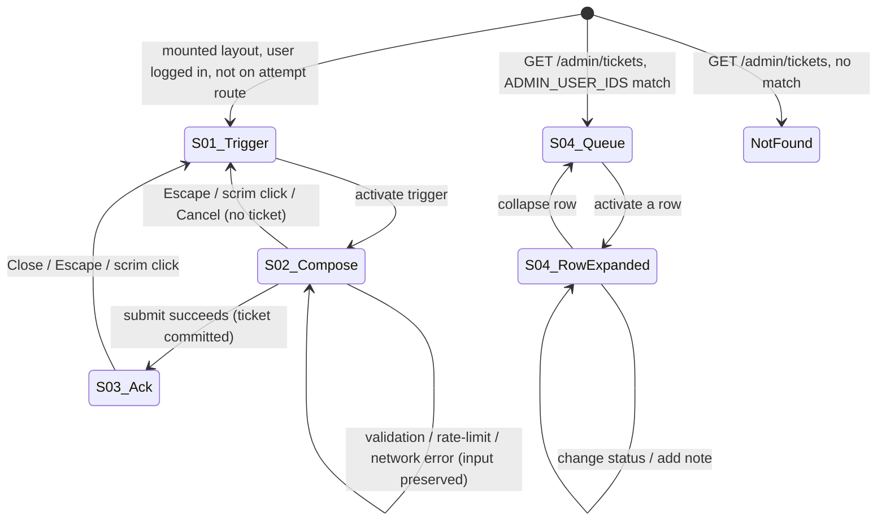

# User Support System v1 — UI Specification

| | |
|---|---|
| **Version** | 1.1 |
| **Date** | 2026-08-10 |
| **Status** | Draft — ready for the downstream chain (ADR email transport → Design Doc → Work Plan). Resolves the four PRD Undetermined Items owned by "UI Spec" (widget placement/z-index/page allowlist; admin ticket page structure; the UI-facing half of message length bound; notification-failure-flag list treatment); leaves the remaining owner-tagged items (email transport, screenshot bucket specifics/retention/upload transport, rate-limit ceiling/window, table/column naming, `ADMIN_USER_IDS` ADR) in Open Items for their stated owners. v1.1 is an additive correction pass resolving a completed document review (verdict: approved with conditions) — see Revision History. |
| **PRD** | `docs/prd/support-system-prd.md` (v1.2, Draft — ten product decisions D1–D10 locked with the engineer/product owner, not re-litigated here) |

## Revision History

| Version | Date | Change |
|---|---|---|
| 1.0 | 2026-08-10 | Initial version. No prototype code was provided for this feature (confirmed by the absence of a prototype path in the task input); design is fresh, built on the existing "Ink & Lacquer" system and the two closest in-repo precedents — `ReportExam.tsx` (dialog interaction pattern, explicitly named by the PRD as the pattern to reuse under D8) and `ModerationRow.tsx` / `StatusBadge.tsx` (admin queue row and status-label precedent). Resolves the UI-Spec-owned Undetermined Items from the PRD. |
| 1.1 | 2026-08-10 | Additive correction pass resolving a completed document review (verdict: approved with conditions). **Three blocking fixes.** (1) **I001**: former Decisions Record item D8 ("Screenshot upload transport") settled a genuine Design-Doc-level architecture choice inside this UI Spec on an incomplete premise (it dismissed direct-to-Storage upload without evaluating Supabase Storage's native bucket-level `fileSizeLimit`/`allowedMimeTypes` enforcement). Removed from the Decisions Record and folded into Open Items TBD-02, now naming both transport options for the Design Doc to weigh with full information; `ScreenshotAttachment`'s loading-state description is marked explicitly provisional on that pending decision, without deleting the UI-level description of the loading/progress affordance itself. (2) **I002**: replaced the "Extend `StatusBadge`" plan with a new sibling component `TicketStatusBadge` (independent `Status` type and `CONFIG` map, glyphs `✉`/`▶`/`✓` chosen to be visually distinct from `StatusBadge`'s existing five `◌`/`◑`/`○`/`●`/`▲`), because the originally proposed glyphs for `new`/`in_progress`/`resolved` collided exactly with glyphs already assigned to unrelated existing statuses in `StatusBadge.CONFIG`. Updated the Existing Component Reuse Map row, Component Tree, all `TicketQueueRow`/AC-042/AC-028 references, the Contrast Requirements table, and TBD-08 accordingly. (3) **I005**: replaced every occurrence of the invalid Tailwind class `z-45` with the arbitrary-value bracket form `z-[45]` (Decision UI-D6, Elevation table), matching this codebase's own convention for non-standard z-index values. **Two recommended fixes**, both accepted: (I003) added a `--brand-foreground` row to the Color Roles table (`#EDE1C8`, `SOURCE/app/globals.css:80`), already referenced by the Contrast Requirements table but previously undocumented there. (I004) this document's own Decisions Record IDs are now prefixed `UI-D1`–`UI-D8` (after the D8 removal, the remaining eight decisions were renumbered sequentially) to avoid label collision with the PRD's own D1–D10; every internal self-reference to the old bare `D1`–`D9` labels was updated to the `UI-D` form, while every citation of a PRD decision (e.g. "D8 of the PRD") was left unchanged. No other decision, component spec, token table, or diagram was altered. |

## Overview

Defines the floating, app-wide support widget that a logged-in student uses to file a ticket (bug / suggestion / question, with automatic technical metadata and at most one optional screenshot), and the `/admin/tickets` queue where the `ADMIN_USER_IDS` allowlist triages tickets and writes internal notes. Covers PRD R1–R4, R6 (UI-visible half), R7, R8 (UI-visible half), R9, R11, R12, R13, R14, and R16/R15 (UI-visible halves) in full; requirements that are pure schema/RLS/mail-module/env concerns with no rendered surface (parts of R5, R6, R8, R9, R10, R16) are marked "No UI surface" in the AC Traceability table below and are explicitly left to the Design Doc / ADR.

### Target PRD

- PRD path: `docs/prd/support-system-prd.md` (v1.2, Draft — ready for the downstream chain)
- Feature scope: R1 (widget, 3 fixed intents), R2 (attempt-route hiding, D1), R3 (auto metadata capture — client trigger only, capture logic is Design Doc), R4 (one optional screenshot), R6 (submission UI — rate-limit refusal surface; the `RATE_LIMITS` entry itself is Design Doc), R7 (admin ticket page), R8 (internal notes UI — the table/RLS is Design Doc), R9 (three statuses, UI surface), R11 (i18n routing — cross-cutting constraint on every component below), R12 (untrusted-render treatment on the admin page), R13 (resilient submission feedback), R14 (queue ordering/status visibility), R15 (Could — ticket reference in acknowledgement), R16 (subject-token contract — no UI surface, listed for completeness).

### Design Source

| Source | Path | Version |
|--------|------|---------|
| Theme definition | `SOURCE/app/globals.css` ("Ink & Lacquer" / "Mực & Sơn Mài") | repo `feat/support-system` |
| Existing component precedent | `SOURCE/app/(layer2)/_components/ReportExam.tsx` (dialog pattern — PRD-cited, D8); `SOURCE/app/(admin)/admin/ModerationRow.tsx`, `actions.ts` (admin row/action pattern — PRD-cited, R7); `SOURCE/app/(layer4)/_components/StatusBadge.tsx` (non-color-only status label); `SOURCE/components/ui/{button,SuccessToast}.tsx`; `SOURCE/components/layout/{PageContainer,PageHeader,BottomNav}.tsx` | repo `feat/support-system` |
| Prototype code | None provided | — |

## Prototype Management

No prototype code was provided for this feature. The canonical specification is this document plus the forthcoming Design Doc. `ReportExam.tsx` and `ModerationRow.tsx`/`StatusBadge.tsx` are used as **visual/behavioral precedent only** — their interaction patterns (scrim, Escape/scrim-click-to-close, minimal focus trap, `useActionState` form wiring, glyph+text status labelling) are reused deliberately per the PRD's own citations (D8, R7), but no file is imported wholesale across route groups; each new component in this feature is new code that follows those patterns.

## External Resources Used

Project-tier facts are recorded in `docs/project-context/external-resources.md` (already present, last updated 2026-08-08). Feature-specific subset:

| Resource (project-tier label) | Feature-specific identifier | Notes |
|-------------------------------|------------------------------|-------|
| Design Origin | `SOURCE/app/globals.css` — root token block (`--background`, `--foreground`, `--brand`, `--brand-on-dark`, `--border`, `--input`, `--ring`, `--destructive`, `--muted`, `--muted-foreground`) | Governs both the widget and the admin ticket page; no feature-specific token is introduced |
| Design System | `SOURCE/components/ui/{button,SuccessToast}.tsx`; `SOURCE/components/layout/{PageContainer,PageHeader}.tsx`; `SOURCE/app/(layer4)/_components/StatusBadge.tsx` (pattern precedent for the new sibling component `TicketStatusBadge`, see Existing Component Reuse Map) | `SuccessToast` is evaluated and **not** reused for the submit acknowledgement — see Decisions Record UI-D8 |
| Guidelines | `SOURCE/app/globals.css` inline comments (contrast rules — `--brand-on-dark` required on the dark nav surface below 24px text; explicit no-shadow/no-gradient rule — layering is background-color + hairline border only) | Applies to the floating trigger (may sit near/over dark surfaces on some pages) and to the admin queue row treatment |
| Visual Verification Environment | `npm run dev` + Playwright MCP (`playwright` server, `.mcp.json`); routes: any authenticated page for the widget (e.g. `/exams`, `/`, `/history`), `/admin/tickets` for the admin surface | 360px viewport pass is mandatory before ship (AC-006, metric 8) |

## Decisions Record

Items delegated to this UI Spec by the PRD's Undetermined Items section, plus supporting UI-level decisions needed to make the component spec below unambiguous. Downstream documents (Design Doc, Work Plan) treat these as fixed unless a listed escalation triggers.

| ID | Decision | Rationale |
|----|----------|-----------|
| UI-D1 | **Widget mount points (resolves PRD Undetermined Item "widget placement... and page allowlist")**: the widget is mounted once per route-group layout, exactly where each layout already renders `<BottomNav />` — `SOURCE/app/(layer2)/layout.tsx`, `(layer3)/layout.tsx`, `(layer4)/layout.tsx`, `(HM)/layout.tsx`, and `SOURCE/app/page.tsx` (homepage, which renders `BottomNav` directly, not via a route-group layout). It is **not** mounted in `(layer1)` (login/reset-password — pre-auth pages by construction) or `(admin)` (the maintainer's own tooling area, not part of "the site" a student browses; PRD's "app-wide" describes the student-facing surface). The component itself (`SupportWidget`, see Component Tree) self-guards on both the user prop (null → renders nothing, AC-003) and the current pathname (exact match on the `(layer2)` attempt route `/exams/[id]/attempt/[attemptId]` → renders nothing, AC-005) — so no per-layout special-casing is needed beyond passing the already-fetched `user` prop each layout already computes via `getCurrentUserProfile()`. | Every existing route-group layout already duplicates the identical `getCurrentUserProfile()` + `SiteHeader` + `BottomNav` structure (verified by reading all four — they are structurally identical); adding one more sibling element at the same mount point is the smallest change consistent with the existing pattern, and needs no new auth-fetching code. Self-guarding inside `SupportWidget` (rather than conditionally rendering it per-layout) keeps the attempt-route exclusion in exactly one place, so a future sixth mount point cannot forget it. |
| UI-D2 | **Admin ticket page structure (resolves PRD Undetermined Item "admin ticket page structure")**: a **single list with expandable rows**, mirroring `ModerationRow.tsx` exactly — no separate detail route. Each `TicketQueueRow` is collapsed by default (shows intent, message excerpt, status badge, notification-failure flag, created time); clicking/activating the row (or a dedicated "expand" control) reveals `TicketDetailPanel` in place (full message, metadata, screenshot, status control, internal notes). | The PRD's two offered options are "list with expandable rows (mirroring `ModerationRow.tsx`)" or "list plus a detail route" (Undetermined Items). At v1's stated volume (metric 13: ≥ 5 tickets / 30 days is the floor test) a detail route adds a dynamic segment, a loading/error boundary pair, and back-navigation plumbing for no benefit a one-person queue needs; `ModerationRow.tsx` already solved "inline action + inline detail" for this exact admin, and reusing its shape means the new page needs no new routing decisions. |
| UI-D3 | **Notification-failure flag treatment (resolves PRD Undetermined Item "how the flag is surfaced in the list")**: rendered as a small glyph + text badge (`⚠ {t("support.admin.notifyFailed")}`), visually distinct from — never combined with — the status badge, using the same "glyph + text, never color alone" contract as `StatusBadge` (AC-042 applies to ticket status; this flag is a separate boolean so it gets its own always-text-labelled treatment rather than reusing a status slot). | AC-022 requires the flag visible in the list without opening the ticket; AC-042's "not color alone" principle for status is applied here by construction even though AC-042 itself only names status, because the same low-vision/grayscale-printing risk applies to any list signal in this codebase (see `StatusBadge`'s own header comment). |
| UI-D4 | **Screenshot render path (AC-014)**: rendered as a plain ``, sized within `TicketDetailPanel` (`max-h-80 w-auto rounded-md border border-border object-contain`), never through `dangerouslySetInnerHTML`, never inferring a filename-derived alt text from student input. The exact URL delivery mechanism (signed URL vs. service-role proxy) is a Design Doc item (already an Undetermined Item); this decision only fixes the client-side render primitive. | A native `` tag cannot execute script content the way an inline SVG or an unsanitized HTML fragment could; combined with the Design Doc's still-open allowed-MIME-list decision, this UI Spec records the constraint that the render primitive itself introduces no parsing of untrusted markup, consistent with R12's "untrusted UGC on the admin render path" framing extended by analogy from text to the one non-text field this feature has. |
| UI-D5 | **Message length bound, UI-facing half (partially resolves PRD Undetermined Item "message length bound", owner "Design Doc / UI Spec")**: `MessageField` enforces a client-side `maxlength` of **1000 characters** with a live `{count}/1000` counter, following the same value as `LIMITS.MAX_REPORT_REASON` (`SOURCE/lib/ugc/limits.ts:16`) — the closest existing analogue (also a free-text field feeding a human queue). The Design Doc must add the matching server/DB-side constraint (proposed as a new `LIMITS.MAX_SUPPORT_MESSAGE` constant) and confirm or revise this number; until then this value is provisional (see Open Items TBD-07). | `LIMITS.MAX_REPORT_REASON` is the only existing precedent for "free-text field bound, admin-facing queue" in this codebase; reusing its value avoids inventing an arbitrary new number while leaving the server-side commitment explicitly open, matching the PRD's own joint-ownership framing for this item. |
| UI-D6 | **Widget trigger position, z-index, and touch target**: fixed-position circular button, `size-14` (56px, matching `BottomNav`'s already-audited 56px row height rather than the smaller sizes in `buttonVariants`), `z-[45]` (between `BottomNav`'s `z-40` and the modal layer's `z-50` — the trigger must sit above the bottom nav bar visually reachable, but the open dialog, which reuses the `z-50` modal convention, must be able to cover it). Position: `bottom-right`, offset `bottom-[calc(var(--bottom-nav-h)+env(safe-area-inset-bottom,0px)+1rem)] right-4` below 768px (clears `BottomNav` plus one full spacing unit, respecting the safe-area inset per AC-006) and `md:bottom-6 md:right-6` at ≥768px (no `BottomNav` to clear at that width, per `BottomNav.tsx`'s own `md:hidden`). | AC-006 requires zero bounding-box intersection with `BottomNav` and safe-area respect; the `calc()` offset makes that a structural guarantee rather than a value tuned by eyeballing a screenshot. `z-[45]` is a new value (existing stack: nav `z-40`, modals `z-50`, toast `z-70`, per `BottomNav.tsx`'s own inline comment) chosen so the trigger never competes with the nav bar for top stacking but never outranks an open modal or a toast — no existing modal in this codebase needs to render above a floating trigger, so `z-[45]` cannot regress anything. 45 is not a standard Tailwind scale step, so it is expressed via the arbitrary-value bracket form (`z-[45]`), matching this codebase's own convention for non-standard z-index values (e.g. the toast layer's `z-[70]`). |
| UI-D7 | **Widget dialog shell**: reuses the `ReportExam.tsx` shell verbatim in structure — `fixed inset-0 z-50` scrim (`bg-[#1B1512]/40`), centered `border-border bg-background max-w-sm rounded-lg border p-6` panel, `role="dialog" aria-modal="true" aria-labelledby`, Escape-to-close, scrim-click-to-close, focus moves into the dialog on open. Departure from `ReportExam`: focus lands on the **first intent option**, not a textarea, because intent selection is this dialog's first required field (`ReportExam` has only one field, the widget has three in sequence). Focus returns to the trigger button on close (an explicit strengthening of `ReportExam`'s "focus trap tối thiểu", required here because the PRD's own Accessibility NFR states "focus returns sensibly on close", and the trigger is a persistent, findable element to return to). | D8 in the PRD explicitly names `ReportExam.tsx` as the interaction pattern to reuse; departing only where the two dialogs' field structure genuinely differs (single field vs. three-field sequence) keeps the departure minimal and justified rather than a redesign. |
| UI-D8 | **Submit acknowledgement is not `SuccessToast`**: `SuccessToast.tsx` was read and rejected for the same reason the History UI Spec rejected it for per-row confirmations (`docs/ui-spec/history-ui-spec.md` D1): it is a global, singleton, **auto-dismissing** (default 3000ms) bottom-center signal. The acknowledgement here may carry a short reference the student wants to read or copy (R15, if shipped) — auto-dismissing that after 3 seconds actively works against the requirement. Instead, on success the dialog's own content area swaps in place from the form to an acknowledgement view (checkmark, message, optional reference, an explicit "Đóng" / Close button), remaining open until the student dismisses it. | Matches the already-established in-repo precedent for rejecting `SuccessToast` when content must persist for the user to read, rather than re-deriving the same analysis; keeps the "no optimistic success" (AC-040) and "success is never time-boxed off-screen" properties together in one place. |

*Note (v1.1): a former item here, "Screenshot upload transport" (previously ID D8, before the D8-removal renumbering to `UI-D1`–`UI-D8`), was removed per review finding I001 — it settled a Design-Doc-level architecture choice (server-proxied upload vs. direct-to-Storage) on an incomplete premise. It now lives in Open Items as part of TBD-02, naming both transport options for the Design Doc to decide between.*

## AC Traceability (PRD → Screens/Components)

No prototype exists, so this replaces the template's prototype-specific traceability table. Rows marked "No UI surface" are schema/RLS/mail-module/env concerns owned by the Design Doc or ADR; they are listed for completeness of PRD coverage, not because a screen renders them.

| AC ID | Summary | Screen/Component | State |
|-------|---------|-------------------|-------|
| AC-001 | Widget open → exactly 3 intents, Vietnamese labels | S-02 `SupportWidgetDialog` → `IntentSelector` | Default |
| AC-002 | No intent / empty message → refused with visible message, no row created | `SupportWidgetDialog` | Error (validation) |
| AC-003 | Logged-out visitor sees no submittable form | S-01 `SupportWidgetTrigger` | Absent (not rendered) |
| AC-004 | Unauthenticated submit rejected server-side | No UI surface — server action guard (Design Doc) |  |
| AC-005 | Widget absent in DOM on the attempt route | S-01 `SupportWidgetTrigger` | Absent (route guard, UI-D1) |
| AC-006 | Zero intersection with `BottomNav` at 360px + safe-area respect | `SupportWidgetTrigger` | Default |
| AC-007 | `ReportExam` unchanged | No UI surface — existing component, out of this feature's change set |  |
| AC-008 | Ticket carries non-empty URL/UA/screen dims | No UI surface — client capture logic (Design Doc) |  |
| AC-009 | Captured URL is the page at submit time | No UI surface — client capture logic (Design Doc) |  |
| AC-010 | Metadata gap degrades gracefully, never blocks | No UI surface — client capture logic (Design Doc) |  |
| AC-011 | At most one screenshot; second attach replaces or is refused | `ScreenshotAttachment` | Default / Partial (one attached) |
| AC-012 | Oversize/disallowed file rejected server-side with message | `ScreenshotAttachment` | Error |
| AC-013 | Screenshot RLS denies other students | No UI surface — Storage RLS (Design Doc) |  |
| AC-014 | Admin screenshot render treats it as untrusted content | `TicketDetailPanel` | Default (screenshot present) |
| AC-015 | Read-own RLS isolation | No UI surface — RLS (Design Doc); no student read surface ships (D3 of PRD) |  |
| AC-016 | Ticket row records full field set incl. first-status-transition timestamp | No UI surface — schema (Design Doc) |  |
| AC-017 | Idempotent schema | No UI surface — schema (Design Doc) |  |
| AC-018 | Rate-limit ceiling exceeded → actionable refusal message | `SupportWidgetDialog` | Error (rate-limited) |
| AC-019 | Refused submission emits no email | No UI surface — server concern |  |
| AC-020 | Refusal preserves typed message + selected intent | `SupportWidgetDialog` | Error (state preserved) |
| AC-021 | Non-allowlisted user → `notFound()` (404) | No UI surface — page guard, mirrors `SOURCE/app/(admin)/admin/page.tsx:24-25` |  |
| AC-022 | Admin list shows intent, message, metadata, screenshot indicator, status, created time, notification-failure flag per ticket | S-04 `TicketQueueList` → `TicketQueueRow` | Default |
| AC-023 | Status change persists across reload | `TicketStatusControl` | Default → after change |
| AC-024 | `ADMIN_USER_IDS` unset → 404 for all + `checkEnv` report | No UI surface — env/page guard (Design Doc) |  |
| AC-025 | Notes unreadable by the ticket's own author query | No UI surface — RLS (Design Doc); no student-facing surface |  |
| AC-026 | No note text stored on a student-selectable row | No UI surface — schema (Design Doc) |  |
| AC-027 | Note records text, authoring admin id, ticket id, timestamp | `InternalNotesPanel` | Default (after add) |
| AC-028 | New ticket starts at status `new` | `TicketQueueRow` / `TicketStatusControl` | Default ("Mới" badge) |
| AC-029 | Invalid status target rejected | `TicketStatusControl` | Error |
| AC-030 | Status change emits no student email | No UI surface — server concern |  |
| AC-031 | Mail failure/unconfigured never blocks commit; student still sees success | S-03 `SupportWidgetDialog` (acknowledgement) | Success |
| AC-032 | Send failure logged + admin-visible flag | `TicketQueueRow` (list) and `TicketDetailPanel` (detail) | Partial (flag present) |
| AC-033 | Successful-send email content/link | No UI surface — mail module (Design Doc/ADR) |  |
| AC-034 | `SUPPORT_NOTIFY_EMAIL` unset → `checkEnv` warns; submission unaffected | No UI surface — env concern; `SupportWidgetDialog` Success state is unaffected either way |  |
| AC-035 | No hard-coded display strings; all via dictionaries | Cross-cutting — every component in this document | All states |
| AC-036 | `vi.ts`/`en.ts` key parity | No UI surface — repo convention check (Design Doc/CI) |  |
| AC-037 | HTML/script in message renders inert, verbatim | `TicketDetailPanel` (message body) | Default |
| AC-038 | Captured URL/UA render as untrusted text, never auto-linked | `TicketDetailPanel` (metadata block) | Default |
| AC-039 | Pre-commit failure → retryable message + preserved input | `SupportWidgetDialog` | Error (network/server failure) |
| AC-040 | Acknowledgement shown only after commit, never optimistic | `SupportWidgetDialog` | Success |
| AC-041 | Admin list ordered `created_at` desc | `TicketQueueList` | Default |
| AC-042 | Status distinguishable without opening; not color alone | `TicketQueueRow` (via `TicketStatusBadge`) | Default |
| AC-043 | Subject leading `[report-ms]` token | No UI surface — mail module (ADR/Design Doc) |  |
| AC-044 | Byte-identical prefix across `vi`/`en` | No UI surface — mail module |  |
| AC-045 | Automated subject assertion | No UI surface — test suite (Design Doc/Work Plan) |  |
| AC-046 | Every subject-composing path carries the prefix | No UI surface — mail module |  |
| AC-047 | First-status-transition timestamp written once | No UI surface — status-update logic (Design Doc); triggered by `TicketStatusControl`'s state transition |  |
| AC-048 | Non-admin insert into notes table denied | No UI surface — RLS (Design Doc); this feature ships no student note-write UI |  |
| AC-049 | Short reference 1:1 server-derivable; drop condition if unmapped | S-03 `SupportWidgetDialog` (acknowledgement) | Success (conditional — Could tier, R15) |

## Screen List and Transitions

### Screen List

| Screen ID | Screen Name | Description | Entry Condition |
|-----------|------------|-------------|-----------------|
| S-01 | Support Widget — Trigger | Floating circular affordance, rendered wherever the widget is mounted (UI-D1) | Logged-in student, on any mounted route, not on the `(layer2)` attempt route |
| S-02 | Support Widget — Compose | Open dialog: intent selection, message field, optional screenshot, submit/cancel | Activating S-01's trigger |
| S-03 | Support Widget — Acknowledgement | In-dialog success view: confirmation message, optional short reference, Close | Successful ticket commit from S-02 |
| S-04 | Admin Ticket Queue | `/admin/tickets` — ordered list of tickets, each expandable to a detail panel (status control + internal notes) | Signed-in user whose id is in `ADMIN_USER_IDS`, navigating to `/admin/tickets` |

### Transition Conditions

| Source | Destination | Trigger | Guard Condition |
|--------|------------|---------|-----------------|
| (page load) | S-01 | Route renders in a mounted layout | `user !== null` (AC-003) AND pathname is not the `(layer2)` attempt route (AC-005) |
| S-01 | S-02 | Click / Enter / Space on the trigger | — |
| S-02 | S-02 (Error) | Submit with no intent, empty message, past rate-limit ceiling, or a network/server failure | Corresponding validation/refusal condition (AC-002, AC-018, AC-039) |
| S-02 | S-03 | Submit succeeds — ticket row committed | Ticket insert returns success (AC-031, AC-040 — never shown before commit) |
| S-02 | (closed, no ticket) | Escape / scrim click / Cancel button, before a successful submit | — |
| S-03 | (closed) | Escape / scrim click / explicit Close button | — |
| (route load) | S-04 | Navigate to `/admin/tickets` | `isAdminUserId(user.id)` true, else `notFound()` (AC-021) |
| S-04 (row collapsed) | S-04 (row expanded) | Click / Enter on a `TicketQueueRow` | — |
| S-04 (row expanded) | S-04 (row expanded, status updated) | Submit `TicketStatusControl` | New status ∈ {`new`, `in_progress`, `resolved`} (AC-029) |
| S-04 (row expanded) | S-04 (row expanded, note added) | Submit `InternalNoteForm` | Note text non-empty |

### Screen Transition Diagram



## Component Decomposition

### Component Tree

```
Root Layout (SOURCE/app/layout.tsx)
  +-- (layer2)/layout.tsx, (layer3)/layout.tsx, (layer4)/layout.tsx, (HM)/layout.tsx, app/page.tsx
      +-- SupportWidget (client; self-guards on `user` prop + pathname)
          +-- SupportWidgetTrigger            [S-01]
          +-- SupportWidgetDialog             [S-02 / S-03]
              +-- IntentSelector
              +-- MessageField
              +-- ScreenshotAttachment
              +-- (submit footer: Cancel / Submit buttons — Button reuse, no own component)
              +-- (acknowledgement view — swaps in place of the three fields above on success)

(admin)/admin/tickets/page.tsx (Server Component)
  +-- PageHeader (reuse)
  +-- TicketQueueList                          [S-04]
      +-- TicketQueueRow (repeated, one per ticket; collapsed by default)
          +-- TicketStatusBadge (new, sibling pattern of StatusBadge)
          +-- NotificationFailureFlag (conditional)
          +-- TicketDetailPanel (expanded state only)
              +-- (message + metadata block, escaped plain text)
              +-- (screenshot, conditional — UI-D4)
              +-- TicketStatusControl
              +-- InternalNotesPanel
                  +-- (notes list)
                  +-- InternalNoteForm
```

### Component: SupportWidgetTrigger

#### State x Display Matrix

| State | Default | Loading | Empty | Error | Partial |
|-------|---------|---------|-------|-------|---------|
| Display | Circular `Button` (extended, `shape="pill"`, `size-14`), brand-red fill, a chat/message glyph icon, `aria-label={t("support.trigger.label")}`, fixed bottom-right per UI-D6 | N/A — trigger has no async load of its own | N/A | N/A — the trigger itself cannot error; a submit error surfaces inside the dialog, not on the trigger | N/A |

Absent states (not rows in the matrix, because the component renders nothing — no DOM node — rather than a disabled/dim display): logged-out visitor (AC-003); on the `(layer2)` attempt route (AC-005, UI-D1).

#### Interaction Definition

| AC ID | EARS Condition | User Action | System Response | State Transition | Error Handling |
|-------|---------------|-------------|-----------------|-----------------|----------------|
| AC-001 | When a logged-in student activates the trigger | Click / Enter / Space | Opens `SupportWidgetDialog` in Compose state, focus moves to the first intent option | S-01 → S-02 | — |
| AC-003 | Given no authenticated session | (page render) | Component returns `null` — no submittable form anywhere in the DOM | Absent | — |
| AC-005 | Given the current route is the `(layer2)` attempt route | (page render) | Component returns `null` regardless of auth state | Absent | — |
| AC-006 | Given a 360px viewport on a page where the trigger renders | (page render) | Trigger position is computed via `calc(var(--bottom-nav-h) + env(safe-area-inset-bottom,0px) + 1rem)` from the bottom, `right-4` — zero intersection with `BottomNav` by construction | Default | — |

---

### Component: IntentSelector

#### State x Display Matrix

| State | Default | Loading | Empty | Error | Partial |
|-------|---------|---------|-------|-------|---------|
| Display | Three labelled options ("Báo lỗi", "Góp ý", "Câu hỏi") as a radio-group-equivalent (`role="radiogroup"`, one `aria-checked` true at a time), none pre-selected | N/A | No intent selected yet — visually identical to Default (this *is* the empty state; there is no separate empty-state affordance) | Validation message rendered by the parent `SupportWidgetDialog` (AC-002), `aria-describedby` links the group to it | N/A |

#### Interaction Definition

| AC ID | EARS Condition | User Action | System Response | State Transition | Error Handling |
|-------|---------------|-------------|-----------------|-----------------|----------------|
| AC-001 | When the dialog opens | (render) | Exactly three options render, Vietnamese-labelled, no fourth/"other" option exists in markup | Default | — |
| AC-002 | When the student submits with no intent selected | Submit action on the dialog | Selection state is flagged invalid; a `role="alert"` message appears (reused `ReportExam.tsx` pattern) and no submission request is sent | Default → Error | Student re-selects; error clears on next valid selection |

---

### Component: MessageField

#### State x Display Matrix

| State | Default | Loading | Empty | Error | Partial |
|-------|---------|---------|-------|-------|---------|
| Display | `textarea`, `maxLength={1000}` (UI-D5), placeholder via i18n, live `{count}/1000` counter below it | Disabled (`aria-disabled`) while a submit request is in flight, value unchanged | Empty textarea is the field's natural starting state — not a distinct rendered state | `role="alert"` message below the field ("Vui lòng nhập nội dung") when submitted empty/whitespace-only (AC-002) | Value is preserved verbatim across a refusal or a network failure (AC-020, AC-039) — same visual as Default, with the prior text still present |

#### Interaction Definition

| AC ID | EARS Condition | User Action | System Response | State Transition | Error Handling |
|-------|---------------|-------------|-----------------|-----------------|----------------|
| AC-002 | When the student submits with an empty or whitespace-only message | Submit action on the dialog | Field shows the validation error; no request is sent | Default → Error | Student types; error clears once trimmed length > 0 |
| AC-020 | When a rate-limited submission is refused | (server refusal returns) | The message text already typed remains in the field, untouched | Error (rate-limited), value preserved | — |
| AC-039 | When a submission fails before the ticket is committed (network/server) | (request fails) | The message text already typed remains in the field, untouched | Error (network/server), value preserved | Student may retry the same submit action without retyping |

---

### Component: ScreenshotAttachment

#### State x Display Matrix

| State | Default | Loading | Empty | Error | Partial |
|-------|---------|---------|-------|-------|---------|
| Display | `<input type="file" accept="image/*">` behind a labelled "Đính kèm ảnh chụp màn hình (tuỳ chọn)" control, no file chosen | Thumbnail shown with a subtle "uploading" affordance (spinner overlay on the thumbnail, submit button busy) while the file is being uploaded. **Provisional pending Design Doc (TBD-02):** this loading treatment currently assumes server-proxied upload — the file travels inside the same submit request and no separate progress event exists, so the affordance is a single indeterminate busy state for the whole submit, not a percentage. If the Design Doc instead selects direct-to-Storage upload via a signed URL, the same thumbnail-plus-busy-affordance visual applies to the client's own upload request instead (potentially with real progress, since a direct browser-to-Storage `PUT` can expose `onprogress`) — the user-facing shape (thumbnail visible, an unmistakable in-progress signal, no page navigation) does not change either way. | No attachment — this **is** the field's normal, valid resting state (screenshot is optional, R4) | `role="alert"` message when the server rejects the file (oversize / disallowed MIME, AC-012) — file is cleared from the field, student can pick another | Exactly one file selected: local `URL.createObjectURL` thumbnail + filename + a "×" remove control replaces the file input |

#### Interaction Definition

| AC ID | EARS Condition | User Action | System Response | State Transition | Error Handling |
|-------|---------------|-------------|-----------------|-----------------|----------------|
| AC-011 | When a file is already attached and the student picks another | Choose a second file via the same control | The second file **replaces** the first (this UI Spec resolves the PRD's "replace or refuse" alternative in favor of replace — simplest single-slot UX, since the input's own single-file `accept` semantics make "no picker interaction possible after one is set" a worse affordance) | Partial → Partial (new file) | — |
| AC-012 | When the submitted file exceeds the server's size/MIME limits | Submit action on the dialog | Server rejects the upload leg; the attachment is cleared and a specific error message renders; the rest of the ticket (intent, message) is preserved for retry without the attachment (R13 extends to this field) | Partial/Empty → Error | Student removes/replaces the file or submits without one |

---

### Component: SupportWidgetDialog

#### State x Display Matrix

| State | Default | Loading | Empty | Error | Partial |
|-------|---------|---------|-------|-------|---------|
| Display | Compose view: `IntentSelector` + `MessageField` + `ScreenshotAttachment` + Cancel/Submit buttons, inside the `ReportExam`-pattern shell (UI-D7) | Submit button shows a busy label (`t("support.submitting")`) and is `aria-disabled` (not native `disabled`, per the `RateButton`/History-precedent a11y pattern — stays keyboard-focusable so the busy reason is discoverable); dialog cannot be submitted twice | N/A — Compose view is never "empty" as a distinct state; an unfilled form is the Default | `role="alert"` region inside the dialog surfaces one of: validation (AC-002), rate-limited (AC-018), or network/server failure (AC-039); the triggering field also gets its own inline error (see `IntentSelector`/`MessageField`/`ScreenshotAttachment`) | N/A |
| **Success sub-state (S-03)** | Content area swaps to: checkmark glyph, `t("support.ack.message")`, the short reference if the Design Doc's mapping ships (R15, AC-049) or omitted entirely if it does not (drop condition), and a Close button. Wrapped in `role="status" aria-live="polite"` (UI-D8 — not `SuccessToast`) | N/A | N/A | N/A (success is terminal for this submit cycle) | N/A |

#### Interaction Definition

| AC ID | EARS Condition | User Action | System Response | State Transition | Error Handling |
|-------|---------------|-------------|-----------------|-----------------|----------------|
| AC-018 | When a student submits beyond the rate-limit ceiling within the window | Submit action | Refusal message rendered (`t("support.rateLimited")`, exact ceiling/window is a Design Doc value, TBD-01); no ticket row created; no email emitted (AC-019, no UI surface) | Default → Error (rate-limited) | Student may retry after the (unspecified in this doc) window; message states "try again later" without a literal countdown unless the Design Doc supplies one |
| AC-020 | Given a rate-limited refusal | (refusal renders) | Intent selection and message text remain exactly as typed | Error, fields preserved | — |
| AC-031 | Given the mail transport throws, times out, or is unconfigured | Submit action, server side | Ticket row is committed regardless; the dialog transitions to the Success sub-state exactly as it would on a fully successful send — the UI has no visibility into transport outcome (fire-and-forget, D5 of the PRD) | Default → Success | — (this AC is a *negative* case for the UI: nothing different renders) |
| AC-039 | Given a submission that fails before the ticket is committed | Submit action, request fails | Retryable, specific error message (`t("support.submitError")`); intent, message, and attachment selection all preserved | Default → Error (network/server) | Student re-submits the same populated form |
| AC-040 | Given the acknowledgement is shown | (render) | Only ever reached after the server confirms the row is committed — never shown optimistically on click | → Success | — |
| AC-049 | Given a committed ticket and the Design Doc has defined the 1:1 short-reference mapping | (Success renders) | Reference displayed as `t("support.ack.reference", { ref })`; if the Design Doc drops R15, this line is omitted entirely and the rest of the acknowledgement is unaffected | Success (conditional line) | N/A — display-only, never an input anywhere (D3 of the PRD, unchanged) |
| (accessibility, UI-D7) | Given the dialog is open | Escape key / scrim click | Dialog closes; no ticket created if still in Compose; focus returns to `SupportWidgetTrigger` | S-02 → (closed) | — |

---

### Component: TicketQueueList

#### State x Display Matrix

| State | Default | Loading | Empty | Error | Partial |
|-------|---------|---------|-------|-------|---------|
| Display | Ordered list of `TicketQueueRow`, most-recent-first (`created_at` desc, AC-041), unpaginated per PRD Assumptions (v1 volume) | Handled by the Next.js `(admin)/admin/tickets/loading.tsx` route convention (skeleton rows), mirroring the `(HM)/history/loading.tsx` precedent cited in `history-ui-spec.md` D7 | `t("support.admin.empty")` message, no CTA (there is nothing for the admin to create — tickets originate from students) | Handled by `(admin)/admin/tickets/error.tsx` (Next.js error boundary), `reset()` wired as the Retry action, same idiom as `history-ui-spec.md` D7 | N/A — the list is not paginated in v1, so there is no "more available" partial state |

#### Interaction Definition

| AC ID | EARS Condition | User Action | System Response | State Transition | Error Handling |
|-------|---------------|-------------|-----------------|-----------------|----------------|
| AC-041 | Given multiple tickets exist | (page renders) | Rows appear ordered by `created_at` descending | Default | — |
| AC-022 | Given an admin opens the page | (page renders) | Every row shows intent, message excerpt, technical metadata indicator, screenshot indicator, status, created time, and the notification-failure flag where set — all without opening the row | Default | — |

---

### Component: TicketStatusBadge

New sibling component to `SOURCE/app/(layer4)/_components/StatusBadge.tsx` (added v1.1, review finding I002 — see Existing Component Reuse Map and Decisions Record). Independent `Status` type (`"new" | "in_progress" | "resolved"`) and `CONFIG` map; not merged into `StatusBadge`'s own type/`CONFIG`. Follows `StatusBadge`'s visual contract verbatim (glyph + text, `aria-hidden` glyph, no color-alone signal, `inline-flex items-center gap-1.5 rounded-full border px-2.5 py-0.5 text-xs font-medium`).

#### State x Display Matrix

| State | Default | Loading | Empty | Error | Partial |
|-------|---------|---------|-------|-------|---------|
| Display | Glyph + Vietnamese text pill for the ticket's current status: `✉` + "Mới" (`new`), `▶` + "Đang xử lý" (`in_progress`), `✓` + "Đã xử lý" (`resolved`) — exact colors TBD-08, glyphs distinct from `StatusBadge.CONFIG`'s existing `◌`/`◑`/`○`/`●`/`▲` by construction | N/A — the badge itself has no async load; it renders whatever status value the parent row already has | N/A — a ticket always has a status (AC-028), so there is no valid unset-status display | N/A — an unrecognized status string falls back to the `new` entry rather than rendering a blank pill (mirrors `StatusBadge`'s own `CONFIG[status] ?? CONFIG.processing` fallback pattern) | N/A |

#### Interaction Definition

| AC ID | EARS Condition | User Action | System Response | State Transition | Error Handling |
|-------|---------------|-------------|-----------------|-----------------|----------------|
| AC-028 | Given a newly created ticket | (render) | Renders the `new` entry ("Mới", glyph `✉`) | Default | — |
| AC-042 | Given tickets in different statuses | (render) | Each of the three statuses renders a distinct glyph + distinct text; no two statuses share a glyph, and none relies on color alone to be distinguishable | Default | — |

---

### Component: TicketQueueRow

#### State x Display Matrix

| State | Default | Loading | Empty | Error | Partial |
|-------|---------|---------|-------|-------|---------|
| Display | Collapsed card (border, hairline, matches `ModerationRow.tsx` shell): intent label, message excerpt (single line, truncated), `TicketStatusBadge` (glyph + text), created time, screenshot indicator glyph if present | While a `TicketStatusControl` or `InternalNoteForm` submission from the expanded state is pending, the row shows the same busy-button treatment as `ModerationRow.tsx` (`t("common.working")`) | N/A — a row only exists for an actual ticket | If a status/note action fails, the error renders inside the expanded `TicketDetailPanel`, not on the collapsed row | Expanded state reveals `TicketDetailPanel` in place, row height grows, collapsed summary remains visible above it |
| **Notification-failure flag** | Not rendered when the ticket's notification sent successfully | — | — | `NotificationFailureFlag` badge rendered next to the status badge — glyph `⚠` + `t("support.admin.notifyFailed")` text (UI-D3) — when AC-032's flag is set | — |

#### Interaction Definition

| AC ID | EARS Condition | User Action | System Response | State Transition | Error Handling |
|-------|---------------|-------------|-----------------|-----------------|----------------|
| AC-022 | Given a ticket in the list | (render) | All required fields visible in the collapsed row per the State x Display Matrix above | Default | — |
| AC-028 | Given a newly created ticket | (render) | Status badge reads `TicketStatusBadge`'s `new` entry ("Mới") | Default | — |
| AC-032 | Given the ticket's notification failed to send | (render) | `NotificationFailureFlag` visible in the collapsed row, no row-open required | Default (flag present) | — |
| AC-042 | Given tickets in different statuses | (render) | Each status is distinguishable by its own glyph + text (`TicketStatusBadge`), never by color alone | Default | — |
| — | When the admin activates the row | Click / Enter | Row expands, revealing `TicketDetailPanel` | Collapsed → Expanded | — |

---

### Component: TicketDetailPanel

#### State x Display Matrix

| State | Default | Loading | Empty | Error | Partial |
|-------|---------|---------|-------|-------|---------|
| Display | Full message (`<p className="whitespace-pre-wrap">{message}</p>` — escaped plain text, explicitly not `RichText`, per R12/UI-D4), metadata block (page URL, user agent, screen dimensions — all rendered as plain text, URL never an auto-activated `<a>`), `TicketStatusControl`, `InternalNotesPanel` | N/A — the panel's own content is server-rendered with the row; only its child controls (`TicketStatusControl`, `InternalNoteForm`) have their own loading states | N/A | N/A at the panel level — errors surface inside its children | Screenshot block renders conditionally: present → `` per UI-D4; absent → panel simply omits that block (not an error, not a placeholder image) |

#### Interaction Definition

| AC ID | EARS Condition | User Action | System Response | State Transition | Error Handling |
|-------|---------------|-------------|-----------------|-----------------|----------------|
| AC-014 | Given a ticket with a screenshot | Expand the row | Image renders via a plain `` element (UI-D4), never through a markup-interpreting pipeline | Default | — |
| AC-037 | Given a ticket message containing HTML/script/markup-like content | Expand the row | Content renders as inert, escaped text — verbatim characters, nothing executes, nothing interpreted as formatting | Default | — |
| AC-038 | Given the captured page URL and user agent | Expand the row | Both render as plain text on the same basis as the message body; the URL is never rendered as a clickable link built from the captured string | Default | — |

---

### Component: TicketStatusControl

#### State x Display Matrix

| State | Default | Loading | Empty | Error | Partial |
|-------|---------|---------|-------|-------|---------|
| Display | A three-option control (segmented control or `<select>`, styled consistent with `ModerationRow.tsx`'s form controls) showing the ticket's current status, all three values always visible/selectable | Submit button shows `t("common.working")`, `aria-disabled` during the request (`useActionState` pattern, same as `ModerationRow.tsx`) | N/A — a ticket always has a status (AC-028) | `role="alert"`/inline error text if the target value is rejected (AC-029) — status visually reverts to its last-known value | N/A |

#### Interaction Definition

| AC ID | EARS Condition | User Action | System Response | State Transition | Error Handling |
|-------|---------------|-------------|-----------------|-----------------|----------------|
| AC-023 | Given the admin changes a ticket's status | Select new status, submit | New status persists; visible immediately and after a reload | Default → Default (new value) | — |
| AC-029 | Given a status-change attempt outside {`new`,`in_progress`,`resolved`} | (cannot occur via this control's fixed option set, but the server layer still rejects any bypass) | Server-side rejection surfaces as an inline error; UI cannot construct an invalid value since only the three options are ever rendered | — | Value reverts to last-known-good |
| AC-047 | Given a ticket's status changes from `new` to any other value | Submit a status change | (no UI surface for the timestamp itself — Design Doc/DB concern) — this control's successful transition is the trigger event | Default → Default (new value) | — |

---

### Component: InternalNotesPanel

#### State x Display Matrix

| State | Default | Loading | Empty | Error | Partial |
|-------|---------|---------|-------|-------|---------|
| Display | Chronological list of existing notes (text, authoring admin, timestamp) + `InternalNoteForm` below | `InternalNoteForm`'s submit button shows `t("common.working")`, `aria-disabled` during the request | `t("support.admin.notesEmpty")` message in place of the list when no notes exist yet; the form is still shown | `role="alert"` inline error if a note fails to save; typed note text is preserved in the form (same resilience principle as R13 applied to this admin-only field) | N/A |

#### Interaction Definition

| AC ID | EARS Condition | User Action | System Response | State Transition | Error Handling |
|-------|---------------|-------------|-----------------|-----------------|----------------|
| AC-027 | Given an admin writes a note | Type text, submit | Note appended to the list with authoring admin id and timestamp; text field clears | Default → Default (note added) | On failure, note text remains in the form for retry |

## Design Tokens and Component Map

### Environment Constraints

- Target browsers: Chrome/Firefox/Safari/Edge, latest 2 versions (repository-wide default, `typescript-rules`/`frontend-ai-guide` NFR)
- Theme support: single theme ("Ink & Lacquer" / "Mực & Sơn Mài"), no light/dark toggle — matches every other feature in this repo
- Primary device target for the widget: mid-range Android, ~360px viewport, unstable mobile network (PRD framing) — every interaction must degrade gracefully on a slow/dropped connection (AC-039, the 20s submit ceiling per PRD NFR)

#### Responsive Behavior

| Breakpoint | Width | Key Changes |
|-----------|-------|-------------|
| Mobile | < 768px | `SupportWidgetTrigger` clears `BottomNav` via the `calc()` offset (UI-D6); `SupportWidgetDialog` remains a centered overlay (`max-w-sm`, unaffected by width below that); admin queue rows stack full-width |
| Tablet/Desktop | ≥ 768px | `BottomNav` does not render (`md:hidden`); trigger uses the simpler `md:bottom-6 md:right-6` offset; admin page uses `PageContainer size="default"` matching `/admin`'s existing width |

### Existing Component Reuse Map

| UI Element | Decision | Existing Component | Notes |
|-----------|----------|--------------------|-------|
| Floating trigger button | Extend | `SOURCE/components/ui/button.tsx` (`Button`, `shape="pill"`) | Wrapped in a new fixed-position container; needs a `size-14` override not present in the existing `size` scale (UI-D6) |
| Widget dialog scrim + shell | Reuse (pattern, new file) | `SOURCE/app/(layer2)/_components/ReportExam.tsx` | Structure, Escape/scrim-click-to-close, and minimal focus trap copied as a pattern (UI-D7); not imported across route groups — new component `SupportWidgetDialog` |
| Validation / rate-limit / network error text | Reuse (pattern) | `ReportExam.tsx`'s `role="alert"` paragraph | Same treatment, new i18n copy |
| Message textarea | Reuse (pattern) | `ReportExam.tsx`'s textarea classes | Same input styling convention (`border-border bg-card ... rounded-[4px] border p-3 text-sm`) |
| Submit acknowledgement | New | `SuccessToast.tsx` evaluated and rejected (UI-D8) | In-dialog content swap instead |
| Admin status label | New (sibling component, pattern reuse — resolves review finding I002) | `SOURCE/app/(layer4)/_components/StatusBadge.tsx` (pattern precedent only; **not modified**) | New component `TicketStatusBadge`, with its own independent `Status` union (`new`/`in_progress`/`resolved`) and `CONFIG` map — never merged into `StatusBadge`'s own `Status`/`CONFIG`, because the two domains are unrelated (UGC content lifecycle vs. ticket workflow) and the originally proposed glyphs collided exactly with glyphs `StatusBadge` already assigns to unrelated statuses. Follows `StatusBadge`'s glyph+text, no-color-alone visual contract verbatim (`inline-flex items-center gap-1.5 rounded-full border px-2.5 py-0.5 text-xs font-medium`, `aria-hidden` glyph + text label). Glyphs chosen to be visually distinct from all five already in `StatusBadge.CONFIG` (`◌` processing, `◑` review, `○` draft, `●` published, `▲` failed): `✉` new, `▶` in_progress, `✓` resolved (colors confirmed at implementation time, TBD-08). |
| Admin row shell + form wiring | Reuse (pattern) | `SOURCE/app/(admin)/admin/ModerationRow.tsx`, `actions.ts` | `useActionState` form-action pattern reused for `TicketStatusControl` and `InternalNoteForm` |
| Page header/container | Reuse | `SOURCE/components/layout/{PageHeader,PageContainer}.tsx` | Same as `/admin`'s existing usage (`size="default"`) |
| Buttons (Submit / Cancel / Save note / status change) | Reuse | `SOURCE/components/ui/button.tsx` | Variant/size per context, no new variant needed beyond the trigger's own sizing |
| Message / URL / user-agent render (untrusted) | Reuse (principle), explicit non-reuse of `RichText` | `SOURCE/components/shared/RichText.tsx` — explicitly **not** used (R12) | Plain `<p className="whitespace-pre-wrap">`, per ADR-0002's plain-text precedent (`:85-88`) |
| Screenshot render | New | — | `` element per UI-D4; no existing image-render component fits (existing `QuestionFigure.tsx` is for published exam content, a different trust boundary) |
| Notification-failure flag | New | — | Distinct glyph+text badge, not a `TicketStatusBadge` variant (UI-D3) |

### Design Tokens

All values below are read directly from `SOURCE/app/globals.css`'s `:root` block; this feature introduces no new token.

#### Color Roles

| Role | Token | Value | Usage |
|------|-------|-------|-------|
| Background Surface | `--background` / `--card` | `#EDE1C8` | Page background; dialog panel; admin row card |
| Text | `--foreground` | `#1B1512` | Body text, dialog title, ticket message |
| Text (muted) | `--muted-foreground` | `#605A52` | Metadata labels, timestamps, character counter |
| Brand / Accent | `--brand` | `#A62C2B` | Trigger button fill, primary Submit button, active tab-like affordances |
| Brand foreground (on brand fill) | `--brand-foreground` | `#EDE1C8` | Text/icon color composited on top of a `--brand` fill — e.g. the trigger icon glyph, primary Submit button label (`SOURCE/app/globals.css:80`) |
| Brand on dark surfaces | `--brand-on-dark` | `#E86B5C` | Only if the trigger or any widget chrome is ever composed over a dark surface (e.g. near `SiteHeader`'s dark strip) — not needed for the trigger itself, which sits on `--background`, but recorded per the repo's contrast-rule guideline |
| Status / Error | `--destructive` | `#8F2523` | Reserved for a future destructive action; not used by this feature's error *text* (which uses `--brand`, matching `ReportExam.tsx`'s `text-brand` error paragraph) |
| Border | `--border` | `#D8C9A8` | Dialog panel border, admin row border, screenshot frame |
| Input border | `--input` | `#877748` | `textarea`/status-control borders (WCAG 1.4.11 3:1 boundary) |
| Focus ring | `--ring` | `#8A6222` | Focus-visible ring on trigger, all form controls, buttons |

#### Typography Hierarchy

| Role | Font | Size | Weight | Notes |
|------|------|------|--------|-------|
| Dialog title | `--font-serif` (Source Serif 4) | `text-xl` | 400 | Matches `ReportExam.tsx`'s `h2#report-exam-title` |
| Body / labels / buttons | `--font-sans` (Be Vietnam Pro) | `text-sm` | 400–500 | Message field, metadata, status labels |
| Button label (uppercase-tracked) | `--font-sans` | `text-xs`, `tracking-[0.14em] uppercase` | 500 | Submit/Cancel, matching `ReportExam.tsx`'s button classes |
| Ticket short reference (if shipped, R15) | `--font-mono` (Geist Mono) | `text-sm` | 400 | Code-like value benefits from a monospace, fixed-width treatment |

#### Spacing Scale

This repository has no named spacing token scale beyond Tailwind's default; components follow the values already in use by the closest precedent:

| Context | Value | Source precedent |
|---------|-------|-------------------|
| Dialog panel padding | `p-6` | `ReportExam.tsx` |
| Container padding (admin page) | `px-6 py-10` (`padding="default"`) | `PageContainer.tsx` |
| Inter-field stacking gap | `gap-3` / `gap-4` | `ReportExam.tsx`, `ModerationRow.tsx` |
| Page-level section gap | `gap-6` | `admin/page.tsx` |

#### Elevation (Depth)

This codebase has an explicit **no-shadow, no-gradient** rule (`globals.css` inline comment: "Không đổ bóng/gradient — phân lớp bằng màu nền + hairline border"). Layering is expressed by background color + hairline `border`, and by z-index stacking, never by box-shadow.

| Level | Treatment | Usage |
|-------|-----------|-------|
| Flat | `border border-border`, no shadow | Admin row card, screenshot frame |
| Overlay | Scrim `bg-[#1B1512]/40` + `z-50` panel, no shadow | `SupportWidgetDialog` |
| Floating (new) | `z-[45]`, no shadow — separation from the page is via z-index and the circular brand-fill shape alone | `SupportWidgetTrigger` (UI-D6) |

#### Border Radius Scale

| Token | Value | Usage |
|-------|-------|-------|
| `--radius` | `0.625rem` (10px) | Dialog panel, admin row card, input/button base radius |
| `--radius-sm` | `0.375rem` (6px) | Screenshot frame corners |
| `rounded-full` (no dedicated pill token — see `globals.css` comment) | — | Trigger button, `StatusBadge`/`NotificationFailureFlag` pills |

## Visual Acceptance

### Golden States

1. **Trigger, default, ≥1024px**: circular brand-red button, bottom-right, no overlap with any other fixed element.
2. **Trigger, default, 360px**: bottom-right, visibly clear of `BottomNav`'s full height plus the safe-area inset — zero pixel overlap (AC-006, metric 8).
3. **Compose, empty**: three intent options unselected, empty message field with `0/1000` counter, no attachment.
4. **Compose, filled with one screenshot attached**: intent selected, message typed, thumbnail + filename + remove control shown.
5. **Compose, validation error**: empty-message submit attempt — inline `role="alert"` message, all input state intact.
6. **Compose, rate-limited error**: refusal message rendered, prior intent/message preserved verbatim.
7. **Acknowledgement (Success)**: checkmark, confirmation text, optional short reference, Close button — never shown before the server confirms commit.
8. **Admin queue, collapsed, mixed statuses**: rows ordered most-recent-first, each status visually distinguishable by glyph+text alone (verify at grayscale/no-color to confirm AC-042), at least one row showing the notification-failure flag without being expanded.
9. **Admin queue, row expanded, message contains markup-like text**: an HTML/script-looking string in the ticket message renders as visible, inert characters — never interpreted (AC-037).
10. **Admin queue, row expanded, with screenshot**: image renders inline within its bounded frame, no broken-image or unstyled overflow.

### Layout Constraints

- `SupportWidgetDialog` panel: `max-w-sm` (24rem), matching `ReportExam.tsx` — does not grow wider on large viewports.
- `SupportWidgetTrigger` never renders within `BottomNav`'s bounding box, at any viewport ≤ 768px (structural guarantee via `calc()`, not a manually tuned offset).
- Admin queue uses `PageContainer size="default"` (`max-w-[var(--scaffold-default)]`), matching `/admin`'s existing width — no wider "full" scaffold, consistent with a form-heavy detail-per-row page rather than a dense data grid.
- Screenshot render is bounded (`max-h-80`) so one oversized image cannot push the rest of `TicketDetailPanel` off-screen without scrolling.

## Accessibility Requirements

### Keyboard Navigation

| Component | Tab Order | Key Binding | Behavior |
|-----------|-----------|-------------|----------|
| `SupportWidgetTrigger` | Reachable in normal document tab order at its mount point (end of each layout's content, alongside `BottomNav`) | Enter / Space | Opens `SupportWidgetDialog`, moves focus to the first `IntentSelector` option |
| `SupportWidgetDialog` | Focus enters on open (first intent option); Tab cycles intent options → message field → screenshot control → Cancel → Submit | Escape | Closes the dialog (Compose or Success state), no ticket created if still in Compose; focus returns to `SupportWidgetTrigger` |
| `IntentSelector` | Part of the dialog's tab order | Arrow keys (radiogroup convention) or Tab between options | Moves selection between the three intents |
| `TicketQueueRow` (collapsed) | One stop per row in `TicketQueueList`'s tab order | Enter / Space | Expands to reveal `TicketDetailPanel` |
| `TicketStatusControl` | Part of the expanded row's tab order | Arrow keys / Tab + Enter to submit | Changes and persists status |
| `InternalNoteForm` | Part of the expanded row's tab order, after `TicketStatusControl` | Enter (submit) inside the textarea is **not** bound (multi-line input) — an explicit Submit button is Tab-reachable | Adds a note |

### Screen Reader

| Component | Role | Accessible Name | Live Region |
|-----------|------|-----------------|-------------|
| `SupportWidgetTrigger` | `button` | `aria-label` via `t("support.trigger.label")` | none |
| `SupportWidgetDialog` (Compose) | `dialog`, `aria-modal="true"` | `aria-labelledby` → dialog title | none (errors below are their own live regions) |
| Validation / rate-limit / network error text | `alert` (implicit via `role="alert"`) | — | assertive (via `role="alert"`) |
| `SupportWidgetDialog` (Success) | `status` | — | polite (`aria-live="polite"`, UI-D8 — not the global `SuccessToast`) |
| `TicketQueueRow` status badge | `img`-equivalent glyph is `aria-hidden`; the text label carries the name | — | none |
| `NotificationFailureFlag` | glyph `aria-hidden`, text label carries the name | — | none |
| `InternalNoteForm` submit error | `alert` | — | assertive |

### Contrast Requirements

| Element | Foreground | Background | Ratio Target |
|---------|-----------|------------|-------------|
| Trigger icon | `--brand-foreground` (`#EDE1C8`) | `--brand` (`#A62C2B`) | 4.5:1 (verify — this exact pairing is already used for primary buttons sitewide, e.g. `report.submit`) |
| Dialog body text | `--foreground` (`#1B1512`) | `--background` (`#EDE1C8`) | 4.5:1 (site-default pairing, already audited) |
| Error text | `--brand` (`#A62C2B`) | `--background` (`#EDE1C8`) | 4.5:1 (matches `ReportExam.tsx`'s existing `text-brand` error paragraph, already in production) |
| Admin status badge text | per-status color (`TicketStatusBadge.CONFIG`) | `--background` | 4.5:1 — new `new`/`in_progress`/`resolved` colors must be selected to clear this ratio, same bar `StatusBadge`'s existing five statuses were tuned to (see `StatusBadge.tsx`'s own header comment) |
| Input border | `--input` (`#877748`) | `--background` | 3:1 (WCAG 1.4.11, non-text boundary) |
| Focus ring | `--ring` (`#8A6222`) | `--background` / `--muted` | 3:1 (WCAG 1.4.11) |

## Open Items

| ID | Description | Owner | Deadline |
|----|-------------|-------|----------|
| TBD-01 | Exact rate-limit ceiling and window for the new `RATE_LIMITS` entry (proposed key: `submitTicket`), plus the exact Vietnamese refusal copy | Design Doc | Before Design Doc completion |
| TBD-02 | **Screenshot bucket policy specifics and upload transport** (this item absorbs the former UI Spec Decisions Record item "Screenshot upload transport," removed from the Decisions Record per review finding I001 for settling a Design-Doc-level architecture choice on an incomplete premise). The Design Doc must choose between: **(a) server-proxied upload** — the selected file travels inside the same submit request's `FormData` and is uploaded server-side inside the ticket-creation Server Action, following the existing precedent at `SOURCE/app/(layer4)/actions.ts:373-391` (`extractAndAssemble`'s `supabase.storage.from(UPLOADS_BUCKET).upload(...)`) and `SOURCE/lib/ugc/cropImages.ts:93` — weighed against the Server Action's request body-size and execution-timeout limits; or **(b) direct-to-Storage upload** — the client uploads directly to Supabase Storage via a signed upload URL, with size/MIME enforcement done Storage-natively via bucket-level `fileSizeLimit` and `allowedMimeTypes` (enforced server-side by the Storage service itself, independent of RLS and client honesty) — weighed against the extra signed-URL-issuing round trip and the need for a follow-up step to attach the resulting object reference to the ticket row. Whichever option is selected, AC-012 (server-side size/MIME rejection) must hold. Must also cover: max file size, allowed MIME list, bucket public/private setting, object path convention, admin read path (signed URL vs. service-role). `ScreenshotAttachment`'s loading-state description in this UI Spec is explicitly provisional on this decision. | Design Doc | Before Design Doc completion (blocking) |
| TBD-03 | Screenshot retention/removal policy (admin-initiated deletion, cascade on ticket delete) | Design Doc | Before Design Doc completion |
| TBD-04 | Email transport selection: Gmail SMTP + App Password vs. Gmail API + OAuth2 refresh token (D9 of the PRD) — blocks the mail-module portion of the Design Doc, not this UI Spec | ADR | Before Design Doc completion (blocking) |
| TBD-05 | Final table/column names for `support_tickets` and the internal-notes table, the status enum/check expression, the notification-failure flag's DB representation, the first-status-transition timestamp column | Design Doc | Before Design Doc completion |
| TBD-06 | Document the `ADMIN_USER_IDS` env-allowlist authorization model in an ADR (currently undocumented convention per the PRD's correction in v1.2); can ride along with the TBD-04 ADR | ADR | Non-blocking for this feature; before the next surface behind the same gate is built |
| TBD-07 | Confirm or revise the provisional `MAX_SUPPORT_MESSAGE = 1000` client-side bound (UI-D5) and add the matching server/DB-side `LIMITS` constant | Design Doc | Before Design Doc completion |
| TBD-08 | Exact colors for the new `TicketStatusBadge` component's `new`/`in_progress`/`resolved` entries (glyphs provisionally set in this UI Spec's Existing Component Reuse Map as `✉`/`▶`/`✓` — chosen distinct from `StatusBadge`'s five existing glyphs `◌`/`◑`/`○`/`●`/`▲`, per review finding I002), confirmed against the 4.5:1 contrast bar `StatusBadge`'s existing five statuses already meet | Design Doc (or implementation-time visual QA) | Before implementation of `TicketQueueRow` |

*All TBDs have an owner and deadline. Resolve before Design Doc creation where marked blocking; the remainder may proceed in parallel with Design Doc drafting.*

## Update History

| Date | Version | Changes | Author |
|------|---------|---------|--------|
| 2026-08-10 | 1.0 | Initial version. | UI Spec agent |
| 2026-08-10 | 1.1 | Additive correction pass resolving a completed document review (approved with conditions): moved former Decisions Record item D8 ("Screenshot upload transport") to Open Items TBD-02, naming both server-proxied and direct-to-Storage options (I001); replaced the "Extend `StatusBadge`" plan with a new sibling component `TicketStatusBadge` carrying its own type/`CONFIG` and glyph-collision-free glyphs (I002); fixed the invalid `z-45` Tailwind class to `z-[45]` throughout (I005); added a `--brand-foreground` row to the Color Roles table (I003); prefixed this document's own Decisions Record IDs as `UI-D1`–`UI-D8` to avoid collision with the PRD's own D1–D10 (I004). See Revision History above for full detail. | UI Spec agent |
